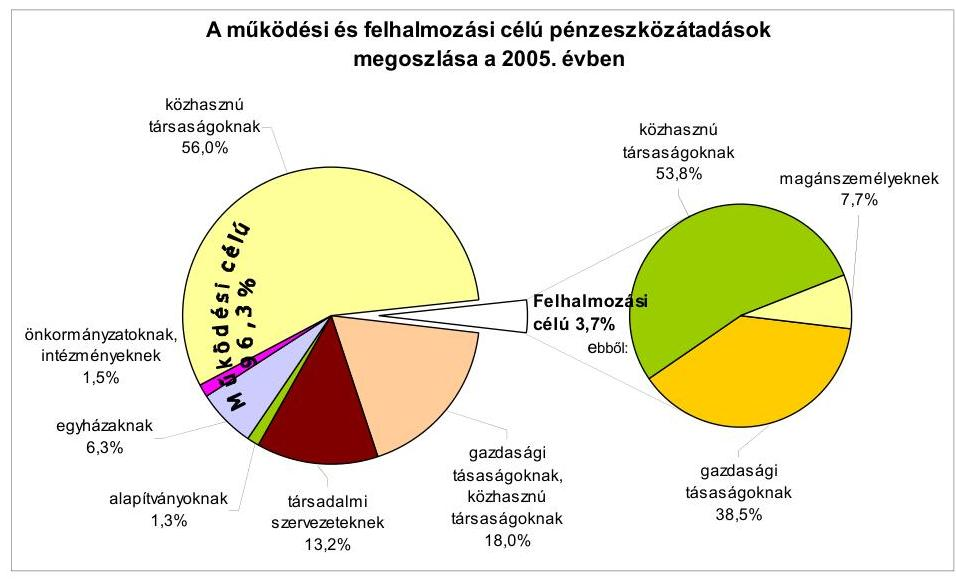
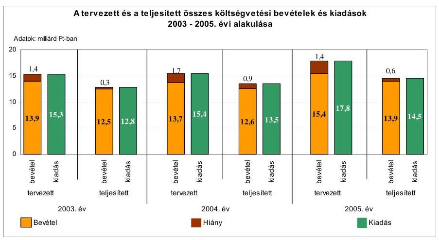
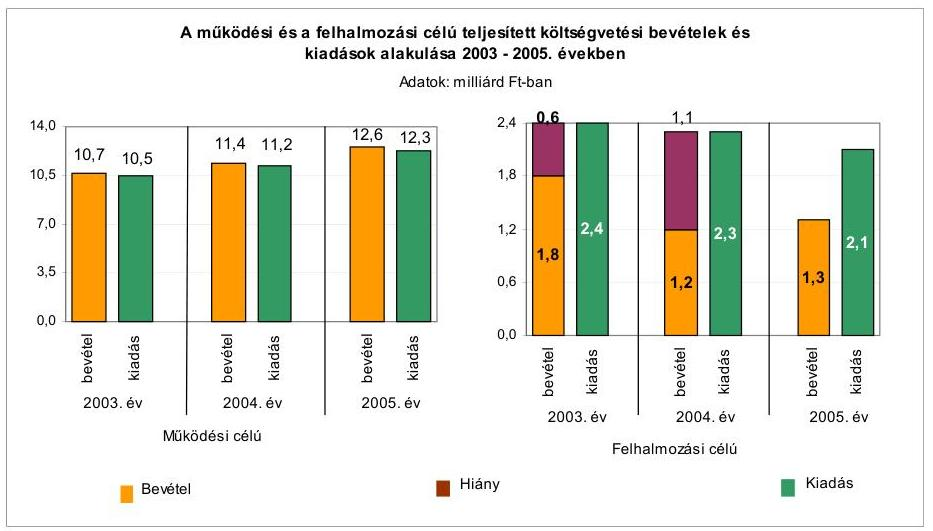
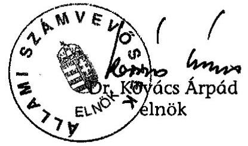
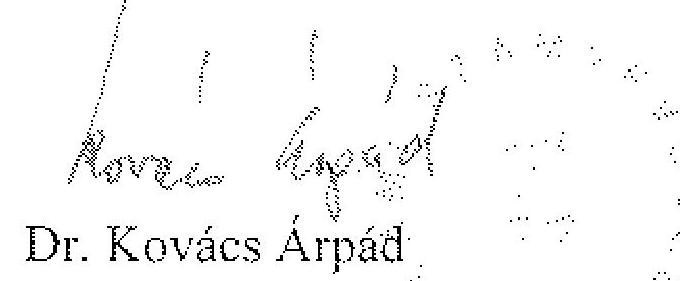

# JELENTÉS 

a Hódmezővásárhely Megyei Jogú Város Önkormányzata gazdálkodási rendszerének 2006. évi átfogó ellenőrzéséről

---

3. Önkormányzati és Területi Ellenőrzési Igazgatóság
3.3. Átfogó Ellenőrzések Főcsoport
Iktatószám: V-1003-5/35/18/2006.
Témaszám: 803
Vizsgálat-azonosító szám: V0277
Az ellenőrzést felügyelte:
Dr. Lóránt Zoltán
főigazgató
Az ellenőrzés végrehajtásáért felelős:
Dr. Sepsey Tamás
főigazgató-helyettes
Az ellenőrzést vezette:
Csecserits Imréné
főcsoportfőnök-helyettes
Az ellenőrzést végezték:
Benkéné dr. Lavner Klára
számvevő tanácsos
Csiszárné dr. Kosik Mária
számvevő tanácsos
Dr. Klapcsik László
főtanácsadó

# A témához kapcsolódó - elmúlt három évben - készített számvevőszéki jelentések: 

címe
sorszáma
Jelentés a helyi és a helyi kisebbségi önkormányzatok gazdálkodásának 2001. évi átfogó ellenőrzéséről
Jelentés a helyi önkormányzatok beruházásaihoz és rekonstrukciói332
ihoz nyújtott 2002. évi címzett- és céltámogatások igénybevételének és felhasználásának helyszíni ellenőrzéséről
Jelentés a középiskolai kollégiumok fenntartásának és fejlesztésének ellenőrzéséről

---

# TARTALOMJEGYZÉK 

BEVEZETÉS ..... 7
I. ÖSSZEGZŐ MEGÁLLAPÍTÁSOK, KÖVETKEZTETÉSEK, JAVASLATOK ..... 9
II. RÉSZLETES MEGÁLLAPÍTÁSOK ..... 19

1. A költségvetés tervezésének, végrehajtásának, az Önkormányzat vagyongazdálkodásának és a zárszámadás elkészítésének szabályszerűsége ..... 19
1.1. A költségvetési rendelet jóváhagyásának, módosításának, az előirányzatok nyilvántartásának szabályszerűsége ..... 19
1.2. A gazdálkodás szabályozottsága, a bizonylati rend és fegyelem szabályszerűsége ..... 25
1.3. A pénzügyi-számviteli feladatok ellátásának informatikai támogatottsága ..... 33
1.4. Az önkormányzati vagyon nyilvántartása, számbavétele ..... 34
1.5. A vagyonnal való gazdálkodás szabályszerűsége, célszerűsége, nyilvánossága ..... 37
1.6. A céljelleggel nyújtott támogatások szabályszerűsége ..... 45
1.7. A közbeszerzési eljárások szabályszerűsége ..... 49
1.8. A zárszámadási kötelezettség teljesítésének szabályszersége ..... 53
1.9. A Polgármesteri hivatal helyi kisebbségi önkormányzatok gazdálkodását segítő tevékenysége ..... 55
2. Az önkormányzati feladatok és a rendelkezésre álló források összhangja ..... 56
2.1. A feladatok meghatározása és szervezeti keretei ..... 56
2.2. A költségvetés egyensúlyának helyzete ..... 60
2.3. A feladatok finanszírozása ..... 67
3. A belső ellenőrzési rendszer működésének értékelése ..... 70
3.1. Az ellenőrzési rendszer kialakítása, működése ..... 70
3.2. A könyvvizsgálati kötelezettség teljesítése ..... 74
3.3. A korábbi számvevőszéki ellenőrzések javaslatainak hasznosulása ..... 74

---

# MELLÉKLETEK 

1. számú Az Önkormányzat gazdálkodását meghatározó adatok, mutatószámok (1 oldal)
2. számú Az önkormányzati vagyon nagyságának alakulása (1 oldal)
3. számú Az Önkormányzat 2005. évi bevételeinek és kiadásainak alakulása (1 oldal)
4. számú Egyes önkormányzati feladatok finanszírozása (1 oldal)
5. számú Helyszíni ellenőrzési jegyzőkönyv (4 oldal)
6. számú Dr. Lázár János úr, Hódmezővásárhely Megyei Jogú Város Önkormányzata polgármesterének észrevétele (5 oldal)
7. számú Dr. Korsós Ágnes jegyző úrhölgy és Dr. Végh Ibolya aljegyző úrhölgy közös kiegészítő észrevétele (3 oldal)
8. számú Észrevételekre adott válaszlevél (1 oldal)

---

# RÖVIDÍTÉSEK JEGYZÉKE 

## Törvények

Áfa tv.
Az általános forgalmi adóról szóló 1992. évi LXXIV. törvény
Áht.
Az államháztartásról szóló 1992. évi XXXVIII. törvény
Art.
Az adózás rendjéről szóló 2003. évi XCII. törvény
Fot. tv.
a fogyatékos személyek jogairól és esélyegyenlőségük biztosításáról szóló 1998. évi XXVI. törvény
Hatv.
a helyi adókról szóló 1990. évi C. törvény
Htv.
a helyi önkormányzatok és szerveik, a köztársasági megbízottak, valamint egyes centrális alárendeltségú szervek feladat- és hatásköreiről szóló 1991. évi XX. törvény
Kbt.
a közbeszerzésekről szóló 2003. évi CXXIX. törvény
Ksztv.
a közhasznú szervezetekről szóló 1997. évi CLVI. törvény
Kt.
a közoktatásról szóló 1993. évi LXXIX. törvény
Nek. tv.
a nemzeti és etnikai kisebbségek jogairól szóló 1993. évi LXXVII. törvény

Ötv.
a helyi önkormányzatokról szóló 1990. évi LXV. törvény
Számv. tv.
a számvitelről szóló 2000. évi C. törvény
Szoc. tv.
a szociális igazgatásról és a szociális ellátásokról szóló 1993. évi III. törvény
Vt.
a vízgazdálkodásról szóló 1995. évi LVII. törvény
Rendeletek:
Ámr.
az államháztartás múködési rendjéről szóló 217/1998. (XII. 30.) Korm. rendelet

Ber.
a költségvetési szervek belső ellenőrzéséről szóló 193/2003. (XI. 26.) Korm. rendelet
kisebbségi kormányrendelet
a 20/1995. (III. 3.) Korm. rendelet a Kisebbségi Önkormányzatok költségvetésének és gazdálkodásának, vagyonjuttatásának egyes kérdéseiről
Vhr.
az államháztartás szervezetei beszámolási és könyvvezetési kötelezettségének sajátosságairól szóló 249/2000. (XII. 24.) Korm. rendelet
2005. évi költségvetési
Hódmezővásárhely Megyei Jogú Város Önkormányzatának 11/2005. (II. 11.) számú rendelete a 2005. évi költségvetéséről
2006. évi költségvetési rendelet
Hódmezővásárhely Megyei Jogú Város Önkormányzatának 13/2006. (II. 27.) számú rendelete a 2006. évi költségvetéséről
2004. évi zárszámadási
Hódmezővásárhely Megyei Jogú Város Önkormányzatának 23/2005. (IV. 29.) számú rendelete a 2004. évi zárszámadásról rendelet

---

2005. évi zárszámadási rendelet

SzMSz
vagyongazdálkodási rendelet

## Szórövidítések:

ÁSZ
CÉDE
Döntőbizottság
Erzsébet kórház
FEUVE
FVM
gazdálkodási szabályzat
informatikai biztonsági szabályzat
jegyző
közbeszerzési szabályzat
Közgazdasági iroda
Közgyúlés
leltározási és leltárkészítési szabályzat

MÁK
MFB Rt.
ÖNHIKI
Önkormányzat
pénz- és értékkezelési
szabályzat
Pénzügyi gazdasági bizottság
polgármester

Hódmezővásárhely Megyei Jogú Város Önkormányzatának 16/2006. (V. 8.) számú rendelete a 2005. évi zárszámadásról
Hódmezővásárhely Megyei Jogú Város Önkormányzatának 35/1994. (XII. 7.) számú rendelete a Hódmezővásárhely Megyei Jogú Város Közgyűlésének Szervezeti és Múködési Szabályzatáról
Hódmezővásárhely Megyei Jogú Város Önkormányzatának a vagyonnal való gazdálkodás szabályairól szóló 50/1995. (XII. 7.) számú rendelete

Állami Számvevőszék
céljellegú decentralizált támogatás
Közbeszerzési Döntőbizottság
Hódmezővásárhely Megyei Jogú Város Önkormányzata Erzsébet Kórház és Rendelőintézet
folyamatba épített, előzetes és utólagos vezetői ellenőrzés
Földmúvelésügyi és Vidékfejlesztési Minisztérium
Hódmezővásárhely Megyei Jogú Város Önkormányzata Polgármesteri Hivatalának gazdálkodási jogkörökről szóló szabályzata
Hódmezővásárhely Megyei Jogú Város Önkormányzata Polgármesteri Hivatalának Informatikai Biztonsági szabályzata
Hódmezővásárhely Megyei Jogú Város Önkormányzata Polgármesteri Hivatalának jegyzője
Hódmezővásárhely Megyei Jogú Város Önkormányzata Polgármesteri Hivatalának Közbeszerzési szabályzata
Hódmezővásárhely Megyei Jogú Város Önkormányzata Polgármesteri Hivatalának Közgazdasági Irodája
Hódmezővásárhely Megyei Jogú Város Önkormányzat Közgyűlése
Hódmezővásárhely Megyei Jogú Város Önkormányzata Polgármesteri Hivatalának leltározási és leltárkészítési szabályzata
Magyar Államkincstár
Magyar Fejlesztési Bank Rt.
az önhibájukon kívül hátrányos helyzetbe került önkormányzatok kiegészítő támogatása
Hódmezővásárhely Megyei Jogú Város Önkormányzata Hódmezővásárhely Megyei Jogú Város Önkormányzata Polgármesteri Hivatalának pénz- és értékkezelési szabályzata
Hódmezővásárhely Megyei Jogú Város Önkormányzata Közgyűlésének Pénzügyi Gazdasági Bizottsága
Hódmezővásárhely Megyei Jogú Város Önkormányzata polgármestere

---

| Polgármesteri hivatal | Hódmezővásárhely Megyei Jogú Város Önkormányzatának Polgármesteri Hivatala |
| :-- | :-- |
| selejtezési szabályzat | Hódmezővásárhely Megyei Jogú Város Önkormányzata |
|  | Polgármesteri Hivatalának selejtezési szabályzata |
| TERKI | területi kiegyenlítő támogatás |
| VÁB | Vagyonátadó Bizottság |

---

.

---

# JELENTÉS 

## a Hódmezővásárhely Megyei Jogú Város Önkormányzata gazdálkodási rendszerének 2006. évi átfogó ellenőrzéséről

## BEVEZETÉS

Az Ötv. 92. § (1) bekezdése, az Állami Számvevőszékről szóló 1989. évi XXXVIII. törvény 2. § (3) bekezdése, valamint az Áht. 120/A. § (1) bekezdése alapján az önkormányzatok gazdálkodását az Állami Számvevőszék ellenőrzi. Az ellenőrzésre az Országgyűlés illetékes bizottságai részére is átadott, országosan egységes ellenőrzési program alapján került sor.

## Az ellenőrzés célja annak értékelése volt, hogy:

- az önkormányzati gazdálkodás törvényességét ${ }^{1}$, szabályszerűségét biztosított-ák-e a tervezés, a költségvetés végrehajtása, a vagyongazdálkodás és a zárszámadás során;
- az Önkormányzat által ellátott feladatok és az azokhoz rendelkezésre álló források összhangja biztosított volt-e, különös tekintettel egyes kiemelt feladatokra;
- a gazdálkodás szabályszerűségét biztosító kontrollok ${ }^{2}$ megfelelően segitettéke a végrehajtást.

Az ellenőrzött időszak: a 2005. év és 2006. I. félév, valamint az 1.5., 2.1-2.3. és 3.3. ellenőrzési programpontok esetében a 2003-2004. évek is.

Hódmezővásárhely Megyei Jogú Város lakosainak száma 2006. január 1-jén 47823 fő volt. Az Önkormányzat 24 tagú Közgyűlésének munkáját tíz állandó bizottság segítette. A polgármester a 2002. év óta látja el feladatát, a jegyző 2001 óta vezeti a Polgármesteri hivatalt. A Polgármesteri hivatalban dolgozó köztisztviselők száma 2006. január 1-jén 194 fő, a költségvetési intézményekben foglalkoztatott közalkalmazottak száma 2162 volt.

[^0]
[^0]:    ${ }^{1}$ A törvényi előírások betartásának elmulasztásakor a részletes megállapítások fejezetben egységesen a törvénysértés megjelölést alkalmazzuk, mivel az ÁSZ nem tehet különbséget a törvényi előírások között.
    ${ }^{2}$ A gazdálkodás szabályszerűségét biztosító kontroll alatt értjük a kiépített és működő belső irányítási és szabályozási rendszert, valamint a belső ellenőrzési funkciók ellátását.

---

Az Önkormányzat által fenntartott költségvetési intézmények száma 2005. december 31 -én 35 volt, melyből hat önálló és 29 részben önálló gazdálkodási jogkörrel rendelkezett. Ezen felül az Önkormányzatnak 21 társaságban van részesedése, üzletrésze, ebből 6 társaságnak 100\%-ban tulajdonosa, amelyek közremúködnek a kötelező feladatok és a különböző közszolgáltatások ellátásában.

A városban két - cigány és német - kisebbségi önkormányzat múködött 20032006. között.

Az Önkormányzat a 2005. évben 13902 millió Ft költségvetési bevételből gazdálkodott, s a 2006. évre 13810 millió Ft költségvetési bevételt irányoztak elő. A teljesített költségvetési kiadás a 2005. évben 14549 millió Ft volt. Az Önkormányzat vagyona a 2005. december 31-i könyvviteli mérleg szerint 27715 millió Ft, az adósságállomány értéke 8274 millió Ft volt. Az Önkormányzat gazdálkodását meghatározó adatokat, mutatószámokat a jelentés 1-3. számú mellékletei tartalmazzák.

A jelentés megállapításainak, javaslatainak egyeztetése során a polgármester úr arról adott tájékoztatást, hogy az időközben megtett intézkedésekkel a javaslatok egy részét megvalósították. Ezekben az esetekben a jelentés II. Részletes megállapítások fejezetében az adott témához kapcsolt lábjegyzetben a megtett intézkedést feltüntettük és a kapcsolódó javaslatot elhagytuk.

A jelentést az ÁSZ-ról szóló 1989. évi XXXVIII. tv. 25. § (1) bekezdése alapján észrevétel közlése céljából megküldtük a Hódmezővásárhely Megyei Jogú Város Önkormányzata polgármesterének. A kapott észrevételeket a jelentés 6. és 7. számú mellékletei tartalmazzák.

---

# I. ÖSSZEGZŐ MEGÁLLAPÍTÁSOK, KÖVETKEZTETÉSEK, JAVASLATOK 

Az Önkormányzat a 2006. évben rendelkezett a feladatokat hosszabb távra kijelölő gazdasági programmal, amely alkalmas volt arra, hogy alapját képezze az éves gazdálkodást megalapozó költségvetési tervezőmunkának. A 2005. és a 2006. évekre vonatkozó költségvetési koncepciókat az Ámr. előírásainak megfelelően a helyben képződő bevételek és az ismert kötelezettségek figyelembevételével készítették el, és azok tartalmazták a költségvetés készítésének további feladatait is. A polgármester az Ámr. előírása ellenére a költségvetési koncepciók előterjesztéséhez nem csatolta a Pénzügyi gazdasági bizottságnak az adott évi költségvetési koncepcióról alkotott véleményét.

A Közgyűlés rendeletben nem határozta meg az Áht. szerinti mérlegek, kimutatások tartalmi követelményeit. A polgármester a 2005. és a 2006. évi költségvetési rendelettervezeteket az Áht-ban előírt határidőn belül terjesztette jóváhagyásra a Közgyűlés elé. A 2005. és a 2006. évben a költségvetési rendelettervezetek összeállítását megelőzően az Ámr. előírása ellenére a jegyző az intézményekkel történt költségvetési egyeztetések eredményét egyező álláspont esetén elmulasztotta írásban rögzíteni. A polgármester a költségvetési rendeletek előterjesztéséhez az Ámr. előírása ellenére a Pénzügyi gazdasági bizottság véleményét nem csatolta. A jegyző a 2005. és a 2006. évi költségvetési rendelettervezetben a helyi kisebbségi önkormányzatok költségvetési határozatait az Ámr. előírása ellenére nem változatlan formában építette be. A 2005. és a 2006. évi költségvetési rendelettervezetekben az Áht-ban foglaltakat megsértve, a költségvetési bevételek és a költségvetési kiadások között finanszírozási célú pénzügyi műveletet mutattak ki, a költségvetési bevételek és kiadások különbözeteként a hiány összegét nem mutatták be.

Az Önkormányzat 2005. és a 2006. évi költségvetési rendeletei az Áht-ban foglalt előírásoknak megfelelően tartalmazták a címrendet, de a költségvetések szerkezete nem volt összhangban a címrenddel. A költségvetési rendeletek szerkezete nem felelt meg az Áht-ban és az Ámr-ben foglalt követelményeknek, mert az Önkormányzat bevételeit forrásonként nem az Ámr-ben foglalt előírás alapján, a pénzügyminiszter elemi költségvetés összeállítására vonatkozó tájékoztatójában rögzített főbb jogcím-csoportonkénti részletezettséggel rögzítették. A személyi jellegű kiadásokat, a munkaadókat terhelő járulékokat, a dologi jellegű kiadásokat az Önkormányzat által kijelölt felhalmozások előirányzatait az Áht. előírását megsértve nem határozták meg Önkormányzatra összesítve. Intézményenként az Ámr-ben foglalt előírás ellenére nem mutatták ki a felújítási előirányzatokat célonként, a felhalmozási kiadásokat feladatonként. A költségvetési rendeletben az egyéni képviselők részére történt költségvetési előirányzat felhasználásának saját hatáskörben történő biztosításával megsértették az Ötv. hatáskör átruházásra vonatkozó előírását. A Közgyűlés által a költségvetési rendeletekben az egyéni képviselők részére biztosított támogatási keretösszegek alapként való megnevezése nem felel meg az Áht-ban előírt feltételeknek, a kifejezés félreérthető. A Közgyűlés a 2005. évi költségvetés főösszegét év közben a költségvetési rendelet módosításai során $31 \%$-kal növelte. Az elő-

---

irányzat-változásokat hitelt érdemlően dokumentálták és nyilvántartották. A 2005. évi költségvetés utolsó módosításánál nem tartották be az Ámr-ben meghatározott határidőt. A 2005. évben a Közgyűlés rendeletével, határozatával elrendelt feladatváltozásokhoz kapcsolódó módosításokat az Ámr-ben foglalt előírás ellenére a Polgármesteri hivatalnál nem végezték el 2005. december 31-ig. A helyi kisebbségi önkormányzatok 2005. évi költségvetési előirányzatait az Áht-ban foglaltakat megsértve a helyi kisebbségi önkormányzatok erre vonatkozó határozatai nélkül módosították.

A Polgármesteri hivatal ügyrendje tartalmazta a Polgármesteri hivatal feladatait, szervezeti felépítését és múködésének rendszerét, szervezeti egységeinek a megnevezését. A gazdasági szervezet (Közgazdasági iroda) az Ámr-ben foglalt előírással összhangban rendelkezett ügyrenddel. A gazdálkodási és ellenőrzési jogkörök gyakorlásának szabályait a polgármester és a jegyző a gazdálkodási jogkörök szabályzatában határozta meg. A jegyző kijelölte a szakmai teljesítés igazolására jogosultakat, meghatározta a szakmai teljesítés igazolás módját, az érvényesítési feladatokra adott megbízásoknál az iskolai végzettségre és szakmai képesítésre vonatkozó követelményeket betartotta. Az Ámr-ben foglalt összeférhetetlenségi követelményt biztosították. A kötelezettségvállalásra, utalványozásra és azok ellenjegyzésére felhatalmazottak beszámoltatásának rendjét nem alakították ki és beszámoltatásuk nem történt meg. A Gazdálkodási jogkörök szabályzatában előírt a Polgármesteri hivatalnál alkalmazandó „Utalvány" minta nem tartalmazza az Ámr-ben foglaltakat, nem szerepel rajta a költségvetési év, a befizető, vagy a kedvezményezett megnevezése.

A Htv. előírásainak megfelelően a jegyző kialakította az Önkormányzat költségvetési szerveinek egységes számviteli rendjét. A jegyző a Polgármesteri hivatalra vonatkozóan elkészítette a számviteli politikát, a kapcsolódó szabályzatokat és a számlarendet. A számviteli politikában meghatározták, hogy a számviteli elszámolás és értékelés szempontjából mit tekintenek lényegesnek, nem lényegesnek, jelentős és nem jelentős összegnek. A leltározási szabályzat tartalmazta a leltározás célját, a leltározásban részt vevők feladatait, felelősségük meghatározását. Az eszközök és források értékelési szabályzatában szerepeltek az eszközök értékelésének eszközcsoportonkénti szabályai, a terven felüli értékcsökkenés, az értékvesztés, az értékvesztés visszaírásának rendje. A pénz-és értékkezelési szabályzatban a bankszámla- és készpénz gazdálkodás szabályait, a selejtezési szabályzatban a feleslegessé vált vagyontárgyak selejtezésével kapcsolatos feladatokat, döntési jogköröket rögzítették.

A számlarend a Számv. tv-ben és a Vhr-ben foglaltak szerint tartalmazta többek között az alkalmazandó főkönyvi számlák megnevezését, a főkönyvi számlák és az analitikus nyilvántartások kapcsolatát, az analitikus nyilvántartások formáját, tartalmát. A Polgármesteri hivatal számviteli politikája a Vhr-ben foglalt előírás ellenére nem tartalmazta a kisebbségi önkormányzati gazdálkodással összefüggő sajátos feladatokat. A munkaköri leírásokban meghatározták az ellátandó tevékenységekkel kapcsolatos feladat-, hatás- és felelősségi köröket, a helyettesítés rendjét. A gazdálkodási szabályzatokban és a munkaköri leírásokban az ellenőrzésre, egyeztetésre vonatkozó előírások összhangban álltak egymással. A jegyző elkészítette a Polgármesteri hivatal folyamatba épített előzetes és utólagos vezetői ellenőrzési rendszerét, melynek része a Polgármesteri hivatal táblázatos és szöveges ellenőrzési nyomvonala, mely az

---

SzMSz mellékletét képezte. Ezzel egy időben a jegyző elkészítette a szabálytalanságok kezelésének eljárásrendjét és a kockázatkezelés rendjét.

A költségvetést terhelő kötelezettségvállalásokat az Ámr-ben foglalt előírásnak megfelelően írásba foglalták. A gazdasági eseményekről a Számv. tv-ben előírt számviteli bizonylatokat kiállították. A gazdasági eseményeket rögzítő bizonylatok 8\%-ánál megsértették a Számv. tv-ben foglalt alaki, tartalmi követelményeket, mivel a bizonylatok 2\%-ánál hiányzott a bizonylat azonosítója, 1\%-ánál a bizonylat kiállítójának megjelölése. Az Ámr-ben foglalt előírások ellenére a bizonylatok 12\%-nál a kötelezettségvállalás ellenjegyzőjének, 3\%-nál a szakmai teljesítés igazolójának, 5\%-nál az érvényesítőnek, 7\%-nál az utalványozás ellenjegyzőjének, 3\%-nál az utalványozónak az aláírása hiányzott. Ezekben az esetekben az Ámr. előírásai ellenére az érvényesítő nem észrevételezte a bizonylatok alaki-tartalmi követelményei közül a kötelezettségvállalás ellenjegyzésének és a szakmai teljesítés igazolásának az elmaradását, az utalvány ellenjegyzője nem kifogásolta a kötelezettségvállalás ellenjegyzésének, a szakmai teljesítés igazolásának és az érvényesítésnek a hiányát.

A gazdasági műveleteket tartalmazó bizonylatok a Számv. tv. előírásának megfelelően tartalmazták az érintett könyvviteli számlákra történő hivatkozást, azonban a Számv. tv-ben foglalt előírást megsértve a bizonylatok 4,4\%-ánál nem rögzítették a könyvviteli nyilvántartásba vétel időpontját, 1\%-ánál a könyvviteli nyilvántartásba történő rögzítés igazolását. Az utalványrendeletek 58\%-a az Ámr. előírása ellenére nem tartalmazta a kötelezettségvállalás nyilvántartásba vételének sorszámát. Az arra jogosultak, illetve felhatalmazottak aláírásukkal igazolták a pénztári és a bankszámla pénzmozgások utalványrendeletein, illetve bizonylatain a kötelezettségvállalást, kötelezettségvállalás ellenjegyzését, a szakmai teljesítés igazolását, az érvényesítést, az utalvány ellenjegyzését, az utalványozást. Az elszámolásra felvett összeggel határidőben történő elszámolás visszatérően előforduló hiányát a pénztáros a pénzkezelési szabályzatban előírtak alapján rendszeresen jelezte a jegyzőnek, azonban a pénztárellenőr a mulasztást a pénztárossal és az előleget felvett dolgozókkal aláíratott jegyzőkönyvben - a pénzkezelési szabályzatban előírtak ellenére - nem rögzítette. A jegyző az elszámolási kötelezettséget határidőben nem teljesítők felelősségre vonásáról annak ellenére nem gondoskodott, hogy a mulasztásról a pénztárostól és a belső ellenőrtől rendszeresen kapott jelentéseket és az ezek alapján tett felszólításai nem vezettek eredményre. Nem végezte el az ellenőrzési feladatát a szakmai teljesítést igazoló a pénzkezelési szabályzatban meghatározott összegnél nagyobb összegű elszámolásra felvett összeg kifizetéséhez kapcsolódóan, mert a kifizetés jogszerútlenségét nem észrevételezte. A pénzkezelési szabályzatban előírtaknak nem megfelelő összegre vonatkozó kötelezettségvállalást és kifizetési utalványokat az azok ellenjegyzésére jogosult ellenjegyezte, annak szabálytalanságát az Ámr. előírása ellenére nem jelezte a kötelezettségvállaló, az utalványozó és a jegyző részére.

Az Önkormányzat 2005. évi zárszámadásának adatai szerint önkormányzati szinten a kiemelt kiadási előirányzatokat betartották. A Polgármesteri hivatalnál a múködési és felhalmozási célú kiadási előirányzatok 20 jogcíménél, valamint négy intézménynél lépték túl a Közgyűlés által jóváhagyott, módosított költségvetési előirányzatot. A jóváhagyott költségvetési előirányzatok túllépésének okát nem vizsgálták, felelősségre vonás nem történt.

---

A Polgármesteri hivatalban a pénzügyi és számviteli feladatellátásban számítógépes megoldásokat alkalmaztak. A 2006. évtől bevezették az integrált számítógépes rendszert, melynek moduljai egymásra épülve kezelik az analitikus nyilvántartások, a pénzügyi és a főkönyvi könyvelés adatait. A Polgármesteri hivatal informatikai biztonsági szabályzatát a jegyző 2005. december 1-jén léptette életbe, amely tartalmazta a katasztrófa elhárítási tervet is. A Polgármesteri hivatal két évre szóló informatikai stratégiával rendelkezett. Az informatikai rendszer program részletezésű hozzáférési jogosultsági rendszerét kialakították, írásban rögzítették. Az informatikai rendszer üzemeltetési leírásával rendelkeztek, a pénzügyi-számviteli területen dolgozók munkaköri leírása tartalmazta az általuk elvégzendő számítástechnikai feladatokat.

A Polgármesteri hivatalban az önkormányzati vagyont forgalomképesség szerint elkülönítetten tartották nyilván. Az önkormányzati tulajdonban lévő, de két üzemeltetőnek kezelésre, üzemeltetésre átadott 755 millió Ft és 279 millió Ft értékű vagyont a Vhr. előírása ellenére nem az üzemeltetésre átadott eszközök között tartották nyilván. Az ingatlanok, üzemeltetésre, kezelésre átadott eszközök leltározását mennyiségi felvétellel, a részesedések, értékpapírok, követelések és kötelezettségek leltározását az analitikus nyilvántartások - követelések esetében egyenlegközlő levél alapján - egyeztetésével végezték. Az adósok, vevők és egyéb követelések év végi értékelését a Vhr-ben foglaltaknak megfelelően elvégezték. A 2005. évben az értékelést a Számv. tv. előírása ellenére nem végezték el egy társaságnál, az indokolt értékvesztés elszámolását - betartva a Számv. tv. előírását - kilenc társaságnál elvégezték és az indokolt értékvesztést elszámolták.

Az Önkormányzat a vagyongazdálkodás szabályait, a döntési jogköröket a vagyongazdálkodásról, a nem lakás céljára szolgáló helyiségek elidegenítéséről, valamint a nem lakás céljára szolgáló helyiségek bérletéről szóló rendeletekben határozta meg. A vagyongazdálkodási hatásköröket vagyoncsoportonként, értékhatártól függően, a hasznosítás módjára tekintettel, differenciáltan állapították meg. A vagyongazdálkodási rendelet előírása szerint négymillió Ft feletti értékű vagyont elidegeníteni, a használat és hasznosítás jogát átengedni versenytárgyalás útján lehet, azonban az Áht. előírását megsértve lehetőséget biztosítottak a versenyeztetés mellőzésére. A vagyongazdálkodási rendeletben indokoltsága ellenére nem szabályozták a vagyon forgalomképesség szerinti besorolásának megváltoztatási módját. Meghatározták az ingyenes vagyonátadás, követelésről való lemondás módját, de az Áht. előírását megsértve nem határozták meg azok eseteit.

Az Önkormányzat vagyongazdálkodással kapcsolatos döntései a költségvetésben megfogalmazott programcélokkal összhangban voltak. A vagyont érintő döntések során betartották a vagyongazdálkodási rendeletben rögzített hatásköri szabályokat. Az ingatlanok értékesítése során a versenyeztetés mellőzésével megsértették az Áht. előírását. Az Önkormányzat a fejlesztési célú támogatások és a vagyont érintő - az Áht-ban meghatározott értékhatár feletti szerződések közzétételi kötelezettségét a 2004. és 2005. évben nem teljesítette. Az Önkormányzat a vagyongazdálkodási rendeletben rögzített szabályok alapján öt párt részére térítésmentes vagy kedvezményes helyiséghasználat biztosításával az Ötv. előírásai ellenére nem közfeladat ellátásához nyújtott támoga-

---

tást a pártok részére, ezáltal nem biztosította az alkotmányos egyenlőséget a bérlők között.

A céljelleggel - nem szociális ellátásként - nyújtott támogatások az éves költségvetési rendeletben kerültek meghatározásra. A céljellegú támogatások feletti rendelkezés feltételeinek, jóváhagyásának, folyósításának, felhasználásának, a számadási kötelezettség teljesítésének a rendeltetésszerú felhasználás ellenőrzésének önkormányzati szinten egységes szabályozása indokoltsága ellenére nem történt meg. Az Önkormányzat által céljelleggel nyújtott támogatásokról a Polgármesteri hivatalban nem vezettek olyan nyilvántartást, amelyből a támogatás célja, a számadási kötelezettség előírása, a számadás és a rendeltetésszerű felhasználás ellenőrzése megállapítható lett volna. A támogatásokról a döntést a Közgyűlés, a bizottságok, a Közgyűlés elnöke és az Ötv. előírását megsértve a képviselők hozták meg. Az alapítványok támogatásának közel egyharmadáról az Ötv. előírását megsértve nem a Közgyűlés, hanem a képviselők, s a polgármester döntött. A közhasznú szervezetek részére biztosított pénzeszközök átadásáról, az elszámolás módjáról, határidejéről a támogatási szerződésekben állapodtak meg. A támogatott szervezetek 72\%-a az Áht-ban meghatározott számadási kötelezettséget határidőben teljesítette, a számadások számszaki ellenőrzését a Polgármesteri hivatal elvégezte. Az Önkormányzat tulajdonában, résztulajdonában lévő társaságoknak a 2005. évben nyújtott támogatások felhasználásáról szóló előterjesztést a társaságok 2005. évi beszámolójának megtárgyalásával a Közgyűlés elfogadta. Az elnöki és a bizottsági keretek terhére adott támogatások felhasználásáról kapott elszámolások felülvizsgálatát a szakirodák ügyintézői végezték. A számadási kötelezettséget nem teljesítők esetében a támogatás visszafizettetésének elmulasztásával, és a további támogatás felfüggesztésének elmulasztásával megsértették az Áht-ban előírtakat.

Az Önkormányzat a Kbt. szerint a törvény hatálya alá tartozó ajánlatkérőnek minősül. A Közgyűlés a Kbt. felhatalmazása alapján határozatban rögzítette az önkormányzati beszerzések eljárási rendjét. A Polgármesteri hivatal határidőben elkészítette a 2005. évi és a 2006. évi közbeszerzési tervét. A Polgármesteri hivatalnál az ajánlatkérő nevében eljáró és az eljárásba bevont személyek megfelelő közbeszerzési és pénzügyi szakértelemmel rendelkeztek. A Polgármesteri hivatalnál a lefolytatott közbeszerzési eljárások ellenőrzését a Polgármesteri hivatal Ellenőrzési csoportjának feladatául határozták meg, azonban a Kbt-ben előírt ellenőrzési kötelezettségnek nem tettek eleget. A beszerzések becsült értékének meghatározásánál betartották a Kbt-ben előírtakat. A 2005. évben a Polgármesteri hivatal 74 közbeszerzési eljárást bonyolított le. A Polgármesteri hivatal az ellenőrzött közbeszerzési eljárásoknál a törvényi előírásokat betartotta. Az Önkormányzat által lefolytatott közbeszerzési eljárásokkal szemben jogorvoslati eljárás a 2005. évben három esetben indult a Közbeszerzések Tanácsa Közbeszerzési Döntőbizottságánál, amely bírságot szabott ki.

A polgármester a 2005. évi zárszámadási rendelettervezetet az Áht-ban előírt határidőn belül nyújtotta be a Közgyűlésnek. Az Áht-ban foglalt előírást megsértették, mert nem mutatták ki önkormányzati szinten a személyi jellegű kiadások, a munkaadókat terhelő járulékok, a dologi jellegű kiadások előirányzatainak teljesítését. Az Ámr-ben foglalt előírás ellenére intézményenként nem mutatták be a felújítási előirányzatokat és teljesítésüket célonként, a fel-

---

halmozási kiadásokat és teljesítésüket feladatonként. A Polgármesteri hivatal 2005. évi helyesbített pénzmaradványának megállapítása az Ámr. és Vhr. előírásoknak megfelelően történt. A Közgyűlés a 2005. évi pénzmaradvány összegét költségvetési szervenként hagyta jóvá. A költségvetési szervezet az éves számszaki beszámolójuk és múködésük elbírálásáról, jóváhagyásáról az Ámrben előírtak ellenére írásban nem értesítették.

A Polgármester valamennyi helyi kisebbségi önkormányzattal megkötötte az együttmúködési megállapodást, amelyet a Közgyűlés és a kisebbségi önkormányzatok képviselőtestületei jóváhagytak. Az együttműködési megállapodások felülvizsgálatát elvégezték, a szükséges módosítás megtörtént. A megállapodások tartalmazták a kisebbségi önkormányzatok gazdálkodásának végrehajtására a Polgármesteri hivatal, valamint a költségvetés és zárszámadás előkészítésére a jegyző felkérését. A megállapodásokban meghatározták a költségvetési és zárszámadási határozatok benyújtásának határidejét, a Polgármesteri hivatal részére az átadásának az időpontját, a költségvetési előirányzatok módosításának rendjét. A kisebbségi önkormányzatok testületi múködésének feltételeit az Önkormányzat biztosította. Az SzMSz-ben meghatározták a Nek. tv. előírásainak megfelelően, hogy a Polgármesteri hivatal milyen módon köteles segíteni a helyi kisebbségi önkormányzatok munkáját.

Az Önkormányzat az Ötv. előírásai ellenére nem határozta meg, hogy a lakosság igényeitől és anyagi lehetőségeitől függően, mely feladatokat milyen mértékben és módon lát el. Az önkormányzati feladatok ellátását elsősorban az Önkormányzat által alapított 35 intézmény útján biztosították. A feladatok szervezeti megoldásának felülvizsgálata, az ágazati feladatok értékelése után hozott közgyűlési döntések, intézkedési tervek részterületeket érintő átszervezései az oktatási és szociális tagintézmények összevonására, intézményi feladat átadása egyházi szervezet múködtetésébe, az Önkormányzat társulásokban történő részvételére és azok átszervezésére irányultak. 2006. I. negyedévében az Önkormányzat új intézményt alapított, ezzel a város eddig önállóan múködő szociális intézményeit egységes rendszerbe szervezte.

Az Önkormányzat a 2003-2005. években költségvetését forráshiánnyal tervezte, amelynek fedezetére hitelfelvétellel számolt. A költségvetés tervezésekor 2004-2005-ben a várható pénzmaradvány összegét bevételként nem tervezték meg. A tervezett hiány összegének kialakulását a felhalmozási célú bevételeknél magasabb összegben tervezett felhalmozási célú kiadások okozták. Növelte a 2005. évi tervezett költségvetési hiányt, hogy a múködési bevételek 11,3\%-os növekedése mellett a múködési kiadások 17,1\%-os növekedésével számoltak a 2004. évi tervadatokhoz viszonyítva. A 2005. évi költségvetési hiány kialakulásában szerepet játszottak a korábbi évek finanszírozási célú pénzügyi műveletei. A 2003-2005. években az Önkormányzati szinten mutatkozó hiányt a költségvetések végrehajtása során csökkentette, hogy a módosított múködési célú bevételi előirányzatok teljesítési szintje meghaladta a módosított múködési célú kiadások teljesítési szintjét. A forráshiányt növelte, hogy a módosított felhalmozási célú kiadások teljesítési szintje a 2003. és a 2005. évben meghaladta a módosított felhalmozási célú bevételek teljesítési szintjét, 2003-ban 10,7\%kal, 2004-ben 24,6\%-kal, 2005-ben 9,5\%-kal. Az Önkormányzatnak 2003-2005 között a tervezett múködési célú hiánnyal szemben múködési célú bevételi többlete volt, amelyet átcsoportosított a felhalmozási célú kiadásokra, melyek

---

aránya a 2003-2005. években a költségvetési kiadásokon belül 18,4\%-ról 14,6\%-ra csökkent. Kedvezőtlen tendencia, hogy a felhalmozási célú bevétel az összes költségvetési bevételhez viszonyítva csökkent.

A felhalmozási célú hitelállomány a 2004. évben 37,8\%-kal, 2005. évben 52,28\%-kal emelkedett az előző évhez viszonyítva. Az Önkormányzat folyó-számla- és likvid hitele 2003. december 31-én 363,9 millió Ft, 2004. december 31-én 580,4 millió Ft, 2005. december 31-én 612,6 millió Ft volt. A hitelfelvételek során az Ötv-ben foglalt előírás alapján vizsgálták és betartották a kötelezettségvállalás felső határát. Az adósságot keletkeztető kötelezettségvállalások a 2005. évben nem veszélyeztették az Önkormányzat fizetőképességét és működőképességét. A jegyző az Ámr-ben foglalt előírás alapján elkészítette és év közben aktualizálta a likviditási tervet.

A naturális mutatókkal mérhető oktatási-, nevelési- és szociális feladatok fajlagos kiadásai a 2003-2005. évek között a bölcsődei ellátásnál 23,2\%-kal, az óvodai nevelésnél 9,8\%-kal, az általános iskolai oktatás esetén 14,3\%-kal, a középiskolai oktatás esetén 16,3\%-kal, a nappali szociális ellátásnál 78,5\%-kal, míg a bentlakásos szociális ellátás esetében 32,5\%-kal növekedtek. A feladatok finanszírozásában az állami hozzájárulások, támogatások részaránya volt meghatározó, azonban annak aránya a bölcsődei- és óvodai ellátás kivételével csökkenő tendenciát mutatott. A nappali- és a bentlakásos szociális intézményi ellátásra fordított kiadásokon belül 2003-2005 között 16 százalékponttal nőtt az önkormányzati támogatás aránya. Az önként vállalt feladatokra a 20032005. években az éves költségvetési kiadások 11-6-4\%-át fordították, azok a gazdálkodás pénzügyi egyensúlyát és a kötelező feladatok ellátását nem veszélyeztették.

Az Önkormányzat a középületek akadálymentesítése érdekében a szükséges felméréseket elvégezte, amely szerint a tulajdonában lévő középületek $11 \%$-a volt akadálymentes a 2005. évben, a középületek akadálymentessé tételéhez 542 millió Ft-ra lenne szükség. Az Önkormányzat a fogyatékos személyek jogairól és esélyegyenlőségük biztosításáról szóló törvényi előírás ellenére 2005. január 1-jéig az akadálymentesítést 92 középületnél nem biztosította.

Az Önkormányzat kialakította a belső ellenőrzési kötelezettség teljesítéséhez szükséges szervezeti kereteket. A Polgármesteri hivatal és az intézmények ellenőrzési feladatainak ellátására az Áht-ban foglaltaknak megfelelően, közvetlenül a jegyzőnek alárendelve a Közgyűlés a 2004. évben létrehozta a belső ellenőrzési szervezeti egységet. Az Áht. előírásának megfelelően biztosították az Ellenőrzési iroda funkcionális függetlenségét. Az ellenőrzési feladatokat három fő látta el, a Ber-ben előírtak ellenére a belső ellenőrök számának meghatározásánál kapacitás-felmérést nem végeztek, stratégiai ellenőrzési tervet nem készítettek. A belső ellenőrzési vezető elkészítette a belső ellenőrzési kézikönyvet. Az éves ellenőrzési terv a Ber-ben foglaltaknak megfelelt. A 2005. évben a munkaidőalap 20\%-át, a 2006. évben a 40\%-át tervezték a soron kívüli feladatok elvégzésére. A 2005. évben az ellenőrzések végrehajtása a soron kívüli ellenőrzések miatt eltért az ellenőrzés munkatervében meghatározottaktól. A nem tervezett ellenőrzéseket bejelentések és egyéb jelzések miatt kezdeményezte a polgármester, és a jegyző ez alapján rendelte el. A Ber-ben előírtak ellenére 11 soron kívüli ellenőrzéshez nem készült ellenőrzési program. A belső

---

ellenőrzést ellátó személyeket megbízólevéllel látták el, akik az ellenőrzésről készült jelentéseket a Ber-ben foglaltaknak megfelelő tartalommal készítették el. A jegyző az Áht-ban foglalt kötelezettségének eleget téve beszámolt a Közgyűlésnek a Polgármesteri hivatalnál és intézményeinél végzett ellenőrzések tapasztalatairól, azonban a polgármester az Ötv-ben előírtak ellenére nem terjesztette a Közgyűlés elé az éves ellenőrzési jelentést, valamint az Áht-ban foglaltak ellenére a FEUVE múködtetéséről nem számolt be a Közgyűlésnek. A Közgyűlés a Htv-ben foglaltaknak megfelelően áttekintette az elvégzett ellenőrzések tapasztalatait, az ellenőrzési munkával kapcsolatos feladatot, követelményt, elvárást nem fogalmazott meg.

Az Önkormányzat az Ötv. előírása alapján könyvvizsgálatra volt kötelezett. A könyvvizsgáló kiválasztásánál és megbízásánál a szakmai követelményekre és az összeférhetetlenségre vonatkozó Ötv. előírásokat betartották. A könyvvizsgáló a Polgármesteri hivatal és intézményei összevont adatait tartalmazó 2005. évi egyszerűsített költségvetési beszámolót korlátozás nélküli hitelesítő záradékkal látta el.

A vizsgált időszakban három alkalommal folytatott az ÁSZ vizsgálatot az Önkormányzatnál. A gazdálkodás átfogó ellenőrzéséről készített jelentésben megfogalmazott javaslatok háromnegyede megvalósult. A javaslatok alapján a gazdálkodásra vonatkozó szabályzataikat módosították, (a Pénz- és értékkezelési szabályzatot kiegészítették), a belső ellenőrzés éves tevékenységéről a Közgyűlést tájékoztatják, kidolgozták a Polgármesteri hivatal informatikai stratégiáját, katasztrófa elhárítási tervet készítettek, a bevételek a lakásalap számlára folyamatosan átvezetésre kerülnek, a Pénzügyi gazdasági bizottság az általa ellátott feladatokról a Közgyűlést évente tájékoztatja. Nem biztosították, hogy az érvényesítés, a kötelezettségvállalás és utalványozás ellenjegyzés során az Ámr-ben foglaltak érvényesüljenek. A korábbi számvevőszéki javaslat ellenére is fennálló szabálytalanság volt, hogy a helyi kisebbségi önkormányzatok költségvetési előirányzatait - az Áht-ben foglaltakat megsértve - a kisebbségi önkormányzatok erre vonatkozó határozatai nélkül módosították. Az Önkormányzat beruházásaihoz és rekonstrukcióihoz nyújtott 2002. évi céltámogatások igénybevételének és felhasználásának ellenőrzése során megállapított céltámogatási maradványkeretről az ellenőrzésről készített jelentésben tett javaslat alapján a Közgyűlés lemondott. A középiskolai kollégiumok fenntartásának és fejlesztésének vizsgálata keretében tett célszerűségi javaslatokat az Önkormányzat figyelembe vette, kialakította a kollégiumi kötelező helyiségeket és a kötelező óraszámok tekintetében szakmai normatívákat határozott meg.

A helyszíni ellenőrzés megállapításainak hasznosítása mellett javasoljuk:

# a polgármesternek 

a jogszabályi előírások maradéktalan betartása érdekében
1. a költségvetési gazdálkodás jogszabályszerű kereteinek kialakítása céljából:
a) csatolja a költségvetési koncepcióhoz a Pénzügyi gazdasági bizottság véleményét az Ámr. 28. § (3) bekezdés alapján;

---

b) kezdeményezze a Közgyűlésnél az egyéni képviselői alap megszüntetését az Ötv. 9. § (3) bekezdésében foglalt, a hatáskör átruházására vonatkozó előírás betartása érdekében;
2. kezdeményezze, hogy az Ámr. 53. § (6) bekezdésében foglalt előírás betartása érdekében a Közgyűlés által elrendelt évközi feladatváltozásokhoz kapcsolódó költségvetési előirányzat módosításokat a tárgyév december 31-ig végezzék el;
3. biztosítsa az Áht. 15/A. § (1) bekezdés előírásainak megfelelően a nem normatív, céljellegú fejlesztési támogatások adatainak határidőben történő közzétételét;
4. intézkedjen a számadási kötelezettséget elmulasztók esetében az Áht. 13/A. § (2) bekezdés alapján a támogatás visszafizettetésére;
5. gondoskodjon a középületek akadálymentessé tételéről, tekintettel arra, hogy a Fot. 29. § (6) bekezdésében foglalt 2005. január 1-i határidő lejárt;
6. terjessze az Ötv. 92. § (10) bekezdésben foglaltaknak megfelelően a Közgyűlés elé a tárgyévet követően az éves ellenőrzési jelentések alapján készített összefoglaló jelentést;
a munka színvonalának javítása érdekében
7. terjessze a számvevőszéki jelentést a Közgyűlés elé, a feltárt hiányosságok megszüntetése érdekében készíttessen intézkedési tervet a határidők és felelősök megjelölésével;
8. kezdeményezze a vagyongazdálkodási rendelet kiegészítését a vagyonelemek forgalomképesség szerinti besorolása megváltoztatási módjának és eseteinek meghatározásával;
9. kezdeményezze a helyi kisebbségi önkormányzatokkal kötött megállapodások felülvizsgálatát, kiegészítését az előirányzat módosítások benyújtásának határidejével;

# a jegyzőnek 

a jogszabályi előírások maradéktalan betartása érdekében

1. biztosítsa a költségvetési rendelettervezet előkészítésekor hogy a költségvetési rendelettervezet tartalmazza az Önkormányzat bevételeit az Ámr. 29. § (1) bekezdés a) pontjában előírt főbb jogcímcsoportok szerinti bontásban, a személyi jellegű kiadásokat, a munkaadókat terhelő járulékokat, a dologi jellegű kiadásokat, az Önkormányzat által kijelölt felhalmozások előirányzatait Önkormányzatra összesítve, valamint intézményenkénti bontásban a felújítási előirányzatokat célonként, a felhalmozási kiadásokat feladatonként az Áht. 69. § (1) és az Ámr. 29. § (1) bekezdés c) és d) pontjában foglalt előírásoknak megfelelően;
2. a költségvetési gazdálkodás szabályozottsága, a gazdálkodási és a kapcsolódó ellenőrzési jogkörök gyakorlása szabályszerűségének biztosítása érdekében:

---

a) gondoskodjon arról, hogy a gazdasági események rögzítésére alkalmazandó bizonylatokon minden esetben tüntessék fel a bizonylat azonosítóját, a bizonylat kiállítójának megjelölését, a könyvviteli nyilvántartásba vétel időpontját, a könyvviteli nyilvántartásban történő rögzítés elvégzésének igazolását a Számv. tv. 167. § a), b), i), j) pontjaiban foglaltak szerint;
b) gondoskodjon a pénzkezelési szabályzatban meghatározottat meghaladó összeg elszámolásra kiadásánál a gazdálkodásra vonatkozó előírásokat sértő kötelezettségvállalást és kifizetési utalványt szabálytalanul ellenjegyzők és a kifizetés jogszerűségének ellenőrzési kötelezettségét elmulasztó szakmai teljesítést igazolók felelősségre vonásáról;
c) intézkedjen annak érdekében, hogy a szakmai teljesítést igazoló, az érvényesítő az Ámr. 135. § (1) bekezdésében foglalt folyamatba épített ellenőrzési feladatának tegyen eleget;
d) biztosítsa, hogy a Polgármesteri hivatalban tartsák be az Áht. 12/A. § (1) és a 93. § (1) bekezdésében foglaltak alapján a költségvetési előirányzatokat, az előirányzat túllépés indokait vizsgáltassa ki, és indokolt esetben kezdeményezzen felelősségre vonást;
3. biztosítsa az Áht 13/A. § (2) bekezdésében foglaltak betartása érdekében a céljelleggel átadott pénzeszközökről adott számadások és a cél szerinti felhasználás ellenőrzését;
4. gondoskodjon arról, hogy a zárszámadásról szóló rendelettervezet tartalmazza a intézményenkénti bontásban a felújítási előirányzatok teljesítését célonként, a felhalmozási kiadások teljesítését feladatonként az Áht. 69. § (1) és az Ámr. 29. § (1) bekezdés c) és d) pontjában foglalt előírásainak megfelelően;

---

# II. RÉSZLETES MEGÁLLAPÍTÁSOK 

## 1. A KÖLTSÉGVEtÉs TERVEZÉSÉNEK, VÉGREHAJTÁsÁNAK, AZ ÖNKORMÁNYZAT VAGYONGAZDÁLKODÁSÁNAK ÉS A ZÁRSZÁMADÁS ELKÉSZÍTÉSÉNEK SZABÁLYSZERŰSÉGE

### 1.1. A költségvetési rendelet jóváhagyásának, módosításának, az előirányzatok nyilvántartásának szabályszerűsége

A Közgyűlés az Ötv. 91. § (1) bekezdése alapján a 2005. évben az 564/2005. (IX. 15.) számú határozatával fogadta el az Önkormányzat 2005-2013. évek közötti időszakra vonatkozó célkitűzéseket tartalmazó gazdasági programját. E program épített a korábban elkészült koncepciókra, és programokra. A gazdasági program alkalmas volt arra, hogy alapját képezze az éves gazdálkodást megalapozó költségvetési tervezőmunkának.

A jegyző elkészítette a 2005. és a 2006. évekre vonatkozó költségvetési koncepciókat, amelyekben figyelembe vette a helyben képződő bevételeket, valamint az ismert kötelezettségeket. A 2005. és a 2006. évi költségvetési koncepciókat a polgármester az Áht. 70. §-ában előírt határidőn ${ }^{3}$ belül - 2004. november 13-án, illetve 2005. november 22-én - nyújtotta be a Közgyűlésnek. A helyi kisebbségi önkormányzatok elnökeit az Ámr. 28. § (6) bekezdésében foglalt előírással összhangban a költségvetési koncepció helyi kisebbségi önkormányzatokra vonatkozó részeiről tájékoztatták.

A költségvetési koncepciók tervezetét a bizottságok - köztük a Pénzügyi gazdasági bizottság - előzetesen megismerték, javaslataikat határozatokban rögzítették. A polgármester az Ámr. 28. § (3) bekezdésében foglalt előírás ellenére a 2005. és a 2006. évi költségvetési koncepciók előterjesztéséhez nem csatolta a Pénzügyi gazdasági bizottságnak az adott évi költségvetési koncepcióról alkotott véleményét. A helyi kisebbségi önkormányzatoknak a koncepció tervezetekről írásbeli véleményt nem adtak. A Közgyűlés a koncepciók elfogadására hozott határozataiban ${ }^{4}$ az Ámr. 28. § (4) bekezdésében előírtak alapján rendelkezett a költségvetés készítésének további munkálatairól. A Közgyűlés - előterjesztés hiányában - az Áht. 118. §-ában előírt kötelezettséget megsértve rendeletben nem határozta meg a költségvetés és a zárszámadás előter-

[^0]
[^0]:    ${ }^{3}$ Az Áht. 70. §-a szerint a következő évre vonatkozó költségvetési koncepciót november 30-ig, a helyi önkormányzati képviselő-testület tagjai általános választásának évében legkésőbb december 15 -ig kell a Közgyűlésnek benyújtani.
    ${ }^{4}$ A Közgyűlés 715/2004. (XI. 25.) számú és a 723/2005. (XI. 30.) számú határozatai.

---

jesztésekor tájékoztatásul bemutatandó, az Áht. 118. §-ában meghatározott mérlegek, kimutatások tartalmi követelményeit ${ }^{5}$.

A jegyző a költségvetési rendelettervezeteket egyeztette a költségvetési szervek vezetőivel, melynek eredményét 2005. évben az Ámr. 29. § (4) bekezdésében foglalt előírás ellenére írásban nem rögzítette, a 2006. évben a költségvetési intézmények vezetőivel folytatott költségvetési egyeztetést azonban egyező álláspont esetén elmulasztotta írásba foglalni. ${ }^{6}$

A 2005. és a 2006. évi költségvetési rendelettervezeteket a polgármester az Áht. 71. § (1) bekezdésében előírt határidőn ${ }^{7}$ belül - 2005. február 8án és 2006. február 14-én - terjesztette jóváhagyásra a Közgyűlés elé. A rendelettervezetek előterjesztéséhez a polgármester csatolta a könyvvizsgáló véleményét, azonban az Ámr. 29. § (9) bekezdésében előírtak ellenére nem csatolta a Pénzügyi gazdasági bizottság véleményét. ${ }^{8}$

A polgármester az Áht. 71. § (2) bekezdésében előírtaknak megfelelően a 2005. és a 2006. évi költségvetési rendelettervezetek benyújtásakor, illetve azt megelőzően a Közgyűlés elé terjesztette azokat a rendelettervezeteket, amelyek a javasolt előirányzatokat megalapozták ${ }^{9}$, valamint bemutatta a többéves elkötelezettségekkel járó kiadási tételek későbbi évekre vonatkozó kihatásait, továbbá az Áht. 71. § (3) bekezdés alapján a tárgyévet követő két év várható előirányzatait. A jegyző az Önkormányzat 2005. és 2006. évi költségvetési rendeletterveze-

[^0]
[^0]:    ${ }^{5}$ A Polgármester által adott mellékelt tájékoztatás szerint „A Polgármester 04-286535/2006. számú utasításában utasította Jegyzőt és Aljegyzőt, hogy a 2007. évi költségvetési rendelet-tervezet elkészítéséig az Önkormányzat vagyonrendeletéhez mellékletként kerüljön csatolásra azoknak a mérlegeknek és kimutatásoknak a mintája, melyek az Áht. 116. és 118. §-a alapján a költségvetési, valamint a zárszámadási rendelet kötelező mellékletét képezik."
    ${ }^{6}$ A közbenső egyeztetés során a polgármester által adott észrevétel szerint a polgármester a 04-28653-7/2006. sz. utasításban rendelkezett, hogy „a költségvetési szervekkel- az őket érintő, a következő évi költségvetési előirányzatokról - folytatott egyeztetések során azt is rögzíteni kell a felek között, amennyiben az előirányzatokkal kapcsolatban egyező álláspont született."
    ${ }^{7}$ Az Áht. 71. § (1) bekezdés szerinti határidő a tárgyév február 15-e.
    ${ }^{8}$ A közbenső egyeztetés során a polgármester által adott észrevétel szerint a polgármester 04-28653/2006. sz. utasításban rendelkezett, hogy „a költségvetési rendelettervezetet először a Pénzügyi-gazdasági bizottságnak kell megtárgyalnia, majd ennek a döntésnek az ismeretében dönt az előterjesztésről a többi bizottság, valamint a Közgyűlés."
    ${ }^{9}$ Az Önkormányzat 62/2004. (XI. 30.) számú rendelete a helyi adórendeletek módosításáról, a 61/2004. (XI. 30.) számú rendelete a gyermekintézmények étkezési térítési dijának módosításáról, az 58/2004. (XI. 30.) számú rendelete a lakások és helyiségek bérletéről, valamint az elidegenítésükre vonatkozó egyes szabályok módosításáról, az 59/2004. (XI. 30.) számú rendelete a lakbérek megállapításáról szóló rendelet módosításáról, az 51/2005. (XII. 7.) rendelete a lakbéreket érintő módosításokról, a 64/2005. (XII. 7.) számú rendelete a helyi adórendeletek módosításáról.

---

teibe a helyi kisebbségi önkormányzatok költségvetési határozataiban rögzített kiadási, bevételi előirányzatokat az Ámr. 32. § (1) bekezdésében foglalt előírás ellenére nem változatlan formában építette be ${ }^{10}$.

A 2005. évi költségvetési rendeletben a költségvetési bevételeket és kiadásokat 15 991,5 millió Ft-ban hagyta jóvá a Közgyűlés, 1263 millió Ft hitel felvételét tervezték a költségvetési bevételek között, a kiadási oldalon 1633,6 millió Ft hiteltörlesztést szerepeltettek. A 2006. évi költségvetési rendeletben a költségvetési bevételeket és a kiadásokat 18383,2 millió Ft-ban hagyta jóvá a Közgyűlés, 4543,5 millió Ft hitel felvételét tervezték meg a költségvetési bevételek között, a kiadási oldalon 2210 millió Ft hiteltörlesztést szerepeltettek. A 2005. és a 2006. évi költségvetési rendelettervezetekben az Áht. 8. § (1) és 8/A. § (7) bekezdésében foglaltakat megsértve, a költségvetési bevételek és a költségvetési kiadások között finanszírozási célú pénzügyi műveleteket mutattak ki, a költségvetési bevételek és kiadások különbözeteként a hiány összegét nem mutatták be ${ }^{11}$.

A közbenső egyeztetés során a polgármester által adott észrevétel szerint: „Ez az összeg pontosan megjelenik forráshiány címen a 2006. évi költségvetés 1. sz. melléklet 2006. évi költségvetési bevételi előirányzat 34. soron levezetve, valamint a rendelet szövegében is."

Az észrevétel nem megalapozott, mert az Áht. 8. § (1) bekezdés alapján a költségvetési év költségvetési bevételeinek és költségvetési kiadásainak különbsége a tervezett költségvetési többlet, vagy hiány. Az Áht. hivatkozott előírásának nem felel meg a „forráshiány" kifejezés alkalmazása, valamint annak a bevételi előirányzatok között levezetve történő bemutatása. Az Áht. 8/A. § (7) bekezdése alapján a finanszírozási célú pénzügyi műveletek bevételeit-kiadásait a költségvetési bevételként és költségvetési kiadásként meghatározott összeg nem tartalmazhatja.

Az Önkormányzat 2005. és 2006. évi költségvetési rendeletei tartalmazták a címrend meghatározását az Áht. 67. § (3) bekezdésében foglalt előírásoknak megfelelően, de a költségvetés szerkezete nem volt összhangban a címrenddel, ${ }^{12}$ mivel a költségvetési rendeletekben a bevételi forrásokat

[^0]
[^0]:    ${ }^{10}$ A polgármester által adott mellékelt tájékoztatás szerint „Az adott kérdést... úgy kívánjuk megoldani, hogy a 04-28653-8/2006. számú polgármesteri utasításnak megfelelően a 2007. évi költségvetési koncepció készítésekor rögzíteni kell, miszerint a kisebbségi önkormányzatok mindaddig nem építhetnek be költségvetésükbe a helyi önkormányzattól forrást, amíg arra vonatkozóan közgyűlési döntés nem születik.."
    ${ }^{11}$ A jegyző és az aljegyző által adott mellékelt tájékoztatás szerint „Polgármester Úr 2006. október 6-án kelt utasításában, 04-28653-23/2006. szám alatt utasította Jegyzőt, hogy a 2007. évi/A § (7) bekezdésében foglaltakra és a szóban forgó rendelet-tervezet már a törvényben szereplő szerkezeti előírások alapján kerüljön előkészítésre."
    ${ }^{12}$ A közbenső egyeztetés során a polgármester által adott észrevétel szerint a polgármester a 04-28653-6/2006. sz. utasítása alapján „a címrend a vonatkozó kormányrendelet alapján felülvizsgálatra kerül, és a következő költségvetési rendelet-tervezet készítésekor részletezve lesznek intézményi szinten a felújítási, valamint felhalmozási kiadások és ezek összességében is megjelennek majd önkormányzati szinten is."

---

az Ámr. 29. § (1) bekezdés a) pontjában foglalt előírás ellenére a pénzügyminiszter elemi költségvetés összeállítására vonatkozó tájékoztatójában rögzített főbb jogcím-csoportonkénti részletezettségtől eltérő csoportosításban rögzítették. Az Áht. 69. § (1) bekezdésében foglalt előírást megsértve a személyi jellegú kiadásokat, a munkaadókat terhelő járulékokat, a dologi jellegú kiadásokat, a felhalmozási kiadási előirányzatokat nem határozták meg Önkormányzatra összesítve. Az Áht. 69. § (1) bekezdésében foglalt előírást betartva önkormányzati szinten meghatározták az ellátottak pénzbeli juttatásait, a speciális célú támogatásokat és a létszámkeretet.

Az Ámr. 29. § (1) bekezdés b) pontjában foglalt előírással összhangban önállóan és részben önállóan gazdálkodó költségvetési szervenként kimutatták a személyi jellegú kiadásokat, a munkaadókat terhelő járulékokat, a dologi jellegű kiadásokat, az ellátottak pénzbeni juttatásait, a speciális célú támogatásokat, a költségvetési létszámkeretet. Az Ámr. 29. § (1) bekezdés c) és d) pontjában foglalt előírás ellenére intézményenként nem határozták meg a felújítási előirányzatokat célonként, a felhalmozási kiadásokat feladatonként. Kimutatták a Polgármesteri hivatal és a költségvetési szervek bevételeit főbb jogcímcsoportonkénti részletezettségben, a múködési, és a fenntartási előirányzatokat önállóan, és részben önállóan gazdálkodó költségvetési szervenként, azon belül kiemelt előirányzatonként.

Az Ámr. 29. § (1) bekezdésében előírtak alapján meghatározták:

- a Polgármesteri hivatal költségvetését feladatonként és külön tételben az általános és céltartalékot, ez utóbbin belül elkülönítetten az államháztartási tartalékot;
- a többéves kihatással járó feladatok előirányzatait éves bontásban;
- a múködési és a felhalmozási célú bevételi és kiadási előirányzatokat mérlegszerűen, elkülönítetten és együttesen egyensúlyban;
- elkülönítetten a helyi kisebbségi önkormányzatok költségvetését.

A 2005. és a 2006. évi költségvetések végrehajtási szabályait a Közgyűlés külön rendeletekben ${ }^{13}$ a következők szerint határozta meg:

- a Közgyűlés az Áht. 74. § (2) bekezdése alapján felhatalmazta a polgármestert, hogy 100 millió Ft összeghatárig szükség esetén előirányzat-módosítást, illetve átcsoportosítást hajtson végre. A 100 millió Ft-os összegre vonatkozó felhatalmazás az adott költségvetési éven belül, az előirányzat-módosításnak a költségvetési rendeleten történő átvezetését követően a felhatalmazás szerinti teljes összegre ismét nyitva áll;
- a költségvetési szervek saját hatáskörben kezdeményezhetik a jóváhagyott bevételi és kiadási előirányzataik módosítását a tárgyév november 30. napjáig a ténylegesen realizált bevételi többletnek megfelelő összeg erejéig;
- az Áht. 73. § (3) bekezdése alapján a Közgyűlés rögzítette, hogy a polgármester rendelkezési jogot gyakorol a tartalék terhére a költségvetési rendeletben meghatározott konkrét beruházási és egyéb célok megvalósítása érdekében;

[^0]
[^0]:    ${ }^{13}$ Az Önkormányzat 12/2005.(II. 11.) és 14/2006.(II. 27.) számú rendelete a költségvetés végrehajtásáról.

---

- az Áht. 93. § (4) bekezdése alapján a Közgyűlés a 2005. és a 2006. évi költségvetési rendeletben rögzítette, hogy az intézmények többletbevételét nem vonja el;
- a Közgyűlés az Áht. 75. §-a alapján a költségvetés hiányának finanszírozásával összefüggő, a hitelfelvételekhez, kötvénykibocsátásokhoz kapcsolódóan saját hatáskörben tartotta meg a hosszú lejáratú hitel felvételére, kötvény kibocsátására vonatkozó döntés jogát. A rövid lejáratú hitel felvételében való döntés jogát - esetenként a költségvetési kiadás főösszeg 3\%-a erejéig - a polgármester részére biztosította, a soron következő rendes közgyűlésen történő tájékoztatási kötelezettség mellett. Felhatalmazta a polgármestert, hogy a fennálló adósságállomány részét képező hiteleket, ha a pénzpiaci helyzet azt indokolttá teszi, lejárat előtti visszafizetéssel kedvezőbb kamatozású hitelekkel (kötvényekkel) váltsa ki, illetve a kamatterhek mérséklése érdekében az adósságállomány egy részét előtörlesztéssel csökkentse, amennyiben azt a likviditási helyzet megengedi. A Közgyűlés a folyószámlahitel keretösszegét 2005ben 600 millió Ft-ban, a 2006. évben 1500 millió Ft-ban határozta meg.

A költségvetési rendeletben az egyéni képviselők részére történt - a 2005. évben 19,8 millió Ft, a 2006. évben 29,3 millió Ft - képviselői alap feletti döntési jogosultság megadásával a hatáskör átruházásra vonatkozó, Ötv. 9. § (3) bekezdésében foglalt előírást ${ }^{14}$ megsértették. Az egyéni képviselők részére a Polgármesteri hivatal költségvetésén belül biztosított támogatási keretösszeget alap elnevezéssel határozták meg. A költségvetésben elkülönített pénzügyi keretösszeg alapként történő elnevezése megtévesztő, ugyanis az Áht. 54. §-a az elkülönített állami pénzalapokra használja röviden az alap kifejezést, amelyekre az Áht. meghatározza azok létrehozásának, gazdálkodásának feltételeit. Az Áht. 54. §ában meghatározott feltételeknek az Önkormányzat által létrehozott alapok a Környezetvédelmi alap ${ }^{15}$ kivételével - nem felelnek meg, a kifejezés félreérthető. Az államháztartás rendszerében a meghatározott feltételekhez kötött fogalomnak eltérő tartalmú alkalmazása bizonytalanságot, az egyértelműség hiányát okozza. ${ }^{16}$

A költségvetési rendeletek előterjesztésekor a Közgyűlés tájékoztatására bemutatták - az Áht. 118. §-a alapján - az Áht. 116. § 6. pontjában előírt helyi önkormányzat összevont mérlegeit, elkülönítetten a helyi kisebbségi önkormányzatok mérlegeit, az Áht. 116. § 9. pontjában előírt többéves kihatással járó dön-

[^0]
[^0]:    ${ }^{14}$ Az Ötv. 9. § (3) bekezdése szerint a Közgyűlés „egyes hatásköreit a polgármesterre, a bizottságaira, a részönkormányzat testületére, a helyi kisebbségi önkormányzat testületére, törvényben meghatározottak szerint társulására ruházhatja. E hatáskör gyakorlásához utasítást adhat, e hatáskört visszavonhatja. Az átruházott hatáskör tovább nem ruházható."
    ${ }^{15}$ A környezetvédelmi alap létrehozására az önkormányzatok felhatalmazást kaptak a környezet védelmének általános szabályairól szóló 1995. évi LIII. tv. 58. § (1) bekezdésében.
    ${ }^{16}$ A közbenső egyeztetés során a polgármester által adott észrevétel szerint a polgármester a 04-28653-2/2006. sz. utasításban rendelkezett, hogy „a következő költségvetési rendelet-tervezet elkészítésekor Jegyző indítványozza az Önkormányzat képviselői alapjaira vonatkozó elnevezés megváltoztatását."

---

tések számszerűsítését évenkénti bontásban, összesítve, szöveges indoklással, valamint az Áht. 116. § 10. pontjában előírt, a közvetett támogatásokat tartalmazó kimutatást szöveges indoklással ${ }^{17}$.

Az Önkormányzat a 2005. évi költségvetését az Ámr. 53. § (1) bekezdése alapján hat alkalommal módosította ${ }^{18}$. A módosítások során a hitelmúveleteket is figyelembe véve összesen 4967,9 millió Ft-tal emelték meg a költségvetés kiadási és bevételi előirányzatát, így a kiadási és bevételi főösszeg 31,1\%kal lett magasabb az eredeti elöirányzatnál. A végrehajtott módosítások következtében az Önkormányzat költségvetésének bevételi főösszege - hitelfelvétel nélkül - 706,4 millió Ft-tal (4,9\%-kal), a kiadási főösszeg - a hiteltörlesztés és kölcsön nyújtása nélkül - 3744,9 millió Ft-tal (27,6\%-kal) nőtt. Az előirányzatok évközi módosítását a központi költségvetési támogatások növekedése, a saját bevételben bekövetkező változások, az előző évi pénzmaradvány igénybevétele, valamint a kiadási jogcímek közötti átcsoportosítás indokolta.

A költségvetési módosítások során a múködési kiadások előirányzatát 17\%-kal, a felhalmozási kiadások előirányzatát 101,9\%-kal emelték meg. Ezzel szemben a bevételi oldalon hitelfelvétel nélkül a múködési bevételek előirányzata 9,8\%-kal lett magasabb, a felhalmozási bevételek előirányzata pedig 16,6\%-kal csökkent.

A költségvetési előirányzatok módosítására előterjesztett rendelettervezetek a költségvetéssel összehasonlíthatóan tartalmazták a módosítási javaslatokat. Az előterjesztésekben részletes számadatokkal indokolták a módosítások okait, és megfelelő információt biztosítottak a Közgyűlés számára a rendeletek módosításához. Az előirányzat-változások hitelt érdemlően dokumentáltak voltak.

Az előirányzatok módosításainak nyilvántartása megfelelt az Áht. 103. § (1) bekezdésében előírtaknak. Az Önkormányzat az Ámr. 53. § (2) bekezdésében előírtak alapján a költségvetési rendeletét 2005-2006. június hó közötti időszakban - a központi költségvetés és az elkülönített állami pénzalapok által biztosított pótelőirányzatokkal - negyedévenként módosította. A 2005. évi költségvetés utolsó módosításnál nem tartották be az Ámr. 53. § (2) bekezdése által meghatározott február 28-i határidőt, mivel a költségvetés módosítását tartalmazó rendelettervezetet a polgármester 2006. március 8-án terjesztette a Közgyűlés elé.

A Közgyűlés által elrendelt feladatváltozáshoz, támogatásokhoz kapcsolódó előirányzatok év közbeni módosítását a 2005. évben az Ámr. 53. § (6) bekezdésében foglalt előírás ellenére az alábbi előirányzatoknál nem végezték el 2005. december 31-ig.

[^0]
[^0]:    ${ }^{17}$ Közvetett támogatásként mutatták be a magánszemélyek adójából és a késedelmi pótlékból méltányosság alapján történt törléseket.
    ${ }^{18}$ Az Önkormányzat 28/2005. (V. 30), 34/2005. (VI. 24.), 36/2005. (VIII. 12.), 43/2005. (X. 10.) 53/2005. (XII. 7.) 15/2006. (III. 13.) rendeletei.

---

A Polgármesteri hivatal felhalmozási célú kiadásai közül a Humán Oktatási Központ létrehozása, a Kossuth tér 6. szám alatti ingatlan felújítása ${ }^{19}$, a Királyhágói Református Egyház támogatása, az Erdélyi Unitárius Egyház támogatása.

A helyi kisebbségi önkormányzatok 2005. évi költségvetési előirányzatait az Áht. 74. § (3) bekezdésében foglaltakat megsértve, a kisebbségi önkormányzatok erre vonatkozó határozatai nélkül vezették át módosításként.

# 1.2. A gazdálkodás szabályozottsága, a bizonylati rend és fegyelem szabályszerúsége 

A Közgyűlés az SzMSz 4. számú mellékletét képező 53/2004. (XI. 8.) rendeletével megállapította a Polgármesteri hivatal ügyrendjét. A Polgármesteri hivatal ügyrendjében rögzítették a Polgármesteri hivatal felépítését, feladatait, szakfeladatainak számát és megnevezését. A Polgármesteri hivatal ügyrendjének VI. számú fejezete tartalmazta a Polgármesteri hivatal szervezeti felépítését és múködésének rendszerét, a szervezeti egységeinek a megnevezését.

Nem a Polgármesteri hivatal szervezeti és múködési szabályzata, hanem a számviteli politika tartalmazta:

- az Ámr. 10. § (4) bekezdésének a) pontjában előírtak ellenére a Polgármesteri hivatal alapító okiratának keltét, számát;
- az Ámr. 10. § (4) bekezdésének g) pontjában előírtak ellenére a költségvetés végrehajtására szolgáló bankszámla számát;
- az Ámr. 10. § (4) bekezdésének h) pontjában előírtak ellenére a Polgármesteri hivatalhoz rendelt részben önállóan gazdálkodó költségvetési szervek felsorolását, valamint ezen szerveknél a pénzügyi-gazdasági tevékenységet ellátó személyek feladatkörének, munkakörének meghatározását.

A gazdasági szervezet - Közgazdasági iroda - ügyrendje tartalmazta az Ámr. 17. § (5) bekezdésében előírtak alapján a szervezet és szervezeti egységei, a pénzügyi-gazdasági feladatok ellátásáért felelős személyek által, továbbá a hozzárendelt, részben önállóan gazdálkodó költségvetési szervek tekintetében ellátandó feladatait, a vezetők és más dolgozók feladat-, hatás- és jogkörét.

Az operatív gazdálkodással kapcsolatos döntési hatásköröket és felelősségi jogköröket a polgármester és a jegyző a gazdálkodási szabályzatban ${ }^{20}$ szabályozta, mely szerint:

- a kötelezettségvállalási jogkör gyakorlására az Ámr. 134. § (2) bekezdése alapján a polgármester összeghatártól függetlenül, távolléte esetére felhatalmazta az alpolgármestereket;
- a kötelezettségvállalás ellenjegyzésére a jegyző a távolléte esetére - az Ámr. 134. § (2) bekezdése alapján - az aljegyzőt hatalmazta fel;

[^0]
[^0]:    ${ }^{19}$ A Közgyűlés 594/2005. (X. 6.) és 565/2005. (IX. 15.) számú határozata.
    ${ }^{20}$ A szabályzat 2004. július 1-től hatályos.

---

- az érvényesítési jogkörrel a jegyző a Közgazdasági iroda köztisztviselőit bízta meg írásban a gazdálkodási szabályzat 3. számú függelékében. A megbízásoknál betartotta az Ámr. 135. § (2) bekezdésében meghatározott iskolai végzettségre és a szakmai képzettségre vonatkozó előírásokat;
- az utalványozási jogkör gyakorlására a polgármester távolléte esetére öszszeghatártól függetlenül felhatalmazta az alpolgármestereket;
- az utalványozás ellenjegyzésére a jegyző a távolléte esetére összeghatártól függetlenül az aljegyzőt hatalmazta fel.

A felhatalmazásoknál, megbízásoknál, kijelöléseknél az Ámr. 138. § (1)-(3) bekezdései és Ámr. 135. § (5) bekezdés előírásának megfelelően biztosították az összeférhetetlenségre vonatkozó előírások betartását.

A kötelezettségvállalásra, utalványozásra és azok ellenjegyzésére felhatalmazottak beszámoltatásának rendjét nem alakították ki és beszámoltatásuk nem történt meg ${ }^{21}$.

A jegyző az Ámr. 135. § (3) bekezdésében foglaltakkal összhangban a gazdálkodási szabályzatban meghatározta a szakmai teljesítés igazolásának módját, és kijelölte a szakmai teljesítés igazolására jogosult személyeket.

A jegyző a Htv. 140. § (1) bekezdés c) pontjában előírtak alapján kialakította a Polgármesteri hivatal és az Önkormányzat intézményeinek egységes számviteli rendjét. Elkészítette, hatályba helyezte - a Vhr. 8. § (3)(4) bekezdésében foglaltakkal összhangban - a Polgármesteri hivatal számviteli politikáját és a kapcsolódó szabályzatokat ${ }^{22}$.

A számviteli politikában rögzítették, hogy a mérleg valódiságának megállapításánál jelentős összegű hibának tekintik, ha a hiba megállapításának évében az ellenőrzések során megállapított hibák, hibahatások saját tőke és tartalékot növelő, csökkentő értékének együttes összege meghaladja az ellenőrzött költségvetési év mérleg főösszegének 2\%-át, illetve 100 millió Ft-ot. Rögzítették a figyelembe veendő szempontokat a megbízható, valós összkép kialakításánál, a Vhr. 8. § (5) bekezdés b) pont alapján a kis értékű tárgyi eszközök, a vagyoni értékű jogok és a szellemi termékek minősítésénél, továbbá Vhr. 8. § (5) bekezdés g) pont alapján a terven felüli értékcsökkenés elszámolásánál. A Számv. tv. 58. §-ának (5) bekezdésében foglaltakat betartva meghatározták, mit tekintenek jelentős összegnek a befektetett eszközök piaci értéken történő értékelése, valamint a piaci érték és a könyv szerinti érték közötti különbözet esetén. Ez

[^0]
[^0]:    ${ }^{21}$ A polgármester által adott mellékelt tájékoztatás szerint a 04-28653-10/2006. számon kiadott utasításban felhívta a jegyzőt az Önkormányzat gazdálkodási jogköre szabályzatának felülvizsgálatára. Ugyanez az utasítás tartalmazta, hogy a kötelezettségvállalásra, utalványozásra és azok ellenjegyzésére felhatalmazottak beszámoltatási rendje kerüljön szabályozásra a felsőbb szintű jogszabályban foglaltaknak megfelelően. Az utasítás alapján a szabályzat-módosítás megtörtént.
    ${ }^{22}$ A jegyző 2004. június 24-től léptette hatályba a számviteli politikát és a kapcsolódó szabályzatokat, amelyeket 2005. december 1-jén módosított.

---

alapján a tulajdoni részesedést jelentő befektetéseknél, hitelviszonyt megtestesítő értékpapíroknál, követeléseknél jelentős összegnek tekintik, ha a könyv szerinti érték és a piaci érték közötti különbözet a 20\%-ot, vagy a 100 ezer Ft-ot meghaladja.

A számviteli politikában a Vhr. 8. § (8) bekezdés előírását betartva meghatározták a mérlegkészítés időpontját. Az értékelési feladatokat, könyvviteli helyesbítéseket a tárgyévet követő február 20-ig kell elvégezni, az éves beszámolót december 31. fordulónappal a következő év február 28-ig kell elkészíteni. A Polgármesteri hivatal vállalkozási tevékenységet nem folytatott.

A jegyző a számviteli politika részeként elkészítette az eszközök és források leltározási és leltárkészítési szabályzatát. A leltározási szabályzat tartalmazta a leltározás célját, a leltározásban részt vevők feladatait, felelősségük meghatározását. Az Önkormányzat a vagyongazdálkodási rendelet 3. §-ában, a Vhr. 37. § (7) bekezdésében foglaltak alapján rögzítette, hogy a leltározást 2005. január 1-től kezdődően elegendő kétévenként végrehajtani, amennyiben a tulajdon védelme megfelelően biztosított és ellenőrzött, valamint a költségvetés szervek az eszközökről és azok állományában bekövetkezett változásokról folyamatosan részletező nyilvántartást vezetnek. A jegyző a számviteli politikában rögzítette, hogy nem alkalmazzák a piaci értékelés lehetőségét. Meghatározták a leltárkülönbözetek számviteli elszámolásának, valamint a hiányok és többletek rendezésének módját. Az eszközök és források leltározási és leltárkészítési szabályzata tartalmazta az üzemeltetésre, kezelésre átadott eszközök leltározásának sajátos szabályait.

A jegyző a Vhr. 8. § (4) bekezdés a) pontjában előírt eszközök és források értékelési szabályzatát elkészítette, mely tartalmazta a Vhr. 32-36. §ában foglaltaknak megfelelően az eszközök értékelésének eszközcsoportonkénti szabályait. Meghatározták az eszközök bekerülési és előállítási értékébe beszámítandó kiadásait. A szabályzatban szerepel a terven felüli értékcsökkenés, az értékvesztés, az értékvesztés visszaírásának eszközcsoportonkénti rendje, továbbá piaci értéken történő értékelés esetén a követendő eljárás elvei, módszerei eszközcsoportonkénti részletezettségben. Rögzítették az értékpapírok forgóeszközként, illetve pénzügyi befektetésként minősítésének követelményeit. Az értékelési szabályzat tartalmazta a követelések értékelésének elveit, az áruszállításból és szolgáltatásnyújtásból származó követelések értékelése meghatározásának módját, az adós minősítési szempontjait és a kis összegű követelések értékelésének szabályait a Vhr. 8. § (17) bekezdés a)-d) pontjaival összhangban. Az eszközök és források értékelési szabályzata az adók és adók módjára behajtandó köztartozásokkal kapcsolatos követelések értékelésére az egyszerűsített értékelési eljárás alkalmazását írta elő, ezért a Vhr. 31/A. § (3) bekezdésében foglalt előírásnak megfelelően az értékvesztési mutatókat (arányszámokat) adónemenként, minősítési kategóriánként, tapasztalati adatok alapján meghatározták. A Polgármesteri hivatalban nem végeztek olyan tevékenységet, amely miatt önköltség számítási szabályzatot kellett volna készíteni.

A Vhr. 8. § (4) bekezdés d) pontjában előírt pénz- és értékkezelési szabályzatot elkészítették. A bankszámlák felett rendelkezésre jogosultak körét és ezen jogosultság gyakorlásának módját a gazdálkodási szabályzat rögzítette. A pénz- és értékkezelési szabályzatban meghatározták a bankszámlák és a

---

pénztár kapcsolatrendszerét, a készpénz felvételének és a pénz szállításának, örzésének rendjét, a házipénztári záró keretösszeget ${ }^{23}$, a pénztáros helyettesítésének rendjét, a pénztár átadásának és átvételének szabályait, az előlegek, utólagos elszámolásra átadott összegek nyilvántartásának és elszámolásának szabályait. A szabályzatban meghatározták a pénztárellenőrzésért felelős személy munkakörét ${ }^{24}$, a pénztárellenőrzés módját, feladatait, és a pénztárellenőrzés gyakoriságát ${ }^{25}$. A szigorú számadású nyomtatványok nyilvántartásának tartalmát szabályozták. Részletesen rögzítették a házipénztáron kívüli pénzkezelés szabályait.

A Polgármesteri hivatal rendelkezett a Vhr. 37. § (5) bekezdésében előírtakkal összhangban a felesleges vagyontárgyak hasznosításáról, selejtezésről szóló szabályzattal, amely tartalmazta a feleslegessé válás ismérveit, a minősítést gyakorló munkaköröket, a hasznosítás formáit, (értékesítés, térítés nélküli átadás) a hasznosítás és selejtezés eljárási rendjét, bizonylatolásuk szabályait, a selejtezési bizottság kijelölését, feladatait. A felesleges vagyontárgyak hasznosításával és selejtezésével kapcsolatos minősítési és döntési jogok a jegyző hatáskörébe tartoztak.

A jegyző a Vhr. 49. §-ában foglalt előírást betartva elkészítette a Polgármesteri hivatal számlarendjét, melyet 2005. január 1-jei hatállyal aktualizált. A számlarend tartalmazta a Számv. tv. 161. § (1)-(2) és a Vhr. 49. § (2)-(4) bekezdésének megfelelően a számlakeretet, az alkalmazandó könyvviteli számlák számát, megnevezését, valamint főkönyvi számlák tartalmára vonatkozó előírásokat, a főkönyvi számlák és az analitikus nyilvántartások kapcsolatát, a számlarendben foglaltakat alátámasztó bizonylati rendet. A számlarend tartalmazta a főkönyvi számlák értékváltozásának jogcímeit és alapbizonylatait, a főkönyvi számlák egymás közötti kapcsolatát. Meghatározták az analitikus nyilvántartások formáját, tartalmát, azok vezetésének módját, a kapcsolódó főkönyvi nyilvántartásokkal való egyeztetést és annak dokumentálását. Eleget tettek a Vhr. 49. § (4) bekezdésében foglaltaknak, mert szabályozták az egyes főkönyvi számlákhoz kapcsolódó analitikus nyilvántartások adataiból készült összesítő bizonylatok elkészítésének határidejét. Meghatározták a Vhr. 9. számú melléklet 1. k) pontjában foglaltakkal összhangban a nyilvántartás olyan rendjét, mely segítségével megállapítható a törzsvagyon részét képező eszközök értéke. A Polgármesteri hivatal által használt számlakeretet évente a jogszabályi változások alapján módosították, amely megegyezett a Vhr. 9. számú mellékletében előírtakkal. Az 50 ezer Ft-ot el nem érő - előzetes írásbeliséget nem igénylő - kötelezettségvállalások nyilvántartásának rendjét, valamint a számlarendben foglaltakat alátámasztó bizonylati rendet a számviteli politikában meghatározta a jegyző.
${ }^{23}$ A pénz- és értékkezelési szabályzat pénztárzáráskor a pénztárban tartható összeg nagyságát 500 ezer Ft-ban határozta meg.
${ }^{24}$ A házipénztár ellenőri feladatok ellátása a Közgazdasági iroda köztisztviselőjének a feladata a munkaköri leírása szerint.
${ }^{25}$ A pénz- és értékkezelési szabályzat napi pénztárzárást és ellenőrzést írt elő.

---

A Polgármesteri hivatal számviteli politikája a Vhr. 8. § (3) bekezdésében foglalt előírások ellenére nem tartalmazta a kisebbségi önkormányzati gazdálkodással összefüggő sajátos feladatokat ${ }^{26}$. A számlarendben meghatározták azokat a főkönyvi számlákat, melyeken a kisebbségi önkormányzatok gazdasági eseményeit rögzítik. A gazdálkodással kapcsolatos szabályzatok előírásai a Polgármesteri hivatal ügyrendjével és egymással összhangban voltak.

A különböző szabályzatok előírásai a Közgazdasági iroda ügyrendjével és egymással összhangban voltak.

A Közgazdasági iroda munkatársai rendelkeztek munkaköri leírásokkal, amelyekben meghatározták az ellátandó tevékenységekkel kapcsolatos feladat-, hatás- és felelősségi köröket, a helyettesítés rendjét. A Polgármesteri hivatal pénzügyi, gazdálkodási és számviteli feladatokat ellátó köztisztviselőinek kinevezési okmányához elkészítették és csatolták a munkaköri leírásokat, betartva a Ktv. 1. § (7) bekezdés a) pontjának és a 11. § (6) bekezdésének előírásait. A munkaköri leírások tartalmazták a munkavállalók feladatait, hatáskörét és felelősségét, rögzítették a belső szabályzatokban meghatározott, munkafolyamatba épített ellenőrzési és egyeztetési teendőket.

A jegyző az Áht. 97. §. (1) bekezdésben foglalt előírás alapján 2005. november 30-án kialakította a Polgármesteri hivatal folyamatba épített előzetes és utólagos vezetői ellenőrzési rendszerét és gondoskodott működtetéséről. A költségvetési gazdálkodás tervezési, pénzügyi lebonyolítási és ellenőrzési folyamatait az Ámr. 145/B. § (1) bekezdésben foglalt előírás alapján szabályozták. A Polgármesteri hivatal táblázatos és szöveges ellenőrzési nyomvonala az SzMSz mellékletét képező ügyrend 3. számú függeléke. Az ellenőrzési nyomvonal az Önkormányzat tervezési, pénzügyi lebonyolítási és ellenőrzési folyamatait a Polgármesteri hivatal szervezeti felépítése alapján bontja meg. Ezzel egy időben a jegyző meghatározta az Ámr. 145/A. § (5) bekezdésben előírt szabálytalanságok kezelésének eljárási rendjét és az Ámr. 145/C. § (1)-(3) bekezdésben előírt kockázatkezelés rendjét.

A költségvetést terhelő kötelezettségvállalásokat az Ámr. 134. §. (8) bekezdésében foglalt előírásnak megfelelően írásba foglalták. Az 50 ezer Ft alatti kötelezettségvállalásokat a számviteli politikában előírt módon írásba foglalták, ezekről a meghatározott tartalmú nyilvántartást a 2005. évben és 2006. I. félévben folyamatosan vezették. A gazdasági eseményekről a Számv. tv. 165. § (1) bekezdésében előírt számviteli bizonylatokat kiállították. A gazdasági eseményeket rögzítő bizonylatok 8\%-ánál megsértették a Számv. tv. 167. § (1) bekezdése a)-c) pontokban foglalt alaki, tartalmi követelményeket, mivel a bizonylatok 1,9\%-nál a bizonylat azonosítója, 0,9\%-nál a bizonylat kiállítójának megjelölése, valamint az Ámr. 134. § (2) bekezdésben előírtak ellenére a bizonylatok 12\%-nál a kötelezettségvállalás ellenjegyzőjé-

[^0]
[^0]:    ${ }^{26}$ A polgármester által adott mellékelt tájékoztatás szerint a 04-28653-12/2006. számú utasítása alapján, a kisebbségi önkormányzatok gazdálkodásának pontosítása érdekében, az Önkormányzat Számviteli politikája kiegészült az alábbi mondattal: „A Számviteli politika rendelkezései a helyi kisebbségi önkormányzatra is vonatkoznak.."

---

nek, az Ámr. 135. § (3) bekezdésben foglaltak ellenére 2,5\%-nál a szakmai teljesítés igazolójának, az Ámr. 135. § (2) bekezdésében foglaltak ellenére 5\%-nál az érvényesítő, az Ámr. 137. § (2) bekezdésében foglaltak ellenére 6,5\%-nál az utalványozás ellenjegyzőjének, az Ámr. 136. § (1) bekezdésében foglaltak ellenére $3 \%$-nál az utalványozó aláírása hiányzott ${ }^{27}$.

A pénztári bizonylatok kiállításánál megsértették a Számv. tv. 167. § (1) bekezdés c) pontjában foglalt előírást, mert a pénztárbizonylatok 1,3\%-ánál hiányzott a pénztárellenőr aláírása. A gazdasági eseményeket összegző bizonylatokat a Számv. tv. 167. § (1) bekezdés g) pontjában foglaltakkal összhangban készítették el, mert tartalmazta az összesítés alapjául szolgáló bizonylatok, valamint az összesítésre vonatkozó időszak megjelölését. A gazdasági múveleteket tartalmazó bizonylatok a Számv. tv. 167. § (1) bekezdés h) pontjának megfelelően tartalmazták az érintett könyvviteli számlákra történő hivatkozást, ugyanakkor a Számv. tv. 167. § (1) bekezdés i) és j) pontjában foglalt előírást megsértve a bizonylatok $4,4 \%$-ánál nem rögzítették a könyvviteli nyilvántartásba vétel időpontját, $1 \%$-ánál a könyvviteli nyilvántartásban történő rögzítés elvégzésének igazolását. Az utalványrendeletek 58\%-a az Ámr. 136. § (4) bekezdés h) pontjában előírtak ellenére nem tartalmazta a kötelezettségvállalás nyilvántartásba vételének sorszámát.

Az arra jogosultak, illetve felhatalmazottak igazolták aláírásukkal a pénztári és a bankszámla pénzmozgások utalványrendeletein, illetve bizonylatain a kötelezettségvállalást, kötelezettségvállalás ellenjegyzését, a szakmai teljesítés igazolását, az érvényesítést, az utalvány ellenjegyzését és az utalványozást.

A bizonylatok 12\%-ánál a kötelezettségvállalás ellenjegyzője az Ámr. 134. § (9) bekezdésben foglaltak ellenére nem győződött meg arról, hogy a kötelezettségvállalás tárgyával összefüggő kiadási előirányzat rendelkezésre áll-e, hogy az előirányzat-felhasználási terv szerint a fedezet rendelkezésre áll-e, továbbá, hogy a kötelezettségvállalás nem sérti-e a gazdálkodásra vonatkozó szabályokat. Az elmaradt szakmai teljesítés igazolásoknál (a bizonylatok 2,5\%-ánál) nem történt meg a bevételek, kiadások jogosultságának, összegszerűségének, a feladatok teljesítésének az igazolása az Ámr. 135. § (1) bekezdésben foglaltak ellenére. Az érvényesítő az Ámr. 135. § (1) bekezdésben foglaltak ellenére a bizonylatok $12 \%$-ánál nem észrevételezte a bizonylatok alaki-tartalmi követelményei közül a kötelezettségvállalás ellenjegyzésének elmaradását. Az utal-

[^0]
[^0]:    ${ }^{27}$ A jegyző és az aljegyző által adott mellékelt tájékoztatás szerint a polgármester 2006. október 3-án kelt, 04-28653-14/2006 számú utasításában utasította a Polgármesteri hivatal valamennyi irodavezetőjét, hogy a vezetésük alatt álló irodáknál felmerülő bizonylatok alaki és tartalmi követelményeit a gazdálkodási jogkörök szabályzatában foglaltaknak megfelelően tartsák be, erre valamennyi kolléga figyelmét hívják fel és biztosítsák a bizonylatok folyamatos ellenőrzését.

---

vány ellenjegyzője az Ámr. 137. § (3) bekezdésben foglaltak ellenére a bizonylatok $5 \%$-ánál nem kifogásolta az érvényesítés hiányát. ${ }^{28}$

A Polgármesteri hivatal előleg-nyilvántartása szerint a 2005. évben 29 alkalommal, 2006. szeptember 11-ig 88 alkalommal a vásárlásra és utazásra felvett előleggel nem számolt el az összeg felvevője a pénzkezelési szabályzatban a 2005. évben és 2006. I. félévben a beszerzések, kisebb kiadásokra felvett előlegek esetére előírt öt munkanapon, a kiküldetési előleg esetében a kiküldetés befejezését követő három munkanapon belül. A pénztáros ezen mulasztásokról a jegyző részére nem haladéktalanul, hanem havonta írásbeli jelzést adott, annak ellenére, hogy részére a pénzkezelési szabályzat előírta „ha az elszámolásra kötelezett a véghatáridőig nem számolt el, a pénztáros a jegyzőt erről haladéktalanul köteles értesíteni." A pénztári ellenőr a pénzkezelési szabályzat előírása ellenére a határidőn belüli előleggel történő elszámolás hiánya miatti mulasztást a pénztárossal és a szabálytalanságot előidéző dolgozókkal aláíratott jegyzőkönyvben nem rögzítette. ${ }^{29}$ A pénztáros jegyző részére adott írásbeli tájékoztatása ellenére az elszámolásra kötelezettek esetenként csak több hónapos késéssel számoltak el az elszámolásra felvett vásárlási előleggel. A jegyző a hátralékosokat felszólította, azonban felelősségre vonást nem kezdeményezett. ${ }^{30}$

A 2005. évben 18 alkalommal, a 2006. I. félévben 16 alkalommal a pénztáros által elszámolásra kiadott összeg meghaladta a kiadható összeg 500 ezer Ft-os felső határát. A pénzkezelési szabályzat szerint az 500 ezer Ft-os felső határ „különösen indokolt esetben szoros kivétellel a Polgármester eseti engedélyével meghaladható, de legfeljebb 2000000 Ft összeg határig". A polgármesteri hivatal dolgozói részére elszámolásra kiadott 500 ezer Ft feletti összegek esetében a kötelezettségvállaló a polgármester volt. A pénzkezelési szabályzatban foglalt előírás ellenére 2005-2006. szeptember 11. között összesen öt alkalommal (4 125000 Ft-ot 2005. augusztus 19-én 5372 számú, 2012500 Ft-ot 2005. augusztus 19én, 5379 számú, 2000000 Ft-ot 2005. szeptember 15-én 5875 számú, 2600000 Ft-ot 2005. szeptember 30-án 6276 számú, 6978000 Ft-ot 2006. augusztus 18án 2303 számú kiadási pénztári bizonylatok szerint) 2000000 Ft-ot meghaladó beszerzési előleget fizetett ki a pénztáros. A szakmai teljesítés igazolására jogosult a kifizetések jogszerúségét igazolta, annak ellenére, hogy azok nem felel-

[^0]
[^0]:    ${ }^{28}$ A közbenső egyeztetés során a polgármester által tett észrevétel szerint: „A gazdálkodási jogkörök szabályzatának előírásai pontosan rögzítik a bizonylatok alaki, tartalmi követelményeit, melyek betartására az érintettek figyelmét a polgármester 04-2865314/2006. számú utasításában ismételten felhívta."
    ${ }^{29}$ A közbenső egyeztetés során a polgármester által tett észrevétel szerint: „A Pénz-és értékkezelési szabályzat 2.3. pontja tartalmazza ezt a rendelkezést. A szabályzatot a pénztárellenőrök megbízatásukkor megismerték, a szabályzat betartására ismételten felhívtuk a figyelmüket azzal, hogy a munkakörük elhanyagolása fegyelmi felelősségre vonást von maga után."
    ${ }^{30}$ A közbenső egyeztetés során a polgármester által adott észrevétel szerint: „2006. október 20-ai keltezéssel 01-6222-13/2006. iktatószámon intézkedési terv készült az előleg elszámolási határidőt be nem tartókkal szemben szükséges szankcionálásról, melyről valamennyi iroda- és csoportvezető értesült. Az azóta határidőt mulasztó írásbeli figyelmeztetésben részesült."

---

tek meg a pénzkezelési szabályzatban előírtaknak. A gazdálkodásra vonatkozó szabályt sértő kötelezettségvállalást és kifizetési utalványokat az Ámr. 134. § (9) bekezdés c) pontjában foglaltak ellenére az azok ellenjegyzésére jogosult ellenjegyezte, annak szabálytalanságát az Ámr. 134. § (11) bekezdésben foglaltak ellenére írásban nem jelezte a kötelezettségvállaló, az utalványozó, illetve a jegyző részére ${ }^{31}$.

Az előleg-nyilvántartás szerint 2006. szeptember 11-én 9728 millió Ft volt az elszámolásra kiadott előlegek összege, melynek elszámolási határideje lejárt és az elszámolása eddig az időpontig nem történt meg. Az elszámolásra megadott határidőt 2006. szeptember 11-én 11-166 nappal lépték túl.

A gazdálkodási szabályzat 2. számú függelékében a Polgármesteri hivatalnál alkalmazandó „Utalvány" minta nem felel meg az Ámr. 136. § (4) bekezdés c), d), h) pontjaiban foglalt előírásnak, mert nem szerepel rajta a költségvetési év, a befizető és a kedvezményezett megnevezése, a kötelezettségvállalás nyilvántartásba vétel sorszáma. ${ }^{32}$

A gazdálkodási és ellenőrzési jogkörök gyakorlása során betartották az Ámr. 135. § (5) bekezdésében és az Ámr. 138. § (1)-(3) bekezdésében rögzített összeférhetetlenségi követelményeket. Utasításra végzett kötelezettségvállalás és utalvány ellenjegyzése nem történt.

A gazdasági események bizonylatainak adatait a Vhr. 51. § (1) bekezdés a) pontjában előírtaknak megfelelő időben rögzítették a számviteli nyilvántartásban. A házipénztárban a pénzmozgással egy időben, az egyéb gazdasági eseményeket a tárgynegyedévet követő 15. napjáig könyvelték. A bankbizonylatokat a Vhr. 51. § (1) bekezdés a) pontjában megfogalmazottak szerint a bankkivonat megérkezésekor rögzítették. A főkönyvi elszámolás a költségvetés szerkezeti rendjének megfelelően a Vhr. 9. számú melléklete figyelembevételével történt. A gazdasági eseményeket a számviteli alapbizonylatok tartalmával megegyezően a költségvetés szerkezeti rendjében meghatározottak szerint és a belső szervezeti kódok alapján alábontott főkönyvi számlákra könyvelték. A főkönyvi és analitikus nyilvántartások, valamint a bizonylatok adatai között az egyeztetési pontokat kialakították. A főkönyvi könyvelés és az analitikus nyilvántartás negyedévenkénti egyeztetése a számlarendben előírtaknak megfelelően megtörtént. Az éves beszámoló összeállítását megelőzően a

[^0]
[^0]:    ${ }^{31}$ A polgármester által adott mellékelt tájékoztatás szerint „Polgármester utasítja Jegyzőt, hogy intézkedjen a hivatal Pénzkezelési szabályzatának módosításáról oly módon, hogy a gazdálkodásra vonatkozó előírásokat sértő kötelezettségvállalást és kifizetési utalványt szabálytalanul ellenjegyzők és a kifizetés jogszerűségének ellenőrzési kötelezettségét elmulasztó szakmai teljesítést igazolók kártérítési felelősséggel tartoznak a hivatal felé a mulasztás, valamint a szabálytalan ellenjegyzésből származó károkért. Felelős: Jegyző, határidő: ciklusváltásra tekintettel 2006. decemberi Közgyűlés"
    ${ }^{32}$ A közbenső egyeztetés során a polgármester által adott észrevétel szerint a polgármester 04-28653-11/2006. számú utasítása értelmében „a jelenleg használt formanyomtatványt a Polgármesteri Hivatalban rendszeresített ECOSTAT pénzügyi program segítségével a kifogásnak megfelelően átszerkesztettük, és a gazdálkodási jogkörök szabályzatához csatoltuk."

---

könyvviteli mérleget és a pénzforgalmi kimutatást a Vhr. 17. számú melléklete szerinti főkönyvi kivonattal alátámasztották.

A Polgármesteri hivatalban a 2005. évben a kötelezettségvállalásokról kiemelt előirányzatonkénti részletezettségben folyamatosan, naprakészen analitikus nyilvántartást vezettek. Az Ámr. 134. § (13) bekezdésében foglaltakat betartva a nyilvántartás alapján megállapítható volt a kötelezettségvállalás 2005. évi összege. A kötelezettség-vállalásokról vezetett nyilvántartás az Áht. 12/A. § (1) bekezdésében foglalt előirásnak megfelelően biztosította annak feltételét, hogy a költségvetés végrehajtása során a kötelezettségvállalás és az utalványozás csak a jóváhagyott kiadási előirányzatok mértékéig kerüljön teljesítésre.

Az Önkormányzat 2005. évi zárszámadásának adatai szerint önkormányzati szinten betartották a kiemelt kiadási előirányzatokat. A Polgármesteri hivatalnál és négy önkormányzati intézménynél megsértették az Áht. 12/A. § (1) és a 93. § (1) bekezdésében foglaltakat, mivel a Polgármesteri hivatalnál és négy intézménynél a kiemelt előirányzatot túllépték. ${ }^{33}$

A Polgármesteri hivatalnál a múködési és felhalmozási célú kiadási előirányzatokat 20 jogcímnél lépték túl, melynek mértéke 1,0 és $114,4 \%$ között szóródott, az előirányzat túllépés legnagyobb összege 28688 ezer Ft volt. A módosított felújítási előirányzatot az Eötvös József SZKI-nál 19,6\%-kal, az Időskorúak Otthonánál 264,8\%-kal, a Szociális foglalkoztatónál 1,8\%-kal lépték túl. Az Erzsébet kórház a módosított felhalmozási kiadási előirányzatát 12,5 millió Ft-tal, 68,3\%-kal lépte túl.

A jóváhagyott költségvetési előirányzatok túllépésének okait nem vizsgálták, felelősségre vonás nem történt. ${ }^{34}$

# 1.3. A pénzügyi-számviteli feladatok ellátásának informatikai támogatottsága 

A Polgármesteri hivatalban a pénzügyi-számviteli feladatok ellátásának informatikai támogatottsága biztosított volt. A főkönyvi könyvelést a folyamatosan karbantartott számítógépes programmal végezték, ez elkészített költségvetési beszámoló adatainak ellenőrzésére a MÁK által biztosított egységes programot használták. A költségvetés tervezése, az előirányzatok módosítása a végrehajtás és a féléves beszámoló elkészítése számítástechnikai támogatottsággal

[^0]
[^0]:    ${ }^{33}$ A közbenső egyeztetés során a polgármester által adott észrevétel szerint a polgármester 04-28653-4/2006. sz. utasításban rendelkezett arról, hogy intézményi szinten, a 2006. évi beszámoló alapján a költségvetési előirányzatok esetleges túllépéseinek, és azok indokainak felülvizsgálata szükséges, amennyiben indokolt kezdeményezni kell azonnali hatállyal a fegyelmi eljárást.
    ${ }^{34}$ A közbenső egyeztetés során a polgármester által adott észrevétel szerint a polgármester 04-28653-3/2006. sz. utasítása alapján „a jövőben a következő évre csak a központi támogatásokból származó, adott költségvetési évet terhelő átvezetéseket lehet elvégezni, visszamenőleges hatállyal."

---

történt. A számviteli analitikus nyilvántartásokat számítógépen vezették. A főkönyvi könyveléshez közvetlenül kapcsolódó analitikus nyilvántartásoknál a közvetlen adatátadás lehetőségét nem biztosították.

Komplex pénzügyi-számviteli nyilvántartási rendszert vezettek be 2006. január 1-jétől, amely több, egymással kapcsolatban álló modulból épül fel. Az integrált rendszerben végezték a főkönyvi könyvelést, és az analitikus nyilvántartásokat, melyek között közvetlen kapcsolatot biztosítottak.

A Közgazdasági iroda 2005-ben szervezeten belüli átcsoportosítással két számítógéphez, 2006-ban további három új munkaállomáshoz jutott. Az új pénzügyi szoftverrendszerhez a Közgazdasági iroda számára 2006-ban nagyteljesítményű szervergépet biztosítottak.

Az új pénzügyi nyilvántartási rendszer bevezetését megelőzően a 2005. évben a Közgazdasági iroda minden dolgozóját átfogó képzésben részesítették a szoftvert fejlesztő céggel kötött szerződés keretein belül.

A Polgármesteri hivatal két évre szóló informatikai stratégiával rendelkezett, melyet a jegyző 2004. január 1-jével hagyott jóvá. A Polgármesteri hivatal informatikai biztonsági szabályzatát a jegyző 2005. december 1-jén léptette életbe, amely tartalmazta a katasztrófa elhárítási tervet is. Az informatikai rendszer program részletezésű hozzáférési jogosultsági rendszerét kialakították, írásban rögzítették.

Az informatikai biztonsági szabályzat tartalmazta az informatikai rendszerre vonatkozó adatbiztonsági eljárásokat, melyek magukba foglalták a biztonságos és feladatellátást segítő üzemeltetés feltételeit. A pénzügyi-számviteli területen alkalmazott programok felhasználói leírása és a programok üzemeltetési dokumentációja rendelkezésre állt.

A pénzügyi-számviteli területen dolgozók munkaköri leírása tartalmazta az általuk elvégzendő számítástechnikai feladatokat. A pénzügyi-számviteli informatikai rendszert alkalmazó személyek a számítógépes feladatellátáshoz rendelkeztek alapfokú informatikai végzettséggel.

# 1.4. Az önkormányzati vagyon nyilvántartása, számbavétele 

A Polgármesteri hivatalban a Vhr. 9. számú melléklet 1. k) pontjában foglaltaknak megfelelően a törzsvagyon (ezen belül forgalomképtelen, illetve korlátozottan forgalomképes), valamint a törzsvagyonon kívüli egyéb vagyon részét képező eszközök elkülönítéséről a főkönyvi számlák további bontásával és az analitikus nyilvántartásokban is gondoskodtak.

Az ingatlanok, részesedések, értékpapírok, üzemeltetésre, kezelésre átadott eszközök, rövid- és hosszú lejáratú követelések, kötelezettségek, pénzeszközök főkönyvi számláihoz kapcsolódott analitikus nyilvántartás, amelyek értékadatai 2005. december 31-én megegyeztek a főkönyvi könyvelés adataival.

Az Önkormányzat tulajdonában levő üzemeltetésre, kezelésre átadott eszközök értéke a könyvviteli mérleg szerint 2005. december 31-én 993,7

---

millió Ft volt, amely az Önkormányzat összes vagyonának 3,6\%-a. Az Önkormányzat nyilvántartásában üzemeltetésre átadott eszközként szerepeltetett vagyontárgyak az alábbiak:

A 107 lakásból álló nyugdíjas lakópark, amelynek aktivált értéke 991 millió Ft volt, üzemeltetésre a 2003. szeptember 4-én kötött megállapodás szerint átadták a Nyugdíjas Lakópark Kht-nak ${ }^{35}$.

A mártélyi kemping 4,1 millió Ft értékben, amelyet a Közgyűlés a 601/2004. (X. 7.) számú határozatában 2004. szeptember 30-tól kezdődően 99 évre ingyenes használatra, üzemeltetésre átadott a Mártélyi Önkormányzat részére.

Az Önkormányzat számviteli nyilvántartásában a Vhr. 20. § (1) bekezdésben foglaltak ellenére nem az üzemeltetésre átadott eszközök, hanem a tárgyi eszközök között tartottak nyilván a 2005. év végén 755 millió Ft bruttó nyilvántartási értékű belvízelvezető csatornát és 280 millió Ft bruttó nyilvántartási értékű szennyvíztisztító telepet, melyet a Zsigmondy Rt., valamint a Tisza-Marosszögi Vízgazdálkodási Társulat részére adott át üzemeltetésre az Önkormányzat. A 2003. évtől víziközmű vagyon apportálására nem került sor. ${ }^{36}$

A leltározást a 2005. évben a leltározási szabályzatban előírt módon végezték el. A Polgármesteri hivatal 2005. év végi leltározásához a leltározás vezetője - a Közgazdasági iroda vezetője - összeállította a leltározási ütemtervet, azt a jegyző jóváhagyta. Az ingatlanok és az üzemeltetésre, kezelésre átadott eszközök esetében a kétévenkénti mennyiségi felvétellel történő leltározás feltételeit biztosították. A vagyongazdálkodási rendelet 3. §-ában előírtaknak megfelelően az ingatlanok és az üzemeltetésre, kezelésre átadott eszközök (Nyugdíjas Lakópark és Mártélyi Jurta Kemping) mennyiségi leltározását mennyiségi felvétellel 2005. december 31-i fordulónappal hajtották végre.

A részesedések, értékpapírok, követelések, rövid- és hosszú lejáratú kötelezettségek, valamint az aktív, passzív pénzügyi elszámolások 2005. év végi leltározását egyeztetéssel végezték. Az egyeztetések alapjául a részesedések esetében a részvényeket kezelők letéti igazolásai és a tulajdonosi részesedést igazoló dokumentumok, értékpapírok esetében azok vásárlását és letétbe helyezését igazoló dokumentumok, a vevők állományánál a vevőknek megküldött számlák, a hosszú és rövid lejáratú követeléseknél a kiegyenlítetlen számlák, valamint az analitikus nyilvántartások szolgáltak. A követelések leltára az adósok által elismert követeléseket tartalmazta, a követelések adós által történő elfogadását egyenlegközlő levéllel dokumentálták. A leltározás kiértékelése során eltérést nem állapítottak meg.

[^0]
[^0]:    ${ }^{35}$ Az Önkormányzat az éves költségvetéséből támogatást biztosít a Nyugdíjas Lakópark Kht. részére, amelyet a Közgyűlés a 612/2001. (XI. 9.), valamint a 11/2005.(II. 11.) számú határozatával hagyott jóvá. A támogatás mértékét évente állapítják meg.
    ${ }^{36}$ A közbenső egyeztetés során a polgármester által adott észrevétel szerint:" A számviteli nyilvántartásban 2006. október 10-én átvezetésre került a Zsigmondy Rt.-nek, valamint a Tisza-Marosszögi Vízgazdálkodási Társulatnak üzemeltetésre átadott szennyvíztisztító telep és belvízelvezető csatorna."

---

A követelések értékvesztési összegének megállapításánál betartották a Vhr. 31/A. § (2) bekezdésében előírtakat, és az értékvesztés összegét a számviteli nyilvántartásokban rögzítették.

A vevő-követelések 2005. év végi könyvviteli mérleg szerinti értékének megállapításához a szükséges információk rendelkezésre álltak, az év végi értékelést elvégezték, és a Vhr. 31. § (2) bekezdésének előírása alapján értékvesztést állapítottak meg és számoltak el.

Az adók és adók módjára behajtandó követelések egyszerúsített értékelési eljárással, és a követelések egyedi értékelése során a vevők állományából 4,8 millió Ft, az adósok állományából 86,4 millió Ft, az egyéb követeléseknél 3 milliót Ft értékvesztést állapítottak meg, mely összeg megállapítása indokolt volt.

Az Önkormányzatnak a 2005. év végén 21 társaságban volt összesen 1475,1 millió Ft nyilvántartási értékú részesedése, üzletrésze. Hat társaságban 100\%-ban és öt társaságban 50\% feletti, 10 társaságban 50\% alatti arányban volt tulajdonos az Önkormányzat.

A Számv. tv. 16. § (1) bekezdésében foglaltakat megsértve a Zsigmondy Rt. társasági részesedései esetében nem végezték el a 2005. év végi értékelést, az értékeléshez nem szerezték be a szükséges információkat ${ }^{37}$. A társasági érdekeltségek év végi értékeléséhez, ezen társaság kivételével valamennyi társaság esetében rendelkezésre álltak az értékelés elvégzéséhez szükséges információk.

Az Önkormányzat tulajdonában levő nyolc társaságnál a 2005. évben a Számv. tv. 54. § (1) bekezdésének előírásai szerint összesen 346 millió Ft értékvesztés elszámolására került sor.

Hód Ipari Park Kht-nál 15390 ezer Ft, Hód-Menza Kht-nál 14408 ezer Ft, Szerdahelyi Kht-nál 5010 ezer Ft, Városellátó Kht-nál 60200 ezer Ft, Osváth Béla Khtnál 1605 ezer Ft, Nyugdíjas Lakópark Kht-nál 1530 ezer Ft, Hód-Strand Kft-nél 247608 ezer Ft, OREX Rt-nél 309 ezer Ft értékvesztést számoltak el.

Az értékvesztés elszámolását a nyolc társaságnál a saját tőke és a jegyzett tőké arányában bekövetkezett változás indokolta.

A követeléseknél, részesedéseknél a Számv. tv. 54. § (3) bekezdésére figyelemmel végezték el a korábban elszámolt értékvesztés visszaírását. A 2005. év végén a követeléseknél összesen 67,3 millió Ft értékvesztést számoltak el.

Az Önkormányzat a 2005. év végén a könyvviteli mérleg szerint 212 millió Ft tartós hitelviszonyt megtestesítő értékpapírral - gázközművek privatizációja miatt kapott, 2007. és 2009. évben lejáró államkötvénnyel - rendelkezett, amelyek után értékvesztést indokoltan nem számolt el.

[^0]
[^0]:    ${ }^{37}$ A polgármester által adott mellékelt tájékoztatás szerint „A Zsigmondy Rt. a 2005. évi beszámoló elkészítésének az időpontjáig nem rendelkezett 2004. évi elfogadott beszámolóval, ezzel kapcsolatosan bírósági eljárás volt folyamatban, ezért nem lehetett az értékelést elvégezni."

---

# 1.5. A vagyonnal való gazdálkodás szabályszerűsége, célszerúsége, nyilvánossága 

Az Önkormányzat a vagyongazdálkodással kapcsolatos feladatait és a döntési jogköröket a Htv. 138. § (1) bekezdés j) pontjában foglalt előírás alapján a vagyongazdálkodási, továbbá lakások és helyiségek bérletéről, valamint elidegenítésükről szóló ${ }^{38}$ rendeletekben határozta meg. A vagyongazdálkodási rendelet hatálya kiterjedt a forgalomképtelen és a korlátozottan forgalomképes törzsvagyonra, valamint a törzsvagyonon kívüli egyéb vagyonra. A vagyongazdálkodási rendelet meghatározta a forgalomképtelen és a korlátozottan forgalomképes törzsvagyont, illetve a törzsvagyonon kívüli egyéb vagyoni körbe tartozó forgalomképes vagyont.

A teljes vagyoni kört érintően rendelkeztek a tulajdonosi jogok gyakorlásának feltételeiről, meghatározták az önkormányzati intézmények vagyongazdálkodással kapcsolatos feladatait, jogosultságait. A vagyongazdálkodási hatásköröket vagyoncsoportonként, értékhatártól függően, a hasznosítás módjára tekintettel, differenciáltan állapították meg.

## A Közgyűlés kizárólagos hatáskörébe tartozik:

- az önkormányzati tulajdonú ingatlan szerzése, elidegenítése, jelzálogjog létesítése, ingatlan ingyenes átruházása, kölcsön folyósítása;
- követelés elengedése 250 ezer Ft értékhatár felett;
- törzsvagyon körébe tartozó ingatlan esetében a hasznosítási funkció megváltoztatása;
- a forgalomképtelen vagyontárgyak hasznosításának, koncesszióba adásának engedélyezése, ha az a rendeltetésszerű használatukat nem akadályozza;
- döntés korlátozottan forgalomképes önkormányzati vagyon szerzéséről, megterheléséről, gazdasági társaságba viteléről, használati és hasznosítási jogának átengedéséről.

## A polgármester hatáskörébe tartozik:

- a tulajdonjog változással nem járó használatba adás, hasznosítási jog átengedése;
- követelés elengedése 250 ezer Ft egyedi értékhatár alatt;
- egyéb gazdálkodó szervezetek esetében a tagsági jogok gyakorlása - az ingatlan vagyongazdálkodás esetére meghatározott értékhatár - és a Közgyűlés, illetve a bizottságok állásfoglalásának figyelembevételével;

[^0]
[^0]:    ${ }^{38}$ Az Önkormányzat 1/1994. (I. 17.) számú rendelete a lakások és helyiségek bérletéről, valamint az elidegenítésükre vonatkozó egyes szabályokról.

---

- az év közben átmenetileg szabad pénzeszközökből történő értékpapírok vétele, eladása.

A bizottságok hatáskörébe döntési jogkör nem, csak véleményezési, állásfoglalási jogkör tartozik vagyongazdálkodási rendelet szerint.

Az önkormányzati intézmények a használatukban levő ingatlanokat és ingókat - az alapfeladatuk sérelme nélkül - bevételeik növelése érdekében hasznosíthatják, melyekről az intézmény vezetője dönt.

A vagyongazdálkodási rendelet 6. §. (1) bekezdése szerint az 1995. év óta a Közgyűlés eltérő döntésének hiányában négymillió Ft feletti vagyont elidegeníteni, a használat és a hasznosítás jogát átengedni - ha a törvény vagy azon alapuló helyi rendelet, közgyűlési határozat kivételt nem tesz - csak nyilvános versenytárgyalás útján, a legjobb ajánlatot tevő részére lehet. Az Áht. 108. § (1) bekezdésében foglaltakat megsértve a Közgyűlés 60/2003. (II. 13.) számú határozatában az ipari parkban megjelölt földterületek értékesítésénél a pályáztatási, versenyeztetési kötelezettség alól felmentést biztosított.

A vagyon hasznosítására vonatkozóan a vagyongazdálkodási rendeletben rögzített versenyeztetési eljárás alóli kivételi lehetőség biztosításával 2005. január 1-jét követően - a 20 millió Ft feletti érték, az ipari parkban lévő vagyontárgyaknál az 50 millió Ft feletti érték esetében - megsértették az Áht. 108. § (1) bekezdésében előírtakat ${ }^{39}$.

A versenyeztetés nélküli elidegenítés, használatba adás lehetőségének rendeletben történt biztosítása nem segítette a köztulajdonnal való gazdálkodás nyilvánosságát, átláthatóságát.

Az Önkormányzat indokoltsága ellenére nem szabályozta rendeletben az önkormányzati vagyon forgalomképesség szerinti besorolásának megváltoztatási módját és az Áht. 108. § (2) bekezdésében foglaltakat megsértve nem határozta meg az önkormányzati vagyon ingyenes átruházásának, valamint a követelés elengedésének eseteit.

Az Önkormányzat az Áht. 15/A. § (1) bekezdésében előírtakat megsértve 2004. január 1-jétől kezdődően nem tette közzé az általa nyújtott, nem normatív, céljellegú, fejlesztési támogatások kedvezményezettjeinek nevét, a támogatás célját, összegét, a támogatási program megvalósítási helyét a helyben szokásos módon. A nyilvánosságra hozatali kötelezett-

[^0]
[^0]:    ${ }^{39}$ A polgármester által adott mellékelt tájékoztatás szerint a vagyongazdálkodási rendelet. 6 §. (l) bekezdését az Áht.-nak megfelelően módosították akként, hogy a Közgyűlés eltérő döntésének hiányában szövegrész törlésre került, valamint a bekezdés kiegészítésre került az alábbiakkal:
    „Ez a rendelkezés nem vonatkozik:

    - az értékesítési célt szolgáló dolgokra
    - a szokásos kereskedelmi kapcsolatokra
    - az önkormányzat. korlátozottan forgalomképes és forgalomképes vagyonának az Ötv. 80/A. § (5) bekezdés szerinti vagyonkezelésbe adásra."

---

ség helyi szabályairól, teljesítésének módjáról, felelőseinek kijelöléséről a jegyző körlevélben rendelkezett, azonban annak végrehajtása nem történt meg.

Az Önkormányzat az Áht. 15/B. § (1) bekezdésében előírtakat megsértve 2004. január 1-jétől kezdődően nem tette közzé a nettó ötmillió Ft-ot elérő vagy azt meghaladó értékú árubeszerzésre, építési beruházásra, szolgáltatás megrendelésére, vagyonértékesítésre, vagyonhasznosításra, vagyon vagy vagyoni értékú jog átadására vonatkozó szerződések megnevezését, tárgyát, a szerződést kötő felek nevét, a szerződés értékét a helyben szokásos módon ${ }^{40}$.

Az Önkormányzat vagyona 2003-2005 között a könyvviteli mérleg szerint 2104 millió Ft-tal, 25611 millió Ft-ról 27715 millió Ft-ra ( $8,2 \%$-kal) növekedett, amit a befektetett eszközök állományának 7,5\%-os növekedése és a forgóeszközök 20,9\%-os növekedése együttesen eredményezett. A befektetett eszközök összetétele ugyanezen időszakban jelentősen megváltozott, a befektetett pénzügyi eszközök növekedtek, mivel a Hód-Strand Kft-nél 212 millió Ft tőkeemelést hajtottak végre, valamint a Távfűtő Kft. üzletrészét 30,7 millió Ft-ért megvásárolta az Önkormányzat. Az ingatlanok értéke a beruházások következtében 6,9\%-kal növekedett, az üzemeltetésre, kezelésre átadott eszközök értéke pedig több mint 85 -szörösére nőtt, amelyet a 107 lakásos Nyugdíjas Lakópark beruházás befejezése és üzemeltetésre történő átadása eredményezett. (A vagyon könyvviteli mérleg szerint alakulását a 2. számú melléklet részletezi.)

Az aktivált beruházások miatt a 2003. évben 1,9 milliárd Ft-tal, a 2004. évben 1,7 milliárd Ft-tal, és 2005. évben 1,5 milliárd Ft-tal, a vizsgált időszakban összesen 5,1 milliárd Ft-tal emelkedett a tárgyi eszközök értéke.

Az önkormányzati vagyon értékét növelő jelentősebb beruházások és felújítások az alábbiak:

Közmúfejlesztés: zártkerteknél villamoshálózat fejlesztés, közvilágítás kiépítése, tanyavillamosítás, közmúvesítés 91 millió Ft értékben; út és közlekedésfejlesztés: 73 millió Ft értékben, Emlékpont Múzeum és Konferencia Központ beruházás 676 millió Ft értékben, egészségügyi- és szociális ágazat: hajléktalanokat foglalkozató intézmény beruházás 127 millió Ft értékben, Fogyatékosok Napközi Otthona és a nappali ellátást szolgáló intézmény felújítása, tetőtér beépítése 125 millió Ft értékben.

Az Önkormányzatnál a vagyongazdálkodás keretében a 2003-2006. I. félév között vagyonértékesítésre, vételre, bérbeadásra, apportálásra, selejtezésre került

[^0]
[^0]:    ${ }^{40}$ A polgármester által adott mellékelt tájékoztatás szerint „Az időközben megtett egyeztetések eredményeként. 04-28653-22/2006. számon az adott kérdésben Jegyző Asszony utasítást adott ki, melyben felhívta minden irodavezető figyelmét, hogy az Áht. 15/B. §. alapján előírt közzétételi kötelezettséget a jövőben nem csak a Polgármesteri Hivatal hirdetőtáblájára kifüggesztéssel kell teljesíteni, hanem az adott szerződést a www.hodmezovasarhely.hu honlapon, közigazgatás menüponton belül, az önkormányzat nyilvános szerződései pont alatt is meg kell jelentetni".

---

sor. Az éves költségvetési beszámolókban kimutatott ingyenes eszközátadás az Önkormányzat intézményei részére átadott eszközök értéke volt.

A nem lakás céljára szolgáló helyiségek bérbeadásából a 2003. évben 34,1 millió Ft, a 2004. évben 39,3 millió Ft, a 2005. évben 43,8 millió Ft bevételt realizáltak.

# Az ellenőrzés során a következő adásvételi szerződéseket vizsgáltuk meg részletesen: 

- A Közgyűlés a 2004. évben döntött a 13431/6. hrsz-ból kialakított, 13431/11. és 13431/22. helyrajzi számokon nyilvántartott $400 \mathrm{~m}^{2}$ és $1424 \mathrm{~m}^{2}$ alapterületű forgalomképes ingatlanok értékesítésre történő kijelöléséről. Az ingatlanok értékesítése a kétszeri versenytárgyaláson eredménytelen volt a közgyűlési előterjesztés szerint, ezért a lakások és helyiségek bérletéről, valamint az elidegenítésükre vonatkozó egyes szabályokról szóló 1/1994. (I. 17.) számú rendelet előírása alapján a Közgyűlés jogosult volt az eladási árról dönteni. Az ingatlanok forgalmi értékét a 2004. július 5-én kelt értékbecslésben nettó 40-42 ezer $\mathrm{Ft} / \mathrm{m}^{2}$-ben határozta meg a szakértő. Az ingatlanokra egy részvénytársaság nettó 60 millió Ft áron, amely nettó 33 ezer $\mathrm{Ft} / \mathrm{m}^{2}$ vételi árnak felelt meg ajánlatot tett. A Közgyűlés a 459/2004. (VII. 8.) számú határozatával jóváhagyta az értékesítést, a vételi ajánlatban foglalt áron. A döntést megalapozó előterjesztés szerint az ingatlant kétszer pályázat útján értékesítésre meghirdették, azonban ezek eredménytelenül zárultak, ezért az Önkormányzatnak a lakások és helyiségek bérletéről, valamint az elidegenítésükre vonatkozó egyes szabályokról szóló 1/1994. (I. 17.) számú rendeletében foglalt előírás alapján a Közgyűlés jogosult az eladási árról dönteni. A 2004. július 27 -én kelt adásvételi szerződés szerint az Önkormányzat az ingatlant az értékbecslésben megállapítottnál alacsonyabb áron értékesítette. A vevő a vételár felét - 30 millió Ft-ot - készpénzben, a másik felét három meglévő kulcsrakész állapotú társasházi lakás beszámításával egyenlítette ki. A lakások értékét az ingatlanforgalmi szakértő összesen 30 millió Ft-ra becsülte. A lakásokat a vevő 2004. szeptember 24-én az Önkormányzat részére átadta. A Közgyűlés a vagyongazdálkodási rendelet alapján döntött a versenyeztetés nélküli értékesítésről, azonban megsértette az Áht. 108. § (1) bekezdésben foglaltakat.
- A Közgyűlés a 402/2000. (VII. 8.) határozatával - a 2001. év óta használaton kívüli Kútvölgyi Szanatóriumot - összesen 8 ha $7365 \mathrm{~m}^{2}$ területú ingatlant az Önkormányzat korlátozottan forgalomképes törzsvagyonából a forgalomképes vagyonába átsorolta és értékesítésre jelölte ki. A 2004. szeptember 24-én kelt értékbecslés alapján az ingatlan értéke 61,9 millió Ft volt. Egy magánszemély vételi ajánlattal élt 2005. november 9-én 65 millió Ft vételáron, aki az épület eredeti funkcióját megtartva, azt felújítva 100 fős idősek otthonát kívánt ott létesíteni. Az értékesítéshez a Közgyűlés a 657/2005. (XI. 10.) számú határozatával járult hozzá és 2005. december 20-án kelt adásvételi szerződésben a 18163/1 és a 18163/2 hrsz-ok alatt nyilvántartott volt szanatórium épületét és az 5 ha nagyságú erdőt 65 millió Ft-ért értékesítette versenyeztetési eljárás mellőzésével. Az adásvételi szerződésben a vételár részletekben történő megfizetését állapították meg, az utolsó részlet megfizetésének határideje 2006. december 31. Az Önkormányzat a szerződésben jogosultságokat kötött ki a mindenkori ellátotti létszám 20\%-ának kijelölésé-

---

re 20 éven keresztül. A Közgyűlés a vagyongazdálkodási rendelet alapján döntött a versenyeztetés nélküli értékesítésről, azonban megsértette az Áht. 108. § (1) bekezdésben foglaltakat.

- A Magnum Hungária Szolgáltató Kft. kereskedelmi, szórakoztató, sportközpontot kívánt létrehozni, melyhez nagyobb területet keresett, ezért a 2005. január 13-án vételi ajánlatott tett az Önkormányzatnak bruttó 625 millió Ft összegben a volt Ifjúsági park területének megvételére. Az ingatlan értékét a szakértő 2004. november 4-én nettó 12 ezer $\mathrm{Ft} / \mathrm{m}^{2}$ árban állapította meg. A Közgyűlés a vételi ajánlatot tevő részére az értékesítéshez a 344/2005. (V. 26.) számú határozatával járult hozzá. A vevő a területet két részletben vette meg. A 2005. június 7-én kelt szerződésben az 5243 hrsz-ú, 4 ha-ból $28058 \mathrm{~m}^{2}$ és az 5408/3 hrsz-ú ingatlanból 1942 m²-t értékesített az Önkormányzat bruttó 600 millió Ft vételárért. Az adásvételi szerződés VI/1. pontjában vételi jogot kötöttek ki a fennmaradó ingatlanhányad vételére a vevő részére. A fennmaradó ingatlanhányadot ( $10000 \mathrm{~m}^{2}$ ) a vevő a 2005. augusztus 25-én kelt adásvételi szerződés szerint bruttó 202 millió Ft vételáron vásárolta meg. Az ingatlan teljes területét az Önkormányzat nettó 16 ezer $\mathrm{Ft} / \mathrm{m}^{2}$ áron értékesítette. A vevő az ingatlanon beruházást tervezett, ezért kikötötték, hogy az adásvételi szerződés a szükséges építési engedély beszerzése után lép érvénybe. Az Önkormányzat a vevő részére a jogerős és végrehajtható építési engedély beszerzéséig a vételár 50\%-ának megfizetésére részletfizetési kedvezményt biztosított. A területen bevásárlóközpontot az Önkormányzat Építési Szabályozási Tervének módosítását követően lehetett építeni, ezért a vevő kezdeményezésére a Közgyűlés az eredeti adásvételi szerződésben megkötött részletfizetési feltételek időpontjának módosításához járult hozzá a 645/2005. (XI. 10.) számú határozatával. A vevő a vételárból bruttó 481,4 millió Ft-ot fizetett ki, a fennmaradó részt a módosított szerződés alapján a jogerős építési engedély kiadását követően teljesíti. Az Önkormányzat a szerződéstől való egyoldalú elállási jogot és a részletfizetési határidők elmulasztására 15\% késedelmi kamatot kötött ki. A Közgyűlés a vagyongazdálkodási rendelet alapján döntött a versenyeztetés nélküli értékesítésről, azonban megsértette az Áht. 108. § (1) bekezdésben foglaltakat.
- A Közgyűlés a 255/2002. (VI. 6.) számú határozatával a Hódmezővásárhely, Bánát u. 2. szám alatti 6177 hrsz-on felvett $1358 \mathrm{~m}^{2}$ alapterületű használat alól kivont általános iskolaépület elnevezésű ingatlant a korlátozottan forgalomképes törzsvagyonából kivette és értékesítésre jelölte ki. Az ingatlan értékét a 2004. évben a szakértő 26,2 millió Ft-ra becsülte. Egy magánszemély 12,5 millió Ft áron vételi ajánlattal élt, és a Közgyűlés 442/2004. (VI. 24.) számú határozatában az ajánlatot tevő részére történő értékesítéshez hozzájárult. A döntést megalapozó előterjesztés szerint az ingatlant kétszer pályázat útján értékesítésre meghirdették, azonban ezek eredménytelenül zárultak, ezért az Önkormányzatnak a lakások és helyiségek bérletéről, valamint az elidegenítésükre vonatkozó egyes szabályokról szóló 1/1994. (I. 17.) számú rendeletben foglalt előírása alapján a Közgyűlés jogosult az eladási árról dönteni. A 2004. július 2-án kelt adásvételi szerződés szerint az Önkormányzat az ingatlant 12,5 millió Ft vételáron értékesítette. Az ingatlant a Mezőgazdasági és Vidékfejlesztési Hivatal javára 60 millió Ft és járuléka erejéig jelzálog terhelte. Az Önkormányzat a jelzálogjogot a 6178 hrsz-on nyilvántartott Bánát utcai óvoda épületére átjegyeztette. A Közgyűlés a vagyongaz-

---

dálkodási rendelet alapján versenyeztetés nélkül döntött az értékesítésről, azonban megsértette az Áht. 108. § (1) bekezdésben foglaltakat.

- A Közgyűlés 60/2003. (II. 13.) számú határozatával a Hód-Ipari Parkban az értékesítésre kijelölt földterületek irányárát $2300 \mathrm{Ft} / \mathrm{m}^{2}$ árban határozta meg, ugyanakkor a határozat 3. számú pontjában felhatalmazta a polgármestert, hogy az árból kedvezményt biztosítson, amely maximum a vételár $80 \%$-a lehet. A Hód-Ipari Parkban kijelölt terület megvételére a Güttler Mezőgazdasági Gépgyártó és Szolgáltató Kft. ajánlattal élt 18 millió Ft értékben, melyhez a Közgyűlés 46/2005. (I. 13.) számú határozatával hozzájárult. A 2005. január 14-én kelt adásvételi szerződésben az Önkormányzat a belterület 6478/18 hrsz. alatt felvett $9000 \mathrm{~m}^{2}$-es alapterületű, ipari parkban lévő ingatlant értékesítette $2500 \mathrm{Ft} / \mathrm{m}^{2}$ áron 22,5 millió Ft-ért. A szerződésben az Önkormányzat jelzálogjogot jegyeztetett be a teljes vételár kiegyenlítéséig és visszavásárlási jogot kötött ki, ha a vevő a szerződésben vállalt kötelezettségét nem teljesíti. A vevő vállalta, hogy a területen vállalkozási tevékenységet folytat, ahol 15 főt foglalkoztat. A vevő 2006. február 21-én kérelemmel fordult az utolsó fizetési határidő 2007. december 31-ig történő meghosszabbítása iránt, melyhez a Közgyűlés 130/2006. (II. 21.) számú határozatával hozzájárult azzal a feltétellel, hogy 2009. december 31-ig a vevő beépítési kötelezettségét teljesíti és vállalkozásának múködését megkezdi. A Közgyűlés a vagyongazdálkodási rendelet alapján döntött a versenyeztetés nélküli értékesítésről, azonban megsértette az Áht. 108. § (1) bekezdésben foglaltakat.

Az ingatlanok értékesítése során betartották a vagyongazdálkodási rendelet hatásköri előírását, az elidegenítésekről a Közgyűlés döntött. Az értékesítési szándékról a helyi újságban jelentették meg a tájékoztatást és országos napilapként a Szuperinfóban. A külső ajánlattevők kezdeményezésére indult eljárásokban az Áht. 108. § (1) bekezdésében foglaltakat megsértve, a vagyongazdálkodási rendeletben biztosított lehetőség alapján versenyeztetésre nem került sor. Az értékesítések versenyeztetési nélküli gyakorlata nem segítette a vagyongazdálkodás nyilvánosságát és átláthatóságát. A vagyongazdálkodási rendelet nem írt elő az értékesítésre kijelölt ingatlanok forgalmi értékének megállapítására vonatkozó szabályokat. A szabályozási hiányosság ellenére az értékesítésre kijelölt ingatlanokra értékbecslést készítettek. Két esetben azonban a vételárat az értékbecslésben meghatározott érték alatt állapították meg.

A Közgyűlés a 346/1993. (XI. 22.) határozatával értékesítésre jelölte ki a Hódmezővásárhely, Ady E. u. 2. sz. alatti a 11/1 hrsz. alatt felvett, $575 \mathrm{~m}^{2}$ lakóház- udvar, gazdasági épület ingatlanegyüttest. Az ingatlan értékét 26,5 millió Ft-ban állapította meg az értékbecslést végző szakértő. Az Önkormányzat 31,2 millió Ft-on hirdette meg az ingatlant 2004. június 16-án, melyre 25 millió Ft-tal és 27 millió Ft-tal két ajánlat érkezett. A Közgyűlés a 444/2004. (VI. 24.) határozatával járult hozzá az ingatlan értékesítéséhez. Az adásvételi szerződést 2005. január 31-én kötötték meg, 27 millió Ft vételáron. A vételárból a vevő 10 millió Ft-ot készpénzben fizetett ki és a fennmaradó 17 millió Ft-ot pedig az Önkormányzat tartozásának beszámításával kompenzálással rendezték.

A Közgyűlés a Hódmezővásárhely, belterület 5205 és 5206 hrsz-ok alatt felvett, 493 és $827 \mathrm{~m}^{2}$-es ingatlanokat értékesítésre jelölte ki. A 2004. július 15-én készült értékbecslés szerint a két ingatlan értékét 49,5 millió Ft-ban állapította meg a szakértő. Az ingatlant versenyeztetési eljárás megtartásával a kedvezőbb ajánlattevő kft. részére értékesítették a 2005. november 29-én kelt adásvételi szerződés

---

alapján 50 millió Ft vételárért. Az ingatlan értékesítéséhez a Közgyűlés a 342/2005. (V. 26.) számú határozatával hozzá járult, amely szerint az ingatlan vételárát a vevő három részletben fizethette meg. Az Önkormányzat a vételár harmadik részletének megfizetéséig a tulajdonjogot fenntartotta, négy éven belüli beépítési kötelezettséget írt elő.

A Közgyűlés a 698/2004. (XI. 4.) számú határozatával értékesítésre jelölte ki a Hódmezővásárhely 12824/1/A/8 hrsz-on lévő belterületi $101 \mathrm{~m}^{2}$-es ingatlant melyet a helyi Szuperinfó hirdetési újságban hirdettek meg 2004. november 12-én. A 2004. november 5-én készült értékbecslésben az ingatlant 19,0 millió Ft-ra értékelte az értékbecslő. A 2004. november 24-én megtartott versenytárgyalásról felvett jegyzőkönyv szerint az ingatlanra öt pályázó volt. A 2005. január 25-én kelt adásvételi szerződés szerint 35 millió Ft vételárért értékesítették a legkedvezőbb árajánlatot tevő kft. részére. A tulajdonjog bejegyzését a vételár teljes kifizetéséhez kötötték, amely 2005. május. 26-án megtörtént.

A négy ingatlan értékesítésénél eleget tettek az Áht. 108. § (1) bekezdésében foglalt előírásoknak, mivel az ingatlanokat versenyeztetés útján, a legkedvezőbb ajánlattevő kiválasztásával értékesítették.

Az Önkormányzat - a nem lakás céljára szolgáló helyiségek bérletéről, valamint elidegenítésük egyes szabályairól szóló 1/1994. (I. 14.) számú rendeletében - a helyiségek nyilvános pályázati eljárással történő hasznosításáról rendelkezett. A Közgyűlés a kialakított városi övezeti besoroláshoz kapcsolódó bérleti díj minimumát évenként határozatban állapította meg. A pályázati kiírások tartalmazták az Önkormányzatnak a nem lakás céljára szolgáló helyiségek bérletéről szóló rendeletében meghatározott adatokat, információkat és a hatályos övezeti bérleti díjat.

Az Önkormányzat a Hódtói Faház $289 \mathrm{~m}^{2}$ alapterületű helyiségét a helyi lapban bérbeadásra 2004. évben meghirdette. A megjelölt időpontig két pályázat érkezett be az Önkormányzathoz. A versenytárgyaláson a helyiség bérleti díja havi 80000 Ft-on indult, a licitálás után $144000 \mathrm{Ft} /$ hó összegű bérleti díjjal kötötték meg a szerződést a nyertes kft-vel határozott időre 2006. december 31-ig.

A Hódmezővásárhely, Kossuth téri Vállalkozó Központban hat irodahelyiség bérbeadására pályázati felhívást tett közé a 2005. évben a helyi vállalkozók részére havi $500 \mathrm{Ft} / \mathrm{m}^{2}$-es, kedvezményes áron. A pályázati felhívásra csak három pályázó jelentkezett. A pályázókkal határozott időtartamra (2010-ig), a meghirdetett áron kötötték meg a szerződést.

A bérleti szerződésekbe az Önkormányzat érdekeit védő garanciális elemeket beépítették, szankcióként késedelmes fizetés esetére késedelmi kamat felszámítását, a bérleti díj meg nem fizetése esetére a bérleti jogviszony felmondását jelölték meg.

Az Önkormányzatnál a 2003-2005. években a felesleges vagyontárgyak feltárását követően a nullára leírt, gazdaságosan már fel nem újítható számítástechnikai eszközöket, irodabútorokat - a selejtezési szabályzatban foglaltaknak megfelelően - selejteztek, a nyilvántartásokból történő kivezetésükről gondoskodtak. A selejtezési szabályzat előírása szerint a selejtezési tevékenységet az aljegyző által - aki egyben a Közgazdasági Iroda vezetője is - kijelölt bizottság végezte. A selejtezés végrehajtásáról, a selejt hasznosításáról és

---

megsemmisítéséről a selejtezési szabályzatban rögzített szerint a Közgazdasági iroda vezetőjének javaslata alapján a jegyző döntött.

A szükséges esetekben a selejtezendő eszközöket szakértőkkel megvizsgáltatták, az eszközök gazdaságos javításának lehetőségéről, vagy javíthatatlanságáról szóló szakvélemény alapján döntött az eszközök selejtezéséről a selejtezési bizottság. A 2005. évben 47309 ezer Ft értékű eszközt selejteztek le.

A selejtezésről a selejtezési szabályzatban foglaltaknak megfelelően jegyzőkönyvet készítettek, melyben rögzítették a selejtezés helyét, idejét, a selejtezett eszközök azonosító adatait, megnevezését, továbbá a selejtezési bizottság döntését - a selejtezett eszközök minősítését követően - azok hasznosításának módjáról. A még használható eszközöket értékesítésre, térítés nélküli átadásra, a használhatatlanná vált eszközöket megsemmisítésre jelölték ki.

Az Önkormányzat a 2003-2005. években ingatlan (irodahelyiség) kedvezményes és ingyenes bérbeadásával részesített támogatásban pártokat.

Az MDF, az MSZP, a FIDESZ Magyar Polgári Szövetség megyei és városi szervezetével, a Magyar Igazság és Élet Pártjával, és az MKDPvel mint bérlőkkel az Önkormányzat tulajdonában lévő helyiségekre kötött helyiség bérleti szerződést a Polgármesteri hivatal Lakás és helyiséggazdálkodási csoportja. Az MDF-fel 2003. december 4-én $104 \mathrm{~m}^{2}$ területú helyiségre, az MSZP-vel 2000. július 31-én $40 \mathrm{~m}^{2}$ területú helyiségre, a FIDESZ-szel 2002. október 16-án $108 \mathrm{~m}^{2}$ területú helyiségre, a MIÉP-pel 1999. június 3-án $27 \mathrm{~m}^{2}$ területű helyiségre, az MKDP-vel $15 \mathrm{~m}^{2}$ területű helyiség bérletére kötött szerződésben a megjelölt helyiségek használatát ingyenesen biztosította az Önkormányzat.

A bérleti szerződésben a pártok elhelyezésére összesen $293 \mathrm{~m}^{2}$ irodahelyiséget adtak ingyenes használatba. Az Önkormányzat rendeletében meghatározott, adott övezetre vonatkozó bérleti díj figyelembevételével az önkormányzati tulajdonú helyiségek ingyenes, illetve kedvezményes bérlésével a pártok összesen évi 705600 Ft támogatásban részesültek. ${ }^{41}$ Az ingyenesen használt irodahelyiségek üzemeltetési költségeit a pártok finanszírozták.

Az önkormányzati vagyongazdálkodásnak - vagyon hasznosítása során nyújtott kedvezmények és támogatások esetében is - az önkormányzati feladatellátással kapcsolatos célokhoz kell igazodnia. A pártok támogatása nem tartozik a helyi közügyek körébe, a bérleti díjkedvezményen, illetve elengedésén keresztül számukra nyújtott közvetett támogatás az önkormányzati feladatellátással kapcsolatos célokat nem szolgálta. A pártok részére kedvezményesen, illetve térítésmentesen nyújtott ingatlanhasználattal megsértették az Ötv. 78. § (1) bekezdésében foglaltakat. Az Alkotmány 70/A. § (1) bekezdésében szereplő jogegyenlőség általános elvét megfogalmazó alkotmányos köve-

[^0]
[^0]:    ${ }^{41}$ A közbenső egyeztetés során a polgármester által adott észrevétel szerint a polgármester 04-28653-9/2006. sz. utasításban előírta a jegyző részére, hogy intézkedjen annak érdekében, hogy a pártok helyiséghasználatát szabályozó közgyűlési határozat feleljen meg az Önkormányzat bérbeadási rendeletének.

---

telménybe, illetve az Ötv. 1. § (2) bekezdésében meghatározott helyi közügyekre vonatkozó előírásba ütközik az Önkormányzat részéről a pártoknak adott támogatás. Ezt támasztja alá az Alkotmánybíróság határozata ${ }^{42}$, mely szerint e szervezetek és más e kedvezményben nem részesülő helységbérlők közötti megkülönböztetésnek alkotmányosan elfogadható oka nincs.

Az Önkormányzat a 2003. évben 8,0 millió Ft, a 2004. évben 0,1 millió Ft és a 2005. évben 10,5 millió Ft követelést írt le a Vhr. 5. §. (3) pontja szerint, behajthatatlannak történt minősítés alapján.

# 1.6. A céljelleggel nyújtott támogatások szabályszerűsége 

Az Önkormányzat 2005. évi költségvetési rendelete az Áht 69. § (1) bekezdésének előírásának megfelelően a speciális célú támogatásokat múködési és felhalmozási célú pénzeszközátadások részletezésben tartalmazta.

Az Önkormányzat a 2005. évi költségvetésében működési célú pénzeszközátadásra 738,4 millió Ft, fejlesztési célú pénzeszközátadásra 107,4 millió Ft eredeti előirányzatot tervezett. A 2005. évi költségvetési beszámolóban a költségvetési kiadások 5\%-át kitevő, összesen 858 millió Ft pénzeszközátadást teljesítettek. A múködési és fejlesztési célú pénzeszközátadások 100\%-át a Polgármesteri hivatal teljesítette. A múködési és felhalmozási célú pénzeszközátadásból a céljelleggel nyújtott támogatások összege 712 millió Ft ( 686 millió Ft múködési és 26 millió Ft fejlesztési célú) volt. Az Önkormányzat 2005. és 2006. évi költségvetésének végrehajtási rendeletei az Áht. 13/A. § (2) bekezdésében foglaltak szerint tartalmazzák, hogy a támogatott részére számadási kötelezettséget kell előírni.

Céljellegú - nem szociális célú - támogatásokat az Önkormányzat a 2005. évben az alábbi jogcímeken és összegekben biztosított ${ }^{43}$.

[^0]
[^0]:    ${ }^{42}$ Az Alkotmánybíróság önkormányzati rendelet törvényességének és alkotmányosságának vizsgálatára irányuló indítvány alapján meghozott 47/2002. (X. 11.) számú határozata.
    ${ }^{43}$ Az adatok a 2005. évi költségvetési beszámoló 80. űrlapján kimutatott múködési célú pénzeszköz átadások ( 824,9 millió Ft) közül nem tartalmazzák az illeték bruttó elszámolása során átadott részét, valamint a Kórház irányított betegellátás pályázati támogatását és a háziorvosi ügyelet kiadásait, továbbá a képviselői alapból és a mecénási keretből az intézményeknek céljelleggel átadott pénzeszközöket. A felhalmozási célú pénzeszköz átadások nem tartalmazzák a lakosságnak központi költségvetésből közműfejlesztési támogatásra átadott pénzeszközöket.

---

| Megnevezés | millió Ft |
| :-- | --: |
| Múködési célú pénzeszköz átadások | $\mathbf{6 8 6}$ |
| - gazdasági társaságoknak, közhasznú társaságoknak | 128 |
| - társadalmi szervezeteknek | 94 |
| - alapítványoknak, közalapítványoknak | 9 |
| - egyházaknak | 45 |
| - közhasznú társaságoknak | 399 |
| - önkormányzatoknak, intézményeknek | 11 |
| Felhalmozási célú pénzeszköz átadások | $\mathbf{2 6}$ |
| - gazdasági társaságoknak | 10 |
| - közhasznú társaságoknak | 14 |
| - magánszemélyeknek | 2 |
| Mindösszesen: | $\mathbf{7 1 2}$ |

A múködési és felhalmozási célú pénzeszköz átadások 2005. évi összetételét a következő ábra szemlélteti:

A támogatások 96,3\%-át múködési, 3,7\%-át felhalmozási célra fordította a 290 támogatott szervezet, magánszemély a 2005. évben. Múködési célú támogatást 207, felhalmozási célút 83 szervezet, illetve személy kapott.

A múködési célú pénzeszközátadásból a legnagyobb arányt 58,2\%-kal a közhasznú társaságok képviselték. Magas részesedésüket - alacsony számuk

---

ellenére - az önkormányzati feladatellátásban ${ }^{44}$ képviselt szerepük eredményezte. A múködési célú támogatás 18,7\%-ával gazdasági társaságok feladatellátását ${ }^{45}$ segítették. A társadalmi szervezetek, egyesületek részére a támogatások $13,7 \%$-át nyújtották, mellyel többségében sport, kulturális és egyéb rendezvények lebonyolítását segítették. Az alapítványok múködésének támogatása $1,3 \%$-os részesedést jelent, mellyel sport, gyermekegészségügy, árvízkár enyhítést támogattak. A más önkormányzatoknak, intézményeknek adott múködési célú támogatások 1,6\%-ával közös rendezvény megszervezését, szúnyogirtást, képzőmúvészeti tábor feladatait segítették. A felhalmozási célú támogatások 53,8\%-át közhasznú társaságok feladatellátáshoz ${ }^{46}$ kapcsolódó beruházásához, 38,5\%-át gazdasági társaságoknak telek-közmú csatlakozás, orvosi rendelő vásárlás céljára nyújtotta az Önkormányzat.

A 2005. évben kifizetett céljellegú, nem szociális támogatások 77\%-áról a Közgyűlés, $12 \%$-áról a bizottságok, $10 \%$-ról a polgármester, $1 \%$-ról a képviselők döntöttek. Az alapítványi támogatások odaítéléséről az Ötv. 10. § (1) bekezdés d) pontjában előírtakat megsértve, nem a Közgyűlés, hanem hét esetben, összesen 8384 ezer Ft támogatásról a polgármester, 56 esetben, összesen 576 ezer Ft támogatásról a képviselők döntöttek. ${ }^{47}$ Az Önkormányzat költségvetési szervei társadalmi szervezeteket nem támogattak.

A speciális célú támogatások előirányzatának felhasználása során az éves költségvetésben meghatározott előirányzatokat betartották.

A céljellegú támogatások feletti rendelkezés feltételeinek, jóváhagyásának, folyósításának, felhasználásának, a számadási kötelezettség teljesítésének a rendeltetésszerű felhasználás ellenőrzésének önkormányzati szinten egységes szabályozása indokoltsága ellenére nem történt meg.

Az Önkormányzat a képviselői alap felhasználásáról szóló 11/1999. (IV. 1.) számú rendeletben lehetőséget biztosított a civil szervezetek támogatására is. Az önkormányzati szabályozás értelmében a támogatás felhasználásáról megállapodást kell kötni a támogatottal, a felhasználást követően pénzügyi elszámolást kell készíteni. Nem szabályozták, hogy a megállapodást milyen tartalommal kell megkötni, milyen formában, és mikor kell az elszámolást benyújtani, annak ellenőrzése kinek a feladata.

[^0]
[^0]:    ${ }^{44}$ Diákétkeztetés, szabadidősport, sport utánpótlás nevelés, filmszínház üzemeltetés, városi televízió múködtetés, városüzemeltetés.
    ${ }^{45}$ A helyi tömegközlekedés, szakmai középiskolai, szakmunkásképző oktatás, strandüzemeltetés, a város ipari infrastruktúrájának kiépítése.
    ${ }^{46}$ Gépbeszerzés, parképítés.
    ${ }^{47}$ A közbenső egyeztetés során a polgármester által adott észrevétel szerint a polgármester 04-28653-19/2006. sz. utasítása értelmében alapítványok támogatására jövőben csak a Közgyűlés felhatalmazása alapján kerülhet sor. Ennek ellenőrzése a jegyző feladata.

---

A 2005. évben az Önkormányzat által támogatottakkal a polgármester szerződést kötött, amelyben a támogatás célját megfogalmazták (működési kiadások ${ }^{48}$, sporttámogatás, egy rendezvény költségeihez való hozzájárulás). A közhasznú szervezetek esetében a támogatási szerződésekben meghatározták a támogatással való elszámolás feltételeit és módját. A szerződésekben a számadási kötelezettséget az Áht 13/A. § (2) bekezdésében foglaltaknak megfelelően előírták, a számadások benyújtásának határidejét meghatározták. A számadás módját a szerződésben határozták meg a támogatott szervezetek részére. Azon szervezetek számára, melyek az éves működési költségeik fedezetére részesültek támogatásban (kft-k, kht-k) a számadás módjaként a közhasznú jelentéseik és beszámolóik Közgyűlés elé terjesztését jelölték meg. Azon szervezeteknek, melyek konkrét feladat megvalósításához részesültek támogatásban a számadás módjaként a számlamásolatok benyújtását és a támogatás céljától függően szakmai beszámoló készítését írták elő.

Nem alakították ki a céljellegú támogatások nyilvántartásának olyan egységes rendszerét, amelyből megállapítható a döntési jogkör gyakorlója, továbbá, hogy a támogatottak mikor, milyen célra, milyen forrásból, mennyi támogatásban részesültek, rendeltetésszerűen használták-e azt fel, eleget tetteke határidőben számadási kötelezettségüknek, s ha nem, a felszólítás és visszafizetés megtörtént-e. ${ }^{49}$ Az ÁSZ ellenőrzés kérésére - az ellenőrzés ideje alatt - tételes kigyűjtéssel készült a 2005. és 2006. I. félévi támogatásokról kimutatás.

A Polgármesteri hivatal érintett irodái, ügyintézői a céljelleggel odaítélt támogatásokról különböző tartalommal vezettek nyilvántartást, azonban ezek a számadási kötelezettség előírását, határidejét, teljesítését nem tartalmazták. A nyilvántartásban a rendeltetésszerú felhasználás ellenőrzésének elvégzését nem dokumentálták.

Az előírt számadási kötelezettségének a támogatottak 72,5\%-a eleget tett, az előírt tartalmú számadást - a cél szerinti felhasználást számlamásolatokkal igazolva - a Polgármesteri hivatal részére határidőn belül megküldte.

Az Önkormányzat tulajdonában, résztulajdonában lévő kht-knak, kft-knek a 2005. évben nyújtott támogatások elszámolását a társaságok 2005. évi beszámolóinak, mérlegeinek, közhasznúsági beszámolóinak megtárgyalásával a

[^0]
[^0]:    ${ }^{48}$ A Tisza Volán Rt. részére a közlekedés támogatása céljából 19,1 millió Ft; a Hód Ipari Park Kft. részére múködési kiadás céljából 5,1 millió Ft, a Hód-Strand Kft. részére a múködéshez 102,4 millió Ft, az Ipari Szakképző Kft. részére múködéshez 1 millió Ft, a Szerdahelyi József Kht. éves múködéséhez 47,6 millió Ft, a Nyugdíjas Lakópark Kht. múködési kiadásaihoz 3,8 millió Ft, a Hód-Menza Kht. múködéséhez és törzstőke visszapótlásához 106+5 millió Ft, az Osváth Béla Kht. múködésre 52 millió Ft, a Hódmezővásárhelyi Városellátó és Beszerzési Kht. részére múködési célra 181 millió Ft támogatást biztosítottak.
    ${ }^{49}$ A közbenső egyeztetés során a polgármester által adott észrevétel szerint a polgármester 04-28653-17/2006. sz. utasítása alapján „a jogi csoport kidolgozta a céljellegú támogatások folyósításának és elszámoltatásának feltételeit, valamint a nyilvántartás rendjét."

---

Közgyűlés jóváhagyta annak ellenére, hogy ezek a támogatás felhasználásáról részletes számadást nem tartalmaztak.

A Polgármesteri hivatal illetékes előadója (számviteli osztály gazdálkodási előadói, oktatási referens, sport referens stb.) a beérkezett számadásokat a megküldött dokumentumok alapján formailag és tartalmilag ellenőrizte, a rendeltetés szerinti felhasználást azonban nem. A 2005. évi támogatás cél szerinti, rendeltetésszerú felhasználását a belső ellenőrzés 2006. I. félévéig egy támogatottnál a helyszínen ellenőrizte, az ellenőrzés során céltól eltérő felhasználást nem állapítottak meg. A céljelleggel átadott pénzeszközök felhasználására vonatkozó más ellenőrzést, az Áht 13/A. § (2) bekezdésében foglaltakat megsértve a 2005. évben nem végeztek.

A számadási kötelezettség teljesítését elmulasztókkal szemben - az Áht. 13/A. § (2) bekezdésében foglaltakat megsértve - a polgármester nem kezdeményezte a támogatás visszafizetését.

Az Önkormányzat gazdálkodásának átfogó ellenőrzéséhez kapcsolódóan a támogatás rendeltetésszerú felhasználásának számvevőszéki ellenőrzésére került sor a Hódmezővásárhelyi Kosársuli Sportegyesületnél (továbbiakban: Egyesület). Az Önkormányzat a Egyesület részére 8,9 millió Ft támogatást biztosított ${ }^{50}$ múködési célra a 2005. évben.

Az Egyesületnek a 2005. évben a tagdíjbevételből 1,5 millió Ft, a szponzoroktól 0,8 millió Ft, pályázati tevékenységből 0,3 millió Ft, valamint az Önkormányzat támogatásából 8,9 millió Ft bevétele származott.

Az Egyesület a 2005. évi 11,9 millió Ft-os összes bevételének 77,4\%-át tette ki az önkormányzati támogatás. Az Egyesület az önkormányzati támogatást múködési célra használta fel. A számadás részeként az Önkormányzathoz másolatban benyújtott számlák eredeti példányai a cég könyvelését alátámasztó számviteli bizonylatok között maradéktalanul rendelkezésre álltak. A számlák eredeti példányain feltüntették azt, hogy az önkormányzati támogatás terhére számolták el. A helyszíni ellenőrzés során a támogatás szabályszerű felhasználását és elszámolását állapítottuk meg.

# 1.7. A közbeszerzési eljárások szabályszerűsége 

Az Önkormányzat a Kbt. 22. § (1) bekezdés d) pontja szerint a törvény hatálya alá tartozó ajánlatkérőnek minősül. Az ajánlatkérői nyilvántartásba vétel kéréséről az Önkormányzat a Közbeszerzések Tanácsát a Kbt. 18. §-ban megállapított határidőn belül értesítette ${ }^{51}$. A Polgármesteri hivatal a Kbt. 5. § (1) bekezdésében meghatározottak alapján határidőben elkészítette a 2005. évi és a 2006. évi közbeszerzési tervét.

[^0]
[^0]:    ${ }^{50}$ Az Önkormányzat 2004. illetve 2005. évi költségvetéséről szóló 6/2004. (II. 10.) számú, a 11/2005. (II. 11.) számú rendelete alapján.
    ${ }^{51}$ Az értesítésről szóló tájékoztató levelet a Közgyűlés elnöke 2004. május 28-án küldte meg a Közbeszerzések Tanácsa elnöke részére.

---

A Polgármesteri hivatal a Kbt. 6. § (1) bekezdésében előírt beszerzési szabályzatát a Közgyűlés 2004. május 1-jével léptette hatályba a 299/2004. (IV. 29). számú határozatával ${ }^{52}$. A szabályzat rendelkezett a közbeszerzési eljárás előkészítésének, lefolytatásának, belső ellenőrzésének rendjéről, az eljárásba bevont személyek, valamint az eljárás során döntést hozó személyek és testületek felelősségi köréről. A Polgármesteri hivatalnál az ajánlatkérők nevében eljáró és az eljárásba bevont személyek megfelelő közbeszerzési és pénzügyi szakértelemmel rendelkeztek. A szabályzat tartalmazza a Kbt. hatálya alá nem tartozó beszerzési eljárások rendjét is.

A közbeszerzési eljárások lefolytatásának a Polgármesteri hivatalnál történő ellenőrzésére a beszerzési szabályzat a jegyző által kijelölt személyt és a Polgármesteri hivatal belső ellenőrzési egységét jelölte ki. A közbeszerzési szabályzat a Kbt. 7. § (1) bekezdésében előírtaknak megfelelően rendelkezett a közbeszerzési eljárások dokumentálásának rendjéről, tartalma összhangban volt az SzMSz közbeszerzési feladatokra és hatáskörökre vonatkozó megállapításaival.

A Polgármesteri hivatalban a 2005. évben a közbeszerzési értékhatárokat elérő beszerzéseknél a közbeszerzési eljárást lefolytatták. A 74 eljárás közül 11 közösségi, nyílt eljárás, hat nemzeti értékhatárt elérő nyílt, és egy tárgyalásos, 56 hirdetmény nélküli, egyszerű közbeszerzési eljárás volt, egy esetben csatlakoztak központosított eljáráshoz. A lefolytatott közbeszerzési eljárások alapján az Önkormányzatnál árubeszerzésre, építési beruházásra, szolgáltatásra összesen nettó 4771,3 millió Ft-ban kötöttek szerződést. A Polgármesteri hivatalban a közbeszerzési eljárásokban a becsült érték meghatározásánál betartották a Kbt. 36-40. §-ában előírtakat.

A Polgármesteri hivatal költségvetésében tervezett felújítások és beruházások közül a 2005. évben lefolytatott közbeszerzési eljárásokból az „Emlékpont Múzeum és Konferencia Központ" tárgyában kiírt, nemzeti értékhatárt elérő, nyílt, valamint meghívásos közbeszerzési eljárások lebonyolításainak szabályszerűségét ellenőriztük az adott beruházáshoz kapcsolódó három közbeszerzés kapcsán.

A „Hódmezővásárhely, Andrássy u. 34. épületbontási és alapmegerősitési munkálatok" tárgyában a 2005. évben indult 51,5 millió Ft értékben eljárás. A becsült érték meghatározásánál a Kbt. 39. § (2) bekezdésében foglaltakat figyelembe vették.. Az egybeszámítás követelményét a Kbt. 40. § (2) bekezdés alapján érvényesítették. A közbeszerzési eljárás lebonyolítását külső szakértő végezte. Mind a közreműködő köztisztviselők, mind a külső szakértő, valamint a Biráló Bizottság tagjai eleget tettek a Kbt. 10. §-ban megfogalmazott összeférhetetlenségi feltételeknek és nyilatkoztak róla. Az eljárás során a Kbt. 7. § (1) bekezdés által előírt írásbeli dokumentálás kötelezettségének az ajánlatkérő minden eseménynél (jegyzőkönyvezés, jelenléti ív stb.) eleget tett, azok a közbeszerzési dokumentáció, illetőleg a megkötött szerződés részeivé váltak.

[^0]
[^0]:    ${ }^{52}$ A Beszerzési szabályzatot módosította a Közgyűlés a 489/2004. (IX. 2.) számú, valamint a 97/2006. (II. 21.) számú határozatával.

---

Az ajánlatok elbírálása során a Beszerzési szabályzat alapján háromtagú Bíráló Bizottság döntött:

- a közbeszerzési eljárás ajánlati felhívásában a Kbt. 57. § (2) bekezdés a) pontja alapján a legalacsonyabb ár alapján határozták meg a nyertes ajánlattevőt;
- a külső szakértő előterjesztése alapján a Bíráló Bizottság megállapította, hogy egyik ajánlat esetében sem áll fenn a Kbt. 60-62. §-aiban meghatározott kizáró ok, melyet a Kbt. 65. §-ában és a felhívásban szabályozott módon igazoltak;
- a Bíráló Bizottság - külső szakértő előterjesztése alapján - megállapította, hogy az ajánlattevők a Kbt. 70. §. (2) bekezdése és a felhívásban meghatározott alkalmassági kritériumoknak eleget tesznek, és ezt megfelelően igazolták.

Az eljárás eredményének kihirdetésére az ajánlatkérő az ajánlattevőket a Kbt. 95. § szerint meghívta. Az ajánlatkérő a Kbt. 96. § (1) bekezdése szerinti összegzést készített az eljárás eredményéről, melyet az eredményhirdetésen felolvasott, az ajánlattevőknek az eredményhirdetés során átadott. A szerződés megkötésére a Kbt. 99. § (1) bekezdése előírásainak megfelelően, a felhívásban megjelölt időpontban, az ajánlati felhívás, a dokumentáció az ajánlat tartalmának megfelelően - a 8 napos szerződéskötési határidőt betartva - került sor.

Ajánlatkérő a „Tájékoztató az eljárás eredményéről" c. dokumentumot a Közbeszerzések Tanácsa Szerkesztőségéhez a meghatározott minta szerint, az előírt határidőn belül feladta. Szerződésmódosítás egy alkalommal volt. A feltárás után felmerült hiányosságok kiküszöbölése érdekében szükségessé vált tervmódosítások, pótmunkák többletköltségei miatt a vállalási ár 1,4 millió Ft + áfa összeggel emelkedett. A szerződésmódosításról a Kbt. 307. § (1) bekezdés előírásai szerinti tájékoztató közzétételre került.

A Polgármesteri hivatal 2005. augusztus 10-én (a Közbeszerzési Értesítőben KÉ 12730/2005. iktatószám alatt) megjelent nyílt közbeszerzési eljárásra vonatkozó ajánlati felhívása a 368,4 millió Ft beruházási összegű „Emlékpont Múzeum és Konferenciaközpont építési munkálatai" tárgyában, a Kbt. 252. § alapján nemzeti értékhatárt elérő építési beruházási szerződés megkötésére, továbbá 2005. november 16-án (a KÉ 17525/2005. iktatószám alatt) a 256,8 millió Ft előirányzatú „Emlékpont Múzeum és Konferenciaközpont építési és belsőépítészeti munkáinak kialakításának megvalósítása" tárgyában a Kbt. 252. § alapján nemzeti értékhatárt elérő építési beruházási szerződés megkötésére.

A beruházások bonyolítóját és a műszaki ellenőrzésével megbízott szervezetet egyszerű közbeszerzési eljárás útján választották ki. A kivitelezésre a Kbt. 402. § (1) bekezdés b) pontjában foglalt előírás szerint a nemzeti értékhatárt elérő értékű közbeszerzésekre vonatkozó rendelkezések figyelembevételével, nyílt közbeszerzési eljárást hirdettek meg. Az ajánlati kiírás tartalmának meghatározásakor a beruházás becsült értékét a Kbt. 39. §-ában foglalt előírások figyelembevételével határozták meg, és alkalmazták a Kbt. 40. § (4) bekezdésében foglalt egybeszámítás követelményeit.

Az ajánlatkérő nevében eljáró személy meghatározta a közbeszerzési eljárás során felmerülő feladatok elvégzésének és dokumentálásának belső felelősségi rendjét. A közbeszerzési eljárásokban részt vevők (a háromtagú Bíráló Bizottság, a Közgyűlés elnöke és a főjegyző által kijelölt és felkért személyek) a közbeszerzés tárgya szerinti szakértelemmel rendelkeztek, a Kbt. 10. §-ában meghatározottak alapján az összeférhetetlenségükről írásban nyilatkoztak. A 2005. évben lefolyta-

---

tott közbeszerzési eljárás dokumentáltsága a Kbt. 7. §-ában és a közbeszerzési szabályzatban rögzítetteknek megfelelt.

A közbeszerzési eljárás során az előkészítéstől a szerződés teljesítéséig az írásbeli dokumentálás kötelezettségének az ajánlatkérő eleget tett. Az ajánlatok elbírálása során a Beszerzési Szabályzat szerint létrehozott háromtagú Bíráló Bizottság a Kbt. 57. § (2) bekezdés a) pontja, azaz a legalacsonyabb összegű ellenszolgáltatás alapján meghatározott bírálati szempont figyelembevételével elkészítette a pályázatok értékelését, javaslatot készített a benyújtott ajánlati anyagokról a Közgyűlés részére, mely alapján az döntést hozott az eljárás eredményéről.

A közbeszerzési eljárás eredményének közzététele az előírt határidőn belül megtörtént, az ajánlatkérő az ajánlattevőket a Kbt. 95. § szerint meghívta. Az ajánlatkérő a Kbt. 96. § (1) bekezdésben előírtak alapján összegzést készített az eljárás eredményéről, az eredményhirdetésen felolvasta, és az ajánlattevőknek átadta. A nyertes ajánlattevővel a szerződés megkötésére a Kbt. 99. § (1) bekezdésében foglalt előírásoknak megfelelően, az ajánlati felhívás, a dokumentáció és az ajánlat tartalmának megfelelően került sor.

Az ajánlatkérő a „Tájékoztató az eljárás eredményéről" c. dokumentumot a Közbeszerzések Tanácsa Szerkesztőségéhez az előírt határidőn belül feladta (KÉ 19341/2005). A 17525/2005. számú belsőépítészeti munkák szerződéskötési időpontját 2006. január 31-ében jelölték meg. Szerződésmódosítás nem volt. A 12730/2005. számú lefolytatott közbeszerzési eljárás szerepel a 2005. évi statisztikai jelentésben, melyet a Közbeszerzési Tanácsnak 2006. május 31-ig megküldtek.

A Polgármesteri hivatal az éves beszerzéseiről a Kbt. 16. § (1) bekezdésében előírt statisztikai összegzést elkészítette, amit a Közbeszerzések Tanácsának 2005. május 5-én, határidőben megküldött.

A közbeszerzési eljárások szabályszerűségét a Kbt. 308. § (2) bekezdésének előírását megsértve a felügyeleti és a belső ellenőrzés rendszerében nem ellenőrizték ${ }^{53}$.

A Közbeszerzések Tanácsa Közbeszerzési Döntőbizottságánál az ajánlattevők a 2006. I. félévben nem, a 2005. évben három esetben éltek jogorvoslati kérelemmel. A Közbeszerzések Tanácsa Közbeszerzési Döntőbizottsága az Önkormányzatot érintő közbeszerzési eljárásokkal kapcsolatosan két esetben szabott ki bírságot:
„1 milliárd Ft összegű hitelfelvétel a Magyar Fejlesztési Bank Rt. Önkormányzati Infrastruktúra Fejlesztési Hitelprogram keretében „B" hitel célra" meghirdetett közbeszerzési eljárással kapcsolatban történt az egyik jogorvoslat. A Közgyűlés 2004. december 16-án döntött arról, hogy az infrastruktúra-fejlesztési hitelprogram keretében a „B" hitelcélokra, helyi közutak építése, felújítása céljából 1 milliárd forint hitelösszegre pályázatot nyújt be. Az Önkormányzat a Kbt. 125. § (2) bekezdés b) pontja alapján hirdetmény közzététele nélküli tárgyalásos eljárást indított,
${ }^{53}$ A közbenső egyeztetés során a polgármester által adott észrevétel szerint a polgármester 04-28653-20/2006. sz. utasítása értelmében „a belső ellenőrzési csoport éves munkatervébe az évente egyszeri ellenőrzési kötelezettség beépítésre kerül, valamint ez a csoport éves összefoglaló jelentésében is meg fog jelenni."

---

amely eljárással szemben a Közbeszerzési Döntőbizottság elnöke hivatalból indított jogorvoslati eljárást, tekintettel arra, hogy a tárgyalásos eljárás alkalmazásának a jogszerűsége nem volt megállapítható. A tárgyalásos eljárás megválasztásának indoka az Önkormányzatnál az volt, hogy a hitelprogram keretében a hitel kizárólag az MFB Rt-vel szerződött kereskedelmi bankokon keresztül volt felvehető. A Közbeszerzési Döntőbizottság az MFB Rt. által kialakított hitelkonstrukció alapján megállapította, hogy a felhívás teljesítésére nem kizárólag egy szervezet képes, a tárgyalásos eljárás nem indokolt, és ezért az Önkormányzatot a Közbeszerzési Döntőbizottság 4 millió Ft bírsággal sújtotta (D.854/16/2004).

A Polgármesteri Hivatal az Önkormányzat intézményei részére különféle tisztítóés takarítószerek beszerzése tárgyában 2004. november 22 -én és 2005. július 12én írt ki közbeszerzési eljárást. A 2004. november 22 -én kiírt eljárással kapcsolatban az egyik ajánlattevő jogorvoslati kérelme alapján a Közbeszerzési Döntőbizottság megállapította a Kbt. 91. § (1) bekezdésének megsértését, mivel az ajánlatkérő érvénytelen ajánlatot tevőt hirdetett ki az eljárás nyertesének. A nyertes ajánlata nem felelt meg az ajánlati felhívásban és a dokumentációban meghatározott feltételeknek, ezért a Kbt. 88. § (1) bekezdése f) pontja alapján érvénytelennek minősült. A Közbeszerzési Döntőbizottság megsemmisítette az eljárást lezáró döntést és 1 millió Ft bírságot szabott ki (D.47/9/2005.).

A 2005. július 12-én indított közbeszerzési eljárás ellen az egyik ajánlattevő nyújtott be jogorvoslati kérelmet az eredményhirdetést követően. A Közbeszerzési Döntőbizottság megállapította, hogy az ajánlatkérő megsértette a Kbt. 87. § (1) bekezdését, mivel nem kérte írásban az egyik ajánlattevő ajánlata esetében a kirívóan aránytalan elemekre vonatkozó adatokat és indoklást. A Közbeszerzési Döntőbizottság ezt meghaladóan egyéb jogkövetkezmény, így bírság alkalmazását nem látta szükségesnek és indokoltnak.

# 1.8. A zárszámadási kötelezettség teljesítésének szabályszersége 

A polgármester a 2005. évi zárszámadási rendelettervezetet az Áht. 82. §-ában előírt határidőn ${ }^{54}$ belül, 2006. év április 27 -én, valamint az egyszerűsített tartalmú beszámolót és a könyvvizsgálói jelentést benyújtotta a Közgyűlésnek. A zárszámadást az Önkormányzat a 16/2006. (V. 8.) számú rendeletével fogadta el 18453,9 millió Ft bevétellel és 17572,9 millió Ft kiadással. A zárszámadási rendelettervezetet a költségvetési rendelettel összehasonlítható módon készítették el, a zárszámadási rendelettervezetben szereplő eredeti előirányzatok fő- és részösszegei megegyeztek a költségvetési rendelet vonatkozó adataival. A zárszámadásban a költségvetési rendeletben foglaltakhoz hasonlóan nem mutatták ki Önkormányzati szinten a személyi jellegű kiadások, a munkaadókat terhelő járulékok, a dologi jellegű kiadások előirányzatainak a teljesítéseit. ${ }^{55}$ Önkormányzati szinten bemutatták

[^0]
[^0]:    ${ }^{54}$ Az Áht. 82. §-a alapján a költségvetési évet követő négy hónapon belül terjeszti a Polgármester a Közgyűlés elé a zárszámadási rendelettervezetet.
    ${ }^{55}$ A közbenső egyeztetés során a polgármester által adott észrevétel szerint a polgármester 04-28653-21/2006. sz. utasításban rendelkezett, hogy „a 2006. évi zárszámadás elkészítésekor a személyi jellegű kiadások, a munkaadókat terhelő járulékok, valamint a dologi jellegű kiadások összesítve is megjelenjenek."

---

az ellátottak pénzbeli juttatásainak, a speciális célú támogatásának teljesítését és a tényleges létszámot. Önállóan és részben önállóan gazdálkodó költségvetési szervenként kimutatták a személyi jellegú kiadásokat, a munkaadókat terhelő járulékokat, a dologi jellegú kiadásokat, az ellátottak pénzbeli juttatásait, a speciális célú támogatásokat, a költségvetési létszámkeretet és teljesítéseit. Nem mutatták be intézményenként a felújítási előirányzatokat és teljesítésüket célonként, a felhalmozási kiadásokat és teljesítésüket feladatonként, valamint a Polgármesteri hivatal kiadásainak teljesítését feladatonként, a múködési célú bevételeket és kiadásokat, valamint a felhalmozási célú bevételeket és kiadásokat mérlegszerűen.

Az Áht. 118. §-ában foglaltakat betartva a Közgyűlés részére tájékoztatás céljából bemutatták az Áht. 116. § 6. pontja alapján az Önkormányzat és elkülönítetten a helyi kisebbségi önkormányzatok összevont mérlegeit, az Áht. 116. § 8. pontja alapján az Önkormányzat vagyonkimutatását, az Áht. 116. § 9. pontja alapján a többéves kihatással járó döntések számszerűsítését évenkénti bontásban, összesítve és szöveges indokolással, a 116. § 10. pontja alapján a közvetett támogatásokat tartalmazó kimutatásokat szöveges indokolással. A vagyonkimutatás tartalma megfelelt a Vhr. 44/A. §-ában előírtaknak.

A Polgármesteri hivatal 2005. évi helyesbített pénzmaradványának megállapítása a jogszabályi előírásoknak megfelelően, a Polgármesteri hivatal bankszámláinak, pénztárának december 31-i záró egyenlegéből kiindulva, a korrekciós tételek figyelembevételével történt. A tárgyévi helyesbített pénzmaradvány módosításra került az intézményfinanszírozási többlettámogatással, az intézmények részére ki nem utalt támogatási összeggel, valamint a központi költségvetés felé történő elszámolás összegével. Tartalmazta továbbá az Önkormányzat 2005. évi költségvetési rendeletében meghatározottak szerint az intézményi pénzmaradványokat terhelő elvonások összegét. A Polgármesteri hivatal 2005. évi, a zárszámadásban kimutatott és jóváhagyott, módosított pénzmaradványának megállapításánál a Vhr. 39. § (1)-(5) bekezdéseiben foglaltakat figyelembe vették. A Közgyűlés a Polgármesteri hivatal pénzmaradványát a zárszámadás elfogadásával -325 967 ezer Ft összegben hagyta jóvá, az önkormányzati szintű módosított pénzmaradvány 1107 ezer Ft volt. A Polgármesteri hivatal vállalkozási tevékenységet nem folytatott, ezért eredmény-kimutatást nem kellett készítenie.

A 2005. évi zárszámadási előterjesztés intézményenként tartalmazta a pénzmaradvány elszámolását. A Közgyűlés a 2005. évi pénzmaradvány összegét költségvetési szervenként hagyta jóvá, ennek során az Ámr. 66. § (6) bekezdés g) pontjában biztosított jogkörében eljárva 151400 ezer Ft-ot elvont.

A jegyző meghatározta a költségvetési szervek elemi beszámolója felülvizsgálatának rendjét, tartalmát. A Polgármesteri hivatal Közgazdasági irodájának költségvetési csoportja - a Közgyűlés hatáskörében eljárva - a zárszámadási rendelettervezet összeállítása előtt az Ámr. 149. § (3) ${ }^{56}$ bekezdésében foglaltak

[^0]
[^0]:    ${ }^{56}$ A tárgyévet követő év április 30-ig kell a felügyeleti szervnek a felülvizsgálatot elvégeznie.

---

alapján az előírt határidőt betartva felülvizsgálta az intézmények költségvetési beszámolóit. A költségvetési szerveket az éves számszaki beszámolójuk és múködésük elbírálásáról, jóváhagyásáról, a jóváhagyott pénzmaradványaikról - az Ámr. 149. § (5) bekezdésében foglalt előírás ellenéreírásban nem értesítették ${ }^{57}$. A zárszámadás és az elemi beszámolók számszaki adatainak összhangját biztosították. A kisebbségi önkormányzatok 2005. évi zárszámadási határozatait változatlan formában építették be és csatolták a költségvetési beszámolójához.

# 1.9. A Polgármesteri hivatal helyi kisebbségi önkormányzatok gazdálkodását segítő tevékenysége 

A városban a 2005. évben két helyi kisebbségi önkormányzat múködött. Az Önkormányzat a Nek. tv. 27. § (1) bekezdésében ${ }^{58}$ foglaltaknak megfelelően az SzMSzben rögzítette, hogy milyen módon biztosítja a kisebbségi önkormányzatok részére a kisebbségi önkormányzatok testületi múködésének feltételeit.

A polgármester valamennyi helyi kisebbségi önkormányzattal megkötötte az Áht. 66. § (3) bekezdésében, valamint az Ámr. 29. § (1) bekezdésében előírt együttmúködési megállapodást ${ }^{59}$, amelyet a Közgyűlés jóváhagyott. Az együttműködési megállapodás-tervezeteket a helyi kisebbségi önkormányzatok képviselő-testületei elfogadták. A megállapodások felülvizsgálatára, módosítására vonatkozó - az Ámr. 29. § (11) bekezdésében foglalt - rendelkezést betartva az együttműködési megállapodások felülvizsgálatát és a szükséges módosítását elvégezték ${ }^{60}$.

A megállapodások tartalmazták a kisebbségi önkormányzati gazdálkodás végrehajtására a Polgármesteri hivatal, valamint az Ámr. 29. § (3) bekezdésében foglaltak alapján a költségvetési és zárszámadási határozat-tervezetek előkészítésére a jegyző felkérését. Az Ámr. 29. § (10) bekezdés előírása alapján a megállapodásokban meghatározták a költségvetési és zárszámadási határozatok benyújtásának határidejét, a Polgármesteri hivatal részére történő átadásának időpontját, a költségvetési előirányzatok módosításának rendjét. A megállapodások nem tartalmazták a kisebbségi önkormányzatok előirányzatait módosító

[^0]
[^0]:    ${ }^{57}$ A polgármester által adott mellékelt tájékoztatás szerint: „A zárszámadási rendelet szöveges indoklásában szerepel az egyes intézmények éves gazdálkodásának elemzése, a gazdálkodás főbb számait pedig a Közgyűlés a zárszámadás részeként jóváhagyja. Az elfogadott zárszámadás egy példánya minden intézményvezetőnek megküldésre kerül. Az előzőeken túl Jegyző utasítja a Jogi-Közgazdasági Iroda vezetőjét, hogy a 2006. évi beszámoló elfogadását követően az intézmények írásban is kapjanak értesítést beszámolójuk jóváhagyásáról."
    ${ }^{58}$ 2005. november 25 -ét megelőzően 28. §.
    ${ }^{59}$ Az együttműködési megállapodások elfogadása a Közgyűlés 449/2003. (X. 9.) számú határozatával megtörtént.
    ${ }^{60}$ Az együttműködési megállapodások módosításának elfogadása a Közgyűlés 729/2005. (XI. 30.) számú határozatával megtörtént.

---

határozatok átadásának idejét annak ellenére, hogy az Ámr. 53. § (8) bekezdésében foglaltak betartása érdekében az indokolt lett volna.

A megállapodások szerint a költségvetés végrehajtása során a kötelezettségvállalásra, utalványozásra a kisebbségi önkormányzat elnöke, vagy az általa felhatalmazott kisebbségi önkormányzati képviselő jogosult. A kötelezettségvállalás és az utalványozás ellenjegyzését a jegyző, vagy az általa felhatalmazott személy, az érvényesítést a Polgármesteri hivatal ezzel megbízott dolgozója végzi.

Az együttműködési megállapodások biztosították az Önkormányzat és a helyi kisebbségi önkormányzatok központi előírásoknak megfelelő együttmúködését a költségvetés tervezése, a zárszámadás és az operatív gazdálkodás területén. A Polgármesteri hivatal a Nek. tv. 27. § (1) bekezdésének rendelkezése alapján biztosította a kisebbségi önkormányzatok testületi múködésének feltételeit, ellátta az ezzel kapcsolatos - a Nek. tv. 27. § (2) bekezdés a)-c) pontjában nevesített - feladatokat (helyiséghasználat, postai, gépelési, kézbesítési, sokszorosítási feladatok).

A kisebbségi önkormányzatok vagyoni és számviteli nyilvántartásait a Polgármesteri hivatal nyilvántartásain belül kisebbségi önkormányzatonként elkülönítetten vezették. A kisebbségi önkormányzatok bevételeit és kiadásait külön szakfeladaton, a kisebbségi kormányrendelet 15. § (1) bekezdésének, előírása szerint számolták el. A Polgármesteri hivatalban kisebbségi önkormányzatonként elkülönítetten vezették a kis értékű tárgyi eszközök analitikus nyilvántartását. A Polgármesteri hivatal az Áht. 103. § (1) bekezdés előírásait betartva kisebbségi önkormányzatonként külön-külön, az előirányzatokról, kötelezettségvállalásokról elkülönítetten, analitikus nyilvántartást vezetett.

# 2. AZ ÖNKORMÁNYZATI FELADATOK ÉS A RENDELKEZÉSRE ÁLLÓ FORRÁSOK ÖSSZHANGJA 

### 2.1. A feladatok meghatározása és szervezeti keretei

Az Önkormányzat az Ötv. 8. § (2) bekezdésében foglaltakat megsértve nem határozta meg, hogy a lakosság igényeitől és anyagi lehetőségeitől függően, mely feladatokat milyen mértékben és módon lát el ${ }^{61}$. Az Önkormányzat az Ötv-ben és az ágazati törvényekben előírt kötelező és önként vállalt feladatait intézményeivel, az általa alapított, vagy résztulajdonában álló közhasznú társaságokkal, gazdasági társaságokkal, vállalkozásokkal, egyesülettel, valamint társadalmi szervezetek útján biztosította. A feladatok ellátásában meghatározó sze-

[^0]
[^0]:    ${ }^{61}$ A polgármester által adott mellékelt tájékoztatás szerint „A Polgármester 04-2865316/2006. sz. utasításában felhívta Jegyzőt és Aljegyzőt, hogy a mindenkori költségvetési koncepció előterjesztésével egyidejűleg kerüljön a Közgyűlés elé azoknak az Önkormányzat által vállalt nem kötelező feladatoknak a felsorolása, melyeket a következő évben is nagy valószínűséggel támogatni kíván a Közgyűlés. A támogatott feladatokról és azok mértékéről a koncepció elfogadásával egyidejűleg kell, hogy döntsön a Közgyűlés. Felelős: Jegyző, Aljegyzó"

---

repe volt az általa alapított hat önálló és 29 részben önálló gazdálkodási jogkörrel rendelkező költségvetési szervnek.

A feladatok szervezeti megoldásának felülvizsgálatát a 2003-2005. évi költségvetési koncepciók, költségvetési rendeletek végrehajtásáról szóló határozatok, ágazati feladatok értékelése után hozott közgyűlési döntések, intézkedési tervek írták elő. A feladatok szervezeti megoldásának módosítását a bölcsődei, óvodai, általános iskolai gyermeklétszám csökkenése jelentősen befolyásolta. A feladat ellátási megoldások módosításának további indoka a gazdaságosabb megoldások keresése volt. A döntések oktatási, szociális tagintézmények összevonására, egyházi szervezet részére működtetésre átadásra, önkormányzati társulások átszervezésére irányultak.

A 2006. I. negyedévében, az addig önállóan gazdálkodó szociális intézményeket az Önkormányzat egy intézménybe vonta össze, létrehozva egy új intézményként a Kapcsolat Központot ${ }^{62}$, mely teljes jogkörrel rendelkező, önállóan gazdálkodó költségvetési szerv. Ellátja a szállást biztosító, nappali szociális ellátás, házi segítségnyújtás, szociális étkeztetés, támogató szolgálat, jelzőrendszeres házi segítségnyújtás feladatait, a hajléktalanok, a fogyatékos személyek ellátásának, a bölcsődei ellátás és a védőnői szolgálat gazdálkodásának irányítását. A Kapcsolat Központ létrehozása előtt, a 2005. évben a szociális intézmények működésének átvilágítását egy szociálpolitikus által vezetett csoport elvégezte. A szociális intézményeinek átvilágításáról szóló jelentést a Közgyűlés a 690/2005. (XI. 10.) számú határozatában elfogadta.

A 2003-2006. I. féléve közötti időszakban a szervezeti változásokat figyelembe véve az Önkormányzat feladatait az alábbi szervezeti megoldásokban teljesítette.

A bölcsődei ellátást egy, részben önállóan gazdálkodó intézményhez tartozó három bölcsődében biztosították. Az egészségügyi szolgáltatások közül az alapellátást biztosítja az Önkormányzat, háziorvosi-, házi gyermekorvosi-, az iskola-egészségügyi ellátást a vállalkozó orvosokkal kötött feladat ellátási szerződésekkel működteti.

Az egészségügyi feladatok ellátását az Önkormányzat az általa fenntartott Erzsébet kórházzal, mint önállóan gazdálkodó intézményével biztosította. A Erzsébet kórház az aktív és a krónikus fekvőbeteg ellátás mellett a járóbetegek szakorvosi ellátását is biztosította. A háziorvosi ügyeletet az Önkormányzat az önállóan gazdálkodó Erzsébet kórházzal működteti.

Az Önkormányzat fenntartásában a közoktatási feladatellátás területét érintően valamennyi típusú intézmény működött a városban. Az Önkormányzat hat belterületi és egy külterületi önkormányzati óvodában, illetve egy egyházi és egy magánóvodával kötött szolgáltatási szerződés útján biztosította. Az önkormányzati intézmények részben önállóak, a törzsóvoda 10 tagintézménnyel, külterületen négy telephellyel látja el az óvodai nevelést.

[^0]
[^0]:    ${ }^{62}$ Az alapító okiratát a Közgyűlés 37/2006. (I. 27.) számú határozatával fogadta el.

---

Általános iskolai oktatás 11 önkormányzati intézményben történik, melyből az egyik tagintézménnyel is rendelkezik, az alapfokú művészetoktatási iskolával, továbbá egy iskola általános iskola és gimnázium is egyben.

A középfokú oktatást hat iskolában végzik, valamint egy egyházi gimnáziumban, amellyel szolgáltatási szerződést kötöttek. Az Önkormányzat oktatási intézményekhez tartozik a városi kollégium, valamint a Nevelési Tanácsadó és a Logopédia.

A közmúvelődési, közgyűjteményi feladatokat négy, részben önállóan működő intézmény útján látta el az Önkormányzat.

Az Önkormányzat a szociális alap- és szakosított ellátást, valamint a gyermekjóléti szolgáltatást a 2003. és a 2005. években két önállóan és négy részben önállóan gazdálkodó intézmény múködtetésével biztosította.

Az Önkormányzat gyermekjóléti és családsegítő szolgáltatás feladataira egy részben önálló intézményt hozott létre. Az alapellátási feladatok közül a szociális étkeztetést, a házi segítségnyújtást, az időskorúak nappali, valamint a fogyatékosok nappali ellátását, a jelzőrendszeres házi segítségnyújtást a költségvetési intézményben biztosították. Az idősek, és a fogyatékos személyek szállást biztosító ellátását a Kovács-Küry Időskorúak Otthona és a Szivárvány Szakosított Szociális Otthona látja el. A városban a hajléktalan-ellátást, valamint az utcai szociális munkát, az éjjeli menedékhely és a téli krízisszálló múködtetését külön szervezeti egységben a Hajléktalanokat Ellátó Egyesített Intézményben biztosította az Önkormányzat.

Az Önkormányzat 2003-2005. évek között költségtakarékossági céllal kht-k összevonását, profiltisztítását valósította meg:

A Közgyűlés a 629/2003. (XII. 4.) számú határozatával döntött arról, hogy a Szerdahelyi József Kulturális, Sport és Szolgáltató Kht. feladatai egy részét, egy új kht. részére átadja. A másik társaság a Közösségi Szórakozást Biztosító Sport és Szolgáltató Kht. lett. A döntést az indokolta, hogy a Szerdahelyi József Kulturális, Sport és Szolgáltató Kht. a későbbiekben kizárólag műsorszolgáltatási (városi televízió múködtetése) tevékenységet végez és ezzel összefüggésben pályázatokon tiszta profillal indul.

A Közgyűlés a 628/2003. (XII. 4.) számú határozatával döntött arról, hogy három kht. feladatait egy kht-ba összevonja (HÓD-GAZDÁSZ Szakképző, Mezőgazdasági és Szolgáltató Kht., a HÓD-PEDELLUS Takarító, Kereskedelmi és Szolgáltató Kht. és a Hódmezővásárhelyi Városellátó és Beszerzési Kht.). A Közgyűlés a 627/2003. (XII. 4) határozatában két kht. összevonásáról döntött (Hód-Sort Sport és Szolgáltató Kht-t összevonták az Ifjúsági Park Kulturális és Sport Kht-val). A Közgyűlés a 292/2004. (IV. 29) számú határozatban két kht. összevonásáról döntött (Közösségi Szórakozást Biztosító Sport és Szolgáltató Kht. és az Osváth Béla Kulturális Kht.) a társaságok hasonló tevékenységi körei miatt. Az összevont társaságok tevékenységi körei azonosak voltak, az átfedések megszüntetése a költséghatékonyság szempontjából indokolt volt.

Az Önkormányzat az 1/2005. (I. 15.) számú rendeletében döntött az Emlékpont - Fél évszázad Vásárhelyen Humán Oktatási Központ, egy önálló költségvetési intézmény, oktatással és szemléltetéssel egybekötött kiállítóhely létreho-

---

zásáról. Új intézményként hozták létre a Közgyűlés 412/2005. (VI. 22.) számú határozata értelmében a több múzeumot magában foglaló Galyasi Miklós Muzeális Intézményt.

A Közgyűlés a 692/2005. (XI. 10.) számú határozatában döntött a Hódmezővásárhelyen született, vásárhelyi újszülöttek részére lakáshoz jutás elősegítése érdekében közalapítvány létrehozásáról.

A Közgyűlés 718/2005. (XI. 10.) számú határozata alapján az Önkormányzat 2005. november 18-án megvásárolta a Távfűtő Kft. 49\%-os üzletrészét a Prometheus Rt-től, így a Távfűtő Kft-ben 100\%-os tulajdonos lett. A döntés célja, hogy biztosítva legyen ezen feladat ellátása, a városi távfűtési rendszer korszerűsítése és gazdaságosságának növelése.

Az Önkormányzat a tulajdonában lévő közhasznú társaságokkal határozatlan idejű közhasznú szerződéseket kötött a szerződésben meghatározott feladatok ellátására. Az Önkormányzat szolgáltatási szerződést kötött az egyházakkal óvodai, általános iskolai, középfokú oktatási, nevelési feladatok, továbbá egy alapítvánnyal a sajátos nevelési igényű gyermekek nevelési feladatainak ellátására.

Az Önkormányzat 2005. novemberétől egy társulásban vesz részt. A Közgyűlés a 634/2005. (X. 28.) számú határozatával döntött két községgel közösen többcélú kistérségi társulás létrehozásáról. A társulási megállapodás aláírására 2005. december 22-én került sor. A létrehozott társulás alapfeladata a társult települések összehangolt fejlesztése, közös területfejlesztési programok kialakítása és a fejlesztések megvalósítása, valamint önkormányzati feladatok közös ellátása. A társulás jogi személy, gazdálkodása megszervezésének módjára tekintettel, önállóan gazdálkodó.

A Közgyűlés a 412/2005. (VI. 22.) számú határozatával hozzájárulását adta ahhoz, hogy az Önkormányzat a Csongrád Megyei Önkormányzattal kötött megállapodás alapján átvegye és funkciójának megfelelően a Galyasi Miklós Muzeális Intézmény egységeiként müködtesse a Papi-féle szélmalom, a Csúcsi Fazekasház és a Kopáncsi Tanyamúzeum kiállítóhelyeket. A megállapodást a felek 2005. szeptember 8-án írták alá. A megállapodás szerint feladat (múzeum-üzemeltetés) került átadásra. Az ingatlanok, felépítmények és az átvett kiállítóhelyek ezt megelőzően már az Önkormányzat tulajdonában voltak. A megállapodás tartalmazta az átadás-átvétel pénzügyi vonzatait is.

A 2005. és a 2006. évben végrehajtott szervezeti változások gazdasági előnyeit nem számszerűsítette az Önkormányzat. A szakmai és gazdasági előnyök a csökkenő ellátotti létszám miatt bér- és dologi kiadások területén már mérhető megtakarítást jelentettek. A 2006. évi változások megtakarításai hosszabb távon láthatóak majd, jelenleg érzékelhető gazdasági előnyök nem tapasztalhatóak.

Az alapfeladatokat ellátó óvodai és általános iskolai tagintézmények, kollégiumi telephely-megszüntetés, középfokú oktatatási intézmény átszervezése előtt

---

az Önkormányzat kikérte az igénybevevők véleményét a döntés-előkészítés során.

# 2.2. A költségvetés egyensúlyának helyzete 

Az Önkormányzat a 2003-2005. években költségvetését forráshiánnyal tervezte, amelynek fedezetére hitelfelvételt tervezett. A 2003. évre tervezett hiány összege 1395,7 millió Ft, a 2004. évi 1645,7 millió Ft, a 2005. évi 2437,5 millió Ft volt. A tervezett hiányból a 2003. évben 50,1\% működési, 2004-ben $81,1 \%$, és a 2005 . évben $57,7 \%$ felhalmozási hiány volt. A tervezett múködési célú költségvetési bevételek 2003-2005. években nem nyújtottak fedezetet a működési célú költségvetési kiadásokra. A felhalmozási célú költségvetési kiadások tervezett forráshiánya a 2003. évben 17,4\%, a 2004. évben 36,8\%, a 2005. évben $34,7 \%$ volt. A 2003-2005. években tervezett hitelek nem csak konkrét feladatok megvalósítását szolgálták, hanem azok a korábbi években felvett, és a tárgyévben esedékes hitelek és a felvett kölcsönök törlesztését is fedezték. A 2005. évi eredeti és módosított költségvetésben múködési célú bevételt nem terveztek felhalmozási célú kiadásokra fordítani.

Az Önkormányzat költségvetéseinek végrehajtása során a teljesített bevételek nem nyújtottak fedezetet a kiadásokra. A teljesítési adatok szerint 2003-2005 között a költségvetési hiány minden évben kisebb volt a tervezettnél. A tervezett és teljesített összes költségvetési bevételek és kiadások alakulását a következő diagram szemlélteti:

A költségvetés tervezésekor a várható pénzmaradvány összegét az eredeti előirányzatban bevételként 2003-ban megtervezték, a 2004. és a 2005. évben nem tervezték meg. A tervezett hiány összegének kialakulásához az vezetett, hogy a költségvetésen belül a felhalmozási célú kiadásokat a felhalmozási célú bevételeknél magasabb összegben határozták meg. A felhalmozási célú kiadásokat a költségvetés módosítása során a 2003. évben 31,2\%-kal, a 2004. évben 16,2\%kal nagyobb mértékben emelték, mint a felhalmozási célú bevételeket. A 2005. évben a felhalmozási célú bevételi előirányzat 12,5\%-os csökkentése mellett a felhalmozási célú kiadási előirányzatot 53,2\%-kal emelték.

A korábban felvett hitelek kamatterhei is hozzájárultak a forráshiányhoz, mivel a tervezett kamatkiadások 2003-ban 144,8 millió Ft-tal, 2004-ben 318,8

---

millió Ft-tal, 2005-ben 288,6 millió Ft-tal haladták meg a tervezett kamatbevétel összegét. A forráshiány kialakulásának nem volt általános központi intézkedést igénylő oka.

A teljesített költségvetési bevételek és kiadások alakulását a következő táblázat szemlélteti ${ }^{63}$ :

Adatok: millió Ft-ban

| Megnevezés | 2003. év   tény | 2004. év   tény | 2005. év   tény |
| :-- | :--: | :--: | :--: |
| Múködési célú költségvetési bevételek | 10700 | 11380 | 12647 |
| Felhalmozási célú költségvetési bevételek | 1762 | 1174 | 1255 |
| Összes költségvetési bevétel | 12462 | 12554 | 13902 |
| Múködési célú költségvetési bevétel az összes   költségvetési bevétel \%-ában | 85,9 | 90,9 | 91,0 |
| Felhalmozási célú költségvetési bevétel az összes   költségvetési bevétel \%-ában | 14,1 | 9,3 | 9,0 |
| Múködési célú költségvetési kiadások | 10481 | 11198 | 12349 |
| Felhalmozási célú költségvetési kiadások | 2361 | 2314 | 2102 |
| Összes költségvetési kiadás | 12842 | 13512 | 14451 |
| Múködési célú költségvetési kiadás az összes   költségvetési bevétel \%-ában | 81,6 | 82,9 | 85,4 |
| Felhalmozási célú költségvetési kiadás az összes   költségvetési bevétel \%-ában | 18,4 | 17,1 | 14,6 |

A 2003. és a 2005. években az Önkormányzati szinten mutatkozó hiányt a költségvetések végrehajtása során csökkentette, hogy a módosított múködési célú bevételi előirányzatok teljesítési szintje meghaladta a módosított múködési célú kiadások teljesítési szintjét. A módosított múködési célú bevételek az évek sorrendjében: 101\%-ra, 99,6\%-ra, 99,5\%-ra, ugyanakkor a módosított múködési célú kiadások 99,2\%-ra, 95,4\%-ra, illetve 89,8\%-ra teljesültek. A forráshiányt növelte, hogy a módosított felhalmozási célú kiadások teljesítési szintje a 2003. és a 2005. évben meghaladta a módosított felhalmozási célú bevételek teljesítési szintjét, 2003-ban 10,7\%-kal, 2004-ben 24,6\%-kal, 2005-ben 9,5\%kal.

Az Önkormányzatnál a 2003-2005. évben a tervezett múködési célú bevételeknél tervezett hiánnyal szemben a teljesített múködési célú bevételek meghaladták a múködési célú kiadásokat. A teljesített felhalmozási célú bevételeknél a hiány a 2005. évben a 2004. évi teljesítési szinthez képest 25,3\%-al csökkent, a módosított 2005. évi előirányzat 51,7\%-ra teljesült.

[^0]
[^0]:    ${ }^{63}$ A táblázat adatai nem tartalmazzák az Áht. 8/A. § (3) bekezdés szerinti finanszírozási célú pénzügyi múveleteket, a hitelek felvételét és törlesztését.

---

A tényleges költségvetési hiány nagysága 2003-2005 között változó tendenciát mutat. 2003-ban 380 millió Ft, 2004-ben 958 millió Ft, 2005-ben 549 millió Ft volt, ami az évek sorrendjében a költségvetési főösszeg 2,9\%-át, 7,1\%-át, illetve $3,8 \%$-át tette ki.

A múködési és a felhalmozási célú teljesített költségvetési bevételek és kiadások alakulását az alábbi diagram szemlélteti:

A 2003-2005. években az Önkormányzat költségvetési bevételein belül a múködési célú bevételek aránya $85,9 \%, 90,7 \%$. A múködési célú kiadások az Önkormányzat költségvetésén belül 81,6\%-tól 85,5\%-ot képviseltek. A múködési célú bevételekből felhalmozási célú kiadásokat finanszíroztak, melyet a fenti táblázat adatai alátámasztanak, az önkormányzati költségvetésen belül a felhalmozási célú kiadások aránya meghaladta a felhalmozási célú bevételek arányát. A múködési célú bevételek a 2005. évben fedezték a múködési célú kiadásokat. A felhalmozási célú kiadások aránya a 2003-2005. években a költségvetési kiadásokon belül 18,4\%-ról 14,6\%-ra csökkent, az is kedvezőtlen tendencia, hogy a felhalmozási célú bevétel az összes költségvetési bevételhez viszonyítva 14,1\%-ról 9,3\%-ra csökkent. A 2003. évben a felhalmozási célú kiadás 599 millió Ft-tal, a 2004. évben 1140 millió Ft-tal, a 2005. évben 847 millió Ft-tal haladta meg a felhalmozási célú bevételeket.

A költségvetésben tervezett feladatot nem hagytak el, és az intézmények múködését a 2003-2005. években a felvett hitelek segítségével biztosították.

A múködési célú kiadások csökkentésére a 2003-2005. évben az alábbi intézkedéseket tették:

- a 2003. évben a villamosenergia-teljesítmény lekötések módosításra kerültek, első lépésben az önkormányzati intézmények által igénybevett villamos energia alapdíjának csökkentése valósult meg, és ez az intézkedés 8836 ezer Ft megtakarítást eredményezett amellett, hogy az intézményekben a hatályos szabvány előírásainak megfelelő világítás került kialakításra;
- a 2004. évben az előző évben tett intézkedés költségcsökkentő hatása továbbra is megmaradt, ezáltal 26483 ezer Ft megtakarítást mutattak ki a 2003. évi villamos energia költségekhez viszonyítva. Gázenergia alapdíj-csökkentés öt intézményben történt, mellyel a 2004. évben 813 ezer Ft megtakarítást értek el.

---

A Polgármesteri hivatalnál a 2004. évben átszervezésre került sor a minél olcsóbb, hatékonyabb szervezet kialakítása érdekében. A Közgyűlés döntésének megfelelően az engedélyezett 307 fős létszámkeretet nyolc fővel csökkentették, az engedélyezett 299 álláshelyből a 2004. évben 274 állás volt betöltve;

- a kht-knak nyújtott támogatás összegét a 2004. évi 611 millió Ft-ról 467 millió Ft-ra csökkentették;
- a 2005. évben az előző két évben tett intézkedések költségcsökkentő hatása továbbra is érvényesült, így, a 2005. évi gáz- és villamos energia kiadásnál elért megtakarítás 29445 ezer Ft volt. Előkészítették 2005-ben az Önkormányzat 88 intézményének szabad villamos energia piacról történő energia beszerzését. A közbeszerzés sikeres volt, ennek megfelelően 88 intézmény a közvilágítással együtt a szabadpiacról vételezi a villamos energiát, melyből eredő megtakarítást 2006. I. félévében még nem számszerűsítették. 2005-ben előkészítették és 2006. februárjában történt meg a „Közvilágitás korszerúsitése feszültség szabályozással, elszámolási fogyasztásmérés kiépitésével" című közbeszerzési eljárás. A közbeszerzés kiírásának kettős célja volt, egyrészt energia-, és ezáltal költségmegtakarítás elérése, másrészt a közvilágítás vételezésének elszámolási fogyasztásméréssel történő elszámolása. A nyertes pályázó által vállalt megtakarítás az éves villamos energia felhasználás $24,3 \%$-a;
- a 2005. évben a Erzsébet kórház múködésének racionalizálása érdekében több intézkedés történt, átszervezésre kerültek egyes osztályok. A Közgyűlés a 2004. évben ${ }^{64} 22$ fővel, a 2005. évben ${ }^{65} 13$ fővel csökkentette a Erzsébet kórház létszámkeretét.

A bevételi oldalon a bevételi források növelése érdekében 2003-2006 között az infláció mértékével emelték az Önkormányzat által térítés ellenében nyújtott szolgáltatások árait.

Az Önkormányzat a felhalmozási célú bevételeinek növelése érdekében a 2003. évben 650,7 millió Ft, a 2004. évben 401,3 millió Ft, a 2005. évben 1345,5 millió Ft összegű tárgyi eszköz és ingatlan értékesítést tervezett, mely előirányzatok teljesítési szintje az évek sorrendjében $24,9 \%, 74,7 \%$, illetve $14,6 \%$ volt. Az ingatlanok értékesítéséből származó módosított bevételi előirányzat 2003-ban 14,6\%-ra, a 2004. évben 36,3\%-ra, 2005. évben 130,5\%-ra, a földértékesítéséből származó bevétel a 2003. évben $26 \%$-ra, a 2004. évben $189,3 \%$-ra, a 2005. évben $4,8 \%$-ra teljesült.

A jegyző az Ámr. 139. §-ában foglalt előírás alapján elkészítette az éves likviditási tervet. A likviditási terv az előirányzat-felhasználási ütemterven alapult, figyelembe vette a tapasztalati adatok alapján, a keletkező illeték és az egyéb sajátos bevételek beérkezésének ütemezését. A likviditási tervet a 2005. évben havonta aktualizálta a Közgazdasági iroda.

[^0]
[^0]:    ${ }^{64}$ A Közgyűlés a 21/2004. (I. 15.) számú határozattal öt fő, a 310/2004. (IV. 29.) számú határozattal hét fő, a 461/2004. (VII. 8.) számú határozattal 10 fő létszámcsökkentésről döntött.
    ${ }^{65}$ A Közgyűlés a 28/2005. (I. 13.) számú határozattal 13 fő létszámcsökkentést engedélyezett.

---

Az Önkormányzat a folyószámla hitelkeret szerződés összegét évente emelte, a 2003. évben ennek összege 400 millió Ft, a 2004. évben 600 millió Ft, a 2005. évben 750 millió Ft volt. A folyószámla hitel igénybevételére a 2005. évben valamennyi napon sor került. A likvid hitelt a 2003-2005. években év végén nem fizették vissza, annak év végi állománya évről évre növekedett. A 2003-2005. évek végén a fennálló folyószámlahitel összege az évek sorrendjében 363,9 millió Ft, 580,4 millió Ft, 612,6 millió Ft volt.

Az átmenetileg szabad pénzeszközök lekötéséből származó bevétel változó tendenciát mutat, a 2003. évben 47020 ezer Ft, a 2004. évben 56031 ezer Ft és a 2005. évben 41038 ezer Ft kamatbevételt realizáltak.

Az Önkormányzat az Ötv. 88. §. (2) bekezdése szerinti, adósságot keletkeztető kötelezettségvállalásról döntött, melyek során a felvett fejlesztési hitel a 2003. évben 421 millió Ft, a 2004. évben 616,3 millió Ft, a 2005. évben 2809,9 millió Ft volt. A 2005. december 31-i felhalmozási hitelállománya 3322,9 millió Ft volt, ebből a 2006. évben esedékes törlesztőrészlet 235,2 millió Ft. A 2005. évi magas hitelfelvétel oka, hogy 1807,5 millió Ft korábbi hiteleket új, hosszú távú hitelfelvétellel váltottak ki. E korábbi hitelekre való átváltással az Önkormányzat mentesült a régi szerződések után a 2005. évben esedékes 509,9 millió Ft törlesztő részlet, illetve ennek 104,2 millió Ft kamatának megfizetésétől. Az új hitelt a 2006. évben 75,2 millió Ft kamatfizetési kötelezettség terheli. A kiváltott hitelszerződések alapján felvett hiteleket 2012-ig kellett volna visszafizetni, összesen 379,8 millió Ft kamattal, az új hitelszerződés alapján a visszafizetés határideje 2015. év, a fizetendő kamat 789,2 millió Ft. Az Önkormányzat hosszú lejáratú hiteleinek kamat terhe a 2003. évben 106,4 millió Ft, a 2004. évben 192,7 millió Ft, a 2005. évben 167,7 millió Ft volt. Az Önkormányzat likvid hitelek nélkül számítva 2003-ban 200 millió Ft, 2004-ben 680 millió Ft, 2005-ben 1130 millió Ft rövid lejáratú hitelt vett fel.

Az Önkormányzat a likviditási gondok megoldása és a fejlesztési források biztosítása érdekében a Közgyűlés a 2006. II. félévben zárt körben kötvény kibocsátását tervezi 11-12 milliárd Ft értékben.

A 2003. évben a korábban Városellátó Kht. által lízingelt ROWER típusú gépkocsi lízingszerződését átvállalta az Önkormányzat. A szerződés szerint esedékes díjat a 2005. évben egy összegben kiegyenlítette és a Polgármesteri hivatal nyilvántartásában rögzítették.

A 2004. évben a város területén lévő négy játszótér eszközeinek cseréje miatt került sor lízingszerződések megkötésére 40 millió Ft értékben az IMR Lease Kftvel, 2006. december 31-ig 27 millió Ft-ot fizettek ki, a szerződések lejárata 2008. december 31.

Az Önkormányzat a 2003. évben kezességet vállalt 545 millió Ft összegig a Hód-Strand Kft. és 248 millió Ft összegig a Vagyonkezelő Rt. hitelfelvételeire. A HÓDFŐ Szociális Foglalkoztató hitelfelvételére a 2004. évben 10 millió Ft öszszegig, 2005-ben további 18 millió Ft összegre, a 2005. évben a Távfűtő Kft. hitelfelvételéhez kapcsolódóan vállalt kezességet 400 millió Ft összegig. A kezességvállalás összege 2006. január 1-jével csökkent 48 millió Ft-tal, mivel önkormányzati ingatlanra jelzálog bejegyzés történt.

---

A hitelfelvételek során az Ötv. 92. § (3) bekezdés c), illetve (13) bekezdés c) pontjában foglalt előírás alapján a Pénzügyi gazdasági bizottság vizsgálta a hitel felvételének indokait és gazdasági megalapozottságát. Az adósságot keletkező kötelezettségvállalási döntések során az Ötv. 88. § (2)-(4) bekezdés előírásával összhangban vizsgálták és betartották a kötelezettségvállalás felső határát. A Pénzügyi gazdasági bizottság a költségvetési rendelet tervezet megvitatásakor és a költségvetési rendelet módosításakor megvizsgálta az adósságot keletkező kötelezettségvállalások felső határát.

Az adósságot keletkeztető éves kötelezettség-vállalás felső határának megállapításakor figyelembe vették a többéves kihatással járó kötelezettség-vállalások alakulását és aktualizálták a kötelezettség-vállalás felső határát. A kötelezettség-vállalás felső határa a 2003. évi költségvetés szerint 691 millió Ft, a 2004. évben 520 millió Ft, a 2005. évben 471 millió Ft volt. Az Önkormányzat az Ötv. 88. § (2)-(3) bekezdésében előírt adósságot keletkeztető kötelezettségvállalás felső határát betartotta. A kötelezettség-vállalás felső határát a 2003. évben 50,6\%-ig, a 2004. évben 29,1\%-ig, a 2005. évben 25,8\%-ig terhelte le.

Az adósságot keletkeztető kötelezettségvállalások 2003-2006 között nem veszélyeztették az Önkormányzat fizetőképességét és múködőképességét.

Az Önkormányzat a vizsgált időszakot megelőzően élt a helyi adóztatás lehetőségével, megállapította a telekadót, az építményadót, a magánszemélyek kommunális adóját, a helyi iparűzési adót, az idegenforgalmi adót.

A megállapított adók mértéke a Hatv-ben rögzített felső határt a 2003. évben a vállalkozók kommunális adójánál és az iparűzési adónál érte el, az építményadó mértéke $33 \%$-a, a telekadó $25 \%$-a, a magánszemélyek kommunális adója $83 \%$, az idegenforgalmi adó $33 \%$-a volt a Hatv-ben rögzített helyi adó felső határának. A helyi adók mértéke a 2004. évben nem változott, a 2005. évben az építményadó mértéke és a magánszemélyek kommunális adója is elérte a Hatv-ben rögzített felső határt, továbbá a telekadó mértéke a felső határhoz viszonyítva $30 \%$-ra emelkedett, míg az idegenforgalmi adó mértéke nem változott.

Az adókedvezmények csak azon egyéni vállalkozókat és társas vállalkozókat illették meg, akik 2003. december 31-ig megkezdték tevékenységüket.

Az adóbevételek aránya a 2003. évben az Önkormányzat saját bevételének 14,4\%-a, 2004. évben 13,8\%-a, míg 2005. évben 13,7\%-a. Az összes bevételen belül az adóbevételek aránya a 2003. évben 10,7\%, a 2004. évben 10,1\%, 2005. évben 9,5\%-a volt. Az Önkormányzat által adott adókedvezmények miatt az előző évekhez viszonyítva a 2004. évben 3,8\%-kal, a 2005. évben 6,7\%kal csökkent a helyi adóbevétel az érintett adónemeknél.

Az Önkormányzat a Hatv-ben foglaltakon túlmenően mentességet, kedvezményeket biztosított a helyi adók esetében.

A vállalkozók kommunális adóját, az iparűzési adót, az őstermelőknek és családi gazdáknak 2003. január 1-től 2007. december 31-ig nem kellett fizetniük. Az

---

egyéni vállalkozók és a társas vállalkozások az iparűzési adó esetében 2004. január 1-től 2007. december 31-ig az adóalap összegéből:

- 500001 - 5000000 Ft közötti árbevétel esetén az adóalap 50\%-át;
- 5000001 - 10000000 Ft közötti árbevétel esetén az adóalap 35\%-át;
- 10000001 - 15000000 Ft közötti árbevétel esetén az adóalap 25\%-át levonhatják.

A 2005. évben további adómentesség bevezetésére került sor az egyéni vállalkozók részére építményadó fizetési kötelezettséget biztosított. Ezen mentességek révén a mikró-, kis- és közepes vállalkozások, családi, egyéni gazdaságok 150 millió Ft befizetésétől mentesültek.

Az átvett pénzeszközök aránya a költségvetési bevételen belül a 2003. évben 7,7\%, a 2004. évben 1,8\%, a 2005. évben 2,6\% volt. A felhalmozási bevételeknek 2003. évben 54,7\%-át képezte a felhalmozási célra átvett pénzeszköz, 2004. évben 19,1\%-át, 2005. évben 29\%-át. Az Önkormányzat a fejlesztési feladatainak megvalósításához a 2003-2005. években pályázott. A feladatok megvalósítására a 2003. évben 964,9 millió Ft-ot, a 2004. évben 223,8 millió Ft-ot, a 2005. évben 364,1 millió Ft-ot kapott. Az átvett pénzeszközökkel megvalósított feladatok összköltsége a 2003. évben 1608,4 millió Ft, a 2004. évben 554,4 millió Ft, a 2005. évben 1023,8 millió Ft volt.

A fejlesztési célok között meghatározó volt a 680 millió Ft-ban megvalósult 100 db szociális bérlakás építése, amelynek megvalósításához 73,7\%-ban, 501 millió Ft összegben központi támogatásban részesült az Önkormányzat. A Nyugdíjas Lakópark 656 millió Ft-ban tervezett beruházásához 61\%-os arányban (401 millió Ft) részesült támogatásban az Önkormányzat. A pályázati támogatással megvalósult jelentősebb feladatok között szerepelt még az Ipari Park infrastruktúra fejlesztés 113,4 millió Ft, az elektronikus önkormányzat 331,9 millió Ft-os beruházási költséggel. A felhalmozási célra átvett pénzeszközök közül a pályázattal elnyert támogatások 2003-2005. évben a pályázati célhoz kapcsolódó kiadásoknak átlag 48,7\%-át finanszírozták. A vizsgált időszakban a pályázati célhoz kapcsolódó kiadások egyre kisebb hányadát finanszírozták az elnyert támogatások, 2003-ban az átlagos finanszírozottság 60\%-os, 2004-ben 40,4\%-os, 2005-ben 35,6\%-os volt. A tervezett feladatok megvalósításához szükséges fedezetet az Önkormányzat biztosította.

A fejlesztési célok érdekében a különböző központi és uniós pénzeszközök pályázat útján való elnyerésére, fejlesztések pénzügyi menedzselésére, valamint a közbeszerzési törvény változásával keletkező többletfeladatok ellátására hivatalon belüli átcsoportosítással a 2004. évben létrehozták a Város Stratégiai Irodát. A pályázati munkához az Önkormányzat megteremtette a személyi, és a szakmai feltételeket.

A felhalmozási pályázatok benyújtásához kapcsolódó döntések meghozatalakor, a külső források igénybevételekor a központi és a helyi szabályozás szerinti hatásköri előírásokat betartották.

---

# 2.3. A feladatok finanszírozása 

Az Önkormányzat által ellátott, naturális mutatókkal mérhető feladatok közül a bölcsődei ellátás, az óvodai nevelés, az általános- és középfokú iskolai oktatás, a nappali, valamint a bentlakásos szociális intézményi ellátás fajlagos működési kiadásainak és ezek forrásainak 2003-2005. években történő alakulását értékeltük. A fajlagos kiadások és a finanszírozási források alakulását részletező mutatószámok alakulását a jelentés 4. számú melléklete tartalmazza.

A bölcsődei ellátást szolgáló férőhelyek száma 205, a 2003-2005. években nem változott. A kapacitáskihasználtság a 2003. évhez viszonyítva 74,2\%-ról a 2004. évben 73,7\%-ra csökkent. Az egy ellátottra jutó múködési kiadás a 2003. évi 574908 Ft/főről a 2005. évre 708235 Ft/főre, 23,2\%-kal emelkedett, egyrészt az összes múködési kiadás 20,8\%-os növekedése - melyet elsősorban a minimálbér emelkedése, a beiskolázások hatására megszerzett képesítések következtében magasabb besorolási osztályba történt átsorolások és az energiaár emelések okoztak - másrészt az ellátottak számának 2\%-os csökkenése hatására. A kiadások finanszírozásában meghatározó volt az állami hozzájárulás szerepe, a 2003-2005. években váltakozó részarányban $63,2 \%, 59,7 \%, 67,9 \%$-ban. Az önkormányzati támogatás folyamatosan csökkenő arányt képviselt, a 20032005 között 8,9 százalékponttal csökkent. Az intézményi saját bevételek aránya a 2004-2005. években $9 \%$ volt.

Az óvodai ellátás férőhelyeinek száma a 2003-2005. évek között 82-vel csökkent az intézményi belső átcsoportosítások következtében. Ennek következtében a kapacitás-kihasználtság a 2003. évi 93,6\%-ról a 2005. évre 98,6\%-ra folyamatosan nőtt, az óvodai ellátottak számának csökkenése ellenére. Az egy neveltre jutó kiadás a 2003. évi 365143 Ft/főről a 2005. évre 400745 Ft/főre, $9,8 \%$-kal nőtt. A fajlagos kiadások növekedését az összes múködési kiadás $9,2 \%$-os emelkedése, ezzel egyidejúleg a neveltek számának $0,5 \%$-os csökkenése együttesen okozta. Az Önkormányzat a kiadások finanszírozását változatlan arányban (a 2003. évben 48,5\%, a 2004. évben 48,4\%, a 2005. évben 48,3\%) fedezte saját forrásaiból. Az állami hozzájárulás aránya sem változott, 50,9\%ról $51,4 \%$-ra emelkedett, az intézményi saját bevételek összege és részaránya egyaránt minimális $0,6-0,4 \%$-os volt 2003-2005 között.

Az általános iskolai oktatásban a tanulócsoportok száma 13-mal, a tanulói létszám 4348 fơről 3916 fơre csökkent a 2003-2005. évben. Az egy tanulóra jutó kiadás a 2003. évi 311715 Ft/főről a 2005. évre 356158 Ft/főre változott, a növekedést a tanulólétszám 9,9\%-os csökkenése és a múködési kiadások 2,9\%-os emelkedése okozta. A kapacitás-kihasználtsági mutató a 2003. évi 23 fő/tanulócsoportról a 2005. évre 22 fő/tanulócsoportra csökkent. Az egy általános iskolai tanulóra jutó fajlagos kiadás a 2003. évről a 2004. évre 7,7\%kal, a 2004. évről a 2005. évre 6,1\%-kal emelkedett. A kiadások finanszírozásában az állami hozzájárulás részaránya csökkenő tendenciát mutat (a 2003. évben $71,4 \%$, a 2004. évben 69,2\%, a 2005. évben 70,1\% volt). Az önkormányzati támogatás ugyanilyen arányban emelkedett (a 2003. évben 23,3\%, a 2004. évben $24,7 \%$, a 2005. évben $26,9 \%$ volt). Az intézményi saját bevétel részaránya a 2003. évi 5,3\%-ról a 2005. évre 3\%-ra csökkent.

---

A középfokú oktatásban a tanulók száma 3115-ről 3345-re, a tanulócsoportok száma 123 -ról 127 -re nőtt a 2003-2005. években. Az egy középfokú oktatottra jutó kiadás a 2003. évi 351341 Ft/főről a 2005. évre $408609 \mathrm{Ft} /$ főre, 16,3\%-kal nőtt. A kapacitás-kihasználtsági mutató (az egy tanulócsoportra jutó gyermekek száma) 25 -ről 26 -ra emelkedett. A fajlagos kiadások emelkedését az összes múködési kiadás $24,9 \%$-os (ezen belül elsősorban a bérek és járulékaik, dologi kiadások) és a tanulói létszám 7,4\%-os növekedésének együttes hatása okozta. A középfokú oktatás múködési kiadásainak forrásai között a 2003. évben $70,8 \%$, a 2004. évben $73,1 \%$ a 2005. évben $70,5 \%$ volt az állami hozzájárulás részaránya, az önkormányzati támogatás részaránya $15,1 \%, 13,4 \%$ illetve $15,0 \%$ volt. Az intézményi saját bevételek a 2003. évben $14,1 \%$-kal, a 2004. évben $13,5 \%$-kal, a 2005. évben $14,5 \%$-kal járultak hozzá a középfokú intézmények múködésének finanszírozásához.

A nappali szociális intézményi ellátást a 2003-2005. években 110 férőhelyen biztosította az Önkormányzat. Az intézményi férőhelyek kihasználtsága a 2005. évben mind a 2003. mind a 2004. évhez viszonyítva $4,5 \%$-kal nőtt. A múködtetésre fordított kiadások $86,2 \%$-kal, az ellátottak száma $4,3 \%$-kal emelkedett, ennek következtében az egy ellátottra jutó kiadás $78,5 \%$-kal volt magasabb a 2005. évben, a 2003. évhez viszonyítottan. Az egy ellátottra jutó kiadás a 2003. évben 333574 Ft/fő, a 2004. évben 414957 Ft/fő, a 2005. évben 595283 Ft/fő volt. A kiadások finanszírozásában $14 \%$-ra emelkedett az önkormányzati támogatás aránya az állami hozzájárulás aránya a 2003. évi 67,1\%ról a 2005. évre $54,5 \%$-ra csökkent. A 2003. év finanszírozásában jelentős módosító tényező volt, hogy 14,6 millió Ft pályázati pénzeszköz bevételei a 2003. év végén jelentek meg, ugyanakkor a pályázati feladatok elvégzéséhez kapcsolódó kiadások a 2004. illetve a 2005. évben jelentkeztek. Az intézményi saját bevételek aránya csökkent, a 2003. évben $34,9 \%$, a 2005. évben $31,5 \%$ volt.

A bentlakásos szociális intézményi ellátást az Önkormányzat a 20032005. években 387 férőhelyen biztosította. Az ellátottak számának emelkedése következtében nőtt a kapacitáskihasználtság 97,0\%-ról 98,0\%-ra. Az egy ellátottra jutó kiadás a 2003. évi 1061477 Ft/főről, a 2005. évre 1406412 Ft/főre, $32,5 \%$-kal emelkedett. A kiadások forrásában az állami hozzájárulás részaránya 2003-2005. között csökkenő részarányt képviselt, a 2003. évi 66,7\%-ról a 2005. évre $54,0 \%$-ra változott. A 2003. évi magas arányú állami hozzájárulás esetében jelentős módosító tényező volt, hogy 14,6 millió Ft pályázati pénzeszköz bevételei a 2003. év végén jelentek meg, ugyanakkor a pályázati feladatok elvégzéséhez kapcsolódó kiadások a 2004. illetve a 2005. évben jelentkeztek. Az önkormányzati támogatás 2004. illetve 2005. évi részarányának növekedését is ez indokolta.

Az Önkormányzat kötelező feladatai mellett önként vállalt feladatokat is ellátott. Az éves teljesített összes költségvetési kiadás $1 \%$-át meghaladó összegű önként vállalt feladatok megvalósítására a költségvetési kiadások 11,2\%-át, 5,7\%-át és 4,9\%-át fordították, amelynek összege a 2003. évi 1435 millió Ft-ról a 2004. évben 775 millió Ft-ra, majd a 2005. évben 713 millió Ft-ra csökkent. Az Önkormányzat önként vállalt feladatként támogatta a Városi TV múködését, a Nyugdíjas lakópark építését, a 100 db szociális bérlakás építését, a Zsinagóga felújítását, a lakáscélú helyi támogatással közművesített telkek kialakítását.

---

Az önként vállalt feladatok mértéke befolyásolta az Önkormányzat költségvetési egyensúlyát, illetőleg pénzügyi likviditását, melynek eredménye a felhalmozási hitelállomány növekedése. Az önként vállalt feladatokra fordított kiadások a 2003-2005. években nem veszélyeztették az Önkormányzat kötelező feladatainak ellátását.

Az Önkormányzat a közintézmények akadálymentesítése érdekében a szükséges felméréseket elvégezte és arról 2006. január 12-én tájékoztatta a Csongrád Megyei Közigazgatási Hivatalt. A 2005. december 31-i állapotnak megfelelően készített kimutatás alapján a 103 db önkormányzati középületből 11 akadálymentesítése biztosított, a többi épület esetében az akadálymentesítés műszakilag megoldható, melyek akadály-mentesítésének költségét 542 mil-lió Ft-ra becsülték.

Az Önkormányzat költségvetésében akadálymentesítésre a 2003. évben 4,3 millió Ft-ot, a 2004. évben 17,5 millió Ft-ot, a 2005. évben 23,5 millió Ft-ot tervezett, a teljesítés 4,3 millió Ft, 12,5 millió Ft, illetve 14,3 millió Ft volt.

A Városháza akadálymentesítése a Fogyatékosok Esélyegyenlősége Közalapítvány „Tegyük Akadálymentessé Környezetünket" támogatásával megvalósult, ennek érdekében megtörtént a 2003. évben a főbejáratnál lépcsőn-járó beszerelése, a 2004. évben a Nyugati szárnyban lift beszerelése.

A 2005. évben PHARE Regionális Fejlesztő és Információs Központ támogatásával a Szent István Általános iskola, a Hódtói Sportcsarnok akadálymentesítése, továbbá az Erzsébet kórház főépület lépcsőn-járó beszerelése (2004.) és a D. épület lift beépítése valósult meg.

A 2003-2005. években megvalósult beruházások az érvényben lévő műszaki előírásoknak megfelelően biztosították (kapuk, bejárati ajtók, rámpa, emelőszerkezetek, lépcsőn-járók, illemhelyek, mosdók, közlekedési utak, küszöbök, irányjelző feliratok) közintézmények akadálymentes megközelíthetőségét: a Nyugdíjas Lakópark, Fedett Uszoda, Holocaust Múzeum létrehozása, Fogyatékosok Nappali Intézete bővítés tetőtér beépítéssel, Hajléktalanok Nappali Foglalkoztató Intézménye, Középsúlyos és Halmozottan Sérültek Napközi Intézménye, Emlékpont Fél Évszázad Vásárhelyen Humán Oktatási Központ beruházásoknál.

A tervezett előirányzattól való elmaradást az okozta, hogy a PHARE Közintézmények akadálymentesítése program pályázatot az Önkormányzat a 2004. évben nem nyerte meg.

Az Önkormányzat a Fot. tv. 29. § (6) bekezdésében foglaltakat megsértette, mivel a törvény kihirdetésekor már meglévő középületek akadálymentessé tételét 92 középületnél 2005. január 1-ig nem végezte el ${ }^{66}$.

[^0]
[^0]:    ${ }^{66}$ A polgármester által adott mellékelt tájékoztatás szerint „a középületek akadálymentesítésével kapcsolatban a 2007. évi költségvetésben előirányzat lesz biztosítva erre a tételre".

---

# 3. A BELSŐ ELLENŐRZÉSI RENDSZER MŰKÖDÉSÉNEK ÉRTÉKELÉSE 

### 3.1. Az ellenőrzési rendszer kialakítása, múködése

Az Önkormányzat kialakította a belső ellenőrzési kötelezettség teljesítéséhez szükséges szervezeti kereteket, gondoskodott az ellenőrzési feladatok megszervezéséről és végrehajtásáról. A Közgyűlés a Polgármesteri hivatalon belül a Polgármesteri hivatal belső ellenőrzési és az intézmények ellenőrzési feladatainak ellátására önálló ellenőri szervezeti egységet hozott létre. A belső ellenőrzési tevékenység szervezeti struktúrájának kialakítására a Ber. hatályba lépését követően 2004. január 1-től került sor. Belső ellenőrzési szabályzatban határozták meg a Polgármesteri hivatalon belül működő belső ellenőrzési szervezeti egységet.

Az Önkormányzat az 57/2005. (XII. 7.) számú rendeletével módosította az SzMSz-ét, melynek 4. számú mellékletébe beépítette a Polgármesteri hivatal szervezeti felépítésén belül a „Belső ellenőrzési" szervezeti egységet. A múködtetéséhez szükséges forrásokat az Önkormányzat 2005. és 2006. évi költségvetési rendeleteiben biztosították.

A jegyző az Áht. 97. § (1) bekezdés és a Htv. 140. § (1) bekezdés e) pontjában foglalt ellenőrzési kötelezettsége alapján az Önkormányzat által alapított és fenntartott költségvetési intézmények, valamint a Polgármesteri hivatal belső ellenőrzési feladatait a Polgármesteri hivatalban önálló szervezeti egységként működő ellenőrzési csoporton keresztül látta el.

A belső ellenőrzési kötelezettséget, az ellenőrzést végző egység jogállását a Polgármesteri hivatal SzMSz-ének 4. számú mellékletében, feladatait a belső ellenőrzési kézikönyvben szabályozták. A Ber. 18-32. §-aiban foglalt belső ellenőrzés eljárási és végrehajtási rendjét, köztük a belső ellenőrzési vezető feladatait a belső ellenőrzési kézikönyvben, valamint a korábban hatályban lévő belső ellenőrzési szabályzatban határozták meg. A Ber. 12. §-ában előírt belső ellenőrzési vezetői feladatok ellátásáért a Polgármesteri hivatalban köztisztviselőként alkalmazott belső ellenőri egység vezetője volt a felelős.

A Polgármesteri hivatalban foglalkoztatott belső ellenőrök számának meghatározásánál a Ber. 4. § (6) bekezdésének előírása ellenére kapacitás felmérést nem végeztek ${ }^{67}$. A foglalkoztatott három fő belső ellenőr iskolai végzettsége, szakmai képesítése megfelelt a Ber. 11. §-ában foglalt követelményeknek.

[^0]
[^0]:    ${ }^{67}$ A jegyző és az aljegyző által adott mellékelt tájékoztatás szerint „A Ber. 4. § (6) bekezdésével kapcsolatban elő kívánjuk adni, hogy a hivatal belső ellenőrei számának meghatározásánál figyelembe vettük a hasonló nagyságú, vagy nagyobb megyei jogú városoknál foglalkoztatott belső ellenőrök számát. Megállapítható, hogy a nálunk alkalmazott létszám teljesen összhangban van a vizsgált városokéval. Fontos még megjegyezni, hogy eseti jelleggel a hivatal külső szakértőket is szokott alkalmazni ellenőrzési feladatok ellátására, valamint vizsgálatok folynak az ügyben, hogy a belső ellenőri feladatokat kistérségi szinten végeztetné el az Önkormányzat."

---

A belső ellenőrök szervezeti függetlenségét a jegyző a Ber. 6. § (1) és (2) bekezdésében foglalt előírás alapján biztosította, a belső ellenőrök közvetlenül a jegyzőnek alárendelve végezték tevékenységüket. A belső ellenőrök feladatköri függetlensége az éves ellenőrzési terv kidolgozásakor, az ellenőrzési program elkészítésekor, végrehajtásakor, az ellenőrzési módszerek kiválasztásakor, a következtetések és az ajánlások kidolgozásakor, valamint az ellenőrzési jelentések elkészítésekor az Áht. 121/A. § (4) bekezdésében foglalt előírásoknak megfelelően érvényesült. A belső ellenőröket más irányítási, végrehajtási tevékenység ellátásába nem vonták be.

A Ber. 5. § (1) bekezdésében és a 12. § a) pontjában előírtak alapján a belső ellenőrzési vezető által elkészített és a jegyző által jóváhagyott belső ellenőrzési kézikönyv tartalma megfelelt a Ber. 5. § (2) bekezdésében foglaltaknak.

Az Önkormányzat hosszú távú céljaival összhangban álló stratégiai ellenőrzési terv a Ber. 18. §-ában előírtak ellenére nem készült ${ }^{68}$.

A belső ellenőrzési vezető a 2005. évi és a 2006. évi ellenőrzési terveket elkészítette. A 2005. évi tervet a Ber. 18. §-ában foglalt előírásnak megfelelően a jegyző hagyta jóvá. Az Ötv. 92. § (6) bekezdésében ${ }^{69}$ foglalt előírás alapján a Közgyűlés hagyta jóvá ${ }^{70}$ a 2006. évi ellenőrzési tervet. A 2005. és a 2006. évre szóló ellenőrzési terv tartalma megfelelt a Ber. 21. § (3) bekezdésében foglalt előírásoknak. Az éves ellenőrzési tervben a Ber. 21. § (4) bekezdésében foglalt előírás alapján a 2005. évben terven felüli feladatokra is biztosítottak kapacitást. A 2005. évben az éves ellenőrzési kapacitás 20\%-át, a 2006. évben 40\%-át biztosították a soron kívüli feladatok ellátására.

A Polgármesteri hivatalban a 2005. évi ellenőrzési terv szerinti 23 ellenőrzésből 18 ellenőrzést végeztek el, valamint terven felül hajtottak végre 11 ellenőrzést.

A Polgármesteri hivatalban tervezték: a vevők, adósok kintlévőségeinek behajtására tett intézkedések vizsgálatát; a 2004. évi pénzmaradvány zárszámadás előtti vizsgálatát; a szigorú számadású nyomtatványok kezelését, nyilvántartását; jegyzői utasítások betartását; leltározási szabályzat aktualizálásának vizsgálatát; a forduló napi leltárak értékelését, analitikus nyilvántartások vezetését; a Közgazdasági iroda pénzügyi költségvetési és munkaügyi csoportjának humánpolitika területeit érintő 2004. évi ellenőrzések utóvizsgálatát; a felhalmozási kiadások, közbeszerzések nyertes értékeit meghaladó kifizetések ellenőrzését; a házipénztár rendszeres ellenőrzését.

[^0]
[^0]:    ${ }^{68}$ A jegyző és az aljegyző által adott mellékelt tájékoztatás szerint „A 04-2865325/2006. számú, 2006. október 11. napján kelt Jegyzői utasításban a Jegyző elrendelte a hivatal belső ellenőrzési egység vezetőjénél, hogy a Ber. 18. §-át figyelembe véve az Önkormányzat hosszú távú céljai alapján kialakított polgármesteri instrukciók ismeretében készítsen egy stratégiai ellenőrzési tervet és azt a csoport éves munkatervével együtt terjessze a Közgyűlés elé."
    ${ }^{69}$ Az Ötv. 92. § (6) bekezdése 2005. augusztus 31-től hatályos.
    ${ }^{70}$ A Közgyűlés a 2006. évi ellenőrzési tervet a 710/2005. (XI. 10.) számú határozatában hagyta jóvá.

---

A 2005. évben tervezett 23 ellenőrzésből a munkatervi ütemezésnek megfelelően végezték el a Polgármesteri hivatalban a 2004. évi pénzmaradvány megállapításának ellenőrzését; a vevők, adósok kintlévőségei behajtására tett intézkedések vizsgálatát; a Polgármester hivatal pénztárának rendszeres szabályszerűségi ellenőrzését;

Munkatervben nem szereplő soron kívüli ellenőrzésként történt a Polgármesteri hivatalban a 2004. évi jövedelemkülönbség mérséklés teljes körű elszámolásának ellenőrzése a 2004. évi beszámoló 50-es kiegészítő melléklete alapján; a TiszaMarosszögi Vizgazdálkodási Társulat (TIMA) által a Polgármesteri hivatalhoz benyújtott, szolgáltatásra vonatkozó számlák ellenőrzése; az Adócsoport által a hátralékok csökkentésére megtett intézkedések utóellenőrzése; a Polgármesteri hivatal követelésállományának ellenőrzése;

A nem tervezett ellenőrzéseket bejelentések miatt kezdeményezte a polgármester, a jegyző ez alapján rendelte el az ellenőrzést. A 2005. évi munkaterv végrehajtása során elmaradt öt ellenőrzés, amelyet az intézményekben, a Polgármesteri hivatalban és a sportegyesületeknél terveztek. A 2006. évi ellenőrzési összeállítása során figyelembe vették az elmaradt ellenőrzéseket. A korábban feltárt hiányosságok megszüntetésének ellenőrzését egy egyesületnél, és egy esetben a Polgármesteri hivatalnál elvégezték.

A Ber. 23. §-ában előírtak ellenére a soron kívüli ellenőrzésekhez nem készült ellenőrzési program ${ }^{71}$. A belső ellenőrzést végző köztisztviselőket az ellenőrzésekhez megbízólevéllel látták el. A vizsgálatvezető a Ber. 25. § (5) bekezdésében foglaltaknak megfelelően - figyelembe véve a soron kívüli ellenőrzéseket - gondoskodott az összehangolt, ütemezés szerinti, egyeztetett időpontban történő ellenőrzések elvégzéséről.

Az intézményeknél a 2005. évben kilenc ellenőrzést terveztek, melyből kettő valósult meg, továbbá terven felül elvégezték két intézmény gazdálkodásának átfogó ellenőrzését. Elmaradt a tervezett intézményi gazdálkodás átfogó ellenőrzéséből hét ellenőrzés.

A Ber. 9. §-a, valamint az Áht. 121/A. § (5) bekezdésében foglaltak alapján a belső ellenőrzési tevékenység során szabályszerűségi, pénzügyi, rendszerés megbízhatósági ellenőrzéseket, illetve informatikai rendszerellenőrzéseket végeztek.

A korábban feltárt hiányosságok megszüntetésének ellenőrzését egy egyesületnél, és 13 esetben a Polgármesteri hivatalnál elvégezték. Az ellenőrzésekről készült jelentések szerint a feltárt hibákat, hiányosságokat kijavították, pótolták. A Polgármesteri hivatalban a hátralékok, követelések, kintlévőségek nagyságának csökkentése érdekében a behajtására intézkedéseket tettek.

[^0]
[^0]:    ${ }^{71}$ A jegyző és az aljegyző által adott mellékelt tájékoztatás szerint „A Jegyző 04-2865326/2006. számú 2006. október 11. napján kelt utasításában kérte a belső ellenőrzési egység vezetőjét, hogy intézkedjen aziránt, miszerint a belső ellenőrzési csoport a soron kívül elrendelt ellenőrzésekhez is minden esetben készítsen ellenőrzési programot az ellenőrzésre kiadott utasítást követő munkanapon."

---

A munkaterv szerint a 2005. évben ütemezett ellenőrzések között szerepelt a Polgármesteri hivatal pénztárának havonkénti ellenőrzése.

A feltárt hibák, hiányosságok megszüntetése érdekében a belső ellenőrzési vezető a jegyző részére ajánlásokat fogalmazott meg. Az ellenőrzések megállapításairól készített jelentések a Ber. 27. § (2) és (6) bekezdésében előírt tartalmi követelményeknek megfelelően készültek. A belső ellenőrök az ellenőrzési programban megfogalmazottakra megállapításokat, következtetéseket és javaslatokat tettek a jegyző, a polgármester, illetve az ellenőrzött szervezet vezetője részére. Az ellenőrzésről készült jelentéseket az a Pénzügyi gazdasági bizottság az ellenőrzött költségvetési szerv vezetőjének jelenlétében megtárgyalta.

A belső ellenőrzést végzők a 2005. évben végzett ellenőrzések során fegyelmi eljárás megindítására okot adó cselekményt egy esetben tártak fel, amelyben büntetőeljárás indult, az eljárás 2006. I. félévben nem zárult le. Az ellenőrzöttek által - a Ber. 28. § (2) bekezdése alapján - tett észrevételeket követően a jegyző a belső ellenőrzési kézikönyv előírásának megfelelően realizáló értekezletet hívott össze a megállapítások és következtetések egyeztetése céljából. Az ellenőrzött szervek vezetői a Ber. 29. § (1) bekezdésében foglaltak alapján intézkedési tervet készítettek és az abban szereplő realizálási határidőt követően írásban tájékoztatták a jegyzőt az intézkedési tervben foglaltak megvalósításáról.

A feltárt hiányosságok megszüntetéséről utóellenőrzés keretében, valamint az intézkedési tervben megjelölt határidők letelte után az intézményvezetők írásos beszámoltatása útján győződtek meg.

A Polgármesteri hivatalban a Ber. 32. §-ában előírtak alapján nyilvántartást vezettek az elvégzett ellenőrzésekről, amely tartalmazta az ellenőrzött szervek megnevezését, témáját, az ellenőrzések időpontját, a jelentősebb megállapításokat, javaslatokat, határidőket, valamint az intézkedési tervben foglaltak végrehajtása érdekében megtett intézkedéseket.

A jegyző az Áht. 97. § (2) bekezdésében foglalt előírás alapján a 2005. évi költségvetési beszámoló keretében beszámolt a belső ellenőrzés múködtetéséről, azonban az Áht. 97. § (2) bekezdésének előírását megsértve, a FEUVE múködtetése tekintetében nem tett eleget beszámolási kötelezettségének ${ }^{72}$.

A polgármester a 2005. évi belső ellenőrzési tevékenység tapasztalatairól szóló összefoglaló éves ellenőri jelentést az Ötv. 92. § (10) bekezdésének ${ }^{73}$ előírását megsértve a 2005. évre vonatkozó zárszámadási rendelettervezettel nem ter-

[^0]
[^0]:    ${ }^{72}$ A polgármester által adott mellékelt tájékoztatás szerint „Az előzetes és utólagos vezetői ellenőrzés év közben is folyamatosan megvalósult a hivatalban, azonban az Áht. 97. (2) bekezdése alapján a 2006. évi beszámolóhoz csatolni fogjuk az erről szóló jelentést."
    ${ }^{73}$ Az Ötv. 92. § (10) bekezdése 2005. augusztus 31-től hatályos.

---

jesztette a Közgyűlés elé ${ }^{74}$. A Közgyűlés a jegyző beszámolói alapján negyedévente áttekintette a költségvetési szervek ellenőrzésének tapasztalatait a Htv. 138. § (1) bekezdés g) pontja előírásait figyelembe véve.

A Közgyűlés a 2005. évre vonatkozó IV. negyedévi a Polgármesteri hivatal és az intézmények ellenőrzési tapasztalatairól szóló belső ellenőrzési jelentést a 4/2006. (I. 19.) számú határozatával elfogadta, ellenőrzéssel kapcsolatos követelményeket, elvárásokat nem fogalmazott meg.

# 3.2. A könyvvizsgálati kötelezettség teljesítése 

Az Önkormányzat az Ötv. 92/A. § (1) bekezdésben előírt könyvvizsgálati kötelezettségének eleget tett. A választott könyvvizsgálót az 1996. évtől kezdődően foglalkoztatták megbízási szerződéssel. A könyvvizsgáló megbízásakor betartották az Ötv. 92/B. §-ban előírt szakmai és összeférhetetlenségi követelményeket. A könyvvizsgáló a Magyar Könyvvizsgáló Kamara bejegyzett, regisztrált, költségvetési minősítéssel rendelkező tagja.

A könyvvizsgáló a Polgármesteri hivatal és intézmények adatait összevontan tartalmazó 2005. évi egyszerúsített tartalmú éves beszámolóját korlátozás nélküli hitelesítő záradékkal látta el, auditálási eltérést nem állapított meg.

### 3.3. A korábbi számvevőszéki ellenőrzések javaslatainak hasznosulása

Az ÁSZ az Önkormányzat gazdálkodását a 2002. évben ellenőrizte átfogó jelleggel, valamint az Önkormányzat beruházásaihoz és rekonstrukcióihoz nyújtott 2003. évi címzett és céltámogatások igénybevételét, felhasználását, továbbá a 2005. évben az Önkormányzat fenntartásában lévő középiskolai kollégiumok fenntartását és fejlesztését ellenőrizte.

A helyi és helyi kisebbségi önkormányzatok gazdálkodásának átfogó ellenőrzéséről készített számvevői jelentés nyolc szabályszerűségi javaslatot tartalmazott.

A javaslatok közül öt realizálódott, három javaslat realizálása elmaradt.
Megvalósult javaslatok:

- a gazdálkodásra vonatkozó szabályzatok közül a pénz- és értékkezelési szabályzatot kiegészítették;
- tájékoztatták a belső ellenőrzés éves tevékenységéről a Közgyűlést;
- kidolgozták a Polgármesteri hivatal informatikai stratégiáját, katasztrófa elhárítási tervet készítettek;

[^0]
[^0]:    ${ }^{74}$ A polgármester által adott mellékelt tájékoztatás szerint „Polgármester utasítja Jegyzőt, hogy az éves ellenőrzési jelentéskészítési kötelezettség kerüljön beépítésre a hivatal belső ellenőrzési egység 2007. éves munkatervébe."

---

- biztosították, hogy a lakások elidegenítésből származó bevételek a lakásalap számlára folyamatosan átvezetésre kerüljenek;
- a Pénzügyi, gazdasági bizottság az általa ellátott feladatokról a Közgyűlést évente tájékoztatta.

Nem valósult meg:

- az érvényesítés, a kötelezettségvállalás és utalványozás ellenjegyzés gyakorlása során az Ámr. 134. § és a 135. §-aiban foglaltak betartása a gazdálkodási jogkörök szabályozása ellenére;
- a bizonylatok érvényesítése, a szakmai teljesítés igazolása a kisebbségi önkormányzatok esetében;
- a helyi kisebbségi önkormányzatok költségvetési előirányzatai módosítását az Áht. 74. § (3) bekezdésében foglaltakat megsértve a kisebbségi önkormányzatok erre vonatkozó határozatai nélkül vezették át az Önkormányzat költségvetési rendeletében.

Az Önkormányzat beruházásaihoz és rekonstrukcióihoz nyújtott 2002. évi céltámogatások igénybevételének és felhasználásának ellenőrzései alapján a jelentésben céltámogatás maradványának lemondási kötelezettségét állapította meg az ÁSZ, mely alapján 2003. május 28-án a Közgyűlés lemondott a céltámogatás maradványáról.

A középiskolai kollégiumok fenntartásának és fejlesztésének feltételei című vizsgálat keretében ellenőrizte az Önkormányzat fenntartásában lévő, a város középiskolás diákjait ellátó Cseresnyés kollégiumot.

A jelentés kettő célszerúségi javaslatot fogalmazott meg, melyeket megvalósítottak:

- az Önkormányzat a nevelési-oktatási intézmények múködéséről szóló 11/1994. (VI. 8) MKM. rendelet 7. számú mellékletében szereplő kollégiumi kötelező helyiségeket, (a fiúk és a lányok részére a külön teakonyhát és vasalószobát) kialakította;
- a Polgármesteri hivatal Oktatási Ifjúsági és Sport Csoportja a nem kötelező óraszámok tekintetében szakmai normatívát alakított ki és az éves szakmai ellenőrzési tervben foglaltak alapján ellenőrizte a kollégiumot.

Az ÁSZ ellenőrzésekről készített jelentéseket a Közgyűlés megtárgyalta, a megállapított hiányosságok kijavítására intézkedési tervet fogadott el. Az Önkormányzatnál a számvevőszéki ellenőrzések szabályszerűségi javaslatainak 27\%át nem realizálták, $73 \%$-át megvalósították, amelyeknek eredményeképpen javult a feladatellátás törvényessége, szabályszerűsége.
Budapest, 2007. február " 1 "

Melléklet: $\quad 8 \mathrm{db} \quad 17$ lap

---

# Az Önkormányzat gazdálkodását meghatározó adatok, mutatószámok 

| Megnevezés | 2005. év |
| :--: | :--: |
| A település állandó lakosainak száma (fő) 2006. év január 1-jén | 47823 |
| A Közgyűlés tagjainak a száma (fő) | 24 |
| A Közgyűlés munkáját segítő állandó bizottságok száma (db) | 10 |
| A Polgármesteri hivatalban foglalkoztatott köztisztviselők száma (fő) | 194 |
| Az összes vagyon értéke, a 2005. december 31-i számviteli mérleg szerint (millió Ft) | 27715 |
| Az adósságállomány értéke 2005. december 31-én (millió Ft) | 8274 |
| Az egy lakosra jutó adósságállomány ( Ft ) | 173013 |
| Az összes költségvetési bevétel (millió Ft) | 13902 |
| Ebből: saját bevétel (millió Ft), melyből | 9620 |
| helyi adóbevétel (millió Ft) | 1317 |
| Az egy lakosra jutó összes költségvetési bevétel (Ft) | 290697 |
| Az egy lakosra jutó saját bevétel (Ft) | 201158 |
| Az egy lakosra jutó helyi adóbevétel (Ft) | 27539 |
| Saját bevétel/Összes költségvetési bevétel (\%) | 69,2 |
| Helyi adó bevétel/Összes költségvetési bevétel (\%) | 9,5 |
| Az összes teljesített költségvetési kiadás (millió Ft) | 14549 |
| Ebből: felhalmozási célú kiadás (millió Ft) | 1813 |
| Az összes költségvetési kiadásból a felhalmozási kiadás részaránya (\%) | 12,5 |
| Az egy lakosra jutó költségvetési kiadás (Ft) | 304226 |
| Az egy lakosra jutó felhalmozási kiadás (Ft) | 37911 |
| Az Önkormányzat által fenntartott költségvetési intézmények száma (db) | 34 |
| Ebből: részben önállóan gazdálkodó (db) | 28 |
| Az Önkormányzat által fenntartott költségvetési intézményekben foglalkoztatott közalkalmazottak száma (fő) | 2162 |

---

# Az önkormányzati vagyon nagyságának alakulása

|  Mérlegsor
megnevezése | 2003.év
(ezer Ft) | 2004. év
(ezer Ft) | 2005. év
(ezer Ft) | Változás \%-a |  |   |
| --- | --- | --- | --- | --- | --- | --- |
|   |  |  |  | 2004/2003. | 2005/2004. | 2005/2003.  |
|  Immateriális javak | 41452 | 28836 | 49615 | 69,6 | 172,1 | 119,7  |
|  Tárgyi eszközök | 22363725 | 23486291 | 23043925 | 105,0 | 98,1 | 103,0  |
|  ebből: ingatlanok | 19863823 | 20814136 | 21236837 | 104,8 | 102,0 | 106,9  |
|  beruházások | 1607592 | 1759787 | 790432 | 109,5 | 44,9 | 49,2  |
|  Befektetett pénzügyi eszközök | 1776072 | 1733599 | 1913866 | 97,6 | 110,4 | 107,8  |
|  Üzemeltetésre átadott eszközök | 11629 | 43756 | 993656 | 376,3 | 2270,9 | 8544,6  |
|  Befektetett eszközök összesen | 24192878 | 25292482 | 26001062 | 104,5 | 102,8 | 107,5  |
|  Forgóeszközök összesen | 1418007 | 1183730 | 1713995 | 83,5 | 144,8 | 120,9  |
|  ebből: követelések | 541179 | 716441 | 1141856 | 132,4 | 159,4 | 211,0  |
|  pénzeszközök | 681122 | 252804 | 270726 | 37,1 | 107,1 | 39,7  |
|  Eszközök összesen | 25610885 | 26476212 | 27715057 | 103,4 | 104,7 | 108,2  |
|  Saját tőke összesen | 21576054 | 21167830 | 19392141 | 98,1 | 91,6 | 89,9  |
|  Tartalék összesen | 352237 | 82025 | 49404 | 23,3 | 60,2 | 14,0  |
|  Kötelezettségek összesen | 3682594 | 5226357 | 8273512 | 141,9 | 158,3 | 224,7  |
|  ebből: rövid lejáratú kötelezettségek | 2009298 | 3081882 | 5142704 | 153,4 | 166,9 | 255,9  |
|  hosszú lejáratú kötelezettségek | 1220976 | 1825120 | 2687016 | 149,5 | 147,2 | 220,1  |
|  Források összesen: | 25610885 | 26476212 | 27715057 | 103,4 | 104,7 | 108,2  |

Forrás: Magyar Államkincstár Fejlesztési Igazgatóság éves költségvetési beszámoló "01" számú ürlap adatai

---

# Az Önkormányzat 2005. évi bevételeinek és kiadásainak alakulása 

|  |  |  | Adatok: ezer Ft-ban |
| :--: | :--: | :--: | :--: |
| Mérlegsor megnevezése | Eredeti | Módosított | Teljesités |
|  | elöirányzat |  |  |
| Bevételek |  |  |  |
| Intézményi müködési bevételek | 1174184 | 1187124 | 773339 |
| Kamatbevételek | 54864 | 55922 | 41038 |
| Gépjárműadó | 200000 | 200000 | 230303 |
| Helyi adók és kapcsolódó pótlékok, bírságok | 1464000 | 1464000 | 1317079 |
| Illetékek | 200000 | 200000 | 240101 |
| Személyi jövedelemadó | 2371304 | 2371059 | 2300508 |
| Egyéb átengedett adók, adójellegü bevételek | 2000 | 2000 | 4033 |
| Önkorm. megillető bírságok és egyéb sajátos bevételek | 117000 | 122600 | 103557 |
| Müködési célra átvett pénzeszközök | 2825257 | 2985574 | 3035034 |
| Költségvetési kiegészítések, visszatérülések |  |  | 508992 |
| Felhalmozási és tőkejellegü bevételek | 1790260 | 1404728 | 224148 |
| ebböl: |  |  |  |
| Tárgyi eszköz, immateriális javak értékesítése | 1733260 | 1347728 | 199668 |
| Önkorm. lakások, egyéb helyiségek ért., cseréje | 7000 | 7000 | 19427 |
| Részesedések értékesítése |  |  |  |
| Felhalmozási célra átvett pénzeszközök | 810703 | 697274 | 511191 |
| Kölcsönök visszatérülése | 431348 | 331026 | 303191 |
| Kölcsönök igénybevétele | 20000 | 29000 | 27883 |
| Saját bevételek összesen | 11460920 | 11050307 | 9620397 |
| Önkormányzat költségvetési támogatása | 3235369 | 3415909 | 3415867 |
| Előző évi pénzmaradvány igénybevétele |  | 886428 | 865974 |
| Hitelek bevételei | 1243198 | 5554701 | 3822412 |
| Értékpapírok bevételei | 52000 | 52000 | 27377 |
| Egyéb finanszírozás bevételei |  |  | 121512 |
| BEVÉTELEK MINDÖSSZESEN | 15991487 | 20959345 | 17873539 |
| Kiadások |  |  |  |
| Személyi juttatások | 5137748 | 5328381 | 5075915 |
| Munkaadókat terhelő járulékok | 1675500 | 1737794 | 1662414 |
| Dologi kiadások | 3042297 | 4015636 | 3169238 |
| Egyéb folyó kiadások | 525527 | 1061657 | 1071716 |
| Ellátottak pénzbeli juttatása | 46185 | 47760 | 30382 |
| Müködési célú pénzeszköz átadás | 738407 | 874631 | 824949 |
| Társadalom- és szociálpolitikai juttatások | 491656 | 568901 | 577676 |
| Tervezett maradvány, eredmény, tartalék | 563039 | 301056 |  |
| Felújítás | 357395 | 505049 | 407281 |
| Intézményi beruházási kiadások | 1198476 | 2636494 | 1108059 |
| Részesedések vásárlása | 236675 | 301954 | 266704 |
| Felhalmozási célú pénzeszköz átadások | 107376 | 45370 | 32647 |
| Kölcsönök nyújtása | 75000 | 380679 | 220470 |
| Kölcsönök törlesztése | 162627 | 171627 | 101362 |
| Hitelek törlesztése | 1633579 | 2982356 | 2369861 |
| Értékpapírok kiadásai |  |  |  |
| Egyéb finanszírozás kiadásai |  |  | 73894 |
| KIADÁSOK MINDÖSSZESEN | 15991487 | 20959345 | 16992568 |

Forrás: Magyar Államkincstár Fejlesztési Igazgatóság éves költségvetési beszámoló "80" számú ürlap adatai

---

# Egyes önkormányzati feladatok finanszírozása

|  Megnevezés | 2003. év | 2004. év | 2005. év | A finanszírozási források megoszlásának változása (+/- százalékpont) |   |
| --- | --- | --- | --- | --- | --- |
|   |  |  |  | 2004-2003.
év | 2005-2004.
év  |
|  Bölcsődei ellátás:
Kapacitás kihasználtsága (\%) | 74,2 | 73,7 | 72,7 |  |   |
|  Egy ellátottra jutó kiadás (Ft/fő) | 574908 | 625218 | 708235 |  |   |
|  Egy ellátottra jutó kiadás változása (előző év $=100 \%$ ) |  | 108,8 | 113,3 |  |   |
|  A kiadások forrásának megoszlása (\%) |  |  |  |  |   |
|  - állami hozzájárulás, támogatás | 63,2 | 59,7 | 67,9 | $-3,5$ | 8,2  |
|  - önkormányzati támogatás | 32,0 | 30,7 | 23,0 | $-1,2$ | $-7,7$  |
|  - intézményi saját bevétel | 4,8 | 9,5 | 9,1 | 4,7 | $-0,5$  |
|  Övodai nevelés:
Kapacitás kihasználtsága (\%) | 93,6 | 93,0 | 98,6 |  |   |
|  Egy neveltre jutó kiadás (Ft/fő) | 365143 | 384214 | 400745 |  |   |
|  Egy neveltre jutó kiadás változása (előző év $=100 \%$ ) |  | 105,2 | 104,3 |  |   |
|  A kiadások forrásának megoszlása (\%) |  |  |  |  |   |
|  - állami hozzájárulás, támogatás | 50,9 | 50,9 | 51,3 | 0,0 | 0,5  |
|  - önkormányzati támogatás | 48,6 | 48,4 | 48,3 | $-0,2$ | $-0,1$  |
|  - intézményi saját bevétel | 0,5 | 0,7 | 0,4 | 0,2 | $-0,4$  |
|  Általános Iskolai oktatás:
Egy csoportra jutó tanulók száma (fő) | 23 | 22 | 22 |  |   |
|  Egy oktatottra jutó kiadás (Ft/fő) | 311715 | 335834 | 356158 |  |   |
|  Egy oktatottra jutó kiadás változása (előző év $=100 \%$ ) |  | 107,7 | 106,1 |  |   |
|  A kiadások forrásának megoszlása (\%) |  |  |  |  |   |
|  - állami hozzájárulás, támogatás | 71,4 | 69,2 | 70,1 | $-2,2$ | 0,9  |
|  - önkormányzati támogatás | 23,3 | 24,7 | 26,9 | 1,5 | 2,2  |
|  - intézményi saját bevétel | 5,3 | 6,1 | 3,0 | 0,8 | $-3,1$  |
|  Középiskolai oktatás:
Egy csoportra jutó tanulók száma (fő) | 25 | 26 | 26 |  |   |
|  Egy oktatott jutó kiadás (Ft/fő) | 351341 | 367243 | 408609 |  |   |
|  Egy oktatottra jutó kiadás változása (előző év $=100 \%$ ) |  | 104,5 | 111,3 |  |   |
|  A kiadások forrásának megoszlása (\%) |  |  |  |  |   |
|  - állami hozzájárulás, támogatás | 70,8 | 73,1 | 70,5 | 2,3 | $-2,6$  |
|  - önkormányzati támogatás | 15,1 | 13,4 | 15,0 | $-1,7$ | 1,6  |
|  - intézményi saját bevétel | 14,1 | 13,5 | 14,5 | $-0,6$ | 1,0  |
|  Nappali szociális intézményi ellátás:
Kapacitás kihasználtsága (\%) | 104,6 | 104,6 | 109,1 |  |   |
|  Egy ellátottra jutó kiadás (Ft/fő) | 333574 | 414956 | 595283 |  |   |
|  Egy ellátottra jutó kiadás változása (előző év $=100 \%$ ) |  | 124,4 | 143,5 |  |   |
|  A kiadások forrásának megoszlása (\%) |  |  |  |  |   |
|  - állami hozzájárulás, támogatás | 67,1 | 63,4 | 54,5 | $-3,7$ | $-8,9$  |
|  - önkormányzati támogatás | $-2,0$ | 6,6 | 14,0 | 8,6 | 7,4  |
|  - intézményi saját bevétel | 34,9 | 30,0 | 31,5 | $-4,8$ | 1,4  |
|  Bentlakásos szociális intézményi ellátás:
Kapacitás kihasználtsága (\%) | 96,9 | 97,9 | 98,5 |  |   |
|  Egy ellátottra jutó kiadás (Ft/fő) | 1061477 | 1147818 | 1406412 |  |   |
|  Egy ellátottra jutó kiadás változása (előző év $=100 \%$ ) |  | 107,9 | 122,5 |  |   |
|  A kiadások forrásának megoszlása (\%) |  |  |  |  |   |
|  - állami hozzájárulás, támogatás | 66,7 | 62,8 | 54,1 | $-4,0$ | $-8,7$  |
|  - önkormányzati támogatás | $-1,6$ | 7,2 | 14,5 | 8,8 | 7,3  |
|  - intézményi saját bevétel | 34,9 | 30,0 | 31,5 | $-4,8$ | 1,4  |

---

5. számú melléklet a V-1003-5/34/2006. számú jelentéshez

# Helyszíni ellenőrzési jegyzőkönyv 

Készült: 2006. szeptember 11-én a Hódmezővásárhelyi Kosársuli Sportegyesület hivatalos helyiségében ( 6800 Hódmezővásárhely, Lenkei u. 2.).

## Jelen vannak:

Benkéné dr. Lavner Klára tanácsos, az Állami Számvevőszék Önkormányzati és Területi Ellenőrzési Igazgatóság Csongrád Megyei Ellenőrzési Irodája részéről;

Dr. Elek András, a Hódmezővásárhelyi Kosársuli Sportegyesülete elnöke;

Horváth Zoltán, a Hódmezővásárhely Megyei Jogú Város Polgármesteri Hivatal sporteferense.

Tárgy: A Kosársuli Sportegyesület részére a 2005. évben Hódmezővásárhely Megyei Jogú Város Önkormányzata által céljelleggel nyújtoit támogatás felhasználásának ellenőrzése az Állami Számvevőszékről szóló 1989. évi XXXVIII. törvény 2. § (3) bekezdésében foglalt felhatalmazás alapján.

## MEGÁLLAPÍTÁSOK

A Csongrád Megyei Bíróság a Kosársuli Sportegyesületét (továbbiakban: Egyesület) az 1994. évben jegyezte be a társadalmi szervezetek között 963 nyilvántartási számon. Az Egyesület célja a diáksport szervezése és támogatása.

Hódmezővásárhely Megyei Jogú Város Önkormányzata a 2005. évi költségvetésről szóló 11/2005. (II. 11.) számú rendeletében a meghatározott sportcélú támogatás összegét az Ifjúsági és Sporibizottság javaslata alapján a 175/2005. (III. 3.) számú határozatában osztotta fel a sportegyesületek és klubok között, benyújtott igénybejelentésük, költségvetésük alapján. E határozatban az Önkormányzat 6 millió Ft-ot biztosított az Egyesület részére múködési kiadásainak fedezésére.

A támogatási szerződést 2005. március 30-án kötötték meg, melyet a támogatást nyújtó részéről a Polgármester, a támogatott szervezet részéről a Kosársuli Sportegyesület vezetője írt alá. A szerződésben meghatározott cél „müködési támogatás" volt.

---

A szerződés alapján:

- a pályázó kötelezi magát, hogy a szerződésben meghatározott összeget kizárólag múködési célra használja fel;
- a támogatás pénzügyi elszámolását (számlamásolatokkal) 2006. január 31-ig, eljuttatja az Önkormányzat részére;
- a pályázó tudomásul veszi, hogy amennyiben nem a támogatási szerződésben meghatározott célra használja fel az elnyert összeget, úgy a támogatást nyújtó a további támogatást megvonhatja, illetve annak összegét csökkentheti;

Az Önkormányzat a 2005. évi támogatási szerződés alapján nyújtott müködési célú pénzeszköz átadása 6 millió Ft volt. A 2005. évi támogatási Hódmezővásárhely Megyel Jogú Város Polgármesteri Hivatala a 2005. évben az Önkormányzat mindenkori likviditási helyzetének függvényében, negyedéves bontásban utalta át.

Az Egyesület 0,1 millió Ft nyitó pénzkészlettel kezdte a 2005. évct. Bevétele 11,5 millió Ft, kiadása 10,6 millió Ft, záró egyenlege 0,9 millió Ft volt. A bevételekből 2,9 millió Ft a 2004. évi önkormányzati támogatás 2005. év januárjára áthúzódó teljesítéséből adódott. Az Önkormányzati támogatás az Egyesület bevételeinek $77,4 \%$-át tette ki. Tagdíjakból 1,5 millió Ft, szponzoroktól, pályázatból (NCA) összesen 1,2 millió Ft bevétel származott.

Számlák 10,3 millió Ft felhasználását igazolták az alábbi csoportosításban:

|  Utazási költségek | 2,2  |
| --- | --- |
|  Játékvezetők bér és járulékai (125 eset) | 1,5  |
|  Étkezés, edzőtábor, üditők (200 eset) | 1,8  |
|  Nevezési díjak, játékengedélyek, biztosítások | 1,4  |
|  Felszerelés vásárlás | 1,6  |
|  Bérleti díjak | 0,5  |
|  Szállásdíj, irodalechnikai berendezések | 0,6  |
|  Kiadványok, edzőtovábbképzés, egyéb | 0,7  |
|  Összesen: | 10,3  |

Az Egyesület a támogatást az általános- és középiskolás korosztályú diákok részére kosárlabdaedzések tárgyi feltételeinek biztosítására, utánpótlás korosztályok versenyeztetési költségeinek finanszírozására, tömeg- és diáksport rendezvények lebonyolításának finanszírozására fordította. A benyújtott számlák 2005. január 5-2005. december 30. közötti időszakra vonatkoznak, igazolják a támogatás összegének felhasználását. Az edzőtáborokban egész évben az Egyesület sportolói és edzői vettek részt, a számlákon megjelenő kiadások élelmezésüket szolgálták. Felszerelés vásárlás keretében cipők, sportruházat és labda beszerzése történt.

---

A felsorolt müködési célú kiadások finanszírozásának egy része történt a 6 millió Ft önkormányzati támogatás felhasználásának segítségével. Az Egyesület számadási kötelezettségének határidőben, 2006. január 10-ig eleget tett.

Az eredeti bizonylatok alapján az Önkormányzat által biztosított 6 millió Ft támogatás felhasználása a támogatási szerződésben meghatározott célt szolgálta.

A jegyzőkönyvben foglaltakkal a jelenlévők egyetértenek, melyet alárrásukkal igazolnak.

Kmf.

*Bartéle B. Lammler*
Benkéné dr. Lavner Klára
számvevőfinansácsos

ÁLLAMI SZÁMVEVÖSZÉK
Csongzád Megyei
Ellenőrzőt, Irodája

Ur. Erek Ahárás
az egyesület elnöke

Hédmezővásárhely Kosársuli SE
6800 Hódmezővásárhely, Lenkei u. 2.
Adószám: 18454840-1-06
Raiffeisen Bank Hódmezővásárhely:
12068009-00118386-00100000

---

# HÓDMEZŐVÁSÁRHELY MEGYEI JOGÚ VÁROS POLGÁRMESTERI HIVATAL 

6800 HÓDMEZŐVÁSÁRHELY, KOSSUTH TÉR 1. $\cdot$ POSTAFIÓK: 23. TELEFON: (62) 530-100 $\cdot$ FAX: (62) 530-192

## 2006 BEC 4.4

Szám: 01-18315-9/2006.
Tárgy: Észrevétel az Állami Számvevőszék jelentésére

## Állami Számvevőszék

Dr. Kovács Árpád Elnök Úr részére

## Budapest

Pf. 54.
1364

## Tisztelt Elnök Úr!

Köszönettel vettem azon intézkedésüket, miszerint a közbensõ egyeztetések során tett egyes intézkedéseink beépítésre kerültek a végleges jelentés II. Részletes megállapítások fejezetébe.

A továbbiakban a végleges számvevői jelentésben foglalt Polgármestemek, illetve Jegyzönek tett javaslatokkal kapcsolatban az alábbi észrevételeket kivánom tenni:

## 1. A Polgármestemek tett javaslatok közül:

3.pont: Polgármester utasításában felhívja a hivatal irodavezetői és csoportvezetői figyelmét, hogy az ügykörükben felmerült esetekben fokozottabban figyeljenek az Utalványozási szabályzatban foglaltakra, minden gazdasági esemény utalványozását fokozottan felügyeljék. Polgármester továbbá utasítja Jegyzöt, hogy az érintettek munkaköri leírásában is szerepeljen az ellenőrzési kötelezettség és amennyiben érintett ezt a kötelezettségét megszegi, akkor kártérítési felelősséggel tartozik a hivatal felé. Felelős: Jegyzö, irodavezetők, csoportvezetők.
4. pont: A vagyonrendelet $6 \S$. (1) bekezdését az Áht. -nak megfelelően módosítottuk akként, hogy a Közgyűlés eltérő döntésének hiányában szövegrész törlésre kerül, valamint a bekezdés kiegészítésre kerül az alábbiakkal:

Ez a rendelkezés nem vonatkozik:

- az értékesítési célt szolgáló dolgokra,
- a szokásos kereskedelmi kapcsolatokra,

---

- az önkormányzat korlátozottan forgalomképes és forgalomképes vagyonának az ÖTV. 80/A. § (5) bekezdés szerinti vagyonkezelésbe adásra.
A ciklusváltásra tekintettel a szabályzat elfogadására a decemberi Közgyűlésen kerül sor. Felelős: Jegyző
5. pont: Az időközben megtett egyeztetések eredményeként 04-28653-22/2006. számon az adott kérdésben Jegyző Asszony utasítást adott ki, melyben felhívta minden irodavezető figyelmét, hogy az Áht. 15/B. §. alapján előírt közzétételi kötelezettséget a jövőben nem csak a Polgármesteri Hivatal hirdetőtáblájára kifüggesztéssel kell teljesíteni, hanem az adott szerződést a www. hodmezovasarhely.hu honlapon, közigazgatás menüponton belül, az önkormányzat nyilvános szerződései pont alatt is meg kell jelentetni.

6. pont: A törvény előírásainak megfelelően Polgármester utasítja Jegyzőt, hogy intézkedjen a támogatott szervezetek számadási kötelezettség teljesítésének felülvizsgálatáról és amennyiben szabálytalanságot észlel, akkor az Áht. 13/A § (2) bekezdése alapján a további finanszírozást, támogatás felfüggesztése iránt intézkedjen.
Felelős: Jegyző, határidő: 2006. évi beszámoló elfogadását követően
7. pont: A Polgármester 04-28653-16/2006. sz. utasításában felhívta Jegyzőt és Aljegyzőt, hogy a mindenkori költségvetési koncepció előterjesztésével egyidejűleg kerüljön a Közgyűlés elé azoknak az Önkormányzat által vállalt nem kötelező feladatoknak a felsorolása, melyeket a következő évben is nagy valószínűséggel támogatni kíván a Közgyűlés. A támogatott feladatokról és azok mértékéről a koncepció elfogadásával egyidejűleg kell, hogy döntsön a Közgyűlés.
Felelős: Jegyző, Aljegyző
8. pont: A középületek akadálymentesítésével kapcsolatban a 2007. évi költségvetésben előirányzat lesz biztosítva erre a tételre.
9. pont: Polgármester utasítja Jegyzőt, hogy az éves ellenőrzési jelentéskészítési kötelezettség kerüljön beépítésre a hivatal belső ellenőrzési egység 2007. éves munkatervébe.
Felelős: Jegyző, belső ellenőrzési egység vezetője, határidő: munkaterv előterjesztésekor
10. pont: Véleményünk szerint a vagyontárgy forgalomképességének megváltoztatását szabályozza Az önkormányzati vagyonnal való gazdálkodás szabályairól szóló 50/1995.(12.07.) Kgy. rendelet 2 §. c) és d) pontja.
11. pont: A 04-28653-10/2006. számon kiadott utasításban Polgármester felhívta a Jegyzőt az Önkormányzat gazdálkodási jogköre szabályzatának felülvizsgálatára. Ugyanezen utasítás alapján a kötelezettségvállalásra, utalványozásra és azok ellenjegyzésére felhatalmazottak beszámoltatási rendje szabályozásra került a felsőbb szintű jogszabályban foglaltaknak megfelelően. A ciklusváltásra tekintettel a szabályzat elfogadására a decemberi Közgyűlésen kerül sor.
Felelős: Jegyző
12. pont: A 04-28653-8/2006. számú polgármesteri utasításnak megfelelően a 2007. évi költségvetési koncepció készítésekor rögzíteni kell, miszerint a kisebbségi önkormányzatok mindaddig nem építhetnek be költségvetésükbe a helyi önkormányzattól forrást, amíg arra vonatkozóan közgyűlési döntés nem születik.
Felelős: Jegyző, Aljegyző.

---

# 2. A Jegyzőnek tett javaslatok közül: 

1/a pont: Az Önkormányzat a költségvetési és zárszámadási rendeletét is szerkezetileg a Magyarországon megjelenő módszertani útmutatók, szakirodalomban megjelenő segédletek alapján készítette el. Tekintettel azonban az Áht. 8.§ (1) és a $8 / \Lambda$ § (7) bekezdésére Polgármester utasítja Jegyzőt, hogy a 2007. évi költségvetési rendelet-tervezetet már az előzőekben hivatkozott törvényi előírásoknak megfelelően kerüljön előkészítésre.
Felelős: Jegyző, határidő: 2007. évi költségvetési rendelet-tervezet előkészítése
1/b. pont: A Polgármester 04-28653-5/2006. számú utasításában utasított Jegyzőt és Aljegyzőt, hogy a 2007. évi költségvetési rendelet-tervezet elkészítéséig az Önkormányzat vagyonrendeletéhez mellékletként kerüljön csatolásra azoknak a mérlegeknek és kimutatásoknak a mintája, melyek az Áht. 116. és 118. §-a alapján a költségvetési, valamint a zárszámadási rendelet kötelező mellékletét képezik.
Felelős: Jegyző, Aljegyző, határidő: 2007. évi költségvetési rendelet-tervezet elkészítése
1/d pont: Az adott kérdést (a polgármesternek tett 13. pontbeli javaslathoz hasonlóan) a számvevői észrevételnek megfelelően úgy kívánjuk megoldani, hogy a 04-28653-8/2006. számú polgármesteri utasításnak megfelelően a 2007. évi költségvetési koncepció készítésekor rögzíteni kell, miszerint a kisebbségi önkormányzatok mindaddig nem építhetnek be költségvetésükbe a helyi önkormányzattól forrást, amíg arra vonatkozóan közgyűlési döntés nem születik.
Felelős: Jegyző, Aljegyző.
2/ b, c pont: Polgármester utasítja Jegyzőt, hogy intézkedjen a hivatal Pénzkezelési szabályzatának módosításáról oly módon, hogy a gazdálkodásra vonatkozó előírásokat sértő kötelezettségvállalást és kifizetési utalványt szabálytalanul ellenjegyzők és a kifizetés jogszerűségének ellenőrzési kötelezettségét elmulasztó szakmai teljesítést igazolók kártérítési felelősséggel tartoznak a hivatal felé a mulasztás, valamint a szabálytalan ellenjegyzésből származó károkért.
Felelős: Jegyző, határidő: ciklusváltásra tekintettel 2006. decemberi Közgyűlés
2/d pont: 04-28653-12/2006. számú Polgármesteri utasítás alapján, a kisebbségi önkormányzatok gazdálkodásának pontosítása érdekében az Önkormányzat Számviteli politikája kiegészült az alábbi mondattal: „A Számviteli politika rendelkezései a helyi kisebbségi önkormányzatra is vonatkoznak." A ciklusváltásra tekintettel a szabályzat elfogadására a decemberi Közgyűlésen kerül sor.
Ezzel az utasítással kívánjuk azt elérni, hogy a kisebbségi önkormányzat is alkalmazza a gazdálkodása során felmerülő problémákra a már jól kidolgozott számviteli politikát.
Felelős: Jegyző

---

2/e pont: Polgármester utasítja Jegyzőt, hogy a 2006. évi beszámoló alapján intézkedjen a költségvetési előirányzatok túllépésének felülvizsgálatáról és a túllépés indokainak kivizsgálásáról. Amennyiben ez indokolt akkor felelősségre vonást is kezdeményezzen a szabálytalan esetek felderítésekor.
Felelős: Jegyző, határidő: 2006. évi beszámoló elfogadását követő 30 napon belül
2/f pont: Polgármester utasítja Jegyzőt, hogy a Vhr. 8.§ (3) bekezdése alapján kezdeményezze a számviteli politika felülvizsgálatát és a törvényi szabályozással nem egyező szabályok kerüljenek módosításra, valamint az esetleges hiányosságokat pótolják.
Felelős: Jegyzö, határidő: ciklusváltásra tekintettel 2006. decemberi Közgyűlés
3. pont: A számvevő jelentés szerint 2 társaságnál nem végeztük el a 2005. év végi értékelést. Az Ipari Szakképző és Szolgáltató Kht. esetében a beszámoló beszerzésre került és az tartalmazza, hogy a saját tőke nagyobb, mint a jegyzett tőke (saját tőke/jegyzett tőke arány $1,74 \%$ ), ezért nem kellett ćrtékvesztést elszámolni (csak abban az esetben kell értékvesztést elszámolni, ha a saját tőke/jegyzett tőke 1 alatt van). A Zsigmondy Rt. a 2005. évi beszámoló elkészítésének az időpontjáig nem rendelkezett 2004. évi elfogadott beszámolóval, ezzel kapcsolatosan bírósági eljárás volt folyamatban, ezért nem lehetett az értékelést elvégezni. Egyebekben a többi tulajdoni részesedés értékelésre került.
5. pont: A költségvetés $2 / 2$. és $2 / 3$. sz. melléklete részletesen tartalmazza a felújítási és felhalmozási kiadásokat, ebből egyértelműen megállapítható, amennyiben valamelyik tételt intézményre fordította az Önkormányzat.
6. pont: A zárszámadási rendelet szöveges indoklásában szerepel az egyes intézmények éves gazdálkodásának elemzése, a gazdálkodás föbb számait pedig a Közgyűlés a zárszámadás részcként jóváhagyja. Az elfogadott zárszámadás egy példánya minden intézményvezetőnek megküldésre kerül. Az előzőeken túl Jegyző utasítja a Jogi-Közgazdasági Iroda vezetőjét, hogy a 2006. évi beszámoló elfogadását követően az intézmények írásban is kapjanak értesítést beszámolójuk jóváhagyásáról.
Felelős: Jogi-Közgazdasági Iroda vezetője, határidő: 2006. évi beszámoló elfogadását követően
7. pont: Polgármester utasítja Jegyzőt, hogy intézkedjen a belső ellenőrzési egységnél, miszerint az Önkormányzat hosszú távú céljai alapján kialakított vezetői instrukciók ismeretében készítsék el a stratégiai ellenőrzési tervet és a belső ellenőrök számát igazítsák az adott feladatokhoz.
Felelős: Jegyzö, belső ellenőrzési egység vezetője, határidő: 2007. évi költségvetés elfogadását követően
8. pont: Polgármester utasítja Jegyzőt, hogy intézkedjen aziránt, miszerint a belső ellenőrzési egység a soron kivüli ellenőrzésekhez minden esetben készítsen ellenőrzési programot az ellenőrzésre kiadott utasítást követő munkanapon.
Felelős: Jegyzö, belső ellenőrzési egység vezetője
9. pont: Az előzetes és utólagos vezetői ellenőrzés év közben is folyamatosan megvalósult a hivatalban, azonban az Áht. 97. § (2) bekezdése alapján a 2006. évi beszámolóhoz csatolni fogjuk az erről szóló jelentést.

---

10. A 04-28653-10/2006. számon kiadott utasításban Polgármester felhívta a Jegyzőt az Önkormányzat gazdálkodási jogköre szabályzatának felülvizsgálatára. Ugyanez az utasítás tartalmazta, hogy a kötelezettségvállalásra, utalványozásra és azok ellenjegyzésére felhatalmazottak beszámoltatási rendje kerüljön szabályozásra a felsőbb szintü jogszabályban foglaltaknak megfelelően. Az utasítás alapján a szabályzat-módosítás megtörtént. Elfogadására ciklusváltásra tekintettel a decemberi Közgyűlésen kerül sor.
Felelős: Jegyző

A fentiek alapján a korábban már tett észrevételeinket fenntartjuk, valamint tisztelettel kérem, hogy a most tett észrevételcink is kerüljenek beépítésre a számvevői jelentésbe és elfogadásuk esetén az arra vonatkozó javaslat ne jelenjen meg a végleges javaslatban.

Hódmezővásárhely, 2006. november 28.

Segítő együttműködését köszönve, tisztelettel:

Dr. Lázár János
Polgármester
Országgyűlési képviselő

---

7. számú melléklet

a V-1003-5/35/2006. számú jelentéshez

# HÓDMEZŐVÁSÁRHELY MEGYEI JOGÚ VÁROS POLGÁRMESTERI HIVATAL

6800 HÓDMEZŐVÁSÁRHELY, ROSSUTH TÉR 1. • POSTAFIÓK: 23. TELEFOX: (62) 530-100 • FAX: (62) 530-192

Szám: 22-2993 /2007.

Tárgy: Észrevétel az Állami Számvevőszék jelentésére

Állami Számvevőszék

Dr. Kovács Árpád Elnök Úr részére

Budapest Pf. 54. 1364

Tisztelt Elnök Úr!

A korábbi levelében foglalt javaslatokat követően szeretnénk tájékoztatni arról, hogy Hódmezővásárhely Megyei Jogú Város Önkormányzatánál milyen intézkedések történtek, melyek befolyásolják a város gazdálkodási rendszeréről szóló számvevői jelentés végleges tartalmát. Az intézkedések leírása mellett természetesen mellékeljük az intézkedéseket tartalmazó dokumentumokat is.

A novemberben részünkre megküldött számvevői jelentésben a Polgármesternek és a Jegyzőnek tett javaslatok közül az alábbiakra szeretnénk észrevételt tenni:

## 1. Polgármesternek tett javaslatok:

### a) 3. pont:
Polgármester Úr 2006. október 3-án kelt, 04-28653-14/2006. Polgármesteri utasításában utasította a hivatal valamennyi irodavezetőjét, hogy a vezetésük alatt álló irodáknál felmerülő bizonylatok alaki és tartalmi követelményeit a gazdálkodási jogkörök szabályzatában foglaltaknak megfelelően tartsák be, erre valamennyi kolléga figyelmet hívják fel és biztosítsák a bizonylatok folyamatos ellenőrzését.

### b) 6. pont:
Polgármester Úr 2006. október 6-án kelt, 04-28653-18/2006. sz. utasításában felhívta Jegyző figyelmét, hogy a 2005. és a 2006. évre vonatkozóan azonnali hatállyal ellenőrizze az elnöki, valamint a bizottsági keret terhére adott támogatások elszámolását és amennyiben hiányosságot észlel, akkor a hatályos rendelet alapján járjon el.

---

c) 9. pont: Polgármester Úr 2006. október 9-én kelt, 04-28653-20/2006. sz., Jegyzővel egyetértésben kiadott utasításában elrendelte a belső ellenőrzési csoport vezetőjének, hogy a jövőben a belső ellenőrzési csoport munkatervébe a közbeszerzési eljárások ellenőrzése évente egyszeri alkalommal kerüljön beépítésre, valamint a közbeszerzési eljárások ellenőrzésének eredménye a csoport Közgyűlés elé terjesztett éves összefoglaló jelentésébe is kerüljön bele.

# 2. Jegyzönek tett javaslatok: 

a) 1/a pont: Polgármester Úr 2006. október 6-án kelt utasításában, 04-28653-23/2006. szám alatt utasította Jegyzőt, hogy a 2007. évi költségvetési rendelet tervezet elkészítésekor fokozottan ügyeljenek az Áht. 8. § (1) és a 8/A § (7) bekezdésében foglaltakra és a szóban forgó rendelet-tervezet már a törvényben szereplő szerkezeti előírások alapján kerüljön előkészítésre.
b) 2/b, c pont: 2006. október 20-i keltezéssel 01-6222-13/2006. iktatószámon intézkedési terv készült az előleg elszámolási határidőt be nem tartókkal szemben szükséges szankcionálásról, melyről valamennyi iroda- és csoportvezető értesült. Az Önkormányzat gazdálkodási szabályzatának II. pontja részletesen tartalmazza az Ámr. szerint előírt szakmai teljesítést igazoló és érvényesítő személyek ellenőrzési feladatait.
c) 2/d pont: Polgármester Úr 04-28653-12/2006. sz., 2006. október 2-án kelt utasításában felkérte Jegyzőt, hogy a kisebbségi önkormányzatok gazdálkodásának pontosítása érdekében az Önkormányzat Számviteli politikája kerüljön kiegészítésre az alábbi mondattal: „A Számviteli politika rendelkezései a helyi kisebbségi önkormányzatra is vonatkoznak." Egyebekben az Önkormányzat gazdálkodási szabályzatának II. pontja és 8. számú melléklete tartalmazza a kisebbségi önkormányzatokhoz kapcsolódóan a szakmai teljesítés igazolásának módját és a szakmai teljesítést igazoló személyeket.
d) 2/e pont: Polgármester Úr 2006. október 11-én kelt utasításában 04-28653-27/2006. szám alatt utasította Jegyzőt, hogy legkésőbb a 2006. évi költségvetési beszámoló megtárgyalásával egyidejűleg terjessze elő a 2006. évi költségvetés végrehajtásáról szóló rendelet módosítását, melyben szerepeljen az, hogy amennyiben az egyes előirányzatok túllépésre kerülnek és arra az előirányzatért felelős intézményvezető nem ad a Közgyülés részére elfogadható magyarázatot, a Közgyűlés - mint a munkáltatói jog gyakorlója - az intézményvezetővel szemben fegyelmi eljárást kezdeményezhet.
e) 2/f. pont: A 04-28653-24/2006. számú, 2006. október 10. napján kelt polgármesteri utasításban Polgármester Úr felkérte a Jegyzőt, hogy a 249/2000.(XII.24.) Korm. Rendelet (Vhr.) 8.§ (3) bekezdése alapján végezze el az Önkormányzat számviteli politikájának felülvizsgálatát és a tơrvenyi szabályozással nem összhangban lévő szabályok kerüljenek módosításra, az esetleges hiányosságokat pótolják. Határidő: azonnal.
f) 5. pont: Ezen pont tekintetében sajnálatos módon elírás történt, a költségvetés $2 / 2$ és $2 / 3$. sz. melléklete szerint a helyes szöveg a zárszámadás $2 / 2$ és $2 / 3$. sz. melléklete.
g) 7. pont: A 04-28653-25/2006. számú, 2006. október 11. napján kelt Jegyzői utasításban Jegyző elrendelte a hivatal belső ellenőrzési egység vezetőjénél, hogy a Ber. 18. §-át figyelembe véve az Önkormányzat hosszú távú céljai alapján kialakított polgármesteri instrukciók ismertében készítsen egy stratégiai ellenőrzési tervet és azt a csoport éves

---

munkatervével együtt terjessze a Közgyűlés elé. A Ber. 4. § (6) bekezdésével kapcsolatban elő kívánjuk adni, hogy a hivatal belső ellenőrei számának meghatározásánál figyelembe vettük a hasonló nagyságú, vagy nagyobb megyei jogú városoknál foglalkoztatott belső ellenőrök számát. Megállapítható, hogy a nálunk alkalmazott létszám teljesen összhangban van a vizsgált városokéval. Fontos még megjegyezni, hogy eseti jelleggel a hivatal külső szakértőket is szokott alkalmazni ellenőrzési feladatok ellátására, valamint vizsgálatok folynak az ügyben, hogy a belső ellenőri feladatokat kistérségi szinten végeztetné el az Önkormányzat.
h) 8. pont: A Jegyző 04-28653-26/2006. számú, 2006. október 11. napján kelt utasításában kérte a belső ellenőrzési egység vezetőjét, hogy intézkedjen aziránt, miszerint a belső ellenőrzési csoport a soron kívül elrendelt ellenőrzésekhez is minden esetben készítsen ellenőrzési programot az ellenőrzésre kiadott utasítást követő munkanapon.

A fenti észrevételek, valamint a csatolt dokumentumok alapján kérjük Önt, hogy a már megtett intézkedéseket figyelembe véve készítsék el végleges számvevői jelentésüket városunk gazdálkodási rendszeréről.

Hódmezővásárhely, 2007. január 18.

Köszönettel és tisztelettel:
Dr. Korsós Ágnes
Jegyző
Dr. Végít Ibolya
Aljegyzö

---

# Állami Számvevőszék 

Ikt.szám: V-1003-5/3517/2006.

## Dr. Lázár János úr,   polgármester

Hódmezővásárhely Megyei Jogú Város Önkormányzata

## Hódmezővásárhely

Kossuth tér 1.
6800

## Tisztelt Polgármester Úr!

Köszönettel vettem Hódmezővásárhely Megyei Jogú Város Önkormányzata gazdálkodási rendszerének átfogó ellenőrzéséről készült jelentésre adott észrevételét, valamint az észrevételében foglaltakhoz kapcsolódóan a jegyző és aljegyző által közösen írt kiegészítő tájékoztatást.

Örömömre szolgált tájékoztatásuk, miszerint javaslataink közül már több feladatot végrehajtottak, ezeket a jelentés II: részletes megállapítások fejezetében az adott megállapításhoz kapcsolódó lábjegyzetben feltüntettük és a vonatkozó javaslatokat elhagytuk. A javaslatokra hivatkozással adott azon tájékoztatásokat, amelyek nem közvetlenül a javaslat megvalósítását jelzik köszönöm, azonban a hivatkozott javaslatban foglaltakat továbbra is fenntartjuk. Ilyennek tekintjük - az egyeztetésre megküldött számvevőszéki jelentésben szereplő javaslatok számozására hivatkozva - a polgármesternek címzett javaslatok közül a 6., 8., 9., 13., a jegyzőnek címzett javaslatok közül a $2 / \mathrm{b}$, és c, valamint 5 . pontban foglaltakat.

Az észrevételben foglaltaktól eltérően a vagyon forgalomképesség szerinti besorolásának megváltoztatási módját az önkormányzati vagyonnal való gazdálkodás szabályairól szóló 50/1995. (XII. 7.) számú önkormányzati rendelet 2. § c) és d) pontjai nem tartalmazzák, mivel nem írják elő, hogy az a) pontban meghatározott forgalomképtelen és a b) pontban meghatározott korlátozottan forgalomképes vagyon ezen törzsvagyoni besorolása milyen módon (milyen feltételek mellet, kinek a döntésével) változtatható meg.

Az ellenőrzés lefolytatásához nyújtott segítő közreműködését köszönöm.
Budapest, 2007. január " 25"
Tisztelettel:
