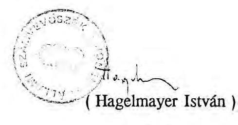
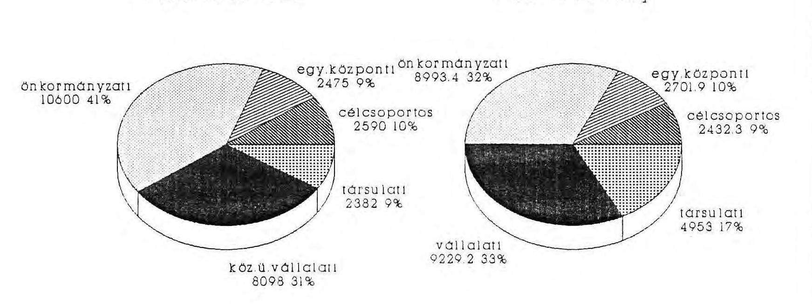
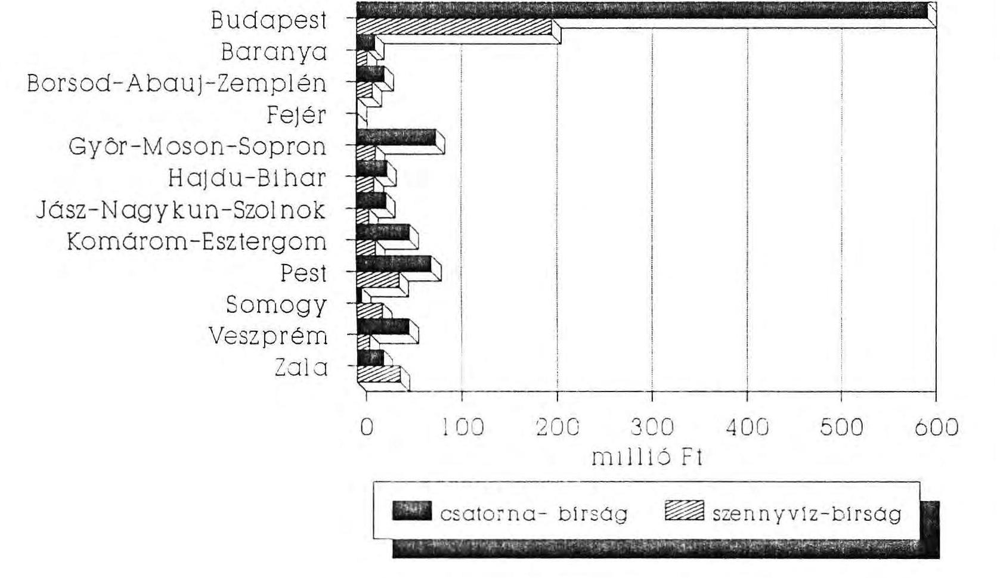
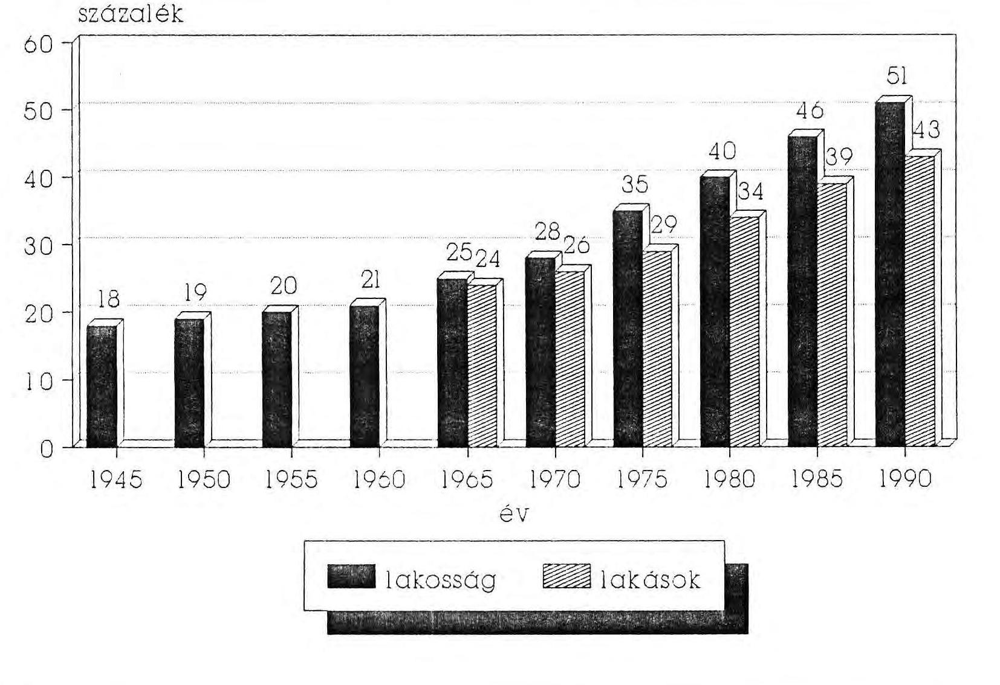
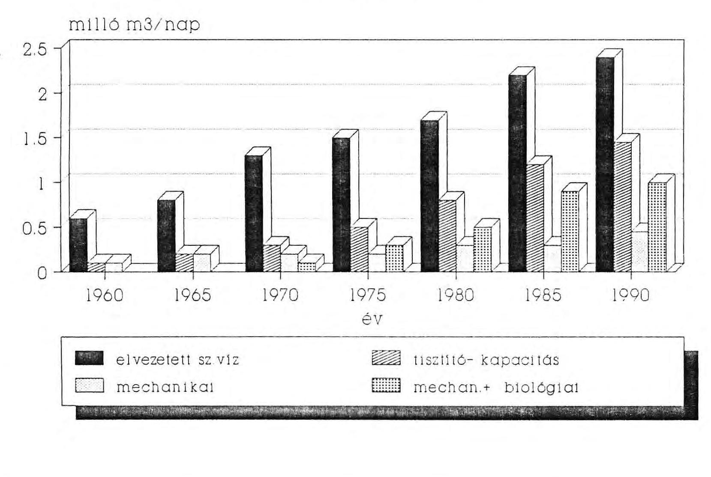

# Állami Számvevőszék

## JELENTÉS

a szennyvízelvezetésre és -tisztításra fordított eszközök
felhasználásának vizsgálatáról

---

V-84/21/91.
T.sz.: 72.

# Összefoglaló jelentés

## A szennyvíz elvezetésére és -tisztítására fordított eszközök felhasználásának vizsgálatáról

Az Állami Számvevőszék 1991. I. félévi munkaterve alapján 1991. május-június hónapokban 11 megyében és a fővárosban, a megyei (fővárosi) önkormányzati hivatalokban, 11 megyei jogú városnál, 36 települési önkormányzatnál, 31 gazdálkodó szervnél (Vizügyi Igazgatóság, Környezetvédelmi Felügyelőség, vállalat) és 7 társulatnál folytatott helyszíni vizsgálatot és felhasználta a KSH, a BM rendelkezésére álló adatait.

A vizsgálat célja: annak megállapítása volt, hogy az elmúlt években: 1986-1990. között milyen nagyságrendű központi, tanácsi és egyéb pénzeszközöket fordítottak a szennyvíz elvezetésére és -tisztítására. A felhasznált pénzeszközökkel milyen fejlesztéseket hajtottak végre és ennek révén milyen eredményeket értek el az ún. "közmű olló" további nyílásának megakadályozására.

## I. Előzmények

A szennyvízelvezetésre és -tisztításra - az ötéves tervekben megfogalmazottakon túl - önálló, központi határozatok nem készültek. Az ezekkel kapcsolatos elképzelések, célkitűzések részét képezték a központi iránymutatások figyelembevételével az 1960-as évektől kezdve különböző időpontokban készült megyei ún. "vízgazdálkodási koncepcióknak". Ezekre a koncepciókra rányomta bélyegét, hogy a vízgazdálkodási ágazat irányításával foglalkozó központi szervek a lakosság igényeinek kielégítése során figyelmüket és energiájukat elsősorban az egészséges ivóvízellátás feltételeinek megteremtésére fordították. Emiatt azonban a vízbázisok védelme szempontjából alapvető fontosságú csatornázás és szennyvíztisztítás - az anyagi

---

lehetőségek által is behatároltan — az elmúlt évtizedekben háttérbe szorult (lásd példatár 1. sz.)

A szennyvíz kérdést kiemelt témaként csupán a Balaton vízminőségének javításáról és az üdülő övezettel összefüggő feladatokról szóló 2003/1983. (III. 3.) MT. határozat és a Balatoni Vízgazdálkodási Fejlesztési Program módosításáról és ütemezéséről szóló 2018/1983. (VIII. 27.) MT. határozat kezelte. Ezen kívül az Országos Tervhivatal és az Országos Vízügyi Hivatal 1985-ben megállapodott abban, hogy egyes kiemelt vízminőségvédelmi térségek, valamint nagyobb ipari városok szennyvíztisztítási feladatait állami szinten kiemelten kezelik. Ezen beruházásokat központi költségvetési forrásból ún. egyéb központi beruházásként valósítják meg.

A témát nem komplexen tartalmazó koncepcionális célkitűzések hatásának tudható be, hogy miközben 1985. végén a lakosságot egészséges ivóvízzel ellátó hálózat hossza már 41.600 km volt, ugyanakkor a csatornahálózat ennek mindössze 22,1 %-át, 9190 km-t tett ki. Az 1887 településen akkor élő 9 millió lakos egészséges ivóvízhez jutott, míg a 305 településen csak 4,9 millió fő részére volt biztosítva a csatornahálózat. A napi 4,2 millió $\mathrm{m}^{3}$-es ivóvíztermeléshez csak 2,2 millió $\mathrm{m}^{3}$ szennyvízelvezetés kapcsolódott és ez utóbbinak alig több mint a felét 1,2 millió $\mathrm{m}^{3}$-t tisztítottak mechanikai és részben biológiai módszerekkel.

A lakásállomány 39 %-a volt közcsatornába bekötve és az ezeken elvezetett szennyvíznek mindössze 41 %-a került biológiai tisztításra. Az ország e téren mutatkozó elmaradottságát jól érzékelteti, hogy az 1980-as évek elején nemzetközi felmérések szerint a fejlett ipari országokban a lakások 70-98 %-a volt közcsatornával ellátva, az elvezetett szennyvíznek pedig 50-100 %-át tisztították is (részletesen lásd 10-14. sz. táblák).

A csatornázottság és a szennyvíztisztítás elmaradottságának - egyéb külső szennyező tényezők mellett (mezőgazdaság, bányászat, ipar) - egyenes következménye a talajvizek elszennyeződése. Emiatt lényegében hazánk talajvíz készletének 1985-ben alig 10 %-a volt emberi, vagy állati fogyasztásra alkalmas. Az egyértelműen megfelelőnek tekinthető tisztítási technológia, és az elhelyezésre alkalmas területek hiánya, valamint a magas költségek miatt mind nagyobb gonddá vált a szennyvíziszap elhelyezése. Veszélyeztetetté váltak felszín alatti vízkészleteink is, elsősorban a Dunántúl ún. "nyitott karsztvíz bázisai".

---

# II. A pénzügyi források

A KSH által rendelkezésünkre bocsátott adatok szerint az 1986-1990. évekre vonatkozó nemzetgazdasági célkitűzések keretei között a vízgazdálkodási ágazat beruházásaira 6,6 %-ot (79 milliárd forintot) irányoztak elő. Ennek 32,9 %-át kívánták a szennyvíz problémák mérséklésére fordítani, mivel ekkor már látszott, hogy a vízgazdálkodási ágazaton belül e terület háttérbe szorítása milyen veszélyeket rejt magában. A 26 milliárd forintos szennyvízelvezetési és -tisztítási előirányzat 19,4 %-át, 5,1 milliárd forintot kívántak központi döntési körben felhasználni (lásd 1. sz. táblázat).

Ebből eredetileg a 8 kiemelten kezelt város (Debrecen, Esztergom, Győr, Komárom, Miskolc, Oroszlány, Pécs, Tatabánya) csatornázásának, illetve szennyvíztisztító telepeinek megépítésére 2,3 milliárd forintot, a Balaton, a Velencei tó és a Dunakanyar hasonló problémáinak megoldására pedig 3,3 milliárd forintot szántak (ennek 92 %-a a balatoni körzetet érintette). Az eredeti vízgazdálkodási célkitűzésekhez képest a célcsoportos beruházásokra fordítható központi forrásokat 1988-1990. években 22 %-kal, 2,6 milliárd Ft-ra csökkentették, annak belső struktúráját változatlanul hagyva, ugyanakkor mintegy 200 millió forinttal 2,5 milliárd Ft-ra emelték a 8 kiemelt város részére adható összeget (lásd 2. sz. táblázat).

A központi források mellett, azoknál lényegesen nagyobb arányban 40,5 %-ban számoltak tanácsi forrásokkal, 10,6 milliárd forint értékben. A közüzemi víz-csatornamű- és fürdő vállalatok beruházásokra fordítható pénzeszközeit 8,1 milliárd forintos nagyságrendben vették figyelembe (31 %). A viziközmű társulati beruházásoknál a Vízügyi Alapot, mint forrást figyelembe véve 2,4 milliárd Ft-ot irányoztak elő.

A központi források csökkenésével párhuzamosan mérséklődött a tanácsok rendelkezésére álló fejlesztési eszközök nagyságrendje is, ezért a fővárosi és a megyei tanácsok is — különösen 1988-1990. években — visszafogottabb beruházási politikát folytattak, ami a szennyvízelvezetésre és tisztításra előirányzott összegek megyénként különböző mértékű csökkenését eredményezte.

## III. Pénzügyi teljesítés

Az 5 évre a különböző forrásokból együttesen előirányzott 26 milliárd forinttal szemben annál 8,4 %-kal többet, 28,3 milliárd forintot fordítottak. Ezen belül az

---

egyes jogcímeken eredetileg figyelembe vett forrásokhoz képest jelentős eltérések mutatkoztak a forrásképződés belső struktúrájában (lásd 3-9. sz. táblázat).

Az eredeti központi előirányzathoz képest a pénzügyi felhasználás a 8 kiemelt város esetében 17,5 %-kal, a módosítottnál 9,2 %-kal (227 millió forinttal) volt több. Ezzel egyidejűleg az ún. célcsoportos beruházásoknál az eredeti tervhez képest 27,3 %-os, a módosított tervhez képest pedig 6,1 %-os (158 millió Ft) lemaradás mutatkozott.

A közüzemi víz- csatornamű- és fürdő vállalatok feladata csupán a rekonstrukció elvégzése lett volna. A náluk 50-70 %-ban amortizációból képződő forrás felhasználásával azonban - külső (tanácsi) hatásra - igen jelentős összegeket fordítottak új beruházások finanszírozására. Az eredeti előirányzathoz képest 1,1 milliárd forinttal (14 %-kal) többet.

A tanácsok hozzájárulása — annak ellenére, hogy a szennyvízelvezetést és -tisztítást szolgáló fejlesztéseket tanácsi céltámogatási rendszer kialakításával és alkalmazásával is segítették (lásd példatár 2. sz). - a szennyvízproblémák megoldásához az 1986-88. évek 2-2,9 milliárdos évenkénti összegével szemben a vizsgált időszak végére 680 millió forintra csökkent. Ennek oka, hogy az ún. tervegyeztető tárgyalásokon a tanácsok részére a központi szervek a vízgazdálkodási célokra külön támogatást nem biztosítottak, csupán a tanácsok elképzeléseit is figyelembevevő központi tervszámításokat készítettek. Ezeket az összegeket beépítették a megyei tanácsok költségvetésébe, s az a későbbiekben az egységes tanácsi pénzalap részeként funkcionált, amelyeket a tanácsi szabályozás szerint bármely célra fel lehetett használni anélkül, hogy az kifogás tárgyát képezhette volna.

A központi és saját forrásaik csökkenését a tanácsok elsősorban a viziközmű társulatok anyagi hozzájárulásának növelésével, valamint a víz- és csatornamű vállalati források nagyobb mértékű igénybevételével igyekeztek kompenzálni. A lakosság - érezve a szennyvízelvezetés fontosságát - a helyi tanácsok partnerévé vált, amit jelez, hogy 1990-ben már 1,7 milliárd forint volt a viziközmű társulatok beruházása, több mint 2,5-szerese az 1986. évinek. A rekonstrukció rovására ugyan, de dinamikusan nőtt a víz- és csatornamű vállalatok beruházási tevékenysége is, amely 1989-ben érte el csúcspontját 2,3 milliárd forinttal, az 1986. évinek másfélszeresével.

A viziközmű társulatoknál a növekvő és a tervek készítésekor ilyen mértékben még nem prognosztizálható inflációs hatásokat úgy "védték ki", hogy a korábban bekötési egységként 20-25 ezer forintban meghatározott lakossági hozzájárulás összegét fokozatosan emelték. Ez az összeg 1990-re

---

több helyen elérte, illetve meghaladta az 50 ezer forintot is, esetenként a 70 ezer forintot is megközelítette (lásd példatár 3. sz.).

A pénzügyi források folyamatos biztosítása 1988-90. között egyre inkább akadozott, ami az eredeti vállalásoktól eltérő ütemű folyósításokban is megnyilvánult és nehezítette a vállalatok tervszerű munkavégzését. A tanácsi döntési körű beruházásokra a tervezettel szemben 1,6 milliárd forinttal, 15,2 %-kal kevesebbet használtak fel a vizsgált időszakban. A finanszírozási nehézségeket fokozta, hogy a Vízügyi Alap egyes területekre 1990-ben nem tudott az eredeti vállalásának megfelelő mértékű támogatást nyújtani (lásd példatár 4. sz.).

Bár összeségében - elsősorban a lakossági és vállalati többletforrások felhasználásával — a tervezettnél 8,4 %-kal nagyobb összeget fordítottak a szennyvízelvezetésre és -tisztításra, ez nem tette lehetővé az eredeti célkitűzések naturáliákban való teljesítését. Ennek egyik alapvető oka, hogy időközben megváltozott a lakásépítések jellege. Az állami lakások arányának csökkenése a korábbi koncentrált lakótelepi beruházásokkal szemben a családiházas, illetve a kisebb társasházas építési módot helyezte előtérbe, ami a csatornázás egy lakásra jutó költségeinek növekedését vonta maga után.

A csatornaépítés fajlagos költségeinek összahasonlítására még egy vállalat keretében sincs mód, mivel az függ a terepviszonyoktól, a csatorna átmérőjétől, anyagától, az alkalmazott kivitelezési módtól. Az könnyen belátható, hogy az egy lakásra jutó költség egy családiházas településen többszöröse a lakótelepinek, mivel adott folyóméterű közcsatornába éppúgy beköthető egy családiház, mint egy többemeletes ház.

A fejlesztési források csökkenése miatt a beruházások egy részének megvalósítása elhúzódott, és az ezalatt bekövetkezett inflációs hatások következtében több tervezett beruházás kivitelezése elmaradt.

A naturáliákban való teljesítés ellen hatott az is, hogy a szennyvízcsatornák és a szennyvíztisztító berendezések létesítésének költségei az ivóvíz hálózatéhoz képest a megoldási módtól függően annak 3-6-szorosát teszik ki.

Mindezek következtében a csatornahálózat bővülése az 5 év alatt csupán egy töredékét, 10 %-át tette ki az ivóvízhálózat növekedésének. Ezen belül csak a központilag finanszírozott balatoni térségnél és a 8 kiemelt városnál történt előrehaladás a fejlesztések terén. A Balaton vízminőségének javítására kitűzött azon célt, hogy 1987-ig tegyék meg azokat az intézkedéseket, amelyek az 1980-as évtized elejei vízminőségi állapot további romlását megakadályozzák, sikerült elérni.

---

# IV. A beruházások lebonyolítása

A vízügyi igazgatóságok segítségével minden vizsgált területen, ha különböző számban is, de alakultak viziközmű társulatok. E társulatok azonban elsősorban az egészséges ivóvízhez jutás feltételeinek megteremtését tűzték ki célul és a szennyvízelvezetéssel, tisztítással a tervidőszak elején kevésbé foglalkoztak. Ennek megoldását a tanácsok az állami szervektől várták és az állami forrásokból finanszírozva képzelték el. A tanácsok - amelyek a vízügyi igazgatóságok és a szakvállalatok bevonásával kialakított koncepciókra építették éves terveiket - 1986-1987. években még beletörődtek a társulatok elsősorban az ivóvízellátás megteremtését preferáló tevékenységébe. Az 1988-1990. években azonban mind nagyobb mértékben igyekeztek a vízügyi igazgatóságokkal szennyvízelvezetési és -tisztítási társulatokat alakíttatni. Ezirányú tevékenységük eredménye, hogy a társulati beruházások a tervezetthez viszonyítva több mint kétszeresére növekedtek.

A szakvállalatok üzemeltetői érdeke minden esetben a beruházások összegének növelése volt, mivel a fejlesztési forrásaik jelentős része az aktivált beruházások amortizációjából adódott. Az aktiválásokat általában pontosan a
 vonatkozó rendeletek figyelembevételével végezték. A különböző szervektől átvett pénzeszközökről áttekinthető, tételes nyilvántartással rendelkeztek.

A beruházások lebonyolításánál 1987-től a vonatkozó 41/1987. (X. 3.) Mt. sz. rendeletnek megfelelően általában versenytárgyalásokat írtak ki. A versenytárgyalásokra azonos műszaki tartalommal 6-10, de esetenként ennél is több pályázat érkezett és a legalacsonyabb, valamint a legmagasabb ár között 100%-os eltérések is tapasztalhatók voltak. Az általános gyakorlat szerint a pályázatokat a legalacsonyabb árat vállaló kivitelezők nyerték el. Néhány esetben - döntően a társulatoknál, amelyek folyamatosan tárgyaltak több vállalattal - előfordult, hogy versenytárgyalás nélkül bíztak meg vállalatokat a kivitelezéssel (lásd példatár 5. sz.).

A megvalósításra többnyire átalánydíjas, vagy fix áras szerződéseket kötöttek, amelyekkel több területen sikerült az inflációs hatásokat részben semlegesíteni. 1990-től azonban mind erőteljesebbé vált a kivitelező vállalatok azon törekvése, hogy a természetes kockázatvállalás mértékét meghaladó inflációs hatások miatt őket ért kárt valamilyen formában érvényesítsék (lásd példatár 6. sz.).

A versenyajánlat benyújtásakor (1989.) az inflációs ráta 10% körül alakult. A kivitelezők ehhez képest kismértékben emelkedő további inflációval számoltak. A KSH és az OT által kiadott tájékoztató jellegű index 1990-re 16, 1991-re 21%-os volt. Más szervezetek szerint (pl. ÉGSZI SENIOR Kutató

és Szervező KFT) az árnövekedés mértéke anyagköltségre vetítve 40-90% között változott.

A többletköltségek elismerését, a végleges átalány, vagy fix áron megkötött szerződések vállalkozási díjának módosítását a fővállalkozási szerződésekre vonatkozó és a szerződéskötés időpontjában érvényben volt 35/1982. (VIII. 1.) PM-ÁH számú rendelet nem teszi lehetővé. A kivitelezők többletköltségeiket a versenytárgyalási hirdetményekben közölt éves pénzügyi kerettől eltérő fedezet biztosítására való hivatkozással peres úton próbálják érvényesíteni és esetenként kilátásba helyezték a munkáról való levonulást is. A problémák megoldására a megrendelők, de a kivitelezők is egyéb lehetőségeket kerestek.

Esetenként a megrendelő a kivitelező részére ún. anyagár előleget folyósít, amely lehetővé teszi az inflációs hatás részbeni kivédését.

A kivitelező vállalatok különböző kísérleteket folytatnak költségeik csökkentésére, pl. a korábban alkalmazott beton és eternit csatornákat, ahol erre mód van műanyag csövekkel helyettesítik, ami jelentős költségmegtakarítással jár.

A Fővárosi Csatornázási Művek rendszeresen kísérletezik új módszerek alkalmazásával, pl. a keskenymunkagödör technológiával, az ALTERRA, a BONEX és az FCSM (ún. Wesselényi módszer) megoldásokkal.

A csatornázás és szennyvíztisztítás területén azonban jelentős mértékű koordinálatlanság is tapasztalható volt. A kívánatos az lenne, hogy a csatornahálózat és a szennyvíztisztítótelep egyidejűleg kiépülve szolgálja az adott település lakosait. Ez az esetek nagyrészében így is történt, esetenként azonban előfordult, hogy adott településeken elkészült a szennyvíztisztítómű, de nem épült meg a csatornahálózat, míg más esetekben elkészült a csatornahálózat, de nem épült meg hozzá a szennyvíztisztító telep. Olyan eset is előfordult, hogy túlzott kapacitású szennyvíztisztító telepet állítottak üzembe. Ugyanakkor az az általános tapasztalat, hogy egyes időközökben a szennyvíztisztítótelepek túlterheltek és a szennyvíz nagyrésze tisztítatlanul került ki a telepekről (lásd példatár 7. 8. sz.).

A központi hatáskörbe lebonyolított beruházások döntő része az alkalmazott szerződéskötési módnak, illetve a versenytárgyalásoknak köszönhetően a vállalt költségkereten belül és az előírt határidőre a tervezett műszaki tartalommal megvalósult. A tanácsi, társulati, vállalati döntési körbe tartozó beruházások egy része azonban nem készült el határidőre és/vagy a tényleges kivitelezési költség a tervezettnél lényegesen nagyobb lett (lásd példatár 9. sz.). Ebben az inflációs hatásokon túlmenően szerepet játszott az is, hogy a vállalkozók egy része nem volt

teljes birtokában a szükséges építési technológiának és gyakorlatnak, ezért gyakoriak voltak a kivitelezési hibák.

Jellemző kivitelezői hibák voltak, hogy megsüllyedt a csatorna nyomvonala; vízszintes és magassági eltérések mutatkoztak a csőfektetésnél; hézagosak voltak a csőillesztések; a házi bekötőcsatornák csatlakozása nem volt megfelelő stb.

A szennyvíztisztítótelepek létesítésénél az volt a jellemző, hogy ezek megvalósításának költségvonzata az alapvető szempont és az üzemeltetés költségei másodlagosakká váltak. Nem találtunk olyan komplex értékelemző munkát, amely teljes részletességgel összefüggésében foglalkozott volna a szennyvíz begyűjtés és kezelés, a mechanikai, a biológiai tisztítás beruházási és üzemeltetési költségeivel, a biológiai tisztítás révén nyerhető energia felhasználásával és a szennyvíziszap elhelyezésének anyagi vonzataival.

# V. A szennyvíztisztítás és a szennyvíziszap elhelyezés problémái 

Magyarországon az 1990-ben elvezetett szennyvíz mennyiség mindössze 42%-a került biológiailag is tisztításra. A zöme csupán mechanikai tisztításon ment keresztül. A megépített telepek jórésze főleg a rekonstrukciók elmaradásának következtében a kapacitásukat meghaladó leterhelés miatt nem képes az előírtnak megfelelő minőségben tisztítani a szennyvizet. Ennek következménye, hogy a KÖJÁL-ok az elmúlt években sorozatosan kifogásolták a szennyvíztelepek működését (lásd példatár 10. sz.).

A vízügyi igazgatóságok — az ellenőrzés tapasztalatai alapján — éltek bírságolási jogukkal, s így a telepek nagyrésze rendszeresen szennyvízbírságot fizet. A szennyvízbírság összege Somogy és Zala megye kivételével a vizsgált területeken meghaladja a beszedett csatornabírság összegét (lásd 2. sz. ábra). Nem tudtak azonban eredményesen fellépni a vízügyi igazgatóságok azokban az ügyekben, amelyekben a tanácsnak kellett volna megvalósítania a szennyvízelvezető, tisztító létesítményeket, mivel a tanács nem volt szankcionálható. A szennyvízbírság intézményének hatása azon mérhető le, hogy elkerülése céljából - a kiegészítő beruházások, rekonstrukciók elvégzése mellett -, ha egyelőre még nem is nagy számban, de mind erőteljesebb törekvés mutatkozott az üzemeltetők részéről az előírt paraméterek határértékének enyhítésére, amelyekhez azonban a hatóságok környezetvédelmi okokból általában nem járultak hozzá (lásd példatár 11. sz.).

A szennyvíztisztítótelepek egyik legnagyobb gondja, mivel nehézfémeket tartalmazó ipari szennyvizeket is ide vezetnek, hogy a tisztítás során keletkező szennyvíziszap egy része egyáltalán nem, más része pedig csak nagy nehézségek árán helyezhető el.

A Hidrológiai Társaság 1989. évi tanulmánya szerint a szennyvíztisztítótelepeken keletkező évi mintegy 700 ezer m³ iszap összes szárazanyagtartalma közel 100 ezer tonna évente. Ennek 19%-át átmeneti, 15%-át végleges depóniában, 25%-át szántóföldön, 2%-át erdőben, 12%-át komposztáló telepeken, 27%-át pedig egyéb ismeretlen módon helyezik el.

Amennyiben a szennyvíziszapban nehézfém található, úgy azt kizárólag veszélyes hulladékként az e célra szolgáló területeken lehet elhelyezni, mivel a nehézfémeket általában nem tudják kiszűrni, illetve elkülöníteni, így a szennyvíztelepekre kerülő nehézfém tartalmú szennyvíz a telep szennyvíziszap mennyiségét toxikussá teszi, s ezzel növeli az elhelyezési gondokat. Az önkormányzatok, de korábban a tanácsok is egyre kevésbé tudtak megfelelő területeket biztosítani a veszélyesnek minősülő szennyvíziszap elhelyezésére.

A mezőgazdasági nagyüzemek egy része a tisztított települési szennyvíziszapot és a szennyvizet - amelyben már nincs nehézfém - fogadja ugyan, de ezt csak nagyüzemi táblákon és csak egyes kultúrákhoz lehet felhasználni, mivel az eddigi kísérletek még egyértelműen nem bizonyították a szennyvíziszap termelésjavító hatását. Háztáji gazdaságokban, illetve kisebb parcellákon egyelőre még az ilyen szennyvíziszap elhelyezését sem engedélyezik, illetve javasolják.

A mezőgazdasági hasznosítás céljára a víz- és csatornamű vállalatok többféle komposztálási eljárást (gilisztás, tőzeges, gyorskomposztálási módszer, stb.) alkalmaznak és pl. Pécsett a szennyvíziszapot granulálják is. Mindezek ellenére még a nagyüzemi gazdaságok is idegenkednek a szennyvíziszap bármilyen formában való fogadásától. Egyes területeken a víz- és csatornamű vállalatoknak csak a szállítás és injektálás költségét kell téríteniük, más területeken viszont az iszap fogadásáért is fizetniük kell (lásd példatár 12. sz.).

A víz- és csatornamű vállalatok jogosultak a környezetszennyező vállalatokat csatornabírság megfizetésére kötelezni. Ezt a tevékenységet a rendelkezésre álló adatok szerint igen körültekintően végezték, amit jelez, hogy a kivetett csatornabírságokkal szemben viszonylag kevés volt a fellebbezés és azoknak - egy-két kivételtől eltekintve - általában nem adtak helyt. A csatornabírság hatása lemérhető abban is, hogy a fizetett összegek évről évre csökkenő tendenciát mutatnak. Ez

egyrészt betudható annak, hogy a vállalatok a csatornabírság elkerülése céljából az általuk kibocsátott szennyvíz minőségét igyekeznek az előírásoknak megfelelő szintre emelni, de annak is - ez különösen az utóbbi egy-két évre vonatkozik -, hogy a nagyvállalatokból alakult számos kis utód vállalat miatt a szennyező forrást a bírságot kiszabó egyértelműen nem tudja megállapítani. Az ipari termelés gyártási technológiái nincsenek összhangban a vízminőségvédelem szempontjaival. Ipari szennyvízkezelők vagy egyáltalán nincsenek, vagy csak egy-egy szelektív anyag leválasztására alkalmasak. Gondot jelent az is, hogy a visszatartott anyagok gazdaságos újrahasznosítása, illetve az ártalommentes elhelyezésének feltételei nem alakultak ki.

Míg a korábbi években a csatornával nem rendelkező települések lakosaitól az ún. szippantott szennyvizet a víz- és csatornamű vállalatok, vagy a településtisztasági vállalatok gyűjtötték be, addig az utóbbi években mind nagyobb számban kaptak működési engedélyt magánvállalkozók is. Ez egyik oldalról kedvezőnek tekinthető, mivel versenyhelyzetet teremtett, más oldalról azonban kedvezőtlen, mivel úgy kapták meg a működési engedélyeket, hogy a velük szemben környezetvédelmi érdekből támasztható követelményeket nem határozták, így nem is követték nyomon, hogy az egyre növekvő számban működő vállalkozók a begyűjtött szennyvizet hol, milyen körülmények között ürítették. Az elmúlt öt évben a "szippantás" ára csaknem háromszorosára nőtt. Nagyrészt erre vezethető vissza, hogy a begyűjtött szennyvíz mennyisége - miközben az ivóvíz felhasználás emelkedett - fokozatosan csökkent, ami jelzi a környezet veszélyeztetettebbé válását (lásd példatár 13. sz.). Gondokat jelent az is, hogy pl. 1991-ben a költségvetési törvény szerint az önkormányzatok és azok intézményei, vállalatai a szippantott szennyvíz m³-e után 65 Ft-os költségvetési támogatást igényelhetnek, a magánvállalkozók viszont ilyen támogatásban nem részesülnek.

Külön kiemelésre érdemes az a probléma, hogy — különösen a Dunántúlon — a karsztvízbázis védelem miatt egyes területeken meg kell határozni a mezőgazdasági művelési módot is, ami gyakran a mezőgazdasági üzem számára előnytelen, sőt kimutatható veszteséget okoz. Az így jelentkező károk kompenzálására azonban a víz- és csatornamű vállalatoknak nincs pénze, költségeikben ezek a tényezők nem szerepelnek, de másutt sincs erre elkülönített pénzalap.

# VI. Az 1990. évi helyzet 

Az elmúlt 5 év alatt 28,3 milliárd forintos ráfordítással a csatornahálózatot 1622 kilométerrel növelték, az elvezetett szennyvíz napi mennyisége 200 ezer m³-rel nőtt és ugyanilyen mértékben bővült a szennyvíztisztító kapacitás is. Ugyanezen időszak alatt az ivóvízhálózat hossza 9157 kilométerrel, az egészséges ivóvízzel ellátott települések száma 313-mal nőtt. A 2450 ivóvízhálózattal ellátott településsel szemben csupán 375 rendelkezik csatornával, illetve szennyvíztisztító teleppel.

#### Abstract

A fővárosban keletkezett szennyvíznek csak a 20%-át tisztítják biológiailag, amelynek hatásfoka azonban az esetenkénti túlterhelés miatt alkalmanként mintegy felére csökken. A többi tisztítatlanul ömlik a Dunába. Ennek az a következménye, hogy Ercsi környéke vált a magyar Duna szakasz legszennyezettebb területévé. Ezen a környéken ma már a meglévő vízbázisok is komoly veszélynek vannak kitéve.

A nem kellő ütemű előrehaladás következtében 1990. végén 2702 település nem volt csatornázva, ahol a lakosság 49%-a; 5,4 millió ember él. Lényegében tehát a fejlett ipari országok alsó sávjában elhelyezkedő nemzetek 1980. év elejei állapotához képest is jelentős a lemaradásunk (lásd 10-14. sz. táblázat és 3-4-5. sz. ábra).

A folyamatban lévő balatoni beruházásokhoz - 1986. évi árakon számolva - 912 millió forintra, a 8 kiemelt
 nagyváros beruházásainak befejezéséhez pedig 1520 millió forintra van szükség. Egyes szakmai számítások szerint a szükséges fejlesztések évi 80-90 milliárd forintos ráfordítást igényelnek ahhoz, hogy az Európai Közösség (EK) szennyvízelvezetésre vonatkozó ajánlásait hazánkban is meg lehessen valósítani.

## VII. Következtetések, javaslatok

Az elmúlt 5 év alatt a vízgazdálkodási ágazat fejlesztésére az eredetileg elképzeltnél valamivel nagyobb összeget fordítottak és így aránya a nemzetgazdasági beruházáson belül 7,2 %-ot tett ki. Ennek közel 1/3-át fordították a szennyvízelvezetés és -tisztítás céljaira. A központilag biztosított támogatási összegeket az adott terület megyei és helyi tanácsai különböző mértékben kiegészítették és gondoskodtak az érintett vállalatok bevonásával a rendelkezésre álló források hatékony felhasználásáról.

---

Annak ellenére, hogy ebben az időszakban mind világosabbá vált a csatornázottság és a szennyvíztisztítás elmaradottságának felszámolásához fűződő össztársadalmi érdek - az anyagi források szűkössége, az ivóvízhálózat fejlesztését preferáló tanácsi és lakossági szemlélet, a csatornázás költségeinek nagyságrendje miatt nem sikerült megfelelő előrelépést elérni. Emiatt az ún. "kőzmű olló" nyílása nem mérséklődött, hanem az ivóvízhálózat szükségszerűen gyorsütemű növekedése miatt tovább nyílt, így a helyzet 1990-re tovább romlott. Amíg az egészséges ivóvízzel való ellátásban - a még meglévő feszültségek ellenére - mennyiségileg sikerült a fejlett gazdaságú országokhoz felzárkózni, addig csatornázottságban és a szennyvíztisztításban lemaradásunk tovább nőtt.

Jelenleg nagyvárosainkban és a Balaton térségében, ahol együttesen a lakosság közel fele él, az ellátottság mennyiségileg megfelelőnek tekinthető. Néhány nagyvárosban és a fővárosban azonban a csatornahálózat elöregedett, a szükséges mértékű rekonstrukcióra nem került sor és egyes területeken még mindig hiányoznak a megfelelő kapacitású, komplex (mechanikai — biológiai — kémiai) szennyvíztisztító telepek. Mindeddig nem sikerült egyértelmű megoldást találni a keletkező szennyvíziszap elhelyezésére, ártalmatlanítására, illetve hasznosítására. Ehhez kapcsolódik az is, hogy az ún. szippantott szennyvízek környezetvédelmi szempontból megfelelő elhelyezése egyre kevésbé követhető nyomon, ami növeli ivóvíz készleteink szennyeződésének veszélyét.

A hazai felszínalatti vízbázisaink védelme, a lakosság egészséges ivóvízzel való ellátása rövid és hosszú távon egyaránt úgy oldható meg hatékonyan, ha azt egy átfogó, az ivóvízellátást és a szennyvíztisztítást komplexen és kiemelten kezelő környezetvédelmi program részeként széles körű társadalmi összefogással és a szükséges mértékű anyagi eszközök rendelkezésére bocsátásával segítik. A jelenlegi, több területen egyre veszélyesebbé váló állapot mielőbbi felszámolásához arra van szükség, hogy:
—a Belügyminisztérium (BM) és a Pénzügyminisztérium (PM) vizsgáltassa meg, hogy a költségvetés teherbíró képességének függvényében a csatornázási, szennyvíztisztítási, szennyvízbegyűjtési és szennyvíziszapelhelyezési feladatok viszonylag magas költségvonzata miatt — össztársadalmi érdekből — hogyan lehetne a helyi, illetve a térségi szennyvízelvezetésre és -tisztításra irányuló, a pályázatok keretében is megjelenő kezdeményezéseket a jelenleginél nagyobb mértékben támogatni, beleértve a lakosság önerős fejlesztési tevékenységéhez kapcsolódó hitelkonstrukció korszerűsítését is és kiterjeszteni a támogatást a szippantott szennyvíziszap elhelyezésére;

---

- a Közlekedési-, Hírközlési- és Vízügyi Minisztérium által elkészített vízelátási és szennyvízelvezetési koncepciót a Környezetvédelmi és Területfejlesztési Minisztérium és a Belügyminisztérium bevonásával egészítsék ki a szennyvízek és szennyvíziszapok elhelyezésével, illetve hasznosításával, továbbá a szippantott szennyvízek elhelyezésére és kezelésére vonatkozó megoldási módozatokkal, oly módon, hogy az határozza meg az elvégzendő feladatokat, elemezze a fejlesztések időbeli és térbeli rangsorát és összehangolásának lehetőségeit, valamint várható anyagi, pénzügyi konzekvenciáit;
- az önkormányzatok hatósági eszközökkel, rendszeres ellenőrzésekkel, a pénzügyi-gazdasági szabályozás adta lehetőségekkel, a termelő vállalatoknak nyújtott kedvezményekkel segítsék elő a szennyező források felszámolását és támogassák a szennyvíziszap ártalmatlanításának és folyamatos elhelyezésének megoldását célzó vállalati kezdeményezéseket.

Budapest, 1991. szeptember

Melléklet: 74 lap

---

| A vizsgálatot irányította: | dr. Saly Ferenc | főtanácsos |
| :--: | :--: | :--: |
| Közreműködött: | dr. Szirota István | külső szakértő |
| 1. Budapest: | dr. Katona Béláné | számvevő |
| 2. | dr. Kurucz István | számvevő |
| 3. Baranya megye: | dr. Nagy Ágnes | számvevő |
| 4. Borsod-Abaúj-Zemplén megye: | Hegedűs György | számvevő |
| 5. Fejér megye: | dr. Gamaufné dr. Köbor Éva | számvevő |
| 6. Hajdú-Bihar megye: | Kóródi József | számvevő, tanácsos |
| 7. Győr-Moson-Sopron megye: | Berényi Magdolna | számvevő |
| 8 . | Molnár István | számvevő |
| 9. Jász-Nagykun-Szolnok megye: | Csomán Mihály | számvevő |
| 10. Komárom-Esztergom megye: | Berényi Magdolna | számvevő |
| 11. | Kalmár István | számvevő |
| 12. Pest megye: | Benczik Lászlóné | számvevő |
| 13. | dr. Katona Béláné | számvevő |
| 14. | dr. Spilák Antal | számvevő |
| 15. Somogy megye: | dr. Hegedűs György | számvevő, tanácsos |
| 16. Veszprém megye: | dr. Vasváriné dr. Rózsa Anikó | számvevő |
| 17. Zala megye: | Angyalosi Dániel | számvevő |
| Az összefoglaló jelentést összeállította: | dr. Saly Ferenc | főtanácsos |
| Közreműködött: | dr. Szirota István | külső szakértő |

---

# Helyszíni vizsgálatok 

## 1. Budapest

Budapest Főváros Főpolgármesteri Hivatala
Fővárosi Csatornázási Művek
Középdunavölgyi Vízügyi Igazgatóság

## 2. Baranya megye

Baranya Megyei Közgyűlés Hivatala
Pécs Megyei Jogú Város Polgármesteri Hivatala
Komló Város Polgármesteri Hivatala
Szentlőrinci Körjegyzőség
Királyegyháza Polgármesteri Hivatala
Baranya Megyei Vízművek (Komló)
Pécsi Vízmű
Déldunántúli Vízügyi Igazgatóság (Pécs)
Déldunántúli Környezetvédelmi Felügyelőség (Pécs)
Déldunántúli Vízgazdálkodási Társulatok Egyesülése (Pécs)

## 3. Borsod-Abaúj-Zemplén Megye

Borsod-Abaúj-Zemplén Megyei Közgyűlés Hivatala
Miskolc Megyei Jogú Város Polgármesteri Hivatala
Tiszaújváros Város Polgármesteri Hivatala
Sárospatak Város Polgármesteri Hivatala
Mezőkövesd Város Polgármesteri Hivatala
Mezőcsát Város Polgármesteri Hivatala
Felsőzsolca Nagyközség Polgármesteri Hivatala
Borsod-Abaúj-Zemplén Megyei Vízművek (Miskolc)
Miskolci Vízművek, Fürdők és Csatornázási Vállalat
Északmagyarországi Vízügyi Igazgatóság
Borsod-Abaúj-Zemplén Megyei Településtisztasági Szolgáltató Vállalat (Miskolc)

---

# 4. Fejér megye 

Fejér megyei Közgyűlés Hivatala
Székesfehérvár Megyei Jogú Város Polgármesteri Hivatala
Dunaújváros Megyei Jogú Város Polgármesteri Hivatala
Gárdony Város Polgármesteri Hivatala
Velence Nagyközség Polgármesteri Hivatala
Fejér Megyei Víz- és Csatornaművek (Székesfehérvár)
Dunaújvárosi Víz- és Csatornaművek
Dunántúli Regionális Vízművek (Siófok)
Középdunántúli Vízügyi Igazgatóság (Székesfehérvár)
Özon Betéti Társaság

## 5. Hajdú-Bihar Megye

Hajdú-Bihar Megyei Közgyűlés Hivatala
Debrecen Megyei Jogú Város Polgármesteri Hivatala
Hajdúnánás Polgármesteri Hivatala
Hajdúböszörmény Polgármesteri Hivatala
Nyíradony Polgármesteri Hivatala
Nyíracsád Polgármesteri Hivatala
Hajdúsámson Polgármesteri Hivatala
Hajdú-Bihar Megyei Víz- és Csatornamű Vállalat (Debrecen)
Debreceni Vízmű és Gyógyfürdő Vállalat
Tiszántúli Vízügyi Igazgatóság (Debrecen)

## 6. Győr- Moson- Sopron Megye

Győr-Moson-Sopron Megyei Közgyűlés Hivatala
Győr Megyei Jogú Város Polgármesteri Hivatala
Győr és Környéke Víz- és Csatornamű Vállalat
Északdunántúli Vízügyi Igazgatóság (Győr)
Északdunántúli Környezetvédelmi Felügyelőség (Győr)

## 7. Jász-Nagykun-Szolnok Megye

Szolnok Megyei Közgyűlés Hivatala

---

Szolnok Megyei Jogú Város Polgármesteri Hivatala
Jászárokszállás Város Polgármesteri Hivatala
Mezőtúr Város Polgármesteri Hivatala
Törökszentmiklós Város Polgármesteri Hivatala
Abádszalók Nagyközség Polgármesteri Hivatala
Szolnok Megyei Víz- és Csatornamű Vállalat (Szolnok)
Középtiszavidéki Vízügyi Igazgatóság (Szolnok)
Szolnok-Szandaszőlős Városrészi Csatornamű Társulat
Jászárokszállási Csatornamű Társulat
Mezőtúri Csatornamű Társulat
Törökszentmiklósi Csatornamű Társulat
Abádszalóki Csatornamű Társulat

# 8. Komárom-Esztergom Megye 

Komárom-Esztergom Megyei Közgyűlés Hivatala
Komárom Város Polgármesteri Hivatala
Északdunántúli Vízügyi Igazgatóság (Győr)
Északdunántúli Környezetvédelmi Felügyelőség (Győr)
Északdunántúli Regionális Vízművek (Tatabánya)
9. Pest megye

Pest Megyei Közgyűlés Hivatala
Vác Város Polgármesteri Hivatala
Érd Város Polgármesteri Hivatala
Cegléd Város Polgármesteri Hivatala
Szentendre Város Polgármesteri Hivatala
Tököl Nagyközség Polgármesteri Hivatala
Középdunavölgyi Vízügyi Igazgatóság (Budapest)
Pest Megyei Víz- és Csatornamű Vállalat (Budaörs)
Dunamenti Regionális Vízművek (Vác)

---

# 10. Somogy megye: 

Somogy Megyei Közgyűlés Hivatala
Kaposvár Megyei Jogú Város Polgármesteri Hivatala
Boglárlelle Város Polgármesteri Hivatala
Fonyód Város Polgármesteri Hivatala
Marcali Város Polgármesteri Hivatala
Balatonföldvár Község Polgármesteri Hivatala
Balatonszemes Község Polgármesteri Hivatala
Balatonszárszó Község Polgármesteri Hivatala
Déldunántúli Vízügyi Igazgatóság (Pécs)
Dunántúli Regionális Vízművek (Siófok)
Somogy megyei Településtisztasági és Kertészeti Vállalat
Déldunántúli Környezetvédelmi Felügyelőség (Pécs)
Balatoni Intéző Bizottság (Balatonfüred)
Somogy Megyei Növényvédelmi és Talajvédelmi Állomás

## 11. Veszprém megye:

Veszprém Megyei Közgyűlés Hivatala
Veszprém Megyei Jogú Város Polgármesteri Hivatala
Tapolca Város Polgármesteri Hivatala
Zirc Város Polgármesteri Hivatala
Berhida Nagyközség Polgármesteri Hivatala
Középdunántúli Vízügyi Igazgatóság (Székesfehérvár)
Veszprém Megyei Víz- és Csatornamű Vállalat
Dunántúli Regionális Vízművek (Siófok)
Talajerőgazdálkodási Vállalat (Pápa)

## 12. Zala megye:

Zala Megyei Közgyűlés Hivatala
Zalaegerszegi Megyei Jogú Város Polgármesteri Hivatala
Nagykanizsa Megyei Jogú Város Polgármesteri Hivatala

---

Észak-Zala Víz- és Csatornaművek (Zalaegerszeg)
Keszthely Város Polgármesteri Hivatala
Dél-Zala Víz- és Csatornaművek (Nagykanizsa)
Ezen túlmenően az Országos Vízügyi Beruházási Vállalat (Budapest)

---

# PÉLDATÁR 

## A szennyvíz elvezetésére és -tisztítására fordított eszközök felhasználásáról készült jelentéshez

1. A vizsgált megyék - Fejér és Győr megye kivételével — különböző időpontokban elkészítették a vízgazdálkodásra vonatkozó hosszútávú koncepcióikat.
— Baranya 1978-ban, Jász-Nagykun-Szolnok és a Főváros 1974-ben, Komárom 1970-ben, Pest, Somogy és Zala 1975-ben készített ilyen koncepciót, amelyeket később többször is módosítottak és az 1985-2000-ig terjedő időszakot magában foglaló végleges változatokat többnyire 1985-ben fogalmazták meg és hagyták jóvá testületi üléseken.
—Borsod, Hajdú megye tanácsa 1985-ben, Veszprém 1986-ban hagyta jóvá az 1985-2000 közötti időszakra szóló hosszútávú koncepciót.
2. Baranya megyében a fejlesztési célkitűzések megvalósítását olyan céltámogatási rendszerrel kívánták elősegíteni, amelynek keretei között kikötötték, hogy egy-egy település a megyei tanácstól és a Vízügyi Alapból együttesen a bekerülési összeg maximum 40 %-át, illetve maximum 10 millió Ft-ot (ezen belül tanácsi támogatásként 5 millió Ft-ot) kaphat.

Veszprém megyében több, mint 1,5 milliárd forintot különítettek el céltámogatásokra, amelyből a szennyvíztisztítók kapacitásának bővítésére 5,6 %-ot (88 millió Ft-ot) hagytak jóvá. A megyei források kedvezőtlen alakulása miatt 1989-ben a szennyvíztisztítók céltámogatását a megyei tanács megszüntette, emiatt pl. az ajkai és a veszprémi kapacitásbővítő beruházás el sem kezdődhetett.
3. A lakossági hozzájárulások összege a vizsgált időszakban jelentősen emelkedett és jelenleg is nagy szóródások tapasztalhatók az egyes területek között:
— Pest megyében; Érden 1985-ben 53.000.-Ft-ot, 1990-ben 67.000.-Ft-ot kellett fizetni. Nagykovácsiban 1990-ben 55.000.-Ft, Albertirsán 35.000.-

---

Ft volt a hozzájárulás összege. A megyében működő víziközmű társulatok 1985-1990. között az átlagos 35.000.-Ft-os hozzájárulást 45.000.-Ft-ra emelték.
—Jász-Nagykun-Szolnok megye területén: Szolnok Szandaszőlősön 25-45.000.-Ft-ot, Mezőtúr kertvárosi részén 54.000.-Ft-ot, Törökszentmiklóson 25.000.-Ft-ot, Abádszalókon 35.000.-Ft-ot, Jászárokszálláson pedig 40.000.-Ft-ot kell hozzájárulásként kifizetni.
-Fejér megyében a Velence-tavi Regionális Víziközmű Társulatnál 1987-ben 39.000.-Ft, 1990-ben pedig már 52.000.-Ft volt a hozzájárulás összege.
—a Fővárosban a 35.000.-Ft-os érdekeltségi hozzájárulás 1990-re 70.000 Ft-ra emelkedett.
4. A Vízügyi Alapból a csatornázási feladatok támogatására évente országosan 100-150 millió Ft-ot nyújtottak, s ez az összeg 1990-ben csaknem 300 millió Ft-ra nőtt. Ennek ellenére egyes területeken a korábban vállalt összegeket nem folyósították.

- Borsodban elmaradt a Felsőzsolcai és az Alsózsolcai társulatok vállalt támogatása. A nem folyósított 30 millió Ft-ot a két község hitel felvételével pótolta, de ez a megoldás veszélyezteti a két település önkormányzatának zavartalan működését.
- Jász-Nagykun-Szolnok megyében 1990-ben elmaradt az ígért Vízügyi Alap támogatás fele (27,5 millió Ft), ezért a Szolnok-Szandaszőlősi Társulat nem kapott meg 8 millió Ft-ot, a jászárokszállási pedig 3 millió Ft-ot.

5. Mind általánosabbá vált az utóbbi években a versenytárgyalások meghirdetése. Így pl.
—Baranya megyében a Pécs-postavölgyi 43.700 eFt-os beruházási előirányzatú víz- és csatornafejlesztésre 14 kivitelező tett ajánlatot, amelyek között 124 millió Ft-os összeg is szerepelt. A munkát a DÉLVIÉP kaposvári üzemegysége nyerte el 43 millió Ft-os ajánlatával.

A Pécs-újhegyi beruházásra 16 kivitelező jelentkezett. A legkedvezőbb ajánlatot a PÉCSÉP GMK tette 148.700 eFt-tal és így megkapta a megbízást.

---

A legmagasabb összegű ajánlat 233 millió Ft volt. A beruházás teljes bekerülési költsége 162.170 eFt lett.
-A Hajdú-Bihar megyei Nyíracsád szennyvíztisztító telepének kivitelezésére három pályázó jelentkezett 24.800 eFt - 29.900 eFt közötti ajánlatokkal. A pályázatot a KEVIÉP nyerte el a legalacsonyabb árajánlat miatt.

A nyíradonyi szennyvízcsatorna építésénél is a KEVIÉP adta a legalacsonyabb árajánlatot, de a
 munka elvégzésével a debreceni KÉV-et bízták meg, mivel a településen egyidejűleg egyéb feladatokat is végzett.
—Győr-Moson-Sopron megyében a szabadhegyi csatornaépítés I. ütemére öt pályázat érkezett 14,5-36,2 millió Ft-os ajánlatokkal. A négy viszonylag kedvező ajánlatot tevő vállalat között felosztották a munkát, s így azt igen gyorsan és kedvező áron végezték el.
—Jász-Nagykun-Szolnok megyében Törökszentmiklós Tanácsa hirdetett pályázatot, amelyre öt pályázó 16 ajánlatot nyújtott be, de egyikük sem vállalta a kivitelezést a beruházó által megjelölt 180-200 millió Ft-ért. A lebonyolítással megbízott Víz- és Csatornamű Vállalat végül is 195 millióért adta ki a munkát, fokozatos tervszolgáltatással. A beruházás elvégzéséért a vállalkozó 225,2 millió Ft-ot kapott.

Jászárokszálláson 16 vállalkozó pályázott 58-178,5 millió Ft közötti ajánlatokkal. Külső szakértők véleményét is figyelembe véve a munka elvégzésével az Északmagyarországi VÍZIG-et (Miskolc) bízták meg, 77,5 millió Ft-os ajánlatát elfogadva.

Fejér megyében is nagy szóródást mutatnak az árajánlatok. A Székesfehérvár Palotavárosi lakótelep szennyvízátemelőjének bővítésére 23.950 e Ft és 67.113 e Ft közötti ajánlatokat nyújtottak be. Kápolnásnyéken 2 km vezeték megépítésére kilenc pályázó 4,7 - 14,9 millió Ft között szóródó ajánlatokkal jelentkezett.

Velence Fő utcai vezetékének építésére hét ajánlat érkezett 5 - 17,9 millió Ft közötti áron. Bicske 10,5 km-es csatornaépítésére pedig ugyancsak 7 ajánlatot tettek 24 - 57 millió Ft-os árakon.

---

- Somogy megyében a balatonföldvári Viziközmű Társulat zártkörű versenypályázatán három vállalat vett részt 22 - 24 - 27,5 millió Ft-os ajánlattal. A legalacsonyabb árajánlatot fogadták el.
- Zala megyében a nagykanizsai szennyvíztisztító II. ütemének fővállakozásban való megvalósítására 24 pályamunkát nyújtottak be. Emiatt az elbírálás határidejét meg kellett hosszabbítani és az elbíráláshoz külső szakértőket is igénybe vettek.
- A fővárosban az Ördögárok vízrendezésére 216,8 millió Ft volt a beruházási előirányzat. Az elfogadott pályázat alapján a tényleges beruházási költség 199,5 millió Ft volt, ami 18,2 millió Ft-os megtakarítást eredményezett a pályázatot kiíró Fővárosi Tanácsnak.
- Pest megyében az Érdi szennyvíztisztító bővítésének I. ütemére 17 pályázó adott 29,5 - 78 millió Ft közötti árajánlatot. Ezek közül a referenciával rendelkező Középdunavölgyi VÍZIG 31,9 millió Ft-os ajánlatát fogadták el.

6. A kivitelezőkkel korábban fix, vagy átalányáron kötött szerződések az inflációs hatások következtében a természetes kockázatvállalás mértékét meghaladó áremelkedések a kivitelezőket kedvezőtlen helyzetbe hozták. Veszteségeiket ezért szerződésmódosítással szeretnék csökkenteni.

Igy pl.
— Törökszentmiklóson (Szolnok megye) 1985. december 6-án kötötték meg az alapszerződést a Középtiszavidéki Vízügyi Igazgatósággal. A folyamatban lévő beruházásnál az Igazgatóság az időközi áremelésekre hivatkozva díjemelést akart elérni. A díjemelés összegének jó részére 67 millió Ft-ra a társulatnál nincs fedezet. Hasonló kezdeményezéssel élt a Víz- és Csatornamű Vállalat Szolnok-Szandaszőlős, Alcsi, Mezőtúr beruházásainál.
—Az OVIBER-rel szemben is mind több kivitelező igyekszik az inflációs hatásokat szerződésmódosítással kivédeni, amire azonban a jogszabályok alapján jelenleg nincs mód, de nem egyértelmű, hogy per esetén a bíróság milyen álláspontot foglal el.
—Budapesten a Fővárosi Csatornázási Műveknél alkalmazott új építési technológiák közül pl. az ALTERRA féle szabadalom; az útburkolat bontás nélkül végezhető csatorna rekonstrukció. A két akna közötti régi csatorna szakaszt

---

víztelenítik, műanyag csövet húznak be, a csatorna és a műanyag cső közötti részt injektálással kitöltik. Az FCSM (Wesselényi) módszerrel a csatornát vállig lebontják, műanyag csövet húznak be és újra köpenyezik. A BONEX-nél a vízáteresztő képesség javítását kisebb felületű bontással végzik. A három eljárás tényleges költségei a 60/90-es átmérőjű csatorna, illetve az 50/75-ös átmérőjű műanyag cső esetén: BONEX 38.080 Ft/fm, ALTERRA 23.623 Ft/fm, FCSM 22.183 Ft/fm.

Hagyományos módszerrel — az FCSM számításai szerint — 47.500 Ft/fm. A szabadalmakkal elérhető megtakarítás: a BONEX módszer esetén 20 %, az ALTERRA esetén 50 %, az FCSM esetén 53 %.
7. Egyes területeken a koordinálatlanság következtében a csatornahálózat és a szennyvíztisztító telep létesítése elkülönült, ezért előfordult, hogy néhol van szennyvíztisztító telep, de nincs csatornahálózat, vagy fordítva.
—a Főváros közcsatornázottsága 87 %-os, a kiépített szennyvíztisztító kapacitás napi 213 ezer m³-es, s ez a közcsatornán elvezetett szennyvízmennyiség csupán egyötödét képes tisztítani.
—Baranya megyében Komlón még az ötvenes években épült ki egy olyan csatornarendszer, amelyből a szennyvíz a Kaszánya patakba ömlik tisztítás nélkül. A komlói tanács pénzügyi fedezet hiányára hivatkozva mind ez ideig nem köttette be a hálózatot a városi csatornába annak ellenére, hogy ilyen határozatot már 1986-ban hozott a Vízügyi Igazgatóság.
—Szolnok városának igen jó a csatorna ellátottsága, de szennyvíztisztítótelepe nincs, így a város jelentős mennyiségű szennyvíze tisztítatlanul ömlik a Tiszába.
—Komáromban eddig központi forrásból a szennyvízgyűjtők, az átemelők és a nyomócsövek készültek el, a tisztító telep beruházása még el sem kezdődött, így a szennyvíz tisztítatlanul folyik a Dunába.
—Somogy megyében a balatonújlaki szennyvíztisztító 4000 m³/nap kapacitása túlméretezett. A maximális terhelés csúcsidőben sem haladja meg az 1000 m³/nap mennyiséget, ugyanakkor Boglárlellén a szűk kapacitás miatt nem tudják a csatornahálózatot fejleszteni.

---

- Veszprém megyében Zircen, Berhidán a szennyvíztisztító telepek kapacitásának bővítésével párhuzamosan - pénzügyi források hiányában - nem épültek ki a csatornahálózatok, így a belépő többletkapacitások nincsenek kihasználva.

8. A szennyvíztelepek egy része állandóan, más részük időközönként túlterhelt.
— Baranya megyében a pécsi Megyeri úton lévő szennyvíztisztító telep hidraulikai kapacitása már száraz időben is ki van merítve. A csúcshozamok egy része (kb. 7-10 ezer m³/nap) már nem vezethető biológiai tisztításra.
-Fejér megyében az agárdi szennyvíztisztító kapacitása 2500 m³/nap, a nyári átlagos terhelés viszont 4-5000 m³. 1989. év végén elkészült egy 200 m³/nap kapacitású a szippantott szennyvíz fogadására, kezelésére alkalmas UNIR berendezés, ami azonban árproblémák miatt nem üzemel.
— Hajdú-Bihar megyében Hajdúdorogon a Vízügyi Igazgatóság 1987. május 2-án megállapította a szennyvíztisztító telep túlterheltségét. A tanács intézkedett és 1988. december 12-én üzembehelyezte a bővítést.

A balmazújvárosi szennyvíztisztító hatásfokát a nem kellően gondos üzemeltetés zavarta. A Vízügyi Igazgatóság felhívására a vállalat a továbbiakban már eleget tett kötelezettségének.
-Somogy megyében Boglárlellén 1990-ben a szennyvíztisztító kapacitása 8000 m³/nap volt, de a berendezések hatásfoka nem tette lehetővé ilyen mennyiségű szennyvíz előírásszerű tisztítását.
— Nagykanizsa szennyvíztisztítójának biológiai kapacitása 12.500 m³/nap, az elvezetett szennyvíz mennyisége ezt közel 50 %-kal meghaladja.
—Borsod-Abaúj-Zemplén megyében Sárospatak város szennyvíztisztító telepe évek óta túlterhelt. 1985. évben az elvezetett szennyvíz 2300 m³, míg a tisztító kapacitás napi 1600 m³, 1990-ben napi 2500 m³, illetve napi 1600 m³.
9. A fejlesztési források csökkenése és az infláció hatására egyes beruházások elmaradtak, vagy megvalósításuk késett, mások költségei növekedtek.

---

- Baranya megyében Komlón még 1986-ban terveztek megépíteni a Zrínyi utcai főgyűjtő csatorna tehermentesítésére egy MOBA átemelőt, amelyhez a Baranya megyei Vízmű Vállalat is hozzájárult volna, de a komlói tanács a szükséges fedezetet nem tudta előteremteni, így a létesítmény nem valósult meg. Hasonló okokból maradt el Komlón az Alkotmány és az Április 4. utcai főgyűjtő bővítése.

Nem tudott pénzügyileg hozzájárulni a helyi tanács Beremenden a csatornahálózat bővítésével is együttjáró rekonstrukciójához, így a beruházás elmaradt.

Bólyban a Rákóczi utcában a csatornák rekonstrukcióját megkezdték, és csak menet közben derült ki, hogy hosszabb szakaszon kell elvégezni a kiváltást, ami a tervezett 3 millió Ft-tal szemben további költségvonzattal jár. Hasonlóan, a talajviszonyokra visszavezethetően vált szükségessé Harkányban is a rekonstrukció. A tervezett, két utcára kiterjedő 2 millió Ft értékű munkával szemben, további utcákat is bevonva mintegy 8 millió Ft-ra lesz szükség.
—Borsod-Abaúj-Zemplén megyében Mezőkövesd 8 utcájában 20 millió Ft-ért 5,8 km hosszú szennyvízcsatornát kívántak építeni. Pénz hiányában a beruházás elmaradt. Az Ózd-Farkaslyuk és a Szendrő-Rudabánya közötti összekötő csatorna építése elhúzódott, költségei megemelkedtek, ezért menet közben a támogatást 4,5, illetve 3,5 millió Ft-tal növelte a megbízó. A sajószentpéteri szennyvíztisztító telep bővítése a tervezett 15 millióval szemben 24 millió Ft-ba került, a sátoraljaújhelyi telep beruházására pedig 35 millió Ft-tal szemben eddig 68,1 milliót fordítottak és a beruházás még nem fejeződött be. Csaknem kétszeresére 9,2 millióról 17,5 millióra nőtt a kazincbarcikai szennyvíztisztító rekonstrukciója.
—Jász-Nagykun-Szolnok megyében a törökszentmiklósi telep próbaüzemeltetését 1991. június 30-ig meghosszabbították. Nem kezdődött el a 40.000 m³/nap kapacitású szolnoki szennyvíztelep építkezése, és törölték koncepcióváltás miatt a Szolnok-Szandaszőlősi 2000 m³/nap kapacitású tisztítómű megépítését. Félévet késik a Szolnok városi főgyűjtő csatorna építése.
-Hajdú-Bihar megyében a források csökkenése miatt a terveket évente felülvizsgálták és módosították. Ennek keretében, mivel saját forrással nem rendelkezett, így elállt beruházási szándékától Egyek, Tiszacsege, Létavértes. Hosszúpályiban, bár a terveket elkészítették, a pénzügyi fedezet hiányában a beruházás indítására nem kerülhetett sor.

---

- Komárom város Városmajor részének térségi csatornaépítésével a terepviszonyok és az egyéb közművek elhelyezése miatt az eredeti tervektől eltérő műszaki megoldást kellett alkalmazni, ami növelte a költségeket.
- Győr-Moson-Sopron megyében a mosonmagyaróvári szennyvíztisztító II. ütemének tervezett 38.772 eFt-jával szemben a ténylegesen aktivált összeg 51.385 eFt lett. A többlet költségekből 12.005 eFt-ot a Győr és Környéke Vízmű és Fürdő Vállalat, illetve a városi tanács fedezett. A beruházás műszaki-technológiai problémák miatt 1 évet késett.
- Zala megyében a műszaki, tervezési és területrendezési, kisajátítási előkészítő munkák elvégzése ellenére halasztani kellett a keszthelyi öbölbe torkolló kisvízfolyások vízvédelmi rendszerének kiépítését, mert a megyei tanács a balatoni vízminőségvédelmi programmal kapcsolatos MT. határozat ellenére sem kapta meg az igényelt 80-90 millió Ft-os állami támogatást. Ugyancsak pénzügyi okokból későbbre halasztották a zalaegerszegi szennyvíztisztítómű III. (kémiai) fokozatának megvalósítását, ami így csak 1991-ben készült el, és elmaradt a nagykanizsai szennyvíztelep tisztító kapacitásának bővítése, amit 1990. végén 150 millió Ft-os előirányzattal indítottak be.
- A fővárosban a fejlesztési forrás a vizsgálati időszak alatt 4,3 milliárd forintról 1,6 milliárd forintra csökkent, ennek következménye, hogy elmaradt az Észak-pesti szennyvíztisztító telep II. üteme. Pénzügyi okokból lelassult a IV. kerület Zsilip utcai átemelő építése, amelynek előirányzata 199,2 millió forint volt, de amellyel szemben a módosított terv szerint csak 19,1 millió forintot irányoztak elő. Ezzel szemben a teljesítés csak 12,7 millió forint. A beruházás befejezésének határideje 1990-ről bizonytalan időre elhúzódik. A beruházások időbeni elhúzódása a XXI. kerületi Vasgereben úti átemelőnél 80 millió forinttal, a XI. kerületi Gazdagréti vízrendezésnél 130 millió forinttal, a XV. kerületi rákospalotai városközpont alapcsatornájánál 150 millió forinttal haladja meg várhatóan a tervezettet.

10. A megyei KÖJÁL-ok 1990-ben is jelentős hányadában kifogásolták a szennyvíztisztító telepek hatásfokát.

- Baranya megyében a fertőtlenítésre kötelezett berendezések ellenőrzésekor 277 mintából 123 (44 %) volt kifogásolt.

---

- Bács-Kiskun megyében a kunfehértói borkósav-üzem által okozott ciánszennyezés vizsgálatánál megállapították, hogy az ülepítő tavakban 80-100.000 m³ cianidtartalmú iszap halmozódott fel.
- Békés megyében a korábbi évekhez képest lényegesen nagyobb kiterjedésű és magasabb színvonalú szennyvízhigiénés tevékenységet folytatnak, ennek ellenére a szennyvízhigiénés vizsgálatok során a tárgyévben
 51 szennyvíztisztító berendezés közül 17 (33 %) bizonyult megfelelőnek, a többi kifogás alá esett. A fertőtlenítésre kötelezett szennyvízkibocsátók ellenőrzésekor 17 mintából 13 (76 %) coliform száma haladta meg a határértéket.
- Borsod-Abaúj-Zemplén megyében a szennyvíztisztítók hatásossága gyenge, az átülepítőt elhagyó tisztított szennyvízben a salmonella előfordulása gyakori (a telepek 35 %-a).
- Fejér megyében az egyedi kisberendezések hatásosságában a tárgyévben ugyan kedvező változást tapasztaltak, mégis a szennyvíz fertőtlenítés ellenőrzésére végzett 65 vizsgálat közül 44 esetben (68 %) volt kifogásolt a minta. A fertőtlenítésre kötelezett 26 egységből 3 objektum volt kifogástalan, 14 változó, 9 pedig minden esetben kifogás alá esett.
- Győr-Moson-Sopron megyében a fertőtlenítésre kötelezett 8 berendezésnél végzett 51 ellenőrző vizsgálatból 8 (16 %) esett kifogás alá.
- Hajdú-Bihar megyében az év folyamán 21 városi és községi szennyvíztisztító közül 16 (76 %) működését nem megfelelőnek minősítették és mindössze kettőét (10 %) ítélték kifogástalannak. A toxikológiai vizsgálatok alapján 5 tisztítótelep (24 %) elfolyó szennyvíze bizonyult gyengén mérgezőnek.
- Heves megyében az év folyamán vizsgált 24 szennyvíztisztító berendezés közül 18-nak (75 %) a hatásfokát találták megfelelőnek. A megyeszékhely, Gyöngyös és Hatvan tisztítótelepe a kifogásoltak között van. A városi telepek közül a füzesabonyi és a hevesi működött megfelelően. A szennyvízfertőtlenítés ellenőrzése során 34 mintából 8 (24 %) esett kifogás alá.
- Jász-Nagykun-Szolnok megyében az ellenőrzött 6 fertőtlenített szennyvízminta mindegyike kifogás alá esett.
- Komárom-Esztergom megyében az elvégzett ellenőrző vizsgálatok eredménye szerint a szennyvízfertőtlenítés helyzete az országos átlaghoz képest rendkívül jó. A helyszíni szemlék során a városi és községi szennyvíztisztító telepek karbantartását és üzemeltetését megfelelőnek ítélték.

- Nógrád megyében az egyedi szennyvíztisztítók közül a rosszul üzemeltetettek okoznak gondot. A szennyvízfertőtlenítés ellenőrzésekor 7 mintából 7 esett kifogás alá. A közcsatornán elvezetett szennyvízek tisztítását és elhelyezését a lehetőségekhez képest elfogadhatónak minősítik.
- Pest megyében üzemelő nagyobb szennyvíztisztító telepek közül 17 (59 %) hidraulikailag alulterhelt, míg 9 (31 %) túlterhelten működik. A szennyvízfertőtlenítés ellenőrzésére vett minták 59 %-a (56 minta) esett kifogás alá. Az ipari szennyvízek területén a technológiák megszűnése, illetve átalakítása hozott némi javulást az előző évhez képest és valamelyest kedvezőbben alakult az intézményi tisztítók hatásfoka is.
- Somogy megyében az év folyamán átadott új kaposvári városi tisztítótelep próbaüzeme sikertelennek bizonyult. A fertőtlenítésre kötelezett telepeken végzett 23 vizsgálat közül 9 (39 %) minta esett kifogás alá.
- Tolna megyében az üzemi és intézményi tisztítók üzemelésének hatásossága általában a kezelés színvonalától függött. A szippantott szennyvízek tisztítására létesített kisberendezések nem váltották be a hozzájuk fűzött reményeket, de a fertőtlenítés ellenőrzése során a vizsgált 9 minta közül nem volt kifogásolt.
- Vas megyében 11 városi, illetve községi szennyvíztisztító közül 8 berendezés (73 %) működése nem volt elfogadható. Bükkfürdőn a nyári időszakban a túlterhelt berendezés elfolyó szennyvízéből salmonellát mutattak ki. A megyében működő kisberendezések hatásfoka lényegesen jobb a hagyományos megoldásokénál. A szennyvízek fertőtlenítése a vizsgálatok 29 %-ában (31 minta) volt kifogásolható.
- Veszprém megyében a badacsonytomaji ipari üzemek (Borkombinát, Pepsi Cola) szennyvíze előtisztításának elkészültével a községi telep működése jelentősen javult. Háromszorosan túlterhelt Veszprém szennyvíztelepe. A községi berendezések műszakilag elavultak, rosszul működnek. Az intézményi és egyéb, egyedi jellegű tisztítóknál is változatlanul rossz a helyzet. A fertőtlenítésre kötelezett szennyvíztisztítóknál vett minták közül 32 (27 %) volt kifogásolt, ami a Balatonra való tekintettel igen kedvezőtlen.

- Zala megyében a tárgyévben történt legfontosabb változás a foszfortalanítás bevezetése volt a zalaegerszegi telepen. Egyre sürgetőbben szükségessé vált a keszthelyi láp kazettáinak felújítása. A megyében található kisberendezések nagyrésze a szakszerűtlen üzemeltetés miatt rosszul működik. A szennyvízfertőtlenítés vizsgálata során vett 133 mintának 33,8 %-a (45) volt kifogásolható, ami a Balaton védelme szempontjából nem megnyugtató.
- A fővárosban az üzemi és intézményi szennyvíztisztítókat változatlanul a túlterheltség és a rossz műszaki állapot jellemzi. Nincs előrelépés az ipari szennyvízek előtisztításában, így a bőripari szennyvízek kezelésében sem, és továbbra is gondokat okoz a galván szennyvízek méregtelenítése (pl. MEDICOR, MIRKÖZ stb.).

11. A vizsgált időszakban folyamatosan csökkenő, de megalapozottan kivetett összegű szennyvíz- és csatornabírság hatására az érintett vállalatok - ha egyelőre még nem is nagy számban, de - intézkedéseket tettek a szennyező források csökkentésére, illetve a bírság fizetés elkerülésére.

- Győr-Moson-Sopron megyében és Komárom-Esztergom megyében együttesen az 1986. évi 98.781 eFt-ról 37.000 eFt-ra, Jász-Nagykun-Szolnok megyében 10,3 millió Ft-ról 6,5 millió Ft-ra, Somogy megyében 22.485 eFt-ról 5.778 eFt-ra, Zala megyében 9 millió Ft-ról 3,7 millió Ft-ra, Veszprém megyében 104 millió Ft-ról 33 millió Ft-ra csökkent a befolyt szennyvízbírság.
- Baranya megyében a vizsgált időszakban csökkent az ipari és mezőgazdasági üzemekre kiszabott bírság összege, mert a Pécsi Bőrgyár, a Zsolnai Porcelángyár, a Mohácsi Farostlemezgyár és több más üzem is saját kistisztító berendezést üzemeltet, illetve korszerűbb technológiai megoldásokat alkalmaz.
- Fejér megyében a Videoton 363 millió Ft-ért megépítette saját előtisztító berendezését. Ugyancsak előtisztítót épített a Fejér megyei Állatforgalmi és Húsipari Vállalat, a Gánti Szociális Otthon és a Csóri Szörpüzem.
- Somogy megyében öt év alatt 100 esetben vetettek ki szennyvízbírságot, amelyek ellen 14 alkalommal nyújtottak be fellebbezést. Eddig csupán 2 esetben csökkentették és 3 esetben semmisítették meg az I. fokú határozatot (a megyei Településtisztasági Vállalat szippantott szennyvízet kezelő berendezéseinek működtetésével kapcsolatos bírságokat), 4 fellebbezés pedig jelenleg elbírálás alatt van.

- Veszprém megyében 1986-ban a Pápai Textilgyár fellebbezését követően II. fokon a bírságot 1,9 millió Ft-tal megemelték. A Vállalat csak 1988-ban fizette be a bírságot. Ugyancsak növelték a befizetendő bírság összegét 1988-ban az Állatifehérje Takarmányokat Előállító Vállalat szolnoki üzeménél 20 %-kal.
- Hajdú-Bihar megyében a Debreceni Vízmű- és Gyógyfürdő Vállalat öt év alatt 81 esetben 30.399 eFt csatornabírság kiszabását kérte. Ebből 25.394 eFt került befizetésre, mivel esetenként az ún. progresszív tényezőt nem alkalmazták, illetve mérsékelték.
- Borsod-Abaúj-Zemplén megyében a kivetett csatornabírság összege 9 millió Ft-ról 7,9 millió Ft-ra csökkent, a befolyt bírság 4,6 millió Ft-ról 5,8 millió Ft-ra nőtt. Jász-Nagykun-Szolnok megyében viszont jelentősen nőtt (3 millió Ft-ról 9 millió Ft-ra) a kivetett és a befolyt bírság is (2,7 millió Ft-ról 8,3 millió Ft-ra).
- Komárom-Esztergom megyében a Komáromi Kőolajipari Vállalat 1988-ban a szennyvíztisztítás megoldására vízjogi létesítési engedélyt kapott. Mivel 1989-ben nyilvánvalóvá vált, hogy nem építi meg a szennyvíztisztítót, kötelezték, hogy a káros szennyezést 1991. december 31-ig szüntesse meg. Kötelezték a vállalat almásfüzitői gyáregységet is a szennyvíztisztításra 1990. december 31-i határidővel, mindkét esetben a jogszabályban előírtnál szigorúbb egyedi határértékeket írtak elő és hasonlóan jártak el a Nyergesújfalui Eternitgyár és a Magyar Viszkozagyár, a Lábatlani Papírgyár és az esztergomi közcsatornák esetében is.
- A fővárosban a csatornabírság összege folyamatosan csökkent (157 db-ról 140 db-ra, 204,8 millió Ft-ról 114,7 millió Ft-ra) a progresszív szorzó mellőzése miatt. Pl. az 1989. évi felterjesztett 140 db bírságolási javaslatból (határozatból) a Fővárosi Tanács I. fokú hatósága 85 esetben alkalmazott progresszív szorzót, 38 esetben nem alkalmazott progresszív szorzót és 17 esetben a folyamatos bírságolás miatt 1 éves időszakra kizárta a progresszív szorzó alkalmazását.

12. A szennyvíztisztító telepeken keletkező szennyvíziszap elhelyezése minden területen meglévő és egyre növekvő gondot okoz, amelyek megoldására különböző kísérleteket folytatnak.

- Baranyában a Pécsi Vízmű Vállalat a szennyvíziszapot zártrendszerű termikus kezeléssel granulátummá alakítja át, amelyet a mezőgazdasági üzemek hasznosítanak. A Baranya megyei Növényvédelmi és Agrokémiai Állomás a Vállalat megbízásából végzett kísérletekkel igazolta, hogy a szennyvíziszap granulátum a zöldtömeg képzésére pozitív hatással van, a talaj lényeges tulajdonságait nem változtatja meg és a nehézfémek jelentős mértékben nem halmozódnak fel. A granulátumra ideiglenes forgalomba hozatali engedéllyel rendelkeznek.
- Borsod-Abaúj-Zemplén megyében jelenleg központi forrásból építenek egy 70.000 m³/nap kapacitású - kiegészítő jellegű - biológiai tisztítót, amelynek üzembe állítását követően a telepről kikerülő szennyvíziszap mezőgazdasági célra jobban lesz hasznosítható. Jelenleg is mezőgazdasági nagyüzem területére szállítják és injektálják az iszapot, de a biológiai fokozat belépése után a mennyisége növekszik.
- Fejér megyében a székesfehérvári szennyvíztisztító telepen keletkező évi mintegy 8.000 m³ szennyvíziszap csaknem teljes egészében deponálásra kerül a Fejér megyei Víz- és Csatornamű Vállalat tulajdonában lévő használaton kívüli tőzegbányában, Nádasladányban, illetve egy iszaptóban. Kísérleteket folytatnak a Bodakajtori Állami Gazdaság gyümölcsösében való elhelyezésre is az iszapot szalmával keverve.
- Hajdú-Bihar megyében a Debreceni Vízmű és Gyógyfürdő Vállalatnak már jelenleg is komoly gondot okoz a keletkező szennyvíziszap elhelyezése, amelyet most a környező mezőgazdasági nagyüzemek területén a talajba injektálnak. A megoldás a vállalatnak öt év alatt 116,9 millió Ft-ba került. Ha az iszapelhelyezést nem sikerül megoldani, úgy a szennyvíztisztító telep is működésképtelenné válhat.
- A tatabányai székhelyű Északdunántúli Regionális Vízmű már 1976-1977-ben félüzemi kísérleteket folytatott a KÖJÁL, a Keszthelyi Agrártudományi Egyetem és a Környei Mezőgazdasági Kombinát bevonásával a szennyvíziszap mezőgazdasági hasznosítására. A kísérletek 1978-1979-ben pozitív eredménnyel zárultak. Jelenleg a tatabányai, a tatai és az oroszlányi szennyvíztisztító telepeken keletkező szennyvíziszapot (több mint 14 ezer m³ évente!) négy mezőgazdasági TSZ területén hasznosítják folyamatos ellenőrzés mellett.

- Somogy megyében a Somogy megyei Tanács Mezőgazdasági Osztálya 1984-ben kijelölte a szennyvíziszap fogadására a mezőgazdasági üzemeket. Öt évvel később viszont arról számolt be, hogy a szennyvíziszap mezőgazdasági hasznosítása még nem megoldott. A Boglárlelle melletti tőzeges iszapkomposztálóban előállított anyagot a Somogy megyei Növényvédelmi és Talajvédelmi Állomás nem engedte hasznosítani, forgalmazni. Több szennyvíztisztító telepnél (pl. Marcali) a nehézfémek jelenléte miatt nem lehet a szennyvíziszapot hasznosítani.
- Zala megyében az Északzalai Víz- és Csatornamű Vállalat 1985-ig termőterületre való kiöntözéssel, 1986-tól injektálással helyezi el a szennyvíziszapot. Ez utóbbiért a Vállalat a gazdaságoknak köbméterenként 200 Ft-ot térít.

13. A lakossági kommunális folyékony hulladék gyűjtésében egyre több vállalkozó vesz részt, de ár- és egyéb problémák miatt az így begyűjtött szennyvíz további sorsa nem mindig követhető nyomon.

- Baranya megyében Pécsett a szennyvíz ürítéséért köbméterenként 50 Ft-ot kell fizetni, egyéb helyeken 46 Ft-ot. A megye négy településén (Bogádmindszenten, Vásárosdombón, Vajszlón, Szentlőrincen) a szeméttelepen fogadják a szippantott szennyvízet, a többi helyen (Királyegyháza, Csányoszró, Abaliget, Görcsöny, Magyarszék, Mecseknádasd) az ürítő helyek nem felelnek meg az előírásoknak és túlterhelten, engedély nélkül „üzemelnek”. A vállalat által begyűjtött szippantott szennyvíz 1986-1990. között 201 ezer köbméterről 193 ezer köbméterre csökkent, miközben az ivóvíz mennyiség jelentősen nőtt. Nagymértékben 40 Ft-ról 110 Ft-ra emelkedett az öt év alatt a szolgáltatás köbméterenkénti ára is.
- Borsod-Abaúj-Zemplén megyében körzetesítéssel 20 kilométernél nem nagyobb távolságokról gyűjtik a szennyvízet, de ennek ellenére, mivel több településen megszüntették az ún. ürítőhelyeket, a szállítási távolság nőtt. A vállalat szolgáltatási árai
 1986-1990. között a lakosságnál 60 Ft-ról 140 Ft-ra, a közületinél 84 Ft-ról 145 Ft-ra emelkedett. Az ún. szennyvízszippantással a Vállalaton kívül az Áfészek, a TSZ-ek, a GAMESZ-ek, az Önkormányzatok és a magánvállalkozók is foglalkoznak.
- Hajdú-Bihar megyében a megyei Víz- és Csatornamű Vállalat a tanács megbízásából Hajdúnánáson és Hajdúböszörményben a szennyvíztisztító telepen a szippantott szennyvíz fogadására szolgáló létesítményt épített

---

1988-1989-ben együttesen 6,5 millió Ft-os ráfordítással. A megyében az ürítő helyek száma 58 db, de ebből csak $27 \mathrm{db}(47 \%)$ megfelelő.
— Fejér megyében az 5,7 millió forintért megépített 200 köbméteres szippantott szennyvíz fogadására és kezelésére alkalmas UNIR berendezés nem működik, mert az üzemeltetési költsége köbméterenként 120 Ft és ugyanennyi a szippantás költsége is. A magas költségek miatt a szippantott szennyvizet az agárdi TSZ területén mélybarázdás módszerrel helyezik el. A szippantás díja 1986-ban 25 Ft volt (kivéve az első köbmétert, ami 50 Ft!). Dunaújvárosban a szennyvíztisztító telepre szállított szennyvíz mennyiségétől függetlenül a magánvállalkozók egységesen havi 8.000 Ft-os átalány összeget fizetnek.
—Jász-Nagykun-Szolnok megyében is mind több szervezet és vállalkozó végez szennyvízszippantást. Szolnok Kommunális Üzemének, amely a város és a vonzáskörzetébe tartozó 15 településen végezte a szolgáltatását, szolgáltatási volumene jelentősen visszaesett (a lakosságnál a városban $14 \%$-kal, vidéken 60%-kal, a közületeknél $11 \%$-kal, illetve 50%-kal). A lakosság részére az Üzem $80 \mathrm{Ft} / \mathrm{m}^{3}$ áron szolgáltat, amelyhez 60 Ft támogatást kap.
—Somogy megyében a Balaton parton a szippantás díja $240 \mathrm{Ft} / \mathrm{m}^{3}$, Kaposvárott $200 \mathrm{Ft} / \mathrm{m}^{3}$ és fizetni kell (Kaposvárott pl. 80 Ft-ot köbméterenként) az előkezelésért is. A Dunántúli Regionális Vízműveknek több vállalkozóval van szerződése, de ezek között olyan is található, aki még sohasem jelent meg a szennyvíztisztító telepen.
—Pest megyében a folyékony kommunális hulladék gyűjtése a vizsgált időszakban évente fokozatosan csökkent (805 ezer köbméterről 600 ezer köbméterre). A Pest megyei Víz- és Csatornamű Vállalatnak a szállítási tevékenysége 1986-ban közel 11 millió Ft, 1987-ben 6 millió Ft, 1989-ben 22 millió Ft volt, ami 1990-ben csaknem megduplázódott.

A szennyvíziszap fogadási díja fokozatosan nő, a Dunamenti Regionális Vízművek (Vác) az általa elhelyezendő szennyvíziszap köbméteréért a korábbi $800 \mathrm{Ft} / \mathrm{m}^{3}$-rel szemben ma már $1.200 \mathrm{Ft} / \mathrm{m}^{3}$-t-$1.700 \mathrm{Ft} / \mathrm{m}^{3}$-t fizet. Ennek következménye, hogy egyre kevésbé hajlandó fogadni a szippantott szennyvízeket, amelynek mennyisége öt év alatt $60 \%$-kal csökkent.

---

# A REGIONÁLIS VÍZKÖZMŰRENDSZEREK FŐMŰVEI CÉLCSOPORTBÓL MEGVALÓSULÓ SZENNYVÍZELVEZETÉSI ÉS -TISZTÍTÁSI BERUHÁZÁSOK HELYZETE 

A regionális vízközműrendszerek főművei célcsoportot az Állami Tervbizottság 1986. október 9-én hagyta jóvá az 5046/1980 számú határozatával. A jóváhagyott beruházási nagyságrend 9500 millió Ft volt, amelyből 6200 millió Ft /65,3 %/ ivóvízellátási, 3300 millió Ft /34,7 %/ szennyvízelvezetési és -tisztítási célt szolgált. Az 1988-1990. évek között végrehajtott központi döntések közel egy negyedével csökkentették a fejlesztések pénzeszközeit. Így az éves tervek szerint a szennyvízelvezetésre és -tisztításra 2590 millió Ft-tól számoltak. Az 1986-1990. évek tényleges teljesítése 7201,4 millió Ft volt, amelyből 4769,1 millió Ft /66,2 %/ ivóvízellátásra; 2432,3 millió Ft /33,8 %/ szennyvízelvezetés és -tisztításra került felhasználásra, a jóváhagyott arányoknak megfelelően.

A szennyvízelvezetés és -tisztítási beruházásokra teljesített 2432,3 millió Ft-ból a Balaton térségére 2248,2 millió Ft-ot /92,4 %/, a Velencei-tó térségére 143,4 millió Ft-ot /5,9 %/ és a Dunakanyar térségére 40,7 millió Ft-ot /1,7 %/ használtak fel. A belső arány összhangban van a 2003/1983 /III.3./, a 20/8/1983 /VIII.27./ számú Minisztertanácsi határozatok előírásainak, amelyek a Balaton vízminőségének javítását célozzák.

Az Mt. határozatoknak megfelelően az egész tó vízminőségében jelentős javulásnak kell bekövetkezni a következő fokozatokban:

- "A" fokozatban 1987-ig végre kell hajtani azokat az intézkedéseket, amelyek az 1980-as évtized eleji vízminőségi állapot további romlását megakadályozzák;
- "B" fokozatban folyamatos intézkedésekkel biztosítani kell, hogy a fokozatos vízminőség javulás 1995-ig bekövetkezzen;

---

- "C" fokozatban 1995. után az 1960-as évek elejének megfelelő vízminőségi állapot helyreállításához szükséges beavatkozásokat kell megtenni.

Mindezeknek megfelelően a csatornahálózattal összegyűjtött szennyvizeket biológiailag meg kell tisztítani és ahol ez lehetséges, más vízgyűjtőbe kell átvezetni. Ahol a tisztított szennyvíz befogadója a Balaton és a tavat más vízvédelmi intézkedés nem védi, s a vízgyűjtőből való szennyvízkivezetés nincs folyamatban, a harmadik tisztítási fokozatot, illetve kémiai foszforeltávolítást kell alkalmazni. A házi tárolókkal összegyűjtött szennyvizek tisztítótelepen való kezelésének feltételét meg kell teremteni. A szennyvíziszapot úgy kell elhelyezni, hogy az közvetve se szennyezhesse a Balatont.

A Balaton térségi szennyvízelvezetési és -tisztítása fejlesztések két — műszakilag és vízminőségi tekintetben körülhatárolható — régióban valósulnak meg, ezek a következők:
I. Siófok
II. Boglárlelle
III. Balatonkeresztúr
IV. Keszthely
V. Badacsony
VI. Balatonfüzfő
VII. Balatonakarattya

A szennyvízelvezetési és -tisztítási feladatokat a Balaton vízminőségének javításáról és az üdülőkörzettel összefüggő feladatokról szóló 2003/1983. /III.3./ számú Mt. határozat, továbbá a Balatoni Vízgazdálkodási Fejlesztési Program módosításáról és ütemezéséről szóló 2018/1983. /VIII.27./ számú Mt. határozat részletezi. A megvalósításra az OVH 93715/1986. szám alatt Intézkedési Programot hagyott jóvá.

Az 1986-1990. években az "A" fokozathoz tartozó új szennyvíztisztító kapacitások, illetve szennyvízkivezető rendszerek kerültek üzembehelyezésre, illetve a meglévők bővítésére, így Boglárlellén, Keszthelyen, Balatonfüreden, Balatonszárszón-Zamárdi-Siófokon, Balatonmárián. Elkezdődtek, illetve folyamatban vannak a "B" fokozathoz tartozó vízminőségjavító fejlesztések: Siófok térségében, Boglárlelle térségében, Balatonfüreden, Badacsony térségében. A szennyvíztisztítótelepeken folyamatosan megvalósult a III. tisztítási fokozat /foszfortalanítás/, Balatonberényben, Révfülöpön, Badacsonytomajon. A regionális főművekkel összhangban fejlődött a települések csatornázása nagyobb részben a lakosság jelentős anyagi

---

hozzájárulásával csatornamű társulati úton, kisebb részben tanácsi és közmű vállalati körben. Főleg ezen fejlesztések eredményeként a Balaton vízminősége stabilizálódott.

A versenytárgyalásról szóló jogszabályokat alkalmazták, egyes beruházásoknál 6-10 pályázó is volt. Műszaki és gazdasági mérlegelés alapján választották ki a fővállalkozót, illetve tervezőt, vagy kivitelezőt. Több beruházásnál lényeges költségmegtakarítást értek el ezáltal.

A folyamatos beruházási munkának problémaként jelentkezett az 1988-1990-es években végrehajtott központi pénzügyi eszköz csökkentés. Így évenként ismételten át kellett vizsgálni a beruházások eredeti ütemét, s egyes esetekben a megvalósítás később történt /pl. Szentendre térség csatornázása/.

Az egyes beruházásokkal kapcsolatos részletes megállapítások a következők:

# Boglárlelle térség csatornázása és szennyvíztisztítása II. ütem 

A beruházás az Országos Vízügyi Hivatal megbízása alapján az OVIBER lebonyolításában valósult meg.

A vállalatbaadás időpontjában, 1982-ben még nem volt érvényben a vállalkozással és szállítási szerződéssel kapcsolatos versenytárgyalásról szóló rendelet.
A fővállalkozási szerződést 275.080 eFt összeggel kötötték meg 1986. júniusi teljesítési határidővel.

Két alkalommal került sor szerződésmódosításra: 1985. évben a kivitelezés során szükségessé vált pótmunkák miatt 279.056 eFt-ra módosult a vállalkozási díj; 1986. évben a műszaki tartalmat kibővítették a komposztálótelep létesítésével és a teljesítési határidő 1986. november hónapra módosult.
A vállalkozási díj új összege: 292.642 eFt.
A kivitelezési munka a fenti összegből megvalósult.
A beruházás teljes költségelőirányzata: 342.145 eFt volt.
A lezáró okmány szerinti tényleges felhasználás: 335.099 eFt.
Megtakarítás: 7.046 eFt volt.

---

A beruházás célja a Balaton térség regionális szennyvízelvezetési és -tisztítási koncepcióterv szerinti II. régió - melybe tartozó települések: Balatonőszöd, Balatonszemes, Boglárlelle, Fonyódliget, Fonyód - központi szennyvíztisztító és szennyvíziszap-komposztáló telep I. ütemének kiépítése $8.000 \mathrm{~m}^{3} / \mathrm{d}$ kapacitásra, valamint a régió nyugati főgyűjtőjének kiépítése a központi szennyvíztisztító telep és Fonyód között.

A beruházás megvalósítása eredményeként elkészült a $8.000 \mathrm{~m}^{3} / \mathrm{d}$ kapacitású szennyvíztisztítótelep mechanikai és biológiai tisztítással, az iszapkezelés keretében megvalósult az iszapvíztelenítő gépház és a tisztítótelep mellett a szennyvíziszapkomposztáló telep, ahol tőzeges komposztálási technológia üzemel.
A tisztított szennyvíz a korábban kiépített tisztított szennyvízkivezető rendszeren keresztül idegen vízgyűjtőbe kerül kivezetésre.
Elkészült továbbá a $11,2 \mathrm{~km}$ hosszú Nyugati főgyűjtő.

# Boglárlelle keleti főgyűjtő 

A beruházás az Országos Vízügyi Hivatal megbízása alapján az OVIBER lebonyolításában valósult meg.
A kiviteli tervek készítésére a VIZITERV-vel kötötték szerződést 1984. november hónapban.
A teljeskörű megvalósításra 1985. szeptember hónapban írtak ki versenytárgyalást, melyre 4 ajánlattevő 1-1 pályázatot adott be.
A fővállalkozási szerződést 1986. május hónapban kötötték meg 111 millió Ft-os vállalkozási díjjal, 1987. szeptemberi teljesítési határidővel.
A szerződés határidejének 1987. novemberre történő módosítására került sor 1987. áprilisban az importszivattyúk szállítási határidejének késedelme miatt.

A fővállalkozó 1987. december hónapban hiánypótlással a létesítményeket átadta. Üzembehelyezésük megtörtént.

A versenytárgyalás alapján összeállított engedélyokirat szerint a beruházás teljes költségelőirányzata 138.370 eFt volt, mely tartalmazta a fővállalkozási díjon felül: az előkészítő és kiviteli tervezés, művezetés; üzemfenntartási gépek, berendezések; kisajátítás; hálózatfejlesztési hozzájárulás; lebonyolítói díj és a tartalék előirányzatát.

---

A műszaki átadáson 1,8 millió Ft értékű pótmunka elrendelésére került sor. A beruházás lezáró okmánya 1990. márciusában került elfogadásra, 129.048 eFt beruházási költséggel.
Fenti összegű állóeszköz aktiválására került sor.
Megtakarítás: 9.322 eFt.
A beruházás keretében megvalósult a Boglárlellei szennyvíztisztító telep és Balatonszemes között $18,5 \mathrm{~km}$ szennyvízfőgyűjtő rendszer 5 db új átemelővel.

# Balatonmária térség csatornázása és szennyvíztisztítása 

## I. ütem.

Az Országos Vízügyi Hivatal megbízása alapján az OVIBER lebonyolításában valósult meg a beruházás.
A teljeskörű megvalósításra 1986. júniusában versenytárgyalást hirdetett az OVIBER.
A megvalósítást két szakaszra bontva hirdették meg.
A limitár 476 millió Ft volt.
A Déldunántúli Vízügyi Építő Vállalat és a Dunántúli Vízügyi Építő Vállalat adott be 1-1 pályázatot. Mind a kettő a limitáron adta be ajánlatát, de egyik sem tartalmazta a szagtalanító berendezések és próbaüzem költségét, melyet a kiírásban kértek.

Az ajánlatok ismeretében ajánlatmódosításra adtak lehetőséget, mely során a Déldunántúli Vízügyi Építő Vállalat /DÉLVIÉP/ módosította az ajánlatát és a vállalkozási díj változatlanul hagyása mellett vállalta a kiírás szerinti valamennyi munkát. Ennek alapján a DÉLVIÉP nyerte meg a versenytárgyalást.

A fővállalkozási szerződést 476 millió Ft összeggel kötötték meg, 1987. decemberi teljesítési határidővel.

Ezen összeg nem tartalmazta a komposztálótelep létesítési költségét, de a szerződésben felek megállapodtak, hogy a technológia véglegesítése után a szerződést kibővítik.

A szerződés módosítására került sor 1988. évben a 41/1987. (X.13.) MT sz. rendelet és az 1987. évi V. törvény szerinti előírások végrehajtása miatt.

---

A szerződésmódosítás után az ÁFA nélküli fővállalkozási díj 467.230.100 Ft-ra módosult.

A második szerződésmódosítás során az elfogadott komposztálási technológia alapján kibővítették a szerződést a komposztálótelep létesítésével, valamint a fővállalkozás tárgyát nem képező laboratóriumi felszerelések beruházási programban elfogadott összegével módosult a vállalkozási díj 489.190.100 Ft-ra, 1989. szeptemberi teljesítési határidővel.

A próbaüzemi tapasztalatok alapján szükségessé vált pótmunka értéke 10 millió Ft volt. Az elfogadott pótmunka értéke a fővállalkozási szerződés értékének 2,1 %-a, melynek fedezete a tartalékkeret volt.

A beruházás célja a Balaton térség regionális szennyvízelvezetése és -tisztítás fejlesztési koncepció szerinti III. régió - melybe tartozó települések: Fonyód-Bélatelep, Balatonfenyves, Balatonmáriafürdő, Balatonkeresztúr, Balatonberény, Balatonszentgyörgy - központi szennyvíztisztítótelep és szennyvíziszap -komposztáló telep I. ütemének, valamint a Keleti főgyűjtő /szennyvíztisztító telep - Fonyód-Bélatelep közötti/ kiépítése.

A beruházás megvalósítása eredményeként elkészült a $4.000 \mathrm{~m}^{3} / \mathrm{d}$ kapacitású szennyvíztisztítótelep mechanikai és biológiai tisztítással, foszfortalanítással: tekintettel arra, hogy a tisztított szennyvíz befogadója a Balaton, az iszapkezelés keretében megvalósult iszapvíztelenítés, és a tisztítótelep mellett a szennyvíziszap komposztáló telep, ahol szalmás komposztálási technológia üzemel.

Elkészült
 továbbá a 22 km hosszú Keleti főgyűjtő.
Az alapvető kapacitás üzembehelyezése 1988. december, illetve 1989. július hónapban megtörtént.

Az 1986. évben 578.087 eFt fejlesztési költséggel engedélyezett beruházás várható tényleges költsége 562.160 eFt.

A megtakarítás 15.927 eFt, melyből az 1988. évben végrehajtott indexelés miatti megtakarítás 8.770 eFt.

Ennek alapján tényleges megtakarítás: 7.157 eFt.

---

# Balatonszárszó-Zamárdi-Siófok szennyvízátvezetés 

Az Országos Vizügyi Hivatal megbízása alapján az OVIBER lebonyolításában valósult meg a beruházás.

A teljeskörű megvalósításra vonatkozó versenytárgyalást 1984. június hónapban hirdették meg.

Limitár: 185 millió Ft.
Az 1984. augusztusi bontásra 4 pályázó összesen 5 db ajánlatot adott be.
A legalacsonyabb ajánlati ár: 170 millió Ft,
a legmagasabb ajánlati ár:
215 millió Ft volt.

A nyertes pályázat ajánlati ára 170 millió Ft, melyet a Dél-dunántúli Vizügyi Építő Vállalat adott be.

Fővállalkozási szerződést 1984. október hónapban kötötték 1985. decemberi teljesítési határidővel.
A kivitelezési munka 1984. október hónapban kezdődött.
A kivitelezési munka 1985. december hónapban befejeződött, az üzembehelyezés megtörtént.

A versenytárgyalás alapján összeállított engedélyokirat szerint a beruházás teljes költségelőirányzata: 210.659 eFt, mely a fővállalkozási díjon felül tartalmazza az előkészítő és kiviteli tervkészítés; művezetés; üzemfenntartási gépek és berendezések; kisajátítás; lebonyolítói díj és a tartalék előirányzatát is.

A beruházás lezáró okmánya 198.416 eFt összeggel került jóváhagyásra.
Megtakarítás: 12.243 eFt.
A beruházás célja a Balaton vízvédelme érdekében Balatonszárszó-Zamárdi-Siófok központi szennyvíztisztítótelep közötti területről a nyers szennyvíz átvezetése a Siófoki szennyvíztisztító telepre.
Elkészült 17,7 km főgyűjtő, a meglévő átemelők bővítése, valamint 4 db új átemelő.

---

# Badacsony térség csatornázása és szennyvíztisztítása 

## I. ütem

Az Országos Vizügyi Hivatal megbízása alapján OVIBER lebonyolításában valósul meg a beruházás.

A beruházás megvalósításának célja a révfülöpi alrégióban keletkező szennyvizek tisztítása a meglévő szennyvíztisztító telep 2000 m3/d tisztító kapacitás növelésével, a mechanikai és biológiai tisztítást biztosító létesítmények, valamint a III. tisztítási fokozat kiépítésével.

## Főbb műszaki létesítmények:

A) Szennyvízelvezetés
— szennyvíznyomócső  1,1 km
— gravitációs csatorna  1,0 km
— átemelők átalakítása 4 db
B) Szennyvíztisztító telep
— rács-osztómű

- vegyszeres ülepítő
— kiszolgáló létesítmények
A teljeskörű megvalósításra, nyílt versenytárgyalást hirdetett az OVIBER 1989. augusztus 11-én.
Az előírt határidőre 6 pályázó 21 db ajánlatot adott be.
A műszaki-gazdasági és egyéb szempontok mérlegelése alapján a döntés kihirdetése 1989. október 25-én történt.

A versenytárgyalást a Dél-dunántúli Vizügyi Építő Vállalat nyerte 135.400 eFt + ÁFA ajánlati összeggel.

Teljeskörű fővállalkozási szerződés a fenti összeggel került megkötésre.
A fővállalkozási szerződés nem tartalmazta az iszapkezelés létesítményeit, mivel a kiépítésre vonatkozó beruházói döntés a versenyhirdetés időpontjában még nem volt ismert.

---

A beruházási program az iszapvíztelenítés létesítményeivel kiegészítésre került 1991. V. hónapban. A módosított engedélyokirat jóváhagyása az költségelőirányzattal, 1992. XII. hó befejezési határidővel történt.

A jóváhagyás után a fővállalkozási szerződés 22.477 eFt összeggel kiegészítésre került.

Az alapfővállalkozási szerződést tartalmazó létesítmények üzembehelyezése vállalt határidőre /1991. III. n. év/ megtörténik.

# Balatonfüred térség csatornázása 

A beruházás az Országos Vizügyi Hivatal megbízása alapján az OVIBER lebonyolításában valósult meg.
A beruházás teljeskörű megvalósítására 1984. november hónapban írták ki versenytárgyalást.
Limitár: 525 millió Ft volt.
Az 1985. januári beadási időpontig 6 ajánlattevő összesen 7 ajánlatot adott be.
A legalacsonyabb ajánlati ár: 483,8 millió Ft,
a legmagasabb ajánlati ár: 522,3 millió Ft volt.
Árlejtő tárgyalás után a nyertes pályázat ajánlati ára: 485 millió Ft, melyet a Dél-dunántúli Vizügyi Építő Vállalat adott be.

Fővállalkozási szerződést 1985. június hónapban kötöttek 1987. decemberi teljesítési határidővel.

A szerződés módosítására került sor 1986. július hónapban az alábbi indokok alapján:
— 30 db szivattyú beszerzését import-nehézségek miatt megrendelő átvállalta fővállalkozótól.
A szivattyúk 13.302 eFt értékével csökkent a fővállalkozási díj.

- A létesítmények üzembiztonsága érdekében szükséges második oldali energiaellátás kiépítésével a szerződés műszaki tartalmát kibővítették, ennek költsége: 79.730 e Ft.

---

Módosult fővállalkozási díj: 551.428 eFt.
A tisztított szennyvízvezeték TNY-14. jelű szakaszát részben a Balatonfüredi Tagore sétányon kellett kiépíteni.

A hatósági engedélyezés során a sétány fasorának védelmében olyan többletmunkák merültek fel, melyek meghaladták az átlagos vezetéképítés költségét.
A vízjog engedélyezés során a Balaton-medernek minősülő területeken földfeltöltést írt elő a hatóság, mely munka szintén nem volt tervezhető a versenytárgyalás időpontjában.
1987. december hónapban a szerződés műszaki tartalmát ezen munkákkal kiegészítve a fővállalkozási díj 564.206.535 Ft-ra módosult.

A létesítmények műszaki átadása és üzembehelyezése 1987. december hónapban megtörtént.
A versenytárgyalás alapján összeállították a beruházás engedélyokiratát 640.973 eFt összeggel, 1987. decemberi üzembehelyezési határidővel.
A fenti költségelőirányzat a fővállalkozási díjon kívül tartalmazza az előkészítő és kiviteli tervezés; művezetés; kisajátítás; hálózatfejlesztési hozzájárulás; üzemviteli gépek, berendezések; lebonyolítói díj és a tartalék előirányzatát is.
A beruházás lezáró engedélyokirata 639.220 eFt beruházási költséggel 1989. január hónapban került jóváhagyásra.

Megtakarítás: 1753 eFt.
A beruházás célja a Tihanyi szennyvíztisztítótelep megszüntetése és a Balaton vízvédelme érdekében a Balatonfüredi szennyvíztisztítótelepről kikerülő tisztított szennyvíz idegen vízgyűjtőbe történő vezetése, valamint a Balatonfüredi szennyvíztisztítótelep tehermentesítése volt.

Fenti cél elérése érdekében kiépült a Tihany-Balatonfüred közötti szennyvízátvezető rendszer a Balatonfüred-Balatonfüzfő közötti nyers szennyvízátvezető rendszer kapacitásbővítése.

---

# Keszthelyi szennyvíztisztító telep bővítése és hévízi szennyvízelvezetés 

Az Országos Vizügyi Hivatal megbízása alapján az OVIBER lebonyolításában valósult meg a beruházás.

A teljeskörű megvalósításra 1984. június hónapban írtak ki versenytárgyalást, melyre 4 pályázat érkezett.

Legalacsonyabb ajánlati ár:
202 millió Ft
legmagasabb ajánlati ár:
229,5 millió Ft volt.

Az 1984. augusztusi árlejtő tárgyalás alapján a Vízgépészeti Vállalat 210 millió Ft-os ajánlatával nyerte el a munkát.

A fővállalkozási szerződést 1984. november hónapban kötötték meg 1987. augusztusi teljesítési határidővel, mely 1987. december hónapra módosult az importszivattyúk szállítási késedelme miatt.

A kivitelezési munka 1984. október hónapban kezdődött meg.
A műszaki átadás-átvételi és üzembehelyezési eljárás 1987. december hónapban megtörtént a tisztított szennyvízkivezető lápi vezeték kivételével.

A beruházási program készítésének időszakában a tisztított szennyvíz befogadójánaként a Kis-Balaton volt meghatározva.
Alternatív lehetőségként szerepelt a jelenlegi befogadó: a láp.
A fővállalkozási szerződésben külön tételként szerepelt a lápi kivezetés. Döntés csak 1988-ban született, mely szerint a Kis-Balaton helyreállításának csúszása miatt a lápi kivezetést kell megvalósítani. Ez a munka 1989. évre készült el.

A versenytárgyalás alapján összeállított engedélyokmány szerint a beruházás teljes költségelőirányzata 284.245 eFt, mely összeg a fővállalkozási díjon felül tartalmazza az előkészítő és kiviteli tervkészítés; művezetés; kisajátítás; üzemfenntartási gépek, berendezések; hálózatfejlesztési hozzájárulás; lebonyolítói díj és a tartalék előirányzatát is.

A beruházás lezáró okmánya 252.822 eFt összeggel került jóváhagyásra.
Megtakarítás: 31.423 eFt.

---

A beruházás keretében megvalósult a 10.500 m³/d kapacitású Keszthelyi szennyvíztisztítótelep bővítése további 8.000 m³/d kapacitással, valamint a túlterhelt hévízi szennyvíztisztítótelep tehermentesítésére a Héviz-Keszthely közötti nyers szennyvízátvezető rendszer 7,2 km hosszban 2 db átemelővel.

# Boglárlelle térség csatornázása és szennyvíztisztítása 

IV. ütem

A beruházás a Környezetvédelmi és Vízgazdálkodási Minisztérium megbízása alapján az OVIBER lebonyolításában valósul meg.

A kiviteli tervek készítésére és a teljeskörű megvalósításra versenytárgyalást írtak ki 1988. december hónapban.
Limitárat nem írtak ki.

A megadott határidőre 5 ajánlattevőtől 9 db ajánlat érkezett.
A legalacsonyabb ajánlati ár: 362 millió Ft,
a legmagasabb ajánlati ár: 476,7 millió Ft volt.

A nyertes pályázat ajánlati ára: 468,5 millió Ft, amelyet a Dél-dunántúli Vizügyi Építő Vállalat adott be.
A nyertes pályázat minden vonatkozásban kielégítette a felhívásban foglaltakat.
A megajánlott technológia a legkorszerűbbek közé tartozó levegőbevitelt biztosítja a HV-TURBO-val és a VOEST-ALPINE kevertsugaras JET légbevivő elemekkel.

Az eredményhirdetés 1989. február hónapban volt.
Fővállalkozási szerződést 1989. augusztus hónapban kötöttek 468.500 eFt összeggel, 1993. júniusi teljesítési véghatáridővel.

A versenytárgyalás alapján összeállított engedélyokirat szerint a beruházás költségelőirányzata: 516.844 eFt, mely a fővállalkozási szerződés 468.500 eFt összegén felül tartalmazza az előkészítő tervezés; üzemfenntartási gépek, berendezések; kisajátítás; hálózatfejlesztési hozzájárulás; lebonyolítói díj és a tartalék előirányzatát is.

---

Az üzembehelyezési véghatáridő: 1993. december hó, részhatáridő: 1990. december hó.

A kivitelezési munka 1989. július hónapban kezdődött meg.
Az 1989-91. éveket figyelembe véve az engedélyezett és a tényleges költségelőirányzat között lényeges eltérés nincsen.

A beruházás keretében megvalósítandó a meglévő Boglárlellei 8.000 m³/d kapacitású szennyvíztisztítótelep bővítése további 8.000 m³/d kapacitással, valamint a komposztálótelep és tisztított szennyvízkivezető rendszer bővítése ugyancsak 8.000 m³/d kapacitásra.

A fejlesztés két szakaszra bontva valósul meg.
Jelenleg az első fejlesztési szakaszban megvalósult 4.000 m³/d kapacitású szennyvíztisztítótelep és tisztított szennyvízkivezető rendszer próbaüzeme van folyamatban.

Ezzel párhuzamosan épül a tisztított szennyvízkivezető rendszer második fejlesztési szakasza is.

# Velence-tavi térség csatornázása 

A Dunántúli Regionális Vízművek Siófok megbízása alapján az Országos Vizügyi Beruházási Vállalat lebonyolításában készül a beruházás.

A teljeskörű megvalósításra 1988. májusában versenytárgyalást hirdetett meg az Országos Vizügyi Beruházási Vállalat, limitár nem volt.

Az előírt határidőre 6 db ajánlat érkezett.
/KÉV METRO, DÉLVIÉP, VIZÉP, DUVIÉP, MÉLYÉPTERV, OLAJTERV/.
A kedvező vállalkozási ár és a jó referencialista alapján a pályázatot a DÉLVIÉP nyerte meg.
A fővállalkozási szerződést 175.400 eFt összeggel kötötték meg.
1990. augusztusában a fővállalkozási szerződést műszaki tartalomváltozás miatt módosították /korszerűbb levegőztetés technológiára tértek át/.

---

Az új vállalkozási díj: 198.500 eFt.
A többletköltség biztosítása beruházási programmódosítással történt.
A beruházás célja a szennyvizek elvezetése a vízgyűjtőterületről, a Velencei-tó vízminőség védelme érdekében.

A beruházás keretében a meglévő Agárdi szennyvíztisztító telep kapacitása bővül napi 4.000 m³-rel, iszapkezeléssel. Gárdony-Agárd és Kápolnásnyék szennyvizeinek a szennyvíztisztítótelepre juttatásához épült 3,2 km szennyvízcsatorna és 2 db átemelő /Kápolnásnyék és Gárdony/.

A csatornát és átemelőket 1990. júliusában átadták üzemelésre. Ugyancsak üzembe lépett a szennyvíztelepen a szipolyozott szennyvizek előkezelésére szolgáló UNIR berendezés 200 m³/d kapacitással. Az eddig aktivált állóeszköz értéke 58.963 eFt.

A kivitelezés a terv szerint ütemben halad, előreláthatóan határidőre elkészül, 1992. december 31-ig.

# Balatonfüred térség csatornázása és szennyvíztisztítása 

IV. ütem

A beruházás a Környezetvédelmi és Vízgazdálkodási Minisztérium megbízása alapján az OVIBER lebonyolításában valósul meg.

A kiviteli tervek készítésére és a teljeskörű megvalósításra külön írtak ki versenytárgyalást.

A tervezési munkára 1988. május hónapban írtak ki pályázatot, melyre 4 db ajánlat érkezett.

A legalacsonyabb ajánlati ár:
5.500 eFt,
a legmagasabb ajánlati ár:
7.400 eFt volt.

A nyertes pályázat ajánlati ára: 6.800 eFt, melyet a VIZITERV adott be.
A teljeskörű megvalósításra a tervezési pályázattal egy időben írtak ki versenytárgyalást.

---

Az üzembehelyezési véghatáridő: 1993. december hó, részhatáridő: 1990. december hó.

A kivitelezési munka 1989. július hónapban kezdődött meg.
Az 1989-91. éveket figyelembe véve az engedélyezett és a tényleges költségelőirányzat között lényeges eltérés nincsen.

A beruházás keretében megvalósítandó a meglévő Boglárlellei 8.000 m³/d kapacitású szennyvíztisztítótelep bővítése további 8.000 m³/d kapacitással, valamint a komposztálótelep és tisztított szennyvízkivezető rendszer bővítése ugyancsak 8.000 m³/d kapacitásra.

A fejlesztés két szakaszra bontva valósul meg.
Jelenleg az első fejlesztési szakaszban megvalósult 4.000 m³/d kapacitású szennyvíztisztítótelep és tisztított szennyvízkivezető rendszer próbaüzeme van folyamatban.

Ezzel párhuzamosan épül a tisztított szennyvízkivezető rendszer második fejlesztési szakasza is.

# Velence-tavi térség csatornázása 

A Dunántúli Regionális Vízművek Siófok megbízása alapján az Országos Vizügyi Beruházási Vállalat lebonyolításában készül a beruházás.

A teljeskörű megvalósításra 1988. májusában versenytárgyalást hirdetett meg az Országos Vizügyi Beruházási Vállalat, limitár nem volt.

Az előírt határidőre 6 db ajánlat érkezett.
/KÉV METRO, DÉLVIÉP, VIZÉP, DUVIÉP, MÉLYÉPTERV, OLAJTERV/.
A kedvező vállalkozási ár és a jó referencialista alapján a pályázatot a DÉLVIÉP nyerte meg.
A
 fővállalkozási szerződést 175.400 eFt összeggel kötötték meg.
1990. augusztusában a fővállalkozási szerződést műszaki tartalomváltozás miatt módosították (korszerűbb levegőztési technológiára tértek át).

---

Öt ajánlattevő összesen 5 pályázatot adott be.

A legalacsonyabb ajánlati ár : a legmagasabb ajánlati ár :

174,2 millió Ft, 272,4 millió Ft volt.

A nyertes pályázat ajánlati ára : 175 millió Ft, melyet a Mélyépítő Vállalat adott be.

Az eredményhirdetés mindkét pályázatnál 1988. augusztus hónapban volt. A tervezési szerződést 1988. október hónapban, a megvalósításra a fővállalkozási szerződést 1988. november hónapban kötötték meg.

A fővállalkozási szerződés teljesítési véghatárideje 1991. július hó, fővállalkozási díj: 175 millió Ft.

A versenytárgyalások alapján összeállított engedélyokirat szerint a beruházás költségelőirányzata : 254.850 eFt, mely a tervezési és teljeskörű megvalósítási költségen felül tartalmazza: az előkészítő tervezési ; művezetés; üzemfenntartási gépek és berendezések; energiaellátás; lebonyolítói díj és a tartalék előirányzatát is.

Üzembehelyezési határidő: 1991. december hó.
A kivitelezési munka 1988. október hónapban kezdődött meg. Az engedélyezett és a tényleges évenkénti fedezet rendelkezésre állt.

A beruházás keretében megvalósul a Balatonfüzfői $8.000 \mathrm{~m}^{3} / \mathrm{d}$ kapacitású szennyvíztisztítótelep bővítése, további $4.000 \mathrm{~m}^{3} / \mathrm{d}$ kapacitással, a Balatonfüred-Balatonfüzfő közötti nyersszennyvízelvezető rendszer szállítókapacitás bővítése $8.000 \mathrm{~m}^{3} / \mathrm{d}$-ről $12.000 \mathrm{~m}^{3} / \mathrm{d}$-re, valamint a víztelenített iszap injektálással történő elhelyezése.

A 2 db kombinált biológiai tisztító-műtárgyban a levegőbevitelt "SUPAIR" mélylevegőztető ejektorokkal írták ki, a versenytárgyalási ajánlatot is erre a technológiára adta a fővállalkozó.

A versenytárgyalást követően a Balatonmáriai szennyvíztisztítótelepen megvalósított azonos technológia próbaüzeme során szerzett tapasztalatok alapján felülvizsgálták a tervezett technológiát az üzemeltető, tervező és fővállalkozó bevonásával. A felülvizsgálat eredményeként módosították a levegőbeviteli technológiát finombuborékos mélylevegőztetésre.

---

A levegőbeviteli technológia módosítása miatti többletköltség 9.710 eFt volt, mely összeg kifizetését az Országos Vízügyi Főigazgatóság a beruházás tartalékkerete terhére engedélyezte.

A szállítórendszer és szennyvíztisztító telepbővítés elkészült, a próbaüzemet a fővállalkozó lefolytatta.
1991. április hónapban a szállítórendszer üzembehelyezése megtörtént, a tisztítótelepet azonban az üzemeltető nem vette át, tekintettel arra, hogy az iszapelhelyezés nincsen megoldva.

Komoly gondot jelentett már korábban is minden szennyvíztisztítótelep létesítésénél a szennyvíziszapkezelés és elhelyezés, tekintettel arra, hogy elsősorban mezőgazdasági elhelyezés jöhet szóba komposztálás után, vagy injektálással.

Az előzetes vizsgálatok - iszapminőség, talajtani stb. - a szükséges szakhatósági egyetértő nyilatkozatok ellenére a helyi önkormányzatok tiltakozása miatt az iszapelhelyezés mai napig nem megoldott.

Eddig meghiúsult a Berhida, valamint Csajág közigazgatási területére tervezett elhelyezés.

Jelenleg Papkeszi - Balatonkenese közigazgatási területén történő injektálás előkészítése van folyamatban.

# Szentendre térség csatornázása 

A Dunamenti Regionális Vízművek, mint beruházó 1990. februári megbízása alapján az Országos Vízügyi Beruházási Vállalat lebonyolításában valósul meg a beruházás.

Eredeti engedélyokmány szerinti teljes előirányzat:
291.003 eFt. 1992. június 30-i befejezési határidővel.
A beruházás terhére 1989. végéig 7,6 mFt-ot használtak fel, az előkészítő beruházási program és a versenytárgyalás előkészítésére.

A teljeskörű megvalósításra 1989. júniusban versenytárgyalást hirdetett az Országos Vízügyi Beruházási Vállalat 270 MFt limitárral. A versenytárgyalásra 8 ajánlattevőtől 11 ajánlat érkezett. Az ajánlatok összege: 254-404 MFt között változott. A versenytárgyalást a Vízügyi Építő Vállalat nyerte 270 MFt-tal.

---

A fővállalkozási szerződést 269.988 eFt összeggel kötötték meg 1990. április 2-án. Befejezési határidő a szerződés szerint: 1992. június 30.

A beruházás pénzügyi adatai a következők szerint alakultak:
A kezdés a versenyfelhívásban foglaltaktól eltérően 1989-ről 1990-re tolódott, a célcsoportos pénzügyi keret csökkentése miatt.

A beruházás célja: Tahitótfalu, Tahi, Leányfalu, Szentendre szennyvizeinek összegyűjtése és a településeken áthaladó szennyvízgerincvezetéken keresztül a Szentendrei szennyvíztelepre vezetése a Dunaparti ivóvízbázisok védelme érdekében.

A beruházás eredeti koncepciója szerint a főgyűjtő és a Szentendrei szennyvíztelep bővítésével egyidejűleg épül.
A legkedvezőbb szennyvíztisztítási technológia kiválasztása érdekében a beruházási program jóváhagyása során a főgyűjtő és a szennyvíztisztítótelep beruházását megbízó szétválasztotta.
Az új főgyűjtő építése, mivel a meglévő árvízvédelmi töltésben üzemelő Somogy-Bacsó parti gravitációs vezeték, igen rossz műszaki állapotban van, rendkívül sürgőssé vált.

Az új csatornába való átkötés után a régi főgyűjtőt meg kell szüntetni.
A beruházás főbb műszaki adatai az alábbiak:
A szennyvízelvezető rendszer hossza: 17,9 km .
Jellemző csőanyagát tekintve vasbeton, azbesztcement és acél.
Átmérőben 150-1000 mm között változik, gravitációs és nyomott szakaszok egyaránt található.
A szerződés értelmében 1992. június 30. a beruházás befejezési határideje, a megállapított éves pénzügyi ütemezés függvényében.

A versenyfelhívásban közölt éves pénzügyi előirányzattól jelentős mértékben eltért az évenként ténylegesen rendelkezésre álló pénzügyi keret. Ennek, valamint a pályázat időpontjában feltételezettnél nagyobb mértékű inflációs hatásnak eredményeként a fővállalkozó többletköltségeinek érvényesítését kezdeményezte, amelyet egyelőre - rendelet adta lehetőség híján - az OVIBER elutasított. Mindenképpen várható a szerződött határidőhöz képest csúszás a befejezésnél.

---

# Siófok térség szennyvíztisztítása 

IV. ütem.

A beruházás a Környezetvédelmi és Vízgazdálkodási Minisztérium megbízása alapján az OVIBER lebonyolításában valósul meg.

A kiviteli tervek készítésére és a teljeskörű megvalósításra versenytárgyalást írtak ki 1988. december hónapban.
A kiírás limitárát nem tartalmazott.
A megadott határidőre 4 ajánlattevő összesen 14 pályázatot adott be.
A legalacsonyabb ajánlati ár : 291 millió Ft,
a legmagasabb ajánlati ár : 394 millió Ft volt.

A nyertes pályázat ajánlati ára 310.310 eFt, melyet a Mélyépítő Vállalat adott be. A pályázat teljeskörű volt.
A megajánlott tisztítási technológia jelenleg a legkorszerűbb mélylégbefúvásos biológiai tisztítást tartalmazta.
Ajánlati ára kedvező.
A nyertes a térségben megfelelő referencia-munkákkal és kivitelezői kapacitással rendelkezett.

Az eredményhirdetés 1989. március hónapban volt.
Fővállalkozói szerződést 1989. július hónapban kötöttek 1991. október havi teljesítési véghatáridővel.
A vállalkozási díj: 310.310. eFt.
A versenytárgyalás alapján összeállított engedélyokirat szerint a beruházás költségelőirányzata: 354.174 eFt , mely összeg a fővállalkozói szerződés összegén felül tartalmazza: az előkészítő tervezés; üzemfenntartási gépek, berendezések; kisajátítás; lebonyolítói díj és a tartalék költségelőirányzatát.
Üzembehelyezési határidő: 1991. december hó.
A kivitelezési munka 1989. december hónapban kezdődött meg.
A tervezett és 1989. évben jóváhagyott ütemezéshez képest 1989-1990. évben 45 millió Ft-tal kevesebb fedezet állt rendelkezésre.
Az 1991. évi engedélyokirat aktualizálásánál a 33 millió Ft 1992. évre történő átütemezésére került sor.

---

A fővállalkozó a fenti éves pénzügyi nehézségek ellenére a kivitelezési munkát úgy szervezte, hogy a tisztítótelep-bővítés létesítményei 1991. évben üzembehelyezhetők várhatóan, azonban a program és a fővállalkozói szerződés részét képező szenny-víziszap-komposztáló telep csak 1992. évben helyezhető üzembe.

A beruházás keretében megvalósul a Siófok-i meglévő $20.000 \mathrm{~m}^{3} / \mathrm{d}$ kapacitású szennyvíztisztítótelep bővítése $12.500 \mathrm{~m}^{3} / \mathrm{d}$ kapacitással, valamint évi $10.000 \mathrm{~m}^{3}$ szennyvíziszap kezelésére alkalmas komposztálótelep Balatonszabadiban.

# Balatonakarattya térség csatornázása és szennyvíztisztítása   V. ütem 

A Környezetvédelmi és Vízgazdálkodási Minisztérium megbízása alapján 1990. évben kezdődött meg az előkészítő tervezés, melynek keretében döntéselőkészítő tanulmány készült a Balatonakarattyai régió csatornázására és szennyvíztisztítására, figyelembe véve a telitettségi állapotot.

## Keszthely térség csatornázása és szennyvíztisztítása IV. ütem

A Környezetvédelmi és Vízgazdálkodási Minisztérium megbízása alapján 1990. évben kezdődött meg az előkészítő tervezés, melynek keretében döntéselőkészítő tanulmány készült a Keszthely-i régió csatornázására és szennyvíztisztítására, figyelembe véve a telitettségi állapotot.

---

# KIEMELT VÁROSOK SZENNYVÍZTISZTÍTÁSÁNAK HELYZETE 

A nyolcvanas évek elején erőteljesen kirajzolódott az ivóvízellátás, valamint a szennyvízelvezetés és -tisztítás fejlődésének aránytalansága, amelyet az ún. "közmű olló" nyílásának növekedése jelzett. Az egyre növekvő környezetvédelmi, vízkészletvédelmi követelmények is sürgetővé tették a csatornázás és a szennyvíztisztítás dinamikusabb fejlesztését, a közmű olló további nyílásának lassítását, majd fokozatos zárását.

A megyék és a városok anyagi lehetőségeit meghaladó, s az aránytalanságok okainak kialakulásánál már jelzettek miatt az előirányzott szennyvíztisztítási létesítmények megvalósítása rendre elmaradt. A probléma megoldása már halaszthatatlanná vált. Ezért 1985-ben az Országos Tervhivatal és az Országos Vízügyi Hivatal megállapodott abban, hogy egyes kiemelt vízminőségvédelmi térségek, valamint nagyobb ipari városok szennyvíztisztítási feladatait állami szinten, kiemelten kezelik. Így nem tanácsi döntési körben, hanem központi forrásból, egyéb központi beruházásként valósítják meg ezen fejlesztési feladatokat. A döntés a következő nyolc várost érintette: Debrecen, Esztergom, Győr, Komárom, Miskolc, Oroszlány, Pécs, Tatabánya.

E célokra - akkori folyóáron - 2475 millió Ft-ot irányoztak elő az 1986 - 1990. évi időszakra. Ez az összeg a nevezett szennyvíztisztítási beruházások I-II. ütemének megkezdését, illetve megvalósítását tette lehetővé. Időközben a fejlesztések pénzügyi forrását megemelték és az 1986-1990. évek teljesítése 2701,9 millió forint lett, 109,2%. A beruházásonkénti tételes felsorolást az 5 és 6. sz táblázat tartalmazza.

A nyolc beruházásból hat az OVIBER, míg kettő - a leendő üzemeltető vállalat - az Északdunántúli Regionális Vízművek lebonyolításában valósul meg. A nyolc beruházásból hét beruházásra a versenytárgyalás kiírás megtörtént, míg egy esetben a Víz- és Csatornamű Vállalat végezte el a munkát, mivel folyamatos üzemeltetés és fenntartás mellett kellett dolgozni (Debreceni szennyvíztisztító telep II/A ütem).

---

Az egyes beruházásokat önállóan üzembehelyezhető egységekre /I. ütem, II. ütem és részegységekre /I/A, II/A szakasz/ bontották. A vizsgált időszakban két beruházás megvalósítása az előirányzott határidőre és költségek szerint megtörtént (Debrecen), s a létesítményeket üzembehelyezték, illetve a próbaüzemelés folyamatban van (Tatabánya).

A többi beruházás folyamatban van, illetve egyes létesítmények részüzembehelyezésre kerültek, vagy próbaüzemelés alatt vannak. A kiemelt városok szennyvíztisztító telepeit komplexen tervezték, ugyanis a végleges kiépítés során az iszapkezelés- és hasznosítás, továbbá a szippantott szennyvizek fogadására és kezelésére is alkalmasak lesznek.

A jelenlegi megvalósítási folyamatban azonban már felerősödnek az iszapelhelyezési gondok (Debrecen, Miskolc, Pécs), amelyek a szennyvíztisztító kapacitások végleges kiépítését követően szinte megoldhatatlanokká válhatnak.

A vizsgált időszak elején a megvalósítás problémájaként jelentkezett az éves terveknél biztosított pénzeszközök változása, illetve a következő évekre történő fedezet vállalás korlátozása (pl. Debreceni szennyvíztisztító telep II. ütem).

Az egyes beruházásokkal kapcsolatos részletes megállapítások a következők:

# Győri szennyvíztisztító telep I/A ütem 

Az országos Vízügyi Hivatal megbízása alapján az OVIBER lebonyolításában valósul meg a beruházás.

A beruházás megvalósítását indokolta, hogy Győr város szennyvíze egyesített rendszerű csatornán egy-egy városrészből és tisztítás nélkül ömlik a Mosoni-Dunába. A meder eliszapolódása, a lerakódott szemét és szervesanyag rothadása a város területén lévő folyószakaszon nagymérvű. A környezetszennyezés megakadályozása érdekében a szennyvíztisztítótelep megépítése halaszthatatlan feladatként jelentkezett.

---

A megvalósítás több ütemben történik:
I. ütem $80.000 \mathrm{~m}^{3} / \mathrm{d}$
II. ütem $120.000 \mathrm{~m}^{3} / \mathrm{d}$

Az I. ütem kiépítése szakaszosan valósítható meg:
I/A építési szakasz (1986-1991)
1./ szennyvízkivezetés, részmechanikai tisztítás.

Ezen létesítmények üzembehelyezése 1989. évben megtörtént.
2./ Teljes mechanikai tisztítás.

Megvalósítás alatt lévő létesítmények.
I/B építési szakasz (Megvalósítás időpontjára még nincs döntés):
1./ Iszapkezelés és hasznosítás.
2./ Teljes biológiai szennyvíztisztítás.

Az építési szakaszban megvalósítandó szennyvízkivezetést és részmechanikai tisztítást biztosító létesítmények teljes körű megvalósítására 1986-ban az Árszabályozás és Termékforgalmazás c. lapban versenytárgyalást hirdetett az OVIBER 525 millió Ft limitár megjelöléssel. A versenyfelhívásra 6 ajánlat érkezett. Az ajánlatok ismeretében az OVIBER ajánlat módosítására adott lehetőséget.

Az ajánlattevők ajánlatainak módosítása alapján történt meg a döntés, hogy a pályázat nyertese a Dunántúli Vízügyi Építő Vállalat, mert a vállalkozás teljes körű, korábbi munkái garanciát jelentenek a megfelelő minőségű és határidőre történő teljesítésre, és 1986. évi vállalása a legnagyobb értékű volt.

A fővállalkozási szerződést 475,0 millió Ft összeggel kötötték meg 1989. XII. 31-i befejezési határidővel.

A fővállalkozási szerződés módosítására került 1988. évben a 41/1987. (X. 13.) MT. sz. rendelet és az 1987. évi V. törvény szerinti előírások
 végrehajtása miatt. Szerződésmódosítás után ÁFA nélküli fővállalkozási díj 461.861 eFt-ra módosult.

---

A második szerződésmódosítás során a teljes mechanikai tisztítást biztosító létesítmények megvalósítására bővítették ki a szerződést.

A fővállalkozási szerződés a beruházási program kiegészítésében elfogadott összeggel 976.761 eFt + ÁFA összegre és 1991. XII. 31-i befejezési határidőre módosult.

A pénzügyi forrás nem teszi lehetővé a vállalt határidőre történő finanszírozást, így a fővállalkozási szerződést módosítani szükséges.

Megjegyzésre kívánkozik az is, hogy a fővállalkozási szerződésben vállalt létesítmények elkészültével azok üzembehelyezése nem történhet meg, mivel a tisztítás során keletkezett iszap kezelése és hasznosítása /I/B építési szakasz/ a pénzügyi feltételek biztosításának hiánya miatt nem lehetséges.

Az I/B építési szakasz keretében megvalósítandó "Iszapkezelés és hasznosítás" létesítményeinek mielőbbi építésének indítására gyors döntés szükséges.

Az I/B építési szakaszban megvalósítandó létesítmények versenypályázat kiírására alkalmas tenderanyag az OVIBER-nek rendelkezésére áll.

# Komáromi szennyvíztisztító telep I/A. 

Korábban a szennyvíztelep helyére, és ezzel együtt a fővezeték nyomvonalára más koncepció volt érvényben.

A telep kijelölése az 1986. XII. 10-i városi tanácsülési határozatban megtörtént, melyhez az Északdunántúli Vízügyi Igazgatóság /Győr/, az illetékes KÖJÁL és a Megyei Tanács elvi hozzájárulását megadta. Ennek eredményeként a telep végleges helyét a Komáromi Kőolajipari Vállalat szemben, a jelenlegi szennyvíztisztítótelepe mellé a Duna-parton jelölték ki.

Fentieknek megfelelően a VIZITERV elkészítette a szennyvízelvezetés versenytárgyalási anyagát, amely a teljes program "A" ütemeként szerepel. A versenytárgyaláson a létesítmény kivitelezését a Mélyépítő Vállalat nyerte el 1988-ban. Generál vállalkozási díj ÁFA-val növelten 90.811.635.- Ft/.

---

A Tervezésnél figyelembe lett véve a Bős-Nagymarosi Vízlépcső duzzasztó hatása is.

A dunai bevezetés egy egyesített közös bevezető műtárggyal lett volna megoldva, amely magában foglalta a KKV ipari és települési kommunális, Komárom város és Almásfüzitő szárazidei szennyvízeinek bevezetését.

A műtárgy a Bős-Nagymaros Vízlépcső komáromi öblözet munkáinak keretében valósult volna meg.

Az ún. "A" ütemben belül meg kell oldani a szennyvíz elvezetését a tisztítótelepig, amely mintegy 7 km 500 mm átmérőjű ac. nyomó- és gravitációs csatornából, a szennyvíztisztítótelep helyének kisajátítási eljárásából a telep kerítésének megépítéséből és védőfásításából áll.

A Megyei Tanács és KVM-döntés értelmében 1972-ben megkezdett, de üzembe nem helyezett, Komárom város beruházásában létesült átemelőt be kell illeszteni a programba.

A VIZITERV elkészítette az átemelő felülvizsgálatát és a technológia módosított tervét, záporkiömlőként.

Az átemelőt — mint munkaterületet — az OVIBER átvette Komárom város tanácsától.

Az elvégzendő munkák miatt a generál szerződés összege 183.658.750.- forintra módosult. A beruházási engedélyokirat szerinti:
— költségelőirányzat 106.444 eFt /eredeti okirat szerint, mely módosításra került 1990. évben 183.110 eFt-ra/,
— üzembehelyezési határidő: 1991. VI. hó /1990. év végi állapot figyelembevételével/.

Az 1989. május 3-i Minisztertanácsi döntés értelmében a komáromi öblözetben is felfüggesztésre kerültek a Vízlépcső munkái, amelynek keretében készült volna a közös bevezető műtárgy is.

A szennyvízelvezetés kiépítése feltételezte a folyamatosságot, illetve bizonyos átfedést a szennyvíztisztítással az irányítástechnika adatfogadó és feldolgozó, illetve

---

a hírközlő rendszer a szennyvíztisztító telepnél került volna kiépítésre az I/B ütemnél.

Fenti problémákat figyelembe véve nem megoldott a szennyvíz Dunába vezetése /ideiglenes jelleggel KKV régi bevezetésére van rákötve a rendszer/, valamint a szivattyútelepek együttes vezérlése és irányítása.

Jelenleg a létesítményen a fenti hiányosságok figyelembevételével folynak a próbaüzemet előkészítő tevékenységek.

# Esztergomi szennyvíztisztító telep I/A ütem 

Az Országos Vízügyi Főigazgatóság (jogelődje KVM) megbízása alapján valósul meg a beruházás, melynek feladata az I/A ütemben a város Molnársori átemelőjében összegyűjtött szennyvízének eljuttatása a szennyvíztisztító telepre, ahol a 12.000 m3/d nyers szennyvíz mechanikai tisztítás után bekerül a Duna sodorvonalába.

A beruházás engedélyokirat szerinti
— költségelőirányzat 188.986 eFt + ÁFA
— üzembehelyezési határidő 1991. VII. hó

A VIZITERV által készített ajánlati dokumentáció alapján az OVIBER 1987. május 13-án a Magyar Hírlapban nyilvános versenytárgyalást hirdetett meg.

Az előírt határidőre 5 db ajánlat érkezett, melyek felbontására az érdekeltek jelenlétében 1987. VII. 13-án került sor.

Az OVIBER az elbírálás időtartama alatt a pályázók ajánlati adatait körültekintően mérlegelte és a megbízójával való egyeztetés után a Közmű- és Mélyépítő Vállalatot fogadta el a nyertesnek azzal, hogy a generáltervezési munkákat a VIZITERV végzi el.

A zárótárgyalás jegyzőkönyvének összeállítására 1987. július 20-án került sor.

---

A fővállalkozás eredeti elnyert összege 153.000 eFt volt. A 41/1987. (X. 13.) MT. sz. rendelet alapján végrehajtandó árindex alkalmazásával a vállalkozási díjat 1988. március

A kiviteli munkák 1990. év végéig elkészültek. Tekintettel arra, hogy szennyvíztelepen próbaüzemet télen nem szerencsés tartani, az érdekeltek megállapodtak abban, hogy azt elhalasztják tavaszra.

A tisztavizes üzempróba sikeres lezárása 1991. május hóban megtörtént. Annak kiértékelését követően 1991. június 4-én a 30 napos próbaüzem megkezdődött.

A kiértékelésre 1991. július 12-én kerül sor. Ennek ismeretében kell majd elvégezni azokat a feladatokat, melyek szükségesnek mutatkoztak a próbaüzem tapasztalatai után. Majd ezt követően kerül sor a műszaki átadásra, illetve üzembehelyezésre.

# Esztergom szennyvíztisztító telep I/B ütem 

Az Országos Vízügyi Főigazgatóság megbízása alapján valósul meg a beruházás, melynek célja a mechanikailag előkezelt $12.000 \mathrm{~m}^{3} / \mathrm{d}$ szennyvíz biológiai tisztítása, a keletkező szennyvíziszap kezelése és hasznosítása (elhelyezés), valamint az odaszállított $100 \mathrm{~m}^{3} /$ nap szippantott szennyvíz előkezelése.

Az engedélyokirat szerinti
— beruházási költségelőirányzat 282.520 eFt (+ÁFA)
— üzembehelyezési határidő 1993. X. hó
A feladat megvalósítására - a VIZITERV ajánlati kiírás anyaga alapján - az OVIBER a Magyar Hírlap 1989. május 12-i számában teljes körű fővállalkozási versenytárgyalást hirdetett meg.

Az előírt határidőre 7 ajánlattevőtől 19 db ajánlat, illetve ajánlati változat érkezett.
Az eredményhirdetésre 1989. november 30-án került sor. A különböző ajánlatok alapos átvizsgálása műszaki és pénzügyi vonatkozásban megtörtént. A pályázat nyertese az ALTERRA a MÉLYÉPTERV - mint tervező - bevonásával.

---

A fővállalkozási összeg - mely kizárólag a biológiai tisztítási egységeket tartalmazza, kiszolgáló létesítmények nélkül - 191.241 eFt.

Az 1990. év végi állapot az engedélyokmányban és a fővállalkozási szerződésben foglaltaknak megfelel.

# Oroszlányi szennyvíztisztító telep I. ütem 

A városban keletkező $6-8000 \mathrm{~m}^{3} / \mathrm{d}$ lakossági és ipari szennyvizeket 36 km elválasztó rendszerű csatornahálózat gyűjti össze és vezeti gravitációsan az 5000 $\mathrm{m}^{3} / \mathrm{d}$ kapacitású szennyvíztisztító telepre. A szennyvíztisztító az 1950-es évek elejétől a várossal együtt épült, melynek utolsó szakasza 1975-ben került üzembehelyezésre. A szennyvíz a kézi tisztítású durva és finomrácson, valamint homokfogón keresztül, átemelés után a kétszintes ülepítőktől kezdődően gravitációsan a biológiai csepegtetőtestekre folyik, ahol a biológiai tisztítás történik. Az érkező szennyvízek mennyisége gyakorlatilag a 80-as évek elejétől meghaladta a tisztító kapacitást. A gondok enyhítésére 1986-88. között saját műszaki fejlesztésből az Északdunántúli Regionális Vízművek a csepegtetőtestek töltetét kicserélte jobb hatásfokú műanyag betétekre, valamint bevezette a saját fejlesztésű ACTIFLOC technológiát, a szennyvizek utótisztítására. A keletkező iszap víztelenítésére szintén saját fejlesztésű vákumágyakat épített.

A jelenleg folyó bővítés során a $13000 \mathrm{~m}^{3} / \mathrm{d}$ mechanikai és a $2 \mathrm{X} 4000 \mathrm{~m}^{3} / \mathrm{d}$ biológiai tisztítóból egyik $4000 \mathrm{~m}^{3}$-es egység, az iszapkezelő létesítmények, és $80 \mathrm{~m}^{3} / \mathrm{d}$ szippantott szennyvíz fogadására alkalmas rész épül meg. A teljes mennyiségre megvalósul a kémiai tisztítás, a vegyszeres foszformentesítés. Az országban egyedülállóan megépül a tisztított szennyvíz szűrése, amivel a foszfortalanítás mellett az élővizek szerves és lebegőanyag terhelése is csökken. A beruházás lebonyolítására - melynek befejezési határideje 1991. június 30. - KVM-től kapott megbízást. Ezzel az előkészítés, tervezés és kivitelezés során a fogyasztói és üzemeltetői igények rövid úton érvényesíthetők.

---

# Tatabányai szennyvíztisztító telep 

A városban keletkező $25-28000 \mathrm{~m}^{3} / \mathrm{d}$ lakossági és ipari szennyvizet 92 km elválasztó rendszerű csatornahálózat gyűjti össze és vezeti gravitációsan a 30100 $\mathrm{m}^{3} / \mathrm{d}$ kapacitású városi szennyvíztisztító telepre. A szennyvíztisztító telep 1951-től kezdődően többütemben épült. A legrégebbi I-IV. ütem 1974. évi üzembehelyezéssel, $10800 \mathrm{~m}^{3} / \mathrm{d}$ kapacitással készült. Erre az időre a szennyvíz napi mennyisége már elérte a napi $19000 \mathrm{~m}^{3}$-t. Az V-VI. ütem 1981. évi üzembehelyezésével napi $12000 \mathrm{~m}^{3}$ nagyterhelésű ún. eleveniszapos technológia lépett be, így az összes kapacitás $22800 \mathrm{~m}^{3} / \mathrm{d}$-re emelkedett. A beérkező szennyvízek mennyisége erre az időre már ismételten meghaladta a kiépített kapacitást. A gondok enyhítésére 1986-ban önálló műszaki fejlesztésként az ÉDRV eleveniszapos technológiával toronybiológiai rendszert alakított ki, így további $1300 \mathrm{~m}^{3} / \mathrm{d}$ többletkapacitást nyert. A jelenleg próbaüzemelés alatt álló $6000 \mathrm{~m}^{3} / \mathrm{d}$ teljesoxidációs biológiai tisztításon kívül megvalósult a kémiai tisztítási fokozat a teljes $30100 \mathrm{~m}^{3} / \mathrm{d}$ kapacitásra. A vegyszeres foszfortalanítás után a tatai Öreg-tó $120-130 \mathrm{~kg} / \mathrm{d}$ összes foszfor terheléstől mentesül. További eredmény, hogy a $600 \mathrm{~m}^{3} / \mathrm{d}$ kapacitású iszapvíztelenítés közös műtárgyai és teljes gépészete környezetvédelmi okokból a várostól 4 km távolságra került. Ugyanitt valósult meg napi $100 \mathrm{~m}^{3}$ szippantott szennyvíz fogadásának és kezelésének lehetősége is. Ez utóbbi csökkenti a talajba kerülő elszikkasztott szennyvízek mennyiségét, megóvva az ivóvizbázist képező készleteket további károsodástól.

A beruházás lebonyolítására a KVM az ÉDRV-nek adott megbízást. Ez annyi előnyt jelent, hogy már az előkészítés és tervezés során közvetlenül érvényesíthetők voltak a fogyasztói és üzemeltetői igények, a technológia finomítása, végső soron a környezetvédelmi szempontok maximális érvényre juttatása.

## Győri szennyvíztisztító telep II. ütem

A KVM megbízása alapján az OVIBER lebonyolításában a beruházás előkészítő tervezése elkészült.

---

Az előkészítő tervezés keretében a $80000 \mathrm{~m}^{3} / \mathrm{d}$ kapacitású szennyvíztisztító telepre a második biológiai tisztítási lépcső és az iszapkezelő tanulmányterve, valamint a versenytárgyalásra alkalmas ajánlati terv készült el.

# Komáromi szennyvíztisztító telep II. ütem 

Komárom város szennyvíztisztító telep építését a VII-VIII. ötéves tervidőszakban $6000 \mathrm{~m}^{3} / \mathrm{d}$ kapacitásra kellett volna kiépíteni (I/A. ütem folytatásaként).

Az OVIBER -KVM megbízása alapján - elkészíttette a VIZITERV-vel a komáromi szennyvíztisztító telep I/A ütemében megvalósuló szennyvíz és csapadékvíz kivezetését, alapul véve a megvalósításra tervezett $12000 \mathrm{~m}^{3} / \mathrm{d}$ mechanikai tisztítás, fertőtlenítés és tisztított szennyvízelvezetés, $6000 \mathrm{~m}^{3} / \mathrm{d}$ biológiai tisztítás, iszapkezelés és elhelyezés, továbbá a kiszolgáló létesítmények vállalatba adását megalapozó versenytárgyalási dokumentációt.

Az OVIBER szerződéses kötelezettségének eleget téve, megküldte megbízójának a versenytárgyalási anyagot. Ezzel feladatának eleget tett. További munkavégzésre utasítást nem kapott.

## Miskolci szennyvíztisztító telep II. ütem

A beruházás I. ütemében 1973-1986. között - tanácsi fejlesztésben - 140000 $\mathrm{m}^{3} / \mathrm{d}$ kapacitású, mechanikai szennyvíztisztító megvalósítására került sor.

Az Országos Vízügyi Hivatal 1985. augusztus hónapban megbízta az OVIBER-t a beruházás II. ütem előkészítő és megvalósítási feladatai lebonyolításával. A fejlesztés a telep mechanikai tisztítási fokozatához kapcsolódóan $70000 \mathrm{~m}^{3} / \mathrm{d}$ biológiai szennyvíztisztító kapacitás megvalósítását irányozta elő.

A jelenleg kivitelezés alatt lévő fejlesztés ennek megfelelően $70000 \mathrm{~m}^{3} / \mathrm{d}$ biológiai tisztítási fokozat megvalósítását célozza.

---

A mechanikai tisztításnál keletkezett szennyvíziszap mezőgazdasági elhelyezése az Arnóti MGTSZ területén injektálással történik. A tulajdonviszonyokban várható változások, a szállítási költségek folyamatos növekedése, a biológiai fokozat üzembehelyezésével megnövekedő iszapmennyiség, a szennyvíziszap további kezelésének ügyét sürgetően aktuálissá teszi.

Az 1986. év novemberére versenytárgyalásra előkészített beruházás teljes körű indítására nem kerülhetett sor, így 1987. és
 1988. években - beruházói engedéllyel — előkészítő kivitelezési munkák (munkaterület lekerítés, felvonulási épület, közműcsatlakozások kiépítése) készültek.

A Környezetvédelmi és Vízgazdálkodási Minisztérium 1988. augusztus hónapban intézkedett az indításra.

A KVM által jóváhagyott versenytárgyalási dokumentáció és kiírás alapján eredményfelelős fővállalkozási feltételekkel 1989. február 28-i eredményhirdetési határidővel OVIBER 1988. szeptember hónapban hirdette meg a pályázatot.

A versenytárgyalásra 7 pályázótól 11 ajánlat érkezett. A legalacsonyabb összegű ajánlat 370 MFt, a legmagasabb 681 MFt volt.

A kiírási feltételeket kielégítő, az elvárt műszaki színvonalat nyújtó 6 pályázat vállalkozási díja 396-681 MFt között helyezkedett el.

A pályázatot az ajánlati feltételek, a műszaki, gazdasági, környezetvédelmi szempontok mérlegelése alapján - KVM, VIZIG és üzemeltető előzetes egyeztetésével — a Közlekedési és Metró Építő Vállalat nyerte meg.

Az eredményfelelős - a tervezési, kivitelezési, technológiai szerelési munkákat felölelő —fővállalkozási szerződést 396.000.000.-Ft + 99.000.000 = 495.000.000.Ft összeggel 1992. szeptember 30-i teljesítési határidőre kötötték meg.

A fővállalkozási szerződésnek nem része a 67.126 eFt előirányzattal tervezett ún. fővállalkozáson kívüli - feladatok (forgóalapfeltöltés, fenntartási gépek beszerzése) stb. költsége.

A kiírási dokumentáció és a nyertes pályázat alapján $515.000 \mathrm{eFt}+\mathrm{ÁFA}=638.448$ eFt költségelőirányzattal jóváhagyott beruházási programnak és engedélyokiratnak megfelelően a kivitelezési munkálatok 1989. év közepén megkezdődtek, előrehaladásuk a biztosított pénzügyi ütemezéssel összhangban van.

---

A beruházás II. ütem teljes kapacitásának, üzembehelyezési ideje az engedélyokmány előírása szerint 1993. december hó. Ezen belül a fővállalkozásban megvalósuló biológiai tisztítómű üzembehelyezése 1992. szeptember hóra tervezett.

A beruházás megvalósításának eddigi szakaszában szerződésmódosítással járó többlet vagy pótmunka nem merült fel.

A fővállakozó részéről megnyilvánuló, az inflációs hatások szerződésmódosítással való rendezésére irányuló igényt az OVIBER főhatóságához továbbította, mert azt saját hatáskörben elismerni nem tudja.

# Debreceni szennyvíztisztító telep II. ütem 

A beruházás I. üteme $80000 \mathrm{~m}^{3} / \mathrm{d}$ mechanikai tisztító kapacitással - OVH célcsoportos beruházásként - 1981. év végén került üzembehelyezésre.

Az Országos Vízügyi Hivatal 1985. augusztus hóban megbízta az OVIBERT-t a beruházás II. ütemének előkészítésével és a megvalósítás lebonyolításával. A fejlesztés a szennyvíztisztítótelep biológiai fokozatának $80000 \mathrm{~m}^{3} / \mathrm{d}$ kapacitással való kiépítését és a keletkező szennyvíziszap kezelésének, elhelyezésének, megoldását irányozza elő.

A jelenleg megvalósítás alatt álló fejlesztés $40000 \mathrm{~m}^{3} / \mathrm{d}$ szárazidejű szennyvíziszap biológiai tisztítását van hivatva megoldani.

A keletkező szennyvíziszap elhelyezése jelenleg a környező mezőgazdasági üzemek területén talajba injektálással történik. A tulajdonviszonyban várható változások, a szállítási költségek folyamatos növekedése a biológiai fokozat belépése után megnövekvő mennyiségű szennyvíziszap kezelésének ügyét sürgetően aktuálissá teszi.

A debreceni szennyvíztisztító telep $40000 \mathrm{~m}^{3} / \mathrm{d}$ biológiai tisztítási fokozatának kiépítését célzó, a megoldásnak megfelelően 1986. november közepére versenytárgyalásra alkalmasan előkészített beruházás megvalósítása a 4000/1986. MT. sz. határozat II. 4.5. pontja korlátozó intézkedés következtében a tervezett időben 1987. évben - nem kezdődhetett meg.

---

A Környezetvédelmi és Vízgazdálkodási Minisztérium 1989. januárban intézkedett az előkészítés folytatására, illetve a beruházás megindítására.

OVIBER a KVM által jóváhagyott versenytárgyalási dokumentáció alapján eredményfelelős fővállalkozási feltétellel 1989. február hónapban hirdettette meg a pályázatot, 1989. június 12-én történő eredményhirdetéssel.

A versenytárgyalásra 9 pályázó 18 ajánlatot adott be. A legalacsonyabb összegű ajánlat 298 MFt, a legmagasabb 449,5 MFt volt.

A kiírási feltételeket mindenben kielégítő, az elvárt műszaki színvonalat nyújtó 7 pályázat vállalkozási díja 350-410 millió Ft értékhatárok között helyezkedett el.

A Minisztertanács 118/1988. sz. határozata II/5.6. pontjában foglaltak alól kért felmentést a KVM 1989. július hó közepén még nem kapta meg, ezért a debreceni szennyvíztisztítótelep biológiai tisztításának tervezésére és kivitelezésére kiírt versenytárgyalás eredményhirdetését kétszer is el kellett halasztani és arra csak 1989. szeptember 29-én kerülhetett sor.

A pályázatot az ajánlati feltételek, a műszaki, gazdasági, környezetvédelmi és egyéb szempontok értékelése alapján a Környezetvédelmi és Vízgazdálkodási Minisztérium egyetértésével a Keletmagyarországi Vízügyi Építő Vállalat (Debrecen) nyerte meg.

Az eredményfelelős - a tervezési, kivitelezési és technológiai szerelési munkára kiterjedő - fővállakozási szerződés teljesítési határidejére prognosztizált véglegesített átalányáron jött létre.

A fővállalkozási szerződésnek nem része a 46.668 eFt előirányzattal tervezett forgóalapfeltöltés, fenntartási gépek beszerzése stb. költsége.

A kiírási dokumentáció és a nyertes pályázat alapján 515.500.000.-Ft + 125.871.000.-Ft ÁFA = 641.371.000.-Ft költségelőirányzattal, a jóváhagyott beruházási engedélyokiratnak megfelelően a megvalósítási munkálatok 1990. év elején megkezdődtek és előrehaladása a pénzügyi ütemezéssel összhangban folynak.

A beruházás II. ütem teljes kapacitás üzembehelyezési ideje az engedélyokmány előírása szerint 1993. július 31.

---

A beruházás ezideig lezajlott szakaszában szerződésmódosítási következménnyel járó többlet-, vagy pótmunka nem merült fel.

# Pécsi szennyvíztisztítótelep I/B ütem 

Az Országos Vízügyi Hivatal megbízása alapján az Országos Vízügyi Beruházási Vállalat lebonyolításában valósul meg a beruházás.

A beruházás megvalósításának célja a tanácsi beruházásból megvalósult szennyvízkivezetéshez csatlakozva $80000 \mathrm{~m}^{3} / \mathrm{d}$ kapacitású mechanikai tisztítás és iszapkezelés megvalósítása a mecsekaljai szennyvíztisztító telepen.

Az Országos Vízügyi Beruházási Vállalat a munka megvalósítására nyilvános versenytárgyalást hirdetett meg 480 MFt + ÁFA limitáron. Az ajánlati tervdokumentációt 4 pályázó vette ki.

Az előírt határidőre 3 db ajánlat érkezett be.
Az 1986. augusztus 4-én történt bontást követően árcsökkentő tárgyalást is tartottak, melyen a pályázók ajánlataikat szóban módosították.

A módosított ajánlati feltételeknek megfelelő műszaki-gazdasági és egyéb szempontok mérlegelése alapján, az Országos Vízügyi Hivatallal mint megbízóval történő egyeztetés alapján a döntés kihirdetése 1986. augusztus 11-én történt meg.

A pályázat nyertese a Déldunántúli Vízügyi Építő Vállalat lett 478 MFt + ÁFA limitár alatti ajánlati összeggel, ami a külső telex és telefonhálózat, valamint az iszapelhelyezés költségét nem tartalmazta.

A fővállakozási szerződést a fenti összegre került kötötték meg.
Az iszapelhelyezésnél több szempontot vizsgáltak meg. Az iszapdeponálásnál a lakosság és a hatóságok tiltakozásával találkoztak.

Végső döntésként (1990. július) a megbízóval közösen az iszap termikus kezelése valósul meg, mely környezetvédelmi szempontból kielégítő, és a végtermék elhelyezése sem okoz gondot.

---

A fenti berendezéssel és épülettel a fővállalkozási szerződést 623 MFt-ra módosították a véghatáridőt 1991. szeptember 30-ra. A fővállalkozási szerződésmódosítás az eredetileg jóváhagyott 818.879 eFt-os engedélyokmány módosítását nem tette szükségessé, mivel az iszapkezelésre szerepelt előirányzat a programban. Az eredeti fővállakozási szerződés tárgyát képező részmechanikai tisztítás részhatárideje változatlanul 1990. szeptember 15. maradt. A részmechanikában lévő létesítményeket próbaüzemelésre határidőre átadták.

A beruházáson 68 MFt összeg került aktiválásra, mely a szociális épületet, trafóházat, kazánházat és az olajellátást tartalmazza.

A beruházás megvalósítása az éves pénzügyi ütemnek megfelelően történt.

# Debreceni szennyvíztisztítótelep II/A ütem 

A debreceni 1981-ben üzembehelyezett szennyvíztisztító telepen mechanikailag tisztított szennyvíz az üzemeltető vállalat által létesített Lovász-zugi tavakban rövid tartózkodása alatt csak lebegtetett anyagtartalmának egy részét rakta le, a Tocóba tovább folyó víz minősége messze elmaradt a szennyvízbírság rendeletekben előírt paraméterektől.

A vízminőség jelentősebb javítása céljából az üzemeltető Debreceni Vízmű és Gyógyfürdő Vállalat a Tocó mentén mélyfekvésű, szikes legelőkre tervezett mintegy 50 ha fakultatív tórendszert 3580 m táp- és 3300 m lecsapoló csatornával 141.910 eFt költségelőirányzattal. A tervek alapján a kivitelezést is megkezdték, de a korlátozottan rendelkezésükre álló pénzügyi források mellett teljes kiépítése 1994-96. körül valósult volna meg.

A Környezetvédelmi és Vízgazdálkodási Minisztérium megbízása és költségelőirányzat biztosítása alapján az OVIBER lebonyolításában készült el a V-IX. és XI-XIV. sz. fakultatív tó 38,03 ha területtel. Mivel az üzemeltető vállalat területén történik a beruházás, a már megépített tavak üzemelésének fenntartása mellett a munka csak az üzemeltető vízmű vállalkozásban volt folytatható. Ezért versenykiírásra nem került sor.

---

A generálkivitelezési szerződés 1988. július 25-én jött létre 70.992.947.- Ft + ÁFA értékkel. A létesítmény 1988. november 30-án elkészült. A műszaki átadás-átvételi eljárás 1988. december 8-án történt meg.

A beruházás költségelőirányzata szerint 75.000 eFt + ÁFA, a megvalósítás tényleges költsége 72.435 eFt + ÁFA.

---

# A nemzetgazdasági és a vízgazdálkodási beruházások 

alakulása
md Ft

|  | $1986-1990$   terv | $1986-1990$   tény | $\begin{aligned} & \text { Index } \\ & 1986-1990 \text { tény } \end{aligned}$ |
| :--: | :--: | :--: | :--: |
| Beruházás megnevezése |  |  | 1986-1990 előirányzat |

| Nemzetgazdasági | 1200 | 1206,8 | 100,6 |
| :-- | :--: | :--: | :--: |
| Vízgazdálkodási | 79 | 86,6 | 109,6 |
| Szennyvízelvezetési- és   tisztítási | 26,1 | 28,3 | 108,4 |
| Vízgazdálkodási aránya   a nemzetgazdaságiban \% | 6,6 | 7,2 | 109,1 |
| Szennyvízelvezetés és-   tisztítás aránya a víz   gazdálkodásban \% | 32,9 | 32,7 | 99,4 |

Szennyvízelvezetés és-
tisztítás aránya a nemzet-
gazdaságban 3
2,2
2,3
104,5

---

A közüzemi szennyvizeivezetési és -tisztítási beruházások pénzügyi teljesítésének alakulása

| A beruházás döntési köre | $\begin{gathered} 1986-1990 \ \text { terv } \end{gathered}$ | 1986 | 1987 | $\begin{gathered} 1988 \ \text { tény } \end{gathered}$ | 1989 | 1990 | $\begin{gathered} 1986-1990 \ \text { tény } \end{gathered}$ | $\begin{gathered} \text { Index: } \\ 1986-1990 \text { tény } \end{gathered}$ |
| :--: | :--: | :--: | :--: | :--: | :--: | :--: | :--: | :--: |
| Központi, | 5065 | 773,3 | 971,8 | 790,3 | 1201,0 | 1397,8 | 5134,2 | 101,4 |
| ebből; -célcsoportos | 2590 | 579,4 | 597,1 | 265,3 | 445,6 | 544,9 | 2432,3 | 93,9 |
| -egyéb központi | 2475 | 193,9 | 374,4 | 525,0 | 755,4 | 852,9 | 2701,9 | 109,2 |
| Tanácsi (önkormányzati) | 10600 | 2043,2 | 2876,7 | 2449,0 | 943,7 | 680,8 | 8993,4 | 84,8 |
| Közüzemi víz-, csatornamű és fürdővállalat | 8098 | 1575,3 | 1307,6 | 1937,2 | 2304,0 | 2105,1 | 9229,2 | 114,0 |
| Vízközmű társulati | 2382 | 634,0 | 716,0 | 949,0 | 998,0 | 1656,0 | 4953,0 | 207,9 |
| Beruházások összesen: | 26145 | 5025,8 | 5872,1 | 6125,5 | 5446,7 | 5839,7 | 28309,8 | 108,4 |

Megjegyzés: A központi célcsoportos beruházások VII.ötéves tervi jóváhagyott volumene 1988-1990. évek között 22%-kal csökkent az éves tervek szerint az eredeti 3300 millió Ft-ról.
/xx/
A 8 kiemelt városban felhasználható egyéb központi forrásokat az éves tervek készítésekor közel 200 millió Ft-tal emelték.

---

# Központi beruházások, regionális víziközműrendszerek főnövei célcsoport (szennyvízelvezetés és -tisztítás) pénzügyi teljesítése.

| Beruházás megnevezése: | 1986. | 1987. | 1988. | 1989. | 1990. | 1986-1990  |
| --- | --- | --- | --- | --- | --- | --- |
| Boglárlelle térség csatornázás és szennyvíztisztítás II.ütem | 32,9 | 7,5 | - | - | - | 40,4  |
| Boglárlelle keleti szennyvízfőgyűjtő | 23,7 | 84,7 | 11,4 | 1,1 | - | 120,9  |
| Balatonmáriafürdő térség csatornázás és szennyvíztisztítás I.ütem | 75,9 | 210,8 |  |  |  |  |

 | 150,8 | 91,1 | 11,8 | 540,4  |
|  Balatonvilágos keleti főgyűjtő (előkészítés) | 1,8 | - | - | - | - | 1,8  |
|  Balatonszárszó-Zamárdi-Siófok szennyvízvezetés | 12,9 | 1,4 | - | - | - | 14,3  |
|  Badacsony térség csatornázás és szennyvíztisztítás I.ütem | 3,4 | 1,0 | 1,0 | 8,9 | 75,6 | 89,9  |
|  Balatonfüred térség csatornázása | 307,8 | 240,9 | 17,7 | - | - | 566,4  |
|  Keszthely szennyvíztisztító telep bővítése | 102,5 | 34,9 | 28,2 | 2,6 | 6,6 | 174,8  |
|  Balatonberény szennyvíztisztító telep foszfortalanítás | 0,1 | - | - | - | - | 0,1  |
|  Balatonakarattya szennyvíztisztító telep iszapkezelés | - | 10,6 | 0,8 | - | - | 11,4  |
|  Révfülöp szennyvíztisztító telep foszfortalanítás | 1,7 | - | - | - | - | 1,7  |
|  Badacsonytomaj szennyvíztisztító telep foszfortalanítás | 14,2 | - | - | - | - | 14,2  |
|  Keszthely szennyvíztisztító telep iszapvíztelenítés | 2,5 | - | - | - | - | 2,5  |
|  Boglárlelle térség csatornázás II.ü. | - | 2,1 | - | 99,4 | 136,8 | 238,3  |
|  Velencei-tavi térség csatornázás | - | 1,0 | 10,9 | 46,9 | 84,6 | 143,4  |
|  Balatonfüred térség csatornázás IV.ü. | - | 2,2 | 17,4 | 95,5 | 85,2 | 200,3  |
|  RSDS szennyvíziszap víztelenítés | - | - | 8,4 | 2,1 | - | 10,5  |
|  BSDS Balatonfüred | - | - | 14,7 | 3,6 | - | 18,3  |
|  Szentendre térség csatornázás | - | - | 4,0 | 3,6 | 33,1 | 40,7  |
|  Siófok térség csatornázás IV.ütem | - | - | - | 90,8 | 109,4 | 200,2  |
|  Balatonakarattya térség csatornázás V.ütem (előkészítés) | - | - | - | - | 0,7 | 0,7  |
|  Keszthely térség csatornázás IV.ütem (előkészítés) | - | - | - | - | 1,0 | 1,0  |
|  Dédestapolcsány szennyvízvezetés (előkészítés) | - | - | - | - | 0,1 | 0,1  |

|  Összesen: | 579,4 | 597,1 | 265,3 | 445,6 | 544,9 | 2432,3  |
| --- | --- | --- | --- | --- | --- | --- |
|  |   |   |   |   |   |   |

---

A regionális víziközműrendszerek főművei célcsoportból megvalósuló szennyvízelvezetési- és tisztítási beruházások alakulása

| Beruházás megnevezése | Beruházás   Kezdete | Befejezése | Teljes pénzügyi szükséglet | Pénzügyi teljesítés 1985. XII. 31-ig | Pénzügyi teljesítés 1986-1990-ben | Pénzügyi szükséglet 1991-től |
| :--: | :--: | :--: | :--: | :--: | :--: | :--: |
| Boglárlelle térség csatornázás és szennyvíztisztítás II. ütem, | 1983. VII. | 1987. XII. | 335,1 | 294,7 | 40,4 | - |
| Boglárlelle keleti szennyvízögyüjtő | 1986. IV. | 1989. IX. | 130,2 | 9,3 | 120,9 | - |
| Balatonmáriafürdő térség csatornázás és szennyvíztisztítás I. ütem | 1986. IX. | 1990. XII. | 560,8 | 17,1 | 540,4 | 3,3 |
| Balatonvilágos keleti főgyűjtő (előkészítés) |  |  | 3,8 | 2,0 | 1,8 | - |
| Balatonszárszó-Zamárdi-Siófok szennyvíz átvezetés | 1984. X. | 1987. VI. | 198,4 | 184,1 | 14,3 | - |
| Badacsony térség csatornázás és szennyvíztisztítás I. ütem | 1990. I. | 1992. XII. | 174,6 | 1,0 | 89,9 | 83,7 |
| Balatonfüred térség csatornázás | 1985. VI. | 1988. X. | 645,6 | 79,2 | 566,4 | - |
| Keszthely szennyvíztisztító telep bővítése | 1984. X. | 1990. XII. | 252,9 | 78,2 | 174,7 | - |
| Balatonberény szennyvíztisztító telep foszfortalanítás | 1984. III. | 1986. XII. | 9,3 | 9,2 | 0,1 | - |
| Balatonakarattya szennyvíztisztító telep iszapkezelés | 1987. I. | 1988. IX. | 11,4 | - | 11,4 | - |
| Révfülöp szennyvíztisztító telep foszfortalanítás | 1985.VIII. | 1986. XI. | 19,0 | 17,3 | 1,7 | - |
| Badacsonytomaj szennyvíztisztító telep foszfortalanítás | 1986. III. | 1986. XII. | 16,1 | 1,9 | 14,2 | - |
| Keszthely szennyvíztisztító telep iszapvíztelenítés | 1986. X. | 1986. XII. | 2,5 | - | 2,5 | - |
| Boglárlelle térség csatornázás II. ütem | 1989. VII. | 1993. XII. | 516,8 | - | 238,3 | 287,5 |
| Velencei-tavi térség csatornázás | 1988. VII. | 1992. XII. | 237,9 | - | 143,4 | 94,5 |
| B.füred térség csat. IV. ütem | 1988. X. | 1992. XII. | 254,9 | - | 200,3 | 34,6 |
| RSDS szennyvíziszap víztelenítés Badacsonytomaj | 1987. I. | 1989. VI. | 10,5 | - | 10,5 | - |
| RSDS szennyvíziszap víztelenítés Balatonfüred | 1987. VI. | 1989. VI. | 18,3 | - | 18,3 | - |
| Szentendre térség csatornázás | 1989. XI. | 1992. VI. | 294,6 | - | 40,7 | 253,9 |
| Siófok térség csat. IV. ütem | 1989. VII. | 1992. XII. | 354,1 | 14,7 | 200,2 | 139,2 |
| Balatonakarattya térs. csat. V. üt. előkész. |  |  | 2,5 | - | 0,7 | 1,8 |
| Keszthely térs. csat. IV. üt. előkészítés |  |  | 3,5 | - | 1,0 | 2,5 |
| Dédestapolcsány szennyvízelv. előkészítés |  |  | 0,1 | - | 0,1 | - |
| Összesen |  |  | 4053,0 | 708,7 | 2432,3 | 912,0 |

---

# 5. sz. Táblázat 

Egyéb központi beruházások, kiemelt városok szennyvíztisztításának
pénzügyi teljesítése.

## Millió Forint

Beruházás megnevezése: 1986. 1987. 1988. 1989. 1990. 1986-1990.

Győr szennyvíztisztító telep I/A.ütem 126,1 200,5 141,5 195,9 190,6 854,6
Komáromi " I/A. " 1,6 2,0 9,6 60,1 59,5 132,8
Esztergomi " I/A. " 3,2 6,4 65,0 62,1 29,0 165,7
Esztergomi " I/B. " - - - 0,5 54,9 55,4
Oroszlányi " I. " 2,0 4,7 1,8 114,3 125,7 248,5
Tatabányai " 2,1 12,2 59,3 94,5 51,7 219,8
Győr " II. ütem - - - 6,4 10,0 16,4
Komáromi " II. " - - - 0,5 0,5
Miskolci " II. " 7,6 4,9 21,9 66,9 111,6 212,9
Debreceni " II. " 3,5 0,2 - 0,3 65,0 69,0
Pécs " I/B. " 47,8 143,8 154,8 153,1 154,4 653,9
Debreceni " II/A." - - 71,1 1,3 - 72,4

Összesen: 193,9 374,7 525,0 755,4 852,9 2701,9

---

Egyéb központi beruházások, kiemelt városok szennyvíztisztítása megvalósulásának alakulása

|  Beruházás megnevezése | Beruházás |  | Teljes pénzügyi szükséglet | Pénzügyi teljesítés 1990. XII. 31-ig | Pénzügyi szükséglet 1991-től  |
| --- | --- | --- | --- | --- | --- |
|   | kezdete | befejezése |  |  |   |
|  Győr szennyvíztisztító telep I/A ütem | 1986.IX. | 1992. XII. | 1108,0 | 855,2 | 252,8  |
|  Komáromi szennyvíztisztító telep I/A ütem | 1988. XII. | 1991. VI. | 183,0 | 132,8 | 50,2  |
|  Esztergomi szennyvíztisztító telep I/A ütem | 1987. X. | 1991. VI. | 188,9 | 165,7 | 23,2  |
|  Esztergomi szennyvíztisztító telep I/B. ütem | 1990. VI. | 1993. X. | 282,5 | 55,4 | 227,1  |
|  Oroszlányi szennyvíztisztító telep I. ütem | 1989. III. | 1991. VI. | 306,0 | 248,5 | 57,5  |
|  Tatabányai szennyvíztisztító telep | 1987. X. | 1990. XII. | 220,0 | 219,7 | -  |
|  Győr szennyvíztisztító telep II. ütem | Előkészítés |  | 16,4 | 16,4 | -  |
|  Komáromi szennyvíztisztító telep II. ütem | Előkészítés |  | 0,5 | 0,5 | -  |
|  Miskolci szennyvíztisztító telep II. ütem | 1986. I. | 1993. XII. | 515,0 | 214,8 | 300,2  |
|  Debreceni szennyvíztisztító telep II. ütem | 1990. IV. | 1993. VII. | 515,5 | 71,0 | 444,4  |
|  Pécs szennyvíztisztító telep I/B. ütem | 1986. VII. | 1991. XII. | 818,9 | 653,9 | 165,0  |
|  Debreceni szennyvíztisztító telep II/A ütem | 1988. VI. | 1989. VI. | 72,4 | 72,4 | -  |
|  Összesen: | - | - | 4227,1 | 2706,3 | 1520,4  |

Megjegyzés: X = az 1986. előtti 4,4 millió Ft felhasználást is tartalmazza

---

A főváros és a megyék (tanácsok - és önkormányzatok) szennyvízelvezetési és -tisztítási beruházásainak pénzügyi teljesítése.

# Millió Forint 

| Megye   Főváros | 1986 | 1987 | 1988 | 1989 | 1990 | 1986-1990 |
| :--: | :--: | :--: | :--: | :--: | :--: | :--: |
| Baranya | 52,3 | 122,2 | 70,5 | 50,9 | 18,9 | 314,8 |
| Bács-Kiskun | 99,1 | 132,4 | 262,7 | 18,6 | 27,5 | 540,3 |
| Békés | 98,2 | 108,4 | 153,5 | 13,8 | 5,2 | 379,1 |
| Borsod-Abaúj-Zemplén | 132,7 | 116,4 | 93,6 | 28,0 | 16,0 | 386,7 |
| Csongrád | 87,8 | 69,4 | 101,0 | 22,2 | 13,1 | 293,5 |
| Fejér | 68,6 | 138,8 | 101,2 | 12,9 | 30,0 | 351,5 |
| Győr-Sopron | 84,7 | 86,1 | 96,9 | 53,8 | 34,1 | 355,6 |
| Hajdú-Bihar | 73,9 | 84,5 | 107,9 | 76,8 | 70,7 | 413,8 |
| Heves | 33,9 | 55,5 | 44,1 | 40,4 | 61,8 | 235,7 |
| Komárom-Esztergom | 46,7 | 38,9 | 21,1 | 28,2 | 12,9 | 147,8 |
| Nógrád | - | 47,8 | 50,6 | 24,3 | 32,3 | 155,0 |
| Pest | 73,2 |

 | 82,1 | 84,2 | 38,3 | 67,3 | 345,1 |
| Somogy | - | 143,8 | 81,5 | 41,8 | 2,4 | 269,5 |
| Szabolcs | 125,0 | 158,8 | 90,3 | 4,5 | 9,6 | 388,2 |
| Szolnok | 25,1 | 54,8 | 80,0 | 2,8 | - | 162,7 |
| Tolna | 7,0 | 91,3 | 76,4 | 9,4 | 11,8 | 195,9 |
| Veszprém | 41,8 | 54,8 | 60,2 | 21,3 | 15,9 | 194,0 |
| Veszprém | 39,1 | 86,8 | 20,4 | 25,0 | 1,2 | 172,5 |
| Zala | 45,3 | 31,9 | 60,7 | 29,0 | 59,2 | 226,1 |
| Budapest | 908,8 | 1172,0 | 792,2 | 401,7 | 190,9 | 3465,6 |
| Összesen: | 2043,2 | 2876,7 | 2449,0 | 943,7 | 680,8 | 8993,4 |

---

A közüzemi víz-, csatornamű-és fürdő vállalatok beruházásainak megoszlása

Millió forint

|  Megnevezés: | 1986. | 1987. | 1988. | 1989. | 1990. | 1986-1990  |
| --- | --- | --- | --- | --- | --- | --- |
|  Szennyvízelvezetés és tisztítás összes beruházása: | 1575,3 | 1307,6 | 1937,2 | 2304,0 | 2105,1 | 9229,2  |
|  ebből:rekonstrukció | 535,6 | 494,4 | 487,3 | 1181,1 | 445,2 | 3143,6  |
|  aránya %-ban | 34,0 | 37,8 | 25,2 | 51,3 | 21,1 | 34,1  |

---

# A víziközmű társulatok beruházásainak megoszlása 

Millió forint

| Megnevezés: | 1986. | 1987. | 1988. | 1989. | 1990. | 1986-1990 |
| :-- | :-- | :-- | :-- | :-- | :-- | :-- |
| Összes beruházás: | 2740 | 3224 | 3083 | 3591 | 4062 | 16700 |
| Ebből:szennyvízelvezetés   és tisztítás   aránya %-ban | 634 | 716 | 949 | 998 | 1656 | 4953 |
|  | 23,1 | 22,2 | 30,1 | 27,8 | 40,8 | 29,7 |

---

Közcsatornahálózaton elvezetett szennyvíz és a szennyvíztisztítótelepek kapacitásának alakulása.

|  |  |  |  |  |
| :--: | :--: | :--: | :--: | :--: |
| Év: | Elvezetett összes szennyvíz | Összes: | Tisztitókapacitás   Csak mechanika | Mechanika és biológia |
| 1960 | 0,60 | 0,10 | 0,10 | - |
| 1965 | 0,80 | 0,20 | 0,20 | - |
| 1970 | 1,30 | 0,30 | 0,20 | 0,10 |
| 1975 | 1,50 | 0,50 | 0,20 | 0,30 |
| 1980 | 1,70 | 0,80 | 0,30 | 0,50 |
| 1985 | 2,2 | 1,20 | 0,30 | 0,90 |
| 1990 | 2,4 | 1,45 | 0,45 | 1,00 |

---

# 11. sz. Táblázat 

## Magyarország lakosságának és lakásainak közüzemi

csatornaellátottsága és aránya

| Év | Lakosság   száma 1000/fő ellátottsági   aránya % | Lakások   száma 1000 db ellátottsági aránya % |  |
| :--: | :--: | :--: | :--: |
| 1945 | 1600 | 18 | ・ |
| 1950 | 1657 | 19 | ・ |
| 1955 | 1953 | 20 | ・ |
| 1960 | 2091 | 21 | ・ |
| 1965 | 2535 | 25 | 67724 |
| 1970 | 2890 | 28 | 81126 |
| 1975 | 3675 | 35 | 100229 |
| 1980 | 4340 | 40 | 122534 |
| 1985 | 4902 | 46 | 148239 |
| 1990 | 5300 | 51 | 168043 |

---

# Magyarország közüzemi csatornahálózatának 

## hossza

| Év: | Csatornahálózat   hossza km |
| :-- | :-- |
| 1945 | 1439 |
| 1950 | 1848 |
| 1955 | 2300 |
| 1960 | 3408 |
| 1965 | 3928 |
| 1970 | 5004 |
| 1975 | 6095 |
| 1980 | 7431 |
| 1985 | 9190 |
| 1990 | 10812 |

---

A szennyvízelvezetés és tisztítás alakulása néhány fejlett gazdaságú országban.
(1980-as évek elején)

| Ország | Lakosság ellátottság   aránya | Szennyvíztisztítás   aránya |
| :-- | :--: | :--: |
| Anglia | 96 | 83 |
| Ausztria | 70 | 40 |
| Belgium | 75 | $\cdot$ |
| Dánia | $\cdot$ | 90 |
| Franciaország | 94 | 64 |
| Finnország | 55 | 69 |
| Hollandia | 90 | 72 |
| Kanada | 96 | 56 |
| Luxemburg | $\cdot$ | 83 |
| NSZK | 90 | 84 |
| Norvégia | $\cdot$ | 51 |
| Svájc | $\cdot$ | 82 |
| Svédország | 82 | 100 |
| USA | 98 | 70 |
| Magyarország (1990.) | 51 | 60 |

---

A lakosság közüzemi csatornaellátottságának alakulása a fővárosban és a megyékben. (a vizsgált 12 helyen)

| Megnevezés | 1985.XII.31. | 1990.XII.31. |
| :-- | :-- | :-- |
| Budapest | 84,6 | 87,6 |
| Baranya m. | 44,5 | 51,2 |
| Borsod-Abaúj-Zemplén m. | 33,0 | 37,0 |
| Fejér m. | 42,0 | 45,6 |
| Győr-Moson-Sopron m. | 42,0 | 43,0 |
| Hajdú-Bihar m. | 36,0 | 39,0 |
| Jász-Nagykun-Szolnok m. | 15,0 | 19,0 |
| Komárom-Esztergom m. | 41,0 | 45,0 |
| Pest m. | 13,2 | 18,0 |
| Somogy m. | 30,8 | 34,1 |
| Veszprém m. | 32,0 | 39,1 |
| Zala m. | 32,7 | 38,4 |

---

# A közüzemi szennyvízelvezetés- és tisztítás beruházásainak megoszlása döntési körök szerint 

---

A víz, csatornamű- és fürdő v.-ok által beszedett csatornabér és a fizetett szennyvízbér alakulása (1986-1990)

---

# A lakosság és a lakások közüzemi csatornaellátottságának aránya 

---

# 4.sz. ábra 

---

# A közüzemi csatornahálózat hosszának változása 1945-1990

