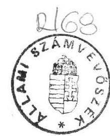
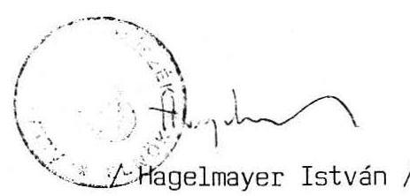
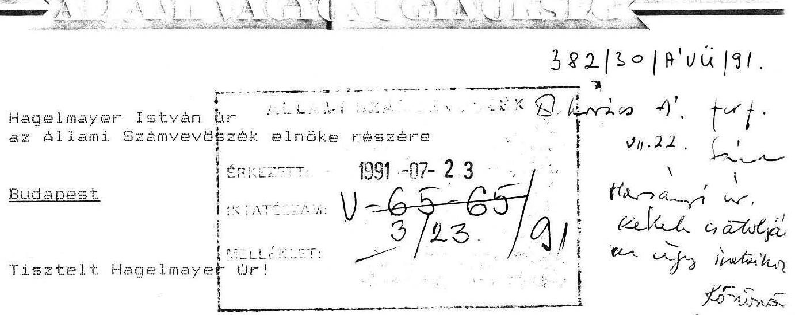
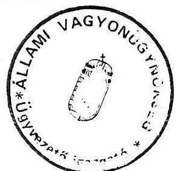
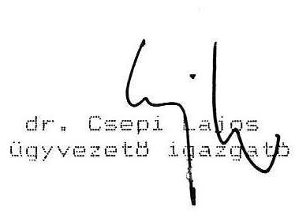
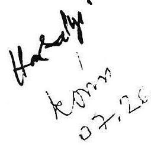

# Allami ভ̆́ámbrböséé 

## JELENTÉS

A Budapest, V. Dorottya u. 1. sz. alatti Gerbeaud-ház privatizációs folyamatának ellenőrzéséről

---

A vizsgálatot végezték:

Harsányi Sándor fôtanácsos dr.Molnár Barnabás tanácsos

---

# ÁLLAMI SZÁMVEVŐSZÉK 

Vagyonkezelő Főcsoport
$V-3 / 22 / 1991$.
Témaszám: 51

## J E L E N T É S

a Budapest, V. Dorottya u. 1. szám alatti Gerbeaud-ház privatizációs folyamatának ellenôrzésérôl

A vizsgálat célja: ismételt képviselôi megkeresést is figyelembe vevő vizsgálati program alapján annak megállapítása, hogy az Állami Vagyonügynökség (ÁvÜ) a Budapest, V. Dorottya u. 1. szám alatti Gerbeaud-ház privatizálásával összefüggésben a GSB Betriebs und Beteiligung GmbH-val (GSB) kötött, annak e privatizálásból való kilépésére vonatkozó egyezségi megállapodásai mennyiben megalapozottak.

Arra kerestünk választ, hogy az ÁvÜ-nek a GSB-vel kötött 1990. október 20-i megállapodása sérti-e a társadalom érdekeit, és ez esetben felelősség terheli-e a szerződés felbontással kapcsolatos terhek tekintetében, az ügy szereplôit a végsõ rendezés további visszásságok elõidézésére alkalmas helyzetbe hozza-e, a TRADE INVEST Kft végez-e vagyonértékelési tevékenységet, illetve a Fôvárosi Bíróság 1990. október 20-i ítélete elleni fellebbezésre a Legfelsőbb Bíróság meghozta-e a másodfokú ítéletét?

A vizsgálat kiterjed az érintett ingatlan privatizálására vonatkozó 1991. januári ÁSZ jelentés javaslatainak végrehajtására, a jelentés óta eltelt idôszak fontosabb fejleményeire is.

---

# I. Elözmények 

Az Állami Számvevőszék a Gerbeaud-ház privatizációját országgyûlési képviselők javaslatára 1991. év januárjában már vizsgálta. A vizsgálat során tett ténymegállapításokról készített jelentését érintett képviselők, az ÁVÜ ügyvezetése, az ÁVÜ igazgatótanácsa, a képviselöcsoportok parlamenti frakciói vezetői, az Országgyûlés Költségveté-si-, Adó- és Pénzügyi Bizottsága elnöke, a Miniszterelnöki Hivatal politikai államtitkára, az Országgyûlés elnöke, a Magyar Köztársaság miniszterelnöke és elnöke részére megküldte.

Vizsgálatunk föbb megállapításai a jelentésben a következők voltak:

A Gabonaforgalmi és Malomipari Szolgáltató Vállalat (GAMSZOV) mint a Dorottya u. 1. szám alatti Gerbeaud-ház ingatlan kezelôje - az ÁVÜ megalapítása és bekapcsolódása elôtt, 1989. decemberében az ingatlan hasznosítására szindikátusi és társasági szerződést kötött az NSZK székhelyû GSB-vel és a budapesti székhelyû TRADEINVEST Kft. (TI) társaságokkal. Ez utóbbi Kft. alapítói között a GSB is szerepel.

A felek 5 millió forint alaptőkével a Gerbeaud-ház kiürítésére, felújítására és szállodaként történő müködtetésére 1989. decemberében létrehozták a GSB TRADE INVEST Beruházás Szervező Kft-t (Társaság). A Társaság alaptôkéjéből a GSB 2500 ezer forintot, a GAMSZOV 2250 ezer forintot, a TI 250 ezer forintot jegyzett. Mellékszolgáltatásként a GAMSZOV vállalta, hogy ingyenesen a Társaság tulajdonába adja - az akkor egymilliárd forintra becsült - Gerbeaud-házat. Ezzel szemben a GSB mellékszolgáltatásként arra vállalkozott, hogy a Társaság céljainak eléréséhez szükséges 1,6 milliárd forintot biztosítja úgy, hogy a finanszírozás összes terhét a Társaság viseli. Ezen elônytelen megállapodáson túl elônytelen volt a magyar fél számára a szavazat rendjére és a nyereség felosztására vonatkozó megállapodás is.

A cégbíróság 1990. februárjában elrendelte a Társaság cégbejegyzését, melyet a Legfelsőbb Bíróság elnökének törvényességi óvása alapján a Legfelsőbb Bíróság 1990. július 3-i határozata törvénysértőnek ítél, de a cégbejegyzést hatályában fenntartotta. Így az alapítói szerződés a magyar jog szerint semmis, mert abban az állami tulajdonban lévő Gerbeaud-házat a GAMSZOV ellenszolgáltatás nélkül adta a Társaság tulajdonába. A cégbejegyzés törlését azért nem rendelte el a Legfelsőbb Bíróság, mivel idôközben a GAMSZOV és a GSB módosították az alapítói

---

szerződést és így lehetôség nyílott a semmisséget eredményező ok megszüntetésére. Ennek következtében a GSB-nek megmaradt a tulajdoni igénye az ingatlanra.

Az alapítói szerződésmódosítás is még mindig hátrányosan érintette a GAMSZOV-ot. A GAMSZOV mellékszolgáltatásának, a Gerbeaud-háznak az értékét egymilliárd forintban határozták meg. A GSB mellékszolgáltatásait is meghatározták úgy, hogy az épület kiürítéséért a GAMSZOV - választása szerint - 500 millió forintot, vagy megfelelő, a magyar állam tulajdonába kerülő csereingatlanokat és még további 100 millió forintot kap. 400 millió forintra értékelték a GSB által a Társaság érdekében külföldön végzett marketing tevékenységet. Ezen kívül 1,1 milliárd forint összeghatárig vállalt kölcsönbiztosítási kötelezettséget a GSB az épület átépítésére, melynek terheit a Társaság viseli. A TI mellékszolgáltatásként a beruházási és fővállalkozói tevékenységet vállalta, melynek értékét a beruházás 10 \%-ában határozták meg. A szavazat rendjére és nyereségfelosztására vonatkozó megállapodás is még mindig egyértelmũen a GSBnek kedvezett. Mindezekért a GAMSZOV vezérigazgatóját a földmũvelésügyi miniszter fegyelmivel elbocsátotta.

Az alapítói szerződés módosítása következtében a szerződésre az illetékes cégbíró előírta az újonnan alapított ÁVÜ jóváhagyásának beszerzését, az időközben hatályba lépett vagyonvédelmi törvényre hivatkozva. Az ÁVÜ a szerződés megkötését a szerzôdes aránytalanságaira való hivatkozással 1990. június 14-én megtiltotta.

Az ÁVÜ határozata ellen a Társaság pert indított, mivel a legfelsőbb bírósági határozat, az ÁVÜ tiltó határozata, valamint a Társaság érintett tulajdonjogának bejegyzését társasági fellebbezésre is elutasító fővárosi földhivatali határozatok nyomán érdemi tevékenység kifejtésére nem volt képes. A Pesti Központi Kerületi Bíróságon indított perben ezideig nem volt döntés, a felek közös kérésére a bíróság 1991. V. 22-i végzésében a peres eljárást 4 hónapra szünetelteti.

A Fővárosi Bíróságon a Gerbeaud-ház több bérlője és az SZDSZ pert indítottak a Társaság és a GAMSZOV ellen az alapítói szerződés érvénytelenségének megállapítása iránt. A Bíróság 1990. október 20. napján hozott ítéletében megállapította az alapítói szerződés érvénytelenségét, vagyis az ingatlan átruházás érvénytelenségét. Az ítélet ellen a Társaság fellebbezett, így az még ma sem jogerős. A Legfelsőbb Bíróság az 1991. június 20-ára kitűzött fellebbezési tárgyalást elhalasztotta.

---

A többszörös függő jogi helyzetre, továbbá a külföldi tőke magyarországi beruházásaira vonatkozó általános összképre is tekintettel, az ÁVÜ megpróbálta szerződéses megállapodással elgördíteni az akadályokat a privatizáció útjából.

Az ÁVÜ Igazgatótanácsa 1990. szeptemberében és október 3-án tárgyalt az ingatlan hasznosítása ügyében. Figyelembe véve az ÁVÜ ügyvezető igazgatójának előterjesztésében szereplő azon alapvető körülményt, hogy 1990. október 3-án is még fennáll a Társaságnak - így a Társaságban a GSB-nek - a tulajdoni igénye az 1989. december 20-i társasági szerződés szerinti Gerbeaud-ház ingatlanra, az ÁVÜ Igazgatótanácsa úgy döntött, hogy az ÁVÜ az érdekeltek által létrehozott üzleti konstrukcióban, az eddigi partner német GSB céggel közös versenytárgyalást írjon ki az ingatlan hasznosítására.

E felhatalmazás alapján az ÁVÜ - a Társaságban fennálló tulajdoni hányadból eredő jogokat a GAMSZOV meghatalmazása alapján gyakorolva - 1990. október 20-án megállapodást kötött a GSB-vel, mely szerint a vállalkozást nyilvános versenytárgyalásra bocsájtják. A tenderen a GSB elővásárlási jogot kapott a legjobb ajánlatnak megfelelő feltételekkel. Amennyiben a GSB ezzel a jogával nem él, a tenderen elért árnövekmény arányában kártalanításra tarthat igényt. A megállapodásban sikertelen pályázat esetére az ÁVÜ kötelezettséget vállalt a korábbi tartalommal az alapítói szerződés módosításának elismerésére, mellyel együtt jár a Gerbeaud-ház tulajdonának átruházása is.

A társasági szerződés korrekt voltának nyilvános versenytárgyaláson történő megméretésével a magyar fél részéről egy kockázatös felülvizsgálatra nyílt lehetőség, ugyanakkor a megállapodással szükségtelenül függő helyzetet teremtett a maga számára.

A pályázat 1990. január 9-i benyújtási határidejét módosították, majd később a pályázati eljárást - a pályázat egyéb feltételeiben várhatóan bekövetkező változásokra hivatkozással - határozatlan időre felfüggesztették. A vizsgálat időpontjáig a pályázatokat azonos okok miatt még nem bontották fel, így nem is bírálták el.

---

E módosításokra az adott okot, hogy a pályázati idő alatt az ingatlan bérlők és az SZDSZ által kezdeményezett perben - a bíróság által felhasználva az ÁVÜ 192/1/II/1990. számú, a társasági szerződés módosí tását megtiltó határozatának indokait - 1990. október 20-án elsõ fokon olyan fôvárosi bírósági döntés született, amely megszüntette a GSB tulajdonosi pozícióját. Ezért a GSB részére a tenderen biztosított elôvásárlási jog indoka megszûnt, az elôvásárlási jog viszont megmaradt. 1991. januárjában a perlekedő felek - az ÁvÜ belsõ anyagai szerint - szóbelileg már úgy nyilatkoztak, hogy visszalépnek minden pertől és az ingatlannal kapcsolatos követeléstől. Ez a körülmény sem indokolta a tendernek a meghirdetett formában való folytatását. Az ÁVÜ nyilatkozata szerint fenti perről, illetve a perben született döntésről a GSB-vel kötött 1990. október 20-i megállapodás idópontjában nem volt tudomása.

Az ÁSZ 1991. január 28-án lezárt vizsgálata során javasolta az épület kezelôi jogának elvonását, megfontolásra ajánlotta a GAMSZOV Társaságban lévõ tulajdoni hányadának elvonását, átfogó megelőző lépések megtételét tartotta indokoltnak a gazdasági tevékenységhez feltétlenül nem szükséges, nagyértékũ irodaházak értéken való hasznosítása érdekében.

# II. Egyezségi megállapodás a GSB-nek a Gerbeaud-ház privatizálásából való kilépésére 

Leírt körülmények és az ÁSZ korábbi vizsgálata is hozzájárultak ahhoz, hogy az ÁVÜ maga kezdeményezze az 1990. október 20-i megállapodás felülvizsgálatát, a GSB-t megillető előjogok kiiktatását. Ugyanis a megállapodás meglévő formáját a közvélemény elôtt sem vélte tarthatónak. Az új helyzetben a GSB képviselójével folytatott megbeszélés alapján az ÁVÜ két lehetôség közül választott. Az egyik

---

az volt, hogy az ÁVÜ egyoldalúan felmondja a GSB-vel kötött 1990. október 20-ai megállapodását és visszavonja a házra kiírt tendert. Ebben az esetben meg kellene várnia az összes folyamatban levô, valamint a felmondás miatt valószínũleg elkezdõdõ újabb per befejezését. Ezt követõen kerülhet sor a ház hasznosítására. E választás negatív visszhanggal járna. A másik lehetôség szerint a GSB hajlandó felmondani valamennyi eddig kötött magyarországi szerzôdését, amennyiben a jó hírét további botrányok elkerülésével megôrizheti, és jogainak lemondásáért, felmerült költségeiért, káráért kártérítésben részesül. Az ÁVÜ az utóbbi utat választotta. A GSB is elismerte, hogy a Fõvárosi Bíróság 1990. október 20-i elsôfokú döntésével egyértelmũvé vált annak ténye, hogy az épület tulajdonjogának az eldöntése jogi eljárás függvénye lett.

A felülvizsgálat eredményeként a kölcsönüs vicszalépésekrôl, a GSBnek és a Társaságnak a Gerbeaud-ház privatizálásából való kilépésére vonatkozó egyezségi megállapodásokról az ÁVÜ és a GSB az általuk képviselt társaságok, vállalatok nevében is 1991. III. 29-én egy szerzôdést és két megállapodást kötött. Ennek értelmében az ingatlan minden kötöttségtôl mentessé vált. Az egyezségre vonatkozó megállapodások - azok angol nyelvũ változatainak ÁSZ által magyar nyelvre lefordíttatott dokumentumai alapján - a következôk:

Az ÁVÜ konzultációs szerzôdést kötött a GSB német érdekeltségũ cégével, a Confidentia GmbH-val tanácsadásra, vagyonértékelésre, megállapodást kötött a GSB-vel az 1990. október 20-i szerzôdés felbontására, a Társaság társasági szerzôdésének, az épület és annak tulajdonjogának a mellékszolgáltatásokra vonatkozó érvénytelenítésére, mindezek cégbíróság részére történõ benyújtására. Külön megállapodást kötött a GSB-vel a kártérítés rendezésére, az 1991. III. 29-én kötött valamennyi szerzôdés és megállapodás kölcsönös függõségére.

---

A Confidentia GmbH tanácsadó céggel kötött konzultációs szerzôdésben a tanácsadó cég az Elsõ Magyar Irodaház Kft tulajdonát képező 16 ingatlan értékbecslésére kapott megbízást, alvállalkozó szaktanácsadók - elôzetes írásbeli beleegyezésen alapuló - foglalkoztatási lehetõségével. Az értékbecslésért fizetett díjak és jutalékok forintban fizetendõ összegét kétmillió USA dollár forint ellenértékében határozták meg úgy, hogy annak $50 \%$-a elôlegként, a további $50 \%$-a pedig valamennyi munka hiánytalan teljesítése után kerül kifizetésre. A magyar fél hibájából bekövetkező szerződésszegés esetén a tanácsadó cég a díjak és jutalékok $50 \%$-ára jogosult. A tanácsadó szerződésszegése esetén az okozott kárt téríti meg. Egy külön nyilatkozatban az ÁVÜ a tanácsadó vagy annak külföldi alvállalkozója részére eszközölt, a szolgáltatások teljesítésével kapcsolatos kifizetésekre magyar adó-, vám-, illeték- és egyéb tehermentességet vagy ezek esetleges kivetése esetén arra teljes kártérítést garantál, egyúttal megadja a Confidentia GmbH-nak azt a jogot is, hogy e szerzôdését átruházza valamely Magyarországon bejegyzett leányvállalatára.

Erre - a közvetett dokumentumok alapján - valószínũleg sor is került, mivel az ÁVÜ által bemutatott banki bizonylatok alapján egy Confidentia GMK-nak a Magyar Takarékszövetkezeti Banknál vezetett 801040090 számú számlájára az ÁVÜ átutalási megbízása alapján, 1991. április 25-i dátummal a Bank 74 millió forintot írt jóvá. Az ÁVÜ gazdasági egységének szóbeli információja alapján 1991. július elsõ felében újabb 80 millió forint kerül átutalásra nevezett GMK számlájára.

A GSB visszalépésére vonatkozó elsõ megállapodás - amelyben az ÁvÜ mint állami hatóság és a GAMSZOV GSB TI Beruházás Szervező Kft-beli tagsági jogainak képviselôje, a GSB pedig saját cégének, valamint nevezett Kft tagjakénti képviselôje szerepel - a felek 1990. október 20-i szerződésének helyébe lép és célul tũzi ki az összes eddigi vitás kérdés rendezését a két fél között.

---

E megállapodásban visszavonhatatlanul felbontottnak tekintik a Gerbeaud-ház épületről szóló 1990. október 20-án aláírt megállapodást. Abban is megállapodtak, hogy minden - a GSB TI Beruházás Szervező Kft alapításakor 1989. december 20-án és 1990. május 3-án és 4-én aláírt társasági szerződésben szereplő - rendelkezés, amely valamilyen módon összefüggésbe hozható az épülettel vagy annak tulajdonjogával, érvényét veszti a tagok által elvégzendő kiegészítő szolgáltatásokra vonatkozóan. A GSB ennek érdekében vállalja, hogy a közgyűlésen az erre vonatkozó indítványt szavazással elfogadja és a GAMSZOV-val egyetértésben intézkedik a tárgyra vonatkozó értesítés cégbíróság részére történő benyújtására.

Mindkét fél kötelezettséget vállal a másik felet ért kárért (veszteségért) általános kártalanítással. A megállapodásra a svájci jogot fogadták el érvényes jognak, a megállapodáskor érvényben lévő nemzetközi magántörvények utasításaira vonatkozó utalásainak nélkülözésével. Bármely vitás kérdést az UNCITRAL "Választott bíróságokra - a Megállapodás időpontjában - érvényes szabályainak" valamint a Magyar- és Osztrák Kereskedelmi Kamara Megállapodásában szereplő rendelkezéseknek a figyelembevételével, kizárólag a Bécsi Kereskedelmi Kamara választott bíróságának van joga véglegesen eldönteni.

A második megállapodásban az ÁVÜ mint állami hatóság, egyúttal a GAMSZOV képviselője és a GAMSZOV partneri jogainak képviselöje a GSB TI Beruházás Szervező Kft-ben, a GSB saját maga, a Confidentia képviselöje és a Trade Invest Kft megbízottja vállalnak kötelezettségeket. Felek az ÁVÜ és a Confidentia GmbH között létrejött szerződés feltételeinek figyelembevételével abban állapodnak meg, hogy a Gerbeaud-ház ingatlannal kapcsolatos vállalkozásra nyilvános versenyfelhívást kell közzétenni, a köztük létrejött 1990. október 20-i megállapodást felmondják, a GSB lemond a társasági szerződés végleges szövegezése szerinti társaság felosztásával kapcsolatos rendelkezéseiről, a GSB nem él az érinteti ingatlanra vonatkozó elővásárlási opcióival, egyetért ezen esemény megfelelő közlésével.

Ezen visszalépés ellentételeként, valamint a jogok felmondásáért és a nézeteltérések végleges rendezése érdekében a GSB kétmillió USA dollárnak megfelelő forint ellenértékű kártérítésre jogosult. Tekintettel az ÁVÜ és a GSB érdekeltségű német Confidentia GmbH tanácsadó cég között létrejött és végrehajtandó szerződésre, a GSB

---

nem követeli ezen kártérítést. Az ÁVÜ ügyvezető igazgatója a vizsgálati jelentéssel kapcsolatos, 1991. juílus 15 -én kelt levelében vonatkozó eseményeket a következőképpen minősíti: "Az ÁVÜ a GSB-vel kötött 1990.október 20-i megállapodás megszüntetése érdekében kötött szerződésekben ténylegesen nem kártérítés fizetését, hanem garantált foglalkoztatás biztosítását vállalta a GSB-vel szemben, bár a szerződéses lánc összefüggése miatt szükségessé vált a "kártérítés" szó használata, a felek akarata azonban garantált foglalkoztatás biztosítására irányúlt, mivel ez felelt meg az ÁVÜ és a GSB érdekeinek."

A két fél a megállapodásokat úgy tekinti, mint az ÁVÜ 192/1/II/1990. számú - a módosított társasági szerződés megkötésének megtiltására vonatkozó határozatának és a Társaság társasági szerződésével és alapszabályával kapcsolatos jóváhagyásának visszavonása. Az ÁVÜ az említett határozatát hivatalosan is tartozik visszavonni. A megállapodás aláírói kötelesek visszalépni a Pesti Központi Kerületi Bíróságnál - az ÁVÜ 192/1/II/1990. számú döntésének jogi felülvizsgálatára a GSB és a Társaság részéről - indított pertől, az említett határozat hivatalos visszavonásának idópontjában.

Amennyiben ezen megállapodás bármelyik rendelkezése, valamint az ÁVÜ és a Confidentia GmbH közötti szerződés törvénytelennek minősülne, úgy ezen megállapodások többi része, a GSB-nek a Társaságból való kilépésérõl szóló megállapodás, valamint az ÁVÜ és a Confidentia GmbH közötti szerződés abban az esetben is érvényes marad.

Ezen megállapodási okmány az említett és ugyanezen napon aláírt előzőekben részletezett - másik két okmánnyal együtt képezi a felek teljeskörü megállapodását az adott témában, s egyik okmány sem értelmezhetô a többiektôl függetlenül. A három okmány közül bármely okmány érvényességének feltétele a másik két okmány érvényessége és teljesítése. Egyik félnek sincs joga e megállapodástól visszalépni, a visszalépés szerzödésszegésnek minősül. A megállapodást követő három éven túl semminemũ követelés egymással szemben nem érvényesíthetõ.

---

Jelen megállapodás elöírásai és rendelkezései, az ÁVÜ és a Confidentia GmbH közötti szerződés, valamint a GSB-nek a Társaságból való kilépéséröl szóló megállapodás csak azt követöen lépnek életbe, amikor ÁVÜ a Confidentia GmbH-val kötött szerződésében foglalt kötelezettségeinek eleget tett. Az ÁVÜ mulasztása esetén a GSB-nek és a Confidentia GmbH-nak együttesen joga van - ezen megállapodás, illetve az ÁVÜ és a Confidentia GmbH közötti szerződés kikényszerítése helyett - egymillió USA dollárnak megfelelő forintösszegű általános kártérítésre, mely már a Confidentia GmbH-val kötött szerződésben is szerepel.

Az ÁVÜ Igazgatótanácsa 1991. V. 8-i ülésén határozott az ingatlan további sorsáról. Az ingatlant jogkörénél fogva - az alapító FM egyetértésével - a GAMSZOV-tól elvonta. Az ingatlanbérlők bérleti szerződéseinek birtokában reális esélyt látnak a bérlőknek az irodaház program keretében elvont irodaházakba való kiköltöztetésére. Az ingatlanra kiírt, határozatlan idôre meghosszabbított tendert módosítják. Az épületben nem kívánnak állami részesedést fenntartani, apportálás helyett az épület $100 \%$-os tulajdonjogának eladását tüzik ki célul. Ezen információkat a tenderre jelentkezõ pályázóknak is megküldték 1991. május 24-én. Nevezett igazgatótanácsi ülésen az ÁVÜ tájékoztatást adott a GSB-vel kötött megállapodásairól. Mindezekkel az Igazgatótanács egyetértett.

# III. Üsszefoglaló - következtetések - javaslatok 

Leírt eseményekből és döntésekből egyértelmũen látható az a törekvés, hogy az ÁVÜ az örökölt rossz tárgyalási helyzetbõl - a külföldi tőke magyarországi beruházásaira vonatkozó általános összképre is tekintettel - nem bírósági eljárásokkal, hanem minden esetben az Igazgatótanács beleegyezését is bíró megállapodásokkal kívánt kikerülni. Az ÁVÜ-nek ez a magatartása nem vitatható.

Az ÁVÜ-t az 1990. október 20-i - a maga számára szükségtelenül kötelmi jogcímet teremtõ - megállapodás megkötésével vagyonvédelmi szempontok is motiválták, amikor az örökölt és új hátrányos feltételek felvállalása mellett célul tũzte ki az épületnek versenypályázat út-

---

ján, piaci értéken történõ társaságba vitelét. Döntéseiben gondosan ügyelt arra, hogy az ügy ne kerüljön a külföldi bíróság és a külföldi sajtó elé.

E megállapodás, s ebben a versenypályázat meghirdetése sikeres pályázat esetén magában hordozta az alapítói szerzõdésmódosításban mellékszolgáltatásként egymilliárd forintra értékelt ingatlan lényegesen magasabb értéken történõ elismertetését, de sikertelen pályázat esetén az általunk is hátrányosnak minõsített módosított alapítói szerzôdés elismerését is. Ez utóbbi együtt járt volna az ingatlanérték licit nélküli elismerésével, a GSB által a Társaság érdekében külföldön végzendõ 400 millió forintos marketing tevékenység irreális értékũ befogadásával, a nyereségfelosztás és szavazás hátrányos voltának eltũrésével. Ugyanakkor a nyilvános meghirdetés fejében az ÁVÜ elõzõeken túl felvállalta a GSB elõvásárlási jogának kikötését, továbbá a GSB vásárlástól való elállása esetén az egymilliárd forintot meghaladó többletbevétel meghatározott részének GSB káraként történõ elismerését, vitás kérdésekben a Magyar Kereskedelmi Kamara melletti Választottbíróság helyett a Zürichi Kereskedelmi Kamara mellett mũködõ Döntõbíróság illetékességét.

Nem adtott segítséget az ÁVÜ végleges döntéseinek kialakításához a különböző bírósági döntések elhúzódása és lezáratlansága. Ugyanakkor a vitás kérdések rendezését igényelte az a körülmény, hogy a Társaság alapítása óta nem tudott mũködni.

Az ÁVÜ és a GSB közti megállapodás kockázatát - utólag, az ÁVÜ-tõl függetlenül, bár az ÁVÜ-nek a társasági szerzõdés módosítását megtiltó határozata indokait is felhasználva - tompította a Fõvárosi Bíróságnak a bérlõk és az SZDSZ által indított perben, az ingalan átruházás érvénytelenségét kimondó, nem jogerõsen hozott ítélete. Az ítélet megszüntette a GSB meglévõ tulajdonosi pozícióját az ingatlanra, így részére az elõvásárlási jog fenntartása sem volt indokolt. E körülményt is felhasználva kezdeményezte az ÁVÜ, hogy a GSB lépjen vissza

---

az ingatlannal kapcsolatos követeléseitől, elővásárlási jogától. Az elővásárlási jog nélkül az ÁVÜ egy kedvezőbb értékesítési árat remél elérni az újabb tenderen.

Az ÁVÜ nem vállalta fel a negatív visszhanggal is együttjáró peres utat. A GSB-vel 1991. március 29-én kötött újabb megállapodásokkal, a GSB által kért kétmillió USA dollárral megegyező forint ellenértékű általános (nem bizonyított) kártérítés ellenében elérte az épületre addig kötött valamennyi megállapodás és szerződés felmondását, az ingatlannak minden kötöttség alóli mentesítését.

A kárösszeg számítása nem dokumentált, így annak mértékét e vizsgálat nem tudta minősíteni.

A GSB az általános kárt nem kéri, hanem helyette a magyar privatizálóc! piac további szereplőjeként ugyanilyen összeg erejéig, versenyeztetés nélkül munkát kért és kapott. E kikötésének teljesítése kölcsönös függéssel - alapjául szolgál valamennyi megállapodásnak.

Mindezek, valamint az a kitétel, hogy az ingatlannal kapcsolatos vállalkozásra nyilvános versenytárgyalást kell közzétennie, arra utalnak, hogy a GSB tisztán, támadásmentesen akart kikerülni e támadható privatizációból. A kár megítélését erkölcsileg tartotta szükségesnek és továbbra is a magyar privatizációs piacon akar maradni.

A GSB-Társaság-ÁVÜ ügy a két megállapodás és az egy szerződés teljesítésével most már nyugvópontra kerülhet, de ehhez az ÁVÜ-nek valamennyi vállalását teljesítenie kell. Csak ezt követően születhet végleges döntés a Társaság sorsa, a GAMSZOV tulajdoni hányadának további indokoltságát illetően és kerülhet újbóli versenypályázat alapján értékesítésre az épület, a benne lévő bérlők igényének rendezését követően. A még meglévő két bírósági perben így a felek visszalépése várható.

---

Jelen nagyértékũ ingatlan ügyének tapasztalatait is felhasználva az ÁVÜ - az ÁSZ javaslatát is elfogadva - beindította az adott gazdasági tevékenységhez szükségtelen nagyértékũ irodaházakra vonatkozó elvonási programját.

Az ÁVÜ-nek a G5B-vel kötött egyezségi megállapodásaiban foglaltak arra utalnak, hogy az ÁVÜ-nek a vállalt cél elérése érdekében nyújtott sorozatos engedményei az ésszerũ kockázatviselés határán mozognak. Az ÁVÜ nem tanúsított határozott ellenállást a G5R követeléseivel szemben. A fellelt dokumentumok alapján, nem lehetett bebizonyítani, hogy keletkezett volna közvetlen kár.

A vizsgálat nem terjedhetett ki a vagyonértékelési munka kapcsán ez ideig megvalósított 't'fizetések jogosságának ellenôrzésére, a munkát végzõ GMK cégbejegyzésének ellenôrzésére, mivel a végleges teljesítést bizonyító dokumentumok a vizsgálat idôpontjáig még nem voltak fellelhetők.

A külföldi félnek, illetve annak magyarországi érdekeltségũ cégének referencia és versenyeztetés nélküli foglalkoztatása azonban sem szakmai, sem hosszabb távú üzletpolitikai szempontból nem jó megoldás. A részére rögzített magas százalékú elôlegfizetés pedig kockázatos döntés.

# J avaslatok: 

1) Az ÁVÜ Igazgatótanácsa vizsgálja felül és minősítse az ÁVÜ-nek a Gerbeaud-ház privatizálása során tanúsított kockázatvállalásait az ésszerûségi szempontok figyelembevételével. Az Igazgatótanács vonatkozó értékelését küldje meg az Állami Számvevõszéknek.

---

2) Az Igazgatótanács vizsgálja meg a GSB-nek megállapított 2 millió USA dollár kárösszeg indokoltságát, s arról az ÁSZ-t írásban tájékoztassa.
3) Az Igazgatótanács soron kívül számoltassa be az ÁVÜ ügyvezetését az ÁvÜ-Confidentia GmbH között létrejött, az irodaházak vagyonértékelésére vonatkozó szerződés teljesítésére történt kifizetések indokoltságáról, a két fél között lévő 1991. április 8-i külön nyilatkozatban foglaltakra, továbbá a megbízott GMK cégbejegyzésének, jogosultságának megállapítására is tekintettel. Megállapításainak eredményéről adjon tájékoztatást az Állami Számvevőszéknek.
4) Az ÁvÜ Igazgatótanácsa és ügyvezetése gondoskodjon az ÁvÜ és a GSB között 1991. március 29-én kötött megállapodások maradéktalan végrehajtásáról, ebben a Gerbeaud-ház értékesítésének az épület bérlői részéről megfogalmazott igényeket is figyelembe vevő feszültségmentes végrehajtásáról.
5) Az ÁvÜ ügyvezetése biztosítsa minden egyes angol nyelven kötött és kötelezettséget vállaló szerződés magyar nyelvű változatának valamennyi illetékes ÁvÜ igazgatóság, illetékes gazdasági vezető részére történő időbeni eljuttatását, ellenkező esetben a vállalt kötelezettségek teljesítése és az ezekre történő kifizetések ellenőrzése pénzügyi vonatkozásban nincs biztosítva.

Budapest, 1991. július 29.

---

Köszönettel vettük az Allami Számvevôszéknek a Compack RT privatizációjáról és a Gerbeaud-ház ügyéról készült jelentését és különösen azt, hogy a vizsgált témák megközelitése tárgyszerü és a privatizáció során szükségszerűen megjelenô üzleti vonásokat jóindulatúan kezelő volt.
észrevételeink a Gerbeaud-jelentéssel kapcsolatosan az alábbiak:

1. Az AVÜ a GSB-vel kötött 1990. október 20-i megállapodás megszüntetése érdekében kötött szerzödésekben ténylegesen nem kártérités fizetését, hanem garantált foglalkoztatás biztosítását vállalata a GSB-vel szemben, bár a szerződéses lánc összefüggése miatt szükségessé vált a "kártérités" szó használata; a felek akarata azonban garantált foglalkoztatás biztosítására irányult, mivel ez felelt meg az AVÜ és a GSB érdekeinek.
2. A jelentés 7. oldalán kifogásolják a vizsgálat lefolytatói, hogy miért fizetett az Allami Vagyonügynökség 74 millió Forintot a Confidentia GNK részére egy 1991. augusztus 4-i szerzödésre való hivatkozással. Az idópont elírás, mely fordításbeli hibából adódik, ugyanis a számmal irt, 1991. április 8-i dátumot (08. 04. 1991.) helytelenül ültették át magyarra.

A további eredményes együttmüködés reményében
tisztelettel:

Budapest, 1991. július 15.

dr. Csepi
ügyvezető i a a

---

Budapest, 1991. július 29. $\mathrm{V}-3-21 / 1991$.
dr. M Á D L FERENC úr
Állami Vagyonügynökség
Igazgatótanácsának elnöke

# B U D A P E S T 

Tiszte1t Mád1 Úr!

Az Állami Számvevőszék a Gerbeaud-ház privatizációjának folyamatával kapcsolatban vizsgálatot végzett. A vizsgálatról készített "Je1entés"-t az Állami Számvevőszék E1nöki értekez1ete elfogadta.

Tekintettel arra is, hogy a "Je1entés" az Ön irányítása alá tartozó Igazgatótanács részére javasol intézkedéseket, a jelentést megküldöm.

Tájékoztatom E1nök urat arról, hogy az ÁvÜ ügyvezető igazgatója két kisebb pontosítási megjegyzés mellett elfogadta a vizsgálati megállapításokat és egyetértett a javaslatokkal. A pontosító észrevételeket átvezettük.

Kérem E1nők urat, hogy az 1989. évi XXXVIII.tv. 25.szakaszában foglaltaknak megfelelően a jelentés megállapításaira és javaslataira - egyetértés esetén is - írásbeli észrevételt tenni szíveskedjék.

Tisztelettel
Hagel
/ Hage lmayer I István /