# Allami Számbeböséé 

## ÖSSZEFOGLALÓ JELENTÉS

a közmúves ivóvízellátás, a szennyvízelvezetés és -tisztítás helyzetéról, továbbá a közmú olló alakulásáról
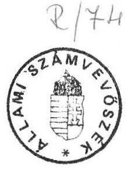

---

# Állami Számvevőszék 

Területi Főcsoport
V-19-10/1991.
Témaszám: 44.

## ÖSSZEFOGLALÓ JELENTÉS

a közmüves ivóvizellátás, a szennyvizelvezetés és -tisztitás helyzetéről, továbbá a közmü olló alakulásáról

## I.

E 1 ő $z$ m é $n$ y e k

Az Állami Számvevőszék az 1990.II. félévi, valamint az 1991. I.félévi munkaterve alapján vizsgálatot végzett

- az egészséges ivóvizellátás feltételeinek javitására forditott eszközök és
- a szennyvizelvezetésre és -tisztitásra forditott eszközök felhasználásáról.

A vizsgálatokról készített összefoglaló jelentést megküldte az Országgyülés illetékes Bizottságainak, és az érintett minisztériumoknak. A vizsgálat során az eszközök felhsználásának ellenőrzése mellett, az ehhez szorosan kapcsolódó, s összefüggésben lévő reálfolyamatok elemzésére és értékelésére is sor került. Igy mindkét jelentés részletesen foglalkozik az ivóvizellátásra, a szennyvizelvezetésre és -tisztitásra, az ellátás bővitésére forditott beruházási pénzeszközök felhasználásával, továbbá az ivóvizellátás és a csatornaellátás alakulásával, s jelenlegi problémáival.

A két vizsgálat egymástól részben függetlenül részletesen foglalkozott az egyébként szorosan összefüggő témakör 1986-1990 közötti időszakának értékelésével, s csak kevesebb teret szentelt az ezt megelőző évtizedek ivóvizellátási, szennyvizelvezetési és -tisztitási fejlesztési tevékenységek elemzésének. A jelenlegi helyzet kialakulásának okaival és a közmü olló kérdéseivel kapcsolatos megállapitásokat ezen összefoglaló

---

jelentés mutatja be, elemezve az elmúlt negyven év ivóvizellátásának, szennyvizelvezetésének és -tisztitásának fejlődési tendenciáit.

Az összefoglaló jelentés megállapításait - az előzőekben említett két vizsgálaton túlmenően - a mellékelt számszaki táblázatok és ábrák támasztják alá.

# II. 

A közmüves ivóvizellátás, szennyvizelvezetés és- tisztitás kialakulásának és kezdeti fejlődésének rövid áttekintése.

Az ivóviz az emberek életfunkciójának és a higiéniás kulturájának nélkülözhetetlen feltétele, amely végig kiséri az emberiség fejlődését. Igy történt ez Magyarországon is, ahol korábban az ivóvizellátást felszini vizekből és ásott kutakból oldották meg, majd az 1800-as évek közepétől elkezdődött a közmüves ivóvizellátó müvek épitése. A vezetékes ivóvizellátás koncentrált gyors ütemü fejlesztése az I. Világháborúig tartott.

A vezetékes szennyvizelvezetés szükségességét csak később ismerték fel — elsősorban a természetes járványok /kolera,pestis/ pusztitásai - következményeként. Az első közmüves csatornákat ugyancsak koncentráltan a múlt század végén, a századfordulón kezdték el épiteni.

A két Világháború között lényeges fejlesztésre nem került sor, főképpen Budapesten, s néhány ipal rendelkező városban épültek viziközmüvek. Igy 1937-ben az ország lakosságának csupán $21 \%$-a részesült közmüves ivóvizellátásban. A csatornázásban pedig elsősorban az egyesitett rendszeriuek /szennyviz és csapadékviz/ megvalósitására került sor Budapesten és néhány nagyobb városban.

A II. Világháború a közmüvekben is súlyos károkat okozott /ivóviz -és csatornahálózat, szennyvizátemelő müvek/. A háborus károk kijavitása és helyreállitása után 1945ben130 településen, az ország összlakosságának $22 \%$-a részesült közmüves, vagy közmüves jellegü ivóvizellátásban. Vezetékes ivóvizellátás a fővárosban, néhány iparilag fejlett dunántúli és észak-magyarországi városban; az Alföldön Debrecen, Szeged és Szolnok városokban volt. A községek közül csak néhány bánya -és ipari

---

érdekeltségű lakótelep, egyes idegenforgalmi szempontból jelentős település rendelkezett ivóvizellátással. Az Alföld dél-keleti térségében az un. kúttársaságok biztosítottak kielégítő körzeti ivóvizellátást.

A szennyvizelvezetés és -tisztitás igen alacsony szintről indult. Ekkor csak a fővárosnak és néhány nagyobb városnak volt közüzemi csatornahálózata, s a tisztított szennyvíz mennyisége sem volt számottevő. 1945-ben az ország összlakosságának csupán $18 \%$-a vehette igénybe a közüzemi vezetékes szennyvizelvezetés lehetőségeit, 24 városban volt csatornamü és 8 városban müködött valamilyen hatásfokú szennyviztisztitás.

# III. 

Az elmúlt negyven év fejlődésének értékelése a közmüves ivóvizellátás, szennyvizelvezetés és -tisztitás területén.

A II. Világháborút követően, — az 1950-es években - a viziközmüvesítés üteme elsősorban a főváros és a nagyobb városok külső kerületeiben, továbbá az un. új városokban /Komló, Dunaujváros, Kazincbarcika, stb./ növekedett. Megindult a községek ivóvizellátásának fejlődése is. Az ivóvizellátás fejlesztése a lakásépités gyorsabb ütemével függött össze.

Az összlakosság ivóvizellátásának aránya öt év alatt 6 százalékponttal növekedve 1950-ben már $28 \%$-ot ért el. A következő öt évben a túlzott iparosítás miatt a vizellátás háttérbe szorult, ezért 1955-ben csak 2 százalékpontos növekedés következett be, amelynek eredményeképpen az ellátottság aránya $30 \%$ lett, ami a következő öt év ismét dinamikusabbá váló üteme miatt 1960-ban $35 \%$-ra nőtt /ezen belül a városokban $75 \%$-os, a községekben azonban csak $10 \%$-os ivóvizellátottsági arány alakult ki/. Ebben az öt évben növekedés mutatkozott a közkifolyók és a közkutak területén, mig a magán /ásott és fúrt/ kutak vizének romlása ekkor kezdett érezhetően jelentkezni.

A csatornázás fejlődése - ezen időszakban - elsősorban a fővárosra, s az új városokra /Komló, Oroszlány, Várpalota, stb./ terjedt ki. A községekben főleg a bányászat -és az iparfejlesztéssel érintett egyes települések csatornázására került sor.

---

A lakosság közcsatornaellátottsága ötévenként alig 1 százalékponttal bővült, ezért 1950-ben csak $19 \%$, 1955-ben $20 \%$, s 1960-ban $21 \%$ volt.Mivel az 1945-1960 közötti másfél évtizedben az ivóvizellátás növekedés üteme ötévenként mintegy ötszöröse a csatornázásénak igy az u.n. közmü olló fokozatosan nyilt és az 1945. évi $4 \%$-kal szemben 1960-ban már $14 \%$-os mértéküvé vált.

A hatvanas években és a hetvenes évek elején az ország egyes térségeiben a helyi vizkészletek jelentős mértékben kimerültek, illetve hiányoztak, és megjelentek a vizminőségromlás jelei is. Ennek a problémának a feloldását szolgálta - az ötvenes évek végétől a községi lakosság egészséges ivóvizellátását elősegitő viziközmü társulati mozgalom fejlődése. Az ivóvizellátás hiányának megszüntetését és az ellátás biztonságának megteremtését célozta a kistérségi, majd a regionális viztermelő- szolgáltató rendszerek fokozatos kiépitése, elsősorban Észak- Magyarországon, Közép- és Dél-Dunántúlon, a kiemelt üdülő térségekben /Balaton, Velencei-tó/, s a fővárosi agglomerációban. Serkentőleg hatott a közműves ivóvizellátás fejlődésére a gyorsuló lakásépités közmüháttere megteremtésének szükségessége is. A fejlesztések következtében gyors, a korábbiakat lényegesen meghaladó ütemben emelkedett a lakosság közmüves ivóvizellátása: 1965-ben a lakosság $45 \%$-a, 1970-ben $55 \%$-a, 1975-ben $66 \%$-a, 1980-ban már $75 \%$-a. /Ezen belül a városokban a lakosság $90 \%$-a a községekben $47 \%$-a / részesült közmüves ivóvizellátásban.

A csatornázás és fejlődési üteme elmaradt az ivóvizellátásétól és a megvalósitása e két évtizedben is elsősorban a városokra koncentrálódott. A községi csatornázást ugyan elősegítette volna a viziközmü társulati mozgalom, azonban a lehetőségeket alig vették igénybe. A lakosság közcsatornaellátottsága ezért 1965-ben csak $25 \%$-os, 1970-ben $28 \%$-os, 1975-ben $35 \%$-os, 1980-ban $40 \%$-os volt. A csatornázásnak - az ivóvizellátástól elmaradó - lassú ütemű fejlődésénél lényegesen kisebb mértékben, szinte alig fejlődött a szennyviztisztitás. A közcsatornán összegyüjtött és elvezetett szennyvizek csak igen kis - bár növekvő - hányada került tisztitásra 1970-ben 8 \%-a, 1975-ben $20 \%$-a, 1980-ban $29 \%$ - a. A szennyviztisztitás említésre méltóan csak a fővárosban fejlődött, mert még a nagyobb vidéki városokban sem létesültek szenny-viztisztitó-telepek. Részben ezért, részben a mezőgazdaság fokozódó kemizálása miatt tovább romlott a talajvizek minősége, egyes vizfolyások jelentős szakaszai elszennyeződtek, s néhány térségben a felszín alatti vizkészletek is veszélyeztetetté váltak.

Megállapitható, hogy az ivóvizellátás dinamikus fejlődésével nem tartott lépést a szennyvizelvezetés, s különösen a szennyviztisztitás összehangolt megvalósitása. Növe-

---

kedett a felhagyott ásott kutak vizminőség rontó használata, az ipari és háztartási /lakossági/ szennyvizek nem kielégitő minőségű tisztitása, elhelyezése, s a mezőgazgasági szennyezések /mütrágya, növényvédőszer, állattartótelepek használtvizei/ oda vezettek, hogy a hetvenes évek végén mintegy 900 település ivóvize közegészségügyileg elfogadhatatlan /nitrátos/ minőségű volt.

A nyolcvanas évek első felében a közmüves ivóvizellátás igen gyors ütemben növekedett, igy 1985-ben már a lakosság $84 \%$-a 1900 településen /9 millió fő/ vehette igénybe az egészséges ivóvizellátás adta lehetőségeket /a városi lakosság $92 \%$-a, a községi lakosok $55 \%$-a volt közmüves ivóvizzel ellátva/. Az összlakásállomány $65 \%$-a /2,5 millió lakás/ volt bekötve a közüzemi ivóvizellátó hálózatba. Különösen a községekben sikerült a lakosság - viziközmü társulati úton történő - résztvállalását megnyerni. Lényegesen javult az ivóvizszolgáltatás biztonsága és zavartalansága Az ivóviztermelő kapacitás elérte a napi 4,2 millió $\mathrm{m}^{3}$-t.

A szennyvizelvezetés és -tisztitás is gyorsabban fejlődött a korábbinál ezért 1985. végén a lakosság $46 \%$-a /4,9 millió fő/, az összlakásállomány $39 \%$-a /1,5 millió lakás/ rendelkezett közmüves szennyvizelvezetéssel, de ennek ellenére nem tudott lépést tartani az ivóvizellátás dinamikus bővülésével. Még rosszabb a helyzet a közüzemi szennyviztisztitó telepeknél, amelyek kapacitása csak napi 1,2 millió $\mathrm{m}^{3}$, igy lényegesen elmarad az ivóvizmüvek kapacitásától, s a közcsatornán elvezetett összes szennyviznek 1985-ben is csak $41 \%$-a került biológiailag tisztitásra. 1985 végén mindössze 305 településen volt közüzemi szennyvizelvezetés, illetve szennyviztisztitás.

Az ivóvizellátás és a szennyvizelvezetés, valamint szennyviztisztitás aránytalan fejlesztésének következményeként felgyorsult a vizek - s különösen a talajvizek szennyeződésének, elsősorban nitrátosodásának folyamata. A közegészségügyi hatóságok újabb településeket minősítettek közegészségügyileg veszélyeztetettnek, s igy — miközben több településen megoldódott a közüzemi ivóvizellátás - 1985. év végén 14 megye összesen közel 800 települése nem rendelkezett egészséges ivóvizzel.

A WHO nemzetközi kutatási programjának keretében az Országos Közegészségügyi Intézet az 1980-as évek elején, a dél-alföldi térségben, a mélyfúrású kutak vizében a határértéket meghaladó $/ 0,05 \mathrm{mg} /$ liter/ - természetes eredetü, a mélységi rétegekből származó - arzénkoncentrációt észlelt. Az ivóvizek arzénszennyeződés hat megye /Bács-Kiskun, Békés, Csongrád, Hajdú-Bihar, Heves, Jász-Nagykun-Szolnok/ 68 településének 450 ezer lakósát érintette.

---

A Kormány által 1983.évben elfogadott Balatoni Vizminőségjavitási Program, továbbá a Balatoni Vizgazdálkodási Fejlesztési Program, s az ezekben megfogalmazott, vizminőségvédelmi feladatok hozzájárultak a kiemelt üdülőtérségek szennyvizelvezetési és -tisztitási feladatai megvalósitásának gyorsitásához. Ezen időszakban a fővárosban és egyes nagyobb vidéki városokban /Debrecen, Pécs, Miskolc, Szombathely, Veszprém, Székesfehérvár stb./ is elkezdődött a szennyviztisztitás fejlesztése.

A nyolcvanas évek második felében is folytatódott a lakosság egészséges ivóvizellátásának fejlődése. Ennek eredményeként 1990. év végén az ország összlakosságának $92 \%$-a /a városiak $96 \%$-a, a községi lakosok $72 \%$-a/ 9,6 millió fő - döntően / 91 \%-ban / felszín alatti vizkészletekből - már közüzemi ivóvizellátásban részesült, ami nemzetközi összehasonlításban, arányát tekintve a fejlett európai átlagszinvonalat közelíti. Magyarország 3065 településéből 1990. év végén, 2450 rendelkezett közüzemi ivóvizellátással, a vezetékes ivóvizellátásba bekötött lakások aránya $74 \% / 2,9$ millió lakás/.

Az ivóvizellátásban elért kétségtelen eredmények mellett azonban - a vizsgálat megállapítása szerint 1990. év végén 442 települést a nitrátszennyezettség, 30 dél-alföldi települést pedig az arzénszennyezettség miatt az egészségügyi szervek veszélyeztetettnek minősítettek. A nitrátszennyezettség 265 ezer főt, mig az arzénszennyezettség 206 ezer főt érint. Ezen települések egészséges ivóvizellátását az önkormányzati törvény értelmében 1994. év végéig kellene megoldani.

A közüzemi ivóvizellátás céljaira döntően - a kedvező hazai adottságok következtében - a felszín alatti vizkészleteket /parti szürésű, karsztviz, rétegviz/ hasznosítják. Egyes térségekben a felszíni vizek felhasználására is sor kerül /pl. Budapest, Balaton térsége, Észak-magyarországi tározók, Keleti Főcsatorna. /A talajviz gyakorlatilag ivóvizellátás céljaira már alig használható. A közüzemi ivóviztermelés származás szerinti megoszlása a következő:

| Felszini viz | $9 \%$ |
| :-- | --: |
| Felszinalatti viz | $91 \%$ |
| ebből: partszürésű | $43 \%$ |
| talajviz | $3 \%$ |
| rétegviz | $38 \%$ |
| karsztviz | $7 \%$ |

---

Az ivóvizmüvek megvalósitásának egyik legnagyobb költségét jelentő része az ivóvizhálózat épitése. A II. Világháborúig a vezetékhálózatokat öntöttvasból és azbesztcementből készitették. Az 1960-as években Magyarországon az öntöttvascső gyártását megszüntették, viszont növelték az azbesztcementcső gyártását. Az 1970-es években elkezdődött a müanyagcsövek gyártása, továbbá a nagyátmérőjű vasbetoncsövek hazai előállítása, s fokozatosan sor került az acélcsövek használatára is. Az ivóvizhálózat jelenlegi csőanyag szerinti összetétele: acélcső $4,0 \%$, öntöttvascső $5,6 \%$, azbesztcementcső $59,4 \%$, müanyagcső $30,6 \%$, vasbetoncső $0,2 \%$, egyéb anyagból $0,2 \%$. A csőhálózat $90 \%$-a korszerű anyagból készült.

Az ivóvizhálózat kor szerinti összetétele a következő:
1900. év előtt épült $1,2 \%$, 1901-1945 között épült $4,4 \%$, 1946-1960 között épült $6,7 \%$, 1961-1970 között épült $17,3 \%$, 1971-1980 között épült $34,6 \%$, 1981. év után épült $35,8 \%$.

Az ivóvizvezetékhálózat $87,7 \%$-a az elmúlt harminc esztendőben épült. Ez alól a Főváros kivétel, mivel az ivóvizhálózat 12,5 \%-a 1900. előtt; 27,6 \%-a 1901-1945 között; 16,9 \%-a 1946-1960 között épült, a hálózat ilyen összetétele jelzi a nagyobb, váratlan hibák lehetőségeit.

A csőidomok, szerelvények, elzáró szerkezetek a csőhálózatban általában megfelelnek a kor müszaki követelményeinek, viszont esetenként nem elégitik ki a modern távirányitás, távmüködtetés, távjelzés feltételeit.

Az elmúlt években ivóvizszolgáltatási probléma, ivóvizkorlátozás csak egyes térségekben, s csak időszakosan fordult elő. Ezek részben havária jellegű problémák /csőtörések, szennyeződések, stb./ részben pedig a vizfogyasztók nem megfelelő, esetenként pazarló vizhasználati magatartásának következményei voltak.

A nyolcvanas évek közepétől az egyre növekvő környezetvédelmi feltételek sürgetővé tették a szennyvizelvezetés és a szennyviztisztitás dinamikusabb fejlesztését. Ennek érdekében felülvizsgálták a Balatoni Vizminőségvédelmi Programot, gyorsitva a szennyvizelvezetési és -tisztitási feladatok megvalósitását. 1985-ben egyes jelentős vizminőségvédelmi térségek és nagyobb ipari városok /Debrecen,Győr,Miskolc, Pécs,Komárom,Esztergom,Tatabánya,Oroszlány/ szennyviztisztitási feladatait kormányzati döntési körbe vonták. Ennek eredményeként a Balaton térségében és a kiemelt vizminőségvédelmi területeken /nyolc város/ kissé gyorsult a szennyvizelvezetés és

---

-tisztitás fejlődése. A közüzemi Viz- és Csatornamú Vállalatok, a viziközmü társulatok növekvő részt vállaltak a vizminőségjavitási feladatokból. Sajnos a tanácsi döntési körben általában nem történt lényeges előrelépés, elsősorban a beruházási pénzeszközök hiányára hivatkozva, s igy még az Észak-pesti szennyviztisztitó-telep további ütemeinek kiépitése is leállt.
1990. év végén az ország lakosságának $51 \%$-a $/ 5,3$ millió fő/ élt közcsatornázott területen, s az összlakásállomány $42,5 \%$-a / 1680 ezer lakás/ volt bekötve a közüzemi csatornahálózatba. Magyarország 3065 településéből 332 helyen müködött különböző fokozatú és nagyságú szennyviztisztitó-telep,amelyek 375 települést szolgáltak ki. További 50 település közcsatornahálózattal rendelkezett, ahol azonban az összegyüjtött szennyvizek tisztitatlanul folynak a befogadóba, közvetlen vagy közvetett szennyezési forrásként az adott térségek ivóvizkészleteire. A közcsatornán elvezetett napi 2,4 millió $\mathrm{m}^{3}$ szennyvizmennyiségnek csak $60 \%$-át, napi 1,45 millió $\mathrm{m}^{3}$-t tisztitanak, s a biológiai tisztitás aránya csupán $42 \%$.

A közüzemi csatornahálózat összetétele a cső anyaga szerint a következő: előregyártott beton és vasbeton $30,9 \%$, monolit beton és vasbeton $22,5 \%$, öntött vas $0,2 \%$, kerámia $1,5 \%$, falazott $2,0 \%$, egyéb $42,9 \%$.

A közüzemi csatornahálózat kor szerinti összetétele:
1900 év előtt épült 3,9\%, 1901-1945 között épült 8,8\%, 1946-1960 között épült 7,4\%, 1961-1970 között épült $12,8 \%, 1971-1980$ között épült $26,1 \%, 1981$ után épült $40,9 \%$.

A csatornahálózat $80 \%$-a az elmúlt harminc évben épült. A főváros esetében 1961-1990 közötti időszakban a hálózat 56,3 \%-a épült, $13 \%$-a 1900 előtt, $18 \%$-a 1901-1945 között és $12,7 \%$-a 1946-1960 között létesült.

A szennyviztisztitó-telepek között — tisztitástechnológiai szempontból — a különböző töltetü csöpögtetőtestes, a teljes oxidációs és az anaerob iszaprothasztással párosuló nagyobb terhelésű eleveniszapos rendszerek találhatók meg. A közüzemi szennyviztiszitó telepek egyrésze a szennyvizbirságról szóló rendeletben előirt határértékek közül nem mindegyiket képes teljesiteni. Ennek oka egyrészt a korszerütlenségre, a mérési és a beavatkozási rendszer hiányosságára, s nem utolsó sorban a túlterhelésre vezethető vissza. Gyakori a hálózati hiányosságokból származó hidraulikai túlterhelés /infiltráció, csapadékviz, talajviz, orvbekötés, stb./.

---

A közüzemi szennyviztisztitó-telepek szennyezettségi túlterhelését egyrészt az ipari termelésből eredő anyagok, másrészt - több település esetében - a települési szippantott szennyvizek okozzák. Az ipari termelés gyártási technológiái nincsenek összhangban a vizminőségvédelmi, környezetvédelmi követelményekkel. Az ipari szennyvizelőtisztitók vagy nincsenek, vagy csupán egy-egy szelektív anyag leválasztására alkalmasak. Komplex ipari szennyvizelőkezelő sajnos még mindig kevés. Az előkezelők megvalósitásának, illetve a meglévők hatékony müködtetésének legnagyobb akadálya, hogy általában nem megoldott sem a visszamaradt anyagok környezetkimélő újrahasznosítása, sem az ártalommentes elhelyezés feltétele és lehetősége.

A mérgező anyagok befolyásolják, sőt akár meg is gátolják a szennyviztisztitási folyamatból kikerülő folyékony, vagy szilárd fázisok hasznositását. E tekintetben a csatornabirság kiszabása is csak tüneti megoldás, mivel a közüzemi szennyviztisztitótelepekre igy átháritott feladat - a teljes iszaptömeg toxikussá válása miatt indokolatlanul fokozott mértékű, igen nehezen megoldható problémát jelent/pl. a budapesti bőrgyárak krómtartalmú szennyvizeinek az észak-pesti szennyviztisztitó telepre gyakorolt hatása/.

A szennyvizek és a szennyviziszapok hasznositásában, valamint ártalommentes elhelyezésében — néhány kivételtől eltekintve /Kecskemét, Cegléd, Miskolc, Debrecen, Balaton-térsége/ - komolyabb előrelépés alig történt. A szennyviztisztitó telepeken keletkező évi mintegy 700 ezer $\mathrm{m}^{3}$ szennyviziszap összes szárazanyagtartalma évente közel 100 ezer tonna, ennek $19 \%$-át átmeneti, $15 \%$-át végleges depómiákban, $25 \%$-át szántóföldön, $2 \%$-át erdőben, $12 \%$-át komposztáló telepeken, $27 \%$-át pedig egyéb ismeretlen módon helyezik el. A mezőgazdasági nagyüzemek egyrésze a tisztitott közüzemi szennyvizet, továbbá a nem toxikus szennyviziszapot fogadja ugyan /általában térités fejében/, de ezt csak nagyüzemi táblákon és csak egyes kulturákhoz lehet felhasználni. Háztáji gazdaságokban, illetve kisebb parcellákon egyenlőre még az iszap elhelyezését nem engedélyezik, illetve nem javasolják.

Igen lényeges közegészségügyi és környezetvédelmi problémát okoznak a közüzemi csatornahálózattal nem rendelkező területeken a szippantott házi szennyvizek. Mintegy 1 millió házi ülepitő müködik, amelyeknek csupán egyharmada van előirásnak megfelelően kiépitve. A szippantás után a közüzemi szennyviztisztitó telepekre történő szállitás és ottani kezelés oldja fel a problémákat. Az esetben azonban, ha a begyüjtött szennyvizeket nem ellenőrizhető módon helyezik el - s ez gyakorta megtörténik igen komoly környezetszennyezési folyamat indul el.

---

Magyarország településeinek közüzemi szennyvizelvezetése, de különösen a szennyvizek tisztitása európai viszonylatban igen elmaradott. A fejlett gazdaságú országok már a hetvenes években elérték, hogy a csatornázás szinvonala szinte azonos az ivóvizellátáséval, vagy igen közel áll ahhoz. A szennyvizek tisztitásában pedig a nyolcvanas évek elejére már elérték a 70-100 \%-os arányt is.

# IV 

A közmü olló alakulása, s az aránytalanságok létrejöttének fóbb okai.

A településekből /a lakossági és intézményi/, az ipari üzemekből a vizfogyasztás növekedésével, a vizhasználatok koncentrálódásával nagy mennyiségủ szennyviz keletkezik. Ez az ember egészségét, a természeti környezetet, a gazdaság megfelelő müködését veszélyezteti. A használt viz nagyobb hányada - minőségileg lényegesen megváltozva - visszakerül a természetbe, a hidrológiai körforgásba. Az elhasznált, szennyezett vizet a környezeti károkozás megelőzése érdekében gyorsan és biztonságosan össze kell gyüjteni, s a befogadóba való bevezetés előtt meg kell tisztitani.

Alapvető követelmény a vizkészletek megóvása a szennyeződéstől. E célokat szolgálja a szennyvizcsatornák és a szennyviztisztitó-telepek megvalósitása, a létesitmények szakszerű müködtetése.

Az elmúlt negyven évben az ivóvizellátás gyorsütemü fejlődésével nem tartott lépést a csatornázás, de különösen a szennyviztisztitás fejlesztése. Az ivóvizellátás az ötvenes évek végétől a hatvanas évek elejétől — a társulati mozgalom új formában való feléledése következtében - különösen a községekben igen gyors fejlődésnek indult. Ez a forma az állampolgárok önkéntességén alapult, a lakosság és egyéb érdekeltek pénzeszközének igénybevételével, tanácsi és központi /OVH Vizügyi Alap/ támogatással, hosszúlejáratú és alacsony kamatú OTP hitellel. A szennyvizelvezetés, főleg a szennyviztisztitás a hetvenes években, illetve a nyolcvanas évek elején kezdett gyorsabban fejlődni. A szennyvizek, a szennyviziszapok hasznositása és az iszapok ártalommentes elhelyezésének kérdéseiben azonban még csak kezdeti eredmények tapasztalhatók.

---

A kialakult feszültségeket elsősorban az un. "közmű olló" /a lakosság közmüves ivóvizellátási arányának és a közmüves csatornaellátási arányának eltérését mutatja be \%-ban/ alakulásával lehet jellemezni, az aránytalan fejlődést azonban további ollók is bemutatják, igy a kapacitás olló /a közmüves ivóviztermelő és a szennyviztisztitó kapacitás különbséget mutatja be millió m3/nap-ban/ és a vizminőségi olló/ az összes közüzemi csatornahálózaton elvezetett szennyvizből a biológiailag tisztitott szennyviz arányát mutatja be \%-ban/. Az elmúlt két évtizedben ezek a következők szerint alakultak:

| Megnevezés | 1970 | 1975 | 1980 | 1985 | 1990 |
| :-- | :-- | :-- | :-- | :-- | :-- |
| Közmü olló $/ \% /$ | 27 | 31 | 35 | 38 | 41 |
| Kapacitás olló/M.m3/nap/ | 1,8 | 2,5 | 2,8 | 3,0 | 3,4 |
| Vizminőségi olló $/ \% /$ | 8 | 20 | 29 | 41 | 42 |

Az aránytalanságok úgy alakultak ki, hogy mindkét szakágazat /ivóviz és szennyviz/ jelentős mértékben fejlődött. Amint az az előzőekben is bemutatásra került az ivóvizellátás aránya az 1945 évi $22 \%$-kal szemben 1990 -re $92 \%$-ra, a csatornaellátás aránya pedig ugyanez időszak alatt $18 \%$-ról $51 \%$-ra bővült. Az egyenlőtlen fejlődés miatt az 1945 -ös $4 \%$-os eltérés $41 \%$-ra nőtt.

A kialakult aránytalanságok főbb okai a következőkben foglalhatók össze:.

- a lakosság egészséges ivóvizellátása elsőrendű és igen szoritó közüzemi szükségletként jelentkezett, s jelentkezik ma is. Igy az 1960-as évek elejétől az állampolgárok hajlandók voltak pénzügyileg is résztvállalni az ivóvizellátásuk mielőbbi megvalósitásában, s a viziközmü társulatokba belépve elsősorban az ivóvizellátást tekintették alapvető érdeküknek;
- a különböző szintü/megyei, városi, községi/ tanácsok az előzőekből eredően kényszerhelyzetben is voltak a lakosság jogos igényeinek kielégitésében. Erősitette ezt a tendenciát az is, hogy az egészséges ivóvizellátás megoldását két kormánydöntés is előirta /1977-ben a közegészségügyileg veszélyeztetett települések, 1983-ban a dél-alföldi térség vizminőség javitása kérdésében/.

---

Az önkormányzatokról szóló 1990. évi LXV törvény 8. és 112. paragrafusa is a települések egészséges ivóvizellátásának megoldását irta elő 1994-ig;

- a szennyvizelvezetés, s különösen a szennyviztisztitás megvalósitásának fajlagos költségei többszörösét teszik ki az ivóviztermelés és ellátás költségeinek. Igy ez a tény, valamint a folyamatosan szükülő pénzügyi lehetőségek együttes hatására a csatornázást - a lakótelepek , s a telepszerű lakásépités miatt - általában megvalósitották a tanácsok, mig a középtávú terveikben előirányzott szennyviztisztitótelepek épitését elhagyták, vagy leállitották;
- a viziközmủ társulatok megalakitása során a központi támogatások odaitélésénél nem részesitették előnyben a csatornázást. Csak 1986-tól adtak ki olyan szakmai ágazati útmutatást, amely szerint a csatornamü társulat alakitásánál magasabb arányú Vizügyi Alap támogatás biztosítandó /3O \%, mint az ivóvizellátásnál;
- a lakosság és a tanácsok sem érezték magukénak a szennyviztisztitás ügyét, mivel az elmaradása nem az adott település közvetlen érdekeit veszélyezteti /lényeges, hogy a telek, vagy a település határát elhagyja a szennyviz/, másrészt nem érzékelik azonnal az ivóvizkészletek szennyeződésének rájuk is kiható káros hatásait, közegészségügyi veszélyeit;
- igy a szennyviztisztitást, a szennyviziszap elhelyezési problémák megoldását központi állami feladatnak tekintették, s ezért a központi szervektől várták a megvalósitás pénzügyi eszközeinek biztosítását;
- mindezeken túlmenően nem volt az egészséges ivóviz ellátáshoz hasonló kormányprogram az ország egészére. 1983-ban csupán a Balaton térségére, illetve 1985-ben pedig a kiemelt nyolc városra született központi döntés a vizminőségvédelem, a szennyvizelvezetés és -tisztitás e területeken való gyorsítására.

A közmü olló, valamint a vizsgált és bemutatott kapacitás és vizminőségi ollók fentiek szerinti alakulása alapvető hatással van az ivóvizkészletek minőségére, mert környezeti ártalmak okozója, s közegészségügyi veszélyeket jelent a lakosság számára. Ezen túlmenően Magyarország viziközmü infrastrukturájának aránytalansága gátló tényezője az ország gazdasági fejlődésének is. Igy a fejlett gazdaságú nyugat-európai országokhoz történő felzárkózást, s az Európai Gazdasági Közösséghez való csatlakozást is megneheziti. A fejletlen infrastruktura nem kedvez a külföldi tőke bejövetelének sem.

---

A vizgazdálkodás tekintetében ez kettős, nagyságrendjében eltérő súlyú feladatot jelent:

- egyrészt a kilencvenes évek második felére meg kell oldani az ország lakosságának egészséges ivóvizellátását. E vonatkozásban különösen fontos a 442 nitrátos vizű település / 265 ezer lakos/ és a 30 arzénes vizű település /206 ezer lakos/ ivóvizellátásának biztosítása;
- másrészt - nagyságrendjében lényegesen összetettebb, s folyamatában is hosszabb idő alatt megvalósitható - a szennyvizelvezetés és a szennyviztisztitás terén mutatkozó nagyfokú lemaradás felszámolása.

Ez utóbbi probléma megoldásához nyújt igen komoly szakmai segítséget az Európai Közösségnek a szennyvizelvezetés és a szennyviztisztitás kérdésében 1989-ben kiadott irányelve. Az EK irányelvek legfontosabb ajánlásai a következők:

- a tagországok fordítsanak gondot arra, hogy 1998. december 31-ig valamennyi településükön szennyvízcsatornázási rendszer legyen;
- a tagországok biztositsák a 2000 lakos egyenértéknél nagyobb terhelést jelentő települési szennyvizet kibocsátó településeknél, hogy 1998.december 31 -ig biológiai, vagy annak megfelelő tisztitásra kerüljön sor.

A hazai szennyvizelvezetés, de különösen a szennyviztisztitás helyzetét ismerve, s az ország gazdasági lehetőségei következtében az EK országokhoz való felzárkózás csak lényegesen nagyobb távlatban - az ezredfordulót követően - valószinüsithető.

# V. 

Az ivóvizellátás, a szennyvizelvezetés és- tisztitás fejlesztésére felhasznált beruházási pénzeszközök vizsgálata.

Az egészséges ivóvizellátás feltételeinek javítására, valamint a szennyvizelvezetésre és -tisztitásra fordított eszközök felhasználásának vizsgálata 1986-1990. évekre terjedt ki, igy az e célokra igénybevett beruházási pénzeszközök részletes értékelése is ezen időszakra történt meg.

---

A közmü olló, s a további ollók kialakulása az ivóvizellátás, illetve a szennyvizelvezetés és -tisztitás hosszabb időszak alatti aránytalan fejlesztésének következménye, amelyet az I. a II. a III. és a IV. fejezetek mutatnak be, részletesen elemezve a reálfolyamatok alakulását, s ezek okait. Igy a vizsgálatok lezárását követően - a rendelkezésre álló adatok és információk alapján — áttekintésre került a vizgazdálkodási, s ezen belül az ivóvizellátási, a szennyvizelvezetési és -tisztitási beruházások pénzügyi teljesitése, aránya az elmúlt négy évtizedre visszamenőleg. Az ivóvizellátás, illetve a szennyvizelvezetés és -tisztitás beruházási pénzeszközeinek különválasztása csak 1976tól áll rendelkezésre a különböző szervek által készitett kiadványokban.

A II. Világháborút követő másfél évtizedben, a nemzetgazdasági beruházásokból igen kis arányban részesedett a vizgazdálkodás, s ennek keretében a vizellátás, a szennyvizelvezetés és -tisztitás is. Az időszak elején elsősorban a háborús károk helyreállítására szolgált a rendelkezésre álló pénzeszköz. Az időszak második felében az iparfejlesztéssel összhangban, illetve annak keretében használták fel a beruházási pénzeszközöket, főleg a vizellátás céljaira, s csak kisebb mértékben a csatornázásra. A fejlesztések a fővárost és az un. új városokat érintették. A beruházások forrásai döntően tanácsi /költségvetési/ pénzeszközök voltak, illetve az egyes nagy ipari beruházások programjaiban szerepeltek a viziközmüvesités pénzforrásai.

A hatvanas években, s a hetvenes évek első felében az ivóvizellátás biztonságára, s különösen a térségi ellátás fejlesztésére a központi költségvetés fokozatosan vállalt szerepet a viziközmüvesitésben. A regionális vizellátási beruházások költségvetési pénzeszközökből valósultak meg. Ezen időszakban - a társulati mozgalom újjászervezésével - a lakosság is növekvő anyagi hozzájárulással vett részt az ivóvizellátás feltételeinek mielőbbi megteremtésében. A társulati munkához a Vizügyi Alap átlagos $20 \%$-os támogatást biztosított. A különböző szintű tanácsok részben saját beruházások megvalósitásával, részben pedig a viziközmü társulatok ugyancsak mintegy $20 \%$-os támogatásával segítették elő a lakosság egészséges ivóvizellátását. Ezen időszakban növekedett a vizgazdálkodási beruházások aránya a nemzetgazdasági beruházásokban, s az ivóvizellátás, szennyvizelvezetés és -tisztitás aránya a vizgazdálkodáson belül. Ez utóbbi azonban még igen kis mértékủ volt.

A hetvenes évek második felétől a nyolcvanas évek elejéig tovább növekedett a vizgazdálkodási, s ezen belül a viziközmü beruházások aránya. A viziközmü beruházásokon belül több mint háromnegyed részt az ivóvizellátási célok tettek ki, s csupán egyötöde volt csatornázási és estenként szennyviztisztitási /1976-1980 között $22 \%$,

---

1981-1985 között $15 \%$ / célú beruházás. Különösen meggyorsította az ivóvizellátás fejlesztését a közegészségügyileg veszélyeztetett települések - kormányhatározat szerinti - egészséges ivóvizellátásának biztosítása. A tanácsok, a viziközmü társulatok a rendelkezésükre álló́ beruházási pénzeszközeiket elsősorban e célra fordították, s a közüzemi Viz- és Csatornamü Vállalatok amortizációból képződött, rekonstrukciós pénzeszközeinek egyrészét is e kiemelt feladatra használták. A Vizügyi Alapból nyújtott fejlesztési támogatások nagyrésze ugyancsak az egészséges ivóvizellátás lehetőségeinek megteremtését volt hivatva biztositani. Az 1983-ban hozott minisztertanácsi határozat a dél-alföldi települések ivóvizmínőség javitásáról /az arzénes vizű hat megyét érintően/ ugyancsak az ivóvizellátás fejlesztésének irányába történő beruházási pénzeszköz elmozdulást eredményezett. A kormány által 1983-ban elfogadott, a Balaton vizminőségének védelmét szolgáló programoknak megfelelően, elsősorban a regionális viziközmüvek főmüvei célcsoportos beruházásokból /költségvetési juttatás/ kezdődött meg a kiemelt üdülő térség csatornázásának és szennyviztisztitásának, az eddigieknél valamivel gyorsabb fejlesztése. Lényeges szerepet vállalt ebből a feladatból a térségben müködő regionális vizmü vállalat is.

A nyolcvanas évek második felében tovább növekedett a vizgazdálkodási beruházások aránya a nemzetgazdaságon belül, s a vizgazdálkodási beruházások több mint négyőtöde a viziközmüvek megvalósitását szolgálta. A viziközmü fejlesztéseken belül, a szennyvizeivezetés és -tisztitás aránya növekedett, s elérte a $38 \%$-ot. Az 1986-1990. közötti időszakban az ivóvizellátási fejlesztéseket a közegészségügyileg veszélyeztetett térségek és a dél-alföldi arzénes ivóvizü települések határozták meg. E feladatokat tanácsi és társulati beruházások keretében, illetve központi költségvetési támogatásból valósitották meg. A regionális viziközmüvek fömüvei célcsoportból / költségvetési juttatás és Vizügyi Alap/ egyrészt az egészséges ivóvizellátás előfeltételeit /vizbázis/ megteremtő beruházások létesültek. A szennyvizelvezetés és - tisztitás nagyobb volumenű fejlesztései egyéb központi beruházásként /kiemelt városok szennyviztisztitása/ központi költségvetési pénzeszközökből jöttek létre. Gyors ütemben fejlődött a Balaton vizminőségvédelmét szolgáló csatornázás és szennyviztisztitás, amelynek forrása regionális viziközmüvek célcsoportos beruházási pénzeszközei voltak. A tanácsi döntési körben csökkent a szennyvizelvezetési és -tisztitási célú beruházási eszközök felhasználása. A Vizügyi Alapból 1986-1990. között adott összes beruházási célú támogatás /5904 millió Ft/38,8 \%-a/2290 millió Ft/ a viziközmü társulatoknak jutott. 1986-tól 1989-ig folyamatosan növekedett a támogatások nagysága és aránya, 1990-ben azonban a támogatás összege és aránya is csökkent az összes beruházási támogatásból. Az 1989. évi támogatás az infláció hatására müszaki tartalmában csökkent, az 1990.

---

évi támogatás nominálisan is lényegesen kevesebb volt/ $25 \%$-os csökkenés/. Növekedett viszont a viziközmü társulatokon belül a csatornázás, ugyanis a Vizügyi Alapból nyújtott támogatások egyharmada e célokra került felhasználásra. A Vizügyi Alapból 1986-1990. között biztosított támogatások $43 \%$-a vizminőségvédelmi célok megvalósitását szolgálta. A közüzemi Viz- és Csatornamü Vállalatok csatornázásra és szennyviztisztitásra fordított beruházási pénzfelhasználásai is növekedtek. A rekonstrukciós célú pénzeszközeiknek egyrészét - a tanácsi beruházások csökkenése miatt — új hálózatok építésére,és a szennyviztisztitó-telepek fejlesztésére használták fel. Ezen időszakban már Világbanki hitel igénybevételére is sor került /Dél-pesti szennyviztisztitó telep/ a Fővárosi Csatornázási Müvek részéről.

Az előzőekben vázolt intézkedések hatására az elmúlt több mint négy évtizedben folyó áron 254443 millió Ft-ot a nemzetgazdasági beruházási pénzeszközök 5,68 \%-át fordították a vizsgazdálkodás fejlesztésének céljaira. Ezen összeg 72,3 \%-át, azaz 184 O4O millió Ft-ot, az ivóvizellátás, a szennyvizelvezetés és a szennyviztisztitás beruházásaira használtak fel, a nemzetgazdasági összes beruházásnak 4,11 \%-a a viziközmüvek létesítését szolgálta.
/A beruházási pénzeszközök felhasználásának alakulását a 7. és 8.sz. Táblázatok mutatják be/.

# VI. 

Következtetések, javaslatok.

Mindezek következtében Magyarország közmüves ivóvizellátása jelenleg megközelíti a fejlett gazdaságú európai országok szinvonalát. A lakosság $92 \%$-a, a lakások 74 $\%$-a volt ellátva 1990. december 31-én. közmüves ivóvizzel. A városi lakosság $96 \%$-a, a községiek $72 \%$-a részesült közmüves ivóvizellátásban. Az ivóvizellátás megoldandó problémájaként jelentkezik, hogy 1990. XII. 31 -én 442 település 264 ezer lakosa még mindig nem jutott rendszeresen egészséges ivóvizhez, továbbá 30 dél-alföldi település 206 ezer lakosa nem részesült kielégítő minőségủ ivóvizellátásban /az arzén tartalom meghaladja az egészségügyileg megengedett határértéket./ Míg ez utóbbi természetes

---

eredetü, addig a nitrátszennyeződés a mezőgazdasági és ipari szennyezések, valamint a csatornázás megoldatlanságának következménye.

A szennyvizelvezetés, de különösen a szennyviztisztitás területén lényeges elmaradás van a fejlett nyugati országok szinvonalától. A lakosság csupán $51 \%$-a él, s a lakások $43 \%$-a van közcsatornázott területen. A városi lakosság $80 \%$-a a községi lakosság 25 $\%$-a veheti igénybe a közüzemi csatornázás adta lehetőségeket. A közcsatornán elvezetett összes szennyviznek 1990. XII. 31 -én csak $42 \%$-át tisztították biológiailag. Az aránytalan fejlesztés következtében kialakult közmü ollók következtében igen komoly vizminőségi, közegészségügyi, s környezetvédelmi károkkal kell számolni. További megoldatlan probléma a szennyvizek és a szennyviziszapok hasznositása, illetve ártalommentes elhelyezése, továbbá a szippantott szennyvizek környezetvédelmi követelményeknek nem megfelelő szállitása, lerakása, tisztitása.

Az egészséges ivóvizellátás feltételeinek javitására forditott eszközök felhasználásának vizsgálatáról szóló ÁSZ jelentés javaslatait /a 442 nitrátos ivóvizű település helyzetét felül kell vizsgálni és a veszélyeztettség foka szerint újra rangsorolni; a végleges megoldásig fenn kell tartani az átmeneti megoldásokat; a 30 arzénes ivóvizű település helyzetét ismételten át kell tekinteni és az anyagi eszközöket részükre biztosítani kell; a hazai ivóvizbázisok védelméhez szükséges pénzügyi eszközök előteremtésével már most kell gondoskodni, /továbbá e témában az Országgyülés által 22/1991./IV.3./ OGY. határozat alapján a Közlekedés, Hirközlési és Vizügyi Minisztérium kidolgozta a "Vizellátási és Szennyvizelvezetési Koncepció"-t. A koncepció összeállítása során már figyelembe vették a szennyvizelvezetésre és -tisztitásra fordított eszközök felhasználásáról szóló ÁSZ vizsgálat előzetes javaslatait is /a szennyvizelvezetésre és -tisztitásra irányuló kezdeményezések nagyobb arányú támogatása; a koncepció kiegészítése a szennyviziszapok elhelyezésével és hasznositásával; a szippantott szennyvizek megoldási módozatai/.

A KHVM számításai szerint az egészséges ivóvizellátás a kilencvenes évek második felére megoldható, amelynek beruházási pénzügyi szükséglete - 1990. évi árszinten - 89 milliárd Ft. Az ivóvizellátás fejlesztésének és a szolgáltatás biztonságának növeléséhez /vizbázis fejlesztés, vizkezelés, vizbázisvédelem, stb./ a minisztérium szakemberei szerint további 136 milliárd Ft-ra lenne szükség. A nemzetgazdaság, s a költségvetés helyzetét reálisan mérlegelve ez utóbbi feladatokat teljeskörüen ebben az évtizedben lehetséges megvalósítani. A szennyvizelvezetés és -tisztitás lemaradásának

---

felszámolása, s az európai szinvonal elérése pedig mivel ennek beruházási pénzszükséglete 520 milliárd Ft. csak az ezredfordulót követően valósitható meg.

A viziközmüvek fejlesztésének további feladatait indokolt megosztani a különböző érdekeltekkel. Az ivóvizellátási beruházásokat az önkormányzatoknak, a közüzemi viz- és csatornamű vállalatoknak és a lakosságnak együttesen kell megvalósitaniuk. A kiemelt regionális viztermelő- szolgáltató rendszerek mint koncentrált beruházási feladatok, továbbra is az állam feladataként jelentkeznek. A szennyvizelvezetés éstisztitás tekintetében az állam szerepvállalásának nagyobb arányban célszerű megjelenni, mivel a környezetvédelem nemzetgazdasági érdek. A PHARE program keretében prioritást indokolt adni a vizminőségvédelmi beruházásoknak. Továbbra is szükséges felhasználni a viziközmü társulatok adta lehetőségeket, a Vizügyi Alap és a Környezetvédelmi Alap pénzeszközeinek e feladatokra történő orientálásával.

A cimzett és céltámogatások rendszerében kiemelten szükséges kezelni a csatornázás, a szennyviztisztitás, a szennyviz és szennyviziszap hasznositás és elhelyezés fejlesztésének támogatását. A szippantott szennyvizek elhelyezésének, tisztitásának támogatását célszerű az ilyen beruházásokra is kiterjeszteni. Az illetékes tárcák /BM, PM, KHVM, KTM, Népj.M./ a szükséges müszaki, gazdasági és jogi szabályozások mielőbbi kidolgozásában szorosan müködjenek együtt. Az önkormányzatok hatósági eszközökkel, ellenőrzésekkel, a vállalati kezdeményezések támogatásával is segitsék elő a vizminőség védelmét.

Budapest, 1991. szeptember 30.
/ Hagelmayer István / elnök

Mellékletek: 10 táblázat
10 ábra

---

# A lakosság közmũves ivóvizzel és csatornával való ellátási arányának alakulása 

| Év | Ivóvizzellátás aránya | Csatornázás | közmũ olló |
| :--: | :--: | :--: | :--: |
| 1945. | 22 | 18 | 4 |
| 1950. | 28 | 19 | 9 |
| 1955. | 30 | 20 | 10 |
| 1960. | 35 | 21 | 14 |
| 1965. | 45 | 25 | 20 |
| 1970. | 55 | 28 | 27 |
| 1975. | 66 | 35 | 31 |
| 1980. | 75 | 40 | 35 |
| 1985. | 84 | 46 | 38 |
| 1990. | 92 | 51 | 41 |

Megjegyzés: A közmũ olló a lakosság közmũves ivóvizzel, valamint csatornával való ellátási arányainak eltérését mutatja be.

Adaforrás: KSH, OVH, KVM, OVF

---

# Magyarország közmũves ivóvíz- és csatornahálózatának alakulása 

| Év | Ivóvírhálózat   hossza | Csatornahálózat   hossza | Csatornahálózat   aránya |
| :--: | :--: | :--: | :--: |
|  | km |  |  |
| 1945. | 2.900 | 1.439 | 49,6 |
| 1950. | 3.380 | 1.848 | 54,7 |
| 1955. | 4.819 | 2.300 | 47,7 |
| 1960. | 9.332 | 3.408 | 36,5 |
| 1965. | 12.693 | 3.928 | 30,9 |
| 1970. | 19.349 | 5.004 | 25,9 |
| 1975. | 27.758 | 6.095 | 22,0 |
| 1980. | 33.808 | 7.431 | 22,0 |
| 1985. | 41.559 | 9.190 | 22,0 |
| 1990. | 50.716 | 10.812 | 21,3 |

Adatforrás: KSH, OVH, KVM, OVF

---

# Magyarorszag közmũves ivóvíztermelõ és szennyvíztisztító kap̊acitásának alakulása 

millió m3/nap

| Ev | Ivóvíztermelõ Szennyvíztisztító |  | Kapacitás   olló |
| :--: | :--: | :--: | :--: |
|  | kapacitás |  |  |
| 1950. | 0,6 | - | 0,6 |
| 1955. | 0,8 | - | 0,8 |
| 1960. | 1,1 | 0,1 | 1,0 |
| 1965. | 1,7 | 0,2 | 1,5 |
| 1970. | 2,1 | 0,3 | 1,8 |
| 1975. | 3,0 | 0,5 | 2,5 |
| 1980. | 3,6 | 0,8 | 2,8 |
| 1985. | 4,2 | 1,2 | 3,0 |
| 1990. | 4,8 | 1,4 | 3,4 |

Megjegyzés: A kapacitás olló a közüzemi ivóvíztermelõ kapacitás és a szennyvíztisztító kapacitás eltérését mutatja be.

Adatforrás: KSH, OVH, KVM, OVF

---

# A közcsatornán elvezetett összes szennyvíz és a biológiailag tisztitott szennyvíz alakulása 

| Év | Összes elvezetett   szennyvíz | Biológiailag tisztított   szennyvíz | Vízminőségi   olló |
| :--: | :--: | :--: | :--: |
|  | millió $\mathrm{m}^{3} /$ nap |  | \% |
| 1960. | 0,6 | - | - |
| 1965. | 0,8 | - | - |
| 1970. | 1,3 | 0,1 | 8 |
| 1975. | 1,5 | 0,3 | 20 |
| 1980. | 1,7 | 0,5 | 29 |
| 1985. | 2,2 | 0,9 | 41 |
| 1990. | 2,4 | 1,0 | 42 |

Megjegyzés: a vízminőségi olló a közcsatornán elvezetett összes szennyvíz és a biológiailag tisztított szennyvíz arányát mutatja be.

Adaforrás: KSH, OVH, KVM, OVF

---

# 5.sz. Tábllázat 

## Közüzemi ivóvize11átásban részesüló lakosság és lakások aránva

| Év | Összes   lakos: | Város   lakos: | Községi   lakos: | 0 s s z e s   lakás: |
| :-- | :--: | :--: | :--: | :--: |
| 1945. | 22 | . | . | . |
| 1950. | 28 | 58 | 5 | 9 |
| 1955. | 30 | 64 | 7 | 16 |
| 1960. | 35 | 75 | 10 | 25 |
| 1965. | 45 | 80 | 22 | 27 |
| 1970. | 55 | 84 | 30 | 35 |
| 1975. | 66 | 86 | 40 | 43 |
| 1980. | 75 | 90 | 47 | 56 |
| 1985. | 84 | 92 | 55 | 65 |
| 1990. | 92 | 96 | 72 | 74 |

---

Közüzemi csatornaellátásban részesülő lakosság és lakások
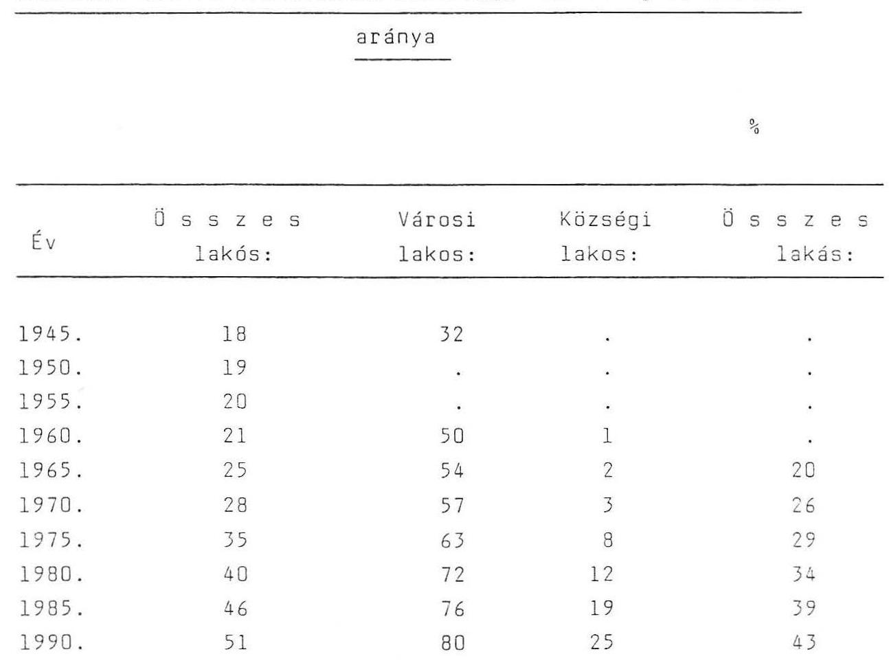

Adatforrás: OVH, KVM, OVF, KSH

---

A nemzetgazdasági, a vízgazdálkodási, az ivóvizeilátási-szennyvizelvezetési és- tisztítási beruházások alakulása.

|  Idöszak | Nemzetgazdasági | Vízgazdálkodási | Vízellátási, szennyviz elvezetési és- tisztítási | Vízgazdálkodási aránya a nemzetgazdaságiban | Vízellátási, szenny- vizelvezetési és- tisztítási aránya a vízgazdálkodásiban | Vízellátási, szenny- vizelvezetési és-tisztítási aránya a nem- zetgazdaságiban  |
| --- | --- | --- | --- | --- | --- | --- |
|   | beruházások |  |  |  |  |   |
|  1947-1950 | 22 118 | 322 | 108 | 1,46 | 33,5 | 0,49  |
|  1951-1955 | 76 518 | 1 841 | 586 | 2,41 | 31,8 | 0,77  |
|  1956-1960 | 125 056 | 3 030 | 1 566 | 2,42 | 51,7 | 1,25  |
|  1961-1965 | 235 866 | 7 488 | 3 991 | 3,17 | 53,3 | 1,69  |
|  1966-1970 | 361 191 | 11 967 | 7 275 | 3,31 | 60,8 | 2,01  |
|  1971-1975 | 590 723 | 30 305 | 19 806 | 5,13 | 65,4 | 3,35  |
|  1976-1980 | 924 821 | 49 665 | 30 815 | 5,37 | 62,0 | 3,33  |
|  1981-1985 | 939 614 | 63 225 | 46 193 | 6,73 | 73,1 | 4,92  |
|  1986-1990 | 1 206 800 | 86 600 | 73 700 | 7,18 | 85,1 | 6,11  |

Adatforrás: KSH, OVH, KVM, OVF

---

A nemzetgazdasági és a vízgazdálkodási beruházások alakulása.

$$
/ 1986-1990 /
$$

# Milliárd Ft 

| Beruházás megnevezése | 1986 | 1990 | I n d e x   1986-1990 tény |
| :--: | :--: | :--: | :--: |
|  | T e r v | T é n y | 1986-1990 terv |
| Nemzetgazdasági | 1200 | 1206,8 | 100,6 |
| Vizgazdálkodási | 79 | 86,6 | 109,6 |
| ebből: ivóvizellátás | 40,1 | 45,4 | 113,2 |
| szennyvizelvezetés és- |  |  |  |
| tisztitás | 26,1 | 28,3 | 108,4 |
| vizkárelháritás és |  |  |  |
| egyéb | 12,8 | 12,9 | 100,8 |
| Vizgazdálkodási aránya a nem- |  |  |  |
| zetgazdaságiban ( \% ) | 6,6 | 7,2 | 109,1 |
| Ivóvizellátás aránya a vízgaz- |  |  |  |
| dálkodásiban ( \% ) | 50,8 | 52,4 | 103,1 |
| Szennyvizelvezetés és-tisztitás |  |  |  |
| aránya a vízgazdálkodásiban ( \% ) | 32,9 | 32,7 | 99,4 |
| Ivóvizellátás aránya a nemzet- |  |  |  |
| gazdaságiban ( \% ) | 3,3 | 3,7 | 112,1 |
| Szennyvizelvezetés és-tisztitás aránya a nemzetgazdaságiban ( \% ) | 2,2 | 2,3 | 104,5 |
| Vizgazdálkodási beruházások |  |  |  |
| szakágazati megoszlása: ( \% ) | 100,0 | 100,0 | - |
| - ivóvizellátás ( \% ) | 50,8 | 52,4 | - |
| - szennyvizelvezetés és- |  |  |  |
| tisztitás ( \% ) | 32,9 | 32,7 | - |
| - vizkárelháritás és |  |  |  |
| egyéb ( \% ) | 16,3 | 14,9 | - |

Adatforrás: KSH, OVH, KVM, OVF

---

Az országos ivóvízminőségi helyzet 1990-ben a KÖJÁL vizsgálatok alapján kifogásolt minták arányával jellemezve $/ \% /$
v: vizmüvek mintái
e: egyedi kutak vizmintái
ö: összes vizminta

| M E G Y E | bármely okból kifogásolt |  |  | bakteriológiailag kifogásolt |  |  | vegyileg kifogásolt |  |  |
| :--: | :--: | :--: | :--: | :--: | :--: | :--: | :--: | :--: | :--: |
|  | $v$ | e | ö | $v$ | e | ö | $v$ | e | ö |
| Baranya | 30,3 | 44,5 | 32,4 | 20,6 | 42,9 | 21,5 | 29,8 | 40,3 | 31,8 |
| Bács-Kiskun | 53,1 | 77,0 | 58,6 | 17,2 | 17,2 | 17,2 | 50,0 | 61,6 | 54,1 |
| Békés | 60,6 | 70,0 | 61,7 | 34,8 | 30,9 | 34,7 | 27,1 | 58,2 | 29,1 |
| Borsod | 41,1 | 70,6 | 49,5 | 23,0 | 46,2 | 26,2 | 22,3 | 45,4 | 28,8 |
| Csongrád | 41,1 | 43,1 | 41,3 | 32,4 | 34,7 | 32,5 | 21,2 | 23,1 | 21,4 |
| Fejér | 16,8 | 44,1 | 32,8 | 3,6 | 25,3 | 14,2 | 13,6 | 29,0 | 22,8 |
| Győr-Sopron | 30,8 | 46,7 | 37,5 | 18,4 | 20,3 | 18,7 | 23,2 | 38,7 | 29,8 |
| Hajdu-Bihar | 55,0 | 51,8 | 54,3 | 27,4 | 65,2 | 28,6 | 34,2 | 64,8 | 43,8 |
| Heves | 60,3 | 63,6 | 61,5 | 30,6 | 35,8 | 31,2 | 58,1 | 50,8 | 55,4 |
| Jász-Nagykun | 59,0 | 64,5 | 59,7 | 22,4 | 32,8 | 22,8 | 50,4 | 46,4 | 49,9 |
| Komárom | 39,3 | 82,5 | 41,0 | 20,1 | 56,9 | 21,0 | 25,6 | 54,8 | 26,9 |
| Nógrád | 42,1 | 72,1 | 52,7 | 6,1 | 25,1 | 9,7 | 39,5 | 63,1 | 47,9 |
| Pest | 48,1 | 59,3 | 58,5 | 28,9 | 22,2 | 27,7 | 34,4 | 53,9 | 42,1 |
| Somogy | 69,5 | 67,7 | 69,1 | 16,5 | 30,7 | 17,6 | 58,9 | 57,1 | 58,5 |
| Szabolcs-Sz. | 41,7 | 81,0 | 61,3 | 13,2 | 18,8 | 13,7 | 38,9 | 74,0 | 55,8 |
| Tolna | 54,7 | 52,3 | 54,5 | 26,0 | 38,5 | 26,6 | 44,1 | 45,8 | 44,2 |
| Vas | 35,7 | 55,9 | 40,0 | 27,0 | 35,8 | 28,1 | 13,0 | 31,9 | 21,8 |
| Veszprém | 26,2 | 55,0 | 38,4 | 20,3 | 32,2 | 22,2 | 12,9 | 43,4 | 24,9 |
| Zala | 22,4 | 55,6 | 28,2 | 4,8 | 36,9 | 7,9 | 19,3 | 36,1 | 22,2 |
| MEGYÉK ÁTL.: | 43,6 | 61,4 | 48,2 | 22,5 | 30,0 | 23,3 | 30,2 | 49,6 | 36,9 |
| Budapest | 9,2 | 100,0 | 9,5 | 8,4 | 83,3 | 8,7 | 2,8 | 54,5 | 3,0 |
| ORSZ.ÁTLAG. | 36,6 | 61,5 | 42,0 | 21,6 | 30,1 | 22,4 | 24,6 | 49,7 | 31,7 |
| Aláhuzás | jelzi egy-egy | oszlopban | a legkisebb |  |  |  |  |  |  |

---

Fertôtlenítésre kötelezett szennyvízkibocsátók 1990. KÜJÁL
vizsgálatok alapján
db

| Megyék, főváros | objektu-   mok száma | Coliform szám vizsgálatok |  |  | Szennyvíztoxicitási vizsgálatok |  |  |
| :--: | :--: | :--: | :--: | :--: | :--: | :--: | :--: |
|  |  | összesen | kifogásolt minták | Bírság javaslatok. | összesen | kifogásolt minták | Bírság javaslatok |
| Baranya | 32 | 277 | 123 | 37 | - | - | - |
| Bács-Kiskun | 10 | 17 | 13 | 13 | - | - | - |
| Békés | 14 | 133 | 45 | 41 | - | - | - |
| Borsod-Abaúj-Zemplén | 34 | 170 | 47 | 19 | 87 | 10 | - |
| Csongrád | - | - | - | - | - | - | - |
| Fejér | 26 | 65 | 44 | 44 | - | - | - |
| Győr-Moson-Sopron | 8 | 51 | 8 | 8 | - | - | - |
| Hajdú-Bihar | 1 | 1 | - | - | - | - | - |
| Heves | - | 34 | 8 | 3 | - | - | - |
| Jász-Nagykun-Szolnok | 4 | 18 | 18 | - | - | - | - |
| Komárom-Esztergom | 6 | 48 | 1 | 1 | - | - | - |
| Négrád | 7 | 7 | 7 | 7 | 7 | - | - |
| Pest | 19 | 151 | 56 | 13 | - | - | - |
| Somogy | 13 | 23 | 9 | - | - | - | - |
| Szabolcs-Szatmár-8. | - | - | - | - | - | - | - |
| Tolna | - | - | - | - | - | - | - |
| Vas | 19 | 108 | 31 | 5 | - | - | - |
| Veszprém | 18 | 118 | 32 | 7 | - | - | - |
| Zala | 9 | 9 | - | - | - | - | - |
| Budapest | 35 | 25 | 21 | - | 36 | 8 | 26 |
| Urszág összesen: | 255 | 1.255 | 463 | 198 | 130 | 18 | 26 |

---

# 10. sz. Táblázat 

Nem megfelelő ivóvizminőségủ települések és az itt élō lakosság számának alakulása.

M e g n e v e z é s: T e l e p ü l é s e k s z á m a db L a k o s s á g s z á m a fô
1977.XII.31. 1983.XII.31. 1985.XII.31. 1990.XII.31.1977.XII.31. 1983.XII.31.1985.XII.31.1990.XII.31.

Közegészségügyileg
veszélyeztetett
(nitrátos vizũ)
944
$824 \quad 442 \quad 706397$
$807019 \quad 264767$

Dél-alföldi
(arzénes vizũ)
$68 \quad 68 \quad 30$
$450266 \quad 441673 \quad 206018$

---

# A lakosság közmüves ivóvizzel és csatornával való ellátási arányának alakulása (1945-1990) 

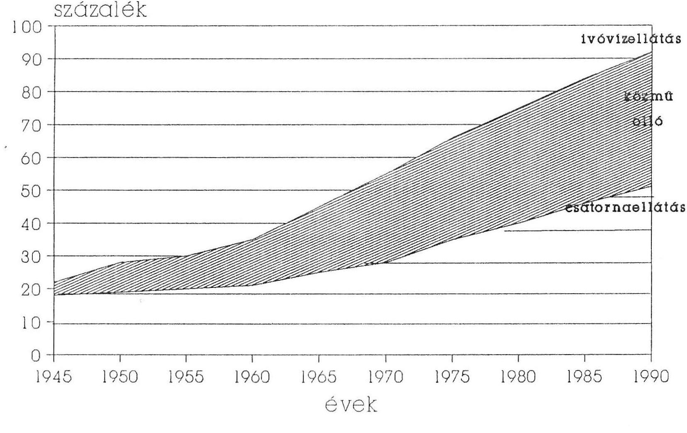

---

# A lakosság közmüves ivóvízzel és csatornával való ellátási arányának alakulása (1945-1990) 

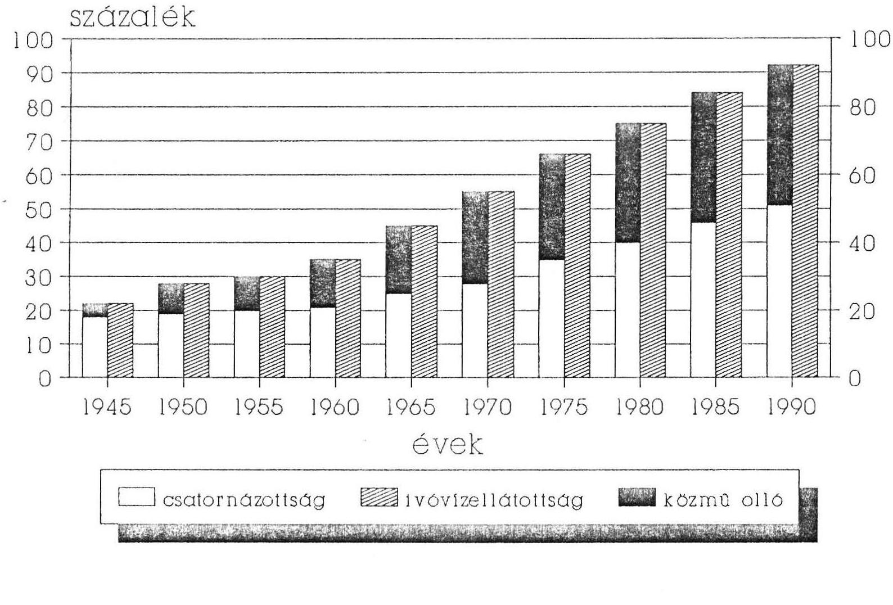

---

Magyarország közmüves ivóvíz és csatornahálózaia hosszának alakulása
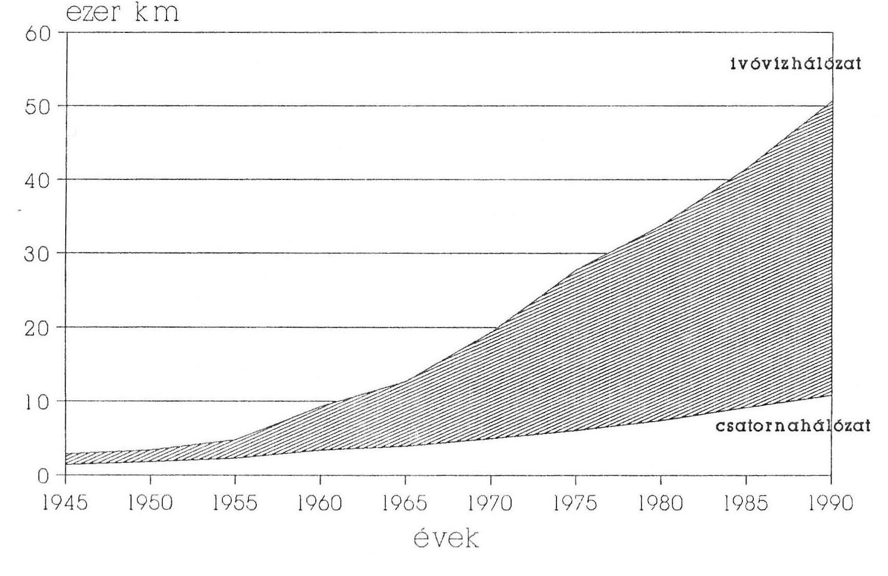

---

# Magyarország közmũves ivóvíz és csatornahálózata hosszának alakulása 

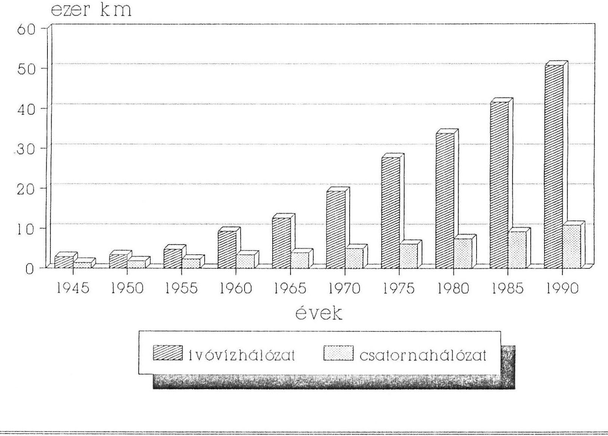

---

# Magyarország közmüves ivóviztermelö és szennyvízisztitó kapacitása arányának alakulás 

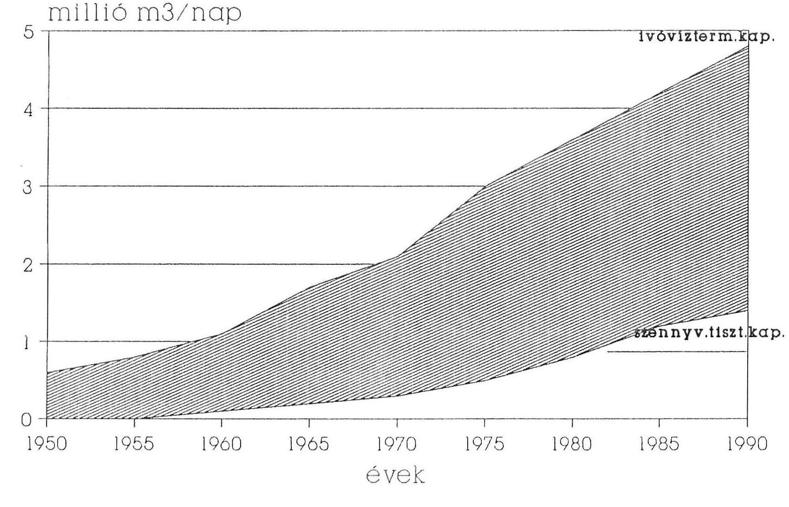

---

# Magyarország közmüves ivóviztermelö és szennyvízliszitió kapacitása arányának alakulás 

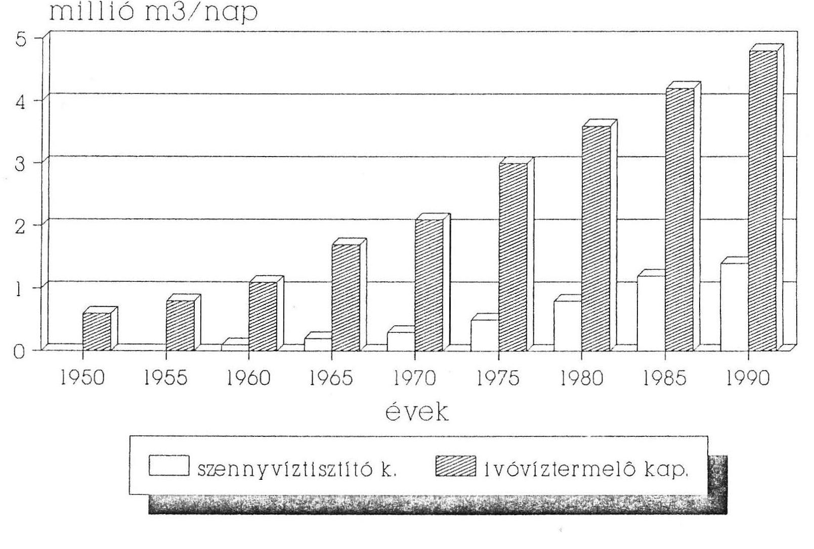

---

# 4.sz.äbra 

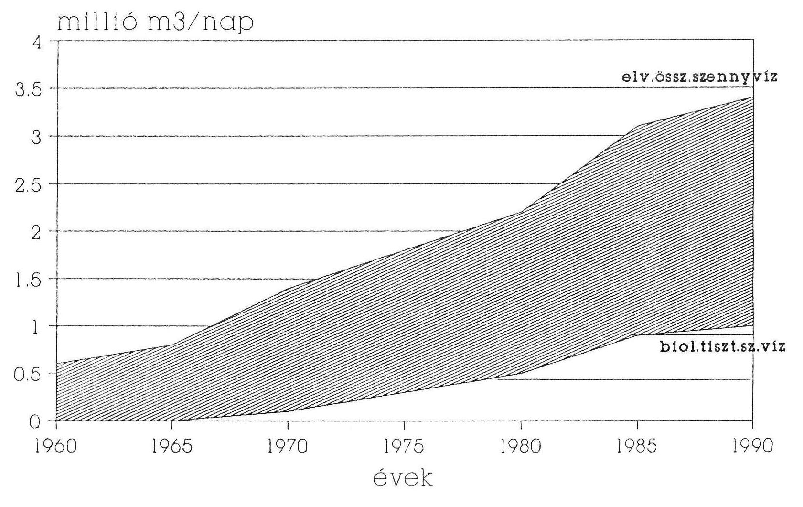

---

# 4/a.sz.ábra 

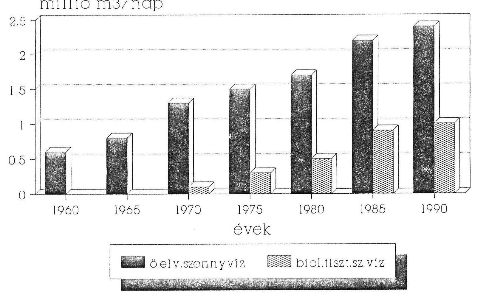

---

A nemzetgazdasági és a vízgazdálkodási beruházások aránya 1986-1990-ben (milliárd Ft-ban és \% - ban)
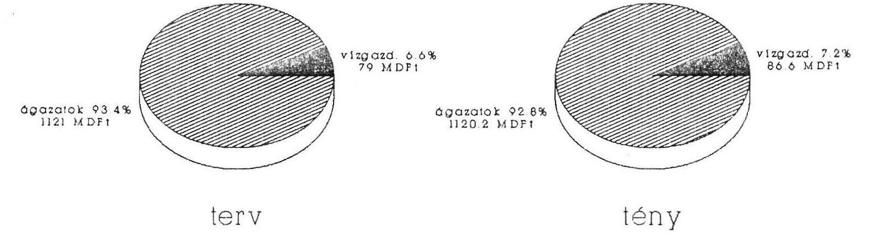

---

# A vízgazdálkodási beruházások aránya 1986-1990-ben (milliárd Ft-ban és \% - ban) 

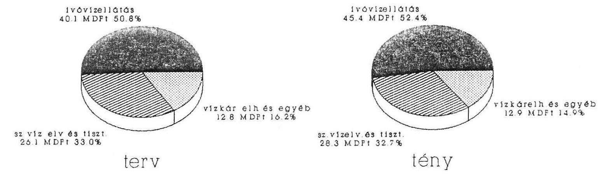