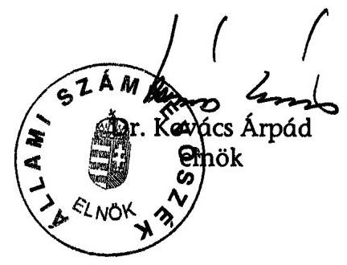
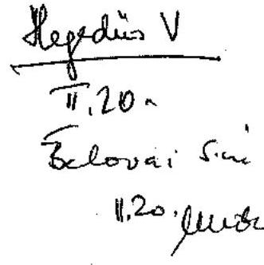
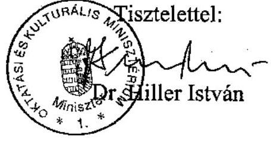

# ÁLLAMI   SZÁMVEVŐSZÉK 

## JELENTÉS

a kulturális közgyűjtemények kezelésére fordított pénzeszközök hasznosulásának ellenőrzéséről

---

2. Államháztartás Központi Szintjét Ellenőrző Igazgatóság 23. Átfogó Ellenőrzési Főcsoport
V-11-72/2006-07.
Témaszám: 820 .
Vizsgálat-azonosító szám: V-0313
Az ellenőrzést felügyelte:
Bihary Zsigmond
főigazgató
Az ellenőrzés végrehajtásáért felelős:
Hegedűsné dr. Müllern Veronika
főcsoportfőnök
Az ellenőrzést vezette:
Belovai Sándorné
osztályvezető főtanácsos
Az ellenőrzést végezték:

| Dr. Fónyad Erzsébet számvevő tanácsos | Maklári Ferencné számvevő tanácsos, főtanácsadó | Vértényi Gábor számvevő |
| :--: | :--: | :--: |
| Jankó Géza számvevő | Dr. Mihály Sándor számvevő tanácsos, főtanácsadó Tóth Árpád számvevő tanácsos | Záhonyiné Horváth Ildikó számvevő tanácsos |

A témához kapcsolódó eddig készített számvevőszéki jelentések:
címe
sorszáma
Jelentés a Nemzeti Kulturális Örökség Minisztériuma fejezet működésének ellenőrzéséről
Jelentés a múzeumi rekonstrukcióra előirányzott pénzeszközök 0401
hasznosításának ellenőrzéséről

---

# TARTALOMJEGYZÉK 

BEVEZETÉS ..... 5
I. ÖSSZEGZŐ MEGÁLLAPÍTÁSOK, KÖVETKEZTETÉSEK, JAVASLATOK ..... 9
II. RÉSZLETES MEGÁLLAPÍTÁSOK ..... 18

1. A szakterület ágazati irányítása és koordinációja, a fenntartói felügyelet működése ..... 18
1.1. A közgyűjteményi stratégiai célkitűzések és prioritások ..... 18
1.2. A feladatokhoz kapcsolódó koordináció és szakfelügyeleti ellenőrzés ..... 20
1.3. A fenntartói felügyelet működése a minisztérium országos közgyűjteményi intézményeinél ..... 22
1.4. A közgyűjteményi terület fejezeti kezelésű előirányzatainak kialakítása, a normatív támogatások alakulása ..... 24
2. A közgyűjteményi feladatellátás forrásainak szakfeladatonkénti megoszlása, a stratégiai célok teljesítése ..... 29
2.1. Az egyes szakfeladatok támogatása ..... 29
2.1.1. A muzeális szakterület támogatása ..... 29
2.1.2. A könyvtári szakterület támogatása ..... 30
2.1.3. A levéltári szakterület támogatása ..... 32
2.2. A közgyűjteményi stratégiai tervekben meghatározott célok teljesítése ..... 34
2.3. Az intézményi bevételek és kiadások alakulása ..... 36
2.4. A minisztériumi közgyűjteményi intézmények fejlesztési-beruházási forrásai, működési feltételei ..... 38
2.5. A közgyűjtemények gyarapítására rendelkezésre álló pénzeszközök felhasználása ..... 41
2.6. Az állományvédelemre, megóvásra előirányzott pénzeszközök felhasználása ..... 42
2.7. A közgyűjteményi intézmények teljesítményadatainak változása ..... 46
3. A számvevőszéki ellenőrzések alapján a közgyűjteményi területre tett javaslatok megvalósítása ..... 52

---

# MELLÉKLETEK 

1. sz. melléklet Észrevétel az OKM miniszterétől
2. sz. melléklet A minisztérium felügyelete alá tartozó közgyűjteményi intézményeknél felhasznált pénzeszközök alakulása a 2002-2006. I. félév között
3. sz. melléklet A közgyűjteményi célú kiadások megoszlása a 2002-2005 évek között
4. sz. melléklet A minisztérium felügyelete alá tartozó közgyűjteményi intézmények tényleges bevételei és kiadásai 2002., 2005. és 2006. I. félévben
5. sz. melléklet A minisztérium hatáskörébe tartozó közgyűjteményi intézmények bevételeinek megoszlása forrásonként a 2002-2006. I. félév között
6. sz. melléklet 1 fő múzeumi látogatóra vetített állami támogatás

## FÜGGELÉKEK

1. sz. függelék Az Országos Dokumentum-ellátási Rendszer működésének értékelése

---

# RÖVIDÍTÉSEK JEGYZÉKE 

| ÁSZ | Állami Számvevőszék |
| :-- | :-- |
| BM | Belügyminisztérium |
| EU | Európai Unió |
| GKM | Gazdasági és Közlekedési Minisztérium |
| IHM | Informatikai és Hírközlési Minisztérium |
| KEIR | Kormányzati Elektronikus Információs Rendszer |
| Kpr. | A sajtópéldányok kötelespéldányainak szolgáltatásáról és |
|  | hasznosításáról szóló 60/1998. (III. 27.) Kormányrendelet |
| Ltv. | A közokiratokról, a közlevéltárakról és a magánlevéltári |
|  | anyag védelméről szóló 1995. évi LXVI. sz. törvény |
| MEH | Miniszterelnöki Hivatal |
| MKKtv. | A muzeális intézményekről, a nyilvános könyvtári ellátás- |
|  | ról és a közművelődésről szóló 1997. évi CXL törvény |
| MNFA | Magyar Nemzeti Filmarchívum |
| MNG | Magyar Nemzeti Galéria |
| MOKKA | Magyar Országos Közös Katalogizálási Rendszer |
| MOL | Magyar Országos Levéltár |
| MTA | Magyar Tudományos Akadémia |
| NKA | Nemzeti Kulturális Alapprogram |
| NKÖM | Nemzeti Kulturális Örökség Minisztériuma |
| ODR | Országos Dokumentum-ellátási Rendszer |
| OIK | Országos Idegennyelvű Könyvtár |
| OKM | Oktatási és Kulturális Minisztérium |
| OM | Oktatási Minisztérium |
| OPKM | Országos Pedagógiai Könyvtár és Múzeum |
| OSZK | Országos Széchenyi Könyvtár |
| OTKA | Országos Tudományos Kutatási Alapprogram |
| PM | Pénzügyminisztérium |

---

.

---

# JELENTÉS 

## a kulturális közgyűjtemények kezelésére fordított pénzeszközök hasznosulásának ellenőrzéséről

## BEVEZETÉS

A kulturális örökség részét képező közgyűjtemények a magyar kultúra alapértékei közé tartoznak. Megismerésük, gyarapításuk, megőrzésük, szakmai-pénzügyi feltételeik biztosítása alapvetően állami feladat. A kulturális politika sokrétű feladatai között a nemzeti identitás sokszínű kifejeződését a közgyűjteményi szakterület jeleníti meg. Az Állami Számvevőszék elősegíti az állami feladatok hatékony és eredményes ellátását, kiemelt figyelmet fordítva a nagy közösségi ellátórendszerek működésére és korszerűsítésére. A stratégiai célkitűzések megvalósításához illeszkedett a kulturális, ezen belül a közgyűjteményi szakterület ellenőrzése.

A közgyűjtemény fogalmát a muzeális intézményekről, a nyilvános könyvtári ellátásról és a közművelődésről szóló 1997. évi CXL. törvény (MKKtv.) szabályozza, amely körbe az állam, a helyi, valamint az országos kisebbségi önkormányzat, a köztestület és a közalapítvány tulajdonában (fenntartásában) működő, vagy általuk alapított könyvtár, levéltár, muzeális intézmény, valamint kép- és hangarchívum tartozik. A muzeális intézmények működését és a nyilvános könyvtári ellátást az MKKtv., a levéltári tevékenységet a köziratokról, a közlevéltárakról és a magánlevéltári anyag védelméről szóló 1995. évi LXVI. törvény (Ltv.) szabályozza. A közgyűjtemények ágazati felügyelete, szakmai irányítása a Nemzeti Kulturális Örökség Minisztériumának (NKÖM) feladata volt, amelyet a Magyar Köztársaság minisztériumainak felsorolásáról szóló 2006. évi LV. törvény alapján jogutódként az Oktatási és Kulturális Minisztérium (OKM) vett át.

A feladatot ellátó intézményrendszer ágazati irányítása, fenntartói felügyelete a többször módosított 161/1998. (IX. 30.) Korm. rendelet szerint a nemzeti kulturális örökség minisztere hatáskörébe tartozott. A 167/2006. (VII. 28.) Korm. rendelet alapján a feladatot az oktatási és kulturális minisztere látja el.
A muzeális intézmények a kulturális javak védelmével összefüggő célok megvalósításának fontos letéteményesei, a birtokukban lévő kulturális javak jellemzői, hogy korlátozottan forgalomképesek. Muzeális intézményt - meghatározott kivétellel - bármely jogi és természetes személy alapíthat. A működési engedély megszerzéséhez és megszüntetéséhez a miniszter engedélye szükséges, amely azonban csak akkor adható ki, ha a muzeális intézmény tulajdonosa/fenntartója biztosítani tudja a szakmai normatíváknak megfelelő folyamatos és rendeltetésszerű működéshez szükséges feltételeket. Állami támogatás

---

csak a működési engedéllyel rendelkező muzeális intézményeknek adható. A minisztérium ágazati irányítási jogköréből adódóan mintegy 840 muzeális intézmény felügyeletét látja el.

A múzeum - amely a kulturális javak tudományosan rendszerezett gyűjteményeiből álló intézmény - feladata a kulturális javak meghatározott anyagának folyamatos gyűjtése, nyilvántartása, megőrzése és restaurálása, tudományos feldolgozása és publikálása, valamint kiállításokon történő bemutatása. Az MKKtv. szakmai besorolása szerint országos, országos szak-, megyei, területi és tematikus múzeumok működnek hazánkban. Az MKKtv. 14 országos múzeumot sorolt fel, ebből 9 az OKM-hez (NKÖM-höz), és 5 múzeum más felügyelet alá tartozott (Budapesti Történeti Múzeum - Budapest Főváros Önkormányzata; Hadtörténeti Múzeum - Honvédelmi Minisztérium; Közlekedési Múzeum Gazdasági és Közlekedési Minisztérium; Mezőgazdasági Múzeum - Földművelésügyi és Vidékfejlesztési Minisztérium; Semmelweis Orvostörténeti Múzeum, Könyvtár és Levéltár - Egészségügyi Minisztérium).

A könyvtári ellátás rendszere biztosítja a könyvtárhasználati jog gyakorlását, amelynek működtetése az állam és a helyi önkormányzatok feladata. Az MKK tv. megkülönböztet nyilvános és nem nyilvános könyvtárakat, ezen belül a nemzeti könyvtárat, a nemzeti gyűjtő körű könyvtárat, országos szakkönyvtárakat, egyéb szakkönyvtárakat, felsőoktatási és iskolai könyvtárakat, továbbá megyei, városi és községi közkönyvtárakat. Az állami és a helyi önkormányzati fenntartású könyvtárak gyűjteményeit és szolgáltatásait úgy kell kialakítani, hogy azok biztosítsák az ismeretek tárgyilagos, sokoldalú közvetítését. Magyarországon az IStAR ${ }^{1}$ szerint 2005. évben Budapesten és a 19 megyében összesen 3588 könyvtár működött.

A levéltár a maradandó értékű iratok tartós megőrzésének, levéltári feldolgozásának és rendeltetésszerű használatának biztosítása céljából létesített intézmény. Az Ltv. alapján közlevéltárak (közfeladatot ellátó szerv által fenntartott intézmény) és nyilvános magánlevéltárak (egyház, alapítvány, párt által fenntartott intézmény) működnek. A levéltári anyag védelme, folyamatos gyarapítása olyan kötelezettség, amely feltételezi az állami szerepvállalást. 2005-ben az IStAR adatai szerint Magyarországon 85 levéltár, ezen belül a Magyar Országos Levéltár mellett 25 önkormányzati, 19 szaklevéltár, 1 köztestületi levéltár és 39 nyilvános magánlevéltár működött, összesen 374 ezer iratfolyóméter (ifm) levéltári anyaggal.

A Magyar Nemzeti Filmarchívum (az OKM, korábban NKÖM felügyelete alatt) feladata a Magyarországon gyártott játék-, dokumentum-, ismeretterjesztő-, reklám-, és híradófilmek teljes körű, valamint az egyetemes filmtörténet kiemelkedő alkotásainak válogatott gyűjtése volt kezdetektől napjainkig. Az állományukban lévő filmeket folyamatosan felújítják, a magyar filmállományt restaurálják.

[^0]
[^0]:    ${ }^{1}$ Internetes Statisztikai Adatgyűjtő Rendszer

---

A közgyűjtemények támogatása több csatornán keresztül valósult meg, állami támogatásának előirányzatait az évenkénti költségvetési törvények tartalmazták. A támogatásra fordítható források többsége a mindenkori éves költségvetési törvények mellékleteiben - a helyi önkormányzatoknak, mint fenntartóknak a közgyűjteményi feladatok ellátásához nyújtott számított és kötött normatív támogatás - a Belügyminisztérium (BM) illetve a Helyi önkormányzatok támogatásai fejezet költségvetésében, a kisebbik része az OKM (NKÖM) költségvetésében, egyrészt a Közgyűjtemények költségvetési címen, másrészt fejezeti kezelésű előirányzatként nyújtott támogatás formájában jelent meg. Az MKKtv. szerinti országos múzeumok és szakkönyvtárak állami támogatása más szaktárcák költségvetésében és csak részben nevesítve szerepelt (pl. a Gazdasági és Közlekedési Minisztérium (GKM) fejezetnél a Közlekedési Múzeum, a Magyar Tudományos Akadémia (MTA) fejezetnél az MTA Könyvtára stb.).

A múzeumi, a közkönyvtár, és a levéltári tevékenység szakfeladatokon elszámolt kiadások szerint a feladatellátás megvalósítására a 2003-2005. években összesen 178,9 Mrd Ft-ot fordítottak. Ebből a múzeumi terület 46,5 %-kal, a könyvtári tevékenységgel foglalkozó intézmények 43,5 %-kal és a levéltári intézmények 10 %-kal részesedtek. A közgyűjteményi tevékenységek elszámolt ráfordításának összege a 2003. évi 51,5 Mrd Ft-ról 2005. évre 64,8 Mrd Ft-ra, 25,8 %-kal nőtt. Az évenkénti kiadások nagyobb hányadát - 52-56 %-át - a személyi juttatások és járulékaik összege tette ki.

Az Állami Számvevőszék még nem végzett a kulturális közgyűjtemények egészére kiterjedő ellenőrzést, de részben érintette e témát az NKÖM fejezet működésének 2003. évi átfogó, valamint a múzeumi rekonstrukcióra fordított pénzeszközök hasznosulásának 2004. évi vizsgálata.

Az ellenőrzés célja annak értékelése volt, hogy:

- a felügyeleti irányítás és koordináció eredményesen és hatékonyan segítette-e a közgyűjteményi szakterület feladatainak megvalósulását;
- a kulturális közgyűjtemények (múzeumok, könyvtárak, levéltárak, filmarchívum) részére biztosított támogatásokat a közgyűjtemények állagának megóvása, megtartása, és gyarapítása érdekében a céloknak megfelelően hasznosították-e; a források megosztása, tervezése, a pénzeszközökkel való gazdálkodás célszerűen valósult-e meg;
- az egyes közgyűjteményi szakterületekre fordított források felhasználása a vizsgált időszakban biztosította-e a közgyűjteményi intézmények eredményesebb működését és szakmai feladatellátását;
- a közgyűjteményekre vonatkozó korábbi számvevőszéki javaslatok megvalósultak-e.

Az ellenőrzést a teljesítmény-ellenőrzés módszerével végeztük, ennek keretében vizsgáltuk az ágazati, fenntartói felügyelet, a szakmai irányítás célszerűségét, hatékonyságát, működésének eredményességét. Vizsgáltuk továbbá a feladatellátás, a források megosztásának és felhasználásának célszerűségét, megalapozottságát, valamint a támogatási rendszert és a kapcsolódó monitoring rendszer kiépítettségét, működésének eredményességét.

---

A vizsgálatot előtanulmány, valamint az intézmények gazdálkodására vonatkozó - fejezettől és az intézményektől kapott - információk, adatok alapozták meg.

Az ellenőrzés a 2003-2006. I. félév közötti időszakra, ezen belül kiemelten a 2004-2005. évekre terjedt ki. Helyszíni ellenőrzés keretében az NKÖM-re, illetve a jogutód OKM-re és 4 intézményére
 - Magyar Országos Levéltár (MOL), Országos Széchenyi Könyvtár (OSZK), Magyar Nemzeti Filmarchívum (MNFA), Magyar Nemzeti Galéria (MNG) - , valamint kiemelten az „Országos Dokumentum-ellátási Rendszer" és az „Audiovizuális Archívum kialakítása" című fejezeti kezelésű előirányzatokra terjedt ki.

Az ellenőrzés végrehajtására az Állami Számvevőszékről szóló 1989. évi XXXVIII. törvény 2. § (3) és (5) bekezdései adtak jogszabályi alapot.

A jelentést egyeztettük az oktatási és kulturális miniszterrel, észrevételét az 1. sz. melléklet tartalmazza.

---

# I. ÖSSZEGZŐ MEGÁLLAPÍTÁSOK, KÖVETKEZTETÉSEK, JAVASLATOK 

Az állam a vizsgált időszakban is jelentős szerepet töltött be a kulturális közgyűjtemények fenntartásának, állagmegóvásának, kutatásának, bemutatásának, védelmének és intézményi működtetésének támogatásában; a működés és a finanszírozási rendszer kereteit jogszabályokkal, illetve az állami irányítás egyéb jogi eszközeivel határozta meg. Hasznosításukról a szakterületenként kialakított és működtetett intézményrendszer gondoskodott.

A múzeumi, a könyvtári és a levéltári szakterületet magába foglaló kulturális közgyűjteményi területet szabályozó törvények a vizsgált időszakban többször módosultak. A változások a korábbiakhoz képest részben a muzeális intézmények, könyvtárak, a közművelődési intézmények szakmai besorolása és feladatköre újraszabályozásának; a levéltári területen az ügyfélbarát, szolgáltató közigazgatáshoz való igazodás, és az elektronikus ügyintézéshez szükséges egységes iratkezelés megteremtésének feltételeit szolgálták.

A közgyűjtemények működési körét és finanszírozását, a támogatások, a programok megvalósítását a kapcsolódó jogszabályok - a célnak megfelelően - segítették átláthatóbbá tenni. Ennek ellenére a közgyűjteményi terület feladatellátásánál, finanszírozásánál a fejezeti kezelésű előirányzatokat teljes körűen nem bontották meg, az a folyamatos figyelemmel kísérésre nem volt alkalmas, mert hiányos volt a minisztérium adatbázisa. A közkulturális programoknál a közgyűjteményi terület programjai, azok tervezése a közművelődési területtel összevontan történt, így a pénzügyi felhasználásuk sem különült el egymástól.

A központi költségvetési intézmények közgyűjteményekre fordított kiadásainak összege 2003-ról 2005-re 26,5 Mrd Ft-ról 27,7 Mrd Ft-ra (4,5%) növekedett. Az önkormányzatok költségvetéséből erre a célra fordított kiadások összege nagyobb dinamikával, 25,0 Mrd Ft-ról 37,1 Mrd Ft-ra (48,4%) emelkedett.

A közgyűjteményi (múzeumi, könyvtári és levéltári) szakterületek stratégiai tervet dolgoztak ki, és abban a szakterület előtt megoldásra váró legfontosabb feladatokat jelölték meg, figyelemmel az MKKtv.-ben és az Ltv.-ben előírt követelményekre és a 2002-2006 közötti időszakra készült kormányprogram kulturális fejezetében meghatározott kormányzati támogatásokra és kiemelt programokra. A minisztérium fenntartói felügyelete alá tartozó országos intézmények szintén elkészítették stratégiai tervüket és abban meghatározták a legfontosabb feladatokat.

A minisztérium közgyűjteményi szakterülete, illetve a gazdálkodást lebonyolító szervezeti egységei a költségvetés tervezésénél és az éves beszámoló összeállításánál a költségvetési és szakmai szempontokat egyeztették, évközben azonban a folyamatos információcsere nem működött, a közgyűjteményi intézmények működését érintő egyeztetés és a kölcsönös tájékoztatás elmaradt.
A kiemelt programok megvalósításánál megfelelő együttműködés és koordináció valósult meg a tárca és az adott projektekbe bevont társminisztériumok kö-

---

zött. Pl. az informatikai, a telematikai fejlesztéseknél, az OSZK katalógus feldolgozásánál az OKM jogelődje és az IHM között; az elektronikus iratok archiválása programjának megvalósításánál az IHM, a MEH, a PM és az OKM (NKÖM) között; az Alfa program és a kistelepülések könyvtári fejlesztési programja végrehajtásánál a BM és az OKM (NKÖM) között. Ugyancsak megfelelő volt a kapcsolat a Közkincs program keretében az OKM, az Országos Területfejlesztési Tanács (Hivatal), valamint a regionális fejlesztési tanácsok között.

A fenntartói felügyelet és a vezetői döntések megalapozásához részben hiányzott a szakmai terület belső kontrollrendszere egyes elemeinek kialakítása és működtetése. A fejezeti kezelésű előirányzatok figyelemmel kísérését és ellenőrzését hátráltatta, hogy azok számos esetben a közművelődési feladatoktól nem különültek el, amely összefüggött a terület nem megfelelő informatikai támogatottságával is. A közgyűjteményi terület fenntartói felügyelete a minisztérium irányítása alá tartozó országos intézményeknél véleményezte az éves költségvetéseket, munkaterveket, éves beszámolókat, ellátta az intézmények szervezeti és működési szabályzatainak véleményezését, jóváhagyásra való felterjesztését a miniszter részére. A minisztérium intézményeinél 2004. évtől megszűntek a komplex, terv szerinti helyszíni ellenőrzések.
A rendszerváltozást követően a szakfelügyeleti rendet szabályozó miniszteri rendeletek megjelenéséig a szakfelügyeleti ellenőrzés nem működött szabályozottan. Az eltelt időszakban - a hiányosságok feltárásával és visszacsatolásával - az ellenőrzések csak részben segítették az ágazati irányítási tevékenység hatékonyabb működését. Az áttekintett szakfelügyeleti ellenőrzések jelentései alapján megállapítható, hogy azok a fenntartói felügyelet alá tartozó intézmények többségére nem terjedtek ki.

Az ellenőrzések színvonala csak részben felelt meg az előírt követelményeknek, mert a múzeumi szakfelügyelők szakigazgatási és jogi felkészültsége - az eseti, rövid továbbképzések ellenére - nem volt elegendő a vizsgálatok megfelelő színvonalú lefolytatásához. Ennek következtében a jelentések nem tárták fel teljes körűen a hiányosságokat, a kritikus megállapítások és érdemi javaslatok is elmaradtak, és nem segítették elő megfelelően az ágazati irányítás érvényesülését.
A könyvtári szakfelügyeleti vizsgálatok eredményesen járultak hozzá az ágazati irányítás működéséhez, hasznos információt nyújtottak a fejezeti kezelésű előirányzatokból juttatott források szakterületi felhasználásáról és hasznosulásáról, a községi és városi könyvtárak helyzetéről, állapotáról, valamint az általuk nyújtott szolgáltatások minőségéről. A megkezdett, kísérleti stádiumban lévő minőségelvű szakfelügyeleti projekt azonban még kezdeti eredményeket hozott, végleges programként - helyszíni ellenőrzésünk időszakában - még nem alkalmazták.
A levéltári szakfelügyeleti ellenőrzések feltárták, hogy a megfelelő szakmai előkészítés hiányában késéssel valósult meg az egységes nyilvántartó program. Felhívták arra a hiányosságra a figyelmet, hogy az Ltv. a helyi önkormányzatok tulajdonosi részesedésével működő gazdálkodó szervezetekről nem tesz említést, továbbá a nagyarányú iratgyarapodás kezelésére a személyi feltételek elégtelenek, ami kedvezőtlenül befolyásolta az elektronikus közigazgatás tervezett bevezetését. Hazánkban a levéltári szervezet nem EU konform, mert hiányzik a városi, regionális állami levéltári hálózat kiépítettsége.

---

A Magyar Nemzeti Filmarchívum (MNFA) működését meghatározó jogszabályban a kép- és hangarchívum, mint közgyűjteményi kategória működésével kapcsolatos szabályozást - a levéltárakkal és a könyvtárakkal ellentétben - nem alkották meg (törzsanyag kezelése, gyűjtemények egyesítése, gyűjtőkör pontosítása).

Szabálytalan volt a mozgóképről szóló Filmtörvény és a sajtópéldányok kötelespéldányainak szolgáltatásáról és hasznosításáról szóló kormányrendelettel szemben (Kpr.) az MNFA SZMSZ-e és a Gyűjtőköri Szabályzata, mert a Mozgóképtár, valamint a Video- és DVD-tár gyűjtőkörét szűkebb körben határozta meg (pl. nem gyűjti más közgyűjtemények mozgóképtárai, illetve a szakminisztériumok és más társadalmi szervezetek gyűjteményébe tartozó filmeket). Törvényi rendelkezés ellenére nem szüntették meg a Magyar Filmtörténeti Fotógyűjtemény Alapítványt. A kép- és hangarchívum hiányos törvényi szabályozása mellett a belső szabályozási hiányosságok is akadályozták a törvényi rendelkezések maradéktalan betartását, illetve érvényesítését.

A minisztérium volt közigazgatási államtitkárának 2004. évi döntése alapján külső cégek megbízásával sor került a minisztérium felügyelete alá tartozó országos intézmények átvilágítására a minisztérium 84,3 M Ft-os díjazása mellett. Ennek alapján meg kellett volna határoznia a minisztériumnak a közgyűjteményi intézmények teljesítményének folyamatos figyelemmel kísérésére alkalmas mutatókat és a tervezési normatívákat. A közigazgatási államtitkár szerint a fenti feladatoknak a minisztérium - az idő rövidsége miatt - nem tudott eleget tenni, de érdemi változás az óta sem történt. A belső szakmai vélemények, észrevételek érvényesülését nem tette lehetővé, hogy az előkészítésbe, az átvilágítás céljának és programjának kidolgozásába az érintett szakterületet érdemben nem vonták be. A vizsgálatok befejezését követően a főosztályok áttekintették az átvilágítás alapján készült dokumentumokat, a megállapításokat és a javaslatokat. A Múzeumi Főosztály szakterületére vonatkozóan 2004-ben összevont intézkedési tervet készített az átvilágítás tapasztalatai alapján, azonban a helyszíni ellenőrzés végéig - a szakterület motiváltságának hiánya miatt - érdemi intézkedések nem születtek.
Az államháztartás hatékony működését elősegítő szervezeti átalakulásokról és azokat megalapozó intézkedésekről szóló Korm. határozat a közgyűjteményi intézményekre is kiterjed. A döntéseket megalapozó előkészítési folyamatba a közgyűjteményi szakterületet ismét nem vonták be. A határozat szerint a minisztérium 2007. január 1-vel új költségvetési kulturális háttérintézetet alapít, amelybe a Hagyományok Háza egyes feladatait átszervezi; az OSZK-ba beolvasztással átkerül az OIK és az Országos Pedagógiai Könyvtár és Múzeum (OPKM); a Műcsarnokot non-profit gazdasági társasággá szervezi át; a szakmai, gazdasági ellátó funkciókat, vagy egyes részeit - több múzeum esetében - átcsoportosítja. A határozat előírta, hogy az OKM közgyűjteményi intézményeihez kapcsolja az OKM és más minisztériumok (EüM, FVM, GKM) irányítása alatt lévő intézményeket (Országos Mezőgazdasági Könyvtár és Dokumentációs Központ, Magyar Mezőgazdasági Múzeum, Közlekedési Múzeum, Magyar Kereskedelmi és Vendéglátóipari Múzeum, Semmelweis Orvostörténeti Múzeum, Könyvtár és Levéltár). Az átszervezésekkel az országos közgyűjteményi intézmények (kivéve a HM alá tartozó Hadtörténeti Múzeumot) az OKM felügyelete alá kerülnek és a működés egyes feladatait gesztor intézményhez telepítik.

---

2007. januári állapot szerint az OIK önálló maradt, de bekerül a gesztorintézmények közé, az OPKM pedig átkerül egy oktatási háttérintézménybe. Az OKM január 1-vel az Országos Mezőgazdasági Könyvtár és Dokumentációs Központ kivételével a megjelölt múzeumokat átvette, a Magyar Mezőgazdasági Múzeum június 30-val kerül a minisztérium hatáskörébe. A Hagyományok Háza önálló maradt, Magyar Művelődési Intézet és Képzőművészeti Lektorátus néven új kulturális háttérintézetet, gesztorintézményként Közgyűjteményi Ellátó Szervezetet hoztak létre.

A meghozott intézkedések részben a kormányhatározat szerint, részben attól eltérően valósultak meg.

A szakterület ágazati stratégiai céljának megfelelően prioritásként irányozták elő az Ltv.-ben és az MKKtv.-ben, a kormányprogramban, az alapító okiratokban előírt alapfeladatokhoz kapcsolódó fejlesztéseket. A minisztérium Gazdálkodási Szabályzata szerint a támogatások azonban egyes feladatoknál szakterületre való bontás nélkül szerepeltek (pl. a hálózatfejlesztési, modernizációs programok). A fejezeti kezelésű előirányzatokra vonatkozó szakmailag indokolt javaslatok összege többszörösen meghaladta a rendelkezésre álló költségvetési forrásokat. Ugyanakkor a támogatásokhoz való hozzájutások (pl. az önkormányzati közgyűjteményi intézményeknél a pályázati támogatások) a tervezettnél lassabb ütemben valósultak meg, a felhasználások elmaradtak az előirányzatoktól, illetve áthúzódtak a következő évre.

Összességében megállapítható volt, hogy a szakterületek és intézményeik differenciáltan részesültek a támogatásokból, így működési feltételeik is eltérően alakultak. A fejlesztések a múzeumi rekonstrukció megvalósítására összpontosultak, amely azonban lassúbb ütemű volt a tervezettnél. Az állománygyarapításra csökkenő pénzügyi forrás felhasználására nyílt lehetőség. Az állományvédelem, a veszélyeztetett anyagok megmentése - különösen a levéltári területen - nem a tervezett és szakmailag indokolt pénzügyi források biztosításával történt. A szakterületekre előirányzott fejezeti kezelésű források a szakmailag indokolt mértéknél alacsonyabb összegűek voltak, de azokat a célokkal összhangban használták fel. Az elfogadott programok ütemezésének megfelelően így a kitűzött célok csak részben teljesültek, amely a nemzeti értéket képviselő közgyűjtemények védelmét nem biztosította a kellő mértékben. Az intézmények különböző színvonalú működését az is befolyásolta, hogy a vezetők milyen szakmai elhivatottsággal, kapcsolatteremtő készséggel képviselték a szakterület, az intézmények szakmai érdekeit, a működés feltételeinek javítását.

A fejezeti kezelésű előirányzatokból jóváhagyott, felhasználható támogatások 2003-ban csak részben biztosítottak fedezetet a kiemelt feladatok, stratégiai célok megvalósításához. A múzeumi szakterület állományvédelmi, raktárépítési program támogatásának hiánya, a levéltári és könyvtári szakterület támogatásának lényeges csökkenése miatt a múzeumi tárgyak, a levéltári anyagok és a könyvtári állományok fokozott védelmét nem sikerült a tervezett ütemben, a szakmai céloknak megfelelően biztosítani.

2004-ben kiemelt cél volt továbbra is a közművelődési és könyvtári hálózatfejlesztési program támogatása az MKKtv. előírása
 alapján annak érdekében, hogy a közel 1000 kistelepülésen lakók könyvekhez, folyóiratokhoz, információ-

---

khoz hasonlóképpen jussanak, mint a városok lakói. A szaktörvényekből adódóan a múkincsvédelem, az állagmegóvás, az állománygyarapítás, a leromlott állapotú műszaki, technikai múzeumok fejlesztése, a határon túli magyar közgyűjtemények támogatása, a közgyűjteményi intézmények telematikai fejlesztése - a kormányprogram figyelembevételével és az IHM támogatásával - a fejlesztési források felosztásánál előnyt élvezett.

A fejezeti kezelésű előirányzatok jóváhagyott összege közel 3 Mrd Ft-ra, 35%-kal emelkedett az előző évhez képest, ugyanakkor a szakmailag indokolt összegnél lényegesen - 1,3 Mrd Ft-tal - kisebb fedezet állt rendelkezésre. A csökkentés érintette a jegyár kompenzációt, a hálózatfejlesztést és az állománygyarapítást. A veszélyeztetett levéltári anyagok megmentésére a terület nem kapott támogatást, emiatt a tervezett állományvédelmi feladatok nem teljesültek.

2005-ben a közgyűjteményi terület mindhárom szaktevékenysége pontosan elkülönített támogatásban részesült a fejezeti kezelésű előirányzatokból. A múzeumi terület az „Alfa" program, a könyvtári terület „A jövő könyvtára - a könyvtár jövője" program, a levéltári terület „A levéltár és nyilvánosság" program keretében jutott támogatáshoz.
A múzeumi szakterület stratégiai céljának megvalósítására az ún. Alfa programon belül hét, a helyi önkormányzatok által fenntartott múzeumok szakmai munkáját is támogató alprogramot dolgozott ki (állományvédelem, gyarapítás, veszélyeztetett muzeális intézmények helyzetének javítása, múzeumpártoló önkormányzatok támogatása, számítógépes nyilvántartás fejlesztése, nemzetközi kapcsolatok, nagy nemzetközi kiállítások).

Az állami múzeumok állandó kiállításai - azok ingyenessé tétele miatt - külön támogatásban részesültek. Az önkormányzati múzeumok az infrastruktúrális fejlesztésre, a digitalizáció megvalósítására; a nagy nemzetközi tárlatok megrendezésére, a múzeum látogatóbarát program és a múzeumi modernizáció programjának megvalósítására kaptak fejlesztési támogatást.
A tárca 2005-ben a kultúra szerepének erősítésére a vidékfejlesztésben ún. Közkincs programot indított. Ennek keretében az egyes szaktevékenységek (közművelődés, könyvtár, múzeum) együttműködésével a kulturális alapszolgáltatási kötelezettségek ${ }^{2}$ teljesítése pályázat útján 170,5 M Ft vissza nem térítendő támogatással, 2736,0 M Ft kedvezményes hosszú lejáratú hitelfelvétellel - tőke és kamattámogatással -, és a pályázók 10%-os önrész letétele mellett valósult meg.
A könyvtári szakterületen új feladatot jelentett az Európai Unió élethosszig tartó tanulás, az életre tanulás, átképzés programjához való kapcsolódás; a határon túli könyvtárkapcsolatok fejlesztése, a hungarikumok ápolása, megismerése, gyarapítása; a kistelepülések könyvtári ellátásának fejlesztése.
A könyvtári szakterület kiemelten kezelte a kistelepülések könyvtári ellátásának fejlesztését, a városi, nagyvárosi szinthez való felzárkózását, mert a közsé-

[^0]
[^0]:    ${ }^{2}$ az intézmények alapfeladatának ellátása keretében nyújtott szolgáltatás, valamint önálló kulturális szolgáltatási képességgel nem rendelkező községi önkormányzatok szolgáltatások vásárlásához nyújtott támogatás

---

gi-kistelepülési könyvtárak állománya elavult, kedvezőtlenek a működési feltételek. Az ország egyharmada kistelepüléseken él (35%), egyre nő a különbség a jól ellátott és az ellátatlan területek között. A lakosság mindössze 12,8%-a tagja a községi könyvtáraknak, ami messze elmarad az országos 22%-os átlagtól.

A költségvetési támogatásoknál prioritást élvezett a könyvtárak hálózati információs infrastruktúrájának fejlesztése, a legkisebb települések hálózatba való bekapcsolásával a tartalom szolgáltatás bővítése (digitalizáció, Internet). A Magyar Országos Közös Katalogizálási Rendszer (MOKKA) és az ODR rendszerek üzemeltetése és fejlesztése részben párhuzamos volt, illetve az adatbázisok nem kapcsolódtak egymáshoz. Ezért új feladatként határozta meg a tárca a megyei könyvtáraknál történő fejlesztést, lehetőséget teremtve ezzel az ODR és MOKKA rendszerek adatbázisainak egyesítésére. Az ODR ingyenes igénybevétele mellett a postai díjak emelkedtek, a növekvő költséget azonban nem terhelték rá a szolgáltatást igénybevevőkre.

A levéltári szakterületen kiemelt feladatot jelentett a levéltárak informatikai alapfelszereltségének fejlesztése; az elektronikus adatkezelés megoldása, a maradandó értékű elektronikus iratok fennmaradása; a telematika fejlesztése a szolgáltatások (levéltári anyag számítógépes nyilvántartása, tájékoztatási kötelezettség teljesítése digitális és multimédiás eszközök segítségével) színvonalának növelésére. Elsődleges szempont volt az EU tagországaiban megvalósuló gyakorlat utolérése (a levéltárak szolgáltató tevékenységének korszerűsítése, az állományvédelmi munka, és a szükséges feltételrendszer kialakítása). Megindult és folyamatban van a maradandó értékű elektronikus iratok archiválásának fejlesztési programja.

A fejezeti kezelésű előirányzatokból a levéltári szakfeladatok megoldására folyamatosan csökkenő összegek álltak rendelkezésre. A „Levéltár és nyilvánosság" projekt forrásának 25%-os csökkentése következtében 2004-ben hátrányt szenvedett és késett az EU tagállamokban bevezetett gyakorlat utolérése, valamint az egységes számítógépes nyilvántartások elkészítése. Meghiúsult a „Levéltári intézmények állománygyarapítása" alprogram. Elégtelen a fedezet a határon túli elnéptelenedő egyházközségek magyar vonatkozású iratainak megmentésére is. A 2005. évi előirányzat az előző évi 70%-át sem érte el.
A minisztérium közgyűjteményi intézményeinek összes bevétele a 2002. évi 15,1 Mrd Ft-ról 2005-ben 19,9 Mrd Ft-ra emelkedett (5. sz. melléklet). Az intézményi bevételek nagyobb részét a költségvetési támogatás tette ki, amelynek összege 11,3 Mrd Ft-ról 15,0 Mrd Ft-ra nőtt. A három szakterületen a szponzori támogatásokkal, adományokkal, örökségek útján jelentősebb állománygyarapodás nem volt, a források kismértékű bővülését eredményezték (2003-ban 242,6 M Ft, 2005-ben 412,0 M Ft). Az összességében nem jelentős szponzori támogatások összege az országos szervezeteknél ugyanezen időszak alatt 50,9 M Ft-ot, illetve 119,1 M Ft-ot tett ki.

A beruházásra, felújításra 2002. és 2005. években összesen - évenként csökkenő mértékben - 15,9 Mrd Ft-ot, a közgyűjtemények állománygyarapítására 1,1 Mrd Ft-ot, és állományvédelemre 545,4 M Ft-ot fordítottak.
A tárca intézményeinél a teljesítményadatok és mutatók összességében kedvezően alakultak. A múzeumok látogatóinak száma a 2003. évi 1,7 millió főről

---

2005. évre 2,6 millió főre, 50,9%-kal emelkedett. A növekedést az állandó kiállítások 2004. évtől történő ingyenessé tétele, valamint az időszakos nagy kiállítások ${ }^{3}$ ( pl. „Monet és barátai", Mednyánszky és Munkácsy kiállítások stb.) számának emelkedése egyaránt okozta. A jelentős nemzetközi időszaki kiállítások részben állami kezességvállalás mellett valósultak meg. ${ }^{4}$ A vizsgált időszakban a jegybevételek több mint háromszorosára történő emelkedése részben kompenzálta az állandó kiállítások ${ }^{5}$ ingyenessé tétele miatt kieső bevételek összegét. A múzeumok kiállítási területe 154 ezer m²-ről 182 ezer m²-re (17%-kal) emelkedett. A kiállítási terület gyarapodása jelentősebb volt a múzeumi rekonstrukciós program megvalósításával a Szabadtéri Néprajzi Múzeumnál, a Magyar Természettudományi Múzeumnál, a Magyar Nemzeti Múzeumnál, és a Magyar Nemzeti Galériánál a Ludwig Múzeum átköltözésével a Művészetek Palotájába. A vizsgált időszak alatt jelentősen, egyharmadával nőtt a kiemelt múzeumok raktárterülete is. A múzeumok 1 fő látogatóra vetített állami támogatása a látogatószám növekedése következtében számottevően csökkent (6. sz. melléklet).

A minisztérium közvetlen felügyelete alatt működő könyvtárak állományának gyarapítására fordítható források a vizsgált időszakban folyamatosan, az OSZK-nál lényegesen csökkentek, amely fokozott kockázatot jelentett az országos kiemelt jelentőségű könyvtár alapfeladatának ellátásában. Emiatt a gyarapodás nagyobb részt a kötelespéldányok szolgáltatásából adódott. Az állománygyarapodás további formái a vétel, a csere és az ajándékozás háttérbe szorultak, amely részben a pénzügyi forrás, részben viszonossági alapon a cserealap csökkenésével függött össze.

A könyvtárba beiratkozók száma csökkent mind az OSZK-nál, mind az OIK-nál. Ugyanakkor a távfelhasználók ${ }^{6}$ száma jelentősen megnőtt, ami arra utal, hogy a könyvtárhasználati lehetőségek és szokások változáson mennek keresztül. Az intézményi saját bevételek sem az OSZK-nál, sem az OIK-nál nem érték el a tervezett szintet, a csökkenés legfőbb oka a rendezvények számának visszaesése (27 rendezvénnyel, illetve 42%-kal), amely a kevésbé hatékony marketing munkával függött össze. A rendelkezésre álló feltételek több rendezvény megtartására és ezáltal nagyobb saját bevételre adnának lehetőséget. Az elnyert pályázatok száma alig változott, de a pályázati összegek mintegy 50%-kal alacsonyabbak voltak 2005-ben, mint az azt megelőző években.

[^0]
[^0]:    ${ }^{3}$ meghatározott időtartamig látogatható, tudományosan rendszerezett gyűjtemény kiállítása
    ${ }^{4}$ A Monet és barátai című kiállításra az állam 27 Mrd Ft-ra, a Van Gogh kiállításra az összes 155 Mrd Ft biztosítási összegből 70 Mrd Ft-ra vállalt garanciát.
    ${ }^{5}$ tudományosan rendszerezett, állandó jelleggel, folyamatosan kiállított és megtekinthető gyűjtemény
    ${ }^{6}$ elektronikus úton történő könyvtárhasználat

---

A múzeumi rekonstrukcióra előirányzott pénzeszközök hasznosításának ÁSZ ellenőrzését követően elkészített 7 pontból álló intézkedési tervből 3 feladat megvalósult, 2 részben teljesült, további 2 témában nem történt intézkedés. Nem alakították át a „Múzeumi rekonstrukció" című fejezeti kezelésű előirányzatot annak érdekében, hogy az előzetesen eldöntött támogatási összegek az érintett intézményekre nevesítetten jelenjenek meg. Elmaradt a rekonstrukciós folyamat múzeumszakmai értékeléséhez javasolt módszertan és eredményességi mutatók kialakítása is.

Az NKÖM fejezet működésének 2003. évi ellenőrzése során problémaként vetődött fel 4 db Munkácsy kép törlése az MNG törzsleltárából, amelyet a minisztérium a KVI közreműködésével az örökösöknek adott át.

Ezért a minisztérium ellenőrzésekor javasoltuk a képzőművészeti alkotások visszaszolgáltatásának egyértelmű körülményeit meghatározó magasabb szintű jogi szabályozás kialakítását, amely azóta sem valósult meg. Továbbra sincs részletes jogi szabályozás arra nézve, hogy mely szervek, milyen eljárásban, milyen adatok és dokumentumok alapján jogosultak és egyben kötelesek az ilyen ügyekben eljárni és döntést hozni.

A helyszíni ellenőrzés megállapításainak hasznosítása mellett javasoljuk:

# az oktatási és kulturális miniszternek 

1. alakíttassa ki az ágazati irányítás működését segítő adatbázist, amely szaktevékenységenként bontva biztosítja az előirányzatok és a tényleges felhasználások nyomon követhetőségét;
2. fejlessze tovább a terület szakmai belső kontrollrendszere elemeinek működését annak érdekében, hogy a vezetői döntések megalapozottabbá váljanak; biztosítsa az ágazati szakfelügyeleti ellenőrzés színvonalának, hatékonyságának emelése érdekében a szakfelügyelők szakigazgatási és jogi felkészültségének növelését; tekintse át a múzeumi szakterületen a szakfelügyeleti rendszer szervezeti átalakításának lehetséges változatait;
3. vizsgálja felül a minisztérium felügyelete alá tartozó országos intézményeknél megbízás alapján lefolytatott átvilágítások megállapításai és javaslatai hasznosításának lehetőségét, különös tekintettel a 2118/2006. (VI. 30.) kormányhatározatban foglaltakra;
4. kísérje figyelemmel a MOKKA és az ODR párhuzamos nyilvántartásának megszüntetését és adatbázisainak egyesítését; vizsgálja meg az ODR szolgáltatások igénybevételénél a postai díjszabások emelkedése miatt a szolgáltatás postaköltségei áthárításának lehetőségét a szolgáltatást igénybevevőkre;
5. kezdeményezze a Magyar Nemzeti Filmarchívumnál a kép- és hangrögzítés országos nyilvántartási rendszerének, a dokumentumok védelmének, kezelésének és kutatásának törvényi szabályozását; az MNFA-ba integrált Magyar Filmtörténeti Fotógyűjtemény Alapítvány megszüntetését; az MNFA gyűjtőkörének az alapító okiratban való pontos meghatározását a Filmtörvénnyel és a Kpr. szabályozásával összhangban;

---

6. kísérje figyelemmel az Állami Számvevőszék által, a minisztériumnál lefolytatott átfogó, valamint a múzeumi rekonstrukcióra előirányzott pénzeszközök hasznosításának ellenőrzési megállapításai, javaslatai alapján készült intézkedési tervek teljes körű megvalósítását.

---

# II. RÉSZLETES MEGÁLLAPÍTÁSOK 

## 1. A SZAKTERÜLET ÁGAZATI IRÁNYÍTÁSA ÉS KOORDINÁCIÓJA, A FENNTARTÓI FELÜGYELET MŰKÖDÉSE

### 1.1. A közgyűjteményi stratégiai célkitűzések és prioritások

A közgyűjteményi szakterületek a 2002-2006 közötti időszakra stratégiai tervet dolgoztak ki, amelynél figyelemmel voltak a szaktörvényekben előírt követelményekre és kormányprogram kulturális fejezetében meghatározott kormányzati támogatásokra, valamint a kiemelt programokra ${ }^{7}$.

A közgyűjteményi terület egészére nem készült átfogó stratégiai terv. A múzeumi, könyvtári és levéltári szakterület külön-külön állította össze stratégiai tervét és határozta meg abban a kiemelt prioritásokat. A minisztérium fenntartói felügyelete alá tartozó országos intézmények szintén elkészítették stratégiai tervüket és abban meghatározták a
 legfontosabb feladatokat. A közgyűjtemények sajátos jellegéből, adottságaiból és helyzetéből adódóan a stratégiai terveknek közös elemei, vonásai is fellelhetők.

A szakterületek helyzetfelmérést végeztek, a kiemelt célok megvalósítását elemezték, stratégiájukat arra alapozták. Kiemelt feladatként határozták meg a gyűjteményi anyag megőrzését, gyarapítását, hasznosítását, a szolgáltatások bővítését, fejlesztését, az informatikai, az archiválási és a digitalizálási tevékenység fejlesztését. Közös feladatként jelent meg a stratégiai célok között a támogatások, a szolgáltatások esélyegyenlőségének biztosítása, a kistelepülések igényei kielégítésének közelítése a városi, nagyvárosi ellátás színvonalához.

Az egyes szakterületek stratégiai tervei kidolgozásánál arra is törekedtek, hogy a sajátos helyzetnek megfelelően olyan célokat tűzzenek ki, amelyek az adott

[^0]
[^0]:    ${ }^{7}$ A 2002. évi kormányprogram szerint a kormány költségvetési források biztosításával támogatja a közkönyvtárakat, múzeumokat, levéltárakat; ösztönzi a feladatok ellátásánál a komplexitást; a fejlesztésnél helyet kell kapniuk a regionális és a kistérségi fejlesztési programoknak. Általánossá kívánja tenni az információkhoz és a művelődési javakhoz való hozzáférést, a helyben elérhető kulturális szolgáltatások elérhetőségét; támogatja a hagyományos és az elektronikus kultúrát közvetítő intézmények együttműködését, közös fejlesztését, nemzeti örökségünk megőrzését, sokszínű kulturális szolgáltatások nyújtását. Állami forrásokból normatív támogatással biztosítja a nemzeti intézmények, kiemelt országos közgyűjtemények, regionális közgyűjtemények biztonságos, színvonalas működését; kezdeményezi az EU-s programokban való részvételt, kiemelt feladatnak tekinti a magyar kultúra nemzetközi kapcsolatrendszerének fejlesztését; szükségesnek tartja rögzíteni az állami és az önkormányzatok kötelező kulturális feladatait és biztosítani a feltételeket. Megkezdi, illetve folytatja a maradandó kulturális értékek digitalizálását, egységesen hozzáférhető adatbázissá alakítását, az Interneten keresztüli elérhetőségét.

---

területen a legnagyobb feladatot jelentik és hozzájárulnak a működési feltételek javításához, a lehetőségek eredményes felhasználásához.

A múzeumi szakterület „A megújulás kényszere - múzeumi modernizáció" c. stratégiai tervének legfontosabb eleme a gyűjtemények széles körű, egyenlő hozzáférhetőségének biztosítása. Ezen belül két lényeges kulcsterületet emelt ki; a látogatói kör szélesítésével a látogatóbarát múzeum megvalósítását és a gyűjtemények preventív védelmét. Fontos célként szerepel a tervben a rossz körülmények között működő műszaki, technikai múzeumok helyzetének javítása.

A célok között fontos feladat az állományvédelem biztosítása a raktározási és a gyűjteményfejlesztési programmal; a látogatói kör szélesítésénél az e célt szolgáló program megvalósítása; az elmaradott térségek felzárkóztatása a tájházak, kiállítóhelyek színvonalas működőképessé tételével; a műtárgyak hagyományos és számítógépes nyilvántartása és digitalizálása.

A könyvtári szakterülettel szemben követelményként jelent meg az Európai Unió élethosszig tartó tanulás, az életre tanulás, átképzés programja; a határon túli könyvtárkapcsolatok fejlesztése; a hungarikumok ápolása, megismerése, gyarapítása; a kistelepülések könyvtári ellátásának fejlesztése; a minőségfejlesztés, minőségbiztosítás; a tárcakapcsolatok működtetése.

A prioritások között meghatározták az EU-hoz való csatlakozás és az azt követő időszak könyvtári követelményeit, így a könyvtárhasználók, a szolgáltatások előtérbe kerülését, a minőségi szolgáltatások, a minőségbiztosítás fejlesztését; az információkhoz, dokumentumokhoz való hozzáférés és az esélyegyenlőség biztosítását (digitalizálás, elektronikus adatbázisok, Internet hozzáférés). Továbbá a regionális könyvtári ellátást (kistelepülések nagyobb egységekhez csatolását, letéti ellátását, szolgáltatások vásárlását, mozgókönyvtári ellátás kialakítását); a könyvtári életpálya vonzóbbá tételét (legújabb szakmai ismeretek, empátia készség, informatikai infrastruktúra fejlesztését, akkreditált képzést, továbbképzést).

A levéltári szakterületen prioritás volt a levéltárak minimális informatikai alapfelszereltségének megvalósítása; a 2002. évi kormányprogram alapján az elektronikus adatkezelés megoldása, a maradandó értékű elektronikus iratok fennmaradása; a telematikai fejlesztés a szolgáltatások bővítésére. Ehhez kapcsolódóan 2005-ben a minisztérium által működtetett Levéltári Kollégium megbízásából elkészült a levéltári informatikai stratégia, amelynek kidolgozását az elektronikus közigazgatás és iratkezelés elterjedéséből adódó új típusú levéltári feladatellátás, valamint a papíralapú levéltári anyag széles körű hozzáférését biztosító tartalomfeltárási és digitalizálási igények tettek halaszthatatlanná. A stratégia elkészítését a közigazgatási szervek egységes iratkezelési szabályozásának koncepciójáról szóló 2205/2003. (IX. 4.) Korm. határozatban foglalt, a levéltári szakterületet érintő feladatok megvalósításának szakmai előkészítése tette szükségessé.

A szakterület stratégiai célként határozta meg az állományvédelem biztosítását, a digitalizálás megoldását; az elektronikus levéltár kialakítását; a területi intézményhálózat átalakítását az önkormányzati és az állami köziratok őrzésének szétválasztására; a pályázati kiírások esetlegeségének megszüntetését, a támogatási célok koordinálását.

---

# 1.2. A feladatokhoz kapcsolódó koordináció és szakfelügyeleti ellenőrzés 

A minisztérium közgyűjteményi szakterülete és gazdálkodással foglalkozó szervezeti egységei közötti kapcsolat a költségvetés tervezésénél és az éves beszámoló összeállításánál a költségvetési és a szakmai szempontokat egyeztették. A közgyűjteményi szakterület szakmai javaslataival támogatta a költségvetés megalapozottságát. Az éves beszámoló összeállításához a közgyűjteményi szakterület és szervezeti egységei a rendelkezésre álló információkkal nyújtottak segítséget, de év közben a közgyűjteményi szakterület és a gazdálkodási terület között információcsere nem működött, így a közgyűjteményi intézmények működésével kapcsolatos naprakész információkkal nem rendelkezett.

A kiemelt programok megvalósításánál megfelelő együttműködés és koordináció valósult meg a tárca és az adott projektekbe bevont társminisztériumok között. Pl. az informatikai, a telematikai fejlesztéseknél, az OSZK katalógus feldolgozásánál az OKM jogelődje és az IHM között; az elektronikus iratok archiválása programjának megvalósításánál az IHM, a MEH, a PM és az OKM (NKÖM) között; az Alfa program és a kistelepülések könyvtári fejlesztési programja végrehajtásánál a BM és az OKM (NKÖM) között. Ugyancsak megfelelő volt a kapcsolat a Közkincs program keretében az OKM, az Országos Területfejlesztési Tanács (Hivatal), valamint a regionális fejlesztési tanácsok között.

A közgyűjteményi szakterület irányítása az intézmények működéséről az éves beszámoló, a programok teljesítéséről készített szakmai és pénzügyi beszámolók alapján szerzett információkat. Az ágazati irányítás fontos eszköze a szakfelügyeleti ellenőrzés, amelynek működési rendjét mindhárom tevékenységi területre külön-külön miniszteri rendelet szabályozza. ${ }^{8}$ A rendszerváltozást követően a szakfelügyeleti rendet szabályozó miniszteri rendeletek megjelenéséig a szakfelügyeleti ellenőrzés nem működött szabályozottan. Az eltelt időszakban - a hiányosságok feltárásával és visszacsatolásával - csak részben segítették az ágazati irányítási tevékenység hatékonyabb működését. Az áttekintett szakfelügyeleti ellenőrzések jelentései alapján megállapítható, hogy azok a fenntartói felügyelet alá tartozó intézmények többségére nem terjedtek ki.

A szakfelügyeleti ellenőrzések döntően a szakmai követelmények érvényesítésére, a költségvetési előirányzatok felhasználására, állománygyarapításra, a közgyűjtemények szolgáltatásra, hasznosításuk, hozzáférésük alakulására, a selejtezésre, informatikai fejlesztésre irányultak. Az ellenőrzéseket megbízott szakfelügyelők végezték a vezető szakfelügyelő irányításával.

A múzeumi intézményeknél a szakfelügyeleti ellenőrzések áttekintették a műtárgyvédelem, a raktározás körülményeit, felülvizsgálták a működési engedélyek kiadását, a felújítások, a klimatikus ellátottság állapotát, a szakember ellátottságot. 2006-ban 46 intézménynél 66 intézkedést kezdeményeztek

[^0]
[^0]:    ${ }^{8}$ 20/1999. (XII. 26.) NKÖM rendelet a muzeális intézményekre vonatkozó szakfelügyelet rendjéről, 14/2001. (VII. 5.) NKÖM rendelet a könyvtári szakfelügyeletről, 7/2002. (II. 27.) NKÖM rendelet a Levéltári Kollégiumról és a levéltári szakfelügyeletről.

---

2006. november 30-i határidővel; 2004-2005-ben ellenőrizték a megyei intézkedési tervek végrehajtását.

A szakfelügyeleti ellenőrzéseket 60 fős szakfelügyeleti létszám végezte, akiknek a tevékenysége nem volt kellően hatékony, mert a szakfelügyelők szakigazgatási és jogi felkészültsége nem volt elegendő a vizsgálatok megfelelő lefolytatásához, a szükséges jogszabályi ismeretekkel nem rendelkeztek. A jelentések nem tárták fel teljes körűen a hiányosságokat, és így az érdemi intézkedések többnyire elmaradtak.

A könyvtári szakfelügyelet a könyvtári tevékenység fejlesztésére, a szakmai munka színvonalának emelésére irányult. 2002-2005 között 1944 településen végeztek ellenőrzést; 2004-ben a kistelepülések könyvtári ellátottságát vizsgálták, ennek alapján készült el a kistelepülések könyvtárfejlesztési koncepciója. 2005-ben a városi könyvtárak minőségalapú működését ellenőrizték 20 könyvtárban.

A könyvtári szakirányítás kérdőíves felmérése alapján az ellenőrzések feltárták az érdekeltségnövelő támogatás jelentőségét az állománygyarapításban; a selejtezés, állományellenőrzés elmaradását, az akadálymentesítés megoldatlanságát, a nyilvántartási hiányosságokat, az ODR használatának lehetőségeit.

A szakfelügyeleti vizsgálatok eredményeként az ágazati irányítás információkhoz jutott a fejezeti kezelésű előirányzatok hasznosulásáról, a községi és városi könyvtárak helyzetéről, állapotáról, valamint az általuk nyújtott szolgáltatások minőségéről. A megkezdett minőségelvű szakfelügyeleti projekt azonban még kezdeti eredményeket hozott, mert kísérleti stádiumban volt és végleges programként - helyszíni ellenőrzésünk időszakában - még nem alkalmazták.
A levéltári szakfelügyeleti ellenőrzések az iratkezelésre, a veszélyeztetett anyagok megóvására, az informatika alkalmazására, a költségvetési támogatás felhasználására, a személyi feltételek alakulására, a más illetékességi körbe tartozó iratanyagok átadására, számbavételére, a leltározási feladatokra irányultak. Megállapították, hogy megfelelő szakmai előkészítés hiányában késéssel valósult meg az egységes nyilvántartó program. Hiányosságként állapították meg, hogy Ltv. a helyi önkormányzatok tulajdonosi részesedésével működő gazdálkodó szervezetekről nem tesz említést. A szaklevéltárak nyilvántartásai, ellenőrzései hiányosak, a nagyarányú iratgyarapodás kezelésére a személyi feltételek elégtelenek.

Az állományvédelmi ajánlás kiadása és ez által a raktárak minősítése is késedelmesen történt. A levéltári szervezet nem vált EU konformmá, mert hiányzik a városi önkormányzati levéltártípus, valamint nem történt meg a területi állami levéltári hálózat kiépítése. A nyilvános magánlevéltárakban általános fejlődést tapasztalt a szakfelügyeleti ellenőrzés a modern informatikai eszközök alkalmazása terén. A költségvetési támogatásokat hasznos célokra fordították (restaurálás, számítógépesítés, mikrofilmezés, szakkönyvek beszerzése).

A szakfelügyeleti ellenőrzések megállapításai alapján a vizsgált intézményeket felkérték a hatáskörükbe tartozó intézkedések megtételére, és azok teljesítéséről történő beszámolására.

---

# 1.3. A fenntartói felügyelet működése a minisztérium országos közgyűjteményi intézményeinél 

A közgyűjteményi területen az általános felügyeleti feladatokat a minisztérium 16 intézményénél - a szervezeti és működési szabályzata szerint - a Közgyűjteményi és Közművelődési Helyettes Államtitkár és Titkársága, a szakterületi tevékenységre vonatkozó feladatokat pedig a Múzeumi Főosztály, a Könyvtári Főosztály és a Levéltári Főosztály látta el. A szaktevékenységek működéséhez, a programok beindításához szükséges jogszabályokat előkészítették, miniszteri értekezlet elé terjesztették és a szükséges egyeztetéseket követően azok hatályba léptek. A programok, projektek végrehajtásáról az intézményi szakmai és pénzügyi beszámolók alapján jutott információhoz a Helyettes Államtitkárság Titkársága.

A közgyűjteményi terület fenntartói felügyelete a minisztérium felügyelete alá tartozó országos intézményekre terjedt ki. A felügyeleti tevékenység keretében a szakterület, illetve a főosztályok véleményezték az intézmények éves költségvetését, munkaterveit, éves beszámolóit; ellátták az intézmények szervezeti és működési szabályzatainak véleményezését, jóváhagyásra való felterjesztését a miniszter részére.

A Magyar Nemzeti Filmarchívum (MNFA) működését meghatározó jogszabályban a kép- és hangarchívum, mint közgyűjteményi kategória működésével kapcsolatos szabályozást - a levéltárakkal és a könyvtárakkal ellentétben - nem alkották meg (törzsanyag kezelése, gyűjtemények egyesítése, gyűjtőkör pontosítása).

A felügyeleti szerv nem rendezte egyértelműen, hogy a 2000-től az MNFA-ba integrált Magyar Filmtörténeti Fotógyűjtemény Alapítvány törzsanyagának kezelésével kapcsolatosan melyek az Alapítvány és az MNFA együttműködésének szabályai, valamint nem intézkedett az integrált gyűjtemény és az MNFA hasonló gyűjtőkörű gyűjteményének egyesítéséről. Törvényi rendelkezés ellenére nem szüntette meg a Magyar Filmtörténeti Fotógyűjtemény Alapítványt.

Szabálytalan volt, hogy az MNFA SZMSZ-e, a Gyűjtőköri Szabályzata a Mozgóképtár, valamint a Video- és DVD-tár gyűjtőkörét a Filmtörvényben és a kötelespéldányokról szóló 60/1998. (III. 27.) kormányrendelet 3. § (2) bekezdésében (Kpr.) előírt körnél szűkebben határozta meg. Az MNFA gyűjtőkörét az alapító okiratban nem határozták meg pontosan, emiatt a gyűjtőkört az SZMSZ és a Gyűjtőköri Szabályzat szűkebben tartalmazza.

A közgyűjteményi terület szakirányítási szervei az intézmények szakmai tevékenységével kapcsolatos konkrét információkhoz 2004 évig az Ellenőrzési Főosztállyal együtt végzett átfogó ellenőrzések során jutottak. Ezt követően a szakfőosztályok a minisztériumi intézményeknél a komplex vizsgálatok megszűnését követően
 átfogó jellegű, előre tervezett helyszíni szakmai ellenőrzést nem végeztek. A fenntartói felügyeletnél az intézmények működésére vonatkozó információk megszerzésének lehetőségét gátolta, hogy a szakfelügyeleti ellenőrzés jogosítványait erre az intézményi körre nem érvényesítették.

---

A fenntartói felügyelet és a vezetői döntések megalapozásához részben hiányzott a szakmai terület belső kontrollrendszere egyes elemeinek kialakítása és működtetése.

A minisztérium volt közigazgatási államtitkárának 2004. évi döntése alapján külső cégek megbízásával sor került a minisztérium felügyelete alá tartozó országos intézmények átvilágítására. Ennek alapján meg kellett volna határoznia a minisztériumnak a közgyűjteményi intézmények teljesítményének folyamatos figyelemmel kísérésére alkalmas mutatókat és a tervezési normatívákat. A közigazgatási államtitkár szerint a fenti feladatoknak a minisztérium - az idő rövidsége miatt - nem tudott eleget tenni, de érdemi változás az óta sem történt. A belső szakmai vélemények, észrevételek érvényesülését nem tette lehetővé, hogy az előkészítésbe, az átvilágítás céljának és programjának kidolgozásába az érintett szakterületet érdemben nem vonták be. A vizsgálatok befejezését követően a főosztályok áttekintették az átvilágítás alapján készült dokumentumokat, a megállapításokat és a javaslatokat. A Múzeumi Főosztály szakterületére vonatkozóan 2004-ben összevont intézkedési tervet készített az átvilágítás tapasztalatai alapján, azonban a helyszíni ellenőrzés végéig a szakterület motiváltságának hiánya miatt érdemi intézkedések nem születtek.

A vizsgálatok befejezését követően a főosztályok áttekintették az átvilágítás alapján készült dokumentumokat, a megállapításokat és a javaslatokat, amelyekért a tárca a fejezeti tartalék terhére összesen 84,3 M Ft-ot fizetett ki. A kialakult vélemény, állásfoglalás szerint a hasznosulást abban az esetben látták biztosítottnak, ha az hozzájárul az intézmények fenntartási és működési problémáinak átfogó kezeléséhez.

A Múzeumi Főosztály 2004-ben összevont intézkedési tervet készített az átvilágítás tapasztalatai, javaslatai alapján. Az eltelt időszakban a javaslatok megvalósítására múzeumi területen sem fenntartói, sem intézményi szinten nem születtek intézkedések.

A Könyvtári Főosztály egyetértett az intézmények körében egyes üzemeltetési, gazdálkodási feladatok közös szervezésben történő megoldásával, egyéb szakmai feladatokat azonban (nyilvános könyvtári szolgáltatás, könyvtári dokumentumok kölcsönzése) továbbra is intézményi önálló hatáskörben tart indokoltnak meghagyni.

A Levéltári Főosztály racionális intézkedéseket hozott a MOL átvilágítása alapján 2005. év végi határidő megjelölésével (telefonköltségek csökkentése, másolók, nyomtatók beszerzése, működése, az I. kerület Úri utca 54-56. szám alatti épület fenntartási költségeinek, kezelői jogának felülvizsgálata).

A minisztérium 2006. második félévében ismét áttekintette az átvilágítás tapasztalatait annak függvényében, hogy az abban foglalt megállapítások, javaslatok miként hasznosíthatók az államháztartás hatékony működését elősegítő szervezeti átalakulásokról és azokat megalapozó intézkedésekről szóló 2118/2006. (VI. 30.) Korm. határozat OKM-et érintő intézkedések végrehajtására, melynek határidejét a legtöbb esetben 2007. január 1-jében jelölte meg. A döntéseket megalapozó előkészítési folyamatba a közgyűjteményi szakterületet ismételten nem vonták be. A kormányhatározat szerint:

---

- a minisztérium új költségvetési kulturális háttérintézetet alapít, amelybe a Hagyományok Háza egyes feladatait is átszervezi (gyűjtemény, oktatás, kutatás, nemzetközi kapcsolatok, dokumentációs feladatok);
- az OSZK-ba összevonással, illetve beolvasztással átkerül az OIK és az OPKM;
- a szakmai, gazdasági ellátó funkciókat, vagy egyes részeit - több múzeumesetében - átcsoportosítja. Az intézkedés az OKM intézményekhez kapcsolja az OKM felügyelete alá tartozó és más fejezetek (EüM, FVM, GKM,) irányítása alatt levő intézményeket (Országos Mezőgazdasági Könyvtár és Dokumentációs Központ, Magyar Mezőgazdasági Múzeum, Közlekedési Múzeum, Magyar Kereskedelmi és Vendéglátóipari Múzeum, Semmelweis Orvostörténeti Múzeum, Könyvtár és Levéltár). Az átszervezésekkel az országos közgyűjteményi intézmények (kivéve a HM alá tartozó Hadtörténeti Múzeumot) az OKM felügyelete alá tartoznak és a működés egyes feladatait gesztor intézményhez telepítik.

A meghozott intézkedések részben a kormányhatározat szerint, részben attól eltérően valósultak meg.
2007. januári állapot szerint az OIK önálló maradt, de bekerül a gesztorintézmények közé, az OPKM pedig átkerül egy oktatási háttérintézménybe. A Műcsarnok ügyében eddig nem történt intézkedés. Az OKM január 1-vel az Országos Mezőgazdasági Könyvtár és Dokumentációs Központ kivételével a megjelölt múzeumokat átvette, a Magyar Mezőgazdasági Múzeum június 30-val kerül a minisztérium hatáskörébe. A Hagyományok Háza önálló maradt, Magyar Művelődési Intézet és Képzőművészeti Lektorátus néven új kulturális háttérintézetet, gesztorintézményként Közgyűjteményi Ellátó Szervezetet hoztak létre.

Az intézmények átvilágítása alapján készült jelentések tapasztalatai és javaslatai (az intézményi irányítás fejlesztése, a tervezés és a kontrolling feladatok arányának növelése, az intézmények alulfinanszírozottságának megoldása, a saját bevételt növelő eszközrendszer és az egzakt mutatószámok kialakítása stb.) hasznosítható alapot adnak a minisztériumnak az indokolt szervezeti, gazdálkodási feladatok felülvizsgálatára, és átalakítására.

# 1.4. A közgyűjteményi terület fejezeti kezelésű előirányzatainak kialakítása, a normatív támogatások alakulása 

A közgyűjtemények területe három szakterületet: a múzeumi, a könyvtári ${ }^{9}$ és a levéltári tevékenységet foglalja magában. Az egyes szakterületek feladatát, működését külön-külön törvény szabályozza. ${ }^{10}$

[^0]
[^0]:    ${ }^{9}$ Tartalmazza a kép- és hangarchívumi tevékenységet is, mert erre külön szakfeladat nincs.
    ${ }^{10}$ 1995. évi LXVI. törvény a köziratokról, a közlevéltárakról és a magánlevéltári anyag védelméről; 1997. évi CXL. törvény a muzeális intézményekről, a nyilvános könyvtári ellátásról és a közművelődésről.

---

A kulturális szakfeladaton elszámolt, (közgyűjteményi, művészeti, örökségvédelmi, közművelődési) a központi költségvetés és az önkormányzati költségvetés összes kiadása a 2003. évi 109,2 Mrd Ft-ról 2005-ben 145,6 Mrd Ft-ra emelkedett. Ebből a közgyűjtemények együttes részesedése 51,5 Mrd Ft-ról 64,8 Mrd Ft-ra növekedett (3. sz. melléklet, melyben a tárca 2002. évre adatot nem szolgáltatott). Az ellenőrzött időszakban mindhárom szakterületen olyan módon emelkedett a kiadások összege, hogy arányuk a tárca költségvetésében csökkent. A kiadási összegek 2003-ról 2005-re a következő módon változtak: a könyvtáraké 22,0 Mrd Ft-ról 28,5 Mrd Ft-ra (30%), a múzeumoké 24,6 Mrd Ft-ról 30,1 Mrd Ft-ra (22,4%), a levéltáraké 5,0 Mrd Ft-ról 6,2 Mrd Ft-ra (24%).

A központi költségvetésből közgyűjteményekre fordított kiadások összege 2003-ról 2005-re alig változott, 26,5 Mrd Ft-ról 27,7 Mrd Ft-ra (4,5%) növekedett. Az önkormányzatok költségvetéséből erre a célra fordított kiadások összege nagyobb mértékű volt, 25,0 Mrd Ft-ról 37,1 Mrd Ft-ra (48,4%) emelkedett.

A közgyűjtemények célját az egyes szaktörvények, a végrehajtási rendeletek és az intézmények alapító okiratai határozzák meg. Mindhárom szakterület alapvető célja a muzeális, könyvtári és levéltári anyagok megőrzése, közcélú és tudományos igényű hasznosítása, a maradandó értékű közgyűjteményi anyagok gyarapítása. A törvények pontos megfogalmazását adják a szakterületek működéséhez kapcsolódó tevékenységeknek, rögzítik az intézmények területi (országos, megyei, települési) és szakmai kritériumok szerinti (általános, szakjellegű) besorolását.

A feladatellátáshoz kapcsolódóan több jogszabályi változás történt az ellenőrzött időszakban. Az 1997. évi CXL. törvény módosításával a muzeális intézmények, könyvtárak, a közművelődési intézmények szakmai besorolása és feladatkörét szabályozták újra. A levéltári területen az 1995. évi LXVI. törvény módosításával megteremtődtek az ügyfélbarát, szolgáltató közigazgatás kialakításához, az elektronikus ügyintézéshez szükséges egységes iratkezelés jogszabályi feltételei. Az alsóbb szintű új szabályozások és módosítások mindhárom szakterületen a konkrét programok, támogatások működéséhez a jogi környezetet, a feltételrendszer kialakítását segítették.

A múzeumi területen 206/2002. (X. 4.) NKÖM rendelet született a muzeális intézmények nyilvántartási szabályzatáról, amely jogalapot nyújtott a múkincsvagyon számítógépes rendszerben történő nyilvántartására.

A könyvtári területen az Országos Dokumentum-ellátási rendszer (ODR) működését szabályozó kormányrendelet ${ }^{11}$; szabályozta a helyi önkormányzatok köz-

[^0]
[^0]:    ${ }^{11}$ Az ODR jogszabályi alapjait az 1997. évi CXL. törvény teremtette meg az 59. és a 72. §-okban, és az Országos Dokumentumellátási Rendszerről szóló 73/2003. (V. 28.) Korm. rendelet szabályozza a működését. Az ODR a Nemzeti Kulturális Örökség Minisztériuma által kialakított olyan szolgáltatási rendszer, amely az országos lelőhelynyilvántartás segítségével a könyvtárakon keresztül biztosítja könyvtárhasználók számára a könyvtári dokumentumok hozzáférhetőségét.

    Az ODR működését 56 szolgáltató könyvtár biztosítja, ezek alkotják az ellátó-rendszert. A szolgáltató könyvtár eredetiben, másolatban, elektronikus vagy más egyéb formá-

---

művelődési és könyvtári érdekeltségnövelő támogatását, a könyvtárak és közművelődési intézmények többlettámogatását, a muzeális könyvtári dokumentumok nyilvántartását és kezelését.

A levéltári területen elkészültek - az ún. KEIR program keretében - a közigazgatási szervek iratkezelésének egységességéhez szükséges jogszabályok.

A közgyűjtemények működési körét és finanszírozását, a támogatások, a programok megvalósítását a jogszabályok - a célnak megfelelően - segítették átláthatóbbá tenni. Ennek ellenére a közgyűjteményi terület feladatellátásánál, finanszírozásánál a fejezeti kezelésű előirányzatokat teljes körűen nem bontották meg, az a folyamatos figyelemmel kísérésre nem volt alkalmas, mert hiányos volt a minisztérium adatbázisa. A közkulturális programoknál a közgyűjteményi terület programjai, azok tervezése a közművelődési területtel összevontan történt, így a pénzügyi felhasználásuk sem különült el egymástól.

A minisztérium Közgyűjteményi és Közművelődési Helyettes Államtitkársága a 2003-2005-ös években összeállított, a fejezeti kezelésű előirányzatokra vonatkozó szakmailag indokolt és a Költségvetési Főosztály részére eljuttatott javaslatok mértéke lényegesen meghaladta a rendelkezésre álló költségvetési forrásokat. A NKÖM fejezeti kezelésű előirányzatok gazdálkodási, kötelezettségvállalási és utalványozási szabályzata, valamint egyéb előírások utasítása csökkentett előirányzatokat határozott meg a közgyűjteményi terület jogcímeinek többségére. Néhány feladatra magasabb előirányzatot állapított meg, illetve új jogcímekre irányzott elő költségvetési támogatást. A tényleges felhasználás elmaradt az előirányzattól, amely a tervezettnél lassúbb teljesítésre utal.

A közgyűjteményi szakterület által indokolt előirányzat összege 2004-ben magasabb összegű (7988 M Ft), 2003. és 2005. években kisebb összeget tett ki (4867, illetve 4718 M Ft). A gazdálkodási szabályzatban jóváhagyott előirányzatok lényegesen elmaradtak a javasolt összegektől, és az eltelt időszakban 2004-ben volt jelentősebb a felhasználói támogatás (2003-ban 2187, 2004-ben 2954, 2005-ben 2161 M Ft). A jóváhagyott támogatás aránya a javasolt előirányzathoz képest változóan alakult és egyik évben sem érte el az 50%-ot (2003-ban 44,9%, 2004-ben 36,9%, 2005-ben 45,8%).

A szakterület ágazati stratégiai céljának megfelelően prioritásként irányozták elő a javaslatban a szaktörvényi feladatokban, a kormányprogramban, az alapító okiratokban előírt alapfeladatokhoz kapcsolódó fejlesztéseket. A támogatások előirányzatainak részben sajátossága, hogy egyes feladatoknál a támogatások szakterületre való bontás nélkül szerepelnek. Erre jellemző jogcímnek tekinthetők a hálózatfejlesztési, modernizációs programok, amelyeknél gazdálkodási szabályzatban nem állapítható meg a közművelődési és közgyűjteményi szakterület fejlesztési részaránya.

A 2003. évi előirányzat kialakításánál, a javaslatok indokolásánál előtérbe került a könyvtári ellátás, a regionális könyvtári ellátás rendszerének bővítése; az
tumban elküldi a kért dokumentumot a kérő könyvtárnak, illetve értesíti a kérés teljesítésének akadályáról. A szolgáltató könyvtárak az eredetiben nyújtott dokumentumszolgáltatásért díjat nem számíthatnak föl. A könyvtárak, a költségeiket az ODR támogatásából fedezik.

---

elektronikus dokumentumokhoz, információkhoz való hozzáférés biztosítása; az állomány gyarapítása, megelőző védelmének kiépítése; a tartalomszolgáltatás, digitalizálás fejlesztése az Informatikai és Hírközlési Minisztérium (IHM) közreműködésével.

# A fejezeti kezelésű előirányzatokból jóváhagyott támogatások 2003-

ban csak részben biztosítottak fedezetet a kiemelt feladatok, stratégiai célok megvalósításához. Különösen a múzeumi szakterület állományvédelmi, a múzeumi rekonstrukción kívüli raktárépítési program támogatásának hiánya, a levéltári és könyvtári szakterület támogatásának lényeges csökkenése miatt a múzeumi tárgyak, a levéltári anyagok és a könyvtári állományok fokozott védelme csak részben volt eredményes, a feladatellátást nem sikerült a tervezett szakmai céloknak megfelelően biztosítani.
 Abstract

A javasolt és a jóváhagyott előirányzatoknál figyelmet érdemel, hogy egyes jogcímek nem kaptak támogatást (közgyűjteményi nagyrendezvények 350,0 M Ft; múzeumi állományvédelmi, raktárépítési program 450,0 M Ft). Lényegesen kevesebbet kapott a K+F program 335,0 M Ft helyett 18,5 M Ft-ot, a közművelődési és közgyűjteményi hálózatfejlesztés 1200,0 M Ft helyett 700,0 M Ft-ot, a levéltári terület állományvédelemre 320,0 M Ft helyett 150,0 M Ft-ot. A gyűjteményfejlesztés, gyarapítás 500,0 M Ft javasolt előirányzata helyett 85,0 M Ft támogatásban részesült. Egy területen, a műszaki, technikatörténeti múzeumok támogatása nőtt - egyébként indokoltan - 90,0 M Ft-ról 178,0 M Ft-ra. A szabályzatban új előirányzati támogatásként jelent meg 300,0 M Ft támogatással a közgyűjtemények modernizációja, közgyűjteményi és közművelődési területre való megbontás nélkül.

A fejezeti kezelésű előirányzatok javaslatainak, jóváhagyott támogatásának kialakításánál 2004-ben kiemelt cél volt továbbra is a közművelődési és könyvtári hálózatfejlesztési program támogatása az 1997. évi CXL. törvény 78. § előírása alapján annak érdekében, hogy a közel 1000 kistelepülésen lakók könyvekhez, folyóiratokhoz, információkhoz hasonlóképpen jussanak, mint a városok lakói. A kulturális szaktörvényekből adódóan a műkincsvédelem, az állagmegóvás, az állománygyarapítás, a leromlott állapotú műszaki, technikai múzeumok fejlesztése, a határon túli magyar közgyűjtemények támogatása, a közgyűjteményi intézmények telematikai fejlesztése - a kormányprogram figyelembevételével és az IHM támogatásával - a fejlesztési források felosztásánál előnyt élvezett.

A modernizáció igénye mindhárom szakterületen sürgető feladatként jelentkezett; a múzeumi területen az átfogó védelem, a preventív konzerválás, biztonságtechnikai fejlesztés, restaurálás; a könyvtári területen az EU csatlakozással számolni kellett azzal, hogy az ellátási rendszer EU konform legyen; a levéltári területen kiemelt feladat volt - az elektronikus kormányprogrammal összefüggésben - hogy az informatikai és telematikai fejlesztés révén a levéltár alkalmas legyen az elektronikus iratok átvételére, kezelésére és feldolgozására.

A közgyűjteményi szakterület irányítása a javaslatait megfelelő indoklással támasztotta alá. Többek között az állami múzeumok támogatását növelni kellett a látogatás ingyenessé válása miatt; legsürgetőbbé vált a közgyűjtemények védelmének fokozott biztosítása; az értékes műtárgyak vásárlásával az állomány gyarapítása; jogszabályi kötelezettség előírása alapján a nyilvános levél-

---

tárakban őrzött iratanyag szakszerű kezelése, kutathatóságához a feltételek biztosítása.

A fejezeti kezelésű előirányzatok jóváhagyott összege 2187,0 M Ft-ról 2954,0 M Ft-ra (35,1\%-kal) emelkedett az előző évhez képest. Továbbra is lényegesen kisebb fedezet állt rendelkezésre a jegyár kompenzációra (1200,0 M Ft helyett 800,0 M Ft), a hálózatfejlesztésre (1200,0 M Ft helyett 800,0 M Ft), állománygyarapításra (300,0 M Ft helyett 80,0 M Ft). Fokozott gondot jelentett, hogy a veszélyeztetett levéltári anyagok megmentésére a javasolt 300,0 M Ft-tal szemben a terület nem kapott támogatást. A műszaki és technikatörténeti múzeumok támogatása valamelyest növekedett az előző évekhez képest (178,0 M Ft-ról 197,0 M Ft-ra), de még így is a legnehezebb körülmények között működtek.

Az előző évekhez képest 2005-ben a közgyűjteményi terület mindhárom szaktevékenysége pontosan elkülönített támogatásban részesült a fejezeti kezelésű előirányzatokból. A múzeumi terület az „Alfa" program, a könyvtári terület „A jövő könyvtára- a könyvtár jövője" program, a levéltári terület „A levéltár és nyilvánosság" program keretében jutott támogatáshoz.

Az „Alfa" program a kulturális nagyrendezvények és a múzeumi szakmai programok teljesítéséhez nyújtott költségvetési fedezetet. Segítségével a vidéki múzeumok elavult kiállításainak modernizációja, az országos múzeumokban a nagy nemzetközi kiállítások rendezése, a múzeumi tárgyak állományvédelme és értékes múkincs körének gyarapítása valósult meg. Ezekre a célokra a támogatás 1,4 Mrd Ft volt 2005-ben.

A könyvtári terület 415,0 M Ft javasolt összegéhez képest jóváhagyott támogatását 250,0 M Ft-ban, a levéltári területét pedig a 113,0 M Ft-tal szemben 70,0 M Ft-ban hagyták jóvá.

A javasolt támogatások több jogcímnél csökkentek a közgyűjteményi területen, többek között a nemzetközi nagykiállításoknál (800,0 M Ft-ról 400,0 M Ft-ra), a Holocaust bemutató kiállításnál (700,0 M Ft-ról 238,0 M Ft-ra), a levéltári nyilvánosság címnél 117,0 M Ft-ról 70,0 M Ft-ra). Néhány program pedig támogatás nélkül maradt (pl. Magyar Természettudományi Múzeum állandó kiállítása 700,0 M Ft).

A központi költségvetés az intézmények működéséhez normatív támogatást nyújtott, melynek fajlagos összegét 1 lakosra és megye/fővárosra vetítve állapította meg. A számítás alapján a település, megye/főváros normatív támogatásban az átengedett adók visszaosztásával részesült. A normatíva összege a közgyűjteményi és közművelődési feladatokra együttesen került megállapításra.

A közművelődési és közgyűjteményi területre a normatív támogatás együttes összege az ellenőrzött időszakban jelentősen növekedett (2003-ban 39,6 Mrd Ft, 2004-ben 63,8 Mrd Ft, 2005-ben 68,9 Mrd Ft). A közgyűjteményi területen a növekedés 2002-höz képest jelentősebb volt 2003-ban, azt követően azonban minimális mértékű volt (2002-ben 13,3 Mrd Ft, 2003-ban 17,3 Mrd Ft, 2004-ben 17,8 Mrd Ft, 2005-ben 18,9 Mrd Ft). A normatív támogatáson felül a helyi önkormányzatok saját költségvetésükben további támogatást nyújtottak a köz-

---

gyűjteményi intézményeknek, erről azonban a tárcánál összesített adatok nem állnak rendelkezésre.

A központi költségvetésből a helyi települések közművelődési és közgyűjteményi feladatokra az egy lakosra jutó fajlagos támogatása a 2002. évi 859 Ft-ról 2003-ban 1114 Ft-ra, azt követő években kisebb mértékben, 2004-ben 1156 Ft-ra, 2005-ben 1222 Ft-ra emelkedett. A megyei/fővárosi közművelődési és közgyűjteményi feladatokra egyrészt a normatíva összege egységesen ugyancsak 2002-ről 2003-ra emelkedett jelentősebben (72,2 M Ft-ról 94,4 M Ft-ra), azt követően 2004-ben 98,7 M Ft-ra és 2005-ben 103,9 M Ft-ra; másrészt az egy lakosra jutó normatíva 2002-ről 2003-ra 287 Ft-ról 373 Ft-ra, azt követően pedig kisebb mértékben, 2004-ben 385, 2005-ben 409 Ft-ra növekedett.

A jelentősen növekvő normatív támogatásból nagymértékben a közművelődési terület és annak intézményei részesültek. A közgyűjteményi terület intézményeinek támogatása 2002-ről 2003-ra jelentősebb mértékben emelkedett, azt követően azonban kisebb mértékű volt a növekedés 2006-ban pedig már 17,9 Mrd Ft-ra csökkent. Az egységes normatíva növekedéséből a közgyűjtemények kisebb támogatásból való részesedése az intézmények működését, a feladatellátás teljesítését visszafogottabbá tette.

# 2. A KÖZGYŰJTEMÉNYI FELADATELLÁTÁS FORRÁSAINAK SZAKFELADATONKÉNTI MEGOSZLÁSA, A STRATÉGIAI CÉLOK TELJESÍTÉSE 

### 2.1. Az egyes szakfeladatok támogatása

### 2.1.1. A muzeális szakterület támogatása

A vizsgált időszakban az állami tulajdonú muzeális intézmények fenntartását és működését a központi költségvetés finanszírozta. A múzeumokra biztosított központi költségvetési támogatás a fenntartó minisztérium, az önkormányzati intézményeké - a NKÖM szakmai döntése alapján - a Belügyminisztérium költségvetésében jelent meg. Az önkormányzati múzeumok szakmai támogatására 2004 óta, jogszabályi előírás alapján különítettek el keretet, amelynek összege csökkenő tendenciát mutatott (2004-ben 350,0, 2005-ben 330,0, 2006-ban 300,0 M Ft). A muzeális intézmények támogatása pályázati úton történt. Múzeumi célú kiadások 2003-2005. között a NKÖM fejezet kiadásaiból 38,8 Mrd Ft-ot, valamennyi tárcánál együttvéve 44,0 Mrd Ft-ot tett ki.

Az EüM, FVM, GKM és a HM tárca múzeumi kiadásokra fenti időszakban összesen 5,2 Mrd Ft-ot (2003-ban 2,1 Mrd Ft-ot, 2004-ben 1,5 Mrd Ft-ot, 2005-ben 1,6 Mrd Ft-ot) fordított. Emellett az önkormányzati intézmények múzeumi célú ráfordításai 39,1 Mrd Ft-ot tettek ki.

A minisztérium adatai alapján a 2002-2006. évek között a múzeumok feladataira előirányzott fejezeti kezelésű előirányzatok köre bővebb volt, mint amely a múzeumi Főosztály 2005. évi ügyrendjében szerepelt. Az eltéréshez a fejezeti kezelésű előirányzatok címrendi változása is hozzájárult. (Pl.: Ágazati stratégiai tervezési és elemzési feladatokra csak 2005-2006-ra, a közgyűjteményi szakmai feladatokra 2002-2004 között terveztek előirányzatot).

---

A múzeumfejlesztési program keretében több feladat kapott kiemelt támogatást 2004-2006-ban:

- az állami múzeumok állandó kiállításai 2004. V. 1-től ingyenesen látogathatók, az érintett 24 intézmény a jegyárbevétel kiesésére 1,0 Mrd Ft kompenzációban részesült;
- az önkormányzati fenntartású múzeumok állandó kiállításainak megvalósításához 950,0 M Ft támogatásban részesültek;
- a múzeumi digitalizációs program támogatására az intézmények az Informatikai Minisztériumtól 160,0 M Ft támogatásban részesültek;
- nagy nemzetközi tárlatok megrendezésére - itthon és magyar kiállítások bemutatása külföldön - 1,4 Mrd Ft-ot fordított a szaktárca, illetve az NKA költségvetéséből (Budapesti Történeti Múzeum, Magyar Nemzeti Galéria, stb.); a nagy nemzetközi kiállítások koncepciójánál alapelvként érvényesült az európai kulturális örökség bemutatása magyar párhuzamaival együtt, illetve a magyar közgyűjteményekben lévő múkincsanyag szerepeltetése közös kiállításokon; ez hozzájárult a pozitív országkép kialakításához, valamint - a látogatólétszám növelésével - többletbevételt jelentett a kiállító intézménynek;
- megelőző műtárgyvédelemre, az állomány európai normáknak megfelelő kezelésére 240,0 M Ft-ot fordítottak;
- a műszaki és technikatörténeti muzeális intézmények támogatására 177,7 M Ft-ot használtak fel;
- a múzeumi modernizáció forrásának biztosítására 354,0 M Ft-ot fordítottak.

# 2.1.2. A könyvtári szakterület támogatása 

A könyvtári szakterületen az EU csatlakozás kiemelt feladataként jelentkezett a Könyvtári minőségfejlesztési program projekt folytatása, aminek forrása a Közgyűjtemények modernizációja fejezeti kezelésű előirányzat. Erre vonatkozóan a szakmai terület 2004-ben 11,0 M Ft, 2005-ben 10,0 M Ft eredeti előirányzattal rendelkezett.

A könyvtári szakterületen kiemelt feladat volt a tartalomszolgáltatás fejlesztése, amire 2005-ben 56,0 M Ft-ot használt fel a könyvtári szakterület a 2004. évi 52,0 M Ft-tal szemben.

A szakmai követelmények érvényesítésére 2004-ben könyvtártípusonként elvégezték az olvasói igények és a használói elégedettség összehasonlítását. Így meghatározták az egyes könyvtártípusok szolgáltatásaira általánosan érvényes teljesítménymutatókat (pl. azonos hozzáférés lehetősége), melyek alkalmazásával megteremtették a kezdeti lehetőségét annak, hogy könyvtárhasználók a könyvtárakban azonos minőségű szolgáltatáshoz jussanak.

---

A hátrányos helyzetűek könyvtári ellátásának fejlesztését, a fogyatékkal élők könyvtárhasználatát lehetővé tevő feltételrendszer kialakítására (akadálymentesítés, szövegfelismerő és felolvasó eszközök, speciális szolgáltatások, hangos könyvek, kisebbségi nyelvek irodalma, stb.) 2004-ben és 2005-ben is 30,0 M Ft-ot használtak fel.

Prioritást élvezett a könyvtárak hálózati információs infrastruktúrájának fejlesztése a legkisebb települések hálózatba való bekapcsolásával, a tartalomszolgáltatás bővítésével (digitalizáció, Internet). Ezért 2005-re az ODR támogatás összegét 120,0 M Ft-ra emelték (2004-ben 100,0 M Ft volt).

Az ODR rendszer segítségével 56 szolgáltató könyvtár látta el az ország 3615 közkönyvtára és több mint 4000 közoktatási intézmény könyvtára számára a könyvtárközi kölcsönzést.

Új feladatként határozták meg a Magyar Országos Közös Katalogizálási Rendszer (MOKKA) fejlesztését a megyei könyvtáraknál, lehetőséget teremtve ezzel az ODR és MOKKA rendszerek adatbázisainak egyesítésére, erre a célra 2005-ben 15,0 M Ft állt rendelkezésre. A MOKKA adatbázisa az ellenőrzés időszakában nem tartalmazta az elektronikus könyvtárközi kölcsönzés lehetőségét és valamennyi ODR-ben szolgáltató könyvtár lelőhely adatait, ezért az ODR és a MOKKA rendszer üzemeltetése és fejlesztése részben párhuzamos volt. Ennek kiküszöbölésére az OKM megkezdte a MOKKA-ODR nyilvántartás egyesítését annak érdekében, hogy egy országos „lelőhely-nyilvántartásból" lehessen indítani az elektronikus könyvtárközi kölcsönzést.

Az ODR igénybevétele a helyszíni ellenőrzés időszakában ingyenes volt, (csak a fénymásolásért kellett fizetni, ha másolatban kérték a dokumentumot), amely a postai díjak emelkedése miatt növekvő költséget jelentett. A költségek csökkentése érdekében, a nemzetközi példák alapján tervezik, hogy a szolgáltatás igénybevevőire terheljék rá a postai költségeket. (Az ODR működését részletesebben lásd a függelékben.)

A regionális és kistelepülési könyvtári ellátás fejlesztését, az „esélyegyenlőség" növelését segítette a Könyvtárpártoló önkormányzati pályázat 2004-ben 10,0 M Ft támogatással. A cím elnyeréséért a megyei (fővárosi), városi (fővárosi kerületi)
 és községi önkormányzatok nyújthattak be pályázatot. A kilenc éve működő program célja a települési könyvtári ellátást biztosító önkormányzatok figyelmének irányítása a könyvtárakra, a könyvtár fenntartására, a könyvtár működési feltételeinek javítására, stb. A határon túli és hazai kisebbségek könyvtári ellátásának támogatása a 2004. évi 10,0 M Ft-ról 2005-ben 5,0 M Ftra csökkent.

A könyvtárak, szolgáltató helyek száma kielégítőnek mondható, de alapterületük kicsi, és zsúfoltak is. A községi-kistelepülési könyvtárak állománya többségében elavult, kevés új dokumentumot tudnak beszerezni, kedvezőtlenek a működési feltételei és a személyi állománya. Az ország egyharmada kistelepüléseken él (35%), egyre nő a különbség a jól ellátott és az ellátatlan területek között. A lakosság mindössze 12,8%-a tagja a községi könyvtáraknak, ami messze elmarad az országosan beiratkozottak 22%-os átlagától.

---

Elkezdték a "Nemzeti közművelődési és könyvtári hálózatfejlesztési program"ot, amely 2003-tól forrásokhoz juttatta a kistelepülések önkormányzatainak egy részét. A támogatással a fenntartók a főként elavult, leromlott állapotú, korszerűtlen berendezésű könyvtárépületeket újították fel, amellyel közelítettek az Európai Uniós elvárásoknak megfelelő korszerű intézményi szinthez. Erre a célra 2003-ban 200,0 M Ft-ot, 2004-ben 250,0 M Ft-ot osztottak fel.

# 2.1.3. A levéltári szakterület támogatása 

A levéltári szakterületen 2004-ben elsődleges szempont volt az EU tagországaiban megvalósuló eredmény elérése, amely igényelte a levéltárak szolgáltató tevékenységének korszerűsítését, az állományvédelmi munka javítását, és a szükséges feltételrendszer kialakítását. Mindez az archiválási technológia fejlesztését, a raktári gondok enyhítését, valamint a maradandó értékű elektronikus köziratok átvételét jelentette.

Célul tűzték ki a levéltári raktárépítést és raktár-korszerűsítést, különösen Hajdú-Bihar, Borsod-Abaúj-Zemplén, Csongrád, Fejér, Somogy, Győr-Moson-Sopron megyékben.

A raktári kapacitás bővítése a MOL-nál is szükségessé vált, 70 ezer iratfolyóméter anyagának közel egyharmadát szükségraktárakban tárolja.

A KSH Levéltára megszüntetésével az iratok a MOL-ba történő átvételének előkészítése 2004-ben megkezdődött. A feladat végrehajtása érdekében jogszabály módosítás nem történt (statisztikai, levéltári törvény). A 12 ezer iratfolyóméternyi anyag átvételével egyrészt a MOL óbudai épületének szabad raktári területe minimálisra csökkent, az iratanyag kezeléséhez a létszám nem növekedett.

A „Levéltár és nyilvánosság" projekt forrásának 25%-os csökkentése miatt 2004-ben hátrányt szenvedett és késett az EU tagállamokban bevezetett gyakorlat utolérése, a széles körű hozzáférést biztosító egységes számítógépes nyilvántartás kiépítése. Nem valósult meg az adatok rögzítése, a rendszer működésének tesztelése, a közlevéltárak saját adatbázisával csatlakozása a rendszerhez. Meghiúsult a „Levéltári intézmények állománygyarapítása" alprogram, mivel több maradandó értékű irat magánaukciókon történő megvásárlása az alprogram pénzügyi csökkenése miatt elmaradt, ezáltal értékes anyagok nem kerültek be a közgyűjtemény állományába.

A 2005. évi tervezés során több variációt dolgoztak ki a szakfeladatok teljesítésére. Az elfogadott előirányzat a szakmailag javasolt keret 70%-át érte el. „A levéltár és nyilvánosság" program kidolgozása során meghatározták a teljesítménymutatókat (pl. a rendezett iratanyag mennyiségét, korszerűsített kutatóhelyek, a használók, és a kutatók számát, a levéltári anyag mennyiségét stb.), A csökkentett előirányzat miatt az eredmény a vártnál kevesebb lett.

A 2006. évben a levéltári szakfeladatok költségvetését 20,0 M Ft-os előirányzattal hagyták jóvá, amely kétharmadot meghaladó csökkenést jelentett az előző évi előirányzathoz viszonyítva. Ezt az összeget növelte a minisztérium fejezeti tartalékából átcsoportosított $10,0 \mathrm{M} \mathrm{Ft}$, amelyet a szakterület a nyilvános magánlevéltárak költségvetési támogatására (az Ltv. 34/C § (2) bekezdése

---

szerinti), illetve a MOL megkezdett modernizációjára (10/2002. (IV.13.) NKÖM rendelet 35. § és 60. § (1) bekezdés) fordította.

Az NKA-nál prioritást élvezett még 2006-ban néhány - a levéltári szakterület kompetenciájába tartozó - feladat, így a levéltárak modernizációja, állománygyarapítása, MOL megalakulásának 250. évfordulójára rendezett ünnepség finanszírozása.

A levéltári szakterület a szakmai feladatok megoldására nyolc fejezeti kezelésű előirányzatból tervezett felhasználást, 4 feladat a vizsgált időszak elején kiemelt támogatásban részesült, 2005-2006-ban kisösszegű volt a támogatás, illetve a költségvetés nem tartalmazott előirányzatot ezekre a feladatokra. Ezért az Ltv.-ben előírt feladatok sem teljesültek maradéktalanul.

- A nyilvános magánlevéltárak támogatására (Ltv. 34/C. §-ban meghatározott kötelezettség) a minisztérium 2002-2005-között 105,6 M Ft-ot fordíthatott, 2006-ra forrást nem tervezett. A rendelkezésre álló összeg a maradandó iratok szakszerű kezelését, kutathatóságát elősegítő szakmai és technikai feltételek javítását szolgálta. 2004-ben a 25,0 M Ft keretre 30 levéltártól 75 támogatási igény érkezett 44,1 M Ft összeggel. Az elnyert pályázati támogatások folyósítására a pénzügyi megszorító intézkedések miatt csak 2005-ben került sor, melyet 39 nyilvános magánlevéltár kapott 23,4 M Ft összegben. 2006-ban jogszabályi kötelezettségből adódóan (1995. évi LXVI. tv. 34/C. § (2) bekezdése - levéltári törvény) minimálisan 23,0 M Ft-ot kellett volna elkülöníteni erre a feladatra, amely nem teljesült.
- A veszélyeztetett állapotú levéltári anyag megmentését szolgáló feladatok támogatására (Ltv. 34/A. §-ában meghatározott kötelezettség) 288,0 M Ft-ot irányzott elő 2002-2003-ban; 2004-től nem tervezett forrást. E jogszabályi kötelezettség az NKA forrásból valósult meg.
- A határon túli elnéptelenedő egyházközségeknél lévő magyar irategyüttesek megmentésének támogatására 2002-2005 között 47,0 M Ft támogatás jutott, 2006-ra nem volt előirányzat. A támogatást pályázat útján nyerték el a levéltárak.
- A közgyűjtemények modernizációjára tervezett 225,0 M Ft előirányzatból 84,0 M Ft a MOL költségvetésében jelent meg a levéltári anyag közhitelű számítógépes nyilvántartására, a maradandó értékű elektronikus iratok átvételére, levéltári feldolgozására és megőrzésére. A fejezeti tartalékból további 39,6 M Ft-ot kapott a MOL a megvalósítandó egységes számítógépes fondtörzskönyv létrehozásával kapcsolatos informatikai eszközök beszerzésére, informatikai szabályzatok kidolgozására, elektronikus-iktatórendszer szoftver beszerzésére és digitalizálására. A feladatra 2006-ban csak 20,0 M Ft állt rendelkezésre, ami fele a jogszabályban előírt mértéknek, ezért a teljesítés elhúzódik.

A NKÖM fejezet közgyűjteményi szakterületének fejezeti kezelésű előirányzataiból a levéltári szakfeladatok megoldására csökkenő összegek álltak rendelkezésre, 2002-ben 176,0 M Ft, 2003-ban 186,0 M Ft 2004-ben 40,0 M Ft (3%), 2005-ben 70,0 M Ft, 2006-ban 20,0 M Ft, amelynek következtében az egyéb bevételi lehetőségek növelése ellenére nem biztosították az alapfeladat maradéktalan ellátását.

A MOL bevételi előirányzata másfélszeresére, felhalmozási kiadásai közel hatszorosára módosultak, a teljesítés közel négyszeresét tette ki. A levéltárnak a fenntartói támogatással számos munkát sikerült elvégeznie.

---

# 2.2. A közgyűjteményi stratégiai tervekben meghatározott célok teljesítése 

A stratégiai tervben meghatározott prioritások megvalósítására a szakterületek programokat készítettek és a szükséges forrásokat, támogatásokat egyedi és pályázati elbírálás útján biztosították az intézményeknek.

A biztosított források mellett az intézmények különböző színvonalú működését befolyásolta, hogy a vezetők milyen szakmai elhivatottsággal, kapcsolatteremtő készséggel képviselték a szakterület, az intézmények szakmai érdekeit, a működés feltételeinek javítását.

A programok, feladatok előkészítésénél, végrehajtásánál a fenntartók és a támogatottak a kapcsolódó jogszabályok figyelembe vételével jártak el. A tárca 2005-ben a kultúra szerepének erősítésére a vidékfejlesztésben ún. Közkincs programot indított. Ennek keretében az egyes szaktevékenységek (közművelődés, könyvtár, múzeum) együttműködésével a kulturális alapszolgáltatási kötelezettségek teljesítése valósult meg. A tárca a Közkincs program keretében 170,5 M Ft vissza nem térítendő támogatást és 2736,0 M Ft kedvezményes hosszú lejáratú hitelfelvételt - tőke és kamattámogatással - biztosított. A hitelfelvételhez az intézmények részéről 10% önrész biztosítására volt szükség.

Ezen belül a múzeumi intézmények 2005-ben vissza nem térítendő pályázatra 12,2 M Ft támogatást kaptak, 13 pályázatot pedig 169,2 M Ft hitelfelvétellel és a minisztérium tőke és kamat támogatásával valósítottak meg. 2006-ban program támogatásból három pályázatra 5,9 M Ft-ot, hitelprogram alapján két pályázathoz 38,3 M Ft hiteltámogatást kaptak. A támogatást tájházak, kiállítóhelyek felújítására, helytörténeti gyűjtemények, szakmai programok megvalósítására fordították.

A könyvtári intézmények vissza nem térítendő támogatásból 58 nyertes pályázathoz 53 M Ft támogatáshoz jutottak; kedvezményes hitelt 15 nyertes pályázathoz 185,4 M Ft összegben vettek igénybe, a tárca tőke és kamattámogatása mellett. Mozgókönyvtári ellátásra egy busz vásárlása történt 50 M Ft hitelfelvétel támogatásával. 2006-ban 20 vissza nem térítendő pályázatra 20 M Ft támogatást, 10 hitelpályázatra 127 M Ft kedvezményes hitelt kaptak. A programokkal megkezdték a leromlott ingatlanok felújítását, a tervezett közösségi színterek kialakítását, technikai, informatikai eszközök, berendezések korszerűsítését, szolgáltatások vásárlását.

A szakmai monitoring, a visszajelzések alapján értékelték a program teljesítését. E szerint a keretösszeg célnak megfelelően, eredményesen került felhasználásra.

A levéltári szakterület a Közkincs program megvalósításában nem vett részt, feladatához a program célkitűzései nem kapcsolódtak.

A múzeumi szakterület stratégiai céljának megvalósítására az ún. „Alfa programon" belül hét alprogramot dolgozott ki (állományvédelem, gyarapítás, veszélyeztetett muzeális intézmények helyzetének javítása, múzeumpártoló önkormányzatok támogatása, számítógépes nyilvántartás fejlesztése, nemzetközi kapcsolatok, nagy nemzetközi kiállítások), ennek keretében a helyi önkormányzatok által fenntartott múzeumok szakmai munkáját is támogatta. Ez

---

utóbbi megvalósításához a fedezet a BM költségvetésében állt rendelkezésre, amelyhez a múzeumok egyedi támogatás és pályázat formájában a konkrét célok, az eredménymutatók (pl. rendezvények, restaurált műtárgyak, új, korszerűsített raktárak, közgyűjtemények gyarapodása, látogatók, dokumentumok száma) meghatározásával jutottak hozzá. A pályázatokat szakmai bizottság véleményezte és a javaslatok alapján a miniszter döntött.

A tárca a program keretében 2004. május 1-től, EU taggá válásunk napjától 24 állami múzeum állandó kiállításainak ingyenessé válása miatt kieső jegybevételt 1 Mrd Ft-tal kompenzálta. Három év alatt 15 nagykiállítást valósítottak meg 1,4 Mrd Ft ráfordítással; a látogatók száma meghaladta az 1,5 millió főt, a bevétel elérte az 1 Mrd Ft-ot.

A vidéki önkormányzati múzeumi hálózat modernizációját segítette új állandó kiállítások megvalósítása, amelyhez 2004-2006-ban 50 pályázó 950 M Ft támogatásban részesült. A pályázók, az önkormányzatok érdekeltségét bizonyítja, hogy 2005-ben 74%-kal, 140 M Ft-tal növelték saját önrészüket. Az állományvédelmi program keretében a megelőző műtárgyvédelem kapott prioritást a raktározási és a kiállítási körülmények javításával, az infrastruktúra fejlesztésével, erre a célra 2002-2005-ben 200 M Ft-ot, 2006-ban 40 M Ft-ot fordítottak. Az állományvédelmi program forrásait bővítették az NKA restaurálást preferáló pályázati forrásai. Az Alfa program hatására megvalósított nagy rendezvények (Múzeumok Éjszakája, Múzeumok Majálisa) szintén hozzájárultak az összlátogatószám emelkedéséhez, melynek eredményeként a múzeumok látogatottsága 2005-ben 15%-kal növekedett.

A könyvtári szakterület kiemelten kezelte a kistelepülések könyvtári ellátásának fejlesztését, a városi, nagyvárosi szinthez való felzárkózását, a kistelepülésen élők hatékony és minőségi szolgáltatásokhoz juttatását. A megoldásra pályázati rendszert alkalmaztak.

A kistérségi társulások könyvtár ellátási szolgáltató rendszere fenntartására, ösztönzésére készült programnál pályázati rendszert alkalmaztak és megoldására a BM költségvetésében 2004-2005-ben 456 M Ft-ot, 2006-ban 714 M Ft-ot fordított a központi költségvetés.

A vidéken élők szolgáltatás-ellátása érdekében jelentős program készült és valósult meg az Országos Dokumentum-ellátási Rendszer fejlesztésével. Évi 100 M Ft összegű ráfordítással évről-évre emelkedett a szolgáltatás mennyiségi mutatója, növekedett az igénybevevők száma.

Az önkormányzati könyvtárak állománygyarapítását segítette a pályázat útján elnyerhető „érdekeltségnövelő" támogatás, melynek költségvetési fedezetét a BM költségvetési fejezetében a közművelődési területtel együtt irányozták elő 547 M Ft összegben. Ebből a könyvtári terület 273 M Ft-tal részesedett, megosztva érdekeltségnövelésre (246 M Ft) és felzárkóztató programra (27 M Ft). Az igények növekedése miatt sok volt a kisösszegű támogatás, a hozzájutás az év közepére elhúzódott, a támogatások összevonása, az önkormányzatok késedelmes átutalása
 miatt a könyvtárak nehezen jutottak hozzá saját támogatásukhoz. A támogatás 30%-át technikai, műszaki feltételek fejlesztésére, a fennmaradó részt a könyvtári állomány gyarapítására használhatták fel.

Akadálymentesítésre, a vakok könyvtárhasználatát segítő berendezések vásárlására 60 M Ft-ot fordítottak.

---

A levéltári szakterület irányításával folyamatban van a maradandó értékű elektronikus iratok archiválásának fejlesztési programja. Az egységes iratkezelés szabályozásához a szakterület megerősítette az elektronikus közigazgatás létrehozását segítő levéltári funkciókat és szolgáltatásokat. Sor került a közlevéltárak és a nyilvános magánlevéltárak szakmai követelményeinek kidolgozására, a levéltárak szolgáltató és iratőrző tevékenységének bővítésére.

A levéltári szakterület a tartalomszolgáltatás bővítése, a modern technológia alkalmazási feltételeinek kialakítása céljából megvalósította az egységes számítógépes levéltári nyilvántartási rendszert. A kiemelt feladatnak minősített állományvédelem biztosítására fordította a támogatások nagyobb részét (2002-2003-ban 300 M Ft-ot, 2004-2005-ben NKA támogatással 278 M Ft-ot). A határon túli magyar irategyüttesek megmentésére 46 M Ft-ot, a nyilvános magánlevéltárak működésére 100 M Ft-ot fordított.

# 2.3. Az intézményi bevételek és kiadások alakulása 

Az OKM hatáskörébe tartozó közgyűjteményi intézmények összes bevétele a 2002. évi 15,1 Mrd Ft-ról 2005-ben 19,8 Mrd Ft-ra emelkedett (5. sz. melléklet). Az intézményi bevételek nagyobb részét (2002. évben 74,5%-át, 2005. évben 75,3%-át) a költségvetési támogatás jelentette, melynek összege a 2002. évi 11,3 Mrd Ft-ról 15,0 Mrd Ft-ra, 32,7%-kal nőtt 2005. évben. Az intézményi működési bevételek és a pályázati források változóan alakultak, összegük hasonló nagyságrendű volt (1,4-2,3 Mrd Ft). Az egyéb bevételek (maradvány, kölcsön, felhalmozási bevétel) szintén változóan alakultak, de a 2003. évi csökkenés (657,4 M Ft) mellett 2004-2005-ben jelentősebb növekedés következett be (667,9 M Ft, illetve 1433,9 M Ft).

A három szakterületen a szponzori támogatásokkal, adományokkal, örökségek útján jelentősebb állománygyarapodás nem volt, a források kismértékű bővülését eredményezték (2003-ban 242,6 M Ft, 2005-ben 412,0 M Ft). Az összességében nem jelentős szponzori támogatások összege az országos szervezeteknél ugyanezen időszak alatt 50,9 M Ft-ot, illetve 119,1 M Ft-ot tett ki.

A prioritásként kitűzött célok eléréséhez szükséges költségvetési fedezet csak részben állt az intézmények rendelkezésére, ezért a működési költségvetési támogatás összegét a fenntartó eseti támogatásokkal egészítette ki, amelyek nem épültek be az intézmények következő évi költségvetésébe, így a működés fenntartásában és a feladatellátásban nem jelentettek folyamatos biztonságot.

Az MNG a Modernizmusok kiállításra 16,0 M Ft, a Matisse kiállítás előkészületeire 21,0 M Ft, az „Áttörés kora" Bécs-Budapest-Szentpétervár kiállítás előkészületeire 100,0 M Ft eseti támogatást kapott.

A szakmai feladatok finanszírozását jelentősen segítették a különböző pályázatokon elnyert források. A pályázatok elnyerésére azon intézményeknek nem volt lehetőségük, ahol az önerő biztosítására nem volt elég forrás a költségvetésükben. A vizsgált időszakban támogatást nyújtó szervezetek közül meghatározó volt a minisztérium, az NKA, az OTKA, a MEH és az OM, tehát jellemzően a szakminisztériumok és költségvetési szervezetei által nyújtott pályázati források.

---

Az intézményeknek saját bevételeik növelésében korlátozott lehetőségeik voltak, az összegek nagyságát külső feltételek határozták meg, ezért a tervezett összegek teljesítése bizonytalansági tényezőt hordozott.

A múzeumi bevételek döntő hányada költségvetési támogatásból származott, amelynek összege 2003-ban 8419,0 M Ft, 2005-ben 9829,0 M Ft volt. A támogatások 2003-ban a kiadások 75%-át, 2005-ben 76,4%-át fedezték, ezek megfeleltek a közgyűjteményi terület átlagának. Ugyanakkor az intézmények saját bevételei - még a legjobban gazdálkodó intézményeknél is - csekély mértékűek voltak.

Az OKM hatáskörű múzeumok az ország kiemelt, vezető „európai rangú" közgyűjteményeivel rendelkeznek és a fenntartásuk alapvetően állami feladat. A saját bevétel arányának - a szakterület megítélése szerint - 15 és 40% között kellene lennie. A múzeumok jelenlegi állapotukban (infrastrukturális, tárgyi és szellemi hiányosságok miatt) - néhány kivételtől eltekintve - nem képesek a jelenleginél jelentősebb nagyságrendű bevételt realizálni.

Szponzori támogatások, adományok és örökségek a múzeumok bevételeit jelentősen nem gyarapították.

A könyvtárak támogatása szinte változatlan maradt, 2003-ban 3025,4 M Ft, 2005-ben 3091,6 M Ft volt. A saját bevételek a közgyűjteményi átlagot sem érték el, mértékük a 2003. évi 152,3 M Ft-ról 2005-ben 142,0 M Ft-ra csökkentek. Pályázati úton, a szakmai kuratóriumok ajánlása alapján 2003-ban 162,8 M Ft, 2005-ben 92,1 M Ft támogatást nyújtott a fejezet költségvetése. A csökkenő támogatások elosztásakor nehézséget jelentett, hogy egyre nehezebb volt elosztani a nagyobb számú és jobb pályázatok között.

Az OSZK-ban a tervezés során nagyfokú bizonytalanságot okozott, hogy a tervezett bevételek összege hullámzó volt. A 2003. évi 253,6 M Ft bevételi előirányzatot 2004-ben 125 M Ft, 2005-ben 154,2 M Ft összegű bevételi előirányzat követte, amelyek a 2003-2005. években átlagosan 130 M Ft/év összeggel teljesültek. Az OSZK működési bevétele kiadványok és folyóiratok értékesítéséből, beiratkozási díjból, belépő és napijegy bevételből, adatbázis szolgáltatásból, bérleti díjból tevődött össze. A beiratkozási és egyéb szolgáltatási díjakat túlzottan nem lehetett megemelni, mert az intézmény szolgáltatásait elsősorban kispénzű diákok, doktorandusz hallgatók és kutatók vették igénybe.
A MOL támogatása a 2003. évi 1058,9 M Ft-ról 2005-ben 1145,4 M Ft-ra növekedett, a saját bevételek pedig 42,6 M Ft-ról 46,9 M Ft-ra emelkedtek. A szakfeladatok fejezeti finanszírozású pályázati támogatása a 2002-2005 közötti időszakban 176,0 M Ft-ról 33,2 M Ft-ra csökkent. A 2002. évi támogatással nagyobb mértékben sikerült a veszélyeztetett anyagok megmentését biztosítani.

A MOL saját bevételei a teljes költségvetés mindössze 4-5%-át tették ki. Az intézmény korlátozott mértékben tudott saját bevételekhez jutni, csak a jogszabályban előírt tanfolyamdíjakból, a kutatók számára készített fény- és digitális másolatokért kapott befizetésekből, külföldiek számára végzett mikrofilmezésből, valamint külső partnerek részére végzett restaurálási munkákból származtak bevételei.

Az MNFA forrásainak - az utóbbi 3 év átlagában - 56%-a felügyeleti szervtől kapott támogatás, amely gyakorlatilag a személyi jellegű kiadásokra nyújtott fedezetet, a kiadások 44%-át (átlagosan 230 M Ft/év) tehát saját erőből kellett megteremtenie. Ez utóbbi megoszlása: 27% működési és felhalmozási bevétel, 10% államháztartáson kívülről, 7% államháztartáson belülről átvett pénzeszköz volt.

# A költségvetési támogatás mintegy 70%-a a személyi juttatások és járulékai fedezetére szolgált, működésre, szakmai feladat ellátására a fennmaradó 30% maradt. 

Az OSZK költségvetési előirányzataiban 2003-2005. évek között a személyi juttatások aránya közel azonos, 70%-os mértékű volt, 2006-ban 78,8%-ot terveztek. A dologi előirányzat az összes kiadáson belül átlagosan 25% volt. A dologi előirányzaton belül a szolgáltatásra fordított kiadásokra a rendelkezésre álló források mintegy 90%-át fordították. A 2003-2005. évek között a közüzemi szolgáltatások díjai jelentősen megemelkedtek, pl. a víz- és csatornadíj 8 M Ft-ról 14 M Ft-ra, a villamos energia díja 42 M Ft-ról 60 M Ft-ra, a bérleti és lízingdíjak 43 M Ft-ról 100 M Ft-ra nőttek.

Az MNG-ben az összes kiadásokon belül 2003-2005. években a személyi juttatások (járulékokkal együtt) összegszerűen növekedtek, de arányiban folyamatosan - 64% - 62% - 57% - csökkentek. Dologi kiadásokra 30% - 33% - 40% jutott az ellenőrzött 3 évben a kiadások teljes összegéből. A felhalmozási kiadások részaránya 6% - 5% - 3% volt.

Az MNFA költségvetési kiadásaiból 50% a személyi juttatás és járulékai, 43% a dologi kiadás és 7% a felhalmozási kiadás. A bevételek közt az adományok, szponzori támogatások kevesebb, mint 1%-ot tettek ki.

A személyi juttatások és felhalmozási kiadások arányai a teljes kiadásokon belül egyenletesen csökkentek, míg a dologi költségek aránya növekedett.

### 2.4. A minisztériumi közgyűjteményi intézmények fejlesztésiberuházási forrásai, működési feltételei

A közgyűjteményi szakterületek és intézményeik differenciáltan részesültek a támogatásokból, így működési feltételeik is eltérően alakultak. A fejlesztések a múzeumi rekonstrukció megvalósítására összpontosultak, amely azonban lassúbb ütemű volt a tervezettnél.

Az OKM felügyelete alá tartozó közgyűjteményi intézményeknél 2002-2005 között (2. sz. melléklet) a beruházásra és felújításra fordított összeg 4,8 Mrd Ft-ról 3,7 Mrd Ft-ra csökkent. Jelentős, 1,4 Mrd Ft-os volt a visszaesés 2002-ről 2004-re, majd ezt követően 2005-re kisebb, 317,0 M Ft összegű növekedés történt.

2005-ben a Közgyűjteményi címnél 2,7 Mrd Ft eredeti előirányzattal szemben a felhasználás 3,0 Mrd Ft (111%) volt, amelyre az előző évi maradvány igénybevétele adott lehetőséget.

A felhasználás területei részben azonosak az előző évivel, de kiegészült lakáskiváltással, szociális és irodahelyiségek rekonstrukciójával, eszköz és gépbeszerzéssel (11,0 M Ft), telefonközpont bővítéssel (7,3 M Ft Szépművészeti Múzeum), gépi adatfeldolgozás alapgépeinek beszerzésével (2,0 M Ft Iparművészeti Múzeum), stb.

---

Az egyéb beruházási célok előirányzata 2004-re és 2005-re - különböző elvonások és csökkentések eredményeként - 1,7 Mrd Ft, illetve 768,0 M Ft összeg lett. Felhasználása a kulturális intézmények kiadásait is tartalmazta, a közgyűjteményi szakterület az előirányzat mértékéig nem különült el a kimutatásban. (Hasonlóan a 2004. évi intézményi felújítási előirányzat 160,0 M Ft-os kerete, a 2005. évi nemzeti kulturális intézmények felújítása sem.)

A minisztérium fenntartásában működő könyvtárak fejlesztésére, szakmai feladatok végzéséhez szükséges feltételek korszerűsítésére (OSZK, OIK, Magyar Nemzeti Filmarchívum, Neumann János Digitális Könyvtár), a közgyűjtemények modernizációja fejezeti kezelésű előirányzaton belül 2004-ben 400,0 M Ft-ot használtak fel.

A MOL-nál 2004-ben intézményi beruházásra az eredeti 28,4 M Ft összeghez képest jelentősen megemelt keret, 148,5 M Ft állt a levéltár rendelkezésére. Ez magában foglalta a 10/2002. (IV. 13.) NKÖM rendeletben meghatározott egységes elektronikus levéltári nyilvántartó program kifejlesztésére biztosított, 2003-ban fel nem használt keretet is. A felhalmozási kiadások 115,6 M Ft-ra teljesültek. Megvalósult az Óbudai épületnél a közmű kiépítése és a Bécsi kapu téri épület alatti üregrendszer feltárása és helyreállítása (20,2 M Ft). A levéltári nyilvántartások egységes számítógépes programjának elkészítése (44,0 M Ft, amiből 41,5 M Ft 2005. I. félévében került kifizetésre). Hagyományok Háza hangszerjavítás 1,5 M Ft, OSZK mozgáskorlátozottak bejutását segítő fejlesztés 5,0 M Ft, nyilvántartási rendszer kialakításához számítógép-technikai beszerzés több intézménynél 7,5 M Ft, Magyar Nemzeti Múzeum Auschwitzi kiállítás megrendezése 172,0 M Ft, Magyar Nemzeti Múzeum Visegrádi Palota öntözőrendszerének kiépítése 6,0 M Ft ráfordítással.

Az intézmények beruházási, felújítási igényei minden évben jelentősen meghaladták a költségvetési tervekben jóváhagyott tervezett előirányzatokat. A Budavári Palota épületeinek homlokzat rekonstrukciója, a helyszínen ellenőrzött mind a 4 intézmény összes épületében a tűz- és balesetveszélyes elektromos hálózatok, továbbá épületgépészeti rendszerek felújítási igénye több százmillió forintba kerülnek.

Az előirányzott felújítási összegek jelentősen csökkentek az elmúlt években. Az OSZK 2003. évi 68,2 M Ft felújítási előirányzata 2006. évre 22,5 M Ft-ra, 32%-kal esett vissza. Az előirányzat részaránya a költségvetésben 9,7%-ot képviselt 2003-ban, és mindössze 3,3%-ot 2005-ben. Az MNG 2003. évi 39,0 M Ft-os előirányzatával szemben a 2006. évre nem terveztek előirányzatot.

A MOL 2004-2005-ben 50,5 M Ft összegű felújítási tervet állított össze, ezzel szemben 10,0 M Ft összegű felújítási munkákat tudtak csak elvégezni a források késői időpontban történt rendelkezésre állása miatt.

A helyszínen ellenőrzött 4 intézmény közül három (OSZK, MNG, MOL) elhelyezése nagyobb részben a Budai Vár területén lévő műemlék épületekben valósult
 meg.

A Budavári Palota épületegyüttesének „B-C-D" épületeiben összesen 25,8 ezer $\mathrm{m}^{2}$ alapterületen helyezkedik el az MNG, „F" épületében összesen 43,4 ezer $\mathrm{m}^{2}$ alapterületen az OSZK. A Ludwig Múzeum elköltözése következtében 2005. év óta 6,6 ezer $\mathrm{m}^{2}$-el bővült a Galéria területe. A Budavári Palota épületeinek műemlékké

---

nyilvánítását a Kulturális örökség védelméről szóló 2001. évi LXIV. törvény melléklete tartalmazza.

A MOL központi épülete szintén a Budai Várban, a Bécsi kapu téren működik, továbbá a Hess András téren a volt Pénzügyminisztérium területének mintegy $40 \%$-án. Az Úri utcában szintén műemlék épületben működik az egyik restauráló műhely.

Az intézmények középtávú és éves terveiben folyamatosan szerepelnek az épületek külső és belső rekonstrukciós feladatai, az elektromos és épületgépészeti rendszerek, valamint a liftek felújításának igényei. Ebből következően a felújításokkal, karbantartásokkal, üzemeltetéssel kapcsolatos feladatok fenntartói támogatás nélkül nem valósíthatók meg, mert az intézményi felújítási előirányzatok folyamatosan csökkentek, már a tervezés szintjén egyre kisebb arányt képviseltek a költségvetésben. A felújítási feladatok elvégzését a fenntartónál pályázott pénzügyi keretekből valósították meg, amelyekből azonban a felújításoknak csak a sürgető és halaszthatatlan feladatai teljesültek (MNG).

A Budavári Palota épületeinek tető-javítása az ellenőrzési időszakot megelőzően megtörtént, ezzel együtt az „F" épület födéméről eltávolították és elszállították a veszélyes anyagnak minősülő azbeszt-szigeteléseket. További jelentős felületen a "C" épület III. emeleti kupola mögött, az „U" alakú kiállítótér és a hozzá kapcsolódó 2 klímagépház betonhéjazata alatt azonban változatlanul fennáll a szórt azbesztszigetelés eltávolításának szükségessége. Az azbesztszigeteléssel borított betonhéjazat nem zárható le hermetikusan, ami azért különösen kritikus, mert az egészségkárosító hatása jelentkezhet az MNG kiállítóterében is. A homlokzatokon évekkel ezelőtt elkezdődött vakolat és kőburkolat károsodások egyre súlyosabb mértékben jelentkeznek. 2004-ben az oroszlános udvarban egy kb. 20 kg -os párkány-elem hullott le, ezt követően homlokzati diagnosztikai vizsgálatot rendelt meg az MNG. A vizsgálat közben az Oroszlános udvar felőli részen újabb kőelem vált le a homlokzatról. A 2005. márciusban lezárult vizsgálat szerint az épületkárok többségét az elhasználódott, meghibásodott épületbádogos szerkezetek okozzák. Jelentősen károsodtak a párkányok és erkélylemezek kőelemei, az ablakkeretek és az egyéb homlokzati díszítések (pl. ballusztrádok). További probléma, hogy az elöregedett terasz-szigetelések felett megrepedt, töredezett lapburkolatok nem tudják megakadályozni a csapadékok épületbe történő beszivárgását.

A MOL minimális célul tűzte ki, hogy a műemlék épületekben a legszükségesebb felújításokat elvégezze, továbbá a minimális munkavédelmi és tűzvédelmi feltételeket biztosítsa.

A Budavári Palotában lassan haladt az elavult tűz- és balesetveszélyes elektromos hálózatok korszerűsítése. Az MNG-ben pénz hiányában az 50 db elektromos elosztószekrényből mindössze 15 db cseréjére került sor 1985 óta. Az OSZK saját munkatársainak bevonásával elvégezte a villamoshálózat egy részének korszerűsítését, a forgalmi terek üvegbúrás világítását lecserélték energiatakarékos lámpatestekre.

Az épületgépészeti hálózatok közül súlyos problémák a szellőző-klíma rendszereknél jelentkeztek. Az elavult berendezések nem alkalmasak a dokumentumok állagának megőrzését biztosító klimatikus viszonyok megteremtésére, a berendezések légcserélő egységei port, kormot juttatnak a raktári területekre, jelentősen károsítva ezzel az ott tárolt iratokat. Az OSZK-ban léghűtők beépítésével a közelmúltban megszüntették a toronyraktárak téli vízhűtésének vízpazarlását, az MNG 21 klímagépe közül kettő cseréjére került sor még a 90-es évek közepén.

A személy- és teherfelvonók vezérlését az MNG-ben az elmúlt években folyamatosan újították fel, 2004-től mind a 8 lift biztonságosan üzemel. Az OSZK - beköltözéskor még korszerűnek számító - tele-liftje már elavult, gyakran meghibásodik, az alkatrész utánpótlása egyre nehezebb, meghibásodása esetén a folyamatos szolgáltatás nem oldható meg a toronyraktárak és az olvasótermek között.

A tervszerű munkavégzést jelentősen akadályozta, hogy a felújításokra fordítható éves összegek nagysága és az intézmények rendelkezésére bocsátásának üteme is ismeretlen az év elején. Az előirányzatok folyamatos módosulása szinte csak „tűzoltó" munkák elvégzésére adott lehetőséget. Például az MNG teljesítése 2003-ban 172%-al haladta meg az előirányzatot (39,0 M Ft-ról 67,0 M Ft-ra növekedett), 2005-ben a teljesítés több mint ötszöröse az előirányzatnak ( $12,7 \mathrm{M}$ Ft helyett $67,6 \mathrm{M} \mathrm{Ft}$ ).

A tárgyi eszközök szintén tartása, illetve bővítése a saját és egyéb források szűkössége miatt csak a felügyeleti szerv támogatásával oldható meg. Az ÁSZ 2004. évben ellenőrizte a múzeumi rekonstrukciókra előirányzott pénzeszközök hasznosulását, ennek keretében megállapította, hogy a felügyeleti szerv az Sztv. szerint elismert amortizáció összegének többszörösét juttatta vissza a rekonstrukciók során. A ténylegesen elszámolt amortizáció összege azonban nem fedezi a visszapótlást, mivel a műemléki épületek alacsony értéken szerepelnek a nyilvántartásokban.

# 2.5. A közgyűjtemények gyarapítására rendelkezésre álló pénzeszközök felhasználása 

A közgyűjtemények állománygyarapítására a vizsgált időszakban 2003-2006. I. félév között összesen 995,3 M Ft-ot használtak fel, melynek összege évről-évre növekedett (2003-ban 219,6 M Ft, 2004-ben 273,3 M Ft, 2005-ben 324,8 M Ft, 2006. I. félévében $177,6 \mathrm{M} \mathrm{Ft}$ ).
2003. évben a könyvtárak könyv- és folyóirat állományának gyarapítására összesen 64,8 M Ft-ot fordítottak.

A nyilvános könyvtárat működtető egyházi fenntartók az önkormányzati könyvtárakhoz hasonlóan, érdekeltségnövelő támogatásban részesültek. Az évi támogatás alapja az előző évi állománygyarapítás összege volt. A nyilvános könyvtárak jegyzékén 24 egyházi könyvtár található (felsőoktatási, illetve jelentős szolgáltatást végző nagyobb gyűjtemény). Ezen intézmények állománygyarapítási kerete a kisebb egyházi könyvtárakétól jelentősen különbözik (magasabb), és a jogszabály szerinti arányos támogatás esetén a 24 intézményből csak 4-5 intézmény kapná a rendelkezésre álló keret jelentős részét. A jogszabályban rögzített támogatási elv érvényesüléséhez az előirányzat összegét 2005-ben 20,0 M Ft-ra emelték, a 2004. évi 7,0 M Ft támogatási előirányzattal szemben.
2004. évben a könyvtárak állomány-gyarapítására összesen 49,5 M Ft-ot, amelyből könyvvásárlásra 15,5 M Ft-ot, folyóirat beszerzésre 2,7 M Ft-ot és CD-DVD vásárlásra 3,3 M Ft-ot fordítottak.

---

A 2005. évi költségvetés tervezése során a levéltári állománygyarapítás támogatására 11,5 M Ft-ot, ebből könyvvásárlásra 0,1 M Ft-ot, folyóiratok beszerzésére 9,9 M Ft-ot, CD-DVD vásárlásra 1,5 M Ft-ot használtak fel.

A Közgyűjteményi Főosztály 2003-ban átdolgozta a kulturális szaktörvényi feladatok és kötelezettségek előirányzaton a közgyűjtemények gyűjteménygyarapítási feladatainak támogatására rendelkezésre álló keret elosztását.

A múzeumokkal történt egyeztetés alapján összesítették azon műtárgyakat, tárgyegyütteseket, amelyek megszerzését kiemelkedően fontosnak tartottak egy-egy intézmény számára és megvásárlásuk kizárólagos minisztériumi finanszírozással volt megoldható. 37 intézménytől - 21 országos és 16 önkormányzati - összesen 278,0 M Ft összegben érkezett műtárgyvásárlási igény.

A műtárgyvásárlásra fordítható 2003. évi keret 66,0 M Ft volt. A Szépművészeti Múzeum 130,0 M Ft-os igényt terjesztett be, ezzel szemben egy tétel - festett kopt amfora 3,6 M Ft - megvásárlására kapott lehetőséget. Az Iparművészeti Múzeum - Hopp Ferenc Kelet-ázsiai Művészeti Múzeum egy kínai 23 db-os bútor együttes megvásárlására 6,0 M Ft-ot nyert el. A Néprajzi Múzeum 5,0 M Ft-ért több tételt vásárolt, az Országos Széchenyi Könyvtár 62 db 1800 év előtti magyarországi nyomtatványt vásárolt meg 6,0 M Ft értékben.

A múzeumok állománygyarapításának támogatására a 2005. évben 100,0 M Ft-ot javasolt a szakterület, amelyet nem hagytak jóvá. A műtárgypiacon előkerülő értékes műtárgyak megvásárlására évről-évre növekvő forrásokra lenne szükség.

A Szépművészeti Múzeum gyűjteménygyarapítása a nagyon szűkös lehetőségekhez mérten évek óta eredményesnek mondható, egyéb forrásokkal kiegészítve 29,4 M Ft-ot, a kiadások 3%-át fordította gyűjteményfejlesztésre.

A gyűjtemény azonban első vonalbeli mesterművekkel igen mérsékelten gyarapodott, a legnagyobb mesterek alkotásai ugyanis dollármilliókért érhetők csak el. Az európai múzeumok folyamatosan gazdagodnak elsőrangú mesterek alkotásaival, így egyre növekszik a Szépművészeti és egyéb magyarországi múzeumok relatív lemaradása.

A külföldi eredetű műtárgyak megszerzésére - az alacsony forrás miatt - a műtárgy piacon a hazai kereslet csekély, ezért nincs mód a tényleges lehetőségek kihasználására. A múzeumokon kívül jelentős a szerepe a műgyűjtésnek, a kereskedelembe kerülő hazai műkincsek magángyűjteményekhez, magángalériákba kerülnek.

# 2.6. Az állományvédelemre, megóvásra előirányzott pénzeszközök felhasználása 

A vizsgált közgyűjteményi intézmények állományvédelmi célkitűzései között a raktározási körülmények javítása, a kötés nélküli dokumentumok bekötése és a régi muzeális művek állományvédelmi mikrofilmezése, digitalizálása, illetve az eredeti dokumentumok javítása és restaurálása, valamint a papíralapú dokumentumok tömeges savtalanítása szerepelt az éves feladattervekben.

---

Az állagmegőrzés és állományvédelem leghatékonyabb módja a megfelelő raktározási körülmények megteremtése. A tevékenységek jellegéből következően mind a négy intézménynél rendszeresen visszatérő igény a raktárterületek bővítésének szükségessége. A gyűjtemények egy részét nem megfelelő körülmények között raktározzák (por, meleg, szárazság), a raktárak többségében hiányoznak a klimatikus viszonyokat megfelelően mérő és regisztráló műszerek.

A minisztérium felügyelete alá tartozó közgyűjteményi intézmények állományvédelmére 2003-2005 közötti időszakban - évenként növekvő összegben - összesen 425,3 M Ft-ot használtak fel.

A múzeumi közgyűjtemények állományvédelmére a Múzeumi Főosztály állományvédelmi stratégiát dolgozott ki a 2003-2006 közötti időszakra. A stratégiában rögzítette az akkori helyzetet és javaslatot tett a szükséges teendőkre.

A stratégia szerint a múzeumi intézményhálózat fejlesztésének egyik kitörési pontja a komplex módon értelmezett, korszerű állományvédelmi munka. A gyűjteménykezelés modern felfogása megköveteli, hogy a múzeumi gyűjteménytárak ne egyszerű raktárként funkcionáljanak, hanem speciálisan a műtárgyak tárolására és megőrzésére legyenek alkalmasak. A betartandó követelményrendszert a megelőző állományvédelem határozza meg, amely valamennyi lehetséges károsító tényező elleni védelmet magában foglal. A program végrehajtása tartósan új alapokra helyezi a múzeumok gyűjteményi munkáját és tervszerűbbé, kiszámíthatóbbá, átláthatóbbá teszi a múzeumi tevékenység egyéb elemeit is.

A projekt végrehajtása érdekében megalakított munkacsoport átfogó felmérést készített a hazai múzeumok állományvédelmi helyzetéről, melynek alapján javaslatokat tett a rövid és középtávú feladatokra. Ennek alapján a pénzügyi források figyelembevételével tervezhetővé vált a különböző költségigényű feladatok teljesítésének sorrendje.

A műtárgyvédelem feladatai közé tartoznak a teljesség igénye nélkül múzeumi épületek, külső raktárak szigetelése, klímája; csomagoló-, tároló- és védőanyagok biztosítása; állandó kiállítások műtárgyainak felülvizsgálata és felújítása, stb.

A szakmailag megalapozott állományvédelem javasolt előirányzata összesen 442,0 M Ft- volt, amely több, mint kétszerese volt a ténylegesen felhasznált forrásoknak.

A 2003-2005. évek között a Múzeumi Állományvédelmi Program keretében az országos múzeumok 47,4 M Ft ( 9,3 M Ft önrész mellett), a megyei múzeumok 114,8 M Ft (21,5 M Ft önrész mellett), összesen 162,2 M Ft támogatásban részesültek.
„A könyvtári állományvédelmi keret" helyébe lépett 2005-től „A muzeális dokumentumok védelme keret", melynek összegét az új jogszabályi előírások szerint - a jogszabály elvárásainak érvényesítése érdekében - 100,0 M Ft-os előirányzattal számoltak, az előző évek 10,0-12,0 M Ft-os keretével szemben.

Az érvényes jogszabályok szigorú előírásokat tartalmaznak a muzeális dokumentumok nyilvántartására, megőrzésére. Az előírások a korszerű informatikai eszközökkel működtetett nyilvántartást helyezik előtérbe, a muzeális dokumentumok védelme kiterjed a biztonsági eszközök alkalmazására és az állagmegóvásra, restaurálásra egyaránt, továbbá a muzeális anyagok kezelésére vonatkozó eljárás is anyagi kihatású intézkedéseket tesz szükségessé (pl. fény, pára, hőfokszabályozás, korszerű tároló berendezések, stb.). Az új jogszabály korszerű követelményeit csak a megemelt támogatási keretből lehet megfinanszírozni.

Az OSZK $14520 \mathrm{~m}^{2}$ raktárterülettel rendelkezik a vári épületegyüttes „F" épületében, további három telephelyén még összesen $3271 \mathrm{~m}^{2}$-rel, amelyet az intézmény gyakorlatilag kinőtt. Már 1996-ban felvetődött
 és megkezdődött egy korszerű, az „F” épülettel összeköthető és az OSZK igényeit becslések szerint 80 évig kiszolgáló mélyraktár építése. A mélyraktár akkori költségigénye 3,5 Mrd Ft volt, eddig elkészültek az engedélyezési tervek, a műemléki feltárás egy része és a várfal egy szakaszának megerősítése. A raktározási gondok megoldására született alternatív javaslat is, de a fenntartó minisztérium döntése mind a megkezdett program folytatására, mind az alternatíva jóváhagyására vonatkozóan hiányzott. Az OSZK-ban végzett legutóbbi tűzrendészeti vizsgálat az elektromos hálózatot különösen leromlott és veszélyes állapotúnak minősítette. A mélyraktár kivitelezésének elhúzódása miatt a minisztérium Budapest III. kerületében ideiglenes könnyűszerkezetes raktárt biztosított az OSZK részére $1200 \mathrm{~m}^{2}$ területen. Az MNG $2440 \mathrm{~m}^{2}$ raktárterülete a Ludwig Múzeum elköltözésével $3175 \mathrm{~m}^{2}$-re növekedett.

Az MNFA legnagyobb értékű és jelentőségű beruházása volt a garázs épületének átalakítása negatív film raktárrá, amelynek 300 fm polcrendszere várhatóan 6 évnyi tárolókapacitást biztosít. A raktárkapacitás növelésének igényét az MNFA 2003-tól többször is jelezte, de az igényt naturális mutatókkal nem támasztotta alá, csak a várható költségeket mutatta be. A raktár teljes költsége 30,9 M Ft volt. A beruházás növelte az intézmény épületeinek technikai színvonalát és javította a munkafeltételeket is.

A veszélyeztetett állapotú levéltári anyag megmentését szolgáló feladatok támogatására fordítható fejezeti kezelésű előirányzat célszerűségi szempontból indokolt volt, mivel elősegítette a közlevéltárakban és a nyilvános magánlevéltárakban őrzött rossz fizikai állapotban lévő levéltári anyag restaurálásának, konzerválásának, biztonsági célú mikrofilmezésének, őrzési feltételek javítását, illetve a mindezekhez szükséges eszközök és nyersanyagok beszerzését. E célra 2003-ban 150,0 M Ft állt rendelkezésre, amely az azonnal elvégzendő, sürgős feladatokra volt elegendő. Az igényelt támogatás teljes összege 209,0 M Ft volt.

A MOL középtávú tervében az általa őrzött levéltári anyag minél korszerűbb körülmények közötti őrzését tűzte ki célul. A Bécsi kapu téri történelmi épület megtartása mellett olyan korszerű telephely megvalósítását tervezték, amely alkalmas a levéltári anyagok szakszerű tárolására. A további 3 telephely közül a Hess András téri épület alkalmatlan levéltári tárolásra, az Óbudán 1997-ben átadott épület (teljes befejezésére csak 2005-ben került sor) raktárkapacitása már 2/3 részben kihasznált. A MOL középtávú tervében a központi épületén kívül az Óbudai telephely II. blokkjának megépítésével - vagy új levéltár építésével - tervezte az egyre nagyobb levéltári anyag elhelyezését biztosítani, amelyről azonban a helyszíni ellenőrzés befejezéséig nem született döntés.
2003. évben az e tárgyban megjelentetett meghívásos pályázatra 63 levéltártól 163 támogatási kérelem érkezett. A 46 közlevéltár közül 36, a 39 nyilvános magánlevéltár közül pedig 27 nyújtott be pályázatot. A támogatott kérelmek intézményenkénti megoszlását vizsgálva megállapítható, hogy 63 pályázó intézmény

---

közül 60 intézmény - 36 közlevéltár és 24 nyilvános magánlevéltár — részesült támogatásban. A beérkezett kérelmek elbírálására a 7/2002. (II. 27.) NKÖM rendeletben meghatározott Levéltári Kollégium tett javaslatot, amelyet a miniszter változtatás nélkül jóváhagyott.

Szakmai szempontok és forráshiány miatt 34 kérelmet utasítottak el, amely kérelmek olyan beszerzésekre, illetve olyan munkálatok elvégzésére irányultak, amelyek az adott levéltár esetében nem minősültek azonnal elvégzendő, sürgős feladatnak, illetve a kérelem megalapozatlan volt (pl. digitális kamera vásárlásának igénye esetében).

A határon túli elnéptelenedő egyházközségeknél lévő magyar irategyüttesek megmentésének támogatására fordított pénzeszközök felosztásánál kiemelt támogatásban részesültek a határon túli magyar egyházi levéltárak működő gyűjtőlevéltárai, 2003-2005 között 36,0 M Ft összegben. Ezen szervezeteknél a működési feltételek javítása és tevékenységük támogatása hosszú távon biztosítja az elnéptelenedő egyházközségek anyagának épségben és használható állapotban történő megőrzését. A támogatás felhasználása eredményesnek bizonyult. A támogatást a tervszerű iratmentésre, a maradandó értékű irat fizikai állapotának állagmegóvására és helyreállítására, a levéltári anyag tárolására alkalmas helyiség kialakítására, irattárolásra alkalmas állványzat és szekrény, valamint irattároló eszközök beszerzésére, iratok restaurálására, fertőtlenítésére, szállítási és vámköltségekre használták fel.

A digitalizálás az állagmegóvás egyik lényeges formája, mert az olvasó nem az eredeti, hanem a különböző elektronikus hordozókon (CD-ROM, DVD stb.) megjelenő, kevésbé sérülékeny anyagot olvassa.

A filmek digitális felújításának költsége négyszerese a hasonló (biztonsági színes duppozitívot, nullkópiát, korrekciós kópiát eredményező) hagyományos felújítás árának.

A digitalizálás révén mindenki számára, a világ bármely pontjáról, a nap bármely időszakában elérhetővé tehetők a könyvek. Megalakult az Európai Digitális Könyvtár (EDL), amely szeretné összefogni az európai digitalizálási folyamatokat, és az összes európai digitális tartalmat egyetlen portálon, a The European Library (TEL) portálján keresztül elérhetővé tenni.

A dokumentumok hosszú távú megőrzésének másik eszköze a mikrofilmre történő másolás. A mikrofilmezést megelőzően a gyakran savas, rossz állapotú, hiányos dokumentumokat restaurálni kell. Az elkészült mikrofilmeket megfelelő klimatikus viszonyok között tárolják, ebben a formában a dokumentumok elvileg több száz évig megőrizhetők és hozzáférhetőek megfelelő olvasó berendezések segítségével.

A helyreállító állományvédelem keretében az eredeti dokumentumok javítását és restaurálását, illetve a papíralapú dokumentumok tömeges savtalanítását és megerősítését végezték.

Az MNG-ben két restaurátor osztály működött, amelyek folyamatosan végezték az állandó kiállításokon szereplő művek állagvédelmét, éves tervekben irányozták elő a kiállítások anyagainak restaurálását. A raktári darabok konzerválása és restaurálása a gyűjteményi osztályok hosszú távú tervei szerint történt a két restaurátor-műhelyben. Több éve folyik a legnagyobb volumenű munka, a XVI. századi kisszebeni oltár teljes helyreállítása, felépítése. Külön pályázati források-

---

ból végeztették az olyan restaurálási munkákat, amelyekre az MNG-ben nem volt szakember.

A könyvtári és levéltári állományok védelmének kiemelt fontosságú módszere a savtalanítási eljárás. Csak az OSZK-ban kb. 1 millió savas és részben már törékeny állapotú papír-kötet és 6-800 000 lap savtalanítására és megerősítésére lenne szükség. Magyarországon még nem működik tömeges savtalanítást végző üzem, a savtalanítást laponként, kézi munkával végzik. A kezelendő dokumentum állomány nagysága azonban igényelné egy megfelelő kapacitású berendezés üzembe állítását. Az OSZK a MOL-lal közösen árajánlatot és információt kért több külföldi tömeges savtalanítással foglalkozó cégtől és ennek alapján meghatározták a számukra legmegfelelőbb berendezést és eljárást.

# 2.7. A közgyűjteményi intézmények teljesítményadatainak változása 

Az értékelés a minisztérium közvetlen felügyelete alatt működő 12 múzeum 2003-2005 évekre vonatkozó adataira terjedt ki, amelyek az információs adatlap és a tanúsítványok kitöltésével álltak rendelkezésünkre. A teljesítményadatok alapján összességében pozitív változás volt tapasztalható.

Az érintett intézmények összes múzeumlátogatóinak száma a 2003. évi 1,69 millió főről 2005. évre 2,55 millió főre, 50,9%-kal emelkedett. A növekedést részben a többször módosított 194/2000. (XI. 24.) Kormányrendelet szerint az állandó kiállítások 2004. évtől történő ingyenessé tétele okozta. A belépődíjat nem fizető látogatók száma 759 ezer főről 1349 ezer főre - 77,7 %-kal emelkedett, 48,2%-kal nőtt a kedvezményes díjat fizető látogatók száma, a teljes árat fizetőké pedig 9,6%-kal haladta meg a 2003. évit. A látogatói létszám emelkedéséhez hozzájárult az időszakos „nagy” kiállítások számának emelkedése is, amelyek részben állami garanciavállalás mellett valósultak meg. ${ }^{12}$

Kiemelkedően magas volt a látogatószám növekedése a Magyar Nemzeti Galériában, ahol az összes látogatószám 2005-ben meghaladta az 522 ezer főt, szemben a 2003. évi 227 ezer fővel. A kedvezményes jegyet váltók száma a négyszeresére emelkedett, az ingyenes látogatók száma megduplázódott. A teljes árat fizető látogatók száma 84%-kal emelkedett. Különösen sikeres volt 2005-ben a Munkácsy kiállítás, amelyet 360 ezer érdeklődő tekintett meg.

A Magyar Nemzeti Múzeumban 55%-kal nőtt meg a látogatók száma, 453 ezer főről 703 ezer főre. Az ingyenes látogatók száma a duplájára emelkedett, a kedvezményes díjat fizetők száma 60%-kal nőtt. A teljes árat fizetők száma viszont harmadára csökkent.

A Szépművészeti Múzeum látogatóinak száma 289 ezerről 374 ezerre, közel egyharmadával emelkedett. Ezen belül a teljes árat fizető látogatók száma kis mértékben csökkent, a kedvezményes jegyet váltó látogatók száma pedig megduplázódott. Az ingyenesen bejutott látogatók száma az összes múzeumlátogatóval

[^0]
[^0]:    ${ }^{12}$ A Monet és barátai című kiállításra az állam 27 Mrd Ft-ra, a Van Gogh kiállításra az összes 155 Mrd Ft biztosítási összegből 70 Mrd Ft-ra vállalt garanciát.

---

arányosan nőtt, így az összes látogatókon belüli arányuk lényegében változatlan, 53 illetve 52% volt. 2004-ben kiemelkedő volt a Szépművészeti Múzeumban a „Monet és barátai” c. nézőszám rekordot döntő kiállítás sikere és bevétele, valamint a Magyar Nemzeti Galériában megrendezett Mednyánszky kiállítás. A kiállítások mindkét intézmény szakmai munkájának kiemelkedő állomásai voltak, jelentősen fejlődött közönségkapcsolati és kiállítási munkájuk.

2005-ben a Szépművészeti Múzeumban 8 időszaki kiállítást rendeztek és hat állandó kiállítást nyitottak meg. A látogatólétszám elérte a 373 ezer főt, ebből 195 ezer ingyenes látogató volt.

Az állandó kiállítások 2004. májusa óta ingyenessé ${ }^{13}$ váltak, emiatt számuk 13%-kal csökkent, az időszakos kiállítások száma pedig 38%-kal (117-ről 161-re) emelkedett. A Szépművészeti Múzeum 6 kiállítással, az Országos Színháztörténeti Múzeum 9 kiállítással, a Kortárs Ludwig Múzeum és a Szabadtéri Néprajzi Múzeum 6-6 kiállítással, a Magyar Nemzeti Múzeum 4 kiállítással rendezett többet. A teljes árú jegyet fizetők száma kisebb mértékben (9,6%-kal) emelkedett, a múzeumok 2005. évi kiállításokból és egyéb rendezvényekből származó 683 M Ft-os bevétele 44%-kal haladta meg a 2003. évi 475 M Ft-ot. Ennek oka az időszaki kiállítások jegybevételének több, mint háromszorosára történő emelkedése volt.

A 2005. évi jegybevétel 36%-át a Magyar Nemzeti Galéria, 21%-át a Szépművészeti Múzeum bevétele biztosította, mindkét múzeum jelentősen túlteljesítette bevételi tervszámait is.

A múzeumok kiállítási területe 2005-ben mintegy 186 ezer $\mathrm{m}^{2}$-volt, ennek azonban mintegy háromnegyed része a Szabadtéri Néprajzi Múzeum kiállító területe, így a belső kiállítótér mintegy 46,5 ezer $\mathrm{m}^{2}$.

Kiemelkedett a Szabadtéri Néprajzi Múzeum 24 ezer $\mathrm{m}^{2}$-es bővítése, valamint a Magyar Természettudományi Múzeum rekonstrukciója során létrehozott beruházás, amely által $1743 \mathrm{~m}^{2}$-ről $4472 \mathrm{~m}^{2}$-re nőtt a kiállítási terület. A Magyar Nemzeti Múzeum - szintén a kiemelt múzeumi rekonstrukciós beruházás következtében - kiállítási területe $2420 \mathrm{~m}^{2}$-rel, a Magyar Nemzeti Galéria - a Ludwig Múzeum hozzákapcsolása miatt - $2109 \mathrm{~m}^{2}$-rel gyarapodott.

Jelentős pozitív változás volt, hogy a vizsgált időszak alatt mintegy 10 ezer $\mathrm{m}^{2}$-rel (29 ezerről 39 ezerre) nőtt a múzeumok, ezen belül is számottevően, mintegy kétszeresére - $7312 \mathrm{~m}^{2}$-ről $13404 \mathrm{~m}^{2}$-re - bővült a Magyar Természettudományi Múzeum raktárterülete.

A Ludoviceum rekonstrukció több ütemben való megvalósítása eredményeként 2003-ban a térszint alatti háromszintes épületrészben kiállítási tér, raktározási szintek, gépkocsi tároló létesült. 2005-ben újabb raktárrészekkel, DNS vizsgáló laboratóriummal, gyűjteményi és munkahelyi térrel gyarapodott.

A Magyar Nemzeti Múzeumban az épület egészét érintő rekonstrukciós munkálatok eredményeként 2003-ban az Éremtár 330 ezer darabból álló gyűjtemény

[^0]
[^0]:    ${ }^{13}$ A muzeális intézmények látogatóit megillető kedvezményekről szóló 194/2000. (XI. 24) kormányrendelet

---

mozgatásával az újonnan kialakított helyére költözött. 2005-ben a Múzeum I. emeletén található látvány raktár $150 \mathrm{~m}^{2}$-es alapterületű termét galériával két szintre osztották és így a közönség számára is látogathatóvá tették. Az intézmény raktárterülete $1650 \mathrm{~m}^{2}$-rel gyarapodott.

2004-től a Hagyományok Házához
 került a Magyar Népi Iparművészeti Múzeum, amely 8400 db-os gyűjteményének jelentős részét 12 helyszínen, tájházakban, múzeumokban helyezte el. A raktári körülmények nem megfelelőek, állagmegóvásra, restaurálásra nincs mód.

A Kortárs Ludwig Múzeum 2005-ben a Művészetek Palotájába költözött, ahol az intézmény működési feltételei korszerűbbek lettek, raktári területe több mint 300 $\mathrm{m}^{2}$-rel növekedett.

A tárlatvezetések száma lényegesen, 31%-kal csökkent, amelynek oka a közalkalmazotti státuszban lévő tárlatvezetők létszámának csökkentése.

A Magyar Nemzeti Múzeum nagyszámú (2953) tárlatvezetéseinek száma több mint 52%-kal csökkent. A Szépművészeti Múzeum is jelentősen, 40%-kal csökkentette a tárlatvezetéseinek számát. Emelkedett viszont a Szabadtéri Néprajzi Múzeum tárlatvezetéseinek száma, 146-ról 419-re.

A múzeumok által restaurált tételek darabszáma a 2003. évi 15,8 ezer db-ról 33,7 ezer db-ra, a megújításukra fordított kiadások összege 57,9 M Ft-ról 100,5 M Ft-ra nőtt, így az 1 tétel restaurálási költsége átlagosan 3,7 ezer Ft-ról 3,0 ezer Ft-ra csökkent.

Az 1 fő látogatóra vetített állami támogatás a vizsgált múzeumok esetében a 2003. évi 4976.-Ft/főről 2005. évben 3856.-Ft/főre csökkent. A legkevesebb támogatás 2003-ban a Szépművészeti Múzeum, (2861.-Ft/fő) 2005-ben az Országos Műszaki Múzeum (1791.-Ft/fő) kiállítását megtekintett látogatóra jutott. A legmagasabb támogatás mindkét évben az Országos Színháztörténeti Múzeumra esett.

Az OSZK állomány gyarapítása 4 fő csatornán valósult meg. A gyarapítás nagyobb része a jogszabályban meghatározott kör által szolgáltatott köteles példányok szolgáltatásából adódott a sajtótermékek kötelespéldányainak szolgáltatásáról szóló 60/1998.(III. 27.) Korm. rendelet alapján. Az állománygyarapodás további formái a vétel, a csere és ajándékozás voltak.

Az OSZK kötelespéldányként gyűjti a könyveket, időszaki kiadványokat, plakátokat, műsorfüzeteket, zeneműveket, kottákat, térképeket, videokazettákat, zenei CD-ket, DVD-ket, nyomtatványokat stb. Az OSZK szervezeti egységeként működő Kötelespéldány Szolgálat évente mintegy 2,5-3 millió dokumentumot fogad és elosztja a jogszabályban előírt fogadó könyvtárak között. Az állománya évente 8090 ezer könyvtári egységgel gyarapodik.

A gyarapításra fordítható források a vizsgált időszakban folyamatosan, és az OSZK-nál lényegesen csökkentek, amely fokozott kockázatot jelent az országos kiemelt jelentőségű könyvtár alapfeladatának ellátására.

A pénzügyi lehetőség beszűkülése miatt az OSZK 2005-ben gyarapításra a 2003. évi 67,3 M Ft-nak mindössze 36%-át, 24,2 M Ft-ot fordított. Az Országos Idegennyelvű Könyvtár 2005-ben 23,6 M Ft-ot költött állománygyarapításra, ez

---

az összeg 2003-ban 23%-kal több, 29 M Ft volt. A teljesítés az összes dologi kiadáson belül a 2003. évi 8,8%-ról 2005. évi 3,8 %-ra csökkent. 2006-ban az előző évhez képest tovább csökkent az állománygyarapításra fordítható eredeti előirányzat, ez 83%-a az előző évi teljesítésnek (24,0 M Ft helyett 20,0 M Ft).

A könyvtárba beiratkozók száma is csökkent, az OSZK-nál 18%-kal, az Országos Idegennyelvű Könyvtárnál 11%-kal. Ezzel szemben a távfelhasználók száma jelentősen megnőtt, ami arra utal, hogy a könyvtárhasználati lehetőségek és szokások változáson mennek keresztül. Az informatikai szolgáltatások kiszélesedésével új lehetőségek jelentek meg, amit a felhasználók szívesen vesznek igénybe. A férőhelyek száma egyik könyvtárban sem változott jelentősen és a férőhelyek kihasználtsága 100%-os, vagy ennél jelentősen magasabb, pl. vizsgaidőszak idején az OSZK-ban 150-250%-os.

Az intézményi saját bevételek alakulása sem az OSZK-nál, sem az Idegennyelvű Könyvtárnál nem érte el a tervezett szintet. A saját bevételek csökkenésének legfőbb oka a rendezvények számának visszaesése.

Az OSZK 2003-ban a tervezett 253,6 M Ft bevétellel szemben 127,5 M Ft-ot, 2005-ben a tervezett 154,2 M Ft bevételi előirányzat helyett 130,1 M Ft bevételt tudott teljesíteni.

Az Országos Idegennyelvű Könyvtár 2003-ban a tervezett 33,7 M Ft bevétellel szemben 24,8 M Ft bevételt realizált (74%), 2005-ben a tervezett 15 M Ft-tal szemben 11,9 M Ft (79%) bevételt ért el.

Az elnyert pályázatok száma alig változott, de jellemző, hogy az elnyerhető pályázati összegek mintegy 50%-kal alacsonyabbak voltak 2005-ben, mint korábban.

Az OSZK 2003-ban 31 nyertes pályázatával 140,2 M Ft támogatáshoz jutott, 2005-ben 32 pályázattal 80,7 M Ft összeget nyert el.

Az Országos Idegennyelvű Könyvtár 2003-ban 12 pályázatával 22,6 M Ft támogatási összeghez jutott, 2005-ben 10 nyertes pályázatával 11,4 M Ft támogatásban részesült.

Az OSZK elektronikus könyvtári állományt is működtetett, amely a 433 db-ról 1029 db-ra növekedett a vizsgált időszakban. A digitális képállomány 2005-ben 70298 db volt. Az állománygyarapítás költsége a 2003. évi 2,2 M Ft-ról 2005-ben 6,4 M Ft-ra emelkedett.

A MOL állománya 2005-ben 73 285,1 iratfolyóméter (ifm) levéltári anyagból állt. 2005. évi gyarapodása megfelelt a tervezett szintnek, 1 122,4 ifm volt. A mikrofilm gyűjtemény gyarapodása meghaladta a tervezett szintet, 2003-ban 1160 ezer, 2005-ben 1420 ezer felvételt készítettek. A levéltári anyag digitális formában történő feldolgozását IHM pályázat útján nyert többlettámogatás tette lehetővé.

A mikrofilmgyűjtemény állománya 2004. dec. 31-én 62263 ezer felvétel volt, a tárgyévi gyarapodás 1275 ezer felvételt tett ki, míg 2005. dec. 31-én 63.683 ezer felvételt tartalmazott, amelyből a tárgyévi gyarapodás 1420 felvétel volt. A 2005. évi digitalizálás során előkészített anyagokat az éves tervnek és

---

a MOL szakmai feladatának megfelelően, célszerűen és eredményesen teljesítették.

A MOL tevékenységét jellemző rendezési és segédletkészítési tevékenysége visszaesett, a 2003. évi 4544 ifm rendezési tevékenysége 2005. évben annak 17%-ára, 772 ifm-re esett vissza. Ugyancsak csökkent a segédletkészítési tevékenységet jellemző mutató, 2471 ifm-ről 1560 ifm-re.

A csökkenés egyik oka kapacitás problémák mellett (közel 40%-os munkaidővesztesség) a nehezebben feldolgozható anyag volt, másrészt a 2003. évi rendezendő anyag könnyebben feldolgozható volt.

A MOL raktározási feltételei minőségileg csak részben megfelelőek, szakszerű tárolásra csupán az óbudai raktárhelyiségek alkalmasak.

A MOL 2005-ben 29 nyertes pályázatával 51,6 M Ft összeghez jutott, ami a pályázatok számát illetően 32%-kal volt több mint a 2003. évi, összegszerűen pedig ötszöröse a korábbi évben elnyert pályázati támogatási összegnek.

Restaurálásra 2005-ben 51,4 M Ft-ot fordítottak, ami 10%-kal magasabb a 2003. évi restaurálásra fordított összegnél.

2003-ban 1, 2005-ben 2 időszakos kiállítást rendeztek, ahol a látogatók száma 653, illetve 3852 fő volt. A kiállításokból bevétel nem származott.

A kutatók számát nem tervezték, de a 2005. évi létszám ötszöröse (12 455 fő) volt a 2003. évi kutatói létszámnak. A kutatási esetek száma közel azonos volt, 2003-ban 21 399, 2005-ben 21348.

Az MNFA film, műsoros videodokumentum és filmplakát állománya a kötelespéldányok szolgáltatása révén is, a többi gyűjtemény csak vásárlás, csere és adományozás révén gyarapodott.

Az MNFA-nál a filmállomány gyarapodását kitevő kópiák száma a 2003-2006. augusztus közötti időszakban összesen 7893 db volt. Az állománygyarapítás meghatározó hányadát a köteles-példányok szolgáltatása adta annak ellenére, hogy nem teljes körű a szolgáltatás, a szolgáltatók az MNFA sorozatos felszólítása ellenére sem készítettek a megjelentetett filmekről jelentést.

A mozgóképtárak állománya a kópiák számát tekintve 91%-ban a kötelespéldányok szolgáltatása révén, 7%-ban felújítással, 2%-ban vásárlással bővült. A Video- és DVD tár kizárólag a köteles-példányok szolgáltatása révén, a Fotó- és Plakáttár és a Magyar Filmtörténeti Fotógyűjtemény ajándékozással gyarapodott. Az MNFA-nál lévő könyvtár állományát kizárólag vásárlással gyarapították, mert az OSZK köteles-példányt nem adott át számukra. Külföldi archívumoktól 2 teljes és 1 töredék magyar filmalkotással gazdagították a gyűjteményt.

A magyar játékfilmek kötelespéldány szolgáltatása közel 100%-os, 2005 végén 19 db (2006. I. félév: 10 db) film kötelespéldányát nem adták le. A magyar filmek állománya azért viszonylag teljes, mert az állami támogatás utolsó részletének utalását az MNFA által, a köteles-példány szolgáltatás teljesítéséről kiadott igazoláshoz kötik. Nem így történt a rövidfilmek esetén, ahol a köteles-példány szolgáltatás - becslés szerint - 45%-os volt az utóbbi 3 évben.

A DVD-n megjelent filmeknél - becslés szerint - 27%-os, a VHS-n 68%-os volt a köteles-példányok szolgáltatása az utóbbi 3 évben. A Video- és DVD tárból hiányzik azoknak az 1948. év előtti DVD-n megjelent magyar filmeknek a köteles-példánya, amelyeket az MNFA birtokában levőnél rosszabb hang- és képminőségű, vagy hiányos kópia alapján adtak ki.

A celluloidon lévő filmállomány 3 év alatti gyarapodása összesen 7114 db volt. Kedvezően alakult az 1 kópia-gyarapodásra eső költség, amely 15,6 E Ft-ról 11,6 E Ft-ra csökkent.

A magyar játékfilmek állományának cím szerinti gyarapodása 2003-2005 között a kétszeresére, 94-re nőtt, így az év végi becsült állománya 1300 db film volt. A mozgóképtárba évente, átlagosan 7,5 M Ft-ért vásároltak filmet. Az MNFA 2005-ben 100 magyar játékfilmet és 590 heti híradó filmet digitalizált.

A Video- és DVD-tár gyakorlatilag a köteles-példány szolgáltatás révén növekedett. A VHS (14424 db) és DVD (1497 db) állomány jelentősen elmarad a teljességtől, a hiány pontos aránya a megjelent alkotások megbízható nyilvántartása nélkül nem volt megállapítható.

A Fotó- és Plakáttár szinte kizárólag ajándékozással gyarapodott, mert a plakát köteles-példányokat nem szolgáltatják a filmekkel együtt (utólag szerzik be tőlük), és gyarapítására csak 2004-ben költöttek 180 E Ft-ot.

A kulturális örökség védelme szempontjából lényeges, hogy a Magyar Filmtörténeti Fotógyűjtemény 3,5 ezer db-ról 6,4 ezer db számának növekedése döntően a digitalizált állomány növekedéséből adódott.

A filmgyűjtemény 2006. augusztus hóban 298,7 E darab negatív és pozitív muzeális értéknek számítható fotót, valamint 39,5 E darab digitalizált (Photo CD, db) állományt tárolt.

A Könyvtár állományának gyarapítására évente átlag 1,7 M Ft-ot fordítottak, amellyel az állomány átlagban 443 db könyvvel nőtt. A különböző sajtóanyagokat, dialóg-listákat, katalógusokat és egyéb filmmel kapcsolatos dokumentumokat gyűjtő Dokumentációs tár állománya 22,8 E db-ról 25,3 E db-ra nőtt.

A raktározási feltételek javítása érdekében az intézmény a használaton kívüli gépkocsi tárolóját légkondicionált raktárrá alakította át. A beruházáshoz 45,0 M Ft központi beruházási támogatásban részesült, ezt követően az intézmény filmes raktárainak tároló kapacitása 1725 $\mathrm{m}^{2}$-en 14842 fm tárolókapacitás lett, amelynek kihasználtsága - a helyszíni ellenőrzés idején 2006. augusztusban - 91,7%-os volt.

2005-ben 63 időszakos kiállítást, ill. rendezvényt szerveztek meg, amely 14%-kal több, mint a 2003-ban megrendezettek száma.

Az állománygyarapodást elősegítette, hogy 2005. évben nyertes pályázataival 111,0 M Ft támogatási összeghez jutott, ami 33%-kal magasabb volt a 2003. évi elnyert pénzeszköznél.

---

# 3. A SZÁMVEVŐSZÉKI ELLENŐRZÉSEK ALAPJÁN A KÖZGYŰJTEMÉNYI TERÜLETRE TETT JAVASLATOK MEGVALÓSÍTÁSA

A Nemzeti Kulturális Örökség Minisztériuma fejezet működésének ellenőrzése és a múzeumi rekonstrukcióra előirányzott pénzeszközök hasznosításának ellenőrzése során tett javaslatokat részben hasznosították.

A múzeumi rekonstrukcióra előirányzott pénzeszközök hasznosításának 2004. évi ellenőrzését követően tett javaslataink megvalósítására a minisztérium 7 pontból álló intézkedési tervet készített. Ebből 3 javaslat megvalósult, 2 nem, és részben történt intézkedés 2 esetben.

A múzeumi rekonstrukció befejezéséhez szükséges források áttekintése ismeretében elkészült a középtávú beruházási koncepció a minisztérium felügyelete alá tartozó intézmények teljes körére, és ezen belül kiemelten az 1994. óta tartó múzeumi rekonstrukciós programra.

Javasoltuk, hogy törekedjenek a felújítások építészeti és szakmai tartalmának összhangjára a múzeumszakmai modernizáció elősegítése érdekében. 2004 óta nem indult új fejlesztés, illetve rekonstrukció. A Nemzeti Múzeum és a Természettudományi Múzeum rekonstrukciója folyamatban van, ezeknél figyelembe vették a mai múzeumszakmai szempontokat pl. a közönségszolgálati terek, befedett udvar, ezáltal a felújításnál egy
 korszerűbb, a mai igényeknek megfelelő környezetet teremtenek a múzeumi gyűjtemények számára.

Megvalósult az a javaslat is, hogy dolgozzanak ki közművelődési, kiállításszervezési és marketing stratégiát a rekonstrukció nyomán biztosított szakmai lehetőségek kihasználása és a látogatottság növelése érdekében.

Nem alakították át a jelenleg fejezeti kezelésű múzeumi rekonstrukció előirányzatot annak érdekében, hogy az előzetesen eldöntött támogatási összegek az érintett intézményekre nevesítetten jelenjenek meg az éves költségvetési törvényekben.

Az a javaslatunk, amely szerint a minisztérium készítsen a rekonstrukciós folyamat múzeumszakmai értékeléséhez a nemzetközi gyakorlat alapján módszertant, szakmailag értékelhető eredményességi mutatókat, nem valósult meg. A módszertan elkészítése francia példa alapján 2004-ben elkezdődött, de az elkészült munkaanyagot nem fogadták el, nem terjesztették vezetői értekezlet elé sem. Előrelépést jelent, hogy a Hopp Ferenc Kelet-Ázsiai Művészeti Múzeum rekonstrukciós programjának előkészítése során készített szakmai tanulmánytervben, és a Közép-európai Iparművészeti Központ fejlesztési koncepciójában törekedtek arra, hogy a rekonstrukciós folyamatban érvényesüljenek a kor követelményeinek megfelelő múzeumszakmai szempontok.

Javaslataink között szerepelt, hogy szabályozzák és alakítsák ki a tárgyi eszközök, immateriális javak üzembe helyezésének dokumentálását és megjelenítését a vagyonnyilvántartásban, végrehajtásának értékelését az NKÖM 2005. évi ellenőrzési tervébe beépítették. A minisztérium belső ellenőrzése javasolta a Szépművészeti Múzeumnál, hogy „kerüljön pontosításra a kis értékű tárgyi eszközök elszámolására vonatkozó rendelkezés, kerüljön meghatározásra a kis értékű tárgyi

---

eszközök számbavételének módja, gyakorisága, az eszközök aktiválásához, üzembe helyezéséhez szükséges feladatsor, a dokumentálás, információáramlás rendje". Ez alapján az ÁSZ vizsgálat javaslata nem valósult meg.

Javasoltuk, hogy járjanak el minden esetben szabályszerűen a közbeszerzési pályázatok meghirdetésekor és készítsenek aktualizált közbeszerzési szabályzatot, amely tartalmazza a filiálékra vonatkozó szabályozást is. A közbeszerzések ellenőrzését - kockázatelemzés alapján, a megfelelő kockázati minősítés mellett - az NKÖM 2005. évi éves ellenőrzési tervében jóváhagyták. A feladat részben teljesült, mert csak két intézmény, a Nemzeti Múzeum és a Szépművészeti Múzeum közbeszerzéseit ellenőrizték.

Az NKÖM fejezet működésének 2003. évi ellenőrzése során problémaként vetődött fel 4 db Munkácsy kép törlése az MNG törzsleltárából, amelyet a minisztérium a KVI közreműködésével az örökösöknek adott át.

Ezért javasoltuk a Kormánynak, hogy tekintse át a műalkotások, gyűjtemények tulajdonlásával, kezelésével kapcsolatos szabályozást, eljárási rendet, az alkalmazott gyakorlatot. Ennek alapján alakítson ki olyan szabályozást és eljárási rendet, amely alkalmas valamennyi műalkotás, gyűjtemény tulajdonlását és kezelését egyértelművé és átláthatóvá tenni, figyelemmel az állami kezelésbe vétel, a letételhelyezés körülményeire is. Egyértelművé kell tenni azt is, hogy az eljárás során mely szervek, milyen jogosultsággal rendelkezhetnek a döntések meghozatalánál.

Az eljárási rendre vonatkozóan a pénzügyminiszter, a nemzeti kulturális és örökségvédelmi miniszter és a KVI vezérigazgatója által egyeztetett dokumentum ad eligazítást, amelynek értelmében bírósági döntés szükséges minden olyan esetben, amikor a műtárgy tulajdonosa nem tudja egyértelműen bizonyítani a visszakövetelés jogszerűségét. A képzőművészeti alkotások visszaszolgáltatásának egyértelmű körülményeit meghatározó magasabb szintű jogi szabályozás továbbra sem valósult meg.

Budapest, 2007. február " 23 "

| Melléklet: | 6 db | 3 lap |
| :-- | :-- | :-- |
| Függelék: | 1 db | 4 lap |

---

# 1/. sz. melléklet 

a V-11-72/2006-2007. számú jelentéshez

## Oktatási és Kulturális Minisztérium Miniszter

Dr. Kovács Árpád úr
elnök
Állami Számvevőszék
Budapest
Apáczai Csere J.u. 10.
1052

## 12.19.

Iktatószám: 4307-2/2007.
$40 \%$

## Tisztelt Elnök Úr!

Köszönettel megkaptam „A kulturális közgyűjtemények kezelésére fordított pénzeszközök hasznosulásának ellenőrzéséről" készített jelentésüket.
A jelentés-tervezet a minisztérium illetékes szakértőivel, valamint Szakállamtitkár asszonnyal korábban már egyeztetésre került. Az ezt követő szakértői egyeztetéseket is figyelembe véve, a jelentésre további észrevételt nem teszünk.

Ismételten megköszönve szakszerű és alapos munkájukat.
Budapest, 2007. február „(G)"

---

# A minisztérium felügyelete alá tartozó közgyűjteményi intézményeknél felhasznált pénzeszközök alakulása a 2002-2006. I. félév között

|  Megnevezés | 2002. év | 2003. év | 2004. év | 2005. év | 2006. I. félév  |
| --- | --- | --- | --- | --- | --- |
|  Beruházás, felújítás | 4.805,5 | 3.973,2 | 3.394,2 | 3.711,4 | 3.228,7  |
|  Állománygyarapítás | 274,3 | 219,6 | 273,3 | 324,8 | 177,6  |
|  Állagmegóvás | 120,1 | 110,4 | 146,6 | 168,3 | 85,6  |
|  Összesen: | 5.199,9 | 4.303,2 | 3.814,1 | 4.204,5 | 3.491,9  |

*A Hagyományok Háza 2002 - 2003. évben a 3. Művészeti intézmények címbe tartozott.

Budapest, 2006. november 21.

---

# A közgyűjteményi célú összes kiadás megoszlása a 2002-2006. I. félév között

|  Megnevezés | 2002. év | 2003. év | 2004. év | 2005. év  |
| --- | --- | --- | --- | --- |
|  Központi költségvetési intézmények | Nincs adat | 26471 | 27352 | 27653  |
|  - Múzeumok | Nincs adat | 14071 | 14680 | 15252  |
|  - Levéltárak | Nincs adat | 2398 | 2381 | 2467  |
|  - Könyvtárak | Nincs adat | 10002 | 10291 | 9934  |
|  Önkormányzati intézmények | Nincs adat | 24997 | 35337 | 37109  |
|  - Múzeumok | Nincs adat | 10528 | 13791 | 14834  |
|  - Levéltárak | Nincs adat | 2552 | 4450 | 3717  |
|  - Könyvtárak | Nincs adat | 11917 | 17096 | 18558  |
|  Összesen: | Nincs adat | 51468 | 62689 | 64762  |

Budapest, 2006. augusztus

---

# A minisztérium felügyelete alá tartozó közgyűjteményi intézmények tényleges bevételei és kiadásai 2002., 2005. és 2006. I. félévben 

M Ft

| Intézmények | Bevétel |  |  | Kiadás |  |  |
| :--: | :--: | :--: | :--: | :--: | :--: | :--: |
|  | 2002. év | 2005. év | 2006. I.   félév | 2002. év | 2005. év | 2006. I.   félév |
| Országos Széchényi Könyvtár | 2.523,9 | 3.089,5 | 2.030,0 | 2.442,7 | 2.803,3 | 1.768,1 |
| Országos Idegennyelvű Könyvtár | 321,4 | 467,5 | 268,0 | 312,4 | 435,7 | 239,1 |
| Magyar Országos Levéltár | 838,4 | 1.478,1 | 822,4 | 763,2 | 1.318,0 | 588,1 |
| Országos Színháztörténeti   Múzeum és Intézet | 184,5 | 280,4 | 129,6 | 176,5 | 265,5 | 114,8 |
| Magyar Nemzeti Filmarchívum | 410,8 | 618,2 | 341,1 | 384,7 | 574,4 | 322,9 |
| Szabadtéri Néprajzi Múzeum | 862,2 | 937,2 | 646,7 | 860,7 | 918,3 | 583,8 |
| Petőfi Irodalmi Múzeum | 324,4 | 815,1 | 492,4 | 324,1 | 763,1 | 442,1 |
| Magyar Néprajzi Múzeum | 491,0 | 790,5 | 381,8 | 464,2 | 728,8 | 346,5 |
| Iparművészeti Múzeum | 582,3 | 795,9 | 543,8 | 580,5 | 753,3 | 451,9 |
| Magyar Természettudományi   Múzeum | 2.323,9 | 2.429,6 | 2.108,3 | 2.266,4 | 2.357,3 | 1.776,1 |
| Szépművészeti Múzeum | 1.145,5 | 1.879,9 | 1.927,1 | 1.137,9 | 1.839,5 | 1.889,7 |
| Országos Műszaki Múzeum | 167,2 | 325,7 | 202,4 | 159,0 | 312,1 | 172,7 |
| Magyar Nemzeti Múzeum | 3.179,1 | 3.242,7 | 2.145,8 | 3.125,0 | 3.023,4 | 1.822,4 |
| Magyar Nemzeti Galéria | 736,9 | 1.348,8 | 779,6 | 677,4 | 1.237,9 | 594,5 |
| Hagyományok Háza * | 780,8 | 971,8 | 570,5 | 740,7 | 881,8 | 441,6 |
| Ludwig Múzeum - Kortárs   Művészeti Múzeum | 256,7 | 490,4 | 272,3 | 255,4 | 464,4 | 215,7 |
| Összesen: | 15.129,0 | 19.961,3 | 13.661,8 | 14.670,8 | 18.676,8 | 11.770,0 |

* A Hagyományok Háza 2002. évben a 3. Művészeti intézmények címbe tartozott.

Budapest, 2006. november 21.

---

# A minisztérium hatáskörébe tartozó közgyűjteményi intézmények bevételeinek

megoszlása forrásonként a 2002-2006. I. félév között

|  Megnevezés | 2002. év* | 2003. év* | 2004. év | 2005. év | 2006. I. félév  |
| --- | --- | --- | --- | --- | --- |
|  Költségvetési támogatás | 11.264,9 | 13.381,2 | 13.558,9 | 15.022,9 | 9.381,3  |
|  Intézményi működési saját bevételek | 1.345,2 | 1.539,9 | 2.350,7 | 1.703,5 | 1.315,9  |
|  Pályázati forrás | 1.453,3 | 1.899,7 | 2.287,2 | 1.389,0 | 1.279,8  |
|  Egyéb költségvetésen kívüli támogatások (adományok, örökség, hagyaték) | 143,3 | 242,6 | 199,2 | 412,0 | 108,0  |
|  Egyéb (maradvány, kölcsön, költségvetésen belüli támogatás, felhalmozási bevétel) | 922,3 | 264,9 | 667,9 | 1.433,9 | 1.576,8  |
|  Összesen: | 15.129,0 | 17.328,3 | 19.063,9 | 19.961,3 | 13.661,8  |

- A Hagyományok Háza 2002-2003. évben a 3. Művészeti intézmények címbe tartozott.

Budapest, 2006. november 21.

---

# 1 FŐ MÚZEUMI LÁTOGATÓRA VETÍTETT ÁLLAMI TÁMOGATÁS*

|  MEGNEVEZÉS | 2003. ÉV |  |  | 2005. ÉV |  |   |
| --- | --- | --- | --- | --- | --- | --- |
|   | TÁMOGATÁS
(Ft) | LÁTOGATÓK
(fő) | TÁMOGATÁS/FŐ | TÁMOGATÁS
(Ft) | LÁTOGATÓK
(fő) | TÁMOGATÁS/FŐ  |
|  Iparművészeti Múzeum | 589000 | 93973 | 6268 | 648000 | 92483 | 7007  |
|  Kortárs-Ludwig Múzeum | 217000 | 52959 | 4098 | 355000 | 53805 | 6598  |
|  Magyar Nemzeti Galéria | 723000 | 226538 | 3192 | 796000 | 522590 | 1523  |
|  Magyar Nemzeti Múzeum | 1852000 | 453164 | 4087 | 2258000 | 703384 | 3210  |
|  Magyar Természettudományi Múzeum | 1961000 | 100539 | 19505 | 1931000 | 203263 | 9500  |
|  Néprajzi Múzeum | 441000 | 150572 | 2929 | 552000 | 140397 | 3932  |
|  Országos Műszaki Múzeum | 209000 | 61185 | 3416 | 283000 | 158023 | 1791  |
|  Országos Színháztörténeti Múzeum és Intézet | 193000 | 7383 | 26141 | 235000 | 18006 | 13051  |
|  Petőfi Irodalmi Múzeum | 422000 | 66326 | 6363 | 671000 | 84974 | 7897  |
|  Szabadtéri Néprajzi Múzeum | 890000 | 192514 | 4623 | 753000 | 198609 | 3791  |
|  Szépművészeti Múzeum | 826000 | 288697 | 2861 | 1244000 | 373604 | 3330  |
|  Összesen: | 8419000 | 1691850 |  | 9829000 | 2549128 |   |

- Az intézmények által kitöltött információs adatlapok alapján Budapest,

 2006. november 21.

---

# FÜGGELÉK

## Az Országos Dokumentum-ellátási Rendszer működésének értékelése

---

# FÜGGELÉK

# Az Országos Dokumentum-ellátási Rendszer működésének értékelése 

Országos Dokumentum-ellátási Rendszer (ODR) jogszabályi alapjait az 1997. évi CXL. törvény teremtette meg az 59. és a 72. §-ában, és az Országos Dokumentum-ellátási Rendszerről szóló 73/2003. (V. 28.) Korm. rendelet szabályozza a működését.

Az ODR a Nemzeti Kulturális Örökség Minisztériuma által kialakított olyan szolgáltatási rendszer, amely az országos lelőhely-nyilvántartás segítségével a könyvtárakon keresztül biztosítja könyvtárhasználók számára a könyvtári dokumentumok hozzáférhetőségét. A kérő könyvtár - amennyiben a könyvtárhasználó által igényelt dokumentum nem áll rendelkezésére - az országos lelőhely-nyilvántartás alapján megkeresi azt a szolgáltató könyvtárat, ahol a dokumentum hozzáférhető.

A szolgáltató könyvtár - a könyvtárhasználati szabályzatában foglalt korlátozások figyelembevételével - a gyűjteményében lévő dokumentumok teljes körét szolgáltatja. Az ODR működését 56 szolgáltató könyvtár biztosítja, ezek alkotják az ellátórendszert. A szolgáltató könyvtár eredetiben, másolatban, elektronikus vagy más egyéb formátumban elküldi a kért dokumentumot a kérő könyvtárnak, illetve értesíti a kérés teljesítésének akadályáról. A szolgáltató könyvtárak az eredetiben nyújtott dokumentumszolgáltatásért díjat nem számíthatnak fel. A könyvtárak a költségeiket az ODR támogatásából fedezik, a támogatást a dokumentumok vásárlására, technikai eszközök beszerzésére, az ODR szolgáltatásaival kapcsolatos költségekre, a postaköltségre és az országos lelőhely-nyilvántartás költségeire fordítják.

## 1. Az ODR támogatásai

Az Országos Dokumentum-ellátási Rendszer támogatásainak alakulása 1998 és 2006 között
adatok: M Ft-ban

| Év | Technikai eszközök | Szoftverre | Dokumentumvásárlásra | Összesen |
| :--: | :--: | :--: | :--: | :--: |
| 1998 | 0 | 0 | 84,73 | 84,73 |
| 1999 | 19,85 | 0 | 110,0 | 129,85 |
| 2000 | 28,62 | 0 | 83,3 | 111,92 |
| 2001 | 19,06 | 3,64 | 86,8 | 109,5 |
| 2002 | 21,87 | 6,12 | 84,9 | 112,89 |
| 2003 | 22,14 | 4,37 | 88,5 | 115,0 |
| 2004 | 0 | 1,6 | 98,4 | 100,0 |
| 2005 | 0 | 0 | 120,0 | 120,0 |
| 2006 (terv adat) | 0 | 0 | 100,0 | 100,0 |
| Összesen | 111,54 | 15,73 | 856,63 | 983,89 |

Az NKÖM útmutatót adott ki az ODR támogatásának felhasználásáról, mely szerint a támogatást tudományos, oktatási, kutatási, ismeretterjesztő monografikus kiadványok kölcsönzésére fordíthatják, és nem lehet felhasználni, pl. felnőtt és gyermek lektűr irodalom kölcsönzésére.

A támogatások elosztásáról minden évben egy bizottság dönt, az előre meghirdetett kritériumok alapján, amit elsősorban a küldemények száma határoz meg. A támogatásokról a könyvtárak minden évben elszámolnak, és a szöveges beszámolóban gyakran kitérnek a támogatás hasznosságára, és ez által az ODR évről évre bővülő népszerűségére. Az elszámolásokban minden vásárolt műről tételes számlamásolatot küldenek.

# 2. Az ODR könyvtárak által nyújtott könyvtárközi dokumentumszolgáltatás adatai 1998-2005. évek között 

## Könyvtárközi szolgáltatások száma

| Év | Eredeti dokumentum | Másolat | Elektronikus | Összesen |
| :--: | :--: | :--: | :--: | :--: |
| 1998 | 22530 | 20790 | 0 | 43320 |
| 1999 | 27393 | 23911 | 0 | 51304 |
| 2000 | 33105 | 28087 | 0 | 61192 |
| 2001 | 38417 | 32264 | 0 | 70681 |
| 2002 | 55634 | 35626 | 1280 | 92540 |
| 2003 | 70455 | 32126 | 3697 | 106278 |
| 2004 | 80410 | 24080 | 5449 | 109939 |
| 2005 | 92714 | 21031 | 9315 | 123060 |
| Összesen | 420658 | 217915 | 19745 | 658314 |

Az ODR támogatások hatékonyságát folyamatosan monitorozzák, és nyilvántartásokat vezetnek róla. A könyvtárközi szolgáltatások száma az ODR elindulása (1998) óta jelentősen, 284%-kal nőtt, ami jól mutatja a szolgáltatás népszerűségének növekedését, miközben, ha 1998. évtől eltekintünk, csökkent a támogatása a jelentős infláció és a postai díjszabások emelkedése mellett. Az ODR rendszer segítségével bármely könyvtár tagja hozzáfér a rendszer tagjait alkotó megyei könyvtárak, az országos szakkönyvtárak, az állami egyetemi könyvtárak, a nemzeti könyvtár és a Fővárosi Szabó Ervin Könyvtár (papír alapú és elektronikus) dokumentumaihoz. Az ODR rendszer szolgáltatásai elérhetőek a közkönyvtárakból, és az iskolai könyvtárakból is, ahol plakátokkal, illetve a könyvtári dolgozók segítségével népszerűsítik, és adnak tájékoztatást a rendszer szolgáltatásairól. Az ODR rendszerben az interneten keresztül is lehet keresni.

Az információs infrastruktúra-fejlesztéssel minden megyei, egyetemi, országos szakkönyvtárban (ODR könyvtárak) és a városi könyvtárakban is van internethozzáférés, és megkezdődött a dokumentumok digitalizálása is. A jogvédett elektronikus dokumentumokat csak a könyvtári számítógépeken teszik hozzáférhetővé az olvasók számára.

Az ODR rendszer segítségével 56 szolgáltató könyvtár hatékonyan látja el az ország 3615 közkönyvtára és több mint 4000 közoktatási intézmény könyvtára számára a könyvtárközi kölcsönzést. Az ODR igénybevétele jelenleg ingyenes, (csak a fénymásolásért kell fizetni, ha másolatban kérik a dokumentumot), ami a postai díjak emelkedésével növekvő költséget jelent. A költségek csökkentése érdekében, a nemzetközi példák alapján tervezik, hogy a szolgáltatás igénybevevőire terheljék a postai költségeket. A tervezetben az eredeti dokumentum elküldése még ingyenes lenne az olvasó számára, azonban a visszaküldés költségei már őt terhelnék, tehát csak a postai feladási költség felét kellene kifizetnie, a szolgáltatás működtetéséhez szükséges technikai berendezésekkel és adminisztrációval járó egyéb kiadásokat már nem.

Az ODR adatbázisában jelenleg az 56 tagkönyvtárból (kompatibilitási problémák miatt) csak 16 könyvtár teljes gyűjteménye, a többi ODR könyvtár gyűjteményének egy része található meg és kérhető elektronikus úton közvetlenül. A többi könyvtár dokumentumnyilvántartása, az ODR internetes oldalán elhelyezett linkek segítségével, vagy a könyvtárak honlapjáról érhető el. Ezáltal teljesül az ODR-ről szóló 73/2003. (V.28.) Korm. Rendelet 4. § (1) bekezdésének előírása, amely szerint „A szolgáltató könyvtár a gyűjteményében lévő dokumentumokat - a szolgáltatásukra vonatkozó előírásokkal együtt - bejelenti az országos lelőhely-nyilvántartásba.” Ez azt jelenti, hogy az 1998-tól beszerzett művek bekerülnek a lelőhely-nyilvántartásba.

Az országos lelőhely-nyilvántartás kialakítása érdekében a Nemzeti Kulturális Örökség Minisztériuma évente támogatja a Magyar Országos Közös Katalogizálást (MOKKA) is, 2004-ben és 2005-ben 3-3 millió forinttal. A MOKKA kifejlesztését az tette szükségessé, hogy a könyvtárakban ne folyjék párhuzamosan a feldolgozó munka, hanem a közös munkában csak egyszer kelljen minden könyvtári dokumentum bibliográfiai leírását elkészíteni és azt a többi könyvtár is átvehesse, használhassa. A MOKKA segítségével lehetővé vált, hogy a nagy könyvtárak egymással kompatibilis rendszereiben a dokumentumok azonosításához és sokoldalú kereshetőségéhez szükséges ún. USMARC nemzetközi és az ehhez illeszkedő HUNMARC magyar szabványnak megfelelő részletes adatokat csak egyszer kelljen feldolgozni.

A MOKKA projekt a 17 legjelentősebb magyar könyvtár által egyesületként alapított és üzemeltetett könyvtári szolgáltatás, amely projektként az Országos Széchényi Könyvtárba (OSZK) települt és elsődlegesen a résztvevő könyvtárak és az NKÖM támogatásával működik és fejlesztődik. A Magyar Országos Közös Katalógus (MOKKA) rendszere jelenleg 17 jelentős egyetemi és országos szakkönyvtár állományának bibliográfiai adatait tartalmazza, amelynek bővítése, kiterjesztése a cél. Az ország nagy könyvtárainak csatlakozása után a megyei könyvtárak valamint az országos szakkönyvtárak, illetve integrált egyetemi könyvtárak és ezek tanszéki, kari, intézeti könyvtárai gyűjteményeinek integrálása a cél. Az NKA 2005. évi erre kiírt pályázata alapján 100 millió forint támogatással, 19 az ODR-ben szolgáltató könyvtár cserélhette le szoftverét olyan szoftverre, amely kompatibilis a MOKKA által használt rendszerrel.

A MOKKA adatbázisa jelenleg nem tartalmazza az elektronikus könyvtárközi kölcsönzés lehetőségét és valamennyi ODR-ben szolgáltató könyvtár lelőhely adatait, ezért az ODR és a MOKKA rendszer üzemeltetése és fejlesztése részben párhuzamos, ami többletköltségeket okoz. Az OKM dolgozik a MOKKA-ODR lelőhely-nyilvántartás összedolgozásán annak érdekében, hogy egy országos lelőhely-nyilvántartás legyen és onnan közvetlenül lehessen indítani az elektronikus könyvtárközi kölcsönzést.

# 3. Stratégiák és tervek 

Az E-kormányzat stratégia és programterv 2003 és 2005 is tartalmazza a polgárok számára nyújtandó szolgáltatások között, a közkönyvtárak katalógusokhoz, keresési lehetőségekhez való hozzáférést. A Magyar Információs Társadalom Stratégia (MITS) 2003-ban célul tűzte ki, az „... informatikai eszközökre épülő új könyvtári, múzeumi és levéltári katalógusrendszerek teljessé tételét és összehangolását. Az elérhetőség többszintű rendszerének kialakítása kiszélesíti mind a felhasználás - élmény, tanulás, kutatás, értékesítés - skáláját, mind a határon túli magyarság és a nem magyar nyelvű világ számára a magyar kulturális értékek megismertetését.”

Az adatbázisok egységesítése a könyvtári terület 2003-2007 évekre vonatkozó stratégiájában is szerepel, amelyet 2002-ben készítettek. A stratégia célul tűzi ki, hogy „Az országos közös katalógusnak egységesen kell tartalmazni a jelenlegi közös katalogizálási lehetőségeket (MOKKA, ODR, OSZK-LibriVision stb.), hogy megoldódjék az adatcsere országos problematikája.” azonban ez eddig nem valósult meg, részeredmények vannak.

## 4. Európai Uniós követelmények

2004. május 1-jétől az Európai Unió tagja vagyunk, ezért könyvtáraink szolgáltatási színvonala meg kell, hogy egyezzék a tagországokéban tapasztalhatókkal. Az Európai Unió országaiban az élethosszig tartó tanulás, az „életre tanulás”, az átképzés központi helyévé vált a könyvtár, ezért a könyvtáraknak bővíteniük kell a szolgáltatásaikat.

A Kormány, az Európai Bizottság által kiadott közleményben (COM/2001/0140 final) meghatározott, leggyakrabban keresett 20 (Magyarországon 27) közszolgáltatás elektronizálásának felgyorsítása érdekében, kiadta a közigazgatás korszerűsítését szolgáló aktuális e-kormányzati feladatokról szóló 1044/2005. (V. 11.) Korm. határozatot (a továbbiakban: Kormányhatározat).

A kormányhatározat célul tűzi ki a közkönyvtári katalógusok hozzáférhetőségét, és a keresési lehetőségek elérését 1954-ig visszamenőleg, a határidő 2005. december 31. volt. Az elektronikus közszolgáltatások megvalósításának prioritása az 5. prioritás-csoportba tartozik, megvalósítása csak részlegesen megoldható, tekintettel e közszolgáltatás speciális jellegére.

A kormányhatározat szerint, az ún. 2 elektronikus szolgáltatási szintről kellett elérni az ún. 3 elektronikus szolgáltatási szintet. A 2. elektronikus szolgáltatási szint elérése megvalósult, abból a szempontból a MOKKA közkönyvtári katalógusként elérhető, 1952-ig visszamenőlegesen.

Jelentős előrelépést jelent, hogy a közkönyvtárakban található dokumentumok katalógusának elérhetőségét a MOKKA működése biztosítja, hiszen minden benne van cím szerint, ami a közkönyvtárakban elérhető számítógépes feldolgozott állapotban. Az OSZK retrospektív katalóguskonverziója révén 1952-ig visszamenőlegesen minden benne van már a MOKKA-ban. Tehát a MOKKA egy nagy közös könyvtári katalógusként elérhető, azonban az adatbázisból lelőhely-nyilvántartási adatai korlátozottak.

A 2. elektronikus szolgáltatási szintjének előírása, hogy a közszolgáltatás, egy olyan egyirányú interakciót biztosító szolgáltatás, amely (az információs, tájékoztató szolgáltatáson túl) az adott ügy intézéséhez szükséges dokumentumok, nyomtatványok letöltését, és azok ellenőrzéssel vagy ellenőrzés nélküli elektronikus kitöltését teszik lehetővé. A szolgáltatás elektronikus elérése az ODR segítségével két lépésben megvalósul, a kérő könyvtárak közvetítésével, ahol a kérő könyvtár rendelkezik internet-eléréssel.

Az elérendő cél a 3. elektronikus szolgáltatási szint olyan közszolgáltatást jelent, ami kétirányú interakciót biztosító szolgáltatás, amely közvetlen vagy ellenőrzött kitöltésű dokumentum segítségével történő elektronikus adatbevitel és a bevitt adatok ellenőrzése.
 Az ügy indításához, intézéséhez személyes megjelenés nem szükséges, de az ügyhöz kapcsolódó közigazgatási döntés (határozat, egyéb aktus) közlése, valamint a kapcsolódó illeték- vagy díjfizetés hagyományos úton történik. A harmadik elektronikus szolgáltatási szint már több könyvtárban megvalósul az olvasó és a könyvtár között.

Az ODR lelőhely-nyilvántartás a 3. szintet a kérő könyvtár számára valósítja meg (ami több, mint 7000 lehet, jelenleg 1025 regisztrált kérő könyvtár van az ODR-ben), azonban az ügyfél a Kormányhatározatban az állampolgár ill. vállalkozás lehet, ezért nem teljesül a 3. szint, aminek az a feltétele, hogy „az ügy indításához, intézéséhez személyes megjelenés nem szükséges".

Egyre több könyvtár helyi szolgáltatásai vehetők igénybe internet vagy telefon segítségével úgy is, hogy a könyvtárhasználónak nem kell bemenni ténylegesen a könyvtárba.

Összességében megállapítható, hogy az ODR hasznos és sikeres szolgáltatást nyújt. A könyvtárközi szolgáltatások száma az elindulása óta eltelt 8 évben közel háromszorosára nőtt, miközben ha 1998. évtől eltekintünk, csökkent a támogatása a jelentős infláció és a postai díjszabások emelkedése mellett. Az Országos Dokumentum-ellátási Rendszer működésével hozzájárul az állampolgárok tájékozódáshoz való jogának biztosításához, és nagyon fontos szerepe van az esélyegyenlőség növelésében. Magyarországon minden harmadik ember kistelepüléseken él, és mivel az ODR segítségével könnyen hozzáférhet a jobban ellátott megyei, egyetemi és országos szakkönyvtárak állományaihoz is, ezáltal az ODR csökkenti a területi esélyegyenlőtlenséget.

Budapest, 2007. február 13.
