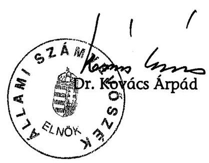

# ÁLLAMI   SZÁMVEVŐSZÉK 

## JELENTÉS

az Antall József Alapítvány 2003-2005. évi gazdálkodása törvényességének ellenőrzéséről

---

3. Önkormányzati és Területi Ellenőrzési Igazgatóság
3.1. Szabályszerüségi Ellenőrzések Főcsoport
Iktatószám: V-1012-24/2006.
Témaszám: 827
Vizsgálat-azonosító szám: V0290
Az ellenőrzést felügyelte:
Dr. Lóránt Zoltán
főigazgató
Az ellenőrzés végrehajtásáért felelős:
Dr. Elek János
főigazgató-helyettes
Az ellenőrzést vezette:
Solymár Ágnes
számvevő főtanácsos
Az ellenőrzést végezték:
Dr. Méri Sándorné Pásztor Katalin
számvevő számvevő tanácsos

# A témához kapcsolódó eddig készített számvevőszéki jelentések: 

címe
sorszáma
Jelentés a Szabó Miklós Szabadelvű Alapítvány 2003-2004. évi gaz- 0559 dálkodása törvényességének ellenőrzéséről
Jelentés a Táncsics Mihály Alapítvány 2003-2004. évi gazdálkodá- 0566 sa törvényességének ellenőrzéséről

---

# TARTALOMJEGYZÉK 

BEVEZETÉS ..... 5
I. ÖSSZEGZŐ MEGÁLLAPÍTÁSOK, KÖVETKEZTETÉSEK, JAVASLATOK ..... 7
II. RÉSZLETES MEGÁLLAPÍTÁSOK ..... 11

1. A gazdálkodás szabályozottsága és szabályossága ..... 11
1.1. A törvényi előírások teljesülése az alapító okiratban ..... 11
1.2. A szervezeti és múködési szabályzat ..... 12
1.3. A kuratórium vagyonkezelési tevékenysége ..... 13
2. Az éves beszámolók ..... 14
2.1. A beszámolók szabályossága ..... 14
2.2. A mérleg ..... 16
2.3. Az eredmény-kimutatás ..... 17
2.3.1. Az alapítvány bevételei ..... 17
2.3.2. A alapítvány ráfordításai ..... 19
3. A könyvvezetés szabályozottsága ..... 20
4. A könyvvezetés gyakorlata ..... 22
4.1. A könyvvezetés szabályossága ..... 22
4.2. Az analitikus nyilvántartások ..... 23
4.3. A bizonylati elv és fegyelem érvényesülése ..... 23
5. Az adó és járulék fizetési kötelezettségek teljesítése ..... 24
6. Az alapítvány ellenőrzési rendszere ..... 24
MELLÉKLETEK
7. számú Az alapítvány 2004. évi mérlege
8. számú Az alapítvány 2004. évi eredmény-kimutatása
9. számú Az alapítvány 2005. évi mérlege
10. számú Az alapítvány 2005. évi eredmény-kimutatása

---

.

---

# RÖVIDÍTÉSEK JEGYZÉKE 

| AJA | Antall József Alapítvány |
| :--: | :--: |
| ÁSZ | Állami Számvevőszék |
| ÁSZ törvény | az Állami Számvevőszékről szóló 1989. évi XXXVIII. törvény |
| Kincstár | Magyar Államkincstár |
| Külön kormányrendelet | A számviteli törvény szerinti egyes egyéb szervezetek beszámolókészítési és könyvvezetési kötelezettségének sajátosságairól szóló 224/2000. (XII. 19.) Korm. rendelet |
| MDF | Magyar Demokrata Fórum |
| pátalapítványi törvény | a pártok múködését segitő tudományos, ismeretterjesztő, kutatási, oktatási tevékenységet végző alapítványokról szóló 2003. évi XLVII. törvény |
| párttörvény | a pártok múködéséről és gazdálkodásáról szóló 1989. évi XXXIII. törvény |
| PM | Pénzügyminisztérium |
| Ptk. | a Polgári Törvénykönyvről szóló 1959. évi IV. törvény |
| Szja törvény | a személyi jövedelemadóról szóló 1995. évi CXVII törvény |
| SZMSZ | Szervezeti és Múködési Szabályzat |
| Szt. | a számvitelről szóló 2000. évi C. törvény (2005. december 31-ig hatályos) |
| Tbj. | a társadalombiztosítás ellátásaira és a magánnyugdíjra jogosultakról, valamint e szolgáltatások fedezetéről szóló 1997. évi LXXX. törvény |

---

.

---

# JELENTÉS 

## az Antall József Alapítvány 2003-2005. évi gazdálkodása törvényességének ellenőrzéséről

## BEVEZETÉS

Az Országgyűlés a pártok Alkotmányban biztosított, a népakarat kialakításában és kinyilvánításában történő közreműködésének elősegítése, az állampolgári tájékoztatás szélesítése, a politikai kultúra fejlesztése érdekében történő politikai képzés, kutatás, tudományos és ismeretterjesztő tevékenység támogatására a pártok működését segítő tudományos, ismeretterjesztő, kutatási, oktatási tevékenységet végző alapítványokról szóló 2003. évi XLVII. törvénnyel (pártalapítványi törvény) lehetővé tette, hogy a parlamenti pártok költségvetési támogatásra jogosult alapítványokat hozzanak létre. A Magyar Demokrata Fórum (MDF) a pártalapítványi törvényben biztosított lehetőséggel élve létrehozta az Antall József Alapítványt (AJA), amelyet a Fővárosi Bíróság 9.050. sorszámon, 2003. december 19-én jogerőssé vált végzésével vett nyilvántartásba.

Az alapítvány célja, hogy tevékenységével hozzájáruljon a magyarországi politikai kultúra fejlesztéséhez, színvonalának emeléséhez, az MDF által vallott értékekhez, politikai értékrendhez kapcsolódó tudományos, ismeretterjesztő, kutatási és oktatási tevékenységet végezzen, valamint tudományos kutatás, tájékoztatás, oktatás és képzés szervezésével elősegítse a célok megvalósulását.

A pártalapítványi törvény 3. § (6) bekezdése szerint az alapítvány céljára legalább a pártok múködéséről és gazdálkodásáról szóló 1989. évi XXXIII. törvény (párttörvény) 9/A. § (5) bekezdés a) pontja szerinti alaptámogatás 1\%-ának megfelelő összegű vagyont kell rendelni. Az alapítvány a párttörvény 9/A. § (5) bekezdés alapján alaptámogatásban, mandátumarányos kiegészítő támogatásban és eseti támogatásban részesülhet. A támogatás összegét a költségvetésről szóló törvény évenként állapítja meg.

A pártalapítványi törvény 4. § (2) bekezdése alapján az alapítvány gazdálkodása törvényességének ellenőrzésére az Állami Számvevőszék jogosult, ugyanezen törvény 4. § (4) bekezdése alapján az Állami Számvevőszék kétévenként ellenőrzi azoknak az alapítványoknak a gazdálkodását, amelyek e törvény szerint állami költségvetési támogatásban részesültek.

Ellenőrzésünk célja volt törvényességi szempontból értékelni, hogy a kuratórium az induló vagyonnal, a központi költségvetési támogatással, az egyéb támogatással és az alapítvány egyéb bevételeivel, a párttörvénynek és a pártalapítványi törvénynek, valamint az alapító okiratban megjelölt céloknak megfelelően gazdálkodott-e, az alapítvány alapító okirata és belső szabályzatai meg-teremtették-e az induló vagyon és a központi költségvetési támogatás felhaszn-

---

nálásának törvényes kereteit, és a kuratórium biztosította-e az alapítvány könyvvezetésének és éves beszámolóinak törvényességét.

Az ellenőrzés az alapítvány megalakulásától a 2005. december 31-ig tartó időszakra terjedt ki.

Az AJA ellenőrzésére első alkalommal került sor, így az eredendő és belső kontroll kockázatot magasnak minősítettük, ez alapján az alapítványi bevételeket, a kuratórium vagyonkezelést és gazdálkodást érintő döntéseit tételesen, az alapítvány költségeit és ráfordításait reprezentatív minta alapján ellenőriztük.

---

# I. ÖSSZEGZŐ MEGÁLLAPÍTÁSOK, KÖVETKEZTETÉSEK, JAVASLATOK 

Az AJA-t az MDF a párttörvény és pártalapítványi törvény előírásának megfelelően, 1000 ezer Ft induló vagyonnal hozta létre. A 2003-2005. évekre összesen 276300 ezer Ft központi költségvetési támogatást kapott, amelynek mértéke megfelelt a párttörvény által meghatározott alap-, és mandátumarányos kiegészítő támogatás együttes értékének, eseti támogatásban nem részesült. A csatlakozó szervezetek és magánszemélyek 13 025,4 ezer Ft támogatást nyújtottak, elfogadásukról az alapító okirat előírásától eltérően a kuratórium előzetesen nem döntött, a csatlakozás tényét csak utólagosan vette tudomásul. A támogatást minden esetben az alapítvány pénzforgalmi számlájára folyósították. A támogatók azonosításához szükséges adatok az alapítványnál megtalálhatóak voltak, az alapítvány a törvény szerinti közzétételi kötelezettségét teljesítette. A támogatásokon kívül bevétel csak az átmenetileg szabad pénzeszközök lekötéséből származott, vállalkozási tevékenységet nem folytatott az alapítvány.

Az AJA céljait a kuratórium által megítélt, továbbadott támogatások útján, másrészt saját szervezeti keretei között végzett tevékenységével valósította meg. Az ellenőrzött években realizált bevételeinek 93,8\%-át használta fel 2005 végéig a célok megvalósítása érdekében és az alapítványi múködés költségeire. A támogatások odaítéléséről és a cél szerinti tevékenységekről - a határozathozatal módjára és a határozatképességre vonatkozó, alapító okiratban rögzített előírások betartásával - minden esetben a kuratórium döntött. A támogatottakkal az alapító okirat előírásával ellentétben nem a képviseletre jogosult kuratórium elnöke, hanem a főigazgató kötött támogatási szerződést. A 2004ben megkötött támogatási szerződések 46\%-a nem tartalmazta a kuratórium által jóváhagyott támogatás összegét, 2005-ben egy támogatási szerződésben nem írtak elő elszámolási határidőt. A benyújtott elszámolásokat az alapítványi iroda ellenőrizte, és fogadta el. Szerződés felbontására, vagy egyéb jogkövetkezmény alkalmazására egyetlen esetben sem került sor. A kuratórium három esetben nem érvényesítette a közbeszerzési törvény előírásait annak ellenére, hogy a megbízások értéke egyenként meghaladta a szolgáltatás megrendelésére előírt nemzeti közbeszerzési értékhatárokat.

Az AJA 2003-ra nem készítette el az egyszerúsített éves beszámolót annak ellenére, hogy az induló vagyont és a központi költségvetési támogatás időarányos részét az alapítvány a 2003. évben megkapta. A téves könyvvezetés miatti - eredményt, saját tőkét növelő-csökkentő - hibák mérleg főösszegre vetített értéke a 2004. évi beszámolóban (1,6\%) nem érte el, míg a 2005. évi beszámolóban ( $2,3 \%$ ) meghaladta a $2 \%$-os lényegességi küszöböt. A 2004. évben az éves beszámoló teljes egészében, a 2005. évben az éves beszámoló a pénzeszközök és a tárgyi eszközök sorok kivételével, megbízható képet nyújtott az alapítvány vagyoni és jövedelmi helyzetéről. Az alapítvány könyvvezetésében és éves beszámolóiban nem érvényesítette következetesen a valódiság, a teljesség és az egyedi értékelés számviteli alapelveit. A 2004. évi beszámolóban passzív időbeli elhatárolásként mutatták ki a tárgyévben felmerült és a mérleg fordulónapjáig

---

kiszámlázott költségeket, valamint a térítésmentesen átvett szoftvert és számítógépet nem értékelték fel, nem vették nyilvántartásba. A 2005. évi beszámolóban az 50 ezer Ft egyedi beszerzési értéket meghaladó tárgyi eszközöket költségként számolták el. Mindkét évben eltért a beszámolókban kimutatott pénzeszközök értéke az analitikus nyilvántartás adataitól. Az AJA egyszerúsített éves beszámolóinak mérlegsorai a főkönyvi kivonat, továbbá a főkönyvi számlák adataiból levezethetők voltak, de a beszámoló sorokat alátámasztó leltáraknál hiányosságokat állapítottunk meg. Az immateriális javakról, a tárgyi eszközökről, a készletekről leltárkiértékelést, a követelések elfogadásáról szóló dokumentumot nem készítettek, a pénzeszközök értékét mennyiségi leltár nem támasztotta alá.

Az alapítványi vagyon felhasználásának kereteit a pártalapítványi törvény és az alapító okirat, részletes szabályait az alapítvány belső szabályzatai rögzítették. Az alapító okirat az alapítvány célját, a cél elérése érdekében meghatározott tevékenységeket a pártalapítványi törvény, a képviseleti és a bankszámla feletti rendelkezési jogot a vonatkozó törvényi előírásnak megfelelően tartalmazta. A kuratórium a múködés szervezeti kereteit és rendjét SZMSZ-ben rögzítette, ebben az alapító okirattól eltérően a képviseleti joggal nem rendelkező főigazgató részére a működési költségek tekintetében elkülönített bankszámla feletti rendelkezési jogot biztosított a kuratórium utólagos tájékoztatása mellett, azonban a bankszámla feletti rendelkezés gyakorlata az alapító okirat szerint történt. Ugyancsak ellentétes volt az alapító okirattal az SZMSZ mellékleteként elfogadott pénzügyi gazdálkodási szabályzat, mivel engedélyezte a főigazgató és igazgatók részére 500 ezer Ft erejéig a kötelezettségvállalást, illetve az adományok elfogadása és felhasználása területén korlátlan jogokat biztosított. Az SZMSZ a munkáltatói jog gyakorlásának szabályozása területén hiányos volt, mivel nem jelölte meg, hogy ki gyakorolja az alapítványi iroda alkalmazottai felett a munkáltatói jogokat. A kuratórium a vagyont érintő gazdasági döntéseit az alapító okirattal és az SZMSZ-szel összhangban, határozatképes üléseken hozta meg, a kuratóriumi ülésekről készített jegyzőkönyvek, és a határozatok tára megfelelt az alapító okirat és az SZMSZ vonatkozó előírásainak.

Az AJA rendelkezett - a számviteli törvényben előírt - a könyvvezetés és beszámoló készítés rendjét meghatározó számviteli szabályzatokkal. A számviteli politika, a számlarend, valamint az eszközök és források értékelési szabályzata nem igazodott az alapítvány gazdálkodásának sajátosságaihoz, az eszközök és források értékelési szabályzata téves jogszabályi hivatkozást tartalmazott. A számviteli politika nem határozta meg az értékcsökkenés elszámolásának szabályait, a számlarend nem volt összhangban az alkalmazott számlatükörrel, a főkönyvi számlacsoportok és főkönyvi számlák számjele eltérő volt. A pénzkezelési szabályzat nem rendelkezett a banki átutalások utalványozásának rendjéről.

A könyvvezetést a kettős könyvvitel rendszerében végezték, a gazdasági eseményeket azonban 2004-ben és 2005. első negyedévében a pénztári kifizetések esetében nem az Szt. előírásainak megfelelő alapbizonylatokkal alátámasztva rögzítették. A pénztári kiadási bizonylatok esetében a bizonylati rend és okmányfegyelem nem érvényesült az alaki és tartalmi törvényi előírások betartásában, és a bizonylatok feldolgozásának időrendiségében. Az AJA a vonatkozó

---

kormányrendelettől eltérően számviteli nyilvántartásában nem különítette el az alapítvány cél szerinti tevékenysége közvetlen, az alapítvány kezelő szervének közvetett, és az egyéb közvetett költségeit. A főkönyvi nyilvántartásban esetenként - téves számlakijelölés miatt - a tartalmukban azonos gazdasági eseményeket eltérően számolták el (pl. egy azonos szerződés esetében a részszámlákat eltérő főkönyvi számlákra, azonos tartalmú szolgáltatást eltérő tartalommal rögzítettek, támogatásként könyveltek szolgáltatást).

Az AJA a számviteli törvénynek megfelelően szabályozta számlarendjében a főkönyvi számlákhoz rendelt analitikák körét, tartalmát és vezetésük rendjét. A számlarend által előírt analitikus nyilvántartásokat a pénztárjelentés kivételével vezette az alapítvány. A kötelezettségvállalási és utalványozási jogot az arra felhatalmazottak gyakorolták, az utalványozás módja azonban eltért a pénzkezelési szabályzat előírásától, mivel a kifizetés alapbizonylata helyett a kiadási pénztárbizonylaton utalványoztak. Az utalványozott pénzforgalmi bizonylatokhoz minden esetben csatolták az alapbizonylatokat, amelyek alapján minden kifizetés beazonosítható volt.

Az alapítvány munkáltatói jogkörében eleget tett az adózási és társadalombiztosítási jogszabályok rendelkezéseinek, az előírt nyilvántartásokat vezette, az adatszolgáltatásokat teljesítette. A kifizetett bér- és bérjellegű jövedelmekből a magánszemélyeket terhelő adóelőleget és járulékokat levonta, a munkáltatót terhelő költségvetési befizetési kötelezettséget előírta és határidőben befizette.

Az alapítvány belső ellenőrzési rendszerét belső szabályzatai határozták meg, ezen belül a vezetői ellenőrzést a munkáltatói jogok gyakorlása vonatkozásában hiányosan szabályozták. A munkafolyamatba épített ellenőrzés hiányosan működött, a szabályzatokban meghatározott egyeztetéseket az analitika és a főkönyvi számlák vonatkozásában nem hajtották végre, illetve nem dokumentálták az egyeztetés tényét, a pénztárellenőr a házipénztárt nem ellenőrizte, az elkészült leltárakat nem értékelték ki.

A helyszíni ellenőrzés megállapításainak hasznosítása mellett javasoljuk:

# az alapítvány kuratóriumának 

1. Módosítsa és egészítse ki az alapítvány belső szabályzatait a következők figyelembevételével:
a) hozza összhangba az SZMSZ-t és a pénzügyi-gazdálkodási szabályzatot az alapító okirattal az elkülönített bankszámla feletti rendelkezési jog, valamint az adományok elfogadása és felhasználása vonatkozásában;
b) pontosítsa a számviteli politikában a könyvvezetés módját, az éves beszámoló formáját;
c) határozza meg a számviteli politikában az alapítványi célú tevékenység közvetlen, illetve a múködési költségeinek körét és elkülönítésük módját, a zárlati munkák, az időbeli elhatárolások körét, az értékcsökkenés elszámolásának szabályait;

---

d) módosítsa az alapítványi sajátosságoknak megfelelően az eszközök és a források értékelésének szabályait, törölje a téves jogszabályi hivatkozást;
e) egészítse ki a pénzkezelési szabályzatot a banki átutalások utalványozási rendjével;
f) módosítsa a számlarendet az alapítvány gazdálkodására jellemző, sajátos elszámolások figyelembevételével;
g) hozza összhangba a számlarendben és a számlatükörben a főkönyvi számlák és számlacsoportok számjelét;
h) gondoskodjon a szabályzatoknak a képviseletre jogosult kuratóriumi elnök általi aláírásáról, a szabályzatokba foglalt előírások betartatásáról.
2. Gondoskodjon a mérlegnek a leltározási szabályzatban előírtaknak megfelelő alátámasztásáról;
3. Intézkedjen a könyvvezetésben és az éves beszámolókban a számviteli alapelvek betartatásáról, a 2005. évi beszámoló önellenőrzés keretében történő helyesbítéséről, a helyesbített beszámoló elfogadásáról;
4. Biztosítsa a támogatási szerződésekben a képviseleti jog alapító okiratnak megfelelő gyakorlását, továbbá a támogatások összegének és a felhasználásról szóló elszámolások határidejének rögzítését.

---

# II. RÉSZLETES MEGÁLLAPÍTÁSOK 

## 1. A GAZDÁLKODÁS SZABÁLYOZOTTSÁGA ÉS SZABÁLYOSSÁGA

### 1.1. A törvényi előírások teljesülése az alapító okiratban

Az AJA-t az MDF a pártalapítványi törvény alapján hozta létre. Az alapítványt a Fővárosi Bíróság 2003. december 19-én a 16.Pk. 61.171/2003/1. számú végzésével 9.050. sorszám alatt vette jogerősen nyilvántartásba.

Az alapítvány célja és a cél elérése érdekében az alapító okiratban meghatározott tevékenységek megfeleltek a Ptk., a párttörvény és a pártalapítványi törvény rendelkezéseinek. Az alapítvány alapító okirat szerinti célja, hogy tevékenységével hozzájáruljon a magyarországi politikai kultúra fejlesztéséhez, színvonalának emeléséhez, az MDF által vallott értékekhez, politikai értékrendhez kapcsolódó tudományos, ismeretterjesztő, kutatási és oktatási tevékenységet végezzen, és a célok megvalósulását tudományos kutatás, tájékoztatás, oktatás és képzés szervezésével elősegítse. Az alapító okiratot az alapító a 2005. év végéig egyszer módosította - az alapítványi célok és a vagyonkezelésre vonatkozó előírások változatlanul hagyása mellett - székhelyváltozás miatt.

A Ptk. 74/B. § (5) bekezdése szerint az alapító az alapító okiratot indokolt esetben - az alapítvány nevének, céljának és vagyonának sérelme nélkül - módosíthatja.

Az alapító párt, az MDF, az alapítvány induló vagyonát (1000 ezer Ft) a pártalapítványi törvény 3. § (6) bekezdését betartva biztosította.

A pártalapítványi törvény 3. § (6) bekezdése alapján az alapítvány céljára legalább a párttörvény 9/A. § (5) bekezdés a) pontja szerinti alaptámogatás 1\%ának (594 ezer Ft) megfelelő összegű vagyont kellett rendelni.

Az alapító az alapító okiratban a Ptk. 74/B-C. § előírásának megfelelően kijelölte az alapítványi vagyon kezelésére felhatalmazott kuratóriumot, meghatározta a vagyon felhasználásának módját, a kuratórium feladatkörét, megnevezte az alapítvány képviselőjét, a Ptk. 29. § (2) és (3) bekezdésének megfelelően rendelkezett a képviseleti jog gyakorlásának módjáról és terjedelméről, továbbá a bankszámla felett rendelkezők köréről.

A Ptk. 74/B. § (1) bekezdése szerint az alapító okiratban meg kell jelölni az alapítvány nevét, célját, a céljára rendelt vagyont és annak felhasználási módját, székhelyét. A Ptk. 74/C. § (1) bekezdése szerint az alapító az alapító okiratban kijelölheti a kezelő szervet, amely az alapítvány képviselője.

A Ptk 29. § (2) bekezdése értelmében a jogi személy létesítéséről szóló okiratban meg kell állapítani a jogi személy képviselőjét. A (3) bekezdés szerint a jogi személy nevében aláírásra a jogi személy képviselője jogosult. A bankszámla felett való rendelkezéshez minden esetben két képviseleti joggal felruházott személy aláírása szükséges.

---

Az alapító tizenegy tagból álló kuratóriumot jelölt ki, a pártalapítványi törvény 3. § (7) bekezdése szerint a kuratórium tagjai öt évre szóló megbízatást kaptak. A kuratórium személyi összetétele megfelelt a pártalapítványi törvény 3. § (7) bekezdése és a Ptk. 74/C. § (3) bekezdésében foglaltaknak, az alapító a kuratóriumban a vagyon felhasználására meghatározó befolyást nem gyakorolt.

Ptk. 74/C. § (3) szerint nem jelölhető ki, illetve nem hozható létre olyan kezelő szerv (szervezet), amelyben az alapító - közvetlenül vagy közvetve - az alapítvány vagyonának felhasználására meghatározó befolyást gyakorolhat. A pártalapítványi törvény 3. § (7) bekezdése szerint nem minősül a Ptk. 74/C. § (3) bekezdése szerinti meghatározó befolyásnak, ha a kezelő szerv tagja az alapító párt tagja.

# 1.2. A szervezeti és múködési szabályzat 

Az alapítvány működésének szervezeti kereteit, működésének rendjét meghatározó SZMSZ-t a kuratórium - 2004. február 27-én - tartózkodás és ellenszavazat nélkül elfogadta. Az SZMSZ az alapító okirattal összhangban határozta meg a kuratórium ügyrendjét. Rögzítette az alapítványi iroda szervezetét, meghatározta az iroda feladatait.

Az alapítványi vagyon kezelése és felhasználása szabályozása során a kuratórium a Ptk.-val és az alapító okirattal ellentétes szabályokat hagyott jóvá, amikor a főigazgató részére alapítói felhatalmazás nélkül a működési költségek tekintetében elkülönített bankszámla feletti rendelkezési jogot biztosított (SZMSZ V. 20. pontja) a kuratórium utólagos tájékoztatása mellett. Ugyancsak ellentétes volt az alapító okirattal a 2005. április 21-én, az SZMSZ mellékleteként elfogadott pénzügyi gazdálkodási szabályzat, mivel engedélyezte az AJA főigazgatója és igazgatói részére 500 ezer Ft erejéig a kötelezettség vállalást, illetve az adományok elfogadása és felhasználása területén korlátlan jogokat biztosított.

A Ptk. 74/C. § (4) bekezdése szerint az alapító az alapító okiratban úgy is rendelkezhet, hogy a kezelő szerv az alapítvány alkalmazottjának képviseleti jogot biztosíthat, megjelölve a képviseleti jog gyakorlásának módját, illetőleg terjedelmét.

Az alapító okirat VIII. 1. pontjában szabályozottak szerint az alapítvány képviseletében a kuratórium elnöke egyedül volt jogosult eljárni, a 2. pontjában szabályozottak szerint a bankszámla felett való rendelkezéshez a kuratórium elnöke és az általa írásban meghatalmazott kuratóriumi tag együttes aláírása volt szükséges.

Az alapító okirat III. 2. pontja értelmében a csatlakozási szándék elfogadásáról a kuratóriumnak kellett döntenie.

A gyakorlatban az alapító okirat bankszámla feletti rendelkezési előírását betartotta a kuratórium, a banki aláíró kartonon - az alapító okiratnak megfelelően - a kuratórium elnökét jelentették be, aki az általa írásban meghatalmazott kurátorral együttesen rendelkezett a bankszámla felett. Az ellenőrzött két évben az alapítvány által kötött megbízási és támogatási szerződéseket a főigazgató írta alá.

---

Az SZMSZ a munkáltatói jog gyakorlásának szabályozása területén hiányos volt, mivel nem jelölte meg, hogy ki gyakorolja az alapítványi iroda alkalmazottai felett a munkáltatói jogokat.

# 1.3. A kuratórium vagyonkezelési tevékenysége 

Az AJA a párttörvény 9/A. §-ában meghatározott mértékű, rendszeres költségvetési támogatást kapott, amelyet a kuratórium kizárólag az alapító okiratban meghatározott célok megvalósítására fordított. Az alapítványi vagyon felhasználásának kereteit a pártalapítványi törvény, az alapító okirat, az SZMSZ, illetve az alapítvány belső szabályzatai tartalmazták.

A kuratórium az ellenőrzött időszakban, az alapító okiratban előírt negyedéves gyakoriságnál gyakrabban tartott ülést, tizenkét ülésén összesen hetvenhárom határozatot hozott. A kuratórium üléseiről minden alkalommal jegyzőkönyvet készítettek, amelyet az adott ülésen kijelölt kurátor hitelesített. A kuratórium határozatait az alapító okirat előírásának megfelelően a jelenlévő kuratóriumi tagok egyszerű szótöbbségével hozta meg. A kuratóriumi határozatokról sorszámozott nyilvántartást vezettek, a nyilvántartás tartalmazta a szavazatok és ellenszavazatok számát, illetve a szavazástól tartózkodókat, vagy az abban részt nem vevőket. A határozatok 72,6\%-át az ülésen jelenlévő kurátorok egyhangú szavazattal fogadták el.

A kuratóriumnak a gazdálkodást érintő döntései az alapítványi vagyon felhasználása keretében az alapító okirat szerinti célok megvalósítását szolgáló tevékenységek támogatására, az alapítványi céloknak az alapítvány szervezetén belüli megvalósításával összefüggő tevékenységekre, valamint a célok megvalósításához szükséges személyi feltételek biztosítására irányultak. A múködés tárgyi feltételeinek biztosítása az alapítványi iroda hatásköre volt, melynek fedezetéről a költségvetés elfogadásával döntött a kuratórium.

Az alapító nem írta elő a kuratórium számára a vagyon felhasználásának tervezését, azt a kuratórium az SZMSZ-ben rögzítette a kuratórium feladataként. A kuratórium, az SZMSZ előírásának megfelelően, határozattal döntött az alapítvány éves költségvetéséről. A kuratórium a szakmai és pénzügyi terv teljesítését negyedévenként figyelemmel kísérte, a teljesítés elfogadásáról határozatot hozott.

Az SZMSZ II. 2/d pontja szerint a kuratórium dönt az alapítvány éves költségvetéséről.

A pénzügyi beszámolók a likviditási helyzet, a várható bevételek és kiadások számbavételét tartalmazták a számviteli nyilvántartások alapján. A pénzügyi tervben megfogalmazott feladatok végrehajtásáról az alapítvány főigazgatójának beszámoltatásával tájékozódott a kuratórium.

A cél szerinti feladatokra a költségvetésben meghatározott keretösszegek felhasználásáról (képzések, rendezvények, tudományos és ismeretterjesztő kiadványok, nyomdai és kutatási megbízások) 2004-ben az iroda főigazgatója és igazgatói döntöttek, kuratóriumi határozat alapján 500 ezer Ft értékhatárig kötelezettséget vállalhattak, a szerződések aláírásával képviseleti jogot gyakoroltak. Ez a gyakorlat nem felelt meg az alapító okirat azon előírásának, mely

---

szerint a kuratórium kezeli az alapítvány vagyonát, illetve dönt annak felhasználásáról. A 2005. évben a pályázati és egyedi támogatásokról a kuratórium határozott.

# 2. Az ÉVES BESZÁmolók 

Az AJA az ellenőrzött időszakban a 2003. év kivételével eleget tett beszámoló készítési kötelezettségének.

Az AJA a 2003. évi vagyoni, pénzügyi helyzetéről az Szt. 4. § (1), illetve 12. § (1) bekezdéseivel ellentétesen nem számolt be, nem tett eleget könyvvezetési kötelezettségének, holott az 1 millió Ft induló vagyont az alapító 2003. augusztus 26-án, az 54 millió Ft központi költségvetési támogatást a Miniszterelnöki Hivatal 2003. december 29-én az alapítvány bankszámlájára utalta.

Az Szt. 4. § (1) bekezdése szerint a gazdálkodó működéséről, vagyoni, pénzügyi és jövedelmi helyzetéről az üzleti év könyveinek zárását követően, könyvvezetéssel alátámasztott beszámolót köteles készíteni. A 12. § (1) bekezdése szerint a könyvvezetés az a tevékenység, amelynek keretében a gazdálkodó a tevékenysége során előforduló, a vagyoni, pénzügyi, jövedelmi helyzetére kiható gazdasági eseményekről folyamatosan nyilvántartást vezet és azt az üzleti év végével lezárja.

Az AJA a 2004. és 2005. évi beszámolóit két változatban készítette el, egyrészt a külön kormányrendelet 6. §. (4) bekezdés ba) alpontja szerinti, valamint az Szt. szerinti „A" jelű egyszerűsített éves beszámolót. A beszámolók szerkezete mindkét évben megfelelt a külön kormányrendeletnek, illetve a Szt. 96. § előírásainak.

Az Szt.96. § (1) bekezdése értelmében az egyszerúsített éves beszámoló mérlegből, eredmény-kimutatásból és kiegészítő mellékletből áll. Üzleti jelentést - az egyszerűsített éves beszámolóhoz kapcsolódóan - nem kell készíteni. A (2) bekezdés szerint az egyszerűsített éves beszámoló mérlege a törvény 1. számú melléklete „A", illetve „B" változata közül választott mérleg nagybetűvel és római számmal jelölt tételeit tartalmazza. A (3) bekezdés szerint az egyszerűsített éves beszámoló eredmény-kimutatása a törvény 2. vagy a 3. számú melléklet „A", illetve „B" változata közül választott eredmény-kimutatás nagybetűvel és római számmal jelölt tételeit tartalmazza.

Az AJA-nak sem jogszabályi, sem az alapító által előírt könyvvizsgálati kötelezettsége nem volt az ellenőrzött időszakban. A kuratórium a 2004. évi beszámolót könyvvizsgálóval ellenőriztette. A könyvvizsgáló a beszámolót hitelesítő záradékkal látta el.

### 2.1. A beszámolók szabályossága

Az AJA az egyszerűsített éves beszámolói összeállítása során az Szt. 15. és 16. § ában foglalt számviteli alapelvekre vonatkozó előírásait nem érvényesítette minden alapelv vonatkozásában. A 2004. és 2005. években a beszámolók elkészítése során a valódiság, a teljesség és az egyedi értékelés számviteli alapelveit nem érvényesítette következetesen. A téves könyvvezetés miatti eredményt, saját tőkét növelő-csökkentő - hibák mérleg főösszegre vetített értéke 2004. évi beszámolóban nem érte el, míg a 2005. évben megha-

---

ladta a 2\%-os lényegességi küszöböt. Az eredményt, saját tőkét érintő hiba értéke a 2004. évben 333 ezer Ft, a mérleg főösszegre (20 838 ezer Ft) vetítve 1,6 \% volt, a 2005. évben 699 ezer Ft, a mérleg főösszegre (29 747 ezer Ft) vetítve 2,3 \% volt. A 2004. évben az éves beszámoló teljes egészében, a 2005. évben az éves beszámoló a pénzeszközök és a tárgyi eszközök sorok kivételével, megbízható képet nyújtott az alapítvány vagyoni és jövedelmi helyzetéről.

Az Szt. 3. § (3) bekezdés 3. pontja, valamint az AJA számviteli politikája szerint jelentős összegű hiba: ha a hiba feltárásának évében, a különböző ellenőrzések során, egy adott üzleti évet érintően (évenként külön-külön) feltárt hibák és hibahatások - eredményt, saját tőkét növelő-csökkentő - értékének együttes (előjeltől független) összege meghaladja a számviteli politikában meghatározott 2\%-os értékhatárt.

A téves könyvvezetésből származó, a beszámoló sorokat érintő hibák:

- A 2004. és 2005. években a saját tőkét magasabb értékben mutatták ki, nem érvényesítették a valódiság elvét, amely szerint a beszámolókban szereplő tételeknek a valóságban is megtalálhatóknak, bizonyíthatóknak kell lenniük. A mérlegben a forgóeszközök mérlegcsoporton belül a pénzeszközök év végi záró adata a főkönyvi és analitikus nyilvántartás, illetve a pénzmozgásról kiállított bevételi és kiadási pénztár bizonylatok egyenlege eltért egymástól. A zárlati munkák keretében a pénzeszközök mennyiségi leltára, egyeztetése a főkönyvvel nem történt meg. A könyv szerinti érték 2004. december 31-én 333 ezer Ft-tal, 2005-december 31-én 451 ezer Ft-tal volt magasabb, mint az analitikus nyilvántartás szerinti pénzeszköz.

A mindkét évi beszámolót érintő pénztárhiányt a helyszíni ellenőrzés befejezéséig - a 2006. október 18-án felvett jegyzőkönyv alapján, utólagos elszámoltatással az alapítvány teljes körűen rendezte.

- Az AJA 2004-ben térítésmentesen átvett számítógépének, szoftverének, nyilvántartásba vétele nem történt meg. Az átadás-átvételi dokumentumban az átadó nyilvántartási értéke nem volt feltüntetve, az AJA a gépet nem értékeltette fel, ezzel a könyvvezetésében és a beszámoló készítése során az egyedi értékelés és a teljesség számviteli alapelveket nem tartotta be.

A számviteli politika az Szt. 50. § (4) bekezdésével összhangban előírta, hogy a térítés nélkül, visszaadási kötelezettség nélkül átvett eszközöket bekerülési értéken, az átadónál kimutatott nyilvántartási értéken, legfeljebb azonban a forgalmi, piaci értéken kell nyilvántartani.

- A 2005. évben a tárgyi eszközök értékében nem szerepelt négy beszerzett monitor, amelyeknek egyedi beszerzési értéke 62 ezer Ft (összesen 248 ezer Ft) volt. Az Szt. 80. § (2) bekezdésében foglaltakkal ellentétben ezek értékét az alapítvány egy összegben értékcsökkenésként számolta el, ezáltal a kimutatott értékcsökkenés összege magasabb, míg a saját tőke értéke alacsonyabb volt a valóságosnál. Könyvvezetésében a valódiság és az egyedi értékelés elvét nem tartotta be.

Az Szt. 80. § (2) bekezdése értelmében az 50 ezer forint egyedi beszerzési, előállítási érték alatti vagyoni értékű jogok, szellemi termékek, tárgyi eszközök bekerülési értéke számolható el egy összegben a használatbavételkor értékcsökkenési leírásként.

---

Az Szt. 52. § (1) bekezdése szerint a tárgyi eszközöknek a hasznos élettartam végén várható maradványértékkel csökkentett bekerülési (beszerzési, illetve előállítási) értékét azokra az évekre kell felosztani, amelyekben ezeket az eszközöket előreláthatóan használni fogják

- A 2004. évben a mérleg fordulónapja előtti időszakban felmerült és kiszámlázott készpénzes számlák alapján 679 ezer Ft költséget a passzív időbeli elhatárolással szemben számolták el, így a mérlegben kimutatott passzív időbeli elhatárolás nem felelt meg az Szt. 44. § (1) bekezdése b) pontjában foglalt előírásnak. A feltárt hiba az eredmény, saját tőke összegét nem befolyásolta.

Az Szt. 44. § (1) bekezdés b) pontja szerint passzív időbeli elhatárolásként kell kimutatni a mérleg fordulónapja előtti időszakot terhelő költséget, ráfordítást, amely csak a mérleg fordulónapja utáni időszakban merül fel, kerül számlázásra.

# 2.2. A mérleg 

Az ellenőrzött időszak egyszerűsített éves beszámolóinak mérlegsorai a főkönyvi kivonat, továbbá a főkönyvi számlák adataiból levezethetők voltak.

Az alapítvány eszközeinek és forrásainak a beszámoló mérlegében kimutatott főösszege 2004-ben 20838 ezer Ft, 2005-ben 29747 ezer Ft volt.

A mérlegben kimutatott immateriális javak és tárgyi eszközök értéke megegyezett a főkönyvi számlák és az analitikus nyilvántartás adataival, azonban e mérlegsorokat alátámasztó egyeztető leltárak esetében - a leltározási szabályzattól eltérően - az egyeztetés tényét jegyzőkönyvvel nem dokumentálták. Az ellenőrzött években az immateriális javak és tárgyi eszköz beszerzések értéke összesen 7740 ezer Ft volt. Az eszközök beszerzéséről a kuratórium évente a pénzügyi tervben egy összegben döntött, azok az alapítvány működését, célszerinti feladatai ellátását szolgálták.

A leltározási szabályzat szerint az immateriális javakat, a tárgyi eszközöket az AJA évente egyeztetéssel leltározza, minden ötödik évben mennyiségi felvétellel történik a leltározás az év utolsó negyedévében. Leltárnak tekintendő a szabályszerűen végrehajtott, ellenőrzött és helyesbített - a főkönyvi könyveléssel egyező analitikus nyilvántartás alapján készült jegyzőkönyv is.

A forgóeszközök mérlegcsoporton belül a készletek mérlegsor adatát egyik évben sem támasztotta alá a leltározási szabályzatnak megfelelő módon készített mennyiségi leltár, mivel a leltár ívek és a nyilvántartások egyeztetését nem dokumentálták, a leltáríveket a leltárellenőr nem írta alá.

A készletek kimutatott értéke 2004-ben 4635 ezer Ft, 2005-ben 7592 ezer Ft volt.
A követelések egyeztetéséről jegyzőkönyvek egyik évben sem készültek. A követelésekről folyószámla analitikát vezettek, azonban év végén a követelésekről egyenlegközlő leveleket nem készítettek, amelyek a tartozás elismerés alapjául szolgálnak.

---

Az Szt. 65. § (1) szerint a mérlegben a követelést (ideértve a hitelintézetekkel, a pénzügyi vállalkozásokkal szembeni követeléseket, a pénzeszközöket, a kölcsönként, az előlegként adott összegeket is) - függetlenül attól, hogy az a forgóeszközök, illetve a befektetett pénzügyi eszközök között szerepel - az elfogadott, az elismert összegben könyv szerinti értéken kell kimutatni.

A 2005. év végi követelésállomány - ellentétben a pénzkezelési szabályzat vonatkozó előírásaival - tartalmazott 2004. évről áthúzódó elszámolásra kiadott előlegeket is.

A pénzkezelési szabályzat 14. pontja értelmében az elszámolásra kiadott összegek elszámolásának határideje 90 nap, de legkésőbb tárgyévet követő január 31.

Az ellenőrzött időszak éves beszámolóiban a pénzeszközök mérlegsort a házipénztárban elhelyezett készpénz vonatkozásában az Szt. 69. § (1) bekezdésétől eltérően mennyiségi leltár nem támasztotta alá. A bankszámla december 31-i egyenlegéről a beszámolóhoz egyenlegközlő értesítést csatoltak mindkét évben, de az év végi lekötött betétállományt alátámasztó banki igazolást a 2005. évi zárlati kimutatások nem tartalmazták.

Az Szt. 69. § (1) bekezdése szerint a könyvek üzleti év végi zárásához, a beszámoló elkészítéséhez, a mérleg tételeinek alátámasztásához olyan leltárt kell összeállítani és a törvény előírásai szerint megőrizni, amely tételesen, ellenőrizhető módon tartalmazza a mérleg fordulónapján meglévő eszközöket és forrásokat menynyiségben és értékben.

Az Szt. 66. § (3) bekezdése szerint a mérlegben a bankbetétek értékeként az üzleti év mérleg fordulónapján a hitelintézetnél elhelyezett forintbetét bankkivonattal egyező értékét kell kimutatni.

Az AJA a 2004. és 2005. évi egyszerűsített éves beszámolójában az induló vagyont a saját tőke részeként, ezen belül induló tőke címen mutatta ki, amely megegyezett az alapító okiratban meghatározott összeggel.

# 2.3. Az eredmény-kimutatás 

### 2.3.1. Az alapítvány bevételei

Az ellenőrzött években az alapítvány összes bevétele a főkönyvi kivonatok alapján 293499 ezer Ft volt, ennek 94,1 \%\%-át a központi költségvetési támogatás, $0,2 \%$-át önkormányzati támogatás, $3,4 \%$-át külföldi jogi személyektől, $0,9 \%$-át belföldi jogi személyektől kapott támogatás, $1,4 \%$-át a pénzügyi műveletek bevételei tették ki.

A kapott központi költségvetési támogatást a 2004. és a 2005. évben az Szt. szerint elkészített éves beszámolóban helyesen az egyéb bevételek soron mutatták ki. A 2004. évi beszámolóban kimutatott központi költségvetési támogatás eltért a 2004-ben ténylegesen befolyt, bankkivonaton szereplő támogatás összegétől, mivel a 2003. évi költségvetési támogatást is a 2004. évre könyvelték.

Az alapítvány számára évenként biztosított költségvetési támogatás mértéke megfelelt a párttörvény által meghatározott alap-, és mandátumarányos ki-

---

egészítő támogatás együttes összegének. A pártalapítványok központi költségvetési támogatásra jogosultságáról, a támogatás formáiról és mértékéről, a párttörvény 9/A. § (5), valamint a pártalapítványi törvény 5. § (2)-(3) bekezdése rendelkezett. Az ellenőrzött időszakban az alapítvány központi költségvetésből származó összes bevétele 276300 ezer Ft, ezen belül a 2003. év második félévre 54000 ezer Ft, a 2004. évre 107900 ezer Ft, a 2005. évre 114400 ezer Ft volt. Az éves költségvetési törvényben kiemelt célra rendelt eseti támogatást az alapítvány nem kapott.

Az alapítvány a 2003-2005. évekre a párttörvénynek megfelelően 152100 ezer Ft alaptámogatásra és az MDF parlamenti frakció létszáma (24 fő) alapján 124113 ezer Ft mandátumarányos kiegészítő támogatásra volt jogosult.

A Miniszterelnökség fejezet a 2003. évi időarányos támogatást egy összegben, a pártalapítványi törvénynek megfelelően, az alapítvány jogerős bírósági nyilvántartásba vételét követően 2003. december 29-én folyósította. A Kincstár a 2004-2005. évi támogatást - az első negyedév kivételével - a pártalapítványi törvény 2. § (1) bekezdésének megfelelően, negyedéves ütemezésben, a negyedév első napjaiban átutalta. 2004-ben az első negyedévi támogatást csak február elején folyósította, mivel az Országgyűlés által egy összegben elfogadott támogatásnak a pártalapítványok közötti felosztásáról a Kormány 2004. január végén hozott határozatot, így a támogatás utalására csak ez után kerülhetett sor. 2005-ben az első negyedéves támogatást január 31-én, azt követően a negyedév első napjaiban utalta.

A pártalapítványi törvény 5. § (3) bekezdése szerint az alapítvány nyilvántartásba vételét követő 15 napon belül kellett a 2003-ban esedékes teljes támogatást rendelkezésre bocsátani.

A 2003. évi időarányos támogatás biztosítására a Kormány a pártalapítványi törvény 5. § (5) bekezdése alapján kapott felhatalmazást. A 2004. évi költségvetési törvény az Országgyúlés fejezeten belül egy összegben tartalmazta a pártalapítványok támogatását, amelynek felosztását a pártalapítványok támogatásának felosztásáról szóló 2024/2004. (I. 31.) Korm. határozat szabályozta, ez az AJA számára 107900 ezer Ft támogatást biztosított. A Magyar Köztársaság 2005. évi költségvetéséről szóló 2004. évi CXXXV törvény az Országgyűlés fejezeten belül 114400 ezer Ft támogatást különített el az AJA részére.

A csatlakozó szervezetektől kapott támogatásokat (13 025,4 ezer Ft) a mérlegben - helyesen - az egyéb bevételek soron, a kiegészítő mellékletben azonban tévesen - 2004-ben társadalombiztosítási bevételként, 2005-ben pénzügyi műveletek bevételeként - mutatta ki az alapítvány. Az éves beszámolókban kimutatott támogatás megegyezett az adott évi bankkivonatokon szereplő támogatások összegével.

A kuratórium az alapító okirat előírásai ellenére a csatlakozó szervezetektől kapott támogatások elfogadásáról sem 2004-ben, sem 2005-ben nem hozott határozatot. A főigazgató csak utólag tájékoztatta a kuratóriumot a kapott támogatásokról, a tájékoztatást a kuratórium elfogadta. A támogatásokat a támogatók minden esetben az alapítvány bankszámlájára utalták. A támogatók beazonosíthatók voltak, a pártalapítványi törvényben meghatározott öszszeghatár (belföldi támogató esetén 500 ezer Ft, külföldi támogató esetén 100 ezer Ft-nak megfelelő érték) felett az AJA honlapján mindkét évben közzé tették

---

a hazai és a külföldi támogatókat és a támogatás összegét. A támogatási szerződéseket, megállapodásokat a kuratórium elnöke írta alá, a szerződésekben megfogalmazott támogatási cél az alapító okirat céljaival összhangban volt.

Az alapítvány a támogatásokat - a felhasználásról készült elszámolások, beszámolók szerint - minden esetben a támogató által meghatározott célnak megfelelően használta fel.

Az átmenetileg szabad pénzeszközök egy évnél rövidebb időtartamú lekötésével a 2004. és 2005. évben összesen 4174 ezer Ft kamatbevétel származott. Az éves eredmény-kimutatásban a pénzügyi műveletek bevételei között kimutatott kamatbevétel a bankkivonatok összesített adataival megegyezett.

# 2.3.2. A alapítvány ráfordításai 

Az AJA céljait a kuratórium által megítélt, továbbadott támogatások útján, másrészt saját szervezeti keretei között végzett tevékenységével valósította meg. Az ellenőrzött években realizált bevételeinek 93,8\%-át használta fel 2005. december utolsó napjáig.

Az AJA 2004-2005-ben összesen 275341 ezer Ft-ot fordított alapítványi feladatokra, ebből a célszerinti tevékenységek költségei 191548 ezer Ft-ot (69,6 \%) a külső szervezeteknek nyújtott támogatások 40575 ezer Ft-ot (14,7\%), a múködési költségek pedig 43218 ezer Ft-ot (15,7\%) tettek ki. A kuratórium határozott a szakmai feladatokról, a rendezvényekről, a megbízásokról és a külső szervezeteknek nyújtott támogatásokról.

A kuratórium három esetben nem érvényesítette a közbeszerzési törvény előírásait annak ellenére, hogy a megbízások értéke egyenként meghaladta a szolgáltatás megrendelésére előírt nemzeti közbeszerzési értékhatárokat.

Az alapítvány a pártalapítványi törvény 1. §-a alapján meghatározott költségvetési támogatásra jogosult, ebből következően a közbeszerzésekről szóló 2003. évi CXXIX törvény 22. § (1) bekezdése i) pontjának hatálya alá tartozik. A szóban forgó szerződések éves nettó értéke egyenként meghaladta a Kbt. tv. 402. § (1) és (2) bekezdésében a szolgáltatásra vonatkozó nemzeti értékhatárokat (2004-ben a 15 millió Ft, 2005-ben a 20 millió Ft ).

Az alapítvány 2004-ben politikai képzések megtartásáról 18750 ezer Ft összegű nyomdai szolgáltatásról 21000 ezer Ft összegű, 2005-ben pedig politikai elemzés, képzés és média tanácsadás tárgyában 30000 ezer Ft összegű szerződést kötött.

Az alapítvány - az alapító okiratnak megfelelően - pályázatokra és egyedi kérelem alapján 2004-ben 26960 ezer Ft, 2005-ben pedig 13615 ezer Ft támogatást nyújtott.

A beszámolókban az egyéb ráfordítások összege mindkét évben megegyezett a főkönyvi kivonatok, valamint a főkönyvi számlákon nyilvántartott pályázati és egyedi támogatások adataival.

A pályázati kiírásokra benyújtott pályázatokat a kuratórium által felkért bíráló bizottság értékelte, a támogatásról a kuratórium határozott. Az alapítvány

---

minden támogatottal támogatási szerződést kötött, a szerződéseket azonban az alapítvány nevében a képviseleti joggal nem rendelkező főigazgató írta alá. A 2004-ben megkötött támogatási szerződések 46\%-a nem tartalmazta a megítélt támogatás összegét. A támogatási szerződések egyik évben sem határozták meg az elszámolási határidőket, és a szerződéstől eltérő felhasználás szankcióit.

# 3. A KÖNYVVEZETÉS SZABÁLYOZOTTSÁGA 

Az AJA gazdálkodásának, éves beszámolói elkészítésének és könyvvezetésének belső szabályozási rendszere az Szt. által kötelezően előírt szabályozáson alapult. Az Szt. 14. § (3-5) bekezdései szerint az AJA kuratóriuma által megbízott könyvelő társaság elkészítette az alapítvány számviteli politikáját, azon belül az eszközök és a források leltárkészítési és leltározási-, az eszközök és a források értékelési-, és a pénzkezelési szabályzatát, valamint a 161. § szerint számlarendet.

A számviteli politikát nem az alapítvány gazdálkodási sajátosságainak figyelembevételével készítették el, nem tartalmazta az alapítvány gazdálkodására jellemző sajátos elszámolásokat.

Az Szt. 14. § (3) bekezdése szerint a törvényben rögzített alapelvek, értékelési előírások alapján ki kell alakítani, és írásba kell foglalni a gazdálkodó adottságainak, körülményeinek leginkább megfelelő - a törvény végrehajtásának módszereit, eszközeit meghatározó - számviteli politikát.

Az alapítványok gazdálkodási rendjéről szóló 115/1992. (VII. 23.) Korm. rendelet 5. §-a az alapítványi célú tevékenység közvetlen, és a közvetett (múködési) költségeinek elkülönített nyilvántartását írta elő.

A számviteli politika a könyvvezetés módját pontatlanul határozta meg, mivel az Szt. 12. §-a szerinti kettős könyvviteli rendszer helyett „egyszerűsített kettős könyvviteli" szabályoknak megfelelő könyvvezetést írt elő. Az Szt. 14. § (4) bekezdésének előírásától eltérően az éves beszámolónak a külön kormányrendelet szerint választható formáját nem határozta meg.

A számviteli politika a külön kormányrendelet) 6. § (4) bekezdésének b) és c) pontjaiban rögzített mindkét formát előírta az alapítvány részére.

A számviteli politika az éves beszámoló részét képező eredmény-kimutatás tartalmát részletező melléklet számát tévesen jelölte meg. Nem írta elő az éves beszámolónak a kuratórium által történő jóváhagyását. Az éves beszámoló aláírását az Szt. 20. § (4) bekezdésétől eltérően a képviseleti joggal nem rendelkező főigazgató hatáskörébe utalta.

A külön kormányrendelet 5. számú melléklete helyett a 6. számú mellékletet jelölte meg. A külön kormányrendelet 20. § (7) bekezdése szerint az egyéb szervezetnek a beszámolóját a jóváhagyásra jogosult testülettel el kell fogadtatnia.

Az Szt.20. § (4) bekezdése szerint az éves beszámoló részét képező mérleget, ered-mény-kimutatást és kiegészítő mellékletet a hely és a kelet feltüntetésével képviseletére jogosult személy köteles aláíni.

---

A számviteli politika nem határozta meg az értékcsökkenés elszámolásával kapcsolatban az egyes eszközök (eszközcsoportok) maradvány érték, hasznos élettartam, és az alkalmazott leírási kulcsok megállapításának módját és feltételeit.

Az Szt. 52.§ (2) bekezdése szerint az évenként elszámolandó értékcsökkenésnek a bekerülési értékhez (bruttó értékhez) vagy a nettó értékhez (a terv szerint elszámolt értékcsökkenéssel csökkentett bruttó értékhez) viszonyított arányát, vagy a bekerülési értéknek a teljesítménnyel arányos összegét, illetve az értékcsökkenés évenkénti abszolút összegét az egyedi eszköz várható használata, ebből adódó élettartama, fizikai elhasználódása és erkölcsi avulása, az adott vállalkozási tevékenységre jellemző körülmények figyelembevételével kell megtervezni, és azokat a nyilvántartásokon történő rögzítést követően a rendeltetésszerú használatbavételtől, az üzembe helyezéstől kell alkalmazni. Az üzembe-helyezést hitelt érdemlő módon dokumentálni kell.

Az eszközök és a források értékelésének szabályait a számviteli politika II. fejezete tartalmazta. Ez a szabályzat nem igazodott az alapítvány sajátosságaihoz, olyan tételeket is tartalmazott, amelyek az alapítványnál nem értelmezhetőek, például a közvetlen önköltség körébe tartozó tételek, apportként kapott eszközök, tőkeemelés. Az éves beszámoló letétbe helyezésére és közzétételére a szabályzat téves jogszabályi hivatkozást tartalmazott. A külön kormányrendelet 20. § (5) bekezdése helyett tévesen a külön kormányrendelet 20. § (3)-(4) bekezdését, a párttörvényt, illetve a 13/1997. (V. 14.) ME. határozatot jelölte meg.

A leltározási szabályzat az alapítvány eszközeire és forrásaira meghatározta a leltározással kapcsolatos feladatokat, előírásokat, a mennyiségi felvétellel és egyeztetéssel leltározandó eszközök és források körét, gyakoriságát.

A pénzkezelési szabályzat tartalmazta a házipénztár kezelésére vonatkozó előírásokat és az utalványozási rendet, előírta a havi pénztárjelentés vezetését, és a pénztár havi zárását. Megállapította a pénztáros és a pénztárellenőr feladatkörét, a nyilvántartási kötelezettségeket. A szabályzat a házipénztárban használható bizonylatok közül a pénztárjelentés esetében választási lehetőséget adott kétféle nyomtatvány között, melyekből a „pénztárnapló" tartalmát nem határozta meg, nem írta elő a szigorú számadási kötelezettséget.

Az Szt.168. § (1) szerint a készpénz kezeléséhez kapcsolódó bizonylatokat szigorú számadási kötelezettség alá kell vonni.

A házipénztár és készpénz szabályzat keretében csak a készpénzforgalom került szabályozásra, a bankszámla kezelésének szabályait, az utalványozás rendjét nem tartalmazta.

Az Szt. 14. § (5) bekezdésének d) pontja pénzkezelési szabályzat elkészítését írta elő a gazdálkodó szervezetek részére, mely értelemszerúen a bankszámlapénz kezelését is magába foglalja.

A számlarend tartalmazta a főkönyvi számlák és az analitikus nyilvántartás kapcsolatát, az értékadatok kötelező egyeztetését. A számlarend sem az alapítvány gazdálkodási sajátosságainak figyelembevételével készült, tartalmazott olyan számlacsoportokat, amelyek az alapítványoknál nem értelmezhetőek.

---

Nem értelmezhetőek: pl. a követelések között a váltókövetelések a rövid lejáratú kötelezettségek között a fizetendő osztalék, részesedés, kamatozó részvény utáni kamat.

A számlarend nem volt összhangban az alkalmazott számlatükörrel, a főkönyvi számlacsoportok és főkönyvi számlák számjele eltérő volt.

Eltérés volt az 1. számlaosztályban a tárgyi eszközök csoportban a 19. számlacsoportot a számlarend nem, a számlatükör pedig tartalmazta. A számlarend szerint a 2. számlaosztály számláit az alapítvány nem használta, a számlatükör tíz főkönyvi számlát jelölt meg alkalmazásra. A számlarend és a számlatükör a 4. számlaosztályon belül a 41. számlacsoportot nem a külön kormányrendelet 13. § előírásai szerint tartalmazta, mely szerint a kettős könyvvitelt vezető alapítvány saját tőkéje induló tőkéből, tőkeváltozásból, lekötött tartalékból, értékelési tartalékból, valamint tárgyévi eredményből tevődik össze. Az 5. számlaosztályban a számlatükör tévesen az anyagköltségek között tartalmazta a telefon, posta, Internet költséget; az egyéb szolgáltatások között pedig a rendezvényekkel kapcsolatos költségeket. A 9. számlaosztályon belül a költségvetésből kapott, és az egyéb támogatásokra a számlarend és a számlatükör eltérő számjelet határozott meg.

# 4. A KÖNYVVEZETÉS GYAKORLATA 

### 4.1. A könyvvezetés szabályossága

Az alapítvány a könyvvezetését kettős könyvvitel rendszerében végezte. A könyvvezetést külső könyvelő irodára bízta, amely a könyvvezetést és az éves beszámolókat az alapbizonylatok számítógépes feldolgozásával az ellenőrzött időszakban azonos könyvelési programmal készítette. A számviteli szolgáltatást végző személy rendelkezett az Szt. 151. § (1) bekezdésében előírt képesítéssel, és szerepelt a PM által vezetett könyvviteli szolgáltatást végzők nyilvántartásában.

Az alapítványok gazdálkodási rendjéről szóló 115/1992 (VII. 23.) Korm. rendelet 3. § (2) bekezdése és az 5. § előírásaitól eltérően az AJA számviteli nyilvántartásában nem különítette el az alapítvány cél szerinti tevékenysége közvetlen, az alapítvány kezelő szervének közvetett, továbbá az egyéb közvetett költségeit. Az AJA saját rendezvényekkel, képzések szervezésével, kiadványok, fordítások, kutatások, tanulmányok megrendelésével látta el az alapítvány cél szerinti tevékenységét, a főkönyvi könyvelésben azonban csak a saját rendezvények költségeit különítette el.

A 2004. évben a könyvvezetésben a költségtételek 6\%-ánál a tartalmukban azonos gazdasági eseményeket eltérő módon rögzítették, az eltérő elszámolások az eredményt, valamint a saját tőke összegét nem változtatták.

Egy szerződés alapján benyújtott nyomdai szolgáltatás négy részszámlájából az utolsót, tévesen a hirdetés, reklám főkönyvi számlára könyvelték.

Egy esetben tanácsadási tevékenységről benyújtott húsz számlából tizennégyet a szervezési és marketing költségek, míg hatot a rendezvények lebonyolításával kapcsolatos költségek főkönyvi számlára könyveltek

---

A 2004. évben a könyvvezetésben a költségtételek 2\%-ánál az igénybevett szolgáltatás értékét az egyéb ráfordítások között tovább adott támogatásként számolták el.

Tanulmány összeállításával kapcsolatosan egy 9125 ezer Ft összegű számla, könyv kiadásával kapcsolatosan egy 450 ezer Ft összegű számla kifizetését könyvelték támogatásként.

# 4.2. Az analitikus nyilvántartások 

Az AJA az Szt. 161. § (2) bekezdés c) pontjának megfelelően, számlarendjében szabályozta a főkönyvi számlákhoz rendelt analitikák körét, tartalmát és vezetésük rendjét.

A számlarend által előírt analitikus nyilvántartásokat a pénztárjelentés kivételével vezette az alapítvány.

Az AJA a pénzeszközökről havi pénztárjelentéseket 2005. március 31-ig a pénzkezelési szabályzattól eltérően nem készített. A könyvelő iroda a részére átadott alapbizonylatok alapján készített pénztárjelentést, amelyet sem a pénztáros, sem a pénztár ellenőr nem írt alá, valamint nem tartalmazta a tényleges pénzkészlet címletenkénti kimutatását. A megfelelő analitikus nyilvántartás hiányából adódóan nem valósult meg a számviteli politika és a számlarend szerint előírt kötelező egyeztetés (havonta, negyedévente és évvégén) a főkönyvvel.

A szigorú számadás alá vont bizonylatok körét a pénzkezelési szabályzatban meghatározták, de azokat nyomtatványféleségenként - az Szt. 168. § (3) bekezdésével ellentétben nem tartották nyilván.

### 4.3. A bizonylati elv és fegyelem érvényesülése

Az alapítvány nem tartotta be az Szt. 165-167. §-ainak előírásait a pénztári kiadási bizonylatok esetében, a bizonylati rend és okmányfegyelem nem érvényesült az alaki és tartalmi törvényi előírások betartásában, és a bizonylatok feldolgozásának időrendiségében. A pénztári kifizetések kontírozását és könyvelését nem az alapítvány által kiállított eredeti alapbizonylatokon végezték, hanem a könyvelőiroda által kiállított másodlagos pénztárbizonylatokon, amelyek a kifizetéseket nem az eredeti pénzforgalomnak megfelelően, hanem az egyes tételeket összevontan tartalmazták.

A könyvelés alapjául szolgáló kiadási pénztárbizonylatok a kifizetéseket nem az eredeti pénzforgalomnak megfelelően tartalmazták, az utalványozó és a pénztárellenőr aláírása hiányzott a bizonylatokról.

A könyvelt tételek alapbizonylatai a valóságban megtalálhatóak voltak, azonban a számviteli bizonylatokon a könyvelés dátuma és a könyvelő aláírása nem szerepelt.

A kuratórium az utalványozás rendjéről a pénztári kifizetésekre vonatkozóan a házipénztár és készpénz szabályzatban rendelkezett. Az utalványozás módja tekintetében nem érvényesült a szabályzat előírása. A szabályzat arról rendelkezett, hogy a pénzforgalmi bizonylathoz kell csatolni az utalványozott alapbi-

---

zonylatot. A gyakorlatban a pénztári kifizetések bizonylatait 2004-ben egyáltalán nem ellenőrizték és utalványozták, de 2005-ben már $80 \%$-át utalványozták.

A banki átutalásokra vonatkozóan a házipénztár és készpénz szabályzat nem tartalmazott előírást, a tárgyi eszközök beszerzése, valamint a szállítói számlák 75,8 \%-ánál a teljesítés igazolás és utalványozás egyaránt hiányzott.

# 5. AZ ADÓ ÉS JÁRULÉK FIZETÉSI KÖTELEZETTSÉGEK TELJESÍTÉSE 

Az alapítvány munkáltatói jogkörében a 2004-2005. években eleget tett a személyi jövedelemadóról, a társadalombiztosítás ellátásaira és a magánnyugdíjra jogosultakról, valamint e szolgáltatások fedezetéről, az egészségügyi hozzájárulásról és az adózás rendjéről szóló hatályos törvényi előírásoknak. A munkáltatói és kifizetői feladatokhoz rendelt nyilvántartásokat vezette, az előírt adatszolgáltatásokat teljesítette.

A kifizetett bér és személyi jellegű jövedelmekből - munkabér, megbízási díj, pénzbeli díjazás,- a magánszemélyeket terhelő levonásokat teljesítették, a munkáltatót terhelő költségvetési befizetési kötelezettséget előírták, azt havi rendszerességgel, határidőben befizették.

Az alapítvány útiköltség térítést fizetett saját tulajdonú gépkocsi hivatali célú használatával összefüggésben, a költséget 2005 áprilisáig igazolatlan útnyilvántartás alapján számolták el. Az üzemanyagköltséget - a 60/1992. (IV. 1.) Korm. rendelet szerinti - üzemanyag-fogyasztási norma és az APEH által közzétett üzemanyagár alapulvételével számolták el, és gépjármúhasználat címen adómentes költségtérítést fizettek. Az útnyilvántartásokon feltüntetett utazási cél minden esetben tartalmazta az utazás célját, ugyanakkor az utazási cél elrendelését és teljesítését az elrendelő 2005 áprilisáig nem igazolta.

A személyi jellegű ráfordítások között elszámolt reprezentáció és a tízezer forint egyedi értéket meg nem haladó üzleti ajándék együttes értéke az adómentesen elszámolható érték alatt volt.

A reprezentáció mértéke egyik évben sem érte el az SZJA tv. 69. § (7) bekezdés b) pontban meghatározott mértéket, vagyis az alapítvány adóévben kimutatott öszszes ráfordításának $10 \%$-át.

## 6. Az alAPíTVÁNY ELLENŐRZÉSI RENDSZERE

Az alapítvány belső ellenőrzési rendszerét belső szabályzatai határozták meg. Az alapítványnál függetlenített belső ellenőr nem dolgozott.

A vezetői ellenőrzést a munkáltatói jogok gyakorlása vonatkozásában hiányosan szabályozták, a főigazgató ellenőrzési feladatait munkaszerződése 2004ben nem tartalmazta. A 2004. évben a banki és a pénztári kifizetések előzetes ellenőrzése, a számlák teljesítésigazolása, és utalványozása terén hiányosságokat tapasztaltunk. A 2005. évtől a pénztári bizonylatok $80 \%$-át ellenőrizték és utalványozták. A banki átutalások esetében az utalványozás rendjét nem szabályozták, a banki aláírást megelőzően utalványozást nem végeztek. Az ellen-

---

őrzött években az alapítvány pénzkezelési szabályzatának megfelelő időszakos és fordulónapi pénztárellenőrzés nem volt.

A munkafolyamatba épített ellenőrzés hiányosan működött, a szabályzatokban meghatározott egyeztetéseket az analitika és a főkönyvi számlák vonatkozásában vagy nem hajtották végre, vagy nem dokumentálták az egyeztetés tényét.

Az alapítvány számviteli nyilvántartásainak vezetését külső szervezet végezte. A külső szervezettel megkötött szerződés határozta meg a könyvelő cég feladatait, ezek között ellenőrzési tevékenység nem szerepelt. A könyvelő cég a gyakorlatban a részére átadott alapbizonylatok könyvviteli feldolgozását végezte, a bizonylatok alaki és tartalmi szempontból való megfelelésének ellenőrzése az alapítványi iroda feladata volt. A munkaszervezettel a pénztári kifizetések, az immateriális és tárgyi eszköz beszerzések, az elszámolásra felvett előlegek, készletek vonatkozásában, a szabályzatokban előírt egyeztetéseket a könyvelő iroda nem hajtotta végre, illetve nem dokumentálta.

A kuratórium negyedévente és évente beszámoltatta a főigazgatót és az igazgatókat a szakmai feladatok teljesítéséről, a pénzügyi teljesítésről a könyvelő iroda készített időszakos beszámolókat. A kuratórium a beszámolókat határozatban fogadta el.

Budapest, 2007. február 23.

---

Statisztikai számjel: 1 2 1 1 2 0 2 1 1 1 1 1 1 1 1

Cégjegyzék száma: 1 1

Egyszerűsített éves beszámoló MÉRLEGE „A” változat Eszközök (aktívák)

Az üzleti év mérlegfordulónapja: 2004.12.31 (év/hó/nap)

adatok E Ft-ban

|  Sor-
szám | A tétel megnevezése | Előző év | Előző év(ek)
módosításai | Tárgyév  |
| --- | --- | --- | --- | --- |
|  a | b | c | d | e  |
|  01. | A. Befektetett eszközök (02.+04.+06. sor) |  |  | 5748  |
|  02. | I. IMMATERIÁLIS JAVAK |  |  | 125  |
|  03. | 02. sorból: Immateriális javak értékhelyesbítése |  |  |   |
|  04. | II. TÁRGYI ESZKÖZÖK |  |  | 5374  |
|  05. | 04. sorból: Tárgyi eszközök értékhelyesbítése |  |  |   |
|  06. | III. BEFEKTETETT PÉNZÜGYI ESZKÖZÖK |  |  |   |
|  07. | 06. sorból: Befektetett pénzügyi eszközök
értékhelyesbítése |  |  |   |
|  08. | 06. sorból: Befektetett pénzügyi eszközök
értékelési különbözete |  |  |   |
|  09. | B. Forgóeszközök (10.+11.+14.+16. sor) |  |  | 15392  |
|  10. | I. KÉSZLETEK |  |  | 4635  |
|  11. | II. KÖVETELÉSEK |  |  | 914  |
|  12. | 11. sorból: Követelések értékelési különbözzete |  |  |   |
|  13. | 11. sorból: Származékos ügyletek pozitív
értékelési különbözete |  |  |   |
|  14. | III. ÉRTÉKPAPÍROK |  |  |   |
|  15.. | 14. sorból: Értékpapírok értékelési különbözete |  |  |   |
|  16. | IV. PÉNZESZKÖZÖK |  |  | 9843  |
|  17. | C. Aktív időbeli elhatárolások |  |  |   |
|  18. | ESZKÖZÖK ÖSSZESEN (01.+09.+17. sor) |  |  | 20838  |

Antall József Alapítvány 1081 Budapest, Montsoldal u. 8/a. 41. em. Alapítvány 1011/12. 12. 20. 12. 12. 12. 12. 12. 12. 12. 12. 12. 12. 12. 12. 12. 12. 12. 12. 12. 12. 12. 12. 12. 12. 12. 12. 12. 12. 12. 12. 12. 12. 12. 12. 12. 12. 12. 12. 12. 12. 12. 12. 12. 12. 12. 12. 12. 12. 12. 12. 12. 12

---

Statisztikai számjel: 1 8 1 1 2 5 0 2 1 1 1 1 1 1 1 1 1 2

Cégjegyzék száma: 1 2

Egyszerűsített éves beszámoló MÉRLEGE „A” változat

Források (passzívák)

Az üzleti év mérlegfordulónapja: 2004.12.01 (év/hó/nap) adatok E Ft-ban

|  Sor-
szám | A tétel megnevezése | Előző év | Előző év(ek)
módosításai | Tárgyév  |
| --- | --- | --- | --- | --- |
|  a | b | c | d | e  |
|  19. | D. Saját tőke (20.+22.+23.+24.+25.+26.+29. sor) |  |  | 12631  |
|  20. | I. JEGYZETT TÖKE |  |  | 1000  |
|  21. | 20. sorból: visszavásárolt tulajdoni részesedés
névértéken |  |  |   |
|  22. | II. JEGYZETT, DE MÉG BE NEM FIZETETT
TÖKE (-) |  |  |   |
|  23. | III. TÖKETARTALÉK |  |  |   |
|  24. | IV. EREDMÉNYTARTALÉK |  |  |   |
|  25. | V. LEKÖTÖTT TARTALÉK |  |  |   |
|  26. | VI. ÉRTÉKELÉSI TARTALÉK (27.-28. sorok) |  |  |   |
|  27. | Értékhelyesbítés értékelési tartaléka |  |  |   |
|  28. | Valós értékelés értékelési tartaléka |  |  |   |
|  29. | VII. MÉRLEG SZERINTI EREDMÉNY |  |  | 1164  |
|  30. | E. Céltartalékok |  |  |   |
|  31. | F. Kötelezettségek (32.+33.+34. sor) |  |  | 7528  |
|  32. | I. HÁTRASOROLT KÖTELEZETTSÉGEK |  |  |   |
|  33. | II. HOSSZÚ LEJÁRATÚ KÖTELEZETTSÉGEK |  |  |   |
|  34. | III. RÖVID LEJÁRATÚ KÖTELEZETTSÉGEK |  |  | 7528  |
|  35. | 34. sorból: Kötelezettségek értékelési különbözete |  |  |   |
|  36. | 34. sorból: Származékos ügyletek negatív
értékelési különbözete |  |  |   |
|  37. | G. Passzív időbeli elhatárolások |  |  | 673  |
|  38. | FORRÁSOK ÖSSZESEN
(19.+30.+31.+37. sor) |  |  | 20818  |

Keltezés: 2005.04.20 12:50

Antall József Alapítvány 1057 Budapest, Mégterőőő 5, 1. 10. 00, Ádószám: 20118508-1-41 Főkövetőeközöszcetője (képviselője)

---

Statisztikai számjel: 1 2 1 1 2 5 0 2 1 1 1 1

Cégjegyzék száma: 3 1

Egyszerűsített éves beszámoló összköltség eljárással készített EREDMÉNYKIMUTATÁSA

„A" változat

Az üzleti év mérlegfordulónapja: 2004.12.31 (év/hó/nap)

adatok E Ft-ban

|  Sorszám | A tétel megnevezése | Előző év | Előző év(ek) módosításai | Tárgyév  |
| --- | --- | --- | --- | --- |
|  a | b | c | d | e  |
|  I. | Értékesítés nettó árbevétele |  |  |   |
|  II. | Aktivált saját teljesítmények értéke |  |  |   |
|  III. | Egyéb bevételek |  |  | 166 814  |
|   | III. sorból: visszaírt értékvesztés |  |  |   |
|  IV. | Anyagjellegű ráfordítások |  |  | 115634  |
|  V. | Személyi jellegű ráfordítások |  |  | 14263  |
|  VI. | Értékcsökkenési leírás |  |  | 1224  |
|  VII. | Egyéb ráfordítások |  |  | 26960  |
|   | VII. sorból: értékvesztés |  |  |   |
|  A. | ÜZEMI (ÜZLETI) TEVÉKENYSÉG EREDMÉNYE (I.±II.+III.-IV.-V.-VI.-VII.) |  |  | 8665  |
|  VIII. | Pénzügyi műveletek bevételei |  |  | 2968  |
|   | VIII. sorból: értékelési különbözet |  |  |   |
|  IX. | Pénzügyi műveletek ráfordításai |  |  |   |
|   | IX. sorból: értékelési különbözet |  |  |   |
|  B. | PÉNZÜGYI MŰVELETEK EREDMÉNYE (VIII.-IX.) |  |  | 2968  |
|  C. | SZOKÁSOS VÁLLALKOZÁSI EREDMÉNY (±A.±B.) |  |  | 11651  |
|  X. | Rendkívüli bevételek |  |  |   |
|  XI. | Rendkívüli ráfordítások |  |  |   |
|  D. | RENDKÍVÜLI EREDMÉNY (X.-XI.) |  |  | 4  |
|  E. | ADÓZÁS ELŐTTI EREDMÉNY (±C.±D.) |  |  | 11651  |
|  XII. | Adófizetési kötelezettség |  |  | 2  |
|  F. | ADÓZOTT EREDMÉNY (±E.-XII.) |  |  | 4  |
|  G. | MÉRLEG SZERINTI EREDMÉNY |  |  | 11651  |

Antall József Alapítvány 1659 Budapest, Montsólyó 18/1, 11.10.2014. FOKONYTÉLŐGŐS

Keltezés: 2004.04.20

FOKONYTÉLŐGŐS

---

Statisztikai számjel: 18112302191 Cégjegyzék száma: 1 1

Egyszerűsített éves beszámoló MÉRLEGE „A” változat Eszközök (aktivák)

Az üzleti év mérlegfordulónapja: 2005.12.31 (év/hó/nap) adatok E Ft-ban

|  Sor-
szám | A tétel megnevezése | Előző év | Előző év(ek)
módosításai | Tárgyév  |
| --- | --- | --- | --- | --- |
|  a | b | c | d | e  |
|  01. | A. Befektetett eszközök (02.+04.+06. sor) | 5h46 |  | 5691  |
|  02. | I. IMMATERIÁLIS JAVAK | 75 |  | 59  |
|  03. | 02. sorból: Immateriális javak értékhelyesbítése |  |  | 5614  |
|  04. | II. TÁRGYI ESZKÖZÖK | 5324 |  |   |
|  05. | 04. sorból: Tárgyi eszközök értékhelyesbítése |  |  |   |
|  06. | III. BEFEKTETETT PÉNZÜGYI ESZKÖZÖK |  |  |   |
|  07. | 06. sorból: Befektetett pénzügyi eszközök
értékhelyesbítése |  |  |   |
|  08. | 06. sorból: Befektetett pénzügyi eszközök
értékelési különbözete |  |  |   |
|  09. | B. Forgóeszközök (10.+11.+14.+16. sor) | 15392 |  | 24054  |
|  10. | I. KÉSZLETEK | 4635 |  | 7592  |
|  11. | II. KÖVETELÉSEK | 914 |  | 1114  |
|  12. | 11. sorból: Követelések értékelési különbözete |  |  |   |
|  13. | 11. sorból: Származékos ügyletek pozitív
értékelési különbözete |  |  |   |
|  14. | III. ÉRTÉKPAPÍROK |  |  |   |
|  15. | 14. sorból: Értékpapírok értékelési különbözete |  |  |   |
|  16. | IV. PÉNZESZKÖZÖK | 9841 |  | 15148  |
|  17. | C. Aktív időbeli elhatárolások |  |  |   |
|  18. | ESZKÖZÖK ÖSSZESEN (01.+09.+17. sor) | 20818 |  | 29747  |

Keltezés: 2006.05.31 P.H.

Antall József Alapítvány 1031 Budapest, Mógyhídoló, 3/a. 11. emező Adószám: 18112302-1-A, Főgészletőszázavár

A vállalkozás vezetője (képviselője)

---

Statisztikai számjel: 13 1 2 1 0 1 1 1 1 1 1 2

Cégjegyzék száma: 1 2

Egyszerűsített éves beszámoló MÉRLEGE „A” változat

Források (passzívák)

Az üzleti év mérlegfordulónapja: 1005.12.13 (év/hó/nap) adatok E Ft-ban

|  Sor-
szám | A tétel megnevezése | Előző év | Előző év(ek)
módosításai | Tárgyév  |
| --- | --- | --- | --- | --- |
|  a | b | c | d | e  |
|  19. | D. Saját tőke (20.+22.+23.+24.+25.+26.+29. sor) | 12 621 |  | 19 169  |
|  20. | I. JEGYZETT TŐKE | 1000 |  | 1000  |
|  21. | 20. sorból: visszavásárolt tulajdoni részesedés
névértéken |  |  |   |
|  22. | II. JEGYZETT, DE MÉG BE NEM FIZETETT
TŐKE (-) |  |  |   |
|  23. | III. TŐKETARTALÉK |  |  |   |
|  24. | IV.EREDMÉNYTARTALÉK |  |  | 11 642  |
|  25. | V. LEKÖTÖTT TARTALÉK |  |  |   |
|  26. | VI. ÉRTÉKELÉSI TARTALÉK (27.-28. sorok) |  |  |   |
|  27. | Értékhelyesbítés értékelési tartaléka |  |  |   |
|  28. | Valós értékelés értékelési tartaléka |  |  |   |
|  29. | VII. MÉRLEG SZERINTI EREDMÉNY | 11631 |  | 6527  |
|  30. | E. Céltartalékok |  |  |   |
|  31. | F. Kötelezettségek (32.+33.+34. sor) | 7528 |  | 10 578  |
|  32. | I. HÁTRASOROLT KÖTELEZETTSÉGEK |  |  |   |
|  33. | II. HOSSZÚ LEJÁRATÚ KÖTELEZETTSÉGEK |  |  |   |
|  34. | III. RÖVID LEJÁRATÚ KÖTELEZETTSÉGEK | 7528 |  | 10578  |
|  35. | 34. sorból: Kötelezettségek értékelési különbözzete |  |  |   |
|  36. | 34. sorból: Származékos ügyletek negatív
értékelési különbözete |  |  |   |
|  37. | G. Passzív időbeli elhatárolások | 679 |  |   |
|  38. | FORRÁSOK ÖSSZESEN
(19.+30.+31.+37. sor) | 20808 |  | 29797  |

Keltezés: 1005.05.31

Antall József Alapítvány 1037 Buderlinc 1037 Buderlinc 1037 1037 1037 1037 1037 1037 1037 1037 1037 1037 1037 1037 1037 1037 1037 1037 1037 1037 1037 1037 1037 1037 1037 1037 1037 1037 1037 1037 1037 1037 1037 1037 1037 1037 1037 1037 1037 1037 1037 1037

---

Statisztikai számjel: 18112302141 Cégjegyzék száma: 31

Égyszerűsített éves beszámoló összköltség eljárással készített EREDMÉNYKIMUTATÁSA

A "A" változat (év/hó/nap) adatok E Ft-ban

|  Sor-
szám | A tétel megnevezése | Előző év | Előző év(ek)
módosításai | Tárgyév  |
| --- | --- | --- | --- | --- |
|  a | b | c | d | e  |
|  I. | Értékesítés nettó árbevétele |  |  |   |
|  II. | Aktivált saját teljesítmények értéke |  |  |   |
|  III. | Egyéb bevételek | 164 814 |  | 12511  |
|   | III. sorból: visszaírt értékvesztés |  |  |   |
|  IV. | Anyagjellegű ráfordítások | 115694 |  | 90444  |
|  V. | Személyi jellegű ráfordítások | 14261 |  | 11141  |
|  VI. | Értékcsökkenési leírás | 1234 |  | 1988  |
|  VII. | Egyéb ráfordítások | 26960 |  | 12625  |
|   | VII. sorból: értékvesztés |  |  |   |
|  A. | ÜZEMI (ÜZLETI) TEVÉKENYSÉG EREDMÉNYE
(I.±II.+III.-IV.-V.-VI.-VII.) | 8663 |  | 5621  |
|  VIII. | Pénzügyi műveletek bevételei | 2968 |  | 1206  |
|   | VIII. sorból: értékelési különbözet |  |  |   |
|  IX. | Pénzügyi műveletek ráfordításai |  |  |   |
|   | IX. sorból: értékelési különbözet |  |  |   |
|  B. | PÉNZÜGYI MŰVELETEK EREDMÉNYE
(VIII.-IX.) | 2968 |  | 1206  |
|  C. | SZOKÁSOS VÁLLALKOZÁSI EREDMÉNY
(±A.±B.) | 11611 |  | 6527  |
|  X. | Rendkívüli bevételek |  |  |   |
|  XI. | Rendkívüli ráfordítások |  |  |   |
|  D. | RENDKÍVÜLI EREDMÉNY (X.-XI.) | 4 |  | 4  |
|  E. | ADÓZÁS ELŐTTI EREDMÉNY (±C.±D.) | 11611 |  | 6527  |
|  XII. | Adófizetési kötelezettség | 4 |  | 4  |
|  F. | ADÓZOTT EREDMÉNY (±E.-XII.) | 11611 |  | 6527  |
|  G. | MÉRLEG SZERINTI EREDMÉNY | 11611 |  | 6527  |

Keltezés: 2006.05.11.

Antall József Alapítvány 1057/Budapest, Mégsérköv. 10.06.2021. Adatok: 10112002141 Adatok: 10112002141 Adatok: 10112002141 Adatok: 10112002141