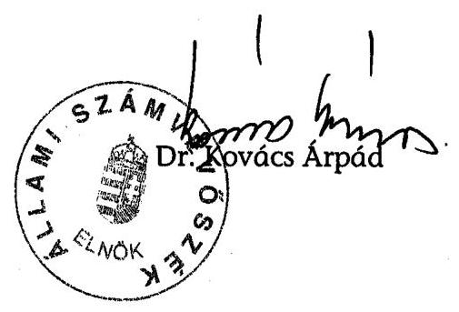

# ÁLLAMI   SZÁMVEVŐSZÉK 

## JELENTÉS

a Magyar Demokrata Fórum 2004-2005. évi gazdálkodása törvényességének ellenőrzéséről

---

3. Önkormányzati és Területi Ellenőrzési Igazgatóság
3.1. Szabályszerűségi Ellenőrzési Főcsoport
Iktatószám: V-1014-036/2006.
Témaszám: 831
Vizsgálat-azonosító szám: V-287
Az ellenőrzést felügyelte:
Dr. Lóránt Zoltán
főigazgató
Az ellenőrzés végrehajtásáért felelős:
Dr. Elek János
általános főigazgató-helyettes
Az ellenőrzést vezette:
Horváth Balázs
főcsoportfőnök-helyettes
Az összefoglaló jelentést készítette:
Tóth István
tanácsadó
Az ellenőrzést végezték:
Tóth István Szakmányné Bilik Szendrey Lajos
tanácsadó Mária számvevő
A témához kapcsolódó eddig készített számvevőszéki jelentések:
címe
sorszáma
Jelentés a Magyar Demokrata Fórum 1991. évi gazdálkodása tör- 136
vényességének ellenőrzéséről
Jelentés a Magyar Demokrata Fórum 1992-1993. évi gazdálkodása 235
törvényességének ellenőrzéséről
Jelentés a Magyar Demokrata Fórum 1994-1995. évi gazdálkodása 342
törvényességének ellenőrzéséről
Jelentés a Magyar Demokrata Fórum 1996-1997. évi gazdálkodása 9902
törvényességének ellenőrzéséről
Jelentés a Magyar Demokrata Fórum 1998-1999. évi gazdálkodása 0106
törvényességének ellenőrzéséről
Jelentés a Magyar Demokrata Fórum 2000-2001. évi gazdálkodása 0313
törvényességének ellenőrzéséről
Jelentés a Magyar Demokrata Fórum 2002-2003. évi gazdálkodása 0457
törvényességének ellenőrzéséről

---

# TARTALOMJEGYZÉK 

BEVEZETÉS ..... 5
I. ÖSSZEGZŐ MEGÁLLAPÍTÁSOK, KÖVETKEZTETÉSEK, JAVASLATOK ..... 7
II. RÉSZLETES MEGÁLLAPÍTÁSOK ..... 13

1. A Párt gazdálkodásáról szóló 2004-2005. évi beszámolók ..... 13
1.1. A teljes vizsgálati időszakra érvényes megállapítások ..... 13
1.2. A 2004-2005. évi beszámolók ..... 14
1.2.1. Bevételek ..... 15
1.2.2. Kiadások ..... 16
1.3. A pártegyesülés következtében keletkezett kötelezettségek teljesítése ..... 16
2. A Pártnak a beszámoló összeállítására és az azt alátámasztó könyvvezetésre vonatkozó belső szabályozása és gyakorlata ..... 17
2.1. A belső szabályozás rendszere ..... 17
2.2. A könyvvezetés gyakorlata, ennek összhangja a jogszabályokban és a belső előírásokban előírt követelményekkel ..... 18
2.3. Analitikus nyilvántartások ..... 19
2.4. A bizonylati elv és a bizonylati fegyelem érvényesülése ..... 20
3. A Párt bevételszerző gazdálkodó tevékenysége ..... 22
4. A gazdálkodással összefüggő, egyéb jogszabályokban foglalt előírások betartása ..... 22
4.1. Személyi jellegű kifizetések ..... 22
4.2. Az adózási, társadalombiztosítási és egyéb jogszabályok rendelkezéseinek érvényesítése ..... 24
5. A Párt belső ellenőrzésének rendszere ..... 25
5.1. A belső ellenőrzés rendszerének szabályozottsága ..... 25
5.2. A belső ellenőrzés működése ..... 25
6. Az előző ellenőrzés megállapításaira tett intézkedések ..... 26

## MELLÉKLETEK

1. számú Magyar Demokrata Fórum 2004. évi beszámolója
2. számú Magyar Demokrata Fórum 2005. évi beszámolója

---

.

---

# RÖVIDÍTÉSEK JEGYZÉKE 

| ÁSZ | Állami Számvevőszék |
| :-- | :-- |
| MDNP | Magyar Demokrata Néppárt |
| OH | Országos Hivatal |
| OSZB | Országos Számvizsgáló Bizottság |
| Párt | Magyar Demokrata Fórum |
| Párttörvény | A pártok működéséről és gazdálkodásáról szóló - többször   módosított - 1989. évi XXXIII. törvény |
| Számviteli törvény | A számvitelről szóló - többször módosított - 2000. évi C.   törvény |
| Szja törvény | A személyi jövedelemadóról szóló - többször módosított -   1995. évi CXVII. törvény |

---

.

---

# JELENTÉS 

## a Magyar Demokrata Fórum 2004-2005. évi gazdálkodása törvényességének ellenőrzéséről

## BEVEZETÉS

Az Állami Számvevőszékről szóló 1989. évi XXXVIII. törvény 5. §-a és a 16. § (2) bekezdése, valamint a pártok működéséről és gazdálkodásáról szóló - többször módosított - 1989. évi XXXIII. törvény (továbbiakban: párttörvény) 10. § (1) bekezdése alapján a pártok gazdálkodása törvényességének ellenőrzésére az Állami Számvevőszék (továbbiakban: ÁSZ) jogosult. Az ÁSZ 2006. évi ellenőrzési tervének megfelelően vizsgálta a Magyar Demokrata Fórum (továbbiakban: Párt) 2004 - 2005. évi gazdálkodása törvényességét.

Az ellenőrzés célja annak megállapítása volt, hogy:

- a Párt által készített és a Magyar Közlönyben és a Párt internetes honlapján közzétett éves beszámolók a törvényi előírásoknak megfelelnek-e, a könyvvezetéssel és a valósággal megegyező adatokat tartalmaznak-e;
- a könyvvezetés és a gazdálkodás során betartották-e a számvitelről szóló többször módosított - 2000. évi C. tv. (továbbiakban: számviteli törvény) és az egyéb jogszabályi rendelkezéseket és belső előírásokat;
- a Párt a működéséhez szabályszerűen igénybe vehető forrásokat használt-e fel, nem folytatott-e a párttörvény által tiltott gazdálkodó tevékenységet, nem fogadott-e el tiltott vagyoni hozzájárulást, illetőleg adományt.

Az ellenőrzés körülményeit illetően rögzíteni szükséges ${ }^{1}$, hogy:

- a párttörvény 1. sz. melléklete szerinti beszámoló-mintához magyarázatot, útmutatót nem készítettek a jogalkotók, így ennek kitöltése pártonként - kialakított számviteli politikájuknak megfelelően - eltérő lehet;
- a beszámoló minta a számviteli törvény rendelkezéseivel nem harmonizál, nem felel meg sem a mérleg, sem az eredmény-kimutatás követelményeinek.

[^0]
[^0]:    ${ }^{1}$ Az ÁSZ évek óta javasolja a Kormánynak a pártok ellenőrzéséről készített jelentéseiben a párttörvény módosítását. A Kormány 2006. évben benyújtotta a pártok működéséről és gazdálkodásáról szóló 1989. évi XXXIII. törvény és a választási eljárásról szóló 1997. évi C. törvény, valamint ezzel összefüggésben egyes más törvények módosításáról szóló T/237. számú törvényjavaslatot.

---

Az ÁSZ a párttörvény napirenden lévő módosítási javaslatának elfogadásáig a jelenleg hatályos rendelkezéseknek megfelelő - egységes módszertani alapokra helyezett - gyakorlattal folytatja a pártok gazdálkodása törvényességének ellenőrzését.

Az ellenőrzést a 13/2003. számú Elnöki utasítással kiadott „Módszertan a pártok gazdálkodása törvényességének ellenőrzéséhez" c. kiadvány és a 14/2003. számú Elnöki határozattal elfogadott segédletben foglaltak alapján végeztük.

A helyszíni ellenőrzés 2006. szeptember 11 - november 22-e között, a Párt által megbízott könyvelő cég irodájában történt.

---

# I. ÖSSZEGZŐ MEGÁLLAPÍTÁSOK, KÖVETKEZTETÉSEK, JAVASLATOK 

A Párt a 2004-2005. évi pénzügyi beszámolóit a Magyar Közlönyben, valamint internetes honlapján határidőn belül nyilvánosságra hozta. A beszámolók összeállításánál nem érvényesítették a számviteli törvényben meghatározott valódiság, teljesség, következetesség és lényegesség elvét.

A 2004. évi beszámolóból hiányzott négy helyi szervezet bevételi és kiadási pénzforgalma, valamint egy pártszerv 911 ezer Ft összegű kiadása. A Pártnak nyújtott adománybevételeket a belső előírásoktól eltérően más jogcímen mutattak ki, nem pénzbeli hozzájárulások értékét a párttörvényben előírt módon elmulasztották megállapítani. A feltárt hibák összességében 9226 ezer Ft bevételi, 5687 ezer Ft kiadási eltérést mutattak.

A 2005. évi beszámoló nem tartalmazta nyolc helyi szervezet gazdálkodási bevételét és kiadását, valamint egy pártszerv 2467 ezer Ft összegű kiadását. Téves könyvelésből eredően különféle adománybevételeket más jogcímen, továbbá 2692 ezer Ft összegű nem valós kiadást mutattak ki. Az előző évhez hasonlóan a tárgyidőszakban is elmaradt a helyi önkormányzatoktól kedvezményes ingatlanhasználat formájában kapott nem pénzbeli vagyoni hozzájárulás értékének megállapítása. A beszámolósorokhoz kapcsolódó eltérések összeadva a bevételi oldalon 6697 ezer Ft, a kiadási oldalon 9325 ezer Ft értékűek voltak.

A megjelentetett beszámolóhoz képest kimutatott, a bevételi és kiadási főösszegre vetített hiba mértéke - 2004. évi kiadások kivételével - mindkét évben meghaladta az ÁSZ-nál elfogadott 2%-os lényegességi küszöböt. A 2004. évi bevételeknél 3%, a 2005. évi bevételeknél és kiadásoknál 2,2%, illetve 4,1% mértéket ért el. A lényegesség elvét az is sértette, hogy a Párt egyes belföldi pénzbeli adományok, nem pénzbeli hozzájárulások szabálytalan kezeléséből fakadóan mindkét évben elmulasztott nevesíteni 500 ezer Ft értékhatárt meghaladó bevételeket.

A Párt vagyoni helyzetét érintette az MDNP-vel való, 2005. április 9-én hatályossá vált egyesülése, amely a törvényi előírások figyelmen kívül hagyásával történt. A párttörvény előírása szerint a megszűnő párt vagyona a jogutód párt tulajdonába kerül. A Pártba integrálódott MDNP vagyonát bizonyító vagyonmérleg nem került átadásra. A számviteli törvény szerint megőrzendő számviteli nyilvántartások és bizonylatok szabályszerű átadását a megszűnt MDNP korábbi vezetése megtagadta.

A pénzügyi beszámolási hibák a belső szabályozási rendszer összehangolatlanságából eredtek. Az alapszabály korábbi rendelkezésére intézkedtek a helyi pártszervek önálló jogi személyiségének megszüntetésére, de a központosításhoz szükséges hivatali gazdasági szervezet felállításáról, országosan egységes számviteli szabályozásról és az eredményes kontrollt biztosító elszámolási kötelezettségről nem gondoskodtak. A 2002 óta változatlan előírásokkal hatályban tartott pénzügyi és gazdálkodási szabályzat mindössze a gazdálkodási tevékenység és pénzügyi helyzet felügyeletére kijelölt pártvezetőket nevesítette. A számviteli törvényben előírt számviteli rendért a pártigazgató felelt, akinek személye 2004 novemberében változott.

A Párt nem a számviteli törvényben meghatározott tartalmú szabályzatokkal rendelkezett. Az előző ÁSZ jelentés felhívására nem hozta szinkronba számviteli szabályozásait a vonatkozó jogszabályokkal, a központosított gazdálkodás rendjéhez igazodóan nem egységesítette szabályozásának rendszerét. Változatlanul hatályban tartotta a vizsgált időszakot megelőzően hatályba helyezett számviteli politikáját és kapcsolódó értékelési, pénzkezelési, leltározási szabályzatait. Nem egészítette ki a gazdálkodás sajátosságaihoz alkalmazkodóan a számlarendjét. A gazdálkodásnak, illetve a hozzá kapcsolódó felelősségi rendszernek nem alakult ki az egységes, összehangolt szabályozása.

A számviteli politikában ellentmondásos a könyvvezetés szabályozása, mert a Párton belül központilag egyszerűsített kettős, helyileg egyszeres könyvvezetést ír elő. A könyvvezetés kombinált gyakorlata nem felelt meg a számviteli törvény és végrehajtási rendelete követelményeinek. Az OH gazdasági eseményeit közvetlenül a kettős könyvvitel főkönyvi számláira rögzítették. A területi irodák negyedévenkénti feladást teljesítettek egyszeres könyveléssel, amelynek pénzforgalmi adatai az éves beszámolósoroknak megfelelő jogcímen, vegyes feladással kerültek a főkönyvi könyvelésbe. A helyi szervezetek hasonlóan az éves beszámoló jogcímei szerint, évente egy alkalommal teljesítették pénzügyi adatszolgáltatásukat. Ennek könyvelése megyei szinten összevont adatokkal történt, amely nem felelt meg a szervezetenkénti elszámoltatás követelményeinek. A beszámoló alapjául szolgáló könyvvezetési szabálytalanságokkal összefüggésben sérült a teljesség, valódiság, következetesség elve. A pénztári forgalom könyvelésében negatív pénztári egyenlegek is előfordultak, mivel a tagi kölcsönöket, központi ellátmányokat nem, vagy csak a felhasználás után bizonylatoltak. A kettős könyvvitelt és a beszámolók összeállítását azonos számítógépes programmal, ugyanaz a könyvelő cég végezte, évente megújított megbízási szerződés alapján.

A főkönyvi könyveléshez rendelt analitikus nyilvántartások körét, tartalmát a számlarendben meghatározták. A hatályos szabályozásnak mindössze a vevők és szállítók főkönyvi programba illesztett nyilvántartása felelt meg. A jogszabályi és belső előírásoktól eltérve: az 50 ezer Ft feletti tárgyi eszközök egyedi nyilvántartásba vétele jellemzően egyedi azonosításra alkalmas adatok nélkül történt; a pénztárjelentést a helyi szervezetek fele nem, vagy szabálytalanul vezette; a szigorú számadású nyomtatványok központi nyilvántartása nem volt teljes körű; az előző előleggel való elszámolás nélkül újabb előleget folyósítottak.

Az eszközök és források leltározását az OH-nál végezték szabályszerűen. A leltározási szabályzat előírásai szerint, a leltárfelvételt teljes körűen végrehajtották, az értékelési szabályzat előírásainak betartásával kiértékelték. A vizsgált időszakban leltári eltérést nem állapítottak meg. A helyi szervezetek mintegy ötödénél a leltározás tényét dokumentumokkal nem igazolták. A 2005. évi leltározás nem terjedt ki a Párttal egyesült MDNP vagyonelemeire.

---

A bizonylati elv és fegyelem érvényesüléséhez a pénzügyi és gazdálkodási szabályzat átfogóan nem rendelkezett a kötelezettségvállalás módjáról, az utalványozás és érvényesítés rendjéről; a pártigazgató nem adott megbízást a gazdasági művelet végrehajtásának igazolására, az utalványozási és ellenjegyzési jogkör gyakorlására, a pénztárak ellenőrzési feladatainak ellátására. A szabályszerűségi rendelkezések hiányában a Pártnál sérült a bizonylatolás alaki és tartalmi követelménye. A számviteli bizonylatok többségéről hiányzott az utalványozó, a könyvelés, az ellenőr és a befizető aláírása. A helyi szervezetek gazdálkodásáról kiállított összesítő bizonylatok, továbbá a külföldi kiküldetés során magánszemélyre szóló, illetve olvashatatlan számlák nem feleltek meg a számviteli bizonylat követelményeinek.

A gazdálkodó tevékenység bevételeit a párttörvénnyel összhangban kialakított alapszabály, pénzügyi és gazdálkodási szabályzat általános követelményekkel rögzítette. Ennek nyomán a tagdíjak, egyéb hozzájárulások, hasznosítások és értékesítések, továbbszámlázott költségek, kamatbevételek szabályszerűen teljesültek. A Párt nyilvántartásai szerint nem merült fel más államtól származó vagyoni hozzájárulás elfogadása, jogtalannak
 minősülő gazdálkodó tevékenység folytatása; gazdasági társaságban részesedést nem szerzett, egyszemélyes kft-t vagy vállalatot nem alapított, illetve nem működtetett. A sajátos gazdálkodási előírások betartásának hiányából fakadt, hogy a párttörvény rendelkezése ellenére a Párt 2004-ben 481822 Ft, 2005-ben 823587 Ft összegű névtelen adományt fogadott el. Továbbá vagyonvédelmi kockázatot jelentett, hogy a párttagok megbízásával magánszemélyeknek forgalmazott, fix kamatozású értékpapírokat is vásároltak.

A személyi jellegű kifizetések foglalkoztatási, megbízási és tagsági jogviszonyon alapultak. A munkaszerződéseket szabályszerűen kötötték meg, a folyamatos munkavégzésre irányuló megbízási szerződéseket megszüntették. A hivatali célú gépjármű használatot a 2004-től hatályos személygépkocsi használat szabályzata rögzítette. A szabályozás nem határozta meg a Párt tulajdonában lévő gépkocsi üzemeltetési rendjét, ebből eredően a futásteljesítményről vezetett menetlevelek adattartalma nem felelt meg a kizárólagos hivatali használat dokumentálásának. Ennek következtében keletkezett cégautóadó fizetési kötelezettséget a Párt a vizsgálat során önellenőrzéssel rendezte. A magántulajdonú gépjármű hivatali célú használatát adómentes, normatív mértékkel térítették. Az autópálya díjat teljes összegben kifizették, amelynek fele adóköteles bevételnek számított a 2005. évi szabályok szerint. A vezetett nyilvántartások kétharmadánál a hivatalos jelleg utólag nem volt megállapítható. A külföldi kiküldetések több mint felénél hiányzott az írásos elrendelés, az utazás céljának és időtartamának megjelölése. A Párt adómentes értékben étkezési utalványt, 2005-ben üdülési csekket és iskolakezdési támogatást biztosított munkavállalóinak.

A Párt munkáltatóként eleget tett az adózási, társadalombiztosítási jogszabályokban foglaltaknak, de kifizetőként csak részben teljesítette kötelezettségeit. A munkabérekből levont személyi jövedelemadót, a munkaadót és munkavállalókat terhelő járulékokat bevallotta, költségvetési befizetési kötelezettségét teljesítette. A folyószámla kivonat túlfizetést mutatott. Az egyéni bér- és járulék-nyilvántartásokat a főkönyvi könyveléssel és bevallásokkal egyezően vezették.

---

A Párt gazdálkodásának belső ellenőrzési rendszere a szabályozástól eltérően funkcionált. Az alapszabály a korábbi decentralizált gazdasági önállósághoz igazodó háromszintű területi ellenőrzésről rendelkezett. Ehhez képest dokumentumokkal az OSZB, valamint a megyeileg választott számvizsgáló bizottságok mintegy fele igazolta működését. A számviteli politikában előírt könyvvizsgálót nem választottak, illetve a 2005. évi tervezés ellenére belső ellenőrt nem foglalkoztattak. A vezetői és munkafolyamatba épített ellenőrzés korszerűtlenné vált előírásai a feltételek hiányában nem teljesülhettek.

Az OSZB elfogadott működési és eljárási rendtartással, éves munkatervvel végezte tevékenységét. Az alapszabályban meghatározott feladatkörében véleményezte az éves költségvetéseket és beszámolókat, kifogásolta a költségvetés nem teljes körű összeállítását. Egyik évben sem vizsgálta a gazdálkodási és számviteli szabályzatok jogszabályi megfelelőségét, rendelkezéseinek betartását. Az OSZB évente beszámolt ellenőrzési tevékenységéről az országos gyűlésnek. A megyei testületek ellenőrzései rámutattak a pénzügyi beszámolás egyes hiányosságaira, azonban javaslat hiányában intézkedést nem indukáltak. A vezetői ellenőrzés a pártigazgató hatáskörében gyakorolt kötelezettségvállaláson és utalványozáson keresztül valósult meg. A területi szintű feladatellátásra jellemzően a budapesti irodánál mindezt nem gyakorolták. A munkafolyamatba épített ellenőrzés körében szabályozás, illetve megbízás hiányában elmaradtak a pénztárellenőrzések, a megyei irodák által összesített bizonylatok megfelelő ellenőrzés nélkül kerültek a könyvelő céghez.

A belső kontroll tevékenység elégtelenségére utal, hogy az előző jelentés összegzése a vizsgált időszakra is jellemző maradt: „A belső ellenőrzési rendszer működése összességében hiányos, rendszertelen, alacsony hatékonyságú volt, melynek következtében érdemben nem tárta fel a lényeges hibákat és szabálytalanságokat."

A Párt az előző ÁSZ jelentés felhívására - előzetesen elfogadott intézkedési terv alapján - ismételten nyilvánosságra hozta 2002. és 2003. évi helyesbített beszámolóját, a központi költségvetést megillető tiltott bevételt befizette, a cégautóadó kötelezettséget önellenőrzéssel bevallotta és teljesítette, a mobiltelefon használatát újraszabályozta, a számviteli és beszámolási fegyelem javítására utasításban rendelkezett. A számviteli szabályozás kiegészítését és összehangolását, valamint a gazdálkodási rend fokozását célzó intézkedések végrehajtását elmulasztották, ennek következtében a szabálytalanságok ismétlődtek.

A helyszíni ellenőrzés megállapításainak hasznosítása mellett az Állami Számvevőszék elnöke felhívja

# a Párt elnökét: 

1. A 2004. és 2005. évi beszámolók megbízható és valós pénzügyi adatainak megállapítása, szabályszerű közzététele érdekében:
a) a számviteli törvény 15. § (2) - (3) (5) bekezdésében szabályozott teljesség, valódiság, következetesség, a 16. § (4) bekezdés szerinti lényegesség alapelv érvényesítéséhez önrevízió keretében javíttassa ki a bizonylatolási mulasztásokat, az elszámolási és könyvelési hibákat;

---

b) a párttörvény 4. § (5) bekezdés előírásával összhangban állapíttassa meg ingatlanonként, a Párt helyi és területi szervezetei által használt önkormányzati ingatlanok esetében az ingyenes, illetve kedvezményes díjtétel, valamint a piaci ár közötti különbség formájában kapott nem pénzbeli vagyoni hozzájárulás értékét;
c) nevesítse a párttörvény 9. § (2) bekezdés követelménye szerint az 500 ezer Ft feletti belföldi jogi személytől kapott adományokat;
d) ismételten hozza nyilvánosságra 2004. és 2005. évi módosított pénzügyi beszámolóját.
2. Intézkedjen a párttörvény 7. §-ában rögzített szabály érvényesülése érdekében, hogy a Párt az MDNP-vel történt egyesülésből adódó vagyon és bizonylat átadása-átvétele szabályszerűen történjen meg, továbbá a számviteli törvény 169. § bizonylat megőrzési kötelezettségét teljesítse.
3. Módosítsa számviteli szabályzatait, hogy:
a) a számviteli politika a számviteli törvény 12. § (1) bekezdésben előírt módon a Párt egészére, a kettős könyvvezetési kötelezettségét tartalmazza;
b) a számviteli politikához kapcsolódó pénzkezelési, leltározási, értékelési szabályzatok tükrözzék a számviteli törvény 14. § (3) bekezdésben foglaltak szerint a gazdálkodási sajátosságokat;
c) a számlarend a számviteli törvény 161. § (1)-(3) bekezdésével összhangban, az egységes számlakeret előírásai figyelembevételével, rögzítse a Párt sajátosságait tükröző számlákat és azok kapcsolatait.
4. Vizsgálja felül és módosítsa a gazdálkodó tevékenységgel összefüggő belső előírásokat annak érdekében, hogy:
a) a központi gazdálkodási rendnek megfelelő hivatali ügyrend funkcionáljon;
b) a Párt egészére kiterjedően a gazdálkodáshoz kapcsolódó jogkörök és felelősség - kötelezettségvállalás, ellenjegyzés, teljesítésigazolás, utalványozás rendje meghatározásra kerüljön;
c) a személygépkocsi használat és belföldi kiküldetés bizonylatolási és elszámolási rendje megfeleljen az Szja törvény 25. § (2) bekezdés c) pont és (3) bekezdés, továbbá a 69. § (1) bekezdés m) pont, valamint a 3. számú melléklet IV. 1. pont előírásainak.
5. Biztosítsa a könyvvezetésben és a kialakított nyilvántartási rendszerben:
a) a számviteli törvény 15. § (2)-(3) és (5) bekezdés szerinti teljesség, valódiság és következetesség számviteli elvek érvényesülését;
b) nyilvántartások a pénzkezelő helyenkénti vezetését, a készpénzforgalom pénzmozgással egyidejű rögzítését, a számviteli törvény 165. § (3) bekezdés a) pont szabályozása, valamint a belső előírásokkal összhangban a határidők betartását;

---

c) a Párt egészére kiterjedő egységes, a számviteli törvényben előírt, továbbá vagyonvédelmi és adózási nyilvántartási igényeket kielégítő analitikus nyilvántartások vezetését;
d) a számviteli törvény 165. § (4) bekezdés előírása szerint a főkönyvi könyvelés, az analitikus nyilvántartás és a bizonylatok adatai közötti ellenőrzés végrehajtását;
e) a számviteli törvény 69. § (1)-(2) bekezdésében foglaltakkal összhangban az év végi záráshoz kapcsolódó leltárak összeállítását és az egyeztetések teljes körű megvalósulását;
f) a szigorú számadású nyomtatványok a számviteli törvény 168-169 § szabályai szerinti nyilvántartását, megőrzését;
g) a számviteli törvény 167. § (1) bekezdés b), c), g) és i) pontjaiban rögzített, a bizonylatok alaki és tartalmi előírásainak érvényesítését.
6. Intézkedjen a Párt gazdálkodó tevékenységgel kapcsolatosan, hogy:
a) a jövőben csak szervezetek által vásárolható értékpapírokat vásároljon;
b) a párttörvény 4. § (3) bekezdése előírásának megsértésével szerzett 1305409 Ft névtelen adomány összegét fizesse be a központi költségvetésbe a párttörvény 4. § (4) bekezdése előírásának megfelelően.
7. Intézkedjen önellenőrzéssel az Szja törvény előírásainak megfelelően az adóköteles természetbeni juttatások és üzleti ajándékok utáni adó és járulék megállapítására, bevallására és megfizetésére, a bevételekhez tartozó kifizetésekre vonatkozó adatszolgáltatásra.
8. Vizsgálja meg a budapesti területi iroda részére - magánszemély által - nyújtott kölcsön indokoltságát.
9. Szabályozza a belső ellenőrzés hierarchikus rendszerét és biztosítsa annak összehangolt működését.

# a Pénzügyminisztert 

A vizsgálat során megállapított 1305409 Ft értékű névtelen adománynak megfelelő összeggel a párttörvény 4. § (4) bekezdés előírása szerint csökkentse a Párt 2007. évi költségvetési támogatását.

---

# II. RÉSZLETES MEGÁLLAPÍTÁSOK 

## 1. A PÁRT GAZDÁLKODÁSÁRÓL SZÓLÓ 2004-2005. ÉVI BESZÁMOLÓK

### 1.1. A teljes vizsgálati időszakra érvényes megállapítások

A Párt a 2004. évi beszámolóját 2004. április 29-én a Magyar Közlöny 57. számában, a 2005. évi beszámolóját 2005. április 29-én a Magyar Közlöny 51. számában - a törvényben előírt határidőn belül - jelentette meg és egyidejűleg internetes honlapján is nyilvánosságra hozta (1-2. sz. melléklet).

A közzétett beszámolók az OH számviteli bizonylatai, a területi irodák naplófőkönyvei és a helyi szervezetek gazdálkodásáról készített összesítő kimutatások alapján könyvelt adatokból készültek. A Párt helyi szervezeteiről készült kimutatás szerint 2004. évben Budapest II.; VII.; XII. és XIX. Kerületi; 2005. évben a Baranya megyei, Veszprém városi, valamint Budapest VII.; XVIII.; XIX. és XX. kerületi pártszervezeteinek gazdálkodási adatai hiányoztak a könyvelésekből és a beszámolókból. A Borsod-Abaúj-Zemplén megyei helyi szervezetek gazdasági adatai helyett pedig tévesen a megyei pártiroda gazdasági adatait könyvelték.

## A nyilvánosságra hozott beszámolók a főkönyvvel való egyezőség ellenére nem feleltek meg a teljesség, a valódiság, a lényegesség és a következetesség számviteli alapelvének.

A számviteli törvény 15. § (2) bekezdésében foglalt teljesség elvét sértette, hogy az ingyenes, illetve a kedvezményes díjtételű ingatlanbérlet formájában megvalósult nem pénzbeli vagyoni hozzájárulás értéke mindkét évben hiányzott a beszámolóból. Ezen túlmenően 2004. évben négy, 2005. évben nyolc helyi szervezet bevétele és kiadása, valamint a 2004. évben Százhalombatta 911 ezer Ft összegű, 2005. évben Budapest III. kerületi szervezet 2467 ezer Ft összegű kiadása hiányzott a beszámolóból. A számviteli törvény 15. § (3) bekezdésében foglalt valódiság elvét sértette, hogy a 2005. évi beszámolóban téves könyvelés miatt 2692 ezer Ft összegű nem létező kiadást mutattak ki. A számviteli törvény 16. § (4) bekezdésében foglalt lényegesség elvét sértette, hogy a 2004. évi beszámolóban 500 ezer Ft értéket meghaladó adománybevételt nem a valós jogcímen mutattak ki és a párttörvény 9. § (2) bekezdése előírása szerinti nevesítést is elmulasztották. Továbbá a nem pénzbeli vagyoni hozzájárulás értékelésének elmulasztásával az 500 ezer Ft-ot meghaladó érték adományozójának nevesítése mindkét vizsgált évben elmaradt. A számviteli törvény 15. § (5) bekezdésében foglalt következetesség elvét sértette, hogy alapítványoktól, egyesületektől és magánszemélyektől származó adománybevételt esetenként a jogi személynek nem minősülő gazdasági társaságoktól származó adományok, esetenként pedig az egyéb bevételek között mutattak ki mindkét évi beszámolóban.

---

# 1.2. A 2004-2005. évi beszámolók 

A 2004. és 2005. évi beszámolókban szereplő adatok részleteiben és főösszegében formálisan megegyeztek ugyan a kapcsolódó főkönyvi számlák összevont egyenlegével, de különböző hibák miatt a beszámolók, illetve azok alapjául szolgáló könyvelés nem tükrözte a valós helyzetet.
A Párt által közzétett beszámolók ellenőrzése során feltárt hibák pozitív illetve negatív értékét - beszámoló soronként - a következő összeállítás részletezi:

Adatok ezer Ft-ban

| Megnevezés | Párt által közzétett beszámoló |  | Eltérés a tényleges helyzettől |  |  |  |
| :--: | :--: | :--: | :--: | :--: | :--: | :--: |
|  | 2004. évi | 2005. évi | 2004. évi |  | 2005. évi |  |
| BEVÉTEL |  | 

 | Többlet | Hiány | Többlet | Hiány |
|---|---|---|---|
| 1. Tagdíjak | 5929 | 4533 | 13 | 558 | 0 | 671 |
| 2. Állami tám. | 284100 | 284045 | 0 | 0 | 0 | 0 |
| 4. Egyéb hj. | 9226 | 9635 | 2611 | 5687 | 1245 | 4594 |
| 4.1. Belf. jsz. | 1006 | 142 | 0 | 4732 | 0 | 3600 |
| 4.2. Gazd.társ. | 2254 | 1245 | 2254 | 0 | 1245 | 0 |
| 4.3.1. Belf. msz. | 5966 | 8224 | 357 | 955 | 0 | 994 |
| 4.3.2. Külf. msz. | 0 | 24 | 0 | 0 | 0 | 0 |
| 6. Egyéb bevétel | 7782 | 7310 | 0 | 357 | 158 | 29 |
| ÖSSZESEN: | 307037 | 305523 | 2624 | 6602 | 1403 | 5294 |
| - többlet |  |  | 2624 |  | 1403 |  |
| - kimaradt |  |  |  | 6602 |  | 5294 |
| KIADÁS |  |  |  |  |  |  |
| 2. Támogatás | 238 | 1294 | 88 | 20 | 0 | 194 |
| 4. Működési | 179472 | 165611 | 0 | 3873 | 2495 | 5990 |
| 5. Eszköz. besz. | 10265 | 7762 | 0 | 0 | 0 | 0 |
| 6. Politikai | 184128 | 41758 | 0 | 1667 | 239 | 351 |
| 7. Egyéb | 12168 | 8272 | 0 | 39 | 0 | 59 |
| ÖSSZESEN: | 386271 | 224697 | 88 | 5599 | 2734 | 6591 |
| - többlet |  |  | 88 |  | 2734 |  |
| - kimaradt |  |  |  | 5599 |  | 6591 |

A 2004. évi beszámoló és a könyvelés csak az állami támogatásból származó bevételt és az eszközbeszerzésre fordított kiadást tartalmazta a valóságnak megfelelően. A beszámoló összeállításával összefüggésben feltárt hibák előjeltől független értéke a bevételeknél 9226 ezer Ft, a kiadásoknál 5687 ezer Ft összegű volt.

A 2005. évi beszámolóban és a könyvelésben csak az állami támogatás és a külföldi magánszemélyektől származó adománybevétel, valamint az eszközbeszerzésre fordított kiadás értéke szerepelt a tényleges állapotnak megfelelően. Ezeknél a tételeknél a beszámolók adatai a főkönyvi könyvelésből levezethetők voltak. A beszámoló összeállításával összefüggésben feltárt hibák összege a bevételi oldalon 6697 ezer Ft, a kiadási oldalon 9325 ezer Ft értékű volt.

A feltárt hibák a közzétett beszámolók főösszegéhez képest 2004-ben 3%, illetve 1,5%, 2005-ben 2,2%,illetve 4,1% mértékű eltérést mutattak, amely az ÁSZ-nál elfogadott 2%-os lényegességi küszöböt figyelembe véve lényegesnek minősült.

---

# 1.2.1. Bevételek 

A tagdíjak évi összegéből hiányzik 558 ezer Ft nem könyvelt tagdíj bevétele, viszont tévesen szerepel 13 ezer Ft összegű magánszemélyektől származó adomány. A 2005. évi beszámolóból hiányzik együttesen 680 ezer Ft összegű nem könyvelt tagdíj bevétele.

Az állami költségvetésből származó támogatás 2004. évi összege megegyezett a Párt részére a költségvetési törvényben jóváhagyott összeggel. A 2005. évi támogatás összegéből a Pénzügyminisztérium az ÁSZ felhívásának megfelelően levonta az előző ÁSZ vizsgálat által megállapított tiltott bevételnek megfelelő 55 ezer Ft összeget.

Az egyéb hozzájárulások, adományok beszámolósor adattartalmát a Párt a párttörvény előírásának megfelelően tovább részletezte. Az egyéb hozzájárulások, adományok belföldi jogi személyektől soron a 2004. évi beszámolóból hiányzik 32 ezer Ft összegű nem könyvelt, valamint 2100 ezer Ft összegű, egyesületektől, alapítványoktól kapott, tévesen a jogi személynek nem minősülő gazdasági társaságoktól származó adományok között kimutatott bevétel. A 2004. évi beszámoló hibája továbbá, hogy 2000 ezer Ft összegű, az Európai Jövő Egyesülettől származó adomány estében az adományozó nevét - a párttörvény 9. § (2) bekezdésének előírását megsértve - elmulasztották a beszámolóban feltüntetni. A 2005. évi beszámolósorból hiányzik 1000 ezer Ft összegben egyesületektől, alapítványoktól kapott, tévesen a jogi személynek nem minősülő gazdasági társaságoktól származó adományként kimutatott bevétel. A Polgári Törvénykönyvről szóló 1959. évi IV. tv. VI. fejezet 8., 11. pontja értelmében az egyesület és az alapítvány jogi személy.

A beszámolósor egyik évben sem tartalmazta a pártszervezetek által a helyi önkormányzatoktól ingyenesen, vagy kedvezményes díjtételű ingatlanhasználat formájában kapott nem pénzbeli vagyoni hozzájárulás értékét, ami mindkét évben meghaladta a 2600 ezer Ft-ot. A párttörvény 4. § (5) bekezdésében előírtak szerint „Ha a párt részére a vagyoni hozzájárulást nem pénzben nyújtották, köteles annak értékéről (értékének megállapításáról) gondoskodni."

Az egyéb hozzájárulások, adományok jogi személynek nem minősülő gazdasági társaságoktól címen a Pártnak egyik évben sem volt bevétele. A beszámolóban szereplő összegből 2004-ben 2100 ezer Ft-ot a jogi személyektől, 154 ezer Ft-ot a magánszemélyektől, 2005-ben 1000 ezer Ft-ot a jogi személyektől, 245 ezer Ft-ot a magánszemélyektől származó adományok között kellett volna feltüntetni.

Az egyéb hozzájárulások, adományok belföldi magánszemélyektől soron a 2004. évi beszámolósorból hiányzik 604 ezer Ft összegű nem könyvelt bevétel. Hiányzik továbbá a beszámolósorból tévesen a jogi személynek nem minősülő gazdasági társaságoktól származó adományként kimutatott 154 ezer Ft összegű, a tagdíjak között kimutatott 13 ezer Ft összegű, valamint az egyéb bevételek között kimutatott 184 ezer Ft összegű bevétel. Tévesen szerepel viszont a beszámolósorban 357 ezer Ft összegű egyéb bevétel. A 2005. évi beszámolóból hiányzik 844 ezer Ft összegű nem könyvelt bevétel, valamint az egyéb bevételek között kimutatott 150 ezer Ft magánszemélyektől származott adomány.

---

Az egyéb bevétel címen a 2004. évi beszámolósorból hiányzik 357 ezer Ft összegben - tévesen a magánszemélyek adománya között - kimutatott egyéb bevétel. A 2005. évi beszámolósorból hiányzik 29 ezer Ft összegű bevétel. Tévesen szerepel a könyvelésben 8 ezer Ft összegű nem létező, valamint 150 ezer Ft összegű magánszemélyek adományából származó bevétel.

# 1.2.2. Kiadások 

Támogatás egyéb szervezetnek címen a 2004. évi beszámolósorból hiányzik 20 ezer Ft összegű, a politikai kiadások között kimutatott támogatás, ellenben szerepel a beszámoló adatában 88 ezer Ft összegű működési kiadás. A 2005. évi beszámolósorból hiányzik 71 ezer Ft értékű, politikai kiadásként kimutatott támogatás, valamint 120 ezer Ft összegű nem könyvelt támogatás.

Működési kiadások címen a 2004. évi beszámolóból hiányzik 1253 ezer Ft összegű nem könyvelt, valamint 20 ezer Ft összegű a „támogatás egyéb szervezetnek" beszámolósoron kimutatott kiadás. A 2005. évi beszámolóból hiányzik 3390 ezer Ft összegű, nem könyvelt kiadás. Tartalmaz viszont a beszámoló téves könyvelés következtében 2495 ezer Ft összegű nem létező kiadást. A beszámolósor értékelés hiányában, egyik évben sem tartalmazta az ingyenes, vagy kedvezményes díjtételű ingatlanhasználat értékét, ami mindkét évben meghaladta a 2600 ezer Ft-ot.

Politikai tevékenység kiadása címen a 2004. évi beszámolóból hiányzik 1667 ezer Ft összegű nem könyvelt kiadás. A 2005. évi beszámolóból hiányzik 351 ezer Ft összegű nem könyvelt kiadás. Tartalmaz ellenben a beszámoló 71 ezer Ft összegű, egyéb szervezetnek adott támogatást, valamint 168 ezer Ft összegű, nem létező kiadást.

Egyéb kiadások soron a 2004. évi beszámolóból hiányzik 39 ezer Ft összegű, nem könyvelt kiadás. A 2005. évi beszámolóból hiányzik 59 ezer Ft összegű, nem könyvelt kiadás.

### 1.3. A pártegyesülés következtében keletkezett kötelezettségek teljesítése

A Párt és a MDNP elnöke 2005. április 2-án megállapodást írt alá a két párt egyesüléséről. A megállapodás 2. pontja szerint annak hatálybalépésétől a Pártot illetik mindazok a jogok és kötelezettségek, amiket addig az MDNP gyakorolt. A megállapodás a 24. pontjában leírtak szerint 2005. április 9-én hatályba lépett. Ezen a napon hagyta jóvá a Párt Országos Gyűlése és az MDNP küldöttgyűlése a két párt egyesülését. A hatálybalépés időpontjában az MDNP-t terhelte a 2005. évi megszűnésig folytatott gazdálkodásról szóló beszámoló közzétételi kötelezettsége, tekintettel arra, hogy az MDNP e kötelezettségének az egyesülést megelőzően nem tett eleget. Terhelte továbbá az MDNP-t a számviteli törvény 169. §-ában előírt nyilvántartás és bizonylat megőrzési kötelezettség. E kötelezettségeinek a Párt a helyszíni ellenőrzés befejezéséig nem tett eleget.

A párttörvény 7. §-a értelmében „Ha a párt a párttörvény 3. § (1) bekezdés a) vagy b) pontjában foglaltaknak megfelelően szűnik meg, vagyona a jogutód párt tulajdoná-

---

ba kerül". A vagyon, illetve a vagyoni helyzetet bizonyító számviteli nyilvántartások és kapcsolódó bizonylatok átadása a helyszíni ellenőrzés lezárásáig nem történt meg. A 2005. május 11-én kelt jegyzőkönyv tanúsága szerint a dokumentáció átadását az MDNP vezetése megtagadta.

# 2. A PÁRTNAK A BESZÁMOLÓ ÖSSZEÁLLÍTÁSÁRA ÉS AZ AZT ALÁTáMASZTÓ KÖNYVVETÉSRE VONATKOZÓ BELSŐ SZABÁLYOZÁSA ÉS GYAKORLATA 

### 2.1. A belső szabályozás rendszere

A Párt a vizsgált időszakban nem a számviteli törvényben meghatározott tartalmú szabályzatokkal rendelkezett. Az ÁSZ jelentés felhívása ellenére nem hozta szinkronba a vonatkozó jogszabályokkal, illetve a központosított gazdálkodás rendjéhez igazodóan nem egységesítette számviteli szabályozási rendszerét. Változatlan tartalommal tartotta hatályban 2002. január 1-jétől kiadott számviteli politikáját, számlarendjét, értékelési szabályzatát, továbbá 2001. január 1-jétől hatályos a házipénztár és készpénzellátási, leltározási és selejtezési szabályzata.

A számviteli politika továbbra sem biztosítja a beszámolás és könyvvezetés eltérő rendjének összehangolását, valamint azt, hogy a területi irodák és helyi szervezetek összevont adatszolgáltatása áttekinthető, ellenőrizhető legyen. A könyvvezetés módjának szabályozása ellentmondásos, mert egy szervezeten belül a központ vonatkozásában egyszerűsített kettős könyvelést, illetve a megyék, helyi szervezetek tekintetében egyszeres könyvelést ír elő. Ez a szabályozás ellentétes a számviteli törvény 12. § (1) bekezdés előírásával. Az egyszeres és egyszerűsített kettős könyvvitel együttes használatára a számviteli törvény nem ad lehetőséget; a Pártnak egységes, homogén számviteli rendszert kell alkalmaznia. A számviteli politika 3.1. pontjában a számviteli törvény 6. § (2) és a 13. § (3) bekezdésére való hivatkozás nem megalapozott, nem támasztja alá a két rendszer kombinált használatának jogszerűségét. Az ugyanitt hivatkozott 224/2000. (XII. 19.) Korm. rendelet 8. § (1) bekezdésében a vagy szóval kizárja a kombináció alkalmazását.

A számviteli politikához rendelt leltározási szabályzat nem tér ki a leltárkörzetek kijelölésére, a pénzkezelési szabályzat nem rendelkezik az értékpapírok megőrzésének és nyilvántartásának rendjéről, valamint a pénztáros felelősségéről, az értékelési szabályzat nem szabályozza a nem pénzbeli hozzájárulások értékelésének a párttörvény 4. § (5) bekezdésében foglaltakkal összhangban lévő kötelezettségét.

Nem egészítette ki a gazdálkodás sajátosságaihoz igazodóan a számlarendet. A számlarend hiányos szabályozása a számviteli törvény 161. § (1)-(3) bekezdésébe ütközik. Nem alakított ki olyan elszámolási rendszert, amely biztosítja valamennyi területi iroda és helyi szervezet vonatkozásában a bizonylati elv érvényesítését, a pénzállományok leltári egyeztethetőségét. A gazdálkodásnak és az
 ezzel kapcsolatos felelősségi rendszernek nincs egységes átfogó szabályozása.

Az alapszabály és a 2002. január 1-je óta hatályban lévő pénzügyi és gazdálkodási szabályzat 1. fejezet 7. §-ban szereplő rendelkezés szerint: „Az MDF helyi szer-

---

vezetei nem önálló jogi személyek." A Párt úgy kezelte a helyi és területi pártszervezeteket, mintha azok továbbra is származékos jogi személyek lennének önálló nyilvántartási és beszámoló-készítési kötelezettséggel.

A bizonylati rendre és az okmányfegyelemre vonatkozó előírásokat a számlarend, a házipénztár és készpénz, valamint a pénzügyi és gazdálkodási szabályzat a számviteli törvénnyel összhangban rögzítette.

A szabályzatokban foglaltak teljesítésének elősegítésére a pártigazgató utasításokat adott ki a megyei irodavezetők és a helyi szervezetek vezetői részére a beszámolási kötelezettség teljesítésének és ellenőrzésének egységesítése érdekében.

A Párt hivatali szervezetét, annak működését, az alapszabály, valamint az OH ügyrendje szabályozta. A Párt hivatali szervezete az ügyrendben előírt gazdasági referatúra nélkül működött. Az OH vezetője a pártigazgató, akinek személyében 2004 novemberében változás történt.

A beszámoló és a számviteli rendhez kapcsolódó számlarend elkészítéséért, megfelelő színvonalú alkalmazásáért a számviteli törvény 161. § (4) bekezdése alapján a gazdálkodó szervezet képviseletre jogosult vezetője a felelős. Ezen felelősség a számviteli politikához tartozó a „Mérlegtételek értékelése" című szabályzatban került a pártigazgató részére delegálásra. A pénzügyi és gazdálkodási szabályzat szerint a Párt gazdálkodási tevékenységét és pénzügyi helyzetét a pártigazgató és az e feladattal megbízott elnökhelyettes felügyeli. A pártigazgatói nyilatkozat szerint nincs érvényben lévő munkaköri leírása.

# 2.2. A könyvvezetés gyakorlata, ennek összhangja a jogszabályokban és a belső előírásokban előírt követelményekkel 

Az egyszerűsített kettős könyvelést és a beszámolók összeállítását a vizsgált időszakban azonos számítógépes program alapján ugyanaz a külső könyvelő kft. végezte, évente megújított megbízási szerződés alapján. A OH gazdasági eseményeit szabályszerűen kiállított bizonylatok alapján közvetlenül az egyszerűsített kettős könyvviteli rendszerben az érintett főkönyvi számlákon rögzítették. A megyei irodák gazdasági eseményeit az egyszeres könyvvitel rendszerében negyedévenként, a párttörvény 1. számú mellékletében szereplő beszámoló szerkezetéhez igazodóan rögzítették. Az egyszeres könyvvitel forgalmi adatait a kettős könyvvitel zárásával egyidejűleg vegyes feladás útján rögzítették az érintett főkönyvi számlákon. A helyi szervezetek gazdasági eseményeinek központi könyvvitelben történő rögzítésére a pártigazgatói utasításban elrendelt tartalmú adatlap szerint került sor a megyei összesítést követően.

Az adatszolgáltatás a gazdasági eseményeket a párttörvény 1. számú mellékletében meghatározott szerkezetben tartalmazta, melyet a számviteli politika szerint, a megyei irodáknak kellett összesíteni, ellenőrizni. Az adatszolgáltatási laphoz csatolták a helyi szervezetek az eredeti alapbizonylatokat, melyeket az ellenőrzés után a szervezetekhez visszaküldtek. Az alapbizonylatokon a helyi szervezetek többnyire nem jelölték, hogy azokat az összesítő bizonylatok mely soránál vették figyelembe. Az irodai felülvizsgálatnál az egyeztetésre utaló adatközlést nem pótolták.

---

Mindezek következtében a kettős könyvelés során az alábbi törvénybe és belső előírásokba ütköző szabálytalanságokat tapasztaltuk:

- A 2004. évi könyvvezetésből négy, a 2005. éviből nyolc szervezet pénzforgalma teljes egészében hiányzott, kimaradt továbbá a 2004. évi könyvelésből 911 ezer Ft, a 2005. éviből 2467 ezer Ft összegű kiadás. Ez a hiányosság sértette a számviteli törvény 15. § (2) bekezdésben megfogalmazott teljesség elvét.
- A BAZ megyei pártszervezetek kiadásai helyett 2697 ezer Ft összegben a megyei iroda kiadásai kerültek könyvelésre. Ez a könyvelési hiba sértette a számviteli törvény 15. § (3) bekezdésben megfogalmazott valódiság elvét.
- A 2004. évi könyvelésben 2254 ezer Ft, a 2005. évben 1245 ezer Ft összegben jogi személynek nem minősülő gazdasági társaságoktól származó bevételként könyveltek jogi személyiséggel rendelkező alapítványoktól, egyesületektől kapott bevételeket. Ez a szabálytalanság sérti a számviteli törvény 15. § (5) bekezdésében megfogalmazott következetesség elvét. A hiba oka a jelentés 1.2.1. pontjában került részletes kifejtésre. Ugyancsak a következetesség elvét sértette, hogy a számlarendtől eltérően a költségnemek körében költségviselők szerint is könyveltek.
- A megyei irodák, illetve a helyi szervezetek gazdálkodási adatainak a kettős könyvvitelben történt rögzítése nem a számviteli törvény 167. §-ában meghatározott tartalmi követelményeknek megfelelő bizonylatok alapján került sor.
- Az évi egyszeri feladás, az összevont adattartalmú könyvelés nem biztosította a szervezetek teljes körű pénzforgalmának alapbizonylati szintű, bevételi jogcímek és költségnemek szerinti könyvelését, valamint a pénzállományok leltári egyeztethetőségét.
- A számviteli törvény 165. § (3) bekezdés a) pontjával ellentétben a könyvelés naprakészsége és az elszámolásra előírt határidő esetenként nem teljesült.
- A pénztári forgalom könyvelésében az előírások ellenére esetenként negatív pénztári egyenlegek is előfordultak, mivel a tagi kölcsönöket, központi ellátmányokat nem, vagy csak a felhasználás után bizonylatoltak, könyveltek.

# 2.3. Analitikus nyilvántartások 

A főkönyvi könyveléshez kapcsolódó analitikus nyilvántartások tartalmát, körét a számlarendben meghatározták. A vizsgált időszakban a főkönyvi számlákhoz kapcsolódóan tárgyi eszközök, pénzforgalom, elszámolásra kiadott előlegek, vevők, szállítók, szigorú számadású nyomtatványok analitikáját vezették.

Az analitikus nyilvántartásokat csak az OH-nál és a megyei irodáknál vezették teljes körűen. A vezetett analitikus nyilvántartások közül kizárólag a vevők és szállítók nyilvántartása felelt meg maradéktalanul a vonatkozó jogszabályoknak.

Az OH-nál az analitikus nyilvántartások záró egyenlegeit mindkét vizsgált évben egyeztették a főkönyvvel, az ellenőrzés során eltérést nem tapasztaltak. A helyi szervezetek pénzforgalmi és egyéb analitikájának szervezetenkénti egyeztetését a tételes könyvelés hiányában nem lehetett megvalósítani.

---

Az analitikák vezetése terén a következő szabálytalanságokat tapasztaltuk:

- Az OH és a megyei irodák által beszerzett, 50 ezer Ft értékhatár feletti tárgyi eszközökről ugyan vezettek egyedi nyilvántartást, de az eszköznyilvántartó kartonok hiányos kitöltése nem tette lehetővé a tárgyi eszköz tételek 50%-ának egyedi azonosítását. Ezáltal az eszközök analitikája nem tett eleget a Számlarend 11. oldala tárgyi eszközök nyilvántartására vonatkozó előírásainak.
- A leltározási szabályzatban rögzített teljes körű vagyonleltározási feladatot a Párt egészére vonatkozóan hiányosan hajtották végre. Az OH-nál az éves leltározást szabályszerűen bonyolították le. A leltárfelvételi íveket szabályszerűen dokumentálták. A főkönyvi számlákkal való egyeztetést teljes körűen végrehajtották. A leltárak kiértékelése során többletet, hiányt nem állapítottak meg. A leltározás teljes körűségét meghiúsította, hogy a helyi szervezetek egyötöde a leltározás szabályszerű végrehajtását nem dokumentálta. Ezzel megsértették a számviteli törvény 69. § (1)-(2) bekezdését.

A 2005. évi leltár nem terjedt ki a Párttal egyesült MDNP vagyonelemeire, mert vagyonátvételi leltár nem készült.

- Az előírt pénztárjelentés vezetését az ellenőrzött helyi szervezetek 50%-a nem igazolta. Az időszaki pénztárzárások dokumentáltságának rendszertelenségének következményeként nem volt megoldott az analitikának a főkönyvvel való egyezőségének teljes körű biztosítása. Az összevont elszámolások következtében nem volt megállapítható a helyi szervezetek valós pénzkészletének főkönyvi egyezősége, ezáltal sérült a számviteli törvény 165. § (4) bekezdése. A központi könyvelést végző kft. elsősorban zárás előtt illetve után írásban jelezte a pártigazgatónak az elszámolási határidők elmulasztását, a bizonylathiányokat, az analitikának a főkönyvtől való eltérését, de eredményes intézkedést igazoló dokumentummal nem találkoztunk. A pénztárzárlati dokumentumok felénél nem állapították meg címletszerűen a záró pénzkészletet.
- A Párt által használt szigorú számadású nyomtatványok körét az előírások ellenére a pártigazgató nem határozta meg. A szigorú számadású nyomtatványok nyilvántartása a bemutatott dokumentumok alapján az OH-ra korlátozódik. A megyei irodákban és a helyi szervezeteknél nem az OH által kiadott szigorú számadású nyomtatványokat használtak, a könyvelési dokumentáció részeként nem küldték meg ezek nyilvántartását az OH-ba, így figyelmen kívül hagyták a számviteli törvény 168. § előírását.
- Az elszámolási előlegek nyilvántartása alapján megállapítható, hogy az OH-ban több alkalommal a házipénztár és készpénzellátási szabályzat 14. pontját megsértve, az előző előleggel való elszámolás nélkül is újabb előlegeket vett fel ugyanaz a személy.

# 2.4. A bizonylati elv és a bizonylati fegyelem érvényesülése 

A kötelezettségvállalás rendjét a pénzügyi és gazdálkodási szabályzat és a számviteli politikához tartozó mérlegtételek értékelése szabályainak 7. oldal 1.4. pontjában szabályozták.

---

A pénzügyi és gazdálkodási szabályzat 3. számú mellékletének a kötelezettségvállalás, utalványozás és érvényesítés rendjét kellett volna tartalmaznia, ezzel szemben a hatályos szabályozás csupán a kötelezettségvállalásra vonatkozott. A szabályzat a kötelezettségvállalás módjáról, a pénzügyi fedezet biztosítása miatti kettős aláírásról, valamint az értékhatárok figyelése érdekében a kötelezettségvállalások nyilvántartásáról nem rendelkezett.

A pártigazgató a mérlegtételek értékelése szabályainak 7. oldal 1.4. pontjában előírt kötelezettségének nem tett eleget, mivel nem adott megbízást a gazdasági művelet végrehajtásának igazolására, utalványozására, ellenjegyzésére, a pénztárak ellenőrzési feladatainak ellátására.

A belső szabályzatok a Pártnál kötelezettségvállalás tekintetében nem írtak elő írásbeli kötelezettséget. Ebből adódóan a kötelezettségvállalás szabályszerűsége csak az írásos szerződések esetében - a kötelezettségvállalások kisebb hányadában - volt ellenőrizhető. Írásbeli szerződéskötésre, megrendelésre az OH-nál került sor. Ezekben az esetekben a pártigazgató volt a kötelezettségvállaló.

Az utalványozási jogot csak a Párt központi pénztárára vonatkozóan szabályozták, a megyei irodákra és helyi szervezetekre nem. A megyei és helyi szervezeti vezetők utalványozási jogukat a pénzügyi és gazdálkodási szabályzat 3. számú mellékletében meghatározott kötelezettségvállalási korlátok között gyakorolták.

A kialakult bizonylati rend és fegyelem a vizsgált időszakban több vonatkozásban megsértette a számviteli törvényt:

- A számviteli törvény 167. § (1) bekezdés i) pontjába ütköző szabálytalanság, hogy a könyvviteli bizonylatokról egyaránt hiányzik a rögzítés időpontja, illetve annak aláírással, kézjeggyel történő igazolása.
- A számviteli törvény 167. § (1) bekezdésének c) pontját sértették meg azzal, hogy a pénztári bevételek és a kifizetések bizonylatairól a vizsgált minta 75%-ában hiányzott a befizető, illetve felvételre jogosult aláírása.
- A házipénztár és pénzkezelési szabályzatnak a bizonylat kiállítására vonatkozó előírásával szemben a helyi szervezetek 50%-a a pénztári kifizetésekről nem állított ki kiadási pénztárbizonylatot.
- A számviteli törvény 167. § (1) bekezdés b) pontjába ütköző, hogy a pénztárbizonylatokon a kiállító gazdálkodót az esetek 10%-ában nem jelölték meg. Ugyanezen § (1) bekezdés c) pontját sérti, hogy a gazdasági műveletet utalványozó aláírása hiányzik az esetek 50%-ában.
- A helyi szervezetek gazdálkodási adatairól kiállított összesítő bizonylatok nem feleltek meg a számviteli törvény 167. § (1) bekezdés g) pont előírásának.
- A könyvelési bizonylatoknak a számviteli törvény 169. § (2) bekezdése szerinti teljes körű megőrzése központilag nincs megoldva.

---

# 3. A PÁRT BEVÉTELSZERZŐ GAZDÁLKODÓ TEVÉKENYSÉGE 

A Párt saját bevételei szabályozott tagdíjfizetésből, egyéb hozzájárulásokból és adományokból, a tulajdonában álló ingatlan díj ellenében történő hasznosításából, tárgyi eszközök értékesítéséből, rezsiköltség továbbszámlázásából, valamint kamatbevételből teljesültek.

A Párt 2004-2005. évi könyvviteli nyilvántartásai szerint a párttörvény 4. § (2) bekezdésében meg nem engedett forrásból származó vagyoni hozzájárulást nem fogadott el, a párttörvény 6. §-ában nem engedélyezett gazdálkodó tevékenységet nem folytatott, gazdasági társaságban részesedést nem szerzett, egyszemélyes kft-t, vállalatot nem alapított, illetve nem működtetett. A Párt szervezetei 2004. évben 481822 Ft, 2005. évben 823587 Ft értékben olyan bevételről adtak számot, amelynek befizetője a bemutatott bizonylatok alapján nem volt megállapítható, ezért névtelen adománynak minősültek. Ezzel a Párt megsértette a párttörvény 4. § (3) bekezdését, mely kimondja, hogy „a párt névtelen adományt nem fogadhat el".

A Párt Vas megyei irodája, valamint négy helyi szervezete szabad pénzeszközeit
 olyan három hónapos futamidejű, fix kamatozású takarékszövetkezeti értékpapírba fektette, melyeket magánszemélyek részére bocsátottak ki. Az értékpapírokat a pénztárt kezelő személyek az utalványozásra jogosultak megbízása alapján saját nevükre vásárolták, majd a pénztárban nyilvántartásba vették. Az értékpapírok beváltása után a pénzt a kamatokkal együtt a szervezet pénztárába befizették, vagy a megbízásnak megfelelően újra értékpapírba fektették. Bár a magánszemély nevére szóló értékpapír-vásárlás vagyonvédelmi kockázatot jelentett, a pártszervezeteket az ügyletek során kár nem érte. Mindezek ellenére kockázatos gazdálkodó szervezetnek olyan értékpapírt vásárolni, amelyet magánszemélyek részére hoztak forgalomba.

## 4. A GAZDÁLKODÁSSAL ÖSSZEFÜGGŐ, EGYÉB JOGSZABÁLYOKBAN FOGLALT ELŐÍRÁSOK BETARTÁSA

### 4.1. Személyi jellegű kifizetések

A megbízott könyvelési szolgáltató végezte a bérszámfejtést és teljesítette az adójogszabályokban előírt levonási, bevallási és adatszolgáltatási kötelezettségeket. Az OH ügyrendjének előírása ellenére két megyei irodában az irodavezetői feladatokat nem munkaviszony, hanem vállalkozói/megbízási jogviszony keretében látták el. A vizsgált években három megbízási szerződés tartalmi elemei folyamatos munkavégzésre irányuló jogviszonynak feleltek meg. A pártigazgató a színlelt szerződések megszüntetésére adott moratórium határidejének lejártakor megszüntette a megbízási szerződéseket.

A Párt feladatai teljesítéséhez egy, a tulajdonát képező gépkocsit üzemeltetett. Hivatalos célra magántulajdonú gépkocsikat is használt, továbbá tömegközlekedési eszközöket vett igénybe. A pártigazgató a Párt által üzemeltetett és a magántulajdonú gépkocsi üzemanyag-, illetve költségelszámolás rendjét, mértékét a 2004. január 1-jétől hatályos személygépkocsi használat szabályzatában rögzítette, amely előírás a Párt tulajdonában lévő személygépkocsi igénybe-

---

vételi rendjét, a gépkocsi tárolási helyét nem tartalmazta. A gépkocsi futásteljesítményéről vezetett menetlevelekről hiányzott a megállás helye, a felkeresett üzleti partner. Továbbá nem felelt meg a napi menetokmány követelményének, mivel hosszabb időszakra, több hétre tartalmazta a megtett utat. A vezetett nyilvántartás a tárolási helyet is figyelembe véve nem felelt meg a kizárólagos hivatali használat dokumentálásának, ezért megvalósulhatott az Szja törvény 70. § (1) bekezdésében leírt magáncélú használat. A szabályozás szerinti hó végi elszámolás ellenére, másfél-kéthavonta történt az üzemanyag elszámolás, a futásteljesítmény igazolása nélkül.

A belső előírás kizárólag munkavégzéshez kapcsolódóan, munkavállalók részére tette lehetővé magántulajdonú gépjármű hivatali célú használatát. A szabályzat a munkavállalók részére a saját gépjármű hivatali célú használatáról kiküldetési rendelvény helyett útnyilvántartás vezetését írta elő, amely ellentétes volt az Szja törvény 25. § (2) bekezdés c) pontban, valamint a (3) bekezdésben előírtakkal. A szabályzat további hibája, hogy az autópálya használathoz kapcsolódóan nem rendelkezett az Szja törvény 2005. évi változásával összhangban az úthasználatra jogosító bérlet vagy jegy a törvény 69. § (1) bekezdés m) pontja szerinti elszámolás választási lehetőségéről.

A Párt a személygépkocsi használat szabályozásától eltérően tagjai és tisztségviselői részére is fizetett személygépkocsi használatért költségtérítést. A saját gépjárművet használókkal kapcsolatban nem vizsgálták, hogy a tulajdoni viszonyok tekintetében a tulajdonos megfelelt-e az Szja törvény 3. számú melléklet IV. 1. pont követelményének. A vezetett útnyilvántartások 76%-a nem tartalmazta a felkeresett üzleti partner nevét, a hivatalos jelleg utólag nem volt megállapítható, ezért nem felelt meg az Szja törvény 5. számú melléklet II. 7. pontjában meghatározott adatkövetelményeknek. A párt az autópályadíj teljes összegét kifizette költségtérítésként a hivatali célú használat tételes elkülönítése nélkül, ezért az Szja törvény 69. § (1) bekezdés m) pontjának megfelelően az útdíj értékének 50%-a adóköteles bevételnek számított a 2005. évi szabályok szerint. Az üzemanyag költségtérítések a 60/1992. (IV. 1.) Korm. rendeletben szabályozott normatív mértékkel teljesültek, kivéve azokat az egyedi eseteket, amikor útnyilvántartás nélkül, üzemanyag számla alapján történt az elszámolás.

A Párt megbízási szerződéssel foglalkoztatott vállalkozók részére számla helyett szabálytalanul útnyilvántartás alapján fizetett saját gépjármű használatáért költségtérítést annak ellenére, hogy a szerződés nem tartalmazta az utazási költségek átvállalását.

A tömegközlekedési eszközök igénybevétele esetén a jegy árát jegy vagy számla ellenében megtérítette a Párt. Nem állítottak ki a dolgozók utazása esetén kiküldetési rendelvényt, a Párt tagjai részére nem alkalmaztak egyéb belső bizonylatot, amelyen a hivatalos utazás helyét, célját, idejét annak teljesítését igazolták volna. Az alkalmazott elszámolás nem felelt meg az adómentes elszámolás követelményeinek. Az utazási költség megtérítéséhez két megyei iroda használt kiküldetési rendelvényt.

A külföldi kiküldetések elrendelésének és elszámolásának rendjét hatályos szabályzat rögzítette, amely valutában fizetendő napidíjat nem tartalmazott. A külföldi kiküldetés költségeire a kiutazók forintban előleget vehettek fel. Hazau-

---

tazást követően, öt napon belül kötelesek voltak számlák alapján elszámolni. A külföldi kiküldetés elrendelése - írásban, a cél és a külszolgálat kezdő és záró napjának feltüntetése mellett - a Párt elnöke, illetve vele egyetértésben a pártigazgató hatáskörébe tartozott.

A külföldi kiküldetések több mint felénél hiányzott az írásos elrendelés, az utazás céljának és időtartamának megjelölése. A külföldi kiküldetésen résztvevők az előleg elszámolását, az előírt elszámolási határidőhöz képest rendszeresen több hónapos késedelemmel teljesítették. A költségelszámolás során befogadott bizonylatok között olyan számlák is szerepeltek, amelyeken a gazdasági eseményre vonatkozó adatok olvashatatlanok voltak, azok időtállósága nem volt biztosított, ezért nem feleltek meg a számviteli törvény 169. § (2) bekezdésben előírt nyolc éves megőrzési kötelezettségnek. A bizonylatok közel harmada magánszemély nevére szólt, vagy nem tartalmazta a vevő nevét, ezért nem felelt meg az adómentes kifizetés és a bizonylatok alaki és tartalmi követelményének.

A Párt adómentes értékben étkezési utalványt, 2005. évben üdülési csekket és iskolakezdési támogatást biztosított a munkavállalók részére. A Párt az üdülési csekk juttatása során a munkavállalóktól nem kért nyilatkozatot, így megsértette az Szja törvény 1. számú melléklet 9.1. pontjában rögzített, az üdülési csekk adómentességével kapcsolatos szabályokat.

A Párt a mobiltelefon-használat és a telefonkártya juttatás feltételeit - a nyilvántartás kivételével - 2006. júniusától szabályozta.

A Párt a költségtérítésekről, természetbeni juttatásokról, reprezentációról és a 10 ezer Ft egyedi értéket meghaladó üzleti ajándékokról az adó- és járulékkötelezettség, vagy mentesség megállapításához szükséges nyilvántartást nem vezetett.

# 4.2. Az adózási, társadalombiztosítási és egyéb jogszabályok rendelkezéseinek érvényesítése 

A Párt a vizsgált időszakban a munkabérekből levont személyi jövedelemadót, a munkaadót és munkavállalókat terhelő járulékokat, valamint a magánnyugdíj-pénztári befizetési kötelezettséget havonta megállapította. A munkabérekhez kapcsolódó - adózási és társadalombiztosítási jogszabályokban előírt havi és éves - bevallási kötelezettségének eleget tett. Az egyéni bér- és járulék nyilvántartásokat vezették, melyek megegyeztek a főkönyvi könyveléssel és bevallásokkal.

A Párt a bérek utáni adó- és társadalombiztosítási befizetési kötelezettségeit a 2004. évben két alkalommal egy-egy nap késedelemmel, egyébként határidőre teljesítette. A folyószámla kivonat egyenlege év végén több éve halmozódó túlfizetést mutatott. Két magánnyugdíj pénztár 2004-ben tagdíj hátralékot tartott nyilván, amelyet az OH 2005. évben rendezett.

A vizsgált években a Párt az Szja törvény 70. § (3) bekezdés szerinti cégautó adó bevallási és fizetési kötelezettségének nem tett eleget, azt az ellenőrzés időszakában - 2006. október 4-én - önellenőrzéssel pótolta.

---

# 5. A PÁRT BELSŐ ELLENŐRZÉSÉNEK RENDSZERE 

### 5.1. A belső ellenőrzés rendszerének szabályozottsága

Az alapszabály háromszintű - országos, megyei, helyi - számvizsgáló bizottság létrehozásáról rendelkezett. Az OSZB feladatköre az alapdokumentum szerint a Párt központi költségvetésének végrehajtása, a gazdálkodáshoz és számviteli nyilvántartáshoz kapcsolódó szabályzatok betartásának ellenőrzésére, a vagyoni helyzet figyelemmel kísérésére terjedt ki. Az OSZB megalkotta működési és eljárási rendtartását, éves munkatervét.

A vezetői és munkafolyamatba épített ellenőrzés kialakított rendszere magán viselte a feladatok, hatáskörök, felügyeleti és felelősségi körök belső előírásokban ellentmondásosan és hiányosan szabályozott jogosítványainak problémáit.

Függetlenített belső ellenőr alkalmazására nem került sor annak ellenére, hogy a Párt 2005. évi elfogadott költségvetése részmunkaidős belső ellenőr foglalkoztatására előirányzatot tartalmazott.

Könyvvizsgáló alkalmazását a Párt a számviteli politikában előírta, az ellenőrzött években azonban nem került sor megbízásra.

### 5.2. A belső ellenőrzés működése

Az OSZB tevékenysége a költségvetés és beszámoló véleményezésére, valamint a főkönyvi kivonatok alapján a Párt vagyoni helyzetének vizsgálatára korlátozódott. A testület helyesen kifogásolta, hogy nem a Párt egészére vonatkozó pénzügyi tervet, csupán az OH költségvetését kapta meg véleményezésre. Az OSZB üléseiről emlékeztető készült, amely a döntéseket határozat formájában tartalmazta. A határozatok az éves költségvetések és beszámolók egyhangú elfogadására vonatkoztak. Egyéb témájú ellenőrzésekről jelentés, illetve jegyzőkönyv nem állt rendelkezésre. Az ellenőrzött időszakban az OSZB csak részlegesen tett eleget az alapszabályban foglalt feladatoknak, mivel a gazdálkodáshoz és számviteli nyilvántartáshoz kapcsolódó szabályzatok jogszabályi megfelelőségét, azok betartását egyik évben sem vizsgálta. Fentiek miatt a testület nem tárt fel szabályozási, gazdálkodási hiányosságokat, felelősségre vonást nem kezdeményezett. Az Országos Gyűlés az OSZB munkájáról szóló beszámolót évente elfogadta.

Megyei számvizsgáló bizottságok a vizsgált megyék 54,5%-ánál működtek. Tevékenységük a helyi szervezetek éves adatszolgáltatásainak és a megyei irodák nyilvántartásainak ellenőrzésére korlátozódott évente egy alkalommal. Megállapították, hogy a helyi szervezetek nem teljes körűen tettek eleget elszámolási kötelezettségüknek, de intézkedést nem kezdeményeztek. Az adatszolgáltatás ellenőrzése során nem tárták fel a bizonylatolási, nyilvántartási és gazdálkodási szabálytalanságokat.

A helyi szervezetek számvizsgáló bizottságainak működését semmiféle dokumentum nem igazolta. A számvizsgáló bizottságok ellenőrző tevékenységükkel nem segítették elő a Párt törvényes működését.

---

A vezetői ellenőrzés a kötelezettségvállalásra és az utalványozásra korlátozódott. Az OH-ban a pártigazgató vállalt kötelezettséget a gazdasági tranzakciók döntő hányadára. A pénzügyi és gazdálkodási szabályzat szerinti értékhatárt meghaladó kötelezettségvállalás is előfordult. A pártigazgató 31450 ezer Ft+ÁFA összegben vállalt kötelezettséget óriásplakátok készítésére és bérletére. A budapesti területi iroda gazdálkodása során a gazdasági események összességénél hiányzott mindkét évben a kötelezettségvállalás és utalványozás. Az iroda szervezője 2004. végén - a kölcsönvevő képviseletére jogosult jognyilatkozata és aláírása nélkül - 276954 Ft kölcsönt biztosított a Párt budapesti területi irodája részére, ennek indokoltságát nem vizsgálták, nem ellenőrizték. A pénzügyi és gazdálkodási szabályzat 14. § előírása szerint a gazdasági munkát végző személyek felelősségvállaló nyilatkozatának egy eredeti példányát az OH-ban kellett őrizni. A pártigazgató a megyei és helyi szervezetek vonatkozásában nem rendelkezett a gazdálkodás szabályszerűségéért felelős személyek felelősségvállaló nyilatkozatával, helyi szinten azok ismeretéről, ezért a gazdálkodással kapcsolatos irányítási, szabályozási, elszámoltatási feladatait sem terjesztette ki rájuk.

A munkafolyamatba épített ellenőrzés körében a gazdasági tranzakciók teljesítését dokumentáltan nem igazolták, a bevételek és kiadások teljesítés előtti, továbbá a pénztári nyilvántartások és a készpénzállomány évközi rendszeres ellenőrzése hiányzott. A számviteli szolgáltatóval kötött szolgáltatási szerződésben rögzített ellenőrzési kötelezettségét a Párt nem teljesítette, a megyei irodák bizonylatai ellenőrzés nélkül kerültek a könyvelő céghez. A Párt az OH gazdálkodásán kívül, a megyei és helyi szervezetek pénzügyi-gazdasági tevékenységről nem rendelkezett részletes információval. E hiányosság megszüntetése érdekében a pártigazgató a helyszíni ellenőrzés időszakában utasítást adott ki.

A vezetői és munkafolyamatba épített ellenőrzés nem tárta fel a bizonylatolási, elszámolási, adózási, könyvvezetési és beszámolási hibákat és ezért a hiányosságok megszüntetésére eredményes intézkedéseket nem tett.

# 6. AZ ELŐZŐ ELLENŐRZÉS MEGÁLLAPÍTÁSAIRA TETT INTÉZKEDÉSEK 

A Párt Országos Elnöksége az előző ÁSZ ellenőrzés megállapításainak hasznosítására kiadott felhívás alapján 2004. január 12-én Intézkedési Tervet fogadott el, melynek alapján a következő intézkedéseket hajtották
 végre:

- Újra elkészítették és a Magyar Közlönyben közzétették a Párt 2002. és 2003. évi beszámolóját.
- Az ÁSZ vizsgálat által megállapított tiltott bevételnek megfelelő összeget a Pénzügyminisztériumnak visszautalták.
- A Párt tulajdonában álló gépkocsi magáncélú használatára való tekintettel a 2002. és 2003. évekre vonatkozóan a cégautó adót önrevízióval megállapították, és az APEH-nak befizették.
- A mobiltelefon használatot 2006. június 1-jével újra szabályozták.
- A bizonylati fegyelem szigorítására, a szigorú számadású nyomtatványok központi beszerzésére és nyilvántartására, valamint a helyi pártszervezetek

---

beszámolóinak ellenőrzésére vonatkozóan a pártigazgató utasítást adott ki a megyei irodavezetők részére. Az utasításban foglaltak betartását azonban nem ellenőrizték. Ellenőrzés hiányában a rendelkezések végrehajtása csak részben valósult meg.

Az ÁSZ felhívás ellenére nem került sor a számlarendnek, a leltározási és a pénzkezelési szabályzatnak a Párt sajátosságaihoz igazodó módosítására. Nem alakítottak ki olyan elszámolási és nyilvántartási rendszert, amely biztosítja valamennyi szervezeti egység vonatkozásában a bizonylati elv maradéktalan érvényesülését, a pénztári állományok leltári egyeztethetőségét, valamint az Szja törvényből adódó nyilvántartási kötelezettségek maradéktalan teljesítését.

Budapest, 2007. február 23.

Melléklet: $\quad 2 \mathrm{db}$

---

# A Magyar Demokrata Fórum 2004. évi pénzügyi beszámolója 

Ezer forintban

## Bevételek

1. Tagdijak ..... 5929
2. Állami költségvetésből származó támogatás ..... 284100
3. Képviselőcsoportnak nyújtott állami támogatás
4. Egyéb hozzájárulások, adományok ..... 9226
4.1. Jogi személyektől ..... 1006
4.1.1. Belföldiektől ..... 1006
4.1.2. Külföldiektől
4.2. Jogi személynek nem minősülő gazdasági társaságoktól ..... 2254
4.2.1. Belföldiektől

- Pelikán Alapítvány 2000. ..... 2254
4.2.2. Külföldiektől
4.3. Magánszemélyektől ..... 5966
4.3.1. Belföldiektől ..... 5966
4.3.2. Külföldiektől

5. A párt által alapított vállalat és kft. nyereségéből származó bevételek
6. Egyéb bevételek ..... 7782
Összes bevétel a gazdasági évben: ..... 307037
Kiadások

1. Támogatás a párt országgyűlési csoportja számára
2. Támogatás egyéb szervezeteknek ..... 238
3. Vállalkozások alapítására fordított összeg
4. Működési kiadások ..... 179472
5. Eszközbeszerzések ..... 10265
6. Politikai tevékenység kiadásai ..... 184128
7. Egyéb kiadások ..... 12168
Összes kiadás a gazdasági évben: ..... 386271
Dr. Dávid Ibolya s. k., a Magyar Demokrata Fórum elnöke

---

# A Magyar Demokrata Fórum 2005. évi pénzügyi beszámolója 

## Bevételek

1. Tagdijak ..... 4533
2. Állami költségvetésből származó támogatás ..... 284045
3. Képviselőcsoportnak nyújtott állami támogatás
4. Egyéb hozzájárulások ..... 9635
4.1. Jogi személyektől ..... 142
4.1.1. Belföldiektől ..... 142
4.1.2. Külföldiektől
4.2. Jogi személynek nem minősülő gazdasági társaságtól ..... 1245
4.2.1. Belföldiektől ..... 1146
4.2.2. Külföldiektől ..... 99
4.3. Magánszemélyektől ..... 8248
4.3.1. Belföldiektől ..... 8224

- Varga Zsolt ..... 669
4.3.2. Külföldiektől ..... 24

5. A párt által alapított vállalat és kft. nyereségéből származó bevételek
6. Egyéb bevételek ..... 7310
Összes bevétel a gazdasági évben: ..... 305523
Kiadások
7. Támogatás a párt országgyűlési csoportja számára
8. Támogatás egyéb szervezeteknek ..... 1294
9. Vállalkozások alapítására fordított összegek
10. Működési kiadások ..... 165611
11. Eszközbeszerzések ..... 7762
12. Politikai tevékenység kiadásai ..... 41758
13. Egyéb kiadások ..... 8272
Összes kiadás a gazdasági évben: ..... 224697
Dr. Dávid Ibolya s. k., a Magyar Demokrata Fórum elnöke

