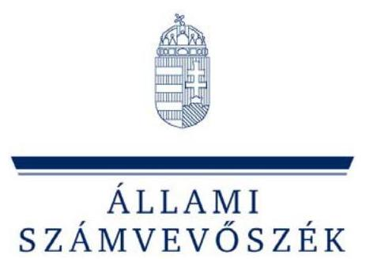
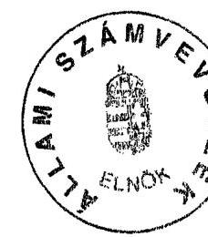

# JELENTÉS 

a CENTRUM Összefogás Magyarországért 2004-2005. évi gazdálkodása törvényességének ellenőrzéséről

---

# 3. Önkormányzati és Területi Ellenőrzési Igazgatóság 

3.1. Szabályszerűségi Ellenőrzési Főcsoport

Iktatószám: V-1018-024/2006.
Témaszám: 840
Vizsgálat-azonosító szám: V-311

## Az ellenőrzést felügyelte:

Dr. Lóránt Zoltán
főigazgató
Az ellenőrzés végrehajtásáért felelős:
Dr. Elek János
általános főigazgató-helyettes
Az ellenőrzést vezette:
Horváth Balázs
főcsoportfőnök-helyettes
Az összefoglaló jelentést készítette:
Szakmányné Bilik Mária
számvevő
Az ellenőrzést végezték:

| Szakmányné Bilik Mária | Dr. Dotterweich Antal | Szendrey Lajos |
| :-- | :-- | :-- |
| számvevő | főtanácsadó | számvevő |

A témához kapcsolódó eddig készített számvevőszéki jelentések:
címe
sorszáma
Összefogás Magyarországért Centrum 2002-2003. évi gazdálkodása törvényességének ellenőrzéséről

---

# TARTALOMJEGYZÉK 

BEVEZETÉS ..... 5
I. ÖSSZEGZŐ MEGÁLLAPÍTÁSOK, KÖVETKEZTETÉSEK, JAVASLATOK ..... 7
II. RÉSZLETES MEGÁLLAPÍTÁSOK ..... 11

1. A Párt gazdálkodásáról szóló 2004-2005. évi beszámolók ..... 11
1.1. A teljes vizsgálati időszakra érvényes megállapítások ..... 11
1.2. A 2004. és 2005. évi beszámolók ..... 11
1.2.1. Bevételek ..... 12
1.2.2. Kiadások ..... 12
2. A Pártnak a beszámoló összeállítására és az azt alátámasztó könyvvezetésre vonatkozó belső szabályozása és gyakorlata ..... 13
2.1. A belső szabályozás rendszere ..... 13
2.2. A könyvvezetés gyakorlata, ennek összhangja a jogszabályokban és a belső előírásokban előírt követelményekkel ..... 14
2.3. Analitikus nyilvántartások ..... 15
2.4. A bizonylati elv és a bizonylati fegyelem érvényesülése ..... 16
3. A Párt bevételszerző, gazdálkodó tevékenysége ..... 17
4. A gazdálkodással összefüggő egyéb jogszabályokban foglalt előírások betartása ..... 18
4.1. Személyi jellegű kifizetések ..... 18
4.2. Az adózási, társadalombiztosítási és egyéb jogszabályok rendelkezéseinek érvényesítése ..... 18
5. A Párt belső ellenőrzési rendszere ..... 19
5.1. A belső ellenőrzés rendszerének szabályozottsága ..... 19
5.2. A belső ellenőrzési rendszer működése ..... 20
6. Az előző ellenőrzés megállapításaira tett intézkedések ..... 20

## MELLÉKLETEK

1. számú Összefogás Magyarországért Centrum Párt 2004. évi beszámolója
2. számú CENTRUM Összefogás Magyarországért 2004. évi korrigált beszámolója
3. számú CENTRUM Összefogás Magyarországért 2005. évi beszámolója

---

.

---

# RÖVIDÍTÉSEK JEGYZÉKE 

| ÁSZ | Állami Számvevőszék |
| :-- | :-- |
| OSZB | Országos Számvizsgáló Bizottság |
| Párt | CENTRUM Összefogás Magyarországért |
| párttörvény | A pártok működéséről és gazdálkodásáról szóló - többször   módosított - 1989. évi XXXIII. törvény |
| számviteli törvény | A számvitelről szóló - többször módosított - 2000. évi C.   törvény |
| Szja törvény | A személyi jövedelemadóról szóló - többször módosított -   1995. évi CXVII. törvény |

---

.

---

# JELENTÉS   a CENTRUM Összefogás Magyarországért 2004-2005. évi gazdálkodása törvényességének ellenőrzéséről 

## BEVEZETÉS

Az Állami Számvevőszékről szóló 1989. évi XXXVIII. törvény 5. §-a és a 16. § (2) bekezdése, valamint a pártok működéséről és gazdálkodásáról szóló - többször módosított - 1989. évi XXXIII. törvény (továbbiakban: párttörvény) 10. § (1) bekezdése alapján a pártok gazdálkodása törvényességének ellenőrzésére az Állami Számvevőszék (továbbiakban: ÁSZ) jogosult. E törvényi felhatalmazás alapján az ÁSZ 2006. évi ellenőrzési tervének megfelelően vizsgálta a CENTRUM Összefogás Magyarországért (továbbiakban: Párt) 2004-2005. évi gazdálkodása törvényességét. Az ellenőrzés kiterjedt a Párt 2006. első félévi gazdálkodására is, mivel a Párt költségvetési támogatása 2006. első felében megszűnt ${ }^{1}$.

Az ellenőrzés célja annak megállapítása volt, hogy:

- a Párt által készített, a Magyar Közlönyben és a Párt internetes honlapján közzétett éves beszámolók a törvényi előírásoknak megfelelnek-e, a könyvvezetéssel és a valósággal megegyező adatokat tartalmaznak-e;
- a könyvvezetés és a gazdálkodás során betartották-e a számvitelről szóló többször módosított - 2000. évi C. törvény (továbbiakban: számviteli törvény) és az egyéb jogszabályi rendelkezéseket és belső előírásokat;
- a Párt a működéséhez szabályszerűen igénybe vehető forrásokat használt-e fel, nem folytatott-e a párttörvény által tiltott gazdálkodó tevékenységet, nem fogadott-e el tiltott vagyoni hozzájárulást, illetőleg adományt.

Az ellenőrzés körülményeit illetően rögzíteni szükséges ${ }^{2}$, hogy:

[^0]
[^0]:    ${ }^{1}$ A Kormány 1057/2006. (VI. 7.) Korm. határozatával - a 2006. évi országgyűlési képviselő-választás eredményének megfelelően - módosította a pártok és pártalapítványok támogatását szolgáló előirányzatokat.
    ${ }^{2}$ Az ÁSZ évek óta javasolja a Kormánynak a pártok ellenőrzéséről készített jelentéseiben a párttörvény módosítását. A Kormány 2006. évben benyújtotta a pártok működéséről és gazdálkodásáról szóló 1989. évi XXXIII. törvény és a választási eljárásról szóló 1997. évi C. törvény, valamint ezzel összefüggésben egyes más törvények módosításáról szóló T/237. számú törvényjavaslatot.

---

- a párttörvény 1. sz. melléklete szerinti beszámoló-mintához magyarázatot, útmutatót nem készítettek a jogalkotók, így ennek kitöltése pártonként - kialakított számviteli politikájuknak megfelelően - eltérő lehet;
- a beszámoló minta a számviteli törvény rendelkezéseivel nem harmonizál, nem felel meg sem a mérleg, sem az eredmény-kimutatás követelményeinek.

Az ÁSZ a párttörvény napirenden lévő módosítási javaslatának elfogadásáig a jelenleg hatályos rendelkezéseknek megfelelő - egységes módszertani alapokra helyezett - gyakorlattal folytatja a pártok gazdálkodása törvényességének ellenőrzését. Az ellenőrzést a 13/2003. számú Elnöki utasítással kiadott „Módszertan a pártok gazdálkodása törvényességének ellenőrzéséhez" c. kiadvány és a 14/2003. számú Elnöki határozattal elfogadott segédletben foglaltak alapján végeztük.

A helyszíni ellenőrzés: 2006. november 27. - 2007. január 22. között, a Párt székhelyén történt.

---

# I. ÖSSZEGZŐ MEGÁLLAPÍTÁSOK, KÖVETKEZTETÉSEK, JAVASLATOK 

A Párt a 2004. évi pénzügyi beszámolóját a párttörvényben meghatározott formában és az előírt határidőn belül tette közzé a Magyar Közlönyben. A nyilvánosságra hozott beszámolót, a számvevőszéki ellenőrzést megelőzően módosították, azt a 2005. évi beszámolóval egyidejűleg ismételten megjelentették. A korrekciót az indokolta, hogy a könyvvizsgáló a bruttó elszámolás elvét sértő, a kiadási főösszeg 4,1%-át jelentő, lényeges hibát tárt fel. A módosítást a 2004. évi főkönyvi könyvelés és zárlat helyesbítése nélkül, az alap- és korrekciós adatok hibás közlésével végezték. A 2005. évi beszámolót - a párttörvényben előírt határidőt egy hónappal túllépve - 2006. május 31-én tették közzé, amelynek összeállításánál érvényesítették a számviteli elveket, így az megbízható képet nyújtott a Párt gazdálkodásáról. A Párt mindkét év beszámolóját internetes honlapján is nyilvánosságra hozta.

A Párt az ÁSZ felhívására 2004. január 1-jei hatállyal kialakította a számviteli törvényben meghatározott számviteli szabályozásának rendszerét. A számviteli politika és a hozzákapcsolódó kötelező számviteli előírások tartalmazták a szabályzat tárgyával kapcsolatos fogalmakat, az elvégzendő feladatokat, rögzítették a feladatok végrehajtásának módszereit, megjelölték a végrehajtáshoz szükséges bizonylatokat, a kapcsolatot a főkönyvi és az analitikus nyilvántartások között. Az ellenőrzés észrevételeire a számviteli politikában aktualizálták az alkalmazott könyvelő program nevét, pótolták a pénzkezelési szabályzatban az utalványozók aláírás mintáját, pontosították a pénztár helyét. A számlarend a telefonköltségeket a működési kiadások közé sorolta, azonban a Párt a mobil telefonok költségeit a tényleges tartalomnak megfelelően a politikai tevékenység kiadásai között számolta el. Nem írta elő az értékhatár alatti tárgyi eszközök analitikus nyilvántartási kötelezettségét. A Párt a helyszíni ellenőrzést követően dokumentáltan igazolta a hiányosságok megszüntetését. A kiegészítésekkel együtt a belső szabályozás összhangba került a törvényi előírásokkal, a Párt gazdálkodási adottságaival.

A könyvvezetést a kettős könyvvitel rendszerében, a vizsgált időszakban két könyvelési szolgáltató, más-más könyvelési programmal teljesítette. A Párt az új könyvelési szolgáltató megbízásával egyidejűleg nem biztosította a számviteli nyilvántartások és könyvelési bizonylatok szabályszerű, dokumentált átadását. Az ellenőrzéshez a bizonylatok rendelkezésre álltak, azonban az előző számítógépes könyvelési rendszerből a kért kimutatások hiányosan és késve kerültek kinyomtatásra, átadásra. A váltással összefüggésben két hónapig nem volt könyvelés, így a jogszabályi és belső határidők nem teljesültek. Hibás könyvelés miatt 2004-ben a valódiság és a bruttó elszámolás számviteli alapelve sérült. A könyvvizsgáló javaslata ellenére a könyvelést nem módosították a lényegességi szintet meghaladó hibával. Így a 2004. évi korrigált beszámoló módosított jogcím sorait a számviteli törvény előírása ellenére főkönyvi kivonat nem támasztotta alá.

---

Az analitikus nyilvántartások körében szabályszerűen vezették a tárgyi eszköz és szállítói analitikát. A készpénzkezelés szabályszerűsége több vonatkozásban nem érvényesült azáltal, hogy 2005. augusztusáig nem a megbízott alkalmazott kezelte a pénztárat, a pénztári analitikát a pénzmozgástól térben és időben elszakadva, a könyvelő utólagosan vezette. A nyilvántartás nem felelt meg a számviteli törvényben rögzített naprakészség követelményének. A kialakult gyakorlat nem biztosította a készpénzállomány szabályszerű egyeztetését. A Párt belső szabályozása ellenére nem vezetett nyilvántartást az elszámolásra kiadott előlegekről és a szigorú számadású nyomtatványokról. Az előlegek belső előírás szerinti elszámolási határidőit nem tartotta be. Rendszeresen előfordult elszámolás nélkül, ismételt előleg kifizetés. A Párt leltározási kötelezettségét a leltározási szabályzatával összhangban - a készpénzállományt és a követeléseket kivéve - mindkét évben teljesítette, leltári eltérést nem állapítottak meg. Az éves zárások, a követelések és a pénztárszámla kivételével, a számviteli politikában meghatározott módon, szabályszerűen teljesültek.

A bizonylati rendre és okmányfegyelemre vonatkozó előírásokat a számlarendben és a pénzkezelési szabályzatban meghatározták. A kötelezettségvállalás és utalványozás szabályozása megfelelt a jogszabályi és belső előírásoknak. A gazdálkodási jogköröket a hatáskörrel rendelkezők gyakorolták. A készpénzforgalomban és az év végi rendező tételeknél fordultak elő bizonylat nélküli könyvelések, ezzel sérült a számviteli törvényben rögzített bizonylati elv és fegyelem. A bizonylatolás alaki és tartalmi követelményének érvényesítéséhez hiányzott a könyvelőváltás időpontjától a pénztári bizonylatokról teljes körben a pénzfelvevő, illetve befizető, a pénztáros, az utalványozó aláírása. Nem teljesült a több tételt tartalmazó pénztári kiadási bizonylatok esetében az összesítő bizonylatok kiállításának követelménye. A számviteli okmányok a vizsgált időszakban nem tartalmazták továbbá a könyvekben történt rögzítés időpontját, a könyvelő aláírását. A bizonylatolási szabálytalanságok ellenére a gazdasági tranzakciók közvetetten nyomon követhetők voltak a könyvelésben.

A Párt gazdálkodó és bevételszerző tevékenységgel kapcsolatos rendelkezéseit az alapszabály rögzítette a párttörvény előírásaival összhangban. Az elszámolt bevételek a vizsgált időszakban költségvetési támogatásból, pénzügyi műveletek bevételeiből és mobiltelefon-használat költségtérítéséből származtak. A Párt nyilvántartásai szerint a párttörvényben tiltott tevékenységet nem végzett, bevételt nem szerzett. A Párt központosított gazdálkodást folytatott.

A személyi jellegű kifizetések szabályszerű munka- és alkalmi megbízási szerződéseken alapultak. A Párt likviditási helyzetétől függően teljesítette adó- és járulékfizetési kötelezettségét. Megszüntette 2005 végére a 2004. évben és a korábbi években keletkezett adóhátralékot. A Párt a dolgozójának nyújtott kölcsönnel kapcsolatosan a helyszíni ellenőrzést követően önellenőrzéssel pótolta az Szja törvény szerinti kamatkedvezményből származó jövedelem utáni adó bevallását és befizetését. A reprezentációs kiadásokról nem vezetett elkülönített nyilvántartást, így nem teremtette meg az Szja törvényben szabályozott adóalap megállapítás feltételét. A magántulajdonú gépjárművek hivatali célú használatának költségtérítését 2005. májusától engedélyezték, amely hatályos szabályozáson alapult. A költségtérítéseket jogszabályi és belső előírásnak megfelelő adattartalmú útnyilvántartás alapján, normatív mértékkel fizették.

---

A belső ellenőrzésről hatályos szabályozások rendelkeztek. A vizsgált időszakban választott OSZB-k az alapszabály előírása ellenére ügyrenddel nem rendelkeztek. Mindössze a 2004. decemberében megválasztott testület végzett munkatervben rögzített ellenőrzést, a 2004. évi beszámolóval és gazdálkodási tevékenységgel kapcsolatosan. Megállapításai az előlegkezeléssel és bizonylatolással összefüggő hibákra vonatkoztak, javaslataira intézkedés nem történt. A vezetői ellenőrzés a kötelezettségvállaláson és utalványozáson keresztül érvényesült. A Párt irodavezetőjének pénztárosi tevékenysége utalványozási jogkörével összeférhetetlen volt. A belső ellenőrzés rendszere, átfogó szabályozottsága ellenére, hiányosan működött. A vezetői és
 munkafolyamatba épített kontroll nem tárta fel és nem javította ki a bizonylatolási, nyilvántartási, könyvvezetési és adózási hibákat.

A Párt az előző ÁSZ ellenőrzés felhívására elkészítette teljes körű, a sajátosságokat döntően tükröző számviteli szabályzatait. Az ÁSZ felhívása ellenére nem teljesült a bizonylatok alaki és tartalmi követelményeire vonatkozó előírások betartása, az elszámolásra kiadott előlegek szabályszerű elszámolása, valamint a belső ellenőrzési rendszer hatékony működtetése. Mindezek a hiányosságok a jelenlegi ellenőrzés során ismételten feltárt hibákhoz vezettek.

A helyszíni ellenőrzés megállapításainak hasznosítása mellett az Állami Számvevőszék elnöke felhívja

# a Párt elnökét 

1. Intézkedjen a számviteli törvény 15. § (9) bekezdésben rögzített bruttó elszámolás elvének megsértése miatti, a 2004. évi könyvvezetési hibák kijavítása érdekében, hogy a számviteli törvény 164. § (2) előírásával összhangban, a korrigált beszámoló főkönyvi alátámasztása biztosított legyen.
2. Gondoskodjon a bizonylatolás során:
a) a számviteli törvény 165. § (1)-(2) bekezdésében szabályozott bizonylati elv és fegyelem követelményeinek érvényesítéséről, a bizonylat nélküli könyvelések megszüntetése érdekében;
b) a számviteli törvény 167. § (1) bekezdés c), e), g), h) és i) pontjaiban rögzített, a bizonylatok alaki és tartalmi előírásainak betartásáról;
c) a főkönyvi záráshoz kapcsolódó leltárak és egyeztetések belső előírások szerinti teljes körű végrehajtásáról.
3. Intézkedjen az analitikus nyilvántartások körében:
a) az elszámolásra kiadott előlegek analitikájának vezetésére, az elszámolási határidők betartására;
b) a szigorú számadású okmányok nyilvántartásának vezetésére a számviteli törvény 168. § (3) bekezdés követelményei szerint;

---

c) a házipénztár szabályszerű működtetésére és ellenőrzésére a számviteli törvény 165. § (3) bekezdés a) pont követelményének megfelelően a készpénzforgalom pénzmozgással egyidejű rögzítésére.
4. Alakítsa ki nyilvántartásait oly módon, hogy a reprezentációs kiadásokkal összefüggő adóalap az Szja törvény 69. § (7) bekezdés b) pontjával összhangban megállapítható legyen.
5. Intézkedjen a belső ellenőrzési rendszer, szabályozásnak megfelelő, eredményes működtetése érdekében.

---

# II. RÉSZLETES MEGÁLLAPÍTÁSOK 

## 1. A PÁrt GAZDÁlKodÁsÁról SZÓLÓ 2004-2005. ÉVI BESZÁmolók

### 1.1. A teljes vizsgálati időszakra érvényes megállapítások

A 2004. évi beszámoló 2005. április 29-én, a Magyar Közlöny 57. számában jelent meg. A Párt a 2004. évi beszámolót - a bevételi és kiadási oldalon a bruttó elszámolás elvének megsértése, a kiadási oldalon egyéb kiadás politikai tevékenység kiadásaként történt közlése, a kiadási főösszeg kerekítési hibája miatt a helyszíni ellenőrzést megelőzően önrevízió keretében módosította és azt a 2005. évi beszámolóval egyidejűleg ismételten megjelentette. Az ellenőrzés ez utóbbi beszámoló tartalmát, jogszabályi rendelkezésekkel való összhangját vizsgálta. A Párt a 2005. évi beszámolót a Magyar Közlöny 2006. évi május 31-i, 65. számában tette közzé. Mindkét év beszámolóját saját internetes honlapján is nyilvánosságra hozta (1., 2. és 3. számú melléklet).

A beszámoló összeállításának rendjét a Párt a hatályos számviteli politikájában és szöveges számlarendjében szabályozta. A beszámolók elkészítése során érvényesítették a párttörvény és a belső szabályzatok rendelkezéseit. A 2005. évről közzétett beszámoló megbízható, valós képet nyújtott a Párt gazdálkodásáról.

### 1.2. A 2004. és 2005. évi beszámolók

A Párt a 2004. évi korrigált beszámolót a könyvvizsgáló auditálásában levezetett eltérések figyelembevételével, részben főkönyvi kivonattal alátámasztva készítette el. Az eltéréseket a könyvekben nem rögzítette, ezért az egyéb bevétel, valamint a politikai és az egyéb kiadás sorát főkönyvi kivonat nem támasztotta alá, ezzel sérült a számviteli törvény 164. § (2) bekezdés előírása. A 2004. évi közzétett korrigált beszámoló korrigált oszlopa a helyes adatokat tartalmazta, azonban az alapadatokat és a korrekciókat tévesen közölte. A 2005. évi beszámolót a kettős könyvvitel rendszerében, központilag rögzített gazdálkodási adatok alapján készített főkönyvi kivonatból állította össze. A Párt a 2005. évről szóló beszámolót határidőn túl jelentette meg.

A 2004. évi beszámoló önrevízióját az alábbi levezetés mutatja be:
Adatok ezer Ft-ban

| Bevételek beszámoló sor | Eredeti | Önrevízió | Módosított |
| :-- | :--: | :--: | :--: |
| 2. Állami költségvetési támogatás | 69400 | 0 | 69400 |
| 6. Egyéb bevétel | 67 | 1402 | 1469 |
| Összes bevétel | $\mathbf{6 9 4 6 7}$ | $\mathbf{1 4 0 2}$ | $\mathbf{7 0 8 6 9}$ |

---

Adatok ezer Ft-ban

| Kiadások beszámoló sor | Eredeti | Önrevízió | Módosított |
| :-- | --: | --: | --: |
| 2. Támogatás egyéb szervezeteknek | 48 | 0 | 48 |
| 4. Működési kiadások | 17274 | 0 | 17274 |
| 5. Eszközbeszerzések | 735 | 0 | 735 |
| 6. Politikai tevékenység kiadásai | 14322 | 1391 | 15713 |
| 7. Egyéb kiadások | 0 | 12 | 12 |
| Összes kiadás | $\mathbf{3 2} \mathbf{3 8 0 *}$ | $\mathbf{1 4 0 3}$ | $\mathbf{3 3 7 8 2}$ |

*Helyes összeg: 32379 ezer Ft

# 1.2.1. Bevételek 

Az állami költségvetésből származó támogatás beszámoló soron 2004-ben és 2005-ben egyaránt 69400 ezer Ft összeg található. A központi költségvetési támogatás összege mindkét évben egyezett a Pénzügyminisztériumtól kapott adatokkal. A beszámolósor adata a vizsgált években egyeztethető volt a főkönyvi számlákkal és a kapcsolódó bankbizonylatokkal.

Az egyéb bevétel soron telefon költségtérítésből származó bevétel és jóváírt kamat fordult elő. A 2004. évi telefonköltség megtérítésével összefüggő 1402 ezer Ft bevétel a könyvvizsgáló jelentéséből volt levezethető. A 2005. évi főkönyvi számlákon szereplő összegek összesített adata egyeztethető volt a beszámoló adatával.

### 1.2.2. Kiadások

A Párt 2004. évi beszámolójában a támogatás egyéb szervezetnek beszámolósoron szerepeltetett összeget, a politikai tevékenység kiadása sor helyett. Valójában egy Kft. által kiállított, a Párt nevére szóló számla alapján könyveltek 48 ezer Ft összegben támogatást, sportszolgáltatás helyett. A hiba mértéke nem érte el a lényegességi küszöböt. A beszámoló összeállítása során sérült a számviteli törvény 15. § (3) bekezdésben rögzített valódiság elve. A 2005. évről szóló beszámolóban található összeg egyezett a főkönyvi számla egyenlegével. A beszámolósoron csak szervezetnek nyújtott támogatás található.

A működési kiadások beszámolósor adata a rendelkezésre bocsátott kapcsolódó főkönyvi számlák alapján, mindkét évben levezethető volt. Ezen a jogcímen mutatták ki a központ működésével összefüggő személyi kiadásokat, a hozzákapcsolódó járulékokat, az ügyviteli és számviteli kiadásokat, továbbá az üzemeltetési és közüzemi költségeket.

Az eszközbeszerzés beszámolósoron közölt adatok a kapcsolódó főkönyvi számlák összegeivel megegyeztek. Mindkét évben irodai berendezéseket, felszereléseket vásároltak.

---

A politikai tevékenység kiadása jogcímből a 2004. évi beszámolóban hiányzott a támogatás egyéb szervezeteknek beszámolósoron hibásan szerepeltetett 48 ezer Ft sportszolgáltatás. A beszámolósor adata 2005. évben megegyezett a Párt számlarendjében meghatározott főkönyvi számlák összegeinek összesített adatával.

Az egyéb kiadás beszámolósorok tartalma összhangban volt a belső előírásokkal, az összegek levezethetők voltak a kapcsolódó főkönyvi számlák alapján. Ezen a kiadási jogcímen a 2004. évi beszámolóban késedelmi kamat, a 2005. évben ezen túl perköltség és behajthatatlan követelés összege szerepelt.

A kiadási sorok összegei között a 2004. évi támogatás egyéb szervezeteknek, valamint a politikai kiadások sor kivételével az adott sorba tartozó kiadásokat talált az ellenőrzés. Érvényesült a kiadások jogcímeinek azonossága, a vizsgált időszakban az elszámolás következetes volt.

# 2. A PÁrtnak a beszámoló öSSZEÁllítÁsára És az azT alÁtÁMASZTÓ KÖNYVVEZETÉSRE VONATKOZÓ BELSŐ SZABÁLYOZÁSA ÉS GYAKORLATA 

### 2.1. A belső szabályozás rendszere

A Párt az ÁSZ előző felhívására alakította ki számviteli szabályzásának rendszerét. A belső előírásokat - a leltározási szabályzat kivételével - 2004. január 1-jével léptette hatályba, amelyek a helyszíni ellenőrzésig nem módosultak. A hatályos számviteli politika tartalmi elemei - az alkalmazott könyvelő program kivételével - tükrözték a Párt gazdálkodási sajátosságait, összhangban voltak a jogszabályi előírásokkal.

A számviteli törvény 14. § (5) bekezdés előírásának megfelelően a számviteli politika keretében elkészítették az eszközök és a források értékelési szabályzatát, a pénzkezelési szabályzatot. Az eszközök és a források leltárkészítési és leltározási szabályzata 2003. szeptember 8-tól volt érvényben.

Az ellenőrzés észrevételére a számviteli politikában aktualizálták az alkalmazott könyvelő program nevét, pótolták a pénzkezelési szabályzatban az utalványozók nevét, aláírását, pontosították a pénztár helyét. A kiegészítésekkel a belső szabályozás igazodik a törvényi előírásokhoz, a Párt gazdálkodási adottságaihoz.

A számviteli politikához a 2004. január 1-jétől hatályos számlarend kapcsolódott, amely szöveges számlarendből, számlatükör és alapkontírozási szabályzatból, valamint ügyviteli rendből állt. Ezek együttesen, a törvényi előírásnak és részben a Párt sajátosságainak megfelelően tartalmazták:

- minden alkalmazásra kijelölt számla számjelét és megnevezését;
- a számla tartalmát, ha az a számla megnevezéséből egyértelműen nem következik, továbbá a számla értéke növekedésének, csökkenésének jogcímeit,

---

a számlát érintő gazdasági eseményeket, azok más számlákkal való kapcsolatát;

- a főkönyvi számla és az analitikus nyilvántartás kapcsolatát;
- az egyéb bevételek és az egyéb kiadások fogalmi ismérveit, besorolási kritériumait;
- a bizonylati rendre vonatkozó előírásokat.

A szöveges számlarend a telefonköltségeket a működési kiadásokhoz sorolta, azonban a mobiltelefon költségek a tényleges tartalommal egyezően a politikai tevékenység kiadásai között kerültek elszámolásra. A számlarend nem írta elő a kis értékű, több évig használható tárgyi eszközök analitikus nyilvántartási kötelezettségét. A Párt dokumentáltan igazolta a szabályozási hiányosságok megszüntetését.

Egyéb törvényességet elősegítő belső előírást, a gépjárművek igénybevételének és használatának szabályzatát az igényeknek megfelelően 2005. április 16-án adta ki a Párt elnöke. Ebben határozta meg a belföldi és külföldi kiküldetés szervezésének és költségelszámolásának rendjét, valamint a magántulajdonú gépjármű hivatali célú használatának és költségelszámolásának szabályait.

# 2.2. A könyvvezetés gyakorlata, ennek összhangja a jogszabályokban és a belső előírásokban előírt követelményekkel 

A Párt gazdálkodásával kapcsolatos gazdasági események rögzítése a számviteli politikában meghatározott módon, a kettős könyvvitel rendszerében történt. A könyvelési feladatokat a vizsgált időszakban két könyvelési szolgáltató látta el, más-más könyvelési program segítségével.

A Párt az új könyvelési szolgáltató megbízásával egyidejűleg nem biztosította a számviteli nyilvántartások és könyvelési bizonylatok szabályszerű, dokumentált átadását.

A 2005. július 31-ig használt könyvelőprogram főkönyvi számláinak egyenlegeit nyitó mérleg számlával szemben vezették át a 2005. október 1-jétől használt könyvelőprogramban megnyitott főkönyvi számlákra. A váltás során az átvezetett egyenlegek egyezőségét és a főkönyvi számlák azonos elnevezését biztosították. Közben két hónapon keresztül könyvelés nem történt, így a könyvvezetés naprakészsége, a belső előírás szerinti könyvelési határidők nem teljesültek.

## A könyvvezetés gyakorlata a következőkben a törvényi és belső előírásokkal nem volt összhangban:

- 2004-ben a számviteli bizonylat szerinti sportszolgáltatást egyéb szervezetnek nyújtott támogatásként rögzítették, ezért a számlakijelölés nem felelt meg a számviteli törvény 15. § (3) bekezdés szerinti valódiság elvének.

---

- A mobiltelefon használat költségtérítését 2004-ben helytelenül nem bevételként, hanem a telefonköltségek csökkentéseként könyvelték, ezért a könyvvezetés során sérült a számviteli törvény 15. § (9) bekezdés szerinti bruttó elszámolás elve. A könyvvizsgálat által feltárt hibát a könyvelésben nem javították ki.
- A gazdasági események több főkönyvi számlán nem kerültek megnevezésre; nem teljesült a főkönyvi könyvelés, az analitikus nyilvántartások és a bizonylatok közötti egyeztetés és ellenőrzés lehetősége, a számviteli törvény 165. § (4) bekezdésben megfogalmazott követelmény ellenére.
- A pénztári forgalom könyvelésében a
 számviteli törvény 165. § (3) bekezdés a) pontjában szabályozott naprakészség megsértése miatt 2006. első félévében négy hónapig negatív pénztáregyenlegek jelentkeztek, mivel a bankszámláról felvett összegek több havi késedelemmel kerültek bevételezésre.

Az előző számítógépes könyvelési rendszerből az ellenőrzéshez kért kimutatások hiányosan és késedelmesen kerültek kinyomtatásra, átadásra, ugyanakkor a bizonylatok a helyszínen teljes körűen rendelkezésre álltak.

Az éves zárások a követelések és készpénzállomány kivételével, a számviteli politikában meghatározott módon szabályszerűen teljesültek. A 2004. évi záráskor 874 ezer Ft, 2005. december 31-én 1125 ezer Ft követelés az adósokkal történt egyeztetés nélkül került a mérlegben kimutatásra. A számviteli törvény 65. § (1) bekezdés szabályai szerint az előírt követeléseket elfogadott, elismert összegben kell kimutatni, a leltározását a 69. § (2) bekezdésben rögzített módon egyeztetéssel kell elvégezni.

# 2.3. Analitikus nyilvántartások 

Az ügyviteli rendben meghatározták a főkönyvi könyveléshez kapcsolódó analitikus nyilvántartások körét, tartalmát. A vizsgált időszakban a főkönyvi számlákhoz kapcsolódóan az 50 ezer Ft értékhatár feletti tárgyi eszközök, a szállítók és a pénzforgalom analitikáját vezették.

A tárgyi eszközökről vezetett gépi analitikus nyilvántartás tartalma megfelelt a belső előírásoknak. Év végén a leltárakkal és a főkönyvi számlák egyenlegeivel egyeztették, eltérés nem volt.

A szállítók analitikus nyilvántartását a könyvelőprogram részeként biztosították. A Párt szabályszerűen leltározta a mérlegben kimutatott szállítói kötelezettségeket. Az analitikus nyilvántartások a leltárral és a főkönyvi kivonattal megegyeztek.

## A készpénzforgalomról vezetett nyilvántartás és a készpénzkezelés nem felelt meg a számviteli törvényben és belső előírásokban rögzített követelményeknek:

- A pénztárosi feladatokkal 2004. május 1-jétől megbízott munkavállaló - nyilatkozata szerint - ténylegesen 2005. augusztusától látta el a feladatot. Addig a megbízással és felelősségvállaló nyilatkozattal nem rendelkező iroda-vezető kezelte a pénztárat. A pénztár átadásáról-átvételéről dokumentum nem készült.

- A pénztár a Párt székhelyén működött, védelmének biztosítása nélkül. A pénztáros, illetve alkalmi helyettesítője a készpénzforgalomról nem vezetett a pénzkezelési szabályzatban előírt időszaki pénztárjelentést. Nem állítottak ki továbbá bevételi és kiadási pénztárbizonylatokat. A pénztári forgalom analitikus nyilvántartását a készpénzmozgástól időben és térben elszakadva a könyvelő program pénzügyi részeként a könyvelő vezette. A készpénzforgalom rögzítése nem a pénzmozgással egyidejűleg történt, ezzel megsértették a számviteli törvény 165. § (3) bekezdés előírását. A záró pénzkészletet 2004. májusától nem állapították meg címletszerűen.

Ezek a körülmények nem biztosították a pénztárban lévő készpénzállomány egyeztethetőségét, a pénztárzárlat szabályszerűségét. A pénzkezelés és nyilvántartás szabálytalanságai vagyonvédelmi kockázatot jelentenek a Párt számára.

- A pénzkezelési szabályzat rögzítette az elszámolásra kiadott előlegek nyilvántartási kötelezettségét és tartalmi elemeit. A Párt az előírás ellenére nem vezette az elszámolásra kiadott előlegek analitikáját. A belső előírás szerinti elszámolási határidőket nem tartotta be. Rendszeresen előfordult, hogy az el nem számolt előleg ellenére ismételten előleget fizettek ki ugyanannak a személynek.

A Párt nem tartotta nyilván a tagok részére juttatott mobiltelefon használatot, ezért a telefonokhoz kapcsolódó számlázott díj, valamint a tagok által befizetett költségtérítés összegszerűsége nem volt egyeztethető. A pénztáros nem vezetett nyilvántartást a szigorú számadású nyomtatványokról. Az ellenőrzés részére bemutatták a vizsgált időszakban szigorú számadású nyomtatványként használt készpénzfelvételi csekkfüzeteket, azokat teljes körűen, sorszám szerint megőrizték.

A Párt - a készpénz és követelések leltározása kivételével - leltározási kötelezettségének a leltározási szabályzat előírásainak megfelelően mindkét évben eleget tett. A leltározás kiértékelésénél eltérést nem dokumentáltak.

# 2.4. A bizonylati elv és a bizonylati fegyelem érvényesülése 

A bizonylati rendre és okmányfegyelemre vonatkozó előírásokat az ügyviteli rend és a pénzkezelési szabályzat tartalmazta. A Párt a kötelezettségvállalási és utalványozási jogköröket és a hatáskör gyakorlók körét meghatározta a pénzkezelési szabályzatban. A szabályozás szerint nem volt kötelező a 200 ezer Ft alatti kereskedelmi beszerzések írásos kötelezettségvállalása. A politikai célú kiadásokra az elnök, az iroda működésével kapcsolatos kiadásokra értékhatártól függetlenül az irodavezető kapott felhatalmazást.

A bankszámlán elhelyezett pénzeszközök felett együttes aláírással az elnök és egy elnökségi tag rendelkezett. A gazdálkodási hatásköröket a szabályozásban megjelölt vezetők gyakorolták.

A könyvekben bizonylat nélküli bejegyzések, illetve a szabályszerű bizonylat követelményének nem megfelelő, nem hivatalos, kézírásos feljegyzés alapján történt könyvelés miatt sérültek a számviteli törvény 165. § (1)-(2) bekezdés bizonylati elvre és fegyelemre vonatkozó előírásai:

- teljes vizsgált időszakban a bankszámláról felvett készpénz bevételezése;
- az elszámolásra kiadott előlegek kifizetése;
- munkavállalónak nyújtott 500 ezer Ft kölcsön kifizetése;
- 2005. december 31-én 249 ezer Ft behajthatatlan követelés leírása;
- 2006. június 30-án 773 ezer Ft, négy darab pénztári kiadási tétel rögzítése során. A kiadásba helyezett tételeket az ellenőrzés korábbi időpontokban, banki kifizetések között találta. A szabálytalan tranzakciókat a következő hónapban sztornózták.

# A kialakult bizonylati rend több ponton nem felelt meg a számviteli törvény - bizonylatok alaki és tartalmi követelményére vonatkozó előírásának: 

- A pénztári bevételi és a kiadási bizonylatokról 2005 augusztusától teljes körűen hiányzott az utalványozó, a befizető, a felvételre jogosult, a pénztáros aláírása, a gépjármű költségtérítéssel kapcsolatos kifizetések utalványozás nélkül teljesültek. A gyakorlat a számviteli törvény 167. § (1) bekezdés c) pont szabályait sértette.
- A gazdasági műveletek mennyiségi és egységár adata hiányzott a bizonylatok 6%-áról, ez nem felelt meg a számviteli törvény 167. § (1) bekezdés e) pont követelményének.
- Az előző könyvelő program részeként előállított, több tételt tartalmazó összesítő pénztár bizonylatokról hiányzott az összegzés alapját képező bizonylatok köre, azonosítási lehetősége, szövegként "Áfa-s számla" megnevezést rögzítették, ezért sérült a számviteli törvény 167. § (1) bekezdés g) pont előírása.
- A bizonylatok teljes körénél hiányzott a könyvekben történt rögzítés időpontja, az aláírás, ez a számviteli törvény 167. § (1) bekezdés i) pont szabályainak megszegését jelentette.

A Párt a vegyes bizonylatok alapján könyvelt jövedelem-elszámolási és értékcsökkenési tételeihez megfelelő részletező kimutatások, bizonylatok kapcsolódtak. A javító tételekhez, állományi átvezetésekhez nem készült belső bizonylat. A bizonylatolási szabálytalanságok ellenére a gazdasági tranzakciók közvetetten nyomon követhetők voltak a könyvelésben.

## 3. A PÁRT BEVÉTELSZERZŐ GAZDÁLKODÓ TEVÉKENYSÉGE

A Párt a gazdálkodó és bevételszerző tevékenységgel kapcsolatos alapvető rendelkezéseket az alapszabály 67. §-ában rögzítette. Ez összhangban volt a párttörvény előírásaival. A Párt bevételei a vizsgált időszakban a költségvetési törvényben meghatározott támogatásból, kamatbevételből és költségtérítésből származtak.

A vizsgált beszámolókban részletezetteken túl 2006. I. félévében 32433 ezer Ft költségvetési támogatásból gazdálkodhatott, melyből 3517 ezer Ft kampánytámogatás volt.

A Párt a könyvviteli nyilvántartásai szerint a párttörvény 4. § (2) bekezdésében meg nem engedett forrásból származó vagyoni hozzájárulást nem fogadott el, a párttörvény 6. §-ában nem engedélyezett gazdálkodó tevékenységet nem folytatott, gazdasági társaságban részesedést nem szerzett, egyszemélyes kft-t, vállalatot nem alapított, párttörvény által tiltott értékpapírt nem vásárolt.

A Párt székhelyéül egy magánszemélytől, majd gazdasági társaságtól piaci áron bérelt ingatlant használt. A pártelnök nyilatkozata és a gazdasági dokumentumok szerint helyi önkormányzatoktól ingatlant nem bérelt, illetve használati jogot nem kapott.

A Párt a belső szabályozásának megfelelően központi gazdálkodást folytatott.

# 4. A GAZDÁLKODÁSSAL ÖSSZEFÜGGŐ EGYÉB JOGSZABÁLYOKBAN FOGLALT ELŐÍRÁSOK BETARTÁSA 

### 4.1. Személyi jellegű kifizetések

A Párttal munkaviszonyban és megbízási jogviszonyban állók részére a megbízott könyvelési szolgáltató végezte a bérszámfejtést, és teljesítette az adójogszabályokban előírt levonási, bevallási és adatszolgáltatási kötelezettségeket.

A Párt saját tulajdonú vagy bérelt gépkocsit nem üzemeltetett. Hivatalos célra magántulajdonú gépkocsik használatát engedélyezte 2005. májusától, tagok és tisztségviselők részére. A magántulajdonú gépkocsi hivatali célú használatáért fizetett üzemanyag ill. költség elszámolás hatályos belső szabályozáson alapult. A vezetett útnyilvántartások megfeleltek az Szja törvény 5. számú melléklet II. 7. pontjában meghatározott adatkövetelményeknek. Az üzemanyag költségtérítések a 60/1992. (IV. 1.) Korm. rendeletben szabályozott normatív mértékkel teljesültek.

A Párt jogszerűen kölcsönt nyújtott egy alkalmazottja részére 2005. szeptember 30-án 500 ezer Ft értékben, melyet a dolgozó 2006. május 31-én, ugyanezen összegben visszafizetett. A dolgozók egyéb költségtérítésben, természetbeni juttatásban nem részesültek.

### 4.2. Az adózási, társadalombiztosítási és egyéb jogszabályok rendelkezéseinek érvényesítése

A Párt a vizsgált időszakban a munkabérekből levont személyi jövedelemadót, a munkaadót és munkavállalókat terhelő járulékokat, valamint a magánnyugdíj-pénztári befizetési kötelezettséget havonta megállapította. A havi befizetési kötelezettségeit 2004. szeptemberéig kettő-négy hónapos késedelemmel, az elszámolt és levont értékektől alacsonyabb összegekkel teljesítette, melyből eredően hátralékai keletkeztek. A 2005. évi befizetések során az előző évi hátralékot pótolta, a pénzügyi teljesítés két hónapban több mint 30 napos késedelemmel, a 2006. év 1. félév első öt hónapjában 3-12 napos határidő túllépéssel valósult meg. A 2005. év végi folyószámla kivonat egyenlege az egyes adónemeknél eltérő előjelű volt, együttesen befizetési többletet mutatott. Az adózási és társadalombiztosítási jogszabályokban előírt 2004. évi éves bevallási kötelezettségét késedelmesen, a 2005. évi bevallást határidőre benyújtotta. Az egyéni bér-és járulék nyilvántartásokat vezette, melyek megegyeztek a főkönyvi könyveléssel és bevallásokkal.

A munkavállalónak nyújtott kölcsön összege után a Párt, mint kifizető elmulasztotta az Szja törvény 72. § (1) bekezdés szerinti kamatkedvezményből származó jövedelem utáni adó mértékét a 72. § (2) bekezdés szabályai szerint megállapítani, megfizetni és bevallani. A Párt a helyszíni ellenőrzést követően önellenőrzéssel pótolta mulasztásait.

A Párt a reprezentációról elkülönített nyilvántartást nem vezetett. A reprezentációs kiadásokat a reprezentációs főkönyvi számla mellett a rendezvények működési illetve politikai kiadások főkönyvi számlán is nyilvántartotta. A főkönyvi elszámolás nem volt alkalmas annak megállapítására, hogy a reprezentációs kiadások értéke meghaladta-e az Szja törvény 69. § (7) bekezdés b) pontja szerinti mértéket.

A Párnál a vizsgált időszakban adó- és társadalombiztosítási hatóság ellenőrzést nem végzett.

# 5. A PÁRT BELSŐ ELLENŐRZÉSI RENDSZERE 

### 5.1. A belső ellenőrzés rendszerének szabályozottsága

Az alapszabály OSZB létrehozásáról rendelkezett. A testület ellenőrzése az alapdokumentum szerint a Párt költségvetésének végrehajtására, a gazdálkodásra, hitelfelvételekre, leltárakra, a vagyonkezelésre, beruházásokra terjed ki, a testület éves beszámolási kötelezettségét írta elő. Az OSZB tevékenységét az alapszabály és 2005. évtől szakmai etikai kódexe keretei között határozták meg. Az országos választmány 2004. decemberében új OSZB-t választott. A vizsgált időszakban az OSZB-k hatályos ügyrend nélkül működtek az alapszabály 63. § (4) bekezdés előírása ellenére. Az „OSZB célja és feladata" című, ügyrendi kérdéseket is tartalmazó dokumentumot az országos választmány 2005. áprilisi ülésén tárgyalta, de nem hagyta jóvá.

A vezetői és munkafolyamatba épített ellenőrzés szabályozása összhangban volt a jogszabályi előírásokkal és az alapszabállyal. Kötelezettségvállalási jogkörrel az elnök és az irodavezető rendelkezett. Szakmai teljesítés igazolására az irodavezető, utalványozásra a kötelezettségvállalók kaptak felhatalmazást. A kiadási bizonylatok számszerű ellenőrzése belső szabályozás szerint a könyvelési vállalkozó feladatába tartozott.

Könyvvizsgáló megbízására került sor mindkét évben, amely kiterjedt mind a párttörvény szerinti, mind az egyszerűsített éves beszámoló auditálására.

A Párt a gazdálkodás, a pénzügyi és számviteli tevékenység belső ellenőrzési rendszerét összehangoltan szabályozta, amely szabályozás az ellenőrzés tartalmi elemeit, jogosultsági és összeférhetetlenségi szabályait tekintve megfelelt a jogszabályi előírásoknak.

# 5.2. A belső ellenőrzési rendszer működése 

Az OSZB 2004. évben nem működött. A 2004. decemberében megválasztott OSZB - munkaterv alapján -
 2005-ben két formális ellenőrzést végzett. Az ellenőrzés a beszámoló közzétételét követően a 2004. évi beszámoló, valamint a gazdálkodó tevékenység felülvizsgálatára terjedt ki. Az OSZB a beszámolóval kapcsolatosan kontírozási hibát nem állapított meg. Kifogásolta, hogy a támogatás egyéb szervezetnek jogcím alatt feltüntetett összeghez támogatási szerződés nem készült, az elszámolásra felvett előlegekkel történt elszámolás nem felelt meg a belső szabályozásnak. További hiányosságként jelezte, hogy a működési, politikai és egyéb kiadások jogcímeit a bizonylatokon nem rögzítették. A hibák kijavítására intézkedés nem történt. Az OSZB a beszámoló felülvizsgálatáról készült jelentését az országos választmány elfogadta. A 2005. évi beszámoló felülvizsgálatát az OSZB nem teljesítette, 2006-ban ellenőrzést nem végzett. A vezetői ellenőrzés a kötelezettségvállalásra és az utalványozásra korlátozódott. A kötelezettségvállalást az arra jogosult személyek végezték, jellemzően a belső szabályozás szerint. Összeférhetetlennek minősült az irodavezető utalványozási és pénzkezelési feladata. A munkafolyamatba épített ellenőrzés nem működött. A Párt elnöke pénztárellenőri feladatok ellátására nem adott megbízást, a készpénzforgalom ellenőrzése teljes körűen hiányzott. Kimaradt a könyvelővel kötött szolgáltatási szerződésből a bizonylatok számszaki ellenőrzési feladata.

A belső ellenőrzés nem a meghatározott rendben működött. A vezetői és munkafolyamatba épített kontroll nem tárta fel a bizonylatolási, nyilvántartási, könyvvezetési és adózási hibákat.

A 2004. évi beszámolóról készült könyvvizsgálói jelentés a beszámoló közzétételét követően, 2005. július 7-én készült. Feltárta a lényegességi küszöböt meghaladó könyvvezetési és beszámoló készítési hibákat, ezért kezdeményezte a könyvvizsgáló a párttörvény szerinti beszámoló módosítását.

## 6. Az előző ellenőrzés megállapításaira tett intézkedések

A Párt az előző ÁSZ ellenőrzés megállapításainak hasznosítására intézkedési tervet nem készített, a felhívás alapján a Párt elnöke a következő intézkedéseket tette:

- 2004. január 1-jétől hatályba léptette a számviteli törvénnyel összhangban álló és a Párt működési sajátosságainak megfelelő számviteli politikát;
- kiadta a számviteli politikához igazodó számlarendet három részszabályozás keretében: szöveges számlarend, számlatükör és alapkontírozási szabályzat, ügyviteli rend, valamint az eszközök és források értékelési szabályzatát;

---

- a könyvviteli zárlati munkálatok rendjét a szabályzatokban rögzítették, az éves leltározást és egyeztetéseket - a készpénzállomány és követelések kivételével - elvégezték;
- a bizonylatok alaki és tartalmi követelményeire vonatkozó szabályokat az ügyviteli rendben rögzítették;
- az elszámolásra kiadott előlegek folyósításának és elszámolásának szabályait a pénzkezelési szabályzatban meghatározták;
- a belső ellenőrzési rendszert kialakították.

Az ÁSZ felhívása ellenére nem teljesült a bizonylatok alaki és tartalmi követelményeire vonatkozó előírások betartása, az elszámolásra kiadott előlegek szabályszerű elszámolása, valamint a belső ellenőrzési rendszer hatékony működtetése. Mindezek a hiányosságok a jelenlegi ellenőrzés során ismételten feltárt hibákhoz vezettek.

Budapest, 2007. március 21.

Melléklet: $\quad 3 \mathrm{db}$

Dr. Kovács Arpád

---

V-1018-024/2006. 1. számú melléklet

Összefogás Magyarországért Centrum Párt 2004. évi pénzügyi beszámolója

Bevételek

1. Tagdijak ..... 0
2. Állami költségvetésből származó támogatás ..... 69400
3. Képviselőcsoportnak nyújtott állami támogatás ..... 0
4. Egyéb hozzájárulások, adományok ..... 0
4.1. Jogi személyektől ..... 0
4.1.1. Belföldiektől ( 500000 Ft feletti) ..... 0
4.1.2. Külföldiektől ( 100000 Ft feletti) ..... 0
4.2. Jogi személynek nem minősülő gazdasági társaságtól ..... 0
4.2.1. Belföldiektől ( 500000 Ft feletti) ..... 0
4.2.2. Külföldiektől ( 100000 Ft feletti) ..... 0
4.3. Magánszemélyektől ..... 0
4.3.1. Belföldiektől ( 500000 Ft feletti) ..... 0
4.3.2. Külföldiektől ( 100000 Ft feletti) ..... 0
5. A párt által alapított vállalat és kft. nyereségéből származó bevétel ..... 0
6. Egyéb bevételek ..... 67
Összes bevétel a gazdasági évben: ..... 69467
Kiadások
7. Támogatás a párt országgyűlési csoportja számára ..... 0
8. Támogatás egyéb szervezetnek ..... 48
9. Vállalkozás alapítására fordított összegek ..... 0
10. Működési kiadások ..... 17274
11. Eszközbeszerzés ..... 735
12. Politikai tevékenység kiadása ..... 14322
13. Egyéb kiadások ..... 0
Összes kiadás a gazdasági évben: ..... 32380
Dr. Kupa Mihály s. k., elnök

---

# Centrum Összefogás Magyarországért 2004. évi korrigált beszámolója Önrevízió 

## Bevételek

1. Tagdijak
2. Állami költségvetésből származó támogatás
3. Képviselőcsoportnak nyújtott állami támogatás
4. Egyéb hozzájárulások, adományok
4.1. Jogi személyektől
4.1.1. Belföldiektől ( 500000 Ft feletti)
4.1.2. Külföldiektől ( 100000 Ft feletti)
4.2. Jogi személynek nem minősülő gazdasági társaságtól
4.2.1. Belföldiektől ( 500000 Ft feletti)
4.2.2. Külföldiektől ( 100000 Ft feletti)
4.3. Magánszemélyektől
4.3.1. Belföldiektől ( 500000 Ft feletti)
4.3.2. Külföldiektől ( 100000 Ft feletti)
5. A párt által alapított vállalat és kft. nyereségéből származó bevétel
6. Egyéb bevétel
Összes bevétel a gazdasági évben:

| Alap | Korrekció | Korrigált |
| :--: | :--: | :--: |
| 69400000 | - | 69400000 |
| - | - | - |
| - | - | - |
| - | - | - |
| - | - | - |

|  |  |  |  |
| :--: | :--: | :--: | :--: |
|  |  |  |  |
|  |  |  |  |
|  |  |  |  |
|  |  |  |  |
|  |  |  |  |
|  |  |  |  |
|  | 1469417 | - | 1469417 |
|  | 70869417 | - | 70869417 |

## Kiadások

1. Támogatás a párt országgyűlési csoportja számára
2. Támogatás egyéb szervezetnek
3. Vállalkozás alapítására fordított összegek
4. Működési kiadások
5. Eszközbeszerzés
6. Politikai tevékenység kiadásai
7. Egyéb kiadások

Összes kiadás a gazdasági évben:
Bevétel-kiadás:

| - | - | - |
| :--: | :--: | :--: |
| 47500 | - | 47500 |
| - | - | - |
| 17273607 | - | 17273607 |
| - | 734750 | 734750 |
| 15713349 | - | 15713349 |
| 12015 | - | 12015 |
| 33046471 | 734750 | 33781221 |
| 37822946 | -734750 | 37088196 |

Dr. Kupa Mihály s. k., elnök

---

# Centrum Összefogás Magyarországért 2005. évi pártbeszámolója 

Ezer forintban

## Bevételek

1. Tagdijak
2. Állami költségvetésből származó támogatás
3. Képviselőcsoportnak nyújtott állami támogatás
4. Egyéb hozzájárulások, adományok
4.1. Jogi személyektől
4.1.1. Belföldiektől ( 500000 Ft feletti)
4.1.2. Külföldiektől ( 100000 Ft feletti)
4.2. Jogi személynek nem minősülő gazdasági társaságtól
4.2.1. Belföldiektől ( 500000 Ft feletti)
4.2.2. Külföldiektől ( 100000 Ft feletti)
4.3. Magánszemélyektől
4.3.1. Belföldiektől ( 500000 Ft feletti)
4.3.2. Külföldiektől ( 100000 Ft feletti)
5. A párt által alapított vállalat és kft. nyereségéből származó bevétel
6. Egyéb bevétel
2837
Összes bevétel a gazdasági évben:
72237

## Kiadások

1. Támogatás a párt országgyűlési csoportja számára
2. Támogatás egyéb szervezetnek
3. Vállalkozás alapítására fordított összegek
4. Működési kiadások
5. Eszközbeszerzés
6. Politikai tevékenység kiadásai
7. Egyéb kiadások
Összes kiadás a gazdasági évben:

Dr. Kupa Mihály s. k., elnök
