# ÁLLAMI <br> SZÁMVEVÔSZÉK 

## JELENTÉS

az Állami Számvevőszék 2006. évi tevékenységéről
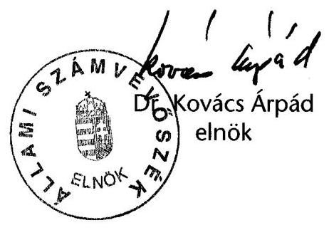

---

## Eierlikör (1)

Menge: 1 Drink

2 Zentiliter Zitronensaft
2 Zentiliter Zuckersirup
1 Zentiliter Zuckersirup
1 Zentiliter Zuckersirup
etwas Zitronensaft
etwas Zuckersirup
etwas Zuckersirup
etwas Zuckersirup
etwas Zuckersirup
etwas Zuckersirup
etwas Zuckersirup
etwas Zuckersirup
etwas Zuckersirup
etwas Zuckersirup
etwas Zuckersirup
etwas Zuckersirup
etwas Zuckersirup
etwas Zuckersirup
etwas Zuckersirup
etwas Zuckersirup
etwas Zuckersirup
etwas Zuckersirup
etwas Zuckersirup
etwas Zuckersirup
etwas Zuckersirup
etwas Zuckersirup
etwas Zuckersirup
etwas Zuckersirup
etwas Zuckersirup
etwas Zuckersirup
etwas Zuckersirup
etwas Zuckersirup
etwas Zuckersirup
etwas Zuckersirup
etwas Zuckersirup
etwas Zuckersirup
et

---

# TARTALOMJEGYZÉK 

1. Az ÁSZ 2006. évi feladatai ..... 4
1.1. Ellenőrzési feladatok, súlypontok ..... 4
1.2. Egyéb számvevőszéki feladatok ..... 6
1.2.1. Ellenjegyzési, véleményezési jogkör ..... 7
1.2.2. Javaslattételi jogkör ..... 7
2. Az ÁSZ ellenőrzési tapasztalatai ..... 9
2.1. Főbb tapasztalatok államháztartási alrendszerenként ..... 11
2.1.1. A központi költségvetés ..... 11
2.1.2. Az elkülönített állami pénzalapok ..... 17
2.1.3. A társadalombiztosítás pénzügyi alapjai ..... 18
2.1.4. A helyi önkormányzatok ..... 22
2.2. Az állami és az önkormányzati feladatellátásra irányuló ellenőrzések főbb tapasztalatai ..... 30
2.3. Uniós források felhasználása ..... 37
2.4. Államháztartáson kívüli - non-profit célú - támogatások ..... 40
2.5. Az állami vagyon ..... 41
3. Az ellenőrzések hasznosítása ..... 44
3.1. A jelentések országgyűlési tárgyalása, határozatok és az országgyűlési kapcsolatok ..... 44
3.2. A számvevőszéki javaslatok érvényesülése ..... 46
3.2.1. Javaslatok az Országgyűlés szintjén ..... 47
3.2.2. Javaslatok kormányzati szinten ..... 50
3.2.3. Javaslatok a vizsgált szervezeteknél ..... 55
3.3. Kezdeményezett büntető eljárások ..... 56
3.4. Közérdekű bejelentések, javaslatok és panaszok intézése ..... 58
3.5. A számvevőszéki tevékenység nyilvánossága ..... 59
4. Az ellenőri munka minőségének fejlesztése ..... 61
4.1. Humán erőforrás gazdálkodás és fejlesztés ..... 61
4.2. Az ellenőrzések minőségbiztosítása ..... 66
4.3. Nemzetközi kapcsolatok ..... 67
5. A számvevőszéki tevékenységhez kapcsolódó kutató és módszertani munka ..... 71
6. Az intézmény működése és gazdálkodása ..... 73
6.1. Költségvetési gazdálkodás ..... 73
6.2. Az infrastruktúra múködtetése, fejlesztések ..... 75
6.3. Az informatika és a telekommunikáció múködtetése, fejlesztése ..... 76
6.4. Belső ellenőrzés ..... 78

---

# MELLÉKLETEK 

1. számú A 2006. évi jelentések jellemzői ..... 1
2. számú A megyei, megyei jogú városi és a fővárosi kerületi ..... 17
önkormányzatok gazdálkodási rendszere átfogó ellenőrzésének
ütemezése
3. számú ÁSZ jelentések az országgyúlési bizottságok/plenáris ülések na- ..... 21
pirendjén 2006-ban
4. számú Az ÁSZ 2006. évi jelentéseiben a fejezetek vezetőinek megfogal- ..... 25
mazott javaslatok és az azokra adott válaszok
5. számú Öszefoglalók a 2006-ban befejezett ellenőrzések tapasztalatairól ..... 89

---

# JELENTÉS 

## az Állami Számvevőszék 2006. évi tevékenységéről

Az Állami Számvevőszék (ÁSZ) - az Országgyűlés pénzügyi-gazdasági ellenőrző szerve - évente beszámol előző évi tevékenységéről. Több mint tíz éves gyakorlat, hogy e jelentést több országgyűlési bizottság napirendre túzi, és azt a plenáris ülés is minden évben megtárgyalja. Az éves tevékenységről szóló jelentés megvitatását követően az Országgyűlés határozatot hoz a munka értékeléséről, illetve a jövőbeni fejlesztési irányokról.

A legutóbbi ilyen országgyűlési határozatban foglaltak alapján állítottuk össze 2007. évi ellenőrzési tervünket, folytattuk módszertani fejlesztéseinket, készítettük el az európai uniós támogatások 2005. évi felhasználásának ellenőrzéséről szóló tájékoztatót (Trend Report), valamint kezdtük meg a közpénzügyi törvény megalkotását megalapozó tézisek kidolgozását.

2006-ban $62^{1}$ jelentést tettünk közzé. Az országgyűlési bizottságok az előző évinél kevesebb, összesen 9 jelentésről 46 alkalommal tárgyaltak. A korábbi gyakorlatnak megfelelően néhány jelentést - mint a 2005. évi költségvetés végrehajtásának ellenőrzése, a 2007. évi költségvetési javaslat véleményezése, illetve az ÁSZ éves jelentése - több bizottság is napirendjére túzött. Jelentéseinkben összesen 1134 javaslatot tettünk, amelyeket 1426 szervezetnél végzett helyszíni ellenőrzés lefolytatásával alapoztunk meg.

Az éves jelentés - a szervezet múködésének, gazdálkodásának, fejlesztésének bemutatása mellett - lehetőséget ad az ellenőrzési tapasztalatok rendszerszemléletű értékelésére, a javaslatok alapján kibontakozó intézkedések és azok befolyásoló tényezőinek áttekintésére. A számvevőszéki tevékenységet jellemző folyamatosan bővülő feladat-tartalom mellett ésszerű terjedelmi korlát betartására törekszünk, figyelemmel az áttekinthetőség és az összevethetőség követelményére.

Ezen jelentésünk az államháztartás alrendszerei, az állami vagyon, az uniós források felhasználása, valamint az állami és önkormányzati feladatellátás szempontjából tekinti át és összegezi a 2006. évi ellenőrzések tapasztalatait. Ismerteti ezek hasznosításának főbb jellemzőit és adatait, továbbá rávilágít arra is, hogyan szolgálja az ellenőrzési munka minőségének fejlesztése az ÁSZ kiegyensúlyozott, szervezett múködését. A jelentés képet ad a számvevőszéki tevékenységhez kapcsolódó, a tanácsadást megalapozó kutatómunkáról, és szól az intézményi múködésről, valamint a gazdálkodásról is.

[^0]
[^0]:    ${ }^{1}$ Ebből 61 ellenőrzési jelentés, 1 pedig az ÁSZ éves tevékenységéről szóló jelentés.

---

A számvevőszéki törvény előírásának megfelelően az Országgyűlés elnöke által pályázat útján megbízott független könyvvizsgáló ellenőrzi az intézmény gazdálkodását.

# 1. Az ÁSZ 2006. ÉVI FeladATAI 

Az Alkotmány és más törvények messzemenően biztosítják az ÁSZ független múködéséhez és ellenőrzési tevékenységéhez szükséges jogi feltételeket, garanciákat.

Ellenőrzési tevékenységünket érintően az Alkotmányon és a számvevőszéki törvényen kívül további 26 törvény határoz meg feladatokat. Az ÁSZ felhatalmazásai azonban nem közvetlenül és kizárólag ellenőrzési jogosultságokat és kötelezettségeket jelentenek, hanem olyan tevékenységeket is, amelyek a közpénzekkel való gazdálkodás átláthatóságát erősítik.

### 1.1. Ellenőrzési feladatok, súlypontok

Az ÁSZ 2006-ban is a jóváhagyott - az Országgyűlés Számvevőszéki bizottsága által megtárgyalt - ellenőrzési tervben foglaltak szerint végezte tevékenységét.

Ellenőrzési kötelezettségeinket és jogosultságainkat 2006-ban 86 ellenőrzéssel teljesítettük. Ebből 66 ellenőrzés 2006. évi befejezési időponttal került megtervezésre. Év közben ellenőrzési tervünk 1 vizsgálattal kiegészült, 2 feladat törlésre került², így a 2006. évi befejezéssel tervezett vizsgálatok száma - a tervmódosítást követően - 65 -re változott.

Két ellenőrzésről nem elnöki, hanem főigazgatói aláírással készült jelentés (SAPARD 2005. évi igazoló ellenőrzése és az Európai Unió strukturális alapjaiból nyújtott támogatásokkal kapcsolatos csalások és szabálytalanságok kezelése rendszerének és gyakorlatának ellenőrzése). Két jelentés közzététele 2007-re húzódott át ${ }^{3}$, ezzel a 2006-ban közzétett jelentések száma 61 volt.

Ellenőrzési tevékenységünket 2006-ban 64557 közvetlen ${ }^{4}$ ellenőri nap felhasználásával teljesítettük, ami az előző évinél 3039 nappal kevesebb. Ez az év közben életbe lépett létszámkorlátozásra vonatkozó intézkedések következménye.

Az ellenőrzési feladatok sorában meghatározóak a törvényekben különféle rendszerességgel előírt feladatok. A 2006-ban a meghatározott gyakori-

[^0]
[^0]:    ${ }^{2}$ Év közben a terv kiegészült A kulturális közgyűjtemények kezelésére fordított pénzeszközök ellenőrzésével, törlésre került A Nemzeti Kulturális Örökség Minisztériumának, valamint A felsőoktatási kollégium beruházási programjának ellenőrzése.
    ${ }^{3}$ A Magyar Demokrata Fórum 2004-2005. évi gazdálkodása és Az Antall József Alapítvány 2003-2005. évi gazdálkodása törvényességének ellenőrzése.
    ${ }^{4}$ Közvetlen ellenőrzési nap: az ellenőrzésre fordított kapacitás, valamint az ellenőrzésre közvetlenül elszámolható jogi, minőségbiztosítási és informatikai támogatás.

---

sággal (évenkénti, kétévenkénti, illetve rendszeres) teljesítendő ellenőrzési feladatok az éves ellenőrzési kapacitás $\mathbf{6 5 \%}$-át vették igénybe.

Az évenkénti ellenőrzési kötelezettségek továbbra is súlyponti feladatként szerepeltek. Ebben a körben 4 jelentés készült (költségvetési vélemény, zárszámadási jelentés, az ÁPV Zrt., illetve az MTI Zrt. múködésének ellenőrzése). A legnagyobb kapacitást igénylő feladat a 2005. évi költségvetés végrehajtásának ellenőrzése volt, ami az előző évhez hasonlóan az ellenőrzési kapacitás $24 \%$-át kötötte le.

Kétévenkénti ellenőrzési kötelezettség végrehajtásáról 2006-ban 2 jelentés készült (1 párt és 1 pártalapítvány gazdálkodásának ellenőrzése).

A rendszeres ellenőrzési feladatok teljesítéseként 33 jelentést adtunk közre. Rendszeres ellenőrzési feladatot jelent a költségvetési fejezetek, a helyi önkormányzatok, a társadalombiztosítási és az elkülönített állami pénzalapok gazdálkodásának ellenőrzése.

A rendszeres feladatok meghatározó részét a helyi önkormányzatok gazdálkodásának átfogó ellenőrzése képezte. A több mint 500 települési önkormányzat átfogó helyszíni ellenőrzésénél szerzett tapasztalatokat összefoglaló jelentésen kívül 18 jelentős nagyságrendú költségvetéssel, illetve vagyonnal rendelkező önkormányzatról önálló számvevőszéki jelentés készült (5 megyei, 6 megyei jogú városi, 1 fővárosi és 6 fővárosi kerületi önkormányzat).

Az ÁSZ 2006-ban 6 központi költségvetési fejezet több évre kiterjedő átfogó ellenőrzéséről tett közzé jelentést (Miniszterelnökség, Ügyészség, Magyar Tudományos Akadémia, Belügyminisztérium, Területfejlesztés, Környezetvédelmi és Vízügyi Minisztérium.)
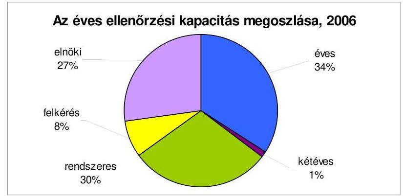

Az ÁSZ elnökének döntése alapján végzett ellenőrzésekről 21 jelentés készült. Ezek témaválasztásánál előtérbe kerültek az uniós források eredményes felhasználását segítő ellenőrzések, a PPP konstrukcióban megvalósuló beruházások, illetve további fejlesztési célú pénzeszközök ellenőrzése, valamint lezajlott több kiemelt közérdeklődésre számot tartó ellenőrzés is.

Ezek sorába tartozik a Nemzeti Fejlesztési Terv végrehajtásának, az autópálya beruházások finanszírozási megoldásainak, a Művészetek Palotája megvalósításának és múködésének, az államháztartás adóssága alakulásának, kezelésének, az

---

egészségügyi szakellátások privatizációjának, a tartósan veszteségesen múködő állami tulajdonú gazdasági társaságok gazdálkodásának, valamint az APEH múködésének ellenőrzése.

Az állami oktatás múködési feltételeit és egyes feladatainak megvalósítását 2006ban 4 jelentés értékelte: a közoktatási intézmények tankönyvellátási rendszerének ellenőrzése, az iskola-előkészítés, általános iskolai oktatás feltételeinek biztosítása kistelepüléseken, a középiskolai kollégiumok fenntartásának és fejlesztésének feltételeinek, a felsőoktatási állami intézmények ingatlangazdálkodásának ellenőrzése.

Az Országgyúlés döntése alapján 2006-ban 1 ellenőrzésre került sor. Az Országgyűlés a 2004. évi zárszámadásról szóló törvényben határozta meg az ÁSZ számára a központi költségvetés által 2005. év végéig az önkormányzatokhoz út- és szennyvízcsatorna építés címén átutalt közmúfejlesztési támogatás igénylésének és felhasználásának ellenőrzését. A törvény által előírt feladatot teljesítettük.
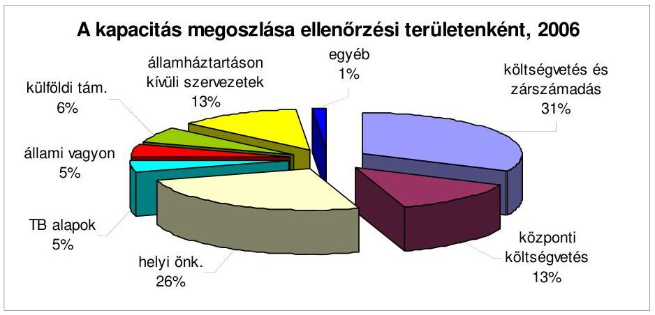

Az ÁSZ az ellenőrzéseit három fő típusba sorolja. 2006-ban a kapacitásának 50\%-át a szabályszerűségi vizsgálatokra (költségvetés véleményezése, zárszámadás, pártok gazdálkodásának ellenőrzése, SAPARD és az EMOGA igazolószervi ellenőrzések), 33\%-át az átfogó ellenőrzésekre fordítottuk. A teljesít-mény-ellenőrzés módszerével végzett vizsgálatok az éves kapacitás 17\%-át képviselték.

A 2006-ben elkészült jelentések jellemzőit (a jelentés tárgya, száma, a jelentést készítő igazgatóság, az ellenőrzés jogszabályi alapja és indoka, célja, a költségvetési nagyságrend) az 1. sz. melléklet tartalmazza.

# 1.2. Egyéb számvevőszéki feladatok 

A szervezet egyéb tevékenységi körébe számos - a szorosan vett ellenőrzési kötelezettségen és jogosítványon túlmutató - felhatalmazás, illetve feladat tartozik, amelyeket az Alkotmány, a számvevőszéki törvény és egyéb törvények írnak elő.

---

Az ÁSZ elnöke ellenjegyzi a költségvetés hitelfelvételeire vonatkozó szerződéseket, véleményezi az államháztartás számviteli rendjének, belső pénzügyi ellenőrzési rendszere múködésének továbbfejlesztésére vonatkozó javaslatokat. Véleményezi az állami vagyonkezelő szervezet belső ellenőrzési szabályzatát, s javaslatot tesz felügyelő bizottságának elnökére, könyvvizsgálójára, továbbá a jegybank könyvvizsgálójára, az elkülönített állami pénzalapok könyvvizsgálóira, valamint előzetesen véleményezheti az APEH elnökének kinevezését.

Az államháztartási törvény értelmében az állam legalább többségi befolyása alatt álló gazdálkodó szervezet esetében - ha a jegyzett tőke meghaladja a kétszáz millió forintot - a felügyelő bizottság elnökének személyére is az ÁSZ tesz javaslatot, a gazdálkodó szervezet vezetőjének megkeresése alapján.

# 1.2.1. Ellenjegyzési, véleményezési jogkör 

A Magyar Köztársaság nevében a pénzügyminiszter 2003. november 28-án egy 500 millió euró összegű készenléti hitelkeretre vonatkozó szerződést írt alá az ÁSZ elnökének ellenjegyzése mellett. A hitelkeret-megállapodás 2006. november 24-én lejárt. Az Államadósság Kezelő Központ Zrt. - az eredeti összeg megtartása mellett - a szerződés meghosszabbítását kezdeményezte. A készenléti hitelkeret meghosszabbításával kapcsolatos dokumentációk - szabályszerűségre vonatkozó - áttekintése alapján a hitelszerződés ellenjegyezése megtörtént.

A számviteli rend változásával összefüggésben biztosított véleményezési jogkörünket 2006-ban az „Egyes pénzügyi tárgyú törvények módosításáról" c. előterjesztésben szereplő, a számvitelről szóló 2000. évi C. törvény módosítása, továbbá az államháztartás szervezetei beszámolási és könyvvezetési kötelezettségének sajátosságairól szóló 249/2000. (XII. 24.) Korm. rendelet, valamint a kincstári elszámolások beszámolási és könyvvezetési kötelezettségének sajátosságairól szóló 240/2003. (XII. 17.) Korm. rendelet módosításai kapcsán gyakoroltuk.

### 1.2.2. Javaslattételi jogkör

Az oktatási és kulturális miniszter felkérésére 2006-ban az ÁSZ elnöke javaslatot tett a Nemzeti Kulturális Alap könyvvizsgálójának személyére. Folyamatban volt a Magyar Nemzeti Bank és a Magyar Fejlesztési Bank könyvvizsgálójára történő javaslattétel előkészítése, amelyek 2007-re is áthúzódtak.

A közbeszerzési eljárások szabályozásának az európai közösségi joggal való harmonizációja - a közbeszerzési eljárás lefolytatása alóli kivételek további szűkítésével - érintette az egyes törvényekben (pl. MNB tv., MFB tv.) megállapított számvevőszéki könyvvizsgálói javaslattétel gyakorlásának módját is. Kétségtelen, hogy a könyvvizsgálói szolgáltatás megrendelése közbeszerzési kötelezettség alá tartozik, de a jelölési jogot biztosító törvényi előírások érintetlenül hagyása továbbra is azt kívánja, hogy független, szakmai kritériumok alapján kiválasztott könyvvizsgáló lássa el az érintett szerveknél a könyvvizsgálói feladatot. Ennek feltételeit teremtettük meg a közbeszerzési eljárásban való részvétel kereteinek az érdekeltekkel történő - meghatározásával.

---

A felmerült jogalkotási problémáról - miután több törvényt is érint - tájékoztattuk az Országgyűlés elnökét és illetékes bizottságát, valamint az igazságügyi és rendészeti tárcát. Az elvégzendő felülvizsgálatig a Kbt., illetve a számvevőszéki könyvvizsgálói jelölési jogosultságot megállapító törvényi előírások együttes alkalmazása zavart nem okoz.

Az ÁSZ elnöke által gyakorolt könyvvizsgálói javaslattételt a bírálati szempontok kidolgozásában, továbbá az eljárásban megfigyelőként történő részvételünk előzi meg, amely lehetővé teszi az ÁSZ által elvárt szakmai követelmények, az ÁSZ-nak a vonatkozó törvényekben rendezett jelölési jogosultsága érvényesülését.

A felügyelő bizottsági (FB elnöki) névjegyzék frissítése érdekében - a korábbi 4 alkalmat követően - további pályázatot írtunk ki. Ennek értékelése alapján 32 eredményes pályázattal gyarapodott az általunk kezelt pályázati anyagok száma. A jelölésre alkalmas személyek száma 2006. december 31-én 642 fő volt.

A 2003. évi indulástól 2006 végéig 679 pályázati anyagot bíráltunk el. A névjegyzékbe 646 személy került felvételre. Elhalálozás miatt a névjegyzékből 4 főt töröltünk.
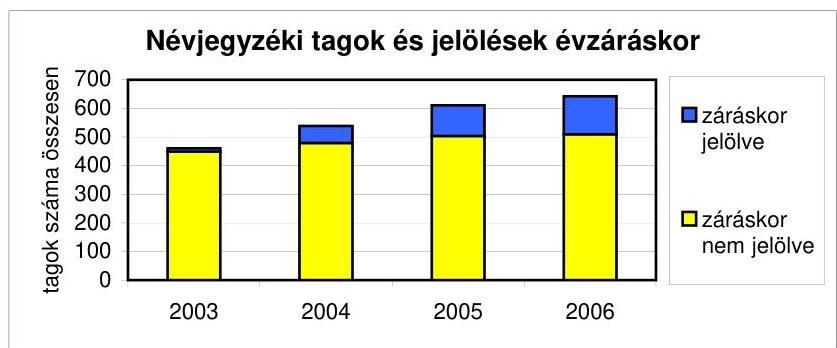

2006-ban az ÁSZ főtitkára 49 gazdálkodó szervezet részére tett jelölési javaslatot. Javaslatunk alapján - tudomásunk szerint - 2006. december 31. napján 133 személy töltött be FB elnöki megbízatást.

A 2003. évi indulástól 2006 végéig 217 gazdálkodó szervezettől érkezett kérelmet vizsgáltunk meg, és 199 névjegyzékben szereplő személy jelölésére tettünk javaslatot.
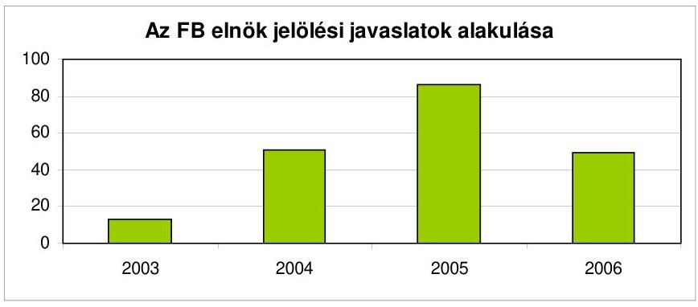

---

# 2. Az ÁSZ ELLENŐRZÉSI TAPASZTALATAI 

Az ÁSZ különböző területeken és témákban végzett ellenőrzései során kénytelen azzal szembesülni, hogy az államháztartási múködés és gazdálkodás szervezeti és szabályrendszerére összpontosuló intézményi reformok nem kiérlelt és elfogadott átfogó fejlesztési koncepciók, összehangolt stratégiák mentén bontakoznak ki. Átfogó stratégia hiányában esetenként egymást keresztező, egymásnak ellentmondó prioritások is hatnak.

A változtatásokat nem támasztják alá előzetes hatástanulmányok és más érté-kelő-elemző dokumentumok. A költségvetési információs rendszer sem képes megfelelően alátámasztani a feladatellátás tényleges költségeinek és hatásainak elemzését. A források hasznosításának nyomon követése, értékelése még azokban az esetekben sem valósul meg, amelyekben a felhasználást konkrét célokhoz kötötték. A folyamatosan változó jogszabályi környezet is gyengíti a költségvetési biztonságot. Évek óta ismétlődően jelezzük azt is, hogy a költségvetési és zárszámadási törvényjavaslatok információ tartalma sem segíti az átláthatóságot és nem ad elegendő támogatást a megalapozott döntéshozatalhoz.

Mindezen visszatérően érvényesülő hiányosságok és okaik kiküszöbölése új szemléletet igényel a közszféra működésében, olyan felfogást és problémakezelést, ami - a jövő generációira is figyelemmel - hozzájárul a fenntartható gazdasági növekedést támogató költségvetési biztonság feltételeinek megteremtéséhez is. Ez halaszthatatlanná teszi a közpénzügyek rendszerszemléletü áttekintését, elemzését és annak alapján teljes körü, átfogó és konzisztens újraszabályozását.

Az ÁSZ - stratégiájának fő iránya szerint, tanácsadói szerepének keretén belül éppen ennek érdekében kezdeményezi és támogatja az államháztartás tervezési, működési, beszámolási és ellenőrzési rendjének megújítását, s ahhoz kapcsolódóan a közvagyonnal való gazdálkodás megfelelő, teljes körű összehangolt szabályozását.

Az alapozó munka keretében áttekintettük a mértékadó nemzetközi tapasztalatokat, külső szakértők bevonásával szakmai vitákat rendeztünk és - mindezek alapján, ellenőrzési tapasztalatainkat is felhasználva - több résztanulmányt is készítettünk.

Az ÁSZ ez irányú kezdeményező szerepének alkotmányos és szakmaiésszerűségi korlátaival is számoltunk, ezért javaslatainkat olyan formában fogalmaztuk meg, hogy azok a törvényhozási munkában minél közvetlenebbül hasznosíthatók legyenek. A „A közpénzügyek szabályozásának tézisei" című összeállításunk - amit a 2006. évi tevékenységünkről szóló jelentéssel egyidejűleg tárunk az Országgyűlés elé - pontokba szedve tartalmazza a javasolt szabályozás legfontosabb elveit, módszereit, áttörési pontjait, valamint a tézisek indokolását. Ezzel szeretnénk megfelelő lehetőséget teremteni arra, hogy az Országgyűlés az ÁSZ kiinduló javaslatait a további munka alapjául elfogadja. Reményeink szerint a tézis-gyűjtemény és a kapcsolódó indokolás meggyőzi a tisztelt országgyűlési képviselőket a változtatás szükségességéről, kijelöli a korszerűsítés tartalmát, irányát és hasznosításával a közpénzügyek törvényi

---

szabályozásának korszerűsítésére irányuló munkák felgyorsulnak, s még ebben a parlamenti ciklusban látható eredményt hoznak.

A „tézisek" legfontosabb mondanivalója, „üzenete", hogy a közpénzekkel való gazdálkodás szabályozását szilárd elvi alapokra kell helyezni. Ezeket az elveket a szabályozás egészében érvényre kell juttatni. A „tézisek" rögzítik ezeket az elveket, s felvázolják a szabályozási irányokat, amelyek mentén az elveknek érvényt lehet szerezni. Alapvetőnek tartjuk, hogy az elveket illetően szakmai, politikai és társadalmi konszenzus alakuljon ki.

A „tézisek" második üzenete, hogy új szemléletű szabályozásra van szükség. Az elmúlt években kibontakozott az a tendencia, hogy a közfeladatok ellátásában egyre nagyobb részt vállaltak az államháztartáson kívüli szervezetek. Az ÁSZ ellenőrzései pedig rávilágítottak arra, hogy a közpénzek „elfolyásának" ott a legnagyobb a veszélye, ahol a köz- és a magánszektor érintkezik. Ezt a veszélyt csak olyan szabályozással lehet kiküszöbölni, ami a közpénzek felhasználását, és nem az államháztartási szervezetet állítja a szabályozás középpontjába.

A „tézisek" harmadik fontos üzenete, hogy a modernizáció a közpénzügyeket sem hagyta érintetlenül. Az információtechnológia fejlődése megköveteli, hogy a közpénzügyi információrendszer fő szabályai törvényi szinten is megfogalmazásra kerüljenek. Csatlakozásunk az Európai Unióhoz és más nemzetközi szervezetekhez indokolttá teszi, hogy az e szervezetek által a közszférára kidolgozott standardok a magyar szabályozásban is tükröződjenek. Fejlődtek a költségvetési tervezés és gazdálkodás technikái is. Ezek alkalmazásának utat kell engedni, sőt utat kell törni a magyar közpénzügyi menedzsmentben is.

Végeredményben a „tézisek" abból indul ki, hogy a közszektor reformjának kulcskérdése a közpénzügyek korszerű szabályozása, amit nemzetközileg elfogadott, hazai politikai konszenzussal megerősített elvekre kell alapozni; a szabályozás sarokköve az állam feladatainak meghatározása. Olyan szabályozásra van szükség, ami átfogja a közpénzekkel gazdálkodók, a közpénzügyi gazdálkodás teljes körét, az államháztartás központi és helyi szintjét különíti el, biztosítja az Országgyúlés költségvetési jogának gyakorlását és a végrehajtó hatalom felelősségét, érvényre juttatja a fenntarthatóságot és az egyensúlyt. Az új, korszerű szabályozásnak biztosítania kell a közpénzek beszedésének és felhasználásának átláthatóságát, az „értéket a pénzért" elv dominanciáját. Az új szabályozás keretein belül „helyére kerül" a vezetés-belső irányítás, valamint a (pénzügyi) ellenőrzés. A közpénzügyi szabályozásnak kiszámíthatónak és viszonylag stabilnak kell lennie, amihez szükséges, ezért ajánlható az alapvető szabályok Alkotmányba foglalása is.

Az új közpénzügyi szabályozás téziseinek kidolgozása egyáltalán nem jelenti azt, hogy az 1992-ben elfogadott és több ízben módosított államháztartási törvény korszerűsítésére irányuló, a Pénzügyminisztériumban folyó munkára ne lenne szükség. Ellenkezőleg, a két törekvés kiegészíti egymást.

---

A közpénzügyek újraszabályozása valószínűleg nem lehetséges egyetlen törvény megalkotásával, illetve a „tézisek" néhány könnyen kivitelezhető ajánlásának a meglévő szabályozásba illesztésével. Ezért a „tézisek" a teljes törvényi szabályozás megújítása mellett a közpénzügyekkel való gazdálkodás egyes blokkjainak rendszerszemléletű újraszabályozására tesz javaslatot, de a javaslatok a vagyontörvény szabályozási tárgykörébe tartozó kérdésekre nem terjednek ki.

# 2.1. Főbb tapasztalatok államháztartási alrendszerenként ${ }^{4}$ 

### 2.1.1. A központi költségvetés

A zárszámadás kapcsán minden évben foglalkozunk az államadóssággal, adósságszolgálat mutatóival. 2006-ban önálló jelentés is készült az államadósság kezelésének, alakulásának ellenőrzéséről.
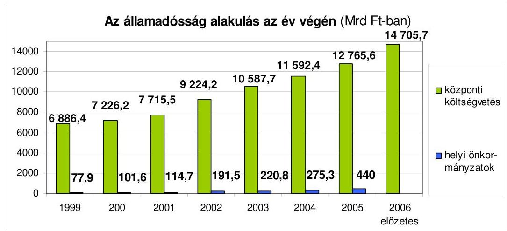

Megjegyzés: a helyi önkormányzatok 2006. évi adósságáról még nincs adat
A központi költségvetés adósságának éves növekedése 2000-2001-ben 500 Mrd Ft alatt volt, 2002-ben a háromszorosára emelkedett, 2003-tól pedig évi 1000 Mrd Ft körül állandósult. A központi költségvetés adóssága növekedésének 63\%-át a költségvetés hitelátvállalások nélküli hiánya okozta. A hiány elsősorban olyan múködési jellegú kiadásokhoz kapcsolódott, amelyek következtében nem várhatóak a jövőben bevételek és kiadás-megtakarítások. A hiány növekedése annak ellenére következett be, hogy 2003-tól a kiadások viszszafogása érdekében a Kormány számos megszorító intézkedést hozott. Ezek azonban csak átmenetileg mérsékelték a hiány növekedését, mert az államháztartás túlelosztásra épülő rendszere lényegében nem változott, és elmaradt a finanszírozható állami feladatrendszer meghatározása is.

[^0]
[^0]:    ${ }^{5}$ A számvevőszéki ellenőrzések megállapításai - jellegükből fakadóan - a vizsgálatok lefolytatását megelőző hosszabb-rövidebb időszakra vonatkoznak, a jelentésekben a lezárt pénzügyi évek adatai jelennek meg. Ennek következtében beszámolónk a 2005. évi tényeket, folyamatokat 2006-ban vizsgáló jelentések tapasztalatain alapul, ugyanakkor a tendenciák és következtetések túlmutatnak egy-egy költségvetési éven.

---

A központi költségvetés egyre növekvő adóssága következtében a kamat abszolút összege is rendre emelkedett. 2000-2005 között a fizetett kamat - amely része a hiánynak - a központi költségvetés adósság növekedése 82\%-ának megfelelő nagyságrendű volt.
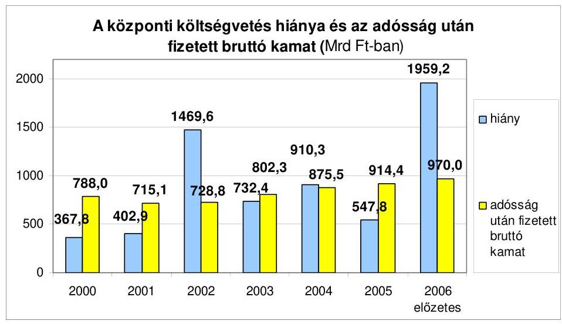

A központi költségvetés adósságát befolyásolta az is, hogy a társadalombiztosítási alapok éves hiánya 2000-ről 2005-re több mint ötszörösére emelkedett. Az adósságnövekedés $25 \%$-át a társadalombiztosítási alapok hiánya okozta. Az alapokon belül az egészségbiztosítási alap hiánya volt a meghatározó, amelynek oka a járulékkulcsok (bevételek) csökkentése, a kieső források központi költségvetésből történő pótlásának elmaradása, illetve a kiadások gyors (pl. gyógyszertámogatások, gyógyító-megelőző ellátások), a bevételeket meghaladó ütemű növekedése volt.

Az ellenőrzött időszakban a hitelátvállalások 821,6 Mrd Ft-tal növelték az államadósságot. A Magyar Állam által a gazdálkodó szervezetektől 2005-ben átvállalt adósság jelentős részét az NA Zrt.-től átvállalt hiteltartozás jelentette.

A Kormány a Budapest Airport Zrt. értékesítésével összefüggő egyszeri, rendkívüli bevételt adósság-előtörlesztésre, illetve adósság-visszafizetésre fordította.

Az önkormányzatok adóssága - bár nem meghatározó az államadósság növekedésében - növekvő tendenciájú. Az önkormányzatok adósságán belül a fejlesztések miatti adósság a meghatározó, de kedvezőtlen tendenciát jelez az önkormányzatok gazdálkodásában a múködési célú eladósodás.

Az adósságállomány további növekedése, különösen ha az párosul az adósság finanszírozásánál a hozamok (kamatok) emelkedésével, a kamatkiadások abszolút összegének emelkedését, és egyben a költségvetés mozgásterének a jelenleginél is nagyobb beszűkülését okozhatja.

Az ÁSZ-nak a 2005. évi költségvetés végrehajtásának ellenőrzéséről szóló legutóbbi zárszámadási jelentése megállapította, hogy a központi költségvetés pénzforgalmi hiányának - az előző évektől eltérő - kedvező alakulását

---

a költségvetés egyensúlyi helyzetét nem tartósan javító, egyszeri tényezők idézték elő.
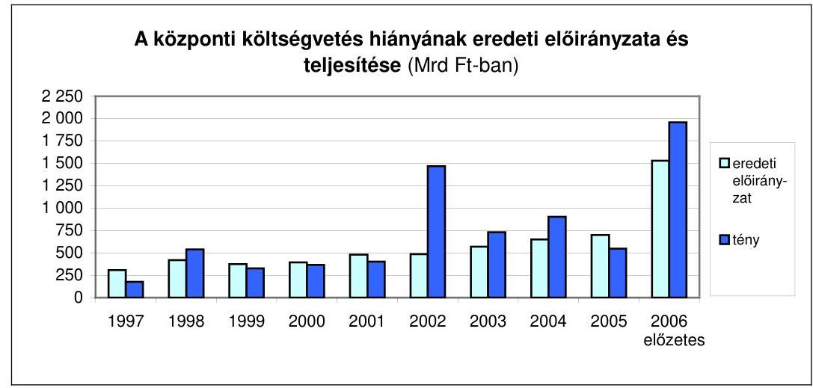

A központi költségvetés bevételeinek (áfa, társasági és osztalékadó, ökoadók) elmaradását csak részben ellensúlyozták egyes bevételi többletek (illetékek, adósságszolgálattal kapcsolatos bevételek, egyéb bevételek).
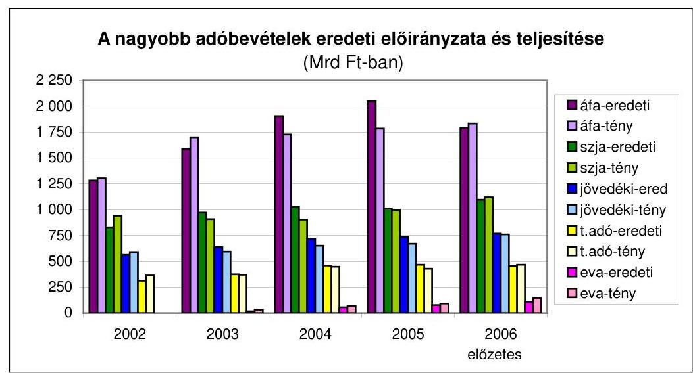

A kiadások közül elsősorban a költségvetési szervek és a szakmai fejezeti kezelésű előirányzatok kiadásainak előirányzathoz viszonyított emelkedése, valamint a lakásépítési támogatások, illetve az adósságszolgálat, kamattérítés többletkifizetése járult hozzá a hiány alakulásához. Kedvező, hogy a módosítási kötelezettség nélkül túlteljesíthető előirányzatok nem, vagy az előző évinél kisebb mértékben lépték túl az előirányzatot.

A 2005. évi zárszámadási ellenőrzés tapasztalatai még azt mutatták, hogy sem a bevételi előirányzatok tervezési módszerében, sem a központi költségvetés kiadási struktúráját érintően nem történt előrelépés. A néhány fejezetnél elindított szervezetkorszerúsítések pénzügyi-gazdasági hatása nem volt számszerúsíthető. Ellenőrzési jelentéseinkben folyamatosan jeleztük a

---

feladatok, a szervezeti keretek, valamint a költségvetési források összhangjának hiányát.

Az ÁSZ stratégiai célkitűzése volt, hogy meghatározott körben (a kiadási főöszszeg közel 80\%-ára) minősítő véleménnyel záruló zárszámadási ellenőrzést végez. A vállalt feladatunkat teljesítettük. Ahhoz, hogy az ÁSZ szakmai nyilatkozatot tegyen a költségvetés végrehajtásáról készített, az Országgyűlésnek benyújtott beszámoló megbízhatóságáról, a zárszámadás teljes körű ellenőrzése szükséges. Ez utóbbi - a számvevőszéki ellenőrzésen túl - a fejezetek belső ellenőrzése keretében végzett, az intézményi kör minősítő ellenőrzését feltételezi.

A gazdálkodási, beszámolási fegyelem területén - az előző évek kedvezőtlen tapasztalataira figyelemmel - érdemi előrelépés 2005-ben sem történt. Ebben meghatározó szerepe van a közigazgatásban szinte állandósuló, a közpénzekkel való hiteles elszámolás (vagyonátadások, pénzügyi elszámolások lezárása) igényének háttérbe szorulásával zajló, kellően nem átgondolt struktúraváltásnak.

A központi költségvetés fejezetrendjében meghatározó arányt képviselő ICSSZEM és GKM fejezetek fejezeti kezelésű előirányzatairól készült beszámoló jelentéseket elutasító véleménnyel láttuk el. A fejezetek közül az NKTH beszámolójánál tapasztaltuk, hogy a vagyoni és pénzügyi helyzetét nem megbízhatóan mutatta be. Figyelemre méltó, hogy az NKTH fejezet és a GKM fejezet fejezeti kezelésű előirányzatairól készült beszámolók adatainak megbízhatatlansága egymást követő két beszámolási évet (2004-2005) érintett.

A minősített véleménnyel zárult pénzügyi-szabályszerűségi ellenőrzések az igazgatási címek és az intézményi kör, valamint a fejezeti kezelésű előirányzatok esetében elsősorban a mérlegben kimutatott vagyoni helyzet valódiságával kapcsolatos lényeges problémákkal, illetve a belső kontroll rendszer múködésének elégtelenségével, a vagyonmérleg adataiban jelentkező lényeges szintű hibákkal és a céltól eltérő felhasználásokkal voltak összefüggésben.

A központi költségvetés közvetlen kiadásainak adatai - a lakástámogatások korlátozottan megbízható elszámolása kivételével - teljes körűek és megbízhatóak.

A központi költségvetés zárszámadási törvényjavaslatában kimutatott közvetlen bevételek egészében és bevételi nemenként is megegyeztek a pénzforgalomban realizált összegekkel.

A 2007. évi költségvetési törvényjavaslat véleményezése kapcsán viszszatérő problémaként jelentkezett az éves költségvetés tervezése során a módszertan átgondolására és szükséges változtatására irányuló törekvés hiánya.

Az ÁSZ a 2006. szeptemberi Konvergencia program véleményezése során hiányolta a programban bemutatott reformok (intézkedések) hatásait számszerúsitő kimutatásokat. A költségvetési törvényjavaslat sem foglalta össze és vezette le a tervezett, illetve megvalósult intézkedések, folyamatok számszerúsített hatásait.

---

A korábbi évektől eltérően a tervezést az óvatosság jellemezte, ami nemcsak a makrogazdasági folyamatok prognózisában mutatkozott meg, hanem a központi költségvetés hiányának betartása érdekében kialakított tartalékok képzésében is. A helyszíni ellenőrzés tapasztalatai szerint a központi költségvetés 2007. évi adóbevételi előirányzatai várható teljesülésének valószínűsége az áfa, az szja és a regisztrációs adó tekintetében - az előző évekénél kisebb kockázatú. Mindezeken túlmenően felhívtuk a figyelmet az alkotmánybírósági beadvánnyal érintett adónemek (a társasági adó részét képező ún. elvárt adó, hitelintézeti járadék) 2007. évi teljesülésének kockázatára (a bevételként így tervezett összeg 80 Mrd Ft volt) ${ }^{6}$.

A 2007. évi központi költségvetés (és a Konvergencia program) alapját jelentő adóváltozások nem mutatnak az adórendszer évek óta ismert problémáinak megoldása és a korszerűsítés irányába. Az adóváltozások évközi bevezetése a jogbiztonságot gyengíti és ezáltal a gazdálkodás múködési feltételeinek kiszámíthatóságát csökkenti.

A 2007. évi költségvetés összeállításakor prioritást élvezett az unióból érkező források és támogatások igénybevételét biztosító hazai társfinanszírozások előirányzatainak megtervezése. A támogatások igénybevételének fedezete a költségvetési törvényjavaslatban biztosított volt, azonban az uniós támogatások igénybevétele, felhasználása garanciáinak megteremtése elsősorban nem tervezési feladat, az a programok múködtetését végző hatóságok gyors, szakszerű tevékenységén múlik.

Az állami feladatokat ellátó intézményrendszer kiadásainak csökkentése a Konvergencia program egyik kiemelt célkitűzése. A kormányprogram a „kisebb és hatékonyabb" államra vonatkozóan az átalakulás fő formáit is meghatározta. Ezzel szemben a Konvergencia programban bemutatott intézkedésekben és a 2007. évi költségvetési törvényjavaslatban is a közszférát illetően a létszámleépítés dominált, az állami feladatellátás és szervezeti kereteinek felülvizsgálata, a feladatellátás teljesítmény követelményeinek meghatározása körvonalaiban is alig volt érzékelhető. Mindössze három fejezetnél ${ }^{7}$ tapasztaltuk ezen alapelvek irányába ható kezdeti lépések megtételét.

Ellenőrzéseink azt mutatták, hogy az államháztartási kondíciók javítására szolgáló kormányzati létszámcsökkentés előírása önmagában - megfelelő feladatelemzés és differenciálás nélkül - nem jelent hosszú távon megoldást. A 2007. évi költségvetési törvényjavaslat véleményezésének időszakában tapasztaltak jelzik, hogy a közszféra átszervezésére vonatkozó koncepciók előkészítetlensége hátráltathatja, későbbre halaszthatja a Konvergencia programban kitűzött határidők betartását.

[^0]
[^0]:    ${ }^{6}$ Számos indítvány van az Alkotmánybíróság napirendjén. Az elvárt adót a 8/2007 (II. 28.) AB határozat, a házipénztáradót a 61/2006 (XI. 15.) AB határozat tartotta alkotmányellenesnek.
    ${ }^{7}$ Ezek a fejezetek a 2007. évi költségvetési véleményünk szerint: ÖTM, FVM, EüM.

---

# A fejezetek átfogó ellenőrzésének föbb tapasztalatai 

Meghatározott időközönként, rendszeresen ellenőrizzük a fejezetek múködését. Az elmúlt évben 7 fejezet ${ }^{8}$ 2002-2005 közötti időszakra vonatkozó működésének átfogó ellenőrzését végeztük el. A vizsgált időszakban fejezeteket hoztak létre, szüntettek meg, illetve fejezetek feladat- és intézményrendszerét főként a kormányváltásokhoz köthetően - többször módosították. Az évközi struktúraváltás, a fejezetek közötti feladat- és elöirányzatátcsoportosítás problémát okozott a feladatok folyamatos, zökkenőmentes, megfelelő szakmai szintű ellátásában. Növelte a kockázatot, hogy a vezetésben és a munkatársak körében is nagy volt a fluktuáció.

Az átszervezéseket nem támasztották alá olyan dokumentumok, amelyekből egyértelműen megállapítható lett volna a kormányzati munka hatékonyságára, a költségek csökkentésére irányuló törekvés. A kiforrott, előkészített kormányzati döntések hiánya, a fejezetek közötti gyakori feladat- és intézmény-átcsoportosítások, illetve a változtatások kockázatokat növelő hatása érzékelhető volt. A formálódó, módosuló kormányzati munkamegosztás keretében az érintett fejezetek múködésében nem alakult ki stabil feladat- és intézményrendszer, a múködésüket, felépítésüket szabályozó kormányrendeleteket a vizsgált időszak alatt többször módosították.

Az ellenőrzés pozitív példával a Magyar Köztársaság Ügyészsége fejezetnél találkozott, ahol a törvényi feladatok növekedését, valamint az európai uniós követelményeknek való megfelelés egyidejű elvárásait összességében sikeres múködési rendszer kialakítása követte, ami világos szerkezetű, a szakmai, illetve a gazdasági hatás- és jogkörök tekintetében egyaránt pontosan múködő szervezetet eredményezett.

A vizsgált időszakon belüli - köztük az évközi - struktúraváltoztatások sem az elvégzendő feladatok, sem a gazdasági, pénzügyi és számviteli folyamatok szempontjából nem voltak kellően átgondoltak. A létszám, a munkakörök, az eszközök, a vagyontárgyak részletezése mellett a megállapodásokban nem szerepeltek feladatátadások. Az állami és egyéb vezetők (beleértve a vezetői besorolásúakat is) aránya az ellenőrzött fejezeteknél jelentős volt, magas volt a megbízási szerződések száma.

Megállapítottuk, hogy az esetek többségében nem építették ki a döntéshozatali mechanizmust segítő monitoringot, a megfelelően kezelt, aktualizált és ellenőrzött adatbázist. Hiányzott az elemző mélységű beszámolási rendszer, és nem helyeztek hangsúlyt a források hasznosulásának eredményességi értékelésére. Előtérbe került a rendszerellenőrzés, viszont nem kapott prioritást az intézményi beszámolók megbízhatósági ellenőrzése, és hiányoztak az intézményi belső kontrollokat értékelő ellenőrzések. Az éves ellenőrzési tervek végrehajtásához rendelt ellenőrzési kapacitás nem mindig volt elegendő.

[^0]
[^0]:    ${ }^{8}$ E fejezetek: Miniszterelnökség, Magyar Köztársaság Ügyészsége, Belügyminisztérium, Környezetvédelmi és Vízügyi Minisztérium, Területfejlesztés fejezet, Ifjúsági, Családügyi, Szociális és Esélyegyenlőségi Minisztérium, valamint a Magyar Tudományos Akadémia.

---

# 2.1.2. Az elkülönített állami pénzalapok 

Az elkülönített állami pénzalapok alrendszerébe öt alap tartozik: a Munkaerőpiaci Alap, a Központi Nukleáris Pénzügyi Alap, a Wesselényi Miklós Ár- és Belvízvédelmi Kártalanítási Alap, a Kutatási és Technológiai Innovációs Alap és a Szülőföld Alap.

Az alapok beszámolóit a törvényi előírásoknak megfelelően könyvvizsgáló ellenőrzi. A 2005. évi gazdálkodásuk minősítésekor mindegyik beszámoló hitelesítő záradékot kapott, a Munkaerőpiaci Alap esetében figyelemfelhívó minősítés kiegészítéssel.

Az alrendszer állami költségvetésen belüli súlya elsősorban bevételi, kiadási föösszegeik növekedése következtében erősödött, mértékét tekintve azonban továbbra sem számottevő. Az alapok 2005. évi pénzügyi helyzete kiegyensúlyozott volt, 30 Mrd Ft-os többletük javította az államháztartás egyensúlyi helyzetét.

A költségvetés nagyságrendjét tekintve - az alrendszert alkotó alapok közül változatlanul a Munkaerőpiaci Alap (MPA) a meghatározó, amely a foglalkoztatás elősegítésével és a munkanélküliség kezelésével kapcsolatos állami feladatokat az országosan kiépített munkaerőpiaci szervezeten keresztül látja el.

Ellenőrzéseink évek óta jelzik, hogy a kiadások belső szerkezetében bekövetkezett változások egy része kedvezőtlen tendenciákat mutat, az alapból finanszírozott aktív és passzív foglalkoztatáspolitikai eszközök nagyságrendje és részaránya az utóbbiak javára változott. Az aktív foglalkoztatáspolitikai célok támogatásának összege és aránya változatlanul csökkenő mértékú.

Az ÁSZ több éve ismétlően felveti az MPA tervezési rendszerének, költségvetési kapcsolatainak, jogszabályi háttere felülvizsgálatának szükségességét. Nem változott az a tendencia sem, hogy az alapból mind többet fordítanak közvetlenül, illetve közvetett módon az MPA-hoz kötődő (az alap feladatait lebonyolító, pénzeszközeinek elosztásában közremúködő) szervezetek múködési kiadásainak finanszírozására.

A Központi Nukleáris Pénzügyi Alap (KNPA) a radioaktív hulladékok végleges, valamint a kiégett üzemanyag átmeneti és végleges elhelyezésére szolgáló tárolók létesítését és üzemeltetését, illetve a nukleáris létesítmények leszerelésének finanszírozását biztosítja. Az Alap előirányzatai lényegében az előírások szerint teljesültek. Felhalmozott egyenlege emelkedett.

Az Alap költségvetésének törvényi előirányzatai a 2004-2006. években (és 2007-ben is) lényegesen alacsonyabbak a közép- és hosszú távú szakmai tervekben kialakított összegeknél. A forráshiány feladatok elmaradását, késedelmét okozhatja. A távlati célok és kötelezettségek megvalósulását a KNPA elkövetkező évekre meghatározandó költségvetési mozgástere - ideértve a költségvetési tartalék megnyitását is - érdemben befolyásolhatja.

---

A lakosságot ért ár- és belvízzel kapcsolatos káresemények enyhítésére létrehozott Wesselényi Miklós Ár- és Belvízvédelmi Alap érdemi múködése csak 2004-ben kezdődött meg. A tapasztalatok ugyanakkor igazolni látszanak azokat a kételyeket, amelyeket az Alap múködésével kapcsolatban már a 2003. évi zárszámadási jelentésben felvetettünk.

A várakozásokkal ellentétben nem kezdődött meg a veszélyeztetett településeken élők biztosítási elven múködő részvétele a kárenyhítésben. A bevételek meghatározó része költségvetési támogatás. Megítélésünk szerint ez nem elégíti ki az Áht.-ban foglalt feltételt, miszerint az elkülönített állami pénzalapok létrehozásakor a feladatellátáshoz államháztartáson kívüli forrásokat is hozzá kell rendelni. Ez a bevételeknek mindössze 1,7\%-át teszi ki, ami még a jelenlegi körben sem ellentételezné egy komolyabb káresemény bekövetkezését.

Az elmúlt időszak gyakori és súlyos ár- és belvízi eseményei sem indították a veszélyeztetett területek lakosságát szerződéskötésre, aminek oka a fizetőképes kereslet, az öngondoskodási képesség hiánya. Az Alap 2005. évi múködése megerősítette az elkülönített állami pénzalapként való fenntartást megkérdőjelező korábbi álláspontunkat.

A Kutatási és Technológiai Innovációs Alap (KTIA) célja a kutatásfejlesztésre fordítható források növelésével hazánk gazdasági versenyképességének javítása. Az Alap két fő bevételi forrása a gazdálkodó szervezetek innovációs járuléka és a költségvetési támogatás. Az Alap pénzügyi helyzete a 2005. évben stabil volt, a tárgyévet többlettel zárta.

Az Alap múködésével és felhasználásával kapcsolatos szabályokat tartalmazó kormányrendelet nem nyújt egyértelmú eligazítást az egyedi támogatások adható mértékének és körének meghatározásához. Az Alappal kapcsolatos jogok és kötelezettségek nem érvényesültek teljes körűen.

Jeleztük, hogy a jogi szabályozás egyes szintjei között nincs meg a kellő összhang, illetve, hogy a múködtetésben érintett szervezetek tevékenysége, döntési mechanizmusa, a pályázati rendszer múködése nem minden esetben felel meg a jogszabályi előírásoknak. Az Alap 2005. évi zárszámadási ellenőrzése során ezek a problémák lényegében változatlanul fennálltak.

A Szülőföld Alap 2005-ben jött létre új elkülönített állami pénzalapként, 1 Mrd Ft induló tőkével. A külügyi tárca költségvetésén kívül több fejezet előirányzatai között is szerepelnek a határon túli magyarokkal kapcsolatos előirányzatok, alapítványi, közalapítványi támogatások, amelyeknek nagyságrendje 2006-ban is sokszorosan meghaladta a Szülőföld Alap költségvetését.

# 2.1.3. A társadalombiztosítás pénzügyi alapjai 

Az államháztartás társadalombiztosítási alrendszerét alkotó Egészségbiztosítási Alap (E. Alap) és a Nyugdíjbiztosítási Alap (Ny. Alap) költségvetési beszámolóit 2005-ben is könyvvizsgáló ellenőrizte. Mindkét alap hitelesítő záradékot kapott, ami szerint a beszámolók megbízható, valós képet nyújtanak az alapok vagyoni, pénzügyi és jövedelmi helyzetéről.

---

Mindkét alap pénzügyi helyzete kedvezőtlenebbül alakult a tervezettnél. Ennek következtében az együttes hiány 468,8 Mrd Ft lett, ebből az Ny. Alap hiánya 93,5 Mrd Ft, az E. Alap hiánya 375,3 Mrd Ft volt.
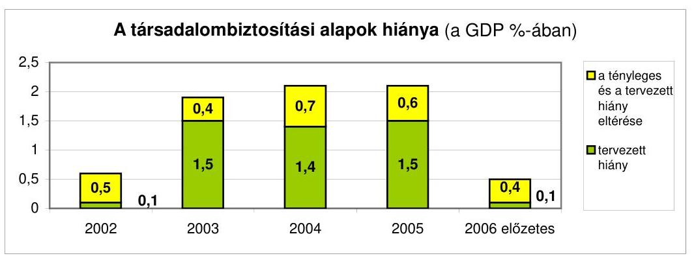

Az alapok állandósult és növekvő hiányának, a bevételek és a kiadások megbomlott egyensúlyának problémájára zárszámadási jelentéseinkben évek óta rámutattunk.

Az egészségbiztosítás pénzbeli ellátásainak és a gyógyító-megelőző egészségügyi ellátás jogcímcsoport 2005. évi kiadásainak előirányzatai a teljesítési adatokkal összhangban voltak. A gyógyító-megelőző egészségügyi ellátás többlete kizárólag a bérintézkedés fedezetét, illetve a háziorvosi kapacitásnál, a já-ró- és a fekvőbeteg ellátás területén befogadott kapacitások szintre-hozását, valamint fejlesztését szolgálta.

A lakossági felhasználáshoz kötődő gyógyszerkiadások visszafogására tett erőfeszítések 2005-ben sem voltak eredményesek. Ez különösen igaz a gyógyszerkassza védelmére kötött szerződésekre, ahol még a jelentős összegű gyártói befizetés ( 23 Mrd Ft ) sem tudta a kassza túllépését ellentételezni. Szükségesnek láttuk - az egészségügyi reform lépéseihez igazodóan - a gyógyszerellátás teljes rendszerére kiterjedő, hosszabb távú koncepció kidolgozását, amelyben kiemelt szerepet kap a gyógyszerek hatástani csoportonként való áttekintése, az olcsóbb és korszerübb gyógyszerek alkalmazását elősegítő, a lakosság egészségügyi érdekeit szem előtt tartó támogatási és befogadási rendszer kialakítása.

Az E. Alap múködése ellenőrzésének megállapításai szerint az Alap állandósult, növekvő hiányához a járulékfizetői kör szűkülése, az ellátások járulékfizetéssel nem fedezett növekvő igénybevétele, egyes ellátási kiadások aránytalan emelkedése vezetett. A hiány növekedését legnagyobb részben a gyógyi-tó-megelőző ellátások béremelésből adódó változása és a magas ütemben növekvő gyógyszertámogatások okozták.

---

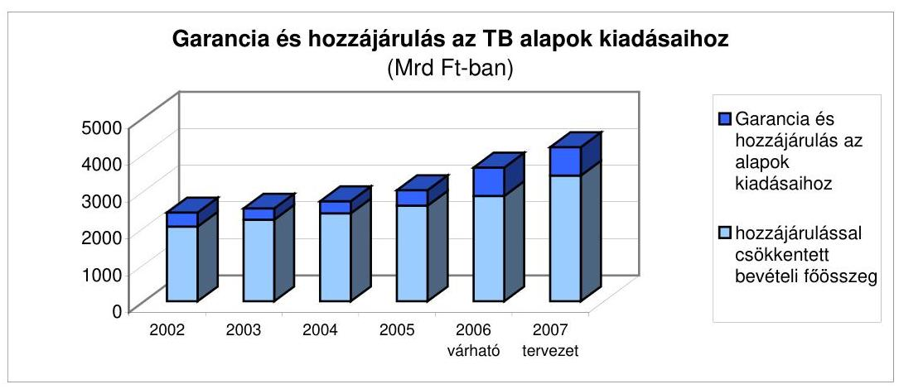

A kiadások alakulását befolyásolta, hogy nem volt követelmény az egészségügyi szolgáltatásoknak a kasszát leginkább kímélő, szakmailag lehetséges eljárás alapján történő finanszírozása, az ellátások valós költségeit a díjak megállapítója nem ismerte, átfogó költségfelmérés utoljára 1999-ben készült. A szakellátások finanszírozása sokkal inkább a meglévő ellátórendszer fenntartását, mint a lakosság egészségi állapota szerint indokolt teljesítmények reális ráfordításokon alapuló finanszírozását jelentette.

Az Alapkezelőnek a bevételek alakulására, teljesülésére nem volt érdemi ráhatása. A kiadások alakulását az OEP a finanszírozási és ellenőrzési feladatai ellátásánál legfeljebb a jogszerútlenül igénybevett vagy nyújtott, illetve elszámolt ellátások kiszúrésével befolyásolhatta.

A szakellátások mennyiségi korlát alapján meghatározott finanszírozásának bevezetésével a gyógyító-megelőző kiadások növekedési üteme mérséklődött. A gyógyszertámogatások növekedési ütemét a gyógyszergyártókkal, forgalmazókkal kötött megállapodások nem fogták vissza. A gyógyászati segédeszközök ártámogatása növekedésének fékezésére indított lépések megakadtak.

A pénzbeli ellátásokra a személyükben járulékot fizetők jogosultak. Az ellátások igénybevételének a járulékkötelezettség alapján történő, valamint a járu-lék-kötelezettségnek a jogviszony nyilvántartás alapján történő, automatikus ellenőrzési rendszere nem épült ki. Ráadásul az OEP múködési költségvetése alig emelkedett, ami nem volt összhangban a feladatbővülésekkel.

Az Ny. Alap pénzügyi helyzete 2005-ben romlott, ami alapvetően a tervezettnél magasabb nyugdíjkiadásokkal kapcsolatos.

Az Ny. Alap 2007. évi bevétele és ellátási költségvetési terve reális, megalapozott, nagy valószínúséggel nem igényel a korábbi évekhez hasonló nagyságrendben likviditási hitelt.

Az Alapnál a bevételi oldalon a munkáltatói járulékmérték növekedése csökkenti a központi költségvetés tehervállalását a nyugdíjkiadások finanszírozásában. A nyugdíjkiadások hosszú távon várhatóan növekedni fognak, de a több évre kihatással járó tervezett intézkedés-sorozat befolyásolhatja az ellátások növekedésének ütemét.

---

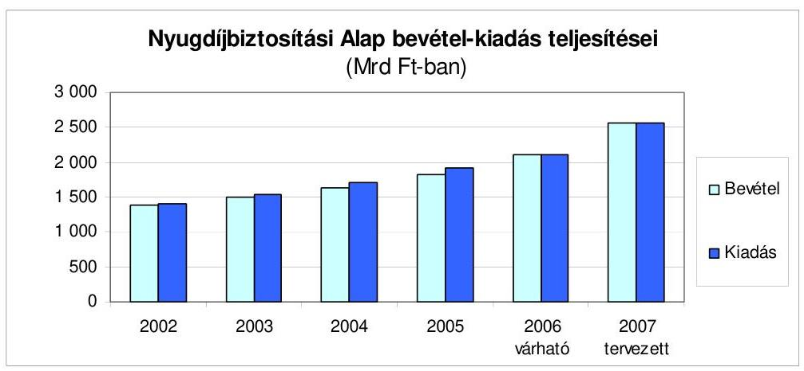

A múködési kiadások engedélyezett keretének szűkössége miatt az ONYF gazdálkodása továbbra is kényszerpályán múködik. A köztisztviselői besorolások előírásai csak a létszám csökkentése mellett teljesülhetnek. Megállapítottuk, hogy a dologi kiadások és a felhalmozási kiadások szűkössége az ágazat múködőképességének romlása irányába hat.

A társadalombiztosítási alapok 2007. évi költségvetései - kiadási oldalukon - továbbra is számos kockázatot hordoznak. A bevételek 2007. évi előirányzatait mindkét alap esetében - az általunk megismert dokumentumok alapján - összességében megalapozottnak tartottuk. Kiadási oldalon a gyógyító-megelőző egészségügyi ellátás, a gyógyszertámogatási, valamint a gyógyászati segédeszköz előirányzat betartását tartjuk kockázatosnak.

A tartós kiadáscsökkentés az egészségügy, a nyugdíjrendszer, illetve a gyógyszertámogatási rendszer átalakítását igényli. A Konvergencia programban megfogalmazott követelmények elvi szinten a költségvetési javaslatokban érvényesültek. A megvalósulás feltétele az E. Alap esetében a kitüzött célok, a szükséges intézkedések - ideértve a folyamatban lévő törvény és jogszabály módosítások sokaságát - következetes végrehajtása, az Ny. Alapnál az elvárt makrogazdasági mutatók teljesülése.

Az intézkedés-sorozat elindíthatja azt az átalakulási folyamatot, amely arra kényszeríti az egészségügyi szolgáltatókat, hogy belső tartalékaikat feltárják, gazdálkodásukat racionalizálják, és a központi ösztönzőket is felhasználva strukturális átalakításokat hajtsanak végre, felesleges kapacitásokat építsenek le. Eredményeket hozhat az intézmények területi elvű (regionális) együttműködése is.

A gyógyító-megelőző előirányzat kialakítását befolyásoló tényezők közül kiemelendő, hogy a 2006. évben bevezetett országos alapdíjak előre láthatóan a 2007. évben is változatlanok maradnak. A tervek szerint a mai formájában fennmarad a teljesítmény volumenkorlátos finanszírozása is. Technikailag csak e két tényező együttes alkalmazásával érhető el a zárt kassza kockázatainak csökkentése.

---

# 2.1.4. A helyi önkormányzatok 

Az államháztartás önkormányzati alrendszerét képező összesen 3187 helyi önkormányzat és 1825 helyi kisebbségi önkormányzat 2005. évi konszolidált bevétele ( 3365 Mrd Ft ) és kiadása ( 3036 Mrd Ft ) az előző évinél egyaránt mintegy 10\%-kal magasabb volt. A növekedésen belül kiemelkedő a hitelfelvételek öszszegének emelkedése. Az önkormányzatok hitel- és kölcsönfelvétel miatti összes adóssága a 2005. év végén 385 Mrd Ft volt, amely az előző évinél 18\%-kal több, a növekedés a 2006. évben is várhatóan folytatódik.
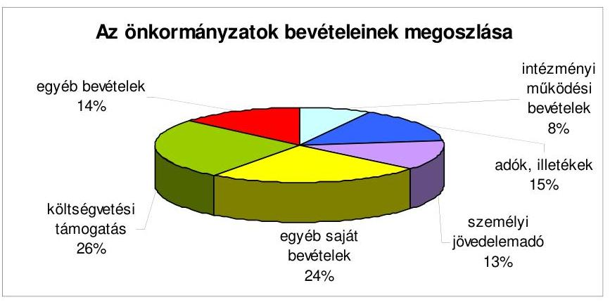

A helyi önkormányzatok könyvviteli mérleg szerinti vagyona 2005 végén 9861 Mrd Ft volt, 2006. évi összege várhatóan mintegy 10.000 Mrd Ft. Jelentősebb változás a korábbi évekhez viszonyítva az értékpapírok állományában és a kötelezettségek mértékénél következett be. Az önkormányzatok tulajdonában lévő értékpapírok állománya csökkent, amelyet jellemzően a gázközművek privatizációjához kapcsolódóan ellentételezésként kapott állampapírok értékesítése eredményezett. A kötelezettségek növekedését az emelkedő összegű hitelfelvételek miatti visszafizetési kötelezettség okozta. A hitelfelvételeken belül emelkedett a rövid lejáratú likvid hitelek aránya. A pénzeszközök a rövid lejáratú kötelezettségeket egyre kevésbé fedezték ${ }^{9}$.

## Az államháztartás önkormányzati alrendszerének gazdálkodását befolyásoló szabályozórendszer alakulása

Az önkormányzati feladatok és a rendelkezésre álló források között évek óta fennálló feszültségek oldását a költségvetés 2005-ben sem tudta biztosítani. A feladatok és hatáskörök kormányhatározatokban elrendelt felülvizsgálata nem történt meg. Az ÁSZ által több mint 10 éve szorgalmazott finanszírozási reform előkészítésében - politikai és szakmai konszenzus hiányában - nem volt érdemi előrelépés. Nem valósult meg a helyi önkormányzatok kötelező feladatainak áttekintése, az önkormányzati feladatok és hatáskörök differenciált telepítése, átfogó módosítása, elmaradt a forrásszabályozás ezzel összehangolt továbbfejlesztése. Változatlanul jellemző, hogy az önkormányzatok számára

[^0]
[^0]:    ${ }^{9}$ A likviditási gyorsráta, amely a pénzeszközök és a rövid lejáratú kötelezettségek arányát jelzi, a 2004. évben 1,0, 2005 végén 0,8 volt. A tendencia várhatóan 2006-ban is folytatódott.

---

előírt új feladatokhoz (pl. a közszféra bérintézkedéseihez) a költségvetés nem biztosítja teljes körűen a szükséges fedezetet. Az önkormányzati gazdálkodás pénzügyi feltételeit ezen túlmenően egyéb tényezők is jelentősebb mértékben befolyásolták (pl. bázisban végrehajtott csökkentések, az államháztartási tartalékképzés, illetve elmaradt az áremelkedések és az áfa változás hatásának ellentételezése).

Az Ötv. alapján múködtetett forrásszabályozási rendszerben a normatívák fajlagos összegének alakulását elsősorban a mindenkori éves költségvetési tervezési követelmények, valamint a szakmapolitikai preferenciák, prioritások határozzák meg. Mindez hátráltatta a költségelemzést, az állami támogatás és a tevékenységek ágazati szintű bekerülési összege arányának elemzését és fontosságának megfelelő kezelését. A transzparencia fontos feltételének, a megbízható és releváns pénzügyi információs rendszernek a csaknem minden területen jellemző hiánya is nehezíti az elszámoltathatóságot, a teljesítménykövetelmények kialakítását, érvényesítését. Az általános forráselégtelenséget az önkormányzatok jelentős hányadánál jelzi a növekvő ÖNHIKI-s támogatási igény, ugyanakkor az elmúlt 10 évben csupán 17 - a gazdasági önállósághoz korlátozottabb pénzügyi feltételekkel rendelkező - kistelepülési önkormányzatnál került sor adósságrendezési eljárás megindítására.

Az önkormányzati feladatellátáshoz biztosított támogatások, hozzájárulások rendszere továbbra is elaprózott, s a kapcsolódó számtalan szakmai, pénzügyi igénybevételi, felhasználási és elszámolási szabály bonyolultsága egyben jelentős hibaforrás is.

Az önkormányzatokat a 2005. évben 884,1 Mrd Ft állami támogatás és hozzájárulás, valamint 465,6 Mrd Ft személyi jövedelemadó részesedés, összesen 1349,7 Mrd Ft illette meg. A költségvetési törvény a helyi önkormányzatok számára államháztartási tartalékképzési kötelezettséget írt elő, amely előírás szabályozási ellentmondásokat tartalmazott, és az Áht. egyes előírásait figyelmen kívül hagyta. Kiadáscsökkentő hatása helyi szinten nem érvényesült, mivel az önkormányzatok rövidlejáratú múködési hitelállománya az előző évihez képest $34 \%$-kal növekedett. Javaslatunkat figyelembe véve a 2007. évre vonatkozó költségvetési törvény már ilyen előírást nem tartalmaz.

A normatív hozzájárulás szabályszerű igénybevételét és elszámolását nehezítette és a hibák elkövetésének kockázatát növelte, hogy az igénybevételre vonatkozó jogszabályok évről-évre lényegesen módosulnak. A szabályozás azt tükrözte, hogy érdemi előrelépés nem történt a közigazgatási szolgáltatások korszerűsítési programjáról szóló kormányhatározat vonatkozó rendelkezéseinek végrehajtásában ${ }^{10}$. Nem vált áttekinthetőbbé a helyi önkormányzatokat megillető normatív állami hozzájárulások rendszere, az igénylési feltételek gyakori változása és a szabályozási hiányosságok nem teszik kiszámíthatóvá az önkormányzatokat megillető központi költségvetésből származó bevétel alakulását.

[^0]
[^0]:    ${ }^{10}$ 1113/2003. (XI. 11.) Korm. határozat a közigazgatási szolgáltatások korszerűsítési programjáról IV. Az önkormányzati rendszer korszerűsítése 2. pont.

---

A közigazgatás hatékonyabb múködtetését, racionálisabb feladatellátását kívánja évek óta a központi költségvetés elérni azzal, hogy a létszámcsökkentéshez jelentős összegű központosított előirányzatot biztosít. A létszámleépítéseket azonban - az önkormányzatok által ellátandó feladatok bővüléséből adódóan is - időről-időre létszámnövekedés követi.

A pályázati rendszerben elosztott nagyszámú központosított erőirányzat igénybevételét megkönnyítené a normativitás irányába történő további elmozdulás. A többcélú kistérségi társulások támogatási feltételei rendkívül sokrétűek, összetettek, bonyolultak, ezért nehezen kezelhetők. Jelenlegi formájában aránytalanul munkaigényesek az ide tartozó kiegészítő támogatások igénylési, elszámolási és ellenőrzési feladatai, ami sem a hatékonyságot, sem a célszerű felhasználást nem segíti elő. Biztosítani kell, hogy a pályázati rendszerben elosztott forrásokhoz azok tárgyévi felhasználását lehetővé tevő időpontban jussanak hozzá az önkormányzatok.

A 2007. évi költségvetési törvényjavaslattal megkezdődött a normatív hozzájárulások és támogatások rendszerének fokozatos átalakítása. A 2007/2008-as tanévtől a közoktatási alapfeladatokhoz úgynevezett „közoktatási teljesítménymutató" alapján történik a központi költségvetési támogatás biztosítása, amely mutató egyszerre képes mind a feladat mennyiségének, szervezettségének, mind pedig a költségarányoknak a megjelenítésére. 2007-ben tovább erősödik a többcélú kistérségi társulások feladatellátásának az ösztönzése.

A fejlesztési támogatások meghatározó elemét az elmúlt években a címzett és céltámogatások jelentették. Ezen belül 1999-től prioritást kapott a szennyvízelvezetés és -tisztítás, segítve a közműolló zárását, az EU környezetvédelmi követelményeinek közelítésére való törekvést. A fejlesztési döntések decentralizációja tekintetében a területfejlesztésről és a területrendezésről szóló törvény hatályba lépése óta jelentős előrelépésként értékeljük, hogy a megyei területfejlesztési tanácsok mellett egyre nagyobb szerepet kaptak a regionális fejlesztési tanácsok is. A különböző jogcímű önkormányzati fejlesztési támogatások döntési jogkörének régiós szintre való telepítése elősegíti a fejlesztési célok jobb összehangolását, a beruházásokkal szembeni méretgazdaságossági követelmények érvényesítését, a szakszerűbb, gazdaságosabb és hatékonyabb feladatellátást.

A cél- és címzett támogatásokról szóló törvény 2005-től érvényes módosításai az ÁSZ korábbi javaslataival összhangban az önkormányzati beruházások „sokcsatornás" támogatási rendszerének megszüntetését, egyszerűbb és hatékonyabb „egyczatornás" támogatási rendszer megvalósítását célozták, amelynek kedvező hatásait a 2006. évben végzett ellenőrzésünk során érzékeltük. A korábbiaknál kisebb számú egyéb pénzforrások a beruházások 84\%ánál időben rendelkezésre álltak, biztosítva a finanszírozás folyamatosságát.

A helyi önkormányzatok részére biztosított fejlesztési támogatások igénybevételi szabályait tovább pontosították. Kedvezőnek tartjuk, hogy az ÁSZ 2004-ben tett javaslatával összhangban a TERKI és a CÉDE támogatások igénybevételére egységes szabályozást alakítottak ki, amely alapján a megyei területfejlesztési tanácsok tevékenységében mindkét támogatás típus vonatkozásában érvényesült a folyamatba épített monitoring.

---

A helyi önkormányzatok által elszámolt hozzájárulásokból, támogatásokból 200,6 Mrd Ft-ot ellenőriztünk tételesen, a megállapított hiba összege 657 M Ft , a hiba aránya $0,33 \%$ volt. A helyi önkormányzatoknak a központi költségvetésből kapott támogatásokról készített beszámolása a lényegesség figyelembevételével megbízható és valós képet mutat. A támogatások és hozzájárulások önkormányzatok részére történő átutalása szabályszerű volt.

Felhívtuk a figyelmet arra, hogy a központosított előirányzatok közül a lakosság közmúfejlesztési támogatása elszámolásánál megállapított hibaarány $4,8 \%$, az érettségi és szakmai vizsgák lebonyolításának támogatásánál $2,7 \%$, a normatív, kötött felhasználású támogatások közül a középiskolai pedagógusok felkészülésének támogatása a kétszintú érettségiztetés esetében 2,3\%, a szociális továbbképzés és szakvizsga támogatásánál $2,1 \%$ volt.

# Az önkormányzati átfogó ellenörzések általános tapasztalatai 

Az ÁSZ a 2002-2006. évekre kidolgozott stratégiájában kiemelt célként rögzítette, hogy a jelentős nagyságrendű költségvetéssel, illetve vagyonnal rendelkező megyei, városi és fővárosi, valamint fővárosi kerületi önkormányzatokra összpontosítja ellenőrzési kapacitását, és ebben a körben választási ciklusonként egy átfogó ellenőrzést végez. Az Országgyúlés a 35/2003. (IV. 9.) OGY határozatában egyetértett a megfogalmazott céllal, majd a 47/2006. (X. 27.) OGY határozat megerősítette a feladat teljesítését. 2006 végéig az ÁSZ 2446 helyi és kisebbségi önkormányzatnál végzett átfogó és egyéb szabályszerűségi ellenőrzést.

A helyi és helyi kisebbségi önkormányzatok gazdálkodási rendszerének átfogó és egyéb szabályszerűségi ellenőrzésébe bevont önkormányzatok száma

| Megnevezés | 2003. év | 2004. év. | 2005. év | 2006. év | 2003-2006. <br> év <br> összesen |
| :-- | --: | --: | --: | --: | --: |
| Budapest fóváros | 1 | 1 | 1 | 1 | 4 |
| megye | 4 | 6 | 4 | 5 | 19 |
| megyei jogú város | 6 | 4 | 6 | 6 | 22 |
| fóvárosi kerület | 6 | 6 | 5 | 6 | 23 |
| város | 54 | 64 | 65 | 72 | 255 |
| nagyközség | 27 | 22 | 21 | 9 | 79 |
| község | 252 | 268 | 715 | 394 | 1629 |
| Összesen: | $\mathbf{3 5 0}$ | $\mathbf{3 7 1}$ | $\mathbf{8 1 7}$ | $\mathbf{4 9 3}$ | $\mathbf{2 0 3 1}$ |
| kisebbségi önkormányzatok | 123 | 150 | 71 | 71 | 415 |
| Mindösszesen: | $\mathbf{4 7 3}$ | $\mathbf{5 2 1}$ | $\mathbf{8 8 8}$ | $\mathbf{5 6 4}$ | $\mathbf{2 4 4 6}$ |

A megyei, a megyei jogú városi és a fővárosi kerületi önkormányzatok gazdálkodási rendszere átfogó ellenőrzésének ütemezését 2007-2010 között a 2. sz. melléklet mutatja be ${ }^{11}$.

A kiemelt körbe tartozó és a városi önkormányzatok körében a gazdasági programmal rendelkező önkormányzatok aránya - az előző évekhez viszonyítva -

[^0]
[^0]:    ${ }^{11}$ Az ütemezés a rendelkezésre álló kapacitás függvényében változhat.

---

növekedett ${ }^{12}$. Az önkormányzatok közel felénél az Áht. előírását megsértve a költségvetési rendeletekben a tervezett hiány összegét nem mutatták be, valamint finanszírozási célú pénzügyi műveleteket is figyelembe vettek költségvetési bevételként és kiadásként. Az elfogadott költségvetések az előző évieknél magasabb arányban feleltek meg a szerkezetre, tartalomra vonatkozó jogszabályi előírásoknak, azonban a korábbi évekhez hasonlóan a költségvetés végrehajtásával kapcsolatos helyi szabályokat nem, vagy hiányosan határozták meg az önkormányzatok. Közel negyedüknél nem mutatták be tájékoztatásul a többéves kihatással járó döntések számszerúsítését évenkénti bontásban szöveges indoklással, valamint több mint felénél a közvetett támogatások kimutatását szöveges indoklással.
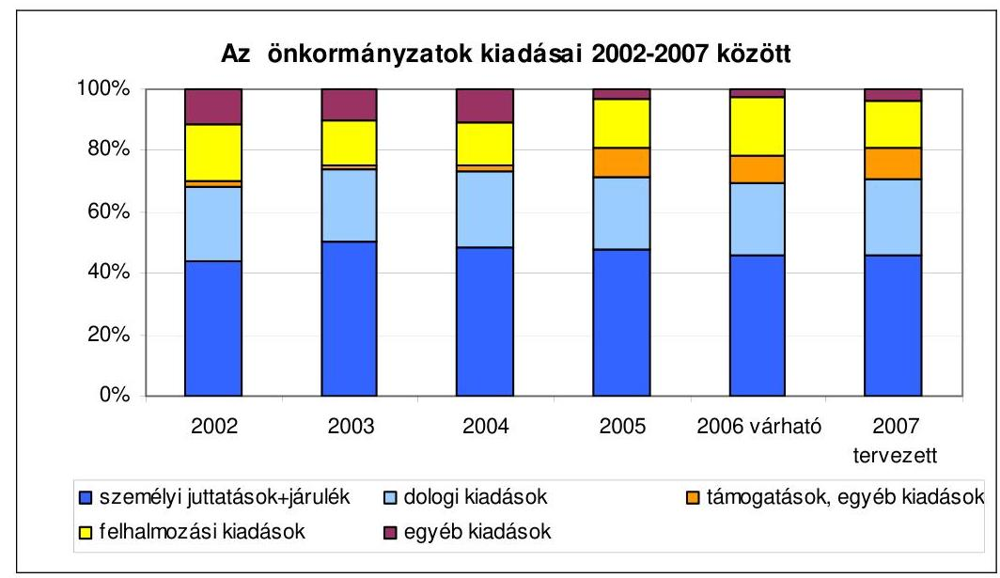

A vagyongazdálkodással kapcsolatos hatásköröket szinte mindegyik önkormányzat szabályozta vagyongazdálkodási rendeletében, azonban a szabályozás sok esetben az Áht. rendelkezéseivel ellentétes, egyes esetekben célszerútlen volt. A korábbi évekhez viszonyítva nem javult a vagyongazdálkodás szabályszerűsége. Az elidegenítések során a versenytárgyalási kötelezettségre vonatkozó előírást az önkormányzatok több mint harmada nem vette figyelembe. A vagyongazdálkodás szabályozási hiányosságai és a versenytárgyalás nélkül történt elidegenítések nem segítették az önkormányzati vagyonnal történő gazdálkodás nyilvánosságát, átláthatóságát. Több önkormányzat az Ötv. és a víziközművekről szóló törvény előírásait megsértve ruházta át a törzsvagyonba tartozó víziközmú tulajdonjogát gazdasági társaságra. Az ellenőrzött önkormányzatok több mint egyharmada vásárolt, kétharmada értékesített értékpapírokat. Az adás-vételek mintegy ötöde az önkormányzat költségvetésében, vagyongazdálkodási rendeletében előírtaktól eltérő módon történt. Az Áht.-ban előírt közzétételi kötelezettségének az önkormányzatok negyede nem, vagy csak részben tett eleget. Az önkormányzatok mintegy harmadánál történt követelés elengedés, közel felénél ingyenes vagyonátruházás. Az Áht. előírása ellenére a

[^0]
[^0]:    ${ }^{12}$ Javaslatunkra a 2005. évben az Országgyűlés meghatározta a gazdasági program tartalmi követelményeit.

---

követelést elengedő önkormányzatok ötöde nem határozta meg rendeletben a követelés elengedés módját és eseteit, valamint az ingyenes vagyonátruházás eseteit.

A könyvviteli mérlegben kimutatott vagyon leltározási kötelezettségének teljesítése az előző évekhez viszonyítva javult. Az értékvesztés elszámolásának szükségességét az önkormányzati hivatalok több mint fele vizsgálta, de az értékvesztés elszámolását azok 15\%-a a követelések esetében, harmada a részesedések esetében nem végezte el.

A Kbt.-ben előírtakat figyelmen kívül hagyva a közbeszerzési eljárást nem folytatta le az ellenőrzött önkormányzatok közel egyharmada. A Közbeszerzési Döntőbizottság az ellenőrzött, közbeszerzési eljárást lefolytató önkormányzatok ötödét a Kbt.-ben előírtak megsértése miatt elmarasztalta. A közbeszerzési szabályok betartása az önkormányzati gazdálkodásban magas kockázatú területnek minősül.

A helyi önkormányzatok céljellegú támogatásként évente növekvő összegű pénzeszközt adnak át működési és felhalmozási célra alapítványoknak, közalapítványoknak, egyéb non-profit szervezeteknek, vállalkozásoknak, háztartásoknak, az önkormányzatok saját intézményein kívüli költségvetési szerveknek, valamint külföldi közösségeknek. Az önkormányzatok a juttatott támogatások összegét, a támogatott célt, a felhasználásról a számadási kötelezettség teljesítésének módját, határidejét az előző évhez viszonyítva növekvő arányban előírták. A támogatásban részesült szervezetek közel harmada tett eleget az előírt tartalommal, határidőre számadási kötelezettségének. A számadások ellenőrzését az Áht. előírását megsértve az önkormányzatok egyötödénél nem végezték el, közel 90\%-ánál a támogatások célszerinti felhasználását nem ellenőrizték.

Az ellenőrzött helyi kisebbségi önkormányzatok gazdálkodásának szabályszerűsége az előző évekhez viszonyítva javult, feladatellátásukban, az előző években ellenőrzöttekhez hasonlóan, döntően az önkormányzati testületi múködés feltételeinek biztosítása, valamint a településeken élő kisebbségek érdekeinek képviselete és a nemzetiségi hagyományápolás szerepelt.

Az önkormányzatok költségvetési egyensúlyi helyzete az előző évekhez viszonyítva nem javult. Az ellenőrzött önkormányzatok mintegy kétharmada tervezett - az elmúlt években tapasztaltakhoz hasonlóan - költségvetésében mind a múködési célú, mind a felhalmozási célú kiadásoknál hiányt. A költségvetési hiányok kialakulásában a feladatellátás módjának célszerűtlen megszervezése, az intézményi kapacitások alacsony kihasználtsága, a teherbíró képességet meghaladó önként vállalt feladatok felvállalása, valamint a tervezési hibák (saját bevételek alul-, kiadások felültervezése) is szerepet játszottak.

Az egyensúly javítására tett önkormányzati intézkedések hatására az év végére az ellenőrzött önkormányzatok egyharmadánál volt csak költségvetési hiány. A tervezett hiányt a költségvetés végrehajtása során csökkentették a pályázatok révén megszerzett források, a saját bevételek többletei, a vagyonértékesítésből származó többletbevételek, valamint a nem megalapozott tervezés miatt jelentkező többletbevételek. A kiadások csökkentése érdekében az ellenőrzött ön-

---

kormányzatok kétharmada különféle intézkedéseket kezdeményezett, egyes tervezett feladatainak megvalósítását átütemezte, későbbre halasztotta.

A saját bevételek között jelentős egyensúlyjavító tényező volt a helyi adóbevétel, amelynek a múködési bevételen belüli aránya az ellenőrzött önkormányzatoknál a 2003. évi 14,6\%-ról, a 2005. és 2006. években $15,8 \%$-ra nőtt, a 2007. évben $18 \%$ körüli arány várható. A megállapított adómértékek a törvényben meghatározott adómaximumok átlag háromnegyedét érték el, az önkormányzatok különböző jogcímeken a törvényben biztosítottakon túlmenően további kedvezményeket, mentességeket is adtak. A helyi adóbevételek között változatlanul a legjelentősebb az iparűzési adó, amelynek összege 2005-ben 334 Mrd Ft volt.
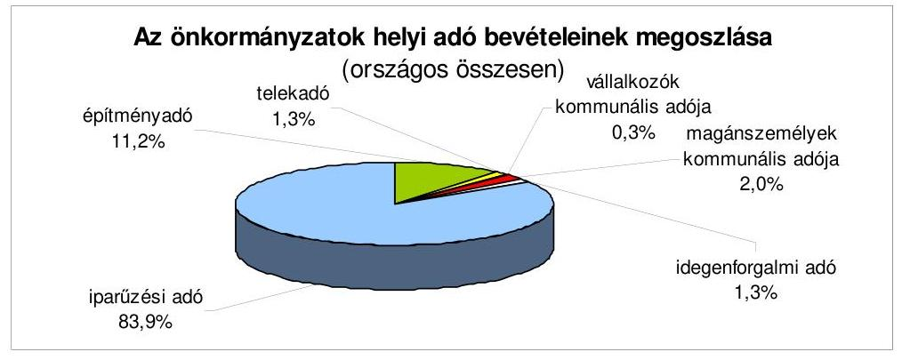

Adósságot keletkeztető kötelezettségvállalásról az ellenőrzött önkormányzatok kétharmada döntött, amelynek módja leggyakrabban hitelfelvétel volt. Az ellenőrzött önkormányzatoknál a tárgyévi hitel visszafizetési kötelezettséget részben újabb hitelek segítségével teljesítették, amely a pénzügyi egyensúlyi helyzetet tovább rontotta. Az év közben felvett likvid hiteleket az önkormányzatok közel fele az év végéig nem fizette vissza, ezért az a következő év gazdálkodását terhelte.

A zárszámadási rendelettervezetek több mint negyedét az Áht. rendelkezései ellenére nem a költségvetéssel összehasonlítható módon készítették el, több mint felénél tájékoztatásul nem mutatták be az Áht.-ban előírt mérlegeket, kimutatásokat. A pénzmaradvány összegét a zárszámadás jóváhagyásakor az önkormányzatok több mint negyedénél az Ámr. előírása ellenére nem költségvetési szervenkénti részletezésben hagyták jóvá.

Az önkormányzati hivataloknál a pénzügyi-számviteli tevékenység informatikai támogatottsága egyre elterjedtebb, de még csak néhány önkormányzati hivatalban épült ki integrált, rendszerezett elveken nyugvó, komplex információs rendszer. Az integrált informatikai rendszer hiányában a pénzügyiszámviteli feladatok ellátásához számítógépes programokat és manuális analitikus nyilvántartásokat egyaránt használtak.

A 2006. évben ellenőrzött önkormányzatoknál a szociális és a közoktatási feladatok ellátására fordított kiadások három év alatt 11\%-kal nőttek. Valamennyi önkormányzati feladat esetében a múködtetési kiadások emelkedésé-

---

ben meghatározó volt a végrehajtott közalkalmazotti bérintézkedés éves szintű hatása, a dologi kiadások növekedése (legjelentősebb az energia árának módosulása volt), valamint a közüzemi díjak áfa-kulcsának változása.

Az ellenőrzött önkormányzatoknál a kötelező feladatok végrehajtását az önként vállalt feladatok finanszírozása, annak mértéke nem veszélyeztette.

Az önkormányzati gazdálkodás szabályozottsága javult, nőtt a kötelezően előírt szabályzatokkal rendelkező önkormányzatok aránya, nem javult azonban a nagyközségi és községi önkormányzatoknál a szabályozások minősége.
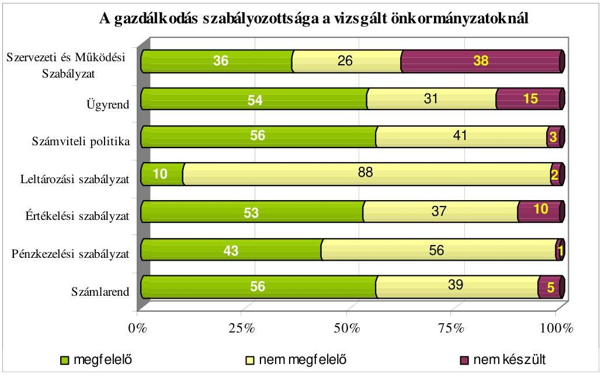

Az önkormányzatok könyvviteli nyilvántartásaiban a számviteli törvényben előírt bizonylatok alapján számolták el az előző évhez hasonlóan a gazdasági események döntő többségét az önkormányzati hivatalok, de valamennyi önkormányzati típusnál az alakilag, tartalmilag hibás bizonylatok aránya meghaladta az $50 \%$-ot.

A szabályozási hiányosságok is hozzájárultak ahhoz, hogy a munkafolyamatba épített ellenőrzés színvonala nem javult a korábbi évekhez viszonyítva. A gazdálkodási és a folyamatba épített ellenőrzési feladatok elvégzése nem, vagy hiányosan történt meg. A tapasztalt hiányosságok miatt magas a kockázata annak, hogy az önkormányzatok belső kontrollrendszere nem képes megelőzni, vagy jelezni a lényeges hibát, szabálytalanságot.

A belső ellenőrzési feladatok ellátása az előző évinél kedvezőbb, mivel előrelépés történt a belső ellenőrzési szervezet kialakítása és a múködéshez szükséges források biztosítása, a belső ellenőrzési kézikönyvek készítése és jóváhagyása területén, valamint a foglalkoztatott belső ellenőrök számát és szakmai felkészültségét illetően. Javult a belső ellenőrzést ellátók feladatköri és szervezeti függetlenségének biztosítása. Változatlanul nem kielégítő a belső ellenőrzések végrehajtásának színvonala, az ellenőrzések hasznosíthatósága, hasznosulása.

---

# 2.2. Az állami és az önkormányzati feladatellátásra irányuló ellenőrzések főbb tapasztalatai 

Az elmúlt években nagy figyelmet fordítottunk arra, hogy tovább folytassuk a törvényalkotó munka elősegítése, a közpénzek hatékony felhasználása, a megtakarítási lehetőségek feltárása és a lakosság ellátásának javítása érdekében a fontosabb közszolgáltatások koncepcionális, egymásra épülő vizsgálatait.

Az ÁSZ stratégiai célkitűzésével összhangban - a már lefolytatott ellenőrzések eredményeit is felhasználva - az autópálya beruházások finanszírozási megoldásainak összehasonlító értékelését tűzte ki céljául. 1997-től a mindenkori Kormány meghatározta a gyorsforgalmi utak fejlesztésének középtávú programját. Nem készültek azonban az autópálya fejlesztésekhez igazodó távlati finanszírozási programok és az azokat megalapozó gazdaságossági számítások. A finanszírozási formák megválasztásáról is a mindenkori Kormány döntött. A finanszírozási formák változása a költségvetés aktuális helyzetével és az autópálya fejlesztések elhatározott ütemével volt összefüggésben. A finanszírozásban elsődleges szempont volt a folyó évi költségvetést kímélő finanszírozási megoldások alkalmazása, amely egyre erőteljesebben jelentkezett az EU-hoz történő csatlakozás után. Ennek következménye, hogy - miközben a gyorsforgalmi úthálózat építése nemzetgazdasági szinten egyre több kiadással járt - a költségvetés közvetlen szerepe csökkent.

1990-2006. június 30-ig összesen 603 km hosszúságú gyorsforgalmi utat (27 szakaszt) adtak át a forgalomnak. Ebből 1 szakasz épült PPP konstrukcióban, 8 koncesszió keretében és 18 pedig állami finanszírozásban. Az utóbbi finanszírozási forma esetében a forrást egyrészt közvetlenül a központi költségvetésből, másrészt állami kezességvállalás mellett felvett hitelekből biztosították.

Kedvező hatású volt az Aptv. megalkotása, amely azonban a hatályba lépésétől eltelt két és fél év alatt 8 alkalommal módosult, érintve a finanszírozást, valamint az autópálya építésben résztvevő szervezetek feladatait. Az ilyen gyakori törvénymódosítások nem segítik az autópálya fejlesztések törvényi szabályozásának kiszámíthatóságát és növelik a feladatok végrehajtásának kockázatát is.

A magyarországi gyorsforgalmi úthálózat fejlesztések költségét az alkalmazott finanszírozási konstrukciókon túlmenően befolyásolták és megnövelték az építés körülményei is. A pénzügyi források szűkössége, az építések időtartamának rövidítése, az építési kapacitás korlátozottsága az állami megrendeléseknél árnövelő tényezőként jelentkezett. A gyorsított ütemű autópálya építés következménye volt az is, hogy egyes útszakaszok megépítésénél pl. kiviteli tervek nem álltak rendelkezésre, ami az ár növekedésének kockázatát jelentette. Az autópálya fejlesztések finanszírozásánál mindenkor, de különösen az ezredforduló után, visszatükröződtek az államháztartás egyensúlyi helyzetének problémái. Az autópálya szakaszokhoz kapcsolódó finanszírozási tervek hiánya, a folyó költségvetési kiadások csökkentésének elsődleges szempontjai, az autópálya beruházások befejezési/átadási időpontjának prioritása nem segítette a költséghatékony finanszírozás megvalósulását.

---

Az állami közutak fenntartásának ellenőrzése a nem gyorsforgalmi állami közutakra és azok kezelőire terjedt ki. 2005-ben a Gazdasági és Közlekedési Minisztérium az Útgazdálkodási és Koordinációs Igazgatóság meghagyása mellett - tulajdonosi döntéssel - a megyei kht.-kat beolvasztotta az Állami Közúti Műszaki és Információs Kht.-ba. Az átalakítást, a szervezeteket illetve feladataikat teljes körűen felmérő előzetes hatástanulmány nem előzte meg, a remélt gazdaságossági célkitűzéseket, a pénzügyi hatásokat az eltelt idő rövidsége miatt értékelni nem lehet.

A vizsgált időszakban komplex fejlesztési koncepció a Széchenyi Plusz Program kivételével nem volt. A helyszíni ellenőrzés keretében 33 projektet vizsgáltunk meg. A célok megvalósulását értékelő mutatókat csak a Környezetvédelmi és Infrastrukturális Operatív Program keretében megvalósult fejlesztéseknél határoztak meg. A hazai fejlesztéseknél is kijelöltek mutatókat, de teljesülésüket nem követték nyomon.

Míg a közutak fejlesztése - köszönhetően az EU-forrásoknak is - kiemelt figyelmet kapott, addig az úthálózat állagmegóvására, javítására fordított pénzmennyiség mértéke nem nőtt. Ennek következében a közutak állapotánál alapvető elvárásként csak a legalacsonyabb, - a minimálisan elvégzendő feladatokat előíró - „C" szint teljesítését határozták meg. Az utak állapotának $30 \%$-a sürgősen javításra szorul. Egyetlen mutató (a teherbírás) kivételével valamennyi mutató (állapotváltozás, egyenetlenség, felületépség) romlott. Az elmaradt karbantartások következtében a beavatkozási hossz a 10 évvel korábbi 2000 km-ről 400 km-re csökkent, a beavatkozási ciklusidő pedig 20 évről legalább a kétszeresére nőtt. Kedvező intézkedés viszont, hogy - mintegy 8 évi késedelemmel, de - elkészült az állami tulajdonú közutak értéken történő vagyonnyilvántartása, azonban a földingatlanok tulajdonjoga tekintetében ez nem teljes körűen rendezett.

A Művészetek Palotája a köz- és magánszféra együttmúködésével (PPP-konstrukció) épült. A projekt, illetve abban az állami szerepvállalás nem volt kellően átgondolt, nem készült sem gazdasági számításokkal alátámasztott hatástanulmány, sem költségelemzés. A beruházás döntően menet közben kialakított célkitűzések szerint zajlott. A köz- és magánszféra együttmúködésének szabályozottsága az ellenőrzött időszakban nem volt kielégítő. Hiányzott a PPP-típusú együttmüködések jogi szabályozása, egységes eljárásrendje.

A beruházási folyamat befejező szakaszában az állami fél a PPP-konstrukció váltását kezdeményezte a szerződéses fizetési kötelezettségek elhalasztása és a beruházás központi költségvetésen kívüli elszámolhatósága érdekében. Az Eurostat a fejlesztést állami beruházásnak minősítette, így a költségvetési hiány növekedésének elkerülése nem valósult meg. Az új változat az öszszehasonlítható adatok figyelembevételével nominál értéken az eredeti konstrukcióhoz képest többletkiadással jár a központi költségvetés számára.

A létesítmény az üzleti tervekben maximált fejlesztési keretösszegen belül, az alapterület növekedése és a műszaki tartalom egyidejű csökkentése mellett valósult meg. A fejlesztési összeg csaknem felét kitevő hangversenyterem fajlagos beruházási költsége nemzetközi összehasonlításban megfelelő, kisebb az euró-

---

pai átlagnál. Összességében az állami és magánszféra együttműködése magas színvonalú, többfunkciós kulturális létesítményt eredményezett. A nem megalapozott előkészítés, valamint az ebből következő funkció- és finanszírozási konstrukcióváltás azonban a megvalósítás gazdaságosságát és hatékonyságát hátrányosan befolyásolta. A létesítmény fenntartása és múködtetése 30 év alatt nominálértéken áfa nélkül, 335,2 Mrd Ft költségvetési kiadást jelent.

Az állam meghatározó szereplője a tankönyvpiacnak a tankönyvvé nyilvánítás engedélyezésében és az árkialakításban betöltött szerepe, valamint a tankönyvek megvásárlására és előállítására nyújtott támogatások révén. A közoktatási intézmények tankönyvellátási rendszerének ellenőrzése szerint a szakmai irányítás érvényesítésének eszköze a tankönyvvé nyilvánítás hatósági eljárása költséges, így árfelhajtó hatású, valamint a folyamatban résztvevő számos intézmény, szakértő és testület miatt bonyolult és lassú volt. Az engedélyezés kritériumrendszerének változásai ellentmondásosan hatottak a szakmai minőségi követelmények érvényesülésére. A közoktatási tankönyvellátás ágazati irányításának szakmai és gazdasági elvárásai a tankönyvjegyzéken keresztül érvényesíthetőek, azonban a 2003-tól folyamatosan megszűnt kedvezmények egyre kevésbé tették érdekeltté a kiadókat abban, hogy kiadványaikat tankönyvjegyzékre vetessék.

A közoktatásban használt tankönyvek támogatása két csatornán keresztül, a tanulók normatív támogatásával, valamint a kiadóknak nyújtott közvetlen támogatással valósult meg. A normatív támogatások elve, rendszere és mértéke többször módosult, alanyi jogúból rászorultság alapúvá vált. A változásokat nem támasztották alá részletes, megalapozott háttérszámításokkal, hatáselemzések, értékelések nem készültek. A kis példányszámú tankönyvek előállítása drága, megtérülési idejük hosszú, ezért a kiadók ezek megjelentetésére nem vállaltak anyagi kockázatot. Az állami támogatással kifejlesztett tankönyvek utánnyomásánál kedvezőtlen helyzetet teremtett, hogy a jogokkal a kiadók rendelkeztek.

A felsőoktatási állami intézmények kezelésében levő ingatlan vagyon nyilvántartás szerinti értéke a kincstári ingatlan vagyon 10\%-át teszi ki. A felsőoktatási állami intézmények ingatlangazdálkodásának ellenőrzése során megállapítottuk, hogy az állami irányítás és szabályozás alapvetően, de nem teljes körűen biztosította az állami felsőoktatási intézmények ingatlangazdálkodásának feltételeit. Az értékcsökkenés visszapótlása - a többi költségvetési intézményhez hasonlóan - nem megoldott. A képzési és fenntartási normatíva fenntartási része nem a kezelésbe adott vagyon összetételétől, műszaki állapotától függ, hanem a hallgatói létszámtól.

A központi pénzeszközök biztosításának stratégiai alapját - az integrációs fejlesztések forrásaként - a 2000-2005 közötti Felsőoktatási Fejlesztési Program képezte, amely a jóváhagyott intézményfejlesztési tervekhez nem teljes mértékben igazodott. Egységes intézményi ingatlangazdálkodás nem érvényesült az intézményekben. Az ingatlangazdálkodás minden részterületét (fejlesztés, állagmegóvás és hasznosítás) magába foglaló, eredményességi, gazdaságossági kritériumokat is tartalmazó ingatlangazdálkodási stratégia nem készült. Az ingatlan vagyon megfelelő hasznosítását, az integráció előnyeinek kihasználását gátolta a telephelyi és szervezeti tagoltság.

---

Az ÁSZ a helyi önkormányzatok gazdálkodása, az általuk kötelezően ellátandó közösségi szolgáltatások között évek óta vizsgálja a közoktatás és szociális ellátás egy-egy területét. A számvevőszéki ellenőrzésekkel elő kívántuk segíteni az államháztartás korszerűsítését, azon témák ellenőrzését tartottuk fontosnak, ahol jelentős szervezeti, tartalmi változások voltak, illetve szükségesek a közeljövőben.

A közoktatás területére irányuló vizsgálataink során kiemelt hangsúlyt kapott a méretgazdaságosság, a költséghatékonyság kérdése, a gyermek lakóhelyi és egyéb életkörülményeiből adódó hátrányainak kompenzálására, az esélyteremtésre tett intézkedések hatásának ellenőrzése. Ennek keretében vizsgáltuk az 1000 fő állandó lakónépességnél kisebb lélekszámú településeken az általános iskolai oktatás helyzetét és a középiskolai kollégiumok fenntartását, fejlesztését.

A közoktatásban ellátottak létszámának az 1980-as évek közepe óta tartó folyamatos csökkenése ellenére az államháztartás e feladatok finanszírozására fordított kiadásainak összes kiadáshoz viszonyított aránya emelkedett. Az önkormányzatok a közoktatási intézmények fenntartására, egyéb közoktatási feladataik folyó kiadásaira a 2005. évben 594,8 Mrd Ft-ot, összes folyó ráfordításaik 18\%-át használták fel a 2000. évi 286,1 Mrd Ft-tal szemben, ami az összes folyó kiadások $15 \%$-át jelentette.

A kistelepüléseken a gyermekek, tanulók nevelése-oktatása elaprózott intézményhálózatban, alacsony létszámú intézményekben folyik. A kistelepülések nem rendelkeznek a fenntartói irányításhoz megfelelő felkészültségű szakemberekkel. Az elaprózott oktatásirányításban gyenge a különböző irányítási szintek közötti, valamint a közoktatás irányítása és a területi regionális fejlesztéssel való kapcsolat.

A jogszabályi környezet, az oktatásirányítás, a pénzügyi szabályozás az elmúlt években nem kényszerített ki olyan strukturális reformokat, amelyek mérsékelték volna az oktatási szektor finanszírozási igényét, oly módon, hogy egyúttal javítják - de legalább szinten tartják - annak minőségét, eredményességét. Az önkormányzatoknak a közoktatással kapcsolatosan feladat ellátási felelősségük, és nem intézmény fenntartási kötelezettségük van. Ennek ellenére a kistelepülések részéről - gyakran a rosszul értelmezett önállóságra, a népességmegtartó, identitásmegőrző szerepre való hivatkozással - erőteljes ragaszkodás volt megfigyelhető a helyben múködő intézményeik fenntartásához.

A többcélú kistérségi társulások létrejöttéig még nem volt általánosan jellemző a társulásban való feladatellátás a kistelepülések körében, nem kezdeményezték az önkormányzatok közötti koordináció keretében hatékonyan ellátható feladatok (szakmai fórumok, pedagógus-helyettesítési rendszer, mérés-értékelés, ellenőrzés, kollégiumi ellátás) közös ellátását. E feladatok társulásban való ellátásának bővítésében jelentős szerepe volt a többcélú kistérségi társulások megalakulásának, az ösztönző finanszírozási rendszer keretében elnyerhető többlettámogatásoknak. A társulások jellemzően a pályázati források továbbadása révén kerültek kapcsolatba az önkormányzatokkal, intézményeikkel. A tapasztalatok szerint - a pótlólagos támogatások reményében - az önkormányzatok mindaddig támogatják a társulásban való feladatellátást, amíg

---

az a helyben történő oktatást nem veszélyezteti. Ez azt eredményezte, hogy a társulásban való feladatellátás többnyire csak a tagintézmények számának növekedésével járt, így a fajlagos ráfordításokban érzékelhető elmozdulás nem volt.

A gyermeklétszám csökkenésével a fajlagos ráfordítások ugrásszerúen emelkednek, noha - az összességében jobb pedagógus ellátottság mellett is - az óvodások szinte teljes köre, az általános iskolai tanulók ötöde osztatlan tanulócsoportba jár. A magas fajlagos költséggel múködő általános iskolák 77\%-ában a tanulók létszáma nem érte el az 50 főt. Mindezek következtében a közoktatás jelenleg múködő rendszere pazarló, egyszerre van jelen az ellátandó feladatokhoz mérten a túlzott kapacitás, s ennek következtében az indokolatlanul magas múködési költség, valamint a pénzhiány, esetenként a nem megfelelő szakmai kompetencia. Az igényeket esetenként meghaladó kapacitások kiépítését a korábbi évek nem kellően átgondolt, helyzetfelmérést nélkülöző fejlesztéseket támogató központi költségvetési politikája is elősegítette. A normatívák mértékének jelentős növekedése sem tudta ellensúlyozni az ellátottak létszámának csökkenését. A fajlagos ráfordítások drasztikus növekedése, az intézmények múködtetése egyre nagyobb önkormányzati támogatást, saját bevétel realizálását tett szükségessé.

A közoktatási törvény módosításával a közoktatás valamennyi szintjén nőtt a tervszerűség, a szabályozottság. Az oktatási tárca elkészítette közép- és hosszú távú fejlesztési stratégiáját. A célok, prioritások között szerepelt a közoktatás irányításának és költséghatékonyságának javítása, azonban a hátrányos helyzet összetevőit, a minőségi oktatást veszélyeztető körülményeket, a hátránykompenzálás eszközeit nem határozták meg.

A középfokú kollégiumok alapfeladata a hátránykompenzáció és a tehetséggondozás. Bár az esélyteremtést az oktatási kormányzat kiemelt területnek minősítette, a kollégiumi feladatellátás mégsem kapott helyet a közoktatási ágazat középtávú stratégiájában, és az ágazati minisztérium anyagi forrás hiányában nem rendelkezik a fejlesztési elképzelésekre tervvel. Az esélykiegyenlítés egyik megvalósítási területévé az Arany János Tehetséggondozó Program vált, amely bár folyamatosan bővült, de a tanulólétszám 5\%-át sem érinti. Az esélyteremtés e formája szűk körű igénybevételének és az elhelyezés romló körülményeinek folytán fokozatosan csökkent a kollégiumi tanulólétszám. Az alacsony férőhely-kihasználás sem kényszerítette ki azonban a kapacitások integrálását, a fenntartók közötti koordinációt, ami a tevékenység gazdaságosságának romlását eredményezte. A kollégiumi ellátás személyi feltételeire a nagyarányú fluktuáció volt a jellemző, tárgyi eszközei pedig hosszabb távon múködést akadályozó tényezőként léphetnek elő. A helyi önkormányzatok saját forrásaik terhére nem szorgalmazták a kollégiumok felújítását, rekonstrukcióját, különösen akkor nem, ha azoknak csak üzemeltetői és nem tulajdonosai voltak. A meglévő problémák együttesen fékezték a tényleges hátránykompenzációt, ezáltal az oktatás minőségének javítását is.

A korábbi években vizsgáltuk a települési önkormányzatok szociális és gyermekjóléti szolgáltatásainak helyzetét, a tartós bentlakásos intézményi ellátások közül az idősek otthonait, a gyermekjóléti, gyermekvédelmi szakellátási feladatokat. A hajléktalanokat ellátó intézményrendszer vizsgálatát

---

2006-ban fejezte be az ÁSZ, majd ezt követően indult több mint 300 kistelepülésen az önkormányzatok által biztosított szociális alapszolgáltatások helyzetének vizsgálata, amelynek helyszíni szakasza lezárult.

A szakterület felügyeletének szervezete, hovatartozása az elmúlt években több alkalommal is módosult (önálló minisztériumként vagy az egészségügyhöz kapcsolva, ezen belül változó szervezeti keretekkel), amelynek következtében, valamint hosszú távú koncepciók hiányában a megkezdett folyamatok lelassultak, esetenként módosultak.

Az ágazati irányítást végző minisztérium nem rendelkezik az ellátó rendszerről aktuális, megbízható adatokkal, információkkal. A szociális ellátásokkal, szolgáltatásokkal kapcsolatos statisztikai jelentések adatai utólag, jó egy éves késéssel válnak hozzáférhetővé. A gyermekvédelmi szakellátásokhoz kapcsolódó szakmai statisztikák hiányosak, nem tartalmazzák a nem állami szervek által biztosított ellátásokat fenntartói csoportosításban.

A szociális és gyermekvédelmi ellátások rendszerét meghatározó jogszabályok megalkotását, módosítását nem előzték meg hatástanulmányok, nem készültek koncepciók az ellátások fejlesztésére, átalakítására, a jogszabályok konzisztenciája esetenként nem érvényesült. A személyes gondoskodást nyújtó szociális intézmények szakmai feladatait és múködésük feltételeit, valamint a hajléktalan személyek ellátására vonatkozó különös szabályokat miniszteri rendelet szabályozza. A törvényt és a miniszteri rendeletet a hatálybalépéstől eltelt időszak alatt több alkalommal módosították. Ennek ellenére az egyes ellátások feladatai nem igazodnak a szükségletekhez és a gyakorlatban nyújtott szolgáltatásokhoz.

A szociális törvényben és a gyermekvédelmi törvényben szabályozott egyes ellátási formák (a családsegítés és a gyermekjóléti szolgálatok, házi segítségnyújtás, és a jelzőrendszeres házi segítségnyújtás, támogató szolgáltatás) feladatai közel azonosak, nehezen különíthetők el. A gyermekes családok esetében a gyermek problémái csak a családon belül rendezhetők. Így a két ellátás egyidejű megszervezése, működtetése párhuzamos gondoskodást jelent. Az önkormányzatok eltérő mennyiségű és minőségű szolgáltatások biztosítása mellett látják el feladatukat, aminek alapvető oka, hogy nincsenek meghatározva a szolgáltatások minimális mennyiségi és minőségi mutatói.

Az alapszolgáltatások (étkeztetés, házi segítségnyújtás), a gyermekek napközbeni ellátása, amelyek szükségszerűen a szociális és gyermekvédelmi ellátások első lépcsőjét jelentik, leépültek vagy ki sem alakultak. Ezeket költségigényesebb ellátásokkal helyettesítik, így ebben az ellátásban egyszerre van jelen a pazarlás és a hiány. Nem lehet megállapítani, hogy milyen kritériumoknak (férőhelyek száma), feltételeknek való megfelelés esetén tesz eleget a fővárosi és a megyei önkormányzat a feladat-ellátási kötelezettségének. A helyi önkormányzatok számára a rászorultak szakosított ellátáshoz való hozzájutásának biztosítása, az erről való gondoskodás előírása többféleképpen értelmezhető.

Az egyes ellátási formákra vonatkozóan a forrásösszetétel elemezése, értékelése, az állami normatív támogatások célszerű és hatékony felhasználásának ellenőrzése - a megalapozott döntésekhez elengedhetetlen szakmai és pénzügyi információs rendszer hiánya miatt - akadályokba ütközött.

---

A hajléktalan-ellátás szolgáltatásainak és intézményeinek a fejlesztése nem összehangolt, ugyanis a minisztérium nem rendelkezik a hajléktalanellátás céljait és fejlesztési irányait meghatározó hosszú és középtávú koncepcióval. Hosszú távú stratégia hiányában nem fogalmaztak meg konkrét feladatokat a hajléktalanság megelőzésével kapcsolatosan sem, holott a nemzetközi tapasztalatok alapján is ez leghatékonyabb és legolcsóbb módja a hajléktalanprobléma kezelésének.

A hajléktalan-ellátás jogszabályi keretei, feladatai sem egyértelmúen meghatározottak, nem igazodnak a szükségletekhez. Nem tisztázott, hogy mi tartozik a hajléktalan-ellátás feladatai közé, nincsenek meghatározva a hajléktalan állapotból kivezető utak. A jogszabály-módosítások nem koherensek, esetenként ellentmondásosak. A hajléktalanokat ellátó szociális intézmények az egészségügyi ellátás többletkiadásait a finanszírozási szabályozatlanságból adódóan szakmai pályázatokon elnyerhető támogatásokból, illetve az egyéb ellátási típusokhoz igénybe vehető normatív állami hozzájárulásokból fedezik.

A feladatellátáshoz a szociális intézményeknek a központi költségvetés a szolgáltatások után normatív állami hozzájárulást, a minisztérium a fejezeti kezelésű pénzeszközeiből pályázati forrásokat biztosít. A hajléktalan-ellátásban kiemelt helyet betöltő egyházi fenntartású intézmények normatív finanszírozása az átlagosnál kedvezőbb. A normatívák, valamint a rendelkezésre álló fejezeti kezelésű előirányzatok összegének alakulását alapvetően nem a szakmai igények, hanem a központi költségvetés mindenkori pozíciója határozza meg. A finanszírozás jelenlegi rendszere nem igazodik rugalmasan az ellátórendszer valós szükségleteihez, bizonytalanná teszi több szolgáltatás folyamatos múködését.

Az önkormányzati beruházások egyik jellemzője, hogy az önkormányzatok egyedül nem képesek a helyi projektjeik megvalósítására, mert nem rendelkeznek elegendő saját forrással. Mindezeket figyelembe véve az önkormányzatok beruházásainak megvalósításához, a közműberuházások finanszírozásához az állami támogatások mellett kedvezményes víziközmű társulati hitel, különböző lakástakarékpénztári konstrukciók stb. is kapcsolódhatnak. Az önkormányzatok forráshiányát és a szinte már átláthatatlan, bonyolult szabályozást kihasználva jelentek meg az állami támogatások jogosulatlan igénybevételéhez kapcsolódó finanszírozási és beruházási konstrukciókat kezdeményező, szervező alapítványok.

Az ÁSZ 2005-ben feltárta és részletesen bemutatta az ÖKOTÁM és hasonló rendszerú víziközmú-beruházások finanszírozásának elemeit, a rendszer múködtetésében tapasztalt jogszabálysértéseket, a kialakulását lehetővé tevő jogszabályi hiányosságokat, azok államháztartásra nézve hátrányos következményeit, továbbá a 2004. évre vonatkozóan 620,2 M Ft közmúfejlesztési támogatás jogtalan igénybevételét állapította meg. Az Országgyúlés a 2004. évi zárszámadásról szóló törvény keretében felkérte az ÁSZ-t, hogy az ÖKOTÁM és más hasonló rendszerben beruházó önkormányzatok teljes körénél ellenőrizze a 2002-2005. években igénybe vett közmúfejlesztési támogatások igénybevételének jogszerúségét.

---

Helyszíni ellenőrzést 298 önkormányzatnál végeztünk. További 554 önkormányzatot kértünk fel, hogy önellenőrzéssel - az általunk adott részletes szempontok figyelembevételével - vizsgálja felül az általa igénybe vett közmúfejlesztési támogatások igénylésének és felhasználásának jogszerűségét. Az út- és csatorna beruházások során igénybe vett közmúfejlesztési támogatások vizsgálata messze túlmutatott a 3,68 Mrd Ft jogtalanul igénybe vett közmúfejlesztési támogatás megállapításán. Megerősítette a korábbi ellenőrzés tapasztalatait és sokrétű információkkal szolgált az önkormányzati beruházások állami finanszírozása során kialakult kedvezőtlen tendenciákról, a jogszabályi hiányosságokról, a pontatlan és szerteágazó szabályozásról, a jogkövető magatartás alapvető hiányáról.

Az ÖKOTÁM és a hasonló finanszírozási rendszerú beruházások megvalósítása során számos jogsértést követtek el mind az önkormányzatok, mind pedig a víziközmű-társulatok, valamint az adófizetési kötelezettség, a jogszabályok kikerülése érdekében létrehozott alapítványok.

A vizsgálatban kimutattuk, hogy a közcélú közmúberuházások megvalósításában az ÖKOTÁM és a hasonló rendszerú beruházás szervezési és finanszírozási módszerének múködése kedvezőtlen hatást gyakorolt a költségvetési deficit alakulására, mivel a közmúberuházások az állam önerős - deficitfinanszírozó hitel felvételével vagy államkötvény kibocsátásával történő - beruházása esetén mindössze 75-85\%-ába kerültek volna annak, mint amekkora támogatást az ÖKOTÁM rendszer alkalmazói halmozott támogatások igénybevételével - igényeltek a központi költségvetésből. Az ÖKOTÁM és a hasonló rendszerben megvalósított közműberuházások esetén a hagyományos módon finanszírozott, lakossági forrásbevonással együtt járó beruházás finanszírozáshoz kapcsolódó állami támogatáshoz képest - ugyanolyan műszaki értékű közműberuházás megvalósításakor - több mint háromszorosára nőtt az állami tehervállalás. Ugyanakkor az Európai Unió felé tett vállalásunkkal ellentétben nem azok a beruházások valósultak meg az állam támogatásával, amelyek a Nemzeti Települési Szennyvízelvezetési és -tisztítási Megvalósítási Programban felállított prioritási sorrend alapján szükségesek lettek volna.

A fejlesztési célú állami támogatás széttagolt elosztási rendszere, összehangoltságának hiányosságai, valamint az önkormányzati saját erőt biztosító víziközmű-társulati hitelek kihelyezésének ellenőrizetlensége okozta, hogy a helyszínen ellenőrzött önkormányzatok 14\%-ánál a közműberuházások - az önkormányzati bevételek nagyságával indokolatlanul megnövelt beruházási összköltségen felül is - túlfinanszírozottak voltak.

# 2.3. Uniós források felhasználása 

Az Európai Unió részéről évekkel ezelőtt felmerült az igény, hogy az Európai Számvevőszék, valamint a nemzeti számvevőszékek készítsenek áttekintő értékelést az európai uniós pénzeszközök hasznosításának ellenőrzési tapasztalatairól. Ezzel összhangban az ÁSZ a 2004. évi tevékenységéről szóló jelentésében önálló pontban foglalta össze az uniós források felhasználásának ellenőrzési tapasztalatait. Az Országgyúlés 43/2005. (V. 26.) OGY határozatában írta elő az uniós támogatások pénzfelhasználásának áttekintését.

---

Az OGY határozatnak megfelelően - emellett eleget téve az uniós tagországok számvevőszékeinek 2005. decemberi stockholmi kapcsolattartó bizottsági ülésén elhangzottaknak - az ÁSZ 2006-ban áttekintette a teljes uniós pénzfelhasználás gyakorlatát, s ennek keretében az uniós forrásokkal összefüggő pénzmozgások ellenőrzését végző hazai szervezetek szakmai munkáját és az ellenőrzések tapasztalatait. Az európai uniós támogatások 2005. évi felhasználásának ellenőrzéséről szóló tájékoztatót (Trend Report) a zárszámadással egyidejűleg adtuk közre. A tájékoztatót megküldtük a tagállamok számvevőszékei, valamint a főbb uniós intézmények részére is.

A tájékoztató bemutatja az európai uniós források felhasználásának intézményi, jogszabályi, ellenőrzési és nyilvántartási rendszerét, valamint ismerteti az egyes alapok tényleges felhasználását a 2005. évben, merítve a támogatásközvetítő intézményrendszer szereplői által uniós előírás alapján, valamint az Európai Bizottság és az Európai Számvevőszék által végzett ellenőrzésekből. A 2005. évi ellenőrzések összességében megállapították ugyan, hogy az EU-ból érkező források fogadására, illetve lebonyolítására alkalmas - sokszereplős intézményrendszert az EU előírásainak megfelelően, a hazai jogszabályokat figyelembe véve hozták létre, de annak múködése néhány területen még további fejlesztésre szorul.

A mostantól kezdve minden évben kibocsátani tervezett tájékoztató rövid időn belül lefedi az európai uniós források felhasználásának teljes területét, és alkalmas lesz arra, hogy kimutassa a kialakult trendeket, változásokat.

A 2006. év folyamán a támogatások felhasználásának alapját képező célrendszer időarányos elérésére kiterjedően a Nemzeti Fejlesztési Terv végrehajtását ellenőriztük. Megállapítottuk, hogy a Nemzeti Fejlesztési Terv végrehajtása, amely intenzív pályázói aktivitás mellett folyt, a célrendszerhez tartozó területeken segítette és felgyorsította a nemzeti fejlesztési folyamatokat. A javuló tendencia ellenére a pályázatok odaítélésének, a szerződéses kötelezettségvállalás és a kifizetések aránya elmaradást jelentett az éves költségvetési törvényekben rögzített, időarányos pénzügyi felhasználási célokhoz képest.

A támogatott pályázatok kiválasztási folyamatában - a projekt kiválasztási kritériumok mellett - nem vizsgálták a támogatott projekteknek a program szintű célok teljesülésére gyakorolt hatását. Ennek eredményeként, pl. a megítélt támogatási összeg regionális megoszlása tekintetében az eddig is a legfejlettebb Közép-Magyarországi régió részesült a legnagyobb arányban, ami rontotta a területi kiegyenlítődés céljának teljesülését. A pályázatok kiválasztásának hatékonysága az időszükséglet tekintetében nem volt megfelelő, mivel a kiválasztási folyamat tényleges időszükséglete valamennyi operatív program esetében meghaladta a jogi szabályozásban a támogatási döntésig előírt időintervallumot.

A pénzügyi teljesítés felgyorsítására tett intézkedések mellett a támogatások felhasználásának hatékonysági szempontjai háttérbe szorultak: nem követték nyomon folyamatosan a támogatott projektek hozzájárulását a program szintű fizikai célok teljesítéséhez, nem vizsgálták a támogatott projektek hatékonysági illeszkedését a tervezett forrásfelhasználáshoz. Ennek következtében egyes programoknál nem alakították ki a támogatott projektek olyan portfolióját, amely

---

a kitűzött célokat a tervezettnek megfelelően teljesítette. Nem teremtődött meg a teljes összhang a célrendszer és a lekötött támogatási források között.

Az operatív programok végrehajtásának a specifikus és általános célokhoz kapcsolódó makrogazdasági hatásai a vizsgálat ideje alatt még nem mutatkoztak a Nemzeti Fejlesztési Terv végrehajtásának időarányos lemaradása, az előlegek aránya és a befejezett projektek számának a következő két évre esedékes felfutása miatt.

# Megállapodások alapján végzett ellenőrzések 

Az Illetékes Hatóság nevében eljáró Nemzeti Programengedélyezővel a SAPARD igazoló szervi feladatok ellátására kötött munka-megállapodás értelmében 2003-tól folyamatosan végezzük az éves igazoló szervi ellenőrzést, féléves és éves jelentést, igazolást készítettünk, amit a Nemzeti Programengedélyező megküld az EU Bizottságnak.

A 2005. évi SAPARD igazoló szervi ellenőrzés eredményeként a SAPARD Igazoló Szerv - az ÁSZ Igazoló Osztálya - igazolásában megállapította, hogy a Mezőgazdasági és Vidékfejlesztési Hivatal (MVH) által a SAPARD támogatások kifizetéséről készített és a Bizottságnak megküldött 2005. pénzügyi évre vonatkozó elszámolásai hitelesek, hiánytalanok és pontosak voltak.

A SAPARD Igazoló Szerv számára a 2006. év igazoló ellenőrzése összetettebb feladatként jelentkezett, mint a korábbi éveké, mert a 2004-ben kezdeményezett keretbővítés során jóváhagyott forrásokból történő kifizetések gyakorlatilag 2006-ban történtek. Felhasználásuk és ebből eredően ellenőrzésük is eltérő szabályok szerint történt. Az eltérő kifizetési eljárások mellett az ellenőrzési feladat összetettségét növelte, hogy 2006. év a SAPARD Program záró éve volt. A Program kezdete óta a SAPARD Program megvalósulására, céljainak teljesülésére fordított EU-s támogatások végső elszámolásáról az Igazoló Szervnek 2007. április 15-ig kell elkészíteni összefoglaló Jelentését, illetve az MVH pénzügyi eljárásainak igazolásáról a tanúsítványt.

A SAPARD célra biztosított - megnövelt - keretek teljes egészében lekötöttek, felhasználásuk folyamatosan történik. A pénzügyi és megfelelőségi ellenőrzések során sem az EU Bizottság, sem az EU Számvevőszéke, sem pedig a SAPARD Igazoló Szerv nem tárt fel olyan hibát, illetve hiányosságot, ami 2006. év végéig pénzügyi korrekciót eredményezett volna.

## Az Európai Mezőgazdasági Orientációs és Garancia Alap Garancia

Részlegből (EMOGA GR) finanszírozott támogatások felhasználásának igazoló szervi feladatait az ÁSZ az MVH-val kötött Megállapodás alapján látta el.

Az EMOGA GR Igazoló Szerve a 2006. EMOGA pénzügyi évre vonatkozóan elkészítette a Jelentését, és „A" fenntartás nélküli Igazolást adott ki. Megállapította, hogy az EU Bizottsághoz a 2006. EMOGA GR pénzügyi évre vonatkozóan továbbított beszámolók megfelelnek a valóságnak, teljes körűek és pontosak. A biztosítékkezelés, az adósmenedzsment, a számítógépes adatbiztonság, a Közvetlen támogatások az Intervenciós intézkedések és a Kísérő intézkedések kifize-

---

tései vonatkozásában tett néhány jelentős megállapítást és fogalmazott meg ajánlást.

Az ÁSZ és az MVH az EMOGA GR-ből finanszírozott támogatások felhasználásának igazoló szervi feladatainak ellátására kötött Megállapodást közös megegyezéssel, a 2006. EMOGA pénzügyi év végével, azaz 2006. október 15 -ével megszüntette.

# 2.4. Államháztartáson kívüli - non-profit célú - támogatások 

A non-profit célú állami támogatás 2003-2005 között átlagosan 30 Mrd Ft növekedést mutatott. Az állami forrás a dinamikus emelkedés eredményeként a non-profit szektor finanszírozási szerkezetében a fejlett országokéhoz hasonló 40-60\% közötti szintre emelkedett, összege 2006-ra hozzávetőleg 400 Mrd Ft-tal teljesült.

A támogatás rendszerében a Nemzeti Civil Alapprogramból a civil szervezeteknek juttatott költségvetési támogatások felhasználását 127 alapítvány és 226 társadalmi szervezet beküldött dokumentumai alapján, valamint a támogatások szabályszerűségét, rendeltetésszerűségét 40 alapítványnál és 61 társadalmi szervezetnél a helyszínen ellenőriztük. Az alapprogram a korszerű szabályozás ellenére nem biztosította az állami támogatások átfedésének megszüntetését, nem segítette a kisebb szervezetek múködésének megerősítését. A kétéves múködés során a civil szervezetek 12,3 Mrd Ft támogatáshoz jutottak. A múködési támogatások nem tükrözték a feladat ellátásának minőségét. A szakmai támogatások társadalmi hasznosságának megítéléséhez hiányoztak a megfelelő teljesítménymutatók, finanszírozási normatívák. A támogatások felhasználásának ellenőrzése nem a szabályozásnak megfelelően funkcionált, a minisztérium által tervezett monitoring nem múködött.

A Kormány által alapított közalapítványok múködését továbbra is csaknem teljes egészében a központi költségvetés finanszírozta. Az ellenőrzött két közalapítvány kuratóriuma a közfeladatokra szánt pénzeszközöket nyilvánosan meghirdetett pályázatok alapján osztotta szét. Ellenőrzéseink során kifogásoltuk, hogy nem rendelkeztek a pályáztatás folyamatára, a pályázati feltételekre, az elbírálás rendjére, a szerződéskötés módjára vonatkozó egységes, átfogó szabályozással. A kuratóriumok esetenként nem tartották be az üvegzseb törvény azon rendelkezését, amely szerint egymillió Ft feletti támogatás csak pályázati úton nyújtható.

Feladatkörünkben elvégeztük még 4 párt és 2 pártalapítvány előírt törvényességi, 4 országos kisebbségi önkormányzat, valamint a Magyar Vöröskereszt Országos Titkársága pénzügyi és gazdasági tevékenységének ellenőrzését.

Jelenlegi pártellenőrzési tapasztalataink továbbra is megerősítik a párttörvény módosításának szükségességét, ezen belül a pénzügyi beszámolásnak a számviteli törvénnyel összhangban álló szabályozására vonatkozó előírások indokoltságát.

---

A pártalapítványok gazdálkodása megfelelt az alapító okiratban megfogalmazott céloknak. Az alapítványok elkészítették a számviteli törvény szerint kötelező gazdálkodási szabályzatokat, amelyek azonban nem tartalmazták a pártalapítványokra vonatkozó sajátosságokat.

Az országos kisebbségi önkormányzatok a költségvetési támogatások célszerű felhasználásával a nemzeti érdekek képviseletén túl ápolják az óhazával való kapcsolatot, a nemzeti értékek közvetítését, az anyanyelvi múvelődés elősegítését.

# 2.5. Az állami vagyon 

Az állam tulajdonában lévő, az ÁSZ által rendszeresen vizsgált MTI Zrt. éves gazdálkodásának, a Magyar Fejlesztési Bank múködésének, illetve az ÁPV Zrt. éves múködésének és a központi költségvetés végrehajtásához kapcsolódó tevékenységének ellenőrzése mellett a tartósan veszteségesen múködő állami tulajdonú gazdasági társaságok gazdálkodásának ellenőrzése is szerepelt a 2006. évi ellenőrzési tervünkben.

A Magyar Távirati Iroda Zrt. gazdálkodásának ellenőrzéséről készült jelentéseinkben nyolc éve - évente - szorgalmazzuk az MTI Zrt. múködtetésére 1996-97-ben kialakított speciális tulajdonosi joggyakorlás - a nemzeti hírügynökségről szóló törvény és a társaság Alapító Okirata - átfogó felülvizsgálatát, amit az irányító és ellenőrző testületek, szervezetek feladat- és hatásköri, továbbá felelősségi szabályozásának pontatlansága indokol. Hangsúlyoztuk, hogy nincs meghatározva a közszolgálati tevékenységek és az ellátásukhoz szükséges állami támogatás mértéke, igénylésének eljárási rendje. Nem átlátható a közszolgálati feladatokra juttatott állami támogatás igénylése és felhasználása.

Megfogalmaztuk 2006-ban is, hogy az MTI Zrt. Alapító Okirata több pontja nem időszerű, továbbá, hogy a tulajdonosi struktúra, valamint a múködtetési megoldás nem ösztönzi a nyereséges gazdálkodásra való törekvést, illetve a veszteséges gazdálkodásnak sincs tulajdonosi döntéssel meghozott következménye. Az Országgyúlés - a társaság alapítója és közgyúlési jogainak gyakorlója - nincs napi kapcsolatban társaságával, nem hoz döntést sem a stratégiai, sem az éves üzleti tervekről.

Az MTI Zrt. először 2002-ben, majd az ezt követő években is veszteséges volt, a három év vesztesége meghaladta a 460 M Ft-ot. 2005-ben a társaság 5,3 M Ft mérleg szerinti eredményt prognosztizált és $6,5 \mathrm{M}$ Ft-ot teljesített. A társaság a 2005. évi gazdálkodási tervét teljesítette, a 2004. év végén végrehajtott 111 fő létszámleépítés 2005-2006-ban eredményezett költségcsökkenést.

A Magyar Fejlesztési Bank feladata a Kormány közép- és hosszú távú gazdaságstratégiája által meghatározott gazdaságfejlesztési célok megvalósításához szükséges fejlesztési forrásokat biztosítsa. A Kormány gazdaságfejlesztési célkitűzéseit tartalmazó, 2004-2006. évekre szóló kormányprogramján túl részletes, elfogadott gazdaságfejlesztési stratégia nem készült, így kormányhatározatok jelölik meg a Bank konkrét feladatait. Ezek végrehajtása az MFB törvény módosítása nélkül nem volt lehetséges. A törvény az elmúlt években öt

---

alkalommal módosult. A Bank múködése megfelelt a tulajdonosi jogokat gyakorló miniszter által alapítói határozatokban megfogalmazott elvárásoknak, a hatályos törvényi előírásoknak. A Bank 2003 és 2005 között eredményesen gazdálkodott, 2004-ben 6 Mrd Ft, 2005. évben 11 Mrd Ft osztalékot fizetett a Magyar Államnak.

Az Állami Privatizációs és Vagyonkezelő Zrt. 2005. évi múködésének átfogó ellenőrzése keretében megállapítottuk, hogy a 2005. évi privatizációs tevékenységét a 2002-ben kidolgozott három éves vagyonpolitikai irányelvek utolsó évének végrehajtása keretében végezte. A vagyonpolitikai irányelvek fő célja a 700 Mrd Ft-ot meghaladó állami vagyon három év alatti egyenletes ütemű értékesítése volt.
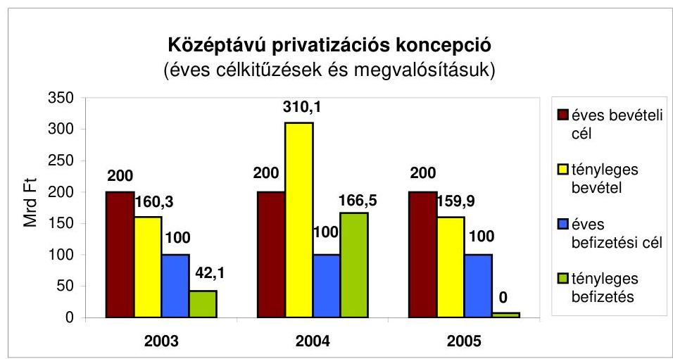

A középtávú privatizációs koncepció három esztendejében a Társaság hozzárendelt vagyona után realizált bevételek és a költségvetési befizetések időbelisége nem a célkitűzések szerint alakult. A hozzárendelt állami vagyon lebontásának üteme nem volt egyenletes, a teljesített költségvetési befizetések összességükben elmaradtak az előirányzattól. A Budapest Airport Zrt. privatizációjához kapcsolódó használati jogok bérbeadásából származó, a Kincstári Vagyoni Igazgatósághoz befolyó bevétel ellensúlyozta a költségvetési befizetés elmaradását.

A Budapest Airport Zrt. privatizációjának végrehajtását törvénymódosítások támogatták. Két törvény módosította a kizárólagos állami tulajdoni kört, és a repülőteret kivette a koncessziós törvény hatálya alól. Módosult a kizárólagos állami tulajdonú repülőtér vagyonelemeinek hasznosítására a KVI-vel kötött vagyonkezelési szerződés. A Bábolna Mg. Rt. privatizációra történő előkészítése során olyan tulajdonosi döntések születtek, amelyek gyorsították a társaság piaci értékének jelentős csökkenését, illetve olyan tulajdonosi intézkedések maradtak el, amelyekkel csökkenteni lehetett volna a veszteségeket. Az elmaradt döntések következtében a végelszámolás megindítása kárt okozott a társaságnak, és az állami veszteséget a végelszámolási díjakkal, valamint az elengedett követelésekkel csak növelte a tulajdonos.

---

A tartósan veszteségesen múködő állami tulajdonú gazdasági társaságok gazdálkodásának ellenőrzése során az ÁSZ megállapította, hogy nem került sor az állami tulajdon fogalmának és a hozzá kapcsolódó jogoknak az egyértelmú meghatározására. Az állami tulajdonú gazdasági társaságoknál nincs összehangolt tulajdonosi joggyakorlás, annak tartalma, mélysége, formai eszközei a számos állami tulajdonosi joggyakorló esetében más és más. Az állami tulajdonú vagyon számbavétele nem zárt. A nyilvántartás sem naturáliában, sem összegben nem fedi a tényleges állapotokat, azt még a több nyilvántartás összesítésével sem lehet egzakt módon meghatározni.

A vizsgált 97 jelentős állami tulajdonú, tartósan veszteséges társaságban az állami tulajdon könyv szerinti értéke 2005-ben 503 Mrd Ft volt. Ez az érték a jegyzett tőkéből 99,86\%-os átlagos állami tulajdoni részarányt jelentett. A vizsgált társaságok (2000-2005-ben) együttesen 6309 Mrd Ft árbevételt, 478 Mrd Ft üzemi szintű veszteséget és 290 Mrd Ft adózás előtti veszteséget termeltek.

Az állami vagy részben állami tulajdonban lévő társaságok veszteségessége részben külső okokra volt visszavezethető. A rendszeres állami támogatásban részesülő állami társaságok, részben a rájuk vonatkozó szabályozás hiányosságai, részben közszolgálati tevékenységük és bevételeik elégtelen volta miatt veszteségesek. Többszörösen jelentkező probléma, hogy az állam jogszabályban, társaságainak ellátandó feladatot határoz meg, de azok ellenértékét csak részlegesen biztosítja.

A társaságok mintegy 20\%-ánál a veszteségek belső okai között a vagyonkezelési stratégia hiánya, illetve az utólag hibásnak bizonyult tulajdonosi vagy vezetői döntések húzódnak meg. A társaságok egyharmadánál a műszakitechnológiai színvonal korszerűtlensége miatt következett be hatékonyságromlás. A pénzügyi forrásaik szűkössége a társaságok negyedénél korlátozta költségcsökkentő vagy létszámkiváltó beruházások megvalósítását. A menedzsmentváltás és a szervezet-átalakítás az eredményesség csökkenésében a társaságok tizedénél játszott szerepet. A foglalkoztatottak létszáma és szakmai összetételének problémái, valamint a befektetésekben lévő vagyonvesztés is oka volt a veszteségek kialakulásának.

A 97 ellenőrzött társaság a 2000-2004. évi időszakban 1116 Mrd Ft tőke- és egyéb támogatást kapott. A támogatások formája tőke- vagy eredménytartalék növelése, múködési, beruházási, létszám-leépítési, környezetvédelmi és egyéb egyedi - pl. fejlesztési, rekonstrukciós, szakképzési - támogatás volt. A támogatások meghatározó részét a helyszínen ellenőrzött társasági körben 15 társaság kapta. A társaságok részére biztosított támogatásokra jellemző, hogy azok mértéke alacsonyabb volt az igényelt összegeknél. Ennek alapvetően két oka volt: egyrészt nincs normatív rendszere a közfeladat-ellátás finanszírozásának (kivétel: árkiegészítések), másrészt a költségvetés teherbíró képessége határt szab az igények kielégítésének.

---

# 3. Az EllenŐrzÉSEK hasZnosítÁsA 

A Számvevőszék tevékenysége a közzétett jelentésekben realizálódik. Az elvégzett ellenőrzések eredménye, a megállapítások és javaslatok nemcsak a politikai élet szereplői, hanem mindenki számára elérhetőek, nyilvánosak. Az ellenőrzések hasznosulása, a jelentések közzétételt követő parlamenti és „közéleti utóélete" az ÁSZ munkájának egyik eredményességi mutatója. A közzétett jelentések közéleti sorsát az ÁSZ ellenőrzéseivel kapcsolatos sajtó-tevékenység tükrözi. Az ÁSZ 2006-os jelentéseinek parlamenti hasznosítását a jelentésekkel foglalkozó bizottsági és plenáris ülések, események mutatják.

A számvevőszéki ellenőrzések eredménye nagymértékben függ attól, hogy a megállapítások, javaslatok, hasznosítása (realizálása) nyomán milyen jogsza-bály-módosítások valósulnak meg az Országgyúlés, a Kormány és az egyes fejezetek, önkormányzatok szintjén, továbbá az ellenőrzöttek milyen intézkedéseket kezdeményeznek. Az ÁSZ nem hatóság, nem szankcionálhat és nincs lehetősége kikényszeríteni javaslatai, ajánlásai realizálását.

### 3.1. A jelentések országgyúlési tárgyalása, határozatok és az országgyúlési kapcsolatok

Az ÁSZ 2006-ban is a kijelölt határidőkre tett eleget a hatályos jogszabályok törvények és határozatok - alapján előírt jelentéstételi kötelezettségeinek (költségvetés, zárszámadás, ÁSZ-beszámoló, ÁPV Zrt., MTI Zrt.).

2006 az országgyúlési és az önkormányzati választások éve volt, amelynek hatásai érintették a Számvevőszék jelentéseinek parlamenti/bizottsági „utóéletét" is.

A májusban induló új parlamenti ciklusban az Országgyúlés a korábbi 25 bizottság helyett 18 állandó bizottságot hozott létre. A Számvevőszéki bizottság megszűnt, a korábbi Költségvetési és pénzügyi bizottság az új ciklusban Költségvetési, pénzügyi és számvevőszéki bizottság elnevezéssel alakult meg, amelynek egyik albizottságaként múködik a Számvevőszéki albizottság.

A választások miatt a korábbi évekhez viszonyítva kevesebb jelentés kerülhetett a bizottságok elé, a bizottsági struktúra átalakításával pedig kevesebb bizottsági esemény kapcsolódott egy-egy jelentéshez.

A 2006-ban közzétett 62 jelentésből 9 szerepelt a bizottságok napirendjén és ebből 3 jelentést az Országgyúlés plenáris üléseken is megtárgyalt. A legtöbb jelentést a Környezetvédelmi bizottság tárgyalta, a bizottság 5 alkalommal foglalkozott az ÁSZ jelentéseivel. A jelentések parlamenti/bizottsági tárgyalásának adatairól a 3. sz. melléklet ad tájékoztatást.

Az Országgyúlésnek benyújtott jelentések közül a 2005. évi költségvetés végrehajtásának ellenőrzéséről szóló jelentést és a 2007. évi költségvetési javaslatról szóló számvevőszéki véleményt a Mentelmi és összeférhetetlenségi bizottság kivételével valamennyi bizottság megtárgyalta.

---

Az Állami Számvevőszék 2005. évi tevékenységéről szóló beszámolót 6 bizottság (a Költségvetési, pénzügyi és számvevőszéki, a Gazdasági és informatikai, az Önkormányzati és területfejlesztési, az Oktatási és tudományos, az Emberi jogi, kisebbségi, civil- és vallásügyi, valamint a Foglalkoztatási és munkaügyi bizottság) tárgyalta és ajánlotta általános vitára.

A Környezetvédelmi bizottság a zárszámadási jelentésen és a költségvetési véleményen kívül külön napirend keretében foglalkozott a KVM müködését ellenőrző ÁSZ jelentéssel, az ÖKOTÁM-ügy kapcsán aktuálissá vált - az önkormányzati útés szennyvízcsatorna beruházásokhoz 2002-2005. években igénybe vett közműfejlesztési támogatások igénylésének és felhasználásának ellenőrzéséről szóló - jelentéssel és az ÁPV Zrt. 2005-ös müködésének ellenőrzéséről szóló jelentéssel.

2006-ban összesen 46 bizottsági esemény (ülés, tárgyalás) kapcsolódott az ÁSZ jelentéseihez.

Az ÁSZ 2007. évre vonatkozó ellenőrzési tervét az ÁSZ elnökének előterjesztésében a Költségvetési, pénzügyi és számvevőszéki bizottság tárgyalta meg.

A Számvevőszék jól működő szakmai kapcsolatokat tart fenn az Országgyűléssel és annak egyes szervezeti egységeivel, bizottságaival. A munkakapcsolatokat megerősítendő, a választásokat követően az ÁSZ vezetői mind az öt parlamenti frakció vezetőivel találkoztak, és az ÁSZ elnöke több alkalommal is meghívást kapott a Bizottsági Elnöki Értekezletre.

2006-ban a Számvevőszék elnöke 18 bizottsági ülés résztvevője volt, és 4 alkalommal kérte ki véleményét plenáris ülésen az Országgyűlés, számvevőszéki munkatársak mintegy 60 bizottsági ülésen vettek részt ${ }^{13}$.

Az Országgyúlés a 2004. évi zárszámadásról szóló törvényben felkérte az ÁSZ-t, hogy „vizsgálja meg a központi költségvetés által 2005. év végéig az önkormányzatokhoz út- és szennyvízcsatorna-építés címén átutalt közmúfejlesztési támogatás igénylésének és felhasználásának jogszerüségét, különös tekintettel az ÖKOTÁM és hasonló rendszerben megvalósuló beruházásokra". A megkeresésnek eleget téve az ÁSZ 2006 októberében tette közzé jelentését az önkormányzati út- és szennyvízcsatorna beruházásokhoz 2002-2005. években igénybe vett közmúfejlesztési támogatások igénylésének és felhasználásának ellenőrzéséről.

Magyarország teljes jogú uniós tagságából eredő kötelezettsége az uniós támogatások felhasználásának belső ellenőrzése. Az Országgyúlés a 43/2005. (V. 26.) OGY határozat szerint „indokoltnak tartja és támogatja, hogy az Állami Számvevőszék a teljes uniós pénzfelhasználás gyakorlatáról átfogó képet adjon, ennek keretében az uniós forrásokkal összefüggő pénzmozgások ellenőrzését végző hazai szervezetek munkáját szakmai szempontból áttekintse és mutassa be az ellenőrzések tapasztalatait." Az európai uniós támogatások 2005. évi felhasználásá-

[^0]
[^0]:    ${ }^{13}$ A bizottsági üléseken való részvétel nem kötődik kizárólag a közzétett jelentésekhez, így esetenként olyan bizottsági üléseken is képviseltetheti magát az ÁSZ, ahol jelentése nem szerepel a napirenden vagy a Számvevőszék csak közvetetten érintett a témában.

---

nak ellenőrzéséről szóló tájékoztatót (Trend Report) a Számvevőszék a zárszámadási jelentéssel egyidejúleg nyújtotta be az Országgyúlésnek.

Miniszterelnöki felkérésre az ÁSZ véleményezte a Magyar Köztársaság 2006. szeptemberi aktualizált konvergencia program tervezetét. Az elkészült véleményt augusztus végén küldte meg az ÁSZ a Miniszterelnöki Hivatalnak és tette elérhetővé honlapján keresztül az érdeklődők számára.

# 3.2. A számvevőszéki javaslatok érvényesülése 

2006-ban végzett ellenőrzéseink során is arra törekedtünk, hogy megalapozott javaslatokkal segítsük az ellenőrzött szervezetekben, rendszerekben, folyamatokban rejlő kockázatok feltárását és kiküszöbölését, a szabályszerűség érvényesülését, a hatékonyság javítását. Javaslatokat tettünk jogszabályok módosítására, összehangolására, betartására is.

2006-ban is figyelmet fordítottunk a korábbi megállapításaink, ajánlásaink hasznosulására, a tett intézkedések végrehajtásának ellenőrzésére, nyomon követésére. Ehhez kapcsolódóan is figyelemmel kísértük az ellenőrzéseink javaslataival kapcsolatos intézkedéseket.

Mind az érintett fejezetek intézkedési tervei, mind az éves jelentésünkhöz kért tájékoztatások alapján javaslataink jellemzően pozitív fogadtatásra találtak. A javaslatok megvalósításának tényéről és hatásairól a legteljesebb képet az esetek többségében azonban csak célvizsgálat, utóellenőrzés keretében kaphatunk.

Több év tapasztalata alapján elmondható, hogy a pénzügyi ellenőrzés közvetlen hatásaként a korrekciós jellegű módosításokra vagy egyes, különállóan is megvalósítható szabályozási kérdésekre vonatkozó javaslataink jellemzően megvalósulnak. A belső szabályozási, nyilvántartási, elszámolási rendszerekre vonatkozó, a célszerűséget, hatékonyságot javító intézkedéseket célzó ajánlásaink fogadtatása is kedvező. Ezzel szemben a pénzügyi biztonságot szolgáló, a rendszer méretú és szemléletú változásokat igénylő felvetéseink megvalósítása szerényebb. Sikerként értékelhető azonban, ha a javasolt változtatásokkal „megcélzott" területek, folyamatok (köz)gazdasági összefüggéseinek átgondolására, tervek, programok kialakítására irányuló elemző munkák bontakoznak ki.
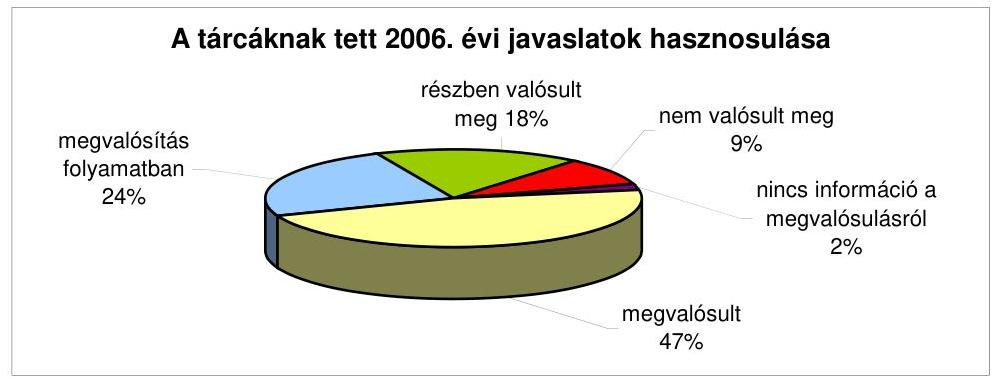

---

Az egyes ellenőrzési jelentésekben megfogalmazott javaslatok, illetve azok hasznosítása, megvalósítása az ÁSZ honlapján figyelemmel kísérhető.

# 3.2.1. Javaslatok az Országgyúlés szintjén 

Ellenőrzéseink alapján az Országgyűlésnek címzett vagy az Országgyűlés törvényalkotási tevékenységét érintő javaslataink nagy része megvalósult, vagy részét képezi a törvényalkotási munkának.

Számos javaslatunk valósult meg a 2005. évi költségvetés végrehajtásáról szóló törvényben, a 2007. évi költségvetésről szóló törvényben, és hozzájuk kapcsolódva a Magyar Köztársaság 2007. évi költségvetését megalapozó egyes törvények módosításáról szóló 2006. évi CXXI. törvényben, illetve további törvényekben.

A költségvetéssel kapcsolatos elszámolások átláthatóságának érdekében 2006-ban több ellenőrzésünk jutott arra a megállapításra, és fogalmazott meg javaslatot, hogy aktualizálni kell egyes, a költségvetéssel összefüggően bemutatandó adatok tartalmát, táblázatok szerkezetét. A Magyar Köztársaság 2007. évi költségvetését megalapozó egyes törvények módosításáról szóló 2006. évi CXXI. törvény ennek jegyében

- aktualizálta - az államháztartási törvényt módosítva - a költségvetés és a zárszámadás előterjesztésekor kötelezően bemutatandó mérlegeket és kimutatásokat,
- módosította az államháztartási törvény adóssággal foglalkozó részét. A módosított Áht. meghatározza a különféle adósság-kategóriákat, negyedéves - kormányrendeletben meghatározott tartalmú - publikációs kötelezettséget ír elő az államadóssági és államháztartási adóssági adatok tekintetében. (A publikálandó adósság-adatok és az egyes adósságkategóriák konszolidációjához szükséges adatok tartalmát az államháztartás múködési rendjéről szóló kormányrendelet fogja meghatározni, amelynek módosítása - ismereteink szerint - folyamatban van.)

Az Európai Unióval való kapcsolatrendszerünk teljesebb körú megismerése és az elszámolások átláthatóságának érdekében az ÁSZ javaslatára, kétoldalú konzultációk alapján már a 2005. évi költségvetés végrehajtásáról szóló törvényjavaslatban - és a 2007. évi költségvetésről szóló törvényjavaslatban is - a pénzügyminiszter módosította az általános indoklás mellékleteiben szereplő, európai uniós költségvetési kapcsolatokat összefoglalóan bemutató tábla és az agrártámogatásokat részletező tábla szerkezetét. Így a költségvetési kapcsolatok teljes körű bemutatása céljával azon agrártámogatások is megjelenítésre kerülnek, amelyek egyébként nem képezik részét magának a költségvetési, illetve zárszámadási törvénynek.

A társadalombiztosítás pénzügyi alapjai közül az Egészségügyi Alap múködésének ellenőrzésekor az alapkezelő jogállását meghatározó jogszabályok ellentmondásainak megszüntetésére vonatkozóan tett javaslatunk megvalósult a 2006. évi LVII. (jogállási) törvény módosításával (2006. évi CIX. tv. a kormányzati szervezetalakítással összefüggő törvénymódosításokról), valamint az

---

OEP feladatait és hatáskörét meghatározó új kormányrendelet (317/2006. (XII. 23.) Korm. rendelet) megalkotásával és 2007. január 1-jei hatályba léptetésével.

A Nyugdíjbiztosítási Alap múködésére vonatkozóan megfogalmazott javaslatainkra megtett intézkedések a javaslatok részleges realizálását mutatják. A társadalombiztosítási nyugellátásról szóló törvény és a kapcsolódó törvények 2006. novemberi és decemberi módosítása rendelkezik a nyugdíjrendszer 2006 utáni múködtetésének hiányzó eljárási szabályairól (pl. a keresetek valorizálásának a nyugdíjazást közvetlenül megelőző évekre való kiterjesztése, a nyugdíj alapjának kiszámítása 2012-ig). A korkedvezményes nyugdíj igénybevételi szabályainak korszerűsítése az előírt határidőre, 2006 végére ugyan elmaradt, de a korkedvezményre jogosító feltételeket külön törvény fogja 2011. januártól szabályozni. Az elfogadott módosítások elsősorban az Alap pénzügyi helyzetét javítják (pl. a járulékok Ny. Alap javára történő átcsoportosításával, az ellátásban részesülők körének szűkítésével, a nyugdíjalap számításának módosításával).

Ajánlásunkra az egészségügyi miniszter javaslatot tett a közgyógyellátás keretében igénybe vehető gyógyászati segédeszközök ésszerübb szabályozására. Hatályba lépett a biztonságos és gazdaságos gyógyszer és gyógyászati segédeszköz ellátás, valamint a gyógyszerforgalmazás általános szabályairól szóló törvény, amely az ÁSZ javaslataival összhangban tartalmazza a gyógyászati segédeszközök közgyógyellátási jogcímen történő támogatásának újraszabályozását.

A tartósan veszteségesen múködő állami tulajdonú gazdasági társaságok gazdálkodásának ellenőrzése, valamint az ÁPV Zrt. 2005. évi múködésének és a központi költségvetés végrehajtásához kapcsolódó tevékenységének ellenőrzése kapcsán javasoltuk a Kormánynak, hogy intézkedjen az állami vagyon egyes vagyoncsoportjaival kapcsolatos gazdálkodás összhangjáról a vagyontörvény megalkotásával, továbbá egységesítse az állam vállalkozói és kincstári vagyonával kapcsolatos állami követelések kezelésének rendjét. A vagyontörvény kidolgozása folyamatban van, várhatóan az Országgyúlés tavaszi ülésszakára kerül benyújtásra.

A Kormány 2006 közepén a rendszeres pártellenőrzések tapasztalatait hasznosítva az Országgyúlésnek benyújtotta a pártok múködéséről és gazdálkodásáról szóló 1989. évi XXXIII. törvény és a választási eljárásról szóló 1997. évi C. törvény, valamint ezzel összefüggésben egyes más törvények módosításáról szóló T/237. számú javaslatát. Az ÁSZ támogatja a törvénymódosító indítvány elfogadását, mivel az fokozza a párt- és kampányfinanszírozás átláthatóságát, ellenőrizhetőségét. A javaslat elfogadása - erőfeszítéseinkkel és a társadalmi elvárásokkal összhangban - növekvő ellenőrzési hatáskört biztosítana a mélyebb összefüggéseket feltáró, a szabálytalanságot jobban szankcionáló alkotmányos feladat betöltésére. A javaslatról az Országgyúlés részletes vitát folytatott, arról szavazás nem történt. Az elfogadásig a hatályos rendelkezéseknek megfelelő gyakorlattal folytatjuk a pártok gazdálkodásának, valamint a választások finanszírozásának törvényességi ellenőrzését. Az ÁSZ-nak jogalkalmazói minőségében nincs joga az ellenőrzési hatáskör kiterjesztésére.

---

Az Adó- és Pénzügyi Ellenőrzési Hivatal (APEH) működésének ellenőrzésével kapcsolatban kezdeményeztük a 2005. évi LVI. törvény módosítását annak érdekében, hogy az APEH végelszámolás alatt álló szervezetekkel szembeni követeléseinek engedményezését jogszabály ne tegye lehetővé. Az APEH-ról szóló 2002. évi LXV. törvény, illetve az adózás rendjéről szóló 2003. évi XCII. törvény alapján 2007. január 1-jétől kizárólag a felszámolási eljárás alatt álló szervezetekkel szemben fennálló követelések engedményezését teszi lehetővé az adóhatóság számára, a végelszámolás alatt állók esetén nem.

A helyi és a helyi kisebbségi önkormányzatok gazdálkodási rendszerének átfogó ellenőrzése kapcsán tett javaslatainkat figyelembe véve kiegészült az államháztartásról szóló törvény a helyi és a helyi kisebbségi önkormányzat megállapodásának tartalmi követelményeivel, valamint a nem normatív, céljellegű működési támogatások kedvezményezettjére is kiterjed a közzétételi kötelezettség. Kezdeményezésünk alapján a törvényhozás a közbeszerzésekről szóló törvényben megállapította az önkormányzatok által helyben központosított közbeszerzésekre vonatkozó alapvető szabályokat.

A kötött felhasználású előirányzatok ellenőrzése kapcsán tett javaslatoknak megfelelően a 2005. évi elszámoltatásnál és a 2006. évi feltételrendszer meghatározásánál jelentős előrelépés történt a kompok, révek fenntartásának, felújításának támogatásában. Az üzemeltetési támogatások elszámoltatási rendszerét a 2006. évi szabályozás már megfelelően tartalmazza. A párhuzamosságok kiküszöbölése érdekében 2007-től megszűnt a belső ellenőrzési társulások támogatását szolgáló előirányzat, e támogatást már csak a többcélú kistérségi társulások támogatásán belül lehet igényelni. A 2004. évről 2005. évre átvitt, de a Kvtv. tiltása miatt át nem vihető támogatások visszafizettetéséről a zárszámadási törvényben történt intézkedés. A helyi önkormányzati hivatásos tűzoltóságok által visszafizetendő normatív támogatásának az elszámolásánál 2007-ben már nem vehetők figyelembe a vállalkozási vagy kiegészítő tevékenység keretében végzett térítéses munkák bevételei és kiadásai.

Változtak a szociális normatívák lehívhatóságának, igénybevételének szabályai a szociális és költségvetési törvényekben.

Az önkormányzati út- és szennyvízcsatorna beruházásokhoz 20022005. években igénybe vett közmúfejlesztési támogatások igénylésének és felhasználásának ellenőrzését követően a 2006. évi XCIX. törvény 7. §-ának (18) bekezdése előírta a 2002-2005. években jogtalanul igénybevett közműfejlesztési támogatások visszafizettetését, a (19) bekezdés pedig újabb szabályozást fogalmazott meg a jogtalan támogatás-igénybevétel megakadályozására.

Javaslatunk hatására módosították az Áht. 101. § (10) bekezdését, a visszaélések elkerülése érdekében a módosítás pontosította a fejlesztési támogatás - kivitelezőtől közvetlenül, illetve más szervezet útján közvetve az önkormányzathoz érkező pénzeszköz miatti - arányos visszafizetésének rendjét.

A 2005. évi költségvetés végrehajtásának ellenőrzéséről készített jelentésben megfogalmazott javaslatok alapján a 2007. évi költségvetési törvényben a helyi önkormányzatokat megillető személyi jövedelemadó megosztásának szabályozása a valós célnak megfelelően, valamint az Áht. előírásá-

---

val összhangban történt, abban nem írtak elő államháztartási tartalékképzési kötelezettséget.

A pénzügyminiszter kezdeményezésére a 2005. évi költségvetés végrehajtásáról szóló törvénybe beépítették a helyi önkormányzatok támogatásainak ellenőrzése során megállapított eltérések rendezését.

Az állami közutak fenntartásának ellenőrzése kapcsán felkértük a Kormányt, hogy kezdeményezze a közlekedési törvény módosítása keretében a közúthálózat mindenkori jó állapotának fenntartásához szükséges feltételek előírását. 2006-ban a közúti közlekedésről szóló 1988. évi I. törvény a közúthálózat állapotának megőrzése, a kiépítéssel és burkolat teherbírással arányos forgalomszervezés kialakítása érdekében módosult.

# 3.2.2. Javaslatok kormányzati szinten 

Javaslataink megítélése 2005-höz viszonyítva kedvezőbbé vált, 80\%-ról 2006ban 89\%-ra változott azon javaslataink aránya, amelyek megvalósultak, részben valósultak meg, vagy megvalósításuk folyamatban van.

2005-ről 2006-ra kétszeresére növekedett a célszerűséget, hatékonyságot, eredményességet javító intézkedésre, illetve a feltárt hibák, hiányosságok megszüntetésére vonatkozó javaslataink aránya. Ezen javaslataink kedvező fogadtatásának aránya is növekedett. A jogszabályi változtatásokra vonatkozó kezdeményezéseink részaránya kismértékben nőtt, az előző évinél kedvezőbb fogadtatásra találtak. Megvalósulásuk szinte változatlan (41-42\%), azonban jelentős mértékben (33\%-ról 10\%-ra) csökkent egyértelmú elutasításuk. A további, a szervezeti múködés szabályozottságával kapcsolatos javaslataink aránya csökkent. Ezen javaslattípusok fogadtatása továbbra is kedvező arányú, 80-$90 \%$-os.
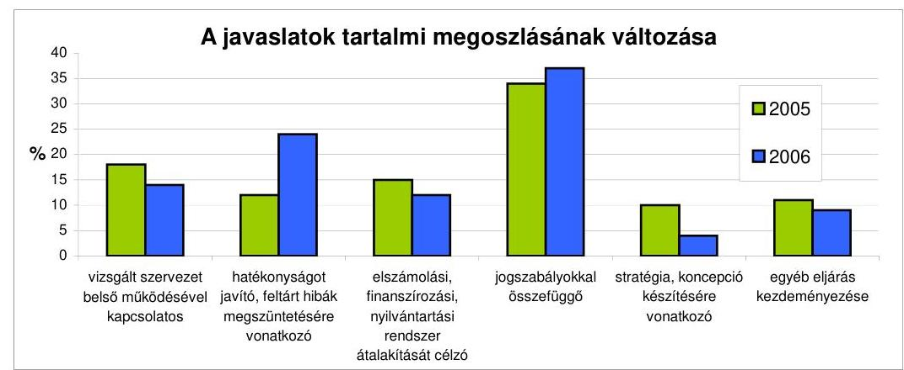

Az ÁSZ a vizsgálatai során tett ajánlások, javaslatok hasznosításának nyomon követése érdekében a korábbi évek gyakorlatának megfelelően 2006ban is tájékoztatást kért a Kormánytól és a tárcák vezetőitől az ajánlások hasznosulásáról. A megkereséseknek az érintettek kivétel nélkül eleget tettek, a tárcák által adott válaszok évről-évre teljesebbé válnak. A javaslataink hasznosulásáról kapott tájékoztatás azért is fontos információ az ÁSZ számára,

---

mert a számvevőszéki javaslatok figyelembevételére - a törvényesség helyreállítására irányuló jogi realizálás kezdeményezésén túl - nincs általános érvényű törvényi előírás.

Válaszlevelében több tárca is jelezte, hogy ellenőrzéseink során a szakmai feladatellátásukat és gazdálkodásukat javaslatainkkal nagyban segítettük, munkánk nyomán több területen értek el a szabályszerűség, a szabályozottság és a hatékonyság tekintetében előrehaladást.
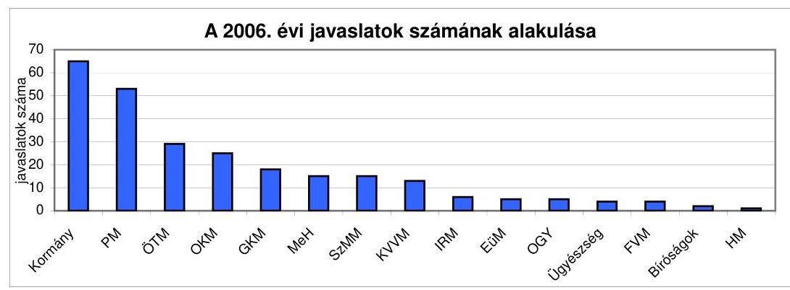

A jogi szabályozásra irányuló javaslataink 41\%-a megvalósult, a javaslatok 10\%-ára nemleges válasz érkezett, ezek a javaslataink jellemzően törvénymódosításokra vonatkoztak, néhány esetben a fennálló szabályozást megfelelőnek tartották.

A célszerúséget, hatékonyságot, eredményességet javító intézkedésre, illetve a feltárt hibák, hiányosságok megszüntetésére vonatkozó javaslataink $90 \%$-a talált kedvező fogadtatásra, $61 \%$ már megvalósult.

A belső szabályozási rendszer, illetve a fejezeti és a belső ellenőrzés múködésének felülvizsgálatát, továbbfejlesztését célzó javaslatok 83\%-ával kapcsolatban konkrét intézkedések történtek, illetve az érintettek megkezdték a javaslatok hasznosításának előkészítését.

A számviteli, nyilvántartási szabálytalanságok javítását, elszámolási, finanszírozási és nyilvántartási rendszerek korszerűsítését célzó javaslatokra beérkezett válaszok alapján azok 43\%-a megvalósult. A továbbiak realizálása folyamatban van, illetve a válaszok 10\%-ban nem adtak számot egyértelmúen a javaslat megvalósításáról.

A stratégia, koncepció készítését ajánló javaslatok 100\%-ban pozitív fogadtatásra találtak, $45 \%$ már megvalósult, $55 \%$ megvalósulása folyamatban van, vagy részben valósult meg.

Az egyéb, egyedi jellegüknél fogva nem rendszerezhető és az előző csoportokba nem sorolható ajánlások $9 \%$-ot tettek ki. Elfogadottságuk több mint $90 \%$-os, és a jelentés összeállításáig $41 \%$-uk már megvalósult.

---

Az ÁSZ a tárcák vezetői által tett intézkedések végrehajtását további ellenőrzései során figyelemmel kíséri, jelentéseiben rendre kitér ezek megvalósítására. Az ÁSZ által tett ajánlásokat és az ezekre adott válaszokat a 4. sz. melléklet foglalja össze.

# Javaslataink hasznosításáról készített éves összefoglalón túl - ajánlásaink nyomán - a következő konkrét intézkedések valósultak meg az elmúlt évben: 

Az ÁSZ észrevételei alapján módosult az államháztartás múködési rendjéről szóló 217/1998. (XII. 30.) Korm. rendelet (Ámr.), mert a kincstári körbe tartozók költségvetési előirányzatai tervezésének, módosításának és várható teljesítésének adatszolgáltatási és nyilvántartási rendjéről szóló 1997-ben kiadott pénzügyminisztériumi Tájékoztató elavult, eredeti célját, vagyis az előrejelzést, a tervezőmunkát már nem szolgálta.

Javaslatunk hatására - az Ámr. 2006. év végi módosítása nyomán - a pénzügyminiszter nélkül már nem lehet az általános tartalék felhasználására előterjesztést benyújtani, így csak közös, vagy pénzügyminiszteri előterjesztés kerülhet a Kormány elé.

A Wesselényi Miklós Ár-és Belvízvédelmi Kártalanítási Alap további múködtetésének indokoltságáról, illetve a Munkaerőpiaci Alap tervezési rendszerének felülvizsgálatáról szóló javaslatainkat a Kormány nem támogatta.

Az államháztartás adóssága kezelésének, alakulásának ellenőrzéséről készült jelentésünkben javasoltuk, hogy a Kormány dolgozzon ki és terjesszen az Országgyűlés elé a Társadalombiztosítási Alapok mindenkori pénzügyi egyensúlyának megteremtését szolgáló javaslatot. A Kormány intézkedései a nyugdíjreform, az egészségügyi reform, valamint a járulékszabályozás (pl. járulékmérték növelés, nemzeti kockázatközösség szabályozása, járulékalap szélesítés) területén a társadalombiztosítás pénzügyi egyensúlyának javítását szolgálják. 2007-ben tovább folytatódik a nyugdíjreform, az ápolási rendszer korszerűsítése és az egészségügyi reform kiteljesítését szolgáló további intézkedések kidolgozása.

Az egészségüggyel összefüggő fontosabb ÁSZ javaslatok közül a Kormány által kidolgozás alatt áll egy átfogó egészségpolitikai koncepció, amely meghatározza a magántőke, a magánvállalkozások lehetséges szerepét, szakmai területeit, az állami támogatások alapelveit, és mindezekre figyelemmel szabályozza az egészségügyi szakellátások múködésének rendszerét.

A jelentésünk a Magyar Köztársaság 2005. évi költségvetése végrehajtásának ellenőrzéséről javasolta, hogy a Kormány dolgoztasson ki a gyógyszerellátás teljes rendszerére kiterjedő, átgondolt, hosszabb távra szóló, az egészségügy átalakításához igazodó stratégiát. Továbbá határozza meg a megvalósítás pénzügyi, szakmai, illetőleg társadalmi szintű prioritásait. A tárgyban már hatályba lépett a biztonságos és gazdaságos gyógyszer- és gyógyászati segédeszközellátás, valamint a gyógyszerforgalmazás általános szabályairól szóló törvény, továbbá a törvényhez kapcsolódó végrehajtási rendeletek is.

---

A Területfejlesztés fejezet múködésének ellenőrzéséről készült jelentésben javasoltuk, hogy a Kormány intézkedjen a Nemzeti Lakásprogram kidolgozásáról. A Kormány 1139/2002. (VIII. 2.) Korm. határozatának 5. b) pontja alapján a kormánymegbízott létrehozta a Nemzeti Lakáspolitikai Tanácsadó Testületet, amely véleményező és tanácsadó szakmai és társadalmi fórumként múködik.

A Művészetek Palotája megvalósításának és múködésének ellenőrzése során javasoltuk a Kormánynak, hogy a PPP-konstrukciók alkalmazásához gondoskodjon megfelelő jogi háttérszabályozás és egységes állami eljárásrend kialakításáról. Javaslataink nyomán a Kormány 2007 februárjában határozattervezetet készített a PPP újszerű formáinak alkalmazásáról szóló 2098/2003. (V. 29.) Korm. határozat módosításáról, valamint rendelet-tervezetet alakított ki a hosszú távú kötelezettségek vállalásának egyes szabályairól (a tervezetek közigazgatási egyeztetése folyamatban van).

Az önkormányzati gazdálkodás, feladatellátás különböző területeinek ellenőrzése kapcsán a kormánynak és az ágazati minisztereknek tett javaslatainkat a szabályozások módosítása során jórészt figyelembe vették.

Elkészült a hajléktalan-ellátás hosszú távú átalakításának programja, amely foglalkoztatási, szociális, egészségügyi elemeket egyaránt tartalmaz. Minőségi változás, hogy a hajléktalanok lakhatását nem új intézmények létrehozásával, hanem a kihelyezett szállások körének bővítésével kívánják megoldani.

A 2005. évi az önkormányzatok által államháztartáson kívülre nyújtott - kiemelten felhalmozási célú - támogatások, átadott pénzeszközök felhasználása célszerűségének ellenőrzését követően az ÁSZ javaslatára a Kormány intézkedéseket tett. A lakáscélú állami támogatásokról szóló kormányrendeletben a víziközmű-társulati hitelek felvehető összegét magánszemély érdekeltenként 200 ezer Ft-ban maximalizálták, amely a jövőben megakadályozza a kamattámogatott hitel indokolatlan nagyságú felvételét. Előírták továbbá, hogy a beruházás kapcsán keletkező bevételeket a víziközmútársulati hitel törlesztésére kell fordítani. A jogszabályváltozások a jövőre vonatkozóan előreláthatóan megakadályozzák az ÖKOTÁM és hasonló rendszerú beruházás-szervezési és finanszírozási módszer további múködtethetőségét.
2007. január 1-jétől az önkormányzatok költségvetési beszámolójának kiegészítő mellékletében külön elszámoló tábla leadásával kell számot adni az egyes beruházásokhoz igénybevett központi költségvetési támogatásokról, amelyben fel kell tüntetni az állami támogatások mellett a saját forrást, valamint a realizált önkormányzati bevételt is.

A pénzügyminiszter 2006 novemberében felkérte az Adó- és Pénzügyi Ellenőrzési Hivatalt az állami kamattámogatású víziközmű-társulati hitelek igénybevételének és a lakás-takarékpénztáraknál elhelyezett megtakarítások után igénybe vett előtakarékossági támogatás jogszerűségének a vizsgálatára. A vizsgálat folyamatban van.

Az önkormányzatok gazdálkodási rendszerének átfogó ellenőrzése kapcsán a 2006. év végi Ámr. módosítása rögzítette a költségvetés és a zárszámadás előterjesztésekor bemutatandó közvetett támogatásokról készítendő kimu-

---

tatás tartalmi követelményeit. Továbbá 2008. január 1-jétől érvényesítési feladatot az önkormányzatoknál csak a jogszabályban meghatározott szakmai képesítéssel rendelkező dolgozó végezhet, valamint a helyi és a helyi kisebbségi önkormányzatok közötti megállapodásnak tartalmaznia kell a helyi kisebbségi önkormányzat gazdálkodása végrehajtásának rendjét, és az ehhez kapcsolódó feladatellátás jogosultjainak, kötelezettjeinek kijelölését is. Az önkormányzatok számára készített belső ellenőrzési kézikönyv minta kiegészült a céljelleggel nyújtott támogatások ellenőrzésére vonatkozó egyes szempontokkal. Megvalósult az a javaslat is, miszerint a számviteli politika és kapcsolódó szabályzatok előírásainak az önkormányzati hivatalhoz tartozó, részben önállóan gazdálkodó és részjogkörű költségvetési szervekre történő kiterjesztéséről a jegyző döntsön. Az önkormányzatok által nyújtott múködési célú támogatásokra is kiterjed az Áht.-ban meghatározott közzétételi kötelezettség.

A középiskolai kollégiumok fenntartásának ellenőrzésekor javasoltak alapján a Nemzeti Fejlesztési Terv II-ben a Regionális Operatív Programokba már beépült a közoktatási intézmény - mint kedvezményezett - fogalma, ami magába foglalja a kollégiumot is. A regionális közoktatási stratégiákban már megtalálhatók a kollégium fejlesztések irányai, területei, melyekről helyben döntenek.

Az ÁSZ a területfejlesztési tanácsok és munkaszervezeteik rendelkezésére álló támogatások igénylésének és felhasználásának korábbi években végzett ellenőrzésekor tett javaslataink alapján a forrásdecentralizáció egységes elvekre épülő rendszere, a forráskoordinációra vonatkozó javaslatunk beépült a költségvetési törvényekbe. Az akcióprogramok végrehajtása során előírás a folyamatos monitoring biztosítása. Az Új Magyarország Fejlesztési Terv Operatív programjaiban a kiegyensúlyozott területi fejlődést szolgáló beavatkozások között az elmaradott térségek felzárkóztatása, finanszírozása is kiemelten jelenik meg.

Az önkormányzatok szociális és gyermekjóléti szolgáltatásainak ellenőrzése kapcsán tett javaslatainkra a Kormány meghatározta az ún. „irányított területi kiegyenlítési rendszer"-be történő befogadás feltételeit, az eljárás szabályait, valamint a befogadásról szóló döntést megalapozó szakmai szempontokat. 2007-ben a nem állami fenntartók a finanszírozás szempontjából újnak minősülő szociális, gyermekjóléti és gyermekvédelmi szolgáltatások, illetve férőhelyek után normatív hozzájárulásra csak akkor jogosultak, ha a szociális ágazat irányításáért felelős miniszter az irányított területi kiegyenlítési rendszerbe befogadta azokat.

A társadalmi igazságosság és a rendelkezésre álló források hatékonyabb felhasználása érdekében a Nemzeti Család- és Szociálpolitikai Intézet a Minisztériummal kötött megállapodás szerint - hozzárendelt források biztosításával létrehozta a munkacsoportokat, amelyek szolgáltatás típusonként készítik el a jogosultsági kritériumok meghatározásához szükséges szakmai javaslataikat.

Meghatározták további alapszolgáltatásoknál (házi segítségnyújtás, jelzőrendszeres házi segítségnyújtás, támogató szolgáltatás) a rászorultsági kritériumokat, melyeket a 2007-ben benyújtott igényeknél már érvényesíteni kell, változtak a térítési díjak megállapításának szabályai is.

---

Megtörtént a legsúlyosabb munkaerőpiaci-szociális problémák megoldására vonatkozó komplex programok kidolgozása, amelyek megvalósítása uniós támogatással a 2007. évben kezdődik.

A Kormány korábbi javaslatainkra figyelemmel adta ki a kormányzati közalapítványok felülvizsgálatáról szóló 1069/2006. (VII. 13.) Korm. határozatot.

# 3.2.3. Javaslatok a vizsgált szervezeteknél 

Az egyes tárcáknál az ajánlások jellemzően megvalósultak, illetve folyamatban van a megvalósításuk. A tárcák vezetői a tennivalókról intézkedési tervet készítettek, ajánlásokat fogalmaztak meg a hozzájuk tartozó költségvetési szervek számára, valamint miniszteri utasításokat korszerűsítettek. Esetenként a hasznosítás már az ellenőrzés lefolytatása alatt elkezdődött.

A 2005. évi állami költségvetés végrehajtásának ellenőrzésekor, illetve a 2007. évi költségvetés véleményezésekor az ÁSZ valamennyi fejezet vezetője számára fogalmazott meg ajánlásokat, amelyek a múködés, a gazdálkodás, a beszámolás szabályzatainak elkészítésére, aktualizálására, a belső ellenőrzés megfelelő múködésére, a szükséges intézkedések megtételére vonatkoztak. Az ellenőrzöttek belső szabályozási rendszerére, illetve a fejezeti és a belső ellenőrzés múködésére vonatkozó megállapítások, javaslatok kapcsán a konkrét intézkedések megtörténtek.

A 2005. évi költségvetés végrehajtásának ellenőrzéséről készült jelentésben javasoltuk, hogy a Miniszterelnöki Hivatalt vezető miniszter kérje számon a Nemzeti Fejlesztési Ügynökség vezetőjétől az Egységes Monitoring Információs Rendszer számviteli modulja teljes körű kiépítését, amely biztosítja a jogszabályban előírt követelmények teljesítését. A javaslat megvalósult.

A Magyar Köztársaság Ügyészsége fejezet múködésének ellenőrzéséről készült jelentésünkben javasoltuk a legfőbb ügyésznek, hogy gondoskodjon az EUROJUST nemzeti tagja hazai ügyészi és egyéb jogosítványainak meghatározásáról és az intézmény igénybevétele szabályainak megalkotásáról. A Legfőbb Ügyészség két törvénymódosítási javaslat mellett kidolgozta az EUROJUSTra vonatkozó új és részletes legfőbb ügyészi utasítás tervezetét.

A Magyar Tudományos Akadémia fejezet múködésének ellenőrzéséről készült jelentésünkben felhívtuk a Kormány figyelmét arra, hogy kísérje figyelemmel, és rendszeresen értékelje az állami szervek együttműködését a Magyar Tudományos Akadémiával a kutatás-fejlesztés állami irányításában, valamint átfogóan szabályozza az alaptevékenységként kutatást végző költségvetési kutatóhelyek sajátos gazdálkodásának múködési feltételeit. A kapott tájékoztatás szerint a Kormány készülő középtávú (2013-ig szóló) tudomány- és technológia-innováció politikai stratégiája elkészítésében az Akadémiával folyamatosan együttműködik. A MeH a sajátos gazdálkodási feladat végrehajtásához szükséges kormányzati intézkedések megtételére a Pénzügyminisztériumot hívta fel.

---

Az Állami Privatizációs és Vagyonkezelő Zrt. 2005. évi múködésének és a központi költségvetés végrehajtásához kapcsolódó tevékenységének ellenőrzéséről készült jelentésben javasoltuk a pénzügyminiszternek, hogy szabályozza az állam vállalkozói és kincstári vagyonának értékesítési, kezelési szerződéseiben vállalt kötelezettségek és követelések következetes érvényesülését a nyilvántartások és elszámolások egységesítésével. A kidolgozás alatt álló, az állami vagyon egységes jogi szabályozásának és szervezetrendszerének kialakításáról szóló törvényjavaslat - vélhetően - e téren is változásokat eredményez, amennyiben az új vagyonkezelő szervezet új belső nyilvántartási, ellenőrzési, informatikai stb. rendszert, illetve új belső szabályzatokat alakít ki. Ennek során természetesen hasznosulhatnak az ellenőrzések tapasztalatai, megállapításai. A szervezet egységesítésétől általában is azt várjuk, hogy az állami vagyongazdálkodásért felelős szervezet az állami vagyon teljes körére egységesen irányadó jogszabály, valamint egységes elvek és követelmények szerint, a jelenlegi rendszernél lényegesen hatékonyabban múködjön.

A Magyar Távirati Iroda Zrt. 2005. évi gazdálkodásának ellenőrzésekor tett javaslatok részben hasznosultak. Az Nht. felülvizsgálata az Országgyűlés Kulturális és sajtó bizottsága albizottságában elkezdődött, de a szabályok megalkotására még nem került sor.

Az elmúlt négy évben valamennyi helyi önkormányzatnál végzett az ÁSZ ellenőrzést. Ellenőrzéseink során közel háromezer javaslatot fogalmaztunk meg, amelyek háromnegyedét az önkormányzatok hasznosították. Ennek eredményeként javult a költségvetési gazdálkodás szabályozottsága, a végrehajtás során előrelépés történt a helyi és központi előírások betartása tekintetében, a munkafolyamatba épített ellenőrzési feladatok ellátását a korábbiaknál szélesebb körben biztosították.

Kedvező, hogy a gazdálkodási rendszer átfogó ellenőrzésével érintett megyei, megyei jogú városi, fővárosi és kerületi önkormányzatoknak tett ÁSZ javaslatok rövid időn belül hasznosultak, több esetben már a helyszíni ellenőrzés ideje alatt intézkedtek a feltárt hiányosságok megszüntetéséről, a mulasztások pótlásáról. A jogkövető magatartás kialakítását, a legjobb gyakorlat átvételét megkönnyíti, hogy a kiemelt körről készült átfogó jelentések nyilvánosak, azokat bárki olvashatja az Interneten.

# 3.3. Kezdeményezett büntető eljárások 

A közpénzek felhasználásához kapcsolódó büntetőjogi felelősségre vonás össztársadalmi érdek, amelynek bizonyítékokkal való alátámasztásában az ÁSZnak - vizsgálati hatókörében - kiemelkedő szerepe van. Különösképpen igaz ez az önkormányzati szférát illetően, amely gazdálkodásának minőségére és gyakorlatára vonatkozó - konkrét ellenőrzéseken alapuló - információt szinte kizárólag az ÁSZ tud szolgáltatni.

Az ÁSZ 2006-ban is eleget tett azon kötelezettségének, miszerint ellenőrzési megállapításait, amennyiben bűncselekmény elkövetésének gyanúja áll fenn, köteles az illetékes nyomozó hatóságokkal közölni. Az ÁSZ a büntetőeljárások kezdeményezése tekintetében továbbra is a megalapozottság elvét tartja szem előtt.

---

Az ÁSZ 2006-ban 14 feljelentést tett ${ }^{14}$, összesen 22 ismert, valamint további ismeretlen tettesek ellen. A 14 feljelentésben megfogalmazott büntetőjogi felelősség felvetése 4 számvevőszéki vizsgálat során feltárt tényeken, megállapításokon alapult. Az elkövetési magatartással okozott kár összege az összes feljelentés esetében több mint $\mathbf{1}$ milliárd forint volt.

A 14 feljelentés összesen 5 búncselekmény törvényi tényállását merítette ki.
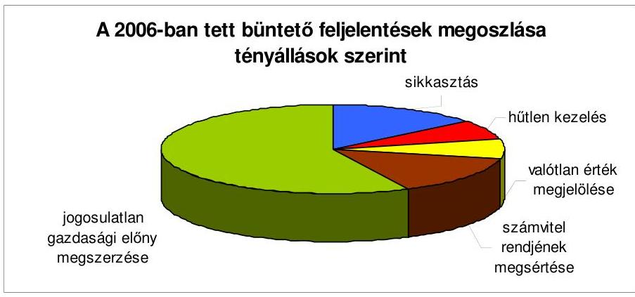

Kiugróan magas mértékű a tárgyévben a jogosulatlan gazdasági előny megszerzése bűncselekmény tényállásának előfordulása. Ennek oka a 2006. évben készült ÖKOTÁM jelentést megalapozó számvevői jelentések megállapításai következtében tett feljelentések számossága.

A jogi realizálással kapcsolatos tevékenység hatékonyságának - egyben a megtett feljelentések megalapozottságának - legfontosabb mutatója az illetékes nyomozó hatóság által megindított eljárások, a vádemelések és adott esetben a bírói ítéletek számának alakulása. A rendelkezésre álló hatósági határozatok és egyéb visszajelzések alapján a 2006-ban tett 14 feljelentésre a nyomozó hatóság már 9 esetében megindította a nyomozást, 1 esetben megszüntette a nyomozást, 4 esetben a feljelentés elbírálása még folyamatban van.

A büntetőeljárásról szóló törvény értelmében az állami szervek (így az ÁSZ is) kötelesek a nyomozó hatóságok által kezdeményezett - tájékoztatás adása, adatok közlése vagy átadása, illetve dokumentumok rendelkezésre bocsátása iránti - megkereséseknek határidőben eleget tenni. A tárgyévben az ÁSZ-hoz összesen 20 olyan nyomozó hatósági megkeresés érkezett, amelyek már folyamatban lévő büntetőeljáráshoz kapcsolódtak. Az ÁSZ az esetek túlnyomó többségében a lefolytatott vizsgálat során tudomására jutott tényeket tartalmazó dokumentumok megküldésével eleget tudott tenni az adatszolgáltatási kötelezettségének. Mindössze 5 megkeresés vonatkozásában tartalmazta a válasz azt a kitételt, hogy a megkeresésben szereplő kérdésben nem folyt számvevőszéki ellenőrzés.

[^0]
[^0]:    ${ }^{14}$ 2005-ben 5 ellenőrzés kapcsán 5 feljelentést tettünk, a feljelentéssel érintett személyek száma 7 volt.

---

A büntetőjogi felelősség felvetése mellett az ÁSZ a közbeszerzésekről szóló törvény alapján a közbeszerzési jogszabályok megsértése miatti jogorvoslati eljárás kezdeményezésére jogosult. 2006-ban az ÁSZ 21 esetben kezdeményezett a Közbeszerzési Döntőbizottság előtt jogorvoslati eljárást, ebből 17 esetben állapítottak meg jogsértést, 3 esetben került sor az eljárás megszüntetésére és 1 eljárás még folyamatban van. A közbeszerzési eljárás jogtalan mellőzése miatt kezdeményezett jogorvoslati eljárások által érintett szerződések összértéke 781,9 millió Ft volt, ehhez kapcsolódóan a Közbeszerzési Döntőbizottság 14,5 millió Ft értékben szabott ki bírságot.

# 3.4. Közérdekú bejelentések, javaslatok és panaszok intézése 

Az ÁSZ-hoz 2006-ban 304 bejelentés, panasz, javaslat és egyéb kérelem, továbbá hivatalos szervektől 50 megkeresés érkezett.
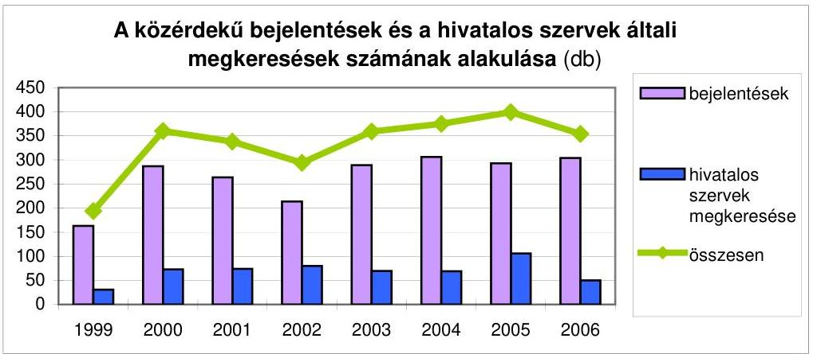

A bejelentések száma kisebb ingadozással növekvő tendenciájú. Az állampolgárok, civil szervezetek, egy-egy ügyet képviselő természetes vagy jogi személyek legtöbbször az ÁSZ eljárását - rendszerint ellenőrzési tevékenységét - kérték, illetve jogi tájékoztatást igényeltek ügyük megoldásához. A felvetéseket az ellenőrzési igazgatóságok a lehetőségeken belül figyelembe vették az operatív ellenőrzési programokban.

A helyi, a kisebbségi önkormányzatok múködési körébe tartozott 170 bejelentés. Növekedett az önkormányzati képviselőktől és tisztségviselőktől érkezett bejelentések száma. Leggyakrabban a képviselőtestület ellenzéki képviselője, illetve a pénzügyi bizottság elnöke kért ellenőrzést. Új tartalom volt az uniós támogatások felhasználásával kapcsolatos anomáliák ellenőrzésének igénylése.

A bejelentő állampolgárok között 28\% volt a nevüket nem vállalók aránya, akik az esetek zömében kistelepülések lakói. Bejelentéseikben jellemző volt az egyszerú gyanúra, feltételezésre, hallomásra épített, bizonyítékot mellőző tartalom.

Az őszi önkormányzati választások során újonnan megválasztott települési önkormányzati vezetőktől 12 megkeresés érkezett, amelyben a település gazdasági helyzetének soron kívüli ellenőrzését kérték. Ezeket a kéréseket kapacitás hiány miatt nem tudtuk teljesíteni, azonban a következő időszak ellenőrzési tervezéséhez hasznosítható információkat tartalmaznak.

---

Az áttétel folytán hozzánk érkezett bejelentések száma kissé növekedett. Az állami szervek (jellemzően ügyészség, közigazgatási hivatal) gyakran hivatkoznak az ÁSZ széles hatáskörére, amikor a hozzájuk érkezett bejelentést az ÁSZhoz átteszik.

Továbbra sem csökkent azon bejelentések száma, amelyekben az ÁSZ feladatkörébe nem tartozó ügyben kértek intézkedést, tanácsot, jogértelmezést, állásfoglalást. A hozzánk érkezett levelekben az állampolgárok nemegyszer számoltak be más szerveknél tett korábbi kezdeményezéseik kudarcáról. Az ilyen esetekben arra törekedtünk, hogy az ÁSZ hatáskörét és lehetőségeit figyelembe véve maximális elvi segítséget nyújtsunk a rászoruló, laikus állampolgároknak. A válaszleveleikben ( 55 db ) köszönetüket fejezték ki és az is előfordult, hogy tájékoztattak ügyük további alakulásáról.

# 3.5. A számvevőszéki tevékenység nyilvánossága 

A számvevőszéki tevékenység egyik alappillére, hogy jelentéseink, kiadványaink, munkatársaink publikációi teljes terjedelmükben nyilvánosak, és bárki által hozzáférhetőek. Erre építkezve tudjuk szervezni kommunikációnkat, segíteni az Országgyűlés ellenőrző és törvényhozó munkáját, valamint erre a nyilvánosságra alapozzuk a médiával való kapcsolattartást is.

A 2006-os esztendőt az állandóság és a változás kettőse jellemezte. Egyrészt a már kialakult és bevált kommunikációs gyakorlatot követtük az Országgyúlés, a média és az állampolgárok felé, másrészt megújítottuk arculatunkat, bemutatkozó kiadványainkat, valamint stratégiánkat.

Egyik fő feladatunk - az előző évekhez hasonlóan - továbbra is az Országgyúlés tájékoztatása, munkájának segítése volt. Az újonnan megválasztott Országgyűlés tagjainak elküldtük megújult arculatú, aktualizált bemutatkozó kiadványunkat, valamint a 2006-2010. évi stratégiánkat. A képviselők - csakúgy, mint a korábbi években - 2006 folyamán is külön figyelemfelhívó levélben kaptak értesítést jelentéseinkről (a képviselői levelek, illetve a jelentések „terítése" most már elsősorban elektronikus úton történt). Az országgyűlési bizottságok munkáját folyamatosan figyelemmel kísértük, munkatársaink szükség szerint részt vettek az üléseken, a képviselők tevékenységét szakmai észrevételeinkkel segítettük, jelentéseinket, kiadványainkat nyomtatott formában megküldtük számukra.

Kommunikációs tevékenységünk egyik legfontosabb eleme a médiával, a szerkesztőségekkel és az újságírókkal való kapcsolattartás. 2006-ban három alkalommal elnöki sajtótájékoztatót, valamint kilenc alkalommal az ország különböző részein a megyei, illetve megyei jogú városi önkormányzatokkal közösen rendezett sajtótájékoztatót tartottunk. Két esetben rendeztünk főigazgatói sajtótájékoztatót Budapesten: az ÁSZ Fejlesztési és Módszertani Intézetének „A környezettudatos gazdálkodás és a fenntartható fejlődés a szabályozás és az ellenőrzés tapasztalatainak tükrében" c. tanulmányát mutattuk be a média munkatársainak, majd a helyi és a helyi kisebbségi önkormányzatok gazdálkodási rendszerének ellenőrzési tapasztalataival kapcsolatban adtunk tájékoztatást.

---

Jelentéseink sajtó-összefoglalóját közvetlenül eljuttattuk a nemzeti hírügynökséghez, a szerkesztőségekhez és az újságírókhoz. A már kialakult gyakorlatnak megfelelően az összefoglalókat, valamint az ÁSZ-szal kapcsolatos személyügyi híreket megjelentettük a Magyar Közlöny mellékletét képező Hivatalos Értesítőben.

A munkánk iránti széleskörű érdeklődést jelzi, hogy az Observer Médiafigyelő valamint a saját feldolgozásaink alapján 2006-ban összesen mintegy kétszáz különböző médiumban közel négyezer publikáció jelent meg az ÁSZ-szal kapcsolatban. A tendencia évről-évre emelkedő.
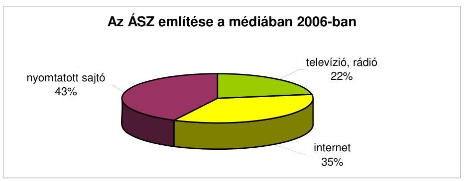

Internetes honlapunkról 2005 májusától állnak rendelkezésünkre részletes információk a jelentések és egyéb dokumentumok (képviselői levél, angol nyelvű jelentés-összefoglaló, stb.) letöltésével, valamint a különböző menüpontjaink látogatottságával kapcsolatban, illetve ekkortól helyeztünk el honlapunkon elégedettségmérő űrlapot.
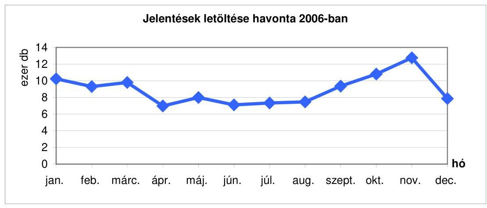

Tapasztalataink szerint honlapunk közkedvelt információforrás a tevékenységünk, illetve a jelentéseink iránt érdeklődők körében: 2006-ban több mint 97 ezren látogattak nyitóoldalunkra, a külső látogatók összesen 107033 szor töltöttek le jelentést ${ }^{15}$, 4066 -szor kísérőlevelet és 380 esetben nyitottak meg angol nyelvű összefoglalókat.

[^0]
[^0]:    ${ }^{15}$ Nem ritkán a külső látogatók több jelentést is letöltenek.

---

#### Abstract

Az elégedettségmérő űrlap létrehozásának elsődleges célja az volt, hogy a honlap szolgáltatásairól visszajelzést kapjunk. Ezzel a lehetőséggel élve 2006-ban összesen 71-en fejtették ki véleményüket honlapunkról. A kapott válaszok képet adnak arról, hogy az oldalra látogatók mennyire elégedettek a fellelhető információk hasznosságával, az oldal kezelhetőségével, az információk mennyiségével és aktualitásával. A kitöltött űrlapok alapján kapott adatokat félévente részletesen elemezzük, kiértékeljük. 2006-ra vonatkozóan megállapítható, hogy a kitöltők elsősorban hivatali munkájukhoz használták az ÁSZ internetes oldalát, a leglátogatottabb rovatok a „Jelentések" és az „Ellenőrzési módszertanok" voltak, valamint a válaszadók az információk mennyiségével elégedettek voltak.


Honlapunk számos lehetőséget kínál a munkánk iránt érdeklődőknek közvetlen kapcsolat, akár párbeszéd kezdeményezésére is. A Fórum rovat kétféle utat biztosít a kérdések és az észrevételek feltevésére: egyrészt az „ÁSZ Fórumán", másrészt az „Elnöki fogadóórán" keresztül.

Az „ÁSZ Fóruma" folyamatosan fogadja a kérdéseket, észrevételeket, és legfeljebb 8 napon belül az észrevételre adott válasz megjelenik a honlapon. Az elmúlt évben 66 kérdés érkezett: a legtöbben jogi segítséget, konkrét probléma megoldásához állásfoglalást kértek.

Az „Elnöki fogadóóra" az elmúlt évben háromszor került megrendezésre. A rovatot minden esetben a fogadóóra előtt egy héttel nyitottuk meg. Ettől az időponttól kezdődően lehetett a kérdéseket feltenni, amelyekre a meghirdetett időpontban válaszoltunk. Az „elnöki fogadóóra" lehetőséget kínál arra, hogy a honlapra látogatók az őket érdeklő kérdésekről élő párbeszédet folytassanak az ÁSZ vezetőivel. Meghirdetett témáink voltak: az ÁSZ 2006. évi ellenőrzései, az ÁSZ 2006-2010. évi stratégiája, az ÁSZ 2005. évi tevékenységéről szóló jelentés, a 2007. évi költségvetési javaslatról szóló ÁSZ-vélemény, az állami közutak fenntartásának ellenőrzése és az uniós támogatások 2005. évi felhasználásának ellenőrzése.

Az előző két lehetőségnél mind a kérdések, mind a válaszok nyilvánosak, az ÁSZ központi e-mail címére érkezett kérdések esetében a válaszok csak az érdeklődők számára elérhetők. Az elmúlt évben 183 kérdés érkezett ezen a csatornán keresztül.

# 4. AZ ELLENŐRI MUNKA MINŐSÉGÉNEK FEJLESZTÉSE 

### 4.1. Humán erőforrás gazdálkodás és fejlesztés

## Személyi feltételek

A 2006. évi személyzetpolitikai célokat és intézkedéseket az ÁSZ-stratégia és a közigazgatás-fejlesztés általános követelményeinek szem előtt tartásával alakítottuk ki. Az ellenőrzési feladatok és a rendelkezésre álló kapacitások összhangját a szervezetünket is érintő központi létszám- és bérkorlátok figyelembevételével kellett megteremteni. Áttekintettük személyi állományunk jellemzőit (korösszetétel, képzettségi sajátosságok, munkaköri feladatmegosztás), és kisebb szervezeti korrekciókkal csökkenő létszám mellett is biztosítani tudtuk a hatékony működés fenntartását, az ellenőrzési terv végrehajtását.

---

A viszonylag magas átlagéletkorból adódóan a létszám csökkentésének természetes útjaként a nyugdíjazások lehetőségét vizsgáltuk. Két-három évre szóló nyugdíjazási tervet készítettünk, amelynek konkrét ütemezését a munkáltató vezetők az érintettekkel személyes beszélgetések során egyeztették. Az intézkedési terv és annak végrehajtása nem mechanikusan igazodik a nyugdíjjogosultsághoz, mivel a munkaköri sajátosságokat és személyi körülményeket leginkább az egyéni teljesítményeket - is mérlegeljük.
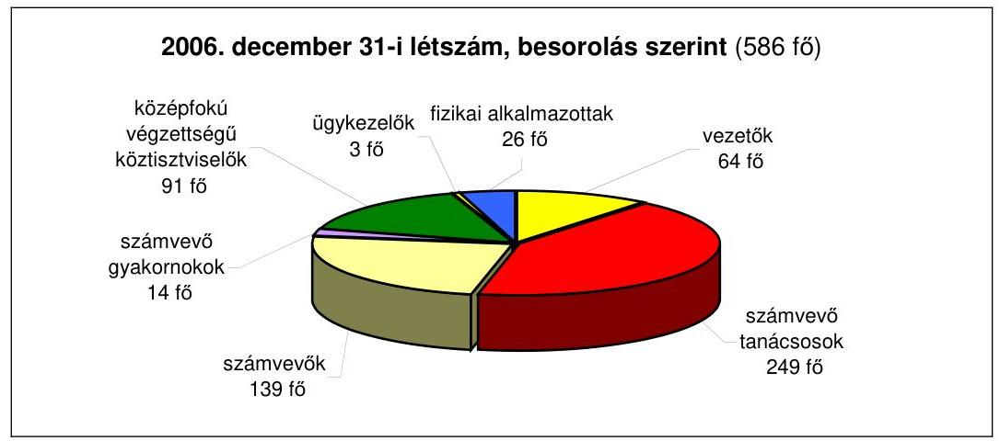

Az ÁSZ jóváhagyott állományi létszáma - a Fejlesztési és Módszertani Intézet 8 közalkalmazotti álláshelyeivel együtt - 2006-ban 618 fő. Év végéig 20 fős létszámcsökkenést irányoztunk elő, s ezt hosszabb távra tartható módon megvalósítottuk. December 31 -én a ténylegesen betöltött létszám 586 fő volt.

Korábban személyzet-stratégiai célként fogalmaztuk meg az állomány átlagéletkorának csökkentését, az egyes foglalkoztatási csoportok életkori mutatóinak közelítését. A nyugdíjazások folytán az átlagéletkor 48 év. Számvevői, különösen vezetői körben ésszerű határai vannak a fiatalításnak, mivel az ellenőrzési feladatok - a megállapításokért viselt felelősség miatt - a szokásost meghaladó szakmai felkészültséget kívánnak, ami magába foglalja az adott munkakörnek megfelelő hosszabb gyakorlati idő megszerzését is.
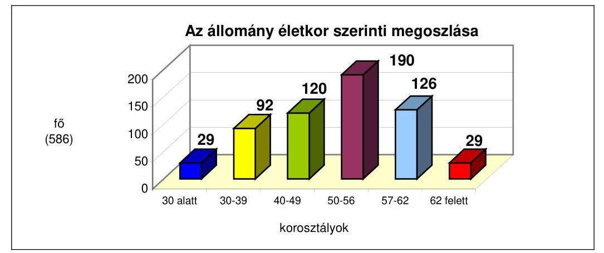

---

A létszámmozgás szervezetünknél - a korábbi évekhez hasonlóan - 2006-ban sem volt jelentős: 37 munkatárs távozott, 15 fő lépett be. A távozók és érkezők aránya - aktuális státusz-kezelési szempontok következtében - megfordult a megelőző középtávú időszak tendenciájához képest, és belátható ideig a kinevezések száma nem haladhatja meg a közszolgálati jogviszonyt megszüntetőkét.

Tekintettel arra, hogy a nyugdíjazások során több nagy tapasztalatú, ellenőrzési szakértő esett ki a munkából, a szakmai színvonal és hatékonyság érdekében a felvételek, illetve a foglalkoztatás szakmai és etikai követelményeire fokozott figyelmet fordítunk. A pályázati kiírásoknál és felvételeknél előnyben részesítjük a standard pénzügyi-közgazdasági végzettség mellett posztgraduális képzésben részt vett, két- vagy többdiplomás, illetőleg nevesített felsőfokú pénzügyi szakképesítéssel rendelkező szakembereket.

A folyamatos generációváltással változik a szakmai képzettségi és ismeretstruktúra is. A hosszabb ellenőrzési gyakorlattal, magasabb képesítettséggel rendelkező revizorok helyett (vagy mellé) bekerülő fiatalabb munkatársak korszerűbb szakmai alapműveltséget, szélesebb körű idegennyelv-ismeretet, nagyobb informatikai jártasságot és rugalmasabb továbbtanulási készséget hoznak magukkal.
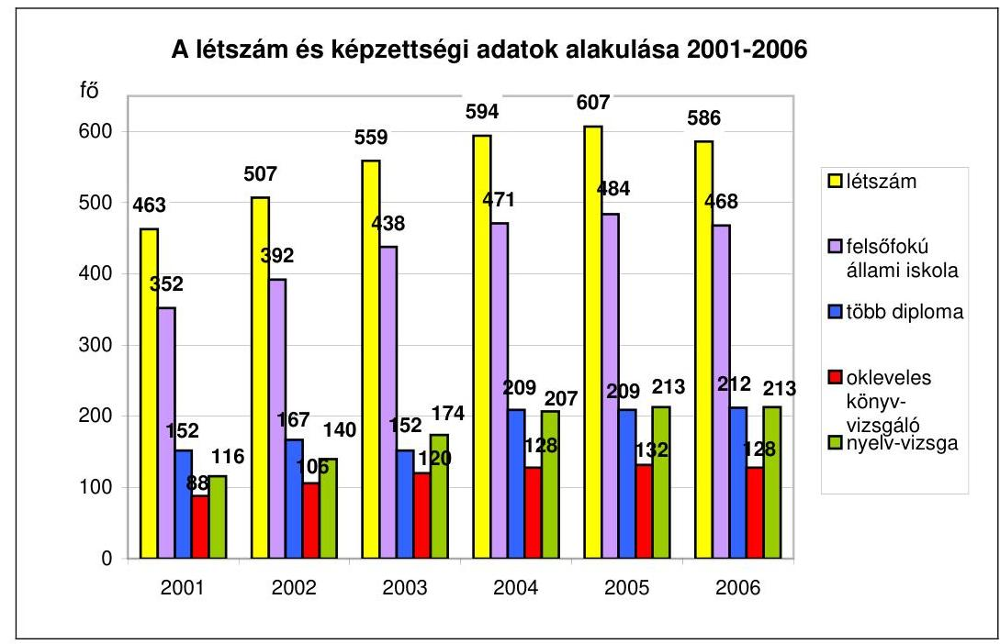

A szervezeti tevékenység hatékonyságát - a szakmai felkészültség mellett nagymértékben befolyásolja a munkatársak hozzáállása. A közvetlen ellenőrzésben működő számvevők munkáját a témavezetők minden ellenőrzés lezárása alkalmával írásban értékelik. Az értékelés szempontjai az ellenőrzési célokhoz, illetve a végrehajtás mozzanataihoz (előkészület, helyszíni munka, jelentésírás, megállapítások alátámasztása, határidők stb.) kapcsolódnak. Az elmúlt évben az ellenőrök tevékenységéről 563 értékelés készült. A munkáltatói jogkört gyakorló vezető négyévenként - a teljesítmény-értékelések tapasztalatainak, il-

---

letőleg a karrierfejlődés tendenciáinak áttekintésével - minősítést készít. 2006ban 78 minősítés készült.

A számvevők ösztönzésére felhasználható bérkeret szűkössége miatt 2006-ban az előmeneteli mozgások lelassulása, a megérett karrierlépések kényszerű viszszafogása volt jellemző.

# Továbbképzési munka 

Belső szervezésű továbbképzéseinken munkatársaink a legnagyobb számban továbbra is az ellenőrzési munkát közvetlenül segítő tanfolyamokon vesznek részt. 2006-ban is kiemelten kezeltük az egyes vizsgálat-típusokat oktató előadásokat, az aktuális ismereteket átadó számviteli és jogi képzéseket. Új képzésként a munkatársakat a minőségirányítási rendszer szabályaival, kialakításának céljaival ismertetjük meg. Továbbra is igény volt arra, hogy a vizsgálatvezetők szakmai előadások szervezésével segítsék az adott ellenőrzésben közreműködő számvevők felkészítését. A korszerű, fejlődő informatikai tudás átadására szintén kiemelt figyelmet fordítottunk, s mivel az információkezelés technikai és adatvédelmi biztonsága kiemelten fontos, törekszünk a biztonságtudatos felhasználói hozzáállás kialakítására.
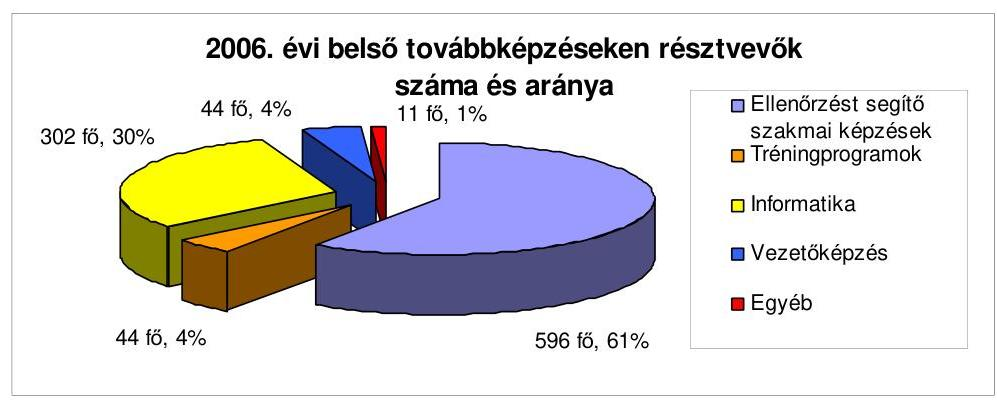

Vezetőink és számvevőink közül mintegy 50 fő - szemeszterenként változó óraszámmal - közreműködik a felsőszintű iskolai, illetve szakképzésben, főként államháztartási, ellenőrzés-szervezési és vizsgálat-módszertani stúdiumokat vezetnek. A felsőfokú szakmai képzésben érdekeltek részére - a Közép Európai Egyetemmel együttműködésben - oktatás-módszertani tréninget szerveztünk.

A munkaköri alkalmasság és a felkészültségi szint emelése érdekében - nem utolsó sorban a minősítések és egyéni teljesítmény-értékelések tapasztalatainak felhasználásával - munkatársaink szakmai és nyelvi továbbképzéseit az ésszerűség, illetve a pénzügyi lehetőségeink függvényében anyagi eszközökkel, munkaidő-kedvezményekkel is támogatjuk. 2006-ban 15 fő fejezte be sikeresen a támogatott tanulmányait, és 16 új tanulmányi szerződést kötöttünk. Jelenleg 63 tanulmányi szerződésünk van.

---

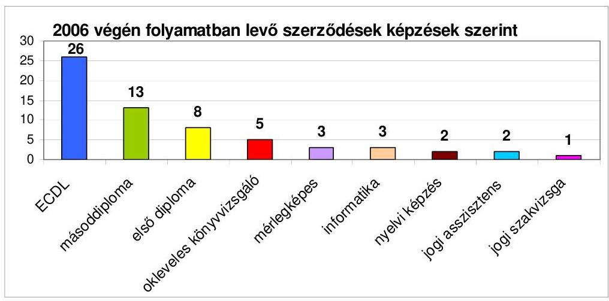

Az ÁSZ-stratégiát támogató humánpolitikai és oktatási célrendszerben kiemelten szerepel a továbbképzés elektronikus szervezési, illetve oktatási módszereinek fejlesztése. Az e-learning (távoktató) projekt elemeinek tesztelésével, majd a rendszer üzembe állításával szervezetünk élenjáró pozíciót ért el a közigazgatásban.

2006-ban a távoktató keretrendszer és a tanulási folyamatot támogató-követő menedzsmentrendszer segítségével az alábbi elektronikus tananyagokat lehetett használni: CD-jogtár oktatóanyag, CD jogtár vizsga, ECDL start csomag, financial audit alapismeretek (IDEA példával), nyelvoktató szoftverek különböző nyelveken és nyelvi szinteken.

Évek óta nagy az érdeklődés a financial audit (FA) távoktató tananyagunk iránt, az elmúlt évben 55 új hozzáféréssel a regisztráltak száma 312-re nőtt. Időközben az FA mellett elkészült a teljesítmény-ellenőrzési (TE) tananyag is, s mivel ez ugyancsak bekerült a Magyar Közigazgatási Intézet akkreditált oktatási anyagai közé, szélesebb szakmai körökben, országosan is elérhetővé válik.

Az ÁSZ módszertanait oktató elektronikus tananyagok kiegészítik, illetve helyettesítik a tanfolyami képzést, előzetes felkészülési lehetőséget, utólagos információ-frissítést nyújtanak a számvevőszék munkatársai mellett a közszférában dolgozó ellenőröknek, alkalmazva a legmodernebb képzéstámogató technológia eszköztárát és az Internet előnyeit. A felügyeleti és fejezeti ellenőrzésben dolgozó ellenőrök - előzetes regisztráció után - jelszavas belépéssel az Interneten keresztül férhetnek hozzá a módszertanokat oktató interaktív tananyagokhoz.

A hagyományos (tantermi, tanfolyami) formában 2000 óta tartunk financial audit és teljesítmény-ellenőrzési kurzusokat minisztériumi, intézményi belső ellenőrök, könyvvizsgálók és más pénzügyi, ellenőrzési szakemberek számára. 2006-ban is jelentős számban jelentkeztek az érdeklődők. FA képzést 4 időpontban szerveztünk 149 fő részvételével, a TE előadásokat pedig 3 alkalommal 77 -en hallgatták.

---

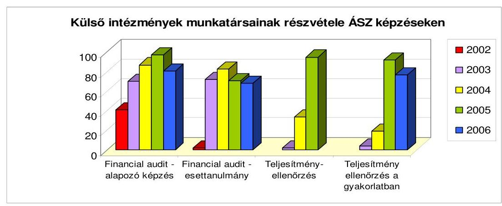

A 2006. évre az oktatásra fordítható költségvetési előirányzatot az előző évihez hasonlóan terveztük, ami a képzési célok eléréséhez elegendőnek bizonyult, sőt - ésszerű takarékossággal, illetve az oktatásszervezési eszköztár jobb kihasználásával - a tényleges felhasználás elmaradt a rendelkezésre álló összegtől.
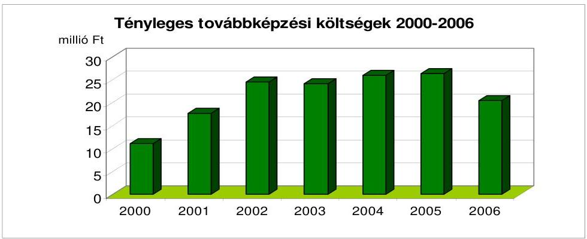

# 4.2. Az ellenőrzések minőségbiztosítása 

Az ÁSZ ellenőrzések megbízhatósága, a megállapítások, következtetések és javaslatok megalapozottsága érdekében 2006-ban is hatásosan múködött a belső minőségkontroll és minőségbiztosítási rendszer. Az ellenőrzési folyamatba épített vezetői felügyelet és a meghatározott pontokon végzett szakmai felülvizsgálat folyamatos kontroll alatt tartotta a számvevők ellenőrzési tevékenységét és a helyszíni ellenőrzések eredményeiről készített számvevői jelentéseket. Valamennyi jelentés tervezete - az ellenőrzött szervezetekkel folytatott egyeztetésekkel párhuzamosan - kétszeri ellenőrzés-szakmai és jogi felülvizsgálaton esett át. Az érintetteknek történő átadást megelőzően külön megalapozottsági felülvizsgálat alá kerültek a személyes felelősséget felvető számvevői jelentéstervezetek.

A jelentések elnöki aláírására csak az ellenőrzésekért felelős igazgatóságoktól függetlenített Minőségbiztosítási önálló osztály eredményes felülvizsgálatát igazoló tanúsítványok birtokában kerülhet sor.

---

A két ellenőrzési igazgatóság által 2006-ban lezárt vizsgálatok egyhatodának teljes folyamata felülvizsgálatra került. Az értékelés az ellenőrzés előkészítésétől a jelentés elkészítéséig a szakmai követelmények teljesítése és a deklarált magas szintű ellenőrzési bizonyosság elérésére vonatkozott, és egészében megnyugtató eredménnyel zárult.
2006. január 1-jén hatályba lépett a számvevőszéki ellenőrzés minőségirányítási rendszerét szabályozó elnöki utasítás. A minőségirányítási rendszer szorosan kapcsolódik az ÁSZ szakmai szabályozási rendszeréhez (Magatartássza-bály-gyűjtemény, Ellenőrzési elvek és Standardok és az Ellenőrzési Kézikönyv, illetve a módszertanok). Az ezekben leírt szakmai elvek és követelmények közül kiemeli, egységes rendszerbe foglalja, és keretjelleggel szabályozza azokat az elemeket, amelyek alapvetően hozzájárulnak az ellenőrzési munka és a jelentések jó minőségéhez. Az ellenőrzési tevékenységgel összefüggésben azokra a szempontokra, követelményekre és eljárásokra összpontosít, amelyeket feltétlenül teljesíteni kell a jó minőség folyamatos biztosítása érdekében. Az elnöki utasítás előírta a Szervezeti és Múködési Szabályzat, az ügyrendek, az Ellenőrzési Kézikönyv, a módszertanok, valamint az oktatási anyagok összhangba hozását és kiegészítését a számvevőszéki ellenőrzés minőségirányítási rendszerének szabályozásával. E feladat végrehajtása és a munkaköri leírások aktualizálása is nagyobb részt már megtörtént.

# 4.3. Nemzetközi kapcsolatok 

Az ÁSZ évek óta aktív és a visszajelzések szerint elfogadott, elismert tagja a nemzetközi ellenőrzési közösségnek. E státuszunkat úgy értük el, illetve fejlesztettük tovább 2006-ban, hogy stratégiai céljainkkal összhangban törekedtünk az új ellenőrzési technikák, módszertanok ismeretanyagának átvételére és korszerűsítésére, valamint a számvevőszékek közötti hatékony együttmúködési formák megismerésére és gyakorlati alkalmazására.

Mindemellett, 2006-ban a nemzetközi színtéren végzett kooperáció terén áttörésként értékelhető az a tény, hogy lehetőségeink és kapacitásunk határait figyelembe véve, jól kiválasztott régiókban, adott esetben tapasztaltabb külföldi kollégáink partnereként, magunk is aktív szerepet vállaltunk a korszerú ellenőrzési és intézményfejlesztési elvek átadása, illetve gyakorlati megvalósítása területén.

Két- és többoldalú nemzetközi együttműködésünk prioritásait tavaly is a Legfőbb Ellenőrző Intézmények Nemzetközi Szervezetén (INTOSAI) belül viselt tisztség, a Kormányzó Tanács elnöki funkciójának ellátása, valamint az Európai Unió tagországainak nemzeti legfőbb ellenőrző intézményei és az Európai Számvevőszék (ECA) egyre erőteljesebb közös tevékenysége határozta meg.

## Többoldalú szakmai együttmüködés

2006-ban felgyorsult az INTOSAI Budapesten elfogadott Stratégiai Tervének (2005-2010) végrehajtása, a dokumentumban foglalt célok megvalósítása. Az ellenőrzési standardok továbbfejlesztése kapcsán szerepet vállaltunk a Szakmai Standard Bizottság feladataiban, és hozzájárultunk ahhoz, hogy az INTOSAI és

---

a Könyvvizsgálók Nemzetközi Szövetsége (IFAC) ellenőrzési irányelvei közelebb kerültek egymáshoz. Ugyancsak aktívan részt vettünk a Belső Kontroll Standard Albizottság, a külső és belső környezet változásaira rugalmasan reagáló, innovatív tevékenységében.

Az ellenőrző intézmények közötti tudásmegosztás és tapasztalatcsere folyamatait illetően számos, a szakmai munka szempontjából kiemelkedően fontos területen, mint például a pénzmosás, a korrupció elleni küzdelem, vagy a cunami által okozott károk helyreállítása érdekében létrehozott alapok felhasználása terén vettünk részt a korszerű ellenőrzési elvek megalkotásában. Igen sok fórumon volt alkalmunk megosztani tapasztalatainkat kollégáinkkal a privatizáció ellenőrzésével összefüggésben is.

Eredményes munkánkhoz nagymértékben hozzájárult az a harmonikus együttmúködés, amit az INTOSAI főtitkárságával, az osztrák számvevőszék elnökével és munkatársaival alakítottunk ki.

Kezdeményező szerepünk volt abban, hogy az INTOSAI regionális munkacsoportjainak együttmúködése terén, a hagyományosan jó EUROSAI - OLACEFS kooperáció mellett, intézményessé vált az EUROSAI - ARABOSAI együttmúködés.

Mi magunk is fokoztuk részvételünk intenzitását az EUROSAI munkacsoportjaiban (pl. IT, környezetvédelem). 2006-ban tagjai lettünk a szervezet képzési bizottságának. Ezzel szinte egyidejúleg megkezdtük a felkészülést az ellenőrzés minőségi követelményeit feldolgozó szeminárium megrendezésére, amely rendezvénynek az ÁSZ volt a házigazdája 2007 márciusában. Hasonlóképpen elkezdtük a felkészülést, a szükséges dokumentumok kidolgozását a soron következő, 2008. évi, lengyelországi (Krakkó) EUROSAI Kongresszusra is.

A tavalyi év során is lehetőségünk volt bekapcsolódni az európai regionális ellenőrző intézményeket tömörítő EURORAI tevékenységébe. A szervezet rendezvényein, amelyek témája az államadósság ellenőrzése és a kockázat alapú ellenőrzés volt, előadóként és résztvevőként egyaránt képviseltük intézményünket.

Az Európai Unió legfőbb ellenőrző intézményei vezetőinek együttműködési hálózata (Kapcsolattartó Bizottság - Contact Committee) tevékenységében továbbra is aktív szerepet vállaltunk. E fórum az EU alapok ellenőrzésével, valamint egyéb, a Közösség működéséhez kapcsolódó ügyekkel összefüggő szakmai tapasztalatcserére fókuszált.

A Kapcsolattartó Bizottság munkájában résztvevő számvevőszékek törekvése, hogy összegző képet nyújtsanak az EU alapok nemzeti felhasználásáról. E szándéknak megfelelően az ÁSZ 2006-ban állított össze először olyan önálló dokumentumot, amely az EU alapok hazai felhasználására irányuló ellenőrzéseit mutatja be. A kiadványt megküldtük legfontosabb hazai és külföldi partnereink számára.

---

EU-csatlakozásunk óta először rendeztük meg Budapesten a szóban forgó együttműködési hálózat összekötőinek értekezletét, amelyen a tagjelölt országokkal együtt mintegy 30 nemzeti számvevőszék képviselője jelent meg. A rendezvény során megerősítettük azt a szándékunkat, hogy 2009-ben készek vagyunk megrendezni a Kapcsolattartó Bizottság ülését is.

Különböző nemzetközi rendezvények alkalmával folytattuk eredményes együttműködésünket a NATO Nemzetközi Számvevő Testületével, valamint az OECD és az Európai Unió közös szervével, a SIGMA-val. Utóbbi szervezet vezetője, mint az Ellenőrzési Kézikönyvek és Módszerek Munkacsoport társelnöke, a munkacsoport tevékenységének lezárása alkalmával külön kiemelte az ÁSZ munkatársainak folyamatos és igen aktív közremúködését.

Részt vettünk, illetve az ÁSZ elnöke előadást tartott a közszféra pénzügyi gazdálkodásának fejlesztésével foglalkozó nemzetközi szervezet (ICGFM) soros rendezvényén az Egyesült Államokban.

A visegrádi országcsoport számvevőszéki elnökei 2006-ban Magyarországon találkoztak. Az ÁSZ elnökének korábbi, a környezetvédelmi témában végzett osztrák-magyar-szlovén párhuzamos ellenőrzésről szóló közös jelentés aláírása alkalmával tett javaslata alapján a résztvevők körvonalazták egy újabb párhuzamos ellenőrzés lehetőségét. A munka - előreláthatólag - az EU Strukturális Alapjainak felhasználásában érintett nemzeti intézmények belső kontrollrendszerére irányul. A tervezett ellenőrzésben valamennyi visegrádi ország számvevőszéke részt vesz.

# Kétoldalú nemzetközi kapcsolatok 

2006. évi bilaterális kapcsolataink során, partnereinkkel közös elképzelések alapján a szakmai munka egy-egy részterületét (önkormányzatok ellenőrzése, minőségirányítási rendszer, IT ellenőrzés, PPP stb.) vitattuk meg. Elsősorban a közép-kelet-európai régió (visegrádi országcsoport, balti országok) számvevőszékeivel voltak intenzív kapcsolataink, de kiemelkedően hasznos együttműködést alakítottunk ki például Izrael, Svájc vagy Lichtenstein partnerszervezeteivel is.

Az ÁSZ rendszeresen fogadott delegációkat (pl. Vietnámból, Tadzsikisztánból) a hazai ellenőrzési módszertan (mindenekelőtt a szabályszerűségi ellenőrzéssel összefüggő), szemlélet és tevékenység egy-egy területének részletes bemutatása céljából.

Hagyományosan kiváló és rendszeres a szakmai együttműködésünk az Egyesült Királyság Számvevőszékével (NAO), amely 1999 óta stratégiai partnerünk. A két nemzeti legfőbb ellenőrző intézmény között érvényben lévő, a „Független külső ellenőrzések fejlesztésének támogatása a Tadzsik Köztársaság állami szektorában" témájú megállapodás alapján az ÁSZ egy munkatársa több hetes képzési program oktatójaként segítette a brit partner munkáját.

---

# A nemzetközi kapcsolattartás költségvetési összefüggései 

Az ÁSZ nemzetközi elismertségéből adódóan folyamatosan nő a nemzetközi szereplésre történő felkérések száma és élénk érdeklődés tapasztalható az ÁSZ tevékenysége iránt a külföldi partnerintézmények részéről. 2006-ban 47 M Ft-ot költöttünk kiutazásokra.
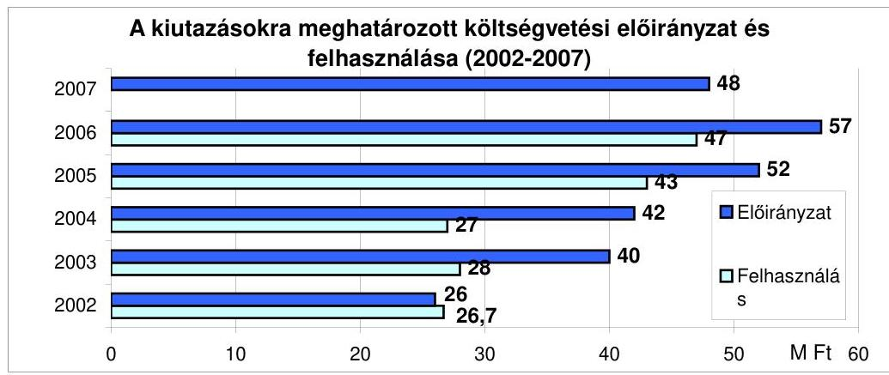

2006-ban az ÁSZ munkatársai $76^{16}$ külföldi úton vettek részt, és azokon 147 kiküldött 343 napot töltött el. Egy külföldi kiküldetés képzésen való részvételhez kapcsolódott, összesen 29 napban. (Az egy külföldi útra eső átlag munkanapszám a hosszú időtartamú képzés nélkül 4 nap/út.) Egy külföldi kiküldetésben töltött munkanap átlagos költsége 2006-ban 131 ezer Ft volt.

Az összes tényleges ráfordításból 35979 ezer Ft (75\%) megtervezett utazás volt. A tervbe vett és megvalósított utak a kalkulált keretösszegen belül - a tervezett öszszes költség 98,6\%-án - valósultak meg. A kiutazási terv teljesülése szempontjából kedvezőtlen jelenségként értékelhető, hogy 2006-ban 18 olyan rendezvény maradt el, amelyeket a meghívók szándékának ismeretében, illetve a korábbi évek tapasztalata alapján - de konkrét meghívás vagy időpont ismerete nélkül szerepeltettünk a tervben. Nem tervezhetők az egyre gyakoribb felkérések sem, amelyeket előadások tartására kapunk.

A költségek alakulását nagyban befolyásolja az a tény, hogy az ÁSZ elnöke tölti be 2007-ig az INTOSAI Kormányzó Tanácsának jelentős nemzetközi szerepvállalást követelő elnöki tisztét.

2006-ban az ÁSZ elnöke 16 alkalommal utazott külföldre (2005-ben 10 alkalommal), ott összesen 59 napot töltött (2005-ben 38 nap). Ezen belül 8 alkalommal az INTOSAI Kormányzó Tanácsának elnökeként tett eleget külföldi kötelezettségének, ezek az utak összesen 32 napot vettek igénybe (2005-ben 4 alkalommal összesen 13 napot). Egy elnöki út átlagos költsége 550 ezer Ft, egy napra eső átlagos költsége 149 ezer Ft volt.

[^0]
[^0]:    ${ }^{16}$ Nem tartalmazza azokat az utakat, melyekkel kapcsolatban költség nem merült fel.

---

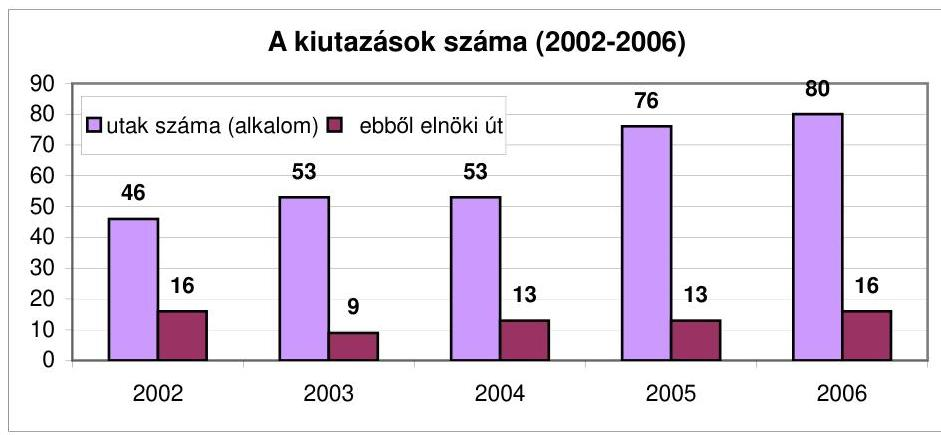

Az utazások során is messzemenően érvényesítjük a takarékosság követelményeit. Az ÁSZ vezetői és munkatársai külföldi útjaikon tolmácsot nem vesznek igénybe, a különféle szakmai konferenciákra felkért előadásokért díjat nem vesznek fel. Ezekben az esetekben a regisztrációs díjat, egyes alkalmakkor az utazási és szállásköltségeket a külföldi fél viseli. Az ÁSZ a nemzetközi kapcsolattartás terén nem alkalmazza a kölcsönös vendéglátás gyakorlatát. Saját költségén utaztatja a kiküldötteit, következésképpen külföldi vendégfogadás címén sem számolja el a látogatásra érkezők utazási költségeit. A kiküldöttek az Európán belüli utazásoknál vagy gépjárművel, vagy a legolcsóbb légitársaságokkal, kizárólag turista osztályú jegyekkel utaznak. Esetenként igénybe vettük a légitársaságok által nyújtott hétvégi kedvezményt, amelynek a gazdaságosságát, hasonlóan a gépkocsival való utazáshoz, minden esetben egyedileg, előzetesen megvizsgáltuk.

Az utazásokról, azok hasznosítható tapasztalatairól minden esetben a belső szabályzatban meghatározott módon útijelentés készül. Valamennyi útijelentés mindenki számára hozzáférhetően megtalálható az ÁSZ könyvtárában.

# 5. A szÁmVEVŐSZÉKi TEVÉKENYSÉGHEZ KAPCSOLÓDÓ KUTATÓ És MÓDSZERTANI MUNKA 

Az ÁSZ Fejlesztési és Módszertani Intézet (FEMI) a számvevőszéki stratégia céljait szem előtt tartva 2006-ban is arra törekedett, hogy hozzájáruljon az ellenőrzés módszereinek a nemzetközi standardokkal összhangban történő korszerűsítéséhez és a nemzetközi legjobb gyakorlat alkotó adaptációjához és elősegítse átfogó értékelő vélemény formálását a közpénzek felhasználásáról.

Az Intézetben a kutatási tervnek megfelelően több témában folyt tudományos, illetve módszertani jellegú kutatás, például a tudástársadalom és -gazdaság kiépülésének helyzetéről és feladatairól, az államháztartás pénzügyi reformjának irányairól, a közszféra és a gazdaság versenyképességéről, a privát partner bevonásával kapcsolatos döntések módszertani kérdéseiről, az adótámogatások elemzéséről, a programköltségvetésre való áttérés lehetőségéről, valamint a számvevőszéki ellenőrzés lehetőségeiről a korrupció-ellenes kúzdelemben.

---

A számvevőszékeknek a világ legtöbb országában feladata a korrupciós kockázatok feltárása és a korrupció elleni küzdelem. 2006-ban több nemzeti számvevőszék (Kolumbia, Szerbia, Ukrajna) is nemzetközi konferenciát, szemináriumot rendezett arról, hogy a számvevőszékek mit tehetnek a korrupció megelőzése és leleplezése érdekében. Az ÁSZ lehetőségeihez mérten részt vett ezeken a rendezvényeken, képviselői ismertették a magyar tapasztalatokat, valamint igyekeztek megismerni a legújabb nemzetközi eredményeket.

Az ÁSZ ellenőrzései során minősíti a múködés átláthatóságát és a gazdálkodás elszámoltathatóságát, így azonosítja és jelzi a korrupciós kockázatokat, az ilyen cselekmények lehetőségét, valamint javaslatokat fogalmaz meg a hibák, szabálytalanságok megelőzésére. Indokolt esetben törvényi felhatalmazása folytán bűncselekmények szankcionálását kezdeményezi. E mellett a korrupció okait elemző, a kockázatokra, tendenciákra rámutató összefoglaló tanulmányokat készít.

Az ÁSZ 2006-ban pályázatot nyújtott be „a korrupció-ellenes intézkedések továbbfejlesztésének és a korrupció-ellenes kormánystratégia végrehajtásának elősegítése" címmel az Európai Unió Átmeneti Támogatási keretében elkülönített Intézményfejlesztési Alap program terhére elnyerhető támogatásra, melyet az Európai Unió Bizottsága elfogadott. A projekt végrehajtásáért a FEMI a felelős. A szerződéskötésre várhatóan 2007 első félévében kerül sor. A projekt eredményeként - az e téren élenjáró európai partnerszervezetekkel együttmúködve - olyan elemzési módszereket dolgozunk ki, amelyek az ellenőrzések előkészítése és lebonyolítása során elősegítik a korrupciós kockázatok, illetve a korrupcióval különösen veszélyeztetett területek azonosítását.

A FEMI 2006-os tevékenységében külön hangsúlyt kapott a közpénzügyi törvény szabályozási koncepciója kidolgozása érdekében végzett munka. Az ÁSZ tanácsadói szerepének keretein belül vállalta egy új szemléletű és tartalmú közpénzügyi törvény megalkotását megalapozó koncepció kidolgozását. E feladat megvalósítása érdekében a FEMI-ben több megalapozó résztanulmány készült. Ezek belső és szakértői megvitatását követően elkészült a közpénzügyi törvény szabályozási koncepciója főbb vonásait bemutató tanulmány.

A számvevőszéki tevékenység nélkülözhetetlen velejárója a gyakorlati ellenőrzési munkát támogató, a környezeti változásokhoz és a nemzetközi trendekhez igazodó folyamatos módszertani fejlesztés. 2006-ban elkészült és bevezetésre került a teljesítmény-ellenőrzések új módszertana, amelyhez elektronikus oktatási modul is kapcsolódik. Folyamatosan korszerűsítjük, aktualizáljuk és bővítjük a konkrét ellenőrzési munkát támogató módszertani segédletek körét.

A közszféra belső kontrollrendszerének fejlesztésével kapcsolatban - amely mind nemzetközi, mind hazai szinten kiemelt figyelemben részesül - folytattuk a belső kontrollal kapcsolatos korszerú, a „legjobb nemzetközi gyakorlatnak" megfelelő szemlélet és elvek adaptálását, a kapcsolódó módszerek fejlesztését. E munka kiterjedt az INTOSAI Belső kontroll standardok albizottságának keretében folyó együttműködésre, az államháztartás belső pénzügyi ellenőrzési rendszerének koordinációs és harmonizációs feladatait ellátó Pénzügyminisztériummal való együttműködésre, továbbá a belső kontrollrendszerek kockázatértékelésének, valamint külső, megbízhatósági ellenőrzésének módszertani fejlesztéséhez munkaanyagok, tervezetek kidolgozására, amelyek részben az átfogó ellenőrzés módszertanához kapcsolódnak.

---

A módszertani munkánk magában foglalta különböző oktatási anyagok kidolgozását, továbbfejlesztését és magát az oktatást is, amely utóbbi az ÁSZ-on belüli továbbképzésekben, a hazai szakirányú oktatási intézményeknél tartott előadássorozatokban nyilvánult meg.

Részt vettünk egyes társ-számvevőszékek módszertani munkájában. Ennek keretében Macedónia, Tádzsikisztán fejlesztési programjainak megvalósításában vállaltak munkatársaink oktatóként tevékeny szerepet.

Az ÁSZ elnökének vezetési tevékenységét segítő konzultatív munkaszervezet, az Elnöki Tanácsadó Testület 2006. évi tevékenységének gerincét a hazai közpénzügyi rendszer fejlesztésére, valamint az annak előmozdítását is szolgáló számvevőszéki ellenőrzés fő irányait és arányait meghatározó 2006-2010. évi ÁSZ stratégia kidolgozására irányuló munka támogatása képezte. Ennek keretében a testület több ízben folytatott szakmai konzultációt a számvevőszéki stratégiáról, elsősorban az elvekről és értékekről, a stratégiai irányokról, valamint a szervezetirányításról és a kapcsolati rendszerek fejlesztéséről, továbbá az államháztartás korszerűsítése és a konvergencia program kapcsán előtérbe kerülő új, átfogó közpénzügyi törvény szabályozási koncepciójának elveiről. Emellett figyelmet fordított az ÁSZ előző évi tevékenységét értékelő (éves) jelentésre, a számvevőszéki kutatóintézet, a FEMI tevékenységére, s áttekintette a Pénzügyi Szemle szerkesztésének főbb tartalmi kérdéseit is.

Az ÁSZ a pénzügyi szakma igényeinek és országgyúlési határozatban is megszabott feladatának tett eleget azzal, hogy a kétnyelvű (magyar-angol) közpénzügyi szakfolyóiratot 2006-ban ütemesen, negyedévenként megjelentette. A megújult Pénzügyi Szemle szerzőinek köre akadémiai tagtól, valamint levelező tagtól kezdve egyetemi tanárokon, állami szakmai vezetőkön, szakértőkön át PhD. hallgatókig terjed. A tartalom - támaszkodva a szerkesztőbizottság tevékenységére is - követte a szakfolyóirat hatókörébe tartozó pénzügyi és gazdasági folyamatok fő irányát. Az államháztartás múködésének, a közpénzügyi reformnak, a konvergencia programnak, az ezekre ható háttér-összefüggéseknek az értékelése és elemzése állt tematikai palettájának centrumában. Súlyponti kérdésként kezelte a folyóirat az elmúlt évben a versenyképesség nemzetgazdasági és vállalati aspektusait, gazdaságunk integráció-érettségét, az állam és a magánszféra kooperációjának kibontakozását, az Európai Unió jövőképét, emellett figyelmet fordított olyan témákra is, mint például a hazai foglalkoztatási helyzet, az MNB inflációs célkövetési rendszere, s a pénzmosás elleni nemzetközi küzdelem paradigmaváltása. A lap külföldi, egyetemi, valamint OECD és EU-körökben is kedvező visszhangra talált.

# 6. AZ INTÉZMÉNY MŰKÖDÉSE ÉS GAZDÁLKODÁSA 

### 6.1. Költségvetési gazdálkodás

A számvevőszéki törvény 2004. évi módosítása óta az ÁSZ maga állítja össze a fejezet költségvetésére és a költségvetés végrehajtására vonatkozó javaslatát. E javaslatot a Kormány - változtatás nélkül - a költségvetési, illetve a zárszámadási törvényjavaslat részeként terjeszti elő az Országgyúlésnek. A fejezet gazdálkodását az Országgyúlés elnöke által pályázat útján megbízott független

---

könyvvizsgáló ellenőrzi. Az ÁSZ 2006. évi gazdálkodását minősítő jelentés előreláthatólag április végére készül el.

A törvény adta felhatalmazásból eredő nagyobb felelősség okán szükségesnek tartottuk és tartjuk a jövőben is, hogy a fejezet költségvetési javaslata részletesen mutassa be az ÁSZ stratégiájának alapvető céljait, az abból fakadó szakmai feladatait, külön kiemelve az ÁSZ éves ellenőrzési tervében szereplő meghatározott gyakoriságú, illetve rendszeresen teljesítendő, törvényekben előírt ellenőrzési feladatokat. Önálló programként mutattuk be mindazon egyéb szakmai, valamint múködési feladatokat, amelyek jól körülhatárolható csoportokba sorolhatók és meghatároztuk a végrehajtáshoz szükséges erőforrásokat.

Mindezek alapján az Országgyúlés részére - a Pénzügyminisztérium útján részletes, átlátható, többszörösen egyeztetett költségvetési tervjavaslatot készítettünk, amelynek kialakításakor a Pénzügyminisztérium tervezési irányelvein túl figyelembevettük az ellenőrzési és egyéb feladatokat alapvetően befolyásoló törvények előírásait, a vonatkozó országgyűlési határozatokat. Arra törekedtünk, hogy az ÁSZ kellő körültekintéssel, takarékosan, az ország gazdasági helyzetének figyelembe vételével igyekezzen törvényi kötelezettségeinek - lehetőségeihez képest - maradéktalanul eleget tenni.

Az Országgyűlés az ÁSZ 2006. évi feladatainak ellátására a költségvetési törvényben 7719,6 M Ft-ot hagyott jóvá, amelynek fedezetét 7699,6 M Ft támogatás és $20,0 \mathrm{M} F$ saját bevétel biztosította. Ez a megelőző év eredeti előirányzatához képest az 1\%-os növekedést sem érte el. A költségvetési forrásokkal való gazdálkodás mozgásterét ez évben is csökkentette az ÁSZ előtt álló szakmai feladatok több mint 75\%-ának törvényi, illetve az országgyúlési határozatok általi kötöttsége, ezzel összefüggésben a személyi juttatások és a közterhek, valamint a dologi kiadások automatizmusaiból következő determináció.

Mindezek megkövetelték, hogy tervszerű beruházási, felújítási és beszerzési politikát folytassunk, kihasználva a központosított és a saját hatáskörben lefolytatott közbeszerzési eljárások által biztosított megtakarítási lehetőségeket.

A kiadási főösszegből a személyi juttatások előirányzatai 4568,1 M Ft-ot, a munkaadókat terhelő járulékok 1424,0 M Ft-ot, a dologi kiadások 1122,1 M Ftot, az intézményi beruházási kiadások 321,6 M Ft-ot, a felújítási előirányzatok 123,8 M Ft-ot, a fejezeti államháztartási tartalék 160,0 M Ft-ot jelentettek.

A jóváhagyott előirányzatot az évközi módosítások 548,9 M Ft-tal növelték, a módosítások után 8268,5 M Ft állt rendelkezésre. A módosításokból 542,4 M Ft az előző évi előirányzat-maradvány jóváhagyásnak, 2,8 M Ft az OTKA támogatásával folytatandó kutatáshoz és a BM-mel kötött megállapodás alapján a továbbképzések támogatásához biztosított hozzájárulásnak, 3,7 M Ft a dolgozók részére folyósított lakásvásárlási kölcsönök törlesztésének következménye.

A felhasználás 7698,3 M Ft, amely a kiadási előirányzat 93,1\%-a volt. A személyi juttatások és a munkaadókat terhelő járulékok együttes összege ( 6065,3 M Ft) a kiadások $78,8 \%$-át tették ki, a dologi kiadások aránya $14,0 \%$, a felhalmozási kiadásoké pedig $7,2 \%$ volt.

---

A kiadások teljesítésének alakulását befolyásolta a maradványképzési kötelezettség teljesítése, amely érdekében a megjelölt előirányzatokra csak 2007. évi kifizetésre szóló kötelezettség volt vállalható.

A tervezett 20 M Ft bevétellel szemben $15,9 \mathrm{M}$ Ft teljesült. A bevételek zömében a FEMI által készített tanulmányok díjaiból, feleslegessé vált eszközök, gépjárművek értékesítéséből, helyiség bérbeadásból, továbbszámlázott szolgáltatásokból keletkezett, illetve mintegy 2 M Ft bevétel illette meg az ÁSZ-t a brit partnerintézménnyel megvalósított tadzsikisztáni együttműködés kapcsán szakértői díj, illetve költségtérítés címén.

A maradvány (amelynek összege - a 4,5 M Ft bevételi lemaradás figyelembevételével - 565,7 M Ft) 13,6\%-a ( $77,0 \mathrm{M}$ Ft) az államháztartás egyensúlyi helyzetének javítása érdekében felajánlott összeg, amely az előirányzat-maradvány elszámolása során kerül elvonásra. A fennmaradó $86,4 \%$ teljes egészében kötelezettségvállalással lekötött, a feladatok, a teljesítések, illetve a számlák (főként a maradványképzési kötelezettség miatt) 2007-re való átütemezésének, áthúzódásának következménye.

A rendelkezésre álló előirányzatok tervszerű takarékosság mellett az ésszerű beszerzésekkel összességében biztosították az intézmény zavartalan feladatellátáshoz szükséges múködési, üzemeltetési feltételeket.

# 6.2. Az infrastruktúra múködtetése, fejlesztések 

A 2006. évben is kiemelt feladatként kezeltük a munkafeltételek megfelelő színvonalú biztosítását, a meglévő irodaépületek állagának megőrzését, illetve javítását, valamint az eszközellátottság fejlesztését.

A 2006. év legnagyobb jelentőségű fejlesztése az Apáczai Csere János utcai székház felvonóinak felújítása volt, amely magába foglalta a személyfelvonók cseréjét, a felvonótorony bővítését és az épület múemlék jellegének megfelelő kovácsoltvassal kombinált biztonsági üvegfelületű burkolat kiépítését.

Az Apáczai Csere János utcai székház fűtés korszerűsítésének előkészítése érdekében elkészítettük a műszaki terveket.

A 2006. évben tovább folytatódott az ÁSZ budapesti telephelyein az elektromos rekonstrukció és ehhez kapcsolódva az irodahelyiségek tervszerű felújítása. Az Apáczai Csere János utcai székházban és a Lónyay utcai irodaházban az elektromos rekonstrukció végrehajtása során az irodák energiaellátásáról leválasztásra került a lépcsőházak és a folyosók világítási rendszere. A leválasztás eredményeként a közös helyiségek világítása a fényerő függvényében szabályozhatóvá vált.

Mindkét irodaépületben a bejárati recepciós pult korszerű, megjelenésében az irodaépületekhez illő funkcionáltan tervezett bútorzattal átépítésre került.

Az elhelyezési feltételek javítása érdekében hat megyei irodánkban végeztettünk kisebb mértékű felújítási, átalakítási munkákat.

---

Az Apáczai Csere János utcai székházban bővítettük és átalakítottuk a behatolás elhárítási rendszert.

A fűtési energiával való takarékos gazdálkodás megvalósításáért a Lónyay utcai irodaházban az utcai homlokzaton kicseréltettük az összes nyílászárót korszerű hang és hőszigetelt, külső reluxával ellátott ablakokra.

A bérleti díjak csökkentése érdekében a Dunaházban bérelt irodaterületet megvásároltuk a Magyar Állam javára. Az irodák az ÁSZ vagyonkezelésébe kerültek. Takarékossági okokból megszüntettük több irodahelyiség bérletét, ezáltal a következő évek vonatkozásában, mintegy évi 30 millió forinttal mérsékeltük működési költségeinket.

Az ingatlanok felújítási és rekonstrukciós munkáira a tárgyévben összesen 320,9 M Ft-ot használtunk fel.

Az ellenőrzési tevékenység magas színvonalú támogatása érdekében 73,9 M Ftot fordítottunk színes nyomtatásra is alkalmas nyomdagép beszerzésére, illetve a korábbi típusok modernizálására, fénymásoló és egyéb irodatechnikai gépek beszerzésére, valamint az elhasználódott irodabútorok cseréjére.

A gépjárműpark tervszerű megújítása érdekében 2 db hat évnél idősebb gépjármú került lecserélésre - egyéb más gépjármú tartozékok beszerzésével együtt - összesen 13,1 M Ft értékben.

# 6.3. Az informatika és a telekommunikáció múködtetése, fejlesztése 

Az ÁSZ IT-tevékenységének alapvető célja, hogy informatikai és a telekommunikációs eszközökkel sokoldalúan és hatékonyan támogassa az ÁSZ stratégiai küldetését és feladatainak ellátását. A Számvevőszék informatikai és telekommunikációs fejlesztései 2006-ban is az évente aktualizált, Elnöki értekezleten jóváhagyott részletes IT stratégiájában meghatározott projekt tervek szerint történtek.

Az ÁSZ - az elmúlt évek dinamikus fejlesztésének köszönhetően a változó kommunikációs igényeket rugalmasan követni képes, korszerű, egységes hálózati telekommunikációs rendszerrel rendelkezik. Ez annak is köszönhető, hogy az ÁSZ szakemberei folyamatos és megbízható kontroll alatt tartják a fejlesztéseket, így a pályázók is ennek tudatában nyújtják be ajánlataikat. A verseny és a tisztességes szakmai magatartás kordában tartja a költségeket, amely nem terheli aránytalanul a fejlesztési előirányzatokat.

Az év során új felhasználói alkalmazásokat fejlesztettünk, és folyamatosan fejlesztjük a már bevezetett rendszereket is.

Az ÁSZ 2003-ban elektronikus oktatásszervező számítógépes keretrendszert vezetett be, amely a belső képzések menedzselése és nyilvántartása mellett szabványosan fejlesztett elektronikus tananyagok futtatására és adminisztrálására is alkalmas. Az elmúlt években több elektronikus tananyagot is illesztettünk a rendszerbe, így a Microsoft Office programok használatát oktató ECDL tan-

---

anyagot, a Complex Jogtár kezelését oktató programot, valamint az ÁSZ által kidolgozott financial audit módszertan távoktatási tananyagot. 2006-ban befejeztük a Teljesítmény-ellenőrzés módszertana távoktatási tananyagának fejlesztését.

2005-ben, előtanulmány és részletes helyzetfelmérést követően, elkészült a Vizsgálatok dokumentációs rendszerének projektterve. A projekt keretében az ÁSZ a számvevői munkavégzés dokumentálásának támogatására, a vizsgálatok során keletkezett, illetve begyűjtött dokumentumok nyilvántartására, tárolására szolgáló elektronikus rendszert kíván kifejleszteni. A fejlesztés megvalósításhoz az ÁSZ 2006-ban sikeresen pályázott a Nemzeti Fejlesztési Ügynökség közremúködésével EU Átmeneti Támogatásra. A jóváhagyott projekt tervnek megfelelően az Átmeneti Támogatásra vonatkozó szabályok szerint a Központi Pénzügyi és Szerződéskötő Egység és az ÁSZ 2007-ben közbeszerzési eljárást indít a rendszer fejlesztésére.

Az ÁSZ minden évben kiemelten kezeli honlapjának tartalmi és formai továbbfejlesztését. 2006-ban az ÁSZ új arculati terve alapján megkezdtük a honlap arculatának fejlesztését, melyet 2007-ben fejezünk be. A honlappal párhuzamosan az ÁSZ Intranet rendszerének folyamatos fejlesztésével az információk hatékony kezelése érdekében új, tematikus adatbázisokat alakítottunk ki. 2005 januárja óta múködik az Elektronikus elnöki értekezlet (3E) alkalmazói rendszerünk, amelyben a vezetői értekezletek információi, a meghívók, a megtárgyalásra kerülő dokumentumok az előkészítéstől kezdődően elektronikus úton elérhetők és visszakereshetők az érintettek számára. A rendszer további szolgáltatása az értekezleten meghozott döntések tárolása, a feladatok kiadása és azok nyomon követése. A megtárgyalt napirendi pontokról készült emlékeztető az ÁSZ minden dolgozója számára elektronikusan hozzáférhető. 2006-tól a Főtitkári értekezleteket is hasonló rendszerben múködtetjük.

A 2000-ben bevezetett számítógépes iktatási és ügykövetési rendszerünket 2006-ban az irattározás funkcióval bővítettük. Ennek bevezetésével teljes körűvé vált az iratkezelés számítógépes támogatása. Továbbfejlesztettük a SZEKRETER vizsgálat-nyilvántartó és nyomon követő rendszerünket, amely 2002 óta a tervezéstől a javaslatok realizálásáig minden lényeges információt tartalmaz az ÁSZ által végzett ellenőrzésekről. Ebből a rendszerből az ÁSZ Ellenőrzési terve, valamint a jelentéseinkben megfogalmazott javaslatok és az arra érkezett válaszok az ÁSZ Internetes honlapján is megtekinthetők.

Az ÁSZ IT szolgáltatásokhoz kapcsolódó hibák, problémák bejelentésére, dokumentálására és kezelésére számítógépes HelpDesk rendszert alakítottunk ki. A rendszert 2007-ben vezetjük be, amelynek eredményeképpen gyorsabb és dokumentált problémakezelést és hibaelhárítást tudunk megvalósítani. Emellett a vezetők naprakész nyilvántartással rendelkeznek a bejelentésekről, a hibaelhárítások aktuális helyzetéről, a szolgáltatást nyújtó szakemberek elfoglaltságáról. A rendszer bevezetése mérhetővé teszi az IT üzemeltetésben résztvevők tevékenységét. A rendszert összekapcsoltuk a hálózati aktív eszköz-menedzselő szoftverrel, így a hálózat felügyeleti rendszerből érkező hibajelzések és azok kezelése is dokumentált.

---

Az IT szolgáltatások biztonsági kockázatainak csökkentése érdekében 2006-ban az ÁSZ-ba bejövő elektronikus leveleink szűrésére (spam), illetve azok vírusmentesítésére egy új hardver-szoftver eszközt telepítettünk, amely a felesleges leveleket automatikusan törli, a spam-gyanús leveleket megjelöli. Az ÁSZ dolgozók számára egyes IT szolgáltatások biztonságos elérését az Internetről a tűzfal szoftver rendszerünk frissítésével alapoztuk meg.

Az infrastruktúra fejlesztés keretében több hónapos előkészítő munkát követően 2006-ban országos szintű hálózatfejlesztést hajtottunk végre. Az ÁSZ valamennyi telephelyén csatlakoztunk az Elektronikus Kormányzati Gerinchálózathoz. A komplex hálózat igénybevétele - a korábbinál lényegesen magasabb színvonalú és tartalmú szolgáltatások mellett - legalább 10\%-kal alacsonyabb havi költséget jelent. A kialakított rendszer az ÁSZ Biztonsági Szabályrendszerében meghatározott, az ÁSZ függetlenségét garantáló követelményeknek is megfelel.

2006-ban befejeztük egy hálózati aktív eszköz felügyeleti rendszer kiépítését, amelynek segítségével az informatikai rendszergazdák folyamatosan felügyelik a számítógépes hálózatba kötött eszközeink állapotát, így a hibaelhárítás időigénye jelentősen csökkent. Teljes körűvé tettük az ÁSZ hálózatában a távmenedzser eszközök igénybevételét, ennek segítségével a rendszergazdák és technikusok a szoftver problémák túlnyomó többségét a helyszínre utazás nélkül meg tudják oldani. A fejlesztés eredményeként az IT-szakemberek vidéki telephelyekre utazásának költségeit mintegy 50\%-kal tudtuk csökkenteni.

Az infrastruktúra másik fontos eleme az ÁSZ hardver eszközparkjának megfelelő színvonalú kialakítása és folyamatos fejlesztése, a munkatársaknak a feladataik hatékony elvégzéséhez szükséges hardver eszközök - elsősorban asztali és/vagy notebook számítógépek - biztosítása. 2006-ban összesen 116 db asztali PC, valamint 51 db notebook számítógépet vásároltunk központosított közbeszerzési eljárással. Ebből 18 db ún. Power PC a megyei irodákban a titkárnők feladatainak támogatása mellett központi szervergép funkciókat is ellát. Az eszközeink tervszerű cseréje keretében 4 db közepes teljesítményű, 2 db nagyteljesítményű, valamint 2 db színes, közepes teljesítményű nyomtatót telepítettünk az ÁSZ különböző telephelyeire. A központi számítógépes szolgáltatások megfelelő színvonalú kiszolgálása, valamint a rendelkezésre állás növelése érdekében 1 db új szervergépet vásároltunk.

2006-ban szoftverbeszerzésre 89,9 M Ft-ot, számítástechnikai, telekommunikációs eszközök, gépek vásárlására 58,2 M Ft-ot fizettünk ki. A december hónapban beszerzett gépek, eszközök ellenértéke 2006-ban kötelezettségvállalással terhelt maradványként jelentkezik, annak átutalására 2007. évben kerül sor.

# 6.4. Belső ellenőrzés 

Az ÁSZ belső ellenőrzési feladatait 2006-ban egy fő belső ellenőr látta el.
A belső ellenőr a tevékenységét a vonatkozó jogszabályi előírásoknak, valamint az ÁSZ Belső Ellenőrzési Kézikönyvének megfelelően, a főtitkár által jóváhagyott stratégiai és éves munkatervek alapján végezte. Az éves munkatervben előirányzott feladatok teljesítése maradéktalanul megtörtént.

---

A belső ellenőrzés személyi és tárgyi feltételei az év folyamán megfelelően biztosítottak voltak, a tevékenységben teljességében érvényesült a funkcionális függetlenség.

A beszámolási időszakban a belső ellenőr fontosabb megállapításai a következők voltak:

- az ÁSZ gazdálkodása a vizsgált területeken - az előző évekhez hasonlóan a jogszabályi és belső előírásokkal összhangban, a takarékossági szempontok figyelembevételével történt;
- az ellenőrzések kapcsán felelősségre vonásra okot adó cselekmény, mulasztás vagy hiányosság gyanúja nem merült fel;
- a vizsgálatok során feltárt, kisebb jelentőségű hiányosságok megszüntetése, a gazdálkodási kockázatok további csökkentése érdekében a belső szabályozás néhány részterületen kiegészítésre, aktualizálásra szorul;
- a folyamatba épített, előzetes és utólagos vezetői ellenőrzési rendszer hatékonyságának növelése érdekében további vezetői intézkedések szükségesek.

A belső ellenőri jelentésekben szereplő javaslatok megvalósítása a gazdasági igazgató által jóváhagyott intézkedési tervek alapján jó ütemben halad, 2006 végéig a javaslatok felének realizálása megtörtént, a többi javaslat pedig 2007 közepéig valósul meg.

---

# Mellékletek

---

.

---

# 1. számú melléklet 

2006. évi jelentések jellemzői

---

.

---

# 2006. évi jelentések jellemzői

|  Sorszám | A jelentés tárgya, száma, az ellenőrzés típusa | Az ellenőrzés alapja | Az ellenőrzés célja | Az ellenőrzött költségvetési nagyságrend  |
| --- | --- | --- | --- | --- |
|  I. 2005-BEN MEGKEZDETT, 2006-RA ÁTHÚZÓDÓ ELLENŐRZÉSEK |  |  |  |   |
|  I. A KÖLTSÉGVETÉS VÉGREHAJTÁSÁNAK ELLENŐRZÉSÉVEL ÉS A KÖLTSÉGVETÉS ELŐIRÁNYZATAINAK VÉLEMÉNYEZÉSÉVEL KAPCSOLATOS ELLENŐRZÉSEK |  |  |  |   |
|  1. | A Magyar Köztársaság 2005. évi költségvetése végrehajtásának ellenőrzése (pénzügyi-szabályszerüségi) | törvényekben előírt évenkénti ellenőrzési kötelezettség | annak értékelése, hogy a költségvetés végrehajtása során érvényesültek-e a törvényi, egyéb vonatkozó jogszabályi előírások, az állami irányítás egyéb jogi eszközei, előírásai; az adatok valósághűen tükrözik-e a pénzügyi folyamatokat; a helyi önkormányzatokat megillető előirányzatok módosítását, azok folyósítását szabályszerűen végezték-e; az önkormányzatok szabályosan igényelték, használták fel és számolták-e el a hozzájárulásokat és a támogatásokat; a pályázati kiírások tartalma és a hozott döntés összhangban van-e a kapcsolódó jogszabályokkal; a zárszámadási dokumentum előterjesztése megfelel-e a törvényi előírásoknak, adattartalma segíti-e a szükséges döntések meghozatalát. | A központi költségvetés tényleges kiadási föösszege: 7 004,5 Mrd Ft bevételi föösszege: 6 456,7 Mrd Ft hiánya: 547,8 Mrd Ft  |
|  II. A KÖZPONTI KÖLTSÉGVETÉSSEL KAPCSOLATOS ELLENŐRZÉSEK |  |  |  |   |
|  2. | A Miniszterelnökség müködésének ellenőrzése (átfogó) | törvényekben előírt rendszeres ellenőrzési kötelezettség | annak értékelése, hogy a fejezetnél és felügyeleti szervénél a kormányzati struktúra változtatásával összefüggő változásokhoz célszerűen módosították-e a fejezet irányítási és felügyeleti rendszerét; a kialakított kontroll környezet segítette-e a szakmai feladatok ellátását; az ellenőrzési funkciók érvényesültek-e, annak szervezeti és személyi feltételei lehetővé tették-e a szabálytalanságok, a müködés nyomon követését; a költségvetési előirányzatok összhangban voltak-e a szakmai feladatokkal, biztosították-e azok ellátását; a fejezeti kezelésű előirányzatok tervezése során érvényesítettek-e prioritásokat, az előirányzatok felhasználása célszerű volt-e, beszámoltatási rendszer biztosította-e a teljes körű szakmai és pénzügyi elszámoltatást; megfelelően hasznosították-e a korábbi ÁSZ ellenőrzések megállapításait, javaslatait. | teljesített kiadási előirányzat:
2002-ben: 120,5 Mrd Ft
2003-ban: 111,2 Mrd Ft
2004-ben: 96,8 Mrd Ft
2005-ben: 32,5 Mrd Ft  |
|  3. | A Környezetvédelmi és Vízügyi Minisztérium fejezet müködésének ellenőrzése (átfogó) | törvényekben előírt rendszeres ellenőrzési kötelezettség | annak értékelése, hogy szervezeti, irányítási és működési rendszere, költségvetése összhangban volt-e a szakmai feladatokkal, biztosította-e azok hatékony és eredményes ellátását, a vízgazdálkodási feladatai beépültek-e szervezeti és feladatrendszerébe; irányító teendőit eredményesen látta-e el; biztosította-e a fejezeti kezelésű előirányzatok szabályszerű felhasználását, az EU támogatások hatékony igénybevételét, az ágazati, szakmai célok elérését, és azok hatásának | teljesített kiadási előirányzat:
2002-ben: 126,2 Mrd Ft
2003-ban: 117,8 Mrd Ft
2004-ben: 112,2 Mrd Ft
2005-ben: 101,3 Mrd Ft  |

---

|  Sorszám | A jelentés tárgya, száma, az ellenőrzés típusa | Az ellenőrzés alapja | Az ellenőrzés célja | Az ellenőrzött költségvetési nagyságrend  |
| --- | --- | --- | --- | --- |
|   | 0617 |  | monitoring rendszerủ ellenőrzését, valamint más, környezetvédelmi célokat szolgáló előirányzatokat is kezelő tárcákkal való együttműködést; hasznosította-e a korábbi ÁSZ ellenőrzések megállapításait és ajánlásait. |   |
|  4. | A Magyar Tudományos Akadémia fejezet működésének ellenőrzése (átfogó)
0621 | törvényekben előírt rendszeres ellenőrzési kötelezettség | annak értékelése, hogy biztosított-e az MTA hatáskörébe tartozó feladatok, az intézményi struktúra és a létszám összehangolt kialakítása; a fejezet költségvetési struktúrája összhangban állt-e a feladatok követelményeivel; érvényesült-e a belső kontrollrendszer a kockázatok feltárásában és mérséklésében; a tudományos kutatásokra előirányzott pénzeszközök kapcsolódtak-e a kutatás-fejlesztés nemzetgazdasági szintű elvárásaihoz; biztosították-e a célok megvalósítását; megfelelően hasznosultak-e a korábbi számvevőszéki ellenőrzések megállapításai és javaslatai. | teljesített kiadási előirányzat:
2002-ben:
44,3 Mrd Ft
2003-ban:
45,5 Mrd Ft
2004-ben:
44,6 Mrd Ft
2005-ben:
48,5 Mrd Ft  |
|  5. | A felsőoktatási állami intézmények ingatlangazdálkodásának ellenőrzése (teljesítmény)
0615 | az ÁSZ elnökének döntése alapján végzett egyéb ellenőrzések | annak értékelése, hogy megfelelőek-e a feltételek és a szabályozási környezet az ingatlangazdálkodás folytatására az állami felsőoktatási intézményekben; a rendelkezésre álló központi költségvetési pénzeszközök és a saját bevételekből ingatlangazdálkodásra fordított összegek biztosították-e a felsőoktatási ingatlanok fejlesztését, fenntartását, a meglévő ingatlan vagyon lehetővé tette-e a felsőoktatási intézmények oktatás-képzési és kutatási feladatainak megfelelő színvonalát; a felsőoktatási ingatlanok kihasználtsága és hasznosítása megfelelő volt-e az integrációt követően. | az ingatlan vagyon bruttó értéke
2004-ben:
187,3 M Ft
205,5 M Ft  |
|  6. | Az Adó- és Pénzügyi Ellenőrzési Hivatal működésének ellenőrzése (átfogó)
0616 | az ÁSZ elnökének döntése alapján végzett egyéb ellenőrzések | annak értékelése, hogy a pénzügyminiszter érvényesítette-e az adóztatás törvényességi és szakmai szempontjait, megfogalmazott-e teljesítményelvárásokat és biztosította-e a bevételek beszedéséhez szükséges személyi és tárgyi erőforrásokat; a Hivatal a feladatváltozással összhangban alakította-e ki szervezeti struktúráját és működési rendjét, feladatai ellátásában, az erőforrások elosztása, illetve felhasználása során érvényesültek-e a törvényességi, célszerűségi, hatékonysági és eredményességi követelmények; érdekeltségi rendszere ösztönözött-e a feladatellátás eredményességének javítására, alkalmas volt-e az egyéni teljesítményének értékelésére; a Hivatal ellenőrzéseivel hozzájárult-e a költségvetési bevételek minél teljesebb körű realizálásához, hátralékkezelési tevékenységével, a köztartozások engedményezésére kialakított eljárásrendjével biztosította-e a kintlévőségek beszedését, a veszteségek csökkentését, az elévülések megakadályozását; informatikai fejlesztéseire kialakított-e hosszú, illetve középtávú stratégiát, megvalósítása során figyelembe vette-e a stratégiai célkitűzéseket, a szakmai, célszerűségi és költségtakarékossági szempontokat; az informatikai szakterület szervezeti, személyi és tárgyi feltételei összhangban voltak-e a fejlesztési és üzemeltetési feladataival, segítették-e azok végrehajtását; hasznosította-e a korábbi számvevőszéki ellenőrzések megállapításait, javaslatait. | teljesített kiadási előirányzat:
2002-ben:
83,0 Mrd Ft
2003-ban:
76,5 Mrd Ft
2004-ben:
71,1 Mrd Ft
2005-ben:
68,2 Mrd Ft  |

---

|  Sorszám | A jelentés tárgya, száma, az ellenőrzés típusa | Az ellenőrzés alapja | Az ellenőrzés célja | Az ellenőrzött költségvetési nagyságrend  |
| --- | --- | --- | --- | --- |
|  7. | A Területfejlesztés fejezet müködésének ellenőrzése
(átfogó)
0603 | törvényekben előírt rendszeres ellenőrzési kötelezettség | annak értékelése, hogy szervezeti, és intézményi irányítási és müködési rendje biztosította-e a feladatok ellátását a fejezetbe integrált területfejlesztési programok célkitűzéseinek megvalósulását, az új programok célszerűségét, és azt, hogy ezek megfelelő alapot biztosítanak-e a programok végrehajtáshoz. Hogyan hasznosultak a korábbi ÁSZ ellenőrzések javaslatai. A megyei területfejlesztési tanácsokhoz és regionális fejlesztési tanácsokhoz decentralizált közvetlen területfejlesztési pénzügyi eszközök felhasználásának értékelése; a forráselosztás legfontosabb tényezőinek - a térségek társadalmi, gazdasági helyzetének, a stratégiai és operatív programok tervezésének a hazai finanszírozású területfejlesztések monitoring rendszerének - értékelése. | területfejlesztési célú forrás 2005-ben: 405,3 Mrd Ft  |
|  8. | A Belügyminisztérium fejezet müködésének ellenőrzése
(átfogó)
0618 | törvényekben előírt rendszeres ellenőrzési kötelezettség | annak értékelése, hogy a fejezetirányítás és felügyelet kontroll tevékenységei, kockázatkezelő képessége biztosították-e az eredményes működést, a feladatok hatékony ellátását, a vagyon megfelelő védelmét; a belső kontrollrendszer fejlesztésénél hasznosították-e a korábbi számvevőszéki ellenőrzések megállapításait, javaslatait; az ágazati informatikai rendszer a kormányzati államigazgatási informatikai fejlesztési koncepcióval, illetőleg a közigazgatási és rendészeti stratégiával összhangban működik-e; az Európai Uniós minőségfejlesztési eljárások adaptálása során érvényesült-e a fejezet koordináló, irányító és felügyeleti szerepe; a rendvédelmi szerveknél a minőségfejlesztési rendszer(ek) alkalmazása segítette-e a szervezetkorszerűsítést. | teljesített kiadási előirányzat 2005-ben: 364,8 Mrd Ft  |
|  9. | Az egészségügyi szakellátások privatizációjának ellenőrzése (teljesítmény)
0609 | az ÁSZ elnökének döntése alapján végzett egyéb ellenőrzések | annak értékelése, hogy az egészségügyi szakellátások privatizációjának kialakult gyakorlata illeszkedik-e az egészségpolitikai célkitűzésekhez; az egészségügyi szakellátás területén eddig megindult, illetve lezárult folyamatok hatására javult-e a betegellátás, megfelelően hasznosult-e az állami, illetve önkormányzati vagyon. | gyógyító-megelőző ellátások előirányzata 2005-ben: 679,3 Mrd Ft  |
|  III. A HELYI ÉS HELYI KISEBBSÉGI ÖNKORMÁNYZATOKKAI. KAPCSOLATOS ELLENŐRZÉSEK |  |  |  |   |
|  10. | A középiskolai kollégiumok fenntartásának és fejlesztésének ellenőrzése (teljesítmény)
0614 | az ÁSZ elnökének döntése alapján végzett egyéb ellenőrzések | annak megítélése, hogy biztosított-e a kollégiumok hosszú távú eredményes működésének a feltétele, hozzájárul-e az esélyegyenlőség javításához; a középiskolai kollégiumi hálózat személyi és tárgyi feltételei a jogszabályoknak, a követelményeknek, és az igényeknek megfelelnek-e, a feltételek javításához rendelkezésre álltak-e anyagi erőforrások; a meglévő kapacitás területileg hogyan fedi le a mennyiségi igényeket, a kollégiumi hálózat struktúrája elősegíti-e a képzési rendszer átalakítását, a kollégiumok és az iskolák kapcsolatában milyen szerepet kapott a gazdaságosság, a kapacitások integrálása. | a vizsgált közoktatási intézmények kiadása:
2002-ben:
2003-ban:
2004-ben:
2005. I. félévben:  |
|   |  |  |  | 7,2 Mrd Ft
9,3 Mrd Ft
10,2 Mrd Ft
5,4 Mrd Ft  |

---

|  Sorszám | A jelentés tárgya, száma, az ellenőrzés típusa | Az ellenőrzés alapja | Az ellenőrzés célja | Az ellenőrzött költségvetési nagyságrend  |
| --- | --- | --- | --- | --- |
|  11. | A helyi és a helyi kisebbségi önkormányzatok gazdálkodási rendszerének átfogó és egyéb szabályszerűségi ellenőrzése (átfogó)
0634 | törvényekben előírt rendszeres ellenőrzési kötelezettség | annak értékelése, hogy az önkormányzatok a gazdálkodás törvényességét, szabályszerűségét biztosították-e a tervezés, a költségvetés végrehajtása, a vagyongazdálkodás és a zárszámadás során; a feladatok és források összhangja biztosított volt-e, különös tekintettel egyes kiemelt feladatokra; a gazdálkodás szabályszerűségét biztosító kontrollok megfelelően segítették-e a végrehajtást; gazdálkodásuk során érvényesítették-e az Áht. és a vonatkozó kormányrendeletek előírásait. | az ellenőrzött önkormányzatok teljesített kiadása
2004-ben:
500,5 Mrd Ft  |
|  12. | A kistelepülések iskola-előkészítési, általános iskolai oktatási feltételeinek ellenőrzése (egyéb szabályszerűségi)
0625 | az ÁSZ elnökének döntése alapján végzett egyéb ellenőrzések | annak megállapítása, hogy a gyermek-, illetve tanulólétszám változása a kistelepüléseken hogyan befolyásolta a feladatok ellátását; az önkormányzatok az isko-la-előkészítési feladatok ellátására, az általános iskolák működtetésére a központi támogatásokon kívül milyen nagyságrendű helyi forrásokat fordítottak. A Közokt. tv-ben, egyéb jogszabályokban előírt feltételek biztosítottak-e; javult-e a költséghatékonyság, a feladatok társulásban való ellátása. Segítette-e a törekvéseket a pénzügyi szabályozás változása, a tárca szakmai irányító tevékenysége. A társulások szélesebb körben való megvalósulásának melyek az akadályozó tényezői. | a vizsgált önkormányzatok költségvetési kiadásai
2000-ben:
14,1 Mrd Ft  |
|  IV. A TÁRSADALOMBIZTOSÍTÁSI ALAPOKKAL KAPCSOLATOS ELLENŐRZÉSEK |  |  |  |   |
|  13. | A Nyugdíjbiztosítási Alap működésének ellenőrzése (átfogó)
0620 | törvényekben előírt rendszeres ellenőrzési kötelezettség | annak értékelése, hogy az Ny. Alap működése, kezelése összhangban volt-e a jogszabályi előírásokkal, a nemzetgazdasági paraméterek tervezett alakulásával, megfelelően érvényesült-e az Ny. Alapot érintő állami szerepvállalás, garancia; az Ny. Alap kezelője és igazgatási szervei teljesítették-e a nyugellátások megállapításával és folyósításával kapcsolatos feladatokat; az ONYF irányító, felügyeleti tevékenysége megfelelő volt-e, jó volt-e a belső kontroll, az informatikai rendszer; hasznosultak-e a korábbi számvevőszéki ellenőrzések megállapításai, ajánlásai. | az alap teljesített költségvetési kiadásai
2002-ben:
1 405,9 Mrd Ft
2003-ban:
1 540,1 Mrd Ft
2004-ben:
előirányzat
2005-ben:
1 854,4 Mrd Ft  |
|  V. AZ ÁLLAM VÁLLALKOZÓI ÉS KINCSTÁRI VAGYONÁVAL KAPCSOLATOS ELLENŐRZÉSEK |  |  |  |   |
|  14. | A Magyar Távirati Iroda Rt. 2005. évi gazdálkodásának ellenőrzése (átfogó)
0610 | törvényekben előírt évenkénti ellenőrzési kötelezettség | annak értékelése, hogy összhangban volt-e feladataival szervezeti felépítése és működési rendszere, szabályozása, mennyiben segítette azok hatékony és eredményes ellátását, belső szabályozása megfelelte-e a hatályos jogszabályoknak; miként gazdálkodott a társaság a rendelkezésére bocsátott vagyonnal és a közszolgálati feladatai ellátásához nyújtott működési célú és egyéb céltámogatásokkal; melyek voltak a tartósan veszteséges gazdálkodás okai; stratégiai és üzleti tervei a veszteség megszüntetésére irányuló célkitűzések, illetve a megvalósításukat szolgáló intézkedések megfelelőek voltak-e; hasznosultak-e az ÁSZjelentés megállapításai, javaslatai, ajánlásai. | költségvetési támogatás
2004-ben:
2,2 Mrd Ft
2005-ben:
0,1 Mrd Ft
vagyona
2004-ben:
3,8 Mrd Ft
2005-ben:  |
|  |   |   |   |   |

---

|  Sorszám | A jelentés tárgya, száma, az ellenőrzés típusa | Az ellenőrzés alapja | Az ellenőrzés célja | Az ellenőrzött költségvetési nagyságrend  |
| --- | --- | --- | --- | --- |
|  15. | A tartósan veszteségesen működő állami tulajdonú gazdasági társaságok gazdálkodásának ellenőrzése (átfogó)
0611 | az **ÁSZ elnökének döntése alapján** végzett egyéb ellenőrzések | annak értékelése, hogy az érintett társaságok szabályozása, szervezeti és működési rendszere biztosította-e a szakmai feladataik ellátását; melyek voltak a tartósan veszteséges gazdálkodás okai; megfelelőek voltak-e stratégiai és üzleti terveik a veszteség megszüntetésére; eredményesek voltak-e a veszteségek minimalizálása érdekében hozott intézkedések; a központi költségvetési támogatások felhasználása hatékony volt-e; hogyan hasznosultak az Állami Számvevőszék korábbi javaslatai és ajánlásai. | az állami tulajdon aránya a gazdasági társaságokban 2004-ben:
25%-nál nagyobb:
15,4 Mrd Ft
támogatások 2000-2004. között
összesen:
1116,0 Mrd Ft  |
|  VI. A KÜLFŐLDI TÁMOGATÁSOKKAL KAPCSOLATOS ELLENŐRZÉSEK |  |  |  |   |
|  16. | A Nemzeti Fejlesztési Terv végrehajtásának ellenőrzése (teljesítmény)
0636 | az **ÁSZ elnökének döntése alapján** végzett egyéb ellenőrzések | annak értékelése, hogy a Nemzeti Fejlesztési Terv végrehajtása eredményesen és hatékonyan szolgálta-e a célrendszer teljesítését és a források hasznosulását. Értékelni kellett, hogy a kialakított feltételrendszer alkalmas volt-e a hatékony lebonyolításra; eredményes volt-e az abszorpciós képesség fejlesztése; biztosították-e a projektek kiválasztásának és lebonyolításának eredményességét, a felhasznált források és az elért eredmények összhangját, valamint a források várható kihasználását, tekintettel a támogatások felhasználására vonatkozó uniós szabályozásra; hatékony volt-e az intézményi együttműködés és koordinációs tevékenység a végrehajtásban, a monitoringra és értékelésére kialakított rendszer hozzájárult-e a támogatási rendszer hatékonyságának javításához és elégedett volt-e az ügyfélkör a végrehajtással kapcsolatban. | források 2004-2006 között
strukturális alapokból:
507,9 Mrd Ft
közp. költségvetésből:
178,2 Mrd Ft  |
|  VII. AZ ÁLLAMHÁZTARTÁSON KÍVÜLI SZERVEZETEKKEL KAPCSOLATOS ELLENŐRZÉSEK |  |  |  |   |
|  17. | A Bolgár Országos Önkormányzat 2001-2004. évi pénzügyi-gazdasági tevékenységének ellenőrzése (pénzügyi-szabályszerüségi)
0601 | törvényekben előírt rendszeres ellenőrzési kötelezettség | annak megállapítása, hogy az országos szervezetnél a központi költségvetési támogatást a törvényben meghatározott feladatokra használták-e fel, betartották-e a vonatkozó hatályos jogszabályi előírásokat; a gazdálkodás törvényessége, szabályszerűsége biztosított volt-e; a tervezés, az operatív gazdálkodás, a beszámolási kötelezettség és a számviteli bizony-lati rend teljesítése során érvényesülteke a jogszabályokban és a belső szabályzatokban megfogalmazott követelmények; a kontrollmechanizmusok megfelelően segítették-e a feladatok végrehajtását. | az önkormányzat kiadásai
2001-ben:
47,9 M Ft
2002-ben:
57,9 M Ft
2003-ban:
64,1 M Ft  |
|  18. | A Wesselényi Miklós Sport Kőzalapítvány gazdálkodásának ellenőrzése (egyéb szabályszerűségi)
0606 | az **ÁSZ elnökének döntése alapján** végzett egyéb ellenőrzések | törvényességi és szabályszerűségi szempontból értékelni, hogy az alapító okirat és belső szabályzatok megteremtették-e a vagyon és hozadéka, a költségvetési támogatás felhasználásának törvényes kereteit; biztosított volt-e a közalapítvány könyvvezetés és éves beszámolók törvényessége; az induló vagyon törzsvagyonon felüli részét és hozadékát, a kapott állami támogatást törvényesen és szabályosan használta-e fel. | költségvetési támogatás
2002-ben:
2,4 Mrd Ft
2003-ban:
1,1 Mrd Ft
2005-ben:  |

---

|  Sorszám | A jelentés tárgya, száma, az ellenőrzés típusa | Az ellenőrzés alapja | Az ellenőrzés célja | Az ellenőrzött költségvetési nagyságrend  |
| --- | --- | --- | --- | --- |
|  19. | A Magyar Fejlesztési Bank Részvénytársaság müködésének ellenőrzése (átfogó)
0619 | az ÁSZ elnökének döntése alapján végzett egyéb ellenőrzések | annak értékelése, hogy a Bank működése megfelelte a törvényi előírásoknak, az állam tulajdonosi elvárásainak, a feladatváltozás összhangban állte a fejlesztési banki működéssel; megvalósultak-e az EU csatlakozáshoz kapcsolódó hitelprogramok és segítette-e a Nemzeti Fejlesztési Terv időarányos teljesítését; szabályszerűen és eredményesen gazdálkodott-e, a befektetési portfolió változása pozitívan hatott-e az eredmény alakulására; miként hasznosította a korábbi számvevőszéki ellenőrzés javaslatait. | adózás előtti eredmény
2003-ban:
2004-ben:
2005-ben:
2003-ban:
12,8 Mrd Ft
25,0 Mrd Ft  |
|  20. | A Magyar Nemzeti Bank 2005. évi müködésének ellenőrzése (átfogó)
0622 | az ÁSZ elnökének döntése alapján végzett egyéb ellenőrzések | annak értékelése, hogy az MNB működése megfelelte a törvényi előírásoknak, hatékony-e az irányítási, a döntéshozatali és az ellenőrzési rendszere; gazdálkodása megfelelte a jogszabályoknak és a belső szabályzatoknak, érvényesült-e a működési költségeknél és a beruházási kiadásoknál a tervszerűség, a költségtakarékosság követelménye; befektetett eszközökkel való gazdálkodása törvényes és szabályszerű volt-e, összhangban volt-e tulajdonosi stratégiájával és éves célkitűzéseivel; hasznosította-e az előző évi ÁSZ ellenőrzés megállapításait és milyen intézkedéseket tett az ajánlások megvalósítására. | tényleges működési költségek
2003-ban:
2004-ben:
2005-ben:
12,7 Mrd Ft
13,5 Mrd Ft
14,9 Mrd Ft  |
|  21. | Az Országos Horvát Önkormányzat 2001-2004. évi pénzügyi-gazdasági tevékenységének ellenőrzése (pénzügyi-szabályszerüségi)
0602 | törvényekben előírt rendszeres ellenőrzési kötelezettség | annak megállapítása, hogy a központi költségvetési támogatást a Nek tv-ben meghatározott feladatokra használta-e fel, betartották-e a vonatkozó hatályos jogszabályi előírásokat; a gazdálkodás törvényessége, szabályszerűsége biztosított volt-e; a tervezési gazdálkodási, beszámolási és könyvszerzési kötelezettségek előírásai érvényesültek-e; a kontrollmechanizmusok megfelelően segítették-e a feladatok végrehajtását. | kiadások
2001-ben:
2002-ben:
2003-ban:
2004-ben:
262,1 M Ft  |
|  22. | A Nemzeti Civil Alapprogramból civil szervezeteknek juttatott költségvetési támogatások ellenőrzése (pénzügyi-szabályszerüségi)
0635 | törvényekben előírt rendszeres ellenőrzési kötelezettség | annak értékelése, hogy az NCA-ból nyújtott támogatás törvényes volt-e; lebonyolításának rendszere szabályos volt-e; a támogatott civil szervezetek a támogatásokat szabályszerűen használták-e fel; a támogatott civil szervezeteknél rendeltetésszerű és társadalmilag hasznos volt-e a kapott támogatások felhasználása. | tényleges költségvetési forrás
2004-ben:
7,0 Mrd Ft
2005-ben:
8,2 Mrd Ft  |
|  23. | A Magyar Vöröskereszt 2003-2004. évi gazdálkodásához nyújtott költségvetési támogatások és pénzadományok Országos Titkárságnál való célszerű felhasználásának ellenőrzése (egyéb szabályszerűségi)
0605 | az ÁSZ elnökének döntése alapján végzett egyéb ellenőrzések | annak értékelése, hogy a központi költségvetési támogatást a törvényben meghatározott célokra használta-e fel, a kapott támogatások és pénzadományok felhasználása, elszámolása során betartották-e a vonatkozó jogszabályi előírásokat. | költségvetési támogatás
2002-ben:
2003-ban:
2004-ben:
2005-ben:
310,0 M Ft
291,2 M Ft
215,0 M Ft
193,5 M Ft  |

---

|  Sorszám | A jelentés tárgya, száma, az ellenőrzés típusa | Az ellenőrzés alapja | Az ellenőrzés célja | Az ellenőrzött költségvetési nagyságrend  |
| --- | --- | --- | --- | --- |
|  24. | Az út és szennyvízcsatorna beruházásokhoz 2002-2005. években igénybe vett közműfejlesztési támogatások igénylésének és felhasználásának ellenőrzése
(egyéb szabályszerűségi)
0639 | Országgyűlési határozat és egyéb felkérés alapján végzett ellenőrzések | annak megállapítása, hogy az út- és szennyvízberuházások megvalósítása milyen szervezési, finanszírozási rendszerben történt. A közműfejlesztési támogatások igénylésének és felhasználásának rendje megfelel-e a jogszabályi előírásoknak; történt-e jogtalan támogatás igénybevétel, annak összege mekkora volt. | közműfejlesztési támogatások
2002-ben:
1072,8 M Ft
1683,4 M Ft
1960,2 M Ft  |
|  VIII. ÁLLAMADÓSSÁG |  |  |  |   |
|  25. | Az államháztartás adóssága kezelésének, alakulásának ellenőrzése (átfogó)
0604 | az ÁSZ elnökének döntése alapján végzett egyéb ellenőrzések | ```annak értékelése, hogy az államháztartás adóssága kezelésének kormányzati és pénzügyminisztériumi elvárása érvényesült-e, a szervezeti, személyi, technikai feltételei törvényesek, célszerủek és eredményesek voltak-e, az intézmények közötti feladatmegosztása segíti-e az adósság és a követelések egységes kezelését, átláthatóságát; az államadósság, valamint a központi költségvetés követelésállományának nyilvántartása, összetétele törvényes volt-e; a forrásbevonásokat szabályszerűen bonyolították-e le, az adósság kezelése megfelelő volt-e; a likviditás-kezelési műveletek segítették-e a Kincstári Egységes Számla egyenlegére vonatkozó előírások betartását. | Államadósság alakulása
1999-ben:
2000-ben:
2001-ben:
2002-ben:
2003-ban:
2004-ben:
2005-ben (előzetes adat):
13 085,8 Mrd Ft  |
|  IX. EGYÉB ELLENŐRZÉSEK |  |  |  |   |
|  26. | A hajléktalanokat ellátó intézményrendszer ellenőrzése (egyéb szabályszerűségi)
0613 | az ÁSZ elnökének döntése alapján végzett egyéb ellenőrzések | annak megállapítása, hogy a finanszírozási rendszer, az előirányzott költségvetési támogatás milyen eredménnyel járult hozzá a hajléktalanok ellátásához, a szakmai célok megvalósításához, az intézmények működési feltételeinek javításához, mindezt segítette-e a felügyeleti irányítás az önkormányzati és egyéb fenntartású intézmények a támogatásokat szabályszerűen használták-e, a pályázati támogatási célok teljesültek-e, a normatív állami hozzájárulás segítette-e a szakmai feladat teljesítését; a hajléktalanok egészségügyi ellátását biztosító intézményrendszer megfelelően kiépült-e, a fenntartói és az OEP finanszírozás biztosítja-e az ellátó rendszer működtetését és fejlesztését. | Az ellátás országos forrásai (támogatás)
2003-ban:
2004-ben:
2005-ben :
4,2 Mrd Ft
5,3 Mrd Ft
6,1 Mrd Ft  |

---

|  Sorszám | A jelentés tárgya, száma, az ellenőrzés típusa | Az ellenőrzés alapja | Az ellenőrzés célja | Az ellenőrzött költségvetési nagyságrend  |
| --- | --- | --- | --- | --- |
|  |   |   |   |   |

## II. 2006-BAN INDULÓ, 2006-BAN BEFEJEZNI TERVEZETT ELLENŐRZÉSEK

### I. A KÖLTSÉGVETÉS VÉGREHAJTÁSÁNAK ELLENŐRZÉSÉVEL ÉS A KÖLTSÉGVETÉS ELŐIRÁNYZATAINAK VÉLEMÉNYEZÉSÉVEL KAPCSOLATOS ELLENŐRZÉSEK

|  27. | Vélemény a Magyar Köztársaság
2007. évi költségvetése javaslatáról
(egyéb szabályszerűségi)
0641 | törvényekben előírt
évenkénti ellenőrzési
kötelezettség | annak megállapítása, hogy a törvényjavaslat, valamint a 2008-2010. évek irányszámai megalapozottak-e; a törvényjavaslatot a tervezés, valamint a feladatrendszer és a szabályozók módosításai megfelelően megalapozták-e; teljesültek-e az irányelvekben, illetve a tervezési köriratban foglaltak; a költségvetési javaslat megfelel-e az Áht., valamint a kormányrendeletek előírásainak; a 2007. évre kialakított költségvetés, valamint a 2008-2010. évek irányszámai kiemelten vették-e számításba az EU-tagság pénzügyi-gazdasági hatásait, számszerűsítették-e az EU-tól származó forrásokat és a társfinanszírozási követelményeket, valamint az EU költségvetésébe történő befizetési kötelezettséget; a 2007. évre kialakított költségvetés, valamint a 2008-2010. évek irányszámai harmonizálnak-e a Konvergencia programmal. | kiadási főösszeg: 8 340,4 Mrd Ft
bevételi főösszeg: 6 687,5 Mrd Ft
hiány: 1 653,0 Mrd Ft  |
| --- | --- | --- | --- | --- |
|  |   |   |   |   |

### II. A KÖZPONTI KÖLTSÉGVETÉSSEL KAPCSOLATOS ELLENŐRZÉSEK

|  28. | A Magyar Köztársaság Ügyészsége
fejezet működésének ellenőrzése
(átfogó)
0627 | törvényekben előírt
rendszeres ellenőrzési
kötelezettség | annak értékelése, hogy a fejezet irányítási, működtetési és szervezeti rendje összhangban volt-e a jogszabályokban meghatározott feladatokkal; a fejezeti irányítás és felügyelet kontroll tevékenységei, kockázatkezelő képessége biztosították-e az eredményes működés feltételeit (ezen belül a környezet- és természetvédelemmel kapcsolatos együttműködését); költségvetési gazdálkodási rendszere lehetővé tette-e az állam feladatainak, nemzetközi kötelezettségeinek teljesítését, a gazdálkodás előírásszerű, eredményes ellátását, az erőforrások és a vagyon védelmét; belső kontrollrendszerének fejlesztésében hasznosította-e a korábbi számvevőszéki ellenőrzések megállapításait, ajánlásait. | teljesített költségvetési előirányzat
kiadás.......................... bevétel
2002-ben: 17,5 Mrd Ft 1,0 Mrd Ft
2003-ban: 21,4 Mrd Ft 1,5 Mrd Ft
2004-ben: 28,4 Mrd Ft 1,2 Mrd Ft
2005-ben: 29,4 Mrd Ft 0,4 Mrd Ft  |
| --- | --- | --- | --- | --- |
|  29. | A minisztériumok és országos hatáskörű szervek elhelyezésének és tárgyieszköz-ellátottságának ellenőrzése
(teljesítmény)
0642 | az ÁSZ elnökének döntése alapján végzett egyéb ellenőrzések | annak értékelése, hogy az elhelyezés és a tárgyi eszközök biztosították-e az igazgatási feladataik ellátását, az arra fordított pénzeszközök felhasználása gazdaságos, hatékony és célszerű volt-e; rendelkeztek-e az elhelyezésükre és tárgyi eszközellátottságukra vonatkozó normatívákkal, azokat a működés során érvényesítették-e; a vonatkozó normatívák, illetve azok hiánya befolyásolta-e a vizsgált szervezetek elhelyezési viszonyait és eszközellátottságát; a takarékossági intézkedések befolyásolták-e az elhelyezést és tárgyieszköz-ellátottságot. | 2006.06.01. állapot szerint:
épületek bruttó értéke: 667,7 Mrd Ft
gépek, berendezések bruttó értéke: 446,6 Mrd Ft
járművek bruttó értéke: 117,6 Mrd Ft  |

---

|  Sorszám | A jelentés tárgya, száma, az ellenőrzés típusa | Az ellenőrzés alapja | Az ellenőrzés célja | Az ellenőrzött költségvetési nagyságrend  |
| --- | --- | --- | --- | --- |
|  30. | A közösségi és a hazai költségvetést megillető vámbevételek realizálása feltételeinek és a vámeljárások eredményességének ellenőrzése (teljesítmény)
0648 | az ÁSZ elnökének döntése alapján végzett egyéb ellenőrzések | annak értékelése, hogy a pénzügyminiszter vámszakterülettel kapcsolatosan érvényesítette-e a törvényességi, a célszerűségi és a szakmai szempontokat, meghatározott-e, feladatokat a VP számára az „EU-s költségtérítés" növelése, a vámbeszedés hatékonyságának és eredményességének javítása érdekében; a VP eljárásrendje, a kockázatkezelési módszerek alkalmazása, ellenőrzési rendszere, informatikai támogatottsága biztosította-e a vámbevételek realizálását, a vámelkerülések feltárását; a VP megteremtette-e az összhangot a vámeljárásokkal kapcsolatos feladatai, a szervezeti struktúrája és a rendelkezésére álló humánerőforrás között. | A költségvetés felé teljesített vám és import befizetések 2004-ben: 39,9 Mrd Ft EU-s költségtérítés, jövedéki, regisztrációs bevételek 2005-ben: 738,6 Mrd Ft szabálysértések, bűncselekmények elkövetési értéke 2005-ben: 5,2 Mrd Ft  |
|  III. A HELYI ÉS HELYI KISEBBSÉGI ÖNKORMÁNYZATOKKAL KAPCSOLATOS ELLENŐRZÉSEK |  |  |  |   |
|  31. | Budapest Főváros Önkormányzatánál az önkormányzati feladatok és a rendelkezésre álló források összhangjának ellenőrzése. Az önkormányzati gazdálkodás átfogó ellenőrzésének IV. üteme (átfogó) 0652 | törvényekben előírt rendszeres ellenőrzési kötelezettség | annak értékelése, hogy feladataikat milyen szervezeti formában látták el, azok hogyan segítették a feladatellátás szabályszerűségét; a feladatok és a források összhangja biztosított volt-e, különös tekintettel az egyes kiemelt feladatokra; a Közgyűlés értékelte-e a szervezetalakításokat a szakmai feladatellátásra és a források felhasználására vonatkozóan. | 2005. évi kiadás: bevétel:  |
|  32. | Budapest Főváros XVII. kerület Önkormányzata gazdálkodási rendszerének 2006. évi átfogó ellenőrzése (átfogó) 0658 | törvényekben előírt rendszeres ellenőrzési kötelezettség | annak értékelése, hogy az önkormányzati gazdálkodás törvényességét, szabályszerűségét biztosították-e a tervezés, a költségvetés végrehajtása, a vagyongazdálkodás és a zárszámadás során; a feladatok és a források összhangja biztosított volt-e, különös tekintettel egyes kiemelt feladatokra; a gazdálkodás szabályszerűségét biztosító kontrollok segítették-e a végrehajtást. | 2005. évi kiadás: bevétel: vagyon 2003-ban: 2004-ben: 2005-ben:  |
|  33. | Budapest Főváros XIV. kerület Zugló Önkormányzata gazdálkodási rendszerének 2006. évi átfogó ellenőrzése (átfogó) 0659 | törvényekben előírt rendszeres ellenőrzési kötelezettség | annak értékelése, hogy az önkormányzati gazdálkodás törvényességét, szabályszerűségét biztosították-e a tervezés, a költségvetés végrehajtása, a vagyongazdálkodás és a zárszámadás során; a feladatok és a források összhangja biztosított volt-e, különös tekintettel egyes kiemelt feladatokra; a gazdálkodás szabályszerűségét biztosító kontrollok segítették-e a végrehajtást. | 2005. évi kiadás: bevétel: vagyon 2003-ban: 2004-ben: 2005-ben:  |
|  34. | Budapest Főváros XII. kerület Hegyvidék Önkormányzata gazdálkodási rendszerének 2006. évi átfogó ellenőrzése (átfogó) 0662 | törvényekben előírt rendszeres ellenőrzési kötelezettség | annak értékelése, hogy az önkormányzati gazdálkodás törvényességét, szabályszerűségét biztosították-e a tervezés, a költségvetés végrehajtása, a vagyongazdálkodás és a zárszámadás során; a feladatok és a források összhangja biztosított volt-e, különös tekintettel egyes kiemelt feladatokra; a gazdálkodás szabályszerűségét biztosító kontrollok segítették-e a végrehajtást. | 2005. évi kiadás: bevétel: vagyon 2003-ban: 2004-ben: 2005-ben:  |

---

|  Sorszám | A jelentés tárgya, száma, az ellenőrzés típusa | Az ellenőrzés alapja | Az ellenőrzés célja | Az ellenőrzött költségvetési nagyságrend  |
| --- | --- | --- | --- | --- |
|  35. | Budapest Főváros VII. kerület Erzsébetváros Önkormányzata gazdálkodási rendszerének 2006. évi átfogó ellenőrzése
(átfogó)
0656 | törvényekben előírt rendszeres ellenőrzési kötelezettség | annak értékelése, hogy az önkormányzati gazdálkodás törvényességét, szabályszerűségét biztosították-e a tervezés, a költségvetés végrehajtása, a vagyongazdálkodás és a zárszámadás során; a feladatok és a források összhangja biztosított volt-e, különös tekintettel egyes kiemelt feladatokra; a gazdálkodás szabályszerűségét biztosító kontrollok segítették-e a végrehajtást. | 2005. évi kiadás:
bevétel:
vagyon
2003-ban:
2004-ben:
2005-ben:  |
|  36. | Budapest Főváros XXIII. kerület Soroksár Önkormányzata gazdálkodási rendszerének 2006. évi átfogó ellenőrzése
(átfogó)
0661 | törvényekben előírt rendszeres ellenőrzési kötelezettség | annak értékelése, hogy az önkormányzati gazdálkodás törvényességét, szabályszerűségét biztosították-e a tervezés, a költségvetés végrehajtása, a vagyongazdálkodás és a zárszámadás során; a feladatok és a források összhangja biztosított volt-e, különös tekintettel egyes kiemelt feladatokra; a gazdálkodás szabályszerűségét biztosító kontrollok segítették-e a végrehajtást. | 2005. évi kiadás:
bevétel:
vagyon
2003-ban:
2004-ben:
2005-ben:  |
|  37. | Budapest Főváros XXI. Csepel kerület Önkormányzata gazdálkodási rendszerének 2006. évi átfogó ellenőrzése
(átfogó)
0657 | törvényekben előírt rendszeres ellenőrzési kötelezettség | annak értékelése, hogy az önkormányzati gazdálkodás törvényességét, szabályszerűségét biztosították-e a tervezés, a költségvetés végrehajtása, a vagyongazdálkodás és a zárszámadás során; a feladatok és a források összhangja biztosított volt-e, különös tekintettel egyes kiemelt feladatokra; a gazdálkodás szabályszerűségét biztosító kontrollok segítették-e a végrehajtást. | 2005. évi kiadás:
bevétel:
vagyon
2003-ban:
2004-ben:
2005-ben:  |
|  38. | A Győr-Moson-Sopron Megyei Önkormányzat gazdálkodási rendszerének 2006. évi átfogó ellenőrzése
(átfogó)
0623 | törvényekben előírt rendszeres ellenőrzési kötelezettség | annak értékelése, hogy az önkormányzati gazdálkodás törvényességét, szabályszerűségét biztosították-e a tervezés, a költségvetés végrehajtása, a vagyongazdálkodás és a zárszámadás során; a feladatok és a források összhangja biztosított volt-e, különös tekintettel egyes kiemelt feladatokra; a gazdálkodás szabályszerűségét biztosító kontrollok segítették-e a végrehajtást. | 2005. évi kiadás:
bevétel:
vagyon
2003-ban:
2004-ben:
2005-ben:  |
|  39. | Nyíregyháza Megyei Jogú Város Önkormányzata gazdálkodási rendszerének 2006. évi átfogó ellenőrzése
(átfogó)
0626 | törvényekben előírt rendszeres ellenőrzési kötelezettség | annak értékelése, hogy az önkormányzati gazdálkodás törvényességét, szabályszerűségét biztosították-e a tervezés, a költségvetés végrehajtása, a vagyongazdálkodás és a zárszámadás során; a feladatok és a források összhangja biztosított volt-e, különös tekintettel egyes kiemelt feladatokra; a gazdálkodás szabályszerűségét biztosító kontrollok segítették-e a végrehajtást. | 2005. évi kiadás:
bevétel:
vagyon
2003-ban:
2004-ben:
2005-ben:  |
|  40. | A Baranya Megyei Önkormányzat gazdálkodási rendszerének 2006. évi átfogó ellenőrzése
(átfogó)
0633 | törvényekben előírt rendszeres ellenőrzési kötelezettség | annak értékelése, hogy az önkormányzati gazdálkodás törvényességét, szabályszerűségét biztosították-e a tervezés, a költségvetés végrehajtása, a vagyongazdálkodás és a zárszámadás során; a feladatok és a források összhangja biztosított volt-e, különös tekintettel egyes kiemelt feladatokra; a gazdálkodás szabályszerűségét biztosító kontrollok segítették-e a végrehajtást. | 2005. évi kiadás:
bevétel:
vagyon
2003-ban:
2004-ben:
2005-ben:  |

---

|  Sorszám | A jelentés tárgya, száma, az ellenőrzés típusa | Az ellenőrzés alapja | Az ellenőrzés célja | Az ellenőrzött költségvetési nagyságrend  |
| --- | --- | --- | --- | --- |
|  41. | A Somogy Megyei Önkormányzat gazdálkodási rendszerének 2006. évi átfogó ellenőrzése (átfogó)
0632 | törvényekben előírt rendszeres ellenőrzési kötelezettség | annak értékelése, hogy az önkormányzati gazdálkodás törvényességét, szabályszerűségét biztosították-e a tervezés, a költségvetés végrehajtása, a vagyongazdálkodás és a zárszámadás során; a feladatok és a források összhangja biztosított volt-e, különös tekintettel egyes kiemelt feladatokra; a gazdálkodás szabályszerűségét biztosító kontrollok segítették-e a végrehajtást. | 2005. évi kiadás:
bevétel:
vagyon
2003-ban:
2004-ben:
2005-ben:  |
|  42. | A Veszprém Megyei Önkormányzat gazdálkodási rendszerének 2006. évi átfogó ellenőrzése (átfogó)
0631 | törvényekben előírt rendszeres ellenőrzési kötelezettség | annak értékelése, hogy az önkormányzati gazdálkodás törvényességét, szabályszerűségét biztosították-e a tervezés, a költségvetés végrehajtása, a vagyongazdálkodás és a zárszámadás során; a feladatok és a források összhangja biztosított volt-e, különös tekintettel egyes kiemelt feladatokra; a gazdálkodás szabályszerűségét biztosító kontrollok segítették-e a végrehajtást. | 2005. évi kiadás:
bevétel:
vagyon
2003-ban:
2004-ben:
2005-ben:  |
|  43. | A Heves Megyei Önkormányzat gazdálkodási rendszerének 2006. évi átfogó ellenőrzése (átfogó)
0646 | törvényekben előírt rendszeres ellenőrzési kötelezettség | annak értékelése, hogy az önkormányzati gazdálkodás törvényességét, szabályszerűségét biztosították-e a tervezés, a költségvetés végrehajtása, a vagyongazdálkodás és a zárszámadás során; a feladatok és a források összhangja biztosított volt-e, különös tekintettel egyes kiemelt feladatokra; a gazdálkodás szabályszerűségét biztosító kontrollok segítették-e a végrehajtást. | 2005. évi kiadás:
bevétel:
vagyon
2003-ban:
2004-ben:
2005-ben:  |
|  44. | Nagykanizsa Megyei Jogú Város Önkormányzata gazdálkodási rendszerének 2006. évi átfogó ellenőrzése (átfogó)
0643 | törvényekben előírt rendszeres ellenőrzési kötelezettség | annak értékelése, hogy az önkormányzati gazdálkodás törvényességét, szabályszerűségét biztosították-e a tervezés, a költségvetés végrehajtása, a vagyongazdálkodás és a zárszámadás során; a feladatok és a források összhangja biztosított volt-e, különös tekintettel egyes kiemelt feladatokra; a gazdálkodás szabályszerűségét biztosító kontrollok segítették-e a végrehajtást. | 2005. évi kiadás:
bevétel:
vagyon
2003-ban:
2004-ben:
2005-ben:  |
|  45. | Tatabánya Megyei Jogú Város Önkormányzata gazdálkodási rendszerének 2006. évi átfogó ellenőrzése (átfogó)
0644 | törvényekben előírt rendszeres ellenőrzési kötelezettség | annak értékelése, hogy az önkormányzati gazdálkodás törvényességét, szabályszerűségét biztosították-e a tervezés, a költségvetés végrehajtása, a vagyongazdálkodás és a zárszámadás során; a feladatok és a források összhangja biztosított volt-e, különös tekintettel egyes kiemelt feladatokra; a gazdálkodás szabályszerűségét biztosító kontrollok segítették-e a végrehajtást. | 2005. évi kiadás:
bevétel:
vagyon
2003-ban:
2004-ben:
2005-ben:  |
|  46. | Békéscsaba Megyei Jogú Város Önkormányzata gazdálkodási rendszerének 2006. évi átfogó ellenőrzése (átfogó)
0650 | törvényekben előírt rendszeres ellenőrzési kötelezettség | annak értékelése, hogy az önkormányzati gazdálkodás törvényességét, szabályszerűségét biztosították-e a tervezés, a költségvetés végrehajtása, a vagyongazdálkodás és a zárszámadás során; a feladatok és a források összhangja biztosított volt-e, különös tekintettel egyes kiemelt feladatokra; a gazdálkodás szabályszerűségét biztosító kontrollok segítették-e a végrehajtást. | 2005. évi kiadás:
bevétel:
vagyon
2003-ban:
2004-ben:
2005-ben:  |

---

|  Sorszám | A jelentés tárgya, száma, az ellenőrzés típusa | Az ellenőrzés alapja | Az ellenőrzés célja | Az ellenőrzött költségvetési nagyságrend  |
| --- | --- | --- | --- | --- |
|  47. | Sopron Megyei Jogú Város Önkormányzata gazdálkodási rendszerének átfogó ellenőrzése
(átfogó)
0655 | törvényekben előírt rendszeres ellenőrzési kötelezettség | annak értékelése, hogy az önkormányzati gazdálkodás törvényességét, szabályszerűségét biztosították-e a tervezés, a költségvetés végrehajtása, a vagyongazdálkodás és a zárszámadás során; a feladatok és a források összhangja biztosított volt-e, különös tekintettel egyes kiemelt feladatokra; a gazdálkodás szabályszerűségét biztosító kontrollok segítették-e a végrehajtást. | 2005. évi kiadás:
bevétel:
vagyon
2003-ban:
2004-ben:
2005-ben:  |
|  48. | Hódmezővásárhely Megyei Jogú Város Önkormányzata gazdálkodási rendszerének átfogó ellenőrzése
(átfogó)
0663 | törvényekben előírt rendszeres ellenőrzési kötelezettség | annak értékelése, hogy az önkormányzati gazdálkodás törvényességét, szabályszerűségét biztosították-e a tervezés, a költségvetés végrehajtása, a vagyongazdálkodás és a zárszámadás során; a feladatok és a források összhangja biztosított volt-e, különös tekintettel egyes kiemelt feladatokra; a gazdálkodás szabályszerűségét biztosító kontrollok segítették-e a végrehajtást. | 2005. évi kiadás:
bevétel:
vagyon
2003-ban:
2004-ben:
2005-ben:  |
|  IV. A TÁRSADALOMBIZTOSÍTÁSI ALAPOKKAL KAPCSOLATOS ELLENŐRZÉSEK |  |  |  |   |
|  49. | Az Egészségbiztosítási Alap müködésének ellenőrzése
(átfogó)
0651 | törvényekben előírt rendszeres ellenőrzési kötelezettség | annak értékelése, hogy az E. Alap célszerűen, eredményesen működik-e; az E. Alap kezelője és igazgatási szervei miként teljesítették az ellátásokkal kapcsolatos feladatokat; az OEP irányító, felügyeleti tevékenysége, a belső kontroll, az informatikai rendszer a követelményeknek megfelelő volt-e; hogyan hasznosultak a korábbi számvevőszéki ellenőrzések ajánlásai. | az Alap kiadása
2002-ben: 1 111,2,
2003-ban: 1 335,4
2004-ben: 1 443,8
2005-ben: 1 579,9
2006. I. félévben:
848,8  |
|  V. AZ ÁLLAM VÁLLALKOZÓI ÉS KINCSTÁRI VAGYONÁVAL KAPCSOLATOS ELLENŐRZÉSEK |  |  |  |   |
|  50. | Az állami közutak fenntartásának ellenőrzése
(teljesítmény)
0640 | az ÁSZ elnökének döntése alapján végzett egyéb ellenőrzések | annak értékelése, hogy a kialakított kontrollrendszer biztosította-e a nem gyorsforgalmi állami közutak fejlesztésére, fenntartására fordított pénzek célszerű és szabályszerű felhasználását; a végrehajtó szervezetek működése, együttműködése, szabályozottsága lehetővé tette-e az országos közutak fejlesztésének, fenntartásnak hatékony végrehajtását; a fenntartására fordított hazai és nemzetközi források mennyiben járultak hozzá a stratégiák, és az éves tervek fejlesztési, fenntartási munkák finanszírozásához, a közutak állapotának fenntartásához; a korábbi ÁSZ ellenőrzések során tett javaslatok hasznosultak-e. | útfenntartási és fejlesztési célelőirányzat (2003-2005. között) és Útpénztár (2006-tól) kiadásai
2002-ben:
2003-ban:
2004-ben:
2005-ben:
2006. I. félévben:  |
|  51. | A Művészetek Palotája megvalósításának és működésének ellenőrzése
(teljesítmény)
0660 | az ÁSZ elnökének döntése alapján végzett egyéb ellenőrzések | annak értékelése, hogy az állami és a vállalkozói szféra együttműködésében létesült projekt előkészítésekor az állami szerepvállalás eredményesen, optimális kockázatvállalással valósult-e meg; a létesítmény tervezése, kivitelezése során rövid és hosszú távon eredményesen történt-e az állami érdekek érvényesítése, gazdaságos volt-e a szerződéses konstrukció, különös tekintettel a konstrukcióváltozásra; a többfunkciós kulturális létesítmény működtetése, üzemeltetése, hasznosítása a 2005. évi átadást követően eredményes és gazdaságos-e. | 2004-2013-ig konstrukciós szerződés szerinti pénzáramlás:
52,0 Mrd Ft
a projekt teljes pénzáramlása 30 évre:
335,2 Mrd Ft
szakmai működtetés állami támogatása:
113,9 Mrd Ft  |

---

|  Sorszám | A jelentés tárgya, száma, az ellenőrzés típusa | Az ellenőrzés alapja | Az ellenőrzés célja | Az ellenőrzött költségvetési nagyságrend  |
| --- | --- | --- | --- | --- |
|  52. | Az Állami Privatizációs és Vagyonkezelő Rt. 2005. évi működésének és a központi költségvetés végrehajtásához kapcsolódó tevékenységének ellenőrzése
(átfogó)
0629 | törvényekben előírt
évenkénti ellenőrzési
kötelezettség | annak értékelése, hogy a Társaság szervezeti és működési rendszere biztosította-
e a célok hatékony és eredményes végrehajtását; a törvény előírásainak megfelelően teljesültek-e az előirányzatok, kötelezettségek, garanciavállalások, gazdaságos, célszerű és eredményes volt-e a hozzárendelt vagyon változása és a portfoliók kezelése; az üzleti tervnek megfeleltek-e a bevételei és ráfordításai, szabályszerűen, takarékosan gazdálkodott-e, ellenőrzési rendszere összehangoltan müködött-e a kormányzati-felügyeleti ellenőrzéssel és az Igazgatósággal; a 2005. évi ÁSZ-ellenőrzés megállapításai hogyan hasznosultak. | hozzárendelt vagyonának 2005. évi bevétele: 154,9 Mrd Ft hozzárendelt vagyona 2005. évi nyitó értéke: 713,4 Mrd Ft záró értéke: 760,7 Mrd Ft saját vagyona 2005. évi nyitó értéke: 12,0 Mrd Ft záró értéke: 12,7 Mrd Ft  |
|  VII. AZ ÁLLAMHÁZTARTÁSON KÍVÜLI SZERVEZETEKKEL KAPCSOLATOS ELLENŐRZÉSEK |  |  |  |   |
|  53. | Az autópálya beruházások finanszírozási megoldásainak összehasonlító ellenőrzése (egyéb szabályszerűségi)
0645 | az ÁSZ elnökének döntése alapján végzett egyéb ellenőrzések | annak értékelése, hogy a jogszabályi és intézményi háttér támogatta-e a beruházások gazdaságos megvalósítását; a finanszírozás biztosította-e a források rendelkezésre állását, forrásbevonás során a költséghatékonyság érvényesítését, az eltérő finanszírozási módok költségvetésre gyakorolt hatását; megvalósult-e a finanszírozás és a források felhasználásának átláthatósága; a gyorsforgalmi úthálózat fejlesztésére ható tényezők hogyan befolyásolták a költségek alakulását, az építés révén növekedett-e az állam vagyona. | építési célú költségvetési támogatások 2002-ben: 191,2 Mrd Ft 2003-ban: 87,2 Mrd Ft 2004-ben: 178,9 Mrd Ft 2005-ben: 39,7 Mrd Ft  |
|  54. | A Földhitel- és Jelzálogbank Rt. működésének ellenőrzése (átfogó)
0647 | az ÁSZ elnökének döntése alapján végzett egyéb ellenőrzések | annak értékelése, hogy müködése és tevékenysége megfelelt-e a törvényi előírásoknak, belső szabályzatoknak; üzleti tevékenysége és stratégiája összhangban volt-e a Kormány lakástámogatási politikájával; szabályszerűen és üzleti terveinek megfelelően gazdálkodott-e; miként hasznosította a korábbi ÁSZ ellenőrzés tapasztalatait. | folyósitott kölcsönök és hitelek 2002-ben: 106,6 Mrd Ft 2003-ban: 282,5 Mrd Ft 2004-ben: 373,5 Mrd Ft 2005-ben: 431,0 Mrd Ft  |
|  55. | A Görög Országos Önkormányzat 2001-2004. évi pénzügyi-gazdasági tevékenységének ellenőrzése (pénzügyi-szabályszerűségi)
0607 | törvényekben előírt rendszeres ellenőrzési kötelezettség | annak megállapítása, hogy a központi költségvetési támogatást a Nek. tv-ben meghatározott feladatokra használta-e fel, betartották-e a vonatkozó hatályos jogszabályi előírásokat; a gazdálkodás törvényessége, szabályszerűsége biztosított volt-e; a tervezés, a gazdálkodás, a beszámolás és a számviteli bizonylati rend során érvényesültek-e a jogszabályokban, szabályzatokban megfogalmazott követelmények; a kialakított kontrollmechanizmusok megfelelően segítették-e a feladatok végrehajtását. | kiadások 54,2 M Ft 72,5 M Ft 72,1 M Ft 82,7 M Ft  |
|  56. | A Magyarország Románok Országos Önkormányzata 2002-2005. évi pénzügyi-gazdasági tevékenységének ellenőrzése (pénzügyi-szabályszerűségi)
0638 | törvényekben előírt rendszeres ellenőrzési kötelezettség | annak megállapítása, hogy a központi költségvetési támogatást a Nek. tv-ben meghatározott feladatokra használta-e fel, betartotta-e a vonatkozó hatályos jogszabályi előírásokat; a gazdálkodás törvényessége, szabályszerűsége biztosított volt-e; a tervezés, a gazdálkodás, a beszámolás és a számviteli bizonylati rend során érvényesültek-e a jogszabályokban, szabályzatokban megfogalmazott követelmények; a kialakított kontrollmechanizmusok megfelelően segítették-e a feladatok végrehajtását. | kiadások 101,3 M Ft 102,6 M Ft 133,8 M Ft 115,7 M Ft  |

---

|  Sorszám | A jelentés tárgya, száma, az ellenőrzés típusa | Az ellenőrzés alapja | Az ellenőrzés célja | Az ellenőrzött költségvetési nagyságrend  |
| --- | --- | --- | --- | --- |
|  57. | Az Országos Szlovén Önkormányzat 2002-2005. évi pénzügyi-gazdasági tevékenységének ellenőrzése (pénzügyi-szabályszerüségi) 0637 | törvényekben előírt rendszeres ellenőrzési kötelezettség | annak megállapítása, hogy a központi költségvetési támogatást a Nek. tv-ben meghatározott feladatokra használta-e fel, betartotta-e a vonatkozó hatályos jogszabályi előírásokat; a gazdálkodás törvényessége, szabályszerűsége biztosított volt-e; a tervezés, a gazdálkodás, a beszámolás és a számviteli bizonylati rend során érvényesülteke a jogszabályokban, szabályzatokban megfogalmazott követelmények; a kialakított kontrollmechanizmusok megfelelően segítették-e a feladatok végrehajtását. | kiadások
2002-ben:
28,6 M Ft
2003-ban:
35,2 M Ft
2004-ben:
46,3 M Ft
2005-ben:
41,2 M Ft  |
|  58. | A FIDESZ-Magyar Polgári Szövetség 2004-2005. évi gazdálkodása törvényességének ellenőrzése (pénzügyi-szabályszerüségi) 0653 | törvényekben előírt kétévenkénti ellenőrzési kötelezettség | annak megállapítása, hogy a Magyar Közlönyben közzétett éves beszámolók a törvényi előírásoknak megfelelnek-e, a könyvvezetéssel és a valósággal megegyező adatokat tartalmaznak-e; betartották-e a számviteli törvény és az egyéb jogszabályi rendelkezéseket, belső előírásokat; a Párt a működéséhez szabályszerűen igénybe vehető forrásokat használt-e fel, nem folytatott-e a párttörvény által tiltott gazdálkodó tevékenységet, nem fogadott-e el tiltott vagyoni hozzájárulást, illetőleg adományt. Rögzíteni szükséges, hogy a párttörvény 1. sz. melléklete szerinti beszámoló-mintához, kitöltési útmutatót nem készítettek a jogalkotók, így ennek kitöltése pártonként eltérő lehet; a beszámoló-minta a számviteli törvénnyel nem harmonizál, nem felel meg sem a mérleg, sem az eredménykimutatás követelményeinek. | kiadások
2004-ben:
1,8 Mrd Ft
2005-ben:
1,5 Mrd Ft  |
|  59. | A Magyar Mozgókép Közalapítványnak juttatott költségvetési támogatás felhasználásának ellenőrzése (egyéb szabályszerűségi) 0624 | az ÁSZ elnökének döntése alapján végzett egyéb ellenőrzések | törvényességi és szabályszerűségi szempontból értékelni, hogy a közalapítvány működése és gazdálkodása során a központi költségvetésből nyújtott támogatások elősegítették-e célok és feladatok megvalósítását; a támogatást rendeltetésszerűen használta-e fel a magyar filmművészet támogatása érdekében; a közalapítvány alapítója, kuratóriuma és a közalapítványi iroda megtette-e a szükséges intézkedéseket az Állami Számvevőszék 2002. évi ellenőrzése során feltárt hiányosságok megszüntetése, a megjelölt feladatok megvalósítása érdekében. | felhasznált költségvetési támogatás
2,0 Mrd Ft
5,0 Mrd Ft
4,8 Mrd Ft
3,7 Mrd Ft  |
|  60. | A Szövetség a Polgári Magyarországért Alapítvány 2003-2005. évi gazdálkodása törvényességének ellenőrzése (pénzügyi-szabályszerűségi) 0654 | törvényekben előírt kétévenkénti ellenőrzési kötelezettség | értékelni, hogy a kuratórium az induló vagyonnal, a központi költségvetési és egyéb támogatással, egyéb bevételeivel, a párttörvénynek és a pártalapítványi törvénynek megfelelően gazdálkodott-e; az alapító okirata és belső szabályzatai megteremtették-e az induló vagyon, támogatás felhasználásának törvényes kereteit; a kuratórium biztosította-e könyvvezetés és beszámolóik törvényességét. | mérleg szerinti
forrásai
2003-ban: 198,1 M Ft
2004-ben: 152,6 M Ft
2005-ben: 92,9 M Ft  |
|  IX. EGYÉB ELLENŐRZÉSEK |  |  |  |   |
|  61. | A közoktatási intézmények tankönyvellátási rendszerének ellenőrzése (egyéb szabályszerűségi) 0649 | az ÁSZ elnökének döntése alapján végzett egyéb ellenőrzések | annak értékelése, hogy szabályszerűen, célszerűen alakították-e ki a ágazati felügyeletet és szakmai irányítást; a közoktatási tankönyvek minősítésének hatósági eljárási rendje megfelelte-e a jogszabályokban előírtaknak, célszerű volt-e a belső kontrollrendszerének kialakítása és működtetése; a költségvetési támogatásának elosztási rendszere célszerű és szabályszerű-e, megfelelő-e a monitoring rendszer kiépítettsége, működésének eredményessége. | költségvetési támogatás
2002-ben:
2003-ban:
2004-ben:
2005-ben:
2006-ban: (várható)  |

---

# 2. számú melléklet 

A megyei, megyei jogú városi és a fővárosi kerületi önkormányzatok gazdálkodási rendszere átfogó ellenőrzésének ütemezése

---

.

---

# A megyei, megyei jogú városi és a fővárosi kerületi önkormányzatok gazdálkodási rendszere átfogó ellenőrzésének ütemezése 

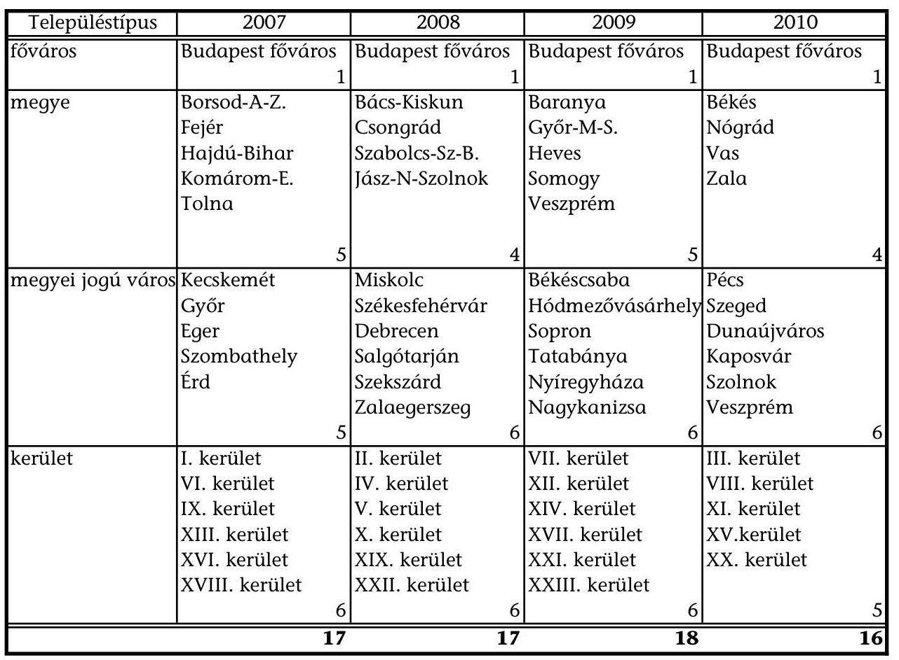

---

.

---

# 3. számú melléklet 

ÁSZ jelentések az országgyúlési bizottságok/plenáris ülések napirendjén 2006-ban

---

.

---

ÁSZ jelentések az országgyűlési bizottságok/plenáris ülések napirendjén 2006-ban

|  Sorszám | ÁSZ szám | OGY szám | A jelentés címe | Bizottság | A bizottsági tárgyalás dátuma | A plenáris tárgyalás dátuma | Megjegyzés  |
| --- | --- | --- | --- | --- | --- | --- | --- |
|  1. | 0608 | J/3 | Jelentés az Állami Számvevőszék 2005. évi tevékenységéről | Oktatási
Emberi jogi
Gazdasági
Költségvetési
Önkormányzati
Foglalkoztatási | $\begin{aligned} & 10.09 . \ & 10.10 . \ & 10.11 . \ & 10.11 . \ & 10.11 . \ & 10.16 . \end{aligned}$ | $\begin{aligned} & 10.18 . \ & 10.24 . \end{aligned}$ | A jelentést, illetve a Költségvetési bizottság által benyújtott határozati javaslatot (H/1010) az Országgyűlés 3 órás vita után tartózkodás és nem szavazat nélkül - 307 igen szavazattal fogadta el. (47/2006 (X.27.) OGY hat.)  |
|  2. | 0609 |  | Jelentés az egészségügyi szakellátások privatizációjának ellenőrzéséről | Egészségügyi | 10.11. |  | Önálló napirendi pontént tárgyalta a bizottság, (különös tekintettel az ÁSZ javaslatokra).  |
|  3. | 0613 |  | Jelentés a hajléktalanokat ellátó intézményrendszer ellenőrzéséről | Ifjúsági | 11.06. |  | Együtt tárgyalták a Szociális- és Munkaügyi Minisztérium hajléktalanellátás helyzetéről szóló tájékoztatójával.  |
|  4. | 0617 |  | Jelentés a Környezetvédelmi és Vízügyi Minisztérium müködésének ellenőrzéséről | Környezetvédelmi | 11.07. |  | Tájékoztató a KVM fejezet müködésének ellenőrzéséről.  |
|  5. | 0620 |  | Jelentés a Nyugdíjbiztosítási Alap müködésének ellenőrzéséről | Ifjúsági | 11.14. |  | A jelentést a társadalombiztosítási nyugellátásról szóló 1997. évi LXXXI. törvény módosításáról szóló törvényjavaslat (T/1140), a Magyar Köztársaság 2006. évi költségvetéséről szóló 2005. évi CLIII. törvény módosításáról szóló törvényjavaslat (T/1205), illetve a Magyar Köztársaság 2007. évi költségvetéséről szóló törvényjavaslat (T/1145) tárgyalása kapcsán tűzte napirendre a bizottság.  |

---

|  6. | 0628 | T/881/1 | Jelentés a Magyar Köztársaság 2005. évi költségvetése végrehajtásának ellenőrzéséről | 17 bizottság | 10.03. - 10.04. | $\begin{aligned} & 10.10 . \ & 10.17 . \ & 10.30 . \ & 11.06 . \ & 11.13 . \end{aligned}$ | 2006. évi XCIX. törvény a Magyar Köztársaság 2005. évi költségvetésének végrehajtásáról  |
| --- | --- | --- | --- | --- | --- | --- | --- |
|  7. | 0629 | J/880 | Jelentés az Állami Privatizációs és Vagyonkezelő Rt. 2005. évi müködésének és a központi költségvetés végrehajtásához kapcsolódó tevékenységének ellenőrzéséről | Környezetvédelmi | 12.06. |  | Négy kijelölt bizottság közül (Költségvetési, Gazdasági, Környezetvédelmi, Mezőgazdasági) 2006-ban a Környezetvédelmi tárgyalta és ajánlotta általános vitára.  |
|  8. | 0639 |  | Jelentés az önkormányzati út- és szennyvízcsatorna beruházásokhoz 20022005. években igénybe vett közmúfejlesztési támogatások igénylésének és felhasználásának ellenőrzéséről | Környezetvédelmi | 11.07. |  | Tájékoztató az ÖKOTÁM rendszerről szerzett tapasztalatokról és az önkormányzati visszafizetésekről.  |
|  9. | 0641 | T/1145/1 | Vélemény a Magyar Köztársaság 2007. évi költségvetési javaslatáról | 17 bizottság | 11.13. - 11.15. | $\begin{aligned} & 11.16 .-11.18 . \ & 11.20 . \ & 11.24 . \ & 12.05 . \ & 12.11 . \ & 12.12 . \ & 12.18 . \ & 12.21 . \end{aligned}$ | 2006. évi CXXVII. törvény a Magyar Köztársaság 2007. évi költségvetéséről  |

---

# 4. számú melléklet 

Az ÁSZ 2006. évi jelentéseiben<br>a fejezetek vezetőinek megfogalmazott javaslatok és<br>az azokra adott válaszok

---

.

---

# Az Állami Számvevőszék 2006. évi jelentéseiben a fejezetek vezetőinek megfogalmazott javaslatok és az azokra adott válaszok 

## Bíróságok fejezet vezetője

| Jelentés a Magyar Köztársaság 2005. évi költségvetése végrehajtásának ellenőrzéséről (0628) |  |
| :--: | :--: |
| Javaslat: | 1. Aktualizálják az Informatikai Stratégiát, mérjék fel az informatikai rendszer fenyegetettségeit, készítsék el az Informatikai Biztonsági Szabályzatot, a szervezet valamenynyi lényeges működési folyamatára kiterjedő Müködésfolytonossági-, és Katasztrófa elhárítási Tervet. |
| Válasz: | Az OIT a birósági informatikai vezetőkből álló munkacsoportot hozott létre. <br> A munkacsoport a jelenlegi birósági rendszer helyzetfelmérését, valamint az e-birósági koncepció megvalósitása érdekében szükséges változtatásokra vonatkozó javaslatait tartalmazó dokumentumot 2007. január 10. napjára készítette el. Ez lesz az alapja a birósági informatikai stratégia megújitásának. <br> A birósági informatikai rendszer átvilágitásáról készített dokumentumra alapozva dönt az Országos Igazságszolgáltatási Tanács Hivatala az informatikai biztonsági kockázatok külső szakértő segítségével történő további felméréséről. |
| Javaslat: | 2. Dolgozzák ki részletesen a teljes Gazdasági Integrált Informatikai Rendszerre (GIIR) vonatkozó jogosultsági rendszert, a modulokon belüli és közötti kontrollok, a bevitt adatok ellenőrzöttségének rendszerét, továbbá fontolják meg a GIIR egységes idősoros adatbázisokra építését. A rendszer használatának megkönnyítése, illetve a megbízhatósága érdekében képezzenek ki olyan a felhasználókat támogató munkatársakat, akik a modulokat részleteiben és összefüggéseiben is ismerik, így segítséget tudnak nyújtani, müködtetik, monitorozzák a rendszert, elemzik a naplófájlokat, illetve szükség esetén meghatározzák a továbbfejlesztési igényeket. |
| Válasz: | A GIIR jogosultsági rendszerét a fejlesztések során megfelelően alakították ki. Erre építve a birósági gazdasági hivatalok munkatársainak segítségével az egyes szerepkörök pontositásának, összehangolásának egyeztetése az év végi zárlati munkákat követően, a beszámolók elkészitése utáni időszakban történik. <br> A rendszermodulok közötti integrációval kapcsolatos kérdéseket az ÁSZ vizsgálatát követően, az Országos Igazságszolgáltatási Tanács 2006. október 10. napján megtartott ülésén elfogadott, a gazdálkodási integrált informatikai rendszerrel támogatott gazdasági és speciális birósági folyamatok szabályozásáról szóló 2006. évi 8. számú szabályzat rendezte. |

---

# Egészségügyi miniszter 

| Jelentés a Magyar Köztársaság 2005. évi költségvetése végrehajtásának ellenőrzéséről (0628) |  |
| :--: | :--: |
| Javaslat: | 1. Tegyen javaslatot a közgyógyellátás keretében igénybe vehető gyógyászati segédeszközök ésszerűbb szabályozására. |
| Válasz: | 2006. december 29-én lépett hatályba a biztonságos és gazdaságos gyógyszer és gyógyászati segédeszköz ellátás, valamint a gyógyszerforgalmazás általános szabályairól szóló XCVIII. Törvény, mely az ÁSZ javaslataival összhangban tartalmazza a gyógyászati segédeszközök közgyógyellátási jogcímen történő támogatásának újraszabályozását. |
| Javaslat: | 2. Intézkedjen a 2005. évi leltározás során kimutatott leltárhiányok és többletek keletkezése okainak feltárásaira, az eltérések tisztázására, szükség esetén a felelősség megállapítására és kártérítés érvényesítésére. |
| Válasz: | A kimutatott leltárhiányok és többletek keletkezésének okai feltárásra, az eltérések tisztázásra kerültek. Kártérítés érvényesitésére nem került sor, tekintettel arra, hogy az eltérések tisztázása után személyi felelősség megállapítására nem volt szükség. |
| Javaslat: | 3. Gondoskodjon a minisztérium tulajdonát képező, kezelésében lévő, üzemeltetésre, kezelésre átadott, illetve átvett, valamint koncesszióba adott eszközök jogszabályoknak megfelelő kezeléséről, a nyilvántartásban való elkülönítésének alapját képező szerződések megkötéséről és annak megfelelő analitikus nyilvántartásba vételéről. |
| Válasz: | 2006. évben megkötésre kerültek az „Üzemeltetési szerződések", az átadott tárgyi eszközök átkönyvelésre kerültek a 16. számlaosztályba. |
| Javaslat: | 4. Tegyen intézkedést a Pécsi Tudományegyetemnek 2002. decemberében nyújtott 172,2 M Ft visszatérítendő támogatás esedékes összegének behajtatására. |
| Válasz: | A 24 havi - egyenként 7.175 ezer Ft-os -tartozásállományból 2007. január hónapig 22 havi törlesztőrészlet befizetésére került sor. Így - a még hátralévő 2 havi törlesztőrészleten kívül - a Pécsi Tudományegyetem a visszafizetési kötelezettségének eleget tett. |
| Javaslat: | 5. Alapítói hatáskörben intézkedjen a veszteségesen gazdálkodó Magyar Koraszülött Mentő Közalapítvány, valamint a Hungarotransplant Kht. helyzetének rendezésére. |
| Válasz: | A felülvizsgálat megtörtént. 2007. január 1-jével megszünt a Hungarotransplant Kht, feladatait az OVSZ veszi át. A Magyar Koraszülött Mentő Közalapítvány feladatait az OMSZ veszi át, a feladat átadásról és megszüntetésről szóló kormányhatározat előkészítése folyamatban van. |

---

# Földművelési és vidékfejlesztési miniszter 

| Jelentés a Magyar Köztársaság 2005. évi költségvetése végrehajtásának ellenőrzéséről (0628) |  |
| :--: | :--: |
| Javaslat: | 1. Intézkedjen a 2007. évi költségvetési tervezési során kezdeményezze, hogy a Top-up önállóan egy törvényi soron legyen megtervezve, előirányozva. |
| Válasz: A Top-up kiadásai 2007. évben nem kerültek külön soron megtervezésre. |  |
| Javaslat: | 2. Intézkedjen az egyes agrártámogatásokkal kapcsolatos rendeletek megfelelő időben történő meghozataláról, hogy a végrehajtó apparátusnak elegendő idő álljon rendelkezésére az eljárásrendek és a szükséges szoftverek kifejlesztésére. |
| Válasz: A Tárca törekszik erre. 2007. május 1-jét követően már csak teljes mértékben EU konform nemzeti támogatási rendszerek müködtethetőek. A notifikációt követően dolgozhatók ki a szükséges eljárásrendek és szoftver fejlesztések. |  |
| Javaslat: | 3. Gondoskodjon az APEH által lebonyolított pályázatos támogatások elszámolási rendjéről szóló megállapodás megkötéséről. |
| Válasz: | Az APEH által kifizetett támogatások normatív jellegüek és a támogatottak az adóbevallással együtt igényelhetik az FVM Szakigazgatási Hivatala által részükre kiállított öszszegeket. Az APEH 2007. évtől új agrár- és vidékfejlesztési támogatás kifizetést nem teljesit. |
| Jelentés a helyi és a helyi kisebbségi önkormányzatok gazdálkodási rendszerének átfogó és egyéb szabályszerűségi ellenőrzéséről (0634) |  |
| Javaslat: | 1. Hívja fel az ingatlan-nyilvántartásról szóló 1997. évi CXLI. törvény 90. § (1) bekezdésében biztosított felhatalmazása, valamint a földművelésügyi és vidékfejlesztési miniszter feladatairól és hatásköréről szóló 155/1998. (IX. 30.) Korm. rendelet 6. § (2) bekezdés 1) pontjában meghatározott feladatához kapcsolódóan a földhivatalok figyelmét arra, hogy az Ötv. 79. § (2) bekezdés a) pontja alapján forgalomképtelen ingatlanok esetében - figyelemmel a Ptk. 173. § (2) bekezdésében foglalt elidegenítési tilalomra ne jegyezzék be a tulajdonosváltozást. |
| Válasz: | Az FVM Földügyi és Térinformatikai Főosztálya körlevélben felhívta a földhivatalok figyelmét a fent hivatkozott jogszabályok betartására. Tekintettel arra, hogy az ÁSZ jelentésben vizsgált és észrevételezett ügyek a körlevél kiadását megelőzően történtek, újabb körlevél, tájékoztatás kiadása nem szükséges, azonban a szakmai irányitás keretében a tárca továbbra is figyelemmel kíséri a földhivatali eljárásokban alkalmazandó jogszabályok megtartását. |

---

# Gazdasági és közlekedési miniszter 

| Jelentés a Magyar Fejlesztési Bank Részvénytársaság múködésének ellenőrzéséről (0619) |  |
| :--: | :--: |
| Javaslat: | 1. Követelje meg a Banktól a portfoliótisztitásra vonatkozó törvényi előírás teljes körű végrehajtását. |
| Válasz: | Az MFB az intézkedési tervében vállaltaknak megfelelően portfoliótisztitást hajtott végre. |
| Javaslat: | 2. Rendelje el az egyedi fejlesztési tökebefektetések alapítói határozattal történő jóváhagyását, a gazdaságfejlesztési koncepcióba való illeszkedés és az állami kockázatok felmérése érdekében. |
| Válasz: | Az MFB Alapitó Okiratát módositotta, a saját tökéjének 10\%-át meghaladó összegü tökefinanszirozási müveletei, az egyedi fejlesztési tökebefektetési döntései a Bank feletti tulajdonosi jogokat gyakorló hatáskörébe tartoznak. |
| Javaslat: | 3. Írja elő, hogy a Bank a befektetési szabályzatában a stabil gazdálkodás kritériumait részletesen határozza meg a befektetési döntések átláthatósága és ellenőrizhetősége érdekében. |
| Válasz: | Az MFB 2006. augusztusától megkezdte tökefinanszirozási tevékenysége átszervezésének elökészitését. Az előkészités ideje alatt a gazdasági és közlekedési miniszter Alapitói Határozata szerint az MFB 2007. január 1-től az eddigi fejlesztési tökefinanszirozási tervét a 100\%-os Nemzeti Ingatlanfejlesztő és Lakásberuházó ZRt-n keresztül, és annak keretein belül végzi. |
| Jelentés a Magyar Köztársaság 2005. évi költségvetése végrehajtásának ellenőrzéséről (0628) |  |
| Javaslat: | 1. Vizsgálja meg, hogy a fejezeti kezelésű előirányzatok beszámolójelentésének megbízhatatlansága miatt kit terhel felelősség. |
| Válasz: | A fejezeti kezelésű előirányzatok beszámolójának megbizhatóságát befolyásoló jelentősebb hibák okainak a kivizsgálása megtörtént. A strukturális, szabályozottsági hiányosságokat a tárca megszüntette, a szükséges személycseréket végrehajtotta. |
| Javaslat: | 2. Határozza meg a helyi közfogalmú közlekedés normatív támogatását szabályozó rendeletben, hogy az önkormányzatoknak több szolgáltató esetén a szolgáltatók teljesítménye arányában kapott központi támogatás összegét és a kapcsolódóan elvárt önkormányzati támogatást szolgáltató szervezetenként arányosan kell vagy önkormányzati szinten a helyi döntésnek megfelelő arányok szerint is lehet-e továbbutalni. |
| Válasz: | Mivel a Magyar Köztársaság 2007. évi költségvetéséről szóló törvény a helyi közlekedés normativ támogatásának arányositására vonatkozóan szabályt nem tartalmaz, ezért az ÁSZ javaslatában foglaltakat a tárca a végrehajtási rendelet - a helyi közforgalmú közlekedés normativ támogatásáról szóló GKM-BM rendelet - módositásával hajtja végre. |
| Javaslat: | 3. Rendelkezzen arról, hogy az Áht. 24. § (9) és (10) valamint a 49. § o) pontjában előírtak végrehajtása keretében a szabályozás minden előirányzatra kiterjedően a pénzügyminiszter egyetértésével, határidőben hatályba lépjen. Tegyen intézkedést az eddiginél áttekinthetőbb, a gyakorlati alkalmazást hatékonyabban biztosító szabályozás kialakítására. |
| Válasz: | A GKM fejezetnél a 2007. évi fejezeti kezelésű előirányzatokkal kapcsolatos eljárásrend, a hatáskörökről és felhasználásról rendelkező szabályozások elökészités alatt állnak. A Pénzügyminisztérium egyetértését a tárca határidőben beszerzi. |

---

| Javaslat: | 4. Rendelje el az M5-ös rendelkezésre állási dij előirányzat elszámolási rendjének a 249/2000. (XII. 24.) Korm. rendelet vonatkozó előirásainak megfelelő átalakítását. Gondoskodjon arról, hogy az előlegekkel való elszámolásra a szabályozott eljárásnak megfelelően, időben sor kerüljön. |
| :--: | :--: |
| Válasz: | A tárca a 2006. évre vonatkozóan a kiemelt előirányzatonkénti átcsoportositást végrehajtotta. Az intézkedési terv kiadását követően 2006. évi IV. negyedévben az Autópálya rendelkezésre állási dij előlegkénti kezelése és könyvelése megtörtént. A 2005. évet érintő számlák végelszámolása során visszautalt pénzösszegek 2006. évben - az ÁSZ álláspontjának megfelelően - átvett pénzeszközként kerültek rögzitésre. |
| Javaslat: | 5. Az SzMSz módosításával biztosítsa, hogy a Költségvetési Főosztály feladatai terjedjenek ki a közremüködő szervezetek hatáskörébe tartozó előirányzatokra is, és a fejezeti kezelésű előirányzatok teljes körére érvényesüljenek a felügyeleti, ellenőrzési és felelősségi szabályok. |
| Válasz: | A tárca Szervezeti és Müködési Szabályzatáról szóló GKM utasitás hatályba lépett. Elöírásra került, hogy a fejezeti kezelésü előirányzatok Számviteli politikáját, ennek keretében az Eszközök és források értékelési szabályzatát, a Leltározási Szabályzatot és a Pénzkezelési Szabályzatot, valamint a Számlarendet a Költségvetési Főosztály egyetértését követően a gazdasági, informatikai és humánpolitikai szakállamtitkár hagyja jóvá. Ezzel biztositott a Költségvetési Főosztály költségvetési szempontú szakmai felügyelet gyakorlása. |
| Javaslat: | 6. Az 2006. január 1-jétől megszűnt UFCE helyébe lépett Útpénztár fejezeti kezelésű előirányzat számviteli szabályozását követően rendelje el, hogy a fejezeti kezelésű előirányzat főkönyvi és analitikus elszámolása feleljen meg az előirányzat felhasználása során keletkező gazdasági események valós tartalmának, a felhasználás bizonylatolása álljon összhangban az elszámolás kialakított rendjével. |
| Válasz: | Az Útpénztár fejezeti kezelésű előirányzatból finanszirozott fejlesztések, felújitások elszámolásának szabályozása megtörtént, mely biztositja a gazdasági müveletek elszámolását és rendezésének módját, valamint biztositja az elszámolások számviteli törvény alapelveivel való megfelelést. A szabályozás végrehajtásával - a kezelő átszervezése okán módositott határidővel - az Útpénztár fejezeti kezelésű előirányzat fökönyvi és analitikus elszámolása megfelel az elöirányzat felhasználása során keletkező gazdasági események valós tartalmának, a felhasználás bizonylatolása összhangban áll az elszámolás kialakított rendjével. |
| Javaslat: | 7. Gondoskodjon az IT Kht.-vel kötendő támogatási szerződésekben a költségek pontos és tételes elkülönítésről, annak érdekében, hogy egyértelműen megállapítható legyen az IT Kht. müködéséhez nyújtott támogatás összege, a pályázatok kezelési feladatainak költségigénye, továbbá a GVOP pályázatok miatti közremüködői költség. |
| Válasz: | A tárca az IT Kht. a Magyar Gazdaságfejlesztési Központ ZRt.-be való beolvadása okán a Magyar Gazdaságfejlesztési Központ ZRt. vonatkozó szerződéseinél fordít kiemelt figyelmet, hogy a költségek pontos elkülönitése megvalósitásra kerüljön. |

---

| Jelentés az állami közutak fenntartásának ellenőrzéséről (0640) |  |
| :--: | :--: |
| Javaslat: | 1. Biztosítsa egy, a környezet- és természetvédelmi, közlekedési, társadalmi, közösségi szempontból kiemelt érdeklődésre számot tartó területen áthaladó út fejlesztése esetére létrehívható előkészítő bizottság jogszabályi hátterét. |
| Válasz: | Az Új Magyarország Fejlesztési Terv keretében a Nemzeti Fejlesztési Ügynökség és a GKM közösen késziti elö a projektek megvalósitását. A Nemzeti Fejlesztési Tanács müködésével a társadalmi kiterjesztést biztositó elökészitő bizottság létrejött. |
| Javaslat: | 2. Intézkedjen, hogy az Útgazdálkodási és Koordinációs Igazgatóság SzMSz-e teljes körűen tartalmazza a jogszabályokban számára előírt feladatokat; gondoskodjon a Magyar Közút Kht. szervezetének további racionalizálása keretében a megyei tagozódású szervezetek regionális rendszerre történő átalakításának tervének előkészítéséről, és a pénzügyi forrásokra figyelemmel gondoskodjon ennek végrehajtásáról, valamint a kht. egészére vonatkozó funkciókat ellátó szervezeti egységek szervezeti rendjének célszerüségi, gazdaságossági szempontból történő egyszerűsítéséről. |
| Válasz: | Az Útgazdálkodási és Koordinációs Igazgatóság (jogutód: Közlekedésfejlesztési Koordinációs Központ) átszervezése okán, valamint a jogszabályokban számára elöirt feladatok teljesitése érdekében új Alapitó Okirat kiadására, valamint a vonatkozó jogszabályok átdolgozására került sor. A Magyar Közút Kht. szervezetének racionalizálása keretében a regionális rendszerre való átalakitás érdekében a tültagolt rendszert szervezeti leépitéssel egyszerüsítették, a régiók kialakításához kapcsolódó szervezeti változás bevezetése 2007. II. negyedévében kezdödik. |
| Javaslat: | 3. Intézkedjen a 10. sz. föút fejlesztésének előkészítésének felgyorsításáról, együttmüködve az érintett szervezetekkel, önkormányzatokkal és társtárcákkal. |
| Válasz: | A tárca az új 10. számú fơút épitése előkészitésének felgyorsitására intézkedési tervet készitett. |
| Javaslat: | 4. Intézkedjen, hogy az Útgazdálkodási és Koordinációs Igazgatóság vezetője: <br> a) gondoskodjon a fejlesztéseknél mutatkozó késedelmek csökkentéséről, illetve megszüntetéséről; |
| Javaslat: | b) rendelje el a munkák minőségcsökkenéssel történő átvételek mindenkori felülvizsgálatát, ezek csökkentése érdekében erősítse meg a kivitelezés közbeni minőségellenőrzést; |
| Javaslat: | c) gondoskodjon a belső ellenőrzés megerősítése érdekében a feladatokhoz igazodó kapacitásról; |
| Javaslat: | d) intézkedjen a hiányzó - kiemelten a karbantartások, garanciák érvényesítésének áttekintését biztosító - nyilvántartások elkészítéséről és folyamatos kezeléséről; |
| Javaslat: | e) gondoskodjon a fenntartási munkák hatékonyság vizsgálati rendszerek teljes körü szervezeti telepítéséről és - lehetőségekhez képest - hasznosításáról. |
| Válasz: | A Közlekedésfejlesztési Koordinációs Központ (jogelőd: Útgazdálkodási és Koordinációs Igazgatóság) az ÁSZ javaslatokra készített Intézkedési Tervének végrehajtását megkezdte, de azt a teljes szervezeti és feladatköri átalakulás miatt csak módositott határidővel tudja realizálni. |

---

# Honvédelmi miniszter 

## Jelentés a Magyar Köztársaság 2005. évi költségvetése végrehajtásának ellenőrzéséről (0628)

Javaslat: 1. Gondoskodjon a pénzügyi és számviteli információs rendszer továbbfejlesztéséről annak érdekében, hogy az éves költségvetési beszámoló, a könyvviteli mérleg és a pénzforgalmi jelentés bizonylati alátámasztására szolgáló főkönyvi kivonat minden tekintetben feleljen meg az államháztartás szervezetei beszámolási és könyvvezetési kötelezettségének sajátosságairól szóló 249/2000. (XII. 24.) Korm. rendelet 50. § előírásának.

Válasz: A pénzügyi és számviteli információs rendszer (HM KGIR) továbbfejlesztése keretében a szükséges módosítások végrehajtásra kerültek. A változtatások eredményeként a rendszerből előállításra kerülő főkönyvi kivonatok már minden tekintetben megfelelnek az államháztartás szervezetei beszámolási és könyvvezetési kötelezettségének sajátosságairól szóló kormányrendelet előírásainak.

## Igazságügyi és rendészeti miniszter

## Jelentés a helyi és a helyi kisebbségi önkormányzatok gazdálkodási rendszerének átfogó és egyéb szabályszerűségi ellenőrzéséről (0634)

Javaslat: 1. Segítse elő a beszerzések átláthatóságát és széles körű nyilvános ellenőrizhetőségét a jogszabályi feltételek áttekintésével és szükség szerinti módosításának szorgalmazásával. Fontolja meg annak kezdeményezését, hogy az egy önkormányzathoz tartozó költségvetési szervek közbeszerzési igényének megállapításához az azonos, vagy hasonló jellegű, illetve egymással közvetlenül összefüggő felhasználási célra történő árubeszerzések, építési beruházások és szolgáltatás megrendelések becsült értékét számítsák egybe és ehhez az önkormányzatok ezen beszerzések fedezetét biztosító költségvetési előirányzatokat megfelelően összevontan állapítsák meg;

Válasz: Kiegészítésre került a közbeszerzésekről szóló törvény (Kbt.) egy új paragrafussal, amely a helyben központosított közbeszerzésekre vonatkozó alapvető szabályokat határozza meg, megteremtve a helyi önkormányzatok irányítása alatt álló költségvetési szervek közbeszerzéseinek központosított eljárás keretében történő lefolytatása lehetőségét. A törvény ugyanakkor egyértelmüvé teszi, hogy a helyben központosított közbeszerzési eljárások során is a Kbt. szabályait kell alkalmazni, annak rendelkezéseitől a helyi önkormányzatok által alkotandó rendelet sem térhet el.

## Jelentés a Belügyminisztérium fejezet múködésének ellenőrzéséről (0618)

Javaslat: 1. Számoljon be a Kormánynak
a) a minőségbiztosítási módszerek alkalmazásának eredményességéről, tegyen javaslatot a minőségfejlesztés célszerűnek tartott irányára, továbbá a tárca felügyelete alá tartozó, azonos funkciót betöltő szervezeteknél szorgalmazza az egységes szemlélet kialakulását.

Válasz: A minőségbiztositási, minőségfejlesztési rendszerek alkalmazásával kapcsolatban a Rendörség széles körü tervet dolgozott ki, amely többek között magába foglalja az alkalmazás tapasztalatainak értékelését, egy egységes önértékelési modell alkalmazására

---

|  | vonatkozó előterjesztés elkészitését, a fejlesztendő területek prioritását is tartalmazó önértékelési jelentés elkészitését. A Határőrség Országos Parancsnokság Minőségirányitási rendszerének kiépitése, valamint a CAF felmérés megtörtént, melyek eredményeként az ISO minősitést is megkapták. |
| :--: | :--: |
| Javaslat: | b) a rendvédelmi szervek korszerűsítésének, fejlesztésének finanszírozásával összefüggő kockázatokról (szemléltetve a forrásoldal kiszámíthatóságából eredő bizonytalanságok hosszabbtávú tervezhetőség stabilitásra gyakorolt hatását, a forráscsökkenések, megvonások következményeit az uniós és nemzeti feladatvállalások teljesíthetőségére), bemutatva egyidejűleg az elfogadható mértékủ kockázattal bíró alternatív megoldásokat. |
| Válasz: | A rendvédelmi szervek korszerüsitésével, fejlesztésével kapcsolatos előkészitő munka az államháztartás hatékony müködését elősegitő szervezeti átalakításokról és az azokat megalapozó intézkedésekről szóló kormányhatározatban kijelölt irányok szerint folyamatban van. Ennek keretében sor kerül a fövárosi és megyei rendőr-fökapitányságok regionalizálásának, valamint a határőr igazgatóságoknak a rendőrség országos és területi szintü vezető szerveibe történő integrálásának előkészitésére. |
| Javaslat: | 2. Intézkedjen a fejezet teljes vertikumát átfogó ágazati informatikai stratégia meghatározására, az informatikai biztonság irányítási és felügyeleti hiányosságainak megszüntetésére, továbbá gondoskodjon az informatikai szakfeladatok megvalósításához és ellenőrzéséhez megfelelő személyi, szervezeti feltételek biztosításáról. |
| Válasz: | Tekintettel a szakterületen várható változásokra, átfogó ágazati informatikai stratégia kialakítása pillanatnyilag alacsony jelentőséggel birna. Az egységes kormányzati informatikai stratégiával összhangban készülhetnek el majd a fejezeti részstratégiák, amelyek már tartalmazhatnak az erőforrások allokációjára vonatkozó elemeket is. |
| Javaslat: | 3. Gondoskodjon a módosuló határrendészeti tevékenységben érintett szervekre kiterjedő szabályozások korrekciójáról, a teljes jogú schengeni tagsággal kapcsolatos uniós ellenőrzések előkészítésével összefüggésben a határrendészeti feladatok alacsonyabb létszámmal történő ellátását megalapozó elemzések, dokumentációk rendelkezésre állásáról. |
| Válasz: | A javaslat hasznosítására a tájékoztatás nem tér ki. |
| Javaslat: | 4. Gondoskodjon a megbízhatósági ellenőrzéseknek a költségvetési fejezet teljes intézményi körére történő kiterjesztéséről, az ehhez szükséges feltételek biztosításáról. |
| Válasz: | A megbizhatósági ellenőrzések teljes intézményi körre történő kiterjesztése csak jelentős ellenőri létszámfejlesztéssel valósitható meg. Létszámfejlesztésre az IRM fejezetnél nem került sor, mivel ilyen célra sem központi, sem saját forrás nem állt rendelkezésre. A meglévő létszámmal évi 2-3 megbizhatósági ellenőrzés végrehajtása történt meg. A jelenlegi létszámfeltételek mellett a megbizhatósági ellenőrzések teljes körüvé tétele nem biztositható. A 2007. évi ellenőrzési terv az IRM fejezet szintjén 1 db megbizhatósági ellenőrzést tartalmaz. |

---

# Kormány 

## Jelentés a Területfejlesztés fejezet müködésének ellenőrzéséről (0603)

Javaslat: 1. Rendelje el, a hatékony és eredményes kormányzati feladat ellátás érdekében, a területfejlesztés feladatok OGY felé történő négyévenkénti beszámolási rendje, valamint vagy a területfejlesztési feladatokra koncentrálva, vagy egy szélesebb körű államigazgatási reform keretében - az irányítási, felügyeleti jogkörök és a szervezeti keretek, ezen belül a tárca nélküli miniszter, ill. a kistérségi megbízottak más fejezethez tartozása célszerűségének felülvizsgálatát.

Válasz: A kormányzati átalakítást követően az Országos Területfejlesztési Hivatal feladatait az Önkormányzati és Területfejlesztési Minisztérium Területfejlesztési és Épitésügyi Szakállamtitkársága folytatja. A 2007. évben a Területfejlesztés fejezetet érintő gazdálkodási és szervezeti szabályozás kialakítása ÖTM belső utasításokon keresztül történik.
A Magyar Köztársaság minisztériumainak felsorolásáról szóló 2006. évi LV. törvény 1. § i) pontja alapján létrejött az Önkormányzati és Területfejlesztési Minisztérium, mely egységes, integrált szervezetben fogja össze a területfejlesztési, az önkormányzati, a területrendezési, a településfejlesztési, valamint az épitésügyi feladatokat.
A tárca célja a területfejlesztés szintjei közül a regionális és a kistérségi szint megerősítése, a területfejlesztési és területrendezési feladatokat ellátó egységes és hatékony intézményrendszer kialakítása.
Javaslat: 2. Vizsgálja felül a területfejlesztési célokat nem tartalmazó feladatok és előirányzatok Területfejlesztés fejezet keretei közötti ellátásának indokoltságát, ill. intézkedjen célkitüzéseik között a területfejlesztési szempontok megjelenítéséről.

Válasz: Az országos jelentőségű területfejlesztési programokra szolgáló fejezeti kezelésű előirányzatok felhasználásának részletes szabályairól szóló kormányrendelet módosítása folyamatban van. A monitoringot a Balaton Fejlesztési Tanácsnál müködő Monitoring Bizottság végzi, melynek az ÖTM is tagja. A központi támogatások esetén beruházási támogatás csak müszaki ellenőr közremüködésével valósulhat meg. A támogatások felhasználásának ellenőrzésébe több esetben a Magyar Államkincstár is közremüködik. EU követelményeknek megfelelő, nyilvántartási rendszer az EMIR, melynek müködtetése az NFÜ feladata.
Javaslat: 3. Intézkedjen a Nemzeti Lakásprogram kidolgozásáról.
Válasz: A kormánymegbizott létrehozta a Nemzeti Lakáspolitikai Tanácsadó Testületet (továbbiakban: NLTT). Az NLTT véleményező és tanácsadó szakmai és társadalmi fórumként müködik. Ezen keresztül a széleskörü társadalmi részvételt biztosit a Kormány a lakáspolitikai döntés-előkészittési folyamatban, szinte valamennyi társadalmi szegmensnek, és lehetőséget nyújt szempontjaik figyelembevételéhez.
Az NLTT megalakításának egyik célja az volt, hogy az ezen belül létrehozott szakmai Bizottságok segítségével készítse el a 10-15 évre szóló Nemzeti Lakásprogramra (továbbiakban: NLP) vonatkozó javaslatát.
Javaslat: 4. Gondoskodjon a Területfejlesztésről és a területrendezésről szóló törvény végrehajtását részletesen szabályozó kormányrendeletek kiadásáról.

Válasz: A jogi szabályozás elökészitése elindult, amelynek keretében a régiókkal kötendő megállapodások a régiók középtávú fejlesztési tervein alapulna. A területfejlesztésről és a területrendezésről szóló törvény módosítása várhatóan 2007 II. félévében kerül

---

elé. Ezt követően van lehetőség a módosított törvény végrehajtását szabályozó kormányrendeletek megalkotására.
2006. évi CIX. törvény alapján folyamatban van a központi államigazgatási szervek területfejlesztéssel és területrendezéssel kapcsolatos feladatairól és a miniszterek közötti folyamatos koordináció szabályairól szóló kormányrendelet előkészitése, amely várhatóan 2007 februárjában kerül kormány elé.
Jelentés az államháztartás adóssága kezelésének, alakulásának ellenőrzéséről (0604)
Javaslat: 1. Kezdeményezze az Áht. módosítását annak érdekében, hogy az
a) nevezze meg az uniós statisztikai módszerek szerinti hivatalos adósság adatokat publikáló szervezetet;

Válasz: Az Áht. 2007. január 1-jével hatályba lépett módosítása rendelkezett arról, hogy az államháztartásért felelős miniszter köteles az államadósságot és az államháztartási adósságot alrendszerenként és konszolidáltan rendszeresen, de legalább negyedévente kormányrendeletben meghatározottak szerint - nyilvánosságra hozni. Az államadósságra vonatkozó adatokat az ÁKK Zrt. hozza nyilvánosságra a honlapján a tárgynegyedévet követő 80 napon belül.
Javaslat: b) szabályozza az állami követelések, és azok kezelésének fogalmát.
Válasz: 2007 folyamán tervezik az Áht.-nak az ezen szempontokra is kiterjedő módosítását.
Javaslat: 2. Határozza meg és rendeletben szabályozza az államháztartás egészére - különös tekintettel az önkormányzatok összesített adósságára - vonatkozó államadósság bemutatásának felelősét.

Válasz: Az Áht. 2007. január 1-jétől hatályos módosítása, és a 217/1998. (XII. 30.) Korm. rendelet módosítása tartalmazza ennek szabályait.
Javaslat: 3. Dolgozzon ki és terjesszen az Országgyűlés elé a Társadalombiztosítási Alapok mindenkori pénzügyi egyensúlyának megteremtését szolgáló javaslatot.

Válasz: A kormány intézkedései a nyugdíjreform, az egészségügyi reform, valamint a járulékszabályozás változás (pl. járulékmérték növelés, nemzeti kockázatközösség szabályozása, járulékalap szélesités) területén a társadalombiztositás pénzügyi egyensúlyának javitását szolgálják. 2007-ben tovább folytatódik a nyugdíjreform, az ápolási rendszer korszerüsitése és az egészségügyi reform kiteljesitését szolgáló további intézkedések kidolgozása.
Jelentés a Wesselényi Miklós Sport Közalapítvány gazdálkodásának ellenőrzéséről (0606)
Javaslat: 1. Kezdeményezze a sportról szóló 2004. évi I. törvény 48. § (2) bekezdés utolsó mondatának módosítását a tekintetben, hogy a közalapítvány működési költségeit a tárgyévben teljesített alapítványi célú kiadások arányában határozza meg és a közalapítvány központi költségvetési finanszírozás rendszerének megváltozására tekintettel, vizsgálja felül annak mértékét.

Válasz: Az észrevételre a WESKA kuratóriuma írásbeli javaslatot tett múlt év decemberének végén, melyben az esetleges müködési hiányt saját bevételeiből pótolná.

---

| Javaslat: | 2. Tekintse át a közalapítvány alapító okiratát és annak módosítása keretében <br> a) teremtse meg az Áht. 104/A. § (2) bekezdésének 2003. június 9.-étől hatályos előírásával való összhangot, amely szerint a közalapítvány köteles pályázatot kiírni, ha az általa nyújtott cél szerinti juttatás az évi egymillió forintot meghaladja, kivéve, ha törvény vagy kormányrendelet a közalapítvány közfeladatára tekintettel más eljárási rendet állapít meg; |
| :--: | :--: |
| Válasz: | A javaslat oka fogyottá vált, mert a minisztérium és a WESKA közötti szerződés nem ad önálló mozgásteret a közalapítvány számára. |
| Javaslat: | b) hatalmazza fel az alapító képviseletében eljáró belügyminisztert a kuratóriumi és az FB tagok költségtérítési szabályzatának, és mindenkori módosításának jóváhagyására. |
| Válasz: | A módosítási javaslat megszületett, miniszteri jóváhagyásra vár. |
| Jelentés az egészségügyi szakellátások privatizációjának ellenőrzéséről (0609) |  |
| Javaslat: | 1. Dolgozzon ki átfogó egészségpolitikai koncepciót, amelynek keretében határozza meg a magántőke, a magánvállalkozások lehetséges szerepét, szakmai területeit, az állami támogatások alapelveit, és mindezekre figyelemmel szabályozza az egészségügyi szakellátások müködésének rendszerét. |
| Válasz: | A koncepció kidolgozása folyamatban van. |
| Javaslat: | 2. Kezdeményezze - az egészségpolitikai koncepcióval összefüggésben - a korlátozott forgalomképességủ ingatlanvagyonnal való rendelkezés törvényi újraszabályozását annak érdekében, hogy az ellátási kötelezettség fennállásáig az ellátást szolgáló ingatlan ne legyen elidegeníthető, elajándékozható. |
| Válasz: | Az ellátást szolgáló ingatlan elidegenitésével kapcsolatos újraszabályozás kidolgozása folyamatban van. <br> Az ÖTM e javaslattal nem ért egyet. Véleményük szerint az ágazati törvénynek (az egészségügyről szóló törvény) kellene szabályozni az egészségügyi ellátással összefüggő önkormányzati vagyonnal való gazdálkodás mozgásterének feltételeit (hasonlóan a közoktatási törvényhez és a vízgazdálkodásról szóló törvényhez). Ennek megfelelően a korlátozott forgalomképesség fogalmának törvényi újraszabályozását nem tartja szükségesnek. Emellett megjegyzendő, hogy az önkormányzati vagyonnal való gazdálkodás kérdésére a 2007. január 1-jétől hatályos vagyonkezelői jog intézménye megoldást jelenthet. |
| Jelentés a Magyar Távirati Iroda Rt. 2005. évi gazdálkodásának ellenőrzéséről (0610) |  |
| Javaslat: | 1. Kezdeményezze a 68/2002. (X. 4.) OGY határozatban az MTI Rt. támogatásával kapcsolatban megfogalmazott átláthatósági követelmény érvényre juttatása érdekében szükséges jogalkotási és egyéb intézkedéseket, különös figyelemmel a közösségi jog előírásaira; az Nht. 2. § (1) bekezdése h) pontjában megjelölt - a választási időszak feladataira vonatkozó - külön törvény megalkotását. |
| Válasz: | A feladat megvalósitása a kormányzat egyik elsődleges célja, várhatóan februárban kerül benyújtásra a kormányülésre a médiastratégia. <br> A kormány 2007-ben a digitális földfelszíni müsorszórásra való átálláshoz szükséges törvényjavaslatot kívánja olyan módon az Országgyülés elé terjeszteni, hogy azt a Parlament egyes rendelkezések tekintetében minősített többséggel el tudja fogadni. Amenynyiben a médiaszabályozás megújitására tett első lépés sikeres lesz, a kormány elkötelezett a médiaigazgatás egész rendszerének átfogó felülvizsgálata mellett, ennek megvalósitása azonban - kétharmados törvények érintettsége miatt - számos politikai kockázat- |

---

|  | tal terhelt. Az új médiaszabályozás megalkotására irányuló egyeztetéseken továbbra is törekedni kell az ÁSZ észrevételeinek minél teljesebb feldolgozására. |
| :--: | :--: |
| Javaslat: | 2. Fontolja meg a következő évi költségvetési törvényjavaslat összeállításánál egyrészt a TTT működési költségei támogatásának elkülönítését az MTI Rt. előirányzatától, másrészt a Tulajdonosi Tanácsadó Testülettel az Rt. támogatási igényének véleményeztetését. |
| Válasz: | A finanszírozás kérdéseiről az egységes közszolgálati hir- és müsorszolgáltatásról szóló törvényben kell rendelkezni, amelyet természetesen az EU irányelveknek megfelelően alakít ki a kormányzat. |
| Jelentés a tartósan veszteségesen müködő állami tulajdonú gazdasági társaságok gazdálkodásának ellenőrzéséről (0611) |  |
| Javaslat: | 1. Készítse elő az állami vagyon kezelésére vonatkozó egységes vagyontörvény tervezetét. ${ }^{1}$ |
| Válasz: | Folyamatban, várhatóan 2007 márciusában-áprilisában kerül az OGY tavaszi ülésszakára benyújtásra. |
| Javaslat: | 2. Határozza meg az állami vagyon egyes vagyoncsoportjainak (tulajdoni részesedések, ingatlanok, földterületek, vagyonértékủ jogok, stb.) sajátosságaihoz igazodóan az állami vagyongazdálkodásra vonatkozó irányelveket. |
| Válasz: | A kormány az új vagyontörvény keretében az állami vagyon fö besorolási kategóriáit is meghatározza, változnak az egyes vagyoncsoportokra vonatkozó általános elvek is. A vagyonpolitikai irányelvek meghatározása is napirenden van. Az új vagyonkezelö szervezetnek el kell majd készitenie a hosszabb távú üzleti tervét is, alapvetően annak kapcsán lehet érvényt szerezni az állami vagyonnal való gazdálkodással szembeniirányelvszerüen megfogalmazott-elvárásoknak. |
| Javaslat: | 3. Vizsgálja felül az állami tulajdoni hányaddal rendelkező - az alapvetően állami feladatot ellátó - tartósan veszteséges társaságok müködési formáját (társaság vagy költségvetési szerv) és az eredménytől függően alakítsa át azokat. |
| Válasz: | A vagyontörvény kapcsán valamennyi társasági részesedés teljes körü felülvizsgálatára sor kerül. Az erre vonatkozó kormányhatározat tervezetet a vagyontörvény tervezetével együtt terjeszti be a PM, várhatóan ez év februárjának első felében. |
| Javaslat: | 4. Szabályozza egységesen és tegye átláthatóvá az állami társaságoknál a tulajdonosi beavatkozás módját és eszközeit. |
| Válasz: | Az új vagyontörvényben külön fejezet rendelkezik az állami társaságokra vonatkozó új szabályrendszerről. |
| Jelentés a Miniszterelnökség fejezet müködésének ellenőrzéséről (0612) |  |
| Javaslat: | 1. Gondoskodjon az ME fejezet, illetve annak intézményei feladatellátását és szervezetét érintő kormány szintű döntéseknek a változások hatásait rendszerszemléletben értékelő, megalapozottabb előkészítéséről. |

[^0]
[^0]:    ${ }^{1}$ A javaslatot a kincstári vagyon kezelésének és müködtetésének ellenőrzéséről szóló 2005. évi ÁSZ jelentés tartalmazta, amelyet a gazdasági társaságok vonatkozásában ezen jelentés is alátámaszt.

---

| Válasz: | A Miniszterelnöki Hivatal mind a feladatok, mind a szervezet tekintetében a kormányzati munkamegosztásból adódóan, a rá bizott feladatoknak való megfelelés érdekében cselekszik. Természetesen folyamatosan igyekszik a változásokat megalapozottan, rendszerszemléletben elökészíteni és végrehajtani. |
| :--: | :--: |
| Javaslat: | 2. Intézkedjen az EKR müködtetéséhez szükséges üzemeltetési források biztosításáról. |
| Válasz: | Az EKR müködtetéséhez szükséges üzemeltetési források megtervezése csak a jogi szabályozás ismeretében lehetséges. Ennek megalapozására a GKM közbeszerzést irt ki, melynek elbirálása jelenleg folyik. A jogszabály elfogadását követően lehet a forrásokról döntést hozni. |
| Jelentés a hajléktalanokat ellátó intézményrendszer ellenőrzéséről (0613) |  |
| Javaslat: | 1. Kezdeményezze a szociális igazgatásról és a szociális ellátásról szóló 1993. évi III. törvény módosítását, annak érdekében, hogy az szabályozza a hajléktalanok szükségleteinek figyelembevételével a szakmailag indokolt szolgáltatásokat. |
| Válasz: | A szociális igazgatásról és a szociális ellátásról szóló 1993. évi III. törvény módosítása megtörtént, javaslatainkat részben vették figyelembe. |
| Javaslat: | 2. Hozzon döntést a modellkísérletek eredményeinek figyelembe vételével a hajléktalan emberek fekvőbeteg szakellátásának módjáról. |
| Válasz: | A hajléktalan emberek egészségügyi ellátásának biztositása a szakrendelők és a lábadozók kiépitésével részben megvalósult. |
| Jelentés a Belügyminisztérium fejezet müködésének ellenőrzéséről (0618) |  |
| Javaslat: | 1. Tekintse át - a közigazgatás továbbfejlesztésével, a közigazgatási szolgáltatások korszerűsítési programjával kapcsolatban kijelölt felelősök beszámoltatásával - a minőségfejlesztési módszerek alkalmazásának eredményességét, a közigazgatásban a költségvetést terhelő minőségtanúsítások indokoltságát, továbbá a tapasztalatok figyelembevételével határozza meg a központi közigazgatás továbbfejlesztésének irányát. |
| Válasz: | Az ÁSZ javaslatban foglaltakkal összefüggésben Intézkedési Terv készült, melyben foglalt feladatok részben határidőre végrehajtást nyertek, részben a tervben meghatározott határidőre készülnek el. <br> Az Önkormányzati és Területfejlesztési Minisztériumot érintően az Önkormányzati Főosztály a közigazgatási hivatalok törvényességi ellenőrzési főosztályvezetői részére rendszeres értekezleteket tervez a szakmai egyeztetés, ellenőrzés érdekében. Az önkormányzatokat érintő törvények módosítására készített csomagban szerepeltek a felügyeletre vonatkozó módosító javaslatok, melyek nem kapták meg a szükséges 2/3-os támogatottságot. |
| Javaslat: | 2. Gondoskodjon az államigazgatás felügyeleti ellenőrzési rendszerének teljes körű szabályozásáról, ezen belül a közigazgatási hivatalok szakmai felügyeleti ellenőrzésében érintett ágazatok feladatainak meghatározásáról, majd azok számonkéréséről. |
| Válasz: | A kormány 2006. december 23-i ülésnapján megalkotta a közigazgatási hivatalokról szóló rendeletét. A kormányrendelet rögziti, hogy az önkormányzatokért felelős miniszter ellátja a közigazgatási hivatalok tevékenységének törvényességi, szakszerüségi, hatékonysági és pénzügyi ellenőrzését. <br> A kormányrendelet kimondja továbbá, hogy a törvényességi, szakszerüségi és hatékonysági ellenőrzésre vonatkozó részletes szabályokat az önkormányzatokért felelős miniszter által vezetett minisztérium szervezeti és müködési szabályzata határozza meg, amely |

---

az ott meghatározottak szerint átfogó-, téma-, cél- és utóellenőrzés lehet. A szervezeti és müködési szabályzat részét képező ÖTM miniszteri utasitás kiadására 2007 I. félévében kerül sor. Az önkormányzatokért felelős miniszter négyévenként egy alkalommal beszámol a kormánynak a hivatalok tevékenységéről és a területi államigazgatás helyzetéről. A továbbiakban a hivatalvezető is négyévenként egy alkalommal az önkormányzatokért felelős miniszter előterjesztésében beszámol a kormány részére a hivatal tevékenységéről és a területi államigazgatás helyzetéről.
Jelentés a Magyar Fejlesztési Bank Részvénytársaság müködésének ellenőrzéséről (0619)
Javaslat: 1. Dolgozza ki a közép- és hosszú távú gazdaságfejlesztési koncepciót és abban jelölje meg azokat a területeket, amelyek megvalósításában az MFB-nek feladatai vannak.

Válasz: A kormány jóváhagyta az MFB középtávú stratégiáját és üzleti tervét, valamint a kormányprogramban megjelölte a vállalkozói banki feladatok kialakítására vonatkozó stratégiáját. E döntések keretet biztosítanak az MFB Rt. középtávú müködési üzletpolitikájához és üzletmenetéhez. Továbbá kormányhatározatban elöirta, hogy az MFB Rt. középtávú stratégiáját ki kell egésziteni a vállalkozói banki feladatokkal, valamint a 2007-2013 közötti fejlesztési források közvetítésével kapcsolatos intézményrendszerrel és feladatokkal.
Javaslat: 2. Követelje meg a tulajdonosi jogokat gyakorló minisztertől, hogy értékelje a Bank éves tevékenységéről szóló beszámolójában a hitelprogramok alakulását, azok kihasználtságát, továbbá az egyedi fejlesztési tőkebefektetések célszerűségét.

Válasz: A MFB Rt. az éves tevékenységéről szóló, a kormánynak készített beszámolóban bemutatja a hitelprogramok alakulását. (A 2005. évi beszámolót a Kormány 2006. szeptember 20-ai ülése tárgyalta és jóváhagyólag jegyzőkönyvi határozatban tudomásul vette.)
Jelentés a Nyugdíjbiztosítási Alap müködésének ellenőrzéséről (0620)
Javaslat: 1. Tekintse át a nyugdíjrendszer működésének tapasztalatait, értékelje a nyugdíjreformmal összefüggő jogi szabályozás végrehajtását, és szükség szerint gondoskodjon az indokolt módosítások előkészítéséről, a részletes végrehajtási rendeletek kidolgozásáról.

Válasz: A nyugdíjrendszer müködési tapasztalatainak vizsgálata folyamatosan történik. Ennek alapján került sor 2006-ban a hatékonyabb magánnyugdijpénztári müködést elősegitő jogszabályok meghozatalára, melyek 2007-ben lépnek hatályba. A legfontosabb intézkedések közé tartoznak a központi tagdijbeszedés megvalósitása, a pénztári költségek korlátozása, valamint a választható portfoliós rendszer bevezetésére. 2007-ben az átfogó nyugdíjreform részeként várhatóan megtörténik a nyugdíjreform folyamatainak áttekintése és ezzel összhangban a továbbfejlesztést szolgáló javaslatok kidolgozása.
Javaslat: 2. Vizsgálja meg - a szolidaritás elvének szem előtt tartásával - az eltérő biztosítási kockázatok miatt az önálló járulék-kalkuláció készítésének szükségességét az öregségi, rokkantsági és a hozzátartozói nyugellátásokra, illetve ennek elkülönített alrendszerként való működtetésének lehetőségét.

Válasz: A 2007. évi nyugdíjreform munkálatok során a nyugdíjrendszer finanszírozási szabályainak átfogó felülvizsgálatára is sor kerül. Ennek részét képezi az egyes nyugdíjkockázatok elkülönült finanszírozásának vizsgálata.
Jelentés a Magyar Tudományos Akadémia fejezet müködésének ellenőrzéséről (0621)
Javaslat: 1. Kísérje figyelemmel és rendszeresen értékelje az állami szervek együttműködését a Magyar Tudományos Akadémiával a kutatás-fejlesztés állami irányításában.

---

| Válasz: | A kormány készülő középtávú (2013-ig szóló) tudomány-és technológia-innováció politikai stratégiája elkészitésében az Akadémiával folyamatos az együttmüködés. A Magyar Tudományos Akadémia 176. rendkívüli közgyülése megvitatta az MTA Reformbizottsága által készitett előterjesztést az Akadémia reformjának továbbviteléről. A közgyülési határozat alapján az MTA vezetése felhatalmazást kapott, hogy cselekvési tervet készitsen és a saját hatáskörébe tartozó reformintézkedéseket megtegye a következő területek megújítása érdekében: az intézeti háttér, az intézetek irányítása és felügyelete, a humánpolitika, a MTA és a felsőoktatás közötti kapcsolat, a köztestület, az Akadémia és az intézetek gazdálkodásának és menedzsmentjének megújitására. |
| :--: | :--: |
| Javaslat: | 2. Szabályozza átfogóan az alaptevékenységként kutatást végző költségvetési kutatóhelyek sajátos gazdálkodásának müködési feltételeit. (Államháztartásról szóló 1992. évi XXXVIII. tv. 124. § (2) bekezdése d) és m) pontja). |
| Válasz: | Az államháztartási és az akadémiai reformokhoz kapcsolódva a PM és az MTA egyeztet a sajátos gazdálkodás lehetséges tárgyköreiről, az általános szabályozástól való eltérés indokolt mértékéről. A tervezet várhatóan 2007 öszén a kormány elé kerül. |
| Jelentés a Magyar Köztársaság 2005. évi költségvetése végrehajtásának ellenőrzéséről (0628) |  |
| Javaslat: | 1. Követelje meg a pénzügyminisztertől az előirányzat-maradványok jogszabályban előírt határidőig történő jóváhagyását. |
| Válasz: | A jövőben erre a jelenleginél is nagyobb hangsúlyt kell helyezni, fontos azonban megjegyezni, hogy a késedelmes jóváhagyást egyrészről általában az azzal összefüggő költségvetési folyamatok, illetve döntések alakulása indokolja (pl. maradvány-felhasználás, maradványképzési kötelezettség), másrészről ahhoz jelentősen hozzájárul a tárcák sok esetben pontatlan, hibás, illetve késedelmes adatszolgáltatása. |
| Javaslat: | 2. Számoltassa be az érintett fejezetek felügyeletét ellátó szervek vezetöit a (korlátozó és elutasító) minősített véleménnyel zárult beszámolójelentések megállapításaira tett intézkedésekről. |
| Válasz: | A HM fejezetnél egy intézményi költségvetési beszámoló esetében került sor korlátozó vélemény kiadására, egy esetben pedig az elfogadó vélemény mellé figyelemfelhívó megjegyzés került csatolásra. A korlátozó véleményt előidéző számviteli hiányosság a 2006. első negyedévi mérlegjelentésben kiküszöbölésre került. <br> A gazdasági és közlekedési miniszter a 2005. évi költségvetési beszámoló megbizhatóságát befolyásoló hibák okainak kivizsgálása - a Gazdasági, Informatikai és Humánpolitikai Szakállamtitkár vezetésével - rendezésre került. <br> Az FVM a korlátozó véleményt a top-up kötelezettségvállalások mérleg soron történő elszámolása miatt kapta. Az Állami Számvevőszékkel, a Pénzügyminisztériummal és a Magyar Államkincstárral egyeztette a kötelezettségvállalások kimutatásáról az FVM könyvviteli mérlegében. A folyamatba épített elözetes és utólagos vezetői ellenőrzés kiépitése megtörtént. <br> A NKÖM fejezet fejezeti kezelésű előirányzatairól készült beszámoló az Szt. és a végrehajtására kiadott 249/2000. (XII. 24.) Korm. rendelet elöirásainak eleget tett, de a feltárt hibák, hiányosságok befolyásolták a fejezeti kezelésü előirányzatokkal való gazdálkodásról kialakított képet, emiatt az ÁSZ a beszámolójelentést korlátozó minösitéssel látta el. A tárca a szükséges intézkedéseket megtette, melynek eredménye várhatóan a 2006. évi beszámolóban fog jelentkezni. |

---

| Javaslat: | 3. A Kormány hangsúlyosabban ellenőriztesse az általános tartalékból nyújtott támogatások igényelt célra történő felhasználását, hogy az Áht. 26. § (4) bekezdésében foglalt visszafizetési kötelezettség maradéktalanul érvényesüljön. |
| :--: | :--: |
| Válasz: | A kormány határozatában írja elő mind az átcsoportositást, mind az esetleges visszapótlási kötelezettséget határidő, felelős meghatározásával. Amennyiben probléma merül fel a visszafizetés körül, arról a fejezet értesíti a PM-et, melyről a tartalék helyzetét bemutató felkészitőkben a pénzügyminisztert tájékoztatjuk. A határidő közeledtével a Kincstár is figyelmezteti a tárcát. |
| Javaslat: | 4. Módosítsa az Ámr. 47. § (1) bekezdésében foglaltakat úgy, hogy a központi költségvetés általános tartalékának felhasználására előterjesztést a fejezet felügyeletét ellátó szerv vezetőjének kezdeményezése alapján csak a pénzügyminiszter nyújthasson be a Kormánynak. |
| Válasz: | Az elmúlt év gyakorlata már az volt, hogy a pénzügyminiszter nélkül nem lehetett az általános tartalék felhasználására előterjesztést benyújtani, legtöbbször az érintett tárcával közös elöterjesztés készült. Az Ámr. 2006. év végi módosítása során a 47. § ezt a gyakorlatot követve módosult, igy vagy közös, vagy pénzügyminiszteri előterjesztés kerül a kormány elé. Az előterjesztések készitéséből azért nem célszerü a tárcákat kizárni, mivel a többletforrással kapcsolatban a részleteket ők ismerik, egyeztetésre mindenképpen szükség van. |
| Javaslat: | 5. Vizsgálja felül a Munkaerőpiaci Alap tervezési rendszerét, törekedjen az Alap célés eszközrendszere összhangjának megteremtésére. |
| Válasz: | Az alap tervezése megitélésünk szerint jogszabályilag jól körülhatárolt, a jelenleginél részletesebb szabályozást nem tartunk indokoltnak, mivel ilyen típusú elöírások tervezési, módszertani útmutatókba valók. Megjegyezzük továbbá, hogy az MPA kiadásai törvényi elöírásokon (kötelezettségeken) alapulnak. Ezek közül számos olyan jogcím található, melyek az aktuális foglalkoztatáspolitikai prioritások mentén fogalmazódnak meg és nem illeszthetők be a foglalkoztatáspolitika hagyományos, konstans eszköztárába, de azok kiegészitéseként funkcionálnak. |
| Javaslat: | 6. Tekintse át a Központi Nukleáris Pénzügyi Alap müködésének, az Alapból történt kifizetések hasznosulását és vizsgálja meg, hogy az egyes feladatok elmaradása, késedelme nem veszélyezteti-e a távlati célok és kötelezettségek megvalósulását. |
| Válasz: | A Központi Nukleáris Pénzügyi Alapból finanszírozott tevékenységek negyedik közép- és hosszútávú terve az Alap 2005. évi költségvetésére - kiadási elöirányzat 19 238,5 millió Ft - figyelembe vette, hogy a 2004. évi csökkentett költségvetés miatt az egyes projektek elörehaladása átmenetileg lelassult, ezért ennek ellensúlyozására 2005-ben és a következő években fokozott ütemü tevékenységre lett volna szükség. A 2005. évi költségvetésről szóló 2004. évi CXXXV. törvény azonban csak 11 110,6 millió Ft kiadását irányozta elö, ami a projektek végrehajtásának további lelassulását okozta. A költségvetési törvény elöirányzatait figyelembe vevő 2005. évi munkaprogramban szereplő minden feladat teljesült, az Alapból történt kifizetések hasznosultak: |
| Javaslat: | 7. Fontolja meg a Wesselényi Miklós Ár-és Belvízvédelmi Kártalanítási Alap további müködtetésének indokoltságát. |
| Válasz: | A Wesselényi Miklós Ár- és Belvízvédelmi Kártalanítási Alap 513 db érvényes szerződéssel rendelkezik (2006. december 31-i állapot szerint) és további szerződések előkészitése folyamatban van. A 2006. júniusi 175 db érvényes szerzödés számhoz képest tehát |

---

|  | növekedés tapasztalható. A szerződések száma még így is elmarad a várttól, a meglévő szerzödések kezelése, az abból eredő kötelezettségek teljesitése folyamatos feladatot jelent a kezelőnek. İgy az Alap további müködtetésének elvetése nem oldaná meg a problémát. A helyszini szerzödéskötés lehetőségének bővitésével az alapkezelő megtette a szükséges intézkedéseket, azonban nagyobb eredmény eléréséhez az öngondoskodási jelleg erősödése szükséges, amely már túlmutat a kormányzati lehetőségeken. |
| :--: | :--: |
| Javaslat: | 8. Vizsgálja felül az elkülönített állami pénzalapok müködtetésének általános gyakorlatát. Új alap létrehozására csak akkor kerüljön sor, ha a feladatellátás, a finanszírozás és a pénzfelhasználás oldaláról egyaránt a céloknak megfelelő, hatékonyabb müködési rend alakítható ki. |
| Válasz: | Az elkülönített állami pénzalapok müködésének általános szabályait az államháztartásról szóló 1992. évi XXXVIII. törvény tartalmazza, ezen kivül az egyes alapok müködése törvényi és rendeleti elöírásokon alapul. Az Országgyülés törvénnyel hoz létre új alapot. Amennyiben indokolt új alap létrehozása az csak az államháztartásról szóló 1992. évi XXXVIII. törvény elöírásainak figyelembe vételével tehető meg. |
| Javaslat: | 9. Dolgoztasson ki a gyógyszerellátás teljes rendszerére kiterjedő, átgondolt, hosszabb távra szóló, az egészségügy átalakításához igazodó stratégiát. Határozza meg a megvalósítás pénzügyi, szakmai, illetőleg társadalmi szintű prioritásait. |
| Válasz: | A tárgyban kihirdetésre került a 2006. évi XCVIII. törvény a biztonságos és gazdaságos gyógyszer- és gyógyászatisegédeszköz-ellátás, valamint a gyógyszerforgalmazás általános szabályairól, továbbá ezt szolgálják a törvényhez kapcsolódó végrehajtási rendeletek is. |
| Javaslat: | 10. Kezdeményezze, hogy a 2007. évi költségvetési törvényben a helyi önkormányzatokat megillető személyi jövedelemadó megosztásának szabályozása a valós célnak megfelelően, valamint az Áht. előírásaival összhangban történjen, és abban ne írjon elő államháztartási tartalékképzési kötelezettséget. |
| Válasz: | E javaslat figyelembevételre került a 2007. évi költségvetés kialakítása során, nincs államháztartási tartalékképzési kötelezettség. |
| Javaslat: | 11. Gondoskodjon arról, hogy az érintett szaktárcák a költségvetési törvényben előírt határidőre eleget tegyenek rendeletalkotási kötelezettségüknek, hogy a támogatások elnyeréséhez szükséges pályázatok elkészítésére, a támogatások tárgyévi felhasználására a jövőben reális idő álljon az önkormányzatok rendelkezésére. |
| Válasz: | A támogatások tárgyévi felhasználását biztositja, hogy a költségvetési törvény január, február és március hónapokra írja elő a kormány részére a támogatások részletszabályainak megalkotását. A támogatások elnyeréséhez szükséges pályázatok elkészitésére reális idő biztositását fogja a PM képviselni a kormány előterjesztések véleményezésénél. |
| Javaslat: | 12. Vizsgálja meg annak a lehetőségét, hogy az ME fejezetnél az Informatikai Kockázati Tőkealapból több éve fel nem használt és kamatozó 1 Mrd Ft támogatási összeg elvonás útján a központi költségvetésbe befizetésre kerüljön. |
| Válasz: | Az ME fejezet kizárólag annyiban érintett a témában, hogy 2001-ben kezelte azt a célelőirányzatot, amelyből a GKM-hez átcsoportositásra került az Alap, illetőleg az Rt. létrehozásához szükséges költségvetési támogatás. A későbbiekben az alapitást és az egyéb feladatokat is a GKM látta el, az ÁSZ vizsgálatra is e tárcánál került sor, ezért a javasolt intézkedést a GKM tudja végrehajtani, igy azt az ő részükre kell elöirni. |

---

| Jelentés az Állami Privatizációs és Vagyonkezelő Rt. 2005. évi müködésének és a központi költségvetés végrehajtásához kapcsolódó tevékenységének ellenőrzéséről (0629) |  |
| :--: | :--: |
| Javaslat: | 1. Intézkedjen az állami vagyon egyes vagyoncsoportjaival kapcsolatos gazdálkodás összhangjáról a vagyontörvény megalkotásával; egységesítse az állam vállalkozói és kincstári vagyonával kapcsolatos állami követelések kezelésének rendjét. |
| Válasz: | A vagyontörvény kidolgozása folyamatban van, várhatóan ez év februárjának első felében terjeszti be a PM a kormány ülésére. |
| Javaslat: | 2. Határozza meg az állami tulajdonnal rendelkező társaságok müködésének koncepcióját, a gazdálkodás színvonalának javítása és a veszteségek csökkentése érdekében. |
| Válasz: | A vagyontörvény kapcsán a kormány által várhatóan elrendelésre kerülő teljes körü felülvizsgálat ezt is célozza. |
| Javaslat: | 3. Teremtse meg a hozzárendelt vagyonnal kapcsolatos éves beszámolási rendszer összhangját a számviteli törvénnyel, és azt rendeletben szabályozza. |
| Válasz: | A vagyontörvény kapcsán az új vagyonkezelő szervezet beszámolási rendszere is átalakitásra kerül. A javaslatnak ennek során szerzünk érvényt. |
| Javaslat: | 4. Intézkedjen a lóversenyágazat fogadásszervezési tevékenysége koncessziós koncepciójának elfogadásával a magyar lóversenyvertikum eredményessé tételéről (egyben rendezze a lóversenypálya területén lévő mintegy 500 főt érintő bérlakás-helyzetet). |
| Válasz: | A kormány 1115/2006.(XI.30.) számú határozata szerint folyamatban van, az ennek alapján az ÁPV Zrt. felé kiadott RJGY határozat a bérlakásokkal kapcsolatos rendezési kötelezettséget is tartalmazza. |
| Jelentés a helyi és a helyi kisebbségi önkormányzatok gazdálkodási rendszerének átfogó és egyéb szabályszerűségi ellenőrzéséről (0634) |  |
| Javaslat: | Kezdeményezze az önkormányzatok ágazati jogszabályokban előírt kötelező feladatainak egyértelmű meghatározását. |
| Válasz: | A reformintézkedések keretében sor kerül az ágazati törvényekben elöirt kötelezö önkormányzati feladatok felülvizsgálatára. Az önkormányzati és területfejlesztési miniszter az ezzel kapcsolatos módszertani anyagot megküldte az Államreform Bizottság részére, melyet a Bizottság továbbított a tárcáknak Az önkormányzati és területfejlesztési miniszter felkérése alapján az önkormányzati érdekszövetségek által kijelölt szakértők ugyancsak javaslatot készítenek az önkormányzati kötelezö feladatokat érintően, melynek határideje 2007. január 31. |
| Jelentés a Nemzeti Civil Alapprogramból civil szervezeteknek juttatott költségvetési támogatások ellenőrzéséről (0635) |  |
| Javaslat: | 1. Vizsgálja felül a Nemzeti Civil Alapprogramról szóló 2003. évi L. törvény módosítását annak érdekében, hogy a civil szervezetek müködésének támogatásában a szakmailag indokolatlan átfedések megszűnjenek. |
| Válasz: | A Nemzeti Civil Alapprogramról szóló törvény végrehajtásáról rendelkező kormányrendelet módosítására 2007. január 1-jei hatállyal került sor. |
| Javaslat: | 2. Teremtse meg az összhangot a 18/2005. (II. 10.) Korm. rendelettel módosított, a Nemzeti Civil Alapprogramról szóló 2003. évi L. törvény végrehajtásáról szóló 160/2003. (X. 7.) Korm. rendelet és az államháztartás müködési rendjéről szóló 217/1998. (XII. 30.) Korm. rendelet között. |

---

| Válasz: | A Nemzeti Civil Alapprogramról szóló 2003. évi L. törvény módosítására várhatólag 2007 II. félévében kerül sor. A törvény új szövegének ismeretében célszerü a végrehajtási rendelet átfogó módosításának kezdeményezése. Ennek keretében lehetőség lesz a Vhr. és 217/1998. (XII. 30.) Korm. rendelet közötti összhang megteremtésére is. |
| :--: | :--: |
| Jelentés az önkormányzati út- és szennyvízcsatorna beruházásokhoz 2002-2005. években igénybe vett közmúfejlesztési támogatások igénylésének és felhasználásának ellenőrzéséről (0639) |  |
| Javaslat: | 1. Egészítse ki a közmúfejlesztési támogatásról szóló 262/2004. (IX. 23.) Korm. rendeletet, amelynek keretében szabályozza, hogy amennyiben a jegyző a kormányrendeletben rögzített határidőn belül nem tudja eljuttatni a magánszemélyeknek a támogatást, akkor milyen eljárásrendben és határidővel kell azt a központi költségvetésbe visszajuttatni. |
| Válasz: | A magánszemélyek közmüfejlesztési támogatásáról szóló kormányrendelet ÁSZ javaslatoknak megfelelő módosítására - a kormány 2007. évi I. félévi munkaterve alapján március hónapban kerül sor. |
| Javaslat: | 2. Tegyen intézkedést a közcélú közmúberuházások megvalósítását szolgáló, a magánszemélyek forrásbevonását ösztönző támogatási rendszer összehangolására, a jogalkotói szándék egyértelmű megjelenítésére. |
| Válasz: | A magánszemélyek közmüfejlesztési támogatásáról szóló kormányrendelet az ÁSZ javaslatoknak megfelelő módosítására - a kormány 2007. évi I. félévi munkaterve alapján március hónapban kerül sor. |
| Jelentés az állami közutak fenntartásának ellenőrzéséről (0640) |  |
| Javaslat: | 1. Kezdeményezze a közlekedési törvény módosítása keretében a közúthálózat mindenkori jó állapotának fenntartásához szükséges feltételek előírását. |
| Válasz: | A közúti közlekedésről szóló törvény 2006. évi módosítása során a közúthálózat állapotának megőrzése érdekében, a kiépítéssel és burkolat teherbírással arányos forgalomszervezés kialakítása érdekében a GKM módosította a jogszabályt. A módosítás célja, hogy a 3500 kg megengedett legnagyobb össztömeget meghaladó tehergépkocsik országos fơutakon történő használatáért úthasználati díjat szedhet a közútkezelő. Ennek célja, hogy a tehergépkocsi vezetők forgalmát lehetőség szerint a gyorsforgalmi utakra tereljék <br> Az ÁSZ észrevételeinek megfelelően 2007 II. félévében a törvény ismételt módosítását kezdeményezi a kormány. |
| Javaslat: | 2. Építse be feladattervébe a közutak állapotát javító programok megvitatását és jóváhagyását, ütemezze ezek végrehajtását, és a szükséges forrásokat. |
| Válasz: | A kormány elfogadta 2006. decemberi ülésén a Közlekedés-fejlesztési Operatív Programot, amelyben projekt szinten, ütemezett formában meghatározta a közutak állapotát javító fejlesztési, felújítási és burkolat-megerősitési feladatok körét. A szükséges források tekintetében prioritást élveznek az Európai Uniós társfinanszirozásban érintettek. További forrásként említhető az Útpénztár, amelynek nagyságrendjét az állami költségvetés határozza meg. |

---

| Vélemény a Magyar Köztársaság 2007. évi költségvetési javaslatáról (0641) |  |  |
| :--: | :--: | :--: |
| Javaslat: | 1. Gondoskodjon arról, hogy az államháztartás egyensúlyi helyzetének javítása érde- <br> kében az államháztartás hatékony müködését elősegitő szervezeti átalakításokról hozott <br> kormányhatározatok az előirt határidőben és tartalommal valósuljanak meg. |  |
| Válasz: | A MeH-en belül müködő Közszolgálati és Közigazgatási Minőségfejlesztési Szakállam- <br> titkárság alakította ki az átalakitások egységes, elektronikus monitoring rendszerét. En- <br> nek keretében egységes szempontok alapján számolnak be a tárcák az elvégzett felada- <br> tokról. A rendszer két részből áll, egyrészt a szervezeti intézkedések állapotáról, más- <br> részt a költségvetési (létszám és müködési kiadások) változásokról adnak tájékoztatást <br> táblázatos formában. Az eredményekről folyamatosan tájékoztatást kap a Minisztereli- <br> nöki Hivatalt vezető miniszter és kormány. |  |
| Javaslat: | 2. Tekintse át a jelenlegi lakáspolitikai rendszert és készítse el a tartós egyensúly érde- <br> kében a több évre előremutató egységes elveken alapuló szabályozást. |  |
| Válasz: | A lakástámogatásokra vonatkozó egységes szabályozást (közvetlen támogatások, tám- <br> gatott lakáshitelek, lakáspályázatok) a lakáscélú állami támogatásokról szóló kormányrendelet részletesen tartalmazza. Az illetékekhez, jövedelemadóhoz kapcsolódó - szintén <br> a lakáspolitikát érintő - szabályozás törvényi szintü. Ezen felül az egyes munkaköröket <br> betöltő állami alkalmazottak külön lakástámogatását (pl. állami kezességvállalás, mun- <br> káltatói kölcsön) az ágazati jogszabályok szerinti törvényi szintü szabályozás tartalmaz- <br> za. Az említett szabályozási tárgykörök jelenleg is egységes elveken alapulnak, azonban <br> a lakáspolitikai rendszer egészét érintő egységes szabályozás elkészitéséhez elsősorban <br> „az egységes elveken alapuló szabályozás" tartamát szükséges tisztázni. |  |
| Javaslat: | 3. Fordítson kiemelt figyelmet a Schengen Alap pénzeszközeinek ütemes felhasználá- <br> sára és biztosítsa a fejezetek közötti folyamatos koordinációt annak érdekében, hogy az <br> uniós forrás 2007. év végéig maradéktalanul felhasználásra kerüljön. |  |
| Válasz: | A javaslatban meghatározott feladatot a Szakmai Közremüködő Szervezetek (GKM, <br> IRM, KÜM, Vám- és Pénzügyörség) ellátják. E szervezetek felelősek a Schengen Alap <br> támogatásból finanszírozott fejlesztési feladatok szakmai és technikai tervezéséért, elö- <br> készitéséért, a megvalósitás közvetlen nyomon követéséért, illetőleg e rendeletben meg- <br> határozott esetekben a vonatkozó közbeszerzési eljárások lebonyolításáért, szerződéskö- <br> tési, nyilvántartási és egyéb pénzügyi adminisztrációs feladatok ellátásáért, továbbá <br> ezen feladatokkal kapcsolatos szervezeten belüli belső koordináció végzéséért. Ezek <br> mellett természetesen a pénzügyi tárca is - a hatáskörébe tartozó területeken - kiemelt <br> figyelmet fordit a pénzeszközök maradéktalan felhasználására. |  |
| Javaslat: | 4. Intézkedjen, hogy az Állami Számvevőszék által évek óta kifogásolt, és a 2007. évi <br> költségvetési törvényjavaslatban az FVM előirányzatai között, a „Folyó kiadások és <br> jövedelemtámogatások" jogcímen megtervezett „Top-up" (hazai kiegészítő támogatás) <br> - az átláthatóság és az ellenőrizhetőség érdekében - önállóan, egy törvényi soron jelen- <br> jen meg. |  |
| Válasz: | Korábban és jelenleg is a top-up támogatás a Folyó kiadások és jövedelemtámogatások <br> előirányzat részeként szerepel a költségvetésben. A top-up kiadásai 2007. évben sem <br> kerültek külön soron megtervezésre. <br> Az átláthatóság ebben a formában is biztositott, hiszen erről az elöirányzatról a top- <br> upot az MVH, míg a többi támogatást az APEH fizeti. |  |

---

| Javaslat: | 5. Gondoskodjon <br> a) a költségvetési törvényjavaslatban a helyi önkormányzatok forrásszabályozását, támogatását érintő módosításokkal összefüggő törvényjavaslatok beterjesztéséről, valamint a végrehajtásuk módját szabályozó rendeletek megalkotásáról; |
| :--: | :--: |
| Válasz: | A 2007. évi költségvetési törvény megalkotása során - azzal párhuzamosan - elkészült, és december 11 -én az OGy által elfogadásra került a 2007. évi költségvetést megalapozó egyes törvények módosításáról szóló törvény. |
| Javaslat: | b) a normatív és egyéb támogatások egyes jogcímei igénybevételi szabályai és a szakmai törvények közötti összhang megteremtéséről; |
| Válasz: | A normativ hozzájárulások igénylési feltételeinek és a hatályos jogszabályok előkészitésénél - a 2007. évi költségvetési törvény megalkotása során - erre külön figyelemmel voltunk. Ennek megfelelően készült a 2007. évi költségvetést megalapozó egyes törvények módosításáról szóló 2006. évi CXXI. törvény és az egyes szociális tárgyú törvények módosításáról szóló 2006. évi CXVII. törvény. |
| Javaslat: | c) a szociális igazgatásról és szociális ellátásról szóló 1993. évi III. törvény 92/D. §-a (2) bekezdésének módosításával a továbbképzési követelményeket teljesítő dolgozók egyhavi illetményüknek megfelelő - garantált jutalmazásának, a szociális továbbképzés és szakvizsga $60 \%$-kal csökkentett fajlagos támogatásával történő összehangolásáról. |
| Válasz: | A javaslat hasznosítására a tájékoztatás nem tér ki. |
| Javaslat: | 6. Kezdeményezze a költségvetési törvényjavaslat 8. számú mellékletében a hivatásos önkormányzati tüzoltóságok támogatásával kapcsolatos szabályok kiegészítését a támogatás részletes elszámoltatásával. |
| Válasz: | A helyi önkormányzati hivatásos tüzoltóságok költségvetési törvény 8. számú mellékletében megjelenő támogatása szabályozásánál meghatározták, hogy az elszámolásnál 2007-ben már nem vehetők figyelembe a vállalkozási vagy kiegészitő tevékenység keretében, térítési dij ellenében végzett munkák bevételei és kiadásai. Egyértelmüvé tették, hogy a 2007 végi - kötelezettségvállalással nem terhelt - maradványt a központi költségvetésbe vissza kell fizetni, a támogatás következö évre áthúzódó kötelezettségvállalással terhelt maradványát pedig meghatározott időpontig - legkésőbb 2008. június 30ig - lehet jogszerüen felhasználni. |
| Jelentés a minisztériumok és országos hatáskörú szervek elhelyezésének és tárgyieszközellátottságának ellenőrzéséről (0642) |  |
| Javaslat: | 1. Vizsgálja felül - a müködtetés optimális feltételeinek biztosítása érdekében - az állami feladatok tartalmának, körének és finanszírozási mértékének meghatározásával összefüggésben az igazgatási tevékenységet ellátó központi költségvetési szerveket, ennek eredményeit hasznosítsa a müködési modellek kialakításánál. |
| Válasz: | Az államháztartás hatékony müködését elősegitő szervezeti átalakításokról és az azokat megalapozó intézkedésekről szóló 2118/2006. (VI. 30.) Korm. határozat hatályba lépésével a feladat végrehajtása a MeH koordinálásával megkezdődött. <br> A Központi Szolgáltatási Főigazgatóság (KSZF) feladat- és hatáskör kibövitésének célja a szolgáltatások központosításával a méretgazdasági hatásokból, valamint a legjobb gyakorlat megvalósitásából származó hatékonyságjavitási lehetőségek kihasználásával olcsóbb szolgáltatások biztositása. <br> Az FVM intézményhálózat teljes körü átalakitására sor került. <br> Az OKM új, egységes szabályzatainak elkészitésekor a PM 2004. évi iránymutatásában |

---

|  | megfogalmazott követelményszintnek megfelelően pontositotta a korábbi belső szabályozást. |
| :--: | :--: |
| Javaslat: | 2. Dolgoztassa ki - széles körű felmérésekre és elemzésekre alapozva - az igazgatási tevékenységet ellátó központi költségvetési szervek tárgyieszköz-ellátottságának normatíváit. Gondoskodjon a kialakított normatíváknak a költségvetési tervezési folyamatokban történő alkalmazásáról. |
| Válasz: | 2007-ben kezdi meg müködését a Központi Szolgáltatási Föigazgatóság, amely végezni fogja a központi igazgatási szervek (minisztériumok) ellátásának feladatát. A szerv létrehozásának egyik fö célja éppen az, hogy az ellátottságban - tárgyi eszközök tekintetében is - megjelenő indokolatlan különbségeket felszámolja, ami indokoltság esetén normatív előirások érvényesitésén keresztül is történhet. <br> A feladat szolgálatába állitható a készülő új szakfeladat rend is, amely a ma hatályoshoz képest jelentős többletinformációt tartalmaz majd a feladat-ellátás mutatószámokkal való jellemzéséről, s szolgáltat ily módon módszertani alapot és segítséget a normatív alapú müködéshez, gazdálkodáshoz, finanszírozáshoz. |
| Javaslat: | 3. Alapozza meg hatástanulmánnyal a központi államigazgatás kialakuló rendjével ${ }^{2}$ kapcsolatban a központi költségvetési szervek elhelyezése és müködtetése feltételrendszerének kialakítását. |
| Válasz: | Az ezzel kapcsolatos szervezeti átalakitás a KVI-nél folyamatban van. |

# Környezetvédelmi és vízügyi miniszter 

## Jelentés a Környezetvédelmi és Vízügyi Minisztérium müködésének ellenőrzéséről (0617)

Javaslat: 1. Intézkedjen
a) a tulajdonosi körbe tartozó társaságok vagyoni, tulajdonosi helyzetének és az ingatlanhasznosításainak felülvizsgálatáról, kövesse nyomon a privatizációra kijelölt vagyonrészek értékesítését, a társaságoknak adott támogatások aktualizált nyilvántartásáról, vizsgáltassa felül a privatizált társaságokra bízott állami feladatok teljesítésének szerződéses garanciáit;
Válasz: Külön Intézkedési terv készült a tulajdonosi jogkörbe tartozó alapitványok tulajdonosi helyzetéről, azaz az alapitványokban meglévő KvVM részesedések más szervezetnek való átadásáról, valamint megszüntetéséről. A tulajdonosi felügyeletet ellátó osztály részéről folyamatos a tulajdonosi jogkörbe tartozó gazdasági társaságok átvilágitása. Szervezet-korszerüsitésre, és tevékenység-racionalizálásra a 2007-2009. közötti évekre vonatkozó stratégia és gördülő üzleti tervek ez év első felében történő elfogadásával egyidejüleg kerül sor.
Javaslat: b) Intézkedjen az SzMSz szervezeti egységekre lebontott feladatokkal való kiegészítéséről, az informatikai rendszer egységes irányításáról, biztonságának, szabályzatainak teljes körűvé tételéről, a hozzáférési jogosultságok szabályozásáról;

[^0]
[^0]:    ${ }^{2}$ A Magyar Köztársaság Kormányának programja 2006-2010; Az államháztartás hatékony müködését elősegítő szervezeti átalakításokról és az azokat megalapozó intézkedésekről szóló 2118/2006. (VI. 30) Korm. határozat.

---

| Válasz: | A tárca kibővítette SzMSz-ét az egyes szervezeti egységek feladataival. Nem osztályszin- <br> tü tagolást alkalmaz, hanem szakállamtitkárságonként sorolja fel az egyes elkülönülő <br> szakterületeket és az azokhoz rendelet részletes feladatokat. A feladatteosztás egysége a <br> föosztály. <br> Az Informatikai Biztonsági Politika időközben elkészült és kiegészitésre került. Egyéb <br> intézkedések a kormányzati feladatok átcsoportositása miatt nem történtek. A tárcánál <br> maradó informatikai feladatokra vonatkozó intézkedések a 2007 év folyamán - az át- <br> szervezések befejeztével - tehetők meg. |
| :--: | :--: |
| Javaslat: | c) Intézkedjen a jogtalanul felvett támogatás visszafizetésről; |
| Válasz: | A teljesités ismételt vizsgálatára a Tárca felkérte a pályázattal összefüggő szerződéskö- <br> tési, finanszírozási és ellenőrzési feladatokat - a Minisztérium megbizásából - végző <br> Magyar Államkincstár területileg illetékes fiókját. |
| Javaslat: | 2. gondoskodjon <br> a) a belső ellenőrzés szükséges és a szakmai követelményeknek megfelelő létszámmal <br> való feltöltéséről, a megbízhatósági és a teljesítményszemléletủ ellenőrzések kibővítésé- <br> ről, az ellenőrzési nyilvántartások célszerủ és jogszabályszerủ elkészítéséről; |
| Válasz: | Az ellenőrzési területen az ellenőrzési főosztályvezetői státusz 2006. során betöltésre <br> került. Az ellenőrzéshez szükséges kapacitásigény ismert, azonban a szükös forrás és a <br> kormány szerkezetátalakítási és karcsúsitó politikája következtében az év során további <br> álláshely megszüntetésére kerül sor. |
| Javaslat: | b) a megvalósult pályázatok szakmai értékeléséről és a beruházások hasznosulását <br> nyomon követő rendszer kiépítéséről. |
| Válasz: | Az EU forrásokból származó támogatások nyomonkövetésére monitoring rendszer ke- <br> rült kiépitésre a Fejlesztési Igazgatóság tevékenységének keretében. A jogszabályi vál- <br> tozások következtében a KAC, VICE, és KÖVICE források beolvadtak a fejezeti kezelésü <br> elöirányzatok közé. A fenti források felhasználása jelenleg kimenő rendszerben mükö- <br> dik, ezért az ellenőrzés és nyomonkövetés a korábbi forrásstruktúrákat figyelembe véve <br> a jelenlegi helyzethez igazitva szakaszosan oldható csak meg. A tárca intézkedési terv <br> javaslatot fogalmazott meg az ügyben érintett két szakállamtitkárság felé. |
| Jelentés a Magyar Köztársaság 2005. évi költségvetése végrehajtásának ellenőrzéséről (0628) |  |
| Javaslat: | 1. Határozza meg rendeletében egyértelműen a lakossági víz és csatornaszolgáltatáshoz <br> biztosított támogatás elszámoltatásához a visszafizetési kötelezettség kritériumait, írja <br> elő a gesztor önkormányzatok elszámolási kötelezettségét. |
| Válasz: | A 2006. évi lakossági víz- és csatornaszolgáltatás támogatás igénylésének és elbírálá- <br> sának részletes feltételeiről, valamint az egészséges ivóvízzel való ellátás ideiglenes <br> módozatainak ellentételezéséről szóló KvVM rendelet rendelkezett a visszafizetési köte- <br> lezettség módjáról <br> A visszafizetési kötelezettség összegének megállapítására a támogatás pályázati adat- <br> lapjának 12-14. számú táblái szolgálnak, amelyek a 2006 áprilisában lefolytatott vizsgá- <br> lat tapasztalatainak megfelelően a 2007. évi tervezetben további kritériumokkal kerültek <br> bővitésre. |
| Javaslat: | 2. Intézkedjen a hivatali gépjárművek káreseményeit rögzítő teljes körű nyilvántartás <br> kialakítására és folyamatos vezetésére, valamint a belső szabályzatban a kártérítési fele- <br> lösségre vonatkozó előírások betartására. |

---

| Válasz: | A javaslatok megvalósitására intézkedési terv készült, amelyben szereplő feladatok maradéktalanul teljesültek. A gépkocsik káreseményeivel kapcsolatos valamennyi dokumentációt az Üzemeltetési osztály őrzi a gk. ügyintézőnél. A gépkocsikra 50.000,-Ft-os önrésszel CASCO biztositást kötöttünk. Saját hibás károkozásnál az 50.000,-FT-ot a KvVM kifizette, a dolgozóra nem hárítjuk át a kárt. <br> A kárrendezést ezentúl a KSZF intézi, az önrészt továbbhárítja a minisztériumra, a dolgozóra való továbbhárítást a minisztérium dönti el. Ez utóbbi mondat az állományban lévő hivatásos gépkocsivezetőkre nem vonatkozik, nekik nem kell önrészt vállalniuk. |
| :--: | :--: |
| Jelentés igénybe (0639) | az önkormányzati út- és szennyvízcsatorna beruházásokhoz 2002-2005. években vett közmúfejlesztési támogatások igénylésének és felhasználásának ellenőrzéséről |
| Javaslat: | 1. Kezdeményezze a vízgazdálkodási társulatokról szóló 160/1995. (XII. 26.) Korm. rendelet módosítását, amelyben: <br> a) határozza meg a víziközmú-társulatok múködése törvényességének és gazdálkodásának megfelelő ellenőrzési rendszerét, amelyen keresztül biztosítható a rendszeres ellenőrzés; <br> b) szüntesse meg annak lehetőségét, hogy a víziközmú-társulatok által meghatározott érdekeltségi hozzájárulás összege eltérjen az érdekeltek által ténylegesen megfizetendő hozzájárulás összegétől; |
| Javaslat: | c) határozza meg a víziközmú-társulatokban érdekeltségi egységgel rendelkező tagok érdekeinek védelmében a társulat tisztségviselőire vonatkozó összeférhetetlenségi szabályokat, kizárva, hogy az önkormányzatok vezető tisztségviselői, köztisztviselői és közalkalmazottai a vízgazdálkodási társulatokban vezető tisztséget viselhessenek és szabályozza a kizáró feltételeket figyelmen kívül hagyókkal szembeni jogkövetkezményeket; |
| Javaslat: | d) határozza meg, hogy a beruházás befejezését követően konkrétan milyen időpontban (a próbaüzem megkezdésekor vagy az üzemeltetésbe, illetve vagyon-kezelésbe adás időpontjában) kell a társulat megszüntetését kezdeményezni az intézőbizottság elnökének; |
| Javaslat: | e) tegye lehetővé, hogy a víziközmú-társulatok ellenőrzésére jogosult szervezetek, a jogszabályi feltételek teljesülése esetén hivatalból kezdeményezhessék a társulat megszüntetését, és határozzon meg szankciót a tisztségviselőkkel szemben a megszüntetés kezdeményezésének elmulasztása esetén. |
| Válasz: | A vízgazdálkodási társulatokról szóló kormányrendelet reviziójának elöfeltétele a vízgazdálkodásról szóló törvény (Vgtv.) vízgazdálkodási társulatokra vonatkozó rendelkezéseinek felülvizsgálata, illetve módosítása. A Vgtv. e rendelkezéseinek felülvizsgálata megtörtént, a normaszöveg-tervezet elkészült, a végrehajtásra vonatkozó kormányrendelet normaszövegének kialakítása folyamatban van. Hatályba léptetése a vízgazdálkodási törvényhez igazodóan lehetséges. |
| Javaslat: | 2. Kezdeményezze a vízgazdálkodásról szóló 1995. évi LVII. törvény, valamint a 160/1995. (XII. 26.) Korm. rendelet módosítását annak érdekében, hogy a víziközmútársulatok a számukra jogszabályokban meghatározott konkrét közfeladat ellátáson kívül egyéb tevékenységet ne végezhessenek. |
| Válasz: | A vízgazdálkodási társulatokról szóló kormányrendelet reviziójának elöfeltétele a vízgazdálkodásról szóló törvény (Vgtv.) vízgazdálkodási társulatokra vonatkozó rendelkezéseinek felülvizsgálata, illetve módosítása. A Vgtv. e rendelkezéseinek felülvizsgálata megtörtént, a normaszöveg-tervezet elkészült, a végrehajtásra vonatkozó kormányrendelet normaszövegének kialakítása folyamatban van. |

---

# Legfőbb ügyész 

## Jelentés a Magyar Köztársaság Ügyészsége fejezet müködésének ellenőrzéséről (0627)

Javaslat: 1. Gondoskodjon a szervezet kontrollrendszerének fokozott érvényesítéséről az ügyészséggel szemben fel-merülő kártérítési követelések megelőzése, a müködést veszélyeztető hatások mérséklése érdekében.

Válasz: A javaslatnak megfelelően dr. Belovics Ervin - a legfőbb ügyész jogkörében eljáró legfőbb ügyész helyettes a végrehajtás tárgyában 2006. szeptember 1. napján intézkedési tervezet hagyott jóvá. Az intézkedési terv 1. pontja 7 alpontban határozza meg a kártérítési követelések megelőzése, a müködést veszélyeztető hatások mérséklése érdekében szükséges feladatokat. A feladatok végrehajtása tárgyában - az intézkedési terv által meghatározott sorrendben-intézkedések történtek.
Javaslat: 2. Gondoskodjon az informatikai szabályozások teljes körű kialakításáról, ehhez a szervezeti feltételek biztosításáról.

Válasz: A javaslatok alapján készült intézkedési terv 2. fejezete határozza meg az informatikai szabályok teljes körü kialakításához, a szervezeti feltételek biztositásához szükséges feladatokat. Az informatikai szabályozások teljes körü kialakításához 2006-ban elkészült a normatívák alapját képező Informatikai Biztonsági Dokumentációs Rendszer.
Az Informatikai Biztonsági Szabályzat bevezetése, az abban foglalt előirások egyidejü hatályba léptetése pénzügyi és fizikai okok miatt egyelőre nem megoldható. Az Informatikai Biztonsági Szabályzat tervezete kész, bevezetése azonban több milliós költséget vonz maga után. (pl. szoftverfejlesztés, szerverszobák fizikai és környezeti biztonságának kialakítása, oktatás, az emberi erőforrás számának növelése, stb.)
Javaslat: 3. Gondoskodjon az EUROJUST nemzeti tagja hazai ügyész és egyéb jogosítványainak meghatározásáról és az intézmény igénybevétele szabályainak megalkotásáról.

Válasz: 2006. október közepére két törvénymódosítási javaslat mellett kidolgozásra került az Eurojustra vonatkozó új és részletes legföbb ügyészi utasitás tervezete.
Az egyik törvénymódosítási javaslat a büntetőeljárásról szóló 1998. évi XIX. törvény 188. §-ára vonatkozik, amely a nyomozás ügyészi felfüggesztését helyezi kilátásba arra az esetre, amikor magyar részről már befejeződött a nyomozás, csupán külföldi államhoz intézett jogsegélykérelem teljesitésére kell várni. A javaslat kötelezővé tenné az ügyész számára, hogy legkésőbb a felfüggesztéssel egyidejüleg az Eurojusthoz forduljon, amely rendelkezik eszközökkel a külföldi hatóság általi teljesités meggyorsitására. A másik javaslat az Európai Unió tagállamaival folytatott bünügyi együttmüködésről szóló 2003. évi CXXX. törvénybe iktatna be egy új, az Eurojust igénybe vételéről szóló paragrafust, általános jelleggel kimondva, hogy ,,a magyar igazságügyi hatóságok a jogsegély megkönnyitése, meggyorsitása, összehangolt teljesitése, illetve a tagállamok büntetőeljárásainak koordinálása érdekében az Eurojust magyar nemzeti tagján keresztül az Eurojusthoz fordulhatnak".
A jelenleg hatályos, az Eurojust munkájában való magyar ügyészi részvételről szóló 2/2004. (ÜK. 2.) LÜ utasitást új és részletes legfőbb ügyészi utasítás váltaná fel a Magyar Köztársaságnak az Eurojust munkájában való részvételéről, valamint az Eurojust igénybe vételéről. A szövegszerü tervezet az Eurojust nemzeti tagjának ügyészi és egyéb jogosítványainak és az Eurojust igénybe vételének minden kérdésére részletes szabályozást tartalmaz.

---

| Javaslat: | 4. Gondoskodjon a költségvetési fejezet belső ellenőrzéseiben a központi gazdálkodás ellenőrzésének hangsúlyosabb szerepéről, az ellenőrző szervezet személyi feltételeinek érdemi javításáról. |
| :--: | :--: |
| Válasz: | A fejezet az éves belső ellenőrzési tervének összeállításakor kiemelt feladatként kezeli az ügyészi szervezet központi gazdálkodására koncentráló ellenőrzéseket, melyekre vonatkozó ajánlás teljesitése a 2006-2007. évi belső ellenőrzési terv készítésekor is hasznosult. A belső ellenőri álláshely betöltéséről döntés született, az álláshely 2007. február 1-jétől betölthető. |

# Miniszterelnöki Hivatalt vezető miniszter 

## Jelentés a Miniszterelnökség fejezet müködésének ellenőrzéséről (0612)

Javaslat: 1. Gondoskodjon a fejezeti informatikai stratégiai döntésekért felelős vezető kijelöléséről és az informatikai stratégia elkészítéséről.

Válasz: Az informatikai stratégia a fejezet általános stratégiájának része lesz. Kialakításában részt vesz a közigazgatási informatikáért felelős kormánybiztos, valamint a MeH informatikai üzemeltetéséért felelős KSZF IT vezetője is.
Javaslat: 2. Intézkedjen az EKG müködésével kapcsolatban:
a) a Szolgáltatóval kötött szerződések kiegészítéséről a kapcsolódó garanciális elemekkel és szankciókkal együtt:

- a stratégiailag fontos emelt szintű szolgáltatások átadása és átvétele feltételeinek a szerződés megszűnésekor történő teljesíthetősége, a szolgáltatási díjak évi rendszeres érdemi felülvizsgálata, a $10 \%$-os költségcsökkentés mérésére és értékelésére alkalmas monitoring rendszer kialakítása és alkalmazása érdekében;

Válasz: A szerződések kiegészitésre kerültek a garanciális elemekkel, az átadás-átvétel feltételei, az ezzel kapcsolatos eljárásrend a szerződéshez csatolt új mellékletben szabályozva lett. A szerzödések módositva lettek a szolgáltatási díjak évi rendszeres felülvizsgálata lehetőségének beépitésével, valamint a költségcsökkentés mérésére és értékelésére alkalmas monitoring rendszer kialakításával.
Az Új Magyarország Fejlesztési Terv keretében, a Közigazgatás megújítása operativ programon belül nyújtott be pályázatot a KSzF A központositott közbeszerzéseket támogató Elektronikus Közbeszerzési Rendszer kialakítása és szolgáltatás nyújtása címen.
A pályázat összege 3500 millió Ft, amelyből az uniós támogatás összege 2975 millió Ft. A saját források összetétele - a pontos pályázati feltételek hiányába - nem ismert, azonban elözetes elemzések alapján megállapítható, hogy a befolyó közbeszerzési dij, valamint az EKR elszámolási rendszeréből nyerhető bevételi források a müködtetésre megfelelő fedezetet biztositanak.
Javaslat: b) a szabályozási környezet felülvizsgálatáról, a katasztrófa terv és a belső biztonsági ellenőrzési rendszer kialakításáról.

Válasz: A katasztrófa-terv elkészült, a belső biztonsági ellenőrzési rendszer szervezeti feltételei megteremtödtek, jelenleg státus-, illetve kompetencia-hiány miatt megfelelő szakember nem áll rendelkezésre.

---

| Jelentés a Magyar Köztársaság 2005. évi költségvetése végrehajtásának ellenőrzéséről (0628) |  |  |
| :--: | :--: | :--: |
| Javaslat: | 1. Fordítson figyelmet arra, hogy a jogszabályi előírásokkal összhangban lévő - előterjesztési anyaggal alátámasztott - kormányhatározatok kerüljenek kiadásra, különös tekintettel az általános tartalékra. |  |
| Válasz: | A központi költségvetés általános tartalékának felhasználására vonatkozó kormányhatározatok jogszerüségére a MeH kiemelt figyelmet forditott. A vizsgálat óta az Ámr. 47. § (1) bekezdése által meghatározott előterjesztési rend betartásra került, a tárcák önállóan benyújtott néhány ilyen tárgyú előterjesztését a MeH nem engedte a Kormány ülésére. <br> A Kormány döntését követően a Kormányiroda az ÁSZ jelentésére is figyelemmel a szükséges korrekciókat a határozat aláírásra felterjesztése előtt minden esetben elvégzi, igy a kiadott kormányhatározatok a jogszabályi követelményeknek hiánytalanul megfelelnek. |  |
| Javaslat: | 2. Kérje számon a Nemzeti Fejlesztési Ügynökség vezetőjétől, hogy az Egységes Monitoring Információs Rendszer számviteli modulja teljes körűen kiépüljön, amely biztosítja a jogszabályban előírt követelmények teljesítését. |  |
| Válasz: | A számviteli modul továbbfejlesztése, annak 2005. szeptemberi, a Kifizető Hatóság általi átvételét követően, mint ahogy a kezdetektől, a későbbiekben is a Kifizető Hatóság szakmai igényei alapján folyt. A számviteli modulra vonatkozó, az átadást követően megfogalmazott igényeket teljesitették. |  |
| Javaslat: | 3. Intézkedjen, hogy a K-600 hírrendszer működtetésére szolgáló előirányzatból beszerzett eszközök a mennyiségi leltárfelvétel után az azt használó költségvetési fejezet beszámolójában bemutatásra kerüljenek. |  |
| Válasz: | A MeH és a GKM közötti előirányzat-átadásról szóló megállapodás aláírására 2006 novemberében került sor. A megállapodás mellékletében szereplő K-600 feladatokhoz kapcsolódó vagyonelemek átadása folyamatban van. 2007. január elején a KSZF megkezdte az átvételt. Ennek során átadás-átvételi jegyzőkönyv tervezet készült 2006. 09. 30-i mérlegállapottal tételes felsorolással. Jelenleg tisztázás alatt áll a leltárhelyi nyilatkozatok beszerzése. |  |
| Javaslat: | 4. Gondoskodjon a vezetése alá tartozó fejezetnél a tanulmányok számviteli előírásoknak meg-felelő egységes minősítése és besorolása, pénzforgalmi és állományi elszámolása közös szabályozásának kidolgozásáról. |  |
| Válasz: | A tanulmányok számviteli előírásoknak megfelelő minősitésének és besorolásának elveit a MeH és a KSZF 2007. évi számviteli politikájában rögzíti. <br> A pénzforgalmi és állományi elszámolás kérdésében az egységes eljárás kialakítása érdekében a MeH és a KSZF abban állapodott meg, hogy az éven túli használatúnak minősített tanulmányok ellenértékét a KSZF fizeti ki és veszi nyilvántartásba. <br> A vagyonnyilvántartásában kimutatott tanulmányok, licencek számviteli besorolásának - ezzel együtt az értékcsökkenés elszámolásának - felülvizsgálata a 2006. I. félévi mérlegjelentés összeállitása előtt megtörtént, abban már a hatályos számviteli elöírásoknak megfelelő besorolással került megjelenitésre. <br> A befejezetlen beruházások 2006. július 31-i állományának felülvizsgálata megtörtént, a szükséges módosításokat a Pénzügyi és Számviteli Főosztály a nyilvántartásokon átvezette. |  |

---

| Javaslat: | 5. Kezdeményezze az NFH és a programokat, projekteket kezelő szervezetek együttműködésének kormányrendeletben kötelezően betartandó előírásokkal való szabályozását. |
| :--: | :--: |
| Válasz: | Teljesült. A 2007-2013 programozási időszakban az Európai Regionális Fejlesztési Alapból, az Európai Szociális Alapból és a Kohéziós Alapból származó támogatások felhasználásának alapvető szabályairól és felelős intézményeiről szóló 255/2006. (XII. 8.) Korm. rendelet szabályozza a Nemzeti Fejlesztési Ügynökség és a közremüködő szervezetek kapcsolatát. |
| Javaslat: | 6. A pénzügyminiszterrel közösen: Gondoskodjanak az Egységes Monitoring Információs Rendszer és az Országos Támogatási Monitoring Rendszer elektronikus adatkapcsolatának felülvizsgálatáról, különös tekintettel arra, hogy az OTMR-ben már rendelkezésre álló információk az uniós pályázati döntések meghozatalakor felhasználásra kerüljenek. |
| Válasz: | Mindkét intézmény csatlakozott az EKG-hoz, igényüknek megfelelő kapacitás biztositott, az adatkapcsolat szervezési kérdés. <br> Az EMIR-OTMR kapcsolat informatikailag és müszakilag továbbra is müködőképes. Az adatkapcsolat informatikai fejlesztésére nem volt szükség 2005 májusa, az OTMR új -EU kompatibilis - verziójának bevezetése óta. Ezt egy független szakértői jelentés és a KEHI ellenőrzési jelentése is alátámasztja. Várható fejlesztési munkát az OTMR fejlesztéséből adódó adatinterfész változások lekövetése jelenthet. Az adatok küldése továbbra is a KSZ-ek által elkövetett adatrögzitési hibák KSZ-ek általi minél gyorsabb javitásán múlik, melyhez természetesen a Koordinációs IH minden, tőle telhető segitséget megad. A Koordinációs IH minden az adatkapcsolat további sikeres müködtetéséhez szükséges információval rendelkezik, mindamellett, hogy a köztartozási információkat 2006 júniusa óta közvetlenül az APEH-tól és a VPOP-tól és nem az OTMR-től kapja. |
| Jelentés a Nemzeti Fejlesztési Terv végrehajtásának ellenőrzéséről (0636) |  |
| Javaslat: | 1. Biztosítsa az NFT II. tervezésénél a pénzügyi tervezésnek és a célrendszer fizikai, naturális tervezésének, valamint a teljesítést nyomon követő mutatórendszer tervezésének egyensúlyát és összhangját. |
| Válasz: | A javaslat realizálása érdekében intézkedési terv készült, melynek alapján indikátorprojekt került indításra az NSRK-OP-akcióterv indikátorok rendszerének összehangolására és a meglévő adatforrásokkal való összekapcsolására, valamint az akciótervek kidolgozásával párhuzamosan kerül az EMIR kialakításra. |
| Javaslat: | 2. Alakítsa ki a támogatásközvetítési folyamatok olyan rendszerét, amely lehetővé teszi a jogszabályban előírt feldolgozási határidők betartását. Az EMIR fejlesztésével tegye lehetővé a jogszabályban előírt határidők teljesítésének kimutatását. |
| Válasz: | A megfelelő támogatásközvetitési folyamatok kialakítása érdekében MeHVM-PM együttes rendelet került kiadásra. A jogszabályban elöirt határidők figyelésének szakmai specifikációja megvalósult. |
| Javaslat: | 3. Írja elő, a jogi szabályozás módosításával, a támogatási szerződések kötelező mellékletét képező pénzügyi ütemezés - kockázatelemzéssel meghatározott projektnagyságtól függő - negyedéves bontását, a megvalósítás nyomon követésének és a forrásfelhasználás tervezésének megalapozása érdekében. |

---

| Válasz: | Részben teljesült, a Támogatási Szerződésben nem szerepel negyedéves pénzügyi ütem- <br> terv, azonban a negyedéves pénzügyi ütemtervet a Projekt Elörehaladási Jelentés tar- <br> talmazza. A 16/2006. (XII. 28.) MEHVM-PM rendelet 17. § (2) c) pontja szerint a tám- <br> gatási szerzödés módosítása szükséges, amennyiben a költségek évek szerinti bontása a <br> teljes támogatás értékének 20\%-át meghaladó mértékben változik. |
| :--: | :--: |
| Javaslat: | 4. Gondoskodjon a forrásfelhasználás tervezésének a támogatási szerződések pénzügyi mellékleteire épülő egységes gyakorlatának kialakításáról, ez alapján tegyen intézkedéséket a források felhasználásának felgyorsítására, tekintettel az uniós források felhasználásának $\mathrm{N}+2$ éves korlátozására. |
| Válasz: | A jelenlegi rendszerben elektronikus alkalmazások bevezetése, valamint a 2007-13-as támogatásra vonatkozó egységes támogatási szerzödés minta kidolgozása megtörtént. |
| Javaslat: | 5. Vizsgáltassa felül a források és célok összhangját azon támogatási intézkedések esetében, ahol forrásátcsoportosításokat hajtottak végre és biztosítsa azok illesztését. |
| Válasz: | A már végrehajtott átcsoportosítások értékelése beépül a 2007-09-re vonatkozó értékelési terv tervezetébe. Az UMFT esetében a müködési kézikönyv tervezetében elöírás lesz a forrásátcsoportosítások elötti kötelező értékelés. |
| Javaslat: | 6. Végezze el a strukturális alapok intézményrendszerének költséghatékonysági elemzését, segítve ezzel az NFT II. intézményrendszerének tervezett kialakítását. |
| Válasz: | A KTK intézményrendszer gazdálkodásának felmérése címü tanulmány elkészült. |

# Oktatási és kulturális miniszter 

## Jelentés a középiskolai kollégiumok fenntartásának és fejlesztésének ellenőrzéséről (0614)

| Javaslat: | 1. Tegye a közoktatás-fejlesztési stratégia integráns részévé a kollégiumi tevékenység fejlesztését. Ehhez mérje fel a legszükségesebb szakmai feladatokat, s azok forrásigényét. |
| :--: | :--: |
| Válasz: | A tárca kiemelt helyen foglalkozik a kollégiumokkal, ezzel együtt a kollégiumi neveléssel, a kollégistákkal, a kollégiumi tanárokkal. Tekintettel arra, hogy a kollégiumok fenntartói fóképp önkormányzatok, a források biztositásáról helyben szükséges gondoskodni. A normativ finanszirozás oldaláról a forrásigény biztositott. |
| Javaslat: | 2. Kezdeményezze, hogy a fejlesztésekhez szükséges források biztosítása érdekében a II. NFT - közoktatási célrendszerével összhangban - nyújtson lehetőséget a kollégiumi rendszer tárgyi feltételeinek javítására. |
| Válasz: | A NFT-II-ben a Regionális Operatív Programokban beépitésre került a közoktatási intézmény fogalma, amely magában foglalja a kollégiumot is. A regionális közoktatási stratégiákban már megtalálhatóak a kollégiumfejlesztések irányai, területei. |
| Javaslat: | 3. Összegezze az Arany János Tehetséggondozó Program eddigi tapasztalatait. Ennek alapján <br> a) tegye közzé a legfontosabb következtetéseket, a bevált nevelési módszereket; |
| Válasz: | A program megvizsgálásra került. Szakmai vitája elindult, részben megtörtént, a közzététel folyamatban van. |

---

| Javaslat: | b) a pénzügyi folyamatok elemezhetősége, a források szerződésszerű felhasználása érdekében - a megállapodások és a pénzügyi előírások figyelembevételével, helyszíni tapasztalatok gyűjtésével - ellenőriztesse a támogatás felhasználásának szabályszerűségét és célszerűségét. |
| :--: | :--: |
| Válasz: | A suliNova Kht., az AJTP Programiroda, és az OK Közoktatási Főosztálya közremüködésével megindult az a munka, amellyel a pénzügyi folyamatok, a forrásmegosztás és forrás-felhasználás szabályszerűsége ellenőrizhetővé válik. |
| Javaslat: | 4. A kollégiumok helyiség- és eszközellátásának javítása érdekében <br> a) hozza összhangba az eszköz- és felszerelésjegyzék, valamint az Alapprogram előírásait; |
| Válasz: | A tárca véleménye szerint a nevezett rendelet szabályozási iránya megfelelö, azt nem szükséges módosítani. |
| Javaslat: | b) ellenőriztesse az OKÉV-val, hogy az eszközök pótlására haladékot kérő intézményfenntartók a vállalt ütemben teljesítik-e az előírt feltételeket, illetve a haladékot nem kérők valóban megfelelnek-e a jogszabályi előírásoknak. |
| Válasz: | A tárca véleménye szerint a nevezett rendelet szabályozási iránya megfelelő, azt nem szükséges módosítani. |
| Javaslat: | 5. Tegye meg a szükséges lépéseket a PM-mel együttműködve annak érdekében, hogy a valós ráfordítások megállapítása érdekében és a szakmai elemzések megalapozásához a közoktatás minden területén felülvizsgálják, finomítsák a szakfeladat-rendet. |
| Válasz: | A közoktatási finanszírozási rendszer felállitása folyamatban van a költségvetési törvényjavaslat irányai mentén a Pénzügyminisztériummal és az Államreform Bizottsággal együttmüködve. |
| Javaslat: | 6. Szabályozza a kollégiumi foglalkozások dokumentálását annak érdekében, hogy nyomon követhető legyen az Alapprogram előírásainak betartása. |
| Válasz: | A kollégiumi élet minden területét, így a foglalkozásokat is tartalmazó ügyeleti napló, és foglalkozási napló megtervezése megtörtént, a csoportnapló átalakításra került, valamint egy új tervezése van folyamatban. |
| Javaslat: | 7. Fontolja meg, hogy a nem kollégista hátrányos helyzetű középiskolások segítése érdekében - a szükséges személyi és tárgyi feltételek hozzárendelését követően - tanulási centrumokként is lehessen a kollégiumok tevékenységére támaszkodni. |
| Válasz: | A javaslat megvalósitása érdekében elökészitő lépések történtek. |
| Javaslat: | 8. Írja elő az intézményfenntartók számára, hogy a tanulók étkeztetése, az étkezési normák kialakítása során vegyék figyelembe a korosztályi sajátosságokat és az egészséges táplálkozás elvét. |
| Válasz: | Jelenleg is lehetőség van arra, hogy az egészséget támogató normákhoz igazodjanak a kollégiumokban szervezett étkeztetés során. Ez nemcsak lehetőség, hanem kötelezettség is az intézményi étkeztetők részéről. |

---

| Jelentés a felsőoktatási állami intézmények ingatlangazdálkodásának ellenőrzéséről (0615) |  |
| :--: | :--: |
| Javaslat: 1. Támogassa központi felhalmozási pénzeszközök biztosításával a képzési szerkezet alakulásához igazodóan a 2006. december 31-ig elkészülő, új intézményfejlesztési tervekben szereplő korszerű campusok kialakítását, amelyek az oktatási tagoltság további csökkentését eredményezik; az állami támogatások döntés-előkészítése során vegye figyelembe az ingatlanok ellátottsági és kihasználtsági mutatóit. |  |
| Válasz: A tárca felsőoktatásra fordítható központi beruházási, illetve felújitási pénzeszközei rendkivül szükösek, emiatt a folyamatban lévő beruházásokat több esetben lassitani kellett. A PPP-programok keretében nyilt lehetőség az állami felsőoktatási igények finanszirozására. A továbbiakban a tárca az NFT II. illetve a ROP-ok keretei között tudja támogatni a fejlesztéseket. |  |
| Javaslat: 2. Ajánlja a felsőoktatási intézményeknek az intézményfejlesztési tervek készítésére vonatkozó 2006. évi módszertani útmutatásában - a terv részeként, összhangban az Ftv. előírásaival - intézményi ingatlangazdálkodási stratégia kialakítását. |  |
| Válasz: Az intézményfejlesztési tervek előkészitését a tárca kidolgozott útmutatóval segitette. Az útmutatóban mind a belső integrációs folyamatokat erősitő szervezet-átalakitásokra, mind az ingatlangazdálkodással összefüggő feladatokra történő figyelemfelhivás és feladat-megjelölés megtörtént. A tárca hatáskörébe az intézményfejlesztési tervek megfelelőségi vizsgálata tartozik, melynek előkészítése megkezdődött. |  |
| Javaslat: 3. Kezdeményezze a központi költségvetés tervezése során megalapozott felújítási forrás-szükséglet számításokkal a felsőoktatás ingatlanállományának állagmegőrzése érdekében megfelelő mértékủ felújítási forrás biztosítását. |  |
| Válasz: A költségvetésben tervezhető felújitási források meg sem közelítik az állami felsőoktatás épületállományának értékcsökkenését. A tárca az éves költségvetésben az elmúlt években a szükségesnek csak 0,2\%-át tudta tervezni. Mára ez az összeg 0,2 ezrelék lett. |  |
| Javaslat: 4. Gyorsítsa fel az intézményi adatokat tartalmazó vezetői információs rendszer kialakítását és 2007. június 30 -ig tervezett beüzemelését; ezt követően gondoskodjon az adattartalom folyamatos korszerűsítéséről. |  |
| Válasz: A vezetői információs rendszer adattartalma a felsőoktatási törvényben megfogalmazott hallgatói és oktatói nyilvántartási rendszerrel kiegészült, amely fejlesztéséhez a tárca a folyó költségvetési évben nem tudta biztositani az anyagi feltételeket. Várhatóan a 2007, évi költségvetésben a források rendelkezésre állnak, és a rendszer fejlesztése folytatható. |  |
| Javaslat: 5. Kísérje figyelemmel az intézményeknél az ingatlangazdálkodásra tett számvevőszéki javaslatok megvalósulását. |  |
| Válasz: A Beruházási Főosztály a javaslatok szellemében a szükséges intézkedéseket kezdeményezte. |  |
| Jelentés a kistelepülések iskola-előkészítési, általános iskolai oktatási feltételeinek ellenőrzési tapasztalatairól (0625) |  |
| Javaslat: 1. Határozza meg azokat a minimum feltételeket, melyek teljesítése esetén a kistelepülések közoktatási intézményei működtethetők és támogathatók. |  |
| Válasz: A közoktatási törvény 2006. szeptember 1-től hatályos változtatásai a kistelepülések által fenntartott közoktatási intézmények vonatkozásában jelentős változásokat hoztak (minimum feltételek meghatározása). |  |

---

| Javaslat: | 2. Az önkormányzati és területfejlesztési miniszterrel egyeztetve tegyen javaslatot a pénzügyminiszternek a kistelepülési feladatellátási modellek finanszírozási rendszerére, olyan szabályozási rendszer kidolgozására, amely a gyermekek érdekeit és a demográfiai tényezőket is figyelembe véve a fenntartók orientálásával hosszú távon elősegíti a közoktatási intézményhálózat stabilitását, az oktatás minőségének és költséghatékonyságának javítását. |
| :--: | :--: |
| Válasz: | Az intézményi társulás a közoktatási feladatellátás területén már több éve müködő modell, melynek fedezete 2006.-tól normatív támogatás formájában került meghatározásra a költségvetési törvényben. A tárca ösztönzi a kistérségen belüli 12 évfolyamos egységes iskolák létrehozását. A módosult közoktatási törvény meghatározza, hogy milyen iskolatípushoz tartozhat nyolc évfolyamnál kevesebb évfolyammal müködő általános iskolai tagintézmény. |
| Javaslat: | 3. Elemezze a többcélú kistérségi társulásoknak a közoktatási feladatok ellátására, a fajlagos rá-fordításokra, a szakmai munka minőségére és eredményességére gyakorolt hatását, tegyen ajánlást a társulás keretében ellátandó közoktatási feladatokra, azok tartalmi, szervezeti kereteire. |
| Válasz: | A 2005. évben a Belügyminisztérium IDEA Programja keretében született meg a települési önkormányzatok többcélú kistérségi társulásai önértékelésének tapasztalatait öszszegző kiadvány. A többcélú kistérségi társulások kötött felhasználású támogatása nő. A többletforrás a közoktatási és szociális intézmények közös fenntartását ösztönzi, kiemelt támogatást biztositva a többcélú kistérségi társulásoknak abban az esetben, ha átveszik az intézmények fenntartását. Támogatást igényelhetnek az általuk fenntartott egységes iskola 9-13. évfolyamára bejáró tanulók után is. |
| Javaslat: | 4. Kezdeményezze, hogy a szakma bevonásával készüljenek standardok, melyek lehetővé teszik az iskolák szakmai munkájának minősítését, s ezzel segítik a költséghatékonyság elemzését. Tegyen javaslatot a központi, országos szintű mérésekhez kapcsolódó helyi mérési, értékelési feladatokra, annak kötelező elemeire, tartalmi követelményeire. |
| Válasz: | A közoktatásról szóló törvénybe beemelésre került, hogy az intézményi minőségirányitási program végrehajtása során figyelembe kell venni az országos mérés és értékelés eredményeit, különös tekintettel a tanulók egyéni fejlődésére és az egyes osztályok teljesítményére. Az értékelés alapján meg kell határozni azokat az intézkedéseket, amelyek biztositják, hogy a közoktatási intézmény szakmai célkitüzései és az intézmény müködése folyamatosan közeledjenek egymáshoz. |
| Javaslat: | 5. Kísérje figyelemmel a hatályos taneszköz-és felszerelési jegyzékben előirtak teljesülését, s tegye meg a szükséges intézkedéseket az ellentmondások feloldására. |
| Válasz: | Az oktatásban alkalmazható tankönyvek, tanulmányi segédletek és taneszközök kiválasztásának elveit az iskola pedagógiai programja határozza meg. A taneszköz-készlet meghatározásához a Funkcionális taneszköz-jegyzék" nyújt segítséget. |
| Jelentés a Magyar Köztársaság 2005. évi költségvetése végrehajtásának ellenőrzéséről (0628) |  |
| Javaslat: | 1. Intézkedjen, hogy a felügyelete alá tartozó Kutatási és Technológiai Innovációs Alap gazdálkodása és forrásfelhasználása során érvényesüljenek a jogszabályi és belső szabályozási előírások. |
| Válasz: | A javaslat hasznosítására a tájékoztatás nem tér ki. |

---

| Javaslat: | 2. Értékelje a KTIA 2004. és 2005. évi müködésének tapasztalatait, a jogi szabályozás, a kialakított eljárási rend betartását, az Alapból nyújtott támogatások indokoltságát. |
| :--: | :--: |
| Válasz: | A javaslat hasznosítására a tájékoztatás nem tér ki. |
| Javaslat: | 3. Az ÁSZ megállapításait is figyelembe véve tegye meg az alapkezelő és az KTIA törvényes, célszerű és eredményes müködése érdekében szükséges intézkedéseket. |
| Válasz: | A javaslat hasznosítására a tájékoztatás nem tér ki. |
| Javaslat: | 4. Határozza meg pontosan a közoktatáshoz kapcsolódó normatív, kötött felhasználású támogatási jogcímek mutatószámának számítási módját, és a felhasználandó adatok pontos elérési helyét a statisztikai jelentésekben. |
| Válasz: | A feladat végrehajtása még nem valósult meg. |
| Javaslat: | 5. Gondoskodjon az OM MUB és az OM Igazgatás között 2002. július 25 -én létrejött az intézmény pénzügyi-gazdasági ügyvitelének vezetésére vonatkozó - megállapodás aktualizálásáról és a jogszabályoknak megfelelő módosításáról. |
| Válasz: | Oktatási és kulturális miniszteri rendelettel a Magyar UNESCO Bizottság Titkársága központi költségvetési szerv 2006. szeptember 1-jei hatállyal megszünt. |

# Országgyúlés 

## Jelentés a Magyar Távirati Iroda Rt. 2005. évi gazdálkodásának ellenőrzéséről (0610)

Javaslat: 1. Tekintse át és módosítsa a 68/2002. (X. 4.) OGY határozatban megfogalmazott jogalkotási feladatnak megfelelően a nemzeti hírügynökségről szóló 1996. évi CXXVII. törvényt és az MTI Rt. Alapító Okiratát a teljes körűen összehangolt szabályozás kialakítása, a közszolgálati feladatok és az azok ellátásához szükséges állami támogatás egyértelmübb és pontosabb meghatározása, a jelenlegi tulajdonosi joggyakorlás felülvizsgálata és hatékonyabbá tétele érdekében.

Válasz: 2005-ben a vonatkozó törvények, szabályzatok átfogó felülvizsgálata elkezdődött, de változás nem volt. Az MTI Rt.-vel kapcsolatos jelentést a Kulturális és sajtóbizottság 2007. első negyedévében fogja megtárgyalni, de érdemi megoldási javaslat csak az Alapító Okirat technikai jellegü módositása ügyében várható.
Javaslat: 2. Gondoskodjon az MTI Rt. müködését hosszú távon befolyásoló középtávú stratégiai, illetve éves tervre vonatkozó tulajdonosi kontroll megteremtéséről.

Válasz: A nemzeti hirügynökségi törvény, az MTI Rt. alapító okiratának felülvizsgálata elkezdődött, változás nem volt. Az MTI Rt.-vel kapcsolatos jelentést a Kulturális és sajtóbizottság 2007. első negyedévében fogja megtárgyalni, de érdemi megoldási javaslat csak az Alapító Okirat technikai jellegü módositása ügyében várható.
Javaslat: 3. Hozzon döntést az Alapító Okirat aktualizálásáról, ennek keretében fontolja meg az MTI Rt. Alapító Okiratának módosítását abból a szempontból is, hogy az Rt. támogatási igényét a TTT véleményezze.

---

| Válasz: | A jogszabályok és az MTI Rt. alapító okiratának felülvizsgálata elkezdődött, változás <br> nem volt. Az MTI Rt.-vel kapcsolatos jelentést a Kulturális és sajtóbizottság 2007. első <br> negyedévében fogja megtárgyalni, de érdemi megoldási javaslat csak az Alapitó Okirat <br> technikai jellegü módositása ügyében várható. A költségvetési törvényjavaslattal kap- <br> csolatos inditványt a Költségvetési, pénzügyi és számvevöszéki bizottság a tavaszi ülés- <br> szak során fogja tárgyalni. |
| :--: | :--: |
| Vélemény a Magyar Köztársaság 2007. évi költségvetési javaslatáról (0641) |  |
| Javaslat: | 1. Kérje fel a Kormányt, hogy figyelemmel a 2007. évi költségvetési törvényjavaslat 1. <br> §-ának (2) bekezdésére - a költségvetési folyamatok fenntarthatósága és átláthatósága <br> érdekében - korlátozza (ahol lehetséges tiltsa meg) azon gazdasági társaságok hitel-, <br> kölcsön felvételét és kötvénykibocsátását, amelyek az európai uniós statisztikai mód- <br> szertan szerinti kormányzati szektor részét képezik. |
| Válasz: | A javaslatot a Költségvetési, pénzügyi és számvevöszéki bizottság a tavaszi ülésszak <br> során fogja megtárgyalni. |
| Javaslat: | 2. Kérje fel a Kormányt, hogy nyújtsa be az Országgyülésnek a közpénzügyeket átfo- <br> góan szabályozó törvényjavaslatot, azzal együtt részletesen szabályozza a költségvetés <br> összeállításának rendjét, tartalmát. |
| Válasz: | A javaslatot a Költségvetési, pénzügyi és számvevöszéki bizottság a tavaszi ülésszak <br> során fogja megtárgyalni. |

# Önkormányzati és területfejlesztési miniszter 

## Jelentés a Területfejlesztés fejezet müködésének ellenőrzéséről (0603)

Javaslat: 1. Gondoskodjon a fejezeti gazdálkodási szabályzatok teljes körűvé tételéről, a megfelelő szervezeti, informatikai, ellenőrzési és személyi háttér kialakításáról, a fejezetbe tartozó szervezetek közötti együttműködés szervezett, jogszabályoknak megfelelő kialakításáról, valamint a bevételek biztosítása érdekében gondoskodjon az építési bírságok behajtási rendszerének hatékonyabbá tételéről.

Válasz: A kormányzati szerkezet-átalakítással összefüggésben az érintett előirányzatok az Önkormányzati és Területfejlesztési minisztériumhoz kerültek, a fejezeti kezelésű előirányzatokra vonatkozó szabályozás az új struktúrának megfelelően elkészült, jelenleg folyamatban van a 2007. évre vonatkozó szabályzatok kialakítása, illetve a jogszabályi változásoknak megfelelő aktualizálása.
Az Önkormányzati és Területfejlesztési Minisztérium Pénzügyi Eröforrás-gazdálkodási föosztálya látja el a fejezeti kezelésű előirányzatokkal kapcsolatos pénzügyi-számviteli feladatokat, együttmüködve a szakmai föosztályokkal, így a szervezeti, személyi és ellenörzési háttér biztositott.
Az informatikai háttér kialakítása a fejezeti kezelésű előirányzatok Forrás SQL Integrált Ügyviteli Rendszerbe történő integrálásával megtörtént.
Jelenleg folyamatban van az épitésügyi birságok nyilvántartását és kezelését biztositó informatikai szoftver bővítése, országos rendszerré fejlesztése, amely hatékonyabbá teheti az ÖTM és az önkormányzatok közötti információáramlást, ezzel a birságok behajtását.

---

| Javaslat: | 2. Intézkedjen a pályázatos támogatási rendszerek EU követelményeknek megfelelő, a ROP eljárásrendjéhez igazodó kialakításáról, a támogatások felhasználását, ill. hasznosulását nyomon követő nyilvántartási, valamint monitoring rendszer kiépítéséről, a beszámolási rendszer teljesítmény szemletüvé tételéről, az adatbázisok megbízhatóságának, egyeztetési rendszerének, biztonságos kezelésének, ellenőrzésének kialakításáról, továbbá gondoskodjon a programdokumentumok elkészitésére és megküldésére vonatkozó rendelkezések végrehajtásáról. |
| :--: | :--: |
| Válasz: | Az európai uniós fejezeti kezelésű előirányzatok a kormányzati szerkezet-átalakítást követően a Nemzeti Fejlesztési Ügynökséghez kerültek, így a feladat is az NFÜ hatáskörébe tartozik. <br> Az országos jelentőségü területfejlesztési programokra szolgáló fejezeti kezelésű előirányzatok felhasználásának részletes szabályairól kormányrendelet módosítása folyamathan van. A monitoringot a Balaton Fejlesztési Tanácsnál müködő Monitoring Bizottság végzi, melynek az ÖTM is tagja. A központi támogatások esetén beruházási támogatás csak müszaki ellenőr közremüködésével valósulhat meg. A támogatások felhasználásának ellenőrzésébe több esetben a Magyar Államkincstár is közremüködik. EU követelményeknek megfelelő, nyilvántartási rendszer az EMIR, melynek müködtetése a NFÜ feladata. |
| Javaslat: | 3. Gondoskodjon a területfejlesztési mutatókat tartalmazó adatbázis létrehozásáról és meghatározott hozzáférési jogosultságok mellett a területfejlesztés különböző szintjeinek a betekintési, ill. adatlekérési lehetőségéről. |
| Válasz: | Az OTH később az ÖTM és a VÁTI között létrejött. Egységes megállapodásban rögzitettek olyan feladatok, melyek a területrendezési és területfejlesztési információk szolgáltatását biztositják, müködtetik, továbbá a TEIR-t, melynek feltöltése az ÖTM fejezeti kezelésü előirányzatainál az erre a célra rendelkezésre álló források erejéig folyamatosan történik. A feladat végrehajtása érdekében a jelenleg müködő adatbázisok (TEIR, OTMR, Extranet, régiók nyilvántartásai) egységesitését, egységes rendszerbe foglalását kell megvalósítani, amelyet követően annak továbbfejlesztése révén válik biztosíthatóvá a területfejlesztési mutatókat tartalmazó adatbázis kialakítása. |
| Javaslat: | 4. Építse ki a támogatások hasznosulásának eredményét bemutató, a regionális társadalmi és gazdasági elmozdulások nyomon követését biztosító monitoring rendszert. |
| Válasz: | A területfejlesztésről és területrendezésről szóló 1996. évi XXI. Törvény értelmében a Kormány rendeletben jogosult szabályozni a régiók társadalmi- gazdasági fejlődése érdekében a regionális fejlesztési tanácsokkal kötendő megállapodások rendszerét. A jogi szabályozás előkészitése elindult, amelynek keretében a régiókkal kötendő megállapodások a régiók középtávú fejlesztési tervein alapulna. A középtávú fejlesztési tervek oly módon épülnének fel, hogy magukba foglalnák a fejlesztési támogatások felhasználásának hatékonysági méréséhez szükséges mutatókat is, annak érdekében, hogy lehetővé váljon a hazai fejlesztési támogatások által megvalósuló beruházások mi módon segítették elö az adott térség társadalmi-gazdasági kohézióját. Az ehhez kapcsolódó komplex informatikai háttér pedig biztositaná a megfelelő monitoring rendszer müködtetését. A támogatás hasznosulás területi megoszlása a lakáscélú támogatásoknál a Magyar Államkincstárnál vezetett lakáscélú adatbázisból kigyüjthető. |
| Javaslat: | 5. Vizsgálja felül a Regionális Fejlesztés Operatív Program folyamatos elbírálási rendszerét a szakmailag megfelelőnek elbírált, és a régiók fejlesztési célkitűzéseivel összhangban álló projektek megvalósíthatósága érdekében. |

---

| Válasz: | Az európai uniós fejezeti kezelésű előirányzatok a kormányzati szerkezet-átalakítást követően a Nemzeti Fejlesztési Ügynökséghez kerültek, igy a feladat is az NFÜ hatáskörébe tartozik. <br> A pályázatok értékelése 2006. év elején lezárultak. A Regionális Fejlesztési Ügynökségek pályázatok értékelése során 0-20 pontig terjedő skálán értékelhették a régió fejlesztési célkitüzéseivel való összhangot. A birálati rendszerből adódóan 0 pontra történő értékelés esetén a pályázat automatikusan elutasításra került. |
| :--: | :--: |
| Javaslat: | 6. Gondoskodjon a turisztikai pályázati rendszernek a területfejlesztés egyéb pályázati rend-szereivel való összehangolásáról, a kistérséget jellemző komplex fejlettségi mutatónak a birálati szempontok közé való felvételéről. |
| Válasz: | A területfejlesztési célok megvalósulását szolgáló fejezeti kezelésű előirányzatok pályázati rendszerben történő felhasználása összehangolásának rendjéről szóló kormányrendelet módositását a Területfejlesztési Főosztály végzi. A módositott kormányrendelet várhatóan 2007. februárjában kerül a kormány elé. <br> 2007-től a turisztikai pályázati támogatások legnagyobb része az Új Magyarország Fejlesztési Terv Regionális Operatív Programjain keresztül lesz a pályázók számára elérhető. A pályázati kiírások alapjául szolgáló operatív programokat és akcióterveket, valamint magukat a kiírásokat a Regionális Fejlesztési Ügynökségek készitik a Nemzeti Fejlesztési Ügynökséggel együttmüködve, utóbbi felelőssége mellett. Ebben a folyamatban a Turisztikai Szakállamtitkárság is részt vesz, mint szakmai partner, igy az uniós társfinanszírozással megvalósuló turisztikai támogatási konstrukciók a területfejlesztési pályázati rendszerrel összehangoltan kerülnek kiírásra. |
| Javaslat: | 7. Kiemelten kísérje figyelemmel a fejezet által kezelt, EU forrásokból megvalósuló támogatások hazai társfinanszírozásának biztosítását. |
| Válasz: | Végrehajtás folyamatos, a projektek nagy része 2006. évben lezárásra került. <br> A 2007. évi költségvetési törvény biztosit forrást az „Önkormányzatok és jogi személyiségü társulásaik európai uniós fejlesztési pályázatai saját forrás kiegészitésének támogatására". Az előirányzatot az ÖTM Önkormányzati és Lakásügyi Szakállamtitkársága kezeli. |
| Jelentés a Belügyminisztérium fejezet müködésének ellenörzéséről (0618) |  |
| Javaslat: | 1. Alakítsa ki a közigazgatási hivatalok irányításában betöltött szerepében - együttmüködve a hivatalok müködésébe integrált igazgatási tevékenységek tekintetében érintett ágazati miniszterekkel - a hivatalok szakmai felügyeleti ellenőrzésének célszerủ rendjét, ágazati felelősségi hatáskörében gondoskodjon a hivatalok felügyeleti ellenőrzéséhez szükséges feltételek megteremtéséről. |
| Válasz: | A Kormány megalkotta a közigazgatási hivatalokról szóló rendeletét. A kormányrendelet rögziti, hogy az önkormányzatokért felelős miniszter ellátja a közigazgatási hivatalok tevékenységének törvényességi, szakszerűségi, hatékonysági és pénzügyi ellenőrzését. A szakigazgatási szervekre is kiterjedő ellenőrzést az önkormányzatokért felelős miniszter a miniszter közremüködésével látja el. A kormányrendelet ezzel megteremti az önkormányzatokért felelős miniszter irányítási jogkörének gyakorlásának biztositáshoz szükséges keretet. <br> A törvényességi, szakszerüségi és hatékonysági ellenőrzésre vonatkozó részletes szabályokat az önkormányzatokért felelős miniszter által vezetett minisztérium szervezeti és müködési szabályzata határozza meg, amely az ott meghatározottak szerint átfogó-, té-ma-, cél- és utóellenörzés lehet. A szervezeti és müködési szabályzat részét képező ÖTM |

---

|  | miniszteri utasitás kiadására 2007. I. félévében kerül sor, amely szabályzat tehát tartalmazza az ellenörzés részletes szabályait. A kormányrendelet vonatkozásában ugyanakkor további jelentős és a felügyeleti ellenörzés területét is érintő új elem a területi államigazgatás helyzetéről szóló beszámoló a Kormány előtt. |
| :--: | :--: |
| Javaslat: | 2. Kezdeményezze a belügyminiszter feladat- és hatásköréről szóló 150/2002. (VII. 2.) Korm. rendelet címzett és céltámogatásokkal összefüggő rendelkezésének módosítását, a költségvetési törvénnyel való összhang megteremtése érdekében. |
| Válasz: | A minisztériumi struktúra változását követően a feladat visszakerült a Belügyminisztérium jogutódjához, az Önkormányzati és Területfejlesztési Minisztériumhoz, igy az Állami Számvevőszék vonatkozó javaslata már túlhaladott. |
| Javaslat: | 3. Kezdeményezze a helyi önkormányzatok támogatási rendszerének olyan módosítását a pénzügyi tárcánál, hogy az azonos lakosságszámú települések esetében a jövedelemdifferenciálódás mérséklés egy före jutó értékhatára meghatározásánál érvényesüljön a biztosított közszolgáltatások mértéke. |
| Válasz: | A tárca a javaslattal a korábbiakban sem értett egyet, véleményük szerint nem a jövedelemdifferenciálódás mérséklése, hanem az „ÖNHIKI" támogatási rendszer az a kiegyenlitő mechanizmus, amely figyelembe veszi az önkormányzatok közszolgáltatási feladatait. |
| Javaslat: | 4. Gondoskodjon a helyi önkormányzatok törvényességi ellenőrzése terén a közigazgatási hivatalok feltárási hatékonyságának további javításáról, a kapcsolódó statisztikai adatgyüjtés - önkormányzati müködés törvényességének és a törvényességi ellenőrzés eredményességének megalapozottabb megítéléséhez szükséges - differenciálásáról. |
| Válasz: | A helyi önkormányzatok törvényességi ellenörzése terén a közigazgatási hivatalok feltárási hatékonyságának javitása érdekében az Önkormányzati Főosztály rendszeres értekezleteket szervez a hivatalok törvényességi ellenőrzési főosztályvezetői részére. A statisztikai adatgyüjtés változásának szakmai megalapozottsága elkészült, informatikai háttér hiányában azonban még nem valósult meg. |
| Jelentés a Magyar Köztársaság 2005. évi költségvetése végrehajtásának ellenőrzéséről (0628) |  |
| Javaslat: | 1. Gondoskodjon arról, hogy az átláthatóság érdekében az egyéb lakástámogatások alcímen belül legalább összevont jogcímcsoportonként jelenjenek meg a speciális jogcímcsoportok előirányzatai. |
| Válasz: | Az egyes jogcímcsoportok elkülönitése a belső nyilvántartási rendszerben valósul meg. A lakáscélú állami támogatások jogcímeit - a lakástakarékpénztári támogatás kivételével - a 12/2001.(I.31.) Korm. rendelet tartalmazza. A különböző jogcímeken igényelhető támogatások nem tekinthetők önálló előirányzatnak, legfeljebb támogatási jogcímeknek. A lakáscélú támogatások természetéből adódóan, azok várható éves igénybevétele teljes pontossággal nem tervezhető meg, igy a javaslatot a tárca nem tartja indokoltnak. A Pénzügyminisztériummal folytatott szóbeli egyeztetés szerint az Egyéb lakástámogatás előirányzat jogcím csoportonkénti bontására a zárszámadás keretében kerül sor. |
| Javaslat: | 2. Intézkedjen a lakástámogatások folyósításában érintett hitelintézetek esetében a szerződések mielőbbi megkötése érdekében. |
| Válasz: | A lakáscélú állami támogatások folyósitását jelenleg 26 hitelintézet végzi. Minden hitelintézet rendelkezik érvényes, a Magyar Állammal megkötött szerzödéssel. Az ÖTM Lakásügyi Titkárság jogelődje az OLÉH megkisérelt e hitelintézetekkel is új szerződést kötni, de az nem valósult meg. A hitelintézetek közül 20 a regionális fejlesztésért és fel- |

---

|  | zárkózásért tárca nélküli miniszterrel kötött új szerződést, 6 pedig korábban a pénzügyminiszterrel megkötött a mai napig hatályos szerződéssel rendelkezik. A közigazgatási szerkezetátalakítás következtében a lakáscélú támogatások kezelése átkerült az ÖTMhez, igy e minisztérium köt majd szerződést a hitelintézetekkel. <br> A lakáscélú állami támogatásokról szóló kormányrendelet módosítása folyamatban van. Ennek során a hitelintézetekkel kötött elszámolási szerződések újrakötésének jogszabályi feltétele is létrejön. Amennyiben a módosítást a Kormány elfogadja, úgy 2007. március végéig megkötésre kerül minden hitelintézettel az új szerzödés. |
| :--: | :--: |
| Javaslat: | 3. Gondoskodjon - a szerződés nélkül folyósított támogatások esetében - a felelősség kivizsgálásáról a hasonló esetek megelőzése érdekében. |
| Válasz: | A Lakásügyi Titkárság és jogelődje az OLÉH álláspontja szerint szerződés nélkül támogatások folyósitására nem került sor. Az Egyéb lakástámogatások elöirányzat 2005. január 1-jétől átkerült a Pénzügyminisztériumból a regionális fejlesztésért és felzárkózásért tárca nélküli miniszter hatáskörébe. A tárca nélküli miniszter a pénzügyminisztertöl jogutódként vette át, és írásban kezdeményezte az új szerzödések megkötését, erre azonban egyes hitelintézetek érdektelensége miatt hat esetben nem került sor. Ebből következöen a pénzügyminiszter által ezen hitelintézetekkel korábban a lakáscélú támogatások folyósitására, elszámolására kötött „Megbizási Szerződés"-ek is hatályban maradtak. Mivel egy szerződő felet, igy egy hitelintézetet sem lehet magánjogi szerződés megkötésére utasítani, és ennek elmaradásához az akkor hatályos jogszabály szankciót nem füzött, emiatt felelösségi vizsgálat lefolytatását a tárca nem tartja indokoltnak. A probléma megoldásaként javasolta a tárca a lakáscélú állami támogatásokról szóló kormányrendelet módosítását, amely lehetővé teszi a szerződés tartalmának egységesitését. A kormányrendelet tervezetet, - mely tartalmazza a szerzödéskötési kötelezettséget - várhatóan januárban tárgyalja a Kormány. |
| Javaslat: | 4. Gondoskodjon arról, hogy a lakáscélú támogatások folyósítása jogszerűen történjen, továbbá intézkedjen az elszámolások helyességének és azok maradéktalan ellenőrzöttségének biztosítása érdekében. |
| Válasz: | Végrehajtás folyamatos. <br> A 12-es kormányrendelet szerint a hitelintézetek által elszámolható költségtérítés ellenörzése céljából új elszámolási nyomtatvány került kiküldésre és fokozatos bevezetésre 2006. augusztusiót történő elszámolásoktól kezdödően, mely biztositja a minisztériumi és a hitelintézeti önellenörzést is. |
| Javaslat: | 5. Intézkedjen a lakástámogatásoknál jogtalanul igénybe vett költségtérítések és kamatai mielőbbi visszafizetéséről. |
| Válasz: | Az OLÉH és a Lakásügyi Titkárság három alkalommal írásban felszólította a hitelintézeteket nyilvántartásaik felülvizsgálatára és a jogtalanul felszámított költségtérítés kiszámítására, visszafizetésére. Eddig már az érintett hitelintézetek egy része vagy vissza utalta az említett összegeket, vagy vizsgálatát követően jelezte, hogy nem talált eltérést nyilvántartásaiban. Eddig összesen 148,3 millió forint került visszafizetésre. Az említett felszólitásokra 19 hitelintézet még nem válaszolt. |
| Javaslat: | 6. Kezdeményezze, hogy a regionális fejlesztési tanácsok hatáskörébe tartozó települési hulladék közszolgáltatás fejlesztése, valamint a települési önkormányzati szilárd burkolatú belterületi közutak burkolat-felújítási támogatásait - az utólagos finanszírozás bevezetése és az ebből adódó tárgyévet követő kiutalások, továbbá a következő évi támogatási keret terhére vállalt kötelezettségek miatt - a 2007. évi költségvetésben a központosított előirányzatoktól elkülönítve, felhalmozási célú támogatásként tervezzék meg. |

---

| Válasz: | A 2007. évi költségvetés nem tartalmazza a települési hulladék közszolgáltatás fejlesztése elöirányzatot, e jogcímen az idei évben nincs lehetőség központi költségvetési támogatást igényelni. A települési önkormányzati szilárd burkolatú belterületi közutak burko-lat-felújitási támogatása elöirányzatnak a központositott elöirányzatoktól való elkülönített megjelenitését az önkormányzati tárca a költségvetés tervezése során kezdeményezte a pénzügyi tárcánál, azonban az a Pénzügyminisztérium javaslatára visszakerült a központositott elöirányzatok közé. |
| :--: | :--: |
| Javaslat: | 7. A müködésképtelen önkormányzatok egyéb támogatására vonatkozóan <br> a) dolgoztassa ki a döntés-elökészítéshez a korábban BM utasításban rögzített szempontok érvényesítésének részletes szabályait, annak érdekében, hogy a támogatási öszszegre tett javaslatot szakmailag alátámasztott, egységes és tárgyilagos módon határozzák meg; |
| Válasz: | A tárca a javaslat megvalósitására nem lát lehetőséget, mivel a jogalkotó szándéka szerint e támogatási forma célja az egyedi, nem tipizálható, a szigorúan algoritmizált rendszerekben el nem ismerhető müködési problémák megoldásának elősegitése. A támogatás igényléséhez és felhasználásához az Útmutató kidolgozása jelenleg folyamatban van, azt a költségvetési törvényben foglalt szigoritások figyelembevételével a költségvetési törvényben megjelölt határidöig - 2007. február 10-ig - kell elkészíteni. |
| Javaslat: | b) mérlegelje, hogy a döntés-elökészítés során az egyéb támogatást igénylő önkormányzatok pénzügyi helyzetét a támogatási kérelmek költségvetési előirányzati adatai helyett a tényszámok alapján értékeljék, és ehhez egészítsék ki a támogatási kérelem adatlapjait az időközi mérlegjelentéssel a szállítói kötelezettség- és a hitelállomány számbavétele céljából; |
| Válasz: | A javaslat nem került elfogadásra, tekintettel arra, hogy a tárgyévben a döntéselökészités során nem állnak rendelkezésre olyan tényadatok, melyek alapján az önkormányzat egész évi gazdasági helyzete teljes mértékben objektiven meghatározható. |
| Javaslat: | c) ne adjon támogatást kérelem nélkül, illetve az ÁSZ ellenőrzés által feltárt visszafizetési kötelezettség teljesítéséhez. |
| Válasz: | Támogatási kérelem nélkül csak a vis maior helyzetböl adódó problémák kezelése miatt került sor támogatás megitélésére, de ezt az önkormányzatok utólag pótolták. Nem jellemző, hogy a támogatást az önkormányzatok az ÁSZ által elöirt fizetési kötelezettség teljesitéséhez kapják. A 2005. évben erre egy alkalommal került sor, mert egy önkormányzat visszafizetési kötelezettségének elengedése érdekében a 2003. évi zárszámadási törvényhez módositó inditvány került benyújtásra, amely technikai okok miatt nem került támogatásra. |
| Javaslat: | 8. Kezdeményezze, hogy az Országgyűlés a Magyar Köztársaság 2005. évi költségvetésének végrehajtásáról szóló törvény elfogadás során hagyja jóvá az önkormányzatok által jogtalanul lekötött 90 ezer Ft címzett támogatási előirányzat, 75810 ezer Ft céltámogatási előirányzat és 291 ezer Ft TERKI támogatási előirányzat csökkentését, figyelemmel a képviselő-testületek döntése alapján időközben lemondott előirányzatokra. |
| Válasz: | A Magyar Köztársaság 2005. évi költségvetésének végrehajtásáról szóló 2006. évi XCIX. törvény 7.§ (11) bekezdése rendezi a kérdést. |
| Javaslat: | 9. Kezdeményezze, hogy az ágazati beruházásokban érintett szakminisztériumok - élve a Cct. Vhr. 14. § (9) bekezdésében biztosított lehetőséggel - ellenőrizzék a címzett és céltámogatások rendeltetésszerü felhasználását. |

---

| Válasz: | Az önkormányzati tárca az érintett szaktárcáknál 2007. március 31-ig kezdeményezni fogja a címzett és céltámogatások rendeltetésszerü felhasználásának ellenörzését. |
| :--: | :--: |
| Javaslat: | 10. Intézkedjen a BM Központi Igazgatás és a Központi Gazdasági Föigazgatóság közötti, a gazdálkodási feladatok megosztására irányuló - együttműködés Ámr.-nek megfelelő világos és egyértelmű feladatmegosztással és felelősség elhatárolással történő szabályozására. |
| Válasz: | A hatályos megállapodás nem érintette a gazdasági vezető felelősségét, a tárca véleménye szerint a végrehajtásánál betartották az Ámr. vonatkozó előirásait. |
| Javaslat: | 11. Intézkedjen az NSH teljes körű, tételes leltárfelvételének és a leltár kiértékelésének, valamint az eltérések jogszabálynak megfelelő végrehajtásának rendezésére. |
| Válasz: | Az NSH teljes körü leltározása a hivatal Önkormányzati és Területfejlesztési Minisztériumba történő beolvadása mentén megtörtént. |
| Javaslat: | 12. Vizsgáltassa felül az NSH az érdekeltségi körébe tartozó társaságokkal és egyéb vállalkozásokkal kötött szerződéseket, megállapodásokat az Ámr. 9. § (8) bekezdésében foglaltak érvényesülése érdekében. |
| Válasz: | Az NSH megszünt, jogutódja az Önkormányzati és Területfejlesztési Minisztérium. A hivatkozott szerződéseket az ÖTM felmondta. |
| Javaslat: | 13. Kezdeményezze a sportról szóló 2004. évi I. tv. módosítását annak érdekében, hogy ne legyen jogszabályi ellentmondás az Országos Sportági Szakszövetségek megítélésében (társadalmi szervezet, vagy sem). |
| Válasz: | Az Igazságügyi Minisztérium - a 2003. november 18-án kelt 17609/2003. sz. átiratában - a társadalmi szervezetek támogatása kapcsán kifejtett állásfoglalása szerint az 1989. évi II. törvény rendelkezései alapján kell eldönteni, hogy mely szervezet sorolható a társadalmi szervezetek körébe. Az IM jogi szakvéleménye szerint a Ptk. 66. §-a alapján az országos sportági szakszövetség sui generis jogi személy, mely nem minösül társadalmi szervezetnek. Ennek megfelelően az Áht. 94. § (2) bekezdése - mely a társadalmi szervezetek központi költségvetési szervek általi, a Kormány engedélyével történő támogatásáról rendelkezik - az országos sportági szakszövetségek támogatása esetében nem alkalmazható. <br> Az Igazságügyi Minisztérium szakvéleményével összhangban a szakszövetségeket önálló jogi személyiségként meghatározó Stv.-nek az ÁSZ által javasolt módosítását a fentiek alapján a tárca nem tartja indokoltnak. |
| Jelentés a helyi és a helyi kisebbségi önkormányzatok gazdálkodási rendszerének átfogó és egyéb szabályszerűségi ellenőrzéséről (0634) |  |
| Javaslat: | 1. Kezdeményezze az Ötv. 79. § (2) bekezdés b) pontjában előírtak módosítását annak érdekében, hogy a korlátozottan forgalomképes törzsvagyonként meghatározott vagyon törzsvagyonon kívüli egyéb forgalomképes vagyonkategóriába történő átsorolás rendelettel történő módosítási kötelezettsége előírásra kerüljön. |
| Válasz: | Az ÁSZ javaslatának megfelelően szükséges a fent hivatkozott szabály módosítása, amelyre várhatóan 2007. év folyamán kerül sor. |

---

Javaslat: 2. Kezdeményezze az önkormányzati gazdálkodás nyilvánosságának, átláthatóságának elősegítése érdekében a Ptk. 373. § (4) bekezdés kivételre vonatkozó szabályának olymódon történő módosítását, hogy megszűnjön az önkormányzati tulajdonú nem lakás céljára szolgáló helyiség esetében a gazdálkodó szervezet bérlője részére biztosított lehetőség, miszerint kijelölheti a részére biztosított elővásárlási jog gyakorlására jogosult személyt.

Válasz: A tárca a javaslattal nem ért egyet. A Jelentéssel érintett önkormányzati helyiségek elidegenitésének kérdései a Lakástörvényben szabályozottak, ezért ezek vonatkozásában a Ptk. hivatkozott bekezdésének rendelkezései nem alkalmazhatók. A megoldás jövőbeni útja az lehet, hogy a tervezett egységes un. Lakáskódex már a volt állami, majd önkormányzati tulajdonba adott helyiségek esetében sem alapitana a bérlők javára elövásárlási jogot, hanem az önkormányzatokra bízná az eladás feltételeinek kialakítását. Az új Kódex tervezete 2007. évi végéig elkészülhet.
Javaslat: 3. Kezdeményezze az Ötv. 88. § (2) bekezdésének módosítását, hogy a folyamatosan megújított (éven belül visszafizetett és újra felvett) folyószámla hitelek is figyelembe vételre kerüljenek az adósságot keletkeztető kötelezettségvállalások felső határának a megállapításánál.

Válasz: A tárca álláspontja szerint e hitelek a jogalkotói szándék szerint jellegüknél fogva csak átmeneti finanszírozási problémák pénzügyi kezelésére szolgálnak, és nem testesitenek meg az önkormányzat tekintetében tartós hosszú, illetve rövid lejáratú kötelezettséget (ezt nem befolyásolja az sem, ha egy önkormányzat esetleg újabb likvid hitelt vesz fel). Továbbá a rövid lejáratú kötelezettségek közel sem képviselnek akkora nagyságrendet, mint a hosszú lejáratú, fejlesztési hitelek. Amennyiben a folyószámla hiteleket figyelembe kellene venni a „hitelkorlát" számítása során, az a felvehető fejlesztési hitelek összegét is befolyásolná. A felvehető likvid hitelek szabályozásának és a hitelfelvételi korlát pontositásának szükségessége az Államreform Bizottság Önkormányzati Munkacsoportja által készített, az önkormányzati és az önkormányzati finanszírozási reform koncepciójában középtávú - 2009-ig elérendő - célként jelenik meg. A módosítással kapcsolatosan egyeztetni szükséges a jövőben a Pénzügyminisztériummal.

# Pénzügyminiszter 

## Jelentés az államháztartás adóssága kezelésének, alakulásának ellenőrzéséről (0604)

Javaslat: 1. Határozza meg az államadósság kimutatásának rendjét, módszertanát (konszolidálás, számviteli adatok felhasználása, piaci vagy névérték alkalmazása stb.).

Válasz: 2007. január 1-jei hatállyal módosult az államháztartási törvény, a módosulás az adóssággal foglalkozó részt is érintette. A módosított Aht. meghatározza a különféle adósság-kategóriákat, valamint negyedéves publikációs kötelezettséget ír elő az államadóssági és államháztartási adóssági adatok tekintetében. A publikálandó adósság-adatok és az egyes adósságkategóriák konszolidációjához szükséges adatok tartalmát az államháztartás müködési rendjéről szóló 217/1998. sz. Korm. rendelet fogja meghatározni, amelynek módosítása folyamatban van. Az adósságkategóriák számításánál felhasználandó adatok az ugyanezen Korm. rendelet szerinti mérleg-jelentésekből származnak majd.

---

| Javaslat: | 2. Intézkedjen annak érdekében, hogy a KESZ napi likviditáskezeléséhez az ÁKK Rt. részére megfelelő időben, megbízható és pontos információ álljon rendelkezésére. |
| :--: | :--: |
| Válasz: | A költségvetési szervek gazdálkodásának és információ-szolgáltatási kötelezettségének átfogó és érdemi szigoritásán a tárca évek óta folyamatosan dolgozik, egyes eredményei (pl. a hosszú távú kötelezettségvállalások 2007-től hatályos szabályai, a fejezetek elöirányzat-felhasználási terv készitési kötelezettsége) jogszabályi formát is öltöttek. A költségvetési szervek gazdálkodásának és a finanszírozás információs rendszerének érdemi változtatása azonban csak egy „reform-léptékü" módositás kapcsán valósulhat meg, amelyre eddig még nem került sor. |
| Javaslat: | 3. Gondoskodjon arról, hogy az ÁKK Rt. alapító okirata összhangba kerüljön az FB megváltozott feladatkörével. |
| Válasz: | Az Áht. kiegészült egy új bekezdéssel, amely szerint az ÁKK Zrt. felügyelőbizottságának hatásköre nem terjed ki az államadósság-kezelési stratégia, az azzal kapcsolatos teljesitménymutatók és a finanszírozási tervek véleményezésére. |
| Jelentés a tartósan veszteségesen müködő állami tulajdonú gazdasági társaságok gazdálkodásának ellenőrzéséről (0611) |  |
| Javaslat: | 1. Intézkedjen az ÁPV Rt. Igazgatóságán keresztül annak érdekében, hogy a társaság hozzárendelt vagyonában lévő tartósan veszteséges társaságoknál - a gazdálkodási, tőkehatékonysági és pénzügyi mutatók alakulásának folyamatos elemzése, értékelése alapján - a veszteségforrásokat felszámolják. |
| Válasz: | Az ÁPV Zrt. tevékenységébe integrálta a corporate governance irányelveket és ennek megfelelően végzi a vagyonkezelési tevékenységét. Az ÁPV Zrt. a hozzárendelt vagyoni kör nyereséges gazdálkodását kiemelt tulajdonosi érdeknek tekinti. Az ÁSZ javaslattal kapcsolatban az ÁPV Zrt. elemezte a vagyonkezelési gyakorlatát és eredményességét, a veszteségfeltárás konkrét módszereit és a tervezett intézkedéseket. |
| Javaslat: | 2. Biztosítsa az állami tulajdonú gazdasági társaságok költségvetési támogatásának megtervezésénél és az éves költségvetési törvényjavaslatban szerepeltetésénél az állami feladat-ellátás és a támogatások mértékének összhangját, a kiszámíthatóbb, tervezhetőbb és ellenőrizhetőbb gazdálkodási viszonyok megteremtése érdekében. |
| Válasz: | A 2007. évi Tervezési Köriratban a tárca külön pontot iktatott be a közfeladatot ellátó, állami alapitású, illetve részesedésü szervezetekkel kapcsolatos tervezési feladatokról. Ebben felhívta a figyelmet a támogatások mértékének, létjogosultságának vizsgálatára, különös tekintettel azoknál a szervezeteknél, amelyek müködésének forrása alapvetően költségvetési támogatásból származik (útmutatást is adva az értékelés módjára). Ennek érvényesitésére törekedett a PM a fejezetek támogatási keretszámainak kialakítása során folytatott egyeztetéseknél. <br> A tárca kezdeményezte az államháztartás müködési rendjéről szóló kormányrendelet kiegészitését. Az új normaszöveg alapján a fejezeteknek az egyes gazdálkodó szervezeteknél indokolniuk kell a támogatás szükségességét és megfelelő felhasználását, a tevékenység ellátásának színvonalát, a gazdaságosságát, a jövedelmezöségét és a vagyonváltozást. A beszámolók elkészitése határidejének korábbi időpontban való meghatározásával lehetővé válik a beszámolók tapasztalatainak figyelembe vétele a fejezet költségvetési tervezésénél, illetve a fejezethez tartozó gazdálkodó szervezetek támogatási elöirányzatainak megalapozottabb kialakításánál. |

---

| Javaslat: | 3. Tisztázza, hogy a Bábolna Rt.-nél az ellenőrzés által feltárt 17,9 Mrd Ft vagyonvesztésért, a Bábolna Élelmiszeripari Kft. 2004. évi 4 hónapos müködése alatt felhalmozott 3,1 Mrd Ft-os veszteség kialakulásáért, valamint a Bábolna Tetra Kft. értékesítése során keletkezett 2,8 Mrd Ft veszteségért kit, milyen mértékben terhel felelősség, és ennek függvényében tegye meg a szükséges intézkedéseket. |
| :--: | :--: |
| Válasz: | Az ÁPV Zrt. FB lefolytatta vizsgálatát. A jelentésben foglaltakat figyelembe véve a tárca további vizsgálatokat tartott indokoltnak a Bábolna Rt-nél is, amelyek jelenleg is tartanak. |
| Jelentés az Adó- és Pénzügyi Ellenőrzési Hivatal müködésének ellenőrzéséről (0616) |  |
| Javaslat: | 1. Kezdeményezze a 2005. évi LVI. tv. módosítását annak érdekében, hogy az APEH a végelszámolás alatt álló szervezetekkel szemben fennálló követeléseinek engedményezését a jogszabály ne tegye lehetővé tekintettel arra, hogy a követelések kielégítésére szolgáló vagyon rendelkezésre áll, a megtérülés teljes összegben biztosított. |
| Válasz: | A javaslat teljesült: 2007. január 1-jétől az adózás rendjéről szóló törvény a végelszámolás alatt álló szervezetek esetén nem teszi lehetővé az engedményezést, azaz kizárólag a felszámolási eljárás alatt álló szervezetekkel szemben fennálló követelések engedményezését teszi lehetővé az állami adóhatóság számára. |
| Javaslat: | 2. Biztosítson pénzügyi forrást az APEH informatikai eszközállománya műszaki színvonalának megőrzéséhez, illetve fejlesztéséhez a jogszabályokban meghatározott feladatai végrehajtása érdekében. |
| Válasz: | A 2006. évi költségvetési törvény alapján a XXII. Fejezetben, a kormányzati rendkívüli kiadások között megtervezett Egységes adószámla bevezetésével kapcsolatos kiadások alcím elöirányzata terhére a feladatmegosztásnak megfelelően 3.060 millió forint került átcsoportositásra az APEH informatikai fejlesztése jogcím javára. <br> A PM Ellenörzési Föosztálya jelenleg vizsgálja a felhasználás szabályszerüségét. |
| Javaslat: | 3. Alakítsa át a Hivatal részére megfogalmazott, az érdekeltségi jutalom kifizetésének feltételeként meghatározott teljesítmény-elvárásokat oly módon, hogy valamennyi elvárás hatékonyabb és eredményesebb munkavégzésre, illetve többletteljesítmény elérésére ösztönözzön, valamint azok teljesítése mérhető legyen. |
| Válasz: | Az Adó- és Pénzügyi Ellenörzési Hivatal dolgozóinak 2006. évi érdekeltségi jutalma kifizetése feltételeinek meghatározásakor megtörtént. |
| Javaslat: | 4. Írja elő az Adó- és Pénzügyi Ellenőrzési Hivatal Elnöke számára, hogy <br> a) dolgoztassa ki az egyes szakterületek - ezen belül a külső megkeresések alapján lefolytatandó behajtások/végrehajtások - feladatainak ellátáshoz szükséges humánerőfor-rás-kapacitás rendszeres és azonos mutatószámokon alapuló tervezésének és elemzésének módszerét, valamint készíttessen ilyen elemzéseket a humán-erőforrás optimális elosztása érdekében; |
| Válasz: | Megtörtént az előirás az Adó- és Pénzügyi Ellenőrzési Hivatal Elnöke számára. Az állami adóhatóság feladatainak ellátásához szükséges humánerőforrás kapacitás mutatószámokon alapuló tervezési és elemzési módszerének kidolgozását az adóhatóság megkezdte. Több szakterületen (pl.: adóügy, ellenőrzés, stb.) elkészült a jellemző tevékenységek munkaidő szükségletének feltérképezése, más tevékenységek (pl.: felszámolás és végrehajtás, jogi, biztonsági, stb.) esetén a föbb jellemzők alapján, a gyakorlati tapasztalatok összegzésével sor került mutatószámok kialakítására. |

---

| Javaslat: | b) alakíttassa ki az informatikai területen a belső erőforrások eredményes kontrollját (tervezését, mérését) biztosító eszközrendszert; |
| :--: | :--: |
| Válasz: | Megtörtént az előirás az Adó- és Pénzügyi Ellenőrzési Hivatal elnöke számára. Az állami adóhatóság informatikai szakterületén már müködik több olyan alkalmazás, amely a megfogalmazott elvárások egy részét kielégiti. Az állami adóhatóság ezeknek, valamint a fejlesztés, illetve bevezetés alatt álló új rendszerek megfelelő funkcióinak integrálásával, bővitésével és módosításával alakítja ki az elöirt eszközrendszert. |
| Javaslat: | c) tegyen intézkedést, hogy az informatikai rendszer alkalmas legyen az azonnali és automatikus visszarendezésre, ha a fizetési könnyitésben részesített adóalany a részletfizetési kötelezettségének időben nem tesz eleget. |
| Válasz: | Megtörtént az előirás az Adó- és Pénzügyi Ellenőrzési Hivatal elnöke számára. Az adózás rendjéről szóló törvény figyelembevételével kialakított gyakorlat szerint az adózó befizetéseit minden esetben az adók (követelések) esedékességének sorrendjében kell elszámolni és a folyószámlán megjeleniteni. Így a határidőben befizetett részletek adott esetben a folyószámlán egy korábbi esedékességü tartozás kiegyenlitéseként jelennek meg. Figyelembe véve a banki átfutást, de még inkább a könyvelési időigényt az ,,azonnali" visszarendezés optimális esetben is csak időbeli csúszással teljesithető. |
| Jelentés a Magyar Köztársaság 2005. évi költségvetése végrehajtásának ellenőrzéséről (0628) |  |
| Javaslat: | 1. Vizsgálja felül és aktualizálja az Áht. 116. §-ában előírt, a költségvetés és a zárszámadás előterjesztésekor kötelezően bemutatandó mérlegeket, kimutatásokat. |
| Válasz: | A 2006. évi CXXI. számú, a Magyar Köztársaság 2007. évi költségvetését megalapozó egyes törvények módosításáról szóló törvény 1§ (51) bekezdésében - az Áht. 116. §-át módosítva - állapítja meg és aktualizálja a költségvetés és a zárszámadás előterjesztésekor kötelezően bemutatandó mérlegeket és kimutatásokat. |
| Javaslat: | 2. Gondoskodjon arról, hogy az Áht. és az Ámr. előírása alapján készített belső szabályzat (PM tájékoztató) - a kincstári körbe tartozók költségvetési előirányzatai tervezésének, módosításának és várható teljesítésének adatszolgáltatási és nyilvántartási rendjéről - a hatályos jogszabályoknak megfelelően aktualizálásra és az érintettek részéről maradéktalanul betartásra kerüljön. |
| Válasz: | Az ÁSZ észrevételei alapján módosításra került az Ámr. <br> Folyamatban van a Tájékoztató aktualizálása az elfogadott módosításokkal összhangban. |
| Javaslat: | 3. Intézkedjen, hogy a kincstári vagyonkezeléssel és -hasznosítással kapcsolatos költségvetést megillető bevételek előirányzatát a KVI támassza alá értékesítési tervvel. A kincstári vagyonkezeléssel és -hasznosítással kapcsolatos központi költségvetést megillető bevételek minden - kincstári bevételi számlán megjelenő - tétele beazonosítható legyen, és a KVI-nél a kincstári elszámolásokkal összhangban lévő nyilvántartás álljon rendelkezésre. A 2005. évi nyilvántartási rendezetlenségek miatt vizsgálja meg a felelősség kérdését. |
| Válasz: | A 2007. évi költségvetési tervezés során a kincstári vagyon értékesitéséből várható bevételeket a KVI - az ÁSZ javaslatának megfelelöen - értékesitési tervvel támasztotta alá. KVI a jövőben a vagyonkezelők vonatkozásában is elvégzi az értékesités menetének végigvezetését és ellenőrzését. A felelősség kérdését Miniszter Úr nem tartotta szükségesnek megvizsgálni, tekintettel arra, hogy az ÁSZ által kifogásolt hiányosságok nem sze- |

---

|  | mélyes mulasztás miatt, hanem az értékesitési folyamat jogszabályban kialakított rendszerének fogyatékosságai miatt állhattak elő. |
| :--: | :--: |
| Javaslat: | 4. Gondoskodjon arról, hogy növekedjen az ÁPV Rt. és az állam tulajdonosi jogait gyakorló szervezetek osztalék tervezésének összehangoltsága, megbízhatósága az elöirányzat pontosabb meghatározhatósága érdekében. |
| Válasz: | Az ÁPV Zrt. hozzárendelt vagyonába tartozó társaságoktól elvonandó osztalék, igy az ÁPV Zrt. által a központi költségvetésbe e jogcímen befizetendő összeg nagysága az éves költségvetési törvény tervezése során, a társaságok várható gazdasági teljesitménye alapján kerül meghatározásra. A tervek teljesitése a folyó évi gazdasági teljesitmények, illetve események függvénye, ezért a költségvetési törvény elöirja, hogy az ÁPV Zrt. állami vagyon utáni részesedésként osztalékbevételeivel megegyező összegü befizetést teljesit a központi költségvetésbe. |
| Javaslat: | 5. Intézkedjen, hogy - az egyéb lakástámogatásoknál a folyósítási költségeket illetően - az APEH több évre visszamenőleg ellenőrzést végezzen a hitelintézeteknél. |
| Válasz: | Az APEH Elnöke felé intézkedés történt, hogy végezzen vizsgálatokat azoknál a hitelintézeteknél, akik a támogatott hitelek folyósitásában részt vesznek. Az ellenörzéseknek ki kell terjednie arra, hogy a hitelintézetek rendelkezésére állnak-e a támogatás nyújtásához szükséges feltételeket igazoló dokumentumok, illetve azt, hogy a hitelintézetek kellö körültekintéssel jártak-e el a támogatás folyósitásakor, ellenörizték-e az igénybevétel feltételeinek meglétét. |
| Javaslat: | 6. Intézkedjen és kérje számon, hogy a Kincstár elnöke gondoskodjon <br> a) A Kincstár egész szervezetére kiterjedő biztonságfejlesztési projekt indításáról, amelynek alapját egy átfogó helyzetfelmérés és kockázatelemzés képezi; |
| Javaslat: | b) mind az általános, mind az informatikai müködésfolytonossági tervek teljes körü kialakításáról. |
| Válasz: | A Magyar Államkincstár elnöke a fejlesztőknek való kiszolgáltatottság csökkentésére, a szabályzatok módositására, az informatikai biztonsági kockázatok csökkentésére, valamint a hatékonyabb szervezet kialakítására vonatkozó intézkedési tervet dolgozott ki. A feladatok végrehajtásának határideje 2006. december vége. |
| Javaslat: | 7. Intézkedjen és kérje számon, hogy a Vám- és Pénzügyőrség országos parancsnoka <br> a) gondoskodjon a fizikai védelmi eszközök és eljárások egységes, kockázatokkal arányos kialakításáról a szervezet valamennyi telephelyén, a folyószámla rendszer és a vele kapcsolatban álló informatikai rendszerek közötti adatforgalom megbízhatóságát és sértetlenségét biztosító informatikai kontrollok kialakításáról és valamennyi jelen-tős informatikai projekt - fejlesztési területtől független - minőségbiztosításáról; |
| Válasz: | A fizikai védelmi eszközök és eljárások kialakításával kapcsolatban több feladat került meghatározásra a Vám- és Pénzügyörség Középtávú Biztonsági Stratégiájához kapcsolódó feladatok végrehajtására kiadott Intézkedési Tervben (a testületi objektumok épületbiztonsági osztályozása, védelemigényes helyiségek meghatározása illetve zónaszerü osztályozása, zavar-, és katasztrófa-elhárítás esetére intézkedési tervek kialakítása). |
| Javaslat: | b) fordítson figyelmet arra, hogy növekedjenek a helyszíni ellenőrzések a VP Számlavezető Parancsnokságán (VPSZP), valamint intézkedjen a VPSZP-n végzett belső ellenőrzések hasznosítására. |
| Válasz: | A VPSZP felügyeletét a bevételi föigazgató látja el, aki az irányitást és ellenőrzést közvetve, a bevételi förevizorokon és az országos parancsnokság szervezeti egységein ke- |

---

|  | resztül (Vámigazgatóság, Jövedéki Igazgatóság, Informatikai Főosztály) gyakorolja. A felügyeleti ellenőrzés elsősorban rendszeres beszámoltatáson alapul, emellett 2006. évben a Vámigazgatóság egy, a Jövedéki Igazgatóság hat, valamint az Informatikai Főosztály egy helyszini ellenőrzést hajtott végre. A beszámoltatáson alapuló folyamatos ellenőrzés megvalósitása érdekében a VPSZP-nek témakörtől függően napi, heti, havi és negyedéves jelentési kötelezettsége van a Vámigazgatóság felé. |
| :--: | :--: |
| Javaslat: | 8. Kezdeményezze, hogy az Országgyűlés hagyja jóvá a Magyar Köztársaság 2005. évi költségvetésének végrehajtásáról szóló törvény elfogadása során <br> a) az önkormányzatok által jogtalanul igénybe vett 569871237 Ft normatív hozzájárulás központi költségvetésbe való visszafizetését, illetve az önkormányzatoknak 23396 520 Ft pótlólagos kiutalását; |
| Javaslat: | b) a megyei önkormányzatok által fenntartott intézményekben ellátottak után jogtalanul elszámolt 7445020 személyi jövedelemadó visszafizetését, illetve 1.962778 Ft pótlólagos kifizetését; |
| Javaslat: | c) az önkormányzatok jövedelem-differenciálódás mérséklésének elszámolásában szereplő, jogtalanul igénybe vett 20172341 Ft személyi jövedelemadó visszafizetését, illetve 1503576 Ft pótlólagos kiutalását; |
| Javaslat: | d) az önkormányzatok jövedelem-differenciálódás mérséklés elszámolásában megállapított eltérések következményeként a beruházásuk után jogtalanul visszaigényelt 29924 Ft személyi jövedelemadó visszafizetését, illetve a még jogszerűen járó 54570 Ft kiutalását; |
| Javaslat: | e) a helyszíni vizsgálat által feltárt, az éves költségvetési beszámolókban jogtalanul elszámolt kötött felhasználású támogatások - központosított előirányzatok és egyéb kötött felhasználású támogatások jogcímen 39732 ezer Ft visszafizetendő; normatív, kötött felhasználású támogatások jogcímen 24477275 Ft visszafizetendő és 5240022 Ft kiutalandó; előző évi kötelezettségvállalással terhelt normatív, kötött felhasználású támogatás jogcímen 7309508 Ft visszafizetendő; előző évi kötelezettségvállalással terhelt központosított előirányzatok és egyéb kötött felhasználású támogatások jogcímen 3605 ezer Ft visszafizetendő támogatás - pénzügyi rendezését; |
| Javaslat: | f) hagyja jóvá az önkormányzatok által jogtalanul igénybe vett 23533 ezer Ft címzett támogatás és 11869 ezer Ft céltámogatás visszafizetését, figyelemmel az önkormányzatok által időközben visszafizetett címzett és céltámogatásokra. |
| Válasz: | Az a.)-f.) pontokban tett ajánlásoknak megfelelően a Magyar Köztársaság 2005. évi költségvetésének végrehajtásáról szóló törvény elfogadását követően a szükséges intézkedéseket a tárca megtette az önkormányzatok által jogtalanul igénybevett támogatások és hozzájárulások visszafizettetésére, valamint az Állami Számvevőszék által megállapított, a központi költségvetésből még jogszerüen járó összegek kifizetésére. |
| Javaslat: | 9. Biztosítsa a költségvetési törvény előkészítése során, hogy a normatív hozzájárulások igénylési feltételei ne hivatkozzanak olyan jogszabályokra, amelyek kihirdetése a költségvetési törvényről való országgyűlési végszavazásig nem történik meg. |
| Válasz: | A normativ hozzájárulások igénylési feltételeinek és a hatályos jogszabályok előkészitésénél - a 2007. évi költségvetési törvény megalkotása során - a tárca erre a javaslatra külön figyelemmel volt. |
| Javaslat: | 10. Kezdeményezze a magánszemélyek közmüfejlesztési támogatásáról szóló 262/2004. (IX. 23.) Korm. rendelet módosítását, illetve pontosítását <br> a) a visszaélések kizárása érdekében a tulajdonos magánszemély jogosultságát egy lakó-ingatlanra korlátozza, a tulajdonos helyett pedig csak a haszonélvező használó részére tegye lehetővé a támogatás igénylését; |

---

| Javaslat: | b) az ellentmondások és hiányosságok megszüntetése érdekében pontosítsa a magánszemélyek nyilatkoztatására, a támogatás kifizetési határidejére, a fel nem vett támogatások kezelésére, a helyi igények országos összesítésére vonatkozó előírásokat. |
| :--: | :--: |
| Válasz: | A magánszemélyek közmüfejlesztési támogatásáról szóló 262/2004. (IX. 23.) Korm. rendelet ÁSZ javaslatoknak megfelelő módosítására - a Kormány 2007. évi I. félévi munkaterve alapján - március hónapban kerül sor. |
| Javaslat: | 11. Kezdeményezze a - többször módosított 249/2000. (XII. 24.) Korm. rendelettel előírt költségvetési beszámoló nyomtatvány-garnitúrájának pontositásával a 33., 51., továbbá a 46. és 47. ürlapokon elszámolandó - kötött felhasználású támogatások következő évre való átvitelének, illetve előző évről való áthozatalának következetes érvényesítését, az elszámolásokban egységesen azonos értékadatok alkalmazását, intézkedjen a Kincstár felé, hogy a beszámolóban a törvényi előirással ellentétes támogatás-átvitelre, illetve áthozatalra ne kerülhessen sor. |
| Válasz: | A 2006. évi beszámoló államháztartási információt megalapozó nyomtatvány-garnitúra elkészitésekor a tárca gondoskodott a tárgyévre feladattal terhelten átkerült elöző évi támogatások elszámolási folytonosságáról. A 33. és az 51 ürlapokon szereplő kötelezettségvállalással terhelt maradványok összegével a 46. illetve a 47. ürlapokon kell elszámolni. <br> A 46. és 47. ürlapokon megjelenő adatok alapján a jogszabályi - és a 47. ürlap esetében kihúzással is jelzett - tiltás ellenére maradványként átvitt előirányzatokat a központi költségvetésbe vissza kell fizetni. Erre a nyomtatvány-garnitúrákhoz kapcsolódó Kitöltési Útmutató nyomatékosan felhívja a figyelmet. |
| Javaslat: | 12. Fizettesse vissza az önkormányzatokkal - a Kincstár bevonásával - a 2005. és 2006. években ÁSZ ellenőrzéssel nem érintett önkormányzati körben a Költségvetési tv. tiltása ellenére a 2004. évről a 2005. évre átvitt - a 8. számú melléklet kiegészítő szabályai alapján át nem vihető - normatív kötött felhasználású támogatásokat. |
| Válasz: | A 2004. évről 2005. évre átvitt - a 8. számú melléklet kiegészitő szabályai alapján át nem vihető - normatív kötött felhasználású támogatások visszafizettetéséről a zárszámadási törvény végrehajtási utasításaként megjelent $P M$-ÖTM együttes rendelet szerint intézkedés történt. |
| Javaslat: | 13. Kezdeményezze, hogy a költségvetési törvény a helyi önkormányzatok normatív, kötött felhasználású támogatásai mellékletében határozza meg a közoktatáshoz kapcsolódó normatív, kötött felhasználású támogatási jogcímek mutatószámának számítási módját, és a felhasználandó adatok pontos elérési helyét a statisztikai jelentésekben. |
| Válasz: | A közoktatási célú normatív, kötött támogatások számításának alapját a „Kiegészítő pénzellátási és elszámolási szabályok" 3. pontja rendezi azzal, hogy a törvény 3. sz. mellékletének jogcímeivel azonos számítási eljárás alá vonja e jogcímeket is. A költségvetési éven belüli közoktatási statisztikai adatszolgáltatásokra való hivatkozás, ezen belül a figyelembe vehető munkakörökben foglalkoztatottak felsorolása, valamint az átlaglétszám - teljes munkaidős foglalkoztatásra átszámítással történő - meghatározása együttesen biztositja az igényjogosultság egységes értelmezését a 2007. évi költségvetési törvényben. |
| Javaslat: | 14. Kezdeményezze a belső ellenőrzési társulások esetében a párhuzamos finanszírozási lehetőség megszüntetését. |
| Válasz: | 2007. évtől a belső ellenőrzési támogatásoknál történő párhuzamosságok kiküszöbölése érdekében megszünt az a külön normatív kötött támogatási elöirányzat, amely a belső |

---

ellenőrzési társulások támogatását szolgálta. Így ez évtől már csak a többcélú kistérségi társulások támogatásán belül van lehetőség a belső ellenőrzési feladatok ellátására támogatást igényelni.
Javaslat: 15. Tekintse át az Európai Unióval való elszámolások szerkezeti rendjét és gondoskodjon az elszámolások részletesebb bemutatásáról, amely elősegíti az Európai Unióval való kapcsolatrendszerünk teljesebb körű megismerését és növeli az elszámolások átláthatóságát.

Válasz: A tárca az ÁSZ javaslatára, kétoldalú konzultációk alapján már a 2005. évi költségvetés végrehajtásáról szóló törvényjavaslatban - és a 2007. évi költségvetésről szóló törvényjavaslatban is - módosította az általános indoklás mellékleteiben szereplő, európai uniós költségvetési kapcsolatokat összefoglalóan bemutató tábla, és az agrártámogatásokat bemutató tábla szerkezetét.
Az általános indoklás mellékletei között - önálló részben - a 2005. évi költségvetés végrehajtásáról szóló törvényjavaslatban 10 db tábla, a 2007. évi költségvetésről szóló törvényjavaslatban 12 db tábla támogatási programonként részletes kifejtéssel mutatja be az uniós költségvetési kapcsolatokat. Így a költségvetési kapcsolatok teljes körü bemutatása céljával azon agrártámogatások is megjelenítésre kerülnek, melyek egyébként nem képezik részét magának a költségvetési, illetve zárszámadási törvénynek.
További, részletesebb prezentációt nem tartunk indokoltnak.
Az ajánlásnak megfelelően az Áhsz. -ben az Európai Uniós támogatásokhoz kapcsolódó szerkezetei rend és elszámolás átalakításra került.
Jelentés az Állami Privatizációs és Vagyonkezelő Rt. 2005. évi müködésének és a köz-ponti költségvetés végrehajtásához kapcsolódó tevékenységének ellenőrzéséről (0629)
Javaslat: 1. Szabályozza az állam vállalkozói és kincstári vagyonának értékesítési, kezelési szerződéseiben vállalt kötelezettségek és követelések következetes érvényesülését a nyilvántartások és elszámolások egységesítésével.

Válasz: Kidolgozás alatt áll az állami vagyon egységes jogi szabályozásának és szervezetrendszerének a kialakításáról szóló törvényjavaslat, amely e téren is változásokat eredményez, amennyiben az új vagyonkezelő szervezet - mely elképzelések szerint a KVI általános jogutódja lesz - új belső nyilvántartási, ellenőrzési, informatikai stb. rendszert, illetve új belső szabályzatokat alakít ki. Ennek során figyelembe vételre kerülnek az ellenőrzések tapasztalatai, megállapításai. A szervezet egységesitésétől a tárca általában is azt várja, hogy az állami vagyongazdálkodásért felelős szervezet az állami vagyon teljes körére egységesen irányadó jogszabály, valamint egységes elvek és követelmények szerint, a jelenlegi rendszernél lényegesen hatékonyabban müködjön.
Javaslat: 2. Intézkedjen az állami vagyonnal kapcsolatos felszámolási és végelszámolási eljárások elhúzódásának megakadályozásáról, követelje meg a vállalkozói vagyonkezelőtől a végelszámolási eljárások szabályainak rögzítését.

Válasz: Az ÁPV Zrt. vagyoni körébe tartozó végelszámolások az általános végelszámolási gyakorlatnak megfelelően egységes kezelés mellett történnek. Az ÁPV Zrt. álláspontja szerint a végelszámolás alatt álló cégek kezelése a hozzárendelt vagyonba tartozó többi céghez hasonló tulajdonosi kontroll alatt zajlik, további intézkedést nem tartanak indokoltnak.
Javaslat: 3. Kezdeményezze a lóversenyágazat gazdaságos működési feltételeinek megteremtését a versenyszervezési és versenyrendezési tevékenység veszteségének megszüntetésével.

---

| Válasz: | A Kormány határozatban döntött a lóversenyzés helyzetének rendezéséről. Így: a Nemzeti Lóverseny Kft (NL Kft.) és a Magyar Lóversenyfogadást Szervezö Kft. (MLSZ Kft) ÁPV Zrt. által történő együttes privatizációjáról; a totalizatóri rendszerü lóversenyfogadás és a vele együtt bukmékeri rendszerü fogadás szervezés pénzügyminiszter által történő koncesszióba adásáról egy koncessziós pályázat keretében; jóváhagyta, hogy a lóversenyfogadás-szervezés koncesszióba adásáig, illetve az NL Kft és a MLSZ Kft privatizációjának lezárásáig az ÁPV Zrt. tegye meg a szükséges további intézkedéseket a hazai lóversenyzés fenntartása, az NL Kft. müködési veszteségeinek finanszirozására. |
| :--: | :--: |
| Jelentés a helyi és a helyi kisebbségi önkormányzatok gazdálkodási rendszerének átfogó és egyéb szabályszerűségi ellenőrzéséről (0634) |  |
| Javaslat: | 1. Kezdeményezze, hogy az Áht. 124. § (2) bekezdés b) pontjában foglalt felhatalmazás alapján a Kormány határozza meg az Áht. 116. § 10. pontjában előírt közvetett támogatásról készítendő kimutatás részletes tartalmi követelményeit; |
| Válasz: | A 2006. év végi Ámr. módosítás során rögzitésre került, hogy mik a közvetett támogatásokról készítendő kimutatás tartalmi követelményei. Így meghatározásra került, hogy a költségvetésben és a zárszámadásban legalább milyen részletezettséggel szükséges a képviselő-testület részére bemutatni a közvetett támogatásokat. |
| Javaslat: | 2. Kezdeményezze, hogy a helyi önkormányzatok gazdálkodásában érvényesítési feladatot az Ámr. 135. § (2) bekezdésében meghatározott szakmai képesítéssel rendelkező köz-tisztviselő végezhessen, ennek érdekében helyezze hatályon kívül az Ámr. 168. § települési önkormányzatok hivatalaira vonatkozó előírását. |
| Válasz: | A 2006. év végi Ámr. módosítás során ezen ÁSZ javaslat figyelembevételre került. Ennek megfelelően 2008. január 1-jétől hatályát veszti az a képesitésre vonatkozó szabály, amely a csak polgármesteri hivatalt fenntartó önkormányzatokat mentesitette az alól, hogy érvényesitést azon személy végezhet, aki legalább középfokú iskolai végzettséggel és emellett pénzügyiszámviteli képesitéssel rendelkezik. Így 2008. január 1-jétől valamennyi önkormányzati költségvetési szervnél csak az elöirt képesitéssel rendelkező dolgozó bizható meg érvényesitéssel. |
| Javaslat: | 3. Kezdeményezze a szakmai teljesítés igazolás tartalmi követelményeinek meghatározását annak érdekében, hogy jogszabályi előírások segítsék az Ámr. 135. § (3) bekezdésében előírt helyi szabályozást, valamint az Ámr. 135. § (1) bekezdésében foglalt előírás gyakorlati végrehajtását és ellenőrzését. |
| Válasz: | A szakmai teljesités igazolására vonatkozó ÁSZ javaslat megvalósitása az Ámr. 135. §ában megtörtént. A § változatlan tartalommal, logikusabb sorrenddel egyértelmübbé teszi a költségvetési szerv által készítendő belső szabályzat tartalmát. |
| Javaslat: | 4. Kezdeményezze az Áht. és az Ámr. kiegészítését annak érdekében, hogy a helyi és a helyi kisebbségi önkormányzatok Áht. 66. § előírásai alapján kötendő megállapodása terjedjen ki a gazdálkodás végrehajtásának feladataira, tartalmazza részletesen a kötelezettségvállalás, az utalványozás és ezek ellenjegyzésének az Áht. 74/A. § (1)-(3) bekezdés előírásai alapján, valamint a szakmai teljesítés igazolás és az érvényesítés Ámr. 135. § (1)-(5) bekezdésében előírtak alapján történő ellátásának rendjét és a kijelölések, megbízások alapján a feladatok jogosultjait, illetve kötelezettjeit. |
| Válasz: | Az Aht. módosítása során a 66. § kiegészült azzal, hogy a helyi és helyi kisebbségi önkormányzat megállapodásának tartalmaznia kell a helyi kisebbségi önkormányzat gazdálkodása végrehajtásának rendjét, és az ehhez kapcsolódó feladatellátás jogosultjainak, kötelezettjeinek kijelölését is. E szabálynak a részletes megfogalmazása az Ámr.-be már korábban beépitésre került. |

---

| Javaslat: | 5. Adjon útmutatást a helyi önkormányzatokra vonatkozó speciális ellenőrzési szabályokat tartalmazó, a 2006. évben kiadásra tervezett Önkormányzati Belső Ellenőrzési Kézikönyvben az önkormányzatok által céljelleggel nyújtott támogatások esetében a számadás és a rendeltetésszerủ felhasználás ellenőrzéséhez. |
| :--: | :--: |
| Válasz: | Az önkormányzatok számára készített belső ellenőrzési kézikönyv minta kiegészitésre kerïlt a céljelleggel nyújtott támogatások ellenőrzésére vonatkozó egyes szempontokkal. A minta alkalmazásáráról - tekintettel annak nemrégiben történt közzétételére - a tárcának még nincs visszajelzése. Az önkormányzati ellenőrzési rendszernek az államreform keretében történő továbbfejlesztése keretében e kérdéskört is felülvizsgálja a tárca. |
| Javaslat: | 6. Kezdeményezze az Áht. módosítását annak érdekében, hogy az önkormányzatokra vonatkozóan meghatározásra kerüljön a hiány számításánál a hitel figyelembevételének módja. |
| Válasz: | A javaslat 2006. évben nem kerïlt hasznosításra. A költségvetési gazdálkodás szabályozását, információs rendszerét érintő, nagyobb horderejű Áht. módosítás során tervezi a tárca az elszámolási rend törvényi szabályozását. |
| Javaslat: | 7. Kezdeményezze a Vhr. 8. § (13) bekezdésének módosítását, hogy a számviteli politikának és a kapcsolódó szabályzatok előírásainak az önkormányzati hivatalhoz tartozó részben önállóan gazdálkodó költségvetési szervekre, részjogkörű költségvetési szervekre történő kiterjesztéséről a jegyző döntsön. |
| Válasz: | A javaslat az államháztartás szervezetei beszámolási és könyvvezetési kötelezettségének sajátosságáról szóló kormányrendelet 2006. év végi módosításával megvalósult. |
| Javaslat: | 8. Kezdeményezze a közpénzek felhasználásának átláthatósága, nyilvánosságának fokozása érdekében a szervezeteknek, illetve magánszemélyeknek céljelleggel - nem szociális ellátásként - nyújtott valamennyi támogatás kedvezményezetteinek nevére, a támogatás céljára, összegére vonatkozó adatok közzétételi kötelezettségének előírását. |
| Válasz: | A javaslat megvalósitása megtörtént. Kiegészitésre került az Áht., igy a nem normativ, céljellegü müködési támogatások kedvezményezettjeire is kiterjesztésre került a közzétételi kötelezettség. Továbbá módosításra került ezzel összefüggésben az elektronikus információszabadságról szóló 2005. évi XC. törvény is. |
| Jelentés igénybe (0639) | az önkormányzati út- és szennyvízcsatorna beruházásokhoz 2002-2005. években vett közmüfejlesztési támogatások igénylésének és felhasználásának ellenőrzéséről |
| Javaslat: | 1. Gondoskodjon a jogtalanul, illetve a jogosulttá válás időpontja előtt igénybevett 3688,6 millió Ft közmüfejlesztési támogatás rendezéséről, továbbá tegyen intézkedést a jogosulatlan igénybevétel megakadályozására. |
| Válasz: | A Magyar Köztársaság 2005. évi költségvetésének végrehajtásról szóló törvényben elöírásra került a 2002-2005. években jogtalanul igénybevett közmüfejlesztési támogatások visszafizettetése, valamint újabb szabályozás került megfogalmazásra a jogtalan tám-goatás-igénybevétel megakadályozására. |
| Javaslat: | 2. Határozza meg, hogy a lakás-előtakarékossági szerződések lejáratát követően, az ltp. megtakarításból történő közmüfejlesztési hozzájárulások megfizetése után igényelt támogatások esetében a MÁK milyen módon győződjön meg - a kifizetések engedélyezését megelőzően - a közmüfejlesztési támogatás feltételeit szabályozó 73/1999. (V. 21.) Korm. rendelet, valamint a 262/2004. (IX. 23.) Korm. rendelet betartásáról, amelyek szerint közmüfejlesztési támogatás a közmüfejlesztési hozzájárulás magánszemély által ténylegesen megfizetett összege után igényelhető. |

---

| Válasz: | A 262/2004. (IX. 23.) Korm. rendelet tervezett módosítása rendezi majd a kérdést. Ezt követően a lakás-takarékpénztári számlán összegyüjtött pénzeszközből megfizetett közmüfejlesztési hozzájárulás nem lesz alapja közmüfejlesztési támogatásnak. |
| :--: | :--: |
| Javaslat: | 3. Kezdeményezze a lakás-takarékpénztárakról szóló 1996. évi CXIII. törvény módosítását, amely során tegyen javaslatot a magánszemélyek lakáscélú megtakarításait szolgáló ltp. megtakarítások közcélú közműberuházásokra való felhasználása lehetőségének megszüntetésére. |
| Válasz: | 2005-ben a tárca kezdeményezte a lakás-takarékpénztárakról szóló 1996. évi CXIII. törvény módosítását a magánszemélyek ltp. megtakarításainak közcélú közmüberuházásokra való felhasználási lehetőségének megszüntetése érdekében. A módosítást az Országgyülés azért nem fogadta el, mert a javaslat jelentősen korlátozta volna az önkormányzati beruházás keretében megvalósitott közmüfejlesztés finanszírozási lehetőségeit. Tekintettel arra, hogy az elutasítás indokolásában megfogalmazottak tekintetében nem történt változás, egy olyan megoldás előkészitése kezdődött meg, hogy a 262/2004. (IX.23.) Korm. rendelet - 2. pontban jelzett - tervezett módosítása biztositsa az ÁSZ javaslatában foglaltakat, amely szerint a támogatott lakás-takarékpénztári forrás nem lehet alapja a közmüfejlesztési támogatásnak. |
| Javaslat: | 4. Kezdeményezze az Áht. 101. § (10) bekezdés pontosítását, amely határozza meg az érintett fejlesztési és egyéb támogatások pontos körét, az állami támogatás visszafizetési kötelezettség számításának módját, eljárási rendjét és írja elő, hogy a kivitelezőtől, illetve alvállalkozótól más szervezetek útján közvetetten érkező bevételek esetén is érvényesüljön a bevétellel arányos állami támogatás visszafizetési kötelezettség. |
| Válasz: | Az Áht. 101. § (10) bekezdésének javaslat szerinti módosítása megtörtént. A visszaélések elkerülése érdekében pontositásra került a fejlesztési támogatás - kivitelezőtől közvetlenül, illetve más szervezet útján közvetve az önkormányzathoz érkező pénzeszköz miatti - arányos visszafizetésének rendje. |
| Javaslat: | 5. Alakítsa ki a fejlesztési támogatások elszámolási rendszerében, hogy a MÁK által bekért elszámolás adattartalma alkalmas legyen az Áht. 101. § (10) bekezdésében foglaltak számonkérésére, ellenőrzésére. |
| Válasz: | Az önkormányzatok 2007. évi beszámolási nyomtatványai között már szerepelni fog a javaslat szerinti elszámolást biztositó ürlap. |
| Javaslat: | 6. Vizsgáltassa felül a 12/2001. (I. 31.) Korm. rendelet alapján ellenőrzési joggal rendelkező állami adóhatósággal, hogy az állami kamattámogatás biztosításával igénybe vett víziközmű-társulati hitelek esetében a víziközmű-társulatok rendelkezésére bocsátott hitelek a 160/1995. (XII. 26.) Korm. rendelet előírásainak betartásával - csak a magánszemélyek által fizetendő érdekeltségi hozzájárulások megelőlegezésére - a beruházások megvalósításához szükséges mértékben kerültek-e felvételre. |
| Válasz: | A tárca felkérte az Adó- és Pénzügyi Ellenőrzési Hivatalt az állami kamattámogatású víziközmü-társulati hitelek igénybevételének, és a lakás-takarékpénztáraknál elhelyezett megtakarítások után igénybevett előtakarékossági támogatás jogszerüségének vizsgálatára. A vizsgálat folyamatban van. |
| Javaslat: | 7. Vizsgáltassa felül az állami adóhatósággal az adóigazgatás rendjéről szóló 2003. évi XCII. törvény 72. § (1) a) pontja alapján, hogy a magánszemélyek lakás-takarékpénztári megtakarításainak jogi személyektől érkező részére jogszerűen megillette-e a költségvetési támogatás a magánszemélyeket. |

---

| Válasz: | A tárca felkérte az Adó- és Pénzügyi Ellenőrzési Hivatalt az állami kamattámogatású <br> víziközmü-társulati hitelek igénybevételének, és a lakás-takarékpénztáraknál elhelyezett <br> megtakarítások után igénybevett elötakarékossági támogatás jogszerüségének vizsgálatára. A vizsgálat folyamatban van. |
| :--: | :--: |

# Szociális és munkaügyi miniszter 

## Jelentés a hajléktalanokat ellátó intézményrendszer ellenőrzéséről (0613)

| Javaslat: | 1. Dolgozza ki a hajléktalan-ellátás hosszú távú fejlesztési koncepcióját, a szükséges források és az egyértelmű prioritások meghatározásával. |
| :--: | :--: |
| Válasz: | A hajléktalan ellátás következő 7 éves fejlesztési koncepciója elkészült. A tervezet számos olyan programot kiván elindítani, melynek következtében a jelenlegi becsült 6000 föröl 3000-re csökkenhet az utcán élők száma, 4500 ember juthat önálló lakhatási támogatáshoz és segitséget a munkaerőpiacon való elhelyezkedéshez. A tervek szerint mintegy 500 lakás beszerzése révén lehetőség adódik olcsó bérlakások jutásra, folytatódik és kibővül új településekkel a „Befogadó falu" modellkísérleti program. A tárca lépéseket tesz a hajléktalanság megelőzése érdekében, az eladósodás folyamatának csökkentésére is. Ezen túl sor kerül a jelenlegi intézményrendszer funkcióinak átgondolására, átalakítására is, ezen túl pedig olyan intézmények kialakítására, melyek a hajléktalan társadalom legelesettebb és legkiszolgáltatottabb rétegeit célozzák meg, elsősorban a közlekedési csomópontokban (alacsony küszöbű szolgáltatások, szociális csomópontok). Minderre a Kormány Uniós forrásokat is igénybe véve közel 5 MrdFt-ot kiván forditani. |
| Javaslat: | 2. Követelje meg a személyes gondoskodást nyújtó szociális intézmény és a falugondnoki szolgálat müködésének engedélyezéséről, továbbá a szociális vállalkozás engedélyezéséről szóló 188/1999. (XII. 16) Korm. rendelet 2.§ (10) bekezdésében előírt kötelezettség teljesítését, a naprakész információk biztosítása érdekében. |
| Válasz: | A szolgáltatásokról, szolgáltatókról szóló naprakész információk biztositása érdekében a Kormány rendeletben szabályozta a szociális, gyermekjóléti és gyermekvédelmi szolgáltatók, intézmények adatainak gyüjtésének és rendszerezésének rendjét. A közeljövöben kezdödik meg annak a számítógépes alkalmazásnak az elkészitése, mely a rendelet elöirásainak megfelelően a müködési engedélyeztetés folyamatához kapcsoltan gyüjti és tárolja a fent említett területen müködő intézmények és szolgáltatók legfontosabb adatait. Müködtetése az Interneten keresztül történik, igy minden, a müködési engedélyezés folyamatában szereplő adat változása azonnal megismerhető. |
| Javaslat: | 3. Kezdeményezze a hajléktalanok szükségleteinek figyelembevételével a szakmailag indokolt, szolgáltatások működtetéséhez a normatív állami hozzájárulás biztosítását az ellátások biztonsága érdekében. |
| Válasz: | A 2007. évi költségvetés során a tárca törekedett biztositani a müködtetéshez szükséges normatív támogatást. A nappali melegedő esetében a normatíva összege jelentősen emelkedett, ezzel a hétvégi nyitva tartás is finanszírozható. |

---

| Javaslat: | 4. Gondoskodjon a pályázati támogatások felhasználásával kapcsolatos monitoring rendszernek a pályázatok eredményességének átfogó értékelésére való alkalmassá tételéről. |
| :--: | :--: |
| Válasz: | Az ajánlást a tárca a 2006. év pályázatok zárása során, 2007. évben tudja figyelembe venni. |
| Jelentés a Nyugdíjbiztosítási Alap müködésének ellenőrzéséről (0620) |  |
| Javaslat: | 1. Kezdeményezze az árvaellátásokkal kapcsolatos 3 hónapos igazolási időtartam 1 hónapra történő módosítását. |
| Válasz: | Az árvaellátásra való jogosultság igazolására megállapított három hónapos időtartama javaslatnak megfelelöen - egy hónapra módosult. |
| Javaslat: | 2. Kezdeményezze, hogy az ONYF föigazgatója <br> a) vizsgálja meg a jogszerzési adatokat tartalmazó (okmány) adatbázis megbízhatóságának növelése érdekében az adatok rendszeres, elektronikus ellenőrzésének további feltételeit; mérje fel a lehetséges és célszerű ellenőrzések elvégzésének erőforrásigényét, és kezdeményezze a szükséges erőforrások biztosítását; |
| Válasz: | Az ONYF - kormány által is támogatott - stratégiai koncepciójában megfogalmazott ún. integrált ügyviteli- informatikai rendszer munkálatai folyamatban vannak. A 2007. évi költségvetés nem tartalmaz fedezetet a tervezett munkák beindításához. A rendelkezésre álló lehetőségek között az ONYF 2007. második féléve során - a jövőre már 10 éves múltra visszanyúló NYENYI lapos nyugdijbiztositási adatszolgáltatások alapján - megkezdi egy olyan biztositotti tájékoztatás előkészitését, ideértve a szükséges feltételrendszer felmérését is, amely alapját képezheti az ÁSZ javaslat megvalósitásának is. |
| Javaslat: | b) intézkedjen, hogy a belső ellenőrzés teljesítmény-ellenőrzéseket is végezzen. |
| Válasz: | Az ONYF 2007. évi Munka- és Ellenőrzési tervének 2. számú melléklete tartalmazza a belső ellenőrzés éves ellenőri tervét, melyben kiemelt feladatként szerepel a teljesit-mény-ellenőrzés, a forrásfelhasználás gazdaságosságának, hatékonyságának és eredményességének vizsgálata. |
| Jelentés a Magyar Köztársaság 2005. évi költségvetése végrehajtásának ellenőrzéséről (0628) |  |
| Javaslat: | 1. Biztosítsa, hogy a szociális feladatok ellátásához kapcsolódó normatív hozzájárulások jogcímei és igénylési feltételei ne változzanak évről-évre, gondoskodjon az indokolt változások teljes körű jogi szabályozásáról. |
| Válasz: | Annak a célkitüzésnek a megvalósulásához, hogy az állami normativa jogcímei és igénylési feltételei ne változzanak évről évre, a szociális szolgáltatások finanszirozási rendszer átalakulási folyamatának be kell fejezödnie. Neheziti a változatlanság biztositását, hogy az adott év költségvetésének tervezése során egyaránt figyelembe kell venni a költséghatékonyság elvét, a rendelkezésre álló keret nagyságát, a szolgáltatásokat fenntartók egymásnak gyakran ellentmondó érdekeit, a szakmai elöírások módosulásait. A tárca célkitüzése szerint a finanszirozás átalakulása a következö években megvalósul, melynek következtében az igénylési rendszer is lényegét tekintve azonos maradhat. |
| Javaslat: | 2. Intézkedjen, hogy az ápolási díj és a tartósan beteg, illetve a súlyosan fogyatékos személyeket megillető különböző pénzbeli ellátások esetében a tartós betegség és a súlyos fogyatékosság megállapításának kritériumai és eljárási rendje összhangba kerüljön. |

---

| Válasz: | A tárca megítélése szerint az állapotkategóriák szabályozásában nincsen hiányosság, inkább alkalmazásában merülnek fel problémák. Az egységes jogalkalmazás érdekében a visszajelzések szerint sokat segített a szociális törvény új végrehajtási rendelete [63/2006.(III.27.) Korm.rend.], amelynek az ellátás igényléséhez alkalmazandó dokumentumai részletes információt nyújtanak az orvos számára munkája végzéséhez. <br> A tárca véleménye szerint a tartós betegség és a fogyatékosságnak a különböző ellátások szempontjából történő egységes kritériumok és eljárásrend melletti megállapítása csak részlegesen és hosszabb távon valósitható meg. A rokkantsági ellátások átalakítása során áttekintésre kerülnek az egyes ellátások megállapítását megalapozó állapotok és a véleményezés rendszere. |
| :--: | :--: |
| Javaslat: | 3. Méresse fel a HEFOP IH Operatív Programoknál jelentkező többlet feladatok miatti létszám szükségletet, és annak alapján az EQUAL program időszakára alkalmazzanak határozott idejű munkaszerződésű köztisztviselőket, ezzel kiváltva a megbízási szerződéssel foglalkoztatottakat. Teremtse meg a feladathoz kapcsolódó, Igazgatásnál jelentkező többletfeladatok biztonságos elvégzésének feltételeit. |
| Válasz: | Az HEFOP Irányító Hatóság átadásra került az Nemzeti Fejlesztési Ügynökség részére. A javaslatokra való tekintettel a tárca felhívta az Ügynökség vezetésének figyelmét, hogy a megállapítások hasznosulásáról intézkedni szíveskedjen. |
| Javaslat: | 4. Gondoskodjon a megszűnt ESZA Kht. KPSZE csoport operatív feladatainak átvételéről, annak érdekében, hogy a pénzügyi zárások, a záró dokumentumok benyújtása az adatszolgáltatása, jogszabályi előírásoknak megfelelően bonyolódjon le. |
| Válasz: | A KPSZE csoport operatív feladatainak ellátása érdekében a miniszter egyedi meghatalmazást kötött a KPSZE csoport által bonyolított phare programok zárásáig tartó időintervallumra Danajka Noémi asszonnyal. |
| Jelentés a helyi és a helyi kisebbségi önkormányzatok gazdálkodási rendszerének átfogó és egyéb szabályszerűségi ellenőrzéséről (0634) |  |
| Javaslat: | Kezdeményezze, hogy a Szoc. tv. egyértelműen, nevesítetten határozza meg a megyei önkormányzatok kötelező szociális feladatait. |
| Válasz: | A tárca véleménye szerint nem az önkormányzatok számára meghatározott feladatok pontos leírásával van probléma, mint inkább a feladatok tartalmáról (szociális szolgáltatások minimum standardja), teljesitéséről, a kapacitás mértékéről, annak pontositásáról. Ezek egyrészt a kapacitás szabályozás, másrészt a standard és protokoll meghatározás kérdéskörébe tartoznak, melyek koncepciójába, s késöbbi szabályozásába a tárca beépíti az ÁSZ visszajelzéseit. |
| Jelentés a Nemzeti Civil Alapprogramból civil szervezeteknek juttatott költségvetési támogatások ellenőrzéséről (0635) |  |
| Javaslat: | 1. Vizsgálja felül az NCA Tanácsával együttműködve a működési és szakmai pályázatok benyújtása és a támogatásokkal való elszámolást követő lezárása közötti időtartam lecsökkentésének lehetőségét, figyelemmel a civil tv. 9 §. (5) bekezdésére. |
| Válasz: | A Nemzeti Civil Alapprogram Miniszteri Titkársága a Tanács, a kollégiumok és a kezelő szervezet képviselőiből álló munkacsoportot hozott létre, amely megvizsgálta a pályázati időtartam lecsökkentésének lehetőségét. A munkacsoport által összeállított anyag döntéshozatalra benyújtásra került. <br> A 160/2003.(X.7.) Korm. rendelet módosítása emellett megteremtette az elektronikus pályázás feltételeit. A módosítással - a jogszabályi határidők kismértékü emelése elle- |

---

nére - jelentősen csökken a pályázati folyamat időigénye, hiszen lehetőség lesz a hiánypótlási felhívás e-mailen vagy faxon történő kiküldésére is. A pályázati rendszer egyszerüsítése a fenti kormányrendelet módosítása révén csökkenti a papíralapú dokumentáció miatt felmerülő költségeket.
Javaslat: 2. Gondoskodjon a közpénzek felhasználásáról, a köztulajdon használatának nyilvánosságáról, átláthatóbbá tételéről és ellenőrzésének bővítéséről szóló „Üvegzseb" törvényből eredő és az államháztartási információs és müködési rendszer korszerűsítését szolgáló egyes feladatokról szóló 1096/2003. (IX. 11.) Korm. határozat 5. pontjának megfelelően az NCA finanszírozási rendszerét megalapozó teljesítménymutatók kidolgozásáról.

Válasz: A civil törvény a teljesítménymutatók kidolgozását a Tanácsnak, illetve a kollégiumoknak delegálta. A minisztérium felhívta a Tanács figyelmét az indikátorok kidolgozásának fontosságára. A Nemzeti Civil Alapprogram monitorozási és értékelési eljárásainak, mutatóinak összeállitása, a finanszirozást megalapozó teljesitménymutatók kidolgozása folyamatban van.
Javaslat: 3. Döntsön a kollégiumok által visszafizetésre javasolt 2004. évi, még nem lezárt támogatásokról, továbbá kezdeményezze a jelentés 3.1. és 3.2 és 3.5 . pontjában felsorolt szervezeteknél az általuk jogosulatlanul, illetve nem rendeltetésszerűen felhasznált működési és szakmai támogatás visszafizetését, figyelemmel a civil tv. 3. § (3) bekezdésében foglaltakra és a szerződésszegés előírt jogkövetkezményeire.

Válasz: A tárca döntött a 2004. évi, visszafizetésre javasolt, de a vizsgálattal érintett időszakban még le nem zárt támogatásokról, továbbá felkérte az Alapprogram kezelő szervezetét, a Magyar Államkincstárt a jelentésben említett szervezetek esetében a szükséges intézkedések megtételére. A MÁK összefoglaló jelentése rendelkezésre áll. A jelentésben foglalt intézkedési javaslatnak megfelelően a tárca kezdeményezi az érintett szervezet támogatásának visszavonását.

# A fejezetek, fejezeti jogosultságú költségvetési szervek felügyeletét ellátó szervek vezetői 

## Jelentés a Magyar Köztársaság 2005. évi költségvetése végrehajtásának ellenőrzéséről (0628)

Javaslat: 1. Tegyék meg a szükséges intézkedéseket az ÁSZ ellenőrzésének megállapításai alapján, különös tekintettel a minősített véleménnyel ellátott beszámoló jelentésekre, annak érdekében, hogy a hibák, szabálytalanságok ne ismétlődjenek meg.

Bíróságok: Az Országos Igazságszolgáltatási Tanács felkérte az intézmények vezetőit, hogy az ellenőrzés során feltárt hiányosságok megszüntetésére intézkedjenek.
Az Országos Igazságszolgáltatási Tanács elfogadta az intézmények vezetőinek intézkedéseit.
EÜ: A 2006. december 31-i fordulónappal elvégzett leltározás során a leltáreltérések minimálisra csökkentek, melynek egyik indoka, hogy a 2005. évi eltérések feldolgozása során valamennyi egyedileg beazonosítható, befektetett tárgyi eszköz beazonosításra került, megalapozva ezzel a 2006. évi leltár helyességét.

---

| FVM: | Az FVM a korlátozó véleményt a top-up kötelezettségvállalások mérleg soron történő <br> elszámolása miatt kapta. A tárca az Állami Számvevőszékkel, a Pénzügyminisztérium- <br> mal és a Magyar Államkincstárral egyeztetett a kötelezettségvállalások kimutatásáról <br> az FVM könyvviteli mérlegében. Jóváhagyásra került a folyamatba épített elözetes és <br> utólagos vezetői ellenőrzési rendszer. |
| :--: | :--: |
| GKM: | A fejezeti kezelésű előirányzatok beszámolójának megbizhatóságát befolyásoló jelen- <br> tősebb hibák okainak a kivizsgálása megtörtént. A strukturális szabályozottsági hiá- <br> nyosságokat a tárca megszüntette, a szükséges személycseréket végrehajtotta. |
| HM: | A költségvetési gazdálkodásban jelentkező, a beszámoló elfogadó minősitését nem <br> befolyásoló hiányosságok megszüntetését, illetve azok további elöfordulásának meg- <br> elözését szolgáló javaslatok érvényesitését realizáló intézkedések megtörténtek. |
| Legfőbb <br> ügyész: | Az ügyészség az ÁSZ ellenőrzéseinek megállapításait feladatai ellátása során folyama- <br> tosan beépiti a szabályozás és a végrehajtás folyamatába. |
| MeH: | Az ÁSZ javaslatai nyomán rendszeresen elkészülnek a miniszter által jóváhagyott in- <br> tézkedési tervek, amelyek végrehajtását folyamatosan ellenörzik. A kormányzati mun- <br> ka koordinációjára vonatkozó feladatkörében a MeH Kormányiroda a tárcák feladata- <br> it nyilvántartja és a végrehajtásról tájékoztatást kér. |
| OKM: | A tárca a kifogásolt beruházások vonatkozásában a szükséges intézkedéseket megtette. |
| ÖTM: | Az ÁSZ ellenőrzések megállapításai szerint összeállított intézkedési tervek alapján a <br> végrehajtás folyamatos. |
| SzMM: | A megállapítás alapján a feltárt hibák és szabálytalanságok rendezése érdekében <br> 2006. augusztus 31-én miniszteri intézkedési terv került összeállitásra a közvetlen felel- <br> lösök és határidők megjelölésével. |
| Javaslat: | 2. Intézkedjenek a felügyeletük alá tartozó költségvetési szerveknél a müködés <br> (SZMSZ, ügyrend, munkaköri leírások stb.), a gazdálkodás (számviteli politika, szám- <br> larend, leltározás, önköltség-számítás, térítésköteles szolgáltatások megosztása, köte- <br> lezettségvállalás stb.) szabályozásának aktualizálására, a beszámolás (számszaki- és <br> szöveges beszámoló, kiegészítő melléklet stb.) szabályzatainak jogszabályok által <br> meghatározott időben és tartalommal való elkészítésére. |
| Bíróságok: | Az intézmények vezetői intézkedést tettek az érintett szabályzatok aktualizálására. |
| EÜ: | A tárca a belső ellenőri munkaértekezleteken, továbbképzéseken külön felhívta a fi- <br> gyelmet a szabályzatok elkészitésének, folyamatos aktualizálásának szükségességére. <br> Az ellenőrzés tervezésénél, végrehajtásánál a jelzett szabályzatok elkészitésének, aktu- <br> alizálásának ellenőrzését kiemelten kezelték. |
| FVM: | A tárca felhívja az intézmények figyelmét a szabályzatok aktualizálásának szükséges- <br> ségére. A feladat végrehajtása aktuálissá vált a nagyarányú intézményi strukturális <br> változások következtében is. |
| GKM: | A GKM felügyelete alá tartozó hivatalok SzMSz-ének kiadása a központi államigazga- <br> tási szervekről, valamint a Kormány tagjai és az államtitkárok jogállásáról szóló tör- <br> vény alapján normatív utasitásban megtörtént. |
| HM: | A Honvédelmi Minisztérium Szervezeti és Müködési Szabályzata több alkalommal pon- <br> tositásra került, amellyel együtt megtörtént a HM szervek és szervezetek vezetöinek <br> hatásköreit rögzitő HM Hatásköri Jegyzék pontositása is. 2006. augusztus 1-jével a <br> miniszterelnök által jóváhagyott HM SZMSZ került kiadásra. Ezzel párhuzamosan <br> megtörtént az új HM HJ kiadása. A HM személyi állományának az új szervezeti rendre <br> érvényes munkaköri leírásai 2006. szeptember 1-ig kerültek kidolgozásra. A HM mint <br> intézmény gazdálkodásának szabályozására vonatkozó HM KÁT intézkedés felülvizs- <br> gálata, az újraszabályozás folyamatban van. <br> A HM fejezet egységes számviteli politikájának és a mellékletét képező szabályzatok- |

---

|  | nak, a HM fejezet számlarendjének jogszabályi határidőre történő aktualizálását - a rendelkezésre álló szakmai kapacitás figyelembevétele mellett - elsődleges szakmai feladatként tartja számon a tárca. |
| :--: | :--: |
| IRM: | A tárca a müködés, a gazdálkodás, a beszámolás szabályzatainak jogszabályok által meghatározott időben és tartalommal való elkészitésére, aktualizálására minden évben felhívja a felügyelete alá tartozó költségvetési szervek figyelmét. Azok megvalósulását az Ellenőrzési Főosztály (2006. augusztus 1-től Belső Ellenőrzi Osztály) ellenőrzi. |
| KVM: | Az integrált ügyviteli rendszer bevezetése - követve az egyes szervezeti egységek szakmai sajátosságait - egységesen kerül kialakításra és bevezetésre a Környezetvédelmi és Vizügyi Föfelügyelöségeknél és a Nemzeti Parkoknál. A rendszer kialakítása feltételezi a szabályzatok, ügyviteli folyamatok, eljárások, összehangolását is. A rendszer bevezetése, próbaüzemelése, és müködtetése során folyamatos egyeztetés és visszacsatolás szükséges a szabályozás egységesitése terén. A rendszer következetes alkalmazása lehetővé teszi a beszámolók egységes elvek alapján történő elkészitését és a hozzá kapcsolódó mellékletek számszaki adatainak kitöltését. A rendszer üzemeltetése 2007. január 1-től bevezetésre kerül. |
| Legföbb ügyész: | Az ügyészség a javaslatok alapján a gazdálkodás szabályozásának aktualizálásában esetenként előforduló elmaradások felszámolására folyamatosan törekszik. |
| MeH: | A 2006-ban hivatalba lépett kormány szervezeti-hatásköri rendjét tükröző MeH SZMSZ a Ksztv-ben meghatározott határidőn belül miniszterelnöki utasitással kiadásra került. A felügyelt költségvetési szervek SZMSZ-ei általában szintén határidőben elkészültek. Az aktualizálás a korábbi időszakhoz képest javult, a 2007. január l-jén hatályba lépett jogszabályi változásokat feldolgozó módosítás rövidesen elfogadható. A teljesítményhez kötött jutalmazás, illetve a kereset-kiegészités juttatatási feltételeit, illetve az ezek teljesités igazolását meghatározó szabályzat 2006. szeptember 21-én hatályba lépett. <br> A befejezetlen beruházások 2006. július 31-i állományának felülvizsgálata megtörtént, a szükséges módosításokat a nyilvántartásokon átvezették. |
| OKM: | A tárca a 2005. évi szöveges beszámoló elkészitéséről szóló körlevélben hívta fel az intézmények vezetőinek figyelmét az intézményi müködés, gazdálkodás, beszámolás szabályozásának aktualizálására. A minisztériumokat érintő szervezeti átalakítások következtében a tervezett feladatok végrehajtásának egy része áthúzódott 2007-re. |
| ÖTM: | A végrehajtás folyamatos. |
| PM: | A PM fejezet intézményi szervezeti és müködési szabályzatok karbantartását a tárca folyamatosan figyelemmel kíséri. A szervezeti változásoknak megfelelően a módosítások elkészitését a jogszabályok figyelembe vételével az intézmények elvégzik. A belső müködést biztosító szabályzatok, valamint a megbizásos szerződéssel foglalkoztatott külső munkatársak szerződéseinek vizsgálatára, illetve aktualizálására a tárca 2006. év elején körlevélben hívta fel valamennyi intézmény figyelmét. A szabályozás jogszerüségét, teljes körüségét az Ellenőrzési Főosztály folyamatosan vizsgálja. A beszámolás (számszaki- és szöveges beszámoló, kiegészitő melléklet) elkészitésére vonatkozó jogszabályok betartatásáról, valamint az elöirt szabályokról és belső határidőkről minden évben levélben tájékoztatják az intézményi vezetőket, s a végrehajtás e szerint történik. |
| SzMM: | A tárca minden tárgyév január 31-ig intézkedik a felügyelete alá tartozó központi költségvetési szervek felé annak érdekében, hogy az intézményvezetők gondoskodjanak - a jogszabályokban meghatározott időben és tartalommal - a gazdálkodás és müködés szabályozásának aktualizálásáról. |
| Javaslat: | 3. Gondoskodjanak arról, hogy a belső ellenőrzés - a müködés, gazdálkodás és elszámolás során bekövetkezett hibák kiszürése, a feltárt hiányosságok időben való kija- |

---

|  | vítása érdekében - a jogszabályi előírásoknak megfelelően működjön. Intézkedjenek, hogy a belső ellenőrzés munkatervébe valamennyi gazdálkodási terület kontrolljainak ellenőrzése felvételre kerüljön és a vizsgálatok megállapításai alapján a realizálások időben, és maradéktalanul megvalósuljanak. |
| :--: | :--: |
| Bíróságok: | A belső ellenőrzés a jogszabályi elvárásoknak megfelelő müködés érdekében a belső ellenőrzési kézikönyv aktualizálása megtörtént, melyet az Országos Igazságszolgáltatási Tanács határozattal hagyott jóvá. |
| EÜ: | Az EüM 2006. évi átszervezését követően folyamatban van az SZMSZ módosítása. A tervezetben a belső ellenőrzés jogszabályi előírásoknak megfelelő müködtetése biztosított. A tárca törekszik rá, hogy a belső ellenőrzés munkatervébe valamennyi gazdálkodási terület kontrolljainak ellenőrzése a rendelkezésre álló kapacitások függvényében felvételre kerüljön. Az ellenőrzés során tett megállapításokra intézkedési terv készült és a végrehajtást monitoring tevékenység, illetve utóvizsgálat keretében ellenőriztük. A beszámoló elkészitését megelőzően a Költségvetési és Ellenőrzési Főosztály körlevélben a beszámolók elkészitéséhez útmutatót küldött az intézmények gazdasági vezetőinek. |
| FVM: | A belső ellenőrzés a költségvetési szervek belső ellenőrzéséről szóló kormányrendeletnek megfelelően készti el éves ellenőrzési tervét, melyben valamennyi gazdálkodási terület ellenőrzésére törekszik. |
| GKM: | A tárca belső ellenőrzése a jogszabályi előírásoknak megfelelően müködik. Az éves ellenőrzési tervében alátámasztottan tervezi a gazdálkodási területek kontrolljának vizsgálatát. |
| HM: | Az államháztartás hatékony müködését elősegitő szervezeti változásokról és az azokat megalapozó intézkedésekről szóló 2118/2006. (VI. 30.) Korm. Határozatban foglaltak alapján a HM fejezetnél megvalósitott szervezeti átalakítás következtében a fejezetszintü szabályozás aktualizálása folyamatban van. Sor került a honvédelmi szervek és a fejezet 2007-2011. évekre vonatkozó stratégiai és 2007. évi államháztartási belső ellenőrzési terveinek, valamint a HM fejezet 2007. évi összefoglaló államháztartási belső ellenőrzési tervének kidolgozására. Az államháztartási belső ellenőrzések javaslatainak nyomon követése folyamatos tevékenység. |
| IRM: | A belső ellenőrzés új rendszerére való áttérés alapvetően zökkenőmentesen történt meg, amelyben lényeges szerepe volt a belső ellenőrök intenzív felkészitésének, benne az Állami Számvevőszék által szervezett oktatásoknak és a rendelkezésre bocsátott módszertani kiadványoknak (pl. teljesítményellenőrzés). <br> A gazdálkodás különböző területeinek ellenőrzési lefedettsége korlátozottan tud érvényesülni az IRM- és a Büntetés-végrehajtás Országos Parancsnoksága által végzett ellenőrzések esetében, mivel elöbbinél 2006. évben, utóbbinál pedig 2005. évben jelentős létszámcsökkentésre került sor. Így pl. megbizhatósági ellenőrzés végzésére 2007. évben mindössze egy költségvetési szervnél kerül sor. <br> A megállapítások és javaslatok hasznosítása terén elörelépés történt. Az intézkedési tervekben foglaltak végrehajtásáról írásban tájékozódnak az ellenőrzést végző szervek, illetve szükség szerint utóellenőrzést is végeznek. |
| KVM: | A belső ellenőrzés munkaterve kockázatelemzés alapján felállított prioritásokon alapul. Az Ellenőrzési Főosztály törekszik arra, hogy növelje az ellenőrzési lefedettséget az ellenőrzések típusát és területét érintően. A tárca felkérte az ellenőrzött szervezetek vezetöit a szükséges intézkedések megtételére, a realizálást nyomon követték. |
| Legfőbb ügyész: | A Legföbb Ügyészség belső ellenőrzése a vonatkozó jogszabályi előírásoknak megfelelően müködik és látja el feladatait. Az éves ellenőrzési munkatervben, kockázatelemzéssel alátámasztottan tervezik vizsgálni a pénzügyi és gazdálkodási terület kontrollja- |

---

|  | inak meglétét, funkcióját. Az ellenőrzési programokban minden esetben szerepel az adott területen kialakított kontroll-mechanizmus vizsgálata. A müködés, a gazdálkodás és elszámolás során feltárt hiányosságok kijavitását munkafolyamatba épített vezetői ellenőrzés útján realizálják, az ellenőrzésbe vont célokról minden költségvetési évben intézkedési terv készül. |
| :--: | :--: |
| MeH : | A belső ellenőrzés tevékenységét a jogszabályoknak megfelelöen végzi. <br> A Miniszterelnöki Hivatal új Szervezeti és Müködési Szabályzata a belső ellenörök funkcionális (feladatköri és szervezeti) függetlenségét teljes mértékben biztositja, a miniszter alá tartozó önálló Ellenőrzési Főosztály látja el a feladatokat. <br> A 2007. évi ellenőrzési terv a jogszabályban elöirt feladat- és hatáskörökön és a kockázatelemzés alapján felállitott prioritásokon alapul, és a kockázatelemzés alapján beazonositott valamennyi kockázatosnak itélt gazdálkodási terület kontrolljainak ellenörzése felvételre került a tervbe. |
| OKM: | A tárca belső ellenőrzési szervezete munkaterv alapján konkrét feladatait végrehajtva és számos soron kivüli vizsgálatot elvégezve feladatát megfelelöen teljesiti. Az intézményi belső ellenőrzés helyzetét a tárca áttekintette, a tapasztalt problémák, hiányosságok mielöbbi kijavitására az intézményvezetők figyelmét felhivják. |
| ÖTM: | A pénzügyi belső ellenőrzés éves ellenőrzési tervében a javasolt feladat felvételre került. |
| PM: | A PM fejezet intézményei belső ellenőrzési egységei szervezeten belüli helye eltéréseket mutat. A belső ellenőrzési egységek a 193/2003.(XI.26. ) Korm. Rendelet elöírásai szerint végzik tevékenységüket. Ellenőrzési tervüket kockázatelemzésre támaszkodva készítik el, amely átfogia az intézményi gazdálkodás kiemelt területeit. |
| SzMM: | Az ÁSZ javaslat alapján a Minisztérium Ellenőrzési Osztálya a már korábban elfogadott, 2007. évre szóló éves munkatervének felülvizsgálata folyamatban van. Valamennyi gazdálkodási terület felvételét azonban - létszámvonzata, valamint a végzendö vizsgálatok minőségi színvonalának fenntartása, illetve fejlesztése érdekében - nem tervezik. A realizálások megvalósulási igényét szorgalmazzák, s azt ellenörzéseik egyik központi területévé teszik. Elökészitésre kerül továbbá a belső ellenőrzési egység minisztériumon belüli, ilyen irányú tájékoztatására vonatkozó döntés-tervezete. |
| Javaslat: | 4. Növeljék a folyamatba épített előzetes és utólagos vezetői ellenőrzések hatékonyságát, valamint a fejezeti kezelésű előirányzatok ellenőrzését. |
| Bíróságok | Az Országos Igazságszolgáltatási Tanács jóváhagyta a kiegészített, aktualizált stratégiai tervet. A stratégiai tervvel összhangban elkészitett, a Bíróságok fejezet gazdálkodásának 2007. évi fejezeti szintü ellenőrzési tervét érvénybe léptette. Mindkét terv tartalmazza a fejezeti kezelésü előirányzatok ellenörzésének kötelezettségét. |
| EÜ: | 2006. év során került jóváhagyásra a minisztérium FEUVE szabályzata, mely nagymértékben hozzájárult ahhoz, hogy a tárca vezető köztisztviselői megismerjék és alkalmazzák a munkájuk során felmerülö ellenőrzési feladatokat és azok eljárási rendjét. A fejezeti kezelésü előirányzatok felhasználási rendjéről szóló Gazdálkodási Szabályzat X. Ellenőrzési fejezete külön rendelkezést tartalmaz az ellenőrzési szervezet részére arra vonatkozóan, hogy a rendszeres felügyeleti ellenőrzés keretében kiemelt ellenőrzési témaként kell kezelni a támogatások cél szerinti felhasználásának pénzügyigazdasági ellenőrzését; és az előirányzat maradványok elszámolását, a kötelezettségvállalások dokumentáltságát. |
| FVM: | A tárca jóváhagyta a folyamatba épített elözetes és utólagos vezetői ellenőrzési rendszert, amely kiterjed az egyes fejezeti kezelésü előirányzatok ellenőrzésére vonatkozó rendelkezésekre is. A 2006. augusztus 1-ével bekövetkezett létszámcsökkentés miatt a |

---

|  | fejezeti kezelésű előirányzatok belső ellenőrzése egyelőre nem vált jelentősen hangsúlyosabbá, mint a vizsgált időszakban volt. |
| :--: | :--: |
| GKM: | A tárca gazdálkodásával kapcsolatos folyamatba épített, előzetes és utólagos vezetői ellenőrzésről szóló szabályzatot módosította. Az átszervezést követően az új szervezeti struktúrának megfelelően 2006. novemberében elkészültek a fejezeti kezelésű előirányzatoknak a kockázati értékelési, valamint az ellenőrzési nyomvonalai. |
| HM: | A folyamatba épített előzetes és utólagos vezetői ellenőrzések hatékonyságának növelését szolgálja, hogy a honvédelmi szerveknél megkívánt egységes rend biztositása érdekében kiadásra került a kapcsolódó feladatok szabályait meghatározó 114/2005. (HK 1/2006.) HM utasitás, melynek elöírásai segitséget adnak a honvédelmi szervek vezetői részére, hogy az intézményi szintü szabályozók elöirt éves felülvizsgálata keretében azok megfelelő tartalmú kiegészitését, pontositását valósithassák meg. <br> A fejezeti kezelésű előirányzatok fejezetszintü ellenőrzését a HM fejezet központi ellenőrzési szervezete az éves ellenőrzési tervében az elöirt kockázatelemzésre alapozva tervezi és végzi. |
| IRM: | A tárca a folyamatba épített elözetes és utólagos vezetői ellenőrzések, valamint a fejezeti kezelésü előirányzatok ellenőrzések hatékonyságának növelésére különös figyelmet fordit. |
| KVM: | Az SzMSz kiegészült a vezetői ellenőrzés nyomvonalával, a tervezésre, végrehajtásra és a beszámolásra vonatkozó FEUVE rendszerrel és a folyamatba épített, elözetes és utólagos és vezetői ellenőrzés során észlelt szabálytalanságok kezelésének rendjét szabályozó elöírásokkal. Mindezek együttesen alkalmasak arra, hogy hatékonyabbá tegyék a FEUVE rendszer müködését. |
| Legföbb ügyész: | A gazdálkodás területén a folyamatba épített elözetes és utólagos vezetői ellenőrzések hatékonyságát, valamint a fejezeti kezelésű előirányzatok ellenőrzését a Legföbb Ügyészségen az ÁSZ ellenőrzések megfelelönek itélték. |
| MeH: | A belső ellenőrzés a vizsgálatok során minden esetben vizsgálta, és értékelte azt, hogy az adott szervezeti egységnél, szervnél folyamatba épített, elözetes és utólagos vezetői ellenőrzés hogyan müködik. <br> A belső ellenőrzés által elvégzett ellenőrzések minden évben kiterjedtek a fejezeti kezelésü előirányzatok ellenőrzésére, a 2007. évi ellenőrzési terv is több fejezeti kezelésü elöirányzat vizsgálatát tartalmazza. |
| OKM: | A tárca 2006-ban 5 ellenőrzést végzett a FEUVE rendszer müködésének hatékonysága megállapítása céljából, melyek alapján az ellenőrzési nyomvonalak felülvizsgálata, pontositása vált szükségessé. |
| ÖTM: | A FEUVE rendszer hatékony müködésének biztositását szolgálja a szabályozás folyamatos korszerüsitése, a kontroll rendszer fejlesztése. |
| PM: | A PM Ellenőrzési Főosztálya évente ellenőrzi a fejezet intézményei FEUVE rendszerének müködését. 2005.-2006. években került sor ilyen vizsgálatra. Az ellenőrzési terv rendszeresen tartalmazza valamelyik fejezeti kezelésü előirányzat ellenőrzését. |
| SzMM: | Az SZMM Ellenőrzési Osztályán a müködési, munkatervezési, beszámoltatási rendszere felülvizsgálata folyamatban van. Az új SZMSZ alapján - az új ügyrend, új munkaköri leírások mellett a FEUVE is kidolgozásra kerül. <br> A lefolytatott ellenőrzések során állandó vizsgálat tárgya, hogy az adott területen a felelős vezető a FEUVE rendszerét kialakította-e, müködik-e, és esetlegesen milyen intézkedések szükségesek a hatékonyság növelése érdekében. <br> A fejezeti kezelésű előirányzatok belső ellenőri ellenőrzésének száma az előző évekhez képest 2007-ben nőni fog. |

---

| Javaslat: | 5. Vizsgáltassák felül a megbizásos szerződéssel foglalkoztatott külső munkatársak szerződéseit és az azokban foglaltaknak megfelelően történjen a foglalkoztatás. |
| :--: | :--: |
| Bíróságok | Az Országos Igazságszolgáltatási Tanács Hivatalában felülvizsgálatra kerültek a megbizási szerződéssel történő foglalkoztatások. A határidő lejártával a foglalkoztatás nem került meghosszabbításra. |
| $E U ̈:$ | A minisztériumban 2006. januárjában a megbizási szerződések felülvizsgálata a 2005. december 27-től hatályos, a munkavégzés alapjául szolgáló szerződések minősitése során figyelembe veendő szempontokról szóló 7001/2005. (MK 170.) FMM-PM együttes irányelvben meghatározott szempontoknak megfelelően megtörtént. |
| FVM: | A felülvizsgálat megtörtént. A megbizási szerződéssel foglalkoztatott külső munkatársak száma az utóbbi években jelentősen csökkent. A minisztérium megbizási szerződést csak konkrét feladat elvégzésére köt. |
| GKM: | A tárca belső ellenőrzése ellenőrzési tervének megfelelően vizsgálta a külső munkatársak szerzödéseit. |
| HM: | A 2006. év folyamán a vonatkozó fejezetszintü szabályok felülvizsgálatára és újraszabályozásra került sor a szolgálati, közszolgálati, közalkalmazotti jogviszonyon és munkaviszonyon kivüli tevékenység dijazásáról szóló 99/2006. (HK 19.) HM utasitás kiadásával, melynek keretében meghatározást nyertek többek között a végezhető feladatok, a jogviszony létesités hatáskörei, valamint a kapcsolódó dijazás. <br> A folyamatban lévő szervezeti átalakításokhoz kapcsolódóan a szerződések felülvizsgálata megtörtént. A belső ellenőrzési tervek a kérdés vizsgálatát a szükséges mértékben napirenden tartják. |
| IRM: | A megbizásos szerződéssel foglalkoztatott külső munkatársak szerződéseinek felülvizsgálata, a megfelelő foglalkozatási forma alkalmazása 2006. január 31-éig megtörtént. |
| KVM: | Vezetői szintü döntés született arról 2006. decemberében, hogy felülvizsgálatra kerül valamennyi megbizási szerzödés. A vizsgálat jelenleg folyamatban van. |
| Legfőbb ügyész: | A fejezetnél vizsgált megbizásos szerződéseket az ellenőrzés szabályosnak, megfelelően dokumentáltnak találta. |
| MeH: | A Hivatal 2005. évben a polgári jogi szerződések teljes körét felülvizsgálta, és hatályba léptette azt a belső normát, amely biztositja, hogy a szerződések a törvényi elöírásoknak megfelelően készülnek. A jelentés bemutatja a megtett intézkedéseket, és kitér arra, hogy a Hivatal 2006. január 1-jétől a megbizási szerződéseket a jogszabályi elöírásoknak megfelelően készíti el. |
| OKM: | A két minisztérium összevonásával, illetve az összevont minisztérium létszámának és a 2007. évi költségvetési forrásainak csökkentésével a megbizási szerződések teljes körü felülvizsgálatra kerülnek, számuk mintegy felére csökken. |
| ÖTM: | A folyamatban lévő szerződések megszünését követően az újak megkötésére a fentiek figyelembe vételével került sor. |
| $P M$ : | A megbizásos szerződéssel foglalkoztatott külső munkatársak szerződéseinek vizsgálatára, illetve aktualizálására 2006. év elején körlevélben hívtuk fel valamennyi intézmény figyelmét. 2006. évben az Ellenőrzési Főosztály vizsgálta a megbizási szerződéseket. |
| SzMM: | A Koordinációs Szakállamtitkár irányitásával az Ellenőrzési Osztály minden megbizási szerződést felülvizsgált. Ennek eredményeképpen a megbizási szerződések száma és aránya jelentősen csökkent, a foglalkoztatás a szerződésekben rögzitettek szerint valósult meg. |

---

.

---

# 5. számú melléklet 

## ÖSSZEFOGLALÓK <br> a 2006-ban befejezett ellenőrzések tapasztalatairól

---

.

---

# I. A KÖLTSÉGVETÉS VÉGREHAJÁSÁVAL ÉS A KÖLTSÉGVETÉS ELŐIRÁNYZATAINAK VÉLEMÉNYEZÉSÉVEL KAPCSOLATOS ELLENŐRZÉSEK 

## 1. A MaGyar KöztÁrsasÁG 2005. ÉVI KÖLTSÉGVETÉSE VÉGREHAJTÁSÁNAK ELLENŐRZÉSE

A Magyar Köztársaság 2004. évi költségvetésének végrehajtásáról szóló törvény (2005. november 11-i hatállyal) módosította a központi költségvetés, az elkülönített állami pénzalapok főösszegeit és a hiányt. Ezáltal az államháztartás hiánya a tervezett 1054,4 Mrd Ft-ról 1167,9 Mrd Ft-ra növekedett. Az előirányzat-módosítás indokolt volt, mivel a központi költségvetés első háromnegyed évben kialakult hiánya a Költségvetési tv.-ben meghatározott öszszeget $11,6 \%$-kal meghaladta.

Az államháztartás központi szintjének 2005. évi tényleges hiánya 986,2 Mrd Ft volt, amely 149,9 Mrd Ft-tal 13,2\%-kal kevesebb a 2005. évi módosított összegnél. Ebből 468,8 Mrd Ft-ot a tb. alrendszer hiánya tett ki. A helyi önkormányzatok alrendszer hiánya a 2005. évi 31,8 Mrd Ft-os előirányzatról 81,4 Mrd Ft-ra nőtt.

A központi költségvetés hiányát túlnyomó részben az okozta, hogy a költségvetés - a Költségvetési tv.-ben tervezett módon - 487,5 Mrd Ft-ot adott át a tb. alapoknak. Ez felhívja a figyelmet a társadalombiztosítás fő ellentmondásaira (önfenntartó képesség hiánya, a kötelező egészségbiztosítás tartalmi meghatározatlansága, illetőleg az ellátórendszer strukturális problémái).

A központi költségvetés 2005. évi pénzforgalmi hiánya kedvezően alakult ugyan, de azt egyszeri, a költségvetés egyensúlyi helyzetét nem tartósan javító tényezők idézték elő. Már a Költségvetési tv. előírta az államháztartási egyensúlyt biztosító tartalék képzését, amely előirányzatot a Kormány 92,5 Mrd Ft összeggel hozta létre a központi költségvetési szervek és a központi fejezeti kezelésú előirányzatok támogatásai, illetve az általános tartalék terhére és ezen előirányzatból az év során felhasználást nem engedélyezett.

A Budapest Airport Rt. értékesítéséből 400,1 Mrd Ft rendkívüli, a költségvetésben nem tervezett kincstári vagyonkezeléssel és -hasznosítással kapcsolatos bevétel származott és a MOL Rt. összesen 80,0 Mrd Ft-ot fizetett be a bányatelkek használata meghosszabbításának illetékeként, illetve a párnagáz megváltásának ellenértékeként. Mindezek együttes hatása (572,6 Mrd Ft) meghatározóan befolyásolta a 2005. évi hiány alakulását.

A központi költségvetés kiadási oldalának szerkezete és szabályozása lényegében az előző évek tendenciáját követte. A központi költségvetés kiadási struktúráját érintően nem történt előrelépés. Néhány fejezetnél elindított szervezetkorszerűsítések pénzügyi-gazdasági hatása nem volt számszerúsíthető. Ellenőrzési jelentéseinkben, az éves költségvetési törvényjavaslatok véleményezése során folyamatosan jeleztük a feladat-, a szervezeti keretek, valamint a költségvetési források összhangjának diszharmóniáját.

Az államháztartáson kívüli gazdasági és közhasznú társaságokban való állami szerepvállalás mértéke a törvényi korlátozás ellenére érdemben nem változott, átfogó rendezést eredményező döntések a 2005. évben sem születtek.

Az államháztartás nagy ellátó rendszereinek struktúrája 2005. évben is gyakorlatilag változatlan maradt, miközben a rendszerekre fordított kiadások a 2005. évben tovább növekedtek, és a bevételek alakulása ezzel nincs összhangban.

Az Ny. Alap egyenleg követelménye nem érvényesül 2002 óta. A tervezett „0" egyenleg helyett az egyes költségvetési évek növekvő összegű hiánnyal zárultak. Az E. Alap állandósult és növekvő hiányának, a bevételek és a kiadások megbomlott egyensúlyának kérdéskörét zárszámadási jelentéseinkben évek óta problémaként vetettük fel. A járulékfizetői kör szűkülése, az Alapban forráskivonást eredményező intézkedések, kiadási oldalon az ellátások - járulék-

---

fizetéssel nem fedezett - növekvő igénybevétele, egyes ellátási kiadások aránytalan emelkedése vezetett a kedvezőtlen pénzügyi helyzet kialakulásához.

A központi költségvetés 2005. évi kiadási főösszege mintegy 80\%-át ellenőriztük a zárszámadási adatok megbízhatóságát tanúsító pénzügyi-szabályszerúségi ellenőrzés (financial audit) módszerével. A fejezetek 63 intézménynél minősítették az ÁSZ módszertana szerint - szoros szakmai együttmúködés mellett - a beszámoló jelentések megbízhatóságát.

A központi költségvetés zárszámadási törvényjavaslatában kimutatott közvetlen bevételek egészében és bevételi nemenként is megegyeztek a pénzforgalomban realizált összegekkel. A törvényjavaslatban a központi költségvetés közvetlen kiadásainak adatai - a korlátozottan megbízható lakástámogatások elszámolása kivételével - teljes körűek és megbízhatóak.

Az ún. alkotmányos, az egyintézményes és a Miniszterelnökség fejezetek törvényjavaslatban szereplő adatai megbízható és valós képet mutatnak. Az NKTH fejezet beszámolója a vagyoni, pénzügyi helyzetét nem megbízható módon mutatta, az abban feltüntetett adatok nem a valós képet tükrözték. A fejezeti jogosítvánnyal rendelkező költségvetési címek, a fejezetek igazgatási címei és alcímei adatainak megbízhatósága az előző évhez képest javult.

A fejezeti kezelésű előirányzatokról készült beszámoló jelentések adatai megbízhatóságának aránya az előző évekhez képest változott. Az elutasító vélemények aránya csökkent, míg a korlátozó vélemények aránya megduplázódott. Ez utóbbiak döntően a többszöri struktúraváltással, a belső kontroll rendszer múködésének elégtelenségével, a vagyonmérleg adataiban jelentkező lényeges szintű hibákkal és a céltól eltérő felhasználásokkal voltak összefüggésben.

A 2005. évi zárszámadáshoz kapcsolódóan az önkormányzati alrendszer vonatkozásában 1352,8 Mrd Ft kiadási és 6,5 Mrd Ft bevételi előirányzat teljesítési adatainak megbízhatóságáról alkottunk véleményt. A központi költségvetésből nyújtott hozzájárulások és támogatások pénzügyi ellenőrzését az ÁSZ nemzetgazdasági elszámolások pénzügyi-szabályszerúségi ellenőrzési módszertana alapján végeztük el.

Az önkormányzatok átengedett személyi jövedelemadóról készített elszámolása a lényegesség figyelembe vételével megbízható és valós adatokat tartalmaz. A központosított előirányzatok, a normatív, kötött felhasználású előirányzatok helyi önkormányzatok által történő 2005. évi felhasználása és elszámolása, valamint a normatív állami hozzájárulás igénylése és elszámolása szabályszerű, az erről készített beszámolásuk a lényegesség figyelembevételével megbízható és valós képet ad. A felhalmozási célú támogatásokat az önkormányzatok szabályszerűen igényelték és azokról a lényegesség figyelembevételével, megbízhatóan számoltak el.

A feladatot a 2006. évi ellenőrzési terv 01. pontja tartalmazta. A jelentés nyilvánosságra hozatalának ideje 2006. június hónap, sorszáma: 0628
A jelentést 17 bizottság tárgyalta meg.
A vizsgálat előkészítésétől a jelentés-tervezet elkészítéséig ráfordított ellenőri napok száma: 17768

# 2. <br> VÉlemény a MaGyar KöztÁrsasÁG 2007. ÉVI KÖLTSÉGVETÉSI JAVASLATÁRÓL 

A 2006. szeptemberi Konvergencia programhoz hasonlóan a költségvetési törvényjavaslat sem foglalja össze és vezeti le a tervezett, illetve megvalósult intézkedések, folyamatok számszerűsített hatásait. Hiányzik a további két évre várható hatások előzetes számbavétele is.

Az ÁSZ folyamatosan megfogalmazta, hogy az államháztartás nagy ellátórendszereinek reformja az évek óta ismétlődő kormányzati kezdeményezések ellenére nem járt eredménnyel. A Konvergencia programhoz mellékelt, a program megvalósítását szolgáló törvényalkotási, szervezési-szervezeti lépéseknek a program benyújtását követő előrehaladásáról véleményünk készítésekor nem állt rendelkezésre megfelelő információ.

A Konvergencia programmal kapcsolatos véleményünkben is jeleztünk az államháztartás hiányát és adósságállományát közvetlenül érintő kockázatokat, amelyek alapvetően az intézkedéseknek a gazdasági szféra és a lakosság magatartására gyakorolt hatásából származhat-

---

nak. A tartós egyensúly megteremtésének legfontosabb tényezője az államháztartás hiányának jelentős csökkentése.

Ellenőrzési tapasztalataink azt mutatják, hogy a költségvetés egyensúlyát meghatározó egyes adóbevételek teljesülése, illetve kiadási oldalon az E. Alap két kasszája (gyógyító-megelőző, gyógyszer), valamint a Munkaerőpiaci Alap tervezett pénzügyi lehetősége hordoz kockázatokat, amelyek szükség esetén történő „kisimítására" a több mint 200 Mrd Ft-os tartalék biztosíthatja a fedezetet.

A maastrichti kritériummal konzisztens hiánycél 2010. évi elérése indokolttá teszi a kormányzati szektorba tartozó társaságok eladósodásának 2007. évtől kezdődő korlátozását, lehetőség szerinti tiltását.

A központi költségvetés 2007. évi adóbevételi előirányzatai várható teljesülésének valószínűsége - az áfa, az szja és a regisztrációs adó tekintetében - az előző évekbenél szerényebb kockázatokat hordoz, ami azt jelenti, hogy a várható eltérés a jelzett adónemeknél plusz-mínusz $2 \%$ körüli.

Az általános forgalmi adó 1971,2 Mrd Ft előirányzatának teljesülése a reálkeresetek várható $4,2 \%$-os csökkenése miatt bizonytalan.

Az állami vagyonnal kapcsolatos 2007. évi tervezett bevételek előirányzata a kincstári vagyonkezeléssel és -hasznosítással kapcsolatos bevételek kivételével magalapozottak.

A 2007. évi központi költségvetés alapját jelentő adóváltozások nem mutatnak az adórendszer évek óta ismert problémáinak megoldása és a korszerűsítés irányába. A jelenleg is bonyolult és hatásaiban áttekinthetetlen rendszer további négy adónemmel bővült, növelve egyúttal az elvonási csatornák számát és az adminisztrációs terheket.

A 2007. évi költségvetési törvényjavaslatban a központi költségvetés közvetlen kiadásai többségénél, továbbá egyes kiemelt jelentőségű (lakás-, család) támogatásoknál a kiadások elői-rányzat-módosítási kötelezettség nélkül (az uniós támogatásoknál korlátozásokkal) teljesíthetők.

Kedvező, hogy a 2006. évihez képest nem nőtt a 2007. évre az előirányzat-módosítási kötelezettség nélkül túlteljesíthető előirányzatok aránya, és az is, hogy ezek a kiadási előirányzatok óvatos tervezésére utalnak, így valószínűsíthetően reálisak, betarthatók.

A központi költségvetés kiadási oldalát meghatározó (családi-, szociális-, normatív-, lakástámogatások) támogatáscsoport 2007. évi előirányzatai a háttérszámítások alapján megalapozottak.

A Konvergencia programban bemutatott intézkedésekben és a 2007. évi költségvetési törvényjavaslatban is a közszférát illetően a létszámleépítés dominál, körvonalazódni sem látszik az állami feladatellátás és szervezeti kereteinek felülvizsgálata, a feladatellátás teljesítmény követelményeinek meghatározása.

Ellenőrzési tapasztalataink azt mutatták, hogy az államháztartási kondíciók javítására a kormányzati létszámcsökkentés megfelelő feladatelemzés és differenciálás nélküli előirása önmagában nem jelent hosszú távon megoldást. A funkcionális feladatok centralizált ellátása, a szakmai gazdasági ellátó funkciók új szervezetbe történő átcsoportosítása a törvényjavaslat indokolási részében megjelölt 2007. évben - a feladatok előkészítetlensége következtében - nem indulhat meg.

A rendelkezésünkre álló adatok szerint az uniós támogatások igénybevételének fedezete a költségvetési törvényjavaslatban biztosított. Az uniós támogatások igénybevétele, felhasználása garanciáinak megteremtése azonban elsősorban nem tervezési feladat, az a programok müködtetését végző hatóságok gyors, szakszerű tevékenységén múlik.

A tervezés folyamatában ismétlődő hiányosságok elkerülésének és a költségvetési biztonság érvényesülési feltételei megteremtésének igénye halaszthatatlanná teszi a közpénzügyek átfogó szabályrendszerének kialakítását, egy „közpénzügyi törvény" megalkotását.

---

A nagy ellátó rendszerek tekintetében, a Konvergencia programból kiindulva, a tartós kiadáscsökkentést megalapozó reformok az egészségügy, a nyugdíjrendszer, illetőleg a gyógyszertámogatási rendszer átalakítását igénylik.

A bevételek 2007. évi előirányzatait mindkét alap esetében - az általunk megismert dokumentumok alapján - összességében megalapozottnak tartjuk.

A 2007. évi költségvetési törvényjavaslat szerint a helyi önkormányzatok és többcélú kistérségi társulások szabályozott forrásai az Országgyűlés által 2006. évre jóváhagyott előirányzathoz képest $4,3 \%$-kal emelkednek.

A szabályozott források kialakításánál javasolt csökkentések (kötelező államháztartási tartalék, a pedagógusok kötelező óraszámának emelése stb.) hatására a múködési támogatások összességében nem emelkednek, azonban az egyes jogcímeken belül lényeges átrendeződés következett be.

Az önkormányzatok szabályozásában javasolt módosításokkal a Kormány ösztönözni kívánja a közszolgáltatások hatékonyabb szervezését, a reálértéken csökkenő múködési támogatásokból a célszerűbb, gazdaságosabb feladatellátást.

A fejlesztési források közül az előző évivel közel azonos nagyságrendű címzett és céltámogatási előirányzat áll rendelkezésre 57,3 Mrd Ft összegben. Ez az összeg biztosítja a korábbi években vállalt fejlesztési támogatási kötelezettségek teljesítését, a megkezdett programok folytatását.

A központi költségvetési kapcsolatokból származó önkormányzati bevételek 73\%-át normatív módon, különböző mutatók alapján igényelhetik a helyi önkormányzatok, többcélú kistérségi társulások.

A törvényjavaslat szerint megkezdődik a normatív hozzájárulások és támogatások rendszerének fokozatos átalakítása. A 2007/2008-as tanévtől a közoktatási alapfeladatokhoz ún. „közoktatási teljesítménymutató" alapján történik a központi költségvetési támogatás biztosítása.

A helyi önkormányzatok kistérségi és regionális együttműködését, feladataik kisebb kiadással, létszámmal, nagyobb hatékonysággal történő ellátását pénzügyi eszközökkel ösztönzi a Kormány a javaslatban. Az ezt segítő érdemi jogszabály felülvizsgálat azonban nem történt meg, a feladatellátást szabályozó szakmai törvénymódosítások nem kerültek kidolgozásra, benyújtásra.

A helyi önkormányzatok saját bevételei csökkenő arányt képviselnek a kiadások fedezésében.
A helyi önkormányzatok eladósodása növekvő mértékű. Az MNB adatai szerint a helyi önkormányzatok adósságállománya az államadósságon belül a 2002. évi 264,9 Mrd Ft-ról 2005-ben 418,3 Mrd Ft-ra (58\%-kal) növekszik.

A feladatot a 2006. évi ellenőrzési terv 30. pontja tartalmazta. A jelentés nyilvánosságra hozatalának ideje 2006. június hónap, sorszáma: 0641
A jelentést 17 bizottság tárgyalta meg.
A vizsgálat előkészítésétől a jelentés-tervezet elkészítéséig ráfordított ellenőri napok száma: 2806

# II. A KÖZPONTI KÖLTSÉGVETÉSSEL KAPCSOLATOS ELLENŐRZÉSEK 

## 3. A MINISZTERELNÖKSÉG FEJEZET MŰKÖDÉSÉNEK ELLENŐRZÉSE

A Miniszterelnökség fejezet ellenőrzése a 2002-2005 közötti időszakra terjedt ki. Jelen vizsgálatunkat megelőzően átfogó ellenőrzés keretében 1992-ben, 1998-ban és 2002-ben tekintettük át a fejezet gazdálkodását. Ugyanakkor minden évben véleményeztük a fejezet éves költségvetési javaslatának megalapozottságát és ellenőriztük az annak végrehajtásáról készült beszámolót.

---

A fejezet feladat- és intézményrendszere 2002-2005 között többször módosult, 2004-ig növekedett a feladatok, intézmények száma, 2005-re viszont jelentősen csökkent. A fejezeti jogosítvánnyal felhatalmazott szervek száma is emelkedett, ezzel tovább bonyolították a fejezet irá-nyítási-felügyeleti rendszerét. A rövid időszakonként bekövetkező kormányzati koncepcióváltások miatt többször változott a fejezet felügyelete alá tartozó fejezeti kezelésű előirányzatok rendszere is.

A 2004. évi átrendezések keretében egyes feladatok, intézmények visszakerültek oda, ahol 2002 elején voltak, más feladatokra a költségvetésben új fejezeteket hoztak létre (területfejlesztés és európai integráció). Az átszervezéseket nem támasztották alá olyan dokumentumok, amelyekből egyértelműen megállapítható lett volna a kormányzati munka hatékonyságára, a költségek csökkentésére irányuló törekvés.

A fejezet és felügyeleti rendben bekövetkezett változások jogszabályi rendezése esetenként elmaradt vagy késett. Ugyanakkor az átrendezések kockázatait csökkentette, hogy a Miniszterelnöki Hivatal (MeH) az érintettekkel az átadás-átvételekről megfelelő megállapodásokat kötött.

A változások érintették a fejezet alapintézményét, a MeH-et is. A Hivatal múködését, felépítését szabályozó kormányrendeletet a vizsgált időszak alatt közel 20 alkalommal módosították. Az átszervezések kockázatait ellensúlyozta a MeH szervezeti-gazdasági-személyügyi múködtetését biztosító, a közigazgatási államtitkár irányítása alá tartozó szervezetek stabilitása, a gazdálkodás szabályszerűsége és a belső ellenőrzés tapasztalatainak megfelelő hasznosítása.

A Miniszterelnöki Hivatalt vezető miniszter (MeHVM) felügyelete alá tartozó előirányzatok esetében a vizsgált időszakban mintegy $80 \%$-os volt a csökkenés (118,2 Mrd Ft-ról 21,8 Mrd Ft-ra). A feladatok ellátásában, gazdálkodásában jelentős szerepe volt a fejezeti kezelésű előirányzatoknak, az összes kiadási előirányzaton belüli arányuk 75-80\%-ot képviselt. A tárca nélküli miniszterek, politikai államtitkárok, kormánybiztosok felügyelete alá tartozó fejezeti kezelésű előirányzatok összege, aránya minden évben jelentős volt, 2005-ben megközelítette a $75 \%$-ot, a vizsgált időszakban összesen mintegy 170 Mrd Ft felett rendelkeztek. Öszszességében az előirányzatok $80 \%$-át ( 216 Mrd Ft ) a területfejlesztéssel összefüggő célokra fordították.

A fejezet intézményi szerkezetének egyszerűsödése ellenére 13\%-kal növekedett a MeH létszáma, a személyi juttatások pedig megkétszereződtek. A Hivatalnál az állami és egyéb vezetők (beleértve a vezetői besorolásúakat is) aránya végig jelentős (28-37\%-os) volt. A MeH szervezeti és irányítási rendszerét bonyolította, hogy keretei között múködnek más fejezetek, szervezetek felügyeletét ellátó tárca nélküli miniszterek; továbbá politikai és címzetes államtitkárok, kormánybiztosok és kormánymegbízottak. Az utóbbiak száma a vizsgált időszakban növekedett (2005 végén 7 kormánybiztos volt), ugyanakkor a feladatuknak jogszabályban vagy kormányhatározatban történő meghatározása a kinevezés indokoltságának, célszerűségének megítéléséhez nem volt mindig kellően részletes.

A Hivatalnál rendszeresen túllépték a politikai tanácsadók számára vonatkozóan a jogszabályban meghatározott mértéket, továbbá alkalmaztak a jogszabályi előírásoknak nem megfelelő foglalkoztatási formákat, így köztisztviselői feladatokat láttak el nem köztisztviselői státuszban alkalmazottakkal. Kedvező változást jelentett, hogy 2005-ben elvégezték a szellemi tevékenység végzésére irányuló szerződések teljes körű felülvizsgálatát, a feltárt hibák kijavítását, majd kiadták az egységes jogalkalmazási gyakorlatot biztosító belső szabályozást. Széles körben alkalmazták a különböző címadományozásokat, ezzel is bővítették a bérezési és a teljesítmény-elismerési lehetőségeket.

A fejezetnél az informatika területén az intézményeket illetően szakmai irányító, felügyeleti tevékenységet nem láttak el, az intézményekre vonatkozó informatikai stratégiával nem rendelkeztek. Ugyanakkor az informatikai terület biztonságos működtetése kockázatot hordozó elemeit jól kezelték.

Az informatikai feladatok struktúrájában központi szerepet játszott a kormányzati informatikai feladatok koordinálása és az elektronikus kormányzat kialakítása. Az E-kormányzat keretében fontos programok valósultak meg, többek között létrehozták az Elektronikus Kormányzati Gerinchálózat (EKG) országos hálózati alapinfrastruktúráját. Az EKG megteremtette a központi költségvetési szervek közötti korszerű kommunikáció biztosításának feltételeit. A be-

---

szerzés előkészítése során nem készítettek érdemi hatástanulmányokat és nem végeztek átfogó elemzéseket, így a kialakított konstrukció állami költségvetésre gyakorolt pénzügyigazdasági kihatását nem mérték fel. Az EKG múködtetésével kapcsolatban a MeH által 2005 áprilisában megkötött „Szolgáltatási szerződés" hiányossága, hogy nem teljes körűen tartalmaz kitételeket, garanciákat a szerződéses időszak végén a Magyar Állam tulajdonába kerülő eszközátadás módjára.

Átfogó ellenőrzésünk - az ÁSZ korábbi gyakorlatának megfelelően - kiterjedt a fejezeti jogosítványokkal felhatalmazott KEHI múködésének ellenőrzésére is. A KEHI a szakmai feladatellátásához, a múködéséhez, a gazdálkodásához az előírt, a sajátosságainak megfelelő és aktualizált belső szabályzatokkal rendelkezett. A KEHI ellenőrzési tevékenysége teljes körű folyamatszabályozáson alapult. A költségvetési törvényekben biztosított előirányzatok kiegyensúlyozott gazdálkodást tettek lehetővé. A KEHI eredeti kiadási előirányzata 2002-ben közel 850 M Ft volt, ami 2005-re 650 M Ft-tal emelkedett, alapvetően az Európai Uniós igazoló ellenőrzések miatt.

Utóellenőrzés keretében áttekintettük az 1998-2001 közötti időszakra vonatkozó átfogó ellenőrzésünk javaslatai hasznosulását, valamint az éves költségvetések és zárszámadások, az államháztartáson kívüli állami feladatellátás fejezetre vonatkozó megállapításainak érvényesülését. Megállapítottuk, hogy a belső kontrollok tekintetében a fejezetnél az ellenőrzésünk során is tapasztaltunk a szervezetre, múködésre vonatkozóan szabályozási pontatlanságokat, hiányosságokat.

A feladatot a 2006. évi ellenőrzési terv 02. pontja tartalmazta. A jelentés nyilvánosságra hozatalának ideje 2006. június hónap, sorszáma: 0612
A vizsgálat előkészítésétól a jelentés-tervezet elkészitéséig ráfordított ellenőri napok száma: 1046

# 4. A KörnyezetvédeLmi És VízüGyi MinisZTÉriUM FEJEZET MÚKÖDÉSÉNEK ELLENŐRZÉSE 

A Környezetvédelmi Minisztérium 2002. évi átfogó vizsgálatát követően a környezet és természetvédelem, valamint a vízgazdálkodás államigazgatási irányítása, szakmai felügyelete alapvetően átalakult. A 2002. évi kormányzati struktúraváltáskor a vízgazdálkodási feladatok a Környezetvédelmi Minisztériumhoz kerültek, ezzel létrejött a Környezetvédelmi és Vízügyi Minisztérium.

Az ellenőrzés célja az volt, hogy az így létrehozott fejezet szervezeti, irányítási és múködési rendszere, költségvetése mennyiben biztosította a feladatok hatékony és eredményes ellátását, a kitűzött ágazati, szakmai célok elérését. A vizsgált időszak a 2002-2005. éveket fogta át.

A feladatok és a szervezetek integrációja szükségszerűen a fejezet szerkezetének átalakításával járt. A vízügy integrációja előkészítetlen volt, a fejezet átszervezését előtanulmánnyal nem alapozták meg, ennek következtében nem a feladatok komplex összeszervezése, hanem először az egyes részfeladatok összevonása történt meg. A fejezet irányításában érvényesült a célszerű és hatékony struktúrára való törekvés, ugyanakkor a folyamat lassú volt. A struktúra átalakítások ténylegesen csak 2004 elején kezdődtek meg, a vizsgálat végére még nem fejeződtek be. Az átszervezések ellenére a minisztérium szervezete túltagolt, az összlétszám 16\%-a közép-, illetve annál magasabb szintű vezető. Az átalakítások pozitívuma, hogy 2004-re létrejött az egységes, - mindhárom ágazati (környezetvédelmi, természetvédelmi, vízügyi) szakterületet felölelő - hatósági rendszer. A létszámgazdálkodást a feladatok integrálása, a szervezeti átalakítások, és a csökkentés irányába ható kormányzati döntések határozták meg. A fejezet kontroll rendszere hiányos, ugyanakkor a tulajdonosi jogérvényesítés és a környezeti elemek állapotát nyomon követő monitoring rendszer elemei megfelelőek. Ugyanakkor intézkedések szükségesek a felügyeleti, és az intézményi belső ellenőrzés létszámának megerősítése és vizsgálati módszereinek kiterjesztése érdekében.

A fejezet gazdálkodására 2004-től döntően a központi források szűkülése hatott. A kiadási előirányzat 2003-tól drasztikusan - mintegy harmadával csökkent, ezt további évközi korlátozások - elvonások, zárolások, tartalékképzés - szűkítették. A fejezeti kezelésű előirányzatok szerkezete átalakult, számuk harmadára csökkent. A helyszíni vizsgálatunkkor ezek változásait indokolni nem tudták, de az okok egyértelműen a központi források hiányára utaltak. A

---

két legfontosabb, a környezetvédelmi és a vízügyi célelóirányzatot először egyesítették, majd 2005-től megszüntették, ezzel egy időben összegük a harmadára csökkent. A 2005. évi költségvetésben a négy beruházási jogcím, csupán a korábbi években vállalt kötelezettségeket finanszírozta, új pályázatokat már nem hirdettek meg. A források szükítése miatt késik a törvényekben rögzített, illetve az EU felé vállalt programok - így az Országos Ivóvíz Minőségjavító Program, az Ivóvízbázis-védelmi Program, a védett természetvédelmi területek védettségi szintjének helyreállítása program - teljesülése.

A több tárca közremüködésével megvalósuló Nemzeti Környezetvédelmi Program hat éves időtartamára 2100 milliárd Ft forrásigényt határoztak meg, ugyanakkor az első két évben a tényleges támogatás elmaradt az időarányos forrásigénytől. Pozitívan minősíthető az EU források igénybevétele, annak ellenére, hogy az ISPA és a Phare forrásból megvalósult fejlesztéseknél előfordult határidő módosítás. A Kohéziós Alapból a 2004-2006. évekre 526 millió eurót sikerült lekötni. A hatékony igénybevétel érdekében minőségirányítási és a teljesítményértékelési rendszert vezettek be. Nem valósult meg a támogatások hasznosulásának szakmai ellenőrzése, és nem épült ki a támogatott projektek környezeti elemekre gyakorolt hosszú távú hatásait mérő monitoring rendszer.

A vízgazdálkodást is hátrányosan érintették a szervezeti változások, és a létszámcsökkentések, amit már az ÁSZ 2005. évi vizsgálata is - az árvízvédelemben jártas dolgozók megtartása és az árvízvédelmi karbantartásokra jutó kevesebb forrás szempontjából - kockázatosnak ítélt. A források korlátozása a vízügyet is érintette, a beruházások körében öt előirányzatból mindössze $72,4 \mathrm{~km}$ árvízvédelmi töltés épült meg. A Vásárhelyi terv végrehajtására a költségvetési törvények a 2004-2006-ra tervezett keret felét sem biztosították, és ezt tovább csökkentették az államháztartás egyensúlyi helyzetének javítását célzó évközi kormányzati intézkedések. A vízügyi kft-k gazdálkodása veszteségessé vált, vagyonvesztés következett be, ezért a minisztérium a tulajdonosi érdekeltség felszámolásáról döntött, amit tovább erősített az államháztartás egyensúlyi helyzetének javítását célzó 2004. évi kormányzati intézkedés. A vízügyi feladatok magánszféra bevonásával történő ellátását kockázatosnak tartottuk, annak ellenére, hogy egy kft üzletrész értékesítésénél erre vonatkozó garanciákat írtak elő. Véleményünket egy már megvalósult privatizáció végrehajtásánál tapasztaltak (kötelezően előírt tőkeemelés, illetve kötbér befizetés elmaradása) is alátámasztották.

Helyszíni vizsgálat 19 projektre terjedt ki, jellemző volt a - már korábban kifogásolt - sokcsatornás finanszírozási rendszer, emiatt a pályázók egy elhúzódó sokszereplős eljárásra kényszerültek. Egy esetben - az előírásokkal ellentétben - már megkezdett projekt kapott támogatást, egy másik esetben pedig a támogatott részéről a visszafizetés elmulasztását és a minisztériumi ellenőrzés hiányosságát tártuk fel.

A feladatot a 2006. évi ellenőrzési terv 03. pontja tartalmazta. A jelentés nyilvánosságra hozatalának ideje 2006. június hónap, sorszáma: 0617
A jelentést a Környezetvédelmi bizottság tárgyalta meg
A vizsgálat előkészítésétől a jelentés-tervezet elkészítéséig ráfordított ellenőri napok száma: 856

# 5. A MaGyar TudomÁnyos AkadÉmia fejezet múködésének elLenŐrzése 

Hazánkban a rendszerváltást követően hangsúlyosabbá vált az MTA szerepe a hazai $\mathrm{K}+\mathrm{F}$ tevékenységében, előbb az alapkutatások, később az alkalmazott kutatások területén is. Az ellenőrzött időszakban a Kormánynak nem volt jóváhagyott, több ciklust átívelő koherens tu-domány-, technológiapolitikai és innovációs stratégiája. A kutatás-fejlesztés állami irányítása a Kormány által létrehozott Tudomány-, és Technológiapolitikai Kollégium (TTPK) feladata, melynek müködése nem volt folyamatos, tevékenységében az MTA szerepe nem érvényesült megfelelően. Az MTA és a Nemzeti Kutatási és Technológiai Hivatal (NKTH) együttmúködéséből hiányzik a kompromisszumkészség és a konszenzusra való törekvés.

Az MTA a központi költségvetésben önálló fejezet, struktúrája történelmileg kialakult állapotot tükröz, amely lényegesen nem változott az Aktv. 1994. évi kihirdetése óta. Az MTA jelenlegi döntési mechanizmusa lassú és nehézkes, a felgyorsult folyamatokkal nem képes kellően lépést tartani, nem segíti a feladatok operatív, hatékony megoldását.

Az alapkutatásokat a költségvetési és az Országos Tudományos Kutatási Alapprogram (OTKA) pályázati támogatások, az alkalmazott kutatás és kísérleti fejlesztés forrását a Nem-

---

zeti Kutatási Fejlesztési Alapprogram (NKFP), a Központi Műszaki Fejlesztési Alap (KMÚFA), egyéb ágazati programok, EU-s projektek és egyes esetekben tengeren túli megbízások biztosították. Magyarország 1999-2002 között részt vett az EU5 keretprogramban, 2003-tól pedig bekapcsolódott a 2002-2006 közötti időszakra érvényes EU6 keretprogramba. A technológiai transzfer és információk átadása az MTA intézetekben jelentős értékű, azonban a szellemi termékek a finanszírozó vállalkozásoké lettek, az eredményből az intézetek nem részesültek.

A kutatási témák és a kutatási tevékenység minősítésére a publikációkat és a szabadalmi aktivitást alkalmazták. A publikációk (cikkek és könyvek) száma a 2001. évi 5870-ről 2005. évben 5199-re csökkent. A szabadalmi aktivitás nemzetközi összehasonlításban is alacsony szintű volt. A nemzetközi együttmúködésben kutatott témák száma 542-ről 440-re csökkent. A bejelentett szabadalmak többségét a vállalkozások kezdeményezték. Az elfogadott szabadalmi bejelentések száma mintegy felére ( 21 db -ról 11 db -ra) csökkent.

A Titkárság szervezetének átvilágítására 2003-ban született döntés külső átvilágító cég megbízásával, amelynek eredményeként csak részleges megoldások születtek. Az átvilágítás hatására az MTA Titkárságának létszáma 24 fővel csökkent. Egyes döntések elmaradtak, több szervezeti egységet nem világítottak át. A kutatóhálózat széttagoltsága alapvetően változatlan maradt. Az MTA költségvetési szerveinek átlaglétszáma a 2001. évi 5247 fơről 2005-ben 5590 főre, a kutatói létszám 2568 főről 2859 főre növekedett. A 35 év alatti kutatók aránya a 2001. évi 36,1\%-ról, 2005-ben 39,7\%-ra emelkedett.

Az MTA-nál az intézmények száma a 2002. évi 59-ről 2006-ra 61-re emelkedett, amiből a kutatóintézetek száma 37 -ről 39-re növekedett. Máig el nem döntött kérdés az akadémiai intézetek és a létrehozandó nagy nemzeti laboratóriumok tevékenységének kapcsolata, kapacitásuk összehangolása.

Az MTA tulajdonosi hányadával segítette a gazdasági társaságok működését, tevékenységük összességében eredményes volt.

A kis létszámú gazdasági apparátussal rendelkező intézményeknél a belső ellenőrzés ellátására 2004 januárjában megalakult az Intézményi Belső Ellenőrzési Osztály. Feladatkörében a Titkárság két szervezeti egysége - a Gazdasági Osztály és a Doktori Tanács Titkársága - belső ellenőrzése azonban összeférhetetlen.

A kutatóintézetek felénél a belső ellenőrzés csak részben felelt meg az új jogszabályi rendelkezéseknek, az ellenőrzési tervek nem alapultak kockázatelemzésen, vezetést-támogató szerepe csak részben érvényesült. A megbízhatósági ellenőrzések végrehajtása a meglévő kapacitással és az ellenőrzések jelenlegi üteme mellett csak egy jól múködő kontrollrendszer múködésével biztosítható. A Folyamatba épített előzetes és utólagos ellenőrzés (FEUVE) rendszer szabályozásának hiányossága volt, hogy nem tükrözte az intézményi sajátosságokat.

A fejezetnél kedvezőtlenül befolyásolta a finanszírozást az áfa-szabályozás 2003-2004. évi változása, valamint a központi költségvetés maradvány-tartalékolásra vonatkozó intézkedése.

Az Áht. 124. § (2) bekezdése d) és m) pontja alapján a felsőoktatási és az MTA intézményei sajátos gazdálkodásának a kincstári rendszer szabályaitól eltérő szabályozása a helyszíni ellenőrzés befejezéséig nem történt meg.

Az ingatlanok felújítására az MTA évente mintegy 700,0 M Ft központi költségvetési támogatásból és a saját bevételeiből nem tudta teljesíteni a vagyon állagának és értékének megőrzését.

A feladatot a 2006. évi ellenőrzési terv 04. pontja tartalmazta. A jelentés nyilvánosságra hozatalának ideje 2006. július hónap, sorszáma: 0621
A vizsgálat előkészítésétől a jelentés-tervezet elkészítéséig ráfordított ellenőri napok száma: 806

---

# 6. A FELSŐOKTATÁSI ÁLLAMI INTÉZMÉNYEK INGATLANGAZDÁLKODÁSÁNAK ELLENŐRZÉSE 

Vizsgálatunk a felsőoktatás alapfeladatai ellátásához szükséges ingatlangazdálkodási feladatok - ingatlan működtetés, hasznosítás, fejlesztés, fenntartás - teljesítményszemléletű ellenőrzésére irányult. Az ellenőrzés a felsőoktatási integrációban érintett - az állami felsőoktatási ingatlanérték 77\%-át kitevő - 11 egyetemre, főiskolára, továbbá a felügyeletüket ellátó Oktatási Minisztériumra (OM) és Honvédelmi Minisztériumra (HM) terjedt ki, s a 2002-2005 közötti időszakot érintette.

Ellenőrzésünk megállapította, hogy az állami irányítás és szabályozás alapvetően, de nem teljes körűen biztosította az állami felsőoktatási intézmények ingatlangazdálkodásának feltételeit. A képzési és fenntartási normatíva fenntartási része nem függ a vagyon összetételétől, műszaki állapotától. Az eltérő elhasználódási szintű ingatlanokkal rendelkező intézmények számára sem a normatíva, sem a képződő saját bevételi források nem biztosítanak azonos feltételeket az ingatlanok értékének, állagának megóvásához. Az OM felújítási keretei az ellenőrzött időszakban évente csökkentek, a rendelkezésre álló források - beleértve a saját bevételeket is - nem fedezték a felmerült szükségleteket. Az intézmények felújítási kiadásai 20022005 között 12,6 Mrd Ft-ot tettek ki, annak 43\%-a központi költségvetési, 57\%-a saját forrásból származott.

A végrehajtott beruházások az intézmények - eltérő mértékű - korszerűsítése révén javították az oktatási-kutatási feltételeket, de a rendelkezésre álló források nem teljes mértékben biztosították a tervezett oktatási célú fejlesztések megvalósítását a Felsőoktatási Fejlesztési Programban foglaltak szerint. A központi költségvetésben biztosított forrásösszegek nem álltak összhangban az intézményfejlesztési tervekkel, s ez utóbbiak koncepcionális oktatás-képzési megalapozása is elmaradt.

A 2002-2005 közötti időszakban az intézmények 42,5 Mrd Ft-ot fordítottak ingatlanberuházásokra, amelynek 70,2\%-át állami támogatásból, 29,8\%-át saját forrásból fedezték. A fejlesztések során a vizsgált időszakban 6436 új hallgatói férőhely létesült intézményenként és karonként eltérő mértékben az intézményfejlesztési tervek alapján.

A felügyeleti beszámoltatás és ellenőrzés szempontrendszere nem segítette elő megfelelően az ingatlangazdálkodás eredményességének és hatékonyságának javítását. Az éves beszámolók nem teszik lehetővé az ingatlangazdálkodásra fordított pénzeszközök felhasználásának teljesítményszemléletű értékelését.

A felsőoktatási intézményekben egységes intézményi ingatlangazdálkodás nem érvényesült. Az ingatlangazdálkodás minden részterületét átfogó stratégiát az intézmények nem dolgoztak ki, és nem működtetnek. A stratégiai gondolkodást, az ingatlanvagyon megfelelő hasznosítását, az integráció előnyeinek kihasználását gátolta a telephelyi és szervezeti tagoltság. A vizsgált felsőoktatási intézmények átlagosan 32 telephellyel és különböző telephelyeken múködő karokkal rendelkeznek. Az oktatási helyiségek hasznosítása kari hatáskörben történik, s csak az intézmények egynegyedénél van központi teremgazdálkodás.

Az ellenőrzés megállapította, hogy a vagyonkezelésben lévő terület- és hallgatói férőhelyellátottság az oktatási-kutatási feladatok végzéséhez az intézmények több mint felénél biztosított volt. A hallgatói férőhely-ellátottság intézményi szinten a beruházások hatására 2002. évhez képest $4 \%$-kal nőtt 2005-re. A vizsgált időszakban a hallgatói létszám az intézményeknél átlagosan 17,6\%-kal növekedett. Ennek következtében az egy hallgatóra jutó közvetlen oktatási terület összességében $8,8 \%$-kal csökkent.

Az intézmények a feladatellátáshoz bérelt ingatlanokat is szükségszerűen igénybe vettek. A bérlemények $84-86 \%$-át oktatási feladataik ellátásához használták fel. Az ellenőrzött időszakban az intézmények növekvő mértékben, összesen 1,1 Mrd Ft értékű, feleslegessé vált ingatlanállományt értékesítettek szabályszerűen. A bevételt az előírásoknak megfelelően beruházásra, felújításra fordították. A kollégiumi ellátást férőhely hiány és a hallgatói létszám növekedése miatt 2002-ben az ellátásra jogosultak 40\%-a, 2005-ben csak 36\%-a részére tudták az intézmények biztosítani. Az OM által időközben elindított diákotthon fejlesztési programot az ÁSZ 2006 második felében induló ellenőrzése vizsgálja.

---

A felsőoktatási ingatlanok kihasználtsága javult az integráció induló állapotához képest. 2005-ben az intézmények hallgatói férőhely kihasználtsága megfelelő, $94,4 \%$-os volt. A férőhelyek időbeni kihasználtsága a tantervi időalaphoz viszonyítva $5,1 \%$-kal - 45,6\%-ról 50,7\%ra - javult a hallgatói létszámemelkedés következtében az ellenőrzött időszakban.

Összegzésként megállapítottuk, hogy az ingatlangazdálkodás intézményenként eltérő színvonalon járult hozzá az oktatási-kutatási, valamint a múködtetési feladatok ellátásához.

A feladatot a 2006. évi ellenőrzési terv 05. pontja tartalmazta. A jelentés nyilvánosságra hozatalának ideje 2006. június hónap, sorszáma: 0615
A vizsgálat előkészitésétől a jelentés-tervezet elkészitéséig ráforditott ellenőri napok száma: 1132

# 7. Az Adó- És PÉNZÜGYI ElLENŐRZÉSI HIVATAL MŰKÖDÉSÉNEK ELLENŐRZÉSE 

Az APEH az adók és járulékok beszedésével és ellenőrzésével kapcsolatos, jogszabályokban meghatározott feladatait fajlagosan csökkenő ráfordítások mellett teljesítette a vizsgált időszakban. Öt év alatt a beszedett költségvetési nettó bevételek $60 \%$-kal, ezen belül az önadózáson kívüli bevételek $23 \%$-kal nőttek. A Hivatal múködésére fordított kiadások 12,5\%-kal emelkedtek.

A pénzügyminiszter intézkedéseivel, iránymutatásaival segítette az APEH adóbeszedési tevékenységét. Rendszeres időközönként beszámoltatta a Hivatalt, tervezési-elemzési munkájához adatokat kért tőle. A kapott információk azonban nem hasznosultak megfelelően. A vizsgált időszak mindegyik évében a pénzügyminiszter kezdeményezte a kormánynál a költségvetési törvény adó- és járulék-bevételi előirányzatainak módosítását, továbbá 2004-2005-ben a legfontosabb adótörvények 41-szer módosultak. Az éves költségvetési bevételi előirányzatokat a Hivatal 2000-2003 között teljesítette, a 2004-2005. években azonban már nem. A pénzügyminiszter 2004-ben megsértette a költségvetési törvényt, amikor az előirányzatok alulteljesítése ellenére engedélyezte az érdekeltségi jutalom egy részének kifizetését. 2005-ben ezt a törvény módosítása tette lehetővé.

A Hivatal feladatát alapvetően az APEH tv. szabályozza, azonban ezen felül egyéb jogszabályok is növekvő számban határoznak meg számára feladatokat mind az ellenőrzési, mind a végrehajtási területet érintően. Az adók és járulékok behajtására kezdeményezett végrehajtási eljárások mellett a különböző törvények már 80 jogcímen írnak elő külső megkeresésre feladatot. Ezek egy része nem, vagy csak közvetve jelent költségvetési bevételt (magánnyugdíj pénztár, diákhitel, parkolási és egyéb bírságok). 2004-2005-ben a hátralékkezelési feladatok végrehajtására rendelkezésre álló humánerőforrás-kapacitásnak már mintegy 30-40\%-át a külső megkeresésre végzett behajtások kötötték le, amelyek teljesítése esetenként 10-11 E Ft-os költségkihatással járt és 6-7 E Ft beszedését eredményezte. A jogszabályi előírás alapján kötelezően elvégzendő ellenőrzések közül a legnagyobb adóteljesítményű adóalanyok ellenőrzései javították, a külső megkeresés alapján végzett ellenőrzések pedig rontották az ellenőrzések eredményességét és hatékonyságát. Csökkenő számú ellenőrzés mellett mintegy 68\%-kal nőtt a megállapítással feltárt nettó adókülönbözet, és mintegy kétszeresére a kiszabott szankciók összege.

Az informatikai fejlesztésekre fordítható beruházási keret 2003-tól több mint 40\%-kal csökkent, emiatt a Hivatal nem tudta végrehajtani egyes, a feladatellátás informatikai támogatása szempontjából alapvető fontosságú fejlesztéseit. A személyi számítógépek több mint 43\%-a nem felel meg az új központi informatikai rendszerek múködtetéséhez szükséges követelményeknek, a megyei rendszereket kiszolgáló adatbázisszerverek elavultak, életkoruk és műszaki állapotuk a feladatellátás színvonalát veszélyezteti. Kapacitásuk és teljesítményük korlátozottsága miatt középtávon nem alkalmasak a feladatellátás hatékony támogatására.

A PM nem készített felmérést, vagy elemzést a Hivatal feladatainak ellátásához szükséges humánerőforrás mértékéről és összetételéről. Elrendelt mintegy 10\%-os létszámleépítést anélkül, hogy elemezte volna annak hatását a szervezeti struktúrára, a feladatellátás színvonalára, illetve a költségvetési bevételek beszedésének kockázatára. A Hivatal sem alakította ki az egyes szakterületeken a feladatellátáshoz szükséges humánerőforrás-kapacitás tervezésének és elemzésének módszerét és ilyen átfogó elemzéseket sem készített. Így nem határozható

---

meg, hogy az egyes jogszabályokban előírt feladatok teljesítése az egyes szakterületeken mekkora kapacitást igényel.

A pénzügyminiszter az éves költségvetési törvény felhatalmazása alapján minden évben meghatározza az APEH számára az érdekeltségi jutalom kifizetésének feltételeit. E teljesítményelvárások közül több nem ösztönöz eredményesebb és hatékonyabb munkavégzésre, illetve többletteljesítmény elérésére, mivel egy részük jogszabályi előírás alapján kötelező, más részük nem alkalmas a valódi teljesítmény mérésére. A mutatószámokon felül előírt célfeladatok megfogalmazásukban általánosak, nem határoznak meg a teljesítésre mérhető kritériumokat. Az APEH érdekeltségi rendszerében kialakított teljesítménymutatók több mint felének teljesítése nemcsak a Hivatal szakmai tevékenységétől függ. A Hivatal úgy határozta meg az igazgatóságok által elérhető pontszámokat, hogy azok ösztönöztek ugyan a tervszámok teljesítésére, de túlteljesítésre már nem.

A feladatot a 2006. évi ellenőrzési terv 06. pontja tartalmazta. A jelentés nyilvánosságra hozatalának ideje 2006. július hónap, sorszáma: 0616
A vizsgálat előkészitésétől a jelentés-tervezet elkészitéséig ráfordított ellenőri napok száma: 917

# 8. A TERÜLETFEJLESZTÉS FEJEZET MŰKÖDÉSÉNEK ELLENŐRZÉSE 

Az ellenőrzés célja az volt, hogy a 2005. évben létrehozott fejezet szervezetének kialakítása, irányítása, a regionális szervezeti háttér megfelelő keretet biztosított-e a területfejlesztési feladatok hatékony és eredményes ellátásához, ennek érdekében értékeltük a területfejlesztési célú források hasznosulását. A célok teljesítésének értékeléséhez a 2002-2005 közötti időszakot tekintettük át.

Az ellenőrzés megállapította, hogy a vizsgált időszakban erősödött a régiók szerepe, a megyék fokozatosan háttérbe szorultak, a fejezet létrehozása előrelépést jelentett a területfejlesztés egységes irányítása és az ágazati érdekek érvényesítésében. Ugyanakkor a fejezet megalakítása előkészítetlen volt, a múködés eddigi időszakában nem alakították ki a hatékony irányítás eszközrendszerét. Így nem építették ki a támogatási rendszer döntéshozatali mechanizmusát segítő monitoringot, egységesen kezelt, aktualizált és ellenőrzött adatbázist, valamint az elemző mélységű beszámolási rendszert, nem helyeztek hangsúlyt a források hasznosulásának eredményességi értékelésére. Hiányzik a területi egyenlőtlenségek mutatóinak változását, valamint a térségek társadalmi-gazdasági és környezeti állapotát, regionális, megyei és központi szinten követő információs rendszer. Hiányos, illetve célszerútlen a pályázati rendszer elemeinek (elbírálás, nyilvántartás) kialakítása. A hiányosságok megszüntetése érdekében javasoltuk a tárca nélküli miniszternek a teljes körű monitoring és információs rendszer kialakítását, illetve a pályázati rendszer EU támogatási gyakorlatának megfelelő átalakítását.

A fejezet szervezeti kialakítása, irányítása, felügyelete a hazai államigazgatási gyakorlattól eltér, a fejezet vezetője más szervezetbe (MeH) illesztve látja el. A felügyeleti jogkörök a jogszabályi háttér rendezetlensége miatt nem határolhatók el egyértelmúen, magas a vezetési szintek, és a vezetők száma, célszerűtlen volt a területfejlesztéshez szorosan kapcsolódó feladatokat ellátó kistérségi megbízottak más területre - a MeH Területpolitikai Hivatalába szervezése. Nem teljes körűen történt meg a hatékony felügyeletet biztosító belső kontroll rendszer kialakítása. A fentiek alapján javasoltuk a Kormánynak, az irányítási, a felügyeleti jogkörök és a szervezeti keretek felülvizsgálatát.

A területfejlesztési források más fejezetekből integrálva kerültek a fejezetbe, ezek új programokkal, előirányzatokkal egészültek ki. A fejezet kiadásainak mintegy 80\%-át kitevő lakás, valamint a turisztikai célú előirányzatok és feladatok fejezetbe integrálásának célszerűségét megkérdőjelezi, hogy ezek végrehajtáshoz nem kapcsoltak területfejlesztési célokat, ezért javasoltuk az előirányzatok, feladatok integrálásának, illetve célkitűzéseiknek felülvizsgálatát. A célok teljesülését 2004-től korlátozták az államháztartás egyensúlyi kockázatainak mérséklését célzó kormányzati intézkedések, elvonások, és ezek az EU támogatások sikeres megvalósítását is, ezért javasoltuk a hazai társfinanszírozás biztosítását.

A decentralizált, illetve a közvetlen területfejlesztési támogatási források a kijelölt célokhoz igazodtak, munkahelyteremtő beruházások, kistérségi programok és infrastrukturális beruházások kiemelt támogatására fordították. Ennek eredményeként a kedvezőtlen helyzetű régi-

---

ókba jutó támogatás mintegy 18 ezer munkahely megteremtését, illetve megőrzését segítette elő. A kedvezményezett térségek besorolásuk szerinti előnyt élveztek, ugyanakkor a leghátrányosabb helyzetű kistérségek preferálása nem érvényesült. A decentralizált támogatások a felzárkóztatási célok teljesítését érdemben nem befolyásolhatták, mert más fejezetek előirányzataihoz viszonyított $4 \%$-os arányuk a legkisebb volt. A források elaprózódtak, mert az egyes régiókra jutott támogatások céljait sokrétűen határozták meg. A differenciált támogatások ellenére a régiók gazdasági és társadalmi helyzetében mutatkozó különbségek megmaradtak.

A Regionális Fejlesztés Operatív Program forrásainak 81\%-a 4 fejletlen régióba került, és 65\%a hátrányos helyzetű kistérségek fejlesztését szolgálta, ezzel hozzájárult az elmaradott régiók területi fejlődésének eléréséhez. A Turisztikai célellirányzat pályázati úton történő felhasználását a területfejlesztés céljaitól függetlenül végezték, így a kistérségekbe jutó turisztikai célú támogatás és a területfejlesztési célok között csak közvetett összefüggés volt, ezért javasoltuk a területfejlesztési célok megjelenítését.

A lakás célú előirányzatokból indított programokat széleskörű érdeklődés kísérte, de 2004-től az állami források, a támogatási lehetőségek szűkülése miatt egyes programok megszűntek, illetve csökkent az igénybevevők száma. A Lakóépületek Energiamegtakarítási Program tényleges hasznosulását mérő, energia megtakarításra vonatkozó adat nem állt rendelkezésre. A szociálisan rászorult családok lakbértámogatására a Belügyminisztérium 2004-ben nem írt ki pályázatot, a 800 millió Ft keretet átcsoportosították. Az Állami Támogatású Bérlakás Programnál a pályázatonkénti támogatás mértéke 2003-tól mintegy 30\%-kal csökkent, a program 2004-től forráshiány miatt szünetel. A lakásépítési kedvezménynél a gyermekek után járó támogatás jelentősen nőtt, de ezt nem követte a szerződések számának emelkedése.

A 2005-ben indult „Fészekrakó" program a 35 év alattiak lakásszerzését célozta, kétféle - egyszerre is igénybe vehető - támogatási lehetőséggel. A mindkét lehetőséget igénybevevők számáról nincs adat, ezért nem mutatható ki a ténylegesen támogatott családok száma. A program kapcsán 2005-ben mintegy 21 ezer szerződést kötöttek, ugyanakkor figyelemfelkeltő, hogy ez a kb. 230 ezer érdeklődő $11 \%$-a. A visszafogott igénybevétel oka lehet a magas nettó jövedelmet feltételező magas törlesztőrészlet.

A feladatot a 2006. évi ellenőrzési terv 07. pontja tartalmazta. A jelentés nyilvánosságra hozatalának ideje 2006. március hónap, sorszáma: 0603
A vizsgálat előkészitésétől a jelentés-tervezet elkészitéséig ráfordított ellenőri napok száma: 1591

# 9. A BELÜGYMINISZTÉRIUM FEJEZET MŰKÖDÉSÉNEK ELLENŐRZÉSE 

A Belügyminisztérium fejezet múködésének ellenőrzése keretében a múködési kockázatok feltárása érdekében rendszerszemléletű megközelítésben tekintettük át a költségvetési fejezet belső kontroll (szabályozási, irányítási, ellenőrzési, információs-informatikai, számviteli) tevékenységeit. Részletesebb elemzés alá vontuk a tárca minőségfejlesztés terén kifejtett tevékenységét, aminél ellenőrzési kritériumként használtuk fel a kormányzati intézkedésekben rögzített célok elérését. Figyelemmel kísértük továbbá a korábbi ellenőrzési megállapítások, javaslatok hasznosulását.

A formálódó, módosuló kormányzati munkamegosztás keretében a központi költségvetés egyik legnagyobb fejezeténél nem alakult ki stabil feladat- és intézményrendszer. Mindeddig a belügyminiszter feladat- és hatásköréhez tartoztak a közbiztonság védelmével, az államhatár őrizetével és a határforgalom ellenőrzésével, az élet- és vagyonbiztonság védelmével, a közigazgatás szervezésével, a helyi önkormányzatokkal kapcsolatos igazgatási, irányításifelügyeleti feladatok. Ettől eltérő feladatkörű költségvetési szervek fejezethez sorolása - a meglévő szervezetek stratégiai célokhoz fűződő átalakítása, összevonása mellett - tovább bővítette a feladatkört. A feladat- és hatáskörbővítés esetenként csak átmenetileg jelentkezett, amikor egyes feladatokat újabb kormányzati döntés más tárcához helyezett. Ez utóbbiak a kormányzati döntések kiforratlanságára utaltak.

A Belügyminisztérium 2003-2006 időszakra kidolgozott közigazgatási és rendészeti ágazati stratégiája - amiben rögzítették, hogy a benne foglalt feladatok megvalósítása csak egy hoszszú változási folyamat eredményeként képzelhető el - a közigazgatás korszerűsítési irányának

---

és a szakmai célkitűzések kijelölése szempontból mérföldkőnek tekinthető. A végrehajtás forrásoldali függőségére tekintettel a stratégiai célkitűzések figyelembe vétele az éves tervkészítés folyamatára korlátozódott, így azok megvalósítása elhúzódott.

Összességében pozitív változások mutatkoztak a fejezet irányítás és gazdálkodás kontrollkörnyezetében, azonban a személyi feltételek hiányával is összefüggésbe hozhatóan kockázatosnak volt minősíthető az informatikai szakterület, amire felhívtuk a tárca figyelmét.

Az erőforrás tervezés - a feladat-, illetve teljesítménymutatók alkalmazásának, valamint a költségvetési gazdálkodásban nem honos üzemgazdasági szemléletű nyilvántartás, könyvvezetés hiányában - a költségvetési „alkumechanizmusban" megállapított keretszámok leosztásával realizálódott. A költségvetési egyensúly megtartását - a tervszerűségre kevésbé jellemző - kormányzati és tárcaintézkedések (póttámogatások, elvonások, irreális bevételi kötelezettségek, kényszerú előirányzat-módosítások) igyekeztek biztosítani. A rendvédelmi szervek korszerűsítésében, fejlesztésében így visszatérő kockázatot jelentett, hogy az évente növekvő költségvetési előirányzatok és az EU-támogatások mellett sem tudta a fejezet elérni a nemzeti, a nemzetközi feladatokhoz és fejlesztésekhez számításaik alapján szükségesnek tartott költségvetési forrásokat.

A kormányzati kezdeményezések - a közigazgatás továbbfejlesztése, a szolgáltatások korszerűsítése céljából - már 1999-től nyomon követhetők voltak az ún. minőségfejlesztési módszerek alkalmazására. Ugyanakkor a közigazgatás egészére érvényesíthető módszer - az EU-ban elfogadott Közös Értékelési Keretrendszer (CAF) - hazai adaptálására vonatkozó döntést 2001ben hozták meg. Az adaptációs folyamat azt követően gyorsult fel, hogy a feladat felelőse a belügyi tárca lett, 2004 közepére elkészítették a CAF - Interneten elérhető, ingyenesen használható - rendvédelmi változatát is.

A CAF és rendvédelmi változata a szervezet erősségeinek és gyengeségeinek meghatározására alkalmas önértékelésen alapuló, szemléletformáló modell. Az önkéntesség érvényesülése következtében a magyar közigazgatásban az érintett területi szervek - részben a CAF melletti állásfoglalás elhúzódása következtében, majd a felső vezetésük konszenzusa hiányában - továbbra is többféle, esetenként a szervezet költségvetését terhelő minőségbiztosítási modellt, illetve minőségtanúsítást (EFQM-EEM, TQM, ISO stb.) alkalmaztak.

A tapasztaltak alapján a kormányzat figyelmébe ajánlottuk, hogy a közigazgatás minőségfejlesztési irányának meghatározásával szorgalmazza az egységes szemlélet kialakulását, amihez értékelnie kell az alkalmazott minőségbiztosítási modellek célszerűségét. Hangsúlyoztuk azonban, hogy a megítélésünk szerint a közigazgatási reformnak az állam által felvállalt feladatok, az ingyenes vagy térítésköteles szolgáltatások meghatározásával és az ezekhez való hozzáférés mechanizmusainak tisztázásával kell kezdődnie. Így megkerülhetetlen a költségvetésből ma finanszírozott feladatoknak és a kapcsolódó intézményrendszer működésének felülvizsgálata.

A tárca és a rendvédelmi szervek központi szervezetei hatékony szervezetkorszerűsítési intézkedéseket tettek, számos területi szerv alkalmazott minőségfejlesztő modellt. A rendőrségi feladatkör profiltisztább lett, eredményes volt az irányító és végrehajtó feladatok különválasztása, megszűnt a határőrség fegyveres erő jellege, a megváltozott szerepkör jogszabályi háttere azonban még nem rendezett. A társadalmi és uniós elvárásokhoz igazított korszerűsítési célkitűzések (látható rendőrség, tömeges bűnözéssel szemben eredményesen fellépő rendőri szervezet) megvalósítási folyamatát már kedvezőtlenül érintette a növekvő feladatokhoz szükségesnek tartott létszám biztosításának elmaradása, illetve a határőrségi létszámfejlesztések leállítása. Ezért a kormányzati, végső soron a parlamenti döntések megalapozásához szorgalmaztuk, hogy a tárca mutassa be a rendvédelmi szervek átalakításának, fejlesztésének finanszírozással összefüggő kockázatait, az elfogadható mértékű kockázattal bíró alternatív javaslatokkal együtt.

A magyar közigazgatásban újszerű, egységes rendvédelmi szervezet kialakítására - bár megfogalmazást nyert a tárca 2003-ban kiadott stratégiájában - javaslatot még nem készítettek. A Rendőrség és a Határőrség összevonását a teljes jogú schengeni tagság elérését megelőzően - tekintettel az integrált szervezet kialakításának, az eredményes múködés feltételeinek kockázataira - nem tartották időszerűnek. Fontosnak tartjuk a központi közigazgatás racionalizálása keretében az egységes rendvédelmi szervezet kialakításának célszerűségét megfelelő elemzésekkel, döntés-előkészítéssel megalapozni.

---

A tárca az ágazati reformok keretében több-kevesebb sikerrel múködött közre a helyi önkormányzatokra vonatkozó jogszabályi háttér kialakításában. A kistérségi feladatellátás jogalapjának megteremtésével és anyagi ösztönzéssel 2005 végére a kistérségek 94,6\%-ában alakult többcélú kistérségi társulás, a közigazgatási hatósági eljárás és szolgáltatás törvényi szabályozása jó alapot teremtett a szolgáltató jelleg erősítéséhez, a hatósági eljárások gyorsításához, de a koncepciók szintjén maradt a regionális önkormányzati rendszer, halasztódott az ágazati felügyeleti ellenőrzések szabályozása. Javaslatainkból tükröződik, hogy a regionális önkormányzati rendszer kialakításához parlamenti konszenzus szükséges, a közigazgatási szervezeti törvény alapozhatja meg az ágazati felügyeleti ellenőrzési rendszer kormányzati szabályozását és a belügyi tárca koordinációjával célszerű gondoskodni a közigazgatási hivatalok ellenőrzéséről.

A feladatot a 2006. évi ellenőrzési terv 08. pontja tartalmazta. A jelentés nyilvánosságra hozatalának ideje 2006. június hónap, sorszáma: 0618
A vizsgálat előkészitésétől a jelentés-tervezet elkészitéséig ráfordított ellenőri napok száma: 1065

# 10. AZ EGÉSZSÉGÜGYI SZAKELLÁTÁSOK PRIVATIZÁCIÓJÁNAK ELLENŐRZÉSE 

A fejlett országokra jellemző, hogy az orvosi technológiák fejlődésének ütemétől egyre inkább elmarad a finanszírozásukra fordítható költségvetési források bővülése. Európában a társadalom korösszetételének változása, elöregedése is az egészségügyi kiadások növekedése irányába hat. Az egészségügyi reformok célja az igények és a finanszírozási lehetőségek közötti szakadék mérséklése az ellátás színvonalának lehetőség szerinti megőrzése, fejlesztése mellett. A feszültségek feloldásában számos országban szerepet kapott a magánszféra egyrészt a forrásszükséglet biztosítása, másrészt a gazdálkodás új szemléletmódjának elterjesztése terén.

Magyarországon az 1990-es évek közepétől az intézmények növekvő adósságállománya is jelezte, hogy a lényegében változatlan szerkezetben, szervezeti formában múködő egészségügyi ellátórendszernek működőképessége fenntartásához mind a múködés, mind a fejlesztések terén többletforrásokra van szüksége.

A vizsgált időszak kormányprogramjai a magánvállalkozások megjelenését és a tőkebevonást tartották az egyik megfelelő eszköznek a költséghatékonyabb ellátórendszer kialakításához. A kormányprogramok és az azokra épülő intézkedési tervek, cselekvési programok azonban nem határozták meg a magánszolgáltatók bevonásának célját, szerepét, szakmai és területi megoszlását, az ellátó rendszer struktúra-átalakítását. Mindezek következtében a 90-es évek elején megindult spontán folyamat az egészségügyi szakellátásban ma is így zajlik. A 2001-ben, illetve 2003-ban megszületett törvények szabályozták a folyamatot, de a kórháztörvényt az intézményi törvény, ez utóbbi törvényt pedig az Alkotmánybíróság semmisítette meg, közjogi érvénytelenség miatt. A törvényi garanciák hiánya megmutatkozik a folyamat gyakorlatában.

A magánszolgáltatók részben az alapellátásban, részben az olyan beruházás-igényes szakmákban jelentek meg, ahol források hiányában a kapacitások elmaradtak a szükségletektől (művese ellátás), illetve a gyors technikai fejlődéssel a közintézmények nem tudtak lépést tartani (diagnosztika, labor).

Az egészségügy területén a munkavállalói tulajdonszerzésre, illetve a már funkcionáló kis- és középvállalkozások technológiai fejlesztésének támogatására az Egészségügyi Fejlesztési Hitelprogram szolgált. A munkavállalói tulajdonszerzésre elkülönített 25 Mrd Ft-ból felhasználás nem történt, a keretet a Sikeres Magyarországért Hitelprogramba az önkormányzatokhoz csoportosították át. A technológiai korszerűsítésre elkülönített 15 Mrd Ft-os keretből másfél év alatt 2,6 M Ft-ot vettek igénybe az egészségügyi vállalkozások.

A vizsgált alvállalkozói, működtetési szerződések pontos, számszerűsíthető, az ellátás minőségére vonatkozó követelményeket elvétve tartalmaznak. A helyszíni vizsgálatba vont intézmények több mint fele nem alakított ki minőségbiztosítási rendszert. A minőségbiztosítási rendszerrel rendelkező szolgáltatóknál a betegelégedettségi vizsgálatok végzése rendszeres. A helyszíni vizsgálatba vont szakrendelők reuma szakrendelésén az ÁSZ által végzett betegelégedettségi vizsgálat alapján a betegek a különböző tulajdonformájú szolgáltatók szakmai múködésében kirívó különbséget nem tapasztaltak.

---

A helyszínen minőségi szempontból vizsgált alvállalkozói szerződések 54\%-a tartalmazott ingatlanberuházást, ennek 43\%-a új ingatlan építésére vonatkozott, a többi építészeti átalakításra. Mindezek a korszerű és nagyobb kapacitást eredményező fejlesztéshez szükséges műszaki feltételek megteremtését szolgálták. Az önkormányzati tulajdonú átalakult intézményeknél a beruházási forrásokat az önkormányzat fedezi. A működtetésbe adott járóbetegintézményeknél szakrendelő felújítás, egy napos sebészeti ellátás kialakítása valósult meg. A fekvőbeteg-intézményeknél a működtetésbe adás óta eltelt rövid idő miatt a szerződési feltételeket vizsgáltuk. Itt négyből két esetben találtunk beruházásra vonatkozó vállalást.

Az orvosi közreműködői szerződések a teljes szakmai palettát felölelik. Megkötésük elsődleges indoka a szakorvosok hiánya volt. A szerződések az orvosok ügyeleti, készenléti munkavégzésére vonatkozó foglalkoztatási időkorlát megkerülését szolgálták.

Az alvállalkozói és működtetési pályáztatásokat általában a magánszolgáltatói kezdeményezés határozta meg, több esetben egy pályázó nyújtott be érvényes pályázatot, néhány esetben nem írtak ki pályázatot a működtetésbe adásra.

Az egészségügyi szakellátást biztosító vagyon, illetve vagyoni jogok hasznosulását meghatározta az alvállalkozói, vagy működtetési szerződések tartalma. Ezek megkötését az indokolta, hogy az intézmények forráshiány következtében nem tudtak lépést tartani a technikai fejlődéssel. Az intézményi átalakulások indoka a gazdaságos múködés, az önkormányzati költségvetés védelme és a későbbi működtetésbe adás, tőkebevonás. Az önkormányzatok a kötelező vagy önként vállalt egészségügyi ellátási kötelezettségüket szolgáló vagyont elidegeníthetik, elajándékozhatják.

Az átalakult, illetve működtetésbe adott intézményeknél, valamint magán egészségügyi szolgáltatóknál gyakorlat, hogy fejlesztést, beruházást részben vagy egészben az OEP-től származó bevétel terhére valósítanak meg. A költségvetési intézmények ugyanakkor kénytelenek az OEP finanszírozást meghaladó vállalkozási díjak kifizetésére, mert önmaguk és a tulajdonos önkormányzatok sem képesek lépést tartani az orvostechnikai fejlődéssel. Egyre nagyobb a költségvetési intézmények versenyhátránya, hiszen hitelfelvételre önállóan nem jogosultak. Mindez a szektorsemlegesség fogalmának újragondolását igényli.

A feladatot a 2006. évi ellenőrzési terv 09. pontja tartalmazta. A jelentés nyilvánosságra hozatalának ideje 2006. június hónap, sorszáma: 0609
A jelentést az Egészségügyi bizottság tárgyalta.
A vizsgálat előkészítésétől a jelentés-tervezet elkészítéséig ráfordított ellenőri napok száma: 1366

# 11. A MAGYAR KÖZTÁRSASÁG ÜGYÉSZSÉGE FEJEZET MÚKÖDÉSÉNEK ELLENŐRZÉSE 

A Magyar Köztársaság Ügyészsége 2002-ben megkezdett szervezeti reformja a törvényi feladatok növekedését, valamint az európai uniós követelményeknek való megfelelés egyidejű elvárásait követte. A modernizáció 2006 elejére kiforrott, világos szerkezetű, a szakmai, illetve a gazdasági hatás- és jogkörök tekintetében egyaránt hatékonyabban múködő szervezetet eredményezett. Ez volt érzékelhető az ügyészség környezetvédelmi előírások betartatásában betöltött szerepében is, miután intézményes keretet kapott a környezetvédelmi ügyészi tevékenység, párosulva a büntetőjogi, törvényességi felügyeleti és a magánjogi szakágak szoros együttműködésével. A természet- és környezetvédelmi feladatok bővülése, nemzetközi vonásainak erősödése azonban - a hatékonyság fenntartása érdekében - a jelenleginél kedvezőbb feltételeket igényel úgy a szakember kapacitás, mint a feladathoz kapcsolódó munkaidő ráfordítás tekintetében.

Elsősorban a büntető ügyek terén a szakági együttműködés fokozott jelentőségére hívta fel a figyelmet az ügyészséggel szemben támasztott kártérítési igények mind számban, mind követelési értékben erőteljesen növekvő tendenciája (2005 végéig összesen 210 ügy, 5,5 Mrd Ft kárigény). Az ügyészséget mindeddig az ügyek elenyésző hányadában (összesen 5 esetben, 30 M Ft összegben) marasztalta el a bíróság. A szervezet a kárigényekkel kapcsolatos kockázatok megelőzésére képzésekkel, az érintettek szankcionálásával intézkedett.

---

A folyamatban lévő kártérítési ügyek magas száma (98), ezek között a feltételezetten fizetési kötelezettséggel záruló esetek mégis arra figyelmeztetnek, hogy a költségvetést olyan (2006ban akár 1 Mrd Ft ) nagyságrendű kiadások terhelhetik, amelyek a folyamatos múködés feltételeit is gátolhatják. Ennek tükrében ajánlottuk az ügyészi hibákból fakadó kártérítési követelések megelőzése érdekében a legfőbb ügyész figyelmébe - a tett intézkedései mellett - a szervezet kontrollrendszerének erősítését, ami új módszerek, eljárások bevezetését teheti szükségessé. (A pénzügyi tárca az adott évben felmerülő jelentős mértékű perköltségeket a költségvetés általános tartaléka terhére tartotta rendezhetőnek.)

A Magyar Köztársaság - a legfőbb ügyész által kijelölt nemzeti tag delegálásával - bekapcsolódott az EUROJUST tevékenységébe, aminek funkcionálása hozzájárulhat a nemzeti büntetőeljárási ráfordítások csökkentéséhez is. Az ebből eredő lehetőségek hasznosításának célirányossá tétele érdekében szorgalmazta az ellenőrzés az EUROJUST nemzeti tagja hazai jogosítványainak meghatározását és az intézmény igénybevétele szabályainak megalkotását, melyre eddig még nem került sor.

A költségvetési tervezési és végrehajtási rendszer múködtetése összességében szabályszerűen, az ágazati sajátosságok érvényesítésével történt. A fejezet a jogszabályi feladatváltozással járó többletköltségeket általában el tudta ismertetni, ami javuló munkafeltételeket, korszerűsödő és gyarapodó épületállományt eredményezett. 2006-ra azonban az intézményi és központi beruházásra, valamint az eszköz felújításra fordítható felhalmozási előirányzat 2003-hoz képest számottevően csökkent, előrevetítve az egyes bíróságokkal közösen használt ingatlanok ügyészségi épületrészeinél a műszakilag indokolt rekonstrukciók és jogszabályi előírások teljesítéséhez szükséges átalakítások (akadálymentesítés, biztonságtechnika) halasztódását.

A felügyeleti szerv által gyakorolt folyamatos monitoring, illetve a kontrollmechanizmusok biztosították a fejezet szabályos gazdálkodását, a vagyonelemek nyomon követhetőségét, így a szervezeti reform eredményeként a költségvetési gazdálkodás vezetői kontrollja átfogóvá vált. Ezzel együtt még kockázati elemeket rejtenek a belső szabályozás nélkül maradt területek, melyek közül elsősorban az informatikai szabályozás hiányosságai hordoztak magas kockázatot annak ellenére is, hogy az informatikai biztonság több területén már történt érdemi előrelépés.

Az ügyészségi feladatok ellátásához - a jelentős PHARE és hazai források segítségével - kialakított informatikai rendszert országos lefedettségúvé alakították, egyúttal létrehozták az egyéb bűnüldöző, illetve nyilvántartó szervekkel (Netzsaru, ERÜBS) történő kapcsolódási pontokat. Ugyanakkor tekintettel a kapcsolódó fejlesztési és üzemeltetési feladatok szabályozási környezetének elavultságára, felhívtuk a figyelmet az informatikai szabályozások teljes körűvé tételére és az ehhez kapcsolódó szervezeti feltételek biztosítására.

Az ügyészség belső ellenőrzési rendje és az ellenőrzés szabályozottsága (ellenőrzési kézikönyv, ellenőrzési nyomvonal kialakításának és a szabálytalanságok kezelésének eljárásrendje, kockázatkezelési szabályzat) igazodott a jogszabályi előírásokhoz, megfelelő keretet adva a költségvetési gazdálkodás gazdaságossági, hatékonysági és eredményességi ellenőrzésének végrehajtásához. Mivel a belső ellenőrzés alapvetően csak a részjogkörű, viszonylag alacsony költségvetési források felett rendelkező területi szervekre koncentrált, szükségesnek tartottuk a fejezet belső ellenőrzéseinél a központi gazdálkodás ellenőrzésének előtérbe helyezését (aminek hiánya hosszabb távon kockázati tényezővé léphet elő), valamint ehhez a személyi, tárgyi feltételek érdemi javítását.

A feladatot a 2006. évi ellenőrzési terv 31. pontja tartalmazta. A jelentés nyilvánosságra hozatalának ideje 2006. augusztus hónap, sorszáma: 0627
A vizsgálat előkészítésétől a jelentés-tervezet elkészítéséig ráfordított ellenőri napok száma: 564

# 12. A MINISZTÉRIUMOK ÉS ORSZÁGOS HATÁSKÖRŰ SZERVEK ELHELYEZÉSÉNEK ÉS TÁRGYI ESZKÖZ ELLÁTOTTSÁGÁNAK ELLENŐRZÉSE 

Ellenőrzésünk során első alkalommal vettük számba az igazgatási tevékenységet ellátó minisztériumok és országos hatáskörű szervek széles körében az elhelyezési körülmények és a tárgyieszköz-ellátottság alakulását, a normatívák kidolgozását, továbbá a 2004-től felerősödő takarékossági intézkedések hatását.

---

Az ellenőrzésbe a minisztériumok mellett 15 országos hatáskörű szervet, és az utóbbiak 30 területi intézményét vontuk be. Az ellenőrzött időszak 2002-től 2006. szeptember 1-jéig terjedt. Az ellenőrzésbe bevont intézményi körben foglalkoztatottak a központi államigazgatás létszámának közel 1/10-ét jelentették, az általuk kezelt gépek, berendezések, felszerelések bruttó értéke 46,9 Mrd Ft (az összes központi szerv által kezelt azonos vagyoncsoport 10,5\%-a), az 1166 db jármú ( $5,6 \%$ ) esetében pedig $2,8 \mathrm{Mrd} \mathrm{Ft}(2,4 \%)$ volt.

Az elhelyezési feltételek és az eszközellátottság alakulása szélsőségesen eltérő képet mutatott. A különbségek - az azonos tendenciák mellett - az ellenőrzött időszakban általánosságban nem mérséklődtek, sőt még nőttek is. Ezeket az eltéréseket az intézmények szakmai feladatellátásában meglévő különbözőségek csak részben indokolták, ezek az ellenőrzött időszakban általánosságban nem mérséklődtek, sőt még nőttek is.

Jogszabályban rögzített normatív előírások az ellenőrzött területeken nem voltak jellemzőek, ugyanakkor a normativitás irányába mutató előírásokat érvényesítettek (irodai munkahelyek mérete, állami vezetői juttatások, informatikai fejlesztések, központosított közbeszerzés). Ugyan a jogszabályok és egyes kormányhatározatok rendszeresen meghatározzák a költségvetési gazdálkodásban a hatékonyság érvényesítését, amelynek feltétele a teljesítmény mérésére alkalmas mutató, norma kialakítása. A költségvetési gazdálkodás a hatályos jogszabályi környezetben azonban nem teszi szükségessé, a költségvetési előirányzatok kialakulásának folyamata pedig nem teszi érdekeltté az intézményeket, hogy olyan információs rendszert alakítsanak ki, amely biztosítaná a források felhasználásának mind nagyobb részére kiterjedő teljesítményszemlélet megvalósíthatóságát, mert a költségvetési alkufolyamatban nem jelentett semmiféle előnyt, ha az intézmény az igényeit ilyen módon támasztotta alá.

Az intézmények elhelyezését szolgáló ingatlanokkal kapcsolatban nem múködött központosított elhelyezés-gazdálkodás. Nem volt olyan szervezet, amelynek jogszabályi kötelezettségeként határozták meg - kormányzati szinten és településenként - az elhelyezési igények kielégítését. Nem szabályozták továbbá az elhelyezés eljárásjogi, technikai és költségvetési vonatkozását.

A Kormánynak a múködési költségek csökkentésére vonatkozó takarékossági intézkedései is hozzájárultak ahhoz, hogy az elhelyezéssel és a tárgyieszköz-ellátottsággal összefüggő dologi és felhalmozási kiadások összességében a negyedével csökkentek 2002-ről 2005-re. Az ellenőrzésre kijelölt vidéki szervezetek kiadásainak intézménycsoportonkénti átlaga jelentősen elmaradt a vizsgált szervezetek és a központi szervek átlagától.

Az eszközellátottságban a személygépjármúvek, az intézmények által biztosított mobiltelefonok és az otthoni használatban lévő számítógépek a munkatársak alkalmazása (jogosultságok és kedvezmények) és a munkavégzés korszerűsége szempontjából jelentősek voltak. A kormányok ezen eszközcsoportok csökkentésére épített takarékossági intézkedéseknek szántak kiemelt szerepet, ennek a költségvetési megtakarításban játszott szerepe viszont csekély volt. A központi közigazgatási szerveknél a takarékossági intézkedések hatására a személygépkocsik állománya 2002-től 2005-ig kis mértékben csökkent (4,6\%-kal). Ezen kívül ellenőrzéseink tapasztalatai is azt támasztják alá, hogy a feladatrendszer rögzítésének hiányában kezdeményezett takarékossági intézkedések - még teljes körű végrehajtás esetén is - csak rövid távú megtakarításokat eredményezhetnek, illetve hosszabb távon akár a működtetés feltételeit is kedvezőtlenül befolyásolhatják. Csak az állami feladatok rendszerének meghatározása után következhet a feladatok ellátásához az optimális elhelyezési- és eszközellátottsági feltételek hozzárendelése.

Összességében azt a kedvezőtlen tendenciát állapítottuk meg, hogy a központi államigazgatás egyre magasabb létszámmal, egyre inkább elöregedő, korszerűtlenné váló eszközökkel múködött az egyre rosszabb múszaki színvonalú épületekben. A tényleges átlaglétszám öszszességében 9\%-kal, 12345 fơről 13443 főre nőtt, ezzel az eszközök beszerzése nem tartott lépést (a beszerzésre fordított kiadások 8\%-kal csökkentek). Ennek következményeként az ellátottsági mutatók rosszabbodtak. A feladatrendszer rögzítésének hiányában kezdeményezett takarékossági intézkedések - még teljes körű végrehajtás esetén is - csak rövid távú megtakarításokat eredményezhetnek, hosszabb távon akár a múködtetés feltételeit is kedvezőtlenül befolyásolhatják.

A 2006. évi kormányzati intézkedések hatására a központi intézményeknél a 2005. évi átlaghoz mérten 2006. szeptember 1-jére az állami vezetők száma a felével, továbbá a központi

---

szerveknél foglalkoztatottak (beleértve a vezetőket is) létszáma, valamint a saját épületekben használt összes alapterület nagysága, a személygépkocsik száma az ötödével csökkent. A személygépkocsik megoszlásában jellemzően nőtt a kulcsos rendszerú személygépkocsik aránya. A létszámcsökkenés mértékénél jelentősebben csökkent a mobiltelefonok száma is.

A feladatot a 2006. évi ellenőrzési terv 32. pontja tartalmazta. A jelentés nyilvánosságra hozatalának ideje 2006. november hónap, sorszáma: 0642
A vizsgálat előkészitésétől a jelentés-tervezet elkészitéséig ráfordított ellenőri napok száma: 979

# 13. A KÖZÖSSÉGI ÉS A HAZAI KÖLTSÉGVETÉST MEGILLETŐ VÁMBEVÉTELEK REALIZÁLÁSA FELTÉTELEINEK ÉS A VÁMELJÁRÁSOK EREDMÉNVESSÉGÉNEK ELLENŐRZÉSE 

A Vám- és Pénzügyőrség (VP) kialakította a közösségi és a hazai költségvetési bevételek beszedésének szervezeti és müködési feltételeit, ellátja a Vámködexben és egyéb jogszabályokban meghatározott feladatait. Az EU-csatlakozással összefüggő feladatváltozásaival összhangban alakította ki új szervezeti struktúráját.

A VP Országos Parancsnoksága (VPOP) a vám- és az utólagos ellenőrzési szakterület létszámát célszerűtlenül, a saját létszámát pedig a kormányhatározattal ellentétesen alakította ki. A vizsgált 2004-2005 közötti időszakban a VP vámszakterületének létszáma a feladatváltozással összhangban 30\%-kal csökkent, miközben a VPOP létszámának VP-n belüli aránya folyamatosan nőtt. A csatlakozást megelőzően a VPOP felmérést készített a várható feladatok által igényelt humánerőforrás-szükségletről és ennek alapján meghatározta a középés alsó fokú szervek létszámát. A létszámelosztást nem támasztják alá a leterheltséget tükröző fajlagos mutatók. A közép- és alsó fokú szervek állományának leterheltségét növeli az átlagosan mintegy $25 \%$-os erőveszteség. A vámeljárások hatékonysága a vizsgált időszakban javult, amihez hozzájárult a létszámleépítésen túl a vámkezelési helyek számának $40 \%$-os csökkentése, valamint az adóalanyok által kezdeményezett egyszerüsített eljárások számának, illetve vámeljárásokon belüli arányának növekedése.

A VP az EU-csatlakozást követően új technológiai rendet vezetett be, amely a vámeljárások hatékonysági és eredményességi követelményeinek csak korlátozott mértékben tesz eleget. A technológiai rendben indokolatlanul magas számban ( 6 fő) határozta meg a vámeljárások lefolytatásához szükséges technológiai egység létszámát. A gyakorlatban a vámkezelések több mint $90 \%$-át a szerepkörök összevonásával 2-3 fő végzi. Nem vizsgálta felül a technológiai rend által meghatározott munkafolyamatok tagoltságát, egymásra épülését és célszerúségét, valamint az egyes szerepkörök feladat-meghatározását.

A VP kialakította a vámeljárások kockázatkezelési rendszerét, megfogalmazta az alkalmazás általános célját. A rendszer azonban nem támogatja a kockázati profilok alapján kiválasztott vámvizsgálatok eredményességének értékeléséhez szükséges statisztikai kimutatások elkészítését és a VP nem is végez ilyen értékeléseket. A vámeljáráshoz kapcsolódó hatósági munka színvonala az előző évihez képest 2004-ben javult, 2005-ben romlott. A másodfokú határozatokból a helybenhagyó döntések aránya a 2003. évi 63\%-ról 2004-ben 71\%-ra növekedett, majd 2005-ben a 2003. évi szint alá (57\%) csökkent. A VP által megnyert perek aránya a 2003. évi $85 \%$-ról 2004-ben $82 \%$-ra, 2005-ben $78 \%$-ra csökkent.

A VP az utólagos ellenőrzési szakterületet 2004. augusztus 1-jével átszervezte a hatékonyság és az eredményesség, valamint a szakterület jelentőségének növelése céljából. Az átszervezés nem volt megalapozott, a vizsgált két évben az utólagos ellenőrzések eredményessége romlott. A VPOP nem mérte fel az illetékességi- és hatáskörök átszervezésének kockázatát, és nem határozta meg a megváltozott feladatok ellátásához szükséges humánerőforrás-kapacitás mennyiségi és minőségi összetételét. Feltárt néhány típus-hiányosságot a hatósági munka végrehajtása terén, de elmaradtak a munkavégzés személyi és tárgyi feltételeinek javítására irányuló vezetői intézkedések. A szakterület eredményességének csökkenését mutatja, hogy az elsőfokú határozatokban kiszabott fizetési kötelezettségek (vám, jövedéki adó, áfa stb.) összegei 2003-ról 2004-re 23\%-kal, 2004-ről 2005-re 51\%-kal csökkentek. A határozatok megalapozatlanságát tükrözi, hogy az elsőfokú határozatokban kiszabott kötelezettségeknek 2004-

---

ben 18\%-át, 2005-ben 46\%-át, az összes fizetési kötelezettségen belül a kiszabott vámnak és vámpótléknak 2004-ben 33\%-át, 2005-ben 51\%-át törölték.

Az integrált váminformatikai rendszer alapvetően alkalmas a vámeljárások folyamatának támogatására, azonban a vámkezelések adminisztrációs időigénye és a hiányzó rendszerfunkciók korlátozzák a vámeljárások hatékonyságának növelését. A rendszer nem támogatja a vámkódexben, a közösségi tranzitegyezményben és egyéb jogszabályokban meghatározott határidők automatikus figyelését. A közösségi árutovábbítási eljárásoknál automatikus ha-táridő-figyelés hiányában fennáll annak a veszélye, hogy késik, vagy elmarad a vámkiszabás, ami megnöveli a vám beszedésének kockázatát.

A VP kialakította a vámszakterület folyamatba épített ellenőrzési rendszereit és azokat a gyakorlatban múködteti. A váminformatikai rendszer nem kényszeríti ki a technológiai rend betartását, így a rendszerben tárolt adatok nem teszik lehetővé azok utólagos ellenőrzését. A VP a szervezeti struktúrával összhangban háromszintű vezetői ellenőrzési rendszert alakított ki, ezeket azonban a gyakorlatban jelentős hiányosságok mellett múködteti: nem értékeli a szakterületek eredményességét, nem tárja fel a múködés rendszerbeli hiányosságait, illetve az eredményesség javításának korlátait, így nem teszi meg a szükséges intézkedéseket azok megszüntetésére. Nem készítenek statisztikai célú nyilvántartásokat, kimutatásokat, és ezek öszszeállítását teljes körűen az informatikai rendszerek sem támogatják.

A feladatot a 2006. évi ellenőrzési terv 33. pontja tartalmazta. A jelentés nyilvánosságra hozatalának ideje 2006. december hónap, sorszáma: 0648
A vizsgálat előkészitésétől a jelentés-tervezet elkészitéséig ráfordított ellenőri napok száma: 713

# III. A HELYI ÉS A HELYI KISEBBSÉGI ÖNKORMÁNYZATOKKAL KAPCSOLATOS ELLENŐRZÉSEK 

## 14. A KÖZÉPISKOLAI KOLLÉGIUMOK FENNTARTÁSÁNAK ÉS FEJLESZTÉSÉNEK ELLENŐRZÉSE

Az elmúlt öt évben a kollégiumi munkát alapvetően befolyásoló jogszabályváltozásokra került sor, amelyek kedvező körülményeket teremtettek a kollégiumokban a pedagógiai munka javításához. A helyi célkitűzések meghatározásában irányadó közoktatási ágazati középtávú stratégiában ugyanakkor a kollégiumi feladatellátás nem kapott helyet. A kollégiumi hálózat gondjainak megoldása érdekében felvázolt fejlesztési elképzeléseket anyagi forrás hiányában nem fogadták el. Mindezek ellenére a vizsgált időszak első felében a kollégiumi hálózat feltételeinek javítására jelentős többletforrás állt rendelkezésre, amit azonban kimunkált célrendszer alapján felépülő támogatáspolitika hiányában használtak fel.

Az OM a kollégiumi rendszerben a hátrányos helyzetű tanulók továbbtanulási esélyeinek javítása érdekében meghirdette az Arany János Tehetséggondozó Programot. A szakmai körökben pozitív fogadtatású program országos adatainak rendszeres összegzésére, a folyamatok alakulásának, a pénzügyi felhasználás sajátosságainak elemzésére, a forrásfelhasználás hatékonyságának vizsgálatára a program hat tanéve alatt még nem került sor.

Az intézmény-fenntartók intézkedési tervei hosszú távon számoltak ugyan a kollégiumi feladattal, a múködési kereteket azonban alapvetően gazdasági megfontolások alapján biztosították. A vizsgálati körben a kollégiumi nevelés hosszú távú feltételeinek egyedüli meghatározói az önkormányzati minőségellenőrzési programokban megfogalmazott minőségpolitikai célok voltak, de többségében ezek is általános elvárásokat tartalmaztak, melyek nem jelentettek tényleges követelményeket. A fenntartók szakértői ellenőrzést - a pedagógiai dokumentumok felülvizsgálatán túl - kevés esetben, s csak a nagyobb költségvetésű önkormányzatok kezdeményeztek, de ezek is leggyakrabban a gazdálkodás egyes területeire terjedtek ki, csak a fenntartók harmadánál érintették a nevelési célok megvalósulását, a pedagógiai program teljesítését.

---

A vizsgált időszakban összességében és területenként is csökkent a kollégiumban elhelyezett tanulói létszám és a kollégiumi férőhelyek kihasználása is romlott, melynek oka a korosztály létszámának apadása mellett alapvetően az elhelyezés egyre romló minőségében keresendő. Az alacsonyabb férőhely-kihasználtságra a fenntartók átszervezésekkel reagáltak, de sem a kapacitások integrálása, sem a fenntartók közötti koordináció nem volt jellemző.

A vizsgált kollégiumok vezetőinek közel háromnegyed része nem rendelkezett munkáltatói jogosítványokkal. A vizsgált időszakban a kollégiumok negyedében a foglalkoztatottak több mint 20\%-a kicserélődött; ennek ellenére az alkalmazott nevelőtanárok kor- és képzettség szerinti összetétele továbbra is kedvezőtlen. Minden harmadik pedagógus 50 év feletti, az okta-tói-nevelői teendőket közel felerészben nem a jogszabályban előírt középiskolai tanári végzettségű nevelőtanárral oldják meg. A kollégiumi vezetők több mint fele elégedetlen volt a nevelőtestület szakmai összetételével, de mégis csak négy esetben vettek igénybe a szakmainevelési feladatokhoz eligazítást nyújtó pedagógiai szakmai szolgáltatást a kiegészítő állami források igénybevételi lehetőségének hiányában.

A kollégiumok tárgyi feltételei már jelenleg is sok nehézséget okoznak, de hosszabb távon működést akadályozó tényezőkké válhatnak. Mindössze ötödüknél biztosították elfogadható mértékben az egyéni tanulás és a közösségi élet lehetőségeit. A kollégiumok elhelyezési körülményei az ellenőrzött intézmények hatodánál részben vagy egészben még az egyébként a kor igényeitől elmaradó jogszabályi előírásoknak sem feleltek meg. Jelentős hiányosságok mutatkoztak a kötelező eszköz- és felszerelési jegyzékhez képest. A jegyzék követelményeinek teljesítésére 2008. augusztus 31-ig az OKÉV haladékot adott ugyan, de - figyelembe véve az elmúlt két év hiánypótlási ütemét - a tervek megvalósulása a fenntartók valamennyi kollégiumára nagy kockázatot jelent. A legnagyobb mértékű hiányt a közösségi helyiségek terén tapasztaltuk, ezek a feltételek a kollégiumok ötödében csak részben biztosítottak. Pozitívan értékelhető, hogy a vizsgált időszakban közel egyharmaddal gyarapodott a számítógép állomány, de a minősége így sem megfelelő, mert csak a gépek 13\%-a mondható korszerűnek.

Kollégiumfejlesztési, rekonstrukciós célra a területfejlesztési tanácsok és a központi költségvetés nem, illetve csak elvétve biztosítottak támogatást, és a pályázati források is beszűkültek. Mindezek következtében a helyi önkormányzatok saját forrásaik terhére nem szorgalmazták a kollégiumok felújítását és rekonstrukcióját, különösen akkor nem, ha azoknak csak üzemeltetői és nem tulajdonosai voltak. A Nemzeti Fejlesztési Terv célrendszerében ugyan kiemelt szerepet kapott az egyenlőtlenségek mérséklése a közoktatásban, ennek ellenére a cél szolgálatára hivatott kollégiumi rendszer tárgyi feltételeinek javítására sem az I. Nemzeti Fejlesztési Terv nem nyújtott, sem a II. NFT nem tervez támogatást biztosítani.

A kollégiumok hosszú távú eredményes múködésének alapvető feltétele, hogy rendelkezésre álljanak a fenntartást és fejlesztést szolgáló források, illetve, hogy a mindenkori fenntartó átérezze szolgáltatási felelősségét, s e forrásokat megfelelő szinten biztosítsa. Ez utóbbi azonban nehezen érzékelhető, mivel a szolgáltatást biztosító és az azt igénybevevők közötti érdekkapcsolat - annak következtében, hogy a kollégisták családjai nem a fenntartó település lakói, így érdekérvényesítésükre megfelelő fórum nem áll rendelkezésre - gyenge. A kollégiumok költségvetési forrással való ellátottsága az ágazat és a fenntartók által visszatérően vitatott kérdés, az erre vonatkozó adatok értékelése ugyanakkor csak fenntartásokkal lehetséges. Ennek alapvető oka az ún. közös igazgatású intézmények költség-elszámolási gyakorlatában, valamint az államháztartás jelenlegi beszámolási rendszerében keresendő.

Számításaink szerint a vizsgált kollégiumokban a múködési és fejlesztési kiadások a 2001. évről a 2004. évre összességében a kollégiumi feladathoz a fenntartók számára biztosított, a költségvetési törvényben rögzített alap-normatíva fajlagos összegénél némileg magasabb ütemben, 59,4\%-kal bővültek, a kollégiumi tanulólétszám csökkenése miatt ugyanakkor csak 47,2\%-kal nőtt a fenntartók által igénybe vett összes normatív állami hozzájárulás. A fenntartók 15\%-a az állami támogatásokon felül nem nyújtott a kollégiumoknak a múködéshez további önkormányzati forrást. A fenntartók a kollégiumok költségvetési gazdálkodásának különböző fázisaiban és területein alkalmaztak megszorító intézkedéseket, melyek többek között az étkeztetés színvonalát is kedvezőtlenül befolyásolták.

A feladatot a 2006. évi ellenőrzési terv 10. pontja tartalmazta. A jelentés nyilvánosságra hozatalának ideje 2006. június hónap, sorszáma: 0614
A vizsgálat előkészítésétől a jelentés-tervezet elkészítéséig ráfordított ellenőri napok száma: 1179

---

# 15. A HELYI ÉS A HELYI KISEBBSÉGI ÖNKORMÁNYZATOK GAZDÁLKODÁSI RENDSZERÉNEK ÁTFOGÓ ÉS EGYÉB SZABÁLYSZERŰSÉGI ELLENŐRZÉSE 

Az államháztartás önkormányzati alrendszerét a 2005. évben 3187 helyi önkormányzat és 1825 helyi kisebbségi önkormányzat alkotta. A helyi önkormányzatok könyvviteli mérlegben kimutatott vagyona a 2004. évben 9618 milliárd Ft volt, ami a 2005. évben 9861 milliárd Ftra nőtt. Az önkormányzatok a 2004. évben 3061 milliárd Ft, a 2005. évben 9,9\%-kal magasabb összegű, 3364 milliárd Ft konszolidált költségvetési bevétellel gazdálkodtak.

Az ÁSZ a 2005. évben 817 helyi önkormányzat (az önkormányzatok 25,6\%-a) és 71 helyi kisebbségi önkormányzat (a kisebbségi önkormányzatok 3,9\%-a) gazdálkodási rendszerének átfogó és egyéb szabályszerűségi ellenőrzését végezte el. Az ellenőrzés során alapvetően a 2004. évi gazdálkodásra koncentráltunk, de a helyszíni vizsgálat befejezéséig figyelemmel kísértük a pénzügyi-gazdasági folyamatokat és egyes gazdálkodási tendenciák megítélésénél a 20022003 közötti időszak gazdasági eseményeit, adatait is értékeltük.

A kiemelt körbe tartozó (megyei, megyei jogú városi, Budapest fővárosi és a fővárosi kerületi önkormányzatok) és a városi önkormányzatok körében - az előző évekhez viszonyítva - a gazdasági programmal rendelkező önkormányzatok aránya pozitív irányban változott. A költségvetési koncepció tervezetét - az előző évekhez hasonlóan - az ellenőrzött önkormányzatok mindegyikénél elkészítették. Az elfogadott költségvetések az előző évieknél magasabb arányban feleltek meg a szerkezetre, tartalomra vonatkozó jogszabályi előírásoknak. A gazdálkodás szabályozottsága javult, melyet jelez, hogy a 2005. évben nőtt a kötelezően előírt szabályzatokkal rendelkező önkormányzatok aránya, nem javult azonban a nagyközségi és községi önkormányzatoknál a szabályozások minősége. A szabályozási hiányosságok is hozzájárultak ahhoz, hogy a munkafolyamatba épített ellenőrzés színvonala nem javult a korábbi évekhez viszonyítva.

Az önkormányzatok több mint harmadánál a vagyongazdálkodási rendeletben lehetővé tették a versenytárgyalás mellőzését, több mint tizedénél pedig a versenytárgyalás megtartására megállapított értékhatárok indokolatlanul magasak voltak. Az elidegenítések során a versenytárgyalási kötelezettségre vonatkozó előírást az önkormányzatok több mint harmada nem vette figyelembe. A vagyongazdálkodás szabályozási hiányosságai és a versenytárgyalás nélkül történt elidegenítések nem segítették az önkormányzati vagyonnal történő gazdálkodás nyilvánosságát, átláthatóságát. A könyvviteli mérlegben kimutatott vagyon helyi szabályozásokban rögzítetteknek megfelelő leltározási kötelezettségének teljesítése az előző évekhez viszonyítva javult. A közbeszerzési törvényben előírtakat figyelmen kívül hagyva a közbeszerzési eljárást nem folytatta le az ellenőrzött önkormányzatok közel egyharmada. A közbeszerzési szabályok betartása az önkormányzati gazdálkodásban magas kockázatú területnek minősül.

Az államháztartás önkormányzati alrendszere céljellegű támogatásként - nem szociális ellátásként - a 2004. évben 180 milliárd Ft, a 2005. évben 186 milliárd Ft pénzeszközt adott át különböző szervezeteknek és a háztartásoknak. Az önkormányzatok a juttatott támogatások összegét, a támogatott célt, a felhasználásáról a számadási kötelezettség teljesítésének módját, határidejét az előző évhez viszonyítva növekvő arányban előírták. A számadások ellenőrzését a törvényi előírás ellenére az önkormányzatok egyötödénél nem végezték el, további egynegyednél a felhasználást nem ellenőrizték.

Az önkormányzatok költségvetési egyensúlyi helyzete az előző évekhez viszonyítva nem javult. Az ellenőrzött önkormányzatok mintegy kétharmada - az elmúlt években tapasztaltakhoz hasonlóan - költségvetésében mind a múködési célú, mind a felhalmozási célú kiadásoknál hiányt tervezett. A költségvetési hiányok kialakulásában a feladatellátás módjának célszerütlen megszervezése, az intézményi kapacitások alacsony kihasználtsága, a teherbíró képességet meghaladó önként vállalt feladatok felvállalása, valamint a tervezési hibák is szerepet játszottak. Az egyensúly javítására tett önkormányzati intézkedések hatására az év végére az ellenőrzött önkormányzatok harmadánál volt költségvetési hiány. Adósságot keletkeztető kötelezettségvállalásról az ellenőrzött önkormányzatok kétharmada döntött, melynek módja leggyakrabban hitelfelvétel volt. A hitelfelvételt megelőzően az összeg meghatározása során mintegy kilenctizedük vizsgálta és betartotta a törvényben előírt felső határt.

---

A zárszámadási rendelettervezetek több mint negyedét a törvényi előírások ellenére nem a költségvetéssel összehasonlítható módon készítették el. Az ellenőrzött önkormányzatok fele a törvényi előírás ellenére a kötelező és önként vállalt feladatait, valamint azok ellátásának módját, mértékét nem határozta meg. A kisebbségi önkormányzatok feladatellátásában, az előző években ellenőrzöttekhez hasonlóan, döntően az önkormányzati testületi múködés feltételeinek biztosítása, valamint a településeken élő kisebbségek érdekeinek képviselete és a nemzetiségi hagyományápolás szerepelt.

A belső ellenőrzési feladatok ellátása az előző évinél kedvezőbb, mivel előre lépés történt a belső ellenőrzési szervezet kialakítása és a múködéshez szükséges források biztosítása, a belső ellenőrzési kézikönyvek készítése és jóváhagyása területén, valamint a foglalkoztatott belső ellenőrök számát és szakmai felkészültségét illetően.

A feladatot a 2006. évi ellenőrzési terv 11. pontja tartalmazta. A jelentés nyilvánosságra hozatalának ideje 2006. szeptember hónap, sorszáma: 0634
A vizsgálat előkészitésétől a jelentés-tervezet elkészitéséig ráforditott ellenőri napok száma: 11604

# 16. A KISTELEPÜLÉSEK ISKOLA-ELŐKÉSZÍTÉSI, ÁLTALÁNOS ISKOLAI OKTATÁSI FELTÉTELEINEK ELLENŐRZÉSI TAPASZTALATAI 

A korábbi évekhez hasonlóan 2000-2005 között országosan az óvodába beírt gyermekek száma $3,9 \%$-kal, az általános iskolai tanulók száma $7,6 \%$-kal csökkent. A létszámváltozás differenciáltan, de fokozottabban érintette a kistelepüléseket. A vizsgált kistelepüléseken az óvodások száma $14,8 \%$-kal, az általános iskolások száma $16,5 \%$-kal esett vissza. E településeken - ezen belül különösen a városokhoz, nagyobb településekhez közeli, azokat könnyen megközelíthető községekben - a tanulólétszám csökkenésére hatással volt az is, hogy a szülő a gyermeke részére nyújtandó többletszolgáltatások, magasabb színvonalú oktatás reményében élve a szabad iskolaválasztás jogával nem a helyben múködő intézménybe íratta gyermekét, ami a tanulólétszám $10 \%$-át érintette.

A helyi célkitűzések meghatározásában irányadó közoktatási stratégiában a célok, prioritások között kiemelten szerepelt a közoktatás irányításának és a költséghatékonyságának javítása. A stratégia a költséghatékonyság javításában meghatározó szerepet szán a társulásoknak, a települések és intézmények közötti együttmúködés támogatásának, fejlesztésének.

A kistelepülések részéről erőteljes ragaszkodás volt megfigyelhető intézményeik megtartásához. Ez tükröződik többek között abban is, hogy az önkormányzatok közoktatási feladatellátási, intézményhálózat múködtetési és -fejlesztési terveiben jellemzően csak a jelen feladatokat, adottságokat rögzítették, nem foglalkoztak a demográfiai és egyéb tényezők által indokolt változásokkal, hiányos volt az intézményekkel szembeni elvárásoknak a konkrét helyi adottságokat tükröző megfogalmazása is.

A közoktatási feladatok ellátását segítő támogatások, hozzájárulások rendszere az elmúlt években változott, módosult. Egyes elemei egymással ellentétes hatású üzeneteket közvetítettek az intézményfenntartók felé. Az önkormányzatok közötti társulás, a közös feladatellátás ösztönzése mellett pozitív diszkriminációt alkalmaztak a kistelepülések intézményfenntartó tevékenységét érintően is. Mindezek nem segítették az önkormányzatokat döntéseik meghozatalában.

A kistelepülések sokszor pénzügyi forrásaikat is meghaladó mértékben vállalják intézményeik fenntartását, költségvetési előirányzataiknak 2000-ben átlagosan 34,4\%-át, 2004-ben 36\%-át fordították e feladatokra. A feladatok ellátása címén igényelhető támogatások, hozzájárulások 2004. évben a vizsgált körben átlagosan a múködtetéssel kapcsolatos ráfordításoknak mindössze $68 \%$-át fedezték. Mindezek ellenére a közoktatási feladatok közös ellátásában előrelépés csak 2005-től volt tapasztalható, melyben jelentős szerepet töltöttek be az újonnan megalakult többcélú kistérségi társulások, az e címen pályázat útján igényelhető állami támogatások, hozzájárulások.

A többcélú kistérségi társuláshoz csatlakozott vizsgált kistelepülések önkormányzatainak $23 \%$-a szüntette meg közoktatási intézménye önálló múködtetését, a feladatot azonban továbbra is helyben, de társulásban múködtetett intézmény tagintézményében látják el. Ily

---

módon a társuláshoz a központi költségvetésből biztosított kiegészítő támogatások, hozzájárulások kiváltották a saját források egy részét, az oktatás-nevelés elaprózottságában azonban jelentős előrelépés nem történt. A társulásban való feladatellátás bővülése ellenére a 2005/2006. tanévben még mindig az ország 1000 fő alatti állandó lakónépességű településeinek $28,8 \%$-a tart fenn iskolát, $41,7 \%$-a múködtet óvodát alacsony gyermeklétszámmal és magas fajlagos költségráfordítással.

A vizsgált kistelepülések közül a 400 ezer Ft-nál magasabb fajlagos ráfordítással múködő iskolák 77\%-ában a tanulók létszáma 2004. évben nem érte el az 50 főt. A magas fajlagos ráfordítások ellenére a kistelepülések iskoláiba járó tanulóknak mintegy ötöde jár osztatlan óvodai csoportba, illetve összevont tanulócsoportba. A vizsgált körben és időszakban az általános iskolások, óvodákban ellátottak száma összesen 17\%-kal, a közoktatási intézményekben foglalkoztatott pedagógusok száma 13\%-kal csökkent. Így az intézmények pedagógus ellátottságában összességében javulás következett be. A kistelepülések óvodáiban azonban továbbra sem biztosított az óvodai csoporthoz előírt két fő óvónő alkalmazása, nem javult a szakos ellátottság. Nem következett be számottevő javulás a létesítményi feltételekben, nagymértékű a lemaradás a hatályos taneszköz és felszerelési jegyzékben foglaltakhoz mérten, bár e téren az önkormányzatok anyagi helyzetétől függően nagyok a különbségek.

A feladatot a 2006. évi ellenőrzési terv 12. pontja tartalmazta. A jelentés nyilvánosságra hozatalának ideje 2006. augusztus hónap, sorszáma: 0625
A vizsgálat előkészitésétől a jelentés-tervezet elkészitéséig ráfordított ellenőri napok száma: 1518

# 17. BUDAPEST FÖVÁROS ÖNKORMÁNYZATÁNÁL AZ ÖNKORMÁNYZATI FELADATOK ÉS A RENDELKEZÉSRE ÁLLÓ FORRÁSOK ÖSSZHANGJÁNAK ELLENŐRZÉSE 

Az Önkormányzat feladat- és hatáskörének, múködésének, szervezeti felépítésének alapvető szabályait az önkormányzati törvény, a szakmai törvények, valamint a szervezeti és múködési szabályzat határozta meg. A Közgyűlés az önkormányzati törvény előírását figyelmen kívül hagyva nem határozta meg a feladatok ellátásának mértékét és módját, azonban az egy önként vállalt feladatát 2006. szeptemberben kilenc feladattal kiegészítette.

Az Önkormányzatnál az egyes feladatok ellátása és annak szervezeti kerete a következők szerint valósult meg. Az Önkormányzat az egészségüggyel kapcsolatos kötelező feladatként látta el a fekvőbeteg szakellátást, valamint a járóbeteg szakellátást intézményeiben. A 2003-tól 2005-ig terjedő időszakban négy intézmény múködését átalakította, egy intézmény feladatait kerületi önkormányzatnak adta át. A Közgyűlés utólag nem értékelte a szervezeti változások szakmai és gazdasági hatását. Az egészségügyi törvény előírása ellenére nem hozott döntést a gyógyiszap és gyógyforrástermék kitermeléséről, valamint forgalomba hozataláról, illetve e tevékenységek engedélyezéséről. Önként vállalt feladatként egészségügyi feladatok ellátását végző civil szervezeteket támogatott, drogbetegek rehabilitációjára és mozgás-egészségügyi rehabilitációra közszolgáltatási szerződést kötött. A gyermek- és ifjúságvédelmi feladatokat intézményeivel látta el, valamint nevelőszülői hálózatot múködtetett, a 2006. évtől ellátási szerződést kötött speciális gyermekvédelmi szakellátás biztosítására. A feladatok szervezeti megoldásának módját a jogszabályok változásainak követése, valamint az otthont nyújtó ellátások színvonalának emelése érdekében, továbbá gazdaságossági szempontok alapján változtatta. A végrehajtott szervezeti változások szakmai és gazdasági előnyeit a Közgyűlés folyamatosan értékelte.

A környezetvédelemmel kapcsolatos kötelező feladatokat a kizárólagos tulajdonában lévő gazdasági társaságával és szolgáltatások vásárlásával látta el. Meghatározta a védetté nyilvánított helyi jelentőségű természeti értékeket. A védett természeti terület őrzésére vonatkozó kötelezettségének a jogszabály előírása ellenére nem tett eleget, valamint nem látta el az erdőgazdálkodási feladatait. Önként vállalt feladatként környezetvédelmi információs rendszert üzemeltetett.

A tömegközlekedési feladatok ellátására egyszemélyes részvénytársaságot alapított. A tömegközlekedés fejlesztése céljából a 2003-2005. években metró vonal felújítást, villamos járműfejlesztést, forgalomirányítás fejlesztést, út, hídjavítást és építést végzett, amelyek megvalósításához hitelt vett fel. A személyszállítás érdekében a fővárosban és környékén egységes közlekedési rendszert alakított ki. Önként vállalt feladatként látta el a főváros több kerületében a

---

parkolással összefüggő feladatokat, valamint a fővárosi őrzött P+R parkolók működtetését és üzemeltetését.

A kulturális feladatok keretében kötelező feladatként levéltárat, közgyűjteményi múzeumot, könyvtárat, valamint közművelődési szakmai tanácsadással foglalkozó intézményt működtetett, önként vállalt feladatként közművelődési és művészeti tevékenységet látott el támogatások nyújtásával. A 2003-2005. években két színházi intézményt kht-vá alakított, ennek szakmai és gazdasági hatását a Közgyűlés utólag nem értékelte. Az oktatási- és ifjúsági feladatait a közoktatási intézmények mellett négy közalapítvánnyal, egy alapítvánnyal, 2005-ben három közhasznú társasággal látta el. A közoktatási intézmények finanszírozását a ténylegesen ellátott feladatok változásához kötötte, amely következményeként átszervezéseket hajtottak végre. Kerületi önkormányzatok fenntartásában lévő középiskolákat vett át a jogszabályi előírásoknak megfelelően. A szervezeti változások szakmai és gazdasági előnyeit a Közgyűlés folyamatosan értékelte.

A szociális feladatok kötelező feladataként pénzbeli ellátást nyújtott hajléktalanoknak, valamint szakosított szociális ellátást végzett, amely ellátási formák közül nem biztosította a szenvedélybetegek otthonát, a fogyatékosok rehabilitációs intézményi ellátását és a speciális intézményi ellátást. Önként vállalt feladatként idősek gondozó házát, családsegítést szolgáló intézményt, utcai szociális munkát, hajléktalanok nappali melegedőjét és krízis fektetőápolási intézményt működtetett, valamint regionális módszertani feladatokat látott el.

A városüzemeltetéssel kapcsolatos feladatok ellátásban meghatározó szerepe volt az Önkormányzat kizárólagos, illetve többségi tulajdonában lévő társaságoknak, önként vállalt feladatként látta el a főváros díszvilágítását, valamint támogatásban részesítette a gyógyés strandfürdőket, uszodákat fenntartó gazdasági társaságot. A közvetlen tulajdonában lévő víziközművek használatára nem kötött szerződést a vízgazdálkodási törvény előírása ellenére.

Az Önkormányzat költségvetésének egyensúlya a teljesítési adatok szerint a 2003-2005. években biztosított volt, a működési kiadások tervezésénél takarékossági szempontokat vett figyelembe. Az adósságot keletkeztető kötelezettségvállalások nem veszélyeztették az Önkormányzat fizetőképességét és működőképességét a kötelezettségvállalás évében és a futamidő további éveiben. A kerületi önkormányzatokkal történt megállapodás alapján bevezette a helyi iparűzési adót és az idegenforgalmi adót, amely bevételek folyamatosan emelkedtek. Az önként vállalt feladatok nem veszélyeztették a kötelező feladatok teljesítését, az ellátásukra fordított kiadás folyamatosan csökkent, nem haladta meg az összes költségvetési kiadás 8\%-át.

A feladatot a 2006. évi ellenőrzési terv 34. pontja tartalmazta. A jelentés nyilvánosságra hozatalának ideje 2007. január hónap, sorszáma: 0652
A vizsgálat előkészitésétől a jelentés-tervezet elkészitéséig ráfordított ellenőri napok száma: 288

# 18. BUDAPEST FÖVÁROS XVII. KERÜLET ÖNKORMÁNYZATA GAZDÁLKODÁSI RENDSZERÉNEK 2006. ÉVI ÁTFOGÓ ELLENŐRZÉSE 

Az Önkormányzat nem határozta meg a 2003-2006. évekre vonatkozó gazdasági programját. A polgármester a 2005. és a 2006. évi költségvetési koncepciót, valamint rendelettervezetet határidőben terjesztette a Képviselő-testület elé, a költségvetési rendeletekben a költségvetési hiányt azonban nem mutatták be. A Polgármesteri hivatal Szervezeti és Működési Szabályzata és a gazdasági szervezet ügyrendje megfelelt a jogszabályi előírásoknak. A jegyző gondoskodott a Polgármesteri hivatal számviteli politikájának és számlarendjének elkészítéséről, de az intézmények számviteli rendjét nem alakította ki. A gazdasági eseményekről kiállított bizonylatok egytizede nem felelt meg a számviteli törvényben előírt alaki és tartalmi követelményeknek. A bevételi bizonylatokat nem utalványozták, nem jegyezték ellen, valamint elmaradt a szakmai teljesítésigazolás is. A költségvetési szervek a kiemelt előirányzatokon belül gazdálkodtak.

Az Önkormányzat vagyonának nyilvántartásáról a jogszabályi előírásoknak megfelelően gondoskodtak. Az értékvesztés elszámolásának szükségességét a részesedések esetében vizsgálták, a követelések értékvesztésének elszámolását nem végezték el. A 2005. évi leltározást az ingatlanok és az üzemeltetésre átadott eszközök kivételével szabályszerűen hajtották végre. A vagyonnal való rendelkezési hatásköröket értékhatár megjelölésével célszerűen szabályozták Az értékesítések során a vagyongazdálkodási rendelet értékbecslési kötelezettségre vonatkozó

---

előírását nem tartották be és megsértették a nyilvános versenytárgyalásra vonatkozó törvényi előírást, a részvények értékesítése szabályszerűen történt. A víziközmú és közvilágítás bővítési, valamint a gázvezeték építési beruházás térítésmentes átadása során nem tartották be a jogszabályi előírásokat, a szennyvízcsatorna beruházásnak a Fővárosi Önkormányzat részére 2700 millió Ft összegben történő ingyenes átadása szabályszerűen történt. Kilenc esetben elmulasztották a nem normatív, fejlesztési célú támogatások közzétételét, a többi esetben teljesítették a törvényi előírásokat.

Az Önkormányzat a 2005. év folyamán 350 esetben 167 millió Ft összegű céljellegű támogatást nyújtott különböző szervezetek számára, a döntéseket a helyi szabályozásnak és az önkormányzati törvény előírásainak megfelelően hozták meg. A számadási kötelezettséget minden esetben előírták, a számadásokat szakmai és pénzügyi szempontból ellenőrizték, a cél szerinti felhasználást csak a felújításoknál, beruházásoknál vizsgálták. A beszerzésekhez kapcsolódó közbeszerzési eljárásokat a közbeszerzési törvény alapján lefolytatták. A zárszámadási rendelettervezetet a polgármester határidőben terjesztette a Képviselő-testület elé, ami a törvényi előírástól eltérően tartalmazta a hitelek törlesztését. Az Önkormányzat illetékességi területén múködő nyolc kisebbségi önkormányzattal a polgármester az önkormányzati törvényi előírás ellenére, felhatalmazás nélkül írta alá az együttmúködési megállapodásokat. A Polgármesteri hivatalban elkülönítetten vezették a kisebbségi önkormányzatok vagyoni és számviteli nyilvántartásait, testületi múködésük tárgyi feltételeiről gondoskodtak.

A Képviselő-testület az önkormányzati feladatok ellátásának módját és mértékét a törvényi előírás ellenére nem határozta meg. Kötelező, illetve nem kötelező feladatot ellátó önkormányzati intézmény fenntartási és tulajdonjogának átadására nem került sor. A 2003-2005. években az Önkormányzatnak a tervezettől eltérően költségvetési többlete volt. Az adósságot keletkeztető kötelezettségvállalásai nem veszélyeztették a fizető- és működőképességét. Az Önkormányzat a feladatellátás finanszírozásához rendelkezésre álló forrásait a három év alatt pályázati úton elnyert 3402 millió Ft-tal növelte, amely fele részben nyújtott fedezetet a megvalósított beruházásokhoz.

Az Önkormányzat a Polgármesteri hivatalon belül kialakította a belső ellenőrzés szervezeti kereteit. A belső ellenőrök feladatköri függetlenségét biztosították, szervezeti függetlenségük azonban nem érvényesült. Az ellenőrzésekről megfelelő tartalmú jelentések készültek, a feltárt hiányosságok megszüntetése érdekében intézkedési terveket készítettek. A Htv. előírásainak eleget téve a Képviselő-testület áttekintette a belső ellenőrzés és a folyamatba épített előzetes és utólagos vezetői ellenőrzés tapasztalatait. A korábbi számvevőszéki ellenőrzések javaslatainak közel kilenctizedét az Önkormányzatnál részben vagy teljesen megvalósították, javítva azzal a feladatellátás szabályszerűségét és célszerűségét.

A feladatot a 2006. évi ellenőrzési terv 35. pontja tartalmazta. A jelentés nyilvánosságra hozatalának ideje 2007. január hónap, sorszáma: 0658
A vizsgálat előkészítésétől a jelentés-tervezet elkészítéséig ráfordított ellenőri napok száma: 149

# 19. BUDAPEST FÖVÁROS XIV. KERÜLET ZUGLÓ ÖNKORMÁNYZATA GAZDÁLKODÁSI RENDSZERÉNEK 2006. ÉVI ÁTFOGÓ ELLENŐRZÉSE 

A Képviselő-testület az Önkormányzat gazdasági és fejlesztési célkitűzéseit hosszú távra vonatkozó ágazati programokban és koncepciókban fogalmazta meg. A 2005. és a 2006. évi költségvetési rendelettervezetek előkészítése, előterjesztése során a költségvetés szerkezetére vonatkozó előírásokat figyelembe vették, azonban a költségvetési bevételek és kiadások között finanszírozási célú pénzügyi műveleteket is szerepeltettek és nem mutatták be a hiány összegét. A Polgármesteri hivatal nem rendelkezett a Képviselő-testület által jóváhagyott szervezeti és múködési szabályzattal. A jegyző gondoskodott a Polgármesteri hivatal és az intézmények számviteli rendjének kialakításáról, számviteli politikával és a kapcsolódó, egymással összhangban lévő szabályzatokkal rendelkeztek. A Polgármesteri hivatalban a pénzforgalommal járó gazdasági események számviteli bizonylatai nem feleltek meg a számviteli törvényben előírt alaki és tartalmi követelményeknek. A bizonylatok egyharmadánál elmaradt a szakmai teljesítés igazolása, az utalvány ellenjegyzője a gazdasági események közel négyötödénél nem végezte el a munkafolyamatba épített ellenőrzési feladatát.

Az önkormányzati vagyon, ezen belül a törzsvagyon elkülönített nyilvántartásáról a jogszabályi előírásoknak megfelelően gondoskodtak. A 2005. évi leltározási és értékelési kötelezett-

---

séget teljesítették, azonban az ingatlanok leltározása nem mennyiségi felvétellel történt, valamint a követelések és részesedések értékelését nem végezték el, az indokolt értékvesztés elszámolására nem került sor. A vagyongazdálkodással kapcsolatos döntések az évenkénti költségvetésben megfogalmazott célkitűzésekkel összhangban voltak. A vagyongazdálkodási rendeletben az ingyenes vagyonátadás módját és a követelésről történő lemondás eseteit, valamint a nyilvános versenytárgyalási értékhatárt a 2003. január 1. és 2004. március 29. közötti időszakra nem határozták meg. A 2003-2005. években az önkormányzati vagyon értéke nem csökkent, az Önkormányzat érdekeit biztosító garanciális elemeket a szerződésekbe beépítették.

Az Önkormányzat a 2005. évi költségvetéséből 220 millió Ft céljellegű támogatást nyújtott különböző szervezetek és magánszemélyek részére. A támogatásról szóló döntéseket minden esetben az arra jogosultak hozták meg. A támogatási megállapodásokban meghatározták a támogatás célját, összegét, a számadás módját és határidejét. A számadások számszaki felülvizsgálatát a Polgármesteri hivatalban elvégezték, azonban a támogatások rendeltetésszerú felhasználását nem ellenőrizték. A Polgármesteri hivatal a 2005. évben 58 közbeszerzési eljárást indított, amelyek az Önkormányzat feladatellátásához kapcsolódtak. A közbeszerzési eljárások lebonyolítása során betartották a közbeszerzési törvény és a közbeszerzési szabályzat előírásait. A közbeszerzési eljárásokat a belső ellenőrzés keretében az intézményeknél ellenőrizték, a Polgármesteri hivatalban azonban nem. A polgármester a zárszámadási rendelettervezetet az előírt határidőn belül terjesztette a Képviselő-testület elé, azonban nem mellékelte a többéves kihatással járó döntések és a közvetett támogatások szöveges indoklását. A zárszámadási rendeletben a Polgármesteri hivatal jóváhagyott költségvetési pénzmaradványa nem tartalmazta a központi költségvetésbe való befizetés összegét.

Az Önkormányzat az önkormányzati törvény előírásai ellenére nem határozta meg, hogy anyagi lehetőségeitől és a lakosság igényeitől függően mely feladatokat milyen mértékben és módon lát el. A költségvetés végrehajtása során a költségvetési egyensúly nem állt fenn a 2003. évben, a 2004. és 2005. években azonban a teljesített költségvetési bevételek fedezték a költségvetési kiadásokat. A költségvetés egyensúlyát vagyonértékesítéssel, felhalmozási célú hitelfelvétellel és pályázatokon elnyert pénzösszegekkel biztosították. Az adósságot keletkeztető kötelezettségvállalások nem veszélyeztették az önkormányzat fizetőképességét a kötelezettségvállalás évében és a futamidő további éveiben.

Az Önkormányzatnál kialakították a belső ellenőrzési feladatok végrehajtásának szervezeti kereteit, gondoskodtak az annak múködtetéséhez szükséges forrásokról. A belső ellenőrzést végzők feladatköri függetlenségét a jegyző biztosította, azonban szervezeti függetlenségüket nem, mert a polgármestert is felhatalmazta a belső ellenőrök irányítására. Az ellenőrzésekről készített jelentésekben értékelték az ellenőrzött szervek múködését, gazdálkodását. A Képviselö-testület a jogszabályi előírásnak megfelelve áttekintette a Polgármesteri hivatal, valamint az intézmények belső ellenőrzésének tapasztalatait. Az Önkormányzatnál a korábbi számvevőszéki ellenőrzések javaslatainak közel kétharmadát megvalósították, javítva a feladatellátás szabályszerűségét, célszerűségét.

A feladatot a 2006. évi ellenőrzési terv 36. pontja tartalmazta. A jelentés nyilvánosságra hozatalának ideje 2007. január hónap, sorszáma: 0659
A vizsgálat előkészitésétől a jelentés-tervezet elkészitéséig ráforditott ellenőri napok száma: 142

# 20. BUDAPEST FÖVÁROS XII. KERÜLET HEGYVIDÉK ÖNKORMÁNYZATA GAZDÁLKODÁSI RENDSZERÉNEK 2006. ÉVI ÁTFOGÓ ELLENŐRZÉSE 

A Képviselő-testület az Önkormányzat gazdasági és fejlesztési célkitűzéseit a 2005. évben elfogadott, a 2005-2007. évekre vonatkozó gazdasági programban fogalmazta meg. A 2005. és a 2006. évi költségvetési rendelettervezetek előkészítése, előterjesztése során a költségvetés szerkezetére vonatkozó előírásokat - a sajátos bevételek, a felújítási és a felhalmozási előirányzatok tervezése kivételével - figyelembe vették. A Képviselő-testület a költségvetési rende-let-módosítási kötelezettségének nem a jogszabályban előírtaknak megfelelően tett eleget. A Polgármesteri hivatal rendelkezett számviteli politikával és a kapcsolódó szabályzatokkal. A pénzforgalommal járó gazdasági események számviteli bizonylatainak több mint egynegyede nem felelt meg a számviteli törvényben előírt alaki és tartalmi követelményeknek. Az érvényesítők a bizonylatok közel egyötödénél nem végezték el a folyamatba épített ellenőrzési fel-

---

adatokat. Önkormányzati, valamint intézményi szinten egyes kiemelt előirányzatokat túllépték.

Az Önkormányzat gondoskodott számviteli nyilvántartásaiban a törzsvagyonhoz tartozó vagyontárgyak elkülönített nyilvántartásáról. A tárgyi eszközökre vonatkozóan nem teljesítették a mennyiségi felvételel történő leltározást, valamint a követelések értékelését nem végezték el. Az Önkormányzat forgalomképtelen törzsvagyonába tartozó közút és közpark elidegenítéséről az önkormányzati törvény előírása ellenére döntött a polgármester. Gazdasági társaság részére - képviselő-testületi döntés alapján - történő víziközmű tulajdonba adás ellentétes volt az önkormányzati törvény és a vízügyi törvény előírásaival, mivel a víziközmű az önkormányzati törzsvagyon körébe tartozik. A vagyont érintő döntések során betartották a vagyongazdálkodási rendeletben rögzített hatásköri szabályokat.

Az Önkormányzat a 2005. évben összesen 121 millió Ft összegben nyújtott céljellegú támogatást különböző szervezeteknek és magánszemélyeknek. A polgármester 18 alapítvány és négy közalapítvány támogatásáról az önkormányzati törvény hatásköri előírása ellenére döntött. A támogatásban részesített szervezetek részére előírták a számadási kötelezettséget. A számadási kötelezettséget határidőben nem teljesítőket felszólították annak pótlására, azonban 14 szervezet esetében a támogatás összegének visszafizetésére nem intézkedtek. A számadások közel egyharmadánál a felhasználást nem ellenőrizték.

A Polgármesteri hivatalnál a 2005. évben 20 közbeszerzési eljárást indítottak, amelyek az Önkormányzat feladatellátásához kapcsolódtak. A közbeszerzési eljárások lebonyolítása során betartották - az eljárás eredményéről szóló tájékoztató késedelmes közzététele kivételével - a közbeszerzési törvény és a közbeszerzési szabályzat előírásait. A közbeszerzési eljárásokat a felügyeleti ellenőrzés keretében nem vizsgálták. A polgármester a zárszámadási rendelettervezetet az előírt határidőn belül terjesztette a Képviselő-testület elé. A Képviselő-testület a zárszámadási rendeletben hagyta jóvá a Polgármesteri hivatal és az önállóan gazdálkodó költségvetési intézmények pénzmaradványát.

Az Önkormányzat az önkormányzati törvény előírása ellenére nem határozta meg, hogy anyagi lehetőségeitől és a lakosság igényeitől függően mely feladatokat milyen mértékben és módon lát el. A 2003-2005. években a gazdálkodás során biztosították a bevételek és a kiadások egyensúlyát. Az Önkormányzat gazdálkodásához mind a három évben vettek fel likviditási hitelt. A költségvetés egyensúlyának javítása érdekében intézmény átszervezésekről döntöttek, kiadáscsökkentő, továbbá forrásbővítő intézkedéseket hoztak.

Az Önkormányzatnál kialakították a belső ellenőrzési feladatok végrehajtásának szervezeti kereteit, gondoskodtak annak múködtetéséhez szükséges források biztosításáról. A belső ellenőrzési kézikönyvet a jogszabályi előírás ellenére a jegyző nem hagyta jóvá. A 2005. évi ellenőrzési tervben rögzített feladatokat az ütemezésnek megfelelően végrehajtották, az ellenőrzésekről készített jelentésekben értékelték az ellenőrzött szervek múködését, gazdálkodását. A Képviselő-testület a jogszabályi előírásnak megfelelve áttekintette az általa alapított és fenntartott költségvetési szervek ellenőrzésének tapasztalatait. Az Önkormányzatnál a korábbi számvevőszéki ellenőrzések javaslatainak közel kétharmadát megvalósították, javítva a feladatellátás szabályszerűségét, célszerűségét.

A feladatot a 2006. évi ellenőrzési terv 37. pontja tartalmazta. A jelentés nyilvánosságra hozatalának ideje 2007. február hónap, sorszáma: 0662
A vizsgálat előkészítésétől a jelentés-tervezet elkészítéséig ráfordított ellenőri napok száma: 145

# 21. BUDAPEST FÖVÁROS VII. KERÜLET ERZSÉBETVÁROS ÖNKORMÁNYZATA GAZDÁLKODÁSI RENDSZERÉNEK 2006. ÉVI ÁTFOGÓ ELLENŐRZÉSE 

A Képviselő-testület az Önkormányzat gazdasági és fejlesztési célkitűzéseit a 2003. évben elfogadott, a választási időszakra, illetve hosszú távra vonatkozó ágazati programokban és koncepciókban fogalmazta meg. A 2005. és a 2006. évi költségvetési rendelettervezetek előkészítése, előterjesztése során a költségvetés szerkezetére vonatkozó előírásokat a bevételi és kiadási előirányzatok mérlegszerű kimutatása kivételével figyelembe vették, azonban a benyújtási határidőket a polgármester nem tartotta be. A Polgármesteri hivatal rendelkezett szervezeti és múködési szabályzattal, valamint számviteli politikával és a kapcsolódó szabályzatok-

---

kal. A pénzforgalommal járó gazdasági események számviteli bizonylatainak ötöde nem felelt meg a számviteli törvényben előírt alaki és tartalmi követelményeknek. A bevételi bizonylatok háromötöd része esetében elmaradt a szakmai teljesítés igazolása. Az utalványrendeletek közel felénél nem tüntették fel a kötelezettségvállalás nyilvántartásba vételi sorszámát.

Az Önkormányzat gondoskodott számviteli nyilvántartásaiban a törzsvagyonhoz tartozó vagyontárgyak elkülönített nyilvántartásáról. A leltározási és értékelési kötelezettséget teljesítették. A vagyongazdálkodással kapcsolatos döntések az évenkénti költségvetésben megfogalmazott célkitűzésekkel összhangban voltak. A vagyongazdálkodási rendeletben a versenyeztetés kötelező lefolytatására vonatkozóan az értékesítések esetében - 2004. július 16-tól 2005. január 1-ig - indokolatlanul magas, 1 milliárd Ft-os értékhatárt írtak elő. A vagyont érintő döntések során betartották a vagyongazdálkodási rendeletben rögzített hatásköri szabályokat, azonban a 2003. és a 2004. években az ingatlanok értékesítésekor a versenyeztetés mellőzésével nem tettek eleget az államháztartási törvény előírásának.

Az Önkormányzat a 2005. évben összesen 662 millió Ft összegben nyújtott céljellegű támogatást különböző szervezeteknek és magánszemélyeknek. Két alapítvány támogatásáról a polgármester, illetve a Művelődési bizottság az önkormányzati törvény hatásköri előírása ellenére döntött, a döntéseket a Képviselő-testület utólag jóváhagyta. A támogatásban részesített szervezetek részére - kilenc támogatott kivételével - előírták a számadási kötelezettséget. A számadási kötelezettséget határidőben nem teljesítőket felszólították annak pótlására, illetve a támogatás összegének visszafizetésére. A számadások tartalmi ellenőrzését a Polgármesteri hivatalban elvégezték. A támogatások felhasználásának ellenőrzése a támogatottak kilenctizedénél valósult meg.

A Polgármesteri hivatalnál a 2005. évben 56 közbeszerzési eljárást indítottak, amelyek az Önkormányzat feladatellátásához kapcsolódtak. A közbeszerzési eljárások lebonyolítása során betartották a közbeszerzési törvény és a közbeszerzési szabályzat előírásait. A közbeszerzési eljárásokat a felügyeleti és a belső ellenőrzés rendszerében nem vizsgálták.

A polgármester a zárszámadási rendelettervezetet az előírt határidőn belül terjesztette a Kép-viselő-testület elé, azonban a vagyonkimutatást a zárszámadáskor nem mutatták be. A Kép-viselő-testület a zárszámadási rendelet elfogadásával egy időben határozatban hagyta jóvá a Polgármesteri hivatal és a költségvetési intézmények pénzmaradványát. A Polgármesteri hivatal pénzmaradványának megállapítása során nem vették figyelembe a 2004. év végén fennálló kötött felhasználású támogatások maradványát.

Az Önkormányzat az önkormányzati törvény előírása ellenére nem határozta meg, hogy anyagi lehetőségeitől és a lakosság igényeitől függően mely feladatokat milyen mértékben és módon lát el. A 2003. évben a gazdálkodás során biztosították a bevételek és a kiadások egyensúlyát, a 2004-2005. években a realizált költségvetési bevételek nem fedezték a teljesített költségvetési kiadásokat, a költségvetés egyensúlyát likviditási, illetve felhalmozási célú hitellel és értékpapír eladásával biztosították. A költségvetés egyensúlyának javítása érdekében intézmény átszervezésekről döntöttek, kiadáscsökkentő, továbbá forrásbővítő intézkedéseket hoztak.

Az Önkormányzatnál kialakították a belső ellenőrzési feladatok végrehajtásának szervezeti kereteit, gondoskodtak annak múködtetéséhez a szükséges források biztosításáról. A 2005. évi ellenőrzési tervben rögzített feladatok $95 \%$-át az ütemezésnek megfelelően végrehajtották, az ellenőrzésekről készített jelentésekben értékelték az ellenőrzött szervek múködését, gazdálkodását. A Képviselő-testület a jogszabályi előírásnak megfelelve áttekintette az általa alapított és fenntartott költségvetési szervek ellenőrzésének tapasztalatait. Az Önkormányzatnál a korábbi számvevőszéki ellenőrzések javaslatainak közel teljes egészét megvalósították, javítva a feladatellátás szabályszerűségét, célszerűségét.

A feladatot a 2006. évi ellenőrzési terv 38. pontja tartalmazta. A jelentés nyilvánosságra hozatalának ideje 2007. január hónap, sorszáma: 0656
A vizsgálat előkészítésétől a jelentés-tervezet elkészítéséig ráfordított ellenőri napok száma: 142

---

# 22. BUDAPEST FÖVÁROS XXIII. KERÜLET SOROKSÁr ÖNKORMÁNYZATA GAZDÁLKODÁSI RENDSZERÉNEK 2006. ÉVI ÁTFOGÓ ELLENŐRZÉSE 

Az Önkormányzat a 2004-2006. évekre szólóan gazdasági programmal rendelkezett. A polgármester a 2005. és a 2006. évi költségvetési koncepciót határidőben, a költségvetési rendelettervezeteket határidőn túl terjesztette a Képviselő-testület elé. A költségvetési rendeletekben megsértve az államháztartási törvényben előírtakat a költségvetési bevételek, illetve kiadások összegében finanszírozási célú pénzügyi műveleteket vettek figyelembe. A Polgármesteri hivatal szervezeti és múködési szabályzata, a gazdasági szervezet ügyrendje megfelelit a jogszabályi előírásoknak. A jegyző kialakította a Polgármesteri hivatal számviteli rendjét, az önállóan gazdálkodó költségvetési szervek esetében ennek a kötelezettségének 2006. szeptember 22-én tett eleget. A Polgármesteri hivatal rendelkezett számviteli politikával és a kapcsolódó szabályzatokkal, amelyek összhangját megteremtették. A Polgármesteri hivatalban nem biztosították a folyamatba épített, előzetes és utólagos vezetői ellenőrzés hatékony múködtetését, a kötelezettségvállalás és az utalvány ellenjegyzője, a szakmai teljesítést igazoló, valamint az érvényesítő a bizonylatok közel egytizede és kétharmada közötti részénél nem tett eleget munkafolyamatba épített ellenőrzési kötelezettségének.

Az önkormányzati vagyon, ezen belül a törzsvagyon elkülönített nyilvántartásáról a jogszabályi előírásoknak megfelelően gondoskodtak. A 2005. évi leltározást a jogszabályi rendelkezések szerint elvégezték. A 2005. évben a mérlegkészítés időpontjáig a nem rendezett követeléseknél a jogszabályi előírásokkal ellentétesen nem vizsgálták az értékvesztés elszámolásának szükségességét annak ellenére, hogy az egy éven túl fennálló követelések összege az összes követelés kétötöde, 92 millió Ft volt. A vagyonnal való rendelkezési, döntési jogköröket - értékhatár megjelölésével - 2004. március 26 -tól célszerűen szabályozták. Az Önkormányzat a jogszabályi előírások ellenére lezárt, de ki nem ürített temetőt adott bérbe, illetve értékesített, mely esetekben a megkötött bérleti, illetve adásvételi szerződés a Polgári törvénykönyv előírása alapján semmis. Az Önkormányzat Gazdasági bizottsága az önkormányzati törvényt megsértve forgalomképtelen törzsvagyoni körbe tartozó, 279 m nagyságú közterület eladásáról döntött, az elidegenítés a 2003. évben megtörtént. Az Önkormányzat 2005. évi költségvetéséből 149 millió Ft céljellegú támogatást nyújtott különböző szervezetek részére. A támogatottak több mint egytizede részére az államháztartási törvény előírása ellenére nem írtak elő számadási kötelezettséget, a közhasznú szervezeteknek nyújtott támogatások egyharmada esetében szerződésben nem határozták meg a támogatással való elszámolás feltételeit és módját. A támogatottak több mint kilenctized része teljesítette számadási kötelezettségét, a mulasztókat - az államháztartási törvény előírása ellenére - nem szólították fel a támogatással való elszámolásra.

Az Önkormányzat a 2005. évben 52 közbeszerzési eljárást indított, három, a közbeszerzési értékhatárt elérő, vagy azt meghaladó beszerzés esetében nem folytatta le a közbeszerzési eljárást megsértve a törvényi előírást. Az ellenőrzött nyílt közbeszerzési eljárás lebonyolítása megfelelt a közbeszerzési törvény előírásainak. A Képviselő-testület a zárszámadási rendeletével egyidejúleg nem hagyta jóvá a Polgármesteri hivatalnak és az önállóan gazdálkodó intézményeinek a tárgyévi pénzmaradványát, helyette a feladattal terhelt pénzmaradványról döntött.

Az önkormányzati törvény előírásai ellenére az Önkormányzat nem határozta meg feladatai ellátásának mértékét és módját. Az Önkormányzat a 2003-2005. években a feladatellátás szervezeti rendszerét érintő változtatásokat nem hajtott végre. Az Önkormányzatnál a vizsgált három év közül csak a 2005. év költségvetésének teljesítését zárták hiánnyal, melynek finanszírozásához fejlesztési hitelt vettek fel. Az átmeneti fizetési gondok megoldására a 20032005. években - adott éven belüli visszafizetéssel - likvid hitelt is igénybe vettek.

Az Önkormányzat a belső ellenőrzési feladatok ellátása érdekében egy fő belső ellenőrt foglalkoztatott, a belső ellenőri kapacitás nem állt arányban az ellenőrzési feladatok mennyiségével. A belső ellenőrzési tevékenység során feltárt hibák, hiányosságok megszüntetésére a jegyző megtette a szükséges intézkedéseket. Az Önkormányzatnál a korábbi számvevőszéki ellenőrzések javaslatait - egy kivételével - részben vagy egészben megvalósították, javítva a feladatellátás szabályszerűségét, célszerűségét.

A feladatot a 2006. évi ellenőrzési terv 39. pontja tartalmazta. A jelentés nyilvánosságra hozatalának ideje 2007. február hónap, sorszáma: 0661
A vizsgálat előkészítésétől a jelentés-tervezet elkészítéséig ráfordított ellenőri napok száma: 159

---

# 23. BUDAPEST FÖVÁROS XXI. KERÜLET CSEPEL ÖNKORMÁNYZAT GAZDÁLKODÁSÁNAK 2006. ÉVI ÁTFOGÓ ELLENŐRZÉSE 

Az Önkormányzat gazdasági programnak megfelelő középtávra szóló kerületfejlesztési koncepcióval rendelkezett. A polgármester a 2005. és a 2006. évi költségvetési koncepciót határidőben, a költségvetési rendelettervezetek közül a 2005. évit határidőn túl, a 2006. évit határidőben a Képviselő-testület elé terjesztette. A Polgármesteri hivatal a Képviselő-testület által jóváhagyott szervezeti és múködési szabályzattal rendelkezett. A jegyző gondoskodott a Polgármesteri hivatal és az intézmények számviteli rendjének a kialakításáról, számviteli politikával és a kapcsolódó, egymással összhangban lévő szabályzatokkal rendelkeztek. A Polgármesteri hivatalban a kötelezettségvállalás és utalványozás ellenjegyzője, a szakmai teljesítést igazoló, az érvényesítő, valamint a pénztárellenőr a bizonylatok egyhuszad és egyheted közötti részénél nem tett eleget munkafolyamatba épített ellenőrzési kötelezettségének.

Az önkormányzati vagyon, ezen belül a törzsvagyon elkülönített nyilvántartásáról a jogszabályi előírásoknak megfelelően gondoskodtak. A 2005. évi leltározást a jogszabályi rendelkezések szerint elvégezték. A követelések és részesedések év végi értékelését elvégezték, az indokolt értékvesztéseket elszámolták, a visszaírás szükségessége nem merült fel. A vagyonnal való rendelkezési, döntési jogköröket értékhatár megjelölésével célszerűen szabályozták, meghatározták az ingyenes vagyonátadás eseteit és módját. Az Önkormányzatnál a 2003-2005. években 21 esetben, 1086,9 millió Ft nettó értékű közmú és egyéb vagyont - közte önkormányzati törzsvagyonba tartozó 156,9 millió Ft nettó értékű víziközmű vagyont - az önkormányzati szabályozással ellentétesen, illetve törvénysértően, a Képviselő-testület utólagos jóváhagyásával ruháztak át ingyenesen. A versenyeztetési szabályokat az ingatlanok értékesítésénél, hasznosításánál betartották. Az Önkormányzat a 2005. évi költségvetéséből 314 millió Ft céljellegú támogatást nyújtott különböző szervezetek részére. A támogatási döntések közel egyötödét törvénysértően egy munkacsoport hozta meg, mert az alapítványok támogatása a Képviselő-testület kizárólagos hatásköre, illetve más szervezetek támogatása esetében a képviselő-testületi hatáskör munkacsoportra nem ruházható át. A támogatottak több mint egynegyede részére az államháztartási törvény előírása ellenére nem írtak elő számadási kötelezettséget, a támogatottak egynegyede elmulasztotta, vagy nem teljesítette a számadást, a mulasztókat nem szólították fel számadási kötelezettségük teljesítésére, és az államháztartási törvény előírása ellenére nem kezdeményezték a támogatás visszafizettetését. A 2005. évi közbeszerzési tervben és a 2005. évi költségvetési rendeletben szereplő, ténylegesen megindított beszerzésekhez kapcsolódó közbeszerzési eljárásokat a közbeszerzési törvény alapján lefolytatták, illetve annak előírásait a tervezés során érvényesítették. Az ellenőrzött egyszerű közbeszerzési eljárás lebonyolítása megfelelt a közbeszerzési törvény előírásainak. A zárszámadást a törvényi előírásnak megfelelően az elfogadott költségvetéssel összehasonlítható módon állították össze, azonban megsértve az államháztartási törvényben előírtakat a költségvetési bevételek, illetve kiadások összegében finanszírozási célú pénzügyi múveleteket vettek figyelembe.

Az önkormányzati törvény előírásai ellenére a Képviselő-testület az Önkormányzat kötelező és önként vállalt feladatait és a feladatok ellátásának módját és mértékét nem határozta meg. Az ellenőrzött időszakban az oktatási, egészségügyi és szociális ágazatban a múködési célú kiadások csökkentése érdekében tett, a feladatellátás szervezeti rendszerét érintő változtatások indokoltak voltak. Az Önkormányzatnál a vizsgált három év közül csak a 2003. év költségvetésének teljesítését zárták hiánnyal, viszont a gazdálkodáshoz mind a három évben vettek fel - adott éven belül visszafizetett - likviditást biztosító hiteleket. Likvidítási helyzetüket javította, hogy a pénzgazdálkodáshoz bevonták a több év alatt felhalmozódott, a Fővárosi Önkormányzatot megillető, de a lakások elidegenítéséről szóló törvény előírásával szemben át nem utalt - közel 1,5 milliárd Ft - lakásértékesítésből származó bevételt. Az Önkormányzat a 2004. évben fejlesztési célú hitel felvételével kapcsolatosan döntött adósságot keletkeztető kötelezettségvállalásról, a kötelezettségvállalás felső határát betartották.
A belső ellenőrzést végzők feladatköri függetlenségét biztosították, viszont szervezeti függetlenségük csak 2005. december 13-tól érvényesült. A polgármester a 2005. évi ellenőrzések tapasztalatairól szóló összefoglaló jelentést a zárszámadási rendelettervezettel együtt terjesztette a Képviselő-testület elé. Az Önkormányzatnál a korábbi számvevőszéki ellenőrzések javaslatainak több mint kilenctizedét részben vagy egészben megvalósították, javítva a feladatellátás szabályszerűségét, célszerűségét.
A feladatot a 2006. évi ellenőrzési terv 40. pontja tartalmazta. A jelentés nyilvánosságra hozatalának ideje 2007. január hónap, sorszáma: 0657
A vizsgálat előkészítésétől a jelentés-tervezet elkészítéséig ráfordított ellenőri napok száma: 159

---

# 24. A Győr-Moson-Sopron Megyei ÖNKORMÁNYZAT GAZDÁLKODÁSI RENDSZERÉNEK 2006. ÉVI ÁTFOGÓ ELLENŐRZÉSE 

Az Önkormányzat célkitűzéseit a 2003. évben elfogadott, a választási időszakra vonatkozó gazdasági és humán programjában határozta meg. A 2005. és a 2006. évi költségvetési rendelettervezetek előkészítése, előterjesztése során a költségvetés szerkezetére és a határidőkre vonatkozó előírásokat figyelembe vették. Az Önkormányzati hivatal rendelkezett a Közgyűlés által jóváhagyott szervezeti és múködési szabályzattal, valamint számviteli politikával és a kapcsolódó szabályzatokkal. A könyvviteli elszámolásokban szereplő számviteli bizonylatok megfeleltek a számviteli törvény előírásai szerinti alaki és tartalmi követelményeknek. Az operatív gazdálkodásban az ellenőrzési jogkörök gyakorlása során a szakmai teljesítés igazolásakor, az érvényesítéskor, és az utalványozás ellenjegyzésekor az előírt munkafolyamatba épített ellenőrzési feladatokat az Önkormányzati hivatalban, és ezen belül az Illetékhivatalban is elvégezték.

Az Önkormányzat a 2003-2005. években a gazdasági és humán programjában megfogalmazott célkitűzéseivel összhangban lévő vagyongazdálkodási döntéseket hozott. Az eszközök és források 2005. évi leltározási feladatait a jogszabályok és a leltározási szabályzat előírásainak megfelelően teljesítették. A vagyontárgyak értékesítése, apportálása, ingyenes átadása egy kivétellel a vagyongazdálkodási rendeletben meghatározott hatáskörök betartásával valósult meg. Az értékesítéseknél betartották a vagyongazdálkodási rendeletben előírt versenyeztetési kötelezettséget. Az Önkormányzat az 5 millió Ft feletti szerződéseinek adatait az államháztartási törvény előírásának megfelelően honlapján közzétette.

Az Önkormányzat 765 társaság, alapítvány, társadalmi és egyéb szervezetet részére összesen 321 millió Ft céljellegú támogatást nyújtott. A Közgyűlés elnöke és a bizottságok az önkormányzati törvény hatásköri előírásai ellenére 51 alapítvány támogatásáról döntöttek, de azokat a Közgyűlés utólag jóváhagyta. A vizsgálat ideje alatt benyújtott alapítványi támogatásokról már kizárólag a Közgyűlés döntése alapján határoztak. A támogatásban részesített szervezetek részére előírták a számadási kötelezettséget. A számadási kötelezettséget határidőben nem teljesítőket felszólították annak pótlására, illetve a támogatási összeg visszafizetésére.

Az Önkormányzati hivatalnál a 2005. évben 7 közbeszerzési eljárást indítottak, amelyek az intézményeknél folyó fejlesztési, rekonstrukciós munkákhoz és az intézményirányításhoz (ellenőrzés, átvilágítás) kapcsolódtak. A közbeszerzési eljárásoknál a közbeszerzési törvény előírásait betartották, az eljárások ellenőrzését biztosították.

A Közgyűlés elnöke a zárszámadási rendelettervezetet a költségvetéssel összehasonlítható módon, az előírt tartalmi követelményeknek megfelelően, határidőn belül terjesztette a Közgyűlés elé.

Az Önkormányzat kötelező és önként vállalt feladatait a szervezeti és múködési szabályzatban rögzítették. A kötelező feladatok közül a szociális törvényben meghatározott hajléktalanok és a szenvedélybetegek otthonban történő és rehabilitációs intézményi ellátása, továbbá a pszichiatriai betegek rehabilitációs ellátása szervezeti feltételeinek kialakítása a megyei szociális szolgáltatás tervezési koncepcióban már szerepel. A vizsgált időszak egészében saját eszközeikkel biztosították a költségvetés pénzügyi egyensúlyát, nem volt szükség a költségvetésben tervezett múködési és folyószámlahitel felvételére.

Az Önkormányzat a 2003. évben vállalkozás megbízásával kialakította a belső ellenőrzési feladatok végrehajtásának a feltételeit. A 2005. évi ellenőrzési tervben rögzített feladatokat az ütemezésnek megfelelően az Önkormányzati hivatalban és az intézményeknél végrehajtották. Az Önkormányzatnál a korábbi számvevőszéki ellenőrzések javaslatainak több mint négyötöd részét megvalósították.

A feladatot a 2006. évi ellenőrzési terv 41. pontja tartalmazta. A jelentés nyilvánosságra hozatalának ideje 2006. július hónap, sorszáma: 0623
A vizsgálat előkészitésétől a jelentés-tervezet elkészitéséig ráfordított ellenőri napok száma: 91

---

# 25. Nyíregyháza Megyei Jogú Város Önkormányzata gazdálkodási RENDSZERÉNEK 2006. ÉVI ÁTFOGÓ ELLENŐRZÉSE 

Az Önkormányzat célkitűzéseit a 2003-2006 évekre szóló gazdasági programban meghatározta. A 2005. és a 2006. évi költségvetési rendelettervezetek előkészítése, előterjesztése során a költségvetés szerkezetére és a határidőkre vonatkozó jogszabályi előírásokat egy kivétellel figyelembe vették. A Polgármesteri hivatal rendelkezett a Közgyűlés által jóváhagyott szervezeti és múködési szabályzattal, valamint számviteli politikával és a kapcsolódó szabályzatokkal. A könyvviteli nyilvántartásban elszámolt gazdasági műveletekről, eseményekről kiállított bizonylatok azonban alakilag-tartalmilag hiányosak voltak. A kiadási bizonylatok mintegy négytized részénél elmaradt a kötelezettségvállalás ellenjegyzése, az ellenjegyzésre jogosult nem tett eleget a jogszabályokban előírt ellenőrzési feladatának. A számviteli bizonylatok több mint felénél elmaradt a szakmai teljesítés igazolása. Az érvényesítő a bizonylatok több mint felénél nem igazolta aláírásával az ellenőrzési feladat elvégzését, nem tett eleget a jogszabályokban foglalt munkafolyamatba épített ellenőrzési kötelezettségének.

A vagyongazdálkodással kapcsolatos döntések az évenkénti költségvetésben megfogalmazott célkitűzésekkel összhangban voltak. A 2005. évi leltározás és a követelések év végi értékelése az előírásoknak megfelelt. A vagyont érintő döntések során betartották a vagyongazdálkodási rendeletben rögzített hatásköri szabályokat, azonban az ingatlanok értékesítésekor a versenyeztetés mellőzésével nem tettek eleget a vagyongazdálkodási rendelet és az államháztartási törvény előírásának.

Az Önkormányzat a 2005. évben 2401 millió Ft összegben nyújtott nem szociális jellegű támogatást közhasznú és gazdasági társaságoknak, alapítványoknak, társadalmi és egyéb szervezeteknek. A támogatottak több mint egynegyed részére az államháztartási törvény előírása ellenére nem írtak elő számadási kötelezettséget. Az előírt számadási kötelezettség teljesítését figyelemmel kísérték, a számadások alaki és tartalmi megfelelőségét ellenőrizték, azonban a cél szerint felhasználást a támogatások több mint felét érintően az államháztartási törvényben foglaltak ellenére nem ellenőrizték.

A 2005. évben a Polgármesteri hivatal 41 közbeszerzési eljárást folytatott le. A közbeszerzési eljárások során betartották a közbeszerzési törvény és a közbeszerzési szabályzat előírásait. A közbeszerzési törvény előírása ellenére a lefolytatott közbeszerzési eljárások ellenőrzési rendszerét nem múködtették.

A polgármester az előírt határidőn belül terjesztette elő a zárszámadási rendelettervezetet, azonban abban a kisebbségi önkormányzatok zárszámadási adatait azok elfogadó határozata hiányában szerepeltették. A kisebbségi önkormányzatokkal megkötött együttműködési megállapodások nem biztosították maradéktalanul az Önkormányzat és a helyi kisebbségi önkormányzatok központi előírásoknak megfelelő együttműködését.

Az Önkormányzat az önkormányzati törvény előírása ellenére nem határozta meg, hogy a lakosság igényeitől és anyagi lehetőségeitől függően mely feladatokat milyen mértékben és módon lát el. Az Önkormányzatnál a forráshiány 2003-2005 között állandósult, melyet a felhalmozási célú kiadások okoztak. A bevételeket hosszú lejáratú hitelekkel és kölcsönökkel pótolták, melynek állománya a 2005. év végén 4920 millió Ft volt. Az adósságot keletkeztető kötelezettségvállalásoknál az önkormányzati törvényben előírt felső határt betartották. A tervezett felhalmozási feladatok megoldása érdekében a Közgyűlés 2003-2005 között több alkalommal hozott kiadáscsökkentő és forrásbővítő intézkedéseket.

Az Önkormányzat kialakította a belső ellenőrzési kötelezettség teljesítéséhez szükséges szervezeti kereteket, 10 fővel gondoskodott a Polgármesteri hivatal és az intézmények ellenőrzési feladatainak végrehajtásáról. A korábbi számvevőszéki ellenőrzések során feltárt hiányosságok megszüntetésére intézkedési terveket készítettek, a javaslatok négyötöd részét hasznosították, javítva a feladatellátás szabályszerűségét, célszerűségét.

A feladatot a 2006. évi ellenőrzési terv 42. pontja tartalmazta. A jelentés nyilvánosságra hozatalának ideje 2006. augusztus hónap, sorszáma: 0626
A vizsgálat előkészitésétől a jelentés-tervezet elkészitéséig ráfordított ellenőri napok száma: 162

---

# 26. A BARANYA MEGYEI ÖNKORMÁNYZAT GAZDÁLKODÁSI RENDSZERÉNEK 2006. ÉVI ÁTFOGÓ ELLENŐRZÉSE 

Az Önkormányzat a 2003-2006. évekre rendelkezett a feladatokat hosszabb távra kijelölő gazdasági programmal. A 2005. és a 2006. évi költségvetési rendelettervezetek előkészítése, előterjesztése során a költségvetés szerkezetére és a határidőkre vonatkozó előírásokat figyelembe vették. Az Önkormányzati hivatal rendelkezett a Közgyűlés által jóváhagyott szervezeti és múködési szabályzattal, valamint számviteli politikával és a kapcsolódó szabályzatokkal. A főjegyző nem jelölte ki a szakmai teljesítés igazolást végzőket. Az érvényesítők és az atalványozást ellenjegyzők a szakmai teljesítés igazolását az arra jogosultak kijelölése nélkül elfogadták, így a jogszabályban rögzített ellenőrzési feladatukat nem végezték el.

Az üzemeltetésre, kezelésre átadott eszközök kivételével az eszközök és források leltározási feladatait a jogszabályok és a leltározási szabályzat előírásainak megfelelően teljesítették. Az államháztartási törvény előírása ellenére a nem normatív, céljellegú, fejlesztési támogatások közül kilenc támogatás, továbbá a nettó 5 millió Ft-ot elérő, vagy azt meghaladó értékű öt szerződés esetében a jogszabályban előírt adatokat az Önkormányzat honlapján nem tették közzé. A 2003-2005 közötti időszakban három térítésmentes ingatlanátadás, a jogszabályi rendelkezések ellenére, a vagyongazdálkodási rendeletben meghatározottaktól eltérő esetekben történt.

Az Önkormányzat a 2005. évben 325 millió Ft céljellegú támogatást nyújtott. Hét közhasznú társaság részére nyújtott támogatásnál a jogszabályban foglaltak ellenére szerződésben nem írták elő a támogatással való elszámolás feltételeit és módját. A támogatási döntésekben meghatározták a támogatás célját, összegét és a támogatásban részesülők részére számadási kötelezettséget, határidőt írtak elő. Az Önkormányzati hivatalban a határidőre nem teljesített elszámolások miatt a támogatottak részére felszólító leveleket küldtek.

Az Önkormányzati hivatal elkészítette a 2005. és a 2006. évi közbeszerzési tervét és közbeszerzési szabályzatát. A beszerzések becsült értékének meghatározásánál és az ellenőrzött közbeszerzési eljárás lebonyolításánál betartották a közbeszerzési törvényben előírtakat. A Közgyűlés elnöke a zárszámadási rendelettervezetet az előírt tartalmi, szerkezeti követelményeknek megfelelően, határidőn belül terjesztette a Közgyűlés elé.

Az Önkormányzat a kötelező és az önként vállalt feladatok körét a szervezeti és múködési szabályzatában rögzítette. A Közgyűlés a feladatellátás szervezeti megoldásában történt változásokat áttekintette, megállapította, hogy a szervezeti megoldások módosítása eredményeként a gazdálkodás hatékonyabb, szabályszerűbb. Az Önkormányzat a 2003-2005. években költségvetésében hiányt tervezett. Az Önkormányzatnál 2003-2005 között a felhalmozási kiadásokat nem fedezték a felhalmozási bevételek. A 2003-2004. években tervszinten mutatkozó hiányt az év közbeni bevételi többletek, kiadási megtakarítások megszüntették. A 2005. évben a múködési bevételi többlet már nem ellensúlyozta a felhalmozási célú kiadások hiányát, melyet fejlesztési célú, hosszú lejáratú hitelfelvételel pótoltak.

A belső ellenőrök szervezetileg függetlenek voltak az Önkormányzati hivatalon belül, a jogszabályban előírt feladatköri függetlenségük azonban nem érvényesült, mivel a belső ellenőrzést végzők az ellenőrzési tevékenységen kívül más feladatot is elláttak. Az Önkormányzat főjegyző̉e a jogszabályokban előírt belső ellenőrzési feladatnak a 2005. évben eleget tett. A főjegyzö a 2005. évre vonatkozóan az Önkormányzati hivatal és az intézmények belső ellenőrzésére előírt beszámolót elkészítette. Az Önkormányzatnál a korábbi számvevőszéki ellenőrzések javaslatainak több mint kilenctized részét részben vagy egészben megvalósították, javítva a feladatellátás szabályszerűségét, célszerűségét.

A feladatot a 2006. évi ellenőrzési terv 43. pontja tartalmazta. A jelentés nyilvánosságra hozatalának ideje 2006. szeptember hónap, sorszáma: 0633
A vizsgálat előkészitésétől a jelentés-tervezet elkészitéséig ráfordított ellenőri napok száma: 148

---

# 27. A SOMOGY MEGYEI ÖNKORMÁNYZAT GAZDÁLKODÁSI RENDSZERÉNEK 2006. ÉVI ÁTFOGÓ ELLENŐRZÉSE 

A Közgyűlés elfogadta az Önkormányzat 2003-2006. évekre vonatkozó gazdasági programját. A Közgyűlés elnöke a 2005. és a 2006. évi költségvetési koncepciót és költségvetési rendelettervezeteket határidőben a Közgyűlés elé terjesztette. Az Önkormányzati hivatal rendelkezett a Közgyűlés által jóváhagyott szervezeti és müködési szabályzattal, valamint számviteli politikával és a kapcsolódó szabályzatokkal. Az Önkormányzati hivatalban a kötelezettségvállalás és utalványozás ellenjegyzője, valamint az érvényesítő hiányosan tett eleget munkafolyamatba épített ellenőrzési kötelezettségének.

Az Önkormányzati vagyon nyilvántartásáról, ezen belül a törzsvagyon elkülönített nyilvántartásáról a jogszabályi előírásoknak megfelelően gondoskodtak. A 2005. évi leltározást az üzemeltetésre átadott eszközök kivételével a jogszabályi rendelkezések szerint elvégezték. A jogszabályi követelmények ellenére az értékpapírok, követelések esetében nem végezték el az év végi értékelést, nem vizsgálták az értékvesztés elszámolásának szükségességét. Az Önkormányzat a vagyongazdálkodási rendeletében a vagyon elidegenítésére és hasznosítására előírt versenytárgyalás mellőzését is lehetővé tette egyes esetekben, ez a szabályozás nem segítette a közvagyonnal való gazdálkodás nyilvánosságát, átláthatóságát. Az Önkormányzat szabad pénzeszközeinek hasznosítására az önkormányzati törvény előírása ellenére portfoliókezelési szerződést kötött.

Az Önkormányzat a 2005. évi költségvetéséből 409 millió Ft céljellegű támogatást nyújtott különböző szervezetek és magánszemélyek részére. A támogatottak részére előírták a számadási kötelezettség módját és határidejét. A számadást elmulasztókat felszólították számadási kötelezettségük teljesítésére, azonban ezt követően az államháztartási törvény előírása ellenére nem kezdeményezték a támogatás visszafizettetését.

Az Önkormányzati hivatalban a 2005. évben és a 2006. I. negyedévben összesen 20 közbeszerzési eljárást indítottak. Az Önkormányzati hivatal költségvetésében tervezett és végrehajtott intézményi felújítások megrendelésénél a közbeszerzési törvény előírása ellenére nem folytatták le a közbeszerzési eljárást. Az ellenőrzött nyílt közbeszerzési eljárás szabályszerű volt. A Közgyűlés elnöke a zárszámadási rendelettervezetet határidőn belül a Közgyűlés elé terjesztette. A zárszámadási rendelet előterjesztésekor tájékoztatásul bemutatták az államháztartási törvényben előírt mérlegeket és kimutatásokat.

Az Önkormányzat kötelező és önként vállalt feladatait és a feladatok ellátásának módját szervezeti és múködési szabályzatában meghatározta. A vizsgált időszakban a közoktatási, a sportigazgatási és az önkormányzati tulajdonú hivatali épületek üzemeltetésével kapcsolatos feladatoknál hajtottak végre szervezeti változtatást. Az Önkormányzat által ellátott kötelező feladatok és az ehhez rendelkezésre álló források összhangja nem volt biztosított. Az Önkormányzat fizetőképességét folyamatos likvid hitelfelvétellel tartotta fenn. A forráshiány megszüntetéséhez a 2005. évben 157 millió Ft támogatásban részesült az önhibáján kívüli önkormányzatok részére elkülönített központi keretből. A múködési kiadásoknál jelentkező hiány mellett a SEITOUR Rt.-ben lévő részesedés értékesítéséből a 2000. évben befolyt bevételt az Önkormányzat a következő évek felhalmozási feladataira tartalékolta, azonban ebből a 2005. évben 224 millió Ft-ot múködési célra felhasznált. A 2003-2005 évek közötti időszakban az Önkormányzat négy alkalommal döntött adósságot keletkeztető kötelezettségvállalásról, melyek során az önkormányzati törvényben előírt felső határt betartották.

Az Önkormányzat kialakította a belső ellenőrzéshez szükséges szervezeti kereteket, biztosította a belső ellenőrzési feladatok megszervezését, végrehajtását és a múködéséhez szükséges forrásokat. A belső ellenőrzést végzők feladatköri függetlenségét biztosították, viszont a jogszabályi előírásokkal szemben nem közvetlenül a főjegyző irányítása alatt múködtek. A Közgyűlés elnöke a 2005. évi intézményi és önkormányzati hivatali ellenőrzések tapasztalatairól szóló összefoglaló jelentést a zárszámadási rendelettervezettel együtt terjesztette a Pénzügyi bizottság elé. Az Önkormányzatnál a korábbi számvevőszéki ellenőrzések javaslatainak több mint kilenctized részét részben vagy egészben megvalósították, javítva a feladatellátás szabályszerűségét, célszerűségét.

A feladatot a 2006. évi ellenőrzési terv 44. pontja tartalmazta. A jelentés nyilvánosságra hozatalának ideje 2006. szeptember hónap, sorszáma: 0632
A vizsgálat előkészítésétől a jelentés-tervezet elkészítéséig ráfordított ellenőri napok száma: 12

---

# 28. A VESZPRÉM MEGYEI ÖNKORMÁNYZAT GAZDÁLKODÁSI RENDSZERÉNEK 2006. ÉVI ÁTFOGÓ ELLENŐRZÉSE 

A Közgyűlés a 2003. évben meghatározta gazdasági programját, amely alkalmas volt az évenkénti tervezőmunka megalapozásához. A Közgyűlés elnöke a jogszabályban előírt határidőket betartva terjesztette a Közgyűlés elé a 2005. és a 2006. évi költségvetési koncepciókat és a költségvetési rendelettervezeteket. Az Önkormányzati hivatal rendelkezett szervezeti és múködési szabályzattal, valamint számviteli politikával és a kapcsolódó szabályzatokkal. A pénzforgalommal járó gazdasági események számviteli bizonylatainak közel ötöde nem felelt meg a számviteli törvényben előírt alaki és tartalmi követelményeknek.

Az Önkormányzat gondoskodott számviteli nyilvántartásaiban a törzsvagyonhoz tartozó vagyontárgyak elkülönített nyilvántartásáról. A leltározási és értékelési kötelezettséget teljesítették. Az Önkormányzat vagyongazdálkodási rendeletben rögzítette a hatásköri és felelősségi szabályokat, azonban az államháztartási törvény előírásai ellenére meghatározott esetekben lehetővé tette a versenyeztetés mellőzését. A szabályozás nem segítette a közvagyonnal történő gazdálkodás nyilvánosságát, átláthatóságát. Az Önkormányzat vagyongazdálkodási célkitűzéseivel összhangban hozták meg a vagyonnal kapcsolatos döntéseiket a hatáskörrel rendelkezők. A vizsgált ingatlanértékesítések esetén a vagyongazdálkodási rendelet nyilvános versenytárgyalásra vonatkozó előírásait betartották.

Az Önkormányzat a 2005. évben összesen 446 millió Ft összegben nyújtott céljellegú támogatást különböző szervezeteknek és magánszemélyeknek. A támogatásban részesítettekkel a Közgyűlés elnöke támogatási szerződést kötött, amelyben meghatározta a támogatás célját és a számadási kötelezettséget. A számadási kötelezettséget nem teljesítők esetében a támogatás visszafizettetésének és a további támogatás felfüggesztésének elmulasztásával azonban nem tettek eleget az államháztartási törvény előírásainak. A számadások tartalmi ellenőrzését az Önkormányzati hivatalban elvégezték.

Az Önkormányzati hivatalnál a 2005. évben 48 közbeszerzési eljárást indítottak, amelyek az Önkormányzat és intézményei feladatellátásához kapcsolódtak. A lefolytatott közbeszerzési eljárásokban a törvényi előírásoknak megfelelő eljárási rendet alkalmaztak. A közbeszerzési törvény hatálya alá tartozó beszerzések közül három esetben (árubeszerzésnél, ingatlan bérleti jogának megszerzésénél, önkormányzati biztos kiválasztásánál) a közbeszerzési törvény értékhatárra vonatkozó előírásai ellenére nem folytatták le a közbeszerzési eljárást. A költségvetéssel összehasonlítható módon összeállított zárszámadási rendelettervezetet a Közgyűlés elnöke az előírt határidőn belül terjesztette a Közgyűlés elé.

Az Önkormányzat a kötelező és önként vállalt feladatait szervezeti és múködési szabályzatában rögzítette. A törvényi előírások ellenére a hajléktalanok otthoni és rehabilitációs intézményi ellátását nem biztosították. A 2003-2005. években az Önkormányzat költségvetési rendeleteiben a jóváhagyott bevételek nem nyújtottak fedezetet a jóváhagyott kiadásokra, így a pénzügyi egyensúly biztosítása céljából hitelfelvétellel számoltak. A költségvetések végrehajtása során azonban nem volt szükség a múködési és a fejlesztési célú kiadásokhoz hitel felvételére. Az Önkormányzat a folyószámlahitelekkel és az intézményi fejlesztésekkel kapcsolatos kötelezettségeket vállalt, melyek során betartották az adósságot keletkeztető kötelezettségvállalásra vonatkozó felső határt.

Az Önkormányzatnál a 2004. évben kialakították a belső ellenőrzési feladatok végrehajtásának szervezeti kereteit, gondoskodtak annak múködtetéséhez szükséges források biztosításáról. A 2005. évi ellenőrzési tervben rögzített feladatokat az ütemezésnek megfelelően végrehajtották, az ellenőrzésekről készített jelentésekben értékelték az ellenőrzött szervek múködését, gazdálkodását. A Közgyűlés a jogszabályi előírásnak megfelelve áttekintette az általa alapított és fenntartott költségvetési szervek ellenőrzésének tapasztalatait. Az Önkormányzatnál a korábbi számvevőszéki ellenőrzések javaslatainak több mint kilenctized részét megvalósították, javítva a feladatellátás szabályszerűségét, célszerűségét.

A feladatot a 2006. évi ellenőrzési terv 45. pontja tartalmazta. A jelentés nyilvánosságra hozatalának ideje 2006. szeptember hónap, sorszáma: 0631
A vizsgálat előkészítésétől a jelentés-tervezet elkészítéséig ráfordított ellenőri napok száma: 134

---

# 29. A HEVES MEGYEI ÖNKORMÁNYZAT GAZDÁLKODÁSI RENDSZERÉNEK 2006. ÉVI ÁTFOGÓ ELLENŐRZÉSE 

A Közgyűlés elfogadta a 2003-2006. évekre szóló gazdasági programját, amely alkalmas volt az évenkénti tervezőmunka megalapozásához. A Közgyűlés elnöke az államháztartási törvényben előírt határidőket betartva terjesztette a Közgyűlés elé a 2005. és a 2006. évi költségvetési koncepciókat, valamint költségvetési rendelettervezeteket. Az Önkormányzati hivatal rendelkezett a szervezetére és múködésére vonatkozó szabályzattal, valamint számviteli politikával és a kapcsolódó szabályzatokkal. Az Önkormányzati hivatalban az atalványozás ellenjegyzője, az érvényesítő, a szakmai teljesítést igazoló és a pénztárellenőr hiányosan tett eleget munkafolyamatba épített ellenőrzési kötelezettségének.

Az Önkormányzat gondoskodott számviteli nyilvántartásaiban a törzsvagyonhoz tartozó vagyontárgyak elkülönített nyilvántartásáról. Az ingatlanok és üzemeltetésre átadott eszközök 2005. évi leltározása nem a jogszabályban előírt módon történt, valamint a részesedések év végi értékelését a számviteli törvény előírása ellenére nem végezték el, nem gondoskodtak az ehhez szükséges adatok beszerzéséről, nem vizsgálták ennek szükségességét. Az Önkormányzat a 2005. évben az államháztartási törvény előírása ellenére nyilvános versenytárgyalás lefolytatása nélkül döntött egy ingatlan értékesítéséről és egy ingatlan bérleti szerződésének 14 évre szóló meghosszabbításáról. A versenytárgyalás nélküli értékesítés, használati jog átengedés nem segítette a gazdálkodás átláthatóságát, nyilvánosságát. A vagyongazdálkodással, támogatásokkal összefüggő, az államháztartási törvényben előírt értékhatárt meghaladó öszszegű szerződések adatait közzé tették.

Az Önkormányzat a 2005. évben céljelleggel 305 szervezet részére 233 millió Ft támogatást biztosított múködési és felhalmozási célokra. A támogatás célját, összegét, a számadási kötelezettség módját és határidejét a támogatott szervezetek közel egytizede részére nem határozták meg az államháztartási törvény rendelkezése ellenére. A számadási kötelezettséget nem teljesítők esetében a törvényi előírás ellenére nem intézkedtek a támogatás összegének visszafizettetésére. Az államháztartási törvény előírása ellenére a támogatások célszerinti felhasználásának ellenőrzése elmaradt.

Az Önkormányzat hivatala a 2005. évben 25 közbeszerzési eljárást indított, azonban két esetben a közbeszerzési törvény előírása ellenére elmulasztotta a közbeszerzési eljárás lefolytatását. Az ellenőrzött közbeszerzési eljárás lefolytatása megfelelt a törvényi előírásoknak. A közbeszerzési eljárás alapján kötött vállalkozási szerződést egy alkalommal módosították, melynek a közbeszerzési törvényben rögzített feltételei nem álltak fent. A költségvetéssel öszszehasonlítható módon összeállított 2005. évi zárszámadási rendelettervezetet a Közgyűlés elnöke az előírt határidőn belül terjesztette a Közgyűlés elé.

Az Önkormányzat kötelező és önként vállalt feladatait ágazati koncepciókban és a szervezeti és múködési szabályzatában meghatározta. A 2003-2005 közötti költségvetési rendeletekben tervezett költségvetési bevételek nem nyújtottak fedezetet a tervezett költségvetési kiadásokra, így a pénzügyi egyensúly biztosítása céljából hitelfelvétellel számoltak. A költségvetési hiány mérséklése érdekében létszámcsökkentéseket hajtottak végre, a források növelése céljából múködési és felhalmozási célú pénzeszközöket vettek át. Az intézkedések eredményeként a költségvetések tényleges egyensúlya a 2003-2004. években biztosított volt, míg a 2005. évben a költségvetési bevételeket meghaladták a költségvetési kiadások. Az Önkormányzat a 20032005. években - a likviditási hitel kivételével - adósságot keletkeztető kötelezettségvállalásokról nem döntött.

Az Önkormányzat kialakította a felügyelete alatt múködő intézmények és az Önkormányzati hivatal belső ellenőrzési feladatai végrehajtásának szervezeti kereteit. A Közgyűlés a törvényi előírásoknak megfelelően áttekintette a 2005. évben elvégzett ellenőrzések tapasztalatait, a belső ellenőrzési tevékenység színvonalának emelése érdekében a főjegyző részére feladatokat határozott meg. Az Önkormányzatnál a korábbi számvevőszéki ellenőrzések javaslatait hasznosították, javítva a feladatellátás szabályszerűségét, célszerűségét.

A feladatot a 2006. évi ellenőrzési terv 46. pontja tartalmazta. A jelentés nyilvánosságra hozatalának ideje 2006. december hónap, sorszáma: 0646
A vizsgálat előkészitésétől a jelentés-tervezet elkészitéséig ráforditott ellenőri napok száma: 128

---

Az Önkormányzat a 2002-2006. évekre szóló gazdasági programja alkalmas volt az évenkénti tervezőmunka megalapozására. A 2005. és a 2006. évi költségvetési koncepciókat és a költségvetési rendelettervezeteket a polgármester a törvényi határidőket betartva terjesztette a Közgyűlés elé. A Polgármesteri hivatal rendelkezett a Közgyűlés által jóváhagyott szervezeti és működési szabályzattal, valamint számviteli politikával és a kapcsolódó szabályzatokkal. A Polgármesteri hivatalban a kötelezettségvállalás és utalványozás ellenjegyzője, az érvényesítő és a szakmai teljesítést igazoló hiányosan tett eleget munkafolyamatba épített ellenőrzési kötelezettségének.

Az Önkormányzat vagyontárgyainak számviteli nyilvántartásaiban gondoskodott a forgalomképesség szerinti elkülönítésről. A leltározási és év végi értékelési kötelezettséget teljesítették. Az Önkormányzat vagyongazdálkodási rendeletben rögzítette a hatásköri és felelősségi szabályokat, azonban az államháztartási törvény előírásai ellenére meghatározott esetekben lehetővé tette a vagyon értékesítése, hasznosítása során a versenyeztetés mellőzését. A szabályozás nem segítette a közvagyonnal történő gazdálkodás nyilvánosságát, átláthatóságát. A vagyonértékesítésekre és a vagyonhasznosításra vonatkozó szerződések előírt határidőn belüli közzétételét az államháztartási törvény előírása ellenére elmulasztották. A vagyongazdálkodási döntések során a döntéshozatali szabályokat, hatásköröket betartották.

Az Önkormányzat a 2005. évben 159 millió Ft céljellegű támogatást nyújtott. A támogatási döntéseket a helyi szabályozásnak megfelelően hozták meg. A céljellegú támogatásban részesültekkel a számadási kötelezettséget is tartalmazó megállapodást kötöttek. A támogatások rendeltetés szerinti felhasználását az államháztartási törvény előírásai ellenére nem ellenőrizték.

A Polgármesteri hivatal a 2005. évben 25 közbeszerzési eljárást indított. Az ellenőrzött közbeszerzési eljárás szabályszerű volt. A költségvetéssel összehasonlítható módon összeállított zárszámadási rendelettervezetet a polgármester az előírt határidőn belül terjesztette a Közgyűlés elé. A kisebbségi önkormányzatokkal kötött együttmúködési megállapodások a hiányosságok ellenére biztosították az Önkormányzat és a helyi kisebbségi önkormányzatok együttműködését a költségvetés tervezése, az operatív gazdálkodás és a zárszámadás területén.

A Közgyűlés az önkormányzati törvényben előírtak ellenére a kötelező és az önként vállalt feladatok ellátásának módját és mértékét nem határozta meg. A 2003-2005. években a költségvetésben tervezett bevételek nem nyújtottak fedezetet a költségvetési kiadásokra. A költségvetésben tervezettől eltérően a teljesített előirányzatok alapján a költségvetési bevételek fedezetet biztosítottak a kiadásokra, azonban az adósságot keletkeztető kötelezettségvállalásainak állománya 2003-2005 között megkétszereződött. Az Önkormányzat a három év alatt költségcsökkentő intézkedésként két intézményt, két kollégiumot és ezzel együtt 95 álláshelyet megszüntetett, döntött a közvilágítás korszerűsítéséről, valamint az intézmények fútésrekonstrukciójáról.

Az Önkormányzat kialakította a feladatkörébe utalt belső ellenőrzés szervezeti keretét, az ellenőrök feladatköri és szervezeti függetlenségét biztosították. A Közgyűlés áttekintette az általa alapított és fenntartott költségvetési szervek 2005. évi ellenőrzésének tapasztalatait. A korábbi számvevőszéki ellenőrzések javaslatainak több mint felét megvalósították, javítva a feladatellátás szabályszerűségét, célszerűségét.

A feladatot a 2006. évi ellenőrzési terv 47. pontja tartalmazta. A jelentés nyilvánosságra hozatalának ideje 2006. december hónap, sorszáma: 0643
A vizsgálat előkészitésétől a jelentés-tervezet elkészitéséig ráforditott ellenőri napok száma: 126

---

# 31. TATABÁNYA MEGYEI JOGÚ VÁROS ÖNKORMÁNYZATA GAZDÁLKODÁSI RENDSZERÉNEK 2006. ÉVI ÁTFOGÓ ELLENŐRZÉSE 

A Közgyűlés a 2003. évben elfogadta az önkormányzati képviselő választási időszakra vonatkozó gazdasági programját, amely alkalmas volt az éves tervezőmunka megalapozására. A polgármester az államháztartási törvényben előírt határidőket betartva terjesztette a Közgyűlés elé a 2005. és a 2006. évi költségvetési koncepciókat, valamint költségvetési rendelettervezeteket. A Polgármesteri hivatal rendelkezett a Közgyűlés által jóváhagyott szervezeti és müködési szabályzattal, valamint számviteli politikával és a kapcsolódó szabályzatokkal. A könyvviteli nyilvántartásban elszámolt gazdasági műveletekről, eseményekről a számviteli törvényben előírt bizonylatokat kiállították.

Az Önkormányzat gondoskodott számviteli nyilvántartásaiban a törzsvagyonhoz tartozó vagyontárgyak elkülönített nyilvántartásáról. Az évenkénti leltározási és - a követelések egy részének kivételével - a számviteli értékelési kötelezettséget teljesítették. Az Önkormányzat vagyongazdálkodással kapcsolatos döntései a költségvetésben megfogalmazott célokkal összhangban voltak. A döntéshozatal hatásköri szabályait betartották. A versenyeztetési kötelezettség alsó határát a 2003-2004. években indokolatlanul magas összegben, 300 millió Ft-ban határozták meg, az értékesítések a megjelölt értékhatárt nem érték el. A térítésmentes vagyonátadás eseteit és módját a 2006. június 1-jétől hatályos vagyongazdálkodási rendeletben határozták meg.

Az Önkormányzat a 2005. évben céljelleggel 821 esetben, összesen 1160 millió Ft támogatást biztosított múködési és felhalmozási célokra társaságoknak, társadalmi és civil szervezeteknek, alapítványoknak, közalapítványoknak, egyéb szervezeteknek. A céljellegú támogatásban részesülő szervezetekkel a támogatási szerződésben, megállapodásban a számadási kötelezettség teljesítésének módját, határidejét előírták. A Polgármesteri hivatalban a számadások formai, tartalmi ellenőrzését elvégezték, azonban a támogatások célszerinti felhasználását a jogszabályi előírás ellenére nem ellenőrizték.

A 2005. évben a Polgármesteri hivatal 96 közbeszerzési eljárást folytatott le. Az ellenőrzött közbeszerzési eljárás lefolytatása megfelelt a törvényi előírásoknak. A költségvetéssel összehasonlítható módon összeállított zárszámadási rendelettervezetet a polgármester az előírt határidőn belül terjesztette a Közgyűlés elé. A kisebbségi önkormányzatokkal kötött együttműködési megállapodások a hiányosságok ellenére biztosították az Önkormányzat és a helyi kisebbségi önkormányzatok együttmúködését a költségvetés tervezése, az operatív gazdálkodás és a zárszámadás területén.

Az Önkormányzat meghatározta, hogy anyagi lehetőségeitől és a lakosság igényeitől függően a szervezeti és múködési szabályzatában felsorolt feladatokat milyen módon látja el, de az önkormányzati törvény előírása ellenére nem határozta meg a feladatellátás mértékét. A 2003-2005. években a költségvetésekben tervezett bevételek nem nyújtottak fedezetet a tervezett költségvetési kiadásokra. A költségvetések végrehajtása során a múködési célú költségvetési bevételek meghaladták a múködési célú költségvetési kiadásokat, míg a felhalmozási célú kiadásoknál tervezett és létrejött hiányt az adott évi költségvetési bevételeket meghaladó mértékű beruházások vállalása okozta, amely az Önkormányzat beruházás politikájával függött össze. A költségvetés egyensúlyának javítása, a költségek csökkentése, az intézmények hatékonyabb múködtetése érdekében intézményi összevonásokat hajtottak végre, csökkentették a Polgármesteri hivatal és az intézmények létszámkereteit.

A főjegyző gondoskodott a költségvetési szervek belső ellenőrzéséről a törvényi előírásoknak megfelelően. A Közgyűlés eleget téve törvényi kötelezettségének, áttekintette az ellenőrzések 2005. évi tapasztalatait. Az Önkormányzatnál a korábbi számvevőszéki ellenőrzések javaslatainak több mint kilenctized részét megvalósították, hasznosították, javítva a feladatellátás szabályszerűségét, célszerűségét.

A feladatot a 2006. évi ellenőrzési terv 48. pontja tartalmazta. A jelentés nyilvánosságra hozatalának ideje 2006. december hónap, sorszáma: 0644
A vizsgálat előkészitésétől a jelentés-tervezet elkészitéséig ráforditott ellenőri napok száma: 132

---

# 32. A BÉKÉscsaba Megyei Jogú Város ÖnkormÁnyZata GAZDÁlKODÁSI RENDSZERÉNEK 2006. ÉVI ÁTFOGÓ ELLENŐRZÉSE 

Az Önkormányzat rendelkezett a stratégiai célokat és feladatokat meghatározó gazdasági programmal. A polgármester az államháztartási törvényben előírt határidőkön túl terjesztette a Közgyűlés elé a 2005. és a 2006. évi költségvetési koncepciókat és a költségvetési rendelettervezeteket. A Polgármesteri hivatal rendelkezett szervezeti és múködési szabályzattal, valamint számviteli politikával és a kapcsolódó szabályzatokkal, azonban a Polgármesteri hivatalban a kötelezettségvállalás és utalványozás ellenjegyzője, valamint az érvényesítő hiányosan, a szakmai teljesítést igazoló pedig jegyzői kijelölés nélkül végezte a munkafolyamatba épített ellenőrzési feladatokat.

A Polgármesteri hivatalban gondoskodtak a számviteli nyilvántartásban a törzsvagyonhoz tartozó vagyontárgyak elkülönített nyilvántartásáról. A könyvviteli mérlegben szereplő eszközök és források leltározási és értékelési kötelezettségét teljesítették. Az államháztartási törvény előírása ellenére az Önkormányzat vagyongazdálkodási rendeletében lehetőséget biztosítottak a versenyeztetés nélküli értékesítésre, amely nem segítette a gazdálkodás nyilvánosságát, átláthatóságát. A vagyongazdálkodási döntések során betartották a vagyongazdálkodási rendeletben meghatározott hatásköri szabályokat. Az államháztartási törvény előírása ellenére 2004-től az Önkormányzat által nyújtott fejlesztési célú támogatások kedvezményezettjeinek nevét, a támogatás célját, összegét, a támogatási program megvalósítási helyét nem tették közzé.

Az Önkormányzat a 2005. évben céljelleggel 493 millió Ft támogatást nyújtott különböző szervezeteknek, magánszemélyeknek múködési és felhalmozási célra. Támogatások nyújtásáról az önkormányzati törvény előírása ellenére önkormányzati képviselők, valamint alapítványok esetében a bizottságok is döntöttek. A képviselők által nyújtott támogatások esetben az államháztartási törvény előírása ellenére nem írtak elő számadási kötelezettséget. A támogatás felhasználásáról számadást nem készítők esetében az államháztartási törvényben foglaltak ellenére elmulasztották a támogatás visszafizettetését, a további támogatás felfüggesztését, valamint a támogatások négyötödénél az ellenőrzést.

A közbeszerzési értékhatárokat elérő beszerzéseknél a közbeszerzési eljárásokat lefolytatták. Az ellenőrzött közbeszerzési eljárás lefolytatása megfelelt a törvényi előírásoknak. A polgármester a jogszabályban meghatározott határidőn belül terjesztette a Közgyűlés elé a 2005. évi zárszámadási rendelettervezetet, amelyet a költségvetési rendelettel összehasonlítható módon készítettek el. A Polgármesteri hivatal a kisebbségi önkormányzatok múködésének feltételeit az együttműködési megállapodásoknak megfelelően biztosította, ellátta az ezzel kapcsolatos feladatokat.

Az Önkormányzat az önkormányzati törvény előírása ellenére nem határozta meg, hogy a lakosság igényeitől és az Önkormányzat anyagi lehetőségeitől függően mely feladatokat milyen mértékben és módon lát el. A tervezettel ellentétben a teljesített költségvetési bevételek minden évben meghaladták a költségvetési kiadásokat, így tényleges hiány nem keletkezett. Az adósságot keletkeztető kötelezettségvállalások során a jogszabályban foglaltaknak megfelelően azok felső határát vizsgálták, betartották.

Az Önkormányzat kialakította a belső ellenőrzési feladatok végrehajtásához szükséges szervezeti kereteket, azonban az államháztartási törvényben foglaltak ellenére nem biztosították az ellenőrzési csoport funkcionális függetlenségét. A Közgyűlés a jogszabályban foglaltak alapján áttekintette a költségvetési szervek ellenőrzésének tapasztalatait. Az Önkormányzatnál a korábbi számvevőszéki ellenőrzések javaslatainak háromnegyed részét hasznosították, javítva a feladatellátás szabályszerűségét, célszerűségét.

A feladatot a 2006. évi ellenőrzési terv 49. pontja tartalmazta. A jelentés nyilvánosságra hozatalának ideje 2006. december hónap, sorszáma: 0650
A vizsgálat előkészítésétől a jelentés-tervezet elkészítéséig ráfordított ellenőri napok száma: 144

---

# 33. SOPRON MEGYEI JOGÚ VÁROS ÖNKORMÁNYZATA GAZDÁLKODÁSI RENDSZERÉNEK 2006. ÉVI ÁTFOGÓ ELLENŐRZÉSE 

Az Önkormányzat 2005-től rendelkezett a stratégiai célokat és feladatokat meghatározó gazdasági programmal. A polgármester az államháztartási törvényben előírt határidőket betartva terjesztette a Közgyűlés elé a 2005. és a 2006. évi költségvetési koncepciókat és a költségvetési rendelettervezeteket. A Polgármesteri hivatal rendelkezett szervezeti és múködési szabályzattal, valamint számviteli politikával és a kapcsolódó szabályzatokkal, azonban a Polgármesteri hivatalban a bevételek és kiadások szakmai teljesítés igazolása elmaradt, az érvényesítő és az utalvány ellenjegyzője nem tett eleget munkafolyamatba épített ellenőrzési kötelezettségének.

Az önkormányzati vagyont forgalomképesség szerint elkülönítetten tartották nyilván. Az ingatlanok és üzemeltetésre, kezelésre átadott eszközök 2005. évi leltározása a jogszabályban foglaltak ellenére nem mennyiségi felvétellel történt. A könyvviteli mérlegben szereplő eszközök és források év végi értékelése a követeléseknél nem a jogszabályban foglaltak szerint történt, a gazdasági társaságokban lévő részesedéseknél pedig a számviteli törvény előírásai ellenére elmaradt. Az Önkormányzat vagyongazdálkodási rendeletében az önkormányzati vagyon elidegenítésére, használatának, hasznosítási jogának átengedésére az államháztartási törvény előírása ellenére lehetővé tették a versenyeztetés mellőzését, amely nem segítette a vagyongazdálkodás átláthatóságát, nyilvánosságát. A törvényi előírásokat figyelmen kívül hagyva döntöttek önkormányzati vagyon ingyenes átadásáról, törzsvagyonba tartozó vagyontárgy elidegenítéséről. A Közgyűlés az államháztartási törvény előírása ellenére versenyeztetési eljárás mellőzésével döntött üzletrész és ingatlanok értékesítéséről.

Az Önkormányzat a 2005. évben céljelleggel 1474 millió Ft támogatást nyújtott különböző szervezeteknek, magánszemélyeknek múködési és felhalmozási célra. Az önkormányzati törvény előírása ellenére alapítványok támogatásáról a bizottságok és a polgármester is hoztak döntéseket. A támogatások felénél az államháztartási törvény előírása ellenére nem írtak elő számadási kötelezettséget. Az államháztartási törvény előírásai ellenére a számadásokat és a támogatások cél szerinti felhasználását nem ellenőrizték, a számadási kötelezettséget határidőre nem teljesítők esetében nem intézkedtek a támogatás összegének visszafizetésére, valamint a további támogatás felfüggesztésére.

A 2005. évben az Önkormányzat 35 közbeszerzési eljárást indított. Az ellenőrzött közbeszerzési eljárásnál a szerződéskötés az ajánlati felhívás és az adott ajánlat tartalmának megfelelően történt, szerződésmódosításra nem került sor. A polgármester a jogszabályban meghatározott határidőn belül terjesztette a Közgyűlés elé a 2005. évi zárszámadási rendelettervezetet, amelyet azonban az államháztartási törvény előírása ellenére nem a költségvetési rendelettel öszszehasonlítható módon készítettek el. A Polgármesteri hivatal biztosította a helyi kisebbségi önkormányzatok múködésével kapcsolatos feltételeket, feladatokat.

Az Önkormányzat az önkormányzati törvény előírása ellenére nem határozta meg, hogy a lakosság igényeitől és az Önkormányzat anyagi lehetőségeitől függően mely feladatokat milyen mértékben és módon lát el. A költségvetési rendeletekben tervezett bevételek az elmúlt három évben nem nyújtottak fedezetet a tervezett kiadásokra, a hiány alapvetően a felhalmozási kiadásokat érintette. A teljesítési adatok szerint az Önkormányzatnál a múködési bevételek minden évben meghaladták a múködési célú kiadásokat, a tervezett beruházások jelentős időbeli késéssel valósultak meg. A felhalmozási kiadások finanszírozásához felvett hiteleken túl a növekvő likviditási problémák megoldására a folyószámla hitelkeretet évente növelték. Az adósságot keletkeztető kötelezettségvállalásoknál az önkormányzati törvényben előírt felső határt betartották.

Az Önkormányzat kialakította a belső ellenőrzési kötelezettség teljesítéséhez szükséges szervezeti kereteket, gondoskodott az ellenőrzési feladatok megszervezéséről és végrehajtásáról. A Közgyűlés a törvényi előírásnak megfelelően áttekintette az általa alapított intézményeknél és a Polgármesteri hivatalban végzett belső ellenőrzések tapasztalatait. Az Önkormányzatnál a korábbi számvevőszéki ellenőrzések szabályszerűségi javaslatainak több mint kétharmad részét, célszerűségi javaslatainak közel harmadát hasznosították, javítva a feladatellátás szabályszerűségét, célszerűségét.
A feladatot a 2006. évi ellenőrzési terv 50. pontja tartalmazta. A jelentés nyilvánosságra hozatalának ideje 2007. január hónap, sorszáma: 0655
A vizsgálat előkészítésétől a jelentés-tervezet elkészítéséig ráfordított ellenőri napok száma: 134

---

# 34. HÓDMEZŐVÁSÁRHELY MEGYEI JOGÚ VÁROS ÖNKORMÁNYZATA GAZDÁLKODÁSI RENDSZERÉNEK 2006. ÉVI ÁTFOGÓ ELLENŐRZÉSE 

Az Önkormányzat a 2006. évben rendelkezett a feladatokat hosszabb távra kijelölő gazdasági programmal, amely alkalmas volt az évenkénti tervezőmunka megalapozásához. A polgármester az államháztartási törvényben előírt határidőket betartva terjesztette a Közgyűlés elé a 2005. és a 2006. évi költségvetési koncepciókat és a költségvetési rendelettervezeteket. A Polgármesteri hivatal rendelkezett a feladatait, szervezeti felépítését, működési rendszerét meghatározó ügyrenddel, valamint számviteli politikával és a kapcsolódó szabályzatokkal, azonban a Polgármesteri hivatalban a kötelezettségvállalás és utalványozás ellenjegyzője, a szakmai teljesítést igazoló, az érvényesítő és a pénztárellenőr hiányosan tett eleget munkafolyamatba épített ellenőrzési kötelezettségének.

A Polgármesteri hivatalban az önkormányzati vagyont forgalomképesség szerint elkülönítetten tartották nyilván. A könyvviteli mérlegben szereplő eszközök és források leltározási és a követelések számviteli értékelési kötelezettségét teljesítették. A részesedések év végi értékelését a gazdasági társaságok ötödénél a jogszabályi előírások ellenére nem végezték el. Az államháztartási törvény előírása ellenére az Önkormányzat vagyongazdálkodási rendeletében lehetőséget biztosítottak a versenyeztetés nélküli értékesítésre, amely nem segítette a gazdálkodás nyilvánosságát, átláthatóságát. A vagyont érintő döntéseknél betartották a vagyongazdálkodási rendeletben rögzített hatásköri szabályokat. Az ingatlanok értékesítése során az államháztartási törvény előírása ellenére több esetben mellőzték a versenyeztetést. Az Önkormányzat a fejlesztési célú támogatások és a vagyont érintő - a jogszabályban meghatározott értékhatár feletti - szerződések közzétételi kötelezettségét az államháztartási törvény előírása ellenére a 2004. és 2005. évben nem teljesítette.

Az Önkormányzat a 2005. évben céljelleggel 712 millió Ft támogatást nyújtott különböző szervezeteknek, magánszemélyeknek múködési és felhalmozási célra. Az önkormányzati törvény előírásai ellenére az önkormányzati képviselők, valamint az alapítványok részére a polgármester is döntött támogatás nyújtásáról. A támogatások cél szerinti felhasználásáról benyújtott számadások számszaki ellenőrzését a Polgármesteri hivatalban elvégezték. A számadási kötelezettséget nem teljesítők esetében a támogatás visszafizettetésének, és a további támogatás felfüggesztésének elmulasztásával azonban nem tettek eleget az államháztartási törvényben előírtaknak.

A 2005. évben a Polgármesteri hivatal 74 közbeszerzési eljárást bonyolított le. A beszerzések becsült értékének meghatározásánál a közbeszerzési törvény előírásai szerint jártak el. A Polgármesteri hivatal az ellenőrzött közbeszerzési eljárásoknál a törvényi előírásokat betartotta. A polgármester a jogszabályban meghatározott határidőn belül terjesztette a Közgyűlés elé a 2005. évi zárszámadási rendelettervezetet, amelyet a költségvetési rendelettel összehasonlítható módon készítettek el. A kisebbségi önkormányzatok testületi múködésének feltételeit az Önkormányzat biztosította.

Az Önkormányzat az önkormányzati törvény előírása ellenére nem határozta meg, hogy a lakosság igényeitől és az Önkormányzat anyagi lehetőségeitől függően, mely feladatokat, milyen mértékben és módon lát el. Az Önkormányzatnak 2003-2005 között a tervezett múködési célú hiánnyal szemben múködési célú bevételi többlete volt, amelyet részben a felhalmozási célú kiadásokra átcsoportosított. Az Önkormányzat célkitűzései megvalósításához a 20032005. évek közötti időszakban növekvő mértékben vett fel hitelt. Az adósságot keletkeztető kötelezettségvállalások során a jogszabályban foglaltaknak megfelelően azok felső határát vizsgálták, azt betartották.

Az Önkormányzat kialakította a belső ellenőrzési kötelezettség teljesítéséhez szükséges szervezeti kereteket. A jogszabályi előírásoknak megfelelően biztosították a belső ellenőrök funkcionális függetlenségét. A Közgyűlés a jogszabályi előírásnak eleget téve áttekintette az elvégzett ellenőrzések tapasztalatait. Az Önkormányzatnál a korábbi számvevőszéki ellenőrzések javaslatainak háromnegyed részét hasznosították, javítva a feladatellátás szabályszerűségét, célszerűségét.

A feladatot a 2006. évi ellenőrzési terv 51. pontja tartalmazta. A jelentés nyilvánosságra hozatalának ideje 2007. február hónap, sorszáma: 0663
A vizsgálat előkészitésétől a jelentés-tervezet elkészitésélg ráfordított ellenőri napok száma: 156

---

# IV. A TÁRSADALOMBIZTOSÍTÁSI ALAPOKKAL KAPCSOLATOS ELLENŐRZÉSEK 

## 35. A NYUGDÍJbIZTOSÍTÁSI ALAP MŰKÖDÉSÉNEK ELLENŐRZÉSE

Az Országgyűlés (OGY) 1997-ben törvényeket fogadott el a társadalombiztosítás új szabályozására. Kihirdetésükkel egyidejűleg az OGY a további tennivalókról szóló határozatokat is elfogadott. Ezekkel lényegében kijelölték a nyugdíjrendszer átalakításának főbb irányait, de a 2009-től érvényes változásokhoz szükséges új rendelkezések nem készültek el. A 2013-ra meghirdetett rendszert csak körvonalaiban jelzi a törvény, ezért ebben a formában a törvényi szabályozás nem alkalmas a nyugdíjrendszer jövőbeni tényleges müködtetésére. Mindezek alapján, valamint az OGY határozatok végrehajtásának elmaradása miatt bizonytalan a társadalombiztosítási nyugdíjrendszernek a tervezett tartalommal és határidővel történő módosítása, valamint a magánnyugdíjrendszer kiterjesztése a rokkant és hozzátartozói ellátásokra.

A nyugellátások biztosításához szükséges bevételek 75-85\%-a (fokozatosan csökkenő arányban) a keresetek alapján fizetett járulékokból származott. A bevételek alakulását alapvetően a bruttó keresettömeg növekedése és a jogszabály által előírt munkáltatói járulékkulcs csökkenése határozta meg. A növekvő keresetkiáramlás nem eredményezett olyan mértékű többletbevételt, amely ellensúlyozta volna a járulékkulcs mérték csökkenése miatti bevétel kiesést. Az Ny. Alap költségvetése véleményezésénél erre az ÁSZ felhívta a figyelmet.

A járulékbevételek beszedése, a tartozások behajtása az Adó- és Pénzügyi Ellenőrzési Hivatal (APEH) feladat- és hatáskörébe tartozott. A behajtási tevékenység eredményeként évente mintegy 25-35 Mrd Ft tartozás térült meg. Ennek ellenére a tartozásállomány nem lett kedvezőbb, sőt a vizsgált 2001-2005 közötti időszakban évente 16-19\%-kal nőtt. Az APEH nyilvántartása az adóalanyokra vonatkozik. A járulékok ellenőrzését az APEH a meglévő rendszer szerint végezte, így nem volt feladatuk a járulék fizetési kötelezettség teljesítésének, a tartozások alakulásának önálló értékelése.

Az Ny. Alap kiadásai - a 2001. év kivételével - gyorsabban emelkedtek, mint a bevételek. A hatályos jogszabályok alapján az állam az Ny. Alapot terhelő ellátási kiadások teljesítését akkor is garantálta, ha a kiadások meghaladták a bevételeket. A garancia érvényesítésére 2002-2005 között minden évben szükség volt.

Az ONYF-nek az adatszolgáltatási kötelezettség teljesítése érdekében végzett tevékenységét eredményesnek értékeljük, mert az adatszolgáltatást teljesítők és az arra kötelezettek egymáshoz viszonyított aránya országos szinten, átlagosan 84-92\%, a Fővárosi és Pest megyei Nyugdíjbiztosítási Igazgatóság nélkül 94-96\% között alakult, miközben az adatszolgáltatásra kötelezettek száma 5 év alatt 619 ezerről 908 ezerre, $47 \%$-kal nőtt és a szakfeladatokat ellátók létszáma 570 -röl, $430-\mathrm{ra}, 29 \%$-kal csökkent.

Az igények elbírálását és folyósítását, a vonatkozó jogszabályok, utasítások alapján, országos szinten egységes rendszerben végezték. Az ügyek átlagos elintézési ideje (az igénybejelentéstől a határozat kiküldéséig) 37-51 nap között változott. Kedvező, hogy a 2002. évi 51 napról 2005-re 37 napra csökkent az átlagos ügyintézési idő. Az elbírálási idő hosszúságát befolyásoló fontosabb tényezők között kell megemlíteni az orvos szakértői véleményen alapuló ügyek továbbra is nagyobb időigényét, az elhúzódó, gyakran hibás külső adatszolgáltatást, a kérelmek, ezen belül a nemzetközi megkeresések növekvő számát, bonyolultságát, a belső munkaszervezés gondjait.

Az alapkezelő a jogszabályi előírásokkal összhangban végezte a tevékenységét. Több esetben (pl. az elektronikus ügyintézésnél, a minőségfejlesztési modell alapján végzett önértékelésnél) élen jártak az új lehetőségek kialakításában, a módszerek átvételében. Gondot fordítottak a megfelelő szaktudású köztisztviselők alkalmazására, a folyamatos képzésükre. Teljesítményüket évente értékelték. A vezetői információs rendszer kiépített, jobb lett az információs technológiákhoz való hozzáférés.

A feladatellátást a nyilvántartási, az igény elbírálási, a folyósítási, valamint a pénzügyi informatikai rendszerek támogatták. A vizsgált időszak második felében javult az alkalmazott nyugdíjügyviteli rendszerek müködésének biztonsága, megbízhatósága. Az eszközbeszerzé-

---

seknél kialakított központi gazdálkodás, a fejlesztéseknél érvényesülő koordináció jól hasznosult az ágazat informatikai tevékenységében.

A feladatot a 2006. évi ellenőrzési terv 13. pontja tartalmazta. A jelentés nyilvánosságra hozatalának ideje 2006. július hónap, sorszáma: 0620
A jelentést az Ifjúsági, szociális és családügyi bizottság tárgyalta meg.
A vizsgálat előkészítésétől a jelentés-tervezet elkészítéséig ráfordított ellenőri napok száma: 1086

# 36. AZ EGÉSZSÉGBIZTOSÍTÁSI ALAP MÜKÖDÉSÉNEK ELLENŐRZÉSE 

Az E. Alap kiadásai 2002-höz viszonyítva 2005-re 42,2\%-kal, a bevételek ütemét (17,6\%) jelentősen meghaladóan emelkedtek, a hiány 4,3-szeresére, 375,3 Mrd Ft-ra nőtt. Az Alap állandósult, növekvő hiányához a költségvetéssel kapcsolatos jelentéseink megállapításai szerint a járulékfizetői kör szűkülése, az ellátások járulékfizetéssel nem fedezett növekvő igénybevétele, egyes ellátási kiadások aránytalan emelkedése vezetett. A hiány megemelkedését 2005-re közvetlenül a kiadások több mint kétharmadát adó természetbeni ellátások, azon belül a gyógyító-megelőző ellátások béremelést tükröző emelkedése és a magas ütemben növekvő gyógyszertámogatások okozták. A lakosság ellátását a foglalkoztatói és biztosítotti járulékok és hozzájárulások 2002-ben 80\%-ban, 2005-ben 70\%-ban fedezték. A kiadások járulékfedezetének megteremtéséhez 2006-ban a költségvetés 304 Mrd Ft járulék fizetésével járul hozzá.

A kiadások, és így a hiány alakulását befolyásolta, hogy nem volt követelmény az egészségügyi szolgáltatásoknak a kasszát leginkább kímélő, szakmailag lehetséges eljárás alapján történő finanszírozása (nem készültek kötelezően alkalmazandó finanszírozási protokollok), az ellátások valós költségeit a díjak megállapítója nem ismerte, átfogó költségfelmérés utoljára 1999-ben készült. Az ellátási kötelezettséget teljesítő járó- és fekvőbeteg-ellátó intézmények finanszírozása az OEP számára kötelező volt. A szakellátások finanszírozása sokkal inkább a meglévő ellátórendszer fenntartását, mint a lakosság egészségi állapota szerint indokolt teljesítmények reális ráfordításokon alapuló finanszírozását jelentette.

Az Alapkezelőnek a bevételek alakulására, teljesülésére nem volt hatása, a járulékbevételek emelkedését a keresetek alakulása határozta meg, beszedésük és nyilvántartásuk 1999-től az APEH feladata volt. A kiadások alakulását az OEP - a szabályozásban való közremúködése mellett - a finanszírozási és ellenőrzési feladatai ellátásánál a jogszerűtlenül igénybevett vagy nyújtott, illetve elszámolt ellátások kiszűrésével befolyásolhatta.

A vizsgált időszakban a jogszabályok módosításai szűkítették a finanszírozott ellátások, teljesítmény nagyságát. A passzív táppénz igénybevétele és a keresőképtelenség elbírálása szigorításának, valamint az OEP fokozódó ellenőrzéseinek hatására a táppénzes napok száma 2005ben $17,3 \%$-kal alacsonyabb volt, mint 2003-ban, és a táppénz kiadások a 2003. évi szinten maradtak.

A szakellátások volumenkorlátos (mennyiségi korlát alapján meghatározott) finanszírozásának bevezetésével a gyógyító-megelőző kiadások 2003-ban mért, 24\%-os éves növekedési üteme 2004-ben 5\%, 2005-ben 6\%-ra mérséklődött. Nem fogták vissza a gyógyszertámogatások növekedési ütemét a gyógyszer-gyártókkal, forgalmazókkal kötött megállapodások, a gyógyszertámogatások 67\%-kal nőttek a vizsgált időszakban. A gyógyászati segédeszközök ártámogatása növekedésének fékezésére indított lépések megakadtak, a kiadások másfélszeresre emelkedtek. Előkészített ártárgyalások maradtak el, és az OEP-nek az ellenőrzések tapasztalatai alapján a rendelési, felírási szabályok (pl. kötszer, hallókészülékek) és az eladásósztönző tevékenység szigorítására tett javaslatait nem követte jogszabály-módosítás.

Az Alapkezelő szakmai feladatainak ellátása, a finanszírozási szerződések megkötésének és ellenőrzésének, valamint a kifizetőhelyek létesítésének és ellenőrzésének folyamata szabályozott. A teljesítményjelentéseket, elszámolásokat feldolgozó informatikai rendszerek biztosították a szolgáltatók, forgalmazók határidőben történő finanszírozását, ellenőrizték a jelentett adatokat. Ugyanakkor az évente közel 1 millió új táppénzes eset teljes körű és automatikus, független adatforrás alapján lehetséges informatikai ellenőrzése nem valósult meg. A jelentések valódiságának ellenőrzésére növelték a kifizetőhelyek, a keresőképesség elbírálásának helyszíni ellenőrzését. Valamennyi rendszernél tapasztalható volt az informatikai biztonságra

---

való törekvés, azonban hiányosságok minden vizsgált rendszer esetén előfordultak (pl. a logikai hozzáférés-védelem területén).

Az Alapkezelő kialakította a belföldi személyeket a társadalombiztosítás rendszerében azonosító TAJ-szám képzésének és a biztosítottak személyi adatai nyilvántartásának rendszerét. A nyilvántartás adatainak tisztázását követően az OEP-nél a TAJ-adatállomány hiteles és megbízható, a természetbeni ellátásokat igénybevevők jogosultságát a TAJ-szám érvényessége alapján, a teljesítmények elszámolásánál ellenőrzik. Az érvénytelen TAJ-számot a pénzbeli ellátásoknál is kiszűrik.

A biztosítási rendszerben való részvételt, a járulékkötelezettséget és az ellátásokra való jogosultságot megalapozó jogviszonyokat a foglalkoztatók folyamatosan jelentik az OEP-nek. A pénzbeli ellátásokra a személyükben járulékot fizetők jogosultak. Az ellátások igénybevételének a járulékkötelezettség alapján történő, valamint a járulék-kötelezettségnek a jogviszony nyilvántartás alapján történő, automatikus ellenőrzési rendszere nem épült ki. A jogviszony nyilvántartás kötelező felhasználásáról jogi szabályozás sem rendelkezett, a nyilvántartás minősége 2006 tavaszán nem érte el a felhasználhatósághoz szükséges szintet. Az adatminőség javítására 2006-ban indult projekt.

Az OEP múködési költségvetése alig emelkedett, ami nem volt összhangban a feladatbővülésekkel (pl. GYÓGYINFOK átvétele). Az Alapkezelő belső kontrollrendszerét a jogszabályokkal összhangban alakították ki, egyes kontrollelemek alkalmazása, nyomon követése és értékelése azonban még nem volt teljes körű (pl. a kockázatkezelés rendszerének, a szabálytalanságok kezelése eljárásrendjének alkalmazása). Az Alapkezelő külső és belső kommunikációs tevékenysége, a teljesítési adatok nyilvánossága, a biztosított általi elérhetősége elősegítette az OEP munkatársai és a közvélemény gyors és pontos tájékoztatását.

A feladatot a 2006. évi ellenőrzési terv 52. pontja tartalmazta. A jelentés nyilvánosságra hozatalának ideje 2007. január hónap, sorszáma: 0651
A vizsgálat előkészítésétől a jelentés-tervezet elkészítéséig ráfordított ellenőri napok száma: 1317

# V. AZ ÁLLAM VÁLLALKOZÓI ÉS KINCSTÁRI VAGYONÁVAL KAPCSOLATOS ELLENŐRZÉSEK 

37. A MaGyar TÁVIRATI IRODA Rt. 2005. ÉVI GAZDÁlKODÁSÁNAK ELLENŐRZÉSE

Az ÁSZ törvényi kötelezettségének eleget téve nyolc éve ellenőrzi az MTI Rt. gazdálkodását. Jelentéseinkben évente szorgalmaztuk az MTI Rt. múködtetésére 1996-97-ben kialakított speciális tulajdonosi joggyakorlás - a nemzeti hírügynökségről szóló törvény és a társaság Alapító Okirata - átfogó felülvizsgálatát, amit az irányító és ellenőrző testületek, szervezetek feladatás hatásköri, továbbá felelősségi szabályozásának pontatlansága indokol. Hiányoltuk, hogy nincsenek meghatározva a közszolgálati tevékenységek és az ellátásukhoz szükséges állami támogatás mértéke, igénylésének eljárási rendje. Nem átlátható a közszolgálati feladatokra juttatott állami támogatás igénylése és felhasználása. Az átláthatóság uniós követelmény.

Megfogalmaztuk, hogy az MTI Rt. kilenc éve megalkotott Alapító Okirata több pontja sem időszerű (pl. tevékenységi körök megváltozása, társasági törvény módosítása), továbbá, hogy a tulajdonosi struktúra, valamint a múködtetési megoldás nem ösztönzi a nyereséges gazdálkodásra való törekvést, illetve a veszteséges gazdálkodásnak sincs tulajdonosi döntéssel meghozott következménye. Az Országgyűlés mint tulajdonos - a társaság alapítója és közgyűlési jogainak gyakorlója - nincs napi kapcsolatban társaságával, nem hoz döntést sem a stratégiai, sem az éves üzleti tervekről.

Az MTI Rt. először 2002-ben, majd az ezt követő években is veszteséges volt, az üzleti tervekben megfogalmazott mérleg szerinti eredményt nem tudta teljesíteni. Az elmúlt három év vesztesége meghaladta a 460 M Ft -ot. 2005-ben a társaság $+5,3 \mathrm{M}$ Ft mérleg szerinti eredményt prognosztizált és $+6,5 \mathrm{M}$ Ft-ot teljesített.

---

Az utóbbi évek veszteséges gazdálkodása részben a kiélezett piaci versenyre, a külső szabályozásban meglévő hiányosságokra, részben a piacvesztésre valamint a költségek és támogatások változó arányaira vezethető vissza. A költségtételek között meghatározó személyi jellegű kiadások változása 2004-ig nem követte a bevételekben jelentkező visszaesést. A 2004. év végén végrehajtott 111 fő létszámleépítés a 2005-2006-ban eredményez költségcsökkenést.

Az MTI Rt. évek óta tervezi a szervezeti renddel összhangban a humánerőforrással való gazdálkodás új alapokra helyezését, de az átfogó felülvizsgálat és a szabályozás - egyes részfeladatok elvégzése mellett - az elmúlt években nem valósult meg.

A társaság a 2005. évi gazdálkodási tervét teljesítette. Az MTI Rt. 2013 M Ft értékesítési árbevétellel, 2050 M Ft költségvetési támogatással - amelyet a 2005. évi költségvetésből meg is kapott -, és 100 M Ft költségvetést terhelő céltámogatással számolt. Ez utóbbi támogatási igényből 80 M Ft-ot folyósítottak 2005. december végén.

A társaság 2005. évi bevételei nem nyújtottak elégséges fedezetet a tevékenység folytatásával összefüggésben felmerült költségek ellensúlyozására. A költségek és ráfordítások között a legnagyobb hányadot a munkabérek és járulékai jelentik, ezen a címen 1057 M Ft-ot fizettek ki 2005-ben. A másik jelentős költségelem a külső vállalkozóknak fizetett díj, ebben 96 M Ft megtakarítást terveztek, de a terv nem teljesült.

Az MTI Rt. 3029 M Ft saját tőke értékéből 2400 M Ft az ingatlan vagyon értéke. Az ingatlanok nyilvántartási értéke lényegesen alacsonyabb a felmérés szerinti forgalmi értéknél. Az MTI Rt. ingatlanállománya nagyobb a tevékenységéhez szükséges mértéknél.

Az ÁSZ előző évi jelentésében az Országgyűlésnek, a Kormánynak, a TTT és az MTI Rt. elnökének fogalmazott meg ajánlásokat. Az Országgyűlésnek, a Kormánynak, a TTT elnökének tett ajánlások - jogalkotással és szabályozással kapcsolatos - évenként megismételt javaslatok voltak, amelyek az MTI Rt. működtetésére kialakított, speciális tulajdonosi joggyakorlás és a társaság alapító okirata felülvizsgálatára, az állami támogatások igénylésének és felhasználásának átláthatóságára, a választási időszakra vonatkozó külön törvény megalkotására irányultak. A javaslatok részben hasznosultak. Az Nht. felülvizsgálata, módosításának előkészítése az Országgyűlés Kulturális és sajtó bizottsága albizottságában elkezdődött, de a szabályok megalkotására nem került sor.

Az ÁSZ évenkénti ellenőrzési tapasztalatai, megállapításai, javaslatai alapján mindig készültek intézkedési tervek a társaságnál, de a feladatok egy részét általában nem hajtották végre határidőre, vagy nem teljes körűen végezték el.

A feladatot a 2006. évi ellenőrzési terv 14. pontja tartalmazta. A jelentés nyilvánosságra hozatalának ideje 2006. május hónap, sorszáma: 0610
A vizsgálat előkészítésétől a jelentés-tervezet elkészítéséig ráfordított ellenőri napok száma: 309

# 38. A TARTÓSAN VESZTESÉGESEN MŰKÖDŐ ÁLLAMI TULAJDONÚ GAZDASÁGI TÁRSASÁGOK GAZDÁLKODÁSÁNAK ELLENŐRZÉSE 

Az állami tulajdonú veszteséges gazdasági társaságokról a kormányok nem készítettek átfogó értékelést, miközben a tartósan veszteséges gazdasági társaságok miatt az állam egyrészt jelentős bevételi forrástól esik el, másrészt működtetésükkel esetenként további pénzügyi terhet (pl. támogatások) is vállal. Az ÁSZ sem végzett ilyen átfogó jellegű ellenőrzést az elmúlt időszakban.

Az állami tulajdont is tartalmazó összesen 504 társaságból 410-ben volt az állami tulajdon aránya legalább jelentős. Ellenőrzésünk arra a 97 társaságra terjedt ki, amelyek tartósan (két évben) veszteségesek voltak, ebből 17 nemzetgazdasági szempontból jelentős társaságot helyszíni ellenőrzés keretében megkerestünk. Az ellenőrzés alapvetően a 2000-2005. évekre irányult.

---

Az állami tulajdonú gazdasági társaságok általában „állami feladatot" látnak el, de az állami feladat meghatározás nem szerepel a jogi szabályozásban. Ezen túl mindmáig nem került sor az állami tulajdon fogalmának és a hozzá kapcsolódó jogoknak, gyakorlása rendszerének egyértelmű meghatározására.

Az állami tulajdonú gazdasági társaságoknál nincs összehangolt tulajdonosi joggyakorlás. Az állami tulajdonban álló cégek alapítói, tulajdonosai nem egyszer kézi vezérléssel - nem a társaságok testületi szervei útján - érvényesítik tulajdonosi irányítási és ellenőrzési funkciójukat, határozatok, vezetőcserék révén. Esetenként vagyoni hátrányt is eredményező módon közvetlenül avatkoznak be a cégek életébe. Más esetekben az állam, mint tulajdonos nem határozza meg egyértelműen a célt és a feladatot, túlzott mértékű szabadságot engedélyez, amely a közfeladat-ellátást veszélyezteti.

Az állami feladatellátásban a társaságok direkt irányítása megkerülhetetlen, ugyanakkor piaci szereplőként a társaságokat megillető szabadságot kell élvezzenek. Ez olyan kettősség, amely a működési forma (társaság, vagy költségvetési szerv) helyes megválasztásának súlyát, fontosságát támasztja alá.

Az állami tulajdonú vagyon számbavétele nem zárt, a nyilvántartás nem fedi a tényleges állapotokat. A vizsgált 97 jelentős állami tulajdonú tartósan veszteséges társaságban az állami tulajdon könyv szerinti értéke 2000-ben 516 Mrd Ft, 2005-ben 503 Mrd Ft volt. A társaságok hat év alatt együttesen 290 Mrd Ft adózás előtti veszteséget értek el amellett, hogy 920,5 Mrd Ft támogatást és tőkejuttatást kaptak. A társaságok részére biztosított támogatások mértéke általában alacsonyabb volt az igényelt összegeknél. Ennek alapvetően két oka volt, egyrészt az árkiegészítésen kívül nincs normatív rendszere a közfeladatellátás finanszírozásának, másrészt a költségvetés teherbíró képessége határt szab az igények kielégítésének. A támogatások felhasználásával megvalósult célokat és a társaságok múködésének eredményességét együttesen tekintve 4 társaságnál minősíthető eredményesnek a támogatások felhasználása.

Az állami vagy részben állami tulajdonban lévő társaságok veszteségessége részben külső okokra volt visszavezethető. Veszteségeik elsődlegesen szabályozási okokra, bevételeik elégtelensége, likviditási problémáik, kötelezettségeik állománya nagyobbrészt költségvetési okokra vezethető vissza. Többszörösen jelentkező probléma, hogy társaságainak ellátandó feladatot határoz meg az állam jogszabályban, de azok ellenértékét csak részlegesen biztosítja, pl. a MÁV Rt.

A veszteséges gazdálkodás kialakulása jelentős részben belső okokra vezethető vissza. A társaságok mintegy 20\%-ánál a veszteségek belső okai között a vagyonkezelési stratégia hiánya, illetve utólag hibásnak bizonyult tulajdonosi vagy menedzsmentdöntések húzódnak meg. A társaságok egyharmadánál a műszaki-technológiai színvonal korszerűtlensége miatt következett be hatékonyságromlás. A finanszírozási források szűkössége a társaságok negyedénél korlátozta költségcsökkentő, vagy létszámkiváltó beruházások megvalósítását. A menedzsmentváltás és a szervezetátalakítás az eredményesség csökkenésében a társaságok tizedénél játszott szerepet. A foglalkoztatottak létszáma és szakmai összetételének problémái, valamint a befektetésekben lévő vagyonvesztés is oka volt a veszteségek kialakulásának.

A hibás tulajdonosi döntések közé tartozik a társaság vezetőjének, vagy vezetőségének sikertelen kiválasztása. A társaságok negyedénél a veszteség kialakulásában jelentős szerepet játszott, hogy a jelenlegi vagy korábbi menedzsment a fejlesztés irányát, vagy a stratégiát érintő kérdésekben hibás döntést hozott. Vannak olyan esetek, ahol az állam (a Kormány) szabályozási tevékenysége, az állam tulajdonosi szerepe és a társaság menedzsmentjének belső okot jelentő tevékenysége együttesen és egymástól el nem választható módon okozták a nehéz helyzetet.

A vizsgált időszakban a társaságok fele rendelkezett stratégiai tervvel, reorganizációs vagy megújítási programmal. A társaságok önálló vagy a stratégiához kapcsolt és a veszteségforrások megszüntetésére irányuló intézkedési tervei nem voltak sikeresebbek a stratégiájuknál. A vizsgált társaságok általában szervezeti egységként vagy egy személlyel működtetik a belső ellenőrzést.

---

Az ÁSZ jelentésekben tett javaslatok hasznosulása egyetlen társaság esetében sem volt teljes körű. Az Országgyűlésnek, a Kormánynak, a szakminiszternek tett javaslatok részben teljesültek.

A feladatot a 2006. évi ellenőrzési terv 15. pontja tartalmazta. A jelentés nyilvánosságra hozatalának ideje 2006. június hónap, sorszáma: 0611
A vizsgálat előkészítésétől a jelentés-tervezet elkészítéséig ráfordított ellenőri napok száma: 970

# 39. AZ ÁLLAMI KÖZUTAK FENNTARTÁSÁNAK ELLENŐRZÉSE 

A közúthálózat mennyisége, minősége, állapota a közúti közlekedés szempontjából kiemelt fontosságú, mert fejlesztése, az utak minőségének szintentartása, javítása egyaránt hatással van a gazdasági, regionális célok elérésére, az úthasználók biztonságára és a közlekedés költségére. A fejlesztések, fenntartások fontosságára utal a forgalomnövekedés, az országos közúthálózat több, mint egyharmadának azonnali beavatkozást igénylő állapota, valamint az EU-előírásokhoz igazodó - a hazainál magasabb - 115 kN tengelyterhelés feltételei megteremtésével összefüggő feladatok.

Ellenőrzésünk az ÁSZ stratégiájába illeszkedve vizsgálta az állami közutak fejlesztését és kezelését. Célul tűzte ki annak értékelését, hogy a közútkezelés szervezeti háttere, irányítása, a fenntartásra fordított hazai és nemzetközi források mennyiben járultak hozzá a közutak mennyiségének és állapotának javításához. Vizsgálatunk a 2002-2006. I. féléve közötti időszakot ölelte fel.

A szervezeti háttér tekintetében a GKM 2005-től alapvető változásokat hajtott végre. A korábbi szervezetek összeolvasztásával létrehozta a Magyar Közút Állami Közútkezelő Fejlesztő Műszaki és Információs Kht.-t és annak megyei szervezeteit. Az átalakítás során a kitűzött hatékonysági és gazdaságossági célok csak korlátozottan teljesültek. Egyes felügyeleti, gazdasági tevékenységeket centralizálták, ezek a megtakarítás irányába mutattak. A feladatokat ellátó két szervezet túltagolt felépítése, magas vezetői létszáma, a szervezeti háttér megyei megosztása (ami nem illeszkedik, pl. környezetvédelmi, vízügyi ágazatok regionális kialakításához) miatt azonban indokolt felülvizsgálni a szervezeti háttereket és feladatokat, valamint fel kell készülni a területi megosztás átalakítására.

A közutak fejlesztésének koncepcionális irányát már a vizsgált időszakot megelőzően is országgyűlési, illetve kormányhatározatok rögzítették, ezekben a gyorsforgalmi utak építése mellett prioritást kaptak a főutak fejlesztései. Alapvető változás 2003-tól következett be, ekkor a fejlesztések hangsúlya a gyorsforgalmi utak felé tolódott, a fő közutak esetében elsősorban településeket elkerülő utak építése, illetve a burkolat megerősítés kapott elsőbbséget. A közúti fejlesztéseknél hiányoltuk egy - az előkészítés hatékonyságát segítő - az érdekeltek véleményét egyeztető bizottság létrehozását előíró rendelkezést, ezért javasoltuk ennek megalkotását. A fejlesztéseket hazai, illetve hazai társfinanszírozás mellett EU forrásokból finanszírozták. A legfőbb hazai forrás az Útfenntartási és Fejlesztési Célelőirányzat (ÚFCE) volt, de kiemelkedett még a Felzárkóztatási és Infrastruktúra Fejlesztési Alapprogram, valamint a Nemzeti Autópálya Rt. beruházásában a 2002-ben indult Széchenyi Plusz Program. Az EU-forrásokon belül az ISPA, a PHARE, valamint az EU strukturális alapjaiból származó támogatások voltak elérhetőek, ezek a hazai forrásokból származó fejlesztések céljaihoz igazodtak. Ugyanakkor a Europen Investment Bank-tól kapott mintegy 63,5 milliárd Ft összegű kedvezményes kamatozású kölcsönt a Kormány nem teljes egészében a közútfejlesztésre, hanem 30 milliárd Ft-ot állami hitelek törlesztésére fordított, amely összeget az ÚFCE-ból kellett pótolni.

Az országos közúthálózat mai helyzetét ellentmondások jellemzik. A gyorsforgalmi utak fejlesztésével ellentétben az egyéb közutak fejlesztésére a Széchenyi Plusz Programhoz hasonló koncepció nem készült, az éves munkákat egy ún. projektlistáról kiválasztva tervezték. Ellentmondás feszül a források szűkössége miatt a fejlesztés és a fenntartás arányai között. Az EU-ból elnyert pénzekből fakadó pénzügyi előnyt nem használták ki oly módon, hogy a hazai forrásokból nagyobb részt fordítsanak a javításokra, karbantartásokra. Az úthálózat üzemeltetésére és állagmegóvására fordított pénz csupán kismértékben, 2002 és 2005 között 25-ről 32 milliárd Ft-ra nőtt, reálértékben azonban - az infláció hatása miatt - gyakorlatilag változatlan maradt. A fejlesztésekkel ellentétben a közutak állagmegóvásához kapcsolódó feladatokat lefektető tanulmányok és programok - így például a Nemzeti Útfelújítási Program nem kaptak prioritást, ezért javasoltuk a Kormánynak, hogy vegye feladattervébe ezek meg-

---

tárgyalását és döntsön a végrehajtáshoz szükséges források hosszú távú ütemezéséről. A korábbi fejlesztések finanszírozását célzó ellenőrzéseink nyomán tett, a közúthálózat egységes, valamennyi elemét érintő fejlesztési koncepciók készítését célzó javaslatok technikailag anynyiban hasznosultak, hogy a felelős miniszter ezek készítéséről intézkedett, a koncepció elkészült, végrehajtása döntően kormánydöntés és a források függvénye.

A források szűkössége miatt a kezelő szervezetek előtt célként a jogszabályban foglalt, a közutak minimális színvonalú, ún. „C" szintnek való megfelelés maradt. A beszámolók szerint ezt a célt teljesítették, ennek azonban szakmai kalkulációk, tanulmányok, elemzések ellentmondanak. Ezek szerint az útállapotok miatt szükséges javításokra, karbantartásokra az eddigieknél nagyobb összegekre van szükség. A területi szervek a „C" szintnek való megfelelés érdekében, kényszerűségből súly, illetve sebességkorlátozó táblák kihelyezésével jelölték a hibás útszakaszokat. A javítások gazdaságos módjának kiválasztását nehezítette, hogy a források szűkössége nem tette lehetővé az informatikai háttérrel támogatott útgazdálkodási rendszerek használatát.

A tengelyterhelés növelését célzó burkolatmegerősítések eredményeként a megfelelő teherbírású utak hossza nőtt, ugyanakkor az utak általános állapota, és a részletes állapotmutatók romlottak. Így pl. a nyomvályúsodás mutatója esetében, a nem megfelelő minősítésű utak hossza 65\%-kal nőtt. A beavatkozási hossz a 10 évvel korábbi 2000 km -ről 400 km -re csökkent, a beavatkozási ciklusidő 20 évről megkétszereződött.

Segíti az állami vagyon megítélését, hogy a korábbi ellenőrzéseink során is hiányolt, a közutak értéken történő nyilvántartása több éves késedelemmel 2004-ben elkészült.

A helyszínen megvizsgált 33 projekt tapasztalatai szerint a hazai forrásból megvalósult fejlesztéseknél a célok teljesülését mérő mutatókat meghatároztak, de monitoringjuk nem történt meg. A közutak hosszú távú minősége szempontjából kockázatosnak tartottuk, hogy - a munkák átadás-átvételénél a vállalkozói díj néhány millió forintos csökkenése mellett -, nem a szerződésben rögzített paraméterekkel vettek át útszakaszokat.

A feladatot a 2006. évi ellenőrzési terv 53. pontja tartalmazta. A jelentés nyilvánosságra hozatalának ideje 2006. november hónap, sorszáma: 0640
A vizsgálat előkészítésétől a jelentés-tervezet elkészítéséig ráfordított ellenőri napok száma: 854

# 40. A MŰVÉSZETEK PALOTÁJA MEGVALÓsÍTÁSÁNAK ÉS MÜKÖDÉSÉNEK ELLENŐRZÉSE 

A Művészetek Palotája köz- és magánszféra együttműködésével (PPP-konstrukció) épült. Ellenőrzésünk a megvalósítás és múködtetés teljesítményszemléletű értékelésére irányult. A vizsgálat a NKÖM állami megrendelői, felügyeleti tevékenysége mellett kiterjedt az „üvegzseb" törvény alapján a fejlesztési-szolgáltatási együttműködésben résztvevő gazdasági társaságokra, valamint a létesítményt hasznosító intézményekre.

A NKÖM 2000 októberében csatlakozott a magánbefektetők (TriGránit cégcsoport) által kezdeményezett, kulturális létesítményeket is magában foglaló ingatlanfejlesztési programhoz. Az együttműködést - többfunkciós kulturális célú létesítmény és nemzetközi színvonalú hangversenyterem hiánya mellett - az állami pénzek rövidtávú megtakarítási lehetősége, valamint a vállalkozói szféra innovatív szerepvállalása indokolta. A projekt, illetve abban az állami szerépvállalás nem volt kellően átgondolt, nem készült sem gazdasági számításokkal alátámasztott hatástanulmány, sem költségelemzés, a beruházás döntően menet közben kialakított célkitűzések szerint zajlott.

A köz- és magánszféra együttműködésének szabályozottsága az ellenőrzött 2001. január 1. 2006. július 31. közötti időszakban nem volt kielégítő. Hiányzik a PPP-típusú együttműködések jogi szabályozása, egységes eljárásrendje. A projekt megvalósítását a költségvetési törvényben foglalt, 52 Mrd Ft-os állami kezességvállalás támasztotta alá.

Az indításkor kialakított együttműködési konstrukció szerint a NKÖM és döntő részben a magánpartner törzsbetétével alapított projekttársaságok bonyolítják a beruházást. A 31,3 Mrd Ft-ban maximált fejlesztési összeg megtérülését a magánbefektető számára az épület 10 éves bérleti díja ( $40,2 \mathrm{Mrd} \mathrm{Ft}$ ), valamint a projekttársaságokban levő üzletrészének értékesítése biz-

---

tosította volna. Az épület üzemeltetését, szakmai múködtetését a bérleti szerződésen kívül állami feladatként határozták meg, megfelelő pénzügyi fedezet biztosítása nélkül.

A beruházáshoz nem készült egységes programterv. A három önálló - különböző kulturális szakmai hasznosítók igényeit figyelembevevő - szakmai-építési program összhangba hozása a területi adottságokat és a rendelkezésre álló pénzügyi keretet egyaránt túlfeszítette. Szükségessé vált a tervek módosítása, az eredeti múszaki-építészeti megoldások redukálása.

A beruházási folyamat befejező szakaszában az állami fél a PPP-konstrukció átalakítását kezdeményezte a szerződéses fizetési kötelezettségek elhalasztása és a beruházás központi költségvetésen kívüli elszámolhatósága érdekében. Az eredeti szerződéseket felváltotta egy 30 éves futamidejú, a fejlesztés költségeit, azok adósságszolgálatát és a vállalkozói hozamot megtérítő szolgáltatásvásárlási szerződés (nominálértéke: 206,9 Mrd Ft). Ez a költségvetési törvényben rögzített 97,9 Mrd Ft-os kötelezettségvállaláson alapult, s ebben a magánpartner vállalta az épület minőségi színvonalú rendelkezésre tartását és üzemeltetését. A szerződésben rögzített rendelkezésre állási díj nem foglalja magában a szakmai múködtetés költségeit és a közüzemi díjakat.

A 2005. évi költségvetési törvény felhatalmazása alapján - amely nem tartalmazta a projekt teljes pénzügyi szükségletét - a szerződéses fizetési kötelezettségeket szétterítették és a magánpartner számára további kockázatokat adtak át. Az Eurostat a fejlesztést állami beruházásnak minősítette, így a költségvetési hiány növekedésének elkerülése nem valósult meg. Az új változat az összehasonlítható adatok figyelembevételével nominál értéken 66,6 Mrd Ft-os 2004. évi nettó jelenértéken 6,9-17,0 MrdFt-os - többletkiadással jár a központi költségvetés számára, mint az eredeti konstrukció.

A létesítmény az üzleti tervekben maximált 31,3 Mrd Ft fejlesztési keretösszegen belül, az alapterület 17000 m -es növekedése és a műszaki tartalom egyidejű csökkentése mellett valósult meg. A fejlesztési összeg csaknem felét kitevő hangversenyterem fajlagos beruházási költsége (3104 EUR/m) nemzetközi összehasonlításban megfelelő, átlag alatti.

A szolgáltatásvásárlási szerződés rendelkezésre állási díjának üzemeltetési díjtételei nem részletezettek, a fajlagos költségek és a tervezett mennyiség kibontásának hiányában e díjtételek megalapozottsága nem ellenőrizhető. A létesítmény üzemeltetése, szakmai múködtetése alapvetően megfelel a Megrendelő és a hasznosító kulturális intézmények elvárásainak, ugyanakkor a tervmódosítások kényszermegoldásokat is eredményeztek. E körbe sorolhatók a parkolási, légtechnikai, raktározási problémák, valamint a hő-visszanyerő berendezések hiánya. A Megrendelő nem dolgozta ki a hibás teljesítés szankcionálásának érvényesítését biztosító módszereket.

Összességében az állami és magánszféra együttműködése magas színvonalú, többfunkciós kulturális létesítményt eredményezett. A nem megalapozott előkészítés, valamint az ebből következő funkció- és finanszírozási konstrukcióváltás azonban a megvalósítás gazdaságosságát és hatékonyságát hátrányosan befolyásolta. A létesítmény fenntartása és múködtetése 30 év alatt nominálértéken, áfa nélkül 335,2 Mrd Ft költségvetési kiadást jelent.
A feladatot a 2006. évi ellenőrzési terv 54. pontja tartalmazta. A jelentés nyilvánosságra hozatalának ideje 2007. január hónap, sorszáma: 0660
A vizsgálat előkészítésétól a jelentés-tervezet elkészítéséig ráfordított ellenőri napok száma: 694

# 41. Az Állami Privatizációs És VAGYONKEZELŐ Rt. 2005. ÉVI MŰKÖDÉSÉNEK ÉS A KÖZPONTI KÖLTSÉGVETÉS VÉGREHAJTÁSÁHOZ KAPCSOLÓDÓ TEVÉKENYSÉGÉNEK ELLENŐRZÉSE 

Az ÁPV Rt. múködését és szervezetét érintő törvényi szabályozásban 2005-ben alapvető változás nem volt. Említést érdemel, hogy az Igazgatóság elnökének 2006. január 1-jétől február 8ig nem volt törvényi legitimációja, mert nem történt meg a kinevezése előtt az Országgyűlés illetékes bizottsági meghallgatása.

A középtávú privatizációs koncepció három (2003-2005) esztendejében a hozzárendelt állami vagyon lebontásának üteme nem volt egyenletes, a teljesített költségvetési befizetések összességükben elmaradtak az előirányzattól. A költségvetési előirányzatok és az ÁPV Rt. üzleti ter-

---

ve közötti mindenkori összhang a tényleges folyamatokat követő tervmódosítás eredménye. Az ÁPV Rt.-nek a hozzárendelt vagyon bevételei és kiadásai egyenlege terhére 2005-ben költségvetési befizetési kötelezettsége nem keletkezett. Az Társaság osztalék-befizetése 28373 M Ft volt, a Költségvetési tv. 16937 M Ft-ot írt elő. Az ÁPV Rt. végelszámolási eljárásai jellemzően hosszúak voltak és indokolatlan költségeket eredményeztek.

A Budapest Airport Rt. (BA Rt.) privatizációjának végrehajtását törvénymódosítások támogatták. A kizárólagos állami tulajdonú, valamint az állam vállalkozói vagyona körének és kezelésének változtatását az egységes állami vagyontörvény hiánya befolyásolta, amelynek megalkotását az ÁSZ már több alkalommal javasolta. A vagyonértékelés nem vette figyelembe a BA Rt. 2,949 Mrd Ft jegyzett tőkéjű Ferihegyi Utasterminál Fejlesztő Kft.-ben (FUF Kft.) meglévő 29\%-os részesedését. A privatizáció kockázatai azok a perbeli követelések, amelyek a repülőtéri jogok elvonásán alapulnak, ezért az ezzel kapcsolatos jövőbeni kiadások a tranzakció eredményét rontják. A FUF Kft.-t tulajdonjogi helyzete miatt nem volt célszerű a vagyonkezelés körében hagyni. Az előző évi ÁSZ jelentés rögzítette, hogy a privatizáció bizonyos kockázatokat jelenthet egyes területek rendezetlensége miatt. A privatizációig a hiányosságokat nem sikerült teljes körűen felszámolni, ami befolyásolta a tranzakció végső eredményét és rontotta az átláthatóságot.

Az Antenna Hungária Rt. (AH Rt.) privatizációja során elmaradt a vagyonértékelés, így a vevő által ajánlott ár elfogadásához nem volt viszonyítási alap. A Hungexpo Vásár és Reklám Rt. privatizációs pályázati kiírásában és a nyertes pályázóval megkötött adásvételi szerződésben megelőlegezték a Priv. tv. későbbi módosítását, ami lehetővé tette a Hungexpo Rt. állami tulajdonú részvényeinek teljes körű eladását.

A Bábolna Mg. Rt. privatizációra történő előkészítése során olyan tulajdonosi döntések születtek, amelyek gyorsították a társaság piaci értékének jelentős csökkenését, illetve olyan tulajdonosi intézkedések maradtak el, amelyekkel csökkenteni lehetett volna a veszteségeket. Az elmaradt döntések következtében a végelszámolás megindítása kárt okozott a társaságnak, és az állami veszteséget a végelszámolási díjakkal, valamint az elengedett követelésekkel csak növelte a tulajdonos.

A lóversenyzés infrastruktúrájának fejlesztése érdekében megvalósult beruházás részben alkalmas a magyar lóversenysport szervezésére és lebonyolítására. Az ingatlancserével megvalósult kincsemparki beruházás önmagában nem felel meg teljes körűen a kitűzött célnak, csak az infrastruktúrafejlesztésben volt előrelépés.

A privatizációs tartalék egyenlege 2005. január 1-jén 51025 M Ft, 2005. december 31-én 97 952 M Ft volt. A tartalék csak készpénzből állt. A tartalékszámla likvidítása nem igényelt ilyen nagyságú készpénzlekötést. Az önkormányzatokat a belterületi földek értéke alapján, illetve alapítói jogon megillető elszámolások esetében a dokumentáltság hiányos azokban az esetekben, amikor a kifizetés ún. önkéntes teljesítés alapján történt. Az önkormányzatokat alapítói jogon megillető járandósággal kapcsolatos döntéseiben a Társaság következetlen volt.

A Társaság saját vagyonának mérleg szerinti nyeresége 2005-ben 481 M Ft volt, miközben 764 M Ft-tal nőttek a Társaság pénzeszközei. A bankbetétek értéke összesen 9184 M Ft volt, amelyet befolyásolt, hogy az ÁPV Rt. - tulajdonosi döntés alapján - a székházát 2003-ban értékesítette. A Társaságtól osztalékot 2005-ben nem vontak el.

A Költségvetési tv. 2005-ben a Társaság múködésére a privatizációs bevételekből 5000 M Ft átvezetését irányozta elő, amelyet 857 M Ft átcsoportosításával a pénzügyminiszter megemelt. Az 5000 M Ft feletti forrásigény konkrét indokolást nem tartalmazott. Az ÁPV Rt. tevékenységével összhangban lévő szervezeti, személyi és tárgyi feltételek meghatározására, a jövőbeni szerep tisztázására 2005-ben nem került sor.

RJGY döntés alapján két költségvetési intézménynek az ÁPV Rt. Pozsonyi úton bérelt székházában történő elhelyezésével kapcsolatos beruházás és az intézmények helyett is fizetett bérleti díj a Társaság eredményét közel 130 M Ft-tal rontotta. Az RJGY döntéssel a Társaság költségvetési intézményeket keresztfinanszírozott, egyúttal az ÁPV Rt.-t veszteséges tevékenység végzésére kötelezte. Az intézkedéssel a költségvetés átláthatósága romlott.

---

A feladatot a 2006. évi ellenőrzési terv 55. pontja tartalmazta. A jelentés nyilvánosságra hozatalának ideje 2006. augusztus hónap, sorszáma: 0629
A jelentést a Környezetvédelmi bizottság tárgyalta meg.
A vizsgálat előkészitésétől a jelentés-tervezet elkészitéséig ráforditott ellenőri napok száma: 988

# VI. A KÜLFÖLDI TÁMOGATÁSOKKAL KAPCSOLATOS ELLENŐRZÉSEK 

## 42. A Nemzeti Fejlesztési Terv VÉGREHAJTÁsáNAK ELLENŐRZÉSE

Magyarország teljes jogú csatlakozása az Európai Unióhoz lehetővé tette az EU strukturális alapjai támogatásainak igénybevételét. A felhasználás stratégiai terve a Nemzeti Fejlesztési Terv, amely igazodik az Európai Bizottság 2000-2006-os időszakra vonatkozó irányelveihez, a gazdasági versenyképesség javításához és a foglalkoztatottság növeléséhez. A Kormány az életminőség javítására vonatkozó hosszú távú cél mellett általános célkitűzésként határozta meg, hogy a hazai társadalmi-gazdasági fejlettség minél inkább megközelítse az EU szintjét. Az általános cél alátámasztására és megvalósításának előmozdítására négy specifikus cél került elfogadásra, amelyek a következők: a versenyképesebb gazdaság, a humán erőforrások jobb kihasználása, a jobb minőségű környezet és alapinfrastruktúra, valamint a kiegyensúlyozottabb regionális fejlődés elősegítése. A specifikus célokhoz igazodva határozták meg a támogatási prioritásokat. A célrendszer szerves részét képezték a horizontális célok, amelyek az Nemzeti Fejlesztési Terv esetében a környezetvédelem és az esélyegyenlőség.

A Nemzeti Fejlesztési Terv csak a strukturális alapok forrásaira épül, így nem tartalmazza a Kohéziós Alap, a SAPARD, vagy az agrártámogatások nem strukturális alapokból finanszírozott támogatásait, amelyek felhasználása más stratégiák keretében történik. Az ellenőrzés nem terjedt ki az NFT és a korábbi Konvergencia Program változatok viszonyának vizsgálatára.

A Nemzeti Fejlesztési Terv céljainak megvalósítására a strukturális alapokból a 2004-2006. évekre 1995,7 M euró (507,9 Mrd Ft)és a központi költségvetésből 700,3 M euró (178,2 Mrd Ft) keret állt rendelkezésre, három évre lebontva. Az éves keretekkel a rendelkezésre állástól számított két éven belül kell elszámolni.

A Nemzeti Fejlesztési Terv végrehajtása, amely intenzív pályázói aktivitás mellett folyt, a célrendszerhez tartozó területeken segítette és felgyorsította a nemzeti fejlesztési folyamatokat. A 2006. június 7-i adatok alapján a pályázati felhívásokra beadott 35238 db pályázatból 16 434 db-ot ítéltek támogatásra jogosultnak. A rendelkezésre álló keretek 97,82\%-át odaítélték, ebből $83,64 \%$-ra szerződéses kötelezettséget vállaltak és a források $28,93 \%$-át fizették ki, amelynek $37,5 \%$-a volt az előleg. A javuló tendencia ellenére ezek az adatok elmaradást jelentettek az éves költségvetési törvényekben rögzített, időarányos pénzügyi felhasználási célokhoz képest.

A támogatott pályázatok kiválasztási folyamatában a projekt kiválasztási kritériumok mellett nem vizsgálták a támogatott projekteknek a program szintű célok teljesülésére gyakorolt hatását. Ennek eredményeként, pl. a megítélt támogatási összeg regionális megoszlása tekintetében, az eddig is a legfejlettebb Közép-Magyarországi régió részesült a legnagyobb arányban, ami rontotta a területi kiegyenlítődés céljának teljesülését. A pályázatok versenyeztetése mellett a területi kiegyenlítődési célok érvényesítése érdekében a program szintű monitoring erősítése szükséges.

A pénzügyi teljesítés felgyorsítására tett intézkedések mellett a támogatások felhasználásának hatékonysági szempontjai háttérbe szorultak. Nem vizsgálták a támogatott projektek hatékonysági illeszkedését a tervezett forrásfelhasználáshoz. Ennek eredményeként egyes programoknál nem alakították ki a támogatott projektek olyan portfolióját, amely a kitűzött célokat a tervezettnek megfelelően teljesítette. A támogatott pályázatok kiválasztásának hatékonysága az időszükséglet tekintetében nem volt megfelelő, mivel a kiválasztási folyamat tényleges

---

időszükséglete valamennyi operatív program esetében meghaladta a jogi szabályozásban a támogatási döntésig előírt időintervallumot.

Az Európai Unió a források ütemezett felhasználása érdekében előírta, hogy a számlával igazolt elszámolásra az éves támogatási keret éve (N) + 2 évig van lehetőség. Az N+2 éves felhasználási szabály miatt 2006-ra minimálisan az év végéig kifizetni szükséges $8 \%$-ot az operatív programok várhatóan teljesíteni fogják, ugyanakkor a végrehajtás lemaradása a következő években teljesítési kockázatot jelent, mivel 2007-ben már 42\%-ot, a hátralévő időszakban pedig $50 \%$-ot kell tényleges kötelezettségvállalással kifizetni és az EU felé elszámolni. A kockázat mérséklése érdekében a támogatott projektek megvalósításának és befejezésének gyorsítása szükséges.

A feladatot a 2006. évi ellenőrzési terv 16. pontja tartalmazta. A jelentés nyilvánosságra hozatalának ideje 2006. szeptember hónap, sorszáma: 0636
A vizsgálat előkészitésétől a jelentés-tervezet elkészitéséig ráfordított ellenőri napok száma: 1409

# VII. AZ ÁLLAMHÁZTARTÁSON KÍVÜLI SZERVEZETEKKEL KAPCSOLATOS ELLENŐRZÉSEK 

## 43. A BolgÁr OrszÁgOS ÖNKORMÁNYZAT 2001-2004. ÉVI PÉNZÜGYIGAZDASÁGI TEVÉKENYSÉGÉNEK ELLENŐRZÉSE

A BOÓ törvényes múködésének követelményeit a közgyűlés által elfogadott, hatályos SZMSZ szabályozta. Az önkormányzat céljai és feladatai ellátásához érvényesen megválasztott döntéshozó, irányító testületekkel múködött. A 2003. év elején megtartott bolgár önkormányzati választáson az új összetételű közgyűlés 21, az elnökség 4 taggal alakult, valamint három bizottságot hoztak létre. Az önkormányzat új elnöke időszakosan felhalmozott tartozással vette át a szervezet képviseletét, amelynek rendezésére kiadáscsökkentő intézkedéseket tettek. A közgyűlés kizárólagos hatáskörébe tartozó gazdasági döntéseket szabályszerűen, határozatképesen hozták. A közgyűlés és a bizottságok az előírt munkaterv nélkül funkcionáltak.

A gazdálkodási feladatok végrehajtásához meghatározták a gazdálkodási és hatásköri előírásokat, de az éves költségvetés és zárszámadás elfogadásának rendjéhez nem szabályozták a tervezési és beszámolási dokumentumok összeállításának tartalmi követelményeit. A hiányosságból eredően összevontan kezelték az alapvető feladatok forrásait és ráfordításait, amely nem biztosított részletes szakmai és pénzügyi értékelhetőséget. Az országos kisebbségi feladatok ellátása 2003-2004 között nyelvoktató iskolával és a múvelődési ház múködtetésére, felújítására - egyesülettel közösen - létrehozott közhasznú társasággal bővült. Intézményfenntartóként megállapodás szerint biztosították a múködéshez szükséges pénzügyi és tárgyi feltételeket. A közhasznú társaságnál a tulajdonosi, felügyeleti jogokat a jogszabályi és belső előírások szerint gyakorolták.

A BOÓ gazdálkodási tevékenysége körében 2003-2004. évben a korábbi ötfős átlaglétszámot egy főállásra és egy-egy megbízásos, tiszteletdíjas alkalmazásra szűkítette. A megszorító intézkedések nyomán végrehajtott leépítés miatt nem tudták biztosítani a feladatok folyamatos szervezését. A könyvelést, beszámolást és a költségvetési kapcsolatokat szerződéssel, könyvelő szolgáltatóval végeztették. Az ingyenes használatú, állami tulajdonú székhely állagát megóvták.

A vagyongazdálkodás szabályozása keretében elmulasztották a vagyonleltár és törzsvagyon megállapítását, az SZMSZ részeként nem készítették el a vagyonkezelési és befektetési szabályzatot. A hatályos leltározási szabályzat előírásait is figyelmen kívül hagyták, mivel csak az önkormányzati választásokat követő átadás-átvétel alkalmával leltároztak. A gazdálkodás számviteli szabályozásait 2001. január 1-jétől léptették hatályba. A számviteli politika, pénzkezelési szabályzat és leltározási szabályzat részben feleltek meg a számviteli törvény követelményeinek, mivel nem tükrözték a gazdálkodás sajátosságait. A törvényben előírt eszközök és források értékelési szabályzatát csak 2003-ban állították össze. A 2004. évi kettős könyvvi-

---

teli áttéréshez kidolgozták a számlarendet és aktualizálták a szabályzatokat. A BOÓ a vizsgált években rendelkezett a közgyűlés által elfogadott költségvetéssel és zárszámadással. Az éves költségvetéseket a bizottságok közremúködésével bevételi és kiadási jogcímrészletezéssel tervezték, külön-külön nem irányozták elő az alapvető kisebbségi feladatok forrásigényét, így hiányzott a tervből a központi költségvetési támogatás tervszerű felhasználásának megosztása. Mindössze a kulturális programokat különböítették el a 2001. és 2005. évi költségvetésben. A költségvetés végrehajtásánál - a 2003. évi gazdálkodást kivéve - biztosították a kötelezettségvállalások pénzügyi fedezetét. A 2003. évi gazdálkodás során a megválasztott új vezetőségre hárult - a tartozások kiegyenlítésével - a szervezet pénzügyi egyensúlyának visszaállítása.

A BOÓ 2001-2004. években összesen 216901 ezer Ft-tal gazdálkodott. A költségvetési törvény alapján 114700 ezer Ft, a pályázatok eredményeként 64488 ezer Ft támogatást kapott a központi költségvetésből, amely együttesen az összbevétel 82,6\%-át tette ki. A működési célú támogatás a 2001. évi bázishoz képest 2003-ra 56\%-kal nőtt, a 2004. évben előző évi szinten teljesült. Az önkormányzat a központi költségvetési támogatásból 55838 ezer Ft-tal támogatta a különféle bolgár etnikai, kisebbségi szervezeteket. A vizsgált években kapott támogatásokból célszerűen a tervezett nemzeti és etnikai kisebbségi feladatokat valósították meg. A vizsgált pályázatok elszámolása - egy kivételével - határidőben, szabályszerűen történt. Az elszámolási határidő elmulasztásával, illetve a pályázati cél meghiúsulásával kapcsolatos támogatásokat visszautalták.

A BOÓ az éves beszámolókat a jogszabályokban meghatározott formában, határidőre elkészítette. A 2001-2002. évi beszámolót a képviseletre jogosult nem írta alá. A 2004. évi beszámoló nem egyezett a főkönyvi kivonattal, így nem felelt meg a valódiság számviteli elvének. A könyvvezetési kötelezettséget 2001-2003. évek között egyszeres könyvvitellel teljesítették, a kettős könyvvitelre történt áttérést a számviteli törvény előírásai betartásával hajtották végre. A könyvvezetéshez nem kapcsolódtak megfelelő analitikus nyilvántartások, zárlati munkák végrehajtásának szabályszerűsége 2004-ben nem volt ellenőrizhető. A könyvelés alapjául szolgáló bizonylatok számviteli törvényben meghatározott alaki és tartalmi követelményei hiányosan érvényesültek.

Az önkormányzat ellenőrzési rendszerét hiányosan szabályozták. Az SZMSZ-ben nem rendelkeztek ellenőrző testületi szervről. A pénzügyi és gazdasági bizottság hatásköri feladata nem terjedt ki a gazdasági, pénzügyi és számviteli tevékenység ellenőrzésére. A számviteli szabályozások a pénzkezelés és utalványozás területén határoztak meg ellenőrzési követelményeket, de a vonatkozó előírások korlátozottan érvényesültek.

A feladatot a 2006. évi ellenőrzési terv 20. pontja tartalmazta. A jelentés nyilvánosságra hozatalának ideje 2006. február hónap, sorszáma: 0601
A vizsgálat előkészítésétől a jelentés-tervezet elkészítéséig ráfordított ellenőri napok száma: 90

# 44. A Wesselényi MiKLós Sport KözalapítVÁny GAZDÁLKODÁSÁNAK ELLENÖRZÉSE 

A közalapítvány 2002-2005 között összesen 6,8 milliárd Ft bevétellel rendelkezett. A bevételek $94 \%$-a a központi költségvetésből, $3 \%$-a az átmenetileg szabad pénzeszközök lekötésével realizált kamatbevételből származott, 3\%-át az egyéb bevétel és adomány tette ki. Az ellenőrzött időszakban megváltozott a közalapítvány állami finanszírozása azáltal, hogy az Országgyúlés az új sporttörvény elfogadásával arról döntött, hogy a játékadó hányad nem az SKA-t illeti, azt a BM fejezetben az NSH költségvetési címen kell megtervezni. Ennek hatására 2004. évtől a közalapítvány állami támogatása az előző évek átlagos támogatásának a felére csökkent. A játékadó hányad megvonása következtében 2004-től egyrészt a közalapítvány támogatásain belül a szabadidősportra fordított támogatás erőteljesen, a korábbi időszak átlagos támogatásának mintegy $20 \%$-ára, az egy pályázatra eső támogatás pedig felére csökkent, másrészt az SKA túllépte a múködési költségeknek az éves központi költségvetési támogatás öt százalékában meghatározott felső határát. A közalapítvány a törvényi előírásoknak megfelelően - a normatív támogatás kivételével - írásbeli szerződés alapján részesült költségvetési támogatásban, a kapott támogatások felhasználásáról a szerződésben foglaltaknak megfelelően elszámolt.

---

A kuratórium az ellenőrzött időszak bevételei és az azt megelőző évek maradványa terhére 6,8 milliárd Ft támogatásról döntött. A kuratórium az ellenőrzött időszakban hatályos sporttörvényekben, és az azokkal összhangban lévő alapító okiratban meghatározott sportszakmai célok megvalósítása érdekében az alapító okirat szerinti valamennyi feladatot támogatott, a kapott állami támogatást az alapító okiratban meghatározott céljainak megvalósítása érdekében használta fel. A kuratórium a támogatások 46\%-át a szabadidősport és a mindennapos testedzés feltételeinek megteremtésére és fejlesztésére, a sportiskolák fejlődésére, az után-pótlás-nevelésre pályázati úton nyújtotta, $31 \%$-át az olimpiai és a speciális világjátékválogatott kerettag sportolók és a felkészítésükben közremúködő sportszakemberek részére megítélt Gerevich sportösztöndíj tette ki. A kuratórium által odaítélt támogatások 9\%-a a Vi-lág-, illetve Európa bajnokságon elért eredmények után a versenyzők és felkészítésüket segítő sportszakemberek részére nyújtott eredményességi támogatás volt, 8\%-a pedig a sportszövetségek és sportegyesületek múködési költségeihez történő hozzájárulásként, valamint sporttevékenység és a szabadidősporttal kapcsolatos televízió műsorok támogatásaként, pályázat kiírása nélkül adott támogatás volt. Az alapító az alapító okirat 2004. szeptemberi módosításakor kibővítette a közalapítvány feladatait a Csanádi iskola fenntartói feladatainak ellátásával, amelyre a kuratórium az ellenőrzött időszakban odaítélt támogatások összegének 6\%-át fordította.

Kifogásoltuk, hogy a közalapítvány - eltérően az alapító okirat előírásától - pályáztatási szabályzattal nem rendelkezett, a pályáztatási tevékenységre vonatkozó szabályokat az SZMSZ, a pályázati felhívások, a pályázatok bírálati szempontjairól elfogadott egyedi kuratóriumi határozatok és a támogatottak részére készített évenkénti elszámolási útmutatók együttesen tartalmazták. A pályázatok kiírásáról a kuratórium döntött, és gondoskodott azok nyilvános meghirdetéséről. A kiírások megfeleltek a hatályos sporttörvényeknek. Az SKA-hoz 12822 érvényes pályázat érkezett be, amelyből a kuratórium 12200 pályázatot ítélt támogathatónak 3,1 milliárd Ft támogatási összeggel. Az odaítélt támogatás a pályázatokban igényelt összegnek átlagosan 39\%-át tette ki. A támogatásokról - kurátorokból álló bíráló csoportok javaslatai alapján - az alapító okirat előírásának megfelelően a kuratórium döntött. A támogatások célja megfelelt az alapító okiratban és a pályázati kiírásban megfogalmazott céloknak. A nyertes pályázókkal a képviseletre jogosult kuratóriumi elnök szerződést kötött. Kifogásoltuk, hogy a kuratórium nem vizsgálta a támogatottak adólevonási jogosultságát, így azoknak is bruttó összegben nyújtotta a támogatást, akik jogosultak voltak az előzetesen felszámított áfa visszaigénylésére. A támogatottak 3\%-a nem felelt meg a sporttörvény szerinti sportvállalkozásnak, mivel a társasági forma alapján (betéti társaság, közkereseti társaság) nem minősültek sportvállalkozásnak. Bár a támogatások felhasználásáról a támogatottak 2\%-a egyáltalán nem, $11 \%$-a pedig csak határidőn túl számolt el, a kuratórium nem élt a támogatási szerződésben előírt szankciókkal.

A pályázaton kívüli támogatások 70,8\%-ának ( 0,4 milliárd Ft) odaítélését kifogásoltuk, mivel az üvegzseb törvény hatályba lépése után történt. Bár a 2004 szeptemberéig hatályos alapító okirat biztosította a pályázaton kívüli támogatás lehetőségét, de a 2003. június 9-től hatályos üvegzseb törvény értelmében az évi egy millió forintot meghaladó támogatások esetében pályázatot kellett volna kiírni, ha a támogatás nem a régi sporttörvény szerinti normatív támogatás, illetve sportösztöndíj. A közalapítvány által adott támogatások alapító okiratban megfogalmazott céloknak megfelelő felhasználására vonatkozóan két szervezetnél végeztünk kapcsolódó helyszíni ellenőrzést. Mindkét szervezet a közalapítványtól kapott támogatást a támogatási szerződésben előírt feladatra használta fel, a támogatás teljes összegével elszámoltak.

Az SKA az ellenőrzött években átlagosan a központi költségvetési támogatás 4,9\%-át ( 0,3 milliárd Ft) fordította múködésre, a 2002-2003-as években betartotta, 2004-2005-ben azonban túllépte a múködési költségek alapító okiratban előírt - az éves központi költségvetési támogatás 5\%-ában meghatározott - mértéket, amelyet saját bevételeiből finanszírozott. Az ellenőrzött időszakban elszámolt múködési költség a célszerinti feladatok ellátása érdekében nyújtott támogatások (hatezer fő részére sportösztöndíj, tizenkétezer szervezet támogatása) alapján indokolt volt. Az SKA az ellenőrzött időszak minden évére elkészítette az éves beszámolót és közhasznúsági jelentést, az éves beszámolókat országos sajtó útján közzétette, a közalapítvány múködéséről és gazdálkodásáról az alapítónak beszámolt.

Ellenőrzési tapasztalataink alapján általánosítható, hogy a közalapítványok saját bevételeként jelentkező kamat bevételek döntő része a közfeladatok ellátása céljából kapott költségvetési támogatások átmenetileg fel nem használt részének lekötéséből származik, ezzel a köz-

---

alapítványok közvetetten további költségvetési támogatáshoz jutnak. A közalapítványok feladat ellátásának üteméhez illeszkedő állami finanszírozás kialakítása volna szükséges a közpénzek hatékonyabb felhasználása érdekében. Ellenőrzéseink során több esetben felmerült és kifogásoltuk, hogy a közalapítványok kuratóriumai - a 2003. június 9 -től hatályos üvegzseb törvénnyel ellentétben, amely szerint kötelesek pályázatot kiírni, ha célszerinti juttatásuk az évi egy millió forintot meghaladja kivéve, ha törvény vagy kormányrendelet a közalapítvány közfeladatára tekintettel más eljárási rendet állapít meg - pályázaton kívül is nyújtanak támogatást, amely a támogatottak esélyegyenlőségét sérti.

A feladatot a 2006. évi ellenőrzési terv 21. pontja tartalmazta. A jelentés nyilvánosságra hozatalának ideje 2006. április hónap, sorszáma: 0606
A vizsgálat előkészitésétől a jelentés-tervezet elkészitéséig ráforditott ellenőri napok száma: 331

# 45. A MaGyar Fejlesztési Bank Rt múködéséneK EllenŐrzése 

A 100\%-os állami tulajdonban lévő Magyar Fejlesztési Bank Részvénytársaság feladata, hogy hitel- és tőkefinanszírozás útján biztosítsa a Kormány közép- és hosszú távú gazdasági stratégiájában meghatározott gazdaságfejlesztési célok megvalósításához szükséges fejlesztési forrásokat az állami részvételt igénylő beruházási és fejlesztési feladatok végrehajtása során. A Bank felett a tulajdonosi jogokat a gazdasági és közlekedési miniszter gyakorolja. A Magyar Állam a központi költségvetés terhére készfizető kezesként felel a Bank által felvett hitelekből és kötvénykibocsátásból, valamint harmadik fél részére vállalt készfizető kezességből és bankgaranciából származó visszafizetési kötelezettség teljesítéséért.

Az ÁSZ az eddigiek során célvizsgálatok keretében ellenőrizte a Bank múködésének egyes területeit, valamint 2003-ban a Bank 2002. évi tevékenységére vonatkozóan átfogó ellenőrzést végzett. A jelen vizsgálat a Bank 2004-2005. évi tevékenységére, valamint 2003 októberét követő eseményekre irányult.

A Kormány gazdaságfejlesztési célkitűzéseit a 2004-2006. évekre vonatkozó kormányprogram tartalmazta, amely kiemelte a Bank szerepét a vállalkozások számára szükséges források közvetítésében. A Bank konkrét feladatait tartalmazó részletes gazdaságfejlesztési stratégia nem készült, azokat a Kormány határozatokban rögzítette, végrehajtásuk érdekében az MFBtörvény 3 alkalommal módosult. A Bank tevékenysége a jogszabályoknak, a középtávú stratégiának és a tulajdonosi döntéseknek megfelelt. A tulajdonosi jogok gyakorlója a törvényben foglaltaknak megfelelően évente beszámolt a Kormánynak a Bank előző évi tevékenységéről, amelyeket a Kormány elfogadott. A Bank 2004-2008. évekre szóló középtávú stratégiája fő feladatként a hitelezési és befektetési tevékenység növelését jelölte meg.

A Bank hitelezési tevékenysége során betartotta a prudenciális előírásokat; a hitelállomány a 2002. év végi 330,1 milliárd Ft-ról 2005-re 90,2\%-kal, 627,9 milliárd Ft-ra növekedett. A Kormány döntésének megfelelően a hitelállomány 33,6\%-át a Nemzeti Autópálya Zrt.-nek nyújtott hitelek tették ki, amelyeket a 2006. évi költségvetési törvény alapján az állam átvállal, így a Banknál újból megjelent a költségvetést helyettesítő funkció.

A Bank 2003-ban elkezdte a programszerű hitelezését, ami minden esetben a Kormány határozatain alapult. A hitelprogramokhoz - adott keret mértékéig - a költségvetés árfolyam garanciája társult. A Bank 2005 szeptemberében az eltérő időpontban meghirdetett 19 hitelcélt kormányhatározat alapján 3 hitelprogramba vonta össze, amelyek keretében szerződések 2006. december 31-ig köthetők. A 3 hitelprogram keretkihasználtsága 2005. december 31-én a jóváhagyott kérelmek alapján nem érte el az 50\%-ot.

A Bank 2005. év végén 45 közvetlen tulajdoni részesedést, 62,8 milliárd Ft értékben tartott nyilván és 23,2 milliárd Ft befektetési kötelezettsége is volt, így a befektetésekben összesen 86 milliárd Ft közpénz koncentrálódik.
2005. év végén a Bank egy közvetlen és hat közvetett tulajdonában lévő társaság nem felelt meg az MFB törvény előírásainak, mivel a Bank tulajdoni hányada meghaladta a 49\%-ot. A jogi szabályozásnak nem megfelelő korábbi befektetésekkel kapcsolatos portfoliótisztítást a Bank határidőre - 2004. június 30. - nem teljesítette maradéktalanul. Ebben szerepet játszott a végelszámolási és felszámolási eljárások elhúzódása, a Bank késedelmes rendelkezése a

---

portfoliótisztítás végrehajtásáról és az, hogy két társaság esetében a Bank azt az álláspontot képviselte, hogy a törvény a már meglévő befektetésekre nem vonatkozik, így nem intézkedett.

A Bank 2003 júliusában indította el fejlesztési tőkebefektetési programját, amelynek célja a magyarországi székhelyű stabil vállalkozások - elsősorban a KKV szektor - számára fejlesztések elősegítése érdekében forrás biztosítása. E befektetésekben a Bank egy ideig (5-12 év) kisebbségi tulajdonos és a befektetésből való kiszálláskor meghatározott hozamot vár el. A Bank befektetéseiből 2005. év végén 22 fejlesztési tőkebefektetés volt, 16,07 milliárd Ft értékben. A fejlesztési tőkebefektetésekről a megfelelő szint döntött, a szerződésekben rögzítették a megtérülés biztosítékait, a tulajdonosok jogait és kötelezettségeit, valamint a társaságok adatszolgáltatási rendjét. A Bank maximum két éve tulajdonos e társaságokban, azonban 2005. év végén 5 társaság esetében kétségesnek tartotta a megtérülést. Egy társaságnál a befektetésről szóló döntés és az összeg átutalása közötti időszak alatt az eladósodottság kétszeresére nőtt, amelyről a Bank utólag értesült. Egy másik társaság a Bank által befektetett összeget nem a meghatározott célra használta fel. Mindkét társasággal szemben a Bank csalás miatt feljelentést tett. Három társaságnál a döntést megelőzően a külső szakértők által feltárt likviditási és egyéb kockázatok a döntésnél nem kaptak kellő súlyt, azok elsősorban a jövőbeni eredményterven alapultak. Két társaság esetében a Bank a befektetésből való kiszállásról döntött, egy társaság - amelyben a Bank által befektetett tőke összege 4,9 milliárd Ft - szanálására alapítói és kormányhatározat született.

A Bank a nemzetközi pénzpiacról vont be közép- és hosszúlejáratú forrásokat, amelyek során a forrásbevonási és a kormányzati kezességek és garanciák éves limitjeit betartotta. A Bank a 2003 és 2005 közötti időszakban nyereségesen gazdálkodott, 2004-ben és 2005-ben összesen 17 milliárd Ft osztalékot fizetett a Magyar Államnak.

A feladatot a 2006. évi ellenőrzési terv 22. pontja tartalmazta. A jelentés nyilvánosságra hozatalának ideje 2006. június hónap, sorszáma: 0619
A vizsgálat előkészítésétől a jelentés-tervezet elkészítéséig ráfordított ellenőri napok száma: 458

# 46. A MaGyar Nemzeti Bank 2005. ÉVI MúködéséneK EllenŐrzése 

Az ÁSZ korábbi javaslatait hasznosítva 2005-ben az MNB az SZMSZ-ét pontosítva összhangba hozta az SZMSZ általános részében és a szakmai bizottságok ügyrendjében előírt feladatokat; egyértelművé tette az igazgatóság tagjai közötti feladat- és hatáskörök megosztását. A szakmai bizottságok ügyrendjének módosításával megszűnt a monetáris tanácstól való hatáskörelvonás lehetősége.

Az MNB 2005. évben a törvényi előírásoknak, az alapszabálynak és a közgyűlés határozatainak megfelelően látta el feladatait.

Az igazgatóság és a felügyelő bizottság 2005. évi múködése megfelelt a törvényi előírásoknak, az alapszabály és az ügyrendjük rendelkezéseinek, a munkaterveikben rögzített feladatokat elvégezték. Döntöttek a hatáskörükbe tartozó témákban, meghatározták a belső ellenőrzési szervezet munkatervét, figyelemmel kísérték annak végrehajtását, valamint rendszeresen megtárgyalták a gazdálkodást és a múködést érintő kérdéseket.

Az MNB 2005-ben a svéd jegybankkal együttműködve egy átfogó benchmarking vizsgálatot végzett. A vizsgálat eredményeit felhasználva 2005 júniusában múködésfejlesztési programot indítottak el, amelynek célja a szervezet és a múködés hatékonyságának növelése volt. Ennek keretében egyes tevékenységeket átalakítottak, kiszerveztek vagy megszüntettek, ezáltal öszszességében az év végi statisztikai záró létszám 129 fővel csökkent. A svéd tapasztalatok alapján új - a munkavállalók számára nagyobb döntési szabadságot biztosító - szervezetirányítási filozófiát („empowerment") vezettek be, amely a szabályzatok számának 23\%-os csökkenését eredményezte.

A múködési költségek felhasználása teljes körűen szabályozott volt, a folyamatba épített ellenőrzés megvalósult, a pénzügyi keretek felhasználásának szabályait betartották. 2005-ben a múködési költségek tényleges összege 14,9 Mrd Ft volt, amelynek a legnagyobb részét - az előző évhez képest 7,3\%-kal növelt - a személyi költségek ( 9,6 Mrd Ft) alkották. A múködési költségek alakulását döntően a belső átszervezés, a létszámleépítés, a nem jegybanki felada-

---

tok leépítése, illetve átadása, valamint a beszerzéseknél a rendszeres pályáztatás befolyásolták. A múködési költségek 2001 és 2003 között 15,2-ről 12,7 Mrd Ft-ra csökkentek, majd ismét növekedtek a bértömeg inflációt meghaladó mértékű emelése, valamint az információtechnológiai szolgáltatási igény dinamikus növekedése miatt.

Az MNB a hatályos jogszabályok és a belső utasítások betartásával alakította ki a 6,0 Mrd Ft föösszegű 2005. évi beruházási tervét. Az év közben elfogadott új informatikai és ingatlan stratégia, a közbeszerzési eljárások hosszabb átfutási ideje és a Logisztikai Központ kiemelt beruházás kivitelezésének csúszása miatt a beruházások pénzügyi tervét - 70\%-os műszaki készültség mellett - 51,5\%-ban teljesítették. A pénzügyi keretek felhasználása a szabályzatoknak megfelelő volt.

Az MNB 2005. január végétől új analitikus számlavezető rendszert múködtet, amely a kötelező tartalék, a refinanszírozási hitelek és a nyíltpiaci műveletek kezelésén túlmenően alkalmas a nemzetközi fizetési rendszer kezelésére is. A beruházást a belső szabályzatok betartásával a tervezett keretösszegen belül 0,3 Mrd Ft kifizetés mellett a szerződés szerinti műszaki tartalommal valósították meg.

2005 végén az MNB befektetett eszközei állományának nettó értéke 29,6 Mrd Ft volt, ami döntően a befektetett pénzügyi eszközök növekedése miatt - 3,6 Mrd Ft-tal magasabb az előző évinél. A befektetett eszközök mintegy 60\%-át az MNB társaságai alkotják. A belföldi társaságok 2005. évi gazdálkodása eredményes volt, amelyektől az MNB - az előző évinél 0,3 Mrd Fttal több - összesen 1,9 Mrd Ft osztalékot vár.

Az MNB 2005. évi mérleg szerinti eredménye 21,4 Mrd Ft veszteség, amelyre az eredménytartalék fedezetet biztosít, így a központi költségvetésnek térítési kötelezettsége nem keletkezett.

A feladatot a 2006. évi ellenőrzési terv 23. pontja tartalmazta. A jelentés nyilvánosságra hozatalának ideje 2006. július hónap, sorszáma: 0622
A vizsgálat előkészítésétől a jelentés-tervezet elkészítéséig ráfordított ellenőri napok száma: 744

# 47. AZ OrszÁGOS HorVÁt ÖNKORMÁNYZAT 2001-2004. ÉVI PÉNZÜGYIGAZDASÁGI TEVÉKENYSÉGÉNEK ELLENŐRZÉSE 

Az Országos Horvát Önkormányzat hatályos SZMSZ alapján múködött. Céljai és feladatai teljesítéséhez jogszerűen megválasztotta döntéshozó, irányító szervezeteit. A közgyűlés és bizottságai, valamint az elnökség a hatásköri szabályozásnak megfelelően végezte tevékenységét. A közgyűlés át nem ruházható hatáskörébe tartozó gazdálkodási feladatokat a törvénnyel összhangban állapították meg. Ennek keretében a vagyonról általánosságban rendelkeztek, a törzsvagyon körét nem állapították meg. A közgyűlés hivatala megfelelő személyi és tárgyi feltételeket biztosított a kisebbségi feladatok, gazdálkodási tevékenységek ellátásához.

Az országos kisebbségi feladatok eredményes ellátásához kulturális, információs és kiadói tevékenységet folytató közhasznú társaságot, valamint egy tanintézményt múködtettek. A tulajdonosi jogokat előírások szerint gyakorolták, intézményfenntartóként biztosították a folyamatos múködés feltételeit. A szervezeti hátteret 2003-ban tudományos intézettel bővítették. Az alapítás az oktatási intézményhez hasonlóan részben önálló jogkörrel történt, bár az intézmények pénzügyi-gazdasági feladata ellátására kijelölt hivatal - társadalmi szervezetként - nem felelt meg az Ámr. előírásának. Az ellentmondásos helyzet a Nek. tv. - ÁSZ által is javasolt - 2005. év végi módosításával elvileg rendeződött, mivel a hivatalnak országos költségvetési szervvé kell válnia.

A vagyongazdálkodással kapcsolatos rendelkezési, döntési jogkör szabályait betartották. A vagyon alakulására kiható intézkedésekről a közgyűlés határozattal döntött. Szabályos üzleti tranzakciók eredményeként az Önkormányzat befektetett eszközeinek és értékpapírjainak együttes értéke a vizsgált időszakban közel megnégyszereződött. Stabil pénzügyi helyzetét a tőke-ellátottsági mutató $96 \%$ feletti szintje is tükrözte. A vagyonvédelem érdekében a leltározásokat, kötelezettségvállalásokat szabályszerűen végezték. A nagy értékű vagyonelemekre biztosítási szerződést kötöttek. Gondoskodtak a feleslegessé vált vagyontárgyak hasznosításáról. Az éves költségvetések és zárszámadások az országos kisebbségi feladatok forrásigényét és felhasználását összevontan tartalmazták. A feladatonkénti tervezést, szakmai értékelést a

---

konkrét feladatok meghatározásának hiánya gátolta. A szabályozás fogyatékossága miatt a költségvetési törvény alapján kapott múködési célú támogatás megosztásáról nem rendelkeztek.

Az önkormányzat 2001-2004 között 952775 ezer Ft pénzforgalmi bevételből gazdálkodott, amelynek $81 \%$-a költségvetési forrásokból teljesült. A költségvetési törvényben megállapított éves támogatás 2003-ig 1/3-dal nőtt, 2004-ben az előző évi szinten, 84400 ezer Ft összegben realizálódott. A pályázatok eredményeként 175882 ezer Ft támogatást nyertek el. A közalapítványi és egyéb pályázatokból, összességében 116 programhoz sikerült kiegészítő költségvetési forráshoz jutni. Az Önkormányzat mindenkor az előírásoknak megfelelően és határidőben eleget tett beszámolási, illetve elszámolási kötelezettségének. Ellenőrizhető dokumentálással, a rendezvénykiadásokkal összefüggésben 2908 ezer Ft összeggel visszautalta mindazokat a költségvetési támogatásokat, amelyek felhasználására a program alacsonyabb költsége, vagy meghiúsulása miatt nem került sor.

A múködési és felhalmozási célú 2001-2004. évi támogatásokat a kötelezettségvállalási előírások betartásával, rendeltetésszerűen használták fel. A múködési támogatás 71-92\%-os hányadát a hivatal múködtetésére fordították. Az Önkormányzat múködési kiadásai 2001-2003 között szintentartással teljesültek; 2004-ben közel 20\%-kal nőttek a képzési és üdülési központ beindításával. A fennmaradó, összességében 72200 ezer Ft költségvetési forrásból - évente egyre növekvő számban - támogatták a horvát kisebbségi szervezeteket. Az intézményi támogatások dinamikus növekedésével 2003-2004. évre 30-36 000 ezer Ft-tal emelkedtek a kiadások a 2001. évihez képest. Az Önkormányzat saját forráslehetőségeit is mobilizálva a négyéves ciklus alatt 130887 ezer Ft-ot fordított felhalmozásra.

Az Önkormányzat a jogszabályi és belső előírásoknak megfelelő tartalommal, előírt határidőben állította össze egyszerűsített éves beszámolóit, amelyet a zárszámadással egyidejúleg fogadott el a közgyűlés. A beszámolók a főkönyvi könyveléssel egyezően készültek, összeállításuk során érvényesítették a számviteli elveket. A könyvvezetést a számlarendnek megfelelően, kettős könyvvitellel teljesítették. A könyvviteli zárlatot, vagyonleltárral való alátámasztását, a főkönyvi és analitikus egyeztetéseket szabályszerűen elvégezték. A könyvelési bizonylatok kiállításánál az Szt., illetve az Szia törvény előírásai teljes körűen nem érvényesültek, de a könyvvezetésben feltárt hibák nem minősültek lényegesnek. A belső ellenőrzés rendszerét, összehangolt múködtetését, valamint a gazdasági, pénzügyi és ellenőrző bizottság feladatkörét nem szabályozták. A választott testület éves munkaterve szerint véleményezte az önkormányzat költségvetését és zárszámadását, intézményi és gazdálkodási célvizsgálatokat végzett. Tevékenységéről és tapasztalatairól rendszeresen beszámolt a közgyűlésnek. A vezetői és munkafolyamatba épített ellenőrzés gazdálkodási-számviteli szabályozásokban foglalt kontrolljai részeredménnyel jártak a feltárt hibák tanúsága szerint.

A feladatot a 2006. évi ellenőrzési terv 24. pontja tartalmazta. A jelentés nyilvánosságra hozatalának ideje 2006. március hónap, sorszáma: 0602
A vizsgálat előkészitésétől a jelentés-tervezet elkészitéséig ráfordított ellenőri napok száma: 124

# 48. A Nemzeti Civil Alapprogamból civil SZERVEZETEKNEK JUTTATOTT KÖLTSÉGVETÉSI TÁMOGATÁSOK ELLENŐRZÉSE 

A Nemzeti Civil Alapprogramot az Országgyűlés 2003 júniusában hozta létre. Fő célja a civil szervezetek múködésének megerősítése, a civil szektor fejlődésének előmozdítása egy átlátható, költségvetési forrásautomatizmusra épülő, pártpolitika-mentes finanszírozási rendszeren keresztül. Ennek keretében a civil szervezetek múködési és szakmai támogatásra jogosultak.

Az NCA jogszabályi keretei meghatározták az alapprogram céljaira teljesíthető kifizetések jogcímeit, a támogatásból kizártak körét. Az állami finanszírozás átfedésének elkerülését célozta, hogy a költségvetési törvény alapján közvetlenül nevesített múködési támogatásban részesülő civil szervezeteket is kivonta a múködési támogatásban részesíthetők köréből. E törvényi kitétel nem biztosította az átfedések megszüntetését, mivel a szervezetek az éves költségvetési törvényekben összevontan kaptak múködési támogatást. A törvény végrehajtására kiadott kormányrendelet előírta a támogatási pályázatok és szerződések tartalmi követelményeit. Hiányossága, hogy az Ámr.-rel nem konzisztens, annál enyhébb követelményeket támaszt, ennek következtében nem nyújt kellő garanciát a közpénzek rendeltetésszerű felhasználásához, a támogatásból megvalósuló közvagyon védelméhez.

---

Az alapprogram pénzügyi forrása - a civil tv.-ben megjelölt kiegészítő bevételek hiányában a ténylegesen befizetett, előző évi személyi jövedelemadó hányadra korlátozódott. A 20042005. évi együttes teljesítés 13978 millió Ft volt, amelyből 12953 millió Ft a civil szervezetek támogatását, 1025 millió Ft az alapprogram múködtetését szolgálta. A múködési célra kifizetett támogatások aránya 2004-ben 73\%, 2005-ben 70\% volt, így teljesült a törvényben előírt mérték. A felosztható támogatási keret az induló évhez képest 14\%-kal, a támogatott szervezetek száma $42 \%$-kal emelkedett. Az NCA támogatások egy pályázatra jutó átlagos mértéke 0,7-1,1 millió Ft között szóródott. A támogatási mutatókban egyöntetűen kifejeződött az NCA pénzügyileg értékálló, szervezetileg kiszélesedő és mértékében jelentős hatása. Kedvezőtlenül hatott a 2005. évi költségvetési tartalékolási előírások betartása, amelyek következtében a forrás $41,7 \%$-a 2006-ban kerülhetett felhasználásra. A 2004. évi pályázati kiírásokra 21947 millió Ft, 2005-ben 31128 millió Ft támogatásigény érkezett be, amely a ténylegesen felosztható források mintegy háromszorosa, illetve több mint négyszerese volt. Az alapprogram finanszírozási rendszere vegyes finanszírozással múködött, mivel előfinanszírozással kötött szerződéseknél utólagos elszámolásra, visszamenőleges hatályú felhasználást engedélyezett. A támogatás 12-17 hónapos - ésszerűtlenül hosszú - felhasználási időszakra történő engedélyezése a szervezeteknek részben utólagos forrást jelentett az elszámolható költségek finanszírozására. Indokolatlan volt továbbá a pályázatok benyújtása és lezárása közötti 14 hónapos időtartam is.

A támogatási rendszer részben tette lehetővé a civil tv.-ben meghatározott célok és feladatok teljesítését. A múködési támogatások sávos rendszere nem vette figyelembe a civil szervezetek sajátos múködési jellegét, ezáltal hátrányos helyzetet teremtett a kisebb szervezetek számára azáltal, hogy nem tette lehetővé az adott helyzetből való kitörést, minőségi fejlődést. A Tanács a törvénnyel összhangban meghatározta a támogatási elveket, döntött a rendelkezésre álló támogatási keret kollégiumok közötti felosztásáról. Elvi irányító szerepéből adódóan feladata lett volna a pályázatok tartalmi bírálati szempontjainak kialakítása, amelyet elmulasztott. A múködési költségek értelmezése eltérő volt, a Tanács támogatási elvének kiterjesztő értelmezése következtében a múködési és szakmai pályázatok között átfedések mutatkoztak.

A kollégiumok törvényesen múködtek, betartották a nyilvánosság követelményét, meghatározták és közzétették a pályázati kiírásokat, döntöttek a konkrét múködési és szakmai támogatásokról. A támogatási döntések meghozatala során érvényesültek az összeférhetetlenségi szabályok. A kollégiumok egyrészt nem írtak ki pályázatot a civil tv.-ben előírt közhasznú tevékenységek, a pályázati önrész, valamint az adományosztó szervezetek céljai megvalósításának támogatására. Másrészt a szakmai kollégiumok pályázati kiírásai lehetővé tették azonos cél több kollégium általi támogatását, illetve a múködés finanszírozását is.

Az NCA támogatások lebonyolítására kiválasztott kezelő szervezet (MÁK) a támogatásra való jogosultságot nyilatkozatok bekérésével ellenőrizte, amely nem jelentett kellő garanciát a jogosulatlan pályázók kiszűrésére. A MÁK folyamatba épített ellenőrzése a Vhr. előírásától eltérően nem szűrte ki a támogatásra nem jogosult szervezeteket. Három szervezet jogosulatlanul vett igénybe összesen 11,7 millió Ft támogatást, mivel két civil szervezet az éves költségvetési törvény által közvetlenül, nevesítve múködési célú támogatásban részesült, egy szervezetnek pedig a pályázat benyújtásakor és a támogatás folyósításakor lejárt határidejű köztartozása volt.

Az elnyert múködési támogatások felhasználása összességében rendeltetésszerünek minősült, a szakmai támogatást a kedvezményezettek a támogatási cél érdekében, a szerződésben meghatározott programokra használták fel. A támogatott szervezetek múködéséhez és tevékenységéhez az NCA forrás a 2004. évben átlagosan 11\%, a 2005. évben 10\% részaránnyal járult hozzá. Az alapprogramból nyújtott múködési támogatások hatásaként a szervezetek $58 \%$-ánál a támogatásból megvalósult eszközbeszerzések révén a tevékenység végzésének tárgyi és infrastrukturális feltételei javultak, 31\%-ánál a támogatás személyi kiadásokat finanszírozott, 37\%-ánál stabilizációs hozzájárulást jelentett a székhely, múködési hely fenntartásához. A támogatás a kedvezményezettek 27\%-ánál járult hozzá a kommunikációs költségekhez, amely által nőtt az Internetet használó és a saját honlappal rendelkező civil szervezetek száma. A szakmai támogatások a civil tv.-ben megfogalmazott céllal összhangban elsősorban a támogatott szervezetek fejlődését, társadalmi szerepvállalását és kapcsolatrendszerét segítették. A szervezetek egyharmada az NCA támogatásról és felhasználásáról a támogatási szerződésben előírt, elkülönített nyilvántartást nem vezetett. Két szervezetnél személyes felelősséget állapítottunk meg, egyrészt a számviteli rend megsértése, másrészt az ellenőrzés akadályoztatása miatt.

---

A pályázatok elszámolására meghatározott határidő nem volt összhangban, a civil tv.-ben megjelölt, a miniszter részére, az alapprogram előző évi müködéséről előírt beszámolási kötelezettség határidejével. A MÁK a pályázó szervezetek dokumentális ellenőrzését az elszámolás szakaszában teljesítette, azonban a szervezetek 4\%-ánál olyan elszámolást is elfogadott, amely nem, vagy nem megfelelő módon tartalmazta a kötelezően előírt szerződéseket, megrendeléseket, illetve a támogatott a pályázati kiírástól eltérő költséggel számolt el, valamint a szervezetek 2\%-ánál elfogadott olyan számlát is, amely a szerződés szerinti felhasználási időszakon kívül esett. A MÁK az éves szinten előírt 8\%-os helyszíni ellenőrzési kötelezettségét a 2004. évi pályázatok esetében 2006. júniusáig 4,6\%-ban teljesítette.

A feladatot a 2006. évi ellenőrzési terv 25. pontja tartalmazta. A jelentés nyilvánosságra hozatalának ideje 2006. szeptember hónap, sorszáma: 0635
A vizsgálat előkészítésétől a jelentés-tervezet elkészítéséig ráfordított ellenőri napok száma: 727

# 49. A MaGyar VÖRÖSKERESZT 2003-2004. ÉVI GAZDÁlKODÁSÁHOZ NYÚJTOTT KÖLTSÉGVEtiÉSI TÁMOGATÁSOK ÉS PÉNZADOMÁNYOK ORSZÁGOS TiTKÁrsÁGNÁL VALÓ CÉLSZERŰ FELHASZNÁLÁSÁNAK ELLENŐRZÉSE 

A Magyar Vöröskereszt külön törvényben meghatározott alaptevékenységi funkcióval és garantált költségvetési támogatással töltötte be kiemelkedően közhasznú, nemzeti humanitárius szerepét. Az alapszabály által kibővített feladatkörét 21 önálló szervezeti egységgel, országos szervezeti hálózattal, megválasztott testületekkel látta el, amelyek alapszabályszerüen müködtek. A Vöröskereszt tevékenységéért országos tisztségviselőként az elnök felelt. Az általa kinevezett főtitkár felelősséget viselt országosan a jogszabályi és belső előírások betartásáért, az Országos Titkárság munkájáért.

Az SZMSZ a Vöröskereszt Országos Titkárságának feladatait szakmai és gazdasági irányító, koordináló, végrehajtó szerepkörben határozta meg. A szakmai területen részben valósult meg a minőségirányítási rendszer kiépítése. A gazdálkodás területén az integrált vezetői, pénzügyi és számviteli információs rendszer nem múködött. A hiányos szervezeti és szabályozási rend miatt a gazdálkodás szabályszerűségét az egyszemélyi felelősséggel felruházott főtitkár nem tudta biztosítani. A gazdálkodási feladatokhoz a személyi és tárgyi feltételek elégtelennek bizonyultak.

A Vöröskereszt nem megfelelően szabályozta belső ellenőrzési rendszerét. Alapszabálya a három szintű ellenőrző bizottságok múködését egymástól elkülönült beszámolási kötelezettséggel írta elő. Az SZMSZ a gazdálkodás végrehajtásáért felelős főtitkárhoz rendelte a belső ellenőr irányítását, így nem érvényesült a funkcionális függetlensége. Összeférhetetlennek minősült, hogy megbízták egyes gazdálkodási szabályzatok elkészítésével is. Országos szinten a belső kontroll tevékenység nem tárta fel a szabályozási hiányosságokat, számviteli hibákat.

A Vöröskereszt a számviteli törvény által előírt hatályos szabályozásaiban hiányosan rendelkezett a közhasznú gazdálkodási sajátosságokról. A belső előírások ellenére nem rendelkezett egységes gazdálkodási szabályzattal, érdekeltségi rendszerrel, a közhasznúsági törvény által előírt befektetési szabályzattal.

A Vöröskereszt éves költségvetését a hatáskörileg illetékes országos vezetőség hagyta jóvá. A tervek összeállításának szerkezeti és tartalmi követelményét, jóváhagyásának határidejét nem szabályozták. A pénzforgalmi bevételeket és kiadásokat bázisszemlélettel, az alap- és egyéb tevékenységeket összevonva - az éves feladatok rangsorolása nélkül - tervezték. A költségvetési törvényben a Vöröskereszt részére jóváhagyott múködési támogatás központosított keretéről, illetve a fennmaradt rész megosztásának arányáról az országos vezetőség döntött. A megyei keret önállóan gazdálkodó szervezeteknek való elosztása népességarányosan történt. Az elosztás módszere nem állt összhangban azzal, hogy a Vöröskereszt nevesített költségvetési támogatása az alaptevékenységi célokat szolgálta.

A Vöröskereszt egységes kettős könyvviteli programmal, de önálló szervezetenként különkülön vezette számviteli nyilvántartását. Az Országos Titkárság főkönyvi könyvelését szolgáltatási szerződéssel, könyvelő iroda végezte. A könyvvezetésben sérült a számviteli törvény teljességre, valódiságra, következetességre és bruttó elszámolásra vonatkozó elve. A hibák az analitikus nyilvántartás hiányos szabályozásával és vezetésével egyaránt összefüggtek. To-

---

vábbi eredőjeként nem érvényesültek a számviteli törvény bizonylati elv és fegyelem, valamint a bizonylatok alaki és tartalmi előírásai.

A Vöröskereszt közhasznúsági jelentés összeállításával teljesítette beszámolási kötelezettségét. Ennek keretében az egyszerúsített éves beszámolóit a számviteli törvény előírását megsértve főkönyvi kivonat nem támasztotta alá. A közgyűlés mindkét év beszámolóját szabályszerűen elfogadta. A közhasznú beszámolóit honlapján nyilvánossá tette, de a jogszabályban előírt határidőt nem tartotta be. Az államháztartás alrendszereitől kapott támogatást nem a valósággal egyezően közölték. A támogatások felhasználásával kapcsolatban támogatónként nem jelölték a támogatási célt és összegét. A vezető tisztségviselők juttatásai között nem mutatták be az alelnökök és a főtitkár juttatásait. Mindezek miatt a nyilvánossá tett éves közhasznúsági jelentések nem feleltek meg a számviteli törvényben meghatározott teljesség, valódiság és következetesség elvének. A Vöröskereszt nem választott könyvvizsgálót annak ellenére, hogy a könyvvizsgálati kötelezettség jogszabályi kritériumai, a vállalkozási bevételek értékhatár feletti nagyságrendjével teljesültek.

A Vöröskereszt az alapfeladatok ellátására és működési feltételek biztosítására 2003-ban 351200 ezer Ft, 2004-ben 225000 ezer Ft, 2005-ben 193500 ezer Ft nevesített költségvetési támogatásban részesült, szabályos támogatási szerződés alapján. A 2002-2004. évi támogatási összegek a vizsgált évek között áthúzódással teljesültek. A költségvetési támogatások felhasználása során nem tartották be a kötelezettségvállalásra, ellenjegyzésre vonatkozó belső előírásokat. A teljesítésigazolás dokumentálása vállalkozási, megbízási szerződések esetében hiányos volt. Az Országos Titkárság gazdálkodását folyamatos fizetési nehézségek jellemezték, amelyek enyhítésére 500 ezer Ft - 14000 ezer Ft közötti folyószámlahitelt vettek igénybe. A megállapodásban a központi költségvetési támogatást jelölték meg a hitel fedezeteként, figyelmen kívül hagyva a közhasznú szervezetekről szóló törvény tiltó rendelkezését.

A 2003. évben benyújtott 2002. évi nevesített támogatás felhasználásáról készített pénzügyi elszámolásban a Vöröskereszt figyelmen kívül hagyta a támogató tárgyi eszköz beszerzés értékhatárára vonatkozó kikötését. A Vöröskereszt 4027 ezer Ft összegben vásárolt 50 ezer Ft egyedi értéket meghaladó tárgyi eszközöket. A 2004. évi elszámolásban 1257 ezer Ft felhasználás - ugyanazon számlák kétszeri, valamint két másik támogatás elszámolásához is felhasznált számlák miatt - bizonylattal nem volt igazolt. A vizsgált évek fejezeti egyéb és pályázati úton juttatott 11 támogatás közül nyolc felhasználása szabályszerűen történt. A BMtől menekültek ellátására három pályázaton elnyert támogatás összegéből három szerződés esetén 2003. évben 3389 ezer Ft, 2004-ben 1671 ezer Ft támogatás rendeltetésszerú felhasználását a szerződésben előírt bizonylati elszámolási kötelezettség ellenére az Országos Titkárság nem tudta igazolni. A megállapított szerződésszegések miatt az államháztartásról szóló törvény előírása szerint visszafizetési kötelezettség terheli a Vöröskeresztet.

Országos érvényű adománykezelési szabályozást az országos vezetőség jóváhagyása nélkül, az önálló szervezetek kiegészítési jogosultságának biztosításával alkalmazták. A belső előírás a természetbeni adományok gyűjtésének és felhasználásának, elosztásának zárt rendszerét biztosította, azonban a pénzadományok felhasználás szerinti nyilvántartási kötelezettségének hiánya miatt a folyamat zártsága és a nyilvánosság elve nem érvényesült. A szabályozás nem tartalmazta az adománygyűjtési akciók jóváhagyásának és értékelésének rendjét; az elkülönített számlákon gyűjtött adományok kamatainak felhasználási szabályait; a célba juttatás költséghányadát; a pénzadományok átadásának országosan egységes dokumentálását.

A közérdekű kötelezettségvállalások nyilvántartása, az igazolások kiadása, illetve az adatszolgáltatás szabályszerűen történt. A cél szerinti adományok felhasználásának eljárási és elszámolási hiányosságai miatt 2003-ban 3594 ezer Ft összegű pénzadományt a céltól eltérően használtak fel. 2004-ben 8960 ezer Ft összegű ajándéktárgy rászorulók részére történő átadásának dokumentációjával - az ajándékozás lebonyolításával megbízott kft elszámolási kötelezettsége teljesítésének hiánya miatt - az Országos Titkárság nem rendelkezett. Az általános célú befizetések segélyezésre történt felhasználása a szabályzat előírásai szerint valósult meg, a múködésre történő felhasználás döntéséről dokumentáció nem készült. A vizsgált időszakban, egy magánszemély hagyatékából kiemelkedő összegű, cél megjelölése nélküli adományt kapott a Vöröskereszt. Az országos vezetőséget az adomány összegéről, annak felhasználásáról az Országos Titkárság szabályozás hiányában nem tájékoztatta. A szabályozás szükséges lett volna az országos vezetőség irányító, ellenőrző funkciójának betöltéséhez. A házipénztári adomány befizetések, valamint a perselyes gyűjtések a belső előírások szerint történtek. A dél-

---

kelet ázsiai szökőár áldozatainak megsegittésére érkezett pénzadományok, valamint azok felhasználásának elkülönített nyilvántartását 2005. évtől biztosították.

A feladatot a 2006. évi ellenőrzési terv 26. pontja tartalmazta. A jelentés nyilvánosságra hozatalának ideje 2006. április hónap, sorszáma: 0605
A vizsgálat előkészitésétől a jelentés-tervezet elkészitéséig ráforditott ellenőri napok száma: 219

# 50. AZ ÖNKORMÁNYZATI ÚT- ÉS SZENNYVÍZCSATORNA BERUHÁZÁSOKHOZ 20022005. ÉVEKBEN IGÉNYBE VETT KÖZMŰFEJLESZTÉSI TÁMOGATÁSOK IGÉNYLÉSÉNEK ÉS FELHASZNÁLÁSÁNAK ELLENŐRZÉSE 

Az Országgyűlés a 2004. évi zárszámadásról szóló törvényben felkérte az ÁSZ-t, hogy vizsgálja meg a központi költségvetés által 2005. év végéig az önkormányzatokhoz út- és szennyvízcsatorna építés címén utalt közmúfejlesztési támogatások igénylésének és felhasználásának jogszerüségét, különös tekintettel az ÖKOTÁM és hasonló rendszerben megvalósuló beruházásokra. Az ÁSZ 2005. évi 0538. számú jelentésében részletesen bemutatta az önkormányzatok víziközmű-b beruházásainak megvalósításánál elterjedt ÖKOTÁM és hasonló finanszírozási rendszerek elemeit, a rendszer müködése során tapasztalt jogsértéseket, jogszabályi hiányosságokat, azok államháztartásra hátrányos következményeit, továbbá a 2004. évre vonatkozóan 620,2 millió Ft közmúfejlesztési támogatás jogtalan igénybevételét állapította meg.

A 2005. évi ellenőrzést követően az ÁSZ javaslatára a Kormány intézkedéseket tett, amelyek vélhetően megakadályozzák a rendszer további terjedését. Nem történtek meg azonban az államot ért károk minimalizálását szolgáló intézkedések annak ellenére, hogy a 2004-2005. évi jogszabályváltozásokat megelőzően megállapított közmúfejlesztési hozzájárulások finanszírozási módja még 5-6 évig hatással lesz a közmúfejlesztési támogatások, ezzel párhuzamosan a lakás-előtakarékosság állami támogatásának és a víziközmű-társulati hitelek állami kamattámogatásának az alakulására. Az államot ért kár enyhítése csak további intézkedések és ellenőrzések hatására történhet meg a szabálytalanul felvett víziközmű-társulati hitelek megállapításával és visszafizettetésével, valamint a lakás-takarékpénztárakról szóló törvény céljával ellentétesen biztosított lakás-előtakarékossági támogatások megállapításával.

A központi költségvetés a 2002-2005. években a magánszemélyek közmúfejlesztési támogatásával megvalósuló útberuházásokhoz 354 millió Ft, szennyvízcsatorna beruházásokhoz 8654 millió Ft közmúfejlesztési támogatást fizetett ki. Ezt a támogatást 1395 önkormányzat vette igénybe, amelyek $21,4 \%$-a (a helyszíni ellenőrzésre kijelölt 298 önkormányzat) kapta meg a kifizetett közmúfejlesztési támogatások $62,3 \%$-át.

Jelen ellenőrzés keretében az ÁSZ a szabálytalanul eljáró önkormányzatoknál a 3688,6 millió Ft jogtalanul, illetve a jogossá válás időpontja előtt igényelt közmúfejlesztési támogatást állapított meg, az előző évben megállapított jogtalanul igénybe vett támogatáson felül, amely jogszerú igénylés esetén 27656 millió Ft lakossági forrás közcélú közműberuházásokba történő bevonáshoz kapcsolódott volna. Ezzel szemben valójában ennek mindössze 12,9\%-ával, 3555 millió Ft-tal járultak hozzá a magánszemélyek saját pénzeszközükből a közműberuházások megvalósításához. A közmúfejlesztési támogatás a közműberuházásokba a lakossági források bevonásának ösztönzését szolgálja, a magánszemélyek a közmúfejlesztési hozzájárulásának visszatérítésként került bevezetésre, ennek ellenére az igénybevett támogatások $87,1 \%$-át nem a magánszemélyek, hanem más szervezetek befizetéseire igényelték az önkormányzatok a magánszemélyek nevében, azok felhatalmazása alapján.

Az ellenőrzött 298 önkormányzat 94,6\%-ánál (282 db) kötöttek a magánszemélyek a közmúfejlesztési hozzájárulások megfizetése érdekében lakás-takarékpénztári szerződéseket (továbbiakban ltp. szerződéses önkormányzatok). Az ltp. szerződéses önkormányzatok 41,8\%-a (118 önkormányzat) szabályosan járt el, mivel az ltp. szerződések megtakarítási ideje alatt nem igényelt közmúfejlesztési támogatást. Az ltp. szerződések megtakarítási ideje alatt az ltp. szerződésben vállalt befizetési kötelezettségek fedezetét biztosító összegeket szabálytalanul közmúfejlesztési hozzájárulásként feltüntetett összegek után 164 önkormányzat igényelt támogatás, amelyek közül 51 önkormányzat csak a magánszemélyek tényleges befizetéseire igényelt közmúfejlesztési támogatást, amely támogatások az ltp. szerződések lejáratát követően megilletik a magánszemélyeket. A szabálytalanul eljáró önkormányzatok közül 106 önkormányzat a lakás-előtakarékossági szerződések megtakarítási ideje alatt a magánszemélyek befizetésén

---

túl önkormányzati és alapítványi pénzeszközökre is közmúfejlesztési támogatást igényelt. A szabálytalanul eljáró további 7 ltp. szerződéses önkormányzatnál (4,3\%) a magánszemélyek saját pénzeszközeikből egyáltalán nem fizettek közmúfejlesztési hozzájárulást, ugyanakkor a magánszemélyeket illető lakás-előtakarékosság állami támogatásában, valamint közmúfejlesztési támogatásban is részesültek.

Az ltp. szerződéses önkormányzatok 40,1\%-a (összesen 113 önkormányzat) vett igénybe a közmúfejlesztési támogatás céljával ellentétesen, a lakossági forrásbevonás ösztönzését szolgáló támogatást nem a magánszemélyek tényleges befizetésére, hanem a magánszemélyeknek nyújtott önkormányzati, illetve alapítványi támogatások után. Ebből a le nem járt ltp. szerződéses 80 önkormányzat esetében az önkormányzatok pénzeszközeire, valamint az önkormányzati, illetve alapítványi támogatásként feltüntetett bankszámlapénzre igénybevett közmúfejlesztési támogatás összege 2002-2005. években közel 2730 millió Ft volt. A magánszemélyeket illető támogatásokkal ily módon - a támogatás céljaitól, a jogalkotói szándéktól eltérően - nemcsak a közcélú közműberuházást segítő lakossági megtakarításokat támogatta a Magyar Állam, hanem az önkormányzatok, kivitelezők, alapítványok, valamint a kereskedelmi bankok által biztosított pénzeszközökre is támogatást adott.

A helyszíni ellenőrzésre kijelölt 298 önkormányzat közül 206 önkormányzatnál összesen 3688,6 millió Ft jogtalanul, illetve a jogossá válás időpontja előtt igénybe vett támogatást tártunk fel, amelyből 163 önkormányzatnál (ebből 115 ltp. szerződéses önkormányzatnál) 3112 millió Ft jogtalanul igénybe vett támogatás visszafizettetését javasoljuk. Az idő előtt jogtalanul igénybe vett támogatásokból 576,6 millió Ft közmúfejlesztési támogatás visszavonására nem teszünk javaslatot az időközben lejárt ltp. szerződések miatt.

Az ltp. megtakarításból megfizetett közmúfejlesztési hozzájárulásoknál is vizsgálandó a magánszemélyek közmúfejlesztési támogatásáról szóló kormányrendeletben rögzített támogatási feltételek érvényesülése. A közmúfejlesztési hozzájárulás lakás-előtakarékossági megtakarításból történő megfizetése ugyanakkor „elfedi" (mivel a megtakarítások kiutalásakor úgy túnik, mintha minden befizetett pénzeszköz a magánszemély saját pénzéből származna) azt a magánszemély nevében más által teljesített befizetést, amely a magánszemélyek közmúfejlesztési támogatásáról szóló kormányrendeletek szerint nem képezheti alapját a közmúfejlesztési támogatás igénybevételének.

Az ellenőrzött önkormányzatoknál 6 polgármester és 9 jegyző felelősségre vonását kezdeményeztük. A polgármesterek a közműberuházásokhoz hiányzó önkormányzati források hiánya miatt írtak alá állami kamattámogatott hitel hosszabbításáról szóló szerződést, mivel a hitelt nem tudták törleszteni, valótlan adatokat közöltek a lakás-előtakarékossági megtakarítások lakáscélú felhasználásokról annak érdekében, hogy az állami támogatások jogos igénybe vétele igazolt legyen, a jövedelmi helyzetükről nem nyilatkozó magánszemélyeket kérelem nélkül is szociális támogatásban részesítettek, valamint valótlan teljesítésigazolást írtak alá önkormányzatok által jogalap nélkül kibocsátott számlák esetében. A jegyzők felelősségének felvetését az alapozta meg, hogy a jogszabályi előírásokat figyelmen kívül hagyva, azok ismételt megsértésével az Országgyűlés döntése után 2005 októberét követően is továbbították a MÁK felé a közmúfejlesztési támogatásra vonatkozó, a jogszabályi feltételeknek nem megfelelő III. negyedéves igényléseket, miközben a jogszabálysértő igénylésre az ÁSZ korábbi ellenőrzése már felhívta az érintett jegyzők figyelmét.

A közcélú közműberuházások megvalósításában az ÖKOTÁM és hasonló rendszerú beruházás szervezési és finanszírozási módszer múködése kedvezőtlen hatást gyakorolt a költségvetési deficit alakulására, mivel a közműberuházások az állam önerős - deficitfinanszírozó hitel felvételével vagy államkötvény kibocsátásával - beruházása esetén mindössze 75-85\%-ába kerültek volna annak, mint amekkora támogatást az ÖKOTÁM és hasonló rendszer alkalmazói igényeltek a központi költségvetésből. A rendszer haszonélvezői a lakás-takarékpénztárak, a kereskedelmi bankok, az önkormányzatok és nem utolsó sorban a magánszemélyek voltak. A lakossági forrásbevonással együtt járó beruházás finanszírozáshoz kapcsolódó állami támogatottsági mértékhez képest az ÖKOTÁM és hasonló rendszerben megvalósított közműberuházások esetén ugyanolyan műszaki értékủ közműberuházás megvalósításakor több mint háromszorosára nőtt az állami tehervállalás, miközben olyan szennyvízberuházások valósultak meg, amelyek a Nemzeti Települési Szennyvízelvezetési- és -tisztítási Megvalósítási Programban nem vagy csak későbbi időpontban szerepeltek.

---

Az ÖKOTÁM és hasonló finanszírozási rendszerủ beruházások megvalósításakor számos jogszabálysértést követtek el az önkormányzatok, a víziközmű-társulatok, valamint az alapítványok. A közműfejlesztési hozzájárulásoknak a magánszemélyek tényleges befizetésén felüli részét az önkormányzatok egyrészt szociális rászorultság vizsgálata nélkül, adómentes szociális támogatásként, másrészt pénzforgalom nélküli gazdasági események elszámolásával, szerződések és engedményezések láncolatán keresztül - a víziközmű-társulatok és közcélú alapítványok közbeiktatásával - ugyancsak adófizetés nélkül juttatták el a magánszemélyek lakástakarékpénztáraknál vezetett egyéni megtakarítási számláira. A víziközmű-társulatok megsértették a vízgazdálkodásról szóló törvényben, valamint a vízgazdálkodási társulatokról szóló kormányrendeletben foglalt előírásokat, mivel az érdekeltségi egységre eső hozzájárulás összegét nem a szennyvízkibocsátás mennyisége alapján, azzal arányosan állapították meg, az érdekelteket a megállapított érdekeltségi hozzájárulásról írásban nem, vagy nem a kormányrendeletben meghatározott tartalommal tájékoztatták. Az alapszabályban meghatározott közfeladataik ellátásán túl - a lakás-takarékpénztári betétgyűjtéshez kapcsolódóan közvetítő tevékenységet láttak el, amikor részt vettek a magánszemélyek lakástakarékpénztárak felé vállalt befizetéseinek fogadásában, gyűjtésében és továbbításában. A vízgazdálkodási törvény előírásának ellenére az önkormányzatok illetékességi területén múködő víziközmű-társulatok 59,4\%-a közcélú feladatának megvalósítását követően nem szűnt meg.

Az ÖKOTÁM és hasonló rendszerben a közműberuházás műszaki megvalósításához hiányzó források biztosítása érdekében a beruházási összköltséget a hiányzó források 2,22-szeresével növelték meg, amelyre a magánszemélyek által kétféle jogcímen igényelt 45\%-os állami támogatással fedezték a forráshiányt. Az ellenőrzött önkormányzatok 61,7\%-a realizált különböző jogcímeken bevételeket a közműberuházásokhoz kapcsolódóan, és közel harmada jogalap nélkül bocsátott ki számlákat, azok mögött valós teljesítés nem vagy csak részben volt. A számla alapját képező teljesítések megtörténtét, a teljesítésigazolások valódiságát a bevételt realizált önkormányzatok $85 \%$-a dokumentumokkal hitelt érdemlő módon nem tudta alátámasztani. Az állami kamattámogatást két-háromszorosával növelte meg az az állami kamattámogatott hitelrész, amely az önkormányzatok által kiszámlázott, a beruházási összköltség 55-75\%-át is elérő bevételek miatt jelentkező kivitelezési díj megfizetését fedezte, és amelyeket a víziközmű-társulatok a kereskedelmi bankok által zárolt óvadéki betétszámlákon, a hitel fedezetét biztosító kamatozó betétként helyeztek el. Az óvadéki betétként elhelyezett összegekre a műszaki megvalósításhoz szükséges kivitelezési díjak megfizetéséhez nem volt szükség.

A közműfejlesztési támogatások igénylése és felhasználása terén az állami pénzeszközök törvényes és hatékony felhasználása nem volt biztosított, és a rendszer korrupciós kockázatokkal terhelten múködött. Az önkormányzatok vezető tisztségviselői vagy a képviselő-testületek tagjai, valamint a kivitelezést végző vállalkozások vezetői részt vettek az általunk vizsgált, a beruházások finanszírozásában szerepet vállaló alapítványok megalapításában vagy vezetésében, és a kuratórium elnökeként, illetve tagjaként befolyásolták a támogatásokról hozott döntéseket. A lakás-előtakarékossághoz nyújtott állami támogatás jogszabályoknak megfelelő felhasználásának ellenőrzésére a lakás-takarékpénztárak jogosultak, amely pénzintézetek maguk is részt vettek az ÖKOTÁM és hasonló beruházás finanszírozási konstrukció folyamatos múködtetésében, valamint üzleti érdekük fűződött a minél több ltp. szerződés megkötéséhez. Mindemellett a közműfejlesztési hozzájárulásokat megelőlegező állami kamattámogatott víziközmű-társulati hiteleket nyújtó bankok vizsgálják az igényelt hitel esetében az állami kamattámogatásra való jogosultság feltételeinek meglétét, miközben annak minél nagyobb összegű kihelyezéséhez üzleti érdekük fűződik.

A feladatot a 2006. évi ellenőrzési 27. pontja tartalmazta. A jelentés nyilvánosságra hozatalának ideje 2006. október hónap, sorszáma: 0639
A jelentést a Környezetvédelmi bizottság tárgyalta meg.
A vizsgálat előkészítésétől a jelentés-tervezet elkészítéséig ráfordított ellenőri napok száma: 2719

# 51. AZ AUTÓPÁLYA BERUHÁZÁSOK FINANSZÍROZÁSI MEGOLDÁSAINAK ÖSSZEHASONLÍTÓ ELLENŐRZÉSE 

1997-től a mindenkori Kormány meghatározta a gyorsforgalmi utak fejlesztésének középtávú programját. Az autópálya fejlesztésekhez igazodó távlati finanszírozási programok és az azokat megalapozó gazdaságossági számítások azonban nem készültek. 2004-től törvény hatá-

---

rozza meg a gyorsforgalmi utak tervezésének, építésének 2005-2007 között évente szükséges forrásigényét. A finanszírozási formák megválasztásáról a mindenkori Kormány döntött. Egy adott évre vonatkozóan és a megépítésre kerülő szakaszok esetében nem készültek a megvalósításhoz rendelt finanszírozási tervek, amelyben rögzítették volna a források megoszlását. Mindez nem segítette elő a finanszírozás átláthatóságát.

A finanszírozási formák változása a költségvetés mindenkori helyzetével és az autópálya fejlesztések elhatározott ütemével volt összefüggésben. A finanszírozásban elsődleges szempont volt a folyó évi költségvetést kímélő finanszírozási megoldások alkalmazása. Ez egyre erőteljesebben jelentkezett az Európai Unióhoz történő csatlakozás után, annak érdekében, hogy az éves költségvetési hiány ne lépje túl a GDP 3\%-át, az államadósság pedig a GDP 60\%-át.

1990-től 2006. június 30 -ával bezárólag összesen 603 km hosszú gyorsforgalmi utat ( 27 szakaszt) adtak át a forgalomnak. Ebből 1 szakasz épült PPP konstrukcióban, 8 szakasz konceszszió keretében és 18 szakasz állami finanszírozásban. Állami finanszírozás esetében a forrást egyrészt közvetlenül a központi költségvetésből, másrészt állami kezességvállalás mellett felvett hitelekből biztosították.

Finanszírozási költség mindegyik finanszírozási módnál felmerült, amely állami finanszírozás esetében a központi költségvetést, koncesszió, illetve PPP esetében a koncesszort terhelte. (Ez utóbbinál is a végső teherviselő a költségvetés, mivel a finanszírozási költséget a Magyar Állam a rendelkezésre állási díjban megfizeti.) A különböző finanszírozási megoldások az állami terhek szempontjából elsősorban abban különböztek, hogy az állami költségvetésnek rövid, vagy hosszú távon jelentettek kiadást, illetve a folyó évi hiányt, vagy az államadósságot növelték. Ugyanakkor kétségtelen tény, hogy a koncessziós, illetve a PPP finanszírozási mód esetében az autópálya beruházások miatt felmerülő állami kiadások hosszabb időszak alatt és egyenletesebben terhelik a költségvetést.

1990-től kezdve az autópálya építésekkel kapcsolatban a különböző állami tulajdonú gazdálkodó szervezetek által felvett hitelek pontos összege nem volt rekonstruálható. Az ellenőrzés azt tudta egyértelműen meghatározni, hogy az autópálya beruházói feladatokat 2000-től ellátó NA Zrt. 2000-2005 között 640 milliárd Ft hitelt vett fel az MFB Rt.-től és kereskedelmi banki konzorciumoktól. A hitelfelvétel a kamat- és bankköltségek miatt megdrágította az autópálya építések finanszírozását. Az NA Zrt. által felvett hitelek 11,2\%-át az áthidaló hitelek tették ki, amelyekre azért volt szükség, mert a finanszírozási források időben nem álltak rendelkezésre.

Az autópálya építésekkel kapcsolatban -az Útalap, az ÁAK Zrt. és az NA Zrt. révén - felvett, és a központi költségvetés által átvállalt forint hitelek összege 333 milliárd Ft, a devizahitelek összege 121 milliárd Ft volt, amelyek után az ÁKK Rt. összesen 38 milliárd Ft kamatot fizetett ki.

A magántőke bevonásának alkalmazott első formája a koncesszióba adás volt. Az M1 autópálya koncessziós pályázati kiírása a tiszta projekt finanszírozás elvét követte, a beruházások megtérüléséhez nem kapcsolódott állami kötelezettségvállalás. Az M1/M15 autópálya szakaszok megvalósításához végül azonban a Magyar Állam a csődbe ment projekttársaság hiteleit átvállalta.

PPP finanszírozási konstrukcióban épült az M6 Érdi tető-Dunaújváros közötti autópálya szakasz, amely előkészítésének költségeit az állam viselte, az építést a projekttársaság hitelből finanszírozta, amihez nem járult állami kezességvállalás. A konstrukció futamideje 22 év. A beruházás PPP konstrukcióban való megvalósításáról szóló döntés előtt nem, csak a konceszsziós szerződés és az azt finanszírozó hitelszerződések megkötését követően készült gazdaságossági számítás (elkészítésével a GKM külső tanácsadót bízott meg). Az elemzés az M5 autópálya beruházásnál alkalmazott 10\%-os diszkontrátával számolt, amit a GKM felülvizsgálat nélkül elfogadott. Az elemzés a 10\%-os ráta mellett az állami beruházás 21\%-os hátrányát mutatta ki, de azt is tartalmazta, hogy - a számítás elkészítésének időpontjában az állam hosszú lejáratú, forint alapú forrásainak 7,06\%-os átlagos hozamához igazodó - 7,1\%-os ráta mellett a két beruházás (PPP és állami) nettó jelenértéke egyenlő. A megfelelő diszkontrátának azért van jelentősége, mert magasabb ráta mellett a hosszú távon jelentkező költségeknek kisebb lesz a jelenlegi értéke.

---

Nehezítette a beruházások finanszírozását, gazdaságos megvalósítását, hogy az elmúlt másfél évtized alatt az autópálya fejlesztésekkel kapcsolatosan az irányítás és a feladatmegosztás folyamatosan változott. Erre is visszavezethető, hogy a PPP módszerrel végrehajtott beruházások eljárás rendjét, annak keretében a gazdaságossági számítások szükségességét, az alkalmazandó diszkontráta meghatározásának módját és mértékét nem szabályozták.

A Magyar Köztársaság gyorsforgalmi közúthálózatának közérdekűségéről és fejlesztéséről szóló törvény (Aptv.) hatályba lépése előtt az egyes autópályák nyomvonalaira nemzetgazdasági vizsgálat nem készült, azok a különböző szakhatóságok egyeztetése után alakultak ki. A törvény az eltelt időszak alatt 8 -szor módosult, amelyek egyaránt érintették a finanszírozást és az autópálya építésben résztvevő szervezetek feladatait. A törvénymódosítások ilyen gyakorisága nem segíti a törvényi szabályozás kiszámíthatóságát és növeli a feladatok végrehajtásának kockázatát. A törvény megjelenése után a végrehajtására vonatkozó rendeletek megalkotása nem történt meg. Mindez gyengítette az Aptv. megalkotásának azokat a pozitív hatásait, hogy egyrészt kimondta a gyorsforgalmi közúthálózat fejlesztésének közérdekűségét, másrészt pedig rendelkezései a gyorsforgalmi utak megvalósításának gyorsítását célozzák.

Az Aptv. 2005 márciusától a magántőke bevonásával megvalósuló ún. Program utak esetében az ÁAK Zrt.-t jelölte ki a beruházói és üzemeltetési feladatok ellátására. Az építtető továbbra is az NA Zrt., akinek az ÁAK Zrt 1\% bonyolítói díjat fizet, amivel viszont megemelkedett a Program utak beruházási költsége. A Program utak építéséhez a magántőke bevonásának formájaként a Kormány az ÁAK Zrt. kötvénykibocsátását határozta meg. A tervezett kötvénykibocsátás azonban nem valósult meg, de az azzal összefüggő költségek 2006. szeptember 21-ig 1,8 milliárd Ft-ot tettek ki.

A feladatot a 2006. évi ellenőrzési terv 56. pontja tartalmazta. A jelentés nyilvánosságra hozatalának ideje 2006. december hónap, sorszáma: 0645
A vizsgálat előkészítésétől a jelentés-tervezet elkészítéséig ráfordított ellenőri napok száma: 550

# 52. A FöldHITEL- És JELZÁLOGBANK RT. MÜKÖDÉSÉNEK ELLENŐRZÉSE 

A Bank, mint szakosított hitelintézet, múködését 1998. március 6-án kezdte meg. Fő tevékenysége - az állam lakáspolitikai céljai teljesítésének támogatása érdekében - hosszú lejáratú hitelek nyújtása ingatlanon alapított jelzálogjog fedezettel, illetve állami garanciavállalással. A hitelek nyújtásához szükséges forrásokat jelzáloglevelek kibocsátásával biztosította. A Bank törzsrészvényei 2003 novemberéig 100\%-os állami tulajdonban voltak, majd a privatizációt követően december 31-re az állami tulajdon $53,2 \%$ lett, amelynek aránya a vizsgált időszak végig nem változott. Az FHB törzsrészvényeit 2003. november 24-én vezették be a tőzsdei kereskedésbe. A tulajdonosi jogokat a Társaság megalapításától 2002 végéig a pénzügyminiszter, ezt követően pedig az Állami Privatizációs és Vagyonkezelő Részvénytársaság gyakorolta.

A Kormány a lakáspiac fellendítése és a 2000-ben elindított lakáskoncepció továbbfejlesztése érdekében új állami támogatásokat vezetett be. Többször bővítette azok körét és mértékét, ennek hatására a lakossági lakáshitelek nemzetgazdasági szintű állománya 2003-ban az előző évihez képest közel megkétszereződött, amelyből az FHB 30\%-ot meghaladó mértékben részesedett. 2003-tól az állami szerepvállalás fokozatosan csökkent. A Bank üzleti stratégiáit a Kormány lakástámogatási programjával összhangban dogozta ki. A 2006-2010. évekre elfogadott stratégiában üzleti tevékenységének bővítése érdekében bankcsoport kialakításáról döntött, amely az anyabankon kívül öt leányvállalatból fog állni. A Társaság tevékenységét a jogszabályi előírásoknak, az alapszabályában foglaltaknak és a tulajdonosi elvárásoknak megfelelően végezte, múködése átlátható volt. Az FHB közgyűlése minden olyan kérdésben határozott, amelyet jogszabály számára előírt. Az igazgatóság a jogszabályoknak, az alapszabálynak és ügyrendjének megfelelően látta el feladatait. Döntéseit határozatokba foglalta, azok megvalósítását azonban egyes esetekben nem ellenőrizte.

A Bank szervezeti felépítése megfelelő hátteret biztosított a múködéshez, de a Szervezeti és Múködési Szabályzata nem fogja át a Bank teljes tevékenységét. Rendelkezik a prudens múködéshez szükséges szabályzatokkal, azonban az értékvesztési és céltartalék-képzési szabályzat formailag, a kockázatvállalási szabályzat pedig tartalmilag eltért a jogszabályi előírásoktól.

---

A Bank hitelállománya az öt év alatt közel 417 Mrd Ft-tal, 431,0 Mrd Ft-ra nőtt, amelyből a támogatott hitelek aránya 2002-2004. években 92-98\% között volt, 2005-ben pedig a deviza alapú hitelek térnyerésével $87 \%$-ra csökkent. A lakáscélú támogatásokra 2001-ben 1,6, 2005ben 37,6 Mrd Ft-ot, öt év alatt összesen 103,1 Mrd Ft-ot számolt el a központi költségvetéssel. A hitelezési tevékenység forrásául szolgáló jelzáloglevelek állománya 42-szeresére, 2005-re 403,8 Mrd Ft-ra nőtt. 2003-tól a hazai kibocsátások mellett az FHB jelzálogleveleivel a nemzetközi tőkepiacon is megjelent. A lakossági hitelügyleteknél a hitelezési kockázatok kezelésének belső szabályait betartották. A feltárt egyedi hiányosságok a belső szabályzatoktól eltérő ügykezelésekből adódtak, amelyek azonban nem növelték a Bank kockázatát. A problémás ügyletek aránya a saját hitelállományon belül mindvégig 5\% alatt volt.

Az FHB jegyzett tőkéje 2001. év elején 4,1 Mrd Ft volt, amely 2005. év végére az ÁPV Rt. által végrehajtott tőkeemeléssel 6,6 Mrd Ft-ra nőtt. Mérlegfőösszege a vizsgált időszakban 464,2 Mrd Ft-tal 484,4 Mrd Ft-ra változott. Tevékenysége 2002-től vált nyereségessé, mérleg szerinti eredménye 2005-ben 4,8 Mrd Ft volt. 2003-tól a közgyűlés döntése alapján minden évben fizetett osztalékot. Kamatbevételei 2001-ről 2005-re közel tizenháromszorosára, 53,0 Mrd Ft-ra nőttek. Az állomi támogatás és az államtól járó jutalék címen elszámolt bevételrész a Bank összes bevételén belül 2001-ben 19\%-ot, 2003-tól minden évben több mint $60 \%$-ot tett ki. Kamatkiadásai több mint tizenhétszeresére, 2005-re 36,5 Mrd Ft-ra nőttek. A működési költségek a 2001. évi 2,5-ről 2005-re 6,9 Mrd Ft-ra emelkedtek, amelynek legnagyobb hányadát minden évben a személyi jellegű (41-56\% között) és az anyagjellegű (23$36 \%$ között) ráfordítások tették ki. A Társaság létszáma a 2001. évi 162 fơről 2005-re 239 főre nőtt. 2001-ről 2005-re a munkavállalók átlagbére $31,8 \%$-kal, átlagkeresete ezt meghaladó mértékben $56,9 \%$-kal növekedett. Az évenkénti átlagkereset a KSH pénzügyi közvetítő szektorra közzétett adatait minden évben (74,8-118\% között) meghaladta. Az igazgatóság 2002. évi átlagbér és 2003. évi átlagkereset növeléséről rendelkező határozatában előírt mértéket a Bank mindkét évben túllépte. 2004-ben és 2005-ben a keresetfejlesztés mértékét és feltételeit már az ÁPV Rt. határozta meg, az FHB a keresetfejlesztés mértékére vonatkozó előírásokat betartotta. Az igazgatósági tagok jövedelme - döntően a 2004-ben elindított részvényjuttatási program hatására - a 2001. évi 1,1 M Ft-hoz képest az igazgatóság elnökénél 22-szeres, tagjainál pedig 11-szeres volt. A külső igazgatósági tagok jövedelmén belül a részvényopció keretében járó juttatás meghaladja az éves jövedelem $80 \%$-át, ami a hosszú távú helyett a rövid távú érdekeket helyezi előtérbe.

A feladatot a 2006. évi ellenőrzési terv 57. pontja tartalmazta. A jelentés nyilvánosságra hozatalának ideje 2006. december hónap, sorszáma: 0647
A vizsgálat előkészítésétől a jelentés-tervezet elkészitéséig ráfordított ellenőri napok száma: 534

# 53. A GÖRÖG ORSZÁGOS ÖNKORMÁNYZAT 2001-2004. ÉVI PÉNZÜGYI-GAZDASÁGI TEVÉKENYSÉGÉNEK ELLENŐRZÉSE 

A Görög Országos Önkormányzat (GOÖ) hatályos Szervezeti és Müködési Szabályzata a nemzeti és etnikai kisebbségi törvénnyel összhangban határozta meg az önkormányzati feladatokat, amely a közgyűlés hatáskörében 2003-ban kutatóintézettel, 2004-ben 12 évfolyamos nyelviskolával bővült. Az intézményalapítás részben önálló költségvetési szervként történt, amelynek törvényes feltételéhez az önkormányzatnak létre kell hozni országos kisebbségi önkormányzati költségvetési szervként müködő hivatalát, a felügyeleti jogkör gyakorlásához ki kell adni az intézményi müködés és gazdálkodás SZMSZ által előírt szabályozását.

A GOÖ gazdálkodási tevékenységet meghatározó előírásai hiányosak, elavultak. Szabályozták az önkormányzati gazdálkodás pénzügyi bevételeit, az éves költségvetések és zárszámadások elfogadásának rendjét, de nem rendelkeztek a költségvetés végrehajtására, a tervezési és beszámolási dokumentumok összeállításának követelményeire. Az intézményi feladatok belépésével elmaradt a szabályozás aktualizálása. A kizárólagos hatáskörbe utalt gazdasági döntések közgyűlési határozatokon alapultak. Az SZMSZ előírása, valamint az ÁSZ javaslata ellenére a közgyűlés elmulasztotta a törzsvagyon és vagyonleltár megállapítását.

A GOÖ 2001-2005 között minden évben rendelkezett a közgyűlés által elfogadott költségvetéssel, zárszámadással. Az önkormányzati költségvetés összeállításának tartalmi és határidős követelményét nem határozták meg, ennek ellenére biztosították a szakmai és pénzügyi érté-

---

kelést, évenkénti összehasonlítást egyaránt lehetővé tevő szerkezetet. A múködési célú költségvetési támogatás feladatonkénti megosztásáról a közgyűlés döntött. A költségvetés végrehajtása során biztosították a kötelezettségvállalások tervszerű fedezetét, a pénzügyi egyensúly folyamatos megőrzését.

A GOÖ a vizsgált időszakban összesen 267973 ezer Ft pénzforgalmi bevételből gazdálkodott. A költségvetési törvény alapján 142500 ezer Ft, oktatási intézmény normatív támogatására 11007 ezer Ft, pályázat eredményeként 79934 ezer Ft központi költségvetési támogatást kapott, amely együttesen a pénzforgalmi bevételek $87,1 \%$-át tette ki. A törvény alapján folyósított múködési célú költségvetési támogatás a 2001. évi bázishoz képest 2003-ra 57,1\%-kal nőtt, 2004. évben szintentartással teljesült, míg 2005-ben az államháztartási egyensúlyi intézkedések miatt csökkent. A költségvetési támogatások rendeltetésszerú felhasználását a pénzügyi és szakmai beszámolók, számviteli bizonylatok igazolták. Az önkormányzat - egy pályázat kivételével - minden évben határidőre teljesítette a támogatási szerződésben megállapított elszámolási kötelezettségét.

A GOÖ összes kiadásának 93,3\%-át múködésre, 4,5\%-át görög kisebbségi szervezetek támogatására, 2,2\%-át felhalmozásra fordította. A nemzeti kisebbségi feladatokra fordított kiadások $86,5 \%$-át a központi költségvetési források fedezték. A kiadások $40 \%$-át az önkormányzat múködési, kutatási céljaira, 17,8\%-át lapkiadásra, 14,2\%-át intézménymúködésre használták fel. A görög kisebbségi szervezetek tevékenységét 11959 ezer Ft-tal támogatták.

A GOÖ a számviteli tevékenység szabályozásait a számviteli törvényben meghatározott határidőhöz képest egy évvel később helyezte hatályba. A számviteli politika a jogszabályi előírásoknak megfelelően rögzítette a könyvvezetés módját, az év végi zárlatok időpontját és feladatait, az éves beszámoló készítésének rendjét. Az előírások nem terjedtek ki a számviteli alapelvekre, a naplófőkönyv analitikus kapcsolatára. Az éves beszámolókat a jogszabályban meghatározott módon, megbízható adatokkal, határidőben elkészítették. A könyvvezetési kötelezettséget számítógépes, naplófőkönyvi egyszeres könyvvitellel teljesítették. Az éves beszámoló a naplófőkönyv és analitikus nyilvántartás adataival megegyezett. A könyvvezetés alapjául szolgáló bizonylatolási hiányosságok az éves beszámolók valódiságát lényeges szinten nem befolyásolták.

A belső ellenőrzés rendszerében a közgyűlés a pénzügyi ellenőrző bizottság tevékenységét határozattal szabályozta, éves munkatervét jóváhagyta. A testület évente ismétlődő jelleggel vizsgálta a közgyűlési határozatok végrehajtását, a pénzkezelést, az intézmények gazdálkodását, véleményezte az éves költségvetést és zárszámadást. A bizottság jegyzőkönyvezett vizsgálatai részben elősegítették az önkormányzati feladatok végrehajtását, a gazdálkodás szabályszerűségének fokozását. A vezetői ellenőrzés a kötelezettségvállalási és utalványozási rend betartására korlátozódott. A munkafolyamatba épített ellenőrzés számviteli szabályozásokban meghatározott előírásai hiányosan teljesültek. A belső kontroll-tevékenységgel nem tárták fel a szabályozási, bizonylatolási hiányosságokat, az ÁSZ által javasolt intézkedések részleges elmulasztását.

A feladatot a 2006. évi ellenőrzési terv 58. pontja tartalmazta. A jelentés nyilvánosságra hozatalának ideje 2006. május hónap, sorszáma: 0607
A vizsgálat előkészítésétől a jelentés-tervezet elkészítéséig ráfordított ellenőri napok száma: 105

# 54. A MAGYARORSZÁGI ROMÁNOK ORSZÁGOS ÖNKORMÁNYZATA 2002-2005. ÉVI PÉNZÜGYI-GAZDASÁGI TEVÉKENYSÉGÉNEK ELLENŐRZÉSE 

A Magyarországi Románok Országos Önkormányzata (Önkormányzat) szervezeti és múködési rendjét hatályos Szervezeti és Működési Szabályzat (SZMSZ) rögzítette. Meghatározta jogállását, hatáskörét, szervezetét, azonban az ellátott kisebbségi feladatait és a feladatellátás rendszerét nem szabályozta. Az Önkormányzat szabályszerűen megválasztotta testületeit, de az SZMSZ előírása ellenére a közgyűlés feladat- és hatásköri jegyzékét, valamint az átruházható feladat- és hatásköröket nem rögzítette, a bizottságok feladatkörét nem határozta meg. Elmaradt az SZMSZ nemzeti és etnikai kisebbségi törvény 2005. évi módosításával összhangban való aktualizálása is. A közgyűlés éves munkaterv alapján gyakorolta hatáskörét, döntéseit szabályszerű határozatokkal hozta. Az Önkormányzat vagyoni helyzetére kiható intézke-

---

désekről szabályszerűen közgyűlési határozatot hoztak, de a törzsvagyon körét nem állapították meg.

Az országos kisebbségi feladatok eredményes ellátásához a magyarországi román kultúra ápolása, fejlesztése céljából 2004-ben részben önállóan gazdálkodó költségvetési szervként Dokumentációs és Információs Központot hozott létre. A közgyűlés az intézmény pénzügyigazdasági feladatai ellátására az önkormányzati hivatalát jelölte ki. A hivatal nem önálló költségvetési szervként múködött, ezért nem volt jogalapja az Önkormányzat intézménye gazdálkodási feladatai ellátására. Az intézményi feladatok belépésével a szabályozást csak részben aktualizálták, az intézménnyel kapcsolatos gazdálkodási szabályokat nem határozták meg. Az Önkormányzat fenntartóként biztosította a múködéshez szükséges feltételeket, de a felügyeleti jogkör gyakorlása keretében - az államháztartás múködési rendjéről szóló kormányrendelet előírása ellenére - nem rendelkezett az intézményi múködés és gazdálkodás szabályairól, az elkülönített intézményi költségvetés, zárszámadás és beszámoló közgyűlési jóváhagyásáról, a felelősségvállalás és munkamegosztás rendjéről, a felügyeleti ellenőrzésről.

Az Önkormányzat minden évben közgyűlési határozattal elfogadott, évente azonos szerkezetben készített költségvetéssel és zárszámadással rendelkezett, melynek tartalmi és határidő követelményeit, felelősét belső szabályozás nem rögzítette. Az éves költségvetéseket a bizottságok közremúködésével bevételi és kiadási jogcímrészletezéssel tervezték. Az alapvető kisebbségi feladatok forrásigényét nem határozták meg, így hiányzott a tervből a központi költségvetési támogatás kisebbségi célra történt felhasználásának megosztása. A költségvetés végrehajtásánál biztosították a kötelezettségvállalások pénzügyi fedezetét, a pénzügyi egyensúly folyamatos megőrzését. Az ellenőrzött időszakban az Önkormányzat összesen 276258 ezer Ft pénzforgalmi bevételből gazdálkodott. A költségvetési törvények alapján 181530 ezer Ft, pályázat eredményeként 70160 ezer Ft központi költségvetési támogatást kapott, amely együttesen a pénzforgalmi bevételek $91,1 \%$-át tette ki. A pályázati támogatások $72,2 \%$-át intézményalapításra használták fel. A költségvetési és pályázati támogatások rendeltetésszerú felhasználását a bizonylatok, a pénzügyi és szakmai beszámolók igazolták. A költségvetési támogatás felhasználásának elkülönített nyilvántartását jogszabályi előírás ellenére nem vezették.

Az Önkormányzat - a pályázatok kivételével - minden évben határidőre teljesítette a támogatási szerződésben megállapított elszámolási kötelezettségét. A pályázatok közel felénél határidő után számolt el. Az ellenőrzött időszakban az Önkormányzat összes kiadásának 73,3\%-át múködésre, 15,5\%-át felhalmozásra, 11,2\%-át román kisebbségi szervezetek támogatására fordította. A támogatott szervezetekkel az államháztartás múködési rendjéről szóló kormányrendelet előírása ellenére támogatási szerződést nem kötöttek.

Az Önkormányzat a számviteli törvény által előírt, hatályos számviteli szabályzatait - az előző ÁSZ vizsgálat megállapításai ellenére - a gazdálkodási sajátosságoknak megfelelően nem módosította, a jogszabályváltozásoknak és az új intézményi feladatoknak megfelelően nem aktualizálta. A könyvelésben nem biztosította a ráfordítások kisebbségi feladatonkénti kimutatását. Az éves beszámolókat a jogszabályban meghatározott formában, határidőre elkészítették. A beszámolók szabályszerűen a főkönyvi könyveléssel egyezően készültek. A könyvelés alapjául szolgáló bizonylatolás számviteli törvényben meghatározott alaki és tartalmi követelményei hiányosan érvényesültek. A bizonylatolási hiányosságok az éves beszámolók valódiságát lényeges szinten nem befolyásolták.

Az Önkormányzatnál a belső ellenőrzés rendszeréről, összehangolt jogosultságáról és múködéséről nem rendelkeztek. Az Önkormányzat közgyűlési határozatával az ellenőrzést a Pénzügyi, Gazdasági és Ellenőrző Bizottság feladatkörébe utalta. Az SZMSZ előírásának megfelelően a bizottság éves munkatervben rögzítette feladatait, célkitűzéseit. A gazdálkodást folyamatosan ellenőrizte, a tervezést és zárszámadást véleményezte. A vizsgálatokról jegyzőkönyv készült, azok eredményéről a közgyűlést tájékoztatta. A feltárt hibák kijavítására közgyűlési döntés alapján intézkedés történt. A vezetői ellenőrzés a kötelezettségvállalási és utalványozási jogkör szabályszerű gyakorlásán keresztül érvényesült. A munkafolyamatba épített ellenőrzés számviteli szabályozásokban meghatározott követelményei teljesültek.

A feladatot a 2006. évi ellenőrzési terv 59. pontja tartalmazta. A jelentés nyilvánosságra hozatalának ideje 2006. október hónap, sorszáma: 0638
A vizsgálat előkészítésétől a jelentés-tervezet elkészítéséig ráfordított ellenőri napok száma: 94

---

Az Országos Szlovén ÖNKORMÁNYZAT 2002-2005. ÉVI PÉNZÜGYIGAZDASÁGI TEVÉKENYSÉGÉNEK ELLENŐRZÉSE

Az Országos Szlovén Önkormányzat (OSZÖ) 2002-2005 között nem teremtette meg működésének - ÁSZ által javasolt - szabályszerű feltételeit. A hatályos Szervezeti és Müködési Szabályzat (SZMSZ) nem rendelkezett az ellátott nemzeti és etnikai kisebbségi feladatok teljes vertikumáról, a választott tisztségviselőkre és testületekre átruházható feladat- és hatáskörökről. Előírásait a nemzeti és etnikai kisebbségek jogairól szóló törvény 2005. évi módosításával összhangban nem aktualizálták. A közgyűlés a jogszabályi és belső előírásoktól eltérően nem határozta meg hivatali szervezetét és müködési rendjét, nem állapította meg vagyonleltárát. A kulturális célokat szolgáló, szlovén nyelven sugárzó rádiót közhasznú társaság formájában müködtette, de a tulajdonosi jogokat szabályszerűen nem gyakorolta. Hivatali szervezet hiányában nem valósultak meg a feladatellátás szervezeti fejlesztésével összefüggő közgyűlési határozatok. A vagyongazdálkodással kapcsolatos döntések szakmai előkészítés nélkül születtek, amelyek következtében befektetési hozambevételtől estek el, illetve hitelfelvételi többletköltséget viseltek.

Az OSZÖ minden évben közgyűlési határozattal elfogadott, évente azonos szerkezetben készített költségvetéssel és zárszámadással rendelkezett, melyek tartalmi és határidő követelményeit belső szabályozás nem rögzítette. A konkrét kisebbségi feladatok forrásigényét és ráfordításait nem tervezték. A tiszteletdíjak, munkabérek és ösztöndíjak tervezése szabálytalanul, a kifizetendő nettó érték meghatározása mellett történt. A költségvetések végrehajtása során részben a befektetések értékesítésével biztosította a pénzügyi egyensúly megőrzését. Minden évben jelentős tartalékolással gazdálkodott, amelynek eredményeként pénzeszközeinek állománya 2668 ezer Ft-tal nőtt. Az OSZÖ bevételeinek 84,4\%-a a központi költségvetésből teljesült. A feladatai ellátásához összességében 139310 ezer Ft költségvetési nevesített, 2372 ezer Ft minisztériumi, közalapítványi pályázati támogatást kapott. Az állami támogatásokat rendeltetésszerűen használta fel.

Az ellenőrzött időszakban az OSZÖ összes kiadása 151294 ezer Ft volt. A nemzeti és etnikai feladatokkal összefüggően az ellenőrzött évek összes kiadásának 63\%-át önszerveződésre, ezen belül Felsőszólnók és vonzáskörzetében található helyi önkormányzatok és intézmények, valamint helyi kisebbségi önkormányzatok és civil szervezetek támogatására fordította. A szlovén nyelv oktatására és nemzetiségi kultúra ápolására közel azonos mértékű, a kiadások $9 \%$, illetve $8 \%$-át teljesítette. A rádió támogatására és nemzetközi kapcsolattartásra a kiadások 2-2\%-át, üzemeltetési, valamint felhalmozási célú kiadásokra 13\%, illetve 3\%-át fordította. Az OSZÖ 2002-ben 3564 ezer Ft, 2003-ban 5137 ezer Ft, 2004-ben 9394 ezer Ft, 2005-ben 5296 ezer Ft támogatást nyújtott. A közgyűlési döntéssel meghozott határozatok 97\%-nál a támogatási célt meghatározták. Szabálytalan gyakorlatot jelentett az elnök hatáskörében nyújtott, véglegesen átadott pénzeszközként elszámolt támogatások esetén, hogy a szolgáltatásokat közvetlenül az OSZÖ nevére számláztatták.

Az OSZÖ a támogatottak részére nem írt elő elszámolási kötelezettséget, a támogatások rendeltetésszerű felhasználását nem ellenőrizte.

Az OSZÖ számviteli szabályzatait - a törvényben előírt határidőhöz képest - három éves késedelemmel készítette el, amelyek nem a müködési sajátosságokra figyelemmel készültek. Elmaradt a házi pénztár kezelési szabályzat aktualizálása, illetve összeférhetetlenségi hibájának megszüntetése. Könyvvezetési kötelezettségét az OSZÖ 2002-ig egyszeres könyvvezetéssel, majd a kettős könyvvitel rendszerében teljesítette. Hibás főkönyvi számla kijelölések miatt sérült a könyvvezetésben és beszámoló készítésben a teljesség, valódiság, következetesség és időbeli elhatárolás elve. Az OSZÖ nem vezette a közpénzek felhasználásának elkülönített nyilvántartását. A zárási feladatok szabályszerűségét a leltározás, valamint a részletező nyilvántartások hiánya miatt nem biztosították. Az OSZÖ-nál egyes kifizetéseknél sérült a bizonylati elv és fegyelem. A könyvvezetés alapjául szolgáló bizonylatolás számviteli törvényben meghatározott alaki és tartalmi követelményei hiányosan érvényesültek. Elmulasztotta a természetbeni juttatások utáni kifizetői adó és egészségügyi hozzájárulás bevallását és megfizetését. Az OSZÖ 2004. és 2005. évi egyszerűsített éves beszámolójának tartalma nem felelt meg a jogszabályi előírásoknak. Az éves beszámolókat határidőben elkészítették, azok elfogadásáról a közgyűlés nem döntött.

A belső ellenőrzés szabálytalanul és eredménytelenül funkcionált. A PEB kontroll tevékenysége formális volt, a költségvetés és zárszámadás véleményezésére korlátozódott. A vezetői el-

---

lenőrzés a kötelezettségvállaláson és utalványozáson keresztül hiányosan érvényesült, az elnök utalványozási jogkörével összeférhetetlennek minősült a pénztár-ellenőrzési feladatok hatáskörébe utalása. A belső kontroll-tevékenységgel nem tárták fel a szabályozási, bizonylatolási, könyvvezetési és beszámolási hibákat. A közgyűlés ellenőrző, beszámoltató tevékenységét részben látta el, amely hozzájárult a belső ellenőrzés eredménytelen működéséhez, továbbá kihatott arra is, hogy az ÁSZ előző jelentésének javaslatait hiányosan és ellentmondásosan hajtották végre.

A feladatot a 2006. évi ellenőrzési terv 60. pontja tartalmazta. A jelentés nyilvánosságra hozatalának ideje 2006. október hónap, sorszáma: 0637
A vizsgálat előkészítésétől a jelentés-tervezet elkészítéséig ráfordított ellenőri napok száma: 91

# 56. A Fidesz - MaGyar Polgári SzÖVetsÉG 2004-2005. ÉVI GAZDÁlKODÁSA TÖRVÉNYESSÉGÉNEK ELLENŐRZÉSE 

A Párt éves gazdálkodási beszámolóit mindkét évben, a párttörvényben előírt határidőn belül közzétette. A 2004. évi beszámoló 2005. április 19-én, a Magyar Közlöny 51. számában, a 2005. évi beszámoló 2006. április 14-én, a Magyar Közlöny 43. számában jelent meg. A 2004. évi beszámolót - a jogi személyektől származó hozzájárulások soron a ténylegesnél kisebb, a belföldi magánszemélyektől hozzájárulások 500 ezer Ft felett soron a ténylegesnél magasabb közzétett összeg miatt - a helyszíni ellenőrzést megelőzően önrevízió keretében módosították, és azt a 2005. évi beszámolóval egyidejűleg ismételten megjelentették. A beszámolókat a Párt mindkét évben internetes honlapján is nyilvánosságra hozta. A 2004. évi módosított és 2005. évi beszámolók a szabályozásnak megfelelően és a főkönyvi kivonattal egyezően, megbízható módon tartalmazták a Párt gazdasági adatait.

A Párt 2004-ben korszerűsítette számviteli és gazdálkodási szabályzatait. A számviteli politikához rendelt leltározási, értékelési és pénzkezelési szabályzatot, valamint számlarendet a számviteli törvény rendelkezéseivel összhangban, a gazdálkodási sajátosságokra figyelemmel adták ki. A törvényi követelményeken alapuló szabályozások mellett korszerűsítették a költségvetési gazdálkodási, külföldi kiküldetési, gépkocsi üzemeltetési és használati, illetve tagdíjszabályzatokat is. A Pártnál 2004. február 1-jei hatállyal a 20 területi koordinációs iroda helyett 176 választókerületi iroda alakult. A szervezeti változásnak megfelelően a belső szabályozást aktualizálták. A számlarend vállalkozások alapítására fordított összegek beszámoló sorra vonatkozó előírását az előző ÁSZ ellenőrzés felhívása alapján összhangba hozták a párttörvény rendelkezésével, így megteremtették a feltételét a szabályszerű éves beszámolásnak.

A könyvvezetés külső cég által, a kettős könyvvitel rendszerében központilag, az alapbizonylatok számítógépes feldolgozásával történt, mindkét vizsgált évben azonos számítógépes program alapján. A főkönyvi könyvelést idő sorrendben, a zárlati munkálatokat a számlarendben meghatározott módon végezték. A számviteli alapelvek érvényesítését szolgálta, hogy a könyvelésre feladott alapbizonylatokat az irodák folyamatosan felülvizsgálták. Ennek eredményeként az éves beszámoló valódiságát érintő kontírozási hiba nem fordult elő, mindössze egy közüzemi számlát könyveltek más múködési jogcímre. A Párt az immateriális javakról; tárgyi eszközökről; vevőkóvetelésekről; adott előlegekről; a pénztár és a bankszámla tételeiről; hiteleiről, szállítókról, szigorú számadású nyomtatványokról előírt analitikus nyilvántartásokat teljes körűen és szabályszerűen vezette. Az analitikus nyilvántartások és a főkönyvi számlák zárlati adatai megegyeztek.

A Párt a leltározási kötelezettségének mindkét vizsgált évben eleget tett. A leltározást a leltározási szabályzat előírásainak megfelelően szervezték, dokumentálták. A választókerületi irodák létrehozásakor szabályosan felvett átadás-átvételi jegyzőkönyv alapján történt a múködéssel, pénzkezeléssel kapcsolatos dokumentáció átadása, továbbá elszámoltak a kiadott előlegekkel, valamint leltárral adták át az irodai és technikai berendezéseket, bútorokat. A leltárak kiértékelését határidőre elvégezték, leltári eltérés egyik évben sem merült fel.

A bizonylati rendre és okmányfegyelemre vonatkozó belső előírásokat betartották. A könyvelt gazdasági műveleteket, eseményeket számviteli bizonylatokkal alátámasztották. Szabályozási hibából eredően nem felelt meg a bizonylatolás alaki és tartalmi követelményeinek a magán-

---

tulajdonú személygépkocsi hivatali célú használatának bizonylatolása. A gépkocsi üzemeltetési és használati szabályzatot a helyszíni ellenőrzés időszakában a jogszabályi követelményeknek megfelelően módosították. A kötelezettségvállalást és utalványozást az arra jogosult vezetők gyakorolták.

A gazdálkodó és bevételszerző tevékenységgel kapcsolatos alapvető rendelkezéseket az alapszabályban, a gazdálkodási részletes szabályokat a költségvetési gazdálkodási szabályzatban a párttörvénnyel összhangban rögzítették. A Párt bevételei a 2004-2005. évi költségvetési törvényekben megállapított állami támogatáson felül szabályozott tagdíjakból, magán és jogi személyektől kapott - értékhatáron felül nevesített - hozzájárulásokból, a párttörvényben engedélyezett egyéb bevételekből, valamint hitelfelvételből származtak. A Párt könyvviteli nyilvántartásai szerint betartotta a párttörvényben előírt gazdálkodási tilalmakat és forrásszerzési korlátokat. A névtelenül, postai befizetésként beérkezett adományok 36 ezer Ft összegének kétszeresét az előírásoknak megfelelően a központi költségvetésbe befizették.

A Pártnál a személyi jellegű kifizetések rendjét belső szabályzatban rögzítették. Ezek közül a saját gépkocsi hivatali célú használatának térítése, étkezési utalvány biztosítása és munkába járással kapcsolatos költségtérítés merült fel. A személyi jellegű kifizetések a jogszabályoknak és belső előírásoknak megfelelően, az Szja. tv.-ben megengedett adómentes normatív mértékkel teljesültek. A Párt munkáltatóként eleget tett a társadalombiztosításról és az egészségügyi ellátásról szóló, valamint a személyi jövedelemadóról és az adózás rendjéről szóló törvények rendelkezéseinek. A kötelező nyilvántartásokat vezették, az előírt adatszolgáltatásokat teljesítették, a kifizetett munkabérekből és bérjellegű jövedelmekből az adóelőlegeket és járulékokat levonták, továbbá teljesítették bevallási és befizetési kötelezettségüket.

A gazdálkodási és számviteli tevékenység belső ellenőrzési rendszerét összehangoltan szabályozták. Az alapszabály értelmében az SZB feladatkörébe tartozott a Párt vagyonkezelésének és pénzügyeinek folyamatos ellenőrzése. A testület ügyrendi tevékenységét éves munkaterv alapján végezte. A 2004-2005. évi tevékenységéről beszámolt a Kongresszusnak. A vezetői ellenőrzés a szervezeti és múködési szabályzat, illetve a számviteli szabályozások szerint teljesült. A munkafolyamatba épített kötelező egyeztetéseken, pénztárellenőrzésen túlmenően a gazdasági vezető irányításával különféle célellenőrzéseket is végeztek. A belső ellenőrzés szervezett rendszere segítette a gazdálkodás törvényességét, az előző ÁSZ ellenőrzés felhívásának végrehajtását.

A feladatot a 2006. évi ellenőrzési terv 62. pontja tartalmazta. A jelentés nyilvánosságra hozatalának ideje 2007. január hónap, sorszáma: 0653
A vizsgálat előkészítésétől a jelentés-tervezet elkészítéséig ráfordított ellenőri napok száma: 191

# 57. A MaGyar MoZGÓKÉP KÖZALAPÍTVÁNYNAK JUTTATOTT KÖLTSÉGVETÉSI TÁMOGATÁS FELHASZNÁLÁSÁNAK ELLENŐRZÉSE 

Az MMKA a 2002-2005. évek között filmszakmai célokra összesen 15,6 milliárd Ft központi költségvetési támogatást kapott, amely az ezt megelőző négy évben kapott állami támogatásnak közel négyszerese volt. Az MMKA az ellenőrzött időszakban a kapott állami támogatást az alapító okiratában meghatározott céljainak megvalósítása érdekében használta fel. A közalapítvány támogatási tevékenysége - a mozgóképszakmában dolgozók szociális biztonságának elősegítése kivételével - az alapító okiratában meghatározott célok megvalósítására terjedt ki. A központi költségvetésből kapott támogatás 2005-ben megváltoztatott ütemezése nem illeszkedett az MMKA feladat-ellátási rendszerének sajátosságaihoz (előző évekről áthúzódó kötelezettségek, az év elejei filmszemlék megrendezése). A közalapítvány a törvényi előírásoknak megfelelően írásbeli szerződés alapján részesült költségvetési támogatásban, a kapott támogatások felhasználásáról a szerződésben foglaltaknak megfelelően elszámolt.

Az MMKA kuratóriuma az ellenőrzött időszakban filmszakmai célokra 19,7 milliárd Ft támogatást ítélt oda, amelyből 2005. év végéig 13,1 milliárd Ft-ot fizetett ki. A kuratórium az ellenőrzött időszak minden évében, a kapott éves költségvetési támogatás alapján felosztott támogatási keretet ( 15,6 milliárd Ft) - átlagosan $26 \%$-kal - meghaladó mértékű támogatást ítélt meg. Ezzel finanszírozási kényszerpályát jelölt ki a Kormány számára, és behatárolja az Országgyűlés döntési hatáskörét. A kuratórium a mozgókép szakmai célok megvalósulását $99 \%$-ban pályázati úton, $1 \%$-ban pedig egyedi kérelemre (erre az alapító okirat lehetőséget

---

adott) nyújtott támogatásokkal segítette. Az ellenőrzött időszakban a közalapítvány nem rendelkezett a pályáztatás folyamatára, a pályázati feltételekre, az elbírálás rendjére, a szerződéskötés módjára vonatkozó egységes, átfogó szabályozással, erre 2004-ig sem az alapító okirat, sem az SZMSZ nem kötelezte 2004-től az Mktv. rendelkezése értelmében a közalapítvány elkészítette a támogatási szabályzatát, amelyet azonban a nemzeti kulturális örökség minisztere - annak hiányosságai miatt - az ellenőrzés befejezéséig nem hagyott jóvá. A pályáztatási tevékenységre vonatkozó szabályozást a mindenkori pályázati felhívások, a szakkollégiumi és ad hoc bizottsági ügyrendek, az általános pályázati feltételek és 2005-től a kontroling szabályzat együttesen tartalmazták.

A pályázati kiírások 67,6\%-a a vonatkozó törvényi előírásnak csak részben felelt meg, mivel vagy az elnyerhető cél szerinti juttatás mértékét, és/vagy a pályázatok összevetésére alkalmas feltételeket és/vagy elbírálási határidőt és/vagy az elbírálásra hivatottak körét nem tartalmazták (a játékfilmgyártásra kiírt pályázati felhívások minden évben megfeleltek a törvényben előírtaknak). A kuratórium a pályázati kiírások rövidített szövegét két napilapban, teljes szövegét az Interneten keresztül, a pályázati döntéseket, illetve támogatási szándéknyilatkozatait az Interneten keresztül hozta nyilvánosságra. Az alapító okirat azon előírásának, hogy a közalapítványi vagyon cél szerinti felhasználását érintő határozatairól rendszeres kiadvány útján a nyilvánosságot tájékoztatja csak részben tettek eleget, mivel a nyilvánosság csak a Filmszemlén megjelenő filmek támogatásáról kapott rendszeres tájékoztatást és nem a kuratórium által odaítélt támogatások teljes köréről. A kuratórium a pályázati úton nyújtott támogatások 64,6\%-át - az alapító okirat rendelkezésének megfelelően létrehozott - 2002-ben hét, 2003-tól hat szakkollégium javaslata alapján ítélte oda. A támogatások 28,6\%-áról azonban, az alapító okirattal ellentétesen, nem a szakkollégiumok javaslata alapján, hanem ad hoc bizottságok, illetve felkért szakértők és a munkaszervezet javaslatai alapján döntött. A pályázati úton nyújtott támogatások 6,8\%-át, az alapítók által jóváhagyott SZMSZ-ben foglaltaknak megfelelően, a kuratórium általános filmszakmai célokra ítélte meg.

A támogatások 56\%-át három szakkollégium javaslata alapján ítélte oda a kuratórium. A játékfilmes szakkollégium javaslatára új filmtervek és a korábban már támogatott filmek gyártására, az időszak alatt évente egy-egy nyilvános, a törvényi előírásoknak megfelelő, pályázati felhívást tett közzé a kuratórium. A támogatásokról ( 7,3 milliárd Ft) - az alapító okirat előírásának megfelelően - a szakkollégium javaslata alapján a kuratórium döntött, azonban a javaslatokról szóló előterjesztések, ügyrendi előírás hiányában, nem tartalmaztak indoklást. A támogatottak az előírásnak megfelelően számoltak el. Az animációs szakkollégium javaslatára a magyar animációs rövid, illetve játékfilmek elkészítésének támogatására a négy év alatt hat pályázati felhívást tett közzé a kuratórium. A kuratórium a 2004. évtől - a törvényi előírásnak megfelelően - csak a Nemzeti Filmiroda által nyilvántartásba vett szervezetek részére nyújtott támogatást ( 0,8 milliárd Ft). A támogatottakkal a kuratórium elnöke minden esetben támogatási szerződést kötött. A kuratórium a filmterjesztési támogatásokat ( 2,5 milliárd Ft) normatív rendszerben, pályázati úton, szakkollégiumi javaslat alapján, a vonatkozó törvényi előírásoknak megfelelően, csak az art moziként nyilvántartásba vett szervezetek részére nyújtotta.

A 2004-2005. években a kapott költségvetési támogatás finanszírozásának átütemezése miatt a közalapítvány 0,2 milliárd Ft hitel vett fel, továbbá a kuratórium hozzájárult az MMKA egyszemélyes kft.-éje 0,2 milliárd Ft hitel felvételéhez. A hitel felvételekor és a kezesség vállalással a közalapítvány megsértette a vonatkozó törvényi előírásokat, egyrészt azért, mert az MMKA által felvett hitel és azzal kapcsolatos költségek megfizetésének biztosításaként a költségvetéssel szemben fennálló követelését jelölte meg (a hitelszerződés módosításával a felek új biztosítékot jelöltek meg), másrészt mert a kft. által felvett hitel biztosítékaként, az MMKA készfizető kezességet vállalt és a költségvetési támogatásból nyújtott visszatérítendő támogatásokból származó követeléseit, a hitelt nyújtó bankra engedményezte. A kuratórium a likviditási nehézségek leküzdése érdekében kialakította a filmtámogatások banki finanszírozásának koncepcióját. A hitelszerződésekben a támogatási szerződések szerinti támogatás összegét engedményezték a produkciók a bankokra, kilenc esetben a bankok további biztosítékot kértek, amelyet a kuratórium elnöke a közalapítvány nevében 0,7 milliárd Ft összegben, a törvényi előírásokkal ellentétesen, készfizetőkezesség-vállalással teljesített.

A feladatot a 2006. évi ellenőrzési terv 63. pontja tartalmazta. A jelentés nyilvánosságra hozatalának ideje 2006. július hónap, sorszáma: 0624
A vizsgálat előkészítésétől a jelentés-tervezet elkészítéséig ráfordított ellenőri napok száma: 163

---

Az Országgyűlés a pártok Alkotmányban biztosított, a népakarat kialakításában és kinyilvánításában történő közreműködésének elősegítése, az állampolgári tájékoztatás szélesítése, a politikai kultúra fejlesztése érdekében történő politikai képzés, kutatás, tudományos és ismeretterjesztő tevékenység támogatására törvényben engedélyezte, hogy a parlamenti pártok költségvetési támogatásra jogosult alapítványokat hozzanak létre. A Fidesz - Magyar Polgári Szövetség - a törvényben biztosított lehetőséggel élve - létrehozta a párttörvény és pártalapítványi törvény előírásának megfelelően, 600 ezer Ft induló vagyonnal az SZPMA-t. Az alapító az alapítvány céljául a politikai kultúra fejlesztése a nemzeti elkötelezettség és a kereszténydemokrata eszmekör jegyében, az ország határain belül, illetve a határon túli magyarság lakta területeken tudományos, kutatási tevékenység szervezését, oktatási, ismeretterjesztő tevékenység végzését, a professzionális politiku tudományos igényű vizsgálatát, ennek eredményeként javaslatok, új módszerek, eljárások kidolgozását jelölte meg.

A 2003-2005. évekre vonatkozóan az alapítvány éves költségvetési támogatásának mértéke megfelelt a párttörvény által meghatározott alap-, és mandátumarányos kiegészítő támogatás együttes értékének. Az ellenőrzött időszakban az alapítványhoz csatlakozó szervezetek és magánszemélyek támogatásának elfogadásáról a törvényi előírásnak megfelelően a kuratórium döntött, a támogatást minden esetben az alapítvány pénzforgalmi számlájára folyósították, a támogatók azonosításhoz szükséges adatok az alapítványnál megtalálhatóak voltak, az alapítvány törvény szerinti közzétételi kötelezettségét teljesítette, vállalkozási tevékenységet nem folytatott.

Az alapítvány az ellenőrzött időszakban rendelkezett a számviteli törvény által előírt gazdálkodási szabályzatokkal. A számviteli politika, a számlarend és az eszközök és források leltárkészítési és leltározási szabályzata nem igazodtak az alapítvány gazdálkodásának sajátosságaihoz. A számviteli politika nem tartalmazta a terv szerinti és terven felüli értékcsökkenés elszámolásának szabályait, a könyvviteli zárlathoz kapcsolódó feladatok és időbeli elhatárolások körét, nem határozta meg konkrétan az éves beszámoló választott formáját. A pénzkezelési szabályzat nem rögzítette az elektronikus átutalások és a bankkártyák használatának rendjét.

Az alapítvány az ellenőrzött évekre vonatkozóan elkészítette és független könyvvizsgálóval auditáltatta a kettős könyvvitel szerinti egyszerűsített éves beszámolóit. A beszámolók tartalma kielégítette a valódiság követelményét. A beszámolókat leltár és főkönyvi kivonat, a főkönyvi kivonatokat szintetikus és analitikus nyilvántartás támasztotta alá. Ellenőrzésünk során feltárt hibák mérleg föösszegre vetített értéke egyik évben sem érte el a számviteli politikában meghatározott ( $2 \%$-os) jelentős összegű hibahatárt, így azok a megbízható és valós képet nem befolyásolták. A számviteli nyilvántartások alkalmasak voltak a központi költségvetésből és egyéb forrásból kapott támogatásoknak a pártalapítványi törvényben és az alapító okiratban megjelölt jogcímek szerinti kimutatására, azonban nem különítették el teljes körűen az alapítványi célú tevékenység közvetlen költségeit a kuratórium és a munkaszervezet költségeitől, illetve az egyéb közvetett költségektől. A főkönyvi nyilvántartásban esetenként téves számlakijelölés miatt - a tartalmukban azonos gazdasági eseményeket eltérően számolták el. A 2004. évi beszámolóban az immateriális javak és tárgyi eszközök 12,7\%-át, 2005ben $1,2 \%$-át tévesen számolták el (az 50 ezer forint egyedi beszerzési érték alatti eszközök egy részénél használatba vételkor nem számolták el egy összegben az értékcsökkenést, a honlap értékét a szoftverek helyett tévesen a költségek között számolták el). A téves elszámolások az eredmény és a saját tőke összegét lényeges szinten nem befolyásolták. Az immateriális javak és tárgyi eszközök egyharmadánál az analitikus nyilvántartás nem felelt meg az egyedi értékelés elvének, mivel a rendeltetésükben és értékükben eltérő eszközökről összevont nyilvántartást vezettek.

A kuratórium - mint az alapítvány döntéshozó és kezelő szerve - a vagyont érintő gazdasági döntéseit az alapító okirattal és az SZMSZ-szel összhangban, határozatképes üléseken hozta meg, a kuratóriumi ülésekről készített jegyzőkönyvek, és a határozatok tára megfelelt az alapító okirat és az SZMSZ jegyzőkönyv készítési, hitelesítési és nyilvántartási előírásainak. A kuratórium - az alapító okirat előírásának megfelelően - éves költségvetés alapján gazdálkodott, az alapítványi vagyon kezeléséről és felhasználásáról évente beszámolt az alapítónak.

---

A kuratórium az ellenőrzött években realizált bevétel $96 \%$-át használta fel 2005. év végéig alapítványi célok megvalósítására és az alapítvány működésére. Az alapító okirat előírásainak megfelelően a kuratórium az alapítvány céljait szervezetek és magánszemélyek részére továbbadott támogatások, továbbá az alapítvány szervezeti keretei között végzett tevékenységével valósította meg. A kuratórium által nyújtott támogatások, és az alapítvány szervezeti keretei között megvalósított programok a pártalapítványi törvényben és az alapító okiratban rögzített célok megvalósítására irányultak. A támogatások odaítéléséről és a cél szerinti tevékenységekről - a határozathozatal módjára és a határozatképességre vonatkozó előírások betartásával - minden esetben a kuratórium döntött. A támogatottakkal a kuratórium elnöke, akadályoztatása esetén a főigazgató támogatási szerződést kötött, a kuratórium a támogatás cél szerinti hasznosulását ellenőrizte, döntött az elszámolások elfogadásáról és a szerződéstől eltérő teljesítés esetén szankciók alkalmazásáról.

Az alapítvány munkáltatói jogkörében eleget tett az adózási és társadalombiztosítási jogszabályok rendelkezéseinek, az előírt nyilvántartásokat vezette, az adatszolgáltatásokat teljesítette. Az alapítvány tulajdonában lévő személyautó vonatkozásában - magáncélú használat miatt - egy havi cégautó adó fizetési kötelezettséget állapítottunk meg. Kifogásoltuk továbbá, hogy a 2005. évben vezetett útnyilvántartások a felkeresett üzleti partnerek megnevezését a törvényi előírástól eltérően nem minden esetben, csak mintegy 25\%-ban tartalmazták.

A feladatot a 2006. évi ellenőrzési terv 65. pontja tartalmazta. A jelentés nyilvánosságra hozatalának ideje 2007. január hónap, sorszáma: 0654
A vizsgálat előkészítésétől a jelentés-tervezet elkészítéséig ráfordított ellenőri napok száma: 170

# 59. AZ ÁLLAMHÁZTARTÁS ADÓSSÁGA KEZELÉSÉNEK, ALAKULÁSÁNAK ELLENŐRZÉSE 

Az ÁSZ a zárszámadások ellenőrzése keretében minden évben foglalkozik az államadóssággal, adósságszolgálattal. Ezen túl a tendenciák bemutatásának érdekében meghatározott időközönként átfogóan is ellenőrzi az államadósságot. A jelenlegi átfogó ellenőrzést, mint 2005-ről 2006-ra áthúzódó feladatot először az ÁSZ 2005. évi ellenőrzési terve tartalmazta és ennek megfelelően szerepel a 2006. évi tervben is, amely a jelentést megvitató elnöki értekezlet időpontjául 2006. február 27-ét jelölte meg. Az ellenőrzés a 2000-2005. I. félév közötti időszakra irányult, de 2005. végéig figyelemmel kísérte az államadósságot érintő eseményeket.

Az államháztartásról szóló törvény szerint (Áht.) az államadósság körébe tartozik minden olyan hitelviszonyon alapuló fizetési kötelezettség, amely az államháztartás valamelyik alrendszerét terheli.

A központi költségvetés adóssága az 1999. december 31-ei 6886,4 milliárd Ft-ról 2005. év végére - az előzetes adatok szerint -12 744,2 milliárd Ft-ra, 85,1\%-kal nőtt. 2000-2001-ben a központi költségvetés adósságának éves növekedése 500 milliárd Ft alatt volt, 2002-ben a növekedés háromszorosára emelkedett ( 1504,7 milliárd Ft), 2003-tól pedig évi 1000 milliárd Ft körül állandósult. A 2002. évi növekedéshez 38,1\%-ban az járult hozzá, hogy a Magyar Állam költségvetésen kívüli szervezetektől hitelt vállalt át, amelyek döntő többsége mögött fejlesztések, beruházások (MÁV fejlesztései, autópálya beruházások stb.) álltak. A központi költségvetés adósságának nagyobb részét a költségvetés egyre növekvő hiánya okozta, ami elsősorban olyan múködési jellegú kiadásokhoz kapcsolódik, amelyek eredményeképpen nem várhatóak a jövőben bevételek és kiadás-megtakarítások. A hiány növekedése annak ellenére következett be, hogy 2003-tól a kiadások visszafogása érdekében a Kormány számos megszorító intézkedést hozott. Ezek azonban csak átmenetileg mérsékelték a hiányt, mivel az államháztartás túlelosztást eredményező rendszere lényegében nem változott, elmaradt a finanszírozható állami feladatrendszer meghatározása, és hiányoznak a költségvetés tervezésénél a mérhető és ellenőrizhető teljesítmények. 2000 és 2005 között az adóssághoz kapcsolódóan összesen 4813,0 milliárd Ft kamatot fizetett ki a központi költségvetés, amely a hiányon keresztül hozzájárult az adósság növekedéséhez, annak 82,2\%-a volt. Ez azt jelenti, hogy az ál-

---

lamadósság - a kamatterheken keresztül - determinálja és beszűkíti a költségvetés mozgásterét.

A központi költségvetés adósságát befolyásolta az is, hogy a társadalombiztosítási alapok éves hiánya 2000-ről 2005-re több mint ötszörösére ( 468,8 milliárd Ft-ra) emelkedett. Az alapokon belül az egészségbiztosítási alap hiánya volt a meghatározó ( $83,9 \%$ ), amelynek oka a járulékkalcsok csökkentése, illetve a kieső források - központi költségvetésből történő - pótlásának elmaradása volt.

Az önkormányzatok adóssága növekvő tendenciájú, állománya a 2000. év végi 101,6 milliárd Ft-ról 2005. év végére 291,6 milliárd Ft-ra nőtt. Az adósságon belül a fejlesztések miatti adósság a meghatározó. Ugyanakkor míg 2000-ben az önkormányzatok 13,9\%-a, 2004-ben 20,3\%-a kényszerült múködését finanszírozó hitelek felvételére. Az Országgyűlés egyik évben sem kapott tájékoztatást az önkormányzati alrendszer adósságáról, - amelyeket azok önállóan tartanak nyilván - mivel a Kormány 1992 óta nem jelölte ki az államháztartás egészét terhelő adósság bemutatásának felelősét.

A pénzügyminiszter az ÁKK Rt. útján gondoskodik a központi költségvetés adósságának nyilvántartásáról, kezeléséről, az általa jóváhagyott államadósság kezelési stratégia hosszú távú célokat tűz ki, de ezek alá voltak/vannak rendelve a rövid távú feladatnak, azaz a fizetőképesség fenntartásának, amelyet az ÁKK Rt. biztosított. Az ÁKK Rt. a finanszírozási igény biztosításához 2000-2005 között 12 963,7 milliárd Ft értékben éven túli lejáratú forrásokat vont be, a törlesztés összege 7967,0 milliárd Ft volt. A törlesztések nem eredményezték az adósság csökkenését, mivel azok teljesítéséhez új forrásbevonásra volt szükség (adósságmegújítás). A bevont források 9,2\%-a hitelfelvételből, 90,8\%-a értékpapír kibocsátásból származott. A forrásbevonások 74,5\%-a forintban valósult meg.

A Magyar Államot megillető követelések és a követelések kezelésének fogalmát jogszabály nem határozza meg. A nemzetgazdasági mérleg alapján az államot megillető követelésállomány a 2000. évi 1112 milliárd Ft-ról 2005. I. félév végére 1660 milliárd Ft-ra növekedett. (A követelések 2005. évi előzetes adataival a PM 2006. május végén fog rendelkezni.) Az emelkedés elsősorban az APEH adótartozások és a TB számára nyújtott megelőlegezési hitelállomány növekedéséből származott. A külfölddel szemben fennálló állami követelések állománya 33,5\%-kal csökkent. A követelések többségének leépítése áruszállítás, illetve szolgáltatás nyújtás alapján történt.

A jelentést 2006 márciusában megküldtük a pénzügyminiszternek az ÁSZ törvény szerinti egyeztetésre. A pénzügyminiszter további, szintetizáló egyeztetéseket tartott szükségesnek, amelyek május első hetében zárultak le. Ez alkalmat adott arra, hogy a PM által időközben összeállított 2005. évi előzetes önkormányzati adatokkal kiegészítsük jelentésünket és így az államháztartás adósságának 2005. évi előzetes adatait is szerepeltessük a jelentésben.

A feladatot a 2006. évi ellenőrzési terv 28. pontja tartalmazta. A jelentés nyilvánosságra hozatalának ideje 2006. június hónap, sorszáma: 0604
A vizsgálat előkészítésétől a jelentés-tervezet elkészítéséig ráfordított ellenőri napok száma: 813

# IX. EGYÉB ELLENŐRZÉSEK 

60. A HAJLÉKTALANOKAT ELLÁTÓ INTÉZMÉNYRENDSZER ELLENŐRZÉSE

Magyarországon a hajléktalan személyek számát 20-30 ezer főre becsülik, közülük 10 ezer fő él a fővárosban. Az elmúlt időszakban a hajléktalanokról országos reprezentatív felmérés nem készült, nem mérték fel a veszélyeztetettek számát sem. Törvényi szinten a hajléktalanokat ellátó intézményrendszer kereteit először 1993-ban a szociális igazgatásról és a szociális ellátásról szóló törvényben szabályozták. A hajléktalan-ellátás törvényben meghatározott feladatai nem igazodnak a szükségletekhez és a gyakorlatban nyújtott szolgáltatásokhoz, nincsenek meghatározva a hajléktalanságból kivezető utak.

---

A hajléktalan személyeket ellátó intézmények száma - követni igyekezve a növekvő számú, utcára került embert - az elmúlt évek során jelentősen nőtt, rendszerváltáskor 280, míg a 2005. évben már 11941 férőhelyen gondoztak hajléktalanokat. A hajléktalan-ellátás a törvényi szabályozás szerint az önkormányzatok kötelezettsége, azonban napjainkra a nem önkormányzati fenntartású intézmények, a civil szervezetek feladatvállalása egyre szélesebb körűvé vált. A hajléktalan emberek ellátására kialakult egy példa nélküli szakmai összefogás, amely a különféle szervezetek, alapvetően a nem állami szereplők kezdeményezésével jött létre. A 2005. évi adatok szerint a nappali melegedők 31,2\%-át, míg a tartós és átmeneti elhelyezést nyújtó intézmények $52,2 \%$-át működtetik csak az önkormányzatok. A hajléktalanellátásban a területi egyenlőtlenség jellemző, az ellátások iránti igény is elsősorban a fővárosban és a nagyvárosokban jelentkezik.

A hajléktalan-ellátás törvényben meghatározott feladatai nem igazodnak a szükségletekhez és a gyakorlatban nyújtott szolgáltatásokhoz, nincsenek meghatározva a hajléktalanságból kivezető utak. A jogszabály-módosítások nem koherensek, esetenként ellentmondásosak.

Az ágazati irányítást végző minisztérium nem rendelkezik az ellátó rendszerről aktuális, megbízható adatokkal, információkkal és a hajléktalan-ellátás céljait, fejlesztési irányait meghatározó hosszú és középtávú koncepcióval. A hajléktalanúgy problémáinak hatékony kezelése érdekében 2002-ben miniszteri biztost neveztek ki. Az elmúlt években háttéranyag és kormány-előterjesztés készült a hajléktalansággal kapcsolatosan, amelyben célkitűzéseket fogalmaztak meg, és 2004-ben kormányhatározatban rögzítették a feladatokat, amelyek a modellkísérletek eredményeit is figyelembe véve a későbbiekben kidolgozandó stratégia alapját képezhetik.

A kialakult intézmény struktúra eltér az alapvető intézménytípusokra vonatkozó jogalkotói céltól, mivel az egyes intézmények férőhelyei nincsenek összhangban. Az országosan rendelkezésre álló éjjeli menedékhelyeken a nappali melegedőkben ellátott hajléktalanok mindöszsze $61 \%$-ának van esélye ingyenes éjszakai szálláshoz jutni.

A 3000-30 000 fő közötti települések kötelesek a hajléktalanok nappali ellátásáról gondoskodni, de éjjeli menedékhely fenntartására és múködtetésére a szociális törvény előírásai alapján nem kötelesek, így éjjeli menedékhely hiányában ezeken a településeken a hajléktalanok ingyenes szálláshoz jutása nem megoldott.

Az étkeztetés valamennyi települési önkormányzat számára kötelező feladat. A szigorúbb közétkeztetési hatósági előírások következtében a népkonyhai adagok száma egy év alatt 2005. évre $24,4 \%$-kal csökkent.

A hajléktalanokat-ellátó ügyfélszolgálat, információs iroda múködésére nem tartalmaznak a jelenlegi jogszabályok rendelkezést, az intézmények - a feladat fontosságára tekintettel - ezeket saját szabályozásuk szerint működtetik. A szolgáltatás a hajléktalan-ellátás szinte nélkülözhetetlen elemévé vált, a szolgáltatásokat igénybevevők egyre szélesebb köre a szolgáltatás létjogosultságát igazolja.

A hajléktalan-ellátás szintén nem szabályozott területe a hajléktalan családok problémája. A szociális törvény nem nevesít olyan szociális intézményt, ahol szülő(k) és gyermek(ek) együtt kapnak ellátást. Ennek ellenére a vizsgált helyszíneken szinte mindenhol előfordult hajléktalan családok ellátása.

Az ápolásra szoruló hajléktalan emberek gondozása egyszerre tartozik az egészségügyi ellátáshoz és a szociális ellátáshoz, ezért a határterületi helyzetből fakadóan mindkét területtől összehangolt segítséget igényel.

A hajléktalan emberek egészségügyi ellátása kapcsán felmerülő és halasztást nem tűrő ellátási igények kielégítése miatt kiépültek az egészségügyi ellátó rendszerrel párhuzamosan a szociális ellátó rendszeren belül is a sajátos egészségügyi ellátások. A hajléktalanok egészségügyi ellátásának finanszírozása részben megoldódott a 24 órás egészségügyi centrumok kialakításával és működtetésével, ugyanakkor vidéken az ellátás hiányos, a kórházi ellátást követő lábadozást biztosító intézmények száma aránytalanul kevés a fővároshoz viszonyítva.

---

Országosan a 2003-2005. évek között a hajléktalan-ellátás központi költségvetésből származó forrásai 15644,6 millió Ft-ot tettek ki, ennek $87 \%$-a az egyes szolgáltatások normatív állami hozzájárulása volt, a minisztérium fejezeti kezelésű pénzeszközei a források 13\%-át tették ki.

A finanszírozás jelenlegi rendszere nem igazodik rugalmasan az ellátórendszer valós szükségleteihez, bizonytalanná teszi több szolgáltatás folyamatos múködését. A nappali melegedők az ellátás biztosítása érdekében hosszabbított nyitva tartással, a krizisellátások keretében hétvégén és ünnepnapokon is üzemelnek, a törvényi szabályozás szerint azonban ehhez normatív állami hozzájárulás nem igényelhető.

A feladatellátáshoz a minisztérium a fejezeti kezelésű pénzeszközeiből pályázati forrásokat biztosít. A vizsgált időszakban a fejezeti kezelésű előirányzatok 14,8\%-a felhalmozási (beruházás, felújítás, eszközbeszerzés) célkitűzések megvalósítását segítette, a támogatások fennmaradó részéből ( 1725,7 millió Ft) a feladatot ellátó szervezetek múködési kiadásokat finanszíroztak. A támogatási keretekből a szociális törvényben nem szabályozott szolgáltatásokat finanszíroztak, amelyek rendszeresen jelentkeznek, ugyanakkor a pályázati támogatásokból származó források bizonytalanok, esetlegesek, nem tervezhetők.

A pályáztatás rendszere a vizsgált időszakban többször változott, a 2004. évben a vidéki és a fővárosi szervezetek feladatellátásának támogatása különvált. A minisztérium kezdeményezésére a 2004. évben a Kormány a hajléktalan-ellátásra rendelkezésre álló források elosztására, pályáztatásra két közalapítványt hozott létre. A közalapítványok pályáztatással kapcsolatos költségei (bonyolítás, monitorozás) csökkentik a kiosztható pályázati kereteket, továbbá a 2005. évtől a minisztérium által bevezetett új szabályozás előírásainak betartása időigényes, a támogatások késedelmes kiutalása gátolta a vidéki ellátó szervezetek téli krizisellátáshoz kapcsolódó feladatainak ellátását.

A feladatot a 2006. évi ellenőrzési terv 29. pontja tartalmazta. A jelentés nyilvánosságra hozatalának ideje 2006. június hónap, sorszáma: 0613
A jelentést az Ifjúsági, szociális és családügyi bizottság tárgyalta meg.
A vizsgálat előkészítésétől a jelentés-tervezet elkészítéséig ráfordított ellenőri napok száma: 942

# 61. A KÖZOKTATÁSI INTÉZMÉNYEK TANKÖNYVELLÁTÁSI RENDSZERÉNEK ELLENÖRZÉSE 

A közoktatás tankönyvellátása az Alkotmányban meghatározott művelődéshez való jogot szolgáló közfeladat, amely a szaktárca, az önkormányzatok, illetve a szakképzési tankönyveknél a szakképzésért felelős tárcák közreműködésével decentralizált rendszerben, liberalizált piaci viszonyok között múködött. A tankönyvellátás több mint 1,5 millió tanulót, 165 ezer pedagógust, 5 ezer közoktatási intézményt, 114 kiadó és 227 forgalmazó tevékenységét érintette, amely a köz-, és magánszféra sajátos együttműködésével valósult meg. A legnagyobb állami tulajdonú kiadó 2004. évi privatizációját az Állami Számvevőszék az Állami Privatizációs és Vagyonkezelő Rt. 2004. évi múködésének és a központi költségvetés végrehajtásához kapcsolódó tevékenységének ellenőrzéséről szóló jelentésében vizsgálta. A tankönyvpiac sajátossága, hogy a fogyasztó - a szülő és a tanuló - nem döntheti el szabadon, hogy kíván-e vevő lenni, mert a tankönyv olyan áru, amely nélkül az iskolai tanulmányok megkezdése, sikeres folytatása nem valósulhat meg. Az állam meghatározó szereplője a tankönyvpiacnak a tankönyvvé nyilvánítás engedélyezésében és az árkialakításban betöltött szerepe, valamint a tankönyv előállítására és megvásárlására nyújtott támogatások révén. A szaktárca szabályozási, ágazati irányítási, koordinációs és ellenőrzési feladatokat látott el, amelyekért az oktatási miniszter teljes körű, a szakmai tankönyvellátás tekintetében a szakképzésért felelős miniszterekkel megosztott felelősséget viselt. A meghatározó jogszabályok a szakmai koncepcióváltozások miatt gyakran módosultak, és bizonytalanságot keltettek a piaci szereplőkben.

A szakmai irányítás érvényesítésének eszköze a tankönyvvé nyilvánítás hatósági eljárása, amely a tapasztalatok szerint költséges, így árfelhajtó hatású, valamint a folyamatban résztvevő számos intézmény, szakértő és testület miatt bonyolult és lassú volt. Az engedélyezés kritériumrendszerének változásai ellentmondásosan hatottak a szakmai minőségi követelmények érvényesülésére, megalapozottságuk egy részét szakmai körökben is vitatták. A közoktatási tankönyvellátás ágazati irányításának szakmai, és gazdasági elvárásai a tankönyvjegyzéken keresztül érvényesíthetőek, azonban a 2003-tól folyamatosan megszűnt kedvezmények

---

egyre kevésbé tették érdekeltté a kiadókat, hogy kiadványaikat a tankönyvjegyzékre vetessék. A pedagógusok a tankönyvjegyzéken nem szereplő kiadványokból is oktathattak, és ezek megvásárlásához is igénybe vehették az állami normatív támogatást. A tankönyvcímek száma magas volt, a tankönyvjegyzéken a 2006/2007. tanévben 3144 cím szerepelt. Emellett a hagyományos tankönyvek mellé a kiadók tankönyvcsaládokat is kifejlesztettek, ennek következtében az átlagosan egy tanulóra jutó tankönyvek darabszáma 46,4\%-kal, átlagáruk $25,1 \%$-kal emelkedett. A tankönyvek megfelelőségét ellenőrző ún. beválás vizsgálatokat a közoktatási tankönyvek esetében nem végeztek.

A szaktárca kezdeményezésére és finanszírozása mellett kiépítették a Tankönyvi Adatbáziskezelő Rendszert, amelynek információt biztosító szerepe a közvetlen értékesítési módozatok térhódításával, a tankönyvrendelési statisztikai adatszolgáltatási kötelezettség feloldásával megszűnt.

A közoktatásban használt tankönyvek beszerzésének - a tanulókat terhelő - költségei- hez az állam támogatást nyújtott. A közoktatási tankönyvek értékesítése a 2002. évi 13,4 Mrd Ft-ról 2005. évre 16,3 Mrd Ft-ra, állami támogatása 3,7 Mrd Ft-ról 8,9 Mrd Ft-ra növekedett. A költségvetési támogatás két csatornán, a tanulók normatív támogatásával, valamint a kiadóknak nyújtott közvetlen támogatással valósult meg. A kispéldányszámú tankönyvek előállítása drága, megtérülésük hosszú, ezért azok megjelentetésére a kiadók nem vállaltak anyagi kockázatot. Az állami támogatással kifejlesztett tankönyvek utánnyomásánál kedvezőtlen helyzetet teremtett, hogy a jogokkal a kiadók rendelkeztek. A támogatások 96,3\%-át jelentő normatív támogatások elve, rendszere és mértéke többször módosult, alanyi jogúból rászorultság alapúvá vált. A változásokat részletes, megalapozott háttérszámításokkal nem támasztották alá, hatáselemzések, értékelések nem készültek.

2004-ben az ágazati irányítás belső kontrollrendszerének kialakítását a tárca megalapozta, gyakorlati alkalmazását a bevezető stádium jellemezte. Múködését hátráltatták a sokszor ellentmondó szakmaszemléleti és jogszabályváltozások, eltérő értelmezések, az ellenőrzések hiánya, és a következmények nélküli szabálytalanságok.

A Nemzeti Fejlesztési Tervben a közoktatási tankönyvellátást is érintő programok megvalósítására összesen 49,9 Mrd Ft, ebből tankönyvfejlesztéshez kapcsolódó központi programokra 17,2 Mrd Ft uniós (75\%) és hazai (25\%) támogatás áll rendelkezésre. A központi programok megvalósítására egyedi döntéssel, konzorcium vezetőként a tárca háttérintézményeit kérték fel. A nem kellően megalapozott programtervek, költségvetések többszöri szerződésmódosításokat eredményeztek.

A feladatot a 2006. évi ellenőrzési terv 66. pontja tartalmazta. A jelentés nyilvánosságra hozatalának ideje 2007. január hónap, sorszáma: 0649
A vizsgálat előkészítésétől a jelentés-tervezet elkészítéséig ráfordított ellenőri napok száma: 515