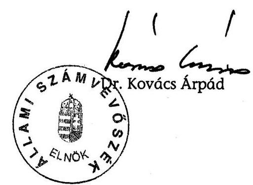

# ÁLLAMI   SZÁMVEVŐSZÉK 

## JELENTÉS

a Magyar Kommunista Munkáspárt 2004-2005. évi gazdálkodása törvényességének ellenőrzéséről

---

3. Önkormányzati és Területi Ellenőrzési Igazgatóság
3.1. Szabályszerűségi Ellenőrzési Főcsoport
Iktatószám: V-1017-027/2006.
Témaszám: 839
Vizsgálat-azonosító szám: V-0312
Az ellenőrzést felügyelte:
Dr. Lóránt Zoltán
főigazgató
Az ellenőrzés végrehajtásáért felelős:
Dr. Elek János
általános főigazgató-helyettes
Az ellenőrzést vezette:
Horváth Balázs
főcsoportfőnök-helyettes
Az összefoglaló jelentést készítette:
Benesné Baracsi Szilvia
számvevő
Az ellenőrzést végezték:
Benesné Baracsi Szilvia Dr. Faragóné Tóth Mária Tóth István számvevő tanácsos tanácsadó

# A témához kapcsolódó eddig készített számvevőszéki jelentések: 

## címe

sorszáma
A Munkáspárt 1992-1993. évi gazdálkodása törvényességének el- 230 lenőrzése

A Munkáspárt 1994-1995. évi gazdálkodása törvényességének el- 339 lenőrzése

A Munkáspárt 1996-1997. évi gazdálkodása törvényességének el- 9842 lenőrzése

A Munkáspárt 1998-1999. évi gazdálkodása törvényességének el- 0041 lenőrzése

A Munkáspárt 2000-2001. évi gazdálkodása törvényességének el- 0303 lenőrzése

A Munkáspárt 2002-2003. évi gazdálkodása törvényességének el- 0441 lenőrzése

---

# TARTALOMJEGYZÉK 

BEVEZETÉS ..... 3
I. ÖSSZEGZŐ MEGÁLLAPÍTÁSOK, KÖVETKEZTETÉSEK, JAVASLATOK ..... 5
II. RÉSZLETES MEGÁLLAPÍTÁSOK ..... 8

1. A Párt gazdálkodásáról szóló 2004-2005. évi beszámolók ..... 8
1.1. A teljes vizsgálati időszakra érvényes megállapítások ..... 8
1.2. 2004-2005. évi beszámolók ..... 8
1.2.1. Bevételek ..... 9
1.2.2. Kiadások ..... 10
2. A Pártnak a beszámoló összeállítására és az azt alátámasztó könyvvezetésre vonatkozó belső szabályzása és gyakorlata ..... 11
2.1. A belső szabályozás rendszere ..... 11
2.2. A könyvvezetés gyakorlata, ennek összhangja a jogszabályokban és a belső előírásokban előírt követelményekkel ..... 12
2.3. Analitikus nyilvántartások ..... 13
2.4. A bizonylati elv és a bizonylati fegyelem érvényesülése ..... 14
3. A Párt bevételszerző gazdálkodó tevékenysége ..... 15
4. A gazdálkodással összefüggő egyéb jogszabályokban foglalt előírások betartása ..... 16
4.1. Személyi jellegű kifizetések ..... 16
4.2. Az adózási, társadalombiztosítási és egyéb jogszabályok rendelkezéseinek érvényesítése ..... 17
5. A Párt belső ellenőrzésének rendszere ..... 17
5.1. A belső ellenőrzés rendszerének szabályozottsága ..... 17
5.2. A belső ellenőrzés működése ..... 18
6. Az előző ellenőrzés megállapítására tett intézkedések ..... 19
MELLÉKLETEK
7. számú A Magyar Kommunista Munkáspárt 2004. évi beszámolója
8. számú A Magyar Kommunista Munkáspárt 2005. évi beszámolója

---

# RÖVIDÍTÉSEK JEGYZÉKE 

| ÁSZ | Állami Számvevőszék |
| :-- | :-- |
| Gt. | A gazdasági társaságokról szóló - többször módosított - |
|  | 1997. évi CXLIV. törvény |
| KB | Központi Bizottság |
| Párt | Magyar Kommunista Munkáspárt |
| párttörvény | A pártok működéséről és gazdálkodásáról szóló - többször |
|  | módosított - 1989. évi XXXIII. törvény |
| számviteli törvény | A számvitelről szóló - többször módosított - 2000. évi C. |
|  | törvény |
| PEB | Pénzügyi Ellenőrző Bizottság |
| Szja törvény | A személyi jövedelemadóról szóló - többször módosított - |
|  | 1995. évi CXVII. törvény |

---

# JELENTÉS 

## a Magyar Kommunista Munkáspárt 2004-2005. évi gazdálkodása törvényességének ellenőrzéséről

## BEVEZETÉS

Az Állami Számvevőszékről szóló - többször módosított - 1989. évi XXXVIII. törvény 5. §-a, 16. § (2) és a 17. § (2) bekezdése, valamint a pártok működéséről és gazdálkodásáról szóló - többször módosított - 1989. évi XXXIII. törvény (továbbiakban: párttörvény) 10. § (1), (3)-(4) bekezdése alapján a pártok gazdálkodása törvényességének ellenőrzésére az Állami Számvevőszék (továbbiakban: ÁSZ) jogosult. Az ÁSZ 2006. évi ellenőrzési tervének megfelelően vizsgálta a Magyar Kommunista Munkáspárt (továbbiakban: Párt) 2004-2005. évi gazdálkodása törvényességét. Az ellenőrzés kiterjedt a Párt 2006. első félévi ${ }^{1}$ gazdálkodására is.

Az ellenőrzés célja annak megállapítása volt, hogy:

- a Párt által készített, a Magyar Közlönyben közzétett éves beszámolók a törvényi előírásoknak megfelelnek-e, a könyvvezetéssel és a valósággal megegyező adatokat tartalmaznak-e;
- a könyvvezetés és a gazdálkodás során betartották-e a számvitelről szóló többször módosított - 2000. évi C. törvény (továbbiakban: számviteli törvény) és az egyéb jogszabályi rendelkezéseket, belső előírásokat,
- a Párt a működéséhez szabályszerűen igénybe vehető forrásokat használt-e fel, nem folytatott-e a párttörvény által tiltott gazdálkodó tevékenységet, nem fogadott-e el tiltott vagyoni hozzájárulást, illetőleg adományt.

Az ellenőrzés körülményeit illetően rögzíteni szükséges ${ }^{2}$, hogy

[^0]
[^0]:    ${ }^{1}$ A Kormány 1057/2006.(VI. 7.) Korm. határozatával - a 2006. évi országgyűlési képviselőválasztás eredményének megfelelően - módosította a pártok és pártalapítványok támogatását szolgáló előirányzatokat.
    ${ }^{2}$ Az ÁSZ évek óta javasolja a Kormánynak a pártok ellenőrzéséről készített jelentéseiben a párttörvény módosítását. A Kormány 2006. évben benyújtotta a pártok működéséről és gazdálkodásáról szóló 1989. évi XXXIII. törvény és a választási eljárásról szóló 1997. évi C. törvény, valamint ezzel összefüggésben egyes más törvények módosításáról szóló T/237. számú törvényjavaslatot.

---

- a párttörvény 1. sz. melléklete szerinti beszámoló-mintához magyarázatot, kitöltési útmutatót nem készítettek a jogalkotók, így ennek kitöltése pártonként - kialakított számviteli politikájuknak megfelelően - eltérő lehet;
- a beszámoló minta a számviteli törvény rendelkezéseivel nem harmonizál, nem felel meg sem a mérleg, sem az eredmény-kimutatás követelményeinek.

Az ÁSZ a párttörvény napirenden lévő módosítási javaslatának elfogadásáig a jelenleg hatályos rendelkezéseknek megfelelő - egységes módszertani alapokra helyezett - gyakorlattal folytatja a pártok gazdálkodása törvényességének ellenőrzését. Az ellenőrzést a 13/2003. számú Elnöki utasítással kiadott „Módszertan a pártok gazdálkodása törvényességének ellenőrzéséhez" c. kiadvány és a 14/2003. számú Elnöki határozattal elfogadott segédletben foglaltak alapján végeztük.

A helyszíni ellenőrzés: 2006. december 1-2007. január 29. között, a Párt központjában történt.

---

# I. ÖSSZEGZŐ MEGÁLLAPÍTÁSOK, KÖVETKEZTETÉSEK, JAVASLATOK 

A Párt határidőn belül, előírt formában megjelentette a Magyar Közlönyben éves pénzügyi beszámolóit, de a párttörvény rendelkezése ellenére internetes honlapján nem hozta nyilvánosságra. A 2004. és a 2005. évi beszámolók a Párt gazdálkodásáról nem mutattak megbízható és valós képet. A számviteli elvek megsértésével összefüggésben feltárt hibák mindkét évben lényegesnek minősültek; 2004-ben a bevételeknél és kiadásoknál legalább 4,7%, 2005-ben legalább 3,7% illetve 4,1% mértékű eltérést mutattak.

A beszámolási hibák a 2004. január 1-jei hatállyal megújított számviteli rend hiányosságaiból eredtek. A számviteli politikában nem szabályozták teljes körűen a beszámolósorokhoz tartozó főkönyvi számlák körét, nem rögzítették a könyvvezetés és beszámolás során érvényesítendő számviteli elveket. A számlarend csak részben felelt meg a gazdálkodási sajátosságoknak.

A Párt számlarendje és értékelési szabályzata nem rendelkezett a nem pénzbeli hozzájárulások párttörvényben előírt értékeléséről. A hiányosság következtében az ellenőrzés időszakában pótolták a helyi önkormányzatoktól, kedvezményes ingatlanhasználat formájában kapott nem pénzbeli vagyoni hozzájárulások értékének megállapítását, amelynek összegét 2004. évre 3140 ezer Ft-tal, 2005. évre 2852 ezer Ft-tal számszerűsítették. A párttörvény szerint nevesítendő értékhatárt egy önkormányzat 741 ezer Ft összegű hozzájárulása haladta meg.

A beszámolás alapjául szolgáló könyvvezetési kötelezettséget számítógépes, kettős könyvviteli programmal, külső szolgáltató megbízásával teljesítették. A főkönyvi könyvelést idősorosan végezték, a zárlati munkálatokat az ellátmányok kivételével szabályszerűen végrehajtották. A számlakijelölés hibáit a könyvelés során korrigálták. A számvevői jelentés alapján a beszámolókban feltárt eltéréseket kijavították, a helyszíni ellenőrzés lezárásáig főkönyvi kivonattal igazolták.

A főkönyvi számlákhoz előírt analitikus nyilvántartást teljes körűen vezették. Az immateriális javakat és a tárgyi eszközöket egyedileg tartották nyilván. A belső előírás aktualizálása nélkül, 2006-tól a 100 ezer Ft alatti tárgyi eszköz beszerzéseket egy összegben, költségként leírták. A mennyiségi nyilvántartással a vagyonvédelmi követelmények teljesültek. A követelések és a kötelezettségek nyilvántartásának a szintetikus könyveléssel való egyezőségét biztosították. Az elszámolási előlegek kifizetése, nyilvántartása és elszámolása a belső szabályozásnak megfelelően történt. A szigorú számadású nyomtatványok, valamint a készpénzforgalom nyilvántartását előírás szerint vezették. A pénzkezelési szabályzat értékkezelési rendelkezésének hiányában az értékek nyilvántartásáról gondoskodtak. A Párt eszközeit és forrásait a leltározási szabályzat hiányosságai ellenére, szabályszerűen leltározta, a felvett leltárakat kiértékelte, ennek eredményeként leltári különbözetet nem tártak fel. A leltárkészítéssel kapcsolatos szabályozásból hiányzott a leltározás módszerének, dokumentálásának, értékelése ellenőrzésének meghatározása.

---

A bizonylati és okmányfegyelem betartására vonatkozó előírásokat a számlarend részeként meghatározták. Ennek ellenére 2004-2005. időszakában nem érvényesültek a számviteli törvény bizonylatolásra meghatározott alaki és tartalmi követelményei. Általános hibaként fordult elő, hogy a kontírozást nem időtálló módon, ceruzásan végezték. A könyvviteli bizonylatokról hiányzott a rögzítés időpontja, a könyvelő aláírása. E hibákat 2006-ra megszüntették. A pénztári bizonylatok 40%-án az ellenőrzés tényét továbbra sem igazolták.

A Párt bevételszerző gazdálkodó tevékenysége összhangban állt a párttörvény rendelkezéseivel. Saját bevételei szabályozott tagdíj befizetésből, egyéb hozzájárulásokból és adományokból, a tulajdonában álló ingatlan dí ellenében történő hasznosításából, tárgyi eszközök értékesítéséből, költségtérítésekből, kártérítésből, valamint kamatbevételekből származtak. A könyvelési nyilvántartásai szerint betartotta a párttörvényben előírt gazdálkodási tilalmakat és forrásszerzési korlátokat. A Pártnak a saját tulajdonú, egyszemélyes kft-jétől nyereség hiányában - bevétele nem származott, a pénzügyi kapcsolatok a könyvelésben nyomon követhetők voltak.

A személyi jellegű kifizetések szabályszerű munka- és alkalmi megbízási szerződéseken, valamint választott párttisztségeken alapultak. A Párt likviditási helyzetétől függően teljesítette adó- és járulékfizetési kötelezettségét. A kizárólagos hivatali célú használat igazolásának és szabályozásának hiányában a vizsgált időszakra cégautóadó kötelezettsége keletkezett, mert a tulajdonát képező személygépkocsi futásteljesítményéről vezetett menetlevél adattartalma nem felelt meg a törvényi követelményeknek. Hasonlóan szabályozási hibából eredően a törvénytől eltérően bizonylatolták a saját gépjármű hivatalos célú költségelszámolását. A külföldi kiküldetéseknél folyósított napidíj után a jövedelemadót elmulasztották bevallani és befizetni. A költségtérítéseket, természetbeni juttatásokat az adómentességi mértékre figyelemmel biztosították.

A gazdálkodási tevékenység belső ellenőrzésének rendszerét összehangoltan szabályozták. A Párt a szervezeti szabályzatának megfelelően kétszintű, választott ellenőrző testületet működtetett. A központi PEB évente elfogadott munkaterve alapján végezte el a központba beküldött elszámolások, pénzügyi okmányok tételes ellenőrzését. A megállapításokat írásba foglalták és javaslatot tettek a hibák kijavítására, amelynek eredményeként a feltárt hibák megszüntetésére intézkedtek. A 2004-2006 között végzett tevékenységről készült kongresszusi beszámoló szerint folyamatosan segítették a Párt szervezeti rendszerének átalakítását, továbbá likviditásának megőrzését. A budapesti PEB a kerületek gazdálkodását rendszeresen ellenőrizte, ennek tényét jegyzőkönyvileg dokumentálta. A területileg választott PEB elnökök a pénztárellenőri feladatokat igazoltan teljesítették.

A gazdálkodási és vagyonkezelési szabályzat meghatározta a gazdálkodás szintjeit és hatásköreit, a kötelezettségvállalási és utalványozási jogkör gyakorlásának feltételeit. A vezetői ellenőrzés a kötelezettségvállalásra és utalványozásra korlátozódott. A hatáskört a jogosult személyek gyakorolták, a meghatározott értékhatárok betartásával. A gazdasági vezető hatáskörében valósult meg a Párt vagyonának kezelése, pénzügyeinek irányítása, a költségvetés összeállítása és a gazdálkodással összefüggő adatszolgáltatási kötelezettségek teljesítése. A belső számviteli szabályok előírták a munkafolyamatba épített el-

---

lenőrzés pontjait, az egyeztetések módját, gyakoriságát. A bizonylatolás tartalmi és alaki követelményeinek betartása érdekében a megyei pénztárosokat és pénzügyekkel foglalkozókat szakmai továbbképzésben részesítették. Az intézkedések nyomán a belső ellenőrzés segítette a jogszabályok betartását. A Párt intézkedési tervvel alapozta meg az előző ellenőrzés törvényességi felhívásának végrehajtását, amely a számviteli szabályozás területén jelzett hiányosságok miatt részben nem teljesült.

A helyszíni ellenőrzés megállapításainak hasznosítása mellett az Állami Számvevőszék elnöke felhívja:

# a Párt elnökét 

1. Készíttesse el a számviteli törvény 15-16. §-ban foglalt számviteli elvek érvényesítésével a Párt 2004-2005. évi módosított beszámolóit, ennek keretében nevesítse a párttörvény 9. § (2) bekezdése szerint az 500 ezer Ft feletti belföldi jogi személytől kapott adományokat. Hozza
 nyilvánosságra a módosított beszámolókat a Magyar Közlönyben, valamint a Párt honlapján.
2. Gondoskodjon a számviteli politika és a kapcsolódó szabályzatok számviteli törvénynyel való összhangjáról, a 14. § (3) bekezdés szerint a gazdálkodás sajátosságainak megfelelő módosításáról.
3. Gondoskodjon a könyvvezetés szabályszerűsége érdekében, hogy:
a) a számviteli törvény 161. § (3) bekezdésében előírt főkönyvi könyvelést és az analitikus nyilvántartást az előírt rendszerességgel egyeztessék, különösen az alapszervezeteknél kintlévő ellátmányok esetében;
b) a számviteli törvény 167. § (1) bekezdésében foglalt alaki és tartalmi követelmények érvényesüljenek.
4. Módosítsa a gazdálkodási és vagyonkezelési szabályozásban a személygépkocsi használatot, figyelemmel az Szja törvény 25. § (2) bekezdés c) pont és (3) bekezdés, továbbá a 3. számú melléklet IV/1. pont, valamint a 69. § (1) bekezdés m) pont előírására.
5. Intézkedjen, hogy a menetlevelek és útnyilvántartások adattartalma megfeleljen az Szja törvény 5. számú melléklet II/ 7. pont szerinti szabályozásnak.
6. Intézkedjen önellenőrzés keretében
a) a külföldi kiküldetések alkalmával kifizetett valuta napidíjak után fizetendő jövedelemadó megállapításáról és utólagos megfizetéséről;
b) a Párt tulajdonában lévő személygépkocsi után a 2004-2006. évekre vonatkozó cégautóadó megállapítására, bevallására és megfizetésére.

---

# II. RÉSZLETES MEGÁLLAPÍTÁSOK 

## 1. A PÁRT GAZDÁLKODÁSÁRÓL SZÓLÓ 2004-2005. ÉVI BESZÁMOLÓK

### 1.1. A teljes vizsgálati időszakra érvényes megállapítások

A Párt 2004. évi beszámolóját 2005. április 28-án, a Magyar Közlöny 56. számában, 2005. évi beszámolóját 2006. április 29-én, a Magyar Közlöny 51. számában - a párttörvényben előírt formában, határidőn belül - jelentette meg. A Párt a beszámolókat a párttörvény 9. § (1) bekezdésének előírása ellenére internetes honlapján nem hozta nyilvánosságra (1-2. számú melléklet). A beszámolók összeállítása során nem érvényesültek a számviteli törvényben előírt számviteli elvek. Mindkét évben sérült a hivatkozott törvény 15. § (2)-(3) bekezdésben foglalt teljesség és valódiság, valamint a 16. § (4) bekezdésben rögzített lényegesség elve. A 2004. évi beszámoló ezen túlmenően nem felelt meg a 15. § (5), illetve a 16. § (3) bekezdés szerinti következetesség és a tartalom elsődlegessége a formával szemben elveknek sem. Ennek következtében a nyilvánosságra hozott beszámolók nem mutattak a Párt gazdálkodásáról megbízható és valós képet.

### 1.2. 2004-2005. évi beszámolók

A Párt a beszámolók részletes összeállításának rendjét a hatályos számviteli politikában szabályozta. A beszámolókat a kettős könyvvitel rendszerében központilag rögzített gazdálkodási adatok alapján készített főkönyvi számlákból és az ahhoz kapcsolódó analitikus nyilvántartásokból, kisebb kerekítési hibákkal állították össze. A Párt által a 2004-2005. években közzétett beszámolók bevételeinek és kiadásainak ellenőrzése során megállapított eltéréseket beszámoló soronként - a következő összeállítás részletezi:

Adatok ezer Ft-ban

| Megnevezés | Párt által közzétett   beszámoló |  | Megállapított eltérések |  |  |  |
| :-- | :--: | :--: | :--: | :--: | :--: | :--: |
|  | 2004. évi | 2005. évi | 2004. évi |  | 2005. évi |  |
| BEVÉTEL |  |  | Többlet | Hiány | Többlet | Hiány |
| 1. Tagdíjak | 15713 | 14278 | 47 | 0 | 0 | 0 |
| 2. Állami tám. | 39800 | 39800 | 0 | 0 | 0 | 0 |
| 4. Egyéb hozzáj.   $(4.1+4.3)$ | 10903 | 21696 | 0 | 3187 | 0 | 2852 |
| 4.1. Belf. jsz. | 2 | 850 | 0 | 3140 | 0 | 2852 |
| 4.3. Belf. msz. | 10901 | 20846 | 0 | 47 | 0 | 0 |
| 6. Egyéb bevétel | 5722 | 3067 | 150 | 0 | 107 | 0 |
| ÖSSZESEN: | 72138 | 78841 | 197 | 3187 | 107 | 2852 |
| Eltérés együtt |  |  |  | 3384 |  | 2959 |
| Eltérés %-ban |  |  |  | 4,7 |  | 3,7 |

---

| Megnevezés | Párt által közzétett beszámoló |  | Megállapított eltérések |  |  |  |
| :--: | :--: | :--: | :--: | :--: | :--: | :--: |
|  | 2004. évi | 2005. évi | 2004. évi |  | 2005. évi |  |
| KIADÁS |  |  | Többlet | Hiány | Többlet | Hiány |
| 2. Támogatás | 26 | 0 | 0 | 0 | 0 | 0 |
| 3. Váll.alapításra | 0 | 3900 | 0 | 0 | 0 | 0 |
| 4. Működési | 44076 | 43080 | 0 | 3260 | 0 | 2854 |
| 5. Eszköz beszerzés | 3519 | 1059 | 196 | 1 | 0 | 0 |
| 6. Politikai | 27838 | 20342 | 0 | 83 | 0 | 0 |
| 7. Egyéb | 497 | 815 | 1 | 0 | 0 | 0 |
| ÖSSZESEN: | 75956 | 69196 | 197 | 3344 | 0 | 2854 |
| Eltérés együtt |  |  | 3541 |  |  | 2854 |
| Eltérés %-ban |  |  | 4,7 |  |  | 4,1 |

A 2004. évi beszámoló csak az állami támogatásból származó bevételt és a támogatás egyéb szervezeteknek, valamint a vállalkozás alapítására fordított kiadást tartalmazta a valóságnak megfelelően. A beszámoló összeállításával összefüggésben feltárt hibák előjeltől független értéke a bevételeknél 3384 ezer Ft, a kiadásoknál 3541 ezer Ft összeg volt.

A 2005. évi beszámolóban a belföldi jogi személyek adománya és az egyéb bevételek kivételével a Párt bevételei, valamint a működési kiadás kivételével kiadásai, a tényleges állapotnak megfelelően szerepeltek. A beszámoló összeállításával összefüggésben feltárt hibák összege a bevételi oldalon 2959 ezer Ft, a kiadási oldalon 2854 ezer Ft értékű volt.

A feltárt hibák a közzétett beszámolók főösszegéhez képest 2004-ben a bevételi és kiadási oldalon egyaránt 4,7 %, 2005-ben 3,7 % illetve 4,1 % mértékű eltérést mutattak, amely az ÁSZ-nál elfogadott 2%-os lényegességi küszöböt figyelembe véve lényegesnek minősült.

# 1.2.1. Bevételek 

A beszámoló bevételeit a 9. bevételek elnevezésű számlaosztályhoz tartozó, a párttörvény 1. sz. melléklete szerinti minta soraihoz igazodó főkönyvi számlák adataiból állították össze.

A tagdíjak fogalomkörébe tartozó 2004. évi bevételek között hibásan szerepeltettek 47 ezer Ft magánszemélyek adományát. A Párt 2005-ben a belső szabályzatban rögzítettek szerint mutatta be tagdíjainak teljesülését.

Az állami költségvetésből származó támogatás 2004. és 2005. évi beszámoló sor adata megegyezett a Párt részére a költségvetés végrehajtásáról szóló törvényben jóváhagyott összeggel.

Az egyéb hozzájárulások, adományok beszámolósor adattartalmát a Párt a párttörvény előírásának megfelelően tovább részletezte. A Párt belső szabályzatban rögzítette az adományok nevesítésének kötelezettséget, továbbá egy meghatározott körre vonatkozó hozzájárulás mértékét. A gyakorlat összhangban volt a tételes belső szabályokkal. A magánszemélyek adománya beszámo-

---

lósoron 2004. évben hiányzott a tagdíjakhoz könyvelt 47 ezer Ft adomány. Az egy adományozótól származó befizetések összesítését 2004-2005. évben analitikus nyilvántartás támasztotta alá, értékhatárt meghaladó bevétel nem volt.

A beszámolósor egyik évben sem tartalmazta a pártszervezetek által a helyi önkormányzatoktól ingyenesen, vagy kedvezményes díjtételű ingatlanhasználat formájában kapott nem pénzbeli vagyoni hozzájárulás értékét. A Párt a helyszíni ellenőrzés szakaszában a párttörvény 4. § (5) bekezdésében foglaltakra figyelemmel 2004. évre 3140 ezer Ft, 2005. évre 2852 ezer Ft összeggel számszerűsítette a nem pénzbeli vagyoni hozzájárulás értékét. Ennek keretében a párttörvény 9. § (2) bekezdése szerint nevesítendő értékhatárt egy önkormányzat 741 ezer Ft összegű hozzájárulása haladta meg.

Az egyéb bevételek beszámolósor 2004. évben 150 ezer Ft, 2005. évben 107 ezer Ft halmozódást mutatott. A központ és egy megyei szervezet közötti telefon költségtérítéssel kapcsolatos - pénzmozgást bevételként számolták el.

# 1.2.2. Kiadások 

A kiadásokat a beszámoló kiadási soraihoz kialakított főkönyvi számláiból a számviteli politikának megfelelően állították össze.

A támogatás egyéb szervezeteknek beszámolósoron csak szervezeteknek nyújtott támogatás szerepelt.

A vállalkozások alapítására fordított összegek beszámolósoron 2005. évben a Párt által alapított kft. vesztesége pótlására fordított 3900 ezer Ft összeget szerepeltették. A kft. saját tőkéjének pótlásáról a Párt elnöksége döntött. A döntést alátámasztotta a kft. 2004. évi egyszerűsített éves beszámolójának könyvvizsgálatáról szóló, figyelem felhívó hitelesítő záradékú könyvvizsgálati jelentés. A kft. a tárgyévi negatív eredmény következtében szinte teljes tőkéjét elveszítette, kötelezettségei két és félszeresével haladták meg a rendelkezésre álló vagyonát. Így a jegyzett tőke minimumának és a kötelezettségek fedezetének pótlását a Párt a Gt. 150-152. § előírása szerint teljesítette.

A működési kiadások beszámolósor hiányzott 115 ezer Ft összegben a másológép bérleti díjának bemutatása. A beszámolósor egyik évben sem tartalmazta az ingyenes, vagy kedvezményes díjtételű ingatlanhasználat értékét, ami 2004. évben 3140 ezer Ft, 2005. évben 2852 ezer Ft volt. A vizsgált években nem érvényesült a működési kiadások jogcímeinek azonossága, mivel 2004-ben az autópálya díjat és taxi költséget a működési kiadásoknál, 2005-ben a politikai tevékenység kiadásánál szerepeltették.

Eszközbeszerzés címen 2004. évben, a számlarendben foglaltakkal ellentétben 81 ezer Ft havi mobiltelefon díjat, továbbá 115 ezer Ft értékben másológép bérleti díjat mutattak ki. A Párt 2005. évben, a számlarendben rögzítettekkel összhangban e beszámolósorhoz kapcsolódó főkönyvi számlákból állította össze az eszközbeszerzést.

A politikai tevékenység kiadása közlésénél nem érvényesült a politikai tevékenység jogcímeinek azonossága a működési költségeknél részletezettek miatt. További hiány volt az eszközbeszerzéseknél említett mobil telefondíj 81 ezer Ft összege a belső szabályzat rendelkezése szerint politikai kiadásnak minősült.

Az egyéb kiadásoknál érvényesült az egyéb kiadások jogcímeinek azonossága, következetes elszámolása.

# 2. A PÁRTNAK A BESZÁMOLÓ ÖSSZEÁLLÍTÁSÁRA ÉS AZ AZT ALÁTÁMASZTÓ KÖNYVVEZETÉSRE VONATKOZÓ BELSŐ SZABÁLYZÁSA ÉS GYAKORLATA 

### 2.1. A belső szabályozás rendszere

A Párt a számviteli rendjét az előző ÁSZ ellenőrzés felhívására 2004. január 1-jei hatállyal megújította.

A számviteli politika a törvényi előírásnak megfelelően tükrözte a szervezeti sajátosságokat. A szabályzatban nem határozták meg a könyvelésben való rögzítés határidejét figyelembe véve a számviteli törvény 165. § (3) bekezdés b) pontjában előírtakat. A szabályozás nem rögzítette a kettős könyvvezetés során érvényesítendő számviteli elveket. Nem teljes körűen határozták meg a beszámoló sorokhoz tartozó főkönyvi számlák körét. A szabályozási hiányosságok ellenére a Párt 2004-2005. évi gazdálkodásáról szóló beszámolói az 5-ös költségnemek számlaosztályban könyvelt kiadásait, valamint 8-as számlaosztályban rögzített kiadásokat teljes körűen tartalmazták.

Az eszközök és források értékelési szabályzatban az eszközök bekerülési értékének nyilvántartására vonatkozó rendelkezés nem szerepelt. Továbbá nem tartalmazta az állományból történő kivezetés feltételeinek előírásait és a mindezeket alátámasztó bizonylatokat. A szabályzatban nem rögzítették az önkormányzatoktól kedvezményesen bérelt ingatlanok párttörvény 4. § (5) bekezdésében előírt kötelező értékelésének módszerét és dokumentumait.

Az új számlarendben a Párt gazdálkodási sajátosságait csak részben vették figyelembe.
 Meghatározták az egyéb bevételek, működési, a politikai tevékenység és egyéb kiadások körét, ugyanakkor a bérleti díj bevétel elszámolására, illetve a nem pénzbeli adományok rögzítésére használt főkönyvi számlát nem írták elő. A számlarendben használt főkönyvi számlák száma egy kivételével megegyezett a számviteli politikában a beszámolók részletes összeállításának rendjében rögzített főkönyvi számla számokkal és megnevezésekkel. A számlarend - a tárgyi eszközök kivételével - rendelkezett a főkönyvi számlákhoz kapcsolódó analitikus nyilvántartási kötelezettségekről, az analitikus nyilvántartások vezetésének módjáról és tartalmáról. A tárgyi eszközök egyedi nyilvántartásához kapcsolódóan, a számviteli törvény által 100 ezer Ft-ra emelt értékhatárt 2006-tól alkalmazták, de a szabályozásban a változást nem vezették át. A hatályban lévő számlarendhez meghatározták a számviteli bizonylat, valamint a bizonylatolás alaki és tartalmi követelményeit.

A Párt leltározási szabályzata hiányos volt, nem tartalmazta a KB, a megyei és budapesti elnökségek, mint önálló pénzgazdálkodási tevékenységet folytatók leltározással kapcsolatos teendőit, a leltár technikai feltételeit, eszközeinek biztosítását, a leltárfelvétel dokumentumainak feldolgozási és megőrzési módját. Nem határozta meg - a felelős személy megnevezésén kívül - a leltározás és az értékelés ellenőrzésének rendjét.

A kiadott pénzkezelési szabályzatban az értékpapírok megőrzésére, kezelésére, valamint nyilvántartására vonatkozó szabályokat rögzítették. Az előző ÁSZ jelentésben kifogásolt értékek, letétek kezelésének és nyilvántartásának szabályait továbbra sem tartalmazta. A Párt a készpénzkezelés előírásait a központi, megyei és budapesti szervezetek adottságaira tekintettel két szabályzatban határozta meg. A szabályzatban a készpénzforgalom nyilvántartására vonatkozó rendelkezések egységesek voltak.

Törvényességet segítő egyéb gazdálkodási szabályzatként 2003. március 29-étől hatályban volt a gazdálkodási és vagyonkezelési szabályzat, amely egységes rendszerbe foglalta a gazdálkodási hatásköröket, vagyonkezelési, pénztári és pénzkezelési előírásokat. A szabályzat keretei között meghatározták a gépkocsik használatát, a külföldi kiküldetés elszámolását, a selejtezés, az elszámolási előlegek és reprezentációs kifizetések nyilvántartását és elszámolását. Nem szabályozták a gyakorlatban használt tömegközlekedési eszközök igénybevételi és költségelszámolási rendjét. A „Hivatali gépjármű, hivatali használata" című belső utasítás nem tartalmazta a személygépkocsi igénybevételi rendjét, a gépkocsi tárolási helyét, a használatról vezetendő útnyilvántartás tartalmát és formáját.

# 2.2. A könyvvezetés gyakorlata, ennek összhangja a jogszabályokban és a belső előírásokban előírt követelményekkel 

A könyvvezetést, adóbevallást és a beszámoló készítést 2004-2005. időszakra vonatkozóan szerződés alapján egy könyvelési szolgáltató végezte. A Párt és a szolgáltató között - az előző ÁSZ vizsgálat óta - javult az operatív információáramlás. A Párt 2006. évben egy új szolgáltatót bízott meg a gazdálkodással összefüggő számviteli feladatok ellátására, adóbevallások elkészítésére. A Párt és a szolgáltató között az operatív információáramlás - az adóbevallás-készítés kivételével - megfelelő volt.

A Párt a számviteli törvény 12. § (3) bekezdése alapján könyvvezetési kötelezettségét a kettős könyvvitel rendszerében, a számviteli bizonylatok számítógépes feldolgozása útján 2004-2005. évben azonos program, 2006. évben könyvelő váltás miatt másik számítógépes könyvelői program segítségével teljesítette.

A kialakított számítógépes könyvelési rendszerekből az ellenőrzés részére kinyomtatott főkönyvi kivonatból és főkönyvi számlákból, továbbá a rendelkezésre bocsátott nyilvántartásokból és alapbizonylatokból minden szükséges adat visszakereshető volt. A főkönyvi számlák és az analitikus nyilvántartások kapcsolata megfelelő volt.

A pénzeszközöket érintő és egyéb gazdasági bizonylatok feldolgozási rendje a 2004-2005. évben, 2006. első félévében a számviteli törvény 165. § (3) bekezdés előírásának megfelelően történt. A vizsgált időszakban a zárlati munkálatokat - az ellátmányok egyeztetése kivételével - szabályszerűen végrehajtották. Az alapszervezetek a megyéhez befizetett tagdíjból kiadásaik fedezetére ellátmányt kaptak, a kintlévő ellátmányok főkönyvi könyvelésben szereplő összegét év végén a megyei analitikus nyilvántartásokkal nem egyeztették, az eltéréseket nem vizsgálták. A 2005. évi főkönyvi számlák záró egyenlege kilenc főkönyvi számla esetében nem egyezett a 2006. évi nyitó egyenlegekkel. A Párt a számvevői jelentés észrevételezési szakaszában az eltéréseket felülvizsgálta és könyvelését korrigálta, továbbá a beszámolókban feltárt hibák átkönyvelését, valamint a nem pénzbeli vagyoni hozzájárulás összegének könyvekben történő rögzítését elvégezte.

A számlakijelölés (kontírozás) gyakorlata nem felelt meg a Párt számviteli politikájában, valamint a számlarendjében foglaltaknak: 2004. évben a bizonylatok 13,7%-nál, 2005. évben 19,7%-nál, 2006. első félévben 4%-nál. A bizonylatokon nem a valós tartalma szerinti számlakijelölés történt, de ennek ellenére a könyvekben a gazdasági eseményeket a számlarend előírása szerint rögzítették.

A 2004-2005. évi főkönyvi könyvelésben a belső előírásoktól eltérően a számviteli bizonylat kiállításának dátuma helyett a feldolgozás dátumát tüntették fel. A 2006. első félévben ezt a hiányosságot megszüntették és a számviteli bizonylat kiállításának időpontját rögzítették a könyvekben.

# 2.3. Analitikus nyilvántartások 

A vizsgált időszakban a főkönyvi számlákhoz kapcsolódóan immateriális javak, tárgyi eszközök, pénzforgalom, elszámolásra kiadott előlegek, vevők, szállítók, szigorú számadású nyomtatványok analitikáját vezették. Az analitikus nyilvántartásokat a KB-nál és a megyei bizottságoknál teljes körűen vezették.

A Pártnál - a szabályozási hiányosság ellenére - a korábbi gyakorlatot folytatva az eszközbeszerzéseket teljes körűen nyilvántartásba vették. Az immateriális javakról és a tárgyi eszköz beszerzésekről egyedi analitikus nyilvántartást vezettek. Az 50 ezer Ft alatti tárgyi eszköz beszerzéseket a belső szabályozással összhangban 2004-2005. évben használatbavételkor értékcsökkenésként egy összegben számolták el. A 2006. évtől - a belső előírás aktualizálása nélkül - a 100 ezer Ft alatti tárgyi eszköz beszerzéseket egy összegben költségként leírták.

A főkönyvi könyveléshez kapcsolódó analitika és folyószámla vezetés biztosította a követelések és a kötelezettségek folyamatos naprakész nyilvántartását és a szintetikus könyveléssel való egyezőségét. A nyilvántartások tartalma megfelelt a törvényi követelményeknek és az éves záráskor az előírt egyeztetéseket elvégezték.

Az utólagos elszámolásra kiadott előlegek nyilvántartásának tartalmát, az engedélyezés jogcímeit, az elszámolás szabályait a pénzkezelési szabályzatban meghatározták. Elszámolási előleget csak a KB pénztárából fizettek ki. Az elszámolási előlegek kifizetése, nyilvántartása, elszámolása a belső előírás szabályai szerint történt.

A Párt a készpénzforgalom analitikus nyilvántartását teljes körűen és szabályszerűen vezette. A 2004-2005. évben a budapesti és megyei szervezeteknél működtek önálló pénztárak. A KB döntése értelmében 2006 májusától a budapesti és egy megyei szervezet önálló pénzügyi tevékenysége megszűnt. A pénztárak megszüntetésével a maradék pénzösszegeket a központi pénztárba befizették, a bizonylatokat a központi könyvelésbe leadták. A nyilvántartások szerint a pénztárak működése, a pénztárzárlatok végrehajtása szabályszerű volt. A pénztárjelentésen az ellenőrzést 2004. évben 2,2%-ban, 2005. évben 1,4%-ban, 2006. félévben 0,3%-ban nem dokumentálták.

A Párt a számviteli törvény 168. § (1) bekezdésében rögzített bizonylatok, nyomtatványok körét meghatározta és a hivatkozott törvény 168. § (3) bekezdésének előírását betartva a szigorú számadású bizonylatokat, nyomtatványokat teljes körűen nyilvántartotta.

Az analitikus nyilvántartások záró egyenlegei a főkönyvi kivonat egyenlegével 2004-2005. évben - az alapszervezetek ellátmányai kivételével - egyeztek.

A Párt a leltározási kötelezettségeknek mindkét beszámolóval lezárt évben a jogszabályoknak megfelelő módon tett eleget. A belső szabályozás hiányossága ellenére a vagyonvédelmi követelmények teljesültek. A 2004. és 2005. évben a megyei és a budapesti szervezetek, valamint a KB leltározási dokumentumai szerint a Párt eszközeit és forrásait teljes körűen leltározták, leltárkülönbözetet nem tártak fel. A leltárak összeállítását megelőzően az egyeztetéseket nem teljes körűen végezték el. A 2005. évben kilenc főkönyvi számla záró egyenlege eltérést mutatott a 2006. évi nyitó egyenlegekkel, amit a számvevői jelentés egyeztetési szakaszában felülvizsgáltak és a valóságban, az analitikus nyilvántartásokban szereplő értékre kijavítottak.

# 2.4. A bizonylati elv és a bizonylati fegyelem érvényesülése 

A kötelezettségvállalás és utalványozás rendjét a gazdálkodási és vagyonkezelési szabályzatban, valamint a pénzkezelési szabályzatban rögzítették.

A gyakorlatban, a KB vonatkozásában a gazdasági felelős, a megyei bizottságoknál az arra kijelölt személy vállalt kötelezettséget, illetve gyakorolta az utalványozási jogot. A gazdasági események utalványozása 2005. évben 0,5%-ban hiányzott a bizonylatokról.

A Párt vegyes bizonylatok alapján könyvelt tételeihez megfelelő részletező kimutatások, bizonylatok kapcsolódtak.

## A Párt több vonatkozásban megsértette a számviteli törvénynek a bizonylatok alaki és tartalmi követelményére vonatkozó előírásait.

- A számviteli törvény 167. § (1) bekezdés i) pontjába ütköző szabálytalanság, hogy a könyvviteli bizonylatokról - 2006. első félév kivételével - hiányzik a rögzítés időpontja, illetve annak aláírással történő igazolása.
- A 2004. és 2005. években általános hiba, hogy a bankszámlakivonaton a kontírozás ceruzával történt. Így nem érvényesült a számviteli törvény 166. § (6) bekezdésének rendelkezése, amely szerint az adatok időtállóságát a hivatkozott törvény 169. §-ban meghatározott megőrzési időn belül biztosítani kell.

- A számviteli törvény 167. § (1) bekezdés c) pontjában előírt ellenőr aláírását 2004. évben a bizonylatok 27,5%-a, 2005. évben 14,1%-a, 2006. első félévben 40,3%-a nem tartalmazta, továbbá a 2004. évben kiállított pénztárbizonylatok 1,6%-nál, 2005. évben 0,7%-nál, 2006. első félévében 2,9%-nál a bizonylatot kiállító aláírása hiányzott.
- Az utazási költségek elszámolásához az esetek 80%-ában szabálytalan alapbizonylatot - útnyilvántartás helyett kiküldetési rendelvényt - használtak.

# 3. A PÁRT BEVÉTELSZERZŐ GAZDÁLKODÓ TEVÉKENYSÉGE 

A Párt saját bevételei szabályozott tagdíjfizetésből, egyéb hozzájárulásokból és adományokból, a tulajdonában álló ingatlan díj ellenében történő hasznosításából, tárgyi eszközök értékesítéséből, költségtérítésekből, kártérítésből, valamint kamatbevételekből álltak.

A Párt 2004-2005. évben és 2006. első félévében a könyvviteli nyilvántartásai szerint a párttörvény 4. § (2) bekezdésében meg nem engedett forrásból származó vagyoni hozzájárulást nem fogadott el; a párttörvény 6. §-ában nem engedélyezett gazdálkodó tevékenységet nem folytatott, gazdasági társaságban részesedést nem szerzett; egyszemélyes kft-t, vállalatot nem alapított; párttörvény által tiltott értékpapírt nem vásárolt. A párttörvény 6. §-ában engedélyezett gazdálkodó tevékenységekből származó bevétel összege a beszámolósorokhoz kapcsolódó főkönyvi számlákkal egyeztethető volt. A Párt gazdálkodási tevékenységből származó bevételei az alábbiak szerint alakultak:

Adatok ezer Ft-ban

| Bevételek jogcíme | $\mathbf{2 0 0 4}$. | $\mathbf{2 0 0 5}$. | $\mathbf{2 0 0 6 .}$ I. félév |
| :-- | --: | --: | --: |
| Bérleti díj | 3213 | 2556 | 1514 |
| Eszközértékesítés | 2200 | 0 | 0 |
| Költségtérítés* | 8 | 317 | 152 |
| Követelés rendezése | 28 | 3 | 0 |
| Kamatbevétel | 76 | 39 | 22 |
| Kártérítés | 47 | 45 | 0 |
| ÖSSZESEN: | $\mathbf{5 5 7 2}$ | $\mathbf{2 9 6 0}$ | $\mathbf{1 6 8 8}$ |

*A költségtérítés bevétele részletező alszámlára könyvelt 2004. évben 150 ezer Ft, 2005.évben 107 ezer Ft értékű halmozódást nem tartalmazza.

A Párt szabad pénzeszközeit a vizsgált időszakban folyószámlán lekötött betétben helyezte el. A Pártnak a vizsgált időszakban egy, a Párt folyóiratát kiadó saját tulajdonú kft-je volt, amelytől nyereség hiányában bevétele nem származott. A Párt és kft-je közötti pénzügyi kapcsolatok a könyvelésben nyomon követhetők voltak.

# 4. A GAZDÁLKODÁSSAL ÖSSZEFÜGGŐ EGYÉB JOGSZABÁLYOKBAN FOGLALT ELŐÍRÁSOK BETARTÁSA 

### 4.1. Személyi jellegű kifizetések

A Párttal munkaviszonyban és megbízási jogviszonyban állók részére a megbízott könyvelési szolgáltató végezte a bérszámfejtést; teljesítette az adójogszabályokban előírt levonási, bevallási és adatszolgáltatási kötelezettségeket, a pénzügyi teljesítést a KB intézte.

A Párt feladatai teljesítéséhez egy, a tulajdonát képező személygépkocsit üzemeltetett. A gépkocsi
 használatának elszámolási rendjét a „Hivatali gépjármű, hivatali használata” című belső utasítás szabályozta. A menetlevelekről hiányzott a megállás helye, a felkeresett üzleti partner megnevezése, ezért a vezetett nyilvántartás tartalma nem felelt meg az Szja törvény 5. számú mellékletének II/7. pontjában előírt adatkövetelményeknek. A nyilvántartás és az utasítás alapján a kizárólagos hivatali használat nem volt megállapítható.

A Párt hivatalos célra magántulajdonú gépkocsik használatát is engedélyezte, továbbá tömegközlekedési eszközöket vett igénybe. A gazdasági vezető a magántulajdonú gépkocsi használatának feltételeit, az üzemanyag ill. költség elszámolás rendjét, mértékét a „Saját gépjármű hivatalos belföldi kiküldetés alkalmával történő használatának szabályozása” belső utasításban rögzítette. A szabályozás a magántulajdonú gépkocsi és a tömegközlekedési eszköz hivatali célú használatának elszámolásához a „Kiküldetési rendelvény és költségelszámolás” nyomtatvány használatát írta elő. Az engedélyezett nyomtatvány használatát az Szja törvény 25. § (2) bekezdése kizárólag munkavállalók részére, munkáltató által kifizetett utazási költség elszámolásához írta elő. A munkaviszonyban nem álló személyek esetében az Szja törvény az 5. számú melléklet II/7. pontjában meghatározott adattartalmú útnyilvántartás vezetését írja elő.

A Párt tagjai és tisztségviselői részére is fizetett személygépkocsi használatért költségtérítést. A saját gépjárművet használókkal kapcsolatban nem vizsgálták, hogy a tulajdoni viszonyok tekintetében a tulajdonos megfelelt-e az Szja törvény 3. számú melléklet IV/1. pont követelményének. A vezetett kiküldetési rendelvények 76%-a nem tartalmazta a felkeresett partner nevét. A hivatalos jelleg utólag nem volt megállapítható, ezért nem felelt meg az Szja törvény 5. számú melléklet II/7. pontjában meghatározott adatkövetelményeknek. Az üzemanyag költségtérítések a 60/1992. (IV. 1.) Korm. rendeletben szabályozott normatív mértékkel teljesültek.

A tömegközlekedési eszközök igénybevétele esetén a jegy árát jegy ellenében megtérítette a Párt. Az utazási költség megtérítéséhez minden esetben kiküldetési rendelvényt használtak.

A külföldi kiküldetések elrendelésének és elszámolásának rendjét hatályos szabályzat rögzítette, amely valutában fizetendő napidíj összegét és a költségek elszámolásának módját is meghatározta. A szabályzat a külföldi kiküldetésről való döntést az elnökség hatáskörébe adta. A kiküldetés elrendelése az elnök hatáskörébe tartozott. A 2004. évben kettő, a 2005. évben tizenkettő, 2006. évben egy külföldi kiküldetésre került sor. Az utazások többségénél útiköltségen

---

kívül egyéb költség nem merült fel. Az utazásokhoz szükséges repülő, illetve vonatjegyet minden esetben a Párt elővételben biztosította. A 2004. és a 2005. években egy-egy olyan utazás történt, amikor napidíj és egyéb költség kifizetésére került sor. Az utazások elrendelése és elszámolása a vonatkozó belső szabályzat és az elnökség döntésének megfelelően történt.

A Párt alkalmazottai részére munkába járással összefüggő utazási költségtérítést fizetett helyi illetve helyközi bérlet formájában a munkáltató nevére szóló számla alapján. A juttatások kifizetése megfelelt az Szja. törvény 1. számú melléklet 5.7., illetve a 8.29. pont szerinti adómentes kifizetés szabályainak.

A Párt az Szja törvény 1. számú melléklet 8.17. pontjában szabályozott adómentes mértékű étkezési utalványt biztosított a munkavállalók részére.

# 4.2. Az adózási, társadalombiztosítási és egyéb jogszabályok rendelkezéseinek érvényesítése 

A Párt a vizsgált időszakban a munkabérekből levont személyi jövedelemadót, a munkaadót és munkavállalókat terhelő járulékokat, valamint a magánnyugdíj-pénztári befizetési kötelezettséget havonta megállapította. A munkabérekhez kapcsolódó, adózási és társadalombiztosítási jogszabályokban előírt bevallási kötelezettségének eleget tett. Az egyéni bér- és járulék nyilvántartásokat vezettek, melyek megegyeztek a főkönyvi könyveléssel és bevallásokkal. A Párt a bérek utáni adó- és társadalombiztosítási befizetési kötelezettségeit a 2004. évben négy alkalommal 4-49 nap késedelemmel, 2005. II. félévi kötelezettségét december 20-i dátummal, a 2006. I. félévi kötelezettségét 2006. május 2. és június 21-i dátummal teljesítette.

A vizsgált években a Párt az Szja törvény 70. § (3) bekezdés szerinti cégautó adó bevallási és fizetési kötelezettségének nem tett eleget.

A Párt a költségtérítésekről, természetbeni juttatásokról, reprezentációról és a 10 ezer Ft egyedi értéket meghaladó üzleti ajándékokról a követelményeknek megfelelő nyilvántartást vezetett.

A Pártnál a 2004. évben 16 ezer Ft, a 2005. évben 10 ezer Ft összegű, külföldi kiküldetéssel összefüggésben kifizetett napidíj 70%-a után az Szja törvény 28. § (2) bekezdésében előírtak ellenére a személyi jövedelemadót nem állapították meg, nem vallották be, és a megfizetése sem történt meg annak ellenére, hogy arról a külföldi kiküldetés elszámolási rendje egyértelműen rendelkezett.

## 5. A PÁRT BELSŐ ELLENŐRZÉSÉNEK RENDSZERE

### 5.1. A belső ellenőrzés rendszerének szabályozottsága

A Párt szervezeti szabályzata kétszintű választott testületi ellenőrzés létrehozásáról rendelkezett. A kongresszus által megválasztott öttagú ellenőrző testület a központi PEB, az ellenőrzés helyi szintje a küldött értekezletek által választott háromfős budapesti, megyei PEB. A központi PEB feladata volt a

---

Párt vagyonkezelésének és pénzügyeinek folyamatos ellenőrzése. A központi PEB ügyrendben határozta meg működésének rendtartását, feladatai ellátásához éves munkatervet készített. Az alapszervezetek gazdálkodását, a megye pénztárát és gazdálkodását a budapesti, megyei PEB-ek ellenőrizték.

A vezetői és a munkafolyamatba épített ellenőrzés egyes elemeiről a különféle belső szabályzatok a jogszabályi előírásoknak megfelelően rendelkeztek. A szervezeti szabályzat szerint a gazdasági vezető hatáskörébe tartozott a Párt vagyonának a kezelése, pénzügyeinek az irányítása, a központi és helyi szervek ügyviteli rendjének kialakítása, megtartatása, a költségvetés összeállítása és a gazdálkodással összefüggő adatszolgáltatási kötelezettségek teljesítése. A belső számviteli szabályok előírták a munkafolyamatba épített ellenőrzés pontjait, az egyeztetések módját, gyakoriságát. A gazdálkodási és vagyonkezelési szabályzat meghatározta a gazdálkodás szintjeit és hatásköreit, a kötelezettségvállalási, utalványozási, aláírási jog gyakorlásának feltételeit. Szabályozás szerint az utalványozók a bizonylatok ellenőrzését is kötelesek elvégezni.

# 5.2. A belső ellenőrzés működése 

A belső ellenőrzés rendszere a szabályozással összhangban működött. A központi PEB tevékenységét éves munkaterve alapján végezte. A 2004-2005. és 2006. évi munkatervek tartalmazták az adott évben elvégzendő ellenőrzési feladatokat, a teljesítési határidőt és felelősét, valamint az ellenőrzés végrehajtásának módját. Az éves munkatervek szerint a központi PEB a KB és a központba beküldött budapesti és megyei elszámolások, pénzügyi okmányok teljes körű, tételes ellenőrzését elvégezte. Az ellenőrzés tényét a dokumentumokon igazolták. Megállapításaikat (könyvvezetési szabálytalanságokat, bizonylatolási hibákat) írásba foglalták és javaslatot tettek a hibák kijavítására. A feltárt hibák megszüntetésére az intézkedések megtörténtek. A testület beszámolt a 2004-2006 között végzett tevékenységéről a Párt kongresszusának. A beszámolóban foglaltak szerint figyelemmel kísérte, folyamatos konzultációval segítette a Párt szervezeti rendszerének átalakítását, továbbá likviditásának megőrzését.

Az előző ÁSZ vizsgálat megállapításaira és javaslataira készített intézkedési tervüknek megfelelően a megyei PEB-ek minden megyében megalakultak és működtek. A budapesti PEB a vizsgált időszakban a kerületek gazdálkodását rendszeresen ellenőrizte, ennek tényét jegyzőkönyvileg dokumentálta. A testületileg megválasztott PEB elnökök a pénztárellenőri feladatokat igazoltan teljesítették.

A vezetői és a munkafolyamatba épített belső ellenőrzés megszervezése, működése a belső előírások rendelkezései szerint történt. Az előző ÁSZ vizsgálat megállapításaira tett intézkedések keretében a bizonylatok tartalmi és alaki követelményeinek betartása érdekében a megyei pénztárosokat és pénzügyekkel foglalkozókat szakmai továbbképzésben részesítették. A központban a munkafolyamatba épített ellenőrzés keretén belül a bizonylatokat ellenőrizték, ezáltal a bizonylati hiányosságokat kijavították. A vezetői ellenőrzés a kötelezettségvállalásra és az utalványozásra korlátozódott. A kötelezettségvállalást, az arra jogosult személyek végezték, a gazdálkodási és vagyonkezelési szabályzatban és meghatározott értékhatárok betartásával.

---

# 6. AZ ELŐZŐ ELLENŐRZÉS MEGÁLLAPÍTÁSÁRA TETT INTÉZKEDÉSEK 

A Párt az ÁSZ 699. sorszámú jelentésében foglalt törvényességi felhívások alapján a hiányosságok megszüntetésére 2004. augusztusában intézkedési tervet készített. Az intézkedési terv az ÁSZ felhívásával összhangban készült, a feladatoknál határidőt és felelőst határozott meg.

Az intézkedési terv alapján 2004. január 1-jével újra kiadták a számviteli politikát, pótolták az eszközök és források értékelési szabályzatát. A számviteli politikában az előző ÁSZ ellenőrzés alkalmával is tapasztalható hiányosság ellenére nem határozták meg, nem tartották be az érvényesítendő számviteli alapelveket.

A felhívásnak megfelelően az éves beszámolók határidőben történt közzétételét teljesítette.

A bizonylatolás alaki és tartalmi követelményei javultak, gondoskodtak a belső ellenőrzési rendszer szabályszerű, rendszeres működéséről.

Budapest, 2007. március " 21 "

Melléklet: $\quad 2 \mathrm{db}$

---

# A Munkáspárt 2004. évi pénzügyi beszámolója 

## Bevételek

1. Tagdíjak ..... 15713
2. Állami költségvetésből származó támogatás ..... 39800
3. Képviselőcsoportnak nyújtott állami támogatás ..... -
4. Egyéb hozzájárulások, adományok ..... 10903
4.1. Jogi személyektől ..... 2
4.2. Jogi személynek nem minősülő gazdasági társaságtól ..... -
4.3. Magánszemélyektől ..... 10901
5. A párt által alapított vállalat és kft. nyereségéből származó bevétel
6. Egyéb bevételek ..... 5722
Összes bevétel a gazdasági évben: ..... 72138
Kiadások
7. Támogatás a párt országgyűlési csoportja számára
8. Támogatás egyéb szervezeteknek ..... 26
9. Vállalkozás alapítására fordított összegek
10. Működési kiadások ..... 44076
11. Eszközbeszerzések ..... 3519
12. Politikai tevékenység kiadásai ..... 27838
13. Egyéb kiadások ..... 497
Összes kiadás a gazdasági évben: ..... 75956
Karacs Lajosné s. k., gazdasági vezető

---

# A Munkáspárt 2005. évi pénzügyi beszámolója 

## Bevételek

1. Tagdíjak ..... 14278
2. Állami költségvetésből származó támogatás ..... 39800
3. Képviselőcsoportnak nyújtott állami támogatás ..... -
4. Egyéb hozzájárulások, adományok ..... 21696
4.1. Jogi személyektől ..... 850
4.1.1. Belföldiektől (az 500000 Ft feletti hozzájárulás nevesítve)
4.1.2. Külföldiektől (a 100000 Ft feletti hozzájárulás nevesítve)
4.2. Jogi személynek nem minősülő gazdasági társaságtól ..... -
4.2.1. Belföldiektől (az 500000 Ft feletti hozzájárulás nevesítve)
4.2.2. Külföldiektől (a 100000 Ft feletti hozzájárulás nevesítve)
4.3. Magánszemélyektől ..... 20846
4.3.1. Belföldiektől (az 500000 Ft feletti hozzájárulás nevesítve)
4.3.2. Külföldiektől (a 100000 Ft feletti hozzájárulás nevesítve)
5. A párt által alapított vállalat és kft. nyereségéből származó bevétel ..... -
6. Egyéb bevételek ..... 3067
Összes bevétel a gazdasági évben: ..... 78841
Kiadások
7. Támogatás a párt országgyűlési csoportja számára ..... -
8. Támogatás egyéb szervezeteknek ..... -
9. Vállalkozások alapítására fordított összegek ..... 3900
10. Működési kiadások ..... 43080
11. Eszközbeszerzések ..... 1059
12. Politikai tevékenység kiadásai ..... 20342
13. Egyéb kiadások ..... 815
Összes kiadás a gazdasági évben: ..... 69196
Karacs Lajosné s. k., gazdasági vezető
