# JELENTÉS 

az állami és önkormányzati kórházak gyógyszergazdálkodásának ellenőrzéséről

---

# 2. Államháztartás Központi Szintjét Ellenőrző Igazgatóság 

2.1 Teljesítmény Ellenőrzési Főcsoport

Iktatószám: V-13-90/2006-2007.
Témaszám: 823
Vizsgálat-azonosító szám: V0303
Az ellenőrzést felügyelte:
Bihary Zsigmond
főigazgató
Az ellenőrzés végrehajtásáért felelős:
Kemény Emil
főcsoportfőnök
Az ellenőrzést vezette:
Dr. Beregi Anna
osztályvezető főtanácsos
Az ellenőrzést végezték:

| Alexovics Ágota számvevő tanácsos | Benkéné Dr. Lavner   Klára   számvevő tanácsos | Csathó Áron számvevő |
| :--: | :--: | :--: |
| Dankó Géza főtanácsadó | Dr. Csapó Anna tanácsadó | Dr. Csikai Zsolt főtanácsadó |
| Dr. Székely Edit számvevő | Federics Adrienn számvevő | Fekete Anikó Gyöngyi számvevő |
| Ganter Ildikó számvevő | Iszakné Dóczé Katalin számvevő | Kriston-Vizi János számvevő tanácsos |
| Lingné Rajz Borbála számvevő | Major Lászlóné számvevő tanácsos | Renkó Zsuzsanna számvevő tanácsos |
| Salamin Viktor számvevő gyakornok | Szalontai Miklós számvevő tanácsos | Szendrődi Józsefné számvevő tanácsos |
| Zachár Péterné számvevő tanácsos | Zeke József számvevő tanácsos |  |

A témához kapcsolódó eddig készített számvevőszéki jelentések:
címe
sorszáma
Jelentés az önkormányzati tulajdonban levő kórházak pénzügyi 0023
helyzetének, gazdálkodásának vizsgálatáról, 2000. július
Jelentés az állami és egyházi tulajdonban lévő kórházak, egyetemi 0301
klinikák gazdálkodásának ellenőrzéséről, 2003. január
Jelentés a gyógyszerek támogatási és finanszírozási rendszerének, a 0448
fogyasztás helyzetének ellenőrzéséről, 2004. október
Jelentés a közbeszerzésekről szóló törvény ellenőrzéséről, 2001. má- 0109
jus

---

.

---

# TARTALOMJEGYZÉK 

BEVEZETÉS ..... 11
I. ÖSSZEGZŐ MEGÁLLAPÍTÁSOK, KÖVETKEZTETÉSEK, JAVASLATOK ..... 15
II. RÉSZLETES MEGÁLLAPÍTÁSOK ..... 25

1. A kórházak gyógyszergazdálkodásának jogszabályi és intézményi keretei ..... 25
1.1. A Homogén Betegség Csoportok gyógyszertartalmának megállapítása, karbantartása ..... 25
1.2. Az ágazatirányító által elrendelt adatgyűjtések ..... 26
1.3. A gyógyszer alaplista ..... 28
1.4. A Gyógyszerterápiás Bizottság ..... 29
2. A kórházak gyógyszergazdálkodása ..... 30
2.1. A gyógyszerbeszerzés ..... 30
2.1.1. Gyógyszerbeszerzés közbeszerzéssel ..... 30
2.1.2. Nem közbeszerzéssel vásárolt gyógyszerek ..... 35
2.1.3. A gyógyszergyártók és -forgalmazók marketing tevékenysége ..... 36
2.2. A gyógyszerfelhasználás ..... 45
2.2.1. A keretgazdálkodás ..... 45
2.2.2. A kórházi gyógyszerkészletek alakulása ..... 46
2.2.3. A gyógyszerfelhasználás nyomonkövetése, ellenőrzése ..... 48
2.3. A kórházak gyógyszertartozása, az adósságállomány csökkentésére tett intézkedések ..... 49
2.3.1. Az adósságkonszolidációs program ..... 51
3. Az onkológiai ellátással kapcsolatos gyógyszergazdálkodás ..... 52
3.1. A kemoterápiás ellátások finanszírozásának átalakítása ..... 52
3.2. A kúraszerű ellátások gyógyszereinek beszerzése, a beszerzési árak alakulása ..... 56
4. Az intézeti gyógyszertár működése ..... 58
4.1. Az intézeti gyógyszertárak működési feltételei ..... 58
4.2. Az intézeti gyógyszertár szakmai, speciális gyógyszerkészítési feladatai ..... 62
4.3. A vényforgalmat lebonyolító intézeti gyógyszertárak (vényforgalmú patikák) ..... 62
4.4. A múködtetésbe adott intézeti gyógyszertárak ..... 64
5. Korábbi számvevőszéki javaslatok hasznosításának ellenőrzése ..... 65

---

# MELLÉKLETEK 

1/a-b. sz. melléklet Észrevételek
2/a. sz. melléklet Helyszíni vizsgálatba vont intézmények jegyzéke
2/b. sz. melléklet A gyógyszerek útja a kórházban
3. sz. melléklet Táblázatok jegyzéke

## FÜGGELÉKEK

1. sz. függelék Elemzés az adatgyűjtésekről
2. sz. függelék A kiválasztott készítmények kórházi és járóbeteg-forgalmi adatainak összefüggése

---

# RÖVIDÍTÉSEK JEGYZÉKE 

| Áht. | Az államháztartásról szóló 1992. évi XXXVIII. törvény |
| :--: | :--: |
| ÁSZ | Állami Számvevőszék |
| ÁNTSZ | Állami Népegészségügyi és Tisztiorvosi Szolgálat |
| ATC | Anatomical Therapeutic Chemical Classification System |
| BNO | Betegségek Nemzetközi Osztályozása |
| DDD | Defined Daily Dose |
| DOT | Day of treatment |
| E. Alap | Egészségbiztosítási Alap |
| Ebtv. | A kötelező egészségbiztosítás ellátásairól szóló 1997. évi LXXXIII. törvény |
| EU | Európai Unió |
| EüM | Egészségügyi Minisztérium |
| Eütv. | Az egészségügyről szóló 1997. évi CLIV. törvény |
| FoNo | Formulae Normales, Szabványos Vényminta Gyűjtemény |
| GKM | Gazdasági és Közlekedési Minisztérium |
| Gytv. | Az emberi felhasználásra kerülő gyógyszerekről szóló 1998. évi XXV. törvény (régi Gytv); Az emberi alkalmazásra kerülő gyógyszerekről és egyéb, a gyógyszerpiacot szabályozó törvények módosításáról szóló 2005. évi XCV. törvény (új Gytv.) |
| GYÓGYINFOK | Gyógyító Ellátás Információs Központja |
| HBCS | Homogén Betegség Csoport |
| Kbt. | A közbeszerzésekről szóló 1995. évi XL. (régi Kbt.), illetve a 2003. évi CXXIX. törvény (új Kbt.) |
| MGYK | Magyar Gyógyszerész Kamara |
| NM | Népjóléti Minisztérium |
| OEP | Országos Egészségbiztosítási Pénztár |
| OEP FIFO | OEP Finanszírozási Főosztály |
| OGY | Országgyúlés |
| OGYI | Országos Gyógyszerészeti Intézet |
| OSAP | Országos Statisztikai Adatgyűjtési Program |
| OTH | Állami Népegészségügyi és Tisztiorvosi Szolgálat Országos Tisztiorvosi Hivatala |
| PM | Pénzügyminisztérium |
| Ptk. | A Polgári Törvénykönyvről szóló 1959. évi IV. törvény |
| SZMSZ | Szervezeti és Múködési Szabályzat |
| TVK | Teljesítmény Volumen Korlát |
| Heim Pál Kórház | Fővárosi Önkormányzat Heim Pál Gyermekkórház |
| Margit Kórház | Fővárosi Önkormányzat Szent Margit Kórház és Rendelőintézet |
| Mátészalkai Kórház | Városi Önkormányzat Területi Kórháza, Mátészalka |
| Mezőtúri Kórház | Városi Kórház-Rendelőintézet, Mezőtúr |
| Miskolci Kórház | Borsod-Abaúj-Zemplén Megyei Önkormányzat Megyei |

---

|  | Kórháza és Egyetemi Oktató Kórház, Miskolc |
| :--: | :--: |
| Nagykállói Szakkórház | Szabolcs-Szatmár-Bereg Megyei Önkormányzat Pszichiátriai Szakkórháza, Nagykálló |
| Nyírő Gyula Kórház | Fővárosi Önkormányzat Nyírő Gyula Kórház |
| OOI | Országos Onkológiai Intézet, Budapest |
| PTE | Pécsi Tudományegyetem Orvostudományi és Egészségtudományi Centrum |
| Salgótarjáni Kórház | Megyei Önkormányzat Szent Lázár KórházRendelőintézet, Salgótarján |
| SE | Semmelweis Egyetem, Budapest |
| Szekszárdi Kórház | Tolna Megyei Önkormányzat Balassa János Kórháza, Szekszárd |
| SZTE | SZTE Szent-Györgyi Albert Orvos- és Gyógyszerésztudományi Centrum, Szeged |
| Veszprémi Kórház | Veszprém Megyei Csolnoky Ferenc Kórház-rendelőintézet, Veszprém |
| Zalai Kórház | Zala Megyei Önkormányzat Kórház-Rendelőintézete, Zalaegerszeg |

---

# ÉRTELMEZŐ SZÓTÁR 

| Ajánlattevő | Az a természetes személy, jogi személy, jogi személyiség nélküli gazdasági társaság vagy személyes joga szerint jogképes szervezet, aki, illetőleg amely a közbeszerzési eljárásban ajánlatot tesz; ajánlattevőnek minősül a külföldi székhelyű vállalkozás magyarországi fióktelepe is. (Forrás: 2003. évi CXXIX. törvény 4. § 1. pontja) |
| :--: | :--: |
| Antibiotikum | Az antibiotikumok olyan mikroorganizmusok (baktériumok, gombák) termelte anyagcseretermékek, melyek más mikroorganizmusok növekedését, fejlődését gátolják. Az antibiotikumokat általában bakteriális fertőzések kezelésére alkalmazzák, gyógyszerek. (Forrás: Wikipedia) |
| ATC-csoport | A gyógyszerek anatómiai, terápiás, illetve kémiai hatás szerinti osztályozása [Forrás: 2006. évi XCVIII. törvény 3. § m) pont] |
| BNO besorolás | Betegségek Nemzetközi Osztályozásának Kódrendszere, amelyet a betegségek, jelek, tünetek és az egészségügyi ellátást indokló egyéb okok azonosítására hoztak létre 1893-ban. A kódrendszert a világon számos ország elfogadta és használja. 1948 óta a WHO tartja karban és - az orvostudomány változásainak megfelelően - kb. 10 évente újabb változatokat adnak ki. Magyarországon 1996 óta a BNO X. verzióját használják. (Forrás: GYÓGYINFOK, Egészségügyi Adattár) |
| Defined Daily Dose/ Meghatározott Napi adag | A WHO (Egészségügyi Világszervezet) által meghatározott, adott hatóanyagra jellemző napi dózis. [Forrás: 32/2004. (IV. 26.) ESzCsM rendelet 2. § s) pont] |
| Egészségügyi szolgáltató | A tulajdoni formától és fenntartótól függetlenül minden, egészségügyi szolgáltatás nyújtására és az egészségügyi hatóság által kiadott múködési engedély alapján jogosult egyéni egészségügyi vállalkozó, jogi személy vagy jogi személyiség nélküli szervezet. [Forrás: 1997. évi CLIV. törvény 3. § f) pont] |
| Egészségügyi rendelke-   zés, $90 \%{ }^{1}$ : | Az orvosi szakmai kollégium által kidolgozott és közzétett protokoll alapján egyes akut, súlyos betegségek kezelésére szolgáló gyógyszerek köre. |
| Egészségügyi rendelke- | A közfinanszírozás alapjául elfogadott ár 100\%-os |

[^0]
[^0]:    ${ }^{1}$ A törzskönyvezett gyógyszerek és a különleges táplálkozási igényt kielégítő tápszerek társadalombiztosítási támogatásba való befogadásának szempontjairól és a befogadás vagy a támogatás megváltoztatásáról szóló 32/2004. (IV. 26.) ESzCsM rendelet 4. § (4) bekezdésében és 5. §-ában foglaltak szerint emelt és kiemelt indikációhoz kötött támogatású kategóriaként jelentek meg.

---

zés, $100 \%{ }^{2}$ :
támogatásával rendelt gyógyszereknek azon köre tartozik ide, amelyeket az OEP és az országos koordináló funkciót ellátó intézmény között kötött szerződés szerint, - éves keretösszegig - speciális indikációs területeken, az illetékes szakmai kollégiumok által kidolgozott és - közzétett protokollok alapján lehet rendelni.
Fekvőbeteg Az egészségügyről szóló 1997. évi CLIV. törvény 91. §ában meghatározottak szerinti ellátásban részesülő beteg. [Forrás: 34/2000. (XI. 22.) EüM rendelet 2. § a) pont]
Fekvőbeteg-szakellátás
Fekvőbeteg-szakellátás klinikán, kórházban, szanatóriumban, szakápolási intézményben, valamint fekvő-beteg-ellátást nyújtó országos intézetben végzett minden ellátási esemény, amelynek során a biztosítottat az intézménybe felvették, és ott legalább 24 órán keresztül - nappali kórházi ellátás esetén legalább 6 órán keresztül - tartózkodik. [Forrás: 43/1999. (III. 3.) Korm. rendelet 36. § (1) bekezdés]
Finanszírozási eset Egy finanszírozási esetnek kell tekinteni azt az egy vagy több fekvőbeteg-osztályos esetből álló eseménysort, amely az ellátás azonos oka és az elszámolás azonos módja miatt egy elszámolási tételként jelenik meg. Aktívról krónikus osztályra (illetve viszont) áthelyezett beteg ellátását külön-külön finanszírozási esetekként számolják el. [Forrás: 43/1999. (III. 3.) Korm. rendelet 39- 40. §]
Generikum Az originális gyógyszer termékszabadalmi oltalmának lejárta után gyártott, az originális gyógyszerrel azonos hatóanyagú készítményeket nevezzük generikus gyógyszernek. (Forrás: Innovatív Gyógyszergyártók Egyesülete honlap)
Gyógyszer Olyan anyag vagy azok keveréke, illetve olyan készítmény, amelyet betegség megelőzése, felismerése, kezelése vagy élettani funkció fenntartása, helyreállítása, javítása vagy módosítása céljából emberi szervezetben vagy emberi szervezeten alkalmaznak. [Forrás: 1998. évi XXV. törvény 4. § a) pont]
Gyógyszer Bármely anyag vagy azok keveréke, amelyet betegség megelőzésére vagy felismerésére állítanak elő vagy azok az anyagok vagy keverékei, amelyek farmakológiai, immunológiai vagy metabolikus hatások kiváltása révén az ember valamely élettani funkciójának helyreállítása, javítása vagy módosítása, illetve az

[^0]
[^0]:    ${ }^{2}$ A törzskönyvezett gyógyszerek és a különleges táplálkozási igényt kielégítő tápszerek társadalombiztosítási támogatásba való befogadásának szempontjairól és a befogadás vagy a támogatás megváltoztatásáról szóló 32/2004. (IV. 26.) ESzCsM rendelet 4. § (4) bekezdésében és 5. §-ában foglaltak szerint emelt és kiemelt indikációhoz kötött támogatású kategóriaként jelentek meg.

---

Gyógyszerellátás

Gyógyszer helyettesíthetősége

Gyógyszerismertetés

Gyógyszernagykereskedelem

Gyógyszerreklámozás

Gyógyszerterápiás Bizottság

Homogén betegségcsoportok (HBCS)

Intézeti gyógyszertár alaptevékenységei

Intézeti gyógyszerellátás
orvosi diagnózis felállítása érdekében alkalmazható. [Forrás: 2005. évi XCV. törvény 1. § (1) bekezdés]
Azon tevékenységek összessége (gyártás, előállítás, forgalmazás), amelynek eredményeként a gyógyszer a közvetlen felhasználóhoz eljut. [2005. évi XCV. törvény 12. § (1) bekezdés]
Azok a gyógyszerek helyettesíthetőek egymással, amelyeket a 12/2001. (IV. 12.) EüM rendelet alapján az Országos Gyógyszerészeti Intézet az általa törzskönyvezett és forgalomba hozatalra engedélyezett gyógyszerkészítmények közül egyenértékűnek, a terápia során egymással helyettesíthetőnek minősít, és hivatalos kiadványában közzétesz. (Forrás: ESZCSM honlap, lakossági egészségügyi információs portál)
A gyógyszerek szakmai célú olyan reklámozása, ajánlása, valamint a gyógyszer összetételére, hatására, illetve alkalmazására vonatkozó bármiféle tájékoztatás, amely kizárólag a gyógyszerek rendelésére és forgalmazására jogosultaknak, illetve az egészségügyi szakképesítéssel rendelkezőknek szól. [2005. évi XCV. törvény 22. § (1) bekezdés]
A beszerzett gyógyszerek viszonteladóknak történő értékesítése, ideértve a gyógyszerek raktározásával, szállításával, behozatalával kapcsolatos tevékenységet, melynek eredményeként a gyógyszer az előállítótól a lakossági gyógyszer ellátóhoz eljut. [Forrás: 2005. évi XCV. törvény 11. § (1) bekezdés]
Gyógyszerek reklámozásának minősül minden olyan információátadás és tevékenység, amely a gyógyszerrendelés, -forgalmazás vagy -fogyasztás befolyásolását célozza, illetve arra alkalmas. [Forrás: 64/2003. (X. 31.) ESzCsM rendelet 2. §]

A kórház gyógyszerellátási feladatai összehangolása érdekében múködő testület. [Forrás: 34/2000. (XI. 22.) EüM rendelet 9. §]
Az aktív kórházi ápolási esetek olyan osztályozási rendszere, melyben a csoportképzés alapja az orvosszakmai azonosság mellett a ráfordítás-igényesség homogenitása. A besorolást elsődlegesen az ellátást indokló betegségek, a besoroláshoz kiemelt orvosi beavatkozások határozzák meg. (Forrás: GYÓGYINFOK: Egészségügyi Fogalomtár)
A gyógyszertárak múködési, szolgálati és nyilvántartási rendjéről szóló 15/1997. (VI. 20.) NM rendelet 2. számú mellékletének 1-3. pontjaiban meghatározott tevékenységek.
Az intézeti gyógyszertárban végzett azon gyógyszerellátási és gyógyszer-előállítási szaktevékenységek öszszessége, amelynek során az intézeti gyógyszertár a

---

|  | fekvőbeteg-intézményben ápolt betegek gyógyszerellátását biztosítja. [Forrás: 2005. évi XCV. törvény 14. § (1) bekezdés] |
| :--: | :--: |
| Intézeti gyógyszertár | A fekvőbeteg gyógyintézet, illetve állategészségügyi intézmény részeként létrehozott, annak múködéséhez szükséges teljes körű gyógyszerellátást biztosító intézmény. (Forrás 1994. évi LIV. törvény 28. §) |
| Kassza | A gyógyító-megelőző ellátás kasszája. Az államháztartás LXXII. Egészségbiztosítási Alap fejezet 2. cím Egészségbiztosítási ellátások kiadásai 3. alcím Természetbeni ellátások 1. jogcím csoportja. (Forrás: GYÓGYINFOK: Egészségügyi fogalomtár) |
| Keretmegállapodás | Meghatározott egy vagy több ajánlatkérő és egy vagy több ajánlattevő között létrejött olyan megállapodás, amelynek célja, hogy rögzítse egy adott időszakban közbeszerzésekre irányuló, egymással meghatározott módon kötendő szerződések lényeges feltételeit, különösen az ellenszolgáltatás mértékét, és ha lehetséges, az előirányzott mennyiséget. (Forrás: 2003. évi CXXIX. tv. 4. § 12. pontja) |
| Konszignációs raktár | Valamely piac közvetlen, folyamatos kiszolgálása érdekében bizományosi szerződés alapján létesített raktár. A raktárkészlet egészen az értékesítésig a megbízó tulajdonában van. (Pénzportál.hu) |
| Közbeszerzési eljárás előkészítése | Az adott közbeszerzési eljárás megkezdéséhez szükséges cselekmények elvégzése, így különösen az adott közbeszerzéssel kapcsolatos helyzet-, illetőleg piacfelmérés, a közbeszerzés becsült értékének felmérése, az eljárást megindító (meghirdető) hirdetmény, felhívás és a dokumentáció előkészítése. (Forrás: 2003. évi CXXIX. törvény 4. § 14. pont) |
| Különkeretes gyógyszerek | Az egészségbiztosítási szerv és a gyártó/forgalmazó/szállító által megkötött külön szerződés szerinti közbeszerzési árhoz nyújtott külön jogszabály szerinti támogatásban részesülő gyógyszer. [Forrás: 2006. évi XCVIII. törvény 3. § c) pont] |
| Magisztrális gyógyszer | Az a gyógyszerkészítmény, amelyet a gyógyszerész a gyógyszertárban a Magyar, illetve Európai Gyógyszerkönyv vagy a Szabványos Vényminta Gyűjtemény (FoNo) rendelkezései alapján, orvosi előírásra vagy a Gyógyszerkönyv szerint saját kezdeményezésére készít és a gyógyszertár által ellátott betegek kezelésére szolgál. [Forrás: 2005. évi XCV. törvény 1. § 2. pont] |
| Originális gyógyszer | Új hatóanyagot tartalmazó és új terápiás lehetőséget nyújtó gyógyszer. Az újonnan kifejlesztett gyógyszert, pontosabban annak hatóanyagát termékszabadalmi oltalom védi. (Forrás: Innovatív gyógyszergyártók Egyesülete - honlap) |
| Orvos-látogatói tevéken | Gyógyszerismertetés olyan személyek számára, akik |

---

kenység
OTC (over-the-counter)
Rabatt
Raktározás

Súlyszám érték

Szakmai protokoll

Szaktevékenység

TAJ szám
Unit dose/Egyszeri adag

Vény
gyógyszerek rendelésére vagy forgalmazására jogosultak. [Forrás: 64/2003. (X. 31.) ESzCsM rendelet 2. § (2) bek. c) pont]
A nem vényköteles gyógyszerek köre.
Nagy mennyiségben történő vásárlás esetén nyújtott valamilyen kedvezmény (Forrás: Pénzportál honlap).
A gyógyszerek szakmai előírásoknak megfelelő eltartása és kezelése, a beérkezéstől a kiadásig. [Forrás: 53/2004. (VI. 2.) ESzCsM rendelet 2. § (2) bek. c) pont]
A finanszírozási rendszerben az egyes betegségcsoportok költségigénye és az átlag költségigény viszonyszámaként képzett súlyszám alapján történik a finanszírozás. Az így folyósított díj általában az ellátás teljes (diagnosztika + terápia) költségeit fedezi az átlagos ráfordításnak megfelelően. (Forrás: GYÓGYINFOK Egészségügyi fogalomtár)
Az aktuálisan végzett meghatározott egészségügyi ellátás, kezelés, beavatkozás, a beteg menedzsment elvégzéséhez szükséges események és tevékenységek rendszerezett listája, a szakmai irányelvek és módszertani levelek ajánlásainak figyelembevételével. (Forrás: az Egészségügyi Minisztérium közleménye szakmai protokollok kiadásáról)
A gyógyszer készítése, vizsgálata, készletezése, ellenőrzése, tárolása, valamint szakmai tájékoztatással történő kiadása, intézeti gyógyszertár esetén a gyógyszerellátás szervezése, infúzió és injekció készítése. [Forrás: 15/1997. (VI. 20.) NM rendelet 2. számú mellékletének a)-e) pontjaiban meghatározott speciális feladatok.]
Társadalombiztosítási azonosító jel (szám).
Az egy betegre jutó gyógyszerelési költségek követése, a betegnévre szóló, TAJ szám szerinti gyógyszerkiszerelés.
Külön jogszabályban meghatározott űrlap, amely a gyógyszert rendelő orvos közleménye a gyógyszert kiadó vagy elkészítő gyógyszerész, valamint külön jogszabályban meghatározott esetben a gyógyszerkiadó szakasszisztens számára. [Forrás: 44/2004. (IV. 28.) ESzCsM rendelet 1. § (1) bekezdés]

---

.

---

# JELENTÉS 

## az állami és önkormányzati kórházak gyógyszergazdálkodásának ellenőrzéséről

## BEVEZETÉS

Az elmúlt években a közfinanszírozott gyógyszerkiadások növekedése megállíthatatlannak bizonyult. „A magyarországi gyógyszerkiadás növekedése az európait meghaladó értékú"3. Az Egészségbiztosítási Alap (E. Alap) egészségügyi kiadásainak jelentős hányadát képviseli a gyógyszerek beszerzésére, ártámogatására fordított összeg. 2005-ben Magyarországon az összes járóbeteg-gyógyszerforgalom 546 Mrd Ft ${ }^{4}$ (2006-os előzetes adat szerint 599 Mrd Ft), az E. Alapból gyógyszertámogatásra (gyógyszerkassza) fordított összeg 349 Mrd Ft ${ }^{5}$ (2006os előzetes adat szerint 383 Mrd Ft) volt. Az E. Alapból, a gyógyszerkasszán túl, 2005-ben a kórházak gyógyszerköltségére 57,2 Mrd Ft-ot ${ }^{6}$ fordítottak. (Feldolgozott 2006. évi adat 2007. március 30-án nem állt rendelkezésre.)

A járóbeteg- és a fekvőbeteg-ellátás gyógyszer-finanszírozási rendszere eltérő. A járóbeteg-ellátás finanszírozása a közvetlen gyógyszertámogatáson keresztül valósul meg, így az ágazatirányító és finanszírozó részletes, egyénre bontható adatokkal rendelkezik a járóbeteg-gyógyszerforgalomról. A fekvőbetegellátásban a támogatás a teljesítmény-finanszírozásban elismert - nem részletezett - költségek között jelenik meg. Az intézményi finanszírozásból gyógyszerre fordított összeg meghatározása és hatékony felhasználása - az ellátási szükségletek szakmai teljesítésére figyelemmel - intézményvezetői hatáskör és felelősség.

2001-2005 között az egészségügyi intézményekben felhasznált gyógyszerkészítmények nagykereskedelmi áron számított értéke közel $250 \%-\mathrm{kal}^{7}$ emelkedett, ezalatt az intézmények gyógyszerköltsége „csupán" $57 \%-\mathrm{kal}^{8}$, mivel a térí-

[^0]
[^0]:    ${ }^{3}$ A biztonságos és gazdaságos gyógyszer- és gyógyászatisegédeszköz-ellátás, valamint a gyógyszerforgalmazás általános szabályairól szóló törvényjavaslat indokolása.
    ${ }^{4}$ Gyógyszertári bruttó fogyasztói áron.
    ${ }^{5}$ A 2005. évi zárszámadás adata.
    ${ }^{6}$ Egészségügyi intézmények gyógyszerfelhasználása az 5031-es és 5032-es számú ágazati adatgyűjtés alapján.
    ${ }^{7}$ IMS Kft. adatai a kórházi gyógyszer értékesítésről, nagykereskedői áron.
    ${ }^{8}$ Jelentés intézeti gyógyszertárak költségfelhasználásáról, OSAP.

---

tésmentesen kapott készítmények értéke megközelíti az összes gyógyszerbeszerzés negyedét.

Korábbi ellenőrzéseinkben már foglalkoztunk a kórházak gyógyszerfelhasználásával. Az önkormányzati tulajdonban levő kórházak pénzügyi helyzetének, gazdálkodásának ${ }^{9}$, valamint az állami és egyházi tulajdonban lévő kórházak, egyetemi klinikák gazdálkodásának ${ }^{10}$ ellenőrzési tapasztalatai igazolták, hogy hiányoznak azok az ágazati nyilvántartási szabályok, amelyek alapján egységes előírások szerint tartanák nyilván a kórházakban felhasznált gyógyszereket. A gyógyszerek támogatási és finanszírozási rendszerének, a fogyasztás helyzetének ellenőrzéséről ${ }^{11}$ szóló ÁSZ jelentés pedig megállapította, hogy „az egészségügyi intézmények gyógyszer-beszerzéseire és -felhasználására a döntéshozónak nincs rálátása. Hiányzik az erre vonatkozó megfelelő részletezettségű, döntéshozatalt támogató adatgyűjtés." A közbeszerzésekről szóló törvény ellenőrzéséről szóló ÁSZ jelentés ${ }^{12}$ szerint az egészségügyi intézmények a gyógyszerbeszerzéseknél mellőzték a törvény előírásait. A vizsgálatok alapján a kórházak adósságállományának kialakulásában, növekedésében - más okok mellett - a gyógyszerbeszerzések kiegyenlítetlen számlái is szerepet játszottak.

A jelenlegi ellenőrzéssel teljes körűvé vált a gyógyszer-támogatási és finanszírozási rendszer értékelése. Az ellenőrzés előkészítésekor végzett felmérés szerint a kórházak ${ }^{13} 81 \%$-ánál a gyógyszerköltség az OEP-től származó bevétel 1-10\%-a, 18\%-ánál 11-20\%-a között mozgott, mindössze 1 kórháznál volt $21 \%$ felett. Az ellenőrzés figyelemmel volt arra, hogy az elmúlt években megindult a kórházi gyógyszertárak múködtetésbe adása. Jelenleg 7 kórház gyógyszergazdálkodását végzi gazdasági társaság.

Az ellenőrzés célja annak értékelése volt, hogy

- az ágazati és az intézményi irányítás elősegítette-e a kórházak gazdaságos, eredményes, és hatékony gyógyszergazdálkodását, a kórházi gyógyszerfelhasználásban a szakmai és a gazdálkodási szempontok összhangja érvényesült-e;
- a kórházi gyógyszerbeszerzések alkalmazott technikái megfeleltek-e a gazdaságosság követelményének;

[^0]
[^0]:    ${ }^{9} 0023$ ÁSZ jelentés az önkormányzati tulajdonban levő kórházak pénzügyi helyzetének, gazdálkodásának vizsgálatáról, 2000. július.
    ${ }^{10} 0301$ ÁSZ jelentés az állami és egyházi tulajdonban lévő kórházak, egyetemi klinikák gazdálkodásának ellenőrzéséről, 2003. január.
    ${ }^{11} 0448$ ÁSZ jelentés a gyógyszerek támogatási és finanszírozási rendszerének, a fogyasztás helyzetének ellenőrzéséről, 2004. október.
    ${ }^{12} 0109$ ÁSZ jelentés a közbeszerzésekről szóló törvény ellenőrzéséről, 2001. május.
    ${ }^{13} 121$ intézeti gyógyszertárral rendelkező kórház adatai alapján.

---

- az intézeti gyógyszertár gazdaságosan valósította-e meg szakmai és gazdálkodási, valamint speciális gyógyszerkészítési feladatait;
- a kórházak gyógyszerkiadásai arányban álltak-e az OEP-től származó bevételeikkel, eladósodásukban jelentőséggel bírt-e a gyógyszerkiadások növekedése.

A gyógyszerek támogatási és finanszírozási rendszerének, a fogyasztás helyzetének ellenőrzéséről szóló jelentésünkben megfogalmazott javaslataink hasznosulását utóellenőrzéssel vizsgáltuk.

Vizsgálatunkat a teljesítmény-ellenőrzés módszerével végeztük. A részletes ellenőrzési szempontokat előtanulmánnyal alapoztuk meg, figyelemmel voltunk az ÁSZ Fejlesztési és Módszertani Intézet tanulmányára ${ }^{14}$. Az ellenőrzés alapvetően a 2001-2005 közötti időszakra irányult ${ }^{15}$, de az egyeztetési folyamat lezárásáig figyelemmel kísértük a változásokat, azonban azokat és a vonatkozó joganyagot naprakészen - a folyamatos változások miatt - csak részben tudtuk a jelentésben rögzíteni.

Helyszíni ellenőrzést az Egészségügyi Minisztériumnál, az Országos Egészségbiztosítási Pénztárnál, az Országos Gyógyszerészeti Intézetnél, az ISPOTÁLY Holding Egészségügyi Befektető és Szolgáltató Kft.-nél, valamint 15 fekvőbeteg intézménynél végeztünk. Az intézményeket $96^{16}$ kórház előzetesen bekért adatainak feldolgozása és meghatározott szempontok - lejárt tartozás, összes gyógyszerköltség és OEP-től származó bevétel aránya, illetve ágyszám, konszolidációs programban való részvétel, HBCS-re bontott adatfigyelés, onkológiai centrumok létrehozása - szerinti értékelése, továbbá az ágazatirányítónál és a finanszírozónál, egyes intézményeknél és szakmai szervezeteknél folytatott interjúk alapján választottuk ki. A kórházi gyógyszerfelhasználás folyamatábráját és a helyszíni vizsgálatba vont kórházak felsorolását melléklet mutatja be (2/a-b. sz. melléklet). Az előkészítés során 121 kórházat kerestünk meg kérdőívvel és tanúsítványi űrlappal, a helyszíni vizsgálat alatt közülük hetvenet további tanúsítványi űrlapokkal. A fekvőbeteg gyógyszerelés hatását a járóbeteggyógyszerfelhasználásra 13, a kórházaknál térítésmentesen, adományként „beszerzett" gyógyszernél vizsgáltuk, igénybe véve az Országos Egészségbiztosítási Pénztár (OEP) járóbeteg-forgalmi adatbázisát is.

[^0]
[^0]:    ${ }^{14}$ Gyógyszerfelhasználás és -finanszírozás és az Állami Számvevőszék ellenőrzési tapasztalatai az elmúlt években, ÁSZ Fejlesztési és Módszertani Intézet, Módszertani Füzetek, 2004. szeptember.
    ${ }^{15}$ Az ellenőrzés a 2001-2005. év közötti időszak adatait elemezte, egyes területeken - pl. kemoterápiás ellátások - figyelembe vette a 2006. I. félévi adatokat, rögzítette a már rendelkezésre álló előzetes 2006. évi adatokat.
    ${ }^{16}$ Az egyes adatok ismertetésénél a kérdőívvel, illetve tanúsítvánnyal megkeresett 121 kórházból a válaszadó kórházak számát jelöltük meg.

---

Az ellenőrzés végrehajtására az Állami Számvevőszékről szóló 1989. évi XXXVIII. törvény 2. §-ának (3), (5)-(6) és (9) bekezdéseiben, valamint 21. §ának (3) bekezdésében foglaltak adnak jogszabályi alapot.

A jelentés-tervezetet megküldtük egyeztetésre a Miniszterelnöki Hivatalt vezető miniszternek és az egészségügyi miniszternek. Az észrevételeket az 1. sz. melléklet tartalmazza. Az önkormányzati és területfejlesztési miniszternek és az oktatási miniszternek tájékoztatásul küldtük meg a jelentés-tervezetet.

---

# I. ÖSSZEGZŐ MEGÁLLAPÍTÁSOK, KÖVETKEZTETÉSEK, JAVASLATOK 

A támogatott gyógyszerkiadások növekedésének megállítása vagy ütemének csökkentése évek óta elérendő célként fogalmazódik meg. A megoldási javaslatok és a hozott intézkedések az orvosok gyógyszerfelírási és a betegek gyógyszerszedési szokásaira, valamint a gyógyszergyártókkal kötött megállapodásokra koncentráltak. Nem elemezték sem a kórházak gyógyszerfelhasználását, sem a gyógyszergyártók és -forgalmazók marketing tevékenységének hatását. Mindebből következik, hogy - a szabályozott piachoz szükséges - a kórházak gyógyszergazdálkodására is kiterjedő ágazatirányítói és finanszírozói (biztosítói) szerep meghatározása és gyakorlata nem alakult ki. Így az ágazati irányítás nem segítette elő a kórházak gazdaságos, eredményes és hatékony gyógyszergazdálkodását. A problémára a 2006. december 29-től hatályos törvény ${ }^{17}$ sem nyújt megoldást.

A kórházak gyógyszergazdálkodásában a jogszabályok nagy száma, esetenkénti diszharmóniája, folyamatos módosítása vagy annak elmaradása, nem segítette a jogalkalmazást, rendelkezései betartásának ellenőrzését, szükség szerinti szankcionálását. A finanszírozást nem alapozta meg ágazati és intézeti adat- és költséggyűjtéssel, nem biztosította az intézeti gyógyszergazdálkodás múködési minimumfeltételeinek érvényesülését.

Az aktív fekvőbeteg-ellátás működését az OEP-től származó, a teljesítmény elvű finanszírozásként működő HBCS rendszer biztosítja. A teljesítmény díjban (HBCS súlyszám ${ }^{18}$ ) a finanszírozó az ellátás átlagos költségeit - benne az átlagos gyógyszerköltséget - téríti meg. A költség meghatározása/kialakítása rendszeres, megalapozott karbantartást igényel. A teljesítmény díj kialakítása nem átfogó költséggyűjtésen alapul ${ }^{19}$ (az utolsó 1998/99-ben volt), karbantartására a vizsgált időszakban nem került sor. Az OEP-től származó bevétel alapját képező HBCS-k átlag gyógyszertartalma $8,94 \%{ }^{20}$, a 121 kórház gyógyszerköltsége az OEP-től származó bevétel 9,02\%-a. A két adat megfelelősége látszólagos, hi-

[^0]
[^0]:    ${ }^{17}$ A biztonságos és gazdaságos gyógyszer- és gyógyászatisegédeszköz-ellátás, valamint a gyógyszerforgalmazás általános szabályairól szóló törvényjavaslat indokolása.
    ${ }^{18}$ HBCS szerinti finanszírozás: a finanszírozó a hasonló költségű ellátástípusokat - a költség szerint - homogén csoportokba sorolja és azokat átlagköltségen finanszírozza. A súlyszám az ellátások közötti költségarányokat jeleníti meg.
    ${ }^{19}$ Az egészségügyi ellátásban használt szakmai kódrendszerek és finanszírozási paraméterek karbantartásának jogi szabályozásáról szóló 6/1998. (III. 11.) NM rendelet.
    ${ }^{20}$ Forrás: OEP FIFO

---

szen a kórházak gyógyszerbeszerzéseinek adatait a térítésmentes készítmények és a nyilvántartás (későbbiekben tárgyalandó) problémái torzítják ${ }^{21}$.

A rendszeres ágazati adatgyűjtések az ágazatirányító megfelelő informáltságát célozzák, de az egymásnak ellentmondó adatok, párhuzamosságok, a nem egységes szerkezet, valamint az alacsony adatszolgáltatási fegyelem miatt nem alkalmasak a folyamatok megismerésére, a döntések előkészítésére, megalapozására. A kórházak gyógyszerfelhasználása - az adatok pontosítása nélkül csak részben értékelhető. Az elrendelt négy országos adatgyűjtés közül kettő ad tájékoztatást a kórházak gyógyszerfelhasználásáról. Az egyik az intézeti gyógyszertárak költségfelhasználásáról szóló adatgyűjtés, amely nem alkalmas a gyógyszerfelhasználás költségszempontú követésére, mert a költségvizsgálat nem kellően részletes, nem termék- és esetszintű. A másik a gyógyszernagykereskedők adatszolgáltatása kórházi értékesítéseikről. A két adatgyűjtés országos adatai között lényeges a különbség (2005-ben 44,4 Mrd Ft) ${ }^{22}$.

Az ágazati adatgyűjtés eredményét befolyásolja, hogy az intézmények gyógyszergazdálkodásának adatai nem pontosak és nem egységesek, például a gyógyszerbeszerzések intézményi nyilvántartására vonatkozó jogszabályok hiányosak és ellentmondóak. A rabatt fogalma nem definiált, az adomány és a térítésmentes orvosi minta (a továbbiakban: minta vagy termékminta) nyilvántartásának tartalma a számviteli és a szakmai szabályokban nincs összhangban. A rabatt, adomány, minta és az igen alacsony (például 1 Ft ) képviseleti értéken eladott gyógyszerek nyilvántartása a kórházaknál nem egységes, 16 kórház gyakorlata jogszabálysértő. A rabattra vagy annak értékére a kórházak $25 \%$-ánál nincs nyilvántartott adat, a helyszínen vizsgált - nem múködtetésbe adott - 12 intézeti gyógyszertár háromféle nyilvántartási módszert alkalmaz. A nyilvántartások jelzett problémái a gyógyszerfelhasználásra gyüjtött költségadatokat is torzítják.

Az adat- és költséggyűjtések, valamint a nyilvántartások hiányosságaiból következően a HBCS-k gyógyszertartalma és az intézmények gyógyszerfelhasználása között nincs közvetlen összefüggés, az intézmények valós gyógyszer felhasználása nem ismert.

A tételes és folyamatos költséggyűjtés mind az ágazatirányító és a finanszírozó, mind az intézmények számára szükséges a kiadások reális szintjének ismerete, a változó piaci viszonyokhoz alkalmazkodás és a bevételek tervezhetősége érdekében, amit az onkológiai kemoterápiás eljárások finanszírozása átalakításának féléves tapasztalatai is igazolnak. Az onkológiai kemoterápiás eljárásokban használt ún. különkeretes, az OEP által beszerzett gyógyszereket 2005. december 1-jétől a kijelölt 48 onkológiai centrum szerzi be. A finanszírozás átalakítása a különkeretes gyógyszerek 12 új, ún. csillagos HBCS-be (HBCS*) soro-

[^0]
[^0]:    ${ }^{21}$ A Minisztérium a HBCS és/vagy TAJ szintű adatgyűjtést ugyanakkor nem tartja indokoltnak. „A HBCS átalány finanszírozás előnye, hogy nem igényel minden betegről tételes számla alapját képező nyilvántartást. Az átalány finanszírozás esetén megfelelő minta és a jól múködő folyamatos kódkarbantartás rendszere elégséges eljárás."
    ${ }^{22}$ Részletesen lásd: 1. sz. függeléket.

---

lásával történt, melyeket csak a kijelölt centrumok számolhatnak el az OEPnek. A helyszíni vizsgálat szerint a $\mathrm{HBCS}^{*}$-kben elismert gyógyszerköltség fedezte a felhasználást, esetenként meghaladta azt. Az intézmények a gyógyszerek beszerzésénél az OEP árainál általában kedvezőbb árat értek el, illetve az olcsóbb, generikus készítményekre tértek át. 44 onkológiai centrum adatszolgáltatása alapján - egy készítmény kivételével - a rabattok nagysága meghaladta az OEP-nek nyújtott korábbi 10\%-ot. Az intézményeknél az egyes készítményekre jutó rabatt 13-37\% között szórt.

A kemoterápiás ellátások átalakítása ellenőrzésekor két - a vizsgálat szorosan vett tartalmához nem kapcsolódó, de jelentőségénél fogva rögzítendő - téma merült fel. Az egyik, hogy a különböző számítások szerint 4233 fővel (6,2\%) csökkent az ellátott betegek száma, amit okozhat az, hogy az intézmények kevesebb „lelkiismereti" ellátást végeztek, vagy a TVK korlát miatt szigorítják az elindítható kemoterápiás kezelések számát, vagy pontosabbá vált a teljesítmények jelentése. A másik, hogy egyes gyógyszerek adott daganat típus ellátására nincsenek törzskönyvezve. Az OEP FIFO felmérése szerint a jelenleg nyilvántartott 315 érvényes protokollból 136 felel meg az indikációs körnek. Klinikai vizsgálat végzésére vonatkozó engedély hiányában egy gyógyszerkészítmény jóváhagyott indikációján kívüli rendelése és alkalmazása, engedély nélkül végzett klinikai vizsgálatnak minősül.

Az intézeti gyógyszertárak működéséhez szükséges szakmai minimumfeltételek folyamatos felülvizsgálatának hiánya nem szolgálja a betegellátás biztonságát. A jogszabályban ${ }^{23}$ előírt minimumfeltételek teljesítése alól a hatályba lépése óta - ellátási érdekre hivatkozással - ideiglenes, majd végleges felmentést kaptak az intézmények. A kérdőívvel megkeresett 121 kórház intézeti gyógyszertárának több mint a fele, a helyszínen vizsgáltaknak több mint kétharmada nem tett eleget az 1997 óta változatlan minimumfeltételeknek. A működtetésbe adott intézeti gyógyszertárak csak a jogszabályban előírt feltételek megléte esetén kaptak múködési engedélyt, esetükben - ellátási érdekből - mentesítés nem fordult elő. A Minisztérium felkérésére végzett 2006. áprilisi felmérés szerint elegendő a gyógyszerészek szükséges létszámát $34 \%$-kal, a szakdolgozókét $3 \%$-kal alacsonyabban meghatározni. A felmérést jogszabály módosítás nem követte ${ }^{24}$. Az építészeti előírások (ágyszám $\times 0,6 \mathrm{~m}^{2}$ ) túlzóak a megváltozott tárolási, szállítási és készletezési gyakorlat miatt. A helyszínen vizsgált 11 onkológiai kemoterápiás ellátást végző intézményből mindössze 5 rendelkezett a citosztatikus keverékinfúziók készítéséhez ${ }^{25}$ szükséges ÁNTSZ engedéllyel, mi-

[^0]
[^0]:    ${ }^{23}$ A gyógyszertárak működési, szolgálati és nyilvántartási rendjéről szóló 15/1997. (VI. 20.) NM, valamint a módosításáról rendelkező 10/2006. (III. 14.) EüM rendelet, amelyekben a személyi és tárgyi minimumfeltételek meghatározása változatlan.
    ${ }^{24}$ A biztonságos és gazdaságos gyógyszer- és gyógyászatisegédeszköz-ellátás, valamint a gyógyszerforgalmazás általános szabályairól szóló 2006. évi XCVIII. törvény 77. §-a (2) bekezdésének a) pontja alapján felhatalmazást kapott az egészségügyi miniszter, hogy az intézeti gyógyszertár múködésének részletes szakmai szabályait meghatározza.
    ${ }^{25}$ Megfelelő felszerelés hiányában a citosztatikus keverékinfúzió készítése (a citosztatikumok rákkeltő hatásúak) az egészségügyi szakdolgozókra is veszélyesek.

---

közben az intézmények mindegyike készítette a nevezett infúziókat. Az onkológiai ellátásra országosan kijelölt intézmények intézeti gyógyszertárai közül 18 rendelkezett a citosztatikus keverékinfúziók készítéséhez engedéllyel, ugyanakkor nem ismert, hogy az érintett osztályok megfelelnek-e a minimum- és egyéb szakmai feltételeknek.

Az intézményi irányítás részben segítette elő a kórházak gazdaságos, eredményes és hatékony gyógyszergazdálkodását. A kórházak törekedtek a gyógyszerfelhasználásban a szakmai és gazdálkodási feladatok összhangjának megteremtésére. A kórházak belső szabályzatai szem előtt tartották az intézmény működőképességének fenntartásához szükséges folyamatos alkalmazkodást, és általában megfeleltek a jogszabályi előírásoknak. Néhány területen - ún. bevitt gyógyszerek, közbeszerzés, rabatt és adomány nyilvántartása - jogszabálysértő vagy jogszabályt megkerülő gyakorlatot alakítottak ki, vagy vettek tudomásul. A kórházak a bevételeikről betegszintű adatokkal rendelkeznek. Ugyanakkor az intézmények - tételes adatgyűjtés hiányában - kiadásaikról nem rendelkeznek pontos adatokkal ${ }^{26}$, nem ismerik, hogy egy beteg vagy betegség gyógyítása ténylegesen mennyibe került ${ }^{27}$. Tapasztalataink szerint azok a kórházak sem végeztek tételes gyógyszerköltség gyűjtést, ahol erre az informatikai feltétel adott. A vizsgált időszakban a kórházak intézkedéseket hoztak a kórházi kiadások, ezen belül a gyógyszerkiadások féken tartására úgy, hogy a szakmai és gazdálkodási szempontok egyaránt érvényesüljenek. Osztályos keretgazdálkodást vezettek be, gyógyszer alaplista alkalmazását írták elő, Gyógyszerterápiás Bizottságot múködtettek.

Jogszabály ${ }^{28}$ szerint a kórházban ápolt biztosított valamennyi gyógyszerre - a nem aktuálisan kezelt betegséget is értve ez alatt - térítésmentesen jogosult. A 121 kórház nyilatkozata szerint 99 betartja az előírást, 22 (esetenként) kéri az aktuálisan nem kezelt betegségekre szedett gyógyszerek bevitelét, de arról csak 12 vezet nyilvántartást. A jogszabálysértő gyakorlat mellett a bevitt gyógyszerek nyilvántartásának hiánya a beteg gyógyszerelési biztonsága szempontjából is aggályos.

A gyógyszerre fordított kiadások ellenőrzésének egyik eszköze az osztályos gyógyszerkeretek kialakítása, amely a kórházak 87\%-ánál múködik. A keretgazdálkodás akkor eredményes, ha megállapítása figyelemmel van az osztály tényleges teljesítményére, de csak felelős gazdálkodás mellett tartható. A keretgazdálkodás a vizsgált intézményeknél bázis alapú vagy az osztálytól elvárt teljesítményhez igazodó vagy vegyes rendszerú. Betartását ellenőrzik, túllépését indokolni kell, nem tervezett események, intézkedések következtében év közben

[^0]
[^0]:    ${ }^{26} 121$ kórházból 8 tudott - részben vagy egészben - HBCS szintű gyógyszerköltség adatot szolgáltatni.
    ${ }^{27}$ A kötelező egészségbiztosítás ellátásairól szóló 1997. évi LXXXIII. törvény 18. §-ának (10) bekezdése szerinti elszámolási nyilatkozat számítási alapja nem a biztosítottra fordított tételes OEP támogatás.
    ${ }^{28}$ A társadalombiztosítási támogatással rendelhető gyógyszerekről és a támogatás öszszegéről szóló 1/2003. (I. 21.) ESzCsM rendelet, 7/A. §.

---

módosít(hat)ják. A térítésmentesen kapott gyógyszerek általában ${ }^{29}$ nem terhelik az osztályos keretet, így alkalmazásuk „plusz keretet" biztosít. A gyógyszerfelhasználás átláthatóságának és számon kérhetőségének másik eszköze az ún. korszerű gyógyszerelési eljárások (unit dose, daily dose) alkalmazása, amelyre kísérletek vannak, de azok nem felelnek meg a nemzetközi gyakorlatnak.

A gyógyszer alaplistát 121 kórházból 100 alkalmazza részben a gazdaságos és hatékony gyógyszergazdálkodás eszközeként (a szükséges gyógyszerkészlet biztosítása), részben a szakmai és gazdasági szempontok összehangolására (adott hatóanyagon belül a legolcsóbb készítmény alkalmazása). A helyszínen vizsgált alaplisták hatóanyagra vagy készítményre, vagy mindkettőre készültek. Az alaplistán szereplő készítmények rendelését általában nem kötötték feltételhez, de az azon nem szereplő drága készítmények, antibiotikumok szakmai vezetői jóváhagyást igényeltek. Ezek az ún. engedélyes vagy tiltó listák szigorú korlátozást jelentettek az egyébként terápiás szabadságot biztosító alaplistákhoz viszonyítva. 13 intézmény alkalmazta az azonos hatóanyagok, terápiás lehetőségek közül a legolcsóbb készítmény kiválasztását. Ugyancsak 13 intézmény élt az alaplistán túl a gyógyszerrendelés korlátozásának valamely említett további eszközével.

Miniszteri rendelet ${ }^{30}$ Gyógyszerterápiás Bizottság (GYTB) működtetését írta elő a kórházak számára a gyógyszerellátási feladatok összehangolására, tételesen meghatározva feladatait. Így például: szakmai és gazdasági szempontú elemzések és értékelések, gyógyszerterápiás eljárások bevezetésének értékelése, minőségbiztosítási feladatok ellenőrzése. A GYTB-k jogszabályban meghatározott feladatai és a helyszínen tapasztalt múködésük között nincs összhang. Az intézmények a GYTB számára olyan feladatokat jelölnek meg, amelyek operatív segítséget nyújtottak az intézmény gazdaságos múködéséhez.

A gyógyszerbeszerzések alkalmazott technikái közül a gazdaságosság követelményének a közbeszereztetés felelt meg. A közbeszerzési eljárás nyilvánossága, átláthatósága és kiszámíthatósága alapján ítéltük meg, hogy a kórház érvényesítette - a szakmai szempontok mellett - az azonos hatóanyagból a legolcsóbb gyógyszer vásárlásának elvét. A gyógyszergyártók és gyógyszerforgalmazók marketing tevékenysége a kórházakban jelentős, hatása a kórházak gyógyszergazdálkodására egyértelmúen pozitív. A marketing tevékenység hatása a járóbeteg-gyógyszerfelhasználására ismert, de azt nem vizsgálta sem az ágazatirányító, sem a finanszírozó. Jelen ellenőrzés az összefüggést, azaz a gyógyszergyártók térítésmentesen adott készítményeinek továbbfogyasztását a járóbeteg-gyógyszerforgalomban, bizonyította.

[^0]
[^0]:    ${ }^{29}$ A Margit Kórházban 2005. január 1. - 2006. január 30. között a térítésmentesen kapott gyógyszereket piaci áron terhelték az osztályos keretekre.
    ${ }^{30}$ Az intézeti gyógyszerellátásról szóló 34/2000. (XI. 22.) EüM rendelet, 9. §.

---

A helyszínen vizsgált 15 kórház ${ }^{31}$ a 2001-2005 közötti időszakban a saját beszerzésű gyári gyógyszerkészítmények 33\%-át közbeszerzési eljárás keretében, $67 \%$-át a korábban kötött keretszerződéseken alapuló megrendelések és egyéb módon (szabadkézi vétel) vásárolta. A betegellátás folyamatosságát 51,4 Mrd Ft összegű gyári előállítású gyógyszer beszerzésével biztosították, amelynek - az országos adatokkal egyezően - 80\%-a saját beszerzés, 20\%-a minta, adomány, mennyiségi rabatt volt. Az ábra a beszerzéseket értékben mutatja be ${ }^{32}$.
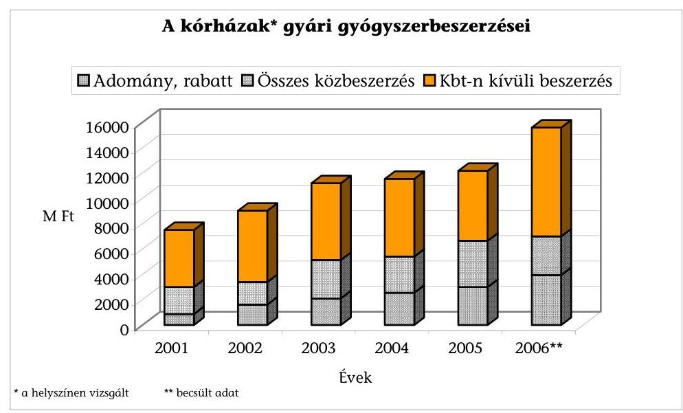

A vizsgált közbeszerzésekben az ajánlatok elbírálásának szempontja az összességében legelőnyösebb ajánlat volt. A részszempontok meghatározásakor a gazdaságosságra törekvés dominált. Legnagyobb súlyszámmal értékelték a rabattot is magában foglaló ellenszolgáltatás értékét. Az értékelés és a bírálat folyamatát valamennyi esetben dokumentálták. A vizsgált kórházakból 12 közbeszerzésen kívül is szerzett be gyógyszert, általában a tendernyertestől további szerződések alapján, 3 intézmény teljes gyógyszerszükségletét közbeszerzési eljárás mellőzésével biztosította. Indokként a gazdaságosságot, a kedvezményeket, az ellátás folyamatosságát és a jó partneri kapcsolatok megőrzését említették.

A kórházak gyógyszerbeszerzése a közbeszerzési törvény hatálya alá tartozik. Az ellenőrzés az ÁSZ korábbi jelentéseiben is közzétett tapasztalataival meg-

[^0]
[^0]:    ${ }^{31}$ A vizsgált kórházak közül a Zalai Kórház és a Salgótarjáni Kórház 2004. évtől, a Miskolci Kórház 2006. évtől a gyógyszereket nem közbeszerezteti, az intézeti gyógyszertárat a fenntartó önkormányzat döntése alapján - közbeszerzési eljárást követően vállalkozás üzemelteti.
    ${ }^{32}$ A 2006. évi becsült (a jelen ÁSZ vizsgálat által nem ellenőrzött) adatok szerint a 15 helyszínen vizsgált intézmény összes gyógyszerbeszerzése meghaladja a 2001-2005. évek átlagát, amelynek egyik oka, hogy a 11 onkológiai centrum a kemoterápiás ellátásokra maga szerezte be a korábbi ún. különkeretes (OEP-től „ingyen" kapott) gyógyszereket.

---

egyezően a kórházak nagy számban mellőzték a közbeszerzési eljárást. A vizsgált időszakban a 121 kórházból 31 (25,6\%), a 44 onkológiai centrumból 32 intézmény ( $72,3 \%$ ) egyáltalán nem folytatott le közbeszerzést, indokként az eljárással járó többletfeladatokat és -költséget, a soron kívüli igények kielégítését és az akciós ajánlatok igénybevételének elmaradását, továbbá a közbeszerzéssel vagy anélkül elérhető feltételek hasonlóságát említették. A közbeszerzés céljának - nyilvánosság, átláthatóság kiszámíthatóság - elmaradását ugyanakkor nem hiányolták. A felügyeleti ellenőrzések nem kifogásolták a közbeszerzés elmulasztását (kivéve Margit Kórház, 2003). Jogorvoslati eljárás is csak kivételesen (SZTE, Nagykállói Szakkórház), az érdekeltek kezdeményezésére, eljárási hiba miatt fordult elő. Az ÁSZ korábbi jelentésének ${ }^{33}$ megállapításával összhangban továbbra is bizonytalanság volt a Kbt. értelmezésében, például a becsült érték meghatározásában, az árubeszerzések költségvetési éven belüli egybeszámításában. Az új Kbt. gyógyszerbeszerzésekre vonatkozó előírásai ellenmondásosak. Így például a gyógyszerbeszerzésre a törvény általános szabályait kell alkalmazni, miközben az egészségügyi szolgáltatásokat az egyszerűsített eljárások körébe sorolja.

A kórházi gyógyszerellátáshoz a gyógyszergyártók és -forgalmazók - marke-ting-tevékenységük részeként - rabattot, adományt és mintát adnak az intézményeknek. A marketing tevékenység kettős hatású: egyrészt hozzájárul a kórházak gyógyszerköltségének csökkentéséhez, másrészt befolyásolja az adott készítmény járóbeteg-forgalmi részesedését, megismertetve a készítményeket az orvosokkal és - rajtuk keresztül - a betegekkel. A helyszínen vizsgált intézmények 2005. évi adatai szerint 13 újonnan bevezetett készítménynél ${ }^{34}$ a térítésmentesen kapott gyógyszer mennyisége minden esetben meghaladta a vásárlás mértékét, 3 terméknél vásárlás sem volt. Két kórház TAJ szintű nyilvántartása alapján, az OEP járóbeteg-forgalmi adatbázisa segítségével vizsgáltuk a 13 említett készítmény továbbfogyasztását, egyes ellátottakra vonatkozóan, a kórházi kezelést követő hónapokban. Az adatok azt mutatják, hogy a krónikus betegségre kórházban beállított készítményt fogyasztja a betegek 80-90\%-a a járóbeteg-forgalomban is. A promóciós módszer mind az originális, mind a generikus készítményeknél alkalmazott technika. Hatására a gyógyszertámogatás kiáramlás alacsonyabb támogatású készítményeknél csökkentő, originális készítményeknél - rövid és hosszú távon egyaránt - azonos vagy növelő.

Az intézeti gyógyszertárak szakmai és gazdálkodási feladataikat a gazdaságosság szempontjait érvényesítve látták el. Az intézeti gyógyszertár és annak vezetője, az intézeti főgyógyszerész meghatározó szerepet játszott a kórház gyógyszergazdálkodásában, a döntések előkészítésében, végrehajtásában és ellenőrzésében, így tevékenysége minden tárgyalt témakörben megjelenik. Az intézeti gyógyszertárak múködési költségei mérsékelten - elsősorban a közalkalmazottak központi béremelését tükrözve - emelkedtek, a gyógyszerkiadások az OEP-től származó bevételekhez viszonyítva csökkentek, a

[^0]
[^0]:    ${ }^{33} 0109$ ÁSZ jelentés a közbeszerzésekről szóló törvény ellenőrzéséről, 2001. május.
    ${ }^{34}$ Vérnyomás- és vérzsírszint csökkentők, antidepresszánsok, peptikus fekélyt kezelő gyógyszerek.

---

vényforgalmat lebonyolító intézeti gyógyszertárak (a továbbiakban vényforgalmú patika vagy patika) eredményét részben az alaptevékenységre forgatták vissza.

A gyógyszerfelhasználás ellenőrzését a készletek alakulásán és nyomon követésén, a csökkentésükre tett intézkedések végrehajtásán mértük. Az intézeti gyógyszertárak átlagos készlete 12,8 nap, az osztályoké 6,6 nap. A helyszínen vizsgált intézményekből 2 esetben követhető számítógépes nyilvántartásban az osztályos gyógyszerkészlet, a többi kórházban az osztályok felhasználását a gyógyszerkeret meghatározásával és betartatásával, a főgyógyszerész helyszíni ellenőrzésével, és leltározással végzik. 3 intézményben külön intézkedést hoztak az osztályos gyógyszerkészletek csökkentésére, például havi leltározás bevezetésével. A konszignációs raktár (a beszállító raktára a felhasználónál) létesítésének általános indoka a kórház készletének minimalizálása. 112 kórház adatai azt mutatják, hogy a konszignációs raktárt működtető és nem működtető kórházak átlagos gyógyszerkészlete közözött (11,46 és 12,32 nap) szignifikáns különbség nincs.

A vényforgalmú patikák működtetése az intézmények számára előnyös, mert egy közepes nagyságú patika évente 30-40 M Ft árrést realizál, amely az intézeti gyógyszertár költségeinek egy részét fedez(het)i. A kórházak közel 50\%-a múködtet vényforgalmú patikát. Az eredmény - szabályzatban vagy anélkül meghatározott részét érdekeltségi rendszerben felosztják.

A kórházak múködtetésbe adásának gyakorlatát az utóbbi években követte az intézeti gyógyszertárak működtetésbe adása. A működtetésbe adás önkormányzati határozat alapján, közbeszerzési eljárással vagy pályáztatással történt, a szerződéses feltételek hasonlóak voltak, de alkalmazkodtak a szerződők helyi igényeihez. A kórházak minden esetben előnyösnek ítélték az együttműködést, de azt írásban nem dokumentálták. Az Ispotály Kft. 2001 óta működtet intézeti gyógyszertárakat, jelenleg 7 szerződéssel rendelkezik. A vizsgált 5 intézeti gyógyszertárban a Kft. 677 M Ft beruházást végzett. Kialakították az egyéni elektronikus gyógyszer nyilvántartási rendszer feltételeit, azonban alkalmazása részleges.

# A kórházak gyógyszerkiadásai, az OEP-től származó bevételhez viszonyítva csökkenő tendenciát mutatnak. A kórházak eladósodásában a gyógyszerkiadások növekedése nem játszik meghatározó szerepet. 

Az ábrák a vizsgált kórházak gyógyszerkiadásait mutatják be az OEP-től származó bevétel százalékában, illetve nominál értékben.

---

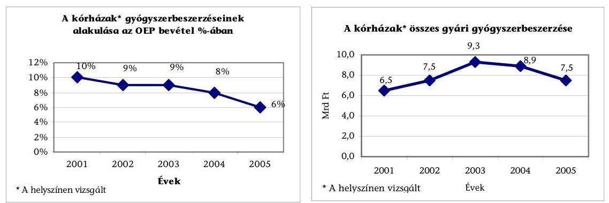

A gyári előállítású gyógyszerek szállítói állománya ${ }^{35}$ 2005. december 31-én - az OEP-től származó bevétel arányában - 0,7-3,6\%, az összes szállítói tartozásból 10,6-35,8\% között volt. Lejárt gyógyszertartozása 6 kórháznak volt, ebből 3 intézményé meghaladta a 100 M Ft -ot, de az összes szállítói állományból nem képviseltek meghatározó részt ( $9,95 \%, 14,96 \%, 23,96 \%$ ). Mindhárom intézmény részesült a 2003. évi adósságkonszolidációs program keretében támogatásban. Az intézmények mindegyike hozott intézkedéseket lejárt gyógyszertartozásainak csökkentésére: adósság átütemezéssel, fizetési határidők meghoszszabbításával (30-60 napról 90-120 nap), keretgazdálkodás bevezetésével és rendszeres ellenőrzésével.

A vizsgált időszakban (2001-2005) az intézmények gyógyszerellátása folyamatos volt, gyógyszerhiány vagy gyógyszerkiadások miatti eladósodás nem volt jellemző. Mindehhez legnagyobb mértékben a gyógyszerfelhasználás több mint negyedét kitevő, a gyógyszergyártók és -kereskedők által rabatt, ajándék vagy mintaként adományozott készítmények járultak hozzá. A gyógyszergyártók és kereskedők marketingtevékenységének hatását a kórházi gyógyszergazdálkodásra, illetve hosszú távú hatását a járóbeteg-forgalomban kifizetett támogatás mértékére sem az ágazatirányító, sem a finanszírozó nem vizsgálta, nem elemezte. A kórházak biztonságos és hatékony gyógyszergazdálkodása, valamint a gyógyszerkassza növekedésének, illetve növekedési ütemének megállítása egyaránt szükségessé teszi a feltárt hatások folyamatos elemzését, értékelését, adekvát befolyásolását.

Az ÁSZ korábbi jelentése „A gyógyszerek támogatási és finanszírozási rendszerének, a fogyasztás helyzetének ellenőrzéséről" 22 javaslatot fogalmazott meg a Kormánynak és az egészségügyi miniszternek. A javaslatok egy része (27\%) jogszabályalkotással, -módosítással, egy része (23\%) intézkedéssel - részben vagy egészben - hasznosult. A javasolt intézkedések közül nem készült el a gyógyszerellátás teljes rendszerére kiterjedő, átgondolt, hosszabb távra kiszámítható, komplex, prioritásokat is figyelembe vevő stratégia. A költségvetés előirányzatának átgondolt, megalapozott tervezése, a kiszámítható gyógyszerpiac érdekében a Magyar Állam és a Gyógyszergyártók 2004. júniusában 3 évre szóló szerződést kötött. „A Magyar Állam és a Gyártók szerződése és módosítása hatálya alatt a gyógyszertámogatás kiadásai jelentősen emelkedtek. A lakosság terhei csupán 2004-ben voltak szinten tarthatóak, a rákövetkező években a szerződés a piacot nem

[^0]
[^0]:    ${ }^{35}$ A szállítókkal szembeni kötelezettség.

---

tudta stabilizálni. A szerződés módosítása - annak ellenére, hogy az eredeti szerződés ezt nem engedte meg - jelzi, hogy a szerződés megkötése nem volt átgondolt a felek részéről, hiszen a betartására vonatkozó szándék a kassza erőteljes ütemű növekedésével párhuzamosan megváltozott. Ilyen módon a kiszámíthatóság, tervezhetőség nem teljesült."36

A helyszíni ellenőrzés megállapításainak hasznosítása mellett javasoljuk:

# a Kormánynak: 

1. Számoltassa be az egészségügyi minisztert a kórházi gyógyszergazdálkodással, illetve a gyógyszerek támogatási és finanszírozási rendszerével, a fogyasztás helyzetével kapcsolatos ÁSZ javaslatok megvalósítására tett intézkedésekről.

## az egészségügyi miniszternek:

1. Kezdeményezze az intézményi gyógyszerellátás területén a közbeszerzésről szóló törvény alkalmazásához szükséges speciális eljárási rendek kialakítását, megalkotását; gondoskodjon arról, hogy a felügyelt intézmények a gyógyszerbeszerzéseknél a közbeszerzési törvény rendelkezései szerint járjanak el.
2. Szabályozza a gyógyszerellátással kapcsolatos országos adatgyűjtések olyan átalakítását, amely egységes rendszerével segíti az ágazati döntések megalapozását.
3. Vizsgálja felül és szabályozza az intézeti gyógyszertár múködéséhez szükséges minimumfeltételeket, valamint szerezzen érvényt a hatályos szakmai minimumfeltételek betartásának.
4. Gondoskodjon - a kórházak finanszírozását megalapozó - HBCS súlyszámok folyamatos karbantartásáról a szükséges költséggyűjtések alapján.
5. Szorgalmazza - a kórházi gyógyszerellátás tervezhetősége és a betegellátás minősége ellenőrzésének céljából - a kórházi gyógyszerfelhasználás egységes tartalmú, tételes nyilvántartását.
6. Biztosítsa, hogy a kemoterápiás ellátások protokolljaiban csak az adott indikációban törzskönyvezett gyógyszerek szerepeljenek.
7. Vizsgálja meg a szolid tumorok kemoterápiás ellátásában mutatkozó betegszám csökkenés okait, és annak eredményei alapján hozza meg a szükséges intézkedéseket.
[^0]
[^0]:    ${ }^{36} 0628$ ÁSZ jelentés a Magyar Köztársaság 2005. évi költségvetése végrehajtásának ellenőrzéséről. Függelék, C/3. pont - 281-297. oldal

---

# II. RÉSZLETES MEGÁLLAPÍTÁSOK 

## 1. A KÓRHÁZAK GYÓGYSZERGAZDÁLKODÁSÁNAK JOGSZABÁLYI ÉS INTÉZMÉNYI KERETEI

### 1.1. A Homogén Betegség Csoportok gyógyszertartalmának megállapítása, karbantartása

A Homogén Betegség Csoportok (HBCS) szerinti finanszírozás lényege, hogy a hasonló költségű ellátástípusok csoportjait átlagköltségen finanszírozzák ${ }^{37}$. A HBCS alapú finanszírozás ezen célja akkor valósul meg, ha a felmerülő költségek nagyságát, egymáshoz viszonyított arányát és annak változását a finanszírozó folyamatosan monitorozza, azaz a súlyszámarányok az ellátás valós költségeinek arányában folyamatosan változnak. A HBCS szerinti finanszírozás lehetővé teszi, hogy a fekvőbeteg-ellátásra szánt költségvetési keretet a gyógyítás során tapasztalt költségek arányában osszák meg az egyes betegségek ellátása között.

Az egészségügyi ellátásban használt szakmai kódrendszerek és finanszírozási paraméterek karbantartását miniszteri rendelet ${ }^{38}$ szabályozza. A karbantartási feladatok ellátására a miniszter munkabizottságot hozott létre, amely havonta egy-két alkalommal ülésezett, tevékenysége dokumentált. A karbantartási tevékenység lehet rendszeres (azon belül átfogó vagy célzott) és soron kívüli. A munkabizottság jegyzőkönyvei alapján tevékenysége során rendszeres, célzott kódkarbantartási tevékenységet végzett. Átfogó költséggyújtés és kódkarbantartás utoljára 1998-1999-ben volt, az azóta eltelt 8 évben a súlyszám arányok csak kis mértékben változtak. A helyzet visszáságaira az ún. V-ös ${ }^{39}$ bizottság 2005. május 13-án kelt levélben hívta fel a miniszter figyelmét.
„Az orvosi technológia változása és az infláció okozta reálérték vesztés a finanszírozás rendszerében követésre nem került, ugyanakkor a végrehajtott változtatások igazságtalan arányeltolódásokat eredményeztek, miközben az alapdijak emelése elmaradt. Mindezek hatására napjainkban már nem ismert, hogy az egyes szakterületek finanszírozása ténylegesen mennyiben tér el a valós szükségletektől. A másik komoly veszélye a jelenlegi

[^0]
[^0]:    ${ }^{37}$ Az OEP FIFO (korábban GYÓGYINFOK) által gyűjtött 50 féle költségtényező (köztük a gyógyszerköltség) a különböző betegségek ellátásában eltérő arányban jelenik meg. A költséggyűjtések tapasztalatai alapján „árazódnak be" az eltérő gyógyítási költségű ellátási események eltérő súlyszámú, és így eltérő finanszírozású HBCS-kbe. A (finanszírozási) súlyszám az ellátások közötti költségarányokat jeleníti meg.
    ${ }^{38}$ Az egészségügyi ellátásban használt szakmai kódrendszerek és finanszírozási paraméterek karbantartásának jogi szabályozásáról szóló 6/1998. (III. 11.) NM rendelet.
    ${ }^{39}$ A miniszter tanácsadó szerve volt a finanszírozási kódkarbantartás és az onkológiai HBCS-k kialakítása során, 2006 májusában megszűnt.

---

helyzetnek az, hogy a valós költségek felmérése nélkül minden korrekciós szándék vagy beavatkozás tovább torzíthatja a már egyébként is torzult finanszírozási rendszert."

A rendelet melléklete szerint a kórházi eset finanszírozási egységének költségkalkulációja során a közvetlen gyógyszerköltséget tételes megfigyelés alapján árazzák be, így az átfogó költséggyűjtés elmaradásával a HBCS-k gyógyszertartalmának karbantartása sem valósult meg a vizsgált időszakban.

A HBCS-k súlyszám képzésének másik módszere finanszírozási protokollok kialakítása, az ellátási protokollok költségelemeinek felmérése alapján a hasonló költségű protokollokat homogén betegségcsoportokba rendezik és azokat a csoportok átlagköltségén finanszírozzák. Az onkológiai kúraszerű ellátások esetében ezt a módszertant alkalmazták. (A kemoterápiás ellátások finanszírozásának változását lásd a 3.1. pont alatt.)

# 1.2. Az ágazatirányító által elrendelt adatgyűjtések 

Az országos adatgyűjtéseknek az egészségügyi intézmények gyógyszergazdálkodásával kapcsolatos adatai négy témakörbe csoportosíthatók. Az intézmények a gyógyszertárakkal, gyógyszergazdálkodással kapcsolatosan a Minisztériumnak 3, az OEP-nek 1 témakörben teljesítenek adatszolgáltatást. Az adatgyűjtések az Országos Statisztikai Adatgyűjtési Program (OSAP) részeként valósulnak meg. (Részletes elemzés az 1. sz. függelékben található.)

Az 1477-es számú OSAP adatgyűjtés (egészségügyi árinformáció) adataiból készült 2005. évi kiadvány szerint „az egészségügyben az áremelkedés üteme hoszszabb távon mérve jelentősen meghaladja a lakossági fogyasztási javak inflációját "40. A kórházi kiszerelt gyógyszerek beszerzéseinek árindexe ezzel ellentétesen mozog és alacsonyabb, mint a lakossági fogyasztói árindex (két év kivételével: 2001, 2003), tehát a kórházak gyógyszerre fordított kiadásai reálértéken csökkentek. Az egészségügyi intézmények nem jutnak hozzá a beszerzéseiket segítő termékszintű, valós árinformációkhoz.

Az 1578-as számú OSAP adatgyűjtésben (gyógyszertárak alapadatai) azonos tartalmú adatok párhuzamos gyűjtése folyik. Az ÁNTSZ - az adatgyűjtés egyik végpontja - hatósági engedélyezési feladatánál fogva az OSAP adatgyűjtésben bekért adatoknál részletesebb, naprakészebb adatokkal rendelkezik.

Az OSAP 5031-es és 5032-es (korábban 1499-es és 1502-es) számú ágazati adatgyűjtés az egészségügyi intézmények gyógyszerköltségeiről mai formájában, és az alkalmazott adatfeldolgozási módszertannal nem tölti be a célját, mivel a költségvizsgálat nem kellően részletes, nem termék- és esetszintű. Az OEP Gyógyszerügyi osztályának javaslata egy teljes, esetszintű tételes adatgyűjtési rendszer bevezetése, legalább a gyári gyógyszerkészítmények felhasználásáról. Az egységes adattartalom meghatározása (hasonlóan a járóbetegellátásban múködő BÉVER-hez) az OEP feladata annak érdekében, hogy a kórházi betegellátás során használt gyógyszerelés a finanszírozó számára átlátható és ellenőrizhető legyen.

[^0]
[^0]:    ${ }^{40}$ 71. sz. Árinformáció az egészségügyi intézményekben 2005.

---

A 1913-as számú OSAP adatgyűjtés a gyógyszer-gyártóknak és nagykereskedőknek ír elő jelentési kötelezettséget az általuk gyártott, forgalmazott termékek körében közforgalmú és intézeti gyógyszertári értékesítéseikre. A minisztériumi adatgyűjtéssel párhuzamosan, „a piaci igényeknek" megfelelően gyűjt gyógyszer-értékesítési adatokat - a gyári gyógyszerkészítmények vonatkozásában - a gyógyszer-nagykereskedőktől az IMS HEALTH Kft. (a továbbiakban: IMS) a 1913-as adatgyűjtés adattartalmával megegyezően. A Minisztérium és az MIS (az IMS HEALTH Kft. anyacége) közötti megállapodás értelmében a 1913-as adatgyűjtés kontroll adatokkal szolgál az IMS adatgyűjtésnek, a kontroll adatokért cserébe a Minisztérium az IMS adatbázisára használati jogot kapott. A kórházi értékesítési adatok esetében az IMS Kft. adatai és az 1913-as OSAP adatgyűjtés jelentős eltérést mutatnak. Az OEP FIFO az adatgyűjtéssel kapcsolatos problémákat a laza adatszolgáltatási fegyelemben, az adatszolgáltatók által szolgáltatott adatok eltérő szerkezetében, és az adatszolgáltatásból kizárt tételek magas számában jelölte meg. A két adatgyűjtés adatai közötti jelentős különbség (2005-re már 54,7 Mrd Ft), nem magyarázható önmagában a hibás adatszolgáltatás miatt kizárt tételekkel. Az adatgyűjtés egyre növekvő jelentőségű, mással jelenleg nem helyettesíthető, a kórházi gyógyszer inputról és így közvetetten a felhasználásról - termékszintű, naturáliában meghatározott információt szolgáltat az ágazatirányító számára.

A kórházak gyógyszerfelhasználása - részletes adatok hiányában nagyságrendileg, a gyári gyógyszerkészítmények országos adatai összevetésével értékelhetők. A kórházi gyógyszer input adatait (IMS) és output adatait (OSAP 1499) nagyságrendileg úgy hasonlítottuk össze, hogy az input adatokat nagykereskedői áron beárazva az adatgyűjtések országos számaival vetettük össze. Megállapítható, hogy az intézeti gyógyszertári input és output értékek között évente növekvő különbség figyelhető meg, a számítás szerint a kórházi input adatok 2005-ben 44,4 Mrd Ft-tal haladták meg az output adatokat. Oka:

- a két adatgyűjtés részben eltérő adattartalmának nem teljes megfelelése;
- azok a készítmények, amelyeket a kórházak a nagykereskedői ár alatt vásárolnak, (rabattal csökkentett árú termékek vagy térítésmentes adomány, minta).

Az adatgyűjtések értékei közötti jelentős különbség országosan, a helyszíni vizsgálat és a kérdőív adatai intézményi szinten arra mutatnak, hogy a nagykereskedelmi ár alatt vásárolt termékek, a rabatt, adomány, ingyen minta értéke növekvő mértékű (lásd részletesen: a 2.1.3. pontban).

Miközben a lakossági gyógyszerellátásban résztvevő közforgalmú gyógyszertárakban, valamint a vényforgalmú patikákban társadalombiztosítási támogatással vásárolt gyógyszerekről, akár egyénre bontva is pontos adatok állnak rendelkezésre, addig a finanszírozó és az ágazatirányító nem rendelkezik kellő részletezettségű (termékszintű, esetszintű) információval a fekvőbeteggyógyintézetek, és a kórházban fekvő betegek gyógyszerfelhasználásáról. Az adatgyűjtések során a kórházi gyógyszerfelhasználással kapcsolatosan keletkező információ nem egységes, a döntéshozatalt, döntés-előkészítést csak esetlegesen szolgálja.

---

# 1.3. A gyógyszer alaplista 

Kórházi irányítási eszközök között a menedzsment kezében a gazdaságos és hatékony gyógyszergazdálkodáshoz rendelkezésre álló egyik eszköz a gyógyszer alaplista.

Az intézeti gyógyszertár múködésének rendjét és a betegosztályokkal való kapcsolatát a 15-ből 14 helyszínen szabályozták (az intézményi vagy egységszintű SZMSZ-ben, illetve a minőségirányítás keretein belül), 10 helyszínen a gyakorlat megfelel a helyi szabályozásnak.

Kórházi gyógyszer alaplista alkalmazását jogszabály nem írja elő. A kérdőívvel megkeresett 121 intézményből 100 használ gyógyszer alaplistát, amelyek közül 88 kórházban az intézeti Gyógyszerterápiás Bizottság részt vett a lista összeállításában, elfogadásában.

Az alaplista összeállítása egyrészt a készletezés szempontjából bír jelentőséggel: az intézmények rendelkezzenek alapvető készítményekből osztályos/gyógyszertári készlettel. Ebben az esetben az alaplista a készítmény gyártói nevét rögzíti. Az alaplista készlet-meghatározó szerepe az utóbbi időben a nagykereskedők „kiszállítási hajlandóságának" növekedésével, egyes hatóanyagok piacán kialakult verseny és az intézményen belüli nagykereskedői raktárak (konszignációs raktárak) elterjedésével csökkent.

A lista másrészt szerepet játszik a szakmai és a gazdasági szempontok összehangolásában. Ilyenkor nem készítményre, hanem hatóanyagra készít az intézmény listát, és adott hatóanyagon belül a legolcsóbb készítményt tartja raktáron. A vizsgált 14 alaplista közül 5 készítményre, 7 hatóanyagra készült. A PTE és a Margit Kórház kombinált alaplistát készít, azaz a lista részben készítménynevet tartalmaz, de bizonyos - az OGYI által helyettesíthetőnek minősített - termékeknél hatóanyaglistát, amelynél az intézeti gyógyszertár a legolcsóbban beszerezhető terméket szolgáltatja ki, a helyettesíthetőség szabályainak betartásával.

Az alaplistákon szereplő készítmények/hatóanyagok átlagos száma - az előkészítés során bekért adatok szerint - 60 és 1390 között szór, átlaga 430. A szám tájékoztató jellegű, mert a számlálás során a hatóanyagra és a készítményre épülő listák adatait összegeztük. A hatóanyagra épülő alaplisták esetén a készítményszám a hatóanyagok számának sokszorosa lehet. ${ }^{41}$

A helyszínen vizsgált 15 intézménynél nyílt módunk az alaplisták tartalmi értékelésére. Közülük 10 alkalmazott alaplistát, 4 intézménynél pedig a tendereztetés során létrehozott hatóanyaglista szolgált alaplistaként. 13 intézménynél a Gyógyszerterápiás Bizottság részt vett az alaplista összeállításában, 4 intézmény ezen túlmenően szabályozta az alaplistára kerülés feltételeit is.

[^0]
[^0]:    ${ }^{41}$ Nincs szakmai állásfoglalás arra vonatkozóan, hogy egy átlagos kórházban hány hatóanyag/készítmény alkalmazásával biztosítható a feladatellátás.

---

Általános, hogy az alaplistán szereplő készítmények rendelését nem kötik az intézmények feltételhez, míg az alaplistán nem szereplő vagy néhány listás, de különleges felhasználású, drága készítmény rendelését szakmai vezetői szinthez/jóváhagyáshoz kötik. Az alaplistán nem szereplő készítményekből 9, drága speciális készítményekből 8, antibiotikumok esetén 10 intézmény kötötte valamilyen vezetői szint jóváhagyásához a készítmények rendelését.

A vizsgált intézmények közül 13 élt az alaplistán túl az orvosi gyógyszerrendelés korlátozásának valamely eszközével, még az egyébként alaplistával nem rendelkező OOI is. A „engedélyes listák/tiltó listák" az egyébként nagy terápiás szabadságot biztosító alaplistákhoz viszonyítva szigorú korlátot jelentenek.

Az ellenőrzés az alaplistán belüli originális-generikus arányt a gazdaságos gyógyszerrendelés, alkalmazás kritériumaként kívánta alkalmazni, de a gyakorlatban ez a mutató erre nem volt alkalmazható, mert

- a hatóanyagra épülő listáknál sok az azonos nevú, de eltérő kiszerelésű készítmény (összeszámlálás problémája);
- nincs közhiteles lista annak megítélésére, hogy adott készítmény generikus-e vagy originális. A kórházi gyógyszerbeszerzésekben nem feltétlenül az originális készítmény a legdrágább (lásd még: a 2.1.3. pontot);
- az alaplistán szereplő generikus arány nem azonos a felhasználási aránynyal, az alaplista átfogó jellege miatt számos ritkán használt készítményt is tartalmaz.

# 1.4. A Gyógyszerterápiás Bizottság 

A gyógyszerellátási feladatok összehangolása érdekében miniszteri rendelet ${ }^{42}$ Gyógyszerterápiás Bizottság (GYTB) múködtetésére kötelezte a kórházakat, amelynek elnöke a kórház szakmai vezetője vagy az általa megbízott kórházi dolgozó, titkára az intézeti főgyógyszerész.

A GYTB rendeletben meghatározott feladatai:

- javaslatokat dolgoz ki a hatékony, biztonságos és gazdaságos gyógyszerterápiás elvek érvényesítésére,
- szakmai és gazdasági szempontból elemzi és értékeli a kórház gyógyszerfelhasználását, gyógyszerbeszerzését, és javaslatot tesz az esetleges hiányosságok kiküszöbölésére és az indokolatlannak minősített beszerzések és felhasználások csökkentésére,
- véleményezi az új gyógyszerterápiás eljárások kórházon belüli bevezetését és szakszerűségét, valamint meghatározza az új gyógyszerterápiás eljárások gyógyszerszükségletét,
- az új gyógyszerek forgalomba hozatalára is figyelemmel, javaslatot tesz a kórház gyógyszerkészletének összetételére,

[^0]
[^0]:    ${ }^{42}$ Az intézeti gyógyszerellátásról szóló 34/2000. (XI. 22.) EüM rendelet, 9. §.

---

- ellenőrzi a kórház gyógyszerellátással kapcsolatos minőségbiztosítási feladatait, a szolgáltatások minőségét és az esetleges hiányosságok esetén javaslatot tesz azok megszüntetésére.

A rendelet egyebekben a GYTB összetételének, feladatainak és múködési rendjének meghatározását a kórház SzMSz-ének szabályozási körébe utalja.

A kérdőívre válaszoló 116 kórházból 5 (4\%) nem múködtet GYTB-t. A helyszínen vizsgált intézmények mindegyike múködtet GYTB-t, egy kivételével (intézmény vagy egységszintű) SzMSz-ben szabályozták a tevékenységét, többségüknél a GYTB - beleértve az elnököt és a titkárt - 7 vagy több tagú.

Az ellenőrzés egyik kritériumaként határoztuk meg, hogy a GYTB tagjai között legyen pénzügyi-gazdasági szakember, tekintettel arra, hogy a GYTB kiemelt feladata a kórházi gyógyszerfelhasználás és gyógyszerbeszerzés szakmai és gazdasági szempontú elemzése és értékelése.

A vizsgált 15 intézménynél 6 GYTB-ban tagként vagy állandó meghívottként pénzügyi-gazdasági szakember szerepel, a többi esetben nincs gazdasági végzettségű az álladó résztvevők között. A GYTB tagjai - a jogszabályban meghatározott elnökön és titkáron kívül - jellemzően egyes klinikai osztályok vezetői.

A GYTB ülések gyakorisága több intézménynél a szabályozásban rögzített, de annak megvalósulása - dokumentáció híján - nem nyomon követhető, ezt tapasztaltuk 4 helyszínen vizsgált intézményben. A GYTB ülések gyakorisága heti egyszeri 1 intézménynél, havi egyszeri 1 intézménynél, továbbá évente négyszer üléseznek 3 intézményben, és évente kétszer üléseznek 3 intézményben, 7 intézményről nincs információ.

A helyszínen vizsgált kórházakban a GYTB feladatai közé tartozik az alaplista meghatározása, módosítása (13 esetben); az intézményi gyógyszertenderek előkészítése, bírálata ( 7 esetben), a gyógyszer-keretgazdálkodás során a keretek meghatározása, véleményezése (6 esetben). A hivatkozott rendeletben rögzített feladatok közül a GYTB az intézmények gyógyszer-felhasználásáról elemzéseket készít (11 esetben), és terápia racionalizálásra irányuló javaslatokat tesz (6 esetben). A jogszabályi feladatok között megjelenik terápiás protokollok bevezetése, véleményezése, ami a gyakorlatban az onkológiai ellátás (4 intézménynél) és az antibiotikum terápia terén (6 intézménynél) jelenik meg. A gyógyszerellátással kapcsolatos minőségbiztosítási feladatokat a GYTB 2 intézménynél végez, további 4 intézménynél ez a minőségbiztosítási részleg feladata.

# 2. A KÓRHÁZAK GYÓGYSZERGAZDÁLKODÁSA 

### 2.1. A gyógyszerbeszerzés

### 2.1.1. Gyógyszerbeszerzés közbeszerzéssel

A kórházak mint költségvetési intézmények ajánlatkérői minőségben gyógyszerbeszerzéseikkel a közbeszerzési törvény hatálya alá tartoznak, de tevékenységüket számos sajátosság jellemzi (pl. a betegforgalomtól, az ellátott betegek összetételétől függően, kórházanként változó,

---

speciális gyógyszerigény, a terápiás gyakorlatban új készítmények, eljárások megjelenése, a készítmények széles választéka, a viszonylag kevés szereplős gyógyszerpiac).

A közbeszerzés jogi környezetében, az eljárások szabályozásában a vizsgált időszakon belül az új Kbt. ${ }^{43}$ 2004. május 1-jei hatálybalépése számos tekintetben új helyzetet teremtett. A volumenében jelentősen megnövekedett joganyag a jogalkalmazók, így a fekvőbeteg-gyógyintézetek részéről is sokkal nagyobb szakmai felkészültséget követelt meg. Új elemekkel is (pl. új eljárás-fajtákkal és tárgyi be-szerzés-típusokkal) kiegészült a törvény, valamint a korábbi végrehajtási rendeletek helyett ${ }^{44}$ is újak születtek. Az új Kbt. az átláthatóság növelése érdekében további szabályokkal bövült (pl. közbeszerzési terv készítése vagy a szerződés teljesítéséről és módosításáról hirdetmény megjelentetése), kiegészültek az eljárások dokumentálásával, ellenőrzésével kapcsolatos előírások. A Kbt. hatálya a vizsgált állami (egyetemi klinikák, országos intézet) és a helyi önkormányzati kórházakra egyaránt kiterjed.

A vizsgált intézmények közül 6 kórház korábban nem rendelkezett közbeszerzési szabályzattal, az új Kbt. hatálybalépését követően a közbeszerzési eljárás előkészítésének, lefolytatásának felelősségi rendjét, az eljárás szabályait, az ajánlatok bontására, elbírálására és a szerződések megkötésére vonatkozó szabályokat és hatásköröket, az eljárás során hozott döntésekért felelős személyt (személyeket) és a közbeszerzési eljárás dokumentálási rendjét rögzítették (a Nyírő Gyula Kórház nem aktualizálta a szabályzatot). A kórházak az új Kbt. alapján elkészített közbeszerzési szabályzatukban sem határozták meg a gyógyszerek beszerzésének sajátosságait, a Kbt. előírásainak értelmezésében és alkalmazásában intézményenként eltérő gyakorlat volt jellemző.

A saját beszerzésű gyógyszerek értéke (a vizsgált 2001-2005 közötti időszak teljes éveit figyelembe véve) 2,5 Mrd Ft-tal, ebből közbeszerzés útján beszerzett gyógyszerek értéke 1,5 Mrd Ft-tal emelkedett és aránya a 2001. évi 32\%-ról 2005. évben $40 \%$-ra változott.

A vizsgált 15 kórház ${ }^{45}$ a 2001-2005 közötti időszakban a saját beszerzésú gyári gyógyszerkészítmények 33\%-át közbeszerzési eljárás keretében, 67\%-át egyéb módon (szabadkézi vétel) és korábban kötött keretszerződéseken alapuló megrendelések útján szerezte be. (Lásd az ábrát a 20. oldalon.)

[^0]
[^0]:    ${ }^{43}$ A közbeszerzésről szóló 2003. évi CXXIX. törvény (új Kbt.), amely hatályon kívül helyezte a többször módosított 1995. évi XL. törvényt.
    ${ }^{44}$ A gyógyszerek és gyógyászati segédeszközök közbeszerzésének részletes és sajátos szabályairól szóló 130/2004. (IV. 29.) Korm. rendelet a korábbi 110/2000. (VI. 29.) Korm. rendelet helyett.
    ${ }^{45}$ A vizsgált kórházak közül a Zalai Kórház, és a Salgótarjáni Kórház 2004. évtől, a Miskolci Kórház 2006. évtől a gyógyszereket nem közbeszerezteti, az intézeti gyógyszertárat a fenntartó önkormányzat döntése alapján, közbeszerzési eljárást követően vállalkozás üzemelteti.

---

A közbeszerzések aránya 2001-2005 között hasonló (34\%) volt a 2006. júliusában (felülvizsgálat nélkül, nem teljes körűen) adatot szolgáltató 121 fekvőbeteggyógyintézetnél. A 121 kórházból 5 intézmény egyik évre sem, továbbá 2001. évre 14, 2002-re 9, 2003-ra 7, 2004-re 3 és 2005-re 2 kórház nem tudott adatot szolgáltatni, 31 kórház egyik évben sem folytatott le nyílt közbeszerzési eljárást.

A közbeszerzési törvény tárgyi hatályának (a tárgyi azonosság) értelmezését ${ }^{46}$ - a törvény módosításai ellenére - még mindig bizonytalanság, és ebből eredő törvénysértés kísérte. Változatlanul gondot okoz a beszerzések tárgyáért általában kért, illetve kínált legmagasabb összegű ellenszolgáltatás összegének, a becsült értéknek a meghatározása, amely döntően arra vezethető vissza, hogy a kórházak gyógyszerbeszerzéseiknél a Kbt. árubeszerzések költségvetési éven belüli egybeszámításának kötelezettségét nem alkalmazták.

A beszerzések szabályozásában, gyakorlatában a vizsgált kórházak 73\%-a a Kbt. előírásait sértő volt, mivel gyógyszer beszerzéseik egy részét közbeszerzés nélkül intézték, különösen a vizsgált időszak kezdeti éveiben.

A PTE és az OOI rendelkezett ugyan közbeszerzési szabályzattal, azonban azt a gyógyszerek beszerzésére 2001-2005 között nem alkalmazta, a PTE 2001-2005 között a gyógyszerek $90 \%$-át nem közbeszerzési eljárás keretében szerezte be; a Margit Kórház közbeszerzési szabályzata 2004. május 1-jétől hatályos, azonban gyógyszerbeszerzésre a vizsgált időszakban egyetlen közbeszerzési eljárást sem folytattak le.

A helyszínen vizsgált közbeszerzések tartalmi előkészítése és lebonyolítása a Kbt. és a közbeszerzési szabályzatban meghatározott keretek között történt. A közbeszerzési terv összeállítására, az ajánlati dokumentáció (hatóanyag lista vagy tételes gyógyszerigény szerinti) részletezettségére, az ajánlati felhívásban szereplő ár, szállítási, fizetési és egyéb feltételekre vonatkozóan a helyi szabályzatok csak kivételesen tartalmaztak útmutatást, a gyakorlatot a kórház vezetése, az intézeti főgyógyszerész eseti döntései alakították ki.

A kórházak a pénzügyi egyensúly fenntartása érdekében a gyógyszerbeszerzés területén is vezettek be megszorító intézkedéseket.

A Veszprémi Kórházban az önkormányzati biztos a 2006. évi közbeszerzési terv összeállítására fogalmazott meg szempontrendszert, amely szerint a megajánlott ár legalább egy naptári évig és az ezt követő díjemelés a KSH fogyasztói árindex maximum 50\%-áig legyen érvényes, az árak a 2004. évi árszintet nem haladhatják meg, a fizetési határidő minimum 60 nap legyen. A Gyógyszerterápiás Bizottság is meghatározta a gyógyszertender kiírás szakmai ismérveit, amely szerint hatóanyag alapon történjen a kiírás, kivétel ez alól az alacsony molekulatömegú heparinok, ahol a rizikófaktorok ${ }^{47}$ a döntőek, a szerződés érvényességi ideje 2 év,

[^0]
[^0]:    ${ }^{46}$ A 0109 ÁSZ Jelentés a közbeszerzésekről szóló törvény végrehajtásának ellenőrzéséről hasonló megállapításokat tartalmazott.
    ${ }^{47}$ A felhasználás során kell, hogy a kórház rendelkezzen alacsony, közepes és magas kockázatú trombózist gátló heparinokkal, amelyek különböző hatóanyagúak, ezért or-

---

a fizetési határidő 60-90-120 nap, a kiírásra kerülő készítmények becsült összértéke 176 M Ft , a tender összértékétől +/- 30\% eltérés lehetséges.

A vizsgált ajánlati felhívások, dokumentációk alapján az ajánlattevők a szállítani kívánt termék egységárát úgy határozták meg, hogy az tartalmazta az áru rabatt, százalékban meghatározott kedvezmény vagy sávos kedvezmény összegét is, valamennyi engedményt az egységárba beépítettek és a specifikációban, illetve a szerződésben megadott darabszámban a megajánlott áru rabatt mennyisége is szerepelt.

A meghirdetett közbeszerzési eljárásokban az ajánlatkérők olyan feltételt szabtak, amely szerint a nyertes pályázókkal kötött szerződésben a szerződéses mennyiségektől a megrendelő a betegforgalom függvényében évente változó mértékben - $\pm 10-30 \%$ között - eltérhetett.

A SE az éves gyógyszerszükségletének 70\%-át jelentő gyógyszerkört vonta be a közbeszerzés körébe, 30\%-át szabadkézi vétellel vásárolta. Kikötötték az ajánlati felhívásban, hogy a megjelölt mennyiségektől $\pm 30 \%$-kal jogosultak eltérni a tényleges lehívások során. Az Egyetem által közölt összesítésben a 2003-2005. években $57,2 \%, 62,6 \%$, illetve $57,0 \%$ volt a saját beszerzésekből a nyílt közbeszerzési eljárással beszerzett gyógyszerek részaránya.

Az ajánlatok elbírálásánál a szempont az összességében legelőnyösebb ajánlat volt. A részszempontok meghatározásakor a gazdaságosságra való törekvés dominált. Az értékelés és bírálat folyamatát valamennyi esetben dokumentálták.

A gyógyszerellátás a vizsgált kórházakban kisebb ellátási zavaroktól eltekintve folyamatos volt. A biztonságos gyógyszerellátás érdekében a közbeszerzési eljárások során az ajánlattevő kiválasztásában meghatározó bírálati szempont volt a szállítási feltételek teljesítése is. Az egyes új közbeszerzési eljárások várható befejezésének, azaz az új szerződések megkötésének az éves szerződések lejárati időpontjához való hézagmentes illesztése azonban a gyakorlatban problémát okozott. A folyamatos gyógyszerellátás érdekében jellemző volt például, hogy a lejárt éves szerződéseket követően a nyertes forgalmazókkal, illetve gyártókkal kötött szerződéseket - változatlan tartalommal - az átmeneti időszakokra meghosszabbították ${ }^{48}$.

Az intézmények véleménye szerint a közbeszerzés hátránya a nem tervezett, vagy a szerződésben vállaltakat nem teljesítő szállítók miatti sürgős, soron kívüli beszerzési igények kielégítése, az esetleges akciós ajánlatok kihasználásának elszalasztása, nem vitatva a közbeszerzés előnyeit, úgy mint az ajánlatok bírálati szempontjainak, értékelésének nyomon követhetősé-
vos szakmai szempontok figyelembevételével készítményre, gyári gyógyszernévre történik a kiírás.
${ }^{48}$ A szerződések változatlan tartalommal történt meghosszabbítását a hatályos Kbtv. lehetővé tette.

---

ge, nyilvánossága, átláthatósága, az árak, kedvezmények, szállítási, fizetési feltételek előre rögzítettsége.

A PTE az általános érzéstelenítő szerekre vonatkozóan a 2005. évben folytatott le először közbeszerzési eljárást. A nyertes ajánlattevő a szerződésben vállalt 24 órás szállítás határidőt sorozatosan nem tartotta be, négy-öt napos késéssel szállított, de akkor sem a teljes rendelt mennyiséget. Az érvényes szerződés miatt a gyógyszertár nem tudta igénybe venni egy nagykereskedő akciós ajánlatait.

Az SZTE a közbeszerzési eljárás eredményeként a 2005. július 1.-2006. június 30. közötti időszakra megkötött szállítási szerződésben szereplő 408,6 M Ft-tal szemben csupán 270 M Ft értékű gyógyszert vásárolt, mert egy szállítóval - a szerződésben vállalt szállítási határidők nem teljesítése miatt - szerződésbontásra került sor.

A gyógyszerek nagy tételszáma (a kórházon belül használt készítmények száma az ezer darabot is meghaladja) miatt a közbeszerzési eljárás adminisztratív és speciális követelményeinek teljesítése, az értékelés többletfeladatot ró az ajánlatkérőre és ajánlattevőre egyaránt. Hasonló feltételekkel (ár, szállítási és fizetési határidő) jöttek létre szállítási szerződések, tendereztetés nélkül is.

A szakértelem, a szükséges munkaerő hiánya miatt a gyógyszer közbeszerzést lefolytató kórházak 77\%-a vett igénybe külső lebonyolítót az ajánlati felhívás, dokumentáció kidolgozásához, az ajánlatok értékeléséhez. A lebonyolító kiválasztása intézményenként és a vizsgált időszakon belül is eltérő módon vagy közvetlen megbízás vagy több ajánlat bekérést követő tárgyalás eredményeként történt.

A Mátészalkai Kórház 2004. évben lefolytatott eljárása lebonyolításának díja a megbízási szerződés szerint a közbeszerzési érték $0,6 \%$ volt. A 2005. évben a bonyolító díjmentesen látta el a tenderrel kapcsolatos ügyintézést, a dokumentációért fizetett térítés a bonyolítót illette meg.

A Fővárosi Közgyűlés kórházai beszerzéseinek központosítására vonatkozó 2005. évi döntésének - a Fővárosi Központi Egészségügyi Beszerző és Szervező (FEBESZ) Kft. létrehozásának - célja volt, hogy a szervezet az önkormányzat tulajdonában lévő kórházak minden, a nemzeti értékhatár ${ }^{49}$ 50\%-át meghaladó közbeszerzését kizárólagos hatáskörrel bonyolítsa le, azonban az alapítást követően még egyetlen gyógyszer közbeszerzési eljárást nem folytatott.

A FEBESZ 2005. július 1-jei megalakulásával párhuzamosan a Fővárosi Önkormányzat moratóriumot hirdetett, hogy a kórházak - kivételesen indokolt esetektől eltekintve - csak a FEBESZ igénybevételével írhattak ki közbeszerzési pályázatot, de 2006. október közepéig a cég egyetlen gyógyszertendert sem hirdetett meg, a kórházak a gyógyszerszükségletük kielégítésére közbeszerzési eljárás mellőzésével kötöttek szerződéseket. Az eredetileg 2006. év II. negyedévében tervezett, a helyszíni ellenőrzés időszakában már előkészítés alatt álló, 1,6 Mrd Ft összértékű

[^0]
[^0]:    ${ }^{49}$ 2006-ban 30 M Ft - A Magyar Köztársaság 2006. évi költségvetéséről szóló 2005. évi CLIII. törvény 117. § (1)-(2) bek.

---

közbeszerzést 2007 februárjában kívánják lezárni. A FEBESZ non-profit formában múködik, díjazása ( $0,1-0,7 \%$ ) a központosított közbeszerzés és az átlagos piaci árszint alatt marad.

A gyógyszerbeszerzés gazdaságosságának értékelési rendje nem szabályozott, nem alakult ki a kórházakban, de egyes időszakokban végeztek elemzést a közbeszerzésekre vonatkozóan.

A főgyógyszerész a Veszprémi Kórház 2001-2003. évi közbeszerzéseit értékelve megállapította, hogy a közbeszerzéssel beszerzett gyógyszereken intézményi és éves szinten 3 M Ft megtakarítás (a bázis vagy közlönyár és a tényleges beszerzési érték különbözeteként) keletkezett, ami az éves gyógyszerkiadás 0,7-0,5\%-a volt 2003-ban. A tenderkiírásban nem szereplő készítményeket közvetlenül a gyártótól tudták beszerezni kedvezményes, „rabattal" csökkentett áron, melyek esetén tenderkiírás nélkül is megkapták az ott jellemző rabatt kedvezményeket.

# 2.1.2. Nem közbeszerzéssel vásárolt gyógyszerek 

A vizsgált kórházak 73\%-a közbeszerzési eljáráson kívül is szerzett be gyógyszert, ezek közül 3 intézmény (PTE, OOI és a Margit Kórház) a teljes gyógyszerszükségletét közbeszerzési eljáráson kívül szerezte be.

Az intézmények a 2005. évben felhasznált gyári előállítású gyógyszerek 52\%-át (5,5 Mrd Ft) nem közbeszerzés útján szerezték be. Az ilyen módon történő beszerzéseket az intézmények nem szabályozták, ezek $34 \%$-a a gyártókkal, szállítókkal korábban kötött keret-megállapodásokon, $48 \%$-a eseti megrendeléseken alapult ( $18 \%$-os részarányt képviselt két kórház intézeti gyógyszertárának vállalkozás útján történő üzemeltetése miatt nem közbeszereztetett gyógyszer).

A kórházak a közbeszerzési eljárásban nyertes ajánlattevőkkel további szállítási szerződéseket kötöttek, amelyben a szerződés tárgyát, feltételeit nem vagy hiányosan határozták meg.

Az SE a tendernyertes szállítókkal külön további szállítási szerződéseket is kötött, amelyek tárgyát pontosan nem határozták meg. Az egyik szerződésben például a gyógyszer, illetve a szállító által megküldött teljes termékpaletta bármelyik tételére vonatkozóan havonta legalább 35 M Ft , illetve éves szinten 420 M Ft értékben, az egész éves gyógyszerköltség 10\%-ára vállaltak kötelezettséget. A kedvezmény a szerződés megfogalmazása szerint a hivatalosan elfogadott nagykereskedelmi árból 1\%, miközben a közbeszerzéseknél ugyanezen cég ajánlataiban átlag 4,9\% nagykereskedői egységár kedvezmény szerepel.

A közbeszerzési eljáráson kívüli beszerzés indokaként a gazdaságosságra, különféle kedvezményekből származó előnyökre és a beszerzés, ellátás folyamatosságának, a jó partneri kapcsolatok megőrzésének szempontjaira hivatkoztak az interjúkban.

A Heim Pál Kórházban a közbeszerzési eljárás 2005. év előtti mellőzését a szállítókkal kialakult korrekt viszonnyal, a közbeszerzési törvény kötöttségével és rugalmatlanságával, az eljárás körülményességével, adminisztrációs terhek nagyarányú növekedésével indokolták. A szállítókat a bekért árajánlat alapján választotta ki a főgyógyszerész, figyelembe véve az egyes kereskedőkkel kapcsolatos tapasztalatokat, a felajánlott rabatt és/vagy adomány mértékét. Az intézmény

---

belső ellenőre 2003-ban vizsgálat keretében összehasonlította a gyógyszertár beszerzési árait egyes szállítóktól bekért árajánlatokkal. A jelentés szerint az alkalmazott, nyilvántartás szerinti beszerzési ár 330 gyógyszernél alacsonyabb, 108 gyógyszernél viszont magasabb volt, mint a bekért ajánlat, 163 esetben a két ár megegyezett.

Az OOI főgyógyszerésze szerint a speciális igényekkel összefüggő, a biztonságos és rugalmas gyógyszerellátást a jelenlegi szállító partner, amellyel 1995. évben a Kbt. hatályba lépését megelőzően határozatlan idejű szállítási keretszerződést kötöttek, megfelelő kedvezményeket biztosítva végzi. A Közbeszerzések Tanácsa ajánlására is hivatkoztak, amely az új Kbt. hatályba lépése előtt kötött szerződésekkel kapcsolatosan megállapítja, ha annak feltételei nem változnak, az ajánlatkérőnek nem kell közbeszerzést lefolytatnia, azonban a szerződés feltételeit 1999. évben módosították, a kedvezményekre vonatkozóan pedig 2001. márciusában új megállapodás jött létre.

A felügyeleti ellenőrzések nem kifogásolták a közbeszerzés elmulasztását (kivéve a Margit Kórház 2003. évi felügyeleti ellenőrzését), jogorvoslati eljárásra is csak kivételesen (két kórház közbeszerzési eljárásával kapcsolatosan eljárási hiba miatt) került sor, így a jogsértések fenyegetettsége csekély mértékű volt.

# 2.1.3. A gyógyszergyártók és -forgalmazók marketing tevékenysége 

Törvény ${ }^{50}$ rendelkezése szerint tilos a gyógyszertárból kizárólag orvosi vényre kiadható vagy kizárólag fekvőbeteg-gyógyintézeti felhasználásra engedélyezett, valamint kizárólag orvosi rendelők, gondozóintézetek által beszerezhető gyógyszerek, továbbá a társadalombiztosítási támogatással rendelhető gyógyászati segédeszközök, szolgáltatások reklámozása, kivéve, ha az a törvény által meghatározott gyógyszerismertetésnek minősül ${ }^{51}$.

Gyógyszerismertetést az OGYI által kibocsátott engedéllyel rendelkező forgalomba hozatali engedély jogosultja folytathat.

A gyógyszerismertetés részletes szabályait törvény ${ }^{52}$ és miniszteri (ún. promóciós) rendelet ${ }^{53}$ tartalmazza. Reklámozásnak minősül - többek között - az ingyenes orvosi minták átadása, valamint a gyógyszerek rendelésére vagy ezek kiadására irányuló ösztönző tevékenység, ajándék, előny vagy jutalom felajánlása.

[^0]
[^0]:    ${ }^{50}$ A gazdasági reklámtevékenységről szóló 1997. évi LVIII. törvény, 9. §, hatályos 2006. december 28 -ig.
    ${ }^{51}$ A reklámozásra és gyógyszerismertetésre, 2006. december 29-től vonatkozó szabályokat a biztonságos és gazdaságos gyógyszer- és gyógyászatisegédeszköz-ellátás, valamint a gyógyszerforgalmazás általános szabályairól szóló 2006. évi XCVIII. törvény 6. § és 17. § (4) bekezdése a korábbival azonos tartalommal határozza meg.
    ${ }^{52}$ Az emberi alkalmazásra kerülő gyógyszerekről szóló 2005. évi XCV. törvény, 22. §.
    ${ }^{53}$ Az emberi felhasználásra kerülő gyógyszerek, gyógyszernek nem minősülő gyógyhatású készítmények reklámozásáról és ismertetéséről szóló 9/2006. (III. 7.) EüM rendelettel módosított 64/2003. (X. 31.) ESzCsM rendelet.

---

A gyógyszerismertetést végző személynek (orvos-látogató) a gyógyszerismertetésről a fekvőbeteg-gyógyintézet főgyógyszerészét tájékoztatnia kell. Tevékenységével a betegellátást nem zavarhatja.

Az orvos-látogatók intézeten belüli tevékenységét a helyszínen vizsgált intézmények közül 5 szabályozta. A szabályzat két intézménynél rögzíti, hogy az orvos-látogató csak előzetesen egyeztetett időpont (osztályvezető főorvossal, főigazgatóval) alapján keresheti fel az intézményt, és a gyógyszerekről csak engedéllyel adhat tájékoztatást.

A kórházi gyógyszerellátáshoz a gyógyszergyárak - marketingtevékenységük részeként - rabattot, adományt és ingyen mintát adnak az intézményeknek. Tevékenységük kettős hatású: egyrészt hozzájárulnak a kórházak gyógyszerköltségének csökkentéséhez, másrészt biztosítják az adott készítmény járó beteg forgalmi részesedését, megismertetve a készítményeket az orvosokkal, és - rajtuk keresztül - a betegekkel. A 121 tanúsítvánnyal megkeresett intézmény adatai szerint a rabatt, adomány, ingyen minta értéke a vizsgált időszak alatt folyamatosan emelkedett, 2,7-ről 9,5 Mrd Ft-ra.
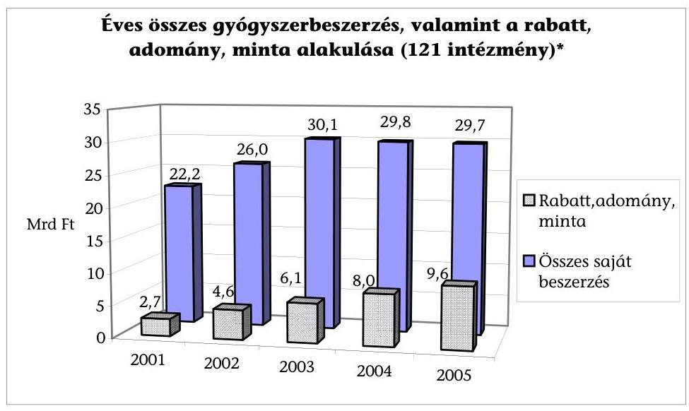

* Az összehasonlítást torzítja, hogy 2001-ben az intézmények 31\%-a, 2002ben $22 \%$-a, 2003-ban $21 \%$-a, 2004-ben $16 \%$-a, 2005-ben $13 \%$-a sem a rabatt, sem az adomány, sem a minta összegére, továbbá a kórházak 10 $13 \%$-a az adomány és a minta összegére, valamint 1-3\%-a a rabatt értékére egyik évre sem tudott adatot szolgáltatni.

A kérdőívvel felkeresett intézményeknél (nem teljes körű adatszolgáltatás mellett), a vizsgált időszakban a térítésmentesen beszerzett gyógyszerek értéke az összes gyógyszerbeszerzés arányában 11,6\%-ról 24,7\%-ra növekedett.

A kórházaknak térítésmentesen vagy kedvezménnyel jutatott gyógyszerek (ide nem értve a gyógyszerkipróbálásra szánt készítményeket) négy kategóriába sorolhatók: ingyen minta, adomány, rabatt, igen alacsony képviseleti értéken el-

---

adott gyógyszer. A négy kategória adóügyi és számviteli nyilvántartásának szabályait a 2. sz. táblázat tartalmazza. ${ }^{54}$

A gyógyszerismertetést végző személy térítésmentes mintát adhat, jogosultanként évente legfeljebb két csomagolási egységet, az intézeti főgyógyszerész útján. A mintán fel kell tüntetni, hogy "ingyenes orvosi minta, kereskedelmi forgalomba nem hozható." Az átadás tényét kötelező tartalmú jegyzőkönyvbe rögzítik, amelynek egy példányát az intézeti főgyógyszerész őrzi, és aki a mintát az intézet gyógyszernyilvántartásában és készletében ármegjelölés nélkül tünteti fel. A helyszínen vizsgált intézmények mindegyike vezet nyilvántartást a térítésmentes termékmintákról, 11 írásban is rögzítette kezelésük módját. A kérdőíven megkeresett intézmények mindössze $2 \%$-a nem tartja nyilván a mintaként kapott gyógyszert, $12 \%$ szabályozta az orvos-látogatóktól érkező minták kezelését az osztályokon.

Karitatív célú térítésmentes adományt olyan egészségügyi vagy szociális intézmény, illetve karitatív szervezet kaphat, ahol a felhasználás szakmai feltételei és az ellenőrzés biztosított. Az átadásról kötelező tartalmú jegyzőkönyv készül. A terméken fel kell tüntetni, hogy gyógyszeradomány, kereskedelmi forgalomba nem hozható. Az adományként adható gyógyszereknek mennyiségi vagy értékhatára nincs.

A számviteli törvény rendelkezései alapján a mintát és az adományt a kórháznak térítés nélkül átvett eszközként kell nyilvántartásba vennie, piaci (forgalmi) értéken. ${ }^{55}$ A szakmai nyilvántartást meghatározó EüM rendelet ${ }^{56}$ szerint a beszerzett (nem nulla forintért vásárolt) készletet mennyiségben és (beszerzési áron) értékben, míg az adományt és az ingyen mintát mennyiségben kell nyilvántartani. A gyógyszer-nyilvántartás tartalmának számviteli és szakmai szabályai nincsenek összhangban. Az intézmények a szakmai szabályozásra való hivatkozással sértik meg a számviteli törvényt.

Számviteli szempontból a rabattot - a PM állásfoglalása ${ }^{57}$ értelmében - engedményként kell kezelni, és azonos gyógyszerben adott engedményt átlagáron, a más gyógyszerben kapott engedményt - természetbeni engedményként - a teljes számla szerinti értéken, az ellenértékért kapott gyógyszert az engedménnyel csökkentett beszerzési áron kell nyilvántartani.
„A rabatt nincs definiálva és azt sem a számviteli jogszabályok, sem az adótörvények nem szabályozzák, ezért azt csak akkor lehet engedményként elszámolni, ha az arra vonatkozó felek közötti megállapodás megfelel a jogszabályi feltételeknek .... a számviteli

[^0]
[^0]:    ${ }^{54}$ A PM állásfoglalásával összhangban.
    ${ }^{55}$ A számvitelről szóló 2000 . évi C. törvény 50. § (4) bek. és az államháztartás szervezeti beszámolási és könyvvezetési kötelezettségének sajátosságairól szóló 249/2000. (XII. 24.) Korm. rendelet 32. § (4) bek.
    ${ }^{56}$ Az intézeti gyógyszerellátásról szóló 34/2000. (XI. 22.) EüM rendelet, 7. § (2) bek. ag) és b) pont; (4) bek. b) pont.
    ${ }^{57}$ PM levél: ikt. sz.: 6100/9/2006., Hiv. sz.:1470-6/2006-0008GYO

---

törvény külön nem nevesíti az áruban, természetben kapott engedményeket csak a pénzben kapott engedményekről rendelkezik....A számviteli törvény „tartalom elsődlegessége a formával szemben alapelve értelmében a gazdasági eseményeket a gazdasági tartalmuk szerint kell megítélni, így ha külön nem rendelkezik egy gazdasági esemény elszámolásáról a törvény, akkor azt tartalma szerint az ahhoz hasonló gazdasági eseményekkel azonosan indokolt kezelni. Ezért bár a természetben kapott engedményekről külön nem rendelkezik a számviteli törvény, azokat tartalmuk szerint kell megítélni mivel a kapcsolódó adótörvények is elfogadják engedménynek - és besorolni a jelenlegi engedménykategóriák közé."

A tanúsítványi adatok alapján 16 kórház nyilvántartása nem felel meg a számviteli törvénynek, mivel sem az adomány, sem a rabatt értékére nem szolgáltattak adatot.

Az igen alacsony képviseleti értéken eladott gyógyszer beszerzése - a PM álláspontja szerint - termékértékesítésnek minősül a számviteli törvény szerint, ugyanakkor a „a Ptk rendelkezései alapján is aggályosnak tekinthetők az irreálisan alacsony áron ill. 1 Ft-os ellenértéken történő értékesitések".

A vizsgálatba vont minden intézmény vezetett nyilvántartást az ingyenes termékmintákról és adományokról. Azt, hogy az átadott térítésmentes minta, és adomány mindegyike bekerüljön a nyilvántartásba, önmagában az intézményi szabályozás még nem biztosítja. Nem biztosítja ezt az OGYI és az ÁNTSZ által végzett szabályszerűségi ellenőrzés sem, mivel azt nem ellenőrzik, hogy a gyógyszergyártók által adott összes mintát, illetve adományt regisztálták-e az intézeti gyógyszertárban. Az OGYI a gyógyszergyártónál az átadott jegyzőkönyveket ellenőrzi az alapján, hogy azok megfelelnek-e a jogszabályi előírásoknak. Mivel az adományra vonatkozóan korlát nincs, mennyiségi limiteket nem tudnak ellenőrizni. Az ÁNTSZ az intézményben az osztályon lévő gyógyszer dokumentáltságát ellenőrzi, és amennyiben az intézeti gyógyszertárban nem regisztrált gyógyszert talál az osztályokon, ezt szankcionálhatja. Ugyanakkor az adatok nem kerülnek összevezetésre, bár a két hatóság időnként értesíti egymást, ha szabálytalanságot észlel. Az ÁNTSZ a kórházi ellenőrzés során nem tudja, hogy mennyi adomány, minta dokumentumait keresse. Az OGYI a reklámozónál és reklámszolgáltatónál látja az átadott anyagok dokumentumait, de nincs jogosultsága ellenőrizni az egészségügyi intézményeknél, hogy a gyógyszertár ezeket bevételezte-e.

A 64/2003. (X. 31.) ESzCsM rendelet 9. § (2) bekezdésének értelmében a „meghatározott jegyzőkönyv 1-1 példányát a reklámozó vagy a reklámszolgáltató és a gyógyszerek rendelésére és forgalmazására jogosult a kiállítástól számított 5 évig köteles - jegy-zőkönyv-típusonként csoportosítva megőrizni. A jegyzőkönyveket a reklámozónál vagy a reklámszolgáltatónál az OGYI, az egészségügyi szolgáltatóknál az ÁNTSZ megyei (fövárosi) intézete ellenőrzi."

A helyszíni vizsgálat 15 intézeti gyógyszertár nyilvántartási rendszerére terjedt ki. A 3 múködtetésbe adott intézeti gyógyszertárnál az adomány és az ingyen minta az egészségügyi intézményt illeti, a működtető kft. a térítés nélkül beszerzett gyógyszerekről az intézmény számára kimutatást vezet, azt a számviteli nyilvántartásaiban nem szerepelteti. A nagykereskedelmi ár alatti beszerzési árral és a rabattal elért árkedvezményen a kórház és a múködtető kft. a szerződés szerint osztozik.

---

Az áruban kapott rabatt esetén 12 intézményből 5 a rabatt mennyiségével számítja ki a beszerzett termék átlagárát, 5 intézmény a rabattot piaci áron beárazza, 2 intézmény a rabattként kapott terméket nulla forinton veszi be a nyilvántartásaiba, de azzal a megvásárolt termék átlagárát nem csökkenti. Az adomány értékét 8 intézmény nulla forinton tartja nyilván, 4 intézmény piaci áron (pl. utolsó beszerzési áron, átlagáron, bázis áron). Az intézmények közül 4 jelezte, hogy a nulla forintért beszerzett termékeket - informatikailag - egy „adomány raktár"-ba vételezi be, és onnan szolgáltatja ki az osztályoknak.

A gyógyszerfelhasználásra gyűjtött költségadatok a fenti intézményeknél nem pontosak, mert

- az intézeti gyógyszertárból az osztályokra feladott térítésmentes (adomány, orvosi minta) gyógyszerek kiadása nulla forint, mert nem tartalmazzák a térítésmentes gyógyszerfelhasználás értékét,
- a gyógyszerkeretek megállapításakor a térítésmentesen kapott gyógyszerek értéke nem számít bele az osztályos keretekbe, mert egy azon felül lévő extra keretként múködik, amelynek felhasználásában az osztályok különösen érdekeltek.

A kórházi szakellátásban részesült betegek zárójelentésében javasolt gyógyszerelés - ami szoros összefüggést mutat a kórházban beállított készítménnyel hónapokra, évekre meghatározza a gyógyszerszedési szokásokat, amellyel egyben hatást gyakorol adott beteg esetén - és össztársadalmi szinten - a gyógyszerekre fordítandó társadalombiztosítási támogatások volumenére.

A kórházi zárójelentésben a gyógyszerterápiás javaslatot a hatóanyag, a hatáserősség és a gyógyszerforma megjelöléssel kell megadni ${ }^{58}$, azaz a készítmény neve a terápiás javaslatban nem szerepelhet. A minisztérium álláspontja ${ }^{59}$ szerint azonban az alkalmazott terápiát leíró részben a tényleges gyógyszerterápiát kell leírni, amelyben a készítmény neve is szerepel. A terápiás javaslatban a készítmény nevének megtiltása ezért nem vezetett eredményre. A kérdőívvel megkeresett 121 kórház $74 \%$-a a zárójelentésben hatóanyagot, $78 \%$-a pedig a gyógyszer nevét is megjelöli. A helyszíni vizsgálatba vont 15 -ből 13 intézmény feltünteti a zárójelentésen a készítmény gyári nevét (a hatóanyagnévvel vagy anélkül), 2 intézmény jelezte, hogy vannak olyan zárójelentései, amelyeken csak a hatóanyagnév szerepel.

A minőségi és hatékony gyógyszer- és gyógyászati segédeszköz rendelés szabályozásáról szóló 2006. évi XCVIII. törvény ${ }^{60}$ a fekvőbeteg-gyógyintézetekre vonatko-

[^0]
[^0]:    ${ }^{58}$ A társadalombiztosítási támogatással rendelhető gyógyszerekről és a támogatás öszszegéről szóló 1/2003. (I. 21.) ESzCsM rendelet
    ${ }^{59}$ „A zárójelentés az alkalmazott terápia részében a tényleges gyógyszerterápiát kell leírni, míg a beteg távozásakor adott terápiás javaslatnak hatóanyag szerintinek kell lennie."
    ${ }^{60}$ A biztonságos és gazdaságos gyógyszer- és gyógyászatisegédeszköz-ellátás, valamint a gyógyszerforgalmazás általános szabályairól szóló 2006. évi XCVIII. törvény 44. § (1) bek.

---

zóan is előírja, hogy az orvosnak tájékoztatnia kell a beteget a gyógyszeres kezelés alternatíváiról, az azonos hatóanyag tartalmú és gyógyszerformájú készítmények beteget terhelő várható költségei közötti különbségről és a külön jogszabály szerinti helyettesíthetőség lehetőségeiről. Ennek megtörténtét a beteg aláírásával egyidejúleg igazolja. A magasabb gyógyszerköltségű gyógykezelést a betegdokumentációban indokolni kell.

Az intézmény az adományként kapott gyógyszerek „beszerzésénél" és felhasználásakor költség-érzéketlenné válik. A gyógyszergyártók által kínált rabatt és adomány tudatos marketingtevékenység része, elsősorban olyan készítményekre vonatkozik, amelyek a kórházi kezelést és elrendelést követően hosszú távú gyógyszerszedést indítanak el, és amely készítmények a járóbeteg-forgalomban társadalombiztosítási támogatással rendelhetők. Nem jellemző, hogy az intézmények csak a kórházban alkalmazható készítményekből kapnak adományt vagy rabattot. Egyes krónikus betegségek kezelésénél „adomány-verseny" figyelhető meg a gyártók között.

Az alábbi táblázat 5 kórház ${ }^{61}$ adomány adatai alapján készült. Az 5 kórház 2006 első félévében nagykereskedői áron számolva $215,9 \mathrm{M} \mathrm{Ft}$ értékben ( 55600 db ) használt fel gyógyszer adományt. A táblázatban a tíz legnagyobb mennyiségben felhasznált, adományozott ATC csoport szerepel, valamint annak aránya az összes adományozott mennyiséghez viszonyítva. Az első tíz ATC csoportban krónikus betegségek gyógyszerei szerepelnek, így: magas vérnyomás, magas vérzsírszint, cukorbetegség, krónikus pszichiátriai betegségek.

|  |  | ATC | Adomány   felhasználás   (2006. 01-06 hó)   doboz $^{62}$ | Felhasználás az összes adomány \%-ában |
| :--: | :--: | :--: | :--: | :--: |
| 1. | C09A | ACE gátlók önmagukban (vérnyomáscsökkentők egyik csoportja) | 8472 | $15,2 \%$ |
| 2. | A02B | Peptikus fekély kezelésének gyógyszerei | 6302 | $11,3 \%$ |
| 3. | C09B | ACE gátlók kombinációban (vérnyomáscsökkentők egyik csoportja) | 3657 | $6,6 \%$ |
| 4. | C08C | Szelektív kalcium csatorna blokkolók főként érhatásúak (vérnyomáscsökkentők egyik csoportja) | 3176 | $5,7 \%$ |
| 5. | N05A | Antipszihotikumok | 3121 | $5,6 \%$ |
| 6. | C10A | Szérum lipidszintet csökkentő szerek | 2584 | 4,6\% |
| 7. | B01A | Antikoagulánsok (véralvadásgátlók) | 2531 | 4,5\% |

[^0]
[^0]:    ${ }^{61}$ Az Ispotály Kft. által múködtetett 5 intézmény.
    ${ }^{62}$ Kiszerelési egység.

---

| 8. | N06B | Pszihostimulánsok, és nootropikumok | 2296 | $4,1 \%$ |
| :-- | :-- | :-- | --: | --: |
| 9. | C01E | Egyéb szívgyógyszerek | 2265 | $4,1 \%$ |
| 10. | N06A | Antidepresszánsok | 2202 | $4 \%$ |
| $\mathbf{1 - 1 0 .}$ sor összesen | $\mathbf{3 6 6 0 6}$ | $\mathbf{6 5 , 8 \%}$ |  |  |
| Összesen | $\mathbf{5 5 6 0 0}$ | $\mathbf{1 0 0 \%}$ |  |  |

A helyszíni vizsgálatba vont 15 intézménynél adatot gyújtött a vizsgálat 13 újonnan bevezetett készítmény - vérnyomáscsökkentők, vérzsírszint csökkentők, antidepresszánsok, peptikus fekély kezelésének gyógyszerei - értéken és ingyen beszerzett mennyiségéről. (A kiválasztott termékek körét és a kiválasztás szempontjait a 2. sz. függelék tartalmazza.) Minden kiválasztott gyógyszer esetén a térítésmentesen kapott gyógyszer mennyisége jelentősen meghaladta a kórházi vásárlás mértékét. A diagram a 2005-ben a vásárlás és elért rabatt, adomány, térítésmentes minta dobozszámát mutatja be ${ }^{63}$.
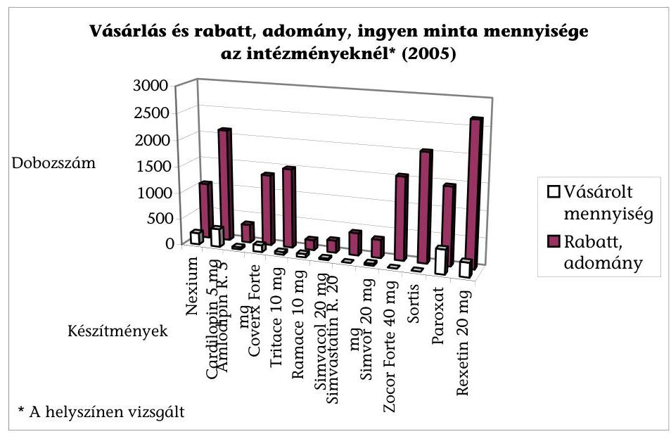

Két olyan intézmény adatai alapján, ahol megoldott az adomány gyógyszerek TAJ szintű nyilvántartása ${ }^{64}$, egyes ellátottak esetén megvizsgáltuk a táblázatban szereplő készítmények továbbfogyasztását (márkahűségét) a kórházi kezelést követő hónapokban az OEP járóbeteg-forgalmi adatbázisa alapján. A diagram ennek a vizsgálatnak az eredményét mutatja be. ${ }^{65}$

[^0]
[^0]:    ${ }^{63}$ A vizsgálat a különböző kiszereléseket összevontan kezelte.
    ${ }^{64}$ Vaszary Kolos Kórház, Esztergom, Szent Pantaleon Kórház Kht., Dunaújváros.
    ${ }^{65}$ A kórházi kezelés időszaka 2006. január-február, a továbbfogyasztás során vizsgált időszak 2006. januártól szeptemberig.

---

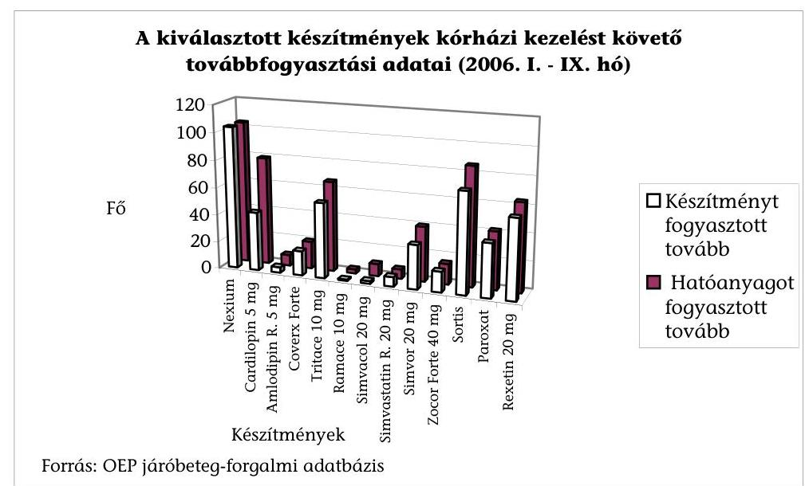

A diagram adataiból látható, hogy a krónikusan gyógyszert szedő betegek 80-90\%-a a kórházi kezelés alatt alkalmazott gyógyszert fogyasztotta tovább a járóbeteg-forgalomban.

A kórházakban alkalmazott promóciós módszert a gyártók mind originális, mind generikus készítményeknél - különösen a bevezetés fázisában - alkalmazzák. A kétféle készítmény adományozásának hatása a járóbeteg-forgalomban a gyógyszertámogatás kiáramlás ütemére gyakorolt hatásában eltérő. Generikus készítmények esetén - hosszabb távon - az adott hatóanyag piacán kialakuló generikus verseny jótékony hatást gyakorol a támogatás-kiáramlás ütemére, annak mértéke a dobozszám növekedési üteme alatt marad, azaz a fogyasztás az olcsóbb generikus készítmények irányába tolódik el. Ez a sikeres „generikus program" jellemzője.
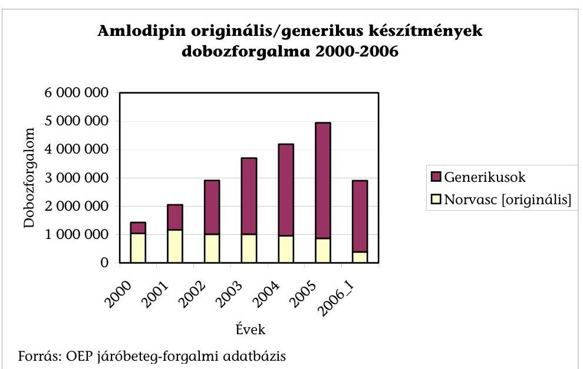

---

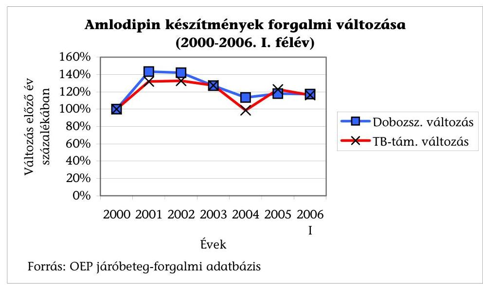

Az ábrák az amlodipin hatóanyag piacán a generikus készítmények térnyerését, és tendenciájában a dobozszám növekedési üteme alatti támogatáskiáramlást mutatnak.

Originális készítményeknél rövid és hosszú távon egyaránt (a generikus készítmények megjelenéséig) a piacrészesedés növekedésével folyamatosan növekszik a támogatás-kiáramlás. A támogatás-kiáramlás növekedési üteme azonos vagy magasabb a dobozforgalom növekedési üteménél. A „fogyasztásban" új piaci szegmens keletkezik. Az originális készítmények drágábbak, mint a hasonló indikációs körben (betegség, tünet) alkalmazott egyéb készítmények, és adott hatóanyag generikus készítményei.
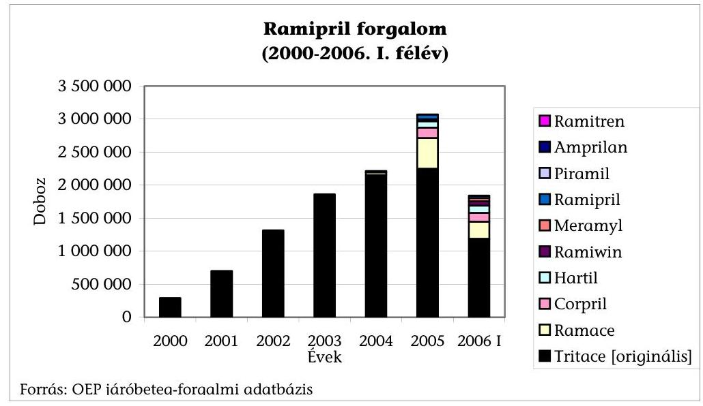

A ramipril hatóanyagpiacán a Tritace az originális készítmény (a fenti ábrán feketével), generikumai 2004-től fokozatosan jelennek meg és dobozforgalmuk „ráépül" az originális termék forgalmára.

---

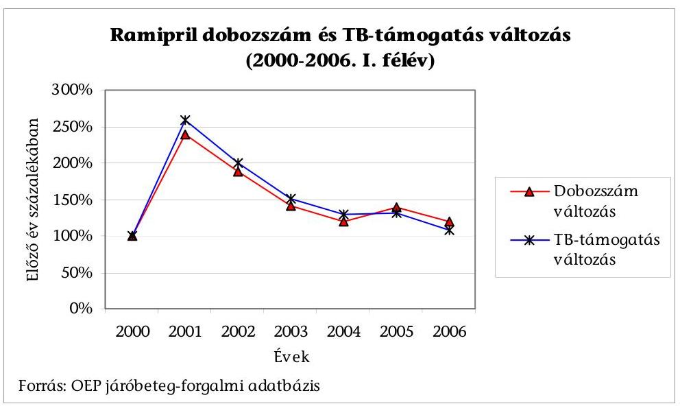

A fenti ábra azt mutatja, hogy a ramipril hatóanyag piacán a generikus készítmények megjelenéséig (2005) a TB támogatás növekedési üteme a dobozszám változás felett volt, majd fokozatosan az alá került. A 2. sz. függelék - további hatóanyagok kórházi marketingjének és járóbeteg-forgalmi adatainak összefüggését mutatja be.

A Minisztérium nem végzett vizsgálatot, elemzést a kórházi és a járóbeteggyógyszerforgalom összefüggésének feltárására, és ezt az OEP-től sem várta el. A gyógyszergyártók kórházi marketing eszközeinek alkalmazása - a kórházi gyógyszer-felhasználási adatok ismeretének hiányában - ágazatirányítói, finanszírozói kontroll nélkül valósul meg.

# 2.2. A gyógyszerfelhasználás 

### 2.2.1. A keretgazdálkodás

Az osztályos keretgazdálkodási rendszer kialakítása általánosan alkalmazott eszköz a kórházi kiadások féken tartására. Az osztályos keretek kialakítása jól illeszthető a költségvetési tervezéshez, a bázis szemléletű kialakítás a korábbi évek gyógyszer-felhasználási gyakorlatát veszi alapul, a teljesítményszemléletű pedig az osztálytól elvárt teljesítmény arányában határozza meg a gyógyszerkeretet. A kérdőív adatai szerint a 121 válaszadó közül 106 intézmény határozott meg gyógyszerkeretet a fekvőbeteg-osztályai számára.

A helyszíni vizsgálatba vont intézmények mindegyike múködtet gyógyszer keretgazdálkodást. A tervezést 10 intézménynél bázis alapú, 2 intézménynél teljesítmény arányos, 2 intézménynél kombinált gyógyszer-keret meghatározással végzik. A keretek betartását minden helyszínen nyomon követik, a keret túllépését indokolni kell. A gyógyszerkeretek betartása 2 intézménynél kapcsolódott érdekeltségi rendszerhez, de ebből egy helyszínen múködött a gyakorlatban, a Zalai Kórházban.

---

Az intézmények, ahol a térítésmentesen érkező gyógyszereket érték nélkül tartják nyilván, ott ezek a készítmények nem képezik részét az osztályos gyógyszerkeretnek. Az osztályok ilyen esetekben a felhasználáskor előnyben részesítik az adomány gyógyszereket, mivel azok nem terhelik a gyógyszerkeretet. Az „ingyenes" gyógyszerek ezekben az intézményekben a megállapított gyógyszerkereten felüli extra keretként múködnek.

A helyszíni vizsgálat tapasztalata, hogy a keretgazdálkodói rendszer akkor tölti be a célját, ha a keretek nem irreálisan alacsonyak, de csak felelős gyógyszergazdálkodás mellett tarthatóak.

# 2.2.2. A kórházi gyógyszerkészletek alakulása 

A gyógyszertári és osztályos készlet adatokat a következő ábra szemlélteti.
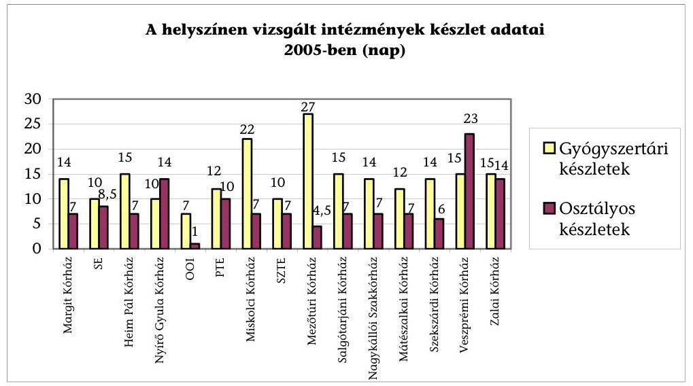

A kérdőívvel megkeresett intézeti gyógyszertárak átlagban 12,8 napi készletet tartanak, az osztályos készletek átlagosan 6,6 napra elegendőek. A helyszínen vizsgált intézmények egy kivételével (Mátészalkai Kórház) az osztályos készletnyilvántartást nem számítógéppel végzik, a kérdőívre adott válaszokat az intézmények becsléssel adták meg. A Mátészalkai Kórházban az osztályok és a gyógyszertár on-line kapcsolatban kérhet adatot egymás készletéről. Szintén a rendszeren keresztül történik az osztályok gyógyszerrendelése a gyógyszertárból.

A további 14 helyszínen vizsgált kórházban az osztályok gyógyszerfelhasználásának ellenőrzése a havi gyógyszerkeretek vezetői jóváhagyással és betartásuk ellenőrzéssel valósul meg. A gyógyszertárból az osztályra történő kiadás után az osztályos készletek ellenőrzése, megállapítása csak manuálisan, a főgyógyszerész általi ellenőrzéskor, illetve leltárkor valósul meg. A kórházakban alkalmazott információs rendszerek mindegyike alkalmas kiegészítő modullal az osztályos gyógyszerkészletek nyilvántartására, ugyanakkor a modult vagy nem alkalmazzák, vagy az osztályon a felhasznált gyógyszert nem naprakészen rögzítik a rendszerben. Így a betegszintú gyógyszernyilvántartás nem valósul meg.

---

Az osztályos gyógyszerkészletek csökkentésére 3 intézményben (Nagykállói Szakkórház, PTE, Veszprémi Kórház) hoztak intézkedéseket. A Veszprémi Kórházban önkormányzati biztosi és főigazgatói döntés alapján 2005-től szigorú gyógyszergazdálkodást vezettek be, amely az osztályos gyógyszerkészletek havi leltározását jelenti. Erre azért volt szükség, mert 2005 decemberében az osztályok készlete elérte a 39 napot. Jelenleg a kórházban a gyógyszertári készlet 15 nap, az osztályos készletek 20-25 nap között mozognak. A PTE-en az intézkedések az osztályos gyógyszerkészletek csökkentésére irányultak.

A konszignációs raktár a felhasználó készletének minimalizálását szolgálja.

A helyszínen vizsgált intézmények közül 6 kórházban (Miskolci Kórház ${ }^{66}$, Veszprémi Kórház, Zalai Kórház, Nyírő Gyula Kórház, Margit Kórház, SZTE) működtetnek konszignációs raktárt. A Zalai Kórházban, a Margit Kórházban és a Nyírő Gyula Kórházban csak egy-egy termékcsoportra (pl. haemokultúrás táptalajokra, humán albuminra, infúziós termékekre) alkalmazzák ezt a technikát. Azok az intézmények, amelyek a teljes gyógyszerkészletre konszignációs szerződést kötöttek, a kórház által finanszírozott gyógyszerkészlet csökkenését mutatták ki.

A Miskolci Kórház a gyógyszertár működtetésbe adása előtt alkalmazta a konszignációs raktárt, így készletei 17 napról 8 napra csökkentek. A Veszprémi Kórházban a konszignációs raktározás következtében 11 napos készlettel rendelkezik a Kórház.

A kérdőívvel megkeresett 121 intézmény harmadában (38) konszignációs raktárt működtető kórházak átlagos gyógyszertári készlete 11,46 nap, a konszignációs raktárt nem működtető kórházak gyógyszertári készlete 14,8 napra elegendő. A konszignációs raktárt nem működtető csoportban 9 intézmény 30 napos vagy annál nagyobb gyógyszerkészletet tart, és ők „rontják" a csoportátlagot. Nélkülük e csoport átlaga 12,32 nap lenne, tehát nincs szignifikáns különbség a két csoport között. Így a 112 kórházban a készletek átlaga független attól, hogy az intézmény működtet-e konszignációs raktárt vagy sem.

A kilenc 30 napnál magasabb készletet tartó kórház éves gyógyszerköltsége 8 és 650 M Ft között szór, és a kórházak mérete is eltérő. Hasonló méretű kórházak működnek 30 napnál alacsonyabb készletekkel, így a méretük nem indokolja a 30 napot meghaladó gyógyszerkészletet. A helyszíni vizsgálat ezeket az intézményeket nem érintette, így a 30 napos vagy annál nagyobb készletek indokáról nincs információ.

[^0]
[^0]:    ${ }^{66}$ A Miskolci Kórházban 2006-ban megszűnt a konszignációs raktár.

---

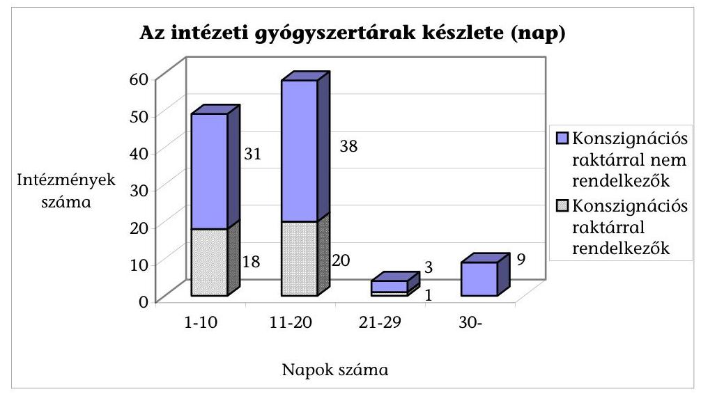

A helyszínen vizsgált intézményekben a 2005-ben selejtezett gyógyszerek értéke az összes gyógyszerköltség 1\%-át egy kórház kivételével nem érte el.

A selejtezések okának az intézmények elsődlegesen a lejárt szavatosságot jelölték meg. Előfordult a selejtezés indokaként például a gyógyszer alaplistáról való lekerülése, orvos váltás, új FoNo miatti lejárati idő megváltozás.

A leselejtezett gyógyszerek között 5 gyógyszertárban jelentős mennyiségű adomány gyógyszer is szerepelt. A selejt értékének csökkentésére 4 kórházban hoztak intézkedéseket. Miskolcon és a Nyírő Gyula Kórházban a gyógyszerek lejáratának figyelését rendelték el. A Mátészalkai Kórházban a lejárat előtt egy hónappal az osztályok kötelesek a gyógyszertár részére a gyógyszereket átadni. A Nagykállói Szakkórházban az intraneten teszik közzé az osztályokon fel nem használt gyógyszereket, hogy más osztályok számára hozzáférhető legyen.

# 2.2.3. A gyógyszerfelhasználás nyomonkövetése, ellenőrzése 

A helyszíni vizsgálatba vont intézmények mindegyike kialakította a gyógyszerfelhasználás nyomon követésének informatikai feltételét, a rendszerek alkalmasak a készletek, az osztályos gyógyszerrendelések és a keretek figyelésére, nyilvántartására. 11 intézmény informatikai rendszere alkalmas egyedi gyógyszerelés adminisztrációjára, gyógyszerre vonatkozó betegszámla készítésére. Intézményi szintű egyedi gyógyszerfelhasználás figyelés azonban csak egyetlen intézményben valósul meg, 2 intézményben részlegesen ${ }^{67}$, további 2 intézményben fejlesztés alatt van.

A leggyakoribb 10 HBCS éves átlagos gyógyszerköltség tartalmáról a tanúsítványt az a 7 intézmény tudta kitölteni, ahol HBCS szintű nyilvántartással rendelkeznek. A 2005. évi adatok alapján például a $015 \mathrm{~F}^{68}$ HBCS-re gyújtött fajla-

[^0]
[^0]:    ${ }^{67}$ Veszprémi Kórház négy osztályán, és a PTE egy klinikáján kísérleti jelleggel.
    ${ }^{68}$ Cerebrovascularis betegségek (kivéve TIA), praecerebralis érelzáródással speciális kezelés nélkül 18 év felett.

---

gos költségadatok 3189 Ft és 14790 Ft között szórnak, miközben az OEP által kalkulált érték 16274 Ft. A 3. sz. táblázat a tanúsítványi adatok összefoglalását mutatja.

Az egyes intézmények költségadatai jelentősen eltérnek egymástól és az OEP által kalkulált értéktől is. Egyes homogén betegségcsoportok gyógyításának gyógyszerköltségei - betartandó protokollok hiányában - különbözőek, amit bonyolít a gyógyszerköltség számbavételének problémája is (lásd 2.1.3. pontot).

A kérdőívre válaszoló 121 kórházból - a korszerű gyógyszer-adagolási módok közül - unit dose gyógyszerelést 6 intézmény, daily dose gyógyszerelést 26 intézmény végez. A helyszínen vizsgált intézmények közül unit dose rendszert egyetlen intézmény sem alkalmaz, míg 8 intézmény nyilatkozott úgy, hogy daily dose rendszert üzemeltet, ebből 7 úgy, hogy az osztályos gyógyszerkészlete legalább 7 napra elegendő. Az összeszámlálást, és a kérdéskör megítélését nehezíti a fogalmak rendezetlensége. Ezek a technikák klasszikus értelmezés szerint azt feltételezik, hogy a kórházi patika napi vagy napi többszöri betegre szabott gyógyszer kiszerelést végez, miközben osztályos készlet nincs vagy csak sürgősségi készítményeket tartalmaz.

Az intézetek megítélése szerint a korszerű nyilvántartási és adagolási technikák alkalmazása nem jár kimutatható megtakarítással, viszont jelentős többletterhelést ró a (gyógyszertári/osztályos) személyzetre. Azt azonban minden érintett elismeri, hogy nagyobb átláthatóságot és számonkérhetőséget biztosít.

Jogszabály ${ }^{69}$ szerint az intézeti főgyógyszerész legalább évente két alkalommal ellenőrzi az osztályokra kiadott gyógyszerek mennyiségét, a tárolás feltételeit valamint a tárolásra vonatkozó szabályok érvényesítését. A helyszínen vizsgált intézmények közül 4 helyszínen (SZTE, SE, Salgótarjáni Kórház, Heim Pál Kórház) az osztályos készletek főgyógyszerészi ellenőrzése nem volt dokumentált. A Mátészalkai Kórházban évi egy leltár dokumentált, a Nyírő Gyula Kórházban 2001 és 2005 kivételével - nem történt ellenőrzés. Az OOI-ben az ellenőrzési napló csak általánosságokat tartalmaz.

# 2.3. A kórházak gyógyszertartozása, az adósságállomány csökkentésére tett intézkedések 

A helyszínen vizsgált kórházak OEP-től származó bevételhez viszonyított gyógyszerkiadásai (térítésmentes gyógyszerek nélkül) ${ }^{70}$ csökkenő tendenciát mutatnak. (Lásd: a 23. oldal vonatkozó ábráját).

A gyógyszerkiadások OEP bevételekhez mért arányának csökkenése részben az intézmények gyógyszerfelhasználás racionalizálási intézkedéseire, részben pedig a térítésmentes gyógyszerek növekvő arányára vezethető vissza.

[^0]
[^0]:    ${ }^{69}$ 34/2000. (XI. 22.) EüM rendelet 5. § (2) bek. b) pont.
    ${ }^{70}$ Pénzforgalmi szemléletben.

---

A helyszínen vizsgált intézmények 2005. december 31-én a gyári előállítású gyógyszerekre fennállt szállítói állománya az OEP bevételeik arányában 0,7$4,8 \%$ között mozgott. A gyári előállítású gyógyszerek szállítói állománya az összes szállítói kötelezettségből 10,6 és $35,3 \%$ között szórt.
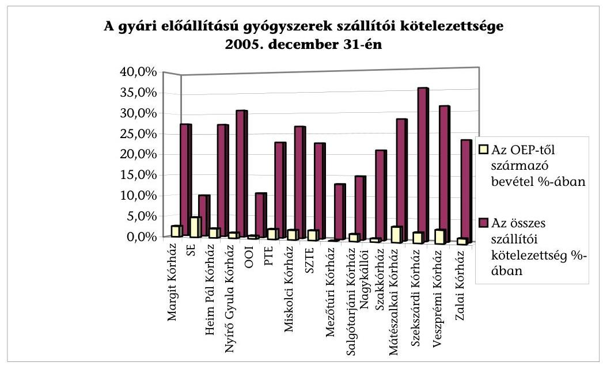

Az intézmények éltek gyógyszertartozásaik átütemezésével. A gyógyszerszállítók rugalmasak a fizetési határidők módosításában és a késedelmi kamatok elengedésében meghatározott feltételek esetén (pl. a kórház bizonyos értékű forgalmat vállal meghatározott időre). Az átütemezést alkalmazta a Salgótarjáni Kórház, a Veszprémi Kórház, a Nyírő Gyula Kórház, a Margit Kórház, a Mátészalkai Kórház, a SZTE, az SE.

A kórházak kedvező fizetési feltételeket tudnak a gyógyszerszállítóknál elérni, 45-60 vagy akár 120 napos fizetési határidővel (SE). A fizetési határidő kitolása az intézmény számára átmenetileg a lejárt határidejű adósságállományt csökkenti. Az OOI 15 napos fizetési határidőre szerződött a szállítókkal, és nem rendelkezett a gyógyszerszállítók felé lejárt tartozással. Hat intézménynek lejárt tartozása volt a gyógyszerszállítóknak 2005. december 31-én (SE, PTE, SZTE, Mátészalkai Kórház, Veszprémi Kórház, Heim Pál Kórház).

Három intézménynél (SE, PTE, Veszprémi Kórház) a fennálló lejárt szállítói állomány a gyári gyógyszerekre 511 M Ft, 283 M Ft és 155 M Ft volt. Az összegek az összes szállítói állományból $9,95 \%, 14,96 \%, 23,96 \%$-ot tettek ki, tehát a gyógyszertartozások az intézmények eladósodásában nem játszottak meghatározó szerepet. Mindhárom intézmény jelentős adósságállományt halmozott fel, részesült az adósságkonszolidációs program keretében támogatásban.

A Veszprémi Kórházban a tulajdonos önkormányzat 2005-től önkormányzati biztost nevezett ki. Megtörtént a gyógyszergazdálkodás felülvizsgálata és a szállítókkal új szerződési feltételeket alakítottak ki, melynek következtében a fizetési határidők is kitolódtak. A SE-n 2003-tól új vezetési-szervezési módszereket vezettek be, amelyet a 2002. évi konszolidációs program intézkedési terve is tartalmazott. A PTE-n kincstári biztost neveztek ki, aki 2004-2005-ben intézkedéseket ho-

---

zott az adósságállomány illetve a gyógyszertartozás csökkentésére, ennek keretében keretgazdálkodást vezettek be.

# 2.3.1. Az adósságkonszolidációs program 

Az ÁSZ ${ }^{71}$ hivatkozott jelentése szerint az ellátórendszer konszolidációjának és szerkezeti átalakításának részeként 2002-ben az eladósodott intézmények, kórházak pénzügyi rendezését jelölték ki. A támogatásra a 2002. október végi adósságállomány alapján jelentkezhettek az intézmények. Az adósság rendezéséhez a fenntartónak is hozzá kellett járulnia, és az intézményeknek a fenntartható működést megalapozó struktúra átalakítást elősegítő intézkedéseket kellett vállalnia. A konszolidációs-reorganizációs célelőirányzatra, az ún. adósságkönnyítési programra, 3 Mrd Ft állt rendelkezésre. A struktúraváltást megalapozó szakmai stratégiai terv nem készült. Az adósságot sikeresen rendező intézményeknél a szerződést módosították, és a támogatást visszteher nélkülivé alakították. Így a kórházak 2,1 Mrd Ft visszatérítésétől mentesültek.

A helyszínen vizsgált intézmények közül 5 részesült az adósságkönnyítési program keretében támogatásban (Salgótarjáni Kórház, Veszprémi Kórház, PTE, SZTE, SE). A Salgótarjáni Kórháznak nem volt az intézkedési tervében a gyógyszergazdálkodásra vonatkozó cél. Az 1,5 Mrd Ft adósságot felhalmozó PTE-et kizárták a programból. Három intézményben volt gyógyszergazdálkodással kapcsolatos célkitúzés, amelynek megvalósulása részleges eredményt hozott.

A Veszprémi Kórházban két célt fogalmaztak meg a gyógyszergazdálkodással kapcsolatban. Egyrészt a gyógyszergazdálkodás közremúködői szerződéssel történő ellátását, amelyről később a közgyűlés nem határozott. Az intézkedési terv kórházra vonatkozó céljai között a keretgazdálkodás bevezetése, valamint a gyógyszerköltség és betegszintű költségelemzés megvalósítása szerepelt. A betegszintű költségelemzéshez szoftvert vásároltak, amelyet 4 osztályon kísérleti jelleggel alkalmaznak, a kórház szintjén nem valósult meg.

A SzTE-n az intézkedési terv tartalmazta a gyógyszergazdálkodási informatikai rendszer bevezetését. 2005-ben a gyógyszermodult a gyógyszertárban és a Klinikai Központban bevezették, amely kapcsolódik a gazdasági nyilvántartási rendszerhez. Egyéni szintű gyógyszerfelhasználás követésére a Pszichiátriai Klinikán kísérleti program indult, de egyetemi szinten nem valósult meg.

A SE intézkedési terve a „gyógyszergazdálkodás átalakítását és protokollok bevezetését" tartalmazta. Ennek keretében az egyetemen gyógyszeralaplistát alakítottak ki és közbeszerzési eljárást folytattak le. Az intraneten gyógyszeradatbázist üzemeltetnek. Integrált informatikai rendszer bevezetését kezdték meg. A gyógyszerfelhasználást az osztályokig követik, betegszintű követés nem valósul meg.

[^0]
[^0]:    ${ }^{71}$ Az ÁSZ 0222. sz. jelentése az Egészségügyi Minisztérium fejezet múködésének ellenőrzéséről.

---

# 3. Az onkológiai ellátáSSal KAPCSOLatos GYÓGYSZERGAZDÁlKODÁs 

### 3.1. A kemoterápiás ellátások finanszírozásának átalakítása

A 2004-2006 közötti Kormány „21 lépés a magyar egészségügy megújitásáért" programja célul tűzte ki a daganatos betegek ellátásának javítását, a szakmai követelményeknek megfelelő ellátó kijelölését ${ }^{72}$.

A különkeretes kúraszerű ellátások finanszírozásának átalakítására - részbeni kettős finanszírozás megszüntetésére - az ÁSZ is tett korábban ${ }^{73}$ javaslatot. Az Onkológiai és Sugárterápiás Szakmai Kollégium pedig az engedélyeztetési folyamat rövidítését, az alkalmazott gyógyszerek protokollba építését javasolta.

Az átalakítási folyamatban az operatív döntés-előkészítő feladatokat az V-ös bizottság végezte, a következő kiemelt szempontok alapján: gyors bevezetés; a ráfordítások további emelkedésének fékezése; a hozzáférés idejének rövidítése; protokollokon alapuló szakmai dominancia súlyának növelése.

A fenti célok megvalósításának menete volt:
A) A solid (nem vérképzőszervi) daganatok kúraszerű ellátásának esetén a korábbi, a tumor lokalizációjától függő finanszírozás átalakult és alapjául az ellátás költsége, elsősorban az ellátási protokollban szereplő gyógyszerek költsége lett a meghatározó A finanszírozás alapjául szolgáló gyógyszer protokollokat és azok indikációs területét az Onkológiai és Sugárterápiás Szakmai Kollégium állította össze.

A gyógyszerköltség számítási módja a következő: a protokoll alapján szükséges gyógyszer mennyiségének (gyógyszer $\mathrm{ml} / \mathrm{m} 2 \times 1,75 \mathrm{~m} 2$ ) és árának (adott hatóanyag legolcsóbb készítménye 1 ml -re vetített ára) szorzata. Különkeretes készítmények esetén a finanszírozó $10 \%$ rabattot vett figyelembe.

A gyógyszerek mennyiségének pontos meghatározása az intézményeket a készítmények szoros elszámolására és gazdaságos felhasználására ösztönzi. A protokollok költségeiben szerepet kapott a kiegészítő (supportív) gyógyszeres terápia költsége, amelynek alapja az 1998-1999-es költséggyűjtés során felmért kiegészítő gyógyszeres terápia mai árakra átárazott költsége.

A HBCS-be épített további, nem gyógyszerköltség elemek: naparányos közvetett költség a fekvőbeteg-ellátással azonos mértékben, a protokoll napjainak száma + 2 nappal számítva, egyszer használatos eszközök költsége, vérköltség. Az ellátási protokollokat teljes áruk alapján a finanszírozó csoportokba rendezte, és a ha-

[^0]
[^0]:    ${ }^{72}$ Az egészségügyi szolgáltatások nyújtásához szükséges szakmai minimumfeltételekről szóló 60/2003. (X. 20.) ESzCsM rendelet 2. számú melléklete - a jelentés írásának időpontjában - 48 kórházat jelölt ki onkológiai kemoterápiás ellátás végzésére.
    ${ }^{73}$ Az ÁSZ 0448. sz. jelentése a gyógyszerek támogatási és finanszírozási rendszerének a fogyasztás helyzetének ellenőrzéséről.

---

sonló költségű eseményekből új HBCS-kat alakított ki. Megnevezésük: 959 A-L, (HBCS*).

A HBCS-kbe foglalt gyógyszertartalmat az alábbi ábra szemlélteti:
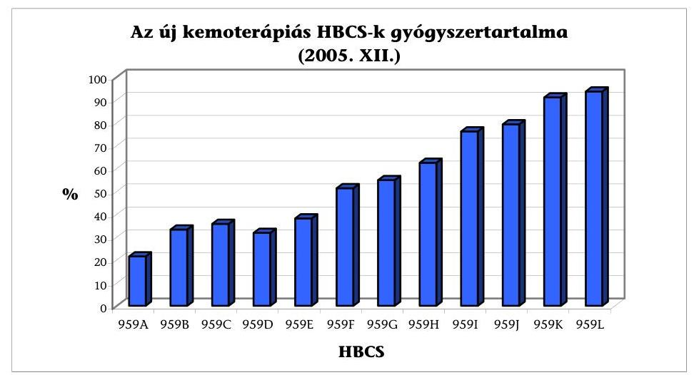
B) A különkeretes készítményekre elkülönített összeg átkerült a gyógyítómegelőző kasszába, a korábbi beszerzésének költsége az intézményekhez került, ezért 37231,8 súlyszámot ( 4989 M Ft ) az onkológia centrumok között TVK (teljesítmény volumen korlát) növekményként a finanszírozó - a megelőző év felhasználásának arányában - szétosztott.

A különkeretből HBCS finanszírozásba került készítmények 2005. évi tényleges beszerzési költsége 5,1 Mrd Ft volt, míg az E. Alap költségvetésében - a különkeretes kasszából a gyógyító- megelőző kasszába - 11 hónapra 6,2 Mrd Ftot csoportosítottak át 2006-ra.
C) A korábban kúraszerű ellátást nyújtó intézmények száma csökkent, onkológiai kúraszerű ellátásra kompetens ellátó centrumok jöttek létre.

Egy 2002. évben készült felmérés74 adatai szerint 436 ellátó helyről75 jelentettek kemoterápiás ellátást, melyből 78 helyen 1,41 helyen 2,365 helyen pedig évi 100-nál kevesebb beteget láttak el, azaz nem tekinthetők kompetens intézménynek. A finanszírozás átalakításával 48 intézmény szerzett jogosultságot a solid tumoros betegek kúraszerű ellátásának OEP finanszírozására.
D) A megszűnő ellátó helyek TVK-ját a Szakmai Kollégium javaslata szerint a centrumok közötti betegvándorlás iránya alapján - a finanszírozó szétosztotta.

[^0]
[^0]:    ${ }^{74}$ Vélemény a daganatos (solid tumoros) betegségek kezelésének finanszírozási kérdéseiről 2004 V-ös Bizottság 29-6/2004. sz. javaslatának melléklete.
    ${ }^{75}$ Egy intézményen belül több ellátó hely (osztály) lehet.

---

A helyszíni vizsgálatba vont intézményeknél a súlyszámok leosztása nem volt problémamentes. A gyakorlatban (OOI) 6716 - a korábbi különkeretes felhasználás alapján számított - súlyszámmal szemben 4217 leosztása történt meg. Év közben az OEP korrigált.

Az ellátás finanszírozási szerkezetének összehasonlítását a 2005. év hasonló időszakával nehezíti a korábbi és az új HBCS-k alkalmazásának eltérő logikája. Korábban a terápiához szükséges készítményeket az OEP szerezte be, a betegért kapott súlyszám tartalmazta az átlagos gyógyszerköltséget, és a beteg/intézmény „ingyen" kapta a drága készítményeket (kettős finanszírozás). Az általános kemoterápiás HBCS súlyszáma 1,07259 (143 727 Ft) volt, ami sok alkalmazott protokoll valósan felmerült költségét meghaladta. Az átalakult finanszírozásban, ha az ellátásért kapható finanszírozási összeg magas, akkor az alkalmazott gyógyszerterápia költsége is az, így nem mutat gazdasági érdek egyik-vagy másik HBCS választásának irányába.

Az alábbi ábrán mind az „olcsó" (959B, 959C, 959D), mind a „drága" (959 I, J, K, L) HBCS-k megjelennek, ezen túl összehasonlítja, hogy az egyes HBCS-kre jutó valós kifizetések hogyan viszonyulnak a finanszírozónak a költségszámításokkal megalapozott elvi költségeihez.
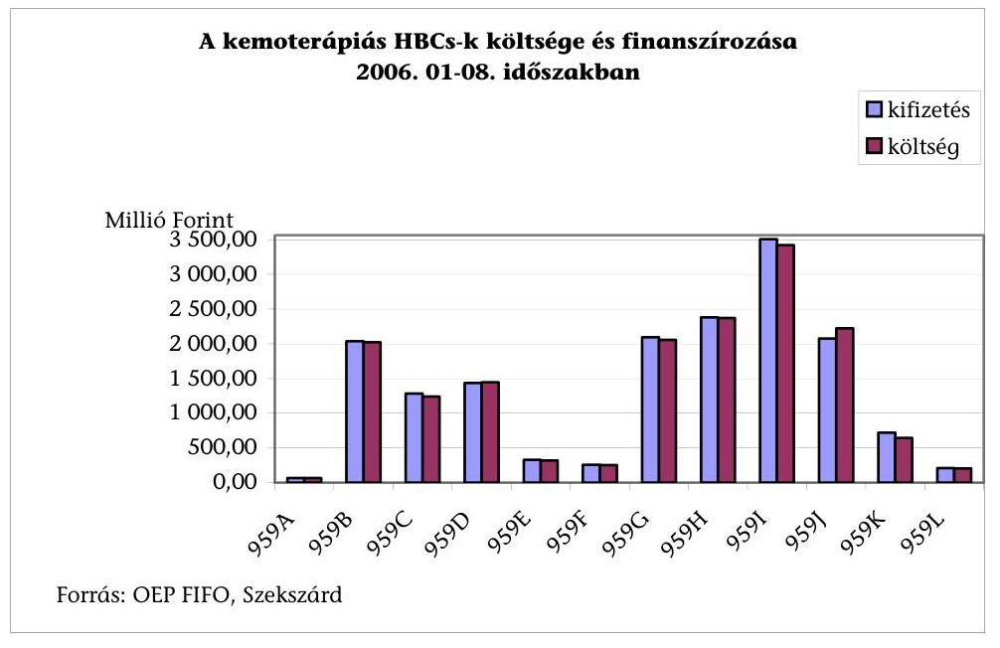

A költség-számítások alapját képező kemoterápiás protokollok indikációja (a protokoll kiválasztásának előre rögzített kritériuma) nem egységes. Egy 2004ben végzett GYÓGYINFOK elemzés szerint az azonos szervi elhelyezkedésű daganatok (emlő) ellátása során a különböző intézmények eltérő protokollválasztási „szokásokat" mutattak, amelyet a következő ábra mutat be 3 intézmény adataival.

---

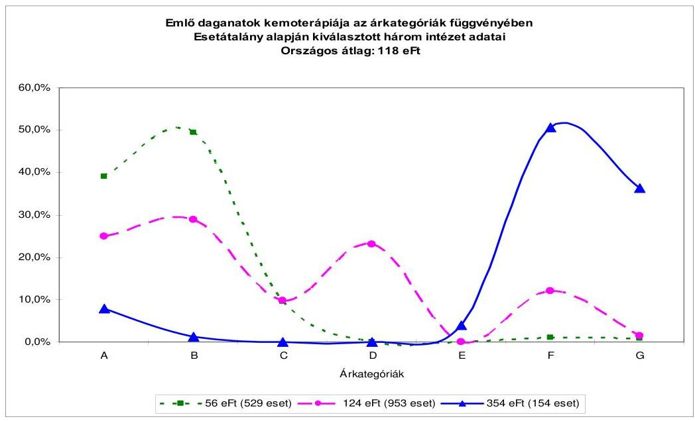

Forrás: GYÓGYINFOK
A kúraszerű ellátások finanszírozás-változásának hatására megemelkedett az intézményi onkológiai osztályok súlyszáma és gyógyszerköltsége. Az onkológiai osztályok TVK-jának és gyógyszer-keretének nem arányos növelése az egyes intézményeken belül, az ellátást az „olcsó" protokollok irányába vagy az ellátott betegszám korlátozásának irányába terelheti.

Az OEP elemzése összehasonlította a 2005. decembertől 2006 júliusáig tartó időszak adatait a megelőző év hasonló időszakával. Országos átlagban 1,685-ről 1,775-re növekedett az egy betegre jutó átlagos súlyszám, az ellátott betegek száma 68800 -ról 64567 -re (4233) csökkent, és az intézmények jelentős, 1248 súlyszámnyi időarányos TVK maradványt halmoztak fel.

Az egy betegre jutó súlyszám növekedése jelzi, hogy az ellátások a korábbinál drágább protokollok felé tolódtak el. A betegek számának csökkenése a tavaly ellátott betegek százalékában 6,2\%.

A protokollok megalkotása és bevezetése során számos vitás kérdés/kritikai megjegyzés merült fel a kúraszerű ellátást alkalmazó egészségügyi intézmények, az Onkológiai és Sugárterápiás Szakmai Kollégium irányából a finanszírozó felé a protokollok költségszámításával, és annak megalapozottságával kapcsolatosan. A bevezetést követően ezért négy intézmény önként vállalta, hogy az újonnan bevezetett kemoterápiás HBCS-k közvetlen költségeire vonatkozóan költséggyűjtést végez. A költésgyűjtés, bár nem volt reprezentatív, mégis két ponton: az átlagos testfelszín (vizsgálati eredmény $1,74 \mathrm{~m}^{2}$, szemben a finanszírozott $1,75 \mathrm{~m}^{2}$-el) és az átlagos ápolási nap tekintetében (vizsgálati eredmény 4 nap, szemben a normatívan finanszírozott 5,29 nappal) az OEP FIFO korábbi számításait igazolta vissza. Az adatgyűjtés a kemoterápiás gyógyszerköltség és a kiegészítő gyógyszeres terápia költsége vonatkozásában nem volt értékelhető, az adatok nagy szórása és az adatszolgáltatás minősége miatt.

Az átalakított finanszírozás szerinti ellátásban jelentett kemoterápiás protokollokra folytatott intézményi fedezet számítások igazolják, hogy a valós költségek

---

és a kúra ellátás tényleges finanszírozásának, korábbi pozitív egyenlege kevesebb lett, de megmaradt.

Az OOI-ban használt leggyakoribb 29 protokollból 10-nél mutatkozik, hogy a HBCS-ben elismert gyógyszer költség nem nyújt fedezetet az intézeti gyógyszer költségre, a fenn maradóknál viszont akár 300 E Ft többletbevétel is keletkezhet. A fedezet pozitív egyenleget mutató alakulása a helyszíni vizsgálat alkalmával a Szekszárdi Kórház, a PTE, a SE, a Veszprémi Kórház, a Salgótarjáni Kórház esetében is egyértelműen igazolható.

Az intézmények menedzsmentje - a szakma bevonásával - folyamatosan figyelemmel kíséri a protokollok alkalmazásának gazdaságossági hatását. A protokollok kötelező betartását főigazgatói utasításban szabályozták például a Margit Kórházban és az OOI-ben. A szegedi Onkoterápiás Klinikán az onko-team dönt az alkalmazható terápiáról, a Veszprémi Kórházban az orvosigazgató fogadja be a beteget az ellátásba, annak valamennyi paraméterének meghatározásával, a SE-n az egyetem országos szakfelügyelője ellenőrzi a protokollok betartását. A protokolltól eltérés helyszínen tapasztalt legszigorúbb szankcionálása a főigazgatói figyelmeztetés volt az OOI-ben.

A gyógyszerek indikációja és a megjelölt daganattípusok között nincs teljes egyezés, azaz egyes gyógyszerek adott daganattípus ellátására nincsenek törzskönyvezve. Az OEP FIFO felmérése szerint a jelenleg nyilvántartott 315 érvényes protokoll közül 136 felel meg mindenben az indikációs körnek, 125-nél a diagnózisok részben eltérnek az indikációs körtől, 32 protokoll a Pharmindexben nem szereplő gyógyszert tartalmaz, 22-nél egyik diagnózis sem egyezik az indikációs körrel. A gyógyszerek daganattípusonkénti törzskönyvezését a gyógyszergyártók tudják kérvényezni. Klinikai vizsgálat végzésére vonatkozó engedély hiányában egy gyógyszerkészítmény jóváhagyott indikációján kívüli rendelése és alkalmazása, engedély nélkül végzett klinikai vizsgálatnak minősül.

# 3.2. A kúraszerű ellátások gyógyszereinek beszerzése, a beszerzési árak alakulása 

2005 decemberétől a volt különkeretes kemoterápiás készítmények beszerzését az ellátásra kijelölt centrumok végzik. Az OEP által korábban különkeretesként kezelt készítmények -amelyek finanszírozása átkerült a csillagos HBCS-kbe- voltak, a Campto, a Magytax, a Taxotere, a Gemzar és nevű gyógyszerek különböző kiszerelései.

Az ÁSZ felmérésére visszajelzett beszerzési árak jelentősen szórnak és nem jellemző, hogy olcsóbb a citosztatikumok beszerzése azokon a helyeken, ahol a közbeszerzéssel éltek. Az OEP 2005 évben kialkudott árait 100\%-nak tekintve, az egyes készítményeknél a centrumok a Camptonál, a Magytaxnál, a 100\% alatti kategóriákba, míg a Gemzarnál és a Hycamtinnál, az e fölötti és akár a 120\% fölötti kategóriákba sorolódnak, azaz ezeknél nem tudtak az OEP-nél jobb alku pozícióba kerülni. Az intézetek az olcsóbb beszerzést részesítve előnyben a generikus szerek alkalmazására tértek át. Például a Camptonál a 40 mg os kiszerelésnél 8 intézetnél, a 100 mg-osnál 10 intézetnél, ezek árai az OEP általi originális beszerzés 40 és $80 \%$-a közöttiek. A Magytax-nál a generikum ár-

---

arányai hasonlóak. Az intézeteknek a saját beszerzésre való átállás nem okozott gondot, a szállítók rugalmasan alkalmazkodnak az igényekhez és szinte napi árversenyben vannak. Az intézetek az önálló beszerzésben a piac kedvező alakulását az árak mozgását kihasználva az OEP-nél kedvezőbb árakon szerzik be a citosztatikumokat. Az eltérés egyes originális készítményeknél (Campto, Magytax) akár $40 \%$ is lehet. Ugyanakkor a Hycamtint, a Taxoteret és a Gemzárt nem tudták az OEP ár alatt beszerezni a centrumok vagy csak 1; 2\%kal alacsonyabb az ár (4. sz. táblázat) 12 intézet generikumok beszerzésével tudta a költségeket csökkenteni.

Az intézmények citosztatikum beszerzéseihez társuló rabatt és ajándék mennyisége nem mutat összefüggést azzal, hogy a készítmény originális vagy generikus. Változó arányok fordultak elő a beszerzett és a rabattként kapott készítmények között. A néhány darabos vásárlásra éppúgy eshet $50 \%$ rabatt, mint a több száz ampulla vásárlására, de ennek ellenkezőjére is van példa, vagyis a nagy mennyiségú vásárlásra nulla rabatt.

A legnagyobb mennyiségben vásárolt Gemzar kisebb kiszerelésénél 13, a nagyobb kiszerelésénél $14 \%$ a rabatt. A jóval kisebb mennyiségben vásárolt Campto és Taxotere esetében 29-37\% közötti, legkevesebb a rabatt a Magytax 100 mg-os kiszerelésénél. 44 centrum adatszolgáltatása alapján a 2006. I. -IX. hóig terjedő beszerzések és rabattok arányát a következő ábra mutatja.
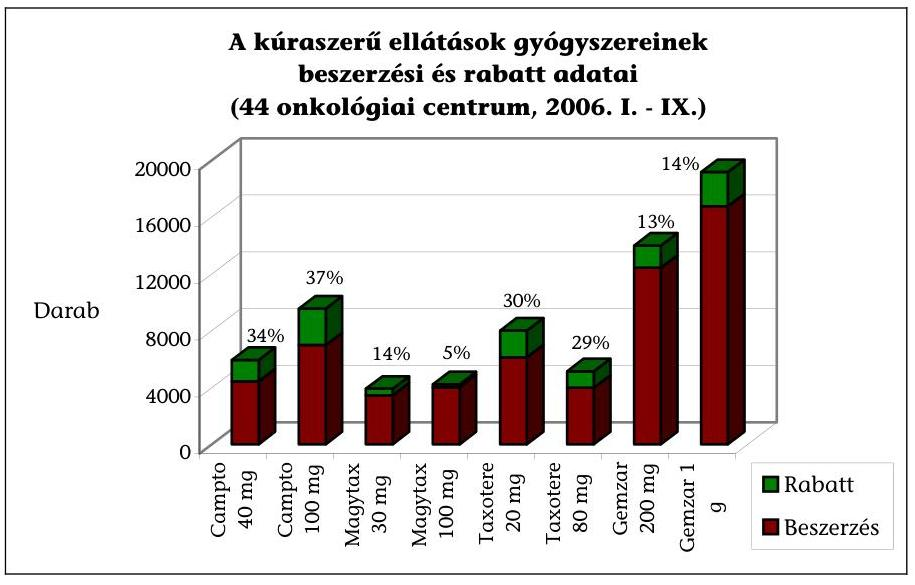

Fentiek szerint a Magytax 100 mg-os kiszerelése kivételével az intézményi rabattok mindenütt meghaladják az OEP által korábban kialkudott rabatt átlagos 10\%-os mértékét. Az új HBCS*-k kialakításakor az ágazatirányító is 10\%-os rabattal számolt.

---

# 4. Az IntÉzeti GyÓGYSZERTÁr MÜKÖDÉSE 

### 4.1. Az intézeti gyógyszertárak múködési feltételei

A helyszíni vizsgálat tapasztalatai feldolgozása idején hatályos szabályozás szerint az intézeti gyógyszertár a kórház részeként létrehozott, annak múködéséhez szükséges teljes körű gyógyszerellátást biztosító intézmény ${ }^{76}$, amelynek létesítése a kórház kérelmére engedélyezhető. Az intézeti gyógyszertár csak az ott ápolt, kezelt betegek ellátása céljából, a kórházi felhasználásra, valamint dolgozói részére szolgáltathat ki gyógyszert, illetőleg gyógyító, megelőző és diagnosztikai célú más anyagokat vagy eszközöket ${ }^{77}$. Intézeti gyógyszertárból csak erre a célra rendszeresített megrendelőlapon, illetőleg orvosi vényen rendelt gyógyszert lehet kiszolgáltatni. A törvény nem szól azon intézeti gyógyszertárakról, amelyek vényforgalmat is bonyolítanak, a népjóléti miniszter rendeletének ${ }^{78}$ melléklete speciális szaktevékenység egy fajtájaként nevesíti (vényforgalmú patika).

A biztonságos és gazdaságos gyógyszer- és gyógyászati segédeszköz-ellátás, valamint a gyógyszerforgalmazás általános szabályairól szóló 2006. évi XCVIII. törvény ${ }^{79}$ a kórházi gyógyszerellátásnak - vizsgált időszakban hatályos rendszerét átalakította. A törvény 3. §-a r) pontja az intézeti gyógyszertárat a fekvőbeteg gyógyintézet részeként múködő intézeti és közvetlen lakossági gyógyszerellátási feladatokat ellátó egészségügyi intézményként definiálja. Az 51. § az intézeti gyógyszertárral kapcsolatos feladatok részletes szabályainak megalkotását külön jogszabály szabályozási körébe utalja. A törvény hatálybalépésekor már múködő intézeti gyógyszertárak 2008. január 1-jétől múködhetnek a törvény és a külön jogszabályok előírásai szerint.

Az intézeti gyógyszertár múködéséhez szükséges - tárgyi és személyi - minimumfeltételeket miniszteri rendelet ${ }^{80}$ határozta meg. Az építészeti minimumfeltételek teljesítése alól már a hatályba lépésekor felmentést adott a népjóléti miniszter ${ }^{81}$, majd 2006-ban az egészségügyi miniszter ${ }^{82}$ a felmentés lehetőségét valamennyi feltételre kiterjesztette.

[^0]
[^0]:    ${ }^{76}$ A gyógyszertárak létesítéséről szóló 1994. évi LIV. törvény, hatályon kívül helyezte a 2006. évi XCVIIII. törvény 83. §-a (3) bekezdésének a) pontja.
    ${ }^{77}$ A gyógyszertárak létesítéséről szóló 1994. évi LIV. törvény 8. § (2) bek., hatályon kívül helyezte a 2006. évi XCVIIII. törvény 83. §-a (3) bekezdésének a) pontja.
    ${ }^{78}$ A gyógyszertárak múködési, szolgálati és nyilvántartási rendjéről szóló 15/1997. (VI. 20.) NM rendelet, 2. számú melléklet.
    ${ }^{79}$ Hatályos 2009. december 29. napjától.
    ${ }^{80}$ A gyógyszertárak múködési, szolgálati és nyilvántartási rendjéről szóló 15/1997. (VI. 20.) NM rendelet, 2. számú melléklet.
    ${ }^{81}$ Az egészségügyi szolgáltatást nyújtó egyes intézmények szakmai minimumfeltételeiről szóló 21/1998. (VI. 3.) NM rendelet.

---

A kormányrendelet ${ }^{83}$ szerint az ideiglenes múködési engedélyben a hiányosságok megszüntetésére létszámhiány esetén 3 hónapig, tárgyi feltételek hiánya esetén három évig terjedő határidő adható, amely egy alkalommal azonos időtartamban meghosszabbítható.

2003-ban a tisztifőgyógyszerész a felülvizsgálat során megállapította, hogy ideiglenes múködési engedéllyel 75 intézeti gyógyszertár rendelkezett, 64 a személyi és tárgyi, 11 a személyi minimumfeltételek teljesülésének hiánya miatt. Az intézmények a feltételek teljesítéséhez 2006. március 31-ig hosszabbítást kap$\operatorname{tak}^{84}$.

A kérdőívvel felkeresett 121 intézeti gyógyszertár 68,8\%-a határozatlan idejű működési engedéllyel rendelkezett, amelyek közül - az ÁNTSZ 2006. évi adatai szerint - a tárgyi feltételeket - 5, a személyi feltételeket - 9, az építészeti feltételeket - 5, további 51 intézmény a feltételek közül kettőt, 14 pedig a feltételek közül hármat nem teljesített.

A helyszínen vizsgált 15 intézményből 11-nek - a minimumfeltételek hiánya miatt - az ÁNTSZ ellátási érdekből adta meg a határozatlan idejű működési engedélyt. 4 intézmény (két egyetem, egy megyei és egy városi kórház) három feltétel alól, 6 intézmény ( 1 egyetemi, 2 fővárosi, 1 városi és 2 megyei kórház) két feltétel alól, 1 országos intézet egy feltétel alól kapott felmentést. 9 intézmény nem teljesíti a személyi, szintén 9 a tárgyi (pl. hőlégsterilizáló, szálvizsgáló berendezés hiánya), 7 pedig az építészeti minimumfeltételeket (pl. nincs külön áruátvevő és gyógyszerkiadó helyiség, infúziós alapanyag és oldat raktár, hulladéktároló, konténer-tároló-mosó helyiség). 1 kórház önerőből teljesítette a feltételeket. A vizsgált időszakban a 11 intézeti gyógyszertárban 0-25 M Ft közötti összegben történt beruházás és felújítás (5. táblázat). A jogszabályi előírásokat teljesítő 4 kórház közül 3 intézmény intézeti gyógyszertárát múködtetésbe adták.

Az ÁNTSZ és a Kórház-Klinikai Gyógyszerészeti Szakmai Kollégium - az Egészségügyi Minisztérium felkérésére - javaslatot dolgozott ki 2006 áprilisára az intézeti gyógyszertárak személyi minimumfeltételeinek módosítására. A felméréskori tényleges létszám az alaptevékenység ellátásához 301 gyógyszerész és 634 szakdolgozó volt, szemben a hatályos szabályozás szerint előírt 433 gyógyszerésszel, illetve 687 szakdolgozóval. A szakmai javaslat szerint 331 gyógyszerész és 669 szakdolgozó elegendő a szükséges feladatok ellátásához.

Az építészeti minimumfeltételeket a hivatkozott jogszabály a kórházi ágyak számához köti (ágyszám $\times 0,6 \mathrm{~m}^{2}$ ). A 300-500 m²-es intézeti gyógyszertárak részben a modern tárolási lehetőségek, részben a gyógyszerforgalmazók rövid

[^0]
[^0]:    ${ }^{82}$ A gyógyszertárak múködési, szolgálati és nyilvántartási rendjéről szóló 15/1997. (VI. 20.) NM rendelet módosításáról rendelkező 10/2006. (III. 14.) EüM rendelet.
    ${ }^{83}$ Az egészségügyi szolgáltatás gyakorlásának általános feltételeiről, valamint a múködési engedélyezési eljárásról szóló 96/2003. (VII. 15.) Korm. rendelet.
    ${ }^{84}$ Az országos tisztifőgyógyszerész OTH/55999-1/2005. sz. levele.

---

határidejú szállítási készsége következtében alacsony készletek miatt, nem indokoltak.

A helyszínre kijelölt intézmények közül 11 intézmény végez onkológiai kemoterápiás ellátást, ugyanakkor 5 intézmény gyógyszertára (Margit Kórház, OOI, PTE, Zalai Kórház, Salgótarjáni Kórház,) rendelkezett az ahhoz szükséges citosztatikus keverékinfúziók előállítására szóló ÁNTSZ engedéllyel. 6 helyszínen (Miskolci Kórház ${ }^{85}$, Veszprémi Kórház, Szekszárdi Kórház, Heim Pál Kórház, SZTE, SE) nem biztosítottak a feltételek az intézeti gyógyszertárban e munkafolyamathoz, amelynek készítéséhez személyi és tárgyi feltételeknek is rendelkezésre kell állnia, valamint a készítés során szigorú szakmai szabályokat kell betartani.

A Miskolci Kórház gyógyszertára 2005. január 1-től nem rendelkezett infúzió készítésére múködési engedéllyel, de továbbra is készítették az infúziót, és minden egyes tételből mintavételes mikrobiológiai vizsgálatot végeztettek. Az OOI gyógyszertára citosztatikus keverékinfúzió előállítására 2006 augusztusában kapta meg a múködési engedélyt. A Margit Kórház 2006. októberiól rendelkezik citosztatikus keverékinfúzió készítésére engedéllyel, ugyanakkor mindkét intézmény osztályain több éve készítenek már ilyen oldatokat. A Veszprémi Kórházban 2001-2002-ben készült citosztatikus keverékinfúzió készítésére alkalmas labor. A labor a múködési engedélyt a személyi feltételek hiánya miatt nem kapta meg, ugyanakkor az onkológiai osztályon kialakított kislaboratóriumban nővérek készítik a citosztatikus infúziót, orvosi felügyelet mellett. A jogszabályban meghatározott minimumfeltételek szerint az onkológiai osztályon végzett citosztatikus infúzió keveréshez gyógyszerész felügyelete szükséges.

Az ÁNTSZ Baranya Megyei Intézete 2006. június 7-i összefoglaló jelentése amely a PTE ÁOK OEC citosztatikus keverék infúziót előállító klinikáinak ellenőrzéséről készült - megállapította, hogy az ellenőrzött 9 klinika tíz helyszíne közül öt nem alkalmas citosztatikus infúzió készítésére. Az ÁNTSZ Baranya Megyei Intézete által feltárt hiányosságok megszüntetésére az érintett klinikák a szükséges intézkedéseket megtették. A protokollok használatát a Gyógyszertár a citosztikumok felhasználásának szakmai eljárási rendjének keretében ellenőrizte. A citosztikumok felhasználására vonatkozóan az egyetemi gyógyszertár a klinikák dolgozóinak szakmai (elmélet és gyakorlat) képzést tartott. A klinikákon kizárólag szakképzésben képzett ápoló személyzet dolgozhat citosztatikus készítményekkel. A gyógyszerterápiás protokollban szereplő citosztatikumok (készítmény és hatóanyag is) a gyógyszer-alaplistában szerepelnek. A gyógyszeralaplistát a Gyógyszerterápiás Bizottság hagyta jóvá. Az abból való törlést és új készítmény, hatóanyag felvételét az érintett klinikák szakembereinek bevonásával a bizottság hagyta jóvá.

# A kórház a gyógyszerellátással kapcsolatos feladatait intézeti gyógyszertár múködtetésével, illetve a gyógyszereknek a gyógyító osztályokon, járóbeteg-szakrendeléseken történő tárolásával a beteg részére való kiadásával látja el. ${ }^{86}$ Kórházban csak az intézeti gyógyszertár által kiszolgáltatott gyógy- 

[^0]
[^0]:    ${ }^{85}$ Jelenleg engedélyezés alatt van.
    ${ }^{86}$ Az emberi alkalmazásra kerülő gyógyszerekről és egyéb, a gyógyszerpiacot szabályozó törvények módosításáról szóló 2005. évi XCV. törvény, 14. § (2) bek.

---

szerek tarthatók ${ }^{87}$, továbbá a biztosított a kórház orvosa által rendelt valamennyi gyógyszerre térítésmentesen jogosult arra az időtartamra, amíg a kórházban tartózkodik ${ }^{88}$.

A Minisztérium Egészségbiztosítási Osztálya 2005-ben javasolta, hogy az idézett törvényszöveg pontosításával egyértelműen határozzák meg, hogy milyen gyógyszerre jogosult a beteg a kórházi tartózkodása alatt. Az elkészült javaslat alapján a beteg csak a bennfekvés alapjául szolgáló betegség kezeléséhez szükséges gyógyszerekre térítésmentesen jogosult, de ebben a körben az összes gyógyszerre. A módosítási javaslatot az OEP nem támogatta, mert a HBCs rendszerben a „társult betegséggel" szereplő ellátási események magasabb finanszírozási értéke mögött - többek között - a gyógyszerköltség különbsége húzódik meg, valamint az eljárás veszélyeztetheti a gyógyszerelés biztonságát.

A kérdőívvel felkeresett kórházak közül 99 nem kéri a betegektől, hogy a - nem az aktuálisan kezelt - betegségeikre szedett gyógyszereket bevigyék a kórházba 18 kéri, 4 pedig esetenként. 12 kórház erről nyilvántartást vezet, 6 pedig nem.

Az intézeti gyógyszertár múködési és a felhalmozási költségei legnagyobb hányadát (61-95\%-át) a bér és járulékainak költségei tették ki. (A vizsgált időszakban közalkalmazotti bérfejlesztésre került sor.) A dologi kiadások 5-33\% között szórtak. A felhalmozásra szánt összegek a működési költség mindössze $0-13 \%$-át tették ki annak ellenére, hogy 9 intézeti gyógyszertár a tárgyi, illetve 7 az építészeti minimumfeltételeknek sem felel meg. A múködési és felhalmozási költségek arányát 2005. évben az alábbi ábra mutatja be.
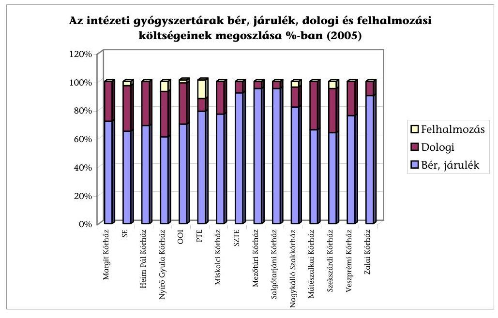

[^0]
[^0]:    ${ }^{87}$ A gyógyszertárban forgalmazható termékekről szóló 43/1996. (XI. 29.) NM rendelet, 5. § (2) bek.
    ${ }^{88}$ A társadalombiztosítási támogatással rendelhető gyógyszerekről és a támogatás öszszegéről szóló 1/2003. (I. 21.) ESzCsM rendelet, 7/A. § (1) bek.

---

# 4.2. Az intézeti gyógyszertár szakmai, speciális gyógyszerkészítési feladatai 

A helyszínen vizsgált intézmények közül egy kivételével (Mezőtúri Kórház) mindegyik rendelkezik galenusi és magisztrális gyógyszerek készítésére szóló engedéllyel.

Az intézeti gyógyszertárban előállított termékek gazdaságosságát 4 intézményben (Nyírő Gyula Kórház, SZTE, Mátészalka, Nagykállói Szakkórház) vizsgálták, ezek árát összehasonlították a piaci árral. Magisztrális készítményt az intézmények nem szereznek be a piacról, mert a termékek egy részének nincs a piacon gyári megfelelője, illetve csak az alapanyag és csomagolóanyag költséget számítja fel a gyógyszertár az intézménynek, míg más helyről történő beszerzésnél a magisztrális díj - mint költség - is terheli ezt.

Az infúzió-vásárlást meghatározza az, hogy az intézeti gyógyszertár rendelke-zik-e a gyártáshoz szükséges feltételekkel vagy sem. Ha nem rendelkezik, akkor kénytelen azt a piacról beszerezni, bár - rendszerint - a speciális igényekhez (pl. gyermekkórház) a beszállítók nem tudnak alkalmazkodni.

A helyszínen vizsgált intézmények közül 4 rendelkezett infúzió készítésére engedéllyel (SE, OOI, PTE, Nyírő Gyula Kórház), ezek közül 2 intézmény végzett ezek gazdaságosságára számításokat, illetve ennek következményeként a termékeket részben a piacról szerezte be. Citosztatikus keverékinfúziók készítéséhez - a felhasználási idő rövidsége miatt - a feltételeket az intézményeknek kell biztosítani.

### 4.3. A vényforgalmat lebonyolító intézeti gyógyszertárak (vényforgalmú patikák)

A vényforgalmú patikák finanszírozási szerződését, az ÁNTSZ határozata alapján, a megyei vagy fővárosi egészségbiztosítási pénztár köti meg a működtetővel, a vonatkozó jogszabályok ${ }^{89}$ szerint. A múködtetésbe adott intézeti gyógyszertárak vényforgalmú patikáira kötött ártámogatási szerződéseknél a megyei egészségbiztosítási pénztárak eltérő gyakorlatot folytatnak. Egyrészt a szerződést a kórházzal kötik meg, (Salgótarjáni, Zalaegerszegi, Miskolci Kórház), másrészt a múködtetővel (Esztergomi, Dunaújvárosi Kórház). A társadalombiztosítási támogatás-előleget az első esetben a kórház kapja meg, azt „átfutó" tételként alszámlán kezeli, és továbbutalja a múködtetőnek, míg a második esetben azt közvetlenül a múködtető kapja meg.

A biztonságos és gazdaságos gyógyszer- és gyógyászati segédeszköz-ellátás, valamint a gyógyszerforgalmazás általános szabályairól szóló 2006. évi XCVIII. törvény 51. §-ának (1) bekezdése a problémát rendezi: „Az intézeti gyógyszertár

[^0]
[^0]:    ${ }^{89}$ A kötelező egészségbiztosítás ellátásairól szóló 1997. évi LXXXIII. törvény, és a végrehajtására kiadott 217/1997. (XII. 1.) Korm. rendelet, valamint a járóbeteg-ellátás keretében rendelt gyógyszerek, gyógyászati segédeszközök és gyógyfürdő ellátások árához nyújtott támogatások elszámolásáról és folyósításáról szóló 134/1999. (VIII. 31.) Korm. rendelet.

---

müködtetése a fekvőbeteg gyógyintézet, illetve a fekvőbeteg gyógyintézet intézeti gyógyszerellátási feladatait ellátó müködtető kérelmére engedélyezhető."

A vényforgalmú patikákra korlátozó szabályozás érvényesült ${ }^{90}$, csak intézeti orvos által felírt vényre vagy csak intézeti dolgozó részére szolgáltathat ki gyógyszert. Az intézmények alapító okiratukban rendelkeznek arról, hogy a vényforgalmú patika vállalkozási tevékenységet folytat-e. Arra vonatkozóan nincs országos adat, hogy hány vényforgalmú patika végzi ezt a tevékenységet vállalkozásként.

A helyszínen vizsgált intézmények közül 11 intézeti gyógyszertár múködtet vényforgalmú patikát (1. sz. táblázat). 8 költségvetési intézmény, 3 intézeti gyógyszertárat külső vállalkozó múködtet. A költségvetési intézményi formában üzemeltetett vényforgalmú patikákat korábban két kórház, jelenleg a Veszprémi Kórház alapító okirata sorolja a vállalkozási tevékenység körébe. A többi intézmény - a jogszabályi lehetőségnek megfelelően - a vényforgalmat lebonyolító részleg tevékenységét a kiegészítő tevékenység körébe sorolta.

Az államháztartás múködési rendjéről szóló 217/1998. (XII. 30.) kormányrendelet 9. § (5) bekezdése szerint nem minősül vállalkozási tevékenységnek a költségvetési szervnek az alapító okiratában meghatározott alaptevékenységén belül az a kiegészítő, kisegítő jellegű tevékenysége, amelyet az alaptevékenysége feltételeként rendelkezésre álló, s e célra csak részben lekötött személyi és anyagi kapacitások fokozott kihasználásával, nem nyereségszerzés céljából végez.

A helyszínen vizsgált intézménynél az átlagos havi patikai árrés nagysága 0,85 M Ft és 8,8 M Ft között mozgott. Az árrésből származó bevételt a 8 költségvetési intézményben - a Nagykállói Szakkórház kivételével - felosztják. A Nagykállói Szakkórházban 2004. július 1-jétől az eredményt teljes egészében az alaptevékenységre fordítják, személyi ösztönzés nincs.

A SE Kútvölgyi Klinikájának vényforgalmú patikájában nem rögzítették szabályzatban az árrésből származó bevétel felosztását, ott havonta vezetői döntés alapján történik a pénz szétosztása. A többi intézményben a szabályzatokban rögzített arányok alapján történik a felosztás a gyógyszertár és az intézmény között. A szabályzatokból nem állapítható meg, hogy pontosan mennyi rész jut személyi ösztönzésre, mert az általánosan megállapított arányok ezt nem részletezik (pl. x\% gyógyszertár, y\% gazdasági igazgatóság).

A Veszprémi Kórházban, ahol a vényforgalmú patika tevékenységét vállalkozási tevékenységként végzik, havi meghatározott összeg osztható fel a ledolgozott munkaidő arányában a patikai dolgozók között, továbbá az árrésből származó bevétel $20 \%$-a (később 25, majd $28 \%$-a) jutalomkeretre szolgált. 2006-ban minden intézeti gyógyszertári dolgozóval szerződést kötöttek az árrés megosztására: $60 \%$ a kórházé, $40 \%$ a jutalomkeret.

A biztonságos és gazdaságos gyógyszer- és gyógyászati segédeszköz-ellátás, valamint a gyógyszerforgalmazás általános szabályairól szóló 2006. évi XCVIII.

[^0]
[^0]:    ${ }^{90}$ Az intézeti gyógyszerellátásról szóló 34/2000. (XI. 22.) EüM rendelet, 4. § (9) bek.

---

törvény 51. §-a közvetlen lakossági gyógyszerellátási (közforgalmú) lehetőséget biztosít az intézeti gyógyszertárak számára. Az egyes tevékenységek kötelező elkülönítése és a részletes szabályok megalkotása egységes gyakorlat kialakítását feltételezi.

# 4.4. A múködtetésbe adott intézeti gyógyszertárak 

Az Ispotály Kft. 2001 óta foglalkozik intézeti gyógyszertárak működtetésével. Jelenleg 7 szerződéssel rendelkezik. A helyszíni vizsgálat három kórházat (Zalai Kórház, Salgótarjáni Kórház, Miskolci Kórház) érintett, két kórházat (Esztergom, Dunaújváros) pedig a működtetőnél dokumentumok alapján vizsgáltunk.

A működtetésbe adásról a megyei vagy városi közgyűlések döntöttek. A működtetésbe adás indokaként több szempont merült fel: az intézeti gyógyszertárak minimum feltételeinek biztosításához szükséges beruházások forrásait a fenntartók nem tudták biztosítani, a kórházak nehéz pénzügyi helyzete indokolta a működtetéstől remélt megtakarításokat, és az egyéni gyógyszer nyilvántartási rendszer megvalósítását. A Miskolci Kórházban a teljes futamidőre vetítve 100 M Ft megtakarítással számoltak. A Salgótarjáni Kórházban 75 M Ft költségcsökkenést és 10 M Ft bevétel növekedést vártak a működtetésbe adástól.

A vizsgált 5 kórházból 4 esetben a működtetésbe adásra tárgyalásos közbeszerzési eljárást hirdettek. Az esztergomi kórházban a működtetésbe adás idején érvényben volt az egészségügyi szolgáltatókról és az egészségügyi közszolgáltatások szervezéséről szóló 2003. évi XLIII. törvény, amelynek alapján közreműködői szerződés megkötésére hirdettek pályázatot.

Az Ispotály Kft., valamint az általa létrehozott vállalkozások és a kórházak között az intézeti gyógyszertárak működtetetésére megkötött szerződések azonos konstrukciókat, elemeket tartalmaznak. Minden szerződésnél az Ispotály Kft. jelentős összegű beruházást vállalt az építészeti és tárgyi feltételek teljesítésére. A beruházások összege az 5 kórházban elérte a 677 M Ft-ot.

A működtető vállalta a dolgozók továbbfoglalkoztatását, és a személyi feltételek biztosítását, ami a kórház számára a gyógyszertári dolgozók bérköltségeinek megtakarítását jelenti, éves szinten - a létszámtól függően - 60-90 M Ft-ot elérő összegben.

A működtető minden esetben megvásárolta a gyógyszerkészletet és a berendezési tárgyakat. A kórházak csak az osztályos gyógyszerkészleteket finanszírozzák, az intézeti gyógyszertárban lévő készletet a működtető tartja fenn. A gyógyszertár rezsi költségeit is a működtető fizeti.

A működtető minden esetben fizet bérleti díjat a kórháznak az átadott gyógyszertári helyiségek használatáért. Egy esetben (Dunaújváros) a bérleti díjból levonták a működtető által elvégzett beruházás összegét is, a többi esetben nem. Három esetben egy összegben előre fizette ki a működtető a bérleti díjat, két esetben havi fizetés történik.

---

A múködtető a kórházakban vényforgalmú patikákat alakított ki, a vényforgalomból keletkező árrésből - kórházanként eltérő mértékben - bizonyos részt átad a kórháznak.

A működtető a gyógyszerek beszerzési ára és a közlönyár közötti különbözetet megosztja a kórházakkal. A kórházak a gyógyszerek beszerzési árában olyan kedvezményekhez jutnak, amelyek a működtetési szerződésből származnak. Az Ispotály Kft. az általa működtetett gyógyszertárak gyógyszerigényét koncentrálva kedvezményeket tud elérni a piacon.

Az esztergomi Vasary Kolos Kórházban és a dunaújvárosi Szent Pantaleon Kht.ban az egyéni beteg nyilvántartási rendszer technikai feltételeit a működtető teremtette meg, üzemeléséért - teljes futamidőre - a kórházak működtetési díjat fizetnek. További két kórház a működtetőnek egy éven át működtetési díjat fizet. A kórházak az egyéni betegnyilvántartást 2005 végéig nem vezették, mert a szükséges osztályos adminisztrációt a „dolgozók túlterheltsége miatt" nem végeztették el, illetve a szigorú keretgazdálkodás miatt az osztályok a gyógyszerkészleteket egymás között cserélték.

A kórházak minden esetben előnyösnek ítélték az együttműködést, de ezt nem számszerűsítették. Nem készítettek olyan elemzést, amely a működtetésbe adás óta eltelt időben összesítette volna az előnyöket, illetve hátrányokat.

# 5. KORÁBBI SZÁMVEVŐSZÉKI JAVASLATOK HASZNOSÍTÁSÁNAK ELLENŐRZÉSE 

Az ÁSZ 2004. évi „a gyógyszerek támogatási és finanszírozási rendszerének, a fogyasztás helyzetének ellenőrzéséről" szóló jelentése 22 javaslatot fogalmazott meg a Kormánynak és az egészségügyi miniszternek.

A helyszíni vizsgálat az EüM-et, az OEP-et és az OGYI-t érintette, amelyek a javaslatok hasznosítására intézkedési tervet nem készítettek.

A vizsgálathoz az EüM csak részben bocsátotta a vizsgálat rendelkezésére a kért dokumentációkat, azokról szóbeli felvilágosítással sem szolgált, hivatkozással a kijelölt vezetők folyamatos elfoglaltságára. Az OEP is késedelmesen szolgáltatta a kért anyagokat.

A javaslatok egy része jogszabályalkotással, illetve -módosítással - részben vagy egészben - hasznosult, így

- A kötelező egészségbiztosítás ellátásairól szóló 1997. évi LXXXIII. törvény 37. §-ának módosítása ${ }^{91}$ egyértelművé tette a jogosulatlanul rendelt és kifizetett támogatás megtérítésének tartalmát és alkalmazását.

[^0]
[^0]:    ${ }^{91}$ A kötelező egészségbiztosítás ellátásairól szóló 1997. évi LXXXIII. törvény és egyéb, az egészségüggyel összefüggő törvények módosításáról rendelkező 2005. évi XLIX. törvény, 11. §.

---

- Az emberi felhasználásra kerülő gyógyszerek, gyógyszernek nem minősülő gyógyhatású készítmények reklámozásáról és ismertetéséről szóló 64/2003. (X. 31.) ESzCsM rendelet átfogó módosítása ${ }^{92}$ óta eltelt idő rövidsége nem teszi lehetővé a szabályozás eredményességének értékelését. A hatályba lépést (2006. március 22.) követő ellenőrzések nem szabtak ki bírságot.
- Az OGYI a 2004. évtől költségvetési támogatásban nem részesül. Miniszteri rendelettel ${ }^{93}$ megemelték az OGYI szolgáltatásainak díjait, amelyek a múködésének költségeit biztosítja. A hivatkozott rendelet tartalmazza a gyógyszerismertetői tevékenység engedélyezéséért fizetendő díjat is, amit az ÁSZ javaslata tartalmazott.
- A gyógyszerek társadalombiztosítási támogatásba befogadásának szempontjait miniszteri rendelet ${ }^{94}$ írja elő. Rendelkezik arról, hogy „a befogadási döntéseket a költséghatékonyság figyelembevétele alapján kell meghozni" (3. § i) pont). A módosított 13. § alapján újonnan, támogatással befogadni készítményt akkor lehet, ha „a készítmény eredményességéről és költséghatékonyságáról megfelelő minőségü bizonyítékok állnak rendelkezésre". A javaslat jogszabályi szinten megvalósult.

Az OEP-nek a támogatásba történő befogadást megelőzően az Egészségügyi Stratégiai Kutatóintézet (ESKI) véleményét ki kell kérni és csak azt követően dönthet. Az emelt és kiemelt indikációjú gyógyszerkörbe (Eü90; Eü100) befogadáshoz a PM hozzájárulása is szükséges.

- A vizsgálati és terápiás eljárás kidolgozásának, szerkesztésének és szakmai egyeztetése lefolytatásának eljárásrendjéről szóló 23/2006. (V. 18.) EüM rendelet hatályba lépésével az ÁSZ javaslata jogszabályi szinten hasznosult.
- Miniszteri rendelet ${ }^{95}$ csak részben hasznosította az ÁSZ javaslatát az intézmények gyógyszerfelhasználása és -beszerzése egységes szempontok szerinti nyilvántartási és adatszolgáltatási rendszerének kidolgozását illetően, tekintve, hogy az nem kellően részletes.

[^0]
[^0]:    ${ }^{92}$ Az emberi felhasználásra kerülő gyógyszerek, gyógyszernek nem minősülő gyógyhatású készítmények reklámozásáról és ismertetéséről szóló 64/2003. (X. 31.) ESzCsM rendelet módosításáról rendelkező 9/2006. (III. 7.) EüM rendelet.
    ${ }^{93}$ Az emberi felhasználásra kerülő gyógyszerekkel kapcsolatos egyes engedélyezési eljárások során fizetendő igazgatási szolgáltatási díjakról szóló 32/2005. (VIII. 11.) EüM rendelet.
    ${ }^{94}$ A törzskönyvezett gyógyszerek és a különleges táplálkozási igény kielégítő tápszerek társadalombiztosítási támogatásba való befogadásának szempontjairól és a befogadás vagy a támogatás megváltoztatásáról szóló 32/2004. (IV. 26.) ESzCsM rendelet, valamint a módosításáról rendelkező 10/2004. (XII. 15.) EüM rendelet.
    ${ }^{95}$ Az egyes személyazonosításra alkalmatlan ágazati (egészségügyi, szakmai) adatok körének meghatározására, gyűjtésére, feldolgozására vonatkozó részletes szabályokról szóló 76/2004. (VIII. 19.) ESzCsM rendelet

---

A javaslatok másik része intézkedéssel - részben vagy egészben - hasznosult. Így például:

- Az OGYI és az OEP gyógyszeradatbázisai közötti összhang megteremtését szolgáló javaslat csak részben teljesült.

Létrejött a K-NET (közhiteles-nemzeti egészségügyi törzs), amelynek próba futtatása 2005-ben volt, az akkor fellépő problémákat a helyszíni vizsgálat befejezéséig nem tudták megoldani. 2006 márciusában a K-NET projekt megvalósításáról készített beszámoló összefoglalja - többek között - a rendszer hiányosságait és a további teendőket, azonban a hiányosságok pótlására újabb projektet nem indítottak. A projekt megvalósításának eredménye, hogy az OGYI alkalmassá tette informatikai rendszerét az adatszolgáltatásra.

- A méltányossági alapú gyógyszertámogatás nyilvántartását módosították, 2004 augusztusától az OEP által kifejlesztett, ún. egyedi nyilvántartó program múködik.
- Az OEP kidolgozta a gyógyszertári rendszergazdákkal való kapcsolattartásra vonatkozó eljárásrendet, „Gyógyszerek adatainak nyilvántartása és publikálása" címen, ami a helyszíni vizsgálat idején az OEP-n belül szakmai véleményezés alatt van.
- A gyógyszertámogatással és finanszírozással kapcsolatos fogalmak egységesítése érdekében az OEP Intézményi Adattárház eszközbázisán lekérdezési tabló-gyűjteményt állítottak össze, amely megfelelő szintű hozzáférés esetén bárki számára elérhető (Cognos). A fogalomtárat rendszeresen frissítik, illetve a lekérdező eljárásokat standardizálták.

Több javaslat hasznosítása érdekében történtek intézkedések, de az értékelés az információk teljes vagy részleges hiánya miatt nem volt megvalósítható. Így például az ágazat hosszú távú gyógyszerellátás stratégiájának megvalósulásához a Minisztérium az ún. Zöld könyv 7. pontját, a „Keserü pirula, vagy gyógyír?" fejezetet jelölte meg, ami nem tekinthető a gyógyszerellátás teljes rendszerére kiterjedő, átgondolt, komplex, szakmai területet, prioritásokat is figyelembe vevő stratégiának. Kormány-előterjesztést, háttéranyagokat a Minisztérium nem bocsátott az ellenőrzés rendelkezésére.

Több javaslat hasznosítására vagy történtek intézkedések, de azok nem voltak eredményesek, vagy nem volt intézkedés. Így például:

- A költségvetés előirányzatának átgondolt megalapozott tervezése érdekében évenként több intézkedést is hoztak. A 2004. évben a Kormány rendeletével befagyasztotta a gyógyszerárakat ${ }^{96}$, amit az Alkotmánybíróság 19/2004. (V. 16.) számú határozatával alkotmányellenesnek ítélt és a megsemmisített. A Kormány ezt követően a Magyar Állam nevében a gyógyszergyártokkal szerződést kötött, amely előre meghatározta a gyógyszerkassza előirányzatát, korlátozta a gyógyszerek fogyasztói árának emelését, ennek fejében

[^0]
[^0]:    ${ }^{96}$ Az emberi felhasználásra kerülő gyógyszerek és egyes tápszerek átmeneti árszabályozásáról szóló 48/2004. (III. 19.) Korm. rendelet.

---

kompenzációt határozott meg a gyógyszergyártók részére. A szerződést 2005 szeptemberében módosították ${ }^{97}$. A hozott intézkedések nem eredményezték a gyógyszer-támogatási kiadások növekedésének visszafogását.

Az EüM 2005 márciusában egyszeri megbízással elemzést készíttetett a gyógyszerkassza alakulásáról. Rendszeres gyógyszerár- és gyógyszerpiaci elemzések nem segítették az állami döntéshozatali tevékenységet. (A Minisztérium tájékoztatása szerint az egyszeri elemzést jogszabály előkészítéséhez használták fel.)
Budapest, 2007. május 3.

| Melléklet: | 3 db | 8 lap |
| :-- | --: | --: |
| Függelék: | 2 db | 13 lap |

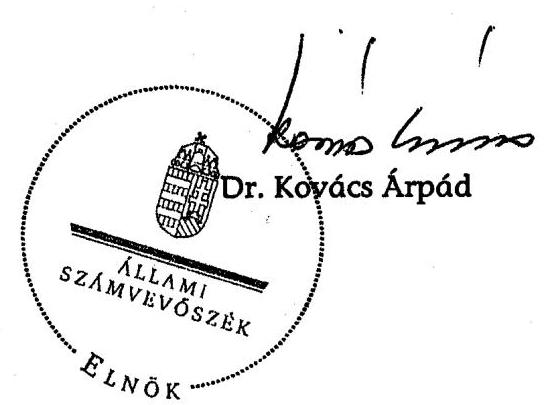

[^0]
[^0]:    ${ }^{97}$ A 2005. évi intézkedéseket és azok hatását a Magyar Köztársaság 2005. évi költségvetésének végrehajtásáról szóló 0628 ÁSZ jelentés függelékének C. függelékének az Egészségbiztosítási Alap fejezet 3. pontja részletesen tartalmazza.

---

# MELLÉKLETEK

---

MiniszTERELNÖKI HivatalT Vezetó MinisZTER

Ikt.sz: I-1/1362/4/2007. (2)
Hiv. sz: V-13-84/2006.2007.

Dr. Kovács Árpád elnök úr részére
Állami Számvevőszék

Budapest

# Tisztelt Elnök Úr! 

Az állami és önkormányzati kórházak gyógyszergazdálkodásának ellenőrzéséről készített jelentésük legújabb változatát megkaptam, köszönöm.

A tervezetre észrevételt nem teszek.

Budapest, 2006. április ,21,,

Üdvözlettel:
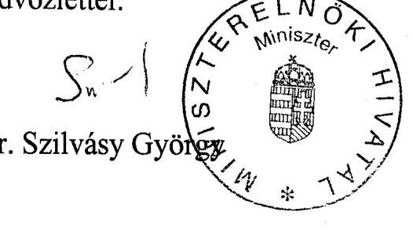

---

# EGÉSZSÉGÜGYI MINISZTÉRIUM   ÁLLAMTITKÁR 

Ikt. szám: 8264-3/2007-0006KTF

Dr. Kovács Árpád elnök úr részére

## Állami Számvevőszék

## Budapest

## Tisztelt Elnök Úr!

Az állami és önkormányzati kórházak gyógyszergazdálkodásának ellenőrzéséről készített jelentést köszönettel megkaptam.

Az ellenőrzési jelentés megállapításaira további észrevételt nem teszek.
A jelentés megállapításai és javaslatai alapján készülő intézkedési tervet a megadott határidőre megküldöm.

Budapest, 2007. április „ 2 „

Üdvözlettel:
Dr. Horváth Ágnes

---

# HELYSZÍNI VIZSGÁLATBA VONT INTÉZMÉNYEK JEGYZÉKE 

1. Borsod-Abaúj-Zemplén Megyei Önkormányzat Megyei Kórháza és Egyetemi Oktató Kórház, Miskolc
2. Fővárosi Önkormányzat Heim Pál Gyermekkórház ${ }^{1}$
3. Fővárosi Önkormányzat Nyírő Gyula Kórház
4. Fővárosi Önkormányzat Szent Margit Kórház és Rendelőintézet
5. Megyei Önkormányzat Szent Lázár Kórház-Rendelőintézet, Salgótarján
6. Országos Onkológiai Intézet, Budapest
7. Pécsi Tudományegyetem Orvostudományi és Egészségtudományi Centrum
8. Semmelweis Egyetem, Budapest
9. Szabolcs-Szatmár-Bereg Megyei Önkormányzat Pszichiátriai Szakkórháza, Nagykálló
10. Szegedi Tudományegyetem Szent-Györgyi Albert Orvos- és Gyógyszerésztudományi Centrum, Szeged
11. Tolna Megyei Önkormányzat Balassa János Kórháza, Szekszárd
12. Városi Kórház-Rendelőintézet, Mezőtúr
13. Városi Önkormányzat Területi Kórháza, Mátészalka
14. Veszprém Megyei Csolnoky Ferenc Kórház-rendelőintézet, Veszprém
15. Zala Megyei Önkormányzat Kórház-Rendelőintézete, Zalaegerszeg
[^0]
[^0]:    ${ }^{1}$ 2006. január 1-jétől hivatalosan egyesült a Madarász utcai Gyermekkórházzal

---

2/b. sz. melléklet
a V-13-90/2006-2007. sz. jelentéshez
A GYÓGYSZEREK ÚTJA A KÓRHÁZBAN
(sematikus ábra)
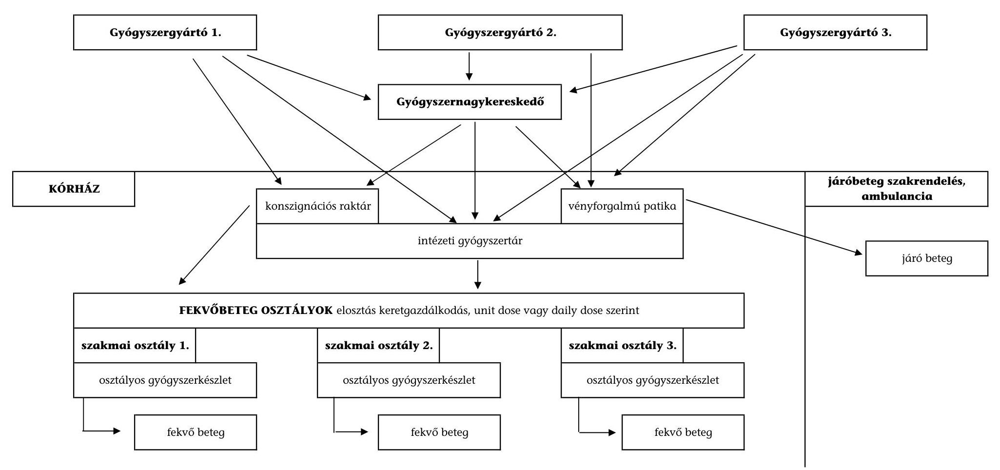

---

# TÁBLÁZATOK JEGYZÉKE 

1. sz. táblázat

2. sz. táblázat
3. sz. táblázat
4. sz. táblázat
5. sz. táblázat

A vényforgalmú patikák adatai
Rabatt, adomány nyilvántartásának jogszabályi háttere
Egyes HBCS-k fajlagos gyógyszerköltség tartalma a 2005. évi átlag alapján (Ft)

Az egyes onkológiai készítmények beszerzési ára az OEP beszerzési árához viszonyítva

A helyszínen vizsgált intézeti gyógyszertárak minimumfeltételei és a beruházásra fordított összegek

---

# A vényforgalmú patikák adatai 

| Intézmény | Alapító okirat szerint | Átlagos havi árrés | Eredmény felosztása | Személyi ösztönzés szabályozása |
| :--: | :--: | :--: | :--: | :--: |
| Miskolci Kórház* | Vállalkozási tevékenység |  | A múködtetésbe adás előtt alaptevénységre visszaforgatta |  |
| Veszprémi Kórház | Vállalkozási tevékenység | 4,8 | 60\% kórház, 40\% jutalomkeret | Szerződés minden dolgozóval |
| Salgótarjáni Kórház* | Külső vállalkozó által múködtetett | 0,75 |  |  |
| Nyírő Gyula Kórház | Nem nevesíti az alapító okirat vállalkozási tevékenységként | 5,6 | 350 E Ft felett 10\% gyógyszertár, pénzügy, munkaügy, 90\% kórház | Kórházi és patikai SZMSZ,   Munkautasítás tartalmazza az eredményfelosztást |
| Margit Kórház | Nem nevesíti az alapító okirat vállalkozási tevékenységként | 6,5 | A költségek levonása után 50\% kórház, 50\% a gyógyszertári dolgozóké | Nincs szabályozva, havonta vezetői döntés |
| Heim Pál Kórház | Nem nevesíti az alapító okirat vállalkozási tevékenységként | 2,9 | 20\% dolgozók, 80\% intézmény | Kollektív Szerződés melléklete |
| OOI | Nem nevesíti az alapító okirat vállalkozási tevékenységként | 8,8 | 15\% intézeti dologi kiadás, 15\% intézeti fejlesztés, 75\% gyógyszertári dolgozók | Nem nyereség céljából végzett tevékenység szabályzata |
| SZTE | Nem nevesíti az alapító okirat vállalkozási tevékenységként |  | 15 M Ft forgalomig 10\% tartalék, 63\% kari gyógyszertár, 27\% gazdasági igazgatóság, 15 M Ft felett 10\% tartalék 65\% kari gyógyszertár, 25\% gazdasági igazgatóság | Szabályozott |
| SE/Kútvölgyi gyógyszertár | Nem nevesíti az alapító okirat vállalkozási tevékenységként | 7,3 | Nincs szabályozva/a főgyógyszerész javaslata alapján osztják szét |  |
| Nagykállói Szakkórház | Nem nevesíti az alapító okirat vállalkozási tevékenységként | 0,85 | 2004. július 1-től nincs anyagi érdekeltségi rendszer |  |
| Zalai Kórház* | 2006. március 23-tól múködik vényforgalmú gyógyszertár külső vállalkozó múködtetésével |  |  |  |

[^0]
[^0]:    * Múködtetésbe adott gyógyszertár

---

# Rabatt, adomány nyilvántartásának jogszabályi háttere

|   | Azonos vagy más gyógyszer formájában, természetben adott azonnali engedmény (előre meghirdetett vagy nem meghirdetett feltételek alapján) ${ }^{1}$ | Utólag adott engedmény | Igen alacsony képviseleti értéken eladott gyógyszer beszerzése ${ }^{2}$ | Adományként kapott (térítésmentesen, karitatív célból és nulla forintos számlával kapott gyógyszerek) | Orvosi Minta  |
| --- | --- | --- | --- | --- | --- |
|  Számla | Eredeti számla | Helyesbítő számla. A teljesítési időpont megegyezik az eredeti számlán lévő teljesítési időponttal. | Eredeti számla | Eredeti számla | Nem kell róla számlát kiállítani.  |
|  Számlában: | A térítés ellenében adott gyógyszer ára és áfa összege, engedményként adott gyógyszer ára és áfa összege. | „Természetben adott engedményként" szolgáló termék ára, és az arra jutó áfa összege, mint az eredeti térítés ellenében értékesített gyógyszerről kiállított számla szerinti ellenérték és áfája helyesbítése. | Termék ára és arra jutó áfa. | Az adóalapot képező érték, az áfa csak abban az esetben, ha azt az átvevőre áthárítják, szöveges utalás arra, hogy térítésmentes eszköz átadás a gazdasági esemény. |   |
|  Áfa szempontjából | A térítés ellenében történő gyógyszereladás termékértékesítésnek minősül, de az áruban adott engedmény a térítéses értékesítésnél áfa alapot csökkent. |  | Termékértékesítés | Termékértékesítésnek minősülő térítés nélküli eszközátadás. | Termékértékesítésnek nem minősülő áru minta átadás.  |
|  Számviteli szempontból | - Azonos gyógyszerben adott engedmény: a fizetett ellenérték darabarányosan megoszlik az összesen beszerzett mennyiségre, így minden egyed beszerzési értéke csökken és azonos lesz.
- Más gyógyszerben kapott engedmény: az engedményként kapott gyógyszer teljes áron, míg az ellenértékért kapott gyógyszer az engedménnyel csökkentett beszerzési áron kerül nyilvántartásba. | - Engedményként megjelenő gyógyszer annak teljes árán kerül be a nyilvántartásba.
- Az ellenértékért kapott gyógyszer az engedményként kapott gyógyszer árával, mint engedménnyel csökkentett készlet kerül a nyilvántartásba. | Gyógyszerbeszerzés | Térítés nélküli eszköz átadás/ átvétel - piaci forgalmi értéken. |   |
|  Jogszabályi hivatkozás | Az általános forgalmi adóról szóló 1992. évi LXXIV. törvény 22. § (4) és (9) bekezdése. | Az általános forgalmi adóról szóló 1992. évi LXXIV. törvény 22. § (5) bekezdés. |  | Az általános forgalmi adóról szóló 1992. évi LXXIV. törvény 7.§ (1) bekezdés a pontja és 43. §-ának (4) bekezdése; 2000. évi C törvény 50 §-ának (4) bekezdése, valamint a 249/2000. (XII. 24.) Korm rendelet 32. § (4) bekezdés | 1992. évi LXXIV. törvény az általános forgalmi adóról 7 §-ának (3) bekezdése, valamint a 13 §-a (1) bekezdésének 25 . és 35 . pontja  |

[^0] [^0]: ${ }^{1}$ A természetbeni engedményként adott gyógyszer értéke nem érheti el a térítés ellenében adott gyógyszer árát, annál alacsonyabb kell legyen. ${ }^{2}$ Érvénytelen szerződésnek vagy jogügyletnek az adózás szempontjából annyiban van jelentősége, amennyiben annak gazdasági eredménye kimutatható (ha adózást kerülnek el vele, akkor az utólagos ellenőrzéssel megadóztatható), a Ptk. vonatkozó rendelkezései alapján is a szerződés adásvételi jellege megkérdőjelezhető irreálisan alacsony, ill. 1 Ft-os ellenértéken történő értékesítés esetén.

---

Egyes HBCS-k fajlagos gyógyszerköltség tartalma a 2005. évi átlag alapján

|  S.sz. | Megnevezés | HBCS | Intézmény megnevezése |  |  |  |  |  |  |  |   |
| --- | --- | --- | --- | --- | --- | --- | --- | --- | --- | --- | --- |
|   |  |  | OOI | Mohács Város
Kórháza-
Rendelőintézete | B-A-Z Megyei
Önkormányzat
Szent Ferenc
Kórház-
Rendelőintézet | Szeged Megyei
Jogú Város
Önkormányzat
Kórháza | Komárom-
Esztergom
Megyei
Szent
Borbála
Kórház | Mátészalkal
Kórház | Salgótarjáni
Kórház | PTE* | OEP**  |
|  1. | Cerebrovascularis betegségek (kivéve TIA), praecerebralis érelzáródással speciális kezelés nélkül 18 év felett | 015 F | - | 3189 | - | 7687 | 14790 | 10818 | 1278 | 11642,5 | 16274  |
|  2. | Interruptio aspirációs kürettel 12. hét előtt, altatással | 681 D | - | 1017 | - | - | 6879 | 2353 | 1720 | 3367 | 12785  |
|  3. | Cerebrovascularis betegségek speciális vizsgálatokkal igazolva | 015 C | - | 7004 | - | 5631 | 9057 | 9113 | 5307 | 13887 | 8128  |
|  4. | Szívelégtelenség | 2130 | - | 6135 | 7833 | 13141 | 21170 | 16126 | 9010 | 21483 | 21483  |
|  5. | Szürkehályog műtét phaekoemulsificatios módszerrel, hajlítható múlencse biztosításával | 0680 | - | 8014 | - | - | 14403 | 5713 | 6066 | - | 7399  |
|  6. | Hüvelyi szülés | 673 A | - | 4037 | - | - | 5480 | 2280 | 3451 | 6577 | 178  |
|  7. | Abrasio altatásban | 647 A | - | 212 | - | - | 738 | 408 | 1326 | 1438 | 4785  |
|  8. | Ujszülött, születési súly 2499 felett, jelentős műtét nélkül, normális újszülött diagnózissal | 7270 | - | 34 | - | - | 4,13 | - | 137 | 1010 | 3003  |
|  9. | Atherosclerosis, angina pectoris, egyéb keringési betegségek | 2230 | - | 4223 | 8965 | 4647 | 3880 | 3067 | 3271 | - | 847  |

- 4 klinika átlaga alapján (Szívgyógyászati Klinika, Neurológiai Klinika, Szülészeti és Nőgyógyászati Klinika, Idegsebészeti Klinika) ** Forrás: OEP FIFO

---

# Az egyes onkológiai készítmények beszerzési ára az OEP beszerzési árához viszonyítva

|  S.sz. | Megnevezés | $40-50 \%$ | $51-60 \%$ | $61-70 \%$ | $71-80 \%$ | $81-90 \%$ | $91-100 \%$ | $101-110 \%$ | $111-120 \%$ | 120-  |
| --- | --- | --- | --- | --- | --- | --- | --- | --- | --- | --- |
|  1. | CAMPTO |  |  |  |  |  |  |  |  |   |
|  2. | Originális 40 mg |  | 1 | 7 |  | 1 | 10 | 6 |  |   |
|  3. | Generikum 40 mg | 2 | 5 | 1 | 1 |  |  |  |  |   |
|  4. | Originális 100 mg |  |  | 6 |  | 1 | 10 | 7 |  |   |
|  5. | Generikum 100 mg | 2 | 6 | 2 | 1 |  |  |  |  |   |
|  6. | MAGYTAX |  |  |  |  |  |  |  |  |   |
|  7. | Originális 30 mg |  | 5 | 13 | 6 |  | 4 |  | 1 | 1  |
|  8. | Generikum 30 mg |  | 2 | 4 | 1 | 1 |  |  |  |   |
|  9. | Originális 100 mg | 1 | 5 | 10 | 8 | 1 | 2 | 2 |  |   |
|  10. | Generikum 100 mg |  | 3 | 5 | 2 | 1 |  |  |  |   |
|  11. | HYCAMTIN 4 mg |  |  |  |  | 1 | 1 | 4 | 3 | 8  |
|  12. | TAXOTERE |  |  |  |  |  |  |  |  |   |
|  13. | 20 mg |  |  |  | 3 | 7 | 5 | 20 |  |   |
|  14. | 80 mg |  |  |  | 2 | 6 | 6 | 22 |  |   |
|  15. | TOMUDEX 2 mg |  |  | 2 | 1 |  | 6 | 4 |  |   |
|  16. | GEMZAR |  |  |  |  |  |  |  |  |   |
|  17. | 200 mg |  |  |  |  | 1 | 2 | 20 | 15 |   |
|  18. | 1 g |  |  |  |  | 1 | 2 | 23 | 15 |   |

---

# A helyszínen vizsgált intézeti gyógyszertárak minimumfeltételei és a beruházásra fordított összegek

|  Az intézmény neve | Személyi
feltétel | Tárgyi
feltétel | Építészeti
feltétel | A feltételek teljesítése
alól ellátási érdekből
felmentést kapott | Beruházásra, felújításra
fordított összegek
a vizsgált időszakban
M Ft-ban  |
| --- | --- | --- | --- | --- | --- |
|  SE | nem teljesíti | nem teljesíti | nem teljesíti | igen | 13,6  |
|  PTE | nem teljesíti | nem teljesíti | nem teljesíti | igen | 22,9  |
|  SZTE |  | nem teljesíti | nem teljesíti | igen | 0,75  |
|  Mezőtúri Kórház | nem teljesíti | nem teljesíti |  | igen | 0  |
|  Miskolci Kórház * |  |  |  |  | 250  |
|  Veszprémi Kórház | nem teljesíti | nem teljesíti | nem teljesíti | igen | nincs adat  |
|  Szekszárdi Kórház | nem teljesíti | nem teljesíti |  | igen | 7,4  |
|  Salgótarjáni Kórház * |  |  |  |  | 98,1  |
|  Nyírő Gyula Kórház | nem teljesíti | nem teljesíti |  | igen | $1-2$  |
|  Zalai Kórház * |  |  |  |  | 156,2  |
|  Margit Kórház |  |  |  |  | 0  |
|  Heim Pál Kórház | nem teljesíti | nem teljesíti |  | igen | 5,3  |
|  Nagykállói Szakkórház | nem teljesíti |  | nem teljesíti | igen | 0,8  |
|  Mátészalkai Kórház | nem teljesíti | nem teljesíti | nem teljesíti | igen | 3,2  |
|  OOI |  |  | nem teljesíti | igen | 25,7  |

- Az Ispotály Kft. által működtetett intézeti gyógyszertár

---

# FÜGGELÉKEK

---

# Elemzés az adatgyűjtésekröl 

## Az ágazatirányító által elrendelt adatgyűjtések

Az országos adatgyűjtések egészségügyi intézmények gyógyszer gazdálkodásával kapcsolatos adatai négy témakör köré csoportosíthatók. A függelék az egyes adatgyűjtések azon adataival foglalkozik, amelyek a kórházi gyógyszerfelhasználás megítéléséhez hozzásegítenek. Az adatgyűjtések az országos statisztikai adatgyűjtési program (OSAP) részeként valósulnak meg.

## Egészségügyi intézmények árinformációi: 1477-es számú OSAP adatgyüjtés

Az adatgyűjtés segítségével az egészségügyi tárca 20 éve figyeli az árak változását a dologi kiadások körében. Célja, hogy információkat adjon a tárca vezetői számára döntések gazdasági megalapozásához. Az adatokat az EüM negyedévente gyűjti be egészségügyi intézmények és ÁNTSZ-ek reprezentatívan kiválasztott körétől ${ }^{1}$. Az elemzett adatokból a minisztérium negyedévente kiadványt állít össze az egészségügyi intézmények körében tapasztalható árváltozások mértékéről összességében és termékcsoportonként. Az elemzés külön fejezete foglalkozik a gyógyszer-gyógyáru termékcsoport főbb mutatószámaival.

Az adatszolgáltatás az intézmények által kiválasztott termékkörre vonatkozik, adott időszak beszerzéseihez igazodóan. Az adományként kapott készítmények nem jelennek meg a beszerzési adatok szolgáltatásánál. A gyógyszer, gyógyáru termékcsoport főbb áremelkedési adatait, a minisztérium árinformációs kiadványai alapján az 1. sz. táblázat tartalmazza:

1. sz. táblázat

| S.sz. | Megnevezés | $\mathbf{2 0 0 0}$ | $\mathbf{2 0 0 1}$ | $\mathbf{2 0 0 2}$ | $\mathbf{2 0 0 3}$ | $\mathbf{2 0 0 4}$ | $\mathbf{2 0 0 5}$ |
| :-- | :-- | :--: | :--: | :--: | :--: | :--: | :--: |
| 1. | Egészségügyben   tapasztalható   árindex $^{2}$ | $108,3 \%$ | $108,8 \%$ | $105,5 \%$ | $107,3 \%$ | $105,7 \%$ | $112,2 \%$ |
| 2. | Gyógyszer,   gyógyáru együt-   tes csoport inde-   xe | $103,9 \%$ | $111,1 \%$ | $103,4 \%$ | $105,2 \%$ | $103,4 \%$ | $111,2 \%$ |
| 3. | Gyógyszerek   árindexe | $103,1 \%$ | $109,3 \%$ | $102,6 \%$ | $105,69 \%$ | $105,3 \%$ | $104,2 \%$ |
| 4. | Kiszerelt gyógy-   szerek árindexe | $102,7 \%$ | $107,4 \%$ | $101,0 \%$ | $106,6 \%$ | $101,5 \%$ | $93,3 \%$ |

[^0]
[^0]:    ${ }^{1}$ 2004-ben 37 egészségügyi intézmény és ÁNTSZ szolgáltatott adatot
    ${ }^{2}$ A kiválasztott egészségügyi intézmények által beszerzett anyagok, fogyóeszközök, vásárolt szolgáltatások, beruházások és felújítások árváltozásai adott időszak tényleges beszerzései alapján.

---

| 5. | Gyógyszer alap-   anyagok árinde-   xe | $101,2 \%$ | $101,6 \%$ | $100,5 \%$ | $97,7 \%$ | $102,1 \%$ | $102,1 \%$ |
| :-- | :-- | :-- | :-- | :-- | :-- | :-- | :-- |
| 6. | Lakosság fo-   gyasztási árin-   dexe (infláció) | $110,6 \%$ | $107,1 \%$ | $104,8 \%$ | $105,6 \%$ | $105,8 \%$ | $103,3 \%$ |
| 7. | Lakossági gyógy-   szeráru (támoga-   tott ár) árindexe | $103,2 \%$ | $117,3 \%$ | $104,0 \%$ | $107,0 \%$ | $101,0 \%$ | $114,3 \%$ |

Forrás: 71. sz. árinformáció az egészségügyi intézményekben 2005. év
A gyógyszer csoport (3. sor) tartalmazza a kiszerelt gyógyszer, gyógyszer alapanyag, galenusi készítmények, tápszerek, stb. árának változását.

A 2005 évi egészségügyi árinformációs kiadvány szerint „az egészségügyben az áremelkedés üteme (1. sor) hosszabb távon mérve jelentősen meghaladja a lakossági fogyasztási javak inflációját (6. sor)"3. Ezzel szemben a kórházi kiszerelt gyógyszer (4. sor) beszerzések árindexe (két év kivételével: 2001, 2003) alacsonyabb, mint a lakosság fogyasztási árindexe (6. sor infláció). Azaz a kórházak kiszerelt gyógyszer beszerzéseinek vonatkozásában az áremelkedés (4. sor) alatta maradt a lakossági áremelkedésnek (6. sor), és az egészségügyben tapasztalható áremelkedés mértékének is (1. sor).

A lakossági gyógyszer árindexnél (7. sor) fontos figyelembe venni azt a tényt, hogy a lakossági gyógyszerárak jelentős, közvetlen társadalombiztosítási támogatást élveznek, szemben a kórházi gyógyszer beszerzésekkel (3. sor). A kórházi beszerzések árindexe még így is alatta marad (egy év kivételével: 2004) a lakosságinak (7. sor), azaz a kórházi értékesítések során a gyártók nem élnek a lakosságihoz hasonló mértékű áremeléssel, sőt rabattot, árcsökkentő kedvezményeket, adományt adnak.

Az adatok alapján megfigyelhető, hogy a gyógyszer, gyógyáru csoport együttes csoport indexe (2. sor - két év kivételével: 2003, 2004) meghaladta a gyógyszerek árindexét (3. sor), azaz az árnövekedésben a gyógyáru csoport összetevőinek (kötszer, varrófonal...) árnövekedése volt jelentősebb hatású.

A gyógyszer csoporton belül megfigyelhető, hogy a csoport árindexe (3. sor) magasabb (2003 kivételével) a kiszerelt gyógyszerek árindexénél (4. sor), és minden évben nagyobb, mint a gyógyszer alapanyagok árindexe (5. sor), azaz a gyógyszercsoport árnövekedéséért elsősorban más, ebbe a csoportba tartozó készítmények felelősek (szerobakteriológiai készítmények, tápszerek, fertőtlenítő szerek ...). A kiszerelt gyógyszerek árindexe (4. sor) 2005-ben 100\% alatti volt, azaz nem árnövekedés, hanem árcsökkenés következett be a beszerzések során, az előző év azonos időszakához viszonyítva.

[^0]
[^0]:    ${ }^{3}$ 71. sz. Árinformáció az egészségügyi intézményekben 2005. év.

---

A kiadvány a fenti adatokon túl számos tanulságos információval szolgál az egészségügyi intézmények „fogyasztási szerkezetével" és az ÁFA változások intézményeket érintő hatásával kapcsolatosan.

# Jelentés a gyógyszertárakról - 1578 sz. OSAP adatgyűjtés 

Az adatgyűjtés célja a közforgalmú és intézeti patikákkal kapcsolatos alapinformációk nyilvántartása, és ezzel kapcsolatos országos adatbázis létrehozása. Az adatokat (patika neve, működtetője, gyógyszerészek száma, ÁNTSZ engedély száma) a közforgalmú és az intézeti gyógyszertárak évente egyszer a december 31-i állapotról, a következő év január 15-ig szolgáltatják a megyei ÁNTSZ-ek számára, akik a megyei szinten összesített adatokat a Minisztériumba juttatják. Az adatok országos összesítését az OEP FIFO ${ }^{4}$ végzi el és juttatja vissza a Minisztériumba. A Minisztérium az adatokat a KSH-ba és az ÁNTSZhez továbbítja. Az 1578-as OSAP adatgyűjtésben azonos tartalmú adatok párhuzamos gyűjtése folyik.

Az ÁNTSZ - a adatgyűjtés egyik végpontja - hatósági engedélyezési feladatánál fogva az OSAP adatgyűjtésben bekért adatoknál részletesebb, naprakészebb adatokkal kell rendelkezzen, amelyet a helyszíni vizsgálat időszakában Excel adatbázisban kezelt. Az adatnyilvántartó rendszer továbbfejlesztésén az Országos Szakfelügyeleti és Módszertani Központ dolgozik. A programot a gyógyszertári adatjelentésen túl a gyógyszertárak működési engedélyei és az ezzel kapcsolatos változásjelentések nyilvántartására is alkalmassá kívánják tenni.

## Intézeti gyógyszertárak költségfelhasználásáról: 1499, 1502, 5031, 5032 számú adatgyüjtések

Az adatgyűjtés célja az intézeti gyógyszerfelhasználás költségszempontú követése. Az adatokat a MEP havonta gyűjti össze, és évente egyszer az OEP összesíti, statisztikai évkönyvében az adatokat megjelenteti. A minisztérium nem címzettje az adatgyűjtésnek. Az ESKI ${ }^{5}$ az éves adatgyűjtés feldolgozott adatait (az OEP statisztikai évkönyvének más adatához hasonlóan) honlapján megjelenteti.

Az adatgyűjtés során az intézeti gyógyszertárak havonta és évente szolgáltatnak adatot a Megyei Egészségbiztosítási Pénztáraknak a gyógyszertárban múködő számítógépes készletnyilvántartó rendszer adatainak felhasználásával. 2004-ig az adatok az 1499-es és az 1502-es számon szerepeltek az OSAP adatszolgáltatásban. Az országos statisztikai rendszer európai uniós áttekintésével ezek a jelentések megszűntek, és 2005-től 5031-es és 5032-es nyilvántartási számon bekerültek az ágazati adatgyűjtések közé, és az adatszolgáltatást miniszteri rendelet írja elő. A beszerzési költségeket 13 költségcsoportban ${ }^{6}$ kell je-

[^0]
[^0]:    ${ }^{4}$ Országos Egészségbiztosítási Pénztár Finanszírozási Főosztály
    ${ }^{5}$ Egészségügyi Stratégiai Kutató Intézet
    ${ }^{6}$ A vizsgált dokumentumok között szerepel a 2004. évre vonatkozó adatgyűjtés két tervezete, az egyikben 17, a másikban 18 költségkategóriában bontva az intézeti gyógyszertár költségadatait. A 2004. évi adatgyűjtés végeredményeként az OEP statisztikai évkönyvben 13 költségkategóriában szerepelnek az adatok.

---

lenteni, költségcsoportonként értékbeni összesen, és intézményi összesen adat szolgáltatásával. Az adatszolgáltatás naturáliában, és a költségcsoportok alábontásában (például termékszinten) nem jelenik meg.

A jelentés adattartalma az intézeti gyógyszertárak készletnyilvántartó programjaiból származik, ezek az értékek nem a tényleges gyógyszer felhasználást tükrözik, hanem az intézeti gyógyszertárakból a betegellátó osztályokra kiadott készítmények értékét. Az értéket torzítja az osztályos készletek mértéke és azok változása.

A költséggyűjtés ezen aggregált módja nem alkalmas arra, hogy a finanszírozó értékelhesse az intézményi gyógyszerfelhasználás minőségi (gyógyszerfelhasználások indokoltsága, mértéke), vagy gazdaságossági (legolcsóbb terápia választása) paramétereit. Az adatgyűjtés, és adatösszesítés szerkezetének változása miatt nem alkalmas az éves adatok összehasonlítására.

Az adatgyűjtések évenkénti összesen adatait és a gyógyszerre vonatkozó fő számait millió Ft-ban a 2. sz. táblázat tartalmazza. A táblázatban található összegek mellett található a forrás megnevezése. 2000-ben és 2001-ben nem jelent meg termékcsoportonként megbontott összeg a felhasználásról az OEP évkönyvben.
2. sz. táblázat

| Megnevezés | 2000 | 2001 | 2002 | 2003 | 2004 | 2005 |
| :--: | :--: | :--: | :--: | :--: | :--: | :--: |
| Egészségügyi intézmények gyógyszerfelhasználása (M Ft) | $\begin{gathered} 37060,5 \\ \text { OEP } \end{gathered}$ | $\begin{gathered} 35856,8 \\ \text { OEP } \end{gathered}$ | $\begin{gathered} 45179,2 \\ \text { OEP/ESKI } \end{gathered}$ | $\begin{gathered} 46375,4 \\ \text { OEP/ESKI } \end{gathered}$ | $\begin{gathered} 50604,7 \\ \text { OEP/ESKI } \end{gathered}$ | $\begin{gathered} 57254,4 \\ \text { OEP } \end{gathered}$ |
| Fekvőbeteg gyógyszerköltségek összesen (M Ft) OEP évkönyvből/ ESKI honlapjáról | n. a. | n. a. | 40067,6 | 40908,1 | 44640,1 | n. a. |
| Gyógyszeranyagok   (M Ft)   OEP évkönyvből | n. a. | n. a | 182,6 | 183,0 | 184,1 | 282,6 |
| Magisztrális készítmények (M Ft)   OEP évkönyvből | n. a. | n. a. | 457,6 | 502,4 | 532,5 | 495,1 |
| Gyári gyógyszerkészítmények (M Ft)   OEP évkönyvből | n. a. | n. a. | 26383,3 | 27591,3 | 29221,6 | 33 178,3 |

Az adatgyűjtés jelenlegi formájában és adatfeldolgozási módszertannal nem alkalmas a gyógyszerfelhasználás minőségi elemzésére, mivel a költség vizsgálat nem kellően részletes, nem termék- és esetszintű. Az OEP Gyógyszerügyi Osztályának javaslata egy teljes, esetszintű tételes adatgyűjtési rendszer bevezetése, legalább a gyári gyógyszerkészítmények felhasználásának vonatkozásában.

---

Az egységes benyújtandó adattartalom meghatározása (hasonlóan a járóbetegellátásban múködő BÉVER-hez) az OEP feladata lenne, annak érdekében, hogy a kórházi betegellátás során használt gyógyszerelés a finanszírozó számára átlátható és ellenőrizhető legyen.

# Havi jelentés a gyógyszer-nagykereskedők gyógyszer beszerzéseiről és eladásairól, valamint a gyógyszergyártók saját előállítású termékeinek fekvőbeteg-gyógyintézetek szármára történő eladásairól1913 sz. OSAP adatgyűjtés 

Az adatgyűjtés célja, hogy az ágazatirányító információval rendelkezzen a gyártók, forgalmazók értékesítéseiről köz- és zártforgalmú patikák és kórházak (intézeti gyógyszertárak) számára. Az adatszolgáltatás a gyógyszer-gyártóknak és nagykereskedőknek az általuk gyártott, forgalmazott termékek körében ír elő kötelezettséget patikai és kórházi értékesítéseik jelentésére. Az adatokat a minisztériumnak, illetve közvetlenül az OEP FIFO-nak küldik meg. Az adatok öszszesítését az OEP FIFO végzi el. Az adatszolgáltatás a gyógyszer-gyártók és nagykereskedők saját előállítású termékeire vonatkoznak (gyári gyógyszerkészítmények) az adatgyűjtés termékszintű, naturáliában jelenik meg, és nincs intézményi szintű bontása. A naturáliában küldött adatokat az OEP FIFO be tudja árazni termelői, kiskereskedői és nagykereskedői áron is.

A minisztériumi adatgyűjtéssel párhuzamosan „a piaci igényeknek" megfelelően gyűjt gyógyszer-értékesítési adatokat - a gyári gyógyszerkészítmények vonatkozásában - a gyógyszer-nagykereskedőktől az IMS HEALTH Kft. (továbbiakban IMS) a 1913-as adatgyűjtés adattartalmával megegyezően. A minisztérium és az MIS (az IMS HEALTH Kft. anyacége) közötti megállapodás értelmében a 1913-as adatgyűjtés kontroll adatokkal szolgál az IMS adatgyűjtésnek, a kontroll adatokért cserébe a minisztérium IMS adatbázis használati jogot kapott.

A közforgalmú patikák esetében az IMS által gyűjtött adatok és a 1501-es számú OSAP adatgyűjtés a közforgalmú patikák értékesítési adatairól, nagyságrendileg megegyezik, a különbség a patikák készletváltozásával magyarázható.

A kórházi értékesítési adatokat esetében az IMS és a 1913-as nagykereskedői adatszolgáltatás jelentős eltérést mutat. A kórházi (intézményi gyógyszertári) értékesítési adatokat a 3. sz. táblázat mutatja be. A táblázatban megjelenő éves kórházi értékesítési adatok mindkét adatgyűjtésben „képzett" áron szerepelnek - a nagykereskedők naturáliában szolgáltatott adatainak a nagykereskedelmi árral felszorzott adatai - olyan értékben, hogy mennyit fizettek volna az egészségügyi intézmények, ha a készítményt nagykereskedői áron vásárolták volna meg. A kórházak és a nagykereskedők között kialkudott árnak a közlönyben meghirdetett nagykereskedelmi ár a felső korlátja.

---

3. sz. táblázat

| Megneve-   zés | $\mathbf{2 0 0 0}$ | $\mathbf{2 0 0 1}$ | $\mathbf{2 0 0 2}$ | $\mathbf{2 0 0 3}$ | $\mathbf{2 0 0 4}$ | $\mathbf{2 0 0 5}$ |
| :-- | :--: | :--: | :--: | :--: | :--: | :--: |
| 1913 OSAP   adatgyűjtés,   nagykeres-   kedői áron   (M Ft) | 32265,2 | 39336,3 | 24323,7 | 26732,8 | 29724,3 | 22853,4 |
| IMS kórházi   értékesítés -   nagykeres-   kedői áron   (M Ft) | 31315,2 | 40904,1 | 50448,4 | 59701,7 | 66488,9 | 77622,3 |
| 1913 doboz-   szám (E db) | 55089,5 | 40491,1 | 18168,4 | 17987,2 | 17626,3 | 156489,5 |
| IMS doboz-   szám (E db) | 25317,8 | 26799,1 | 29497,7 | 29147,3 | 28245,9 | 29775,1 |

A 1913-as adatgyűjtés adatait befolyásolja, hogy hibás adatszolgáltatás miatt sok tétel záródott ki az adatösszesítés során.

Miközben az IMS adatgyűjtés adatainak tanulsága szerint a kórházi értékesítés naturáliában nem, vagy csak szerény mértékben növekszik, a nagykereskedelmi áron számított értékesítés növekedési üteme évente 10\% és 30\% között mozog, ez alatt a 1913-as számú OSAP adatgyűjtés értéke mind naturáliában, mind értékben csökkenő ütemű. A két adatgyűjtés adatai közötti jelentős különbséget (2005-re már 54,7 Mrd Ft), nem magyarázzák a hibás adatszolgáltatás miatt kizárt tételek.

Az OEP FIFO az adatgyűjtéssel kapcsolatos problémákat a laza adatszolgáltatási fegyelemben, az adatszolgáltatók által szolgáltatott adatok eltérő szerkezetében, és az adatszolgáltatásból kizárt tételek magas számában jelölte meg.

A 1913-as adatgyűjtés egyre növekvő jelentőségű, mással jelenleg nem helyettesíthető, a kórházi gyógyszer inputról - és így közvetetten a felhasználásról termékszintű, naturáliában meghatározott információt szolgáltat az ágazatirányító számára.

A kórházak gyógyszerfelhasználása még megfelelő adatszolgáltatási fegyelem mellett is jelenleg csak nagyságrendileg, a gyári gyógyszerkészítmények vonatkozásában, és csak országos összesen adatok összevetésével értékelhető, mivel:

- az intézményi gyógyszertárak gyógyszer input adatait (OSAP 1913, IMS) naturáliában kell jelenteni, és nincs intézményhez rendelve a nagykereskedőktől kiszállított mennyiség,
- az intézményi gyógyszertárak output adatai (OSAP 1499) értékben vannak meghatározva, amelyhez nincs naturália rendelve, és a jelentés intézményi szintű.

---

A két értéket nagyságrendileg úgy hasonlítottuk össze, hogy az input adatokat nagykereskedői áron beárazva az adatgyűjtések országos összesen adatait hasonlítottuk össze (4. sz. táblázat).
4. sz. táblázat

| Megnevezés | $\mathbf{2 0 0 0}$ | $\mathbf{2 0 0 1}$ | $\mathbf{2 0 0 2}$ | $\mathbf{2 0 0 3}$ | $\mathbf{2 0 0 4}$ | $\mathbf{2 0 0 5}$ |
| :-- | :--: | :--: | :--: | :--: | :--: | :--: |
| 1499, 1502, 5031,   5032 gyári gyógy-   szerkészítmények   sora (output) | n. a. | n. a. | 26383,3 | 27591,3 | 29723,0 | 33178,3 |
| IMS Kft. kórházi   értékesítés nagyke-   reskedői áron M Ft   (gyári gyógyszer-   készítmények)   (input) | 31315,2 | 40904,1 | 50448,4 | 59701,7 | 66488,9 | 77622,3 |

A táblázat adatai alapján az intézeti gyógyszertári input és output értékek között évente növekvő különbség figyelhető meg. A számítás szerint 2005-ben 44,4 Mrd Ft-tal haladta meg a gyógyszertári output adatot az input adat. A két adatszolgáltatás közötti különbséget okozza:

- azon készítmények számbavétele, amelyeket a kórházak a nagykereskedői ár alatt vásárolnak (rabattal csökkentett árú termékek), vagy ingyen kapnak (adomány, minta),
- a két adatgyűjtés részben eltérő adattartalma - a gyári gyógyszerkészítmények csoportban szereplő készítmények nem teljes átfedése.

Az adatgyűjtések értékei közötti jelentős különbség tanulsága szerint országosan, a helyszíni vizsgálat és a kérdőív tanulsága szerint intézményi szinten is, a nagykereskedelmi ár alatt vásárolt termékek - rabatt, adomány, ingyen minta értéke növekvő mértékű.

Miközben a lakossági gyógyszerellátásban résztvevő közforgalmú gyógyszertárak, valamint az intézeti gyógyszertárak vényforgalmú részlegeiben társadalombiztosítási támogatással vásárolt gyógyszerekről, akár egyénre bontva is pontos adatok állnak rendelkezésre, addig a finanszírozó és az ágazatirányító nem rendelkezik kellő részletezettségű, (termékszintű, esetszintű) információval a fekvőbeteg gyógyintézetek, és a bentfekvő betegek gyógyszerfelhasználásával kapcsolatosan. Az adatgyűjtések során a kórházi gyógyszerfelhasználással kapcsolatosan keletkező információ a döntéshozatalt, döntés-előkészítést csak esetlegesen szolgálja.

---

# A kiválasztott készítmények kórházi és járóbeteg-forgalmi adatainak összefüggése 

## 1. Bevezetés

A kórházi gyógyszergazdálkodás és a járóbeteg-forgalom összefüggéseinek a feltárására és a kórházakban folyó gyártói és kereskedői marketingtevékenység feltérképezésére a vizsgálat mind az OEP-től, mind az intézményektől kért be adatot. A bekért adatok és abból levont következtetések a folyamat egyes fontos részterületeit mutatják meg, és összességében utalnak a marketing tevékenység társadalmi hatására. Az 1. ábra a kórházaknak adományozott ingyen gyógyszerek és a járóbeteg-forgalomban a támogatáskiáramlás összefüggésének folyamatábráját mutatja be.

1. ábra
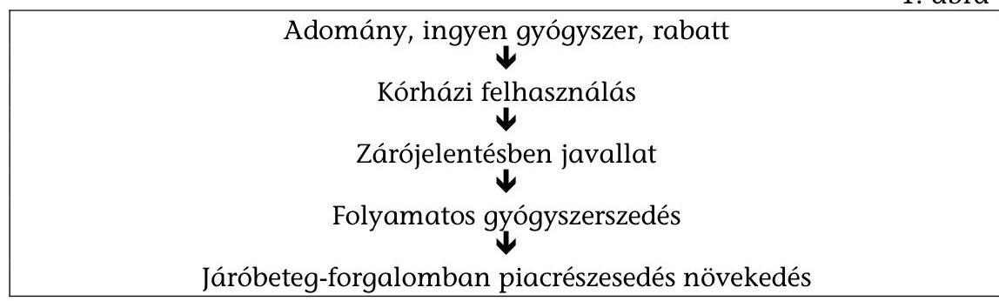

## 2. A termékek kiválasztásának szempontjai

A helyszíni vizsgálat során a kórházi és járóbeteg-forgalom összefüggésének elemzésére kiválasztott termékek, termékcsoportok kiválasztási szempontja a következő volt:

ATC csoport kijelölése:

1. Az első 10 ATC csoport rangsora gyógyszertári eladások értéke szerint (MIS 2005) (1. tábla, 1. oszlop)
2. Ugyanezen termékek elhelyezkedése a kórházi eladási listán érték szerint (MIS 2005) (1. tábla, 2. oszlop)
3. Ezen két rangsor különbsége - csökkenő értékben - 4 ATC csoport kiválasztása (1. tábla, 3. oszlop, 4. oszlop)

|  |  |  |  | 1. tábla |
| :--: | :--: | :--: | :--: | :--: |
| Megnevezés | 1. Rangsor   patikai eladás   szerint   értékben | 2. A kórházi   eladások értéke   szerinti   helyezésük | 3. A két   helyezés   különbsége | 4. ATC   csoport   választás |
| Cholesterin és   triglicerid csökkentő   szerek | 1. | 41. | 40 | 3. |
| ACE gátlók   önmagukban | 2. | 38. | 36 | 4. |
| Peptikus fekély kezelésének   gyógyszerei | 3. | 15. | 12 |  |
| Szelektív kalcium   csatorna blokkolók | 4. | 57. | 53 | 1. |

---

| fóként érhatásokkal |  |  |  |  |
| :-- | :-- | :-- | :-- | :-- |
| Antipshychotikumok | 5. | 18. | 13 |  |
| Antithrombotikus szerek | 6. | 6. | 0 |  |
| Nem steroid   gyulladásgátlók és   rheuma-ellenes   készítmények | 7. | 34. | 27 |  |
| Mineralisatióra ható szerek | 8. | 24. | 16 |  |
| Antidepresszánsok | $\mathbf{9 .}$ | $\mathbf{5 0 .}$ | $\mathbf{4 1}$ | $\mathbf{2 .}$ |
| Egyéb fájdalomcsillapítók   és lázcsökkentők | 10. | 37. | 27 |  |

ATC csoporton belüli hatóanyag választás:

1. Az adott ATC csoporton belül legnagyobb piacrészesedéssel rendelkező hatóanyag
Hatóanyagon belül készítmény (kiszerelés és hatóanyagtartalom) választás szempontjai voltak:
2. A vizsgált időszakban került forgalomba.
3. Járóbeteg és kórházi forgalom is volt 2005-ben.
4. Az összes eladásban 2004-ről 2005-re növekedés volt.
5. A készítményt az E-alap a járóbeteg-forgalomban támogatja.
6. Adott hatóanyagon belül a többihez viszonyítva nagy forgalmú készítmény.

# 3. A kiválasztott terápiás csoportok és hatóanyagok 

A fenti feltételek alapján a választott négy terápiás csoport a következő volt:

- Szelektív kalcium csatorna blokkolók főként érhatásokkal (vérnyomáscsökkentő) - választott hatóanyag: AMLODIPIN
- Antidepresszánsok - választott hatóanyag: PAROXETIN
- Kolesterin és triglicerid csökkentő szerek (vérzsírszint csökkentő) - választott hatóanyag: SIMVASTATIN
- ACE gátlók önmagukban (vérnyomáscsökkentő) - választott hatóanyag: RAMIPRIL

A kiválasztott további originális készítményekre az OEP tett javaslatot:

- Peptikus fekély kezelésének gyógyszerei - választott hatóanyag: ESOMEPRAZOLE
- ACE gátlók önmagukban (vérnyomáscsökkentők) - választott hatóanyag: PERINDOPRIL
- Koleszterin és triglicerid csökkentő szerek (vérzsírszint csökkentők) - választott hatóanyag: ATROVASTATIN

A hatóanyagokon belül kiválasztott készítményeket az elemzés terápiás csoportonként mutatja be.

---

# 4. A vizsgálat folyamata 

1. A kiválasztott készítményekre a helyszíni vizsgálat időszakában a vizsgált kórházakban tanúsítvány kitöltését kérte a vizsgálat a beszerzésekről és a rabatt és adomány értékéről és mennyiségéről.
2. Két intézmény esetén - a kialakított egyedi gyógyszerelési eljárásoknak köszönhetően - megállapítható, hogy az adományba kapott készítményekkel kiket kezeltek, ettől a két intézménytől az ÁSZ a kiválasztott készítmények vonatkozásában TAJ szám listát kért a 2006 januárjában és februárjában ezekkel az adományba kapott készítményekkel kezeltekről.
3. Az OEP a TAJ lista elemzésével a kiválasztott készítmények „tovább fogyasztási" adatait állította össze.
4. Az ÁSZ adatot kért be az OEP-től a kiválasztott készítmények járóbeteg-forgalmi adatairól.

A függelék terápiás csoportonként csoportosítva mutatja be a bekért adatokból levonható következtetéseket.

## 5. Az egyes terápiás csoportok vizsgálatának eredménye

### 5.1. Szelektív kalcium csatorna blokkolók főként érhatásokkal (vérnyomáscsökkentő készítmények)

A vizsgálat ebből a terápiás csoportból 1 hatóanyagot, azon belül 2 készítményt vizsgált a kórházi marketingtevékenység és hatása bemutatására: AMLODIPIN (hatóanyag): Cardilopin 5 mg - GENERIKUS, Amlodipin Ratiopharm 5 mg GENERIKUS

Az amlodipin hatóanyagának piacán a járóbeteg-forgalomban 2003 és 2006 között lezajlott dobozforgalmi változásokat szemlélteti a következő két ábra. Míg 2003-ban mindössze 3 gyári készítmény volt jelen, addig 2006-ra 10 különböző készítmény versenyez egymással az amlodipin hatóanyag piacán. Az újonnan bevezetett készítmények piacrészesedése fokozatosan növekszik, a piaci szereplők megoszlása egyre kiegyensúlyozottabb. A kiválasztott két generikus készítmény - a 2. ábrán narancssárgával és aláhúzva - szintén növelte a piacrészesedését a vizsgált időszakban.
2. ábra
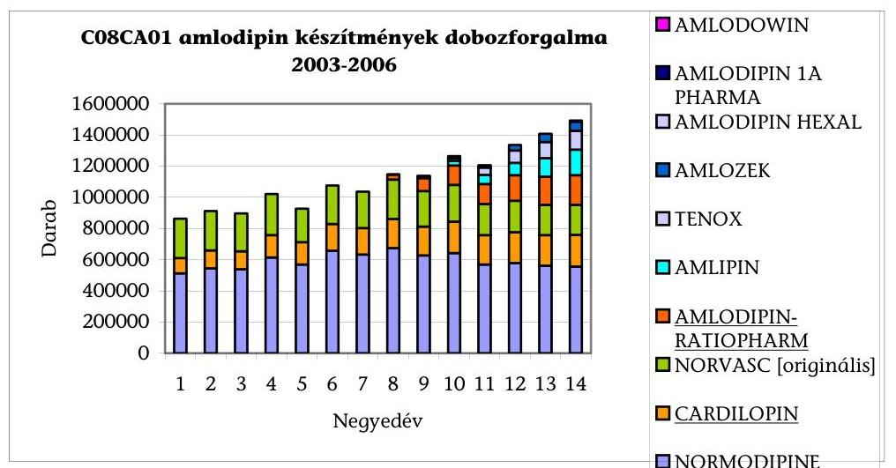

Forrás: OEP járóbeteg-forgalmi adatbázis

---

A 2000 és 2006 között folyamatosan növekedett a generikus készítmények dobozforgalma és aránya az összes forgalmon belül, miközben folyamatosan növekedett a dobozforgalom is.
3. ábra
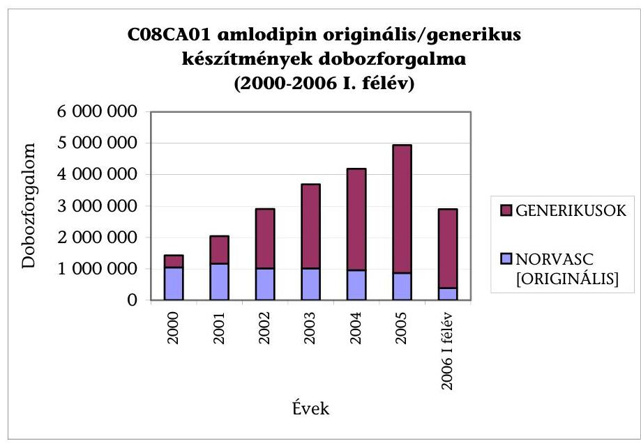

Forrás: OEP járóbeteg-forgalmi adatbázis
Az amlodipin hatóanyag piacán a generikus termékek térnyerésének hatására a támogatáskiáramlás növekedési üteme egy rövid időszak kivételével a dobozszám növekedési üteme alatt maradt (3., 4. ábra). Azaz a fogyasztás az olcsóbb generikus készítmények irányába tolódott el. Ez egyébként az OEP megítélése szerint a sikeres "generikus program" egyik fő mutatója.
4. ábra
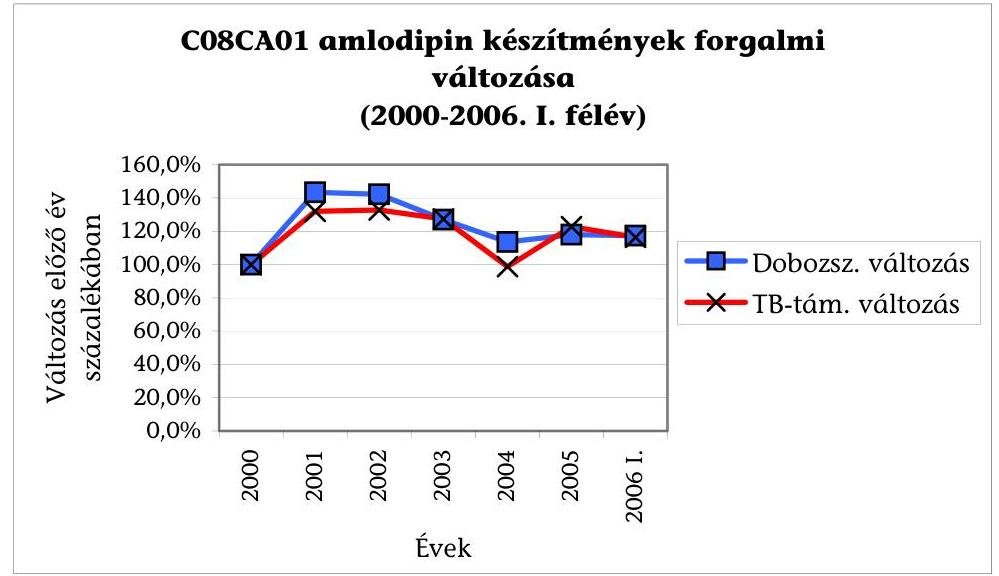

Forrás: OEP járóbeteg-forgalmi adatbázis
Az újonnan piacra vezetett készítmények (originális és generikus egyaránt) esetén az orvosokkal és az általuk ellátott betegekkel való megismertetés egyik fontos

---

„marketing-fogása" a kórházaknak adott adomány, ingyen minta és rabatt. A helyszínre kiválasztott 15 intézményeknél a két amlodipin hatóanyag tartalmú készítményre bekért rabatt, adomány és ingyen minta adatok tanulsága szerint mindkét készítmény esetén az ingyenesen kapott mennyiség jelentősen meghaladja a beszerzést (5. ábra), mindkét készítmény esetén élt a gyártója ezzel a marketing eszközzel.
5. ábra
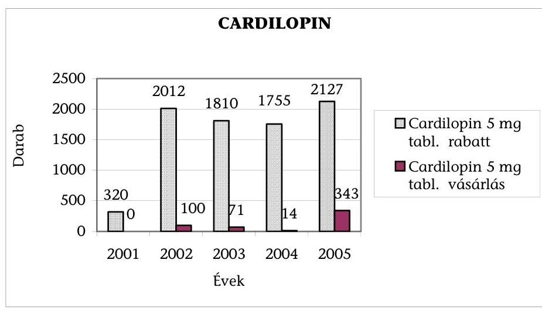

Forrás: ÁSZ tanúsítvány
Az Amlodipin-ratiopharm 5 mg készítményről a vizsgálat csak 2005-re kért adomány, ingyen minta rabatt adatot, ebben az évben a 15 intézményben 40 doboznyi készítmény beszerzésére 345 doboznyi rabatt, adomány, ingyen minta jutott.

A kiválasztott készítmények „márka-hűség" mutatóit a vizsgálat 2 kórház adomány gyógyszer felhasználási adatai alapján elemezte. A vizsgálat azt nézte, hogy azok a betegek, akiket a kórházban a kiválasztott készítmény adományából kezeltek, milyen arányban váltják ki ugyanazt a gyógyszert a járóbeteg-forgalomban.

A Cardilopin 5 mg esetében a 2 intézményben 2006. januárjában és februárjában 104 egyén gyógyszeres kezelését végezték adomány tablettával, ebből a kórházból való távozás után 79 egyén szedett valamilyen amlodipin hatóanyagot tartalmazó készítményt a továbbiakban. A 79 személy $54 \%$-a továbbiakban csak Cardilopint váltott ki a járóbeteg-forgalomban, további 14\% Cardilopint és más amlodipin származékot is vásárolt. A kórházakban 14-en szedtek Amlodipin Ratiopharm gyógyszerkészítményt, a tartósan gyógyszerszedő egyének (8 fő) 50\%-a a továbbiakban Amlodipin Ratiopharm készítményt fogyasztott.

# 5.2. ACE (angiotenzin-konvertáló enzim) gátlók önmagukban 

A vizsgálat ebből a terápiás csoportból 2 hatóanyagot, azon belül 3 készítményt vizsgált a kórházi marketingtevékenység és hatása bemutatására:
a. ramipril (hatóanyag): Tritace 10 mg - ORIGINÁLIS, és Ramace 10 mg - GENERIKUS
b. perindopril (hatóanyag): Coverex Forte - ORIGINÁLIS

---

5.2.1. A RAMIPRIL hatóanyag piaca alkalmas az originális-generikus verseny és az ehhez kapcsolódó kórházi marketingtevékenység bemutatására. A kiválasztott készítmények voltak: Tritace 10 mg , originális és a Ramace 10 mg , generikus készítmény.

A ramipril csoportban a generikus készítmények az originális mellett 2005-ben jelentek meg számottevő mértékben (6. ábra). Megfigyelhető, hogy az originális készítménynek - Tritace 10 mg (narancssárga) - a generikusok - pl.: Ramace 10 mg (zöld) megjelenésével sem csökkent a dobozforgalma, hanem a generikus forgalom „rárakódott" az origináliséra.
6. ábra
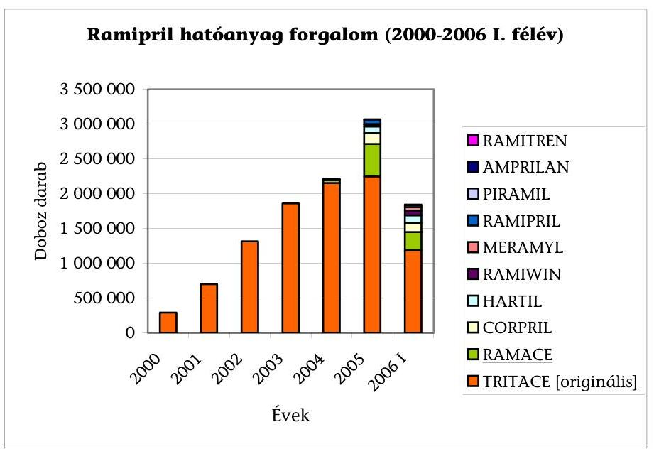

Forrás: OEP járóbeteg-forgalmi adatbázis
A ramipril hatóanyagának piacán a TB támogatás növekedésének üteme 2005-ben, a generikus készítmények megjelenésével kerül a dobozszám növekedési üteme alá. (7. ábra)
7. ábra
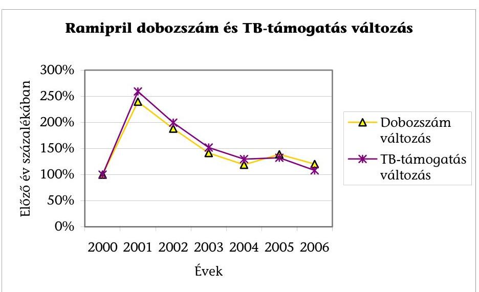

Forrás: OEP járóbeteg-forgalmi adatbázis

---

A helyszínre kiválasztott intézmények tanúsítványi adatai alapján az originális Tritace 10 mg gyártója folyamatos kórházi adománnyal (is) hozzájárul stagnáló dobozforgalmához, míg a generikus Ramace gyártója használja ugyanezt az eszközt, annak érdekében, hogy termékét a piacon megismertesse (8., 9. ábra). A számok tanulsága szerint az originális Tritace 10 mg gyártója nagyobb mennyiségű rabattot és adományt nyújt az intézményeknek (2005-ben 49 doboz beszerzés mellett 1500 doboz ingyenes készítmény), mint a generikusnak számító Ramace 10 mg gyártója (2005-ben 63 doboz beszerzése mellett 190 doboz ingyen gyógyszer).
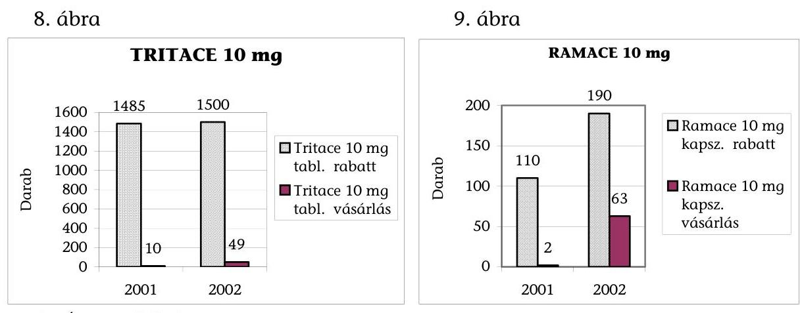

Forrás: ÁSZ tanúsítvány
A két készítmény „tovább-fogyasztási" adatai alapján az adatszolgáltató 2 kórházban 90-en szedtek Tritace-t, ebből a továbbiakban 66 személy (73\%) fogyasztott a továbbiakban valamilyen ramipril hatóanyag származékot. A gyógyszerszedők 89\%-a (55 fő) a továbbiakban Tritace készítményt váltott ki a járóbeteg-forgalomban. A két kórházban mindössze 4 fő kapott Ramace készítményt, ebből 3 fő a továbbiakban fogyasztott valamilyen ramipril (hatóanyag) származékot, közülük 1 váltott ki Ramacet patikában.
5.2.2. A PERINDOPRIL hatóanyag piaca alkalmas az originális készítmény viselkedésének és az ehhez kapcsolódó kórházi marketingtevékenység bemutatására. A kiválasztott készítmény volt: Coverex Forte.

A perindopril hatóanyagot 2006-ig a Coverex gyári készítmény versenytárs nélkül egyedül képviseli egyre növekvő dobozforgalommal (10. ábra - az ábrán narancssárgával). Az originális készítményeknek generikumaik megjelenéséig nincsen versenytársuk a saját hatóanyagukon belül.

---

10. ábra
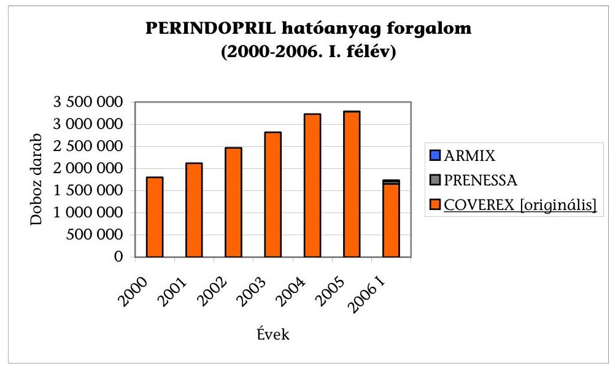

Forrás: OEP járóbeteg-forgalmi adatbázis
Az originális készítmények versenytársai elsősorban az azonos terápiás csoportban található más hatóanyag tartalmú (de közel azonos hatású) hatóanyagok, ezeket mutatja be a 10. ábra. A PERINDOPRIL hatóanyag (ábrán narancssárgával) folyamatosan enyhén növekvő arányt képvisel az önmagukban ható ACE gátlók csoportjában (11. ábra).
11. ábra
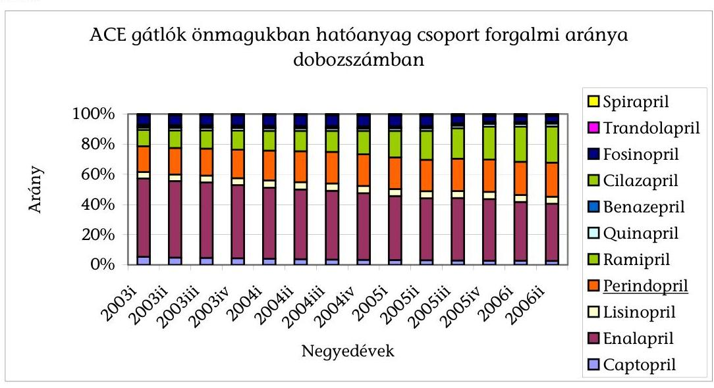

Forrás: OEP járóbeteg-forgalmi adatbázis
Rabattal, adománnyal és ingyenes mintával kapcsolatos tanúsítványi adatbekérést a vizsgálat a Coverex termékcsoporton belül a vizsgálat a 2004-ben bevezetett Coverex Forte tablettáról kért. (12. ábra)

---

12. ábra
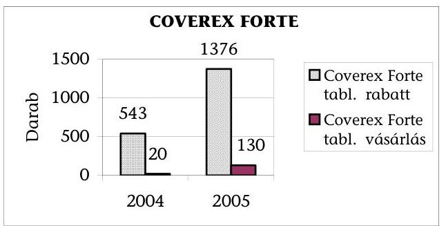

Forrás: ÁSZ tanúsítvány
A tanúsítványi adatok elemzése azt mutatja, hogy a helyszínre kijelölt 15 intézmény összesen 2005-ben 130 doboz Coverex Forte tabletta vásárlása mellett 1376 doboznyi ingyen gyógyszert (rabatt, adomány, ingyen minta) kapott. Az adatbekérés eredménye igazolta, hogy a termékcsoportban a gyártó/forgalmazó él a kórházi marketing ezen eszközével.

A Coverex Forte tabletta tovább fogyasztási adatai (2 kórház adatszolgáltatása) szerint, az intézményekben összesen 25 fő szedett Coverex Forte gyári készítményt, a továbbiakban 20-an szedtek perindopril hatóanyagot, ennek 90\%-a azaz 18 fő szedett a továbbiakban Coverex Forte gyári készítményt. Azaz a kórházban fogyasztott készítmény nagy mértékben meghatározta a további járóbeteg-forgalmi gyógyszer fogyasztást.

# 5.3. A koleszterin és triglicerid csökkentő szerek (vér zsírszint csökkentő készítmények) 

A vizsgálat ebből a termékcsoportból két hatóanyagot és ezen belül öt terméket választott ki adatbekérésre:

- SIMVASTATIN (hatóanyag): Zocor Forte $\mathbf{4 0} \mathbf{~ m g}$-originális, Simvor $\mathbf{2 0} \mathbf{~ m g}$ generikus, Simvastatin-ratiopharm 20 mg -genrikus, Simvacol 20 mg generikus
- ATROVASTATIN (hatóanyag): Sortis - originális

### 5.3.1. SIMVASTATIN hatóanyag

A SIMVASTATIN hatóanyag piacán a vizsgált időszakban megfigyelhető, hogy 2002-ig az originálisnak számító Zocor mellett nem volt generikus termék, majd 2003-tól egyre több generikus készítmény jelent meg. Ezalatt a Zocor-ra fordított TB támogatás csökkent, a piac egyre egyenletesebben oszlik meg a 6 legnagyobb forgalmú termék között. (13. ábra) Az ábrán aláhúzva és narancssárga, zöld és sárga színnel láthatók az adatbekérésre kiválasztott termékek. A Zocor (narancssárga) mellett, a kiválasztott három generikus készítményre fordított TB támogatás 2003-tól folyamatosan növekszik.

---

13. ábra
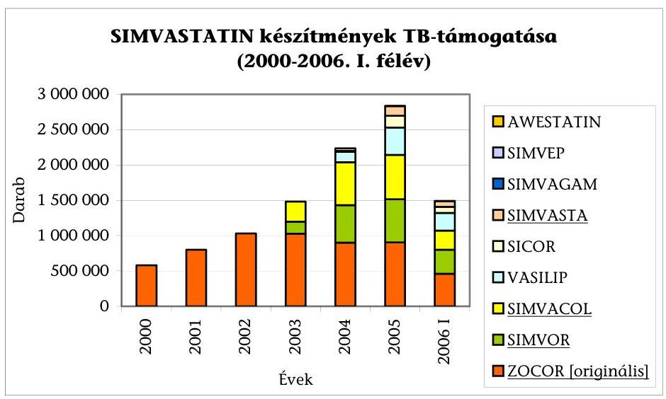

Forrás: OEP
Adott hatóanyagon belül a kiáramló TB támogatás folyamatosan nő. Azt a megfigyelést az OEP Gyógyszerügyi Főosztálya is megerősítette, hogy sok esetben a generikus készítmények piacra lépésével az adott (korszerű, de olcsóbb) hatóanyag új betegek számára válik megfizethetővé, ezért az ellátott betegszám, így a támogatáskiáramlás is növekszik (14. ábra).
14. ábra
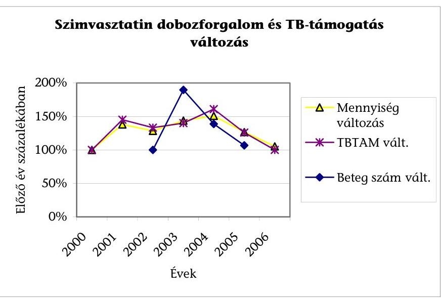

Forrás: OEP
Az ábrán megfigyelhető még, hogy a generikus készítményekkel a TB támogatás növekedési üteme csak rövid időszakra csökkent a dobozszám növekedési üteme alá 2003-ban, majd újra meghaladta és csak 2006-ban csökkent újra alá, azaz a „generikus program" sikeressége, azaz a fogyasztás átterelése alacsonyabb támogatástartalmú készítmények irányába ennél a hatóanyagnál nem igazolható.

A 15.-18. ábrán megfigyelhető, hogy a helyszínen vizsgált intézmények a vizsgált időszakban a SIMVASTATIN hatóanyag tartalmú termékek közül mind az originális, mind a generikus készítményekből jelentős mennyiségű rabattot, adományt és ingyen

---

mintát kaptak. Két gyári készítmény esetén megfigyelhető, hogy az intézmények nem is vásároltak belőlük, az ingyenesen kapott mennyiség elegendő volt a tevékenységük végzéséhez. Hasonlóan a RAMIPRIL hatóanyagánál megfigyelthez, az intézmények az originális termékből (Zocor Forte 40 mg ) nagyobb mennyiséget kaptak ingyen, mint a generikumokból (Simvor 20 mg , Simvastatin-ratiopharm 20 mg , és Simvacol 20 mg ).
15. ábra
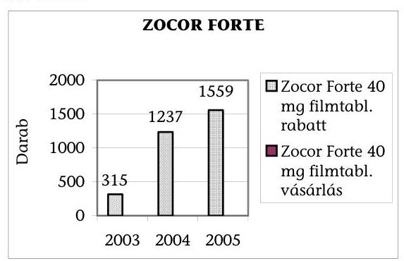
17. ábra
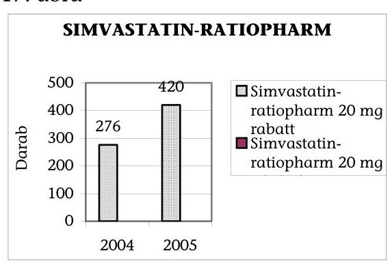
18. ábra
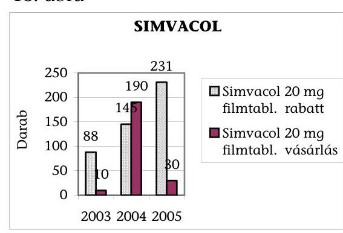

Forrás: ÁSZ tanúsítvány
A készítmények tovább fogyasztási adatai 2 intézmény tapasztalatai szerint a következők:

- Zocor Forte: a két kórházban 2006. január és február hónapban összesen 18-an szedtek Zocor Forte-t, a későbbiekben a tartósan koleszterinszint csökkentő gyógyszerszedők 100\% (15 fő) Zocor Forte-t szedett.
- Simvor: a kórházban 53-an kaptak Simvor-t, ebből 75\% (40 fő) a továbbiakban is szedett koleszterinszint csökkentőt (simvastatin hatóanyag), a gyógyszerszedők 80\%-a a továbbiakban Simvort szedett.
- Simvastatin-ratiopharm: a kórházban 17 kaptak az adomány készítményből, ebből 7 szedett tovább szimvasztatin hatóanyagot a kórházi kezelését követően, mindegyikük (100\%) a kórházban alkalmazott készítményt.
- Simvacol 20 mg : A kórházban 9-en kaptak Simvacol-t, ebből 2-en szedtek a továbbiakban Simvacol-t.

# 5.3.2. ATORVASTATIN hatóanyag 

Az ATORVASTATIN hatóanyagból a vizsgálat a Sortis gyári nevű originális készítményről kért be adatokat. Az ATORVASTATIN hatóanyag piacán belül a Sortis-

---

nak (ábrán narancssárgával) 2005-ig nincs versenytársa, és még generikumainak megjelenésekor is növeli a dobozforgalmát (19. ábra).
19. ábra
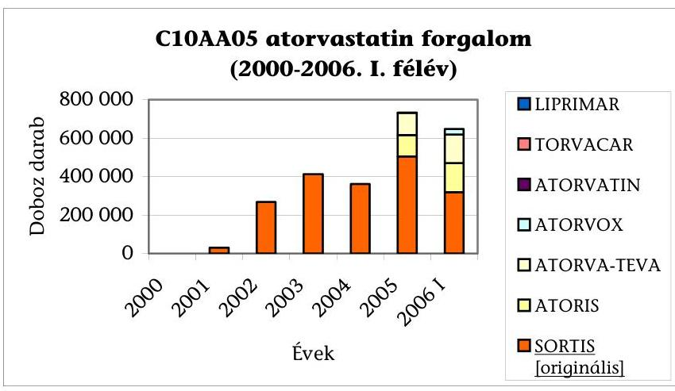

Forrás: OEP járóbeteg-forgalmi adatbázis
Az originális készítmények fő versenytársai az azonos hatású, de eltérő hatóanyagú készítmények, ennél a terápiás csoportnál a „statinok". A statinok-on (HMG CoA reductase inhibitorok) belül az ATORVASTATIN fogyasztói áron számított aránya folyamatosan növekvő (ábrán narancssárgával) (20. ábra).
20. ábra
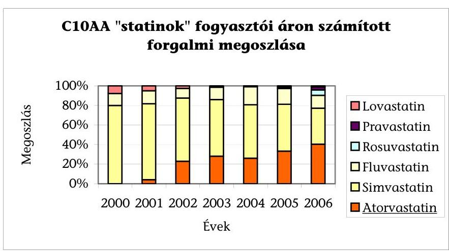

Forrás: OEP járóbeteg-forgalmi adatbázis
A növekvő piaci részesedéshez jelentős a mértékű kórház adomány is hozzájárul. A helyszíni vizsgálatba vont 15 intézmény tanúsítványi adatai alapján az intézményeknek egy év kivételével nem volt beszerzésük, az összes felhasznált készítményt ingyen kapták (21. ábra).

---

21. ábra
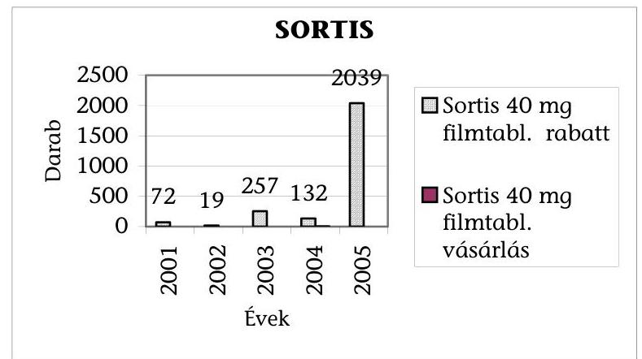

Forrás: OEP járóbeteg-forgalmi adatbázis
A kiválasztott két kórházban 2006. január, február hónapban 110 fót kezeltek a gyógyszeres terápia során ingyenesen kapott Sortis készítménnyel. A továbbiakban 78 fő szedett atrovastatin hatóanyag-tartalmú gyógyszert, a gyógyszerszedők 85\%-a (73 fő) a járóbeteg-forgalomban is Sortist váltott ki.

# 5.4. Antidepresszánsok 

A vizsgálat ebből a termékcsoportból egy hatóanyagot és ezen belül két terméket választott ki adatbekérésre: PAROXETIN (hatóanyag): Paroxat 20 mg - GENERIKUS, Rexetin 20 mg - GENERIKUS

A piaci helyzet ennél a hatóanyagnál sajátos, mivel az originális készítmény: Seroxat nem rendelkezett kiemelt (diagnózishoz kapcsolódó) támogatással, míg az ebbe a csoportba tartozó generikumok már igen, (a generikumok mellett az originális készítmény kimondottan magas árú volt), ezért a gyártó kibocsátotta saját generikumát Paroxat elnevezéssel. A 22. ábrán látható, hogy a Paroxat (az ábrán zölddel) fokozatosan átveszi a Seroxat (az ábrán lila) által korábban a járóbeteg-forgalomban elfoglalt helyet. Az originális készítmény (Seroxat - az ábrán lila) mellett a generikumok - Rexetin, (az ábrán narancssárgával) - 2002-től jelennek meg.
22. ábra
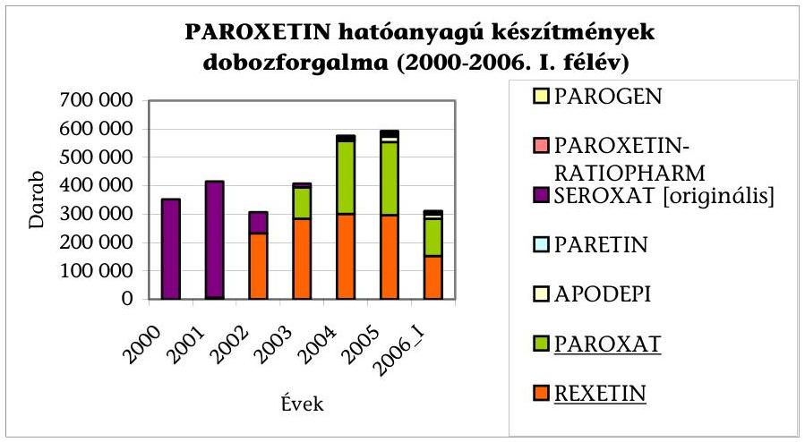

Forrás: OEP- járóbeteg-forgalmi adatbázis

---

A generikus készítmények piaci térnyeréséhez mindkét termék esetén hozzájárult a kórházaknak juttatott ingyenes gyógyszer. A helyszínen vizsgált 15 intézménytől bekért rabatt, adomány, ingyenes mintáról bekért tanúsítványi adatok alapján mindkét kiválasztott készítményből az intézmények jelentős mennyiségű ingyen gyógyszert kaptak (23., 24. ábra).
23. ábra
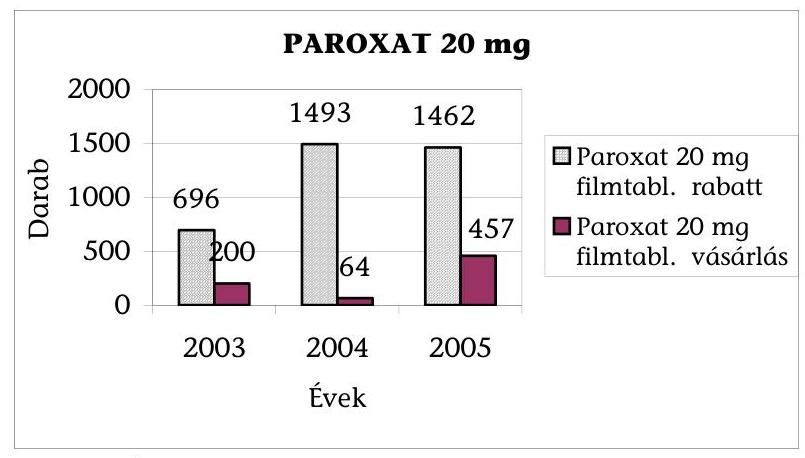

Forrás: ÁSZ tanúsítvány
24. ábra
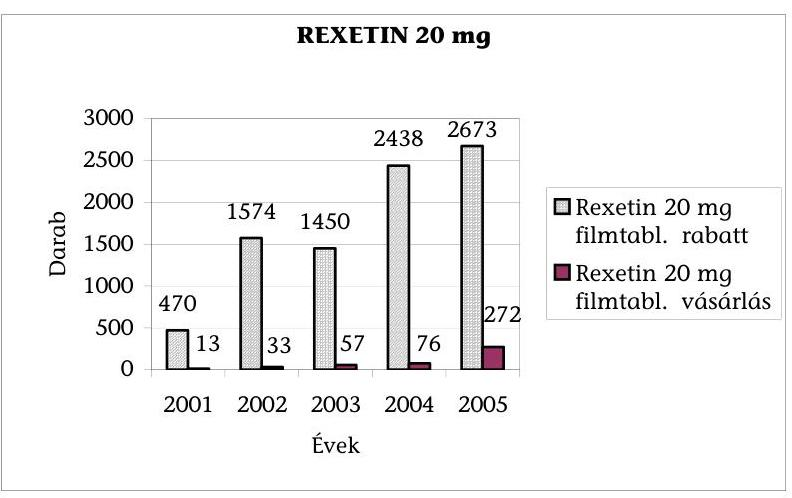

Forrás: ÁSZ tanúsítvány
A készítmények továbbfogyasztási adatai azt mutatják, hogy a járóbeteg gyógyszerfogyasztásnál meghatározó a kórházban beállított készítmény.

A vizsgált 2 intézményben 104 főt kezeltek Rexetin-nel 2006 januárjában és februárjában. Ebből 64 fő tartósan szedett PAROXETIN hatóanyagot a kórházi kezelést követően. A gyógyszerszedők $91 \%$-a ( 58 fő) szedett a későbbiekben Rexetin 20 mg -os gyári készítményt.

A vizsgált intézményekben 51 főt kezeltek ingyenesen kapott Paroxat 20 mg -os készítménnyel, a továbbiakban 42 fő szedett valamilyen PAROXETIN hatóanyag tartalmú készítményt. A gyógyszerszedők 93\%-a a későbbiekben Paroxat 20 mg -ot szedett.

---

# 5.5. Peptikus fekély kezelésének gyógyszerei 

A vizsgálat ebből a termékcsoportból egy hatóanyagot és ezen belül az egyetlen forgalomban lévő originális terméket választotta ki adatbekérésre: ESOMEPRASOL (hatóanyag): Nexium 40 mg - ORIGINÁLIS

Az originális készítmények nem egy hatóanyagon belül, hanem hatóanyagok közötti versenyt indítanak el, új hatóanyagot létrehozva, ezért az ábra a hasonló hatású termékek versenyét mutatja be. A Nexium (ábrán narancssárgával) növekvő piaci részesedést szerzett magának a protonpumpa - inhibitorok piacán. (25. ábra)
25. ábra
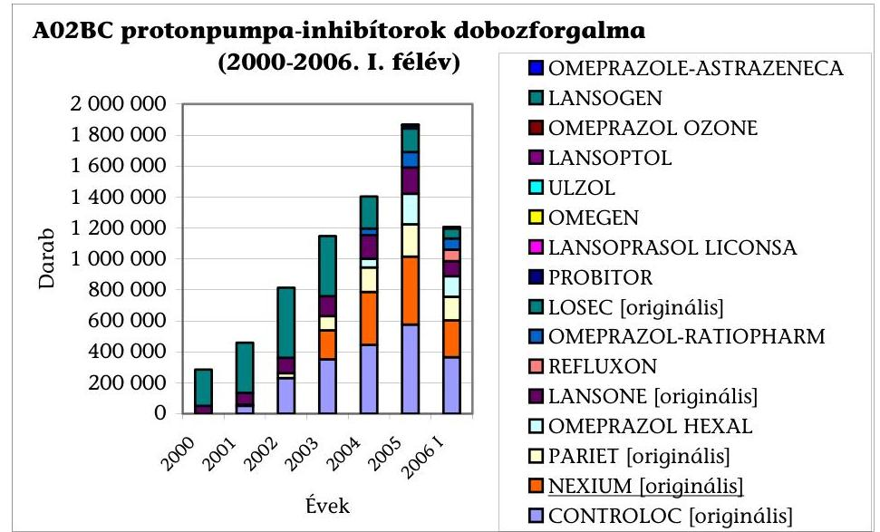

Forrás: OEP járóbeteg-forgalmi adatbázis
A növekvő piaci részesedés egyik fontos marketing eszköze volt a kórházaknak ingyenesen adományozott gyógyszer. Nexium-ból a helyszínre kiválasztott 15 intézmény 218 doboz beszerzése mellett 1058 doboz ingyenes gyógyszert kapott. (26. ábra)
26. ábra
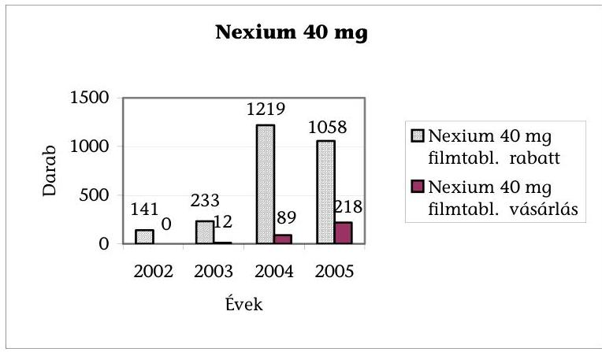

Forrás: OEP járóbeteg-forgalmi adatbázis

---

A kiválasztott két intézményben 2006. január és február hónapban 229 fót kezeltek Nexium 40 mg-os készítménnyel, a továbbiakban 104 fő tartósan Nexium-ot váltott ki a járóbeteg-forgalomban.
2007. május