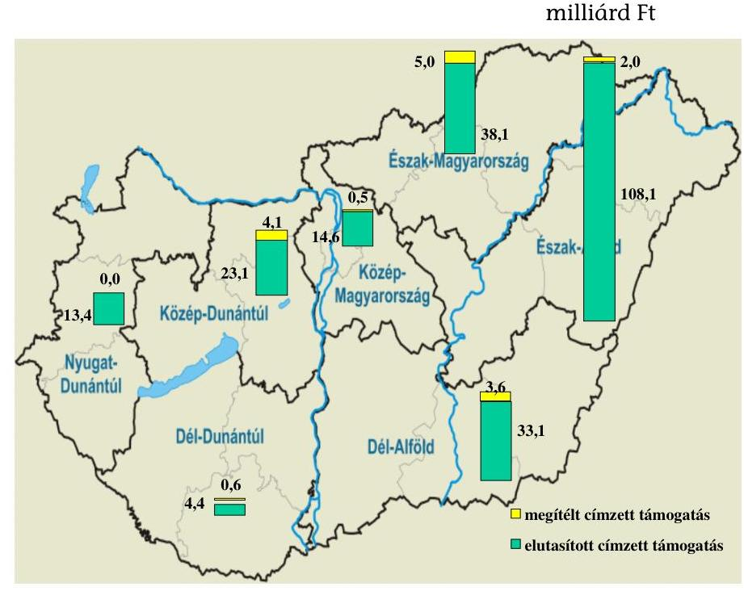
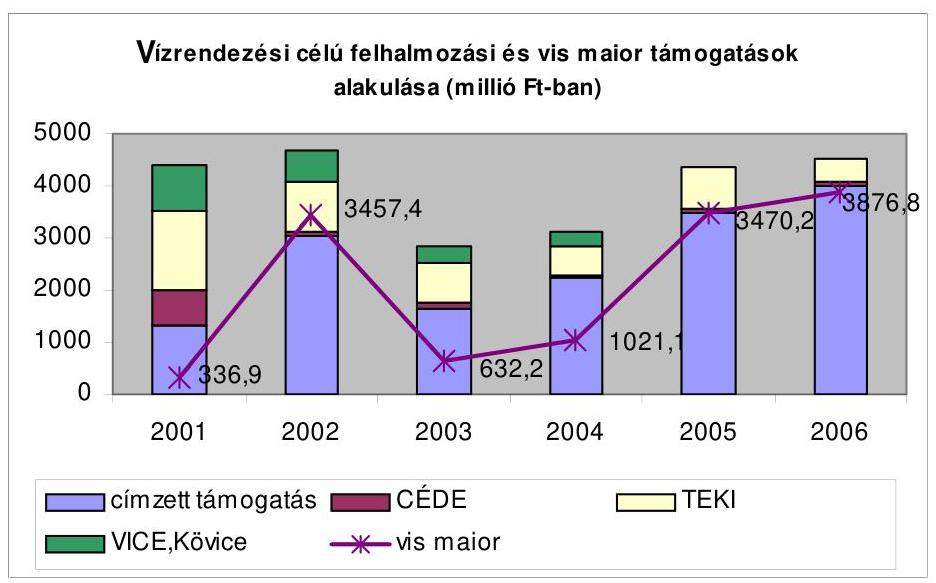
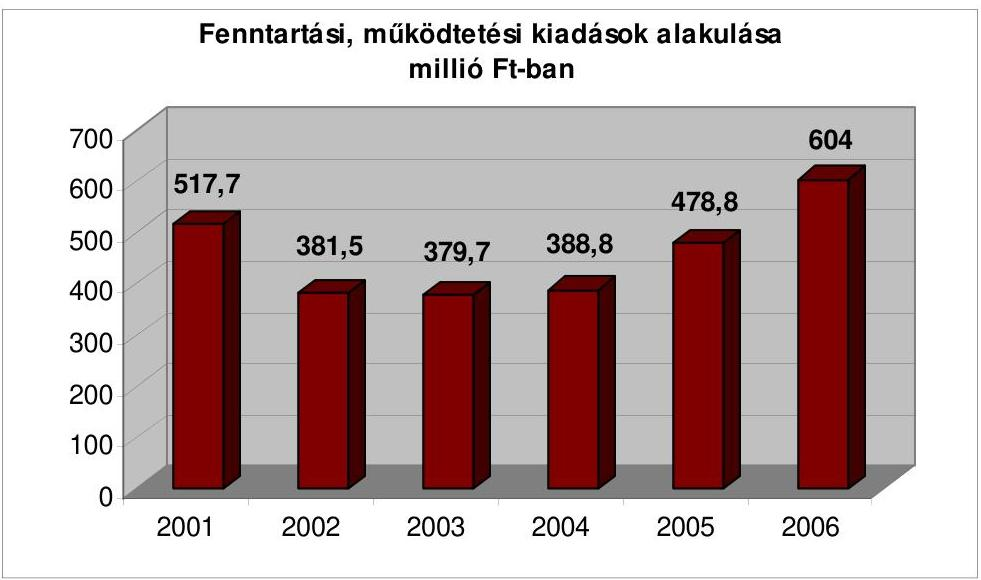
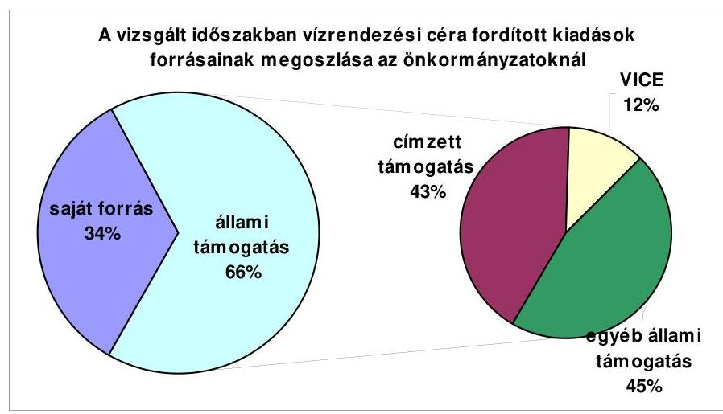
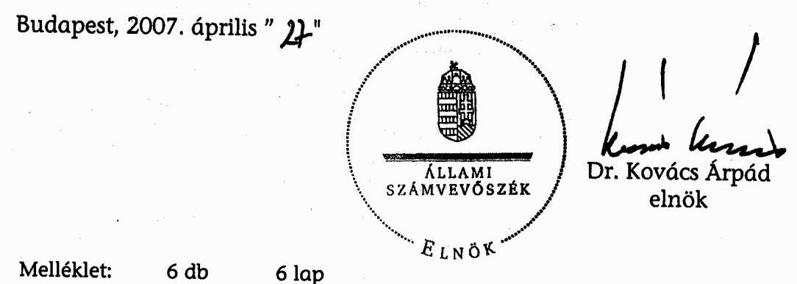
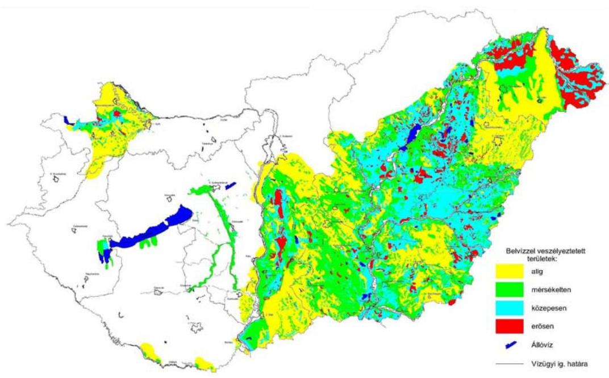
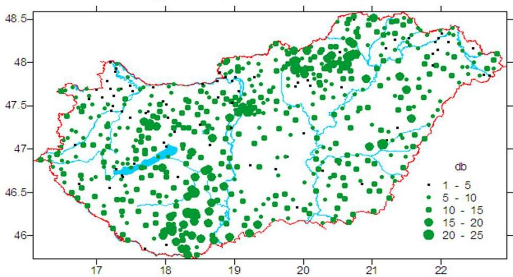
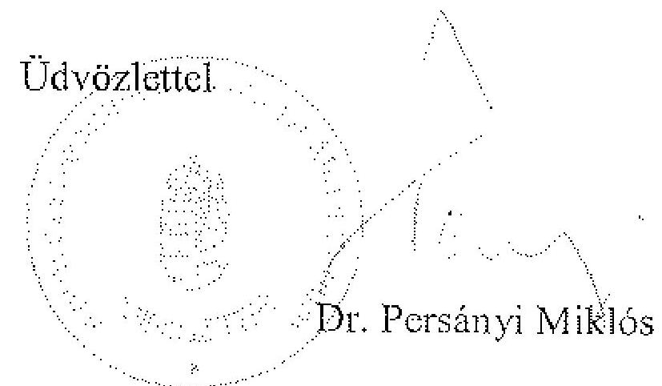

# ÁLLAMI   SZÁMVEVŐSZÉK 

## JELENTÉS

a települési önkormányzatok vízrendezési és csapadékvíz elvezetési feladatai ellátásának ellenőrzéséről

---

# 3. Önkormányzati és Területi Ellenőrzési Igazgatóság 

3.2 Szabályszerűségi és Teljesítmény Ellenőrzési Főcsoport

Iktatószám: V-1010-163/2006-2007.
Témaszám: 815
Vizsgálat-azonosító szám: V0302

## Az ellenőrzést felügyelte:

Dr. Lóránt Zoltán
főigazgató
Az ellenőrzés végrehajtásáért felelős:
Németh Péterné
főcsoportfőnök
Az ellenőrzést vezette:
Holman Magdolna
osztályvezető
A számvevői jelentések feldolgozásában és a jelentés összeállításában közreműködtek:

Kispálné Wiedemann Györgyi tanácsadó

Nagy Attila
számvevő tanácsos

Benczik Lászlóné
számvevő tanácsos
Dr. Hajós Béla
külső szakértő

## Az ellenőrzést végezték:

| Benczik Lászlóné | Csuti Lajos |
| :-- | :-- |
| számvevő tanácsos | számvevő tanácsos |
| Fercsik Gyula | Fodor Tivadarné |
| főtanácsadó | számvevő tanácsos |
| Jakubcsák Jenő | Keszthelyi Zoltán |
| számvevő tanácsos | számvevő tanácsos |
| Dr. Klapcsik László | Komlósiné Bogár Éva |
| irodavezető | számvevő tanácsos |
| Maróti Sándor | Nagy Attila |
| számvevő tanácsos | számvevő tanácsos |
| Pálfi András | Dr. Szikszai Bertalan |
| számvevő tanácsos | számvevő tanácsos |
| Újvári Józsefné | Dr. Szirota István |
| számvevő tanácsos | külső szakértő |

Dr. Ernst László
főtanácsadó
Hadházy Sándor
számvevő tanácsos
Kispálné Wiedemann Györgyi
tanácsadó
Dr. Maros Gyöngyi
tanácsadó
Nagy László Csaba
számvevő tanácsos
Dr. Telkes Imre
számvevő tanácsos
Váriné Kádár Margit szakértő

---

# A témához kapcsolódó eddig készített számvevőszéki jelentések: 

## címe

Jelentés a települési önkormányzatok vízrendezési és csapadékvíz elvezetési feladatai ellátásának és az ehhez kapcsolódó állami támogatás felhasználásának vizsgálatáról
sorszáma
9909

---

# TARTALOMJEGYZÉK 

BEVEZETÉS ..... 7
I. ÖSSZEGZŐ MEGÁLLAPÍTÁSOK, KÖVETKEZTETÉSEK, JAVASLATOK ..... 9
II. RÉSZLETES MEGÁLLAPÍTÁSOK ..... 17

1. A vízrendezésre, csapadékvíz elvezetésre, a védekezésre vonatkozó önkormányzati feladatok szabályozási háttere és támogatása ..... 17
1.1. A feladatok központi szabályozása ..... 17
1.2. A feladatellátás helyi szabályozása, a hatósági előírások érvényesülése ..... 20
1.3. A feladatellátás támogatása ..... 26
1.3.1. Felhalmozási célú támogatások ..... 26
1.3.2. Fenntartási célú támogatások ..... 33
2. A vízrendezést és csapadékvíz elvezetést szolgáló vagyon, a vízilétesítmények összehangolt működése ..... 36
2.1. A feladat ellátását szolgáló vagyon nagysága, nyilvántartása, műszaki állaga ..... 36
2.2. A feladatellátás szervezeti formái, együttműködés a feladatok ellátásában ..... 40
3. Az önkormányzati vízrendezési és csapadékvíz elvezetési feladatok finanszírozása ..... 43
3.1. A vízrendezési és csapadékvíz elvezetési feladatokra tervezett és ténylegesen teljesített kiadások és bevételek elszámolása, azok alakulása ..... 43
3.2. Az állami támogatások szerepe az önkormányzati tulajdonú vízrendezési és csapadékvíz elvezetési létesítmények fejlesztésében, fenntartásában ..... 47
4. A vizek okozta rendkívüli káresemények elleni védekezés ..... 54

---

# MELLÉKLETEK 

1. számú Az ellenőrzött önkormányzatok vízrendezési feladataihoz kapcsolódó vagyon változása
2. számú Az ellenőrzött önkormányzatok éves költségvetési kiadásainak, valamint a vízrendezési és csapadékvíz elvezetési feladataival összefüggően szakfeladatokon elszámolt kiadásainak alakulása
3. számú Az ellenőrzött önkormányzatok éves költségvetési bevételeinek, valamint a vízrendezési és csapadékvíz elvezetési feladataival összefüggően szakfeladatokon elszámolt bevételeinek alakulása
4. számú Az ellenőrzött önkormányzatok vízrendezési és csapadékvíz elvezetési feladataihoz kapcsolódó támogatások (2001 - 2006. I. félév)
5. számú Belvízzel veszélyeztetett területek Magyarországon 2001- 2006. évek között a 30 mm-nél nagyobb napi csapadékösszegek esetszámai
6. számú Az ellenőrzött önkormányzatok vízkáreseményeinek jellemző adatai

## FÜGGELÉKEK

1. számú A vizsgált önkormányzatok jegyzéke
2. számú A vizsgált KÖVIZIG-ek jegyzéke

---

# RÖVIDÍTÉSEK JEGYZÉKE 

| Áht. | 1992. évi XXXVIII. törvény az államháztartásról |
| :--: | :--: |
| Cct. | 1992. évi LXXXIX. törvény a helyi önkormányzatok címzett és céltámogatási rendszeréről |
| Étv. | 1997. évi LXXVIII. törvény az épített környezet alakításáról és védelméről |
| Kvt. | 1995. évi LIII. törvény a környezet védelmének általános szabályairól |
| Ötv. | 1990. évi LXV. törvény a helyi önkormányzatokról |
| Tttv. | 1996. évi XXI. törvény a területfejlesztésről és a területrendezésről |
| Tvt. | 1996. évi LIII. törvény a természet védelméről |
| Vgtv. | 1995. évi LVII. törvény a vízgazdálkodásról |
| AVOP | Agrár- és Vidékfejlesztési Operatív Program |
| ÁSZ | Állami Számvevőszék |
| CÉDE | Céljellegű decentralizált támogatás |
| DDKÖVIZIG | Dél-Dunántúli Környezetvédelmi és Vízügyi Igazgatóság |
| FETI-KÖVIZIG | Felső-Tisza-Vidéki Környezetvédelmi és Vízügyi Igazgatóság |
| FVM | Földművelésügyi és Vidékfejlesztési Minisztérium |
| GKM | Gazdasági és Közlekedési Minisztérium |
| KAC | Környezetvédelmi Alap Célelőirányzat |
| KDV-KÖVIZIG | Közép-Duna-Völgyi Környezetvédelmi és Vízügyi Igazgatóság |
| KSH | Központi Statisztikai Hivatal |
| KÖTEVIFE | Környezetvédelmi, Természetvédelmi és Vízügyi Felügyelőség |
| KÖVICE | Környezetvédelmi és Vízügyi Célelőirányzat |
| KÖVIZIG | Környezetvédelmi és Vízügyi Igazgatóság |
| KvVM | Környezetvédelmi és Vízügyi Minisztérium |
| ÖTM | Önkormányzati és Területfejlesztési Minisztérium |
| SzMSz | Szervezeti Működési Szabályzat |
| TERKI | Területi kiegyenlítést szolgáló fejlesztési támogatás |
| VÁB | Vagyonátadó Bizottság |
| VICE | Vízügyi Célelőirányzat |
| VIFE | Vízügyi Felügyelőség |

---

.

---

# ÉRTELMEZŐ SZÓTÁR 

Árvíz

Ár- és belvíz veszélyeztettség

Belvízcsatorna

Dombvidéki vízrendezés

Nyílt csapadékvíz elvezető csatorna

Síkvidéki vízrendezés

Folyó vagy vízfolyás középvízi medrének partélet meghaladó, illetve középvízi medréből kilépő víz.

Az Országgyűlés az állam és társadalom egészének a veszélyeztetett területeken élő lakosságról való gondoskodás felelőssége elvéből kiindulva, az érintetteknek a károk utólagos mérséklésében vagy megtérítésében való érdekközössége kialakításának, illetőleg öngondoskodó felelősségének megerősítése és az állami segítség hatékonyabbá tételé érdekében alkotta meg a Wesselényi Miklós Ár- és Belvízvédelmi Kártalanítási Alapról szóló 2003. évi LVIII. törvényt. A törvényben kapott felhatalmazás alapján a 18/2003. (XII. 9.) számú KvVM-BM együttes rendelet tartalmazza a települések ár- és belvíz veszélyeztetettségi alapon történő besorolását. Az együttes rendelet szerint a települések ár- és belvíz veszélyeztetettségi alapon történő besorolását a legveszélyeztetettebb településrész határozza meg, amely alapján „A" kategóriába az erősen veszélyeztetett, „B" kategóriába a közepesen veszélyeztetett, „C" kategóriába az enyhén veszélyeztetett települések tartoznak.

A belvízcsatorna síkvidéki területen mesterségesen létesített vízilétesítmény. A természetes csapadékból származó káros és felesleges vizek meghatározott időn belüli, szabályozott elvezetését szolgálja. Vízgyűjtőterülete nagyobb térséget érint, nyomvonala a városok, községek területén is keresztülhalad, így a településekre hulló természetes csapadék elvezetését is biztosítja. Vonalvezetését és esését a terep- és a befogadó vízállás viszonyai határozzák meg.

A dombvidéki vízrendezés a vízgyűjtőre csapadék formájában jutó víz lehetőség szerinti legalacsonyabb kártételek melletti elvezetését, szabályozott lefolyását célzó összetett tevékenység. Magában foglalja a kis vízfolyások, patakok meder rendezését, képessé téve azokat az árvízhozamok levezetésére, az árhullámokat felfogó tározók építésére.

A települések területére hullott csapadékvíz összegyűjtését és rendezett elvezetését szolgáló létesítmény, amely lehet földmedrű vagy burkolt. Ide sorolhatók még a külvízcsatornák, útárkok is.

A síkvidéki vízrendezés célja az adott területen képződő kedvezőtlen meteorológiai és vízjárási tényezők hatására hirtelen hóolvadásból és csapadék tevékenységből, illetve

---

# magas talajvíz állásból a káros víztöbblet elvezetése, a természetes csapadék jobb hasznosulásának előmozdítása. A síkvidéki vízrendezés tartalmazza az árvízvédelmet, víztározást és vízelvezetést. 

Vízfolyás

Vízrendezés

Zárt csapadékvíz elvezető csatorna

Minden olyan természetes terepalakulat, képződmény, amelyben állandóan vagy időszakosan víz áramlik. Állandó jellegű vízfolyás patak névvel is jelölhető. Hegyvidéki és dombvidéki sebes és sok hordalékot görgető vízfolyások torrensek ${ }^{1}$ vagy vadpatakok.

A vízrendezés célja a lehullott csapadék helyben tartása, a helyileg nem hasznosítható káros vizek elvezetése. A települési vízrendezés magában foglalja a belvízveszély megszüntetését, a csapadékvíz-elvezetés kiépítését, fejlesztését, záportározók és települési csapadékvíz-tározók kiépítését, a lakossági vízhasználatok ésszerűsítését.

A települések területére hullott csapadékvíz összegyűjtését és rendezett elvezetését szolgáló létesítmény, amely lehet elválasztó rendszerű (csak csapadékvíz szállításra) és egyesített rendszerű (csapadék- és szennyvízszállításra). E körbe tartoznak a lefedett medrek is.

[^0]
[^0]:    ${ }^{1}$ Több vízmosás csapadék vizét összegyűjtő, nagy esésű időszakos vízfolyás.

---

# JELENTÉS 

## a települési önkormányzatok vízrendezési és csapadékvíz elvezetési feladatai ellátásának ellenőrzéséről

## BEVEZETÉS

Az utóbbi évek rendkívüli, csapadék okozta helyi vízkár eseményei ráirányították a figyelmet arra, hogy az emberi élet és a településeken felhalmozódó egyre növekvő nemzeti vagyon értékének a védelme, az élhető környezet biztosítása érdekében az önkormányzati vízgazdálkodási feladatokon belül nagyobb hangsúlyt kell adni a települési vízrendezési feladatoknak és ezen belül a megelőzést szolgáló fejlesztéseknek, illetve a rekonstrukciós munkáknak. Nemzetközi összehasonlításban Magyarország vízkár veszélyeztetettsége Európában egyedülálló, megközelítőleg hasonló helyzetben csak Hollandia van. Magyarország a Kárpát-medence magas hegyekkel körülhatárolt földrajzi egységének nagyjából a közepén helyezkedik el. A felszíni vizek 96%-a külföldről érkezik az ország területére. A vízgyűjtő területek döntő része a határokon kívül helyezkedik el. Beavatkozásokat befolyásolni is csak korlátozottan, a szomszédos országokkal együttműködve lehetséges. A nyugat-európai óceáni, a dél-európai mediterrán és a kelet-európai kontinentális időjárás egyaránt kifejti hatását, ezért az időjárás szeszélyes, jelentős szélsőségek is előfordulnak. Nagymértékben változik a csapadékvíz nagysága, időbeli és térbeli eloszlása, s gyakoriak a helyi jelentőségű, nagy intenzitású esők, zivatarok.

Az ország természeti adottságai alapján a vizek kártételeinek lehetősége a síkvidéki, a hegy- és dombvidéki településeken egyaránt jelen van. Területének csaknem fele (44 ezer $\mathrm{km}^{2}$) síkvidéki, valamivel több, mint fele (47 ezer $\mathrm{km}^{2}$) hegy- és dombvidéki, a magasabb hegyek részaránya mintegy 2%. Magyarország közel 3200 településének belterülete 664 ezer hektár, az ország összes területének 7%-a. Ezen belül a városok 273 ezer, a községek 391 ezer hektár belterülettel rendelkeznek. Az összes település közül 1000 síkvidéki, mintegy 2200 dombvidéki területen helyezkedik el.

Az ÁSZ 1998. év második felében vizsgálta a települési önkormányzatok vízrendezési és csapadékvíz elvezetési feladatai ellátását és az ehhez kapcsolódó állami támogatás felhasználását. A vizsgálat tapasztalatai egyértelműen bizonyították, hogy a vizsgált önkormányzatok háromnegyede nem ismerte fel a feladatellátás elmaradása miatt bekövetkezendő káresemények hatását a településekre. Ehhez hozzájárult a jogi szabályozottság és a kellő pénzügyi források hiánya is. Az ÁSZ vizsgálat javaslatokat fogalmazott meg a Kormánynak és az érintett minisztériumoknak az 1999. májusában közreadott jelentésében.

---

A vízkárelhárítás jelentőségét az elmúlt hat év ismételten aláhúzta mind a jelenségek előfordulása, mind a keletkező károk vonatkozásában. Miközben az árvizek által az ország területének mintegy 25%-a van közvetlenül veszélyeztetve, szélsőséges időjárási körülmények közepette hazánkban bármely településen az év bármely szakaszában keletkezhetnek elöntések és károk, veszélyeztetve a lakosok élet- és vagyonbiztonságát. A 2001-2006. évek között belterületi vízrendezésre az önkormányzatok részére nyújtott 23,9 milliárd Ft fejlesztési célú állami támogatás ellenére továbbra is jelentős belvízkárok keletkeztek, vízkárok helyreállítására, védekezésre 12,7 milliárd Ft támogatásban részesültek.

# Az ellenőrzés célja annak megállapítása volt, hogy 

- a vízrendezésre és csapadékvíz elvezetésre, a védekezésre vonatkozó jogszabályi előírások, a kialakított támogatási rendszer eredményesen biztosítja-e a feladatok ellátását;
- a települési önkormányzatok eleget tettek-e vízrendezési és csapadékvíz elvezetési feladataiknak, rendelkeztek-e az önkormányzati tulajdonú vízrendezési és csapadékvíz elvezetési létesítmények fejlesztéséhez, fenntartásához szükséges pénzügyi eszközökkel, a megelőzésre biztosított állami támogatások mennyiben segítették a belterületi vízelvezetési feladatok megoldását;
- a települési önkormányzatok felkészültsége a belterületi vízrendezésre, illetve csapadékvíz elvezetési feladat ellátására, a belvízkárok elkerülése érdekében megtett intézkedések biztosítják-e a hatékony védekezést, rendelkezésre állnak-e a szükséges eszközök, védelmi tervek;
- a korábbi ÁSZ ellenőrzés javaslatai hasznosultak-e.

Ellenőrzést végeztünk a Környezetvédelmi és Vízügyi Minisztériumban, az Önkormányzati és Területfejlesztési Minisztériumban, 84 települési önkormányzatnál és 9 vízügyi és környezetvédelmi igazgatóságnál. A települési önkormányzatok kiválasztásánál szempontunk

 volt, hogy a vízrendezésre és csapadékvíz elvezetésre központi támogatásban részesült, a vizsgált időszakban belvízkárral érintett, kiemelt veszélyeztetettségi kategóriába tartozó, valamint 1998-ban ÁSZ vizsgálattal érintett önkormányzatok egyaránt képviselve legyenek. Kérdőívvel kerestük meg a vizsgálattal érintett önkormányzatok területén működő vízgazdálkodási társulatokat.

Az ellenőrzés a 2001-2005. évekre és a 2006. I. félévére vonatkozott. Az ellenőrzés típusa teljesítményellenőrzés volt.

Az ellenőrzés jogalapja az Állami Számvevőszékről szóló 1989. évi XXXVIII. törvény 2. § (5) bekezdése, a helyi önkormányzatokról szóló 1990. évi LXV. törvény 92. § (1) bekezdése, valamint az államháztartásról szóló 1992. évi XXXVIII. törvény 120/A. § (1) bekezdése.

---

# I. ÖSSZEGZŐ MEGÁLLAPÍTÁSOK, KÖVETKEZTETÉSEK, JAVASLATOK 

Az ország hegy- és dombvidéki, valamint síkvidéki vízrendezési feladatainak ellátását szolgáló 99,4 ezer km hosszú belvízcsatorna és vízfolyás 48,3 %-a az állam, 43,2 %-a természetes és jogi személyek és 8,5 %-a önkormányzati tulajdonban van. A településeken keletkező csapadékvizek elvezetésére a gyűjtő csatornákon túl az önkormányzatok 50,8 ezer km hosszúságú elválasztó rendszerű zárt csapadékcsatornával, továbbá 76,7 ezer km vízelvezető árokkal rendelkeznek.

A vízrendezés és csapadékvíz elvezetés az Ötv. és a Vgtv. alapján a települési önkormányzatok közszolgáltatási feladata. Már az ÁSZ 1998. évi vizsgálata ${ }^{2}$ is feltárta, hogy az önkormányzatok a kötelezően ellátandó feladatok körét eltérően értelmezték, ezért 1999. évi jelentésében javasolta ezirányú feladataik felülvizsgálatát és egyértelmű nevesítését a törvényi szabályozásban. A feladat javasolt felülvizsgálatát a felelős tárcák elvégezték, azonban jogszabályi módosításra nem került sor. A vizsgált önkormányzatoknak csupán 26%-a tekintette kötelező feladatának a vízrendezést és a csapadékvíz elvezetést és rendelkezett ennek megfelelően a helyi szabályzataiban.

A Vgtv. taxatív módon határozza meg az önkormányzatok tulajdonában lévő vizekről és a vízilétesítményekről való gondoskodás keretében ellátandó feladatokat, amelybe a belvízelvezető művek létesítése, fenntartása, valamint a víz zavartalan levonulása érdekében szabályozási és mederfenntartási munkák tartoznak. A vizek és közcélú vízi létesítmények fenntartása során elvégzendő munkák meghatározása fontos előrelépés a feladatellátás központi szabályozásában, azonban annak mértékére nincsenek jogszabályi előírások, a vízjogi engedélyek pedig tulajdonoshoz kötöttek és a település egésze tekintetében széttagoltak.

A törvényekben megfogalmazott vízrendezés konkrét feladatait, amelyek a Vgtv. alapján, mint közfeladat ellátása kiterjednek a település teljes közigazgatási területére, nem határozták meg. A csapadékvíz elvezetéssel, a károk megelőzésével kapcsolatban más törvények (Kvt., Étv.), rendeletek is adnak feladatot az önkormányzatoknak. Ezek széles köre és a fogalmak nem pontosan definiált meghatározása nehezítette az önkormányzati feladatok végrehajtását és azoknak helyi szabályzatokban történő megjelenítését. A vízrendezési és csapadékvíz elvezetési feladatok ellátásának helyi szabályozása - az ellenőrzési tapasztalatok alapján - részben felelt meg a jogszabályi előírásoknak. Figyelmen kívül hagyva az Ötv.-ben és a Vgtv.-ben foglaltakat az önkormányzatok 26%-a a vízrendezés feladatát helyi szabályzatában egyáltalán nem nevesítette. Az ellenőrzött önkormányzatok fele nem rendelkezett gazdasági programmal, 36%-a környezetvédelmi programmal, 59%-a településfejlesztési koncepcióval, amelyekben a vízrendezés és csapadékvíz elvezetés településre vonatkozó feladatait részletesen meg kellett volna határozni. A képviselőtestületek által jóváhagyott vízrendezési és csapadékvíz elvezetési feladatok ellátásának helyi szabályai, a programok, koncepciók, a területrendezési terv és az egyes településrészekre vonatkozó vízrendezési tervek közötti összhangot az önkormányzatok 29%-a biztosította. Köztisztasági tevékenység keretében az önkormányzatok háromnegyede szabályozta helyi rendeletében a települések lakosságának részvételét a vízelvezető árkok, átereszek tisztántartásában, amit miniszteri rendelet az önkormányzatoknak, mint a helyi közút fenntartóinak is előírt. Az előírások betartását az önkormányzatok a közterület-felügyeleten keresztül ellenőrizték, az előírások be nem tartását hat településen szankcionálták bírsággal. Az önkormányzat közigazgatási területére kiterjedő vízrendezési feladatainak ellátásához, a vízrendezési célú művek összehangolt működésének gyakorlati megvalósítására nem voltak kialakított normarendszerek, nem készültek komplex vízrendezési tervek, kül- és belterületen nem összehangolt fejlesztések valósultak meg. Az önkormányzatok közötti együttműködés az erre vonatkozó ösztönzés ellenére nem volt jellemző.

Az önkormányzatok ingatlanvagyon-nyilvántartására vonatkozó kormányrendelet előírása - az ÁSZ korábbi javaslatát is figyelembe véve - a vizsgált időszakban jelentősen módosult. Az önkormányzatok által kimutatott vizek és vízilétesítmények ingatlanvagyon-kataszterben szereplő naturális és érték adatai azonban továbbra sem feleltek meg a valóságnak, mivel az önkormányzatok harmadánál az nem tartalmazott minden - az önkormányzat tulajdonában lévő - vízfolyást és vízilétesítményt, vízfolyásokat az előírások ellenére földterületek között is nyilvántartottak. Az önkormányzatok nem rendelkeztek megfelelő információval a feladatellátást szolgáló vagyon állagáról. A vízrendezési célt szolgáló vagyon nagyságának és értékének kimutatását nehezítette, vízelvezető rendszerek építése, felújítása esetén az értéknövekedés elszámolását bonyolulttá tette, hogy a vízelvezetést szolgáló útárkokat mennyiségben és értékben - a zárt csapadékcsatorna kivételével - az utakkal együtt kell nyilvántartani, amennyiben azok egy helyrajzi számon találhatóak. Az önkormányzatok négyötöde ingatlanvagyonának felmérését és értékelését saját dolgozójával végeztette, egyötöde pedig külső szakértőt vett igénybe. Az értékelések elvégzése előtt az önkormányzatok több mint felénél történt tényleges műszaki állapot felvétel.

Az önkormányzatok tulajdonában lévő vizek és vízilétesítmények vízelvezető képessége csak részben felelt meg eredeti funkciójának, a vízfolyások 87%-a, a zárt csapadékcsatornák 66%-a kisebb karbantartást igényel. A vizsgált önkormányzatok polgármesterei körében végzett kérdőíves felmérésre adott válaszok szerint a legnagyobb mértékű fejlesztésre nyílt csapadékcsatorna esetében lenne szükség. Az önkormányzatok a vízrendezési feladataikat döntően saját szervezettel hajtották végre és mintegy 10%-a bízta saját költségvetési intézményére, közhasznú társaságára vagy kft-re.

Az önkormányzati tulajdonú vízrendezési és csapadékvíz elvezetési létesítmények fejlesztésének, felújításának, fenntartásának, működtetésének támogatására önállóan nevesített központi pénzügyi források nem álltak rendelkezésre, de a fejlesztési és foglalkoztatási célra igénybejelentés, pályázat útján nyújtható támogatások céljai között megtalálhatók voltak a belterületi vízrendezés, csapadékvíz elvezetés feladatai. Az önkormányzati vízilétesítmények fejlesztéséhez, rekonstrukciójához az önkormányzati saját forrásokon kívül címzett támogatás, céljellegű decentralizált támogatás, vízügyi célelőirányzatból nyújtott támogatás állt rendelkezésre. A települési önkormányzatok vízrendezési célú fejlesztési és rekonstrukciós feladataihoz az elmúlt hat évben összesen 23,9 milliárd Ft támogatást nyújtott a központi költségvetés címzett támogatás, területi kiegyenlítő támogatás, céljellegű decentralizált támogatás, vízügyi célelőirányzat keretében. A 2001. és 2006. évek között országosan az önkormányzatok által címzett támogatásra benyújtott és a KvVM által támogatásra javasolt 338 igénybejelentéssel szemben 28 önkormányzat belterületi vízrendezését támogatták 15,7 milliárd Ft-tal, ami az országosan megítélt összes címzett támogatásnak csak 6%-a, a vízgazdálkodási ágazat részére nyújtott címzett támogatásnak 22%-a volt. A vízügyi célelőirányzatból az önkormányzatok belterületi vízrendezésre benyújtott pályázataik alapján 2 milliárd Ft támogatásban részesültek. A pályázatok elbírálása során kiemelten vették figyelembe azokat a megvalósításra tervezett feladatokat, amelyekben a tervezett beruházások kármegelőzési hatékonysága magas, illetve több település önkormányzatát érintették.

A megyei területfejlesztési tanácsok döntési hatáskörébe tartozó TERKI és CÉDE támogatásból a vizsgált időszakban 6 milliárd Ft összegű támogatást fordítottak belterületi vízrendezésre. A TERKI és CÉDE támogatás az önkormányzati saját forrás mértékének 10%-ponttal alacsonyabb mértékű meghatározásával kiemelten támogatta a térségi megvalósítású felszíni vízelvezető rendszerek kiépítését, valamint - más céloktól eltérően - 100%-ban támogatta azoknak az önkormányzatoknak a pályázatát, amelyek a benyújtást megelőző két évben belvíz elleni védekezéshez állami forrásból támogatásban részesültek. A csapadékvíz elvezetését szolgáló önkormányzati tulajdonú csatornák felújítását decentralizált forrásokból kapcsolt támogatás keretében is ösztönözték. A belterületi közutak szilárd burkolatának felújítására, kiépítésére olyan esetekben adtak támogatást, amikor az út vízelvezetése megoldott volt, vagy annak kiépítését az önkormányzat saját forrásból vállalta.

Az ellenőrzött önkormányzatok közül mindössze 19 pályázott és 16 részesült címzett támogatásban, ami összefüggésben volt azzal is, hogy 200 millió Ft (illetve 250 millió Ft) beruházási összköltséget meghaladó fejlesztésekhez igényelhettek támogatást, ennek következtében kisebb volumenű fejlesztésekre nem tudtak pályázatot benyújtani. A települések ár- és belvíz veszélyeztetettségi alapon történő besorolását tekintve a címzett támogatást elnyert települések negyede tartozott az erősen veszélyeztetett, kilenc település a közepesen veszélyeztetett, két település az enyhén veszélyeztetett kategóriába.

A fejlesztési célú decentralizált támogatások és a vízügyi célelőirányzat a települési önkormányzatok vízrendezési és csapadékvíz elvezetés fejlesztési feladatainak csak részbeni megoldását, illetve az önkormányzati saját erő pótlását, kiváltását segítették. A KvVM által végzett felmérés szerint országosan az önkormányzatoknak - 2003. évi árszinten - 224 milliárd Ft-ra lenne szükség vízrendezési célú rekonstrukciókra és fejlesztésekre. A vizsgálatba bevont önkormányzatok polgármesterei - a kérdőíves felmérésben - 30 milliárd Ft-os fejlesztési és felújítási igényt fogalmaztak meg.

---

A felhalmozási és fenntartási célú támogatási igények, pályázatok nem tükrözték az önkormányzatok valós szükségleteit, mivel a pályázatok több célhoz kötődtek és a célok kiválasztását, ennek megfelelően a pályázat benyújtását befolyásolta az önkormányzatok szemlélete, a település lakosainak értékrendje alapján kialakított önkormányzati feladatok megvalósításának felállított sorrendje. A belterületi vízrendezéshez nyújtott sokcsatornás támogatás és az ehhez kapcsolódó vízrendezési célú fejlesztésre és fenntartásra fordított kiadások elkülönítésének hiánya nem tette lehetővé az átláthatóságot.

Az önkormányzatok a vízrendezést és a csapadékvíz elvezetési feladatok végrehajtását periférikus feladatként kezelték. Nem rendelkeztek olyan dokumentációkkal, amelyek komplexen tartalmazták volna a vízilétesítmények fejlesztési, fenntartási feladatait, ezek költségigényét. A pályázati támogatások elnyerése érdekében tanulmányterveket, költségbecsléseket készíttettek. Fenntartási, karbantartási feladatokra az önkormányzatok 30%-a nem tervezett költségvetési előirányzatot, ennek ellenére - egy kivételével - ráfordítást minden önkormányzat elszámolt. A vízrendezési és csapadékvíz elvezetési feladatokra fordított pénzeszközök felhasználásának kimutatására az önkormányzatoknál nem állt rendelkezésre egységes információs rendszer, az adatokat a számviteli analitikus nyilvántartásokból kigyűjtéssel lehetett meghatározni. Az elvégzett fenntartási munkákról - a közmunkaprogramok kivételével - naturális adatok nem álltak rendelkezésre. Az önkormányzatok a feladat ellátására továbbra is a szükségesnél kevesebb pénzeszközt fordítottak, a kiadások részesedése éves költségvetésükből alacsony, átlagosan 1,9% volt igen jelentős szóródással (0,014%-77%), de magasabb az 1998. évi ÁSZ vizsgálat során megállapítottnál (1%). A vizsgált időszakban a feladatra elszámolt 11,2 milliárd Ft háromnegyedét fordították felhalmozási és fejlesztési célú munkákra. A kiadások 66%-át központi támogatás finanszírozta. Állami támogatás nélkül 37 települési önkormányzat végzett el egy-egy feladatot. A támogatás nélkül megvalósított feladatokra fordított összeg alig több mint egytizede a vízrendezésre fordított munkák összértékének. Ennél kedvezőbb a támogatás nélkül elvégzett fenntartási munkákra fordított kiadások aránya, amit azok alacsony költségigénye indokolt. A fenntartási munkákat az önkormányzatok nem rendszeresen, jellemzően a káreseményeket követően végezték el.

Az ellenőrzött önkormányzatok a felhalmozási célú támogatásokat a pályázatokban meghatározott célokra, feladatokra használták fel. A támogatásokat a felhasználásukra megkötött szerződések szerint, szabályszerűen vették igénybe. A megvalósított fejlesztések célszerűek voltak, mert a beruházások hozzájárultak a vízelvezető rendszerek kiépítettségének javításához, nőtt a csapadékvíz elvezető csatornák hossza, javult a vízelvezetést szolgáló létesítmények műszaki állaga, ezáltal nőtt az érintett települések ár- és belvizekkel szembeni védettsége. A támogatások felhasználásának hatékonyságát csökkentette, hogy a megvalósuló belterületi vízelvezető rendszerek fejlesztésével, felújításával nem egyidejűleg, nem összehangoltan történt
 meg vagy elmaradt a nem önkormányzati tulajdonban lévő vízilétesítmények fejlesztése, ami akadályozta a csapadékvíz eljutását a befogadóig. A címzett támogatás, a VICE, KÖVICE, a decentralizált és egyéb támogatások elnyeréséhez, igénybevételéhez szükséges saját forrás biztosítása az önkormányzatok 38%-ának gondot okozott. Három önkormányzat esetében fordult elő, hogy saját forrás biztosítása érdekében hitelfelvételre kényszerült, két önkormányzat saját forrás hiánya miatt lemondott a részére megítélt támogatás összegéről. Az ellenőrzés tapasztalatai azt mutatták, hogy az elkövetkező időszakban csak fejlesztési támogatásokkal valósítható meg a vízelvezető rendszerek szükséges felújítása, a csapadékvízzel veszélyeztetett önkormányzatok területén további vízelvezető létesítmények kiépítése. A fenntartási és karbantartási költségek forrásait az önkormányzatok saját erőből nem tudják biztosítani, a foglalkoztatást segítő támogatások célja pedig nem a vízrendezési, fenntartási feladatok ellátása, ezért további források bevonására van szükség.

A belvízveszély elkerülésének és mérséklésének alapvető feltétele a települések vízelvezető rendszereinek, valamint műtárgyainak karbantartása és rendszeres tisztítása. A fenntartáshoz, karbantartáshoz a fejlesztési támogatásokhoz képest szűkösebb források álltak rendelkezésre. Az önkormányzatok foglalkoztatást segítő támogatások, közhasznú, közcélú és közmunkavégzés keretében juthattak forrásokhoz vízrendezési és vízkárelhárítási feladataik megvalósításához. A közmunkások évente rendszeresen végeztek ároktisztítást, kaszálást, áteresztisztítást, kárhelyreállítási munkákat. A 2005. évben a csapadékvíz elvezető rendszerek karbantartására szervezett közhasznú munkavégzéshez szükséges saját forrás kiegészítésére elkülönített keret létrehozásáról döntött a Kormány. Ennek igénybevételénél figyelembe vette az önkormányzatok pénzügyi erejét is, ugyanis elsősorban 1000 fő alatti lélekszámú települések nyújthattak be támogatási igényt, az 1000 fő fölötti települések csak akkor, ha az önhibáján kívül hátrányos helyzetben lévő helyi önkormányzatok támogatására is jogosultak voltak. További központi források (vis maior) nyújtottak segítséget a települési önkormányzatoknak a belvízveszély mérséklésével összefüggő, a védekezéshez, a belvíz miatti károk enyhítéséhez kapcsolódó kiadásaikhoz. Belvízkárok megelőzésére 2006. évben nyújtottak először támogatást vis maior keret terhére. A támogatásból a belvízveszély mérséklése érdekében az önkormányzatok kitisztították az árkokat, átereszeket, csatornákat, szélesítették és mélyítették a levezető árkokat.

Az emberi élet és a nemzeti vagyon védelme érdekében szükséges, hogy mind a feladatellátásban, mind a támogatások rendszerében nagyobb hangsúlyt kapjon a belterületi vízrendezés. A fejlesztési források jelentős részét képező címzett támogatás, mint pályázati lehetőség a 2007. évtől megszűnt. Az önkormányzatoknak a csapadékvíz elvezető rendszerek fejlesztésére, felújítására az európai uniós forrás nyújthat segítséget, amire az egyes regionális operatív programok keretein belül pályázhatnak. Az egyes elfogadott regionális operatív programokban azonban a csapadékvíz elvezetéshez - mint környezeti veszélyforráshoz - kapcsolódó fejlesztési célkitűzések támogatása nem azonos hangsúllyal szerepel. Az operatív programokban megfogalmazott célok széles köre, az önkormányzatok részéről meghatározott fejlesztési feladatok rangsora jelentősen csökkentheti a belterületi vízrendezésre benyújtott pályázatok arányát, ezért a feladatok megvalósítására kiírt Akciótervben indokolt a vízrendezési céloknak nagyobb prioritást adni. Az önkormányzatok által pályázat útján igénybe vehető költségvetési források esetében az ösztönző rendszer bővítése szükséges, amely növeli a vízrendezési célú önkormányzati pályázatok arányát.

A vízkárok enyhítésére a vizsgált önkormányzatok nem képeztek tartalékot, a káresemények bekövetkezése esetén vis maior támogatás igénybevételével végezték el a szükséges helyreállítási munkákat. Átfogó vízkárelhárítási stratégiát mindössze öt önkormányzat készített, a veszélyeztetett területek feltérképezése 25 településen történt meg. A kötelezően előírt védekezési tervet mindössze 41 önkormányzat készítette el, közülük 12 tett eleget éves felülvizsgálati kötelezettségének. Az árvíz- és belvíz veszélyeztetettség szempontjából az erősen veszélyeztetett kategóriába sorolt önkormányzatok 43%-a nem rendelkezett védekezési tervvel, ez azonban a vizek okozta károk és a védekezés költségeinek állami támogatással történő finanszírozásában semmilyen hátrányt nem jelentett. Az ár- és belvízzel erősen veszélyeztetett kategóriába tartozó 30 ellenőrzött önkormányzat 57%-a nem rendelkezett védekezési tervvel. A védekezési tervek elkészítésének számonkérésére a vízügyi szervek nem rendelkeztek hatáskörrel, amelyre az ÁSZ 2005. évi jelentése ${ }^{3}$ is rámutatott. Az önkormányzatok nem ismerték fel a feladatellátás elmaradásának kockázatát, nem fordítottak kellő figyelmet a megelőzésre.

A vízkár elleni védekezést az önkormányzatok a vízügyi szakemberek irányításával és a megyei katasztrófavédelmi igazgatóságok közreműködésével végezték. A vizsgált öt és fél év alatt az önkormányzatok adatszolgáltatása alapján 34-nél fordult elő 2,3 milliárd Ft-os vízkár, ennek 57,9%-a önkormányzati tulajdonban lévő ingatlanokban, közutakban és műtárgyaiban, vízelvezető létesítményekben keletkezett. A káresemények szempontjából a 2005. év és a 2006. év I. féléve rendkívüli volt, a keletkezett károk mindkét évben meghaladták az 1 milliárd Ft összeget. A káreseményeket rendkívüli időjárás, a heves esőzés, felhőszakadás, a belvizek, ezen kívül a külterületi védekezés hiánya és a belterületi vízelvezető létesítmények elhanyagolt állapota okozták.

A védekezési kiadásoknak kisebb hányada terhelte az önkormányzatokat. Az önkormányzati vízkárok helyreállításának költségeit is 69-93%-ban állami forrásokból fedezték. A vízkárelhárítás, védekezés, valamint az önkormányzati károk helyreállításának költsége alapvetően központi költségvetési forrásokból megtörtént, ezért az önkormányzatok kevésbé érdekeltek abban, hogy eleget tegyenek a vízelvezetéshez kapcsolódó karbantartási kötelezettségüknek. A 84 helyszínen lefolytatott ellenőrzés megállapítása szerint az önkormányzatok felkészültsége a belterületi vízrendezésre - főleg a fejlesztések következtében - az 1998. évi ÁSZ vizsgálattól eltelt időszak alatt javult, de a vízilétesítmények folyamatos karbantartásában, a védekezési tervek elkészítésében minimális előrelépés történt.

A települést keresztező vízfolyások és csatornák tulajdonviszonyai alapján a fenntartási, fejlesztési feladatok megoszlanak az állam, a vízitársulatok és az önkormányzatok között. A vízrendezési művek összehangolt működése befolyásolja az önkormányzatok védekező képességét. A vízrendezési célú művek összehangolt működésének megvalósítása érdekében nincsenek olyan garanciális szabályok, amelyek biztosítanák a kül- és belterületek összehangolt, a területfejlesztési célokkal és feladatokkal integrált fejlesztéseket. A vízelvezetési rendszerek összehangolt működése érdekében az önkormányzatok és a vízitársulatok között alakult ki az együttműködés, azonban az igen különböző volt. A vízitársulatok a szakmai segítségnyújtáson túl a rendelkezésükre álló források függvényében - a társulat üzemeltetésében lévő műveken végzett - fejlesztésekkel és rekonstrukciókkal tudták segíteni a vízrendezési feladatok megvalósítását.

Az ország területére vonatkozó vízgazdálkodás-fejlesztési irányok meghatározásához, a rendelkezésre álló források hatékony felhasználásához nem álltak rendelkezésre - olyan a vizek, vízilétesítmények naturális adatait, azok állagát, a vízrendezésre fordított kiadásokat tartalmazó, a tulajdonviszonyoktól független - statisztikai információk, amelyek alapján a vízilétesítmények összehangolt működése, fejlesztése biztosítható. Az állami tulajdonú vízrendezési művekről és a társulati kezelésben lévő vízilétesítményekről készülő statisztikai adatszolgáltatás nem terjed ki a települési önkormányzatok tulajdonában lévő vizekre és vízilétesítményekre, az azokon elvégzett munkákra. Nem készült el a benyújtott statisztikai kimutatások országos összesítése.

A helyszíni ellenőrzések megállapításainak hasznosítása mellett javasoljuk:

# A Kormánynak: 

1. kezdeményezze a Vgtv. módosítását annak érdekében, hogy az - a település közigazgatási területén meglévő eltérő tulajdonviszonyok figyelembevételével - szabályozza az önkormányzatok helyi vízrendezési feladatait;
2. biztosítsa, hogy a pályázati úton a fejlesztésekhez, felújításokhoz elérhető költségvetési források felhasználása során kapjon nagyobb hangsúlyt a vízrendezési és csapadékvíz elvezetési létesítmények megvalósítása,
3. bővítse az ösztönző rendszert annak érdekében, hogy növekedjen a vízrendezési célú önkormányzati pályázatok aránya;
4. vegyék figyelembe a támogatási igények elbírálásánál a vízkárok megelőzését is szolgáló vízrendezési célú feladatok tervezésére, ütemezésére vonatkozó törvényi előírások betartását (programok, szabályzatok);

## a környezetvédelmi és vízügyi miniszternek:

1. kezdeményezze olyan adatszolgáltatási rendszer kialakítását, amely kiterjed a települési önkormányzatok tulajdonában lévő vízrendezési és csapadékvíz elvezetési művek állapotára, valamint a fejlesztésükre és fenntartásukra fordított pénzeszközökre;
2. kezdeményezze, hogy a védekezés követelményeinek meghatározása, a támogatások megítélése során a települések ár- és belvíz veszélyeztetettségét vegyék figyelembe;
3. tegyen intézkedéseket a komplex vízrendezési tervek elkészítésének felgyorsítására az európai uniós források hatékony felhasználása érdekében;
4. gondoskodjon a helyi önkormányzati védekezési tervek elkészítésének ellenőrzéséről;

# az önkormányzati és területfejlesztési miniszternek: 

hívja fel az önkormányzatok (fő)jegyzőinek, körjegyzőinek figyelmét az önkormányzatok tulajdonában lévő ingatlanvagyon nyilvántartási és adatszolgáltatás rendjéről szóló 147/1992. (XI. 6.) Korm. rendeletben foglalt előírások betartására annak érdekében, hogy az ingatlanvagyon-kataszteri nyilvántartásban szereplő adatok feleljenek meg a valóságnak.

# II. RÉSZLETES MEGÁLLAPÍTÁSOK 

## 1. A VÍZRENDEZÉSRE, CSAPADÉKVÍZ ELVEZETÉSRE, A VÉDEKEZÉSRE VONATKOZÓ ÖNKORMÁNYZATI FELADATOK SZABÁLYOZÁSI HÁTTERE ÉS TÁMOGATÁSA

### 1.1. A feladatok központi szabályozása

Az ország síkvidéki vízrendezési feladatainak ellátását 42,4 ezer km hosszú belvízcsatorna szolgálja, amelyből 27,7 ezer km állami tulajdonban van, 1,8 ezer km az önkormányzatok tulajdonát képezi, míg 12,9 ezer km természetes és jogi személyek tulajdona. A hegy- és dombvidéki vízrendezési tevékenység keretébe 57,0 ezer km vízfolyás tartozik, amelyből 20,3 ezer km állami, 6,7 ezer km önkormányzati, 30,0 ezer km magán (volt üzemi) tulajdonú. A településeken keletkező többlet vizek elvezetését szolgálja a gyűjtő csatornákon túl továbbá az önkormányzatok tulajdonában lévő 50,9 ezer km hosszúságú elválasztó rendszerű zárt csapadékcsatorna, továbbá 76,7 ezer km vízelvezető árok.

Az Ötv. 8. § (1) bekezdése alapján az önkormányzatok közszolgáltatási feladata a vízrendezés és csapadékvíz elvezetés. Az önkormányzatok számára a Vgtv. is határoz meg feladatokat, a Vgtv. 4. §-a (1) bekezdésének f) pontja nevesítve sorolja az önkormányzat feladatkörébe, - mint közfeladatot - a helyi vízrendezést és vízkárelhárítást, az árvíz- és belvízelvezetést. A feladatellátás, mint kötelezően ellátandó feladat a település teljes közigazgatási területére (belterületre és külterületre) vonatkozik.

Az önkormányzatnak, mint tulajdonosnak - a Vgtv. 7. § (3) bekezdés és (4) bekezdés a)-e) pontja alapján - feladata a tulajdonában lévő vizekről és vízilétesítményekről való gondoskodás keretében a belvízelvezető művek létesítése, fenntartása, bővítése, belvízvédekezés végrehajtása, a víz, a hordalék, a jég zavartalan levonulási lehetőségének megteremtése, a szabályozási és mederfenntartási munkálatok elvégzése. A vizek hasznosításával, hasznosítási lehetőségeinek megőrzésével és kártételeinek elhárításával összefüggő alapvető jogokat és kötelezettségeket a Vgtv. taxatív módon határozza meg, az egyes állami tulajdonban lévő vagyontárgyak önkormányzati tulajdonba adásáról szóló 1991. évi XXXIII. törvény alapján megváltozott tulajdonviszonyoknak megfelelő szerepvállalás alapján biztosítva egyúttal az állam, az önkormányzatok, a gazdálkodók, a természetes és jogi személyek, mint tulajdonosok feladatainak egzakt elhatárolását.

A helyi vízrendezés keretében ellátandó konkrét feladatokat - figyelemmel a település közigazgatási területén lévő vízilétesítmények eltérő tulajdoni viszonyaira - jogszabályban nem határozták meg, a KvVM szakmai útmutatókon, kiadványon keresztül nyújtott segítséget az önkormányzatoknak a helyi vízrendezési feladataik ellátásához. A Kormány 1999-ben fogadta el a vizek és közcélú vízilétesítmények fenntartására vonatkozó feladatokról szóló 120/1999. (VIII. 6.) Korm. rendeletet, amely az államnak és az önkormányzatoknak, mint tulajdonosoknak határozza meg fenntartási feladatait. A kormányrendelet 3. § (1) bekezdése alapján az önkormányzatok olyan mértékben kötelesek gondoskodni a fenntartásról, amely lehetővé teszi a Vgtv.-ben meghatározott feladataik ellátását. Ezek szakmai követelményeit - a kormányrendelet szerint - jogszabályok, illetve a vízilétesítmények vízgazdálkodási célját és rendeltetését rögzítő vízjogi engedélyek határozzák meg. A feladatellátás mértékére nincsenek előírások, a vízjogi engedélyeket egy-egy beruházáshoz, rekonstrukcióhoz adják, ennek következtében eltérő időpontokban készülnek, a település területe tekintetében széttagoltak vagy nem az egész területre vonatkozóan állnak rendelkezésre, a fenntartás önkormányzati feladatait más jogszabály nem részletezi.

A kormányrendelet
 10. § (1) bekezdése részletezi a települési vízrendezéssel összefüggő fenntartói feladatokat. Ez alapján az önkormányzat kötelessége a természetes vízfolyások és belvízcsatornák, a nyílt csapadékvíz-elvezető csatornák, árkok, a zárt rendszerű csapadékvíz-csatornák, a tározók, záportározók, szivattyútelepek és egyéb műtárgyak fenntartásával gondoskodni arról, hogy azok a helyi vízkár elhárítási és vízrendezési feladatok ellátása során, a tervezett funkció ellátására alkalmasak legyenek.

A kormányrendelet 10. § (2) bekezdése szerint a fenntartási feladatok során gondoskodni kell a vízfolyás- és csatornamedrek vízszállító képességének megtartásáról (pl. kaszálás, iszapolás), az elfajult medrek helyreállításáról, a töltések, burkolatok helyreállításáról, gyepfelület pótlásáról, kapubejárók alatti csőátereszek tisztántartásáról, a tározótér feliszapolódásának eltávolításáról.

Az önkormányzatok tulajdonában lévő vizek és közcélú vízilétesítmények fenntartása keretében elvégzendő munkákat a kormányrendelet melléklete tovább részletezi. Ennek figyelembevételével a fenntartási munkák közé tartozik többek között a rézsúcsúszás, kagylósodás, mederrongálódások megszüntetése, gyepápolás (gaztalanítás, kaszálás, gyomtalanítás, felülvetés, újravetés), a mederben, valamint a parti sávban fák, cserjék kivágása.

A vizek kártételei elleni védelem érdekében szükséges feladatok ellátása - a védőművek építése, fejlesztése, fenntartása, üzemeltetése, valamint a védekezés az Vgtv. 16. § (1) bekezdésében meghatározottak szerint az állam, a helyi önkormányzatok, illetve a károk megelőzésében vagy elhárításában érdekeltek kötelezettsége. A helyi önkormányzat feladata a tulajdonában lévő vizekről és vízilétesítményekről való gondoskodás keretében a Vgtv. 7. § (4) bekezdés f) pontjában foglaltak szerint a település belterületén a patakok, csatornák áradása, továbbá a csapadék- és egyéb vizek kártételeinek megelőzése, a kül- és belterületen a patakszabályozás, árvízvédelmi létesítmények építése, fenntartása, fejlesztése, az árvízmentesítés, az árvízvédekezés szervezése, irányítása, végrehajtása, a védelmi szakfelszerelés karbantartása és fejlesztése. A vizek kártételei elleni védelem és védekezés keretében - a Vgtv. 16. § (4) bekezdésének alapján - az önkormányzat feladatai közé tartozik a legfeljebb két település érdekében álló védőművek létesítése, a tulajdonában lévő védőművek fenntartása, fejlesztése, azokon a védekezés ellátása, a település belterületén a patakok, csatornák áradásai, továbbá a csapadék- és egyéb vizek által okozott kártételek megelőzése - kül- és belterületi védőművek építésével - a védőművek fenntartása, fejlesztése és azokon a védekezés. A polgármester árvíz-és belvízvédekezéssel kapcsolatos államigazgatási feladat- és hatás-

---

körét a Vgtv. 17. § (7) bekezdése rögzíti. A vizek kártételei elleni védekezés keretében az önkormányzatok feladatait kormányrendelet és KHVM rendelet ${ }^{4}$ határozza meg. Ebben foglaltak írják elő a védekezési tervek és nyilvántartások készítését, a védelmi szervezetek létrehozását, gyakorlatoztatást, a védelemvezetők feladatait és az ügyeletek tartását, a vizek kártételei elleni védekezés műszaki feladatai végrehajtása során követendő eljárást.

A helyi önkormányzatok vízügyi joganyagához kapcsolódó szabályozáshoz tartozik a 2006. II. 14-ig hatályos, a hullámterek, a parti sávok, a vízjárta, valamint a fakadóvizek által veszélyeztetett területek használatáról és hasznosításáról szóló 46/1999. (III. 18.) Korm. rendelet, 2006. II. 15-től a nagyvízi medrek, a parti sávok, a vízjárta, valamint a fakadó vizek által veszélyeztetett területek használatáról és hasznosításáról, valamint a nyári gátak által védett területek értékének csökkenésével kapcsolatos eljárásról szóló 21/2006. (I. 31.) számú Korm. rendelet és az árvízi szükségtározókról szóló 16/1982. (IV. 22.) MT rendelet is.

Az ÁSZ 1999. évi jelentésében javasolta a Kormánynak, hogy tekintse át és komplex módon elemezze a települési önkormányzatok vízrendezési feladatai meghatározását, a belügyminiszternek a helyi önkormányzatok kötelező feladatainak felülvizsgálatát, törvényi szabályozásban egyértelmű nevesítését annak, hogy mely feladatokat kötelesek ellátni. Ezt követően a Kormány 2002. év végén foglalkozott a települési vízrendezési feladatokkal és a 2398/2002. (XII. 30.) Korm. határozatával intézkedett a települési belvíz- és csapadékvíz elvezetéssel összefüggő feladatokról.

A kormányhatározat 1.) pontja feladatként fogalmazta meg a környezetvédelmi és vízügyi, a belügyi, az igazságügy miniszterek részére a vízgazdálkodási, építésügyi és egyéb jogszabályok felülvizsgálatát és olyan jellegű módosításának az előkészítését, amely megállítja, illetve szigorú korlátok közé szorítja a települési belvízzel és csapadékvízzel veszélyeztetett területek felhasználását.

A belvízzel és csapadékvízzel fokozottan veszélyeztetett területeken a helyzet vizsgálatát, a fenntartási és fejlesztési hiányok feltárását, a feladatok és a szükséges anyagi eszközök meghatározását, továbbá a végrehajthatóság időigényét és ütemezését írta elő a kormányhatározat 2.) pontja a környezetvédelmi- és vízügyi-, belügy-, földművelésügyi és vidékfejlesztési-, pénzügy-és Miniszterelnöki Hivatalt vezető miniszterek részére.

A kormányhatározat 3.) pontja elrendelte a pénzügy-, környezetvédelmi és víz-ügyi-, földművelésügyi és vidékfejlesztési-, belügy-, gazdasági és közlekedési-, Miniszterelnöki Hivatalt vezető miniszterek részére a belvíz és csapadékvíz elvezetés állami finanszírozásának felülvizsgálatát, kiszélesítési lehetőségének, a források növelésének feltárását a finanszírozási rendszer olyan kialakítását, mely biztosítja az egyes belvíz- és csapadékvíz elvezetési szektorok közötti egymásra épülő összhangot a fejlesztések és fenntartások területén egyaránt.

[^0]
[^0]:    ${ }^{4}$ A vizek kártételei elleni védekezés szabályairól szóló 232/1996. (XII.26.) számú Korm. rendelet, valamint az árvíz és belvízvédekezésről szóló 10/1997. (VII. 17.) számú KHVM rendelet.

---

A kormányhatározat 4.) pontja feladatként határozta meg a belügy- és igazságügy miniszterek részére a helyi önkormányzatokkal kapcsolatos jogszabályoknak a felülvizsgálatát.

A KvVM a 2003. évben elkészítette a kormányhatározatban előírt reprezentatív felmérést, amely a fokozottan veszélyeztetett települések belvíz- és csapadékvíz elvezetésének vizsgálatára, a fenntartási és fejlesztési hiányok feltárására, a feladatok és a szükséges anyagi eszközök meghatározására irányult. A reprezentatív felméréssel érintett 817 veszélyeztetett településen tapasztaltak azt bizonyították, hogy a csapadékvíz elvezető létesítmények 50\%-a funkcióját nem tudja ellátni, azaz a létesítmények 50\%-a rekonstrukcióra szorul. A településeken elvégzendő feladatok költségigénye a KvVM 2003. évi felmérése szerint a fokozottan veszélyeztetett településeken - 2003. évi árszinten - 104 milliárd Ft volt, amelyből a rekonstrukció 44 milliárd Ft, a fejlesztés 60 milliárd Ft volt. A felméréssel nem érintett 2340 település költségigénye - a felmért települések adataiból levezetett számítás szerint - megközelíti a 120 milliárd Ft-ot.

A 2004. év folyamán a BM és a KvVM előterjesztést készített a gazdasági kabinet részére a települési belvíz- és csapadékvíz elvezetési program előkészítéséről, a szükséges szabályozási változtatásokról és a végrehajtás első üteméről, amelyet napirend keretében nem tárgyaltak. Az előterjesztés tartalma szerint a szükséges jogszabályi módosításra - a belvíz és csapadékvíz elvezetés kötelező önkormányzati feladatként történő előírására - nincs lehetőség, mivel a feladatellátáshoz szükséges forrás nem biztosítható. A kormányhatározat elfogadását követően a Kormány elé a határozatban foglaltak végrehajtásáról és a végrehajtandó feladatokról készített előterjesztés nem került, az önkormányzatok vízrendezési és csapadékvíz elvezetési feladatait meghatározó törvényi szabályozás nem változott, a kormányhatározatot hatályon kívül helyezték ${ }^{5}$.

# 1.2. A feladatellátás helyi szabályozása, a hatósági előírások érvényesülése 

Az önkormányzatok eltérő területi és települési sajátosságaiból adódóan eltérőek az elvégzendő feladatok is. A települések domborzati viszonyainak megfelelően a síkvidéki és dombvidéki területen a lehullott csapadék elvezetésére speciális, egymástól különböző műszaki megoldásokat kell alkalmazni, de mindkét esetben meg kell oldani a belterületi csapadékvíz összegyűjtését és elvezetését, a belterület lokalizációját, azaz a külterületről érkező vizek kizárását és/vagy rendezett elvezetését.

[^0]
[^0]:    ${ }^{5}$ Az egyes kormány- és minisztertanácsi határozatok hatályon kívül helyezéséről, valamint a 2004. évi deregulációs programról szóló 1067/2004. (VII. 8.) Korm. határozat a települési belvíz- és csapadékvíz elvezetésével összefüggő feladatokról szóló 2398/2002. (XII. 30.) Korm. határozatot hatályon kívül helyezte.

---

Az önkormányzatok a feladat ellátása során a közérdek mértékéig ${ }^{6}$ tartoznak helytállni, azaz közfeladata a Vgtv.-ben megjelölt feladataiból, továbbá a tulajdonában, illetve a használatában lévő vizek és vízi létesítmények tulajdonlásából vagy használatából eredő kötelezettsége. Az önkormányzatoknak az Ötv. 8. §-ának (1) bekezdésében és a Vgtv. 4. §. (1) bekezdés (f) pontjában előírtak szerint kötelező feladata a helyi vízrendezés és vízkár elhárítás, az árvíz- és belvízvédekezés. A kötelező feladat tekintetében - az Ötv. 8. § (2) bekezdése alapján - abban van döntési lehetősége, hogy meghatározza a feladatellátás mértékét és módját.

A vízrendezést és csapadékvíz elvezetést, mint önkormányzati feladatot az önkormányzatok 26\%-a nem szerepeltette a feladatai között, nem vette figyelembe a települések ár-és belvíz veszélyeztetettségének mértékét.

Kisjakabfalva, Bikal, Csikóstöttös Községek Önkormányzatai a 18/2003. (XII. 9.) KvVM-BM. együttes rendelet szerint az ár- és belvíz veszélyeztetettség alapján „A" kategóriába, az erősen veszélyeztetett települések körébe tartoznak. Ennek ellenére a vizsgált önkormányzatok a feladatellátást szabályzatukban sem kötelező, sem önként vállalt feladatként nem említették.

Az ÁSZ 1999. évi ellenőrzési megállapításai szerint a vízrendezési és a csapadékvíz elvezetési feladatot a vizsgált önkormányzatok 20\%-a tekintette kötelező feladatának. Azóta e területen nem történt lényeges előrelépés. Jelenleg a vizsgált önkormányzatok 26\%-a tekintette egyértelműen kötelező önkormányzati feladatnak vízrendezés és csapadékvíz elvezetési feladat ellátását. Az önkormányzatok képviselő-testületei az SzMSz-ukról megalkotott rendeleteikben csak az ellátandó feladatok között szerepeltették a vízrendezést és csapadékvíz elvezetést, az Ötv. 8. § (2) bekezdése alapján nem határozták meg - a Vgtv-ben foglaltak figyelembevételével - a helyi adottságok figyelembevételével a konkrét feladatokat, és azok végrehajtásának módját. A helyi szabályozástól eltérően - a polgármesterek által megválaszolt kérdőívek szerint - a polgármesterek 90\%-a a feladatot kötelezőnek tekintette.

Tiszakeszi Önkormányzat Képviselő-testülete által elfogadott SzMSz-ban a felsorolt feladatai között a vízrendezés és a csapadékvíz elvezetés az önként vállalt feladatok között szerepel, ugyanakkor az önkormányzat polgármestere a kérdőíves felmérésre adott válaszában azt kötelezően ellátandó feladatnak tekintette.

Az Ötv. 91. § (1) bekezdése írja elő az önkormányzatok számára a gazdasági programkészítési kötelezettséget. A vizsgált 84 önkormányzatnak mindössze a fele (42 önkormányzat) készítette el a jogszabályban előírt gazdasági programot és határozta meg abban a vízrendezés és csapadékvíz elvezetés településre vonatkozó feladatait.

A csapadékvíz-elvezetés településre vonatkozó feladatait, előírásait az önkormányzatoknak - a Kvt. 47. § (1) bekezdés b) pontjának és (2) bekezdé-

[^0]
[^0]:    ${ }^{6}$ A Vgtv. 1. számú melléklete alapján a közérdek mértéke a közfeladatoknak a külön jogszabályokban meghatározott személyi és tárgyi feltételekre is figyelemmel megállapított színvonalon történő ellátása.

---

se alapján - a települési környezetvédelmi programban ${ }^{7}$ is meg kell határozni, gondoskodni kell az abban foglalt feladatok végrehajtásáról, a végrehajtás feltételeinek biztosításáról. Az önkormányzatok maguk határozzák meg, hogy mely feladatot milyen mértékben és módon látnak el, azonban a helyi szintű program, mint a környezeti tudatosság növelésének egyik legfontosabb eszköze akkor biztosítja a fenntarthatóságot és szolgálja a környezet hosszú távú védelmét, ha annak kialakítása és megvalósítása során a település környezeti adottságait ismerve jelölik ki a program prioritásait, dolgozzák ki és határozzák meg a csapadékvíz-elvezetés feladatait (síkvidéki vagy dombvidéki, belvízveszélyes, átfolyó patak által veszélyeztetett település).

A Kvt. által előírt, környezetvédelmi hatóság által véleményezett - a képviselőtestület, illetve közgyűlés által jóváhagyott - önálló települési környezetvédelmi programmal az önkormányzatok 64,3\%-a (54 önkormányzat) rendelkezett. A környezetvédelmi programokban a település infrastruktúra hálózatának kialakítása és fejlesztése érdekében az önkormányzatok feladatként rögzítették a felszíni csapadékvíz-elvezető hálózat kiépítését, burkolását, különös tekintettel a belvízveszélyes területekre.

Makó Város Önkormányzatának Képviselő-testülete a városrendezési
 tervével összhangban az önkormányzat illetékességi területére 2001-ben önálló környezetvédelmi programot hagyott jóvá, valamint 2005. évben elkészült a makói kistérség környezetvédelmi programja, melyet a kistérség települései szintén elfogadtak. A környezetvédelmi program a csapadékvíz elvezetésre vonatkozó részében feladatként határozta meg a meglévő, felújításra szoruló csapadékcsatornahálózat rekonstrukcióját, fejlesztését, továbbá a csapadékvíz elvezető rendszer rendszeres felülvizsgálatát.

Pápa Város Önkormányzata környezetvédelmi programjának részét képezte a felszíni víz és csapadékvíz elvezetés, mint önkormányzati feladat. A célkitűzések megvalósítása érdekében abban konkrét feladatokat is meghatároztak, de azokat a kijelölt határidőre nem hajtották végre. (pl. a vízkár veszélyes területek felmérését 2005. december 31-i határidőre tűzték ki, de a vízkárveszéllyel érintett területek kijelölését nem végezték el, holott a települést az erősen veszélyeztetett települések körébe sorolták.)

A kidolgozott környezetvédelmi programok a tartalom szempontjából eltérőek voltak. A feladatok megfogalmazása döntően általános, részletezettségük különböző mélységű volt.

Szentes Város Önkormányzata a környezetvédelmi programjában prioritásként jelöli meg a csapadékvíz elvezető rendszerek rendszeres karbantartását, tekintettel a város belvíz veszélyeztetettségére. A 2006. évi költségvetési rendeletében, mintegy 165 millió forintot biztosított belvízvédekezési és csapadékvíz elvezetési feladatok megoldására.

[^0]
[^0]:    ${ }^{7}$ A Kvt. 46. § (1) bekezdés b) pontjában foglalt előírás alapján az Országgyűlés által jóváhagyott Nemzeti Környezetvédelmi Programban foglalt célokkal, feladatokkal és a település rendezési tervével összhangban az önkormányzatnak illetékességi területére önálló települési környezetvédelmi programot kellett kidolgozni és a képviselőtestületnek (közgyűlésnek) jóváhagyni.

---

Nagyréde Község és Nagyecsed Város Önkormányzatának környezetvédelmi programjai annak ellenére, hogy az ár- és belvíz veszélyeztetettség alapján „A" kategóriába tartozó települések, csak érintőlegesen - részletes feladat meghatározás nélkül - foglalkoztak a vízrendezés és ezen belül a csapadékvíz elvezetés témakörével.

Balatonederics Község Önkormányzata környezetvédelmi programjának részét képezte a felszíni vizek és a csapadékvíz elvezetés, mint önkormányzati feladat, de azokkal kapcsolatban konkrét kötelezettségeket nem határoztak meg.

A jóváhagyott környezetvédelmi programban meghatározott feladatok végrehajtását szolgálja a település - Étv. 7. § (3) bekezdés a)-c) pontja alapján elkészített - településrendezési terve, az azt megalapozó, az önkormányzati településfejlesztési döntéseket rendszerbe foglaló, elfogadott településfejlesztési koncepciója, mint a településrendezés eszközei. A települések beépítettségének, valamint a burkolt felületek arányának növekedésével változnak a lefolyási viszonyok, a településszerkezetileg bizonyos funkciók befogadására alkalmas, de veszélyeztetett terület használhatóságát megfelelő terület-előkészítéssel kell biztosítani. A célok megvalósítása érdekében a vízgazdálkodási szempontok érvényesítéséről az építési szabályzatban foglalt előírásokkal, belterületi vízrendezési tervek elkészítésével célszerű gondoskodni. A vízrendezési feladatok hangsúlyozását az Étv. 2005. évi módosítása is megfogalmazta. Környezetünk védelmének érvényesülése, de különösen az ár- és belvíz védelem érdekében az Étv. 8. § (2) bekezdés a) pontja alapján ${ }^{8}$ a települések rendezése során érvényt kell szerezni a települések közigazgatási területére hulló felszíni csapadékvíz összegyüjtésének és helyben tartásának vagy szakszerű és ártalommentes elvezetésének, kezelését az adottságok és a lehetőségek figyelembe vételével kell biztosítani.

Az árvíz és belvíz által veszélyeztetett települések árvíz- és belvízveszély elleni hatásosabb védelmet nyújtó településrendezés eszközeinek elkészítéséhez és módosításához a FVM-KöViM 2002-ben együttes irányelvet adott ki (7001/2002. (FVÉ.6.)). Ebben javaslatként fogalmazták meg, hogy a képviselő-testület az ár-és belvíz okozta esetleges károk mérsékelése érdekében a településrendezési tervében érvényesítse a belterületi vízrendezéssel, a területhasználattal kapcsolatos akaratot. Szükségesnek tartotta, hogy a települési önkormányzat képviselő-testülete erről szóló helyi rendeletben - egyértelműen rendelkezzen a belvízelvezető rendszerek karbantartásának módjáról.

A vízrendezési feladatokra vonatkozó fejlesztési irányokat, elképzeléseket a vizsgált kör 41\%-a (34) rögzítette - az Étv 7. § (3) bekezdés a) pontjában előírt - településfejlesztési koncepciójában. Az önkormányzatok 58,3\%-a határozta meg a képviselő-testületek által jóváhagyott, az Étv. 7. § (3) bekezdés b) és c) pontja alapján készítendő településrendezési, településszerkezeti tervében, építési szabályzatában - helyzetfelmérés alapján - a felszíni vizek elvezetésével, a meglévő vízelvezetési rendszerek kezelésével kapcsolatos feladatokat. Az elkészített tervekben célként rögzítették a zárt csapadékvíz elvezető hálózat bővítését, a külterületi vízelvezetők felújítását, továbbá a belterületi vízrendezési feladatok ellátásában az állampolgárok részvételét.

[^0]
[^0]:    ${ }^{8}$ Megállapította a 2006. évi L. törvény 3. §-a, hatályos 2006. május 1-től, rendelkezéseit az ezt követően indult eljárásokban kell alkalmazni.

---

Az önkormányzatok 41,7\%-a településfejlesztési koncepcióban vízrendezésre vonatkozóan feladatot nem határozott meg.

Gacsály Község Önkormányzata nem rendelkezett településfejlesztési koncepcióval, településrendezési és szerkezeti tervvel, mivel a tervek elkészítéséhez saját forrás nem állt rendelkezésére.

Bikal Község Önkormányzata elkészítette településfejlesztési koncepcióját, azonban nem tért ki a település bel- és külterületének vízkár veszélyeztetettségének és a vízrendezés hiányából adódó veszélyeknek az ismertetésére. Nem mutatta be a talajviszonyokat, a beépítettség mértékét, az önkormányzat közigazgatási területén keletkező vizek befogadójának állapotát, viszonyait.

Ahhoz, hogy a belterületi vízrendezési szolgáló vízelvezető árkok be tudják tölteni funkciójukat, nem csak fenntartásukról és fejlesztésükről, hanem megfelelő tisztán tartásáról is gondoskodni kell. A közterület - ideértve a rajtuk lévő nyílt árkokat és ezek műtárgyait is - szervezett, rendszeres tisztán tartása keretében a járdaszakasz melletti nyílt árok és ennek műtárgyai (pl. átereszek) tisztán tartása, a csapadékvíz zavartalan lefolyását akadályozó anyagok és más hulladékok eltávolítása annak az ingatlan tulajdonosának a feladata, akinek a tulajdona előtt található ${ }^{9}$. A vízelvezető árkok azonban többnyire az önkormányzati utak mellett helyezkednek el és a helyi közutak kezelésének szakmai szabályairól szóló 5/2004. (I. 28.) GKM rendelet a helyi közutak ${ }^{10}$ vízelvezető rendszerének fenntartási kötelezettségét a közút fenntartója részére is előírja, melyet a közútkezelő által összeállított éves program szerint kell elvégezni évente legalább egyszer.

A rendelet szerint a víztelenítő árok szükséges méretű keresztszelvényét, a burkolt árkok és zárt vízelvező rendszerek működését fenntartási program szerint, azok eltömődése előtt kell biztosítani, lakott területen kívüli és belterületi útszakaszon egyaránt. Belterületen a csapadékvíz elvezetésére szolgáló műtárgyakat is karban kell tartani, ezzel biztosítva a víz zavartalan lefolyását.

Az önkormányzatok 75\%-a a település tisztaságáról alkotott rendeletében szabályozta az állampolgárok részvételét a belterületi vízrendezési, fenntartási és karbantartási feladatok ellátásában, mely szerint a tulajdonos köteles gondoskodni az ingatlana előtti járdaszakasz melletti nyílt csapadékvíz elvezető folyamatos tisztántartásáról. Az előírások betartását az önkormányzatok a közterület-felügyeleten keresztül ellenőrizték. Azoknak az önkormányzatoknak 11\%-a, amelyek helyi rendeletben előírták a lakosok számára az árkok tisztítását, a feladat elmulasztása esetére rendeletükben szabálysértési bírságot nem helyeztek kilátásba, így csak a felszólítás lehetősége maradt számukra. Az önkormányzati előírások be nem tartását mindössze hat településen szankcionálták bírsággal. Az állampolgárok részvételét a belterületi vízrendezési, fenntartási és karbantartási feladatok ellátásában 22 település nem szabályozta, a városok közül Veszprém, Mohács, Cigánd, Tiszacsege.

[^0]
[^0]:    ${ }^{9}$ A köztisztasággal és a települési szilárd hulladékkal összefüggő tevékenységekről szóló 1/1986. (II. 21.) ÉVM-EüM együttes rendelet 6. § b) pontja.
    ${ }^{10}$ Helyi közút tulajdonosa a községi, fővárosi, kerületi önkormányzat.

---

A képviselő-testületek által tárgyalt és jóváhagyott vízrendezési és csapadékvíz elvezetési feladatok ellátásának helyi szabályozása, a programok, koncepciók, a területrendezési terv és az egyes részterületekre vonatkozó vízrendezési tervek közötti összhangot - az ellenőrzés minősítése szerint - az önkormányzatok közül 24 biztosította, 13 önkormányzat ennek részben tett eleget. A területrendezési tervek, a környezetvédelmi programok, a vízrendezés és csapadékvíz elvezetés keretében ellátandó feladatok meghatározásának hiánya miatt 47 önkormányzatnál az összhangot nem biztosították.

Drávakeresztúr, Drávapiski, Hangács, Monaj, Újhartyán, Görbeháza községek önkormányzatai az Ötv. 8. § (2) bekezdésében előírtakat, illetve a Vgtv. 4. §. (1) bekezdés f) pontjában foglaltakat figyelmen kívül hagyva a vízrendezésre és csapadékvíz elvezetésre vonatkozó önkormányzati és lakossági feladatokat helyi szabályzatokban részletesen nem határozták meg. Az önkormányzatok nem rendelkeztek környezetvédelmi programmal, gazdasági programmal, területfejlesztési koncepcióval és vízrendezési, fejlesztési tervvel.

Nagykapornak Község Önkormányzata az SZMSZ-ben a feladatellátást nem szerepeltette, gazdasági programot nem határozott meg, környezetvédelmi programját 2006-ban készítette el és vízrendezési fejlesztési tervvel nem rendelkezett. A község lakosságának részvételét a belterületi vízrendezési, karbantartási feladatok ellátásában még hatályban lévő tanácsi rendelet szabályozta.

Az önkormányzatok csapadékvíz elvezetéssel kapcsolatos feladatait meghatározó törvények (Ötv., Vgtv., Kvt., Étv.) és jogszabályok köre széles, amelyekben az önkormányzati feladatmeghatározást célzó fogalmakat nem, vagy nem egyértelműen definiálták. Nincs meghatározva a helyi vízrendezés, belterületi vízrendezés, a helyi jelentőségű közcélú vízilétesítmény fogalma, a közérdek mértékére vonatkozóan a Vgt.-ben foglaltakon túl nincs más jogszabályi előírás. Az Étv. és a Ktv. csapadékvíz elvezetéssel kapcsolatban határoz meg feladatokat. Ezek nehezítették az önkormányzati feladatok végrehajtását és helyi szabályzatokban történő megjelenítését. A polgármesterek 63\%-a megfelelőnek, 37\%-a nem tartotta megfelelőnek a vízrendezési és csapadékvíz elvezetési feladatok ellátására vonatkozó jogi szabályozást. Ez utóbbiak véleménye szerint nincsenek egyértelműen meghatározva a tulajdonosok feladatai, bonyolultak, nem világosak a feladat elhatárolások, a feladat ellátásához nem állnak rendelkezésre megfelelő források, a feladatok széttagoltak.

A vizsgált időszakon belül - 2002-2003. években - a vízügyi igazgatóságok mint első fokú vízügyi hatóságok a jogszabályokba foglalt rendelkezések és hatósági előírások érvényre juttatása érdekében ellenőrizték a települési önkormányzatokat, amely a létesítési és üzemeltetési vízjogi engedélyekben foglaltak betartására, a vízi-létesítmények és vízi-munkák megvalósítására, illetve azok üzemeltetésénél a vízügyi előírások megtartására vonatkozott. A felügyeleti hatósági jogkör ágazati átszervezését követően ${ }^{11}$ az engedélyezési eljá-

[^0]
[^0]:    ${ }^{11}$ A hatáskör gyakorlására 2004. január 1-től egyes környezetvédelmi , természetvédelmi és vízügyi feladat- és hatásköröket megállapító kormányrendeletek módosításáról szóló 269/2003. (XII. 24.) Korm. rendelet 31. § (4) bekezdés b) pontja alapján a VIFE, 2005. január 1-től a környezetvédelmi és vízügyi miniszter irányítása alá tartozó szervek feladat- és hatáskörének felülvizsgálatáról szóló 340/2004. (XII. 22.) Korm. rendelet 4. § (6) bekezdése alapján a KÖTEVIFE jogosult.

---

rások és az ellenőrzések a KÖTEVIFE hatáskörébe kerültek. A KÖTEVIFE 13 önkormányzatnál végzett ellenőrzést vízjogi létesítési és üzemeltetési engedélyekben foglaltak betartására vonatkozóan. Az ellenőrzés során tett megállapításokra az önkormányzatok a szükséges intézkedéseket megtették.

# 1.3. A feladatellátás támogatása 

### 1.3.1. Felhalmozási célú támogatások

Az önkormányzati tulajdonú vízrendezési és csapadékvíz elvezetési létesítmények fejlesztésére, felújítására önállóan nevesített központi pénzügyi források nem álltak rendelkezésre, az önkormányzatok számára igénybe vehető fejlesztési célú támogatások céljai között szerepelt a belterületi vízrendezés.

A fejlesztési, rekonstrukciós feladataik megvalósításához az önkormányzatok címzett támogatásból, VICE és KÖVICE előirányzatból, felhalmozási célú TERKI, CÉDE ${ }^{12}$ decentralizált támogatási programokból és vis maior feladatokra szolgáló előirányzataiból juthattak forrásokhoz. Külterületen lévő vízilétesítmények fejlesztésére az Agrár- és Vidékfejlesztési Operatív Program keretében nyújthattak be pályázatot.

A központi költségvetési forrásból címzett támogatásra a többször módosított Cct. 1-3. §, valamint a támogatás feltételeit meghatározó 19/2005. (II. 16.) Korm. rendeletben ${ }^{13}$ foglaltak alapján, a legalább 200 millió Ft, illetve a 2006. évi új címzett támogatás igénylésénél 250 millió Ft beruházási összköltségű belterületi vízrendezési és csapadékvíz elvezetési feladataik megoldására pályázhattak az önkormányzatok.

A címzett támogatási körbe tartozó feladatokat a törvény csak ágazati szinten határozta meg annak
 érdekében, hogy lehetőséget biztosítson az önkormányzatok számára olyan helyi feladatok megvalósítására, amelyekhez a pénzügyi szabályozó rendszer helyben nem biztosít anyagi fedezetet. A vízgazdálkodási ágazat keretében az önkormányzatok belterületi vízrendezési feladataik megvalósításához igényelhettek támogatást.

A vízgazdálkodási ágazatra vonatkozó beruházási koncepció tartalmi követelményeit a KvVM tette közzé. Ennek keretében a vízkárok megelőzésére, illetve mérséklésére, az élet- és vagyonvédelem érdekében a belterületi vízrendezés területén a csapadékvíz elvezetéshez, belterületeket veszélyeztető vízfolyások és belvízcsatornák rendezéséhez, a belterületekre veszélyes víz- és hordalékelöntések megakadályozásához szükséges létesítmények - ideértve a záportározókat is -

[^0]
[^0]:    ${ }^{12}$ TERKI és CÉDE támogatás összevonásából a helyi önkormányzatok fejlesztési és vis maior feladatainak támogatása előirányzat jött létre 2005. január 1-től.
    ${ }^{13}$ A rendelet kihirdetése napjától hatályos, hatályba lépését megelőzően indult ügyekben a helyi önkormányzatok címzett és céltámogatásának, a céljellegű decentralizált támogatásának igénybejelentési, döntéselőkészítési és elszámolási rendjéről, valamint a Magyar Államkincstár finanszírozási, elszámolási és ellenőrzési feladatairól, továbbá a Magyar Államkincstár Területi Igazgatóságai feladatairól szóló 9/1998. (I. 23.) számú Korm. rendelet előírásait kellett alkalmazni.

---

építésére, a meglévő művek rekonstrukciójára nyújthattak be támogatási igényt.

A beruházások megfelelő előkészítése érdekében a benyújtott beruházási koncepció részeként a megvalósíthatósági tanulmánynak - az általános és a vízgazdálkodási ágazatra vonatkozó előírásokon ${ }^{14}$ túl - tartalmaznia kellett a beruházással érintett terület vízkár-veszélyeztetettségének ismertetését, a csapadékvíz elfolyásának biztosítása érdekében a terület vizeit befogadó vízfolyást, belvízcsatornát, a kitűzött célok elérésének változatait, tájékoztatást az előfordult vízkár eseményekről, azok okáról, az okozott károk nagyságáról. A KvVM 2001-2006. évek között 338 belterületi vízrendezési célú beruházási koncepciót bírált el.

A területi vízügyi szervek vízrendezési szakterületének munkatársai egységes szempontok alapján értékelték, területükön rangsorolták a benyújtott koncepciókat, ami alapját képezte az országos rangsor felállításának. A benyújtott pályázatok szakmai rangsorának felállításánál figyelembe vették a pályázó települések veszélyeztetettségét. Kiemelten kezelték azon önkormányzatoknak a pályázatát, amelyek mély ártéri vagy csúszásra hajlamos területeken helyezkednek el, és amelyekben a beruházási koncepcióban felvázolt megoldások „kármegelőzési hatékonysága magas".

Prioritást kaptak azok a pályázatok, amelyek több település önkormányzatát érintették. Az önkormányzatok felismerték, hogy a megnövekedett belvízveszéllyel érintett térségekben a belvízveszélyt úgy tudják mérsékelni, ha közösen oldják meg a belterületi vízrendezési feladataikat. A pályázatok mindegyikénél teljesült az az alapvető feltétel, hogy a kiépíteni tervezett művekben összegyűjtött vizek fogadására rendezett állapotú és megfelelő kapacitású befogadó áll rendelkezésre.

A pályázatok részletes szakmai vizsgálatát a KvVM által kidolgozott feltételrendszer szerinti pontozással a területi vízügyi igazgatóságok, területi vízügyi gazdálkodási tanácsok véleményének kikérésével végezték és állították rangsorba. A bírálati szempontok és pontszámok 11 vízügyi szakmai feltételt tartalmaztak, amelyek közül a legfontosabb értékelési szempontok a megfelelő befogadó rendelkezésre állása, a vízkárok nagymértékű mérséklése, a több település összefogásával megvalósuló beruházás, továbbá a térség talajvíz szintjének alakulása voltak. A KvVM a támogatásra javasolt pályázatokat rangsorolva küldte meg a támogatás forrását kezelő ÖTM-nek ${ }^{15}$, mivel ebben az időszakban nem ismerték a címzett támogatásból rendelkezésre álló keret összegét.

A vízgazdálkodási ágazatra vonatkozó beruházási koncepció tartalmi követelményei között a KvVM - a vizsgált időszak mindegyik évében - kiemelte, hogy

[^0]
[^0]:    ${ }^{14}$ A megvalósíthatósági tanulmány általános tartalmi és vízgazdálkodásra vonatkozó részletes követelményeit a helyi önkormányzatok címzett és céltámogatási igénybejelentéséhez kapcsolódó megvalósíthatósági tanulmány tartalmáról és értékelésének rendjéről szóló 104/1998. (V. 22.) Korm. rendelet 1-2. számú melléklete tartalmazza.
    ${ }^{15}$ A címzett támogatás forrását 2005-től 2006. július 31-ig az Országos Területfejlesztési Hivatal kezelte, annak 2006. évi megszűnéséig.

---

„az emberi élet védelme és az egyre növekvő nemzeti vagyon védelme megköveteli, hogy a települési vízgazdálkodási feladatokon belül nagyobb súlyt kapjon a települések belterületi vízrendezése". Ennek ellenére az elmúlt hat évben a vízgazdálkodási ágazat beruházásaihoz nyújtott címzett támogatásoknak csak 22\%-át, az összesen megítélt címzett támogatásoknak 6\%-át fordították a belterületi vízrendezés támogatására. Az évenként jóváhagyott és pályázott támogatás aránya 4-16\% között változott, a rendelkezésre álló költségvetési fedezet szűkössége miatt forráshiányra hivatkozással 310 támogatási igényt utasítottak el.

A belterületi vízrendezésre benyújtott és elutasított, valamint megítélt címzett támogatások régiónkénti alakulása

Országosan az Országgyűlés a jogszabályi feltételeknek megfelelő 338 címzett támogatási igény közül 28 (8,2\%) önkormányzat - 53 településre vonatkozó - belterületi vízrendezési beruházását 15 728,1 millió Ft-tal támogatta a 2001-2006. közötti években. Az évente új induló címzett támogatásokra fordítható költségvetési előirányzatokból az e célra fordítható támogatások nagyságrendje és a beruházások száma növekvő, figyelemmel ezen időszakban az országban kialakult ár- és belvíz viszonyokra. A megítélt címzett támogatás 10 megyét érintett, amelyek közül Borsod-Abaúj-Zemplén, Békés és Fejér megyék részesültek a legtöbb támogatásban.

Az ellenőrzött 84 önkormányzat közül 19 pályázott belterületi vízrendezési beruházás megvalósítása céljából címzett támogatás elnyerésére, 16 részesült támogatásban, közülük 10 a 2001-2006. években nyerte el a támogatást, hat önkormányzat korábbi döntés alapján volt jogosult támogatásra. Az időszakban rendelkezésükre álló támogatás összege 4790,5 millió Ft volt.

---

Pétfürdő község és Szikszó város címzett támogatási pályázata nem került be a támogatottak körébe. Nógrádsipek község beruházási koncepcióját a 2005. évben nem támogatták, ezért címzett támogatási igény benyújtására nem került sor.

A támogatásban részesített önkormányzatok közül a támogatás elnyerését megelőzően három önkormányzat egy vagy több alkalommal pályázott már korábban sikertelenül.

Bölcske Község Önkormányzata a belterületi vízrendezés I. ütemének megvalósításához a 2002. és 2003. években nem kapott támogatást, a 2004. évben benyújtott pályázata eredményes volt.

Tokaj város támogatási kérelmét 2003. és 2004. években elutasították, 2005. évben pályázata sikeres volt.

Kazár Község Önkormányzata a 2003. évben beruházási koncepciót nyújtott be a község csapadékvizének elvezetése céljából 2004. évi címzett támogatás elnyerésére, melyet nem támogattak. Az önkormányzat a 2004. évben Rákóczibánya Önkormányzatával társulva sikeresen pályázott címzett támogatásra.

A települések ár- és belvíz veszélyeztetettségi alapon történő besorolását tekintve a címzett támogatást elnyert települések negyede tartozik az erősen veszélyeztetett, kilenc település a közepesen veszélyeztetett, két település az enyhén veszélyeztetett, egy település pedig nem veszélyeztetett kategóriába.

Az ellenőrzött önkormányzatoknak mindössze 22,6\%-a pályázott címzett támogatásra, mivel a 200 millió Ft (illetve 250 millió Ft) beruházási összköltséget meghaladó fejlesztésekhez lehetett támogatást igényelni, ennek következtében kisebb volumenű fejlesztésekre nem tudtak pályázatot benyújtani. A Cct. 2005. évtől határozta meg a beruházásokhoz szükséges saját erő mértékét ${ }^{16}$. Támogatási igény benyújtásához alapvető gondot jelentett az önkormányzatok forráshiánya miatt a feladat megvalósításához szükséges önerő, valamint a feltételként előírt dokumentumok (rendezési terv, megvalósíthatósági tanulmány és költségterv) elkészíttetéséhez szükséges forrás hiánya.

Az 1998. évtől a VICE-ból és a KAC-ból, majd 2004. január 1-től a Zöld Forrás program keretében a KÖVICE-ből volt igényelhető pályázat alapján a támogatás. A belterületi vízrendezés esetén a támogatható beruházások köre azonos volt a címzett támogatásnál meghatározottakéval. A pályázatok elbírálása során az élet-és vagyonvédelem érdekében kiemelten vették figyelembe a belterületi vízrendezési beruházásoknál a vízkárok megelőzését, illetve mérséklését.

Országosan a 2001-2006. évek közötti időszakban 135 db VICE és KÖVICE pályázatot nyújtottak be a települési önkormányzatok 4125,9 millió Ft támogatási igénnyel, ebből a KvVM 109 db pályázatot 2017,2 millió Ft támogatási összeggel hagyott jóvá. A 109 jóváhagyott támogatásból 9 önkormányzat kapta a támogatás 20\%-át címzett támogatásból megvalósuló beruházáshoz szükséges saját forrás kiegészítésére. A belterületi vízrendezésre 2001-2003. években nyújtott támogatás ${ }^{17} 7,3 \%$-a volt a rendelkezésre álló célelőirányzat összegének.

A vizsgált önkormányzatok közül 2001. évben 13, 2002. évben 12, 2003. évben hat, 2004. évben 11 települési önkormányzat összesen 1167,6 millió Ft támogatáshoz jutott. A 2005. évben ez a pályázati lehetőség megszűnt.

A KAC támogatással megvalósuló fejlesztések elsősorban a felszíni vizek - tavak, holtágak - mennyiségi és minőségi védelmét, továbbá a folyógazdálkodás és a vizes élőhelyek védelmét érintették (gát-, iszapkotrás, mederrendezés, vízrendezés), melyeken kívül az egyesített rendszerű szennyvíz- és csapadékcsatorna beruházásokhoz volt igényelhető. A balatoni üdülőkörzet települési belterületi vízrendezési feladatainak tervezési munkáit is támogatta a KAC az 1097/2001. (VIII. 17.) Korm. határozatban foglaltakkal összefüggésben.

Az ellenőrzött önkormányzatok közül az időszakban Mohács Város Önkormányzata kapott KAC támogatást a céltámogatással megvalósuló Északi és Déli Városrész II. ütemének egyesített rendszerű szennyvízcsatornázási beruházásához.

A megyei területfejlesztési tanácsok döntési hatáskörében 2004. évig a TERKI és a CÉDE támogatás ${ }^{18}$ biztosította az önkormányzatok feladatkörébe tartozó vízrendezési fejlesztések támogatását. A TERKI támogatásokra területfejlesztési tanácsok írtak ki pályázatot, melynek céljai között a vizsgált időszakban a felszíni vízelvezető rendszerek kiépítése, felújítása és a holtágak rehabilitációja szerepelt. A támogatás mértéke - más állami támogatásban nem részesülő beruházásoknál - nem haladhatta meg az elismerhető költségek 70\%-át, azonban a felszíni vízelvezető rendszerek kiépítésénél, térségi megvalósítás esetén ez 10\%-kal magasabb lehetett. A belvízkárok megelőzése érdekében kiemelten támogatták a felszíni vízelvezető rendszer - beleértve a patakmeder rendezését is - kiépítését abban az esetben, ha az önkormányzat a pályázat benyújtását megelőző két évben a belvíz elleni védekezéshez vis maior keretből vagy más állami forrásból támogatásban részesült. Ebben az esetben az önkormányzat 100\%-os támogatásban részesülhetett. CÉDE ${ }^{19}$ támogatásra az önkormányzatok a költségvetési rendeleteikben meghatározott felhalmozási kiadásaikra nyújthattak be pályázatot. A vízrendezési célra fordítható támogatás mértékét befolyásolta, hogy a kiírt pályá-

[^0]
[^0]:    ${ }^{17}$ A 2004. évben belterületi vízrendezésre fordított támogatás aránya nem hasonlítható össze az előző évekkel a KAC és VICE támogatás összevonása miatt.
    ${ }^{18}$ A támogatások igénybevételének jelenlegi feltételeit a decentralizált helyi önkormányzati fejlesztési támogatási programok előirányzatai, valamint a vis maior tartalék részletes szabályairól szóló 12/2007. (II. 6.) Korm. rendelet szabályozza, a folyamatban lévő eljárásokban a 295/2005. (XII. 23.) Korm. rendeletet, illetve a 27/2005. (II. 14.) Korm. rendeletet kell alkalmazni.
    ${ }^{19}$ A TERKI és CÉDE támogatások összevonása következtében 2005. évtől a CÉDE támogatás esetében is lehetőség volt a fejlesztési feladat 100\%-os támogatására.

---

zati célokat figyelembe véve az önkormányzatok - az ellátandó feladataik, a lakosság megfogalmazott igényei alapján - milyen célra nyújtottak be pályázatot.

Országosan, a 2001-2006. évek közötti időszakban vízrendezési beruházások, csapadékvíz elvezető árkok kiépítésére és felújítására a CÉDE támogatásból 1103,4 millió Ft, míg a TERKI támogatásból 5016,5 millió Ft támogatásban részesültek az önkormányzatok. A rendelkezésre álló TERKI előirányzatnak 8,3\%-át fordították vízrendezésre.

A vizsgált önkormányzatok közül 15 önkormányzatnak a CÉDE támogatásra benyújtott pályázata alapján 159 millió Ft, 29 önkormányzatnak pedig 873,7 millió Ft-ot
 folyósítottak TERKI támogatás címén.

Az Agrár- és Vidékfejlesztési Operatív Program (AVOP) keretében az önkormányzatok külterületi vízgazdálkodási művek fejlesztésére nyújthattak be pályázatot. 2005. évtől a decentralizált helyi önkormányzati fejlesztési támogatási programok közül a települési önkormányzatok törzsvagyonába tartozó belterületi közutak szilárd burkolatú felújításának támogatása keretében is ösztönözték az önkormányzatokat vízelvezető rendszerek kiépítésére, ugyanis az utak kiépítésére csak olyan esetekben adtak támogatást, amikor az út vízelvezetése megoldott volt, vagy annak kiépítését a tervezett burkolat-felújítással együtt az önkormányzat saját forrásból vállalta.

Az önkormányzatok fejlesztési és felújítási feladatai végrehajtásában a címzett támogatás és a TERKI támogatás volt a meghatározó. A település jelentősebb részét érintő belvízrendezést címzett támogatás igénybevételével tudtak megvalósítani. Az elmúlt hat évben az Országgyűlés évente átlagban öt települést tudott támogatni címzett támogatással, mivel a rendelkezésre álló központi pénzforrás nem tette lehetővé több - a beruházási koncepciókban megfogalmazott - új fejlesztés, illetve rekonstrukció indítását. A fejlesztési célú decentralizált támogatásokra és elkülönített pénzalapokra előirányzott összegek - az ellenőrzési tapasztalatok alapján - a települési önkormányzatok vízrendezési és csapadékvíz fejlesztési feladatainak csak részbeni megoldását, illetve az önkormányzati saját erő pótlását, kiváltását segítették.

Az önkormányzatok tulajdonukat sújtó, előre nem látható természeti vagy más károkból (pl. lakott területen nagy kiterjedésű belvíz) adódó többletkiadásai részbeni vagy teljes támogatására, - a biztosításból vagy egyéb módon megtérülő károk figyelembevételével - vis maior támogatást igényelhettek. Az ÖTM a vis maior feladatok támogatására a 2001-2006. évek közötti időszakban 20688,3 millió Ft-ot folyósított az önkormányzatoknak, melynek 62%-át (12 821,7 millió Ft) a települések ár- és belvízvédekezési kiadásai és a keletkezett károk helyreállításának a támogatásai képezték. Az országos adatok azt mutatják, hogy a vis-maior támogatásokból az ár- és belvízvédekezésre nyújtott támogatások részesedése jellemzően a 2002-2005-2006. években volt a legmagasabb. Ezekben az években volt a megítélt támogatások összege, ezen belül a címzett támogatás összege is a legnagyobb.

---

A 84 ellenőrzéssel érintett önkormányzat a vizsgált időszakban 684,1 millió Ft támogatásban részesült, ami a településeken kialakult vízkárok helyreállításában, ár- és belvíz elleni védekezésben nyújtott segítséget.

A Kormány - figyelemmel a kiemelkedően nagy intenzitású csapadékos időjárásra - 2006. évben először a belvízkárok megelőzése érdekében a vis maior tartalék előirányzatának növelésével 589,2 millió Ft támogatást biztosított Bács-Kiskun, Békés, Borsod-Abaúj-Zemplén, Csongrád, Hajdú-Bihar, Heves, Jász-Nagykun-Szolnok, Szabolcs-Szatmár-Bereg érintett önkormányzatai számára. A támogatásra jogosult megyékből összesen 118 települési önkormányzat és a Bács-Kiskun Megyei Önkormányzat nyújtott be kérelmet és részesült támogatásban. Az elkülönített keretösszeget teljes mértékben felhasználták. A vizsgált önkormányzatok közül 18 önkormányzatot támogattak, 181,7 millió Ft összegben. A támogatásból a belvízveszély mérséklése érdekében az önkormányzatok fenntartási munkákat végeztek. Kitisztították az árkokat, átereszeket, csatornákat, szélesítették és mélyítették a levezető árkokat. Több helyen szikkasztó árkokat építettek, szivattyúállomásokat alakítottak ki, illetve több helyen e támogatásból valósították meg a belvízi alrendszerek összekapcsolását a vízügyi rendszerekkel.

A települési vízrendezési és csapadékvíz elvezetési feladatok megoldása - az önkormányzatok részéről benyújtott igényeket, valamint az egyre több településen jelentkező, egyre gyakoribb vízkárokat figyelembe véve - jelentős nagyságrendű forrásokat igényel. A KvVM 2002. évi felmérése szerint - 2003. évi árszinten - országosan mintegy 224 milliárd Ft-ra lenne szüksége a települési önkormányzatoknak a vízilétesítményeik fejlesztéséhez és felújításához. A polgármesterek a vízrendezési feladatra vonatkozó legnagyobb forrásigényüket a felújítás és fejlesztés területén fogalmazták meg, amely a 84 település esetében mintegy 29473 millió Ft-ot jelentett. A polgármesterek 76%-a nyilatkozott úgy, hogy a forrásokat a fejlesztési és felújítási területre koncentrálná.

Az önkormányzatok a legnagyobb fejlesztési forráslehetőséget biztosító címzett támogatásra a 2007. évtől nem nyújthatnak be támogatási igényt. A helyi önkormányzatok 2007. évi új címzett támogatásáról szóló

---

1109/2006. (XI. 20.) számú Korm. határozat szerint a Cct. 1. §-ának (1) bekezdésében foglalt célok teljes körét az Új Magyarország Fejlesztési Terv Operatív Programjaiban kell lehetőség szerint megjeleníteni. Az Új Magyarország Fejlesztési Terv Operatív Programjainak részletes programozási és végrehajtási dokumentumai az Akciótervek, amelyben megjelenítésre kerülnek azok a beruházási koncepciók, amelyek uniós forrásból támogathatóak. A Környezet és Energia Operatív Programban megfogalmazott, az egyes prioritási tengelyekhez kapcsolódó tervezett feladatok azonban csak az önkormányzati árvízvédelmi rendszerek fejlesztését, valamint a kiemelten kezelt vízvédelmi terület komplex vízvédelmi beruházásait tartalmazzák. A regionális operatív programokban nem önálló prioritási tengelyként - hanem a település-rehabilitáció részeként - jelent meg a csapadékvíz-rendezés, mint fejlesztési feladat. Az elfogadott hét regionális operatív programban eltérő módon fogalmazták meg a feladat fontosságát.

A 2007-2013. évekre szóló Észak-Alföldi Operatív Program által támogatott célok közé az ex-ante és SKV ${ }^{20}$ értékelés megállapításainak átvezetése mellett a társadalmi véleményezés időszakában beérkezett vélemények hatására került be a belterületi belvízrendezés, annak ellenére, hogy - a programban megfogalmazottak szerint - az Észak-alföldi régió környezetbiztonságában elsősorban az árvíz és belvízvédelem és a határon túl eredő folyóvizek szennyezése, valamint az ezeket (előre) jelző nemzetközi monitoring-rendszer hiánya jelenti a legjelentősebb kockázati tényezőt.

A Dél-Alföldi Regionális Operatív program a környezeti állapot bemutatása keretében megállapítja, hogy „a Dél-Alföld területének közel felét veszélyeztetik a belvizek, ......sok településen nem megfelelő a belterületi csapadékvíz-elvezető rendszerek kiépítettsége, illetve állapota." A program a térségfejlesztési akciók prioritási tengelyen, a települések infrastrukturális fejlesztési intézkedései között elkülönítetten fogalmazza meg a csapadék- és belvíz elvezetést.

Az Észak-Magyarországi Regionális Operatív programban a településfejlesztés célkitűzései között beruházási célként fogalmazták meg a kockázat-megelőzéshez kapcsolódó fejlesztéseket, amelybe a települési vízelvezető beruházások (pl. csapadékvíz-elvezetés belterületen) tartoznak, különösen a hegyvidéki, vízfolyás mellett lévő településeken, kapcsolódva a záportározók építéséhez.

# 1.3.2. Fenntartási célú támogatások 

A belvízveszély elkerülésének, mérséklésének alapvető feltétele a települések vízelvezető rendszereinek, valamint a műtárgyaiknak karbantartása, rendszeres tisztítása. A fenntartás és működtetés központi forrásai a felhalmozási támogatásoknál még szűkösebbnek bizonyultak a 2001-2006. évek közötti időszakban. A települési önkormányzatoknak a fenntartási, üzemeltetési feladataiknak ellátására elkülönített források nem álltak rendelkezésre. A foglalkoztatást segítő támogatások (közhasznú, közcélú foglalkoztatás, közmunkaprogramok) keretében juthattak forrásokhoz vízrendezési, vízkár-elhárítási feladataik megvalósításához. Az önkormányzatok a vízi-létesítményeken elvégzett karbantartási feladatokat döntően a

[^0]
[^0]:    ${ }^{20}$ Az előzetes és Stratégiai Környezeti Vizsgálat eredményei.

---

közmunkaprogram, közhasznú és közcélú foglalkoztatás keretében valósították meg.

A közhasznú munkavégzés ${ }^{21}$ keretében az önkormányzatok, mint közfeladat ellátására vízrendezési és csapadékvíz elvezetési feladatok elvégzésére nyújthattak be támogatási igényt. A támogatás mértéke a foglalkoztatásból eredő közvetlen költség legfeljebb 70%-áig terjedhetett.

A 2005. évben rendkívüli csapadékos időjárást követően a Kormány 150,0 millió Ft összegű előirányzatról döntött ${ }^{22}$ a települési önkormányzatok által belterületi csapadékvíz elvezető rendszerek karbantartására szervezett közhasznú munkavégzéshez szükséges saját forrás kiegészítésére. A 2005. évi forrás fedezetét előirányzat átcsoportosítással biztosította a Kormány.

Támogatásra azok az önkormányzatok pályázhattak, amelyek közhasznú foglalkoztatási kérelmet nyújtottak be és a település lakosságszáma nem érte el az 1000 főt. 1000 főnél nagyobb lakosságszámú települések akkor nyújthattak be pályázatot, ha az önhibáján kívül hátrányos helyzetben lévő helyi önkormányzatok jogcímen támogatásra jogosultak voltak. A támogatást 2005. augusztus 15-ét követően benyújtott - belterületi csapadékvíz-elvezető rendszerek karbantartására szervezett - közhasznú foglalkoztatási igények saját forrásának kiegészítéséhez lehetett igénybe venni. A támogatás mértéke a saját forrás 60%-a volt az 1000 fő lakosság alatti, a saját forrás 50%-a volt az 1000 főt meghaladó lakosságszámú és önhibáján kívül hátrányos helyzetben lévő helyi önkormányzatok számára.

A 2005. évben 396 önkormányzat összesen 30,6 millió Ft összegben kapott támogatást. Mindez azt jelenti, hogy az önkormányzatok - jellemzően kistelepülések - a rendelkezésre álló idő alatt relatíve aktívan pályáztak. Az alacsony saját forrás aránya ellenére a támogatási keret kihasználtsága alacsony volt, amit a szeptember hónaptól kezdődő pályázatok benyújtása és a döntést követően az év végéig történő felhasználás és elszámolás közötti rövid időtartam és az időjárási körülmények figyelembevételével elvégezhető munkák köre és mennyisége befolyásolt.

A vizsgálatba vont önkormányzatok közül 2005. évben 11, 2006. évben 34 települési önkormányzat élt a támogatás igénybevételi lehetőségével, a belterületi csapadékvíz elvezető rendszerek karbantartására szervezett közhasznú munkavégzéshez szükséges saját forrás kiegészítésére.

[^0]
[^0]:    ${ }^{21}$ A támogatás igénybevételének részletes feltételeit a foglalkoztatás elősegítéséről és a munkanélküliek ellátásáról szóló többször módosított 1991. évi IV. törvény tartalmazza.
    ${ }^{22}$ 2177/2005. (VIII. 26.) számú Korm. határozat, valamint a a települési önkormányzatok által a belterületi csapadékvíz-elvezető rendszerek karbantartására szervezett közhasznú munkavégzéshez szükséges saját forrás kiegészítéséről szóló 169/2005. (VIII. 31.) számú Korm. rendelet.

---

A foglalkoztatási gondok enyhítését célzó közmunkaprogramok támogatható pályázati céljai tartalmazták a kül- és belterületi önkormányzati tulajdonú csapadékvíz, és belvízelvezető csatornahálózatok karbantartásának támogatását is.

A 2003-2004-2005. években pályázható „hátrányos helyzetű, tartós munkanélküli elsődlegesen cigány származású - lakosság foglalkoztatását, megélhetését, életkörülményeinek javítását, a hátrányos helyzetű települések és kistérségek felzárkóztatását szolgáló foglalkoztatási programok" céljai között szerepelt csapadékcsatorna hálózat karbantartása. A pályázathoz kötelezően előírt önrészt kellett biztosítani.

A Kormány 100 lépés programjának részeként 2005-2006. évben meghirdetett közmunkaprogram 17 támogatható tevékenységet határozott meg, amelyek között szintén szerepelt az önkormányzat tulajdonában lévő kül- és belterületi csapadékvíz, és belvízelvezető csatornahálózat kialakítása, helyreállítása, karbantartása. A kötelezően előírt önrész a támogatott összköltség 37%-a volt, amelyet valamennyi nyertes pályázatban résztvevő települési önkormányzat részére a központi költségvetés biztosított az önkormányzatok által 2006. évben igénybe vehető közfoglalkoztatás támogatásának terhére.

A közcélú foglalkoztatás támogatását az önkormányzatok szociális törvényben foglalt kötelezettségük teljesítésére igényelhették az általuk szervezett közcélú munka keretében foglalkoztatottak után. A támogatás összege mindazokra a napokra, amelyekre a munkaadót a foglalkoztatással kapcsolatban kifizetési kötelezettség terhelte, foglalkoztatottanként évenként eltérő összegű, a 2006. évben 3700 Ft - volt. A közcélú munka körébe tartozó tevékenységek lehetnek közfeladatok, olyan közhasznú tevékenységek, amelyek ellátására az önkormányzatot jogszabály kötelezi, így e körbe a vízrendezési és csapadékvíz elvezetési feladatok is beletartoztak.

A közhasznú, közcélú és közmunkaprogramok keretében nyújtott támogatások esetében nincs összesített adat arra vonatkozóan, hogy a rendelkezésre álló támogatási keretből milyen nagyságrendűt fordítottak csapadékvíz-elvezető rendszerek karbantartására. Bár ez is jelentős segítség volt az önkormányzatok számára, azonban a csapadékvíz elvezető rendszerek karbantartása csak kézi erővel nem oldható meg, szükséges gépi munkák igénybevétele is, amelyre a 2006. évi megelőzésre fordított támogatáson kívül más forrás nem állt rendelkezésre.

A Közmunka Tanács által kiadott „Tájékoztató a közmunkaprogramok 2004. évi megvalósulásáról" szóló kiadványa szerint „a közmunkások közmunkaprogram keretében mintegy 750 kilométernyi csapadékvíz elvezetőt alakítottak ki és mintegy 450 kilométernyit tisztítottak meg, ......2005-ben 1990 kilométernyi árkot tisztítottak meg és 263 kilométernyi új árkot építettek".

---

# 2. A VÍZRENDEZÉST ÉS CSAPADÉKVÍZ ELVEZETÉST SZOLGÁLÓ VAGYON, A VÍZILÉTESÍTMÉNYEK ÖSSZEHANGOLT MŰKÖDÉSE 

### 2.1. A feladat ellátását szolgáló vagyon nagysága, nyilvántartása, műszaki állaga

Az önkormányzatok tulajdonában - a 2005. december 31-i állapot szerint - 95 km folyó, 4615 km kisebb vízfolyás, 5360
 km belvízcsatorna, 76710 km vízelvezető árok volt. Az önkormányzatok ingatlan-vagyon nyilvántartását az önkormányzatok tulajdonában lévő ingatlanvagyon nyilvántartási és adatszolgáltatási rendjéről szóló 147/1992. (XI. 6.) Korm. rendelet szabályozza, amely a vizsgált időszak alatt jelentősen módosult. A módosítás szükségességére már az 1999. évi ÁSZ vizsgálat is felhívta a figyelmet.

Az ÁSZ 1999. évi vizsgálata az önkormányzati ingatlanvagyon kataszteri nyilvántartással kapcsolatban a belügyminiszternek és a pénzügyminiszternek olyan nyilvántartási követelmény meghatározását javasolta, amely egyszerüsített formában elégíti ki a helyi és központi információs igényeket és összhangban van a számviteli analitikus nyilvántartásokra vonatkozó előírásokkal. Javaslatként fogalmazta meg továbbá, hogy biztosítsák a kétféle nyilvántartás összekapcsolásának és értékbeni számbavételének lehetőségét, kezdeményezzék az önkormányzatok ingatlan nyilvántartása és az ezen alapuló központi statisztikai adatszolgáltatás egyezőségének megteremtését.

Az ÁSZ 1999. évi jelentése szerint a vízi-létesítmények nyilvántartására vonatkozóan a kataszter alapvető problémája volt, hogy nem a megfelelő naturáliákat tartalmazta. A vízfolyások számbavételi egysége a terület ( $\mathrm{m}^{2}$ ) volt, holott a hosszúság (m) ismeretére lett volna szükség.

A vagyonkataszter nyilvántartásáról szóló kormányrendelet 2001. évi módosítása ${ }^{23}$ keretében előírták az ingatlanvagyon-kataszter adatainak a földhivatali ingatlan-nyilvántartás adataival való egyezőségét, ennek következtében az önkormányzatok legkésőbb 2003. január 1-ig kötelesek voltak ingatlanvagyon-kataszterüket felülvizsgálni, és addig értékkel nem szereplő ingatlanjaikat értékelni. Előírták az önkormányzatok ingatlanvagyon nyilvántartása és a számviteli nyilvántartások közötti egyezőséget, valamint az ingatlanvagyon kataszteren alapuló központi statisztikai adatszolgáltatási kötelezettséget.

Az ingatlanvagyon-kataszterben a vízfolyások valamint a közcélú vízilétesítmények nyilvántartása a „V" adatlapon történik, a közcélú vízilétesítmények négy csoportjának megkülönböztetésével (vízelvezető árok, az elválasztott rendszerű zárt csapadékcsatorna, az árvízvédelmi és belvízvédelmi művek, valamint egyéb létesítmények). Az ingatlanvagyon nyilvántartásáról szóló kormányrendelet 2001. évi módosítását követően a kataszterben az ingatlannyilvántartás adatai a vízfolyások esetén már annak hosszát tartalmazzák. Fel kellett venni az ingatlanvagyon-kataszterbe annak az állami útnak a vízelve-

[^0]
[^0]:    ${ }^{23}$ 48/2001. (III. 27.) Korm. rendelet az önkormányzatok tulajdonában lévő ingatlanvagyon nyilvántartási és adatszolgáltatási rendjéről szóló 147/1992. (XI. 6.) Korm. rendelet módosításáról.

---

zető árkát és értékét, amelyik árok - út nélkül - önkormányzati tulajdonba került. Az önkormányzatok számára nehezen értelmezhető és a település vízrendezési célt szolgáló vagyon nagyságának és értékének kimutatását nehezíti, hogy az út műtárgya az út víztelenítését szolgáló nyílt és burkolt árok, ezért azt a zárt csapadékcsatorna kivételével a közlekedési területek nyilvántartására szolgáló betétlapon kell nyilvántartani és annak értékét az utak értéke tartalmazza.

Az ingatlanvagyon-kataszter nyilvántartásában az önkormányzatok az esetek 10%-ában nem vették figyelembe azt az előírást, mely szerint vízelvezető árkok közül csak azokat kell a vízi-létesítmények között nyilvántartani, melyek önállóak, nem úthoz tartoznak. Az ingatlan-vagyon-kataszter felülvizsgálatának a vizek, vízilétesítmények vonatkozásában a vizsgált önkormányzatok közül 10 önkormányzat nem tett eleget 2003-ban. Az ingatlanvagyon-kataszterben értékkel nem szereplő vízilétesítmények értékelésére, valamint a földhivatali nyilvántartások alapján a vagyonkataszteri nyilvántartásban még nem szereplő naturális és érték adatok felvételére még 2005-ben is sor került. Az önkormányzatok egyharmadánál az ingatlanvagyon-kataszterben kimutatott vizek, vízilétesítmények adata nem felelt meg a valóságnak, az nem tartalmazott minden, az önkormányzat tulajdonában lévő vízfolyást, vízilétesítményt.

Tiszakeszi községben az ingatlanvagyon kataszter nem tartalmazott a településre vonatkozóan csapadékvíz elvezető létesítményt. Az ÁSZ ellenőrzés időtartama alatt, a község által elkészített felmérés szerint a jelenleg is folyó csapadékvízelvezetést szolgáló beruházás kivitelezési munkáit megelőzően a vízelvezető árkok hossza megközelítően 9580 fm volt.

Törökbálinton nem szerepelt az ingatlanvagyon-kataszterben a VÁB 551342/1992. számú határozat alapján átadott négy helyrajzi számon nyilvántartott vagyonelem (Hosszúréti patak kettő mellékága, egy vízmosás összesen 1720 fm-el és egy nádas $3200 \mathrm{~m}^{2}$-el), amelyből csak egy ingatlan rendezett az ingatlannyilvántartásban, a többi - a földhivatali nyilvántartás szerint - még a Magyar Állam tulajdonát képezi, amelynek kezelője az FVM. Nem a vízilétesítmények között került kimutatásra 588 fm vízelvezető árok, 591 fm zárt csapadékcsatorna.

Hajdúsámsonon az ingatlankataszter nem tartalmazott $5,4 \mathrm{~km}$ külterületi belvízcsatornát, amelyet a VÁB 5088-13/1992. számú határozatával adott az önkormányzat tulajdonába.

Előfordult, hogy a vízfolyások naturális és értékadatait a földterületek között tartották nyilván, az útárkok és vízilétesítmények között nyilvántartandó csapadékvíz elvezető műveket nem az előírt helyen szerepeltették a nyilvántartásban.

Újudvar számviteli nyilvántartásaiban kimutatott, vízrendezési és csapadékvíz elvezetési feladatok ellátását szolgáló természetes vízfolyások bruttó értékét (540 ezer Ft) a földterületek között szerepeltették.

Bernecebaráti 2000. december 31-én 21 ha $3360 \mathrm{~m}^{2}$ természetes, $7439 \mathrm{~m}^{2}$ mesterséges vízfolyást tartott nyilván, mely vagyon az ingatlankataszteri nyilvántartásban értékkel nem szerepelt. 2003. január 1-jei állapotnak megfelelően a fel-

---

mérést és értékelést elvégezték, a tározó tó területét és a patakmedret a földterületek között tartották nyilván.

Törökszentmiklóson az útárkok között szerepeltették a fejlesztésként kiépített zárt csapadékcsatorna hálózatot is.

Az ingatlanvagyon kataszter hiányos elkészítése miatt a vízelvezetést szolgáló vagyon értékének a számviteli és az ingatlankataszteri nyilvántartások közötti kötelező egyezősége 14 önkormányzatnál nem állt fenn. Az önkormányzatok az előírt statisztikai adatszolgáltatási kötelezettségüknek eleget tettek, az abban foglalt adatok - öt önkormányzat kivételével - azonosak voltak a vagyonkataszteri nyilvántartásban kimutatott adatokkal.

Csongrád Város Önkormányzata a 2001-2006 években a KSH jelentés „V" jelű űrlapját nullásan küldte meg, annak ellenére, hogy ezt már az ÁSZ 1998-ban is észrevételezte. Az átvett külterületi vízelvezető árkok, csatornák külön helyrajzi számon vannak, azonban ezt a földterületek között mutatták ki. Belterületen ugyanazt az eljárást követték, ahol adott helyrajzi számon csak árok vagy csatorna van azt szintén a földterületek között mutatták ki, ugyanakkor az önkormányzatnál 45 km zárt csapadékvíz elvezető csatorna, mint vízi létesítmény egyik űrlapon sem volt megtalálható.

Az ingatlanvagyon-kataszterben nyilvántartott vizek és vízilétesítmények adataiban bekövetkezett változások a vizsgált időszak egészére vonatkozóan - a 2003. évi értékelések és nyilvántartások módosítása miatt - nem az azokban bekövetkezett tényleges növekedést mutatják. Az önkormányzati vagyon növekedésére a 2004. és a 2005. évi adatokból vonhatunk le következtetéseket, azonban a 2003. évben elmaradt és ebben az időszakban elvégzett ingatlanvagyon-kataszteri helyesbítések miatt a változást nem csak a beruházások, és felújítások okozták. A vizsgált önkormányzatok tulajdonában - a vagyonkataszterben szerepelő adatok alapján, a 2005. december 31-i állapotnak megfelelően - 421706 fm vízfolyás volt, amelynek mennyisége 11%-kal, könyv szerinti bruttó értéke 16,7%-kal haladja meg a 2004. évi nagyságrendet. A vízelvezető árkok növekedése minimális, mintegy 3,9%-os. Az önkormányzatok zárt csapadékcsatorna hálózata 21,9%-kal nőtt, amely döntően a címzett támogatásból megvalósuló beruházások eredménye. Az önkormányzatok vizek és vízilétesítmények vagyoni kimutatását, annak alakulását az 1. számú melléklet tartalmazza.

A közcélú vízi létesítmények értékelésekor az önkormányzati ingatlanvagyon értékelésére kiadott útmutatóban meghatározott bekerülési értékek alapján határozták meg az önkormányzatok a vízilétesítmények értékét. Az értékelési eljáráshoz a vízilétesítmények nagyságának, állapotának felmérését az önkormányzatok 80%-a saját dolgozójával végezte el és mindössze 20%-a vett igénybe külső szakértőt. Az ingatlanvagyon értékelését az esetek több mint felénél előzte meg műszaki jellegű felmérés, a fennmaradó részben nem történt teljes körű helyszíni felmérés, az értékelés és egyeztetés a földhivatali nyilvántartás szerinti egyeztetésre és pénzügyi érték megállapítására terjedt ki.

A vízfolyások, útárkok műszaki állapota változó, vízelvezető képességük csak részben felel meg az eredeti funkciójuknak. A kérdőíves felmérés-

---

ben a polgármesterek megítélése szerint a települések 41%-án a csapadékvíz elvezető rendszer teljes mértékben, 58%-án részben kiépített, és mindössze egy polgármester véleménye szerint nem rendelkezik a települése kiépített csapadékvíz elvezető rendszerrel. Véleményük szerint az önkormányzat tulajdonában lévő vízfolyások 87%-a, zárt csapadékcsatorna 66%-a, útárkok 62%-a, nyílt csapadékvíz elvezető árkok 18,3%-a megfelelő állapotú, kisebb karbantartást igényel. A legnagyobb mértékben a nyílt csapadékvíz elvezető árkok fejlesztésére lenne szükség, közel 1000 km-es fejlesztési igényt fogalmaztak meg.

Tiszakeszi községben a csapadékvízi létesítmények rossz vízelvezető képessége következtében a csapadékvíz elvezetés nem működött, a földárkok csupán szikkasztási feladatot tudtak ellátni. A vízilétesítmények nem megfelelő műszaki állapota miatt nem jutott el a befogadókba a csapadékvíz, ez a helyzet különösen romlott a településen, amikor a Tisza elöntötte a védelmi töltésig az árterületet, visszavonuláskor növelve a belvíz szintjét. A település teljes csapadékvíz elvezetési rendszere felújításra szorult, illetve a kiépítettség is mintegy 37% körüli volt.

Tiszakarádon a címzett támogatással megvalósult beruházás után 18688 fm vízelvezető árkot létesítettek. A csapadékvíz elvezető létesítmények vízelvezető képessége azok műszaki állapota miatt a beruházás megkezdése előtt alkalmatlan volt az eredeti funkció ellátására, a csapadékvíz elvezetés nem működött, a földárkok csupán szikkasztási feladatokat tudtak ellátni.

Bikal községben a vízelvezető rendszerek teljes mértékben kiépültek, állaguk a vizsgált időszak alatt nem változott, a nyílt vízelvezető árkok állagmutatója 30%, a zárt csapadékcsatornáé 70% volt.

Az önkormányzatok főkönyvi könyvelésében és az ingatlanvagyonkataszterben - a számlaosztályok tartalmára vonatkozó előírás ${ }^{24}$ alapján - a helyi önkormányzatok tulajdonában lévő vizeknek és vízilétesítményeknek az önkormányzat törzsvagyonában kell szerepelnie, aminek az önkormányzatok 95%-a tett eleget.

A helyszíni vizsgálatok azt mutatták, hogy az 1998-ban tett javaslataink ellenére a vagyonkataszteri nyilvántartások vezetésében továbbra is hiányosságok vannak. A vagyonkataszteri nyilvántartás felülvizsgálata megtörtént ugyan, de a vizek és a vízilétesítmények számviteli nyilvántartásokban való kimutatása, a vagyon mennyiségének és értékének statisztikai adatszolgáltatásban való szerepeltetése elmaradt (Csongrád és Domaszék településeken), a vagyonrendelet kiegészítése nem történt meg, a vagyonelemek felsorolása elmaradt (Budakalász településen), a tulajdonviszonyok rendezése az ingatlankataszter adatainak pontosítása nem történt meg (Mecseknádasd településen).

[^0]
[^0]:    ${ }^{24}$ Az államháztartás szervezeti beszámolási és könyvvezetési kötelezettségének sajátosságairól szóló 249/2000. (XII. 24.) Korm. rendelet 9. számú melléklet 1.k) pontja, valamint a Vgtv. 6. § (3) bekezdése alapján.

---

# 2.2. A feladatellátás szervezeti formái, együttműködés a feladatok ellátásában 

A települési vízrendezési feladatok körében az önkormányzat tulajdonában lévő természetes vízfolyások és nyílt csapadékvíz-elvezető csatornák fenntartási munkáinak elvégzéséről az önkormányzatoknak kell gondoskodni. Az önkormányzat a vizek és vízi létesítmények fenntartására, a működtetésére szerződést köthet vállalkozóval vagy vízitársulattal, a feladatot elláthatja saját szervezetével is. Az önkormányzatok 95%-a a fenntartási feladatokat közhasznú, közmunka, közcélú foglalkoztatás keretében saját maga, esetenként megbízási szerződés alapján végezte, erre külön szervezetet nem hozott létre. Négy települési önkormányzat (Mórahalom, Taksony, Szerencs, Szikszó) a csapadékhálózat karbantartási feladatait a tulajdonában lévő közhasznú társaságra bízta, három települési önkormányzat saját költségvetési intézménye útján (Besenyszög, Fegyvernek, Mezőtúr), egy önkormányzat a tulajdonában lévő (Újhartyán) Kft.-n keresztül látta el a vízilétesítmények üzemeltetését. A polgármesterek körében végzett kérdőíves felmérés szerint, amennyiben az anyagi forrás rendelkezésre állna az eddigi 5%-nál több, a polgármesterek 37%-a bízná a feladatellátást külső szervezetre, ezen belül 70%-ban vízgazdálkodási társulatokra, ami mellett azok szakmai hozzáértése, alkalmassága szól. A polgármesterek 63%-a továbbra is saját szervezete útján végezné el a csapadékvíz-elvezető rendszerek karbantartását, a hatékonyabb irányítás és problémakezelés, az alacsonyabb költségek, a foglalkoztatási gondok enyhítése érdekében.

A vízrendezési és csapadékvíz elvezetési feladatok ellátására
 önálló munkakörben szakembert nem foglalkoztattak, az önkormányzat által elvégzendő feladatokat a műszaki ügyintéző koordinálta. A vízjogi létesítési engedélyhez kötött munkák esetében külső szakértőt vettek igénybe, esetenként a vízitársulattól kértek szakmai segítséget. A vízitársulatok az előkészítő munkáknál tervező kiválasztással, a műszaki megoldások előkészítésével, a csatornák állapotáról szóló adatszolgáltatással segítették az önkormányzatok munkáját.

A települést keresztező vízfolyások, csatornák, útárkok tulajdonviszonyai és üzemeltetői feladatai alapján a fenntartási, fejlesztési feladatok megoszlanak az állam, a vízitársulatok és az önkormányzatok között. A hatékony belterületi csapadékvíz elvezető rendszer kiépítése, a központi források hatékony felhasználása, az önkormányzatok védekező képességének növelése megköveteli a bel- és külterületi vízrendezési, csapadékvíz elvezetési feladatok összehangolt ellátását, a vízilétesítmények tulajdonosainak, üzemeltetőinek együttműködését. A belterületi és a külterület vízrendezés kapcsolata azért fontos, mert a belterületen összegyűlő csapadékvíz befogadója valamilyen külterületi vízfolyás, csatorna, többnyire a külterületi közcélú vízilétesítmény.

A Vgtv. 3. § (3) bekezdése alapján a vízügyi igazgatási szervezet (KÖVIZIG) látja el - a mezőgazdasági vízgazdálkodási célokat szolgáló vizek és vízi létesítmények kivételével - azoknak az állam tulajdonában lévő vizeknek, vízi létesítményeknek a kezelését ${ }^{25}$, amelyek nem minősülnek az állam vállalkozói vagyonának, és így más gazdálkodó szervezet használatába nem adhatók. A Vgtv. 3. § (3) bekezdése alapján „a mezőgazdasági vízgazdálkodási célokat szolgáló vizek és vízilétesítmények tekintetében a kezelésről a mezőgazdasági vízszolgáltatás és vízkárelhárítási feladatait ellátó miniszter gondoskodik". Mivel ezek a művek döntően vízitársulati üzemeltetésben vannak, az üzemeltetési összhangot meg kell teremteni az önkormányzati művek és a társulati művek között. Az országos közutak kezelésének szabályozásáról szóló 6/1998.(III. 11.) KHVM rendelet mellékletében foglalt Országos Közutak Kezelési Szabályzata alapján az utak kezelőinek feladata az átereszek, a műtárgyak és az úttartozékok működőképes állapotban tartása. Fenntartási feladatai közé tartozik a víz árokba jutásának, majd onnan a továbbfolyásának biztosítása.

A csapadékvíz döntően a vízitársulatok üzemeltetésében lévő közcélú vízilétesítményeken keresztül jut el az állami tulajdonban lévő végső befogadóba. A vízrendezési célú művek összehangolt működésének gyakorlati megvalósítására nincsenek olyan kialakított normarendszerek és garanciális szabályok, amelyek biztosítanák, hogy a kül- és belterületi vízrendezési létesítmények fejlesztésére a területfejlesztési célokkal és feladatokkal integráltan kerüljön sor. A kitöltött kérdőívek alapján a társulatok 79%-a kapott információt az önkormányzat vízrendezési és csapadékvíz elvezetési beruházásairól, rekonstrukcióiról, azonban ezek már csak a megvalósítás időszakában jellemzőek. A vízitársulatok 60%-a közreműködött az önkormányzati pályázatok előkészítésében, a vízjogi létesítési engedély kiadásánál vizsgálják, hogy a befogadó mű alkalmas-e a csapadékvíz befogadására, azonban ez nem elegendő. A tervezés időszakában a vízitársulatok, önkormányzatok, és KÖVIZIGek birtokában lévő vízrendezési célú tervek egyeztetése és ütemezése nem történt meg, komplex vízrendezési tervek nem álltak rendelkezésre, kül- és belterületen nem összehangolt fejlesztések történtek, amelyek megvalósítására szükség lett volna annak érdekében, hogy az önkormányzat eleget tudjon tenni a közigazgatási területén a Vgtv.-ben meghatározott helyi vízrendezési feladatainak, növelve ezzel a település vizek kártételei elleni védelmét. A vízelvezetés rendszerének összehangolt működése érdekében az együttműködés a vízitársulatok és az önkormányzatok között jelentősen eltérő, írott formája nincsen. A vízitársulatok a szakmai segítségnyújtáson túl a rendelkezésükre álló források függvényében - a társulat működtetésében lévő műveken végzett - fejlesztésekkel és rekonstrukciókkal tudják segíteni a vízrendezési feladatok összehangolt fejlesztését.

Domaszéken a vizsgált időszakban a Szeged és Vidéke Vízgazdálkodási Társulat a belvíz és csapadékvíz elvezetés helyzetéről minden évben tájékoztatást adott a Képviselő-testület részére.

A Vgtv. alapján a vízgazdálkodási közfeladatok a törvényben meghatározott feltételek szerint létrehozott vízgazdálkodási társulatok útján is elláthatók. A társulat közfeladatként - vízitársulat esetén - helyi vízrendezési és víz-kár-elhárítási feladatokat lát el. A Vgtv. 34. § (4-5) bekezdései alapján az érdekeltségi területen ingatlantulajdonnal rendelkező vagy ingatlant egyéb

[^0]
[^0]:    ${ }^{25}$ A Vgtv. 2. számú melléklete tartalmazza az állam kizárólagos tulajdonában lévő folyók, patakok, holtágak és azok medre, a 3. számú melléklete az állam kizárólagos tulajdonában lévő vízilétesítmények felsorolását.

jogcímen használó természetes és jogi személyek kötelesek a társulat közfeladatai ellátásának költségeihez hozzájárulni. A közcélú vízfolyások fenntartási munkáinak alapja az érdekeltségi egységre jutó hozzájárulás és a hozzárendelt állami támogatás. Általában az önkormányzatok a belterületükkel tagjai a vízitársulatnak, a belterület értelmezése azonban eltérő. Van ahol a teljes belterületet jelenti a magántulajdonban lévő ingatlanokkal együtt, van ahol csak a belterületi közterületet. A külterületek esetében a település külterületén lévő, önkormányzati tulajdonban lévő ingatlanokkal tagjai a társulatnak. A vizsgált önkormányzatok érdekeltségi területén működő vízitársulatok érdekeltségi területe 3441363 hektár, amelyből az érdekeltségi területen működő társulati tag önkormányzat érdekeltségi területe 9,5%, a vizsgált önkormányzatoké 1,6%. Az önkormányzatok érdekeltségi területének nagysága a vizsgált időszakban minimális mértékben (6%-kal nőtt) változott. A vízitársulatok által kivetett érdekeltségi egységre jutó hozzájárulás differenciált, eltérő a külterület (pl. szántó) és a belterület vonatkozásában, valamint vízitársulatonként változó. Az ellenőrzéssel érintett önkormányzatok kül- és belterületén működő vízitársulatok érdekeltségi hozzájárulásának mértéke rendkívül szóró és változó mértékű. Szántó művelési ágba tartozó terület után az érdekeltségi hozzájárulás a 2005. évben 300 Ft/ha és 670 Ft/ha között, a belterületen 240 Ft/ha és 2880 Ft/ha között szóródott. Az ellenőrzéshez kapcsolódóan az illetékes vízitársulatoknál végzett tájékozódás alapján megállapítható, hogy a társulatok a hozzájárulás mértékét évente arányosan növelték.

A vizsgált időszakban 40 önkormányzat jegyzőjéhez, illetve körjegyzőjéhez érkezett megkeresés a vízgazdálkodási társulatoktól - a vízgazdálkodási társulatokról szóló 160/1995. (XII. 26.) számú Korm. rendelet 13. § (3) bekezdése alapján - a határidőre be nem fizetett érdekeltségi hozzájárulás adók módjára történő behajtására. A jegyzők hatósági jogkörükben eljárva gondoskodtak a be nem fizetett érdekeltségi hozzájárulás behajtásáról és az önkormányzatok a beérkező összegeket a behajtási költségek levonása után haladéktalanul a jogosultak számlájára átutalták.

A vízrendezési és csapadékvíz elvezetési feladatok végrehajtásában az önkormányzatok közötti együttműködés nem volt jellemző. Minimális körben alakult ki együttműködés a többcélú kistérségi társulások keretein belül a címzett támogatásra történő közös igénybejelentésen túl is.

Törökbálint tagja a Budaörsi Kistérség Többcélú Társulásának. Az együttműködés keretében a Társulás Területfejlesztési Koncepciója és Programja foglalkozik a vízrendezés és vízkárelhárítással, melyben térségi projektként fogalmazták meg a felszíni és csapadékvíz elvezető rendszerek kiépítését és fejlesztését. Együttműködés van kialakulóban a fejlesztési programok összehangolásában, Bátonyterenyén a társulás tagjai közös tervet dolgoztak ki.

Vilyvitány Község Önkormányzata tagja a Sátoraljaújhelyi Kistérségi Többcélú Társulásnak. A társulási megállapodás kiterjed a vízrendezés, vízkárelhárítás, az ár- és belvíz elvezetési feladatokra. A kistérségi együttműködés keretében fejlesztési programok összehangolására, belvíz és csapadékvíz elvezetésre közös pályázat benyújtására eddig még nem került sor.

Csongrád város, mint a Csongrádi Kistérség Többcélú Társulás tagja három községi önkormányzattal több területen folytat együttműködést. A társulás 2004. évében támogatást nyert kistérségi területfejlesztési projektek megvalósítására, így többek között Csongrád város csapadékvíz rendszerének egységes üzemeltetési vízjogi engedélyes tervezésére, Csanytelek községben az infrastruktúra elmaradásának felszámolása érdekében csapadékvíz elvezetés, kapcsolódó utak engedélyes terveinek elkészítésére.

Az ország egységes vízgazdálkodásának irányítása érdekében, a vízgazdálkodás fejlesztési irányainak meghatározásához, a rendelkezésre álló források hatékony felhasználása érdekében szükséges, hogy rendelkezésre álljanak mindazon statisztikai információk, amelynek alapján a vízilétesítmények összehangolt működése, fejlesztése biztosítható. Ennek alapját képezheti egy egységes, a tulajdonviszonyoktól független statisztikai információs rendszer. Az állami tulajdonú vízrendezési művek és a társulati kezelésben lévő vízi-létesítményeken végzett munkákról, azok állagáról van statisztikai adatszolgáltatási kötelezettség, azonban nem készül országos, összevont kimutatás a települési önkormányzatok tulajdonában lévő vízrendezési és csapadékvíz elvezetési művek állagáról, az elvégzett munkákra fordított kiadásokról. A KÖVIZIG-ek és a vízitársulatok által készített statisztikai kimutatások országos összesítése nem készült el.

# 3. AZ ÖNKORMÁNYZATI VÍZRENDEZÉSI ÉS CSAPADÉKVÍZ ELVEZETÉSI FELADATOK FINANSZÍROZÁSA 

### 3.1. A vízrendezési és csapadékvíz elvezetési feladatokra tervezett és ténylegesen teljesített kiadások és bevételek elszámolása, azok alakulása

A vízrendezési és csapadékvíz elvezetési feladatokra fordított pénzeszközök felhasználásának kimutatására az önkormányzatoknál nem állt rendelkezésre egységes információs rendszer. A szükséges adatokat a számviteli, analitikus nyilvántartásokból kigyűjtéssel, becsléssel lehetett meghatározni. A vízrendezési, csapadékvíz elvezetési tevékenység elemzéséhez az önkormányzatoknak a feladatellátásra vonatkozó - számvevők által felülvizsgált - adatszolgáltatását használtuk fel. Az önkormányzatoknál csapadékvíz elvezetés céljából elvégzett fenntartási munkákról naturális adatok nem álltak rendelkezésre, így nem volt lehetőség hatékonysági mutatók számítására, a gyűjtött, illetve becsült adatok - az alapkimutatások eltérő adattartalma és hiányossága miatt - nem adnak megbízható információt. A fejlesztési, illetve a rekonstrukciós munkák naturális adataiban bekövetkezett változások a vagyonkataszteri nyilvántartás alapján nem voltak kimutathatók a nyilvántartásban történő folyamatos helyesbítések miatt. Az egyértelmű, elkülönített adatszolgáltatás hiányát már az 1999. évben végzett ÁSZ ellenőrzés is kifogásolta.

A feladatellátással összefüggő kiadásokat és bevételeket az önkormányzatok több különböző szakfeladat alkalmazásával számolták el, ami a szakfeladati rend szakmailag nem kellően elhatárolt tartalmi meghatározásaival ${ }^{26}$, valamint a követelmények előírásoktól eltérő értelmezésével volt összefüggésben. A vizsgált időszakban az önkormányzatok a vízrendezéshez és csapadékvíz elvezetéshez kapcsolódó kiadásaiknak csupán 17,8%-át számolták el a vízkár-elhárítási szakfeladaton, 27,9%-át a szennyvízelvezetés- és kezelés szakfeladaton. A város- és községgazdálkodás szakfeladaton került elszámolásra a vízrendezéssel összefüggő kiadások 32,4%-a, az egyéb szakfeladatokon elszámolt kiadások részaránya 21,9% volt.

A szakfeladatrend előírásai értelmében a vízkárrendezési, árvíz- és belvízvédelmi tevékenység bevételeit és kiadásait a 75183-4 Vízkárelhárítás szakfeladaton kell tervezni és elszámolni, de az előírások a 90111-6 Szennyvízelvezetés és kezelés szakfeladaton is lehetővé teszik a települések csapadékvizeinek összegyűjtésével és elvezetésével összefüggésben felmerült bevételek és kiadások elszámolását.

A közmunka, a közcélú-, közhasznú foglalkoztatás keretében elvégzett vízrendezési, vízkárelhárítási feladatok kiadásait a 75184-5 Város- és községgazdálkodási szolgáltatás, illetve a 90211-3 Települési hulladékok kezelése, köztisztasági tevékenység szakfeladatokon számolták el.

A kommunális feladatok elvégzésére alkalmazott közmunkások foglalkoztatásának költségeit a feladatok szerint nem osztották meg, az ellenőrzött feladat ráfordításait kigyűjtéssel, illetve a foglalkoztatás munkaórái alapján becsléssel lehetett megállapítani. Az útépítési munkákkal együtt megvalósított, valamint az egyéb építési beruházások részét képező csapadékvíz elvezetési megoldások sem jelentek meg vízelvezetési ráfordításként, ilyen jellegű kiadásokat a 45202-5 Helyi közutak, hidak, alagutak létesítése és felújítása, valamint a 45201-4 Mélyépítő-ipar szakfeladatokon is elszámoltak.

Az önkormányzatok tervezéskor nem fordítottak kellő figyelmet a vízrendezési, csapadékvíz elvezetési feladatokra. Az ellenőrzött önkormányzatok 30%-a e feladatra eredeti előirányzatot nem tervezett, az év közben esetlegesen bekövetkező vízkárok enyhítésére a tartalékképzés nem vált gyakorlattá. Az önkormányzatok egy részénél, különösen a kis önkormányzatoknál a szűkös, illetve forráshiányos költségvetés miatt nem is volt lehetőség a tartalékképzésre. A tervezést megalapozó dokumentumok (vízrendezési tervek) - a pályázati forrásokkal megvalósuló beruházások kivételével - nem álltak rendelkezésre.

Az önkormányzatok teljes közigazgatási területére nem készültek vízrendezési tervek, ennek hiányában a vízelvezető rendszer fejlesztésének, felújításának, fenntartásának, üzemeltetésének feladatai, azok végrehajtásához szükséges költségigények megalapozottan nem tervezhetők. A vízelvezetést szolgáló létesítmények fejlesztési, felújítási feladatai végrehajtásához csak
 a pályázati támogatások elnyerése érdekében készítettek költségigényeket is tartalmazó dokumentumokat, megvalósíthatósági tanulmányokat, amelyek egy-egy településrész vízelvezetési problémáinak megoldását tartalmazták.

Az önkormányzatok által elszámolt kiadási és bevételi összegeket jelentősen befolyásolták a káresemények, az ezeket követő helyreállítási munkák. A tervezett kiadások összes költségvetési kiadáshoz viszonyított aránya alacsony

[^0]
[^0]:    ${ }^{26}$ Az ÁSZ már az 1999-ben történő ellenőrzése során tett javaslatot a szakágazati, illetve a szakfeladatrend felülvizsgálatára.

---

volt, átlagos értéke egyik évben sem haladta meg a költségvetési kiadások 2,8%-át. A vízrendezéssel, csapadékvíz elvezetéssel összefüggő tervezett kiadások - összességében a 84 önkormányzatnál - a vizsgált időszakban 1541 millió Ft (2001. év) és 2966 millió Ft (2004. év) szélső érték között mozogtak. Az önkormányzatok tervezett és ténylegesen elszámolt kiadásainak alakulását a 2. sz. melléklet mutatja.

A tervezett kiadásoknak átlagosan 15%-át szánták működésre, fenntartásra. A vízrendezési, csapadékvíz elvezetési feladatokra fordított tényleges kiadásoknak azonban 22%-át működésre fordították. A tervezett működési kiadások az időszak minden évében túlteljesültek, a felhalmozási kiadások teljesülésénél pedig rendre elmaradás volt tapasztalható. (átlagosan 11,4%).

A vízrendezési, csapadékvíz elvezetési feladatokra fordított tényleges kiadások a 2001. évben 28,5%-kal, a 2002. évben 11,3%-kal, a 2005. évben 10,6%-kal meghaladták az eredeti előirányzatot, 2003. évben az előirányzat 84,1%-ban, a 2004. évben 59,6%-ban teljesült.

A tényleges kiadások alapján az ellenőrzött önkormányzatok összes költségvetési kiadásaiknak átlagosan 1,9%-át fordították vízrendezéssel összefüggő feladataik ellátására.

A kiadások összege és annak az összes költségvetési kiadásokhoz viszonyított aránya évenként eltérő volt. A legalacsonyabb összeget 1689,9 millió Ft-ot, a költségvetési kiadások 1,57%-át a 2003. évben, a legmagasabb összeget 2271,1 millió Ft-ot, a költségvetési kiadások 2,31%-át a 2002. évben számolták el.

Az átlagos érték igen jelentős szóródást takar. A 2001-2006. I. félév közötti időszakban az egyes önkormányzatok által elszámolt éves szintű kiadások összege 33 ezer Ft (Teskánd 2003. év) és 433 millió Ft (Tiszabecs 2002. év) között szóródott. Az összes költségvetési kiadás arányában a ráfordítások 0,014% (Fábiánsebestyén 2001. év) és 77% (Tisztaberek 2002. év) között váltakoztak. Jelentősebb nagyságrendű ráfordítás azon önkormányzatoknál jelentkezett, ahol beruházásokat tudtak megvalósítani. Az önkormányzatoknak átlagosan 44%-a használt fel költségvetési kiadásai 1%-ánál kisebb összeget vízrendezéssel összefüggő feladatok ellátására. Az egyes években kettő és tizennégy között volt azon önkormányzatok száma, amelyek nem rendszeresen, káreseményekhez kapcsolódóan használtak fel forrásokat a feladat ellátására. A vizsgált körben egy olyan önkormányzat is volt, amely egyáltalán nem mutatott ki ráfordítást vízrendezési feladatra a vizsgált időszak egészében.

Tinnye Község Önkormányzata a 18/2003. (XII. 9.) KvVM-BM együttes rendelet alapján az ár- és belvíz veszélyeztetettség alapján az „A" kategóriába, az erősen veszélyeztetett települések körébe tartozik. Ennek ellenére éves költségvetéseiben forráshiány miatt nem tudtak forrást biztosítani vízrendezési feladatokra. Fejlesztésekhez tervek, megvalósíthatósági tanulmányok nem készültek, ezek hiányában a pályázati források sem voltak számukra elérhetők.

Az időszakban elszámolt összes vízrendezési ráfordítás 78%-a felhalmozási célokat szolgált, melynek háromnegyedét a beruházások, negyedét pedig a felújítások tették ki.

---

A beruházások értéke 6360 millió Ft, a felújítások értéke 2080,2 millió Ft volt. Az önkormányzatok a helyi vízelvezető rendszerek, vízi létesítmények felújítására, új létesítmények megvalósítására évenként eltérő összegű ráfordításokat számoltak el.

Felújítást a vizsgált 84 önkormányzat közül évente tizenegy-tizenhét önkormányzat tudott megvalósítani, a vizsgált időszakban összesen 2000 millió Ft értékben. Ennek összértéke a vizsgált körben évente együttesen 185 millió Ft (2004. év) és 619 millió Ft (2003. év) között változott. Az egyes önkormányzatoknál végzett felújítási munkák értéke 0,2 millió Ft (Budakalász 2004. év) és 420 millió Ft (Tiszabecs 2002. év) között váltakozott.

A 2001. évben 11 önkormányzat 333,1 millió Ft értékű, a 2002. évben 16 önkormányzat 528,5 millió Ft értékű, a 2003. évben 14 önkormányzat 618,6 millió Ft értékű, a 2004. évben 13 önkormányzat 184,7 millió Ft, a 2005. évben 17 önkormányzat 335,4 millió Ft értékű felújítási munkát számolt el.

A vizsgált időszakban megvalósított beruházások értéke együttesen, évente 684,8 millió Ft (2003. év) és 1354,5 millió Ft (2002. év) szélső értékek között váltakozott. Beruházási kiadást 70 önkormányzat számolt el, 100 ezer Ft és 428,2 millió Ft közötti összegben. Jelentős nagyságrendű felhalmozási kiadást a címzett támogatást elnyert 16 önkormányzat tudott teljesíteni.

A vízilétesítmények fenntartására, működtetésére a 2001-2006. I. félév közötti időszakban összesen 2 750,5 millió Ft-ot használtak fel, mely összeg a vízrendezési és csapadékvíz elvezetési ráfordítások 24,5%-a. A működési kiadások növekedése volt tapasztalható a vizsgált időszakban, amit a bekövetkezett káresemények befolyásoltak.

A vizsgált időszak 11 237,6 millió Ft-os kiadásával szemben a vízrendezéssel összefüggően szakfeladatokon közvetlenül elszámolt, vízrendezési célú bevételek összege 7941 millió Ft volt. (Ezen belül a 2003. évben volt a legalacsonyabb (1 083,5 millió Ft), a 2005. évben legmagasabb összegű (1 647,9 millió Ft.) A

---

# feladathoz kapcsolódóan saját bevételt évente 4-6 önkormányzat számolt el. 

Tószeg Község Önkormányzata működési bevételként számolta el az általa elvégeztetett és továbbszámlázott árvíz-védekezési munkák értékét.

Fegyvernek Nagyközség Önkormányzata a tulajdonában lévő belvíz-levezető csatorna (Holt-Tisza) vizének mezőgazdasági célú hasznosításából, intézménye által végzett vízrendezési munkák ellenértékéből és általános forgalmi adó visszatérüléséből realizált az időszak egészében 9,4 millió Ft saját bevételt.

Az ellenőrzött önkormányzatok tervezett és ténylegesen elszámolt bevételeinek alakulását a 3. sz. melléklet mutatja be.

### 3.2. Az állami támogatások szerepe az önkormányzati tulajdonú vízrendezési és csapadékvíz elvezetési létesítmények fejlesztésében, fenntartásában

Az ellenőrzött önkormányzatok a jogszabály által kötelezően előírt vízrendezési feladataikat pályázati úton elnyerhető támogatások segítségével tudták ellátni.

A vízrendezési és csapadékvíz elvezetési célokat szolgáló önkormányzati tulajdonú létesítmények fejlesztésére, felújítására, fenntartására öt és fél év alatt 11 237,6 millió Ft-ot fordítottak az ellenőrzött önkormányzatok. A teljesített kiadások forrása a központi költségvetésből származó állami támogatás és saját bevétel volt. A feladatellátással összefüggésben a szakfeladatokon közvetlenül elszámolt bevételek 93,4%-a (7 413,2 millió Ft) a pályázati úton elnyert támogatás. A kiadások teljesítéséhez a pályázati források, vízrendezéshez közvetlenül kapcsolódó működési célú bevételek és átvett pénzeszközök (527,8 millió Ft) mellett 3 296,6 millió Ft egyéb önkormányzati költségvetési forrásra volt szükség.

Az önkormányzatok a beruházási, a felújítási és a fenntartási munkákhoz döntően akkor kezdtek hozzá, ha azok végrehajtásához saját forrásokon kívül állami támogatásban is részesültek. A vízrendezési és csapadékvíz elvezetési feladatok ellátásához a vizsgált időszakban - Domaszék és Tinnye kivételével -

---

minden önkormányzat részesült állami támogatásban. Állami támogatás nélkül - az ellenőrzött 84 önkormányzatból - mindössze 37 települési önkormányzat végzett el egy-egy feladatot, ezek ötöde csak fenntartási munkákat hajtott végre és 29 önkormányzat fogott hozzá fejlesztési és felújítási munkákhoz. A támogatás felhasználása nélkül megvalósított feladatokra fordított összeg mindössze 12%-a a vizsgált időszakban vízrendezésre és csapadékvíz elvezetésre fordított munkák összértékének.

Az önkormányzatok által fejlesztésre és felújításra fordított kiadásainak 8%-a valósult meg valamilyen központi támogatás igénybevétele nélkül, amelynek 63%-a három településen (Veszprém, Hatvan, Budakalász) koncentrálódott. A tapasztalatok azt igazolták, hogy állami támogatás igénybevétele nélkül az önkormányzatok kisebb költségigényű vízrendezési, csapadékvíz elvezetési beruházást, felújítást tudtak megvalósítani.

A vizsgált időszakban saját költségvetési forrásaiból Hatvan város végezte el a legnagyobb volumenű (28,7 millió Ft) fejlesztési, Veszprém város a legnagyobb volumenű (13 millió Ft) felújítási munkát.

A fenntartásra fordított kiadások 23%-a valósult meg állami támogatás igénybevétele nélkül, amelynek 53,6%-át négy település (Veszprém, Pápa, Törökszentmiklós, Domoszló) számolta el költségvetési kiadásai között. A fenntartási munkákat az önkormányzatok nem rendszeresen, jellemzően káreseményeket követően végezték el, sok esetben a védekezéshez kapott források terhére. Ezek hatékonysága elmarad a tervszerűen végzett fenntartási munkáétól, költségigénye viszont meghaladja a tervezett munkálatokét. A káreseményeket követően a keletkezett károk miatt az egységnyi forrás felhasználásával elvégezhető munkák mennyisége kisebb.

Az önkormányzatok a vízrendezési és csapadékvíz elvezetési feladataik ellátásához - a pályázati lehetőségek alapján - 11 384,5 millió Ft forrást igényeltek, melynek 89,3%-át a vízelvezetési létesítmények fejlesztésére, felújítására, 10,7%-át a létesítmények működőképességének fenntartására, karbantartásra tervezték felhasználni. Az ellenőrzött önkormányzatok vízrendezési és csapadékvíz elvezetési feladataihoz pályázott, jóváhagyott és pénzügyileg felhasznált támogatások összegét a 4. számú melléklet mutatja be. Felhalmozási célú pályázati forrásigények felét a kiemelt fontosságú beruházások címzett támogatási igénye jelentette. A címzett támogatáshoz szükséges saját forrás kiváltása, elutasított címzett támogatás esetén a pályázatban megfogalmazott célok részbeni megvalósítása, illetve kisebb volumenű fejlesztések, felújítások kivitelezése érdekében a területfejlesztési tanácsok döntési hatáskörébe tartozó támogatásokra (26,6%), vízügyi célelőirányzatra (13,3%) és egyéb támogatásokra (9,0%) pályáztak az önkormányzatok. Az ellenőrzött önkormányzati körben a legnagyobb volumenű fejlesztést Tokaj Város Önkormányzata tervezte.

Tokaj városban a vizsgált időszakban három alkalommal volt vizek okozta rendkívüli káresemény. A helyi vízkárok elleni védekezés céljából a különösen veszélyeztetett Kistokaj városrész belvizeinek elvezetését a 2006-2008. évekre 1026,2 millió Ft költséggel irányozták elő 923,6 millió Ft címzett támogatással.

---

A belterületi vízrendezési fejlesztési feladatok megoldásában tapasztalhatók az önkormányzatok közötti együttműködés jelei, három címzett támogatási pályázat készült a települések összefogásával.

Kazár gesztorságával két település, Tiszabecs gesztorságával 6 település, Tisztaberek gesztorságával 21 település készített közös fejlesztési programot belterületi vízrendezésre.

Az önkormányzati tulajdonú vízi létesítmények fejlesztéséhez jóváhagyott támogatás 84,6%-a volt a pályázott összegnek. A címzett támogatásoknál ez az arány 92,3%, a megyei területfejlesztési tanácsok által biztosított forrásoknál 63,4%-a, a vízügyi célelőirányzatnál 88,9% volt. A működési célú támogatási igények 97,1%-át hagyták jóvá a döntést hozó testületek.

# Az igényeltnél kisebb összegű támogatások a pénzügyi lehetőségek felülvizsgálatára, a műszaki tartalom szűkítésére, a fejlesztések, felújítások átütemezésére kényszerítették az önkormányzatokat. 

Kazár - Rákóczibánya községek 2005. évi címzett támogatás elnyerésére 1 483,2 millió Ft összköltséggel és 1334,9 millió Ft címzett támogatási igénnyel beruházási koncepciót nyújtottak be. A beruházási koncepció - a beruházási összköltség csökkentésének szükségessége mellett - támogatást kapott. A BM-ben tartott egyeztetést követően a beruházási összköltséget 1000 millió Ft-ra, a támogatási igényt 900 millió Ft-ra csökkentették az önkormányzatok. Az új program műszaki tartalma is csökkent, négy záportározó helyett egy épül és változott a burkolt és földmedrű árkok aránya. Az Országgyűlés a 2005. évi LX. törvény 1. számú mellékletének 65. sorszáma alatt a két település belterületi vízrendezési beruházásához 969,8 millió Ft összköltség mellett 869,8 millió Ft címzett támogatást biztosított 2005-2007. évekre ütemezve. A beruházási összköltség és a címzett támogatás összege a BM-el történt egyeztetés után további 30,2 millió Ft-al csökkent.

Monaj község a 2002. évben 56,5 millió Ft összköltséggel tervezett belterületi vízrendezési beruházáshoz 22,6 millió Ft VICE támogatást és 28,3 millió Ft TERKI támogatást igényelt. A VICE támogatást az igénylés szerint, a TERKI támogatást az igényelt összeg 27,1%-ában, 7,7 millió Ft-tal hagyták jóvá, emiatt az önkormányzat a beruházást ütemekre bontotta. Az I.
 ütem fejlesztési költsége 15,3 millió Ft lett, melyhez 7,7 millió Ft TERKI, és 5,5 millió Ft VICE támogatást vettek igénybe. A belterületi vízrendezés II. ütemének költsége 42,7 millió Ft volt, a megvalósításhoz a 2004. évben 17,1 millió Ft VICE és 25 millió Ft TERKI támogatást vettek igénybe. A 2006. évben pályáztak a belterületi vízrendezés III. üteméhez szükséges 25 millió Ft TERKI támogatásra. A jóváhagyott támogatás összege 19,9 millió Ft, emiatt a tervezett műszaki tartalmat csökkentették.

Az önkormányzatok a vizsgált időszakban a rendelkezésükre álló, jóváhagyott támogatások 76,3%-át használták fel vízrendezési, csapadékvíz elvezetési feladataik ellátásához. A fejlesztési célú támogatások 73,9%-át, a működési célú támogatások 93,1%-át vették igénybe.

A felhasználást több tényező befolyásolta, melyek között előfordult tervezési probléma, műszaki tartalomváltozás, forráshiány miatti átütemezés, a közbeszerzési eljárás elhúzódása, a kivitelezés késedelme. E gondokat fokozták a bekövetkezett vis maior események.

---

A pénzügyileg felhasznált támogatások között, nagyságrendjét, jelentőségét tekintve a címzett támogatás volt meghatározó, a felhasznált felhalmozási célú támogatásokon belüli részaránya 49,8% volt. E támogatás csak kevés önkormányzatot segített vízelvezetési problémái megoldásában: 9 önkormányzatnál a vizsgált időszakban befejeződött, 7 önkormányzatnál folyamatban van a belterületi vízrendezési beruházás. E beruházások az önkormányzati tulajdonú vízi létesítmények értékét várhatóan 6521 millió Ft-tal növelik.

A megyei területfejlesztési tanácsok pénzeszközei az önkormányzatok szélesebb körét segítették vízrendezési célkitűzéseik megvalósításában. TERKI támogatást 38 önkormányzat, vis maior támogatást fejlesztési célra 23 önkormányzat, CÉDE támogatást 13 önkormányzat vett igénybe. E támogatások 113 önkormányzati feladat megvalósítását segítették, közülük 9 feladat nagy volumenű, címzett támogatással megvalósult belterületi vízrendezési beruházás volt, 52 feladathoz egyéb támogatás is kapcsolódott. A támogatások a fejlesztések összköltségének átlagosan 21,3%-át biztosították, nagyságrendjük 400 ezer Ft és 93 millió Ft közötti, átlagosan 11,4 millió Ft volt. Jellemzően kisebb volumenű fejlesztést, felújítást illetve káreseményekhez kötődő helyreállítási munkákat végeztek el: vízelvezető árkok felújítását, burkolását, patakok medrének rendezését, átereszek építését, csapadékvíz átemelők kivitelezését.

A vízügyi célellátásból 35 önkormányzat vett igénybe támogatást, 8 önkormányzat a címzett támogatással folyamatban lévő fejlesztéshez használta fel a rendelkezésére álló támogatást, a többi kisebb volumenű fejlesztést, felújítást végzett.

A felhasznált egyéb felhalmozási célú támogatások aránya 11,6% volt, melyek között kistérségi támogatási alap, leghátrányosabb helyzetű kistérségek felzárkóztató támogatása, AVOP támogatás szerepelt.

A beruházások műszaki, pénzügyi előkészítése során előfordultak hiányosságok, melyek tervezési hibából, a beruházási programok és a rendelkezésre álló pénzügyi források összehangolatlanságából, a források nem megfelelő számbavételéből adódtak. Egy esetben tapasztalta a vizsgálat azt, hogy a fejlesztés tervezett összköltségét túlzottan magasan állapították meg.

Veszprém Megyei Jogú Város Önkormányzata a 2004. évben benyújtott pályázatában 210 millió Ft összköltséggel, 190 millió Ft címzett támogatással záportározók kialakítását, vízelvezető árkok rendezését tervezte. A 2005. évi LX. tv. 1. számú mellékletében jóváhagyott címzett támogatás összege 183,6 millió Ft-ra, a beruházás összköltsége 203,6 millió Ft-ra csökkent. A támogatás csökkentése ellenére a műszaki tartalom nem változott. A beruházás kivitelezését a közbeszerzési eljárás nyertese a 2006. június 15-én megkötött szerződés alapján 88,3 millió Ft vállalkozói díj ellenében végzi, mely összeg a jóváhagyott címzett pályázatban szereplő összköltség 43,4%-a.

A felhalmozási célú támogatások felhasználásával összefüggésben az önkormányzatok - két kivétellel - az indokolt esetekben alkalmazták a közbeszerzési törvény előírásait. A közbeszerzésekkel összefüggésben a beruházások 4%-ánál kezdeményeztek jogorvoslati eljárást az ajánlattevők. A Közbeszerzések Tanácsa Közbeszerzési Döntőbizottsága a jogsértéseket bírság kiszabásával szankcionálta. Az ellenőrzés során a közbeszerzésekkel kapcsolatban jogorvoslat kezdeményezésére az ÁSZ részéről nem került sor, mivel ennek a közbeszerzési törvényben rögzített feltételei - az elévülési idő eltelte miatt - nem álltak fenn.

A beruházások kivitelezését vállalkozók végezték, a kivitelezői szerződések módosítására több esetben sor került. A szerződések módosítása a kivitelezés határidejének változásával, a pénzügyi teljesítés átütemezésével, az ÁFA csökkentésével, esetenként pótmunka megrendelésével volt összefüggésben. Egy esetben tapasztalta az ellenőrzés azt, hogy a kivitelezés a szerződésben rögzített határidőre nem készült el, a határidő módosítását írásban nem rögzítették, az önkormányzat kötbér igényt nem érvényesített.

A felhalmozási célú támogatások igénybevételéhez szükséges támogatási, finanszírozási szerződéseket megkötötték. A szerződések módosítása a támogatások átütemezése, a beruházások forrásösszetételének változása miatt - a támogatást nyújtó szervezetek engedélye alapján - folyamatos volt.

# A felhalmozási célú támogatásokat a támogatások elnyerésére vonatkozó igénybejelentésekben, pályázatokban meghatározott célokra, feladatokra használták fel. A támogatásokat a felhasználásukra megkötött szerződések szerint, szabályszerűen vették igénybe. Az önkormányzatok (38%-ának) a viszonylag magas támogatási arány mellett is gondot okozott a saját forrás biztosítása. Előfordult olyan eset is, hogy nem tudták költségvetési pénzeszközeikből finanszírozni a szükséges saját forrást, emiatt a támogatásról lemondtak, a tervezett fejlesztés nem valósult meg. 

Bodrogkisfalud 336,4 millió Ft összköltségű belterületi vízrendezési beruházás megvalósításához 302,8 millió Ft címzett támogatás, 22,6 millió Ft területfejlesztési támogatás igénybevételére jogosult. A beruházás támogatottsági aránya 96,72%-os, a szükséges önrész 11 millió Ft. Az önkormányzat rendelkezésére álló saját forrás 0,8 millió Ft, 10,2 millió Ft hosszú lejáratú hitelt vettek fel.

Nagyréde az 519,7 millió Ft összköltségű beruházáshoz szükséges 125 millió Ft saját forrás 76,0%-át, Besenyszög a 271,4 millió Ft önköltségű beruházáshoz szükséges 58,9 millió Ft saját forrás 93,7%-át hitelfelvétellel biztosította.

Kazár és Rákóczibánya települések belterületi vízrendezésének költségelőirányzata 969,8 millió Ft, a szükséges saját forrás 50 millió Ft. A 2006. július 20-án megkötött támogatási szerződés szerint az önkormányzat 30 millió Ft alapítványi támogatásban részesül.

Tisztaberek gesztorságával 21 település belterületi vízrendezési beruházása valósult meg 720 millió Ft költséggel. A szükséges saját forrás 144 millió Ft volt. A saját forrás biztosítása céljából 100 millió Ft-ra kötöttek kamatmentes kölcsönszerződést a beruházás kivitelezőjével.

Tiszakeszi Község Önkormányzata a 344,6 millió Ft tervezett összköltséggel folyamatban lévő beruházáshoz szükséges 62,1 millió Ft saját forrást a helyszíni ellenőrzés időpontjáig nem tudta biztosítani. A beruházás folyamatban van, pénzügyi teljesítésre még nem került sor.

---

Zalakomár Község Önkormányzata 5 millió Ft CÉDE és 5,7 millió Ft VICE támogatásról mondott le a saját forrás hiánya miatt. A VICE támogatás átütemezésére a lemondást megelőzően három alkalommal kaptak lehetőséget.

Zalaszentiván Község Önkormányzata belterületi vízrendezési feladatokra 9,6 millió Ft VICE támogatást, 5 millió Ft CÉDE támogatást nyert, mely összegek a pályázatban kért támogatásnak 62,5 illetve 34,3%-át tették ki. A VICE támogatásról átütemezést követően lemondtak, a CÉDE támogatási szerződést nem kötötték meg. A lemondás és a szerződéskötés elmaradásának oka a szükséges saját forrás hiánya volt.

Az állami támogatások szabályszerű felhasználásának a támogatást nyújtók általi ellenőrzése során hiányosságokat nem tártak fel. Az ellenőrzési megállapítások alapján az önkormányzatoknak intézkedniük nem kellett.

# A támogatások segítségével megvalósított beruházások hozzájárultak a vízelvezető rendszerek kiépítettségének javításához, növekedett a csapadékvíz elvezető csatornák hossza, javult a vízelvezetést szolgáló létesítmények műszaki állaga, ezáltal nőtt az érintett települések ár- és belvizekkel szembeni védettsége. Az önkormányzatok kiemelt - címzett támogatással megvalósult - beruházásai eredményeként a települések belterületén teljes mértékben, illetve egy részén kiépült a csapadék-csatorna-hálózat, csökkent a veszélyeztetettség, a káreseményeket azonban e településeken sem lehetett mindenütt megelőzni. A támogatások hatékonyságát csökkentette, hogy a megvalósuló belterületi vízelvezető rendszerek fejlesztésével, felújításával nem egyidejűleg, nem összehangoltan történt meg, vagy elmaradt a nem önkormányzati tulajdonban lévő vízilétesítmények fejlesztése, ami akadályozta a csapadékvíz eljutását a befogadóig. 

Tószeg Község Önkormányzata az 1999. évi belvíz okozta károk miatt döntött a belterületi vízrendezés megoldásáról. A 2000-2004. években 341,9 millió Ft összköltséggel 29704 fm csapadékvíz elvezető csatornát építettek címzett támogatás, VICE, CÉDE támogatások és saját forrás felhasználásával. A beruházással a belterület vízelvezető rendszerét teljes mértékben kiépítették. Ennek ellenére a 2005. és 2006. I. félévben szükség volt ár- és belvízvédekezésre, melynek oka a rendkívül csapadékos időjárás, valamint a külterületi, nem önkormányzati tulajdonú vízi-létesítmények nem megfelelő műszaki állapota, a belterületi védekezés hiánya. A védekezés kiadásainak összege 79,7 millió Ft volt.

Tisztaberek belterületének a vízrendezés I. ütemében a Fő utca és az érintett vízgyűjtő terület csapadékvizektől való mentesítését, 3488 fm csapadékcsatorna kiépítését, burkolását végezték el, kapubejárókat, út alatti átereszeket építettek.

Besenyszög településen a 2003. évben befejezett belterületi vízrendezési beruházást követően a vízkárok jelentkezése megszűnt.

A belvízveszély elkerülésének, mérséklésének a települések vízelvezető rendszereinek kiépítettsége mellett feltétele a vízelvezető csatornák, műtárgyak karbantartása, rendszeres tisztítása, mely feladatokra az önkormányzatoknak saját forrásaikból kellett fedezetet biztosítani. Az önkormányzatok a legfontosabb karbantartási munkák elvégzésére törekedtek, a legtöbb fenntartási munkát közmunkások igénybevételével tudták elvégezni. A működési célra felhasznált támogatások is e foglalkoztatási formákhoz kapcsolódtak, közmunkaprogramokhoz, közhasznú és közcélú foglalkoztatáshoz. Kedvezően értékelhető, hogy e foglalkoztatási lehetőségek egy részét a vízrendezési, csapadékvíz elvezetési feladatokra használták fel. A közmunkások évente rendszeresen, illetve alkalmanként végeztek ároktisztítást, kaszálást, átereszek tisztítását, kár-helyreállítási munkákat. E mellett az önkormányzatok saját szervezetükkel, intézményeikkel, illetve vállalkozókkal szerződés alapján egyéb munkákat is végeztettek: zárt csapadékcsatorna szakaszok átmosatását, tisztítását, vízátemelő szivattyúk üzemeltetését, karbantartását. A fenntartásra, működtetésre az időszak egészében 1651,5 millió Ft saját forrást, 1099 millió Ft egyéb támogatást (köztük a közmunkavégzést segítő támogatást) használtak fel. A fenntartási munkák végrehajtására felhasznált saját erőforrások hatékonysága az elvégzett munkák mennyiségi adatainak hiányában nem volt értékelhető. Fenntartási, üzemeltetési hiányosságokra utal, hogy vannak olyan települések, ahol évente visszatérően fordultak elő vizek okozta káresemények.

Az önkormányzatoknál - különösen a veszélyeztetett településeken - jelentős pénzügyi forrást igényel a vízelvezető létesítmények fenntartása, felújítása és fejlesztése. Az állami támogatással megvalósult, illetve folyamatban lévő fejlesztések érdemi segítséget adtak a hiányosságok felszámolásához, de végleges megoldást nem jelentettek. Általános tapasztalat, hogy az önkormányzatok e feladat ellátására a szükségesnél kevesebb pénzeszközt biztosítottak. E területen az 1999. évi ÁSZ ellenőrzés óta lényeges változás, előrelépés nem következett be. Az ellenőrzés megállapítását erősítik az ellenőrzött önkormányzatok polgármestereinek kérdőíves felmérésre adott válaszai. Arra a kérdésre, hogy szükséges volna-e nagyobb mértékű források felhasználása a vízrendezés, csapadékvíz elvezetés területén, 84 polgármester közül 82 válaszolt igennel. A polgármesterek 46%-a a forrásokat a fejlesztésekre, 30%-a a felújításra, 24%-a a fenntartásra koncentrálná. Becsléseik szerint fejlesztésre 23347,9 millió Ft, felújításra 6124,6 millió Ft, fenntartásra 1255,8 millió Ft forrásra lenne szükségük. A belterületi vízrendezési problémák megoldását szolgáló beruházásokhoz 65 polgármester válasza alapján nem rendelkeznek az önkormányzatok pénzeszközökkel. Ennek okát abban látják, hogy kevés a pályázati lehetőség, forráshiányosak az önkormányzatok, normatív úton e feladatot nem támogatják, saját bevételeik nem növelhetők.

A vizsgált időszakban 72 felhalmozási célú támogatásban részesített önkormányzat polgármestere közül 19 úgy nyilatkozott, hogy beruházásaikhoz rendelkeztek forrással, 53 polgármester úgy ítélte meg, hogy a beruházásokhoz nem elegendők a források. A feladatok ellátásához kapcsolódó pályázati rendszert, a pályázati célok, feltételek meghatározását, a döntéshozatalt közepesnek minősítették, legkevésbé a megítélt támogatások összegével voltak elégedettek. A polgármesterek 30%-a
 vélekedett úgy, hogy a pályázott, elnyert és igénybe vett központi támogatásokkal teljes mértékben sikerült megvalósítani kitűzött céljaikat, 40% a megvalósítást közepesnek értékelte. A polgármesterek véleménye szerint a szükséges fejlesztések, felújítások és az évenkénti rendszeres karbantartási munkák elvégzésével a vizek által okozott károk mérsékelhetők lettek volna.

---

# 4. A VIZEK OKOZTA RENDKÍVÜLI KÁRESEMÉNYEK ELLENI VÉDEKEZÉS 

Az 1998. évi ÁSZ vizsgálattól eltelt időszak alatt az árvíz- és belvízhelyzet miatt az országban olyan rendkívüli állapot alakult ki, amilyenre az utóbbi évtizedekben nem volt példa. Az árvíz és belvíz, valamint a nagy mennyiségű csapadékvíz következtében kritikus helyzet alakult ki több száz településen. A belvíz veszélyeztetettséget, a helyi vízkárok kialakulásának okait elsődlegesen a természeti adottságokban kell keresni, másodlagosan az emberi beavatkozásokban vagy azok hiányában. Felmérések szerint Magyarországon a települések 40%-a erősen ${ }^{27}$, további 40%-a mérsékelten ${ }^{28}$ veszélyeztetett a vizek kártételeitől. A települések alig 20%-áról ${ }^{29}$ mondhatjuk el, hogy területén vízkárral nagy valószínűség szerint nem kell számolni.

A belvízzel veszélyeztetett közel sík, kis esésű területekről a víz igen lassan folyik le, ezért elvezető árkok, csatornák hiányában nagy területek kerülhetnek akár több hetes elöntés alá. E területi elhelyezkedéséből adódik, hogy a településen folyó helyi vízkárelhárítási és védekezési munkákat össze kell hangolni az adott belvízrendszerben folytatott külterületi védekezéssel.

Hegy- és dombvidéki településeken a helyi vízkár kialakulásának legjellemzőbb vonása a rövid időtartam. Az események bekövetkezése gyors, és lefolyása heves. Védekezési készültség elrendelésére akkor kerülhet sor, ha a település vízgyűjtő területén az átlagosnál nagyobb csapadék hullik, vagy a téli hótakaró gyors olvadásnak indul, illetve az olvadással egyidejűleg csapadék is esik, és várható a helyi vízkár kialakulása.

Az elmúlt években nemcsak a nagyobb folyókon alakultak ki árvizek, hanem jelentős károkat okozva a dombvidéki területeinket behálózó patakokon, kisvízfolyásokon is, valamint heves zivatarokból helyi vízkárok keletkeztek több síkvidéki településen is. A 24 óra alatt lehullott legalább 30 mm mennyiségű csapadék már jelentős károkat tud okozni. Az 5. számú melléklet tartalmazza a 2001-2006. évek között a 30 mm-nél nagyobb napi csapadékösszegek esetszámait bemutató, valamint a belvízzel veszélyeztetett területek térképét. A 30 mm-nél nagyobb napi csapadékösszegek esetszámai a dombvidéki településekre, a belvízzel veszélyeztetett területek az alföldi településekre jellemzőek.

A 2002. évben a csereháti településeken, 2003-ban a júliusi heves esőzések következtében Heves megye egyes vízrendszerein jelentős elöntések keletkeztek. 2004. évben 30 településen védekeztek az önkormányzatok helyi vízkárok ellen.

A 2005. év április hónapjában Mátrakeresztesen, májusban Mád településen okozott károkat a hirtelen lehullott nagy csapadék. Mádon a lefolyó víz 60 lakóházat veszélyeztetett, melyből 30-at el is öntött és komoly károk keletkeztek. A jú-

[^0]
[^0]:    ${ }^{27}$ Az ország belvízzel erősen veszélyeztetett térségei a Felső-Tisza-vidéki tájak (Bereg, Tisza-Szamosköz, Rétköz, Bodrogköz, Taktaköz) a Hortobágy-Berettyó melléke, A Jászság és a Nagykunság egyes részei, az Alsó-Tisza vidéke és a Dunavölgyi-főcsatorna mente.
    ${ }^{28}$ Mérsékelten veszélyeztetett terület a Közép-Dunántúlon a Nádor-Kapos-Sió völgye, valamint a Kisalföld térsége.
    ${ }^{29}$ Nagyobb belvízmentes térségek: a Tiszahát, a debreceni löszhát, a Tiszazug, a Békés-Csanádi löszhát egyes részei és a bácskai löszhát.

---

lius-augusztusi időszakban előfordult, felhőszakadásszerű, heves zivatarok következtében 122 településen adtak műszaki segítséget a helyi vízügyi szervezetek az önkormányzatoknak. Az általában lokálisan megjelenő nagy mennyiségű csapadékkal járó esőzések lakóházakban, pincékben, gazdasági épületekben, utakban, vasútvonalakon, és jelentősen vízfolyásokban és vízi létesítményekben okoztak károkat.

A 2006. I. félévében az ország jelentős részén belvízi elöntések, a Dunán és a Tiszán árhullámok alakultak ki. A lehullott csapadék hozzávetőlegesen 95%-ra emelte a talajban tárolt vízkészletek nagyságát, majd a folyók vízgyűjtő területén felhalmozódott hómennyiség, és a folyamatos esőzések nagymértékben hozzájárultak az ország jelentős területén létrejött belvízi elöntésekhez, valamint a Dunán és a Tiszán közel egyidőben kialakult árhullámok levonulásához. A belvízi helyzet elsősorban Szabolcs-Szatmár-Bereg, Borsod-Abaúj-Zemplén, Hajdú-Bihar, Heves, Jász-Nagykun-Szolnok, Békés, Bács-Kiskun, valamint Csongrád megyéket érintette. A belvízi helyzet folyamatos romlása miatt az elöntött területek nagysága elérte a 245 ezer ha-t, a veszélyeztetett épületek száma az 1103 darabot, míg a közvetlenül veszélyeztetett lakosság száma a 3164 főt.

A vízkár megelőzését szolgálja a veszélyeztetett területek feltérképezése, komplex vízkárelhárítási stratégia kidolgozása, a veszélyeztetett területekre vonatkozó fejlesztési elképzelések megfogalmazása ${ }^{30}$ a belvízzel veszélyeztetett területek beépítésének külön szabályozása, az ár- és belvízvédelmi művek állapotának felmérése, az operatív védekezési feladatokra történő felkészülés.

A vízkárok megelőzésére a 84 településen lefolytatott ellenőrzés tapasztalatai szerint nem megfelelően készültek fel az önkormányzatok. Átfogó vízkár elhárítási stratégiát mindössze öt önkormányzat készített (Füzér, Makó, Nagyecsed, Nagyréde és Tiszacsege). A veszélyeztetett területek feltérképezése az önkormányzatok 30%-ánál, 25 településen történt meg. Az ár- és belvíz szempontjából erősen veszélyeztetett besorolású „A" kategóriás ${ }^{31}$ települések esetében még rosszabb ez az arány, a 30 ide sorolt település közül mindössze hat tüntette fel valamilyen adatbázison, térképen a veszélyforrásokat, veszélyeztetett területeit (Bátonyterenye, Bernecebaráti, Budakalász, Domoszló, Magyarbóly, Nagyecsed).

Az ellenőrzött önkormányzatok közül a belvízzel és csapadékvízzel veszélyeztetett területek felhasználását az egyes területrészek felhasználási módjának kialakításakor 49 önkormányzatnál szabályozták a településszerkezeti tervben, településrendezési tervben vagy helyi építési szabályzatban. Az ellenőrzési tapasztalatok azt igazolták, hogy az önkormányzatok többsége nem ismerte fel a feladatellátás elmaradásának kockázatát, nem fordítottak kellő figyelmet a megelőzés, a vízkárelhárítás e területére.

[^0]
[^0]:    ${ }^{30}$ A fejlesztési elképzelések megfogalmazása az önkormányzat gazdasági programjában történt. A fejlesztési elképzelések tartalmazták egyrészt a településen belül keletkező vizek (esőzés, felhőszakadás, hóolvadás) elvezetését, másrészt a külterületről érkező vizek elterelését, belterülettől való elhatárolását.
    ${ }^{31}$ A települések ár- és belvíz veszélyeztetettségi alapon történő besorolásáról szóló 18/2003. (XII. 9.) KvVM-BM együttes rendelet alapján történő besorolás szerint.

---

Az önkormányzatoknak a vizek kártételeinek megelőzése érdekében védekezési tervet kell készíteni. A védekezési tervek elkészítéséről egy 1997. évben kiadott KHVM rendelet ${ }^{32}$ intézkedik.

A tervet meghatározott tematikával védelmi szakaszonként, vízitársulatok és önkormányzatok esetében a védelmi szakaszokhoz kapcsolódóan kell elkészíteni. Az elkészített tervet az illetékes KÖVIZIG szakmai állásfoglalásának megfelelően a települések polgármesterei hagyják jóvá.

Az önkormányzatok számára a védekezési terv elkészítése 1997. évtől kötelező, azonban ezen a területen a mai napig hiányosságot tapasztaltunk. Vizsgálatunk szerint az önkormányzatok 51%-a nem rendelkezett védekezési tervvel. Az ellenőrzött 84 önkormányzatból 30 tartozik árvíz- és belvízveszélyeztetettség szempontjából az erősen veszélyeztetett „A" kategóriába, melyek közül csak 13 önkormányzat készített védekezési tervet. Az „A" kategóriába sorolt városok közül nem volt védekezési terve Pápának, Pásztónak, Tokajnak. Az elkészült és jóváhagyott védekezési tervek a kárelhárítás személyi- és tárgyi feltételeit magukba foglalták, azonban a pénzügyi források biztosításáról már nem rendelkeztek. A védekezési tervek tartalmazták a belvíz rendszerek állapotának jellemzőit, ez alapján információt szereztek a káresemények szempontjából legnagyobb veszélyeztetettségű területekről, amely segítséget nyújtott az önkormányzatoknak a védekezésben.

A védekezési tervvel rendelkező 41 önkormányzat közül 12 tett eleget éves felülvizsgálati kötelezettségének. Ez a védekezési terven kívül magában foglalta a védőművek, azok műtárgyai és tartozékai, a védekezési berendezések, gépek, eszközök és felszerelések, valamint a saját védelmi szervezetek rendszeres évenkénti felülvizsgálatát is.

Az 1998. évi ÁSZ vizsgálatkor a védekezési tervvel rendelkező települések aránya 18% volt. A 2006. évi ÁSZ vizsgálat utóellenőrzés keretében ezek közül 18 önkormányzatot érintett, melyből hét most sem rendelkezett védekezési tervvel (Belvárdgyula, Kisköre, Mecseknádasd, Nógrádsipek, Pápa, Tinnye, Törökbálint). Közülük két településen volt káresemény, a vizek okozta károk összege Mecseknádasdon 30 millió Ft, Pápán 19,8 millió Ft volt.

A KÖVIZIG-ek rendelkeztek védekezési tervvel és segítették az önkormányzatokat és a vízitársulatokat saját terveik kidolgozásában adatszolgáltatással, tanácsadással és mintatervek elkészítésével. Az önkormányzatok jogszabályban foglalt védekezési terv készítési kötelezettsége végrehajtásának ellenőrzésére nincs jogszabályi előírás. Az önkormányzatok védekezési terveit az árvíz- és belvízvédekezésről szóló 10/1997. (VII. 17.) KHVM rendelet 4. §-a alapján a KÖVIZIG szakmai állásfoglalásának megfelelően lehetett jóváhagyni. Ugyanakkor a védekezési tervek számonkérésére a vízügyi szervek nem rendelkeztek hatáskörrel, amelyre az ÁSZ 2005. évi jelentése is rámutatott ${ }^{33}$. A

[^0]
[^0]:    ${ }^{32}$ Az árvíz- és belvízvédekezésről szóló 10/1997. (VII. 17.) KHVM rendelet.
    ${ }^{33}$ Jelentés a természeti katasztrófák megelőzésére való felkészülés ellenőrzéséről, 2005. (0518)

---

KÖVIZIG-ek nem szankcionálhatták azokat az önkormányzatokat, melyek nem tettek eleget védelmi terv készítési kötelezettségüknek.

A vízkárelhárítás másik nagy területe a tényleges védekezéssel járó tevékenység. A belvíz megjelenése esetén a víz lefolyásának megkönnyítése, a védekezési feladatok kerülnek előtérbe. A belvízi védekezéshez az önkormányzatok a vízügyi és a megyei katasztrófavédelmi igazgatóságoktól kérhetnek segítséget.

A segítségnyújtás az elmúlt csapadékosabb időszakokban rendszeresen ismétlődött, például 2004. évben az időjárási helyzettől függően kérték az önkormányzatok a vízügyi beavatkozást a védekezési munkákba. Ebben az évben 30 településen 44 fő vett részt műszaki irányításban és 3000 db homokzsákkal segítették az önkormányzatok védekezését.

Lényegesen nagyobb vízügyi részvételre volt szükség 2005. évben. 122 településen 26000 homokzsákot, 52 szivattyút, 260 szakembert összesen 20 millió Ft értékű műszaki segítséget adtak a helyi vízügyi szervezetek az önkormányzatok részére. Ebből csak 2005. július-augusztus hónapokban 70 településen 20000 homokzsákot, 46 szivattyút bocsátottak az önkormányzatok rendelkezésére és 90 szakember nyújtott műszaki segítséget.

A vizsgált önkormányzatok közül 11 önkormányzat igényelte a területileg illetékes KÖVIZIG segítségét ${ }^{34}$ a védekezéséhez, amelyet megkapott. Ez részben szakmai segítségnyújtás volt a védekezési munkálatok irányításában, másrészt felszerelések és eszközök - jellemzően homokzsákok, szivattyúk - biztosítása.

A polgármesterek által kitöltött kérdőíves felmérésre adott válaszok szerint 83%-uk tapasztalt megfelelő koordinációt a vizek kártételei elleni védekezésben, ugyanakkor polgármesterek 63%-ának véleménye volt az, hogy a bekövetkezett károk mérsékelhetőek lettek volna a szükséges fejlesztések, felújítások, rendszeres karbantartási munkák elvégzésével. Az önkormányzatok a vízkárok elleni védekezési munkákhoz megkapták a szükséges segítséget. Mindössze két polgármester nem volt megelégedve a segítségnyújtással. A polgármesterek 76%-a szerint az önkormányzatok felkészültek a védekezési munkálatokra, amely alatt csak a konkrét védelmi munkák ellátását értették. Az állami szervek felkészültségét a műszaki és szakmai segítségnyújtásra a polgármesterek 84%-a tartotta megfelelőnek.

A vizsgálattal érintett települések a védekezési kiadásainak, a belvíz okozta károk, költségvetési támogatások nagyságát és arányát 2001-2006. I félévére a 6. számú melléklet tartalmazza. Az önkormányzatok esetében a vízkár elleni védekezési tevékenység a települések közigazgatási (külterü-

[^0]
[^0]:    ${ }^{34}$ A vízügyi igazgatási szervezet területi szervének, a KÖVIZIG-nek vízkárelhárítással összefüggő feladata a vizek kártételei elleni védekezés szabályairól szóló 232/1996. (XII. 26.) Korm. rendelet 9. § (3) bekezdés c) pontjában foglaltak szerint műszaki segítséget nyújtás a védekezés ellátáshoz a polgármester részére. Ezen kívül a Vgtv. 16. § (3) bekezdés c)-d) pontja alapján a KÖVIZIG-nek vízkárelhárítással összefüggő feladata

 a védekezés területi tervezése, szervezése, szakmai irányítása és a helyi önkormányzatok vízkár-elhárítási tevékenységének szakmai irányítása.

---

let és belterület) területére terjedt ki, s így a helyszíni vizsgálat is e térségek bel-víz-védekezésével és káreseményeivel foglalkozott, nem terjedt ki a mezőgazdasági területek belvízproblémáival kapcsolatos kérdésekre. A védekezési kiadások a 2001. évi 11,3 millió Ft-ról 2006. I. félévére elérték a 281,8 millió Ft-ot. Ezzel párhuzamosan növekedett a védekezést finanszírozó költségvetési támogatás összege is, 9,6 millió Ft-ról 224,7 millió Ft-ra. A 2006. év I. félévében a vizsgált önkormányzatok 21%-ának, 18 településnek a központi költségvetés 181,7 millió Ft-ot nyújtott a belvízkárok megelőzésére, preventív célú $^{35}$ feladatok ellátásához vis maior támogatásban részesültek.

A preventív célú vis maior támogatásra a Kormány 2000 millió Ft átcsoportosítását rendelte el. A 18 önkormányzat közül hét területén nem keletkezett kár, 11 településen viszont jelentős mértékű, összesen 776,9 millió Ft kár keletkezett a kapott támogatás ellenére. A legnagyobb káresemény Fegyverneken, Törökszentmiklóson, Tiszacsegén, Csongrádon volt.

# A vizsgált öt és fél év alatt 34 önkormányzatnál fordult elő kár 

2251,5 millió Ft nagyságban, ennek 58,2%-a, 1310,7 millió Ft önkormányzati tulajdont érintett. A károk önkormányzati intézményekben, ingatlanokban, közutakban és műtárgyaikban, vízelvezető létesítményekben keletkeztek. A károk nagyságrendjét az önkormányzatok részben saját maguk, részben külső szakértők igénybevételével igyekeztek felmérni és megállapítani. A káresemények szempontjából a 2005. év és a 2006. év I. féléve rendkívüli volt 1000 millió Ft-ot meghaladó összeggel. Öt településen a kár meghaladta a 100 millió forint feletti értéket (Pásztón, Fegyverneken, Mezőtúron, Törökszentmiklóson és Bátonyterenyén). Ezen az öt településen keletkezett a károk 70,2%-a.

A legnagyobb kár 645,2 millió Ft Pásztón következett be. A 2002. év júliusában a Mátrakeresztesi városrészén rendkívüli felhőszakadás volt, a kár 53,8 millió Ft volt, ebből 51,8 millió Ft az önkormányzatot terhelte. A károk enyhítésére 51,8 millió Ft - 7 millió Ft megyei és 44,8 millió Ft központi - vis maior támogatásban részesült. A műszaki szakértői vélemény szerint károk keletkezésének okai között szerepelt a rendkívüli mennyiségű lehullott eső, egy patak medrének nyomvonal rövidítése, aminek hatására a lefolyó víz energiája megnőtt, valamint az, hogy a meredek hegyoldalakon az erdőt tarra vágták így nem volt, ami megakadályozza a lehulló csapadék hirtelen lefolyását.

A 2005. áprilisi felhőszakadást követően katasztrofális helyzet alakult ki Mátrakeresztesi városrészen, a kár 567,8 millió Ft volt, amelyből az önkormányzati kár 457,2 millió Ft-ot jelentett. Az árvíz okozta károk helyreállításának költségére 270,9 millió Ft központi, 18 millió Ft megyei vis maior támogatásban részesültek, ezen túlmenően a belügyminiszter a működésképtelen helyi önkormányzatok egyéb támogatása előirányzat terhére 35 millió Ft támogatást engedélyezett számukra. A képviselő-testület döntése alapján az újjáépítés költségeinek fedezésére egy erre a célra elkülönített bankszámlát nyitottak. Az önkormányzati károk helyreállításához végül 6 millió Ft saját forrásra volt szükségük. A Mátrakeresztesi városrészen a településrendezési terv nem foglalkozik azzal, hogy az érintett területeken további telekalakítást, lakóházépítést ne engedélyez-

[^0]
[^0]:    $^{35}$ A kifizetések alapja az ár- és belvízvédekezéssel kapcsolatos többletköltségek biztosításáról szóló 2004/2006. (I. 18.) Korm. határozat volt. A támogatás 500 ezer Ft-tól (Nagyecsed) 37208 ezer Ft-ig (Makó) terjedt.

---

zenek a káresemények megelőzése érdekében. Pásztó és a Mátrakeresztesi városrész a helyszíni vizsgálat lezárásáig nem rendelkezett védekezési tervvel, átfogó vízkár elhárítási stratégiával, olyan térképpel, adatbázissal, amely a veszélyeztetett területeket és a veszélyforrásokat is tartalmazza.

Törökszentmiklóson a rendkívüli időjáráson kívül, a belterületi csapadékvízelvezető rendszerek nem megfelelő műszaki állapota, a külterületi nem önkormányzati tulajdonú vízilétesítmények nem megfelelő műszaki állapota és a külterületi védekezés hiánya okozott gondot.

A vizsgált időszak alatt a belterületi vízkárok gyakorisága növekedett, mind nagyobb értéket veszélyeztetve, ami arra utal, hogy az önkormányzati feladatokon belül nem kaptak megfelelő prioritást a vízgazdálkodási és vízkár-elhárítási feladatok, ezen belül a belterületi vízkáresemények megelőzését szolgáló fejlesztések és fenntartási munkák, melyekre a településeken felhalmozódó értékek védelmében mind nagyobb szükség van.

Rendszeresen, négy évben is előfordult kár Pásztón, két évben Fegyverneken, Mezőtúron, Bátonyterenyén.

Az elmúlt időszak jelentős belvízkár keletkezésének okait 24 polgármester - a kérdőívben adott válasza szerint - csak a rendkívüli időjárásban látja. 17 településen nem volt vízkár, 35 polgármester a csapadékvíz okozta károk keletkezésének okát a belterületi csapadékvíz-elvezető rendszerek nem megfelelő műszaki állapotában, a külterületi védekezés hiányában (például a mezőgazdasági területeken felszántották az árkokat) és a rendezetlen tulajdonviszonyokban látta. A külterületi nem megfelelő védekezésben szerepet játszott a mai napig nem rendezett tulajdonviszony.

Tokajban két jelentős külterületi vízelvezető árok karbantartásának elhanyagolása okozott problémát. Az árkok elhanyagolásában a rendezetlen tulajdonviszonyoknak volt szerepe. Az egyik árok egy gazdasági társaság tulajdonát képezi, a karbantartását azonban nem végzik el, a másik kárpótlás részeként több magánszemély tulajdonában van, azonban ennek az ároknak a fő funkciója, hogy egy szőlőműveléssel foglalkozó gazdasági társaság területéről lefolyó vizet elvezesse. A fenntartási és karbantartási munkálatokat nem végzi el, sem a gazdasági társaság sem a magántulajdonosok, ezért az önkormányzatnak kell magára vállalnia ezeket a feladatokat.

A vízkár elhárítás, védekezés, valamint az önkormányzati károk helyreállításának költségeit alapvetően központi költségvetési forrásokból finanszírozták. A védekezési kiadásoknak kisebb hányada terhelte az önkormányzatokat, 70-90%-át a központi költségvetés fedezte. A belvíz okozta önkormányzati károk helyreállítási költségeinek finanszírozásában is jelentős szerepet játszott a központi forrás, ugyanis a keletkezett károk helyreállítását 69-93%-át állami forrásokból finanszírozták.

---

A kárfelmérések szerint - a vizsgált önkormányzatok esetében - a 2005. évben keletkezett a legnagyobb összegű önkormányzati kár, ami 676,1 millió Ft volt, ebből Pásztón 457,2 millió Ft kár keletkezett. A vízkár helyreállításának önkormányzatoknál elszámolt tényleges költsége 648,1 millió Ft volt, melynek 73,2%-át finanszírozta állami támogatás.

---

# Az ellenőrzött önkormányzatok vízrendezési feladataihoz kapcsolódó vagyon változása

|  Sorszám | Megnevezés | Mérték egység | Az ingatlankataszterben nyilvántartott vagyon |  |  |  |  |  |  |  | Mennyiségi adatok változása \% 2005./2004  |
| --- | --- | --- | --- | --- | --- | --- | --- | --- | --- | --- | --- |
|   |  |  | 2000. december 31. |  | 2003. december 31. |  | 2004. december 31. |  | 2005. december 31. |  |   |
|   |  |  | mennyi-
sége | könyv szerinti
bruttó érték
(ezer Ft) | mennyi-
sége | könyv szerinti
bruttó érték
(ezer Ft) | mennyi-
sége | könyv szerinti
bruttó érték
(ezer Ft) | mennyi-
sége | könyv szerinti
bruttó érték
(ezer Ft) |   |
|  1. | Vízfolyás összesen | fm | 132367 | 153151 | 386356 | 1299516 | 416787 | 1715823 | 421706 | 2002479 | 101,18  |
|   | ebböl: |  |  |  |  |  |  |  |  |  |   |
|  1.1. | - folyó | fm | 155 | 36 | 5355 | 364306 | 2710 | 3384 | 2670 | 3384 | 98,52  |
|  1.2. | - vízfolyás | fm | 58416 | 115092 | 148192 | 139628 | 155058 | 563938 | 166731 | 852841 | 107,53  |
|  1.3. | - belvízcsatorna | fm | 73796 | 38023 | 232809 | 795582 | 259019 | 1148501 | 252305 | 1146254 | 97,41  |
|  2. | Allóvíz összesen | ha, $\mathrm{m}^{2}$ | 10,92 | 0 | 195,84 | 292380 | 197,14 | 292440 | 200,01 | 292440 | 101,46  |
|   | ebböl: |  |  |  |  |  |  |  |  |  |   |
|  2.1. | - holtág | ha, $\mathrm{m}^{2}$ | 0 | 0 | 137,59 | 100636 | 139,38 | 100636 | 139,38 | 100636 | 100,00  |
|  2.2. | - tó (tározó) | ha, $\mathrm{m}^{2}$ | 10,92 | 0 | 29,88 | 147513 | 29,39 | 147573 | 7,80 | 3375 | 26,54  |
|  2.3. | - bányató | ha, $\mathrm{m}^{2}$ | 0 | 0 | 28,37 | 44231 | 28,37 | 44231 | 52,83 | 188429 | 186,22  |
|  3. | Vízelvezető árok | fm | 809850 | 464001 | 1603210 | 3735448 | 1630317 | 4375159 | 1693823 | 4776910 | 103,90  |
|  4. | Zárt csapadék csatorna | fm | 114153 | 552885 | 207484 | 2290449 | 228226 | 2345728 | 278408 | 2520123 | 121,99  |
|   | ebböl: |  |  |  |  |  |  |  |  |  |   |
|  4.1 | - gerincvezeték hossza | fm | 102214 | 412584 | 190207 | 2102174 | 210949 | 2157453 | 260230 | 2271496 | 123,36  |
|  4.2 | - bekötővezeték hossza | fm | 11939 | 140301 | 17277 | 188275 | 17277 | 188275 | 18178 | 248627 | 105,22  |
|  5. | Útárok(1) | km | 853 | 0 | 1557 | 0 | 1745 | 0 | 1799 | 0 | 103,09  |
|  6. | Belvízvédelmi mú | db | 5 | 44142 | 309 | 157132 | 309 | 157132 | 309 | 157132 | 100,00  |
|   | ebböl: |  |  |  |  |  |  |  |  |  |   |
|  6.1. | - állandó szivattyútelep | db | 3 | 31677 | 6 | 47354 | 6 | 47354 | 6 | 47354 | 100,00  |
|  6.2. | - műtárgyak | db | 2 | 12465 | 303 | 109778 | 303 | 109778 | 303 | 109778 | 100,00  |
|  7. | Egyéb létesítmény | db | 11 | 1565 | 20 | 20 | 20 | 115203 | 20 | 115203 | 100,00  |

---

# 2. számú melléklet a V-1010-164/2006-2007. számú jelentéshez

Az ellenőrzött önkormányzatok éves költségvetési kiadásainak, valamint a vízrendezési és csapadékvíz elvezetési feladataival összefüggően szakfeladatokon elszámolt kiadásainak alakulása

|  Évek | Költségvetési kiadások összesen | Szakfeladatokon elszámolt összes kiadás |

 Szakfeladatokon elszámolt összes kiadásból |  |  | Szakfeladatok kiadása az összes költségvetési kiadás %-ában | Szakfeladatok összes kiadásán belül |  |   |
| --- | --- | --- | --- | --- | --- | --- | --- | --- | --- |
|   |  |  | működési kiadás | felújítási kiadás | beruházási kiadás |  | működési kiadás aránya % | felújítási kiadás aránya % | beruházási kiadás aránya %  |
|  2001. |  |  |  |  |  |  |  |  |   |
|  Eredeti előirányzat | 75787014 | 1541340 | 312860 | 122068 | 1106166 | 2,03% | 20,30% | 7,92% | 71,77%  |
|  Tény | 80816353 | 1976768 | 517665 | 333099 | 1121040 | 2,45% | 26,19% | 16,85% | 56,71%  |
|  Tény az előir. %-ában | 106,64% | 128,25% | 165,46% | 272,88% | 101,34% |  |  |  |   |
|  2002. |  |  |  |  |  |  |  |  |   |
|  Eredeti előirányzat | 83353089 | 2041137 | 292701 | 591052 | 1156064 | 2,45% | 14,34% | 28,96% | 56,64%  |
|  Tény | 98370135 | 2271105 | 381518 | 528529 | 1354505 | 2,31% | 16,80% | 23,27% | 59,64%  |
|  Tény az előir. %-ában | 118,02% | 111,27% | 130,34% | 89,42% | 117,17% |  |  |  |   |
|  2003. |  |  |  |  |  |  |  |  |   |
|  Eredeti előirányzat | 100833597 | 2008518 | 319747 | 566558 | 1121946 | 1,99% | 15,92% | 28,21% | 55,86%  |
|  Tény | 107443951 | 1689907 | 379719 | 618564 | 684814 | 1,57% | 22,47% | 36,60% | 40,52%  |
|  Tény az előir. %-ában | 106,56% | 84,14% | 118,76% | 109,18% | 61,04% |  |  |  |   |
|  2004. |  |  |  |  |  |  |  |  |   |
|  Eredeti előirányzat | 106758120 | 2966015 | 317324 | 120794 | 2450122 | 2,78% | 10,70% | 4,07% | 82,61%  |
|  Tény | 105626526 | 1760601 | 388783 | 184707 | 1180901 | 1,67% | 22,08% | 10,49% | 67,07%  |
|  Tény az előir. %-ában | 98,94% | 59,36% | 122,52% | 152,91% | 48,20% |  |  |  |   |
|  2005. |  |  |  |  |  |  |  |  |   |
|  Eredeti előirányzat | 136301093 | 1783135 | 338049 | 110001 | 1097511 | 1,31% | 18,96% | 6,17% | 61,55%  |
|  Tény | 127837416 | 1971675 | 478756 | 335374 | 1141832 | 1,54% | 24,28% | 17,01% | 57,91%  |
|  Tény az előir. %-ában | 93,79% | 110,57% | 141,62% | 304,88% | 104,04% |  |  |  |   |
|  2006. I. félév |  |  |  |  |  |  |  |  |   |
|  Eredeti előirányzat | 148850205 | 2786410 | 430499 | 75481 | 1872414 | 1,87% | 15,45% | 2,71% | 67,20%  |
|  Tény | 67006442 | 1567588 | 604043 | 79997 | 876939 | 2,34% | 38,53% | 5,10% | 55,94%  |
|  Tény az előir. %-ában | 45,02% | 56,26% | 140,31% | 105,98% | 46,83% |  |  |  |   |

---

# 3. számú melléklet

a V-1010-164/2006-2007. számú jelentéshez

Az ellenőrzött önkormányzatok éves költségvetési bevételeinek, valamint a vízrendezési és csapadékvíz elvezetési feladataival összefüggően szakfeladatokon elszámolt bevételeinek alakulása

|  Év | Költségvetési bevételek összesen | Szakfeladatokon elszámolt bevételek összesen | Szakfeladatokon elszámolt bevételekből |  | Szakfeladatok bevétele az összes költségvetési bevétel %-ában  |
| --- | --- | --- | --- | --- | --- |
|   |  |  | a támogatások összege | a támogatások aránya % |   |
|  2001. |  |  |  |  |   |
|  Eredeti előirányzat | 59715651 | 919039 | 902416 | 98,19 | 1,54  |
|  Tény | 68956425 | 1285748 | 1170200 | 91,01 | 1,86  |
|  Tény az előir. %-ában | 115,47 | 139,9 | 129,67 |  |   |
|  2002. |  |  |  |  |   |
|  Eredeti előirányzat | 63069671 | 1240834 | 1188762 | 95,80 | 1,97  |
|  Tény | 79458554 | 1610499 | 1545114 | 95,94 | 2,03  |
|  Tény az előir. %-ában | 125,98 | 129,79 | 129,98 |  |   |
|  2003. |  |  |  |  |   |
|  Eredeti előirányzat | 74352816 | 1016258 | 1006206 | 99,01 | 1,37  |
|  Tény | 86483783 | 1083483 | 1003446 | 92,61 | 1,25  |
|  Tény az előir. %-ában | 116,32 | 106,61 | 99,73 |  |   |
|  2004. |  |  |  |  |   |
|  Eredeti előirányzat | 75784526 | 2346795 | 2327492 | 99,18 | 3,10  |
|  Tény | 78138758 | 1100328 | 1030732 | 93,67 | 1,41  |
|  Tény az előir. %-ában | 103,11 | 46,89 | 44,29 |  |   |
|  2005. |  |  |  |  |   |
|  Eredeti előirányzat | 102156675 | 2374914 | 2362306 | 99,47 | 2,32  |
|  Tény | 103684026 | 1647874 | 1618930 | 98,24 | 1,59  |
|  Tény az előir. %-ában | 101,50 | 69,39 | 68,53 |  |   |
|  2006. I. félév |  |  |  |  |   |
|  Eredeti előirányzat | 110339072 | 1947463 | 1615341 | 82,95 | 1,76  |
|  Tény | 57741775 | 1213141 | 1044784 | 86,12 | 2,10  |
|  Tény az előir. %-ában | 52,33 | 62,29 | 64,68 |  |   |

---

# 4. számú melléklet

a V-1010-164/2006-2007. számú jelentéshez

Az ellenőrzött önkormányzatok vízrendezési és csapadékvíz elvezetési feladataihoz kapcsolódó támogatások 2001 - 2006. I. félév

|  Megnevezés | Támogatások összege |  |   |
| --- | --- | --- | --- |
|   | Pályázott | Jóváhagyott | Pénzügyileg felhasznált  |
|   |  |  |  |
|  Felhalmozási célú támogatás összesen | 10168980 | 8598139 | 6357242  |
|  ebből: |  |  |   |
|  - címzett támogatás | 5192213 | 4790469 | 3163405  |
|  - megyei területfejlesztési tanácsok támogatása | 2709371 | 1716775 | 1566807  |
|  - VICE, KAC, KÖVICE | 1348546 | 1199349 | 887126  |
|  - egyéb támogatás | 918850 | 891546 | 739904  |
|  Működési célú támogatás összesen | 1215553 | 1180425 | 1098990  |
|  Felhalmozási és működési célú támogatás összesen | 11384533 | 9770060 | 7456232  |

---

# 5. számú melléklet 

a V-1010-164/2006-2007. számú jelentéshez

## Belvízzel veszélyeztetett területek Magyarországon

Forrás: Környezetvédelmi és Vízügyi Minisztérium

2001 - 2006. évek között a 30mm-nél nagyobb csapadékösszegek esetszámai

Forrás: Országos Meteorológiai Szolgálat

---

# 6. számú melléklet 

a V-1010-164/2006-2007. számú jelentéshez

## Az ellenőrzött önkormányzatok vízkáreseményeinek jellemző adatai

ezer Ft-ban

| Megnevezés | 2001. | 2002. | 2003. | 2004. | 2005. | 2006. I.   félév |
| :--: | :--: | :--: | :--: | :--: | :--: | :--: |
| A védekezés kiadásai | 11348 | 20395 | 25518 | 2981 | 140222 | 281798 |
| ebből: |  |  |  |  |  |  |
| költségvetési támogatásból teljesített | 9599 | 17168 | 23019 | 2639 | 98595 | 224656 |
| költségvetési támogatásból teljesített kiadás aránya % | 84,59 | 84,18 | 90,21 | 88,53 | 70,31 | 79,72 |
| Az elöntött terület nagysága ha | 825 | 2087 | 349 | 410 | 8180 | 27348 |
| ebből: |  |  |  |  |  |  |
| belterület nagysága ha | 4 | 57 | 4 | 0 | 6153 | 809 |
| A belvíz okozta károk összege ebből: | 16325 | 144996 | 23880 | 51081 | 1008672 | 1006525 |
| önkormányzati károk összege | 11925 | 141728 | 23810 | 41752 | 676123 | 415349 |
| önkormányzati károk aránya % | 73,05 | 97,75 | 99,71 | 81,74 | 67,03 | 41,27 |
| Az önkormányzati tulajdonban keletkezett károk helyreállításának költsége ebből: | 11925 | 113677 | 23810 | 39286 | 648111 | 143096 |
| állami támogatásból teljesített kiadások | 10454 | 78841 | 22135 | 34471 | 474385 | 126703 |
| állami támogatásból teljesített kiadások aránya % | 87,66 | 69,36 | 92,97 | 87,74 | 73,20 | 88,54 |

---

# A települési önkormányzatok vízrendezési és csapadékvíz elvezetési feladatai ellátásának ellenőrzésére kijelölt települések jegyzéke 

## Baranya megye

Belvárdgyula
Bikal
Drávakeresztúr
Drávapiski
Kisjakabfalva
Magyarboly
Matty
Mecseknádasd
Mohács
Szava
Zók
Borsod-Abaúj-Zemplén megye
Bodrogkisfalud
Cigánd
Füzér
Hangács
Monaj
Nyékládháza
Perkupa
Ricse
Szerencs
Szikszó
Tiszakarád
Tiszakeszi
Tokaj
Vágáshuta
Vilyvitány

---

# Csongrád megye 

Baks
Csongrád
Domaszék
Fábiánsebestyén
Ferencszállás
Makó
Mórahalom
Szentes
Tiszasziget

## Hajdú-Bihar megye

Berettyóújfalu
Görbeháza
Hajdúsámson
Nyíracsád
Tiszacsege

## Heves megye

Domoszló
Hatvan
Kisköre
Maklár
Nagyréde

##

 Jász-Nagykun-Szolnok megye

Besenyszög
Fegyvernek
Kőtelek
Mezőtúr
Tószeg
Törökszentmiklós

## Nógrád megye

Bátonyterenye
Kazár
Nógrádsipek
Pásztó

---

# Pest megye 

Bernecebaráti
Budakalász
Farmos
Mende
Taksony
Tinnye
Törökbálint
Újhartyán

Szabolcs-Szatmár-Bereg megye
Barabás
Csaroda
Gacsály
Gelénes
Jánd
Nagyecsed
Tiszabecs
Tisztaberek
Vámosatya

## Tolna megye

Bölcske
Csikóstöttös
Dunaszentgyörgy

## Veszprém megye

Balatonederics
Pápa
Pétfürdő
Veszprém

## Zala megye

Nagykapornak
Teskánd
Újudvar
Zalakomár
Zalaszentiván

---

# A települési önkormányzatok vízrendezési és csapadékvíz elvezetési feladatai ellátásának ellenőrzéséhez a vizsgálatára kijelölt KÖVIZIG-ek jegyzéke 

Alsó-Tisza-Vidéki Környezetvédelmi és Vízügyi Igazgatóság Szeged Dél-Dunántúli Környezetvédelmi és Vízügyi Igazgatóság Pécs Észak-Magyarországi Környezetvédelmi és Vízügyi Igazgatóság Miskolc Felső-Tisza-Vidéki Környezetvédelmi és Vízügyi Igazgatóság Nyíregyháza Közép-Duna-Völgyi Környezetvédelmi és Vízügyi Igazgatóság Budapest Közép-Dunántúli Környezetvédelmi és Vízügyi Igazgatóság Székesfehérvár Közép-Tisza-Vidéki Környezetvédelmi és Vízügyi Igazgatóság Szolnok Nyugat-Dunántúli Környezetvédelmi és Vízügyi Igazgatóság Szombathely Tiszántúli Környezetvédelmi és Vízügyi Igazgatóság Debrecen

---

7. számú melléklet a V-1010/2006. számú jelentéshez

ÖNKORMÁNYZATI ÉS TERÜLETFEJLESZTÉSI MINISZTER

Iktatószám: 1-a-4/16
/2007.

Dr. Kovács Árpád úr részére, elnök

Állami Számvevőszék

Budapest

Tisztelt Elnök Úr!
A települési önkormányzatok vízrendezési és csapadékvíz elvezetési feladatai ellátásának ellenőrzéséről készült 9909. számú Jelentés-tervezet megküldését, valamint korábbi észrevételeink figyelembe vételét köszönettel vettem.

A tervezet a szokásos alapossággal tárja fel a helyi vízrendezési és csapadékvíz elvezetési feladatok ellátásának jelenlegi helyzetét, a településeken egyre gyakrabban előforduló vízkárok kialakulásának okait, továbbá bemutatja az 1998-ban e témában lefolytatott vizsgálat óta bekövetkezett változásokat.

A tervezet szerint az önkormányzatok felkészültsége a belterületi vízrendezésre - főleg a megvalósult fejlesztések következtében - javult az 1998-as ellenőrzés óta, azonban a vízilétesítmények folyamatos karbantartásában, a védekezési tervek elkészítésében csak minimális előrelépés történt. Megállapításra kerül, hogy a vízrendezési és csapadékvíz elvezetési létesítmények fejlesztésének, felújításának, fenntartásának, működtetésének támogatására önállóan nevesített központi pénzügyi források nem álltak rendelkezésre, e célokra fejlesztési és foglalkoztatási célú pályázatok útján lehetett támogatáshoz jutni (címzett támogatás, decentralizált támogatások, vízügyi célelöirányzatból nyújtott támogatás, közcélú munka, közmunka pályázatok). A tervezet rávilágít arra, hogy e támogatások segítségével megvalósult beruházások hozzájárultak a vízelvezető rendszerek kiépítettségének javításához, növekedett a csapadékvíz elvezető csatornák hossza, javult a vízelvezetést szolgáló létesítmények műszaki állaga, ezáltal nőtt az érintett települések ár- és belvízzel szembeni védettsége.

A Kormánynak tett javaslatok között megjelenik, hogy biztosítani szükséges, hogy a pályázati úton fejlesztésekhez, felújításokhoz elérhető költségvetési források felhasználása során nagyobb hangsúlyt kapjon a vízrendezési, csapadékvíz elvezetési létesítmények megvalósítása, továbbá bővíteni kell az ösztönző rendszert annak érdekében, hogy növekedjen a vízrendezési célú önkormányzati pályázatok aránya.

---

E javaslatokkal kapcsolatban megjegyzem, hogy a 2007-2013. közötti időszakban az önkormányzati fejlesztésekhez szükséges fedezetet elsődlegesen az EU-ból származó források hivatottak biztosítani. Ennek megfelelően - ahogyan azt a Jelentés-tervezet is tartalmazza - várhatóan a Környezet és Energia Operatív Program, illetve a regionális operatív programok keretében kerülnek majd kiírásra olyan pályázatok, amelyek segíthetik az önkormányzatokat a helyi vízrendezési és csapadékvíz-elvezetési feladataik megvalósításában. Figyelembe kell azonban venni, hogy az EU-s források lehívásához jelentős mértékű hazai társfinanszirozási források szükségesek, így - a Konvergencia Program kritériumainak is megfelelve - a hazai fejlesztési források szűkülnek. A meglévő hazai fejlesztési forrásokban (pl. decentralizált források) természetesen továbbra is fejlesztési célként jelennek meg a helyi vízrendezési, csapadékvíz elvezetési feladatokhoz kapcsolódó beruházások.

A fentieknek megfelelően álláspontunk szerint az önkormányzatoknak alapvetően az uniós forrásokat kell kihasználniuk a szükséges fejlesztések végrehajtásához. Megjegyzem, hogy a rászoruló önkormányzatok számára az EU-s pályázatokhoz szükséges saját forrás biztosításához a központi költségvetés külön támogatást is biztosít (az ún. EU Önerő Alap keretében). Elmondható ugyanakkor, hogy a 2007. évi költségvetési törvény a központosított előirányzatok között új előirányzatként 1,5 milliárd forint összegű forrást tartalmaz a belterületi belvízrendezési célok támogatására.

A vízrendezési feladatok ellátását szolgáló vagyon nyilvántartása vonatkozásában az Állami Számvevőszék 1998-as ellenőrzése során is tett megállapításokat és javaslatokat. E vizsgálatot követően az önkormányzatok tulajdonában lévő ingatlanvagyon nyilvántartási és adatszolgáltatási rendjéről szóló 147/1992. (XI. 6.) Korm. rendelet (a továbbiakban: Korm. rendelet) átfogó módosítására 2001-ben került sor először. A módosítás - az ÁSZ javaslatain túl többek között - azért vált szükségessé, mert bővült az önkormányzati ingatlanok köre, változtak az ingatlanvagyon gazdálkodást befolyásoló jogszabályok, változtak a számviteli előírások, az EU-hoz való csatlakozás érdekében szükségessé vált az adatnyilvántartás, az adatgyűjtési rendszer átalakítása, valamint előírásra került az ingatlanok valós értékének megállapítása. Fontos hangsúlyozni, hogy a módosítás következtében minden helyi önkormányzat köteles volt értékelni ingatlanait 2003. január 1-jéig.

A kataszter pontos vezetésének fontosságát hangsúlyozza - és erre a tervezet is utal - a 2002-tól a könyvvizsgálatra kötelezett önkormányzatoknál előírt azon kötelezettség, amely szerint a könyvvizsgáló az éves beszámoló mérlegben kimutatott eszközök értékadatainak a leltárkimutatásokkal, a kataszter nyilvántartásban, valamint a zárszámadáshoz készített vagyonkimutatásban szereplő értékadatokkal való egyezőségét vizsgálja. A tervezet szerint az önkormányzatoknál - az ingatlanvagyon kataszter hiányos elkészítése miatt - a vízelvezetést szolgáló vagyon értékének a számviteli és az ingatlankataszteri nyilvántartások közötti kötelező egyezőség nem állt fenn.

Meg kell jegyezni, hogy az egyes önkormányzatoknál tapasztalt, az ingatlanvagyonnyilvántartási és adatszolgáltatási kötelezettség teljesítésének hiánya, illetve nem kellő pontossággal történő vezetése nem róható fel a Korm. rendelet hibájának. Ugyanakkor

---

valóban fontos a kataszteri nyilvántartás pontos, a valósággal egyező vezetése. Ennek megfelelően egyetértek az önkormányzati és területfejlesztési miniszternek tett javaslattal, amely szerint szükséges felhívni az önkormányzatok (fő)jegyzőinek, körjegyzőinek a figyelmét az ingatlanvagyon-kataszter vezetésére vonatkozó - a Korm. rendeletben foglalt - szabályok betartására.

A tervezet részletesen, alaposan bemutatja az önkormányzatok által igénybe vett vis maior támogatások felhasználását. Megállapítja, hogy a 2001-2006. közötti időszakban az önkormányzatok részére folyósított vis maior támogatások 62%-a az önkormányzatok ár- és belvíz elleni védekezési kiadásainak, és a keletkezett károk helyreállításának támogatását szolgálták.
A belvíz okozta károk esetén a védekezési kiadások 70-90%-át a központi költségvetés finanszírozta, de a belvízzel kapcsolatos károk helyreállításának támogatásánál is a költségek 69-93%-át állami támogatásból fedezték.

A tervezet rávilágít arra, hogy az önkormányzati vízgazdálkodási feladatokon belül nagyobb hangsúlyt kell fektetni a településeknek a vízrendezési feladataikra, tekintettel arra, hogy a kockázatok felmérésével, és a folyamatos karbantartással, fejlesztéssel megelőzhetők, vagy legalábbis nagymértékben csökkenthetők az előző éveket jellemző rendkívüli káresemények.

Kérem észrevételeim figyelembe vételét a Jelentés véglegesítése során.

Budapest, 2007. április „ μ ”.
Üdvözlettel:

Dr. Lamperth Mónika

---

# 8. számú melléklet 

a V-1010/2006. számú jelentéshez

## 8. ÁLLAMI SZÁMVEVŐSZÉK

Ikt.szám: V-1010-160/2006-2007.

## Dr. Lamperth Mónika úrhölgy,   miniszter   Önkormányzati és Területfejlesztési Minisztérium

## Budapest

## Tisztelt Miniszter Úrhölgy!

Köszönettel vettem a települési önkormányzatok vízrendezési és csapadékvíz elvezetési feladatai ellátásának ellenőrzéséről készült jelentésre tett észrevételét.
A 2007-2013. közötti időszakban az önkormányzatok csapadékvíz elvezetési célra EU-ból származó források terhére a regionális operatív programok keretében pályázhatnak ugyan, azonban a regionális operatív programokban nem önálló prioritási tengelyként jelenik meg a vízrendezés. Ahhoz, hogy az önkormányzatok az uniós forrásokat igénybe tudják venni, a célok megvalósítását szolgáló Akciótervekben is megfelelő hangsúlyt kell kapnia a vízrendezési célú fejlesztéseknek. Az uniós forrásokból támogatható projektek és annak mértéke jelentős különbségeket tartalmazhat, miközben a kisebb nagyságrendű fejlesztési feladatokra nem nyújt megoldást.

Az ellenőrzés tapasztalatai azt igazolták, hogy az önkormányzatok nagyobb számban fordítanak saját forrásokat vízrendezési célú fejlesztési és fenntartási feladataik megvalósítására, ha azokhoz a központi költségvetésből - pályázati vagy egyéb módon - forrásokhoz jutnak. Az önkormányzatok által benyújtott pályázatokat - több célhoz kötött pályázatok esetében - befolyásolta az önkormányzatok szemlélete, az ellátandó feladatok megvalósításának általuk felállított sorrendje. Az emberi élet és az egyre növekvő nemzeti vagyon védelme azonban megköveteli, hogy mind a feladatellátásban, mind a támogatások rendszerében a pályázati úton elérhető központi költségvetési forrásoknál kapjon nagyobb hangsúlyt a vízrendezés és csapadékvíz-elvezetés, valamint bővüljön az ösztönző rendszer.

Kérem Miniszter Úrhölgyet, hogy a levelemben foglaltakat szíveskedjen elfogadni.
Budapest, 2007. április " 24 ".
Tisztelettel:

---

# 9. számú melléklet   a V-1010/2006. számú jelentéshez 

Környezetvédelmi
és Vízügyi
Minisztérium

MAGYAR KÖZTÁRSASÁG
KÖRNYEZETVÉDELMI ÉS VÍZÜGYI MINISZTERE

VKF-59/5/2007.
H.sz.: V-1010-156/2006-2007.

Budapest, 2007. április ," 24 "

#### Abstract

Dr. Kovács Árpád úr részére elnök Állami Számvevőszék

Budapest

## Tisztelt Elnök Úr!

A települési önkormányzatok vízrendezési és csapadékvíz elvezetési feladatai ellátásának ellenőrzéséről szóló jelentés tervezetét megvizsgáltattam, megállapításaival egyetértek.
Észrevételt teszek a Kormány részére tett javaslatok 1. pontjához, miszerint a Kormány kezdeményezze a Vízgazdálkodásról szóló törvény módosítását annak érdekében, hogy az - a település közigazgatási területén meglévő eltérő tulajdonviszonyok figyelembevételével - szabályozza az önkormányzatok vízrendezési feladatait.
Véleményem, hogy a vízgazdálkodásról szóló 1995. évi LVII. törvény 4. §-a határozza meg a települési önkormányzat vízgazdálkodással kapcsolatos feladatait. E feladatokat - melyek tartalma megítélésem szerint tisztázott - az önkormányzat helyi szinten, vagyis fő szabály szerint közigazgatási határain belül kell, hogy ellássa. A feladatok címzettjeinek körét az határozza meg, hogy kinek a kezelésében van az érintett vízilétesítmény. Ebben a vonatkozásban a vízgazdálkodási törvény rendelkezései egyértelműek.
Az önkormányzati feladatellátás hiányosságai a finanszírozási problémákra vezethetők vissza, nem a feladatmeghatározás nem egyértelmű voltára. A helyi vízrendezés fogalmának kifejtése, további pontosítása nem eredményezi a feladatellátás hatékonyságának növekedését.
A Jelentés-tervezet további megállapításai rávilágítanak a helyi önkormányzatok vízrendezési feladatai ellátásának tennivalóira, amelyek megoldásában elsősorban az önkormányzatoknak van jelentős szerepe. Ezt figyelembe véve az önkormányzatoknak nagyobb súlyt kell kapniuk a megállapítások és javaslatok hasznosításában.

---

# Dr. Persányi Miklós úr, 

miniszter
Környezetvédelmi és Vízügyi Minisztérium

## Budapest

## Tisztelt Miniszter Úr!

A települési önkormányzatok vízrendezési és csapadékvíz elvezetési feladatai ellátásának ellenőrzéséről készített jelentésünkre adott észrevételét köszönettel vettem.

A levelében foglalt, a Kormány részére tett javaslat 1. pontjával kapcsolatos észrevételével egyetértek abban, hogy a vízgazdálkodásról szóló 1995. évi LVII. törvény 4. §-a alapján a települési önkormányzat feladatként meghatározott helyi vízrendezés, mint közfeladat ellátása a település teljes közigazgatási területére kiterjed. Nem hagyható azonban figyelmen kívül, hogy a közigazgatási területen belül a vízilétesítmények tulajdonviszonyai eltérőek. A törvény az egyes tulajdonosok feladatait meghatározza ugyan, azonban a közigazgatási területre kiterjedő helyi vízrendezés túlmutat egy-egy tulajdonos feladatán, igényli az összehangolt fejlesztés és működtetés megvalósítását, amelyhez az önkormányzatnak nincs hatásköre és nem rendelkezik megfelelő információval sem.

A jelentésben foglaltak alapján az önkormányzati feladatellátás hiányosságai nemcsak szemléletbeli és finanszírozási problémákra vezethetők vissza, ehhez hozzájárult többek között a nem egyértelmű feladatmeghatározás, az eltérő tulajdonviszonyok koordinációjának és az ellenőrzésnek a hiánya is.

Kérem Miniszter Urat, hogy a levelemben foglaltakat szíveskedjen elfogadni.
Budapest, 2007. április " 24 ".
Tisztelettel:

Dr. Kovács Árpád

---

11. számú melléklet a V-1010/2006. számú jelentéshez

H-1051 BUDAPEST V., JÓZSEF NÁDOR TÉR 3-4. POSTACIM: 1369 BUDAPEST, POSTAFIÓK 481.

TELEFON: (36-1) 327-2159, (36-1) 327-2141
FAX: (36-1) 318-0738
E-MAIL: janus.veres@pm.gov.hu

PÉNZÜGYMINISZTER

Dr. Kovács Árpád úr részére
Elnök

Állami Számvevőszék

Budapest

Tárgy: a települési önkormányzatok vízrendezési és csapadékvíz elvezetési feladatai ellátásának ellenőrzéséről készített jelentés

Tisztelt Elnök Úr!

A települési önkormányzatok vízrendezési és csapadékvíz elvezetési feladatai ellátásának ellenőrzéséről szóló jelentést köszönettel vettem. A jelentés-tervezet korábbi egyeztetése során tett észrevételeink átvezetésre kerültek, a tervezetben foglaltakkal egyetértek.

Budapest, 2007. április 17.

Üdvözlettel:

Dr. Veres János
