# JELENTÉS 

a Magyar Távirati Iroda Rt. 2006. évi gazdálkodásának ellenőrzéséről

---

2. Államháztartás Központi Szintjét Ellenőrző Igazgatóság
2.3. Átfogó Ellenőrzési Főcsoport
V-19-35/2006-2007.
Témaszám: 833
Vizsgálatazonosító szám: V0306
Az ellenőrzést felügyelte:
Bihary Zsigmond
főigazgató
Az ellenőrzés végrehajtásáért felelős:
Hegedúsné dr. Müllern Veronika
főcsoportfőnök
Az ellenőrzést vezette:
Dr. Podonyi László
igazgatóhelyettes
Az ellenőrzést végezték:
Koós Lászlóné
számvevő tanácsos, tanácsadó

Dr. Majoros Sándor
számvevő tanácsos, tanácsadó

# A témához kapcsolódó eddig készített számvevőszéki jelentések: 

címe
sorszáma
Jelentés a Magyar Távirati Iroda költségvetési fejezet és a Magyar 9829
Távirati Iroda Részvénytársaság pénzügyi-gazdasági ellenőrzéséről
Jelentés a Magyar Távirati Iroda Részvénytársaság múködésének 9924
pénzügyi-gazdasági ellenőrzéséről (1998.)
Jelentés a Magyar Távirati Iroda Rt. 1999. évi gazdálkodásának 0029
ellenőrzéséről
Jelentés a Magyar Távirati Iroda Rt. 2000. évi gazdálkodásának 0124
ellenőrzéséről
Jelentés a Magyar Távirati Iroda Rt. 2001. évi gazdálkodásának 0236
ellenőrzéséről
Jelentés a Magyar Távirati Iroda Rt. 2002. évi gazdálkodásának 0326
ellenőrzéséről
Jelentés a Magyar Távirati Iroda Rt. 2003. évi gazdálkodásának 0425
ellenőrzéséről
Jelentés a Magyar Távirati Iroda Rt. 2004. évi gazdálkodásának 0520
ellenőrzéséről
Jelentés a Magyar Távirati Iroda Rt. 2005. évi gazdálkodásának 0610
ellenőrzéséről

---

# TARTALOMJEGYZÉK 

BEVEZETÉS ..... 5
I. ÖSSZEGZŐ MEGÁLLAPÍTÁSOK, KÖVETKEZTETÉSEK, JAVASLATOK ..... 7
II. RÉSZLETES MEGÁLLAPÍTÁSOK ..... 14

1. Az MTI Rt. múködésének törvényessége és szabályozottsága, a szakmai feladatok, a szervezeti rendszer és a gazdálkodás kereteit meghatározó üzleti tervek összhangja ..... 14
1.1. A társaság múködésének szabályozása ..... 14
1.2. A közfeladatok ellátását biztosító társasági szabályzatok aktualizálása ..... 18
1.3. A testületek múködését biztosító társasági szabályozás ..... 21
1.4. A Társaság 2006. évi üzleti tervének megalapozottsága ..... 22
2. Az MTI Rt. 2006. évi gazdálkodása ..... 24
2.1. Az állami támogatások felhasználása ..... 24
2.2. A részvénytársaság ingatlangazdálkodása, részesedései ..... 26
2.3. A létszámleépítés, az évközi adóintézkedések hatása ..... 28
2.4. A termékek és szolgáltatások szerkezeti változása ..... 29
2.5. A társaság díjszabása ..... 31
3. Az ÁSZ javaslatai alapján tett intézkedések ..... 32
MELLÉKLETEK
4. sz. melléklet A jelentéstervezetre és a jelentésre tett észrevételek
5. sz. melléklet ÁSZ-javaslatokkal összefüggő OGY határozatok
6. sz. melléklet Előző számvevőszéki ellenőrzés javaslatai
7. sz. melléklet Tanúsítványok

---

.

---

# RÖVIDÍTÉSEK JEGYZÉKE 

| ÁSZ | Állami Számvevőszék |
| :-- | :-- |
| FB | Felügyelő Bizottság |
| Gt. | A gazdasági társaságokról szóló 1997. évi CXLIV törvény |
| Kbt. | A közbeszerzésekről szóló 2003. évi CXXIX. törvény |
| Mt. | A Munka Törvénykönyvéről szóló 1992. évi XXII. törvény |
| MTI Rt., Rt., társaság | Magyar Távirati Iroda Részvénytársaság |
| Nht., hírügynökségi tör- | A nemzeti hírügynökségről szóló 1996. évi CXXVII. tör- |
| vény | vény |
| AO | Alapító Okirat |
| EKHO | Az egyszerúsített közteherviselési hozzájárulásról szóló |
|  | 2005. évi CXX. törvény |
| OGY | Országgyúlés |
| PM | Pénzügyminisztérium |
| Szja | A személyi jövedelemadóról szóló 1995. évi CXVII. tör- |
|  | vény |
| Sztv. | A számvitelről szóló 2000. évi C. törvény |
| SZKTSZ | Szakmai Tájékoztatási Szabályzat |
| SZMSZ | Szervezeti és Múködési Szabályzat |
| TTT | Tulajdonosi Tanácsadó Testület |
| OTS-OS | Original Text Service |
| Új Gt. | A gazdasági társaságokról szóló 2006. évi IV. törvény |

---

.

---

# JELENTÉS 

## a Magyar Távirati Iroda Rt. 2006. évi gazdálkodásának ellenőrzése

## BEVEZETÉS

A nemzeti hírügynökségi tevékenység ellátására az Állam nevében az Országgyűlés egyszemélyes részvénytársaságként megalapította a Magyar Távirati Iroda Részvénytársaságot ${ }^{1}$ (MTI Rt.). A részvénytársaság a nemzeti hírügynökségről szóló 1996. évi CXXVII. törvény (Nht.) 2. § (1) bekezdésében felsorolt közszolgálati feladatokat látja el, amelyhez állami támogatásban részesül.

A Magyar Távirati Iroda, mint költségvetési intézmény 1997. július 15-én átalakult egyszemélyes - 100\%-ban állami tulajdonú - részvénytársasággá. Tevékenységét budapesti székhelyén kívül ugyancsak a fővárosban három telephelyen ${ }^{2}$ és egy vidéki fióktelepen ${ }^{3}$ végzi, az alapítói és részvényesi jogokat az Országgyűlés gyakorolja. Az Nht. 29. §-a értelmében a részvénytársaság gazdálkodását az Állami Számvevőszék ellenőrzi. Az Nht. 9. §-a és az MTI Rt. alapító okiratának 5.7. pontja szerint a részvénytársaság elnöke évente beszámol az Országgyűlésnek a részvénytársaság tevékenységéről, amelynek keretében az Országgyűlés elé terjeszti a mérleget és az eredménykimutatást jóváhagyás, illetve a nyereség felosztása céljából. Az elnök beszámolóját a részvénytársaság Felügyelő Bizottságának véleményével együtt terjeszti be, amihez mellékelni kell az Állami Számvevőszék jelentését a részvénytársaság tevékenységéről.

Az MTI Rt. 2006-ra 1963 M Ft értékesítési árbevételt tervezett és 1958 M Ft-ot ért el. Ezen felül a központi költségvetésből származó 2150 M Ft működési célú támogatással, illetve 165 M Ft egyéb bevétel soron elszámolt céltámogatással rendelkezett, figyelembe véve a 2006. évi parlamenti és önkormányzati választások feladatainak ellátását is.

[^0]
[^0]:    ${ }^{1}$ Az MTI Rt. 2006. február 1-jétől használja a Zrt. jelölést, amelyet viszont a társaság tulajdonosi jogait gyakorló Országgyűlés 2007. március 26-i jóváhagyása után a Cégbíróság még nem jegyzett be. A jelentésben ezért az Rt. rövidítést használjuk az MTI Rt. által készített mellékletekben és tanúsítványokban Zrt. szerepel.
    ${ }^{2}$ Budapest I. Naphegy tér 1., Budapest I. Fém u. 8., Budapest I., Krisztina krt. 24., Budapest VII., Károly krt. 19-21.
    ${ }^{3}$ Gödöllő, Hegy u. 1.

---

Az Állami Számvevőszék 9. alkalommal ellenőrzi az MTI Rt. gazdálkodását. A múködés törvényessége, szabályozottsága és az MTI Rt. gazdálkodása évenkénti ellenőrzése mellett, a szervezetben és a múködésben bekövetkezett változások hatását, valamint a kiemelt feladatokra kapott állami támogatások célszerű felhasználását ellenőrizzük.

A jelenlegi ellenőrzés célja annak értékelése volt, hogy az MTI Rt.

- szervezeti felépítése, működése, belső szabályozása és információs rendszere, valamint a gazdálkodást meghatározó tervek összhangban voltak-e a feladatokkal és a hatályos jogszabályokkal;
- törvényesen, célszerűen és eredményesen gazdálkodott-e a rendelkezésére bocsátott erőforrásokkal, ezen belül a központi költségvetésből a közszolgálati feladatai ellátásához nyújtott múködési célú és egyéb céltámogatásokkal;
- mennyiben hasznosította a 2005. évi tevékenységének ellenőrzéséről készült ÁSZ-jelentés megállapításait, ajánlásait.

A vizsgálat az átfogó ellenőrzés módszerével tekintette át és értékelte az MTI Rt. múködését, gazdálkodását. A helyszíni ellenőrzés hamarabb befejeződött, mint a mérlegkészítés időpontja. A jelenlegi ellenőrzésünknél azonban figyelemmel voltunk az éves beszámolóig bekövetkezett változásokra.

A 2007. évi ellenőrzési munkatervünk alapján, az átfogó médiavizsgálat keretében is értékeljük a nemzeti hírügynökségi törvényben meghatározott közszolgálati feladatellátást az MTI Rt.-nél.

A jelentéstervezetet megküldtük a Miniszterelnöki Hivatal államtitkárának, az MTI Rt. Felügyelő Bizottság és a társaság elnökének, a jelentést az MTI Rt. Tulajdonosi Tanácsadó Testület elnökének. Az észrevételeket az 1. sz. melléklet tartalmazza.

---

# I. ÖSSZEGZŐ MEGÁLLAPÍTÁSOK, KÖVETKEZTETÉSEK, JAVASLATOK 

Az MTI Rt. sajátos jogi környezete társasággá alakulása óta lényegében nem változott, a szabályozás hiányosságaira visszavezethető kockázatok továbbra is fennállnak. A társaság az elmúlt öt év első három évében keletkezett jelentős vesztesége az utóbbi két évben a költségtakarékosságnak, az ésszerű humánerőforrás gazdálkodásnak és a növekvő összegű állami támogatásnak köszönhetően szerény mértékű nyereségre változott. A korábbi árbevétel több mint a felét kitevő saját bevétel csökkent, amit az állami támogatások pótoltak. A múködésre adott támogatások jelenlegi rendszere nincs összhangban az uniós szabályokkal. A probléma megoldását célzó javaslatainkat a jogszabályokban még nem érvényesítették, a társaság azonban nagyobb részben figyelembe vette azokat.

Az MTI Rt. múködését meghatározó hírügynökségi törvény és az alapító okirata felülvizsgálata, illetve módosítása 2006-ban elmaradt. Az alapító okirat módosítását a 2005 és 2006-ban meghozott társasági és cégjogi törvények is indokolták. ${ }^{4}$ A múködtetés feladat- és hatásköri, továbbá felelősségi szabályozása, a közszolgálati tevékenységek meghatározásának és az ellátásukhoz szükséges állami támogatás mértékének, felhasználásának átláthatósága nem megfelelő, az ellenőrzés garanciái hiányoznak, nem ösztönöz a nyereséges gazdálkodásra, de a veszteséges gazdálkodásnak sincs tulajdonosi döntéssel meghozott következménye. Az Országgyűlés, az MTI Rt. alapítója, részvényesi és közgyűlési jogainak gyakorlója nem dönt a társaság éves terveinek elfogadásáról, pedig azt a társaság az éves beszámolóval együtt az OGY elé terjeszti.

Az Országgyűlés alapítói, részvényesi és közgyűlési jogait 2006-ban nem gyakorolta. Az MTI Rt. 2005. évi tevékenységéről szóló éves beszámolójáról, a társaság mérleg- és eredménykimutatásának jóváhagyásáról, a 2005. évi 6,5 M Ft-os nyereség felosztásáról, az alapító okirat módosításáról az OGY 2007. március 26-án döntött.

2006-ban az MTI Rt. szervezeti múködése és az SZMSZ néhány ponton nem volt összhangban. Az Archívumok és Adatbázisok dolgozóinak nem módosították a munkaköri leírását, pedig a függelmi viszonyok változtak. A szabályzatokban néhány ponton a korábban is meglévő összehangolási hiányosságok megmaradtak. Az Archiválási Szabályzatban megjelölt Hangtár és archívumot az SZMSZ-ben nem szabályozták.

Az MTI Rt. tevékenységében a közfeladatok ellátásához alapvetően kapcsolható szabályokat - az állami támogatások (működési támogatás közszolgálati

[^0]
[^0]:    ${ }^{4}$ 2007-ben az alapító okirat legfontosabb technikai jellegű módosítása (Zrt. feltüntetése a cégnévben, telephelyek, tevékenységi körök változása, stb.) a 27/2007. (III. 28.) OGY határozattal megtörtént.

---

feladatokra) igénylésével és felhasználásával kapcsolatos szabályzatok kivételével - az Rt. aktualizálta.

A közszolgálati és az új, piaci feladatok pontos megfogalmazása, a feladatok elvégzését biztosító szervezeti formák kijelölése, működésük összehangolása, a feladatok létszámigényének, személyi és tárgyi feltételeinek meghatározása 2006-ban nem valósult meg, de elkezdődtek a munkák, illetve folytatódtak két szakértői megbízással.

A működési támogatással kapcsolatos külső, illetve belső szabályozás előkészítése érdekében az MTI Rt. szakértő céget bízott meg, aminek konkrét eredménye volt, hogy 2005-2006-ban különböző szakértői anyagok készültek el, összesen közel 30 M Ft értékben. A szakértői vélemények összefoglaló megállapítása az volt, hogy az MTI Rt. jelenlegi állami finanszírozásának jogszerűsége nem biztosított, az állami támogatás 2006. első félévében nem fedezte a közfeladat máshonnan meg nem térülő költségeit, a társaság nem kapott a szükségesnél nagyobb összegű állami támogatást. A 2006. teljes évi értékelés az éves beszámoló auditálása után várható. A szakértő javasolja az Állam és az MTI Rt. között - a nemzeti hírügynökségi tevékenység ellátására vonatkozó - közszolgáltatási szerződés megkötésével az EU szabályoknak való megfelelés biztosítását. (A közszolgáltatási szerződéstervezet elkészült.) A szakértő szerint e szerződésben biztosítani lehet az állami támogatások igénylésének, felhasználásának átláthatóságát, továbbá lehetővé válik annak ellenőrzése is.

Az MTI Rt. gazdálkodása 2006-ban eredményes volt, mérleg szerinti eredménye ( $8,4 \mathrm{M} \mathrm{Ft}$ ) az előzetesen tervezett adatok szerint, a 2005. évi pozitív eredménnyel azonos szinten realizálódott. Az elmúlt évben több, a gazdálkodást érintő jogszabályváltozás történt, amelyek részben kedvező, részben negatív hatást gyakoroltak az MTI Rt. gazdálkodására.

A 2006. évi bevételek - az üzleti terv kedvezőtlen előrejelzései ellenére - mind a belföldi, mind az export árbevétel tekintetében meghaladták a tervezett és a megelőző év árbevételi adatait. A bevételek - ezen belül a költségvetési támogatás - növekedése a költségek és ráfordítások értékének tervezett szintjét meghaladó mértékű növekedésével járt együtt. Ennek következtében a társaság 2006. évi eredménye a megelőző év eredményével azonos szinten alakult.

A társaság a közszolgálati feladatainak ellátásához minden évben a költségvetési törvényben meghatározott mértékű támogatásban részesül, melynek folyósítása az uniós normákkal nincs összhangban, a támogatás felhasználása feltételekhez nem kötött. A társaság a múködési támogatási kérelmeiben megfogalmazott támogatási igényének nagy részét általában megkapta.

Az MTI Rt. 2006. évben a 2006. évi költségvetési törvény szerint 2267 M Ft - az előző évi támogatási összegnél 217 M Ft-tal nagyobb - múködési jellegű céltámogatásban részesült. A költségvetési támogatáson felül további tíz esetben összesen 50 M Ft értékű támogatást vettek igénybe. A költségvetési támogatás értéke 2006-ban a társaság összes bevételének 53\%-át jelentette. A korábbi évek ÁSZ ellenőrzései is megállapították, de jelenleg is érvényes, hogy a működési jellegű „céltámogatás" összegének és célszerű felhasználásának objektív elbírá-

---

lását több szempontból akadályozza a közszolgálati feladatok részletes meghatározásának, a TTT múködési költségei különválasztásának a hiánya.

# A Magyar Távirati Iroda Rt. bevételei a 2002-2006. években 

M Ft-ban
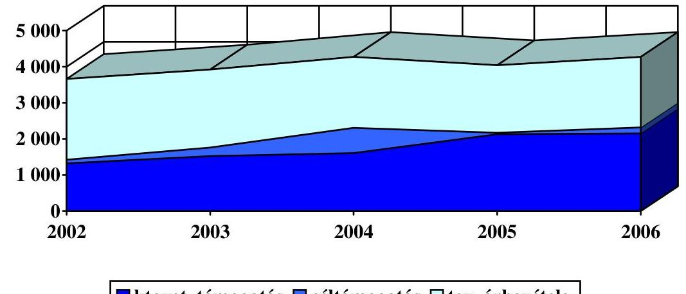

A korábbi években elkezdett termékfejlesztés eredményeként bevezetett új termékek és szolgáltatások 85 M Ft-tal javították a társaság bevételeit, viszont az eredményre gyakorolt hatásuk a bevezetés óta eltelt rövid időszak alatt nem ad reális képet. Az erősödő piaci verseny ellenére a társaság hagyományos vevőkörének számító, nagy megrendelőkkel megkötött szerződésállománya 2006ban is kedvezően alakult.

A költségek és ráfordítások mind a tervezett, mind a megelőző év adataihoz képest emelkedtek, de változóan alakultak a különböző költségtételek. A költségtakarékossági intézkedések hatására csökkent az anyagjellegú ráfordítások értéke, viszont a tervezett mértéket meghaladó módon növekedtek a személyi jellegú ráfordítások. Növekedésüket a színlelt szerződések megszüntetése ${ }^{5}$ következtében létesített munkaviszonyok bérre gyakorolt hatása, valamint az évközi létszámnövekedés költségnövelő hatása befolyásolta, amelyek együttes hatása a rendszeres bérjövedelem $15 \%$-os mértékű emelkedését eredményezte. A költségek és ráfordítások 2006. évi változásában jelentős az egyéb költségek és ráfordítások csökkenése, elsősorban az áfa arányosítás megszűnése miatt.

Az MTI Rt. feladatterveiben évek óta szerepelt a humánerőforrásgazdálkodás megújítása (feladat, szervezet, létszám, munkakör összhangja),

[^0]
[^0]:    ${ }^{5}$ Az adókról, járulékokról és egyéb költségvetési befizetésekről szóló 2003. évi XCI. törvény alapján az ún. adómoratórium - színlelt szerződések fizetési kötelezettség nélküli megszüntetése - utolsó határideje 2006. június 30. volt.

---

mivel változtak a piaci viszonyok, csökkentek a bevételek, megszűntek munkakörök stb. A változásokhoz igazított szervezet kialakításának igénye is megfogalmazódott. A feladat fontosságára az ÁSZ több alkalommal felhívta a társaság figyelmét.

Az MTI Rt. 2003 második felétől több részfeladatot elvégzett a humánerőforrás gazdálkodásban, de az átfogó felülvizsgálat és a szabályozás minden évben késedelmet szenvedett. A humánerőforrás gazdálkodás körébe tartozó, évek óta tervezett feladatok jelentős részének elvégzését, a két 2006-ban megjelent törvényi szintű változás (EKHO bevezetése, adómoratórium megszüntetése) gyorsította fel, illetve kényszeríttette ki.

Az MTI Rt. 2006. évi - munkaviszony keretében - foglalkoztatottainak létszáma 377 fő volt, ami 45 fővel magasabb, mint a 2005. év végi létszámadat. A külsős foglalkoztatottak száma a kedvezőbb adózási szabályok (EKHO) alkalmazásával 130-ról 86 főre csökkent. A korábbi években több szempontból kritizált - a tavalyi évben még 51 - megbízási és vállalkozási szerződéseket 2006. év végére az év közben bevezetett színlelt szerződéseket megszüntető jogszabályi változás hatására megszüntették. A 2006-ra tervezett bérjárulékok - a rendszeres jövedelem növekedése ellenére - nem érték el még a tervezett szintet sem, a munkavállalók által választható adózási jogszabályváltozás következtében.

Figyelembe véve, hogy a Társaság 2006-ban 468 M Ft-tal alacsonyabb bevételt realizált, mint 2004-ben, jelentős megtakarítást nem ért el a költségek és ráfordítások terén, ezért a 2007. évi negatív eredmény elkerülése érdekében a támogatás növelése, vagyonértékesítés vagy a létszámot illetve a bérköltséget érintő költségracionalizálás válik szükségessé.

Az MTI Rt. 2006-ban az informatikai terület kivételével kilenc közbeszerzési pályázatot írt ki, amelyekből hét pályázati kiírás zárult eredménnyel. A pályázatokat egyszerűsített közbeszerzési eljárás keretében folytatták le a közbeszerzési szabályzatban foglaltakkal összhangban. A 2006. évre tervezett és megvalósult 205 M Ft értékű informatikai beszerzésből 140 M Ft a központosított közbeszerzési eljárás keretében valósult meg.

A Társaság eszközeinek és forrásainak állománya 2006-ban nem változott számottevően, mivel jelentősebb beruházást vagy vagyonértékesítést nem valósítottak meg.

Az MTI Rt. ingatlangazdálkodása két elkülönülő, de egymással összefüggésben lévő tevékenységgel jellemezhető: a meglévő ingatlanvagyon fenntartása és a kihasználatlan területek bérbeadása. Az ingatlanok tényleges vagyonértéke - amely nem azonos a könyvszerinti értékkel - nem határozható meg pontosan vagyonértékelés nélkül. Ezért az ingatlangazdálkodással kapcsolatos költségek és ráfordítások értékei csak abszolút értékben hasonlíthatók össze, így nem tükrözik a tényleges ingatlanértékhez viszonyított reális adatokat.

Az ingatlanokon álló építmények az építés ideje, a használat jellege és a műszaki állapot szerint eltérő képet mutatnak. A korábbi ÁSZ jelentések (1999 és 2003) már kifogásolták az egységes, közép- és hosszú távra kidolgozott ingatlangazdálkodási stratégia kialakítását. Az elfogadott stratégia hiányában a

---

társaság még nem rendelkezik az épületek felújítására, korszerűsítésére, hasznosítására vonatkozó tervvel. A hatékony ingatlangazdálkodás iránti igény már megfogalmazódott a Felügyelő Bizottság és a Belső ellenőr részéről is.

A társaság tulajdonában álló épületek a hírügynökség feladatainak ellátásához szükségesnél több ezer négyzetméterrel nagyobb irodaterületet foglalnak magukba. A bérbe adott területek nagysága $3208 \mathrm{~m}^{3}$ volt 2006-ban. Az értékcsökkenés a helyiségek bérbeadásából származó bérleti díjbevétellel együtt (151 M Ft) sem fedezi az MTI Rt. tulajdonában álló ingatlanok állagmegőrzésére fordított ( 195 M Ft ) éves kiadásokat.

A társaság a megváltozott piaci körülmények miatt, illetve gazdaságossági okokból 2003-tól fokozatosan csökkentette külső vállalkozásokban meglévő befektetéseit. Az MTI Rt. részesedéseinek 2006. december 31-ei állománya 51 M Ft volt, amelyből a kapcsolt vállalkozásokban meglévő részesedéseinek könyv szerinti értéke 15 M Ft .

Az MTI Rt. a középtávú stratégiai tervével és a változó piaci igényekkel összhangban folyamatosan fejleszti és bővíti termékei és szolgáltatásai kínálatát, ezzel ellensúlyozva a hagyományos médiaszolgáltatások iránti igény viszszaesése és az újabb versenytársak megjelenése következtében előállt árbevétel kieséseket. A 2006-ban végrehajtott változtatások - amelyek közül a legjelentősebb a termékek és szolgáltatások elszámolási gyakorlatának módosítása nemcsak az elszámolás technikai megújulását eredményezték, hanem pozitív hatást gyakoroltak az éves gazdálkodásra is.

Az MTI Rt. a helyszíni ellenőrzés befejezéséig nem rendelkezett a termékek bevezetésével járó költségek utókalkulációjával, ezért a termékek bevezetésének árbevételt növelő hatásán kívül az eredményre, illetve megtérülésre vonatkozó következtetést még nem lehet levonni.

A szolgáltatások elszámolásának megváltoztatásával egy időben változott a társaság díjszabása, bevezették a kereskedelmi területen a jövedelemérdekeltségi rendszert. Az eddigi gyakorlattal ellentétben 2006-tól a hírszolgálati tevékenységgel kapcsolatos belföldi és export bevételeket aszerint számolják el, hogy ezek a valós idejű hírszolgáltatáshoz kapcsolódnak-e, vagy sem.

Az ÁSZ 2006-ban készített jelentésében az Országgyűlésnek, a Kormánynak, a TTT, és az FB elnökének fogalmazott meg ajánlásokat. Az Országgyűlésnek, a Kormánynak, a TTT elnökének tett, jogalkotással és szabályozással kapcsolatos megismételt ÁSZ javaslatok lényegében nem hasznosultak. A nemzeti hírügynökségi törvény felülvizsgálata, összehangolása - a törvény módosításának előkészítése - elkezdődött, a törvényi változásra még nem került sor.

A MEH tájékoztatása szerint a szükséges jogalkotási és egyéb intézkedések megtételére - különös figyelemmel a közösségi jog előírásaira -, továbbá a választási időszakra vonatkozó külön törvény megalkotására az új médiaszabályozás elkészítése keretében kerül sor. Megvalósítása azonban a kétharmados törvények miatt bizonytalan.

A TTT működési költségeinek és az MTI Rt. előirányzatának a költségvetési törvényben történő elkülönítésére tett javaslatunkra a MEH minisztere által adott

---

válasz szerint, a finanszírozással kapcsolatos kérdéseket az egységes közszolgálati hír- és műsorszolgáltatásról szóló törvényben kell rendezni.

Az MTI Rt. elnöke részére 2006-ban az ÁSZ öt javaslatot fogalmazott meg, amelyből négy a korábbi évekből megismételt javaslat volt. Ezek az SZMSZ-szel, a humánerőforrás gazdálkodással, a tervezéssel, ezen belül az ingatlangazdálkodás tervezésével, illetve a terv hiányával voltak összefüggésben. A megismételt ÁSZ javaslatok hasznosítására, a vonatkozó intézkedési tervpontok végrehajtására a megadott határidőre nem került sor.

A stratégiai és éves tervezéssel összefüggő ÁSZ javaslatok hasznosítására az intézkedési terv 2 feladatot határozott meg. Az egyik végrehajtását - az adott évi üzleti tervek és a középtávú tervezési folyamat összhangjának megteremtése érdekében gazdasági alelnöki intézkedés kiadását - a társaság utólag nem tartotta szükségesnek. Az MTI Rt. tájékoztatása szerint a Károly körúti bérleményhasznosításra tárgyalások folytak, de a bérlemény-hasznosítási feladat 2006ban nem volt eredményes.

A helyszíni ellenőrzés megállapításainak hasznosítása mellett javasoljuk ${ }^{6}$ :

# az Országgyülésnek 

1. tekintse át és módosítsa a 68/2002. (X. 4.) OGY határozatban megfogalmazott jogalkotási feladatnak megfelelően a nemzeti hírügynökségről szóló 1996. évi CXXVII. törvényt és az MTI Rt. Alapító Okiratát a teljes körűen összehangolt szabályozás kialakítása, a közszolgálati feladatok és az azok ellátásához szükséges állami támogatás egyértelműbb és pontosabb meghatározása, a jelenlegi alapítói és részvényesi joggyakorlás és ellenőrzés felülvizsgálata és hatékonyabbá tétele érdekében;
2. gondoskodjon az MTI Rt. müködését befolyásoló középtávú stratégiai, illetve éves tervre vonatkozó tulajdonosi döntés és kontroll megteremtéséről;

## a Kormánynak

1. kezdeményezze a 68/2002. (X. 4.) OGY határozatban az MTI Rt. támogatásával kapcsolatban megfogalmazott átláthatósági követelmény érvényre juttatása érdekében szükséges jogalkotási és egyéb intézkedéseket, különös figyelemmel a közösségi jog előírásaira; az Nht. 2. § (1) bekezdése h) pontjában megjelölt - a választási időszak feladataira vonatkozó - külön törvény megalkotását;
2. fontolja meg a következő évi költségvetési törvényjavaslat összeállításánál a TTT múködési költségei támogatásának elkülönítését az MTI Rt. előirányzatától.

## az MTI Rt. elnökének

1. hozza összhangba az SZMSZ-t, az elnöki, alelnöki utasításokat és a munkaköri leírásokat;
[^0]
[^0]:    ${ }^{6}$ Javaslataink lényegében már szerepeltek az MTI Rt. korábbi ellenőrzéseiről készült jelentéseinkben.

---

2. intézkedjen a humánerőforrás-gazdálkodás elveinek, kritériumrendszerének és szabályainak megalkotásáról, a szervezeti egységekre lebontott létszámterv elkészítéséről;
3. alkossa meg a társaság egységes ingatlangazdálkodási szabályzatát, készítesse el az egységes középtávú ingatlangazdálkodási tervet, amely a szükséges forrásokat évekre lebontva tartalmazza; fontolja meg a nem használt ingatlanok értékesítését, intézkedjen a Károly krt.-i bérelt ingatlan hasznosítása érdekében.

---

# II. RÉSZLETES MEGÁLLAPÍTÁSOK 

## 1. Az MTI Rt. múködésének tÖRVÉnyESSÉGe És szabályozotTSÁGA, A SZAKMAI FELADATOK, A SZERVEZETI RENDSZER ÉS A GAZDÁLKODÁS KERETEIT MEGHATÁROZÓ ÜZLETI TERVEK ÖSSZHANGJA

### 1.1. A társaság múködésének szabályozása

A nemzeti hírügynökségről szóló 1996. évi CXXVII. törvény (Nht.) és a társaság alapító okiratának felülvizsgálatát, illetve módosítását az ÁSZ évek óta szorgalmazza. Kifogásoltuk a múködtetés feladat- és hatásköri, illetve felelősségi szabályozását, a közszolgálati tevékenységek meghatározásának és az ellátásukhoz szükséges állami támogatás mértékének, felhasználása átláthatósági szabályozásának, az ellenőrzés garanciáinak hiányát. Megállapítottuk, hogy az MTI Rt. működtetésére 1996-97-ben kialakított tulajdonosi megoldás nem ösztönöz a nyereséges gazdálkodásra, de a veszteséges gazdálkodásnak sincs tulajdonosi döntéssel meghozott következménye. Az Országgyűlés, az MTI Rt. alapítója, részvényesi és közgyűlési jogainak gyakorlója nem dönt a társaság éves terveinek elfogadásáról, pedig azt a társaság az éves beszámoló keretében elkészíti és bemutatja az OGY-nek. (AO 5.7. pont)

Az Országgyűlés 68/2002. (X. 4.) OGY határozatában - az ÁSZ javaslatai alapján - jogalkotási feladatot fogalmazott meg a hírügynökségi törvény és az MTI Rt. alapító okirata áttekintésére, a teljes körű összehangolt szabályozás kialakítására, a közszolgálati feladatok és azok ellátásához szükséges állami támogatás egyértelmúbb és pontosabb meghatározására határidő és felelős megjelölése nélkül.

Az OGY határozatban rögzített felülvizsgálati és jogalkotási cél az elmúlt közel öt évben nem valósult meg.

Az előző parlamenti ciklusban az Országgyűlés Kulturális és sajtó bizottsága létrehozta a nemzeti hírügynökségről szóló törvény módosítását előkészítő albizottságot, és elindult egy a felülvizsgálatra irányuló elemző, szakértői munka, amiben az MTI Rt. is közreműködött. A 2005-ben megkezdett munka nem folytatódott, bár két szakértői vélemény is készült.

Az Országgyűlés alapítói, részvényesi és közgyűlési jogait 2006-ban nem gyakorolta. Nem tűzte napirendjére, nem tárgyalta az MTI Rt. 2005. évi tevékenységéről szóló éves beszámolóját, ezzel a társaság mérleg- és eredménykimutatását sem hagyta jóvá, és nem rendelkezett a 2005. évi 6,5 M Ft-os nyereség felosztásáról. A döntés 2007. március 26-án született meg.

Az Nht. 21. § (1) g) pontja és a társaság alapító okiratának 8.1/ b pontja szerint a TTT feladata és jogköre az MTI Rt. alapító okirata módosításának előkészítése. 2006-ban nem készült testületi javaslat az MTI Rt. alapító okiratának módosítására, pedig annak szükségességét az ÁSZ évek óta hangsúlyozta, és a

---

2005-2006-ban meghozott törvények (társasági és cégjogi) is indokolták a módosító javaslat elkészítését.

Az MTI Rt. 1997. július 15-én megalkotott alapító okirata (70/1997. (VII. 15.) OGY határozat melléklete) már 2006 előtt is több ponton elavult volt, ezért módosításának előkészítése az Nht. átfogó felülvizsgálatának és módosításának megtörténtétől függetlenül elvégzendő feladat volt. (Pl. tevékenységi körök megváltozása, az MTI Rt. rövidített cégnevének használatával kapcsolatos társasági igény, ingatlanok értékesítése miatt az MTI Rt. telephelyeinek listájában bekövetkezett változás.)

Az Országgyúlés elnöke először 2004. december 6-ai levelében a TTT, az FB és a társaság javaslatát, illetve véleményét - 60 napon belül - kérte az ÁSZ jelentésben foglalt aktuális kérdések véleményezése, a minél alaposabb és szélesebb körű tájékozódás érdekében. A TTT 2005. márciusában küldte meg javaslatait az Országgyűlés elnökének. Ezt követően 2005-ben és 2006-ban sem készült az alapító okirat módosításával összefüggő TTT javaslat. A TTT elnöke az OGY elnökének, a MEH vezetőjének továbbá az Országgyűlés Kulturális és sajtó bizottsága elnökének 2006. december 6-án írt levelében foglaltak szerint a testület az AO módosítását kezdeményezni fogja. A feladat a testület 2007. I. félévi munkatervében szerepel. A módosító javaslatot a TTT elkészítette, a módosítás az Országgyűlés hatáskörébe tartozik, a döntéshez 2/3-os többség szükséges. Az Országgyűlés 2007. március 26-án döntött az MTI Rt. alapító okirata legfontosabb (aktualizálás, technikai jellegű módosítások) módosításairól.

A 2006-os törvényi változások 2007-ben kényszeríttették ki az alapító okirat módosításával összefüggő feladatok elvégzését. Ezek alapján ugyanis vagy meghozzák az alapító okirat módosításáról rendelkező OGY határozatot, vagy ennek hiányában 2007. szeptember 1-je után az Országgyűlés által alapított MTI Rt.-t a cégjegyzékből törlik.

A gazdasági társaságokról szóló 2006. évi IV. törvény 336. § (2) bek. előírja az Alapító Okirat (AO) e törvény szerinti módosítását (pl. a társaság cégnevének módosítása Rt.-ről Zrt.-re, amit a Gt. módosítása ${ }^{7}$ már 2005-ben is előírt az AO legkésőbb 2006. június 30-ig történő módosítására), a törvény hatályba lépése előtt a cégjegyzékbe bejegyzett társaságokra legkésőbb 2007. szeptember 1-jéig. Ha az AO-t az előírt határidőig nem módosítják, a cégbíróság a cégelnyilvántartásról, a bírósági cégeljárásról és a végelszámolásról szóló 2006. évi V. törvény 84. §-a szerint a társaságot megszűntnek nyilvánítja.

A társasági múködés szabályozása (Mt., Gt., Sztv., stb.), az Nht.-n, az alapító okiraton, mint speciális szabályokon kívül alapvetően a Szervezeti és Működési Szabályzatra (SZMSZ), elnöki, alelnöki utasításokra, szakmai kézikönyvekre épül. Ezek előírják a társaság tevékenységével, gazdálkodásával kapcsolatos magasabb szintű jogszabályok alkalmazásának végrehajtási rendjét is. Az SZMSZ V. 1. pontja az irányítás, 2. pontja a tájékoztatás rendjének szabályozása. A társaság belső információs rendszerének szabályozásában 2006-ban nem volt változás.

[^0]
[^0]:    ${ }^{7}$ 2005. évi LXII. tv. 160. § (5), a tőkepiacról szóló 2001. évi CXXII. tv. módosításáról

---

2006-ban a szervezet működése és az SZMSZ néhány ponton nem volt összhangban. A 2005-ös SZMSZ készítésénél célul tűzték ki a munkaköri leírások elkészítéséért és folyamatos karbantartásáért való felelősség egységes és következetes megjelenítését az igazgatói beosztásokban. Ez a cél a humánerőforrás igazgató esetében 2005-ben és 2006-ban sem teljesült, mert az SZMSZ szerint nem feladata a munkaköri leírások elkészítése. A beosztottaknak a korábbi időszakban készült munkaköri leírása volt. Az SZMSZ-t hatályba léptető 14/2005. számú elnöki utasítás (hatályos 2006. január 1-jétől) a szervezeti rendnek megfelelő munkaköri leírások elkészítéséről nem rendelkezett, határidőt nem jelölt meg. 2006-ban pl. az Archívumok és Adatbázisok dolgozóinak (37 fő) nem módosították a munkaköri leírását.

A 2006. január 1-jei szervezeti módosítások lényegében a függelmi viszonyok változását, a gazdasági alelnök területén a szervezeti egységek számának csökkentését, a piaccal és értékesítéssel, továbbá a médiafigyeléssel kapcsolatos területeken a létszám növelését jelentették.

Változtak a függelmi viszonyok, mert az adatbázisokkal kapcsolatosak felügyelete az elnöki titkárság vezetőjének hatásköréből visszakerültek a szakmai alelnök felügyelete alá. Ezt a döntést főleg személyi jellegű problémák megoldásával indokolták. Csökkent az igazgatók száma, ugyanis a TTT Titkárság, illetve az elnöki titkárság igazgatói besorolású vezetői státusa megszűnt. Utóbbi igazgatója szakmai alelnök lett. Az elnöki titkárság dolgozóit (3 fő) az elnök irányítja. A Médiafigyelő osztályt a hírigazgató helyett a Kereskedelmi igazgató irányítja és ellenőrzi.

Az MTI Rt. rövid, szöveges értékelésben bemutatta a 2005-ös szervezeti változások eredményeit a TTT részére készített beszámolóban, megindokolva a következő, 2006. évi SZMSZ módosítások szükségességét. Ebben a társaság a 2006-os SZMSZ-t célszerűnek, a szervezetet a feladatok elvégzése szempontjából eredményesen működőnek tartotta.

A 2006. január 1-jén hatályban lévő SZMSZ-t ugyanebben az évben kétszer módosították. A módosításokat elnöki utasításokban léptették hatályba.

Az első módosításban (4/2006. sz. Elnöki utasítás, hatályos 2006. szeptember 25étől) az üzemeltetési igazgatóság szűnt meg, ezzel az igazgatók száma tovább csökkent. A megszűnt igazgatóság két osztályát a gazdasági alelnök irányítja. A második (8/2006. sz. Elnöki utasítás, hatályos 2006. október 30-ától) a szerkesztőségvezetői munkakörök pályáztatásának bevezetésével volt kapcsolatos. A társaság célja a szerkesztőségi vezetői beosztások határozott idejű megbízásokká alakítása, belső pályáztatás alapján. 2006 végén a 7 szerkesztőségi vezetőből 4 vezető megbízása pályázat alapján 3 év határozott időre módosult.

2006-ben 10 elnöki, 4 gazdasági alelnöki és 1 általános szakmai alelnöki utasítást adtak ki. A szabályzatokban néhány ponton a korábban is meglévő öszszehangolási hiányosságok megmaradtak. Pl. az Archiválási Szabályzatban megjelölt Hangtár és archívum, mint szervezet az SZMSZ-ben nem szerepel, a szabályzatból nem derül, ki, hogy melyik archívum vezetője felelős az eljárási rend részletes kidolgozásáért.

2003-ban a társaság az ÁSZ ajánlása figyelembe vételével elnöki utasításban szabályozta a belső szabályzatok, utasítások kidolgozásának tartalmi és formai

---

követelményeit. Az utasításban foglaltak betartása nem minden esetben valósult meg, így a végrehajtás ellenőrzését a 2007-es feladattervben szerepeltették. (PI. az MTI Rt. 2006. január 1-jétől hatályos számviteli politikáját nem gazdasági alelnöki utasításban adták ki. A társaság kimutatása szerint az ezzel összefüggő utolsó, hatályos gazdasági alelnöki utasítás az 5/2002. számú.)

A közszolgálati és az új, piaci feladatok pontos megfogalmazása, a feladatok elvégzését biztosító szervezeti formák kijelölése, működésük összehangolása, a feladatok létszámigényének, személyi és tárgyi feltételei meghatározásának költségtervezése 2006-ban nem valósult meg, de az ebbe az irányba mutató munka elkezdődött, illetve folytatódott két említést érdemlő szakértői megbízással.

Az MTI Rt. szakértő szervezetet bízott meg 2004-2006-ban a közszolgálati és nem közszolgálati tevékenységek meghatározása, a tevékenységek bevételeinek és kiadásainak számviteli szétválasztása, e tevékenységek eredményeinek kimutatása érdekében. Ezt elsősorban nem a feladat, szervezet, létszámigény meghatározása, illetve ezek összhangjának megteremtése, hanem az állami támogatások igénylésének és felhasználásának átláthatóságát biztosító, a keresztfinanszírozást tiltó EU-s előírások betartása érdekében tette. A több munkaszakaszra bontott szakértői anyagok elkészítése, felhasználása a helyszíni ellenőrzés befejezésekor még folyamatban volt. (Lásd 1.2. pont)

2006-ban a munkaerő-gazdálkodással kapcsolatos évek óta húzódó feladatok elvégzése érdekében három szakértői szerződést írt alá a társaság.

- A 2006. január 30-i megállapodás szerint egy adótanácsadó feladata az ún. színlelt szerződések minősítésével kapcsolatos felülvizsgálat, illetve az egyszerűsített közteherviselési hozzájárulás (EKHO) bevezetésével kapcsolatos tanácsadás volt. A szakértői munkáról írásos dokumentum nem készült, annak meglétét a megállapodás sem írta elő. A szerződéses összeg 300 E Ft + áfa volt, amelyet szóbeli tanácsadásért fizettek ki. A tanácsadás szóbeli jellege miatt a szakmai teljesítés igazolás megalapozottságának ellenőrzése nehézségbe ütközik.
- 2006. július 4-én egy másik szakértői szervezet az MTI Rt. munkaügyi tevékenységének teljes átvilágítására (munkaviszony, foglalkoztatásra irányuló egyéb jogviszony MTI Rt.-és gyakorlatának törvényi megfeleltetése) kapott megbízást. A szerződött összeg 1600 E Ft + áfa volt. Kifizetésre 1400 E Ft + áfa került, mert a szerződésben szereplő egy feladatot, a munkaügyi gyakorlat kontrollját nem végezték el. A felülvizsgálat eredményéről szakmai összefoglaló jelentés (Megállapítások az MTI Rt. munkaügyi tevékenységéről;, A foglalkoztatásra irányuló egyéb jogviszonyok felülvizsgálatának összegzése címmel) készült, ennek elkészítését a szerződés is előírta. A szakértői jelentésben foglaltakat az MTI Rt. hasznosította. Egyrészt az összefoglaló alapján további részfeladatokat tudott megfogalmazni, másrészt a felülvizsgált 34 külsős szerződés nagy részét a szakértői észrevételek alapján módosította a társaság.
- 2006. október 26-án a munkaügyi tevékenység teljes átvilágítását végző említett szakértő szervezet további megbízást kapott az MTI Rt. munkaidő rendszerének, a munkakörök felülvizsgálatának, a humánerőforrás igény, az optimális üzemidő, a munkaerőigény megállapításának elvégzésére. A szerző-

---

dése összeg 3500 E Ft + áfa volt, amelyből 2000 E Ft kifizetésre került. A második szerződésből ( 9 feladat, ebből 6 feladat 2006. december 10-ei, a többi 2007. január 31-ei határidős) a 2006. évi határidős feladatokat a szakértő elvégezte. (Ezek: a munkaidőrendszer, a munkakörök felülvizsgálata, a humánerőforrás igény és az azt fedező munkakörök, az optimális üzemelési idő meghatározása, stb.) A szakértői foglalkoztatás célszerűsége és eredményessége 2007. I. félévében lesz értékelhető. Az MTI Rt. feladatterve szerint a munkaerő-gazdálkodással kapcsolatos meghatározó feladatokat (szabályozás, feladathoz igazított optimális szervezet, létszámigény) e határidőig teljes körűen elvégzi.

# 1.2. A közfeladatok ellátását biztosító társasági szabályzatok aktualizálása 

Az MTI Rt. tevékenységében a közfeladatok ellátásához alapvetően a közbeszerzés rendje, a személyes adatok védelme, az archiválás szabályai, a közszolgálati hír- és fotószolgáltatáshoz kapcsolódó szerkesztőségi kézikönyvek, illetve az állami támogatások (múködési támogatás közszolgálati feladatokra) igénylése és felhasználása kapcsolható. Az ezekkel összefüggő szabályokat - az állami támogatások (működési támogatás közszolgálati feladatokra) igénylésével és felhasználásával kapcsolatos Rt. szabályzatok kivételével - az Rt. aktualizálta. 2004 második felében a társaság - termékei legális felhasználása védelmére - Médiafigyelő osztályt hozott létre.

Az MTI Rt. a közbeszerzés rendjét 2003 végén a 16/2003. sz. Elnöki utasításban szabályozta, majd a közbeszerzési értékhatárok változása miatt a 2003. évi társasági szabályozást az Rt. 2004. május 26-án január 1-jére visszamenőleges hatállyal aktualizálta. (3/2004. sz. Elnöki utasítás.)

A személyes adatok védelméről és a közérdekű adatok nyilvánosságáról szóló, többször módosított 1992. évi LXIII. törvény betartására vonatkozó előírások a társaság különböző szabályzataiban megtalálhatók. (Pl. az archiválási szabályzatról szóló, 2005. október 6-án kiadott elnöki utasítás.) A Szakmai Közszolgálati Tájékoztatási Szabályzatról 2005. január 24-én hatályba léptetett elnöki utasításból kimaradt a személyes adatok védelmével összefüggő szabályozás, ami a korábbi szabályzatban melléklet volt.

A hatályos archiválási szabályzatot a társaság 2005. június 7-én terjesztette az ORTT elé, kérve egyetértő véleményüket. Az ORTT 2005. augusztus 31-én egyetértését adta az Rt. szabályzatához, amely október 6-án lépett hatályba.

A nemzeti hírügynökségről szóló 1996. évi CXXVII. törvény 2. § (1) j) bekezdése továbbá 11. §-a előírásainak megfelelően az archiválás szabályait és feltételeit, a hasznosítás módját a közgyűjteménynek nem minősülő dokumentumok vonatkozásában az MTI Rt. elnöke az ORTT-vel egyetértésben külön szabályzatban állapította meg.

Az állami támogatások (működési támogatás közszolgálati feladatokra, egyéb céltámogatás) igénylésével és felhasználásával kapcsolatos Rt. szabályzatok megalkotását az ÁSZ évek óta szorgalmazza. Az egyéb céltámogatással összefüggő szabályzat elkészült. Az állami költségvetésből közszolgálati felada-

---

tokra kapott múködési támogatás igénylésének és felhasználásának belső szabályozása nem készült el, azt az Rt. nem tekinti feladatának, a döntést (Nht., alapító okirat módosítása) a tulajdonosi/közgyúlési jogokat gyakorló Országgyűléstől várja. Az Országgyűlés Kulturális és sajtó bizottsága elnöke szerint a törvény előkészítésében az MTI Rt.-nek kezdeményező szerepet kell vállalni, amit szakértői anyagok megrendelésével az Rt. megtett.

A nemzeti hírügynökségi törvény 30. § (1) bekezdésében és az MTI Rt. alapító okiratban (10.3. pont) megfogalmazott, a közszolgálati feladatok ellátásához szükséges mértékű országgyűlési céltámogatásban való részesítés megfogalmazás nem elegendő annak eldöntéséhez, hogy mit kell szükséges mértéknek (kritériumrendszer, a számítás módja, a támogatás felhasználásának ellenőrizhetősége, az uniós szabályok betartása) tekinteni. Ennek hiánya az állami költségvetés kiadásait hátrányosan érinti.

A közszolgálati tevékenységek, termékek, szolgáltatások pontos meghatározása nélkül nem tarthatók be az uniós szabályok - az állami támogatás mértéke nem haladhatja meg a közszolgálati tevékenység máshonnan meg nem térülő költségeit - mivel nem biztosítható a közszolgálat tényleges bevételeinek és ráfordításainak kimutatása, így a támogatások odaítélésének, felhasználásának átláthatósága és ellenőrizhetősége sem. Pontosításra szorul az Nht. 30. § (2) bek. megfogalmazása - a társaság nyereségének, illetve eredménytartalékának a felhasználásával kapcsolatban - ugyanis a felhasználást a közszolgálati hírügynökségi tevékenységgel összefüggésben határozza meg. Ugyanakkor a törvény a közszolgálati tevékenységeket nem pontosította.

A működési támogatással kapcsolatos szabályozás előkészítése érdekében az MTI Rt. szakértő céget bízott meg, aminek konkrét eredménye 2005-2006-ban különböző szakértői anyagok elkészítése volt, összesen közel 30 M Ft értékben. 2005-ben két szakértői anyag készült el.

Az első szakértői anyag az Rt. gyakorlatának az uniós követelményekkel való összevetésére, a második a közszolgálati tevékenység máshonnan meg nem térülő költségei és az állami támogatások összehasonlítására - a 2005. első félévi gazdálkodást alapul véve - készült. Ez utóbbi leegyszerűsítve abból a követelményből indult ki, hogy az állami támogatás mértéke nem haladhatja meg a közszolgálati tevékenység máshonnan meg nem térülő költségeit. Ennek érdekében meghatározták a közszolgálati és nem közszolgálati tevékenységeket, kialakították az egyes termékekre vetített költségallokációs modellt, aminek segítségével nyomon követhető az egyes termékekre jutó költségek és bevételek összehasonlítása. Az Rt. a teljes 2005. év adatainak figyelembe vételével, a szakértői anyag kiegészítését tervezte megrendelni. A 2005-re tervezett kiegészítés nem készült el, mert 2006-ban megváltozott a termék és szolgáltatási struktúra.

2006 októberében további szakértői anyagok készültek. A szakértői anyagokat a társaság testületei megismerték. A TTT ezekkel összefüggésben határozatot nem hozott, az FB határozatok azok tudomásulvételéről rendelkeztek. A szakértői anyagok felhasználásának tényleges eredményei 2006-ban nem voltak.

A szakértői vélemények összefoglaló megállapítása az volt, hogy az MTI Rt. jelenlegi állami finanszírozásának jogszerűsége EU jogi szempontból vitatható, az állami támogatás 2006. első félévében nem fedezte a közfeladat máshonnan meg nem térülő költségeit. A 2005. első félévi anyag lényeges megállapítása is ez volt. A szakértő az állam és az MTI Rt. között - a nemzeti hírügynökségi te-

---

vékenység ellátására vonatkozó - közszolgáltatási szerződés megkötésével javasolja az EU szabályoknak való megfelelést megvalósítani. E szerződésben biztosítani lehet az állami támogatások igénylésének, felhasználása átláthatóságának a feltételeit, továbbá lehetővé tenni annak ellenőrzését is.

Az első szakértői anyag a közszolgálati tevékenység máshonnan meg nem térülő költségei és az állami támogatások összehasonlítása a 2006. első félévi múködésében címmel készült. A 2006. teljes évi értékelés majd az éves beszámoló auditálása után várható. A második anyag az MTI Rt. számviteli szétválasztást elősegítő modelljének dokumentációja. Ezeket a szakértői anyagokat tekintette az MTI Rt. elnöke az egyik prémiumfeladata teljesítésének. A prémiumfeladat a már elkészült és folyamatban lévő tanulmányok alapján összefoglaló anyag és számítások készítése az MTI Rt. közszolgálati feladatainak ellátásához szükséges költségvetési forrásigényről volt. A társaság 2007. évi költségvetési forrásigényének meghatározása nem ebben a struktúrában készült. Elkészült a harmadik anyag is, ami az állam és az MTI Rt. közötti - a nemzeti hírügynökségi tevékenység ellátására vonatkozó - közszolgáltatási szerződéstervezet, „kizárólag egyeztetés céljából" megjegyzéssel. Az egyeztetés még nem fejeződött be.

A társaság a pénzügyminisztériumnak küldött múködési támogatási kérelmeiben megfogalmazott támogatási igényének nagy részét az állami költségvetésből megkapta. Például 2005-ben az igény 2200 M Ft , a teljesítés 2130 M Ft volt, a költségvetési tartalékból „közszolgálati feladatokra" kapott 80 M Ft pótlólagos támogatással együtt. 2006-ban a támogatási igény 2250 M Ft volt, a teljesítés 2150 M Ft. (Az országgyúlési és önkormányzati választásokra a társaság 116,8 M Ft további támogatást kért és kapott.) 2007-re az igény 2283 M Ft, a 2007. évi költségvetési törvényben biztosított összeg 2150 M Ft.

Az MTI Rt. Alapító Okirata 10.3. pontja alapján a támogatási kérelmet az FB és a könyvvizsgáló is véleményezte. Ök az MTI Rt. 2006-ra vonatkozó igényét megalapozottnak tartották.

A részvénytársasági támogatási igény indoklása általában: a közszolgálati tevékenységet ellátó szervezetek múködési költségei, a műszaki fejlesztések várható ráfordításai, az archívumok történeti értéket képviselő anyagának további digitalizálása, a médiapiac bevételcsökkentő hatása, a határon túli hírszolgáltatás finanszírozásának változása volt. Az általános indoklásokat az évenként várható aktuális információkkal egészítette ki a társaság, a 2007. évit pl. az adó és járuléktörvények változása, összességében az ún. költségvetési egyensúlyjavító intézkedések hatása.

Az ÁSZ korábban, és 2005-ben is - a költségvetési törvényjavaslat elkészítésénél javasolta a TTT múködési költségeinek elhatárolását az MTI Rt. támogatásától, mert ezek a költségek (pl. a testületi tagok díjazása) a Társaság tevékenységétől függetlenül alakulnak. A javaslat nem hasznosult. Nem alkották meg az Nht.ban rögzített, a választási időszakban végzendő feladatokra vonatkozó külön törvényt sem, amelynek megléte legalább e tekintetben a 2006. évi támogatási igény megalapozottságát biztosította volna.

Az MTI Rt. által kibocsátott hírek és képek engedély nélküli felhasználásának megakadályozása, korlátozása, az engedély nélküli felhasználói kör lehetőség szerinti jogszerű (szerződés alapján történő felhasználás, az ellenérték megfizetése) csatornába terelése a Médiafigyelő osztály feladata.

---

A Médiafigyelő osztály felállítását, kereskedelmi igazgató alá rendelését, létszámának megduplázását ( $4+1$ fő külsős) - az MTI Rt. termékei jogosulatlan felhasználásának megakadályozására hozott intézkedést - a társaság eredményesnek tartja. Az osztály munkájának hatására 2006-ban az Rt. 14 előfizetői szerződést kötött és - éves szinten számolva - 9,3 M Ft bevételhez jutott. Az MTI Rt. eredménynek tekinti, hogy javult a szerződéses fegyelem és előkészítettek (bizonyítékok összegyűjtése, jogi szakértői anyagok megrendelése) az MTI Rt. termékeit jogosulatlanul felhasználó egy piaci szereplővel szembeni ún. próbapert. A jogi eljárás megindítására még nem került sor.

Az MTI Rt. termékeinek jogosulatlan felhasználásával összefüggésben a társaság 2005-ben és 2006-ban is jogi szakértőket bízott meg. A szakértők feladata leegyszerűsitve annak megállapítása/kiderítése volt, hogy az MTI Rt. termékei (napi hírgyűjtemény, hírarchívum) szerzői jogi védelem alatt állnak-e. 2005-ben a szakértői díj 500 E Ft + áfa, 2006-ban 1016 E Ft + áfa volt. 2006. júliusaugusztusban elkészült egy a Szerzői Jogi Szakértő Testület szakvéleményét kérő szakértői levéltervezet. A társaság a levéltervezetben megfogalmazott kérdésekre adott Szerzői Jogi Szakértő Testületi válaszokat tervezte a megindítandó peres, vagy más eljárásban felhasználni. A szakértői munkák 2006-ban még nem hasznosultak.

# 1.3. A testületek múködését biztosító társasági szabályozás 

A 2001-ben megválasztott TTT tisztségviselőinek (elnök, alelnök), tagjainak valamint az FB elnökének és egy tagjának négy évre szóló megbízása 2005. július 16-án lejárt. Az Országgyűlés a 61/2005. (VI. 28.) OGY határozattal a két testület tisztségviselőit és tagjait 2005. július 17-től - az Nht. szerinti négy évre megválasztotta. A választás alapján a TTT-nek nyolc tagja volt. A 2006 nyarán meghozott 36/2006. (VII. 19.) OGY határozat kiegészítette a 61/2005. (VI. 28.) OGY határozatban foglaltakat, a TTT-be további két tagot (a testület jelenleg 10 fős) választott az Országgyűlés.

A törvény szerint öttagú FB-be a dolgozóknak (2 fő) és a TTT-nek (1 fő) is joga van tagot választani, illetve delegálni. A dolgozói küldötteket 2005. decemberében megválasztották. A TTT-nek több mint egy évig - 2006. szeptember 14-ig - nem sikerült új tagot delegálni (a kormánypárti és az ellenzéki delegált tisztségviselők közötti konszenzus hiányában), a képviseletet az előző időszakban megválasztott tag látta el, e megoldással a törvényben meghatározott négy évnél hosszabb időtartamban. Az FB tagjainak megbízási időtartama eltérő volt azért is, mert különböző időpontokban volt a választás.

Az MTI Rt. TTT-ének az Nht. és az MTI Rt. alapító okirata szerint döntési, tanácsadói, javaslattételi, véleményezési hatáskörében végzett feladatai vannak. Ezekkel a feladatokkal összefüggésben a TTT 2006-ban két határozatot hozott a társaság SZMSZ-ével kapcsolatban. 2005-ben jóváhagyólag tudomásul vette, illetve véleményezte a 2006. január 1-jén hatályba léptetett SZMSZ-t, 2006-ban pedig annak szeptember 14-i és október 26-ai módosítását. A testület kellő időben jóváhagyta az MTI Rt. 2007. évi díjszabását, elvégezte az elnök megbízási szerződése teljesítéséből adódó feladatait.

Nem készített a TTT a feladatai közé tartozó, a társaság alapító okiratát módosító javaslatot. Ez a társasági törvény, valamint a cégeljárásról szóló törvény

---

2005. és 2006. évi változásai miatt is különösen indokolt lett volna. Ilyen irányú feladatokra (pl. a jogszabályi környezet változása, nyomon követése) a testület külön szakértőt is foglalkoztat. (2006. október 1-jétől, 250 E Ft +ÁFA/hó megbízási dijért.)

A TTT 2005-ben elhatározta az ÁSZ - szabályozással kapcsolatos - javaslatainak hasznosítását, mind a testület és a társaság közötti együttmúködés, mind a saját ügyrendje szabályozásában. (12/2005. (VIII. 29.), 17/2005. (IX. 29.) sz. TTT határozatok.) A szabályzatok elkészültek, a 2006. január 1-jétől hatályos társasági SZMSZ tartalmazza azokat.

A 2006-os díjszabásról a TTT 2005. december 15-én hozott határozatot. Az elnök megbízási szerződésében foglaltak szerint a döntést november 30-ig kell meghozni. A 2007. évi díjszabást 2006. október 26-án (jóval a döntési határidő letelte előtt) hagyta jóvá a testület.

A korábbi években hatályos SZMSZ változatok nem szabályozták a társaságnak a TTT-vel és az FB-vel való kapcsolattartási és együttműködési feladatait, a kapcsolattartás területeit, módját, rendszerességét, a testületek működési (személyi és tárgyi) feltételeit, a feltételek biztosításának garanciáit. A társaság és az új összetételű testületek 2005. második felében megállapodtak az együttmúködésben, amit a 2006. január 1-jén kiadott SZMSZ-ben rögzítettek. 2006-ban a testületek és a társaság együttműködése zavartalan volt.

A szabályozás szükségességét a TTT és a társaság közötti együttműködésben meglévő zavarok megszüntetése érdekében az ÁSZ korábbi jelentéseiben hangsúlyozta. A 2002-es elnökválasztás pályázatának egyik feltétele a TTT-vel való kölcsönös együttmúködés szabályozása volt.

A TTT 2006-ban 17 határozatot hozott, amelyek a hírközlési törvényben, az alapító okiratban, a társaság elnökének megbízási szerződésében foglalt legfontosabb testületi feladatokkal foglalkoztak (munkaterv, SZMSZ módosítás, díjszabás megállapítása, az MTI Rt. elnöke megbízási szerződésének módosítása, prémiumfeladata, stb.).

Az FB 2006-ban 49 határozatot hozott. Ezek a hírközlési törvényben, a társasági törvényben, az alapító okiratban megfogalmazott testületi feladatokra irányultak. Az FB a társaság 2006. évi üzleti terve véleményezésekor felhívta a társaság figyelmét a gazdálkodásával kapcsolatos néhány területre. A testület tárgyalta azokat a társasági előterjesztéseket, amelyekben az Rt. ezekről számolt be. Elmaradt azonban „a tanácsadói, szakértői díjak indokolt szintű mérséklése" témakörének napirendre tűzése.

# 1.4. A társaság 2006. évi üzleti tervének megalapozottsága 

Az MTI Rt. 2006. évi üzleti terve a bevételeinek szintentartása mellett a költségek 5\%-os emelkedését tartalmazta. A 2005. évben elért 6,5 M Ft eredményt követően az MTI Rt. 2006-ra 8,6 M Ft eredmény elérését tűzte ki célul.

A 2006. évre tervezett (egyéb bevételek nélkül számított) értékesítési árbevétel (1799 M Ft) 4\%-kal alacsonyabb, mint a 2005. évi értékesítés során realizált árbevétel ( 1872 M Ft ). Mindezt a belföldi árbevétel 50 M Ft-os (3\%) és az ex-

---

portbevételek 9 M Ft-os (7\%) csökkenése mellett, valamint az egyéb bevételek 112 M Ft-os (313\%) növelésével tervezte elérni a társaság. A 2006. évi üzleti terv várható bevételeit a 2004-2007. évekre vonatkozó stratégiai terv számaival összhangban - kivétel az egyéb bevételek sor - állapították meg. A stratégiai tervtől való jelentős (330\%) eltérés az egyéb bevételek soron tapasztalható.

A költségek és ráfordítások 2006-ra tervezett értéke 50 M Ft-tal (2\%) haladja meg a 2005. évi tényleges értéket. Az egyes költségnemek közötti éves összehasonlításban viszont jelentős eltérések mutatkoznak. A 2006. évi tervben a marketing költségek 76 M Ft (196\%) és a tanácsadói, szakértői díjak 45 M Ft (178\%) értéke közel kétszerese a megelőző évi adatoknak. A legnagyobb költségnövekedést a személyi jellegű kiadások terén terveztek 2006-ban. A munkavállalók részére kifizetett rendszeres jövedelem kiáramlást 15\%-kal, azaz 156,5 M Ft-tal, az állományba nem tartozók megbízási díjait 33\%-kal, azaz 28,6 M Ft-tal magasabb értékre tervezték 2006-ban a 2005. évi kifizetésekhez képest. A stratégiai tervhez képest az anyagjellegú ráfordításokat 86 M Ft-tal, az egyéb ráfordításokat 235 M Ft-tal alacsonyabb értéken tervezték, míg a személyi jellegű ráfordításokra tervezett kiadásokat - részben az országgyúlési választási feladatokra tekintettel - 353 M Ft-tal növelték.

A menedzsment 2006. évi költségvetési törvényben jóváhagyott 2150 M Ft költségvetési támogatással számolt az üzleti tervben, amely 100 M Ft-tal (5\%) magasabb a megelőző évre jóváhagyott támogatási összegtől, viszont elmarad a stratégiai tervben kalkulált értéktől. Az országgyúlési és önkormányzati választásokkal kapcsolatos „többlet kiadások" finanszírozására a kormány az elmúlt évekhez hasonlóan biztosított céltámogatást.

A bevételek valamint a költségek és ráfordítások egyenlegének eredményeképpen a 2006. évre tervezett mérleg szerinti eredmény 8,6 M Ft, másfél szerese a 2005. évben elért eredménynek. (1/a tanúsítvány)

# A társaság árbevétel adatai 

M Ft-ban

|  | 2005   TÉNY | 2006   TERV | 2006   TÉNY | 2006/2005   KÜLÖNBSÉG |
| :-- | --: | --: | --: | --: |
| Belföldi értékesítés árbev. | 1732 | 1681 | 1748 | 16 |
| Export értékesítés árbev. | 126 | 117 | 151 | 25 |
| Egyéb bevételek | 15 | - | 59 | 44 |
| Összes értékesítési bevétel | $\mathbf{1 8 7 3}$ | $\mathbf{1 7 9 9}$ | $\mathbf{1 9 5 8}$ | $\mathbf{8 5}$ |
| Aktivált saját teljesítmény | 14 | - | -5 | -20 |
| költségvetési tv. szerint | 2050 | 2150 | 2150 | 100 |
| céltámogatás | 37 | 165 | 168 | 131 |
| Intézményi támogatás kiegé-   szítés | 80 | - | - | -80 |
| Költségvetési támogatás | $\mathbf{2 1 6 7}$ | $\mathbf{2 1 5 0}$ | $\mathbf{2 3 1 8}$ | $\mathbf{1 5 0}$ |
| Összes árbevétel | $\mathbf{4 0 5 5}$ | $\mathbf{4 1 1 3}$ | $\mathbf{4 2 7 0}$ | $\mathbf{2 1 5}$ |

---

A 2006. évi üzleti terv értékelése során látható, hogy a borúlátó előrejelzések ellenére a belföldi és az export árbevétel is meghaladta mind a tervezett, mind a megelőző év árbevételi adatait. Az új termékek és szolgáltatások árbevétel növekményével azonos nagyságrendű ( 85 M Ft ) árbevétel növekedés és a költségvetési támogatás mértékének 150 M Ft-os emelése - az aktivált teljesítmények értékének 20 M Ft-os csökkenésével - együttesen 215 M Ft-tal javította a társaság mérlegadatait. A bevételek terven felüli teljesítése a költségek és ráfordítások értékének tervezett szintet meghaladó mértékű növekedésével járt együtt. A költségek és ráfordítások együttes összege 169 M Ft-tal haladja meg a tervezett értéket és 219 M Ft-tal a megelőző évi összeget.

# 2. Az MTI Rt. 2006. ÉVI GAZDÁlKODÁSA 

A társaság befektetett eszközeinek értéke 2006-ban 2929 M Ft volt 22 M Ft-tal magasabb, mint a megelőző évben. A befektetett eszközökön belül 9 M Ft-tal csökkent az immateriális javak értéke, míg a 2731 M Ft-os értékű tárgyi eszköz az évközi beruházások és az elszámolt értékcsökkenés hatására 24 M Ft-tal, a befektetett pénzügyi eszközök értéke pedig 7 M Ft-tal magasabb értéken realizálódott, mint 2005-ben.

A forgóeszközök értéke 548 M Ft volt 2006. év végén, 51 M Ft-tal alacsonyabb, mint a megelőző évben. A forgóeszközökön belül mind abszolút, mind relatív értékben mérve jelentősen ( $32 \%$-kal) csökkent a követelések állománya és ezzel összhangban növekedett a Társaság rendelkezésre álló készpénzállománya. Az aktív időbeli elhatárolások értéke az utóbbi évek tapasztalata alapján minden évben a Társaság eszközállományának $1 \%$-a, a rendes gazdálkodás keretein belül marad. (2. sz. tanúsítvány)

Az MTI Rt. eszközeinek 2006. év végi állománya 15 M Ft-tal alacsonyabb, mint a megelőző év hasonló időszakában.

2006-ban a rendelkezésre álló összes forrás 3510 M Ft, 3\%-kal alacsonyabb, mint 2005-ben. A változás elsősorban a passzív időbeli elhatárolások 34 M Ftos (25\%) és a kötelezettségek 15 M Ft-os csökkenésének hatására következett be. A passzív időbeli elhatárolások csökkenése a fejlesztésre kapott támogatások elhatárolásából ered. (3. sz. tanúsítvány)

Az MTI Rt. 2006. évi munkaviszony keretében foglalkoztatottainak létszáma 377 fő, ami 45 fővel magasabb, mint a 2005. év végi létszám. A külsős foglalkoztatottak száma a színlelt szerződések megszüntetése és a kedvezőbb adózási szabályok (EKHO) alkalmazásának lehetősége következtében 130-ról 86 főre csökkent. A korábbi években több szempontból is kifogásolt - a tavalyi évben még 51 - kettős jogviszonyú szerződéseket 2006. év végére az év közben bevezetett színlelt szerződéseket megszüntető jogszabályi változás hatására megszüntették.

### 2.1. Az állami támogatások felhasználása

Az MTI Rt. 2006. évben a Magyar Köztársaság 2006. évi költségvetéséről szóló 2005. évi CLIII. törvény szerint közszolgálati feladatokra 2100 M Ft , a határon túli magyarok sajtóhír ellátására 50 M Ft és a 2006. évi országgyűlési képvise-

---

lői és önkormányzati választási időszakokban történő tájékoztatási többletfeladatokra 116,8 M Ft, összesen 2267 M Ft - az előző évi támogatási összegnél 217 M forinttal nagyobb - múködési jellegú céltámogatásban részesült. A költségvetési támogatáson felül további tíz esetben összesen 50 M Ft értékű támogatást vettek igénybe 2006-ban. (8. sz. tanúsítvány)

M Ft

|  | 2002 | 2003 | 2004 | 2005 | 2006 |
| :-- | --: | --: | --: | --: | --: |
| Árbevétel (tám. nélkül) | 2165 | 2278 | 1969 | 1873 | 1958 |
| Múködési jellegú céltámo-   gatás | 1322 | 1522 | 1607 | 2050 | 2267 |
| Egyéb támogatás | 102 | 205 | 697 | 117 | 51 |
| Támogatás összesen | 1424 | 1727 | 2304 | 2167 | 2318 |
| Költség | 3756 | 4079 | 4846 | 4059 | 4278 |
| Eredmény | $\mathbf{- 1 4 2}$ | $\mathbf{- 1 3 8}$ | $\mathbf{- 9 2}$ | $\mathbf{7}$ | $\mathbf{8}$ |

A korábbi évek ÁSZ ellenőrzései is megállapították, ami jelenleg is érvényes, hogy a „müködési jellegü céltámogatás" összegének és célszerű felhasználásának az objektív elbírálását (folyósítás, felhasználás, ellenőrzés) több szempontból akadályozza a közszolgálati feladatok részletes meghatározásának a hiánya.

Az MTI Rt. gazdálkodásán belül meghatározó a közszolgálati feladatok ellátásának költségeit ellensúlyozó, évente növekvő mértékű költségvetési támogatás. 2006-ban a 2005. évhez hasonlóan az összes bevétel 53\%-a költségvetési támogatás. A 2006. évi költségnövekedést a tevékenységből származó saját bevételek növekedése nem tudta ellensúlyozni, ezért az éves gazdálkodási eredmény fedezetét a 2006. évi támogatásnövekmény jelentette. A társaság 2006-ban elért 8,4 M Ft mérleg szerinti eredménye - a tervnek megfelelő - 30\%-kal magasabb, mint a 2005. évi eredmény.

A költségek és ráfordítások 169 M Ft-os magasabb értéken realizálódtak a tervhez képest, 219 M Ft-tal haladták meg a 2005. évi kiadásokat. Az emelkedésen belül a legnagyobb mértékben a személyi jellegű költségek emelkedtek - a tervhez képest 134 M Ft-tal 2005. évhez képest 219 M Ft-tal -, míg az egyéb ráfordítások tervhez képest 29 M Ft-os növekedését az anyagjellegú ráfordítások 23 M Ft-os csökkenése ellensúlyozta. (1/b. sz. tanúsítvány)

A személyi jellegű ráfordítások növekedése egyrészt a színlelt szerződések megszüntetése következtében létesített munkaviszonyok bérre gyakorolt hatására, másrészt az évközben belépő új munkavállalók miatti költségnövekedésre vezethető vissza, amelyek együttes hatása a rendszeres jövedelem 15\%-os mértékű emelkedését eredményezte. Az értékcsökkenési leírás 19 M forinttal magasabb, mint 2005-ben, elsősorban a tárgyévi és a megelőző évi beruházásainak következtében. A költségek és ráfordítások többi tétele 2005-höz képest csökkent: az anyagjellegú ráfordítások értéke 17 M Ft-tal (a költségcsökkentő intézkedések hatására), az egyéb költségek és ráfordítások 162 M Ft-tal (elsősorban

---

az áfa arányosítás megszűnésének hatására) és a rendkívüli ráfordítások 9 M Ft-tal. (5. sz. tanúsítvány)

A közszolgálati feladatok támogatásának megítélése az Európai Unión belül nem egyértelmű, de a kialakult gyakorlat egységes a tagországok közszolgálati médiáinak támogatásával kapcsolatban. Az EK Szerződés 87. cikke az állami támogatások, illetve ezen belül a közszolgálati feladatok fogalmát nem definiálja, ezért a támogatások jogszerű felhasználásánál a hazai szabályozás és az európai uniós joggyakorlat a meghatározó. A hazai jogszabályi környezet változtatása - az Nht. és az MTI Alapító Okirata módosítása - az Országgyűlés hatáskörébe tartozik. A változtatásra a korábbi évek ÁSZ jelentései tartalmaztak javaslatokat.

Az MTI Rt. 2006-ban az informatikai terület kivételével 9 közbeszerzési pályázatot írt ki, amelyekből hét pályázati kiírás zárult eredménnyel. A közbeszerzési eljárás keretében végrehajtott termék beszerzés illetve szolgáltatás igénybevétel együttes összege 63,3 M Ft volt. A pályázatokat egyszerűsitett közbeszerzési eljárás keretében folytatták le a közbeszerzési szabályzatban foglalt előírások szerint. A 2006 évre tervezett és megvalósult 205 M Ft értékű informatikai beszerzésből 140 M Ft a központosított közbeszerzési eljárás keretében valósult meg.

# 2.2. A részvénytársaság ingatlangazdálkodása, részesedései 

Az Rt.-nek nincs egységes, a szükséges forrásokat évekre lebontva tartalmazó jóváhagyott középtávú ingatlangazdálkodási terve, amit az ÁSZ előző évi jelentésében kifogásolt. A terv hiányát az Rt. 2005-ben forráshiánnyal indokolta. 2006-ban az indok az elnöki mandátum 2007-ben történő lejárata, emiatt egy új stratégiai időszak kezdete volt.

Előző évi javaslataink alapján készített társasági intézkedési tervben az Rt. ingatlangazdálkodásában további 2 feladat elvégzését - a nem használt ingatlanok értékesítésére vonatkozó javaslat kidolgozását és a Károly körúti bérlemény hasznosítását - vállalta. Az első feladat, a javaslat kidolgozása egy hónapos késéssel elkészült. A második feladat, a Károly körúti bérlemény hasznosítása, a kijelölt határidőre és később sem valósult meg. A társaság tájékoztatása szerint a hasznosításra - pl. a bérleti jog átengedése ellenérték fejében, lemondás a bérleti jogról - tárgyalások folytak, de a bérlemény-hasznosítási feladat 2006ban nem volt eredményes. A veszteségek csökkentése érdekében egy $30 \mathrm{~m}^{2}$-es helyiséget 2006. szeptember 1-től bérbe adott az Rt.

Az MTI Rt. ingatlangazdálkodása két elkülönülő, de egymással összefüggésben lévő tevékenységgel jellemezhető: a meglévő ingatlanvagyon fenntartása és a kihasználatlan területek bérbeadása. A társaság az 1997. évi alapításakor 2384 M Ft könyvszerinti értékű ingatlanvagyonnal rendelkezett. A megalakulás óta eltelt időszakban tevékenysége racionalizálásával összhangban a közszolgálati feladat ellátásához közvetlenül nem kapcsolódó ingatlanok értékesítésre kerültek, míg a hírügynökségi törvény alapján közszolgálati feladatnak minősített vidéki hálózat bővítése érdekében ingatlanokat vásárolt és bérel a társaság. A 2006. december 31-ei ingatlanállomány könyvszerinti értéke 2027 M Ft (az ingatlanokhoz kapcsolódó vagyoni értékű jogok nélkül). A számviteli adatoktól eltérő tényleges vagyonérték nem határozható meg ponto-

---

san vagyonértékelés nélkül, ezért az ingatlangazdálkodással kapcsolatos költségek és ráfordítások értékei csak abszolút értékben hasonlíthatók össze és nem tükrözik a tényleges ingatlanértékhez viszonyított reális adatokat.

Az ingatlanokon álló építmények az épület kora, a használat jellege és a műszaki állapot szerint eltérő képet mutatnak. A korábbi évek ÁSZ jelentései (1999. és 2003.) már kifogásolták az egységes, közép- és hosszútávra kidolgozott ingatlangazdálkodási stratégia kialakítását. Elfogadott stratégia hiányában a Társaság még nem rendelkezik az épületek felújítására, korszerűsítésére, hasznosítására vonatkozó tervvel. A hatékony ingatlangazdálkodás iránti igény már megfogalmazódott a Felügyelő Bizottság és a belső ellenőr részéről is.

A társaság tulajdonában álló épületek - a hírügynökség feladatainak ellátásához szükségesnél - több ezer négyzetméterrel több irodaterületet foglalnak magukba. Ez egyrészt lehetővé teszi, hogy az MTI Rt. bérbeadás útján hasznosítsa a kihasználatlan ingatlanrészeket és ezáltal önálló bevételre tegyen szert (pl. Naphegy téri ingatlan), másrészt a bérbeadás útján nem hasznosítható ingatlanok fenntartása indokolatlan kiadást jelent a társaság számára (Károly krt. Gödöllő). A bérbe adott területek nagysága 3208 négyzetméter volt 2006-ban. A helységek bérbeadásából származó bérleti díj 72 M Ft , az üzemeltetési díj 28 M Ft bevételt eredményezett. A 2006. évi adatok is alátámasztják, hogy az ingatlanok és a hozzájuk kapcsolódó vagyoni értékű jogok után elszámolt értékcsökkenés ( 83 M Ft ) és a bérleti díjak ( 72 M Ft ) együttes összege sem fedezi az ingatlanok állagmegőrzésére (beruházás, felújítás, rekonstrukció együttes értéke) fordított éves kiadásokat ( 168 M Ft ), amelyből a bérlők részére történő átalakítások ellenértéke 15 M Ft volt. Az MTI Rt. által alkalmazott értékcsökkenési szabályok szerint a képződő amortizáció nem elégséges a fenntartáshoz szükséges kiadások fedezetére.

A társaság a megváltozott piaci körülmények hatására, illetve gazdaságossági okokból 2003-tól fokozatosan csökkentette külső vállalkozásokban meglévő befektetéseit. Az MTI Rt. részesedéseinek 2006. december 31-ei állománya 51 M Ft, amelyből a kapcsolt vállalkozásokban meglévő részesedéseinek könyv szerinti értéke 15 M Ft. Az MTI Kiadói Kft. múködése nyereséges, ami évente szerény mértékű osztalékfizetést tesz lehetővé. Az üzleti szféra gyorsan változó pénzügyi-gazdasági igényeinek a jobb kiszolgálása érdekében létrehozott PROMO-PRESZ Kft. 2004-ig folytatta tevékenységét. A 2004-es év több szempontból kedvezőtlenül hatott a kft. tevékenységére. A visszaesett fizetőképes kereslettel egy időben megerősödött a tőkeerős külföldi hírügynökségek által létrehozott piaci konkurencia, amelynek hatására a többségi tulajdonos MTI Rt. a tevékenység szüneteltetése mellett döntött.

A piacra jutás esélyeinek növelése, valamint a társaság fotó kínálatának bővítése érdekében 2005-ben csatlakozott az EPA (European Pressphoto Agency) nemzetközi kiadói fotóügynökséghez. A tartós részesedésként nyilvántartott befektetés könyvszerinti értéke 45 M Ft. Az EPA Európa legnagyobb hírügynökségi fotószolgáltatója, amelynek kínálata alkalmas a hagyományos fotó termékek mellett az egyedi vagy tematizált fotók iránti igények kielégítésére. A társaság számára a csatlakozás egyrészt megteremtette a lehetőségét annak, hogy a kínálatában lévő archív és a napi aktualitású fotók nemzetközi forgalomban

---

megjelenhessenek, másrészt az MTI Rt. tagként kedvező áron és késedelem nélkül jut hozzá a hírügynökség tagjai által készített fotó kínálatához.

# 2.3. A létszámleépítés, az évközi adóintézkedések hatása 

Az MTI Rt. gazdálkodása a média területén erősödő piaci verseny és a kedvezőtlen gazdasági döntések következtében 2002-ben veszteségessé vált. A gazdálkodás egyensúlyának helyreállítása érdekében jelentős létszámleépítést határoztak el, amelyet a bevételek csökkenése miatt csak központi támogatás igénybevételével lehetett végrehajtani. A 2004. évi létszámleépítés 418 M Ft állami támogatás felhasználásával valósult meg.

A 2004. januári állományi létszám 458 fő volt, ami a 111 fős leépítést követően 2005 januárra 334 főre csökkent (nem tartalmazza a felmentésüket töltő munkavállalókat). A leépítéssel 308 M Ft megtakarítást ért el éves szinten a társaság. A létszámleépítéssel együtt megvalósított költségracionalizálási intézkedések együttes hatására a költségek és ráfordítások 490 M Ft-tal csökkentek 2005ben.

A 2006. évi jogszabályi környezet változása következtében az MTI Rt. 33 külsős foglalkoztatottal kötött munkaszerződést és 15 új munkavállalóval létesített munkaviszonyt. A 2006. december 31-ei létszám 377 főre növekedett. A létszámnövekedés hatására a személyi jellegű ráfordítások összege 2388 M Ft volt 2006-ban, ami mindössze 48 M Ft-tal alacsonyabb a 2004. évi személyi jellegű ráfordítások értékénél. Figyelembe véve, hogy a társaság 2006-ban 468 M Ft-tal alacsonyabb bevételt realizált, mint 2004-ben és jelentős megtakarítás nem érhető el a költségek és ráfordítások terén, ezért a 2007. évi negatív eredmény elkerülése érdekében a támogatás növelése, vagyonértékesítés vagy újabb lét-szám-racionalizálás válik szükségessé.

A korábbi évek ÁSZ ellenőrzései kifogásolták az osztott, vagy megbízási szerződéssel foglalkoztatott munkaviszony létesítését az MTI Rt.-nél, viszont a nem egyértelmű szabályozás nem tiltotta meg ezen szerződések alkalmazását. Ezt a gyakorlatot szüntette meg a 2005. évi LI. törvénnyel módosított, az adókról, járulékokról és egyéb költségvetési befizetésekről szóló 2003. évi XCI. törvény 223. §-a, összhangban az adózás rendjéről szóló 2005. évi LXXXV tv. 68. §-sal a munkáltató terhére fizetési kötelezettséget állapít meg, amennyiben a munkavégzés alapjául szolgáló színlelt szerződés helyett nem a munkavégzés alapjául szolgáló jogviszonyra vonatkozó foglalkoztatási jogszabályokat alkalmazza.
2006. június 30-ig az Rt. befejezte az érintett foglalkoztatási szerződések felülvizsgálatát, jogszabályi megfeleltetését. A módosított jogszabályok alapján a társaság 49 kettős jogviszonyú szerződést szüntetett meg, közülük 45-en az EKHO szabályai szerinti adózást választották. Döntöttek 33 korábbi külsős foglalkoztatott munkaviszony keretében történő foglalkoztatásáról. Közülük 24 fő az EKHO-t választotta. A 2006. december 31-én meglévő összesen 86 külsős szerződésből 2006. második felében felülvizsgálat után 47-et újítottak meg, 2 átalakítása folyamatban volt, a többit az Rt. a jogi felülvizsgálatot követően megfelelőnek találta. A módosítások miatt a bérrel kapcsolatos kiadások nőttek. A kiadások növekedése a minimálbérhez igazodott, mert az érintettek nagy része EKHO szerint adózik, a minimálbér feletti minden kifizetésre ezt az adózási módot kérte. A várható változásra költségkihatást a társaság nem kalkulált,

---

mert nem volt kiszámítható hány fő választja majd ezt az adózási formát. Az újonnan belépett dolgozók munkabére 104 M Ft-tal növelte a társaság bérköltségét.

A változások hatására a tervhez képest 38 M Ft-tal csökkent az állományba nem tartozók megbízási díja és a tervezett 405 M Ft helyett 320 M Ft volt a külső vállalkozók részére kifizetett díj.

A 2006-ra tervezett bérjárulékok a rendszeres jövedelem növekedése ellenére nem érték el még a tervezett szintet sem, a jogszabályváltozás miatt választható kedvezőbb adózási lehetőségek következtében. Az egyszerúsített közteherviselési hozzájárulásról (EKHO) szóló 2005. évi CXX. törvény lehetővé tette bizonyos foglalkozások esetében a kedvezőbb, - 11\% mértékű - járulékfizetés választását. A 2006. január 1-jétől hatályos lehetőséget az év végére 179 fő (a létszám fele) választotta. Ez az intézkedés a bérrel kapcsolatos kiadásokat csökkentette. (Az Rt. TB. járulékfizetési kötelezettsége 29\% helyett 20\% lett.) A társaság közel 100 főt figyelembe véve az éves megtakarítást $27,4 \mathrm{M}$ Ft-ra prognosztizálta.

Az elmúlt év során több, a gazdálkodást érintő jogszabályváltozás történt, amelyek részben kedvezőtlenül, részben kedvezően hatottak az MTI Rt. gazdálkodására.

A személyi jövedelemadóról szóló 1995. évi CXVII. sz. törvény 69. §-a a reprezentáció és az üzleti ajándék utáni adófizetési kötelezettségek mértékét 44\%-ról 54\%-ra változtatta szeptember 1-jétől. A jogszabály változás hatása $0,5 \mathrm{M} \mathrm{Ft}$ többlet kiadást eredményezett.

Az inflációt meghaladó áremelkedések előre nem kalkulálható hatása közvetlenül hatott a közüzemi díjak növekedésére. Az áram, a víz és csatorna, a földgáz áremelkedésének 2005. évről áthúzódó hatása 6 M Ft, 2006. évi áremelése 17 M Ft többlet kiadást jelentett.

Az általános forgalmi adóról szóló 1992. évi LXXIV. tv. módosítása megszüntette az adólevonásra jogosító és adólevonásra nem jogosító termékértékesítés és szolgáltatásnyújtáshoz kapcsolódó előzetesen felszámított adó arányosítására vonatkozó rendelkezéseket. Az áfa arányosítás hatása a 2005. évben 153 M Ft többlet kiadást jelentett az MTI Rt. számára, amely a jogszabály változása miatt 2006-ban már nem terheli a társaságot.

A változások együttes hatása 130 M Ft-tal kedvezőbb helyzetet teremtett a 2006. évi gazdálkodásra.

# 2.4. A termékek és szolgáltatások szerkezeti változása 

Az MTI Rt. a középtávú stratégiai tervével és a változó piaci igényekkel összhangban folyamatosan fejleszti és bővíti termékei és szolgáltatásai kínálatát, ellensúlyozva a hagyományos médiaszolgáltatások iránti igény visszaesése és az újabb versenytársak megjelenése következtében előállt árbevétel kieséseket. A 2006-ban végrehajtott változtatások - amelyek közül a legjelentősebb a termékek és szolgáltatások elszámolási gyakorlatának a változása - nemcsak az

---

elszámolás technikai megújulását eredményezték, hanem pozitív hatást gyakoroltak az éves gazdálkodásra is.

A 2005-ben elkezdett és 2006-ban folytatott termékfejlesztés célja a meglévő vevőkör elégedettségének a javítása valamint új piaci szereplők és piaci területek megszerzése. A termékek és szolgáltatások fejlesztése, a nemzeti hírügynökségi törvény közszolgálati tevékenységre vonatkozó szabályozási sajátosságainak a figyelembe vételével történik. Az új termékek piaci fogadtatása és árbevételre gyakorolt hatásuk egyaránt kedvezően alakultak.

A 2005-ben indított szolgáltatások 2006-ban 57 M Ft-tal növelték a társaság árbevételét. Az MTI Rt. a helyszíni ellenőrzés befejezéséig nem rendelkezett az egy termék bevezetésével járó költségek utókalkulációjával, ezért a termékek bevezetésének árbevétel növelő hatásán kívül az eredményre, illetve megtérülésre vonatkozó következtetést még nem lehet levonni. Az újonnan bevezetett termékek közül a mobilszolgáltatóknak nyújtott tartalomszolgáltatás ( 23 M Ft ) és a szerkesztett rövidhírek ( 16 M Ft ) éves árbevétele összegszerűségében egy országos napilaptól vagy egy jelentősebb médiumtól származó árbevétellel azonos nagyságrendű. A szerkesztett hírek és a mobilszolgáltatók részére válogatott rövidhírek árbevétele 2005-ről 2006-ra a háromszorosára emelkedett.

2006-ban folytatódott az új termékek kidolgozásának és piaci bevezetésének folyamata, amelyen belül elsősorban az archivált hír és képanyagokból másodlagosan előállítható termékek fejlesztését helyezték előtérbe. A fejlesztés során meghatározó szempontnak tekintették az informatikai és szoftver bázison alapuló termékek és szolgáltatások előtérbe helyezését, az élőmunka igényes munkafolyamatok felhasználásával szemben.

A 2006-ban bevezetett új termékek: MTI Fotómozaik, Archivált audió híranyagok, Interneten keresztül terjeszthető tematikus hírcsomagok, Külpolitikai háttér hírcsomag, Gazdasági háttér hírcsomag, Tematikus SMS és MMS szolgáltatások.

2006-ban megkezdett és fejlesztés alatt álló új szolgáltatások: Háttérkép letöltés, Mobilhíradó, Online évfordulónaptár szolgáltatásbővítés, Breaking news VIP SMS szolgáltatás, Online sajtótájékoztató. A magyar közélet kézikönyve online továbbfejlesztése, Közszereplők Tárának online továbbfejlesztése.

A szolgáltatásban bekövetkező szerkezetváltás egyrészt a belső megújulás eredménye, másrészt a külső piaci hatások kényszerítő erejének következménye. Az MTI Rt. 20 legnagyobb vevője összesített árbevételének a belföldi árbevételhez viszonyított aránya $48-51 \%$ között alakult az utóbbi négy évben, ami a társaság médiavevőknek való kiszolgáltatottságára utal. Az újonnan bevezetésre került termékek árbevételre gyakorolt hatása még nem jelentős, amit azzal lehet érzékeltetni, hogy azok együttes árbevétele sem képes pótolni egy nagyobb média megrendelő kiesésének veszteségét. A kedvezőtlen piaci viszonyok folyamatos változásának eredménye, hogy a 20 legnagyobb vevőn belül fokozatosan csökken a média megrendelők aránya (pl. 2006-ban már nem tartozik a megrendelők közé az RTL televízió).

A gazdaságos hírszolgáltatás alapja, hogy a termékek és szolgáltatások körében kínált hír minél szélesebb megrendelői kör érdeklődését keltse fel. Az újonnan kifejlesztett termékek a hagyományos média szolgáltatók piacának vissza-

---

esése miatt elsősorban a szűkebb érdeklődésre számító piaci szegmensek kiszolgálását teszik lehetővé, ami rontja a hír értékesítési lehetőségeit és gazdaságosságát. Az éleződő piaci verseny gátat szab a növekvő költségek érvényesíthetőségének, ami az új termékek, illetve szolgáltatások fejlesztése során a gazdaságossági, megtérülési szempontok figyelembe vételét indokolja.

A szolgáltatások elszámolásának megváltoztatásával egy időben változott a társaság díjszabása és bevezették a jövedelemérdekeltségi rendszert a kereskedelmi területen. Az eddigi gyakorlattal ellentétben 2006-tól a hírszolgálati tevékenységgel kapcsolatos belföldi és export bevételeket aszerint számolják el, hogy a bevétel a valós idejű hírszolgáltatáshoz kapcsolódik, vagy sem.

# 2.5. A társaság díjszabása 

A nemzeti hírügynökségről szóló 1996. évi CXXVII. tv. 21. § alapján az MTI Rt. 2005. december 7-én jóváhagyásra a Tulajdonosi Tanácsadó Testület részére benyújtotta a hírszolgáltatásra vonatkozó 2006. évi díjszabást.

A társaság piaci vevőinek jelentős részét a médiaszolgáltatók alkotják. Az alaptevékenységhez kapcsolódó szerződéses belföldi vevőállomány 60\%-a tartozik a médiaszolgáltatók körébe, árbevételen belüli részesedésük a 2004-ig tartó viszszaesést követően az elmúlt két évben stabilizálódott. Az új díjszabás elkészítését a változó piaci körülményekhez való alkalmazkodás kényszeríttette ki.

Az MTI Rt. a piaci liberalizációt követő időszakban fokozatosan vesztette el egyeduralkodó szerepét. A magyar hírszolgáltatási piacon megjelent külföldi hírügynökségek a nemzetközi és a gazdasági hírek esetében erős piaci szereplőkké váltak. A verseny erősödése mellett a csökkenő információ igény, a piaci szereplők további koncentrálódása és a hagyományos hírügynökségi tevékenység leértékelődésének hatására nagy nyomás nehezedett a média részéről a szolgáltatási díjak csökkentésére.

A piaci verseny hatására az egyébként is előfizetői korlátokkal rendelkező magyar médiapiac jövedelmezősége tovább romlott, aminek követeztében a klaszszikus média előfizetői kör egy részének - elsősorban a hírorientált országos napilapok - a pénzügyi gondjai folyamatossá váltak. A napi nyomtatott sajtó esetében az elmúlt években ennek hatására nem sikerült minimális áremelést sem elérni.

A hazai média piac külföldi szereplőinek körében lépett fel az igény jelenlétük megerősítésére, a piac többi szereplőitől való megkülönböztetett megjelenésre és ezzel együtt a saját hírszolgáltatási hálózat kiépítésére. A klasszikus hírszolgáltatás mellett az utóbbi időben határozott fejlődésnek indult az internetes portálok és az elektronikus médiumok szolgáltatása. Ezek a piaci igényekhez gyorsan alkalmazkodó médiumok a komplett hírszolgáltatás helyett a specifikus, tematizált híreket és információkat igénylik, amely elvárásokhoz az MTI Rt. kereskedelmi politikájának és szolgáltatásainak bővítésével kíván megfelelni.

---

A bemutatott piaci hatások ellensúlyozása és a társaság piaci jelenlétének megőrzése érdekében tett intézkedések 2006-ban a meglévő árképzési elvekhez új díjszabás kialakítását eredményezték.

A 2006. évi díjszabás alapelveinek a meghatározása során új árpolitika és a termék/szolgáltatás szerkezetének megváltoztatását szem előtt tartva a piacon elérhető árbevételek maximalizálása volt a cél, figyelembe véve az Nht. közszolgáltatásra vonatkozó kötelezettségeit is.

Az új díjszabás alapvető változást jelentett az eddig alkalmazott díjszabási gyakorlathoz képest. A korábbi díjszabásban a vevőcsoportok (TV, országos napilap, helyi médiumok, kormányzati megrendelők, stb.) szerint alakították ki az alkalmazott díjakat. A 2006-tól bevezetett díjszabás a termékek/szolgáltatások felhasználói jogosultsága alapján alakította ki az egyes árkategóriákat (megjelentetésre vagy saját tájékoztatásra). A megjelentetésre vonatkozó termékek/szolgáltatások megrendelői a média felhasználók - amelyek között további rendező elvként objektív mérőszámok alkalmazásával - alakították ki az egyes kategóriákat. Ezek a rádiók és televíziók esetében az ORTT-nél nyilvántartott lefedettség mutatók, a nyomtatott médiumoknál a MATESZ által nyilvántartott nettó nyomtatott példány, az internetes honlapoknál az auditált összes letöltött oldal.

A nem média-felhasználók közé tartoznak a kormányzati, önkormányzati illetve a non-profit szervezetek, és az üzleti szervezetek. Az MTI Rt. tovább szeretné erősíteni fotóértékesítését az egyedülálló fotóarchívum kihasználtságával.

Az új díjszabás rendelkezik az elektronikus kiadványok, a sajtó adatbanki és OTS-OS szolgáltatások, valamint az egyedi szolgáltatások árainak a kialakításáról is. Az árbevételre, illetve eredményre gyakorolt hatása közvetlenül nem mutatható ki. A szerkezeti váltás, a szolgáltatások területén végrehajtott változtatások és a külső piaci hatások által kényszerített lépések, amelyek a díjstruktúra alapjaiban történő átrendezését eredményezték, együttesen az elérhető árbevétel maximalizálásának az érdekeit szolgálják.

# 3. Az ÁSZ JAVASLATAI ALAPJÁN TETT INTÉZKEDÉSEK 

Az ÁSZ 2006-ban készített jelentésében az Országgyúlésnek, a Kormánynak, a TTT, az FB, és az MTI Rt. elnökének, fogalmazott meg ajánlásokat. Az Országgyűlésnek, a Kormánynak, a TTT elnökének tett, jogalkotással és szabályozással kapcsolatos ÁSZ javaslatok - a korábbi években is megfogalmazott megállapítások - lényegében nem hasznosultak.

Az ÁSZ gyakorlatilag az Rt. megalakulása óta minden évben megállapította, hogy az Nht. és a társaság alapító okirata felülvizsgálatra szorul, ami nem történt meg.

A közgyűlési jogokat gyakorló Országgyúlés 2006-ban nem tűzte napirendjére az MTI Rt. 2005. évi tevékenységéről szóló éves beszámolóját. Részben (albizottság létrehozása, szakértői anyagok készítése) volt eredményes a 68/2002. (X. 4.) OGY határozatban megfogalmazott feladat végrehajtása - a nemzeti hírügynökségi törvény felülvizsgálata, összehangolása - a törvény módosításá-

---

nak előkészítése elkezdődött. A törvényi változásra, az alapító okirat módosítására nem került sor.

Az Országgyúlés elnöke 2004 decemberétől szorgalmazta az OGY határozatban megjelölt feladat elvégzését. Kérésére a TTT, az FB és a társaság is készített véleményt, javaslatot. 2005. szeptember 27-én az OGY Kulturális és sajtó bizottsága létrehozta a nemzeti hírügynökségről szóló törvény módosítását előkészítő albizottságot. Az albizottságban folyó munka 2006-ban nem folytatódott.

Az Országgyűlés főtitkára 2007. január 25-én az ÁSZ elnökét arról tájékoztatta, hogy az Országgyűlés Kulturális és sajtó bizottsága elnökének véleménye szerint az MTI Rt. 2005. évi gazdálkodásáról szóló társasági beszámolót és az ehhez kapcsolódó ÁSZ jelentést a bizottság 2007. I. negyedévében tárgyalja. Az Országgyűlés 2007. március 26-án elfogadta az MTI Rt. éves beszámolóját és az alapító okirat technikai jellegű módosításait.

A Miniszterelnöki Hivatalt vezető miniszter, a Kormánynak címzett ajánlások alapján tett kormányzati intézkedésekről, az ÁSZ elnökét 2006. január 31-i levelében arról tájékoztatta, hogy a 68/2002. (X. 4.) OGY határozatban megfogalmazott átláthatósági követelmény érvényre juttatása érdekében szükséges jogalkotási és egyéb intézkedések megtételére - különös figyelemmel a közösségi jog előírásaira -, továbbá a választási időszakra vonatkozó külön törvény megalkotására az új médiaszabályozás elkészítése keretében kerül sor.

A TTT működési költségeinek és az MTI Rt. előirányzatának a költségvetési törvényben történő elkülönítése javaslatra adott MEH miniszteri válasz szerint a finanszírozással kapcsolatos kérdéseket az egységes közszolgálati hír- és műsorszolgáltatásról szóló törvényben kell rendezni.

A TTT 2005. első negyedévét követő időszakban és 2006-ban nem kezdeményezte újra a tulajdonosnál a TTT-hez rendelt tulajdonosi jogosítványok egyértelmú meghatározását, az MTI Rt. alapító okiratának módosítását. A testület véleménye szerint ez azért maradt el, mert a választások évében nem volt esély arra, hogy az Országgyűlés egyáltalán napirendre tűzze ezeket a kérdéseket.

Az FB a belső ellenőr megbízásával figyelemmel kísérte az ÁSZ-jelentés megállapításai, javaslatai alapján az Rt. elnökének utasításában kiadott intézkedési tervének végrehajtását. A belső ellenőr 2007. február 14-ei jelentését az FB 2007. február 27-én tárgyalta. A tájékoztatás szerint az FB tudomásul vette a belső ellenőr megállapításait, javaslatai közül az ingatlangazdálkodás középtávú tervének hiányával összefüggő javaslatot emelte ki, azzal, hogy a 2007-es ingatlangazdálkodási feladatokat a 2007-es üzleti tervben kell megfogalmazni.

Az MTI Rt. elnöke részére 2006-ban az ÁSZ öt javaslatot fogalmazott meg, amelyből négy a korábbi évekből megismételt javaslat volt. Ezek az SZMSZ-szel, a humánerőforrás gazdálkodással, a tervezéssel, ezen belül az ingatlangazdálkodás tervezésével, illetve a terv hiányával összefüggésben fogalmazódtak meg. A megismételt javaslatok (a humánerőforrás gazdálkodással, a tervezéssel, ezen belül az ingatlangazdálkodás tervezésével kapcsolatos) hasznosítására vonatkozó, az MTI Rt. elnöke által kiadott intézkedési tervpontok végrehajtása a megadott határidőre nem történt meg.

---

Az MTI Rt. elnöke 2006. június 13-án a 1/2006. számú elnöki utasításban intézkedett az Állami Számvevőszék 2006. évi jelentése alapján foganatosítandó intézkedésekről. Az elnök 11 feladat elvégzésére készített intézkedési tervet.

Ebből 2 feladat az MTI Rt. tevékenységének és szervezeti rendjének felülvizsgálatával az SZMSZ és más utasítások, szabályzatok, a munkaköri leírások felülvizsgálatával, összehangolásával, a testületek és az MTI Rt. közötti kapcsolattartás és együttmúködés rendjének szabályozásával függött össze. Az MTI Rt. a TTT részére készített beszámolóban, szövegesen értékelte a 2005-ös szervezeti változások eredményeit és indokolta a 2006. évi SZMSZ módosítások szükségességét. Az SZMSZ és a munkaköri leírások, továbbá az SZMSZ és egyes szabályzatok között nem minden esetben sikerült az összhangot megteremteni. (ÁSZ jelentés 1. pont.)

A humánerőforrás gazdálkodással összefüggő átfogó szabályozást és tervezést, illetve az ehhez kapcsolódó részfeladatok körét az intézkedési tervben 4 pontban határozták meg. Ebből a szervezeti egységekre lebontott létszámterv (bázis időszakból kiinduló) készítését és a kettős foglalkoztatás megszüntetését jelentő feladatokat elvégezték. A teljesítmény-ellenőrzési és ösztönző rendszer bevezetésének folytatása nem valósult meg. Elmaradt a humánerőforrásgazdálkodás szabályaira és kritériumrendszerére vonatkozó elnöki utasítás kiadása, bár az ezt megalapozó munkákat a társaság megkezdte.

Az MTI Rt. feladatterveiben évek óta szerepelt a humánerőforrás-gazdálkodás megújítása (feladat, szervezet, létszám, munkakör összhangja), mivel változtak a piaci viszonyok, csökkentek a bevételek, megszűntek munkakörök, stb. A változásokhoz igazított szervezet kialakításának igénye is megfogalmazódott. A feladat fontosságára az ÁSZ már több alkalommal felhívta a társaság figyelmét.

Az MTI Rt. 2003. II. félévétől több részfeladatot elvégzett a humánerőforrás gazdálkodásban, de az átfogó felülvizsgálat és a szabályozás minden évben késedelmet szenvedett. Például a 2006. évi munkatervben szereplő munkaerőforrás gazdálkodással kapcsolatos meghatározó feladatok határidejét 2007. első félévére ütemezte át a társaság.

2004-ben, 2005-ben és 2006-ban sem készült el a társaság humánerőforrás gazdálkodási terve, a humánerőforrás gazdálkodás tartalmának, szabályainak, kritériumrendszerének meghatározása, ösztönző rendszer bevezetése.

Az emberi erőforrás gazdálkodásnak a középtávú (2004-2007) humánerőforrásgazdálkodási tervét - az MTI Rt. 2004. II. félévi munkaterve szerint - 2004. augusztus 31-éig kellett volna elkészíteni, majd a humánerőforrás gazdálkodásban meghatározó feladatokat (létszámterv, elvek kidolgozása, teljesítményértékelési rendszer, osztott szerződések felülvizsgálata) 2006 első félévére ütemezték át.

A humánerőforrás gazdálkodás körébe tartozó, évek óta tervezett feladatok jelentős részének elvégzését, két, 2006-ban megjelent - az MTI Rt. speciális feladatait érintő, két említést érdemlő - törvényi szintű változás gyorsította fel, illetve kényszeríttette ki. A két jogszabály az egyszerűsített közteherviselési hozzájárulásról szóló törvény és az ún. adómoratórium megszűnése (utolsó határidő 2006. június 30.) volt.

---

A hivatali gépjármúhasználat engedélyeztetési rendjének felülvizsgálata, a korábbi 10/2003. sz. Elnöki utasítás pontosítása, a 10/2006. sz. Elnöki utasítás kiadásával (hatályos 2007. január 1-jétől), határidőben megtörtént.

A stratégiai és éves tervezéssel összefüggő ÁSZ javaslatok hasznosítására az intézkedési terv 2 feladatot határozott meg. Az egyik végrehajtását - az adott évi üzleti tervek és a középtávú tervezési folyamat összhangjának megteremtése érdekében gazdasági alelnöki intézkedés kiadását - a társaság utólag nem tartotta szükségesnek.

Korábbi javaslataink itt nem részletezett hasznosulását az adott fejezetek tartalmazzák.

Budapest, 2007. május 23 .

Melléklet: $\quad 4 \mathrm{db} \quad 10$ lap
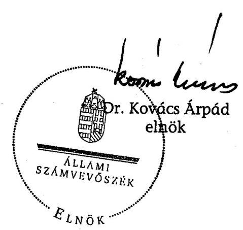

---

1. sz. melléklet

V-19-35/2006-2007. sz. jelentéshez

A jelentéstervezetre és a jelentésre tett észrevételek!

---

# MINISZTERELNÖKI HIVATAL 

## ÁLLAMTITKÁR

Ikt.szám: 1-1/2661/2/2007 (1)
Hivatkozási szám: V-19-25/2006-2007.
Úgyintéző: Végh Szabolcs
Tárgy: MTI 2006. évi ellenőrzése

Bihary Zsigmond úr részére
föigazgató
Állami Számvevőszék
Budapest

Tisztelt Föigazgató Úr!
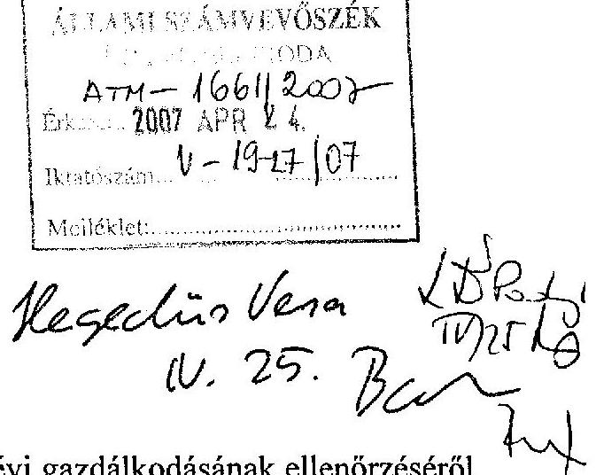

Az Állami Számvevőszék által az MTI Rt. 2006. évi gazdálkodásának ellenőrzéséről készített jelentés-tervezetet köszönettel megkaptam.

A megállapításokkal, javaslatokkal alapvetően egyetértek, észrevételt nem teszek.

Budapest, 2007. április „21;,
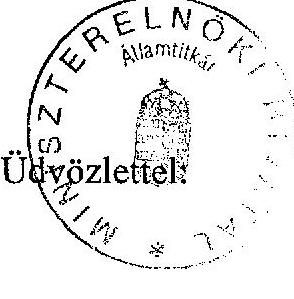

Gilyán György

---

# 1. sz. melléklet 

a V-19-35/2006-2007. sz. jelentéshez

## 4111   $U-19-34106-04$   $N E F$   Magyar Távirati Iroda Zrt. $\cdot$ Tulajdonosi Tanácsadó Testület

Budapest, 2007. május 21.

## Dr.Kovács Árpád

elnök részére
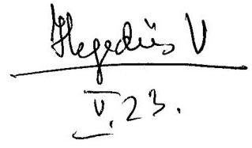

Ikt.sz.: T-6/2007.

Tárgy: V-19-33/2006-2007 számú jelentéstervezetre észrevétel

Tisztelt elnök úr!

Köszönettel vettem a V-19-33/2006-2007. számú levelét és jelentéstervezetet.
A számvevőszéki jelentéstervezetre további észrevételeket nem teszünk.

Tisztelettel és szívélyes üdvözlettel:
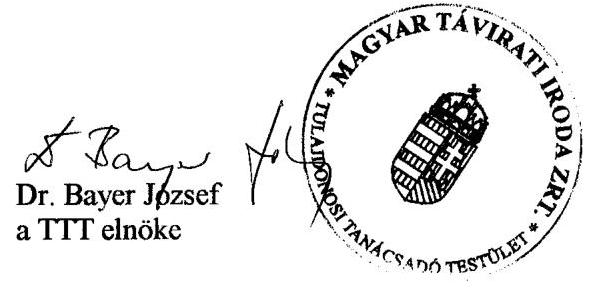

---

# 125 éves mti) 

## MAGYAR TÁVIRATI IRODA ZRT. - FELÜGYELŐ BIZOTTSÁG

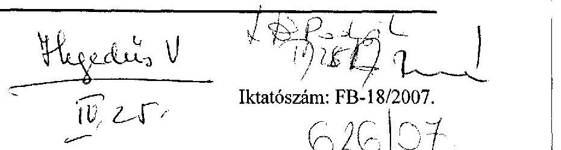

Állami Számvevőszék

Bihary Zsigmond Föigazgató Úrnak

Tisztelt Bihary Úr!
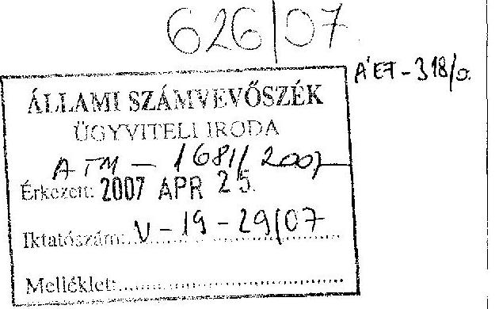

Az Magyar Távirati Iroda Zrt. 2006. évi gazdálkodásának ellenőrzéséről készített V-19-19/2006-2007. és V-19-26/2006-2007. számú jelentéstervezetüket köszönettel kézhez vettük, és azokat a Felügyelő Bizottság 2007. április 24-ei ülésén megvitatta.

Megállapítottuk, hogy a munkaanyaghoz füzött felügyelő bizottsági észrevételeket a jelentéstervezet véglegesítése során figyelembe vették. Ezeken túl a jelentés 1. és 2. számú tervezetéhez a Felügyelő Bizottság további észrevételt nem fogalmazott meg.

Budapest, 2007. április 24.
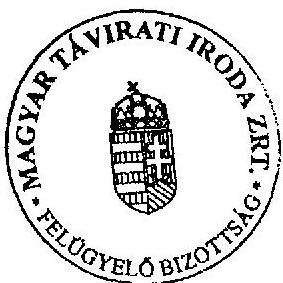

Ödvözlettel:
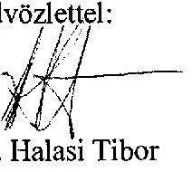

## 1111   dr. Halasi Tibor

Magyar Távirati Iroda ZRt. - Felügyelő Bizottság Elnöke
1016 Budapest, Naphegy tér 8.
Tel.: 441-9036, tel./fax: 356-9538,
mobiltelefon: 06-30-211-3111, 06-30-515-4007
E-mail: fb@mti.hu

---

1. sz. melléklet a V-19-35/2006-2007. sz. jelentéshez
a V-19-35/2006-2007. sz. jelentéshez

# Elnök 

Magyar Távirati Iroda Zrt.
$632 / 04$
$A^{\prime} E F-325 / 07$

Bihary Zsigmond föigazgató Úr részére
Állami Számvevőszék

Budapest
Apáczai Csere János u. 10
1051
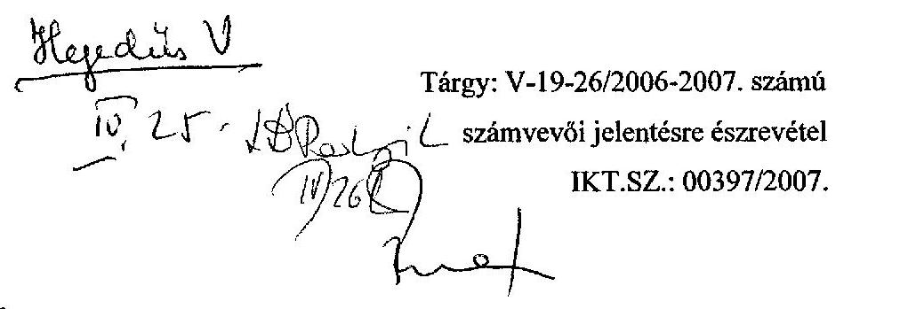

Tárgy: V-19-26/2006-2007. számú számvevői jelentésre észrevétel
IKT.SZ.: 00397/2007.

Tisztelt föigazgató úr!

A V-19-26/2006-2007. számú számvevői jelentéstervezetet köszönettel megkaptam.

A jelentés tartalmát megismerve az abban foglaltakhoz további észrevételeket nem teszünk.

Budapest, 2007. április 24.
Tisztelettel:
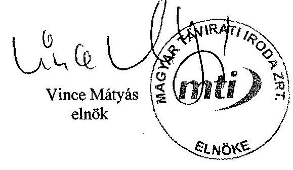

---

# ÁSZ-javaslatokkal összefüggő OGY határozatok 

7/1998. (II. 18.) OGY határozat a Magyar Távirati Iroda Rt. létrehozásáról szóló 70/1997. (VII. 15.) OGY határozat módosításáról
64/2002. (X. 4.) OGY határozat a Magyar Távirat Iroda Részvénytársaság 1997. évi tevékenységéről szóló beszámolójáról
65/2002. (X. 4.) OGY határozat a Magyar Távirat Iroda Részvénytársaság 1998. évi tevékenységéről szóló jelentés elfogadásához
66/2002. (X. 4.) OGY határozat a Magyar Távirat Iroda Részvénytársaság 1999. évi tevékenységéről szóló jelentés elfogadásához
67/2002. (X. 4.) OGY határozat a Magyar Távirat Iroda Részvénytársaság 2000. évi tevékenységéről szóló beszámolójáról
68/2002. (X. 4.) OGY határozat a Magyar Távirat Iroda Részvénytársaság 2001. évi tevékenységéről szóló beszámolójáról
10/2003. (II. 19.) OGY. határozat a közszolgálati műsorszolgáltatók és a nemzeti hírügynökség európai uniós csatlakozással kapcsolatos tájékoztatási feladatainak költségvetési támogatásról
99/2004. (X. 13.) OGY. határozat a Magyar Távirati Iroda Részvénytársaság 2002. évi tevékenységéről szóló beszámolójáról
100/2004. (X. 13.) OGY. határozat a Magyar Távirati Iroda Részvénytársaság 2003. évi tevékenységéről szóló beszámolójáról
73/2005. (IX. 22) OGY határozat a Magyar Távirati Iroda Részvénytársaság 2004. évi tevékenységéről szóló beszámolójáról

---

26/2007. (III. 28.) OGY határozat a 125 éves MTI - Éves jelentés 2005. címú beszámolójáról
27/2007. (III. 28.) OGY határozat a Magyar Távirati Iroda Részvénytársaság létrehozásáról szóló 70/1997. (VII. 15.) OGY határozat módosításáról

---

# Előző számvevőszéki ellenőrzés javaslatai 

## 0610. Jelentés a Magyar Távirati Iroda Rt. 2005. évi gazdálkodásának ellenőrzése

A helyszíni ellenőrzés megállapításainak hasznosítása mellett javasoljuk:

## az Országgyülésnek

1. tekintse át és módosítsa a 68/2002. (X. 4.) OGY határozatban megfogalmazott jogalkotási feladatnak megfelelően a nemzeti hírügynökségről szóló 1996. évi CXXVII. törvényt és az MTI Rt. Alapító Okiratát a teljes körűen összehangolt szabályozás kialakítása, a közszolgálati feladatok és az azok ellátásához szükséges állami támogatás egyértelműbb és pontosabb meghatározása, a jelenlegi tulajdonosi joggyakorlás felülvizsgálata és hatékonyabbá tétele érdekében;
2. gondoskodjon az MTI Rt. múködését hosszú távon befolyásoló középtávú stratégiai, illetve éves tervre vonatkozó tulajdonosi kontroll megteremtéséről;
3. hozzon döntést az Alapító Okirat aktualizálásáról, ennek keretében fontolja meg az MTI Rt. Alapító Okiratának módosítását abból a szempontból is, hogy az Rt. támogatási igényét a TTT véleményezze.

## a Kormánynak

1. kezdeményezze a 68/2002. (X. 4.) OGY határozatban az MTI Rt. támogatásával kapcsolatban megfogalmazott átláthatósági követelmény érvényre juttatása érdekében szükséges jogalkotási és egyéb intézkedéseket, különös figyelemmel a közösségi jog előírásaira; az Nht. 2. § (1) bekezdése h) pontjában megjelölt - a választási időszak feladataira vonatkozó - külön törvény megalkotását;
2. fontolja meg a következő évi költségvetési törvényjavaslat összeállításánál egyrészt a TTT múködési költségei támogatásának elkülönítését az MTI Rt. előirányzatától, másrészt a Tulajdonosi Tanácsadó Testülettel az Rt. támogatási igényének véleményeztetését.

## a TTT-nek

kezdeményezze a tulajdonosnál a TTT-hez rendelt tulajdonosi jogosítványok egyértelmú meghatározását, az MTI Rt. Alapító Okiratának módosítását.

---

# az FB-nek 

kísérje figyelemmel az ÁSZ jelentések megállapításai, javaslatai alapján - az utasításban - kiadott intézkedési tervek eredményes végrehajtását.

## az MTI Rt. elnökének

3. elemezze a 2005-ben kialakított szervezeti rend hatékonyságát és eredményeit; hozza összhangba az SZMSZ-t, az elnöki, alelnöki utasításokat és a munkaköri leírásokat;
4. teremtse meg az adott évre vonatkozó tervek és a tervezési folyamat közötti összhangot;
5. intézkedjen a humánerőforrás gazdálkodás elveinek, kritériumrendszerének és szabályainak megalkotásáról, a szervezeti egységekre lebontott létszámterv elkészítéséről, az évek óta szorgalmazott teljesítményellenőrzési és ösztönző rendszer bevezetéséről, felülvizsgálva a kettős foglakoztatást, a megbízási és vállalkozási szerződések hatékonyságát;
6. gondoskodjon a hivatali gépjármúhasználat engedélyeztetési rendjének betartásáról;
7. készítesse el az egységes, a szükséges forrásokat évekre lebontva tartalmazó középtávú ingatlangazdálkodási tervet; fontolja meg a nem használt ingatlanok értékesítését, intézkedjen a Károly krt.-i bérelt ingatlan hasznosítása érdekében.

---

# TANÚSÍTVÁNYOK JEGYZÉKE 

1/a. sz. tanúsítvány Árbevétel és eredményterv kimutatása 2006. év
1/b. sz. tanúsítvány Költség- és ráfordításterv kimutatása 2006. év
2. sz. tanúsítvány A társaság vagyoni helyzetének alakulása (Eszközök)
3. sz. tanúsítvány A társaság vagyoni helyzetének alakulása (Források)
4. sz. tanúsítvány Bevételek alakulása
5. sz. tanúsítvány Költségek és ráfordítások alakulása
6. sz. tanúsítvány Eredmény alakulása
7. sz. tanúsítvány Költségvetési befizetési kötelezettségek (adók, járulékok)
8. sz. tanúsítvány Költségvetési juttatások (közvetlen és közvetett támogatások)
9. sz. tanúsítvány Az MTI Rt. létszámmegoszlása

---

Magyar Távirati Iroda ZRt. Budapest

1/a. sz. tanúsítvány a V-19- 35'/2006-2007. sz. jelentéshez

|  Megnevezés | Tény
2003. | Terv
2004. | Tény
2004. | Index (%) 2004. tény/tény | Terv
2005. | Tény
2005. | Index (%) 2005. tény/terv | Terv
2006.12.31. | Tény
2006.12.31. | Index (%) 2006.12.31. tény/terv  |
| --- | --- | --- | --- | --- | --- | --- | --- | --- | --- | --- |
|   | 1 | 2 | 3 | 4 (3/2) | 5 | 6 | 7 (6/5) | 8 | 9 | 10 (9/8)  |
|  Belföldi értékesítés nettó árbevétele | 2 040 869 | 1 683 912 | 1 836 034 | 109,03% | 1 767 182 | 1 732 040 | 98,01% | 1 681 422 | 1 747 818 | 103,95%  |
|  Export értékesítés nettó árbevétele | 102 091 | 70 300 | 124 811 | 177,54% | 119 500 | 125 803 | 105,27% | 117 100 | 150 987 | 128,94%  |
|  Egyéb bevételek | 20 720 | 45 000 | 7 858 | 17,46% | 59 067 | 15 144 | 25,64% | 0 | 59 029 |   |
|  Árbevétel összesen | 2 163 680 | 1 799 212 | 1 968 703 | 109,42% | 1 945 749 | 1 872 987 | 96,26% | 1 798 522 | 1 957 534 | 108,86%  |
|  Költségvetési támogatás | 1 757 970 | 1 807 200 | 2 304 186 | 127,50% | 2 217 380 | 2 167 458 | 97,75% | 2 314 694 | 2 317 788 | 100,13%  |
|  intézményi támogatás | 1 522 200 | 1 607 200 | 1 607 200 | 100,00% | 2 000 000 | 2 050 000 | 102,50% | 2 150 000 | 2 150 000 | 100,00%  |
|  céltámogatások | 235 770 | 200 000 | 696 986 | 348,49% | 117 380 | 37 458 | 31,91% | 164 694 | 167 788 | 101,88%  |
|  intézményi támogatás kiegészítése |  |  |  |  | 100 000 | 80 000 | 80,00% | 0 | 0 |   |
|  Aktivált saját teljesítmény | 0 | 0 | 0 |  |  | 14 336 |  | 0 | -5 478 |   |
|  Bevételek összesen | 3 921 650 | 3 606 412 | 4 272 889 | 118,48% | 4 163 129 | 4 054 781 | 97,40% | 4 113 216 | 4 270 144 | 103,82%  |
|  Költségek és ráfordítások összesen | 4 084 716 | 3 817 724 | 4 547 895 | 119,13% | 4 171 871 | 4 058 829 | 97,29% | 4 108 628 | 4 277 610 | 104,11%  |
|  Üzleti eredmény (H-V) | -163 066 | -211 311 | -275 006 | 130,14% | -8 742 | -4 048 | 46,31% | 4 589 | -7 465 | -162,68%  |
|  Pénzügyi műveletek bevétele | 38 260 | 0 | 36 130 |  | 0 | 35 611 |  | 0 | 29 783 |   |
|  Pénzügyi műveletek ráfordítása | 15 330 | 0 | 5 074 |  | 0 | 15 324 |  | 0 | 12 746 |   |
|  Pénzügyi műveletek eredménye | 22 930 | 0 | 31 056 |  | 14 000 | 20 287 | 144,91% | 9 000 | 17 037 | 189,30%  |
|  Szokásos vállalkozói eredmény | -140 136 | -211 312 | -243 950 | 115% | 5 258 | 16 239 | 308,85% | 13 589 | 9 572 | 70,4%  |
|  Rendkívüli eredmény | 2 181 | 160 066 | 152 152 |  |  | -9732 |  | -5 000 | -1135 |   |
|  Mérleg szerinti eredmény | -137 955 | -51 246 | -91 798 | 179% | 5 258 | 6 507 | 123,76% | 8 589 | 8 437 | 98,2%  |

Adatőrrint: 2006. kontrolling jelentés

Budapest, 2007. Március 19.

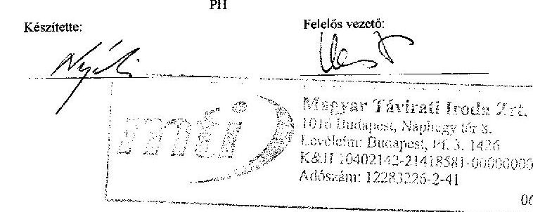

---

Magyar Távirati Iroda ZRt. Budapest

Költség-és ráfordításterv kimutatása 2006-év

1/b. sz. tanúsítvány a V-19-35/2006-2007. sz. jelentéshez

|  Megnevezés | Tény
2003. | Terv
2004. | Tény
2004. | Index (%) | Terv
2005. | Tény
2005. | Index (%) | Terv
2006.12.31. | Tény
2006.12.31. | Index (%)  |
| --- | --- | --- | --- | --- | --- | --- | --- | --- | --- | --- |
|   |  |  |  | 2004. |  |  |  |  |  | 2006.12.31.  |
|   |  |  |  | tény/tény |  |  |  |  |  | tény/terv  |
|   | 1 | 2 | 3 | 4 (3/2) | 5 | 6 | 7 (6/5) | 8 | 9 | 10 (9/8)  |
|  IV. Anyagjellegű ráfordítások | 1 448 462 | 1 445 147 | 1 477 552 | 102,24% | 1 522 217 | 1 376 662 | 90,44% | 1 369 328 | 1 345 810 | 98,28%  |
|  V. Személyi jellegű ráfordítások | 2 040 848 | 1 857 225 | 2 005 753 | 108,00% | 1 956 612 | 1 981 502 | 101,27% | 2 149 364 | 2 283 067 | 106,22%  |
|  VI. Értékcsökkenés összesen | 312 377 | 307 751 | 301 883 | 98,09% | 361 449 | 320 026 | 88,54% | 290 229 | 310 421 | 106,96%  |
|  VII. Egyéb költség és ráford. össz. | 19 388 | 207 601 | 233 859 | 112,65% | 331 593 | 202 071 | 68,94% | 10 804 | 40 394 | 373,88%  |
|  * Céltámogatás elszámolt költségei | 263 641 |  | 528 848 |  |  | 178 569 |  | 288 903 | 297 918 | 103,12%  |
|  Költség és ráfordítások összesen | 4 084 716 | 3 817 724 | 4 547 895 | 119,13% | 4 171 871 | 4 058 829 | 97,29% | 4 108 628 | 4 277 610 | 104,11%  |

Adatforrás: 2006. kontrolling jelentés Budapest, 2007. Március 19.

* Céltámogatás elszámolt költségei: Projekt költségek= 297.918

Készítette: Fejelős vezető: PH

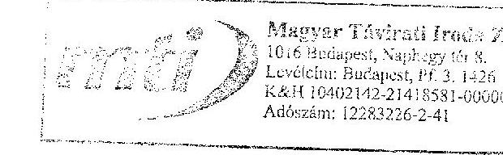

05.

---

Magyar Távirati Iroda ZRt. Budapest

A társaság vagyoni helyzetének alakulása (ESZKÖZÖK) (2000-2006-év)

2. sz. tanúsítvány a V-19- 35/2006-2007. sz. jelentéshez

|  Megnevezés | 2000. | 2001. | 2002. | 2003. | 2004. | 2005. | 2006.  |
| --- | --- | --- | --- | --- | --- | --- | --- |
|  Befektetett Eszközök | 2 996 070 | 3 084 308 | 3 067 162 | 3 136 963 | 3 080 876 | 2 906 577 | 2 928 915  |
|  ebből: Immateriális javak | 149 500 | 112 128 | 132 612 | 105 656 | 148 651 | 138 606 | 129 707  |
|  tárgyi eszközök | 2 799 967 | 2 921 726 | 2 896 471 | 2 998 015 | 2 862 112 | 2 707 058 | 2 731 174  |
|  befektetett pű. eszközök | 46 603 | 50 454 | 38 079 | 33 292 | 70 113 | 60 913 | 68 034  |
|  Forgóeszközök | 703 965 | 694 133 | 537 031 | 431 964 | 676 359 | 599 370 | 547 846  |
|  ebből: készletek | 20 179 | 19 110 | 20 362 | 15 651 | 11 040 | 22 386 | 19 241  |
|  követelések | 229 517 | 253 553 | 234 503 | 269 904 | 263 873 | 286 162 | 216 576  |
|  értékpapírok | 205 777 | 305 791 | 205 777 | 0 | 0 | 0 | 0  |
|  pénzeszközök | 248 492 | 115 679 | 76 389 | 146 409 | 401 446 | 290 822 | 312 029  |
|  Aktív időbeli elhatárolások | 29 454 | 30 064 | 105 226 | 31 461 | 44 605 | 18 417 | 32 807  |
|  ESZKÖZÖK ÖSSZESEN: | 3 729 489 | 3 808 505 | 3 709 419 | 3 600 388 | 3 801 840 | 3 524 364 | 3 509 568  |

Adatforrás: 2006.kontrolling jelentés

Budapest, 2007.Március 19.

Készítette: *M. K.*

Felelős vezető:

*M. K.*

*M. K.*

*Magyar Távirati Iroda ZRt.*

1076 Budapest, Veszély 2006.

Levételére: Budapest, 01.3. 2006.

K&H 10402, 42-2141E:01-06/00/00

Adószám: 12283226-2-41

---

# Magyar Távirati Iroda ZRt.

## Budapest

### A társaság vagyoni helyzetének alakulása (FORRÁSOK) (2000-2006-év)

### 3. sz. tanúsítvány

### a V-19- 25 /2006-2007. sz. jelentéshez

|  Megnevezés | 2000. | 2001. | 2002. | 2003. | 2004. | 2005. | 2006.  |
| --- | --- | --- | --- | --- | --- | --- | --- |
|  Saját tőke | 3 255 762 | 3 395 343 | 3 252 510 | 3 114 101 | 3 022 303 | 3 028 810 | 3 037 247  |
|  ebből: jegyzett tőke | 1 750 000 | 1 750 000 | 1 750 000 | 1 750 000 | 1 750 000 | 1 750 000 | 1 750 000  |
|  tőketartalék | 892 396 | 892 396 | 892 396 | 892 396 | 892 396 | 892 396 | 892 396  |
|  eredménytartalék | 517 139 | 560 816 | 752 497 | 609 660 | 471 705 | 379 907 | 386 414  |
|  mérleg szerinti eredmény | 96 227 | 192 131 | -142 383 | -137 955 | -91 798 | 6 507 | 8 437  |
|  Céltartalék | 10 997 | 10 997 | 26 533 | 15 536 | 16 712 | 16 712 | 13 000  |
|  Kötelezettségek | 355 022 | 242 671 | 231 327 | 297 165 | 567 427 | 346 476 | 361 083  |
|  Puszáv időbeli elhatárolások | 107 708 | 159 494 | 199 049 | 173 586 | 195 398 | 132 366 | 98 238  |
|  FORRÁSOK ÖSSZESEN: | 3 729 489 | 3 808 505 | 3 709 419 | 3 600 388 | 3 801 840 | 3 524 364 | 3 509 568  |

Adatforrás: 2006. kontrolling jelentés

Budapest, 2007. március 19.

Készítette: *M. V. Távirati Iroda Zrt.*

Felelős vezető:

*M. V. Távirati Iroda Zrt.*

Magyar Távirati Iroda Zrt. 1016 Budapest, Sinthof 1016. Lavikinc Budapest, P. 2. 1076 KA11 10402143-2141/201-00030000 Aóforám: 12283220-2-41

06

---

# Bevételek alakulása (2000-2006-év)

4- sz. tanúsítvány a V-19-3 572006-2007. sz. jelentéshez

|  Megnevezés | 2000. | 2001. | 2002. | 2003. | 2004. | 2005. | 2006.  |
| --- | --- | --- | --- | --- | --- | --- | --- |
|  Belföldi értékesítés nettó árbevétele | 1 772 421 | 1 912 884 | 1 998 857 | 2 040 869 | 1 836 034 | 1 732 040 | 1 747 818  |
|  Export értékesítés nettó árbevétele | 133 739 | 116 839 | 118 818 | 102 091 | 124 811 | 125 803 | 150 987  |
|  Egyéb bevételek | 1 372 091 | 1 393 833 | 1 471 440 | 1 778 690 | 2 312 044 | 2 182 602 | 2 376 817  |
|  Aktivált saját teljesítmények | 43 302 | 0 | 0 | 0 | 0 | 14 336 | -5 478  |
|  Pénzügyi műveletek bevételei | 66 507 | 75 219 | 47 224 | 38 260 | 36 130 | 35 611 | 29 783  |
|  Rendkívüli bevételek | 1 407 | 149 752 | 24 199 | 8 091 | 460 820 | 1 946 | 1 517  |
|  BEVÉTELEK ÖSSZESEN: | 3 389 467 | 3 648 527 | 3 660 538 | 3 968 001 | 4 769 839 | 4 092 338 | 4 301 444  |

- A számviteli törvény változása miatt a 2000. és a 2001. évi adatok változatlan szerkezetben nem hasonlíthatók össze, ezért a 2000. évt korrigáltuk.

Adatforrás: 2006. kontrolling jelentés

Budapest, 2007. március 19.

Készítette: *Meg*

---

Magyar Távirati Iroda ZRt. Budapest

Költségek és ráfordítások alakulása (2000-2006-év)

5. sz. tanúsítvány a V-19-35/2006-2007. sz. jelentéshez

|  Megnevezés | 2000. | 2001. | 2002. | 2003. | 2004. | 2005. | 2006.  |
| --- | --- | --- | --- | --- | --- | --- | --- |
|  Anyagjellegű ráfordítások | 1 257 370 | 1 328 488 | 1 467 084 | 1 594 208 | 1 521 194 | 1 484 010 | 1 467 171  |
|  Személyi jellegű ráfordítások | 1 677 735 | 1 714 190 | 1 898 949 | 2 128 316 | 2 436 206 | 2 011 604 | 2 390 398  |
|  Értékcsökkenési leírás | 282 635 | 281 188 | 331 278 | 342 804 | 356 636 | 361 144 | 379 646  |
|  Egyéb költségek és ráfordítások | 48 046 | 78 630 | 60 597 | 19 388 | 233 859 | 202 071 | 40 394  |
|  Pénzügyi műveletek ráfordításai | 15 962 | 5 313 | 17 664 | 15 330 | 5 074 | 15 324 | 12 746  |
|  Rendkívüli ráfordítások | 11 492 | 48 137 | 27 349 | 5 910 | 308 668 | 11 677 | 2 652  |
|  **KÖLTSÉGEK ÉS RÁFORD, ÖSSZESEN:** | 3 293 240 | 3 455 946 | 3 802 921 | 4 105 956 | 4 861 637 | 4 085 831 | 4 293 007  |

- A számviteli törvény változása miatt a 2000. és a 2001. évi adatok változatlan szerkezetben nem hasonlíthatók össze, ezért a 2000. évit korrigáltuk.

Adatforrás: 2006. kontrolling jelentés

Budapest, 2007. Március 19.

Készítette: PH

Felelős vezető:

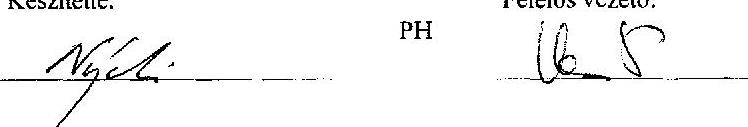

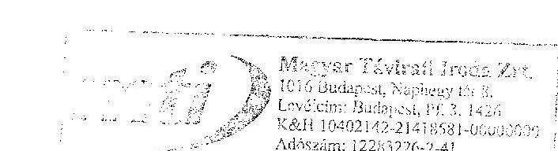

---

Magyar Távirati Iroda ZRt. Budapest

Eredmény alakulása (2000-2006-év)

6. sz. tanúsítvány a V-19-35/2006-2007. sz. jelentéshez

|  Megnevezés | 2000. | 2001. | 2002. | 2003. | 2004. | 2005. | 2006.  |
| --- | --- | --- | --- | --- | --- | --- | --- |
|  1.Üremi(üzleti)tevékenység eredménye | 55 767 | 21 060 | -168 793 | -163 066 | -275 006 | -4 048 | -7 465  |
|  2.Pénztigyi műveletek eredményé | 50 545 | 69 906 | 29 560 | 22 930 | 31 056 | 20 287 | 17 037  |
|  3.Szokásos vállalkozási eredmény (1+2) | 106 312 | 90 966 | -139 233 | -140 136 | -243 950 | 16 239 | 9 572  |
|  4.Rendkívüli eredmény | -10 085 | 101 615 | -3 150 | 2 181 | 152 152 | -9 732 | -1 135  |
|  5.Adózás előtti eredmény (3+4) | 96 227 | 192 581 | -142 383 | -137 955 | -91 798 | 6 507 | 8 437  |

Adatforrás: 2006. kontrolling jelentés

Budapest, 2007. Március 19.

Készítette: *Myrtle*

Felelős vezető:

*1016 Budapest, Norforge 101 3.*

*Levélcím: Budapest, H. 3. 1016*

*Közönt: 12283226-2-41*

---

Magyar Távirati Iroda ZRt.

# Költségvetési befizetési kötelezettségek (adók, járulékok) (2000-2006-év)

7. sz. tanúsítvány a V-19- 35 /2006-2007. sz. jelentéshez

|  Megnevezés | 2000. | 2001. | 2002. | 2003. | 2004. | 2005. | 2006.  |
| --- | --- | --- | --- | --- | --- | --- | --- |
|  Személyi jövedelemadó | 340 775 | 361 924 | 401 319 | 441 679 | 505 783 | 411 558 | 346 977  |
|  Általános forgalmi adó | 172 454 | 169 999 | 171 976 | 113 490 | 360 630 | 255 728 | 76 147  |
|  Munkaadói járulék | 27 712 | 30 552 | 15 510 | 38 264 | 46 818 | 36 018 | 36 942  |
|  Munkavállalói járulék | 12 537 | 13 794 | 15 392 | 11 075 | 12 185 | 10 927 | 13 389  |
|  Mindösszesen: | 553 478 | 576 269 | 604 197 | 604 508 | 925 416 | 714 230 | 473 455  |

Adatforrás: 2006. kontrolling jelentés

Budapest, 2007. Március 19.

Készítette: *M. H. H.*

Felelős vezető:

*M. H.*

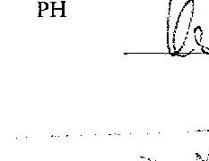

---

Magyar Távirati Iroda Zilt. Budapest

Költségvetési juttatások (követlen és közvetett támogatások)

8. sz. tanúsítvány a V-19-35/2006-2007, sz. jelentéshez

|  Megnevezés | 2001. | 2002. | 2003. | 2004. | 2005. | 2006.  |
| --- | --- | --- | --- | --- | --- | --- |
|  Bévételt növelő támogatását (hp. költségvetés) |  |  |  |  |  |   |
|  Központjálati feladatok véltámogatása | 1 522 200 | 1 522 200 | 1 522 200 | 1 607 200 | 2 089 000 | 2 100 000  |
|  Határon túli magyar saját hivatatása |  |  |  |  | 50 000 | 50 000  |
|  Működési támogatás összesen: |  | 1 522 200 | 1 522 200 | 1 607 200 | 2 150 000 | 2 150 000  |
|  **ÖSSZESEN:** |  | 1 522 200 | 1 522 200 | 1 607 200 | 2 150 000 | 2 150 000  |
|  Saját tőkét növelő támogatások |  |  |  |  |  |   |
|  Egyéb, bevételt növelő támogatások |  |  |  |  |  |   |
|  **Célhámogatás:** |  |  |  |  |  |   |
|  Választási feladatok |  |  |  |  |  | 116 800  |
|  Európai találkozási feladatok |  |  | 87 679 | 4 625 |  | 3 071  |
|  Ilyes Közzérelővásár |  | 12 264 | 10 889 | 715 | 694 | 438  |
|  Berakészállítási támogatás |  |  |  | 190 000 | 1 880 | 8 120  |
|  Látazásfeljebbíjió támogatás |  |  |  | 410 669 |  |   |
|  IRB-HIM MTI Net projekt* |  | 76 770 | 85 498 | 14 802 | 3 202 | 2 503  |
|  IRB-Számolási/istatási feladatok |  |  |  | 9 000 |  |   |
|  IRB - MTI DAK projekt* |  |  |  | 47 233 | 11 456 | 11 444  |
|  SKÖM Digitalis Főbánylév. pr. * |  | 11 119 | 34 775 | 8 024 | 420 | 118  |
|  MHTAÚMA |  |  |  |  | 9 201 | 2 758  |
|  Kérelmetesítési feladatok |  |  | 10 000 |  | 3 053 | 322  |
|  Oktási feladatok |  | 1 800 | 3 174 |  |  |   |
|  EU-felágosító |  |  | 3 755 |  |  |   |
|  Ki Köszöni |  |  |  |  |  | 310  |
|  MEH - EU Adatbalk / "Kor-Képek 1956" |  |  |  | 1 462 |  | 7 000  |
|  Nemzeti Külterület Alap - "Kor-Képek 45-47" |  |  |  | 3 000 |  |   |
|  Nemzeti Külterület Alap - MTI Főbb 50 évt |  |  |  |  |  | 1 000  |
|  Európai találkozás |  |  |  | 7 456 | 7 552 | 13 904  |
|  **ÖSSZESEN:** |  | 101 953 | 148 051 | 692 361 | 37 458 | 167 788  |
|  **MINDÖSSZESEN:** |  | 1 424 153 | 1 670 291 | 2 299 561 | 2 167 458 | 2 317 788  |

- A cél támogatások tárgyévben elszámolít összegei nem tartalmazzák a beruházások miatt a következő évekre az amortizációval arányosan elhatárolt támogatási fedeztetése.

Budapest, 2007. Március 19.

Készítette: 2016. Budapest, Mégkönyvek 10. év 14.5. KSH 1040. Feljebb vezetői 1 600 000 000 000 000 000 000

---

9. sz. tanúsítvány a V-19-35/2006-2007. sz. jelentéshez

|  Foglalkoztatottak | 2000.12.31 | 2001.12.31 | 2002.12.31 | 2003.12.31 | 2004.12.31
a távk. alatti terüle
méklet | 2005.12.31
a távk. alatti terüle
méklet | 2006.12.31
a távk. alatti terüle
méklet  |
| --- | --- | --- | --- | --- | --- | --- | --- |
|  Munkaviszony keretében foglalkoztatott aktív
munkavállalók | 411 | 415 | 444 | 433 | 326 | 321 | 359  |
|  Munkaviszony keretében foglalkoztatott
nyudítások | 16 | 13 | 19 | 25 | 8 | 11 | 18  |
|  Összesen | 427 | 428 | 463 | 458 | 334 | 332 | 377  |
|  Határozott időben foglalkoztatott nyugdíjások | 2 | 1 | 1 | 0 | 0 | 0 | 0  |
|  Határozatlan időben foglalkoztatott
nyugdíjások | 14 | 12 | 18 | 25 | 8 | 11 | 18  |
|  Mellékfoglalkozás | 3 | 3 | 3 | 2 | 1 | 1 | 1  |
|  Másodállás | 1 | 1 | 0 | 0 | 0 | 0 | 0  |
|  Munkaszerződéssel és vállalkozási
szerződéssel foglalk. | 95 | 76 | 87 | 89 | 65 | 51 | 0  |
|  Külsős foglalkoztatottak |  |  |  |  |  |  |   |
|  Határozott | 38 | 42 | 80 | 187 | 44 | 55 | 64  |
|  Határozatlan | 58 | 67 | 126 | 118 | 82 | 75 | 22  |
|  Összesen | 96 | 106 | 206 | 305 | 126 | 130 | 86  |
|  Munkaszerződés és vállalkozási
szerződéssel foglalkoztatottak bontása
szerződés megnevezése szerint | 2000.12.31 | 2001.12.31 | 2002.12.31 | 2003.12.31 | 2004.12.31 | 2005.12.31 | 2006.12.31  |
|  Megalkotási felhasználási szerződés | 24 | 0 | 0 | 0 | 0 | 0 | 0  |
|  Megbízási szerződés | 11 | 0 | 0 | 0 | 0 | 0 | 0  |
|  Vállalkozási szerződés | 60 | 76 | 87 | 89 | 65 | 51 | 0  |
|  Összesen: | 95 | 76 | 87 | 89 | 65 | 51 | 0  |

Budapest, 2007. Március 19.

Készítette: