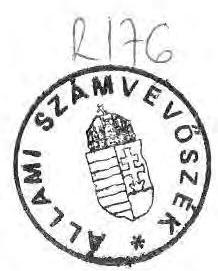
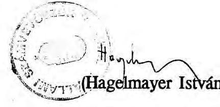

# Allami @̋̋ámbevöséé 

## JELENTÉS

a helyi önkormányzatok áthúzódó kötelezettségeinek vizsgálatáról, különös tekintettel az adósságszolgálathoz kapcsolódó 1991. évi címzett támogatásra

---

A vizsgálatot vezette és az összefoglaló jelentést összeállította Rácz Lajosné fôtanácsos.

A vizsgálat szervezésében közremüködött dr. Molnár Klára számvevő
A vizsgálatot végezték:
Baranya megye:
Maczekó Károly számvevő tanácsos
Békés megye:
Kollár Lászlóné számvevő tanácsos
Csongrád megye:
dr. Ótott Lajos számvevő tanácsos
Fejér megye:
Ébner Vilmosné számvevő
Jász-Nagykun-Szolnok megye:
dr. Csapó Anna számvevő
Komárom-Esztergom megye:
Koltayné Szepesi Zsuzsanna számvevő
Négrád megye:
Fercsík Gyula számvevő tanácsos
Pest megye és a főváros:
dr. Felleg Zsoltné számvevő tanácsos
dr. Molnár Klára számvevő
Somogy megye:
Szita László számvevő
Tolna megye:
Péntek László számvevő
Vas megye:
dr. Gyuk József számvevő tanácsos
Veszprém megye:
Rénes Mária számvevő

---

# Jelentés 

a helyi önkormányzatok áthúzódó kötelezettségeinek vizsgálatáról, különös tekintettel az adósságszolgálathoz kapcsolódó 1991. évi címzett támogatásra

A pénzügyi szabályozás új rendszerének egyik eleme a címzett támogatások 1991. évi bevezetése.

A Magyar Köztársaság 1991. évi állami költségvetéséről szóló 1990. évi CIV. törvény 11.814,5 millió forintot hagyott jóvá a helyi önkormányzatok nagy költségigényű - korábban általában megyeközponti - fejlesztési és rekonstrukciós feladataihoz kapcsolódó címzett támogatásokra.

A törvény 5. sz. melléklete részletezi az 1991. évi címzett támogatásokat, melyek között tíz megyére és a fővárosra vonatkozóan 925,5 millió forintot tartalmaz adósságszolgálat címén, a felvett hitelek és a kibocsátott kötvények tőke és kamatterhének fedezésére.

Az adósságszolgálati kötelezettség teljesítésének ellenőrzése mellett vizsgálatunk arra is választ keresett, hogy milyen terheik vannak az adósságszolgálati címzett támogatásból nem részesülő, egyes helyi önkormányzatoknak, milyen lehetőségeik vannak a hitelek és azok kamatterhei visszafizetésére.

Ennek figyelembevételével vizsgálatunk fő célja annak megállapítása volt, hogy az 1990. évi költségvetési törvényben biztosított adósságszolgálati címzett támogatás igénylése és felhasználása törvényszerű-e, az e körben nem érintett helyi önkormányzatoknál mely célokból eredően milyen mértékű adósságfelhalmozás történt, a fizetési kötelezettség összhangban van-e teherbíró képességükkel, a jelenlegi terhek milyen esetleges feszültségpontokat idéznek elő gazdálkodásukban.

---

A vizsgálatot a törvényességi és célszerűségi szempontok figyelembevételével 12 megyében és a fővárosban végeztük el.

Helyszíni vizsgálatot az érintett központi szerveken - a Belügyminisztériumon és a Pénzügyminisztériumon - kívül 11 megyei /fővárosi/ önkormányzatnál, 8 megyei jogú városnál, 42 városi és 20 községi önkormányzatnál végeztünk.

# A vizsgálat megállapításai 

## I.

Az adósságszolgálati címzett támogatás vizsgálata a központi szerveknél

## 1. Előzmények

Az önkormányzatok 1991. évi gazdálkodásának szabályozásában újabb változások következtek be. Ennek előzménye az 1990. január 1-jétől bevezetett új pénzügyi szabályozórendszer, amelynek értelmében a kiadásorientált gazdálkodást egy forrásorientált gazdálkodás váltotta fel, a nyílt alkumechanizmusra épülő forrás elosztás helyébe a túlnyomórészt közgazdasági szabályozókra és automatizmusokra épülő forrás szabályozás lépett.

Az új szabályozás a bevételérdekeltség érvényesülését helyezte előtérbe azzal, hogy a kívánatos kiadási színvonal eléréséhez a hiánypótlás szerepét a saját bevételek növekedésének és a hiteleknek kell betölteniük, vagy - bevétel hiányában mérsékelni szükséges a kiadási szintet. Ennek figyelembevételével változtak az egyes forráselemek, többek között bevezetésre került a normatív állami hozzájárulás, 1990-ben még átmenetileg múködött a megyei céltámogatási rendszer, 1991. évre pedig belépett a címzett- és céltámogatás rendszere.

A címzett támogatást az Országgyűlés döntése alapján meghatározott önkormányzatok kapják egyes nagy költségigényű feladataikhoz.

## 2. A központi szervek törvényelőkészítő munkája

Az 1990. évi költségvetési törvény 5. sz. melléklete önkormányzatonként és címenként 11.814,5 millió forintot hagyott jóvá a címzett támogatásokra.

---

A Belügyminisztérium 1990. nyarán, a költségvetési tervezés előkészítő szakaszában országos felmérést végzett a folyamatban lévő beruházásokkal kapcsolatos állami támogatási igény volumenéről.

Az akkori tanácsok mintegy 31 milliárd forintos nagyságrendủ, 1991. évet terhelő, folyó beruházási állományt jelentettek be.

A tervezés következő szakaszában — november hónapban — került sor a szakértői egyeztető tárgyalásokra a Belügyminisztérium és a megyei pénzügyi vezetők között.

Ezt megelőzően a Belügyminisztérium Önkormányzati Gazdasági Főosztálya a megyei pénzügyi vezetők részére - dátum és aláírás nélküli telefaxot adott ki, amelyben adatlap kitöltését kérte az 1990-ben folyamatban lévố megyeközponti beruházásokról, rekonstrukciókról és felújításokról, a térségi feladatot ellátó intézményi beruházásokról, rekonstrukciókról és felújításokról, amelyekhez 1990-ben megyeközponti támogatás járult. Továbbá tételes felsorolást kért a megyei tanácsok által tanácshatározatban vállalt kötelezettségekről.

Az ezen szempontok alapján összeállított megyei listák képezték az egyeztető tárgyalások alapját.
A közel 12 milliárd forintos címzett támogatás, ezen belül a 925,5 millió forintos adósságszolgálat tehát az állami költségvetési maradványelv és a tárgyalások eredményeként alakult ki. A Pénzügyminisztérium a tervelőkészítő munkákban egyáltalán nem vett részt.

A Belügyminisztérium nem vizsgálta a benyújtott igények megalapozottságát, a számítások pontosságát, valamint az önkormányzatok 1990. és 1991. évi anyagi helyzete alapján az adósságszolgálati címzett támogatás juttatásának jogosultságát. /Adósságszolgálati terhek és teljesítések, 1. sz. melléklet/

Az állami költségvetés az adósságszolgálati körben 1991. évre teljeskörűen átvállalta a volt megyei tanácsok által felvett hitelek, továbbá az általuk kibocsátott kötvények esedékes tőke és kamatterhét.

Többek között a Csongrád megyei Önkormányzat idei 633 ezer forint összegủ kötvény-kamat tartozását, amely volumenénél fogva csekély terhet jelentett volna a jelenlegi megyei önkormányzatnak, vagy a Komárom-Esztergom megyei Tanács által felvett hitel tőke terhét, melyet a megyei tanács már az 1990. évi költségvetésében betervezett az átmenetet segitő állami támogatás terhére előrehozott ütemezésben, bár a teljesítést elnapolta 1991. évre.

---

Felülvizsgálat és helyi ismeret hiányában fordulhatott elő az is, hogy a Nógrád megyei Önkormányzat részére biztosította az állami költségvetés a Buják és Szügy községi tanácsok által kibocsátott kötvények kamatterhének fedezetét, holott a megye csak kezességvállalási garanciát adott ki a kötvényekre. Ugyanakkor a legtöbb megye által adott kezesség-vállalási garanciákat már nem vállalta át a költségvetés.

A hivatkozott példák egyben a rendszer kritikáját is adják. Az új szabályozási és finanszírozási struktúra, valamint az új önkormányzatok létrejötte nem jelentette egyben az intézményi struktúra változását is. A kialakult kiadási szint miatt melyet a tanácsok /önkormányzatok/ saját maguk állapítottak meg - a finanszírozás továbbra is direkt eszközökkel müködik, mint azt az igények felmérése és az egyeztető tárgyalásos elbírálás eredménye bizonyítja.

Nem fogadható el a Belügyminisztérium azon álláspontja, mely szerint a megyei önkormányzatoknál - az adósságszolgálati támogatás hiányában - egységesen forráshiány keletkezett volna, melynek függvényében különféle, 1991. előtti kötelezettségeiknek nem tudtak volna eleget tenni. Ennek ellenkezőjét vizsgálatunk bizonyította.

Bár a középirányító funkciók megszűnése megnehezíti a több, mint 3000 önkormányzat vélt vagy valós jogos igényének elbírálását, az igények objektív alapon való szürését, a központi szervek tervelőkészítő munkája nem volt megfelelő. Ebben nem kis szerepet játszottak a számviteli információs rendszer - ma is meglévő hiányosságai, amelyek nem teszik lehetővé az államháztartás részét képező önkormányzati adósságállomány megfelelő, központi figyelemmel kisérését, ennek alapján a támogatási rendszer komplexebb kezelését és az igazságosabb elosztást.

Ebből a helyzetből következik, hogy az infrastruktúrálisan elmaradottabb helyzetben lévő önkormányzatok - amelyeknek többsége a korábbi szabályozórendszer elemeiből adódóan vette föl hitelei nagyobb részét, vagy bocsátotta ki kötvényeit -, hátrányosabb helyzetbe kerülnek az elbírálás során a jobb gazdasági helyzetben lévő, tehát teherbíróbb önkormányzatoknál.

# 3. A pénzügyi lebonyolítás vizsgálata 

Az adósságszolgálati címzett támogatások rendelkezésre bocsátása az önkormányzatoknak a Belügyminisztériumhoz vagy Pénzügyminisztériumhoz közvetlenül benyújtott igénylése alapján történt meg 1991. I. negyedében.
1991. Jüllus 10 -ig - vizsgálatunk idópontjáig - az önkormányzatok 531.969 ezer forintot vettek igénybe az állami támogatásból, általában

---

az esedékességnek megfelelő ütemben. Az utalást közvetlenül a Pénzügyminisztérium végzi.

A központi szervek az állami támogatás rendelkezésre bocsátásának és esedékességének összhangját nem vizsgálják. A Területi Államháztartási és Közigazgatási Információs Szolgálatok /TÁKISZ-ok/ létrejötte után az igénylést ezen intézmények végzik a megyei önkormányzati hivatalok jelzése alapján, azonban egyéb szerepkörük ezeknek az intézményeknek sincs.

Ebből a helyzetből adódhat, hogy pl. a Nógrád Megyei Önkormányzat az adósságszolgálati címzett támogatást a hitelszerzödésekben rögzített fizetési kötelezettségeknél magasabb összegben és elöbb Igényelte le, igy —a IX. 30 -án esedékes 50 millió tőke visszafizetéssel szemben III-IV. hóban - 41 millió forintos elötörlesztést végzett a legmagasabb kamatozású hitelböl. Ennek következtében a május végi állapot szerint 7,3 millió forint kamat megtakarítást ért el a címzett támogatásból. Az éves szintű nettó kamat megtakarítása 2,5 millió forint körül várható, amelyet - vizsgálatunk alapján - szándékában áll a központi költségvetésbe visszautalni.

A megyei önkormányzat kétségtelenül szabálytalan eljárása mellett ismételten felmerül az állami ellenőrzés megfelelő funkcionálásának, a jól müködő számviteli információs rendszernek a hiánya. Megoldatlan továbbá a korábbi megyei szintű és a központi szervek közötti feladatmegosztás kiiktatása, amely álláspontunk szerint nem a volt szerepkörök visszaállítását, hanem elsősorban a technikai megoldások ésszerű csoportosítását jelenthetné, megszüntetve ezzel a központi szervek direkt kötelezettségeit /pályázatok begyűjtése, formális ellenőrzése stb/. Ezzel egyidejűleg mérlegelendő azonban annak lehetősége is, hogy az előrehozott állami támogatások nyújtásával milyen mértékủ nettó kamatmegtakarítás érhető el a központi költségvetés számára.

# II. 

Az adósságszolgálati címzett támogatás ellenőrzése a megyei /fővárosi/ önkormányzatoknál

## 1. A megyeközponti igények érvényesülése

Az adósságszolgálati címzett támogatás - mint azt a BM-ben végzett vizsgálat is megerősítette - általában a megyeközpontoknál folyamatban lévő beruházások adósságszolgálatának fedezetéül szolgált.

---

Jász-Nagykún-Szolnok megye kapta meg a címzett támogatás $35,2 \%$-át, Nógrád megye és a fơváros részesült együttesen a támogatás $27,8 \%$-ában, további 8 megye /Békés, Csongrád, Fejér, Komárom-Esztergom, Somogy, Tolna, Vas és Veszprém/ pedig az összes támogatás $0,1-9,8 \%$-os arányában szóródva, együttesen $37 \%$-os részesedést képvisel.

A megyeközponti helyszíni vizsgálatok során a legtöbb helyszínen a BM általi felmérés tartalmára, határidejére vonatkozóan nem találtunk dokumentációt. Ez arra utal, hogy a Belügyminisztérium a megyeközpontok által készített anyagok alapján utólag határozta meg a támogatni kívánt célokat.

A korábban már hivatkozott — néhány vizsgált helyszínen fellelt — telefax alapján a megyeközpontok összeállították folyamatban lévő beruházásaik és azok adósságszolgálati listáját. A telefax 2. pontja szerinti - "Tételes felsorolás szükséges a Megyei Tanács által /tanácshatározatban/ vállalt kötelezettségekről" - megfogalmazásból azonban nem derül ki egyértelműen, hogy ez csak a megyei kötelezettségekre, vagy a megye által vállalt garanciális kötelezettségekre is vonatkozik, hiszen a kezesség-vállalásra is rendszerint tanácshatározatban került sor.

A tervezés előkészítetlensége, az odaítélt támogatások vagylagos jellege, az elbírálás feltételeinek nem egyértelmű rögzítése alapján következhetett be az a helyzet, hogy egyes megyékben részlegesen, míg más megyékben teljeskörűen vállalta át az állami költségvetés a megyeközponti adósságszolgálatok terhét.

Vizsgálati tapasztalataink alapján a Somogy megyei önkormányzat nem az általa kibocsátott kötvényekre kapott címzett támogatást.

A megyében lévő Marcali Városi Tanács ugyanis 1987-ben 49 millió forint értékủ kötvényt bocsátott ki a kórház rekonstrukciójára, ötéves futamidővel és $12 \%$-os kamattal. A megyeközpont 1991. és 1992. évi kötelezettséggel évi 24,5 millió forintos tőketörlesztést vállalt, a város pedig a kamatok törlesztését. Ezzel szemben az ezévi esedékes törlesztésre a teljes összegủ /tőke és kamat/ - 30,4 millió forint - állami támogatást megkapták. A megyei kötelezettségvállalás ugyanolyan garanciális kötelezettségvállalásnak minősül, mint más megye kezességvállalása a kötvények visszafizetése után. Indokolatlan tehát a központi költségvetés terhére való átvállalás, de különösen indokolatlan a város kamatfizetési kötelezettségének átvállalása.

Figyelemre méltó a Somogy megyei Nyomdalpari Vállalat által kibocsátott kötvény 1991. évi terhének visszafizetése, melyet a volt megyei tanács 10 millió forint összegben vállalt fel, és kapott meg az önkormányzat a címzett támogatásból ezévre. Ugyanis a kötelezettségvállalás fejében a Nyomdalpari Vállalat a Nagyatádi Nyomda KFT-be bevitt törzsbetétjéből 7.090 ezer forint, a Siófoki Nyomda KFT-ben lévô törzsbe-

---

tétjéból 1.410 ezer forint, a Pesti Szalon KFT-be bevitt törzsbetétjéból pedig 1.500 ezer forint összegü törzsbetétet átadott a megyei önkormányzat javára.

A törvény által garantált állami támogatást tehát - közvetetten - korlátolt felelősségű társaságba fektették be. Az önkormányzat megtérülése így kétszeres. Kérdés, hogy adott esetben a Parlament által biztosított közpénz hozadéka kit illet meg - a megyei önkormányzatot, avagy a központi költségvetést - illetve, veszteség esetén ki viseli annak terheit.

Egyidejűleg megállapítjuk, hogy a Somogy megyel Önkormányzat hozadékkal visszatérülő kölcsönt nyújtott a Nyomdalpari Vállalatnak, ezért a 10 millió forint összegủ címzett támogatást - mint jogosulatlan juttatást - vissza kell vonni tőle.

Mindezek által megerősítendő a támogatási rendszer kritikája, amely a rendszerszemlélet helyett kiragadott egy elemet, az adósságszolgálatot és egy önkormányzati típust, a megyei önkormányzatot, függetlenítve azt az egyéb elemektől, az igényelt támogatás összefüggéseit sem vizsgálva.

Ezt nyilvánvalóan igazolták helyszíni tapasztalataink, mivel az adósságszolgálati kötelezettség a legtöbb vizsgált megyeközpontban arányaiban a költségvetés mindössze néhány \%-át jelenti.

Csongrád megyében például az Ópusztaszeri Nemzeti Emlékparkra kibocsátott kötvény 633 ezer forintos kamatterhe az ezévi költségvetés 0,3 \%-a, tehát elhanyagolható nagyságrendủ. Ugyanez az arány Somogyban 3 \%, Vasban 0,3 \%, Veszprémben 1,6 \%.

# 2. Az adósságszolgálat által támogatott célok 

A 925,5 millió forint adósságszolgálati címzett támogatásból alig több mint fele — összesen 469,2 millió forint, $50,7 \%$ - tekinthető csak olyannak, amely elvileg reálisan támogatott cél a központi költségvetés terhére.

Nevezetesen a Békés megyei, délalföldi ivóvízminőségjavító programhoz felvett hitel 82 millió forintos törlesztő része, a Komárom-Esztergom megyei Bakony-térség vízellátási programjának 6 millió forintos adósságszolgálata - bár ezt a megye gazdasági kondíciói nem indokolják -, a Nógrád megyei foglalkoztatás javításra, illetve a dunai vízáteresztés fejlesztésére felvett hitelek 101,8 millió forintos esedékes terhei, a Szolnoki főgyűjtő csatorna és a szolnoki Tiszahíd hitelének, kötvényének idei 290 millió forintos terhe.

---

Az adósságszolgálat terhére biztosított további 456,3 millió forint állami támogatás elvileg egyáltalán nem támogatható, mivel jórészt helyi érdekủ célokat szolgált, ilyen alapon a támogatást szélesebb körre is ki kellett volna terjeszteni. Esetenként a gazdasági háttér nem indokolta a támogatást, illetve az önkormányzatok több csatornán keresztül is megpróbálták érvényesíteni igényeiket.

Helyi érdekũ vagy szükebb térségi célnak tekinthető pl. a bujáki, szügyi általános iskolák, a szolnoki középiskolai sportcsarnok, kollégium, főiskolai kollégium kötvényei, hitel tőke és kamatterhei, a szekszárdi tisztított szennyvíz elvezetéséhez, a Vas megyei KÖJÁL építéséhez vagy a fóvárosi lakótelep területelőkészitéséhez felvett hitelek.

A kórház rekonstrukciók a törvény 5. sz. mellékletének " 3 " pontja szerint is részesültek címzett támogatásból, így pl. a székesfehérvári, a marcali, a veszprémi kórház. Ezért célszerűbb lett volna az összevont, egy címen történő támogatás.

Nem ismerték el ugyanakkor támogatott célként a Fejér megyei LepsényMezőszentgyörgy egészséges ivóvizellátás programját, amelyet a megyei tanács 2/1986. sz. tanácshatározatával hagyott jóvá. Ugyanez a település céltámogatásként is beadta igényét, míg végülis a megyei fejlesztési tartalék terhére rendezték jogos igényét.

Az 1980-as évek szabályozórendszeréből eredően a megyék döntő többsége kezességvállalási garanciát adott a helyi tanácsok által kibocsátott kötvények tőke és kamatterhének visszafizetésére. Azonban a már hivatkozott néhány esettől eltekintve - ezek nem nyertek elismerést. Emiatt több helyi önkormányzat nehéz helyzetbe került, mint azt vizsgálati megállapításaink II. fejezete tartalmazza.

# 3. A megyeközpontok által benyújtott igények dokumentáltságának vizsgálata 

A központi költségvetés adósságszolgálati címzett támogatások terhére a hitelek és kibocsátott kötvények ezévi esedékes tőke és kamatterhét teljeskörűen átvállalta.

A már ismertetett problémák mellett azonban - az ellenőrzés hiányából eredően - számítási hibából adódó eltéréseket találtunk az ellenőrzés során.

Békés megyében a dokumentált számítási anyag alapján az adósságszolgálati kötelezettség 79,7 millió forint, ezzel szemben az állami támogatás 82 millió forint, tehát az eltérés 2,3 millió forint többlet.

Vas megyében 8.143 ezer forintot tudtak dokumentálni - mivel a kamatterhek összegét becslés útján állapították meg -, így a pluszként . juttatott állami támogatás 857 ezer forint.

---

Veszprém megyében az adósságszolgálat címén jelentkező kötelezettség 60,3 millió forint, a törvény azonban 62,9 millió forintot hagyott jóvá részükre. A 2,6 millió forintos eltérésre a vizsgálat során nem tudtak magyarázatot adni.

Összességében tehát az 5,7 millió forint nem illeti meg ezeket a megyei önkormányzatokat, ezen összegek központi költségvetésbe való visszautalása indokolt.

A költségvetési törvény előkészítési szakaszában a Belügyminisztérium nem intézkedett egyértelműen a kamatterhek átvállalásának mértékéről. Ezért a megyék többsége - figyelembe véve az OTP üzleti kamatpolitikáját —, általában számított kamatterhet érvényesített a BM-hez benyújtott támogatási igényében, több megye viszont a szerződésekben szereplő összeget tekintette - helyesen a számítás alapjául.

Ennek következtében egyes megyék - az üzleti kamatlábak emelkedése miatt - jelentös többletteherrel számolnak adósságszolgálat címén.
Így pl. Fejér megyében 24 millió forint, Jász-Nagykun-Szolnok megyében 25 millió forint többlet-kamatteher van kilátásban, de más megyékben is hasonló a helyzet.
Ugyanakkor Nógrád megye - a már hivatkozott szabálytalan lehívás alapján - jelentős nettó kamat megtakarítást ér el.

Mindezekből nyilvánvaló, hogy az állami támogatás rendelkezésre bocsátásának feltételeit egyértelműen szabályozni szükséges, a jogosulatlan állami támogatást pedig - törvényi rendelkezéssel - vissza kell juttatni a központi költségvetésbe. /Az adósságszolgálat felhasználásának megyei példáit a Példatár tartalmazza/

# III. 

Az áthúzódó kötelezettségek helyi önkormányzatoknál végzett vizsgálatának tapasztalatai

## 1. A felhalmozódott adósságterhek keletkezésének okai

A központi költségvetésből biztosított adósságszolgálati kötelezettségek felhasználásának ellenőrzése mellett vizsgálatunk másik fő célja azon adósságterhek nagyobb részének számbavétele volt, amelyet a helyi önkormányzatok áthúzódó kötelezettségei jelentenek.

---

Vizsgálati tapasztalataink alapján meglehetősen differenciált képet kaptunk az ellenőrzött helyi önkormányzatokról. Megyei szintű adatok a helyi önkormányzatok felhalmozódott adósságállományáról nem álltak teljeskörűen rendelkezésre, mivel összesített mérlegadataik - mint azt az ellenőrzés megállapította - hiányosan tartalmazzák az adósságállományt. Kiegészítő információt az Országos Takarékpénztártól szereztünk, továbbá a vizsgált kör az adósságállomány 60-70 \%-os reprezentációját nyújtotta. Mindezek birtokában összefoglaló megállapításaink a következők.

A felhalmozódott adósságterhek a 80-as évek települést fejlesztő, jórészt infrastruktúrális beruházásaival, valamint az ellátatlan területek, az intézményhálózat fejlesztésével, rekonstrukciójával vannak összefüggésben. Az adósságteher kisebb hányada az 1985. év előtti beruházások terhe, nagyobb része pedig az 1986-90-es években keletkezett.

A keletkezés okai több tényezőre vezethetők vissza, ezek közül a leginkább meghatározókat emeljük ki:
— az állam rohamosan kivonult a lakásépítésből, preferálva a magánlakásépítést, ennek terheit jórészt áthárítva az akkori tanácsokra /kiemelt rétegek lakáshoz juttatása, területelőkészítés kedvezményes hitelei/,
—az 1986-ban bevezetett új tanácsi szabályozó rendszer a fejlesztési lehetőséget normatív módon, alanyi jogon határozta meg,
— bevezetésre került a céltámogatási rendszer a fejlesztések meghatározott körére,
—az állami támogatást többször csökkentették, a tanácsok a keletkezett forráshiányt többnyire hitelből pótolták,
—a beruházások az új adórendszer, valamint az infláció hatására jelentősen megdrágultak,
—a lakosság életkörülményeinek romlása, ezzel párhuzamosan a tanácsi intézményhálózat, illetve egyes pénzbeni és természetbeni szolgáltatások iránti igények növekedése következett be,
—a hitelek kamatai alacsonyabbak voltak a mindenkori, hivatalosan regisztrált inflációs rátánál,
— kötvénykibocsátási lehetőségek állami kezességvállalási garanciák mellett történhettek.

---

Mindezen körülmény elindított egy jelentős eladósodási folyamatot, melynek adósságterheit az új önkormányzatok - jogutódlásuknál fogva - természetesen örökölték.

Meg kell azonban különböztetni egy globális forráshiányt, amellyel az önkormányzatok általánosságban - a változatlan struktúrájú intézményhálózat, az elmaradt felújítások, az infláció és általában a gazdasági körülmények rosszabbodása miatt — küzdenek. A normatív finanszírozási rendszer nem oldja meg ezt a feszültséget, mivel - az állami feladatvállalás mértékének meghatározása hiányában - a támogatások szétosztásának eszközéül szolgál. A forrásszabályozás ellenére tehát forráshiány keletkezett, amelyen belül meghatározó a folyamatban lévő beruházások terhe.

A vizsgálat tapasztalatai alapján azonban általános - teherbíró képességet meghaladó - eladósodottságról nem lehet beszélni, bár az önkormányzatok egy részénél magas az eladósodottság mértéke.

# 2. A hitelfelvételek célja, mértéke, esedékessége 

A vizsgált körben a helyi tanácsok többsége - a mindekori szabályozó rendszerbe beágyazva - beruházásait általában kellőképpen előkészítette, megalapozta; azok reális, településfejlesztési célokat szolgáltak.

A gazdálkodási körülmények megváltozására azonban a tanácsok egy része egyáltalán nem, vagy csak késve reagált, nem vizsgálta felül és nem módosította eredeti célkitűzéseit. A kieső forrásokat hitelek felvételével, kötvények kibocsátásával pótolta, ezen elképzeléseit a kedvező kamatpolitika is lehetővé tette.

Tapasztalataink alapján a tanácsok a hitelek zömét a 1986-88-as években vették fel, erre az időszakra esik a kötvények többségének kibocsátása is. A hitel tehát a gazdálkodás normális, államilag deklarált finanszírozási eszközéül szolgált a vizsgált időszakban. Különösen ösztönzőek voltak a kedvezményes kamatozású hitelek, az üzleti kamatok pedig csak az utóbbi időszak termékei.

Jellemző még, hogy a hitelek zömét a megyeközpontok, a megyeszékhelyek, illetve a városok vették fel, a községek sokkal nagyobb óvatosságot tanúsítottak ezen a téren. A hitelfajtákon belül meghatározó volt a lakástámogatási, - területelőkészítés, hitelek felvétele, amelyek többségükben 2000-2002-ig terhelik az önkormányzatokat. Arra is volt példa, hogy egy-egy település hitelállományát teljes egészében ez a hitelfajta alkotta.

---

Ismételten vissza kell utalnunk a számviteli információs rendszer hiányosságaira, a költségvetési beszámolók valódiságára is, mivel a tényleges hitelállományt csak a helyszíni vizsgálat alapján tudtuk megbízhatóan számba venni.

A Baranya megyei TÁKISZ adatai alapján Baranya megyében 1990. év végén 17 önkormányzatnak volt összesen 183,6 millió forint összegủ hitel-, illetve kötvény állománya, a vizsgálat azonban csak a pécsi megyei jogú városi önkormányzatnál 937 millió forint hiteltartozást és 90 millió forint kötvénykibocsátást állapított meg.

Békés megyében a tanácsok 1986-90. évi tervidőszaki szinten például 670 millió forint hitelfelvétellel számoltak. A vizsgált kör összesen 571 millió forint fejlesztési célú hitelt vett fel, illetve kötvényt bocsátott ki. Ezek növekedése 1986-88-ban dinamikus/139,7, 171,9, 210,2 millió forint/, majd erőteljesen csökkenő, 1989-ben 38,6 millió forint, 1990-ben pedig mindössze 10,5 millió forint. A fejlesztési hitelek kétharmadát a városi és nagyközségi tanácsok vették föl, a kisközségekben ez az arány alig 15 \%. A kötvénykibocsátás teljes összegének egyharmada Békéscsabára koncentrálódik. 1990. év végén a vizsgálatba bevont 7 tanácsnak 793,6 millió forint tőketartozása volt, melyből a megyeközpont 200 millió, Békéscsaba város pedig 293 millió forinttal tartozott.

Jász-Nagykun-Szolnok megyében a megyei önkormányzat hitel tőke és kamattörlesztési, illetve kötvény visszafizetési kötelezettsége 1,1 milliárd forint volt, amelynek azonban 1991. évi esedékes részét - 325,9 millió forintot - az adósságszolgálat terhére, állami támogatásként megkapott.

Komárom-Esztergom megyében a hitelek felvétele és a kötvények kibocsátása elsősorban lakás, szennyvíz, gáz, illetve középiskolai fejlesztési programokhoz kapcsolódott.
Az 1990. évi mérlegadatok alapján az évvégi hitelállomány megyei szinten 145 millió forint, azonban csak a vizsgált öt városnál 260,5 millió forintos állományt állapítottunk meg. Az OTP adatokkal kiegészítve az önkormányzatok hitelállománya megközelítőleg 375 millió forintra becsülhető.

Nógrád megyében a jelenleg felhalmozódott adósságállomány mintegy 788 millió forint, Pest megyében a vizsgált kör adósságállománya mintegy 687 millió forintra tehető, ezen belül a lakáscélu hitelállomány meghaladja a $40 \%$-ot.

Tolna megyében 1990-ben 421,5 millió forint nagyságrendủ hitel- és kötvénytartozást vettek át az önkormányzatok, melynek $28 \%$-a fejlesztési célhitel, $42 \%$-a lakástámogatási hitel, $11 \%$-a lakásépítési és telekkialakitási hitel, $19 \%$-a pedig kötvény. A hitelállomány $88,6 \% / 373,6$ millió forint/ a megyei, valamint a 7 városi önkormányzatnál jelentkezett. A további 47,9 millió forint nagyságú hiteltartozás 17 önkormányzat között oszlott meg úgy, hogy ebből 12 millió forint célhitellel 4 önkormányzat rendelkezett.

---

Vas megyében az 1990. év végi, megyel szintũ hitelállomány 326,9 millió forint volt. A vizsgált 7 önkormányzat a vizsgálat idején 254,6 millió forint hiteltartozással számolt, amelynek $61,8 \%$-a volt a kedvezményes kamatozású lakástámogatási hitel, $38,2 \%$-a pedig ún. tanácsi célhitel.

A hiteltartozások és kötvényvisszatérítések esedékessége jórészt az 1991-93-as évekre esik, jelentősen szűkítve az önkormányzatok fejlesztési lehetőségeit. Az 1991. évi esedékes terheiket az önkormányzatok az éves költségvetésükben megtervezték és a szerződés szerinti összegeket vizsgálatunk idejéig általában teljesítették. A következő évek terhei - a szabályozás és a kamatpolitika ismeretének hiányában - csak prognosztizálhatók, tervszinten a tőke és eredeti /vagy a jelenlegi/ kamat fedezete a vizsgálat alapján biztosítottnak látszik az önkormányzatok többségénél. Annál is inkább, mivel ez évben igényeik egy részét az önhibájukon kívül hátrányos helyzetbe került önkormányzatok, illetve a céltámogatások állami támogatási rendszerében érvényesítették, illetve kívánják érvényesíteni.

# 3. A kamatterhek növekedése, illetve azok kompenzálási lehetőségei 

A korábbi évek kedvezőbb kamatpolitikájának megváltozásával a kamatterhek bár különböző módon -, de jelentősen érintették az egyes önkormányzatokat. A növekedés a vizsgált időszakban az eredeti szerződésekhez képest $0 \%$ /lakáshitelek egy része/ és $112 \%$ között szóródott. A jelenlegi üzleti kamatok a nettó $36 \%$-ot is elérik. A kamatteher növekedéséből eredően összegszerűen 20-29 millió forint többletköltséggel is találkoztunk az ellenőrzés során.

Mindezek mellett azonban nem szabad figyelmen kívül hagyni, hogy az önkormányzatok egy része jelentős betétállománnyal rendelkezik, amelynek kamatai jórészt kompenzálják a hitelkamatok növekedését, tehát forrásoldalon a fedezet rendelkezésre áll.

Fejér megyében pl. az 1990. év végén lekötött betétállomány 370 millió forint volt. Vas megyében ugyanezen idópontban 56 millió forint volt a betétállomány, a vizsgálat idópontjában pedig 299 millió forint. Ez utóbbiból Szombathely város és intézményei 218 millió forinttal részesedtek, ezzel szemben a város hitelállománya 152,5 millió forint.

A helyszíni vizsgálat részletes, település mélységű megállapításait a Példatár tartalmazza.

---

# Következtetések, ajánlások a központi szervek és a helyi önkormányzatok részére 

A helyi önkormányzatoknál végzett ezen vizsgálatunk is visszaigazolta, hogy az általános gazdasági helyzet rosszabbodása, a szabályozórendszer módosítása nyomán radikális változások következtek be a tanácsi /önkormányzati/ gazdálkodásban. Mindezek ellenére azonban igazi előrelépés nem történt, mivel a forrásszabályozás bevezetésével szemben fennmaradt a változatlan intézménystruktúra a már meglévő kiadási szintjével. Ennek finanszírozása a központi költségvetés számára továbbra is kezelhetetlen, mivel a kialakult struktúra miatt a forráshiány újratermelődik. Ugyanakkor felszámolódott az a szűrőrendszer, amely a helyi és a térségi sajátosságok ismeretén alapult. A rendszerváltás következtében egyes önkormányzatoknál is megszünt a gazdálkodás folytonossága, a szakembergárda kicserélésével csak a felhalmozódott problémákat látják.

Fejlesztési lehetőségeik az áthúzódó kötelezettségvállalások miatt lényegesen beszűkültek, az általános pénzhiány pedig globális forráshiányt szül. A kialakult helyzetet nem mindenütt tudják kezelni megfontolt gazdálkodási politikával, az intézményhálózat racionális átalakításával, új bevételi források feltárásával. A segítséget a központi költségvetéstől várják, amely mind az 1990-es, mind pedig az idei évben megpróbálta áthidalni ezt az állapotot. Ezt szolgálta az átmeneti helyzet, illetve az önhibájukon kívül hátrányos helyzetbe került önkormányzatok finanszírozására nyújtott állami támogatás, amely egy címzett és céltámogatási rendszerrel párosult. Tekintettel azonban a kialakult helyzetre a különféle finanszírozási módok egyenként nem érték el céljukat. A több mint 3000 önkormányzat adósságállománya rendszerszemléletű kezelést kívánna.

Vizsgálati tapasztalataink alapján, csak részleges intézkedésekre került sor. Ezen belül az adósságszolgálati címzett támogatási rendszer alapvető hibája az volt, hogy egy elemet - a megyei önkormányzatot - ragadta ki az összefüggő gazdasági környezetből és rendszerből. Ezért célszerűsége meglehetősen vitatható és a rendelkezésre álló állami támogatásnak mintegy fele nem szolgálta megfelelően az önkormányzatok érdekeit, azt nem az arra legjobban rászoruló önkormányzatok kapták. Ez azt eredményezi, hogy az önkormányzatok többsége különféle csatornákon keresztül próbálja megszerezni a szükséges forrásokat, minden lehetséges eszközt felhasználva ehhez. Ugyanakkor a központi források megszerzésére irányuló törekvése elvonja figyelmét a saját területén lévő lehetőségekről.

---

Mint azt vizsgálati tapasztalataink igazolják, az önkormányzatok többsége nincs az általános eladósodottság állapotában. Kétségkívül érzékelhető ma is egy eladósodási folyamat, amely azonban csökkenő tendenciát mutat.

Az önkormányzatok áthúzódó kötelezettségei teherbíró képességükkel arányban állnak, de - további állami segítségre még szükségük lenne.

Ebből következően - vizsgálati tapasztalataink alapján - mind a központi szerveknek, mind pedig a helyi önkormányzatoknak a következőket javasoljuk:

# Központi szerveknek 

## A. Konkrét intézkedésként

1. A Békés, Vas és Veszprém megyei önkormányzatok részére többletként, Somogy megye részére pedig jogosulatlanul juttatott, összesen 15,7 millió forint állami támogatást - törvényes keretek között - vonják vissza a központi költségvetési tartalékba.
2. A szabálytalanul lehívott állami támogatásból eredő nettó kamatmegtakarításokat ugyancsak indokolt visszavonni a központi költségvetési tartalékba.
B. A költségvetési tervezést, illetve a szabályozó rendszert érintő intézkedésként
3. A települési önkormányzatok adósságállományának teljeskörű központi támogatása lehetetlen. A beruházások folytatásához fenntartott, címzett és céltámogatási rendszeren belül szükségszerű lenne azonban legalább az áthúzódó kötelezettségek növekvő kamatterheinek az átvállalása, mivel ezek az önkormányzatoktól független törvényszerűségeken alapulnak.

Ehhez elengedhetetlen az előző éveket illető, folyamatban lévő beruházások teljeskörű felmérése - amelyben a TÁKISZ-ok jelentős szerepet vállalhatnának —; a jelenleg érvényes kamatlábak mellett az 1992. évben esedékes kamatterhek számítása és ezek fix összegű átvállalása. Az esetleges különbözetet pedig az önkormányzatok saját költségvetésük terhére rendeznék. Az áthúzódó terhek lejáratig történő felmérésével a tervezés folyamán előre számításba lehetne venni, hogy a központi költségvetés évente milyen volumenű támogatást tud nyújtani ezen kamatterhek egy részének átvállalásához.

---

2. Megfontolandó annak lehetősége is, hogy a központi költségvetés a meglévő adósságállományból további olyan elemeket vállaljon át, amelyeket a korábbi évek központi intézkedései indukáltak. Így például a kiemelt rétegek lakáshoz juttatásának támogatását, vagy a magánlakások területelőkészítésének terheit, amelyeket a tanácsok az állami lakásépítések csökkenésének hatására, a kedvezményes kamatozású hitelek felvételének lehetőségével élve vállaltak fel. Címzett támogatás keretében át lehetne vállalni pl. a tőke törlesztés $50 \%$-át.
3. Szükségszerű az ún. dekoncentrált intézményhálózat kialakítási ütemének gyorsítása, a feladatmegosztás mielőbbi befejezése, a korábbi, kiiktatott középszintű szervek szerepkörének megoldása, a számviteli információs rendszer megfelelő kiépítése.

# Helyi önkormányzatoknak 

## A. Konkrét intézkedésként

A helyszini vizsgálatok során feltárt hiányosságok felszámolása /számvitel, nyilvántartás, információs rendszer stb./

## B. Hosszabb távon

A meglévő adósságállomány kezelése és a hasonló tendenciák kialakulásának elkerülése céljából javasoljuk a döntési folyamatok megfelelő előkészítését, megalapozását, az önkormányzati vagyon egy részének bevételt hozó hasznosítását /értékesítés, bérbeadás, vállalkozásba fektetés stb./, új beruházások mértéktartó indítását, a folyamatban lévők célszerű szakaszolását, a működési költségvetés és az intézményi struktúra felülvizsgálatát, átvilágítását, érdekeltségi hozzájárulások beszedését, helyi adók bevezetését.

Budapest, 1991. július hó

---

# Adósságszolgálat címenkénti részletezése 

ezer Ft-ban

| Megyeközpontok | Engedélyezett |  | Igénybevétel |  |
| :--: | :--: | :--: | :--: | :--: |
|  | összeg | megoszlás | 1991. július | 10-ig |
|  |  | $\%-\mathrm{a}$ | összeg | $\%-\mathrm{a}$ |

1. Békés megye

A délalföldi ivóvízminőségjavító programhoz felvett 200 millió Ft-os hitel 1991. évi tőke és kamatterhe
82.000
8,9
66.000
80,5
2. Csongrád megye

Ópusztaszer NEP kötvény
Értékesített kötvény
3955 eFt 1991.évi kamatteher
633
0,1
3. Fejér megye

A Székesfehérvári Megyei
Kórházhoz felvett 215 millió
Ft-os hitel 1991. évi tőke
és kamatterhe
91.000
9,8
60.114
66,1
4. Komárom-Esztergom megye

Bakony-térség vízellátásához
felvett hitel 1991. évi
tőke és kamatterhe
6.000
0,6
6.000
100,0
5. Nógrád megye

- Gazdaság korszerűsítés, foglalkoztatás javítására felvett hitel 1991. évi tőke és kamatterhe
30.200
- Dunai vízáteresztés fejlesztésére felvett hitelek 1991.évi tőke és kamatterhe
71.600
-

---

- Lakástámogatási célhítel 1991.évi kamatterhe
- Buják általános iskola kötvény tőke és kamatterhe
- Szügy általános iskola kötvény és kamatterhe Nógrád megye összesen:

Nógrád megye összesen:

# 6. Somogy megye 

- Csiky Gergely Színház kötvény tőke és kamatterhe
- Marcali kórház kötvény és kamatterhe
- Somogy megyei Nyomdaipari Vállalat kötvény visszafiz. Somogy megye összesen:

7. Jász-Nagykun-Szolnok megye

- Víziközmú társulatok hitelének tőke és kamatterhe
- középiskolai sportcsarnok hitelének tőke és kamatterhe
- középiskolai kollégium hitelének tőke és kamatterhe
- kereskedelmi föiskolai kollégium hitelének tőke és kamatterhe
- Szolnoki főgyüjtő csatorna hitelének tőke és kamatterhe
- Szolnoki Tisza-híd kötvény tőke és kamatterhe

Jász-Nagykun-Szolnok megye összesen:

| 92 | - | - | - |
| :-- | :-- | :-- | :-- |
| 12.800 | - | - | - |
| 12.800 | - | - | - |
| 127.500 | 13,8 | 94.075 | 73,8 |

16.200

- 

3.000

3.700

13.000

159.300

130.700

325.900
35,2
236.500
72,6
8. Tolna megye

- Angiographiás röntgengép beszerzéséhez felvett hitel tőke és kamatterhe
- Szekszárd tisztított szennyvíz zártrendszerủ elvezeté-

---

|  séhez felvett hitel tőke és kamatterhe | 3.000 | - | - | -  |
| --- | --- | --- | --- | --- |
|  Tolna megye összesen: | 13.000 | 1,4 | 7.000 | 53,8  |
|  9. Vas megye |  |  |  |   |
|  KÖJÁL építéséhez felvett hitel tőke és kamatterhe | 9.000 | 1,0 | - | -  |
|  10. Veszprém megye |  |  |  |   |
|  - A földrengéskárok helyreállításához felvett hitel tőke és kamatterhe | 16.400 | - | - | -  |
|  - Veszprémi Megyei Kórház rekonstrukciójához kibocsátott kötvény tőke és kamatterhe | 46.500 | - | - | -  |
|  Veszprém megye összesen: | 62.900 | 6,8 | 6.400 | 10,2  |
|  11. Budapest főváros |  |  |  |   |
|  - Káposztásmegyeri lakótelep területelőkészítéséhez felvett hitel | 20.000 | - | - | -  |
|  - Mocsáros dülő lakótelep területelőkészítéséhez felvett hitel | 110.000 | - | - | -  |
|  Budapest főváros összesen: | 130.000 | 14,0 | 40.000 | 30,8  |
|  Mindösszesen: | 925.533 | 100, | 531.969 | 57,5  |

---

# 1990-kuvember 1. 14

## 1.1 A melléklet adatlan kitöltendő az 1990-ban folyamában lévő

a. / a megyeközponti beruházásokról, rokonstrokciókról és felújításokról;

b. / a térségi feladatot ellátó intézményi beruházásokról, rokonstrokciókról és felújításokról, amelycédezet 1990-ban megyeközponti támogatás járult.

## 2.1 Főtelme felsorolás szükséges a Megyei Tanács által (tanácshatározatban) vállalt költségelteségéről

A szakértői egyeztetés időpontja: 1990. november 1. 14 1

Melléklet: 1 db

---

# PÉ L DATÁR 

a helyi önkormányzatok áthúzódó kötelezettségei, és az adósságszolgálathoz kapcsolódó 1991. évi címzett támogatás vizsgálatához

## I. Az adósságszolgálati címzett támogatások felhasználásának bemutatása

A./ A központi költségvetésből biztosított állami támogatás egy része indokolatlan volt, mivel gazdasági környezetéből kiragadva, a körülményeket nem vizsgálva nyújtott fedezetet.

1./ A 6 millió forint összegủ adósságszolgálati címzett támogatás a Komárom-Esztergom megyei tanács által 1988. évben felvett 15 millió forintos célhitelen még fennálló tőketartozásra nyújtott fedezetet. A hitel a Bakonytérség ivóvízellátásfejlesztésének gyorsítását szolgálta. Az eredeti hitelszerződés szerint a bankhitelt 5 év alatt, 1989-93. években, évenként 3 millió forint összegben kellett volna törleszteni. A törlesztő részletek kiegyenlítésére gyorsított ütemben került sor.

Az ellenőrzés megállapította, 1990. évben a megyei tanácsnak módja lett volna a még fennálló 6 millió forintos bankhitel tartozás kiegyenlítésére, mivel 1990. évi eredeti költségvetése tartalmazta annak fedezetét. Az átmenetet segitő állami támogatás terhére hiteltörlesztés címén 10 millió forintot, a hitelkamatok fedezetére 2 millió forintot terveztek. A 12 millió forintos előirányzat terhére 4,9 milliót teljesítettek. A maradvány elegendő lett volna az 1991. évi címzett támogatásként biztosított tőketörlesztésre és annak kamatterhére.

A megyei önkormányzat az 1991. évi elkötelezettségekre biztosított címzett támogatást április 15 -én igényelte meg a TÁKISZ-on keresztül. A 6 millió forint május 22 -én realizálódott, a hiteltartozás kiegyenlítésére május 29 -én került sor.

A 6 millió forintos címzett támogatás két évi törlesztésnek megfelelő összeg volt, amely nem tartalmazta a hitel kamatát, az 1059 ezer forintot. A megyei önkormányzat viszont így két alkalommal érvényesítette a központi költségvetéssel

---

szemben az igényét, mivel a Belügyminisztérium a benyújtott és elfogadott igény megalapozottságát, valóságtartalmát nem vizsgálta.

2./ A Nógrád Megyei Önkormányzat a 127,5 millió forint központi támogatásból 30,2 millió forintot a "gazdaság korszerűsítése, foglalkoztatás javítása" címén felvett hitelek tőke és kamatterhének fedezetére kapott.

E célra a volt megyei tanács 1987-ben összesen 60 millió forint hitelt vett fel két kereskedelmi banktól, melyből 35 millió forintot az 1991-93. években, 25 millió forintot a 1991-95. években kell visszafizetni. A pályázatok és a vb. döntései alapján az INNO-LINE Közös Vállalat közreműködésével az előző célokra öt gazdálkodó szervnek és két községi tanácsnak 1988-89. években 38,7 millió forint hozadékkal visszatérítendő fejlesztési támogatást adtak.

Ezen túl a megyei vb. közvetlenül 1988-ban egy gazdálkodó szervnek ilyen célú, az 1989. évi központi támogatás megelőlegezésére szolgáló 12,3 millió forint visszatérítendő támogatást, egy községi tanácsnak pedig 1988. év végén 2,0 millió forint megyei tanácsi hozadékkal visszatérítendő fejlesztési támogatást nyújtott, mely utóbbit 1989. februárjában visszavont.

Közvetetten kapcsolódik a célhoz az előbbi Közös Vállalat létrehozásába vállalkozásként befektetett 5,0 millió forint tőke.

A Közös Vállalaton keresztül kihelyezett támogatásokból megvalósult 7 beruházás. Négy a gazdálkodó szerveknél múködik. Két községi tanács pedig a tervezett gazdasági társaságban való részvétel helyett a beruházást lízing és bérleti formában kényszerült hasznosítani, míg egy mg.tsz. a létrehozott kerámia üzemet gazdaságtalansága miatt megszüntette. Utóbbitól a kölcsönt nem vonták vissza.

A megyei tanács és a Közös Vállalat közötti támogatási szerződések és módosításai szerint a tőke önkormányzathoz történő visszatérülése 1991-ben 5,8 millió forint, 1999-ig bezárólag pedig összesen mintegy 25 millió forint. Az önkormányzat az 1991. évi összeget ez évi költségvetésének bevételei között megtervezte.

Ugyanakkor nem tervezte meg bevételként, megtérülésként Szécsény és Salgótarján városok összesen 6 millió forintos tartozását.

A Közös Vállalat és a támogatott 7 szerv közötti kölcsönszerződések és módosításai szerint a tőke visszatérítési kötelezettség a megyei önkormányzat felé teljesíthető.A tőkén felüli hozadék eddig a vállalatnál maradt. Ez a kölcsön lejáratáig összesen

---

mintegy 20 millió forint lesz. Ebből megállapodás alapján mindössze 3 millió forintot juttatnak vissza a támogatott gazdálkodó szerv székhelye szerinti tanácsnak, önkormányzatnak.

Így a megyei önkormányzat 1989-90 években 3,4 millió, a későbbi években pedig mintegy 13,9 millió forint hozadéktól esik el a saját hibájából, ugyanakkor állami támogatást igényelt és kapott.
3./ Szekszárd város tisztított szennyvízének a Sióba történő zárt rendszerủ elvezetésére irányuló megyei beruházás az 1986-88. években 88 millió forintos költséggel valósult meg. A megyei tanács 1987-ben e feladathoz 10 millió forint összegű hitelt vett igénybe az OTP-től ( $11 \%$-os kamattal) azzal a céllal, hogy az így felszabaduló saját forrást a megnövekedett céltámogatási igények kielégítésére fordítsa.

A hitel éves törlesztőrészlete 1988-1992. között évi 2 millió forint, kamata jelenleg is $11 \%$, amely nem okozna túlzott megterhelést a megyei önkormányzat költségvetésében. Ezért gazdaságilag nem indokolt az állami támogatás igénybevétele.
4./ A Vas megyei önkormányzat részére a megyei KÖJÁL építésével kapcsolatban felvett hitel évi törlesztése és kamata fedezetéül 9 millió forint adósságszolgálati támogatás került jóváhagyásra.

A hitelszerződés 1986-os, ennek alapján 1986-88. években történt a 40 millió forint hitel folyósítása, fix kamatozással, évi 5 milliós törlesztéssel 1996-os lejárattal. A beruházás 1988-ban befejeződött.

A megyei önkormányzat 1990. évvégi hitelállománya 30 millió forint, ez teljes egészében az említett hitelfelvételből adódik.
1991. évi tőketörlesztés 5,0 millió forint, az 1991. évi kamat - az OTP- től az önkormányzat pénzügyi-gazdasági titkársága útján kért információ szerint - 3.143 ezer forint.

Az önkormányzat 1991. évi adósságszolgálata tehát nem 9 millió forint, hanem 8.143 ezer forint, a címzett állami támogatás ennek 110,5 \%-a.A megyei önkormányzat 1990. évben a BM részére 5 millió forint tőketörlesztési és 4 millió forint kamatfizetési kötelezettséget jelzett, a kamatot nem kiszámolva, csak az 1990. évi, negyedévenkénti 950 ezer forint tényleges kifizetés alapján becsülve.

---

Tekintettel arra, hogy az adósságszolgálat nem jelentős (az 1991. évi költségvetési volumen $0,3 \%$-a), valamint arra, hogy a megyei önkormányzatnak - a tanácsrendszerben keletkezett - 44,6 millió forint kintlevősége van más önkormányzatoknál, vállalatoknál, szövetkezeteknél ideiglenes pénzátadásokból kifolyólag, az ellenőrzés megítélése szerint a címzett állami támogatásra nem igazán volt rászorulva.
B./ Az adósságszolgálat keretében a BM elfogadott olyan kötelezettséget is, amelynél nem a megye volt elsősorban a kötelezettségvállaló.
A. Somogy megyei adósságszolgálati címzett támogatás a következő:

- Csiky Gergely Színház kötvény:
- Marcali kórház kötvény:
- Somogy m. Nyomdaipari Vállalat
kötvénye visszafizetés:
Összesen:

37,2 millió forint
30,4 millió forint
10,0 millió forint
77,6 millió forint,
amelyet a megyei önkormányzat a központi költségvetésből megkapott.

A színház kötvényt a megyei tanács adta ki a színház rekonstrukciójának befejezéséhez 60 millió forint összegben.

A Marcali kórház rekonstrukciójához 1987-ben a városi tanács 49 millió forint értékben kötvényt bocsátott ki.

A futamidő 5 év, a kamat mértéke $12 \%$ volt. A megyei tanács kötelezettséget vállalt a tőke 1991. évi és 1992. évi törlesztésére 24,5 millió forint összegben. A kamatot a város vállalta magára.

A Nyomdaipari Vállalat által kibocsátott kötvény törlesztésére a megyei tanács 1991. évre 10 millió forint visszafizetését vállalta.

A Nyomdaipari Vállalat a támogatás fejében 3 kft-ben való részvétellel összesen 10 millió forint értékủ törzsbetét részt biztosít, a megyei önkormányzat részére, továbbá a mindenkori hozadékot.
B. Tehát a kötelezettség egyszer befektetést jelent, egyszer pedig megtérül az állami költségvetésböl is.

---

C/ Az előbbi példával ellentétben a megyei kötelezettségvállalások egy része nem került be a támogatott körbe.

1./ A Fejér megyei Tanács 2/1986. (III.28.) Th sz. határozatával jóváhagyott VII. ötéves tervében áthúzódó beruházásként szerepelt Lepsény- Mezőszentgyörgy települések víz-ellátásának megvalósítása. A község ennek ismeretében kezdte meg a vízmúépítés előkészítési, tervezési munkálatait és e célból határozták el a TEHO bevezetését is, amelyet a település lakosai 3 éven keresztül évi 1.000 forintban meg is fizettek.

A volt megyei tanács a beruházás megvalósításához 1991. évben 12 millió forint céltámogatás biztosítására vállalt kötelezettséget (63-10/1989, május 15.) a tanácsi szabályozási rendszer változatlansága esetén, e döntését azonban testületi határozattal nem alapozta meg. A volt megyei szakosztályok vezetői által aláírt okmányfedezet igazolásként szolgált. A BM nem fogadta el a benyújtott igényt.
Álláspontja szerint a fentiek fedezetét a normatív fejlesztési támogatásban biztosította.

Bár a megyei kötelezettségvállalás nyilvánvaló volt, Fejér megye önkormányzata 1991. március 7-ei ülésén tárgyalta meg és fogadta el az 1991. évi költségvetését, azonban az előterjesztésben szereplő 12 millió forintos támogatást a 400 ,- Ft/fő fejlesztési célú címzett támogatás terhére nem szavazta meg, mivel ez a támogatási formát egységesen, népesség arányában juttatták a megyéknek, így a kezességvállalási garancia nem nyerhetett elismerést benne.

2./ A Fővárosi Önkormányzat Pénzügyi- és Tervezési Főosztálya 1990. november 6-án kelt levelében megküldte a Belügyminisztérium Önkormányzati Főosztálya részére a föváros és a kerületek áthúzódó kötelezettségeiről készített adatfelmérést.

E kimutatás szerint a Fővárosi Önkormányzat 1991. évi hiteltörlesztési kötelezettsége az alábbi jogcímek szerint jelentkezik:

1. Káposztásmegyeri lakótelep 4 terület előkészítésére

20 millió forint
2. Mocsárosdűló terület előkészítésére

110 millió forint
3. Kongresszusi Központ hiteltörlesztésére

8 millió forint
4. Hitelkamat

12 millió forint
Összesen:
150 millió forint

---

Az 1991. évi költségvetési törvény a lakótelepek területelőkészítésére felvett hitelek miatti 1991. évi kötelezettség összegére címzett támogatást biztosított, viszont a Kongresszusi Központra és a kamatfizetési kötelezettségre vonatkozó igényüket nem ismerte el. Ennek alapján az önkormányzat adósságszolgálati címzett támogatása 1991. évre 130 millió forint.

Megállapításunk szerint a hitelkamat összege adminisztrációs hiba következtében nem került be a támogatások közé, míg a Budapesti Kongresszusi Központtal kapcsolatos kötelezettség megtérítését elvi okok miatt nem támogatták.

A Kongresszusi Központ nem a Fővárosi Tanács beruházásaként létesült, annak felépítéséhez a Tanács hitelt nem vett fel.

A létesítmény osztrák idegenforgalmi célhitelkeretből az általánostól eltérő finanszírozási rendszer alkalmazásával valósult meg, beruházója a Pannónia Szálloda és Vendéglátó Vállalat volt. A Fővárosi Tanács a Kormány Gazdasági Bizottságának 10.167/1982. sz. határozatában foglaltaknak megfelelően vállalta, hogy a hitel törlesztéséhez 1986. évtől kezdődően évi 8 millió forinttal, 15 év alatt összesen 120 millió forinttal járul hozzá. E megállapodás a Fővárosi Tanács és a beruházó Pannónia Szálloda és Vendéglátó Vállalat között 1984. december 22 -én jött létre. A megállapodásból a hitel törlesztéséhez történő fővárosi hozzájárulás egyértelműen kiderül.

# II. A helyi önkormányzatok adósságterhe 

A/ A helyi önkormányzatoknál (volt tanácsoknál) keletkezett forráshiányok okai, a felvett hitelek mértéke, célja.

1./ Békés megyében a meghatározott célok alapján a megyei tanács a vízminó-ség-javító program megvalósításához, Orosháza és Kondoros általános iskola építéséhez, Mezőberény, Szarvas, Vésztő csatornázáshoz, Békéscsaba általános és középiskolai beruházásokhoz, lakótelepi közmü- és csatornaépítéshez vett fel hitelt.

A lakástámogatási kiegészítő hitel a helyi tanácsok feladataihoz kapcsolódó lehetőség volt. A 4 városi és a nagyközségi tanács az utóbbi 5 év alatt összesen 112,3 millió forint hitelt vett fel erre a célra, ennek $65 \%$-a 1987-1988. évekre koncentrálódott.

---

A kötvénykibocsátás szabályozása kevesebb korlátozást tartalmazott. A 97/1982.(XII.27.) sz. PM rendelet értelmében az 50 millió forint alatti kötvények kibocsátásához a megyei tanács egyetértése volt szükséges. A benyújtott kérelmeket kivétel nélkül indokoltnak tartotta a megyei tanács. Ez a szabályozás viszont kezességvállalásként volt értelmezhető, amelynek a tartalma jelenleg nem tisztázott.

Békéscsabán 98 millió forint felhasználási célját csak általánosan határozták meg, a sportcsarnok és az autóbusz-pályaudvar beruházásának elősegítésén túl pótolta az egyre csökkenő központi forrásokat is.

A megyei tanács által felvett 200 millió forint hitel az 1986-1990. közötti időszak fejlesztési tervéhez viszonyítva $9 \%$-os.

Vésztőn ezekkel az érdekeltségi saját bevételekkel 1987-ben a fejlesztési lehetőség megkétszereződött, 1988-ban a település legnagyobb beruházása - a művelődési központ -befejeződött, így az árnövelő hatásokat jelentősen csökkentették.

2./ 1989. év végéig Komárom megye tanácsait összességében nem jellemezte forráshiány. Egyedül Esztergom városánál jelentkeztek súlyos pénzügyi zavarok a korábbi évek - hitelek segítségével történő előrehozott beruházásai, csupán azok részbeni realizálása, a felmerülő hiányok göngyölítése miatt.

A pénzügyi stabilitás válságát a 20 tantermes gimnázium építése során felmerült mintegy 33 millió forintos többletköltség, valamint telekkialakításra felvett 34 millió forintos hitelvisszafizetési kötelezettség idézte elő, amelyre szintén nem volt fedezete a városnak.
1990. évben a szabályozórendszer változása miatt vált forráshiányossá a megye 4 települése. A müködési hiány fedezetére az 1990. évi átmenet rendezésére szolgáló kiegészítő állami támogatás szolgált, 24,1 millió forint összegben. A települések közül Kisbér város helyzete volt a legkritikusabb.
1991. évben 6 önkormányzat került önhibáján kívül hátrányos helyzetbe. Ezek közül is elsősorban Kisbér és Dorog városok.

3./ Nógrád megyében főleg a városi önkormányzatoknál jelentkezik számottevöbb eladósodás, adósságszolgálati teher.

A megyei tanács az 1990. évi költségvetés jóváhagyásakor az átmenet segittését szolgáló 581 millió forintos központi forrásból - megyei szinten - a hitel és

---

kötvény visszafizetési kötelezettségek teljesítésére 144 millió forintot engedélyezett azoknak a tanácsoknak, amelyek müködtetése fedezethiányos volt, illetve céltámogatott fejlesztést valósítottak meg. Az ellenőrzött városi tanácsok így az elmúlt évben 104 millió forint adósságszolgálati teher kompenzációban részesültek.

A vizsgált városi önkormányzatok az 1985-90. években a testület hozzájárulásával, tudomásával összesen 423 millió forint hitel felvételéről és 150 millió forint kötvény kibocsátásáról döntöttek. A felvett hiteleket lakásvásárlás és építés helyi támogatásának kedvezményes kiegészítésére 110, a gázellátás kiépítésére 228, kommunális célra és lakótelepi közmưre 92, telkek kialakítására és ezek villamosenergia ellátására 53, útépítésre 30, szennyvíztisztító bővítésére 20, az ívóvízellátás fejlesztésére 10, az oktatási-művelődési központ megépítésére 20, a hulladéklerakó telep kialakítására pedig 10 millió forint összegben használták fel.
4./ A Pest megyei Cegléden a szennyvíztisztító telep bővítésére és a városi szennyvíz mezőgazdasági célú hasznosítására a Ceglédi Városi Tanács és a Magyar-Szovjet Barátság MgTSZ 1979. évben megállapodást kötött. A közös beruházáshoz a tanács az eredeti engedélyokirat szerint 112 millió forinttal volt köteles hozzájárulni. A beruházást 1983. évi határidővel kívánták megvalósítani. A szennyvíztisztítótelep az engedélyokiratban rögzítettektől mind a megvalósítás üteme, mind az arra fordított összeg nagysága tekintetében jelentős eltéréssel valósult meg.

A tanács 1981-1987. között a tervezett 112 millió forinttal szemben összesen 225,4 millió forintot utalt át az MgTSZ számlájára. A megnövekedett beruházási költségek miatt az eredeti hitelszerződésben rögzített 40 millió forint kölcsön a hitelszerződések sorozatos módosításával 99 millió forintra módosult.

A Dunakeszi Városi Tanács gimnázium építését tervezte 1987-1989. közötti időszakban. Az eredeti engedélyokirat 223,8 millió forint összegben, 38 millió forint hitel igénybevételével határozta meg a beruházás költségigényét. A szabályozó rendszer változásai miatt (ÁFA bevezetése, stb.) az eredeti költségvetés 1989. évben 274,9 millió forintra módosult. Ekkor már a tervezett hitel igénybevétel összege 78 millió forint volt.
5./ Somogy megyében az adósságnövekedést befolyásolta egyes területek gyors felzárkózási igénye is, mivel az 50-60-as években határsáv miatt nem tudtak megfelelően fejlődni.

---

Csurgó város a túlfütött beruházási programja miatt 1987. I. félévben 4 millió forint, a második félévben 17 millió forint gazdálkodási elóleget vett fel a bevételek éven belüli megelőlegezésére. A 17 millió forintból 1988-ra áthúzódott 9 millió forint visszafizetési kötelezettség. A 9 millióból előlegként 7 millió forintot a szakmunkásképző és szakközépiskola beruházására, finanszírozására fordítottak, a 2 millió forintot pedig a költségvetési üzem forgóalap feltöltésére használták fel.

1990-ben a város forráshiánya már 118 millió Ft volt, ebből a FAKTOR szociális foglalkoztató céljára 88 millió forint, a város központi költségvetésének finanszírozására 30 millió forint hitel felvételére került sor, amelyet többek között orvosi rendelő építésére, belvízelvezetésre, kisegítő iskola beruházására stb. fordítottak.

Marcali városban a központi forrásmérséklés miatt a megye 1987-ben a város költségvetési támogatását 29,9 millió forinttal csökkentette. A kórházi rekonstrukció folytatása érdekében a város 49 millió forint összegű kötvényt bocsátott ki, a gépipari szakközépiskola beruházását saját erő ből, illetve megyei támogatásból pótolták. A 29,9 millió forint mérséklés miatt infrastruktúrával kapcsolatos feladatok kerültek elhagyásra (járda, útépítés, belvízelvezetés, stb.)

A községekben forráshiány elsősorban az ivóvíz ellátás biztosítása, az infrastruktúra fejlesztése, illetve a lakástámogatás finanszírozás miatt keletkezett.

6./ Tolna megyében a Tamási Városi Tanács a halaszthatatlannak ítélt fejlesztési célkitűzései megvalósításához szükséges források megteremtése érdekében az elmúlt években összesen 52,3 millió forint hitelt vett fel az OTP-től.

A legnagyobb összegű hitel a szennyvíztisztító telep bővítéséhez kapcsolódott 25 millió forint összegben. A Tolna Megyei Vízmú Vállalat beruházásában megvalósult fejlesztés bekerülési költsége az eredeti tervek szerint 30 millió forint volt, ezzel szemben a tanácsnak az 1987-90. években 41,2 millió forintot kellett átutalni e célra.

A megyében a legnagyobb összegű hitelállománnyal Szekszárd Város Önkormányzata rendelkezik összesen 125 millió forint nagyságrendben.

A tanács a VII. ötéves tervében - a saját források kiegészítésére - 30 millió forint fejlesztési célhitel, valamint 28 millió forint lakástámogatási hitel felvételét irányozta elő. A fejlesztési célokat szolgáló források fokozatos beszűkülése, továbbá a költségek ugrásszerű megemelkedése miatt azonban a szükségesnek ítélt feladatok

---

megvalósításához a tervezettnél lényegesen több külső forrás igénybevétele vált szükségessé.

A meglévő adósságállományon belül a lakásépítés és vásárlás helyi támogatásához felvett kedvezményes hitelek összege a meghatározó, mintegy 83,1 millió forint összegben.

Paks Városi Önkormányzat 1990. évben 80,5 millió forint összegű hiteltartozást örökölt, amely a Nyugdíjasház építési hiteléből ( 37,2 millió forint), telekkialakítási hitelekből, ( 8,6 millió forint), a szennyvízcsatorna építési hiteléből ( 8,0 millió forint) és lakástámogatási hitelekből ( 26,7 millió forint) tevődött össze.

# B./ A beruházások egy része nem volt kellően előkészített, megalapozott. 

1./ Pécs város legnagyobb és legjellemzőbb problémája a közel 10 éve IMS technológiával épült Magasház műszaki gondja. A műszaki leírástól eltérő megoldást alkalmazott a BÁZIS Építőipari Vállalat, mint kivitelező, melynek következményeként az épület jelenleg nem biztonságos. A kiürített épület műszaki vizsgálata, ideiglenes és végleges megerősítésének terveztetése, a kilakoltatás stb. költségei nem voltak betervezve, azok jelentős mértékben terhelték a város költségvetését. Ezt követően el kellett végezni egyes, önkormányzati kezelésben lévő, hasonló módszerrel épített középületek vizsgálatát is.

A be nem tervezhető kiadás 1990. év végén 331 millió forint, 1991. március 31 -én 448 millió forint volt.

Az egyedi probléma miatt már 1989. decemberében segítségért fordult a Kormányhoz a város akkori vezetése. A Minisztertanács 1018/1990.(II.2.) Mt. határozatában 250 millió forint éven belül visszafizetendő hitelkeretet bocsátott a város rendelkezésére, a saját és megyei 100 millió forint forrás mellé. Időközben a hitel újranyitása is megtörtént 1991. június 30- ig történő kötelezettséggel, amelynek rendezésére a város halasztást kért.

A Pécsi Ingatlankezelő Vállalat által elkészített becslési eljárás szerint kb. 600-800 millió ráfordítást igényelne az épület megmentése, különböző jellegű hasznosításokat feltételezve.

Az 1018/1990.(II.2.) Mt határozat 2. pontja kilátásba helyezte az eddigi kiadások megtérítését címzett támogatásként 1991. évre, de ez nem realizálódott.

---

1991. évben országgyúlési interpellációra is sor került, de a kapott válasz nem tartalmazott konkrét megoldást.

Pécs Megyei Jogú Város Önkormányzat közgyűlési határozata a Magasház megvételét és hasznosítását hirdette meg 1991. évben. Vizsgálatunk időpontjáig nem érkezett sem hazai, sem külföldi érdeklődés, vételi szándék a 270 millió forint kikiáltási áron lévô épületre.

2./ A Pest megyei Cegléd a VII. ötéves terv készítése során 31 középiskolai tanterem létesítését tervezte. A fejlesztés indoka, hogy a nagylétszámú gyermekkorosztályok belépésével a meglévô oktatási intézmények férőhelyei az igényeket nem elégítik ki.

A tanácstestület hozzájárult ahhoz, hogy az egyébként megyei céltámogatással épülő oktatási intézmények megvalósításához a város hitelt vegyen fel és kötvény kibocsátásával éljen. Az összességében 151,3 millió forint összegben megvalósuló beruházáshoz a 88,9 millió forint megyei céltámogatás mellett 13 millió forint összegű hitelfelvétel és 30 millió forint összegű kötvény kibocsátás történt. A saját költségvetésből biztosított pénzügyi fedezet a beruházási összegnek csupán $6,2 \%$-a volt.

Cegléd Város Tanácsa Kft létrehozásával kívánta a korábbi években megkezdett Termálfürdő́ beruházásához a szükséges anyagi feltételeket megteremteni. A tanács a mintegy 2 milliárd forintos nagyságrendű beruházás megvalósításához saját forrásokkal nem rendelkezett, mégis a program folytatása mellett döntött. A Kft 1990. II. 30-án megalakult, de komoly vállalkozói érdeklődés hiányában csak minimális, 1 millió forintos alaptőkével, $50 \%$-os tanácsi részesedéssel.

A helyi önkormányzat 1991. I. negyedévében szakértő bizottságot kért fel a program megvalósításához készített tanulmánytervek felülvizsgálatára, amely megállapította, hogy a feltárt kutak vízhőmérséklete alacsony és a gyógyító hatás nem bizonyított. A Kft megalakításával, az állami tulajdonban lévô telkek értékesítésével kapcsolatban vizsgálatunk több szabálytalanságot állapított meg. A Kft ez év elején felszámolódott, hátra hagyva könyvei rendezetlenségét és a szabálytalan telek értékesítésből származó fizetési kötelezettséget az $50 \%$ betéttel rendelkező önkormányzatra.

3./ A Komárom-Esztergom megyei Dorogon 1988-89. években a megyei átlagnak több, mint kétszerese volt a fejlesztések részaránya, 1988-ban a fejlesztések aránya $48,4 \%, 1989$. évben $52,1 \%$ volt. Ez az arány akkor is magasnak tekinthető,

---

ha a megvalósuló fejlesztésekhez jelentős nagyságrendben átvett pénzeszközök járultak.

Az 1988-90-es években gázprogramra 110 millió, lakásépítésre 123 millió, városközpontra 79 millió forintot fordítottak.

Annak ellenére, hogy 1990. évben döntően a már folyamatban lévő beruházások megvalósítására összpontosították a fejlesztési pénzeszközöket, az áthúzódó beruházások 37,4 millió forint költségkihatása jelentős nagyságrendet jelent.

# 4./ Békés megyében, Szarvason a középtávú terv nem tartalmazott hitelből (kötvényből) tervezett bevételi forrást. 

1987-ben ennek ellenére jelentős, ( 43 millió forint) hitel- felvételről és 40 millió forint névértékủ lakossági kötvény kibocsátásáról döntöttek. A szennyvízcsatorna programhoz igényelt 23 millió forint helyett az OTP 3 milliót tudott rendelkezésükre bocsátani, de ebből is csak 1,9 milliót tudtak felhasználni, mivel a megfelelő feltételek nem álltak rendelkezésre.

Kondoroson 1989-ben 14 millió forint hitelt vettek fel az iskola beruházásához és 4,5 millió forint állami támogatást kaptak a létesítményhez. Ezzel szemben az összes pénzügyi teljesítés csak 6,8 millió forint volt. 12 millió forintot építmény előlegként a kivitelező költségvetési üzemnek adtak át, tehát a tanács által felvett hitel jelentős részét a költségvetési üzem használta.

## C./ A volt tanácsok egy része későn reagált a változásokra, ezért adósságterhei jelentősen megnövekedtek.

1./ Orosházán az országos gazdasági problémákra későn reagáltak, így 1987-től a közép- és hosszú lejáratú hitelek mellett rendszeressé vált a likviditási hitelek felvétele is, ezeket több alkalommal nem tudták időben kiegyenlíteni. A megkötött építési szerződések összegéig — hitelkérelem nélkül is — hitelből finanszírozta az OTP a kollandált számlákat. Mindez jelentős többletkiadást eredményezett, 1989-ben pl. a teljes éves költségvetési bevétel $2 \%$-át kamatok fizetésére használták fel.

2./ Mezőberény Tanácsa 1986-1989. között a teljes fejlesztési célú kiadásainak $23 \%$-át finanszírozta hitelből és visszafizetési kötelezettséget jelentő megyei támogatásból. Ez az arány az akkori gazdálkodási körülmények között nem látszott

---

elviselhetetlennek, mivel a 40/1987. (XII.17.) sz. megyei tanácsi határozat az akkor érvényes tervezési és finanszírozási rendszernek megfelelően támogatást helyezett kilátásba az adósságszolgálat teljesítéséhez.

D/ A vizsgálat során találkoztunk olyan önkormányzattal is, amely a forrásait nem vette számba, ezért túlzott mértékủ forráshiányt mutatott ki.

1./ Hódmezővásárhelyen 316,7 millió forint forráshiányt jeleztek. Ennek felülvizsgálatára felkérték az ÁSZ-t. A vizsgálat megállapította, hogy az 1991. évi 102,5 millió forint hiteltörlesztési kötelezettségből a Honvédelmi Minisztérium részére épített, illetve tanácsi értékesítésű lakások beruházására vettek fel 55,9 millió forint lakásépítési hitelt. A visszafizetés nem jelent feszültséget az önkormányzat részére, mivel annak fedezetére a HM átutalt 42,6 millió forintot, a lakások értékesítéséből pedig 18,7 millió forint bevételük származik. Az értékpapír kamatával együtt az összes fedezet 77,8 millió forint.

A Mátyás utcai termálkút építésére felvett 19,2 millió forint hitel 1991. évet érintő törlesztő részlcte 3,8 millió forint. Fedezetét a Városgazdálkodási Vállalattal kötött szerződés szerinti - a termálkútvíz fűtés, és fűtési árkülönbözetéből származó nyereség befizetése nyújtja.

A lakásvásárlási és építési visszatérítendő támogatás 4,2 millió forint hiteltörlesztés visszafizetésének részbeni forrása az igénybevevők költségvetésben tervezett 2,2 millió forint befizetése.

Az önkormányzat költségvetését konkrétan terheli a Hódtói 16 tantermes iskola felépítéséhez 1988. évben kibocsátott 49 millió forint értékủ kötvényből 1991. évet érintő 38,5 millió forint fizetési kötelezettsége. A kötvény kibocsátásakor a megyei tanács készfizető kezesként szerepelt, mely kötelezettség érvényesítésére az új önkormányzat nem vállal garanciát, ugyanakkor a célzott támogatási igény bejelentésekor (1990. november 5-én) a BM Önkormányzati Gazdasági Főosztálya részére jelzéssel élt.

Összességében a jelzett 316,7 millió forinttal szemben a ténylegesen realizálható forráshiány 165,2 millió forintra módosul. A forráshiányt a céltámogatások körében megtervezett - és új beruházásként indítani kívánt —, de elutasított 84,9 millió forint fejlesztési kiadás különbözete, a Hódtói lakások értékesítéséből származó 77,4 millió forint összes bevétel, valamint a költségvetési tartalékként tervezett 92,4 millió forint fedezi le.

---

2./ Hasonlóan feszültségi pontként kezelte a Szatymaz Községi Önkormányzat az 1990-91. éveket érintő 6 millió forint telek kialakítási kölcsön visszafizetését.

A vizsgálat megállapította, hogy az önkormányzat a kialakított telkek értékesítéséből 1990. évben 11,7 millió forint bevételt realizált.

E/ Általában az önkormányzatok eladósodottságáról nem beszélhetünk, de több helyi önkormányzat került nehéz helyzetbe a felvett hitelek terhei és a globális pénzhiány miatt.

1./ Esztergom városnak 1990. évre felhalmozódott 131,0 millió forintos adósságállománya 81,1 millió forint hitelfelvételből és 49,9 millió forint kötvénykibocsátásból származott. 1990. évben 12,7 millió forint hiteltörlesztésre és az 1990-94. évekre szóló kötvény $1 / 4$ részének tőketörlesztésére, kamatára összesen 18 millió forintot fizettek ki.
1991. évben a kötvény, valamint a hitelek tőke és kamatterhei 26,8 millió forint kiadást jelentenek, amely az önkormányzat egységes pénzalapjának $3,2 \%$-a, a fejlesztési célú kiadásainak pedig $20,7 \%$-a. Ez esetben tehát az önkormányzat eladósodottságáról nem beszélhetünk.

2./ Dömsöd nagyközségben viszont évek óta gondot okozott az általános iskolai oktatás tárgyi feltételeinek elégtelensége. A közel 800 fős tanuló létszám különböző épületekben, egy részük szükségtantermekben volt elhelyezve.

A nagyközség művelődési házzal sem rendelkezett. Fentiek miatt olyan közösségi ház építését tűzték ki célul, amely az oktatási és művelődési igények kielégítésére egyaránt alkalmas.

A nagyközségi tanács a jelentős összegű saját erőforrás és lakossági hozzájárulás mellett 22 millió forint összegủ hitel felvételére kényszerült, amely a 90 milliós költségvetésből gazdálkodó település számára komoly anyagi megterhelést jelent. A folyamatban lévő beruházás befejezéséhez szükséges 13,2 millió forint összeget saját költségvetésből nem tudja biztosítani, arra az állami költségvetésből 1991. évben céltámogatást igényelt, melyről a vizsgálat időpontjáig a Parlament még nem döntött.

---

3./ A XIX. ker. Önkormányzat nehéz pénzügyi helyzetét mutatja, hogy 1991. évben kiadásainak ( 1,2 milliárd forint) $92 \%$-át a müködtetés költségei kötik le, amelyeknek döntő része a bérköltség és csupán $8 \%$ jut fejlesztési kiadásokra.

Ebből a mindössze 53,3 millió forint beruházási költségkeret 70,6 \%-át a korábbi évek kötelezettségvállalásai miatti tőke és kamat kifizetésre kényszerülnek fordítani. Igy jelentéktelen 15,7 millió forint összeg marad új fejlesztések indítására.

4./ Cegléd Város Önkormányzata 1991. évben szigorú pénzügyi feltételek mellett tudja csak intézményeit müködtetni. Bevételi forrásainak várhatóan mindössze $8,2 \%$-át fordíthatja fejlesztési célokra. A fejlesztési kiadások $40 \%$-a nem új beruházás, hanem korábbi kötelezettségvállalás miatti kifizetés.

F/ A kamatterhek megnövekedése is jelentősen növeli a helyi önkormányzatok gazdálkodásában jelentkező feszültségpontokat.

1./ Csongrád megyében a lakásépítés, vásárlás helyi támogatásra felvett hitel kamata 1990. január 1-től $3 \%$-ról $24,5 \%$-ra, 1991. február 1-től pedig $32 \%$-ra változott. A kamatkedvezmény miatt, az állami költségvetés a fenti kamatok $70 \%$-át átvállalta, így a tényleges kamatteher 7,3 illetve $9,6 \%$.

Így is azonban a felvett hitelek volumenétől függően - például Szentesen a megnövekedett többletkiadás 3,1 millió forint, Csongrádon 1,2 millió forint, Makón 1,9 millió forint összegben várható.

Jelentős mértékủ volt viszont a kamatemelkedés pl. a makói iskola felújítására felvett hitelnél. Az eredeti, 1989. évi $13 \%$-os kamatteher 1990. évben $24 \%$-ra 1991. évben pedig $33 \%$-ra nőtt. Ebből az OTP $3 \%$-os engedményt adott. Az önkormányzat költségvetésében 1991. évben a kamatemelkedés fedezete biztosított, de az 1993-tól esedékes törlesztőrészletek és a megnövekedett kamatterhek fedezethiánya csak egy megalapozott gazdálkodással kompenzálható.

2./ A Somogy megyei Csurgón a város önkormányzata 1990-ben a felvett hitelek után 5,5 millió forint fizetett. A kamatnövekedés 2,9 millió forint, amelyet a kiegészítő támogatásból kívánnak fedezni.

Marcali város által 1985-1989. között felvett 26,3 millió forint hitel 2002-ben jár le, a visszafizetés összege a jelenlegi kamatok mellett 35,7 millió forint, vagyis 9,4 millió forinttal többet kell visszafizetnie.

---

3./ Pest megyében a Monori Önkormányzat által felvett hitel kamatlába $34 \%$-ra emelkedett ebben az évben. Az ez évi költségvetést terhelő 7,4 millió forintos többletkiadással az önkormányzat az éves gazdálkodási terv összeállításakor még nem számolhatott.

4./ Tolnában Tamási Városi Önkormányzat 42,6 millió forint összegủ jelenlegi hiteltartozásának több mint $50 \%$-a változó kamatozású. Az 1991. évi költségvetés összeállításának időszakában 7,8 millió forint kamatfizetési kötelezettséggel számoltak, amely már az első negyedévi kamatláb emelések miatt mintegy 8,8 millió forintra nőtt.

5./ A Veszprém megyei Pápán a lakásépítés területelőkészítésére, közművesítésre felvett hitel kamata - figyelemmel a másfél éven belüli visszafizetésre - 8,1 \% volt, mely 1991. március 1-tól $18,4 \%$-ra emelkedett. A kamatláb tehát $126,7 \%$-kal nőtt.

Várpalotán az Agrobanktól felvett 20 millió forint, valamint az OTP-től felvett 35 millió forint kamattöbbete a kamatláb emelések miatt 5,7 millió forint.

Veszprém városban is vizsgáltuk a kamatterhek növekedésének hatását. A gimnázium beruházáshoz felvett 50 millió forint hitel kamata az eredeti $13 \%$-ról $32 \%$-ra emelkedett. Az idei eddig utolsó $+3 \%$-os kamatemelés hatása 2,5 millió forint.

Budapest, 1991. julius 31.