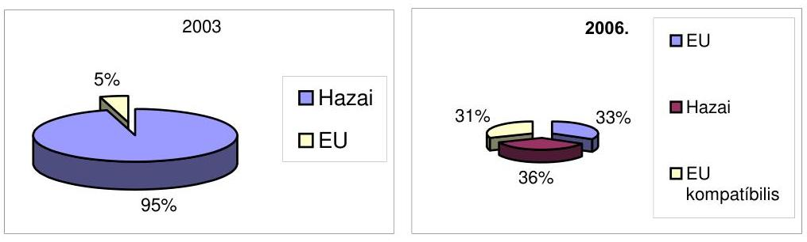
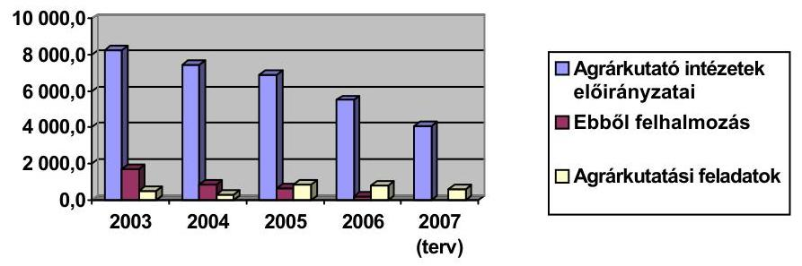
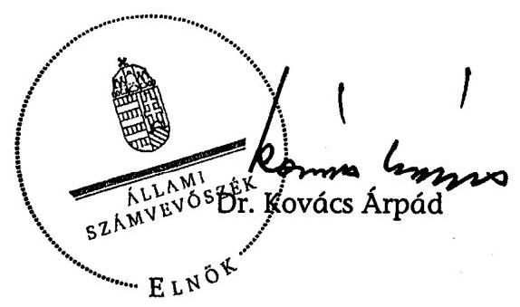
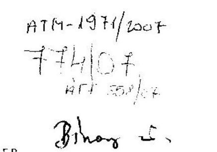
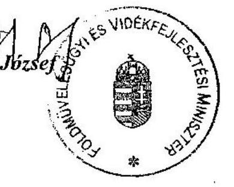
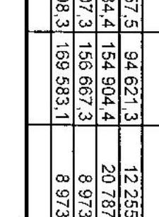
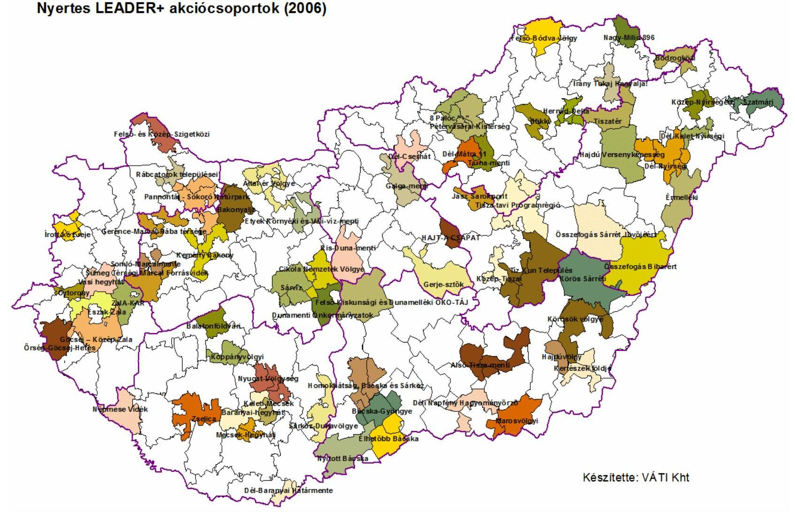

# ÁLLAMI   SZÁMVEVŐSZÉK 

## JELENTÉS

A Földművelésügyi és Vidékfejlesztési Minisztérium fejezet működésének ellenőrzéséről

---

# 2. Államháztartás Központi Szintjét Ellenőrző Igazgatóság 

2.3. Átfogó Ellenőrzési Főcsoport

Iktatószám: V-15-094/2006-2007.
Témaszám: 825
Vizsgálat-azonosító szám: V-0294

## Az ellenőrzést felügyelte:

Bihary Zsigmond
főigazgató
Az ellenőrzés végrehajtásáért felelős:
Hegedűsné dr. Müllern Veronika
főcsoportfőnök

## Az ellenőrzést vezette:

Papp Sándor
számvevő főtanácsos

## Az ellenőrzést végezték:

Dr. Bartos László Pál számvevő

Csóry Györgyné számvevő tanácsos, főtanácsadó
Gyarmati István számvevő tanácsos
Huszár József számvevő
Dr. Lengyel Attila számvevő tanácsos, tanácsadó
Pálfiné Pusztai Magdolna számvevő
Szélpál Ferenc számvevő tanácsos

Beck Miklós számvevő tanácsos

Görgényi Gábor számvevő gyakornok

Hegyes Mária számvevő
Koltay Zsoltné számvevő
Dr. Ligeti Miklós számvevő tanácsos, tanácsadó
Sinka Zoltán számvevő
Vitányi István számvevő

Dr. Csapó Anna számvevő tanácsos, tanácsadó
Gregor Andrea számvevő gyakornok

Dr. Horváth Erika számvevő
Kovácsy Tamás számvevő
Patthy Júlia számvevő gyakornok

Dr. Sipos Dóra számvevő tanácsos

## A témához kapcsolódó eddig készített számvevőszéki jelentések:

Jelentés a Földművelésügyi és Vidékfejlesztési Minisztérium fejezet működésének ellenőrzéséről (2003.) 2003/0320
Jelentés a Magyar Köztársaság 2004. évi költségvetése végrehajtásának ellenőrzéséről (2002-2005. évekre)
Vélemény a Magyar Köztársaság 2006. évi költségvetési javaslatáról (2002-2006. évekre)

---

# TARTALOMJEGYZÉK 

BEVEZETÉS ..... 7
I. ÖSSZEGZŐ MEGÁLLAPÍTÁSOK, KÖVETKEZTETÉSEK, JAVASLATOK ..... 9
II. RÉSZLETES MEGÁLLAPÍTÁSOK ..... 25

1. A FEJEZET SZERVEZETE, GAZDÁLKODÁSA, ELLENŐRZÉSI TEVÉKENYSÉGE ..... 25
1.1. A szervezeti háttér és a létszám változásai ..... 25
1.2. A Minisztérium tulajdonosi érdekeinek érvényesülése ..... 28
1.3. A fejezet költségvetése, tervezése, gazdálkodása ..... 32
1.4. Az intézmények részére átadott keretek felhasználása ..... 34
1.5. Az agrártámogatások kezelésének mechanizmusa ..... 36
1.6. Az agrárágazati és statisztikai információs rendszer ..... 38
1.7. A belső ellenőrzési tevékenység és a FEUVE rendszer ..... 40
2. A SZAKMAI TEVÉKENYSÉGEK ELLÁTÁSA ..... 45
2.1. Az agrármarketing tevékenység ..... 45
2.2. A falugazdász hálózat és szaktanácsadói rendszer ..... 47
2.3. A kutatás, az alap-és középfokú oktatás működtetése. ..... 50
2.4. A hatósági ellenőrzési rendszer működése ..... 54
3. AZ AGRÁRTÁMOGATÁSOK CÉLJAI, RENDSZERE ..... 59
3.1. Az agrárgazdasági stratégiák, programok, tervek ..... 59
3.2. Az agrártámogatások rendszere ..... 61
4. NORMATÍV ÉS EGYES AGRÁR SZAKMAI CÉLÚ TÁMOGATÁSOK FELHASZNÁLÁSA ..... 66
4.1. Területalapú támogatások ..... 66
4.2. Fejlesztési támogatások ..... 67
4.3. A jövedelemtámogatások ..... 68
4.4. Mezőgazdasági célú vízgazdálkodás ..... 69

---

4.5. Az erdőtelepítésekre adott támogatások ..... 74
4.6. Az elemi károk kompenzálására fordított támogatások ..... 76
4.7. A Nemzeti Földalap működtetése ..... 77
5. AZ EU FORRÁSOKBÓL FEDEZETT AGRÁR ÉS VIDÉKFEJLESZTÉS TÁMOGATÁSOK FELHASZNÁLÁSA ..... 80
5.1. A Nemzeti Vidékfejlesztési Terv ..... 80
5.2. Az Agrár és Vidékfejlesztési Operatív Program (AVOP) ..... 83
5.2.1. Vidéki jövedelemszerzési lehetőségek növelése ..... 87
5.2.2. LEADER+ ..... 89
6. UTÓELLENŐRZÉS ..... 90
MELLÉKLETEK

1. számú Az FVM miniszter levele
2. számú A kiadási és bevételi adatok alakulása
3. számú A fejlesztési és jövedelemtámogatások alakulása
4. számú Az állatállomány szám alakulása
5. számú Mezőgazdasági import adatok 2002-2006.
6. számú Nyertes LEADER+ akciócsoportok
7. számú Utóellenőrzés melléklet

# FÜGGELÉKEK 

1. számú Az Agrár-környezetgazdálkodási, az EMOGA, az EU Környezetvédelmi szabályainak megfelelő állattartás, valamint Agrár- és Vidékfejlesztési Operatív Program keretében nyújtott támogatások.
2. számú A falugazdász hálózat Jász-Nagykun-Szolnok, Hajdú-Bihar, Békés és Zala Megyei Földművelésügyi Hivatalának szervezetébe illesztett működéséről és tevékenységének ellenőrzéséről.
3. számú A vízkár-elhárítási célú beruházásokra és fenntartásokra nyújtott támogatások felhasználása

---

# RÖVIDÍTÉSEK JEGYZÉKE 

| AIK | Agrárintervenciós Központ |
| :--: | :--: |
| AMC Kht | Agrármarketing Centrum Kht. |
| ANP | Agrár Nemzeti Program |
| APEH | Adó és Pénzügyi Ellenőrzési Hivatal |
| ÁSZ | Állami Számvevőszék |
| AVOP | Agrár- és Vidékfejlesztési Operatív Program |
| BM | Belügyminisztérium |
| DEB | Döntés Előkészítő Bizottságok |
| ENAR | Egységes Nyilvántartási és Azonosítási Rendszer |
| EMGA | Európai Mezőgazdasági Garancia Alap |
| EMIR | Egységes Monitoring Információs Rendszer |
| EMOGA | Európai Mezőgazdasági Orientációs és Garanciaalap |
| EMVA | Európai Mezőgazdasági Vidékfejlesztési Alap |
| ESZIR | Erdészeti Szakigazgatási Információs Rendszer |
| EU | Európai Unió |
| EüM | Egészségügyi Minisztérium |
| FM hivatalok | Földművelésügyi Hivatalok |
| FÖMI | Földmérési és Távérzékelési Intézet |
| FÖNYIR | Földhasználatot ellenőrző, nyilvántartó rendszer |
| FVM | Földművelésügyi és Vidékfejlesztési Minisztérium |
| FVO | az EU Élelmiszer és Állategészségügyi Hivatala |
| GAK | Gazdaságorientált Agrárágazati Kutatások |
| HOPE | Halászati Orientációs Pénzügyi Eszköz |
| KAP | EU Közös Agrárpolitikája |
| KvVM | Környezetvédelmi és Vízügyi Minisztérium |
| LEADER | Liaison Entre Actions pour le Developement de l'Economie Rurale, (Közösségi kezdeményezés a vidék gazdasági fejlesztése érdekében) |
| MÁK | Magyar Államkincstár |
| MGSZH | Mezőgazdasági Szakigazgatási Hivatal |
| MVH | Mezőgazdasági és Vidékfejlesztési Hivatal |
| MSZR | Mezőgazdasági Számlák Rendszere |
| NAKP | Nemzeti Agrár-környezetvédelmi Program |
| NFA | Nemzeti Földalapkezelő Szervezet |
| NFH | Nemzeti Fejlesztési Hivatal |
| NFÜ | Nemzeti Fejlesztési Ügynökség |
| NFT | Nemzeti Fejlesztési Terv |
| NKP | Nemzeti Környezetvédelmi Program |
| NKTH | Nemzeti Kutatási és Technológiai Hivatal |
| NVT | Nemzeti Vidékfejlesztési Terv |
| OFK | Országos Fejlesztéspolitikai Koncepció |
| OKF | Kutatási és Fejlesztési Főosztály |

---

| OMMI | Országos Mezőgazdasági Minősítő Intézet |
| :-- | :-- |
| OTK | Országos Területfejlesztési Koncepció |
| OTMR | Országos Támogatási Monitoring Rendszer |
| PKD | Program Kiegészítő Dokumentum |
| SAPARD | Special Accession Programme for Agriculture and Rural |
|  | Development - Különleges Előcsatlakozási Program a Me- |
|  | zőgazdaság és Vidékfejlesztés támogatására |
| SAPS | Single Area Payment Schene - Egyszerűsített területalapú |
|  | támogatás |
| SzBKI | Szőlészéti és borászati kutatóintézet |
| TA | Technikai Segítségnyújtás (angol) |
| TIG Kht. | Tartalékgazdálkodási Kht. |
| TIM | Talajvédelmi Információs Monitoring |
| Top-up | Területalapú támogatások |
| UMVST | Új-Magyarország Vidékfejlesztési Stratégiai Terv |
| VPOP | Vám és Pénzügyőrség országos parancsnokság |
| VTT | Vásárhelyi-terv továbbfejlesztése |

---

# ÉRTELMEZŐ SZÓTÁR 

bizottsági döntés
delegált feladat

Egységes Monitoring Informatikai Rendszer (EMIR)

FEUVE
falugazdász hálózat
akciócsoport
intézkedés

Irányító Hatóság
kifizető hatóság
közösségi kezdeményezés programdokumentuma

Az Európai Bizottságnak a Kohéziós Alaphoz benyújtott támogatási kérelem elfogadásáról hozott határozata, amely tartalmazza a támogatás arányát, a pénzügyi tervet, valamint a végrehajtáshoz szükséges rendelkezéseket és feltételeket.
A kérelem elbírálásával, illetve ellenőrzésével kapcsolatos, a mezőgazdasági és vidékfejlesztési támogatási szerv hatáskörébe és kizárólagos felelősségi körébe tartozó, külön meghatározott, más szervezet által ellátandó feladat.
A strukturális alapokból, a Kohéziós Alapból, a PHARE-ból, az Átmeneti Támogatásból, a Schengen Alapból, az Európai Gazdasági Térség és Norvég Finanszírozási Mechanizmusból, valamint az ezekhez társuló hazai forrásokból megvalósuló programokkal és projektekkel kapcsolatos menedzsment (végrehajtási és kifizetési), monitoring, illetve ellenőrzési, szabálytalanságkezelési és számviteli feladatokat támogató információtechnológiai rendszer.
Folyamatba épített előzetes és utólagos vezetői ellenőrzés.
Az ország teljes területét lefedő, a megyei földművelésügyi hivatalok keretein belül működő, s a hivatalok hatáskörébe tartozó szakigazgatási, szolgáltatási feladatokat a gazdálkodókkal közvetlen kapcsolatot kialakítva ellátó hálózat.
A LEADER + programban támogatott önkormányzatok, társadalmi szervezetek és a vállalkozások szövetsége. Tagjai konzorciumi szerződést kötöttek egymással a kísérleti program közös megvalósítására és támogatási keretszerződést kötöttek az FVM-mel helyi vidékfejlesztési tervük végrehajtására.
Olyan eszköz, amelynek segítségével egy elfogadott stratégiai irányvonal több éven keresztül megvalósul, és amely lehetővé teszi a műveletek finanszírozását.
Az operatív program irányító hatóság, az EQUAL program irányító hatóság, a Közösségi Támogatási Keret (a továbbiakban KTK) irányító hatóság és a Kohéziós Alap irányító hatóság.
Nemzeti, regionális vagy helyi hatóság vagy szervezet a fizetési kérelmek összeállítására és benyújtására, valamint a kifizetések fogadására az Európai Unió Bizottságától; az Európai Unió strukturális alapjai és a Kohéziós Alap fogadására alkalmas kifizető hatósági feladatok ellátása tekintetében a Pénzügyminisztérium.
Az Európai Bizottság által jóváhagyott dokumentum, amely valamely közösségi kezdeményezés tagállami szintű végrehajtására vonatkozóan a több évre szóló prioritásokhoz kapcsolódó intézkedések egységes rendszerét tartalmazza.

---

közreműködő szervezetek

Mezőgazdasági Parcella Azonosító Rendszer (MePAR)
monitoring

Nemzeti Fejlesztési Terv
nemzeti támogatás
prioritás
szaktanácsadói rendszer

TAKARNET
TAKAROS, BIIR
technikai segítségnyújtás

Részben vagy egészben az EMOGA-ból, HOPE-ból és SAPARD-ból finanszírozott támogatás.

Az irányító hatóság által átruházott feladatkörben a strukturális alapok kezelése során eljáró szervezet.
A mezőgazdasági és vidékfejlesztési célú, a mezőgazdasági területhez kötődő kifizetések eljárásainak kizárólagos országos azonosító rendszere, amelyben a területi azonosítás alapegységei a fizikai blokkok, amelyek térképhelyes légifelvétel alapján vagy úrfelvétel háttérrel vannak megjelenítve.
A források felhasználásának (pénzügyi monitoring), az eredményeknek és a teljesítményeknek (szakmai monitoring) mindenre kiterjedő - többek között szabályossági, hatékonysági és célszerűségi - vizsgálata rendszeres jelleggel projekt, illetve program szinten.
Helyzetelemzést, stratégiát a tervezett fejlesztési területek prioritásait, azok konkrét céljait és a hozzájuk kapcsolódó pénzügyi források megjelölését tartalmazó dokumentum, melyet a Magyar Köztársaság készít az Európai Unió programozási irányelveinek, célkitűzéseinek megfelelően a fejlődésben lemaradó régiók fejlődésének és strukturális átalakulásának elősegítésére a kiemelt szükségletekre figyelemmel.
A magyar jogszabályokban meghatározott eszközrendszer valamely támogatás folyósítását lehetővé tevő eszközének alkalmazása, olyan intézkedés keretében, melynek feltételrendszerét hazai jogszabály határozza meg, folyósítása kizárólag a nemzeti költségvetés terhére történik, és az Európai Unió annak alkalmazását engedélyezte vagy tudomásul vette.
A KTK-ban elfogadott stratégiai irányvonal, melyhez a strukturális alapokból és a tagállam kapcsolódó pénzügyi forrásaiból származó hozzájárulás, illetve meghatározott célok rendszere van hozzárendelve.
A mezőgazdasági termelők számára állami támogatással vagy térítés nélkül igénybe vehető szaktanácsadási szolgáltatások nyújtására kialakított rendszer.
Földhivatali adatbázisokat összekapcsoló intranet hálózat
Az ingatlanok tulajdonát és használatát nyilvántartó földügyi rendszerek
Elkülönített keret, amelynek célja a Közösségi Támogatási Keret, az operatív program, valamint a Kohéziós Alap projekt szabályszerű, gazdaságos, hatékony és eredményes megvalósításának segítése.

---

# JELENTÉS 

## a Földművelésügyi és Vidékfejlesztési Minisztérium működésének ellenőrzéséről

## BEVEZETÉS

A Földművelésügyi és Vidékfejlesztési Minisztérium (FVM), tevékenységének alapfeladatai, - a mezőgazdaság, az élelmiszeripar, az erdőgazdálkodás, a termőföld minőségi védelme, a vidékfejlesztés, a mezőgazdasági vízgazdálkodás, a térképészet, a mezőgazdasági hatósági és szakigazgatási feladatai, az ágazathoz kapcsolódó kutatási és fejlesztési, valamint a szakirány szerinti középfokú képzési feladatok - 2003-at követően lényegében nem változtak. Kiemelt új feladatként jelentkezett viszont 2004-ben az EU csatlakozással járó szervezeti, szabályozási, ellenőrzési rendszer kiépítése, valamint a nemzeti támogatási rendszer EU források céljaihoz illesztése.

Az FVM 2006-ra szóló költségvetési terve 9 címet, ebből nyolc intézményi címet foglal magában, illetve 362,1 milliárd Ft kiadási előirányzatot határozott meg, 15888 fő engedélyezett létszám alkalmazásával. A fejezet költségvetése a Minisztérium, illetve a 63 önállóan, valamint 63 részben önállóan gazdálkodó központi költségvetési intézmény előirányzatait, a hazai és az EU támogatásokat is magában foglaló fejezeti kezelésű előirányzatokat tartalmazza. A kiadási előirányzatok 75%-át tették ki a fejezeti kezelésű előirányzatok 273,3 milliárd Ft összeggel, ennek 40%-os részarányát képviselte a legjelentősebb normatív típusú, folyó kiadások és jövedelemtámogatások előirányzatai. A vidékfejlesztésre, Nemzeti Vidékfejlesztési terv jogcímen 60,5 milliárd Ft-ot irányoztak elő. Nemzeti forrásokkal kiegészítve EU forrásokat is tartalmaz négy jogcímmel az EU integráció előirányzat, köztük legjelentősebb az Agrár- és Vidékfejlesztési Operatív Program (AVOP).

Az Állami Számvevőszék legutóbb 2003-ban ellenőrizte átfogó módon a fejezet működését, gazdálkodását. Éves gyakorisággal ellenőriztük a fejezet költségvetésének tervezését és végrehajtását. A SAPARD-nál és az Európai Mezőgazdasági Orientációs és Garancia Alapnál (EMOGA) az Állami Számvevőszék látta el
 az ellenőrző szervi feladatokat az ellenőrzött időszakban.

Az államháztartásról szóló 1992. évi XXXVIII. törvény 120./A § (1) bekezdés alapján az ÁSZ ellenőrzi az államháztartás forrásait, azok felhasználását és a vagyonnal való gazdálkodást. A jelen ellenőrzés végrehajtására az Állami Számvevőszékről szóló 1989. évi XXXVIII. törvény 2. § (3) és a 17. § (3) bekezdésében foglaltak adnak jogszabályi alapot.

---

Az ellenőrzés célja annak értékelése volt, hogy a fejezet

- Irányítása, felügyelete, kontroll tevékenysége, kockázatkezelő képessége és a támogatások nyomon követését célzó monitoring rendszere megfelelő feltételeket biztosítottak-e a hatékony működéshez és az ágazat eredményes fejlesztéséhez;
- költségvetési gazdálkodási rendszere, szervezete, működése, személyi és tárgyi feltételei, informatikai rendszere összhangban volt-e a szakmai feladatokkal;
- támogatási rendszerét, a mezőgazdaság stratégiájában kijelölt, illetve az EU források által elérhető célokhoz igazodva célszerűen, hosszú távú koncepciókkal, programokkal megalapozva alakították-e ki, biztosították-e az EU források hatékony igénybevételéhez szükséges feltételeket, a források felhasználása során teljesültek-e a kitűzött ágazati - szakmai célok, azok meg-feleltek-e az Európai Unió által támasztott követelményeknek;
- irányító és gazdálkodó tevékenységében hasznosították-e a korábbi ÁSZ ellenőrzések megállapításait és javaslatait.

A fejezet szervezeti rendszere részben az EU csatlakozás, részben 2006-ban az államháztartás korszerűsítése kapcsán alapvető átalakításon ment keresztül. Ezért az ellenőrzés keretében rendszerellenőrzéssel kiemelten kezeltük az irányítás és felügyelet eszközrendszerének változásait, az átalakítások előkészítettségét, az ágazati követelményekhez igazodását, a fejezeti, illetve az intézményi belső ellenőrzési rendszer működését, a tulajdonosi körbe tartozó társaságok irányításában a tulajdonosi érdekek érvényesülését, az agrárium szellemi és vagyoni értékeinek megóvását. A szakmai feladatok sorában a mezőgazdaság racionalizálása, a földterületek hatékony hasznosítása, és az EU támogatások minél teljesebb körű felhasználása érdekében tett intézkedéseket értékeltük. A források felhasználása körében a támogatási rendszer erőforrásainak alakulását, a hazai és az EU támogatások egymáshoz illeszkedését, valamint a támogatások hasznosulását értékeltük. A helyszíni ellenőrzés keretében négy megye falugazdász hálózatának működését, négy agrártámogatást, és négy mezőgazdasági vízgazdálkodást célzó támogatást tekintettük át.

Ellenőrzésünk átfogó jelleggel a 2003. január 1. és 2006. július 31. közötti időszakot fogta át, de a vizsgálat kitért a 2007. év I. negyedévének intézkedéseire és pénzügyi adatainak alakulására.

A jelentést az Állami Számvevőszékről szóló 1989. évi XXXVIII. törvény 25. § (1) bekezdésének megfelelően észrevételezésre megküldtük a Földművelésügyi és Vidékfejlesztési Minisztériumot felügyelő miniszternek, aki észrevételt nem tett. Levelét az 1. számú melléklet tartalmazza.

---

# I. ÖSSZEGZŐ MEGÁLLAPÍTÁSOK, KÖVETKEZTETÉSEK, JAVASLATOK 

A Földművelésügyi és Vidékfejlesztési Minisztérium (FVM) által felügyelt terület összetettségénél, széles társadalmi rétegeket érintő érzékenységénél fogva körültekintő menedzselést igényel. Ennek megfelelve az FVM az agrárium támogatottsága érdekében kiépítette az EU támogatásokat fogadó és kezelő szervezetrendszert és végrehajtott bizonyos szervezetkorszerűsítési, takarékossági intézkedéseket. Hiányosságként állapítottuk azonban meg, hogy az egyes intézkedések előkészítése, valamint az ismertté vált hibák kezelése elmaradt, pl. a tulajdonosi, a kontrolling és a szakmai feladatok ellátása körében. A kapacitások szűkössége miatt - a kifizetések késedelmét okozva - lassú volt az EU pályázatok kezelési, elbírálási mechanizmusa. A nemzeti támogatások, valamint egyes szakmai feladatok - főként a korábbinál szűkebb forrásokkal összefüggésben - nem kaptak kellő kormányzati támogatást. Mindez kedvezőtlenül hatott az FVM irányítási, felügyeleti, szakmai feladatainak hatékony és eredményes ellátására.

A 2006. évtől radikális létszámcsökkentéssel járó két kormányintézkedés alapvetően átalakította a Minisztérium és intézményeinek struktúráját. Ennek részleteit a (leendő) miniszter és a (felkért) ${ }^{1}$ miniszterelnök dokumentált és részletes adatokat tartalmazó, a kormányváltást megelőzően - 2006. június 2-án - aláírt megállapodása rögzítette, amit egy hónappal később két kormányhatározat ${ }^{2}$ erősített meg. A változtatásokat már a 2005. évi intézkedések előrevetítették. ${ }^{3}$ A Minisztérium az eseményekre - esetenkénti kezdeményezése ellenére - nem tudott hatással lenni, mozgástere a végrehajtásra korlátozódott, pl. a Minisztérium által elkezdett szervezetkorszerűsítést a kormányhatározatok felülírták, emiatt a már átalakított szervezet és az elkészült SzMSz teljes korrekciója vált szükségessé. A szervezet hosszú távú megalapozottsága szempontjából aggályokat vet fel, hogy az átalakításokat előkészítő számítások, hatáselemzések

[^0]
[^0]:    ${ }^{1}$ A megállapodásban rögzített megnevezés.
    ${ }^{2}$ A Miniszterelnöki Hivatalban, a minisztériumokban, az igazgatási és az igazgatás jellegű tevékenységet ellátó központi költségvetési szerveknél foglalkoztatottak létszámáról szóló 2117/2006. (VI. 30.) Korm. határozat (továbbiakban 2117/2006. Korm. hat.) és az államháztartás hatékony működését elősegítő szervezeti átalakításokról és az azokat megalapozó intézkedésekről szóló 2118/2006. (VI. 30.) Korm. határozat (továbbiakban 2118/2006. Korm. hat.)
    ${ }^{3}$ A PM közigazgatási államtitkára 2005. szeptember 9-én írt levelében - a 2044/2005. (III. 23.) Korm. határozatra hivatkozva - szólította fel a tárcákat a szervezetrendszer felülvizsgálatára és intézkedési terv készítésére. Ennek előzményeként említi a levél, hogy a költségvetés fejezeti előirányzatai és más intézkedések miniszterelnöknél történt egyeztetésén több ízben szóba kerültek a szükséges szervezeti változások.

---

nem készültek, a tervezésbe csak a szűk vezetést vonták be. A szervezeti átalakítások eredményei, illetve hatásai vizsgálatunk idején még nem voltak átfogó módon értékelhetőek.

A szervezeti struktúra alapvetően átalakult. Kormányrendelet alapján az EU és a hazai támogatások kezelésére 2003-ban a SAPARD Hivatal és az Agrárintervenciós Központ jogutódjaként létrejött a Mezőgazdasági és Vidékfejlesztési Hivatal (MVH). A szervezet kiépítéséhez, működéséhez alapvetően szükséges belső szabályozás, kapacitás és jogi, informatikai háttér stb. kiépítése már az előző kormányciklusban késedelmet szenvedett, az előkészítés során készített ütem-, illetve feladattervet nem tudták tartani, emiatt az MVH akkreditációja közel egy évet késett. A Minisztérium hatékonysági, gazdaságossági szempontok alapján 2005-ben 4 szakigazgatási terület (Állategészségügy, Növényegészségügy, Földművelésügy, Költségvetési Iroda) integrálásával létrehozta a Földművelésügyi és Költségvetési Irodát. A 2006. évtől összevonta - az ellenőrzéseink során többször kifogásolt módon működő - Gazdálkodó Szervezetet és Gazdasági Hivatalt, majd 2007-től az intézményhálózat integrációja keretében 11 intézménycsoport, összesen 66 intézmény összevonásával létrehozta a Mezőgazdasági Szakigazgatási Hivatalt. A Minisztérium és intézményeinek létszáma a 2005-től megkezdett leépítések következtében 2007-re mintegy harmadával csökkent. A már végrehajtott és a még várható létszámleépítés egyszeri költségkihatása megközelíti a 4 milliárd Ft-ot. A leépítést és az átalakítást előkészítő, illetve megalapozó tanulmány hiányában a megtakarítás összegéről sem állt rendelkezésre adat.

A Minisztérium tulajdonosi feladatait változó eredményességgel látta el. Pozitívum, hogy a nemzetgazdaság és a mezőgazdaság szempontjából egyaránt kiemelt, stratégiai jelentőségű feladatokat ellátó közhasznú társaságok negyedére csökkent költségvetési támogatását 2004-től fokozatosan a vállalkozási tevékenység többletbevétele ellensúlyozta. A Tartalékgazdálkodási Kht. nyereségessé vált a veszteséges tevékenységek felszámolása és az intervenciós gabonatárolásba való bekapcsolódás eredményeként. Kifogásolható viszont, hogy 2004-ben egy kht-t előkészítés nélkül hoztak létre. A finanszírozás elmaradása és a pazarló gazdálkodás miatt, továbbá mert a problémákat a Minisztérium ismerte, de nem oldotta meg, 2005-ben a társaság felszámolását kellett elrendelni.

A fejezet költségvetési tervezési, gazdálkodási rendszerének működése szabályozott, koordinált, amit a PM által kiadott tervezési köriratra alapoztak. A fejezet gazdálkodását különösen 2004-től költségvetési megszorítások korlátozták, emiatt az elsődleges cél a működőképesség fenntartása volt, a hangsúly a nem halasztható (pl. szolgáltatások, személyi juttatások) kifizetésekre helyeződött. Ezen „segített" a sajátos szerepet betöltő „központosított bevételekből finanszírozott intézményi feladatok" fejezeti kezelésű előirányzat. Kifogásoltuk, hogy rendkívüli feladatok helyett előre tervezhető intézményi működési kiadások pótfinanszírozása formájában egy „kvázi" fejezeti tartalék szerepét töltötte be. Az előirányzat működtetése működési, finanszírozási zavarok-

---

ra utalt. ${ }^{4}$ Az éves zárszámadások jelentéseiben, illetve az éves költségvetési javaslatok véleményezésében megfogalmazott észrevételeink, valamint a PM tervezési körirata ellenére a Top-up ${ }^{5}$ előirányzatot nem önálló soron tervezik. ${ }^{6}$

Az informatikai rendszer működtetésén belül az intézményi stratégiák rendelkezésre álltak, ugyanakkor a Minisztériumot és intézményeit átfogó informatikai stratégia nem készült. A fejlesztések fedezetét az intézmények költségvetésében tervezték, emiatt a ráfordítások nem áttekinthetőek, összegük pedig nem a napi feladatellátás hatékony működését megalapozó igényekhez igazodott. A Minisztérium informatikai szabályozottsága nem teljes körű és nem aktualizált. ${ }^{7}$ Az adatállományok rendszergazdai feladatait, a jogosultságok kezelését és a fejezeti kezelésű előirányzatok adatállományának mentését külsős cégek végzik. Magas kockázatot jelent az adatokhoz való hozzáférhetőség, valamint az utóbbi feladat szerződésben való rögzítésének hiánya.

A belső ellenőrzési rendszer részeként a folyamatba épített előzetes és utólagos vezetői ellenőrzés (FEUVE) eljárási rendjét, valamint annak kockázatkezelési rendszerét nem teljes körűen alakították ki a PM által előírt határidőre. A Minisztérium szervezeti egységei egy kivételével ${ }^{8}$ nem dolgozták ki a FEUVE rendszer eljárási rendjét. A fejezeti kezelésű előirányzatokra 2006-ban jóváhagyott FEUVE szabályzat korrekcióra szorul, mert a kockázatkezelési szabályok nem felelnek meg a PM módszertani segédletében foglaltaknak, és a szabálytalanságok feltárása körében nem szabályozza a teendő intézkedéseket. A FEUVE rendszer hiányosságára utaltak a belső ellenőrzés és vizsgálatunk által feltárt hiányosságok. Például az erdészeti és állategészségügyi támogatások elszámolásai felett az FVM szakfőosztályai szakmai kontrollt nem gyakoroltak, a Szőlészeti és Borászati Kutatóintézet budapesti pincészetének megszüntetésekor indított ellenőrzés a Minisztérium előtt ismert szabálytalanságokat és pazarlást tárt fel, amelyek felszámolásáról nem intézkedtek.

Az ellenőrzési szervezet az átalakított minisztériumi struktúrában 2006-tól főosztályi keretben működik osztályként, emiatt a rendeletileg előírt feladatköri és szervezeti függetlensége nem biztosított. Jogszabályi előírással ellentétes az

[^0]
[^0]:    ${ }^{4}$ A Minisztérium jelentés tervezetre tett észrevétele szerint az előirányzat intézményi előirányzatokba integrálására később kerülhet sor, ugyanis szükségük van egy gyors intézkedést segítő előirányzatra, ami biztosítja a zavartalan működés feltételeit.
    ${ }^{5}$ Az EU terület alapú támogatását kiegészítő nemzeti támogatás
    ${ }^{6}$ A Minisztérium észrevétele szerint azért nem tervezik külön soron a támogatást, mert ezzel megszűnne az uniós NVT és a nemzeti támogatások közötti átjárhatóság. Az FVM gyakorlata azért helytelen, mert a hazai kiegészítő támogatás (Top-up) mellett többféle nemzeti agrártámogatást is a Folyó kiadások és jövedelemtámogatás előirányzaton terveznek, ami megnehezíti az áttekinthetőséget és a tisztánlátást a hazai kiegészítő támogatás tekintetében.
    ${ }^{7}$ Például az Informatikai Üzemeltetési szabályzat 1998-1999-ben készült.
    ${ }^{8}$ Az Agrárpiaci Főosztály 2007. januárjában készített el egy egyoldalas FEUVE javaslatot a feladatkörébe tartozó 5 fejezeti kezelésű előirányzat ellenőrzési nyomvonalára.

---

is, hogy 2006-tól nem a miniszternek, hanem - a Pénzügyminisztérium által is kifogásolt módon - a szakállamtitkárnak alárendelve működik ${ }^{9}$. A Minisztérium a szervezet kialakításánál jogszabályi ellentmondásra hivatkozott, ennek módosítása érdekében a kormány felé lépéseket nem tett. A létszámcsökkentés érintette a belső ellenőrzést is, a kapacitáscsökkenés korlátozta az éves ellenőrzési feladattervek végrehajtását. A Minisztérium az intézmények belső ellenőrzését évente értékelte, az éves beszámolóikról megbízhatósági igazolásokat állítottak ki, de szakmai ismeretek hiányában - a jogszabályi kötelezettség ellenére - informatikai ellenőrzést nem végeztek. Az Agrár- és Vidékfejlesztési Operatív Program (AVOP) végrehajtásának ellenőrzésére 2005-ben az ellenőrzési területen belül létrehozták az EU Közösségi és Nemzeti Támogatások Ellenőrzési Osztályát. Nem egységes a
 támogatások ellenőrzésének rendszere és módja. A fejlesztési támogatásokat a Minisztérium a MÁK és az FM Hivatalok közreműködésével szakmai szempontból is ellenőrzi. Ugyanakkor a hitelintézetek és az APEH által kezelt kifizetések ellenőrzése nem szakmai jellegű, nem a támogatások eredményességét és a támogatási tevékenység hatékonyságának megítélését, hanem a jogszabályi előírások betartását célozza. Az APEH ellenőrzések körében mintegy 4 milliárd Ft behajtására került sor. Az FM Hivatalok is végeznek ellenőrzéseket, pl. öntözésfejlesztés körében, de ezek tapasztalatait az FVM nem vagy csak esetenként kéri be. Az EU-támogatások felhasználását az MVH folyamatba épített ellenőrzéssel vizsgálja.

A Minisztérium a gazdatársadalom szakmai támogatását egyre romló körülmények között volt kénytelen ellátni. A marketing tevékenység visszaszorult, az Agrármarketing Centrum Kht. (AMC Kht.) költségvetési támogatása harmadára csökkent, emiatt finanszírozási gondok jelentkeztek, annak ellenére, hogy az AMC Kht. - tulajdonosi döntéssel - a korábbi évek maradványát felhasználhatta és 500 millió Ft hitelt vett fel. Szakmai hiányosság, hogy a marketing tevékenység eredményességét célzó felmérés csak egy adott évre készült, holott a kiállítások hatása csak később jelentkezik. Ezért kifogásolható, hogy a több adatot igényelő, de hosszabb időszakot érintő elemzések érdekében a korábbi évekre adatokat nem kértek. A kérdőívek alapján a kiállításokon résztvevők felkészülése hiányos volt. A falugazdászok létszáma az MVH-hoz, illetve az agrárkamarákhoz történt átcsoportosítás, valamint a külsős - jogszabályi rendelkezésekkel ellentétes módon alkalmazott - falugazdászok szerződéseinek felmondása következtében 20%-kal, a területközpontok száma 15%-kal csökkent. A létszámcsökkenés kapcsán kitűzött szervezeti és feladat korszerűsítés nem valósult meg, annak ellenére, hogy a falugazdászokkal szembeni elvárások - pl. az EU csatlakozás miatt - növekedtek. Elérhetőségük nehezebb lett, a számítástechnikai korszerűsítés forrásai nem voltak biztosítottak. ${ }^{10}$ A megyei kamarák és a falugazdászok tevékenységében (pl. pályázatokhoz segítségnyújtás) párhuzamosságok alakultak ki. Mindezek, valamint az EU támogatások

[^0]
[^0]:    ${ }^{9}$ A PM 2006-ban végzett vizsgálata kifogásolta az ellenőrzés szervezeti és funkcionális függetlenségének, valamint teljes körű szabályozottságának hiányát. A Minisztérium a kialakítás kapcsán az ellenőrzésre vonatkozó jogszabályi rendelkezések közötti ellentmondásra hivatkozott.
    ${ }^{10}$ A helyszíni vizsgálat idején volt folyamatban, egy 2006-ban PHARE forrásból elnyert informatikai fejlesztés közbeszerzési eljárásának előkészítése.

---

várható növekedése miatti feladatbővülés következtében a falugazdászok kapacitása és hatékonysága csökkent, a gazdatársadalom nem kapja meg a kellő mértékű szakmai támogatást, és sérülhet a falugazdászok igazgatási, ellenőrzési feladatainak ellátása. Az FVM által működtetett szaktanácsadói szolgáltatás iránt korlátozott kereslet jelentkezett, mert ezt a feladatot a Minisztériumtól függetlenül más külső szervezetek is ellátták.

A hatósági ellenőrzési rendszer kiépítettsége és működése megfelelően támogatta a mezőgazdaságot. A hatóságok létszáma ugyanakkor 20%-kal csökkent, ellentétben az EU Élelmiszer és Állategészségügyi Hivatala (FVO) által 2005-ben készített jelentésben ajánlott kb. 15%-os létszámnöveléssel. Az EU csatlakozás időpontjáig kiépült az élelmiszerbiztonság intézményi hálózata, hiányosság viszont, hogy nem készült el a nemzeti élelmiszer-ellenőrzési terv. A leginkább veszélyes 4 állatbetegség esetében a monitoring rendszer kiépült. A madárinfluenza járvány kivédésére a korábbi járványvédelmi kiadásokat nagyságrenddel növelték. A 2030/2006. (III. 1.) Korm. határozat 1,93 milliárd Ft többletforrást biztosított, ezt elsősorban - más járványos betegségek leküzdéséhez is alkalmas - eszközök (gépjárművek, informatikai eszközök) beszerzésére fordították. Az élelmiszer-biztonsági feladatok - FVM és az Egészségügyi Minisztérium közötti - megosztottsága, átfedése megszüntetésére 2006 végén egységes élelmiszerbiztonsági szervezetet alakítottak ki. Az FVO 2003-ban az állati eredetű élelmiszert előállító üzemek körében kifogásokat fogalmazott meg, ezekre 29 javaslatot tett. Ezek teljesítése körében előrehaladást, illetve fejlődést állapított meg és 2005-re egy - a létszámnövelés - kivételével, a javaslatok teljesültek.

Veszélyeztetett az agrárium szellemi tőkéjének megtartása. A 2118/2006. Korm. határozat értelmében napirendre került a középfokú iskolák, valamint kutatóintézetek megszüntetése, illetve átalakítása, ami érzékenyen érintette az agrárium komoly múltra visszatekintő szellemi bázisát és vagyonát. A mezőgazdasági középfokú oktatás támogatása a vizsgált időszakban 34%-kal csökkent. A 2118/2006. Korm. határozat 6 intézmény megszüntetéséről rendelkezett, annak ellenére, hogy ezt megelőzően a Minisztérium felmérése az iskolák oktatási tevékenységét kedvezően értékelte, két intézményt stratégiai fontosságúnak ítélt, de véleményét a kormányzati döntés előkészítésénél nem vették figyelembe. A kormányhatározat módosítása már az FVM hatáskörébe adta az iskolák fenntartásának felülvizsgálatát és megszüntetését. ${ }^{11}$ Téves iránymutatást adott a kormányhatározat azzal, hogy a megszüntetés kapcsán figyelemmel kell lenni az NFT II.-ben megfogalmazott lehetőségekre, mert ez ellenkezik az EU szabályaihoz igazodó agrárprogramokkal, ugyanis ezek nem teszik lehetővé az államilag finanszírozott közép- és felsőoktatás támogatását. Az FVM kutatási feladatokon belül K+F célú pályázatokat utoljára 2003-ban hirdettek meg, összegük 2004-től mintegy 20%-kal csökkent, de ezt már egyedi döntéssel osztották szét. Az előirányzat 2006-ban új innovációs célokat már nem, csak determinációt fedezett. Egyetlen lehetőséget a „gazdaság orientált

[^0]
[^0]:    ${ }^{11}$ A 2118/2006. kormányhatározat módosításának tervezete 2007. márc. 31. határidőre tette a vizsgálat végrehajtását. Az erre vonatkozó előterjesztés elkészült, eszerint három egyetem kezdeményezte a mezőgazdasági szakközépiskolák átvételét. Döntés a jelentés készítésének időpontjában még nem született meg.

---

agrárágazati kutatások támogatása" pályázat jelentett, de ennek is 80%-át az Innovációs Alap biztosította ${ }^{12}$. A kutatóintézetek vonatkozásában - új kormányzati alternatívaként - a kutatóintézetek mezőgazdasági vagy állami körből történő kiszakítása jelentkezett. Például a szőlészeti és borászati kutatóintézeteket kezdetben a költségvetési keretek között tervezték fenntartani, de ezt a 2118/2006. Korm. határozat felülírta, és összesen 9 társaság privatizációjáról rendelkezett. A 100%-ban tartós állami tulajdoni körbe tartozó társaságok privatizációjához törvénymódosítás szükséges. A tárca kezdeményezése ellenére ez még nem történt meg. A döntés 4 borászati kutatóintézet gazdasági szervezetté való átalakítását, ${ }^{13}$ illetve későbbi privatizációját vagy felsőoktatási intézménynek történő átadását célozta meg. A pótolhatatlan nemzeti értéket képviselő génbankok és vagyontárgyak további sorsát illetően kockázatos, hogy a tervezett értékesítést nem alapozták meg tanulmánnyal. Az átalakítások ellentétesek a Biológiai Sokféleség Egyezményben vállalt kötelezettségekkel, valamint a növényfajtákról és szaporítóanyagokról szóló törvénnyel, amelyek szerint a feladatot az állam látja el. Így 4 gyümölcskutató kht. törvényben meghatározott állami feladatot lát el, de a feladat privatizáció utáni ellátásáról még nem született döntés.

A 2004. év az uniós csatlakozás miatt az agrárágazat kiemelt jelentőséggel bíró átmeneti időszaka volt, mely során az EU csatlakozásra való felkészülés dominált. A 2002-ben kezdődött és egy év alatt befejeződött Nemzeti Agrár Környezetvédelmi Program céljai csak kis mértékben teljesültek, de több célkitűzés a Nemzeti Vidékfejlesztési Tervben folytatódott. Az Agrár Nemzeti Program 2004-re lényegében megvalósult, viszont nem készítettek számvetést a felkészülés költségeiről, a csatlakozás hatásáról, az eredményekről, a tapasztalt és a még meg nem oldott problémákról. ${ }^{14}$

A 2004. év választóvonal volt a források alakulása szempontjából is. A központi források csökkentek, a közvetlen agrártámogatásokra fordítható nemzeti támogatásoknak a reálértéke alacsonyabb volt 2004-ben és 2005-ben, mint a 2003. évi. Emiatt a 2004 előtt indított és nemzeti forrásokból fedezett, a tárca speciális feladataihoz kapcsolódó célok nem, vagy nem teljes körűen teljesültek. ${ }^{15}$ Ez, pl. veszélyezteti a vízgazdálkodási feladatoknál a belvízkárok, és a belvízlétesítmények állapotának fenntartását, az erdőgazdálkodásnál az egyes telepítési programok teljesítését. Az öntözés-fejlesztési és meliorációs támogatások összege 2003-ban 3,5 milliárd Ft volt, EU forrásokból 2005-2006-ban csak 460 millió Ft származott. Az agrártámogatások vonatkozásában

[^0]
[^0]:    ${ }^{12}$ A tárca és a Nemzeti Kutatási és Technológiai Hivatal által kötött megállapodás alapján a 80%-os támogatást a Hivatal által kezelt Alapból biztosították.
    ${ }^{13}$ Az érintett intézmények szerint az intézetek társasági működésre alkalmatlanok, legkedvezőbbnek a jelenlegi költségvetési keretek közötti működést tartják.
    ${ }^{14}$ Az ÁSZ „a statisztika nemzeti programra fordított pénzeszközök hasznosulásának ellenőrzéséről" szóló, 2005-ben készült jelentése.
    ${ }^{15}$ A tárca, a ráeső vízügyi feladatok 700,0 millió Ft-os forrását többszöri tárgyalási kísérlete ellenére nem kapta meg a KvVM-től, ennek összege azóta megduplázódott.

---

pénzszűke miatt előfordult egyes támogatások több hónapos, esetenként egy éven túli késedelmes kifizetése, nehéz (pénzügyi) helyzetbe hozva az érintett gazdálkodókat, ugyanis az elnyert támogatásra számítva a beruházásba belekezdtek, vagy beszerezték a tervezett eszközöket. Az FVM a kifizetéseket lebonyolító MÁK és APEH felé gyakran 5 milliárd Ft-ot elérő késedelemben volt. Pénzügyi veszteséget jelentett, hogy a késedelmes fizetések miatt az FVM késedelmi kamat fizetésére kényszerült.

Az agrárstratégiák vonatkozásában nem teljesült az a törvényi előírás, amely agárpolitikai középtávú terv, illetve 2005-től középtávú agrár- és vidékfejlesztési stratégia készítését írta elő. A hiányzó stratégia helyett az AVOP-ban nevesítették a legfontosabb stratégiai feladatokat tartalmazó dokumentumokat, illetve jogszabályokat. A jövőt meghatározó legfontosabb stratégia az „Új Magyarország Vidékfejlesztési Stratégiai Terv" (2007-2013), amit 2007 elején nyújtottak be az EU-hoz.

Az agrártámogatások súlypontjai, illetve prioritásai 2004 után teljesen átalakultak. Új támogatási formák és akciók 2003-tól a hazai forrásokból elvétve (pl. Európa-hitel program) indultak, a meghirdetett pályázatok csak a korábbi támogatási formák folytatását jelentették. A súlypontok 2004-től az EU forrásokra (EMOGA ${ }^{16}$ ) támaszkodó programokhoz igazodás miatt eleve meghatározottak voltak. Ugyanakkor a tisztán nemzeti támogatások esetében a súlypontok hiányoztak és elfogadott koncepció nem állt rendelkezésre az EU-tól kapott, illetve a tisztán nemzeti támogatások összehangolására. A 2007. évtől az EMOGA helyére az EMVA ${ }^{17}$ lép. Az EU csatlakozást követően a gazdálkodók egyidejűleg többféle rendszerből (pl. területalapú, notifikált nemzeti támogatás jogcímen) kaphattak támogatást. Az EU az EMVA támogatások felének felhasználásához négy tengelyt jelölt meg, ezek aránya jelezte a prioritásokat. Ez alapján az II. tengely (környezet és vidék) lett a kiemelt, ugyanakkor az FVM az I. tengely (mezőgazdaság és az erdőgazdálkodás versenyképességének javítása) mellett állt ki, a KvVM viszont a II. tengely támogatását javasolta. ${ }^{18}$

A támogatások rendszerén belül a legfontosabb feladat az átállások kezelése volt. Átalakult a fejezeti címrend, de több előirányzatnál nagy aggregátumokat alkalmaztak, emiatt nem volt átlátható a támogatások kezelésének nyomon követése. Például az összes fejlesztési támogatás egy soron szerepelt, a folyó kiadások és jövedelemtámogatások előirányzat 30-35 féle támogatást tartalmazott. A tisztán nemzeti támogatások visszaszorultak, arányuk a 2003. évi 95%-ról 30%-ra csökkent, mert a hazai forrásokat döntően a társfinanszírozással megvalósuló EU támogatások fedezetére fordították.

[^0]
[^0]:    ${ }^{16}$ Európai Mezőgazdasági Orientációs és Garancia Alap
    ${ }^{17}$ Európai Mezőgazdasági Vidékfejlesztési Alap
    ${ }^{18}$ A KvVM szerint az I. tengely kiemelt kezelése nem teszi lehetővé az agrárkörnyezetgazdálkodási intézkedések kellő mértékű kiterjesztését és átstrukturálását.

---

A forrásigények megalapozása tekintetében csak az EU-val kötött szerződések keretében megvalósuló stratégiák, illetve programok - SAPARD Program, Nemzeti Vidékfejlesztési Terv, AVOP, Méhészeti Nemzeti Program - tartalmaztak naturális mutatókat és - éves
 bontásban - a szükséges forrásokat. A többi, nem EU forrásból támogatott vagy finanszírozni tervezett és elfogadott program nem tartalmazta sem a teljes megvalósítás forrásigényét, sem annak éves megbontását. Ehhez „igazodtak" a beszámolók szöveges indoklásai, mert nem tartalmazták a fejezeti kezelésű előirányzatok, és ezen belül az agrár támogatások teljesítményszemléletű értékelését, és nem tértek ki elfogadható mélységben a gazdálkodás és vagyonváltozás összefüggéseire. ${ }^{19}$

A támogatások hatását összegezve, különösen az EU források belépésének hatása tekintetében az agrárium jellemző mutatóira, pl. az agrárszerkezetre, a termelési mutatókra gyakorolt hatásokat vizsgálatunk teljes körűen nem tudta értékelni. Részben azért, mert az EU-s és a hozzá kapcsolódó hazai társfinanszírozású támogatások hatása - a mezőgazdaság jellegénél fogva - csak hosszabb idő után jelentkezik. A hatás érvényesülését késleltette a kérelmeket, pályázatokat kezelő mechanizmus és a hazai források szűkössége miatti késedelem. Az FVM a belső és külső nehézségek miatt nem kellő hatékonysággal támogatta az agráriumot. Az már megállapítható, hogy az EU csatlakozásból fakadó pénzügyi előnyt az agrárgazdaság nem tudta időben kihasználni, bár 2006-tól a kifizetések felgyorsultak. A 2004. évtől csak területalapú támogatások, kifizetések történtek, de ezek normatív alapon járnak. Előfordult, hogy a már megítélt, illetve jogosan igényelt támogatásokat forrásszűke miatt késve teljesítették, e miatt az érintett gazdák nehéz pénzügyi helyzetbe kerültek, az FVM pedig a költségvetést terhelő késedelmi kamat fizetésére kényszerült. Ellenőrzésünk időpontjában ezért hatásokról nem, csak pozitív (pl. hitelkonstrukció átalakítása, területalapú támogatások kifizetésének megkezdése), illetve negatív (pl. pályázatok, kifizetések felfüggesztése, késedelmes elbírálás) tényekről, intézkedésekről számolhatunk be.

Az agrár- és vidékfejlesztés feltételrendszere, különösen az EU csatlakozással megváltozott. A vidékfejlesztés fogalmát jogszabály pontosan nem határozza meg. A 2004. évre a nemzeti források szűkülő tendenciája alapján nyilvánvaló volt, hogy az agrár- és vidékfejlesztési programok csak az EU mezőgazdasági és vidékpolitikájára támaszkodva hajthatók végre. A támogatások teljesítése szempontjából a legbiztosabb az EU területalapú (SAPS) támogatás,

[^0]
[^0]:    ${ }^{19}$ Ezeket a hiányosságokat a Földművelésügyi és Vidékfejlesztési Minisztérium fejezet működésének ellenőrzéséről szóló 2003. évi ÁSZ jelentés is megállapította.

---

mert ez EU forrásokból finanszírozott, a legbizonytalanabbak a notifikált nemzeti támogatások, mert ezek forrásfedezetét a nemzeti költségvetés mindenkori helyzete befolyásolja. A folyamatos kormányzati és szakmai tervezési egyeztetéseken az FVM nem tudta érvényesíteni elképzeléseit és nem volt elég erős annak érzékeltetésében, hogy a megfelelő eszközök nélkül kifizetésekre csak korlátozott mértékben kerülhet sor. Az EU támogatások hatása ennek következtében sem 2004-ben, sem 2005-ben nem mutatkozhatott meg. A pályázati rendszert működtető MVH az AVOP, SAPARD pályázatokra 2004-ben beérkezett nagyszámú igény, illetve pályázat kezelését tervezési, szervezési késedelmek és a rendelkezésére álló korlátozott kapacitás miatt határidőre nem tudta megoldani. Mindezek következtében szinte valamennyi pályázatot fel kellett függeszteni, és még 2005-ben sem hirdettek újabbat, csak a kifizetések kezdődtek meg. 2004-ben az EU-s és a hazai társfinanszírozású források 149 milliárd Ft-os tervezett összegéből 16,9 milliárdot fizettek ki ténylegesen. A fejlesztési (gép- és építési beruházás, ültetvénytelepítés, melioráció és öntözés támogatása, agrárlogisztika) támogatások összege 2004-ig közel felére csökkent, hazai forrásokból utoljára 2003-ban hirdettek pályázatokat. A 2004. évtől a SAPARD és 2005-től az AVOP forrásainak köszönhetően a támogatási összeg nőtt, de csak 2006-ban érte el a 2004. évi támogatások szintjét.

A feladatrendszer átalakult, összetettebb lett, ami kezelési problémákat okozott. A támogatások lebonyolítása megoszlott, a fejlesztési támogatásoknál a MÁK, a jövedelemtámogatásoknál az APEH végezte a kifizetéseket. A szervezeteken belül a lebonyolítás jól szabályozott, kifogásolható ugyanakkor az ellenőrzés és az adatszolgáltatás rendszere. A 2006-ban megkezdett létszámleépítés e tevékenységek további visszaszorulásának kockázatát hordozza. Az egyes agrártámogatások statisztikai és információs háttere kiépített, de nem egységes, ${ }^{20}$ összetétele heterogén, különböző szakmai információs rendszerek összessége. A támogatási rendszerek változásának, működésének komplex hatásáról, illetve az egyes támogatások eredményéről az FVM egységes és átfogó információs rendszer hiányában nem rendelkezik teljes körű és megalapozott információkkal. A fejlesztési támogatásokról csak közvetett, az APEH által kezelt támogatásokról pedig semmilyen információhoz nem jut, vagyis nem biztosított az irányítás számára fontos adatok közlése. Az APEH és a MÁK által vezetett követelések és a kötelezettségek összevont adatai felett a Minisztérium egyeztetést, kontrollt nem gyakorolt. Az APEH-hal átfogó, az együttműködés területeit részletesen meghatározó szerződéses megállapodás nincs. ${ }^{21}$ Az APEH az általa kezelt támogatások esetében a jogosulatlanul igénybevett kifizetésekből eredő követelések kezelése tekintetében az adókhoz hasonló behajtási intézkedéseket tesz. Ezek értékvesztésénél egyszerűsített értékelési eljárást alkalmazott, annak ellenére, hogy ezek nem adójellegűek. Ez ellentétes a számviteli és az államháztartás gazdálkodásával kapcsolatos jogszabályi előírásokkal. Kockázatos, hogy az FVM 2006. augusztusi átszervezése kapcsán végrehajtott szervezeti

[^0]
[^0]:    ${ }^{20}$ Annak ellenére, hogy ennek kiépítését törvény már 1997-ben előírta, és az ÁSZ 2003-ban végzett átfogó ellenőrzése is javasolta.
    ${ }^{21}$ Az adatszolgáltatás köre, tartalma a két fél közötti levelezésbeli egyeztetés szerint történik.

---

és személyi változások után több, elsősorban már kifutott támogatásfajta nyomon követésére nem jelöltek ki felelőst, ami hasznos információk elvesztésével járhat.

Az EU-s agrár- és vidékfejlesztési támogatási struktúrában jelentős (mintegy 30%-os) arányt képviseltek a fejlesztési- és jövedelemtámogatások. A fejlesztéseken belül az agrárágazat versenyképességét célzó mezőgazdasági gépbeszerzésekre a 2004-2006 közötti időszakban a SAPARD és az AVOP keretében a mezőgazdasági termelők összesen 34,1 milliárd Ft kifizetett géptámogatásban részesültek. A SAPARD-ból 2004-ben az FVM a keretek kimerülése miatt a pályáztatást lezárta, a pályázók az AVOP-ban pályázhattak. A támogatási körben részesült kedvezményezettek számáról az FVM az MVH hozzáférhető adatbázisaiból és jelentéseiből naprakész információval rendelkezett.

A jövedelemtámogatások összege a 2003. évi 39,3 milliárd Ft-tal szemben 2006-ban már csak 17,8 milliárd Ft volt. A kedvezményezettek számáról, összetételéről, a lebonyolítás ellenőrzéséről az FVM kimutatással vagy más dokumentummal nem rendelkezett. A legjelentősebb agrárfinanszírozási támogatásra 2003-2006. évek között 61,7 milliárd Ft-ot fordítottak. A támogatás célja a mezőgazdasági hitelállomány, illetve a hitelterhek csökkentése, a rövid futamidejú kölcsönök hosszabb futamidejúekkel történő felváltása volt, de konkrétabb prioritásokat nem határoztak meg. A támogatások kedvező hatásaként lecsökkent a rövid lejáratú hitelek összege, ugyanakkor nőtt a kisebb fajlagos terhet jelentő hosszú lejáratú kölcsönállomány. A termelők gazdálkodásának likviditását növelte, hogy a kedvezőbb kamatok révén csökkentek a fajlagos hitelköltségek. A kedvező változásra utalt, hogy a törlesztési kötelezettségek mutatója a 2001. évi 170 milliárd Ft-ról, 2005-re 55 milliárd Ft-ra csökkent. Az APEH számára nem írta elő jogszabály az elvégzett ellenőrzések tapasztalatainak, pl. támogatás fajtánként történő összegzését, és ezt az FVM sem kérte.

Sajátos forma a területalapú és a kiegészítő támogatás, ezek céljai és nagyságrendjük miatt önálló támogatásfajtának tekinthetőek. A 2004. január 1-je és 2005. december 31-e közötti időszakban összesen az egységes területalapú támogatás (SAPS) körében 160,1 milliárd Ft-ot, a nemzeti kiegészítő támogatás Top-up keretében 107,6 milliárd Ft-ot fizettek ki. Az Európai Számvevőszék 2006. végén, SAPS rendszerre irányuló ellenőrzése (az MVH-tól kapott tájékoztatás szerint) a visszaosztási ráta módja és határidejének teljesítése kapcsán kifogásokat fogalmazott meg. ${ }^{22}$ A téves számítás miatt Magyarországnak várhatóan visszafizetési kötelezettsége keletkezik. Összege a folyamatban levő ellenőrzések és fellebbezések miatt még nem ismert.

Az agrár- és vidékfejlesztési támogatásokat az AVOP ${ }^{23}$, illetve az Nemzeti Vidékfejlesztési Terv fogja össze. Az AVOP a vidék gazdasági potenciáljának

[^0]
[^0]:    ${ }^{22}$ Az MVH-tól kapott szóbeli információ. A vizsgálatot végző EU szervezet jelentését, csak 2007-ben készíti el.
    ${ }^{23}$ Az ÁSZ Nemzeti Fejlesztési Tervet célzó 2006. évi ellenőrzése a program, az összehangolt koncepció, stratégia hiányát említi, és azt, hogy a vidékfejlesztésre vonatkozó koncepciók és stratégiák nem tekinthetők kellő mértékben kidolgozottnak.

---

erősítését, az NVT az AVOP strukturális beavatkozások hatásainak erősítését célozza. Kiemelten fontos ezért ezek összehangolása, ami a tervezés szakaszában megtörtént, biztosítva a két program elhatárolását és átfedésmentességét. Mindkét program a mezőgazdaság erősségeit, gyengeségeit és lehetőségeit elemző ún. SWOT analízisen alapult. Ennek ellenére az érdeklődés nem minden esetben igazolta vissza a terveket.

A mintegy 105,2 milliárd Ft kerettel rendelkező AVOP három prioritás keretében valósul meg. A prioritások közötti megoszlás tükrözte a megoldandó feladatok súlyát, nagyságrendjét. Az Európai Bizottság az AVOP 2005. évi megvalósításáról készült jelentésről megállapította, hogy az elegendő információt tartalmaz az ott előírt tartalmi elemekre vonatkozóan. ${ }^{24}$ A célkitűzések mérésére előzetesen indikátorokat meghatároztak, de ezek teljes körű lekérdezésére csak 2006-ban került sor. Az ellenőrzésünk során részletesen vizsgált „vidéki térségek fejlesztése" intézkedésen belül jellemző volt az azonnali eredményt felmutató intézkedések iránti nagy érdeklődés, pl. az idegenforgalmi (pl. a falusi turizmus) fejlesztések iránt. Ugyanakkor a „vidéki jövedelemszerzési lehetőségek növelése" alcímen a támogatott vállalkozások száma a tervezettnek mindössze 6%-át tette ki. Ennek oka, hogy pl. külterületi utak fejlesztése iránti nagy érdeklődéssel szemben, az alacsony költségvetésű marketing és kézműves célú pályázatok száma elmaradt a tervezettől, ugyanis a dokumentáció bonyolultsága miatt költséget jelentő szakértő igénybevétele szükséges. ${ }^{25}$ A területi alapú fejlesztéseket célzó LEADER+ program végrehajtására két fordulóban 70 akciócsoportot választottak ki, ezek 964 települést fednek le. Egy akciócsoportra átlagosan 16-17 település és 95 millió Ft támogatás, ebből 13,6 millió Ft működési költség jut, vagyis egy település átlagosan 7 millió Ft fejlesztési költséget, ebből 1 millió Ft működési költséget kap. A falufejlesztés, -megújítás, a vidék tárgyi és szellemi örökségének védelme és megőrzése intézkedésre érkezett nagyszámú pályázat valós szükségletekre utal. ${ }^{26}$

A Nemzeti Vidékfejlesztési Terv keretében megvalósuló programoknál az EU támogatás aránya 80%, három évre összesen 602 millió €. A kifizetések - a késedelmek miatt - 2005-re csak 41%-os teljesítést tettek ki. A legnagyobb érdeklődés az agrárkörnyezet-gazdálkodási intézkedés iránt nyilvánult meg, erre 29 ezer igény jelentkezett, és 1,5 millió ha-t érintett. Ennek indikátorai kielégítőek, a támogatások a tervezett terület 99%-ára terjedtek ki és a pénzügyi teljesítés 2005-ben elérte a tervezett összeg 80%-át. Nem kellő előkészítésre utal a támogatás joganyagának instabilitása, mert ennek rendeletét 2 év alatt 6 esetben módosították.

[^0]
[^0]:    ${ }^{24}$ Ez nem jelenti azt, hogy a jelentés kapcsán később nem tesznek észrevételt.
    ${ }^{25}$ A kézműipari támogatás kapcsán 2005. végéig csak 14 pályázat érkezett be 111 millió Ft-os igénnyel.
    ${ }^{26}$ Megjegyzendő, hogy pl. a postabezárás, az iskolabezárás, a vasútvonalak megszűntetése ezzel ellentétes negatív hatással bírnak, az érintett települések megtartó képességén a két utóbb ismertetett program nem segít.

---

Az állattenyésztés a stratégiákban, programokban nem kapott kiemelt prioritást, önálló intézkedésként nem, csak áttételesen, illetve egy-egy intézkedésen belül, közvetett formában (pl. top-up) jelent meg. Ez lehet az
 egyik oka, hogy az állatállományok száma a 2001-2005. években erősen visszaesett. Összességében 7%-kal csökkent, de az egyéni gazdálkodók esetében 20%-kal esett vissza, viszont a gazdasági szervezeteknél közel 10%-kal nőtt. Az egyik legjellemzőbb adat, a sertésállomány száma a gazdálkodó szervezeteknél szinten maradt, az egyéni gazdálkodóknál 37%-kal csökkent. Az állati termékek iránti igényt jelzi, hogy a mezőgazdasági termékek importja, különösen a hús- és tejtermékek tekintetében ugrásszerű növekedést mutatott.

A mezőgazdasági célú vízgazdálkodás körében forrásszűkítés miatt egyes támogatási jogcímek megszűntek. „A vízkárelhárítás létesítményeinek támogatása" előirányzat összege, a támogatás normatív összegei és felső határa csökkent. A vízügyi feladatok támogatásának több mint 90%-át belvízvédelmi készültségekre, helyreállításra fordították, ugyanakkor - szabálytalanul - pl. szivattyútelepek működését is finanszíroztak annak ellenére, hogy a támogatás felhalmozási célú volt, és a beszámolókban is felhalmozási kiadásként tüntették fel. Ennek során elmulasztották az Áht. által előírt módosítás kezdeményezését. A részletesen vizsgált pályázatoknál a fejlesztési támogatáson belül fenntartási célú munkákat (pl. bozótirtás) is elvégeztek. A vízgazdálkodási létesítmények rekonstrukcióját célzó 8 éves program első üteme 2003-ban lezárult, és 2004-től leállt. Ennek következtében a II. ütemre tervezett védelmi művek állapota a 20-25 évvel ezelőtti állapotot tükrözi, ezért támogatás hiányában ezek színvonala stagnál vagy romlik, ennek következtében egy nagyobb összegű helyreállítási költség kockázata áll fenn. A KvVM által kezelt keret 43%-kal alacsonyabb összegben állt rendelkezésre, emiatt a Vásárhelyi-terv továbbfejlesztése (VTT) - egyelőre - nem az eredeti cél szerint valósult meg, mert a pénzügyi intézkedések a szakmai szempontokat háttérbe szorították, a kivitelezések üteme eltolódott. ${ }^{27}$ A VTT azzal valósulhat meg - de csak közvetve -, hogy az érintett térségekből érkező pályázatok prioritásait az AVOP program pályázati rendszerébe beépítették. Az öntözés-fejlesztési és meliorációs támogatásoknál a kezelő FM Hivatalok a pályázatokat nem összevetéssel, hanem a beérkezés sorrendjében bírálták el, emiatt egy később beadott, de rászorultabb igénylő kimaradhatott a támogatásból. A teljesítések ellenőrzéséről az FVM írásos beszámolókat nem kért be.

[^0]
[^0]:    ${ }^{27}$ Egy FVM ügyirat szerint a tájgazdálkodást lehetővé tevő tározók kialakításától visszatértek az árvízi vésztározók megvalósításához. A gazdálkodók számára előnyös tájgazdálkodási infrastruktúra megvalósítását levették a napirendről. Ennek következtében csak az árvízi biztonság megteremtése maradt a cél, a térség népességmegtartó képességének fokozása, az adottságokhoz illeszkedő gazdálkodási módok elterjesztése nem valósul meg.

    Ehhez képest előrelépést jelentett a helyszíni vizsgálatot követően megjelent „a Tiszavölgy árvízi biztonságának növelését, .... és a további feladatokról" szóló 1003/2007. (I. 24.) Korm. határozat feladatként jelölte meg, hogy a Vásárhelyi-tervnek az árvízmentesítés programja mellett legfontosabb célja a Tisza-völgy komplex térségfejlesztése, és hogy a feladatok összehangolására Tárcaközi Bizottságot kell létrehozni.

---

Az erdőtelepítések fontosságát jelzi, hogy hazánk erdősültségének aránya mintegy 7%-ponttal elmarad a szakma által kívánatosnak tartott 27%-tól. Pozitívum, hogy a telepítési tendencia kis mértékben, de növekvő, valamint az, hogy az őshonos növények telepítése előtérbe került. A telepítések támogatását 2004-től az EU társfinanszírozású támogatások vették át, nemzeti forrásból új erdőtelepítés 2004. óta nem történt. A költségvetési források hiánya miatt a tíz évre (2001-2010.) szóló Országos Erdőtelepítési Program 2006-ig tervezett telepítése, csak 80%-ban valósult meg, a Nemzeti Erdőprogram (2006-2015.) előkészítéséhez és végrehajtásához szükséges fedezet sem 2006-ra, sem 2007-re nem volt biztosított. ${ }^{28}$

Az elemi károk kompenzálását jogszabály nem írja elő kötelezően támogatandó állami feladatként, de egy támogatáson keresztül közvetve fizettek kárenyhítést. Ennek összege viszont csökkent, a biztosítási díjakhoz a hozzájárulás teljesen megszűnt. A 2006. évtől új szemléletű kárenyhítési rendszer bevezetésére hivatkozva nem fizettek ki támogatást. ${ }^{29}$

A Nemzeti Földalap (NFA) működésén belül a „termőföldért életjáradékot" program IV. szakasza nem volt kellően előkészítve, erre utal, hogy a 2005. év végi meghirdetést követően a koncepciót megváltoztatták ${ }^{30}$ és emiatt már 2006. elején új felhívást kellett közzétenni. A kedvezményezettek felé a kifizetéseket (járadékokat) a Nyugdíjfolyósító Igazgatóság teljesítette, de vele szemben a központi költségvetés 2006-ra 2 milliárd Ft fizetési hátralékot halmozott fel. A Nemzeti Földalapkezelő Szervezet 1,5 millió ha területet hasznosít tartós mezőgazdasági bérlet formájában, ennek körülményei miatt az NFA ellen gazdasági erőfölénnyel való visszaélés tilalmának feltételezett megsértése miatt a Gazdasági Versenyhivatal 2006-ban eljárást indított. ${ }^{31}$ Az NFA a törvényben előírt beszámolási kötelezettségének évente eleget tett, de az előírt szempontok ellenére, pl. földbirtok politika érvényesülésére vonatkozó információt nem, vagy csak részlegesen tartalmaztak.

Utóellenőrzés keretében áttekintettük a korábbi átfogó vizsgálat, illetve az éves zárszámadások ellenőrzése során megfogalmazott javaslatok alapján tett intézkedéseket. Megállapítottuk, hogy a tárca a szükséges intézkedési terveket elkészítette, törekedett az abban vállalt kötelezettségek teljesítésére, amiről a miniszter az ÁSZ elnökének beszámolt. Az EU csatlakozás kapcsán szükséges

[^0]
[^0]:    ${ }^{28}$ 2006-ban a kétmilliomodik hektár erdő telepítését 1 millió Ft összegű (kb. 2 ha erdő telepítéséhez elegendő) rendezvénnyel ünnepelték meg.
    ${ }^{29}$ A Nemzeti Agrár Kárenyhítési Rendszerben, a termelők önkéntes befizetéseikkel létrehoznak egy közös pénzügyi forrást, amihez az állami ugyanannyival hozzájárul.
    ${ }^{30}$ A legértékesebb területek megszerezése érdekében a felajánlott földterületeket kategorizálták értékességük, piacképességük és jogtisztaságuk alapján.
    ${ }^{31}$ Az eljárást 2007. februárjában a Versenytanács megszüntette arra való hivatkozással, hogy az NFA állami döntéseket hajt végre, így tevékenysége nem minősül piaci magatartásnak. A határozat ellen az érintett állami tulajdonú agrártársaságok fellebbeztek, így az eljárás 2007. áprilisában bírói szakaszban volt.

---

intézményrendszer és az IIER informatikai hátterének kiépítése megvalósult. Részlegesen valósultak meg a támogatások nyomon követhetőségének informatikai hátterére, illetve a szabályozottságra vonatkozó javaslatok. Nem készült el az agrárpolitikai középtávú terv, illetve a 2005-től előírt középtávú agrár- és vidékfejlesztési stratégia, nem valósult meg a fejezeti kezelésű előirányzatok teljesítményszemléletű értékelése. A költségvetési tervezés körében a többszöri javaslatunk ellenére a Top-up támogatást nem önálló törvényi soron tervezik. (Részletes megállapítások a 6. számú mellékletben.).

A helyszíni ellenőrzés megállapításainak hasznosítása mellett javasoljuk:

# a Kormánynak 

1. függessze fel az agrárium szellemi értékeinek és tárgyi vagyonának állami kezelésben történő megőrzése érdekében a kutatóintézetek privatizációjára vonatkozó határozatok végrehajtását, és intézkedjen a végleges döntés megalapozó hatástanulmány készítéséről, ennek során vegye figyelembe a törvényi előírásokban rögzített előírásokat, illetve a nemzetközi egyezményekben vállaltakat; ${ }^{32}$
2. kiemelten kezelje az éves költségvetés tervezésekor a kormányhatározatokban vállalt, a törvényekben előírt, illetve a nemzeti programokban rögzített feladatokhoz szükséges források biztosítását.

## a földművelésügyi és vidékfejlesztési miniszternek

1. intézkedjen az agrárpolitika középtávú tervének elkészítéséről és az Országgyűlés elé terjesztéséről;
2. vizsgálja felül és szüntesse meg a falugazdászok tevékenységéhez kapcsolódó szervezetek feladataiban mutatkozó átfedéseket, valamint a falugazdászok iránt növekvő elvárások ellátása érdekében gondoskodjon a szükséges feladatarányos kapacitások, valamint eszközök biztosításáról és költségvetésében tervezze be ezek fedezetét;
3. vizsgálja felül a hazai termelést támogatása érdekében az állattenyésztést célzó stratégiákat és súlypontokat;
4. gondoskodjon a támogatási rendszeren belül a tárca, illetve a külső szervezetek közötti statisztikai adatszolgáltatás szakmai jellegű kibővítéséről;
5. intézkedjen az informatikai, valamint az adatok kezelését biztosító szabályzatok elkészítéséről, és az adatkezelés ellátását célzó külsős szerződések felülvizsgálatáról;

[^0]
[^0]:    ${ }^{32}$ A jelentés-tervezet egyeztetése során - 2007 áprilisában - a Miniszterelnöki Hivatal észrevételében jelezte, hogy folyamatban van a kormányhatározat módosításának tárcaközi egyeztetése. Az előterjesztés szerint a kutatóintézetek privatizációja mellett más fenntartónak való átadást jelölték meg alternatívaként. Gazdasági társasággá alakításhoz a szükséges források nem állnak a tárca rendelkezésére.

---

6. gondoskodjon a költségvetési gazdálkodási tevékenységén belül a „központosított bevételekből finanszírozott intézményi feladatok előirányzat" intézményi költségvetésbe integrálásáról, a top-up előirányzat önálló költségvetési soron történő megjelenítéséről, a fejezeti kezelésű előirányzatok teljesítményszemléletű, a támogatási célok teljesülését tartalmazó jogcímenkénti értékeléséről;
7. vizsgálja felül és erősítse meg a Minisztérium belső ellenőrzési rendszerét, intézkedjen a FEUVE rendszer teljes körű kiépítettségéről és szabályzatainak teljessé tételéről, a belső ellenőrzés függetlenségének biztosításáról, a kifizetések kontrolljának teljes körűvé tételéről, a támogatások külső ellenőrzési tapasztalatainak teljes körű bekéréséről és hasznosításáról.

---

I. ÖSSZEGZŐ MEGÁLLAPÍTÁSOK, KÖVETKEZTETÉSEK, JAVASLATOK

---

# II. RÉSZLETES MEGÁLLAPÍTÁSOK 

## 1. A FEJEZET SZERVEZETE, GAZDÁLKODÁSA, ELLENŐRZÉSI TEVÉKENYSÉGE

### 1.1. A szervezeti háttér és a létszám változásai

A vizsgált időszak utolsó két évében a Földművelésügyi és Vidékfejlesztési Minisztérium (FVM) központi igazgatását, a mezőgazdasági szakigazgatást és intézményrendszerét folyamatos változás, szervezet tekintetében többszöri átalakítás, létszámcsökkenés jellemezte. Ez utóbbi nem járt együtt a feladatok arányos szűkülésével, sőt a földművelésügyi és vidékfejlesztési miniszter feladat- és hatásköre a vizsgált időszakban - az EU csatlakozással összefüggésben, pl.: az Európai Mezőgazdasági Orientációs és Garancia Alap (EMOGA), az Európai Mezőgazdasági Garancia Alap (EMGA) és az Európai Mezőgazdasági Vidékfejlesztési Alap (EMVA) vonatkozásában, az Illetékes Hatóság, valamint az Irányító Hatóság (IH) feladatainak ellátásával bővült.

A Minisztérium engedélyezett létszáma a 2002. évi 811 fővel szemben a közbenső évek folyamatos létszámcsökkentésének következtében 2006. évre 609 főre változott.

A vizsgált időszak kiemelt szervezeti változása volt, hogy az EU csatlakozással összefüggésben 2003. július 1-i hatállyal - 474 fővel - megalakult a SAPARD Hivatal és az Agrárintervenciós Központ általános jogutódjaként a Mezőgazdasági és Vidékfejlesztési Hivatal (MVH). Az Európai Bizottságnak az MVH működésével kapcsolatos vizsgálatai több észrevételt ${ }^{33}$ fogalmaztak meg, az MVH és FVM közötti feladatok, a felelősség, illetve az adatbiztonság hiányossága miatt.

Az MVH létszáma 2003. év végére 699 főre, 2006. évre pedig 1224 főre emelkedett. Az MVH létszámát a 2006. évi létszámleépítés nem érintette.

Az Európai Bizottság az irányítási és ellenőrzési rendszerek vizsgálata során az Agrár- és Vidékfejlesztési Operatív Program (AVOP) és a SAPARD feladatok végrehajtásával kapcsolatban megállapította, hogy a párhuzamos munkavégzés munkacsúcsokat okozott a kirendeltségeknél. Az AVOP IH vonatkozásában felmerült, hogy nem teljesen tisztázottak a feladatok és felelősségek. Az Európai Bizottság Mezőgazdasági és Vidékfejlesztési Főigazgatósága által az MVH akkreditálásának felülvizsgálata szerint az EMOGA kiadásainak kezelésére felállított infrastruktúra - az adatbiztonság kivételével - általában kielégítő volt.

[^0]
[^0]:    ${ }^{33}$ ÁSZ Tájékoztató az európai uniós támogatások 2005. évi felhasználásának ellenőrzéséről 2006. augusztus.

---

A Minisztérium összevonásokat hajtott végre a szervezet korszerűsítés és megtakarítás jegyében. A négy szakigazgatási (állategészségügyi, növény-egészségügyi, földművelésügyi, Költségvetési Iroda) alcím integrációjával 2005-ben létrehozta a Földművelésügyi Költségvetési Irodát. Az FVM Központi Igazgatásán belül az FVM Gazdálkodó Szervezetet és az FVM Gazdasági Hivatalt 2006. január 1-én összevonták. A két intézmény az összevonásig a korábbi ÁSZ vizsgálatok által kifogásolt módon, az államháztartás szervezetei működésére vonatkozó jogszabályi rendelkezésekkel ellentétesen végezte a tevékenységét.

A 2006-2007. évre szóló létszám- és szervezeti változásokat tartalmazó kormányhatározatokat /2117/2006. (VI. 30.), 2118/2006. (VI. 30.)/ megelőzte felkért miniszterelnök és a miniszter által 2006. június 2-án aláírt Megállapodás.

A dokumentum öt pontban részletezi az állam működésének megújításával kapcsolatos, az
 FVM-et irányító miniszter által 2007. év végéig végrehajtandó stratégiai feladatokat. Ezek között szerepel többek között a versenyképes birtokméretek kialakítása, a piacra jutás feltételeinek javítása, az egészséges és biztonságos élelmiszer-ellátás megteremtése, a korszerű termelési struktúra kialakítása, az EMVA működtetése, az agrár-szaktanácsadás és kutatás új, regionális alapú tudásközpontokra épített rendszerének létrehozása, az ügyfélbarát agrár-közigazgatás megteremtése.

A Megállapodás mellékletei számszerűsítik a betartandó működési feltételeket, költségvetési és létszámadatokat, minisztériumi igazgatás és igazgatási jellegű intézmények bontásban. A mellékletek a szakmai, szellemi- és technikai kisegítő létszám szervezeti kereteit ugyancsak behatárolják (4 szakállamtitkár, 10 szakmai főosztályvezető, 5 funkcionális főosztályvezető, stb.).

A 2117/2006. (VI. 30.) Korm. határozat alapján összesen 227 fős, minden korábbinál nagyobb létszámleépítést kellett realizálni, ami az FVM-ben foglalkoztatottak összlétszámát 452 főben, az igazgatási és igazgatási jellegű intézményekben pedig 10937 főben állapította meg. A létszámcsökkentésben a Minisztérium mozgástere lényegében a végrehajtásra korlátozódott.

A létszám csökkentését a központi államigazgatási szervekről, valamint a Kormány tagjai és az államtitkárok jogállásáról szóló 2006. évi LVII. törvényben (jogállási tv.) foglalt szervezeti keretek között kellett végrehajtani. A törvény rendelkezése alapján a Minisztérium SzMSz-e a lehetséges öt helyett négy szakállamtitkárra, illetve a kabinetfőnökre épülő struktúrát alakított ki. A főosztályok száma a korábbi 24-gyel szemben 15-re szűkült, ez utóbbin belül három összevonással jött létre. A vezetők száma 108 főről 82 főre csökkent.

A kormányhatározat alapján végrehajtott létszámcsökkenés közel 50%-át a felmentés jogcím (116 fő) képezte, további meghatározó jogcím volt a nyugdíjba vonulás (41 fő), az üres álláshelyek megszüntetése (25), valamint az áthelyezés (21 fő, ebből 10 fő az MVH-hoz).

A nagyarányú létszámleépítés és szervezet-átalakítás megalapozását szolgáló, a várható (elhúzódó) hatásokat bemutató számításokat, elemzéseket nem mutattak be. Az előkészítő munkáról hivatalos dokumentum, döntést megalapozó előterjesztés nem készült. Kockázatos, hogy a szervezeti

---

és személyi változások után több, már kifutott támogatásfajta nyomon követésére nem jelöltek ki felelőst, ami hasznos információk elvesztésével járhat.

A kormányhatározatok a forrásokat előzetesen nem garantálták. A létszámleépítés egyszeri költségkihatását utólag dolgozták ki, fejezeti szinten 3473,0 millió Ft-os összegben.

Az új struktúrát a Minisztérium szűk körű vezetése dolgozta ki. Az előkészítésbe a munkatársakat csak a feltétlenül szükséges körben és mértékben vonták be. A 2006. évi költségvetési törvényjavaslat egyeztetése során az FVM jelezte, hogy a létszámleépítés többletköltségét csak a központi költségvetésből tudja végrehajtani. A miniszter a PM-től - a 981 fős létszámcsökkentés után - 2881,4 millió forint támogatást igényelt, ami elmaradt, így az FVM-nek „fedezetlen fizetési kötelezettsége" ${ }^{34}$ jelentkezett, azaz a felmentések, a végkielégítések, a jubileumi jutalmak, stb. teljesítésére a fejezet nem rendelkezett forrással. A 2006. novemberében készült minisztériumi munkaanyagok a költségvetési intézmények támogatás szűkülésének okai között említik a 2006-2007. évi létszámcsökkentés fedezetének hiányát.

A kormányhatározatokból eredő létszámcsökkentéssel járó szervezetkorszerűsítési intézkedések nem épültek egymásra, nem képezték egy hosszabb távú, tudatos előrelátást tükröző, egységes koncepció részét. Ennek következtében a minisztérium 2006-ban átalakított szervezete, valamint SzMSz-e már vizsgálatunk idején korrekcióra szorult.

Az FVM által korábban, a 2044/2005. (III. 23.) Korm. határozat alapján készített intézménykorszerűsítési program még meg sem valósulhatott, amikor a 2118/2006. (VI. 30.) Korm. határozat már újabb szervezet kialakítását írta elő. Az SzMSz-ből kimaradtak olyan feladatok, mint például öntözés, melioráció, stb.

A szervezet alapjaiban történő átalakítását az államháztartás hatékony működését elősegítő szervezeti átalakításokról és az azokat megalapozó intézkedésekről szóló a 2118/2006. (VI. 30.) Korm. határozat jelölte ki, amely 2007. január 1. határidővel az intézményhálózat átszervezését, integrációját írta elő. A Mezőgazdasági Szakigazgatási Hivatal (MGSZH) 11 intézménycsoport (szolgálat, hivatal, ellenőrző állomás, iroda, intézet) összesen 66 intézményének összevonásával jött létre a megyei és országos szintű közigazgatási szervek jogutódjaként. Az előkészítési folyamatot - a minisztériumi létszámleépítéssel ellentétben - dokumentumok alapján nyomon lehetett követni (előkészítő munkacsoport felállítása, miniszteri biztos kinevezése, havonkénti előterjesztés tervezetek, tájékoztatók az időarányos teljesítésről stb.)

A Kormány számára 2006. novemberében készített előterjesztés-tervezet az MGSZH létrehozásáról a szervezet racionalizálás céljaként a közigazgatást közvetlenül érintő államháztartási hiány csökkentésén túl az ügyfelek jobb hivatali kiszolgálását jelölte meg. A részletes, mindenre kiterjedő hatáselemzés nélkül végrehajtott átszervezés további korrekció kockázatát veti fel.

[^0]
[^0]:    ${ }^{34}$ Idézet a miniszter 2006. augusztus 14-én a pénzügyminiszter felé írt leveléből.

---

A Kormányhatározat 7. b. pontja értelmében a tárcának javaslatot kellett tennie a fővárosi és megyei növény- és talajvédelmi szolgálatok, a Növény- és Talajvédelmi Központi Szolgálat, a megyei (fővárosi) földművelésügyi hivatalok, a fővárosi és megyei állategészségügyi és élelmiszer-ellenőrző állomások, valamint az Országos Mezőgazdasági Minősítő Intézet telephelyei és az Állami Erdészeti Szolgálat területi igazgatóságainak átszervezésére.

A novemberben készített előterjesztés-tervezet szerint a szakigazgatási intézmények közötti munkamegosztás és kooperáció hatékonyabban szervezhető, középtávon csökken a fajlagos irodahasználati költség, párhuzamosan az integrálás fizikai megvalósulásával. Ugyanakkor az MGSZH létrehozásáról nagyrészt általánosságok szintjén jelenítette meg a várható hatásokat, nem számszerűsítette az utólagos mérhetőséget biztosító célokat. Az átszervezés rövidtávú elkerülhetetlen kiadásait nem számszerűsítette, csak utalásszerűen említette a nagyobb kiadást jelentő informatikai hálózatok összekapcsolását.

Az élelmiszerbiztonsággal összefüggő feladatok megoszlottak az FVM és az Egészségügyi Minisztérium (EüM) között. Egy egységes szervezet kialakítását indokolta az élelmiszerbiztonság-ellenőrzéssel kapcsolatos feladatok, az ÁNTSZ-ek, a fogyasztóvédelmi szervek, valamint az FVM és intézményei közötti átfedés. A 2118/2006. (VI. 30.) Korm. határozat előírása alapján az egységes élelmiszerbiztonsági szervezet kérdésében érdemi előrelépés - az FVM és az EüM közötti megállapodás hiányában - csak 2006. végén született.

Az EüM irányítása alatt működött az Élelmiszerbiztonsági Hivatal, ez csak koordinációs feladatokat látott el, hatósági feladatokat nem végzett. A Kormányhatározat 7. a. pontja előírta, hogy az érdekelt miniszterek - 2006. július 15-ei határidővel - tegyenek javaslatot az egységes élelmiszerbiztonsági szervezet kialakítására és felügyeletére. Ez azonban a fenti határidőig nem született meg.

A 2118/2006. (VI. 30.) Korm. határozat teljesítésében rövid, nem egészen féléves határidővel összefüggésben a feladatok többségénél csúszás, késedelem, valamint koncepcióváltás jelentkezett.

A Tartalékgazdálkodási Kht. (TIG) működése felülvizsgálatának és a javaslat kidolgozásának határideje 2006. augusztus 31. volt, a társasági forma vizsgálatát a minisztérium 2007. tavaszára halasztotta (részletesen a jelentés 1.2. sz. pontjában). A földhivatalok és az MVH hatékony szervezeti felépítésére és működésére előírt felülvizsgálat megtörtént, de az MVH hatékony szervezeti felépítésére és működésére vonatkozó javaslat nem készült el. A szőlészeti és borászati kutató intézetek gazdasági társasággá való átalakítása érdekében döntést megalapozó felmérés készült (részletesen a jelentés 2.3. sz. pontjában).

# 1.2. A Minisztérium tulajdonosi érdekeinek érvényesülése 

Az FVM tulajdonosi érdekeltségébe év végi adatok szerint 2003-ban 30, míg 2006-ban, a helyszíni vizsgálat lezárultakor 27 társasági részesedés tartozott. 25 társaság az ellenőrzött időszakban mindvégig a portfólió része volt. A részesedések közül 2003-ban 24, 2006-ban 20 tartozott a miniszter tulajdonosi joggyakorlása alá.

---

A tárca felügyelete alá sorolt intézmények tulajdonosi érdekeltségébe 2003-ban és 2004-ben szám szerint 6, 2005-ben és 2006-ban 7 tartozott.

A részvénytársaságok száma mindvégig 6 volt, a korlátolt felelősségű társaságoké 12-ről 9-re csökkent, a közhasznú társaságoké 12 volt (2004 és 2005 végén 13).

Az 1995. évi XXXIX. tv. (Priv. tv.) a vizsgált időszak kezdetekor 16 társasági részesedést sorolt a tartós állami tulajdoni körbe, ami a 2005. évi állami költségvetésről szóló törvénnyel 14-re módosult. Ezek a társaságok a nemzetgazdaság és a mezőgazdaság működése szempontjából olyan kiemelt, stratégiai jelentőségű feladatokat látnak el, mint a biológiai alapok fenntartása és fejlesztése, növényi és állati szaporítóanyagok előállítása, mesterséges termékenyítés, veszélyes állati hulladékok ártalmatlanítása, közraktározás.

A részesedések száma 2003-2005. között részben kormányzati, illetve miniszteri szintű döntések következtében csökkent. Három üzletrész esetében ez azzal függött össze, hogy a területfejlesztés kikerült a Minisztérium feladatköréből - más tárcákhoz -, 2 üzletrészt értékesítettek, 2 kft. kikerült a tartós állami tulajdoni körből, egy kft-t felszámoltak. A miniszter tulajdonosi joggyakorlási körébe tartozó kisebbségi részesedések közül továbbá 4 részesedés a Minisztérium feladatainak ellátásához nem volt feltétlenül szükséges, ezért azokat egy kivételével már értékesítették.

A vizsgált időszakban a Minisztérium 1, intézményei 2 társaságban szereztek részesedést, 2004-ben 3 millió Ft törzstőkével megalapította a CELK Közép-Európai Földügyi Tudásközpont Kht-t. Az alapítás nem volt kellően megalapozott és átgondolt. Az előkészítés során a legkedvezőbb lehetőségekkel számoltak, ugyanakkor a kockázatokat nem tárták fel és nem biztosítottak tartalékokat az esetlegesen előforduló nehézségek kezelésére. A forrásokat nem a tervezetthez igazodva biztosították, emellett a társaság működésében jelentkező pazarló gazdálkodás miatt már 2005-ben likviditási gondok jelentkeztek. Mindezekkel a Minisztérium már 2005-ben szembesült, a problémák megoldásában azonban határozatlannak mutatkozott. Az ügyvezető ellen személyes felelősségre vonást már nem kezdeményezhetett, mert annak munkaviszonya korábban rendes felmondással megszűnt. A Felügyelő Bizottság 2005. júniusban a kht. pénzügyi helyzetét kritikusnak ítélte, és a 12/2005. sz. Alapítói Határozat a kht. felszámolásának azonnali megindítását rendelte el, végül 2006-ban a 2111/2006. (VI. 26.) Korm. határozat döntött a kht. végelszámolással történő megszüntetéséről.

A főosztályok között szakmai véleménykülönbség állt fenn, pl. a költségvetési szakterület nem látta indokoltnak társaság létrehozását. A főosztályokat az alapítás lebonyolításába a szükségesnél később vonták be.

Az alapítás kormányelőterjesztése csak a Világbankkal kötött egyezményben vállalt mértékben (16 millió Ft) és időtartamra (2 év) vonatkozó állami támogatással számolt, úgy, hogy ezt követően a kht. önfinanszírozóvá válik. (Több véleményező az ütemezést nem tartotta megalapozottnak.) A társaság 2005. évi munkaterve és üzleti terve és a ténylegesen megvalósuló finanszírozás nem az alapításkor tervezettekhez igazodott, mert sem világbanki, sem más nemzetközi támogatással nem számoltak.

---

A 2005. évi munkatervben csak 56,8 millió Ft működésre és a feladatellátás 20 millió Ft-os támogatásával számoltak. A tervet - annak ellenére, hogy a Költségvetési Főosztály jelezte, erre a költségvetésből nem biztosítható forrás - az Alapító azzal hagyta jóvá, hogy a működési költségek 50%-át a Nemzeti Földalap biztosítja. A működési költségek fedezetét sem a Minisztérium, sem a Földalap nem utalta át.

Az ügyvezető határozott időre, 4 évre magas színvonalú és a szükségesnél nagyobb alapterületű irodát bérelt, az aktuális piaci árnál magasabb áron. Az ügyvezető munkaszerződésében meghatározott összeférhetetlenségi okok közül kezdettől kettő is fennállt, ezek egyike a munkaviszony teljes időtartama alatt nem szűnt meg.

A 2118/2006. (VI. 30.) Korm. határozat összesen 5 Kht. privatizációját, 3 Zrt. a Priv. tv-ben előírt tartósan állami tulajdonban maradó tulajdonrészén felüli privatizációját, és a tárca intézményeinek tulajdonosi körébe tartozó társaságok közül egy kft. privatizálását, és egy kht. végelszámolását írta elő. Az AMC Kht. költségvetési szervvé való átalakítása 2008. január 1-én indul. A miniszter tulajdonosi joggyakorlása alá tartozó társaságok privatizáció útján történő csökkentését írta elő 2007. január 1-i határidővel. Ezeket a társaságokat a Privatizációs tv. 100%-ban tartós állami tulajdoni körbe sorolja, ezért a magánosítás végrehajtásának első feltétele a Priv.
 tv. módosítása, amelyet a tárca kezdeményezett, de a helyszíni ellenőrzés lezárásáig nem történt meg. A privatizációt megelőző (jogszabályi) intézkedést követel meg, hogy a kijelölt társaságok közül négy gyümölcskutató kht. törvényben meghatározott állami feladatot lát el. A helyszíni ellenőrzés lezárásáig - a közeli privatizációs határidő ellenére - az állami feladatellátás idézett jogszabályokkal összhangban lévő módjáról és finanszírozásáról előterjesztés készült, de még nem született döntés.

A növényfajták állami elismeréséről, valamint a szaporítóanyagok előállításáról és forgalomba hozataláról szóló 2003. évi LII. törvény szerint a genetikai változatosság és a hazai mezőgazdaság genetikai anyagainak védelme, .... jelentős növényfajok, változatok, fajták és vad rokonfajok, mint génforrások megőrzése és fenntartása állami feladat. Finanszírozását központi költségvetésből kell biztosítani.

Magyarország csatlakozott a 2001. november 3-án Rómában elfogadott (a 358/2004. (XII. 26.) Korm. rendelettel kihirdetett) nemzetközi egyezményhez, ami a fenntartható mezőgazdasági termelés és élelmezési biztonság érdekében az élelmezési és mezőgazdasági célú növényi génforrások megőrzését célozza.

A tulajdonosi körbe tartozó társaságok közül speciális állami feladatot lát el 3 kht. A TIG Kht. esetében a Miniszteri Értekezlet az eredeti tevékenységének átalakításáról döntött, azzal, hogy a jövőben kizárólagosan az intervenciós gabonatárolással összefüggő feladatokat fog ellátni. A célszerű társasági forma kiválasztását 2007-re tette. A Nemzeti Kataszteri Program Kht. a településének bel- és külterületi digitális térképének elkészítéséhez kapcsolódó tevékenységet végez. A tárca agrármarketing programját megvalósító AMC Kht. tevékenységéről a jelentés 2.1. sz. pontja számol be.

A TIG Kht. a Gazdaságbiztonsági Tartalék (ipari, mezőgazdasági és élelmiszeripari termékek, energiahordozók) beszerzésével, tárolásával, kezelésével

---

kapcsolatos feladatot látja el. A 2118/2006. (VI. 30.) Korm. határozat a Kht. tevékenységének felülvizsgálatát írta elő. Az előterjesztés bemutatta a társaság működési feltételeiben bekövetkezett alapvető változásokat, ezen belül az állami tartalékolás célkitűzéseinek és a tartalékolandó készletek összetételének megváltozását, valamint a kht. 2006. évbeni nyereségessé válását, amit a forgalomképtelen készletek átadásából bekövetkezett költségcsökkenés, illetve az intervenciós gabonatárolásba bekapcsolódás eredményezett.

A Nemzeti Kataszteri Program Kht. feladata a Nemzeti Kataszteri Program megvalósítása keretében a térképkészítéshez kapcsolódó pályázati kiírások szakmai előkészítése, és lebonyolítása majd az értékesítés megszervezése, lebonyolítása. A program finanszírozására egy 6,6 milliárd Ft összegű és egy 9,8 milliárd Ft összegű hosszúlejáratú hitelt vettek fel, a kamatok törlesztésének részbeni forrása az egyéb fejezeti kezelésű előirányzatokból nyújtott támogatás.

Az agrárkutatási és fejlesztési feladatokat közhasznú társaságok a Minisztériummal kötött keretmegállapodás alapján látták el. A gazdálkodási forma lehetővé tette, hogy az állami feladatok ellátását szükség esetén költségvetésen kívüli forrásokból, vagyis a vállalkozási tevékenység többletbevételéből finanszírozzák, ezzel biztosítva a költségvetési kiadás megtakarítását. A tervezett szervezeti és költségvetési előny ${ }^{35}$ 2004-től realizálódott. A közhasznú támogatás csökkenése a saját tőke alakulásában is megmutatkozott.

A közhasznú támogatások összege évről évre csökkent, a közhasznú tevékenység veszteségessé vált, amit a vállalkozási tevékenység nyeresége ellensúlyozott. 2004. év jelentett fordulatot a kht-k gazdálkodásában azzal, hogy a közhasznú tevékenységeket az állami költségvetésből származó, csökkenő volumenű források mellett egyre nagyobb mértékben a társaságok vállalkozási tevékenységének eredménye finanszírozta.

A közhasznú támogatások összege 2003-ban 651 millió Ft, 2004-ben 300 millió Ft, 2005-ben 250 millió Ft, 2006-ban 148 millió Ft volt. Az összeg 47-56%-át minden évben a Gabonatermesztési Kutató Kht. kapta, ennek ellenére pénzügyi helyzete 2006-ra kritikussá vált. A kht. közhasznú és vállalkozói bevételei elmaradtak az egy évvel korábbitól és a tervezettől is, amit a költségek csökkentésével még ellensúlyozni tudtak, de a korábban felvett 350 millió Ft hitel éves törlesztése 100 millió Ft kötelezettséget jelent. A kht. vesztesége 2006-ban 165 millió Ft volt.

A kht-k összesített közhasznú ráfordításai 2004-ben már 17,5 millió Ft-tal meghaladták a bevételeket, 2005-ben a közhasznú veszteség már 344,6 millió Ft, a vállalkozási eredmény 78,8 millió Ft volt. A 2006-ra vonatkozó tervek is hasonló eredménnyel, 327,8 millió Ft közhasznú veszteséggel és 68,6 millió Ft vállalkozási eredménnyel számolnak.

Az összes saját tőke 2003-ban 348,5 millió Ft-tal 4,0 milliárd Ft-ra nőtt, 2004-ben a növekedés kisebb (1,8%) volt, ezzel a saját tőke 4,1 milliárd Ft-ra nőtt, 2005-ben már csökkenés következett be 331 millió Ft-tal, (8,1%-kal) 3,8 milliárd Ft-ra.

[^0]
[^0]:    ${ }^{35}$ Nemzeti Kataszteri Program Kht. és a TIG Kht. nélkül számítva.

---

A részvénytársaságok, korlátolt felelősségű társaságok, valamint a speciális feladatokat ellátó Nemzeti Kataszteri Program Kht. és a TIG Kht. gazdasági eredménye 2003. és 2006. között romlott, mérleg szerinti eredményeik minimális nyereséget mutattak (2004-ben 2,3 millió Ft), illetve (2003-ban és 2004-ben) veszteséges volt. Saját tőkéjük összességében a veszteséges gazdálkodás következtében 40,1 milliárd Ft-ról 2006-ra 31,1 milliárd Ft-ra csökkent.

A veszteséget döntően a TIG Kht. „termelte", ez 2004-ben 546 millió Ft volt, gazdálkodása ugyanakkor a már említett intézkedések eredményeként 2006-ban ismét nyereségessé vált. Az összes eredményt nagyban befolyásolta az Agrármarketing Kht. nyereséges gazdálkodása.

# 1.3. A fejezet költségvetése, tervezése, gazdálkodása 

A fejezeti költségvetés tervezés alapját a PM által kiadott tervezési körirat, a fejezet részére megadott keretszámok határozták meg, a kiindulópont a szakmai feladatellátás forrásszükséglete volt, mértékét a fő prioritások költségvetési igényei determinálták. A prioritásokat a meglévő és az új, az EU-s jogharmonizációhoz igazodó jogszabályok által kijelölt feladatok, továbbá az államháztartás reformjához kapcsolódó szervezeti változások határozták meg.

Az intézmények és a fejezeti kezelésű előirányzatok (1-10. cím) eredeti kiadási előirányzata 46,4%-kal (101,9 milliárd Ft-tal) nőtt vizsgált időszakban, de ettől a költségvetési támogatás eredeti előirányzatának növekedése mind arányában (38,5%), mind összegében (61,5 milliárd Ft) elmaradt, ezt a saját bevételi előirányzatok emelésével ellensúlyozták. A kiadási előirányzatok tervezésénél alapvető szempont volt a működőképesség fenntartása.

## Az FVM eredeti költségvetési előirányzatainak alakulása

milliárd Ft

|  | Kiadási előirányzatok |  |  |
| :--: | :--: | :--: | :--: |
|  | 1-10. cím | 11. cím | összesen |
| 2003. | 219,7 | $118,5^{*}$ | 338,2 |
| 2004. | 289,5 | - | 289,5 |
| 2005. | 325,2 | - | 325,2 |
| 2006. | 321,6 | $40,5^{* *}$ | 362,1 |

* közvetlen termelői és piaci támogatás

A fejezet eredeti költségvetési kiadási előirányzata 2003-ban magába foglalta a közvetlen termelői és piaci támogatás 118,5 milliárd Ft-os (11. cím) előirányzatát, a 2006. évi kiadási előirányzata pedig az EU Integráció fejezeti kezelésű előirányzatok (11. cím) 40,5 milliárd Ft-os előirányzatát is tartalmazta.

A dologi kiadások eredeti előirányzata évenként hullámzott, reálértékben egyértelműen csökkent. A 2003. évi 27,5 milliárd Ft-ról 2007. évre 26,6 milliárd Ft-ra csökkent. Az intézményeknél a dologi kiadások eredeti előirányzatai nem, vagy csak a várható infláció mértéke alatt növekedtek, a nem halasztható kifizetések szűkítették az épületek javítását, karbantartását szolgáló forrásokat, felhasználásuk a működéshez elengedhetetlenül szükséges eszközökre (irodaszerek) és javításokra korlátozódott. Így a felhalmozási kiadások eredeti előirányzata 2003-ban 7,3 milliárd Ft-ról 2007. évre 1,3 milliárd Ft-ra csökkent.

Az eredeti kiadási előirányzatokat a központi elvonások és többlettámogatások módosították. Az elvonások aránya 2003-ban az eredeti támogatási előirányzat 2,3%-át, 2005-ben már a 7,6%-át érte el. Többlettámogatásként a központilag elrendelt létszámcsökkentés egyszeri kiadásainak fedezetét kapta a Minisztérium, ennek összege 2003-ban 918,1 millió Ft, 2004-ben 515,7 millió Ft, 2005-ben 3952,5 millió Ft volt.

A fejezeti kezelésű előirányzatok 2003. évi eredeti kiadási és bevételi előirányzata 127,9 milliárd Ft-ról 2005-re 223,5 milliárd Ft-ra, 74,8%-kal nőtt. A fejezeti finanszírozásból 2003-ban 46,2% volt a Minisztérium által nyújtott támogatás, ehhez kapcsolódott még az APEH-en keresztül közvetlenül a gazdáknak kifizetett támogatás, a kettő összesen 84,0%-ot tett ki.

Helytelen tervezési gyakorlatot folytatott az FVM, amikor a hazai kiegészítő támogatás mellett többféle nemzeti agrártámogatást is a Folyó kiadások és jövedelemtámogatás előirányzaton terveztek. Ez a gyakorlat az áttekinthetőséget és a tisztánlátást - a hazai kiegészítő támogatás (Topup) tekintetében - nehezítette. A fejezet tervezési és gazdálkodási gyakorlatában a Top-up - a többi nemzeti agrár támogatással szemben - prioritást nem élvezett. A 2004. és a 2005. évi zárszámadási vizsgálataink során is megállapítottuk, hogy az FVM fejezet nem önálló törvényi soron tervezte a Top-up 2006. évi előirányzatát, annak ellenére, hogy azt a PM tervezési körirata előírta és az ÁSZ zárszámadási jelentésében, illetve a költségvetési törvényjavaslat véleményezésénél több alkalommal kezdeményezte. A Minisztérium jelen ellenőrzésünkhöz kifejtett észrevétele szerint a javaslat teljesítésével megszűnne az átjárhatóság a nemzeti és az uniós támogatások között.

A 2005. évi központi költségvetésben az FVM fejezet Folyó kiadások és jövedelemtámogatás törvényi soron 107 582,2 millió Ft eredeti előirányzat szerepelt, az eredeti előirányzat nem biztosított elégséges forrást a Top-up kifizetésére. Erről az előirányzatról azonban - a Top-up mellett - még 23-féle agrártámogatást finanszíroz az FVM. A Top-up előirányzatot külön törvényi soron nem tervezte meg a fejezet, annak ellenére, hogy azt az ÁSZ az előző évi ellenőrzésében is javasolta. ${ }^{36}$

Az ellenőrzés során a Minisztérium azt az álláspontot képviselte, hogy a 2007. évi Top-up külön soron szerepeltetése meghiúsíthatja a Nemzeti Vidékfejlesztési Terv I. előirányzatból 14,9 milliárd Ft Top-up-ra történő átcsoportosítását, mivel nem bizonyítható, hogy a Folyó kiadások és jövedelemtámogatások előirányzata előlegezte meg a nemzeti kiegészítő támogatás egy bizonyos részét, hisz a

[^0]
[^0]:    ${ }^{36}$ A Magyar Köztársaság 2005. évi költségvetéséről rendelkező 2004. évi CXXXV. törvény végrehajtásának ellenőrzéséről szóló jelentés megállapítása.

---

meghirdetett teljes összeg költségvetésből biztosított. Ennél fogva 14,9 milliárd Ft EU forrás elveszhet az ország számára.

A jelentés-tervezet egyeztetése során az FVM szakállamtitkárai az alábbi véleményt fogalmazták meg: „.......nem kerül külön soron megtervezésre az egységes földalapú top-up támogatás, mivel megszüntetné az uniós NVT támogatások és a nemzeti támogatások közötti átjárás lehetőségét. Egyébként a top-up támogatásokra felhasználható támogatás összegét a Kormány határozatban állapította meg - 2006. évet illetően 78 milliárd forint - ami ellenőrizhető."

Az APEH a jogtalan kifizetésekből eredő követeléseket a többi adó- és támogatás-fajtához hasonlóan tartja nyilván és kezeli. Ez az FVM követelések kezelése tekintetében is adók módjára történő behajtási intézkedéseket jelent. A nyilvántartás azonban nem felel meg a számvitelről szóló 2000. évi C. törvény, illetve az államháztartás szervezetei beszámolási és könyvvezetési kötelezettségének sajátosságairól szóló 249/2000. (XII. 24.) Korm. rendelet előírásainak, ugyanis nem teszi lehetővé a követelések egyedi értékelését. Az APEH az adók módjára történő kezelés gyakorlatának megfelelően a követelések értékvesztésének ún. egyszerűsített értékelési eljárással (azok csoportos értékelésével) történő meghatározását alkalmazza, melyet a kincstári elszámolások beszámolási és könyvvezetési kötelezettségének sajátosságairól szóló 240/2003. (XII. 17.) Korm. rendelet az adókövetelésekre vonatkozóan lehetővé tesz. Az FVM fejezeti kezelésű előirányzataiból nyújtott támogatásokból keletkező követelések azonban nem adókövetelések. A követeléseket emiatt az FVM nem tudja a rá vonatkozó előírások szerint értékelni.

A követeléseket az FVM az MVH, a MÁK és az
 APEH által negyedévente szolgáltatott feladások alapján számolta el, az év végi egyedi értékelés a támogatást lebonyolító szervezetek (MVH, MÁK, APEH) feladata, de annak elvégzéséről az FVM - a munkafolyamatokba épített kontrollok keretében - nem győződött meg.

A belső kontroll problémákra vezethető vissza az erdészetet és az állategészségügyet érintő elszámolási rendszer hiányossága. A támogatások alapjául szolgáló elszámolásokat az Állami Erdészeti Szolgálat, illetve a Földművelésügyi és Költségvetési Iroda összesíti. Az FVM érintett szakfőosztályai az elszámolásokat utalványozzák, de szakmai kontrollt nem gyakorolnak. Ez a gyakorlat nem felel meg a 217/1998. (XII. 30.) Korm. rendelet 135. § (1) bekezdésében foglalt követelménynek.

A központi igazgatási és intézményi beszámolók tartalmi hiányosságai - az évenkénti ellenőrzések javaslatait hasznosítva - folyamatosan csökkentek, ugyanakkor a fejezeti kezelésű előirányzatok esetében nem történtek érdemi intézkedések a beszámolók tartalmi megalapozottságának biztosítása érdekében.

# 1.4. Az intézmények részére átadott keretek felhasználása 

A fejezet költségvetésében a központosított bevételekből finanszírozott intézményi feladatok fejezeti kezelésű előirányzata 2004-től jelent meg. Az előirányzat finanszírozása 2004-ben a központosított bevételekből történt, 2005-2006-ban már teljes egészében költségvetési támogatásból történik, emiatt a jogcím megnevezése nem valós. A fejezeti kezelésű előirányzatok felhasználását és kezelését - „a központosított bevételekből finanszírozott intézményi feladatok" előirányzatot is - évente miniszteri utasítás szabályozta.

Az előirányzatból azoknak az intézményi feladatoknak a támogatása történhet, melyek elvégzése szükségszerű (ügyirat hátralék, intézmény elhelyezés, személyi, dologi kiadásai), de a költségvetési törvény az intézmények költségvetésében a feladatok finanszírozását nem biztosítja. A miniszteri utasítás 2004-ben előírta, hogy az előirányzatból a központi bevételek képződésével arányosan mely intézmények részesülnek (pl. FÖMI, Földhivatalok, FM hivatalok stb.). A 2005. évtől az intézmények köre már nem volt nevesítve.

A fejezeti kezelésű előirányzatok felhasználását és kezelését évente miniszteri utasítás (2/B/2003, 4/B/2004, 4/B/2005, 6/B/2006) szabályozta. Az utasítások előírták az éves, részletes felhasználási terv készítésének kötelezettségét, de ez 2004-ig egyik évben sem készült. A Költségvetési Főosztály előírta az intézményeknek, hogy „a központosított bevételekből finanszírozott intézményi feladatok" fejezeti kezelésű előirányzatból kapott pótelőirányzat felhasználásáról beszámolót kell készíteni. Az éves beszámolókban az érintett intézmények beszámoltak, de részletesen nem tértek ki az átcsoportosított pénzek hasznosítására. Az eredeti előirányzat 2004-2006. között megduplázódott (4,3 milliárd Ft-ra).

Az előirányzatot 2005-ben felhalmozási kiadásra és működési célra tervezték, de évközben személyi juttatásra és járulékaira átcsoportosítottak 892,7 millió Ft-ot. Személyi juttatásra és járulékaira 747,8 millió Ft-ot, az egyéb intézményi felhalmozási kiadásokra 797,1 millió Ft-ot, a többit egyéb működési célra fordítottak. 2006-ban már személyi juttatást és járulékait is terveztek, erre 1824 millió Ft-ot, dologi kiadásra 327,1 millió Ft-ot, intézményi beruházásra 130,2 millió Ft-ot fordítottak.

Az előirányzat tulajdonképpen az intézmények működési kiadásainak pótfinanszírozását biztosította. Az igények indokai között nem új feladatok, hanem előre tervezhető személyi juttatások, jutalom, beruházási kiadások találhatóak. Kivéve a Falugazdász hálózat személyi juttatás és járulékainak kiadásait, mert ezeket egyik évben sem tervezték meg a FM Hivatalok előirányzatai között, erre az előirányzatból 2005-2006-ban 400 millió Ft-ot kaptak.

A földhivatalok a pótelőirányzatot likviditási gondokra hivatkozva, a bevételek elmaradása, a „rezsi" és közmű költségek emelkedése és a „működési feszültség enyhítése" címen kérték.

Az intézményeknél tapasztalt likviditási gondok a bevételek felültervezéséből és azok elmaradásából, a személyi juttatások, működési költségek PM köriratban előírt kiadások csökkentéséből adódott, miközben a feladatok, és a közmű költségek nem csökkentek.

Az FVM Mezőgazdasági Szakközépiskola számára 2005-ben árvízkárra kapott 6,5 millió Ft tipikusan a „Fejezeti tartalék" előirányzatból finanszírozható előre nem várt esemény. A FÖMI irodaház megvásárlásának 2005. évi 46 millió Ft-os részletét szintén az előirányzatból fizették.

---

Az egyeztetés során az FVM szakállamtitkárai az alábbi álláspontot képviselték:
„Hangsúlyosabb észrevételünk, a földművelésügyi és vidékfejlesztési miniszternek tett javaslatok közül a 6. pontban szereplő „központosított bevételekből finanszírozott intézményi feladatok" előirányzata intézményekhez történő integrálásával összefüggésben van. Erre csak egy későbbi időpontban kerülhet sor. Ugyanis az uniós szabályoknak megfelelően a nemzeti agrár- és vidékfejlesztési támogatásokból költségvetési intézmények 2007. május 1-től nem részesülhetnek. Eddig a támogatási jogszabályokban előírt egyes feladatok finanszírozása ezekből a forrásokból történt, amit az elmúlt három évben fokozatosan vezettünk át erre a jogcímre. Az intézményi struktúra folyamatos és gyökeres átalakítása folyamatában, a nemzeti és uniós támogatások változásának - 2007-2013. új költségvetési, új támogatási koncepció - átmenete idején szükséges egy olyan gyors intézkedést igénylő esetek kezelésére szolgáló előirányzat, amely biztosítja a zavartalan működés feltételeit. Természetesen az elnevezésen lehet változtatni, mivel a központosított bevételek és kiadások közötti közvetlen finanszírozási kapcsolat megszűnt."

# 1.5. Az agrártámogatások kezelésének mechanizmusa 

A fejezeti kezelésű előirányzatokból finanszírozott támogatások lebonyolítását (pályáztatást, igénylések befogadását, szerződéskötést) és a pénzügyi kifizetéseket legnagyobb arányban az MVH mellett külső szervezetek a MÁK és az APEH végezték. A vizsgált időszak végére a fejezeti kezelésű előirányzatok teljes kiadási főösszegének már mintegy 90%-ának kifizetését ezen intézmények látták el.

Az uniós agrártámogatások lebonyolításának Irányító Hatósága (IH) az FVM, az MVH, (az AVOP kivételével) a kifizető ügynökség és a közreműködő szervezet részt vesz a SAPARD és az AVOP feladatok ellátásában is. Az MVH-n belül a döntési és irányítási feladatokat a központi igazgatóságok, valamint a 7 regionális illetékességű kirendeltség látja el.

Az Irányító Hatóság a nem delegálható feladatok kivételével (pl. az átutalási igények összeállítása, továbbítása a Kifizető Hatóságnak, monitoring tevékenység, forrás lehívás, szabálytalanság jelentése) az MVH-nak mint Közreműködő Szervezetnek átadta a támogatás kezelés feladatait, amelyeket Együttműködési Megállapodás pontosított és részletezett.

Az MVH közreműködői feladatai közül kiemelkedő az EMOGA, illetve 2007-től az EMOGA helyére lépő EMVA kezelésével kapcsolatos feladatok, a SAPARD működtetése, a nemzeti támogatások bonyolítása, és az EMOGA-ból finanszírozott támogatások kifizető ügynökségi feladatok ellátása, az Integrált Irányítási és Ellenőrzési Rendszer (IIER) működtetése, valamint a Mezőgazdasági Parcella Azonosító Rendszer (MePAR) működtetése.

Az MVH ezért a közreműködői feladatok ellátására 2004. áprilisától csak ideiglenes akkreditációval rendelkezett, a végleges akkreditációt 2005. végén kapta meg. A késedelem oka, hogy bár a felkészüléssel kapcsolatos feladatokról ütemtervet, illetve feladattervet készített, de ezeket nem tudta tartani. ${ }^{37}$ A késedelem nem befolyásolta érdemben a hivatal működését.

Az EMGA intézményrendszerének kialakításával kapcsolatban 2005. év végén több kormány-előterjesztés is készült, meghatározva az MVH-val kapcsolatos feladatokat és ütemtervet. Az MVH keretein belül „Projekt Iroda" felállítását 2006. január 31-ig tervezték, de csak 2006. márciusában jött létre az EMOGA-t 2007-től felváltó az EMVA Fejlesztési Iroda.

Az akkreditációt első körben 2006. június 1-re tervezték befejezni, egy későbbi tervezet szerint az új határidő 2006. október 15, majd 2006. dec. 31. lett, de a legutolsó határidőre sem történt meg az akkreditáció. A késedelem oka, hogy két - az akkreditációt megelőző vizsgálat és az Igazoló Szerv kiválasztására irányuló közbeszerzési eljárás eredménytelenül zárult, mert a részvételi jelentkezések a Kbt.-től való eltérés miatt érvénytelenek voltak. A harmadik - eredményes közbeszerzési eljárásban a KPMG Hungária Kft. nyert.

A pályázati mechanizmusban az MVH ellenőrző, elbíráló, döntés előkészítő feladatot lát el, az elbírált pályázatokról országos rangsort készít a Döntés Előkészítő Bizottságok (DEB) részére. A pályázatok egységes elbírálását eljárásrendek biztosítják, a bírálati pontrendszer a Program Kiegészítő Dokumentum (PKD) alapján készült és az Irányító Hatóság vezetője hagyta jóvá. A DEB döntési javaslatot készít az Irányító Hatóság vezetője részére, felülbírálhatja az MVH előterjesztését, mivel ez a szervezet jogosult a pályázatok támogatására, elutasítására, vagy csökkentett összegű támogatás elfogadására, valamint visszaküldheti kiegészítésre és újraértékelésre.

Az agrárlogisztika, a kezességbeváltás, az agrárfoglalkoztatás és a biztosítási díjak támogatása kivételével valamennyi igénylést illetve igénybejelentést az FM hivatalokhoz kellett benyújtani. Ezek a jogosultságot illető véleményezést követően továbbították a pénzügyi lebonyolítását végző hitelintézetekhez vagy szervezethez. A fejlesztési támogatások kifizetését számlák alapján (a melioráció és az öntözésfejlesztés kivételével) a MÁK, a jövedelemtámogatásoknál az APEH végezte. A lebonyolítás mindkét intézménynél (APEH, MÁK) jól szabályozott.

Az APEH az AVOP pénzügyi lebonyolításában adatszolgáltatás keretében segíti az FVM-et, a kedvezményezettek köztartozásairól ad tájékoztatást. Az APEH szakmai ellenőrzéseket nem végez, csak a kifizetések jogszerűségét vizsgálja. Az FVM és a MÁK a támogatások finanszírozásának lebonyolítására, valamint az előirányzat felhasználási keret számlák és a lebonyolítási számlák vezetésére együttműködési megállapodást kötött. Az FVM elektronikus utalást is folytat, amiről külön szerződést kötöttek a MÁK-kal.

A feladatmegosztás rendszere ugyanakkor kifogásolható, mert a támogatásokért felelős és a lebonyolító szervezet elválik egymástól és az adatszolgáltatásról nem történt megfelelő intézkedés. Emiatt az FVM nem rendelkezik megfelelő információval pl. a támogatottakról, azok számáról, összetételéről. Ennek alapvető oka, hogy a Minisztérium nem alakított ki egységes statisztikai és információs rendszert az irányítás számára fontos, információk átvételéről annak ellenére, hogy ezt már az agrárgazdaság fejlesztéséről szóló 1997. évi CXIV. törvény 7. §-a előírta, és az ÁSZ 2003-ban végzett átfogó ellenőrzése is javasolta.

Az APEH által szolgáltatott információk csak a Minisztérium által kért legszükségesebb adatokra korlátozódnak, a támogatások felhasználásának elemzéséhez szükséges részletes, többféle szempont szerint csoportosított, illetve bontott adatokhoz az FVM az adótitokra vonatkozó szabályozás miatt nem juthat hozzá. A fejlesztési támogatásoknál csak közvetett, az APEH által kezelt támogatásoknál pedig semmilyen tapasztalathoz nem jutnak a támogatások felhasználásáról.

A feladatok külső szervezetek általi ellátásának mechanizmusa hiányosságok mellett működik. Az APEH és a MÁK a követelések és a kötelezettségek összevont adatairól, támogatási jogcímenként negyedévente adatot szolgáltatott az FVM részére. Az adatszolgáltatás megbízhatósága kapcsán a Minisztérium egyeztetést, kontrollt nem gyakorolt. A felhasználásokról szóló beszámolók tartalmi szempontból hiányosak, mert a szervezetekkel megkötött megállapodások, megbízási szerződések nem térnek ki kellő részletezettséggel az adatszolgáltatás FVM-től elvárható módjára. A Kincstár és az MVH a lebonyolított támogatásokkal kapcsolatos követelésekről és kötelezettségekről analitikus nyilvántartást vezet.

A támogatások felhasználásának ellenőrzése az egyes támogatásfajtáknál eltérő. A minisztérium nem ellenőrzi pl. az agrárfinanszírozás, a kezességbeváltás, az agrárfoglalkozási támogatásokat, mert ezt a hitelintézetek és az APEH végzik el. Az ellenőrzésünk megállapítása szerint ezek nem szakmai jellegűek, hanem jogszabályi előírások betartását célozták. A szakmai ellenőrzések elmulasztása miatt elmarad a támogatások eredményességének és a támogatási tevékenység hatékonyságának megítélése.

Az öntözésfejlesztés és melioráció, a hátrányos helyzetű közösségek, az elemi károk, az agrárlogisztika támogatását az FM Hivatalok végezték. Hiányosság ugyanakkor, hogy az ellenőrzési tapasztalatokat a Minisztérium nem vagy csak esetenként kéri be. A fejlesztési támogatásokat a Minisztérium a MÁK és az FM Hivatalok részvételével évente ellenőrzi.

Az APEH az általa finanszírozott támogatások körében 3265 ellenőrzést végzett. Szabálytalan igénylés, illetve felhasználás miatt 4173 millió Ft behajtására került sor. Az APEH által végzett ellenőrzések esetében esély sincs annak értékelésére, hogy a támogatások hogyan hatottak a támogatott gazdálkodására és közvetve az ágazat gazdálkodására. Az EU-támogatásokat a lebonyolító MVH
 folyamatba épített ellenőrzéssel követte nyomon.

# 1.6. Az agrárágazati és statisztikai információs rendszer 

A vizsgált időszakban a minisztériumi feladatok között az FVM fejezet teljes ágazatot lefedő informatikai tevékenységének irányítása, koordinálása, szabályozása alacsony szinten valósult meg. Az informatikai, stratégiai feladatok

---

ellátásának szervezeti háttere változott, az Informatikai Főosztályt többször átszervezték, az informatikai szervezet létszáma folyamatosan csökkent, a feladat- és hatáskörök megosztottak voltak, a szakmai szervezethez (FTF) átkerült informatikai feladatok ellátásához a munkatársak nem mindegyike rendelkezett megfelelő informatikai szakképzettséggel.

A fejezet irányításának, felügyeletének, ellenőrzésének informatikai háttere rendkívül homogén. Az ágazati és területi információs rendszert a szakfőosztályok felügyelete mellett a szakmai területeken, intézményeknél kialakított és működtetett különböző szakmai információs rendszerek biztosítják. A Minisztérium és az intézmények között az adatok elérhetősége Interneten, on-line módon biztosított, viszont a szakfőosztályok az intézmények szakmai információs rendszereit többségében nem érik el. A szakmai és nem szakmai informatikai rendszerekről nyilvántartás nincs, emiatt ezek feltérképezése, nyomon követése, értékelése nehéz.

Az alkalmazott rendszerek közül a legfontosabbak az ingatlanok tulajdonát és használatát nyilvántartó földügyi rendszerek a földhivatalok rendszerei (TAKAROS, BIIR), a földhasználatot ellenőrző, nyilvántartó rendszer (FÖNYIR), és a Nemzeti Kataszteri Program keretében készülő digitális kataszteri térképek. A földhivatali adatbázisokat összekapcsoló intranet hálózat (TAKARNET) a hálózaton keresztüli internetes szolgáltatásokat biztosítja. A Mezőgazdasági Parcella Azonosító Rendszer (MePAR) 2004. évtől az Európai Unió mezőgazdasági- és vidékfejlesztési célú területalapú kifizetéseinek igénybevételéhez kialakított kizárólagos térképi, területi azonosító rendszere. A MePAR az Integrált Igazgatási és Ellenőrzési Rendszer (IIER) földterület azonosítását szolgáló digitális térképi, térinformatikai alrendszere az ügyfelek egyértelmű azonosítását és ellenőrzését biztosítja.

Az Országos Mezőgazdasági Minősítő Intézetben (OMMI) a korábban kialakított információs rendszereknél (TIR, ENAR-ok, OLIR, BIR) a BIR vonatkozásában 2006. év folyamán új, korszerű számítógépes rendszer került fejlesztésre. Az MVH-OMMI között kialakított adatkapcsolaton keresztül az MVH Ügyfélregisztrációs Rendszerébe a TIR rendszerben nyilvántartott tenyészetek gazdáinak adatai is átkerülnek. Az OMMI információs rendszereihez az egyéb társszervezetek egyedi hozzáférési jogosultság kialakításával Interneten keresztül on-line módon férnek hozzá.

Az Állami Erdészeti Szolgálatnál 2004-re mintegy 4 millió euró PHARE forrásból Interneten keresztül elérhető statisztikai, nyilvántartási és információs rendszert, az Erdészeti Szakigazgatási Információs Rendszert (ESZIR) alakítottak ki.

A Minisztérium elfogadott, hatályos Informatikai Stratégiát nem alakított ki, ugyanakkor az intézmények, (MVH, FÖMI, OMMI, AKI) a saját szakmai feladataikhoz illeszkedő Informatikai Stratégiát elkészítették. Ehhez igazodott az informatikai feladatok költségeinek biztosítása, annyiban, hogy az informatikai feladatok (üzemeltetés, amortizáció) keretét nem közvetlenül a fejezeti előirányzatoknál tervezték, hanem azt az intézmények tervezték költségvetésükben. Ezért a tervezett források, illetve a tényleges ráfordítások nehezen áttekinthetőek. Ezek következtében az elhasználódás, a korszerűtlenség kiváltását célzó beruházások elmaradása miatt a leállások, adatvesztések veszélye növekedett, és ezzel csökken a rendszerek üzembiztonsága.

---

A rendelkezésre álló számítástechnikai eszközök avultsága a vizsgált időszakban nőtt, a személyi számítógépek kora jellemzően 5-6 év, viszont az állandósult forráshiány miatt új számítógépek beszerzése alacsony szinten valósult meg. Az informatikai szakemberek szakmai továbbképzését is minimális forrás biztosította, emiatt a rendszerek üzemeltetésének biztonsága veszélyeztetett.

A Minisztérium informatikai szabályozottsága nem teljes körű, a terület szabályozását összességében az Informatikai Biztonsági Szabályzat (2003. augusztusi) és az 1998-1999. évi Informatikai Üzemeltetési Szabályzat adja, de ezek aktualizálása nem történt meg. Ezen kívül a szükséges szakmai létszám és pénzforrások hiánya következtében hiányoznak fontos szabályzatok (pl. adatvédelmi), rendszerüzemeltetési előírások, (üzletmenetfolytonossági, katasztrófavédelmi) tervek. Az intézmények informatikai szabályozottsága kisebb hiányosságokkal megoldott.

A statisztikai feladatokat az Agrárszabályozási Főosztály felügyelete alatt az Agrárgazdasági Kutató Intézet (AKI) látja el. Az EU harmonizált mezőgazdasági statisztikai rendszerei a KSH-val közös munkamegosztás keretében, valamint az EU statisztikai reformja által előírt szabályok szerint - PHARE forrásokból - elkészültek. E három információs rendszer önálló, zárt rendszer, más területekkel, tárcákkal, informatikai rendszerekkel kapcsolata nincs.

A rendszeres adatszolgáltatásokat is biztosító uniós kötelezettségeket ellátó statisztikai információs, pl. a Mezőgazdasági Tesztüzemi Információs Rendszer, a fontosabb termékpályák naprakész elemzését, bel- és külpiaci folyamatokat jellemző információkat tartalmazó Piaci Árinformációs Rendszer (PÁIR) és az ágazat-specifikus mezőgazdaságról rendelkezésre álló adatokat összehasonlító módon integráló és szintetizáló Mezőgazdasági Számlák Rendszere (MSZR).

A fejezeti kezelésű előirányzatok felhasználásának pénzügyi nyilvántartását, nyomon követését az FVM Költségvetési és Vagyongazdálkodási Főosztálya végzi. Az adatállomány napi biztonsági mentése megtörténik, viszont a mentésekre vonatkozó szabályzat hiányzik. Magas kockázatot jelent ugyanakkor, hogy a teljes adatbázis mentését végző külsős vállalkozó szerződésében a mentési tevékenységek végzése nem szerepel. Ugyancsak magas kockázatú, hogy a kötelezettség-nyilvántartó program rendszergazdai feladatait, a hozzáférési jogosultságok kezelését külsős cég biztosítja, így belső információkhoz is hozzájut.

# 1.7. A belső ellenőrzési tevékenység és a FEUVE rendszer 

Az ellenőrzési szervezet tevékenységét - a hatályos rendeleteken túl - a Minisztérium többször módosított Szervezeti és Működési Szabályzata, valamint az Ellenőrzési Szabályzat és a Belső Ellenőrzési Kézikönyv szabályozta.

Az Ellenőrzési Kézikönyv a jogszabályban előírt határidőhöz képest - több mint 1 hónapos - késéssel készült el.

A PM által meghatározott, nemzetközi standardoknak megfelelő Ellenőrzési Kézikönyv nem tartalmazza a 360/2004. (XII. 26.) Korm. rendelet előírásainak, valamint a 193/2003. (XI. 26.) Korm. rendelet 2005. IX. 15-étől hatályos módosításának megfelelő változásokat.

---

A Közösségi Támogatások Ellenőrzési Osztálya kézikönyvének a 2006. évre tervezett - a kockázatelemzésen alapuló mintavételi eljárásra és a strukturális alapokhoz kapcsolódó mintavételes és rendszerellenőrzési feladatokra irányuló - átdolgozása nem valósult meg. Az osztály 2006. július 1-jei megszűnését követően a kézikönyv a Minisztérium Ellenőrzési Kézikönyvének részévé vált.

A Minisztérium szervezeti egységei - a Gazdálkodási Főosztály kivételével ${ }^{38}$ - nem alakították ki a folyamatba épített előzetes és utólagos vezetői ellenőrzés (továbbiakban FEUVE) - Ámr. 145/A-C §-ok által 2004. január 1-jétől előírt - eljárásrendjét és rendszerét, továbbá az annak részeként működtetett kockázatkezelési rendszert. Az ellenőrzési nyomvonal, valamint a szabálytalanságok kezelését rögzítő eljárásrend nem képezte az SzMSz mellékletét. Az egységes FEUVE rendszert, és azon belül a szabályzatokat a PM által megjelölt határidőig ${ }^{39}$ - illetve a helyszíni ellenőrzés befejezéséig - nem alakították ki teljes körűen.

A fejezeti kezelésű előirányzatok felhasználása tekintetében csak 2006. novemberében - másfél évvel az Ámr. szerinti határidő után - hagyta jóvá a miniszter az FVM folyamatba épített előzetes és utólagos vezetői ellenőrzés rendszere című FEUVE szabályzatát.

A fejezeti kezelésű előirányzatokkal kapcsolatos FEUVE rendszer több szempontból is hiányos, korrekcióra szorul:

Az előirányzatok szakmai kezelését végző FVM-ben a vizsgált időszakban nem rendelkeztek a munkatársak feladat- és hatáskörét tartalmazó belső eljárásrenddel ${ }^{40}$.

A 2006. novemberében jóváhagyott FEUVE szabályzat első fejezete, a „Kockázatkezelés szabályai" több szempontból nem felelnek meg a pénzügyminisztériumi módszertani segédletben foglaltaknak. (pl. nem tartalmazza a kockázat kezelőjére, a kockázatkezelési hatókörre, a kockázatkezelés időtartamára, a kockázatok és intézkedések nyilvántartására vonatkozó általános szabályokat). „A szabálytalanságok kezelésének rendje" nem szabályozza az intézkedések, eljárások nyomon követését, valamint azok nyilvántartását.

[^0]
[^0]:    ${ }^{38}$ 2005-ben a Főosztály elkészítette az FVM Igazgatás cím gazdálkodására vonatkozó „Folyamatba épített előzetes és utólagos vezetői ellenőrzés rendszere" című szabályzatot, melyet a közigazgatási államtitkár 114046/2005. számon hagyott jóvá.
    ${ }^{39}$ A módszertani útmutatók 2005. január 20-án jelentek meg a Pénzügyminisztérium honlapján, illetve az - ellenőrzési nyomvonal minták kivételével - 2005. január 31-én a Pénzügyi Közlönyben. A szabályzatok elkészítésének határideje az ettől számított 90. nap, azaz 2005. május 1-je volt.
    ${ }^{40}$ 2005. évről szóló ÁSZ munkaanyag (a fejezeti kezelésű előirányzatokat kezelő szervezetek belső kontroll rendszerének előzetes kockázatértékelésének részét képező 1. sz. munkalap a szervezetek tevékenységéről és szabályozottságáról) (teszt verzió) FVM által történt kitöltése alapján.

---

Az Agrárpiaci Főosztály csak jelentős késéssel, 2007. január 31-ére készített el egy egyoldalas javaslatot a főosztály feladatkörébe tartozó öt fejezeti kezelésű előirányzat ellenőrzési nyomvonalára. Az Élelmiszerlánc-biztonsági, Állat- és Növényegészségügyi Főosztály nem készített ellenőrzési nyomvonalat.

Az Ellenőrzési Főosztály a közigazgatási államtitkár irányítása alatt 2006. július 1-jéig kettő, illetve előzőleg három osztályra tagolódva látta el feladatait.

A korábban - a 15/1999. (II. 5.) Korm. rendelet 2. §-ának (3) bekezdése, majd a 193/2003. (XI. 26.) Korm. rendelet 35. §-ának (3) bekezdése alapján - közigazgatási államtitkári felügyelet alatt működő ellenőrzési egység a 2006. augusztus 1-jei szervezeti átalakítást követően a kabinetfőnök, mint szakállamtitkár alárendeltségébe került. A jelenlegi ellenőrzési szervezet kormányrendeletben előírt feladatköri és szervezeti függetlensége a funkcionális feladatokat is ellátó szervezeti egységek összevonásával létrejött főosztály keretei között nem biztosítható. Jogszabályi előírással ellentétes az a gyakorlat, mely szerint a belső ellenőrzési egység nem a miniszternek, hanem a szakállamtitkárnak közvetlenül alárendelve működik. A felügyeleti jellegű fejezeti és a belső ellenőrzési feladatokat a megváltozott szervezeti struktúrában 2006. augusztus 1-jétől - az Igazgatási és Informatikai Főosztály valamint az Ellenőrzési Főosztály összevonásával létrehozott Igazgatási, Informatikai és Ellenőrzési Főosztály (IIEF) látta el.

A Pénzügyminisztérium 2006. szeptemberében áttekintette az egyes minisztériumok szervezeti és működési szabályzatainak belső pénzügyi ellenőrzésre vonatkozó szabályait. Ennek keretében felhívta a figyelmet az FVM-nél tapasztalt jogszabályba ütköző, valamint az uniós és nemzetközi előírásokkal ellentétes rendelkezésekre és gyakorlatra. Az IIEF az elmarasztaló észrevételekkel szemben jogszabályi ellentmondásra hivatkozott.

A PM kifogásolta az ellenőrzés szervezeti és funkcionális függetlenségének, valamint a teljeskörű szabályozottságának a hiányát, továbbá helytelenítette, hogy az ezzel kapcsolatos feladatokat az SzMSz a belső ellenőrzésre ruházta át.

A Minisztérium illetékes főosztálya a jelentés tervezet egyeztetése során is - a jelenlegi szervezet kialakítására vonatkozó indoklásában - jogszabályi ellentmondásokra hivatkozott. Kifogásolható ugyanakkor, hogy ezeket az ellentmondásokat már korábban is ismerte, azonban ezek feloldását célzó jogszabály-módosító lépéseket - a PM-nek írt levélen kívül - a Kormány felé nem tett.

Az FVM az elmarasztaló észrevételekkel szemben jogszabályi ellentmondásra hivatkozott.

Az FVM jogszabályi ellentmondásként értékeli, hogy a 193/2003. (Korm. rendelet jelenleg is hatályos 35. § (3) bekezdésében foglalt - a minisztert tehermentesítő, a gyakorlatban széles körben alkalmazott lehetőség - miszerint a minisztériumoknál a miniszter döntése alapján a költségvetési szerv vezetőjének az ellenőrzéssel kapcsolatos jogait a közigazgatási államtitkár gyakorolhatta a 2006. évi LVII. törvény rendelkezései folytán megszűnt. A Pénzügyminisztériumnak írt válaszában az FVM a 2006. évi LVII. törvény 54. §-ának (2) bekezdésére és 69. §-ának (1) bekezdésére hivatkozással úgy vélte, hogy az ellenőrzéssel kapcsolatos, korábban a közigazgatási államtitkárra telepíthető

---

jogkör jogszabály módosítással bármelyik állami vezetőre vagy akár a kabinetfőnökre is telepíthető lenne, és ez nem sértené a 2006. évi LVII. törvény rendelkezéseit. Ezért javasolta a 193. rendelet 35. § (3) bekezdésnek következő módosítását: „A minisztériumoknál a költségvetési szerv vezetőjének e rendeletben meghatározott jogait és kötelezettségeit a miniszter vagy a miniszter döntése alapján állami vezető, vagy a kabinetfőnök gyakorolja."

A belső ellenőri függetlenséget rögzítő jogszabályi előírás sérülése magában hordozza annak a kockázatát, hogy a Minisztérium felső vezetői (miniszter, államtitkár) a belső ellenőrzéssel kapcsolatos
 elsődleges információk hiányában nem rendelkeznek közvetlen befolyással az ellenőrzési tevékenység irányítására, illetve felügyeletére.

A közösségi forráselosztási rendszerekkel kapcsolatos ellenőrzésekért felelős osztály (Közösségi és Nemzeti Támogatások Ellenőrzési Osztály) megszüntetésével veszélybe került a 438/2001. EU Bizottsági rendeletben, valamint a 360/2004. (XII. 26.) Korm. rendeletben foglalt feladatok ellátása is.

A kormányrendelet 54. § (1) bekezdése szerint az irányító hatóságot, kifizető hatóságot, közreműködő szervezetet, valamint lebonyolító testületet működtető szervezet funkcionálisan független, kizárólag ezen feladatok végrehajtására kialakított belső ellenőrzési részlege végzi a vonatkozó ellenőrzéseket. A strukturális alapok keretében nyújtott támogatások irányítási és ellenőrzési rendszerére vonatkozóan az EU Bizottság rendelete előírja, hogy az egyes támogatások megszűnése előtt elvégzett ellenőrzéseknek az összes támogatható kiadás legalább 5%-át kell érinteniük, valamint reprezentatív mintavételen kell alapulniuk.

A Minisztérium hatályos SzMSz-e az új szervezeti egységként létrehozott IIEF ellenőrzési feladatkörét a kockázatelemzéssel megalapozott éves ellenőrzési terv elkészítése tekintetében bővítette, azonban a Minisztériumhoz tartozó fejezeti kezelésű előirányzat(ok)nál, illetve elkülönített állami pénzalapoknál végzett ellenőrzésekről nem tesz említést. Ezeket az SzMSz módosítására 2006. októberében az IIEF által összeállított javaslat már tartalmazta.

Az ellenőrzés apparátusán belül a jogszabályban előírt két éves szakmai tapasztalattal az Ellenőrzési Osztály vezetője, valamint egy fő belső ellenőr nem rendelkezett, számukra az ellenőrzési területet is felügyelő kabinetfőnök miniszteri jóváhagyással, utólagosan felmentést adott. Az intézkedés jogszerűségét azonban a 193/2003. (XI. 26.) Korm. rendelet 11. § (2) bekezdésében foglaltak megkérdőjelezték, melynek értelmében a felmentést kizárólag indokolt esetben, a költségvetési szerv vezetője, azaz a miniszter adhatja ki. A helyszíni ellenőrzésünk megállapításait követően, december 14-én a miniszter a kinevezés napján kelt hatállyal (2006. augusztus) a szakmai gyakorlat követelménye alól a felmentést az érintett munkatársak részére megadta.

A 2006. évi átszervezést megelőzően betöltött ellenőrzési létszámkeret (2003. évben 24 fő, 2004. évben 26 fő, 2005. évben 22 fő) a jelenlegi ellenőrzési szervezet kialakítása során 10 főre csökkent. További 1 fő külső szakértő megbízási szerződés keretében lát el ellenőrzési feladatokat, melynek forrását az AVOP TS (Technical Support) keret biztosítja 2006. december 31-éig. A jelentős kapacitáscsökkenés az ellenőrzési feladatok erőteljes csökkenését eredményezte. Az ellenőrzések száma - a 2003. év kivételével - csökkenő tendenciát mutatott.

Az Ellenőrzési Főosztály 2002. évben 80, 2003. évben 84, 2004. évben 64 ellenőrzést, illetve panaszügyben való eljárást bonyolított le. A tárca vezetése általi utasítás, vagy panaszos bejelentés alapján - soron kívül - kezdeményezett ellenőrzések száma: 2003-ban 15, 2004-ben 11, 2005-ben 12, 2006-ban a helyszíni vizsgálatunk befejezésének időpontjáig 4 soron kívüli vizsgálatot folytattak le.

Az előírásoknak megfelelő, az Ellenőrzési Kézikönyvben meghatározott módszertan szerinti, közigazgatási államtitkár, illetve miniszter által jóváhagyott éves ellenőrzési tervek - a 2004. év kivételével - határidőre elkészültek. A Főosztály átfogó ellenőrzési stratégiai tervet nem dolgozott ki, a strukturális alapok ellenőrzéséhez készített stratégia az Ellenőrzési Kézikönyv részét képezi.

A Minisztérium felügyelete alá tartozó költségvetési szervek éves ellenőrzési jelentései alapján minden évben értékelték az intézmények belső ellenőrzési tevékenységét. Az intézmények jelentési kötelezettségüknek eleget tettek.

A 2004-2005. években az intézmények jellemzően nagy gondot fordítottak a belső ellenőrzési tevékenység megszervezésére és a jogszabályok szerinti működtetésére, FEUVE rendszert valamennyi intézmény működtet. A belső ellenőri jelentésekben megfogalmazott javaslatok és a FEUVE gyakorlati alkalmazása során szerzett tapasztalatok az intézmények közel felénél eredményezték a vonatkozó belső szabályozás módosítását. Az egyes intézmények széles körben alkalmaztak sajátosságaikhoz igazodó kockázatelemzési módszereket.

Kisebb szabálytalanságok fordultak elő az intézményi vagyonnal való gazdálkodás területén, elsősorban a belső szabályzatok nem teljes körű betartásából adódóan. Általános tapasztalat, hogy több intézménynél a kisebb súlyú szabálytalanságokkal, illetve formai kifogásokkal kapcsolatban nem készült intézkedési terv, vagy azokat a tárgyévben nem valósították meg.

Az éves beszámolókról megbízhatósági igazolásokat állítottak ki. A megbízhatósági ellenőrzések vonatkozásában az Ellenőrzési Főosztály az ellenőrzöttségi szint folyamatos kiterjesztésére törekedett.

Informatikai rendszerellenőrzést nem végeztek, az informatikai biztonsági intézkedések betartását - jogszabályi kötelezettség ellenére - nem ellenőrizték az ellenőrzési szervezet szakmai ismereteinek hiányában.

A közösségi források felhasználásával kapcsolatos ellenőrzés tervezése alapvetően a közösségi normáknak megfelelő kockázatelemzésen alapult. A közösségi támogatások ellenőrzéséhez szükséges belső szabályzatok, dokumentumok elkészültek.

Az FVM az AVOP végrehajtásának ellenőrzésére 2005. évtől az Ellenőrzési Főosztályon belül 4 fővel létrehozta az EU Közösségi és Nemzeti Támogatások Ellenőrzési Osztályát.

Az AVOP 2005. évi vizsgálata során a pályázatok lebonyolításának rendszerét, illetve működését rendben találta, ugyanakkor hiányosságokat állapított meg a 2005. évi AVOP pályázatok lebonyolításával és működésével kapcsolatban. Az AVOP pályázat lebonyolítási rendszerek 2006. évi utóvizsgálata a korábbi vizsgálatok által megállapított hiányosságok nem teljes körű megszüntetését, pl. szabálytalanság kezelése, munkaköri leírások aktualizálása észrevételezte.

Az AVOP pályáztatási rendszer vizsgálata során feltárt hiányosságok a rendszer működésére kiemelt kockázatot jelentettek, ezért az Ellenőrzési Főosztály azonnali intézkedést kezdeményezett. Az Irányító Hatósági Főosztály (IH Főosztály) elkészítette és a tárca vezetése jóváhagyta az egységes szerkezetű AVOP Működési Kézikönyvet (MKK), de hiányolta az IH Főosztály végleges ügyrendjét.

Az MVH a pályázati mechanizmust és a bírálati pontrendszert megfelelőnek találta mind az EU-s előírások, mind a hazai jogszabályok szempontjából, javaslatot tett ugyanakkor a vidéki térségek fejlesztésének támogatásával kapcsolatban a pályázati útmutatóra, a pályázó általi előzetes pontbecslését segítő információk feltüntetésére vonatkozóan.

Az AVOP rendszervizsgálata során megállapította, hogy az AVOP IH gyakorlatilag minden feladatát delegálta a Közreműködő Szervezethez, tevékenysége így csak jóváhagyásra, (aláírásra) korlátozódik.

# 2. A SZAKMAI TEVÉKENYSÉGEK ELLÁTÁSA 

### 2.1. Az agrármarketing tevékenység

Az agrárágazat versenyképességének javítása, az agrár- és élelmiszertermékek kedvezőbb piaci pozíciójának megszerzésének feladatát az 1966-ban alapított Agrár Marketing Centrum Közhasznú Társaság (AMC Kht.) látja el. A Társaság a mezőgazdaság és az élelmiszergazdaság résztvevői számára elérhető módon nyújtja szolgáltatásait. A Kht. alapítója és egyszemélyes tulajdonosa az FVM, jegyzett tőkéje 10 millió Ft.

Az AMC fő tevékenysége a magyar mezőgazdasági és élelmiszeripari termékek hazai és export értékesítésének elősegítése. Ennek érdekében kiállításokat szerveztek, illetve közreműködtek ezek szervezésében, reklámkampányok folytatásában, egyéb ismertető kiadványok terjesztésében. Ezenkívül biztosítja a Kiváló Magyar Élelmiszer Védjegyet elnyert termékek megjelenési lehetőségét.

Az AMC feladataihoz és működéséhez szükséges forrást részben a költségvetési támogatás, részben saját bevétel (például Kiváló Magyar Élelmiszer Védjegy használatáért kapott befizetések) biztosította. A támogatási összeg a vizsgált időszakban folyamatosan csökkent, ez már 2004-ben éreztette hatását, mert ekkor rendezték meg a 74. OMÉK-ot, amelyre 846 millió Ft-ot kellett fordítania az AMC-nek. Az FVM rendelkezésére az AMC regionális irodáit felszámolta és további regionális programokat nem indított. A 2003. évi 2450 millió Ft támogatás 2006-ra 64%-kal 900 millió Ft-ra csökkent. Emiatt 2005-től már komoly finanszírozási problémák jelentkeztek, annak ellenére, hogy a fel nem használt támogatások összegéből keletkezett maradványt 2004-ig a tulajdonos nem vonta el. (A programokra adott támogatás maradványa összesen 434,5 millió Ft, a működésre adott támogatás maradványa 20,5 millió Ft volt.) 2005-ben termékprogramokra és egyéb pályázati úton nyerhető közösségi marketingtámogatásra nem volt lehetőség, és az AMC - tulajdonosi engedéllyel - 500 millió Ft hitelt vett fel. A hitel törlesztés kamatterhe ellensúlyozására a kulcsos gépkocsik költségeit, raktár bérleti díjakat az általános marketing programok között számolták el.

A feladatokra kapott keretösszeg programok közötti felosztását az FVM Szűk Körű Vezetői Értekezlete hagyta jóvá. A keretprogramon belül tartalékot különítettek el előre nem látható igények kielégítésére, ennek felhasználásáról a közigazgatási államtitkár, illetve 2006. július 1-jétől a szakigazgatási szakállamtitkár döntött. A költségvetési támogatás a kezelt programok támogatását, valamint a működést szolgálta, az előbbiből az éves közhasznúsági szerződések támogatási szerződésekre keretet különítettek el. Ennek terhére a támogatottak közvetlenül hívhattak le az APEH Piacrajutást Elősegítő Támogatások folyószámlájáról az FVM AMC Kht. által kiadott igazolások alapján.

2003-ban 101 általános (pl. hazai és nemzetközi jelentőségű kiállítások) programot, 150 regionális programot, 112 termékprogramot és a tartalék keret terhére 31 programot támogattak, illetve valósítottak meg. 2004-ben 82 általános jellegű programot, a tartalék keret terhére 43 és az elkülönített támogatási keret terhére 81 programot bonyolítottak le. 2005-ben 15 külföldi kiállításon vehettek részt magyar mezőgazdasági és élelmiszeripari vállalatok.

Az AMC - elsősorban a nagyobb volumenű programokra kiterjedő - kérdőíves felméréssel évente értékelte a kiállítók sikerességét és a saját tevékenységének hatékonyságát, a kérdőívek kitöltése és visszaküldése önkéntes volt. Az értékelést befolyásolta, hogy a marketing tevékenység eredményei időben elnyújtottan jelentkeznek. Ezért kifogásolható, hogy a felmérés csak az adott évi programokra vonatkozott, de nem tért ki a korábbi évek programjainak eredményességére, amely kétségtelenül többlet adat bekérést és feldolgozást igényelt volna, de később jelentkező eredmények prezentálását elősegítette volna. A tapasztalatok szerint ugyanakkor a résztvevők előkészítő tevékenysége hiányos vagy csak a prospektusok készítésére terjedt ki, a személyes kapcsolatfelvételre nem készültek fel.

A válaszok alapján a kiállítók ilyen rendezvényen döntően már korábban is részt vettek, a részvételnek hasznát látták, de a további kiállítói megjelenést az AMC támogatásához kötötték. A kiállítók általában több, esetenként 6-8 részvételi célt határoztak meg, ezek teljesülése a nem megfelelő felkészülés miatt elmaradt, mert ezekhez hosszabb előkészítő munka szükséges (azonnali értékesítési terv, cégképviseletek kiépítése, ügynökök felkutatása, telepítése). Az érdemi tárgyalás és a tényleges üzletkötések száma alacsony volt.

Az ellenőrzött időszakban az FVM Ellenőrzési Főosztály két esetben ellenőrizte az AMC Kht. tevékenységét. A 2004. év végi ellenőrzés a 2001. és 2004. év közötti időszakot értékelte. A 2005. év végi célvizsgálat a 74. OMÉK pénzügyi elszámolására terjedt ki. Az ellenőrzések során feltárt hiányosságok felszámolására intézkedéseket foganatosítottak.

A 74. OMÉK támogatásának elszámolása kapcsán többek között feltárták, hogy a rendezvény tervezett költségeiről nem készült részletes átfogó költségvetés, az ellenőrzés számára ebből eredően jóváhagyott döntés nem volt ismert; az élőállat kiállítás lebonyolítása a költségek szempontjából előnytelen szerződéses konstrukcióban történt.

# 2.2. A falugazdász hálózat és szaktanácsadói rendszer 

Az 1994-ben létrehozott falugazdász hálózatot 1995-től a Kormány a területi agrárkamarákhoz rendelte. A falugazdászok 1999-től kerültek ismét a tárca felügyelete alá - részben hatósági feladatot ellátva - a megyei Földművelésügyi Hivatalok (FM hivatalok) legnagyobb létszámot jelentő szervezeti részeként. A hálózat feladata általánosságban a hivatalok hatáskörébe tartozó feladatok települési szinten történő megvalósítása, közvetlen kapcsolatot kialakítva a gazdálkodókkal, együttműködve az önkormányzatokkal. A falugazdász hálózat tevékenységének egységes irányítása és működése érdekében a Minisztérium az FM hivatalok SzMSz-ének elkészítéséhez egységes ajánlást adott ki.

A falugazdászok felsőfokú végzettséggel - 2003. végén 40%-uk kettő vagy több diplomával - rendelkező és mezőgazdasági gyakorlatot szerzett szakemberek. Általános feladatkörükön belül folyamatos tájékoztatás a gazdálkodók részére a kormányzati döntésekről, illetve a támogatási lehetőségekről, támogatások igazolása, elszámolása, ellenőrzése, a területi tapasztalatok gyűjtése és elemzése, információnyújtás, tanácsadás stb.

A hálózat kiépítettsége megfelelő, 3 területi szintet, a megyei, a körzeti és a helyi szintet fogja át. A megyéken belül vezető falugazdász által irányított területközpontok működnek, ezek területi
 elhelyezkedése igazodik az ellátandó feladatok nagyságához, kiépítettsége az Alföldön és a Dunántúl aprófalvas vidékein sűrűbb. A falugazdász területközpontok kijelölése és a települési falugazdászok körzeteinek lehatárolása csak részlegesen fedik le a kistérségeket. A központok száma 2003-ban 135 volt. Ez a hálózati sűrűség lehetővé tette, hogy a gazdálkodók agrárigazgatási ügyeiket 15 km-es körzeten belül intézhették. 2006-ban a központok száma 118-ra csökkent.

A falugazdász hálózat működését 2003. év közepétől a feladatok és az azok ellátásához szükséges személyi, tárgyi, valamint a pénzügyi feltételek közötti összhang hiánya jellemezte. Az agrárirányítás és végrehajtás szervezetét érintő kormányzati döntések, illetve források szűkítése érintették a falugazdász hálózatot is, amelynek létszáma 2004-re 759 főre (609 köztisztviselő és 150 vállalkozó), 2006. végére mintegy 20%-kal 650 főre csökkent. A megyei kamarák és a falugazdász hálózat tevékenységében párhuzamosságok alakultak ki, mert nem történt meg az összeférhetetlen tevékenységek - például pályázatok készítésében való közreműködés és a pályázatban vállaltak megvalósulásának ellenőrzése - szétválasztása.

A falugazdászokat részben közszolgálati jogviszony, részben egyéb jogviszony (pl. vállalkozás) keretében alkalmazták. A hálózatban 2003. elején falugazdászként 713 köztisztviselő és 373 vállalkozó dolgozott. A vállalkozói státusz összeférhetetlen volt a köztisztviselők jogállásáról szóló előírásokkal, ami

---

szerint külsős vállalkozó nem láthat el szakigazgatási és szakhatósági feladatokat. Erre hívta fel a figyelmet a FVM működésének ellenőrzéséről szóló 2003. évi ÁSZ Jelentés, valamint Állampolgári Jogok Országgyűlési Biztosa és Legfőbb Ügyészség is. Ezért a Minisztérium csak 2004. közepéig engedélyezte a 150 vállalkozó falugazdász alkalmazását.

A 2003-ban létrehozott MVH területi kirendeltségeihez a létszámot - 330 főt - a megyei földművelésügyi hivatalok, ezen belül részben a falugazdász hálózat személyi állományából biztosították. Az agrárkamarák feladata a korábban a falugazdászok tevékenységi körébe tartozó feladatokkal (segítségnyújtás a támogatások igénybevételéhez, pályázatok elkészítéséhez, tanácsadás, adatlapok kitöltése) bővült, ezért 223 falugazdász státusz átkerült a megyei agrárkamarákhoz.

Az intézkedésekkel egyidejűleg azonban a létszám és a feladatok összehangolásáról, a hálózat megmaradó feladatkörének egyértelmű lehatárolásáról, az ezek ellátásához szükséges tárgyi feltételek megfelelő szintű biztosításáról. Ezzel nem teljesült a létszámcsökkentést elrendelő FVM utasítások célkitűzése, miszerint a csökkenés a szervezetek korszerűsítésével, a feladatellátás ésszerűsítésével valósuljon meg. A falugazdász hálózat létszámának csökkenésével ugyanakkor a hálózattal szemben támasztott elvárások, és a feladatok mennyisége - különösen az EU csatlakozást követően - folyamatosan növekedtek, így részt vettek az MVH feladatainak ellátásában is. Emiatt a feladatok ellátása csak rendszeres túlórázás, hétvégi munkavégzés mellett valósulhatott meg, de ennek ellentételezésére fedezet nem volt. A tárgyi feltételeken belül az utoljára (2000-ben) megvalósított informatikai fejlesztésnek köszönhetően a területközpontok alapvető számítástechnikai eszközökkel fel voltak szerelve, de a számítástechnikai eszközellátottság ezt követően folyamatosan romlott, a karbantartás, a felújítások, az eszközök cseréjének anyagi eszközei nem álltak rendelkezésre. Nem rendezett a vállalkozó falugazdászok megszüntetését követően továbbra is fennálló dologi kiadások fedezete.

A hálózat működtetésére 2003-ban 4080 millió Ft-ot, 2004-ben 3694 millió Ft-ot fordítottak. Ebből 486 millió Ft illetve 357 millió Ft a vállalkozó falugazdászok dologi kiadása. A vállalkozó falugazdászok szerződésének 2004. évi megszüntetésével egyidejűleg a feladatukhoz kapcsolódó összes költség összegével csökkentették az FM Hivatalok dologi előirányzatát, annak ellenére, hogy a falugazdász szolgáltatás fenntartására továbbra is felmerültek közlekedési, adminisztrációs és egyéb általános költségek azokban a körzetekben is, amelyekben a vállalkozó falugazdászok szerződése megszűnt.

Többletfeladatként jelentkezett a gazda- és ügyfélregisztráció, az ENAR-ban nyilvántartott állattartók regisztrálása, a MePAR rendszerrel kapcsolatban adategyeztetés, térképeken a parcellák bejelölése, SAPS támogatási kérelmek kitöltésének segítése, AVOP és NVT információk továbbítása.

Az FM hivatalok összes felhalmozási kiadása 2005-ben 12 millió Ft volt. A helyszíni vizsgálat idején volt folyamatban egy - 2006-ban elnyert PHARE forrásból megvalósuló - informatikai fejlesztést célzó közbeszerzési eljárás előkészítése.

Helyszíni ellenőrzés keretében négy megye falugazdász hálózatának tevékenységét és FM Hivatal általi irányítását, felügyeletét vizsgáltuk. A falugaz-

---

dász területközpontok irodája megfelelő, azonban a falugazdászok irodahelyiségének berendezése egyszerű, az informatikai eszközök elavultak, az irodák felszereltsége mindenütt fejlesztést igényelne. A falugazdászok ellenőrzésére az FVM útmutatókat, ajánlásokat nem fogalmazott meg. Az FM Hivatal a területközpont vezetőket és a falugazdászokat a kormányzati döntésekről, illetve támogatási lehetőségekről rendszeresen tájékoztatta.

Az FM Hivatalnak a falugazdászok havonta jelentésben számoltak be a gazdák által felvetett panaszokról, javaslatokról, a vis maior esetekről jegyzőkönyvet készítettek, majd továbbították az FM Hivatalba. A támogatási lehetőségek, illetve a pályázati dokumentációk kitöltése területén nem sikerült az érintett gazdálkodók teljes körű felkészítése.

A falugazdászok a túlzott, vagy az indokoltnál alacsonyabb igény esetén felhívták a gazdálkodók figyelmét a reális igény benyújtására. Az FM Hivatalok információja szerint egyes kifizetések késedelme - így az elemi károk megtérítésénél - a gazdálkodóknak pénzügyi nehézséget okozott.

A Minisztérium a szaktanácsadók hatósági nyilvántartásának, továbbképzésének, vizsgáztatásának, munkájuk ellenőrzésének jól működő, jogilag szabályozott rendszerét építette ki. A regisztrált mezőgazdasági termelők a Minisztérium Szaktanácsadói Névjegyzékében szereplő szaktanácsadók szolgáltatásait anyagi helyzetüktől (éves árbevételüktől) függően támogatással, vagy térítés nélkül vehették igénybe kivéve, ha olyan szakterületen igényeltek csoportos szaktanácsadást, amelyen nem volt bejegyzett szaktanácsadó. 2003. végén 367, 2006-ban, a helyszíni vizsgálat idején 537 „elfogadott" státuszú szaktanácsadó szerepelt a Névjegyzékben. Ezek területi és szakmai eloszlása az országos lefedettséget biztosította.

Meghatározott éves árbevételi minimum és maximum (2006-ban 2 - 100 millió Ft) felett árbevételi sávonként a Minisztérium rendeletben határozta meg az úgynevezett „normatív" (egyéni) támogatás százalékos mértékét és felső határát. A minimum sáv alatti termelők, vagy hátrányos helyzetű közösségek tagjai, csoportos formában ingyenes tanácsadás igénybe vételére voltak jogosultak.

A szaktanácsadói rendszerben kiépültek azok az elemek, amelyek segítették a szakmai és területi koordinációt. A szaktanácsadói rendszert a megyei FM Hivatalok működtetik, ellenőrzik. Megyénként javaslattételi joggal rendelkező, koordinációs feladatokat ellátó testületek, Megyei Szaktanácsadási Bizottságok működnek. A tevékenységbe a csoportos szaktanácsadás iránti igények jelzésével, koordinálásával a falugazdászok és a kistérségi menedzserek is besegítenek.

A szaktanácsadás iránti keresletet korlátozza, hogy a termelők önrészt fizetnek, emellett utólagosan juthatnak a támogatáshoz. Az agrárszaktanácsadás rendszere szétaprózott, több hálózat, szervezet is végez ilyen tevékenységet, emiatt területileg, szakmailag és esetenként a tanácsadók személye tekintetében átfedések jelentkeznek.

Az egy szaktanácsadóra jutó megbízások száma kevés (3) emiatt a szaktanácsadókkal összefüggő ráfordítások (nyilvántartás, továbbképzés, vizsgáztatás, beszámoltatás, értékelés, stb. költségei) eredményessége alacsony.

---

A normatív szaktanácsadói szerződések száma 2003-ban 1876, 2004-ben 1229, 2006 első félévében 1335 db volt, 2005-ben nem kötöttek ilyen szerződést. A csoportos szaktanácsadási programok száma 2003-ban 284, 2004-ben 1000, 2005-ben 780, 2006 első félévében 681 db volt.

# 2.3. A kutatás, az alap-és középfokú oktatás működtetése. 

A tudományos kutatás feltételeit átfogó módon a kutatás-fejlesztésről és a technológiai innovációról szóló 2004. évi CXXXIV. tv. szabályozta, illetve meghatározta a kutatás-fejlesztés területén a miniszterek, illetve a minisztériumok tevékenységének alapvető kereteit.

A törvény kimondta, hogy a miniszterek feladata, hogy felügyeljék a fejezetükhöz tartozó költségvetési szervként működő kutatóhelyeket és gondoskodjanak a szükséges források rendelkezésre bocsátásáról, ellenőrzéséről, illetve értékeléséről.

Erre épülve a 155/1998. (IX. 30.) Korm. rendelet (és módosításai) a vizsgált időszakban hasonló megközelítéssel és tartalommal szabályozta a földművelésügyi és vidékfejlesztési miniszternek az oktatáshoz, a szakképzéshez, illetve kutatás-fejlesztéshez kapcsolódó feladatkörét.

Az oktatási és kutatási feladatok felügyeletét a Kutatási és Fejlesztési Főosztály (OKF) látta el. A kormányzati koncepció megváltozása következtében az OKF, illetve az általa felügyelt költségvetési intézmények tevékenységének szervezeti és létszám feltételei 2006. augusztus 1-től alapvetően megváltoztak, az OKF gyakorlatilag megszűnt.

A kutatási-fejlesztési tevékenységet is érintették a 2003-2006. időszak pénzügyi korlátozásai, megszorításai. A fejezeti kezelésű K+F pályázatos támogatások összege 2004-től (1254,8 millió Ft-ról 1050,0 millió Ft-ra) csökkentek. Az ellenőrzésünk megállapítása szerint az előirányzat 2006-ban innovációs célját elvesztette, a determinációk finanszírozásán kívül csak a kutatóintézeti hálózat működőképességének forrásául szolgált,

Az agrárkutató intézetek előirányzata 2007-re 51%-kal, ezen belül a felhalmozási kiadások 2003-2006. között közel 90%-kal csökkentek. Az agrárkutatási feladatok összege 2003-2005 között közel 80%-kal nőtt, ezt követően évi és a 2007. évi adatokat viszonyítva 24,5%-kal nőtt, ezt követően 2007-re 30%-kal csökkent.

Szélesebb körű pályázati lehetőségek (pl. kutatóintézeti K+F infrastruktúra fejlesztése, agrártechnológiák fejlesztése témakörben) utoljára 2003. évben

---

voltak, ekkor a pályázatok 1/3-a (187 db projekt) került elfogadásra. Értéknövelő eszközbeszerzésre, felújításra 198,2 millió Ft támogatás jutott, ezt követően azonban forráshiány miatt az ilyen támogatás teljesen megszűnt. 2004. évtől szűkülő a kutatási pénzeszközök felhasználásának alapja a pályázatkiírás helyett egyre inkább az egyedi döntés lett, pl. agrárkutatási-fejlesztések, közhasznú kutatási-fejlesztési feladatok támogatására. Az agrárkutatás finanszírozhatósága érdekében 2004-ben a tárca és a Nemzeti Kutatási és Technológiai Hivatal (NKTH) stratégiai együttműködési megállapodást kötött. Ez szolgált alapul a 2004-ben kiírt Gazdaságorientált Agrárágazati Kutatások (GAK) pályázatnak. A fedezet 80%-át az Innovációs Alap biztosította, ehhez az FVM 20%-ot adott. Pályázati lehetőségre 2004-től kizárólag a GAK - a korábbi pénzügyi lehetőségeket meghaladó - 3 milliárd Ft-os kerete révén volt lehetőség.

A GAK támogatta többek között a magyar agrárágazat fenntartható fejlődését, a K+F tevékenységeket. A kiírást kedvezően fogadták, a beadott 163 téma forrásigénye a pénzügyi keret több mint háromszorosa volt, végül 45 db témát fogadtak el.

A kutató intézetek kapcsán ellenőrzésünk megállapította, hogy a vizsgált időszakban a fokozatos irányváltás mellett megjelent egy új kormányzati alternatíva, ami a kutatóintézetek és azok mezőgazdasági szakmai hátterének szétszakítását jelentette.

A szőlészeti és borászati kutatóintézetek (SzBKI) kormányzati, felügyeleti és támogatási politikája 2003-2006 között - korszerűsítési szempontok szem előtt tartásával - a kutatási ágazat támogatását, értékteremtőként való elismerését, és a működésnek a költségvetés keretei közötti fenntartását célozta. Az ezt követően megjelent 2118/2006. (VI. 30.) Korm. határozat alapvetően felülírta a korábbi koncepciókat.

Az államháztartás egyensúlyi helyzetének javításához szükséges rövid és hosszabb távú intézkedésekről szóló 2050/2004. (III.11.) Korm. határozat szerint a szőlészeti és borászati kutatóintézeteket 2006. január 31. határidővel egyetlen költségvetési szervvé kell összevonni. Az FVM a szőlészeti és borászati kutatóintézet hálózat jövőjét elsősorban regionális jelentőségű kutatóintézetként tervezte, és nem támogatta privatizációját. A 2004. évi koncepció volt, hogy az intézményrendszer-korszerűsítés fontos lépéseként elindult a szőlészeti és borászati kutatóintézetek működésének újjagondolása, valamint megkezdődött a Tokaj-hegyaljai borvidék szőlészeti és borászati intézmény újjászervezése. 2005-ben új feladatként jelentkezett a tarcali szőlészeti és borászati kutatóbázis megindítása, de ennek forrás-igénye nem jelent meg a költségvetésben. A K+F kapacitások terén megkezdődött az FVM SzBKI Badacsony új talajtani laboratóriumának beindítása.

A 2118/2006. (VI. 30.) Korm. határozat a badacsonytomaji, kecskeméti, egri és pécsi szőlészeti és borászati kutatóintézetek 2007. január 1-i határidővel gazdasági szervezetté átalakítását, utána alternatívaként privatizálást, vagy felsőoktatási intézménynek való átadást írta elő feladatként. Ennek végrehajtása már 2006-ban megkezdődött.

A Miniszterelnöki Hivatal észrevétele szerint 2007. áprilisában folyamatban volt a kormányhatározat módosításának tárcaközi egyeztetése, amely a kutatóintézetek átalakítására biztosít megoldást.

---

A 2050/2004. (III. 11.) Korm. határozat alapján a Szőlészeti és Borászati Kutatóintézet Budapesti Kísérleti
 Pincészetét 2005. novemberében megszüntették. A megszűnés kapcsán az Ellenőrzési Főosztály vizsgálatot folytatott le, és - utólagosan - számos szabálytalanságot és jogszabálysértést állapított meg, ami a felügyeleti ellenőrzés ellátásának hiányosságaira utalt. A tapasztalt szabálytalanságok, hiányosságok a tárca előtt ismertek voltak, ennek ellenére a vizsgált időszakban érdemi intézkedés a szabálytalanságok kiküszöbölésére nem történt.

Az FVM Ellenőrzési Főosztálya megállapította, hogy az Intézet belső szabályzatai hiányosak voltak, a beszámolók valódisága megkérdőjelezhető volt. Rendszeresen előfordult az Intézet tevékenységéhez nem kapcsolódó számlák kifizetése. A dolgozóknak természetben nyújtott juttatásként történt kedvezményes borértékesítés után személyi jövedelemadót nem fizetett. Előfordult, hogy az Országos Borminősítő Intézet engedélye nélkül vagy annak kereteit túllépve értékesítette - minőségileg kifogásolható - borait.

A volt intézetigazgató a cégautó használat mellett rendszeresen számolt el saját gépkocsi használatot is, a hozzátartozói által tulajdonolt vállalkozás, illetve az Intézet közötti szoros gazdasági kapcsolat beosztásával összeférhetetlen volt. Az Intézetet megkárosítva, jogtalan előnyökhöz juttatta saját, illetve hozzátartozói által tulajdonolt vállalkozásokat azzal, hogy a piaci ár helyett annak töredékéért adta bérbe (használatba) részükre az Intézet helységeit, illetve eszközeit. Az általa 1995-ben megvásárolt - az Intézet szomszédságában lévő - szolgálati lakásának közüzemi díjait, valamint a vezetékes telefon díjait az Intézet fizette.

A gazdasági társasággá alakulás a magyar agrárkutatás szempontjából rendkívüli kockázatokat jelent, mert ez az intézetekben felhalmozott szellemi tőke és különösen az intézetek által fenntartott kiemelkedő jelentőségű génbankok felszámolásához vezethet. A vagyoni tételek között is pótolhatatlan nemzeti értékek találhatók. Az eszközök az épületek múemléki jellege és a speciális rendeltetés miatt piaci alapon rendkívül nehezen értékelhetők.

A vagyonelemek között kiemelkedik 238502 db muzeális tokaji bor készlet, amely kb. 21,6 milliárd Ft értéket tesz ki, illetve a tolcsvai pince, a Rákóczi birtok, a 110 éves szakkönyvtár, az akkreditált laboratórium.

A 2118/2006. (VI. 30.) Korm. határozat nem illeszkedett a biodiverzitás védelmét szolgáló, a Biológiai Sokféleség Egyezményben Magyarország által vállalt kötelezettségekhez, a 2003-2008. évi Nemzeti Környezetvédelmi Programról szóló országgyűlési határozathoz, és ellentétes a növényfajták állami elismeréséről, valamint a szaporítóanyagok előállításáról és forgalomba hozataláról szóló 2003. évi LII. törvényben foglalt állami feladatokra vonatkozó előírásokkal. (A kormányhatározat közzététele óta eltelt időszakban szakmai befektetési szándék az intézetekkel kapcsolatban nem jelentkezett.) Az érintett SzBKI-k az egyetemek általi átvételt elfogadható megoldásnak ítélik, de a legkedvezőbbnek a jelenlegi, az FVM felügyelete alatti működést tartják indokoltnak. Egybehangzó álláspontjuk szerint az intézetek társasági működésre alkalmatlanok.

A pécsi SzBKI földterülete 32 ha, ebből a génbank területe 4,5 ha 1486 fajtával, amely a világon a 6. legteljesebb gyűjtemény, itt található az összes régi magyar,

---

illetve kárpát-medencei szőlőfaj, a pécsi intézet részt vesz az európai szőlőgénmegőrzési programban. A badacsonyi SzBKI ingatlana $2950 \mathrm{~m}^{2}$, ebből $707 \mathrm{~m}^{2}$ a pince, a hozzátartozó földterület 22,2 ha. Az egri SzBKI ingatlana $650 \mathrm{~m}^{2}$, a hozzátartozó földterület 37 ha; ebből a génbank területe 7 ha. A kecskeméti SzBKI ingatlana $12831 \mathrm{~m}^{2}$, ebből $6751 \mathrm{~m}^{2}$ a pince, a hozzátartozó földterület 114 ha, ebből 11,4 ha területen 1400 csemege- és borszőlő génbank található, és 3 ha vírusmentes ültetvény is van, a kecskeméti intézet nemesítési tevékenységének eredményeként 51 új elismert szőlőfajta született.

Az SzBK-k helyzetének rendezésére az OKF több javaslatot tartalmazó, előterjesztést is készített, a javaslatok egyike sem illeszkedett a 2118/2006. (VI. 30.) Korm. határozatban foglaltakhoz.

Az egyik alternatíva lehet az FVM SZBKI Kísérleti Pincészete kőbányai ingatlanjának értékesítése és az abból származó bevétel visszaforgatása az intézményrendszer költségvetésébe. A kecskeméti FVM Szőlészeti és Borászati Kutatóintézet megszűnne, a borászati kutatások a budapesti Központi Élelmiszertudományi Kutatóintézethez, a növényélettani kutatásoké pedig a gödöllői Mezőgazdasági Biotechnológiai Kutatóközponthoz kerülnének.

Egy másik alternatíva szerint a badacsonyi, a pécsi, a kecskeméti és az egri SzBKI, mint regionális jelentőségű intézet az FVM intézményrendszeren belül maradna, a kutatási profil kialakítása és termelői tulajdonrész/döntési jogkör biztosítása és átalakítása mellett.

A kutatási szakterületet érintő ellenőrzést a vizsgált időszakban a fenti vizsgálaton kívül nem folytatott az FVM Ellenőrzési Főosztálya. Kapacitási korlátok miatt a kockázatosnak minősített területekre (EU támogatásokat kezelő intézményrendszer, az eljárások szabályszerűségének kialakítása) összpontosítottak.

A mezőgazdasági oktatás törvényi szintű szabályokon - 1993. évi LXXVI. tv. a szakképzésről és a közoktatásról szóló 1993. évi LXXIX. tv. - alapul, melyek szigorú előírásokat fogalmaznak meg.

Eszerint a közoktatási intézmény feladatainak ellátásáról az alapító, illetőleg a fenntartó szerv gondoskodik. A közoktatási intézmények fenntartási és működési költségeit a költségvetésben kell előirányozni.

A 2118/2006. (VI. 30.) Korm. határozat 6 mezőgazdasági, illetve kertészeti intézmény (szakközépiskola, ebből 2 intézet és kollégium) 2007. augusztus 1-től történő megszüntetéséről intézkedett „a megyén belüli több hasonló profilú (nem FVM fenntartású) intézményre figyelemmel". A határozat az FVM Szakigazgatási Főosztálya tiltakozását váltotta ki. A kormányhatározat 2006. IX. 10. hatályú módosítása már az FVM felülvizsgálata alapján jelöli feladatként az iskolák megszüntetését.

Az FVM előterjesztése alapján a kormányhatározat 2006. szeptember 15. hatállyal módosult, valamennyi FVM fenntartásában lévő szakképző iskolák működésének - felülvizsgálatát, majd a kijelöltek 2007. augusztusi egy ütemű, vagy ettől kezdődő fokozatos megszüntetését. A többi iskola esetében felügyeleti döntés szerint kell eljárni, figyelemmel a NFT II. pályázati lehetőségeire.

Az OKF még 2006. elején felmérést készíttetett a mezőgazdasági szakközépiskolákról. Ennek célja az volt, hogy a mezőgazdasági szakközépiskolák miként

---

illeszthetők be a kormány koncepcióba, vagy inkább külön mezőgazdasági területi szakképző központok létrehozása lenne célszerű. A felmérés eredményét a 2118/2006. (VI. 30.) Korm. határozat megfogalmazásakor nem vették figyelembe. A megszüntetésre kijelölt 6 szakképző iskola jó, ezen belül két iskola igen jól megfelelt minősítést kapott.

Az előterjesztésben az FVM arra hivatkozott, hogy az intézmények kiválasztását nem előzte meg szakmai elemzés, két intézmény - a villányi és jánoshalmai szakiskola - pedig stratégiai fontosságú.

Az intézményrendszer átalakítása kapcsán a 2118/2006. (VI. 30.) Korm. határozat téves iránymutatással szolgál azzal, hogy kimondja: „figyelemmel lehet lenni az NFT II.-ben megfogalmazott pályázati lehetőségekre". A 2007-2013. évekre kidolgozott, az EU szabályaihoz igazított agrárstratégiát kitöltő programok ugyanis nem teszik lehetővé az államilag finanszírozott a közép-és felsőoktatás támogatását.

Az 1698/2005/EK rendelet 21. cikkeje szerint nem támogathatók azok az oktatási vagy képzési tanfolyamok, amelyek a közép- vagy felsőfokú mezőgazdasági és erdészeti oktatás rendes programjainak vagy rendszereinek részét képezik.

Az oktatási, szakképzési és szaktanácsadási tevékenység pénzügyi háttere a vizsgált időszakban fokozatosan romlott. A szakképző iskolák támogatása a 2003. évi 7 milliárd Ft-ról 2006-ra 28,5%-kal, 5 milliárd Ft-ra csökkent. Az agrárkutatási felsőoktatás, tanüzemek támogatása fejezeti kezelésű előirányzattal 3461,9 millió Ft-ot tett ki, de ez elsősorban a K+F célra lett lekötve. A források csökkenésének kigazdálkodása érdekében több szervezeti változást kezdeményeztek, ezek végrehajtására a pénzhiány miatt nem teljes körűen kerülhetett sor.

A 2007. évi kiadási előirányzat minimális mértékét 7030 millió Ft-ban, s ehhez 5650 millió Ft költségvetési támogatást tartottak szükségesnek. A költségvetési törvényjavaslat ennél 1674 millió Ft-tal kevesebb volt.
2006. január 1-től a kaposvári Pannon Lovasakadémia átkerült a Kaposvári Egyetemhez, a mátrafüredi és gyöngyösi szakképző iskolát összevonták, felmérték a piliscsabai és nagykovácsi, a szekszárdi és a lengyeli iskolák összevonásának, illetve a Nemzeti Lovarda lovas szakképzésének Nagykovácsiba, esetleg Vácra való áttelepítésének lehetőségét. Ezekre 130-150 millió Ft-ra lenne szükség.

Az Ellenőrzési Főosztály a 2003-2005. időszakban a középfokú szakképző iskolák pénzügyi-szabályszerűségi ellenőrzését elvégezte, és az intézmények beszámolóit néhány kivételével (leltározás hiányosságai miatt a Nemzeti Lovarda szakképző iskola 2004. évi beszámolója esetében) döntően megbízhatónak minősítette.

# 2.4. A hatósági ellenőrzési rendszer működése 

Az Élelmiszerbiztonság helyzetében meghatározó volt, hogy 2003-ban a 66/2003. (V. 15.) Korm. rendelettel létrejött a Magyar Élelmiszer-biztonsági Hivatal. Felügyeletét a földművelésügyi és vidékfejlesztési miniszter önállóan, irányítását az egészségügyi, szociális és családügyi miniszter egyetértésével lát-

---

ta el. 2005. január 1-től a felügyeletet és az irányítást az egészségügyi miniszter vette át. Az EU csatlakozás időpontjáig kiépült a működőképes intézményi hálózat, valamint a gyors riasztási rendszer.

A Hivatal közvetlenül együttműködik az Európai Élelmiszer-biztonsági Hivatallal, javaslatot tesz az élelmiszer- és takarmánybiztonságot veszélyeztető eseményekkel kapcsolatos kormányzati intézkedések kidolgozására. Koordinálja az élelmiszer- és táplálék-biztonsághoz kapcsolódó feladatokat ellátó minisztériumok, hatóságok, intézmények munkáját.

A hatósági élelmiszer ellenőrzést az élelmiszerekről szóló 2003. évi LXXXII. tv. a közösségi előírásokkal teljes összhangban, átfogóan szabályozza, az ellenőrzés szakterületek szerinti részletes megosztását a 302/2005. (XII. 25.) Korm. rendelet rögzíti. A 66/2003. (V. 15.) Korm. rendelet 5/A. § (8) bekezdése éves és többéves nemzeti élelmiszer-ellenőrzési terv készítését írja elő, ez utóbbi azonban - annak ellenére, hogy a terv eszköze az ellenőrzést végző számos intézmény koordinálásának - nem készült el.

Az ellenőrzés a közegészségügyi, az állategészségügyi, a növényvédelmi hatóság (a forgalmazásra kiterjedő összehangolt közös ellenőrzések alkalmával a vámhatósággal együttműködve) és a fogyasztóvédelmi hatóság közreműködésével történik.

Az élelmiszer előállításban és forgalmazásban 2003-tól kötelezővé vált a HACCP rendszer (Veszélyelemzés, Kritikus Szabályozási Pontok) alkalmazása, ehhez igazodtak a hatósági élelmiszer ellenőrzés feladatai is.

Az EU Élelmiszer és Állategészségügyi Hivatala 2003. évi jelentésében kifogásolta a hazai állati eredetű élelmiszert előállító üzemek állapotát. 2004-ben, a csatlakozás előtt az EU ellenőrzés jelentős előrehaladást állapított meg. 2005-ben megállapította, hogy csak 1 javaslattal kapcsolatban nem tapasztaltak előrehaladást, 15 (állatgyógyszerekkel és az állatjóléttel kapcsolatos) javaslat esetében a megoldás már folyamatban volt, 13 esetben (állati eredetű élelmiszerekkel és az élelmiszerhigiéniával kapcsolatban) pedig a felvetett probléma megoldódott.

A növényvédelem irányítása a miniszter feladata, a talajvédelemmel kapcsolatos állami feladatokat pedig - a Környezetvédelmi és Vízügyi Minisztérium közreműködésével - a növény- és talajvédelmi szolgálat útján látja el. A növény- és talajvédelemmel kapcsolatos tevékenységek közül egyre inkább előtérbe kerül a környezet (ún. „nitrát" irányelvnek ${ }^{41}$ való megfelelés, agrárkörnyezetvédelem) és a fogyasztó (toxikológiai vizsgálatok) kiemelt védelme.

A magyar növény- és talajvédelmi intézményrendszert az egész országra kiterjedő hatáskörrel rendelkező középirányító szerv, a Növény- és Talajvédelmi Központi Szolgálat, és a 19 megyei illetékességű Növény- és Talajvédelmi Szolgálat alkotja.

[^0]
[^0]:    ${ }^{41}$ A 91/676/EGK irányelv a vizek mezőgazdasági eredetű nitrát szennyezése elleni védekezésről.

---

A szakigazgatási intézmények hatósági (járvány- és gradáció ${ }^{42}$-elhárítással, a közérdekű védekezéssel, valamint a talajvédelmi feladatok) és szolgáltatási (pl. export-import növényegészségügyi vizsgálatok) feladatokat egyaránt ellátnak.

A Talajvédelmi Információs Monitoring (TIM) működtetése a hálózat éves munkaterven alapuló, évek óta folytatott projektje, mely csökkenő pénzügyi források mellett valósult meg.

A növényegészségügyi intézmények kiadási előirányzata 2003-ban 9,3 milliárd Ft-ra, 2004-ben 7,8 milliárd Ft-ra, 2005-ben 7,4 milliárd Ft-ra, 2006-ban 7.3 milliárd Ft-ra teljesült. A növény- és állategészségügyi határállomások EU-konform kiépítésére 2003-2005-ben 7,1 milliárd Ft-ot fordítottak, amiből 2,0 milliárd Ft PHARE támogatás volt.

Az Európai Unió tagállamaként több új feladat ellátását (pl. friss zöldséggyümölcs országos minőségellenőrzése, intervenciós raktárak ellenőrzése) és a hazai jogrendbe ültetését kellett elvégezni, ezt jelzi, hogy 2005-ben a növényegészségügyi feladatok
 végrehajtásának részletes szabályairól szóló 7/2001. (I. 17.) FVM rendelet 4-szer módosult.

A vizsgált időszakban a finanszírozási problémákat tartósan megoldó költségvetési intézkedés nem történt, sem a feladatok, sem a pénzügyi lehetőségek összehangolása nem történt meg, a kiadási és a bevételi előirányzatok szerkezete sem módosult a feladatellátás sajátosságainak és a gazdasági környezet változásának megfelelően. A növényvédelmi szervezet költségvetésének feszültségei, a forrásoldal nagyfokú bizonytalansága, illetve a bevételek realizálódásának az év második felére koncentrálódása miatt - a takarékossági intézkedés ellenére - a megyei szolgálatok túlnyomó többségénél (pl. az általános költségek fedezethiányának formájában) már az év első felében fizetésképtelenség jelentkezett.

A bevételi források szűkültek, mert a csatlakozástól az ország északi-nyugati részén az exporthoz és az importhoz kapcsolódó növényegészségügyi (karantén-) vizsgálatok megszűntek, a vizsgálatra kötelezett mezőgazdasági árualap csökkenése miatt visszaesett a növény- és talajvédelmi vizsgálatok száma. 2004-ben a bevételi előirányzat már csak 64,5%-ra teljesült, ezért megkezdték a nélkülözhető ingatlanok (gazdasági épület, szolgálati lakás) értékesítését.

A Minisztériumnak - a 2005-ben kialakított integrált költségvetésének keretében - 2005-ben valamennyi intézmény éves működését sikerült biztosítania. Az integráció célja az volt, hogy az adott költségvetési lehetőségek között minden intézmény számára azonos mértékben megteremtődjön a működés és a szakmai feladatellátás feltétele.

A szűkített költségvetési feltételek mellett például laboratóriumok összevonásával és megszüntetésével, határkirendeltségek szolgálati idejének csökkentésével, kapcsolt munkakörök kialakításával biztosították a feladatellátást.

[^0]
[^0]:    ${ }^{42}$ Elsősorban rovarkártevők felszaporodása, amiből azonban nem feltétlenül alakul ki járvány.

---

Az integrált költségvetésen belül az addig négy részből (Földművelésügyi Költségvetési Iroda, állategészségügyi és élelmiszervizsgálati szakigazgatás, növényegészségügyi és talajvédelmi szolgálat és a földművelésügyi szakigazgatás) álló költségvetés egy egységgé vált.

A 2005. évi FVO jelentés szerint egy 2002-ben folytatott EU ellenőrzés nyomán megfogalmazott ajánlás - költségvetési forráshiány miatt - nem teljesült, ez a csatlakozást követő többletfeladatok ellátása érdekében a megyei szolgálatok létszámának 971 főről 1122 főre emelését javasolta, a tényleges létszám a vizsgált időszak végére 788 főre csökkent.

Az Állami Állategészségügyi Szolgálat szervezeti felépítését és feladatait az állategészségügyi törvény (1995. évi XCI. tv., illetve a 2006. január 1-i hatállyal helyébe lépett 2005. évi CLXXVI. tv.) és az Állategészségügyi Szabályzat határozták meg. Az állategészségügy jogi háttere megfelelően kialakított. Az EU jogharmonizáció keretében a TSE-re és az állati hulladékokra vonatkozó jogi szabályozás kialakítása eredményeként az ország védzáradék nélkül csatlakozhatott az EU-hoz.

Az állategészségügyi törvény végrehajtási rendeletei írják elő, hogy mit kell tenni a betegség megelőzése érdekében, illetve előfordulásának gyanúja vagy hatósági megállapítása esetén. A legveszélyesebb betegségekkel kapcsolatos teendőket készenléti tervek tartalmazzák. Az állami állategészségügyi szolgálat feladatkörébe tartozik a bejelentési kötelezettség alá tartozó, vagy jogszabályok által kiemelt betegségek elleni védekezés.

Az EU csatlakozáskor többletfeladatot jelentett az állattenyésztés, forgalmazás, feldolgozás nyomon követhetőségét, ezáltal az élelmiszer-biztonságot segítő azonosító rendszer, az ENAR rendszer működtetésében és ellenőrzésében való részvétel. Ezt a szarvasmarhák mellett a sertés-, juh- és kecskeállományokra is kiterjesztették.

Az Állategészségügyi és Élelmiszerellenőrzési Főosztály (2006. augusztus 1-től az Élelmiszerlánc-biztonsági, Állat- és Növényegészségügyi Főosztály) - irányítási feladatok mellett meghatározott hatósági feladatokat is ellát. A főosztály vezetője az országos főállatorvos. Az állategészségügyi igazgatás területi szervei a fővárosi és a 20 megyei állategészségügyi és élelmiszer ellenőrző állomás. A szolgálathoz 3 hatósági jogkört is gyakorló, országos hatáskörű intézet tartozik.

Az Országos Állategészségügyi Intézet végzi a diagnosztikai és járványmegelőző vizsgálatokat. Budapesti központja ellátja a nemzeti referencia laboratórium feladatát és végzi az élő állatok exportjával és importjával kapcsolatos vizsgálatokat. 2004-ben ide került két területi állategészségügyi intézet. Az Országos Élelmiszervizsgáló Intézet honosítja a nemzetközi vizsgálati módszereket, élelmiszervizsgáló rendszert működtet, és referencia laboratóriumi tevékenységet végez. Az Állatgyógyászati Oltóanyag, Gyógyszer- és Takarmány Ellenőrző Intézet az állatgyógyászati készítmények és a gyógyszeres takarmányok engedélyezésében szakértőként működik közre.

Az állategészségügy egyik legfontosabb feladata a járványvédelem, a megelőzés, a védekezés, szükség esetén pedig a járványok gyors és hatékony leküzdése. E feladat része az állategészségügyi törvényben és EU kötelezettségként is előírt, laboratóriumi vizsgálatokra alapozott monitoring rendszer. Ennek alap-

---

ján 4 állatbetegségre (ragadós száj- és körömfájás, klasszikus sertéspestis, sertések hólyagos betegsége, brucella baktérium okozta fertőző betegség) indult monitoring program.

A költségvetési források szűkössége, illetve hiánya miatt azonban - aminek következményeire a szakmai irányítást gyakorló főosztály folyamatosan felhívta a figyelmet - ezek működtetésére a fenti jogszabályi előírások ellenére 2004-ben csak egy, a sertéspestis felderítésére végeztek a tervezettől elmaradó számú szerológiai vizsgálatot, 2005-ben egyik programot sem működtették. A juh- és kecskeállomány ellenőrzésére nem volt vizsgálat, és ez az ország EU által elismert Brucella melitensis mentes státuszát veszélyeztette.

A szivacsos agyvelőbántalmak monitoring programjának működtetését 2003-2005. időszakra, diagnosztikumok és eszközök beszerzéséhez elnyert 3,8 M € PHARE támogatás tette lehetővé (ezt 2,0 millió € együttes társfinanszírozás egészítette ki). A programhoz kapcsolódott egy twinning szerződés, tanácsadás, az oktatás-képzés, a kommunikáció kialakításának és a riasztási rendszer kézikönyv elkészítésének költségeit fedező (200 ezer € társfinanszírozás mellett) 800 ezer € PHARE támogatás.

A fenti programokon kívül az állategészségügyi törvény végrehajtási rendeletei az állattartók költségére végrehajtandó 6 betegségre írnak elő rendszeres ellenőrző vizsgálatokat betegségtől való mentesség igazolásához, mert ez az állatok forgalmazásának feltétele. Az Aujeszky-betegség esetében 2004-ben az ország elérte az oltott-mentes fokozatot, a jelenlegi cél a negatív státusz elérése.

A járványok, ezen belül a nagy nemzetgazdasági kárt okozó vagy közegészségügyileg veszélyes állatbetegségek felszámolása érdekében az 1995. évi XCI. tv. előírása szerint a központi költségvetésben évenként járványvédelmi célelőirányzatot kell elkülöníteni. A rendelkezés ellenére járványvédelmi célelőirányzatot a vizsgált időszakban nem különítettek el, az éves költségvetésekben a fejezeti kezelésű előirányzatok között kártalanítás és hulladékmegsemmisítés címén jelent meg célelőirányzat.

A célelőirányzat a törvény szerint - a Kormány jóváhagyásával - elrendelt mentesítési program, vagy rendkívüli járványveszély esetén jelentkező feladatok végrehajtására használható.

Csökkenő mértékű volt a bejelentési kötelezettség alá tartozó betegségek megelőzésének, illetve leküzdésének egyik legfontosabb eszköze az állami kártalanítás és az állati hulladék megsemmisítését célzó állami források összege. A kártalanítás célja, hogy az anyagi veszteségtől való félelem ne tartsa vissza az állattartókat a betegség-gyanús esetek bejelentésétől.

A járványvédelmi kiadások (járványvédelem, intézeti járványvédelem, oltóanyag) összege 2003-ban 347 millió Ft, 2004-ben 398 millió Ft, 2005-ben 314 millió Ft, 2006-ban 372,3 millió Ft volt. Állatkártalanításra, zártvágásra és ártalmatlanításra 2003-ban 3,6 milliárd Ft-ot, 2004-ben 1,9 milliárd Ft-ot, 2005-ben 1,4 milliárd Ft-ot, 2006-ban 1,85 milliárd Ft-ot fordítottak.

Nagy kárral járó járványos állatbetegségek 2003-2005-ben nem alakultak ki. 2006-ban az év elején megjelent madárinfluenza járvány a ko-

---

rábbi években kialakult járványvédelmi kiadások nagyságrenddel való növelését indokolta. A 2030/2006. (III. 1.) Korm. határozat 1,93 milliárd Ft többletforrást biztosított, elsősorban eszközök (gépjárművek, informatikai eszközök) beszerzésére, de ezek más járványos betegségek leküzdéséhez is alkalmasak.

Az Állategészségügyi és Élelmiszerellenőrzési Főosztálynak a 2005. évi szakmai feladatellátásról a Költségvetési és Vagyongazdálkodási Főosztály számára írt jelentése szerint az EU ellenőrzései a főosztály szakmai felügyelete alá tartozó tevékenységekkel kapcsolatban nem tártak fel olyan hiányosságokat, amelyek szankciókat vagy támogatás-megvonást vontak volna maguk után.

# 3. AZ AGRÁRTÁMOGATÁSOK CÉLJAI, RENDSZERE 

### 3.1. Az agrárgazdasági stratégiák, programok, tervek

Az agrárgazdaság fejlesztéséről szóló 1997. évi CXIV. törvény 2. §-a kimondta, hogy az agrárpolitika tervét a Kormánynak kell kialakítania és az Országgyűlés elé terjesztenie. A törvényt módosító 2005. évi XXVIII. törvény az előírásokat már megfeleltette az EU követelményeknek ismételten - de immár kibővítve - a középtávú agrár- és vidékfejlesztési stratégia készítését írta elő. Határidőt egyik törvény sem rögzített. A törvényi előírás és az ÁSZ ajánlása ellenőrzésünk időpontjáig nem teljesült, vagyis nem készült el, illetve nem került elfogadásra agrárpolitikai középtávú terv, illetve a 2005-től előírt középtávú agrár- és vidékfejlesztési stratégia. Ugyanakkor az EU minden tagországára érvényes a közösségi agrárpolitika (KAP), amihez igazodnia kell a magyar agrárstratégia fő céljainak és irányainak. A hiányzó stratégia helyett a Minisztérium az Agrár és Vidékfejlesztési Operatív Programban (AVOP) nevesítette azokat a dokumentumokat, illetve a jogszabályokat, amelyek tartalmazták a legfontosabb stratégiai feladatokat. A vizsgált időszakban a legfontosabb cél, az Európai Unióhoz való csatlakozás feltételeinek való megfelelés, és az EU források minél nagyobb mértékű felhasználása volt.

Az ÁSZ a FVM fejezet működésének ellenőrzéséről (2003) szóló jelentése a Kormány felé javasolta, hogy „alakítsa ki és terjessze az Országgyűlés elé az agrárpolitika középtávú tervét az agrárgazdaság fejlesztéséről szóló 1997. évi CXIV. törvény 2. §-ban szabályozott módon, az EU csatlakozáshoz kapcsolódó követelmények figyelembevételével."

A Nemzeti Agrár- és Vidékfejlesztési Kerekasztal 2004. májusában elkészítette a „Az agrár- és vidékfejlesztés Nemzeti Stratégiája" című dokumentumot, de az nem került elfogadásra.

Az EU csatlakozás feltételeinek való megfelelés érdekében elkészült „A közösségi vívmányok átvételére szolgáló nemzeti program" FVM fejezetre vonatkozó része, ez 2003-tól az Agrár Nemzeti Program (ANP) címet viselte. Az ÁSZ a „Statisztika Nemzeti programra fordított pénzeszközök hasznosulásának ellenőrzéséről" 2005-ben készült jelentése egyrészt megállapította, hogy „Magyarország 2004. V. 1-jével az EU tagja lett, ezzel az ANP lényegében sikeresen megvalósult", másrészt a felkészülés kapcsán kritikákat fogalmazott meg.

A jelentés szerint: „Sem a Kormány, sem az érintett főfelelősök nem készítettek olyan számvetést, amely kimutatta volna a csatlakozásra való felkészülés (ezen belül az ANP) költségeit, az ehhez biztosított uniós források nagyságát, a csatlakozás időpontja változásának hatását, az eredményeket, a tapasztalt, a megoldott és a még megoldásra váró problémákat."

A vizsgált időszakban az EU forrásokhoz való hozzáférést biztosító - az EU által elfogadott - legfontosabb dokumentum a Nemzeti Vidékfejlesztési Terv (NVT), illetve az AVOP volt. Az NVT nevesítette a kapcsolódó fejlesztési dokumentumokat, illetve ismertette a kapcsolódási pontokat, pl. a Nemzeti Fejlesztési Terv és az Agrár és Vidékfejlesztési Operatív Program, a Nemzeti Környezetvédelmi Program II., a Nemzeti Agrár-környezetvédelmi Program, Magyarország SAPARD Terve (2000-2006.), a Nemzeti Erdőtelepítési Program, és a Nitrát Akcióprogram.

A vidékfejlesztés fogalmát jogszabály nem határozza meg. Az EU az EMVA források 50%-ának felhasználásához négy tengelyt és azok prioritásait megjelölte, az arányok alapján a II. tengelyt tartotta a legfontosabbnak. A fennmaradó 50% elosztása nemzeti hatáskörben marad.
I. tengely: A mezőgazdaság és az erdőgazdálkodás versenyképességének javítása. A nemzeti keret legalább 10%-át az 1. tengelyre kell fordítani. Az EU társfinanszírozás mértéke legfeljebb 50% (75% a konvergencia régiókban).
II. tengely: Környezet és vidék. A nemzeti keret legalább 25%-át a 2. tengelyre kell fordítani. Az EU társfinanszírozás mértéke legfeljebb 55% (80% a konvergencia régiókban).
III. tengely: Az életminőség javítása és a vidéki gazdaság diverzifikációjának elősegítése. A nemzeti keret legalább 10%-át a 3. tengelyre kell fordítani. Az EU társfinanszírozás mértéke legfeljebb 50% (75% a konvergencia régiókban).
IV. tengely: A LEADER megközelítés (A program finanszírozásának legalább 5%-át a LEADER-nek tartják fenn (2,5% az
 új tagállamok esetében).

A Minisztérium a középtávú (2007-2013. évekre vonatkozó) mezőgazdasági és vidékfejlesztési stratégiáját az Új-Magyarország Vidékfejlesztési Stratégiai Tervben (továbbiakban: UMVST) konkretizálta, amelyet 2006. novemberében tárgyalt a kormány. A Terv alapján az FVM - élve az EU által biztosított lehetőséggel - a legfontosabb prioritásnak az első tengelyt tekintette. Az UMVST egyeztetése során - a tengelyek közötti forráselosztás, illetve a NATURA 2000. helyzete miatt - szakmai vita alakult ki az FVM és a KvVM között, amely a II. tengely támogatását javasolta.

Az UMVST célja olyan programok megalapozása, amelyek - az EU által történő elfogadása esetén - lehetővé teszik az EMVA-ból nyújtandó vidékfejlesztési támogatások folyósítását.

A KvVM szakállamtitkára szerint kérték a tengelyenkénti forráselosztás módosítását, a II. tengely intézkedései javára. A jelenlegi verzió ezzel szemben

---

tovább csökkenti az intézkedéscsoport forrásait (36-37 %-ról 31-33 %-ra). De ez nem teszi lehetővé az agrár-környezetgazdálkodási intézkedések kellő mértékű kiterjesztését és átstrukturálását, a Natura 2000. hálózathoz és a Víz Keretirányelvhez kapcsolódó kifizetések elindítását, illetve az erdőkörnyezetgazdálkodási kifizetések bevezetését. Emellett a KvVM aggályosnak ítélte az I. tengely versenyképesség-növelésre szánt források növekvő arányát, különös tekintettel az erre fordítandó összegek és a vidéki életminőség javulása, illetve a munkalehetőségek bővülése közti összefüggés hiányára.

# 3.2. Az agrártámogatások rendszere 

Az agrár- és vidékfejlesztési támogatások struktúrája, azon belül az egyes jogcímek, azok összege, aránya a vizsgált időszakban átalakult. A változás alapvető oka és indoka az Európai Unióhoz történő csatlakozás, legfőbb jellemzője a nemzeti támogatások körének és összegének csökkenése volt. Az ellenőrzés során nem állt rendelkezésre elfogadott koncepció az EU-ból érkező, illetve a tisztán nemzeti támogatások összehangolására.

Az éves felhasználható szabad kereteket alapvetően a determinációk határozták meg. A fennmaradó forrásokra előzetesen prioritásokat az éves költségvetési tervezéskor a PM-FVM közötti tervegyeztetések során jelöltek meg, a végleges prioritásokat az adott évben finanszírozott támogatások fejezték ki, de ezek aránya és összege - a determinációk növekedése miatt - évről évre csökkent.

Az átalakulás magával hozta egyes támogatások megszűnését, illetve újak belépését. Az EU engedélyezte a csatlakozáskor meglévő támogatások folytatásának lehetőségét 2007. május 1-ig. A folytatás egyetlen feltétele a 118 nemzeti támogatás notifikációja volt, ezek magas száma arra vezethető vissza, hogy az FVM elegendő mozgásteret kívánt biztosítani beavatkozásaihoz.

## Az agrártámogatások növekedésének mértékével, annak vetítési alapjával szembeni előírásokat az agrárfejlesztésről szóló 1997. évi CXIV. törvény tartalmazza. A rendelkezés 2005-től alapvetően megváltozott azzal, hogy már nem a GDP növekedési üteméhez igazította az agrár támogatások növekedését, hanem a nemzeti támogatás 2005-höz viszonyított reálértékének megőrzését határozta meg kritériumként.

Az agrárgazdaság fejlesztéséről szóló 1997. évi CXIV. törvény - 2005. VI. 11-ig hatályos - 1. § (1) bekezdése szerint „A központi költségvetés elfogadása során az Országgyűlés biztosítja, hogy az agrárgazdaság, benne a mezőgazdaság közvetlen céljaira, a vidék lakosságmegtartó képességének erősítésére és megőrzésére, valamint a vidékfejlesztés agrárcélokat szolgáló programjaira az 1998. évi bázishoz viszonyítottan reálértékben legalább a bruttó hazai termék (GDP) évenkénti növekedési ütemével arányosan növelt összegű támogatást lehessen fordítani". A törvény előírása nem biztosítja - a költségvetési előirányzatok megfelelő kialakítása esetén sem -, hogy ténylegesen is a törvényben rögzített mértékű támogatásokat használják fel.

A 2005. évi törvénymódosítás az 1. § (1) bekezdést az alábbiak szerint változtatta meg:: „ A központi költségvetés évenkénti elfogadása során az Országgyűlés biztosítja, hogy a 2005. évi költségvetési törvény szerinti támogatási összeghez képest az agrárgazdaság nemzeti hatáskörben nyújtandó támogatás - beleértve az Európai Unió által biztosított közvetlen termelői támogatás nemzeti

---

kiegészítését is - (a továbbiakban: nemzeti agrártámogatás) reálértéke a támogatások kiegyenlítődésének időpontjáig megőrzésre kerül."

Az agrártámogatások 2003-2005. között csökkentek, és csak 2006-ban haladták meg a 2003. évi szintet. Az éves költségvetési törvényekben szereplő agrár-és vidékfejlesztési támogatások a következőképpen alakultak:

|  | milliárd Ft |  |  |  |
| :-- | :--: | :--: | :--: | :--: |
|  | $\mathbf{2 0 0 3 .}$ | $\mathbf{2 0 0 4 .}$ | $\mathbf{2 0 0 5 .}$ | $\mathbf{2 0 0 6 .}$ |
| Támogatás | 240,1 | 190,1 | 212,0 | 261,7 |

Az agrár és vidékfejlesztési támogatásokon belül a fejlesztési és jövedelemtámogatások jelentős (29,6 \%) arányt képviseltek, ezen belül a jövedelemtámogatás sajátos formája a területalapú támogatás (36,7 %), amely célja és nagyságrendje miatt önálló támogatásfajtának tekinthető, és a legnagyobb összegű támogatásfajtává vált. A fejlesztési támogatások összege állandónak tekinthető, a jövedelemtámogatások egyértelműen csökkentek.

Az egyes években részarányuk eltérően alakult, 2003-ban 38,0 %, 2004-ben 49,1 % volt, 2005-ben jelentősen lecsökkent, 18,9 %-ra. 2006-ban azonban már ismét emelkedett 26,4 %-ra.

Az EU jelentősen támogatja a fejlesztéseket, és csak korlátozott összegeket fordít a közvetlen jövedelemtámogatásokra, amelyek komplex vidékfejlesztési programokon keresztül valósulnak meg, és ezek nem tekinthetők egyértelműen jövedelemtámogatásoknak (falufejlesztés, agrár-környezetgazdálkodás).

A fejezeti címrend - különösen 2004-től - átalakult, változott az egyes támogatásfajták megnevezése, emellett több előirányzatnál nagy aggregátumokat alkalmaztak, így például az összes fejlesztési támogatás egy törvényi soron szerepelt. Heterogén összetételű volt a „Folyó kiadások és jövedelemtámogatások" megnevezésű előirányzat, tervezési gyakorlata akadályozta a támogatások nyomon követését, és az egyes jogcímeken tervezett és tényleges felhasználás eltéréseinek elemzését. Ugyanis ezen az előirányzaton szerepelt a fejezeti kezelésű előirányzatok mintegy egyharmada, mintegy 30-35 féle támogatás, ami nem, vagy nem kellően biztosította az előirányzat kezelésének átláthatóságát. Az előirányzat együttes kezelését az FVM a pénzeszközök minél rugalmasabb felhasználhatóságával indokolta. Az előirányzat tervszámának bontása 2005-ben és 2006-ban sem állt rendelkezésre. Az ÁSZ a költségvetési tervezés és a zárszámadás éves vizsgálata során 2005-ben és 2006-ban is javasolta az előirányzat bontását, és javaslatot tett az agrártámogatások felhasználásának átláthatóbbá tételére, illetve a támogatások nyomon követhetőségének biztosítására. Ezek a javaslatok azonban csak részlegesen teljesültek.

A finanszírozási hitelprogramok támogatásának megnevezése 2003-ig „Agrárhitelek kamattámogatása", 2004-től „Agrárfinanszírozás" volt. Az építési beruházások, az ültetvénytelepítések és az agrárlogisztika pályázatai közös pályázati felhívásban kerültek kiírásra.
2005. évi költségvetési javaslatáról szóló ÁSZ vélemény szerint:

---

#### Abstract

„Az EMOGA Garancia Részlegéből folyósítandó közvetlen mezőgazdasági támogatások 30 százalékpontnyi, nemzeti kiegészítő támogatás összege 93,6 Mrd Ft, amelyet a 2005. évi költségvetésben a tervezési körirat szerint az FVM költségvetésében a fejezeti kezelésű előirányzatok között külön soron kellett volna megtervezni. Ezzel szemben a tárca 2005. évi költségvetési törvényjavaslatában a kiegészítő nemzeti támogatást a 10.5.2.2 Folyó kiadások és jövedelemtámogatások törvényi sor 107 582,2 M Ft előirányzatában jelöli meg. A 2004. évi és azt megelőző évek determinációinak figyelembevétele mellett a 2005. évi törvényjavaslat a 2005. évi nemzeti kiegészítő támogatásokra, csak igen korlátozott mértékben nyújt fedezetet."

A 2004. év, az uniós csatlakozás éve kiemelt jelentőséggel bíró átmeneti időszaka volt az agrár ágazatnak, a legfontosabb feladat a támogatások rendszerének megváltozásából adódó problémák kezelése, valamint az új rendszerben jelentkező kezdeti nehézségek megoldása volt.

Az uniós támogatások legnagyobb hányadát jellemző utófinanszírozás jelentős terhet rótt a költségvetésre, amelyet a területalapú támogatások (Top-up) egy részének a kereskedelmi bankok által történő faktorálásával igyekeztek feloldani. Ehhez jelentett forrásbővítő intézkedést az Európa terv Agrárhitel program meghirdetése, melynek keretében a termelők kedvezőbb pozíciójú hitelekre válthatták korábbi hiteltartozásaikat. Ennek köszönhetően a törlesztési kötelezettségek éven belüli összesített értéke több mint 100 milliárd Ft-tal csökkent.

Rövid életű volt a 2000-2006. évekre szóló Nemzeti Agrár-környezetvédelmi Program (NAKP) mert a bevezetéséhez szükséges intézkedésekről szóló 2253/1999. (X. 7.) Korm. határozatban rögzített feladatok és források döntő többsége a megadott határidőre nem valósult meg, a működés első tényleges éve 2002. volt. A kormányhatározatban rögzített 6,5 milliárd Ft-tal szemben 2002. évben mindössze 2,2 milliárd Ft állt rendelkezésre, melyet a Környezetvédelmi Minisztérium 300 millió Ft-tal egészített ki. A 2003. évi előirányzat összege 4,5 milliárd Ft volt. A program 2003. év végén az EU csatlakozás miatt befejeződött, a célprogramok - a vizes élőhely program kivételével - csak kismértékben teljesültek, több eleme az NVT-ben folytatódott.

A nemzeti támogatások visszaszorultak és ezzel párhuzamosan előtérbe kerültek az uniós támogatások. Összességében a tisztán hazai támogatások aránya a 2003. évi 95,5\%-ról 2005-re lecsökkent 30,4\%-ra, míg a tisztán EU finanszírozású előirányzatok aránya 4,5\%-ról 34,3\%-ra emelkedett. Hozzászámolva a tisztán EU finanszírozású előirányzatokhoz a nemzeti forrásból való kiegészítéseket, ezek aránya az összes fejezeti kezelésű előirányzaton belül 2005-ben már meghaladja a kétharmadot (69,6 \%).

Az EU-s kifizetések közül a PHARE programok, az átmeneti támogatási programok a 2003. évi 4,5\%-os részarányról 2005-re 1,5\%-ra csökkentek. A SAPARD és a Nemzeti Vidékfejlesztési Terv programjai 79,3 milliárd Ft-os összege 2005-ben az összes fejezeti kezelésű előirányzat kiadásainak 32,1\%-át tette ki.

Az NVT támogatott agrár-környezetgazdálkodási rendszereinek meghirdetése és a kérelmezés mindig tavasszal, a támogatási határozatok kiadása mindig ősszel, és a kifizetések a naptári év vége előtt történnek. A támogatási év szeptember 1-jétől augusztus 31-éig terjed. A programban résztvevő gazdák a támogatás időtartamáig minden év elején, egyszerű kifizetési kérelem alapján egy összegben megkapják az adott évre vonatkozó hektáronkénti kifizetést.

Az EU csatlakozást követően elérhető támogatások jellemzője, hogy minden művelési ágban és az állattenyésztésben is, egyidejűleg többféle rendszer is pályázható volt. Ha egy gazdálkodó valamelyik rendszerhez csatlakozott, a bevitt területein kiegészítő agrár-környezetgazdálkodási intézkedéseket is vállalhatott, amelyekért külön kifizetés illette meg. Így, pl. Az agrárkörnyezetgazdálkodási rendszerekhez kötődő kifizetések EU területalapú közvetlen (SAPS), a nemzeti kiegészítő (top-up) és a notifikált (az EU által engedélyezett) nemzeti támogatásokkal valamint a kedvezőtlen adottságú térség (KAT) támogatással is kombinálhatóak voltak, azaz összeadódhattak.

Ha pl.: gabonát termelő gazdálkodó ökológiai gazdálkodásban vállal kiegészítő erózióvédelmi intézkedéseket és a terület gyenge termőhelyi adottságú, akkor az alábbi kifizetésekben részesülhet:

- közvetlen (SAPS) alaptámogatás: 18 eFt/ha,
- nemzeti kiegészítő (top-up) közvetlen támogatás 20 eFt/ha,
- NVT: ökológiai gazdálkodás: 45 eFt/ha,
- NVT: kiegészítő erózióvédelem: 10 eFt/ha,
- NVT: kedvezőtlen termőhelyi adottság: 20 eFt/ha,
- Összesen: 113 eFt/ha.

A Folyó kiadások és jövedelem támogatás előirányzatának a rendeltetése, hogy az Uniós egységes területalapú támogatás hazai kiegészítő támogatáshoz (Top-up) fedezetet biztosítson. Az FVM fejezet 2004. évi költségvetésében ezen a törvényi soron 105500,0 millió Ft eredeti előirányzatot állapított meg az Országgyűlés. A módosított előirányzat 99809,9 millió Ft volt, mely 90869,9 millió Ft-ra teljesült. ${ }^{43}$ A 2005. évi központi költségvetésben pedig 107582,2 millió Ft eredeti előirányzat szerepelt, az eredeti előirányzat nem biztosított elégséges forrást a Top-up kifizetésére. ${ }^{44}$ (egyéb megállapítások az 1.3. pontban)

A szakmai feladatok végrehajtását a költségvetési törvényben jóváhagyott előirányzatok nem minden esetben biztosították. Így a 2005. fejlesztési típusú támogatásokra 18,9 milliárd Ft kiadási és támogatási előirányzatot tartalmazott, de ez is a korábbi évek (gépvásárlások, építések és ül-

[^0]
[^0]:    ${ }^{43}$ A Magyar Köztársaság 2004. évi költségvetéséről rendelkező 2003. évi CXVI.
 törvény végrehajtásának ellenőrzéséről szóló jelentés megállapítása.
    ${ }^{44}$ A Magyar Köztársaság 2005. évi költségvetéséről rendelkező 2004. évi CXXXV. törvény végrehajtásának ellenőrzéséről szóló jelentés megállapítása.

---

tetvénytelepítések, fiatal agrárvállalkozók ösztönzése és a műszaki fejlesztések) determinációinak fedezetére szolgált. A vizsgált időszakban a beszámolók szöveges indoklásai nem tartalmazták a fejezeti kezelésű előirányzatok, ezen belül az agrártámogatások teljesítmény-szemléletű értékelését, nem tértek ki elfogadható mélységben a gazdálkodás és vagyonváltozás összefüggéseire. A nemzeti támogatások esetében jelen ellenőrzésünkkor is érvényesek voltak egy 2003-ban lefolytatott ÁSZ ellenőrzés megállapításai.

A beszámolók nem mutatták be, hogy mi okozta a fejezeti kezelésű előirányzatok 2004. évi beszámolójában a kötelezettségállományban bekövetkezett rendkívül nagy mértékű ( $616,7 \%$-os) növekedést, valamint ezzel összefüggésben a saját tőke jelentős csökkenését. Ez utóbbi mérlegsor 2005-ben már -65,7 milliárd Ft-ot tett ki a fejezeti kezelésű előirányzatok beszámolójában.

A „Földművelésügyi és Vidékfejlesztési Minisztérium fejezet működésének ellenőrzéséről" szóló 2003. évi jelentés is megállapította, hogy az agrártámogatások eredményessége előzetes mutatók, indikátorok hiányában nem volt mérhető, és az agrárgazdasági középtávú fejlesztési terv hiánya miatt nem érvényesülhetett a teljesítmény-szemlélet, mivel ez biztosíthatna alapot a kiindulási pontok meghatározásához és a kitűzött célok elérésének értékeléséhez.

Az állattenyésztés az agrárium vesztese, a stratégiákban, programokban az EU csatlakozást követően az állattenyésztés önálló intézkedésként nem, csak áttételesen, közvetve egy-egy intézkedésen belül jelent meg. Az állatállományok száma a 2001-2005. években erősen visszaesett. Az állattenyésztés egyértelmű vesztesei az egyéni gazdálkodók. Az állatállományok teljes számában mintegy 7\%-os csökkenés következett be, ezen belül az egyéni gazdálkodók állatállománya közel 20\%-kal visszaesett, ugyanakkor a gazdasági szervezeteknél közel 10\%-kal nőtt. Jellemző adat, hogy a sertésállomány a gazdasági szervezeteknél gyakorlatilag szinten maradt, az egyéni gazdálkodóknál 37\%-kal csökkent.

A SAPARD program első „A mezőgazdaság és a vidék jellemzői Magyarországon" része, a kifizetési jogcímek tekintetében egy az állattenyésztéshez nevesített, kapcsolódó intézkedést tartalmazott a Mezőgazdasági vállalkozások beruházások egyik alintézkedése az „Állattartás épületfejlesztése" címen.

Az AVOP-ban a „Mezőgazdaság, élelmiszer-feldolgozás, vidék: áttekintés" részen belül a mezőgazdasági termelés fő jellemzői tartalmaz érdemi információt az állattenyésztésre vonatkozóan, emellett „az élelmiszer-feldolgozás modernizálása" kapcsolódhat áttételesen az állattenyésztéshez.

Az agrár és vidékfejlesztés célkitűzései, stratégiája és prioritásai részét képező SWOT analízis értékelése nem tartalmaz állattenyésztésre vonatkozó információt.

A Nemzeti Vidékfejlesztési Terven belül „A jelenlegi helyzet bemutatása" intézkedésen belül az „Állattartó telepek színvonala" címen illetve a „Célok, prioritások és stratégia (2004-2006.)" intézkedésen belül „Az Európai Unió környezetvédelmi, állatjóléti és higiéniai előírásainak való megfelelés támogatása" jogcímeken tartalmaz az állattenyésztéshez kapcsolódó lehetőséget.

Az agrár- és vidékfejlesztés nemzeti stratégiája tartalmaz állattenyésztésre vonatkozó részeket, „A versenyképesség erősítése", „Az alternatív életlehetőségek" címen.

---

A 100 lépés program, illetve a 2002-2006. közötti évekre vonatkozó kormányprogram vidék és agrárfejlesztésre vonatkozó része nem tartalmazott nevesítetten állattenyésztéshez kapcsolódó feladatot, csak közvetve, pl. a nitrátrendelet révén.

# 4. NORMATÍV ÉS EGYES AGRÁR SZAKMAI CÉLÚ TÁMOGATÁSOK FELHASZNÁLÁSA 

### 4.1. Területalapú támogatások

A növénytermesztéssel foglalkozó mezőgazdasági termelők EU forrásból (EMOGA) Egységes területalapú támogatást (SAPS) igényelhettek, amely terület egységre vonatkoztatva 25%-át tette ki az EU korábbi tagjainál alkalmazott összegnek.

Az ország mezőgazdasági művelés alatt álló területéből 4 millió 355 ezer hektáron folyó termelés támogatható. A támogatás összege 375431 millió €, 1 ha-ra jutó támogatás 86,21 Európa, (249,61 Ft/€)

Földalapú támogatást csak mezőgazdasági tevékenységet végző, illetve annak kockázatát viselő személy, vagy gazdálkodó szervezet kaphat kérelem alapján a jogszabályban foglalt feltételeknek való megfelelés esetén, felhasználásáról elszámolással nem tartozik. Az igény alapjául szolgáló terület nagyságának és pontos helyének pontos meghatározására szolgál a MePAR. A támogatott általi túligénylés esetén a pontosítás végrehajtásáig az MVH a támogatást visszatartja.

SAPS támogatásokra 2004. január 1-je és 2005. december 31-e között összesen 160,1 milliárd Ft-ot, Top-up támogatásokra 107,6 milliárd Ft-ot fizettek ki. A SAPS támogatás hektáronkénti értéke eredetileg 21518 Ft volt, de a visszaosztás számítás hibája következtében ez 18904 Ft-ra csökkent.

2004-ben SAPS támogatásokra 208 ezer termelőnek 78,5 milliárd Ft-ot fizettek ki. A Top-up GOFR növények hazai támogatásként 168 ezer kérelemre 35,1 milliárd Ft-ot fizettek ki, amit a termelők két részben kaptak meg (7000 Ft + 2000 Ft/ha), de ebbe nem számították bele a mezőgazdasági termékek földhasználatának és állattartásának támogatásáról szóló 41/2004. (IV. 7.) FVM rendelet alapján előfinanszírozás keretében fizetett 8000 Ft/hó összeget. A 2005. évi 202 ezer elfogadott kérelemre 81,6 milliárd Ft SAPS, a szántóföldi növénytermesztés top-up támogatásra 163 ezer termelőnek 2006. május 5-ig 72 509,3 millió Ft kifizetés történt.

Az ÁSZ jelenlegi ellenőrzésével egyidejűleg az Európai Számvevőszék is ellenőrizte a SAPS rendszer működését az MVH-nál. Az ellenőrzésről írásos jelentés még nem készült. Az MVH tájékoztatása szerint az EU-s ellenőrök a záró értekezleten kifogásokat fogalmaztak meg, a tévesen számított visszaosztási ráta miatt Magyarországnak visszafizetési kötelezettsége keletkezett. Ennek összege a számítás alapjául szolgáló visszaosztási ráta meghatározásának időpontjában a nem teljes körű kérelem-feldolgozás és a fellebbezések előre nem kalkulálható nagysága miatt 2006. év végén még nem volt ismert.

A magyar hatóságok a visszaosztási rátát nem az uniós jogszabályoknak (1973/2004. EK rendelet 4. cikk.) megfelelően állapították meg, és 2005-ben nem tartották be a visszaosztási ráta megállapítására és jelentésre vonatkozó

---

határidőt. A nem megfelelően kiszámított visszaosztási ráta miatt a támogatási összeg már 2005. augusztusában meghaladta az engedélyezett pénzügyi keretet.

A falugazdászok jelentései alapján a földalapú támogatást a gazdálkodók fejlesztésre, a géppark korszerűsítésre, nagyobb részben a termelés finanszírozására - hitelek törlesztésére, következő évi vetőmag, műtrágya, növényvédő szerek vásárlására - fordították.

# 4.2. Fejlesztési támogatások 

A fejlesztési (gép- és építési beruházás, ültetvénytelepítés, melioráció és öntözés támogatása, agrárlogisztika) támogatások összege a vizsgált időszakban ingadozott, pl. 2003-ban 52 milliárd Ft-ot, 2004-ben 42 milliárd Ft-ot, 2006-ban 53 milliárd Ft-ot tett ki. Általánosságban valamennyi támogatási körre jellemző volt, hogy hazai források terhére utoljára 2003-ban volt pályázati lehetőség, ezt követően EU, ezen belül 2004-től SAPARD és 2005-től az AVOP forrásaiból indítottak pályázatokat, és ezek összege csak 2006-ban érte el a 2004. évi hazai forrásból történt támogatásokat.

Az építési, beruházási támogatás elsősorban a kisebb agrárvállalkozások segítését célozta, a SAPARD esetében a költségek legfeljebb 40%-át, az AVOP esetében legfeljebb 45%-át támogatta. A támogatások összege a szűkülő források miatt a vizsgált időszakban csökkent, új igénylők támogatási lehetőségét korlátozta az éves determinációk részaránya, ez, pl. 2003-ban már meghaladta az 50%-ot. A SAPARD, illetve az AVOP támogatások összege csak 2006-ban haladta meg a 2004. évi szintet. A beruházások megvalósítása hosszabb időt vesz igénybe, ezért (az FVM és a MÁK adatai szerint) 2006. év első felében 5325 beruházás volt folyamatban, ezeknek 95%-a 2009-re fejeződik be. (Az utolsó kifizetés 2012-ben lesz esedékes, az utolsó beruházás befejezése 2014-re várható.)

Az agrárágazat versenyképességének javítását célzó mezőgazdasági gépbeszerzésekre hazai forrásból 2003-ban indítottak utoljára pályázatot, a támogatást a Mezőgazdasági Gépek Katalógusában felsorolt gépek és berendezések vásárlására, lízingelésére lehetett igénybe venni. A SAPARD esetében növénytermesztés célú gépekre adtak támogatást, ezt az AVOP kiterjesztette állattenyésztésre és élelmiszer-feldolgozásra. A nagy számú igény miatt 2003-ban a pályázatot már áprilisban felfüggesztették, a befogadott igények összege 31 milliárd Ft-ot tett ki. A támogatottak számát az FVM nem tartja nyilván. A SAPARD, illetve AVOP támogatások összege növekedett, de a 2003. évi 28,2 milliárd Ft-os kifizetést csak 2006-ban érte el.

Az öntözés-fejlesztési és meliorációs támogatásfajtát 2001-ben vezették be, ennek keretében a létesítés költségeinek 40%-át támogatták. A felhasználható összeg 2002-ben 2,8, 2003-ban 3,5 milliárd Ft volt, de EU forrásokból 2005-2006-ban csak 460 millió Ft-ot tett ki. A támogatást kezelő FM Hivatalok a pályázatokat a beérkezés sorrendjében bírálták el, emiatt egy később beadott, de rászorultabb igénylő kimaradhatott a támogatásból. A beruházások végrehajtását a megyei hivatalok ellenőrizték, de az ellenőrzések számáról, tapasztalatairól írásos beszámolókat az FVM nem kért be.

---

Ültetvénytelepítés támogatására 2005-től EU támogatásból korlátozott lehetőségek voltak biztosítva. Például AVOP-ból a szőlőtelepítés nem volt támogatható. A támogatottat többéves gondozási és üzemben tartási kötelezettség is terheli. Az ültetvények telepítését az MVH működési kézikönyvei alapján végezték el, ez biztosította az EU jogszabályok szerinti kontrollt. A hazai forrásból finanszírozott építési és ültetvénytelepítési támogatásokat a MÁK bonyolította le, éves ellenőrzési tapasztalatairól összefoglaló jelentést készített.

A MÁK ellenőrzés kiterjedt a támogatott jogosultságára, a beruházás szerződés szerinti megvalósítására, az igényelt támogatási összeg jogosságára, a cél szerinti felhasználására, az üzemeltetési kötelezettség teljesítésére. Az ellenőrzések során feltárt szabálytalanságok részben visszafizetendő támogatással, részben a támogatásokból való kizárással jártak. A MÁK a támogatások nem megfelelő végrehajtásából és egyéb okokból keletkező követelésekről évenként beszámol az FVM-nek és ellátja a behajtás feladatait is.

# 4.3. A jövedelemtámogatások 

Összegük folyamatosan csökkent, a 2003. évi 39,3 milliárd Ft-tal szemben 2005-ben már csak 23,5 milliárd Ft volt. A támogatási körön belül az agrárfoglalkoztatás, a minőségi termelés támogatása, a gazdálkodás kockázatát csökkentő támogatásoknál a kedvezményezettek számáról, összetételéről, a lebonyolítás ellenőrzéséről az FVM kimutatással, vagy más dokumentummal nem rendelkezett. A legjelentősebb az agrárfinanszírozás támogatása volt. Erre a célra 2003-2006. évek között 61,7 milliárd Ft-ot fordítottak. A támogatás célja a mezőgazdasági hitelállomány illetve a hitelterhek csökkentése, a rövid futamidejú kölcsönök hosszabb futamidejúekkel történő felváltása volt. Hiányosság ugyanakkor, hogy konkrétabb prioritásokat nem határoztak meg. A kifizetés alapját 2005-ben 25 jogszabály, ezen belül 61 jogszabályhely jelentette, a kifizetéseket az APEH végezte.

A vizsgált időszak előtt lezajlott a mezőgazdasági termelők éven belüli lejáratú hiteleinek egy jelentős adósságrendezési programja (hitelcsere és részben a hitelek költségvetés terhére történt átvállalása). 2000-ben indult a kibontakozási hitelprogram és a gazdahitel-program, a családi gazdálkodók segítését szolgáló program, és a kamatköltségek mérséklését célzó támogatás.

A támogatási formával erőteljes befolyást kívántak gyakorolni az agrárgazdálkodásra, a források minél szélesebb agrárrétegekhez való eljuttatásával és alacsony hitelköltségek biztosításával. A támogatások kedvező irányú változásokat eredményeztek. Javult a hitelellátottság és a vissza nem térítendő támogatások, valamint a napi kiadásokat csökkentő kamattámogatások több lehetőséget biztosítottak a gazdaságok fejlesztésére. Minimálisra csökkentek a rövid lejáratú hitelek, és ennek eredményeként nőtt a kisebb fajlagos terhet jelentő hosszú lejáratú kölcsönállomány. A gazdálkodók likviditását növelte, hogy a kedvezőbb kamatok révén csökkentek a fajlagos hitelköltségek. A kedvező változást tükrözi a törlesztési kötelezettségek mutatója, ez 2001-ben 170 milliárd Ft, 2005-ben pedig 55 milliárd Ft volt.

A mezőgazdasági termelők kibontakozási hitelkonstrukciója az agrártermelők eladósodottságának csökkentését és a kívánatos gazdasági és ter-

---

melési szerkezet feltételeinek megteremtését célozta. Hiányosság, hogy az APEH számára nem írta elő jogszabály az általa elvégzett ellenőrzések tapasztalatainak a támogatások fajtánkénti összegzését, és ezt az FVM sem kérte.

Ha a kamattámogatáshoz másféle pályázatok (pl. kibontakozási hitelprogram, fiatal gazdák támogatása) kapcsolódtak, az FVM
 közvetlen kapcsolatot tartott a támogatottakkal. A támogatottaknak éves beszámolási kötelezettsége volt, ezáltal autentikus információkhoz juthatott a tárca, részt vett a konstrukció megvalósításának ellenőrzésében, és szükség esetén beavatkozási lehetősége is volt. Ugyanakkor a kizárólag kamattámogatási konstrukcióknál a tárca nem tudta nyomon követni a célkitűzések megvalósítását, s nem végzett ellenőrzéseket a jogszabályi előírások megvalósulására vonatkozóan sem.

# 4.4. Mezőgazdasági célú vízgazdálkodás 

A mezőgazdasági célú vízgazdálkodás jogi szabályozásának alapját a vízgazdálkodásról szóló 1995. évi LVII. tv. jelentette, eszerint a mezőgazdasági vízgazdálkodási célokat szolgáló vizek és vízilétesítmények kezeléséről, a mezőgazdasági vízszolgáltatás és vízkárelhárítás feladatairól a miniszter gondoskodik. Feladatai a víztársulatok felügyeletének ellátásával bővültek. A Minisztérium további vízgazdálkodási tevékenységét a Vásárhelyi-terv továbbfejlesztése, valamint az Európai Unióhoz való csatlakozás nyomán átvett 2000/60/EK Víz Keretirányelvhez kapcsolódó feladatok képezték.

A mezőgazdaságot érintő vízgazdálkodási feladatokat 1998-ig a Környezetvédelmi és Vízügyi Minisztérium látta el. 2003. után a vízgazdálkodási célelőirányzat átadására irányuló tárgyalások eredménytelenek voltak a „Vízügyi célelőirányzat felhasználásának és ellenőrzésének szabályairól" szóló 4/2003. (III. 7.) KvVM rendeletben foglalt 2003. március 31-i határidő ellenére. A megállapodás az FVM többszöri, tárgyalási kísérlete ellenére nem jött létre, sőt a tárca részére járó 700,0 millió Ft KvVM adósság azóta a duplájára emelkedett.

Finanszírozási oldalról kedvezőtlen tendencia, és a belvíz kártétel kockázatot növeli, hogy a mezőgazdasági vízgazdálkodási beruházások támogatásának jogcímei 2004-től megszűntek, a kifizetési normatív összege, a támogatások felső határa csökkent, és a központi finanszírozás oldaláról súlyosabb, hogy az éves előirányzat összegét csökkentették. A 2006. évi támogatások kifizetése késett, ez hátráltatta a közfeladatok ellátását, emellett veszélyezteti a víztársulatok által kezelt és üzemeltetett létesítmények állagának fenntartását.

A vízkárelhárítási létesítmények fenntartását célzó normatív támogatás munkanemenkénti növekedését 10-33% közötti mértékben ismerték el, ugyanakkor a munkafajták normatíváinak növekedése a 2003-2006. évi időszakban a 4,5% és a 66,7% között szóródott. A támogatás felső határa 2006-tól a fenntartásra tervezett saját forrás összege lehetett. A 2006-ra vonatkozó számítások szerint, a 2004. évi normatívák alapján, a 27 ezer kilométer hosszúságú állami tulajdonú víz-kárelhárítási létesítmények fenntartásához szükséges költség 16,2 milliárd Ft-ot igényelne.

---

A művek 30%-os fenntartása esetén a 4,9 milliárd Ft várható nettó forrásigényt a vízitársulati tagok által befizetett 2,3 milliárd Ft és az ezt kiegészítő 2 milliárd Ft költségvetési forrás fedezné. Ugyanakkor a víztársulatok részére meghirdetett pályázatra csak 800,0 millió Ft állt rendelkezésre. A 2007. évi költségvetéshez benyújtott javaslat ennek felét, 400,0 millió Ft-ot tartalmazott.

A „Vízügyi feladatok támogatása" fejezeti kezelésű előirányzat célja a belvíz-védekezési és helyreállítási munkák és a védekezést szolgáló fejlesztési és rekonstrukciós munkák finanszírozása volt, ugyanakkor az évenként kiadott miniszteri utasítások a vízgazdálkodással kapcsolatos kutatás-fejlesztésének támogatását is engedélyezték.

A „Vízgazdálkodási feladatok támogatása" elnevezésű fejezeti kezelésű előirányzatnak sem a felhasználása, sem a felhasználások bemutatása a zárszámadásokban nem felelt meg az Áht., illetve a számvitelről szóló törvények előírásainak. A 2003-2006. évek közötti időszak költségvetési törvényeiben ezt az előirányzatot minden esetben felhalmozási kiadásként határozták meg. Az évközi előirányzat-módosításokat és -felhasználásokat bemutató, a Magyar Köztársaság 2003. évi költségvetésének végrehajtásáról szóló 2004. évi C. törvény és a Magyar Köztársaság 2004. évi költségvetésének végrehajtásáról szóló 2005. évi CXVIII. törvény is csak felhalmozási kiadásokat említ. Ezzel szemben mind a két évben működési kiadásokat is finanszíroztak ebből az előirányzatból (szivattyútelepek üzemeltetése), elmulasztva az Áht. 13/A. § (3) bekezdésében leírt módosítási kezdeményezést.

Az előirányzatból működési költségeket (bérköltség, energiaköltség, szállítási költség) fedeztek, így a kifizetett támogatás gyakorlatilag költségtérítést jelentett, ugyanakkor a nyilvántartásban a kifizetéseket mindenütt fejlesztési kiadásként mutatták ki.

Az előirányzatot a következő feladatok finanszírozására fordították:
millió Ft

| Támogatott feladatok | Teljesítés |  |  |  |
| :-- | --: | --: | --: | --: |
|  | 2003. | 2004. | 2005. | 2006. |
| Döntés előkészítő feladatok | 3,0 | 0,0 | 0,0 | 0,0 |
| Kutatások támogatása | 76,5 | 5,9 | 7,0 | 20,8 |
| Védekezés, helyreállítás, kármegelőzés | 778,7 | 47,9 | 528,8 | 1692,3 |
| Szivattyútelepek üzemeltetése | 59,9 | 138,8 | 135,2 | 118,7 |
| Egyéb támogatások | 16,4 | 0 | 11,5 | 179,8 |
| Összesen: | $\mathbf{9 3 4 , 5}$ | $\mathbf{1 9 2 , 6}$ | $\mathbf{6 8 2 , 5}$ | $\mathbf{2 0 1 1 , 6}$ |

A Vízgazdálkodási programok megvalósítása jogcímen, ezen belül vízkár létesítmények állagmegóvó beruházásaira, illetve fenntartására támogatást vehettek igénybe a közcélú vízgazdálkodási műveket működtető víztársulatok, önkormányzatok és mezőgazdasági termelők. A beruházási ráfordítások célja a települések biztonsága és a mezőgazdasági termelés kiszámíthatósága érdekében a felújított művek vízelvezető képességének növelése volt.

---

A pályázatok tartalmi és formai követelményeit, az elbírálás és a felhasználás rendjét a Földművelésügyi és Vidékfejlesztési Értesítőben közzétett pályázati felhívások tartalmazták. A pályázatokról a Területi Vízgazdálkodási Bíráló bizottság javaslata alapján és az FM Hivatal véleményének figyelembevételével a közigazgatási államtitkár döntött. A támogatások a támogatási szerződésekben foglalt feltételek teljesülése esetén az illetékes adóhatóságnál voltak igényelhetők 2003-ban, a későbbiekben a Magyar Államkincstár végezte a folyósításokat. A pályázatokról és az elszámolásokról a szakmai főosztály évenkénti nyilvántartást vezetett.

A vízgazdálkodási program támogatásainak alakulása:
millió Ft

|  | $\mathbf{2 0 0 3 .}$ | $\mathbf{2 0 0 4 .}$ | $\mathbf{2 0 0 5 .}$ | $\mathbf{2 0 0 6 .}$ |
| :-- | :--: | :--: | :--: | :--: |
| Fenntartási kiadások támogatása | 2060,5 | 1117,8 | 0,0 | 800,0 |
| Beruházások támogatása | 2092,4 | 210,3 | 0,0 | 0,0 |
| Összesen: | $\mathbf{4 1 5 2 , 9}$ | $\mathbf{1 3 2 8 , 1}$ | $\mathbf{0 , 0}$ | $\mathbf{8 0 0 , 0}$ |

Az FVM feladatkörébe tartozó 35800 km sík- és dombvidéki mezőgazdasági célú vízgazdálkodási létesítmény rekonstrukciójára 1999-ben nyolc éves programot dolgoztak ki, ennek első fele 2003-al lezárult. A csökkentett fenntartási kiadások miatt egy lényegesen nagyobb összegű jövőbeni helyreállítási (rekonstrukciós) költség kockázata áll fenn. A költségvetési források csökkenése miatt 2004-re a program leállt. A 2003. utánra (a második ütemre) programozott védelmi művek, azok állapota a 20-25 évvel ezelőtti szinten stagnált, vagy romlott. A feladatellátás elégtelen finanszírozására a fejezeti kezelésű előirányzatok 2005. évi ÁSZ vizsgálata is rámutatott, kiemelve, hogy az előirányzatból megelőlegezésre nem jut, a kifizetések több mint 90%-a az elrendelt belvízvédelmi készültségek során elvégzett feladatok finanszírozását szolgálta.

Az első részben a vízgazdálkodási közcélú munkavégzéshez mintegy 21 milliárd Ft, az önkormányzatok és a magángazdálkodók részére 3,5 milliárd Ft támogatást nyújtottak. A 2003. évi 2060 millió Ft-os ráfordítás a következő évben közel a felére apadt, majd 2005-ben a támogatás - forrás hiányában átmenetileg megszűnt. A 2006. évi 800 millió Ft-nyi lehetőség alatta maradt a 2003. évi ráfordításoknak és az indokolható igényeknek is. A támogatás csökkenése miatt kényszerűségből az érdekeltek is csökkentették ráfordításaikat, melynek következménye a gyors műszaki leromlás.

Az ÁSZ jelentés megállapította, hogy az FVM tulajdonában lévő szivattyútelepek által elvégzett feladatok költségeit teljes mértékben, a vízgazdálkodási társulatok által végzett belvízvédelmi feladatok költségeit a 480,0 millió Ft-tal megemelt előirányzat ellenére 20-25%-ban finanszírozták.

Ellenőrzésünk a vízkár-elhárítási célú támogatások felhasználásán belül négy vízgazdálkodási társulás hét - összességében 192 millió Ft összegű - beruházási-, fenntartási támogatásának felhasználását vizsgálta. A támogatások elszámolásánál az FM Hivatal által megbízott műszaki ellenőr, és a vízügyi szakreferens folyamatba épített ellenőrzést végzett. A rekonstrukciók növelték a mezőgazdasági termelés biztonságát és csökkentette a belvízi védekezés költségeit. A kivitelezéseket a Társulatok és részben külsős vállalkozók végezték. A saját kivitelezés esetében problémát jelentett, hogy a megbízó és a megbízott cég vezetője ugyanazon személy, ezért a szerződést nem az aláírásra jogosult vezető írta alá.

A Zalaegerszegi Vízgazdálkodási Társulat részéről a vállalkozási szerződést a megrendelő nem a cégjegyzésre jogosult ügyvezető írta alá, hanem az arra jogosultsággal nem rendelkező Intéző Bizottság elnöke, mert a Vízgazdálkodási Társulat képviseletére jogosult ügyvezető és a munka elvégzésével megbízott Kft. ügyvezetője egyazon személy.

Egy vízgazdálkodási társulat által 2006. első félévében ellátott és elismert belvízvédekezés közel 33 millió Ft kiadását a Minisztérium nem fizette ki. Ez nehéz pénzügyi helyzetbe hozta a vízgazdálkodási társulatot, ezért először az APEH kötelezettségek, és a közüzemi számlák kifizetésére haladékot kértek, később hitel felvételére kényszerültek. A tartozást elismerő igazolást a társaság többszöri kérése ellenére a Minisztérium nem adta ki.

A Vásárhelyi-terv továbbfejlesztése (VTT) komplex program: az árvizi biztonság megteremtésén túlmenően lehetőséget ad az érintett térség terület- és vidékfejlesztésére, egy új típusú tájgazdálkodás alkalmazására és meghonosítására az árvizi tározók területén, valamint a Tisza-menti települések infrastruktúrájának fejlesztésére is. Ezért a program térségi fejlesztéseinek koordinációjával a Kormány először a KvVM-et, később a területfejlesztésért felelős tárca nélküli minisztert, majd a MEH politikai államtitkárát bízta meg. A megvalósítás során az ágazati fejlesztéseket a tárcák saját hatáskörben, a saját fejlesztési forrásaikat felhasználva végezték/végzik. A KvVM hatáskörébe az árvízvédelmi fejlesztések és a természetvédelmi szempontok érvényesítése tartoznak. Az FVM illetékességébe tartozó fejlesztések forrásának biztosítására a KvVM nem rendelkezett forrásokkal. A VTT keretében először 8, majd a tervet módosítva 6 tározó építését tervezték.

A VTT a Tisza-völgy árvízvédelmi biztonságának növelését egyértelműen az árvízszintek csökkentésében határozta meg a nagyvizi meder vízszállító képességének javításával és a hazai ártéren kiépíthető árapasztó, tározásos rendszer megvalósításával, párhuzamosan megvalósítva a jelenlegi árvízvédelmi rendszer előírások szerinti kiépítését.

A Kormány a 1022/2003. (III. 27.) határozatában döntött a VTT rövid- és középtávú fejlesztési feladatairól. A cél az volt, hogy az árvíz szabályozott kivezetését és a folyóba történő visszavezetését szolgáló, műtárgyakból és tározókból álló árapasztó-rendszert úgy kell kialakítani és működtetni, hogy az hasznosítható legyen a Nemzeti Agrárkörnyezetvédelmi és a Tisza-völgy fejlesztésével kapcsolatos programok céljainak megvalósításában, valamint a természetes élőhelyek gyarapításában.

A konkrét fejlesztéseket és ezek ütemezését a 1107/2003 (XI. 5.) Korm. határozat határozta meg. Így a nagyvizi meder vízszállító képességét szolgáló beavatkozásokat, árapasztó tározók építését, valamint a Tisza-térség integrált terület- és vidékfejlesztési koncepciójáról és programjáról szóló előterjesztés benyújtását, EU (pl.: AVOP) források a VTT megvalósítására történő felhasználásának előkészítését; források összehangolását.

---

A végrehajtás kockázata volt a tervet kezdetektől jellemző forráshiány. A pénzügyi szempontok a szakmai szempontokat háttérbe szorították, emiatt a kivitelezések üteme eltolódott. A VTT eredeti koncepciója helyett a rövid távú pénzügyi megtakarítások kerültek előtérbe, az elmaradó gazdasági hasznok és a továbbra fennálló árvízi védekezési kiadási kockázattal szemben.

A 1022/2003. (III. 27.) Korm. határozat 6. §-a kimondta, hogy „a Vásárhelyi Terv továbbfejlesztése első ütemének megvalósítására 2004-ben 8 milliárd Ft-ot, 2005-ben 15 milliárd Ft-ot, 2006-ban
 15 milliárd Ft-ot és 2007-ben 12 milliárd Ft-ot kell biztosítani". Ezzel szemben a 2004-2006. évekre az éves költségvetések keretében a KvVM fejezet részére csak 21,7 milliárd Ft-ot biztosítottak, 2007. évben az előirányzat 4,9 milliárd Ft volt.

A VTT megvalósításának feladata a 2005-ben a KvVM helyett a területfejlesztéshez, majd a 2006-ban az Önkormányzati és Területfejlesztési Minisztériumhoz került. Az FVM feladata csak másodlagos, tervezői, szakértői, jogszabály-előkészítői feladat, de erre sem volt fedezete, annak ellenére, hogy többször kérte a KvVM-től a szükséges források átadását.

A 2006. június 29-én kelt „A Vásárhelyi-terv továbbfejlesztésével kapcsolatban a Minisztériumot érintő feladatok végrehajtásáról" ügyirat vonatkozó része szerint:
„A kormányzati átalakítások, átszervezések miatt nem látható pontosan, hogy ki lesz a projekt koordinálója, összefogója. Az eddigi kormányhatározatokban és a 2004. évi LXVII. törvényben is elfogadott tájgazdálkodást is lehetővé tévő tározók kialakításától visszatértek az árvízi vésztározók megvalósításának célul tűzéséhez, és a gazdálkodók számára elfogadhatóbb és előnyösebb tájgazdálkodási infrastruktúra megvalósítását már tervezés szintjén is levették a napirendről. Ily módon a program csak az árvízi biztonság megteremtése célt éri el, de a térség népesség megtartó képességének fokozása, az életkörülmények javítása, az adottságokhoz jobban illő gazdálkodási módok elterjesztése nem valósulnak meg."

A helyszíni vizsgálatot követően jelent meg a Tisza-völgy árvízi biztonságának növelését, valamint az érintett térség terület- és vidékfejlesztését szolgáló program (a Vásárhelyi-terv továbbfejlesztése) árvízvédelmi fejlesztéseinek megvalósításáról és a további feladatokról szóló 1003/2007. (I. 24.) Korm. határozat. Ez feladatként már célul tűzte ki, hogy a Vásárhelyi-tervnek az árvízmentesítés programja mellett legfontosabb célja a Tisza-völgy komplex térségfejlesztése. Konkrét lépésként ugyanakkor csak a feladatokat összehangoló Tárcaközi Bizottság létrehozását jelölte meg.

A VTT céljai és programjainak a vidékfejlesztési támogatások változó (EU támogatásokkal kibővült) struktúrájába történő integrálása csak részben és közvetve valósult meg. Így a VTT által érintett térségekből érkező mezőgazdasági, élelmiszer-feldolgozó, vidékfejlesztési pályázatok prioritását az AVOP program kiegészítő dokumentumaiba és a pályázati felhívásokba és a pályázati folyamatba beépítették.

A VTT által érintett hullámterek, árapasztó tározók területére vonatkozó, az NVT agrár-környezetgazdálkodási intézkedéseibe beépítendő, zonális programok nem készültek el.

---

Az EU 2007-2013. évi tervezési időszakához igazodó integrált vízgazdálkodási, terület- és vidékfejlesztési program kidolgozására vonatkozó feladatra az Országos Területfejlesztési Hivatal megbízási szerződést kötött a VÁTI Kht-val.

Az EU közös vízpolitikájának alkalmazásából az FVM-re háruló feladatokat alapvetően az Európai Parlament és Tanács 2000/60/EK irányelve az EU új vízpolitikája határozta meg. Ennek célja, hogy az EU tagállamaiban 2015-re jó állapotba kell hozni minden olyan felszíni és felszín alatti vizet, amelyek esetén ez egyáltalán lehetséges és ezt az állapotot fenn kell tartani. A feladat fő felelőse a KvVM, de az FVM-nek a mezőgazdasági vízgazdálkodás területén számos határidős, illetve 2015-ig folyamatosan végrehajtandó feladata van.

A legfontosabb feladat, hogy a vízgyűjtők és részvízgyűjtők víztesteinek jellemzését el kell végezni, elemezni kell e víztestekre gyakorolt emberi tevékenység hatásait, el kell végezni a vízhasználatok gazdasági elemzését, meg kell határozni azokat a vízgyűjtőkre vonatkozó intézkedési programokat, amelyek alkalmazásával legkésőbb 2015-re biztosítani lehet a jó állapotot.

A Duna-Tisza közi hátság területén bekövetkezett kedvezőtlen változások hatásainak mérsékléséről szóló 2095/2004. (IV. 27.) Korm. határozat előírta, hogy a térség természeti állapotának megóvása és az adottságokhoz illeszkedő mezőgazdasági termelés biztonságának megőrzése érdekében 2004-2008. között egy komplex terület- és vidékfejlesztési programot kell készíteni és végrehajtani, melléklete meghatározta az FVM által elvégzendő (agrár-szerkezetváltási, vízgazdálkodási) feladatokat és azok ütemezését.

A végrehajtás során a NVT-ben szereplő Agrár-környezetgazdálkodási Intézkedések keretében a 2005. évtől kezdődő ötéves időszakban 178 ezer hektáron 5,8 milliárd Ft összegű területalapú támogatást kapnak az igénylők. Az AVOP intézkedéseknek a térségbe kerülő megítélt részaránya 396 projekt 10,6 milliárd Ft támogatással. E jogcímen a teljes beruházási költség 75%-ára igényelhettek támogatást - pályázat útján - a gazdálkodó szervezetek, önkormányzatok, vállalkozók és termelők.

# 4.5. Az erdőtelepítésekre adott támogatások 

A környezeti állapot szoros összefüggésben van az erdők állapotával, nagyságával és összetételével, valamint a fejlesztésükre, megóvásukra és a gyarapításukra tett erőfeszítésekkel. Magyarországon az erdősültség aránya alatta marad az erdészszakma által kívánatosnak tartott 27% körüli értéknek, de a tendencia növekvő, 2003-ban 19,7%, 2005-ben 19,9% volt. Az összes erdőgazdálkodás alá vont terület 2001-ben 1932, 2003-ban 1965, 2005-ben 1983 ezer ha területre terjedt ki. A telepítések során az őshonos állományokat részesítették előnyben, ennek eredményeként, 2004-ben az őshonos állományok telepítésének aránya csak 46%-os volt, 2006-ban elérte a 71%-ot.

A minisztérium által már korábban kidolgozott „Tíz évre szóló Országos Erdőtelepítési Programjavaslat (2001-2010.)", amely tartalmazott naturális mutatókat, csak részben valósult meg. Az eredeti programban 2006-ig ütemezett 90 ezer hektárból csak 73 ezer hektár valósult meg. A program finanszírozása 2004-től már EU társfinanszírozással - az NVT keretében - történt. A Nemzeti Erdőprogramról (2006-2015.) szóló 1110/2004. (X. 27.) Korm. határozat sze-

---

rint a földművelésügyi és vidékfejlesztési miniszternek évente ki kell dolgoznia a Nemzeti Erdőprogram megvalósításának éves tervét és annak költségeit az érintett tárcáknak költségvetési előirányzataikban be kellett tervezni. Ennek ellenére a szükséges forrás - a költségvetési források hiánya miatt - sem 2006-ra, sem 2007-re nem volt biztosított.

Az erdőtelepítések támogatására nemzeti forrásból az „Erdőtelepítés, erdőszerkezet-átalakítás, fásítás", valamint a 2004-ben induló, társfinanszírozású - az NVT részeként - „Mezőgazdasági területek erdősítése" elnevezésű fejezeti kezelésű előirányzatok szolgáltak. Az ellenőrzött időszakban a két előirányzatból közel 15 milliárd Ft-ot fordítottak az erdősítésre.

Az erdőtelepítések forrása az „Erdőtelepítés, erdőszerkezet-átalakítás, fásítás" fejezeti kezelésű előirányzat volt a 2004. évi EU csatlakozásig. A támogatáshoz pályázati úton lehetett hozzájutni. A nemzeti forrásból (4 860,0 millió Ft) jelentősebb új erdőtelepítés 2004. óta nem történt, 2004-ben az előirányzat már nem jelent meg a fejezet költségvetésében. Az ápolási és gondozási munkáinak kifutásával a nemzeti támogatás megszűnt, az új telepítések támogatását az EU-val történő társfinanszírozás vette át. 2003-ban 12014 ha, 2004-ben további 7574 ha telepítés valósult meg.

A támogatásokat a MÁK folyósította, a sikeresen megvalósult telepítések, illetve végrehajtott munkafázisok (gondozási és ápolási munkák) átvétele után.

2004-ben az Erdészeti Főosztály - a determinációra - 3 milliárd Ft összegű előirányzat-átcsoportosítást kezdeményezett a „Fejlesztési típusú támogatások" javára. A gazda demonstrációt követően az FVM 317 millió Ft-tot csoportosított át az ápolási munkák támogatására, új telepítésekre ebből az összegből nem telt. A 2005. évi, közel 4 milliárdos tervezett előirányzat a kötelező maradványképzés, az elírt átcsoportosítások és zárolások miatt 2,8 milliárd Ft-ra csökkent, amely összegből számottevő, új telepítés támogatására már nem telt.

Az erdők gyarapodását jelző kétmilliomodik hektár erdő átadását 2006. november 9-én Ópusztaszeren ünnepelték meg a szakmai és társadalmi szervezetek képviselőinek jelenlétében. A rendezvény költsége előzetes kalkuláció alapján kb. 850,0 E Ft volt. Ebből az Ópusztaszeri Nemzeti Történeti Emlékparkban emlékoszlop, réztáblák, emlékérmék kiadásai megközelítően 500,0 E Ft-ba kerültek és az „Erdőtelepítés, erdőszerkezet átalakítása, fásítás" fejezeti kezelésű előirányzatból fedezték.

Az erdők telepítése hosszú távú befektetés. Az ÁESz a 2007-től induló erdőtelepítési támogatási normák előkészítéséhez felmért értékek szerint Magyarországon 2006. évben 500,0 E Ft és 900,0 E Ft között változik egy hektár erdő telepítésének költsége, amely 5 évre az átlagos „befejezési" időpontra vonatkozik.

A telepítési költség nagymértékben függ a fafajtától, állománytípustól, telepi adottságoktól, a terület előzetes műveltségétől. Tovább szélesíti a bekerülési költségeket a kiegészítő intézkedések, pl. a szükséges kerítésépítés, stb. Az „NVT Mezőgazdasági területek erdősítése" fejezeti kezelésű előirányzat 2004-ben indult, normatív támogatásra 2 milliárd Ft-nyi előirányzat állt rendelkezésre, a kérelmek benyújtására csak 2004. őszén volt lehetőség. Ennek következtében a telepítések végrehajtását biológiai okokból csak 2005. tavaszán lehetett

---

megkezdeni, ezért kifizetése csak 2005. őszén történt meg. A támogatást utólagosan, a szakmai előírások teljesítése esetén fizették ki. A támogatás jogosultságát az erdészeti hatóság igazolta.

Az energetikai célból termesztett energianövények, rövid vágásfordulójú, fás szárú energetikai ültetvények (fűz, nyár, akác) termesztése egyre nagyobb hangsúlyt kap, de ezek telepítéséhez az erdőről és az erdő védelméről szóló (többször módosított) 1996. évi LIV. tv. módosítása szükséges, előkészítése folyamatban van. A módosítás célja, hogy ezek a telepítések kikerüljenek az erdő tv. hatálya alól. Az energiaerdők telepítése közvetlenül nem volt támogatott, ezzel szemben az energetikai célból termesztett energianövényekhez kiegészítő nemzeti támogatás kapcsolódott. Az energiaerdő hasznosítására 2005-ben 9 db (89,7 ha területre), 2006-ban 45 db (409,35 ha területre) kérelem érkezett, ezeket - az erdőtörvény módosítására várva - dokumentumok, nyomtatványok hiányára hivatkozva visszautasították.

# 4.6. Az elemi károk kompenzálására fordított támogatások 

Magyarországon az ellenőrzött időszakban az államnak nem volt törvény által előírt kötelezettsége az elemi károk csökkentésére, vagy ellentételezésére. Az elemi kárt szenvedett termelők támogatása nem szerepelt az előirányzatok között, a kárenyhítést csak közvetve egyes kiadásokon keresztül támogatták. Ennek ellenére gazdasági, szociális és politikai megfontolásokból - de egyre csökkenő mértékben - a mezőgazdasági termelőknek nyújtott támogatások ilyen célokat is szolgáltak.

A támogatásokat a megyei FM hivatalnál lehetett igényelni, a megítélt támogatást az APEH fizette ki. 2004-től jégeső elhárításra nyújtott támogatást közvetlenül az elhárítást végző kapta. Aszálykár enyhítésére a Kormány, illetve az FVM 5-5 milliárd Ft-ot átcsoportosított.

A támogatásforma jogcíme többször változott, összege csökkent, a kárenyhítés (és megelőzés) támogatása háttérbe szorult, 2005-től a biztosítási díjakhoz nyújtott támogatások megszűntek. 2006-tól új szemléletű, kárenyhítési támogatási rendszer bevezetésére hivatkozva, támogatás kifizetésére nem került sor.

A mezőgazdasági termelők 2003-ban a károk enyhítésére három jogcímen kaptak támogatást: a gazdálkodás kockázatát csökkentő támogatások (a mezőgazdasági károkra kötött biztosítások díjaihoz történő hozzájárulásra, a jégeső elhárítás kiadásainak támogatására), egyéb korábbi évek áthúzódásiból az aszály- és fagykárok támogatása, elemi káros termelők támogatására összesen 14,8 milliárd Ft-ot fordítottak. 2004-ben a támogatásforma „folyó kiadások és jövedelempótló támogatások"-hoz került, de a támogatások céljai, és a feltételei nem módosultak. A 109 millió Ft előirányzat az előző évről áthúzódó kifizetési kötelezettséget tartalmazta. 2005-ben a mezőgazdasági károk enyhítésére és megelőzésére összesen 70 millió Ft-ot fordítottak.

A nemzeti agrár-kárenyhítési rendszer lényege, hogy a termelők önkéntes alapon, befizetéseikkel létrehoznak egy közös pénzügyi forrást, amelyhez az állam a termelői befizetésekkel azonos összeggel hozzájárul. Azon termelők kárenyhítését támogatják, akik 30%-nál nagyobb hozamkiesést szenvednek el.

---

# 4.7. A Nemzeti Földalap működtetése 

Az Országgyűlés az állami földvagyonnal való gazdálkodás céljából 2002. január 1-jei hatállyal létrehozta a Nemzeti Földalapot, a tulajdonosi jogok gyakorlását a földművelésügyi és vidékfejlesztési miniszterre bízta. A miniszter a feladatot a 2002-ben alapított Nemzeti Földalapkezelő Szervezeten (NFA) keresztül látja el. A kezelésére bízott nemzeti vagyon állami tulajdonú földterületekből, pénzeszközökből és egyéb eszközökből tevődött össze. Az NFA bevételét átvett pénzeszközök és a földértékesítésből befolyt összegek, illetve költségvetési támogatás tette ki.

Az NFA bevételei a következőképpen alakultak: 2003-ban 5 303,9 millió Ft, 2004-ben (az előző évi 8138,1
 millió Ft maradvánnyal) 11284,8 millió Ft és 2005-ben 5177,9 millió Ft, 2006-ban 11013 millió Ft. A költségvetési támogatás 2003-ban 641,9 millió Ft, 2004-ben a megnövekedett egyéb bevétel miatt 0,3 millió Ft, 2005-ben 5904,5 millió Ft, 2006-ban 4886,6 millió Ft volt.

A Nemzeti Földalapra fordított kiadások jelentik az alapfeladatokat (földvásárlás, életjáradék földért program), illetve a működtetéssel kapcsolatos kiadásokat. Ezek teljesített összege 2003-ban 1843,6 millió Ft, 2004-ben 10540,6 millió Ft a földvásárlások, mind az életjáradék program felfutása következtében, 2005-ben 10 892,2 millió Ft és 2006-ban 15 299,9 millió Ft volt.

A földterületek nagysága a földeladások, illetve a térítésmentes területátadások (önkormányzatok, nemzeti parkok részére) következtében csökkent, illetve a készpénzes vásárlások és életjáradék fejében történt tulajdonszerzések növelték. Az ellenőrzött időszakban az állami földtulajdont 109 ezer hektár (ha) „bekerülés” növelte, 21 127,4 millió Ft értékben. A csökkenést 1485,1 ezer ha, 90,3 millió Ft értékű, ún. „kikerülés” jelentette. A földcserék nem jelentettek számottevő értékváltozást, esetenként a birtokegyesítéseket szolgáltak.

A földvagyon törvény szerinti rendeltetésének megfelelőségéről összefoglaló, illetve indoklásokkal és mutatószámokkal alátámasztott kiértékelés nem készült.

A Nemzeti Földalap ellenőrzési rendszere vizsgált időszakban hiányos volt. Az NFA független belső ellenőrzését ellátó Belsőellenőrzési Önálló Osztály csak 2004. márciusában alakult meg. A felügyeleti szerv csak 2006-ban végzett megbízhatósági ellenőrzést, a financial audit módszertan követelményei szerint. Kifogásolták többek között, hogy a gazdálkodás szabályzatai esetenként hiányosak, illetve kiegészítésekre és módosításokra szorulnak. A megállapítások alapján az NFA intézkedési tervet készített, melynek végrehajtási határideje 2006. december 31. Az intézkedési tervben foglaltak – az Informatikai Biztonsági Szabályzat kivételével – végrehajtásra kerültek. A kérdéses szabályzat elkészítésére a közbeszerzés keretében kialakításra kerülő Integrált Informatikai Rendszer keretében, 2007-ben tervezik megvalósítani.

A „Termőföldért életjáradékot” program a földpiac befolyásolására (de részben szociális okokból is) indult, ennek keretében az állam a termőföldet adásvétel jogcímén szerzi meg, a vételárat e rendelet alapján és feltételei szerint megkötött megállapodásban (életjáradéki szerződésben) foglaltak szerint folyósítja.

---

A termőföldért életjáradékhoz jutás feltételeként minimális határ a legalább 100 ezer Ft értékű földterület, mely alatt az életjáradék összege nagyon alacsony lenne. Felső határ a legfeljebb 20 ha területnagyság, illetőleg a 3 millió Ft összes vételár (ezen értékek fölött csak készpénzes vásárlást téve lehetővé), ugyanis ennél magasabb érték esetén már nem indokolt a szociális támogatás célját is szolgáló életjáradék.

A fizetési kötelezettség az államot terheli, és – függetlenül az NFA esetleges fizetési nehézségeitől – a Nyugdíjfolyósító Igazgatóság folyósítja a járadékot. A vizsgált időszakban az NFA mintegy 2 milliárd Ft-nyi fizetési hátralékot halmozott fel a Nyugdíjfolyósító Igazgatósággal szemben. Az utolsó részlet 2006. december 15-i átutalásával valamennyi tartozás kiegyenlítésre került.

A program négy szakaszból (2003-ban két szakaszból, 2004-ben és 2006-ban egy-egy szakaszból) tevődött össze, az egyes szakaszok meghirdetésétől számított 60 napig volt lehetőség a pályázat benyújtására, azt két esetben 3030 nappal meghosszabbította az NFA. Az első három szakaszban 24684 pályázatot nyújtottak be, de csak 19242 db szerződéskötésre került sor, mert az elutasított pályázatok nem feleltek meg a jogszabályi feltételeknek (életkor, tehermentes ingatlan), vagy a pályázó nem fogadta el a felajánlott életjáradék összegét.

Az ellenőrzött időszakban járadékos elhunyta, továbbá jogszerű szerződésmódosítások miatt 2005-ben 17741 fő számára folyósították az életjáradékot 705,8 millió Ft/hó összegben. (A jogosult csak egy életjáradéki szerződést köthet, de ha további földterület felajánlásával növelni kívánta az életjáradéka összegét, akkor szerződésmódosításra került sor.)

A IV. szakasz előkészítése nem volt kellően átgondolt. A 1112/2005. (XI. 29.) Korm. határozat kikötte, hogy az életjáradék szerződéseket csak akkor lehet megkötni, ha a termőföldek eladásából a megfelelő fedezet rendelkezésre áll. A pályázatot 2005. végén meghirdették, de ezt követően megváltoztatták a feltételrendszer koncepcióját. Ennek lényege, hogy a felajánlott földterületeket kategorizálták értékességük, piacképességük és jogtisztaságuk alapján, azzal a céllal, hogy a legértékesebb területeket megszerezzék. A koncepcióváltás miatt 2006. elején új felhívást kellett közzétenni. Ennek ellenére a szerződések megkötéséhez szükséges fedezet nem állt rendelkezésre.

Az „A” kategória az NFA szempontjából legkedvezőbb vételt jelenti, amelyhez a szántó és legelő művelési forma tartozik, egy tulajdonosa van és nagy az egybefüggő terület. A „B” kategóriába azok a szántók és legelők tartoztak, amelyek tulajdonjoga nem nagyon osztott és még viszonylag nagy egybefüggő területűek. A „C” kategória az NFA szempontjából a legkevésbé értékes ajánlatok helye.

A IV. szakaszt 2006. augusztus 15-i miniszteri értekezlet döntése szerint, a pénzügyi háttér rendezéséig a szerződéskötéseket felfüggesztették a szükséges források rendelkezésre állásáig. A hirdetésre 15283 db pályázat érkezett be. A pályázatok felmérése után az „A” kategóriába 858 db, a „B”-be 2651 db és végül a „C”-be 11605 db pályázat került.

---

Késedelmes járadék fizetése csak a program indulásakor fordult elő, életjáradéki szerződés nem bontottak fel. A szerződés érvénytelenségének megállapítására összesen három peres ügy van első fokon folyamatban.

Az NFA kezelésében levő közel 1,5 millió ha területet a tartós mezőgazdasági bérlet keretében hasznosította. A haszonbérbe, földhasználatba adott területek számlázott bérleti díja évente növekedett, 2002. és 2005. között közel megduplázódott, így 1,7 milliárd Ft-ról 3,2 milliárd Ft-ra emelkedett.

Erdő 40 ezer ha, az ideiglenes vagyonkezelői szerződéssel hasznosított erdő 880 ezer ha. A tartós mezőgazdasági bérlettel hasznosított rész 370 ezer ha. A költségvetési szervek használatában 100 ezer ha volt, egyéb bérleti szerződésekkel 50 ezer ha-t, nem bérleti szerződéses formában 5 ezer ha-t hasznosítottak. A hasznosítatlan, illetve használaton kívüli terület 35 ezer ha.

Az NFA a törvényben előírt beszámolási kötelezettségének minden évben eleget tett. Az ellenőrzés megállapítása szerint azonban a 2003., illetve 2004. évi beszámolók alig, a 2005. évi beszámoló pedig tartalmában csak részlegesen felelt meg a Nemzeti Földalapról szóló törvény 1. § (3) bek.-ben előírt követelményeknek, mert az előírt szempontokra (a földbirtok-politika érvényesülésére) vonatkozóan érdemi információt nem, illetve 2005-ben csak részlegesen tartalmazott.

Az NFA vagyon-nyilvántartási rendszerének fejlesztése, illetve az adatok pontosítása folyamatos. A vagyon nyilvántartás teljessé tételét nagymértékben nehezíti az a tény, hogy sem az NFA törvény sem más jogszabály nem határozza meg az NFA törvényben nevesített „a mezőgazdasági termelést szolgáló vagy ahhoz szükséges művelés alól kivett terület” fogalmát, amelyre vonatkozóan az NFA törvény érintett része a következőket tartalmazza:
„6. § (1) A Nemzeti Földalap vagyoni körébe tartozik – ha törvény eltérően nem rendelkezik – a védett és védelemre tervezett természeti területek kivételével:
a) minden olyan állami tulajdonú termőföld, valamint a mezőgazdasági termelést szolgáló vagy ahhoz szükséges művelés alól kivett terület, amelynek vagyonkezelőjeként az ingatlan-nyilvántartásban a Kincstári Vagyoni Igazgatóság (a továbbiakban: KVI), más központi költségvetési szerv vagy az Állami Privatizációs és Vagyonkezelő Részvénytársaság (a továbbiakban: ÁPV Rt.), valamint ezek jogelődjei vannak feltüntetve, továbbá minden olyan állami tulajdonú ingatlan, amely 2002. január 1. után vált, illetve válik termőfölddé, ideértve azon termőföldeket is, amelyek védettsége ezen időpontot követően szűnt vagy szűnik meg.”

Az NFA ellen gazdasági erőfölénnyel való visszaélés tilalmának feltételezett megsértése miatt 2006-ban eljárást indított a Gazdasági Versenyhivatal. A Vj-136/2006. sz. ügyirat megfogalmazása szerint valószínűsíthető, hogy a földhaszonbérleti szerződések díjainak megállapításakor gazdasági előnyével visszaélve, indokolatlanul megkülönböztette ügyfeleit, és ezzel megsértette a versenysemlegesség követelményeit. Az eljárást 2007. februárjában a Versenytanács megszüntette arra való hivatkozással, hogy az NFA állami döntéseket hajt végre, így tevékenysége nem minősül piaci magatartásnak. A határozat ellen az érintett állami tulajdonú agrártársaságok fellebbeztek, így az eljárás 2007. áprilisában bírói szakaszban volt.

---

# 5. Az EU forrásokból fedezett agrár és vidékfejlesztés támogatások felhasználása

A vidékfejlesztési célú támogatásokat 2004-ig pályázatos formában, a 3/2003. (I. 24.) FVM rendeletben megfogalmazott feltételek esetén lehetett elérni. A támogatási programok elérhetősége, jellege az EU csatlakozás után is pályázatos maradt, s a területi elhatárolás sem változott. A támogatott tevékenységek döntően tovább folytatódtak a későbbi EU-s alapokból igényelhető támogatásokban.

Az agrárgazdasági és vidékfejlesztési célok 2003. évi költségvetési támogatásáról szóló 3/2003. (I. 24.) FVM rendelet alapján, a 92. § (3)-ban meghatározott előírás szerint ott lehetett igénybevenni, ahol a népsűrűség 2002. január 1-jén nem haladta meg a 120 fő/km2-t, és a lakosság száma 10000 fő alatt volt. A támogatások köre a vidék felzárkóztatását elősegítő programok (kistérségi fejlesztési programok, helyi, különleges és hagyományos élelmiszer termékek piacra jutása, komplex agrár-környezetgazdálkodási fejlesztések támogatása, alapvető szolgáltatások támogatása a vidéki vállalkozók és lakosság számára).

A vidékfejlesztési program 2004. év előtti megvalósítása csak a nemzeti költségvetési forrásokra támaszkodva, nem biztosított reális lehetőséget.

A 2003-ban a Vidéki térségek felzárkóztatása előirányzat: eredeti 1200,0 millió Ft kiadási előirányzatot 2923,2 millió forint 2002. évi kötelezettségvállalással terhelt maradvány, továbbá a 11. címből átcsoportosított – 2002. évben elvont – 1000,0 millió forint, továbbá 24,3 millió forint bevétel növelte. 2004-ben a támogatási cél eredeti előirányzattal nem rendelkezett, a 2004-ben esedékes kifizetések fedezete a 2003. és korábbi évek kötelezettségvállalással terhelt 2345,5 millió forint maradványa volt.

### 5.1. A Nemzeti Vidékfejlesztési Terv

Magyarország Nemzeti Vidékfejlesztési Terve az EMOGA garanciarészlegéből finanszírozott vidékfejlesztési intézkedéseket tartalmazza. Kijelöli a vidéki térségek fenntartható fejlődését biztosító célokat, a megvalósításukat szolgáló intézkedéseket, valamint az azok keretében támogatható tevékenységeket. Az NVT elsősorban a gazdálkodás bevételeit, jövedelmezőségét kérelem alapján növelő pénzügyi segítség. Az EMOGA garancia részleg más támogatásaitól a jogosultság korlátozottságában különbözik azzal, hogy nem alanyi jogon jár, az AVOP-tól pedig abban, hogy jellemzően nem fejlesztési célú projektek pályázatos támogatását valósítja meg.

Az NVT intézkedéseinek célja az EMOGA Orientációs Részlegéből finanszírozott AVOP strukturális beavatkozásai hatásának erősítése és támogatása. Ezért kiemelten fontos a két terv összehangolása, ez már a tervezés szakaszában megtörtént, biztosítva két program egymástól való elhatárolását, a támogatásrendszerének átfedés-mentességét. Az összehangolt irányítást elősegíti, hogy mindkét terv irányítási funkcióit az FVM Irányító Hatósági Főosztálya látja el.

---

Az NVT csak a vidékfejlesztési intézkedések körének egy részére terjed ki, mert a komplex vidékfejlesztés csupán az egymással összhangban lévő fejlesztési dokumentumokban (Nemzeti Fejlesztési Terv, illetve annak operatív programjai, kiemelten az Agrár- és Vidékfejlesztési Operatív Program – AVOP) megjelölt stratégiák és tevékenységek együtteseként valósul meg.

Az Európai Bizottság 2004. augusztus 26-i határozatával hagyta jóvá az NVT-t. A terv keretében 2004-2006 között 754,14 millió € támogatás nyújtható Magyarországon, melyből a közösségi támogatás aránya közel 80%, azaz 602,3 millió €. Az NVT finanszírozására 2004-ben 207,75 millió € állt rendelkezésre, ugyanakkor túligénylés miatt 20,0 millió €-t átcsoportosítottak a SAPARD programra és 15,0 M€-t a technikai segítségnyújtásra különítettek el, így a kérelmek támogatására 192,75 millió € maradt. Ezt tovább csökkentheti, hogy Magyarország 2004. végén a top-up részbeni finanszírozására az NVT a 2004. évi forrásainak terhére 39,216 millió € átcsoportosítására tervezett, majd 2005-ben pénzügyi módosítások, valamint az intézkedések tartalmi elemeinek változása miatt újabb
 módosítási kérelmet nyújtottak be az Európai Bizottsághoz. A Bizottság 2006. december 29-én elfogadta a kérelmet.

Támogatás-kifizetésére 2004-ben nem került sor. 2005-ben a terv szerinti pénzügyi teljesítéshez már 393,4 millió € felhasználását kellett biztosítani, ezzel szemben a technikai problémák okozta időbeli csúszás, az érdeklődés hiánya, illetve a feltételek nehézkes teljesíthetősége miatt csak 162,1 millió € kifizetésére került sor, ami 41,2%-os teljesítést tett ki. A legnagyobb érdeklődést az agrár-környezetgazdálkodási intézkedés váltotta ki, a 2004-ben beérkezett igénylések az évi keretösszeg négyszeresét tették ki, emiatt új kérelmek benyújtására 2005-ben nem volt lehetőség.

Az agrár-környezetgazdálkodás körében befogadott 24 160 pályázatot fogadtak el. A 2004. évi kérelmek feldolgozása lényegében csak 2005-ben kezdődött el, az első kifizetéseket csak 2005. októberében teljesítették. Az év végéig 141,6 millió € kifizetésére került sor, ami az első két évre tervezett kifizetés 81 százaléka.

Az NVT felhasználása 2006. december 31-ig

|  | 2004-2006. NVT   keret (EURO) | kifizetések   2006.12.31.-ig   (EUR) | kifizetések   2006.12.31.-ig   (HUF) |
| :-- | :--: | :--: | :--: |
|  | Összesen | EU+Hazai | EU+Hazai |
| EU követelm. megf. | 25170000,00 | 5058248,04 | 1317180662,00 |
| Mg. területek erdős. | 79675000,00 | 36847402,58 | 9740213889,00 |
| Félig önellátó. gazd. átal. | 3460000,00 | 1354412,22 | 346213955,00 |
| Termelői csop. létrehozása | 28375000,00 | 19579416,36 | 5032869911,00 |
| Tech. segítségnyújt. | 37500000,00 | 24332947,08 | 6343532988,00 |
| Agrár-környezet gazd. | 451126289,00 | 298779908,99 | 77473566807,00 |
| Kedvezőtlen adotts. | 14810000,00 | 8001263,60 | 2017697198,00 |
| SAPARD-támogatás | 20011211,00 | 20000000,00 | 5167302694,00 |
| Top-up | 94012500,00 | 39189264,53 | 10041739576,00 |
| Összesen | 754140000,00 | 453142863,40 | 117480317680,00 |

---

A támogatások a tervezett terület 98,83%-ára terjedtek ki, 2004-2005. évi pénzügyi teljesítés elérte a tervezett 80,63%-át, így az agrár-környezetgazdálkodási intézkedés indikátorai kielégítő teljesítést mutatnak.

Az NVT az AVOP megvalósítására 2005-ben csak közvetve gyakorolt számottevő hatást, azzal, hogy az AVOP-ban a mezőgazdasági üzemek korszerűsítésénél forráshiány miatt módosították a két program közötti lehatárolást, úgy, hogy az NVT 2005-ös módosítása tartalmazta az EU környezetvédelmi, állatjóléti és állathigiéniai követelményeinek való megfelelés jogosultsági körének bővítését.

A végrehajtást FVM rendeletek szabályozták. A joganyagok instabilitását jellemzi, hogy az agrár-környezetgazdálkodási intézkedés támogatási rendelet (150/2004. (X. 12.) FVM rendelet) 2004-2006. szeptember 30. között 6 módosításon ment keresztül, többek között a támogatások alapvető feltételei és a kérelmek határidőinek változásai miatt.

A támogatási rendeletek közzétételének elhúzódása, a szükséges módosításoknak az MVH apparátusa általi érvényesítése, az informatikai rendszer folyamatos fejlesztése, a kérelmek nagy száma és a személyi háttér kapacitásai közötti ellentmondás a kérelmek feldolgozását és a kifizetéseket meghosszabbította. Az NVT végrehajtásáról készült jelentés szerint a hiányosságok és késedelmek okai eltérőek voltak:

Az NVT területalapú intézkedései monitoring rendszerének kiépítésére 2005-ben nem került sor. A kérelmekről a benyújtást követő 60 napon belül kell döntést hozni, de ezt a magas kérelemszám miatt az MVH nem tudta tartani. A késedelmet fokozták 2005-ben a folyamatban lévő szoftverfejlesztések, mert ezeket a kérelmek feldolgozásával párhuzamosan kellett végezni. A késedelmek felszámolására a felelős osztály 2005-ben kettévált, ezek létszáma 13-ról 21 főre nőtt. Az intézkedések feldolgozását végző megyei kirendeltségeken valamennyi támogatási jogcím kezelésével egyidejűleg kellett foglalkozni.

# A vidékfejlesztés 2007-2013. közötti időszakra vonatkozó tervezése 

keretében a Nemzeti Agrár-Vidékfejlesztési Stratégiai Terv első változata 2005-ben készült el, ez volt az alapja a 2007. januárjában az Európai Unióhoz benyújtott Új-Magyarország Vidékfejlesztési Stratégiai Tervnek. Az EU Bizottsággal folytatott egyeztetések eredményeképpen pontosították a tervet, és 2006-ban elkezdődött a Nemzeti Agrár-vidékfejlesztési Program kidolgozása. A terv (az AVOP programhoz hasonlóan) a magyar mezőgazdaság SWOT-analíziséből indult ki, amely a mezőgazdaság erősségeit, gyengeségeit és lehetőségeit mérte fel. A SWOT-analízis alapján 980 milliárd Ft EMVA és 1300 milliárd Ft nem kiegészítő forrást 6 éves időszakra osztották meg.

A mezőgazdasági és erdészeti ágazat versenyképességének javítására a források 47%-át (632,02 milliárd Ft), a vidék és a környezet fejlesztésére 33%-ot (403,42 milliárd Ft), az életminőség javítása a vidéki területeken és a diverzifikáció ösztönzésére 10,5%-ot (161,37 milliárd Ft), LEADER-re (a vidéki foglalkoztatás bővítése, a tevékenységek diverzifikálása, helyi közösségek fejlesztése) 5,5%-ot (63,03 milliárd Ft), Technikai segítségnyújtásra 4%-ot (40,34 milliárd Ft) terveztek.

Erősségek (kiváló termőhelyi adottságok, kimagasló genetikai értékkel rendelkező növények és haszonállatok, magas színvonalú elméleti, kutatási tudásbázis),

---

környezeti tényezők (gazdag felszíni vízkészletek, kedvező talajtípusok), gazdasági-társadalmi erősségek (alacsony népsűrűség; gazdag kulturális értékek) vette figyelembe. A gyengeségek, mint állattenyésztés területén jelentős csökkenés, a növénytermesztésen belül túlzottan hangsúlyos gabonatermesztés, elaprózott földtulajdon, fejletlen logisztika, a környezeti tényezők gyengeségeivel (ár- és belvízveszély, pontszerű környezetszennyező források, ugar és parlagon fekvő területek), a gazdasági-társadalmi gyengeségekkel (magas munkanélküliség, alacsony kereseti lehetőségek). A lehetőségek a műszakitechnológiai elmaradottság mérséklése; innováció, erdőtelepítés, versenyképességet segítő beruházási támogatások, a gazdasági-társadalmi lehetőségek (a foglalkoztatás növelése, a jövedelmi viszonyok javulása, a vidéki tájak turisztikai hasznosítása).

# 5.2. Az Agrár és Vidékfejlesztési Operatív Program (AVOP) 

Az AVOP a mezőgazdasági termelés és az élelmiszer-feldolgozás versenyképességének javítását, a vidék gazdasági potenciáljának erősítését és a vidéki környezet vonzóbbá tételét célozza, ezek három prioritás keretében valósulhatnak meg:

- A versenyképes alapanyag-termelés megalapozása a mezőgazdaságban,
- Az élelmiszer-feldolgozás modernizálása,
- A vidéki térségek fejlesztése.

Az AVOP döntő hányadát az EMOGA orientációs alapjaiból finanszírozzák, megvalósításához a 2004-2006. években rendelkezésre álló közkiadás 107,8 milliárd Ft (422,836 millió €), melyből a 2005. évi allokáció 36 milliárd Ft (141,133 millió €).

Az EMOGA forrásaiból 98,6% (312,828 millió €, 79,8 milliárd Ft) származik, a fennmaradó rész 1,4% a Halászati orientációs és Pénzügyi Eszköz (HOPE) forrásaiból finanszírozott támogatás (4,390 millió €, 1,1 milliárd Ft).

Az AVOP az operatív programok megvalósításának nyilvántartására fejlesztett, közös informatikai hálózat, az EMIR-re támaszkodik. Az EMIR kapcsolódik az Országos Támogatási Monitoring Rendszer (OTMR) a projektenkénti támogatáshalmozódást és a pályázók köztartozás-mentességét vizsgáló rendszerhez, ezáltal biztosítva ugyanazon fejlesztések több forrásból történő támogatásának kizárását.

A támogatási keret a három fő prioritás közötti megoszlása a megoldandó feladatok súlyát, nagyságrendjét tükrözte. Ugyanakkor a beérkezett pályázatok támogatás igényének prioritások közötti megoszlása csak részben igazolta vissza az AVOP előzetesen kialakított fejlesztési irányait és a célkitűzések nagyságrendi arányait. A vidéki térségek fejlesztésére irányuló 3. prioritás gyakorlatilag az elkülönített keret irányának megfelelő támogatási igényt mobilizált.

Az AVOP meghirdetett pályázati kiírásaira 2005. végéig összesen 6054 pályázat érkezett 673,542 millió € (171 753,2 millió Ft) támogatási igénnyel. A regionális

---

megoszlás szerint a legtöbb (46%) pályázat az átlagosnál lényegesen jobb termelési feltételekkel rendelkező dél-, és észak-alföldi régióból érkezett.

A legnagyobb arányú (57%-kal és 241,095 millió €-val) a gazdasági teljesítmény növelését célzó 1. prioritás, a 2. prioritás 59197 millió €-val a keret 14%-át, a 3. prioritás 112,009 millió €-val a keret 26,5%-át tette ki. A program végrehajtását, megvalósítását elősegítő „Technikai Segítségnyújtásra" 10,536 millió €-t, azaz a keret 2,5%-át különítették el.

A pályázatok döntő többsége, (a teljes időszakban 67%-a, 4081 db, 2005-ben 56%-a, 1185 db) az 1. prioritás intézkedéseire érkezett. A „Technikai segítségnyújtás"-ra beérkezett pályázatok (59 db) mindössze 1%-ot képviselnek.

Az AVOP célkitűzéseinek mérésére előzetesen indikátorokat határoztak meg. Az aktualizált bázisadatok és output adatok pályázóktól történő bekérése, az EMIR nyomon követési moduljának feltöltése folyamatos volt a régiókban. Az EMIRből adatok részleges lekérdezésére 2005. végén került sor, a pályázatértékelési folyamat és a rögzítés elhúzódása miatt az indikátorok teljes körűen csak 2006-ban kérdezték le.

Az AVOP tervezését és megvalósítását - az NFT megvalósításának vizsgálata keretében - az Állami Számvevőszék 2006-ban vizsgálta, és általánosságban megfelelőnek értékelte az AVOP megvalósításának szabályozottságát, a vizsgált tételek esetében nem állapított meg lényegi, rendszerbeli hibákat, hiányosságokat. A jelentés a program lényeges hiányosságaként az összehangolt koncepció, stratégia hiányát említi, illetve azt, hogy a célokat megalapozó, a vidékfejlesztésre vonatkozó koncepciók és stratégiák nem tekinthetők kellő mértékben kidolgozottnak. A végrehajtást alapvetően a tervezés folyamán kialakult egy éves késedelem alapvetően befolyásolta, és ezt a későbbiekben sem sikerült behozni.

A stratégiát hiányoló álláspontot már az AVOP közzététel előtt a PWC Könyvvizsgáló Kft. is megfogalmazta. Véleménye szerint a célokat megalapozó, a vidékfejlesztésre vonatkozó koncepciók és stratégiák még nem voltak kellő mértékben kidolgozottak. Az egyes intézkedések között alig figyelhető meg egymásra épülés, a pályázók nincsenek megfelelően informálva a más projektekhez való kapcsolódásról. Az új megközelítésű tevékenység népszerűsítése terén intenzívebb tájékoztatásra van szükség.

Ellenőrzésünk során a vidéki térségek fejlesztése (3. prioritás) alintézkedéseit vizsgáltuk részletesen:
3.1. Vidéki jövedelemszerzési lehetőségek növelése
3.2. Mezőgazdasághoz kapcsolódó infrastruktúra fejlesztése
3.2.22. Mezőgazdasági vállalkozások korszerű energiaellátása
3.3. Falufejlesztés (intézkedés)
3.4. LEADER+ (intézkedés)

---

A vidéki térségek fejlesztésének legfőbb célja a vidék felzárkózásának elősegítése, ezen belül a vidéki térségekben kialakult gazdasági és társadalmi hátrányok csökkentése, a vidéki lakosság életminőségének, jövedelmi helyzetének javítása, a vidék tájelemei és arculata további eróziójának megelőzése, mérséklése. A pályázati feltételek kialakításakor hangsúlyt kapott, hogy a pályázók pontosan informálva legyenek a támogatható tevékenységek, települések és személyek (falusi vendéglátó maximum 10 szálláshelyig) támogatható, illetve a kizáró feltételekről.

A 2005-ben indult és népszerű a „Vidéki jövedelemszerzési lehetőségek bővítése" intézkedés, amely főként a falusi turisztikai fejlesztéseket támogatja. A LEADER+ intézkedés megvalósítása, amely iránt komoly érdeklődés és aktivitás mutatkozott országszerte. Ezzel 2005-ben kiegyenlítettebbé vált a prioritás megvalósításának intézkedések közötti megoszlása.

A pályázat által kedvezményezett kistérségi területeket a területfejlesztés kedvezményezett térségeinek jegyzékéről szóló 64/2004. (IV. 15.) Korm. rendelet 1. mellékletében foglaltakkal megegyezően a pályázati feltételek felsorolják, ezek Pest és Győr-Moson-Sopron megye kivételével (melyekben vidékfejlesztési szempontból nincs különösen hátrányos helyzetű térség) minden más megye területének kisebb-nagyobb részét lefedik.

A falusi turizmus esetében csak a magánszálláshelyek idegenforgalmi célú hasznosításáról szóló 110/1997. (VI. 25.) Korm. rendelet 1. mellékletében felsorolt, döntően kiemelt településeken, illetve területeken kívül elhelyezkedő szálláshelyek fejlesztése volt támogatható. A támogatható településekre a $120 \mathrm{fő} / \mathrm{km}^{2}$, illetve a 10000 fő lakosság, mint támogatási mutató vonatkozott, továbbá a helyi rendezési tervekben falusiasnak minősülő területnek kellett lennie.

A falufejlesztés, falumegújítás esetében nem támogathatók a más szempontból kiemeltek, így a világörökség részét képezők, a nemzeti parkok, természetvédelmi területek, a Natura 2000, stb.

A 3. prioritás pénzügyi terve szerint a 2004-2006. évekre 84 millió € támogatás jutott, amelyhez 28 millió € hazai támogatás járult. A 3. prioritás intézkedéseit először 2004-ben hirdették meg, erre többségében az önkormányzatok jelentkeztek, ugyanis a falumegújítás és a mezőgazdasági útfejlesztés megcélzott tárgya többnyire önkormányzati tulajdonban van. Sem a forrás, sem a feldolgozó kapacitás nem volt elégséges a nagytömegű pályázat kezelésére. Forrásátcsoportosításra nem volt mód, ezért e két jogcímre a
 2005-ös évben pályázati felhívást nem hirdettek meg, a 2004-ben benyújtott nagyszámú pályázatot dolgozták fel. A nagyszámú pályázat okozta forrástúligénylés miatt három pályázatot már 2004. decemberében felfüggesztettek.

A Mezőgazdasághoz kötődő infrastruktúra fejlesztése intézkedésre 2004-ben benyújtott pályázatok támogatási igénye elérte a rendelkezésre álló 3 éves keret nagyságát (94%), a „Falufejlesztés és megújítás a vidék tárgyi és szellemi örökségének megőrzése" intézkedés esetén pedig jóval meghaladta azt (207%).

A támogatások teljesülését a késedelmes feldolgozás és kifizetés jellemezte. Kifizetésre először 2005-ben került sor, 312 db pályázatra, 8710 millió €-t (2221,1 millió Ft) fizettek ki. A késedelem miatt a vizsgált időszakban a prioritás meg-

---

valósítására rövid idő maradt, ezért a tervezett mutatók teljesülése, az elért eredmények 2006. végén még nem voltak értékelhetőek.

A helyi vidékfejlesztési program esetében helyi akciócsoportok 2005-ben még nem alakultak, mert a kétlépcsős kiválasztási folyamat 2006 márciusában ért véget.

A falusi magánszálláshelyeken eltöltött vendégéjszakák számának 2005. évi változásáról még 2006. végén sem állt rendelkezésre adat.

A támogatott vállalkozások száma a tervezett 3140-től jelentősen elmaradva mindössze 173 db volt. A különbség egyik oka, hogy a szerződéssel rendelkező pályázatok a vizsgált időszak végéig a 3 éves keretösszegnek csupán 59%-át tették ki. A másik ok, hogy a LEADER+ intézkedés nagy számú, de sok kis összegű fejlesztést támogat. A helyi vidékfejlesztési programok megvalósítása 2005-ben még nem kezdődött el.

A 3. prioritás pénzügyi megvalósításáról az AVOP 2005. évi jelentésében a közölt adatok és az EMIR kimutatásból nyert, 2005. 12. 31-i adatok jelentenek támpontot. A 3. prioritásra vonatkozó adatok egyezőséget mutatnak. A 2006. október 31-re vonatkozó EMIR lekérdezés szerint a 3. prioritás pénzügyi teljesítése számottevő előrehaladást ért el a 2006. évben.

A 2005. év végi 2221,1 millió Ft összes kifizetés 8918,4 millió Ft-ra növekedett. A kifizetések és a beérkezett igények hányadosa alapján (2005-ben 88,1%, 2006. október 31-én 84,9%) a fizetési igények feldolgozása és kifizetések üteme nem változott, lényegében a beérkezett fizetési igények függvényében alakult.

Az AVOP 2005. évi megvalósításáról készült, és az Európai Bizottságnak benyújtott jelentés elsősorban a különböző prioritások alintézkedései körében elbírált pályázatok előrehaladására, a beérkezett és elfogadott pályázatok által jellemezhető és számszerúen kimutatható tendenciák bemutatására összpontosított. Az Európai Bizottság az AVOP 2005. évi megvalósításáról készült jelentéséről és megállapította, hogy az elegendő információt tartalmaz az ott előírt tartalmi elemekre vonatkozóan. (Természetesen a Bizottság a tartalmi elemekre még észrevételt tehet.)

A Technikai segítségnyújtás intézkedés az AVOP valamennyi prioritásának, illetve valamennyi intézkedésének hatékony lebonyolítását segíti elő, célja az általános tájékoztatás és felkészítés, a tervezés, pályázatkészítés és a fejlesztések konkrét végrehajtása során. Alapvető fontosságú, hogy a szükséges információk időben, közérthető módon jussanak el az érintettekhez, illetve, hogy visszajelzés is érkezzen a kedvezményezettektől. A program pénzügyi keretének lekötöttsége alacsony hároméves keret mindössze 34%-a, ennek oka, hogy számos beszerzés van előkészítés és közbeszereztetés alatt.

Az egyik alintézkedés a szakértői megbízásokra, értékelésre, rendszerellenőrzésre, illetve helyszíni ellenőrzésre hirdették meg. A másik alintézkedés a program működtetéséhez kapcsolódott, eszközbeszerzések, (informatikai eszközök, beszerzéshez), rendezvények szervezéséhez. A két alintézkedésre kiírt közbeszerzésen 2004-2005-ben 59 jelentkezőből 50-nel szerződést kötöttek, ezek támogatás igénye 3,567 millió € (909,6 millió Ft).

---

A megvalósított projektek indikátorainak beteljesülésén belül a tájékoztató kiadványok tekintetében meghaladták a kitűzött célt, jelentős az előrehaladás a képzés körében, a tanulmányok készítése és tanulmányutak szervezése. Forrást kell még biztosítani többek között a szerződéses munkavállalók 2006. évi foglalkoztatására, a 2007-2013 ÜMVP ex-ante értékelésére stb.

# 5.2.1. Vidéki jövedelemszerzési lehetőségek növelése 

A mezőgazdaságon kívüli (falusi turizmus, kézművesség), vagy azon belüli tevékenységi körök bővítését, egyedi, kiváló minőségű élelmiszerek előállítását, a nem élelmiszer célú termelés és feldolgozás fejlesztését (gyógy-, füszer- és aromanövények gyűjtése és termesztése, árukészítés), és az előállított termékek értékesítési lehetőségeinek javítását szolgálja. A 2005-ös év folyamán fokozódott az intézkedés ismertsége és népszerűsége.

A 3.1. intézkedés összesített pénzügyi terve szerint a 2004-2006. évre összesen 12,04 millió € EU támogatással, 4,015 millió € nemzeti hozzájárulással, 2,8 millió € indikatív saját forrással valósulnak meg a támogatott pályázatok.

A Vidéki jövedelemszerzési lehetőségek növelése pályázati jogcímet először 2004. áprilisában hirdették meg. 2004-ben kötelezettségvállalás nem történt, ezért a teljes 2004-es keret (5,909 millió €) 2005-ben továbbra is rendelkezésre állt. 2005. végéig 382 pályázat érkezett be (a programra beérkezett összes pályázat 6,3%-a).

A rendelkezésre álló keret 29%-ának értékében az IH támogatási döntést hozott (159 pályázat; 4,705 millió € - 1199,8 millió Ft - támogatási igény), 22%-ában pedig megtörténtek a szerződéskötések (127 pályázat; 3,586 millió € - 914,5 millió Ft - támogatási igény).

A 2005. év folyamán az intézkedés minden jogcímét a beérkezett pályázatok rendelkezésre álló forráskeretekhez viszonyított magas támogatásigénye miatt felfüggesztették, ugyanis a 2 évre beérkezett pályázatok támogatásigénye elérte a 2004-2005-re az átcsoportosítás után rendelkezésre álló keret 81%-át. Ugyanakkor az alintézkedések közötti arány a tervezettől eltért, az idegenforgalmi fejlesztések domináltak, ugyanakkor a marketing és kézműves fejlesztések elmaradnak a tervezettől. Az alacsony költségvetésű pályázatoknál visszatartó erő volt az önrész relatíve magas aránya, a bonyolult dokumentáció, illetve az emiatt szükséges szakértői díj és az utófinanszírozás.

A projektek alacsony összege nem fedezhette a bonyolult és szigorú pályázat miatt szükséges profi pályázati szaktanácsadás igénybevételét, ugyanakkor és a célcsoport nehezen tudta összeállítani a pályázati dokumentációt. A támogatható tevékenységek jellegénél fogva a dokumentációs háttér egyszerűbb, sok célnál (falusi turizmus, kisipar) nem kell környezetvédelmi, állategészségügyi és élelmiszerhigiéniai igazolás.

A kézműipari támogatás körében 2005. végéig mindössze 14 db pályázat érkezett be, ezek támogatás igénye 435 ezer euró (111,1 millió Ft) volt. Az alacsony érdeklődés oka a kézműves vállalkozások alacsony jövedelmezősége, a termékértékesítés nehézségei, a perspektíva-hiány, mindezek növelik a kézműves szakmák művelőinek elöregedésének, az utánpótlás hiányának kockázatát.

---

A minőségi mezőgazdasági termékek marketingje alintézkedésre mindössze 18 db pályázat érkezett 2,3 millió € igénnyel, mert újszerűsége ellenére bevezetését nem kísérte tájékoztató, felvilágosító kampány, a kezelő szakfőosztály csupán az érintett civil szervezeteket, érdekképviseleteket tájékoztatta a pályázatokról.

A legnagyobb érdeklődés az idegenforgalmi tevékenységek fejlesztése iránt nyilvánult meg (2004-ben 83%, 2005-ben 69%). Ennek oka főként a falusi turizmus fokozódó hazai térnyerése, az élénkülő marketing és a fizetőképes kereslet növekedése. A pályázatok túlnyomó többsége szálláshelyfejlesztésre szolgált.

A mezőgazdasághoz kötődő infrastruktúra fejlesztése a mezőgazdasági termeléshez és termékértékesítéshez szükséges hiányzó infrastruktúra megteremtését, vagy a meglévők fejlesztését támogatja. A hat támogatható tevékenység közül a magas egyedi forrásigényű külterületi utak fejlesztése és az értékesítési feltételek javulását célzó helyi piacok fejlesztése keltette fel a legnagyobb érdeklődést. A többi négy alintézkedés mérhető előrehaladást, vagy érzékelhető hatást a vizsgált időszakban nem mutatott.

A 177 támogatott pályázatból 105 a mezőgazdasági utak, 32 a helyi piacok felújítását célozta. A fejlesztéssel érintett mezőgazdasági vállalkozások és települések tervezett 2015 db számát a 3592 db megvalósulás mintegy 78%-kal meghaladta. A rendelkezésre álló keret 73%-ára született 2005-ben támogatási döntés 38,558 millió € (9832,5 millió Ft) támogatási összegben.

A piac beruházások megtérülése csekély. A korlátot a magas költség, illetve a széles körben terjedő üzletláncok jelentettek. A termelők inkább a kisebb kockázattal, költségigénnyel járó telephelyi értékesítést választják.

A mezőgazdasági vállalkozások korszerű energia ellátása iránti alacsony érdeklődés oka a tájékozatlanság, a technológia beszerezhetősége, a magas beruházási költség, és a még nem ismert megtérülési mutatók hiánya. A beadott pályázatok ezért elsősorban a szokásos energiaellátásokra (földgáz, villany) vonatkoznak.

# A Falufejlesztés, -megújítás a vidék tárgyi és szellemi örökségének 

védelme és megőrzése intézkedés a községek lakókörnyezetének, a települések fizikai állapotának és összképének fejlesztését és megőrzését támogatja, valamint a természeti és épített értékek - elismerésük és ápolásuk mellett - esetenként új funkció telepítésével párhuzamosan történő újrahasznosítását. Az intézkedésre beérkezett nagyszámú pályázat mutatja, hogy az intézkedés valós szükségletekre épül.

Az intézkedés eredetileg 2004-2006. években összesen 23,849 millió € forrással, ebből 17,886 millió € az EU támogatással számolt, de 2004-ben 466 db pályázat érkezett be, a támogatás igénye a 2004-2006-os időszakra rendelkezésre álló források 207%-át tette ki. Ezért az AVOP MB 2005-ben 9,22 millió € forrásátcsoportosítást szavazott meg, a „Vidéki jövedelemszerzési lehetőségek bővítése" intézkedés terhére. A keret ezzel 33,07 millió €-ra nőtt. A nagy számú pályázat miatt, forrásigényük és a feldolgozási kapacitás hiánya miatt az intézkedést 2004. október 1-jén felfüggesztették, és 2005-ben sem oldották fel. A végrehajtás jelenlegi stádiumában a források 94%-a szerződéskötésre került és 144 db pályázat kifizetése megkezdődött, 4 millió euró értékben.

---

A pályázatok tapasztalata, hogy a falumegújítás típusú fejlesztések meghatározók az ott élők életminősége szempontjából. A falvak külső megjelenésének javítása motiválja a vidéki lakosságot a saját portájuk rendbentartására, az elhanyagolt településrészek önkéntes rendbetételére. A kialakított, felújított közösségi terek lehetőséget adnak a helyi közösségi élet újraszervezésére, erősítik a fiatalok térséghez kötődését.

# 5.2.2. LEADER+ 

Az intézkedés célja a LEADER⁴⁵ megközelítés erősítése a helyi fejlesztésekben, partnerségi alapon, helyi szinten megtervezett és végrehajtott integrált területi alapú fejlesztési stratégiák megvalósítása révén. Az intézkedésre a pénzügyi terv szerint 2004-2006. között 19,156 millió € összeget fordítanak, melyből 14,367 millió € az EU támogatása, 4,789 millió € a nemzeti hozzájárulás.

A LEADER+ intézkedés iránti érdeklődést és aktivitást bizonyítja, hogy a helyi akciócsoportok kiválasztásának első fordulójára 187 helyi kezdeményezés adta be a pályázatát, amely 2332 települést és 3434818 főt érint.

Az intézkedés jelentős mértékben hozzájárul egy térség arculatának kialakításához, amelyre több gazdasági ág is építhet (turizmus, vendéglátás, helyi jellegzetességű élelmiszerek, kézmű- és kisipari termékek előállítása). Az intézkedés az élet- és cselekvőképes helyi közösségek feltámasztásával, együtt gondolkodással segíti a többi intézkedés hatékony megvalósítását.

A helyi akciócsoport kötelezően megalakítandó három szervezete a vezető szervezet, a helyi bíráló és monitoring bizottság és a munkaszervezet (gesztor). Fizetést, tiszteletdíjat csak ez utóbbi kaphat, költségeinek finanszírozásához az akciócsoport által elnyert keretösszeg (maximum 90, illetve 100 M Ft) legfeljebb 15%-a lehet. A munkaszervezet 25% előleget igényelhet. A támogatás mértéke az elszámolható költség 100%-a, elszámolás negyedévenként előírt.

A helyi akciócsoport vezető szervezete, legalább 10 tagból kell állnia, ezeket a csoport tagjai közül választják, feladata a csoport képviselete. A helyi bíráló és monitoring bizottság (HBMB) az akciócsoport tagjai közül választott szakmai döntéselőkészítő és a program egészét nyomon követő szerv. Létszáma min 9, max 21 fő. A munkaszervezet (gesztor) feladata a program kommunikációja, a helyi pályázati rendszer kialakításával és működtetésével kapcsolatos operatív feladatok ellátása, a HBMB-k titkári feladatainak ellátása. A gesztor szervezetben legalább 1 főnek teljes munkaidőben kell a gesztor feladatokat ellátnia.

A második lépésben a helyi akciócsoportok kiválasztása történt, az első fordulóra beküldött pályázatokból a Döntés Előkészítő
 Bizottság (DEB) elé terjesztettek fel. A 108 pályázat második fordulóba jutását támogatta. A helyi akciócsoportok kiválasztása 2006-ra húzódott át.

[^0]
[^0]:    ${ }^{45}$ A LEADER egy francia mozaikszó: Liaison Entre Actions pour le Developement de l'Economie Rurale, melynek jelentése: Közösségi kezdeményezés a vidék gazdasági fejlesztése érdekében.

---

A pályázatok közül darabszámban és támogatási igényben a nonprofit szervezetek, jellemzően az önkormányzatok domináltak. Az elhúzódás oka, hogy összetett programokat kell értékelni, a pályázatok elbírálása időigényesebb a hagyományos projektértékelésnél, erre nem állt rendelkezésre megfelelő számú, és gyakorlatú humán erőforrás.

A II. pályázati fordulóban nyertes 70 akciócsoport által igényelt teljes támogatás 6649 millió Ft, ebből a működési költségekre 965 millió Ft, azaz 14,5% jut. A 70 akciócsoport 964 települést érint, vagyis egy akciócsoportot átlagosan 13-14 település alkot. Egy akciócsoportra átlagosan 95 millió Ft támogatás, és ebből 13,6 millió Ft működési költség jut. Egy településre átlagosan 6,9 millió Ft, ebből a gesztorszervezet működési költsége kb. 1 millió Ft.

A vizsgált időszakban az intézkedés megvalósításának kezdeti stádiuma nem tette lehetővé a tervezett mutatók teljesülésében elért eredmények értelmezését, ez csak a helyi vidékfejlesztési programok megvalósítását követően lehetséges.

# 6. UTÓELLENŐRZÉS 

Az ellenőrzés keretében a fejezet működését a vizsgált időszakban többször ellenőriztük. Vizsgálatunk áttekintette az FVM előző átfogó vizsgálata, illetve a 2003., 2004., illetve a 2005. évi zárszámadás során az FVM részére tett javaslatok realizálását (részletes megállapítások a 6. számú mellékletben).

Összefoglalóan megállapítható, hogy vizsgálatainkat követően a tárca a szükséges intézkedési terveket elkészítette, törekedett az abban vállalt kötelezettségek teljesítésére, a realizálásokról a miniszter az ÁSZ elnökének készített beszámolókban beszámolt. A javaslatok csak egy része teljesült.

A vizsgált időszak tárcát érintő legfontosabb feladatára az Európai Unióhoz történő csatlakozásra vonatkozó javaslataink - a szükséges intézményrendszer kiépítése, az IIER informatikai hátterének kiépítése - megvalósultak.

Részlegesen valósultak meg a támogatások nyomon követhetősége informatikai hátterére, illetve a belső szabályozottságra vonatkozó javaslatok. Nem készült el, illetve nem került elfogadásra agrárpolitikai középtávú terv, illetve a 2005-től előírt középtávú agrár- és vidékfejlesztési stratégia, nem valósult meg a fejezeti kezelésű előirányzatok teljesítményszemléletű értékelése.

Nem történt meg az egyes agrárgazdasági támogatásokhoz kapcsolódó ügyintézési folyamat egészére kiterjedő, részletes eljárásrendek kialakítása, illetve a Minisztérium az ÁSZ többszöri javaslata ellenére sem tervezte a Top-up-ot önálló törvényi soron.

Budapest, 2007. június 1.

Melléklet: $\quad 7 \mathrm{db} \quad 8$ lap
Függelék: $\quad 3 \mathrm{db} \quad 7$ lap

---

# MELLÉKLETEK

---

# Dr. Kovács Árpád 

elnök úr
részére
Állami Számvevőszék
Budapest

## Tisztelt Elnök Úr!

Hivatkozott számon megküldött, a Földművelésügyi és Vidékfejlesztési Minisztérium működésének ellenőrzéséről készített jelentés tervezetét köszönettel vettem, arra észrevétel nem teszek. Az ellenőrzés alapján elrendelt intézkedésekről a törvényi határidőn belül írásban tájékoztatást adok.

Budapest, 2007. május 16.

Üdvözlettel:

---

2. sz. melléklet a V-15-094/2006-2007. sz. jelentéshez

# FVM Fejezet összesen

## TANÚSÍTVÁNY

A kiadási és a bevételi előirányzatok alakulása az FVM fejezeténél 2003-2006 között

|  Megnevezés/évek | Kiadás | Bevétel | Támogatás | Maradvány  |
| --- | --- | --- | --- | --- |
|   | eredeti | módosított | tény | eredeti  |
|  1091 intézményi előirányzatok |  |  |  |   |
|  2003. | 91 783,8 | 130 143,7 | 110 539,1 | 37 960,0  |
|  2004. | 88 317,9 | 120 997,1 | 111 272,2 | 36 652,0  |
|  2005. | 101 747,7 | 130 122,4 | 117 219,1 | 38 540,9  |
|  2006. | 88 462,2 | 130 729,5 | 124 065,0 | 41 303,7  |
|  2007. | 89 985,2 |  |  | 52 423,0  |
|  1091 Fejezeti kezelésű előir. |  |  |  |   |
|  2003. | 127 895,6 | 133 639,6 | 101 481,5 | 21 791,6  |
|  2004. | 201 143,5 | 217 032,5 | 169 592,5 | 33 606,8  |
|  2005. | 223 465,1 | 282 809,5 | 247 787,6 | 51 354,7  |
|  2006. | 233 148,1 | 241 047,2 | 232 448,0 | 58 900,0  |
|  2007. | 259 832,0 |  |  | 98 734,7  |

Budapest, 2007. február.

Nyilatkozat: a tanúsítványban szereplő adatok a fejezeti beszámolóban szereplő alátámasztott adatokkal megegyeznek, valódiságukat igazolom.

2003. aláírás

---

Fejlesztési és jövedelemtámogatások 2003. 01. 01. és 2006. 12. 31. között /M Ft/

| Megnevezés | 2003. | 2004. | 2005. | 2006. | Összesen |
| :--: | :--: | :--: | :--: | :--: | :--: |
|  |  |  |  |  |  |
| Fejlesztési támogatások | 51962,1 | 42410,8 | 49772,4 | 53329,7 | 197475,0 |
| Mg. gépberuházás | 28262,0 | 6777,5 | 1945,1 | 650,3 | 37634,9 |
| Gépberuházás SAPARD | - | 4308,5 | 8649,8 | 564,3 | 13522,6 |
| Gépberuházás AVOP | - | - | 9555,3 | 11051,0 | 20606,3 |
| Építési beruházás | 10656,1 | 6201,5 | 2570,3 | 693,8 | 20121,7 |
| Építési beruházás SAPARD | - | 14080,5 | 13302,8 | 6784,3 | 34167,6 |
| Építési beruházás AVOP | - | - | 4264,9 | 25116,0 | 29380,9 |
| Építési beruházás NVT | - | - | - | 1120,5 | 1120,5 |
| Ültetvénytelepítés | 9143,8 | 9872,8 | 8703,1 | 5114,1 | 32833,8 |
| Ültetvénytelepítés AVOP | - | - | 3,4 | 70,1 | 73,5 |
| Melioráció és öntözés tám. | 3470,2 | 1170,0 | 691,8 | 77,1 | 5409,1 |
| Melioráció és öntözés tám. AVOP | - | - | 85,9 | 2088,2 | 2174,1 |
| Agrárlogisztika támogatása | 430,0 | - | - | - | 430,0 |
|  |  |  |  |  |  |
| Jövedelemtámogatások | 39336,1 | 33687,4 | 29353,6 | 21275,3 | 123652,4 |
| Finanszírozási támogatások | 22243,4 | 25066,9 | 23467,5 | 17840,0 | 88617,8 |
| Agrárfejl., ber. hitelek kamattám. | 393,2 | 27,5 | 14,1 | 207,2 | 642,0 |
| Agrárfinanszírozás | 9483,2 | 18846,6 | 23451,4 | 17580,6 | 69361,8 |
| Kibontakozási hitelprogram | 12255,8 | 5863,3 | 2,0 | 52,2 | 18173,3 |
| Kezességbeváltás | 111,2 | 329,5 | - | - | 440,7 |
| Termelési és jövedelemtám. | 6894,7 | 8494,3 | 5877,6 | 3430,8 | 24697,4 |
| Gazdálkodás kock. csökk. tám. | 4665,1 | 2558,4 | 18,4 | 0,9 | 7242,8 |
| Hátrányos közösségek támogatása | 56,0 | 87,6 | 3,0 | - | 146,6 |
| Minőségi termelés támogatása | 86,8 | - | - | - | 86,8 |
| Kedvezőtlen térségek tám. | - | 1467,7 | 3615,4 | 2922,9 | 8006,0 |
| Agrárfoglalkoztatás támogatása | 2086,8 | 4380,6 | 727,8 | - | 7195,2 |
| Kedvezőtlen területek tám. NVT | - | - | 1513,0 | 507,0 | 2020,0 |
| Kártérítés, kárrendezés | 10198,0 | 126,2 | 8,5 | 4,5 | 10337,2 |
| Elemi károk miatti tám. | 9873,0 | 94,1 | 7,6 | 4,5 | 9979,2 |
| Egyéb károk rendezése | 325,0 | 32,1 | 0,9 | - | 358,0 |
|  |  |  |  |  |  |
| Fiatal agrárváll. támogatása | 297,2 | 483,5 | 293,8 | 113,6 | 1188,1 |
| Fiatal gazdák támogatása AVOP | - | - | 53,6 | 927,0 | 980,6 |
|  |  |  |  |  |  |
| Mindösszesen* | 91595,4 | 76581,7 | 79473,4 | 75645,6 | 323296,1 |
|  |  |  |  |  |  |
| Területalapú támogatás /top-up is | 24943,1 | 12388,5 | 233460,3 | 184227,6 | 455019,5 |
|  |  |  |  |  |  |
| *Mindösszesenből EU-finanszírozás és hazai társfinanszírozás | - | 18389,0 | 37428,7 | 48228,4 | 104046,1 |

---

# Az állatállományok számának alakulása 

ezer db

| Megnevezés | 2002. | 2003. | 2004. | 2005. | 2006. |
| :--: | :--: | :--: | :--: | :--: | :--: |
|  | december 1-jén |  |  |  |  |
| Összes gazdaság |  |  |  |  |  |
| Szarvasmarha összesen | 770 | 739 | 723 | 708 | 702 |
| ebből: tehén | 362 | 350 | 345 | 334 | 322 |
| Sertés összesen | 5082 | 4913 | 4059 | 3853 | 3987 |
| ebből: anyakoca | 381 | 327 | 296 | 277 | 290 |
| Juh összesen | 1103 | 1296 | 1397 | 1405 | 1298 |
| Tyúkfélék ${ }^{7}$ | 32206 | 37502 | 32814 | 31902 | 30303 |
| Gazdasági szervezet |  |  |  |  |  |
| Szarvasmarha összesen | 494 | 489 | 475 | 474 | 481 |
| ebből: tehén | 240 | 233 | 225 | 225 | 224 |
| Sertés összesen | 2635 | 2658 | 2369 | 2331 | 2519 |
| ebből: anyakoca | 216 | 208 | 183 | 175 | 189 |
| Juh összesen | 150 | 173 | 182 | 180 | 182 |
| Tyúkfélék ${ }^{7}$ | 14763 | 16184 | 16136 | 16038 | 15093 |
| Egyéni gazdálkodó |  |  |  |  |  |
| Szarvasmarha összesen | 276 | 250 | 249 | 234 | 221 |
| ebből: tehén | 122 | 117 | 121 | 109 | 98 |
| Sertés összesen | 2447 | 2255 | 1690 | 1522 | 1468 |
| ebből: anyakoca | 165 | 119 | 113 | 102 | 101 |
| Juh összesen | 952 | 1123 | 1215 | 1225 | 1116 |
| Tyúkfélék ${ }^{7}$ | 17443 | 21318 | 16678 | 15864 | 15210 |

---

|  Behozatal | 2002
ezer € | 2003
ezer € | 2004
ezer € | 2005
ezer € | 2006
ezer €  |
| --- | --- | --- | --- | --- | --- |
|  01 Élő állatok | 24600 | 18872 | 59327 |

 98919 | 118671  |
|  02 Élelmezési célra alkalmas hús, vágási melléktermék és belsőség | 86599 | 60909 | 156428 | 236656 | 208823  |
|  04 Tejtermékek; madártojás; természetes méz; másutt nem említett, élelmezés | 60294 | 73700 | 132698 | 174650 | 211843  |
|  05 Másutt nem említett állati eredetű termékek | 18790 | 20112 | 22380 | 23275 | 26704  |
|  06 Növényi termékek | 36383 | 44818 | 54359 | 56225 | 55573  |
|  07 Élelmezési célra alkalmas zöldségfélék; gyökerek és gumók | 45600 | 63976 | 75638 | 90075 | 104228  |
|  08 Élelmezési célra alkalmas gyümölcs és dió; citrusfélék és a dinnyefélék héja | 105507 | 126247 | 150211 | 181177 | 162940  |
|  10 Gabonafélék | 30882 | 35001 | 73042 | 44162 | 43447  |
|  11 Malomipari termékek; maláta; keményítő; inulin; búzasikér | 5526 | 8587 | 15159 | 18229 | 20550  |
|  Összes behozatal | 1388974 | 1494324 | 1999670 | 2407645 | 2633921  |
|  Tejtermékek részletezés |  |  |  |  |   |
|  04 Tejtermékek; madártojás; természetes méz; másutt nem említett, élelmezés | 60294 | 73700 | 132698 | 174650 | 211843  |
|  0401 Tej és tejszín nem sűrítve, édesítő hozzáadása nélkül | 790 | 2929 | 17330 | 35776 | 35508  |
|  0402 Tej és tejszín sűrítve, édesítő hozzáadásával | 6717 | 7698 | 8010 | 9304 | 12403  |
|  0403 Tejföl, joghurt, kefir édesítőszer, gyümölcs hozzáadásával is | 6329 | 9477 | 20614 | 23014 | 23040  |
|  0404 Tejsavó sűrítve és édesítőszer hozzáadásával is | 2562 | 2886 | 3951 | 3891 | 4774  |
|  0405 Vaj és vajkrém | 1358 | 3733 | 11347 | 10754 | 13637  |
|  0406 Sajt és túró | 29377 | 30545 | 50774 | 66310 | 95638  |
|  0407 Tenyésztojás és tojás frissen, tartósítva vagy főzve | 11447 | 13231 | 15908 | 20880 | 19685  |
|  0408 Tojás héj nélkül és tojássárgája | 708 | 707 | 1119 | 2431 | 3719  |
|  0409 Méz | 1006 | 2495 | 3645 | 2281 | 3439  |
|  0410 Másutt nem említett élelmezési célra alkalmas állati termék | 0 | 0 | 0 | 8 | 1  |

---

Nyertes LEADER+ akciócsoportok (2006)

---

# A korábbi számvevőszéki javaslatok utóellenőrzése 

## 1. JELENTÉS A Földművelésügyi és Vidékfejlesztési Minisztérium FEJEZET MŰKÖDÉSÉNEK ELLENŐRZÉSÉRŐL (2003)

## a Kormánynak,

1. alakítsa ki és terjessze az Országgyűlés elé az agrárpolitika középtávú tervét az agrárgazdaság fejlesztéséről szóló 1997. évi CXIV. törvény 2. §-ban szabályozott módon, az EU csatlakozáshoz kapcsolódó követelmények figyelembevételével.

Ellenőrzésünk megállapította, hogy a törvényi előírás és az ÁSZ ajánlása jelen vizsgálatig nem teljesült, vagyis nem készült el, illetve nem került elfogadásra agrárpolitikai középtávú terv, illetve a 2005-től előírt középtávú agrár- és vidékfejlesztési stratégia, azzal együtt, hogy a felsorolt törvények határidőt nem rögzítettek.

## a földművelésügyi és vidékfejlesztési miniszternek,

1. gondoskodjon a fejezeti kezelésű előirányzatok teljesítményszemléletű és minél teljesebb körű értékelési rendszerének kialakításáról;

A „Jelentés a „Statisztika" Nemzeti programra fordított pénzeszközök hasznosulásának ellenőrzéséről" szóló - 2005 szeptemberében megjelent - ÁSZ jelentés vonatkozó része az utóellenőrzés keretében, megállapította hogy:
„Az FVM-nél jellemzően azokat a feladatokat hajtották végre, amelyek a csatlakozásig szükséges feltételek teljesítésére vonatkoztak. Javasoltuk, hogy a Minisztérium gondoskodjon a fejezeti kezelésű előirányzatok teljesítményszemléletű és minél teljesebb körű értékelési rendszerének kialakításáról, a feladatot a helyszíni ellenőrzés lezárásáig nem hatották végre."

Ellenőrzésünk megállapította, hogy a fejezeti kezelésű előirányzatok értékelését nem végzik rendszerszerűen, az értékelési szempontok nincsenek meghatározva. A fejezeti kezelésű előirányzatok felhasználásának szabályozása mind e jelentés, mind a 2005. évi költségvetés végrehajtására irányuló jelentés megállapításai szerint is hiányos, ami eleve nem teszi lehetővé a rendszerszerű értékelést. Az előirányzatok kezelését végző főosztályok felhasználásról szóló anyagai sok tekintetben hiányosak és egymástól formailag, tartalmilag és számszakilag is eltérőek.
2. vizsgálja felül és hozza összhangba az éves agrártámogatási jogcímek részletezettségét a minisztérium agrártámogatási nyilvántartási rendszerével és biztosítsa az agrártámogatási rendszer felhasználásának átláthatóbbá tételét;

A 2005. január 27-én a fejezet minisztere által írt az intézkedési tervben foglaltak végrehajtásáról szóló tájékoztató levél vonatkozó része szerint: A „Földmű-

---

velésügyi és Vidékfejlesztési Minisztérium fejezet működésének ellenőrzéséről" címmel készült jelentés alapján jóváhagyott Intézkedési Terv magában foglalta a Tárca egyes részlegei számára a kezelésükben álló támogatási jogcímek végrehajtásához kapcsolódó folyamat egészére kiterjedő belső eljárásrendek kidolgozását, illetve a meglévő eljárásrendek aktualizálását. Ennek megvalósításáról megállapítható, hogy a jogcímekre vonatkozó, új belső szabályzatok 2004. év folyamán a csatlakozást követő időszakban folyamatosan kerülnek megalkotásra.

Ellenőrzésünk megállapította, hogy nincs nyoma ilyen irányú tevékenységnek. Az agrártámogatási rendszer továbbra sem kellőképpen átlátható. A Minisztériumban még az egyes támogatásfajták egységes megnevezését sem alakították ki, azonos vagy hasonló nevű támogatásfajták többször is különböző előirányzatokból kerülnek kifizetésre. Több támogatásfajta tartalma sem volt az elmúlt években írásban rögzítve. A Minisztérium nem vezet egységes nyilvántartást az agrártámogatásokról, az egyes szakfőosztályok egyéni megfontolások szerint tartják nyilván a támogatásokat, saját maguk kialakította szempontok szerint. Ennek következtében a támogatásokról sem a Minisztérium vezetése, sem az ellenőrzés nem kap egységes és hiánytalan képet.
3. biztosítsa a feltételeket és a pénzügyi forrásokat a támogatások hasznosulásának értékelését lehetővé tevő monitoring és ellenőrző tevékenységhez;

A „Jelentés a „Statisztika" Nemzeti programra fordított pénzeszközök hasznosulásának ellenőrzéséről" szóló - 2005 szeptemberében megjelent - ÁSZ jelentés vonatkozó része az utóellenőrzés keretében megállapította hogy:
„Javaslatunk alapján a nemzeti támogatások hasznosulásának értékelését lehetővé tevő, az EU támogatások alapvető feltételeként meghatározott monitoring és ellenőrzési rendszer működtetésével kapcsolatos tervek kidolgozása, a szükséges feltételek és a pénzügyi források biztosítása megtörtént, 2004. év során szoros időbeli ütemezéssel, az Integrált Igazgatási és Ellenőrzési Rendszert (IIER) a csatlakozásig üzembe helyezték."

A 2006. január 30-án a fejezet minisztere által írt az intézkedési tervben foglaltak végrehajtásáról szóló tájékoztató levél vonatkozó része szerint: „A nem a Mezőgazdasági és Vidékfejlesztés által kezelt támogatások nyomon követhetőségét biztosító szoftverfejlesztések végrehajtására forrás hiányában eddig nem került sor."

Ellenőrzésünk megállapította, hogy a minisztérium nem végez monitoring tevékenységet. Csak egyes támogatásfajtáknál tudtak mutatni értékelő anyagokat a támogatások felhasználásáról (pl. kedvezőtlen térségek hitelterheinek mérséklése, kibontakozási hitelprogram, ültetvénytelepítések), de voltak olyan támogatások is, ahol még a felhasználók körét sem tudják megmondani (pl. agrárlogisztika támogatása).

A belső ellenőrzés a vizsgált időszakban a hazai támogatásokra vonatkozóan csak egy átfogó és négy célellenőrzést végzett. A szakfőosztályok ellenőrzési tevékenysége eltérő színvonalú volt, az APEH és a MÁK által folyósított támogatásoknál a Minisztérium egyáltalán nem végzett ellenőrzést (a fejlesztési támogatások ellenőrzésének szervezésében az FVM is részt vett). A vizsgált időszakban a támogatások felhasználására fordítható személyi kapacitás és anyagi eszköz folyamatosan csökkent, 2006-ra emiatt a felhasználás ellenőrzése csaknem teljesen megszűnt.
4. gyorsítsa fel az Európai Unióhoz való csatlakozás követelményeinek megfelelő egységes állami adatbázis kialakítását, és pótolja a csatlakozáshoz szükséges intézményfejlesztésben kialakult elmaradást;

A „Jelentés a „Statisztika" Nemzeti programra fordított pénzeszközök hasznosulásának ellenőrzéséről" szóló - 2005. szeptemberében megjelent - ÁSZ jelentés vonatkozó része, az utóellenőrzés keretében, megállapította hogy:
„Az egységes állami adatbázis kialakítására irányuló javaslatunk alapján az Európai Unió közös Agrárpolitikája magyarországi végrehajtásában, illetve a nemzeti agrártámogatási rendszerben érintett ügyfelekkel összefüggő ügyfélregiszter létrehozásáról és az ezzel kapcsolatos nyilvántartásba vételről kormányrendeletet (141/2003. (IX. 9.) Korm. rendelet) adtak ki. Az EU-hoz való csatlakozáshoz szükséges kifizető ügynökségi intézményfejlesztési feladatok megvalósítása folyamatosan történik, az ügyfélregiszter létrehozása befejeződött, fejlesztése és kezelése az MVH feladata lett."
5. alakítsa ki az agrártámogatásokhoz kapcsolódó évenkénti kötelezettségvállalások megállapítását lehetővé tevő analitikus nyilvántartást;

Ellenőrzésünk megállapította, hogy a fejezeti kezelésű előirányzatok felhasználásának nyilvántartását, aggregált adatokkal való nyomon követését a Minisztérium Költségvetési és Vagyongazdálkodási Főosztály (FVM KVF) végzi, a fejezet kumulált pénzügyi adatai itt találhatók meg. Az FVM KVF adatállományainak a napi biztonsági mentése megtörténik, viszont a mentések írott szabályozottsága hiányzik. A főosztály munkafolyamatai között magas kockázatot jelent, hogy a teljes adatbázis mentését negyedévente külsős cég végzi el, ugyancsak magas kockázatnak minősíthető, hogy a kötelezettség-nyilvántartó program rendszergazdai feladatait, az adott programhoz való hozzáférési jogosultságokat külsős cég biztosítja, így a külsős cég olyan belső információkhoz hozzájut, ami kockázatot jelent.
6. hozza létre valamennyi támogatási rendszernél a támogatások nyomon követhetőségének informatikai hátterét;

A 2005. január 27-én a fejezet minisztere által írt az intézkedési tervben foglaltak végrehajtásáról szóló tájékoztató levél vonatkozó része szerint:
„A Tárca ebben az Intézkedési Tervben további feladatot is meghatározott, amely a „támogatások nyomon követhetőségét biztosító szoftverfejlesztések koordinálását, illetve végrehajtását" célozta, valamint előírta az Átfogó Informatikai Biztonsági Szabályzat elkészítését. Ezek a feladatok forráshiány miatt részben valósultak meg, e teljesítés a 2005. évi feladatok között szerepel."

A Jelentés a „Statisztika" Nemzeti programra fordított pénzeszközök hasznosulásának ellenőrzéséről" szóló - 2005 szeptemberében megjelent - ÁSZ jelentés vonatkozó része, az utóellenőrzés keretében, megállapította hogy:

---

„Az ÁSZ jelentésében javasolta, hogy a FVM valamennyi támogatási rendszernél építse ki az azok nyomon követhetőségét lehetővé tevő informatikai rendszert. Ez részlegesen megtörtént. Javaslatunk ellenére az átfogó Informatikai Biztonsági Szabályzat nem készült el. Az Informatikai Főosztály tevékenységi körével kapcsolatos, az SzMSzben és mellékleteiben szükséges módosítások, kiegészítések végrehajtása a helyszíni ellenőrzés alatt folyamatban volt."

A 2006. január 30-án a fejezet minisztere által írt az intézkedési tervben foglaltak végrehajtásáról szóló tájékoztató levél vonatkozó része szerint:
„Az Átfogó Informatikai Biztonsági szabályzat megvalósítására - forrás hiányában teljes körűen nem került sor, jelenleg az Igazgatási és Informatikai Főosztály kompetenciájába tartozó, a székház biztonsági szabályozásának elkészítésére részletes feladatterv készült, az ebben foglalt terv és a források függvényében kerül megvalósításra."

Ellenőrzésünk megállapította, hogy az FVM nem építette ki a hazai támogatások informatikai rendszerét, gyakorta a papíralapú nyilvántartások is hiányoztak, illetve hiányosak voltak. Az EU-támogatásoknál az informatikai rendszerek kialakításában a minisztérium is részt vett. Ezek a nyilvántartások ma már csaknem teljesen kiépültek és megfelelően működnek, de kialakításukban jelentős késedelem volt tapasztalható.

A minisztériumnál az agrártámogatások nyilvántartására egységes informatikai rendszer kialakítására nem került sor, a vizsgált időszakban a fejezetnél kialakított számos jogcímen biztosított támogatások nyomon követését különböző információs rendszerek nyilvántartásával oldotta meg. Az MVH-ban az Európai Mezőgazdasági Orientációs és Garancia Alap Garancia Részlegéből (EMOGA GR) finanszírozott termőterület és az állatalapú közvetlen termelői támogatások nyilvántartására, az EU forrásokból megvalósuló
 egységes területalapú támogatások (SAPS) és az EU forrásokhoz kapcsolódó, de hazai forrásokból támogatott, kiegészítő területalapú top-up támogatások (top-up), valamint a Nemzeti Vidékfejlesztési Tervben (NVT) meghirdetett támogatások nyilvántartására, nyomon követésére és ellenőrzésére az Integrált Igazgatási és Ellenőrzési Rendszer (IIER) került kialakításra. A normatív és kérelem alapján folyósított nemzeti agrártámogatásokat az APEH és a MÁK kezeli, a támogatások pénzügyi felhasználása az APEH és a MÁK adatbázisából követhetők nyomon.

A minisztérium elfogadott, hatályos, az egész tárcát érintő Informatikai Stratégiát nem alakított ki, a minisztérium informatikai területének szabályozottsága hiányos. Az IT Biztonsági Stratégián és a nem aktualizált további két szabályzaton kívül fontos szabályzatok, eljárásrendek, tervek hiányoznak, így a szükséges szakmai létszám és pénzforrások hiánya miatt nem készültek el például az adatvédelmi szabályzat, az üzletmenet-folytonossági, a katasztrófavédelmi tervek.
7. az informatikai miniszter koordinálása mellett építse ki és minél előbb vezesse be az EU támogatások alapvető feltételeként meghatározott Integrált Igazgatási és Ellenőrzési Rendszer informatikai hátterét.

---

Ellenőrzésünk megállapította, hogy az EU támogatások feltételeként meghatározott IIER hátterének kiépítése és folyamatos bevezetése 2004. év során, szoros időbeli ütemezéssel megtörtént, az IIER rendszer akkreditálása, az MVH-val, mint kifizető ügynökségével együtt, a miniszteri levél értelmében 2005. december elején valósult meg.

# 2. JELENTÉS a Magyar Köztársaság 2003. évi költségvetése végrehajtásának ellenőrzéséről 

## a földművelésügyi és vidékfejlesztési miniszternek

1. Vizsgálja felül a támogatási rendszert a kifizetések egységes és naprakész nyilvántartásának kialakítása érdekében, figyelemmel az FVM szervezeti rendjén kívüli szervezetektől igényelt normatív költségvetési támogatásokra is, megteremtve egyúttal a felelősségi és ellenőrzési rendszert is.
2. Alakítsa ki az egyes agrárgazdasági támogatásokhoz kapcsolódó ügyintézési folyamat egészére kiterjedő, részletes eljárásrendeket.

Ellenőrzésünk megállapította, hogy a vizsgálat lezárulásáig az egyes agrárgazdasági támogatásokhoz kapcsolódó ügyintézési folyamat egészére kiterjedő, részletes eljárásrendek kialakítása nem történt meg.
3. Intézkedjen, hogy a fejezeti kezelésű előirányzatokból megvalósuló felhasználások pénzügyi-szakmai lezárásának egységes dokumentálása érdekében határozzák meg a felhasználásról készülő jelentések, elszámolások „törzs" adattartalmát. Vizsgáltassa meg - a szakmai információs igények ismeretében - annak további bővítési szükségességét.

A fenti javaslatok csak részlegesen teljesültek, ezt támasztják alá a „Jelentés a Magyar Köztársaság 2004. évi költségvetése végrehajtásának ellenőrzéséről" szóló, - 2004 augusztusában megjelent - ÁSZ jelentés vonatkozó részei:
„Az 2003. évi költségvetés végrehajtásának ellenőrzéséről készült ÁSZ jelentés megállapításai és javaslatai alapján, miniszteri jóváhagyással intézkedési terv készült. A megtett intézkedések hatására javult az Igazgatási terület gazdálkodása, a számviteli munka szabályozottsága, a vagyon számbavétele, de a vizsgálat időpontjáig nem történt meg valamennyi kitűzött cél maradéktalan megvalósítása."
„Az előző évi ÁSZ vizsgálat belső szabályozottságra vonatkozó, észrevételei alapján a konkrét megfogalmazás ellenére - szűk körben került sor a szabályzatok átdolgozására, kiegészítésére. 2004. évben sem történt meg a számviteli politika felülvizsgálata, pontosítása. Ebből eredően csak kiegészítésekkel, aktuális jogszabályi változások átvezetésével felel meg a 249/2000. (XII. 24.) Korm. rendelet 8. §-ában foglaltaknak. 2004. évben a belső ellenőrzési kézikönyvet nem készítették el."
„Az előző évi ÁSZ vizsgálat megállapításaira intézkedési terv készült. A tett javaslatok, ajánlott intézkedések ellenére nem történt változás a szabályozottság területén. To-

---

vábbra is indokolt a meglévő szabályzatok teljes körű felülvizsgálata, a hiányzók elkészítése. A fejezeti kezelésű előirányzatok felügyeleti jellegű ellenőrzése nem oldódott meg, valamint a 2004. évben a belső pénzügyi ellenőrzési rendszer kialakítása is elmaradt."

# 3. JELENTÉS a Magyar Köztársaság 2004. évi költségvetése végrehajtásának ellenőrzéséről 

## a földművelésügyi és vidékfejlesztési miniszternek

1. Intézkedjen a Gazdasági Hivatal és Gazdálkodó Szervezet - a 2050/2004. (III. 11.) Korm. határozatban foglalt - összevonásának végrehajtásáról.

A 2006. január 30-án a fejezet minisztere által írt az intézkedési tervben foglaltak végrehajtásáról szóló tájékoztató levél vonatkozó része szerint:
„az FVM gazdasági hivatala és a gazdálkodó szervezet összevonása 2006. január 1-el megtörtént."
2. Intézkedjen,
a) A 2006. évi tervezés során, hogy a Top-up önállóan egy törvényi soron jelenjen meg.

Ellenőrzésünk megállapította, hogy a 2006. évi tervezés során a Top-up önállóan egy törvényi soron nem jelent meg.
b) Az NVT egyes jogcímei jogi szabályainak felülvizsgálatáról és szükség szerinti módosításáról.

A 2006. január 30-án a fejezet minisztere által írt az intézkedési tervben foglaltak végrehajtásáról szóló tájékoztató levél vonatkozó része szerint:
„Az NVT egyes jogcímeinek jogi és végrehajtási szabályozása felülvizsgálatra került, és mind a 6 intézkedés esetén módosítás történt."

## 4. JELENTÉS a Magyar Köztársaság 2005. évi költségvetése végrehajtásának ellenőrzéséről

## a földművelési és vidékfejlesztési miniszternek

1. Intézkedjen hogy a 2007. évi költségvetési tervezési során a Top-up önállóan egy törvényi soron legyen megtervezve, előirányozva.

---

A 2007. január 27-én a fejezet minisztere által írt az intézkedési tervben foglaltak végrehajtásáról szóló tájékoztató levél vonatkozó része szerint:
„A Top-up kiadásai 2007. évben sem kerültek külön soron megtervezésre, a következők miatt:
a Területalapú kiegészítő nemzeti támogatás (Top-up) 2006. évi, de 2007. évben fizetendő 78,0 milliárd Ft-os összege 2109/2006. (VI. 26.) Korm. határozattal kihirdetésre került, tehát nyilvános;
a Területalapú kiegészítő nemzeti támogatás (Top-up) külön soron szerepeltetése veszélyeztette volna a Nemzeti Vidékfejlesztési Terv I. előirányzatából a Közvetlen kifizetések kiegészítése (Top-up) 14.933,0 millió Ft átcsoportosítását, mivel nem bizonyítható, hogy a Folyó kiadások, és jövedelemtámogatások előirányzata előlegezte meg a nemzeti kiegészítő támogatás egy bizonyos részét, hisz a meghirdetett teljes összeg költségvetésből biztosított;
a fenti esetben a takarékossági intézkedésekkel, a kötelezettségek minimumára csökkentett Folyó kiadások és jövedelemtámogatások 20.672,7 millió Ft-os előirányzata a meglévő jogcímekre, kizárja új támogatási lehetőség meghirdetését."
2. Intézkedjen az egyes agrártámogatásokkal kapcsolatos rendeletek megfelelő időben történő meghozataláról, hogy a végrehajtó apparátusnak elegendő idő álljon rendelkezésre az eljárásrendek és a szükséges szoftverek kifejlesztésére.

A 2007. január 27-én a fejezet minisztere által írt az intézkedési tervben foglaltak végrehajtásáról szóló tájékoztató levél vonatkozó része szerint:
„Törekszünk erre, de figyelembe kell venni, hogy a jelenleg hatályos nemzeti támogatásról szóló jogszabály csak 2007. április 30-ig van érvényben. 2007. május 1-jét követően már csak teljes mértékben EU konform nemzeti támogatási rendszerek működtethetőek. A notifikációt követően dolgozhatók ki a szükséges eljárásrendek és szoftverfejlesztések. Megjegyezzük, hogy a kizárólag nemzeti forrásból finanszírozott támogatások nagysága évről-évre csökken. 2007. évben 107,7 milliárd Ft, a 2006. évinek csupán 85%-a. A 107,7 milliárd Ft-ból a Top-up 78,0 milliárd Ft, a fennmaradó 29,7 milliárd Ft nagy része a korábbi évek determinációjának fedezete."
3. Gondoskodjon az APEH által lebonyolított támogatások elszámolási rendjéről szóló megállapodás megkötéséről.

A 2007. januárjában a fejezet minisztere által írt az intézkedési tervben foglaltak végrehajtásáról szóló tájékoztató levél vonatkozó része szerint:
„Az APEH által kifizetett támogatások normatív jellegűek és a támogatottak az adóbevallással együtt igényelhetik az FVM Szakigazgatási Hivatala által részükre kiállított összegeket. Az APEH 2007. évtől új agrár-és vidékfejlesztési támogatás kifizetését nem teljesít. A Folyó kiadások és jövedelemtámogatások 2007. évi kifizetést nem teljesít. A Folyó kiadások és a jövedelemtámogatások 2007. évi előirányzata 98672,7 millió Ft, melyből 400,0 millió Ft agrárhitel program kamattámogatás fedezte."

---

# Az Agrár-környezetgazdálkodási, az EMOGA, az EU Környezetvédelmi szabályainak megfelelő állattartás, valamint Agrár- és Vidékfejlesztési Operatív Program keretében nyújtott támogatások 

1. A Jászapáti 2000. Mg. Zrt. által igénybevett Agrár-környezetgazdálkodási támogatás alapszintű szántóföldi, és füves élőhelyek kezelése célprogramra

A Nemzeti Vidékfejlesztési Terv alapján a központi költségvetés, valamint az Európai Mezőgazdasági Orientációs és Garancia Alap Részlege társfinanszírozásában megvalósuló Agrár-környezetgazdálkodási támogatások igénybevételének részletes szabályairól szóló 150/2004. (X. 12.) FVM rendelet keretében.

A Jászapáti 2000. Mg. Zrt. által határidőben beadott támogatási kérelemről az MVH hatvan napon túl, 2005. augusztus 10-i keltezéssel hozott határozatot. A támogatást a 2004. szeptember 1-jétől induló 5 éves időtartamra állapították meg.

Az MVH 2006. február 21-i keltezéssel - a Zrt. kérésére - részleges visszavonási kérelemnek helyt adó határozatot hozott. A 2004/2005. évre az MVH által megállapított 80481315 Ft , a 2005/2006. évre 77348894 Ft támogatást utalták a Zrt.-nek. A 2005/2006. évre célprogramokba bevitt teljes földterület csökkent a Jászapáti Mg. Zrt. kérésére az MVH határozata alapján.

Az MVH Jász-Nagykun-Szolnok megyei Kirendeltségének munkatársa a Magyar Agrárkamara és a Jász-Nagykun-Szolnok Megyei Növény- és Talajvédelmi Szolgálat munkatársával a véletlenszerűen kiválasztott parcellákon helyszíni ellenőrzést végeztek. Az MVH 2006. február 1-jei keltezéssel figyelmeztető levelet küldött a Zrt-nek, és értesítette a helyszíni ellenőrzése során feltárt hibák alapján, hogy nem tartotta be maradéktalanul a gazdálkodásra vonatkozó előírásokat. Kérték a feltárt hibák korrigálását, mivel a többszöri alkalommal előforduló hibákra egyre szigorúbb szankciók érvényesek.
2. A Jászapáti 2000. Mezőgazdasági Zrt.-nek az Agrár- és Vidékfejlesztési Operatív Program (AVOP) keretében üzemanyag-tároló rendszer korszerűsítésére és munkagépek beszerzésére nyújtott támogatás

Az AVOP támogatásban részesített fejlesztés Új erő- és munkagépek, technológiai és informatikai berendezések beszerzésének támogatása, vissza nem térítendő támogatás és mértéke a beruházás összes elszámolható költségének 45%-a. A projekt 60,2 millió Ft elszámolható költségének finanszírozásához az igényelt AVOP támogatás összege 27,1 millió Ft (45%) volt, ebből 75% közösségi támogatás 20,3 millió Ft, valamint 25% hazai társfinanszírozás 6,8 millió Ft.

---

A Zrt. támogatási szerződése 2005. 08. 10-én jött létre. Az I. mérföldkő szerinti 8,7 millió Ft AVOP támogatást már kifizették. A II. ütem befogadását késlelteti, hogy az üzemanyag töltőállomás tárolótartályának használatbavételi engedély kiadása elhúzódott 2006. november 30-ig. Az MVH Kirendeltsége a Zrt.-nél az I. mérföldkőnél nem ellenőrizte, a második mérföldkőnél ellenőrzi majd a beruházás megvalósulását és számláit, és csak utána küld értesítést az elszámolás befogadásáról.

# 3. A Hajdúdorogi Bocskai Magtár Termelő és Szolgáltató Kft 2005. évi területalapú támogatása és szántóföldi növények kiegészítő nemzeti támogatása 

A mezőgazdasági termelő az EMOGA Garancia Részlegéből igényelt egységes területalapú támogatást és szántóföldi növények kiegészítő nemzeti támogatást kukorica termelésére hasznosított 14,70 hektár földterület után. A támogatási kérelemben feltüntetett adatokat adminisztratív úton ellenőrizték, eszerint a blokkazonosítót, a parcella sorszámát, az igényelt parcella területet pontosan állapította meg az igénylő. Helyszíni vagy távérzékeléses helyszíni ellenőrzésre nem került sor.

Az igényelt és az ellenőrzéssel megállapított terület között nem volt különbség. A megállapított 14,70 hektár területnagyság 86,21 € egységgel számított, forintra vetített összegét azonban csökkenteni kellett az un. országos pénzügyi boríték túllépése miatt alkalmazott visszaosztási rátával. Emiatt 38,4 ezer Ft-tal alacsonyabb egységes területalapú és 4 ezer Ft-tal alacsonyabb kiegészítő nemzeti támogatást állapítottak meg, mint az eredetileg számított támogatási összeg. Ez alapján 2005. december 23-án - 277,9 ezer Ft egységes területalapú támogatást és 2006. január 16-án - 281,4 ezer Ft szántóföldi növények kiegészítő nemzeti támogatást fizettek ki.

A támogatással elérni kívánt célkitűzés megvalósult, a termelő az előző évhez hasonlóan kukorica termesztéséhez igényelte a támogatást, így azt maga is hatékonynak és eredményesnek ítélte.

## 4. Bertalan Szabolcs a Nemzeti Vidékfejlesztési Terv alapján a központi költségvetés, valamint az EMOGA Garancia Részlege társfinanszírozásában megvalósuló, az Európai Unió környezetvédelmi, állatjóléti és higiéniai előírásainak megfeleléséhez nyújtott támogatása

A 2005-ben beadott pályázat célja, hogy az EU által előírt
 környezetvédelmi, állatjóléti és állathigiéniai követelmények betartása. A kérelmező a telephelyen négy db kocát és 20 db süldőt tartott, amely hat db állategységnek megfelelő mennyiséget jelent. Az állattartó a cél megvalósítása érdekében építési és beszerzési beruházást tervezett, amely állt egy takarmánydaráló beszerzéséből, fiaztatókutricák kialakításából, kocakutrica kialakításából kifutóval 10 m-es szelvényből, térhálóval, és akácfa deszkával.

---

A támogatási összeget előzetesen éves szinten összesen 635610 Ft-ban állapították meg. Az eljárás hosszadalmas volt - 2005. április 8-tól 2006. november 9-ig - másfél évet vett igénybe, miközben a tervezett építési munkálatokat és a takarmánydaráló beszerzését fél év leforgása alatt meg lehetett valósítani. A kérelem benyújtásától a helyt adó határozat meghozataláig 314 naptári nap, illetve 234 munkanap telt el, ez két és félszerese az előírt (90 munkanap) határidőnek. Az MVH a kifizetési kérelemnek helyt adott és 2005. évre vonatkozóan 2588,20 euró támogatási összeget (654478 Ft-ot) állapított meg.

# 5. HAGYÁROSBÖRÖND KÖZSÉG ÖNKORMÁNYZATA ÁLTAL A MVH SAPARD PÁLYÁZATI FELHÍVÁSÁRA, A FALUFEJLESZTÉS- ÉS FELÚJÍTÁS, A VIDÉK TÁRGYI ÉS SZELLEMI ÖRÖKSÉGÉNEK VÉDELME ÉS MEGŐRZÉSE TÁRGYKÖRBEN BENYÚJTOTT PÁLYÁZATA 

A támogatást a ravatalozó és a hozzá tartozó kerítés felújítására tervezték igénybe venni. A pályázati anyagot a kiírásban foglaltaknak megfelelően elkészítették.

A Kirendeltség összefoglaló döntési javaslata szerint a pályázat támogatható, a projekt összköltségét 10155 ezer Ft-ban, a támogatás összegét 7616 ezer Ft-ban javasolták. A támogatási döntésről az Önkormányzat értesült, a támogatási szerződést a döntésről szóló értesítés kézhezvételét követő 15 napon belül nem kötötték meg.

A beruházás kivitelezését 60 napon belül megkezdték. A támogatás a pályázati kiírásban foglaltak szerint megvalósult. A kifizetést megelőzően helyszíni ellenőrzést végeztek, és a támogatásigénylést, a jogerős használatba vételi engedély beérkezése után 2005. augusztus 17-i dátummal befogadták. A beruházás 75%-nak megfelelő összeget, 7563 ezer Ft-ot vissza nem térítendő támogatásként kifizették az Önkormányzatnak.

Budapest, 2007. április

---

# A falugazdász hálózat Jász-Nagykun-Szolnok, Hajdú-Bihar, Békés és Zala Megyei Földművelésügyi Hivatalának szervezetébe illesztett működéséről és tevékenységének ellenőrzéséről. 

## 1. A Falugazdászok irányítása, igazgatása, felügyelete

Az FM Hivatal a falugazdász területközpont vezetők, és a falugazdászok tájékoztatása, informálása céljából értekezleteket tartott, körleveleket adott ki. A kormányzati döntésekről, illetve támogatási lehetőségekről a rendeletek megjelenését követően év elején, illetve szükség szerint az FM Hivatal tájékoztatta a falugazdászokat. A falugazdász területközpontok elhelyezése megfelelő, azonban a falugazdászok informatikai eszközei elavultak, az irodák felszereltsége fejlesztést igényel.

A falugazdászok kapcsolattartása mind a kistérségi menedzserekkel, mind a kistérségi tanácsokkal megfelelő. A falugazdászok ellenőrzésére az FVM az FM hivatalok részére útmutatókat, ajánlásokat nem fogalmazott meg. Az ellenőrzésnek több módja volt, egyrészt személyes ellenőrzés keretében, pl. ügyfélfogadási idő betartása, másrészt a napi kapcsolattartás keretében, illetve az érintett gazdálkodóktól kapott információ alapján. A falugazdászok havonta jelentésben számoltak be az FM Hivatalnak az ügyfélfogadásokon elhangzott panaszokról, felvetésekről, javaslatokról. A vis maior esetekről jegyzőkönyvet készítettek.

Az egyes mezőgazdasági tevékenységek támogatásának igényjogosultságával kapcsolatos tapasztalatokat a falugazdászok havi jelentéseiből gyűjtötték, és elemezték a Minisztériumnak küldött jelentésben. A falugazdászok munkaidejének mintegy felét tette ki az őstermelői igazolványok kiadása, érvényesítése és visszavonása, valamint a gázolaj után jövedékiadó-visszatérítésre vonatkozó igényjogosultság igazolása. Továbbá a falugazdászok feladata volt a termelői nyilvántartás, regisztráció segítése, az agrártámogatások igénybevételének jogosultság igazolása.

A falugazdász területközpontok kijelölése és a települési falugazdászok körzeteinek lehatárolása megtörtént, de a körzetek részlegesen fedik le a kistérségeket. Az FM Hivatal szerves részét képező falugazdász hálózat tevékenységére vonatkozó, a feladatok végrehajtására kiadott minisztériumi eljárásrendek összességében megfelelőek. Az FM Hivatal vezetője a különböző megyékben eltérő módon rendszeresen, illetve eseti jelleggel segítette, valamint ellenőrizte a falugazdászok munkáját.

A 2003. évben a falugazdászok a támogatások igényjogosultságának ellenőrzése során megállapították, hogy a gazdálkodók jogkövető módon jártak el, eseti hibák voltak. A 2004. évtől az MVH és az FM Hivatal között évente létrejött együttműködési megállapodás alapján a falugazdászok közreműködtek a támogatási programok hatékony lebonyolításának elősegítése érdekében ellátandó, közhasznú információs feladatok körébe tartozó felkészítési, egyeztetési és kérelem előkészítési, valamint helyszíni ellenőrzési feladatok ellátásában.

---

A támogatások kapcsán, pl. az elemi kár címén a gazdálkodók az igényt az FM Hivatalnak a falugazdász ellenőrzése után nyújtották be. A falugazdászok a túlzott, vagy az indokoltnál alacsonyabb igény esetén felhívták a gazdálkodók figyelmét a reális igény benyújtására. A földalapú támogatást a gazdálkodók optimális esetben fejlesztésre, a géppark korszerűsítésre, nagyobb részben a termelés finanszírozására - hitelek törlesztésére, következő évi vetőmag, műtrágya, növényvédő szerek vásárlására - fordították.

Az FM Hivatalban 2003. évben vezettek nyilvántartást a nemzeti támogatásokkal kapcsolatos kérelmekről, az ellenőrzésről a jegyzőkönyvek irattárba kerültek. 2004. évtől az MVH vette át a támogatás igénybevételére a kérelmeket, és döntött a támogatás biztosításáról, gondoskodott az ellenőrzéséről, valamint ezekről nyilvántartást vezettek. Az ellenőrzésekben 2004. évtől az MVH-val kötött együttműködési megállapodás alapján az FM Hivatal munkatársai közreműködtek. Az FM Hivatal és az MVH munkatársai rendszeresen tartanak megbeszéléseket az együttműködési megállapodás alapján, és az FM Hivatal vezetője rendszeresen küldött beszámolót a Minisztériumba.

Az FM Hivataloknak volt információjuk arról, hogy egyes gazdálkodóknak a kifizetések, pl. elemi károk megtérítésének késedelme pénzügyi nehézséget okozott, s emiatt a gazdálkodók nem tudták időben és megfelelő minőségben elvégezni a talaj előkészítést, vagy a talajerő utánpótlást.

Az ellenőrzés Hajdú-Bihar Megye esetében megállapította: a falugazdászi létszám nem feladatarányos, tekintettel arra, hogy a mezőgazdasági tevékenység súlyát kifejező mennyiségi mutatók tekintetében Hajdú-Bihar megye az ország mezőgazdasági szempontból legjelentősebb megyéi között van.

A falugazdászok havonta készített beszámolói alapján, az FM Hivatal minden hónapban küldött információs jelentést. Az FVM hivatalok megyénként eltérő információval rendelkeznek a gazdák által beadott támogatási igények kiegészítésre, illetve formai vagy tartalmi okok miatti elutasítás arányaira vonatkozóan.

A falugazdász területközpontok kijelölése és a települési falugazdászok körzeteinek lehatárolása megtörtént, de a körzetek részlegesen fedik le a kistérségeket.

Az FM Hivatal szerves részét képező falugazdász hálózat tevékenységére vonatkozó, a feladatok végrehajtására kiadott minisztériumi eljárásrendek összességében megfelelőek.

Az FM Hivatal vezetője a különböző megyékben eltérő módon rendszeresen illetve eseti jelleggel segítette, illetve ellenőrizte a falugazdászok munkáját.

Az FM Hivatal megyénként eltérő módon ellenőrizte a falugazdász hálózat működését.

Jász-Nagykun-Szolnok megyében az FM Hivatal Ellenőrzési és Monitoring Osztályának két fő ellenőrzési főfelügyelője a 2003. évben az ügyiratkezelés szabályosságát vizsgálta hat falugazdász területközpontnál és 18 falugazdásznál, amelyről a falugazdászoknál jegyzőkönyv, és a megállapításokról vizsgálati zárójelentés készült, ezzel szemben Hajdú-Bihar megyében az FM részéről a megyében működő falugazdászok ellenőrzésére nem került sor.

---

A falugazdászok havonta információs jelentésben számoltak be az adott körzet mezőgazdaságát érintő kérdésekről, többek közt: a szántóföldi növénytermesztés, és a kertészet (zöldség, gyümölcs, szőlőtermesztés) aktuális munkáiról, illetve az állattenyésztés (állattartó telepek működésének, a takarmány árának) alakulásáról. A falugazdászok havonta készített beszámolói alapján, az FVM Hivatal havonta küldött információs jelentést.

A falugazdászok által - a támogatásokkal, a gazdálkodók pályázati ismereteivel, a kifizetések késedelmeivel, vagy a falugazdászok napi tevékenységével kapcsolatban - szóban, vagy írásban feltett kérdésekre a minisztérium megyénként eltérő módon válaszolt, míg Jász-Nagykun-Szolnok Megyében szóban, vagy írásban, Hajdú-Bihar megyében pedig esetenként kaptak választ a falugazdászok.

Az érintettek szaktanácsadás iránti igényeit a falugazdász hálózaton keresztül továbbították, és azok alapján szervezték meg. A legfontosabb témák az Európai Unióhoz kapcsolódó ismeretek voltak, különös tekintettel annak intézményrendszerére, és az ágazati támogatási formákra.

Az FM Hivatalok nem összegezték a gazdálkodók támogatási igényeit, de a problémákról - részben a falugazdász hálózaton keresztül - volt információjuk. Az FM hivatalok megyénként eltérő információval rendelkeznek a gazdák által beadott támogatási igények kiegészítésre, illetve formai vagy tartalmi okokra való elutasítás arányaira vonatkozóan.

A 2003. évben a falugazdászok a támogatások igényjogosultságának ellenőrzése során megállapították, hogy a gazdálkodók jogkövető módon jártak el, eseti hibák voltak. A 2004. évtől az MVH és az FM Hivatal között évente létrejött együttműködési megállapodás alapján a falugazdászok közreműködtek a támogatási programok hatékony lebonyolításának elősegítése érdekében ellátandó, közhasznú információs feladatok körébe tartozó felkészítési, egyeztetési és kérelem előkészítési, valamint helyszíni ellenőrzési feladatok ellátásában.

Az FM Hivataloknak információjuk volt arról, hogy egyes gazdálkodóknak a kifizetések, pl. elemi károk megtérítésének késedelme pénzügyi nehézséget okozott, s emiatt a gazdálkodók nem tudták időben és megfelelő minőségben elvégezni a talaj előkészítést, vagy a talajerő utánpótlást.

# 2. A falugazdászok igazgatási jellegű tevékenysége 

Az FM Hivatal a falugazdász területközpont vezetők, és a falugazdászok tájékoztatása, informálása céljából szükség szerint értekezletet tartott az aktuális feladatok megoldásával kapcsolatban, valamint körlevelet adott ki az operatív feladatok végrehajtására.

A falugazdász területközpontok irodája megfelelő, azonban a falugazdászok irodahelyiségének berendezése egyszerű, vagy szegényes. Ahol rendelkezésre álltak informatikai eszközök azok elavultak, hamar meghibásodtak, az irodák felszereltsége mindenütt fejlesztést igényelne.

---

A kormányzati döntésekről, illetve támogatási lehetőségekről a rendeletek megjelenését követően év elején, szükség szerint az FM Hivatal megszervezte a tájékoztatót a falugazdászoknak és a településeken a gazdálkodóknak.

A falugazdászok vízgazdálkodási feladata a belvizekhez kapcsolódott, ezen kívül részt vállaltak az adott megye környezetvédelmi feladatainak megvalósításában, amennyiben az a kötelezően ellátandó feladatukhoz kapcsolódott.

A falugazdászok kapcsolattartása mind a kistérségi menedzserekkel, mind a kistérségi tanácsokkal megfelelő volt. A kistérségi tanácsok munkájában szavazati joggal, pl. Jász-Nagykun-Szolnok megye több településén részt vettek.

A falugazdászok ellenőrzésére az FVM az FM hivatalok részére útmutatókat, ajánlásokat nem fogalmazott meg. Az ellenőrzésnek több módja volt, egyrészt személyes ellenőrzés, például ügyfélfogadási idő betartása, másrészt a napi kapcsolattartás keretében, illetve az érintett gazdálkodóktól kapott információk alapján.

Az FM Hivatal által meghatározott ügyfélfogadási idő és hely meghatározása pl. Hajdú-Bihar megye kivételével - elegendő a falugazdász munkájának elvégzésére, kivéve a támogatás igénybevételével kapcsolatos kérelem benyújtásának idején, amikor túlmunkára volt szükség. Az ellenőrzés Hajdú-Bihar Megye esetében megállapította: a falugazdászi létszám nem feladatarányos, tekintettel arra, hogy a mezőgazdasági tevékenység súlyát kifejező mennyiségi mutatók tekintetében Hajdú-Bihar megye az ország mezőgazdasági szempontból legjelentősebb megyéi között van.

Az FM Hivatalnak havonta készített jelentésben a falugazdászok beszámoltak az ügyfélfogadásokon elhangzott panaszokról, felvetésekről, javaslatokról. Szükség szerint a megoldást igénylő, vis maior esetekről jegyzőkönyvet készítettek, és továbbították az FM Hivatalba.

A gazdálkodók részéről felmerült kérdésekre a Minisztériumtól írásban vagy szóban kaptak választ közvetlenül vagy közvetve a főfalugazdászon keresztül.

# 3. A falugazdászok tájékoztató, tanácsadói tevékenysége 

A LEADER+ program kapcsán központilag kiadott információs anyagot kaptak a falugazdászok az érdeklődők részére tájékoztatást tartottak, de az érdeklődés alacsony szintű volt.

A megyékben tevékenykedő gazdálkodók felkészültsége a nemzeti, illetve az EU támogatási lehetőségek, valamint a pályázati dokumentációk kitöltése területén összességében megállapítható, hogy nem sikerült az érintett vidéki lakosság teljes körű felkészítése.

A falugazdászok általános tanácsadási feladata a tájékoztatás volt a mezőgazdasági új technológiák alkalmazásáról, a mezőgazdaságból előállítható másodlagos energiaforrásokról, adózási, környezetgazdálkodási feladatokról. Tájékoztattak arról, hogy a támogatás igénybevételéhez milyen igazolásokat,
 kimutatásokat szükséges csatolni.

---

# 4. AZ AGRÁRTÁMOGATÁSOK KÖRÉBEN KIFEJTETT TEVÉKENYSÉG 

Az elemi kár címén a gazdálkodók az igényt az FM Hivatalnak a falugazdász ellenőrzése után nyújtották be. A falugazdászok a túlzott, vagy az indokoltnál alacsonyabb igény esetén felhívták a gazdálkodóknak a figyelmét a reális igény benyújtására. Az elemi károk felméréséről, az érintett gazdaságokról, támogatást igénylőkről és a támogatást elnyertekről nincs teljes körű nyilvántartás. Az elemi károk késedelmes kifizetése miatt a gazdálkodók egyes (pl. Jász-Nagykun-Szolnok) megyékben fizetési nehézségeik megoldására hitel felvételére kényszerültek.

A földalapú támogatást a gazdálkodók optimális esetben fejlesztésre, a géppark korszerűsítésre, nagyobb részben a termelés finanszírozására - hitelek törlesztésére, következő évi vetőmag, műtrágya, növényvédő szerek vásárlására fordították.

A nemzeti támogatásokkal kapcsolatos jogszabályok megjelenését követően a falugazdászok juttatták el az információt a gazdálkodók részére és adtak iránymutatást a támogatási feltételekről az egyes gazdálkodóknak személyre szólóan. Az ellenőrzések aránya 2003-ban eltérő mértékű volt a különböző megyékben, az ellenőrzésekhez a Minisztériumtól kaptak útmutatót.

Az FM Hivatalban a 2003. évben vezettek nyilvántartást a nemzeti támogatásokkal kapcsolatos kérelmekről, valamint az ellenőrzéséről, a jegyzőkönyvek irattárba kerültek.

A 2004. évtől az MVH vette át a támogatás igénybevételére a kérelmeket, és döntött a támogatás biztosításáról, gondoskodott az ellenőrzéséről, valamint ezekről nyilvántartást vezettek. Az ellenőrzésekben 2004. évtől az MVH-val kötött együttműködési megállapodás alapján az FM Hivatal munkatársai közreműködtek.

Az FM Hivatal és az MVH munkatársai rendszeresen tartanak megbeszéléseket az együttműködési megállapodás alapján, és az FM Hivatal vezetője rendszeresen küldött beszámolót a Minisztériumba.

Az egyes mezőgazdasági tevékenységek támogatásának igényjogosultságával kapcsolatos tapasztalatokat a falugazdászok havi jelentéseiből gyűjtötték ki, és elemezték a Minisztériumnak küldött jelentésben. A falugazdászok munkaidejének 50%-át tette ki az őstermelői igazolványok kiadása, érvényesítése és visszavonása, valamint a gázolaj után jövedékiadó-visszatérítésre vonatkozó igényjogosultság igazolása. Továbbá a falugazdászok feladata volt a termelői nyilvántartás, regisztráció segítése, az agrártámogatások igénybevétele jogosultságának igazolása.

Budapest, 2007. április

---

# A vízkár-elhárítási célú beruházásokra és fenntartásokra nyújtott támogatások felhasználása 

1. A Mezőtúr - Tiszazugi Vízgazdálkodási Társulatnak 2003-ban nyújtott vízkár-elhárítási létesítmény beruházási támogatása: Cibakháza - Martfű belvízcsatorna rekonstrukciója, valamint az üzemeltetésében lévő közcélú vízkár-elhárítási létesítmények 2006. évi üzemeltetési, karbantartási támogatása

A Mezőtúr-Tiszazugi Vízgazdálkodási Társulat közcélú vízgazdálkodási műveket működtető, a pályázat benyújtásának napjáig megalakult és bejegyzett víztársulat. A határidőben benyújtott támogatási igény összhangban volt a pályázati kiírásban meghatározottakkal. A rekonstrukció a Cibakháza-Martfű belvízcsatorna eredeti állapotra történő helyreállítását jelentette. A Cibakháza - Martfű belvízcsatorna rekonstrukciójának célszerűségét indokolta, hogy az öblözetben a Cibakháza-Martfű belvízcsatornának kulcsszerepe van, ez Martfű és Tiszaföldvár városok belterületi és csapadékvizeinek befogadója. Összesen $72,6 \mathrm{~km}^{2}$ mezőgazdasági területről gyűjti össze és vezeti el a káros vizeket. A tervezett fejlesztés összköltsége 68290 ezer Ft, a támogatás mértéke a beruházás $\mathbf{100\%-a}$ volt. A Minisztérium az előminősítő bizottság javaslatára 1829 ezer Ft-tal csökkentette a támogatás összegét.

A beruházás szakmai előkészítése megfelelő volt. A műszaki tartalom módosítására nem volt szükség. A kivitelezést a Vízgazdálkodási Társulat saját munkaszervezete végezte. A beruházási támogatás elszámolásánál az FM Hivatal által megbízott műszaki ellenőr, és a vízügyi szakreferens folyamatba épített ellenőrzést végzett. A rekonstrukció a tervezett határidőn belül megvalósult. A beruházás a szerződés szerinti műszaki tartalommal valósult meg.

## Fenntartási célú támogatás

A határidőben benyújtott fenntartási támogatás igénye összhangban volt a pályázati kiírásban meghatározottakkal.

A fenntartás során az átlagos vízszállító, illetve befogadó képesség biztosítása érdekében szükséges munkákat végezték el, ezzel szemben a rekonstrukció a vízjogi üzemeltetési engedélyben meghatározott teljes ( $100 \%$-os) vízszállító képesség helyreállítását tartalmazta. A közcélú művek fenntartására 2006. évre saját forrásból jóváhagyott nettó összeg 18596 ezer Ft, és az igényelt támogatás 18596 ezer Ft volt. A Minisztérium az előminősítő bizottság javaslatára a pályázott 18596 ezer Ft összeget - a műszaki tartalom csökkentésével - 3596 ezer Ft-tal, 15000 ezer Ft-ra csökkentette.

---

A műszaki ellenőrzésre az FM Hivatal által kijelölt személlyel vállalkozási szerződést kötöttek. A kivitelezést a Vízgazdálkodási Társulat saját munkaszervezete végezte. Jogtalan fenntartási támogatás felhasználás nem volt. A fenntartási munkák terv szerint elkészültek. A fenntartási támogatásból a munkákat a tervezett határidőn belül valósították meg. A fenntartási támogatás felhasználásával a vízkár-elhárítási létesítmények üzemeltetése, karbantartása a támogatási szerződés szerinti műszaki tartalommal valósult meg.

# 2. A Berettyó Vízgazdálkodási Társulat részére nyújtott 2004. évi vízkár-elhárítási létesítmények beruházási és fenntartási célú támogatása 

A Társulat kezelésében 1364 km csatorna van, érdekeltségi területe 55 települést érint. A mezőgazdasági célú vízgazdálkodási létesítmények beruházási támogatását a Társulat az általa üzemeltetett állami tulajdonú, mezőgazdasági célú vízgazdálkodási célt - belvíz elvezetése - szolgáló Zsáka-Furta Határcsatorna III. ütem 10+645-20+690 szelvények között Zsáka község külterületén elvégzendő rekonstrukciójára igényelte a csatorna vízszállításának eredeti állapotra történő helyreállítására.

A megvalósítandó beruházás támogatásának lehetséges mértéke a beruházás teljes összege, $\mathbf{100\%}$ volt. A beruházást a pályázó saját kivitelezésben (saját munkaszervezetével, saját + bérelt gépekkel) tervezte megvalósítani. A pályázatot a Társulat a jogszabályokban és a pályázati kiírásban előírt feltételek szerint állította össze. A pályázatot közvetlenül az FVM-hez kellett benyújtani, a döntéshozatalig a pályázat kezelésében az FM Hivatalnak nem volt szerepe, csak az elkészült beruházás ellenőrzésében és a teljesítés befogadásában.

Tekintettel a szerződésben az FVM által egyoldalúan meghatározott határidőkre megállapítható, hogy a támogatásról hozott döntés és a szerződéskötés során az FVM úgy járt el, hogy azzal lehetetlenné tette a támogatott részére a szerződésben foglaltak teljesítését.

A 2004. évi vízkár-elhárítási célú támogatások közül a beruházási támogatásokra az FVM csak október hónapban adta ki a pályázati felhívást. Emiatt kevés idő állt rendelkezésre, hogy az elbírálás és szerződéskötés után a munkálatokat még az adott év végéig befejezzék, és a támogatás kifizetését megelőző műszaki és számszaki ellenőrzést elvégezzék. A támogatásra pályázó Társulat ezért azt a megoldást választotta, hogy a pályázat benyújtásával egyidejűleg a tényleges rekonstrukciós munkálatok kivitelezését megkezdte. A vállalkozói szerződéseket azonban csak a támogatási döntésről való tudomásszerzést követően írta alá. Ezzel lehetővé tette a támogatott beruházás tárgyévi megvalósulását, de megsértette a számviteli törvény egyes rendelkezéseit.

A létesítmény a terveknek megfelelő műszaki tartalommal készült el, eltérés a megvalósítás során nem volt. A beruházás a tervezett költségvetésnek megfelelően valósult meg, a végelszámolás szerint 17707 ezer Ft felhasználásával, 100%-ban vízgazdálkodási célú támogatásból. A zárójelentés a támogatási szerződésben megjelölt határidőre elkészült. A rekonstrukció növelte a mezőgazdasági termelés biztonságát és eredményét, csökkentette a

---

belvíz elleni védekezés költségeit. Ezen felül elősegítette a kapcsolódó üzemi, önkormányzati művek kihasználását, különösen érezhető a hatás Zsáka település belterületi vizeinek elvezetésében.

# Fenntartási célú támogatás 

A Társulat jegyzett tőkéjében levő vízi létesítmények 2004. évi fenntartási munkálataira 120 millió Ft-ot irányzott elő, amelyből 40 millió Ft-ot a rendelkezésre álló saját forrásból, 80 millió Ft-ot a vízkár-elhárítási létesítmények üzemeltetésére és karbantartására igényelhető vissza nem térítendő támogatásból szándékozott fedezni.

A pályázat a tartalmi, szakmai és formai követelményeknek megfelelt. Az FVM a támogatási döntést a jogszabályban előírt 60 napon belül meghozta. A Társulat forrás hiány miatt az igényelt összeg 45%-át, 35823 ezer Ft összegű támogatást nyert, amelyhez a hozzárendelt saját forrás 40000 ezer Ft. A munkálatok elvégzését a társulat saját munkaszervezetével biztosította. A műszaki ellenőr és az FM Hivatal képviselője a munkálatokat rendszeresen ellenőrizte. A Társulat a vízkár-elhárítási támogatások teljes összegét a támogatott célra használta fel. Társulat elkészítette a 2004. évi fenntartási munkálatokról a beszámoló jelentést is, ezáltal a pályázati kiírásban és a támogatási szerződésben vállalt kötelezettségeinek eleget tett. Rendeltetéstől eltérő támogatás felhasználás nem történt.

A Társulat 2004. évben az általa üzemeltetett 1364 km hosszúságú csatornarendszer 36,2%-án, 493,4 km-en végezte el a karbantartási munkálatokat. A támogatási pályázatban megfogalmazott célkitűzés az elnyert támogatás összegével arányosan megvalósult, a támogatás összegéből 106 km hosszúságú csatornaszakaszon 1245 ezer m² cserje és vízinövény irtás és 148 db műtárgy karbantartása vált lehetővé. A támogatás kiegészítésére előirányzott saját forrásból 93,2 km hosszúságú csatorna és 150 db műtárgy karbantartását végezték el. Az elvégzett rekonstrukció és fenntartási munkálatok növelték a mezőgazdasági termelés biztonságát.
3.

A Körös-Berettyói Vízgazdálkodási Társulatnál Békésen, a 2006. évben végzett csatornahálózat fenntartási munkálataira biztosított állami támogatás felhasználásának vizsgálatáról

A Társulat 2006. évi fenntartási munkálataira összesen 39621 ezer Ft vissza nem térítendő állami támogatást nyert el pályázaton. A vállalt saját erő felhasználás összege 60000 ezer Ft. A vízgazdálkodási fenntartási feladatokra benyújtott pályázati anyaghoz csatolták mindazokat a dokumentumokat, amelyeket a pályázat kiírója megkövetelt.

Megállapítást nyert, hogy a pályázat benyújtásától a támogatási szerződés érvényesítéséig 164 naptári nap (116 munkanap) telt el. A dokumentációkat és a helyszíni kivitelezést a műszaki ellenőr folyamatosan, az FH vízügyi referense, az FVM szakemberei eseti jelleggel ellenőrizték. A fenntartási munkák során a vízelvezető csatornákat a vízjogi engedélyes állapotra visszaállították.

Összességében megállapítható, hogy a VGT által üzemeltetett 1500 km csatornahálózat üzemeltetése érdekében sürgősségi szempontokat figyelembe véve rangsorolták az érintett csatornákon a karbantartási munkák szükségességét. Az állami támogatással végzett csatorna karbantartási munkák megfelelően biztosították azok üzemképességét.

# 4. Zalaegerszegi Vízgazdálkodási Társulat a 2003-2004. években pályázatot nyújtott be a közcélú vízkár-elhárítási létesítmények beruházási és fenntartási munkáinak támogatására. 

A pályázat célja a rendszeres fenntartási munka biztosítása érdekében a gaz, nád és cserje eltávolítása, szükséges helyeken járó utak építése, gépi és kézi kaszálási munkák végzése. A pályázati anyagot a kiírásban foglaltaknak megfelelően elkészítették. Az FVM a beruházásra 8204 ezer Ft-ot, a felújításra 9237 ezer Ft-ot hagyott jóvá. A támogató és a támogatott által aláírt szerződéseket a jogszabályban előírt határidő figyelembe vételével megküldték ellenjegyzésre a Minisztérium részére. A rekonstrukciós és a fenntartási munka kivitelezését mindkét esetben ugyanazon vállalkozó bevonásával valósították meg. A projekt munkáinak vállalkozásba adásánál, a partnerek kiválasztásánál a versenyeztetés lehetőségével nem éltek, árajánlatot nem kértek be, a költségtakarékos megoldás lehetőségét nem vizsgálták.

A vállalkozási szerződést a megrendelő Zalaegerszegi Vízgazdálkodási Társulat részéről - rekonstrukciós munkákhoz hasonlóan - nem a cégjegyzésre jogosult ügyvezető írta alá, hanem az arra jogosultsággal nem rendelkező Intéző Bizottság elnöke. A Vízgazdálkodási Társulat képviseletére jogosult ügyvezető és a munka kiszervezésével megbízott Kft. ügyvezetője azonos személy. Az ügyvezető aláírása a vállalkozási szerződésen szerepelt, így a kiválasztott vállalkozó nem független a pályázó szervezettől.

A munkák műszaki átadása az előírt határidőre megtörtént. A fenntartási munkákról készített felmérési napló az FVM rendeletben foglaltak ellenére a Hivatal részéről előírt igazolást nem tartalmazta, egyedül a műszaki ellenőr aláírását rögzítették. A munkák elvégzéséről a vállalkozó által kiállított számla ellenében a pénzügyi teljesítés megtörtént. A vízkár-elhárítási beruházásra és fenntartásra nyújtott támogatás felhasználása a pályázatban foglaltak szerint megvalósult.

Budapest, 2007. június
