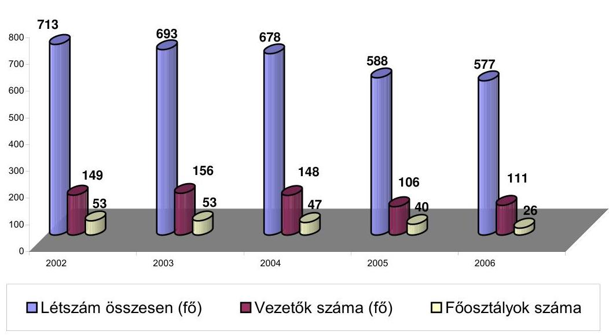
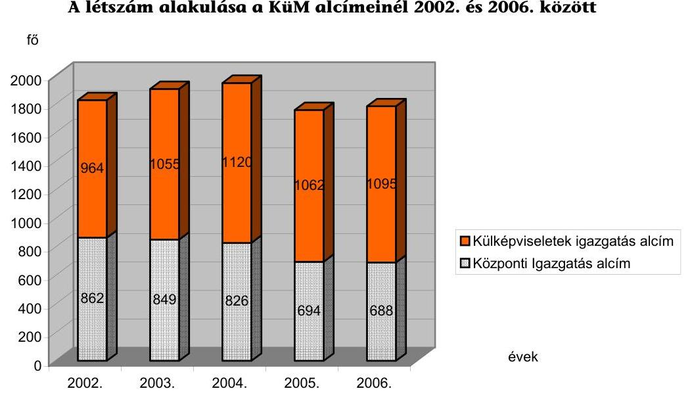
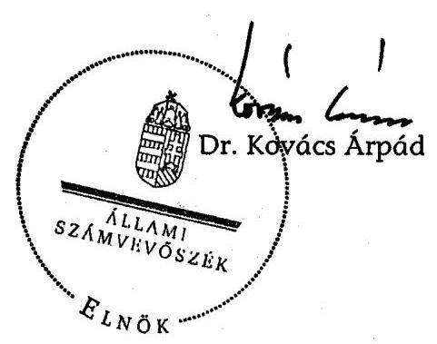
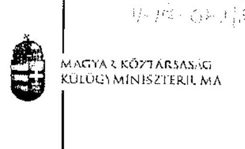
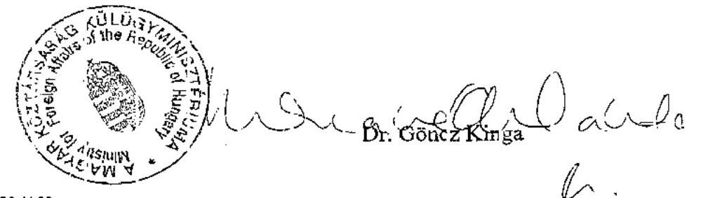
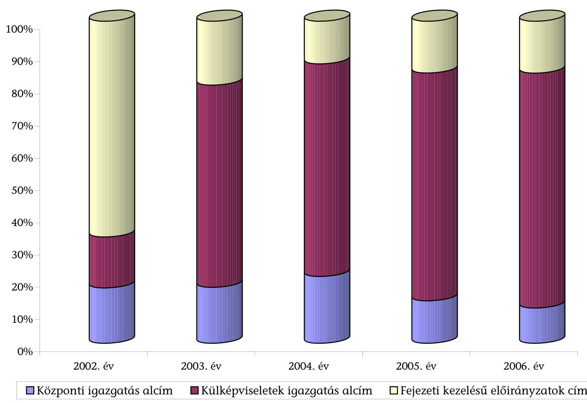
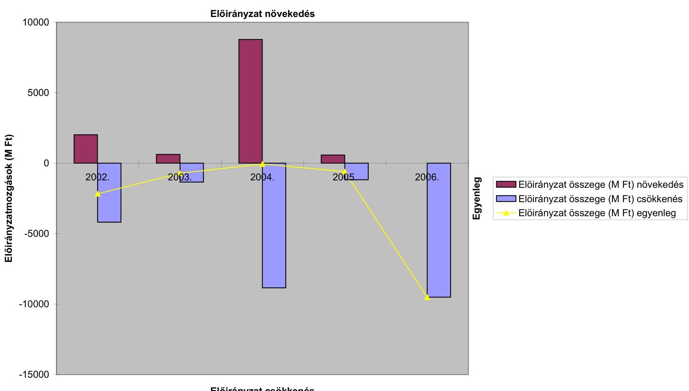
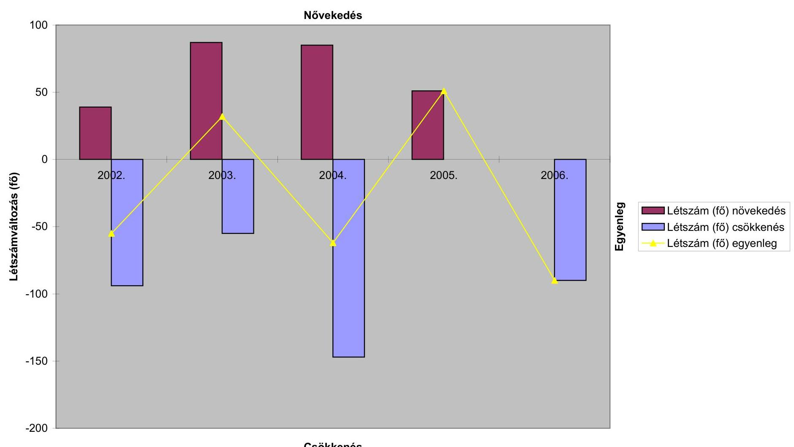

# ÁLLAMI   SZÁMVEVŐSZÉK 

## JELENTÉS

a Külügyminisztérium fejezet működésének ellenőrzéséről

---

2. Államháztartás Központi Szintjét Ellenőrző Igazgatóság
2.3. Átfogó Ellenőrzési Főcsoport

Iktatószám: V-17-042/2006-2007.
Témaszám: 829 .
Vizsgálat-azonosító szám: V0296

# Az ellenőrzést felügyelte: 

Bihary Zsigmond
főigazgató
Az ellenőrzés végrehajtásáért felelős:
Hegedűsné dr. Müllern Veronika
főcsoportfőnök
Az ellenőrzést vezette:
dr. Horváth Margit
osztályvezető főtanácsos
Az ellenőrzést végezték:

| Dr. Baloghné | dr. Burján Margit | Deák Tamásné |
| :-- | :-- | :-- |
| Sebestyén Éva | számvevő tanácsos, főtanácsadó | számvevő tanácsos, főtanácsadó |
| számvevő |  |  |
| Dede Katalin | Eötvös Magdolna | Kocsis Ferencné |
| számvevő tanácsos | számvevő | számvevő |
| Krüzselyi Attila | Maklári Ferencné | Patai Tamás |
| számvevő | számvevő tanácsos, főtanácsadó | számvevő tanácsos |
|  |  |  |
| Szilas István | Tóth Árpád | Zagyi Judit |
| számvevő tanácsos | számvevő tanácsos | számvevő |

## Záhonyiné Horváth

## Ildikó

számvevő

## A témához kapcsolódó eddig készített számvevőszéki jelentések:

## címe

sorszáma
Vélemény a Magyar Köztársaság 2001. és 2002. évi költségvetési 0034
törvényjavaslatáról
Vélemény a Magyar Köztársaság 2003. évi költségvetési törvényjavaslatáról 0241
Jelentés a Külügyminisztérium fejezet működésének ellenőrzéséről 0314
Jelentés a Magyar Köztársaság 2002. évi költségvetése végrehajtásának ellenőrzéséről 0329

Jelentéseink az Országgyűlés számítógépes hálózatán és az Interneten a www.asz.hu címen is olvashatók.

---

Vélemény a Magyar Köztársaság 2004. évi költségvetési javaslatáról 0338
Jelentés a Magyar Köztársaság 2003. évi költségvetése végrehajtásának ellenőrzéséről 0443
Vélemény a Magyar Köztársaság 2005. évi költségvetési javaslatáról 0449
Jelentés az államháztartáson kívüli állami feladatellátás rendszerének ellenőrzéséről
Jelentés a Magyar Köztársaság 2004. évi költségvetése végrehajtásának ellenőrzéséről 0540
Vélemény a Magyar Köztársaság 2006. évi költségvetési javaslatáról 0550
Jelentés a Magyar Köztársaság 2005. évi költségvetése végrehajtásának ellenőrzéséről 0628
Vélemény a Magyar Köztársaság 2007. évi költségvetési javaslatáról 0641

---

# TARTALOMJEGYZÉK 

BEVEZETÉS ..... 7
I. ÖSSZEGZŐ MEGÁLLAPÍTÁSOK, KÖVETKEZTETÉSEK, JAVASLATOK ..... 10
II. RÉSZLETES MEGÁLLAPÍTÁSOK ..... 18

1. A fejezet feladatellátása, a szervezeti és működési feltételek és a költségvetési források összhangja ..... 18
1.1. A külső szabályozási környezet alakulása ..... 18
1.2. A feladatrendszer változásainak hatása a szervezeti, működési feltételekre ..... 24
1.3. A feladatellátás és a költségvetési források alakulásának összhangja ..... 27
2. A szakmai feladatellátás súlypontjai, azok feltételrendszere ..... 33
2.1. Az euro-atlanti feladatok ellátása ..... 33
2.2. Alapítványok közreműködése az alapfeladatok ellátásában ..... 36
2.3. A nemzetpolitikai feladatok ellátása ..... 40
2.3.1. A határon túli magyarok támogatása ..... 42
2.4. A külképviseleti hálózat alakulása, működtetése, kontrollkörnyezete ..... 50
2.4.1. A külképviseletekkel kapcsolatos ingatlangazdálkodási tevékenység ..... 61
3. A feladatellátást támogató kontrollok ..... 64
3.1. Az ellenőrzési tevékenység ..... 65
3.2. A szakmai informatikai rendszerek ..... 69
3.3. A gazdálkodás monitoring rendszere ..... 72
4. Az előző vizsgálataink javaslatai alapján megtett intézkedések ..... 74
MELLÉKLETEK
5. számú A Külügyminisztérium észrevétele
6. számú A Külügyminisztérium fejezethez tartozó címek, alcímek változása (2002-2006.)
7. számú A KüM fejezet és intézményei jellemző költségvetési és létszámadatai
FÜGGELÉKEK
8. számú A fejezeti kezelésű előirányzatokkal való gazdálkodás
9. számú A külképviseletek helyszíni ellenőrzésének tapasztalatai

---

# 2

---

# RÖVIDÍTÉSEK JEGYZÉKE 

| Áht. | az államháztartásról szóló, többször módosított 1992. évi XXXVIII. törvény |
| :--: | :--: |
| ÁK | Állandó Képviselet |
| Ámr. | az államháztartás működési rendjéről szóló, többször módosított 217/1998. (XII. 30.) Korm. rendelet |
| ÁSZ | Állami Számvevőszék |
| ÁÚSZ | Állandó Ügyeleti Szolgálat |
| BÁH | BM Bevándorlási Hivatal |
| Ber. | a költségvetési szervek belső ellenőrzéséről szóló 193/2003. (XI. 26.) Korm. rendelet |
| BM | Belügyminisztérium |
| EFO | Ellenőrzési Főosztály |
| EMTE | Erdélyi Magyar Tudományegyetem |
| EO | Ellenőrzési Osztály |
| EÖKK | Európai Összehasonlító Kisebbségkutatások Közalapítvány |
| EPEFO | Európai Politikai Együttműködési Főosztály |
| EU | Európai Unió |
| EÜH | Európai Ügyek Hivatala |
| FB | Felügyelő Bizottság |
| GBF | Gazdálkodási és Bérszámfejtési Főosztály |
| GFO | Gazdálkodási Főosztály |
| GKM | Gazdasági és Közlekedési Minisztérium |
| HM | Honvédelmi Minisztérium |
| HTMH | Határon Túli Magyarok Hivatala |
| IBSZ | Informatikai Biztonsági Szabályzat |
| ICAO | Nemzetközi Polgári Repülési Szervezet |
| IKÁT | Integrációs és Külgazdasági Államtitkárság |
| IM | Igazságügyi Minisztérium |
| ITDH | Magyar Befektetési és Kereskedelemfejlesztési ZRt. |
| KE | Köztársasági Elnökség |
| KIR | Konzuli Információs Rendszer |
| Központ | A KüM külképviseletek nélküli szervezeti egységeinek összefoglaló neve |
| KSZF | Központi Szolgáltatási Főigazgatóság |
| Ktv. | A köztisztviselők jogállásáról szóló, többször módosított 1992. évi XXIII. törvény |
| KüM | Külügyminisztérium |
| KüM-RFT TNM | A regionális fejlesztésekért és felzárkóztatásért felelős tárca nélküli miniszter |
| KVI | Kincstári Vagyoni Igazgatóság |
| MANNA | a Központ gazdálkodását támogató informatika rendszer |

---

| ME | Miniszterelnökség fejezet |
| :--: | :--: |
| MeH | Miniszterelnöki Hivatal |
| MeHVM | Miniszterelnöki Hivatalt vezető miniszter |
| MK | Magyar Köztársaság |
| MKB | MKB Bank Nyrt., jogelőd a Magyar Külkereskedelmi Bank Rt. |
| NATO | Észak-atlanti Szerződés Szervezete |
| NEFE | nemzetközi fejlesztési együttműködés |
| NFH | Nemzeti Fejlesztési Hivatal |
| NK | Nagykövetség |
| NKÖM | Nemzeti Kulturális Örökség Minisztériuma |
| NÜI | Nemzetpolitikai Ügyek Irodája |
| NYEU | Nyugat-európai Unió |
| OECD | Organisation for Economic Cooperation and Development - Gazdasági Együttműködés és Fejlesztés Szervezete |
| OGY | Országgyűlés |
| OKM | Oktatási és Kulturális Minisztérium |
| OM | Oktatási Minisztérium |
| PKE | Partiumi Keresztény Egyetem (Románia) |
| PM | Pénzügyminisztérium |
| Ptk. | a Polgári Törvénykönyvről szóló, többször módosított 1959. évi IV. törvény |
| SZA | Szülőföld Alap |
| Szatv. | a szomszédos államokban élő magyarokról szóló 2001. évi LXII. törvény („kedvezménytörvény") |
| szja | személyi jövedelemadó |
| SzMSz | Szervezeti és Működési Szabályzat |
| TLA | Teleki László Alapítvány |
| UNESCO | United Nations Educational, Scientific and Cultural Organization - az ENSZ Nevelésügyi, Tudományos és Kulturális Szervezete |
| VKH | Védett Külügyi Hálózat |
| VOIP | adatkommunikációs vonalon kialakított hangszolgáltatások |
| VPN | Virtuális Magánhálózat |

---

# ÉRTELMEZŐ SZÓTÁR 

Diplomáciai képviselet feladatai

Ellenőrzési nyomvonal

FEUVE

Konzuli feladatok

Szakdiplomata

A diplomáciai kapcsolatokról Bécsben, 1961. IV. 18-án aláirt nemzetközi szerződés ${ }^{1}$ szerint (3. cikk): a küldő állam képviselete a fogadó államban; a küldő állam, valamint a küldő állam polgárai érdekeinek védelmezése a fogadó államban; tájékozódás minden megengedett módon a fogadó államban levő viszonyokról és fejleményekről és ezekről jelentés a küldő állam kormányának, valamint az érintett államok között a gazdasági, kulturális és tudományos kapcsolatok fejlesztése.
A költségvetési szerv tervezési, pénzügyi lebonyolítási és ellenőrzési folyamatainak szöveges, táblázatba foglalt vagy folyamatábrákkal szemléltetett leírása.
A folyamatba épített előzetes és utólagos vezetői ellenőrzés (FEUVE) rendszere a hatályos szabályozás szerint tartalmazza mindazon elveket, eljárásokat és belső szabályzatokat, melyek alapján a költségvetési szerv érvényesíti a feladatai ellátására szolgáló előirányzatokkal, létszámmal és a vagyonnal való szabályszerű, gazdaságos, hatékony és eredményes gazdálkodás követelményeit.
A feladatokat külön szabályozza a konzuli kapcsolatokról Bécsben, 1963. IV. 24-én elfogadott egyezmény² (5. cikk): a konzuli cselekmények (közjegyzői, hatósági - beleértve a vízumozási - tevékenység), a konzuli ügyek (érdekvédelem, segítség és támogatás nyújtása a küldő állam természetes és jogi személyei részére), továbbá mint diplomáciai képviseletnek tájékozódás minden megengedett módon a fogadó állam kereskedelmi, gazdasági, kulturális és tudományos életének viszonyairól és alakulásáról, ezekről jelentéstétel a küldő állam kormányainak, valamint a kereskedelmi, gazdasági, kulturális és tudományos kapcsolatok fejlesztésének előmozdítása. A konzuli feladatok súlypontjai időtől és földrajzi helytől függően változnak. Például az utazás és munkavállalás könnyebbé válásával (adminisztratív kötöttségek megszűnése, olcsóbb utazási lehetőségek) az érdekvédelem szerepe növekszik, másutt a gazdasági és egyéb kapcsolatok előmozdítása válik hangsúlyosabbá ${ }^{3}$.
A tartós külszolgálatról szóló 31/2002. (III. 1.) Korm. rendelet szerint a szakdiplomata „a közigazgatási szervtől határozott időre - egy külszolgálat időtartamára - a KüM állományába áthelyezett, speciális szakismeretekkel rendelkező köztisztviselő." A jogszabályt felváltó, a köztisztviselők tartós külszolgálatáról szóló 104/2003. (VII. 18.) Korm. rendelet meghatározása szerint a szakdiplomata „az a köztisztviselő, akit központi közigazgatási szerv egy ágazati szakmai feladatnak a Magyar Köztársaság külképviseletén történő ellátására, meghatározott időre helyez át a KüM-be".

[^0]
[^0]:    ${ }^{1}$ Kihirdetése az 1965. évi 22. számú törvényerejű rendelettel történt.
    ${ }^{2}$ Az 1987. évi 13. számú törvényerejű rendelet hirdette ki.
    ${ }^{3}$ Románia 2007. január 1-jei uniós csatlakozásával összefüggésben a kolozsvári főkonzulátuson a vízumkiadási tevékenység csökkenő szerepe miatt a kiküldöttek száma 45%-kal (5 fő), a helyi alkalmazottaké 27%-kal (4 fő) csökkent.

---

# JELENTÉS   a Külügyminisztérium fejezet működésének ellenőrzéséről 

## BEVEZETÉS

A Magyar Köztársaság (MK) külpolitikájának irányelveit a kormányprogramok fogalmazzák meg. Közös jellemzőjük, hogy a rendszerváltozás után nemzeti konszenzussal elfogadott külpolitikai törekvések három fő irányát, az euroatlanti integrációt, a regionális stabilitást biztosító jószomszédi politikát, valamint a határon túli magyarság támogatását magába foglaló nemzetpolitikát az egyes kormányprogramokban meglévő hangsúlyeltolódásokkal képviselik.

A külpolitika megvalósításában részt vevő szervezetek és intézmények közül a Külügyminisztérium (KüM) szerepe kiemelt. A külügyminiszter feladatait és hatáskörét rögzítő kormányrendelet szerint a miniszter képviseli az MK kül- és biztonságpolitikáját más államokkal és a nemzetközi szervezetekkel fenntartott kapcsolatokban. Koordinálja Magyarország és egyes nemzetközi szervezetek, így az Európai Unió (EU) és az Észak-atlanti Szerződés Szervezete (NATO) közötti kapcsolatokat, a csatlakozási folyamat egészét, az euro-atlanti integrációs politika érvényesülését. Irányítja a külképviseleteket, külföldön gondoskodik az ország, annak állampolgárai és szervezetei jogai és érdekei védelméről. Közreműködik a határon túli magyarokra vonatkozó kormányzati feladatok végrehajtásában. Szervezi és irányítja a gazdaságdiplomáciai tevékenységet.

2002-től a kormányváltások érintették a KüM feladatrendszerét. Ez a feladatok mellett egyes intézmények, illetve a kapcsolódó előirányzatok többszöri átcsoportosítását is jelentette. A miniszter feladat- és hatásköréről szóló kormányrendelet módosításaival összefüggésben változott a minisztérium Szervezeti és Működési Szabályzata (SzMSz) és ezzel összhangban az ügyrendek is módosultak. A változtatások alapvetően három területet érintettek.

A határon túli magyarsággal kapcsolatos egyes feladatok ellátását végző Határon Túli Magyarok Hivatala (HTMH) és az általa kezelt előirányzatokat többször rendezték át a KüM, illetve a Miniszterelnökség (ME) fejezet között ${ }^{4}$.

[^0]
[^0]:    ${ }^{4}$ A HTMH 1998-tól 2002. július 13-áig a KüM fejezethez tartozott, ezt követően az ME fejezethez, majd 2004. december 16-ától ismét a KüM-be, majd 2006. június 28-ától újra az ME fejezethez került. 2007-től önálló intézményként megszűnt, a feladatot átvette a MeH.

---

A külgazdaság-politikai, gazdaságdiplomáciai és befektetés-ösztönzési feladatokat 2002. és 2004. december 14-e között a KüM, majd ezt követően a Gazdasági és Közlekedési Minisztérium (GKM) látta el.

Az Unióból érkező előcsatlakozási eszközökkel és egyéb forrásokkal, illetve a közösségi politikák összehangolásával kapcsolatos feladatokat 2004. december 23-ától a KüM-től átvette az európai

 ügyekért felelős tárca nélküli miniszter ${ }^{5}$.

A fejezet számára az elmúlt évben az MK 2006. évi költségvetéséről szóló 2005. évi CLIII. törvény 55081,1 M Ft eredeti kiadási előirányzatot hagyott jóvá, amelyhez 48 930,7 M Ft költségvetési támogatást biztosított (a bevételi előirányzata 9042,2 M Ft volt) ${ }^{6}$.

A fejezet működésének átfogó ellenőrzését utoljára 2002-2003-ban végeztük. Jelen ellenőrzésünk a negyedik átfogó ellenőrzés 1990-től számítva.

Az ellenőrzés során a gazdálkodás szabályszerűségének értékelésénél támaszkodtunk az éves költségvetések végrehajtására vonatkozó jelentéseink megállapításaira.

A KüM Központi Igazgatása és a fejezeti kezelésű előirányzatok 2003., 2004. és 2005. évi beszámolóit az Állami Számvevőszék (ÁSZ) a financial audit módszerével felülvizsgálta, ennek keretében elegendő és megfelelő bizonyosságot szerzett arról, hogy a beszámolókat a számviteli törvényben foglaltak és az annak végrehajtására kiadott 249/2000. (XII. 24.) Korm. rendelet előírásai szerint készítették el. A beszámolók a vagyoni, pénzügyi helyzetről megbízható és valós képet adtak. A KüM fejezet Központi Igazgatása és a fejezeti kezelésű előirányzatok szervezeti, működési és gazdálkodási szabályozottsága megfelelő volt, az intézmény éves gazdálkodása és a fejezeti kezelésű előirányzatok felhasználása összhangban volt a költségvetési gazdálkodásra vonatkozó szabályokkal.

Az ellenőrzés végrehajtásának jogszabályi alapját az Állami Számvevőszékről szóló 1989. évi XXXVIII. törvény 2. § (3), (5), valamint a 17. § (3) bekezdésében foglaltak képezték.

Az ellenőrzés célja annak értékelése volt, hogy a fejezetnél

- a feladatok ellátása, annak szervezeti és működési feltételei, költségvetési forrásai összhangban voltak-e;

[^0]
[^0]:    ${ }^{5} 2004$ előtt ezt a feladatot az európai integrációs ügyek koordinációjáért felelős tárca nélküli miniszter, illetve politikai államtitkár látta el.
    ${ }^{6}$ A 2112/2006. (VI. 28.) Korm. határozat a KüM fejezet 2006. évi előirányzatait módosította. Ennek során a HTMH cím a kapcsolódó előirányzatokkal átkerült az ME fejezethez ( $-7488,9 \mathrm{M} F$ t), ugyanakkor az EU utazási költségtérítések előirányzat ( +400 M Ft) az ME fejezettől - új alcímként - a KüM fejezethez került. Így a KüM fejezet kiadási előirányzata $47384,0 \mathrm{M} \mathrm{Ft}$, a támogatási előirányzata $41493,8 \mathrm{M} \mathrm{Ft}$, a bevételi előirányzata pedig $9390,2 \mathrm{M}$ Ft lett.

---

- a szakmai feladatellátás súlyponti területein a működtetés feltételrendszere hozzájárult-e a források hatékony felhasználásához;
- a külképviseletek megnyitásánál, bezárásánál, működtetésénél érvényesítettek-e kritérium rendszereket; a határon túli magyarokkal kapcsolatos feladatok ellátásában szabályosan és eredményesen működött-e a pályázatitámogatási rendszer;
- megfelelően segítette-e a szakmai feladatok ellátását a minisztérium belső kontroll környezete, hasznosították-e a korábbi ellenőrzéseink megállapításait, javaslatait.

Az átfogó ellenőrzés keretében rendszerszemléletben tekintettük át a KüM fejezet feladatrendszerének alakulását. Kiemelt figyelmet fordítottunk a szakmai feladatellátás súlypontjaira.

Az átfogó ellenőrzés a 2002. és a 2006. közötti időszakra terjedt ki, ezen belül hangsúlyozottan az utolsó két év feladatellátására, illetve a 2006. évi kormányváltást követő, a KüM szervezetét és erőforrásait érintő intézkedések előkészítettségére, végrehajtására koncentráltunk.

Az ellenőrzés a KüM címet és a fejezeti kezelésű előirányzatokat fogta át. Helyszíni ellenőrzés keretében a fejezet költségvetési szerveit és a kiválasztott külképviseleteket (Brüsszel - a bilaterális, valamint az EU-képviselet és a NATO-képviselet, Lisszabon, Ljubljana) vizsgáltuk. ${ }^{7}$

Az átfogó ellenőrzés során megkezdtük a KüM és a Fejezeti kezelésű előirányzatok címek 2006. évi beszámolója megbízhatóságának ellenőrzését, amit 2007-ben, a költségvetés végrehajtásának ellenőrzése keretében fejezünk be.

Utóellenőrzés keretében értékeltük a 2002-2003. évi átfogó, továbbá a 2002-2006. közötti időszak éves költségvetésének megalapozottságára és annak végrehajtására irányuló ÁSZ ellenőrzéseink ajánlásainak, megállapításainak hasznosulását.

A jelentés-tervezetet egyeztettük a külügyminiszterrel, aki észrevételt nem tett. (1. sz. melléklet)

[^0]
[^0]:    ${ }^{7}$ A külképviseletek kiválasztásánál szempont volt a minisztérium feladatellátásában kiemelt terület (multilaterális képviseletek Brüsszelben), az utóellenőrzés (Lisszabon), a határon túli magyarokkal kapcsolatos feladatok miatt fontos országban található nagykövetség vizsgálata (Ljubljana).

---

# I. ÖSSZEGZŐ MEGÁLLAPÍTÁSOK, KÖVETKEZTETÉSEK, JAVASLATOK 

A külügyminiszter és a minisztérium alapfeladata az MK külpolitikájának megvalósítása volt a kormányzati munkamegosztás keretei között és a kormányprogramok által kijelölt, változó hangsúlyú prioritások (az euro-atlanti integráció, a regionális stabilitást biztosító jószomszédi politika, valamint a határon túli magyarság támogatását magába foglaló nemzetpolitika) érvényesítésével.

A KüM-ben a Kormány által elfogadott, a kormányprogramokban lefektetett elvek, cselekvési irányok és az operatív feladatok közötti koherenciát biztosító külpolitikai stratégia ${ }^{8}$ nem készült el, ez is hozzájárult ahhoz, hogy a feladat- és hatáskör át- és visszarendezések és a kormányprogramok nem mindig voltak összhangban. Szerkezetében és tartalmában 2006. II. félévében megújult a statútum, viszont a szabályozás alapvető problémája, hogy míg a külügyminiszter a Kormány külpolitikáért felelős tagja, a külpolitika fontos, kiemelt területei (nemzetpolitika, külgazdaság) a Miniszterelnöki Hivatalt vezető miniszter (MeHVM), illetve a gazdasági és közlekedési miniszter felelősségi körébe tartoznak, a feladatmegosztás tisztázása nélkül.

A KüM feladatellátására lényegesen kiható jogszabály-alkotási folyamatokból hiányoztak a hatástanulmányok. Ez különösen a háttérintézményi struktúrára hatott ki. Intézmények megszűntetését, alapítását, összevonását tartalmi értékelés és indoklás nélkül rendeltek el.

A KüM-ben a szabályozási kontrollok ellensúlyozták a feladatrendszer gyakori változásainak kockázatát. A szakmai és funkcionális szervezeti egységek a költségvetési alcímek elkülönültségétől függetlenül egységes szervezetként működtették a minisztériumot, amelynek struktúrája a feladatok növekedése miatt 2004-ig összetettebb, bonyolultabb lett. Azt követően a külgazdaság felügyeletének átadása, az uniós feladatok átrendeződése miatt csökkent a főosztályok és a vezetői szintek száma. A 2006. évi kormányváltás után tovább egyszerűsödött a minisztérium szervezete (2002-ben 53, 2006. év végén 26 főosztály), a vezetők aránya (17-18\%) viszont nem változott.

[^0]
[^0]:    ${ }^{8}$ A nemzetközi tapasztalatok alapján a külpolitikai stratégia szerepe eltérő. Rögzítheti csupán az adott ország külpolitikájának elveit, de a külpolitika komplex eszközrendszerén belül a relációk szerint különböző súlypontok kialakítására, a meglévő erőforrások hozzárendelésében fontos iránymutatások meghatározására is szolgálhat. A KüM-től kapott tájékoztatás szerint a stratégia elkészítése 2007-ben várható.

---

A KüM szervezetét és működését meghatározó SzMSz, annak módosításai késésekkel követték a jogszabályi változásokat. Az SzMSz módosításaival összhangban az ügyrendek is módosultak. A változások könnyebb áttekintése érdekében 2003-tól évente egységes SzMSz-t adtak ki.

A KüM feladatait meghatározó jogszabályok, illetve az éves költségvetési törvények a feladatváltozásokkal összhangban biztosították a tevékenységek ellátásához a költségvetési forrásokat. A KüM az érintett tárcák felelős vezetőivel az előirányzatok, források átadás-átvételét megalapozott, részletes megállapodásokban rendezte. A fejezeti költségvetés kiadásainak átlagosan 80\%-át költségvetési támogatás fedezte. Az ellenőrzött időszakban 269 Mrd Ft-ot használtak fel a fejezet intézményeinek feladatellátásához. A fejezethez tartozó intézmények összes létszáma a helyi alkalmazottak ${ }^{9}$ nélkül 1,8-2 ezer fő között alakult. A KüM létszámán belül folyamatosan nőtt a külképviseleteken foglalkoztatottak aránya. A kiküldöttek száma a Központ létszámát 2002-ben 12\%kal, 2006-ban viszont már 59\%-kal haladta meg.

[^0]
[^0]:    ${ }^{9}$ A külképviseletek munkáját növekvő számú, 2006-ra közel 800 fő helyi alkalmazott is segítette.

---

A konzuli tevékenységből (vízumkiadási díj) származó saját bevétel (évente 17-10 Mrd Ft) a schengeni vízumdíjakkal való harmonizáció, valamint a mentességet élvezők körének növekedése miatt 2003-tól jelentősen, évenként 10-$30 \%$-kal csökkent.

A fejezeti költségvetés teljesítésében a módosított előirányzatok számottevő része, átlagosan 1/6-a (2002-ben 1/5-e) maradványként jelentkezett, ebben közrejátszott a határon túli támogatásoknál a lebonyolító szervek előfinanszírozása miatt az elszámolatlan támogatási tételek (2006. június 30 -án 5 Mrd Ft ) magas aránya.

A kormányzati takarékossági intézkedések következtében 2002-től a módosított kiadási előirányzatokként rendelkezésre álló források (az ellenőrzött időszakban összesen 331 Mrd Ft ) mintegy $2 \%$-át kitevő, összesen közel 7 Mrd Ft előirányzat-csökkentésre került sor.

A KüM fejezet feladatrendszerén belül a külképviseleti hálózat működtetése igényelte a legtöbb erőforrást. A külképviseletek kiadásai évente 30-37 Mrd Ft-ot, a kiadási főösszeg 56-70\%-át ${ }^{10}$ tették ki. Az év közben felmerült többletigényeket pótelőirányzatokkal biztosították, a jellemző likviditási problémák (a külképviseletek által bérelt ingatlanok bérleti díj fizetési határideje megelőzte a működést biztosító ellátmány utalását) mellett. A külképviseleteknél a költségek 2/3-át a kiküldöttek személyéhez kapcsolódó kiadások jelentet-

[^0]
[^0]:    ${ }^{10}$ A Külképviseletek Igazgatása alcím kiadásai a fejezet eredeti kiadási előirányzatának 2002-ben 63,1\%-át, 2003-ban 69,1\%-át, 2004-ben 65,0\%-át, 2005-ben 55,5\%-át, 2006ban $66,9 \%$-át tették ki. Az összegek reálértékének megítélésénél figyelembe kell venni az árfolyamok változását, amely a kiadások 4/5-ét érintette. A forint 2002-2006 között a dollárhoz képest $37,8 \%$-kal, az euróhoz viszonyítva pedig $6,5 \%$-kal erősödött a PM tervezetési körirata szerint.

---

ték, ezért a KüM-ben a további megtakarítások elsősorban a külképviseleteknél a humán erőforrások hatékonyabb felhasználására alapozhatók.

A KüM alapfeladatait szolgálta a fejezet költségvetési előirányzatainak 80-98\%-a. Az alapfeladatokra fordított fejezeti kezelésű előirányzatok közel felét tették ki a nemzetközi tagdíjak, illetve az európai uniós befizetések, valamint az állami protokoll kiadásai ${ }^{11}$, amelyek alakulására, felhasználására a KüMnek nem volt befolyása ${ }^{12}$.

A szakmai feladatellátáson belül az euro-atlanti feladatok tartalma, forrásigénye, támogatása az uniós csatlakozásunkkal összhangban változott. A feladatok ellátása szempontjából kedvező, hogy 2006-tól a KüM az uniós integrációs folyamatok fő koordinátora. A minisztérium működtette az Európa Tanács munkabizottságaiban képviselendő magyar álláspont kialakítását végző Európai Koordinációs Tárcaközi Bizottságot. A schengeni követelményekre való felkészülésre 2005-2006-ban mintegy 1,6 Mrd Ft-ot fordítottak konzuli oktatásra, a külképviseleteken előírt biztonsági beruházásokra, informatikai fejlesztésekre. Az új tagállamok beilleszkedését segítő Schengen Alapból uniós forrásként 2007-ben az informatikai rendszerhez való kapcsolódáshoz szükséges eszközökre további 1 Mrd Ft-ot használhat fel a KüM. A csatlakozás előkészítésében, az uniós feladatok ellátásában kiemelt szerepe volt az EU Állandó Képviseletnek (EU ÁK), amelynek működtetési költsége 2005-ben 2,4 Mrd Ft volt, a Külképviselet alcím 8\%-át tette ki.

A KüM a nem kormányzati szintű szomszédságpolitika elmélyítésével, illetve a két-és többoldalú magyar kisebbségpolitika tudományos megalapozásával kapcsolatos feladatokat végző négy közalapítványt és egy alapítványt támogatott ${ }^{13}$ évente növekvő összeggel, összesen mintegy 1,6 Mrd Ft-tal. A támogatások közel felét (47\%-át) a kisebbségpolitikával foglalkozó (köz)alapítványok kapták. A támogatások hozzájárultak a kiemelt területeken jelentős kutatói bázisok létrejöttéhez, a kisebbségpolitika irányainak meghatározásában pedig kormányzati szinten hasznosultak.

A Teleki Intézet működésének támogatására létrehozott alapítvány (Teleki László Alapítvány, TLA) esetében ugyanakkor a gazdálkodási, működési folyamatokat az alapító Kormány és az alapítói jogot gyakorlók (1999-től a KüM) nem felügyelték megfelelően. Nem gondoskodtak a kuratórium és az FB működésének folyamatosságáról, holott a kuratóriumot legfőbb döntéshozó jogkörrel ruházták fel. A törzsvagyon mértékét nem határozták meg, az alapítvány működtetésének költségei rendre (2002-ben mintegy 30\%-kal) meghalad-

[^0]
[^0]:    ${ }^{11}$ Együttes összegük 2002-2005 között évente 3-4,6 Mrd Ft volt, melyből a protokoll kiadás évente 0,5-0,9 Mrd Ft-ot tett ki.
    ${ }^{12}$ Az Állami Protokoll - 2005-től a köztársasági elnöki protokoll nélkül, csak kormányfői protokoll - előirányzat módosítása minden évben jelentős volt, 30-150\%-kal növelték az eredeti előirányzatot, indoklás szerint az előre nem jelzett, váratlan diplomáciai események miatt.
 

 ${ }^{13}$ „Esély a Stabilitásra" Közalapítvány, EuroClip-EuroKapocs Közalapítvány, Demokrácia Központ Közalapítvány, Európai Összehasonlító Kisebbségkutatások Közalapítvány, TLA.

---

ták az előírt (10\%-os) mértéket, a saját kft. gazdálkodásáról az alapítói jogot gyakorlónak nem számoltak be. A működési, gazdálkodási szabályzatok késve készültek el, az alapítvány egy saját alapítású gazdasági társaságon keresztül végzett, a közhasznú tevékenységéhez kevésbé illeszkedő, ám nyereséges ingat-lan-üzemeltetési és hasznosítási tevékenységgel párhuzamosan nem nőtt a cél szerinti feladatok ellátása, holott a kft. a bevételéből (és a pályázatokból) közel az állami támogatásnak megfelelő összeggel segítette az intézet működését. A 2002-től tervezett közalapítvánnyá történő átalakítás elmaradása hátráltatta az alapítvány és szervezetei gazdálkodása átláthatóságát. A Kormány 2007. január 1-jével a TLA-t megszűntette, tevékenységét beépítette az újonnan alapított Külügyi Intézet feladatkörébe. Az átalakítás kimutatható megtakarítással nem járt.

A határon túli magyarokkal kapcsolatos feladatok összkormányzati ellátása szempontjából kiemelt jelentősége volt a HTMH-nak és a rajta keresztül lebonyolított támogatásoknak. A vizsgált időszakban a HTMH felváltva tartozott a KüM, illetve az ME fejezethez, a szakmai feladatellátásban azonban megtartotta az önállóságát. Kizárólagosan a határon túli magyarok támogatását szolgáló előirányzatok összege a KüM-nél a 2002. évi közel 6 Mrd Ft-ról 2006-ra 9 Mrd Ft-ra emelkedett.

A nemzetpolitikai feladatok között meghatározó volt a szomszédos államokban élő magyarokról szóló törvényben („kedvezménytörvény") foglalt Magyar Igazolvány kiadásához a konzuli hálózat fejlesztése, a személyi, technikai háttér biztosítása. A törvényi célkitűzések közel 900 ezer igazolvány kiadásával teljesültek.

A „kedvezménytörvény"-hez kapcsolódó előirányzatok a határon túli magyarok oktatását és nevelését, illetve a szülőföldön maradás programjait támogatták. A támogatásokat pályázatok útján, illetve egyedi szerződéssel, közvetlenül a HTMH révén, továbbá hazai, illetve határon túli civil szervezetek közvetítésével juttatták el az érintettekhez. A törvényben meghatározott oktatási támogatásokat szabályozottan, ellenőrzötten folyósították. Az országonként differenciáltan érvényesülő támogatások felhasználása eredményességének megállapításához nem alakítottak ki nyilvántartási és értékelési rendszert.

A 2005-ben létrehozott Szülőföld Alap (SZA) kiterjesztette a határon túli magyarok támogatása alanyi és tárgyi körét az önkormányzatokra és a vállalkozásokra. Az Alap létrehozásával a hazai (köz)alapítványok közvetítő szerepe ${ }^{14}$ megszűnt, feladataik, forrásaik integrálódtak. Az SZA támogatási előirányzata 2005-2006-ban 1,5 Mrd Ft volt. A forrásainak felhasználásához kialakított pályázati rendszer (három kollégiumhoz tartozó hét-hét régióval és a hosszú pályázati és elbírálási határidőkkel) túlbonyolított volt. Ez 2005-ben több mint 30\%-os maradványképződéshez vezetett.

[^0]
[^0]:    ${ }^{14}$ Az Új Kézfogás Közalapítvány helyett a MeH többségi tulajdonosi részesedésével működő Corvinus Nemzetközi Befektetési Zrt. végzi a határon túli magyarságot érintő gazdaságfejlesztési és vállalkozás ösztönzési programok lebonyolítását és a támogatásközvetítési feladatok összehangolását.

---

A klasszikus diplomáciai alapfeladatok végrehajtásában a külképviseleteké a meghatározó szerep. A külképviseleti hálózat a nagykövetségi rangú helyi képviseletekből és a (fő)konzulátusokból ${ }^{15}$ áll ${ }^{16}$. Az ellenőrzött időszakban a külképviseletek száma 108-113 között mozgott.

A külképviseleti hálózatot, annak működését a KüM a vizsgált időszakban kétszer (2003-ban, 2005-ben) részletesen felülvizsgálta, az annak eredményeként megfogalmazott javaslatokat hasznosították. A külképviseleti hálózatot az ellenőrzött időszak előtt kialakított stabil struktúra jellemezte. A külpolitika súlypontjainak változásával összhangban álló, kormányhatározatban elrendelt megnyitások, bezárások, összevonások a missziók 1/10-ét érintették.

A diplomáciai tevékenység során az ágazati (ezeken belül például a külgazdasági) feladatok előtérbe kerülésével a külképviseletek mintegy 60\%-ánál működtek a szaktárcák irányítása alá tartozó szakdiplomaták ${ }^{17}$, a kormányprogramokban nevesített egyes fontos ázsiai relációkban viszont nem voltak szakdiplomaták. A KüM az érintett minisztériumokkal a szakdiplomatákkal kapcsolatos feladat- és jogkörök megosztását, a finanszírozási feltételeket 3 tárca${ }^{18}$ kivételével együttes utasításban rendezte. A külképviseleteken a szakmai feladatok összehangolása nagymértékben személyfüggő volt, jellemző módon nem készültek el a szakdiplomaták munkaköri leírásai sem. A KüM-nek a diplomaták negyedét kitevő szakdiplomaták esetében korlátozott volt a befolyása a kiválasztásra, a feladat-meghatározásra. A szakdiplomatát nélkülöző képviseleteknél a gazdasági, kereskedelmi, tudományos-technológiai kapcsolatok építését a KüM által kiküldött diplomaták látták el. Az ágazati feladatokért felelős szaktárcák és a KüM együttműködését e tekintetben nem szabályozták, az információk visszacsatolása esetleges volt.

A KüM ingatlanállományának legnagyobb részét a külképviseletek által bérelt vagy a Magyar Állam tulajdonában, a KüM vagyonkezelésében lévő ingatlanok tették ki. A KüM 2001-2002-ben készített átfogó helyzetfelmérése szerint az épületek mérete, reprezentatív jellege csak részben igazodott az állomáshelyek sajátosságaihoz. Azok egy része nem felelt meg a külpolitikai, biztonsági, gazdasági és műszaki szempontoknak. A tárca ingatlangazdálkodási programjában megfogalmazott célok ${ }^{19}$ a költségvetési források szűkössége mi-

[^0]
[^0]:    ${ }^{15}$ Sajátos helyzete van a tajpei (Tajvan) és a ramallahi (Palesztin Nemzeti Hatóság) képviseletnek.
    ${ }^{16}$ Megoszlásuk aránya a külképviseleti hálózaton belül 4:1.
    ${ }^{17}$ A szakdiplomaták létszáma 2006. december 1-jén 150 fő volt, amely a külképviseleteken foglalkoztatott diplomaták létszámának mintegy 1/4-ét tette ki.
    ${ }^{18}$ IRM, EüM, MeH.
    ${ }^{19}$ Az ingatlangazdálkodási koncepció célja a magyar külkapcsolatok alakításában közreműködő szakapparátus számára megfelelő infrastrukturális háttér kialakítása volt. Az ágazati programot döntés-előkészítő tanulmánnyal, az ingatlanállomány helyzetfelmérésével alapozták meg, abban figyelembe vették az EU-csatlakozás következtében várható minőségfejlesztési követelményeket is. A helyzetfelmérés során áttekintették az ingatlanok biztonsági, diplomáciai, gazdaságossági és műszaki szempontok szerinti alkalmasságát, továbbá a tulajdonszerzés gazdaságosságának megállapítása érdekében szakvéleményt készíttettek az adott város ingatlanpiacáról. A pénzügyi

---

att korlátozottan valósultak meg. A külképviseleti hálózatnál jelentős beruházást, ingatlanvagyon-bővülést az EU ÁK épületének megvásárlása és felújítása képezte (13 millió €).

Az ingatlangazdálkodási program szerint a leromlott állapotú épületek szükséges felújítása évi 1,6 Mrd Ft igényéhez képest a rendelkezésre álló keret évi 1 Mrd Ft körül alakult. Évente 19-23 külképviseleten került sor épület rekonstrukciós, részleges felújítási, karbantartási munkák elvégzésére. A szükséges felújítások, karbantartások elmaradása hosszú távon többletkiadásként jelentkezik.

A KÜM-nél a belső kontrollok ${ }^{20}$ keretében a belső ellenőrzés, a FEUVE követelményeknek megfelelő, szabályszerű működése, a szakmai informatikai rendszerek (VKH${ }^{21}$, KIR${ }^{22}$) kiépítése és a gazdálkodás monitoringja segítette a feladatok megfelelő ellátását.

A belső ellenőrzés működtetése a funkcionális függetlenség biztosításával történt. A KüM ellenőrzési tevékenységében kockázati tényező az ellenőrzési feladatokhoz képest csökkenő ellenőri létszám. Az ellenőrök száma 2006-ra 14-ről 5 főre csökkent. A FEUVE működtetése hozzájárult a források szabályszerű felhasználásához.

A fejezet 2002-ben elfogadott, 2005-ig érvényes informatikai stratégiával ${ }^{23}$ rendelkezett. Elmaradt a KüM nyílt rendszereire vonatkozóan az informatikai eszközökön kezelt (adat)bázisok védelmi igényeinek meghatározása, továbbá nem rendelkeztek azok teljes körű, naprakész nyilvántartásával. A Kormányzati Gerinchálózathoz kapcsolódóan létrehozott VKH hozzájárult a gyorsabb és költségtakarékosabb információ-tároláshoz és továbbításhoz. A KüM-nél a 2000-től működtetett KIR biztosítja a konzuli bevételek zártkörű elszámolásának lehetőségét, közvetlen számítógépes kapcsolatot jelent a külképviseletek és a minisztérium között, alkalmas az összes vízum- és konzuli ügy kezelésére.

A számviteli feladatok döntő részét integrált költségvetési, pénzügyi nyilvántartó rendszerrel végezték, amely biztosította a külképviseleteken folyó gazdálkodás egyes elemei (például az ellátmány előlegek manuális vezetése) kivételével a folyamatos, zárt rendszerű elszámolást a KüM-ben.
tervezésnél figyelembe vették a bérlemények biztonsági követelményeinek megteremtéséhez, illetve az eredeti állapot visszaállításához szükséges beruházásokat.
${ }^{20}$ Az INTOSAI 2004 októberében elfogadott irányelvei a belső kontroll elemeit (kontrollkörnyezet, kockázatértékelés, kontrolltevékenységek, információ és kommunikáció, monitoring) a hatályos hazai szabályozáshoz képest szemléletében és terjedelmében bővebben határozzák meg. A hazai szabályozás a kontrollelemek közül a belső ellenőrzést és a FEUVE-t nevesíti, a szervezet egészének működéséhez képest csak a gazdálkodásra koncentrál.
${ }^{21}$ Védett Külügyi Hálózat
${ }^{22}$ Konzuli Információs Rendszer
${ }^{23}$ A helyszíni vizsgálat időszakában elkezdődött az informatikai stratégia elkészítésére kiírandó pályázat előkészítése.

---

A KüM fejezetnél az előző, 2003. évi átfogó ellenőrzés során, továbbá az éves költségvetések megalapozottsága és a végrehajtásuk ellenőrzése, valamint az államháztartáson kívüli állami feladatellátás témavizsgálata keretében a feltárt szabálytalanságok, hiányosságok megszüntetésére tett javaslatainkat többnyire eredményesen hasznosították. Elkészült és fontos beruházásokhoz, felújításokhoz nyújtott támpontot az ingatlangazdálkodási program. A Berlini Nagykövetség épületének kihasználtságát javították, viszont a nem költségvetésből származó maradványt a Kormány elvonta, szűkítve ezzel a KüM-nél az ingatlangazdálkodás forrásellátottságát. Javult a fejezeti kezelésű előirányzatokkal való gazdálkodás szabályozottsága. Az ellenőrzési létszám külső szakértők bevonása nélkül azonban nem biztosítja a feladatok ellátását.

A helyszíni ellenőrzés megállapításainak hasznosítása mellett javasoljuk:

# a Kormánynak 

intézkedjen a külképviseleteken folyó, több minisztérium felelősségi körébe tartozó külkapcsolati szakmai tevékenységek összehangolt szabályozása érdekében.

## a külügyminiszternek:

1. készítsen a Kormány ${ }^{24}$ által meghatározott külpolitikai prioritások középtávú végrehajtására, konkrét feladatokra, fejlesztésekre lebontott - az érintett tárcákkal egyeztetett - intézkedési tervet;
2. intézkedjen annak érdekében, hogy a KüM-nek a külképviseleteken folyó gazdálkodását is zárt rendszert biztosító, egységes informatikai rendszer(ek) támogassák;
3. gondoskodjon a KüM nyílt informatikai rendszerein kezelt adat(bázis)ok biztonsági osztályba sorolásáról, azok teljes körű, naprakész nyilvántartásáról.
[^0]
[^0]:    ${ }^{24}$ A Miniszterelnöki Hivataltól kapott tájékoztatás szerint a Kormány 2007. I. félévi munkatervében szerepel az új magyar kormányzati külpolitikai stratégiáról szóló előterjesztés.

---

# II. RÉSZLETES MEGÁLLAPÍTÁSOK 

## 1. A FEJEZET FELADATELLÁTÁSA, A SZERVEZETI ÉS MŰKÖDÉSI FELTÉTELEK ÉS A KÖLTSÉGVETÉSI FORRÁSOK ÖSSZHANGJA

### 1.1. A külső szabályozási környezet alakulása

A rendszerváltozástól kezdve a magyar külpolitika három prioritása széles körű társadalmi-politikai konszenzust élvezett. 1990 óta az egyes kormányprogramok - hangsúlyeltolódásokkal - az euro-atlanti integrációt, a regionális stabilitást biztosító jószomszédi politikát, valamint a határon túli magyarság támogatását magába foglaló nemzetpolitikát képviselték.

Külpolitikai szempontból legjelentősebb változás Magyarország 2004. évi uniós csatlakozása volt. Tagságunkkal „Európa-centrikusabb" lett a külvilág hatása a magyar külpolitikára, ugyanakkor a közösségi politikák, kezdeményezések révén, illetve a tagi státuszból következően „globalizáltabbá" vált. Magyarország szempontjából a külső lehetőségek kihasználásának, a szükséges feltételek biztosításának, a veszélyek, kihívások kezelésének egyik legfontosabb területe továbbra is a külpolitika. A külpolitikán belül egyre hangsúlyosabbá válik a külgazdasági érdekek képviselete.

A 2006-2010. közötti időszakra vonatkozó kormányprogram szerint: „A külpolitika prioritásai között kiemelt figyelem jut a külföldi tőke bevonására, az innovációra, a fejlett technológiák átvételére, a nemzetközi gazdasági és tudományos együttműködés előmozdítására, a diverzifikált, stabil energiaellátás biztosítására. Hasonlóképpen, minden korábbinál jobban megkülönböztetett figyelmet fordítunk a külföldre irányuló - elsősorban a kelet-közép-európai, illetve a balkáni térséget érintő - magyar működőtőkebefektetésekre."

A külügyminiszter alapvető jog- és hatásköre az ellenőrzött időszakban nem változott: a Kormányban az MK külpolitikája megvalósításának fő felelőse. Ezen belül azonban a miniszter, illetve a KüM feladatait már eltérő tartalommal határozták meg.

A külügyminiszter feladat- és hatáskörét kormányrendelet ${ }^{25}$ rögzítette (statútum), amelyet a vizsgált időszakban tízszer módosítottak. A gyakori módosítások ${ }^{26}$ következetlenségre, átgondolatlanságra, eseti döntésekre utaltak.

[^0]
[^0]:    ${ }^{25}$ A külügyminiszter feladat- és hatásköréről szóló - többször módosított - 152/1994. (XI. 17.) Korm. rendelet, majd annak hatálytalanítása után a 166/2006. (VII. 28.) Korm rendelet.
    ${
 }^{26}$ A külügyminiszter, ezáltal a KüM feladatait meghatározó jogszabályt mintegy tíz esetben módosították 2002-2006 között.

---

A külügyminiszter feladat- és hatásköréről szóló 152/1994. (XI. 17.) Korm. rendelet módosításáról szóló 246/2004. (VIII. 27.) Korm. rendelet alapján a miniszter képviseli az MK-t a közösségi jog megsértése miatt indult eljárásokban az Európai Bíróság előtti eljárást megelőző szakaszban, összehangolja a beadványok előkészítését és elkészíti azokat, továbbá képviselője útján részt vesz az Európai Bíróság előtti eljárásokban. A feladatot a külügyminiszter feladat- és hatásköréről szóló 152/1994. (XI. 17.) Korm. rendelet módosításáról szóló 336/2004. (XII. 15.) Korm. rendelet nem nevesíti, majd a külügyminiszter feladat- és hatásköréről szóló 166/2006. (VII. 28.) Korm. rendelet ismét említi a miniszter feladataként.

Más jogszabályok is adtak feladatokat a miniszternek. Ezek egy része közvetlenül kapcsolódott a kormányprogramokhoz, mások általános külügyi és külpolitikai feladatokat vagy technikai jellegű részfeladatokat határoztak meg.

A kormányprogramokhoz köthető törvények például a 2000. évi XC. törvény a külügyminiszter feladat- és hatáskörének a külgazdasági feladatokkal történő kiegészítésével összefüggésben szükséges törvénymódosításokról, a 2001. évi LXII. törvény (Szatv.) a szomszédos államokban élő magyarokról, a 2003. évi XXIV. törvény a közpénzek felhasználásával, a köztulajdon használatának nyilvánosságával, átláthatóbbá tételével és ellenőrzésének bővítésével összefüggő egyes törvények módosításáról, a 2003. évi LVII. törvény a szomszédos államokban élő magyarokról szóló 2001. évi LXII. törvény módosításáról.

Általános külügyi, illetve külpolitikai feladatokat határozott meg a 2001. évi XLVI. törvény a konzuli védelemről, a 2005. évi L. törvény a nemzetközi szerződésekkel kapcsolatos eljárásról. Technikai jellegű részfeladatot írt elő a miniszter számára az 1998. évi XII. törvény a külföldre utazásról (szolgálati útlevelek kezelése), a 2003. évi CXXVI. törvény a közösségi vámjog végrehajtásáról (felhatalmazás jogszabályalkotásra a Vámtarifa Bizottság összetételéről és ügyrendjéről, valamint a vámkontingens igénybevételéhez szükséges engedélyezés eljárási rendjéről).

Továbbra sem készült el a „külkapcsolati törvény", melynek kodifikációját a nemzetközi gyakorlat alapján a KüM szorgalmazza. Az Alkotmány (1949. évi XX. törvény) kizárólag a nemzetközi szerződések megkötésével kapcsolatosan telepített jogköröket az Országgyűléshez (OGY), a köztársasági elnökhöz, valamint a Kormányhoz. A külpolitika és a külkapcsolatok alakítása területén viszont jogköröket és kötelezettségeket csak a Kormány részére nevesített. Az egységes szabályozás hiánya számos esetben hatásköri összeütközést, illetve párhuzamos eljárást eredményezett, megnehezítve a külkapcsolatok és a külpolitika végrehajtásához kapcsolódó ügyintézést.

A külkapcsolati törvény szabályozási koncepciója szerint a diplomáciai képviselet létesítésével, megszüntetésével, a válsághelyzeten (közvetlen életveszélyt okozó természeti katasztrófa, súlyos járvány, terrorista fenyegetettség, fegyveres zavargás, polgárháború vagy háború közvetlen veszélye) kívüli pénzügyi megfontolások miatt szükséges ideiglenes szüneteltetéssel kapcsolatos eljárást is ez a törvény rendezi.

A külkapcsolati törvény szabályozási koncepciójáról 2005. márciusában megszületett kormány-előterjesztés szerint a külügyminiszter a külkapcsolatok koordinálása elsődleges felelőse. További szabályozási területek: a külügyi igazgatás szervezetével, működésével és személyi állományával kapcsolatos kérdések; a KüM által ellátandó hatósági feladatok rögzítése.

---

A KüM a szakmai tevékenységének végrehajtásában nem támaszkodhatott a Kormány által elfogadott külpolitikai stratégiára. A külpolitikai stratégia hiányát nem pótolta, hogy a KüM-ben készültek az egyes régiókra vonatkozó középtávú elgondolások, illetve átfogó elemzések.

A KüM tájékoztatása szerint a stratégia kidolgozása, széles szakértői kör, tudományos műhelyek bevonásával, miniszterelnöki felkérésre 2007-ben várható.

A klasszikus diplomáciai feladatok (alapfeladatok) 2002-2006. között végig a KüM hatáskörébe tartoztak. Ellátásuk során a KüM képviselte az MK-t és a Kormányt a más államokkal és nemzetközi szervezetekkel fenntartott kapcsolatokban, irányította az MK külképviseleteit, valamint gondoskodott külföldön a Magyar Állam, annak állampolgárai és szervezetei jogainak és érdekeinek védelméről.

A KüM az ellenőrzött időszakban a diplomáciai feladatokon kívül külön nevesített, elkülönített fejezeti kezelésű előirányzatból finanszírozott feladatokat is ellátott: így például a Bős-Nagymarosi nemzetközi bírósági eljárásban Magyarország képviseletét, az állami protokoll, a nemzetközi tagdíjak, ${ }^{27}$ a nemzetközi fejlesztési együttműködés programjainak kezelését.

A minisztérium 2004-ig látta el a külgazdasági (kereskedelem-fejlesztés és befektetés-ösztönzés) tevékenység szervezését és irányítását, az európai integráció koordinálását.

A legfontosabb külgazdasági feladatok: az ország külgazdasági érdekeinek érvényesítése, a gazdaságdiplomáciai tevékenység szervezése és irányítása, az érdekelt miniszterekkel együttműködve a Kormány külgazdaság-politikájának kialakítása, valamint a gazdasági miniszterrel együttesen a kereskedelemfejlesztés szabályozási és támogatási rendszerének kialakítása, továbbá a kereskedelemfejlesztést és befektetés-ösztönzést szolgáló hazai intézményrendszer felügyelete. A feladatkör 2004-től a 97/2004. (IV. 27.) Korm. rendelet alapján kibővült az EU vámpolitikájával kapcsolatos álláspont kialakításával, képviseletével.

2004-2006. között a KüM felügyelete alatt működött a HTMH és a közreműködésével megvalósult támogatások lebonyolítása a határon túli magyarok részére. A HTMH 2007-ben megszűnt, feladatai és az általa kezelt előirányzatok visszakerültek az ME fejezethez.

A külgazdaság-politikai, gazdaságpolitikai és befektetés-ösztönzési feladatokat 2004. december 14-e után a GKM látta el. A feladat átadásával nemcsak a Központ szervezetéből került át a GKM-be létszám, de egyes fejezeti kezelésű előirányzatok (így a kereskedelemfejlesztési célelőirányzat: 1-2 Mrd Ft) ${ }^{28}$, illetve az

[^0]
[^0]:    ${ }^{27}$ Az előirányzat megnevezése 2005-től nemzetközi tagdíjak és európai uniós befizetések lett, mert kiegészült az Európai Műholdközpont és az EU Stratégiai Tanulmányok Intézete hozzájárulásaival.
    ${ }^{28}$ A 2004-ben létrehozott, a magyar kivitel és a hazai vállalkozók külföldi versenyképességnek növelése érdekében kedvezményes hitelkonstrukciókhoz forrást biztosító kötött segélyezés $277,5 \mathrm{M}$ Ft módosított előirányzata nem került felhasználásra. (Maradványa kötelezettségvállalással terhelt volt.) Az előirányzatot átadták a GKM-nek.

---

ITDH feletti teljes tulajdonosi jog is. Ezen kívül a külgazdasági szakdiplomaták is a GKM szakmai irányítása alá kerültek.

Az unióból érkező előcsatlakozási eszközökkel és egyéb forrásokkal, illetve a közösségi politikák összehangolásával kapcsolatos feladatokat 2004. december 23-ától a KüM-től átvette az európai ügyekért felelős tárca nélküli miniszter.

A Kormány európai integrációs ügyekért felelős tagja 2006. július után a külügyminiszter lett.

Szerkezetében és tartalmában is új statútum készült 2006. év második felében (a külügyminiszter feladat- és hatásköréről szóló 166/2006. (VII. 28.) Korm. rendelet). A szabályozás alapvető problémája, hogy miközben a statútum szerint a külügyminiszter a Kormány külpolitikáért felelős tagja (1. § a) pont), a külpolitika fontos, a Kormány programja által kiemelt egyes területei más kormánytagok felelősségi körébe tartoznak, így a nemzetpolitika és a biztonságpolitika a MeHVM-hez, a külgazdasági terület pedig a gazdasági és közlekedési miniszterhez.

A magyar külpolitika egyik prioritása a határon túli magyarok ügye (nemzetpolitika). Ennek ellenére nem a külpolitikáért felelős külügyminiszter ${ }^{29}$, hanem a Miniszterelnöki Hivatalról szóló 160/2006. (VII. 28.) Korm. rendelet szerint a MeHVM irányítja a határon túli magyarsággal kapcsolatos kormányzati tevékenységet (2. § f) pont.

A külügyminiszter a statútum szerint a külpolitikáért való felelőssége keretében felel a kül- és biztonságpolitikáért (3. § (1) bekezdés). Ezzel nem teljesen összhangban a 160/2006. (VII. 28.) Korm. rendelet előírása alapján a MeHVM „segíti a miniszterelnök kül-, biztonság- és nemzetpolitikai kérdésekkel összefüggő tevékenységének ellátását, szervezi az ehhez szükséges koordinációt" (4. § (1) bekezdés c) pont). Nem szabályozott, hogy milyen munkamegosztás szerint különül el a külügyminiszter és a MeHVM erre vonatkozó tevékenysége.

A kormányprogram kiemeli a külpolitika modernizációhoz való hozzájárulásának szükségességét. A modernizációs célú külpolitika fő hangsúlya a gazdaságközpontúság. Ugyanakkor a gazdasági és közlekedési miniszter felelősségébe tartozott a szabályozás szerint a külgazdaságpolitika. Ezen felelősségi körén belül irányítja a feladat- és hatáskörébe tartozó külképviseleteket (így különösen az OECD melletti ÁK-t és a WTO melletti ÁK-t) ${ }^{30}$, és dönt a szakdiplomaták személyéről ${ }^{31}$.

A gazdasági és közlekedési miniszter statútuma pontatlan. A két megnevezett multilaterális képviselet - a korábbi helyzetnek megfelelően - a KüM-höz tartozott, csak a szakmai irányítását végezte a nagyköveten keresztül a GKM ${ }^{32}$.

A miniszter feladat- és hatásköréről szóló jogszabály előkészítését szolgáló kormány-előterjesztés formálisan utalt a kormányprogramhoz való kapcsolódásra a tartalmi összefüggések kifejtése nélkül, így a kormányprogramokból egyértelműen nem vezethetők le a kormányváltásokhoz módosítások.

A kormány-előterjesztés szerint „Az előterjesztés közvetlen célja, hogy megalapozza a Kormány programjának "Sikeres európai nemzet - Aktív külpolitika" című fejezetének végrehajtásához szükséges szervezeti és hatásköri struktúrát. Az előterjesztés kapcsolódik az „Új Magyarország" című Kormányprogram „Kisebb szolgáltató közigazgatás" című fejezetének „Csökkenő államapparátus" címéhez."

# Az új statútum nem adott a miniszter és a KüM feladatairól teljes 

képet. A hármas szerkezeti tagolás (általános felhatalmazás, klasszikus külpolitika, EU ügyek) viszont előremutató, figyelemmel az EU integrációs feladatok egyre növekvő szerepére. Kedvező, hogy az egyes területek (pl. kül- és biztonságpolitika, kormányzati koordináció, konzuli tevékenység) feladatait egy-egy bekezdésbe csoportosították. A feladatok részletezettsége azonban nem egyforma a hatályos statútumban.

Stratégiai jellegű feladatok (pl. kidolgozza és végrehajtja a Kormány nemzetközi fejlesztési politikáját, közreműködik a Kormány nemzetpolitikai célkitűzéseinek megvalósításában, az érdekelt miniszterekkel együttműködve kidolgozza a nemzetközi szervezetekben, illetve intézményekben való részvétel alapelveit) vannak egy szinten operatívnak tekinthető feladatokkal (pl. a Kormány nevében letéteményesi feladatokat lát el, működteti az MK szerződéstárát, véleményezi a nemzetközi szerződésnek nem minősülő tárca-megállapodásokat).

A külkapcsolati törvény hiánya is közrehatott abban, hogy ismétlések, illetve párhuzamosságok is tapasztalhatók más jogszabályokkal, ugyanakkor egységes rendező elvek nem állapíthatók meg. A statútum esetenként csak a feladatok jelzésszintű megfogalmazást jelenti, más esetekben részletes feladat meghatározást tartalmaz.

[^0]
[^0]:    ${ }^{30}$ Az ICAO (International Civil Aviation Organization - Nemzetközi Polgári Repülési Szervezet) Tanácsába a közép-európai régió képviselőjeként - rotációs alapon - beválasztott magyar tag montreali (Kanada) irodája is képviseletnek számít. Irányítása a GKM-hez tartozik, de az 1/2002. (I. 23.) KüM-IM együttes rendelet alapján rendelkezik konzuli tanúsítvány kiállítására vonatkozó felhatalmazással. (A képviselő mandátumának lejárását követően a konzuli tevékenységet 2007-ben tiszteletbeli konzul látja el.)
    ${ }^{31}$ A gazdasági és közlekedési miniszter feladat- és hatásköréről szóló 163/2006. (VII. 28.) Korm. rendelet 6. § (2) bekezdés.
    ${ }^{32}$ A KüM SzMSz-ei sem fogalmaztak egyértelműen, mert az illetékes főosztály feladatai közé a két képviselet tevékenysége során felmerülő, a KüM működéséhez kapcsolódó kérdések kezelését sorolták.

---

A statútum 3. § (4) b) pontja szerint a miniszter „dönt a konzuli kölcsön visszafizetése alóli mentesítés kérdésében". Ugyanakkor a 2001. évi XLVI. törvény 5. § (5) bekezdése így fogalmaz: „A külügyminiszter különös méltánylást érdemlő esetekben, kérelemre a konzuli kölcsön visszafizetése alól részben vagy egészben mentesítést adhat." A statútumban megfogalmazottak „végrehajtási rendeletként" sem értékelhetők, hanem párhuzamosság van a két jogszabályhely között.

A statútum 3. § (5) a) pontja alapján a miniszter „ellátja a hatáskörébe utalt feladatokat a diplomata- és a külügyi szolgálati útlevelek vonatkozásában.". E kérdésről a külföldre utazásról szóló 1998. évi XII. törvény 11-15. §-ai részletes előírásokat tartalmaznak. A hivatkozott törvény felhatalmazása alapján kiadták a külügyminiszter által kiállított útlevelek kezelésének szabályairól szóló 1/1998. (X. 14.) KüM rendeletet, ami még részletesebb.

A statútum
 3. § (5) b) pontja szerint a miniszter „megállapítja a diplomáciai, illetve nemzetközi jogon alapuló egyéb mentességet élvező személyeknek az MK területére történő be- és kiutazására, tartózkodására, valamint munkavállalására vonatkozó szabályokat”. A külföldiek beutazásáról és tartózkodásáról szóló 2001. évi XXXIX. törvény felhatalmazása alapján adták ki a diplomáciai vagy a nemzetközi jogon alapuló egyéb kiváltságot és mentességet élvező személyek be- és kiutazása, magyarországi tartózkodása egyes szabályainak megállapításáról szóló 23/2001. (XII. 27.) KüM rendeletet, ami a statútumnál részletesebben fejti ki ezt a feladatot.

A KüM-re irányuló jogszabályalkotás folyamatában nem voltak hatástanulmányok. A kormányelőterjesztések sem részletezték a körülményeket, következményeket, hivatkozásaik nem voltak megalapozottak. Több kormányelőterjesztésben rövid, két-három mondatos indoklás szerepelt intézmények megszüntetése, új intézmények alapítása, illetve összevonások esetében.

A 2006. évi új statútumot megalapozó várható szakmai hatásokról mindössze annyi szerepel a kormányelőterjesztésben, hogy a miniszter „koordinációs szerepének növekedésével a magyar külpolitika érdekérvényesítő szerepe növekszik, amely a szakpolitikák terén is kifejti hatását.”, továbbá „a hasonló hatáskörű szervezetek összevonásával lehetőséget teremt az összehangoltabb és hatékonyabb feladatellátásra.”

A Magyar Külügyi Intézet létrehozásával kapcsolatos feladatokról szóló kormányelőterjesztés szerint az intézményalapítás célja: „elősegíti a közpénzek hatékonyabb és átláthatóbb felhasználását, valamint a külpolitikai tudományos háttér erősítésével hozzájárul az aktív külpolitika támogatásához.”

A szakmai szempontok helyett költségvetési indokokra hivatkoztak egyes előterjesztésekben, melyek azonban nem voltak konkrét adatokkal és tényekkel megalapozva.

A határon túli magyarsággal összefüggő kormányzati feladatok ellátásáról és az ehhez kapcsolódó intézményrendszer átalakításáról szóló kormányelőterjesztés (2006. november) szerint „az államháztartás hatékonyabb működése és az államháztartás egyensúlyának megőrzése érdekében” szünteti meg a HTMH-t a Kormány több más hivatallal együtt.

---

# 1.2. A feladatrendszer változásainak hatása a szervezeti, működési feltételekre 

A minisztérium szervezeti módosításait, a szervezeti egységek feladatainak meghatározását, váltását egyfelől a statútum, a miniszter - minisztérium - feladatainak külső, jogszabályok által történő meghatározottsága, másfelől a szervezet működése hatékonyságának javítása, a változó működési feltételekhez történő igazítása indokolta.

A feladatrendszer változásai a KüM alapvető szervezeti felépítését 2002 után 2006-ig kis mértékben alakították. A külképviseletek is betagolódtak 2002-ben a minisztérium szervezetébe, amely így a Magyarországon, illetve a külföldön működő szervezeti egységekből, azaz a Központból és a külképviseleti hálózatból állt.

A köztisztviselők jogállásáról szóló 1992. évi XXIII. törvény (Ktv.) 2001. évi módosítása ${ }^{33}$ miatt szükségessé vált a külképviseletek vezetőinek beillesztése a köztisztviselői rendszerbe, az ott meghatározott hierarchiába. A 31/2002. (III. 1.) Korm. rendelet alapján a külképviseletek vezetői osztályvezetői kinevezést kaptak. A 13/2002. (III. 28.) KüM utasítás a külképviseletek irányításával és felügyeletével kapcsolatos általános feladatokat ellátó főosztályokon belül osztályokat hozott létre, amelyek az adott országban lévő magyar nagykövetségekből álltak. (Pl. az 1. Területi Főosztály Németország Osztálya a Magyar Köztársaság Nagykövetsége, Berlint jelentette.)

A szakmai és funkcionális szervezeti egységek - a költségvetési alcímek elkülönültségétől függetlenül - egységes szervezetként működtették a minisztériumot. A szakmai és funkcionális területeken foglalkoztatottak aránya a létszámváltozások mellett is állandó volt a KüM-ben, 60-40%. Az arány a Központban 70-30%, míg a külképviseleteknél a funkcionális területeken dolgozók aránya - a földrajzi elkülönültségükből adódó önálló működtetési igények miatt - magasabb, 48-49%-ot tett ki.

A vonatkozó jogszabály ${ }^{34}$ szerint a szakmai (I. funkciócsoportba tartozó) létszám a szorosan vett szakmai feladatokat (amit a statútum, a SzMSz szakmai alapfeladatként határoz meg) ellátó létszám. A funkcionális létszámhoz (II-III. funkciócsoport) a szervezet működéséhez szükséges humánpolitikai, gazdálkodási-költségvetési, jogi, nemzetközi, ellenőrzési, koordinációs, informatikai, kommunikációs, továbbá az adminisztratív-titkársági, protokolláris, kézbesítési, szállítási, jóléti, üzemeltetési, rendészeti, raktározási feladatokat ellátók tartoznak.

A külképviseletek szakmai irányítása és felügyelete a KüM-ben a változó számú helyettes-államtitkár ${ }^{35}$ alárendeltségébe tartozó, ugyancsak változó számú, az általános nemzetközi kapcsolatok fenntartásával foglalkozó főosztályokhoz (területi főosztályok) tartozott. Egyes multilaterális képviseletek irányítását a nemzetközi kapcsolatok valamely szakmai részterületével foglalkozó

[^0]
[^0]:    ${ }^{33}$ A köztisztviselők jogállásáról szóló 1992. évi XXIII. törvény, valamint egyéb törvények módosításáról szóló 2001. évi XXXVI. törvény.
    ${ }^{34}$ Az államháztartás működési rendjéről szóló 217/1998. (XII. 30.) Korm. rendelet.
    ${ }^{35}$ 2006-ban a kormányváltást követően megnevezésük szakállamtitkár.

---

főosztályok látták el. A képviseletek konzuli tevékenységének felügyeletét az ugyancsak változó megnevezésű és szervezetű Konzuli Főosztály végezte.

A helyszíni ellenőrzésbe bevont nagykövetségek [Brüsszeli Nagykövetség (NK), Lisszaboni NK, Ljubjanai NK] általános irányítása, felügyelete az I. Európai Főosztály feladata volt, a Brüsszeli EU ÁK-é a politikai igazgatóhoz és az európai igazgatóhoz, míg a NATO melletti ÁK-é a Biztonságpolitikai és Nonproliferációs Főosztálya hatáskörébe tartozott.

A főosztályok száma az ellenőrzött időszakban jelentősen csökkent, a 2002. évi 53-ról 2006 végére 26-ra csökkent. A vezetői szinteket növelte az új főcsoportfőnöki státuszok létesítése (a 2006. évi kormányváltásig).

A minisztérium indokolása szerint más tárcákkal történő együttműködéshez, megfelelő tárgyalási szintekhez volt szükség a vezetői státuszok (politikai igazgató, főcsoportfőnök) kialakítására. A főcsoportfőnökök főosztályvezetői juttatásokat kaptak, általában csak egy főosztályt irányítottak.

2002-ben a kormányváltást követően a főosztályok száma 40-ről 42-re nőtt, az integrációs ügyek miatt az új, csatlakozás előtti feladatokhoz igazodóan.

Az átszervezés fontos területe volt 2002-ben a Jogi Szolgálat létrehozása, amelyhez négy főosztály tartozott. Főcsoportfőnöki irányítás alá kerültek a jogi feladatok, a közigazgatási államtitkár követően felügyeletével. Átalakult, egyszerűsödött az Integrációs és Külgazdasági Államtitkárság (IKÁT) vezetési struktúrája, szervezete. A Jogi Szolgálat négy főosztálya: Nemzetközi Jogi-Konzuli és Igazságügyi Együttműködési-, Koordinációs és Jogi-, Európai Uniós Jogi Főosztály. A külgazdasági területen erősödtek a külgazdaság-politikai és külgazdasági kapcsolatok. A nemzetközi fejlesztési feladatok hatékonyabb ellátására új főosztályt alakítottak.

Az egységes szervezetben, államtitkársági szintű irányítással ellátott külgazdasági feladatok teljes körű szakmai integrációja azonban nem valósult meg.

Az SzMSz-nek a külgazdasági attasékról szóló fejezete nem határozta meg, hogy a szakmai irányításuk, beszámoltatásuk a minisztériumon belül kinek a feladata, milyen formában történik, hogy integrálódnak a külképviseletek szervezetébe. Nem volt egyértelmű a kapcsolat a külgazdasági feladatok területén az IKÁT és a területi főosztályok között. A területi főosztályok külgazdasági ügyekért felelős munkatársainak, akik a területi főosztály vezetőjének irányítása és felügyelete alatt látták el feladataikat is, kiemelt feladata volt a főosztályokhoz tartozó kétoldalú relációk gazdasági kapcsolataival összefüggő kérdések kezelése, az SzMSz szerint inkább adminisztrációs, ügyintézői, nem szakmai oldalról ${ }^{36}$.

Összhangban a Külképviseletek és az Igazgatás címek összevonásából adódó feladatokkal, 2003-ban létesítették a Külképviseleti Felkészülési Osztályt, ahova a pályázatokon nyertes, külszolgálatra felkészülő munkatársakat helyezték a felkészülés (1-3 hónap) időszakára.

[^0]
[^0]:    ${ }^{36}$ A Külpiaci Értekezlet megtartására a külgazdasági attasék részvételével és az ITDH, továbbá a kereskedelmi szolgálati irodák vezetőinek meghívásával került sor, azon a külképviselet-vezetők, illetve a területi főosztályok nem vettek részt.

---

Az EU csatlakozás után - 2004-ben - a feladatok csökkenése, változása miatt az IKÁT-on két főosztályt átszervezéssel másik főosztályokba olvasztottak.

Nem csökkent azonban a felső vezetők száma, három főosztályt az Államtitkárság vezetőjének közvetlen felügyelete alatt két főcsoportfőnök irányított.

A külgazdaság GKM-hez kerülése, az uniós feladatok átrendeződése miatt megszűnt az IKÁT.

A tárcához visszakerült határon túli magyarság ügyeinek felügyeletére a kelet- és délkelet-európai országok helyettes államtitkárának felügyelete alatt Nemzetpolitikai Ügyek Irodája (NÚI) elnevezéssel 2004-ben főosztályt alakítottak. Lényeges változás volt, hogy egyszerűsödött a hierarchia, megszüntették a főcsoportfőnöki besorolásokat (a Jogi szolgálat kivételével) 32-re csökkent a főosztályok száma.

A 2006. február 1-jei szervezeti módosítás kisebb jelentőségű volt, két főosztály a korábbi közigazgatási államtitkári felügyelet helyett a miniszter közvetlen irányítása alá került, megerősítve ezáltal is a Külpolitikai Tervező és Elemző Főosztályt, valamint a Gazdasági Kapcsolatok Irodáját.

A 2006. évi kormányváltás után - a feladatok jelentős csökkenésével párhuzamosan - tovább egyszerűsödött a minisztérium szervezete. A 26 főosztályi szintű szervezetet - jogszabályi előírások alapján - a korábbi kettő helyett egy államtitkár és a korábbi öt helyettes államtitkár helyett négy szakállamtitkár irányítja. Egy-egy szakállamtitkárhoz 3-4 főosztály tartozik.

Fontos változás, hogy a korábbi gazdálkodási terület - akkor hat főosztály - jelenleg (átalakításokkal) közvetlenül az államtitkár irányítása alatt dolgozik, így az államtitkár nyolc főosztályt felügyel közvetlenül, a gazdasági terület mellett a korábban is hozzá tartozó Jogi és Konzuli főosztályokat is.

A feladatok nagyobb arányú módosulásakor az új szervezet kialakítására csak 2003-ban hoztak létre munkabizottságot. A munkabizottság, a vezetői értekezletek résztvevői felmérték a működő szervezet feladatait, a feladatellátás hatékonyságát, javaslatot tettek a szükséges módosításokra.

Vélemények elsősorban az IKÁT és az Európai Politikai Együttműködési Főosztály (EPEFO) közötti hatáskörmegosztás megítéléséről, valamint a külgazdasági részleg helyéről és szerepéről fogalmazódtak meg.

A KüM működését meghatározó SzMSz - legtöbb esetben kisebb-nagyobb késésekkel - követte a jogszabályi változásokat. Ezzel összhangban az ügyrendek is módosultak.

A 2002. évi kormányváltás után majdnem egy évig még a két utasítással módosított, az előző statútumra épülő SzMSz volt hatályos.

A 2004. év végi kormányváltás után a feladatváltozások miatt előbb két utasítással módosították a 2004. július 30-ától hatályos 16/2004. sz. utasítást 2005. február 1-jén és március 7-én, az új SzMSz 2005. április 22-én lépett hatályba.

---

A 2006. évi kormányváltás után készült új SzMSz 2006. augusztus 1-jétől hatályos.

Alapvetően új SzMSz-t hat alkalommal adtak ki (2000-ben, 2003-ban, majd évente 2004-ben, 2005-ben, 2006-ban), ezeket összesen tíz utasításban módosították. (A 2000. évit hatszor, a 2004. évit kétszer módosították.)

A 2005. áprilisban elkészült új SzMSz a 2004. év végi kormányváltás utáni miniszteri feladatváltozásokat tükrözte, a korábbi, klasszikus külügyi területeket alig érintette. A jelentősebb szervezeti módosítások - 7/2005. KüM utasítás utáni szervezeti és személyi változások miatt év végén ismét felmerült az SzMSz felülvizsgálatának, módosításának szükségessége. A módosítást koncepcióval alapozták meg.

# 1.3. A feladatellátás és a költségvetési források alakulásának összhangja 

Az ellenőrzött időszakban a fejezet rendelkezésére bocsátott források biztosították a feladatok ellátását.

A fejezet feladataira 2002. és 2006. között összesen 331 Mrd Ft módosított kiadási előirányzat állt rendelkezésre. A tényleges létszám a KüM címnél a 2002-ben meglévő 1842 főről, 3%-kal kevesebb volt, 1783 főre csökkent 2006-ban. Ezen kívül a fejezeten belül a HTMH létszáma nem haladta meg a 90 főt (a fejezetet érintő jelentősebb létszám-mozgásokat a 3. sz. melléklet 5. számú táblájában mutatjuk be).

Az ÁSZ az MK költségvetése végrehajtásának évi ellenőrzése során a fejezet címeinek (KüM cím, HTMH, Fejezeti kezelésű előirányzatok) beszámolóit a financial audit módszerével felülvizsgálta. Megállapította, hogy a beszámolókat a számvitelről szóló 2000. évi C. törvényben foglaltak és az annak végrehajtására kiadott 249/2000. (XII. 24.) Korm. rendelet előírásai szerint készítették el. A beszámolók a vagyoni, pénzügyi helyzetről megbízható és valós képet adtak, a címek zárszámadási adatai megbízhatóak voltak.

A módosított előirányzatok több mint negyedét (91 Mrd Ft) tették ki a fejezeti kezelésű előirányzatok. (A fejezeti kezelésű előirányzatokkal való gazdálkodást részletesen kifejtettük az 1. sz. függelékben).

A külképviseleti hálózat működését biztosító (2002-ben) célszerűtlenül
 külön fejezeti kezelésű előirányzatként szereplő deviza-előirányzat nélkül a fejezeti kezelésű előirányzatok aránya a 27% helyett csak 20%.

A Külügyminisztérium feladatait meghatározó jogszabályok, illetve az éves költségvetési törvények a feladatváltozásokkal összhangban rendelkeztek a tevékenységek ellátásához szükséges költségvetési források, előirányzatok rendelkezésre bocsátásáról, fejezetek közötti átcsoportosításáról.

A Külügyminisztérium, illetve az érintett tárcák felelős vezetői az előirányzatok, források átadását-átvételét megalapozott, részletes számítások alapján, minden szükséges részletre kiterjedő megállapodásokban rögzítették, rendez-

---

ték (a fejezetet érintő jelentősebb előirányzat-változásokat a 3. sz. melléklet 4. számú táblájában rögzítettük.)

A megállapodások tartalmazták többek között az átadások-átvételek jogszabályi hátterét, az átadásra-átvételre kerülő létszámot, a kapcsolódó kiemelt előirányzatok összegét, a fejezeti kezelésű előirányzatokat, a tárgyi eszközök leltárát, a kötelezettségvállalási határidőket, a felelősöket.

A tervezésben a prioritásokat évente a jogszabályokon alapuló feladatváltozások, a nemzetközi elvárásoknak megfelelő ingatlanállomány, a minisztérium és a külképviseletek működési feltételeinek biztosítása, valamint az EU tagsággal járó feladatok megoldása jelentette.

Új feladatok jelentkezése, illetve a tapasztalatok hasznosítása szükségessé tette, hogy azok ellátását a fejezeti kezelésű előirányzatokon belül elkülönített források biztosítsák. Például a fejezet 2007. évi költségvetésében először szerepel a 2011-es magyar EU elnökségre való felkészülés (150 M Ft), vagy a 2006-os libanoni háború nyomán 10 M Ft a magyar állampolgárok válsághelyzetből történő evakuációjára.

A fejezet intézményeinek feladataiban történt változások meghatározták a fejezet előirányzatainak változását is (3. sz. melléklet 1. számú tábla). A módosított kiadási előirányzatok 2002-2006 között - a 2006. I. félév kivételével - folyamatosan, de csökkenő mértékben emelkedtek. Az átszervezésekből és a kapcsolódó fejezeti kezelésű előirányzatok át- és visszaadásából az ellenőrzött időszakban jelentősen módosultak a Fejezeti kezelésű előirányzatok cím eredeti előirányzatai. Évente átlagosan 15-17%-ot tett ki az előző évi maradványok felhasználása. (Az előirányzatok alakulását a 3. sz. melléklet 2. számú táblájában mutatjuk be.)

A Kormány által kezdeményezett előirányzat-módosítás fejezeti szinten 2002-ben 36,6%-ban növelte a kiadási előirányzatot, 2005-ben viszont 19,7%-kal csökkentette azt. Ezt ellensúlyozta a felügyeleti szervi és saját hatáskörben végrehajtott előirányzat-emelés, melynek forrása 85,6%-ban előirányzat-maradvány volt.

A fejezeti költségvetés kiadásainak átlagosan 80%-át (kivéve 2003-ban: 72%) költségvetési támogatás biztosította.

A saját bevételi előirányzatokat jelentősen befolyásolta a vízum-díjakból származó bevételek alakulása. Nagy részük (80-90%) a konzuli tevékenység, elsősorban a vízumkiadás díjaiból származott. A saját bevételek módosított előirányzatai 2003-ban az előző évhez képest 60%-kal, 16,4 Mrd Ft-ra nőttek, azután folyamatosan - éveként 10-30%-kal - csökkentek. A 2006. évi előirányzat (9,5 Mrd Ft) már 8%-kal kevesebb volt a 2002. évi előirányzatnál. A bevételek teljesülése 2002-ben még 3%-kal meghaladta, majd rendre, és egyre növekvő mértékben (2003-2004-ben még 13-14%-kal, 2005-ben már 33%-kal) elmaradt a módosított előirányzattól.

A külföldön beszedett konzuli és vízumdíjakból befolyó Központosított bevételek összege a 2006. évi 3,5 Mrd Ft-hoz képest 2007-re várhatóan 2,3 Mrd Ft-ra csökken. A bevétel visszaesése két tényezővel függ össze: az EU tagállamai növekedésével 2007. január 1-től Bulgária és Románia viszonylatában mintegy 28.000 hosszú távú tartózkodási vízum elmaradásával, továbbá 2006. októbertől a

---

schengeni vízummal rendelkezőknél a magyarországi átutazáshoz a magyar tranzitvízum szükségtelenné válásával, amelyek éves szinten 70%-os visszaesést jelentenek.

A vízumbevételek - EU csatlakozás utáni - csökkenését tapasztaltuk a helyszínen ellenőrzött bilateriális külképviseleteken. A magyar vízumdíjak az EU csatlakozás előtt nem harmonizáltak (jóval magasabbak voltak a schengeni vízumdíjaknál), ezért csökkenteni kellett azokat, valamint államközi megállapodások értelmében nőtt a vízummentességet élvezők köre is. A Lisszaboni NK-nál pl. az igénylők számának növekedése ellenére csökkent a bevételek összege (míg 2003. évben 118723 € bevétel volt, addig 2005-ben 98514 €), ugyanis a vízumigénylők által fizetésre kerülő díj kevesebb lett, 2004. júliustól 78 €/fő helyett mindössze 35 €/fő összeget kell fizetni.

A kiadási előirányzatok teljesítése a 2005. év kivételével minden évben meghaladta az eredeti előirányzatot. A 2002-2006. közötti 269 Mrd Ft teljesülés aránya (81%) jelentős eltéréseket takar, a Központi Igazgatásnál magasabb (90%), a külképviseleteknél átlagos volt. A fejezeti kezelésű előirányzatoknál azonban csak 67% volt a beruházások, de különösen a pályázati úton felhasznált, a határon túli magyarok támogatására szolgáló előirányzatoknál keletkező maradványok miatt.

A fejezeti költségvetés teljesítésében a módosított előirányzatok számottevő része, átlagosan 1/6-a minden évben maradványként jelentkezett ${ }^{37}$ (2002-ben 20%), illetve a finanszírozást a hasonló arányú előző évi maradványok felhasználása biztosította. A maradványok 57-58%-a a külképviseleteknél, 33-37%-a a fejezeti kezelésű előirányzatoknál keletkezett. (2005-ben az arányok éppen fordítva alakultak a határon túli magyarok támogatását szolgáló előirányzatoknál képződött maradványok miatt.) A külképviseleteknél a képződött maradványok 70-80%-a a gazdálkodás sajátosságaiból adódott (pl.: a nem saját tulajdonú ingatlanok bérleti díját tárgyhó elején át kell utalni.)

A fejezeti kezelésű előirányzatok között a nemzetközi tagdíjaknál rendszeresen keletkezett maradvány (akár az előirányzat 40%-a is), mivel a díjak likviditási feszültségek miatt nem kerültek teljes mértékben tárgyévben átutalásra.

A kiadási előirányzat-maradványok általában a fejezeti kezelésű előirányzatoknál voltak magasabbak, itt például 2004-ben a módosított előirányzat 59%-a, 2005-ben 52,7%-a, 2006-ban csak 47,0%-a teljesült.

A maradványok kötelezettségvállalással nem terhelt része csekély volt. Legmagasabb aránya nem érte el a kiadás 3%-át, 2005-ben 2,6% volt.

A Kormány által a hatékony és takarékos állam kialakítása érdekében - 2003-tól a központi közigazgatási szerveknél, és a tevékenységüket segítő háttérintézményeknél a működési költségek csökkentésére és a túlzott szervezeti létszám mérséklésére - elrendelt létszámcsökkentés a fejezetet az ellenőrzött időszakban összesen 385 fővel érintette. A kormányzati takarékossági intézkedések

[^0]
[^0]:    ${ }^{37}$ A költségvetési gazdálkodásban a 12 havi egyenlő részben történő finanszírozás általános szabálya miatt a 8-9%-os maradványképződés tekinthető „normálisnak".

---

következtében 2003-tól összesen közel 6,8 Mrd Ft előirányzat-csökkentésre került sor, amely a rendelkezésre álló források mintegy 2%-át tette ki.

A takarékossági intézkedések részeként a 2166/2003. (VII. 22.) Korm. határozat alapján 1015,7 M Ft előirányzat-csökkentésre került sor, 2004-ben a kiadási főösszeg két lépésben, összesen 3135,7 M Ft-tal csökkent. A 2005. évi kötelező tartalékképzés végleges elvonásáról a 2275/2005. (XII. 9.) Korm. határozat rendelkezett, ami fejezeti szinten 1173 M Ft, -2006. évben 1249,9 M Ft elvonást jelentett.

A kormányzati létszámcsökkentésről szóló 1106/2003. (X. 31.) Korm. határozatban a fejezetet érintő 133 fő elrendelt létszámcsökkentés két ütemben valósult meg, 2003. december 31-éig a Központi Igazgatásnál 45 fő, 2004. december 31-éig a Külképviseletek Igazgatásánál 88 fő volt a csökkenés.

A MeH-ben, a minisztériumokban, az igazgatási és az igazgatás jellegű tevékenységet ellátó központi költségvetési szerveknél foglalkoztatottak létszámáról szóló 2117/2006. (VI. 30.) Korm. határozatban a fejezet részére előírt létszám 1724 fő volt, ami 252 fős létszámcsökkentést jelentett.

A fejezet módosított kiadási főösszegéből az időszak egészében a Külügyminisztérium által ellátott feladatok arányát alapvetően a HTMH-nak és a kapcsolódó előirányzatoknak a fejezethez tartozása befolyásolta.

2002-2003-ban a Külügyminisztérium alapfeladatai a fejezet költségvetési előirányzatainak 95-98%-át tették ki, azt követően csak 82-90%-át.

A fejezeti költségvetés címrendje tükrözte a feladatváltozásokat (2. sz. melléklet). 2002 után a Külügyminisztérium alapfeladatai ellátásához szükséges források a Külügyminisztérium igazgatása ${ }^{38}$ címen és a fejezeti kezelésű előirányzatok cím több alcímén jelentek meg.

A gazdálkodási, irányítási és működési tevékenységének szoros összekapcsolódására tekintettel 2003-tól két korábbi cím - Külügyminisztérium igazgatása és a Külképviseletek igazgatása - egy önálló címmé, a Külügyminisztérium igazgatásává alakult, ezen belül a Külügyminisztérium központi igazgatása és a külképviseletek igazgatása alcímként jelent meg.

2002-2005. között a Külügyminisztérium alapfeladatai ellátását szolgáló kiadások - a HTMH által kezelt támogatások, valamint a Kereskedelem-fejlesztési célelőirányzat nélkül - 82%-90%-a (38,1-45,3 Mrd Ft) a Külügyminisztérium címen került felhasználásra. Az alapfeladatokra fordított fejezeti kezelésű előirányzatok közel felét tették ki a nemzetközi tagdíjak (és európai uniós befizetések), valamint az állami protokoll kiadásai ${ }^{39}$, amelyek alakulására, felhasználására a Külügyminisztérium-nek nem volt befolyása ${ }^{40}$.

[^0]
[^0]:    ${ }^{38}$ A Külügyminisztérium jóléti intézmények cím 2002 után megszüntetésre került. (A kiadási előirányzata ebben az évben 105,8 M Ft-ra teljesült.) A cím mérlegében szereplő eszközök és források 2003-tól a központi igazgatás alcímnél jelentek meg.
    ${ }^{39}$ Együttes összegük 2002-2005 között 3-4,6 Mrd Ft volt.
    ${ }^{40}$ Az Állami Protokoll - 2005-től Kormányfői Protokoll - előirányzat módosítása minden évben jelentős volt, 30-150%-kal növelték az eredeti előirányzatot, indoklás szerint az előre nem jelzett, váratlan diplomáciai események miatt.

---

Az Állami protokoll kiadásai előirányzat felhasználásainak szabályairól a Kormány a 2258/2000. (X. 31.) Korm. határozatban döntött. Ennek megfelelően az előirányzat az államfői és kormányfői külföldi programok és a hazánkba látogató magas rangú delegációk vendégül látásával kapcsolatos kiadások, illetve a miniszterelnök eseti döntése alapján a diplomáciai protokoll ügykörébe eső egyéb költségek fedezetére szolgált.

Az Állami Protokoll alcímet 2004-től két jogcímcsoportra, az Államfői protokollra és a Kormányfői protokollra bontották meg, az átláthatóság érdekében. Az előirányzaton belül a két jogcímcsoport között az előirányzatot a korábbi években kialakult 1/3-2/3 arányban osztották meg.

2005-től az államfői protokoll feladatok pénzügyi fedezete a II. Köztársasági Elnökség (KE) fejezetben került jóváhagyásra. A két fejezet között 2004. december 28-án kötött megállapodás alapján a korábbi gyakorlatnak megfelelően a szervezési és lebonyolítási feladatokat a Külügyminisztérium Protokoll Főosztálya hajtotta végre.

A Külügyminisztérium fejezet feladatrendszerén belül a külképviseleti hálózat működtetése volt a leginkább erőforrásokat igénylő terület. A külképviseleti hálózat működésének biztosítása 2003-tól - döntő részben - a Külügyminisztérium igazgatás cím külképviseletek igazgatása alcím előirányzatai terhére történt. A külképviseletek alcím kiadási előirányzata több mint háromszorosa, 2005-ben pedig már 4,4-szerese volt a központi igazgatás alcím előirányzatának. A fejezet kiadási előirányzatainak közel 57-66%-a, a saját bevételi előirányzatainak 54-97%-a a külképviseleteknél teljesült.

A külképviseletek kiadásai évente 30,4-35,5 Mrd Ft, a központi igazgatásé 7,7-10,3 Mrd Ft között mozogtak. A 2006. évi költségvetésben a központi igazgatás eredeti kiadási előirányzata 7,0 Mrd Ft, a külképviseleteké pedig 30,2 Mrd Ft volt.

A rendelkezésre álló jóváhagyott előirányzatok és az év közben felmerült többletigényeket biztosító pótelőirányzatok minden évben biztosították a külképviseletek működésének feltételeit, ugyanakkor a külképviseletekre jellemző likviditási problémák miatt előfordult, hogy fizetési kötelezettségeiknek csak lejárat után tudtak eleget tenni.

A külképviseletekre általánosan jellemző likviditási gondot okoz az ingatlanbérleményekre vonatkozó havonkénti fizetési kötelezettség (tárgyhó 1-je) és a kapott ellátmány késedelme (3-4 nap), emiatt 2005. december első felében a Brüsszeli NATO ÁK-nál rövid idejű likviditási zavar keletkezett. 2006 szeptemberében a Kincstár és a Magyar Nemzeti Bank közötti elektronikus átállás miatti plusz 2-3 napos késedelem okozott bankköltség-többlettel járó fizetési elmaradást a Brüsszeli NK-nál.

A fejezeti költségvetésben szerepet kaptak uniós források is. A Schengen Alap révén az EU a 2004-ben csatlakozott új tagállamok beilleszkedését segíti elő a schengeni vívmányok alkalmazására történő felkészülésben, különös tekintettel a külső határok
 ellenőrzésére ${ }^{41}$. A KüM részére ebből 2004-2006. között rendelkezésre álló forrás $886 \mathrm{MFt}+$ áfa volt. 2004-ben alapvetően a hazai egyezte-

[^0]
[^0]:    ${ }^{41}$ A kapcsolódó feladatokat a Schengen Alap felhasználásának pénzügyi tervezési, lebonyolítási és ellenőrzési rendjének kialakításáról szóló 179/2004. (V. 26.) Korm. rendelet szabályozta.

---

tések, azt követően pedig az uniós eljárási rend időigényessége miatt a KüM csak 2006. decemberben tudta a számára jóváhagyott mértékben a közbeszerzéseket kiírni.

A programok elbírálása, a pályáztatás, a szakmai és pénzügyi végrehajtás ellenőrzése az uniós forrásokra előírt eljárási rend alapján történt.

A végrehajtás 2007-ben - a pályázati kiírás szerint - várhatóan megtörténik. Az összeg a schengeni informatikai rendszerhez való kapcsolódást lehetővé tevő eszközök beszerzését fedezi. (Ezen kívül ebből kerül sor 8 db gépkocsi megvásárlására is a schengeni határhoz közel eső, a rendszer szempontjából kiemelt jelentőségű állomáshelyeken.)

A fejezethez tartozó intézmények létszáma - amely nem tartalmazta a helyi alkalmazottakat - 1,8-2 ezer fő között alakult. A helyi alkalmazottak létszáma a vizsgált időszakban folyamatosan nőtt, 2006-ra 760 fő segítette helyi alkalmazottként a külképviseletek tevékenységét. A feladatrendszer módosulása miatti növekedések vagy csökkenések a létszám 2-4%-át érintették. A KüM létszámán belül folyamatosan nőtt a külképviseletek súlya. A külképviseleti hálózat működtetésében közreműködő humán erőforrás egyre növekvő mértékben meghaladta a központi igazgatásét: 2002-ben 12%-kal, 2005-ben 54%-kal, 2006-ban 59%-kal${ }^{42}$.

A Központban a tényleges létszám 2002-2006. között 21%-kal csökkent, míg a külképviseleti hálózatnál 13,6%-kal nőtt.

A Központban a szervezeti egységek (főosztály, önálló osztály szintig) száma folyamatosan, 2002. és 2006. I. féléve között 40%-kal csökkent. A kormányváltást követő átszervezések miatt további összevonások és megszűntetések történtek. Ennek eredményeként 2006. végén a szervezeti egységek száma a 2002. évi felét tette ki, 53 helyett 26. Ezzel együtt azonban a vezetők (osztályvezetői besorolásig) aránya érdemben nem változott, 16-18% volt (2005-ben 15%). Ennek oka, hogy a szervezeti változásokkal a korábban önálló egységek a feladatellátás szempontjából továbbra is elkülönült osztályként tagolódtak be a főosztályokba. (A létszámok és a szervezeti egységek alakulását a 3. sz. melléklet 3. számú táblájában rögzítettük.)

A nagykövetségek és a főkonzulátusok élén álló diplomaták a feladatukat osztályvezetői besorolásban látják el.

A helyszínen ellenőrzött külképviseleteken foglalkoztatottak létszáma 2006-ig - EU ÁK kivételével - lényegében nem változott, személyi váltás azonban minden külképviseleten történt. Ugyanakkor a Központ 2006-ban a bilateriális nagykövetségen és a NATO ÁK engedélyezett létszámát jelentősen csökkentette, melyet átcsoportosítással és a munkakörök összevonásával értek el, esetenként nehezítve a működést. A rendelkezésre álló létszám biztosítja a rendszeresen felmerülő feladatok ellátását, további belső tartalékok hiánya kocká-

[^0]
[^0]:    ${ }^{42}$ Tekintve, hogy a külképviseletek működtetési költségei közel 2/3-át a személyekhez kapcsolódó költségek tették ki, a külképviseletek kiadásainak aránya a központi igazgatáséhoz képest alapvetően emiatt emelkedett.

---

zatot hordoz többletfeladatok esetén (pl. a 2007-től soros portugál EU elnökség miatt várható szervezési, logisztikai feladatok ellátása a Lisszaboni NKnál), vagy különösen a kisebb nagykövetségeken a normál munkamenetben.

A EU ÁK-n foglalkoztatottak létszáma az ellenőrzött időszakban a tagállamként való működés személyi és szervezeti feltételeinek megteremtését célzó kormányzati program végrehajtásával összhangban 2004. évig dinamikusan (2003-ban 151,3%-kal, 2004-ben 9,2%-kal) 39 főről 107 főre nőtt, 2005-2006. között kis mértékben, évente 2 fővel csökkent.

# 2. A SZAKMAI FELADATELLÁTÁS SÚLYPONTJAI, AZOK FELTÉTELRENDSZERE 

A KüM feladatainak súlypontját a külpolitika prioritásai (határon túli magyarok, szomszédságpolitika, euro-atlanti integráció) határozták meg. Ezen kívül a külpolitika kiemelt területe volt a külgazdaság. A külföldön megvalósuló feladatellátást alapvetően a külképviseleti hálózat biztosította.

A kormányzati elgondolások változása - a szomszédságpolitika kivételével - érintette valamennyi feladatot. Ezért ezek a KüM feladatrendszerében az ellenőrzött időszakban eltérő súllyal, változó forrásigénnyel és sajátos szabályozási, szervezeti-intézményi megoldásokkal szerepeltek.

### 2.1. Az euro-atlanti feladatok ellátása

A magyar külpolitika prioritásai között szerepel az euro-atlanti integráció elmélyítése. Ennek keretében a KüM irányította és koordinálta a NATO-val, valamint a Nyugat-európai Unióval (NYEU - West European Union) kapcsolatos tevékenységeket. Ebben a KüM legfontosabb partnere a HM volt. A KüM együttműködése a HM-mel a képviseletek szintjén ${ }^{43}$ is szabályozott formában történt.

Egyes multilaterális szervezetek mellett működő képviseleteknél is szoros volt a katonai-politikai együttműködés (NATO ÁK, EU ÁK).

A két tárca közötti, 1998-ban megkötött, évente felülvizsgált megállapodás alapján a KüM a külképviseletek épületében a területarányos rezsi-költségek megtérítése ellenében a katonai attasé hivatalok tagjai számára önálló, a diplomáciai beosztásnak megfelelő, illetve az adminisztratív teendők elvégzéséhez szükséges méretű irodahelyiségeket (a képviselet alapterületének 2-5%-a) biztosított.

A feladatok ellátásához fejezeti kezelésű előirányzatok is hozzájárultak. Évente 30-40 M Ft támogatást nyújtottak pályázati alapon költségvetési és egyéb szervezetek, illetve magánszemélyek részére hazai és külföldi NATO-békepartnerségi programokon való részvételre. 2002-2003. között a NATO megismertetésére külön előirányzatból 20-30 M Ft került felhasználásra. (Ezt követően az előirányzat a külügyi kommunikáció fejezeti kezelésű elői-

[^0]
[^0]:    ${ }^{43}$ A katonai attasék feladatai elkülönültek a szakdiplomaták feladataitól. 1998-ban 28, 2006-ban 25 helyen működött katonai attasé hivatal.

---

rányzat része lett.) A KüM ugyancsak pályázati úton adott át forrásokat 2002-2006. között az atlanti gondolatot támogató civil szervezeteknek (30-40 M Ft).

Az uniós feladatokkal kapcsolatban a KüM-nek voltak saját, ágazati és összkormányzati szintű feladatai. 2002-2005 között az EU-hoz való csatlakozás külügyi Nemzeti Programja keretében a KüM - változó megnevezésű és tartalmú - fejezeti kezelésű előirányzatokból biztosította a köztisztviselők integrációs felkészítését (évente 10-40 M Ft), az EU hazai megismertetését, elfogadtatását (0,5 Mrd Ft), egy kedvező Magyarország-kép kialakítását az EU tagállamokban és az uniós intézményeknél ${ }^{44}$ (24-168 M Ft). Ugyancsak ide tartozott Magyarország felkészítése az EU belső piacára. A piaci integrációt szolgáló keretösszeg a cél elérésével, a feladatok csökkenésével arányos volt, a 2005. évi költségvetésben már nem szerepelt ${ }^{45}$. Az előirányzatból az ellenőrzött időszakban kiadványok megjelentetésére, tanfolyamokon és konferenciákon való részvételre biztosítottak pénzügyi fedezetet.

Az Integrációs Kabinet 1996. december 4-ei döntése óta a KüM végezte a minisztériumok és főhatóságok számára a köztisztviselők integrációs felkészítését. A kormányzati stratégia kiemelt területét képezte a csatlakozást megelőzően, majd utána az EU intézményeiben megfelelő szakmai ismeretekkel rendelkező köztisztviselők alkalmazásának biztosítása. A cél az EU munkanyelvein tárgyalóképes, specifikusan képzett, a magyar érdekeket megfelelően képviselő köztisztviselők felkészítése volt.

A KüM szervezésében 2005-ig mintegy 7500 fő vett részt különböző európai uniós szakmai és nyelvi tanfolyamon. A KüM a csatlakozást követően a megfelelő utánpótlás és az európai-uniós munkára való felkészítés céljából kizárólag KüM dolgozók részére is szervezett szakmai tanfolyamokat.

A KüM számára - elsősorban a külképviseleteken - fontos feladatot jelentett a schengeni követelményekre való felkészülés, amely egyaránt érintette a konzuli ügyekkel foglalkozó állományt és az informatikai rendszerek fejlesztését, működtetését. A schengeni feladatok jelentőségét mutatja az is, hogy - a Schengeni Alap forrásain kívül - a fejezet költségvetésében fejezeti kezelésű előirányzatként 2005-2006-ban mintegy 1,6 Mrd Ft állt rendelkezésre konzuli oktatásra és képzésre, a külképviseleteken az előírt biztonsági beruházások, épület-átalakítások, a szükséges informatikai fejlesztések megvalósítására.

A feladatok átrendezése miatt 2005. január 1-jével megszűnt az IKÁT ${ }^{46}$. A külgazdasági feladatai - és az ezzel foglalkozó létszám - a GKM-be, az integráció-

[^0]
[^0]:    ${ }^{44}$ Az európai uniós kommunikáció kormányzati felelősségének módosításával összefüggő intézkedésekről szóló 2346/2003.(XII.29.) Korm. határozat alapján a MeH részére átadásra kerültek a Külügyi Kommunikációs előirányzatból az EU kommunikációs stratégiával kapcsolatos feladatok és keretösszegek.
    ${ }^{45}$ 2004-ben a célelóirányzat 10,0 M Ft-os keretét teljes egészében elvonták a 2050/2004.(III.21.) Korm. határozat alapján. Az előző évi 5,8 M Ft maradvány nem került felhasználásra, ezért az összeget visszautalták a központi költségvetésbe.
    ${ }^{46}$ A szervezetet az EU-hoz való csatlakozás és az arra való felkészülés, majd a tagságból eredő kormányzati feladatok koordinációjára a 64/1996. (V. 3.) Korm. rendelet hozta létre.

---

hoz kapcsolódók pedig az európai ügyekért felelős tárca nélküli miniszter felügyelete alatt, a szervezeti keretei között működő Európai Ügyek Hivatalához (EüH) került (356/2004. (XII. 23.) Korm. rendelet).

A vonatkozó jogszabályok többféle értelmezést megengedő, adott esetben egymásnak is ellentmondó megfogalmazásai miatt az EüH és a KüM között voltak hatásköri viták, elsődlegesen a koordinációs felelősségre (például a bővítési kérdésekben) vagy a Brüsszeli EU ÁK egyes beosztásait illető kijelölési és egyetértési jog gyakorlására vonatkozóan.

Az uniós feladatok ellátására a KüM értékelése szerint kedvezően hatott, hogy 2006. augusztusától a külügyminiszter lett a Kormány európai integrációs ügyekért felelős tagja ${ }^{47}$.

Az EU döntéshozatali tevékenységében való részvételről és az ehhez kapcsolódó kormányzati koordinációról kormányhatározatok rendelkeztek (az 1007/2004. (II. 12.) Korm. határozat, 2006-tól az 1123/2006. (XII. 15.) Korm. határozat).

Az EU tanácsi formációkban képviselendő magyar tárgyalási álláspont kialakítását végző, a KüM által működtetett Európai Koordinációs Tárcaközi Bizottság ügyrendjét 2005-ben elkészítették, azt az EKTB megtárgyalta.

A tárcaközi bizottság elnöki tisztjét a KüM szakállamtitkári szinten töltötte be.
Az uniós feladatellátásban a KüM szervezeti egységein kívül fontos szerepet játszott az EU ÁK, amelynek feladata a Kormány képviseletének ellátása és segítése az Unió szerveinél, az Európai Unió Tanácsánál, a Bizottságnál és a Parlamentnél.

Az ÁK helyzete több tekintetben sajátos, az egyéb külképviseletekétől eltérő. Létszámát (105 fő) és a 2006. évi jóváhagyott kiadási előirányzatát (mintegy 2,5 M €) tekintve az ÁK a legnagyobb a külképviseletek között.

Az ÁK-nál működő 58 diplomata közül 36 más minisztérium/országos hatáskörű szervtől delegált szakdiplomata. Az ÁK jellegzetessége a második idegen nyelv ismerete és használata a szakmai munkában.

Az ÁK szervezeti felépítése igazodott az Európa Tanácséhoz, annak működési elveihez. Az ÁK szakdiplomaták szolgálati idejére és kedvezményeire is a hagyományos külképviseletekre vonatkozó előírásokat kellett alkalmazni, ezért nem volt lehetőség az ÁK szakdiplomatáival szemben támasztott magasabb követelmények, az EU szervezeteiben való hatékony nemzeti érdekérvényesítéshez szükséges tapasztalatok megszerzésének időigénye, a felhalmozott tudásnak a további munka során történő hasznosíthatóságából származó előnyök elismerésére.

A 104/2003. (VII. 18.) Korm. rendelet 16. § (5)-(6) bekezdései szerint a szakdiplomaták esetében a külszolgálat időtartama maximum négy év lehet, ami legfeljebb egy évvel meghosszabbítható.

[^0]
[^0]:    ${ }^{47}$ A 166/2006. (VII. 28.) Korm. rendelet 1. § b) pont.

---

A szabályozásnak megfelelően az ÁK-n a következő évben a diplomaták 76%-ánál (44 fő), ezen belül a más szerv által kihelyezett diplomaták esetében 72%-nál (26 fő) várható a külszolgálat megszűnése.

# 2.2. Alapítványok közreműködése az alapfeladatok ellátásában 

A külpolitikában további prioritást képezett a demokratikus elveken alapuló, a stabilitást előmozdító - nemcsak kormányzati szintű - szomszédságpolitika elmélyítése, illetve a két-és többoldalú magyar kisebbségpolitika tudományos megalapozása. A KüM igénybe vette öt (köz)alapítvány közreműködését, a külpolitika két alapvető, egymással is szoros kapcsolatban lévő feladatát részben az ezeknek nyújtott támogatásokkal
 - 2002-ben összesen 0,25 Mrd Ft-tal, 2005-ben 0,37 Mrd Ft-tal valósította meg.

A közalapítványok által kitűzött célok között szerepelt az euro-atlanti integráció erősítése a volt Jugoszlávia területén, a háborút követő újjáépítés elősegítése, humanitárius segítségnyújtás a háború okozta károk enyhítésére, a háború által okozott környezetvédelmi károk elhárítása, a független tájékoztatás és az oktatás támogatása („Esély a Stabilitásra” Közalapítvány), az ukrán-román régióban az európai kötődés erősítése, a térség regionális és helyi közigazgatási-, valamint rendvédelmi hatóságai, gazdasági szereplői, tudományos, kulturális, oktatási életének képviselői közötti kapcsolatok és sokoldalú együttműködés fejlesztése révén (EuroClip-EuroKapocs Közalapítvány), más országok reformfolyamatainak segítése a demokratikus átalakulás során szerzett tapasztalatok összegyűjtésével, szintetizálásával és továbbadásával (Demokrácia Központ Közalapítvány).

Az Európai Összehasonlító Kisebbségkutatások Közalapítvány (EÖKK) 1998. évi Alapító Okirata alapján a Közalapítvány célja az MK kisebbségpolitikájának tudományos megalapozása, szakmai képviselete, az EU tagállamai emberi jogi és kisebbségi jogi elveinek, és joggyakorlatának figyelemmel kísérése, továbbá a nemzeti és etnikai, nyelvi, valamint vallási kisebbségek helyzetének, az emberi és állampolgári jogok érvényesülésének elemző és összehasonlító vizsgálata, a cigányságra vonatkozó jogok és kisebbségi gyakorlat összehasonlító elemzése, valamint az Európa Tanáccsal, más kisebbségvédelmi intézményekkel, szervezetekkel történő kapcsolattartás, azok joggyakorlatának feldolgozása és hasznosítása volt.

Voltak olyan közalapítványok, amelyek az alapítói szándék ellenére nem jöttek létre. Nem jött létre a Magyar-Román Gozsdu Közalapítvány, amelyről a 2186/2003.(VIII. 15.) Korm. határozat rendelkezett. A határozat alapján 2004-től előirányzatot is terveztek. (A közalapítvány célja Gozsdu Manó XIX. században megfogalmazott végrendeletének szellemében ösztöndíjak adományozása, csereprogramok, tudományos rendezvények szervezése. A létrehozandó alapítvány finanszírozza továbbá az emlékmúzeumot és könyvtárat, illetve a Stratégiai Partnerségi Intézetet.) A helyszíni ellenőrzés lezárásakor a nemzetközi megállapodást már megkötötték, de nem történt meg annak törvényi szintre emelése a román félnél.

Nem hozták létre az EU Társadalomtudományok Kutatási Közalapítványt sem az ellenőrzött időszakban, a közalapítvány 2005. évre tervezett támogatási előirányzatát sem használták fel.

---

A támogatások közel felét (47%-át) a kisebbségpolitikával foglalkozó (köz)alapítványok kapták. A (köz)alapítványok számára a 2003-2006. szeptember 30-áig a tervezett előirányzatok (1603,8 M Ft) 3/4-ét utalták ki. Ebből a TLA részesedése 38%, az „Esély a Stabilitásra” Közalapítványé („szegedi folyamat”) 30%, az EuroClip-EuroKapocs Közalapítványé („nyíregyházi kezdeményezés”) 17%, az EÖKK-é 9%, a Demokrácia Központ Közalapítványé pedig 6% volt.

A tervezett előirányzatok 2003. évben 135,7 M Ft-ot, 2004. évben 402,7 M Ft-ot, 2005. évben 522,7 M Ft-ot, 2006. évben már 542,7 M Ft-ot tettek ki. A Kormány megszorító intézkedéseinek hatása csak a 2007. évi költségvetési tervezésnél érvényesült: a költségvetési törvényjavaslat szerint az előirányzat kiadási és támogatási összege 95 M Ft.

A támogatások a szomszédságpolitika fejlesztésében működő (köz)alapítványoknál forrást biztosítottak a határokon átnyúló regionális konferenciák, fórumok költségeire, valamint a célországok önkormányzati, kormányzati, civil szférájából érkező szakemberek számára rendezett tréningek, kurzusok megszervezésére. ${ }^{48}$

A kisebbségpolitikai irányultságú (köz)alapítványoknál a hangsúly tudományos rendezvények, konferenciák szervezésén, dokumentációs és információs szolgáltatás nyújtásán, a tudományos eredmények, vizsgálati információk közzétételén, hasznosításán, valamint a hazai és a külföldi közvélemény folyamatos, kiegyensúlyozott, igényes tájékoztatásán volt.

2004-ben a fő kutatási irányoknak megfelelően Magyarország kisebbségpolitikájának tudományos megalapozása, a kisebbségpolitika stratégiai céljainak megfogalmazása, projektek és javaslatok kidolgozása volt a fő kutatási irányuk. Több kutatási eredményüket a Kormány beemelte az új kisebbségi stratégia kialakításába.

A kisebbségpolitikai támogatásokból közvélemény-kutatásokat koordináltak és szerveztek, kiadványokat jelentettek meg, a kutatói kapacitás bővítése érdekében pályázatokat írtak ki, ösztöndíjakat adományoztak és támogatták a magyar kutatók külföldi képzését.

Az ellenőrzött időszakban a támogatási szerződések részletesebbek lettek, a felhasználás áttekinthetőbbé vált, ugyanakkor rendszerbeli hiányosság volt, hogy nem határoztak meg érvényesíthető garanciákat, szankciókat a támogatások nyomon követhetősége érdekében.

A közalapítványok részére 2005-től előírták a továbbadott támogatások felhasználásának ellenőrzését, a kötelező pályáztatást és az elszámoltatás rendjét, valamint a visszafizetési kötelezettséget szerződésszegés esetére. Viszont a felhasználási és az elszámolási határidők jelentős elhúzódása miatt nem alkalmazták a támogatás felfüggesztésére vonatkozó előírásokat.

[^0]
[^0]:    ${ }^{48}$ Ennek a feladatnak a finanszírozása 2006-tól nem az alapítványok támogatása, hanem egy új fejezeti kezelésű előirányzatból („Kelet és Dél-kelet Európa kormányzati stratégia végrehajtása”) történt.

---

A Kormány a Teleki László Intézet működésének elősegítésére határozatlan időre az 1007/1991. (II. 9.) Korm. határozatával létrehozta a TLA-t.

Az Alapítvány integrálta a Külügyi Intézetet, a Magyarságkutató Intézetet és a Dunatáj Intézetet. Az intézetek költségvetési előirányzatai és egyéb vagyona az Alapítványra szálltak át.

Az adminisztratív, valamint a gazdálkodási feladatokat a TLA Alapítványi Irodája látta el. A vagyongazdálkodási feladatokat a Cégbíróság által 1994. május 6-án bejegyzett TLA Vagyonkezelő és Hasznosító Kft. vette át. (A kft. a TLA 100%-os tulajdona volt.)

A TLA-val kapcsolatos alapítói jogok gyakorlása 1998-ig a MeH, 1999-től a KüM feladata volt. Az alapító a törzsvagyonná nyilvánítás jogkörét a Kuratórium részére a Ptk. alapítványokra vonatkozó előírásaitól eltérően szabálytalanul átadta, ugyanakkor a Kuratórium és a Felügyelő Bizottság (FB) elnökének megbízását saját hatáskörbe vonta, de a szükséges kinevezésekről nem hozta meg az intézkedéseit. A KüM által 1999-ben létrehozott FB folyamatos működése sem volt biztosított, az évente kötelező jelentések a 2002. évi kivételével nem készültek el.

A TLA tevékenységét, döntéshozatalát kuratóriumi határozatok megerősítették, a Kuratórium azonban - az elnök megbízásának lejárta miatt több alkalommal nem volt határozatképes, ezzel a TLA folyamatos működését akadályozta. A TLA kuratóriumának működése során szabályozási és gazdálkodási hiányosságok fordultak elő.

A kuratórium nem határozott a „törzsvagyon” képzéséről, az alapítvány kft-je vonatkozásában is legfőbb döntéshozóként járt el, de a kft. működéséről az alapítói jog gyakorlójának (KüM) nem számoltak be.

Az ingatlanok üzemeltetéséből, és hasznosításából származó bevételük egy részével a TLA cél szerinti feladatainak ellátását segítették, a működési, gazdálkodási szabályzatok azonban nem készültek el időben, az alapítónak csak 2000-től számoltak be, jogszabály-ellenesen döntöttek a tőketartalék képzéséről. A bankszámla feletti rendelkezési jog nem felelt meg az Alapító Okirat előírásának. Az Ügyvezető Igazgató vonatkozásában az összeférhetetlenséget nem vizsgálták. A felkért szakértői átvilágítások javaslatait nem teljes körűen érvényesítették, nem került sor az alapítvány és az alapítványi társaság összefonódásának ellenőrzésére, az elkülönített nyilvántartások vezetésének előírására.

Az Alapítvány létrehozásának évében székházat vásárolt a Budapest XII. ker. Szilágyi Erzsébet fasor 22/C. szám alatt. Állami támogatásból kapott 50 M Ft, majd 150 M Ft támogatásból újabb ingatlanok vásárlását és felújítását valósították meg (Bp., Szilágyi Erzsébet fasor 22/A., B.).

A TLA hosszú távú elképzelései az ingatlan hasznosításán alapultak, amelyhez a TLA Kft-t úgy tőkésítették, hogy az Alapítvány által vásárolt ingatlanokat átengedték a kft. tulajdonába, így az hitelképessé vált. A szükséges beruházásokat hitelből meg is valósították.

---

Az alapítványi ingatlanok hasznosításával, és a jogszabályi lehetőségeket kihasználva, az áfa fizetési kötelezettséget elkerülve nyereséges üzletágat fejlesztettek, ezzel párhuzamosan azonban nem nőtt a cél szerinti feladatok ellátása.

A TLA költségvetési támogatása az alapítást követő években csökkent, 2003-ban és 2005-ben volt a legmagasabb (az induláshoz képest 37%-kal).

A költségvetési támogatást pályázati forrásból és saját bevételből tudták kiegészíteni. Az alapítvány költségeit csökkentette a kft. ingatlan-gazdálkodási tevékenységéből származó bevétel.

Hat év átlagában a költségvetési támogatás 76,7%-át pályázati forrásból és saját bevételből érték el, évente változó mértékben.

A felhasznált rezsi-költségük minden évben meghaladta a költségvetési támogatás 10%-át (2002-ben 34,1%, 2003-ban 17,2%, 2004-ben 17,5%, 2005-ben 13,1%).

Az Alapítvány létrejötte óta megszerzett ingatlanok kezelésének és hasznosításának feladata egyben pénzügyi, befektetési tevékenységek végzését is jelentette az Alapítvány Kuratóriumának engedélyével.

Az Alapítvány által a TLA Kft-nek 1994-ben nyújtott, a szerződés szerint rövid futamidejű hitelt 0% kamat mellett meghosszabbították. Az Alapítvány és a Kft. közötti lejárt kötvény kibocsátásból - 116,5 M Ft, és annak kamatából 35,8 M Ft -összegről 2004. június 3-ai 47. számú kuratóriumi határozat rendelkezett, amely szerint lejáratát 0%-os kamat mellett meghosszabbították. Számviteli elszámolásuk megtörtént, a folyamatos hitelezés azonban nem felelt meg az Alapítvány cél szerinti feladatainak és azt az Alapítványon belül sem szabályozták.

Az állami közfeladat ellátására létrehozott TLA közalapítvánnyá alakítására vonatkozó előterjesztés 2002. novemberében készült. A közalapítvánnyá alakítást az állami feladat megfelelő intézményi formában történő ellátása, a céljai között megfogalmazott integrációs folyamatba történő részvétel biztosítása, az alapítói jogok következetes érvényesítése és a gazdálkodás átláthatóságának a biztosítása indokolta, a végrehajtása azonban elmaradt.

1994-től az állami célt megvalósító, illetve központi költségvetési forrásból gazdálkodó alapítványok tekintetében a jogalkotó kívánatossá tette a közalapítvánnyá történő átalakítást.

A Ptk. 74/G §-a (1)-(2) bekezdéseiben meghatározott rendelkezéseinek megfelelő alapítványok alapítói jogosultak voltak az általuk alapított alapítványokat az Alapító Okirat megfelelő módosításával közalapítvánnyá átalakítani.

A közalapítványok működéséről szóló 1052/1997. (V. 21.) Korm. határozat célja volt, hogy a központi költségvetésből csak az annak megfelelően működő alapítvány, illetve közalapítvány részesedhessen. A törvény, illetve a Korm. határozat előírásának megfelelő intézkedés a TLA vonatkozásában elmaradt.

Az államháztartás hatékony működését elősegítő szervezeti átalakításokról és az azokat megalapozó intézkedésekről szóló 2118/2006. (VI. 30.) Korm. határo-

---

zat 6. q) alpontja elrendelte az Atlanti Kutató és Kiadó Közalapítvány beolvadását a TLA-ba, 2007. január 1-jei hatállyal. 2006. novemberében a Kormány a Magyar Külügyi Intézet létrehozásával kapcsolatos feladatokról szóló 2200/2006.(XI. 22.) Korm. határozatban másképp határozott, kezdeményezte a TLA és a közalapítvány megszüntetését, felhatalmazta a bíróság előtti eljárásra a külügyminisztert, elrendelte az alapítvány és a közalapítvány vagyonának leltározását, a konszolidált vagyon KüM részére történő átadását, egyben felhívta a külügyminisztert az alapítvány és a közalapítvány feladatait hatékonyan ellátó Magyar Külügyi Intézet (MKI) néven költségvetési szerv alapítására azzal, hogy az átadásra kerülő vagyont az Intézet működtetésére kell fordítani, egyúttal az éves költségvetési támogatás biztosítására. Elrendelte a TLA Vagyonkezelő és Hasznosító Kft. végelszámolással való megszűntetését és a vagyonnak az Intézet céljaira történő felhasználását, így az alapítványokban lévő vagyon összességében megmaradt költségvetési körben.

A KüM elsődleges fontosságúnak tartotta, hogy az Alapítvány munkatársait hátrány a megszüntetésnél ne érje.

A TLA által foglalkoztatott 39 főnek összesen 38,2 M Ft-ot fizettek ki a felmentési időre járó bér és végkielégítés, megbízási díjak és kamat címén (a munkaadói járulékok 11,5 M Ft-ot tettek ki). A 20 fő tudományos munkatársból 11 főt átvett az MKI, illetve az MTA.

A TLA gazdálkodásának a kft. kereteiben megvalósított ingatlanhasznosítási üzletága az Alapítvány közcélú tevékenységével nem volt teljesen összhangban, viszont hozzájárult a TLA cél szerinti feladatainak ellátásához. A TLA cél szerinti feladatának új szervezeti keretek közötti megvalósítása, az új Külügyi Intézet létrehozása formálisan a Kormány takarékossági intézkedéseivel összhangban van, a megszűntetés és az új alapítás azonban nem eredményez kimutatható megtakarítást, de elősegíti az átláthatóbb működést, finanszírozást.

# 2.3. A nemzetpolitikai feladatok ellátása 

A külügyminiszternek kiemelt feladata volt az Alkotmány határon túli magyarokra vonatkozó rendelkezéseinek érvényesítésében, amely egyben a magyar külpolitika harmadik prioritását is jelenti.

Az Alkotmány 6. § (3) bekezdése
 szerint az „MK felelősséget érez a határain kívül élő magyarok sorsáért, és előmozdítja a Magyarországgal való kapcsolatuk ápolását.”

A feladatok között meghatározó részt képezett a szomszédos államokban élő magyarokról szóló 2001. évi LXII. törvényben foglaltak végrehajtása, főképp a Magyar igazolvány kiadása. Az Európai Unióval folytatott csatlakozással Ukrajna, valamint Szerbia/Montenegró vonatkozásában szükségessé vált a vízumkötelezettség alkalmazása, továbbá egy új típusú, nemzeti tartózkodási vízum bevezetése.

A Szatv. hozzájárult a szomszédos országokban élő magyarság szülőföldön való megmaradása és gyarapodása feltételeinek kiszélesítéséhez, kulturális és nyelvi identitása megőrzésének támogatásához.

---

A KÜM feladata az igazolványok iránti kérelmek átvétele, továbbítása, valamint a kész okmányok kiadása volt. Ehhez szükség volt a konzuli hálózat fejlesztésére, az érintett konzuli képviseletek felkészítésére a személyi, tárgyi feltételek szempontjából, valamint minden vízumügyintézést végző képviseleten a schengeni rendszer technikai hátterének megteremtésére.

Az Szatv. megállapítja a „Magyar igazolvány”-ra, a „Magyar hozzátartozói igazolvány”-ra jogosult személyek körét, az igazolvány kiadásával, visszavonásával és használatával kapcsolatos alapvető szabályokat, illetőleg az igazolvány és a nyilvántartás adattartalmát. A törvényben határozták meg az egyes kedvezményekre való jogosultságot, amelyet a törvény hatálya alá tartozó személyek esetében a „Magyar igazolvány” illetőleg a „Magyar hozzátartozói igazolvány” igazol.

A „Magyar igazolvány” kiadásával összefüggő feladatokat, illetve a konzuli hálózat által nyújtott szolgáltatásokat pontosan és egyértelműen meghatározták, a kedvezmények jellege alapján tervezte a KÜM a tényleges igénylők számát. A folyamatos monitoring a BM Központi Adatfeldolgozó, Nyilvántartó és Választási Hivatal informatikai rendszerén keresztül biztosított (volt).

A nevesített kedvezmények alapján valószínűsítették, hogy azokat elsősorban az aktív, mozgékony és/vagy családfenntartó korosztályok tagjai veszik igénybe. Az előzetes becslések szerint a lehetséges jogalanyok 70-80%-át, azaz 2,2-2,6 milliós lélekszámot vettek alapul. A tényleges igénybevételt pedig ennek 30-35%-ára valószínűsítették. Így az oktatási, munkavállalási, utazási, kulturális kedvezmények tényleges igénybevevőjeként számításba vehető létszám kb. 750 ezer fő volt, szemben az igazolványt érzelmi okokból kiváltó, de a kedvezményeket igénybe venni nem kívánó, nem tudó ennél nagyobb népességgel.

A törvényi célkitűzések érvényesültek. „Magyar igazolvány”-okat jelentős számban adtak ki Magyarországon, illetve a szomszédos államokban széles körben vették igénybe a törvény által biztosított kedvezményeket és támogatásokat.

A szomszédos országokban 2002. január 1-jétől 2006. szeptember 30-áig a kérelmek 99,3%-át, összesen 870000 db magyar igazolványt adtak ki $^{49}$. A magyar igazolványok iránti igény az ellenőrzött időszak végére folyamatosan csökkent.

A feladat megfelelő ellátása érdekében a KüM a külképviseletek létszámellátottságától függően 1-1 fő teljes munkaidejű és esetenként még 1 fő konzuli óradíjas munkatársat biztosított (a konzuli óradíjas foglalkoztatás 2006-ban megszűnt). A magyar igazolványt kiváltók csökkenő számának hatására a KÜM az e célra kiküldött munkatársak létszámát 9 képviseleten csökkentette.

[^0]
[^0]:    $^{49}$ A kiadott igazolványok legnagyobb hányada (58,6%) Romániát érintette. Ez az arány Ukrajna 15%, Szerbia/Montenegró, valamint Szlovákia esetében közel azonos (12,8-12,6%) volt. A legcsekélyebb igény és ennek megfelelően a kiadott igazolványok száma is Horvátországban (0,7%), illetve Szlovéniában (0,3%) volt.

---

Az ellenőrzött időszakban az igazolványok 68,2%-át (593 486 db) 2002-ben, 15,7%-át 2003-ban, 11,6%-át 2004-ben, 4,3%-át 2005-ben és 0,2%-át (1341 db) 2006-ban (szeptember 30-áig) adták ki.

A szomszédos államokban élő magyarokról szóló törvény végrehajtásával összefüggő kiadások a KÜM mellett több tárca költségvetését is terhelték. A kiadások a kedvezményeket nyújtó illetékes minisztériumoknál (BM, OM, GM, PM), a HTMH-nál, valamint a feladatellátásban részt vevő közhasznú szervezeteknél jelentek meg.

# 2.3.1. A határon túli magyarok támogatása 

A Szatv. végrehajtása, illetve általában a határon túli magyarokkal kapcsolatos feladatok összkormányzati ellátása szempontjából kiemelt jelentősége volt a HTMH-nak és a rajta keresztül lebonyolított támogatásoknak. 2002 után kormányzati törekvés volt, hogy a kizárólagosan a határon túli magyarok támogatását szolgáló előirányzatok $^{50}$ felhasználása egyetlen szervezeten, a Hivatalon keresztül történjen.

A kizárólagosan a határon túli magyarok támogatását szolgáló előirányzatok összege az ellenőrzött időszakban összesen 58%-kal 5,7 Mrd Ft-ról 9,0 Mrd Ft-ra emelkedett $^{51}$. (A 2007. évi költségvetésben 8,3 Mrd Ft az ilyen célt szolgáló előirányzatok összege.) Ezen túlmenően azonban voltak más fejezeteknél is [elsősorban a Nemzeti Kulturális Örökség Minisztériuma (NKÖM)$^{52}$] olyan előirányzatok, amelyekből támogatást adtak a határon túli magyarok (szervezetei) részére.

A Hivatal felváltva tartozott a KüM és az ME fejezetbe, a szakmai feladatellátásban azonban végig megtartotta az önállóságát. A Hivatal a felügyeletében bekövetkezett változások mellett 2002-2006. között négy, egymást követő elnök irányítása alatt állt.

A KüM 2004. december 16-ától 2006. július 28-áig ismét felügyelte a Hivatalt. Ezt követően az MK minisztériumainak felsorolásáról szóló 2006. évi LV. törvény alapján a HTMH újra az ME fejezethez került.

A HTMH feladatait 2007-ben a MeH szervezetén belül a külkapcsolatokért és nemzetpolitikáért felelős szakállamtitkár felügyelete alatt működő főosztály vette át. A létszáma - az SZA kezelőjének feladatait ellátó Irodával együtt - a Hivatal 2006. évi létszámának mintegy felére, 47 főre csökkent. A Hivatal önálló szervként való megszüntetése technikailag nem volt megfelelően előkészített. 2007. januárban a NÜF munkatársainak egy része már a MeH Kossuth téri irodaházában, de többségük továbbra is a korábbi Bérc utcai székházban volt elhelyezve.

[^0]
[^0]:    $^{50}$ Nem tartozik ebbe a csoportba például az OGY fejezetben lévő, a Duna Televízió Rt. műsorterjesztési költségeire szolgáló évi 1,1-1,4 Mrd Ft-os támogatás, jóllehet a Duna Televízió Rt. célja a közszolgálati műsorszolgáltatás elsősorban a határainkon kívül élő magyarság számára.
    $^{51}$ 2003-ban az előző évhez képest - kivételesen - 63% volt a növekedés.
    $^{52}$ Például 2006-ban az OGY fejezet költségvetésében a Magyar Távirati Iroda Rt. támogatásán belül elkülönítetten szerepelt 50 M Ft előirányzat a határon túli magyar sajtó hírellátására.

---

A 2004. augusztus 1-jétől hatályos 16/2004. sz. KÜM utasítás szerint a határon túli magyarokkal kapcsolatos ügyek koordinációját a Minisztériumban az erre a feladatra kinevezett miniszteri biztos látta el. A KüM-ben a HTMH felügyeletét a miniszter a politikai államtitkár (MeH) útján látta el.

Az SzMSz részletesen szabályozta a 4 területi főosztály bázisán működő miniszteri biztos feladat- és hatáskörét.

A miniszter az 1998-2002. július 13. közötti időszakban is politikai államtitkár útján felügyelte a Hivatalt.

A miniszter határon túli magyarsággal és a nemzetpolitikai kérdésekkel kapcsolatos tevékenységének támogatására a KüM-ben 2005. áprilisától helyettes államtitkári felügyelet alatt álló főosztályi szintű szervezetet hoztak létre.

A 6 fős NÚI feladatai közé tartozott az előkészítő és koordináló tevékenység, a szomszédos államokkal a nemzeti kisebbségek jogállására, az anyaországgal történő kapcsolattartásra vonatkozó alapszerződések végrehajtásának figyelemmel kísérése mellett a KüM és a HTMH közötti folyamatos kapcsolattartás, koordináció biztosítása.

A KüM fejezet költségvetésében a fejezeti előirányzatok között jelentős súlyt képviseltek 2004-2006-ban a határon túli magyarokkal kapcsolatos feladatok ellátására szolgáló előirányzatok, amelyek forrást biztosítottak a Szatv. egyes előírásainak végrehajtására és az igénybe vehető támogatásokra is $^{53}$.

A törvény alapján támogatás nyújtható a határon túl élő magyarok kiskorú gyermekeinek nevelés-oktatására, tankönyv és taneszköz beszerzésére, továbbá a felsőoktatásban tanulók hallgatói támogatásban részesülhetnek. A támogatás célja az anyanyelvi oktatás ösztönzése.

A pályázati rendszerben adható támogatás összege (nem változott 2006-ban sem):

| Oktatás-nevelési támogatás | 20000 Ft/fő |
| :-- | --: |
| Tankönyv- és taneszköz támogatás | 2400 Ft/fő |
| Tankönyv és jegyzettámogatás (hallgatók) | 2800 Ft/fő |
| Felsőoktatásban tanuló hallgatók tankönyv- és jegyzettámogatása | 2800 Ft/fő. |

A fejezet költségvetésében a támogatások előirányzatait két jogcímcsoportra osztották: a határon túli magyarok oktatási és nevelési támogatására, illetve a határon túli magyarok szülőföld programjaira $^{54}$.

[^0]
[^0]:    $^{53}$ A Szatv. 2003. július 15-ei módosítása (2003. évi LVII. törvény) kiterjesztette a támogatottak körét a felnőtt oktatásra, illetve minden magyar tannyelvű iskolai oktatásban részt vevő tanulóra, ugyanakkor megszüntette az óvodások támogatását.
    $^{54}$ A „Csángó magyarok támogatása” feladatot és előirányzatát (100 M Ft) teljes egészében átadták a NKÖM fejezetnek.

---

A támogatások jogcímcsoporton belüli részletes felosztását a MeH külkapcsolatokért és nemzetpolitikáért felelős államtitkára és a külügyminiszter együttesen hagyta jóvá. A célelöirányzatokat megállapodás alapján adták át a HTMH-nak$^{55}$.

A korábbi támogatási formákat ebbe a két csoportba sorolták be, esetenként következetlenül, az oktatási, illetve a kulturális támogatások nem teljes szétválasztásával.

Az első jogcímcsoportba sorolták az Illyés Közalapítvány támogatását, bár az például kulturális tevékenységek pályázatait is befogadta. Az ugyancsak ebből az előirányzatból 5 M Ft-tal támogatott Pro Hungaris Kulturális Értékközvetítő Alapítvány pedig a hazai kisebbségek kulturális programjait is segítette.

A támogatások eljuttatása a kedvezményezettekhez kétféle módon és három csatornán keresztül történt. A támogatásokat pályázatok útján vagy döntéseket követő egyedi szerződéssel közvetlenül a HTMH révén, vagy hazai, illetve határon túli civil szervezetek közvetítésével jutatták el az érintettekhez.

2005-ben a két jogcímcsoport módosított, az előző évi maradvánnyal növelt előirányzataiból (10,4 Mrd Ft) a hazai (köz)alapítványok támogatása 0,8 Mrd Ft-ot tett ki. A határon túli szervezetek útján biztosították a nevelési-oktatási támogatások (5,6 Mrd Ft) kifizetését.

A KüM költségvetésében a határon túli magyarok programjainak támogatására 2005. évben 8738,2 M Ft, 2006. évben 6870,1 M Ft összegű fejezeti kezelésű előirányzatot terveztek meg. Három jogcímcsoportra bontva határozták meg az eredeti előirányzatot. Az előirányzatok közel azonos célokat támogattak mindkét évben, és a felosztás elvei sem változtak.

A Határon túli magyarok oktatási és kulturális programjainak támogatása $^{56}$ 2005. évben 7206,6 M Ft, ebből az oktatás-nevelési támogatás 4001,6 M Ft volt. 2006. évben a jogcímcsoport előirányzata az oktatás-nevelési támogatás nélkül 2305 M Ft volt$^{57}$.

A Határon túli magyarok szülőföld programjainak előirányzata 2005. évben 1431,6 M Ft, 2006. évben 1090 M Ft volt.

[^0]
[^0]:    $^{55}$ 2005. évben a kulturális támogatások 360 M Ft és a Csángó magyarok támogatása jogcímcsoportjának 56,4 M Ft előirányzatait nem a HTMH kezelte, hanem megállapodás alapján kezdeményezésükre átadták az NKÖM-nek. (Az előző években az NKÖM feladata volt, és a szakmai előkészítő apparátusuk még rendelkezésre állt.) 2006. évben már kizárólag a Csángó magyarok támogatási keretet tervezte a fejezet, aminek a lebonyolítási feladatait a többi jogcím mellett a HTMH elvégezte.
    $^{56}$ Az oktatási támogatások kérdésköre kívül esik az európai kisebbségvédelmi egyezmények rendelkezésein. A Velencei Bizottság álláspontja szerint az anyaország ilyen, területen kívüli hatállyal bíró, más állam szuverenitását közvetlenül is érintő aktusához az érintett szomszédos állam kifejezett egyetértése szükséges.
    $^{57}$ A nevelési-oktatási támogatás előirányzatát évközben növelte a KüM az előző évi kötelező maradvány kiutalásával és többlettámogatással a költségvetési általános tartalék terhére. 2006. évben az
 előirányzat felülről nyitott keretként működött, ami a tényleges igényeknek megfelelő finanszírozást tette lehetővé.

---

A Csángó magyarok támogatása 2005. évben 100 M Ft volt. 2006. évben a jogcímcsoport a kedvezménytörvény alapján járó oktatási-nevelési támogatással együtt 3475,1 MFt (az előirányzat felülről nyitott), amelyből ez utóbbi 3418,7 M Ft, a Csángó magyarok támogatása 56,4 M Ft volt.

Az erdélyi magyar felsőoktatás támogatására 2005-ben a tárgyévi előirányzatból támogatásként 1565,3 M Ft-ot, 2006. I félévben összesen 917,6 M Ft-ot (a tárgyévi előirányzatból 399 M Ft-ot, az előző évi maradványból 518,6 M Ft-ot) adott át a HTMH a Sapientia Alapítványnak.

A célelőirányzat a Sapientia - Erdélyi Magyar Tudományegyetem (EMTE) és a Partiumi Keresztény Egyetem (PKE) működését és fejlesztését szolgálta. A végleges akkreditáció elnyeréséig az egyetemek működésének jogi kereteit a Sapientia Alapítvány biztosítja. A jogszabályi hátteret a Szatv. 13. § rendelkezései jelentik, mely szerint az MK támogatja a szomszédos államban magyar nyelvű képzést folytató, az adott államban akkreditációt vállaló felsőoktatási intézmény (tagozat, szak) létesítését, működését, fejlesztését.
2005. évben az EMTE-n 18 szakon 2127 hallgató, a PKE-n 11 szakon 1230 hallgató tanult anyanyelvén, 2005-ben az oktatói létszám elérte az 510 főt.

A célelőirányzatból 2005. évben az egyetemek működési költségeire 1273,8 M Ft-ot, az infrastruktúra fejlesztését szolgáló eszközbeszerzésekre 111,5 M Ft-ot, ingatlan beruházásra 270,7 M Ft-ot fordítottak.

A működési támogatásokat a tanév féléves időszakához igazítva folyósították, ennek megfelelően kötötték meg a támogatási szerződéseket.

A 2005. és 2006. évi támogatások elszámolása késedelmesen történt.
A 2005/2006. tanév első félévére megkötött 126/52/2005. számú szerződésnél (eredeti elszámolási határidő 2006. június 15.) 2006. november 15-én még 5,5 M Ft összegű elszámolatlan felhalmozási maradványa volt az alapítványnak. A 126/15/2005 számú szerződés alapján építési beruházásra juttatott támogatásnál 59,9 M Ft elszámolatlan maradvány volt. A szerződést többször módosították a beruházás befejezésének elhúzódása miatt, az eredeti elszámolási határidő 2005. november 30. volt.

A HTMH elnöke a költségvetés nevesített előirányzatának terhére, a magyar oktatás és kultúra ápolását céljának tekintő társadalmi szervezet vagy alapítvány közreműködésével lefolytatott pályáztatás eredménye alapján továbbította a határon túli társadalmi szervezeteknek az elnyert oktatási támogatást. Az oktatási támogatás egy főre eső éves összegét a központi költségvetés nevesített előirányzata alapján a HTMH elnöke a pénzügyminiszterrel egyetértésben állapította meg. Az oktatási támogatás folyósításának feltételeiről, módjáról, határidejéről és az elszámolás feltételeiről a HTMH elnöke a határon túli társadalmi szervezettel kötött szerződést. Valamennyi szomszédos ország kisebbségi vegyes bizottság keretében tájékoztatást kapott a folyósításról.

A szerződésben kikötötték, hogy oktatási támogatás csak annak a határon túli társadalmi szervezetnek folyósítható, amely a pályázati feltételeket a HTMH-nak megküldte, az előző évi támogatások felhasználásáról elszámolást nyújtott be, és az igénylők várható létszámáról tájékoztatást adott.

---

A Kormány által kijelölt közhasznú szervezet a határon túli szervezetek támogatására a szomszédos államban az adott állam jogszabályainak megfelelően bejegyzett és működő, nem nyereségérdekelt szervezettel szerződést kötött. A szerződésben rendelkeztek a támogatás céljáról, feltételeiről, összegéről, a felhasználás megvalósulásának ellenőrzéséről és az elszámolás módjáról.

A 84/2005. (V. 2.) Korm. rendelet a határon túli támogatások eltérő szabályozásának rendjéről meghatározta a célelőirányzatok terhére nem pályázati úton nyújtott támogatás módját. Az államháztartásról szóló 1992. évi XXXVIII. törvény ${ }^{58}$ (Áht.) előírásai és a vonatkozó kormányrendeletek figyelembevételével a minisztérium minden évben szabályozta a határon túli magyarok támogatásával kapcsolatos fejezeti kezelésű előirányzatok felhasználását. Az intézmény is elkészítette a terület sajátos szabályozását.

Miniszteri rendeletben határozták meg a határon túli magyarok programjainak támogatásával kapcsolatos fejezeti kezelésű előirányzatok felhasználásának jogcímeit, a támogatás folyósításának módját. HTMH-elnöki utasításokban az általános rendelkezéseken túl rögzítették a támogatás elszámolásának szakmai és pénzügyi teljesítés részletes szabályait. A szabályzat tartalmazta a támogatási keretek támogatási célonkénti felosztását, a kezelő szakmai osztályok feladatait, a felhasználás, beszámoltatás és ellenőrzés szabályait. Kitértek a támogatási szerződés tartalmi és formai követelményeire, annak kötelező mellékleteire.

Az érvényesített szabályzók, megállapodások mellett azonban az oktatási-nevelési támogatások hatása, az országonként differenciáltan érvényesülő támogatások felhasználásának eredményessége nem volt megállapítható.

A HTMH által a határon túli magyaroknak nyújtott támogatások nagy része előfinanszírozású volt. A támogatások központi nyilvántartását a HTMH vezette. A nyilvántartás nem volt teljes körű, mert a támogatást lebonyolító szervezetek nem teljesítették adatszolgáltatási kötelezettségüket.

A támogatási szerződésekben meghatározták a teljesítés, a tartalmi beszámolás és a pénzügyi elszámolás határidejét, a módosítás lehetőségeiről külön szabályzók rendelkeztek. A szerződések módosítása gyakori volt, különösen a megvalósítás, illetve az elszámolás határidejét illetően, ezért a kiutalt, elszámolatlan támogatások volumene rendkívül magas volt, ezzel nehezítette a támogatások szabály- és célszerűségének ellenőrzését.

Az elszámolatlan támogatási tételek 2005. december 31-én 3,7 Mrd Ft, 2006. június 30-án 5 Mrd Ft összeget tették ki.

A 2004/2005-ös tanévben 230-420 tanuló részesült oktatási-nevelési és tankönyv-taneszköz támogatásban, illetve 7338 hallgató tankönyv- és jegyzettámogatásban. A megelőző tanévhez képest 7,7 % illetve 11,5 %-os növekedést jelentett. A

[^0]
[^0]:    ${ }^{58}$ Az Áht. előírása szerint ismételt támogatás csak abban az esetben volt adható, ha a támogatott az előző támogatást a kedvezményezett cél szerint használta fel és erről szabályszerűen elszámolt. Ugyanakkor a határon túli támogatások eltérő rendjének szabályozásáról szóló kormányrendelet lehetővé teszi a támogatás részbeni vagy teljes összegű előfinanszírozását, valamint az adott támogatás sajátosságának megfelelő - az általánostól eltérő - szerződési és elszámolási feltételek meghatározását.

---

következő tanévben, változatlan normatívákkal számolva, a demográfiai viszonyokat is figyelembe véve csekély mértékű növekedés várható az igénylők számában, az alap- és középiskolások esetében.

A 2005-ben folyósított 5575 M Ft támogatásnak átlagosan 7%-át tették ki a lebonyolító költségei. A költség-arányt tekintve 5,6%-ot tett ki a volt Jugoszlávia államaiban és Ukrajnában működő szervezetek esetében, 7,4%-ot Románia, illetve Szlovákia esetében (a kifizetések 56% és 23%-a ezekben az országokban történt).

A Határon túli magyarok szülőföld programjaira 2005. évben 1287,9 M Ft, 2006. évben 1056,5 M Ft-ot használtak fel a HTMH-n keresztül támogatottaknak és a lebonyolító szervezeteknek történt kifizetések formájában.

Ezen belül jelentősebb a Délvidéki támogatási keret 2005. évben 90 M Ft, 2006. évben 85,5 M Ft, a Kárpátaljai támogatási keret 2005. évben 27 M Ft, 2006. évben 28,5 M Ft. A Szatv. végrehajtásához kapcsolódó kiadások fedezetére 2005. évben 131,5 M Ft, 2006. évben 133 M Ft volt az átadott előirányzat.

A Szülőföld programból biztosítottak forrást továbbá az informatikai programok fedezetére, 2005. évben 180 M Ft, 2006. évben 57 M Ft összegben. A Koordinációs keret átadott előirányzata 2005-ben 328,3 M Ft, 2006-ban 332,5 M Ft volt. Az Új Kézfogás Közalapítvány támogatására 2005. évben 400,6 M Ft, 2006. évben 320 M Ft, a Segítő Jobb Alapítvány támogatására 2005. évben 130,5 M Ft, 2006. évben 100 M Ft összegeket adtak át.

A szülőföld programjainak támogatási előirányzataiból a szomszédos országokban élő magyarok szülőföldön való boldogulását elősegítő tevékenységekre, az EU csatlakozást elősegítő programokra, az e célra létrehozott intézmények részére biztosítottak forrást.

Az SZA létrehozását az 1127/2004. (XI. 24.) Korm. határozat kezdeményezte a határon túli magyarságot támogató egységes pénzügyi forrás megteremtése céljából ${ }^{59}$.

Az Alapot a 2005. évi II. törvénnyel hozták létre, mint elkülönített állami pénzalapot. (A törvény végrehajtásáról a 105/2005. (VI. 16.) Korm. rendelet intézkedett.) Az SZA céljaként határozták meg, hogy a határon túli magyarok támogatásának feladatai és forrásai integrálódjanak az Alapba. Ennek szabályozási és intézményi feltételei fokozatosan kerültek kialakításra.

Az alapkezelői feladatok elvégzésével a HTMH-t bízták meg. Az Alap egyrészt kiterjesztette a támogatások alanyi és tárgyi körét a kedvezménytörvényben előírtakhoz képest, másrészt stabilabb, átláthatóbb intézményi alapot és pénzügyi forrást teremtett ${ }^{60}$. Az Alapról szóló törvény 2007. január 1-jétől hatályos

[^0]
[^0]:    ${ }^{59}$ Az ÁSZ a 2005. évi költségvetés végrehajtására vonatkozó 0628. sz. Jelentésében annak a véleményének adott hangot, hogy a határon túli magyarságot támogató pénzügyi forrás, a SZA létrehozásának kezdeményezéséről szóló 1127/2004. (XI. 24.) Korm. határozat 2.2. pontjának előírása a határon túli magyarok támogatására szolgáló előirányzatok alapba történő átcsoportosításával kapcsolatos intézkedések megtételére reális elvárás, amelynek révén a pénzeszközök odaítélése, felhasználása átláthatóbbá, ellenőrizhetőbbé és célzottabbá válhatna.
    ${ }^{60}$ Az Alapot például nem érinti a maradványképzési kötelezettség.

---

módosítása (2006. évi CXXXIV. törvény) a korábbi szabályozáshoz képest jobban elkülönítette a politikai-szakmai döntéshozói, illetve a végrehajtói szintet.

A támogatható célok közé került - uniós források lehetséges bevonásával - a határokon átnyúló regionális együttműködés, valamint a gazdasági együttműködés erősítése. Ennek megfelelően támogathatók önkormányzatok (és társulásaik, szövetségeik) és vállalkozások is.

A korábbi, a felügyeletet ellátó miniszter irányításával működő Tanács helyett az Alap a tevékenységét a miniszterelnök által vezetett, évente legalább egyszer ülésező Regionális Egyeztető Fórum elvi iránymutatása és ajánlásai alapján végzi. A szakmai irányítást végző kollégiumok létszáma növekedett, 5-9 tag helyett 7-11 főre.

Az eredeti két kollégium helyett - hatásköri változtatásokkal - 2006-ban három lett. Változatlan maradt az Oktatási, Kulturális, Szociális, Egyházügyi és Média Kollégium, átrendeződött a Regionális és Önkormányzati Együttműködési Kollégium Regionális, Területfejlesztési és Önkormányzati Együttműködési-, valamint Gazdasági és Informatikai Kollégiumokká.

Az alapkezelői feladatokat 2007. január 1-jétől részben önálló költségvetési intézményként az ME fejezetbe sorolt SZA Iroda látja el.

Az Alap bevételeit az önkéntes befizetések, adományok, az szja meghatározott részének (1%) az Alap támogatására vonatkozó rendelkezések szerinti összege, továbbá a költségvetési támogatások jelentették.

A rendszeres támogatás legalább a befizetések és adományok előző naptári évi összegével azonos, viszont nem lehet kevesebb az Alap 1 Mrd Ft-ra való kiegészítéséhez szükséges összegnél.

A SZA 2005. évi költségvetési támogatási előirányzata 1 Mrd Ft volt. Önkéntes befizetésekből és adományokból 100 E Ft-tal számoltak. Az Alap javára két felajánlás történt 385 E Ft összeggel. Az Alap pénzeszközeinek 62%-át felhasználták - beleértve az alapkezelő működési költségeire igénybe vett 25 M Ft-ot -, a maradvány kötelezettségvállalással terhelt.

Az Alap 2006. évi központi támogatási előirányzata 500,0 M Ft, bevételi előirányzata 108,2 M Ft volt (a 2005. évi szja felajánlás összegével megegyezően tervezett bevétel).

A SZA-ról szóló 2005. évi II. törvény végrehajtásáról szóló 105/2005. (VI. 16.) Korm. rendelet szabályozta a pályázati rendszert.

A támogatási rendszerének főbb pályázati stratégiai pontjait a Tanács fogadta el (2005. augusztus), a pályázati prioritások meghatározásában és a konkrét pályázatok kiírására való javaslattételnél elsősorban a határon túli képviselők véleményét vették figyelembe.

A pályázati prioritásokat országonkénti bontásban határozták meg, a támogatottak a szomszédos országok (Románia, Szlovákia, Szerbia-Montenegró, Ukrajna, Horvátország, Szlovénia és Ausztria) magyar lakosai. A pályázati források súlyozása a hét régió lakosság-számának aránya alapján elkészült, a preferálás azonban két régió esetében ettől eltért. A délvidéki és kárpátaljai magyarság né-

---

pességarányán felül részesült a pályázati lehetőségekben. (Szerbia-Montenegró 13,3% helyett 22%-kal, Ukrajna 6,3% helyett 12%-kal). Lakosságszám alatti a preferálás Romániában (58,5
 %$ helyett $45,0 \%$) és Szlovákiában ($20,5 \%$ helyett $15,0 \%$), melyet az EU források pótolnak.

A pályázati stratégia alapján dolgozták ki az egyes pályázati felhívásokat és gondoskodtak azoknak a Szatv. 10. §-ának (2) bekezdése szerinti közzétételéről.

A Szatv. alapján pályázat útján elnyerhető támogatások nemzetpolitikai szempontú összehangolásának és az ágazati szakmai szempontok érvényesülésének elősegítése érdekében a Kormány létrehozta a Támogatáspolitikai Koordinációs Tárcaközi Bizottságot (2125/2002. (IV. 26.) Korm. határozat) ${ }^{61}$. Később az SZA létrehozásával megváltozott nemcsak az elnevezése (Határon Túli Magyarság Támogatáspolitikai Koordinációs Tárcaközi Bizottsága), hanem a feladatköre is bővült az érintett intézmények nemzetpolitikai célú tevékenységének irányaira vonatkozó javaslatok kidolgozásával.

A tagok közé már nemcsak a minisztériumok képviselői tartoztak, hanem az SZA biztosította szélesebb támogatási körére tekintettel az EÜH és a Nemzeti Fejlesztési Hivatal (NFH) delegáltjai is, illetve - tanácskozási joggal - a támogatások elbírálásában, illetve eljuttatásában közreműködő közalapítványok, alapítványok kuratóriumának elnökei, az SZA Tanácsa elnöke, a nemzetpolitikai célkitűzések megvalósításában résztvevő intézmények képviselői.

A beadott pályázatok száma 2005-ről 2006-ra csökkent, ugyanakkor azok nagyobb hányadát fogadták el.

Az Oktatási, Kulturális, Szociális Egyházügyi és Média Kollégiuma által meghirdetett pályázati felhívásokra 2005-ben még 757 db pályázat érkezett, amelyből $86 \%$ volt érvényes. A beadott pályázatok $46 \%$-át támogatták. 2006-ban csak 245 pályázat érkezett, de ennek már $83 \%$-át támogatták, összesen 518,4 M Ft-tal (a rendelkezésre álló 600 M Ft-ból). Az egyéb kollégium(ok) pályázataira 2005-ben összesen 175 pályázat érkezett ($94 \%$ volt érvényes). A beadott pályázatok $53 \%$-át támogatták. 2006-ban itt is kevesebb volt a beérkezett pályázatok száma (153 db), de a pályázat késve történt kiírása miatt kisebb volt a támogatott pályázatok aránya ($46 \%$).

A Regionális, Területfejlesztési és Önkormányzati Együttműködési Kollégium július 1-jén írta ki pályázatait. A 2006. december 6-áig elbírált 4 pályázatra 5 M Ft-ot fizettek ki a rendelkezésre álló 155,9 M Ft-ból.

A pályázatok a végrehajtási utasításban, valamint a pályázati stratégiában előírtaknak megfeleltek. A pályázati rendszer túlbonyolított, különös tekintettel a három Kollégiumhoz tartozó hét-hét régióval és a hosszú pályázati és elbírálási határidőkkel. Ez vezetett 2005-ben a több mint 30%-os maradványképződéshez.

2007-ben a határon túli magyarok támogatását alapvetően az ME fejezet költségvetésében lévő előirányzatok szolgálják. Az oktatási program támogatására 1003 M Ft, a Szatv. végrehajtására és a csángó magyarok támogatására

[^0]
[^0]:    ${ }^{61}$ Az ügyrend alapján működő Bizottság szükség szerint, de legalább évente négy alkalommal tart ülést. Az elnöki teendőket a HTMH-t felügyelő miniszter, titkársági feladatokat a HTMH látta el.

---

3475,3 M Ft, valamint a nemzeti jelentőségű intézményekre és programokra 2217,8 M Ft, továbbá a SZA támogatására 1000 M Ft előirányzatot terveztek.

Az SZA létrehozásával a hazai (köz)alapítványok közvetítő szerepe megszűnt, feladataik, forrásaik integrálódtak. A támogatások döntően pályázatok alapján kerülnek kifizetésre, kivéve a nemzeti jelentőségű intézmények és programok előirányzatát, amely külön szerződésekkel továbbra is lehetővé teszi a támogatások folyósítását.

Az SZA 2005-től kezdve nem élt a forrásai 10%-ának mértékéig engedélyezett egyedi elbírálás lehetőségével, csak pályázatok alapján biztosított támogatást.

A határon túli magyarságot érintő gazdaságfejlesztési és vállalkozásösztönzési programok lebonyolítását és a támogatásközvetítési feladatok ellátásának összehangolását az Új Kézfogás Közalapítvány helyett a MeH többségi tulajdonosi részesedésével működő Corvinus Nemzetközi Befektetési Zrt. végzi.

A határon túli magyarok költségvetési támogatásának áttekinthetőbbé tétele 2007-ben azonban még nem valósult meg teljesen. Továbbra is vannak az ME fejezeten kívül egyéb fejezetek költségvetésében olyan előirányzatok, amelyek terhére a határon túli magyarok támogatására is van lehetőség.

Az OKM fejezet költségvetésében a fejezeti kezelésű előirányzatok között található oktatási alapítványok, közalapítványok támogatásából (1000 M Ft) is részesülhetnek határon túli szervezetek.

# 2.4. A külképviseleti hálózat alakulása, működtetése, kontrollkörnyezete 

A KüM alapfeladata - az ország külpolitikai érdekeit érintő kormányzati tevékenység összehangolása - az ellenőrzött időszakban nem változott. A külpolitika fontos területeire vonatkozóan (külgazdasági feladatok, európai integráció koordinációja, határon túli magyarokkal kapcsolatos kormányzati tevékenység) a kormányváltásokkal eltérő feladat- és hatásköri megosztást alakítottak ki, amelyek a KüM által ellátott klasszikus diplomáciai tevékenység tartalmát, és a megvalósítás külföldi intézményrendszerét, a külképviseleti hálózatot is befolyásolták.

Klasszikus diplomáciai feladatként a KüM külföldön képviselte az MK-t és a kormányt a más államokkal és nemzetközi szervezetekkel fenntartott kapcsolatokban, irányította az MK külképviseleteit, valamint gondoskodott a Magyar Állam és polgárai jogainak és érdekeinek védelméről.

A külgazdasági feladatok ellátása 2004-ig a KüM, ezt követően a GKM felelősségi körébe került. Ezzel a külképviseletek egy részének feladatköre - a régebben megkezdődött integrálódási folyamatok továbbvitelével - a külgazdasági tevékenységgel bővült, de a tárca a korábbiakhoz képest kisebb mértékben irányította a képviseletek szakmai munkáját.

A külképviseletek működése a nemzetközi jog alapelveire épül. A két állam viszonosságon alapuló megegyezése határozza meg, hogy a konkrét eset-

---

ben hol, mikor és milyen diplomáciai jogosultságokkal lehet külképviseletet létesíteni.

A kormányzati külpolitika megvalósításában részt vettek a külképviseleteken kívül egyéb szervezetek (tiszteletbeli konzulok, kulturális intézetek) is.

Nem élveznek diplomáciai kiváltságokat és mentességeket a fogadó ország közmegbecsülést élvező, magas társadalmi állású, vagyonos állampolgárai közül felkért, a külügyminiszter által kinevezett tiszteletbeli konzulok. A külön díjazás nélkül végzett feladataik - bizonyos korlátozásokkal - hasonlóak a (fő)konzulátusok által ellátottakéhoz. A közel 200 tiszteletbeli konzul mintegy fele Európában található. Szerepük itt is fontos, de különösen azokban az országokban, ahol egyáltalán nincs magyar képviselet.

A KüM gazdálkodása, személyügyi jogköre szempontjából nem része a külképviseleti hálózatnak az OKM-hez tartozó 18 különböző elnevezésű ${ }^{62}$ és - a fogadó országok szabályozásának különbözősége miatt - diplomáciai szempontból különböző jogállású kulturális intézet.

A külképviseleti hálózat két alapvető alkotóeleme a nagykövetségi rangú képviselet és a (fő)konzulátus ${ }^{63}$. Megoszlásuk aránya a külképviseleti hálózaton belül 4:1. A nagykövetségek közül 10 volt a nemzetközi szervezetek mellé rendelt képviselet ${ }^{64}$.

A külképviseletek száma 108-113 között mozgott. A missziók túlnyomó részének (75-80%-a) elhelyezkedése a KüM-ben kialakult szakmai konszenzus szerint megfelelő volt. A pénzügyi lehetőségek miatt a külképviseleti hálózat az állomáshelyeket tekintve alapvetően stabilitást mutatott. (Ez nem jelentette az állomáshelyek létszámának, az állomány összetételének változatlanságát.)

Jelen ellenőrzésünk keretében a helyszínen megvizsgáltunk három bilaterális, továbbá két multilaterális képviseletet. A helyszíni ellenőrzésünk tapasztalatait részletesen a 2. sz. függelékben mutatjuk be.

Az ellenőrzött időszakban 8 külképviselet megszüntetésére, 12 nyitására került sor. (A képviselet megnyitása és bezárása nem minden esetben jelenti ugyanazt diplomáciai, illetve költségvetési szempontból.)

A képviseletek nyitásakor a helyszíni igények felmérése alapján elkészített elhelyezési program rögzítette, hogy az elhelyezésül szolgáló épületnek milyen célra (iroda, reprezentáció, technikai és kiszolgáló helyiségek), milyen alapterületű helyiségekből kell állnia. A külszolgálatról szóló kormányrendeletekben meghatá-

[^0]
[^0]:    ${ }^{62}$ Például Bécsi-, illetve Berlini Collegium Hungaricum, Kairói Kulturális Tanácsosi Hivatal, Moszkvai Magyar Kulturális, Tudományos és Tájékoztatási Központ, Párizsi Magyar Intézet.
    ${ }^{63}$ Sajátos helyzete van a tajpei (Tajvan) és a ramallahi (Palesztin Nemzeti Hatóság) képviseletnek.
    ${ }^{64}$ Tekintettel az uniós tagságra a bilaterális képviseleteken is - az állomáshelytől függő mértékben - egyre jelentősebbé válik a multilaterális megközelítés szükségessége.

---

rozott módon tervezték meg a humán erőforrás igényeket, valamint az egyszeri beszerzések, illetve a folyamatos működés költségeit.

Megnyitották 2003-ban a dohai (Katar), a luxembourgi (Luxemburg) és a vilniusi (Litvánia), 2004-ben a sanghaji ${ }^{65}$ (Kína) és a beregszászi (Ukrajna), 2005-ben a podgoricai (Montenegró), a pristinai (Koszovó - Szerbia ENSZ felügyelete alatt álló tartománya), a csíkszeredai (Románia) és a düsseldorfi (Németország), 2006-ban pedig a lyoni (Franciaország), a chicagói (USA) és a kabuli (Afganisztán) képviseletet.

Az ITDH külföldi irodáinak átvételével 2 olyan képviselet is a külképviseleti hálózathoz került, ahol korábban nem volt magyar nagykövetség vagy (fő)konzulátus. Az Európa és Ázsia (képzeletbeli) határa mentén fekvő Jekatyerinburg ${ }^{66}$ (Oroszország) esetében már megvalósult a moszkvai nagykövetségbe történő (diplomáciai) illesztése, Zürich (Svájc) illetően a helyszíni ellenőrzés idején még folytak a fogadó országgal az erre vonatkozó tárgyalások.

Bezárásra került 2004-ben a szánai (Jemen), 2006-ban pedig bogotai (Kolumbia), a limai ${ }^{67}$ és az ulánbátori (Mongólia) nagykövetség, a Ho Chi Minh városi (Vietnám), a montreáli (Kanada) főkonzulátusok és a stuttgarti (Németország), valamint a Berlini Nagykövetség Bonni Hivatala ${ }^{68}$ (Németország). Nem jelent bezárást, amikor valamilyen ok miatt egy képviselet - bár jogilag nem szűnt meg - ténylegesen nem működik.

A 2351/2001. (XI. 30.) Korm. határozattal megnyitott Eszéki Főkonzulátus (Horvátország) működését - pénzügyi okok miatt - 2006. szeptember 30-ától a KüM ideiglenesen szünetelteti ${ }^{69}$.

A Kormány nem hosszabbította meg a speciálisan kiképzett, fegyveres rendőri szolgálat időtartamát ${ }^{70}$, ezért 2005. februárban a külügyminiszter a biztonsági

[^0]
[^0]:    ${ }^{65}$ Diplomáciai tekintetben a sanghaji főkonzulátust 2004-ben nem megnyitották, hanem csak a működését indították újra. A Magyar Népköztársaság Elnöki Tanácsa - a Minisztertanács egy 3000-es határozata alapján - a 239/1988. sz. határozatában döntött a sanghaji főkonzulátus felállításáról. A misszió működését a magyar fél - pénzügyi megfontolások miatt - a Főkonzulátust megillető jogok fenntartása mellett 1990. december 15-én ideiglenesen felfüggesztette. Ezt követően - a kínai fél egyetértésével - a működését 2004. augusztus 16-ától felújította.
    ${ }^{66}$ A város neve 1924-1991 között Szverdlovszk volt.
    ${ }^{67}$ A limai egyike volt a 2042/1995. (II. 23.) Korm. határozattal bezárt 4 latin-amerikai nagykövetségnek. Újranyitására 2002-ben került sor.
    ${ }^{68}$ A KüM a bezárásokra vonatkozó intézkedéseket 2006. január-áprilisban - ütemterv alapján - végrehajtotta. Megtörtént a szerződések felbontása, az eszközök leltározása, szükség szerint selejtezése, más képviseletek számára való átadása, vagy hazaszállítása (például műtárgyak). Például a megszűnt montreáli főkonzulátus tovább használt eszközeit a nagykövetség (Ottawa), a stuttgarti főkonzulátusét - térítésmentesen - az ottani kulturális intézet vette át. A kormányhatározat előírásai szerint megtörtént az ingatlan bérbeadása Limában, és eladása Bogotában. A bonni ingatlan értékesítése a helyszíni ellenőrzés idején még nem zárult le.
    ${ }^{69}$ A döntéssel a MeH Külkapcsolatokért és nemzetpolitikáért felelős szakállamtitkárának a KüM-nek adott tájékoztatása szerint a MeH egyetértett.

---

helyzet romlása miatt - egy helyi alkalmazottak által működtetett iroda kivételével - evakuálta a bagdadi (Irak) nagykövetséget. (Feladatait a környező országokban (Kuvait, Jordánia, Szíria) lévő magyar képviseletek vették át.)

A külképviseletek megnyitásáról és bezárásáról a Kormány nyilvános határozatban döntött ${ }^{71}$. A Kormánynak az erre vonatkozó feladat- és hatáskörét 2003. július 26-ától jogszabály nem rögzítette.

A tartós külszolgálatról szóló 31/2002. (III. 1.) Korm. rendelet előírásokat tartalmazott a külképviseletek irányításával, működésével, illetve létesítésükkel és megszüntetésükkel kapcsolatban. A 4. § szerint a Kormány - a külügyminiszter javaslatára - határozatban
 dönt a külképviselet megnyitásáról (a létszámról, annak struktúrájáról, a pénzügyi előirányzat biztosításáról, a rendelkezésre bocsátás időpontjáról), illetve megszüntetéséről (és felszabaduló pénzügyi előirányzat felhasználásáról). A nemzetközi gyakorlatnak megfelelően a készülő külkapcsolati törvényben ${ }^{72}$ rendezik a külképviseletek megnyitásának, bezárásának, a működés ideiglenes szüneteltetésének feltételeit, eljárási kérdéseit. A jogszabályt felváltó 104/2003. (VII. 18.) Korm. rendelet ezekkel kapcsolatosan - helyesen már nem tartalmaz előírásokat.

Az ellenőrzött időszakban a külképviseleti hálózat egészét átfogó, továbbá az egyes missziókkal is foglalkozó felülvizsgálatra a KüM-ben két alkalommal, 2003-ban, majd 2005-ben került sor.

A külképviseleti hálózatra 2003-ban a tárca vezetése kiemelt figyelmet fordított. Az Ellenőrzési Főosztály 2003. október-novemberben - külön ellenőrzésekkel - elvégezte a KüM által irányított külképviseletek struktúrájának áttekintését, illetve a külképviseletek irányításának tematikus vizsgálatát.

A KüM elemző-stratégiai tervezést végző szervezeti egysége a közigazgatási államtitkár utasítására 2003. novemberében elkészítette a külképviseleti struktúra racionalizálásának lehetőségeiről és javasolt irányairól szóló elemzését, amelynek javaslatai, megállapításai a későbbi intézkedéseknél, döntésekben iránymutatásként szolgáltak.

Az anyag elkészítésének közvetlen okaként a központi költségvetési intézményeknél elhatározott létszámcsökkentés szolgált, amely alapján a külképviseleteken 2004. december 31-ei határidővel összesen mintegy 130 fővel (11\%-kal) kellett csökkenteni a foglalkoztatottak számát ${ }^{73}$.

[^0]
[^0]:    ${ }^{70}$ Az MK bagdadi külképviselete, valamint diplomáciai személyzete védelmének rendőri biztosításáról szóló 2134/2004. (VI. 8.) Korm. határozat.
    ${ }^{71}$ Például a luxembourgi nagykövetség létesítéséről a 2353/2002. (XI. 28.) Korm. határozatban, a dohai nagykövetség esetében a 2328/2002. (XI. 7.) Korm. határozatban.
    ${ }^{72}$ A MeH-től kapott tájékoztatás szerint a külkapcsolati törvényről szóló előterjesztés a Kormány 2007. I. félévi munkatervében szerepel.
    ${ }^{73}$ Az elemzés példaként utal a német külképviseleteknél megvalósított, óvatos létszámcsökkentési programra: „az érintett munkatársak számának nagyságrendjére és az intézkedések határidejének feszességére utal, hogy a német külügyminisztériumban és az általa működtetett külképviseleti hálózatban 1993-2001. között, azaz nyolc év alatt fokozatosan megvalósított reformprogram eredményezte a dolgozói létszám hasonló arányú csökkentését."

---

A dokumentum tételesen elemezte az egyes külképviseleteket, indokolva a létszám, vagy az összetétel változására vonatkozó javaslatokat, majd a teljes létszámra vetítve 18\%-os megtakarítást [74 diplomata státusz (13\%), 132 fő (23\%) adminisztratív-technikai személyzet] tartott reálisnak. A tervezett intézkedések - alapvetően összhangban a 2003-as javaslatokkal - nagy részben megvalósultak.

A 2003-as anyagban megfogalmazott javaslatok megvalósítását jelentősen felgyorsította, hogy 2005-ben a PM által megküldött költségvetési tervjavaslat a fejezet költségvetési támogatását 7 Mrd Ft-tal (14\%) 42,8 Mrd Ft-ra kívánta csökkenteni. Ennek kapcsán történt meg a külképviseleti hálózat áttekintése.

Gazdasági és logisztikai szempontból 2005-ben összevonták a párizsi nagykövetséget és az UNESCO ${ }^{74}$-képviseletet, a bécsi nagykövetséggel az ENSZ-képviseletet ${ }^{75}$, a genfi ENSZ-, illetve WTO-képviseleteket, valamint a moszkvai nagykövetséggel a kereskedelmi képviseletet. Az összevonások állomáshelyenként 1,5-2 státusz-megtakarítást jelentettek. A KüM előterjesztésére a Kormány a 2236/2005 (X. 28.) Korm. határozatban döntött 7 képviselet bezárásáról.

A Kormány - összhangban a kormányprogramokban meghirdetett elkötelezettségével ${ }^{76}$ és felmérve a várható fejleményeket - döntött a belgrádi nagykövetség podgoricai hivatalának ${ }^{77}$ (2217/2005. (X. 17.) Korm. határozat), illetve a pristinai összekötő iroda (2223/2005. (X. 26.) Korm. határozat) létesítéséről. A KüM elgondolásaival ellentétben a Kormány döntött a csíkszeredai és a pristinai képviselet megnyitásáról.

A csíkszeredai főkonzulátus költségeire a fejezet külön előirányzatot kapott (50 M Ft)$^{78}$, a pristinai misszió létesítését - akárcsak a podgoricai képviseletét saját forrásból kellett megoldania. A podgoricai képviselet megnyitásának egyszeri költségei 41 M Ft-ot, a pristinaié 62 M Ft-ot tettek ki.

A Brüsszelben lévő 3 képviselet esetében - a fizikai elhelyezkedés és a feladatok eltérő jellege miatt - a KüM nem tervezi az összevonást.

A KüM a külképviseletek igazgatása alcímen összesen 1780 M Ft megtakarítást kívánt 2006-ban elérni. Ennek forrása a bezárásokon (534 M Ft) kívül a külképvi-

[^0]
[^0]:    ${ }^{74}$ Az UNESCO (United Nations Educational, Scientific and Cultural Organization) az ENSZ Nevelésügyi, Tudományos és Kulturális Szervezete.
    ${ }^{75}$ Az Európai Biztonsági és Együttműködési Szervezet (EBESZ) melletti képviselet integrálását 2007-ben tervezik.
    ${ }^{76}$ A 2004-es kormányprogram - a korábbi kormányzati törekvésekkel összhangban megállapítja, hogy Magyarország „megkülönböztetett figyelmet fordít Szerbia-Montenegróra és a Nyugat-Balkán más országaira, valamint Ukrajnára." Nyugat-Balkán (és Ukrajna) fontosságát a 2006-as kormányprogram is megismételte. A NEFE keretében a források több mint 40\%-a irányult Nyugat-Balkánra és a szomszédos kelet-európai régióba, mindenek előtt Szerbiába és Montenegróba, Bosznia-Hercegovinába, Macedóniába, Ukrajnába és Moldovába.
    ${ }^{77}$ Montenegró 2006. júniusi függetlensége után nagykövetségi rangra emelkedett.
    ${ }^{78}$ Technikailag a fejezet a 2005. évi maradványából ekkora összeget forgathatott vissza a felállítás 2006-os költségeire.

---

seleti hálózatnál további 15 fős létszámcsökkentés (221,9 M Ft), valamint a váltások csúsztatása a képviseleteknél, azaz a hazarendelés és az új munkatárs kiküldése közötti időpont elválasztása (átlag 2 hónappal). A mindösszesen 423 hónapos - jellemzően a nyári diplomáciai „holtszezonra" időzített - csúsztatásokból 524,1 M Ft-os megtakarítással számoltak ${ }^{79}$.

A megnyitott külképviseletek illeszkednek a kormányprogramok által a külpolitika számára kijelölt földrajzi területekhez, Magyarország EU, illetve NATO szövetségeseihez tartoznak ${ }^{80}$ (Franciaország, Litvánia, Luxemburg, Németország, Románia, USA), illetve gazdaságilag (Katar, Kína, Oroszország) és nemzetpolitikai szempontból (Ukrajna) fontosak.

A jelzett okok miatt a külképviseleteken működő létszám - állomáshelyeket tekintve jelentős átcsoportosítások mellett - 2003-2005. között változatlan maradt.

A külképviseleti hálózatot az ellenőrzött időszakban alapvetően a korábbi években kialakított struktúra jellemezte, amelyet a külpolitika súlypontjainak változásával összhangban folyamatosan korrigáltak.

Magyarország 2006. január 1-jén 77 országban, illetve relációban ${ }^{81}$ rendelkezett nagykövetséggel, amely átlagosnak tekinthető. A külképviseletek földrajzi megoszlását illetően 2003 után nem került sor a komplex szakmai elemző munka elvégzésére.

Egy tipikus külképviselet működtetése - a missziók 45\%-ára jellemző 2-6 fő kiküldöttel - évi 70-170 M Ft kiadást jelent, a bezárása közel ugyanilyen nagyságrendű megtakarítást ${ }^{82}$. Ugyanakkor a nemzetközi kapcsolatok megalapozásának, fejlesztésének, a Magyarországot is érintő események várható fejlődési irányának, hátterének megismerésére változatlanul a külképviseletek jelentik a legfontosabb eszközt. A gazdasági pozícióink erősítéséhez, különösen a hazai (kis- és közepes) vállalatok számára a diplomáciai rásegítés a tekintélyelvű, azaz a legtöbb Európán kívüli - államban nélkülözhetetlen.

Az EU 2000-ben Cotonou-ban (Benin) - a hasonló jellegű előzmények után - társulási szerződést írt alá az AKCS ${ }^{83}$ (Afrikai, Karibi, és Csendes-óceáni) államokkal. Az egyéb kapcsolatokon túlmenően 2008-2013. között az EU ezeknek az országoknak 22 milliárd $€$ támogatást nyújt. Nemzetközi tapasztalatok alapján a támogatási projektekben való részvételhez - a megfelelő magyar vállalkozások és civil szervezetek mellett - rendkívül hasznos, szinte elengedhetetlen a diplomáciai jelenlét a helyszínen.

[^0]
[^0]:    ${ }^{79}$ A munkaszervezés szempontjából azonban olyan kedvezőtlen hatások is mutatkoztak, hogy a KüM 2007-ben már nem kíván élni rendszerszerűen ezzel a gyakorlattal.
    ${ }^{80}$ 2007. január 1-jén nem volt magyar képviselet az EU-tag Máltán, a NATO-tag Izlandon (amelynek van Magyarországon képviselete), valamint a mindkét szervezetben tag Lettországban. A KüM ebben az évben nem tervezte képviselet nyitását ezekben az országokban.
    ${ }^{81}$ Beleértve a Palesztin Nemzeti Hatóságot is.
    ${ }^{82}$ A beruházásokkal járó pénzügyi megtakarításoknál számolni kell azzal, hogy pl. az ingatlanok értékesítése nem ütemezhető megfelelően, ezért a bevétel alatta maradhat a becsültnek vagy a kapcsolattartás új formái (pl. utazó nagykövet) költséggel járnak.
    ${ }^{83}$ APC (African, Caribbean, Pacific) countries.

---

A külképviseleteken a kiküldött diplomaták munkáját az adminisztratív-technikai személyzet segítette. Adminisztratív-technikai munkakörben a kiküldötteken kívül foglalkoztattak helyi alkalmazottakat, valamint megbízási szerződéses munkatársakat.

Adminisztratív-technikai munkakörök: gazdasági vezető/felelős, rejtjelező, kommunikációs munkatárs, rendszergazda, titkárnő, TÜK-kezelő, konzuli ügyintéző, gépkocsivezető, hivatalsegéd, gondnok, szakács, takarító és egyéb kisegítő.

A diplomaták és az adminisztratív állomány aránya lényegében nem változott, egy diplomata munkáját a nemzetközi gyakorlatnak megfelelően átlagosan 2 fő adminisztratív-technikai munkatárs segítette.

A helyi alkalmazottak száma - összhangban a külképviseletekre vonatkozó 2003-as elemzés ajánlásával - dinamikusan (47\%-kal) növekedett, számuk 2006-ra 760 főre emelkedett.

A helyi alkalmazottak száma nem terhelte a KüM engedélyezett létszámkeretét és kisebb költséget is jelentettek (például 2005-ben a helyi alkalmazottak számának aránya a kiküldöttek 56\%-a, ugyanakkor költségük azokénak csak 8\%-a volt). A helyi alkalmazottak száma nem növelhető korlátlanul biztonsági ${ }^{84}$, munkaszervezési szempontok miatt.

Berlinben 2006-ban egy helyi alkalmazott költsége átlagosan 20800 € volt, ÚjDelhiben (India) csak 2390 €.

A helyszínen ellenőrzött külképviseletek - a NATO ÁK kivételével - 1-4 fő helyi alkalmazottat is foglalkoztattak, szerződéskötésükhöz és azok módosításához a KüM előzetes engedélyezése megtörtént, a munkaszerződések magyar nyelven is rendelkezésre álltak.

A kiküldötteknek a kirendelő szervükkel létesített foglalkoztatási jogviszonyára különböző törvények (a Munka Törvénykönyvéről szóló 1992. évi XXII. törvény, a Ktv., a közalkalmazottak jogállásáról szóló 1992. évi XXXIII. törvény, a fegyveres szervek hivatásos állományú tagjainak szolgálati viszonyáról szóló 1996. évi XLIII. törvény) vonatkoznak. Ezek közül csak a Ktv. adott felhatalmazást a Kormánynak a tartós külföldi foglakoztatás szabályozására, ezért 1992. óta csak a köztisztviselők tartós külszolgálatáról rendelkezik jogszabály (a vizsgált időszakban a tartós külszolgálatról szóló 31/2002. (III. 1.) Korm. rendelet, majd a köztisztviselők tartós külszolgálatáról szóló 104/2003. (VII. 18.) Korm. rendelet ${ }^{85}$). Ugyanakkor - szabálytalanul - a Ktv. felhatalmazása alapján kiadott kormányrendelet előírásait alkalmazták a más jogviszony alapján foglalkoztatott kiküldöttekre is.

[^0]
[^0]:    ${ }^{84}$ Például a fontos és bizalmas munkakörökről, valamint a biztonsági ellenőrzés szintjéről szóló 2/2006. (III. 14.) KüM rendelet előírásai alapján.
    ${ }^{85}$ A KüM-től kapott tájékoztatás szerint a minisztérium a jogszabály módosításának tervezetét elkészítette és államigazgatási egyeztetését 2007. első félévében befejezi. A módosítás a jogszabályban használt fogalmakat pontosabban határozza meg, rögzíti az okiratok tartalmát, a takarékossági törekvésekkel összhangban egyes juttatások biztosításának körét szűkíti.

---

A KüM információi alapján a Ktv-n kívüli törvények megfelelő felhatalmazó rendelkezéseinek biztosítása érdekében a törvények módosításra irányuló előkészítő munkálatok 2007. második negyedévében megkezdődtek.

A külképviseleti hálózat működtetésében a legnagyobb költséget, az alcím előirányzatának 2/3-át, a kiküldöttekhez kapcsolódó kiadások képezték. Az igen eltérő körülmények között működő képviseleti hálózatban 2005-ben az 1203 kiküldöttre vetített fajlagos költség - a kiküldöttek költségeivel együtt - 26 M Ft/fő volt. A költség nagyságát alapvetően az állomáshely adatai, valamint a kiküldött személyi körülményei határozták meg. Az állomáshelyeknél jelentős az árszínvonalbeli különbség, amely kihat a megállapítandó ellátmány-alapokra ${ }^{86}$, az utazási és szállítási költségekre, továbbá a képviseletek működési költségeire, amelyet a használt ingatlanok státusza (saját tulajdon vagy bérlemény) befolyásol elsősorban. A kiküldötteknél fontos tényező az életkor, a családtagok, ezen belül
 az iskolaköteles gyermekek száma stb.

2005-ben a fajlagos működési költségek átlagánál (9 M Ft/fő) 3,5-4-szer magasabb érték (35-38 M Ft) volt például Hongkongban (Kína) és Tokióban (Japán), magas ingatlanbérleti díjak miatt.

A KüM a szakmai elgondolások ismeretében, a következő évekre prognosztizált pénzügyi helyzetre tekintettel a külképviseleti hálózatnál nem számol az állomáshelyek jelentős (10%-ot meghaladó) csökkentésével, illetve átrendeződésével. A KüM-ben ezért a további megtakarítások elsősorban a külképviseleteken működő humántőke hatékonyabb felhasználására alapozhatók.

A személyi juttatás (és járulékok) átlaga 2005-ben közel 16 M Ft/fő volt, de például a limai és a Ho Si Minh városi képviseletnél ez az átlag 30-31 M Ft/fő volt.

A szakdiplomaták működésére 2006-tól kialakított rendszer az emberi erőforrások hatékonyabb felhasználását nem támogatta. A külképviseleteken működtek a szaktárcák szakmai irányítása alá tartozó, speciális szakismeretekkel rendelkező szakattasék, szakdiplomaták (2006. decemberében a külképviseletek közel 60%-ánál volt jellemző). Létszámuk 150 fő volt, amely a külképviseleteken foglalkoztatott diplomaták létszámának mintegy 1/4-ét tette ki. Munkájukat adminisztratív állományú köztisztviselők, illetve helyi alkalmazottak igénybevételével látták el.

A szakdiplomatáknak a KüM engedélyezett létszáma és költségvetése terhére történő kiküldéséről a Kormány határozatban döntött $^{87}$. A külképviseleteken

[^0]
[^0]:    $^{86}$ A nagyságot az alapellátmányról, a valuta-költségtérítésről és egyes állomáshelyekhez kapcsolódó további ellátmánypótlékról szóló 5/1997. (XII. 29.) KüM rendelet határozza meg. Mértékét rendszeresen felülvizsgálják, aktualizálják. A helyszíni ellenőrzés idején hatályos legkisebb értéket (685 € Kairóban) a legnagyobb (1038 € Oslóban) 52%-kal haladja meg.
    $^{87}$ Például a mezőgazdasági szakdiplomaták Madridba és Pekingbe történő kihelyezéséről és azok tevékenységéhez szükséges pénzügyi és létszám-előirányzatok biztosításáról szóló 2041/2004. (II. 28.) Korm. határozat, migrációs szakdiplomata Pekingbe történő kihelyezéséről és annak tevékenységéhez szükséges pénzügyi és létszám-előirányzatok biztosításáról szóló 2009/2005. (I. 31.) Korm. határozat, a Magyar Köztársaság Európai

---

2006 decemberében főként a minisztériumok (az Igazságügyi és Rendészeti Minisztérium (IRM) $^{88}$, az Egészségügyi Minisztérium, az Földművelésügyi és Vidékfejlesztési Minisztérium (a MeH FVM), a GKM $^{89}$, a HM, a Környezetvédelmi és Vízügyi Minisztérium, a PM, az OKM), továbbá a Magyar Turisztikai Zrt., a Nemzeti Kutatási és Technológiai Hivatal (NKTH), és az Országgyűlés Hivatalának szakdiplomatái dolgoztak.

A szakdiplomaták 3/4-e felett a GKM $^{90}$ gyakorolt szakmai irányítást. A szakdiplomaták 1/5-e az EU ÁK-nál volt 2006. decemberében, ahol az 58 diplomatából 36 fő volt szakdiplomata.

A GKM szakmai irányítása alá tartozó szakdiplomaták a relációk 3/4-ében jelen voltak, ugyanakkor a kormányprogramokban nevesített egyes (Távol-Kelet, Közel-Kelet) régiókból hiányoztak.

Nem volt külgazdasági szakdiplomata Hongkongban, Szingapúrban, Tajpeiben. A Közel-keleti olajtermelő államai közül csak Kuvaitban volt külgazdasági szakdiplomata. Előfordult, hogy nem a leginkább szükséges állomáshelyen voltak szakdiplomaták. A KüM szerint Kairó (Egyiptom) helyett inkább Dubajban vagy Dzsidában lenne célszerű külgazdasági szakdiplomata állomásoztatása.

A külgazdasági szakdiplomaták által lefedett relációk 2/3-a Európában volt, bár a külképviseleti hálózat relációinak csak kevesebb, mint a fele található itt. A tudományos és technológiai szakdiplomaták 3/4-e is európai állomáshelyeken működött.

Ugyanakkor a gazdasági-kereskedelmi, tudományos-technológiai kapcsolatok építését a külképviseletek többségénél mégsem szakdiplomaták, hanem a KüM által kiküldött diplomaták látták el $^{91}$. Az ágazati feladatokért felelős szaktárcák és a KüM együttműködését erre az esetkörre nem szabályozták, a tájékoztatás és különösen a szaktárcák részéről a külképviseletektől kapott információk visszacsatolása esetleges $^{92}$ volt.

A külpolitikai feladatok ágazati megosztásából adódó nehézségeket részben oldotta meg az egységes külképviseleti hálózat létrehozása, amelynek keretében a Magyar Turizmus Rt., illetve az ITDH munkatársait lehetőség szerint a

Unió mellett működő Állandó Képviseletének létszámbővítéséről szóló 2268/2005. (XII. 6.) Korm. határozat.
$^{88}$ Eredetileg külön-külön kiküldöttek a BM, a BM Bevándorlási Hivatal (BÁH) és az IM részéről.
$^{89}$ Eredetileg külön-külön kiküldöttek a GKM és az Informatikai és Hírközlési Minisztérium részéről.
$^{90}$ Ideértve a GKM irányítása alá tartozó NKTH által kiküldött tudományos és technológiai (TéT) diplomatákat.
$^{91}$ Egyes, a kulturális kormányzat által is fontosnak minősített területeken (például a spanyol-portugál nyelvű régiók) teljesen hiányoznak a kulturális intézetek. A kulturális kapcsolatok fejlesztése ezeken az állomáshelyeken is a külképviselet diplomatáira hárul.
$^{92}$ A tárcák a saját maguk által szervezett és lebonyolított nemzetközi megbeszéléseikről nem adtak rendszeresen, intézményesített módon tájékoztatást a KüM részére.

---

külképviseletek épületébe költöztették. Ezzel a külképviseleteken megnőtt a szaktárcák szakmai irányítása alá tartozó munkatársak száma.

A külképviseleteken működő külgazdasági szakdiplomaták (104 fő valamint 29 fő helyi alkalmazott) mellé már 2006. előtt bekerültek az ITDH külföldi irodáinak munkatársai.

A KüM-től kapott tájékoztatás szerint nem sikerült a külgazdasági szakdiplomaták beköltözését teljes körűen biztosítani az alkalmas feltételek mellett sem (pl. Pozsony, Bukarest, München). A GKM részéről elutasított beköltözések többletköltségeket okoztak a külképviseleteken.

Az egységes állami külgazdasági külképviseleti rendszer működtetéséről szóló 8/2005. KüM-GKM együttes utasítás $^{93}$ kiadása (2005. november 14.) után, alapvetően az abban foglalt rendelkezések átvételével történt meg a többi szervezet szakdiplomatáira vonatkozó - esetenként a korábbit felváltó - szabályozás kiadása $^{94}$. A helyszíni ellenőrzés befejezéskor nem volt szabályozás az IRM, az EüM és a MeH szakdiplomatáival kapcsolatban $^{95}$.

A mezőgazdasági szakdiplomatákkal kapcsolatos közös feladatokról szóló 1/2005. KüM-FVM együttes utasítás (2005. december 12.), a turisztikai képviseletek működéséről szóló 1/2005. KüM-RFF TNM $^{96}$ együttes utasítás (2005. december 30.), a külföldön működő magyar kulturális intézetekkel és a kulturális szakdiplomatákkal kapcsolatos együttműködésről szóló 1/2006. KüM-NKÖM együttes utasítás (2006. március 16.), a tudományos és technológiai szakdiplomatákkal kapcsolatos közös feladatokról szóló 1/2006. KüM-NKTH együttes utasítás (2006. április 7.) került kiadásra.

Az együttes utasítások közös jellemzője, hogy a szakdiplomata - és a munkáját támogató adminisztratív állományúak - kiválasztása, szakmai felkészítése és szakmai irányítása, az ellátmány mértékének megállapítása a jogszabály adta keretek között a szaktárcához tartozik. A KüM a szaktárca által tett személyi és ellátmány javaslatot akkor utasíthatja el, ha a vonatkozó jogszabályi előírásokat nyilvánvalóan és súlyosan sértené azok elfogadása.

A szakdiplomatákkal kapcsolatos előirányzatok rendelkezésre bocsátása a KüM részére előirányzat átadással; külön cél megjelölés nélkül; nevesített jogcímen (pl. személygépkocsi cseréjére), illetve elkülönített előirányzatok átadásával és/vagy utólagos tételes elszámolással történt. Az FVM-mel és az OKM-mel kiadott együttes utasításokban keretösszeget nem határoztak meg,

[^0]
[^0]:    $^{93}$ Az együttes utasítás magába foglalja az ITDH és az Rt. irodáinak, munkatársainak átvételével kapcsolatos átmeneti szabályokat is.
    $^{94}$ A mezőgazdasági szakattasékra a külügyminiszter és a földművelésügyi és vidékfejlesztési miniszter 1/1999. sz. együttes utasítása, a közlekedési szakattasékra a külügyminiszter és a közlekedési és vízügyi miniszterrel 1/2001. sz. együttes utasítása, a tudományos és technikai attasék esetében az Országos Műszaki Fejlesztési Bizottsággal 1992. december 3-án kötött szerződés vonatkozott. Hatályban maradt korábbi megállapodás (OGYH) vagy együttes utasítás (HM) is.
    $^{95}$ Ez 2006. decemberben 20 főt érintett, a diplomata beosztású szakdiplomaták 1/8-át.
    $^{96}$ A regionális fejlesztésért és felzárkóztatásért felelős tárca nélküli miniszter.

---

viszont előírták a tételes elszámolást. A KüM 2007-től jellemzően a szaktárcák által fedezett mértékben biztosítja az elkülönített keretekben meghatározott tételeket.

A GKM mintegy 1,7 Mrd Ft-ot biztosított a szakdiplomatáival kapcsolatos 2006-os általános költségekre (ez 2007-től már a KüM fejezet költségvetésében került megtervezésre). Az elkülönített előirányzatokra 120 M Ft-ot, a szakdiplomatái részére történő személygépkocsik cseréjére $^{97}$, illetve beszerzésére pedig további 120 M Ft-ot adott át. (Az ITDH-tól átvett informatikai eszközök továbbra is az ITDH tulajdonában maradtak, a cseréjükről is ő gondoskodik.)

Az NKTH szakdiplomatái (11 fő) esetében nem határoztak meg általános költségeket. Az elkülönített előirányzatok (összesen 50 ezer € keret) felhasználásával kapcsolatban a 75%-os előleg rendelkezésre bocsátásáról és az utólagos, tételes elszámolásról egyeztek meg.

Az FVM (11 fő) és OKM (1 fő) $^{98}$ esetében utólag rendezték a szakdiplomatákra fordított kiadásokat.

A szakdiplomaták részére a külképviseletek gazdálkodásában elkülönített előirányzatokból történt a napidíjak, a reprezentációs költségek, az utazási- és szállás költségek, a hivatali célú mobil-telefon használat költségeinek $^{99}$ $^{100}$ térítése. Az elkülönített előirányzatok kezelése külön adminisztrációs terhet jelentett a KüM és a szaktárca részére is.

A GKM szakdiplomatái részére elkülönített előirányzatok összege 2006-ban 251 ezer € (64 M Ft) volt. A GKM szakállamtitkára a 2006. XI. 27-én kelt levelében 13 tételben 7 állomáshelyet érintő átcsoportosítást kért, összesen 4420 € értékben.

A szakdiplomaták szakmai irányítását az önálló ágazati és szervezeti érdekekkel rendelkező szaktárcák végezték. Ezáltal a külképviseleteken a szakmai feladatok összehangolása nagymértékben személyfüggő volt, pl. az egyéb diplomáciai munkák ellátásánál, (helyettesítés) különösen a kis létszámú képviseleteken okozott problémát. Előfordult a szabadságolások miatt a konzulátus tevékenységének nyári szüneteltetése is.

[^0]
[^0]:    $^{97}$ A KüM 2006-ban beszerezte, illetve megrendelte a 21 db gépkocsit 119,7 M Ft értékben. A KüM az ajánlatok és az adásvétel lebonyolításában működött közre. A ténylegesen megvásárolt gépkocsikról a GKM államtitkára döntött.
    $^{98}$ A tárca nem hajtotta végre a délkelet-európai kormányzati stratégiáról szóló 2148/2005. (VII. 22.) Korm. határozat azon előírását, hogy a délkelet-európai térséget lefedő kulturális jelenlét megteremtése, illetve erősítése érdekében intézkedjen kulturális attaséi posztok létesítéséről Zágrábban és/vagy Belgrádban.
    $^{99}$ Nem teljesen azonosak az elkülönített költség-fajták valamennyi szakdiplomata esetében: a TéT szakdiplomatáknál volt keret K+F promócióra és TéT kiadványok beszerzésére is, a turisztikai szakdiplomatáknak csak napidíjra és mobiltelefon-használatra különítettek el előirányzatokat stb.
    $^{100}$ Nemcsak formai kérdés, hogy az EU ÁK-n működő védelempolitikai szakdiplomaták tevékenységét szabályozó 94/2005. (HK 23.) HM-KüM együttes utasítás csupán másfél oldal a felsorolt együttes utasítások 8-10 oldalával szemben.

---

A kuwaiti nagykövetségen a nagykövet, a konzul mellett a harmadik diplomata a külkereskedelmi szakdiplomata. A torontói főkonzulátuson a főkonzulon kívül egyetlen diplomata volt, a külkereskedelmi szakdiplomata.

Az érintett szaktárcák és a KüM többszöri egyeztetés ellenére nem tudtak egyetértésre jutni a szakdiplomata egyéb diplomáciai tevékenységbe való bevonásával kapcsolatban. Megegyezés hiányában nem készültek el a szakdiplomaták munkaköri leírásai.

A 104/2003. (VI. 18.) Korm. rendelet előírása szerint minden külszolgálatot teljesítő munkavállalót a kihelyező okirattal együtt munkaköri leírással is el kell látni.

A tárcák szakmai irányítása miatt a KüM-nek a külképviseleteken működő diplomaták negyedénél korlátozott volt a ráhatása a szakdiplomaták kiválasztására (pályáztatás), és a feladatuk meghatározására, amely gyengítette a humán erőforrás hatékony hasznosítását. A szaktárcák a pályázók kiválasztásánál esetenként nem vették figyelembe a külszolgálati munka sajátosságait (pl. a hazai alkalmazáshoz képest erősebb pszichikai terhelést).

Az EU ÁK-n például 2006. decemberében a szakdiplomaták nem rendelkeztek érvényes, a munkáltató és a munkavállaló által aláírt munkaköri leírással (különböző minőségű tervezeteket készítettek). A szabályozottság hiánya a napi működést az ÁK munkatársainak tapasztalatai
 szerint nem érinti, a pótlásuk az esetleges felelősség megállapítása, a jogviták, az adott beosztást újonnan betöltők mielőbbi beilleszkedése szempontjából fontos. Az ÁK-t irányító nagykövettől kapott tájékoztatás szerint a szakdiplomaták munkaköri leírásai jóváhagyásra történő felterjesztése 2007. januárjában megtörtént.

# 2.4.1. A külképviseletekkel kapcsolatos ingatlangazdálkodási tevékenység 

A KüM ingatlanállományának legnagyobb részét a külképviseletek által használt - bérelt vagy a Magyar Állam tulajdonában, a KüM vagyonkezelésében lévő - ingatlanok tették ki.

A képviseletek elhelyezésére 2006-ban összesen 227 ingatlan állt a KÜM rendelkezésére, ebből 91 volt tulajdonban, melynek bruttó értéke 28 Mrd Ft. A bérleményekre fordított bérleti díj-kiadás évi 3 Mrd Ft körül alakult.

A külképviseleti ingatlanok bruttó értéke az ellenőrzött időszakban mintegy 10 Mrd Ft-tal növekedett, az ingatlanvagyont nagykövetségi és hivatali épületek, főkonzulátusok, nagyköveti rezidenciák és szolgálati lakások képezték.

A KÜM rendelkezett a külképviseletek ingatlanállományával kapcsolatban ingatlangazdálkodási koncepcióval (ágazati programmal), ugyanakkor a koncepcióban megfogalmazott célok az ellenőrzött időszakban a költségvetési források szűkössége miatt korlátozottan valósultak meg.

A Kormány 2002-ben a „Magyar Köztársaság külképviseleti ingatlangazdálkodásának külügyminisztériumi ágazati programjáról" szóló előterjesztést azzal fogadta el, hogy a program végrehajtásához szükséges pénzügyi fedezetet az éves költségvetés tervezése során biztosítja. Az ellenőrzött időszakban ugyanak-

---

kor a külképviseleti ingatlanokra fordítható előirányzatok csökkentek, továbbá a berlini ingatlan-beruházás során fel nem használt, a 2302/2003. (XII. 9.) Korm. határozat alapján ingatlanfejlesztésre jóváhagyott összeget és annak kamatait (összesen 1554,5 M Ft) 2005-ben a Kormány a 2184/2005. (VII. 26.) Korm. határozatával elvonta.

A KüM a külképviseletek ingatlan-helyzetével kapcsolatban 2001-2002-ben átfogó helyzetfelmérést végzett. A szerzett tapasztalatok szerint az épületek mérete, reprezentativitása csak részben igazodott az állomáshelyek sajátosságaihoz, esetleges volt, hogy az egyes nagykövetségek bérelt vagy állami tulajdonban lévő épületben kerültek elhelyezésre. A külképviseleti épületek egy része nem felelt meg a külpolitikai biztonsági, gazdasági és műszaki szempontoknak sem. 2002-ben az állomány 70%-a volt megfelelő, 12%-a a megszűnés, illetve alkalmatlanság miatt értékesítendő, 10%-a más bérleményre cserélendő, 2%-a felújítandó és 6%-a volt a nem megfelelő vagy relatíve magas bérleti díjak miatt tulajdonszerzéssel cserélendő ingatlan.

Az ingatlangazdálkodási program szerint azokban az országokban, amelyekkel hosszú távon stabil külpolitikai és gazdasági kapcsolat várható, tulajdonszerzés javasolt a bérlemények helyett, amennyiben az ingatlanszakértői vélemények ezt megalapozzák. Az előterjesztés részeként középtávú program készült a nem megfelelőnek minősített ingatlanok kiváltására, a várható pénzügyi kiadásokra.

Az ingatlangazdálkodási koncepció szerint 2003-tól a leromlott állapotú épületek szükséges felújítása évi 1,6 Mrd Ft-ot igényelne, ugyanakkor a rendelkezésre álló keret évi 1 Mrd Ft körül alakult.

2003-ban felújításra ugyan 2,7 Mrd Ft-ot használtak fel. Ebből a Brüsszeli ÁK kialakítására fordított összeg 1,2 Mrd Ft volt.

Az ellenőrzött időszakban évente 19-23 külképviseleten került sor épületrekonstrukciós, illetve bővítési és részleges felújítási, karbantartási munkák elvégzésére. Az integrált külképviseleti rendszer fejlesztésével összhangban megkezdődött az ún. "irodaházi program" is, melynek keretében irodaházban helyezték el a genfi összevont képviseletet, a madridi, az athéni, a hongkongi, az isztambuli, a kuala lumpuri, a milánói, a sanghaji, a tajpeji, a torontói és a vilniusi képviseleteket, valamint a bukaresti és a bécsi konzulátusokat.

Az ellenőrzött időszakban a KüM új ingatlanokat vásárolt Washingtonban, Prágában, Zágrábban, Ungváron és Pozsonyban, nagykövetségi épületeket felújítására került sor Kairóban, Tel Avivban, Bukarestben, Madridban, Moszkvában, Pekingben és Oslóban.

Az ingatlanfejlesztési koncepciónak megfelelően elkészült a kolozsvári főkonzulátus ügyfélfogadójának kialakítása, az ungvári főkonzulátus új épületének beruházása, az új prágai nagykövetségi épület konzuli hivatalának kialakítása és részleges felújítása.

---

Forráshiány miatt az ellenőrzött időszakban rendezetlen maradt a párizsi magyar ingatlanok ${ }^{101}$ helyzete.

A KüM a 2002. októberi ágazati koncepciójában a párizsi magyar ingatlanok helyzetének megoldását kiemelt feladatnak tekintette, a párizsi ingatlanhelyzet átstrukturálását javasolta. A tervezett intézkedés szerint értékesíteni kívánták a volt rezidencia és a kereskedelmi iroda épületét és vásárolni kívántak új hivatali épületet, amelyben a nagykövetség mellett elhelyezésre került volna a konzuli részleg is. Az ingatlanfejlesztéshez a KüM fejezet költségvetésében a szükséges fedezet az ellenőrzött időszakban nem állt rendelkezésre.

A konzuli hivatal az OKM kezelésében lévő Magyar Intézetben, a nagykövetségi hivatal ideiglenesen a kollégiumnak kialakított Magyar Házban került elhelyezésre. A volt hivatali épületet átépítették, korszerűsítették, itt került elhelyezésre a nagyköveti rezidencia, a reprezentációs helyiségek, s a kiszolgáló személyzet egy részének a lakása.

A Brüsszeli EU ÁK elhelyezésére az ellenőrzött időszakban a feladat- és a létszámbővüléssel összhangban épületvásárlással ${ }^{102}$ és annak felújításával 1840 m²-ről 5770 m²-re bővítették az irodai munkára rendelkezésre álló területet. Továbbá sor került nagyköveti 2 rezidencia ${ }^{103}$ és 43 lakás bérlésére és berendezésére.

Az ÁK épületébe a beléptetési rendszer a schengeni követelményeknek megfelelő, állandó ügyeleti szolgálat keretében működik. Az irodaházban az Állandó Ügyeleti Szolgálat (ÁÜSZ) részére kialakítottak 4 mini garzont is.

# Az ingatlan beruházást a funkcionális, biztonsági, műszaki és pénzügyi elemzés után, az Országgyűlés Külügyi Bizottságától a közbeszerzési törvény hatálya alól kapott felmentés után végezték el. Az épületet (belga) ingatlan és műszaki szakértővel felmérették, értékbecslését és gazdaságossági számításokat végeztek, melynek során vizsgálták az ingatlan bérlésének és megvásárlásának hosszú távú pénzügyi forrásigényét. 

Az ingatlangazdálkodási koncepció szerint tulajdonszerzés esetén a bérlettel szembeni megtérülési idő maximum 15 év lehet, ezen befektetésnél 11-12 év alatti megtérüléssel számoltak. Az ingatlan bérleti díja éves szinten közel 1,0 M € lett volna, futamideje a belga előírások szerint 3, 6 vagy 9 év. A bérleti szerződés lejáratát követően jelentős költséget jelentett volna az eredeti állapot visszaállítása.

A KüM az ingatlanvásárlás 2003. évi részletének a költségvetésben tervezett bérleti díjakon felüli összegét kigazdálkodta.

[^0]
[^0]:    ${ }^{101}$ Párizsban a KüM kezelésében a GM-től átvett ingatlanokkal együtt négy magyar tulajdonú ingatlan van, a Magyar Ház, a rezidencia épület, az OECD és volt kereskedelmi képviselet irodái és az UNESCO rezidencia.
    ${ }^{102}$ A Képviselet új ingatlanban való elhelyezésére a Kormány által elfogadott külügyi ingatlanfejlesztési koncepció keretében, a 2087/2003. (V. 9.) Korm. határozat alapján került sor.
    ${ }^{103}$ Az ÁK szakmai munkáját - követve az EU Tanács működését - 5 nagyköveti rangú diplomata irányítja.

---

A 2004. és a 2005. évi fejezeti költségvetésben a „Brüsszeli EU ÁK - épületvásárlás" önálló fejezeti kezelésű előirányzat volt.

A szerződés szerint a vételár és kamatai (13038 376 €) első, második és harmadik részletét (összesen 10142303 eurót) a szerződés szerint kiegyenlítették 2003. és 2005. között. A minisztérium a 2260/2005. (2005. XI. 25.) Korm. határozat alapján megállapodott az Magyar Kereskedelmi Bankkal (MKB) a kamatokkal együtt 2738 246,58 M € (kb. 724M Ft) összegű negyedik részlet-követelés megvásárlásáról és annak három részletben, 2008. február 15-éig történő kiegyenlítéséről. Egyidejűleg 912 708,95 € összeget biztosítékként lekötött az MKB-nél vezetett bankszámlán. (Minden esetben az esedékes számla fedezete kerül lekötésére, kamatozó betétként a számlán.)

Brüsszelben az irodaépület építési munkálatai 2003-ban kezdődtek és be is fejeződtek. Az átköltözés lebonyolítása folyamatos munkavégzés mellett, személyekre lebontott ütemterv alapján történt. Az ÁK hivatali épületének beruházása, továbbá a szolgálati lakások bérbevétele során az előírásoknak megfelelő biztonsági követelményeket figyelembe vették.

Az ellenőrzött időszakra jellemző forráshiány következtében a KüM a külképviseleti ingatlanvagyon állagának az ingatlangazdálkodási koncepció szerinti elveknek és ütemezésnek megfelelő, teljes körű megóvását nem tudta biztosítani, az egyes évekre elkészített építés-beruházási, felújítási, karbantartási tervek csak részlegesen valósultak meg, így hosszú távon a szükséges felújítások, karbantartások elmaradása hatványozottan jelentkezik kiadásként.

Pl. Moszkvában a hivatali épület teljes felújítását tervezték 2003-ra, helyette részleges, folyamatos karbantartás történt. 2005-ben Stockholmban elmaradt a hivatali épület felújítása, Madridban a konzulátus részleges felújítása befejeződött.

Az ingatlangazdálkodási koncepció szerint a felújítási, korszerűsítési munkálatokat a saját tulajdonú épületeknél mintegy 15 évente, a nagykarbantartási munkálatokat 4-5 évenként szükséges elvégezni. A felújítási, korszerűsítési munkák kiterjednek az épület szerkezetére, az épületgépészetre, az elektromos hálózatra, homlokzatra, kerítésre, utakra és a berendezésre. Bérelt ingatlanon történő felújítás nem volt jellemző, arra csak az elvégzett munkák értékének a bérleti díjba történő beszámításával kerülhet sor.

# 3. A feladatellátást támogató kontrollok 

A szakmai feladatok ellátását a belső ellenőrzés, a FEUVE, a speciális informatikai rendszerek és a gazdálkodás monitoringja segítették.

A hazai szabályozás a belső kontrollok komplex megközelítésével szemben csak a belső ellenőrzést és a FEUVE-t alkalmazza. Ezzel az INTOSAI 2004. októberében elfogadott irányelveihez képest szemléletében és terjedelmében leszűkíti a belső kontrollokat. Az INTOSAI irányelvek szerint a belső kontrollok elemei közé tartozik a kontrollkörnyezet, a kockázatértékelés, a kontrolltevékenységek, az információ és kommunikáció és a monitoring.

A belső ellenőrzés a funkcionális függetlenség követelményeinek megfelelően, a hatályos jogszabályok előírásai alapján működött. A Központ gazdálkodását támogató informatika rendszer (MANNA) a gazdasági eseményekről, a követe-

---

lésekről és a kötelezettségekről folyamatosan, zárt rendszerben biztosította az elszámolást.

A feladatellátást támogató informatikai rendszerek - Védett Külügyi Hálózat, Konzuli Információs Rendszer - hozzájárultak egyfelől a gyorsabb és költségtakarékosabb információ-tároláshoz, továbbításhoz (VKH), másfelől a megnövekedett konzuli tevékenység egységes, számítógépes alapú ügyintézéséhez.

# 3.1. Az ellenőrzési tevékenység 

A KüM belső ellenőrzéséhez stratégiai tervet készítettek (2006. januárjától hatályos), az tartalmilag összhangban van a költségvetési szervek belső ellenőrzéséről szóló 193/2003. (XI. 26.) Korm. rendelet (Ber.) 19. §-ában foglalt követelményekkel.

A KüM-ben a függetlenített belső ellenőrzési tevékenységet az Ellenőrzési Főosztály (EFO), illetve 2006-tól az ellenőrzési Osztály (EO) végezte. Az ellenőrzés felügyelete és az ellenőrző szervezetnek a KüM-ben betöltött helye megfelelt a funkcionális függetlenség követelményének. Az EFO az ellenőrzött időszakban rendelkezett ügyrenddel, belső ellenőrzési kézikönyvvel. A munkatársak munkaköri leírásai a szervezeti változásokat, a munkaköri feladatok módosulását azonban nem követték.

A 2006-ban hatályos SzMSz mellékletét képezte a szabálytalanságok kezelésének eljárási rendje, a KüM ellenőrzési nyomvonala és a kockázatkezelés.

A hatályos belső ellenőrzési kézikönyv hiányos volt, nem tartalmazta teljes körűen a belső ellenőrzési tevékenységre vonatkozó belső szabályokat és eljárásokat, módszertani útmutatókat, a belső ellenőrök folyamatos továbbképzésére vonatkozó alapelveket.

Az éves ellenőrzési jelentések tartalma megfelelt a Ber. 31. § (1)-(3) bekezdéseiben előírt követelményeknek. Az ellenőrzési dokumentumokat rendezetten tárolták. Az elvégzett ellenőrzésekről 1995-től nyilvántartást vezettek, amely a Ber. 32. § (2) bekezdéséhez képest nem tartalmazta a főbb megállapításokat és az intézkedési tervek végrehajtását.

Az EFO létszáma a 2002. évi 9 főhöz képest (köztisztviselő és nyugdíjas) 2006 elején 14 fő volt. A 2006. évi létszámcsökkentés következtében az ellenőrök száma a harmadára, 3 főre esett vissza, ezzel kedvezőtlenebb helyzetet teremtett, mint a 2002. évi volt.

A 2006. második felében lezajlott létszámváltozások következtében a belső ellenőrzés szervezeti kerete főosztályról osztályra szűkült és a létszámát öt főben határozták meg, ugyanakkor lehetővé tették diplomáciában jártas más szakmai főosztályokon tevékenykedő alkalmi, valamint külső szakértők bevonását is.

A támogatások felhasználásának helyszíni ellenőrzését a KüM ellenőri kapacitás hiányában nem
 végezte annak ellenére, hogy a 2003., 2004. évi támogatási szerződésekben ezt előírták.

---

Az ellenőrzött időszakban elkészült éves ellenőrzési tervek kockázatelemzésen alapultak. Az ellenőrzési terv évközbeni módosítása minden esetben a közigazgatási államtitkár jóváhagyásával történt. Az elmaradt vagy elhalasztott ellenőrzések oka takarékossági kényszerintézkedés, illetve soron kívüli ellenőrzés volt.

Az Igazgatóságra vonatkozóan a 2006. évre tervezett 8 ellenőrzésből 7 ellenőrzést elvégeztek, terven felüli vizsgálat nem volt. Egy vizsgálat befejezése (a külföldi bérlemények helyzete) pedig áthúzódik a 2007. évre.

A Külképviseleteknél 25 nagykövetség ellenőrzését tervezték, ebből 10 ellenőrzése fejeződött be. A tervezettből a szabadkai konzulátust és a belgrádi NK-t az EU ellenőrizte, ezért az EO ismételt ellenőrzést nem végzett, így 13 nagykövetség vizsgálatára nem került sor. Az elmaradt ellenőrzések oka az ellenőrzéshez szükséges anyagi és személyi erőforrások év közbeni csökkentése volt.

A KüM belső ellenőrzése rendszeresen vizsgálta a külképviseletek munkáját, illetve a Központban végzett egyéb ellenőrzései is érintették azokat. 2002-2006. között a külképviseleti hálózat 2/3-át érintette közvetlenül a belső ellenőrzés, amely hozzájárult a szakmai, gazdasági munka színvonalának, szervezettségének emeléséhez.

Megtörtént mindkét ausztráliai és az összes amerikai, illetve az európai állomáshelyek közel 3/4-ének, az afrikai és az ázsiai képviseletek mintegy 40%-ának az ellenőrzése. A belső ellenőrzés a külképviseleteknek évente általában közel 1/10-ét ellenőrizte (2004-2005-ben majdnem 1/5-ét), összhangban a rendelkezésére álló kapacitás és pénzügyi lehetőségekkel.

A képviseletek helyszíni ellenőrzése magas költséggel jár. Például 2005-ben a távoli állomáshelyekre kiterjedő ellenőrzés - Ho Chi Minh Város és Kuala Lumpur (Malajzia) - dologi költsége (1 hét, 2 fő) 1,6-1,7 M Ft volt. Ugyanolyan feltételek mellett (1 hét, 2 fő) egy közelebbié - Bonn-Stuttgart - pedig 0,6-0,7 M Ft.

# A fejezeti kezelésű előirányzatok felhasználását folyamatosan ellenőrizték, javaslataik realizálása elősegítette az elszámolások egységesítését. 

Az EFO 2004. évben az ellenőrzési tervének megfelelően elvégezte a 2003. évi fejezeti kezelésű előirányzatok felhasználásának vizsgálatát. Javasolta a miniszteri utasításban foglaltak következetesebb betartását, elkészítését, útmutató készítését az év végi értékeléshez.

A szakmai főosztályok rendszerint elfogadták a beküldött beszámolókat, azokat csak számszaki szempontból vizsgálták felül. A beszámolóban foglaltak alapján elkészítették a fejezeti kezelésű előirányzatok év végi beszámolóját és továbbították a PM-nek.

Az EFO ellenőrizte a HTMH-t. Az Illyés Közalapítvánnyal kapcsolatos ÁSZ vizsgálatot követően megállapította, hogy a kifogásolt törvénysértő gyakorlatot megszüntették.

A Határon túli magyar felsőoktatás működtetésére és fejlesztésére biztosított előirányzat felhasználásánál, a Sapientia Alapítványnak juttatott támogatások ellenőrzésére külső megbízottat foglalkoztatott a HTMH, melynek feladata a felhasznált támogatások folyamatos, havi rendszerességű helyszíni (románi-

---

ai) ellenőrzése volt. Az ellenőrzés a különböző tevékenységek támogatási céloknak való megfelelőségét, tartalmi vizsgálatát is átfogta.

A HTMH-nál az egy fő ellenőr látta el az ellenőrzési feladatokat.
Az egységes szempontrendszer kialakításáról szóló útmutatót 2006. évben elkészítették, azonban az alapítványok támogatási szerződéseit nem érintették, a pénzügyi lehívásokról, az elszámolások dokumentációjáról nem rendelkeztek.

Az ellenőrzött időszak alatt az EFO nem végzett helyszíni vizsgálatot a minisztérium által támogatott (köz)alapítványoknál, nem ellenőrizte az SZA forrásainak felhasználását, az EÖKK működését.

A KüM 2002. júniusát követően csak 2006. októberében ellenőrizte az alapítvány működését. A TLA gazdasági döntéseit az alapítók nem kifogásolták, a kft. ingatlan-hasznosításra és üzemeltetésre specializálódott 100%-os alapítványi tulajdonú üzletág vizsgálatára, értékelésére sem került sor. Költségvetési támogatásként az éves költségvetési törvényekben az Alapítványok támogatása alcímen nevesítve kapott az alapítvány 1992-től 60-120 M Ft nagyságrendű összeget. A KüM az alapítvánnyal 2003-tól kötött támogatási szerződést. A támogatás folyósításával, felhasználásával, ellenőrzésével kapcsolatos kérdéseket nem szabályozták. Beszámoltatásra a KüM részéről először 2000-ben került sor. Az ezt követő ellenőrzések jelezték a működés jogi feltételei tisztázásának szükségességét, a TLA és a TLA Kft. összefonódásának rendezése azonban elmaradt, a megrendelt átvilágítás következtetései ellenére.

A TLA-t és a TLA Kft-t 1999-ben egy könyvvizsgáló céggel átvilágíttatták, majd szakértői véleményt kértek egy ügyvédi irodától. Az Ügyvédi Iroda álláspontja: „a Teleki László Alapítvány vagyonának kezelése és megőrzése - a vagyonkezelő kft-ben való vagyonkezelés által - egyáltalán nem mondható megnyugtatónak és a közhasznú alapítványra vonatkozó rendelkezésekkel összhangban állónak." Javaslatuk szerint a kft. Alapító Okiratát a TLA Alapító Okiratával, és a kiemelten közhasznú alapítványra vonatkozó törvényi rendelkezéssel összhangban módosítani szükséges.

Az EFO utóellenőrzés keretében áttekintette a KüM Központjában és a külképviseleteken végzett ellenőrzések hasznosulását. Ennek során tapasztalták, hogy a külképviseletek 2005-2006-ban sem készítettek minden esetben intézkedési tervet, de tettek intézkedéseket a vizsgálatok során megállapított hiányosságok felszámolása érdekében.

A belső ellenőrzés keretében 2007-ben vizsgálták a KüM 2006-os átszervezése célszerűségét, a feladatellátás feltételeinek biztosítását, különös tekintettel egyes tevékenységek - az államháztartás hatékony működését elősegítő szervezeti átalakításokról és az azokat megalapozó intézkedésekről szóló 2118/2006. (VI. 30.) Korm. határozat alapján történő - átadását a MeH Központi Szolgáltatási Főigazgatóságának (KSZF). A KüM álláspontja szerint - munkaügyi előírások miatt - nem lehetséges státusz, illetve létszám átadása a KSZF részére. Ugyanakkor javasolták, hogy a KSZF szakmai irányítása alá kerülő munkatársak feladataival, a munkáltatói jogok gyakorlásával, valamint a szakmai irányítással kapcsolatos kérdéseket a Külügyminisztérium és a KSZF együttes utasításban rendezzék.

A FEUVE kialakítása, működtetése a KüM-nél biztosította a források szabályszerű felhasználását. Érvényesülését rontotta ugyanakkor, hogy a KüM által

---

támogatott alapítványoknál a 2003. évi és a 2004. évi támogatási szerződések teljesülését a helyszínen nem ellenőrizték.

A munkafolyamatba épített vezetői ellenőrzést, a vezetői felügyelet és felülvizsgálat hatékonyságát negatív módon befolyásolta, hogy 2005. évben 6 hónapig nem volt kinevezett elnöke a HTMH-nak, a feladatot az elnök-helyettes látta el.

A külképviseletek működése felett a felügyeletet gyakorló főosztályok és a képviseletek közötti intenzív kapcsolatok egyben a folyamatba épített ellenőrzés megvalósulását is jelentették. A felügyelő főosztályok a misszióknak rendszeresen konkrét feladatokat adtak, és azok végrehajtásáról is folyamatosan tájékoztatást kaptak.

Az éves tevékenységről szóló jelentés mellett a képviseletek vezetői a nyári szabadság idején a felügyelő főosztályvezetőknek/helyettes államtitkároknak, esetleg az államtitkárnak szóban is beszámoltak. A beszámolás/beszámoltatás alapja a konkrét feladat-végrehajtáson kívül a képviseletvezetőnek a kihelyezéskor átadott alaputasítás volt.

Az alaputasítások konkrétsága állomáshelytől, felügyeletet gyakorló főosztálytól függően változó. Általában a kihelyezés egész időtartamára szól, viszont indokolt esetekben (az állomáshelyen vagy a magyar külpolitika irányultságában bekövetkező változások) elmarad a módosítás.

A képviseletek konzuli tevékenységének felügyeletét a Konzuli Főosztály végezte. A konzuli tevékenységgel kapcsolatos kontrollt különösen hatékonyabbá tette a KIR2. Ennek segítségével a rendelkezésre álló kapacitások függvényében a Központ folyamatosan képes ellenőrizni bármelyik állomáshely bármilyen időszakra vonatkozó konzuli munkáját.

A konzuli tevékenységgel kapcsolatos kontrollokat a rendszeres konzuli beszámolók mellett a helyszíni ellenőrzések is segítették. (2005-2006-ban ezek különösen a schengeni felkészülésre vonatkoztak.)

Az ellenőrzött időszakban a HTMH-nál a megelőző és a feltáró kontrolltevékenységek hatékonysága javult. A korábbi ellenőrzések hatására megindult és erősödött a szabályozási folyamat. Az intézménynél a FEUVE rendszerének érvényesítése érdekében kiadták azokat a szabályzatokat, kialakították és működtették azokat a folyamatokat, amelyek a források szabályszerű felhasználásának irányába mutattak.

A helyszíni ellenőrzések tapasztalatainak összegzéseként a belső ellenőrzés megállapította, hogy több esetben a támogatottak a vállalt feladatokat késve vagy csak részben végezték el, de a támogatások döntő többségét az előírásoknak megfelelően használták fel.

A Határon túli magyar felsőoktatás működtetésére és fejlesztésére biztosított előirányzat felhasználásánál, a Sapientia Alapítványnak juttatott támogatások ellenőrzésére külső megbízottat foglalkoztatott a HTMH. A szakértő a támogatásokat folyamatosan, havi rendszerességgel ellenőrizte.

---

# 3.2. A szakmai informatikai rendszerek 

A KüM 2002-ben elfogadott informatikai stratégiával ${ }^{104}$ rendelkezett. A stratégia 2004. december 31-éig volt érvényben, azóta nem aktualizálták.

A kormányzati informatika fejlesztésének koordinálásával kapcsolatos egyes feladatokról szóló 1054/2004. (VI. 3.) Korm. határozat alapján a minisztériumoknak informatikai stratégiáját kell készíteniük és azt évenként aktualizálniuk kell.

Nem készítették el a KüM úgynevezett nyílt rendszereire vonatkozóan az informatikai eszközökön kezelt adatok és adatbázisok védelmi igényeinek meghatározását és biztonsági osztályokba sorolását, valamint nem rendelkeztek az informatikai eszközökön kezelt adatok és adatbázisok teljes körű, naprakész nyilvántartásával.

Az informatikai feladatok ellátását végző szervezeti egység a kormányzati informatika fejlesztésének koordinálásával kapcsolatos egyes feladatokról szóló 1054/2004. (VI. 3.) Korm. határozatnak megfelelően a közigazgatási államtitkár alárendeltségben látta el a feladatát.

A Biztonsági, Iratkezelési és Távközlési Főosztály vezetője szervezetileg közvetlenül az államtitkár alá tartozott. A biztonsági felügyelői feladatok végzése tekintettel a biztonsági kockázatokra - összeférhetetlen volt. Az informatikai biztonsági felügyelő szervezetileg nem sorolható az IT vezető, az IT üzemeltetési vezetője vagy az IT fejlesztés vezetője által irányított szervezeti egységekhez, mert nem biztosított a tevékenység végzéséhez, a szakmai kontrollokhoz a szükséges függetlenség.

Az informatikai biztonsági felügyelő feladata az IT ajánlások szerint a szervezet informatikai osztályainak folyamatos felügyelete és időszakos felülvizsgálata, különös tekintettel az Informatikai Biztonsági Szabályzatban (IBSZ) rögzített biztonsági követelmények érvényesítésére.

Nem készítették el a KÜM úgynevezett nyílt rendszereire vonatkozóan az informatikai eszközökön kezelt (adat)bázisok védelmi igényeinek meghatározását és biztonsági osztályokba sorolását, valamint nem rendelkeztek az informatikai eszközökön kezelt adatok és adatbázisok teljes körű, naprakész nyilvántartásával. A KüM nem rendelkezett a kockázatok csökkentéséhez szükséges, az IT rendszer egyes elemeinek teljes ciklusára (igényfelmérés, megvalósíthatóság vizsgálata, tervezés, fejlesztés, tesztelés, átadás-átvétel, bevezetés, üzemeltetés, módosítás, selejtezés) vonatkozóan egységes, érvényes szabályzattal ${ }^{105}$.

A KüM a Kormányzati Gerinchálózathoz kapcsolódva hozta létre a VKH-t. A VKH a KüM-ben keletkező, az EU, és a NATO illetékes szervezeti egységeitől ér-

[^0]
[^0]:    ${ }^{104}$ A helyszíni vizsgálat időszakában elkezdődött az informatikai stratégia elkészítésére kiírandó pályázat előkészítése.
    ${ }^{105}$ A helyszíni vizsgálat időszakában elkezdődött a szabályzás előkészítése pályázat kiírásával.

---

kező információknak, a rejtjelezett távirati formánál gyorsabb és költségtakarékosabb tárolását és továbbítását teszi lehetővé.

A VKH létrehozásának célja olyan informatikai rendszer kialakítása, amely „bizalmas" és „korlátozott terjesztésű" anyagok továbbítására és tárolására alkalmas, az erre kifejlesztett rejtjelező eszköz segítségével.

A VKH kialakítását az tette szükségessé, hogy Magyarország EU-csatlakozásával az EU az adattovábbítás korábbi rendszerét megszüntette és helyébe az EU intézményeinél már működő kommunikációs rendszerek léptek. Az Európai Unió döntéshozatali tevékenységéhez kapcsolódó kormányzati koordináció informatikai és adatkezelési hátterének kialakításáról a 2329/2003. (XII. 16.) Korm. határozat intézkedett. A határozat felhívta a minősített EU információk kezelésében érintett minisztereket a minősített EU információk fogadásához szükséges feltételek biztosítására.

A VKH bevezetésére és üzemeltetésére a rövid, 4 hónapos határidő alatt nem készült átfogó informatikai koncepció, nem volt mód az informatikai rendszerek fejlesztéséhez szükséges helyzet- és kockázatfelmérő, tervező, fejlesztő, bevezetési és tesztelési feladatok megfelelő előkészítésére.

A KüM a VKH létrehozására 2005. november 28-áig összesen 954,3 M Ft-ot fordított.

A VKH működéséhez a KüM Budapest, II. kerület Nagy Imre téri épületegyüttesében EU és NATO előírásainak is megfelelő biztonságtechnikai és strukturált távbeszélő számítógép hálózat kiépítésére is szükség volt, amely összesen 233,8 M Ft-ba került. A kiadások a bizalmas adatok kezelése esetén alkalmazandó berendezések, rejtjelező eszközök, hálózati elemek, mozgásérzékelők, zárak, beléptető rendszerek, páncélszekrények és
 csökkentett elektromágneses sugárzású számítógépek, monitorok költségeit tartalmazzák. A 2006-ban további 60 M Ft értékben vásároltak 30 db speciális csökkentett elektromágneses sugárzású (TEMPEST minősítésű) számítógépet, winchesterek, optikai kábeleket és monitorokat.

Egy VKH munkaállomás kialakítása - géptípustól függően, átlagosan - 5,8 M Ftba került.

A VKH használatáról 2004. június 6-án adta ki a külügyminiszter a 12/2004. számú utasítást.

Az utasítás szabályozza a VKH használatát, a diplomáciai információs tevékenységre vonatkozó előírásokat pedig a 4/2004. gazdasági és igazgatási helyettes államtitkári utasításban határozták meg.

# A VKH-t a Nemzeti Biztonsági Felügyelet, az EU és a NATO illetékes szervei akkreditálták. 

A VKH a Nemzeti Biztonsági Felügyelet bizalmas szintig történő akkreditációjának eredményeként több fázisban kapott rendszerengedélyt.

A KÜM központi épületeiben, illetve a külképviseleteken a VKH feldolgozó helyek kialakítása érdekében különböző feltételeket kellett biztosítani [környezetbiztonsági feltételek; rendszer-elemek telepítése és konfigurálása; személyi biztonsági

---

tanúsítványok beszerzése (foglalkoztatottak nemzetbiztonsági vizsgálata); iratkezelési feltételek kialakítása; munkatársak megbízása a biztonsági feladatok ellátásával a munkáltatói jogokat gyakorló vezetőnek való felterjesztéssel; a biztonsági dokumentáció elkészítése].

A minősített végpontok szakszerű üzemeltetéséért, valamint a minősített információk nemzeti minősített rendszerbe történő átviteléért meghatározott KÜM felelősségre tekintettel a VKH üzemeltetését ellátó belföldi rendszergazdai feladatokat a KÜM dolgozóinak kell ellátni.

A KÜM a belföldi rendszergazdán keresztül ad utasításokat a külképviseleteken a VKH üzemeltetését ellátó dolgozóinak.

A VKH közvetlen és védett adattovábbítást biztosít a Miniszterelnöki Hivatal, az Európai Ügyek Hivatala, a Honvédelmi Minisztérium, az Önkormányzati és Területfejlesztési Minisztérium és az Igazságügyi Minisztérium részére is.

A VKH-t 2004-ben 35, 2006-ban már 71 képviseletnél építették ki, belföldön összesen 94 munkaállomás van. A 2007. év során további 10-14 külképviseletnél tervezik a rendszer kiépítését.

A VKH kiépítését a személyi feltételek hiánya is hátráltatja, mivel a biztonságos üzemeltetéshez 3 fő (biztonsági megbízott, rendszerbiztonsági felelős és rendszeradminisztrátor) alkalmazása szükséges, egyes külképviseleteken azonban kevesebb a létszám. A VKH kiépítésével a KÜM összességében gazdaságosan látja el a külképviseletek információs tevékenységének támogatását, viszont a VKH munkaállomások száma korlátozott.

A VKH bevezetését követően a képviseletek elektronikus iratforgalma és a továbbításra kerülő anyagok mennyisége megnövekedett, amelynek következtében a papíralapú irattovábbítás jelentősen csökkent és az iratok szigorúbb minősítése is elkerülhetővé vált. Ugyanakkor problémaként jelentkezett 2005-ben, hogy a VPN/VoIP kapcsolat nem biztosította az elvárt minőséget, ennek hiányában nemzetközi vonalon kellett lebonyolítani a telefonbeszélgetéseket, amely többletköltséggel járt.
2004. első félévében pl. a Brüsszeli NATO ÁK-n a rejtjel forgalom 162 db küldött és 31 db fogadottal szemben 2005. év hasonló időszakában 21 db küldött és 54 db fogadott volt.

A KIR-t 2000-től működteti a KÜM. A KÜM a vízumkiadással kapcsolatos schengeni előírások bevezetésével is megnövekedett konzuli tevékenységét egységes, számítógépes alapú ügyintézést biztosító információs rendszerrel segítette.

A rendszer biztosítja a konzuli bevételek zártkörű elszámolásának lehetőségét, közvetlen számítógépes kapcsolatot jelent a külképviselet és a központ között, alkalmas minden vízum,- és egyéb konzuli ügy kezelésére.

A KIR első verziója a konzuli tevékenységhez kapcsolódó gazdasági tevékenységek nyilvántartását, ellenőrzését számottevően segítette. A második verzió zárt rendszert teremtett. A rendszer működését és megfelelő használatát rendszeresen, szúrópróbaszerűen ellenőrzik. A KIR 2002-től jelentős fejlődésen ment át

---

keresztül, hatékonyan látja el a feladatát. A KIR2 bevezetésével javultak a rendszer hálózati kapcsolatai a külképviseletekkel.

A KIR2 nemcsak a konzuli feladatok végrehajtásának informatikai támogatására, az események rögzítésére, ellenőrzésére stb. szolgál, hanem egyben a külképviseletek Konzuli Osztályainak iktató-ügyiratkezelő rendszere is.

A minisztériumok részéről a MeH-nek (KSZF) átadandó szolgáltatásokra vonatkozó költségvetési megállapodások előkészítése keretében a KÜM az informatikai rendszereivel kapcsolatban úgy érvelt, hogy az informatikai rendszerei nem bonthatók szét belföldi és külföldi elemekre, továbbá a tárca általános tevékenységét ellátó részlegei kiszolgálását biztosító informatikai rendszerek nem választhatók szét a védett információk továbbítását biztosító rendszerek fenntartásától és üzemeltetésétől. A védett rendszernek speciálisan kialakított, államtitokkörbe tartozó informatikai és hírközlési infrastruktúrát is magukba foglalják a NATO/NYEU/EU és Magyarország közötti speciális informatikai struktúrát, a schengeni feladatok ellátását 2007. decemberétől szolgáló rendszert. Az EU igényei és folyamatban lévő fejlesztései miatt 2007. év során várhatóan bevezetik a biometrikus adatok használatát is a KIR-nél, amelyhez jelentősen növelni kell a kommunikációs hálózat átviteli kapacitását.

A rendszer összekapcsolódik az idegenrendészeti feladatokat ellátó BM BÁH és a nemzetbiztonsági szolgálatok informatikai rendszerével is.

A KÜM-től kapott tájékoztatás szerint 2007. februárjában a minisztérium a KSZF-fel az informatikai hálózatok tekintetében abban állapodott meg, hogy független, NATO/EU akkreditációval rendelkező IT-auditor szakvéleményének figyelembe vételével döntenek.

A KÜM egyebekben nem látja akadályát az üzemeltetéshez, beszerzésekhez kapcsolódó szerződések, költségvetési kiadási-bevételi előirányzatok $(0,4 \mathrm{Mrd} \mathrm{Ft})$ átadásának.

# 3.3. A gazdálkodás monitoring rendszere 

## A KÜM-nél kialakították és működtették azt a monitoring rendszert, amely hozzájárult a források szabályszerű felhasználásához.

A rendszer tartalmazza a pénzügyi döntések dokumentumainak elkészítését, az előzetes és utólagos pénzügyi ellenőrzést, a pénzügyi döntések szabályszerűségi szempontból történő jóváhagyását, illetve ellenjegyzését, a gazdasági események elszámolását, a könyvvezetést és beszámolást. A belső szabályzatok biztosították a tevékenységek feladatkörök szerinti elkülönítését, a gazdálkodásról naprakész információk álltak rendelkezésre.

A KÜM-ben a működési költségvetés terén bevált előirányzat-gazdálkodás működött.

A kötelezettségvállalási joggal felruházott szervezeti egység meghatározott formában elkészítette a tervjavaslatát. A költségvetés elfogadása után a GBF a javaslatok figyelembe vételével határozta meg a kereteket.

---

A Külképviseletek Igazgatása költségvetési tervjavaslatához minden külképviseleten megtervezték azokat a bevételeket és kiadásokat, amelyek a külképviselet feladatainak ellátásához kapcsolódtak. A költségvetési javaslat a tervévet megelőző év eredeti előirányzatának szerkezeti változásokkal és szintre hozásokkal módosított összegéből és a várható feladatváltozások bevételeket és kiadásokat módosító hatásainak számszerűsítésén alapult.

Az éves költségvetési előirányzatok 2006. évi tervezésénél a Lisszaboni külképviselet nem érvényesítette minden területen a KÜM tervezési köriratnak a működőképesség fenntartását és a maximális takarékosságot előtérbe helyező elveit. A körirat szerint az idegen állampolgárok juttatásainál bérfejlesztés nem tervezhető, ugyanakkor a Nagykövetség a nettó bérelőirányzatát - alapos indoklással alátámasztva, a portugál helyi kötelezettségeket is figyelembe véve - 37%-kal megemelte. A KÜM Gazdálkodási és Bérszámfejtési Főosztálya a Nagykövetség indokait elfogadta.

A Központi Igazgatás és a Külképviseletek Igazgatása alcímek és a fejezeti kezelésű előirányzatok cím pénzügyi, számviteli és gazdasági folyamatához a 2000. évi C. törvény és a 249/2000. (XII. 24.) Korm. rendelet előírásai szerinti, megfelelően aktualizált szabályzatok az ellenőrzött időszakban rendelkezésre álltak, az abban foglalt előírásaikat betartották.

A gazdálkodás folyamatában azonban előfordultak szabályozási hiányosságok. A szabályozás nem terjedt ki az alapítványok támogatásának teljes folyamatára, a támogatás odaítélésének részletes szabályozására.

A 2004. évi, 2005. évi, 2006. évi utasítások az általános rendelkezéseken túl nem tértek ki az Alapítványok támogatása előirányzat felhasználásának sajátosságaira.

Az EÖKK pályázati szabályzatát nem hagyták jóvá, a támogatások adományozási szabályzata tartalmilag nem volt megfelelő, a közalapítvány befektetési szabályzata nem készült el.

A Központi Igazgatás alcím és a Fejezeti Kezelésű előirányzatok cím számviteli feladatait a MANNA integrált költségvetési, pénzügyi nyilvántartó rendszerrel látták el. A rendszer a pénzügyi tervezéstől a megvalósulásig terjedő folyamatokat átfogta. A gazdasági eseményekről, a követelésekről és a kötelezettségekről folyamatosan, zárt rendszerben, analitikus nyilvántartással alátámasztva biztosította az elszámolást.

A gazdálkodás és a pénzügyi folyamatok nyomon követhetősége érdekében a gazdálkodó egységek a kiadási és bevételi előirányzatokról, azok változásáról és felhasználásáról, a kötelezettségvállalásról naprakész nyilvántartást vezettek (al)címenként és kiemelt előirányzatonként, elemi bontásban. A szerződések, megrendelések és egyéb kötelezettségvállalást jelentő iratok aláírása csak a MANNA rendszerből kinyomtatott előirányzatok egyeztetése után történt.

A külképviseletek könyvvezetési feladatait a minisztérium szabályozta és látta el. A Külképviseletek igazgatása alcím gazdálkodási tevékenysége részben a külképviseleti helyeken (kötelezettségvállalás, teljesítésigazolás, a gazdálkodási helyhez közvetlenül kapcsolódó pénzforgalmi bevételek és kiadások lebonyolítása, a pénztárnaplóba rögzítése, áru és szolgáltatás átvétel, garanciális jogok érvényesítése, stb.), részben központosítva (tervezés, be-

---

számolás, könyvvezetés, finanszírozás, ellenőrzés) történt. Az ellátmány előleg nyilvántartások azonban a külképviseleteken csak manuálisan történtek, nem illeszkedtek az elektronikus pénztárnapló programokhoz, nem volt online módon megoldva az adatforgalom a külképviseletek és a központ között.

A külképviseletek gazdálkodását felügyelő GBF részletesen kidolgozott segédletekkel, iratmintákkal, szabályzatmintákkal segítette (Segédlet az új misszió felállítása során elvégzendő, legfontosabb technikai tennivalókhoz, Segédlet a Képviseletvezetők gazdálkodással kapcsolatos feladatairól, kötelezettségeiről és jogosultságairól, Segédlet a gazdasági felelősi munkakör átadás-átvételének előkészítéséhez) a külképviseletek gazdálkodási feladatai ellátását.

A külképviseletek gazdasági vezetői havi rendszerességgel elküldték a devizában, illetve euróban vezetett pénztárnaplókat, a kapcsolódó bizonylatokkal. Negyedévente készítettek jelentést a gépkocsi használatokról, a kötelezettségvállalásról. Félévente elkészítették a beszámolóhoz szükséges dokumentációkat és szövegesen értékelték a külképviselet gazdasági tevékenységét.

A vezetői és munkafolyamatba épített ellenőrzés keretében a Külképviseletek Gazdálkodás-felügyeleti Osztályán a külképviseleti szakreferensek tételesen, bizonylat mélységig ellenőrizték a pénztárnaplókban rögzített események kontírozását. Szükség esetén a hibás kontírozásokat kijavíttatták a főkönyv részére készítendő havi feladás előtt.

# 4. Az előző vizsgálataink javaslatai alapján megtett intézkedések 

A KÜM fejezet részére az előző, 2003. évi átfogó ellenőrzés során, továbbá az éves költségvetések megalapozottsága és a végrehajtásuk ellenőrzése, valamint az államháztartáson kívüli állami feladatellátás témavizsgálata keretében több javaslatot tettünk a feltárt szabálytalanságok, hiányosságok megszüntetésére.

A jelen vizsgálatunk keretében áttekintettük a korábbi javaslataink kapcsán megtett intézkedéseket. A tapasztalatok alapján megállapításainkat, javaslatainkat többnyire eredményesen hasznosították.

A fejezet 2002-2003. évi átfogó ellenőrzése által feltárt hiányosságok megszüntetésére intézkedési terv készült, melyben kitértek minden javaslatunkra.

Az ingatlangazdálkodással kapcsolatosan javasoltuk a külképviseletek normatív ingatlangazdálkodására vonatkozó szabályozás kiadását. A KÜM elkészítette a külképviseletek ingatlangazdálkodásának külügyminisztériumi ágazati programját, amelyet a Kormány 2002-ben jóváhagyólag tudomásul vett.

Jelentésünkben javaslatot tettünk a berlini nagykövetségi épületkomplexum teljes körű hasznosítására, valamint a beruházás pénzügyi teljesítése során képződött maradványok felhasználására. A berlini épületkomplexum üres irodái (a hasznos alapterület 20%-a) hasznosítására több megoldás is felmerült

---

(könyvtár kialakítása, gyakornokok Berlinbe küldése), 2005. decemberében a Magyar Turizmus Rt. berlini képviselete beköltözött a Nagykövetség épületébe, ezzel megvalósult az épület maximális kihasználása ( $1 \mathrm{db} 16 \mathrm{~m}^{2}$-es irodahelyiség maradt csak kihasználatlanul).

A Kormány 2003-ban jóváhagyta a berlini beruházás pénzügyi teljesítése során képződött, nem költségvetési eredetű maradványok felhasználására tett KÜM előterjesztést, ugyanakkor 2005-ben a beruházás során keletkezett maradványt és annak kamatait ( $1554,5 \mathrm{M} \mathrm{Ft}$ ) elvonta.

Javasoltuk a fejezet felügyeletét ellátó szerv vezetőjének a fejezeti kezelésű előirányzatok pénzeszközei hatékonyabb felhasználását a szabályozási és ellenőrzési hiányosságok pótlását. A fejezeti kezelésű előirányzatok felhasználásának szabályairól és eljárásrendjéről a KÜM évente aktualizált utasításban rendelkezett.

Javaslatot tettünk a fejezet intézményeinél a belső kontroll mechanizmusok kockázatainak csökkentésére, különös tekintettel az ellenőrzési kapacitás növelésére, továbbá - elsősorban a külképviseleteknél - az ellenőrzési munka hatékonyságának növelésére.

A minisztériumban az ellenőrzést végző főosztály létszámát 2003-ban megnövelték, az engedélyezett létszám 10 fő lett (ebből egy adminisztrátor). E létszámon túl megbízási szerződéssel folyamatosan, félévenkénti hosszabbítással 3-4 diplomáciai gyakorlattal rendelkező nyugdíjas munkatársat foglalkoztattak. A 2006. második felében lezajlott szabályozási és létszámváltozások következtében az EO létszámát öt főre csökkentették. Az ellenőrzési létszám a KÜM más főosztályain dolgozó külső szakértők bevonása nélkül
 nem biztosítja a feladatok ellátását.

A HTMH-nál kifogásoltuk a függetlenített belső ellenőrzés működésének hiányát. Az ellenőrzést követően 2003. évtől foglalkoztattak egy fő belső ellenőrt. 2004. évben elkészítették a HTMH belső ellenőrzésének stratégiai tervét, a függetlenített belső ellenőrzés éves ellenőrzési tervek alapján működött. A terveket a kockázati tényezők figyelembevételével állították össze. A belső ellenőrzés személyi ellátottsága azonban nem volt elégséges, az éves feladatok nem teljesültek teljes körűen. Az ellenőrzések áthúzódásához hozzájárultak a terven felüli célellenőrzések.

A külképviseletek ellenőrzése hatékonyságának javítása érdekében kialakították a pénztárellenőrök, az ideiglenes ügyvivők és a képviseletvezetők gazdálkodással összefüggő feladatait tartalmazó szabályzatokat, illetve útmutatókat.

Az MK 2005. évi költségvetésének végrehajtásáról szóló jelentésünknek ${ }^{106}$ a fejezeti kezelésű előírásokkal kapcsolatos ajánlásai alapján a Külügyminisztérium aktualizálta a számviteli politikát, a leltározási és leltárkészítési szabályzatot, az eszközök és források értékelési szabályzatát, a pénzkezelési szabályzatot és a feje-

[^0]
[^0]:    ${ }^{106}$ V-28-042-021/2005-2006.

---

zeti kezelésű előirányzatok felhasználásának eljárási rendjét, azok a hatályos jogszabályi előírásoknak megfelelnek.

Az államháztartáson kívüli állami feladatellátás rendszerének 2004. évi vizsgálatánál javasoltuk az alapítványokkal kapcsolatban kialakított és működtetett ellenőrzési funkciók hatékonyságát kedvezőtlenül befolyásoló feltételek javítását. A felügyeleti ellenőrzés az eltelt időszakban nem változott az alapítványok vonatkozásában. A szakmai osztályok rendszerint elfogadták a beküldött beszámolókat, azokat formálisan vizsgálták felül. A támogatások felhasználásának helyszíni ellenőrzését a Külügyminisztérium ellenőrzési kapacitás hiányában nem végezte annak ellenére, hogy a 2003., 2004. évi támogatási szerződésekben ezt előírták.

Budapest, 2007. június 7.

| Melléklet: | 3 db | 5 lap |
| :-- | --: | --: |
| Függelék: | 2 db | 17 lap |

---

# Dr. Kovács Árpád úr

## elnök

Állami Számvevőszék

**Budapest**

## Tisztelt Elnök Úr!

Köszönettel megkaptam az Állami Számvevőszék által a Külügyminisztérium fejezet működésének ellenőrzéséről készített jelentést. A jelentésben foglaltakat elfogadom, észrevétel nem teszek.

A jelentésben foglalt megállapításokat a jövőben kiemelt figyelemmel hasznosítjuk.

Budapest, 2007. május 30

Tisztelettel:

1394 Budapest 62 Pf. 423, Telefon: 458-1100

---

# A Külügyminisztérium fejezethez tartozó címek, alcímek változása

|  Cím | Alcím | 2002. | 2003. | 2004. | 2005. | 2006.  |
| --- | --- | --- | --- | --- | --- | --- |
|  Külügyminisztérium | KüM központi igazgatása | - | X | X | X | X  |
|   | Külképviseletek igazgatása | - | X | X | X | X  |
|  Külügyminisztérium igazgatása |  | X | - | - | - | -  |
|  Külképviseletek |  | X | - | - | - | -  |
|  KüM Jóléti intézmények |  | X | - | - | - | -  |
|  HTMH |  | X | - | - | X | X  |
|  Fejezeti kezelésű előirányzatok | Beruházás | X | X | X | - | -  |
|   | Az EU-hoz való csatlakozás külügyi Nemzeti Programja | X | X | X | X | -  |
|   | NATO Békepartnerség | X | X | X | X | X  |
|   | NATO Kommunikációs Stratégia | X | - | - | - | -  |
|   | Bős-Nagymaros nemzetközi bírósági eljárás | X | X | X | X | X  |
|   | Nemzetközi tagdíjak | X | X | X | - | -  |
|   | Nemzetközi tagdíjak és európai uniós befizetések | - | - | - | X | X  |
|   | Külügyi segélyezés | X | X | X | X | X  |
|   | Turistakölcsönök | X | X | X | X | X  |
|   | Állami Protokoll kiadásai | X | X | X | X | X  |
|   | Külföldi tájékoztatás/Idegen nyelvű lapkiadás | X | X | - | - | -  |
|   | Célelőirányzatok | X | - | - | - | -  |
|   | Alapítványok támogatása | X | X | X | X | X  |
|   | Civil szervezetek támogatása | X | X | X | X | X  |
|   | Határon túli magyar felsőoktatás fejlesztése | X | - | - | - | -  |
|   | Külügyi kommunikáció | - | X | X | X | X  |
|   | Külképviseletek - Deviza | X | - | - | - | -  |
|   | Kereskedelem-fejlesztési célelőirányzat | X | X | X | - | -  |
|   | Nemzetközi Fejlesztési Együttműködési Program | - | X | X | X | X  |
|   | Brüsszeli EU Állandó Képviselet - épületvásárlás | - | - | X | X | -  |
|   | Társadalmi kapcsolatok és határon túli magyarság külpolitikai támogatása | - | - | X | X | -  |
|   | Külképviseleti Fogyatékosügyi Program | - | - | X | - | -  |
|   | Schengeni követelmények | - | - | - | X | X  |
|   | Eurorégiók támogatása | - | - | - | X | -  |
|   | EU utazási költségtérítések | - | - | - | X | -  |
|   | Határon túli magyarok programjainak támogatása | - | - | - | X | X  |
|   | Kelet és Dél-kelet Európai kormányzati stratégia végrehajtása | - | - | - | - | X  |
|   | Fejezeti tartalék | X | - | X | X | X  |
|  Alapok támogatása |  | - | - | - | X | X  |
|  Központosított bevételek |  | - | - | - | - | X  |

---

# A KüM fejezet és intézményei jellemző költségvetési és létszámadatai 

| 1. sz. tábla | A KüM fejezet kiadási előirányzatainak teljesítése (al)címenkénti meg-   oszlásban 2002-2006. között |
| :-- | :-- |
| 2. sz. tábla | A KüM fejezet előirányzatainak alakulása a 2002-2006. között |
| 3. sz. tábla | A KüM Cím szervezetére, tényleges létszámára vonatkozó egyes ada-   tok a 2002-2006. közötti időszakra |
| 4. sz. tábla | A KüM fejezetet érintő jelentős előirányzat-mozgások 2002-2006. kö-   zött |
| 5. sz. tábla | A KüM fejezetet érintő jelentős létszám-mozgások 2002-2006. között |

---

# A KüM fejezet kiadási előirányzatainak teljesítése (al)címenkénti megoszlásban 2002-2006. között 

Az előirányzatok nem tartalmazzák a HTMH 2004-2006. közötti intézményi kiadásait (a fejezeti kiadás mintegy 1\%-a).

---

# A KüM fejezet* előirányzatainak alakulása 2002-2006. között

|  Évek | Cimek/alcimek | Kiadási előirányzat |  |  | Bevételi előirányzat |  |  | Támogatási előirányzat |  |  | Maradvány |   |
| --- | --- | --- | --- | --- | --- | --- | --- | --- | --- | --- | --- | --- |
|   |  | Eredeti | Módosított | Teljesítés | Eredeti | Módosított | Teljesítés | Eredeti | Módosított | Teljesítés | Keletkezett | Felhasznált  |
|  2002. | Fejezet | 38406,5 | 56253,5 | 45706,7 | 6770,0 | 10315,1 | 10636,3 | 31636,5 | 37395,1 | 37395,1 | 10976,8 | 5469,7  |
|  ebből: | Központi Igazgatás | 4598,7 | 9121,4 | 7700,2 | 53,7 | 1437,8 | 1416,7 | 4545,0 | 7104,9 | 7104,9 | 1400,0 | 550,4  |
|   | Külképviseletek igazgatás | 6476,3 | 8812,2 | 7077,1 | 501,9 | 636,7 | 795,6 | 5974,4 | 5376,1 | 5376,1 | 1894,0 | 1516,7  |
|   | Fejezeti kezelésű előirányzatok | 27247,5 | 37379,2 | 29978,3 | 6151,6 | 7373,2 | 7657,5 | 21095,9 | 24856,4 | 24856,4 | 7673,3 | 3288,8  |
|  2003. | Fejezet | 52132,5 | 68907,9 | 57073,6 | 10632,5 | 16400,5 | 14233,9 | 41500,0 | 41540,2 | 41540,2 | 10125,4 | 9522,9  |
|  ebből: | Központi Igazgatás | 8080,3 | 10891,9 | 9845,0 | 172,5 | 426,1 | 346,5 | 7907,8 | 9065,8 | 9065,8 | 967,3 | 1376,3  |
|   | Külképviseletek igazgatás | 35264,9 | 43494,9 | 35535,1 | 10447,0 | 15848,4 | 13765,1 | 24817,9 | 25752,6 | 25752,6 | 5876,6 | 472,9  |
|   | Fejezeti kezelésű előirányzatok | 8787,3 | 14521,2 | 11235,9 | 13,0 | 126,1 | 122,3 | 8774,3 | 6721,8 | 6721,8 | 3281,5 | 7440,0  |
|  2004. | Fejezet | 55630,0 | 71784,5 | 58016,4 | 9071,2 | 14758,2 | 12801,4 | 46558,8 | 46154,8 | 46154,8 | 11810,9 | 10398,1  |
|  ebből: | Központi Igazgatás | 8346,1 | 11014,2 | 10346,7 | 172,5 | 513,6 | 406,7 | 8173,6 | 9533,3 | 9533,3 | 560,6 | 932,9  |
|   | Külképviseletek igazgatás | 36995,1 | 40872,5 | 32880,1 | 8385,2 | 8478,1 | 6944,3 | 28609,9 | 26517,8 | 26517,8 | 6458,6 | 5876,6  |
|   | Fejezeti kezelésű előirányzatok | 9589,4 | 11164,9 | 6588,7 | 513,0 | 538,8 | 221,4 | 9076,4 | 7344,6 | 7344,6 | 4258,8 | 2847,6  |
|  2005. | Fejezet | 61330,5 | 73622,7 | 57700,2 | 9752,7 | 10459,9 | 7049,5 | 51577,8 | 51351,8 | 51351,8 | 12512,0 | 10115,7  |
|  ebből: | Központi Igazgatás | 7750,5 | 8794,7 | 7766,7 | 172,5 | 234,3 | 172,2 | 7578,0 | 7999,7 | 7999,7 | 955,8 | 525,7  |
|   | Külképviseletek igazgatás | 34729,9 |

 40933,7 | 34158,9 | 8385,2 | 8633,5 | 6360,2 | 26344,7 | 25841,6 | 25841,6 | 4501,5 | 5642,6  |
|   | Fejezeti kezelésű előirányzatok | 18199,4 | 12092,3 | 6369,3 | 1191,5 | 1173,8 | 98,8 | 17007,9 | 6659,6 | 6659,6 | 4648,0 | 3414,6  |
|  2006.év | Fejezet | 53854,1 | 60565,1 | 50509,8 | 5490,2 | 6344,6 | 4504,6 | 48363,9 | 43935,1 | 43935,1 | 7464,5 | 7795,6  |
|  ebből: | Központi Igazgatás | 7031,8 | 8970,7 | 8136,8 | 199,4 | 381,2 | 345,3 | 6832,4 | 7633,7 | 7633,7 | 798,0 | 764,2  |
|   | Külképviseletek igazgatás | 31895,1 | 39840,6 | 36841,0 | 3660,7 | 4190,6 | 3791,5 | 28234,4 | 31148,5 | 31148,5 | 1849,8 | 3750,9  |
|   | Fejezeti kezelésű előirányzatok | 14927,2 | 11753,8 | 5532,0 | 1630,1 | 1772,8 | 367,8 | 13297,1 | 5152,9 | 5152,9 | 4816,7 | 3280,5  |

- A három (al)cím együtt nem egyenlő a fejezettel az esetleges további intézmények miatt (pl. HTMH).

---

# A KüM Cím szervezetére, tényleges létszámára vonatkozó egyes adatok a 2002-2006. közötti időszakra

|  Évek | Címek/alcímek | Szervezeti egységek* száma | Vezetők száma** (fő) | FOGLALKOZTATOTTAK |  |  |  | Szakmai | Funkcionális ***  |
| --- | --- | --- | --- | --- | --- | --- | --- | --- | --- |
|   |  |  |  | összesen (fő) | köztisztviselői jogviszonyban (fő) | közalkalmazotti jogviszonyban (fő) | külsős (fő) | feladatot ellátók száma megoszlás\% |   |
|  2002. | KüM Cím | 161 | 222 | 1826 | 1573 | - | - | 61 | 39  |
|  ebből: | Központi Igazgatás | 53 | 149 | 862 | 756 | - | - | 71 | 29  |
|   | Külképviseletek igazgatás | 108 | 73 | 964 | 817 | - | - | 51 | 49  |
|  2003. | KüM Cím | 165 | 236 | 1904 | 1676 | - | - | 60 | 40  |
|  ebből: | Központi Igazgatás | 53 | 156 | 849 | 767 | - | - | 71 | 29  |
|   | Külképviseletek igazgatás | 112 | 80 | 1055 | 909 | - | - | 51 | 49  |
|  2004. | KüM Cím | 158 | 255 | 1946 | 1721 | - | - | 60 | 40  |
|  ebből: | Központi Igazgatás | 47 | 148 | 826 | 748 | - | - | 71 | 29  |
|   | Külképviseletek igazgatás | 111 | 107 | 1120 | 973 | - | - | 51 | 49  |
|  2005. | KüM Cím | 152 | 205 | 1756 | 1583 | - | - | 59 | 41  |
|  ebből: | Központi Igazgatás | 40 | 106 | 694 | 621 | - | - | 69 | 31  |
|   | Külképviseletek igazgatás | 112 | 99 | 1062 | 962 | - | - | 52 | 48  |
|  2006. | Fejezet | 137 | 206 | 1783 | 1578 | - | - | 61 | 38  |
|  ebből: | Központi Igazgatás | 32 | 111 | 688 | 611 | - | - | 70 | 30  |
|   | Külképviseletek igazgatás | 105 | 95 | 1095 | 967 | - | - | 56 | 44  |

*főosztály, önálló osztály szintig* *osztályvezető besorolásig* ** a PM részére tett létszám-adatszolgáltatás alapján

---

**3. sz. melléklet**

**4. sz. tábla**

a V-17-042/2006-2007. sz. jelentéshez

**A KüM fejezetet érintő jelentős előirányzat-mozgások 2002-2006. között**

---

**3. sz. melléklet 5. sz. tábla**

a V-17-042/2006-2007. sz. jelentéshez

**A KüM fejezetet érintő jelentős létszám-mozgások 2002-2006. között**

---

# A FEJEZETI KEZELÉSŰ ELŐIRÁNYZATOKKAL VALÓ GAZDÁLKODÁS 

## 1. A FEJEZETI KEZELÉSŰ ELŐIRÁNYZATOK KIALAKÍTÁSÁNAK ÖSSZHANGJA A FEJEZET FELADATRENDSZERÉVEL

A fejezet feladatainak ellátásában, a fejezet intézményei gazdálkodásában a fejezeti kezelésű előirányzatoknak jelentős szerepe volt. A fejezet feladatait meghatározó jogszabályokhoz igazodóan a fejezeti kezelésű előirányzatok eredeti előirányzata az ellenőrzött időszakban jelentősen módosult (27,2 Mrd Ft-ról 14,9 Mrd Ft-ra) az összes kiadási előirányzaton belüli aránya 2002. évi 70,8\%-ról 2006-ra 27,4\%-ra csökkent.

A változások fő oka a feladatok átadása, (külgazdasági, határon túli magyarokkal kapcsolatos tevékenységek) illetve kiadáscsökkentési törekvések voltak. A helyszíni ellenőrzésbe bevont fejezeti kezelésű előirányzatokat és a számukra 2003-tól 2006-ig biztosított pénzügyi forrásokat az alábbi táblázatban mutatjuk be:
adatok: M Ft-ban

| A helyszíni ellenőrzésbe bevont fejezeti kezelésű előirányzatok | 2003 év | 2004. év | 2005. év | 2006. év |
| :--: | :--: | :--: | :--: | :--: |
| Az EU-hoz való csatlakozás külügyi Nemzeti Programja | 37,5 | 50,0 | 20,0 | - |
| Állami Protokoll kiadásai | 821,3 | 600,0 | 510,0 | 217,5 |
| Alapítványok támogatása | 135,7 | 402,7 | 522,7 | 542,7 |
| Külügyi kommunikáció | 923,6 | 240,4 | 300,0 | 261,9 |
| Schengeni követelmények | - | - | 1465,1 | 959,5 |
| Határon túli magyarok programjának támogatása | oktatási és kulturális program | - | - | 7248,1 | 2305,0 |
|  | szülőföld program | - | - | 1390,1 | 1090,0 |
|  | csángó magyarok támogatása | - | - | 100,0 | 3475,1 |
| Szülőföld Alap támogatása |  | - | - | 1000,0 | 608,2 |
| Társadalmi kapcsolatok és határon túli magyarság külpolitikai támogatása: |  | - | 23,0 | - | - |
| Kelet és Dél-kelet Európai kormányzati stratégia végrehajtása |  | - | - | - | 144,0 |

---

A fejezeti kezelésű előirányzatok egy kisebb része a kormányzati ciklusoktól lényegében függetlenül a fejezet mindenkori alapfeladataihoz kapcsolódott (külügyi segélyezés, turistakölcsönök, állami protokoll kiadásai, külügyi kommunikáció). Ezek a feladatok némileg változó tartalommal, elnevezéssel az ellenőrzött időszakban, mindvégig szerepeltek a támogatási célok között.

Az ellenőrzött időszakban a fejezet által kezelt összesen 27 előirányzatból 9 tartozott mindvégig, illetve megszűnéséig a fejezet felügyelete alá.

Az EU-hoz történő csatlakozás feladataihoz kapcsolódott „Az EU-hoz való csatlakozás külügyi Nemzeti Programja" c. előirányzat.

Az előirányzatból az integrációs képzést, az EU belső piaci integrációra való felkészítést finanszírozták.

Az előirányzatot 2003-2004-ben a KüM kezelte, 2005-ben a Program egyes területei átkerültek az ME fejezethez, majd a 2006. évi kormányváltás után ismét a KüM lett a teljes előirányzat kezelője.

Az Európai Ügyek Hivataláról szóló 356/2004. (XII. 23.) Korm. rendelet alapján az EU integrációs tevékenység irányításával összefüggő feladatok átadásra kerültek a MeH fejezethez.

A külügyminiszter feladat- és hatásköréről szóló 166/2006. (VII. 28.) Korm. rendelet, valamint a 2112/2006. (VI. 28.) Korm. határozat alapján az európai integrációs ügyekkel kapcsolatos feladatok egy része a MeH fejezettől átkerült a KüM fejezetbe. A 2007. évi költségvetésben az előirányzat már nem szerepel.

A Schengeni Követelmények előirányzat 2005-2006-ban szerepelt a fejezetnél, célja a schengeni térséghez történő csatlakozás elősegítése, a minősített biztonsági előírásoknak való külképviseleti megfelelés biztosítása.

A „Határon túli magyarok programjának támogatása" előirányzatot a Határon Túli Magyarok Hivatala kezelte, az összegeket a külügyminiszter - fejezeti hatáskörében - átcsoportosította a HTMH-hoz. Az előirányzatot - a HTMH felügyeletével összefüggően - az ellenőrzött időszakban a KüM (2004. december 16-tól 2006. július 28-ig), illetve a MeH felügyelte.

Az előirányzatból támogatták a határon túli magyarok oktatási és kulturális programjait, a szülőföld programot, a csángó magyarokat.

Az „Alapítványok támogatása" előirányzatából minden évben történtek kifizetések, de a támogatott alapítványok köre évente változott.

Az éves költségvetési törvényekben foglaltak szerint 2003. évben a Teleki László Alapítvány és az „Esély a stabilitásra" Közalapítvány előirányzatait tervezték meg a KüM fejezetnél. Az alapítványok támogatása kiegészült 2004. évben az EuroClip-EuroKapocs Közalapítvány és a Magyar-Román Gozsdu Közalapítvány, 2005. évben az Európai Összehasonlító Kisebbségkutató Közalapítvány, az EU Társadalomtudományok Kutatási Közalapítvány támogatási előirányzataival. 2006. évben új tételként jelent meg a 2005. évben létrehozott Demokrácia Központ Közalapítvány támogatása. Nem rendelkezett tervezett előirányzattal az Esély a Stabilitásra Közalapítvány és az EuroClip-EuroKapocs Közalapítvány.

---

Az EÖKK-t először a Kormány az 1110/1997. (X. 28.) Korm. határozattal hozta létre, majd az 1132/1999. (XII. 21.) Korm. határozattal meg is szüntette, azzal az indokkal, hogy a közfeladat ellátása más szervezeti keretben hatékonyabban valósítható meg. Az 1125/2002. (VII. 17.) Korm. határozattal a Kormány ismét megalapította az új EÖKK-t. A Közalapítvány célja a Magyar Köztársaság kisebbségpolitikájának tudományos megalapozása, szakmai képviselete, joggyakorlásainak figyelemmel kísérése volt. Az alapítói jogokat 2002-től 2004-ig, majd 2006. II. félévétől a MeH, 2005-2006. I. félévében a KüM gyakorolta.

A döntést hatékonysági számítás vagy összehasonlító tanulmány nem alapozta meg. A közalapítvány feladatait a Teleki László Alapítványhoz csoportosították át.

Értékelések szerint egy olyan intézmény létrehozása elengedhetetlenül szükséges volt Magyarországon, ahol megfelelő súllyal vannak képviselve mind a hazai, mind a határon túli magyar kisebbségek a társadalmi, gazdasági s politikai életben.

A Teleki László Alapítványt az 1007/1991. (II. 9.) Korm. határozattal a nemzetközi kapcsolatok és a közép-európai térség tudományos kutatásának megalapozása céljából, egyben a Teleki László Intézet működésének elősegítésére, határozatlan időre hozták létre.

Az Alapítványba beolvadt a Külügyi, a Magyarságkutató és a Dunatáj Intézet a költségvetési előirányzataival és egyéb vagyonával együtt.

A TLA-val kapcsolatos alapítói jogok 1998-ig a Miniszterelnöki Hivatalt, 1999-től a KüM-öt illették meg.

A fejezeti kezelésű előirányzatokból támogatott feladatok, a megvalósítandó célok, az alapítványok alapító okirat szerinti tevékenysége kapcsolódott a minisztérium feladatrendszeréhez.

A KüM-n belül a határon túli magyarok támogatásával kapcsolatos feladatokat a HTMH látta el. A KüM fejezet költségvetésében 2005-2006-ban a határon túli magyarság támogatását célzó előirányzatok forrást biztosítottak a szomszédos államokban élő magyarokról szóló 2001. évi LXII. törvény (Szatv.) egyes előírásainak végrehajtására, az igénybe vehető támogatásokra.

A határon túli szervezetek támogatásának célja a szomszédos államokban élő magyar nemzeti közösségek azonosságtudatának, anyanyelvének és kultúrájának megőrzése.

A kormányváltások befolyásolták a finanszírozott, támogatott célok, feladatok prioritásait, az előirányzatok fejezeti felügyeletét; ez az EÖKK és a TLA működésében, a gazdálkodási feladatok ellátásában - megszüntetés, újbóli létrehozás, a felügyelet változása.
 - problémákat okozott.

A fejezeti kezelésű előirányzatok fejezetek közötti átadása-átvétele - alapvetően az intézményekhez, feladatokhoz kapcsolódóan - jogszabályokon alapult. Az átadó-átvevő fejezetek megállapodásokat kötöttek, amelyekben részletesen szabályozták a fejezeti kezelésű előirányzatokkal kapcsolatos tennivalókat is.

---

Az alapítványok létrehozását, működését, felügyeletét részben jogszabályok, részben kormányhatározatok határozták meg. Nem készültek azonban előzetes elemzések, hatástanulmányok az EÖKK és a TLA megszüntetését meghatározó kormánydöntésekhez.

Az előirányzatok tervezése jogszabályokon, az éves tervezési köriratok előírásain alapult. Az ellenőrzött időszakban az előirányzatok évenkénti növekedése nem tükrözi minden előirányzatnál a Kormány megszorító intézkedéseinek hatását, az csak a 2007. évi költségvetési tervezésnél érvényesült.

# 2. Az előirányzatok felhasználásának szabály- és célszerűsége

A külügyminiszter az Áht., valamint az Ámr. előírásainak megfelelően évenként kiadott rendeletében szabályozta a fejezeti kezelésű előirányzatok felhasználásának rendjét. Ezen kívül miniszteri utasításokban rögzítették az előirányzatok kezelésének, igénybevételének eljárási szabályait.

A szabályozás azonban nem terjedt ki az alapítványok támogatásának teljes folyamatára, a támogatás odaítélésének részletes szabályozására.

Az alapítványok támogatásával kapcsolatban a 2002. és 2003. évi miniszteri utasítás előírja a támogatási szerződés kötelezőségét, továbbá, a gazdálkodási főosztály részéről a havonta történő utalást. A 2004., 2005., 2006. évi utasítások az általános rendelkezéseken túl nem térnek ki az Alapítványok támogatása előirányzat felhasználásának sajátosságaira.

Az előirányzatokból részesülő EÖKK-nál a közalapítvány kezelője és általános döntéshozó szerve a 8 tagú Kuratórium volt.

A Kuratórium kizárólagos hatáskörébe tartozik a Közalapítvány kutatási tervének jóváhagyása, ösztöndíjak, támogatások adományozási szabályzatának kialakítása, pályázatok kiírása és elbírálása, ösztöndíjak adományozása, a támogatásban részesített pályázók tételes elszámoltatása, eseti ellenőrzések lebonyolítása.

A Kuratórium céloknak megfelelő működése ellenőrzésére az alapító 3 tagú Felügyelő Bizottságot (FB) hozott létre. Az FB általában részt vett a Kuratórium ülésein, de a működéssel kapcsolatban észrevételt nem tett. Az FB a Közalapítvány működését és gazdálkodását külön nem, csak a Kuratóriumi ülések beszámolói alapján ellenőrizte. A vezető tisztségviselőktől nem kért jelentést és a beszámolókhoz sem készített az EÖKK tevékenységét értékelő jelentést. Az EÖKK SZMSZ-ét, amely egységes szerkezetben tartalmazza a Kuratórium működési rendjét, és az FB ügyrendjét a Közalapítvány Kuratóriumának 2002. október 7-én tartott ülése fogadta el, azt követően a módosítások átvezetése elmaradt.

Az előírásoknak megfelelő működést biztosító egyéb szabályozások közül az EÖKK eszközeinek és forrásainak értékelési szabályzata, a pénzkezelési szabályzata, a leltározási és selejtezési szabályzata, a számlakerete és a számlarendje 2003. 01. 01-én lett jóváhagyva. A számviteli politikája 2003. 03. 26-án, a közbeszerzési szabályzat 2005. 06. 22-én készült el.

---

A TLA működését, cél szerinti feladatainak végrehajtását, gazdálkodását az alapító által kormányhatározatokban kijelölt tagokból álló Kuratórium, és 1999-től Felügyelő Bizottság ellenőrizte. A kiemelten közhasznú alapítványnál az adminisztratív, gazdálkodási feladatokat a TLA Alapítványi Irodája, a vagyongazdálkodási feladatokat a Cégbíróság által 1994. május 6-án bejegyzett, a TLA 100%-os tulajdonú társasága, a TLA Vagyonkezelő és Hasznosító Kft. végezte. A kft. tevékenysége kiterjedt mind a Szilágyi Erzsébet fasori, mind a Hűvösvölgyi úti ingatlan üzemeltetésére és működtetésére. Az ingatlanok hasznosításával nyereséges üzletágat fejlesztettek, ezzel párhuzamosan azonban nem nőtt a cél szerinti feladatok köre. Az ingatlanok üzemeltetéséből és hasznosításából származó bevétel egy részével az alapítványi feladatok ellátását segítették. A gazdálkodási folyamatban azonban több szabálytalanság is előfordult.

A működési, gazdálkodási szabályzatok nem készültek el időben, az alapítónak beszámolót csak 2000 után küldtek. Jogszabály-ellenesen döntöttek a tőketartalék képzéséről. A bankszámla feletti rendelkezési jog nem felelt meg az Alapító Okirat előírásának. Az Ügyvezető Igazgató vonatkozásában az összeférhetetlenséget nem vizsgálták, a működést nem ellenőrizték rendszeresen.

Az alapítvány tevékenységét kuratóriumi határozatokkal erősítették meg. A Kuratórium az elnök megbízásának lejárta miatt viszont többször határozatképtelen volt. Működése során szabálytalanságok, mulasztások is felmerültek.

Nem határoztak a törzsvagyon képzéséről, a társaság vonatkozásában is legfőbb döntéshozóként jártak el, de annak működéséről nem számoltak be az alapítói jog gyakorlójának, a TLA közalapítvánnyá alakítását nem segítették.

Az alapító a törzsvagyonná nyilvánítás jogkörét a Kuratórium részére szabálytalanul adta át. A Kuratórium és az FB elnökének 3 évre szóló megbízását saját hatáskörbe vonta, de a szükséges kinevezésekről nem intézkedett.

A KüM által 1999-ben létrehozott FB csak 2002. évi tevékenységéről készített jelentést.

Az Alapítvány létrehozásának évében székházat vásárolt (Budapest XII. ker. Szilágyi Erzsébet fasor 22/C). Az épületet állami támogatásból (200 M Ft) felújították és bővítették, valamint megvásárolták a két szomszédos ingatlant (Bp. Szilágyi Erzsébet fasor 22/A, B.).

Az alapítvány stratégiai elképzelései az ingatlan hasznosítási tevékenységen alapultak, amelyhez az alapítvány társaságát „feltőkésítették", azaz vásárolt ingatlanokat átengedték a Kft. tulajdonába.

A költségvetési támogatásból létesített Alapítványi ingatlanvagyon tulajdonjogát apportként a kft-nek átadták, amelyet megvalósíthatósági tanulmánnyal alapoztak meg. A Kuratórium az eljárást jóváhagyta.

A kft. a befektetési céljaihoz 1994-ben zártkörű kötvényt bocsátott ki 93,15 M Ft értékben. A kötvényt az Alapítvány vásárolta meg.

---

Az Alapítvány a gazdálkodása során elért eredményét kizárólag az Alapító Okiratban meghatározott tevékenységre fordíthatta, ezek sorában kötvény vásárlása nem szerepelt.

A gazdasági társaság 1995 májusában 50 M Ft hitelt vett fel, másfél év futamidőre a Szilágyi Erzsébet fasor 22/A-B. épületek bővítésének és felújításának befejezésére, majd 1996 októberében a kft. a pénzügyi finanszírozásának biztosítására 40 M Ft nyilvános kötvény kibocsátást szervezett, 5 éves lejárattal. 1997 novemberében megvásárolta a Budapest II. Hűvösvölgyi út 83. sz. alatti ingatlant, amelyhez 900 E DEM forintalapú devizahitelt vett fel. A hitel biztosítékaként a Hűvösvölgyi út 83. és a Szilágyi Erzsébet fasor 22/C. alatti ingatlanok szolgáltak.
1999. május 4-én - 4500 E Ft egyszeri ráfordítási igény mellett - a kft. „Teleki Téka" néven, a Budapest VIII. ker. Baross u. 1. sz. alatt könyvesbolt céljára üzlethelyiséget bérelt, az Alapítvány könyveinek, kiadványainak terjesztésére. Az üzletág gazdaságtalan lett, ezért a bérleti jogviszonyt 2006 januárjában megszüntették.

A Magyar Köztársaság 2000. évi költségvetésének végrehajtásáról szóló 2001. évi LXXV. törvény 40. § (1) bekezdése alapján az alapítvány tulajdonába került a Honvédelmi Minisztérium kezeléséből a Budapest XII. ker. 10736/2 hrsz. ingatlanból 3500 m² nagyságú terület. A tényleges tulajdonba vétel a Budapest Hegyvidék XII. kerületi Önkormányzat Polgármesteri Hivatala telekalakítási engedély megadását követően 2006-ban történt meg. A telek-ingatlan hasznosításával kapcsolatban azonban döntés nem született.

Az EÖKK pályázati szabályzata csak tervezet formában készült el, az Alapító okirat alapján elkészítendő ösztöndíjak, támogatások adományozási szabályzata csak 3 mondatos volt, a közalapítvány befektetési szabályzata nem készült el.

# A határon túli magyarok támogatásával kapcsolatos fejezeti kezelésű előirányzatok felhasználásának, ellenőrzésének szabályairól

2005-2006-ban négy KüM rendelet intézkedett, figyelembe véve a vonatkozó jogszabályok előírásait, valamint a HTMH belső szabályzataiban foglaltakat.

A Szátv. végrehajtásával kapcsolatban a 31/2004. (II. 28.) Korm. rendelet meghatározta az oktatási támogatások folyósításának és elszámolásának rendjét.

A 84/2005. (V. 2.) Korm. rendelet a határon túli támogatások eltérő szabályozásának rendjéről meghatározta a célelőirányzatok terhére nem pályázati úton nyújtott támogatás módját.

A HTMH elnöki utasításokban rögzítette a támogatások elszámolásainak szakmai és pénzügyi feltételeit. Meghatározták a felhasználás, beszámoltatás, ellenőrzés szabályait, a támogatási szerződés tartalmi és formai követelményeit.

A támogatási szerződések nem egységesek, mert a határon túli támogatások eltérő rendjének szabályozásáról szóló kormányrendelet lehetővé teszi a támogatás részbeni vagy teljes összegű előfinanszírozását, valamint az adott

---

támogatás sajátosságának megfelelő - az általánostól eltérő - szerződési és elszámolási feltételek meghatározását.

A szerződésekben előírták a visszafizetési kötelezettséget, de abban az esetben, ha a támogatást előfinanszírozásként nyújtották, reális, érvényesíthető garancia nem volt a vállalt feladat határidőn belüli megvalósítására. A visszafizetések aránya csekély mértékű volt.

2005-ben mindössze 5 tételt utaltak vissza 5,5 M Ft összegben, 2006-ben 2006. november 30-ig 7 tételt 4,2 M Ft összegben.

A HTMH által folyósított támogatások nagy részét előfinanszírozásban finanszírozták. A határon túli magyaroknak nyújtott támogatások központi nyilvántartását a HTMH vezette, a nyilvántartás azonban nem volt teljes körű a támogatást lebonyolítók adatszolgáltatásának hiányosságai miatt.

Hiányosság, hogy a szerződés nem tér ki a módosítás lehetőségére, de nem is zárja ki azt. A szerződések többszöri módosítása gyakori volt, különösen a megvalósítás, illetve az elszámolás határidejére kértek módosítást a kedvezményezettek.

A kiutalt, elszámolatlan támogatások volumene rendkívül magas volt.
Az elszámolatlan támogatási tételek 2005. december 31-én 3,7 Mrd Ft, 2006. június 30-án 5 Mrd Ft összeget tettek ki.

A jelenlegi szabályozók, megállapodások mellett a támogatások érvényesülésének hatása, a támogatottaknál a célirányos felhasználás nem állapítható meg teljes körűen.

A fejezeti kezelésű előirányzatokból 2002-ben összesen 0,25 Mrd Ft, 2005-ben 0,37 Mrd Ft támogatást nyújtottak a szomszédságpolitika elmélyítése, a kisebbségpolitika tudományos megalapozása elősegítésére öt (köz)alapítványnak.

A támogatások közel felét (47%-át) a kisebbségpolitikával foglalkozó (köz)alapítványok kapták. A (köz)alapítványok számára a 2003-2006. szeptember 30-áig a tervezett előirányzatok 3/4-ét (1603,8 M Ft) utalták ki. Ebből a Teleki László Alapítvány (TLA) részesedése 38%, az „Esély a Stabilitásra" Közalapítványé („szegedi folyamat") 30%, az EuroClip-EuroKapocs Közalapítványé („nyíregyházi kezdeményezés") 17%, az EÖKK-é 9%, a Demokrácia Központ Közalapítványé pedig 6% volt.

A tervezett előirányzatok 2003. évben 135,7 M Ft-ot, 2004. évben 402,7 M Ft-ot, 2005. évben 522,7 M Ft-ot, 2006. évben már 542,7 M Ft-ot tettek ki. A Kormány megszorító intézkedéseinek hatása csak a 2007. évi költségvetési tervezésnél érvényesült: a költségvetési törvényjavaslat szerint az előirányzat kiadási és támogatási összege 95 M Ft.

Az előirányzatok tervezett összege, illetve a felhasználás több előirányzatnál jelentősen módosult. Ennek oka volt a takarékossági intézkedések hatása, az előirányzat-maradványok felhasználása, többletfeladatok finanszírozása, de a tervezettet meghaladó kiadási igény is.

---

Az Állami Protokoll - 2005-től Kormányfői Protokoll - előirányzat módosítása minden évben jelentős volt, 30-150%-kal növelték az eredeti előirányzatot, indoklás szerint előre nem jelzett, váratlan diplomáciai események miatt.

Kormányhatározat előírásai alapján részesült 2006-ban az eredeti 50 M Ft előirányzaton felül 25 M Ft póttámogatásban a 2005-ben létrehozott Demokrácia Központ Közalapítvány.

Előfordult, hogy az előirányzatból az államháztartási egyensúly javítása érdekében zároltak, majd évközi módosításokkal megemelték.

Az Állami Protokoll Kormányfői keretének 2005. évi 510,0 M Ft-os eredeti előirányzatából 50,0 M Ft zárolásra került, majd a módosított előirányzat 583,5 M Ft lett.

Alapítványok támogatására az ellenőrzött időszakban összesen 1190,9 M Ft-ot fordítottak.

A támogatásokra tervezett összegeket nem használták fel minden esetben, pl. a Magyar-Román Gozsdu Közalapítványt és az EU Társadalomtudományok Kutatási Közalapítványt nem hozták létre.

A MeH, illetve a KüM felügyelete alatt működő EÖKK megszűnése, újraalapítása, majd finanszírozása nem volt teljes körűen megalapozott, megoldott.

A Kormány az 1132/1999. (XII. 21.) Korm. határozattal megszűntette az 1997-ben alapított EÖKK-t, vagyonának jogosultja a Teleki László Alapítvány (TLA) lett. A 2002-ben újraalapított EÖKK a korábban megszűntetett közalapítvány vagyonát megkapta. A korábban a megszűnt Közalapítvány vagyonát képező ingatlan értékesítésből befolyó összeget egy részét a hitelezők kielégítésére fordították.

Az EÖKK a KüM, illetve a MeH fejezeti kezelésű előirányzataiból kapott támogatást - 2003-ban 50 M Ft, 2004-ben 45,5 M Ft, 2005-ben 56,7 M Ft, 2006-ban 73,5 M Ft.
 Ft - más támogatásból (OM, OMFB, NEKH), illetve pályázaton nyert összegekből egészítette ki.

Az EÖKK a kisebbségpolitika céljainak megvalósítása érdekében projekteket dolgozott ki, javaslatokat fogalmazott meg. Elemző és összehasonlító vizsgálatot végeztek az emberi és állampolgári jogok érvényesülése, különös tekintettel a kisebbséghez tartozó személyek és csoportok jogára. Több kutatási eredményüket a Kormány beemelte az új kisebbségi stratégia kialakításába.

A költségvetési törvénynek megfelelően, 10 % tartalék képzés miatt - 379,86 M Ft csökkenést, a felszabadított tartalékképzés visszapótlásából +873,8 M Ft növekedést, az általános tartalékból történő kiegészítés +1913 M Ft változást eredményezett, amely következtében a módosított előirányzat 6205,56 M Ft oktatás-nevelési támogatás kifizetésére nyújtott lehetőséget. Az általános tartalék terhére 1357,2 M Ft-ot a 2004/2005. évi oktatási-nevelési támogatások azonnali kifizetésére, 555,8 M Ft-ot a 2005/2006. évi oktatási-nevelési támogatások kifizetésére lehetett felhasználniuk.

A 2004. évről áthúzódó maradvány 44,3 M Ft volt, amely kifizetése 2005. évben megtörtént, így a pénzügyi teljesítés 5619,2 M Ft-ot tett ki. A fennmaradó

---

630,6 M Ft kötelezettségvállalással terhelt maradvány kifizetése 2006. évre áthúzódott.

A KüM költségvetésében a határon túli magyarok programjainak támogatására 2005. évben 8738,2 M Ft, 2006. évben 6870,1 M Ft összegű fejezeti kezelésű előirányzatot terveztek meg. Három jogcímcsoportra bontva határozták meg az eredeti előirányzatot. Az előirányzatok közel azonos célokat támogattak mindkét évben, és a felosztás elvei sem változtak.

Határon túli magyarok oktatási és kulturális programjainak támogatása ${ }^{1}$, amely 2005. évben 7206,6 M Ft volt, ebből az oktatás-nevelési támogatás 4001,6 M Ft. 2006. évben a jogcímcsoport előirányzata az oktatás-nevelési támogatás nélkül 2305 M Ft volt².

Határon túli magyarok szülőföld programjainak előirányzata 2005. évben 1431,6 M Ft, 2006. évben 1090 M Ft volt.

Csángó magyarok támogatása 2005. évben 100 M Ft volt. 2006. évben a jogcímcsoport a kedvezménytörvény alapján járó oktatási-nevelési támogatással együtt 3475,1 M Ft (az előirányzat felülről nyitott), amelyből ez utóbbi 3418,7 M Ft, a Csángó magyarok támogatása 56,4 M Ft volt.

A „Határon túli magyarok programjainak támogatása" előirányzatból 2004/2005-ös tanévben 230-420 tanuló részesült oktatási-nevelési és tankönyv-taneszköz támogatásban, illetve 7338 hallgató tankönyv- és jegyzettámogatásban. A megelőző tanévhez képest 7,7 illetve 11,5 %-os növekedést jelentett.

Romániában 2005. évben a szükséges ellenőrzéseket követően 2910,4 M Ft-ot utalt ki a HTMH a támogatások kifizetésére.

Becslések szerint az alap- és középiskolában magyar nyelven tanuló diákok 95%-a részesült támogatásokban. Szlovákiában 53,1 e tanulónak, 112 hallgatónak összesen 1190 M Ft-ot fizettek ki támogatás címén.

Szerbia és Montenegróban 26,1 e tanuló és 661 hallgató 586,6 M Ft, Ukrajnában 20,8 e tanuló és 855 hallgató 468,6 M Ft támogatást kapott. A fennmaradó kb. 26 M Ft-ot Horvátország és Szlovénia tanulói kapták.

Az erdélyi magyar felsőoktatás támogatására 2005. évben 1565,3 M Ft-ot, 2006. I. félévében 917,6 M Ft-ot adott át a HTMH a Sapientia Alapítványnak.

A célelőirányzat a Sapientia - Erdélyi Magyar Tudományegyetem (EMTE) - és a Partiumi Keresztény Egyetem (PKE) működését és fejlesztését biztosította. A végleges akkreditáció elnyeréséig az egyetem működésének jogi kereteit a Sapientia Alapítvány biztosította. A jogszabályi hátteret a Szatv. 13. § rendelkezései jelen-

[^0]
[^0]:    ${ }^{1}$ Az oktatási támogatások kérdésköre kívül esik az európai kisebbségvédelmi egyezmények rendelkezésein. A Velencei Bizottság álláspontja szerint az anyaország ilyen, területen kívüli hatállyal bíró, más állam szuverenitását közvetlenül is érintő aktusához az érintett szomszédos állam kifejezett egyetértése szükséges.
    ${ }^{2}$ A nevelési-oktatási támogatás előirányzatát évközben növelte a felügyelet az előző évi kötelező maradvány kiutalásával és többlettámogatással a költségvetési általános tartalék terhére. 2006. évben az előirányzat felülről nyitott keretként működött, ami a tényleges igényeknek megfelelő finanszírozást tett lehetővé.

---

tik, amely szerint a Magyar Köztársaság támogatja a szomszédos államban magyar nyelvű képzést folytató, az adott államban akkreditációt vállaló felsőoktatási intézmény (tagozat, szak) létesítését, működését, fejlesztését. Az EMTE-n 18 szakon 2127 hallgató, a Partiumi Keresztény Egyetemen 11 szakon 1230 hallgató tanult anyanyelvén, 2005-ben az oktatói létszám 510 fő volt.

A célelőirányzatból 2005. évben az egyetemek működési költségeire 1273,8 M Ft-ot, infrastruktúra fejlesztését szolgáló eszközbeszerzésekre 111,5 M Ft-ot, ingatlan beruházásra 270,7 M Ft-ot biztosítottak.

A Szülőföld Alapból pályázati kiírás keretében további 100 M Ft támogatásban részesült az Egyetem, így az EMTE - PKE támogatására 2005-ben ténylegesen (célelőirányzat + Szülőföld Alap pályázat) 1756 M Ft-ot biztosított a költségvetés.

A Sapientia Alapítvány az egyetemhez kapcsolódó magyarországi tevékenységek összehangolása és adminisztrálása mellett folytatta a magyarországi adománygyűjtést és fogadta a személyi jövedelemadó 1%-ának felajánlását, amely 2005-ben 3,68 M Ft-ot, 2006. évben 2,49 M Ft-ot jelentett.

Az Erdélyi Magyar Tudományegyetem létének öt éve alatt jelentős fejlődésen ment keresztül. Kialakultak a különböző szintű intézményi struktúrák (karok, tanszékek), vezető és döntéshozó testületek, megtörtént a különböző szakok indítása, és az ahhoz szükséges személyi és infrastrukturális háttér kialakítása. A 2004/2005-ös tanévben az egyetemen összesen hat szakon, 460 hallgató államvizsgázott.

A HTMH közreműködésével támogatott Illyés Közalapítvány 2005. évi előirányzata 810,0 M Ft, felhasználása 494,1 M Ft, maradványa a kötelező maradványképzési előírás miatt 315,9 M Ft volt, amit a következő évben utalt ki a HTMH. 2006. évben az éves előirányzatból 2006. június 30-ig utalt támogatás 580,7 M Ft volt.

A Közalapítvány támogatási rendszerének céljai között szerepelt a határon túli magyarság önazonosságának megőrzését, fejlődését, és megerősödését szolgáló kezdeményezések, a határon túli magyarok szülőföldjén működő oktatási és kulturális intézmények és szervezetek, illetve ott megvalósuló programok támogatása. Az oktatás biztosítása és az oktatási intézmények, valamint az anyanyelv ápolását, fejlesztését szolgáló támogatások nyújtása, a határon túli kisebbségek hazai kulturális bemutatóinak segítése.

Pozitív elbírálást követően 3000 pályázat részesült támogatásban a keretösszegből (ebből 1206 db Erdélyből).

A Határon túli magyarok szülőföld programjaira 2005. évben 1287,9 M Ft, 2006. évben 1056,5 M Ft-ot adtak át.

Ezen belül jelentősebb a Délvidéki támogatási keret 2005. évben 90 M Ft, 2006. évben 85,5 M Ft, a Kárpátaljai támogatási keret 2005. évben 27 M Ft, 2006. évben 28,5 M Ft. A Szatv. végrehajtásához kapcsolódó kiadások fedezetére 2005. évben 131,5 M Ft, 2006. évben 133 M Ft volt az átadott előirányzat.

A Szülőföld programból biztosítottak forrást továbbá az informatikai programok fedezetére 2005. évben 180 M Ft, 2006. évben 57 M Ft összegben. A Koordinációs keret átadott előirányzata 2005-ben 328,3 M Ft, 2006-ban 332,5 M Ft. Az Új Kéz-

---

fogás Közalapítvány támogatására 2005. évben 400,6 M Ft, 2006. évben 320 M Ft, a Segítő Jobb Alapítvány támogatására 2005. évben 130,5 M Ft, 2006. évben 100 M Ft összegeket adtak át.

A szülőföld programjainak támogatási előirányzataiból a szomszédos országokban élő magyarok szülőföldön való boldogulását elősegítő tevékenységekre, EU csatlakozást elősegítő programokra, az e célra létrehozott intézmények részére biztosítottak forrást.

# A fejezeti kezelésű előirányzatok felhasználását meghatározó KüM utasítások, illetve a HTMH elnöki utasításai megfelelően szabályozták az előirányzatok felhasználásának rendjét. 

A Gazdálkodási Főosztály az elemi költségvetés elfogadása után minden évben elkészítette a fejezeti kezelésű előirányzatok keretfelosztását, amit a Pénzügyi és Költségvetési Nyilvántartó Programban (MANNA) rögzítettek. A kereteken belüli kiemelt előirányzatok közötti átcsoportosítás csak a gazdálkodási Főosztály előzetes engedélyével történhetett meg, amelynek a MANNA rendszerben történő rögzítésére is a Gazdálkodási Főosztály jogosult. Az előirányzat felhasználásáról a MANNA rendszerből naprakész pénzügyi információ nyerhető.

A minisztérium által felügyelt fejezeti kezelésű előirányzatok felhasználása - pl. Schengeni Követelmények - összességében a meghatározott célokra szabályozottan történt. Az előirányzatokat kezelő szervezeti egységek év végi számszaki beszámoltatása a MANNA rendszeren keresztül valósult meg, amelyben zárt körben követhetőek a pénzügyi folyamatok.

A szöveges beszámoló összeállításához a Gazdálkodási Főosztály egységes segédletet dolgozott ki a fejezeti kezelésű előirányzatokat kezelők részére. A segédletben részletesen felsorolták mindazokat a tartalmi elemeket, amelyeket a beszámolóban szerepeltetni kell.

A szöveges beszámolóban ki kell térni az előirányzatból finanszírozott célokra, feladatokra, jogszabályi hivatkozással. Értékelni kell a teljesített feladatokat gazdasági és szakmai szempontból. Ismertetni kell a bevétel alakulását, a maradványok nagyságát, keletkezésének okait. Le kell vezetni az előirányzatmódosításokat.

A szöveges beszámolók többsége a segédlet útmutatásai alapján készült, de volt olyan szervezeti egység, amely sem tartalmi, sem formai szempontból nem követte az útmutató előírásait és nem adott értékelhető beszámolót az előirányzat cél szerinti felhasználásáról.

A KüM alapítványokkal kötött támogatási szerződéseinek tartalma a felhasználás áttekinthetősége, az elszámolás teljesebbé tétele irányában változott az ellenőrzött időszakban.

A 2003. évi és a 2004. évi támogatási szerződésekben a pályázati felhasználás mellett lehetővé tették az egyedi elbírálás alapján történő támogatást is. Rendelkeztek a támogatás felhasználásának módjáról, összegszerűen meghatározták a pályázati keret nagyságrendjét, de nem szabályozták a továbbadott támogatás elszámolásának és ellenőrzésének módját. A szerződés záró rendelkezéseiben szerepelt ugyan, hogy a KüM a szerződés időtartama alatt köteles legalább egyszer ellenőrzést tartani a helyszínen, vagy adatszolgáltatás útján, de az ellenőrzött időszakban helyszíni ellenőrzésre nem került sor.

A 2005. évi támogatási szerződések feltételei szigorodtak, előírták a közalapítvány részére a felhasználás ellenőrzését kötelező jelleggel és a támogatásnál a kötelező pályázatást. A szerződésben meghatározták a továbbadott támogatás elszámolási rendjét az alapítvány kedvezményezettjénél, a szerződésszegés esetét (nem számol el vagy céltól eltérően használja fel) és a támogatás kamattal együtt történő visszafizetési kötelezettségét.

A (köz)alapítványok támogatásának rendszerbeli hiányossága azonban, hogy a támogatási szerződés feltételeiben nem határoztak meg olyan érvényesíthető, reális garanciákat (szankciókat), amelyek elősegíthették volna a támogatás célirányos felhasználását, annak nyomon követhetőségét.

A támogatási szerződésben nem rendelkeztek a támogatás ütemezéséről, jellemzően egy-két részletben történt a támogatás kiutalása. A szerződések feltételei között szerepelt, hogy a támogatás folyósítását fel kell függeszteni, amennyiben a támogatott nem számol el határidőre, felszólítás után sem tesz eleget az elszámolási kötelezettségének, vagy évközben az ellenőrzés szabálytalanságokat tár fel. Tekintettel arra, hogy a támogatást korábban átadta a minisztérium, a kilátásba helyezett szankciókat érvényesíteni nem tudták.

Nem írták elő a részteljesítést és annak elszámolását, az elszámolási határidő indokolatlanul elhúzódott. A felhasználási határidő és főleg az elszámolási határidő jelentős elhúzódása miatt sem tudták érvényesíteni a szerződésben foglalt, a támogatás felfüggesztésére vonatkozó előírást.

Az EÖKK-nál a támogatások felhasználásának elszámolása tételes felsorolás mellett, számlamellékletek csatolásával történt, amely elszámolások helyességét, vagy a felmerült hiányosságokat a fejezetek értékelték és a hiányosságokat visszaigazolták az EÖKK felé.

Pl.: A KüM Gazd. Főo. 5921/Adm. S. számú levelében kérte a bevételek megjelenését a kimutatásban, kifogásolta a számlamásolatok némelyikének halvány mivoltát, valamint a KRESZ pótdíjak kifizetését nem engedélyezte.

A támogatási szerződésekben előírt követelmények és az elszámolás szabályozottsága a támogatást nyújtótól függően eltértek. A 2006. évi támogatási szerződéseket már az Üvegzseb törvénynek (2003. évi XXIV. törvény) megfelelően készítették, azonban ezt megelőzően nem mindent szabályoztak, vagy az előírtak ellenőrzése maradt el.

Pl.: 19674-1/2004/OM. számú támogatási szerződést 2004. júniusában kötötték meg
 úgy, hogy a felhasználás 2004. január 1-től 2004. december 31-ig tartott. A szerződés 6. 3. b. pontjában előírt pénzügyi elszámolási követelményt (két aláírásra jogosult vezető által igazolt, lepecsételt számlamásolatok, bizonylatok másolatának csatolása költségnemenként összesítve, az okiratokra „az elszámolva”, és a támogatási szerződés számának feltüntetése) az EÖKK nem tartotta be, az OM pedig azt nem ellenőrizte. A 9. 6. pont szerint az OM-logó feltüntetése a kiadványokon elmaradt.

A Kormány a közalapítványi rendszer kiszélesítése kapcsán, a közpénzek hasznosulásáért viselt felelősségre tekintettel - 1052/1997 (V. 21.) Korm. határozat

---

4. pontja értelmében - a törvényekben előírtakon felüli követelményként határozta meg, hogy az előterjesztésnek tartalmaznia kell az alapítvány működési (rezsi) költségeire vonatkozó számításokat, állami feladat kiváltása esetén az összehasonlítható adatokat. Ennek értelmében a rezsi az összes kiadás 5-10%-os mértékét általában nem haladhatta meg.

Az EÖKK-nak erre vonatkozóan az alapító okirat nem tartalmaz követelményt és a gazdálkodása során erre vonatkozó elemzést, értékelést nem készített, így a Korm. határozat követelményének való megfelelés nem volt megállapítható.

A TLA esetében az alapítói jogkörben eljáró MeH, és 1999-től a KüM sem segítette ellenőrzéseivel az alapítvány működését. Az alapítvány gazdasági döntéseit az alapítói jogot gyakorlók nem kifogásolták, az ingatlan-hasznosításra és üzemeltetésre specializálódott 100%-os alapítványi tulajdonú üzletág vizsgálatát, a gazdálkodás értékelését nem kezdeményezték.

Az alapítvány működését 1998-ig nem ellenőrizték. A költségvetési támogatást 2001-ig támogatási szerződés nélkül kapták, beszámolót először 2000-ben készítettek a KüM részére. Az ezt követő ellenőrzések jelezték a működés jogi feltételei tisztázásának szükségességét, azonban az alapítvány és az alapítványi társaság összefonódásának rendezését nem kezdeményezték.

Egy könyvvizsgáló cég, majd egy ügyvédi iroda 1999-ben átvilágította az alapítvány és az alapítványi Kft-t. Az Ügyvédi Iroda szerint: „a Teleki László Alapítvány vagyonának kezelése és megőrzése - egy Kft-ben való vagyonkezelés által egyáltalán nem mondható megnyugtatónak és a közhasznú alapítványra vonatkozó rendelkezésekkel összhangban állónak”. Javasolták továbbá a kft. alapító okiratának a Teleki László Alapítvány alapító okiratával való összhangba hozását és a kiemelten közhasznú alapítványra vonatkozó törvényi rendelkezések maradéktalan érvényesítését.

Az állami közfeladat ellátására létrehozott TLA közalapítvánnyá alakítására vonatkozó előterjesztés 2002. novemberében készült. A közalapítvánnyá alakítást az állami feladat megfelelő intézményi formában történő ellátása, az alapítói jogok következetes érvényesítése és a gazdálkodás átláthatóságának a biztosítása indokolta, a végrehajtás azonban a TLA esetében elmaradt.

A Ptk. 74/G §-a (1)-(2) bekezdéseiben (2006. augusztus 24-étől hatályon kívül helyezték) meghatározott rendelkezéseinek megfelelő alapítványok alapítói jogosultak voltak az általuk alapított alapítványokat az alapító okirat megfelelő módosításával közalapítvánnyá átalakítani (Az államháztartásról szóló 1992. évi XXXVIII. törvény és egyes kapcsolódó törvények módosításáról szóló 2006. évi LXV. törvény 1. §-át). A közalapítványok működéséről szóló 1052/1997. (V. 21.) Korm. határozat célja volt, hogy a központi költségvetésből csak az annak megfelelően működő alapítvány, illetve közalapítvány részesedhessen.

A TLA költségvetési támogatása az alapítást követő években csökkent, 2003-ban és 2005-ben volt a legmagasabb (átlagosan az induláshoz képest 37%-kal). 2000-től 2006-ig összesen 632,2 M Ft költségvetési támogatást kapott az alapítvány. A költségvetési támogatást pályázati forrásból és saját bevételből kiegészítették. A saját és a pályázati bevétel 2000-től 2006-ig 484,6 M Ft-ot tett ki. A működési költség minden évben meghaladta az engedélyezett költségvetési támogatás 10%-át.

---

Az államháztartás hatékony működését elősegítő szervezeti átalakításokról és az azokat megalapozó intézkedésekről szóló 2118/2006. (VI. 30.) Korm. határozat 6. q) alpontja elrendelte az Atlanti Kutató és Kiadó Közalapítvány beolvadását a Teleki László Alapítványba (KüM), 2007. január 1-jei végrehajtással.

A KüM egyetértett az összevonással, mert véleményük szerint a magyar külpolitikának nincs megfelelő háttérintézményi kutató bázisa.

Az előírt átalakítás végrehajtását a KüM az Alapítvány és a Közalapítvány megszűntetésével és új költségvetési szerv, a Magyar Külügyi Intézet létrehozásával valósítja meg.

A KüM a TLA megszűnéséből adódó feladatok ellátása során fontosnak tartotta, hogy az Alapítvány munkatársait többlethátrány a kialakult jogi helyzetből fakadóan ne érje.

A TLA cél szerinti feladatának új szervezeti keretek közötti megvalósítása, az új Külügyi Intézet létrehozása formálisan a Kormány takarékossági intézkedéseivel összhangban történt, és pótolta a közalapítvánnyá való átalakítás eddig elmulasztott intézkedését. A megszűntetés és az új alapítás azonban nem eredményez kimutatható megtakarítást.

Az EÖKK évenkénti beszámolóját könyvvizsgáló ellenőrizte, a jelentés mindegyikében hiányosságként jelent meg az ösztöndíjak, támogatások adományozási szabályzatának és a közalapítvány befektetési szabályzatának hiányossága. 2004-ben a szerződéses kapcsolatok felülvizsgálatát írta elő a színlelt szerződések kizárása érdekében, amely előírásokra intézkedés 2006. december 31-ig nem történt.

A HTMH-nál a Sztav. végrehajtásával kapcsolatban a 31/2004. (II. 28.) Korm. rendelet meghatározta az oktatási támogatások folyósításának és elszámolásának rendjét. A támogatások folyósításáról és a felhasználás ellenőrzéséről a HTMH gondoskodott.

Az oktatás-nevelési támogatás folyósítása a szomszédos országokkal egyeztetve folyt a 31/2004. (II. 28.) Korm. rendelet szerint, valamennyi szomszédos ország kisebbségi vegyes bizottság keretében tájékoztatást kapott, amely Románia esetében megfelelt az egyeztetés követelményeinek, Szlovákiával külön megállapodás született.

A pályáztatás és nemzetközi szerződés alapján az oktatási támogatás folyósítása, a szomszédos államban létrehozott, a magyar oktatás és kultúra ápolását céljának tekintő társadalmi szervezet vagy alapítvány (a továbbiakban: határon túli társadalmi szervezet) közreműködésével történt. A pályáztatásban való közreműködés feltétele az azzal kapcsolatos valamennyi tevékenység és döntés átláthatóságának és ellenőrizhetőségének biztosítására vonatkozó előzetes, szerződésben rögzített kötelezettségvállalás volt. A HTMH elnöke a költségvetés nevesített előirányzatának terhére, a lefolytatott pályáztatás eredménye alapján továbbította a határon túli társadalmi szervezeteknek az elnyert oktatási támogatást.

Az oktatási támogatás egy főre eső éves összegét a központi költségvetés nevesített előirányzata alapján, a HTMH elnöke - a pénzügyminiszterrel egyetértésben - állapította meg. Az oktatási támogatás folyósításának feltételeiről, módjáról, határidejéről és az elszámolás feltételeiről a HTMH elnöke a határon túli

---

társadalmi szervezettel kötött szerződést. A szerződésben ki kellett kötni, hogy oktatási támogatás csak annak a határon túli társadalmi szervezetnek folyósítható, amely a pályázati feltételeket a HTMH-nak megküldi, az előző évi támogatások felhasználásáról elszámolást nyújt be, és az igénylők várható létszámáról tájékoztatást ad.

A szerződésben szabályozták a benyújtott pályázatokról, a jogosultságot igazoló dokumentumokról, továbbá a döntésekről készítendő részletes nyilvántartás elkészítésének szempontjait, az adatszolgáltatás és az elszámolás rendjét.

Az oktatás-nevelés támogatás folyósítása a szomszédos országokkal egyeztetve, a végrehajtási kormányrendeletnek, - 31/2004. (II. 28.) Korm. rendelet - megfelelően történt. Valamennyi szomszédos ország kisebbségi vegyes bizottság keretében tájékoztatást kapott a folyósításról.

Az ellenőrzött támogatások közül - 2005-ben - az erdélyi magyar felsőoktatás támogatására nyújtott támogatásnál kifogásolható a szerződések többszöri módosítása és az elszámolás elhúzódása. 2006. november 15-én két szerződésnél volt elhúzódó felhalmozási maradvány, ahol a szerződéseket, ezen belül az elszámolási határidőt meghosszabbították 2006. november 30-ra.

A 2005/2006. tanév első félévére megkötött 126/52/2005. számú szerződésnél (eredeti elszámolási határidő 2006. június 15.) 2006. november 15-én még 5,5 M Ft összegű elszámolatlan felhalmozási maradványa volt az alapítványnak. A 126/15/2005. számú szerződés alapján építési beruházásra juttatott támogatásnál 59,9 M Ft elszámolatlan maradvány volt. A szerződést többször módosították, a beruházás befejezésének elhúzódása miatt, az eredeti elszámolási határidő 2005. november 30. volt.

Az Illyés Közalapítvány a 2005. évi szerződésben foglalt részhatáridőre nem, de a 2005. évi felhasználásról a szerződés szerinti határidőre elszámolt a HTMH-nak.

A KüM által kezelt Külügyi Kommunikáció előirányzatból pályázat útján felhasznált összegek utófinanszírozással kerültek kifizetésre.

Az ellenőrzött elszámolások, kifizetések egy-két kivétellel megfeleltek az előírásoknak, a felhasználás célszerű és eredményes volt.

Egy bt. pénzügyi elszámolásából hiányzott a számla másolata, amellyel az önrész pénzügyi teljesítését igazolta volna a pályázó.

Kulturális alapítvánnyal a szerződéskötésre - adminisztrációs okokra hivatkozva - a rendezvénysorozat megvalósítása után került sor, ami a pályázati felhívásban kiírtakkal ellentétes.

Előfordult a pénzügyi elszámolásban egy olyan útiköltség számla is, amelyről nem állapítható meg egyértelműen, hogy az adott konferenciához kapcsolható.

A minisztérium nem határozta meg a pénzügyi elszámolás egységes kereteit, amellyel a pályázókat és az elszámolásokat ellenőrzőket is segítené. Nehezítette ezzel a számlák egyértelmű beazonosítását, mivel az eredeti számlákon nem szerepel, melyik pályázathoz használták fel azt. Nem valósult meg az Ellenőrzési Főosztály azon javaslata, hogy a pályázók a számlamásolatokon tüntessék fel saját könyvelésük főkönyvi tételszámát.

---

A KüM-nél a fejezeti kezelésű előirányzatokat kezelő szervezeti egységek számszaki beszámoltatása a MANNA rendszeren keresztül történt. A rendszerben zárt körben követhetőek a pénzügyi folyamatok és általában biztosítja a beszámolóhoz szükséges adatokat.

# 3. AZ ELŐZŐ ÉVI ELŐIRÁNYZAT-MARADVÁNYOK FELHASZNÁLÁSA

Az Igazgatásnál az előirányzatok nyilvántartását a MANNA rendszer folyamatosan követi és adatot szolgáltat a lekötöttség mértékéről, biztosítja a nyilvántartások teljes körűségét.

A fejezeti kezelésű előirányzatok 2006. évi belső szabályozása szerint a kötelezettségvállalással terhelt maradvány a következő év június 30-ig külön jóváhagyás nélkül felhasználható.

A vizsgált előirányzatok közül a Külügyi Kommunikáció előirányzat kivételével kötelezettségvállalással nem terhelt maradvány nem képződött.

A Külügyi Kommunikációs előirányzatnál 2003-ban a módosított előirányzat 7%-a, 2004-ben 3%-a, 2005-ben 12%-a kötelezettségvállalással nem terhelt előirányzatként került elszámolásra. 2006. szeptember 30-ig az előirányzat időarányos felhasználása 45% volt.

Az Alapítványok támogatása fejezeti kezelésű előirányzatoknál nem képződtek jelentős maradványok, illetve azokat a kormányintézkedésekkel összefüggésben voltak, a kötelező maradványképzés miatt a tárgyévi kiutalásokat a következő év elején teljesítette a KüM. A maradvány keletkezésének másik oka, hogy elmaradt a közalapítvány létrehozása.
2005. évben 155,7 M Ft maradványa volt a fejezeti kezelésű előirányzatnak, ami az éves előirányzat 29,8%-át tette ki. Az előirányzat-maradvány tartalmazta az EU Társadalomtudományok Kutatási Közalapítvány és a Magyar-Román Gozsdu Közalapítvány támogatásait, amelyeket nem hoztak létre az ellenőrzött időszakban.

Az EuroClip-EuroKapcs Közalapítvány 2004. évi 25 M Ft kötelezettségvállalással nem terhelt maradványát visszautalták a központi költségvetésnek.

Az „Esély a Stabilitásra” Közalapítvány 2004-2005. évi összesen 51 M Ft kötelezettségvállalással nem terhelt maradványát a következő évben felhasználták.

A maradvány-elszámolásokat a fejezetnél az érvényes rendelkezések figyelembevételével készítették el. A kötelezettségvállalással terhelt maradványokat megfelelően dokumentálták, nyilvántartásuk teljes körű volt.

A támogatás felhasználásának nyomon követhetőségét a minisztériumnál a felhasználó alapítványhoz történő kiutalásig biztosították.

A HTMH-nál 2005. évben 2394,2 M Ft előirányzat-maradvány képződött, ebből 2370,5 M Ft a fejezeti kezelésű előirányzatok kötelezettségvállalással terhelt maradványa. A maradvány a KüM által tárgyévben átadott előirányzatok 23,2%-át tette ki, a képződött maradvány nem túlzott mértékű.

---

A fejezetet érintő korábbi átfogó ellenőrzés a fejezeti kezelésű előirányzatok pénzeszközeinek felhasználásánál a módosított előirányzathoz viszonyítva jelentős, 40%-os lemaradást tapasztalt késedelmes pályáztatás és kötelezettségvállalás miatt.

A maradványt a 2005. évi költségvetési egyensúlyt célzó kormányintézkedések is jelentősen befolyásolták.

A 2005 évi fejezeti kezelésű költségvetési előirányzatok I. félévi felhasználásáról szóló 2045/2005. (III. 23.) Korm. határozat rendelkezett arról, hogy a költségvetési törvényben jóváhagyott és az államháztartási tartalék képzése miatt csökkentett fejezeti kezelésű előirányzatok 35%-a használható fel 2005. I. félévében.

A Költségvetési tv. 51. § (6) bekezdése a korrigált államháztartási hiány teljesíthetősége érdekében előírta, hogy 2005-ben a 2004. évivel azonos összegű előirányzat-maradványnak kell keletkeznie.
 Ennek biztosítását a 2166/2005. (VIII. 2.) Korm. határozatban rendelték el.

A maradványok keletkezéséhez az is hozzájárult, hogy a nevelés-oktatás támogatási előirányzat, továbbá a felsőoktatási intézmények működését szolgáló előirányzatok meghatározó része nem naptári évhez, hanem iskolai félévhez kötődik.

A maradvány-elszámolásokat a fejezet és a Pénzügyminisztérium utasításai szerint készítették el, azokat a felügyelet ellenőrizte. A kötelezettségvállalással terhelt maradványokat megfelelően dokumentálták. A nyilvántartások teljes körűek, biztosították a felhasználások nyomon követhetőségét.

A 2002. évi ÁSZ átfogó vizsgálat a HTMH elszámolásainál hiányosságokat tapasztalt (ellenjegyzés nélküli kötelezettségvállalás, a támogatás felhasználásának részletező bizonylatok nélküli költségelszámolása, szabályszerű teljesítés igazolások és a bizonylatok magyar nyelvű fordításának hiánya). A hiányosságokat a folyamatok belső szabályozásával és a szabályzatban foglaltak érvényesítésével kiküszöbölték, a támogatások felhasználásánál javult az elszámolási fegyelem.

A gazdasági főosztály 2005. évben bevezetett ügyviteli rendszere naprakész információkat biztosított a pénzügyi támogatási keretek, kötelezettségvállalások, kiutalt támogatások elszámolási helyzetéről, amit korábban csak többletmunkával tudtak előállítani.

Budapest, 2007. június

---

# A KÜLKÉPVISELETEK HELYSZÍNI ELLENŐRZÉSÉNEK ${ }^{1}$ TAPASZTALATAI 

## 1. A KÜLKÉPVISELETEK MŰKÖDÉSE

A külképviseletek ${ }^{2}$ a KüM külföldön működő osztályszintű szervezeti egységei, közvetlenül a KüM SzMSz-ének hatálya alá tartoztak. A fenntartásukhoz és működésükhöz szükséges kiadási és bevételi előirányzatot döntő részben a Külügyminisztérium költségvetési fejezet tartalmazta a KüM Igazgatás cím Külképviseletek igazgatása alcímen.

A fejezet költségvetésében 2001-2002-ben a Külképviseletek cím mellett a Külképviseletek-Deviza alcím előirányzatai biztosították a külképviseleti hálózat működését. Ez, valamint a cím és a KüM Igazgatása cím közötti kapcsolatok bizonyos szabályszerűségi problémákat okoztak. Az Állami Számvevőszék előző átfogó ellenőrzésének javaslata alapján a KüM a 2003. évi költségvetésében a három cím, illetve alcím összevonásával egyetlen cím (KüM) került kialakításra, amelynek két alcíme a KüM Központi Igazgatása és Külképviseletek Igazgatása.

A külképviseleteken az általános irányítást és felügyeletet a KüM SzMSz-ben meghatározott hatásköri megosztás szerint szakmai főosztályok végezték, ugyanakkor egyes szervezeti egységek is utasítást adhattak a külképviseletnek, az irányító főosztály vezetőjének egyidejű tájékoztatásával. A külképviseletek gazdálkodási és pénzügyi tevékenységének irányítása, ellenőrzése és értékelése a KüM Gazdálkodási és Bérszámfejtési Főosztálya (KüM GBF) feladata volt.

A miniszter jogszabályban, valamint az egységes külképviseleti rendszer működését szabályozó, a KüM és az egyes szaktárcák együttes utasításaiban meghatározott irányítási és felügyeleti jogát a minisztérium vezetői, vagy a központ szervezeti egységei útján gyakorolta.

A helyszíni ellenőrzésbe bevont nagykövetségek (Brüsszeli NK, Lisszaboni NK, Ljubjanai NK) általános irányítása, felügyelete az I. Európai Főosztály feladata volt, a Brüsszeli EU ÁK a politikai igazgató és az európai igazgató, míg a NATO melletti ÁK a Biztonságpolitikai és Nonproliferációs Főosztálya hatáskörébe tartozott.

Ezen kívül a KüM több szervezeti egységének voltak irányítási és kontroll feladatai, pl. a nemzetközi jogi (nemzetközi szerződések, megállapodások, egyezmé-

[^0]
[^0]:    ${ }^{1}$ Helyszíni ellenőrzés keretében a Magyar Köztársaság Brüsszeli, Lisszaboni és Ljubljana Nagykövetségeit, valamint az Európai Unió, továbbá a NATO mellett működő Állandó Képviseleteket tekintettük át.
    ${ }^{2}$ A külképviseletek között mind a Brüsszel EU ÁK, mind a Brüsszel NATO ÁK helyzete sajátos, több tekintetben az egyéb külképviseletektől eltérő. Létszámát (105 fő) és a 2006. évi jóváhagyott kiadási előirányzatát (mintegy 2,5 M €) tekintve legnagyobb a külképviseletek között. Az itt működő 58 diplomata közül 36 más minisztériumtól/országos hatáskörű szervtől delegált szakdiplomata.

---

nyek), a személyügyi, a biztonsági, a sajtó, az informatikai-távközlési főosztályoknak, illetve - a szállítási tevékenységben - az Üzemeltetési és Szolgáltatási Igazgatóságnak.

Az ellenőrzött időszakban a helyszíni ellenőrzésbe vont külképviseletek mindegyikén történt nagykövet váltás, melyekről átadás-átvételi jegyzőkönyvek készültek.

A nagykövet, mint külképviselet-vezető irányítja, felügyeli és ellenőrzi a külképviselet eszközeivel (pénzeszközök, értékek, tárgyi eszközök, ingó-, ingatlanvagyon stb.) való gazdálkodást, felel a gazdálkodás szabályszerűségéért, a féléves váratlan pénztári ellenőrzésért és okmányellenőrzésért, továbbá közvetlenül irányítja és felügyeli a gazdasági felelős munkáját.

Az ellenőrzés idején hivatalban lévő nagykövetek 2004 második felétől (Brüsszel NK, Brüsszel EU ÁK), valamint 2005 harmadik negyedévétől (Lisszabon NK, Ljubljana NK, Brüsszel NATO ÁK) töltötték be posztjukat.

Az átadás-átvételi jegyzőkönyvek tartalmazták a házipénztár, a folyószámla és a bankszámlakivonatok záró egyenlegét, a felhasználható kereteket; a folyamatban lévő ügyeket és feladatokat, a szükséges felelősségvállalási nyilatkozatokat.

A helyszínen ellenőrzött külképviseletek rendelkeztek az előírt és a sajátosságaiknak megfelelő belső szabályzatokkal, a pénzügyi jogkörökre vonatkozó összeférhetetlenségi szabályokat betartották. Működésüket a KüM SzMSz-ének 4. sz. melléklete, valamint a gazdálkodáshoz kapcsolódó szabályzatok mellett a külképviseletekre egységesen vonatkozó miniszteri utasítások határozták meg.

A KüM-nek a külképviseletek működésére vonatkozó szabályozási alapelvének megfelelően a nagykövetek hatáskörébe tartozott a Nagykövetségek, Állandó Képviseletek munkarendjével, a munkavégzéssel, a pénzügyi jogkörök egyes elemeinek gyakorlására jogosultak körének meghatározásával (kötelezettségvállalás, utalványozás, érvényesítés), valamint a készpénzkezeléssel kapcsolatos, utasítás formájában történő szabályozás.

A Külképviseletekre vonatkozó belépési rend, házipénztári rend, kötelezettségvállalási, utalványozási és elszámolási rend, valamint a tűzvédelem belső szabályozása mellett az egyes (pl. protokolláris kiadások) költségvetési előirányzatok tervezésének, felhasználásának rendjét, a külképviseletek által üzemeltetett gépkocsik működtetésének és beszerzésének szabályait KüM utasításokban (pl. utasítás a külképviseletek által üzemeltetett gépkocsik működtetésének és beszerzésének szabályairól, utasítás a külképviseletek protokoll kiadásairól) határozták meg.

A Külképviseletek gazdálkodását az ellenőrzött időszakban a külképviseletekre általánosan vonatkozó 22/2001. KüM utasítás - Brüsszel EU ÁK-ra vonatkozóan 2005. VIII. 14-től a 11/2005. KüM utasítás határozta meg.

A gazdálkodási utasítások részletesen, a külképviseleten dolgozók munkáját segítve, szinte minden feladatra, gazdálkodási területre kiterjedtek.

A külképviseletek gazdálkodását felügyelő GBF részletesen kidolgozott segédletekkel, iratmintákkal, szabályzatmintákkal segítette (Segédlet az új misszió felállítása során elvégzendő, legfontosabb technikai tennivalókhoz, Segédlet a Képviseletvezetők gazdálkodással kapcsolatos feladatairól, kötelezettségeiről és jogosultságairól, Segédlet a gazdasági felelős munkakör átadás-átvételének előkészítéséhez) a gazdálkodási feladatok ellátását.

---

A külképviseleteken a váratlan pénztárellenőrzéseket az előírásoknak megfelelően évente két alkalommal elvégezték, azokról a jegyzőkönyvek mindegyik helyszínen rendelkezésre álltak, a központnak azokat felterjesztették. A pénztárellenőrzés kiterjedt a konzuli pénzkezelőhelyre is, továbbá ellenőrizték a fő kiküldötteknek adható ellátmány- és gépkocsi vásárlási előlegek, továbbá a szigorú számadású nyomtatványok, valamint a bérelt ingatlanok, a bor- és gépjárművek nyilvántartásának ellenőrzését is.

Az utolsó váratlan pénztárellenőrzések 2006. harmadik negyedévében történtek. A jegyzőkönyvek szerint a záró pénzkészletek összege a pénztárnaplóval egyező volt.

A Lisszaboni NK-nél a helyszíni ellenőrzéskor áttekintett bizonylatok közül néhány esetben - listán történt kifizetéseknél - hiányzott az összeg átvevőjének vagy befizetőjének aláírása, a felhasznált mellékletek darabszáma, a bizonylatot kiállító szervezet megnevezése. Folyószámlán történt kifizetéseknél több esetben hiányzott a banki kivonat másolata. A hiányosságok pótlása az ellenőrzés idején megtörtént.

A pénztárak elhelyezése az előírásoknak megfelelő volt, külső ügyfélforgalom nélküli, zárható, riasztóval biztosított helyiségekben voltak, külön zárható páncélszekrényekkel. Ugyanakkor előfordultak hiányosságok, a Brüsszeli NATO ÁK-n a pénz tárolására szolgáló páncélszekrény csak egy kulccsal rendelkezett, a Ljubljanai konzulátus hivatali helyiségei az értékkezelés szabályainak nem feleltek meg (nem volt a földszinti helyiségek ablakain vasrács vagy védőfólia).

A külképviseleteken foglalkoztatottak létszáma 2006-ig - Brüsszel EU ÁK kivételével - lényegében nem változott, azonban személyi váltás minden külképviseleten történt. Ugyanakkor a Központ 2006-ban a Nagykövetségek és a Brüsszel NATO ÁK engedélyezett létszámát jelentősen csökkentette, melyet átcsoportosítással és a munkakörök összevonásával értek el, esetenként nehezítve a működést. A rendelkezésre álló létszám biztosítja a rendszeresen felmerülő feladatok ellátását, azonban további belső tartalékokkal nem rendelkeznek, ami kockázatot hordoz egyes többletfeladatokkal járó események esetén (pl. a 2007-től soros portugál EU elnökség miatt várható szervezési, logisztikai feladatok ellátása a Lisszaboni NK-nál), vagy a napi rutinfeladatok ellátásában főleg a kisebb külképviseleteknél.

2006-ban a Brüsszeli NK létszáma 2 és fél státusz elvonásával 13 és fél státuszra, a Lisszaboni NK létszáma 7 és fél főre, a Ljubjanai NK létszáma 7 főre, a Brüsszeli NATO ÁK létszáma 17 státuszra csökkent.

A Brüsszel NATO ÁK-n végrehajtott létszámleépítéssel gondot jelent a rendszergazda helyettesítése, akinek különösen fontos a tevékenysége és felelőssége, ugyanis a saját belső minősített dokumentációkon túl kezelnie kell a NATO belső hálózatával való kapcsolattartást is. Ugyanakkor a takarékossági intézkedések következtében a rendszergazda látja el a biztonságtechnika felelős és futárindító feladatokat is.

A 2005-2006. évi Ljubljanai nagyköveti beszámoló jelentés szerint „...a munkakörök átszervezéséből adódó további leépítések lehetősége megszűnt. Amennyiben erre mégis sor kerülne, az egyes Nagykövetségi feladatok elhagyásával volna lehetséges."

A Brüsszel EU ÁK-n foglalkoztatottak létszáma az ellenőrzött időszakban a tagállamként való működés személyi és szervezeti feltételeinek megteremtését célzó kormányzati program (TMP) végrehajtásával összhangban 2004. évig dinamikusan (2003-ban 151,3%-kal, 2004-ben 9,2%-kal) 39 főről 107 főre nőtt, 2005-2006 között kis mértékben évente 2 fővel csökkent. Helyi alkalmazottat minden évben foglalkoztattak, 2002-ben 1 főt, 2003-ban és 2005-2006-ban 2 főt, 2004-ben 4 főt.

Az ellenőrzött időszakban a külképviseleten 2003-ban teljes vezetői váltásra került sor. 2004-ben nagykövetváltás történt és 29 poszton változott a diplomata és a kapcsolódó személyi létszám állománya.

A Brüsszeli NATO ÁK kivételével a külképviseletek (1-4 fő) helyi alkalmazottat is foglalkoztattak, szerződéskötésükhöz és azok módosításához a KüM előzetes engedélyezése megtörtént, a munkaszerződések magyar nyelven is rendelkezésre álltak.

Az előző ÁSZ átfogó ellenőrzés kifogásolta, hogy a helyi alkalmazottak munkaszerződését nem fordították le magyar nyelvre.

A külképviseleteken - a nagykövet és a helyi alkalmazottak kivételével - a diplomata, szakdiplomata és adminisztratív álláshelyek betöltése egységes szemléletű pályázati kiírás alapján történt a köztisztviselők tartós külszolgálatáról szóló 104/2003. (VII. 18.) Korm. rendelet előírásai alapján.

A kihelyezésre vonatkozó okiratok a helyszínen ellenőrzött külképviseleteken tartalmazták a kihelyezett rangját és munkakörét, állomáshelyét, az alapellátmány összegét, az ellátmány szorzószámát, az ellátmánypótlékokat, az ellátmánypótlékokra jogosító adatokat, a köztisztviselő külszolgálathoz füződő kinevezését, besorolását, külszolgálatának kezdő időpontját, illetőleg a külszolgálat várható időtartamát. A kihelyezési, visszavonási okiratokat a GBF záradékolta. A kihelyezési okiratok mellékleteként rendelkezésre álltak az ellátmány előleg nyilvántartására vonatkozó személyi nyilvántartólapok és a személygépkocsi vásárlási előlegek. A nyilvántartások azonban a külképviseleteken csak manuálisan történtek, nem illeszkedtek az elektronikus pénztárnapló programokhoz, célszerű lenne online módon megoldani az adatforgalmat a külképviseletek és a minisztérium között.

A külszolgálat időtartama alatt a kihelyezettet - a Ktv. szerinti illetményén felül az együtt élő családtagok külföldi létfenntartásával, valamint a külszolgálati tevékenységgel kapcsolatos költségei megtérítésére szolgáló ellátmány, ellátmánypótlék illeti meg. A havi ellátmány összegét az adott állomáshelyre érvényes alapellátmány és a kihelyezettre meghatározott munkaköri szorzószám szorzata alapján, az előírásoknak megfelelően határozták meg.

A külképviseleteken dolgozó nem szakdiplomata munkatársak részletes, feladattípusonként tagolt munkaköri leírással rendelkeztek, amelyben meghatározták a hatáskört, a felelősségi kört, az ellátandó feladatokat, a helyettesítési rendet és a munkakör betöltéséhez szükséges szakmai követelményeket (előírt iskolai végzettség, „C" típusú nemzetbiztonsági ellenőrzés, nyelvvizsga típusa, stb.).

---

Különösen részletes volt a feladatellátás tekintetében a gazdasági igazgató (Brüsszel EU ÁK) és a gazdasági vezető (Brüsszel NATO ÁK) munkaköri leírása, amelyekben a gazdálkodással kapcsolatban teljesítmény szempontok is szerepeltek: „feladata...A külképviselet gazdálkodásának optimalizálása, a beszerzési források felkutatása érdekében takarékossági javaslatokat dolgoz
 ki. Munkája során érvényesíti a hatékonyság és a takarékosság szempontjait".

Nem rendelkeztek munkaköri leírással a Lisszaboni NK-nál a külgazdasági attasé, valamint a Brüsszel EU ÁK-nál a szakdiplomaták (különböző minőségű tervezeteket készítettek). A szabályozottság hiánya a napi működést nem érinti hátrányosan, ugyanakkor az esetleges felelősség megállapítása, a jogviták, az adott beosztást újonnan betöltők mielőbbi beilleszkedése szempontjából sürgős a hiányosságok pótlása. (Az EU ÁK-t irányító nagykövettől kapott tájékoztatás alapján a szakdiplomaták munkaköri leírásait jóváhagyásra felterjesztették a minisztériumba.)

A 104/2003. (VI. 18.) Korm. rendelet előírása szerint minden külszolgálatot teljesítő munkavállalót a kihelyező okirattal együtt munkaköri leírással is el kell látni.

A külgazdasági attasé 2005-től a feladatait szóban kapta meg a GKM-től, munkájáról a 8/2005. (XI. 18.) GKM-KüM utasítás alapján írásban és - 2006 nyarán szóban is beszámolt a GKM EU Országok Külgazdasági Főosztálya és a KüM II. EU Bilaterális Főosztályának. A jelentését a nagykövet is aláírta.

A külképviseletek a KüM által rendelkezésre bocsátott keretekkel önállóan gazdálkodtak. Ugyanakkor a gazdasági felügyeletet ellátó GBF írásbeli engedélye szükséges a költségvetésükön kívüli gazdasági és pénzügyi területet érintő döntésekhez. Vállalkozási tevékenységet a külképviseletek nem folytattak. A külképviseletek igazgatása előirányzataiból a személyi juttatások és közterheik, valamint az ingatlan-felújítások és beruházások előirányzata a külképviseletekre nem kerültek felosztásra, azok kezelése központosítottan történik.

A külképviseletek éves költségvetési előirányzatai nem tartalmazták a személyi juttatások (illetmény, ellátmány, megbízási díj) és közterheik, valamint az ingatlan felújítások és a beruházások fedezetét, azokat a KüM Igazgatás költségvetése biztosította.

A GBF előzetes írásbeli engedélye szükséges pl. a gazdasági felelős más munkakörökkel történő megbízásához, illetve helyettesítéséhez, lakás(ok) és ingó dolgok bérbeadásához, bérbevételéhez, cseréjéhez, a helyi alkalmazottak bérének emeléséhez az adott költségvetési éven túlmutató tartós kötelezettség vállalásához.

Az éves költségvetési előirányzatok 2006. évi tervezésénél a Lisszaboni külképviselet nem érvényesítette minden területen a KüM tervezési köriratnak a működőképesség fenntartását és a maximális takarékosságot előtérbe helyező elveit. A körirat szerint az idegen állampolgárok juttatásainál bérfejlesztés nem tervezhető, ugyanakkor a Nagykövetség a nettó bérelőirányzatát - a portugál bérviszonyokra és a korábbi elmaradásokra hivatkozva - 37%-kal megemelte. A KüM Gazdálkodási és Bérszámfejtési Főosztálya a Nagykövetség indokait elfogadta.

A Minisztérium külképviseletek az éves költségvetési előirányzataik tervezéséhez költségvetési irányelveket adott ki. A költségvetési előirányzatok felosztásának külképviseletenkénti javaslatát a Miniszteri Értekezlet ajánlásait követően a területet felügyelő helyettes, illetve szakállamtitkárokkal történt átfogó véleményeztetés és egyeztetés után a gazdálkodási és igazgatási helyettes államtitkár, illetve 2006-ig a közigazgatási államtitkár hagyta jóvá.

A külképviseletek részére biztosított előirányzatok lebontása 2002. évig USD-ben, 2003-tól EUR-ban történt.

A rendelkezésre álló jóváhagyott előirányzatok és az év közben felmerült többletigényeket biztosító pótelőirányzatok minden évben biztosították a külképviseletek működésének feltételeit, ugyanakkor a külképviseletekre jellemző likviditási problémák miatt előfordult, hogy fizetési kötelezettségeiknek csak lejárat után tudtak eleget tenni.

A külképviseletekre általánosan jellemző likviditási gondot okoz az ingatlanbérleményekre vonatkozó havonkénti fizetési kötelezettség (tárgyhó 1-je) és a kapott ellátmány késedelme (3-4 nap), emiatt 2005. december első felében a Brüsszeli NATO ÁK-nál rövid idejű likviditási zavar keletkezett. 2006. szeptemberében a Kincstár és a Magyar Nemzeti Bank közötti elektronikus átállás miatti plusz 2-3 napos késedelem okozott bankköltség-többlettel járó fizetési elmaradást a Brüsszeli NK-nál.

A KüM a kereteket minden évben módosította, pótelőirányzatot, illetve zárolást érvényesítve. Az előirányzat-módosítások a vonatkozó előírásoknak megfelelően történtek. Pótelőirányzat engedélyezését az ingatlanoknál, járműveknél, számítástechnikai eszközöknél a megnövekedett karbantartási feladatok ellátása indokolta a Lisszaboni NK-nál.

A keretek súlya, jelentősége eltérő volt. A személyi juttatások keret a helyi állampolgárok személyi juttatásait (2004-ig) és a kihelyezett dolgozók kiküldetési napidíját, a kötött felhasználású dologi keret az ingatlanok, járművek bérleti díját, a reprezentációs és tájékoztatási kiadásokat tartalmazta, a globál dologi keret az összes fenntartási, üzemeltetési kiadásokra biztosított fedezetet.

A helyi állampolgárok személyi juttatásait 2000-től a kötött dologi kiadások között kellett elszámolni. Ennek oka az, hogy a személyi juttatások közötti elszámolás torzította a KüM fejezet statisztikai létszámát, továbbá ez az elszámolási mód elősegítheti a helyi vállalkozások által nyújtott szolgáltatások igénybevételét.

A kötött dologi előirányzaton belül a reprezentációs keret mértékét a Képviselet feladatai és a helyi szokások befolyásolták, azok 5%-át magyarországi bor beszerzésére fordították.

Az ún. tájékoztatási keretet kötött felhasználású előirányzatként a KüM határozta meg. A 2005 évi pótkeretet a Magyar Tudomány Ünnepe, és az 1956-os forradalom és szabadságharc 49. évfordulója alkalmából szervezett ünnepségek indokolták.

A Brüsszelben működő Magyar Kulturális Intézet és a Nagykövetség több sikeres rendezvényt, fogadást bonyolított le, 2006-ban kiemelkedő esemény volt a város főterén 1956 emlékére megrendezett ünnepség, valamint a székesegyházban hazai művészek által adott ünnepi koncert (Te Deum '56 Budapest).

A Külképviseleteken keletkezett bevételek közül a konzuli illetékek és vízumdíjak a Magyar Állam központi költségvetés, a többi bevétel a KüM központosított bevételét képezte.

A Nagykövetségek a konzuli és vízumdíj bevételeket 2006. január 1-jétől havonta utalták át a Magyar Külkereskedelmi Bankon keresztül a Magyar Államkincstárnak.

A nagykövetségeken a bevételek jelentős részét jelentette a konzuli-, illetve vízumdíj-bevétel. A bevételek további részét (mely az összes külképviseletre jellemző) a dolgozók rezsitérítései, egyéb szervek térítése, vendégszobák igénybevétele utáni térítések, tárgyi eszköz igénybevételek és egyéb bevételek képezték.

A konzuli díjakról az 1/1991. (IV. 9.) KüM rendelet, és a külképviseleteken devizában, illetve valutában beszedett vízum eljárási díjaknak a központi költségvetés központosított bevételeként történő elszámolásáról szóló 2/2006. KüM utasítás, továbbá a Külföldiek beutazásával és tartózkodásával kapcsolatos eljárások díjáról szóló 35/2001. (XII. 22.) BM-KüM együttes rendelet (módosítva 2004. VII. 1-én) valamint a Gazdálkodási és Konzuli Főosztály 2/2000. sz. közös utasítása rendelkezett.

A 2/2002. sz. KÜM utasítás szerint a konzuli bevételekkel kapcsolatos pénzkezelést a konzuli részleg végzi. A gazdasági felelős a konzuli nyilvántartások bejegyzésének tételes, illetve szúrópróbaszerű ellenőrzését, valamint a pénztárellenőrzést látta el.

A Brüsszeli NK-nál a bevételek 80%-a (61 M Ft) volt a konzuli-, illetve vízumbevétel.

A vízumbevételek az EU-hoz való csatlakozás óta folyamatosan csökkentek a magyar vízumpolitika változása következtében.

A magyar vízumdíjak az EU csatlakozás előtt nem harmonizáltak (jóval magasabbak voltak) a schengeni vízumdíjakkal, ezért csökkenteni kellett azokat, valamint államközi megállapodások értelmében nőtt a vízummentességet élvezők köre.

A Lisszaboni NK-nál pl. az igénylők számának növekedése ellenére a bevételek összege évenként csökkent (míg 2003. évben 118.723 EUR bevétel volt, addig 2005-ben 98.514 EUR), ugyanis a vízumigénylők által fizetésre kerülő díj kevesebb lett, 2004. VII. hótól 78 EUR/fő helyett mindössze 35 EUR/fő összeget kell fizetni.

A Ljubljanai NK-nál is jelentősen csökkent a vízum bevétel a 2003. évi 40900 EUR-ról, 2005.-re 22735 EUR-ra.

A konzuli bevételek zártkörű elszámolását a Konzuli Információs Rendszer (KIR) biztosítja, amely alkalmas a vízum,- és egyéb konzuli ügyek kezelésére is. A Konzuli Osztályok munkáját a továbbfejlesztett KIR2 alkalmazása jelentősen megkönnyítette, mivel nemcsak a konzuli feladatok végrehajtásának informatikai támogatására, az események rögzítésére, ellenőrzésére stb. alkalmas, hanem egyben a Konzuli Osztályok iktató- és ügyiratkezelő rendszere is.

A központi beruházási keret terhére megvalósított KIR közvetlen számítógépes kapcsolatot jelent a Külképviselet és a Központ között. A rendszer alkalmazása nagy odafigyelést igényel, mivel az utólagos korrekcióra, stornózásra nem, vagy csak korlátozottan van lehetőség.

A működési költségek és a beszerzések teljesítései a jóváhagyott kereteken belül valósultak meg, melyekhez hozzájárultak a költségtakarékos megoldások alkalmazása is. A Kormány által elrendelt takarékossági intézkedések is érintették az ellenőrzött időszakban a külképviseleteket, melyek végrehajtása során a működőképességüket megőrizték. A globál keretre jóváhagyott előirányzatok az üzemeltetési, fenntartási feladatok végrehajtásához általában megfelelő pénzügyi hátteret biztosítottak, feszültségek a karbantartások területén, valamint a váratlan kiadások esetében mutatkoztak.

A beszerzések a kiadások folyamatos monitoringja mellett történtek pl. a Brüsszeli EU ÁK-n és a NATO ÁK-n. Előtérbe helyezték az elektronikus beszerzést, az üzemeltetési (telefon és gáz) költségeknél nyomon követték a szolgáltató szerinti áralakulást, továbbá azok alapján módosították a szerződéseket. A NATO ÁK-nál a fénymásoló kiiktatásával 2006-ban 6000-8000 EUR megtakarítás keletkezett.

A Ljubljanai NK-nál a hagyományos izzókat a misszió minden helyiségeiben energiatakarékos villanyégőkre cserélték, lecsökkentették a kis értékű tárgyi eszközök beszerzését, korlátozták a mobiltelefon használatát, valamint 2006 III. negyedévében telefon szolgáltatót cseréltek, ami várhatóan kb. 10%-os költségcsökkenést fog eredményezni.

A Lisszaboni NK-nál gazdaságosabb gázfűtésre álltak át a gázolaj fűtésről, valamint lényegesen csökkentek a telefonköltségek a régi modemekhez tartozó telefonvonalak megszüntetése és az intranetes telefonkapcsolat (VPN) 2004. évi bevezetése miatt.

A külképviseleteken bérletre (járművek és ingatlan: hivatal, rezidencia, szolgálati lakások) fordították a kiadási előirányzat átlagosan több mint 50%-át ${ }^{3}$, a Brüsszeli NATO ÁK-nál ez az arány a 70%-ot is meghaladta a hivatali épület és a nagyköveti rezidencia bérlemények miatt. Az egyes lakásbérletekre fordított kiadás helyszíntől függően 900-1400 EUR/lakás/hó körül alakult.

A tartósan külföldön foglalkoztatott köztisztviselők, ügykezelők és fizikai alkalmazottak közszolgálati jogviszonyára vonatkozó szabályokról szóló 22/1997. (II. 13.) Korm. rendelet 21. §-a szerint a kirendelő közigazgatási szerv köteles a kirendelt feladatkörének, az együttélő család összetételének, létszámának és az állomáshely körülményeinek megfelelő, berendezett lakást biztosítani.

A Brüsszeli NATO ÁK hivatali épülete a NATO Központban lévő, a HM-el közösen használt bérlemény, melynek költségmegosztását évente felülvizsgálták a használt terület alapján (a helyszíni ellenőrzés idején KÜM 41%; HM 59%, a KÜM-re eső 41%-ból 6% ÖTM).

A lakásbérleti szerződéseket kellő gondossággal készítették elő (3 ajánlat), a szerződések a KÜM-ben végzett jogi véleményezés után kerültek aláírásra.

[^0]
[^0]:    ${ }^{3}$ A lakásbérlettel kapcsolatos kiadások mértékét kedvezően befolyásolja, ha házaspárok mindkét tagja az adott külképviseleten dolgozik. Ez azt jelenti, hogy ha a váltások eredményeként megváltozik ez a helyzet, akkor a lakásbérletek száma akár 14-16%-kal is nőhet.

A Brüsszeli NATO ÁK nagyköveti rezidencia éves bérletére mintegy 73000 €-t, a Lisszaboni NK éves bérletére 90000 €-t fizettek, hosszabb távú takarékossági szempontok érvényesítésével célszerű lenne a bérlemények tulajdonnal való felváltása.

A lakás, illetve rezidencia bérleményekért a havi bérleti díjjal közel azonos letéti díjat is fizetettek.

A karbantartási munkálatok teljesítése általában az ütemtervek szerint történt, az épületgépészeti karbantartásokra vonatkozó szerződések alapján. Ugyanakkor felmerültek kisebb-nagyobb munkálatok is, melyekre szükség esetén pótelőirányzatot is kaptak. A karbantartási munkálatok ellátására mind a hazai, mind a helyi karbantartó cégektől kértek árajánlatokat.

A Brüsszeli EU ÁK-nál 2004-ben kisebb munkálatok merültek fel a zavartalan üzemeltetés érdekében. A 2003-ban felújított/átépített épület üzembe helyezése után felmerült hibákat garanciálisan javították, többek között sor került a fűtés utószabályozására, a klíma-rendszer finomítására, az ajtózár és ablakzár hibák javítására. 2005-ben a rendszeres karbantartási munkálatok ellátására helyi karbantartó céget bíztak meg a korábbi munkák szervezési problémáinak áthidalására.

A Lisszaboni NK-nál felmerült nem tervezett karbantartásokra 2003-2005-ben összesen 101,1 e EUR pótelőirányzatot kapott a Nagykövetség, mert 2003-ban a főépület tetőszerkezetének megrongálódása miatt beázott egy iroda, a melléképület, lezuhant a teraszon a mennyezet, 2005-ben
 meghibásodott a vaskapu szerkezete, 2006-ban meghibásodás miatt kazáncserére volt szükség.

A Ljubljanai NK-nál a felmerült karbantartásokra felhasznált keret minimális volt, csak a legszükségesebb, elengedhetetlen cserékre biztosított fedezetet.

A tárgyi eszközbeszerzések elsősorban irodai, lakberendezési, valamint számítástechnikai eszközökre irányultak, támogatva a megfelelő munkavégzést és lakhatást.

A beruházások során kicserélték az elhasználódott iroda- és egyéb bútorokat, lakberendezési tárgyakat és gépeket.

A Brüsszeli EU ÁK feladata a nemzeti kultúra és tradíció külföldön történő megjelenítése is a 2/2003. KüM utasítás alapján, melynek keretében 2003-ban 11 kortárs magyar művésztől 33 alkotást (32 képet és 1 plasztikát) vásároltak.

2003-ban a Brüsszeli EU ÁK-n sor került 44 laptop, a Brüsszeli NK-n 2005-ban 2 szerver és 9 számítógép konfiguráció beszerzésére, a Lisszaboni NK-n 5 db számítógép és monitor cseréjére. 2005-ben a külképviseletek rácsatlakoztak a Védett Külügyi Hálózatra (VPN).

A 2006. évi országgyűlési választásokhoz kapcsolódóan a Brüsszeli NK átvett pénzeszköz terhére 3 db nagyteljesítményű nyomtatót kapott azzal, hogy azokat kötelesek leltárba venni, ugyanakkor három évig (a következő választásokig) használat nélkül meg kell őrizni.

A tárgyi eszközök nyilvántartását mindegyik külképviseleten Excel programban vezették. Az eszköznyilvántartás adatait minden évben tételes leltár-

---

zással ellenőrizték és a GBF-el egyeztették, a selejtezés során szabályos jegyzőkönyvet vettek fel, amelyet a Központnak jóváhagyásra megküldtek.

Az ellenőrzött időszakban (2002-2006) minden évben felmérték az eszközök használhatóságát és az indokolt selejtezéseket a vonatkozó szabályozásnak megfelelően végrehajtották.

A nagyköveti rezidenciákon és a szolgálati lakásokban található műalkotásokról (festmény, szobor, Herendi-készlet, egyéb) rendelkeztek nyilvántartással, melyek általában a fénykép mellett tartalmazták a leltári számot, az alkotás múfaját, címét és elhelyezését, ugyanakkor a Lisszaboni és a Ljubljanai NK-nál előfordultak hiányosságok.

A Ljubljanai NK műalkotás leltárban szereplő festmények, szobrok nyilvántartásánál az előírás szerinti adatokból hiányzott az alkotó nevének rögzítése. A tulajdonos nem igényelte a festmények, szobrok előírásszerű nyilvántartását, ezt a bérleti szerződés sem rögzítette.

Nem volt teljes körű a Ljubljanai rezidencia reprezentatív ezüst étkészletére vonatkozó nyilvántartás, amely csak darabszámot (208 db) és értéket (339000 Ft) tartalmazott. Hiányzott az összsúly, az ezüst minőség, a fémjelzés, valamint a fényképes beazonosítás. A rezidenciát 4,1 M Ft értékben a Magyar Nemzeti Galériától kölcsönzött, idegen tulajdonként nyilvántartott 7 darab festmény díszíti, amelyek a leltárban érték nélkül szerepeltek.

A külképviseletek rendelkezésére álló gépjárművekről gépjárművenkénti nyilvántartást rendszeresítettek, amelyek tartalmazták a beszerzés, biztosítás, szerviz dokumentumokon és üzemanyag számlákon túl az útnyilvántartási adatokat is. A félévenkénti adatszolgáltatási kötelezettségüket teljesítették.

A külképviseletek a VPN levelezésbe bekötött intézményekkel (minisztériumok, külképviseletek) online titkosítással történő elektronikus levelezést folytattak, ugyanakkor problémaként jelentkezett 2005-ben, hogy a VPN/VoIP kapcsolat nem biztosította az elvárt minőséget, ennek hiányában nemzetközi vonalon kellett lebonyolítani a telefonbeszélgetéseket, amely többletköltséggel járt.

A vezetékes távközlési eszközök díjainak kiváltására 2003-ban a KÜM külképviseletei és budapesti központja között Internet alapú (VPN), titkosított adatátvitelre is lehetőséget teremtő összeköttetés létesült.

Az ellenőrzött időszakban a Kormány által elfogadott külügyi ingatlanfejlesztési koncepció keretében sor került a Brüsszeli NK, a Brüsszeli EU ÁK új ingatlanokban való elhelyezésére, valamint a Ljubljanai NK részleges felújítására.

A KüM 2002-ben elkészítette a külképviseletek ingatlangazdálkodásának ágazati programját, melynek során felmérték a 2004. évi EU csatlakozás következtében várható fejlesztéseket. A program szerint azokban az országokban, amelyekkel hosszú távon stabil külpolitikai és gazdasági kapcsolat várható, és kimutathatóan gazdaságos a tulajdonszerzés, ott saját ingatlanra törekednek a bérlemények helyett. A tulajdonszerzés gazdaságosságának megállapítása érdekében szakvéleményt készíttettek az adott város ingatlanpiacáról.

A Brüsszeli Nagykövetség 2004. áprilisában költözött be a magyar tulajdonban lévő EU Misszió Vert Chausseur-i épületébe, valamint rezidenciává alakították át a kereskedelmi kirendeltség épületét.

---

Az épület felújítási munkálatait a közbeszerzési pályázat alapján kiválasztott HÉROS Rt. végezte központi (KÜM) keret terhére, illetve közreműködésével. A műszaki átadás-átvételek jegyzőkönyvei rendelkezésre álltak.

A 2002. évi ingatlangazdálkodási koncepció mind a hivatali mind a rezidencia épületet nem megfelelőnek minősítette, a tulajdonszerzés és felújítás eredményeként a hivatal $1840 \mathrm{~m}^{2}$, a rezidencia $780 \mathrm{~m}^{2}$ alapterülettel rendelkezik, mely megfelel az ország méltó képviseletéhez szükséges reprezentatív szempontoknak.

A Brüsszeli EU ÁK a feladat- és a létszámbővüléssel összhangban épületvásárlással és annak felújításával $1840 \mathrm{~m}^{2}$-ről $5770 \mathrm{~m}^{2}$-re bővítette az irodai elhelyezésre rendelkezésre álló területét, valamint sor került 2 rezidencia (PSC képviselő és COREPER I nagykövetek részére) és 43 lakás bérlésére és berendezésére. Az irodaházban az Állandó Ügyeleti Szolgálat (ÁÜSZ) részére kialakításra került 4 apartman is.

A misszió rendelkezésére álló irodaházban (Vert Chausseur) 2003-ban 36 irodai munkahely volt, a létszámbővítés következtében 80 munkahelyet kellett megteremteni infrastruktúrával együtt, melyet az új épületbe való beköltözésig a nem irodai célra tervezett terület átalakításával biztosították. Az építkezés után a Vert Chausseur-i épületet a bilateriális Nagykövetségnek átadták, az eljárásról jegyzőkönyvet készítettek.

Az ÁK-n az épületbe beléptetési rendszer, a schengeni követelményeknek megfelelő, állandó ügyeleti szolgálat keretében működik.

A Ljubljanai nagyköveti rezidencia kültéri burkolatának egy részét 2005-ben felújították, azonban a munkálatok tervezett határidejét a vállalkozó nem tudta tartani. A vállalkozó tevékenységével összefüggésben, a károk elhárítására vonatkozó építési felelősségbiztosítást kötött, és 3 év teljes körű jótállást vállalt. A felújítást a KüM műszaki ellenőre 2006. május 17-én átvette.

A Nagykövetség épületében a hivatalt (23 szoba $1286 \mathrm{~m}^{2}$), a nagyköveti rezidenciát (6 szoba $200,87 \mathrm{~m}^{2}$), 3 szolgálati lakást, és egy vendégszobát, melyek együttes területe $323,39 \mathrm{~m}^{2}$ és 7 gépjármű tárolására alkalmas mélygarázst alakítottak ki.

Az épület beruházások, továbbá az ingatlan bérbevételek során a külképviseletek az előírásoknak megfelelő biztonsági követelményeket figyelembe vették, rendelkeztek a Biztonsági és Igazgatási Főosztály írásbeli egyetértésével.

A külképviselet biztonsági helyzetét a KÜM Biztonsági és Igazgatási Főosztálya biztonság-politikai szempontok, a nemzetközi szerződéseken alapuló kötelezettségek figyelembe vételével értékelte, továbbá meghatározta a biztonsági követelményeknek megfelelő teendőket, véleményezte az ingatlanok épületrajza, műszaki dokumentációja, helyszínrajza alapján mind a vásárlást, mind az átalakítási munkálatokat.

# 1.1. A Brüsszeli EU Állandó Képviselet működése

Az ÁK feladata a Kormány képviseletének ellátása és segítése az Unió szerveinél, az Európa Tanácsnál, a Bizottságnál és a Parlamentnél.

Az ÁK (más névvel, és más feladatrendszerben) Magyarország uniós csatlakozását megelőzően, már 3,5 évvel ezelőtt megkezdte működését.

---

A külképviselet a tagállamként való működés személyi és szervezeti feltételeinek megteremtését célzó kormányzati program (TMP) (2329/2002. (XI. 7.) kormányhatározat) keretében 2003. szeptember 1-jei hatállyal kezdte meg tevékenységét. Az uniós intézmények munkájába történő hatékony bekapcsolódáshoz szükséges fejlesztések az ellenőrzött időszakban megvalósultak.

A TMP program meghatározta a Brüsszeli EU Állandó Képviselet létrehozásához, felállításához szükséges létszám-, ingatlanfejlesztési és iroda berendezési tevékenységet is.

Az ÁK helyzete több tekintetben sajátos, az egyéb külképviseletektől eltérő. Létszámát (105 fő) és a 2006. évi jóváhagyott kiadási előirányzatát ${ }^{4}$ (mintegy $2,5 \mathrm{M} €$) tekintve legnagyobb a külképviseletek között. Az itt működő 58 diplomata közül 36 más minisztériumtól/országos hatáskörű szervtől delegált szakdiplomata.

A kiküldő szervek: az FVM, a GKM ${ }^{5}$, a HM, az IRM ${ }^{6}$, a KvVM, a MeH/NFÜ, az NKTH és a PM, az EüM, az ÖTM

Az ÁK jellegzetessége továbbá a második idegen nyelv ismerete és használata a szakmai munkában.

Az angol általánosan megkövetelt magas szintű ismerete mellett egyes területeken, a döntéshozó, de főleg a döntés-előkészítő fórumokon előnyös, máshol kifejezetten szükséges a francia (szakmai) nyelv ismerete.

A szakértői csoportok (egy része) eleve kétnyelvű (angol-francia), tolmácsolás nélkül. Egyes dokumentumok pedig eredetileg franciául születnek, és csak később készül el az angol fordításuk.

Az ÁK és munkatársai nemcsak a (nemzetközi) jogi helyzetüket tekintve minősülnek külképviseletnek, hanem a diplomaták például az általános szabályok szerint telefonügyeleti szolgálatot adnak. Az itt szolgáló munkatársakra is az általános szabályok vonatkoznak, többek között a köztisztviselők tartós külszolgálatáról szóló 104/2003. (VII. 18.) Korm. rendelet előírásai.

A szabályozás általában nem veszi figyelembe, hogy az ÁK-n elsősorban nem hagyományos diplomáciai tevékenység folyik, a képviselet működése, a feladatrendszerének jellegzetességei sokkal inkább hasonlíthatóak egy közigazgatási szervéhez, mint egy külképviseletéhez. Így például az említett kormányrendelet sem az ÁK szakdiplomatáival támasztott magasabb követelményekre, sem az Unió szervezeteiben való hatékony nemzeti érdekérvényesítéshez szükséges tapasztalatok megszerzésének időigényére, sem az így felhalmozott tudásnak a további munka során történő hasznosíthatóságából származó előnyökre nincs tekintettel.

[^0]
[^0]:    ${ }^{4}$ Ez nem tartalmazza például az ellátmányokat, amely összege 2005-ben 2,9 M $€$.
    ${ }^{5}$ Eredetileg az IHM és a GKM külön-külön küldött szakdiplomatát.
    ${ }^{6}$ Eredetileg az IM és a BM külön-külön küldött szakdiplomatát.

---

A 16. § (5)-(6) bekezdések szerint a szakdiplomaták esetében a külszolgálat időtartama legfeljebb négy év lehet, ami legfeljebb egy évvel meghosszabbítható.

A 2011. évi magyar elnökségre való felkészülés hazai szakember igénye miatt felvetődik az ÁK szakdiplomatáinál - kifogástalan feladatellátás esetén - a hosszabb (kül)szolgálati idő lehetővé tétele.

Az ÁK-n a diplomaták 76%-ánál (44 fő), ezen belül a más szerv által kihelyezett diplomaták esetében 72%-nál (26 fő) várható - előírás szerint - a külszolgálat megszűnése.

Egyes tárcák (FVM, PM, IM/BM) az általuk delegált szakdiplomaták mellé rendszeresen, 1,5-3 hónapos időtartamra „gyakornokként" fiatal köztisztviselőket küldenek ki. Ez azonban nemcsak az ilyen módon tapasztalatokat szerző személyeknek a szükségeshez képest kisebb száma miatt tűnik jelenleg az utánpótlás biztosítása szempontjából korlátozottan használható megoldásnak. A kiküldöttek visszatérésük után - a szakdiplomatákhoz érkező visszajelzések szerint ugyanazt a feladatot látják el, tekintet nélkül arra, hogy ennek során hasznosíthatók-e az ÁK-n szerzett tapasztalataik vagy sem.

Az ÁK vezetése és szakdiplomatáinak megítélése szerint a szakdiplomaták száma jelenleg megfelelő (bár összetételében lehetne bizonyos módosításokat végrehajtani). A létszám elégségességének megítélésénél ugyanakkor figyelembe kell venni azt is, hogy az itteni munkateher, a feladatellátás színvonala nagymértékben függ a delegáló szaktárca tevékenységétől. Lényegesen befolyásolja a munka jellegét, ha önálló szervezeti egységként létezik a minisztériumon belül egy, az uniós feladatok koordinációjával foglalkozó szervezet (pl. FVM), illetve ha a szakmai főosztályok önállóan állnak a szakdiplomatával kapcsolatban (pl. jelenlegi formájában a GKM). Eltérő terhelést jelent, ha a tárca hazai küldöttei rendszeresen maguk vesznek részt az illetékes fórumok ülésein, vagy ha a képviseletet az ÁK biztosítja. Az EU döntéshozatali tevékenységében való részvételről és az ehhez kapcsolódó kormányzati koordinációról szóló 1007/2004. (II. 12.) Korm. határozat kifejezetten a döntéshozatal szempontjából releváns szervezetekről rendelkezik elsősorban. (A kérdéskört újraszabályozta az 1123/2006. (XII. 15.) Korm. határozat.)

Ugyanakkor vannak például olyan Bizottsági szakértői csoportok, vagy egyéni rendezvények, találkozók, ahol az informálódás miatt célszerű lenne a részvétel, ha a szakdiplomatának van rá kapacitása.

Az ÁK szervezeti felépítése követi a Tanács felépítését, működési elvét. Az ÁK-t vezető és irányító nagykövet egyben a Kormány képviselője az Állandó Képviselők II. Bizottságában (COREPER II). Akadályoztatása esetén az ÁK adminisztratív irányítása tekintetében az általános ügyekért felelős, nagyköveti rangú szakmai helyettese, aki egyben a
 Kormány képviselője az Állandó Képviselők I. Bizottságában (COREPER I), látja el ezt a jogkört. Akadályoztatásuk esetén szakmai tekintetben mindkét állandó képviselőt a COREPER-ek munkáját segítő koordinációs szervekben, az „Antici” (COREPER II), illetve a „Mertens” (COREPER I) csoport munkájában résztvevő diplomata helyettesíti.

Az ÁK-n belül kialakításra került csoportok (kisebb eltérésekkel) leképezik az 1007/2004. (II. 12.) Korm. határozatban nevesített 9 tanácsi formációt. Az egyetlen formációhoz sem rendelhető ügyekben a nagykövet kabinetje jár el.

---

A VI. Versenyképességi és Humán Erőforrások Csoporthoz tartoznak a Foglalkoztatás, Szociálpolitika, Egészségügyi és Fogyasztóvédelmi Ügyek Tanácsához, Versenyképességi Tanácshoz, valamint az Oktatás, Ifjúság és Kultúra Tanácsához kapcsolódó ügyek ${ }^{7}$.

A Közösségi kompetenciába tartozó kereskedelempolitikára tekintettel a III. Kereskedelempolitikai Csoporthoz csak a GAERC külkereskedelemre vonatkozó ügyei tartoznak, egyébként a Bizottsággal működik együtt.

A 8 csoportból 3-3 a COREPER II és COREPER I, 2 pedig a PSC $^{8}$ diplomata irányítása alatt működik ${ }^{9}$.

A csoportok létszáma 2-8 fő. A közvetlenül COREPER II alá tartozó szervezeti egységekben a diplomaták száma 23 fő, a COREPER I esetében 19 fő, míg a PSC nagykövetnél 10 fő.

Az Unión belül jól elkülönülő kül- és biztonságpolitikai, valamint védelempolitikai együttműködéssel összefüggő kérdésekben, és az ezekkel kapcsolatos fórumokon a Kormány álláspontjának képviseletét a PSC nagykövet látja el, aki ezeken a területeken a COREPER II szakmai helyettese. (Ennek megfelelően az ÁK feletti irányítási jogkört a KüM-ben az európai igazgató, illetve a PSC diplomatához tartozó terület vonatkozásában a politikai igazgató gyakorolja.)

A PSC diplomata által vezetett VII. Külpolitikai Csoport és VIII. Biztonság- és védelempolitikai Csoport ellátja - többek között - az Általános Ügyek és Külkapcsolatok Tanácsa (GAERC) külkapcsolati témáival kapcsolatos teendőket is.

Az ÁK-n belül sajátos a nagykövet, illetve a PSC diplomata katonai tanácsadó szerveként működő Katonai Csoport (3 fő) helyzete, melynek tagjai a NATO Állandó Képviseletének részeként működő KKH-hoz tartoznak. Az ÁK épületében számukra biztosított elhelyezésért - megállapodás alapján - a HM térítést fizet a KüM-nek. (A Katonai Csoport jogállása, működése hasonló a bilaterális nagykövetségeken található katonai attasé hivatalokéhoz.)

A nagykövet kabinetjében található sajtó- és protokoll részleg feladata, működése eltérő a többi külképviseletéhez képest. A feladatok volumene jelentősebb, azok sokrétűek. Az uniós döntéshozatali eljárásban való szakdiplomata tevékenység mellett nemcsak az ide látogató delegációknak, az Európa Parlament magyar képviselőinek, illetve az ezres nagyságrendben ide akkreditált külföldi tudósítók információs igényeit elégíti ki, hanem ellátja a hazai közvélemény tájékoztatását is. A mintegy másfél tucat magyar tudósító részére rendszeresen (heti átlagban 2) sajtótájékoztatókat, valamint háttérbeszélgetéseket

[^0]
[^0]:    ${ }^{7}$ Mivel az oktatásért, kultúráért, a foglalkoztatási és szociális ügyekért felelős tárcáknak nincsenek az ÁK-n szakdiplomatáik, ezért az ezekkel a területekkel kapcsolatos feladatokat a más minisztériumok (jellemzően a KüM) által kiküldött diplomaták látják el.
    ${ }^{8}$ A Politikai és Biztonsági Bizottság (Political and Security Committee - PSC) az EU közös kül- és biztonságpolitikájáért felelős szerve.
    ${ }^{9}$ A COREPER I-hez tartozó IV. Mezőgazdasági Csoport - igazodva az EU szervezeti-működési rendjéhez - a többi területhez képest nagyobb szakmai önállósággal tevékenykedik.

---

tartanak. Ezen kívül részt vesz az Unió kommunikációs feladataiban. (Ezen a területen a következő évben jelentős, már most is előkészítő tevékenységet igénylő feladatot jelentenek a Római Szerződés aláírásának 50. évfordulójával kapcsolatos megemlékezések.) A sajtótevékenység kerete 2006-ban 2000 €.

Az ÁK felépítése összességében célszerűnek tekinthető, és összhangban áll a számára meghatározott feladatellátás rendszerével. A koordinációs renddel összefüggő szabályokat az EU döntéshozatali tevékenységében való részvételről és az ehhez kapcsolódó kormányzati koordinációról szóló 1123/2006.(XII.15.) Korm. határozat az ÁK tekintetében is meghatározza. Ugyanakkor az ÁK szervezeti rendje, működése nem teljesen felel meg a 104/2003. (VII. 18.) Korm. rendelet, illetve a 13/2004. KüM utasítással 2004. VI. 8-án kiadott Szervezeti és Működési Szabályzat (SZMSZ) egyes előírásainak. A helyzet kialakulásához hozzájárult a hazai irányítási kompetenciák alakulása is.

A feladatok komplexitása, az időtényező miatt kiemelten fontos, hogy a szakdiplomaták esetében a kommunikációs eljárások, kötelezettségek, a feladatmeghatározás, így különösen a döntéshozatali eljárásban képviselendő tárgyalási álláspont (mandátum) kialakítása, illetve a visszacsatolás módja, formája egyértelműen szabályozott legyen.

A kormányrendelettel ellentétben nem minden szakdiplomata szakmai irányítása történik a nagykövet útján (10. §). Az SZMSZ-ben egyes kormányzati minisztériumi, illetve az ÁK-n belül történt szervezeti és/vagy megnevezést érintő változások nem kerültek átvezetésre, továbbá nem tükrözik a gazdasági vezetőnek a későbbi előírásokon alapuló és azzal jelenleg összhangban álló, megnövekedett felelősségi helyzetét ${ }^{10}$.

Az egyes szakdiplomatákra vonatkozóan a kihelyező szaktárcák jellemző módon nem kötöttek megállapodást a KüM-mel, illetve nem adtak ki ezzel kapcsolatban együttes utasítást. Az FVM és a KÜM az 1/2005. KüM-FVM együttes utasításban rendelkezett a mezőgazdasági szakdiplomatákkal kapcsolatos közös feladatokról, ugyanakkor az adott szakdiplomata tényleges működése az utasításban meghatározottaktól eltér.

E tekintetben a védelempolitikai szakdiplomata tevékenységét szabályozó 94/2005. (HK 23.) HM-KüM együttes utasítás (ezt megelőzően a 108/2002. (HK 2.)) megfelelő szabályozást biztosít.

Az ÁK adminisztrációs állománya (titkárnők, gépkocsivezetők, biztonsági szolgálat, Dokumentációs Központ stb.) a gazdasági igazgatóhoz tartozott, aki az irányítási feladatait megfelelő szakmai hozzáértéssel és rutinnal látta el.

Az ÁK sajátos szervezeti egysége a 3 főből álló Dokumentációs Központ. Az általános ügyirat érkeztető funkció mellett elektronikus sajtó- és igény szerinti témafigyeléseket végez, ezekből rendszeres összeállításokat, válogatásokat készít az ÁK részére. Legfontosabb feladata a tanácsi elektronikus adatbázisból - de nemcsak

[^0]
[^0]:    ${ }^{10}$ Az EU ÁK-t irányító nagykövettől kapott tájékoztatás alapján a szervezeti, működési sajátosságokat tartalmazó, a KüM SzMSz-ét is érintő változtatásokat a minisztérium számára jóváhagyásra előkészítette.

---

tanácsi - iratok, dokumentumok automatikus, előzetesen megadott kódok alapján történő eljuttatása a szakdiplomatákhoz.

# 1.2. A Brüsszeli NATO melletti Állandó Képviselet működése 

A Képviselet integrált külpolitikai katonai szervezet, amelynek közreműködésével látják el Magyarország képviseletét a NATO-ban. A Képviselet felépítését, működését részletesen meghatározza az annak szervezetéről és működéséről szóló 2/1997. KÜM-HM együttes utasítás.

A Képviselet élén az egységes diplomáciai irányítást gyakorló nagykövet áll. A nagykövet személyesen képviseli Magyarországot a NATO Nagyköveti Tanácsában. A Képviselet munkatársai a NATO több mint 100 munkabizottságával tartják a kapcsolatot, napi szinten 20-30 bizottság munkájában vesznek részt.

A Képviselet szervezeti tagolása megfelel a NATO katonai-politikai jellegéből következő feladat- és hatásköri megosztásnak, illetve az együttes utasításban foglaltaknak.

A biztonságpolitikai kérdésekkel foglalkozó Politikai Osztály részét képezi a védelempolitikai szempontokat érvényesítő, a HM szakmai irányítása alá tartozó, a HM által kiküldöttekből álló Védelempolitikai Részleg. A Képviseleten belül működik, sajátos rend szerint az MH VKF képviseletében a Katonai Képviselő Hivatala (KKH), amely a nagykövet katonai tanácsadó szerveként is szolgál. A KKH szakmai feladatellátása, működése elkülönül ugyan a Képviselet szervezetétől, de az általános diplomáciai irányítás ebben az esetben is a nagykövethez tartozik (közvetlen utasítási jog, nagyköveti felelősség). A Védelempolitikai Részleg mind a KKH a számára kapott szakmai utasításokról, illetve jelentésekről folyamatos tájékoztatást nyújt a nagykövetnek. A sajátos feladatellátást a napi szintű koordinációval /vezetői szinten is/ tudják biztosítani.

Az adminisztratív működésben érvényesülnek a NATO ügyviteli előírásai (minősített iratok nagy száma). Ezen a területen biztonsági ellenőrzéseket rendszeresen végeztek. A lefolytatott ellenőrzések rendellenességet nem állapítottak meg.

Budapest, 2007. június
