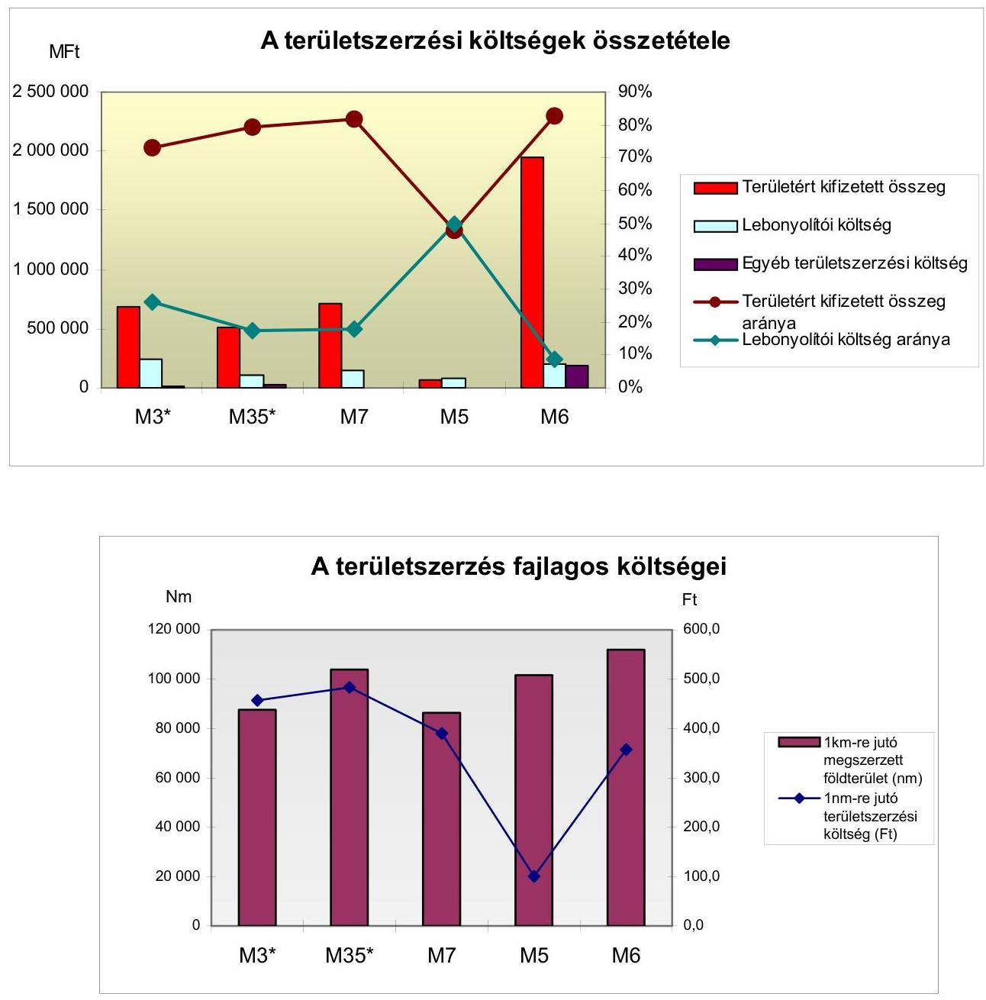
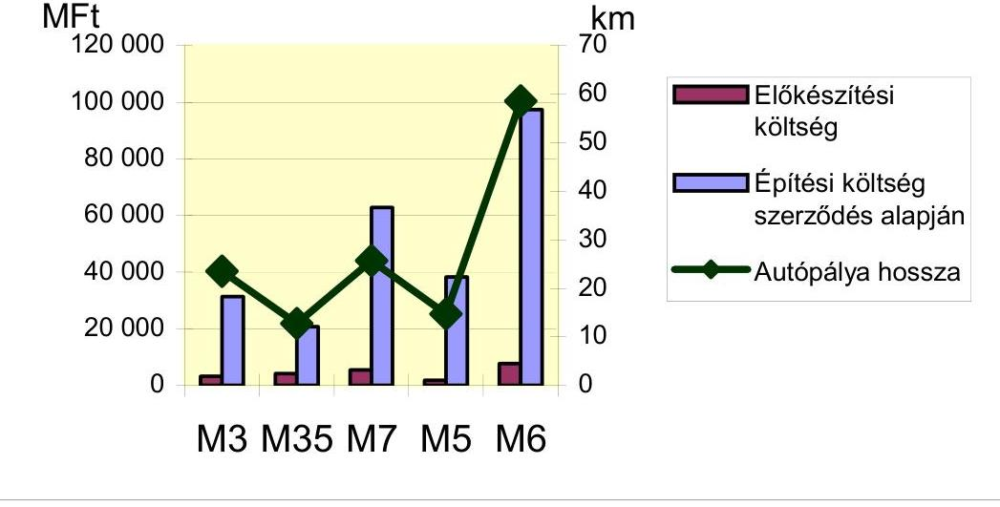
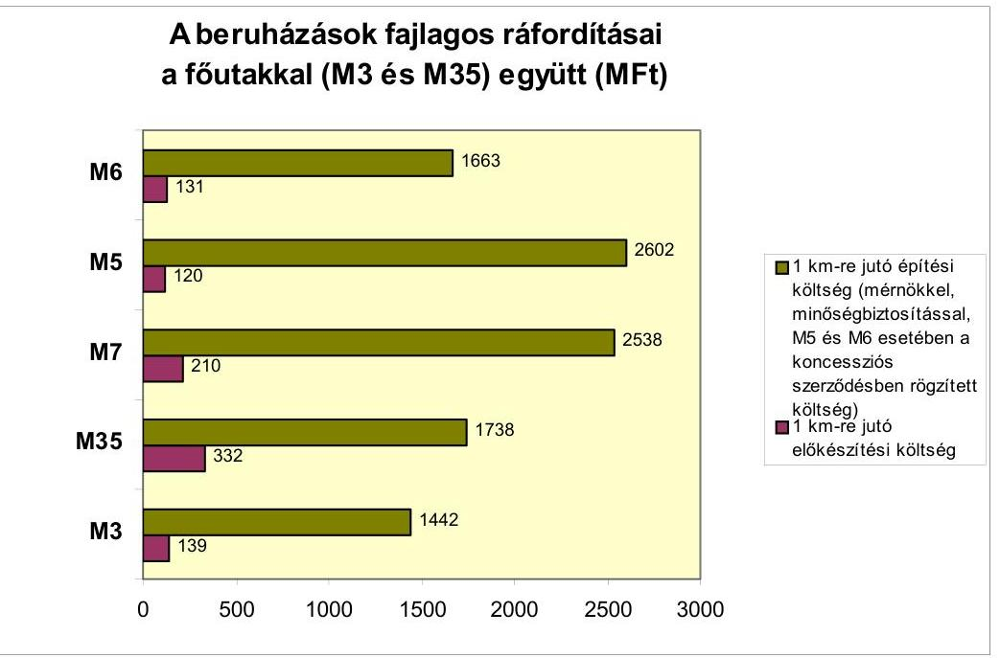
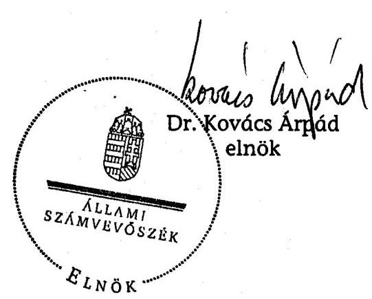
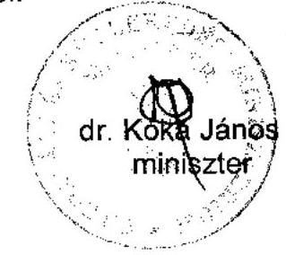

# ÁLLAMI   SZÁMVEVŐSZÉK 

## JELENTÉS

a 2006-ban befejeződő autópálya beruházások ellenőrzéséről

---

2. Államháztartás Központi Szintjét Ellenőrző Igazgatóság
2.1. Teljesítmény Ellenőrzési Főcsoport
Iktatószám: V-14-47/2006-2007.
Témaszám: 824
Vizsgálat-azonosító szám: V0309
Az ellenőrzést felügyelte:
Bihary Zsigmond
főigazgató
Az ellenőrzés végrehajtásáért felelős:
Kemény Emil
főcsoportfőnök
Az ellenőrzést vezette:
Makkai Mária
főcsoportfőnök-helyettes
Az ellenőrzést végezték:

| Bank Lajos tanácsadó | Bartolák Márta számvevő | Bátory Béláné tanácsadó |
| :--: | :--: | :--: |
| Biró Endre számvevő tanácsos | Gaálné Izsó Éva számvevő tanácsos | Dr. Kemenczei Rezső számvevő tanácsos |
| Komáromy Attila külső szakértő | Kun Eszter számvevő tanácsos | Lucza Anikó számvevő |
| Massányi Tibor számvevő | Nagy Ákos számvevő | Dr. Novák Zsuzsanna Csilla számvevő tanácsos |
| Szepes Béla Bálint számvevő | Tóthné Kiss Katalin tanácsadó |  |
| A témához kapcsolódó eddig készített számvevőszéki jelentések: címe |  | sorszáma |
| Jelentés a koncesszióba adott állami tevékenységek vizsgálatáról |  | 0114 |
| Jelentés az M3 autópálya beruházás pénzügyi folyamatának ellenőrzéséről |  | 0218 |
| Jelentés az M7 autópálya felújítás pénzügyi folyamatának ellenőrzéséről |  | 0342 |
| Jelentés a szekszárdi Duna-híd beruházás ellenőrzéséről |  | 0428 |
| Jelentés a Magyar Köztársaság 2004. évi költségvetése végrehajtásának ellenőrzéséről |  | 0540 |
| Jelentés a Magyar Köztársaság 2005. évi költségvetése végrehajtásának ellenőrzéséről |  | 0628 |
| Jelentés az autópálya beruházások finanszírozási megoldásainak összehasonlító ellenőrzéséről |  | 0645 |

---

# TARTALOMJEGYZÉK 

BEVEZETÉS ..... 7
I. ÖSSZEGZŐ MEGÁLLAPÍTÁSOK, KÖVETKEZTETÉSEK, JAVASLATOK ..... 12
II. RÉSZLETES MEGÁLLAPÍTÁSOK ..... 23

1. M3-as autópálya Nyíregyháza déli elkerülő és a 4. sz. főút keleti elkerülő útszakasz ..... 23
1.1. A beruházás előkészítése ..... 23
1.2. A kivitelező kiválasztása, a szerződéses feltételek ..... 26
1.3. A beruházás megvalósítása ..... 28
2. Az M35 autópálya Debrecent elkerülő szakasza és a várost elkerülő főút ..... 31
2.1. A beruházás előkészítése ..... 31
2.2. A kivitelező kiválasztása, a szerződéses feltételek ..... 33
2.3. A beruházás megvalósítása ..... 34
3. M7 autópálya Ordacsehi-Balatonkeresztúr közötti szakasz ..... 35
3.1. A beruházás előkészítése ..... 35
3.2. A kivitelező kiválasztása, szerződéses feltételek ..... 37
3.3. A beruházás megvalósítása ..... 38
4. Az M5 autópálya 3. fázisa ..... 43
4.1. A beruházás előkészítése ..... 43
4.2. A beruházás megvalósítása ..... 46
4.3. A beruházási költségek, a beruházás finanszírozása, pénzügyi elszámolás és nyilvántartás ..... 50
5. Az M6 autópálya Érdi tető-dunaújváros közötti szakasza ..... 53
5.1. A beruházás előkészítése ..... 53
5.2. A koncessziós eljárás lebonyolítása ..... 55
5.3. A beruházás megvalósítása ..... 56
6. Az autópálya beruházások minőségének alakulása ..... 63
6.1. A minőségi követelmények teljesítésével összefüggő előírások ..... 63
6.2. A minőségi követelmények teljesítésének dokumentumai ..... 64
6.3. A minőségi követelmények teljesítésének kockázati tényezői ..... 68
6.3.1. Az M3 beruházás minőségi kockázati tényezői ..... 68
6.3.2. Az M35 beruházás minőségi kockázati tényezői ..... 69
6.3.3. Az M6 beruházás minőségi kockázati tényezői ..... 71
6.3.4. Az M7 beruházás minőségi kockázati tényezői ..... 71

---

6.4. A műszaki átadás-átvételi eljárás során a minősítési követelmények teljesítése ..... 73
7. A beruházások finanszírozása, pénzügyi elszámolása és nyilvántartása ..... 75
MELLÉKLETEK

1. sz. a Gazdasági és Közlekedési Minisztérium észrevétele
2. sz. A közbeszerzési eljárásokkal összefüggő költségek
3. sz. Az ellenőrzött beruházások ráfordításai a 2006. augusztus 31-i állapot szerint
4. sz. Kimutatás az Aptv. alapján 2004-2006-ban átadásra tervezett gyorsfor- galmi utakról
5. sz. Kimutatás az ellenőrzött gyorsforgalmi útszakaszokra adott építési áraján- latok összehasonlításáról
6. sz. Kimutatás az M3, az M35 és az M7 ellenőrzött beruházások 2002-2006. szeptember 30. közötti finanszírozásáról

---

# RÖVIDÍTÉSEK JEGYZÉKE 

| Aptv. | a Magyar Köztársaság gyorsforgalmi közúthálózatának   közérdekűségéről és fejlesztéséről szóló 2003. évi CXXVIII.   törvény |
| :--: | :--: |
| ÁAK Zrt. | Állami Autópálya Kezelő Zrt. |
| Áht. | az 1992. évi XXXVIII. törvény az államháztartásról |
| ÁKMI | Állami Közúti Műszaki Információs Kht. |
| ÁSZ | Állami Számvevőszék |
| CONSTREAL Kft. | CONSTREAL Mérnöki Iroda Kft. |
| ELTE RTI | Eötvös Lóránd Tudományegyetem Régészettudományi   Intézete |
| EUROUT | EUROUT Mérnöki, Tanácsadó, Szervező és Kereskedelmi   Kft. |
| FKF | Felső Tisza-vidéki Környezetvédelmi Felügyelőség |
| GKM | Gazdasági és Közlekedési Minisztérium |
| KBDB | Közbeszerzési Döntőbizottság |
| Kbt. | az 1995. évi XL., illetve a 2003. évi CXXIX. törvény a köz-   beszerzésekről |
| KKF | Központi Közlekedési Felügyelet |
| KVI | Kincstári Vagyoni Igazgatóság |
| MMT | Mintavételi és Minősítési Terv |
| ME | Müszaki Elöírások |
| MOTA | MOTA-Engentharia Construacao SA. |
| MSZF | Müszaki Szállítási Feltételek |
| NA Zrt. | Nemzeti Autópálya Zrt. |
| NFA | Nemzeti Földalap Kezelő Szervezet |
| PPP | Public Private Partnership |
| Ptk. | 1959. évi IV. törvény a Polgári Törvénykönyvről |
| SZMSZ | Szervezeti és Múködési Szabályzat |
| SZSZBM Múzeumok | Szabolcs-Szatmár-Bereg Megyei Múzeumok Igazgatósága |
| Sztv. | 2000. évi C. törvény a számvitelről |
| TU | Technológiai Utasítások |
| UKIG | Útgazdálkodási és Koordinációs Igazgatóság |
| UVATERV Rt. | Út ésVasúttervező Részvénytársaság |
| ZIB Kft. | ZIB Consulting Tanácsadó és Szolgáltató Kft. |

---

.

---

# ÉRTELMEZŐ SZÓTÁR 

| aktiválás | A beszerzések, beruházások során elszámolt költségek és ráfordítások eszközként való állományba vétele a számviteli elszámolásban, amely rendszerint szorosan kapcsolódik az eszközök rendeltetésszerú használatba vételéhez. |
| :--: | :--: |
| átadási érték | Az NA Zrt. által építtetett autópálya-szakaszok Kincstári Vagyoni Igazgatóság részére való átadásakor a beruházás értékeként meghatározott összeg. |
| ideiglenes forgalomba helyezés | A Közlekedési Hatóság (Megyei Közlekedési Felügyelet, illetve Központi Közlekedési Felügyelet) határozatban engedélyezi az útszakasz forgalom általi igénybe vételét a 15/2000. (XI. 16.) KöViM rendeletben leírtak szerint. |
| kiviteli terv | A beruházás kivitelezéséhez szükséges valamennyi részletet tartalmazó dokumentációk (útépítési-, hídépítési-, vízépítési-, forgalomtechnikai-, környezetvédelmi-, közmútervek, stb.) összessége. |
| koncesszió | A koncesszióról szóló 1991. évi XVI. törvény szerint a kizárólagos állami, önkormányzati vagy önkormányzati társulási tulajdon hatékony múködtetésének, valamint a kizárólagosan az állam vagy az önkormányzat hatáskörébe utalt tevékenységek gyakorlásának koncessziós szerződés alapján való átengedése. |
| koncessziós díj | A koncesszióba adott tevékenység gyakorlásának átengedéséért a koncessziós által az államnak vagy önkormányzatnak fizetett díj, amelynek megfizetési módjáról és mértékéről a koncessziós szerződés rendelkezik. |
| közbeszerzési eljárás | A közpénzek törvényes és ésszerú felhasználását szolgáló olyan eljárás, amelynek során megadott tárgyú és értékű beszerzéseket valósítanak meg. |
| környezeti hatástanulmány | Az építési beruházás-előkészítés keretében a környezetvédelmi szempontok figyelembevételével, a Beruházó által készíttetett tanulmány. Az Előzetes Környezeti Hatástanulmány a nyomvonal-változatokat tartalmazza és azokat vizsgálja. A Részletes Környezeti Hatástanulmányt a Környezetvédelmi Hatóság által kijelölt nyomvonalakra kell készíteni. |
| kollektorút | Gyorsforgalmi úton két csomópont közé párhuzamosan a fópályával - gyújtő-elosztó szereppel - létesítendő út, amennyiben a szabványos csomóponti távolság nem biztosított. |
| közmúkiváltás | Közmú (víz, gáz, elektromos vezeték, telefon) áthelyezése másik nyomvonalra a vízszintes vagy magassági vonalvezetés megváltoztatásával. |
| Mérnök | A beruházó társaság által az építési munkák felügyeletére kiválasztott és igénybe vett független szervezet. |
| nettó jelenérték (NPV) | A jövőbeli pénzáramok meghatározott diszkontrátával számított jelenbeli értékének és a jelenbeli pénznek az |

---

organizáció pótmunka

PPP (Public Private
Partnership)

Program utak

Public Sector
Comparator (PSC) elemzés
rendelkezésre állási díj
talajkonszolidáció
többletmunka
forgalomba helyezés
összege. Egy beruházás nettó jelenértéke a beruházásból származó jövőbeli hozamok diszkontált értékének és a beruházásra fordított kiadások különbözete.
Az építési folyamat térbeli és időbeli szervezése.
Műszakilag szükséges feladatok, amelyeket az ajánlatadás időszakában kiadott tervek nem tartalmaznak.
Az állami és a magánszektor közötti fejlesztési, illetve szolgáltatási együttmúködés. (2005. évi CLIII. törvény 10. §. (4) bekezdés a Magyar Köztársaság 20006. évi költségvetéséről.)
A Program utakról szóló 317/2005. (XII. 25.) Korm. rendeletben meghatározott gyorsforgalmi utak összessége, amelyek beruházását magántőke bevonásával, piaci forrásból finanszíroznak.
A PPP beruházások költséghatékonysági elemzésének lehetséges eszköze. A PSC a projekt nettó jelenértékét adja meg hagyományos állami beruházás és üzemeltetés esetén, ezt az értéket kell összevetni a PPP konstrukció nettó jelenértékével.
A PPP módszerrel végrehajtott beruházás esetében az állam által a beruházónak a szerződésben meghatározott szolgáltatás nyújtásáért fizetett összegek.
A töltés szintjének süllyedését eredményező, a töltések önsúlyából származó tömörödési folyamat, amely a súlylyedés megállásáig tart.
A tervekben szereplő feladat, amelynek nagysága a ténylegesen elvégzett és pályázatban szereplő mennyiség különbsége.
A Közlekedési Hatóság (Megyei Közlekedési Felügyelet, illetve Központi Közlekedési Felügyelet) határozatban engedélyezi az útszakasz végleges forgalom általi igénybe vételét a 15/2000. (XI. 16.) KöViM rendeletben leírtak szerint.

---

# JELENTÉS 

## a 2006-ban befejeződő autópálya beruházások ellenőrzéséről

## BEVEZETÉS

A közúti közlekedésről szóló 1988. évi I. törvény állami feladatként határozza meg a közúti közlekedés tervezését, szabályozását, a közúthálózat fejlesztését, fenntartását és üzemeltetését. A gyorsforgalmi úthálózat (autópályák és autóutak) építése a 2000-es években kiemelt feladattá vált, amelynek célja a térségi gazdasági fejlődés elősegítése és a hiányzó nemzetközi gyorsforgalmi kapcsolatok létrehozása volt. A gyorsforgalmi úthálózatot érintő fejlesztéseket 2003. végéig a Kormány határozatokban szabályozta. 2004. január 1-jétől a Magyar Köztársaság gyorsforgalmi úthálózatának közérdekűségéről és fejlesztéséről szóló 2003. évi CXXVIII. törvény (a továbbiakban: Aptv.) határozza meg a gyorsforgalmi utak megvalósításának feladatait. Az Aptv. tartalmazza a 2004-2007 közötti időszakban tervezett valamennyi - magántőke bevonásával, koncesszió keretében és a Nemzeti Autópálya Zrt. (továbbiakban: NA Zrt.) beruházásában megvalósuló - gyorsforgalmi útfejlesztést és megjelöli az egyes útszakaszok átadásának évét is. (A Fővárosi Bíróság mint Cégbíróság 2007. február 19. napjával jegyezte be az NA Zrt. új elnevezését, ami Nemzeti Infrastruktúra Fejlesztő Zrt.)

Az Aptv. szerint a 2006. végéig átadásra tervezett gyorsforgalmi utak hossza 313 km , amelyből 282 km az autópálya, 11 km az autóút és 20 km a főút. ${ }^{1}$

Az Aptv.-ben 2006. végéig átadásra megjelölt 17 útszakaszból 10 szakaszt helyeztek ideiglenesen forgalomba, amelyek hossza 212 km , ami az átadni tervezettnek $68 \%$-a volt. Ebből a tervezetthez képest korábban, 2005-ben adták át az M5 autópálya Kiskunfélegyháza-Szeged közötti 45 km hosszú és az M70 autópálya Tornyiszentmiklós-országhatár 1 km hosszú szakaszát. (Ez utóbbi autóútnak a műszaki átadás-átvételi eljárása megtörtént 2005-ben, de nem helyezték forgalomba, mivel a szlovén oldalon a csatlakozó útszakasz még nem készült el.) 2006-ban 146 km autópályát (M3, M35, M5, M6, M7) és 20 km elkerülő utat (főútként) helyeztek ideiglenesen vagy véglegesen forgalomba.

[^0]
[^0]:    ${ }^{1}$ Az Aptv. szerint a 2007. végéig átadásra tervezett gyorsforgalmi utak hossza 247 km , amelyből 130 km az autópálya és 117 km az autóút. Az Állami Számvevőszék 2007. évi ellenőrzési terve tartalmazza a 2007-ben befejeződő autópálya beruházások ellenőrzését, amelynek előkészítése 2007 júniusában kezdődik.

---

5 szakasz (összesen 90 km hosszon) ideiglenes forgalomba helyezése 2007-ben várható. A finanszírozási források tisztázatlansága miatt 2 autópálya szakasznak ( 11 km ) a kivitelezése, vállalkozásba adása még nem kezdődött el.

Az átadott gyorsforgalmi utak közül az M3, az M35 valamint az M7 szakaszai, mint Program-utak építését a Kormány magántőke bevonásával, piaci úton kívánta finanszírozni, amely azonban nem valósult meg. A beruházásokat a központi költségvetésből, valamint az NA Zrt. és az ÁAK Zrt. által állami kezességvállalás mellett felvett hitelekből finanszírozták. Az M5 és az M6 autópályák Aptv. szerint 2006. végi átadásra kijelölt szakaszai a korábban meghozott kormányhatározatok alapján, az Országgyúlés jóváhagyásával megkötött koncessziós szerződés keretében, magántőke bevonásával valósultak meg. Az M6 érintett szakasza az első köz- és magánszféra partnerségi (PPP) konstrukció keretében megvalósult autópálya beruházás. A koncesszió keretében végrehajtott beruházások forgalomba helyezését követően az állam a koncessziós időszak alatt rendelkezésre állási díjat fizet a koncessziós társaság részére, ami mind az építési, mind az üzemeltetési és karbantartási költségeket fedezi.

Az Aptv. a gyorsforgalmi utak előkészítéséhez és építéséhez szükséges pénzeszközökről globálisan, a különböző finanszírozási forrásokról (központi költségvetés, EU támogatás, magántőke) együttesen rendelkezett, 2005. évben 327 milliárd Ft, 2006. évben 347 milliárd Ft és 2007. évben 415 milliárd Ft összegben. Az NA Zrt. részére évenként rendelkezésre álló források az adott időszakban aktuális autópálya építési és előkészítési feladatok finanszírozását szolgálják. Az NA Zrt. az általa építtetett és elkészült autópálya szakaszok átadási értékének meghatározásakor 2005-ig utólag mutatta ki az adott autópálya szakasz ráfordításainak összetételét.

A beruházói feladatokat a nem koncessziós beruházások esetében az NA Zrt. látta el. 2005. március 29-től a magántőke bevonásával finanszírozni tervezett, külön jogszabályban meghatározott, ún. Program utak beruházói feladatait az Állami Autópálya Kezelő Zrt. (továbbiakban: ÁAK Zrt.) látja el, az építtető ezekben az esetekben is az NA Zrt. A koncessziós beruházásoknál a beruházó a koncessziós társaság volt. A Program utak kivitelezőjét az NA Zrt. a közbeszerzésekről szóló 1995. évi XL., illetve 2003. évi CXXIX. törvény (továbbiakban: Kbt.) alapján lefolytatott közbeszerzési eljárás útján választotta ki. A koncesszió keretében megvalósult beruházásoknál a koncessziós társaság kötötte meg a kivitelezőkkel a szerződést, amelyeket a Gazdasági és Közlekedési Minisztérium (továbbiakban: GKM) jóváhagyott.

Az Állami Számvevőszék (továbbiakban: ÁSZ) a stratégiai célkitűzéseinek megfelelően megkülönböztetett figyelmet fordít a közlekedési infrastruktúra fejlesztésének, fenntartásának és azok finanszírozásának ellenőrzésére. Ezzel összhangban az ÁSZ 2001-ben a koncesszióba adott állami tevékenységeket, 2002ben az M3 autópálya-beruházást, 2003-ban az M7 autópálya felújításának pénzügyi folyamatait, 2004-ben a szekszárdi Duna híd beruházást, a 2004. évi költségvetés végrehajtásának ellenőrzése keretében az M5 autópálya koncessziós szerződését, a 2005. évi költségvetés végrehajtásának ellenőrzése keretében a rendelkezésre állási dí előirányzat felhasználását, 2006-ban az állami utak fenntartását és az autópálya beruházások finanszírozási megoldásait ellenőrizte. A korábban ellenőrzött M3 és M7 autópálya, valamint a szekszárdi Duna

---

híd beruházás nem közbeszerzési eljárás keretében valósult meg, a beruházó NA Zrt. tulajdonosa a Magyar Fejlesztési Bank Részvénytársaság volt, aminek feladatai közé tartozott a fejlesztési források biztosítása. 2003 januárjától a Magyar Állam az NA Zrt. és az ÁAK Zrt. közvetlen tulajdonosa, az állam tulajdonosi jogainak gyakorlója a gazdasági és közlekedési miniszter, a beruházások kivitelezőjét, és a beruházások során közreműködő összes vállalkozót közbeszerzési eljárás keretében választják ki.

A jelenlegi ellenőrzés összegző megállapításaihoz, következtetéseihez felhasználtuk a kapcsolódó ÁSZ jelentésekben foglaltakat is. ${ }^{2}$

A jelenlegi ellenőrzés célja annak értékelése volt, hogy:

- a beruházási szerződések előkészítése, a szerződéses feltételek kialakítása összhangban volt-e a jogszabályokban és kormányhatározatokban előírtakkal, valamint a gazdaságossági célkitűzésekkel;

[^0]
[^0]:    ${ }^{2}$ Az ÁSZ a 0428/1 sz., a svájci-magyar párhuzamos ellenőrzésről készített jelentésében, a szekszárdi Duna-híd beruházással kapcsolatban megállapította, hogy „A rövid távú takarékossági szempontok prioritást kaptak a forgalmi adatok elörebecslésével és a hatástanulmányok elörejelzéseivel szemben. További 10 km autóút szakasz megépitésével lettek volna ugyanis elérhetők a gazdasági fejlődésre, versenyképességre, foglalkoztatottságra gyakorolt kedvező hatások. Ezt támasztották alá az önkormányzatoknál végzett kérdőives felmérés eredményei is."
    Az ÁSZ a 0628 sz., a Magyar Köztársaság 2005. évi költségvetése végrehajtásának ellenőrzéséről szóló jelentésében megállapította, hogy „A 2005. évtől az állam 19 megkezdett gyorsforgalmi útszakasz épitésének befejezését és késöbb üzemeltetését magántőke bevonásával kívánta megvalósítani. Ennek elsődlegesen az állami forráshiány az oka. Ezért a már épülő 19 útszakasz tervezésére, előkészítésére, mérnöki lebonyolítására és építésére a 2005. évig felhasznált állami forrásokat az NA Zrt.-vel legkésőbb 2005. június 30-ig visszafizetteti. A teljesités két - államilag garantált, kormányhatározatokkal alátámasztott - hitel (125,0 milliárd Ft és 52,8 milliárd Ft összegü) felvételével és az adott számlára utalásával megtörtént.
    Az NA Zrt. összességében a 2005. évben 335,8 milliárd Ft hitelt vett fel, amelyből 177,8 milliárd Ft-ot a 19 útszakasz állami finanszírozásának a visszatérítésére, a fennmaradó 158,0 milliárd Ft-ot pedig a megkezdett épitések továbbfinanszírozására használt fel. Ennek oka, hogy a társaság visszafizetési kötelezettsége teljesítésének időszakában a magántőke még nem, az Aptv. által korábban biztosított költségvetési támogatás már nem állt rendelkezésre. A munkálatok továbbfolytatását a Kormány az NA Zrt. számára elöírt hitelből fedezte."
    Az ÁSZ a 0550 sz., a Magyar Köztársaság 2006. évi költségvetési javaslatáról készített véleményében megállapította, hogy „Az államháztartási hiány a költségvetési politika központi kérdésévé emelkedett, nemcsak abból a szempontból, hogy az euro bevezetéséhez szükséges maastrichti kritériumot - a 2004 decemberében aktualizált Konvergencia programban vállalt - 2008. évi határidőre eléri-e Magyarország, hanem abból a szempontból is, hogy a 2006. évi költségvetés készitésének időszakában derült fény arra, hogy az államháztartási hiány kimutatásában - az Eurostat által kifogásolt, az autópályákhoz kapcsolódó államháztartási bevételek és kiadások elszámolását érintő - módszerbeli eltérések vannak. A módszertani kérdések a tervező munka alapját képező 2005. évi várható és a 2006. évre tervezett GDP arányos államháztartási hiány mutató alakulását érintően kockázatot jelentenek és a további éveket is érinthetik."

---

- a vizsgált autópálya beruházások megvalósítása során a határidő, minőség és költségcélok teljesültek-e a jogszabályokkal, a szerződésekben foglaltakkal összhangban;
- a teljesítések elszámolásának rendszere és módja, a szerződéseknek megfelelő teljesítések nyomon követése, a monitoring, kontrolling és az ellenőrzési rendszerek múködtetése biztosította-e a kifizetések és a tényleges teljesítések összhangját;
- a beruházások megvalósításában részt vevő szervezetek és intézmények együttmúködésének szabályozottsága megfelelt-e a jogszabályokban meghatározott követelményeknek és hatékonysági céloknak.

Az ellenőrzés a 2006. január l. és 2006. október vége között ideiglenesen és véglegesen forgalomba helyezett gyorsforgalmi útszakaszokra terjedt ki, amelyek meghatározásánál az Aptv. szerint 2006. végéig átadásra kerülő útszakaszokat, a Program utakról szóló 317/2005. (XII. 25.) Korm. rendeletben foglaltakat és a beruházások tényleges készültségi állapotát vettük figyelembe. Az ellenőrzött öt beruházás az Aptv.-ben szereplő 7 szakasznak felel meg. (Az Aptv.-ben szereplő Görbeháza-Debrecen közötti autópálya szakaszt 2006. december 15-én adták át a forgalomnak.)

Az ellenőrzött beruházások a következők voltak:
a Program utak közül:

- M3 autópálya Nyíregyháza déli elkerülő és a 4. sz. főút keleti elkerülő szakaszai, beleértve a 4. sz. fóút korrekcióját, négynyomúsítását ( $8,1 \mathrm{~km}$ autópálya és $15,4 \mathrm{~km}$ fóút);
- M35 autópálya Debrecen elkerülő szakasza és a Debrecen észak-nyugati elkerülő főút ( $8,6 \mathrm{~km}$ autópálya és $4,1 \mathrm{~km}$ főút);
- M7 autópálya Ordacsehi - Balatonkeresztúr közötti szakasza ( $25,7 \mathrm{~km}$ );
a koncesszióban végrehajtott beruházások esetében:
- M5 autópálya Szeged - Észak-Röszke közötti szakasza (14,7 km);
- M6 autópálya Érdi tető - Dunaújváros közötti szakasza (58,6 km).

Az ellenőrzés a GKM, az NA Zrt., az ÁAK Zrt. és az Útgazdálkodási és Koordinációs Igazgatóság (a továbbiakban: UKIG) vizsgálatot érintő tevékenységére irányult. Az M5 és M6 autópályák esetében azokat a területeket, amelyekre az ÁSZ korábbi ellenőrzése kiterjedt, a jelen ellenőrzés során nem vizsgáltuk. ${ }^{3}$

Az ellenőrzés jogalapját az Állami Számvevőszékről szóló 1989. évi XXXVIII. törvény 2. § (1) bekezdése képezte.

[^0]
[^0]:    ${ }^{3}$ Az M5 autópálya koncessziós szerződését a 2004. évi költségvetés végrehajtásának, az M6 autópálya finanszírozását az ÁSZ az autópálya beruházások finanszírozási megoldásainak összehasonlító ellenőrzése keretében vizsgálta.

---

A jelentést egyeztetésre megküldtük a gazdasági és közlekedési miniszternek. Levele másolatát az 1. sz. melléklet tartalmazza.

---

# I. ÖSSZEGZŐ MEGÁLLAPÍTÁSOK, KÖVETKEZTETÉSEK, JAVASLATOK 

A 2006-ban átadott gyorsforgalmi utak - amelyek beruházási folyamatát vizsgálta az ÁSZ - megvalósítása (előkészítés és kivitelezés) 2006. december 31-ig a Program utaknál ${ }^{4} 134$ milliárd Ft-ba került. A koncesszióban megvalósult M5 és M6 autópálya szakaszok esetében 2006. végéig az előkészítésre kifizetett öszszeg 9,4 milliárd Ft volt, az autópálya szakaszok építési költsége a koncessziós szerződések szerint 136 milliárd Ft, amelyet a Magyar Állam a rendelkezésre állási díj részeként a koncessziós időszak alatt (M5-nél 2030-ig, M6-nál 2024-ig) fizet meg a koncessziós társaság részére. Az ellenőrzött 117,7 km autópálya és 19,5 km főút fajlagos költsége a legmagasabb az M7 autópálya szakasznál ( 2748 millió Ft/km), a legalacsonyabb az M3 autópálya szakasznál ( 1581 millió $\mathrm{Ft} / \mathrm{km}$ ) volt. A beruházások átfutási ideje - az előzetes környezeti hatástanulmány megrendelésétől a forgalomba helyezésig számítva - 5-7 év volt.

Az NA Zrt. által megvalósított beruházások esetében a forgalomba helyezés nem jelenti a beruházás teljes - műszaki és pénzügyi - lezárását. Az ideiglenes forgalomba helyezés után történik pl. a garanciális munkák, a műszaki át-adás-átvétel keretében felmerült pótmunkák, a környezetvédelmi, vízügyi, közlekedési hatóságok és önkormányzatok által előírt/kért munkák elvégzése. A beruházás végleges lezárásához szükséges a telekkönyvi rendezés, az esetleges peres eljárások lezárása, valamint az NA Zrt. által az Állam készfizető kezességvállalásával felvett hitelek átvállalása. Mindez hosszú folyamat, különösen a telekkönyvi rendezés, amely több évet is jelenthet, a hitelek átvállalása pedig a költségvetés mindenkori hiánypozíciójának függvénye.

A beruházások eredményeképpen javulnak az általuk összekötött térségek közúti, gazdasági kapcsolatai és felzárkóztatási esélyei, a 4-es számú fơút átmenő forgalma teljes egészében elkerüli Nyíregyháza belterületét, Debrecent közvetlen autópálya köti össze a fővárossal, a 7-es számú főút átmenő forgalma az érintett szakaszon a felére csökkent, tehermentesült az 5., a 6. és az 51. számú főút és ezáltal javult az ott élők életminősége.

Az állami beruházásokra vonatkozó, normatívákat tartalmazó, egységesen alkalmazandó jogi szabályozás hiányában az állami beruházások kormányzati szinten nem koordináltak, a megvalósításuk a piaci körülmények hatásai alapján esetleges, szervezetfüggő, elsősorban finanszírozási és nem rendszerszemléletű. ${ }^{5}$ A 2003-ig kormányhatározatokban rögzített gyorsforgalmi úthálózat fej-

[^0]
[^0]:    ${ }^{4}$ Magántőke bevonásával finanszírozni tervezett, külön jogszabályban meghatározott gyorsfogalmi utak.
    ${ }^{5}$ Az ÁSZ számos alkalommal ellenőrzött állami beruházásokat - pl. Művészetek Palotája, új Budapest Sportcsarnok, büntetésvégrehajtási intézmények beruházása - amelyeknél az állami beruházások jogi szabályozásának valamilyen hiányosságát tárta fel. Az autópálya beruházások az állami beruházásoknak meghatározó hányadát jelentik, amelyek korábbi és jelenlegi ellenőrzése megerősítette a más területeken szerzett,

---

lesztési koncepció nem volt időtálló, a változások során eltérő összetételben és prioritással határozták meg a fejlesztéseket (autópályává fejleszthető autóút, majd autópálya építés, az egyes beruházások eltérő szakaszolása, a beruházások kezdési és befejezési határidejének módosulása). Az Aptv. 2004. január 1-jei hatályba lépése óta 2006. végéig 8 alkalommal módosult. ${ }^{6}$ Mindez szerepet játszott abban, hogy az önmagában nem, de a korábbiakhoz képest nagy volumenű gyorsforgalmi útfejlesztésekből a 2006 végéig átadni tervezett útszakaszok $68 \%$-át helyezték ideiglenesen forgalomba.

Az állami beruházások szabályozási hiányossága mellett, az autópálya beruházásokat érintő meglévő jogszabályi és szakmai előírások a beruházások megvalósításának alapvető szabályozási kereteit biztosították. A hatóságok és az önkormányzatok - az építési engedélyhez szükséges hozzájárulásuknak feltételéül szabott - igényeit (pl. nyomvonal meghatározás, csomópontok kialakítása, csatlakozó utak kiépítése, környezetvédelem) jogszabályok nem korlátozzák.

A gyorsforgalmi utak előkészítésével kapcsolatos feladatokat (környezeti hatástanulmányok elkészíttetése, területszerzés, régészeti feltárások, terveztetés) az NA Zrt. végezte, illetve végeztette minden ellenőrzött beruházásnál, amelyek időigénye - az előzetes környezeti hatástanulmány megrendelésétől számítva -három-négy év volt.

Az autópályák nyomvonalát minden esetben előzetes és részletes környezeti hatástanulmány/hatásvizsgálat alapján jelölték ki. A nyomvonal kiválasztása során figyelembe vették az illetékes hatóságok és az érintett önkormányzatok elvárásait, igényeit.

A területszerzés kizárólagos állami feladat, amelynek lebonyolítása érdekében az NA Zrt. a Program utak mindegyikére két társaságnak és egy ügyvédi irodának párhuzamosan adott megbízást, ezért a területszerzési feladatok folyamata szétaprózott és nehezen átlátható volt, a résztvevők tevékenysége egymástól függött és megnövelte a lebonyolítás költségét, amelyet a lebonyolítási díjak területszerzési kiadásokhoz viszonyított 17,3-26,3\% közötti aránya mutat. A területszerzésre megkötött szerződések a megbízott hibájából, vagy neki felróható okból felmerült késedelmes teljesítés esetére nem kötöttek ki kötbért, a befejezési határidő betartásának kockázata megnőtt. ${ }^{7}$
a szabályozási hiányosságra vonatkozó tapasztalatainkat. Ezért szerepeltetjük a jelentésben az autópálya beruházásokat is érintő, de azokon túlmutató megállapítást, és ez indokolja az ezzel kapcsolatos, állami beruházásokra vonatkozó javaslatot.
${ }^{6}$ Az Állami Számvevőszék a 0645 számú, az autópálya beruházások finanszírozási megoldásainak összehasonlító ellenőrzéséről készített jelentésében megállapította, hogy „Az Aptv., a hatályba lépésétől eltelt két és fél év alatt, 8 alkalommal módosult, amelyek érintették a finanszírozást, az autópálya építésben résztvevő szervezetek feladatait. A törvénymódosítások ilyen gyakorisága nem segíti az autópálya fejlesztések törvényi szabályozásának kiszámíthatóságát és növeli a feladatok végrehajtásának kockázatát".
${ }^{7}$ Az NA Zrt. 2007. március 14-én kelt levele a tényszerű megállapításhoz kapcsolódóan a következő kiegészítést tette: „A megbízottak munkájától függetlenül akadályozzák a területszerzési tevékenység ütemes végrehajtását a földhivataloknál és a közigazgatási hivatalok-

---

A beruházásokhoz szükséges magán- és állami tulajdonú földterületeket adásvétellel vagy kisajátítással szerezték meg. Ez utóbbi eljárás megnövelte a területszerzés időigényét, mivel annak az átfutási ideje hosszabb a vásárlásnál. Az állami földterületek megszerzése növelte a beruházási ráfordításokat azáltal, hogy a bonyolító NA Zrt. felértékelés után, csak piaci értéken tudta igénybe venni a vagyonkezelésre kijelölt állami szervezetektől. Az állami földterület-
nál folyó késedelmes ügyintézés, egyes ingatlantulajdonosok elérhetőségével kapcsolatos nehézségek (ismeretlen helyen, vagy külföldön tartózkodik, elhunyt, de a hagyatéki eljárás még nem zárult le, stb.). Tekintettel arra, hogy az Úgyvédi Iroda és lebonyolító tevékenysége jelentősen függ a Földhivataltól, valamint a Közigazgatási Hivataltól, ezért a szerződésükben a kifizetés a teljesitéshez van kötve, vagyis abban az esetben kapják meg tevékenységükért a szerzödéses dijat, ha az adott területszerzési szerzödést megkötötte, illetve ha a földhivatali átvezetés megtörtént".

---

szerzésre fordított pénzeszköz az állami tulajdonosi körön belül mozgott, de a hitelből történő finanszírozás miatt kamatfizetési kötelezettség is keletkezett. Az államháztartásról szóló törvény 2005. január 1-jétől lehetővé teszi, hogy a Kincstári Vagyoni Igazgatóság a vagyonkezelői jogot, illetve a kijelölést visszavonja, az Aptv. pedig biztosítja, hogy az NA Zrt. vagyonkezelő legyen, ugyanakkor az állami tulajdonban lévő földterületek vagyonkezelői joga térítésmentes átvételének eljárás rendje nincs kidolgozva.

A régészeti feltáró tevékenységet az Eötvös Lóránd Tudományegyetem, illetve a területileg illetékes múzeumok végezték az NA Zrt.-vel kötött szerződés alapján. A régészeti feltáró tevékenységre vonatkozó szerződéseknek része volt a késedelmes teljesítés miatti kötbér felszámítási lehetőség, amellyel az NA Zrt. területbiztosítási problémákra hivatkozva nem élt.

A területszerzés és a régészeti feltáró tevékenység mind az öt beruházásnál több hónappal, az M3-as autópálya szakasz esetében több, mint egy évvel áthúzódott a kivitelezési szakaszba, ami veszélyeztette a beruházás befejezését a tervezett határidőre. A kivitelezési szerződések szakaszos munkaterület átadást tartalmaztak, az ütemezéshez képest késedelmes területátadások miatt az NA Zrt.-nek nem volt módja az autópálya kivitelezés késedelmes teljesítése miatti kötbér érvényesítésére. (Az NA Zrt. tájékoztatása szerint megalapítása óta kötbért a kivitelezők felé nem számlázott ki.)

Az NA Zrt. tárgyalásos eljárás keretében választotta ki a beruházások engedélyezési tervének elkészítésével megbízott tervezőt (az M6-os autópályánál a Roden Kft.-ét, a többi beruházásnál az UVATERV Rt.-t). A tervezési szerződésekben az NA Zrt. biztosította a tervező szerzői jogainak védelmét és ezáltal behatárolta a kiviteli terv készítőjét is. Ennek következtében a kiviteli tervek készítőjének kiválasztására alkalmazott - hirdetmény közzététele nélküli tárgyalásos közbeszerzési eljárás versenyeztetés nélküli volt. Az NA Zrt. a tervezőknek nem adott megbízást a kiviteli tervekhez rendelt részletes költségbecslések készítésére.

A Program utaknál az NA Zrt. a kivitelezőket nyílt közbeszerzési eljárás keretében választotta ki, amelynek a lebonyolítása megfelelt az NA Zrt. versenyeztetési szabályzata előírásainak. Az NA Zrt, az ajánlati felhívásban - amely szerint műszakilag az a pályázó felelt meg a kiírásnak, aki az utóbbi 5 évben már épített 10 km 2x2 sávos újonnan átadott autópályát - behatárolta a lehetséges vállalkozók körét. Ebből és az Aptv. szerint 2004-2006-ban átadni tervezett gyorsforgalmi utak volumenéből az következett, hogy a megépítendő útszakaszok száma meghaladta a lehetséges és alkalmas kivitelezők számát a hazai piacon, ami az építési piac felosztásának irányába hatott és a potenciális kivitelezőknek az ajánlati áraik kialakításánál „versenynyomással" nem kellett számolniuk. (Az M35 beruházásnál olyan külföldi résztvevők is pályázhattak, akiknek volt magyarországi fióktelepe és rendelkeztek új építésű autópálya referenciával.)

Az NA Zrt. által kért műszaki feltételeknek és referenciáknak a 2003. végén és 2004. elején lebonyolított valamennyi közbeszerzés során hét ajánlattevő felelt meg, így a 10 autópálya szakasz kivitelezése közöttük oszlott meg. Az ellenőrzött három Program út esetében ugyanaz az 5 kivitelező pályázott konzorci-

---

umként, vagy önállóan. Mindez nem ösztönzött a kivitelezési árak csökkentésére, amit az is mutat, hogy az alkalmasnak minősített ajánlattevők árai között minimális (egy-egy beruházás esetében 1-1,7\%, 1,3-4,3\%, illetve 0,7-5,3\% közötti) volt az eltérés ${ }^{8}$.

A közbeszerzési eljárások során az NA Zrt. minden esetben jogi szakértőt alkalmazott, akinek a díjazása a Program utaknál a közbeszerzési költségek (30 millió Ft) 97,3\%-át tette ki. (A közbeszerzési eljárásokkal összefüggő költségeket az 2. sz. melléklet tartalmazza.)

A koncesszióban végrehajtott beruházásoknál az M5 autópálya ellenőrzött szakaszának megépítését az 1994-ben a Magyar Állam és az AKA Zrt. között létrejött koncessziós szerződés és módosítása 2006. december 31-ig biztosította a koncessziós társaság részére, ezért közbeszerzési eljárás ennél a beruházásnál nem volt. Az M6 autópálya esetében a GKM a Kbt. rendelkezéseivel összhangban folytatta le a közbeszerzési eljárást, amelynek során széles - külföldi és magyarországi autópálya építési gyakorlattal rendelkező és eddig azzal nem rendelkező - pályázói kör részére biztosította az ajánlattételt.

A Program utaknál a kivitelezői pályázat nyertese mindhárom beruházásnál a legkedvezőbb és egyben a legalacsonyabb árat ajánló pályázó volt, akivel az NA Zrt. a pályázati áron átalányáras szerződést kötött, amit a tulajdonosi joggyakorló jóváhagyott. A legalacsonyabb ár önmagában nem jelenti a leggazdaságosabbat. Az NA Zrt.-nél nem készültek - a tulajdonosi jogokat gyakorló sem követelte meg - olyan előzetes számítások, amelyekhez viszonyítva a kivitelezés gazdaságossága megítélhető lenne. Az NA Zrt. által kialakított egységár adatbázis - amely a korábban meghirdetett gyorsforgalmi útszakaszok ajánlati árát tartalmazta - nem adott viszonyítási alapot az ajánlatok értékeléséhez, az abban szereplő áraknak a képzése és elemei nem ismertek. A mélyépítésekre - köztük az autópálya építésekre - egységes árképzési elv országos szinten nem áll rendelkezésre.

Az NA Zrt. a kivitelezésre vonatkozó pályázati felhívását engedélyezési terv alapján hirdette meg. A pályázati szakaszban az M3 és az M35 beruházások esetében az átadott kiviteli mélységű tendertervek alapján határozták meg a feladatokat. ${ }^{9}$ A végleges kiviteli tervek a szerződéskötés pillanatában nem áll-

[^0]
[^0]:    ${ }^{8}$ A Gazdasági Versenyhivatal a Strabag Rt., a Betonút Rt., a Debmút Rt., az Egút Rt. és Hídépítő Rt. ellen versenykorlátozó megállapodás és összehangolt magatartás miatt a tisztességtelen piaci magatartás és a versenykorlátozás tilalmáról szóló 1996. évi LVII. törvény alapján versenyfelügyeleti eljárást indított. A Versenytanács 2004. július 23-án közzétett Vj-27/2003/16 sz. határozatában megállapította, hogy a társaságok versenykorlátozó módon felosztották egymás között az NA Zrt. által 2002-ben meghirdetett autópálya építési munkák elvégzését, a jogsértés miatt az eljárás alá vontakat összesen 7043 millió Ft bírság megfizetésére kötelezte. A Gazdasági Versenyhivatal döntése nem a jelenlegi ellenőrzés keretében vizsgált beruházásokra vonatkozott.
    ${ }^{9}$ A gyorsforgalmi utak olcsóbbá tétele érdekében a gazdasági és közlekedési miniszter 2005. december 31-én kelt, az NA Zrt. vezérigazgatójának írt levelében elrendelte az útügyi műszaki előírás gyorsforgalmi utak tervezésére vonatkozó műszaki követelmények változtatásának alkalmazását (a tervezési sebességnek, a pihenőhelyek számának és a sávszélességnek csökkentése; a földmunka rézsű meredekségének növelése; a me-

---

tak rendelkezésre. Mindezek szerepet játszottak abban, hogy az ajánlati ár és az átalányáras árforma kockázati tartalma árnövelő hatású volt. ${ }^{10} \mathrm{Az}$ átalányáras szerződéses formánál többletmunka (azaz a pályázati kiírásban nem, vagy nem megfelelő mértékben szereplő tételek, illetve mennyiségek) elszámolására nem volt lehetőség, emiatt a kivitelezők kockázataikat az ajánlati áraikban érvényesítették. Az NA Zrt. nem biztosította az előkészítési folyamatokban, a kontrolling és monitoring rendszerben a műszaki tartalomváltozások és azok költségkövetkezményeinek követésére alkalmas szakmai és informatikai hátteret. Az NA Zrt. saját költségszakértői tevékenységet nem végzett, beleértve a mennyiségek és egységárak racionális (legalább a súlyponti tételeknél mérhető) felülvizsgálatát.

Az NA Zrt. az általa kimutatott előzetes adatok szerint 2006. december 31-ig az ellenőrzött beruházások előkészítésére 22311 millió Ft-ot, a Program utak építésére 121180 millió Ft-ot fizetett ki. További ráfordítás növelő tényező, hogy a Program utak mindegyikénél a kivitelező a pótmunkák miatt követelési igényt jelentett be az NA Zrt. felé, ami az eredeti szerződéses ár (117 milliárd Ft) 9\%-át (10,6 milliárd Ft) tette ki. Az NA Zrt. által 2006. végéig elfogadott követelések összege 2,2 milliárd Ft volt, 8,4 milliárd Ft követelés még rendezetlen, az egyeztető tárgyalások még nem zárultak le. (Az ellenőrzött beruházások ráfordításait a 3. sz. melléklet tartalmazza.)
zőgazdasági utak tervezési paramétereinek racionalizálása; a közúti visszatartó rendszerek - szalagkorlát - új előírásainak alkalmazása stb.). A levél szerint a változtatások az általános szabvány alóli felmentést jelentették az előkészítés alatt álló projektek tekintetében. A jelenlegi ellenőrzés keretében vizsgált autópálya beruházások 2005. év végén a kivitelezés befejezéséhez közelítő szakaszban voltak, ezért a változtatások ezeket a beruházásokat nem érintették. Meg kell jegyezni azt is, hogy a szolgáltatási színvonal összehasonlítása nélkül, önmagában nem minősíthető, hogy olcsóbbá tételről, vagy műszaki-kivitelezési visszalépésről van-e valójában szó.
${ }^{10}$ A 0428. számú, a szekszárdi Duna-híd beruházás ellenőrzéséről készített jelentésben az ÁSZ megállapította, hogy „az átalányáras forma alkalmazása esetén nem követelmény az árelemzéssel alátámasztott árkalkuláció, viszont követelmény a kiviteli részletességü tételrend alkalmazása. Az átalányáras forma a finanszírozás pénzügyi tervezése szempontjából előnyösebben kalkulálható, mint a tételes teljesités alapján rendre kalkulált finanszírozási igény, de a müszaki tartalom bizonytalanságai miatt ez utóbbi esetén közelíthetők a ráforditások a tényleges müszaki tartalomhoz".

---

# A beruházások ráfordításai a főutakkal (M3 és M35) együtt 

Az Aptv. szerint az ellenőrzött gyorsforgalmi útszakaszokat 2006. végéig kellett átadni. A gazdasági és közlekedési miniszter által jóváhagyott, illetve aláírt (koncessziós szerződések) kivitelezési szerződések szerint a befejezési határidő az M7 Ordacsehi-Balatonkeresztúr közötti autópálya szakasznál 2006. április 30., a többi szakasznál pedig 2006. március vége volt. Az Aptv.-hez képest kilenc hónappal előrehozott befejezési határidőnek szakmai indoka nem volt, annak meghatározásakor nem vették figyelembe a beruházások előkészítésének tény-

---

leges helyzetét, és a kivitelezés időszükségletét. ${ }^{11}$ Ennek következménye végül az lett, hogy a Program utaknál a szerződésben vállalt határidőket az eredeti határidőhöz képest meg kellett hosszabbítani. Az M3 beruházásnál 2,5 hónappal, az M35 beruházásnál 8 hónappal később volt a forgalomba helyezés, az M7 beruházásnál a fópályát 1 hónappal korábban helyezték forgalomba.

Az M35 beruházásnál az eredeti kivitelezési szerződésben rögzített befejezési határidő (2006. március 31.) azt jelentette, hogy amennyiben az autópálya szakasz erre az időpontra elkészül, akkor a fópálya egy része mintegy háromnegyed évig nem helyezhető forgalomba. Ennek az volt az oka, hogy a forgalomba helyezéséhez szükséges M35 Görbeháza-Debrecen közötti szakasz kivitelezésének szerződés szerinti befejezési határideje 2006. december 10. volt. Az M7 beruházásnál a határidő betartása (2006. április 30.) érdekében a műszaki tartalmat - a töltésalapozási technológiát - megváltoztatták, amelynek többletköltsége nettó 987,4 millió Ft volt. A műszaki tartalom megváltoztatása a töltéssüllyedés kockázatát hordozta magában, mivel az eredeti tervek 3-4 éves kivitelezési időszakkal és hosszabb talajkonszolidációs idővel számoltak. Az M6 beruházásnál a GKM határidőt nem módosított, de a tervezetthez képest két hónappal később helyezték az útszakaszt forgalomba. A koncessziós szerződés kötbérfizetési kötelezettséget nem tartalmazott, a késedelem miatt két hónapra a koncesszor rendelkezésre állási díjat nem számlázhatott a Magyar Állam felé. Az M6 beruházás koncessziós szerződése alapján a vitás kérdések rendezésére független döntéshozó fórumot, Pénzügyi és Műszaki bizottságot hozott létre a GKM és az M6 Duna Konzorcium (koncesszor). A kivitelezéssel összefüggésben a Műszaki és Pénzügyi bizottság döntését követően - a Magyar Állam fizetési kötelezettsége 22 519,8 ezer EUR. (A bizottságok döntései nem kötelező érvényűek, bármelyik fél bírósági eljárást kezdeményezhet.) Az M5 autópálya szakasznál a forgalomba helyezés a koncessziós szerződésben eredetileg rögzített március 31. helyett két ütemben történt, 2006. március 11-én és 2006 májusában.

Az NA Zrt.-nél nem szabályozott a beruházások megvalósításának minőségbiztosítási folyamata, az abban résztvevő szervezetek együttműködése, az NA Zrt. hatásköre és felelőssége. ${ }^{12}$ A minőségi követelmények érvényre juttatását célzó előírásokat a kivitelezési és a mérnöki szerződések tartalmazták. A beruházások műszaki előírásai jól részletezettek voltak, konkrétan meghatározták a minőségi követelményeket, az ellenőrző és minősítő vizsgálatokat és a minősítés rendjét. A Program utaknál a mérnöki szerződések - amelyeket az NA Zrt. a közbeszerzési eljárás keretében kiválasztott társaságokkal kötött meg - tartalmazták a minőségbiztosítással összefüggő feladatokat és hatásköröket, azonban nem írtak elő a Mérnöknek jelentéstételi kötelezettséget a minőség alakulásával öszszefüggő körülmények jelentős változása esetére (minőségi követelmények nem teljesítése, tervtől és műszaki előírásoktól való eltérések). Az NA Zrt. a minőségi

[^0]
[^0]:    ${ }^{11}$ Az NA Zrt. 2007. március 14-én kelt levele szerint „a beruházások tervezett átadási határideje nem múszaki megfontolásokon, hanem kormányzati igényeken alapult."
    ${ }^{12}$ A 0428. számú, a szekszárdi Duna-híd beruházás ellenőrzéséről készített jelentésben az ÁSZ megállapította, hogy „a minőségbiztosítás, minőség-ellenőrzés rendszerét az NA Zrt. a Mérnökkel és a vállalkozóval kötött szerződéseiben szabályozta, egyéb szabályozás az NA Zrt.-nél nem készült, beleértve az e terület szervezeti müködési szabályozását".

---

követelmények miatt utólag, a jótállási idő megnövelésével intézkedett. A kivitelezőtől független kontroll vizsgálati feladatokra vonatkozó vállalkozási szerződéseket az NA Zrt. kötötte meg. A koncessziós utaknál a független mérnököt a koncessziós társaság választotta ki, a megkötött szerződéseket a gazdasági és közlekedési miniszter jóváhagyta. A koncessziós utaknál a kivitelezés megkezdését követően kötötte meg az NA Zrt. az állami minőségellenőrzés feladatainak ellátása érdekében a megbízási szerződéseket, ezért a mérések a földmunkák 25\%-os (M5), illetve 30\% feletti (M6), a híd műtárgyépítések 30\%-os (M6) készültsége után kezdődtek el. Emiatt a független minőségellenőrzés nem volt teljes körú.

A szabályozási hiányosság következménye, hogy a minősítési dokumentációk tartalma és a Mérnök minősítésének megoldásmódja, valamint a kivitelezői nyilatkozatok, a megfelelőségi igazolások tartalma eltérő volt. Az M3 beruházásnál a kivitelező nyilatkozata szerint az elkészült létesítmény rendeltetésszerú használatra alkalmas, a Mérnök és a kivitelező által együttesen aláírt nyilatkozat dátum nélküli. Az M35 beruházásnál a dátum nélküli kivitelezői nyilatkozat az I. osztályú minőségi teljesítést tartalmazta. Az M7 beruházásnál a dátum nélküli kivitelezői nyilatkozat szerint a munkarész minősége megfelelt a szerződés és tender előírásainak, a Mérnök minősítő nyilatkozatot tett.

A beruházások megvalósítása során a tervtől és/vagy a vonatkozó előírásoktól több esetben eltértek, ami a szigorú minőségi követelmények miatt kockázati tényező, amely miatt az NA Zrt. a jótállási időszakot 2, illetve 3 évvel meghoszszabbítja, illetve minőségi levonást eszközöl. Az M3 beruházásnál a Nyíregyháza Déli elkerülő szakaszon a kivitelező a feszültségelnyelő rácsot a műszaki előírásoktól eltérően építette be, emiatt - az elkészített szakvélemény szerint - a felszíni repedések megjelenésének nagyobb a kockázata. A kivitelező B jelű cementet épített be - késő őszi és téli időszakban is - a burkolatalap építésénél, amelynek használata a műszaki előírások szerint tavaszi, nyári és kora őszi időjárási körülmények között indokolt, de hosszabb utókezelést igényel. A B jelű cement használata minőségi kockázatot jelentett, különösen az utószilárdulási időszakra. A közúti acél vezetőkorlátok 28\%-ban nem teljesült az előírt 80 mikron horgany rétegvastagság.

Az M35 beruházásnál a 22. híd egyik hídfőjénél a burkolat 15 m hosszban 4-5 cm-rel megsüllyedt. Ez azzal állt összefüggésben, hogy a Mérnök kérte a süllyedésmérők telepítését, de nem követelte meg a mérések elvégzését, dokumentálását és értékelését. A süllyedésmérések elvégzését és a talaj konszolidációjának megtörténtét igazoló dokumentum nem volt, a Mérnök azonban megadta a továbbépítési engedélyt. A kivitelező a burkolatalap építésénél a Mérnök engedélye nélkül az előírtól eltérő aszfaltrácsot épített be és a nem megfelelő minőségű rétegre ráépítette az aszfalt alapréteget. A Mérnök a szakasz elbontását rendelte el, ami megtörtént. Az aszfalt réteg vastagsága több helyen nem érte el az előírt mértéket, a hiány meghaladta a 10\%-ot. ${ }^{13} \mathrm{Az}$ utazáskényelmi mérések

[^0]
[^0]:    ${ }^{13}$ Az alap és kötőréteg vastagsági hiányok kapcsán az NA Zrt. részére készített szakvélemény szerint a 10\%-nál nagyobb hiányok esetében a pályaszerkezetek legalább 50\%-os teherbírási tartalékkal rendelkeznek és gyakorlatilag egyenértékűek a tervezett

---

eredményeit az előírás szerinti 100 m-es bontás helyett 500 m-es szakaszonként értékelték, ami kockázati tényező. A megfelelő eredményű utazáskényelmi mérési szakaszon az ütegyenetlenségi mérések közül 3 nem volt megfelelő, az egyik ( 22 mm -es hullám) igen kedvezőtlen volt.

Az M7 beruházásnál az elkészült pályatest - azokon a szakaszokon ahol a technológia az NA Zrt. jóváhagyásával módosult és mérési eredmények nem álltak rendelkezésre - a forgalomba helyezés után két helyen megsüllyedt, az egyiket kijavították, a másik megfigyelés alatt van. A süllyedések jelzik, hogy a töltésépítési munkák minősége nem megfelelő, a geodéziai monitoring hiánya miatt nem igazolt a pályaszinten lejátszódó mozgások mértéke. A beruházásnál feszültségelnyelő réteg nem készült, aminek hiánya kockázati tényező a reflexiós repedések korábbi megjelenésének valószínűsége miatt.

A műszaki átadás-átvételi eljárás során a minősítési követelmények - megvalósulási tervek és a Mérnök által jóváhagyott minősítési dokumentációk rendelkezésre állása - részben teljesültek. Nem érvényesült a szerződések azon előirása, hogy a Mérnök elkészítse a minősítésről a nyilatkozatát és azt a kivitelező tudomásul vegye, az NA Zrt. ezek hiányában a létesítményeket átvette és azok pótlását előírta. Nem állt rendelkezésre olyan dokumentum, amely felhatalmazza az NA Zrt. képviselőjét, hogy eltekinthet a műszaki átadás-átvételi eljárás szerződéses előírásainak teljesítésétől.

A Program utaknál a beruházások ráfordításainak 96\%-át hitelből finanszírozták a magántőke bevonásához tervezett kötvénykibocsátás meghiúsulása miatt.

A koncessziós beruházások közvetlen forrását a koncessziós társaságok biztosították. A központi költségvetés a koncessziós időszak (22-35 év) alatt havonta rendelkezésre állási díjat fizet, ami fedezi a koncesszor építési, üzemeltetési és karbantartási költségeit.

Az NA Zrt. 2000-től alkalmazza a SAP rendszert, azonban a költségvetéskezelési és a tervezési modult nem használták. Az NA Zrt. 2005 augusztusában hozta létre az önálló kontrolling szervezeti egységet, amelynek a feladatai végrehajtásához szükséges adatok - az SAP nyilvántartási rendszer és azok alkalmazásának hiányosságai miatt - nem álltak rendelkezésre. A projekt monitoring rendszer műszaki alapú információkat biztosított a vezetés számára. Az NA Zrt. 2006 májusában felülvizsgálta a meglévő műszaki-gazdasági nyilvántartási rendszerét és az alapján 2006 júniusában célul tűzte ki a beruházások költségelemzési és elszámolási folyamatainak optimalizálását. A helyszíni ellenőrzés során a feladatok megvalósítása folyamatban volt.

A 2006-ban befejezett és ellenőrzött beruházásoknál a kitűzött határidő célok nem, vagy úgy teljesültek, hogy a munkák befejezését szakaszolták, illetve az M7 beruházásnál csak többletköltséget okozó műszaki tartalomváltozással volt tartható a határidő. Nem segítette a szerződésben eredetileg rögzített határidők betartását sem az útszakaszok előkészítettsége, sem a kivitelezési szerződések-
pályaszerkezettel, azaz a hatályos vastagsági előírások túlzott teherbírási tartalékot tartalmaznak.

---

ben meghatározott rövid teljesítési határidő. A beruházások során a határidő prioritása mellett a gazdaságossági szempontok nem érvényesültek, a minőségi követelmények teljesülése kockázati tényezőket tartalmaz.

A helyszíni ellenőrzés megállapításainak hasznosítása mellett javasoljuk:

# a Kormánynak 

1. Kezdeményezze az Aptv. módosítását annak érdekében, hogy a törvény írja elő a gyorsforgalmi útfejlesztések megvalósítása előtt azok költséghatékonyságát megalapozó gazdaságossági számítások készítését.
2. Tekintse át komplex módon az állami beruházások megvalósításának szabályozását, irányítását, valamint ellenőrzését és a szükséges intézkedéseket tegye meg.

## a gazdasági és közlekedési miniszternek

1. Rendelje el alapítói határozattal, hogy a beruházás kivitelezőjének kiválasztására irányuló közbeszerzési eljárás csak a megfelelő - a beruházást akadályozó területátadási problémákat minimalizáló - előkészítést követően induljon és kiviteli terveken alapuljon.
2. Kezdeményezze a Pénzügyminisztériumnál az állami tulajdonban lévő földterületek vagyonkezelői jogának közcélból történő térítésmentes átvételére vonatkozó eljárási rend kidolgozását, különös tekintettel a gyorsforgalmi úthálózat fejlesztésekre.
3. Rendelje el alapítói határozattal, hogy az NA Zrt. alakítsa ki a minőségirányítási rendszert, szabályozza a minőségbiztosításának folyamatát, és követelje meg annak hatékony működtetését.
4. Intézkedjen, hogy az NA Zrt. igazgatósága
a) biztosítsa a területszerzési tevékenység átláthatóságát a lebonyolítási költségek csökkentése céljából és szüntesse meg azok szétaprózottságát;
b) gyorsítsa fel a megfelelő monitoring és kontrolling rendszer kialakítását a beruházások költségirányításához szükséges naprakész és megbízható információk, adatok biztosítása érdekében.

---

# II. RÉSZLETES MEGÁLLAPÍTÁSOK 

## 1. M3-AS AUTÓPÁLYA NYÍREGYHÁZA DÉLI ELKERÜLŐ ÉS A 4. SZ. FŐÚT KELETI ELKERÜLŐ ÚTSZAKASZ

### 1.1. A beruházás előkészítése

A gyorsforgalmi úthálózat tízéves fejlesztési programjának megvalósításáról szóló 2117/1999. (V. 26.) Korm. határozat célkitűzésként tartalmazta az M3 Polgár-Nyíregyháza-országhatár közötti autópályává fejleszthető autóút kiépítését.

A 2044/2003. (III. 14.) Korm. határozat - az országos közúthálózat fejlesztésének, fenntartásának és üzemeltetésének hosszú és középtávú feladatairól, valamint finanszírozásának egyes kérdéseiről - előírta, hogy a 2006. évben épüljön meg az M3 autópálya Görbeháza - Nyíregyháza közötti szakasza, valamint az ahhoz kapcsolódó, Nyíregyházát elkerülő szakasz a hozzá tartozó főúti fejlesztésekkel.

Az Aptv. az M3 autópálya Görbeháza-Nyíregyháza szakaszához kapcsolódó Déli elkerülő szakaszt és a Nyíregyháza keleti elkerülő főutat 2006. év végén átadandóként határozta meg.

A Nyíregyházát keletről elkerülő elsőrendű főút létesítésére és üzemeltetésére a Felső-Tisza-vidéki Környezetvédelmi Felügyelőség (a továbbiakban: FKF) 2001. augusztus 17 -én adott engedélyt, amelyet környezeti hatástanulmány támasztott alá.

Az ellenőrzött szakasznak a Nyíregyháza Déli elkerülő része szerepelt a PolgárNyíregyháza autópálya nyomvonalaiban, amelyre az előzetes környezeti hatástanulmány négy nyomvonal-változatban készült el.

A 2001 decemberében elkészült részletes környezeti hatásvizsgálat környezeti elemenként (talaj, föld, felszín alatti víz, felszíni víz, élővilág, táj, zaj, levegő, ember, települési környezet) hasonlította össze a nyomvonalváltozatokat („B", „D", "D"-átkötés-„B"). Az FKF a „B" változatra 2003. január 20-án megadta a környezetvédelmi engedélyt.

Az NA Zrt. 2001. január 2-án tervezési szerződést kötött az Út- és Vasúttervező Részvénytársasággal (a továbbiakban: UVATERV Rt.) az M3 autópálya PolgárNyíregyháza közötti autópálya, illetve autópályává fejleszthető autóút és a Nyíregyházát elkerülő elsőrendű főút engedélyezési tervének elkészítésére. A tervezési díj 420 millió Ft + áfa, a teljesítési határidő 2001. október 15. volt. A tervezési szerződést 8 alkalommal módosították, a végső tervezési díj bruttó öszszege 779 millió Ft volt. Az ellenőrzött szakaszra eső tervezési díj az NA Zrt. nyilvántartási rendszerében nem elkülönített.

---

Az engedélyezési tervben szereplő becsült bruttó beruházási költség a Nyíregyháza keleti elkerülő $15,4 \mathrm{~km}$ hosszú szakaszra 6815 millió Ft + áfa, a Nyíregyháza déli elkerülő $8,1 \mathrm{~km}$ hosszú szakaszra 18 901,2 millió Ft + áfa volt.

A területszerzési tevékenység szétaprózott, többszörösen átszervezett, nehezen átlátható volt. A résztvevők munkája egymástól függött, többcsatornás volt, ezért idő- és költségnövelő hatással volt a beruházásra. A területszerzési tevékenységben résztvevő vállalkozások együttmúködését szabályozó megállapodások szerződéses feltételei a vállalkozó hibájából, vagy neki felróható okból felmerült késedelmes teljesítés esetére nem tartalmaztak szankciókat. ${ }^{14}$

Az NA Zrt. és a CONSTREAL Mérnöki Iroda Kft. (a továbbiakban: CONSTREAL Kft.) 2002. január 2-án vállalkozási szerződést kötött az M3 autópályának a Polgár-Görbeháza, a Görbeháza-M3-M35 autópálya elválási csomópont, az M3-M35 csomópont-Nyíregyháza és Debrecen szakaszán megvalósuló létesítményekhez szükséges területek megszerzéséhez, műszaki tevékenység elvégzésére, valamint a mező- és erdőgazdálkodási múvelés alóli kivonás terveinek elkészítésére, a kivonásra vonatkozó határozat megszerzésére.

A területmegszerzéssel kapcsolatos múszaki tevékenység a szerződés szerint a következő feladatokat tartalmazta: terület-igénybevételi (kisajátítási) terv záradékoltatása; terület-kimutatás elkészítése; tulajdoni lapok beszerzése; adatszolgáltatás a régészeti feltárási program alapján arról, hogy elsődlegesen hol szükséges a tulajdonjog megszerzése; végleges telekalakítási terv készítése és bejegyeztetése; kisajátítási eljáráshoz szükséges műszaki dokumentációk készítése.

A vállalkozási szerződést négyszer módosították, a 4. sz. módosítást 2005. június 30-án írták alá, amely szerint a vállalkozási díj 505,5 millió Ft + áfa volt. Ezen belül az M3 autópálya Nyíregyháza elkerülő szakaszához kapcsolódóan 2000. január 1. és 2006. december 15. között a CONSTREAL Kft. számára az NA Zrt. 60,1 millió Ft-ot utalt át.

Az NA Zrt. és a Dr. Korn József Ügyvédi Iroda 2002. november 7-én - ugyanazokra a szakaszokra mint a CONSTREAL Kft. - megbízási szerződést kötöttek. Az ügyvédi iroda elsődleges feladata az előkészítés bonyolítását végző és a részfeladatok végrehajtását összehangoló Z.I.B. Consulting Kft. (továbbiakban: ZIB Kft.) tevékenységének folyamatos figyelemmel kísérése, a jogi ismereteket igénylő és tartalmazó feladatrészek szakmai felügyelete volt. A megbízási szerződést közös megállapodás alapján a szerződő felek 2003. július 15-én megszüntették.

[^0]
[^0]:    ${ }^{14}$ Az NA Zrt. 2007. március 14-én kelt levele a tényszerű megállapításhoz kapcsolódóan a következő kiegészítést tette: „A megbízottak munkájától függetlenül akadályozzák a területszerzési tevékenység ütemes végrehajtását a földhivataloknál és a közigazgatási hivataloknál folyó késedelmes ügyintézés, egyes ingatlantulajdonosok elérhetőségével kapcsolatos nehézségek (ismeretlen helyen, vagy külföldön tartózkodik, elhunyt, de a hagyatéki eljárás még nem zárult le, stb.). Tekintettel arra, hogy az Ügyvédi Iroda és lebonyolító tevékenysége jelentősen függ a Földhivataltól, valamint a Közigazgatási Hivataltól, ezért a szerződésükben a kifizetés a teljesitéshez van kötve, vagyis abban az esetben kapják meg tevékenységükért a szerződéses dijat, ha az adott területszerzési szerződést megkötötte, illetve ha a földhivatali átvezetés megtörtént".

---

Az NA Zrt. és a Dr. Korn József Ügyvédi Iroda 2003. október 20-án megbízási szerződést kötöttek az M3 autópálya Polgár-Nyíregyháza-Vásárosnamény, a 4. sz. főút Nyíregyháza Keleti elkerülés, és a 4. sz. főút kapacitásbővítés miatti szakaszok megvalósításához szükséges valamennyi terület megszerzésére.

Az NA Zrt. és a Dr. Korn József Ügyvédi Iroda 2005. november 15-én ügyvédi megbízási szerződést kötöttek, amelynek tárgya az autópálya-építésekhez kapcsolódó kisajátítási tervekben nem szereplő, de a kivitelezéshez szükséges földterületek és felépítmények tulajdonjogának/használati jogának/rendelkezési jogának megszerzése volt.

Az M3 autópálya Nyíregyháza elkerülő szakaszához kapcsolódóan a 2000. január 1. és 2006. december 15. közötti időszakban a Dr. Korn József Ügyvédi Iroda Kft. számára az NA Zrt. összesen 81,7 millió Ft-ot utalt át.

Az NA Zrt. és a ZIB Kft. 2002. január 2-án az M3 autópálya M3/M35 elválási csomópont-Nyíregyháza közötti szakaszának a megvalósításához szükséges területszerzési feladatok elvégzésére megbízási szerződést kötöttek. A szerződés szerint a ZIB Kft. a területszerzési feladatok egy részének elvégzése mellett koordinálta és felügyelte a területszerzésben közremúködő vállalkozások tevékenységét, miközben a Dr. Korn József Ügyvédi Iroda is szakmai felügyeletet gyakorolt a ZIB Kft. felett 2002. november és 2003. július között. Az átalányáras megbízási díj összege 406 millió Ft + áfa volt.

A megbízási szerződés többszöri módosításával a ZIB Kft. koordinációs tevékenysége fokozatosan csökkent, a CONSTREAL Kft. vonatkozásában 2002. november 7-én megszűnt. A továbbiakban megmaradt az ügyvédi irodákra kiterjedő koordinációs tevékenység, valamint a területszerzés nyilvántartási rendszerének kezelése, az alap- és pótkisajátítások elvégzése.

Az M3 autópálya Nyíregyháza elkerülő szakaszához kapcsolódóan a 2000. január 1. és 2006. december 15. közötti időszakban a ZIB Kft. számára az NA Zrt. 140,7 millió Ft-ot utalt át.

A területszerzéshez kapcsolódóan a három közreműködő félnek 2006. december 15-ig az NA Zrt. összesen 282,5 millió Ft + áfá-t fizetett ki az M3 ellenőrzött szakaszára.

Az NA Zrt.-nél az előkészítéssel kapcsolatosan a Déli és a Keleti elkerülő szakasz költségei nincsenek elkülönítve. A két szakasz területszerzési költségének több mint $24 \%$-a lebonyolítási költség, $75 \%$-a a területért kifizetett összeg és nem egészen $1 \%$-a pedig egyéb területszerzési költség volt.

A régészeti feltáró tevékenységet a Szabolcs-Szatmár-Bereg Megyei Múzeumok Igazgatósága, (a továbbiakban: SZSZBM) ennek szakmai ellenőrzését pedig az Eötvös Loránd Tudományegyetem Régészettudományi Intézete (a továbbiakban: ELTE RTI) végezte. A régészeti munkák végzése során a szerződésekben szereplő feladatok - részben a feltárások eredményességének hatására - folyamatosan bővültek.

A megelőző régészeti kutatásokat követően az autópálya szakasz területén ismertté vált lelőhelyek feltárására és dokumentálására az NA Zrt. az SZSZBM-el

---

2003. június 1-jén megállapodást kötött, amely értelmében az NA Zrt. a régészeti munkákhoz 797 millió Ft + áfa összeget biztosított.

A megállapodás rögzítette, hogy az SZSZBM hibájából bekövetkező késedelmes teljesítés esetén napi 30000 Ft kötbért köteles fizetni az NA Zrt.-nek, amely öszszeg nem lehet több, mint a régészeti munkához biztosítandó teljes összeg 10\%-a. Az NA Zrt. a kötbérezés lehetőségével nem élt akkor, amikor az SZSZBM a feltáró tevékenységet a lehetőségekhez képest csak késedelmesen kezdte meg, s így - az általa vállalt, módosított határidőre - sem fejezte be. A régészeti feltáró tevékenység a munkaterület késedelmes átadása és a váratlan, nem tervezett feladatok elvégzése miatt folyamatosan csúszott. A kivitelező segítségnyújtási ajánlatát az SZSZBM rendszeresen visszautasította a speciális szakirányú ismeretek hiányára hivatkozva.

A 2004. október 21-én tartott építés előrehaladási megbeszélés emlékeztetője szerint a régészeti munkálatok során a Keleti elkerülő szakaszon a vártnál sokkal nagyobb számú lelet került elő, amelyek miatt a feltárások befejezési határideje 2005. tavaszára módosulhat. A Mérnök javasolta a téli munkavégzés megszervezését a munkák gyorsítása érdekében, amelyet a Múzeum nem vállalt.

A 2004. november 3-án tartott építés előrehaladási megbeszélés emlékeztetője szerint a kivitelező bejelentette, hogy az elhúzódó kisajátítási problémák és régészeti feltárások miatt a tényleges befejezés dátuma bizonytalanná válhat.

A 2005. július 19-én tartott építés előrehaladási megbeszélés jegyzőkönyve szerint a Keleti elkerülő és a Déli elkerülő szakasz régészeti munkái befejeződtek. A 4. sz. főút négynyomúsítási és korrekciós szakaszán a régészeti feltárások 2006. tavaszán zárultak le.

# 1.2. A kivitelező kiválasztása, a szerződéses feltételek 

Az NA Zrt. a beruházás megvalósítási határidejét kiemelten szem előtt tartotta és a minőségbiztosítási célokat megfelelően kezelte az ajánlati dokumentációban és a nyertes ajánlattevővel kötött szerződésben. Az NA Zrt. a határidőt a vonatkozó kormányhatározatban ${ }^{13}$, majd az Aptv.-vel összhangban határozta meg az éves üzleti terveiben, és a kivitelezővel kötött szerződésben, és a határidő teljesítése érdekében a beruházás előkészítésének befejezése előtt elindította a közbeszerzési folyamatot.

Az NA Zrt. betartotta a Kbt.-ben meghatározott eljárási alapelveket (nyilvánosság, verseny tisztasága, esélyegyenlőség). A közbeszerzési eljárás eredményét nem befolyásolta, de az ajánlati felhívás átláthatóságát rontotta, hogy a pályázati kiírásban az alkalmasság megítélése értelmezésre szorult és ellentmondást tartalmazott. Ez nem volt jellemző hiba az ellenőrzött közbeszerzések során. Az M3 Nyíregyháza elkerülő beruházási szakasz közbeszerzési eljárásokkal összefüggő összes költsége az NA Zrt. tanúsítványa szerint 10,1 millió Ft, amely

[^0]
[^0]:    ${ }^{13}$ Az országos közúthálózat fejlesztésének, fenntartásának és üzemeltetésének hosszú és középtávú feladatairól, valamint finanszírozásának egyes kérdéseiről szóló 2044/2003. (III. 14.) Korm. határozat.

---

összegből a közbeszerzés során igénybe vett jogi tanácsadás ügyvédi díja 9,8 millió Ft volt.

Az ajánlatkérő, NA Zrt. felhívásában a részvételre jelentkezők alkalmassága elbírálásának szempontjai között „saját vagy bérelt gépi kapacitás" meglétét, míg a szerződés teljesítésére alkalmatlanná minősítés szempontjai között „saját gépi kapacitás" meglétét írta elő, ami a bérelt gépi kapacitás lehetőségét kizárta.

A versenyegyenlőség érvényre jutásának lehetőségét egyrészt meghatározta az, ahogyan a beruházó behatárolta a lehetséges vállalkozók körét az ajánlati felhívásban, másrészt az adott időszakban (2003 végén 2004-ben) megvalósítani kívánt gyorsforgalmi utak fejlesztésének nagysága és üteme.

Az NA Zrt. által kiírt ajánlati felhívás szerint műszakilag csak az a pályázó felelt meg, aki saját maga és $10 \%$ feletti alvállalkozója is az utóbbi 5 évben már épített (fővállalkozóként, vagy konzorcium vezetőként, 10\%-ot meghaladó mértékben bevont alvállalkozóként) $10 \mathrm{~km} 2 \times 2$ nyomú újonnan átadott autópályát. A feltételből következően kizárásra került az a pályázó, aki műszaki paramétereiben a magyar autópályával egyenértékű közutat, de például a vonatkozó osztrák törvény szerint nem autópálya típusnak megfelelő közutat épített. Az NA Zrt. tájékoztatása szerint „a munka volumenére való tekintettel az NA Zrt. csak a megfelelő múszaki referenciákkal rendelkező vállalkozók ajánlatait kívánta értékelni".

A munka volumenét mutatta, hogy az Aptv. szerint 2004-2006-ban összesen 440 km, ebből 2006-ban a koncesszióban megvalósított beruházásokkal együtt 313 km ( $71 \%$-nak megfelelő) gyorsforgalmi útszakasz átadását tervezték. A konceszszióban megvalósított beruházások nélkül 326 km gyorsforgalmi útszakaszból $199 \mathrm{~km}-\mathrm{t}$ (61\%) terveztek átadni 2006-ban.

A nyertes - az előminősítés során pénzügyileg, gazdaságilag és műszakilag alkalmasnak ítélt ajánlattevők közül - az összességében legelőnyösebb ajánlatot adó pályázó lett. Ez a legalacsonyabb ajánlati árat adó pályázó kiválasztását jelentette, amellyel az NA Zrt. átalányáras szerződést kötött.

Az ajánlatok a határidő, minőség vállalása, a számlázási feltételek, a pénzügyi garanciák, biztosítékok mértékét tekintve azonosak voltak, az általános szerződéses feltételeket tartalmazták.

Az állami beruházások esetében egységes árképzési elv a mélyépítésekre (köztük az autópálya építésekre) országos szinten nem áll rendelkezésre. A Mérnök által készített költségvetés az ajánlatkérő NA Zrt. részére tájékoztatásul szolgált. A nyertes ajánlatban megadott egységárak csak tájékoztató jellegűnek tekinthetőek. Az egységárakat az aktuális piaci viszonyok, a szerződésben szereplő finanszírozási feltételek (kivitelező utófinanszírozása), és a megvalósítási határidő kockázata (rövid kivitelezési határidő, munkaterület szakaszos átadása, stb.) befolyásolták, amelyek árnövelő tényezőként hatottak, de ezek nagyságrendje, mértéke nem ismert.

A tervező az engedélyezési tervhez költségbecslést készített, azonban annak mennyiségi adatai eltértek a közbeszerzésben szereplő, pontosított, kiegészített adatoktól, így az ajánlati árakhoz nem lehetett viszonyítási alap. Az engedélyezési tervhez készített költségvetés tervezési célokat szolgált, de a nyílt közbeszerzési eljárás alkalmazása során szerepe nem volt.

---

Az M3-as ellenőrzött szakaszánál a nyertes pályázó (EGÚT Zrt.) ajánlati ára és a Mérnök ár (nettó) közötti különbség 6,2 milliárd Ft, (17,1\%) volt, a lényeges eltérések az útépítés, hídépítés és a növénytelepítés tételeknél találhatóak.

Az NA Zrt. tájékoztatása szerint „A nyertes ajánlati ár, illetve a mérnökár közötti öszszefüggések szakmai okairól tájékoztatást adni nem tudunk, hiszen azok elöállításának menete, a felhasznált adatbázisok eltérő jellege teljesen különböző. A Mérnök a mérnökárat saját rendelkezésére álló adatbázisa alapján készíti el, amely az általa lebonyolított beruházások árain, illetve az általa ismert és bekért termelői és beszállitói árakon alapul. A Vállalkozó a saját rendelkezésére álló ún. Piaci beszállitói árakat az adott projekt konkrét térbeli és időbeli organizációs körülményeihez igazíthatja, az árakat nagymértékben befolyásolhatják a piacon éppen aktuális uralkodó versenyhelyzet és a cég belső gazdasági mutatói."

A nyertes ajánlat műszaki terve, beárazott mennyiségi kimutatása és az alapszerződés között nem volt eltérés.

Az NA Zrt. által kialakított egységár adatbázis, amely a korábban meghirdetett gyorsforgalmi útszakaszok ajánlati árát (átalányár) tartalmazta, nem adott megbízható viszonyítási alapot az ajánlatok értékeléséhez, az abban szereplő áraknak a képzése és elemei nem ismertek.

Az NA Zrt. által kért műszaki referenciáknak az ellenőrzésre került útszakaszok esetében, és a többi 2003 végén 2004 elején lebonyolított közbeszerzés során is hét ajánlattevő (Hídépítő Rt., Betonút Rt., EGÚT Zrt., Debmut Rt., STRABAG Rt., VEGYÉPSZER Rt. és egy esetben a MOTA) tudott megfelelni, így a mintegy 10-12 autópálya szakasz kivitelezése közöttük oszlott meg, a nyílt közbeszerzési eljárás eredményeként. (4. sz. melléklet, Kimutatás az Aptv. alapján 2004-2006-ban átadásra kerülő gyorsforgalmi utakról)

Az alkalmasnak ítélt ajánlattevők árajánlata között minimális volt az eltérés, ami azt mutatta, hogy az árakban verseny nem alakult ki. A közbeszerzési eljárás árcsökkentő hatása nem jelentkezett az autópálya szakaszok kivitelezési költségeinél. (Az ellenőrzött gyorsforgalmi útszakaszokra adott építési árajánlatok összehasonlításáról szóló kimutatást a 5. sz. melléklet tartalmazza.)

Az ajánlattevők árajánlatai, az M3 Nyíregyháza elkerülő útszakasz esetében az 0,7-5,3\% közötti, az M35 Debrecen elkerülő esetében 1,3-4,3\% közötti, valamint az M7 Ordacsehi-Balatonkeresztúr útszakasz esetében 1-1,7\%-os eltérést mutattak.

A nyertes ajánlattevő és a tájékoztató jellegűnek tekintett Mérnökár közötti eltérés az M3 Nyíregyháza elkerülő útszakasz esetében 6,3 milliárd Ft (19\%-os), az M35 Debrecen elkerülő szakasz esetében 8,5 milliárd Ft (38,6\%-os) volt. Az M7 Ordacsehi-Balatonkeresztúr útszakaszhoz Mérnökár nem állt rendelkezésre.

# 1.3. A beruházás megvalósítása 

A beruházásra vonatkozó tervezési szerződéseket és azok módosításait az NA Zrt. az UVATERV Rt.-vel kötötte meg 2000-2005 között. A terveztetés során az NA Zrt. tervezői alvállalkozókat jelölt ki az egyes autópálya szakaszokra. A

---

szerződésben vállalt fokozatos tervátadás nem hátráltatta a pályaszakasz megvalósítását.

Az M3 autópálya Görbeháza-Nyíregyháza szakasz, a Nyíregyházát elkerülő szakaszok és a kapcsolódó mérnökségi telepek kivitelezési munkáinak mérnöki felügyeletét az OVIBER-KÖMI konzorcium látta el.

A Mérnök tevékenysége során törekedett arra, hogy az előkészítő (területkisajátítás, régészeti feltáró munkák, tervszolgáltatás) munkák üteme ne hátráltassa a kivitelező (EGÚT Zrt.) folyamatos munkavégzéséhez szükséges úgynevezett „szakaszos munkaterület biztosítását". Ellenőrizte a kivitelezés előrehaladását, amelyet a heti-havi kooperációk alkalmával rendszeresen értékelt, a teljesítmények figyelembevételével igazolta a benyújtott részszámlákat, felülvizsgálta a határidő módosítási és pótmunka igényeket. A Mérnök folyamatosan tájékoztatta az NA Zrt.-t a projekt helyzetéről, döntés előkészítést végzett és a kivitelezés helyszínén képviselte az NA Zrt. érdekeit.

A Mérnök az NA Zrt. által elfogadott teljesítésigazolások alapján - a helyszíni vizsgálat lezárásának időpontjáig - összesen 199,4 millió Ft + áfa megbízási díjat számlázott ki. A számlázás ütemezése megfelelt a megbízási szerződésben foglaltaknak.

A kivitelezést az EGÚT Zrt. végezte 32964 millió Ft + áfa átalányár ellenében, amely a két szerződésmódosítás következtében 33616 millió Ft-ra emelkedett. A beruházás befejezési határideje 2006. március 31-ről 2006. július 30-ra módosult.

Az 1. sz. szerződésmódosítást a kisajátítás, a régészeti tevékenység elhúzódása, az időközben szükségessé vált üzemi hírközlő rendszer alépítményi hálózatának kiépítése és energiaellátás biztosítása tették szükségessé.

Az NA Zrt. hirdetmény közzététele nélküli (kiegészítő) tárgyalásos közbeszerzést kezdeményezett annak érdekében, hogy az autópálya építéssel egy időben elkészülhessen az üzemi hírközlő rendszer alépítménye és az azt ellátó elektromos hálózat. Az EGÚT Zrt. ajánlata alapján, a gazdasági és közlekedési miniszter tulajdonosi határozatában elrendelte a kivitelezővel korábban megkötött szerződés módosítását.

A 2. sz. szerződésmódosítást az eredeti szerződésben nem szereplő, a hatóságok és az autópálya kezelők által elrendelt, a tervben és a nyilvántartásban nem szereplő közművek átépítése és kiváltása, valamint a műszaki előírás, ill. a szabványváltozás, vagy műszaki szükségességből az elrendelt pótmunkák okozták. A közbeszerzési eljárás a vizsgálat időtartama alatt még nem zárult le. A szerződésmódosítások következtében a beruházás kivitelezési költsége 1,9\%-kal növekedett meg.

Az ideiglenes forgalomba helyezést megelőző forgalomtechnikai szemlék során a Központi Közlekedési Felügyelet (a továbbiakban: KKF) és a Szabolcs-Szatmár-Bereg-Megyei Közlekedési Felügyelet a kiviteli tervekben nem szereplő, a forgalombiztonsághoz kapcsolódó jelzések kiépítését rendelte el, amelyeket a kivitelező pótmunkaként kíván elszámolni.

A kivitelezővel kötött szerződés a kifizetések feltétel rendszere (teljesítés igazolás rendszere, kifizetés, jóváhagyás, részszámlák benyújtásának lehetőségei), a biz-

---

tosítékok (különféle kötbérek, bankgaranciák), valamint a vállalkozó biztosítása tekintetében megegyezett az NA Zrt. által egységesen alkalmazott „Szerződéses Feltételek"-ben foglaltakkal.

A szerződés szerint igazolt és teljesített számlaösszegek 2005. évben 16482 millió Ft-ot, 2006-ban 14879 millió Ft-ot, összesen 31361 millió Ft-ot tettek ki, amely a módosított szerződés szerinti összegnek 93,3\%-a volt. A kivitelezési szerződés alapján az NA Zrt. előleget nem fizetett a kivitelezőnek.

A teljesítési garanciára visszatartott összeg 2006. december 15-ig a bruttó vállalási összeg $10 \%$-a, azaz 4058,4 millió Ft volt.
2004. október 25. - 2006. július 17. közötti időszakban a kivitelező által előzetesen bejelentett pótmunkák értéke 3751,3 millió Ft + áfa volt, amely meghaladta a módosított szerződéses összeg 10\%-át. A Mérnök havi jelentései tartalmazzák a jegyzőkönyvekben/emlékeztetőkben rögzített pótmunkák és elmaradó munkák megnevezését és annak vállalkozói költségvetését.

A Nyíregyháza déli elkerülő szakaszán a tervező légi geodéziai felméréssel készült térkép alapján állapította meg a terep magasságát az engedélyezési terv elkészítését megelőzően. A kiviteli terv hagyományosan, földi geodéziai felméréssel készült. Megállapítást nyert, hogy a terepszint a valóságban mintegy 60 cm -rel mélyebben volt található, mint a légi felmérés szerint. Ennek következtében a kivitelezőnek a nyomvonal teljes szakaszán átlagosan mintegy 60 cm -rel több (200 ezer $\mathrm{m}^{3}$ ) földmunkát kellett elvégeznie a töltésépítés során, ezért 1,5 milliárd Ft értékű többletmunka igényt jelzett az NA Zrt. felé. Az NA Zrt. ezt tervhibából eredő többletmunkának ítélte, ezért a kivitelező erre az NA Zrt. felé költséget nem számolhatott el.

Az NA Zrt.-vel történt egyeztetéseket követően az elfogadott pótmunkák összértéke 1027,6 millió Ft + áfa volt. Az elmaradó munkák és a műszaki tartalom változása miatti költségcsökkenés 544,7 millió Ft, az üzemi hírközlő rendszer kiépítése miatt a költségek 169 millió Ft-al emelkedtek.

Az M3 Nyíregyháza elkerülő gyorsforgalmi útszakasz beruházás kivitelezői számláinak kifizetése minden esetben a Mérnök általi teljesítésigazoláson alapult.

Az M3 Nyíregyháza elkerülő út pályaszakaszok közül a déli elkerülő szakaszát és a négysávossá tett 4. sz. főutat 2006. júniusban, a Nyíregyháza 403 sz. keleti elkerülő utat 2006 februárjában adták át. A beruházás keretében 13 db felüljáró, 3 db aluljáró, 1 csomópont és 1 pihenőhely épült meg.

A beruházás eredményeképpen a 4. sz. főút átmenő forgalma teljes egészében elkerüli Nyíregyháza belterületét. Ezáltal lecsökkent a város átmenő főútjain a forgalom, így jelentősen javult az itt élő lakosok életminősége. További, és a város más részeit is érintő javulást fog eredményezni az M3 autópálya most átadott szakaszához kapcsolódó, jelenleg építés alatt lévő GörbeházaNyíregyháza közötti autópálya szakaszának várhatóan 2007. szeptember végi forgalomba helyezése, amely lehetővé teszi Nyíregyháza autópályán történő elérését.

---

# 2. Az M35 autópálya Debrecent elkerüló szakasza és a vá. ROST ELKERÜLŐ FÖÚT 

### 2.1. A beruházás előkészítése

A gyorsforgalmi úthálózat tízéves fejlesztési programjáról szóló 2117/1999. (V. 26) Korm. határozat tartalmazta először az M35 érintett szakaszát, mint a Polgár-Debrecen közötti autópályává fejleszthető autóutat. A gyorsforgalmi úthálózat 2015-ig terjedő fejlesztési programját részletező 2303/2001. (X. 19.) Korm. határozat előírta a szakasz építésének 2003. év végéig történő megkezdését. Az országos közúthálózat fejlesztésének, fenntartásának és üzemeltetésének hosszú és középtávú feladatairól, valamint finanszírozásának egyes kérdéseiről szóló 2044/2003. (III. 14.) Korm. határozat az útszakasz 2005. évi befejezését írta elő.

Az Aptv. az útszakaszt M35 autópálya építésként tartalmazza. A koncepcióváltást alátámasztó számításokat a vizsgálat nem lelt fel.

Eredetileg a nyomvonalon a 4. sz. fơút $2 \times 1$ sáv szélességű Debrecen elkerülő szakasza épült volna meg. 2002-ben a nyomvonalat módosították, így $2 \times 1$ sáv helyett $2 \times 2$ sávot kellett megépíteni, ami két elemből állt, az M35 autópálya Debrecent elkerülő 8 km hosszú szakaszából a 4. sz. főútig és a 354. sz. főút Debrecent észak-nyugati irányban elkerülő mintegy $4,1 \mathrm{~km}$ hosszú főútból.

A nyomvonal-változatokat a 2001 júliusában elkészült előzetes környezeti hatásvizsgálat tartalmazta. 2002 augusztusában elkészült a részletes környezeti hatásvizsgálat. A környezetvédelmi hatóság a területen gyakran előforduló, védettnek nyilvánított földikutyák védelmében az autópálya érintett szakaszának cölöpökre emelését írta elő, ami 630,3 millió Ft + áfá-val drágább felüljáró építését igényelte. Ez a felüljáró teljes, 1262,3 millió Ft + áfa költségének 49,9\%a.

A KKF az építési engedélyt az NA Zrt. részére 2003. december 16-án adta meg.
A (föld)területszerzéssel kapcsolatos feladatokat a ZIB Kft. koordinálta, illetve látta el a Dr. Korn Ügyvédi Irodával és Constreal Kft.-vel közösen. A ZIB Kft. a Dr. Korn Ügyvédi Iroda teljesítésének igazolója volt, a területszerzést az ügyvédi iroda bonyolította. A Constreal Kft. a területszerzéssel kapcsolatos múszaki, múvelés alóli kivonással összefüggő feladatokat látta el.

Az M35 autópálya ellenőrzött szakasza esetében a megállapodásra ajánlott szakértői és a közigazgatási szakértői ár a kisajátítási eljárás kapcsán szélsőséges képet mutatott. 51 esetben volt ajánlati szakértői és közigazgatási szakértői ár is. Ebből 15 esetben 3,6-5,3-szorosra emelkedett az ár a közigazgatási eljárásban, 22 esetben kevesebb, mint $45 \%$-ra csökkent.

Az ügyvédi iroda az általa készíttetett értékbecslésről az adott település vonatkozásában az NA Zrt. részére átad egy „általános értékbecslést" és az „egyedi ingatlanokra vonatkozó értékbecsléseket". 8 nap múlva automatikusan, vagy az NA Zrt. által történő elfogadásuk után ezt az árat kell alkalmazni a földterület megvásárlása során a megállapodásokban. Egyezség híján a Közigazgatási Hivatal, vagy a

---

bíróság által - más szakértők igénybevétele alapján - megállapított kártalanítási összeg a földterület ára.

Az Aptv. szerinti, a kiemelt nemzetgazdasági érdeknek megfelelő elsőség a területszerzés és a közművek kiváltásának eljárása során nem valósult meg. ${ }^{16}$

Az Ondódi 22 kv-os légvezetési munkák elakadtak egy tulajdonosi hozzájárulás hiányában a többszöri nyomvonal-módosítást követően.

A kivitelező akadályt jelentett a „Szomjas Vándor" csárda és közművei miatt. A csárdához tartozó földterületek a Magyar Állam tulajdonában és a Hajdú Bihar megyei Állami Közútkezelő Kht. kezelésében voltak. A több éves bérleti szerződést a Kht. 2005. február 15-én felmondta. A felépítmények a csárdát üzemeltető kft. tulajdonában vannak, a közművek használatáért ő fizetett. A csárda és autósbolt munkaterülete az építés során a kivitelező rendelkezésére állt, ugyanakkor a bérlők nem költöztek ki a bérleményeikből. A kialakult helyzet az út- és vízvezetéképítést nem gátolta, de a villamos vezeték érintette a csárdához tartozó földterületet, ezért a bérlők hozzájárulása nélkül a csomópont megépítése nem volt lehetséges. A csárdával és közműveivel kapcsolatos területbiztosítási gondok szerepet játszottak abban, hogy a kivitelező és az NA Zrt. közös megegyezéssel szerződést módosított.

2003-ban az NA Zrt. megállapodást kötött az M35 autópálya ellenőrzött szakaszán illetékes Déri Múzeummal megelőző régészeti feltárásra és annak dokumentálására.

Az NA Zrt. szakaszos területátadásban állapodott meg a kivitelezővel. A régészeti tevékenység késedelme - az újabb régészeti lelőhelyek feltárása miatt nem volt olyan mértékű, amely az építés késedelmét okozta, a szakaszos területátadás lehetősége elegendő mozgásteret adott mind az NA Zrt., mind a Déri Múzeum, mind a vállalkozó részére.

Az M35 autópálya Debrecen elkerülő szakasza első, 2003. december 13-án kiadott építési engedélye különszintű keresztezésként tartalmazta a Kishegyesi út átvezetését az M35 autópálya felett. A Hajdú-Bihar Megyei Közlekedési Felügyelet építési engedélye tartalmazta a Kishegyes térségében a csomópont kiépítésének szükségességét, mint hatósági előírást. A kollektorutakat is tartalmazó építési engedélyt a KKF 2004. november 12-én adta ki. Ez az engedély tartalmazta Debrecen Megyei jogú Város Polgármesteri Hivatala igényét is, amely a Kishegyesi út csomópontjának kiépítését jelentette.

Az építési engedély módosulása miatt kialakult csomópontszám okozta azt, hogy a rövid szakaszon a csomópontok egymástól mért távolsága nem éri el a közutak tervezésére vonatkozó útügyi műszaki előírás szerinti minimális 2 km-es távolságot, ezért gyűjtő-elosztó pályát ${ }^{17}$ kellett az autópálya mellett létesíteni. Ennek következtében a főpálya és a kollektorutak párhuzamosan futnak mintegy $4,6 \mathrm{~km}$ hosszon. A várost ebből az irányból három bevezető úton lehet

[^0]
[^0]:    ${ }^{16}$ Az NA Zrt. 2007. március 14-én kelt levele szerint „A kiemelt nemzetgazdasági érdek érvényesítése, a konkrét gazdasági eseményekben a tulajdonviszonyoktól függően, a GKM többszöri közbenjárása ellenére az érintett hivataloknál hatástalan maradt".
    ${ }^{17}$ Más néven kollektorutat.

---

megközelíteni, amelynek indokoltságát forgalomszámlálási adatok nem támasztják alá.

# 2.2. A kivitelező kiválasztása, a szerződéses feltételek 

Az NA Zrt. nyílt, előminősítéses közbeszerzési eljárást bonyolított le a kivitelező kiválasztására.

Az előminősítési eljárás megjelenésével párhuzamosan az NA Zrt. létrehozta a bíráló bizottságot, amelynek az NA Zrt. versenyeztetési szabályzatának megfelelően jogi, és közbeszerzési szakember is tagja volt. A bíráló bizottság munkáját két külső szakértő segítette.

A külső jogi szakértő díjazása a közbeszerzés költségeinek (10 millió Ft) 97,51\%-át tette ki. Az ügyvédi iroda által végzett tevékenység mintegy fele (118 óra) olyan munkavégzést jelentett, amely nem igényelt speciális szakértői tudást (pl. a beadott anyagok alaki-, és formai ellenőrzése, levelezés, bíráló bizottsági üléseken való részvétel), így az NA Zrt. kapacitása kiegészítésének tekinthető.

A külső pénzügyi szakértő (KPMG) a pályázatra jelentkező külföldi résztvevők pénzügyi és gazdasági feltételeknek való megfelelőségét vizsgálta.

Az előminősítésre kilenc pályázó jelentkezett, amelyből a bíráló bizottság három pályázatot alkalmatlannak ítélt.

A három pályázó közül kettő jogorvoslati eljárást indított, amelyben a kiírás értelmezési problémáira hivatkoztak. A KBDB a két pályázó kérelmét elutasította és az eljárást megszüntette.

Az előminősítést követően öt pályázó nyújtotta be ajánlatát. A döntéshozó - az NA Zrt. elnök-vezérigazgatója - 2004. május 13-án a bíráló bizottság javaslatával összhangban a MOTA-Engenharia Construacao SA.-t (továbbiakban: MOTA) nyilvánította nyertesnek, amely a szempontrendszer alapján összességében a legkedvezőbb, egyben a legolcsóbb ajánlatot adta. A döntést az NA Zrt. igazgatósága és a tulajdonosi jogokat gyakorló miniszter jóváhagyta.

Az ajánlati dokumentáció 2006. márciusi befejezési határidőt írt elő, amelyet minden pályázó vállalt. A szerződéses feltételek, a szerződéses megállapodás és a műszaki előírások részletesen meghatározták a minőségi követelményeket, emiatt nem volt lényeges különbség a pályázók ajánlatai között.

A közbeszerzés lebonyolítása az NA Zrt.-nél szabályozott, az eljárás dokumentált volt. A versenyegyenlőség szempontjainak érvényre jutását segítette, hogy külföldi résztvevők is pályázhattak, de csak olyan külföldi székhelyű kivitelező cég vehetett részt, amelynek volt magyarországi fióktelepe, és rendelkezett új építésű autópálya referenciával.

Az ajánlati kiíráshoz kapcsolódóan az NA Zrt.-nél megvalósíthatósági tanulmány és költségbecslés nem készült. A költségbecslés elkészítését az NA Zrt. belső szabályzata nem írja elő, nem rendelkezik összehasonlításra alkalmas árkalkulációval, ugyanakkor az NA Zrt.-től a költségtakarékossági szempontok érvényesítése elvárható, mivel költségvetési forrásokat használ fel az autópálya építéséhez.

---

# 2.3. A beruházás megvalósítása 

A kiviteli tervek elkészítésére a Kbt. 70. § (1) b) pontja alapján hirdetmény közzététele nélküli tárgyalásos eljárást indított az NA Zrt., mivel a korábbi tervezési szerződésben biztosította a tervező szerzői jogainak védelmét. A lebonyolított közbeszerzési eljárás megfelelt az előírásoknak.

A kiviteli tervre vonatkozó szerződést az NA Zrt. 2003. június 3-án kötötte meg az UVATERV-el, 2004. március 31-i véghatáridővel. A szerződést 2004. május 21-én, a határidő lejártát követően módosították, mert időközben a szerződés teljesítését felfüggesztették. Az NA Zrt. nem alkalmazta a szerződésben foglalt kötbért, a véghatáridőt 2004. augusztus 15-ében állapították meg. Az NA Zrt. tájékoztatása szerint megalapítása óta a vállalkozók felé késedelmi kötbért nem érvényesített.

Az NA Zrt. 2004. május 25-én átalánydíjas kivitelezési szerződést kötött a MOTA-val 21 972,3 millió Ft + áfa összegben, amelyben a kivitelezés befejezési határideje 2006. március 31-e volt.

Az NA Zrt. 1999. szeptemberi megalakulását követően a korábban autópálya építéseknél alkalmazott egységáras elszámoláson alapuló szerződéses feltételrendszert átdolgozta. A többszöri átdolgozást és módosítást követően az NA Zrt. igazgatósága a jelenlegi formát, az átalányárat 2002. októberben fogadta el. ${ }^{18}$

Az átalányár a szerződés szerint (IV. fejezet 3.2. pont) „magában foglalja azt az esetlegesen bekövetkező árkülönbözetet, amely a Szerződés aláirását megelőzően az ajánlatadásra átadott dokumentáció alapján kalkulált beruházási összköltség, illetve a konkrét kiviteli tervek alapján megvalósitásra kerülő beruházás összköltsége közötti eltérés összege." Ez azt jelenti, hogy többletmunka elszámolására nincs lehetőség, azt a megállapított átalányár tartalmazza.

A MOTA a kivitelezés időtartama alatt többször jelezte az átadási határidő módosítására vonatkozó igényét, többek között időjárási körülményekre, területszerzési és régészeti problémákra hivatkozva. Az NA Zrt. és a Mérnök a MOTA kérését elutasította az előterjesztés dokumentálatlansága miatt.

A GKM helyettes államtitkára 2005. év végén elrendelte az NA Zrt. részére, hogy építtesse ki az üzemi hírközlő és adatátviteli rendszer alépítményi alrendszerét, többek között az M35-ös beruházásnál is. Erre való hivatkozással is a kivitelezési szerződést módosították 2006. március 27-én, a szerződéses ár 229008058 Ft-tal emelkedett.

A szerződésmódosítás keretén belül az eredetileg egy határidőt tartalmazó szerződésbe részhatáridőt iktattak be. Ennek indoka az volt, hogy az egy ütemben megvalósítandó (eredeti időpontú) átadáskor a teljes létesítményt nem helyeznék forgalomba. Az M35 Görbeháza-Debrecen közötti szakasz építésének befe-

[^0]
[^0]:    ${ }^{18}$ Az NA Zrt. 2007. március 14-én kelt levele szerint „Az NA Zrt. 1999. szeptemberi megalakulását követően, a korábban autópálya építéseknél alkalmazott egységáras elszámoláson alapuló szerződéses feltételrendszert a Tulajdonos iránymutatása alapján dolgoztatta át átalányáras formába".

---

jezési határideje a szerződés szerint 2006. december 10. volt, így az ellenőrzött útszakasz egy része háromnegyed évig forgalom nélkül üzemelt volna.

Az M35 autópálya Görbeháza-Debrecen szakasz kiépítésére az NA Zrt. 2003. december 17-én kért ajánlatot. A szerződéskötésre 2004. október 19-én került sor a STRABAG Építő Rt.-vel, 2006. december 10-i kivitelezési határidő mellett. A létesítmény forgalomba helyezésére a Debrecen elkerülő szakasz forgalomba még nem helyezett fópálya szakaszával együtt 2006. december 15-én került sor.

A beruházás során felmerülő, pótmunkának minősülő vállalkozói igénybejelentés megítélése a helyszíni ellenőrzéskor folyamatban volt, emiatt az M35-ös beruházás pénzügyi elszámolása még nem történt meg. Az esetleges pótmunkák egységára a szerződés mellékletét képező ajánlat áraival azonos a MOTAval kötött szerződés szerint. A bejelentett pótmunka értéke összesen 1421,1 millió Ft + áfa.
2006. december 31-ig az M35 beruházásra az NA Zrt. 26 293,5 millió Ft + áfá-t fizetett ki, amelyből a kivitelezőnek kifizetett összeg 22072,9 millió Ft + áfa volt.

Az NA Zrt. nem tartja nyilván az általa fizetendő késedelmi kamat alapját képező késedelmes napokat. A kivitelező felé 2005-ben 1 alkalommal, 2006-ban 7 alkalommal fizetett késedelmesen az NA Zrt.

Az ellenőrzött szakaszok egy részének (4. sz. főút és a 354 sz. főút közötti kapcsolatot biztosító közúti építmények, a 354. sz. főút 30 m szabad nyílást meghaladó műtárgyak, az M35 autópálya $35+20-43+866 \mathrm{~km}$ szelvények közötti szakaszához kapcsolódóan megépült korrekciós szakaszok, a 354. sz. főút $0+600-4+100 \mathrm{~km}$ szelvények közötti szakasza) ideiglenes forgalomba helyezését a KKF 2006. április 20-ával engedélyezte.

Az ellenőrzött szakasz további részét 2006. december 15-én - a helyszíni ellenőrzés lezárását követően - adták át a forgalomnak. A beruházás keretében 2 db felüljáró, 4 db aluljáró és 5 csomópont épült meg. Az ellenőrzött autópálya szakasz és a kapcsolódó főutak megépítése javította Debrecen és a régió közlekedési infrastruktúráját.

# 3. M7 AUTÓPÁLYA ORDACSEHI-BALATONKERESZTÚR KÖZÖTTI SZAKASZ 

### 3.1. A beruházás előkészítése

A gyorsforgalmi úthálózat kiépítésének programjáról szóló 2119/1997. (V. 14.) Korm. határozat elrendelte, hogy az M7 Zamárdi-országhatár közötti autópályává fejleszthető gyorsforgalmi út 2007. december 31-ig épüljön meg. A gyorsforgalmi úthálózat tízéves fejlesztési programjáról szóló 2117/1999. (V. 26.) Korm. határozat rendelkezett arról, hogy 1999-2001. években - első ütemben autópályává fejlesztendő autóútként - meg kell kezdeni az M7 autópálya Zamárdi-országhatár közötti szakaszának építését.

---

A gyorsforgalmi úthálózat fejlesztési program megvalósításának helyzetéről és az ehhez kapcsolódó további kormányzati feladatokról szóló 2224/2001. (IX. 1.) Korm. határozat az M7 autópálya Zamárdi-országhatár közötti teljes szakaszának $2 \times 2$ forgalmi sávos kiépítését tartalmazta.

A gyorsforgalmi úthálózat 2015-ig terjedő fejlesztési programjáról, valamint az országos közúthálózat kiemelten fontos elemeinek a megvalósításáról szóló 2303/2001. (X. 19.) Korm. határozat elrendelte, hogy 2015-ig történjen meg az M7 autópálya Budapest és Zamárdi közötti szakaszán a meglévő pálya felújítása és az autópálya megépítése Zamárdi és Letenye között.

Az országos közúthálózat fejlesztésének, fenntartásának és üzemeltetésének hosszú és középtávú feladatairól, valamint finanszírozásának egyes kérdéseiről szóló 2044/2003. (III. 14.) Korm. határozat arról rendelkezett, hogy az M7 Or-dacsehi-Balatonszentgyörgy szakasznak 2006. évben meg kell épülnie. Az Aptv. szerint az M7 autópálya Ordacsehi-Balatonkeresztúr szakaszát 2006. év végéig kellett átadni.

Az M7 autópálya Zamárdi-Letenye közötti szakaszra a megvalósíthatósági előtanulmány 1999 júniusában készült el, amely nemzetközi, térségfejlesztési, forgalmi, baleseti, környezetvédelmi összehasonlítás alapján az egy ütemben történő autópálya építést támasztotta alá az alternatívaként vizsgált autóúttal szemben. A Balatonszárszó-Balatonkeresztúr 44 km -es tervezett szakaszon belül az Ordacsehi-Balatonkeresztúr szakasz $24,9 \mathrm{~km}$, amelyre egy nyomvonalat alakítottak ki. A tanulmány építési szakaszonként adta meg a nettó megvalósítási költséget 1999. január 1-jei árszinten, ami a Balatonszárszó-Balatonkeresztúr szakaszra 35 966,4 millió Ft, a fajlagos költség 817,4 millió Ft/km volt.

Az M7 autópálya Zamárdi-Letenye közötti szakaszra 2001. februárjában készült gazdaságossági számítás - a megvalósíthatósági tanulmányhoz hasonlóan - az 1998-1999. évben elkészített engedélyezési terv alapján tartalmazta a megvalósítás becsült költségeit. Az Ordacsehi-Balatonkeresztúr szakasz nettó megvalósítási költsége 2001. január 1-jei árszinten 43 165,2 millió Ft, a fajlagos költség 1733,5 millió Ft/km volt.

Az M7 autópálya Zamárdi-Letenye közötti szakaszra 2001 júniusában részletes nemzetgazdasági vizsgálat készült. Az Ordacsehi-Balatonkeresztúr között a hatékonysági vizsgálat eredményei azt mutatták, hogy nemzetgazdasági szinten az azonnali $2 \times 2$ forgalmi sávos, teljes autópálya kiépítése a hatékonyabb beruházás, a $2 \times 1$ sávos autóúthoz képest. A vizsgálat a 2001. februári számítással megegyező megvalósítási költséget becsült.
2002. októberben elkészült az M7 autópálya Ordacsehi-Balatonkeresztúr szakaszának módosított engedélyezési terve, amely szerint a földmunka építése a talajmechanikai szakvélemény alapján több ütemben, a konszolidációs idő betartása mellett valósulhatott meg, mivel a töltésterhelés hatására $20-50 \mathrm{~cm}$ nagyságrendű süllyedés volt várható. A tervvel párhuzamosan organizációs terv nem készült. Az autópálya szakaszra vonatkozó nyomvonal kijelölési döntéssel kapcsolatos dokumentumok, jóváhagyások - a környezetvédelmi és építési engedélyen kívül - az NA Zrt.-nél nem lelhetők fel.

---

A KKF 2003 júniusában adta ki az M7 autópálya Ordacsehi-Balatonkeresztúr közötti szakaszának építési engedélyét, amely 2003. szeptember 2-től volt hatályos. Az engedélyezési eljárásban résztvevő szakhatóságok száma 61 volt.

Az engedélyezési terv módosításának, és az építési engedély megszerzésének folyamata a munkaterület átadásokat és az ezzel kapcsolatos költségeket nem befolyásolta.

Az NA Zrt. az M7 autópálya Zamárdi-Letenye közötti szakaszok területszerzés lebonyolítási feladataival a ZIB Kft.-t bízta meg 2000 októberében, amely magában foglalta az Ordacsehi-Balatonkeresztúr autópálya szakaszt. 2003. október 20-án a Harsányi Ügyvédi Iroda ugyancsak az „M7 autópálya Zamárdiországhatár" közötti területek megszerzésére kapott megbízást. Az NA Zrt.-nek a ZIB Kft.-vel kötött szerződései átvizsgálására a Dr. Korn Ügyvédi Iroda kapott megbízást és ugyanez az ügyvédi iroda szerződött 2005. május 27-én a kártalanítási ügyek lebonyolítására.

A földterületért kifizetett összeg 707, 4 millió Ft (81,7\%), a kisajátítás bonyolítói költsége 152, 9 millió Ft (17,7\%), az egyéb területszerzési költség (kártalanítás) pedig 5,4 millió Ft $(0,6 \%)$ volt. (Összesen 865,7 millió Ft.)

# 3.2. A kivitelező kiválasztása, szerződéses feltételek 

Az M7 autópálya Ordacsehi-Balatonkeresztúr szakaszára vonatkozó építési munkálatok kivitelezőjét nyílt, előminősítéses közbeszerzési eljárás keretében választotta ki az NA Zrt. Az alkalmasnak minősített (előminősített) vállalkozások részére az ajánlati felhívást az NA Zrt. 2003. augusztus 26-án megküldte.

Az alkalmasság elbírálásakor műszaki, valamint pénzügyi és gazdasági szempontokat vettek figyelembe.

A bíráló bizottság javaslata alapján a döntéshozó a négy pályázóból 2003. október 8-án a legtöbb értékelési pontszámot elérő és a legalacsonyabb ajánlati árat benyújtó Vegyépszer Építő és Szerelő Rt.-t (továbbiakban: VEGYÉPSZER, vagy kivitelező) választotta ki.

Az M7 projektelem út- és hídépítési munkáinak mérnöki felügyeletére, illetve kivitelezésre vonatkozó közbeszerzési eljárás előkészítésében való közreműködésre a vállalkozót az NA Zrt. hirdetmény közzétételével induló tárgyalásos közbeszerzési eljárás keretében választotta ki.

A tárgyalásos eljárás megindítására vonatkozó, 2003. október 29-én megjelent részvételi felhívásra 7 pályázó nyújtotta be az ajánlatát. A bíráló bizottság a hiánypótlásokat követően valamennyi ajánlattevőt alkalmasnak nyilvánította és az ajánlati szakaszra három pályázót javasoltak (Ovíber Kft., Metro Kft. és Utiber Kft.).

Az eljárás megindításakor hatályos Kbt. 71/A §-a alapján az ajánlatkérő az eljárást megindító részvételi felhívásban előírta, hogy az ajánlattételi szakaszra meghívni kívánt ajánlattevők keretszáma három.

---

Az NA Zrt. igazgatósága a bíráló bizottság javaslatától eltérően a Metró Kft., a Főber Rt. és az Útiber Kft. meghívásáról döntött, amelynek indokolására vonatkozóan dokumentum nem állt rendelkezésre. A Kbt. nem írja elő az előminősítés során az ajánlatkérő indokolási kötelezettségét. A 2003. december 10-én kiküldött ajánlati felhívásra valamennyi pályázó benyújtotta ajánlatát. A tendert a legkedvezőbb ajánlatot benyújtó Útiber Kft. nyerte.

Az NA Zrt. 2006. február 10-én a Kbt. alapján hirdetmény közzététele nélküli tárgyalásos közbeszerzési eljárást indított „M7 autópálya OrdacsehiBalatonkeresztúr" közötti szakasz út- és hídépítési munkái mérnöki felügyeletének feladat bővítése miatt.

A KBDB 2006. március 29-én kelt határozatában megállapította, hogy az NA Zrt. a hirdetmény közzététele nélküli tárgyalásos eljárás választásáról jogsértő módon döntött és 1 millió Ft pénzbírságot szabott ki.

Indokolása szerint a KBDB nem fogadta el azt az érvelést, hogy a korábban lefolytatott közbeszerzési eljárás indításakor nem volt ismert az NA Zrt. számára a beszerzési igény, azaz, hogy Fonyód térségében szükség lesz erre a létesítményre. Az NA Zrt. a határozat ellen bírósági jogorvoslattal nem élt.

A Fonyódi mérnökségi telep megvalósítására az NA Zrt. a VEGYÉPSZER-el hirdetmény nélküli tárgyalásos közbeszerzési eljárást követően szerződést kötött 2006. július 6-án, 1300 millió Ft + áfa értékben.

Az M7 autópálya Ordacsehi-Balatonkeresztúr közötti szakasz közbeszerzési eljárásokkal összefüggő költségei 2006. augusztus 31-én összesen 10,0 millió Ft-ot tettek ki. Az összeg 97\%-a a közbeszerzés során igénybe vett külső jogi tanácsadó díja volt ( 9,7 millió Ft ).

# 3.3. A beruházás megvalósítása 

Az M7 autópálya Zamárdi-Letenye közötti szakasz kiviteli tervének elkészítésére - amelynek része az ellenőrzött szakasz - 2003. június 3-án kötött az NA Zrt. tervezési szerződést az UVATERV Rt.-vel, 724,3 millió Ft + áfa díj ellenében.

A gazdaságosság mérésére, a költség-összehasonlítások elvégzésére alkalmas költségbecslések, organizációs tervek elkészítésére a tervezők nem kaptak megbízást. A gazdaságossági szempontok teljes körű érvényesülése nem volt követhető és értékelhető a tervezési folyamatokban, a nyomvonal kijelöléstől a kiviteli tervek elkészítéséig bezárólag.

A közbeszerzésen alapuló tulajdonosi, beruházói döntések eredményeként a megvalósításban beruházóként az NA Zrt., Mérnökként az UTIBER Kft., minőségbiztosítási tanácsadóként (független labor) az Állami Közúti Műszaki Információs Kht. (a továbbiakban: ÁKMI), kivitelezőként a VEGYÉPSZER, tervezőként és tervezői művezetőként az UVATERV Rt. és a FŐMTERV Rt. működtek közre. A szerződések összetétele, az azokban foglalt feladatok köre és feltételrendszere szerint az NA Zrt. a műszaki-gazdasági előkészítési feladatok egy részét (például kiviteli tervek készítése és jóváhagyása), illetve az operatív beruházás lebonyolítási feladatok teljes körét kiszervezte.

---

A 2003. október 29-én az NA Zrt. és a VEGYÉPSZER között létrejött szerződéses megállapodásban az M7-es autópálya Ordacsehi-Balatonkeresztúr közötti szakasz megvalósításának a szerződéses összege 62292 millió Ft + áfa, a beruházás befejezési határideje 2006. április 30. volt. A szerződéses árat fix átalánydíjként határozták meg a szerződő felek.

A választott átalányáras elszámolási mód nem volt összhangban a vizsgált beruházás jellemzőivel. Az M7 beruházás esetében az átlagot meghaladó kockázatok közé tartozott a mocsaras területen való építkezés, a kiszáradt láp és a csapadékos időjárás következményeinek ismeretlensége, az ilyen körülmények közti töltésalapozási technológiákkal kapcsolatos kevés tapasztalat.

A kiviteli tervek - a földmunka kivételével - nem álltak rendelkezésre a szerződéskötéskor. Ezek a bizonytalansági tényezők a megvalósítási ráfordítások becslését, a műszaki tartalom véglegesítését nem tették lehetővé. A kiviteli tervek jóváhagyási folyamatában pontosodtak a környezetvédelmi és üzemeltetői igények (például pótpadka és talpárok szükségessége, balatonkeresztúri komplex pihenő építése).

A szerződést a felek 2004. március 9-én, 2005. október 19-én és 2006. április 28án módosították. A 3. módosított szerződésben a szerződéses nettó ár 63 900,2 millió Ft-ra változott. A szerződésmódosításokat a tulajdonosi jogokat gyakorló miniszter hagyta jóvá.

A kivitelezési szerződés szerint az NA Zrt. a szerződéses ár 10\%-ával egyenértékű előleget ( 6229 millió Ft) biztosított a kivitelezőnek, amelyet a tényleges teljesítést tartalmazó részszámlákból vont le a szerződésnek megfelelően.

A beruházási szerződés 1. számú módosításával a felek megváltoztatták a fizetés ütemezését, megszűnt a havi számlázás lehetősége. A VEGYÉPSZER a 2004. évi teljesítéseiről legkorábban 2005. február 1-jét követően nyújthatott be számlát maximum 31700 millió Ft + áfa összegig. A beruházási szerződés 2. számú módosítása azonban az 1. sz. módosításhoz képest kedvezőbb fizetési feltételeket fogalmazott meg a VEGYÉPSZER számára, mivel korábbi kifizetési időpontokat rögzített.

A korábbi kifizetési időpontok miatt az NA Zrt.-nél felmerülő finanszírozási (forrásbevonási) költség ellentételezéseként a VEGYÉPSZER kötelezettséget vállalt arra, hogy 230 millió Ft + áfa összeget - az NA Zrt.-nél ténylegesen felmerülő kiadás vizsgálata nélkül - megtérít. A VEGYÉPSZER az összeget 2006. március 20-án fizette meg az NA Zrt.-nek. Ezen túl a kivitelezés szerződéses ára 987,4 millió Ft + áfá-val megemelkedett a töltésalapozás technológia megváltoztatásának többletköltsége miatt.

Az NA Zrt. igazgatósága a 2004. december 3-i ülésén tárgyalta az M7 autópálya Ordacsehi-Balatonkeresztúr szakasz kiviteli szerződésének módosítását. Az előterjesztés a műszaki tartalom-változások kapcsán azt tartalmazta, hogy a mocsaras, tőzeges helyszínen a várható süllyedéseket 3-4 éves „építési időre számolva képzelték el a tervezők". A 3-4 éves időtartamra való hivatkozás a kiviteli tervezés során a tervező által alvállalkozóként felkért GEO-TERRA Kft. geotechnikai szakvéleménnyel nincs összhangban.

---

A GEO-TERRA Kft. ügyvezető igazgatója 2005. január 25-én közölte álláspontját a töltésalapozás változásával összefüggésben: „Véleményünket egyébként fenntartjuk, az eredeti koncepció megfelelő volt, csak helyenként és részben kellett volna azon módosítani, amely bőven belefér a kivitelezés közbeni módosítások mértékébe".

Az előterjesztés nem foglalkozott azzal, hogy a dinamikus talajcsere és a függőleges szalagdrén technológia ténylegesen milyen mértékben csökkenti a konszolidációt, milyen várható töltéssüllyedéseket tartalmaznak a technológiák alkalmazását megalapozó - az adott autópálya szakaszra elkészített - dokumentumok és mik a megvalósítás kockázatai.

Az előterjesztés szerint a sorozatos egyeztetéseket követően döntés született arról, hogy az autópálya szakasz legkritikusabb, kb. 7 km-es szakaszán a kivitelező által javasolt dinamikus talajcsere került alkalmazásra. Nem tartalmazta az előterjesztés, hogy mikor történt a döntés, készített-e a Mérnök előterjesztést a szerződéses előírásoknak megfelelően, az NA Zrt. milyen dokumentumban fogadta el a kiviteli tervektől való eltérést, továbbá a változtatáshoz csatolták-e a tervező hozzájárulását. ${ }^{19}$

Az előterjesztés rögzítette, hogy az új technológiai eljárás jelentősen csökkenti a kivitelező kockázatát, amelyek egy része az átalányáras szerződés megkötésekor már ismert volt. Az előterjesztés nem tartalmazza az új kockázati tényezőket, amelyek megalapozzák a szerződésmódosítást.

Az előterjesztés 1. sz. melléklete az NA Zrt. hivatalos helyiségében 2004. november 11-én megtartott egyeztetésen készült jegyzőkönyv. Az egyeztetésen az NA Zrt., a Mérnök és a kivitelező képviselői vettek részt, a tervező nem. A jegyzőkönyvet a Mérnök (UTIBER Kft.) részéről olyan személy írta alá, aki a jelenléti íven nem szerepelt. Ez az első ismertté vált hivatalos jegyzőkönyvi megállapodás, amely a töltésalapozás módosítást koncepcionális változásnak nevezve a szerződés módosítását szükségszerűnek tartja. A koncepcionális változás lényegét, tartalmát azonban nem ismerteti.

Ugyanakkor a Mérnök a 2004. évi projekt előrehaladási jelentéseiben - amelyek a Mérnök szerződéses kötelezettségei teljesítésének dokumentumai folyamatosan rögzítette egyértelmű álláspontját a kivitelező pótmunka igényeinek elutasításáról.

A 2004. szeptember 24-i, október 22-i és november 25-i Mérnök előrehaladási jelentések záróértékelései szerint a Mérnök a kivitelező megközelítésmódját, problémakezelését teljesen elfogadhatatlannak tartja. Megállapítja azt is, hogy a kivitelező által pótmunkaként elismertetni szándékozott teljesítések elfogadása a szerződés lényegét, alapfilozófiáját figyelmen kívül hagyó hozzáállást követelne az NA Zrt.-től és a Mérnöktől, ezért a kivitelező felé közös és következetes álláspontot kell képviselni. Annak ellenére, hogy a megbízói oldal szereplőinek kezét a szerződés teljesen megköti, a Mérnök szerint a kivitelező számára nem „a pótmunkák ügyében vívott küzdelem a pozitív perspektíva, hanem a szerződésben vállalt kötelezettségek maradéktalan teljesitése".

[^0]
[^0]:    ${ }^{19}$ Az NA Zrt. 2007. március 14-én kelt levele szerint „Az elöterjesztés valóban nem tartalmazta a felvetéseket, de ettől függetlenül a töltésalapozás módosításához szükséges dokumentumok rendelkezésre állnak".

---

Az NA Zrt. igazgatósága az előterjesztést észrevétel, hozzászólás nélkül egyhangúlag elfogadta. A szerződés módosítása 2005. október 19-én megtörtént.

A rendelkezésére álló dokumentumok alapján az építési szerződés IV. 3.1, 3.2, 3.3 és 3.4 , illetve a Szerződéses Feltételek 4.3, 11.1, 12.1, 12.3 és 12.4 pontjainak előírásaival ellentétes a szerződés módosítása. ${ }^{20}$

A 3. számú szerződésmódosítás keretében a szerződéses összeg az üzemi hírközlés alépítményének költségével emelkedett ( 620,6 millió Ft + áfa). A beruházást két elemre bontották, az első befejezési határideje 2006. március 27., a második befejezési határideje 2007. május 31. lett. A szerződésmódosítás szerint az NA Zrt. elismerte késedelmes munkaterület átadási felelősségét, amelyet a kivitelezői akadályközlések alátámasztottak. Ezáltal az NA Zrt. kötbérigénnyel a VEGYÉPSZER felé nem élhetett.

Az Ordacsehi-Balatonkeresztúr autópálya szakasz ( $25,7 \mathrm{~km}$ ) megépítéséhez a munkaterület átadások 2004. március 23 -tól kezdődtek el és a szerződés szerint szakaszosan történtek. A késedelmes területátadás oka volt, hogy az érintett közigazgatási hivatal a 2004 decemberében benyújtott kisajátítási kérelemre 2005 augusztusában hozott határozatot. A munkaterület átadást az is késleltette, hogy 2004. március 23 -án még régészeti feltárás folyt az autópálya környezetében, valamint a kivitelezői bejelentés szerint megjelölt területek elvben még feltárást igényeltek.

Ugyanakkor a hiánypótlási határidő 21 napról 120 napra emelkedett, mivel a VEGYÉPSZER meteorológiai szakvéleménnyel támasztotta alá az időjárási viszonyok sokéves átlagtól eltérő alakulását. Mindezek következtében a költségvetés közel 6\% át kitevő, a műszaki átadáskor hátralévő munkákat a VEGYÉPSZER részben hiánypótlási munkaként, részben a 2. projektelem részeként az eredeti határidőnél későbben teljesíthette, illetve valósíthatja meg. ${ }^{21}$

Az NA Zrt. az út- és hídépítési munkák mérnöki felügyeletének ellátására az UTIBER Közúti Beruházó Kft.-vel (a továbbiakban: UTIBER Kft.) kötött megbízási szerződést 2004. február 12-én. (A megbízási díj 910 millió Ft + áfa volt). A felek a megbízási szerződést 2006. március 17-én módosították, amelynek keretében a szerződés tárgya az M7 autópálya Fonyódi mérnökségi teleppel egészült ki. A határidő 2009. november 30-ra módosult, a megbízási díj 938,9 millió Ft + áfá-ra emelkedett.

A költségcélok elérésében a Mérnök szerepe korlátozott volt az átalányáras szerződéskötési stratégia alkalmazása következtében, és a projekt megvalósításba történő késedelmes bevonása miatt. A havi teljesítési igazolások során, a felmérési napló ellenőrzésekor körültekintően járt el, nem engedélyezte az átalányáras szerződésben szereplő mennyiségek feletti leszámlázást. A Mérnök megfelelő

[^0]
[^0]:    ${ }^{20}$ Az NA Zrt. 2007. március 14-én kelt levele szerint „a Szerződéses Feltételek 12.2. pontja szerint, valamint a Ptk. irányadó rendelkezései alapján a szerződés-módosításra adott volt a lehetőség".
    ${ }^{21}$ Az NA Zrt. 2007. március 14-én kelt levele szerint „A hiánypótlás értéke a szerződéses ár ezrelékében mérhető, míg a közel 6\%-ot kitevő hátralévő munkákat - amelyek szerződésmódosítással lettek meghatározva - a Fonyód térségében lévő elhúzódó területszerzések indokolták alapvetően".

---

gondossággal biztosította, hogy a projekt fizikai előrehaladása és a pénzügyi elszámolások összhangban legyenek. A határidő cél teljesítését eredményesen befolyásolta a Mérnök, mivel olyan vállalkozói ütemterveket fogadott el, amely garantálta a szerződéses határidő tarthatóságát. A Mérnök által készített jelentések elősegítették a szükséges beruházói intézkedések elindítását.

Az Ordacsehi-Balatonkeresztúr szakaszon a megépült autópálya szakasz 1 km-ének megépítése a 2003. évben megkötött szerződés és módosításainak figyelembevételével átlagosan nettó 2,5 milliárd Ft-ba került. Ez a fajlagos költség a kivitelezői követelések elfogadásától függően még további 0,1-0,4 milliárd Ft-al növekedhet. ${ }^{22}$

Az M7 ellenőrzött szakaszán az engedélyezési tervszinten költségbecslés nem készült, csak méret- és mennyiségszámítás. A tenderdokumentáció része volt a beárazatlan költségvetés, amelyek mennyiségeit a földmunkák vonatkozásában a kiviteli tervek, a többi tétel esetében az engedélyezési tervek alapján határozta meg a tervező. Ugyanakkor az NA Zrt. nem rendelte el a közbeszerzési eljárás lefolytatása előtt előzetes költségszakértői, vagy mérnöki költségbecslés készítését, a mennyiségek felülvizsgálatát. Az engedélyezési tervek, a tender és kiviteli tervek méret és mennyiségszámításaiban a tételek tartalmi és mennyiségi eltéréseit összehasonlító értékelések az NA Zrt.-nél nem voltak fellelhetők. Ez a körülmény kiemelt kockázatot jelentett, mivel a kivitelezői követelések között szerepelt az, hogy az engedélyezési tervek, a tender és a kiviteli tervek közti műszaki tartalom eltérések költségkövetkezményeit érvényesíteni fogja. ${ }^{23}$

Az NA Zrt.-nél nem biztosított a saját költségszakértői, logisztikai (anyagnyerőhelyek és anyagbeszerzési helyek) és gazdasági piackutatói tevékenységek ellátása, ilyen feladatokat végző szervezeti egységgel nem rendelkezett. Ennek hiánya különösen azon súlyponti költségvetési tételeknél volt hátrányos, ahol a szerkezetek nagy mennyisége miatt (például fél millió négyzetméter feletti mennyiség) az 1000 Ft -ot meghaladó egységárak egy ezrelékes csökkentése fél milliós költségmegtakarítást eredményezhet. A gazdasági döntéseket alátámasztó egységárszámítások az NA Zrt.-nél nem voltak fellelhetők. Az egységárak megfelelőségének ellenőrzését korlátozta az a körülmény is, hogy az autópálya beruházásoknál alkalmazott tételrend nem megfelelő részletezettségű (például az autópálya mindössze 32 milliárd Ft értékű fópálya építése 34 tételből állt), különösen akkor, amikor nagy mennyiségű és nagy értékű munkák költségeit kell kalkulálni. Az NA Zrt. monitoring rendszerében kezelt tájékoztató egységárak - a beruházásra jellemző műszaki és organizációs

[^0]
[^0]:    ${ }^{22}$ Az NA Zrt. 2007. március 14-én kelt levele szerint „A Beruházó a szerződést még nem zárta le, a pótmunkára, valamint a múszaki tartalomváltozásra vonatkozó egyeztető tárgyalások még jelenleg is folyamatban vannak, így a jelentésben lévő számszerüen kimutatott költségnövekedés volumenében és arányaiban is változhat".
    ${ }^{23}$ Az NA Zrt. 2007. március 14-én kelt levele szerint „Az engedélyezési tervek és a kiviteli tervek mennyiségszámításai közötti eltérés költségkövetkezményeit a Vállalkozó pont az átalányáras szerződésből kifolyólag érvényesiteni nem tudja, hiszen ezeket nevezzük többletmunkának. Az NA Zrt. a Bázisütemterv dokumentáció részeként kéri a Kivitelezőktől az erőforrástervet, az egyszerüsített organizációs helyszín rajzot, valamint az ütemterv struktúrájához illesztett költségvetést. Ezek alapján elvégezhető a kivitelező által benyújtott ütemterv ellenőrzése és a szükséges elemzések elvégzése".

---

adatok nélkül - nem alkalmasak a megfelelő pontosságú gazdaságossági elemzések elvégzésére. ${ }^{24}$

A műszaki átadás-átvételi eljárás lezárása 2006. március 23-án megtörtént. Az M7 projektelem 25,7 km hosszúságú szakaszára az ideiglenes használatbavételi engedélyt kiadták. A beruházás keretében 29 db mútárgy (hidak, alul- és felüljárók), 2 db pihenőhely és 4 csomópont épült meg.

A műszaki átadás-átvételnél nem határozta meg a Mérnök a hiánypótlási és pótlólagos igények költségeit teljes körűen. A hiánylistán szereplő munkák a költségvetési tételekkel, az állapotjelentésekkel és a teljesítésigazolásokkal nem voltak beazonosíthatóak. A hiánypótlási kötbér alapjául szolgáló összeget nem rögzítették az átadás-átvételi jegyzőkönyvben.

Az építés előrehaladása, az aszfaltozási technológia téliesítése lehetővé tette a fópálya építés közbeni határidejének egy hónappal történő előrehozását, és nemzetgazdasági érdekre hivatkozással a műszaki átadás-átvételi eljárással egyidejűleg az ideiglenes forgalomba helyezés azonnali végrehajtását. Az M7 projektelem ideiglenes forgalomba helyezését 2006. március 27-től kezdődően a Somogy megyei Közlekedési Felügyelet engedélyezte. A szakhatóságok által elrendelt hátralévő munkák költségeire, ill. a pótlólagos igényekre vonatkozóan külön költségkimutatások és elemzések nem készültek.

Az M7 autópálya Ordacsehi-Balatonkeresztúr átadott szakaszán az ÁAK Zrt. tájékoztatása szerint 116 hibát jelentettek be jótállásra 2006. június 20. és 2006 december 5. között a fópályára, amelyből 97 elkészült. A jótállási munkák 65\%-a útépítési, 20\%-a víztelenítési hibákból került ki.

A beruházás hasznosulását mutatta az, hogy az M7 autópálya forgalomelvonó hatására a szakasz megépítésével az átmenő forgalom a 7. sz. főúton Balatonszárszó és Balatonkeresztúr között közel felére csökkent 2006. évben. Ez az útvonal részét képezi az Európai úthálózatnak és az V. Velence-Trieszt-Ljubljana-Budapest-Ungvár-Lvov folyosónak.

A 7,5 tonnánál nagyobb terhelésű teherjárművek nagyobb arányban (85\%-ban) használták az autópályát. Az átadott autópálya szakaszok javították a főváros és Délnyugat-Magyarország közúti kapcsolatát. A forgalombiztonság javulását alátámasztották az Ordacsehi-Balatonkeresztúr szakasz baleseti adatai.

# 4. Az M5 autÓPÁlyA 3. FÁZISA 

### 4.1. A beruházás előkészítése

Az M5 autópálya megvalósítása az 1994. május 2-án aláírt koncessziós szerződés keretében, három fázisban történt.

[^0]
[^0]:    ${ }^{24}$ Az NA Zrt. 2007. március 14-én kelt levele szerint „Amennyiben a közbeszerzési eljárás nem tárgyalásos, úgy az egységárak nem lehetnek értékelési szempontok".

---

A koncessziós szerződés módosításáról és az M5 autópálya 3. fázisa (Szegedészak országhatár közötti 15,3 km hosszú szakasz) megépítéséről és üzemeltetéséről az 1124/2004. (XI. 17.) Korm. határozat rendelkezett.

A mindenkori Kormány az autópálya szakasz megvalósítását egyre későbbi időpontra tervezte.

A gyorsforgalmi úthálózat kiépítésének 1997-ben meghatározott 10 éves program$\mathrm{ja}^{25}$ 1998. január 1. és 2007. december 31 közötti időszakra határozta meg az építést. A gyorsforgalmi úthálózat kiépítésének 1999. évben meghatározott program$\mathrm{ja}^{26}$ az építés megkezdését az 1999-2001 közötti időszakra írta elő. A gyorsforgalmi úthálózat (autópályák, autóutak) 2015-ig terjedő fejlesztési programjáról, valamint az országos közúthálózat kiemelten fontos elemeinek a megvalósításáról szóló 2303/2001. (X. 19.) Korm. határozat a 2004. és 2008. évek közötti kezdésről rendelkezett. Az Aptv. 2005. december 31-ig az autópálya szakasz 2003-2007 közötti előkészítését irányozta elő 2006. január 1-jétől, és mint 2006. végéig átadásra kerülő autópálya szakaszt jelölte meg.

Az előrehozott megvalósításra vonatkozó kormányzati döntés indoka - a 2004 novemberében készített kormányelőterjesztés szerint - az volt, hogy az M5 autópálya 2. és 3. fázisának párhuzamos építése során az építési ár a mobilizációs költségekkel csökkenthető, legfontosabb előnyként emelte ki a GKM, hogy a finanszírozás az aláírt hitelkeret bővítésével, jelentős tranzakciós költségekkel (becsült nagysága 20-25 millió EUR) járó refinanszírozás nélkül megvalósítható. Az előterjesztés tartalmazta, hogy a koncessziós szerződés értelmében, amennyiben a 3. fázis építéséről 2006. december 31-ig nem sikerül megállapodniuk, akkor az AKA Alföld Koncessziós Autópálya Zrt. (a továbbiakban: koncesszor) lemond az M5 autópálya 3. fázisára vonatkozó koncessziós jogáról. A GKM szakmai indokolásában az M5 autópálya 3. fázisa megépítésének szükségessége mellett azt is rögzítette, hogy a magyar államhatár - SzabadkaÚjvidék - Belgrád autóút autópályává történő átalakítása előreláthatóan 2008ra fejeződik be.

A Bauconsult Mérnökiroda Kft.-nek az NA Zrt. részére 2004 októberében készített szakvéleménye azt rögzítette, hogy a 2X2 sávos autópálya kiépítése 2008-ra válik szükségessé, a Röszke falu és a határátkelőhely közötti mintegy 2,3 km hosszú szakasz autópálya szintű kiépítésére középtávon (10 év) nincs szükség. A szakvélemény alapján az autópálya szakasz építésének két évvel való előrehozása nem volt indokolt.
2004. szeptemberben a GKM és a koncesszor képviselői tárgyalásokat kezdtek az M5 autópálya 3. fázisának megvalósításáról, és 2004. november 8-án szándéknyilatkozatot írtak alá. A 2006-ban történő megvalósításról szóló tárgyalás alapja az volt, hogy a beruházáshoz szükséges terület és az engedélyek 2004. december 31-ig rendelkezésre állnak. A területvásárlások befejezésére vállalt határidő a tényleges helyzetet figyelembevéve nem volt megalapozott, az elő-

[^0]
[^0]:    ${ }^{25}$ 2119/1997. (V. 14.) Korm. határozat a gyorsforgalmi úthálózat kiépítésének programjáról.
    ${ }^{26}$ 2117/1999. (V. 26.) Korm. határozat a gyorsforgalmi úthálózat tízéves fejlesztési programjának megvalósításáról.

---

készítettség állapotát bemutató NA Zrt. adatszolgáltatás a régészetre és a lőszermentesítésre - miszerint azok befejezettek voltak - nem volt helytálló.

Az M5 autópálya 3. fázis megépítésének időben történt előrehozása többletkockázatot jelentett a területátadás és a kivitelezés szempontjából az állam által vállalt kötelezettségek tekintetében és megnövelte a beruházáshoz kapcsolódó pénzügyi kockázatot. Ezen túl az építéshez és üzemeltetéshez kapcsolódó rendelkezésre állási dí két évvel korábbi időponttól terheli a központi költségvetést.

Az M5 autópálya előkészítési munkái 25-30 évre nyúlnak vissza. Az autópálya szakasz tervezési-engedélyeztetési folyamata az 1990-es évek elejétől, több lépcsőben zajlott. A felelős intézményrendszer többször módosult, az iratok többszöri - szervezetek közötti és szervezeten (NA Zrt.-n) belüli - átadására került sor. A GKM és az NÁ Zrt. feladat- és hatásköre, a közöttük fennálló munkamegosztás nem volt szabályozott.

A Budapest-Szeged-Röszke országhatárig tartó nyomvonalat az 1980-as években határozták meg. Az 1991. évi engedélyezési terv képezte az alapját az 1994-ben aláírt koncessziós szerződésnek.

A koncessziós szerződés 2004. szeptemberi 21-i (5. számú) módosítását követően az eredeti kiviteli tervekhez képest a nyomvonalat két helyen módosították az M5 autópálya 3. fázisán, mivel azok nem illeszkedtek teljes mértékben a 2. fázis kiviteli terveihez. Ez utóbbi elkészítésekor a tervezők és a jóváhagyó hatóság azt feltételezte, hogy az M5 autópálya 3. fázisának megépítése időben jóval később történik meg.

A nyomvonal változást az eredetileg Szeged északi csomóponthoz tervezett autópálya mérnökség áthelyezése az új balástyai csomópont mellé, illetve annak megépítése ${ }^{27}$; és a Szegedet elkerülő $2 \times 1$ sávos 430-as út helyett $2 \times 2$ sávos M43-as autópálya szakasz megépítése jelentette. A balástyai csomópont áthelyezésének többletköltsége 2290 ezer EUR, az M 43 autópályaként való kiépítése további 25 millió EUR kifizetését jelentette.

Az M43 autópálya szakasz esetében - tekintettel arra, hogy az nem volt része az M5 autópályára vonatkozó koncessziós jognak - közbeszerzési eljárást kellett volna lefolytatni. A GKM a pályáztatást a határidő rövidségére hivatkozással elvetette.

Az NA Zrt.-vel kötött szerződés alapján az illetékes megyei múzeumok elvégezték a korábban (1993-94. években) feltárt, de teljes egészében be nem fejezett, nyilvántartott régészeti lelőhelyeknek a megelőző régészeti feltárását. A beruházáshoz bevont további területekre az NA Zrt. nem adott megbízást. A szükséges feltárási munka mértékére, helyére az építés során végzett régészeti felügyelet során derült fény, így a régészeti munkákat az építéssel egy időben vé-

[^0]
[^0]:    ${ }^{27}$ Az Országgyűlés felhatalmazásának megadásáról, az államháztartásról szóló 1992. évi XXXVIII. törvény 22. §-a alapján az M5-ös autópályának a matricás rendszerbe történő bekapcsolásához, valamint továbbépítéséhez szükséges koncessziós szerződésmódosításhoz a 90/2004. (IX. 23.) OGY határozat rendelte el.

---

gezték, amelyek többször hátráltatták az építést, ami a kivitelező költségigény bejelentését (6 esetben összesen 1577 ezer EUR értékben) vonta maga után.

Az M5 autópálya előkészítését bonyolító szervezetek többszöri átalakulása és az ebből adódó dokumentum- és feladatátadások hiányosságaira visszavezethetően a korábban elvégzett lőszermentesítési munkák elvégzésének dokumentumai nem voltak fellelhetőek. Ezért a kivitelező maga végezte el a lőszermentesítési munkálatokat az építés ideje alatt, amelyre közel 240 ezer EUR költségigényt nyújtott be a GKM-nek.

A koncessziós szerződésben meghatározták a 3. fázishoz kapcsolódó építési területeket és az átadási időpontokat. A területszerzés és -átadás (illetve annak hiánya) - az előrehozott megvalósítás következtében - építést akadályozó tényezővé vált, amelyet a koncesszor több esetben jelzett.

Az építés időszakában két területszerzési probléma veszélyeztette a kivitelezést. A Röszkei pihenőhely területi tulajdonosa nem fogadta el a kisajátítási határozatot és bíróságon megtámadta. A 81. sz. híd domaszéki tulajdonosával csak a kivitelezés előrehaladott állapotában sikerült megegyezni.

Az M5 3. fázisának építésére vonatkozó engedélyt a KKF 2003. júniusában megadta. Az NA Zrt. 2004. december 17-én a kiviteli terveket teljes körűen átadta a koncesszornak. Az építési engedélyeket az NA Zrt. a koncesszorra ruházta át, a jogutódlást a KKF 2005 áprilisában hagyta jóvá.

Az M5 autópálya 3. fázisa megépítésének feltételeit az eredeti koncessziós szerződés 2005. március 30-i (6. sz.) módosítása rögzítette.

# 4.2. A beruházás megvalósítása 

Az M5 autópálya 3. fázisa építésére a koncesszor, a Bouygues Travaux Publics S.A., a STRABAG AG és a Colas S.A. által alkotott konzorciummal kötött terve-zési-kivitelezési szerződést. A kivitelező konzorciumot a koncessziós társaságot (AKA Zrt.) létrehozó tagok alkották. A koncessziós szerződés szerint az autópálya szakasz megfelelőségéért és a magyar szabványok betartásáért a koncesszor viseli a kizárólagos felelősséget.

Az M5 autópálya 3. fázisát a koncesszor saját költségére és kockázatára valósította meg, amelybe beletartozott a finanszírozás biztosítása, az építés megvalósítása, az autópálya és a kiegészítő létesítmények üzemeltetése és fenntartása a koncessziós időszak végéig. (A koncessziós időszak 2031. január 5-ig tart a meghosszabbítás és/vagy felmondás kivételével.)

A koncessziós szerződésbe az állam által elvárt műszaki megfelelőséget, követelményeket beépítették. A minőség szempontjából az állam tulajdonosi érdekeit ellenőrzések révén érvényesítette. Az elvárt műszaki tartalmat és a minőséget a szerződéses feltételek teljesítése, a technikai tanácsadók, illetve a független mérnök tevékenysége biztosította. A koncessziós autópályák műszaki tanácsadói feladatainak ellátásában az NA Zrt., az ÁKMI és az EUROUT Mérnöki, Tanácsadó, Szervező és Kereskedelmi Kft. (továbbiakban: EUROUT) jogszabályi, illetve szerződéses alapon vesz, illetve vett részt.

---

A kivitelezés során az építési munkák és közmúkiváltások ütemterv szerint haladtak. Az M5 autópálya 3. fázisa irányonként $2 \times 3,75$ méter forgalmi, valamint 3,0 méter leállósávval került kialakításra.
2005. év végén vált egyértelmúvé, hogy - a munkaterület átadásának elhúzódása miatt - az M5 autópálya 3. fázisát a röszkei pihenőhely nélkül helyezik forgalomba 2006 márciusában, a pihenőhely a garanciális időszakban épült meg.

A koncesszor 2004. április 15-én kötött szerződést az OVE ARUP \& PARTNERS INTERNATIONAL LIMITED-el és az UTIBER-rel az M5 autópálya 2. és 3. fázisánál a független mérnöki tevékenység elvégzésére. A független mérnökök kiválasztását a koncesszor végezte el a koncessziós szerződés rendelkezésével összhangban. A beruházás időtartama alatt a független mérnök és a kivitelező ellenőrei látták el a konkrét műszaki ellenőrzési feladatokat. A független mérnök (magyar részről az UTIBER Kft.) dokumentáltan és folyamatosan végezte tevékenységét, ellátta az építés monitoring tevékenységét.

Az M5 autópálya 3. fázisának megvalósítása és garanciális, illetve utófelülvizsgálati munkái során szükséges állami feladatok ellátásához az NA Zrt. hirdetmény nélküli tárgyalásos közbeszerzési eljárást folytatott le.
2004. december 14-én az NA Zrt. az ajánlati felhívást megküldte az EUROUT részére. A döntéshozók az EUROUT-at a szerződés teljesítésére alkalmasnak minősítették, nyertesnek hirdették ki és a szerződést 2004. december 27-én megkötötték.

A KBDB elnöke 2004. december 23-án jogorvoslati eljárást kezdeményezett az NA Zrt.-vel szemben a Kbt. megsértése miatt, és 2,0 millió Ft pénzbírságot szabott ki az NA Zrt.-re.

Az NA Zrt. a Fővárosi Bírósághoz keresetet nyújtott be a közigazgatási határozat bírósági felülvizsgálatára, amelyet a Fővárosi Bíróság ítéletében elutasított. A Fővárosi Bíróság indokolása szerint nem fogadható el az NA Zrt. azon érvelése, hogy az M5 2. és 3. fázisa elválaszthatatlan egymástól. Emiatt a 3. fázisra nyílt közbeszerzési eljárást kellett volna lefolytatni.

Az M5 autópálya 2. és 3. fázisára megkötött tanácsadói szerződések tartalmilag és formailag azonosak, a két szerződés lejárata megegyezik, megkötésük egy hónap eltéréssel történt. Az M5 2. fázisa tanácsadási díja 564 millió Ft + áfa, a 3. fázis tanácsadói díja 277,1 millió Ft + áfa volt. Az M5 autópálya 3. fázis fajlagos (22,6 millió $\mathrm{Ft} / \mathrm{km}$ ) tanácsadói szolgáltatásának költsége 46,7\%-kal volt magasabb, mint az M5 autópálya 2. fázisáé ( 15,4 millió $\mathrm{Ft} / \mathrm{km}$ ). Az M5 autópályán a 2. és a 3. fázis kivitelezése részben egy időben, illetve az autópálya szakasz folytatásaként történt, amely miatt az EUROUT feladatai nem arányosan

---

növekedtek. ${ }^{28}$ Emiatt az NA Zrt. a 3. fázis tanácsadói szolgáltatási szerződése megkötésekor a gazdaságossági követelményeknek nem tett eleget, a szerződésben meghatározott ár nem volt dokumentumokkal, számításokkal alátámasztott.

A GKM Belső Ellenőrzési Főosztálya 2005 februárjában célvizsgálatot végzett a koncessziós autópálya szakaszok minőségellenőrzésének helyzetéről, és rávilágított arra, hogy az EUROUT tevékenységével arányos díjazása nem valósul(t) meg. A jelentés javaslatai között szerepelt, hogy az NA Zrt. vizsgálja meg, hogy szükséges-e az EUROUT-tal kötött szerződések változatlan formában való fenntartása, illetve az ÁKMI-val kötendő szerződés figyelembe vételével azok módosítása. A GKM ennek megfelelően előírta az NA Zrt.-nek, hogy - indokolással alátámasztva - határozza meg az arányos árat, ez azonban nem történt meg. A javaslat azzal állt összefüggésben, hogy az EUROUT az NA Zrt. kapacitásának kiegészítésére bevont tanácsadó, azonban az ÁKMI végzi a minőségellenőrzést.

Az M5 autópálya 3. fázisával kapcsolatosan az EUROUT által készített teljesítési jelentések az előkészítés és az építés folyamatának nyomon követését dokumentálták, az EUROUT műszaki és egyéb háttértevékenységet látott el. Az EUROUT a szerződésben vállalt feladatainak és kötelezettségeinek eleget tett, tevékenységét a független mérnökkel részben párhuzamosan végezte.

Az M5 autópálya 2. és 3. fázisainál az építési szakaszban az állam minőségellenőrzési feladatait az ÁKMI látta el az országos közutak építésével kapcsolatos minőségi követelmények és az országos közutak üzemeltetésére és építésére szolgáló anyagok, szerkezetek, berendezések megfelelősége igazolásának ellenőrzéséről szóló 100/2004. (VII. 27.) GKM rendelet ${ }^{29}$ alapján. A tulajdonosi jogokat gyakorló miniszter 2005. augusztus 8 -án kelt határozatában arról intézkedett, hogy az NA Zrt. az M5 autópálya 2. és 3. fázisára - a koncessziós szerződésben foglalt - az állami minőségellenőrzési feladatok ellátására külső szakértőt vonjon be. A tulajdonosi határozat meghozatalára késve, az építés közben került sor, ezért az ÁKMI tevékenységét korlátozott időtartamban és részben tudta ellátni.

[^0]
[^0]:    ${ }^{28}$ Az NA Zrt. álláspontja szerint a két autópálya szakasz eltérő műszaki tartalma és építési ára, valamint a panaszos ügyek számában mutatkozó különbség indokolja a tanácsadói szolgáltatás árát. E szerint az M5 autópálya 3. fázisánál fajlagosan 35\%-kal több műtárgy épült meg, így a fajlagos építési költség 33\%-kal volt magasabb az M5 autópálya 2. fázisához hasonlítva. Az eltérő műszaki tartalom részben indokolja a fajlagosan magasabb tanácsadói költséget, azonban nem támasztja alá a 46,7\%-os áremelést egy kilométerre vetítve. A panaszügyek számával a szerződéskötéskor nem lehetett kalkulálni, illetve azok darabszáma sem tükrözi bonyolultságukat. Az NA Zrt. adatszolgáltatása szerint a 2. fázisnál 117, a 3. fázisnál 77 db panaszos ügy volt.
    ${ }^{29}$ A rendeletben foglaltak szerint az országos közutakon, valamint azok műtárgyain és tartozékain megvalósuló fenntartási és - külön jogszabályban hatósági engedélyhez kötött - beruházási munkáknál a megrendelő a megfelelőség igazolásának ellenőrzésére ellenőrző vizsgálatokat köteles végeztetni. Az ellenőrzés végzésére kizárólag az Állami Közúti Műszaki és Információs Közhasznú Társaság és az általa megbízott - akkreditált és ágazati jogosultsággal rendelkező vagy különleges felkészültséget igénylő vizsgálatok elvégzésére alkalmas - szervezetek jogosultak.

---

Az NA Zrt. és az ÁKMI között 2005 szeptemberében jött létre a szerződés, amely szerint az ÁKMI kötelezettsége volt a megrendelő érdekeinek képviselete, az építtető és a független mérnök munkája eredményességének támogatása. A minőség-ellenőrzés szerződés szerinti összege 33,1 millió Ft + áfa volt. Az NA Zrt. kimutatása alapján a 2005-ben és 2006. augusztus 31-ig teljesített kifizetések összege 5,2 millió Ft volt. A szerződés időtartama 2006. június 30-ig tartott.

Az ÁKMI jogutódja, a Magyar Közút Kht. az M5 autópálya 3. fázisának megépítése során havonta adott ki jelentést a megvalósuló projekt építési munkáinak kontrollvizsgálatáról, valamint 2006. júniusában összefoglaló jelentést készített.

A Magyar Közút Kht. a kontrollvizsgálatokat építés közben kezdte el, a földmű építés minősítése részben megtörtént. A független mérnök intézkedett arról, hogy az építési vállalkozó nyilatkozzon a minősítés megtörténtéről. A minőségellenőrzés eredményei megfelelőséget mutattak két eset kivételével (földmű építés; röszkei pihenő éjszakai láthatóság). A tervezett 763 db vizsgálat helyett 469 db történt meg ( $61,47 \%$ ), alacsony arányt képviselt a tervezett és a tényleges közötti összehasonlításban a beton ( $16,6 \%$ ), és a hidak ( $10,6 \%$ ) vizsgálata.

Az M5 autópálya 3. fázisa megvalósítása során a szerződő felek, továbbá az NA Zrt. és a GKM között az információáramlás folyamatos, a megvalósulás dokumentált volt. Az NA Zrt., az ÁKMI, az EUROUT, a független mérnök közvetlenül ellenőrizte az építési vállalkozó tevékenységét.

A koncessziós szerződés rendelkezésével összhangban az M5 autópálya 3. fázisa teljesítésigazolását a független mérnök 2006. február 10-én bocsátotta ki azzal, hogy a beruházás építési munkái kisebb hiányosságok kivételével elkészültek, továbbá a röszkei pihenő megépítésére a garanciális időszakban kerül sor.

Az M5 autópálya 3. fázis ideiglenes forgalomba helyezése 2006. március 11-én megtörtént, a hiányzó munkarészek befejezési határidejeként május 31-ét határozták meg. Az autópálya szakasszal egyidejűleg átadásra került 3 forgalmi csomópont, 12 híd és 2 pihenőhely. A műszaki átadás-átvételkor, az ideiglenes forgalomba helyezéskor a megvalósulási, kezelési tervek nem álltak rendelkezésre.

A GKM Belső Ellenőrzési Főosztálya a 2005. évi ellenőrzése során kifogásolta ${ }^{30}$, hogy rendezetlen a koncessziós autópályák kincstári vagyonként történő nyilvántartása, és a nyilvántartási kötelezettség teljesítése a KVI felé. Ezért az ellenőrzés javasolta, hogy történjen meg a koncessziós autópályák kincstári vagyonként történő nyilvántartása helyzetének vizsgálata és a szükséges intézkedésekre készüljön javaslat a GKM illetékes szervezeti egységei részéről.

A koncesszor évente felújítási tervet, nagykarbantartási tervet nyújt be az M5 autópálya éves felújítására. Az UKIG tájékoztatása szerint a koncesszor által, 2006. utolsó negyedévében benyújtott nagykarbantartási tervet nem fogadták el annak szakmai és pénzügyi nem teljes körű megalapozottsága miatt, és kifogásaikat jelezték a koncesszor felé.

[^0]
[^0]:    ${ }^{30}$ GKM Belső Ellenőrzési Főosztály vizsgálata az M5 autópálya rendelkezésre állási díjának kifizetéséről és a rendelkezésre állási díjnak a koncesszornál történő felhasználásáról.

---

Az NA Zrt. a Közlekedéstudományi Intézet Kht.-tól 2004 augusztusában szakértői véleményt kapott a koncesszor által, az M5 autópálya hosszabb távú felújításának ütemezéséről készített dokumentumokról.

A szakértői bírálat elfogadhatatlannak tartotta azt az előrebecslést, amely az M5 új szakaszain az átadást követő negyedik évben már nem megfelelő keréknyom-vályú-mélységet irányoz elő, és azt három-hat évig még csak felújítani sem tervezi. Megállapította, hogy megfelelő aszfalttechnológiai tervezés esetében legalább nyolc-tíz évig biztosítani kellene a megfelelő felületi jellemzőket.

Az M5 autópálya üzemeltetéséhez kapcsolódóan a Magyar Közút Kht. 2006. júliusban tájékoztatást adott arról a GKM részére, hogy a gyorsforgalmi úthálózat és az egyéb utak keresztezésében lévő hidak üzemeltetése, karbantartása egységesen nem szabályozott, és javasolta üzemeltetési és karbantartási megállapodás megkötését a koncesszorral, üzemeltetővel.

A tulajdonosi jogok gyakorlója 69/2004. (IX. 30.) határozatában utasította az ÁAK Zrt.-t, hogy a gazdasági és közlekedési miniszter koncessziós szerződésben foglalt, az autópálya üzemeltetésére vonatkozó ellenőrzési feladatait lássa el, majd 2005. november 24 -től az UKIG-ot bízta meg ezzel a feladattal.

Az UKIG a koncessziós szerződéses feltételek szerint a teljesítés ellenőrzését végzi és vizsgálja az adott hónapra esedékes rendelkezésre állási díj kiszámítását.

Az M5 autópálya 3. fázisa megépítése révén a Budapest és országhatár közötti teljes szakasz elkészült, az M1-M0-M5 autópályákon keresztül a nyugati országhatártól a déli országhatár autópályán érhető el. A megépített M43-as autópálya Szegedet elkerülő szakasza tehermentesítette a várost a hazai és nemzetközi átmenő forgalom alól, és a sugárirányú utak megépítése javítja a város megközelíthetőségét. A GKM az M5 autópálya megvalósulásának gazdasági hatásai között jelölte meg, hogy a Duna-Körös-Maros-Tisza eurorégióban a tervezett gazdasági, társadalmi kapcsolatokat lehetővé tevő közlekedési úthálózat épül ki, és ez feltétele Szeged város nemzetközi logisztikai központtá válásához. A társadalmi hatások között fogalmazta meg azt, hogy a Szegeden áthaladó forgalom csökken, amely jelentősen javítani fogja a városban lakók életminőségét, valamint csökken a kistelepüléseken áthaladó forgalom.

# 4.3. A beruházási költségek, a beruházás finanszírozása, pénzügyi elszámolás és nyilvántartás 

Az M5 autópálya 3. fázisa kivitelezésére a koncesszor és az NA Zrt. 2005. évi egyeztetése alapján tételes költségvetés készült. Az autópálya szakaszra a 29411 millió Ft kivitelezési költségen felül további 1859 millió Ft tartalékkeretet állapítottak meg. A beruházás nettó ára 31270 millió Ft-ot, áfával együtt 39088 millió Ft-ot tett ki. Ez az összeg $240 \mathrm{Ft} /$ EUR árfolyamon számítva 162865 ezer EUR volt.

A szerződéskötést megelőzően készített pénzügyi modellben az M5 autópálya 3. fázisa építésének költsége 159360 ezer EUR-ban (nem indexált ár) került rögzí-

---

tésre ${ }^{31}$, amellyel megegyezett a koncessziós szerződésben rögzített fix összegű építési ár.

Az M5 autópálya 3. fázisához kapcsolódóan kialakított pénzügyi modellben az építési költségeken felül a tranzakciós költség 5680,8 ezer EUR volt, amelyből a folyósítási jutalék összege 1725 ezer EUR, a független mérnök költsége 1415 ezer EUR, az állam és a koncesszor tanácsadói költségei 1400 ezer EUR volt. A további költségtételek a műszaki, a környezetvédelmi, a biztosítási, a jogi tanácsadói, valamint a modell auditor és a banki készkiadások voltak.

Az M5 autópálya 3. fázisa építésének koncesszor általi finanszírozása a hitelkeret 750 millió EUR-ról 900 millió EUR-ra való emelésével történt meg.

Az M5 autópálya 2. fázisát jóváhagyó OGY határozat alapján a koncessziós szerződés módosításával az állam kötelezettségvállalásának nettó jelenértéke 208 milliárd Ft volt, amely az M5 autópálya 3. fázisának és a szerződésben vállalt két beruházás (balástyai mérnökség, M43 autópálya megépítése) költségeinek figyelembevételével 246 milliárd Ft-ra emelkedett. A 160 km hosszú M5 autópálya létesítése és üzemeltetése a koncessziós időszak végéig 1,5 milliárd Ft-ot tesz ki kilométerenként.

A pénzügyi záráskor, 2005. március 30-án a gazdasági és közlekedési miniszter jóváhagyta a koncessziós szerződés (6. számú), a hitelszerződés, az építési, a független mérnöki és az üzemeltetési szerződés módosítását, kiegészítését és ezt követően kezdődött meg a 3. fázis kivitelezése.

Az M5 autópálya 3. fázisához kapcsolódóan a pénzügyi tanácsadók kiválasztásának szempontjaira és folyamatára vonatkozóan információ nem állt rendelkezésre.

A GKM tájékoztatása szerint a pénzügyi tanácsadó kiválasztására az UKIG 2004. december 2-án kelt ajánlati felhívására, továbbá a 2004. december 3-án kelt ajánlattételi határidőt módosító levelükre az ING Bank Rt. 2004. december 13-án nyújtotta be ajánlatát.

A GKM mint megbízó, az UKIG mint kötelezettségvállaló 2004. december 22-én kizárólagos megállapodást kötött az ING Bank Rt.-vel az M5 autópályára vonatkozó koncessziós szerződésnek a 3. fázissal történő meghosszabbítását jelentő tranzakcióhoz kapcsolódó befektetési szolgáltatások nyújtására (pénzügyi modell kialakítása, banki hitelfinanszírozás stb.).

Az ING Bank a szerződésben vállalt feladatait határidőre teljesítette, a szakmai teljesítésigazolás alapján a GKM 100 ezer EUR munkadíjat, 125 ezer EUR sikerdíjat és 2828 EUR költségtérítést fizetett ki.

Az M5 és M6 autópálya beruházásokra vonatkozó, a nemzetközi gyakorlatnak megfelelő PSC számításokkal kapcsolatosan a GKM mint megrendelő, az UKIG mint kötelezettségvállaló a Deloitte Üzletviteli és Vezetési Tanácsadó Rt.-vel vállalkozási szerződést kötött 2004. szeptember 16-án, a számítások elvégzéséhez

[^0]
[^0]:    ${ }^{31}$ Forrás: Feljegyzés a gazdasági és közlekedési miniszter részére az M5 autópálya 3. fázisának építésével kapcsolatos szerződésmódosításokról (2005. március 29.)

---

szükséges adatok összegyűjtésére és elemzések elvégzésére. A megbízási díj öszszege 10,2 millió $\mathrm{Ft}+$ áfa volt.

A 90/2004. (IX. 23.) OGY határozat ${ }^{32}$ rögzítette, hogy az állam az M5 autópálya építésére és üzemeltetésére a koncesszor részére 2030-ig rendelkezésre állási díjat fizet. A 17/2005. (III. 23.) OGY határozat tartalmazza a rendelkezésre állási díj maximális összegét az M5 autópálya 3. fázis átadását követő időszakra vonatkozóan.

2004-ben a rendelkezésre állási díj fizetésének forrása az Útfenntartási és Fejlesztési céle1̋̋irányzat volt. 2005-től az M5 autópálya rendelkezésre állási díjának kifizetésére önálló fejezeti kezelésű előirányzat szolgál, amelynek 2005. évi eredeti előirányzata 22 299,8 millió Ft, a maradvány 189 millió Ft volt.

Az ÁSZ a Magyar Köztársaság 2005. évi költségvetése végrehajtásának ellenőrzése során vizsgálta a XV. Gazdasági és Közlekedési Minisztérium fejezetnél az M5 autópálya rendelkezésre állási dí előirányzat felhasználását. ${ }^{33}$

A Magyar Köztársaság 2006. évi költségvetésében az autópálya rendelkezésre állási díj kiadási előirányzat 49 694,1 millió Ft, összevontan az M5 és M6 autópályákra. A GKM 2006 novemberében készült kimutatása alapján 2006-ban 8511,46 millió Ft és 95,0 millió EUR értékű rendelkezésre állási dí előlegszámlát nyújtott be a koncesszor az M5 autópályára.

A GKM kimutatása szerint a rendelkezésre állási díjkifizetések nem érték el az OGY határozatokban foglalt maximális értékeket.

A GKM 6/2005. számú szabályzatában ${ }^{34}$ meghatározta az M5-ös rendelkezésre állási díj céle1̋irányzat engedélyezésének és felhasználásának rendjét. A 2006.

[^0]
[^0]:    ${ }^{32}$ Az Országgyúlés felhatalmazásának megadásáról az államháztartásról szóló 1992. évi XXXVIII. törvény 22. §-a alapján az M5-ös autópályának a matricás rendszerbe történő bekapcsolásához, valamint továbbépítéséhez szükséges koncessziós szerződésmódosításról szóló 90/2004. (IX. 23.) OGY határozat.
    ${ }^{33}$ A jelentés tartalmazza, hogy 2005-ben az előirányzatot a célnak megfelelően használták fel a koncessziós szerződésben foglalt szolgáltatások nyújtására. Az elszámolás szabályszerűsége keretében megállapítást nyert, hogy a koncesszor részére történt kifizetést a „felhalmozási célú pénzeszközátadás államháztartáson kivülre" jogcímen számolták el, amely nem felelt meg az államháztartás szervezetei beszámolási és könyvvezetési kötelezettségének sajátosságairól szóló 249/2000. (XII. 24.) Korm. rendelet, és az Áht. előírásainak. Az ellenőrzés során megállapítást nyert, hogy az AKA Zrt. múködési költségeihez a költségvetés az előleg pénzügyi rendezése és az áfa költségvetésbe történő befizetése közötti időszakban mintegy 360-370 millió Ft-tal járul hozzá. Az ellenőrzés tapasztalatai alapján az ÁSZ javasolta a gazdasági és közlekedési miniszternek, hogy „Rendelje el az M5-ös rendelkezésre állási díj elöirányzat elszámolási rendjének a 249/2000. (XII. 24.) Korm. rendelet vonatkozó elöirásainak megfelelő átalakítását. Gondoskodjon arról, hogy az elölegekkel való elszámolásra a szabályozott eljárásnak megfelelően, időben sor kerüljön."
    ${ }^{34}$ Szabályzat a feladatfinanszírozási körbe nem tartozó 2005. évi fejezeti kezelésű előirányzatok felhasználásáról.

---

évi szabályozás ${ }^{35}$ a rendelkezésre állási díjra vonatkozóan alapjaiban megegyezik az előző évivel, tartalmi változás, hogy nem szerepel benne a tényleges teljesítés alapján számított és az előlegként átutalt összeg közötti különbség pénzügyi rendezésére szóló eljárás.

A GKM Belső Ellenőrzési Főosztálya költségszakértő bevonásával 2006. első negyedévében vizsgálta az M5 autópálya rendelkezésre állási díjának 2005. évi kifizetését és a rendelkezésre állási díjnak a koncesszornál történő felhasználását. Az ellenőrzés megállapította, hogy a rendelkezésre állási dí előleg- és a végszámlák összegei az év során a koncessziós szerződés szerinti összegben kerültek elszámolásra. A koncesszor adatszolgáltatási kötelezettségét, a számla kibocsátását a koncessziós szerződésben előírt tartalommal és részletezettséggel végezte. Az ellenőrzés kifogásolta, hogy - a koncesszor álláspontja alapján - az előlegek átutalása egy hónap kivételével (2005. május) késedelmes volt és ez összesen 76405 EUR késedelmi kamatot okozott. Ebből a PM 2005. októberi előirányzat zárolása (ennek feloldására október 26-án került sor) miatt felmerült kamatköltség 33475 EUR volt. A késedelmi kamat elkerülése érdekében a Belső Ellenőrzési Főosztály javasolta, hogy az előlegek és a végszámlák koncessziós szerződés szerinti pénzügyi teljesítésére az illetékes szervezeti egységek tegyenek intézkedéseket. Megállapítást nyert, hogy a végszámlák pénzügyi rendezésére alkalmazott gyakorlat nem egyező a koncessziós szerződésben foglalt módszerrel, illetve a szerződéstől eltér. A belső ellenőr megállapítása szerint, amennyiben az alkalmazott gyakorlat fennmarad, akkor a végleges számlák elszámolási határidejének szabályozása szükséges. Az ellenőrzés feltárta, hogy a 2005. októbertől decemberig terjedő időszakra vonatkozóan a havi végszámlák pénzügyi rendezése késedelmesen, 2006-ban történt meg.

A GKM tájékoztatása szerint a rendelkezésre állási dí ellenőrzése tárgyában, 2006. júliusában elkészült jelentést a gazdasági és közlekedési miniszter a helyszíni ellenőrzés lezárásáig még nem hagyta jóvá, ezért intézkedés nem történt.

# 5. Az M6 autópálya Érdi tető-dunaújváros KÖzötTi SzakasZA 

### 5.1. A beruházás előkészítése

Az Európai Unió 1997. évben, Helsinkiben megtartott harmadik Összeurópai Közlekedési Konferenciája kijelölte a kiemelt fontosságú trans-európai fő közlekedési irányokat (ún. „Helsinki folyosók"), amelyekhez kapcsolódó magyarországi útszakaszok építését a Kormány 5-10 éven belül tervezte megkezdeni. A trans-európai útvonal része az M6/M56 autópálya.

Az Országos Területrendezési Tervről szóló 2003. évi XXVI. törvény meghatározta és rögzítette a „Helsinki közlekedési folyosók" részeként az M6 gyorsforgalmi út nyomvonalát. Az Aptv. az M6 Érdi tető-Dunaújváros szakaszt a 2006. végéig átadásra kerülő szakaszok között határozta meg.

[^0]
[^0]:    ${ }^{35}$ 4/2006. Szabályzat a Gazdasági és Közlekedési Minisztérium fejezet 2006. évi fejezeti kezelésű előirányzatainak felhasználásáról és az ezt módosító 34/2006. Szabályzat.

---

A gazdasági és közlekedési miniszter a Kormány 2048/2004. (III. 5.) határozata alapján a koncessziós eljárást (pályázati felhívás, szerződéskötés előkészítése) 2004. január 31- szeptember 30 közötti időszakban lefolytatta.

Az M6 autópálya beruházás előkészítésében négy szervezet, a GKM az UKIG, az ÁAK Zrt., és az NA Zrt. vett részt.

A GKM végezte a beruházás megvalósítását segítő jogszabályok, kormányhatározatok előkészítését, a koncessziós eljárás lefolytatását, elkészítette és megkötötte a PPP (Köz- és Magánszféra Partnerség) szerződést.

Az UKIG feladata volt a nyomvonal tanulmányterv, részletes környezeti hatástanulmány, engedélyezési terv elkészíttetése.

ÁAK Zrt. volt az adásvétellel, vagy kisajátítással megszerzett területek vagyonkezelője.

Az NA Zrt. bonyolította a területszerzést, elkészíttette a kiviteli terveket, a szakér-tői/tanácsadói szerződéseket megkötötte és közreműködött a koncessziós eljárásban.

A feladatok megosztását az előkészítés korai szakaszában (1999-2001.) nem határozták meg az egyes szervezetek között, ez azonban a beruházás előkészítését nem akadályozta.

A GKM és az NA Zrt. között 2004. július 5-én, valamint 2005. március 31-én létrejött szerződések meghatározták az NA Zrt. 2004., illetve 2005. évben a gyorsforgalmi úthálózat fejlesztések előkészítése kapcsán elvégzendő feladatait (tervezés, területszerzés, régészet, lőszer- és robbanóanyag mentesítés, közmúkiváltások, egyéb előkészítéshez kapcsolódó tanácsadás).

A beruházás előkészítésében közel 30 szakértő, tanácsadó, tanulmánykészítő vett részt. A tervezői, szakértői, tanácsadói feladatok ellátásáért kifizetett díj közel 2,0 milliárd Ft, az előkészítés összes költségének 30\%-a volt.

Az M6 gyorsforgalmi út (Budapest-Dunaújváros közötti szakasz) nyomvonal tanulmányterve 1999-ben készült el, amelyben három nyomvonalváltozat szerepelt, amelyekhez a tervező előzetes költségbecslést készített. Az előzetes környezeti határvizsgálat alapján a 3. számú nyomvonalat elvetették. A lefolytatott egyeztetések eredményeként az érintett önkormányzatok az 1. változatot a településük érdekeivel egybevágónak minősítették.
2000. évben elkészült az M6 autópálya Budapest-Dunaújváros közötti szakaszának komplex nemzetgazdasági vizsgálata, amely a 6. számú főút autópályává történő fejlesztése helyett új nyomvonal megvalósítását tartotta indokoltnak, a várható megvalósítási költségek és az EU ajánlásban foglalt követelmények miatt.
2001. májusban az M6 autópálya Budapest M0-Dunaújváros közötti szakaszra részletes környezeti hatástanulmány készült. Az összefoglaló értékelés az összes környezeti szempontot figyelembe véve, az új nyomvonal építését javasolta.

---

A nyomvonal kijelölés megalapozottan történt, a tervező a környezet- és természetvédelmi szempontokat figyelembe vette.

Az M6 gyorsforgalmi út Érdi tető - Dunaújváros közötti szakasz engedélyezési és kiviteli tervét a RODEN Mérnöki Iroda Kft. készítette el az UKIG által lefolytatott közbeszerzési eljárás után.

Az NA Zrt. a Kbt. 70. § (1) bekezdés b.) pontja alapján hirdetmény közzététele nélküli tárgyalásos eljárást indított a kiviteli terv elkészítésére. Az NA Zrt. a rendelkezésére álló referenciák alapján az eljárásban való ajánlattételre a tervező RODEN Mérnöki Iroda Kft.-t kérte fel, amellyel a tervezési szerződést 2003. június 3 -án megkötötte.

Az eljárás alkalmazásának indokolása az volt, hogy a szerződést műszakitechnikai sajátosságok, illetve kizárólagos jogok védelme miatt kizárólag egy meghatározott személy képes teljesíteni. A kizárólagos jogok, szerződéses kötelezettségek mellett a célszerúség is azt diktálta, hogy a kiviteli terveket az eredeti tervező készítse el.

Az NA Zrt. és a tervező között létrejött tervezési szerződés nem határozott meg konkrét gazdaságossági és költséghatékonysági elvárásokat a tervezés során.

A KKF a 2003. július 31-én benyújtott engedélyezési terv alapján az építési engedélyt 2004. január 28 -án megadta. A hatósági építési engedélyezési eljárásban több mint 100 szakhatóság, szakmai szervezet, közműszolgáltató, üzemeltető, közútkezelő szervezet nyilatkozatát kellett beszerezni, így a féléves átfutási idő megfelelőnek minősíthető.

Az M6 Érdi tető-Dunaújváros szakaszra vonatkozó koncessziós szerződés meghatározta a munkaterület átadásának feltételeit, amely szerint a munkaterületet a szerződés hatálybalépésekor, vagy azt megelőzően kellett rendelkezésre bocsátani. A munkaterület teljes körű átadása a meghatározott időpontra nem történt meg. Az igényelt terület megszerzését nehezítette, hogy a földhivatali nyilvántartások nem voltak naprakészek, a földterületek egy részét lehetett csak közvetlenül megvásárolni, ennek hiányában az időigényes kisajátítási eljárás lefolytatása vált szükségessé, a közműnyilvántartások pontatlanok voltak, valamint a szükséges közműáthelyezések engedélyeztetése időigényes volt.

A vételi árak és a kisajátítási árak alapvetően megegyeztek a szakértői értékbecsléssel. A régészeti feltárások és a közmúkiváltások elhúzódása is késleltették a munkaterület átadását.

# 5.2. A koncessziós eljárás lebonyolítása 

A gazdasági és közlekedési miniszter 2004. január 31-én nyilvános pályázatot írt ki, amelynek tárgya az M6 autópálya Érdi tető-Dunaújváros M6-M8 csomópont közötti szakaszának koncessziós szerződés keretében történő tervezése, építése, felújítása, üzemeltetése, fenntartása és e tevékenységek finanszírozása volt a PPP keretein belül.

Az eljárást a kiíró a koncesszióról szóló 1991. évi XVI. törvény, valamint a közúti közlekedésről szóló 1988. évi I. törvény vonatkozó rendelkezései alapján bonyolí-

---

totta le. A pályázati eljárásban részt vehetett bármely országban bejegyzett cég, vagy ilyen cégek által létrehozott konzorcium. A pályázat során a belföldi és a külföldi pályázók egyenlő elbírálásban részesültek.

Az ajánlatkérő a pályázatokat két fordulóban bírálta el. A megadott határidőig (május 4.) négy konzorcium nyújtott be érvényes pályázatot az ajánlati felhívásra, akik közül a gazdasági és közlekedési miniszter három pályázót kért fel részletes ajánlattételre. A pályáztatásnál érvényesült az átláthatóság és a versenyegyenlőség.

A beruházó kiválasztására 2004. januárjában kiírt pályázat szerint az ajánlatkérő az engedélyezési tervdokumentációt a pályázók rendelkezésére bocsátotta. 2004. márciusban elkészültek a kiviteli tervek, azaz a pályázat második szakaszában (2004. május) az ajánlattevők az abban foglaltak figyelembevételével nyújtották be pályázatukat (2004. július), amely az árajánlatukat is tartalmazta.

A nyertes - az M6 Duna Konzorcium - 508 millió EUR ajánlatot, a másik két pályázó ennél lényegesen magasabb ajánlatot tett (DA Konzorcium 555 millió EUR, ETSOAE Konzorcium 601 millió EUR), közel azonos műszaki tartalom mellett.

A PPP keretében megvalósuló beruházásra készített teljes előzetes árkalkulációt a helyszíni ellenőrzés befejezéséig a GKM nem adott át. Az ÁSZ 0645. számú, az autópálya beruházások finanszírozási megoldásainak ellenőrzéséről készült jelentésében megállapította, hogy „az M6 Érdi tető-Dunaújváros autópálya szakasz PPP konstrukcióban való megvalósításáról szóló döntés előtt gazdaságossági számítás nem készült. A koncessziós szerződés és az azt finanszírozó hitelszerződések megkötését követően a GKM egy külső tanácsadó cég számításai alapján kimutatta a PPP konstrukció gazdaságosságát".

A 92/2004. (IX. 28.) OGY határozattal az Országgyűlés megadta a felhatalmazást a koncessziós szerződés aláírásához. A határozat kimondta, hogy a szerződés aláírásával összesen 513,3 millió EUR nettó jelenértékű rendelkezésre állási alapdíj megfizetésére vállal az állam kötelezettséget a PPP konstrukcióban megvalósuló beruházáshoz.

A szerződést a Magyar Állam nevében a gazdasági és közlekedési miniszter és a pályázat nyertese, az M6 Duna Konzorcium (a Bilfinger Berger BOT GmbH, Porr Infrastruktur GmbH, Swietelsky International Baugesellschaft m.b.H.) 2004. október 2-án aláírta.

# 5.3. A beruházás megvalósítása 

A kivitelezési feladatok elvégzésére a koncessziós tagok az általuk alapított M6 Autópálya Építési Kkt.-val (továbbiakban: kivitelező) kötöttek építési szerződést, fix áron, 395,01 millió EUR értékben.

Az M6 Duna konzorcium koncessziós társaság (továbbiakban: beruházó) a Transinvest-Budapest Kft. és a Főber Rt. társaságokkal (továbbiakban: Mérnök) kötött mérnöki szerződést, amelyet a koncessziós szerződés értelmében a gazdasági és közlekedési miniszter jóváhagyott.

---

A Mérnök havi jelentésekben számolt be a munkák állásáról, amely jelentést a beruházónak véleményezésre megküldött.

Ezeket a jelentéseket az NA Zrt., illetve a műszaki tanácsadó külön, önálló összeállításban szükség szerint egyes hónapokban értékelte. Az NA Zrt. tájékoztatása alapján „az érdemi kérdések önálló levelezés formájában kerültek visszacsatolásra a beruházó részére" részben a műszaki tanácsadó által adott vélemények alapján.

A Mérnök tevékenysége kapcsán az NA Zrt. megállapította, hogy egyes benyújtott tervek, építési naplók mérnöki jóváhagyása hiányzik, a tervek nem teljes körűek, a nem megfelelőségi vizsgálatok nyomonkövethetőség nehézkes, és javasolta az ehhez kapcsolódó nyilvántartások megfelelő vezetését is.

A koncessziós szerződés az NA Zrt.-t jelölte ki arra, hogy műszaki kérdésekben segítse a gazdasági és közlekedési minisztert a szerződésben foglalt jogai gyakorlásában és kötelezettségei teljesítésében.

Az NA Zrt. feladatai ellátásához az EUROUT-tal műszaki tanácsadási szerződést kötött 2004. július 26-án.

Az EUROUT ellenőrzéseit három havonként készített rendszeres jelentéseiben, a 2006. évi GKM által jóváhagyott ellenőrzési terv szerint végrehajtott ellenőrzéseiről készített jelentéseiben, illetve az NA Zrt. kéréseinek megfelelő témákban folyamatosan dokumentálta. Ellenőrzési lehetősége kiterjedt a műszaki megvalósítás tartalmára, a minőségi követelmények érvényesítésére is.

A problémák hatékony kezelésének érdekében a felek 2004. novembertől megbeszéléseket tartottak kétheti rendszerességgel az NA Zrt., a beruházó, a kivitelező, a műszaki tanácsadó és a Mérnök részvételével.

A kivitelező a minőségbiztosítási feladatok ellátására fővállalkozóként az EULAB-BME laboratóriumát bízta meg.

Az NA Zrt. az ÁKMI-val a kivitelezőtől független kontroll vizsgálati-ellenőrző feladatok elvégzésére kötött vállalkozási szerződést, amelynek teljesítése során az elvégzett munkák minőségét, megfelelőségét rendszeresen ellenőrizte.

Az ÁKMI bevonására 2005. áprilistól került sor (minőség-ellenőrzés, laborvizsgálat, dokumentációk felülvizsgálata), de a szerződést a kivitelezési munkák elkezdése után közel egy évvel, 2005. szeptember 15-én kötötték meg. 5 hónapon keresztül a független labor feladatai, kötelezettségei, juttatásai írásban nem kerültek szabályozásra, ellátandó tevékenységét csak az építési ellenőrzésekhez készült összefoglalók tartalmazták.

A GKM 2006. februártól miniszteri koordinátort jelölt ki a beruházás közvetlen felügyeletére. Ennek oka az volt, hogy az NA Zrt. és az EUROUT által tartott ellenőrzések, valamint a Mérnök jelentései egyértelművé tették, hogy a tervezett átadási időpont nem tartható.

A GKM alapvetően az NA Zrt.-n keresztül követte nyomon a beruházás végrehajtási folyamatát, aki az EUROUT helyszíni ellenőrzési tapasztalataira, szakértői jelentéseire támaszkodott.

---

Az NA Zrt. 2005. február 28. és 2006. október 31. között 10 alkalommal tartott dokumentációs és helyszíni ellenőrzést, amelyekről építési ellenőrzési igazolást adott ki. Ezekben rögzítette a hiányosságokat, illetve további intézkedéseket, dokumentáció-készítést írt elő. Az EUROUT a helyszíni igazolást külön ellenőrzési tevékenységgel támasztotta alá.

Az NA Zrt. és az EUROUT vizsgálataik során megállapították a minőségbiztosítási kézikönyv késői elkészítését, az építési napló nem szakszerű vezetését, a megfelelő tervrajzok, Technológiai Utasítások (továbbiakban: TU), Mintavételi és Minősítési Tervek (továbbiakban: MMT) előzetes mérnöki jóváhagyásának hiányát, a Mérnök által előírt feltételek be nem tartását, engedélyek hiányát (pl. anyagnyerő helyek) a hiányos dokumentáció alapján.

A koncessziós szerződés lehetővé tette a beruházó részére, hogy ún. mentesítő eseményt jelentsen be, amelynek a GKM, vagy független bizottság általi elfogadása esetén jogosult volt a végleges forgalomba helyezési dátum meghoszszabbitására, illetve költségtérítésre (vagy a rendelkezésre állási dijba való beszámításra). A beruházó az építés alatt folyamatosan mentesítő eseményeket jelentett be, amelyeket nem fogadott el a GKM, ezért a GKM és a beruházó a 2006. júniusban megkötött megállapodás alapján a koncessziós szerződésben nevesített, a jogviták rendezésére létrehozott döntőbizottságok elé utalta a térítési igényeket.

A műszaki tartalomban a szerződő felek változtatásokat kezdeményeztek. A beruházó által javasolt változtatásokból a GKM azokat fogadta el, amelyek pluszkiadásokkal nem jártak (üzemeltetési központ, benzinkutak tervei).

A GKM egy változtatási javaslattal élt, 2006. márciusban az átadási időpont további csúszásának megakadályozása érdekében pluszköltségeket vállalt egyes közművek áthelyezésével összefüggésben (a beruházó költségkimutatása szerint 69,2 ezer EUR + áfa értékben).

A GKM a beruházás aktuális állásáról és a kivitelezés során felmerülő problémákról elsősorban az NA Zrt. és a tanácsadók részvételével megtartott egyeztetéseken tájékozódott.

Ezeknek az egyeztetéseknek a dokumentáltsága hiányos, a résztvevők köréről nem tartalmaz pontos információkat. Az NA Zrt. tájékoztatása alapján „az egyeztetésekről nem minden esetben készült írásos emlékeztető, vagy jegyzőkönyv, a megbeszéléseken elhangzó témák, feladatok fontosságának függvényében került sor emlékeztetők, jegyzőkönyvek összeállítására."

A GKM döntéseit alapvetően az alkalmazott tanácsadók jelentése alapján hozta meg. Ezt az indokolta, hogy a GKM-ben a beruházással, a minisztériumi döntést igénylő kérdésekkel, egy előadó és két vezető foglalkozott.

A földmunkák - az ütemtervben meghatározott augusztus helyett - 2005. november végéig készültek el. A késedelmet a Mérnök szerint az időjárás és a közmúáthelyezések elhúzódása okozta.

Az NA Zrt. tájékoztatása szerint a koncessziós szerződésben a közmúáthelyezésekre vállalt határidők teljesítése szinte lehetetlen volt, a közmúkiváltást lerövidítő

---

tulajdonosi hozzájárulások megszerzése az erre jóváhagyott pénzbeli keret hiányában hosszadalmas volt. A koncessziós szerződésben vállalt határidő alapvetően 2005. március volt, ami a szolgalmi és vezetékjog alapítására fordítandó ügyintézési határidőket tekintve az NA Zrt. szerint nem volt reális.

Az NA Zrt. a közművekkel kapcsolatban 2005. tavaszán részletes tájékoztatást adott a GKM számára, amely szerint a közmúáthelyezések kivitelezése alapvetően jogszabályi problémákba ütközik.

A beruházó 2005 áprilisában írásban jelezte a GKM felé, hogy módosítani kívánja a felépítmény (alapréteg) típusát - a koncessziós szerződésben foglalt ilyen lehetőség alapján - betonról cementstabilizált rétegre. A megváltoztatás feltételeként a GKM 2005. június 6-án egy próbaszakasz építését kérte. A kivitelező júniusban és júliusban két próbaszakaszt épített. A GKM 2005. szeptember elején - a teszteredmények alapján - az eredeti típusú felépítmény megépítéséről döntött.
2005. október 20-án a GKM arról kapott tájékoztatást a beruházótól, hogy öszszesen 15 próbaszakasz épült $17,2 \mathrm{~km}$ hosszúságban. (Ezt megelőzően a GKM-nek 4 db próbaszakaszról volt tudomása.)

A próbaszakasz NA Zrt. általi hivatalos építési ellenőrzésre, csak 2005. május 5-én és 2005. szeptember 22-én került sor, a két időpont között az EUROUT két esetben tájékozódott a helyszínen a próbaszakaszok építéséről, amelyek során két próbaszakaszt ellenőrzött és arról kapott tájékoztatást a kivitelezőtől, hogy még egy próbaszakasz épül, amelyet később elbontanak.

Az NA Zrt. a 2005. szeptember végi ellenőrzésén írásos tájékoztatást kért a próbaszakaszok jellemzőiről, számáról, a pályaszerkezet építési munkáiról. A novemberi ellenőrzésen az NA Zrt. magyarázatot kért a beruházótól és a Mérnöktől az engedélyezettnél több próbaszakasz építéséről. A beruházó tájékoztatása szerint az volt a célja, hogy az építési ütemet felgyorsítsa.

Az EUROUT novemberben ellenőrizte a próbaszakaszok építési naplóját és a mérnöki jóváhagyásokat, és megállapította, hogy $21,7 \mathrm{~km}$ hosszon összesen 21 db próbaszakasz készült, ami szerződésszegésre utal.

Az EUROUT megállapította, hogy „sem a kivitelező, sem a Mérnök nem kísérte elvárható figyelemmel a próbaszakaszok épitését és annak dokumentáltsága nem felel meg az elöirt és föleg a müszakilag elvárható mértéknek".

A beruházó tárgyalásokat kezdeményezett a minisztériummal a próbaszakaszok $14,4 \mathrm{~km}$-en történő megtartásáról, az ideiglenes forgalomba-helyezés tervezett dátuma előtt 4 hónappal. A GKM 2006. május 5-én „a mérlegelési kényszer okán" hozzájárult annak a $14,4 \mathrm{~km}$ próbaszakasznak a fennmaradásához, amelyek minősítési dokumentációja megfelelt a Mérnök által is jóváhagyott MMT előírásoknak. Ezzel - az EUROUT megállapítása szerint - a beruházó 488 millió Ft (+ áfa) megtakarítást ért el, amely összegre a GKM kártérítést igényelt (kezelési díjjal együtt 512 millió Ft + áfa).

A koncessziós szerződés szerint az autópálya ideiglenes és a végleges forgalomba helyezésének időpontja 2006. március 31. és 2006. szeptember 30. volt. Az ideiglenes forgalomba helyezésre 2006. június 11-én, a végleges forgalomba

---

helyezésre 2006. október 31-én került sor. A beruházás keretében 10 csomópont, 33 db felüljáró, 22 db aluljáró és 4 pihenőhely épült meg.

A beruházó 2005. június 29-én nyújtott be először javaslatot a GKM részére, miszerint az autópályát csökkentett műszaki tartalommal adják át az M6 és M8 autópályák végeinek forgalomba nem helyezendő részei miatt (az érintett szakaszok hossza 5,28 km).

A beruházó 2006 áprilisában és májusában kérte a GKM-től, hogy a főpálya $5,28 \mathrm{~km}$-es szakaszra a befejezés határideje a végleges forgalombahelyezés időpontja legyen, amelyhez a GKM 2006. júniusban hozzájárult. Az ideiglenes forgalomba helyezéskor 5,28 km-el rövidebb szakaszra adott engedélyt a KKF.

A koncessziós szerződés műszaki leírásában foglaltakhoz képest 4,63 km-rel rövidebb szakaszt helyeztek véglegesen forgalomba. Ebből 2,3 km az M8-as autópályához kapcsolódik (Dunaújváros-Veszprém közötti részeként), amelynek az előkészítése még nem kezdődött meg, így jelenleg nincs kapcsolata más utakhoz. Ez a szakasz nem szerepelt a 2004-ben kiírt pályázatban, de a koncessziós szerződés részét képezte. 2,33 km (M6 autópálya) a még előkészítési fázisban lévő Dunaújváros-Szekszárd autópálya forgalomba helyezése esetén lesz használható, most holtvégnek minősül.

A gazdasági és közlekedési miniszter által kiadott átvételi igazolás nem tartalmaz olyan feltételt, ami az át nem adott szakaszok miatt a rendelkezésre állási díj csökkentéséhez vezetne.

A koncessziós szerződében foglaltak alapján a gazdasági és közlekedési miniszter által kibocsátott ideiglenes átvételi igazolás hatályba lépését követően a beruházó jogosult a rendelkezésre állási díjra. A díjat a beruházó havonta számlázza a koncessziós szerződésben meghatározott díjképlet és a pénzügyi modellből származó fix, számszerű komponensek alapján.

A gazdasági és közlekedési miniszter 2006. június 28-án az M6 autópálya Érdi tető-Dunaújváros közötti szakaszának üzemeltetéshez kapcsolódó ellenőrzésével az UKIG-ot bízta meg. Az UKIG a helyszíni és a beruházó által megküldött havi-jelentés ellenőrzése alapján igazolta a rendelkezésre állási díj-számlákat.

Az UKIG a kiszámlázott összegeket egyik hónapban sem tartotta megalapozottnak és megállapította, hogy a beruházó által figyelembe vett tételeken túl többlet-levonást kell érvényesíteni.

Az ideiglenes forgalomba helyezés során a teljes autópálya-szakaszból 5,28 km nem került átadásra. E szakaszra az UKIG sávlezárásként a koncessziós szerződés alapján dupla levonást számolt, mivel azt a beruházó nem szerepeltette havi jelentésében. Az UKIG által számolt levonás havi értéke az UKIG helyzetfeltáró jelentése alapján „megközelítőleg egy 100 millió forintos és egy 900 ezer eurós" összegből tevődik össze.

A beruházó a koncessziós szerződésben vállalt 2,5 millió köbméter helyett hozzávetőleg 760 ezer köbméter kohósalakot épített be az autópálya töltésébe, emiatt az UKIG havonta 6250 EUR levonást eszközölt.

---

2006. júniusra az UKIG a miniszter által kibocsátott ún. ideiglenes átvételi igazolás június 15-i hatálybalépésétől tartotta jogosnak a díjfizetést, a beruházó által figyelembe vett ideiglenes forgalomba helyezési naptól (június 11.) eltérően.
2007. júniusban az ún. teljesítménynormás hibák (pl. murvafelhordás) esetében levonás járt, amit megduplázott annak következtében, hogy azokat nem megfelelően szerepeltették a havi jelentésben.

A koncessziós szerződés az ideiglenes átadásra a teljes szakasz forgalomba való helyezését írja elő, a gazdasági és közlekedési miniszter a hiányzó szakaszok ellenére átvette a teljes szakaszt (ideiglenes átvételi igazolás). Az átadást megelőzően a gazdasági és közlekedési miniszter nem tette meg a szükséges intézkedéseket annak érdekében, hogy a rendelkezésre állási díjra vonatkozóan - a csökkentett műszaki tartalom miatt ( $5,28 \mathrm{~km}$ ) - megegyezés szülessen, intézkedésre csak utólag került sor.

A gazdasági és közlekedési miniszter által 2006. június 9-én kiállított ideiglenes átvételi igazolás nem tartalmazta azt, hogy az átadott rövidebb szakaszt a rendelkezésre állási díjban érvényesíti.

A GKM a koncessziós szerződésben rögzített feltételektől való eltérés miatt a rendelkezésre állási díj tekintetében az átadás előtti közös megállapodás szükségességére 2005. augusztus 26-án, illetve 2006. május 19-én kelt levelében hivatkozott, azonban egyeztetés nem volt.

Az átadást, valamint az első számla beérkezését követően, 2006. július 18-án hagyta jóvá a gazdasági és közlekedési miniszter a beruházó által módosított múszaki tartalmat és rögzítette, hogy a csökkentett műszaki tartalomnak megfelelően kell meghatározni a rendelkezésre állási díjat.

A két fél között a számlázásnál figyelembe vehető szakasz hossza tekintetében nem alakult ki közös álláspont, a beruházó folyamatosan a teljes hosszra állítja ki a számlát, amit az UKIG nem igazol vissza. Egyeztetés először - a számlázást érintően - 2006. október 3-án volt, amelyen csak a kohósalakot érintően sikerült egyezségre jutni.

A számlázással kapcsolatos eltérő álláspontok miatt a vitát októberben és novemberben a Pénzügyi Bizottsághoz terjesztette be a GKM, amelynek döntése a helyszíni ellenőrzés lezárásakor nem ismert. ${ }^{36}$

A koncessziós szerződés alapján, amennyiben a GKM a kifizetés esedékessége előtt vitatja a kiszámlázott összeget, akkor jogosult a vitatott összeg visszatartására. A GKM a számla kézhezvételét követő 30 napon belül a Pénzügyi Bizottság elé utalhatja a vitatott ügyletet. Ha az ügyet nem utalják a Bizottság elé 30 napon belül, akkor a teljes kiszámlázott összeg esedékessé válik. A GKM júniusi számla esetében a vitatott összeg miatt nem fordult a Pénzügyi Bizottsághoz, ezért a teljes összeget ki kellett fizetni.

[^0]
[^0]:    ${ }^{36}$ A koncessziós szerződés alapján a felek közötti vitás kérdések rendezésére független döntéshozó fórumot, a Pénzügyi és Műszaki Bizottságot hozott létre a GKM és a beruházó 2006. júniusában.

---

A szerződés lehetővé teszi, hogy a minisztérium a kifizetett, de vitatott összegek visszafizetését követelheti és ezt az igényt a Pénzügyi Bizottság elé kell terjeszteni, ami megtörtént.

A GKM 2006. augusztustól teljesítette a megadott fizetési határidő lejárta előtt a kifizetést, azt megelőzően azonban nem. A rendelkezésre állási díj késedelmes megfizetése miatt a beruházó késedelmi kamatot számított fel. Ennek megfizetésére a helyszíni ellenőrzés lezárásáig nem került sor.

A minisztériumi jóváhagyási folyamat nem volt egységes, a döntéshozói szintek folyamatosan változtak annak ellenére, hogy a GKM Szervezeti és Múködési Szabályzata (a továbbiakban: SZMSZ) változatlan volt az ellenőrzött számlázási időszakban.

A szabályzat 2006. december 4-ig hatályos rendelkezése alapján a közigazgatási államtitkár engedélyezi. 2006. december 5-től az engedélyező a felügyeletet gyakorló szakállamtitkár. A június hónapi számlák kifizetésének jóváhagyásakor közigazgatási államtitkári pozíció a minisztériumban már nem létezett, a Finanszírozási Programok Főosztálya a már kinevezett szakállamtitkárnál, illetve a miniszternél nem kezdeményezte a kifizetést. A júliusi és az augusztusi számlák jóváhagyója - a szabályzat nem aktualizált rendelkezése miatt - a miniszter volt. A szeptemberi számlák esetében a kifizetést - október 31-én - a szakállamtitkár nevében a kifizetést kezdeményező főosztály helyettes vezetője engedélyezte.

A Műszaki Bizottság elé 12 ügy került benyújtásra, a Pénzügyi Bizottság részére pedig 2 ügylet. A bizottságok döntései nem kötelezik a feleket, a döntést követően a fennálló vitás kérdések rendezését bármelyik fél bírósági úton kezdeményezheti.

A 2006. november 22-én meghozott bizottsági döntésnek megfelelően a koncessziós szerződésben rögzített és a tényleges ideiglenes átadás közötti 71 napra az államnak rendelkezésre állási díjat kell fizetnie a beruházó részére.

A Műszaki Bizottság jogosnak tartotta a gazdasági és közlekedési miniszter igényét a nem megfelelőségi teszt eredmények kapcsán (10,9 ezer EUR) és a beruházó által a tervezettnél kevesebb kohósalak felhasználása miatt (927,2 ezer EUR).

A Műszaki Bizottság nem fogadta el a GKM igényét a módosított pályaszerkezet esetében ( 512 millió Ft), illetve a próbaszakaszok újraépítésével, elbontásával összefüggésben a beruházónál keletkezett megtakarítást (2019 millió Ft) illetően, valamint a munkák késői kezdése miatt benyújtott igényt sem tartotta megalapozottnak.

A Műszaki Bizottság jogosnak tartotta a beruházó igényét a közművek áthelyezésével kapcsolatos késedelem miatt (12 550,3 ezer EUR), a régészeti feltárások miatt (955,4 ezer EUR), a 6. sz. főút közvilágításával és technikai biztonsági intézkedések miatt (1527 ezer EUR), a szennyezett kohósalak 6218,7 ezer EUR.

A Bizottság nem fogadta el a beruházó igényét a 2005. július-augusztusi esőzések (7,9 millió EUR), a 2006. áprilisi árvíz (1,3 millió EUR), az ideiglenes vízelvezetéssel kapcsolatos munkák (263 ezer EUR) miatt.

---

A Pénzügyi Bizottság jogosnak tartotta a beruházó igényét a nettó jelen érték számításánál használt swap ráta számolási hiba miatt (feltételesen 2206,7 ezer EUR).

A két félnek megítélt összegek egyenlegeként az állam fizetési kötelezettsége 22519,8 ezer EUR. Ez az összeg az eredetileg meghatározott építési költségek (395 millió EUR) 5,7\%-a.

# 6. AZ AUTÓPÁLYA BERUHÁZÁSOK MINŐSÉGÉNEK ALAKULÁSA 

### 6.1. A minőségi követelmények teljesítésével összefüggő előírások

Az NA Zrt. 2003-2006. években hatályos SZMSZ-ei nem, vagy csak utalásszerűen tartalmaztak a minőségi követelmények teljesítésére vonatkozóan, illetve azzal összefüggő előírásokat. Az ellenőrzés során az NA Zrt.-nél nem állt rendelkezésre olyan dokumentum (szabályzat, előírás, utasítás stb.), amely tartalmazza a beruházás megvalósításában résztvevő szervezetek együttműködésének minőségbiztosítással kapcsolatos feladatait, az NA Zrt.-nél a hatásköröket és felelősségeket és meghatározza a minőségbiztosítás folyamatát. Ezért a minőségbiztosítás működési módját a szerződések vonatkozó pontjai alapján tárta fel az ellenőrzés.

Az NA Zrt. 2006. szeptember 4-én megbízási szerződést kötött az ISO 9001 szabvány szerinti minőségirányítási rendszer bevezetéséhez kapcsolódóan szaktanácsadói feladatok ellátására, a külső auditra történő felkészítés céljából, amelynek eredménye a helyszíni vizsgálat időszakában nem vált ismertté.

A beruházások megvalósítására kötött szerződések a minőségi követelmények érvényre juttatását célzó legfontosabb előírásokat tartalmazták. A Program utak vállalkozási szerződései szerint a vállalkozó kötelezettséget vállalt arra, hogy a beruházást szerződésszerűen, teljes körűen, műszakilag és minőségileg kifogástalan kivitelben, a vonatkozó magyar előírásoknak, műszaki szabályozásoknak és szabványoknak, a technika mai állásának megfelelően I. osztályú minőségben, határidőben elkészíti. A koncessziós utak szerződéseiben jelentős szerepet kap az országos közutak építésével kapcsolatos minőségi követelmények és az országos közutak üzemeltetésére és építésére szolgáló anyagok, szerkezetek, berendezések megfelelősége igazolásának ellenőrzéséről szóló 100/2004. GKM rendelet (VII. 27.) előírásaival összhangban a kivitelezőtől független minőségellenőrzési feladatok elvégzése, illetve az MSZ EN ISO 9001:2001 szabványnak megfelelően - a koncesszor által kidolgozott - minőségellenőrzési kézikönyv jóváhagyása a gazdasági és közlekedési miniszter által.

A Program utaknál a mérnöki szerződések tartalmazták a minőségbiztosítással összefüggő feladatokat és hatásköröket, amelyeket a Mérnök kötelező érvénynyel elfogadott.

A mérnöki szerződések hiányossága, hogy a rendkívüli (azonnali) jelentés témái között nem szerepel a minőség alakulásával összefüggő körülmények jelentős változása, így az NA Zrt. intézkedése késve történt meg (pl. a minőségi

---

követelmények nem teljesítése, tervtől, műszaki előírásoktól, műszaki szállítási feltételektől stb. való eltérések esetében). ${ }^{37}$

Az M5 autópálya esetében az állam képviselője és a koncessziós társaság közösen nevezte ki a független Mérnököt, akinek közvetlen jelentéstételi kötelezettsége volt - többek között - a gazdasági és közlekedési miniszter felé. Az M6 autópálya Mérnök szerződése - amelyet a koncesszor kötött meg - a havonkénti előrehaladási jelentés kapcsán azt tartalmazta, hogy az elkészített jelentés tervezetet a Mérnök a koncesszornak átadja, majd azt a koncesszor megjegyzései alapján - amelyeket a Mérnök figyelembe vesz - véglegesíti és átadja a gazdasági és közlekedési miniszternek, illetve a koncesszornak. Ez a megoldás eltér az M5 projekt szerződéstől és lehetővé tette, hogy a koncesszor érdekérvényesítési törekvései megjelenjenek a független mérnöki cég dokumentumában. Az NA Zrt. tanácsadója a Mérnök havi jelentéseinek észrevételezésekor folyamatosan megállapította, hogy azokban a megrendelő kötelezettségeiben vélelmezett mulasztások kiemelten szerepelnek.

A kivitelezőtől független kontroll vizsgálati feladatok vállalkozási szerződéseit az NA Zrt. kötötte meg. A koncessziós utak esetében a szerződések időpontja a kivitelezés megkezdésénél későbbi, ezért a mérések akkor kezdődtek el, amikor a földmű kb. 25\%-os (M5), illetve a földmunkák 30\% feletti, a híd műtárgyépítések 30\%-os készültséget értek el (M6). A szerződések áttekinthetően tartalmazták a független minőségellenőrzési feladatokat vizsgálati fajtánkénti részletezésben.

A koncessziós utak esetében az NA Zrt. szerződéseket kötött tanácsadói szolgáltatások elvégzésére, amelyek tartalmazzák a minőségbiztosítással összefüggő feladatokat is. Az elkészített jelentések foglalkoznak azok végrehajtásával és a Mérnök jelentéseinek értékelésével.

A beruházások Műszaki Előírásai (a továbbiakban: ME) mind az öt beruházásnál összességében azonos követelményeket állapítottak meg, megfelelő részletezettségűek voltak, az egyes fejezetekben külön meghatározták a minőségi követelményeket, az ellenőrző és minősítő vizsgálatokat és a minősítés rendjét. Az ME hiányossága, hogy a töltés építés tárgyalásánál nem rögzíti a süllyedésmérésekre MMT-k elkészítését és nem írta elő a talaj konszolidáció megtörténtének igazolását a minősítési dokumentációban. Az M7 autópálya ME nem tartalmaz követelményt a feszültségelnyelő réteg (SAM) építésére, a vezetőkorlátok horgony rétegvastagságára és a zajárnyékoló fal kivitelezésére.

# 6.2. A minőségi követelmények teljesítésének dokumentumai 

A beruházások vállalkozói és a Mérnökök rendelkeztek ISO 9001 szabvány szerinti minőségirányítási rendszer tanúsítvánnyal, a minőségellenőrzést, vala-

[^0]
[^0]:    ${ }^{37}$ Az NA Zrt. 2007. március 14-én kelt levele szerint „A minőségi követelmények érvényesítése érdekében, a kétheti rendszerességgel megtartott minőségi kooperációkon a beruházás megvalósítása során előforduló nem-megfelelőségek megfelelő részletezettséggel letárgyalásra kerültek. A Mérnök a felmerült hibákat, a tett intézkedéseket és a javításokat külön dokumentálta minden egyes esetben".

---

mint a független kontroll vizsgálatokat végző laboratóriumok a Nemzeti Akkreditáló Testület okiratával. A laboratóriumok az engedélyezett méréseket végezték.

A minőségirányítási/minőségbiztosítási kézikönyvek a szabvány szerinti tartalmúak voltak. A koncessziós utak esetében ténylegesen az adott beruházásra vonatkozó, konkrét és részletes előírásokat tartalmazták, a gazdasági és közlekedési miniszter azokat jóváhagyta. A Program utaknál az M35 autópálya minőségirányítási kézikönyve konkrét előírást nem tartalmazott, amelyet a Mérnök képviselője 11 hónappal később vizsgált felül és kifogást nem tett.

A beruházásoknál a minőségi követelmények teljesítésének dokumentumai elkészültek. A TU-k a szükséges fejezeteket tartalmazták, az MMT-ék összességében összhangban voltak az ME-ben foglalt követelményekkel. A Mérnök ezeket jóváhagyta, indokolt esetekben a jóváhagyást feltételhez kötötte, illetve kiegészítésekkel, pontosításokkal látta el. Az építési naplókban az előírt adatok általában megtalálhatóak voltak és tartalmazták a Mérnök képviselőjének ellenőrzés bejegyzéseit, utasításait, továbbépítési engedélyeit.

A Program utak mérnöki jelentései és a két-három hetente az építés helyszínein tartott kooperációs megbeszélések - amelyeken az NA Zrt. képviselője általában résztvett - dokumentumai áttekintést adtak a megvalósítás körülményeiről, a minőségbiztosítással összefüggő feladatokról. A jelentések a tárgyhót követő hónap végén, a kontroll vizsgálati jelentések az azt követő hónap elején készültek el, így azok a folyamatban lévő ügyek megismeréséhez, az intézkedések megtételéhez kismértékben voltak hasznosíthatóak az NA Zrt.-nél. A mérnöki szerződések a jelentések elkészítése és annak NA Zrt.-hez való megküldése határidejét nem tartalmazták.

A Mérnök kötelezettsége volt havi előrehaladási, illetve negyedéves összefoglaló jelentés elkészítése. Az M3 beruházásnál a Mérnök ezt a feladatát 2004. február 13 és 2004. december 31 között nem, illetve részben teljesítette, mivel az időszakról egy jelentés vált ismertté, amely 2005. januárban készült. (Vagyis 1 db , a 10 db havi és a 3 db negyedéves helyett). Ez a jelentés a konkrét esemény felsorolást 2004. június 1-jétől az év végéig tartalmazza, a 2004. február 13. és május 31 közötti időszakra a Mérnök tevékenységéről nem ad információt. Az NA Zrt. írásbeli tájékoztatása szerint a kifogásolt részidőszakban a munkaterület biztosításának hiánya miatt építési tevékenység nem folyt, a Mérnök a támogató tevékenységét megfelelően végezte, amelyet azonban az NA Zrt. nem részletezett. A Mérnök részére a szerződésben foglalt megbízási díj kifizetése 2004. évre megtörtént.

Az M35 beruházás mérnöki szerződés (2004. február 13.) díjfizetési ütemezése szerint 2004. február 28-ig és március 31-ig a kifizetendő nettó összeg $2 \times 74625000=149250000 \mathrm{Ft}$, utána 2004. szeptember 30 -tól negyedévente 74625000 Ft . A szerződés az előre fizetés indokára információt nem tartalmazott, az előirányzott összegek kifizetése megtörtént. Az első jelentés (2004. június 25.) mindössze másfél oldal és címszószerű felsorolást tartalmaz az elvégzett feladatokról időpontok nélkül, nem állapítható meg, hogy a felsorolás mely része kapcsolható a 2004. február 28-i, március 31-i, illetve szeptember 30-i számla benyújtási időpontokhoz, illetve összegekhez.

---

Az M7 beruházás mérnöki szerződés (2004. február 12.) díffizetési ütemezése szerint az első számlázási időszak a szerződés aláírásától 2004. március 31-ig tartott, az összege nettó 91 millió Ft volt, amely megegyezik a további negyedévenkénti összegekkel. A szerződés arra nem tartalmazott információt, hogy az első 48 napos időszak milyen feladatok elvégzését foglalta magába, illetve mi indokolta az egyébként negyedéves összeg előre fizetését. A Mérnök a jelentési kötelezettségét részben teljesítette, mivel az adott negyedév harmadik hónapjáról nem küldött jelentést.

A kivitelezőtől független kontroll vizsgálati jelentések valamennyi beruházás esetében havonta elkészültek. Külön-külön tartalmazták az út- és hídépítési ellenőrző mérések adatait, az értékeléseket, a mérési jegyzőkönyveket és a nem megfelelőségeket (a nem megfelelő mérési adatokat), azonban az NA Zrt. részére a nem megfelelőségeket a mérések után késve, illetve nem jelezték. A műszaki átadás-átvételi eljárás lezárásáig nem készült előzetes értékelő jelentés a mérési eredmények tapasztalatairól, a nem megfelelőségek kijavításáról, amit az eljárás lezárásakor, illetve a jótállási, garanciális témáknál hasznosítani lehet. Az M5 autópálya összefoglaló jelentés megállapítása szerint a szakasz megfelelő minőségben készült el.

A kontroll vizsgálatokat végző laboratórium, a Mérnök és a vállalkozó minőségellenőrzési laboratórium kapcsolattartási követelményeit kialakították (a független laboratórium értesítése, a munkák előrehaladásáról és ütemezéséről, a mérési helyek egyeztetése, kapcsolattartás a vállalkozó laboratóriumával, a nem megfelelő mérési eredmények kezelése stb.).

Az NA Zrt.-nek a koncessziós utak esetében a Mérnökkel nem volt közvetlen kapcsolata, azt a koncessziós társasággal közvetlenül, vagy a műszaki tanácsadón keresztül tartotta. Az NA Zrt.-nek az építéshelyi minőségi kooperációs értekezletek tapasztalatairól nem, vagy késve volt információja, a tender ajánlati dokumentáció ME véleményezésében nem, vagy csak esetenként múködött közre.

A vállalkozó által elkészített - a Program utak esetében áttekintett - minősítési dokumentációk tartalmazták a Mérnök által jóváhagyott TU-okat és MMT-eket, a vállalkozói laboratóriumi vizsgálati eredményeket és összesítéseket. Nincs olyan NA Zrt. előírás (útmutató, szabályzat, feladatleírás stb.), amely tartalmazza az elkészült beruházás minősítési dokumentáció és annak Mérnök általi jóváhagyásának tartalmi és formai követelményeit, a minősítés (jóváhagyás) dokumentálásának módját. A minősítési dokumentációk tartalma és a Mérnök minősítésének megoldásmódja eltérő.

A beruházások minősítésének a szerződéses előírások alapján tartalmaznia kell, hogy a Mérnök az elkészült létesítmény minősítését a minősítési dokumentáció teljességi felülvizsgálata és a dokumentált vizsgálati mérési eredmények alapján végezte el. Továbbá a Mérnök nyilatkozatát, hogy az elkészült létesítmény a szerződésben meghatározott minősítő követelményeknek megfelel/nem felel meg. Ezek a követelmények teljes körűen egyik beruházás esetében sem teljesültek.

---

Az M3 autópálya déli elkerülő szakasz aszfalt rétegek minősítési dokumentációi a vonatkozó Építési Napló lapokat nem tartalmazták, olyan esetekben sem, amikor azokban a minőség biztosítása szempontjából fontos információk voltak (téli munkavégzések, beton utókezelés, aszfalt hőmérsékletek stb.). A kivitelezői nyilatkozatok az I. osztályú minőségű teljesítést nem igazolták, a szöveg szerint az elkészült létesítmény rendeltetésszerú használatra alkalmas. A minősítő nyilatkozatokon egységesen az érvényben lévő előírások szerinti megfelelőség szerepel, akkor is amikor az előírásokhoz képest változás történt a megvalósítás során, így a minősítő nyilatkozat nem volt megalapozott, (földmunka, aszfalterősítő rács eltérő beépítése, más típusú cement alkalmazása, korrózióvédelem).

Az M3 beruházásnál a dokumentáción belül található, a Mérnök és a Vállalkozó által dátum nélkül aláírt „minősitő nyilatkozat" nem tartalmazza a Mérnök nyilatkozatát a teljességi felülvizsgálatról, a dokumentált vizsgálati/mérési eredmények értékeléséről és azt sem, hogy az elkészült létesítmény a szerződésben rögzített minőségi követelményeknek teljes körűen megfelelt.

Az M35 beruházás híd minősítési dokumentációi tartalmazták az Építési Naplókat, az útépítési dokumentációk azonban nem. Így nem igazolt a téli időszakban végzett hidegérzékeny munkák és a beton utókezelés előírásszerű végrehajtása. Az NA Zrt. 2007. január 5-i észrevétele szerint az Építési Naplók az útépítés minősítési dokumentációhoz csatolva lesznek. A dátum nélküli kivitelezői nyilatkozatok az I. osztályú minőségű teljesítést igazolták. Az útépítési nyilatkozatokon az előírásoknak megfelelés szerepel akkor is, amikor a munkarész minősége nem felelt meg az előírásoknak. ${ }^{38}$

Az M35 beruházás útépítési minősítési dokumentációk nem tartalmazták a Mérnök minősítéseket. A hídépítési dokumentációkban az egyes munkarészekre a csatolt kivitelezői nyilatkozatok szerint a munkarész megfelelő volt, amelyeket a Mérnök jóváhagyott. ${ }^{39}$

Az M7 beruházás híd minősítési dokumentációi az Építési Napló lapokat tartalmazták, az aszfalt pályaszerkezet dokumentációjában ezek nem voltak megtalálhatóak. A vállalkozó a minősítési dokumentációkat dátum nélküli megfelelőségi igazolásokkal látta el, amelyben kijelentette, hogy a munkarész minősége a szerződés és a tender dokumentáció előírásainak megfelelt.

Az M7 beruházásnál a Mérnök önálló minősítéseket készített. Az útépítéseknél bemutatta az elvégzett munkákat, a fontosabb előírásokat, az előírt és mért darabszámokat és megfelelőségeket. A hídépítéseknél felsorolta a minősítési dokumentáció egyes köteteinek tartalmát, a megfelelőségi mérési eredményeket. A Mérnök a létesítményeket a szerződött minőségben elfogadta. A minősítések nem tartalmazták, hogy a dokumentáció teljességi felülvizsgálata megtörtént.

[^0]
[^0]:    ${ }^{38}$ Az NA Zrt. 2007. március 14-én kelt levele szerint „Egyes esetekben ez a Vállalkozó részéről valóban előfordult, de akkor a Mérnök azokat felülbírálta és levonásokat eszközölt".
    ${ }^{39}$ Az NA Zrt. 2007. március 14-én kelt levele szerint „A Mérnök a vizsgálat lezárásáig öszszesített minősitési értékelése még folyamatban volt".

---

# 6.3. A minőségi követelmények teljesítésének kockázati tényezői 

A beruházások megvalósítása során ismertté váltak a tervtől és/vagy a vonatkozó előírásoktól eltérő kivitelezések, amelyek a minőségi követelmények teljesítésének kockázati tényezőit, a szerződéses előírásokban meghatározott követelmények nem, illetve nem megfelelő teljesítését jelentik és mutatják a minőségbiztosítási folyamat múködési hiányosságait. A Mérnöktől elvárt célirányos, következetes, az előírásokat maradéktalanul érvényre juttató, szankcionáló tevékenységének hiánya nem segítette a kockázatok csökkenését a minőségi követelmények teljesítése során.

### 6.3.1. Az M3 beruházás minőségi kockázati tényezői

A töltésépítésnél 2004. évben a vállalkozó a Mérnök engedélye nélkül épített be a ME-tól eltérő szemeloszlási egyenlőtlenségű $U<3$ minőségű anyagokat. Az elkészített szakvélemények alapján a Mérnök előterjesztésére a tender dokumentációtól eltérő $2 \leq U \leq 3$ minőségű anyagok alkalmazását az NA Zrt. 2004. december 21-én elfogadta. A beépített összes mennyiség kb. $35000 \mathrm{~m}^{3}$. A Mérnök az $2 \leq U \leq 3$ helyeken a tömörség mérések megkettőzését írta elő, amely csak részben teljesült és az MMT aktualizálása nem történt meg. A tömörség mérési eredmények megfelelőek voltak. Az előírásoktól eltérő anyagok beépítése miatt a helyszíni ellenőrzés időszakában levonást az NA Zrt. nem érvényesített. ${ }^{40}$

A déli elkerülő szakaszon a vállalkozó a terv, az ME és a Műszaki Szállítási Feltételek (továbbiakban: MSZF) előírásaitól eltérően építette be a feszültségelnyelő réteg aszfaltburkolat erősítő rácsot (aszfalthálót). Az aszfalt alapréteget közvetlenül a $\mathrm{C}_{\mathrm{ki}}-4$ burkolatalapra építették, az aszfaltrácsot pedig az aszfaltrétegre ragasztották, így a feszültségelnyelő réteg egy szerkezeti réteggel feljebb került. Az elkészített szakvélemény szerint emiatt a reflexiós repedések hamarabb előfordulhatnak és a repedések felszínen történő megjelenésének nagyobb a kockázata. A Mérnök és az NA Zrt. a teljesítést első osztályúnak minősítette, a szerződéses árból levonás nem vált ismertté. ${ }^{41}$

A $\mathrm{C}_{\mathrm{ki}}$-4 burkolatalap építésénél a vállalkozó az ME-tól eltérően B jelű cement használatát kezdeményezte. A szakvélemények és az Útügyi ME szerint a B jelű cement alkalmazása a tavaszi, nyári és kora őszi időjárási körülmények között indokolt és hosszabb, gondosabb utókezelést igényel. A 2005. késő őszi, téli időszakban is voltak burkolatalap építések B jelű cementtel, amelyek minőségi kockázatot jelentenek, különös tekintettel a 28 napos utószilárdulási időszakra is. A nyári időszakra vonatkozóan a hosszabb ideig tartó utókezelés megtörténtét igazoló dokumentum nem vált ismerté. A B jelű cement alkalmazásának költségkihatás-számítása 2006. december 6-ig nem állt rendelkezésre.

[^0]
[^0]:    ${ }^{40}$ Az NA Zrt. 2007. január 5-i észrevétele szerint a tender követelménytől eltérő egyenlőtlenségű talajok alkalmazása miatti megtakarítás (1 260000 Ft ) a Mérnök 2006. december 6-án kelt levele alapján levonásra kerül. A levél dátuma és az eltérő minőségű anyagok beépítése között mintegy két év telt el.
    ${ }^{41}$ Az NA Zrt. 2007. március 14-én kelt levele szerint „Álláspontunk szerint, a jótállási időszak két évvel történő megnövelése kompenzálja az elmaradt minőségi levonást".

---

Az NA Zrt. január 5-i észrevétele szerint a B jelű cement alkalmazás költségmegtakarítása miatt 2,3 millió Ft levonásra kerül, ami a helyszíni ellenőrzés végéig nem történt meg.

A közúti acél vezetőkorlátok 28\%-ában nem teljesült a ME-ok szerinti 80 mikron horgany rétegvastagság. A vállalkozó mérései alapján a nem megfelelő vastagsági értékek 66 és 79 mikron közé esnek, az átlagos vastagsági hiány 7 mikron. A mérések helye a jegyzőkönyvekből nem állapítható meg. A Mérnök 2006. december 6-ai levele szerint a 3 év jótállási időt 2,5 évvel megnöveli. A levél a növelés mértékének megállapítása módjára, illetve levonásra információt nem tartalmaz.

A 2. sz. híd téli munkavégzések esetében a betonozás áttekintett építési naplói tartalmazzák a kész betonfelület fóliatakarás és meleglevegő befúvás munkaműveleteket, azonban a betonkeverék bedolgozáskori és fóliatakarás alatti hőmérsékletét és az utókezelési információkat nem tüntetik fel. A Mérnök a hiányzó adatokra észrevételt nem tett.

A minősítési dokumentációban az alkalmazott zajárnyékoló fal megfelelőségét igazoló dokumentumok hiányosak voltak (nem lehetett a hangelnyelés és a hanggátlás megfelelőségét megállapítani, nem volt igazolt az előírt 20 éves élettartam garancia, a dokumentáció a gyúlékonyságra nem tartalmazott információt). A helyszíni ellenőrzés időszakában a hiányosságok pótlása részben megtörtént. A kivitelező adatszolgáltatása alapján a hangelnyelés és hanggátlás előírt értékeit azonosítani lehetett. A kivitelező megfelelőségi nyilatkozatot adott ki (2006. november 22.), amely szerint a zajárnyékoló panelekre 20 év garanciát vállal és a panelek a tűzállósági előírásokat teljesítik. Erre vonatkozóan azonban további konkrétum nincs a nyilatkozatban, annak ellenére, hogy a panel fenyőfából készül (túzállósági fokozat, gyúlékonyság).

# 6.3.2. Az M35 beruházás minőségi kockázati tényezői 

A 22. sz. híd „A" jelű hídfőjénél a burkolat a híszerkezet közelében kb. 15 m hosszban 4-5 cm-rel megsüllyedt. A Mérnök az építést nem megfelelően felügyelte, a szerződéses kötelezettségeit nem teljesítette. A töltés süllyedésmérések elvégzésére vonatkozó TU, a mérések elvégzését igazoló dokumentumok, azok értékelései, a talaj konszolidációjának megtörténtét igazoló bármilyen irat nem vált ismertté. A Mérnök kérte a süllyedésmérők telepítését, de nem követelte meg a mérések elvégzését, dokumentálását és értékelését. A mérési eredmények hiányában nem állította le a töltésépítést, nem értesítette az NA Zrt.-ét az építés időszakában a rendkívüli helyzetről. Megadta a töltésépítés továbbépítési engedélyeit és a talaj konszolidációjának igazolása (a süllyedés mértéke az ME-ban előírt $1 \mathrm{~cm} /$ hó értéket nem haladja meg) hiányában nem állította le a technológiailag indokolt konszolidációs idő kivárása nélküli $\mathrm{C}_{\mathrm{kr}}$-4 burkolatalap építést. A Mérnök levonást nem eszközölt. ${ }^{42}$

[^0]
[^0]:    ${ }^{42}$ Az NA Zrt. 2007. március 14-én kelt levele szerint „Álláspontunk szerint a jótállási időszak egy évvel történő megnövelése kompenzálja az elmaradt minőségi levonást".

---

A vállalkozó a $\mathrm{C}_{\mathrm{D}}-4$ burkolatalap rétegen a CIDEX típusú feszültségelnyelő aszfaltráccsal próbaépítést végzett, amelyet a Mérnök nem fogadott el, mivel a rács az aszfaltszállító jármú kerekei alatt felemelkedett, ugyanakkor a másik típusú alkalmazott aszfaltrács megfelelően viselkedett a próbaépítés során. A vállalkozó a próbaépítést követően további szakaszokon a Mérnök engedélye és jóváhagyott TU nélkül beépítette a rácsot, majd a Mérnök engedély nélkül, a nem megfelelő minőségú rétegre ráépítette az aszfalt alapréteget és egyes szakaszokon a kötőréteget is. A vállalkozó az engedély nélküli szakaszokra további 3 év garanciát vállalt. A Mérnök a garanciavállalás időtartamát 5 évvel javasolta megemelni és szükségesnek tartotta aszfaltrács beépítését az aszfalt alap és kötőréteg közé, az adott szakasz elbontásával. Az elbontások és újraépítések megtörténtek. A Mérnök az engedély nélküli, hibás teljesítési szakaszoknál levonást nem eszközölt. ${ }^{43}$

Az aszfalt rétegek vastagsága 10 helyen nem érte el a terv szerinti vastagságot, így nem teljesült az MSZF követelménye: „A három réteg építése esetén mind az egyes rétegek, mind az épített aszfaltrétegek összvastagsága legfeljebb 10\%-kal lehet kisebb a tervezettnél". Ennek alapján 10\%-nál nagyobb hiány nem lehet, illetve 10\%-nál nagyobb esetben az aszfaltréteg selejtes. Az MSZF-ben található táblázat 10\%-ig tartalmazza a minőségcsökkentő tényezőket.

A Mérnök és az NA Zrt. álláspontja szerint -10\% vastagsági hiányig az aszfaltréteg teljesértékű szerződéses teljesítésként elfogadható. A -10\% és -20\% közötti tartomány esetében kell minőségcsökkentést alkalmazni és -20\%-nál nagyobb hiány esetén minősíthető a réteg selejtesnek. Az NA Zrt. 2007. január 5-i észrevétele szerint ez az eddigi általános gyakorlat. A MSZF 2. sz. mellékletében lévő aszfaltréteg minőségcsökkenés számítási példa a vastagsági hiány esetét nem tartalmazza.

A Mérnök a 10\%-nál nagyobb vastagsági hiányú aszfaltrétegeket átvette (a hiányok 11,4-16\% közöttiek) és a vállalkozó által előterjesztett minőségcsökkentési levonásokat elfogadta.

A vállalkozó az autópálya $35+270-43+866$ km szelvények közötti szakaszra szakvéleményt készíttetett. A 2006. novemberben elkészült szakvéleményt a vonatkozó MSZF-et kidolgozó munkacsoport egyik tagja készítette. A szakvélemény azokra a szakaszokra vonatkozik, ahol az alap + kötőréteg összvastagsága $12,4,12,0$ a terv szerinti és a MSZF-ben előírt $14,0 \mathrm{~cm}$, illetve a minimális $12,6 \mathrm{~cm}$ helyett. Az összefoglalásban rögzíti, hogy „a vizsgált pályaszerkezetek legalább 50\%-os teherbírási tartalékkal rendelkeznek és gyakorlatilag egyenértéküek a tervezett pályaszerkezettel". A megállapítás azt jelenti, hogy a 3.1/2004. számú és a jelenleg hatályos 3.2/2005. MSZF vastagsági követelmény előírások (a kettő azonos) túlzott teherbírási tartalékot tartalmaznak, a tartalék a 10\%-nál nagyobb vastagsági hiányú helyeken is legalább 50\%-os mértékú és a 10\%-nál nagyobb hiánynál is a pályaszerkezet gyakorlatilag egyenértékú a tervezett pályaszerkezettel.

[^0]
[^0]:    ${ }^{43}$ Az NA Zrt. 2007. március 14-én kelt levele szerint „Álláspontunk szerint a jótállási időszak három évvel történő megnövelése kompenzálja az elmaradt minőségi levonást".

---

# 6.3.3. Az M6 beruházás minőségi kockázati tényezői 

Az M6 Duna Autópálya Koncessziós Rt. módosítási javaslatot nyújtott be a pályaszerkezet burkolat alaprétegeinek megváltoztatására. A gazdasági és közlekedési miniszter próbaszakasz építését írta elő és végül a javaslatot elutasította. Időközben több mint 21 km félpálya hosszban a próbaszakaszok elkészültek, amelyekre a koncessziós társaság fennmaradási engedélyt kért. A független kontroll vizsgálatok szerint a burkolatalap egyenletes minősége nem volt biztosított. A próbaszakaszok minősítési dokumentációinak felülvizsgálata után a GKM hozzájárult 12 db építési engedélytől eltérő próbaszakasz fennmaradásához, egyúttal elrendelte azok hosszú távú - 5 éves - megfigyelését. Az állapotfelvétel utáni vizsgálatok szerint a próbaszakaszok nem rosszabb állapotúak a referenciaszakaszokhoz képest, egyedül a keréknyomvályú mélység tekinthető a jövő szempontjából aggályosnak.

A kivitelezőtől független kontroll vizsgálatok késve kezdődtek meg, amikor a földmunka készültsége $30 \%$ feletti volt. A töltéstesten és a híd háttöltéseken végzett tömörség és teherbírás vizsgálatok - főként a kezdeti időszakban - jelentős arányban (38-56\% között) nem érték el az előírt értékeket. A javítások megtörténtek.

### 6.3.4. Az M7 beruházás minőségi kockázati tényezői

A süllyedésmérések eredményei a töltésépítés monitoringjának alapvető fontosságú dokumentumai, amelyek számszerúsítik a talaj konszolidációjának mértékét és megmutatják, hogy a továbbépítés feltételei teljesültek-e. A vállalkozó által készített és a Mérnök által elfogadott kiértékelések nem tartalmaznak olyan táblázatot, amely mérőhelyenként mutatja a mérések idejét, a süllyedés mértékét, és ezáltal nem állapítható meg a konszolidációs folyamat, valamint az utolsó mérés eredménye.

A 150+995-168+796 km szelvények közötti autópálya szakaszon a 71 db mérőhely értékeléséből 2005. június 21. és 2005. július 27. között 32 db szakasz az értékelésből kimaradt, ezekből 25 db szakasz „töltésépités folyamatban" megjelölésű, mérési eredmény nélkül. Az utolsó értékelésnél 2 db töltésépítés folyamatban megjelölésű. Az előírt süllyedés érték elérése összesen 27 db szakasz esetében nem igazolt, ami a 71 db 38\%-a. Az előbbi adatokon belül a mérési eredmények nélküli szakaszok száma 22 db , a vállalkozási szerződés módosítása által érintett szakaszon ( 37 db ), ami $59 \%$. A nagyobb tőzegvastagságú szelvényeknél ( 153 és 159 km szelvények környezete) nincsenek eredmények. A 166+324-167+039 km szelvények közötti szakaszon a mérési helyek kétharmadánál nincs értékelési eredmény.

A 2005. szeptember 14-i emlékeztető szerint a Mérnök és a vállalkozó egybehangzóan kijelentette, hogy a pályaszerkezet a 150+700-170+700 km szelvények közötti szakaszon mindenhol építhető, azonban azt nem tartalmazta, hogy 25 db szakasznál nincs eredmény. Az emlékeztető tartalmazta, hogy 2005. november hónapban a műszaki biztonság érdekében az altalaj konszolidációjának megfigyelésére minden süllyedésmérő helyen újabb mérés történjen, azonban azok elvégzését igazoló dokumentumot az ellenőrzés számára nem adtak át.

---

A süllyedésmérési eredmények hiánya miatt nem igazolt a talaj konszolidáció $1 \mathrm{~cm} /$ hó érték elérése az adott értékelési szakaszokon, a pályaszerkezet építésének feltételét jelentő dokumentumok nem állnak rendelkezésre.

Az értékelések összesen 16 db szakasznál a süllyedést lezajlottnak tekintették akkor is, amikor a mért érték az előírt $1 \mathrm{~cm} /$ hó értéknél nagyobb volt. Különösen kedvezőtlen a 23 . szakasz $7,5 \mathrm{~cm} /$ hó eredménye (módosított technológiával érintett szakasz).

A pályaszerkezet építését követő geodéziai monitoring mérések nem történtek meg, így 2005. szeptembere óta a süllyedések mértékére nem áll rendelkezésre információ. Az NA Zrt. 2007. január 5-i észrevételében közölte, hogy „A bemérés megtörtént a Vállalkozó nyilatkozata szerint, át kellett volna adnia az Üzemeltetőnek, a további monitoring mérések végzése elrendelés hiányában nem a Vállalkozó feladata."

A monitoring elmaradása kockázati tényező. A pályatest a módosult technológiai szakaszon a forgalomba helyezés után két helyen megsüllyedt, az egyiket marással és kopóréteg újraépítéssel kijavították, a másik megfigyelés alatt van. A süllyedések mutatják, hogy a megváltoztatott töltésalapozási munkák a minőségi követelmények teljesítését az adott szelvényekben nem biztosították.

Az utazáskényelmi mérések eredményei megfelelőek, de a határértékhez közeli értékeket mutatnak. Az értékelési szakaszok 500 méteresek az előírt 100 m-rel szemben, így ötször kevesebb kiértékelés áll rendelkezésre.

A tender dokumentáció feszültségelnyelő réteg (SAM) beépítését nem tartalmazta, azonban a kivitelezés időszakában érvényes 3/2004. (2004. január 26.) számú MSZF előírja a feszültségelnyelő réteg beépítését $0,5 \mathrm{~cm}$ vastag, bitumenemulzióba ragaszott aszfaltrács alkalmazásával. A burkolatalapon ( $\mathrm{C}_{\mathrm{Kr}}$-4) megjelenő repedések az aszfaltburkolaton áttükröződhetnek, amelynek a korlátozását szolgálja a burkolatalap és az aszfalt alapréteg közé, a két réteg eltérő mozgása következtében kialakuló feszültség leépítésére alkalmas feszültségelnyelő réteg beépítése, ami nem történt meg.

A Szerződéses Megállapodás IV. 3.3 pontja alapján a réteg beépítése indokolt, mivel: "A Vállalkozó kötelezettséget vállal a szolgáltatás teljességéért és hiánytalanságáért, főleg azon tételek esetében, amelyek nincsenek előírva a dokumentációban, viszont a szakmai szokások és a technika mai állása szerint hozzátartoznak a Projektelem kifogástalan, teljes körü kivitelezéséhez és a Vállalkozót terhelő egyéb szerződéses kötelezettségek teljesitéséhez".

---

A 3/2004. számú MSZF-ben előírt feszültségelnyelő réteg hiánya minőségi kockázati tényező a reflexiós repedések hamarabbi megjelenésének nagyobb valószínűsége (esélye) miatt. ${ }^{44}$

Az NA Zrt. 2007. január 5-i észrevételében közölte, hogy „Sem a Tervezők, sem a Vállalkozó, sem az NA Zrt. nem látta kötelezendően alkalmazandónak", a szabvány előírásának alkalmazását.

Az ME nem tartalmaz előírást az acélszerkezetek horgony rétegvastagságára. Az acél vezetőkorlátok szállítói megfelelőségi nyilatkozatai szerint a horganyzás az MSZ EN ISO 1461 szabvány szerint készült, amely a minimális rétegvastagságot 70 mikron értékben határozza meg. A Vállalkozó nem végzett méréseket, így az M7 projektelem esetében nem igazolt a többi autópályánál előírt 80 mikron rétegvastagság elérése.

Az NA Zrt.-nél nem szabályozott a minőségi kockázatok és a csökkentett műszaki tartalom kezelésének eljárásmódja, amely magába foglalja a feladatokat, hatásköröket, felelősöket és határidőket, beleértve, hogy mely esetekben kell levonást eszközölni és/vagy jótállási időt növelni és/vagy kötbérigényt érvényesíteni.

Az ellenőrzött beruházásoknál a Mérnök és az NA Zrt. által megtett intézkedések általában a helyszíni ellenőrzés időszakában történtek meg. A szerződéses árból való levonások összegének értékelésére nem volt mód, mivel a dokumentumok nem álltak rendelkezésre. A jótállási idő növelésekor a megalapozottságot alátámasztó számítás, értékelés, elemzés stb. nem készült.

# 6.4. A múszaki átadás-átvételi eljárás során a minősítési követelmények teljesítése 

A szerződéses feltételek szerint a vállalkozó az átadás-átvételi eljárás általa javasolt időpontja előtt 21, illetve 28 nappal, az értesítéssel egyidőben a Mérnök részére köteles átadni a minősítési dokumentációt és a megvalósulási terveket. A Mérnök az elkészült létesítmények minősítését az átadás-átvételi eljárás megkezdéséig köteles elkészíteni. A műszaki átadás-átvételi eljárás befejezésének egyik feltétele a minősítés vállalkozó részéről történő elfogadása. Ezeknek a minőségbiztosítási követelményeknek a teljesítése nem történt meg.

Az M3 beruházásnál a műszaki átadás-átvételi eljárás megkezdésekor a megvalósulási tervek és a minősítési dokumentáció részben álltak rendelkezésre. Az eljárás befejezéséig nem történt meg a létesítmény Mérnök általi minősítése a Nyíregyháza keleti elkerülő szakasz, a déli elkerülő szakasz, a 4. sz. főút korrekció, keresztező és párhuzamos utak, négynyomúsítós több építményénél és a

[^0]
[^0]:    ${ }^{44}$ Az NA Zrt. 2007. március 14-én kelt levele szerint „A 3/2004. (2004. 01. 26.) számú MSZF nagymodulusú aszfaltok építésére vonatkozó előirásokat az NA Zrt. csak az érvénybe lépést követően megkötött szerződésekre alkalmazta kötelezően. Tekintettel arra, hogy a vizsgált M7 autópálya projekt szerződésének megkötésére 2003-ban került sor, és az ajánlatadás időszakában a Vállalkozónak erről az MSZF-ről nem lehetett tudomása, a SAM réteg beépítése csak jelentős összegű pótmunka elfogadásával lett volna lehetséges".

---

hidak többségénél. A déli elkerülő szakasz forgalomtechnikai minősítése 2006. december 6-án még nem volt lezárt, a forgalomba helyezés 2006. augusztus 3án volt.

Az M35 beruházásnál a vállalkozó a megvalósulási terveket és a minősítési dokumentációkat részben szolgáltatta a műszaki átadás-átvételi eljárás kezdetéig. Az átadás-átvételi eljárás a beruházás nagyobb részére 2006. április 19-én lezárult, az ideiglenes fogalomba helyezés 2006. április 20-án volt. Ezen időpontig a Mérnök az érintett minősítési dokumentációkat nem hagyta jóvá, így a minősítés vállalkozó általi elfogadása nem történt meg. A hiányzó útépítésekre vonatkozó Mérnök általi minősítések a helyszíni ellenőrzéskor nem álltak rendelkezésre, a késedelem mintegy 8 hónap a műszaki átadás-átvételi eljárás kezdetéhez viszonyítva. Az NA Zrt. 2007. január 5-i észrevétele szerint a Mérnök az útépítési minősítések lezárását a 2006. december 5-i műszaki átadásátvételi jegyzőkönyvben rögzítette.

Az M7 beruházásnál a Mérnök által összeállított táblázat adatai szerint a műszaki átadás-átvételi eljárás javaslattételi időpontja 2006. február 6., a kezdete 2006. március 2., a befejezése 2006. március 23., a forgalomba helyezés időpontja március 24. volt. A Mérnök 2006. november 15-ig nem kapta meg a megvalósulási terveket. Az átadás-átvétel befejezéséig a Mérnök egyetlenegy dokumentáció minősítését sem készítette el. Ugyanakkor a Mérnök az átadásátvételi eljárás megkezdésének jegyzőkönyve szerint a megvalósult létesítményt használatbavételre alkalmasnak ítélte.

A vállalkozó szerződéses kötelezettségeit nem teljesítette, mivel a megvalósulási terveket, a minősítési dokumentációk (túlnyomó) többségét nem szolgáltatta a szerződés szerinti 2006. február 6-i időpontban, majd az átadás-átvételi eljárás kezdetéig, illetve befejezéséig sem.

A Mérnök is megszegte a szerződés előírását, mivel figyelmen kívül hagyta az átadás-átvételi eljárás megkezdésének feltételeit.

Nem állt rendelkezésre olyan dokumentum, amely felhatalmazza az NA Zrt. képviselőjét, hogy eltekinthet a műszaki átadás-átvétel eljárás megkezdése feltételei teljesülésétől, a szerződés előírásaitól. ${ }^{45}$

Az NA Zrt., a nyilatkozatok alapján - a megvalósulási tervek és a minősítési dokumentációk véglegesítéséig - az átadás-átvételi eljárás lezárásához jogfenntartással hozzájárult, a jegyzőkönyv rögzíti, hogy a „Vállalkozó a megvalósulási

[^0]
[^0]:    ${ }^{45}$ Az NA Zrt. 2007. március 14-én kelt levele szerint „Álláspontunk szerint, a Mérnök nem szegte meg a szerződés előírásait és a Beruházóval együtt megfelelően járt el akkor, amikor a műszaki átadás-átvétel megkezdéséhez hozzájárult a bemutatott minősítési dokumentációk és tervek áttekintése után. Többször kifejtettük, hogy a minősítési dokumentáció a beruházás nagysága és összetettsége, valamint a vizsgálatok, azok dokumentálásának időigénye miatt a műszaki átadás-átvétel időpontjában valóban nem lehetett teljes mértékben kész, de a folyamatos minőségfelügyelet, valamint az eltakart munkarészek részminősítése megfelelő alapot nyújtott ahhoz, hogy a műszaki átadásátvételre felajánlott létesítmény összminősítése mérnöki szempontból hitelesen megítélhetővé váljon".

---

tervet és a teljes körú minősitést 30 napon belül adja át". Ez a követelmény nem teljesült, mivel a vállalkozó a megvalósulási terveket egyáltalán nem, a minősítési dokumentációk többségét ezen határidőig nem adta át.

A Mérnök 2006. december 14-i levele szerint a minősítés folyamata teljes egészében lezárult, az üzemeltetési és karbantartási kézikönyvek átadása megtörtént, a megvalósulási tervek útépítési munkarészeit a Mérnök aláírásával véglegesítette.

Az NA Zrt. a vállalkozóval és a Mérnökkel szemben levonást nem eszközölt, illetve kötbérigényt nem jelentett be 2006. december 7-ig.

# 7. A beruházások finanszírozása, pénzügyi elszámolása és NYILVÁNTARTÁSA 

Az ellenőrzött gyorsforgalmi útszakaszok finanszírozását a Kormánynak a vonatkozó törvényekben és azok végrehajtására hozott kormányhatározatokban ${ }^{46}$ tervezettek szerint 2003-tól 2005 elejéig államháztartási forrásból, majd ezt követően, 2005. és 2006. folyamán magántőke bevonásával kellett biztosítani, azonban a fejlesztések ténylegesen, döntő részben hitelből valósultak meg, az Aptv.-ben tervezettektől eltérően. Az NA Zrt. tanúsítványa szerint öszszesen 129 milliárd Ft ( $96 \%$ ) beruházási hitelt, illetve kölcsönt és 5 milliárd Ft (4\%) egyéb forrást (FIFA, költségvetési beruházási előirányzat, NA Zrt. saját tőke) használt fel 2002-től 2006. szeptember végéig ${ }^{47}$ az ellenőrzött szakaszokhoz. (Az M3, M35 és az M7 ellenőrzött beruházások finanszírozásának kimutatását az 6. sz. melléklet tartalmazza.)

A finanszírozási források végleges összetételét az államháztartás helyzete, a magántőke bevonásához tervezett kötvénykibocsátás meghiúsulása, az autópálya beruházások államháztartáson belüli elszámolási kötelezettsége határozták meg.

Az NA Zrt. az autópálya beruházásokat állami garanciával támogatott hitelfelvételekből társasági beruházásként végzi, amint azt az eddigi autópályákkal kapcsolatos ÁSZ vizsgálatok a korábbiakban is bemutatták. ${ }^{48}$ Nincs olyan jogszabály (a közpénzek felhasználásával, a köztulajdon használatának nyilvánosságával, átláthatóbbá tételével és ellenőrzésének bővítésével összefüggő egyes törvények módosításáról szóló 2003. évi XXIV. tv.-t is beleértve), amely

[^0]
[^0]:    ${ }^{46}$ A Program utak finanszírozását meghatározta az Aptv., illetve annak a 2005. évi XII. törvénnyel, valamint a 2005. évi LXV. törvénnyel történt módosítása, valamint a Magyar Köztársaság 2004., 2005. és a 2006. évi költségvetéséről szóló törvény, továbbá az állami autópálya-építés és -üzemeltetés finanszírozásáról szóló 1012/2005. (II. 19.) Korm. határozat, az állami autópálya építés és üzemeltetés átalakításával kapcsolatos egyes feladatokról szóló 2038/2005. (III. 10.) Korm. határozat és az 1064/2005. (VI. 23.) Korm. határozat.
    ${ }^{47}$ Ezek a pénzügyi adatok előzetesek, mivel 2006-ra vonatkozóan az adatok könyvvizsgálati felülvizsgálata a jelentés készítés időszakában folyamatban volt.
    ${ }^{48}$ Az M7 autópályával kapcsolatos és a tartósan veszteséges állami tulajdonú társaságok vizsgálatáról szóló ÁSZ jelentések.

---

gazdasági társaságok állami garanciával felvett hiteleiből származó bevételei és költségvetési eredetű forrásai felhasználásának eljárási rendjét, elkülönített kezelését, a vele való elszámolási kötelezettséget és az ellenőrzésével kapcsolatos felhatalmazásokat teljes körűen szabályozná.

A megépült utakkal kapcsolatos hiteleket a költségvetés, lehetőségeinek figyelembe vételével, annak megfelelő időpontokban átvállalja és így az utak az NA Zrt. eszközállományából kivezetésre kerülhetnek. A közbülső időszakban az elkészült, forgalomba helyezett utak társasági tulajdonú eszközök voltak.

A beruházói és a finanszírozói feladatokat 2006. január 31-ig az NA Zrt., majd ezt követően az ÁAK Zrt. látta el, azonban a gyorsforgalmi útszakaszok építtetője, és kifizetője (a területszerzések kivételével) mindvégig az NA Zrt. volt az általa megkötött kivitelezői szerződések alapján. A területszerzések és azok pénzügyi bonyolítása, nyilvántartása során az NA Zrt. és az ÁAK Zrt. egymást kiegészítő tevékenységet végeztek.

Az NA Zrt. 2005 augusztusában létrehozta az elkülönített kontrolling szervezeti egységet, amelynek az SZMSZ-ben meghatározott feladatai végrehajtásához, a műszaki-gazdasági folyamatok részletes elemzéséhez - a SAP nyilvántartási rendszerek és azok alkalmazásának hiányosságai miatt - a szükséges mélységű és részletezettségű adatok nem álltak rendelkezésre.

Az NA Zrt.-nél 2000-től funkcionál a Systems Applications Products (a továbbiakban: SAP) rendszer. Ebben a költségvetés-menedzsment modul kihasználatlan volt, az üzleti tervezési funkciót nem alkalmazták, így a terv-tény adatok (pl. források, ráfordítások) összevetése manuális munkával történt.

Az NA Zrt.-nél nem volt biztosított a finanszírozási költségek (források, kamatai, egyéb költségei, finanszírozási költségeket csökkentő tételek) elszámolása projektenként, zárt rendszerben.

Az egyes beruházások költségeit, ráfordításait és azok finanszírozási forrásait a pénzügyi osztály utólag, SAP-on kívül mutatta ki, ami munkaigényes és hiba lehetőséget rejt magában. Ugyanakkor az SAP jellegéből adódóan beállításokkal, fejlesztések nélkül is biztosította volna a feladatok automatikus elvégzését. Mindez a pénzügyi és számviteli nyilvántartásokban foglalt adatok ellenőrizhetőségét nehezítette.

Az NA Zrt. éves üzleti terve nem tartalmazta részletesen a szakaszokra vonatkozó költségeket. A beszámolók főleg a határidők teljesítésére, a szerződéses ár változásaira, és az elvégzett munkák állására, leírására terjedtek ki. Az NA Zrt. nem készített olyan üzleti terv és tényszám összehasonlítást, amely feltárná és elemezné az eltérések okait a menedzsment számára.

Az NA Zrt. 2006 májusában végezte el a meglévő műszaki-gazdasági nyilvántartási rendszerek teljes körű felülvizsgálatát, majd 2006 júniusában elkészítette koncepció tervét, amelynek kiemelt célja volt: „a cég, múködési költségelemzési, - tervezési és - elszámolási, valamint beszámolási és projektösszegzési folyamatainak optimalizálása az SAP által nyújtott lehetőségek jobb kihasználásával, illetve a kontrollingos törzsadatok újrastrukturálásával." A koncepció tervben foglalt

---

feladatok végrehajtását követően nyílik meg a lehetőség a kontrolling tevékenységek ellátására.

Az NA Zrt. és az ÁAK Zrt. is rendelkezett a számvitelről szóló 2000. évi C. törvényben (továbbiakban: Sztv.) előírt szabályzatokkal, ugyanakkor a helyszíni ellenőrzés során 2006. december 11-ig, mindkét társaságnál még tervezet szinten volt meg a Program utak finanszírozásának, pénzügyi elszámolásának, nyilvántartásának és átadási érték meghatározásának sajátosságait tartalmazó - részben a számviteli szabályzatokba beépítendő - belső eljárásrend.

Az NA Zrt. a külső szakértők bevonásával készített eljárásrendi javaslatot a tulajdonosi jogokat gyakorló miniszternek jóváhagyásra 2006. szeptemberében megküldte, amelynek tulajdonosi jóváhagyása a jelentés lezárásáig nem történt meg.

Az NA Zrt.-nél eltérés volt a Program utak elszámolására és nyilvántartására vonatkozó, és általa alkalmazott eljárásrend tervezetben foglaltak és a gyakorlat között a következők szerint.

- Az ellenőrzött gyorsforgalmi útszakaszok beruházási (átadási) értékébe az NA Zrt. a hitelfelvételi költségeket és e költségeket csökkentő bevételeket nem számította be az üzembe helyezésig (az ideiglenes forgalomba helyezésig), ezáltal az Sztv.-nek az eszközök bekerülési értéke meghatározására vonatkozó előírásai (Sztv. 47. §) részlegesen sérültek. Az ellenőrzött gyorsforgalmi útszakaszok az üzembe helyezésük (ideiglenes forgalomba helyezés) előtt átadásra kerültek az NA Zrt.-től, mint beruházótól az ÁAK Zrt. beruházónak, valamint 2006. végén az UKIG kijelölt vagyonkezelő részére, de ez nem zárta ki az Sztv. szerinti elszámolás lehetőségét.

A Sztv. szabályozása szerint kötelező - az eszköz beszerzéséhez, előállításához közvetlenül kapcsolódó - hitelfelvételi költségek aktiválása (Sztv. 47. § (4) bekezdés), illetve a hitelfelvételi költségeket csökkentő bevételek (Sztv. 47. § (8) bekezdés) számításba vétele. Helyes a gyakorlat abban a tekintetben, hogy a beruházásokhoz közvetlenül nem kapcsolódó kamatokat, az NA Zrt. a társaság eredménye terhére számolja el.

- Az M7 Ordacsehi-Balatonkeresztúr beruházás finanszírozásához kapcsolódóan az NA Zrt.-nek 230 millió Ft + áfa bevétele keletkezett a kivitelezőtől, amelyet a „Pénzügyi múveletek egyéb bevételei" címén számoltak el. Az NA Zrt.-nél a hatályos számlarendben nincsenek alábontva a beruházásokhoz és a társaság múködéséhez kapcsolódó számlák, ami megnehezíti a finanszírozási források projektekhez rendelését.
- A beruházási ráfordításokat növelte, hogy a bonyolító NA Zrt. felértékelés után, piaci áron szerezte meg az állami földterületeket az autópálya beruházásokhoz a vagyonkezelésre kijelölt állami szervektől (Vízügyi Igazgatóság, Nemzeti Park Igazgatósága, Vízgazdálkodási Társulat, UKIG, Megyei Földművelésügyi Hivatal). Ennek következtében az állami földterületszerzésre fordított pénzeszköz az állami tulajdonosi körön belül mozgott úgy, hogy a hitelből történő finanszírozás miatt kamatfizetési kötelezettség keletkezett. Az állami földterületek megszerzésére kifizetett összegek nagysága (felértékelés, kártalanítás, kisajátítás költsége) az NA Zrt. nyilvántartásából közvetlenül nem, csak kézi kigyüjtéssel állapítható meg. (Az NA Zrt.-nél a ZamárdiBalatonszárszó közötti, a jelenlegi ellenőrzés által nem érintett szakaszra állt

---

rendelkezésre adat, miszerint az állami területek megszerzésére 343 millió Ftot fordítottak, ami az összes földterület szerzési ráfordítások 32,36\%-a.)

A területeket azokban az esetekben, amikor az érintett vagyonkezelő költségvetési szervek nem tudtak egymással megállapodni, kisajátítással szerezték meg. (Ez az eljárás az adás-vétel útján történő területszerzésnél hosszabb időt vesz igénybe). ${ }^{49}$

A kisajátításról szóló 1976. évi 24. tvr., valamint annak végrehajtásáról szóló 33/1976. (IX. 5.) MT rendelet 58. § (1) bekezdése szerint a kisajátított ingatlanok kezelésbe adása, továbbá a kisajátítási cél megvalósításához szükséges állami tulajdonban álló ingatlanok kezelésének átadása a megyei, fővárosi közigazgatási hivatal vezetője hatáskörébe tartozik. Ugyanezen jogszabályhely (2) bekezdése kimondja, hogy a kezelés átadása esetében a kártalanítást - az állami tulajdonban álló ingatlanok kezeléséről szóló jogszabályok rendelkezéseinek megfelelő alkalmazásával - a megyei, fővárosi közigazgatási hivatal vezetője állapítja meg.

A KVI számára az Áht. 2005. január 1-jétől lehetővé teszi, hogy a vagyonkezelői jogot, illetve a kijelölést - különösen, ha az adott vagyontárgy más állami feladat ellátáshoz vagy azt biztosító források megteremtéséhez szükséges - visszavonja. Az Aptv. 7. § (5) bekezdése megalapozta, hogy az NA Zrt. lehet vagyonkezelő, mint beruházó, illetve építtető.

Az NA Zrt. az állami földterületek térítésmentes átvételére 2006. március 21-én a KVI-vel folytatott egyeztető megbeszélést, amelynek során „a KVI képviselői jelezték, hogy a részükre írt hivatalos bejelentés alapján az Áht. értelmében vissza tudják vonni a vagyonkezelői jogot és útépités céljára az NA Zrt., mint vagyonkezelő részére átadják (központi költségvetési szervtől egy levéllel egyoldalúan visszavonható a vagyonkezelői jog)." Az állami tulajdonban lévő földterületek vagyonkezelői jogának közcélból történő, térítésmentes átvételének gyakorlata, a KVI-vel folytatott pozitív eredménnyel zárult megbeszélés ellenére sem javult 2006. áprilisától 2006. végéig.

A KVI tájékoztatása szerint a vonatkozó jogszabályi előírások mellett szükséges egy eljárásrend a felmerülő kérdések egységes rendezésére, amelynek kidolgozása folyamatban van.

Az NA Zrt. a KVI-vel egyeztetett, hasonló eljárási rend szerint kívánta megszerezni a Nemzeti Földalap (a továbbiakban: NFA) vagyonkezelésében lévő ingatlanokat is. Ennek érdekében 2006. június 13-án egyeztettek az NFA Kezelő Szervezettel. Az NFA Kezelő Szervezet vállalta, hogy a KVI-hoz hasonlóan járnak el, és eljárásaikban kiemelt sürgősséggel kezelik az autópálya építéseket.

Az Aptv. 2004. január 1-jei hatálybalépését követően a végrehajtására vonatkozó rendeletek (kormányrendelet, az illetékes szaktárca miniszterének rendelete és/vagy PM rendelet) kiadására nem került sor. Emiatt nem szabályozott és nem rendezett a gyorsforgalmi utak Magyar Állam részére történő átadásátvétele, a pénzügyi zárás általános ütemezése (a zárás időpontja, a beruházási költségek és ráfordítások elszámolása az autópálya-szakaszokra), a pénzügyi

[^0]
[^0]:    ${ }^{49}$ Az NA Zrt. 2007. március 14-én kelt levele szerint „A jogszabályok alapján készített folyamatábra szerint 368 munkanap a közigazgatási eljárás időigénye".

---

zárás után felmerült költségek forrása és elszámolásának módja (pl. pótmunka). ${ }^{50}$

Az NA Zrt. és a GKM, valamint a GKM és a Pénzügyminisztérium szerződést kötöttek a vonatkozó költségvetési törvényben foglalt tartozás átvállalás, elszámolás végrehajtására (2006. január 31.). E szerződés rendelkezett a tartozásátvállalásról, az ezzel szembeni, gyorsforgalmi utak építése miatt ráfordítások elszámolásról a KVI-vel szemben, továbbá említést tett a folyamatosan létrejövő kincstári vagyon Magyar Állam részére történő átadásáról. A szerződés nem rendelkezett az egyes beruházások végleges pénzügyi zárásáról.

A gyakorlatban az adott évi költségvetési törvény határozta meg, hogy év végén a Magyar Állam - az államháztartás pénzügyi helyzetét figyelembe véve mekkora összeget vállalt át az NA Zrt. hiteltartozásából. A tartozásátvállalás összege, az időpontja, és a beruházási költségekkel, ráfordításokkal való (időközi) elszámolás független volt a gyorsforgalmi utak ideiglenes és a végleges forgalomba helyezésétől.

A KVI, az NA Zrt. és az ÁAK Zrt. az egymás közötti vagyon átadásokhoz megállapodásokat, illetve vagyonkezelési szerződéseket kötöttek. Az NA Zrt. és az ÁAK Zrt. többször egyeztette a nyilvántartandó földterület vagyon értékét, de nem állt rendelkezésre kölcsönösen elismert elszámolás. ${ }^{51}$ A rendelkezésre álló adatokból, információkból megállapítható, hogy a két társaság között átmenetileg duplikált vagyonnyilvántartás volt. ${ }^{52}$

Az NA Zrt. GKM-nek írt levelében többek között szerepel, hogy „az átadás-átvételt illetően további tisztázást igényel azon földterületek kezelése, amelyeknek megszerzése az NA Zrt. által folyósított (2004/06/03-2006/01/31 között) előlegből történt. Ezen földterületek, melyek a Program Utakhoz kapcsolódnak, jelenleg az NA Zrt. könyveiben szerepelnek földterületekhez kapcsolódó vagyoni értékű jogkén, tekintettel arra, hogy a két társaság erre vonatkozóan 2006. harmadik negyedévében elszámolt. Miután azonban Program utakhoz kapcsolódnak és ezért a KVI az ÁAK Zrt. jelölte ki vagyonkezelővé, jelenleg az ÁAK Zrt. könyveiben is szerepelnek eszközként".

Az NA Zrt.-nél nem állt rendelkezésre olyan nyilvántartás, illetve feldolgozás, amelyből megállapítható, hogy a ténylegesen megszerzett, kifizetett területek megfelelnek-e egy adott Programúthoz (szakaszhoz) kapcsolódóan a kisajátítá-

[^0]
[^0]:    ${ }^{50}$ Az NA Zrt. 2007. március 14-én kelt levele szerint „Jogszabályban rendezett eljárásrend nincs, de az NA Zrt. a kijelölt vagyonkezelőkkel az elkészült útszakaszok átadását rögzítő szerződésben megállapodott az átadást követően felmerült ráfordítások elszámolásának módjáról, ütemezéséről (UKIG, ÁAK Zrt.). Ennek megfelelően az ideiglenesen forgalomba helyezett, üzemeltetésre átadott útszakaszok átadást követő ráfordításait az ahhoz tartozó munkaszámokon (PST) gyűjtjük és minden év december 31-i zárási adatok alapján értékhelyesbítést közlünk, mindaddig, amíg a végleges forgalomba helyezés megtörténik. Az értékhelyesbítéseket könyvvizsgálói tanúsitvánnyal adjuk át".
    ${ }^{51}$ Az ÁAK Zrt. 2007. március 26-án kelt levele szerint „, Az ÁAK Zrt. az elszámolást 2006. márciusában elkészítette, a kölcsönös elfogadásnak az ÁAK Zrt. részéről akadálya nem volt".
    ${ }^{52}$ Az NA Zrt. 2007. március 14-én kelt levele szerint „A duplikálás kiküszöbölésre került".

---

si tervekben előírt, és a megbízott ügyvédi irodák által megvásárolt földterületeknek. ${ }^{53}$

Az NA Zrt. projekt monitoring rendszere a beruházás múszaki-gazdasági előkészítési tevékenységek készültségi állapotának követését nem megfelelően biztosította, azonban betöltötte alapvető funkcióit a kivitelezési szakaszban. Az előrehaladást kifejező, hálótervezési technikával készült ütemtervek és a pénzügyi elszámolási folyamatok közötti összhang megvalósult. A monitoring rendszer alkalmas volt a jövőbeni kifizetések előrejelzésére és a vezetési információs rendszer jelentéstételi feladatainak ellátására és alapvetően a pénzügyi monitoring funkcióját töltötte be.

Budapest, 2007. június 14 .

Melléklet: $\quad 6 \mathrm{db} \quad 3$ lap

[^0]
[^0]:    ${ }^{53}$ Az NA Zrt. 2007. március 14-én kelt levele szerint „A kisajátítási tervek, a pótkisajátítási tervek térkép és tulajdoni lap szerinti nyilvántartása a tervezönél és az NA Zrt.-ben is rendelkezésre áll, azokból manuálisan igény szerinti adatgyűjtés elvégezhető, informatikai támogatással automatizált lekérdezések kifejlesztése folyamatban van, a vagyonkezelői feladatok átvételével párhuzamosan. A tervező által az épitési engedélyes tervek alapján elkészített és a földhivatal által záradékolt kisajátítási tervek alapján folyik a területszerzés, ez kizárja, hogy eltérés legyen".

---

MELLÉKLETEK

---

# 1. sz. melléklet a V-14-47/2006-2007. sz. jelentéshez 

## 26.14 .

## Dr. Kovács Árpád

Elnök Úr részére
Állami Számvevőszék

## Budapest

## Tisztelt Elnök Úrt

Köszönettel vettem a "2006-ban befejeződő autópálya beruházások ellenőrzéséről" készített jelentés-tervezetet.

A jelentés-tervezetre észrevételt nem teszek.
A jelentés javaslataira készített intézkedési tervet határidőben megküldöm.

Budapest, 2007. június „ 13 "

Tisztelettel:

---

# A közbeszerzési eljárásokkal összefüggő költségek

|  Megnevezés | M3 | M35 | M7 | M5 | M6 | Érték: ezer Ft-ban  |
| --- | --- | --- | --- | --- | --- | --- |
|  Előkészítési szakasz
(Mérnök) | 80 | 60 | 80 | 42 | 170 | 432  |
|  Kivitelezési szakasz | 120 | 120 | 120 | - | - | 360  |
|  Kivitelezés pótmunkája | 70 | 70 | 80 | - | - | 220  |
|  Jogorvoslati bírság | - | - | - | 7000 | - | 7000  |
|  Közbeszerzés során jogi tanácsadás ügyvédi díja | 9800 | 9800 | 9750 | - | - | 29350  |
|  Mindösszesen | 10070 | 10050 | 10030 | 7042 | 170 | 37362  |

Forrás: az NA Zrt. adatszolgáltatása

---

# Az ellenőrzött beruházások ráfordításai a 2006. december 31-i állapot szerint (előzetes)

|   |  |  |  | Érték: ezer Ft-ban  |
| --- | --- | --- | --- | --- |
|  Ellenőrzött szakaszok | Előkészítésre
kifizetett összeg | Kivitelezésre
kifizetett összeg | Beruházás értéke | A beruházási
szakasz hossza
km  |
|  M7 Ordacsehi-Balatonkeresztúr | 5397365 | 65225556 | 70622921 | 25,7  |
|  M3 Nyíregyháza elkerülő | 3261593 | 33881020 | 37142613 | 23,5  |
|  M35 Debrecen elkerülő és 354. sz. főút | 4220553 | 22072962 | 26293515 | 12,7  |
|  M5 Szeged-országhatár | 1761271 | 38246 400*1 | - | 14,7  |
|  M6 koncessziós autópálya Érdi tető-Dunaújváros | 7669982 | 97425 266* | - | 58,6  |

- A koncessziós szerződés szerinti érték ${ }^{1} 159360$ ezer EUR 240 Ft-tal számolva

---

# Kimutatás

az Aptv. alapján 2004-2006-ban átadásra tervezett gyorsforgalmi utakról

|  Ssz. | Ütszakasz | km | Szerződés-
kötés
éve | Beruházás
megvalósításának
eredeti határideje | Forgalomba
helyezés
időpontja | Kivitelezök |  |  |  |  |  |  |   |
| --- | --- | --- | --- | --- | --- | --- | --- | --- | --- | --- | --- | --- | --- |
|   |  |  |  |  |  | Hídépítő
Rt. | Betonút
Rt. | EGÜT
Rt. | Debmut
Rt. | STRABAG
Rt. | Vegyépszer
Rt. | MOTA-
ENGIL | Swietelsky  |
|  1. | M3 Polgár - Görbeháza | 13 | 2002 | 2004.06.30 |  |  |  | X | X |  |  |  |   |
|  2. | M30 Emőd-Miskolc | 24 | 2002 |  |  |  | X |  |  |  | X |  |   |
|  3. | M7 Becsehely - Letenye | 5 | 2002 | 2004.06.30 |  |  |  |  |  | X |  |  |   |
|  4. | M70 Letenye-Tornyiszentmiklós | 19 | 2002 |  |  |  |  |  |  | X |  |  |   |
|  5. | M9 6. Sz. föút-51.sz.föút M9
Szekszárdi Duna-híd | 21 | 2002 | 2003.06.30 |  |  | X |  |  |  | X |  |   |
|  6. | M0 Kelet, M5-4.sz. föút között | 13 | 2002 |  |  |  |  |  |  |  |  |  |   |
|  7. | 4.sz.főút Üllő és Vecsés elkerülő | 13 | 2002 | 2005.11.30 |  |  |  |  |  |  |  |  | X  |
|  8. | M7 Balatonszárszó - Ordacsehi | 19 | 2002 | 2005.07.30 |  | X | X |  |  |  |  |  |   |
|  9. | M3 Görbeháza-Nyíregyháza | 39 | 2004 | 2006.12.31 |  |  | X |  |  |  |  |  |   |
|  10. | M3 Nyíregyháza Déli elkerülő és a 4.
sz. föút Keleti elkerülő | 24 | 2004 | 2006.03.31 |  |  |  | X |  |  |  |  |   |
|  11. | M35 Görbeháza - Debrecen | 35 | 2004 | 2006.12.10 |  |  |  |  |  | X |  |  |   |
|  12. | M35 Debrecen elkerülő és Debrecen
Észak-nyugati elkerülő főút | 13 | 2004 | 2006.03.31 |  |  |  |  |  |  |  | X |   |
|  13. | M7 Zamárdi-Balatonszárszó | 14 | 2004 | 2006.11.30 |  | X |  |  |  | X |  |  |   |
|  14. | M7 Ordacsehi-Balatonkeresztúr | 25 | 2003 | 2006.04.15 |  |  |  |  |  |  | X |  |   |
|  15. | M7 Nagykanizsa-Becsehely | 20 | 2004 | 2006.11.30 |  |  | X |  |  |  |  |  |   |
|  16. | M7 Letenye-országhatár | 1 | 2006 |  |  | nemzetközi versenyeztetés |  |  |  |  |  |  |   |
|  17. | M70 Tornyiszentmiklós-Országhatár | 1 | 2004 | 2004.09.15 |  |  |  |  |  | X |  |  |   |
|  18. | M8 dunaújvárosi Duna-híd és
csatl.úthálózat | 9 | 2004 | 2006.11.30 |  | X |  |  |  |  | X |  |   |
|  19. | M9 51.sz.főút-54. sz. főút között | 10 | - | 2009-re áttéve |  |  |  |  |  |  |  |  |   |
|  20. | M5 Kiskunfélegyháza-Szeged | 45 | 2004 | 2005.12.31 |  |  |  |  |  |  |  |  |   |
|  21. | M5 Szeged-Röszke | 15 | 2004 | 2006.03.31 |  |  |  |  |  |  |  |  |   |
|  22. | M6 Érdi tető-Dunaújváros | 54 | 2004 |  |  |  |  |  |  |  |  |  |   |
|  23. | M6 Bp (M0) - Érdi tető | 8 | 2004 | 2007.02.01 |  |  |  |  |  |  | X |  |   |
|  24. |  | 440 |  |  |  |  |  |  |  |  |  |  |   |

---

5. sz. melléklet a V-14-47/2006-2007. sz. jelentéshez

# Kimutatás

## az ellenőrzött gyorsforgalmi útszakaszokra adott építési árajánlatok összhasonlításáról

|  Ssz. | Ajánlattevő | Konzorcium tagjai | Első árajánlat (millió Ft) | Árajánlatok közötti különbség* millió Ft | Értékelési pontszám  |
| --- | --- | --- | --- | --- | --- |
|   | M3 Nyíregyháza elkerülő - 2004 május |  |  |  |   |
|  1. | EGÜT Rt. |  | 32964 |  | 2050  |
|  2. | MOTA-ENGIL Engenharia Consrucao s.a. |  | 34705 | 1741 | 1995  |
|  3. | Betonút Szolgáltató és Építő Rt. |  | 34562 | $-143$ | 1983  |
|  4. | STRABAG Építő Rt. |  | 35102 | 540 | 1966  |
|  5. | Vegyépszer Építő és Szerelő Rt. |  | 35743 | 641 | 1948  |
|  6. | Hidépítő Rt. |  | 36000 | 257 | 1941  |
|  7. | Mérnökár |  | 39221 | 6257 |   |
|   | M35 Debrecen elkerülő |  |  |  |   |
|  1. | MOTA-ENGIL Engenharia Consrucao s.a. |  | 21972 |  | 2050  |
|  2. | EGÜT Rt. |  | 22916 | 944 | 2005  |
|  3. | Betonút Szolgáltató és Építő Rt. |  | 23220 | 304 | 1974  |
|  4. | Vegyépszer Építő és Szerelő Rt. |  | 23989 | 769 | 1941  |
|  5. | STRABAG Építő Rt. |  | 24960 | 971 | 1901  |
|  6. | Mérnökár |  | 30463 | 8491 |   |
|   | M7 Ordacsehi-Balatonkeresztúr - 2003. október |  |  |  |   |
|  1. | Vegyépszer Építő és Szerelő Rt. |  | 62292 |  | 10000  |
|  2. | Keresztúr Konzorcium | Betonút Szolgáltató és Építő Rt., HÍDÉPÍTŐ Rt. | 62890 | 598 | 9649  |
|  3. | Balaton 2003 Konzorcium | EGÜT Rt., Debmut Rt. | 62812 | $-76$ | 9289  |
|  4. | STRABAG Építő Rt. |  | 63903 | 1091 | 9223  |

## Megjegyzés:

1. a kimutatásban csak azok a jelentkezők szerepelnek, amelyek a részvételi felhívásban foglalt tartalmi és formai követelményeknek megfeleltek.
2. Az árajánlatok közötti különbségnél az értékelési sorrendet figyelembe véve, az előző árajánlathoz viszonyítottam. A Mérnökárat az I. sorszám alatti, nyertes ajánlattevőhöz viszonyítottam
3. A pontszámok közötti különbségnél szintén az értékelési sorrendet figyelembe véve, az előző ajánlathoz viszonyítottam.

---

# Kimutatás

az M3, az M35 és az M7 ellenőrzött beruházások 2002-2006. december 31. közötti finanszírozásáról

|  Adatok: ezer Ft-ban |  |  |  |  |  |   |
| --- | --- | --- | --- | --- | --- | --- |
|  Időszak | Hitel |  |  | Költségvetési forrás | $\begin{gathered} \text { NA zrt. } \ \text { saját tőke } \end{gathered}$ | Mindösszesen  |
|   | ÁAK által felvett hitel | NA Zrt. által felvett hitel | Hitel összesen |  |  |   |
|  M3 Nyíregyháza elkerülő |  |  |  |  |  |   |
|  2002-2006.01.31. | 0 | 23224799 | 23224799 | 1557938 | 300 | 24783037  |
|  2006.02.01-2006.09.30. | 9605648 | 18424 | 9624072 | 737324 | 0 | 10361396  |
|  2006.10.01-2006.12.31 (előzetes) | 1998180 | 0 | 1998180 | 0 | 0 | 1998180  |
|  Összesen | 11603828 | 23243223 | 34847051 | 2295262 | 300 | 37142613  |
|  M35 Debrecen elkerülő és 354. sz. főút |  |  |  |  |  |   |
|  2002-2006.01.31. | 0 | 17030329 | 17030329 | 691486 | 409728 | 18131543  |
|  2006.02.01-2006.09.30. | 4154614 | 2397 | 4157011 | 928093 | 0 | 5085104  |
|  2006.10.01-2006.12.31 (előzetes) | 3076869 | 0 | 3076869 | 0 | 0 | 3076869  |
|  Összesen | 7231483 | 17032726 | 24264209 | 1619579 | 409728 | 26293516  |
|  M7 Ordacsehi-Balatonkeresztúr |  |  |  |  |  |   |
|  2002-2006.01.31. | 0 | 59716807 | 59716807 | 206556 | 981002 | 60904365  |
|  2006.02.01-2006.09.30. | 6381192 | 269272 | 6650464 | 19797 | 0 | 6670261  |
|  2006.10.01-2006.12.31 (előzetes) | 3048295 | 0 | 3048295 | 0 | 0 | 3048295  |
|  Összesen | 9429487 | 59986079 | 69415566 | 226353 | 981002 | 70622921  |
|  Mindösszesen | 28264797 | 100262028 | 128526825 | 4141194 | 1391030 | 134059049  |
|  Finanszírozási arányok |  |  | $96 \%$ | $3 \%$ | $1 \%$ | $100 \%$  |

Megjegyzés: a táblázatban foglalt 2006. évi adatok előzetes adatok, a 2006. évi beszámoló könyvvizsgálata folyamatban van.