# ÁLLAMI   SZÁMVEVŐSZÉK 

## JELENTÉS

az elektronikus kormányzati szolgáltatások fejlesztésének ellenőrzéséről

---

# 2. Államháztartás Központi Szintjét Ellenőrző Igazgatóság 

2.3. Átfogó Ellenőrzési Főcsoport

Iktatószám: V-18-129/2006-2007.
Témaszám: 830
Vizsgálat-azonosító szám: V-0298

## Az ellenőrzést felügyelte:

Bihary Zsigmond
föigazgató
Az ellenőrzés végrehajtásáért felelős:
Hegedüsné dr. Müllern Veronika
főcsoportfőnök
Az ellenőrzést vezette:
Hudik Zoltán
főcsoportfőnök-helyettes
Az ellenőrzést végezték:

| Balkay Attila | Borsos Ferenc | dr. Jártas Ágnes |
| :-- | :-- | :-- |
| számvevő tanácsos | számvevő tanácsos, ta- | számvevő tanácsos |
| Oláh Róbert | nácsadó | Tóth Bálint |
| számvevő | dr. Pataki Magdolna | számvevő tanácsos, főta- |
| Trenovszki István | számvevő tanácsos, ta- | nácsadó |
| számvevő tanácsos, főta- | nácsadó |  |

## A témához kapcsolódó eddig készített számvevőszéki jelentések:

## címe

sorszáma
Jelentés az Informatikai és Hírközlési Minisztérium fejezet múködésének ellenőrzéséről 2005.
Jelentés a Miniszterelnökség fejezet múködésének ellenőrzéséről 2006.

---

# TARTALOMJEGYZÉK 

BEVEZETÉS ..... 9
I. ÖSSZEGZŐ MEGÁLLAPÍTÁSOK, KÖVETKEZTETÉSEK, JAVASLATOK ..... 14
II. RÉSZLETES MEGÁLLAPÍTÁSOK ..... 25

1. Az e-kormányzati fejlesztések irányítása, felügyelete ..... 25
1.1. Az informatikai fejlesztések a közigazgatásban ..... 25
1.2. Az e-kormányzati szolgáltatások stratégiai megalapozása ..... 27
1.3. Az e-kormányzás szabályozási környezete ..... 29
1.4. Az e-kormányzás koordinációs és felügyeleti rendszere ..... 39
2. Az e-kormányzás központi és intézményi kontroll-rendszere ..... 42
2.1. A központi infrastruktúra kiépítése, múködtetése ..... 42
2.2. Az intézményi e-szolgáltatások fejlesztése, kiépítettsége ..... 46
2.3. Az informatikai biztonság helyzete ..... 49
3. Az e-kormányzat költségvetési összefüggései ..... 53
3.1. A központi költségvetési információs rendszer ..... 53
3.2. Az intézményi ráfordítások ..... 59
4. Az e-szolgáltatások társadalmi és intézményi hasznosulása ..... 61
4.1. Az elektronikus szolgáltatások befogadása ..... 61
4.2. Az e-kormányzati szolgáltatások hatása az intézményi múködésre ..... 66

## MELLÉKLETEK

1. sz. melléklet A jelentést véleményező miniszterek/elnök levelei
2. sz. melléklet Az Európai Unió infokommunikációs törekvéseinek vázlata
3. sz. melléklet Az EU elektronikus közszolgáltatások színvonalának értékelésére szoĺgáló négyfokú skálája
4. sz. melléklet Az EU 20 szolgáltatás magyarországi megfelelői
5. sz. melléklet Az 1044/2005. (V. 11.) Korm. határozat előírásait teljesítő e-szolgáltatások száma és aránya
6. sz. melléklet A magasabb szintet elért e-kormányzati szolgáltatások használatának alakulása

---

7. sz. melléklet Az 1044/2005. (V. 11.) Korm. határozatban előírt és az elért szolgáltatási szintek
8. sz. melléklet Informatikai biztonsági követelmények teljesülése a magasabb szintet elért szolgáltatások esetében
9. sz. melléklet Az e-szolgáltatások kialakítására fordított intézményi kiadások az adatlapos felmérés alapján
10. sz. melléklet A magasabb szintet elért e-kormányzati szolgáltatások által nyújtott előnyök a hagyományos ügyintézéshez képest
11. sz. melléklet Elektronikus szolgáltatást igénybe vevő ügyfelek számának és arányának alakulása az adatlapos felmérés alapján
12. sz. melléklet A magasabb szintet elért e-kormányzati szolgáltatások népszerűsítése

FÜGGELÉK A magasabb szintet elért intézményi e-szolgáltatások részletes megállapításai

---

# RÖVIDÍTÉSEK JEGYZÉKE 

| Áht. | Az államháztartásról szóló 1992. évi XXXVIII. törvény |
| :--: | :--: |
| Ámr. | Az államháztartás múködési rendjéről szóló 217/1998. (XII. 30.) Korm. rendelet |
| ÁROP | Államreform Operatív Program |
| Art. | 2003. évi XCII. törvény az adózás rendjéről |
| ÁSZ | Állami Számvevőszék |
| Eat. | az elektronikus aláírásról szóló 2001. évi XXXV. törvény |
| EBEV   rendszer | Az elektronikus adóbevallásokat és adatszolgáltatásokat fogadó informatikai rendszer (APEH) |
| EKG | Elektronikus Kormányzati Gerinchálózat |
| EKOB | Elektronikus Kormányzat Operatív Bizottság |
| EKOP | Elektronikus Közigazgatás Operatív Program |
| eKS | eKormányzat 2005 Elektronikus Kormányzat Stratégia és Programterv |
| EU | Európai Unió |
| EüM | Egészségügyi Minisztérium |
| FH | Foglalkoztatási Hivatal |
| IKT | információs és kommunikációs technológia |
| IM | Igazságügyi Minisztérium |
| IRM | Igazságügyi és Rendészeti Minisztérium |
| ITB | Informatikai Tárcaközi Bizottság |
| ITKTB | Információs Társadalom Koordinációs Tárcaközi Bizottság |
| KANYVH | Központi Adatfeldolgozó és Nyilvántartó Hivatal |
| KEKKH | Közigazgatási és Elektronikus Közszolgáltatások Központi Hivatala |
| Ket. | a közigazgatási hatósági eljárás és szolgáltatás általános szabályairól szóló 2004. évi CXL. Törvény |
| KIETB | Kormányzati Informatikai Egyeztető Tárcaközi Bizottság (Az ITB jogutódja a kormányzati informatika vonatkozásában.) |
| KR | Központi Elektronikus Szolgáltató Rendszer |
| KSH | Központi Statisztikai Hivatal |
| KSZF | Központi Szolgáltatási Főigazgatóság (MeH) |
| KÜK | Kormányzati Ügyféltájékoztató Központ |
| KvVM | Környezetvédelmi és Vízügyi Minisztérium |
| MÁK | Magyar Államkincstár |
| MeH | Miniszterelnöki Hivatal |
| MeH EKK | a Miniszterelnöki Hivatal Elektronikuskormányzat-Központ |
| MeH   KITKH | MeH Kormányzati Informatikai és Társadalmi Kapcsolatok Hivatala (2004-től jogutódja az EKK) |

---

| MITS | Magyar Információs Társadalom Stratégia |
| :-- | :-- |
| NFT I. | Nemzeti Fejlesztési Terv I. |
| NIS | Nemzeti Informatikai Stratégia |
| OCCR | Országos Cégnyilvántartó és Céginformációs Rendszer |
| OECD | Gazdasági Együttmúködési és Fejlesztési Szervezet (Organization for |
|  | Economic Cooperation and Development) |
| OFI | Országos Felsőoktatási Felvételi Iroda |
| OFIK | Országos Felsőoktatási Információs Központ |
| OGY | Országgyúlés |
| OKM | Oktatási és Kulturális Minisztérium |
| PM | Pénzügyminisztérium |
| APEH | Adó- és Pénzügyi Ellenőrzési Hivatal |
| Ptk. | a Polgári Törvénykönyvről szóló 1959. évi IV. törvény |
| SZMM | Szociális és Munkaügyi Minisztérium |
| SzMSz | Szervezeti és Múködési Szabályzat |
| ÚMFT | Új Magyarország Fejlesztési Terv (NFT II.) |
| VoIP | internet alapú hangkommunikáció (Voice over Internet Protocol) |
| XR | Internetes Közigazgatási Szolgáltató Rendszer |

---

# ÉRTELMEZŐ SZÓTÁR 

| Back-office és front-office: | back-office a közszolgálati szektor intézményeinek belső múködése, a háttér-folyamatok és az azok múködését biztosító rendszerek, a front-office az informatikai „előtér", amely az ügyfelek kommunikációját lehetővé teszi ezekkel az intézményekkel. |
| :--: | :--: |
| E-kormányzás: | a stratégiában azt a technológiai korszakváltást jelölik vele, amely az elektronikus eszközök alkalmazásával lehetővé teszi a kormányzati munka minőségi megváltoztatását, beleértve a szabályozási, szervezeti és humán dimenziókat is. |
| E-kormányzat (elektronikus kormányzat): | jelentése több, a valóságban párhuzamosan zajló folyamatot takar. A legtipikusabb jelentéstartalmai:   a közigazgatás (és az igazságszolgáltatás) átfogó, minden szintet érintő reformja,   a közigazgatás technológiai modernizációja,   a szolgáltatások és az ezeket elérhetővé tévő csatornák multifunkcionálissá válása,   intézményesitett, konzultativ, partneri viszony kialakítása kormányzat és polgárok, valamint azok közösségei között, amelyek együttesen egy új demokráciaállapot kialakulásához vezetnek. |
| Elektronikus aláírás: | elektronikusan aláírt elektronikus dokumentumhoz azonosítás céljából logikailag hozzárendelt vagy azzal elválaszthatatlanul összekapcsolt elektronikus adat. |
| Elektronikus dokumentum: | elektronikus eszköz útján értelmezhető adategyüttes. |
| Elektronikus   Kormányzati   Gerinchálózat   (EKG): | a kormányzati és közigazgatási adatbázisok és informatikai rendszerek összekapcsolását, az általuk nyújtott szolgáltatások elérhetőségének biztosítását szolgáló rendszer, beleértve az elektronikus kormányzat megvalósítása érdekében kialakított, az elektronikus kormányzat alap-infrastruktúráját képező nagy sebességű országos adattovábbítót és az ahhoz csatlakozó központi közigazgatási szervek nagy sebességű külső Internet-csatlakozását. |
| Eredményszemléletű számvitel: | olyan modern számviteli rendszer, amely az ügyleteket keletkezésükkor könyveli el, és nem az összeg beérkezése vagy kifizetése pillanatában (mint ahogy az a hagyományos pénzforgalmi szemléletű könyvelés keretében történik). Az eredményszemléletű számvitelnek köszönhetően javul az elszámolhatóság és az átláthatóság a közszektorban készített pénzügyi jelentések esetében és jobb minőségű információ áll rendelkezésre a tervezéshez, a gazdálkodáshoz és a szakpolitikai döntés-előkészítéshez. |

---

Fokozott
biztonságú elektronikus aláírás:
elektronikus aláírás, amely
a) alkalmas az aláíró azonosítására,
b) egyedülállóan az aláíróhoz köthető,
c) olyan eszközökkel hozták létre, amelyek kizárólag az aláíró befolyása alatt állnak, és
d) a dokumentum tartalmához olyan módon kapcsolódik, hogy minden - az aláírás elhelyezését követően a dokumentumon tett módosítás érzékelhető.
Időbélyegző: elektronikus dokumentumhoz végérvényesen hozzárendelt, vagy azzal logikailag összekapcsolt olyan adat, amely igazolja, hogy az elektronikus dokumentum az időbélyegző elhelyezésének időpontjában változatlan formában létezett.
Interaktív az egyszerű tájékoztatáson túlmenően olyan szolgáltatások, letölt szolgáltatások: hető űrlapok, keresőrendszerek, tematikus tájékoztatók, amelyek csak az ügyfél aktivitását igénylik, a szolgáltatást nyújtó szerv által előkészített dokumentumok alapján.
Internetes az elektronikus közigazgatási ügyféltájékoztatás és szolgáltatások ügyfélszolgá- igénybevételét lehetővé tevő, az ügyintézési lehetőségekről tájékoztatást nyújtó nyilvános internetes felület.
Interoperabilitás: Az ügyfél számára átjárhatóságot, választási lehetőséget biztosít a különféle rendszerek, illetve számítástechnikai termékek között.
Interoperabili- Az együttműködési képesség érdekében betartandó szervezeti, szási keretrendszer: semantikai és technikai szabványok, előírások, ajánlások, módszerek
Korlátozottan a kiskorú, aki a tizennegyedik életévét már betöltötte és nem cselekvőképtelen. cselekvőképes személy:
Kormányzati informatika:

Kormányzati informatikai stratégia:

Kormányzati Portál:
Az ügyfelek minél hatékonyabb kiszolgálását, az államigazgatási szervek korszerűsítését, múködését és az államigazgatási feladatok ellátását támogató információs és szolgáltató rendszerek létrehozásához és múködtetéséhez szükséges információtechnológiai és infokommunikációs szervezeti, erőforrás- és eszközrendszer.
a kormány által jóváhagyott információs társadalmi stratégia azon elemeinek összessége, melyek a szolgáltató állam, a kormányzati informatikai fejlesztések, beruházások és szolgáltatások vonatkozásában állapítanak meg célokat és követelményeket.
olyan egységes kommunikációs felület, amelynek segítségével a kormányzat egyszerűen és gyorsan képes kormányzati, államigazgatási információkat eljuttatni az állampolgárokhoz. A Kormányzati Portálon az állampolgárok tájékoztatást kaphatnak arról, hogy egyes élethelyzetekben miként kell eljárniuk, hogyan intézhetik el ügyeiket, illetve itt on-line elérhető a hatályos jogszabályok gyújteménye is.

---

Közigazgatás: átfogó kategóriaként használt kifejezés, mely magában foglalja az önkormányzatokat, valamint az államigazgatást, azon belül a kormányzatot.

Közigazgatási a közérdekú adatok forrásainak és az azokhoz kapcsolódó fogal-
adatvagyon- maknak a nyilvántartására, az adatforrások és a kapcsolódó fo-
nyilvántartás: galmak legfontosabb jellemzőihez nyilvános hálózaton való szabad hozzáférésére, valamint a jellemzők alapján az adatforrások elérési adatainak keresésére alkalmas információs rendszer.
Központi magába foglalja az EKG-t, a Kormányzati Portált, a KÜK-öt, az ott elektronikus szolgáltató rendszer (KR): megielenő szolgáltatásokat és ügyintézési lehetőségeket, valamint azok fenntartóit és üzemeltetőit, továbbá biztosítja az ügyfelek számára az elektronikus ügyfélkapu létesítésének lehetőségét.
Papíralapú a papíron rögzített minden olyan szöveg, számadatsor, térkép, tervdokumentum: rajz, vázlat, kép vagy más adat, amely bármely eszköz felhasználásával és bármely eljárással keletkezett.
Pénzforgalmi a tranzakciók a pénzmozgással egyidejúleg jelennek meg a könyvelésben, akkor és azt könyveljük, amikor és amivel pénzkifizetés számvitel: vagy pénz bevételezés történt. A módosított pénzforgalmi szemléletű számvitel esetén a pénzforgalmi szemléletű kimutatásokat időszakonként eredményszemléletű adatokkal korrigálják.
Szolgáltató
A szolgáltató államhoz vezető reformfolyamat a hatalom külsőségein és bürokratikus logikáján alapuló gyakorlat helyébe egy ál-[lampolgár-központú, nyílt szerepfelfogású köz-szférát állít, amely-
szemléletú számvitel: ben az állam valóban szolgáltatásokat nyújt állampolgárainak. A folyamat időben párhuzamosan zajlik az e-kormányzás kialakításával, mely során az új technológiák nyújtotta lehetőségek felerősítik a bürokrácia átalakításának igényét.
Ügyfélkapu: biztosítja, hogy az ügyfél egyedileg azonosított módon biztonságosan léphessen kapcsolatba a központi rendszer útján az elektronikus ügyintézést, illetve elektronikus szolgáltatást nyújtó szervekkel.
*Az informatikai szakkifejezések értelmezése az alábbi jogszabályok és dokumentumok megfogalmazásain alapul:

Az elektronikus aláírásról szóló 2001. évi XXXV. törvény
A közigazgatási hatósági eljárás és szolgáltatás általános szabályairól szóló 2004. évi CXL. törvény

Magyar Információs Társadalom Stratégia
eKormányzat 2005 Elektronikus Kormányzat Stratégia és Programterv

---

.

---

# JELENTÉS 

## az elektronikus kormányzati szolgáltatások fejlesztésének ellenőrzéséről

## BEVEZETÉS

Az európai régió versenyképességének megőrzése érdekében az EU - Lisszabonban, 2000-ben elfogadott - középtávú gazdasági és társadalmi stratégiája középpontjába az informatikai és kommunikációs technika húzóerejére épített gazdasági versenyképesség növelése került. Ennek megvalósításához - a célkitúzések folyamatos felülvizsgálatával kísért - akcióprogramok szabtak irányt (2. sz. melléklet).

Az e-Europe 2002 Akcióterv megfogalmazásában az interneten keresztül nyújtható elektronikus kormányzati szolgáltatások meggyorsíthatják, egyszerűbbé, kényelmesebben elintézhetővé teszik az állampolgárok és a vállalkozások számára a szükséges közigazgatási ügyeik intézését, ugyanakkor a bürokrácia visszaszorításával csökkenthetik a kormányzati kiadásokat.

Az e-Europe 2005 Akcióterv (2003-ban) kiemelt célként határozta meg, hogy az EU tagországai 2005-re modern on-line közszolgáltatásokkal - e-kormányzati (e-government), e-oktatási (e-learning) és e-egészségügyi (e-health) szolgáltatásokkal - rendelkezzenek. Az akcióterv az e-kormányzat kialakítását további akciókra bontotta le, mint a közigazgatási szervezetek szélessávú összeköttetése (2005-re); a közigazgatási informatikai rendszerek interoperabilitása; az alapvető közszolgáltatások interaktív elérhetősége (2004 végére); a tagállami közbeszerzések jelentős részének elektronikus végrehajtása (2005 végére); nyilvános internet-hozzáférési pontok biztosítása (az állampolgárok saját településén, lehetőleg szélessávú hozzáféréssel).

Az Európai Bizottság meghatározása ${ }^{1}$ alapján „az e-kormányzat a közigazgatásban használt információs és kommunikációs technológiákat jelenti, amelyeket szervezeti változtatásokkal és új ismeretekkel kombinálnak abból a célból, hogy fejlesszék a közszolgáltatásokat és demokratikus folyamatokat, és hogy megerősítsék az állami politikák támogatását". Ezzel összhangban áll az OECD megállapítása is, miszerint az e-kormányzat (e-government) alatt „az információs és kommunikációs technológiáknak és különösen az Internetnek a kormányzás továbbfejlesztését lehetővé tevő eszközként történő használata" értendő.

[^0]
[^0]:    ${ }^{1}$ Európai Bizottság közleménye: „Az e-kormányzat szerepe Európa jövőjében" (COM/2003/ 567 final), 2003.9.26.

---

Az Európai Bizottság már 2001-ben nyilvánosságra hozta ${ }^{2}$, hogy a tagállamok e-kormányzati fejlesztései előrehaladását mely szolgáltatásokon keresztül és milyen értékelési normák alkalmazásával követi nyomon. Ez volt a „20 leginkább keresett szolgáltatás (EU 20)", illetve az azok színvonalának értékelésére kidolgozott négyfokú skála (3. sz. melléklet).

Az akcióprogramok továbbfejlesztett - az évtized végéig elérendő célokat tartalmazó - változata (i2010 Akcióterv) meghirdetve a befogadó e-közigazgatás koncepcióját, az e-közigazgatás fejlesztésének magas prioritását mutatja. Emellett látható, hogy a szolgáltatások uniós értékelési rendszere folyamatosan fejlődik, finomul. Az egyes e-kormányzati szolgáltatások színvonalának értékelésére kidolgozott négyfokú skála a jövőben egy ötödik szinttel bővülhet, amit targetizációnak ${ }^{3}$, célirányult szolgáltatásnak neveztek el. Az ötödik szint meghatározásával gyakorlatilag megújulhat az európai e-kormányzás követendő értékelési modellje (a javasolt modell 2006 szeptemberében került bemutatásra Helsinkiben).

A végső cél a pán-európai szintű információs társadalom, a technika lehetőségeinek felhasználásával kialakított ténylegesen egységes európai piac, amelyben biztosított a gazdaság és a foglalkoztatás növekedése, s amely 2010-ig Európát a legversenyképesebb tudásalapú társadalommá kívánja tenni. Ennek lényeges előfeltétele a modern szolgáltató állam, amely az elektronikus eszközök használatára építve lehetővé teszi a polgárok és vállalkozások bürokratikus kötöttségektől mentes - akár a tagállami határoktól is független - ügyintézését.

Az információs társadalom európai programjaihoz a magyar kormány már 2000-ben csatlakozott, vállalva a tagjelölt országok felzárkóztatását célzó program (eEurope+) teljesítését, ami átfogó, a gazdaság egészét érintő szerkezetváltást kívánt előmozdítani. A magyar vállalással összefüggésben 2003-ban jött létre az európai információs társadalmi beilleszkedési folyamat hivatalos alapját jelentő „Magyar Információs Társadalom Stratégia" (MITS) és annak részét képező „eKormányzat 2005 Elektronikus Kormányzat Stratégia és Programterv"4 (eKS). Ezek konkrét megvalósulási programjait 2004-2006-ig a Nemzeti Fejlesztési Terv (NFT) I., illetve a 2013-ig szóló időszakra az NFT II. - ismertebb nevén az Új Magyarország Fejlesztési Terv (ÚMFT) - tartalmazza.

Az információs társadalom feltételeinek megteremtését szorgalmazó törekvéseket jelenített meg a 2005-ben elkészült Nemzeti Szélessávú Stratégia (NSzS) ${ }^{5}$,

[^0]
[^0]:    ${ }^{2}$ Európai Bizottság közleménye „eEurope 2002" (COM/2001/0140 final), 2001.03. 13.
    ${ }^{3}$ Targetizációs szint automatikusan kezdeményező szolgáltatást takar, amennyiben maga az illetékes hatóság indítványozza valamely ügy intézését, mert érzékeli az ügyfél helyzetének változását a rendelkezésére álló nyilvántartások alapján. A felhasználóközpontúság mérésére szolgáló indikátorok kidolgozása még folyamatban van.
    ${ }^{4}$ A Magyar Információs Társadalom Stratégiáról és annak végrehajtásáról szóló 1126/2003. (XII. 12.) Korm. határozat.
    ${ }^{5}$ 2269/2005. (XII. 6.) Korm. határozat a Nemzeti Szélessávú Stratégiáról és a szélessávú elektronikus kommunikáció elterjedésének gyorsítását célzó intézkedések előkészítéséről

---

valamint az Országos Fejlesztéspolitikai Koncepció ${ }^{6}$. Az információs társadalom megvalósításának szükséglete és kényszere - mindezen összefüggések együtteseként - az e-kormányzati feladatokat az EU eredeti szándékai szerint kapcsolta össze a gazdaság egésze versenyképességének fokozásával, Magyarország európai felzárkóztatásának igényével.

Az eKS kitűzött céljai között szerepel többek között a polgárok és vállalkozások számára nyújtandó közigazgatási kiemelt közszolgáltatások (EU 20) ${ }^{7}$ mielőbbi megvalósítása, melynek alapvető célkitűzése az állami működés hatékonyabbá, átláthatóbbá és hosszabb távon gazdaságosabbá tétele. Mindezzel összefüggésben a magyar EU csatlakozás nem kerülhette meg az információs társadalom megvalósításának jogi akadálymentesítését, amely több jogi aktuson keresztül érvényesült ${ }^{8}$.

Az e-kormányzati feladatok megvalósítása a központi költségvetés forrásainak igénybevételével történt. Annak előrebocsátásával, hogy ilyen címen összesített költségvetési adat nem állt rendelkezésre, kimutatható volt, hogy az eKS megvalósításának kezdetétől 2006 végéig az e-kormányzati szolgáltatások központi infrastruktúrájának létesítésével, működtetésével kapcsolatos kiadásokra 13,7 Mrd Ft-ot fordítottak, az intézmények oldalán jelentkező költségek összege pedig 7 és 10 Mrd Ft közé tehető. A 2007-2013-ig terjedő időszakra az ÜMFT keretében 99,49 Mrd Ft uniós forrást terveztek erre a területre bevonni. Nem hagyható figyelmen kívül, hogy az eKS eredményességét is szolgálta a társadalom általános informatizálódási folyamatának előrehaladása (pl. a digitális szakadék csökkentése révén), ami további több milliárd forintos költségvetési ráfordítással járt ${ }^{9}$.

Az áttekintett - a 2003-2006. éveket átölelő - időszakban az e-kormányzás koordinációs feladatait a Miniszterelnöki Hivatal (MeH) Elektronikus Kormányzat Központ (EKK) látta el az Elektronikus Kormányzat Operatív Bizottság (EKOB), illetve a Kormányzati Informatikai Egyeztető Tárcaközi Bizottság (KIETB) közreműködésével. A MITS kialakításáért és bevezetéséért felelős, a MITS megvalósulását segítő Információs Társadalom Koordinációs Tárcaközi Bizottság (ITKTB) múködését is biztosító - időközben megszűnt - Informatikai és Hírközlési Minisztérium (IHM) feladatait a Gazdasági és Közlekedési Minisztérium (GKM) vette át, miközben 2007 elejétől a közigazgatási informatikai feladatok

[^0]
[^0]:    ${ }^{6}$ Az Országos Fejlesztéspolitikai Koncepcióról szóló 96/2005. (XII. 25.) OGY határozat.
    ${ }^{7}$ A szolgáltatások definiálása során a szolgáltatások iránya - állampolgárok, illetve vállalkozások - volt a rendező elv. Magyarországon az EU 20 szolgáltatásnak 27 felel meg a közigazgatás korszerűsítését szolgáló aktuális kormányzati feladatokról szóló 1044/2005. (V. 11.) Korm. határozat alapján.
    ${ }^{8} \mathrm{Pl}$. az elektronikus hírközlésről szóló 2003. évi C. törvény, a közigazgatási hatósági eljárás és szolgáltatás általános szabályairól szóló 2004. évi CXL. törvény (Ket.).
    ${ }^{9}$ 2005-ben például az informatikai, hírközlési fejlesztési programok, támogatások, szociális telefontámogatás 10,3 Mrd Ft-ba kerültek, míg a Közháló program 1,8 Mrd Ft, az e-Magyarország program 0,8, a Jövő Háza program 1,5 Mrd kiadással járt.

---

centralizációjának szervezeti feltételei jöttek létre és az új fejlesztési programokhoz új koordinációs megoldások keresése indult meg.

Az Állami Számvevőszék az elektronikus kormányzati szolgáltatások egészére kiterjedő ellenőrzést még nem végzett, ugyanakkor a Miniszterelnökség fejezet működésének 2006. évben lezárult ellenőrzése ${ }^{10}$ értékelte az Elektronikus Kormányzati Gerinchálózat kiépítését, üzemeltetési feltételeit. A MITS-hez kapcsolódó feladatokat az IHM múködésének 2005. évi átfogó ellenőrzése ${ }^{11}$ érintette.

A jelenlegi ellenőrzés célja annak értékelése volt, hogy

- az elektronikus kormányzati fejlesztések a nemzeti fejlesztési célkitűzésekkel és az európai uniós előírásokkal összhangban kidolgozott, aktualizált, valós társadalmi igényeket tükröző kormányzati és fejezeti stratégiákon alapultak-e;
- a fejlesztések kormányzati szintű koordinációja, a költségvetési források felhasználásának, valamint az informatikai eljárási és biztonsági előírások betartásának szakmai kontrollja eredményesen működött-e;
- az elektronikus kormányzati szolgáltatások bevezetése hatékonyan segíti-e a magyar közigazgatás infokommunikációs fejlődését;
- az Elektronikus Kormányzati Gerinchálózattal, valamint a Magyar Információs Társadalom Stratégiával kapcsolatos korábbi számvevőszéki megállapításokat, javaslatokat hasznosították-e.

Az ellenőrzés keretében az e-kormányzati fejlesztéseket, a kialakított szolgáltatások kontroll-környezetét, múködését teljesítmény-ellenőrzéssel, eredményszemléletű megközelítéssel értékeltük. Rendszerszemléletben tekintettük át az irányítás és felügyelet kontroll (szabályozási, ellenőrzési) tevékenységeit. Értékeltük az elektronikus kormányzati szolgáltatások fejlesztésében, múködtetésében érintett kormányzati szervek (bizottságok) irányító, koordináló, monitoring tevékenységét, az érintett minisztériumok és szervezetek együttmúködésének eredményességét, továbbá a forrás-felhasználások átláthatóságát, a forrásbiztosítás kockázatait, valamint az informatikai eljárási és biztonsági előírások betartását. Ellenőrzési kritériumként használtuk fel a témára vonatkozó uniós ajánlásokat és a magyar kormányzati szervek által meghatározott követelményeket.

A helyszíni ellenőrzés a Miniszterelnöki Hivatal elektronikus kormányzati szolgáltatások fejlesztésében érintett Elektronikus Kormányzat Központjára, a Gazdasági és Közlekedési Minisztérium magyar információs társadalom építésében érintett szervezeteire, valamint négy tárca (MeH, PM, IRM, OKM) - kiválasztott

[^0]
[^0]:    ${ }^{10}$ Jelentés a Miniszterelnökség fejezet múködésének ellenőrzéséről 2006. [0612]
    ${ }^{11}$ Jelentés az Informatikai és Hírközlési Minisztérium fejezet múködésének ellenőrzéséről 2005. [0532]

---

szolgáltatásokban érintett - intézményeire terjedt ki. (A magasabb szintet elért e-szolgáltatások - intézményi ellenőrzésének - részletes megállapításait a Függelék tartalmazza.)

Az ellenőrzési megállapítások szélesebb körű megalapozása érdekében a vonatkozó kormányhatározatban megjelölt valamennyi 27 elektronikus közszolgáltatást (4. sz. melléklet) adatlapos felmérés alapján értékeltük. A helyszíni ellenőrzésre történt kiválasztás elsődleges szempontjának tekintettük, hogy az EU minősítő indikátorok szerint a legfejlettebbnek ítélt 4. és 3. szintű - teljes online tranzakciót, illetve a kétirányú interakciót biztosító - szolgáltatásokról legyen részletesebb információnk.

Az ellenőrzés végrehajtására az Állami Számvevőszékről szóló 1989. évi XXXVIII. törvény 2. § (3), (5) és (6) bekezdésben foglaltak adtak jogszabályi alapot.

A jelentést az Állami Számvevőszékről szóló 1989. évi XXXVIII. törvény III. fejezet 25. § (1) bekezdésének megfelelően észrevételezésre megküldtük a szolgáltatások kialakításának felügyeletét ellátó tárcák (MeH, GKM, ÖTM, PM, IRM, OKM, EüM, KvVM, SZMM) minisztereinek, valamint a KSH elnökének, akik észrevételt nem tettek, így véleményeltérés nem maradt. A vonatkozó leveleket a jelentés 1. sz. melléklete tartalmazza. Az érintett tárcák részben már adtak tájékoztatást a foganatosított intézkedéseikről, illetve jelezték az intézkedési terv készítését a törvényes határidőn belül.

---

# I. ÖSSZEGZŐ MEGÁLLAPÍTÁSOK, KÖVETKEZTETÉSEK, JAVASLATOK 

A kormányzati célkitűzésekben a szolgáltató közigazgatás felé haladás igénye már az Európai Bizottság - e-kormányzatra vonatkozó - irányelveinek meghirdetését megelőző években felismerhető volt. Ennek az időszaknak a fejlesztéseiben azonban a közigazgatás egészének modernizálásával szemben annak belső elektronizálására helyeződött a hangsúly, miközben a kormányzati szerepvállalás technikai iránymutatásban, ajánlásokban testesült meg.

Magyarország EU tagságának részben előfeltétele, majd velejárója volt a döntően központi informatikai fejlesztések társadalmi kiszélesítése. A magyar kormány 2000-ben vállalt elkötelezettsége - a tagjelölt országok információs társadalmi felzárkóztatását célzó „eEurope plus" programmal - egyet jelentett a közigazgatás egésze elektronikus átalakításának szükségletével. A kívánt átalakulást - a korábbi törekvések eredményeire is építve, az informatikai tárca gondozásában kidolgozott - Magyar Információs Társadalom Stratégia (MITS) alapozta meg. Ez alapelveiben és célkitűzéseiben igazodott az állam szolgáltató jellegét egyre markánsabban megkövetelő és már nyilvánosságra hozott európai Akciótervekhez. A nemzeti sajátosságokat fejezte ki a fejlettségi különbségek felszámolásához kapcsolódó feltételek meghatározása, kiemelt célként jelent meg a közigazgatás modernizálása, az ügyintézési folyamatok korszerűsítése és egyidejű elektronizálása útján.

E modernizáció szerves részeként, a Miniszterelnöki Hivatal szervezeti keretei között egyidejűleg kidolgozott e-Kormányzat 2005 Stratégia és Programterv (eKS) - az e-Európa 2005 Akcióterv ajánlását követve - a közigazgatási szolgáltatások minőségének javítását az állam átláthatóbb, hatékonyabb, költségtakarékosabb, ügyfélközpontú működésének jövőképében vázolta fel. Az eKS az elektronikus kormányzás elősegítésére a központi kormányzati ügyvitel modern informatikai megoldásokon alapuló megvalósítására és a szolgáltató állam technikai feltételeinek létrehozására fókuszált, a közigazgatási folyamatok reformja gyakorlatilag nem jelent meg konkrét cselekvési programokban. Így az eKS akciótervei elsősorban az EU ajánlásában kijelölt alapvető e-kormányzati szolgáltatások megvalósítását, a megbízható múködést biztosító infrastruktúra kialakítását (elektronikus kormányzat közmű létesítését) célozták meg.

Az e-kormányzat a magyar terminológiában - az EU akcióterveiben használt e-government fogalmat leszűkítve - érdemben a központi kormányzat fejlesztéseihez kötődött, amiben szerepe volt a magyar önkormányzati rendszer továbbfejlesztése kérdéskörét érintő konszenzus hiányának. A 2003-ban kidolgozott stratégiák valamilyen fokon tekintettel voltak az önkormányzati elektronizálásra (az IHM önkormányzati részstratégiát készített, az eKS az önkormányzatok e-kormányzati közművekhez kapcsolódását szorgalmazta), amelyek azonban szervesen nem épültek be a modern szolgáltató állam kialakításának folyamatába.

---

A hazai viszonyok között - amit az intézmények forrásfüggő, izolált informatikai fejlesztései jellemeztek - nem jelentett egyszerű feladatot a szolgáltató állam megvalósításához szükséges szemléletváltás érvényesítése az e-kormányzati fejlesztésekben. A közigazgatás tartalmi és elektronikus fejlesztésének szerves összekapcsolásában a MITS és az eKS kidolgozását elősegítő szervezeti megoldások (EKK kialakítása, IHM létrehozása), illetve a koordinációs szervezetek (ITKTB, KIETB, EKOB) léte sem eredményezett hatékony elmozdulást. Az adott helyzetben és a központi irányításban, koordinációban érintettek munkamegosztása mellett a tevékenységük elsősorban az elektronizálási folyamatra koncentrált, az intézmények egymás közti koordinációjának elősegítése nem állt a figyelem központjában. Azzal együtt, hogy az információs társadalom kibontakozásának csak kezdeti lépései történtek meg - az állam szolgáltató jellegének vonásai még nem váltak jellemzővé - az eKS hangsúlyozott céljai közt szereplő EU 20, Magyarországon HU 27 (az intézményi felelősség megosztottságát is figyelembe véve 29) e-kormányzati szolgáltatás döntő többsége az előírt szinteken és időre megvalósult. (Lásd 4. és 5. sz. melléklet.)

A jelentős erőfeszítésekkel elért eredmények ellenére sem kerülhető meg annak hangsúlyozása, hogy az államigazgatási eljárások elektronizálása csupán eszköze az állam modernizációjának, a lényegi változások (ügyfélközpontúság, átláthatóság, elszámoltathatóság, a hatékonyság és gazdaságosság érvényesülése) következetes közigazgatási szabályozási lépéseket, a korábbinál eredményesebb koordinációt igényeltek volna az államigazgatási szolgáltatások technikai és tartalmi összehangolása terén. Ezt önmagukban nem váltották ki a 2006. évi megtakarítási megfontolásokra épülő szervezeti ésszerűsítések sem. ${ }^{12}$

A közigazgatási reform és a közszolgáltatások elektronizálási folyamatának egységes szemléletben meghatározott gyakorlati feltételei végül a 2007-2013-ig tartó időszakra programokat adó Új Magyarország Fejlesztési Terv (ÚMFT) keretén belül megfogalmazást nyertek. Az OECD javaslatát ${ }^{13}$ is figyelembe véve koordinált és egymást kölcsönösen támogató megközelítéssel kezelték a közigazgatási reformot és az elektronikus kormányzat megvalósítását. Az Elektronikus Közigazgatás Operatív Program (EKOP) az e-kormányzás fejlesztési szükségleteit határozta meg az Államreform Operatív Program (ÁROP) logikájához igazodva azért, hogy annak végrehajtását szolgálja.

A MITS, illetve az eKS megvalósításhoz kialakított szabályozási környezet ellentmondásos képet mutatott. A stratégiák céljainak érvényesíthetőségét szorgalmazó, az információs társadalom kiépítését támogató, a hiányosságok,

[^0]
[^0]:    ${ }^{12}$ A kormányzati és önkormányzati elektronizálási feladatok egy helyre - a MeH-hez történő telepítése 2006-ban, 2007 januárjától a Közigazgatási és Elektronikus Közszolgáltatások Központi Hivatalának létrehozása, valamint az egyes kormányzati szervek informatikai rendszereinek közös irányítás alá vonása.
    ${ }^{13}$ 2006-ban az OECD szakemberei az e-kormányzás helyzetét értékelték a MeH felkérésére.

---

akadályozó tényezők felszámolására irányuló jogalkotói tevékenység ${ }^{14}$ a versenyszférában és a közigazgatásban következetesnek és teljességre törekvőnek értékelhető. A pozitív jelenség fennmaradásának jogszabályon ${ }^{15}$ alapuló biztosítéka, hogy az IHM megszűnését követően a gazdasági és közlekedési miniszter - az informatikáért való általános felelőssége körében - közremúködik a közigazgatási informatikai feladatokkal és rendszerekkel összefüggő jogszabályok előkészítésében, mely az információs társadalom fejlesztésének szabályozási összhangját segítheti elő. A közigazgatási hatósági eljárások és szolgáltatások szabályozása (Ket.) megteremtette az elektronikus ügyintézés törvényi feltételeit, sőt időben meg is előzte a közeljövő technikai realitásait. Az ügyfélkapu létesítésére irányuló eljárás gyakorlata azonban a korlátozottan cselekvőképes személyek ${ }^{16}$ esetében - a szabályozás egyértelműsége hiányában - nem volt egységes.

A célok teljesülését szolgáló konkrét gyakorlati módszerek meghatározásában, előírásában számos hiányosság volt tapasztalható. (Az IHM és a MeH feladatkörében ilyen volt a finanszírozási rendet, a monitoringot, és az informatikai biztonságot érintő előírások, egyes ajánlások, valamint az interoperabilitási keretrendszer hiánya). Az informatikai biztonság szabályozásában lényegi előrelépést jelentett, hogy kormányrendelet ${ }^{17}$ határozta meg a legfontosabb követelményeket, azonban az informatikai biztonság kontroll-környezete ezzel még nem vált teljes körúvé.

Különösen kockázatosnak ítélhető az e-szolgáltatások költségvetési vonatkozásainak szabályozatlansága, mivel ez az elfogadott, vállalt európai célok - elszámoltathatóság, átláthatóság - érvényesülése ellen hat. Az e-szolgáltatások költségvetési összefüggései rávilágítottak arra, hogy a közigazgatás tartalmi változása szükségszerűen magával vonja a költségvetési információs rendszer módosítását is, amennyiben az állam tevékenységének átláthatóságát, a közvagyonnal való elszámoltathatóságot tekintjük célnak. Az államháztartás fennálló rendszere e célok elérését eddig korlátozottan tette lehetővé, mert a fiskális adatok bemutatásán túl kevéssé alkalmas az állami tevékenység eredményességének („outcome") megítélésére, a szakmai fejlesztések teljesítménymérésére, végső fokon a célkitúzések teljesülésének értékelésére. Ugyanakkor a hazai közgondolkodás már több éve felvetette a teljesítményelvűség érvényesítését az államigazgatásban, mely annak ellenére nem nyert még teret, hogy mind törvényi szinten ${ }^{18}$, mind kormányhatározatban ${ }^{19}$ megfo-

[^0]
[^0]:    ${ }^{14}$ Lásd: az elektronikus hírközlésről szóló 2003. évi C. törvény és a közigazgatási hatósági eljárás és szolgáltatás általános szabályairól szóló 2004. évi CXL. törvény (Ket.).
    ${ }^{15}$ 163/2006. (VII. 28.) Korm. rendelet a gazdasági és közlekedési miniszter feladat- és hatásköréről.
    ${ }^{16}$ Kiskorú személy, aki a tizennegyedik életévét már betöltötte és nem cselekvőképtelen.
    ${ }^{17}$ 195/2005.(IX. 22.) Korm. rendelet az elektronikus ügyintézést lehetővé tevő informatikai rendszerek biztonságáról, együttmúködési képességéről és egységes használatáról.
    ${ }^{18}$ Az államháztartásról szóló 1992. évi XXXVIII. törvény 124. § (4) bek. h) pont

---

galmazást nyert. A kérdéskörrel kapcsolatban előremutató, hogy az Új Magyarország Fejlesztési Terv az államreform során a közigazgatás múködésének eredményességét hangsúlyozza, melyhez szükségesnek tartja a közremúködők teljesítményének mérését. (Ezzel összhangban állnak a sajtó útján a 2007-ben már nyilvánosságra hozott azon kormányzati törekvések, amelyek a közigazgatás, illetve az állam reformját az államháztartás program alapú költségvetési tervezésére és finanszírozására alapozott reformjával együtt tartják megvalósíthatónak.)

A gazdasági tisztánlátást nehezítette, hogy a tervezési, a monitoring és az értékelési rendszer szabályozatlansága miatt sem a MITS, sem az eKS megvalósulásának nyomon követésének, ebből következően a stratégiák megalapozott aktualizálásának nem volt megfelelő eszköze. Ez korlátozottá tette a felügyeleti tevékenységet - a múködés célon tartását, az eredmények értékelését és a további feladatok, a folyamatok irányának meghatározását - éppúgy, mint a tervezés költségvetési megalapozását. Megfelelő módszertan hiányában az egyes tevékenységek gazdaságosságának megítélése, az eKS-ben kiemelt célként meghatározott költségtakarékossági eredmények kimutatása nem került napirendre. (Az OECD országok többségében folyamatosan történnek kísérletek az e-kormányzati szolgáltatások teljesítmény-mérésére, azonban kiforrott, egységesen alkalmazható módszertan még nem alakult ki.)

Az e-kormányzással összefüggésben tapasztaltak is azt támasztották alá, hogy a költségvetés végrehajtásáról szóló törvények nem adtak semmilyen konkrét információt a szolgáltatások kifejlesztéséhez központi és intézményi szinten 2006 végéig összesen felhasznált mintegy $20-24 \mathrm{Mrd} \mathrm{Ft}^{20}$ tényleges szakmai tartalmáról, megoszlásáról. Ez visszavezethető egyrészt arra, hogy a pénzforgalmi szemléletű elszámolásokra alapozott költségvetési struktúrában általában is nehézségekkel jár az egyes feladatokhoz tartozó költségek kimutatása, amit az e-kormányzati célú ráfordítások elszámolásának, nyilvántartásának módjára vonatkozó központi iránymutatás hiánya is tetézett.

A költségvetés szűkülő keretei között kiemelt jelentőségű az eredmények pontos mérhetőségét lehetővé tevő indikátorok - mutatószámok, teljesítménykövetelmények - kialakítása, melyek leginkább a cél-meghatározáshoz alkalmazott költség-haszon elemzés, a már kiválasztott cél esetén a költséghatékonyság meghatározásában kulcsfontosságúak. Ugyanakkor az e-kormányzáshoz fűződő költséghatékonysági elemzések intézményi alkalmazásának megkövetelése elmaradt. Ennek hiányában nehezen érvényesíthető az

[^0]
[^0]:    ${ }^{19}$ A közpénzek felhasználásáról, a köztulajdon használatának nyilvánosságáról, átláthatóbbá tételéről és ellenőrzésének bővítéséről szóló „Üvegzseb" törvényből eredő és az államháztartási információs és múködési rendszer korszerűsítését szolgáló egyes feladatokról szóló 1096/2003. (IX. 11.) Korm. határozat 4.,5. és 9. pontja.
    ${ }^{20}$ A kiadási összeg több szempontból nem tekinthető pontos adatnak: a központi fejlesztő szervezetnek nem állt rendelkezésére teljes körű nyilvántartás, az intézményi fejlesztések összkiadása az érintettek nem kontrollált adatszolgáltatásán alapult, továbbá a központi és az intézményi adatok között is kimutatható volt eltérés.

---

a törekvés, hogy az elektronikus kormányzat informatikai ráfordítási többlet helyett közigazgatási - nem feltétlenül pénzben megjelenő - megtakarítási tényezővé váljon.

Az e-kormányzás felügyeleti rendszere kiépült, a feladatokat, hatásköröket jogszabályi oldalról alapvetően meghatározták. Az információs fejlődés ellenőrzésére jogosultak - a kormányzati informatikához tartozó szervezetek körében a MeH , egyéb szervezeteknél az IHM - nem gyakorolták a jogosítványaikat teljes körűen, ami csökkentette az intézmények, hatóságok biztonsági kockázatainak feltárását és hátráltatta az elektronikus szolgáltatások megfelelő biztonsági szintre emelését.

A kormányzati informatikai fejlesztések koordinációjának, eljárási rendjének szabályozása ${ }^{21}$ önmagában nem váltotta ki a szolgáltatásfejlesztő intézmények jogkövető magatartását. A fejlesztések összehangolásának eredményességét elsősorban az intézmények hozzáállása (mint az adatszolgáltatás mulasztása) befolyásolta, de a szabályozás sem adott kellő alapot a szigorú számonkéréshez. Az egymással nem, vagy nem megfelelő mértékben kommunikáló önálló adatbázisú rendszerek kialakulását korlátozhatta volna, ha a közbeszerzés 2004-től hatályos új eljárási szabályai ${ }^{22}$ továbbra is megkövetelik az érintett fejlesztéseknél az informatikai kormánymegbízott egyetértő véleményét. (A kedvezőtlen folyamatokat a 2007-ben megkezdett - többek között az informatikai rendszerek egységesítését és költséghatékonyságának fokozását célzó - szervezeti racionalizálással ${ }^{23}$ kívánja a Kormány pozitív irányba fordítani.)

Az eKS kiemelt célkitűzése, az e-kormányzati közmű kiépítése - a MeH felügyelete alá tartozó - Központi Elektronikus Szolgáltató Rendszer (KR) rendkívül dinamikus fejlesztésével a megfelelő irányba haladt. A rendszer alapelemei - az Elektronikus Kormányzati Gerinchálózat (EKG), a Kormányzati Portál az azonosítást biztosító ügyfélkapuval, a Kormányzati Ügyféltájékoztató Központ (KÜK) - a 2005. év közepétől összességében eredményesen funkcionálnak amellett, hogy további jelentős elemekkel bővültek (üzenettovábbító alrendszer, havi adó- és járulékbevallások befogadásához szükséges kapacitás kialakítása).

A KR továbbfejlesztésénél folyamatosan érvényesül az ügyfélközpontúság, a felhasználói tapasztalatok figyelembevétele. A rendszer múködtetésének nemzetközi elismertsége mellett - főleg a KR informatikai biztonsági menedzsment-

[^0]
[^0]:    ${ }^{21}$ 148/2002. (VII. 1.) Korm. rendelet a Miniszterelnöki Hivatalról, 44/2005. (III. 11.) Korm. rendelet a kormányzati informatika koordinációjáról és a kapcsolódó eljárási rendről.
    ${ }^{22}$ 34/2004. (III. 12.) Korm. rendelet a közbeszerzési és tervpályázati hirdetmények megküldésének és közzétételének részletes szabályairól, a hirdetmények ellenőrzésének rendjéről és díjáról, valamint a Közbeszerzési Értesítőben történő közzététel rendjéről és díjáról.
    ${ }^{23}$ 276/2006. (XII. 23.) Korm. rendelet a Közigazgatási és Elektronikus Közszolgáltatások Központi Hivatala létrehozásáról, feladatairól és hatásköréről.

---

jéhez kapcsolódó szabályozások (adatvédelmi, dokumentációs, jóváhagyási, ellenőrzési rendszer kialakítása) területén - maradtak még pótlásra, rendezésre váró feladatok. Az üzenettovábbító alrendszer kialakítása, illetve továbbfejlesztése új technikai megoldások és eljárások bevezetését tette lehetővé, még annak hiányában, hogy ezek az elektronikus ügyintézés általános kereteit rögzítő jogszabályokban teljes körűen és konzisztensen megjelentek volna.

Az e-kormányzati fejlesztésekhez technikai háttért biztosító gerinchálózat kiépítettsége jelenlegi állapotán is széles intézményi kör kiszolgálására képes. Az EKG szabályozási környezetében, illetve az üzemeltetésével kapcsolatban - korábbi számvevőszéki ellenőrzésnél ${ }^{24}$ - tapasztalt hiányosságok felszámolása megindult. A szabálymódosítások folyamata még nem zárult le, a belső biztonsági ellenőrzési rendszer kialakítása még nem vált teljessé. A fejlesztési, üzemeltetési feladatokra vonatkozó szolgáltatási szerződéseket közös megegyezéssel módosították, azonban továbbra sem határoztak meg a nem megfelelő teljesítés eseteire egyértelmú szankciókat. A költségcsökkentések monitorozása sem tekinthető megoldottnak, mert a módosított költségszámítási módszer továbbra sem ad kellő alapot egyértelmú következtetésekre.

Az e-kormányzati közszolgáltatások Kormányzati Portál felületére való bekötése - lényegében a központi elvárásoknak megfelelően - 2005 végére megtörtént. Egyes szolgáltatásoknál (KANYVH) az egyablakos rendszer (a portálon keresztül történő ügyintézés) - az előfordult technikai hibák és hiányosságok következtében - nehezítette az eljárások lebonyolítását. A 2006. év közepén bekövetkezett technológiai és arculatváltás azonban kedvezően érintette a portál felhasználó-barát múködését.

Az elektronikus szolgáltatások felhasználói befogadása szempontjából fontos szerepe van a Kormányzati Ügyféltájékoztató Központ tevékenységének. A múködés első évében az ügyfél-tájékoztatás hatékonysága - a közremúködő vállalkozói teljesítések és a forgalmi adatok értékelése alapján - mérsékelt volt. Ebben szerepet játszott a nem kellően körültekintő követelménytámasztás, a szankcionálási lehetőségek kihasználatlansága, valamint a KÜK elérhetőségi feltételeinek kiforratlansága a hívások költségviselésében, a célszerű költségve-tési-felhasználói arány meghatározásában. (A hiányosságok megszüntetésére az ellenőrzési megállapítások figyelembevételével már történtek intézkedések.)

Az EU20/HU27 e-kormányzati szolgáltatások intézményi fejlesztései a korábbi korszerűsítések keretében - a technikai színvonal javításának prioritást adva és kevésbé az ügyfél központú közszolgáltatás igényét szem előtt tartva indultak. Ennek pozitív következménye volt, hogy az elektronikus eljárások szélesebb körét valósították meg, mint amit a kormányzat az EU 20 alapján hazai viszonyokhoz igazítva kijelölt (APEH, Cégszolgálat, KANYVH, OFIK szolgáltatásainál). Ezzel szemben nem volt érzékelhető olyan törekvés, amely a szolgáltatásokhoz kapcsolódó informatikai kiadásokat - az államigazgatás

[^0]
[^0]:    ${ }^{24}$ Jelentés a Miniszterelnökség fejezet múködésének ellenőrzéséről 2006. [0612]

---

egyéb költségeivel összevetve - kezelte volna, illetve ilyen megfontolásokra alapozná a takarékosabb, olcsóbb állam kibontakozását.

Az egyes szolgáltatások elektronizálásához időben először az ágazati feladatkör, majd a közigazgatási eljárások általános szabályai nyújtottak jogszabályi alapot. Az intézményi fejlesztések felmérése alapozta meg az e-kormányzati szolgáltatások körének, elérendő szintjének központi meghatározását. Az elektronikus eljárások szabályozási hátterét a fő szempontok tekintetében összhangban alakították ki, de maradtak diszharmonikus területek. (A Kormányhatározat olyan esetben is kitűzte az interaktív szolgáltatási szint elérését, ahol a törvényi szabályozás személyes megjelenést írt elő.) A tranzakciós (4. szintű) szolgáltatásoknak az elektronikus fizetés lehetőségét is biztosítani kell, amiben az egységes gyakorlat kialakítását hátráltatta, hogy a szabályozásáról a törvényi felhatalmazás alapján illetékes miniszterek (PM, MeH, és korábban IHM) még nem gondoskodtak.

A törvényi szabályozás (Ket.) az e-felvételi szolgáltatásra - mint nem hatósági szolgáltatásra - nem tartalmaz rendelkezést. Az új felvételi eljárásra vonatkozó kormányrendelet ${ }^{25}$ adott jogszabályi alapot - az eredetileg hatósági ügyek intézésére szolgáló - ügyfélkapu használatára. A rendelkezés mindössze arról szólt, hogy a rendszer múködtetéséért felelős szervezet a felvételi eljárásban „Ket. szerinti hatóságként jár el" (így nem részletezte a szervezet feladatait). Az ebből eredő értelmezési gondok viszont nem befolyásolták, hogy az e-felvételi - múködése második évétől - a Kormányzati Portálon keresztül biztosítja a teljesen elektronikus ügyintézést. (Az OKM tájékoztatása szerint az értelmezési kérdések a 2007. június 1-jétől funkcionáló Oktatási Hivatal feladatkörével összefüggésben kerülnek rendezésre.)

Az e-cégeljárás is azon szolgáltatások egyike, melynek szűkebb körét nevesítették az e-kormányzati fejlesztések között. Sajátossága, hogy úgy a szabályozása, mint a működtetése a központi államigazgatáson kívül, a cégbíróságokra tekintettel, az önálló bírói hatalmi ágat is érinti. Emellett az Országos Cégnyilvántartó és Céginformációs Rendszer elektronikus működtetése vállalkozók bevonásával volt megoldható, ahogy ez a közigazgatás más területén is jellemző volt. A vállalkozói szerződések tartalmát hiányosan és a teljesítések ellenőrzésére alkalmatlan módon határozták meg, amit csak fokozott, hogy a kockázatok a belső ellenőrzés feltételeinek kedvezőtlen alakulása miatt nem kerültek kellő megvilágításba, így pozitív elmozdulás sem következett be. A cégeljárások törvényi szabályozása a közigazgatási és cégbírósági feladatokat az illetékesség alapján meghatározta, de az elektronikus eljárással összefüggő kapcsolati rendszerre nem adott eligazítást.

[^0]
[^0]:    ${ }^{25}$ A felsőoktatási intézmények felvételi eljárásairól szóló 237/2006. (XI. 27.) Korm. rendelet.

---

Az elektronikus úton történő szolgáltatásokért fizetendő díjak megállapításához az uniós irányelvek ${ }^{26}$ útmutatást adtak. A hazai szabályozások, például az e-cégeljárás folyamatait érintően több oldalról közelítve, egymással nem teljesen harmonizálva, de lényegüket tekintve a költségtérítések ráfordítás arányos meghatározását írták elő. (A Ctv. ${ }^{27}$ e tekintetben egyértelműen fogalmazott, az Itv. ${ }^{28}$ - a 2004. évi módosítását követően - csak a költségtérítés alsó határáról rendelkezett.)

A Cégszolgálat elektronikus eljárásainak igénybevételeinél alkalmazott térítési díjak meghatározását konkrét dokumentumok nem alapozták meg, a ráfordítás arányos díjszámítás módjáról sem rendelkezett a tárca. Ezek korlátozták a költségtérítési díjak megalapozottságának egzakt megállapítását. Ugyanakkor a Cégszolgálat tevékenységéből költségtérítés címén befolyt bevételek a szolgáltatások valós ráfordításait - az IM/IRM forrásadataira alapozott közelítő számítások szerint - lényegesen meghaladták. A magasabb díj megállapítása amennyiben az kellően részletes, pontos (hiteles) kimutatások alapján beigazolódik - az uniós elvárásoktól és a magyar jogszabályi előírásoktól eltérő gyakorlatot jelent, amit a tárcának kezelni kell. (Ennek tisztázására - a 2007. március 23-án kelt, az IRM kabinetfőnöke által jóváhagyott - Intézkedési terv végrehajtása ad módot.)

Az e-kormányzati fejlesztésekben érintett intézmények általában nem végeztek gazdaságossági számításokat és kockázatelemzéseket, a projektek hiányos dokumentáltsága pedig - kevés kivétellel (APEH) - a kapcsolódó felelősségi viszonyok rendezetlenségét hozta magával. Kiforratlan, de jogszabályi kötelezettséggel járó megoldási koncepciók következtében előfordultak utólag feleslegesnek minősíthető kiadásokat okozó lépések is, amire példa az APEH hosszú távra szánt, de mindössze egy évig hasznosított beruházása a chipkártyás azonosításhoz. (A beszerzett eszközök egy éves használat utáni kivonására tekintettel más irányú hasznosítási lehetőséget keresnek.)

Az elektronikus eljárások múködési feltételeire vonatkozó intézményi belső szabályozások főként az irat-, illetve adatkezelési szabályzatok, a szolgáltató és az ügyfél közötti kommunikáció eljárásrendjének kiadása terén mutatattak hiányosságokat. Az informatikai biztonsági feltételek szabályozása általában az intézmények szintjén sem volt kielégítő (katasztrófatervek hiánya, az adatok, valamint az elektronikusan végezhető eljárási cselekmények biztonsági osztályokba sorolásának elmulasztása).

Végeredményben az intézményi fejlesztések áttekintése is azt hozta felszínre, hogy a technikai megvalósítás eredményesen haladt, a fejlesztés és múködtetés

[^0]
[^0]:    ${ }^{26}$ A 2003-ban módosított 1. számú társasági irányelv (68/151/EGK) 3. cikk (3) bekezdése, valamint az Európai Parlament és a Tanács 2003. november 17-i 2003/98/EK - a közszféra információinak további felhasználásáról szóló - irányelv (14) bekezdése.
    ${ }^{27}$ A cégnyilvánosságról, a bírósági cégeljárásról és a végelszámolásról szóló 2006. évi V. törvény 15. § (2) bek. (Ctv.)
    ${ }^{28}$ Az illetékekről szóló 1990. évi XCIII. tv. 67.§ (3) bek. (Itv.)

---

feltételrendszerében mutatkoztak hiányosságok, az e-kormányzás központi rendszerénél tapasztaltakhoz hasonlóan. Az eltelt időszak fejlesztései elsősorban a szolgáltatások kommunikációs felületei biztosításában eredményeztek érdemi előre lépést. Az uniós célkitűzések tükrében azonban az e-kormányzás legkritikusabb pontját még a háttérrendszerek, a közszolgálati intézmények eltérő fejlettségi színvonala jelenti. Az e-közigazgatás magasabb szintre emelésének meghatározó feltétele, hogy az ügyfélközpontúság mennyiben képes érvényesülni az intézményi fejlesztések stratégiai célkitűzéseiben.

Az e-kormányzati szolgáltatások hasznosulása - elsősorban a lakossági vonatkozásokat tekintve - még alacsony fokú (6/a-b. sz. melléklet). Ennek okaiban ugyanúgy szerepet játszott a felhasználói oldal elmaradottsága (közel $60 \%$-os digitális írástudatlanság), mint a közigazgatás elektronizálástól való idegenkedése, az e-aláírás és az e-fizetés újszerűsége a tranzakciós szolgáltatások esetében. A vállalkozások általi igénybevétel magasabb volt az elektronikus szolgáltatások állampolgárok általi igénybevételéhez képest, aminek alakulásában sokat segített egyes elektronikus szolgáltatások - különösen az elektronikus úton benyújtott adó- és járulékbevallás - használatának kötelezővé tétele.

Az alacsony felhasználói érdeklődést az is magyarázta, hogy az elektronikus szolgáltatások többsége a közelmúltban vált elérhetővé, az állampolgárok egyelőre jobban kötődtek a személyes ügyintézéshez, nem érzékelték az elektronikus eljárások előnyeit. A szubjektív megítélések megfordításához az intézmények nem folytattak eléggé hatásos marketing tevékenységet. A jogkövető állampolgári magatartásra nézve kockázati tényezőt jelentett a jogi háttér bonyolultsága és gyakori változása (különösen az APEH szolgáltatásainál), mivel korlátozta az átláthatóságot és a kiszámíthatóságot.

A kialakított központi infrastruktúra lehetőséget kínált a helyi önkormányzatoknak is, hogy a saját megoldásaik kidolgozása helyett az e-kormányzati szolgáltatásokhoz kapcsolódjanak, de ez - alapvetően finanszírozhatósági feltételekre tekintettel - csak lehetőség maradt (a MeH EKK adatszolgáltatása szerint mindössze 14 önkormányzat használta üzemszerűen az ügyfélkapu szolgáltatásait).

A helyszíni ellenőrzés megállapításainak hasznosítása mellett javasoljuk:

# A Kormánynak: 

Gondoskodjon:
1. az e-kormányzati fejlesztések, szolgáltatások jogszabályi környezetének
a) teljes körűvé tételéről (az elektronikus fizetéssel, valamint a korlátozottan cselekvőképes személyek ügyfélkapu használatával kapcsolatos szabályozások kiadásáról);
b) összehangolásáról, különös tekintettel a Központi Elektronikus Szolgáltató Rendszer múködtetésének (ezek között a kötelező adatkezelés) szabályozási környezetére, valamint az e-cégeljárás és az e-felvételi szolgáltatások jogszabályi hátterére;

---

2. az e-kormányzati szolgáltatások fejlesztésére és müködtetésére fordított kiadások teljes körű kimutatására, valamint a közszolgálat eredményességének teljesítménymérésére alkalmas információs rendszer és az ellenőrzést is magába foglaló monitoring rendszer kialakításáról;
3. az elektronikus közszolgáltatások fejlesztéséért felelős központi szervezet megfelelő jogosítványokkal történő felruházásáról, hogy a szolgáltató állam megvalósítására irányuló intézményi folyamatok irányításához, koordinációjához, felügyeletéhez - az uniós irányelvek és a hazai jogszabályi előírások ${ }^{29}$ érvényesítéséhez - hatékony jogi eszközökkel rendelkezzenek.

# A Miniszterelnöki Hivatalt vezető miniszternek: 

## Gondoskodjon

1. az e-kormányzati szolgáltatások költség-hatékony megvalósítását segítő elemzési módszerek és módszertanok kidolgozásáról;
2. az elektronikus közigazgatási szolgáltatások fejlettségének érdemi mérésére alkalmas értékelési szempontrendszer kidolgozásáról és monitoring rendszer kialakításáról;
3. az elektronikus szolgáltatások minőségének és informatikai biztonságának fejlesztése érdekében a kormányrendelettel ${ }^{30}$ előírt ajánlások kidolgozásáról, kiadásáról, a meglevő ajánlások összehangolásáról, az elektronikus szolgáltatások biztonsági ellenőrzésének végrehajtásáról;
4. a Központi Elektronikus Szolgáltató Rendszer biztonságos müködtetéséhez és felügyeletéhez szükséges kontrollrendszer teljes körű kialakításáról (adatvédelmi szabályzat kidolgozása és adatvédelmi felelős kinevezése, belső biztonsági szabályzatok kialakítása és hatályba helyezése, a katasztrófa-elhárítási terv végleges kialakításához szükséges felkészülési szakasz végrehajtása, a belső biztonsági ellenőrzési rendszer kialakítása);
5. a közigazgatás informatikai rendszereinek átjárhatóságát biztosító interoperabilitási szabványtár aktualizálásáról, hatályba helyezéséről, folyamatos karbantartásáról;
6. az e-szolgáltatások használatát szorgalmazó program kidolgozásáról, különös figyelemmel az ösztönző, illetve kockázati tényezők feltárására, a marketing központi koordinációjára, az ügyfélközpontú megközelítés erősítésére.
[^0]
[^0]:    ${ }^{29}$ Köztük a közfeladatot ellátó szervek iratkezelésének általános követelményeiről szóló 335/2005. (XII. 29.) Korm. rendelet előírásai.
    ${ }^{30}$ Az elektronikus ügyintézést lehetővé tevő informatikai rendszerek biztonságáról, együttmüködési képességéről és egységes használatáról szóló 195/2005. (IX. 22.) Korm. rendelet.

---

# Az önkormányzati és területfejlesztési miniszternek: 

gondoskodjon az elektronikus szolgáltatásokért felelős intézményeknél az iratkezelési előírások betartásának hatáskörébe utalt ellenőrzéséről.

## Az igazságügyi és rendészeti miniszternek:

1. gondoskodjon az Országos Cégnyilvántartó és Céginformációs rendszer üzembiztos múködtetési feltételeinek kialakításáról, valamint az e-cégeljárás belső ellenőrzésének hatékony megszervezéséről;
2. intézkedjen a Cégszolgálat múködéséhez szükséges külső szolgáltatások szerződési hátterének, továbbá a szolgáltatások igénybevételéért fizetendő illetékek és költségtérítések átfogó felülvizsgálatáról.

## Az oktatási és kulturális miniszternek:

gondoskodjon a felsőoktatási intézmények felvételi eljárásairól szóló szabályozás korszerűsítési folyamatában annak pontosításáról, hogy a felsőoktatási információs rendszer, egyben az e-felvételi múködtetéséért felelős szerv milyen feladatokban jár el „Ket. szerinti hatóságként".

---

# II. RÉSZLETES MEGÁLLAPÍTÁSOK 

## 1. Az e-KORMÁNYZATI FEJLESZTÉSEK IRÁNYÍTÁSA, FELÜGYELETE

### 1.1. Az informatikai fejlesztések a közigazgatásban

A központi kormányzati és az egyéb államigazgatási informatikai rendszerek fejlesztésének központi kormányzati szinten történő összehangolására már a 90-es évek elején megtették az első lépéseket. A kormányzatban végrehajtott informatikai beruházások alapvetően intézményi szinten valósultak meg, az egyes kormányzati szereplők közötti koordinációra 1991-ben létrehozták az Informatikai Tárcaközi Bizottságot (ITB). 1993-tól a központi kormányzati infrastruktúra beruházási célprogram ${ }^{31}$ keretében többek között előírták a közigazgatási informatikai fejlesztések tervezését és lebonyolítását, a kormányzati informatikai beruházások rendjének szabályozását, 1994-től a minisztériumoknál és az országos hatáskörű államigazgatási szerveknél informatikai (stratégiai) terv készítését. A fejlesztéseknél figyelembe kellett venni az ITB ajánlásait. A központi közigazgatás céljait együttesen szolgáló informatikai rendszerek fejlesztéséhez központi beruházási előirányzatot hoztak létre.

1995-ben elkészült a 1997-ig szóló Nemzeti Informatikai Stratégia (NIS), melynek évenkénti aktualizálását, továbbá a kormányzati szintű informatikai fejlesztések összehangolását szintén kormányhatározat ${ }^{32}$ írta elő. A stratégiai irányító testület, mint tárcaközi egyeztető bizottság informatikai stratégiai döntéseit azonban az érintetteknek kormányzati ajánlásként kellett figyelembe venni. Így a központi államigazgatási informatika továbbfejlesztésére irányuló NIS nem képezte hatékony alapját a kormányzati informatikai fejlesztések gyakorlati megvalósításának.

Az informatikai fejlesztések és a közigazgatás korszerúsítésének öszszekapcsolása 1997-ben fogalmazódott meg a közigazgatás reformjának kormányzati feladattervében ${ }^{33}$. A Kormány elrendelte a közigazgatási feladatok és tevékenységek átalakítása keretében - az informatikai és nyilvántartási rendszer korszerűsítésével - az igazgatási folyamatok felülvizsgálatát (a területi közigazgatási reform részeként) és javaslat kidolgozását egy új információs rendszerre. Hangsúlyt kapott a széles rétegek igényei kielégítésére is alkalmas adatbázisok kialakítása és az internet alapú nyilvános, mindenki által elérhető

[^0]
[^0]:    ${ }^{31}$ 1039/1993. (V. 21.) Korm. határozat a központi államigazgatási szervek informatikai fejlesztéseinek koordinálásáról.
    ${ }^{32}$ 1106/1995. (XI. 9.) Korm. határozat a központi államigazgatás informatikai koordinációjának továbbfejlesztéséről.
    ${ }^{33}$ 2039/1997. (II. 12.) Korm. határozat a közigazgatás reformjának 1997-1998. évi kormányzati feladattervéről.

---

gyorsinformációs rendszer üzemszerű működtetésének szükségessége. Ezzel együtt még a kormányzati informatika kapott prioritást, a szolgáltató állam megvalósítására való törekvés az EU irányelvek megjelenését követően került előtérbe.

A kormányzati informatikát 1999-ben az államigazgatási informatika koordinációjáról szóló rendelkezés ${ }^{34}$ az államigazgatási informatikán belül a minisztériumok és az országos hatáskörú államigazgatási szervekre vonatkozó alrendszerként határozta meg, a MeH miniszterhez telepített koordinációs hatáskörrel (aki egyben az újraszabályozott jogkörű ITB elnöke is volt). Egy évvel később a MeH miniszter az információs társadalom megvalósításával összefüggő - stratégiai, irányítási és jogalkotási - feladatok felelőse lett (a 100/2000. (VI. 23.) Korm. rendelet alapján), aki ez irányú feladatait az Informatikai Kormánybiztos útján látta el az érintett miniszterek együttmúködésével.

A MeH központi informatikai koordinációs és fejlesztési tevékenységét az Állami Számvevőszék többször vizsgálta ${ }^{35}$ és felhívta a figyelmet a fejlesztésben résztvevők jog- és hatásköri problémáira, valamint az informatikai biztonság területén tapasztalt hiányosságokra.

Kezdetben a kormányzati törekvések is az elektronizálás módszertani aspektusai és technikai paraméterei útján kívánták az egyes intézmények önálló adatbázisára és adatstruktúrájára épülő fejlesztéseket összehangolni. Az egyes rendszerek nem, vagy nem megfelelő mértékben voltak képesek egymással kommunikálni, továbbá a hazai adatvédelmi előírások sem érvényesültek kellő mértékben. Az informatikai fejlesztések egységes kormányzati szintű kezelése érdemben az ezredfordulót követően erősödött.

A MeH szakemberei - tekintettel az Európai Unióban egyre nagyobb hangsúlylyal szereplő, információs társadalom megteremtésére irányuló törekvésekre - 1999-2000-ben több munkaanyagot is készítettek (Magyar válasz az információs társadalom kihívásaira, Tézisek az információs társadalomról). Ezekben már megjelent a szolgáltató állam, az infokommunikációs eszközökre épülő modern közigazgatás és az elektronikus ügyintézés elképzelése, de egyidejúleg nem alapoztak meg kormányzati döntéseket és nem kapcsolódtak a közigazgatás megreformálását célzó törekvésekhez.

Az ellenőrzött időszakot megelőző években a kormányzati célkitűzésekben már kifejezésre jutott a szolgáltató közigazgatás felé haladás igénye, azonban a gyakorlati végrehajtásra - alapvetően az érdemi államigazgatási reform elhúzódására tekintettel - sokkal inkább a közigazgatás elektronizálása volt jellemző. A közszolgáltatásokat nyújtó tárcák, illetve intézmények általában a forrásoldal lehetőségeihez igazították az informatikai fejlesztéseiket, aminek kö-

[^0]
[^0]:    34 1066/1999. (VI. 11.) Korm. határozat az államigazgatási informatika koordinációjának továbbfejlesztéséről.
    ${ }^{35}$ Jelentés a központi költségvetés területén múködő belső kontroll mechanizmusok ellenőrzéséről 2001. [0115]; Jelentés a Miniszterelnökség fejezet múködésének ellenőrzéséről 2002. [0216]

---

vetkeztében a közigazgatási szervek infrastrukturális háttere és ügyvitelük elektronizáltsága az ezredfordulón még rendkívül differenciált képet mutatott.

Kormányzati szinten nem volt olyan szervezet (egészen 2002-ig), melynek feladatát képezte volna az állampolgárokkal, vállalkozásokkal közvetlen kapcsolatban álló, nagyobb ügyfélforgalmú államigazgatási szervek elektronizálással kapcsolatos fejlesztéseinek összefogása, koordinációja, megfelelő támogatás biztosítása a fejlesztések költség-hatékony megvalósításához. Az egyes szakmai szervezetek számára nem létezett központilag kidolgozott ütemterv (a megvalósítási folyamatok ütemezéséről, források hozzárendeléséről). Erre vonatkozóan konkrét előírás sem volt hatályban, az informatikai fejlesztések izoláltan, de folyamatban voltak.

# 1.2. Az e-kormányzati szolgáltatások stratégiai megalapozása 

2001-ben a MeH gondozásában - az Európai Unió eEurope akciótervének figyelembe vételével és annak szellemében - elkészült a Nemzeti Információs Társadalom Stratégia (NITS), melynek fő célkitűzése az volt, hogy Magyarország élenjáró legyen az információs társadalom kiépítésében a közép-keleteurópai térségben. A NITS tágabb összefüggésben, az „információs társadalom" keretében értelmezte az addigi központi államigazgatási szervek fejlesztéseit is.

A stratégia 3-5 éves időintervallumra készült és kiemelt figyelmet fordított többek között a „szolgáltató állam", ezen belül az elektronikus kormányzat és önkormányzati portál megteremtésére. Az elektronikus kormányzati program fő elemei az egységes kormányzati hálózat kialakítása, az állampolgárok aktív részvételének növelése az e-kormányzatban a kormányzati portál használatával, illetve szolgáltatói tartalmak kialakításával, az államigazgatási szolgáltatások elektronikus elérhetőségének biztosítása, az alkalmazott hardver-szoftver infrastruktúra fejlesztése, a meglévő rendszerek integrációja. Az önkormányzati program feladataként határozták meg a papíralapú iratkezelés fokozatos kiváltását elektronikus alkalmazásokkal az informatikai fejlesztések révén, valamint az e-kormányzatban önkormányzati portál létrehozását és alapszintű szolgáltatások kialakítását.

Az ágazati részstratégiákon alapuló, az egész társadalmat átfogó Magyar Információs Társadalom Stratégia (MITS) kidolgozását és folyamatos aktualizálását az 1214/2002. (XII. 28.) Korm. határozat 2002-ben rendelte el, egyben a kormány felállította az Információs Társadalom Koordinációs Tárcaközi Bizottságot (ITKTB), mint kormányzati tanácsadó, véleményező és koordinatív testületet az informatikai és hírközlési miniszter irányításával. A bizottság fő feladata az ágazati stratégiák és operatív intézkedési tervek koordinálása, azok összhangjának biztosítása a NFT I.-gyel, valamint az európai uniós irányelvekkel.

A MITS alapdokumentuma és programterve szemléletében tükrözte az EU információs társadalomra megfogalmazott elvárásait is, figyelembe vette az EU eEurope 2002. és 2005. célkitűzéseit a nemzeti sajátságok érvényesítésének igényével. A MITS egyik fejlesztési főiránya a közigazgatás, mivel ennek informatizáltsága alapvetően befolyásolja az információs társadalom fejlődési ütemét, ezáltal a társadalom teljesítőképességét „az ügyintézés korszerúsitésével és a lakosság széles köre által elérhető szolgáltatások rendelkezésre bocsátásával, a

---

szolgáltatások biztosításával". A MITS modellje a fejlődés két alapvető pillérét a folyamatok korszerűsítése és a szolgáltatások modernizálása együtteseként határozta meg. Előbbi a - legáltalánosabb értelemben vett - folyamatok belső működésének korszerűsítését jelenti („back office"), míg az utóbbi ugyanezen folyamatok - a felhasználók széles köre számára elérhető - funkcióinak („front office") tökéletesítését fedi.

A MITS részét képezte az eKormányzat 2005 Elektronikus Kormányzat Stratégia és Programterv (eKS), amelyben az eEurope 2005 akcióprogramhoz kapcsolódóan szerepelt az EU tagállamaiban az elektronikus kormányzat keretében nyújtott alapvető közszolgáltatások megvalósításának terve. Az eKS meghatározta azt az öt területet (tartalom és szolgáltatások, szabályozás és eljárások, kultúra és egyéni tudás, IKT infrastruktúra, intézményrendszer és együttműködés), amelyek egyidejű és párhuzamos fejlesztése révén a kitűzött fő célok (az állami szolgáltatások minőségének javítása, a hatékonyabb és költségtakarékosabb állami működés kialakítása, az állampolgárok demokratikus részvételének erősítése és az állam működésének átláthatóbbá tétele) elérhetőek. Az eKS készítésének folyamata követte a stratégia-készítéssel kapcsolatos nemzetközi és hazai ajánlásokat (Közösségi Stratégiai Iránymutatások, Kormányzati Stratégia-alkotási Követelményrendszer - KsaK).

Előkészítő Tanulmányban fogalmazódott meg az elektronikus kommunikációval szembeni követelmény - miszerint az elektronikus ügyintézés során hivatalos kommunikációt kell létrehozni, és a hivatalos kommunikáció lényege és alapja a hiteles dokumentumok cseréje -, megtörtént a hazai és a nemzetközi helyzet elemzése, az elektronikus iratkezelés széleskörű elterjedését akadályozó problémák feltárása. Az elektronikus ügyintézési és iratkezelési modell kritériumait meghatározták, ezekkel összhangban kijelölték a kormányzati feladatokat is. A megvalósíthatóság feltételeként az e-szolgáltatások fokozatos beépítését ajánlották az e-kormányzati szolgáltatási közmúrendszerbe.

A MITS - ezzel együtt az eKS - kialakítása során piackutató tevékenység nem történt, az e-szolgáltatások igénybe vételének becslése a nemzetközi tapasztalatokra, illetve alapvetően feltételezésekre épült.

A feltételezések egyike az volt, hogy a távközlési piac versenye révén csökkenő árak alakulnak ki (az OECD 2000-es felmérése szerint a vásárlóerőhöz viszonyítva az OECD tagországok közül hazánkban és Csehországban volt a legdrágább az otthoni internetezés), amelyek révén nő a lakosság internet használata. A másik, hogy a még hiányzó, alkalmas technológiai feltételek a nemzetközi hatások révén - a magyar gazdaság és különösen az informatikai piac nyitottsága következtében - nagyon gyorsan jutnak el Magyarországra.

Úgy a MITS, mint az eKS megvalósulásának 2003-ban még hiányzó feltétele volt az információk szélessávú hozzáférhetősége. A 2269/2005 (XII. 6.) Korm. határozattal elfogadott, a 2005-2013-ig tartó időszakra vonatkozó Nemzeti Szélessává Stratégia (NSzS) összhangban állt azokkal az uniós célokkal, amelyek a szélessávú elektronikus kommunikáció infrastrukturális és tartalmi feltételeinek megteremtésére helyezték a hangsúlyt a szélessávú kommunikáció gazdasági versenyképességet és társadalmi kohéziót erősítő hatásainak kibontakozása érdekében.

---

Az NSzS átfogó célja: „Szabályozási, közpolitikai és támogatási eszközök összehangolt alkalmazásával semlegesiteni a szélessávú elektronikus kommunikáció terjedését korlátozó tényezőket, valamint elősegiteni a fokozottabb fejlődést a hozzáférés, a tartalom, a motiváció, a képzettség és a biztonság területén, a gazdasági versenyképesség és a társadalmi kohézió erősítése céljából."

Az NSzS horizontális prioritásként az esélyegyenlőség és az innováció szempontjait is megjelenítette, amelynek azért van kiemelkedő jelentősége, mert a magyar népesség közel 60\%-a digitálisan írástudatlannak tekinthető ${ }^{36}$ (2005ben a lakosság döntő hányada sem internet-, sem PC-használati tapasztalattal nem rendelkezett), ami közvetlen beavatkozást igénylő feladat volt, így a stratégiai prioritások kijelölésénél elsődlegesen a hozzáférés, a tartalom és az esélyegyenlőség problémájára koncentráltak.

Az esélyegyenlőség megteremtésének célja már a MITS-ben is szerepelt, amely következtében létrejött az IT mentor szolgálat, teleházak, eMagyarország, Sulinet program.

Az információs társadalmat megcélzó stratégiák - a Magyarországon már a 90-es évek elejétől zajló intenzív kormányzati informatizálási tevékenységnek köszönhetően is - 2006-ra közelebb vitték a magyar kormányzati közigazgatást az európai normákhoz. Ezt az előrelépést nemzetközi értékelések is visszaigazolták.

Az EU 20 szolgáltatás aggregált kidolgozottságának mértéke a 2004. október 15én felmért $46 \%$-os értékről indulva 2005. december 15 -én már meghaladta a $80 \%$-os teljesítési szintet, amely eredménnyel - ezen mutatószámok tekintetében - az európai uniós összehasonlításban 2005. év végére a tagországok rangsorában Magyarország a középmezöny elejére került. Az EU megbízásából végzett felmérés („Report of the 6th Measurement June 2006. Capgemini") szerint Magyarország a 2004. évi októberi 24. helyről 2006 áprilisára a 14. helyre került a tagországok e-kormányzati fejlettségi rangsorában, melyet jelentős sikernek minősítettek.

# 1.3. Az e-kormányzás szabályozási környezete 

A MITS végrehajtásáról rendelkező 1126/2003. (XII. 12.) Korm. határozat következetesen tartalmazta mindazokat a lépéseket, amelyek a stratégia sikeres végrehajtásához vezethetnek, de már annak előkészítésével párhuzamosan a Kormány több olyan határozatot hozott, melyekkel a modernizáció jegyében a közszolgáltatások polgárbaráttá tételét, az elektronikus ügyintézés lehetőségeinek kiteljesítését, az elektronikus kormányzati megoldások támogatását kívánta elősegíteni ${ }^{37}$.

[^0]
[^0]:    ${ }^{36}$ NSzS 2005., 7. o.
    ${ }^{37}$ A közigazgatási szolgáltatások korszerűsítési programjának kormányzati koordinálásáról szóló 2124/2003. (VI. 6.) Korm. határozat, a közigazgatási rendszer korszerűsítésével kapcsolatos feladatokról szóló 2198/2003. (IX. 1.) Korm. határozat, a közigazgatási szolgáltatások korszerűsítési programjáról szóló 1113/2003. (XI. 11.) Korm. határo-

---

Annak ellenére, hogy az e-kormányzás központi szabályozási tevékenysége a 2002-2005 közötti időszakban célirányos és teljességre törekvő volt, a MITS ezzel együtt az eKS - végrehajtásának elősegítéseként megjelölt szükséges ágazati intézkedések közül egyes feladatok teljesítése elmaradt. Nem teljesült a pénzügyminiszter és az informatikai és hírközlési miniszter feladatkörébe utaltan a MITS-ben foglalt feladatok finanszírozásának költségvetési rendszerbe illeszkedő - 2005. január l-jétől érvényes - rendjének kialakítása ${ }^{38}$, valamint nem történt meg az IHM részéről a MITS programjainak végrehajtását biztosító tervezési, monitoring és értékelési rendszer szabályozásának kidolgozása ${ }^{39}$. (Ez utóbbi hiányt egy korábbi számvevőszéki ellenőrzés - javaslattétel mellett már feltárta ${ }^{40}$, azonban az információs társadalomra vonatkozó stratégia alkotás módosuló folyamatában aktualitását vesztette.)

Tekintve, hogy az IHM minisztere számára kormányhatározatban megfogalmazott feladat a MITS 2004-2006-ig szóló programjaival állt összefüggésben, illetve maga a minisztérium is megszűnt 2006 augusztusában, az információs társadalom továbbfejlesztésének stratégiai kérdései a Gazdasági és Közlekedési Minisztérium és a MeH új munkamegosztása alapján rendezésre kerülnek.

A tervezési, a monitoring és az értékelési rendszer szabályozatlansága miatt sem a MITS, sem az eKS megvalósulásának nyomon követésére, ebből következően a stratégiák megalapozott aktualizálására sincs megfelelő eszköz és mód, ami a további tervezési folyamatok és célkitűzések, illetve szorosan az e-kormányzást illetően a szolgáltatásokat nyújtó intézmények szempontjából újabb kockázati tényező.

Az OECD 2006. év végi ekormányzati országértékelő tanulmánya („Peer Review of Hungary") rámutatott, hogy „eddig semmilyen általános, az állami szektorban használandó felügyeleti és értékelési megközelitést nem határoztak meg, illetve nem használtak a megvalósitás kezelésének javitása érdekében. Ennek következtében az állami szektor elégséges értékelési tapasztalattal nem rendelkező intézményeinél hiányzik az iránymutatás, és a jelentett eredmények nem vethetők össze."

Az 1044/2005. (V. 11.) Korm. határozat az e-kormányzás fejlesztésének gyakorlati irányait és kereteit adta meg. Ugyanakkor az e-kormányzás körébe tartozó közigazgatás konkrét tartalmi elemeinek meghatározására nem került sor, az általános elvek meghatározása az eKS-ben megtörtént. Az EU szubszidiaritási
zat, az elektronikus kormányzat megvalósításával összefüggő egyes szabályozási feladatokról szóló 2316/2003. (XII. 10.) Korm. határozat.
${ }^{38}$ A Magyar Információs Társadalom Stratégiáról és annak végrehajtásáról szóló 1126/2003. (XII. 12.) Korm. határozat 5. pont.
${ }^{39}$ A modern, európai Magyarország megteremtését célzó intézkedési tervről szóló 2064/2004. (III. 18.) Korm. határozat 5. a) pont.
${ }^{40}$ Jelentés az Informatikai és Hírközlési Minisztérium fejezet múködésének ellenőrzéséről 2005. [0532]

---

elve ${ }^{41}$ szerint a konkrét szolgáltatási megoldásokat az egyes érintett szervezetek hatáskörébe utalták, azonban a stratégia elvei, követelményei szerinti múködés ellenőrzése - jogszabályi felhatalmazás ellenére - nem történt meg ${ }^{42}$.

Az információs társadalom szabályozási környezete következetesen fejlődő terület volt. Az internet nyújtotta lehetőségek - és ezzel közvetve az e-kormányzati szolgáltatások - szélesebb körű társadalmi igénybevételét támogatta az elektronikus hírközlésről szóló 2003. évi C. törvény elfogadása, amely szabályozta a hazai hírközlési piacot és kiszélesítette a szolgáltatók között versenyt.

Az új szabályozás a nemzeti szabályozó hatóságok szoros együttmúködését rendeli el, továbbá tevékenységük felett az Európai Bizottságnak erős felügyeleti jogkört biztosított. A nemzetközi összehasonlításban rendkívül alacsony hazai internet penetrációra tekintettel a törvény kiemelt figyelmet fordít az internet szabályozás átláthatóbbá tételére, a szolgáltatás kibontakozását elősegítő új szabályok bevezetésére és árának csökkenésére. A törvény úgy csökkenti az internet célú hívások díját, hogy internet célú összekapcsolási szolgáltatások kötelező nyújtását írja elő a jelentős piaci erejú szolgáltatók számára, és ezzel támogatja ezen a területen a hatékony verseny kialakulását. Ezzel összefüggésben kimondta a szolgáltatóknál az árprés tilalmát, melyet a korábbi szabályozás nem tartalmazott.

Az elektronikus aláírásról szóló 2001. évi XXXV. törvény (Eat.) 2001. szeptember 1-jétől megteremtette a hiteles elektronikus nyilatkozattétel illetőleg adattovábbítás jogszabályi feltételeit. Az Eat. azonban csak abban az esetben tette lehetővé ${ }^{43}$ az eljárási kérelem elektronikus dokumentumban történő benyújtását, ha annak alkalmazási lehetőségét külön jogszabály biztosítja.

Az elektronikus ügyintézés jogi szabályozása terén további előrelépést jelentett az elektronikus közigazgatási ügyintézésről és a kapcsolódó szolgáltatásokról szóló 184/2004. (VI. 3.) Korm. rendelet, mely előírta az elektronikus szolgáltatások nyújtásának általános feltételeit.

[^0]
[^0]:    ${ }^{41}$ A szubszidiaritás elve szerint minden döntést azon a lehető legalacsonyabb szinten kell meghozni, ahol az optimális informáltság, a döntési felelősség és a döntések hatásainak következményei a legjobban láthatók és érvényesíthetők.
    ${ }^{42}$ Az informatikai és hírközlési miniszter feladat- és hatásköréről szóló - 2006. VIII. 1jétől hatálytalan - 141/2002. (VI. 28.) Korm. rendelet az IHM miniszter számára felügyeleti jogot biztosított a területéhez tartozó hazai és nemzetközi szakmai tevékenységhez. A Miniszterelnöki Hivatalról szóló - 2006. VIII. 1-jétől hatálytalan - 148/2002. (VII. 1.) Korm. rendelet pedig kimondta, hogy a miniszter feladatkörében a kormánymegbízott felügyeleti jogkört gyakorol a központi közigazgatási szervek kormányzati informatikai stratégiája és fejlesztési tevékenysége felett.
    ${ }^{43}$ Az Eat. 31 § (2) az államigazgatási eljárásról szóló 1957. évi IV. törvény 16 § (1) bekezdését módosítja az alábbiak szerint „A közigazgatási szervhez államigazgatási ügyben kérelmet szóban vagy írásban lehet benyújtani. ... jogszabály lehetővé teheti a kérelem elektronikus dokumentumban történő benyújtását, erre a célra elektronikus forma rendszeresíthető."

---

A kormányrendelet meghatározta többek között az elektronikus ügyintézés speciális eljárási szabályait (pl. ügyfél regisztráció, kérelem beterjesztése elektronikus úton, határozat közlése, elektronikus időpont foglalás, stb.), a szolgáltató feladatait és az elektronikus szolgáltatásokkal kapcsolatos garanciális szabályokat (pl. szolgáltatás biztonsága).

Az elektronikus eljárás általános alkalmazását a közigazgatási ügyintézésben a közigazgatási hatósági eljárás és szolgáltatás általános szabályairól szóló 2004. évi CXL. törvény (Ket.) 2005. november 1-jei hatályba lépése biztosította. A Ket. rendelkezései a közigazgatási eljárások és szervek elektronizálásának átfogó keretet adott és ösztönözte az elektronikus eljárásokat megalapozó intézményi fejlesztéseket. A Ket. - a korábbi szemlélettől ${ }^{44}$ eltérően főszabályként elektronikus útra terelte a hatósági eljárást és ügyintézést, ami alól csak törvény, kormányrendelet, illetve önkormányzati rendelet zárhat ki valamely ügyintézést. Emellett az ügyfelet az eljárás bármely szakaszában törvény eltérő rendelkezése hiányában - megilleti az a jog, hogy válasszon az ügyintézés hagyományos és elektronikus formája között.

A jogalkotásról szóló 1987. évi XI. törvény szerint a jogszabálytervezettel egyidejúleg kellett volna elkészíteni és véleményeztetni a végrehajtási jogszabály tervezeteket is (32. §), azonban a Ket. végrehajtási rendeleteit közvetlenül hatálybalépését megelőzően - 2005. szeptemberében - adták ki, amelyek késleltették az elektronikus ügyintézés megfelelő kialakítását.

A Ket. Elektronikus ügyintézés és hatósági szolgáltatás címú X. fejezetéhez kapcsolódó végrehajtási rendeletek: az elektronikus ügyintézés részletes szabályairól szóló 193/2005. (IX. 22.) Korm. rendelet; a közigazgatási hatósági eljárásokban felhasznált elektronikus aláírásokra és az azokhoz tartozó tanúsítványokra, valamint a tanúsítványokat kibocsátó hitelesítés-szolgáltatókra vonatkozó követelményekről szóló 194/2005. (IX. 22.) Korm. rendelet; az elektronikus ügyintézést lehetővé tevő informatikai rendszerek biztonságáról, illetve az együttmúködési képességéről és egységes használatáról szóló 195/2005.(IX. 22.) Korm. rendelet.

Az ügyintézésben is alkalmazható hiteles elektronikus kommunikációval összefüggő kérdések az Eat.-ban már kialakított jogszabályi kereteit a Ket. végrehajtási rendeletei - különösen a 194/2005. (IX. 22.) és 193/2005. (IX. 22.) Korm. rendeletek - tovább pontosították. A gyakorlat során egyes kérdésekben (pl. szervezeti aláírás, közigazgatási gyökér-hitelesítésszolgáltató) és elsősorban a korábbi szabályozások (Eat.) tekintetében maradtak még ellentmondásos rendelkezések, amelyek a jogalkotásban, illetve jogalkalmazásban érintettek (MeH, GKM, PM stb.) körültekintő együttműködésével rendezhetők.

A 4. szintű szolgáltatások kialakítását és egységes feltételek melletti igénybevételét korlátozta, hogy a PM és a MeH nem alakította ki az elektronikus fize-

[^0]
[^0]:    ${ }^{44}$ A 184/2004. (VI. 3.) Korm. rendelet megengedő megközelítést alkalmazott, a központi közigazgatási illetve államigazgatási hatósági ügyben eljáró szervek számára lehetőséget biztosított az elektronikus ügyintézési és tájékoztatási szolgáltatások nyújtására.

---

tés egységes jogszabályi kereteit, holott erre a Ket. felhatalmazást adott ${ }^{45}$. Egységes elvek hiányában az érintett szolgáltatásokra egyedi szabályokat és eljárásrendeket alkalmaztak az elektronikus fizetés lebonyolítására, amelyek az ügyfelek számára is eltérő követelményeket jelentettek.

Az elektronikus szolgáltatás keretében a cégbejegyzés, változásbejegyzés, illetve céginformáció illetékeinek és költségtérítéseinek elektronikus fizetési eljárása a Ctv.-ben meghatározott és elektronikus aláíráshoz kötött. Az e-felvételi eljárási dijának kiegyenlítését az EDUCATIO Kht. saját számlájára, banki átutalással (a jelentkezési lap azonosító számának megadásával), vagy bankkártyás fizetés formájában oldották meg. A KANYVH az ügy és a befizető azonosítását csak a hagyományos postai úton történő csekk-befizetés mellett tudta megoldani, 2006. második félévében megkezdődött az elektronikus fizetés kezelésével kapcsolatos rendszertervezési és fejlesztési feladatok végrehajtása.

Az elektronikus ügyintézés jogszabályi hátterének hiányosságaira - a technológia újdonsága és a kevés tapasztalat miatt - a gyakorlati alkalmazás során derült fény. Technikai és biztonsági okokból olyan kérdések is szabályozást igényeltek, amelyek a hagyományos ügyintézésnél nem fordultak elő. Az e-ügyintézés szabályai sokszor - a sajátos informatikai szakmai kifejezések miatt - bonyolultak és nehezen áttekinthetőek. A KR fejlődése olyan új eljárásokat eredményezett az elektronikus ügyintézés területén, amelyek a vonatkozó szabályozásban teljes körűen vagy konzisztens módon nem jelentek meg.

A Ket. 161. § (1) bekezdése alapján „Az elektronikus dokumentum megérkezéséről a hatóság a külön jogszabályban meghatározott módon elektronikus érkeztető számot tartalmazó automatikus értesítést küld a dokumentum feladójának. A hatóság a dokumentum megérkezését követő három napon belül megvizsgálja, hogy az megfelel-e a jogszabályban elöirt követelményeknek." Az KR üzenettovábbító alrendszere alkalmazásával azonban az érkeztetés és automatikus értesítéshez kapcsolódó feladok ellátásának felelőssége (a KR üzemeltetője végzi) szervezetileg is elkülönült a dokumentum vizsgálatától (a hatóság végzi). A folyamatot az adózás rendjéről szóló 2003. évi XCII. törvény (Art.) és végrehajtási rendeletei az elektronikus járulékés adóbevallások esetére megfelelően szabályozták, azonban a fejlesztési célkitűzések alapján az üzenettovábbító alrendszert bármely hatóság alkalmazhatja, így a folyamat általános jellegű szabályozása is szükséges.

Az APEH felhasználókat a bevallások feldolgozásával kapcsolatos esetleges problémákról elektronikus üzenetben tájékoztatta. Az üzenetküldés eredményességét csökkentette, hogy az APEH nem tudott meggyőződni az üzenet átvételéről, megnyitásáról. A Ket. 161. §. (4) előírta az ügyfél a részére elektronikus úton elküldött értesítések, valamint a hatóság elektronikus úton elküldött döntése vételének visszaigazolását. Az üzenettovábbító alrendszer technikai megoldásai segítségével a hivatal automatikusan értesül az üzenet KR-ben történő megnyitásáról.

[^0]
[^0]:    ${ }^{45}$ A Ket. 174. § az adópolitikáért felelős miniszter és a közigazgatási informatikáért felelős miniszter számára felhatalmazást adott arra, hogy „rendeletben állapítsa meg a hatósági eljárással összefüggő eljárási illetékek és igazgatási szolgáltatási dijak elektronikus úton történő megfizetésének részletes szabályait."

---

A jogszabályok felülvizsgálata esetén tisztázásra szorulnak a KR kapcsán alkalmazott fogalmak is, illetve az új technológia és eljárásrend közérthetőségét azok pontos meghatározása, a folyamatok ábrázolása is segítheti. Nem könnyíti meg ugyanis a rendszer megértését, hogy míg az elektronikus ügyintézés részletes szabályairól szóló 193/2005. (IX. 22) Korm. rendelet „ideiglenes tárolóhely", a Kormányzati Portál az „értesitési tárhely" fogalmát használja, ugyanakkor - az ellenőrzés részére átadott dokumentumok alapján - az adó- és járulékbevallások feladásához már az „üzenettovábbító alrendszer" biztonsági szabályzatát kell megismernie a felhasználóknak. Ez utóbbi fogalmat viszont egyik jogszabály sem alkalmazza, hasonlóan a „hivatali kapu"-hoz, aminek létrehozása a fejlesztések során merült fel igényként.

Az ügyfélkapun keresztül beküldött elektronikus dokumentumokra vonatkozóan nem szabályozott és a KR-ben nem megoldott a több személy által végrehajtott hitelesítés esete, ezért az érintett intézmények (OFIK, APEH) erre vonatkozóan egyedi szabályozást és informatikai megoldást alakítottak ki.

A többes jóváhagyást igénylő elektronikus társasági adó bevallások kezelésére az APEH egyedi eljárásrendet és informatikai megoldást dolgozott ki, amelynek egyik korlátja, hogy a többes jóváhagyás jellemzői (pl. jóváhagyó, időpont) utólag csak a fogadórendszer naplóállományaiból állapítható meg.

A 18 év alattiak felvételi jelentkezésének érvényessége a gondviselő jóváhagyásához kötött, ezért az OFIK saját megoldást dolgozott ki e korosztály elektronikus felvételi jelentkezésének kezelésére, illetve a jelentkezések gondviselő általi érvényesítésére.

Az ügyfélkapu létesítésére irányuló eljárás szabályozási háttere nem teszi lehetővé, hogy a korlátozott cselekvőképességgel rendelkező természetes személyek ${ }^{46}$ ügyfélként az eljárás alanyai legyenek. Ennek következtében a korlátozott cselekvőképességgel rendelkezők olyan elektronikus szolgáltatásokat sem vehetnek igénybe, amelyekben jogszabály rendelkezése alapján - hagyományos ügyintézésben - eljárási képességgel rendelkeznek (pl. 14. évet betöltött korlátozottan cselekvőképes személy személyazonosító igazolvánnyal kapcsolatos ügyintézése, vagy az e-felvételi). A vonatkozó szabályozás alkalmazása nem egységes, mivel a MeH EKK adatszolgáltatása alapján 246 fő korlátozottan cselekvőképes személy létesített ügyfélkaput.

A Ket. 15. § (6) bekezdés szerint a természetes személy ügyfélnek akkor van eljárási képessége, ha a polgári jog szabályai szerint cselekvőképességgel rendelkezik. A korlátozott cselekvőképességgel rendelkező, illetve cselekvőképtelen személyek csak akkor lehetnek hatósági eljárás ügyfelei, ha erre külön jogszabály rendelkezik. Ilyen megengedő rendelkezést azonban az ügyfélkapu létesítésével kapcsolatban a vonatkozó jogszabályok (így különösen a Ket., az elektronikus aláírásról szóló 2001. évi XXXV. törvény, továbbá az elektronikus ügyintézés részletes szabályairól szóló 193/2005. (IX. 22.) Korm. rendelet) nem tartalmaznak.

A Ket. alapján (160. §) ,... a hatóság a közigazgatási hatósági ügyeket elektronikus úton is intézi." Hiányzott azonban a szabályozás azokra az esetekre, amelyek

[^0]
[^0]:    ${ }^{46}$ Kiskorú személy, aki a tizennegyedik életévét már betöltötte és nem cselekvőképtelen.

---

nem minősülnek hatósági ügynek, hanem közszolgáltatások, de az elektronikus ügyintézés lehetősége technikai szempontból adott. (Az erre vonatkozó kormányrendelet előkészítése megkezdődött, de az ellenőrzés befejezéséig ebben nem született eredmény.)

Az e-felvételi szolgáltatás 2006. februárról az ügyfélkapu igénybevételével biztosította a teljesen elektronikus ügyintézést. Az ügyfelek azonosítására és a dokumentumok hitelesítésére alkalmazott ügyfélkapu a közigazgatási hatósági eljárás jogintézménye, annak alkalmazását a felvételi eljárásban a felsőoktatási intézmények felvételi eljárásáról szóló új kormányrendelet engedte meg 2006. decemberétől. A rendelet egyúttal azt is kimondta, hogy a felsőoktatási információs rendszer működtetéséért felelős „OFIK a felvételi eljárás során a közigazgatási hatósági eljárás és szolgáltatás általános szabályairól szóló 2004. évi CXL. törvény (Ket.) szerinti hatóságként jár el".

A fenti rendelkezés egyik célja, hogy az ügyfélkapu használatát - amire a Ket. előírásai voltak irányadók - kiterjessze az e-felvételi esetében is. Az idézett jogszabályhely értelmezési problémákhoz vezetett, amelyek azonban a gyakorlatban nem akadályozták az elektronikus felvételi szolgáltatás múködését.

A Ket. megfogalmazása szerint „közigazgatási hatósági ügy minden olyan ügy, amelyben a közigazgatási hatóság az ügyfelet érintő jogot vagy kötelezettséget állapít meg, adatot, tényt vagy jogosultságot igazol, hatósági nyilvántartást vezet vagy hatósági ellenőrzést végez". Ugyanakkor a felvételi eljárás nem tartozik a hatósági eljárások közé, az eljárás szabályait nem a Ket., hanem a hivatkozott kormányrendelet határozta meg. A hatóságkénti eljárásnak a jogszabály hatályba lépésekor sem szervezeti, sem szabályozási oldalról nem voltak adottak a feltételei.

Az Oktatási és Kulturális Minisztérium - tájékoztatása szerint - az Oktatási Hivatal feladatainak meghatározásával párhuzamosan - napirendre tűzte a vonatkozó jogszabályok felülvizsgálatát.

A 2118/2006. (VI. 30.) Korm. határozat alapján az év elején létrehozott Oktatási Hivatal a tervek szerint 2007. július 1-től látja el a közoktatási és felsőoktatási feladatkörben az információs rendszerekkel kapcsolatos feladatokat.

A kormányzati informatika koordinációjáról és a kapcsolódó eljárási rendről szóló 44/2005. (III. 11.) Korm. rendelet a kormányzati informatikai tevékenység összehangolásának követelményeit határozta meg. A követelmények előírása ellenére a kormányzati szándék - az informatikai fejlesztések összhangjának biztosítása - azonban nem érvényesült teljes körűen. A szabályozás nem fogalmazott meg szankciókat az előírások teljesítését be nem tartók számára, illetve a központi koordináló szerv sem rendelkezett a jogkövető magatartást kikényszerítő eszközökkel. Az általános informatikai stratégiai célok eléréséhez mindenképpen szükséges a kormányzati irányítási, koordinációs és felügyeleti tevékenység megerősítése, természetesen a szakmai, speciális ügyvitelt kiszolgáló fejlesztések intézményi felelősségi körben tartásával.

---

A MeH EKK 2004-2005. évi adatkérései során bebizonyosodott, hogy több minisztérium, országos hatáskörű szerv nem rendelkezik informatikai stratégiával (amit 1993 óta írt elő Kormány határozat ${ }^{47}$ ), és az intézmények jelentős része nem fektet kellő hangsúlyt a kérdés kezelésére. Ennek ellenére a 44/2005. (III. 11.) Korm. rendelet megjelenése óta 2005 folyamán a MeH EKK több mint 30 egyedi projektet és 4 stratégiát, 2006. május 31-ig 29 egyedi projektet, 34 középtávú informatikai stratégiát, 57 éves tervet és 63 éves beszerzési tervet véleményezett.

A közigazgatási informatikáért felelős kormánybiztos egyetértési és véleményezési joga érvényesítésének korlátozottsága nehezítette mindazoknak az informatikai fejlesztéseknek az összehangolását, amelyek központi programokban nem szerepeltek ugyan, de az e-kormányzás back-office elemeit érintették (pl. levelezési rendszerek, ügyiratkezelés, belső munkakapcsolat stb., amelyek sokféle színvonalon, többféle beszállítótól álltak rendelkezésre).

Az e-kormányzati fejlesztések megvalósítása során az eredményességet gátló tényezőként lépett fel, hogy a korábbi évek összehangolatlan informatikai beruházásai az egyes intézményeknél önálló adatbázisokat és adatstruktúrákat eredményeztek, aminek következtében nem, vagy nem megfelelő mértékben kommunikáló rendszerek alakultak ki. A közigazgatási szervek infrastrukturális hátterében és az ügyvitelük elektronizáltságában is számottevő különbségek jöttek létre. Mindez az informatikai fejlesztések egységes kormányzati szinten történő kezelésének és folyamatos figyelemmel kísérésének szükségességére hívta fel a figyelmet, amelynek eredményeként jött létre a KEKKH, valamint az egyes kormányzati szervek informatikai rendszereinek közös irányítás alá vonása ${ }^{48}$.

Az informatikai fejlesztések összehangolását tovább korlátozta a közbeszerzéseket illető szabályozás változása is, mely 2004 óta már nem követelte meg az informatikai kormánymegbízott (kormánybiztos) egyetértő véleményét a közbeszerzésekkel indított fejlesztések esetén.

A „Közbeszerzési Értesítő, A Közbeszerzések Tanácsának Hivatalos Lapjá"-ban történő közzététel rendjéről és térítési dijáról szóló 128/1995. (X. 20.) Korm. rendelet 6. § (1) még kimondta, hogy ha a központi költségvetési szerv rendszerjellegú informatikai beruházásáról szóló hirdetményhez nem mellékelték az informatikai kormánybiztos nyilatkozatát ${ }^{49}$, akkor a Szerkesztőbizottság a hirdetményt érdemi vizsgálat nélkül megküldi az informatikai kormánybiztosnak és erről a kérelmezőt egyidejűleg tájékoztatja. (Hatályon kívül helyezte: a közbeszerzésekről szóló 2003. évi CXXIX. törvény). A közbeszerzési és tervpályázati hirdetmények megküldésének és közzétételének részletes szabályairól, a hirdetmények ellenőrzésé-

[^0]
[^0]:    ${ }^{47}$ 1039/1993. (V. 21.) Korm. határozat a központi államigazgatási szervek informatikai fejlesztéseinek koordinálásáról, 1054/2004. (VI. 3.) Korm. határozat a kormányzati informatika fejlesztésének koordinálásával kapcsolatos egyes feladatokról.
    ${ }^{48}$ 2118/2006. (VI. 30.) Korm. határozat az államháztartás hatékony működését elősegítő szervezeti átalakításokról és az azokat megalapozó intézkedésekről.
    ${ }^{49}$ A központi költségvetési szerv rendszerjellegű informatikai beruházása esetén mellékelni kell a hirdetményhez az informatikai kormánybiztos nyilatkozatát arról, hogy az információs társadalom megvalósításával összefüggő feladatokról, az informatikai kormánybiztos feladat- és hatásköréről szóló 100/2000. (VI. 23.) Korm. rendelet 2. § e) pontja szerinti koordináló tevékenységet látott el a beruházással kapcsolatban.

---

nek rendjéről és díjáról, valamint a Közbeszerzési Értesítőben történő közzététel rendjéről és díjáról szóló 34/2004. (III. 12.) Korm. rendelet az informatikai beszerzések korábban érvényes sajátosságairól, az informatikai kormánymegbízott egyetértő nyilatkozatának szükségességéről már nem tesz említést.

A Ket. végrehajtási rendeletek az egyes szolgáltatások kialakítását alapvetően meghatározó ajánlások kidolgozását írták elő az illetékes miniszterek számára. Ezek kialakításában az illetékes szervezetek csak részleges eredményeket értek el. A közigazgatási és kormányzati informatika koordinációjáért felelős szervezetek több, az e-kormányzati szolgáltatások egységes kialakítása irányába mutató ajánlást kidolgoztak, ugyanakkor egyes (biztonság, interoperabilitás területén) meghatározó jelentőségű ajánlások még nem, vagy csak tervezeti szinten készültek el. A heterogén összkép a terület széttagolt irányítására vezethető vissza, amely nem segítette a szakmai háttértevékenységek összehangolását, a párhuzamos erőfeszítések kiszűrését és a hiányosságok hatékony megoldását, illetve - a célközönség oldaláról tekintve - az ajánlások közötti eligazodást.

A közigazgatási szervezetek informatikai tevékenységét, szervezését és irányítását már 1993 óta ajánlások segítik, amelyeket kezdetben az ITB dolgoztatott ki és jelentetett meg (1993 és 1998 között 17 ajánlás készült), az ITB jogutódjaként a KIETB 2006 közepéig további hat ajánlást bocsátott ki.

Az IHM a Ket. végrehajtási rendeletei alapján 2005 végén illetve 2006 elején megjelentette az előírt részletes szabályokat (12/2005. (X. 27.) IHM rendelet az elektronikus ügyintézési eljárásban alkalmazható dokumentumok részletes technikai szabályairól; 13/2005. (X. 27.) IHM rendelet a papíralapú dokumentumokról elektronikus úton történő másolat készítésének szabályairól). Az ITKTB Elektronikus Közigazgatás Albizottsága továbbá a végrehajtási rendeletekben meghatározott területekhez útmutatókat és ajánlás-tervezeteket tett közzé.

Az e-kormányzást szolgáló, a minőségbiztosításra, biztonságra vonatkozó ajánlások érvényesülését szolgálja, hogy a Ket. végrehajtási rendeletei lehetővé tették azok számonkérését.

Mind a MITS, mind az eKS - az eEurope 2005 akciótervvel összhangban hangsúlyosan kezeli az intézmények informatikai rendszerei együttmüködési képességének megteremtését, azonban ezen a területen a módszertanok kidolgozása során is csak részleges eredményeket sikerült elérni. Az IHM támogatásával 2004 végére elkészült egy javaslat a Magyar eKözigazgatási Interoperabilitási Keretrendszer keretében kialakítandó interoperabilitási szabványtár képességeire, múködésére, illetve kezdeti tartalmára vonatkozóan, amelyet az ITKTB honlapján nyilvános szakmai vitára bocsátott. A dokumentum 2006 végén is tervezeti formában volt elérhető.

Az e-kormányzati rendszerek kialakítása során a biztonság kérdését úgy a MITS mint az eKS alapvető feladatként jelölte meg.
„Az elektronikus kormányzati tevékenység sikerének kulcsfontosságú elöfeltétele, hogy az állampolgárok annak tudatában kommunikálhassanak a kormányzati szervezetekkel, hogy adataik nem jutnak illetéktelen kezekbe és a személyes adatok védelme az alkotmány szellemének és az elfogadott törvényeknek megfelelően valósul meg."

---

Az informatikai biztonság szabályozásában lényegi előrelépést jelentett, hogy a 195/2005. (IX. 22.) Korm. rendelet az informatikai biztonság kialakításával öszszefüggő legfontosabb követelményeket jogszabályi szintre emelte.

A 195/2005. (IX. 22.) Korm. rendelet a hatóságok által elektronikus ügyintézés nyújtása céljából igénybe vett informatikai rendszerekre vonatkozik, amelyek a közigazgatási hatósági eljárásban az ügyféllel, vagy más hatósággal kapcsolatot tartanak, vagy amelyek a közigazgatási hatósági üggyel kapcsolatos adatot kezelnek. A Rendelet a kulcsfontosságú feladatok (kockázatelemzés, biztonsági osztályba sorolás stb.) kapcsán előírja, hogy a végrehajtás részletes követelményeiről a miniszter ajánlást bocsát ki - ahol a miniszter alatt a kormányzati informatika területén a MeH-et vezető minisztert, egyéb esetekben az informatikai és hírközlési minisztert kell érteni.

A MeH-et vezető miniszter a rendelet megjelenése nyomán új ajánlások kibocsátásáról nem gondoskodott, így a kormányzati informatika területén továbbra is az ITB által 1994-ben illetve 1996-ban kiadott 8. sz., illetve 12. sz. ajánlások ${ }^{50}$ érvényesek. Ezen dokumentumok megújításának szükségességét a MeH EKK felismerte, és a témában több tervezetet is kidolgozott (2004-ben egy külső céget bízott meg ezzel, 2005 pedig belső erőforrásokkal oldotta meg), a KIETB azonban egyik anyagot sem tartotta elfogadhatónak. Az informatikai és hírközlési miniszter a kormányrendeletben számára előírt ajánlások tervezeteit kidolgozta, az ITKTB honlapján nyilvánosságra hozta, ezek véglegesítése azonban elmaradt.

A közigazgatási szervezetek egyértelmű és konzisztens orientálása érdekében szükségesnek látszik a már kiadott, a tervezeti állapotban elkészült illetve az előkészületben levő ajánlások összehangolása és konszolidálása, tekintve, hogy egyazon területre több anyag is vonatkozik, illetve vannak olyan területek (általános biztonsági szabályozás, üzletmenet-folytonossági terv, katasztró-fa-terv készítés), amelyekre vonatkozóan még nem érhetőek el kormányzati irányelvek.

Az IHM megszűnését követő új munkamegosztási rendben a gazdasági és közlekedési miniszter a Kormány informatikáért felelős tagja ${ }^{51}$, ezzel összefüggésben az elektronikus kormányzás szabályozása tekintetében általános közreműködői szereppel ruházták fel (az informatikáért való általános felelőssége körében előkészíti az informatikáról szóló jogszabályokat, továbbá e tárgykörökben felhatalmazás alapján miniszteri rendeleteket ad ki). A MeH és a GKM között az informatikai feladatok ésszerű munkamegosztására megállapodás jött létre (XIX-78411/2006 sz.), mely szerint a MeH-hez tartoznak a közigazgatási informatikához kapcsolódó szabályozási feladatok, míg a GKM-hez a hírközlési és piaci szabályozás. A két szervezet között folyamatos e téren az együttmúködés,

[^0]
[^0]:    ${ }^{50}$ Az ITB 8. sz. ajánlása az „Informatikai biztonsági módszertani kézikönyv", amely kockázatelemzési módszertant is tartalmaz. Az ITB 12. sz ajánlása az „Informatikai rendszerek biztonsági követelményei".
    ${ }^{51}$ 163/2006. (VII. 28.) Korm. rendelet a gazdasági és közlekedési miniszter feladat- és hatásköréről.

---

mely már konkrét Korm. rendelet előkészítésében is megnyilvánult (pl. az elektronikus árlejtés).

# 1.4. Az e-kormányzás koordinációs és felügyeleti rendszere 

Az e-kormányzat és a szolgáltatások fejlesztésében, kialakításában és múködtetésében érintett irányító szervezetek hatás- és jogkörét, feladatait rendkívül szerteágazó együttmúködést igénylő módon határozták meg. A 2003-2006-ig tartó időszak fejlesztési prioritásai ebből is következően tükrözték kevésbé az eKS eredeti célkitűzéseit, a korábbiakban bemutatott feladatelmaradások is visszavezethetőek a bonyolult koordinatív követelményekre.

Az átfogó nemzeti, ágazati, regionális fejlesztési stratégiák, az NFT, az Európa terv stb. - melyek mindegyike tartalmazott valamilyen vonatkozásban információs fejlesztési, koordinációs feladatokat -, kidolgozása és megvalósítása több miniszter, tárca nélküli miniszter, kormánymegbízott, illetve testület széles körű együttműködését feltételezte.

A Miniszterelnöki Hivatal Informatikai Kormánybiztosságának jogutódjaként létrejött IHM miniszterének ${ }^{52}$ nevesítetten öt feladatkörben kellett a MeHVM-mel együttműködnie, ezen túl azonban - részben a párhuzamos, részben az egymást kiegészítő feladatok - az e-kormányzás valamennyi elvi és gyakorlati (tartalmi és technikai) témakörében folyamatos együttműködést igényeltek.

A 2002 közepétől az új kormány megváltoztatta a kormányzati feladatmegosztást: az Informatikai és Hírközlési Minisztérium (IHM) létrehozásával az általános informatikai feladatok az új tárcához kerültek, a kormányzati informatikai feladatok pedig a Miniszterelnöki Hivatalnál maradtak. Az elektronikus kormányzattal kapcsolatos feladat- és jogkörök - a közigazgatási fejlesztési feladatok párhuzamos irányítása mellett - megoszlottak a MeH és az IHM között a hatáskörükről szóló kormányrendeletekben meghatározottak szerint.

A 2006. májusáig a kormányzati informatika és az elektronikus kormányzás feladatait a Miniszterelnöki Hivatalról szóló 148/2002 (VII.1.) Korm. rendelet határozta meg. E feladatokat 2002-2003-ban a Kormányzati Informatikai és Társadalmi Kapcsolatok Hivatala (KITKH) végezte, ezt követően az Elektronikuskor-mányzat-központ (MeH EKK) látja el. A Miniszterelnöki Hivatalt vezető miniszter hatáskörébe utalt feladatokat a kormányzati informatikáért felelős kormánymegbízott irányította, koordinációs tevékenységét a Kormányzati Informatikai Egyeztető Tárcaközi Bizottság (KIETB) és az E-Kormányzat Operatív Bizottság (EKOB) támogatta az e-kormányzati szolgáltatások megvalósításában.

Az informatikai és hírközlési miniszter feladat- és hatásköréről szóló 141/2002. (VI. 28.) Korm. rendelet, valamint az IHM 2005. decemberben kiadott Alapító okirat alapján a minisztérium általános feladata az információs társadalommal összefüggő egységes és átfogó kormányzati stratégia kidolgozása, valamint a területhez tartozó hazai, Európai Uniós és nemzetközi szakmai tevékenység koordi-

[^0]
[^0]:    ${ }^{52}$ 141/2002. (VI. 28.) Korm. rendelet az informatikai és hírközlési miniszter feladat- és hatásköréről.

---

nálása és felügyelete volt. Az IHM hatásköre kiterjedt a közigazgatási (kormányzati és önkormányzati) programok tervezésére, kivitelezésére és múködtetésére (közigazgatási informatika), a társadalmi, a kulturális, az oktatási, a gazdasági programok tervezésére, kivitelezésére és múködtetésére. Az önkormányzati informatika tekintetében - ideértve az okmányirodák múködését is a választások lebonyolítását szolgáló informatikai rendszerek kivételével - a hatáskör teljes körű, a kormányzati informatika tekintetében a Korm. rendeletben meghatározott keretek között érvényesül. Az IHM miniszter feladata volt a közigazgatási informatika általános feladatai körében gondoskodni az egységes közigazgatási informatikai politika kialakításáról és megvalósításának összehangolásáról; az érintett miniszterekkel együttmúködve a Kormány közigazgatási informatikai stratégiájának kidolgozásáról, a stratégia megvalósításának összehangolásáról; a közigazgatási informatika fejlesztéséhez szükséges feltételek megteremtéséről.

A 2006. év közepétől a nemzeti fejlesztési feladatok megoldására új szervezeti és együttmúködési formák jöttek létre, melyek új vonása a feladatok és az irányítás korábbinál erőteljesebb centralizálása és a felelősségi körök ennek megfeleltetett kialakítása.

Fejlesztéspolitikáért felelős kormánybiztos kinevezése történt meg ${ }^{53}$, az 1064/2006. (VI. 29.) Korm. határozat 2006. július 1-jével hozta létre a miniszterelnök elnökletével múködő Nemzeti Fejlesztési Tanácsot (NEFET), amely az Országos Fejlesztéspolitikai Koncepcióban, valamint az NFT-ben rögzített célok ebből következően az informatikai, e-kormányzati fejlesztési célok - teljesülését követi nyomon. A Fejlesztéspolitikai Irányító Testület ${ }^{54}$ (FIT) javaslattevő, véleményező, döntés-előkészítő, koordináló szervezet, melynek elnöke szintén a miniszterelnök.

Az IHM-hez telepített feladatok ellátása a 2006. július 9-től hatályos a Magyar Köztársaság minisztériumainak felsorolásáról szóló 2006. évi LV. törvényben foglaltaknak megfelelően megváltozott. Az IHM megszűnt, feladatait - a közigazgatási informatikai feladatokat kivéve - a Gazdasági és Közlekedési Minisztérium (GKM) vette át, a közigazgatási informatikai feladatokat, valamint országos szintű fejlesztéssel, fejlesztési tervezéssel és programozással kapcsolatos kormányzati feladatok a MeH-hez kerültek. A feladatokat átvevő két intézmény, a MeH és a GKM között megállapodás jött létre az IHM feladatainak megosztásáról és az átadás lebonyolításának végrehajtásáról, a feladatok átadása 2006. szeptemberéig megtörtént.

A közigazgatási és társadalmi informatika fejlesztésének MeH és GKM közötti megosztása a fejlesztésekkel összefüggő korábbi szervezet feladatátfedéseket megoldotta, ugyanakkor a kormányzati szolgáltatások hatékony és sikeres ki-

[^0]
[^0]:    ${ }^{53}$ A fejlesztéspolitikáért felelő kormánybiztos kinevezéséről és feladatairól szóló 1062/2006. (VI. 15.) Korm. határozat 2006. június 12-i hatállyal nevezett ki kormánybiztost, akinek tevékenységét a miniszterelnök irányítja. A kormánybiztos irányítja a 130/2006. (VI. 15.) Korm. rendelettel létrehozott - a korábbi Nemzeti Fejlesztési Hivatal jogutódaként működő Nemzeti Fejlesztési Ügynökség elnökének tevékenységét.
    ${ }^{54}$ A FIT létrehozásáról a fejlesztéspolitika megvalósításával összefüggő egyes szervezeti kérdésekről szóló 1065/2006. (VI. 29.) Korm. határozat döntött.

---

alakításában továbbra is a két minisztérium együttes, összehangolt és egymás eredményire épülő feladatellátását kell biztosítani (pl. a kormányzati szolgáltatások igénybevételében a társadalmi korlátok és lehetőségek meghatározó öszszetevők).

A teljes közigazgatás reformja továbbra sem valósult meg, de a kormányzati és önkormányzati elektronizálási feladatok egy helyre telepítése megtörtént.

A közigazgatási informatikáért felelős kormánybiztos kinevezéséről és feladatairól szóló 1066/2006. (VI. 29.) Korm. határozat 2006. december 31-éig az elektronikus kormányzat megvalósításával, a közigazgatási informatika országos szintű fejlesztésével és múködtetésével kapcsolatos egységes kormányzati tevékenység irányítására, az Elektronikus Közszolgáltatások Központja létesítésének előkészítésére a korábbinál szélesebb feladat- és hatáskörrel, a kormányzati informatikát meghaladóan ú.n. közigazgatási informatikáért felelős kormánybiztost nevezett ki. (A későbbiekben az ezt a határozatot módosító 1126/2006. (XII. 20.) Korm. határozat a kinevezés időtartamát meghosszabbította.)

A Korm. határozatot követően a Miniszterelnöki Hivatalról, valamint a Miniszterelnöki Hivatalt vezető miniszter feladat- és hatásköréről szóló 160/2006. (VII. 28.) Korm. rendelet a közigazgatási informatikai feladatok meghatározásánál a miniszter elsődleges feladatává tette - egyúttal felügyeleti jog gyakorlása mellett - a közigazgatási informatika stratégiájának megvalósítását a közigazgatás valamennyi - központi, regionális és helyi - szintjén, valamint többek között az önkormányzatok informatikai fejlesztéseinek összehangolását.

A Kormány 1126/2003. (XII. 12.) határozatával létrehozott, majd 1054/2004. (VI. 3.) Korm. határozatával átalakított EKOB tevékenységét ténylegesen össze kívánta kapcsolni a közigazgatás korszerűsítési folyamatával, ennek érdekében az EKOB közvetlen irányítását a közigazgatási reformért felelős Koordinációs Bizottság ${ }^{55}$ irányítása alá helyezte. Ugyanakkor az e-kormányzás feladatait illetően érdemi együttműködés -néhány kivételtől eltekintve- nem volt kimutatható.

A MeH EKK több alkalommal készített előterjesztést a közigazgatásért felelős bizottság számára, és azok nyomán születtek a közigazgatással kapcsolatos kormányhatározatok egyes pontjai. Ugyanilyen együttmúködés előzte meg a közigazgatási hatósági eljárás és szolgáltatás általános szabályairól szóló 2004. évi CXL. törvény hatálybalépésével kapcsolatos, a közigazgatási tevékenység színvonalának javításához, a közigazgatási szervek szolgáltatásainak egységesítéséhez, együttmúködésének javításához szükséges feladatokról szóló 1101/2005. (X. 25.) Korm. határozat, valamint a havi adatszolgáltatáson alapuló egyéni adó- és já-rulék-nyilvántartás, valamint a kötelezettségcsoportonkénti számlákra történő adófizetés megvalósításáról szóló 1102/2005. (X. 25.) Korm. határozat megszületését.

[^0]
[^0]:    ${ }^{55}$ A Kormány a közigazgatási szolgáltatások korszerűsítésével kapcsolatos feladatai összehangolására a közigazgatási szolgáltatások korszerűsítési programjának kormányzati koordinálásáról szóló 2124/2003. (VI. 6.) Korm. határozattal hozott létre Koordinációs Bizottságot a MeHVM elnökletével.

---

Az EKOB gyakorlati-végrehajtó feladata volt az eKS, az eEurope 2002 és 2005 akcióprogramokhoz kapcsolódva a polgárok és vállalkozások számára nyújtandó tizenkét, illetve nyolc alapvető szolgáltatás mielőbbi megvalósításának elősegítése, a feladatok operatív összehangolása, melyet összességében teljesített.

A KIETB kormányzati informatika vonatkozásában az Informatikai Tárcaközi Bizottság (ITB) jogutódja lett, feladatait és összetételét a 1054/2004. (VI. 3.) Korm. határozat szabályozta újra. A szakmai hátterében megerősített, kibővült feladatkörű bizottság a kormányzati informatikával, a modern állam múködésével a MITS-be illeszkedő eKS végrehajtásával kapcsolatos stratégiai összehangoló, iránymutató funkciókat látott el. A KIETB következetes, tényleges koordináló tevékenységet végzett az e-kormányzással kapcsolatos konkrét feladatok ajánlásainak kidolgozásával, a ténylegesen múködtethető folyamatok elemzésével, értékelésével.

# 2. AZ E-KORMÁNYZÁS KÖZPONTI ÉS INTÉZMÉNYI KONTROLLRENDSZERE 

### 2.1. A központi infrastruktúra kiépítése, múködtetése

Az e-kormányzathoz kapcsolódó központi infrastruktúra, a Központi Elektronikus Szolgáltató Rendszer kiépítése az eKS kiemelt célkitűzése volt, amelynek alapelemei 2005 közepére eredményesen megvalósultak. A KR részeként kiépült az adat- és hangkommunikáció alapinfrastruktúráját biztosító Elektronikus Kormányzati Gerinchálózat (EKG), az egykapus ügyintézést megvalósító és a központi tájékoztató szerepet betöltő Kormányzati Portál, az egyes ügyek intézésében a tájékozódást segítő, és az állampolgárok és vállalkozások számára információt szolgáltató Kormányzati Ügyféltájékoztató Központ, az elektronikus ügyintézést igénybe vevők azonosítását biztosító ügyfélkapu. A Ket. 160. §. (3) felhatalmazása és a Kormány döntése ${ }^{56}$ alapján a KR felügyeletét és üzemeltetését a MeH biztosítja.

A KR elemeinek kialakítását és üzemeltetését a MeH EKK külső vállalkozók bevonásával oldotta meg. Az EKG üzemeltetési és fejlesztési feladatait - szolgáltatási szerződés keretében - a Magyar Telekom Nyrt. (MT) látja el, illetve rend-szer-felügyeleti és bizonyos üzemeltetési tevékenységeket gyakorol a MeH 100\%-os tulajdonában álló Kopint-Datorg Zrt. A Kormányzati Portál és az ügyfélkapu rendszereit a Kopint-Datorg Zrt. alakította ki, majd a továbbfejlesztésére a Magyar Telekom Nyrt. (MT) vezette konzorcium kapott megbízást (a teljes rendszer átadásának határideje 2007. május 1.) Az EKG és a Kormányzati Portál üzemeltetési feladatinak ellátásáról a MeH EKK az érintett szervezetekkel 2009. december 31-ig szóló szerződést kötött.

[^0]
[^0]:    ${ }^{56}$ 1044/2005. (V. 11.) Korm. határozat, illetve a Miniszterelnöki Hivatalról, valamint a Miniszterelnöki Hivatalt vezető miniszter feladat- és hatásköréről szóló 160/2006. (VII. 28.) Korm. rendelet.

---

A szolgáltatások átadás-átvételére, illetve a szolgáltatási díjakra vonatkozó szerződéseket a MeH EKK és az MT - a korábbi számvevőszéki ellenőrzés ${ }^{57}$ javaslatát figyelembe véve - módosította. A VoIP (internet alapú hangkommunikáció) szolgáltatás és az egyéb emelt szintű szolgáltatások átadásához szükséges feltételek létrejöttek, azonban továbbra is kockázatot jelent, hogy a MeH EKK nem állapított meg egyértelmú szankciókat a nem megfelelő teljesítés eseteire.

A szerződésmódosítások értelmében a szolgáltatási díjat az MT évente egyszer, legfeljebb a KSH inflációs árindexével emelheti, a keretszerződésben „megadott árlistában szereplő árak módosítására legfeljebb a KSH által közzétett inflációs index mértéke szerint évente egyszer kerülhet sor".

A keretszerződés kiegészült a „Költségcsökkentés monitorozása" c. fejezettel a csatlakozó intézmények hang- és adatkommunikációs költségei 10\%-os csökkentésének mérése és értékelése érdekében. A leírt számítási módszer azonban szubjektíven megítélhető összetevőt is alkalmaz, nem vesz tekintetbe minden költségelemet, valamint a költségváltozás viszonyítási alapját is pontatlanul értelmezi. Ezért a költségcsökkentés monitoring rendszerének továbbfejlesztése szükséges.

A költségcsökkentés monitorozását az Állami Számvevőszék az MT-vel kötött szolgáltatási szerződés alapján javasolta. A szerződés részét képező ajánlati dokumentáció 5.8. pontjában a Szolgáltató ugyanis vállalta: „Garantáljuk, hogy az ajánlati felhívás közzétételekor érvényes felhasználói díjakhoz viszonyitva az intézmények hang- és adatátvitel típusú távközlési szolgáltatások igénybevételéből eredő költségei minimum 10\%-kal csökkennek. Az ajánlati felhívás közzétételekor igénybe vett szolgáltatásokat és a hozzátartozó díjakat vesszük normaként."

A szerződésmódosítás szerint „a költségcsökkenés bemutatására csak több tényező egyidejú alkalmazásával kerülhet sor", amelyek a következők: a hangszolgáltatás díjcsökkenése, az adatátviteli díjcsökkenése, valamint „az intézmény részéről igénybe vett szolgáltatások többletminősége". Ez utóbbi minőségi összetevőt jelent, aminek számszerúsítését, illetve az összegzéskor történő figyelembevételének módját a dokumentum nem határozza meg, és így az összesítés önkényes értelmezéséhez vezethet. A számítási módszer hibája, hogy a hangkommunikáció költségelemei közül figyelmen kívül hagyja a szolgáltatási alapdíjat. Az MT eredeti vállalásától eltérő értelmezéshez vezet továbbá, hogy a szerződés-kiegészítés szerint a költségcsökkenés viszonyítási alapját az egyes intézmények „csatlakozás előtti" költségei képezik, nem pedig az ajánlati kiírás közzétételekor (2004. december) érvényes díjak.

A Kormányzati Portál rendszerében 2006 közepén jelentős technológiai és ezzel együtt arculatváltás történt, mely átláthatóbbá, még inkább felhasználóbaráttá tette a felületet, melyet elősegített, hogy az üzemeltetők a felhasználók véleményét és javaslatait folyamatosan beépítették a rendszerbe. A Portál fejlesztése során kiemelt szempont volt a platform-független elérhetőség, így en-

[^0]
[^0]:    ${ }^{57}$ Jelentés a Miniszterelnökség fejezet múködésének ellenőrzéséről 2006. [0612]

---

nek megfelelően a legnépszerűbb böngészőkkel, Linux-os és Unix-os operációs rendszereken keresztül is elérhető.

Az ügyfelek azonosítását végző ügyfélkapu szolgáltatás 2005. IV. 1-jén indult a Kormányzati Portálon, amelyen keresztül meghatározott ügyek teljesen elektronikus úton is végezhetőek. Az ügyfélkapu regisztrációk számának egyenletes növekedése 2006 második felétől dinamikus emelkedést mutatott, ami elsősorban a kötelező elektronikus adó- és járulékbevallás miatti regisztrációknak tudható be.

Az ügyfélkapun keresztül regisztrált magánszemélyek száma 2005. december 31ig összesen 24 ezer, 2006. május 31-ig 110 ezer, 2007. januárjában már 450 ezer volt. Az elektronikus bevallásra kötelezettek körét az APEH 2007. januárjában 800 ezerre becsülte.

A KR 2006. évi egyik legjelentősebb fejlesztése az üzenettovábbító alrendszer kialakítása, a 2007. évtől induló havi adó- és járulékbevallások befogadásához szükséges kapacitás kialakítása volt. A KR szolgáltatásait tovább bővíti az üzenettovábbító alrendszerhez kapcsolódóan a MeH EKK - az APEH nyom-tatvány-tervező programjára építve - egy univerzális tervező program fejlesztésének elindításával. Ez bármely közigazgatási intézmény számára lehetőséget biztosít az elektronikus nyomtatvány kitöltés és beküldés feltételeinek kialakítására.

Ezt az alkalmazást bármely, az ügyfélkapuhoz kapcsolódó közigazgatási szervezet térítésmentesen igénybe veheti, azaz a saját igényei szerint formanyomtatványokat tervezhet (amelyben a titkosítás és a beépített ellenőrzések is megoldhatóak), azt az ügyfelei számára közzéteheti. A fejlesztés előnye, hogy a formanyomtatványok fogadása és szétosztása a KR-en keresztül is megoldható, és az intézménynek csak azok feldolgozásáról kell gondoskodnia.

Az üzenettovábbító alrendszer szabályozási környezete a rendszer 2006 májusában kezdődött éles üzeme óta sem teljes körű. Az üzenettovábbító alrendszer fogalmát és működését a Ket. és végrehajtási rendeletei nem határozták meg, a rendszer biztonsági - felhasználók, hivatali oldal és a KR üzemeltetőire vonatkozó - szabályzatai még csak tervezeti formában készültek el. Annak ellenére, hogy az üzenettovábbító alrendszer 2006 májusától éles üzemben múködött (elektronikus adóbevallásokat fogadott), az informatikai rendszer a 2007. május 1-re tervezett végső átadásáig folyamatos fejlesztés és tesztelés alatt állt.

Az elektronikus ügyintézéssel kapcsolatos szolgáltatások eredményességét befolyásolhatja és az ügyintézéshez előírt határidőn ${ }^{58}$ belül történő feldolgozások szempontjából kockázatot jelentett, hogy a KR üzenettovábbító alrendszerének kialakítása olyan tervek alapján történt, amely nem határozott meg letöltési kapacitást a kapcsolódó közigazgatási intézmények (pl. APEH) feldolgozórend-

[^0]
[^0]:    ${ }^{58}$ A Ket. 161 § előírja, „a hatóság a dokumentum megérkezését követő három napon belül megvizsgálja, hogy az megfelel-e a jogszabályban előírt követelményeknek".

---

szere felé. Ezért a letöltési kapacitással kapcsolatos követelményeket a KR üzemeltetője és a kapcsolódó hatóság között külön megállapodásnak kell rendeznie.

A MeH EKK a Kormányzati Ügyféltájékoztató Központ (KÜK) létrehozását és működtetését vállalkozási szerződés keretében oldotta meg, a szerződő partner kiválasztása tárgyalásos közbeszerzési eljárás keretében történt. A vállalkozó a feladatait három évre szóló szerződés keretében, 862,5 M Ft vállalkozói dí fejében látja el. A KÜK 2005. július 7 -ével kezdte meg múködését.

Az eKS megfogalmazásában a KÜK segíti a telefonon vagy más elektronikus csatornán keresztül hozzá forduló állampolgárokat és szervezeteket a közigazgatáson belüli tájékozódásban, konkrét probléma megfogalmazása esetén annak megoldójához irányítja az ügyfelet, valamint méri az állampolgároknak a kormányzati teljesítménnyel kapcsolatos elégedettségét. A közvetlen tájékoztatáson kívül a KÜK szolgáltatja és tartja naprakészen továbbá a Kormányzati Portálon megjelenő ügyleírásokat, illetve jogszabályi anyagokat is.

A KÜK múködése az eKS egyik fő stratégiai célját, az állampolgárok „demokratikus részvételének erősitését" volt hivatott szolgálni. Elindítását a MeH EKK megvalósíthatósági tanulmánnyal készítette elő, ennek ellenére a múködés első másfél évében a vállalkozóval kötött szerződés, illetve a szerződő feleknek a szerződés teljesítése során tanúsított eljárása nem szolgálta teljes mértékben az ügyfél-tájékoztatás hatékony ellátását.

A szerződés a KÜK promócióját az ebben ellenérdekelt vállalkozó feladataként határozta meg. A promóció eredményességére nézve a MeH EKK követelményeket nem fogalmazott meg, nem kényszerítette ki a feladat végrehajtását.

A KÜK forgalmi adatairól és a szerződésben foglalt minőségi követelmények teljesítéséről a vállalkozó minden hónapban feladatriportot készített, amelynek alapján a MeH EKK a havidíjat kifizette. A feladat mennyiségi (pl. hívásszám) és minőségi (pl. panaszok száma) teljesítését azonban a MeH EKK nem tudta megbízhatóan ellenőrzi, mert az elszámolások a vállalkozó önértékelésén alapultak, azok valódiságát és hitelességét alátámasztó bizonyítékok nem álltak rendelkezésére.

A KÜK hívószáma 2006. február 17-ével a MeH EKK kérésére az eredeti szerződésben meghatározott „kék" számról országos hatáskörú ingyenes, azaz „zöld" számra változott, a hívások teljes költségét pedig a MeH EKK magára vállalta. Ez a felhasználók számára kedvezőbb konstrukciót hozott létre, azonban a MeH EKK számára 2006. március és 2007. január között havi 6-20 M Ft költséget jelentett. A zöld szám bevezetésével a vállalkozó mentesült a kék szám költségeinek viselésétől, amely költségcsökkenést a MeH EKK a havi vállalkozói díban már nem érvényesítette. A kék és zöld szám fenntartása költségkülönbözetéről a MeH EKK nem rendelkezik adatokkal.

---

A feltárt problémák kezelésére a közigazgatási informatikáért felelős kormánybiztos által jóváhagyott intézkedési terv ${ }^{59}$ készült, amely kiterjedt a vállalkozóval kötött szerződés felülvizsgálatára, a módosítások előkészítésére, a szerződés lejártakor törvényszerűen bekövetkező átállási problémák csökkentésére irányuló stratégia kialakítására, illetve a vállalkozóval történő kiegészítő szerződés kötésére a KÜK feladatkörébe nem teljes mértékben illeszkedő kormányzati tájékoztató szolgáltatások nyújtására.

# 2.2. Az intézményi e-szolgáltatások fejlesztése, kiépítettsége 

Az eKS szolgáltatásokra vonatkozó területének végrehajtása során a MeH EKK az Európai Bizottság által meghatározott 20 szolgáltatás 2005. december 31-ig történő kialakítását helyezte középpontba. A MeH EKK elvégezte a 20 szolgáltatás hazai viszonyokra történő beazonosítását, és azt 18 magyar közintézmény 27 szolgáltatásának feleltette meg.

A 27 szolgáltatást az ellenőrzés során 29 szolgáltatásként kezeltük, mivel a CIT 4/b és CIT 5 kódjelű szolgáltatások kialakításáért a Korm. határozat két miniszter és így közvetve két intézmény felelősségét is megjelölte, amelyek a szolgáltatott adatok alapján különböző fejlesztési feladatokat is láttak el.

A 27 e-szolgáltatás kialakításához kapcsolódó szervező-összehangoló munkák ellátása az EKOB feladata volt, a részletes célmeghatározásokat és felelősségeket az EKOB előkészítő munkája alapján az 1044/2005. (V. 11.) Korm. határozat is rögzítette. Mind az EKOB múködése, mind az 1044/2005. (V. 11.) Korm. határozat megjelenése elősegítette, hogy a 27 kiemelt e-szolgáltatás kialakítása támogatást kapjon a megvalósításért felelős intézményen vagy ágazaton belül. A közigazgatás korszerűsítését célként meghatározó 1044/2005. (V. 11.) Korm. határozat azonban nem kezelte átfogó szemléletben az elektronikus szolgáltatások kialakítását, emellett az EKOB koordinációs tevékenységét a bizottság tagjainak egyenrangúsága korlátozta.

Az EKOB konzultációs fórumot biztosított a 27 szolgáltatást kialakító szervezet vezetőinek, az egyes szolgáltatások tartalmi jellemzőinek kialakítását nem befolyásolta, források felett nem rendelkezett, a szigetszerű, egymással kommunikálni nem képes rendszerek egymáshoz történő közelítését nem segítette elő.

Az elektronikus szolgáltatások átfogó, közigazgatási szintű kezelésének hiányára utal, hogy az EKOB munkájában résztvevő szervezetek még további 21 e-szolgáltatást alakítottak ki, amelyekre ügyfél vagy közigazgatás oldali igény mutatkozott, ugyanakkor ezek koordinációs fóruma nem alakult ki.

Az ellenőrzésbe bevont szervezetek mindegyike kialakított olyan szolgáltatást, amit az 1044/2005. (V. 11.) Korm. határozat nem írt elő számukra. A KANYVH az elektronikus úton történő szolgáltatás nyújtás körét folyamatosan bővítette,

[^0]
[^0]:    ${ }^{59}$ Az intézkedési terv elfogadásáról az EKK a XIX-23/7/2007. iktatószámon megküldött levelében tájékoztatta az ellenőrzést.

---

így olyan területeken is biztosította az elektronikus ügyintézés megkezdését, amelyet a kormányhatározat nem írt elő (pl. hatósági bizonyítvány, egyéni vállalkozói igazolvány, parkolási igazolvány kiállítása). Az 1044/2005. (V. 11.) Korm. határozat csak az Rt-k és Kft-k bejegyzését, változásbejegyzését írta elő, ugyanakkor a vonatkozó uniós irányelvek ${ }^{60}$ és a Ctv. előírásai alapján az IRM ezt a szolgáltatást valamennyi gazdasági társasági forma esetében kialakította. Mindezek mellett megteremtette a lehetőségét a céginformációk teljes körének elektronikus úton történő benyújtására és megismerésére. Az OFIK az efelvételi mellet kialakította az e-ügyintézést is, amelynek keretében a felvételizők megtekinthetik a róluk tárolt adatokat, és az adatok egy meghatározott körét módosíthatják. A Korm. határozatban meghatározott adónemeken kívül az APEH további adóbevallások és adatszolgáltatások (pl. EVA, környezetvédelmi termékdíj) elektronikus benyújtására is lehetőséget biztosított.

Az 1044/2005. (V. 11.) Korm. határozatban kijelölt szintek elsősorban az intézmények saját vállalásai alapján lettek meghatározva, nem pedig az igények felmérése alapján. A kormányhatározat a feladatok végrehajtásához nem biztosított külön forrásokat, így a kormányhatározat csak olyan feladatokat tartalmazhatott, amelyek már eleve benne voltak az intézmények 2005. évi költségvetésében. A kormányhatározat e-szolgáltatások átfogó fejlesztésére gyakorolt hatását korlátozta, hogy csak fél éves időtávra határozott meg feladatokat.

4 szolgáltatás esetében a 2005. december 31-re előírt szolgáltatási szint megegyezett a Korm. határozat elfogadásakor már múködő szinttel, tehát esetükben a Korm. határozat nem írt elő előrelépést.

Az előzetes koordináció ellenére az 1044/2005. (V. 11.) Korm. határozat nem teljes körű megalapozottságát támasztja alá, hogy egyes, okmányokkal kapcsolatos ügyintézési eljárások esetében olyan szinteket is előírtak, amelyek teljes körű megvalósítása a hatályos jogszabályok alapján nem volt lehetséges.

A személyazonosító okmányok kiadásával kapcsolatos eljárásban a kivételként kezelt pótlás eljárási cselekményén kívül valamennyi eljárási cselekményhez nélkülözhetetlen az érintett (kérelmező) személyes megjelenése, tekintettel arra, hogy az okmányban szereplő személyazonosító adatok - így többek között az érintett arcképmás és saját kezű aláírás adata - adat-felvételezése csak az ügyfél jelenlétében biztosítható. A kormányhatározat ezeket az egyes ügy- és eljárástípusokra vonatkozó eljárási korlátokat - az útlevél igénylés és ügyintézés szolgáltatás kivételével - nem vette figyelembe.

A „közbeszerzési eljárás" c. szolgáltatás (BUS 8) megvalósítását a kormányhatározat a MeH feladatkörébe utalta. A szolgáltatást a MeH Központi Szolgáltatási Főigazgatósága a közbeszerzési rendszer egy részére, a központosított közbeszerzésekre alakította ki.

A monitoring hiányosságát mutatja, hogy a MeH EKK-hoz beérkezett adatok alapján a BUS 7 szolgáltatás kivételével minden intézmény határidőre elérte az előírt szolgáltatási szintet, ugyanakkor - az intézményeknek az ellenőrzés so-

[^0]
[^0]:    ${ }^{60}$ Európai Parlament és a Tanács 68/151/EGK és 2003/58/EK számú irányelvei.

---

rán szolgáltatott adatai alapján - határidőre $34 \%$, de fél évvel később is még $24 \%$ maradt el a kitűzött szolgáltatási szinttől (7. sz. melléklet).

2005 végére a lakosság részére nyújtott szolgáltatások 35\%-a valósult meg legalább 3. szinten, ez az arány 2006. július 1-ére 55\%-ra javult. A vállalkozások számára nyújtott szolgáltatások esetében a 3. szintet elérő szolgáltatások aránya 2005. végén meghaladta a $66 \%$-ot, 2006. közepén pedig a $78 \%$-ot.

|  |  | 1. szint | 2. szint | 3. szint | 4. szint | Összesen |
| :-- | :-- | :--: | :--: | :--: | :--: | :--: |
| Állampolgárok számára   nyújtott szolgáltatások | 2005. dec. | 2 | 11 | 4 | 3 | 20 |
|  | 2006. júl. 1. | 2 | 7 | 7 | 4 |  |
| Vállalkozások, intézmé-   nyek számára nyújtott   szolgáltatások | 2005. dec. | 0 | 3 | 5 | 1 | 9 |
|  | 2006. júl. 1. | 0 | 2 | 6 | 1 |  |

Az ellenőrzésbe bevont szolgáltatások esetében a vizsgálat az adatlapos felmérés eredményeit visszaigazolta. Ez alól kivételt jelentettek a KANYVH által megvalósított CIT 4/b és CIT 11 szolgáltatások, amelyek esetében a Hivatal egyes ügytípusokra vonatkozóan 4-es szintet is megjelölt, holott az eljárások illetékeinek és díjainak elektronikus fizetési lehetősége nem volt megoldott.

A vizsgált szolgáltatások kialakításának közös jellemzője a fejlesztések projektszerú megvalósítása, amelynek formális kereteit az intézmények - az OFIK kivételével - kialakították. A projektek szervezeti kialakítása biztosította a felső vezetés és a nem informatikai szakterületek részvételét a fejlesztést érintő valamennyi lényeges döntési folyamatban. A rendszerek megvalósítását az APEH és az OFIK főként belső, az IRM és a KANYVH - kapacitás hiányában külső fejlesztői erőforrásokkal oldotta meg.

A fejlesztések lebonyolításának általános hiányossága volt, hogy a rendszerek alapvető jellemzőinek meghatározásával, változásával kapcsolatos döntések teljes körűen nem nyomon követhetőek, illetve a projekt termékek elfogadása hiányosan dokumentált. A belső fejlesztések problémája, hogy a szervezetek a saját humán erőforrás felhasználásának mértékét nem tudták kimutatni, ami nem tette lehetővé a teljes beruházási költség egy jelentős elemének meghatározását.

Az OFIK megfelelően gondoskodott az e-felvételi rendszere műszaki dokumentációjának (logikai és fizikai specifikáció) kialakításáról, ugyanakkor a fejlesztések erőforrástervét és a kockázatokat sem dokumentálta. Sem az OFIK vezetése, sem a szakmai felügyeletet ellátó minisztérium nem határozta meg teljes körűen a fejlesztés során előállítandó dokumentumok körét, illetve a kapcsolódó döntési felelősségeket. Az OM nem látta el teljes körűen a felvételi eljárás szakmai felügyeletének feladatait, amikor - a Felsőoktatási Felvételi Tájékoztatóval, illetve a papír alapú felvételi jelentkezési lapokkal ellentétben - az efelvételi rendszerének véleményezéséről és jóváhagyásáról nem gondoskodott.

Az elektronikus cégeljárás projekt előkészítése és végrehajtása során nem készült követelményelemzés, követelményspecifikáció, a projekt lezárásakor a

---

kifejlesztett rendszer nem lett dokumentált módon átadva. Az IRM-nél a gyakori vezetőváltás nehezítette a feladat végrehajtásának irányítását. A Cégszolgálat az informatikai szakismerettel rendelkező személyi állományának fokozatos leépítése miatt az informatikai rendszerek üzemeltetésébe, fejlesztésébe bevont külső szervezetekkel szemben kiszolgáltatottá vált. Az IRM nem alakított ki olyan kontrollokat, amelyek a számlákon feltüntetett teljesítések igazolására alkalmas lennének, sem az IRM, sem a külső ellenőrzés nem rendelkezett a vállalkozó által igazolt teljesítések valódiságának megítélésére alkalmas kontrolladatokkal.

Az elektronikus adóbevallás kialakítását az APEH kiemelt feladatként kezelte, megfelelően kialakította és múködtette a projekt kereteit (követelmények, feladat- és felelősségi körök, ütemezés stb. meghatározása). A projekt eredménytermékeinek elfogadása ugyanakkor hiányosan dokumentált, a termékek elfogadásával kapcsolatban nem készültek el a projektalapító okiratban meghatározott jegyzőkönyvek.

Az elektronikus szolgáltatások intézményi szintű szabályozási/kontroll környezetének közös hiányossága volt, hogy az iratkezelési szabályzatok - az elektronikus iratok kezelése tekintetében - nem feleltek meg teljes körűen a közfeladatot ellátó szervek iratkezelésének általános követelményeiről szóló 335/2005. (XII. 29.) Korm. rendelet előírásainak.

Az APEH iratkezelési szabályzata többek között nem határozta meg azokat a technikai követelményeket, amelyek biztosítják, hogy az elektronikus iratok beérkezésének időpontja harmadik fél által megállapítható legyen, és nem rendelkezett az automatikus iktatórendszer által tévesen beiktatott iratok kezeléséről sem. Az APEH iratkezelési gyakorlata abban sem felelt meg a vonatkozó kormányrendelet előírásainak, hogy a befogadás feltételeinek meg nem felelő (pl. nem a jogosult által benyújtott) bevallásokat nem érkeztette és nem iktatta.

Az OFIK iratkezelési eljárásait az EDUCATIO Kht. 2003. július 1-jén kiadott Iratkezelési Szabályzata határozta meg, amely azonban a felvételi jelentkezéseket az irattári tervben nem nevesítette, így az elektronikus felvételi eljárásban alkalmazott cselekmények szabályozására sem volt alkalmas. (Az OKM tájékoztatása szerint a Kht. az Iratkezelési Szabályzatát a vonatkozó kormányrendelet előírása szerint aktualizálta és 2007. január 1-jei hatállyal kiadta.)

# 2.3. Az informatikai biztonság helyzete 

A MeH a KR informatikai biztonsági menedzsment rendszerét csak részben alakította ki, abból alapvető kontroll-elemek hiányoztak. A MeH nem készítette el teljes körűen a jogszabályokban ${ }^{61}$ előírt biztonsági szabályzatokat és eljárásrendeket (pl. katasztrófaterv), nem alakította ki az informatikai biztonság és adatvédelem felsővezetői felügyeletéhez szükséges, független belső ellen-

[^0]
[^0]:    ${ }^{61}$ a személyes adatok védelméről és a közérdekű adatok nyilvánosságáról szóló 1992. évi LXIII. törvény, 50/1998. (III. 27.) Korm. rendelet, 195/2005. (IX. 22.) Korm. rendelet

---

őrzési rendszerét, illetve a MeH vezetője a KR informatikai biztonsági követelményeiért általánosan felelős személyt nem nevezett ki.

A KR biztonsági kockázatainak csökkentése érdekében a MeH EKK egy külső vállalkozót megbízott a KR egyes elemeinek terheléses tesztjével és külső biztonsági vizsgálatával kapcsolatos feladatok ellátására. A vállalkozónak azonban nem volt feladata átfogó ellenőrzés végrehajtása, mert a KR-rel kapcsolatos adatokhoz - biztonsági okokból - csak korlátozottan férhetett hozzá. A vállalkozó megbízatása 2007. május 2-án lejár, a meghosszabbításra pedig a MeH EKK fedezettel nem rendelkezett.

A MeH nem gondoskodott a KR biztonsági menedzsmentjéhez kapcsolódó dokumentációs és jóváhagyási rendszer kialakításáról. Nem rendezett, hogy mely rendszer-elemekre milyen biztonsági dokumentumokat kell elkészíteni (pl. biztonsági politika, biztonsági szabályzat, üzemeltetési szabályzat, üzem-menet-folytonossági terv, katasztrófa-terv), és azokat ki jogosult hatályba helyezni. Az elfogadott szabályzatok hiányában a biztonsággal összefüggő feladatok számon kérhetősége korlátozott.

Az EKG Biztonsági szabályzata, illetve Hálózat használati szabályzata az 50/1998. (III. 27.) Korm. rendelet mellékletében rögzített. Azonban a többi, a KR biztonságával kapcsolatos szabályzat kiadásáról és hatályba léptetéséről a MeH egyik vezetője sem rendelkezett. A Kormányzati Portálhoz informatikai biztonsági szabályzat és üzemeltetési szabályzat is készült, amit a Kopint-Datorg ZRt. a munkája során alkalmaz. A KR üzenettovábbító alrendszerének biztonsági szabályzatai 2006 végén még csak tervezeti formában álltak rendelkezésre.

Korábban javasoltuk ${ }^{62}$ a fejezet vezetőjének az EKG szabályozási környezet felülvizsgálatát, a katasztrófa terv és a belső biztonsági ellenőrzési rendszer kialakítását. A katasztrófa-elhárítási terv kialakítását a MeH EKK megkezdte, azonban az EKG-ra vonatkozó egyéb szabályozások szükséges módosítása és kiegészítése 2006 végéig nem valósult meg.

A katasztrófa-helyzetek kezelésére a KR üzemeltetője még nem készült fel teljes körűen, a megcélzott biztonsági szint eléréséhez az előkészítő anyagokban meghatározott felkészülési feladatok végrehajtása és további infrastrukturális bővítések szükségesek.

Hiányosság, hogy a MeH vezetője a személyes adatok védelméről és a közérdekű adatok nyilvánosságáról szóló 1992. évi LXIII. törvény (Avtv.) 31/A. §. (1) bekezdés előírása ellenére adatkezelői felelősségéből adódó feladatai körében nem gondoskodott belső adatvédelmi felelős kinevezéséről, illetve a KR-re vonatkozó belső adatvédelmi és adatbiztonsági szabályzat kialakításáról.

A Ket. értelmében az elektronikus hatósági ügyintézés lehetőségét központi rendszer biztosítja, aminek múködtetéséért a Kormány által kijelölt kormányzati szerv a felelős. Az ügyfélkapuval rendelkezők személyes adatainak kezelésére vonatkozóan ez a szabályozás megfelelt az önkéntes adatszolgáltatás

[^0]
[^0]:    ${ }^{62}$ Jelentés a Miniszterelnökség fejezet múködésének ellenőrzéséről 2006. [0612]

---

adatvédelmi szabályainak, mert a regisztrációs eljárás az ügyfél kérelmére indult ${ }^{63}$. Az adózás rendjének 2005. évi módosítása ${ }^{64}$ azonban kötelezte az adószámmal rendelkező bevallókat az ügyfélkapu regisztrációra. A kötelező adatkezelés esetén viszont az adatvédelmi törvény megköveteli többek között, hogy az „... adatkezelő személyét az adatkezelést elrendelő törvény vagy önkormányzati rendelet határozza meg." Ennek szó szerint, maradéktalanul megfelelő meghatározás a kapcsolódó jogszabályi környezetben nem fordult elő. A Ket. - konkrét meghatározás helyett - kormányzati szerv felelősségét állapította meg, a kijelölést a Kormány hatáskörébe adva. Ezáltal a kötelező adatkezeléssel összefüggő szabályozási háttér tökéletes szinkronja még nem valósult meg. (Megfontolandó az összhang megteremtése érdekében, hogy indokolt-e fenntartani az adatvédelmi szabályozás szigorát, valóban a törvényi meghatározás szintjére kell-e emelni az adatkezelő konkrét nevesítését, vagy elegendő a központi rendszert múködtető kormányzati szervre történő utalás.)

Az Avtv 3. § (3) alapján „Kötelező adatkezelés esetén az adatkezelés célját és feltételeit, a kezelendő adatok körét és megismerhetőségét, az adatkezelés időtartamát, valamint az adatkezelő személyét az adatkezelést elrendelő törvény vagy önkormányzati rendelet határozza meg."

A hatályos jogszabályokkal nincs összhangban és félrevezető az adatvédelem felelősségének kommunikációja. A Kormányzati Portál adatvédelmi nyilatkozata szerint az ügyfélkapuhoz kapcsolódó személyes adatok adatkezelője a Kopint-Datorg ZRt, holott a jogszabályok előírása szerint az adatkezelő a MeH, a Kopint-Datorg ZRt. pedig az adatfeldolgozó.

Az Avtv. értelmező rendelkezései, a Ket. 160. § (3) bekezdése és KR egyes elemei fejlesztéséről és üzemeltetéséről szóló szerződések alapján az ügyfélkapu regisztrációval rendelkező felhasználók személyes adatainak adatkezelője a MeH.

Az ügyfélkapu regisztráció nyilatkozatának alapvető hiányossága, hogy azzal a felhasználó a KR (amely nem egy szervezet) számára engedélyezi a személyes adatai kezelését, ugyanakkor a nyilatkozatban nincs nevesítve, hogy a rendszer üzemeltetéséért, és ezzel együtt a személyes adatok kezeléséért ki a felelős.

A magasabb szintet elért ${ }^{65}$ szolgáltatásokat kialakító szervezetek közül csak kettő (KANYVH és KSH), teljesítette maradéktalanul a 195/2005. (IX. 22.) Korm.
${ }^{63}$ Az Avtv. 3.§ (6) alapján az „érintett kérelmére indult eljárásban a szükséges adatainak kezeléséhez való hozzájárulását vélelmezni kell."
${ }^{64}$ Az adózás rendjéről szóló törvény egyes rendelkezéseinek alkalmazásáról és módosításáról, valamint egyes adótörvények módosításáról szóló 2005. évi CLXIII. törvény.1. § (4) és az Art. 2006. elejétől hatályos előírásai szerint a munkáltatónak, illetve kifizetőnek minősülő adóalanyok a központi elektronikus szolgáltató rendszer igénybevételéhez szükséges okmányirodai regisztrációra kötelezettek.
${ }^{65}$ A magasabb szintet elért szolgáltatások körébe - a személyes azonosítást nem igénylő és interaktivitást nem biztosító ORFK CIT 7 szolgáltatása kivételével - a legalább 3-as szintet elérteket vontuk be. Ezen 17 szolgáltatást 10 intézmény valósította meg.

---

rendeletben felsorolt biztonsági követelményeket, a többi intézmény által működtetett célrendszer esetében tapasztalható valamilyen hiányosság (8. sz. melléklet).

A hivatkozott kormányrendelet előírásaival összhangban minden intézmény meghatározta az informatikai biztonsági követelményeket, a hozzáférési rendet szabályozó előírásokat, rendszeres mentésekkel rendelkezik a szoftver elemekről, illetve túlnyomórészt (17-ből 16 esetben) a műveletek naplózása is megoldott. Ennek ellenére az intézmények többségénél az informatikai biztonság menedzselése nem szolgálja megfelelően az egyértelmű felelősségi körök kijelölését, a zárt, teljes körű és kockázatarányos védelem kialakítását.

A felmérésbe bevont 10 szervezet közül csak a KANYV és KSH gondoskodott arról, hogy az informatikai célrendszer informatikai biztonsági követelményeiért általánosan felelős személyt kinevezze, az informatikai célrendszer kockázatait felmérje és ezzel együtt az elektronikus úton végezhető egyes eljárási cselekményeket biztonsági osztályokba sorolja.

Mind a 195/2005. (IX. 22.) Korm. rendelet, mind a szakmában alkalmazott módszertanok (pl. MSZ ISO/IEC 17799, COBIT) szerint a védelem szabályait és eljárásait a fennálló kockázatok megismerése és a biztonsági osztályokba való besorolás alapján lehet meghatározni.

A szolgáltatások egyharmada esetében egy esetleges katasztrófa-helyzet utáni visszaállítás bizonytalan kimenetelűnek tekinthető, ugyanis az ilyen helyzetek kezelésére nem dolgoztak ki terveket. Pozitívum azonban, hogy ott, ahol a katasztrófa-elhárítási tervet kialakították, ott meghatározták ennek alapvető elemeit is (visszaállítási idő), és jellemzően tesztelték a terv végrehajtását is - ami az esetleges visszaállítás kockázatait jelentősen csökkenti.

Az e-felvételi és az elektronikus cégeljárás ellenőrzése csak részben igazolta viszsza az adatlapos felmérés adatait, több lényeges biztonsági követelmény teljesítéséről nem állt rendelkezésre bizonyíték.

Az OFIK a 195/2005. (IX. 22.) Korm. rendeletben előírt biztonsági intézkedések többségét megfelelően kialakította, azonban a védelmi eljárásokat nem kockázatelemzésre alapozva építette ki, nem megoldott továbbá a felhasználói jogosultságok nyilvántartása, a szervezet nem rendelkezik katasztrófa-elhárítási tervvel.

Az adatlapos felmérés biztonsági követelmények teljesítéséről szóló részében az IRM olyan dokumentumokra és szabályzatokra hivatkozott, amelyek kialakításáról a vállalkozó szóban nyilatkozott, de a megvalósítást az IRM nem ellenőrizte. Az elektronikus cégeljárás és a cégnyilvántartás működtetésével kapcsolatban a vállalkozó feladatait még mindig a 4-9 évvel korábban, határozatlan időre kötött szerződések szabályozzák, amelyek tartalma az eltelt idő alatt nem követte sem a technikai környezet, sem a funkcionális követelmények változásait.

Az elektronikus cégeljárás fejlesztése és működtetése esetében magas kockázatot jelent, hogy a szerződési és dokumentálási hiányosságok miatt a külső vállalkozó által ellátott feladatok és felelősségek nem meghatározottak. Ezért különös figyelemmel az üzembiztos működtetés biztosítékainak kialakítására a vonatkozó szerződések teljes körű felülvizsgálata szükséges.

---

Az elektronikus szolgáltatást nyújtó informatikai rendszerek 195/2005. (IX. 22.) Korm. rendeletben előírt biztonsági ellenőrzéséről sem a MeH vezető miniszter, sem az informatikai és hírközlési miniszter nem gondoskodott. Az ellenőrzések végrehajtását biztosító szervezeti háttér nem alakult ki, a feladat ellátásának fedezete 2007-re sem biztosított. Az eKS-ben minősített feladat, a rendszerek biztonságos voltának felhasználók felé történő kommunikációja elmaradt.

A MeH EKK kezdeményezésére a Kopint-Datorg Rt. által kialakított és múködtetett Informatikai Biztonsági Központ (IBK) az eredeti, 2005-ben megfogalmazott koncepciója szerint a KR aktív védelme mellett a kormányzati intézmények számára ellátott volna auditálási, riasztási és a szemléletváltás elősegítése érdekében oktatási feladatokat is. Ez utóbbi feladatokat a 2006-ban megkötött szerződés már nem tartalmazta. Az IBK múködtetésére vonatkozó szerződés 2006. december 31 -ével lejárt.

Az IBK eredeti koncepciója sem oldotta volna meg a KR ellenőrzését, mert az IBK és a KR üzemeltetését ugyanaz a szervezet (részben ugyanazokkal a dolgozókkal) végezte, ami a független ellenőri véleményalkotást nem tette lehetővé.

Az APEH vezetőségének fokozott biztonsági tudatosságát mutatta, hogy - bár jogszabály nem írta elő számára - rendszeresen gondoskodott az elektronikus bevallás informatikai rendszereinek független, külső ellenőrzéséről.

# 3. AZ E-KORMÁNYZAT KÖLTSÉGVETÉSI ÖSSZEFÜGGÉSEI 

### 3.1. A központi költségvetési információs rendszer

Az e-kormányzat alapvető infrastrukturális és központi szolgáltatásait biztosító KR kiépítése és üzemeltetése forrásait kiemelt célelőirányzatok, az e-kormányzat egyéb központi feladataihoz szükséges forrásokat pedig a MeH fejezeti kezelésű előirányzatai biztosították. Az e-kormányzati szolgáltatások központi infrastruktúrájának létesítésével, múködtetésével kapcsolatos kiadások összességében 2006 végéig 13,7 Mrd Ft körül alakultak.

A KR kialakítására, fejlesztésére és üzemeltetésére a MeH EKK - a szolgáltatások bővítése mellett - 2003-tól 2006-ig 10,8 Mrd Ft-ot fordított. A KR továbbfejlesztését és a 2007. január 31-re kialakítandó üzenettovábbító alrendszerének kialakítását a PM forrásai biztosították (mintegy 2,9 Mrd Ft). (Az adó- és járulékbevallással összefüggő üzemeltetési és egyéb feladatainak 2007. május 2 -ig történő végrehajtására $846,0 \mathrm{M}$ Ft a terv).

Az EU 20/HU 27 szolgáltatás kialakításának intézményi ráfordításai sem ágazati (szolgáltatói), sem szolgáltatás szerinti szinten - megfelelő módszertani útmutatás hiányában - nem voltak pontosan kimutathatóak. Annak ellenére, hogy a MeH EKK, illetve az illetékes kormánymegbízott - a MeH informatikai koordinációs szerepkörének megfelelően - évenként kért a kormányzati szervek teljes körétől információkat, nem alakult ki megbízható kép a már megvalósult - ezzel összefüggésben a megvalósítandó - célok tényleges forrásigényéről, csupán az állapítható meg közelítő bizonyossággal, hogy az e-kormányzati fejlesztések az összes kormányzati informatikai kiadásoknak csupán töredékét tették ki a 2003-2006. években.

---

A MeH EKK felmérései szerint ${ }^{66}$ - 94,4-80,4-37,2\%-os intézményi adatszolgáltatás mellett - 2003-tól 2005 végéig 133,2 Mrd Ft informatikai fejlesztés történt kormányzati intézményeknél, amelyhez képest ugyanezen időszakban az EU 20/27 elektronikus kormányzati szolgáltatások összes intézményi fejlesztési kiadása 2,028 Mrd $\mathrm{Ft}^{67}$ volt ( $93 \%$-os válaszadás mellett nyert adat). Eszerint a 27 e-kormányzati szolgáltatás kiadásainak aránya 1,52\%-ot tett ki az összes kormányzati informatikai kiadáson belül. Amennyiben figyelembe vesszük a 2006. évre elfogadott kormányzati informatikai kiadási keretet ( 54,3 Mrd Ft), az intézmények EU 20/27-re tervezett kiadásait ( $0,54 \mathrm{Mrd}$ Ft), valamint az ezeken túl tervezett plusz szolgáltatásokat ( $4,1 \mathrm{Mrd}$ Ft), még mindig relatíve alacsony, 3,6\%-os arányt állapíthatunk meg.

Az e-kormányzati ráfordítások elszámolásának bizonytalansága tükröződött abban is, hogy az ellenőrzéshez kapcsolódó intézményi adatszolgáltatás adatai a MeH EKK-nál rendelkezésre álló adatoktól több ízben nagyságrendi mértékben eltértek mind az összesített ráfordítások nagyságát tekintve, mind az egyes intézmények konkrét szolgáltatásaira vonatkozó ráfordítások esetében. Az eltérések kialakulásában esetenként az adatszolgáltatás értelmezési problémáinak is szerepe volt, ami viszont csak az eltérések mértékét módosította, az összképet nem változtatta.

Az Állami Számvevőszék felmérése szerint a 2005 végéig teljesített e-kormányzati szolgáltatások kialakításának összesített intézményi ráfordítása kétszeres - 4,073 Mrd Ft - értéket mutatott a MeH EKK 2,028 Mrd Ft-os kimutatásához képest.

Az egyes szolgáltatások tekintetében többször jelent meg nagyságrendi különbség azonos adatokra való rákérdezés esetében. Például a Foglalkoztatási Hivatal gondozásában szolgáltatott álláskeresés, állásbejelentés, munkavállalók és foglalkoztatók számára nyújtott szolgáltatások kialakításának költsége a MeH EKKnál 17,4 M Ft, az intézményi adatszolgáltatásnál 268,9 M Ft. A Központi Statisztikai Hivatal BUS 5 szolgáltatásának költsége a MeH EKK-nál 63,6 M Ft, az intézményi adatszolgáltatásnál 290,3 M Ft, a felsőoktatásba történő beiratkozás szolgáltatásának kialakítása viszont a MeH EKK adataiban 29,3, míg az intézményi adatszolgáltatásnál 5,7 M Ft. Ezeken túl még négy esetben tapasztaltunk nagyságrendi különbséget, amelyekből jelentősebb egyrészt a PM Vám- és Pénzügyőrség 679 M Ft különbséggel szolgáltatott adata ( 46 M Ft-hoz képest), másrészt a MeH Központi Szolgáltatási Főigazgatóság adatszolgáltatása, amely a MeH EKK-nak - saját hivatalbeli társszervének - 50,3 M Ft ráfordítást jelzett az elektronikus közbeszerzési eljárás kifejlesztéséhez, míg az ellenőrzés felmérő adatlapján 380,9 M Ft-ot.

A nagyságrendi eltérés a 2006. évre vonatkozó adatszolgáltatásban is megmutatkozott, mivel a MeH EKK-nak jelzett, a 27 szolgáltatásra egész évre vonatkozó-

[^0]
[^0]:    ${ }^{66}$ MeH EKK: Összefoglaló jelentés a kormányzati intézmények informatikai fejlesztéseinek adatfelméréséről, 2004. Összefoglaló tanulmány a kormányzati intézmények 2004. évben megvalósult és a 2005. évben tervezett informatikai fejlesztéseiről, valamint a fókuszterületekről, 2005. Összefoglaló jelentés a kormánymegbízott egyetértési jogának gyakorlásáról és a 2006. évi informatikai adatfelmérés eredményeiről, 2006.
    ${ }^{67}$ Tájékoztató az EU 20 (Magyarországon 27) szolgáltatás megvalósításának helyzetéről. MeH EKK, EKOB, Bp. 2006. március 9.

---

an tervezett 0,54 Mrd Ft intézményi kiadás a Számvevőszék adatlapjain már az I. félévre kimutatottan 1,27 Mrd Ft nagyságú - kétszeres - tényleges kiadásként jelent meg.

Tekintve, hogy az intézményi adatok viszonylagos megbízhatatlansága a költségvetési fejezeti szintű adatszolgáltatásban sem tette lehetővé az egyes prioritások, feladatok, feladatcsoportok forrásigényének pontos meghatározását, valamint a stratégiák megvalósítási költségeinek meghatározása átfogó előkép, megfelelő tapasztalat hiányában - elsősorban becsléssel, a már meglévő kormányzati informatikai kiadások és tervezett beruházások figyelembe vételével történt, a központi költségvetési információs rendszerben az e-kormányzás programjai, tervei, ráfordításai önállóan nem jelentek meg.

A költségvetési információs rendszer jelenlegi formájában nem teszi átláthatóvá, eredményeiben értékelhetővé az egyes közigazgatási ágazatok, intézmények feladat végrehajtását, ezen keresztül a társadalmi-gazdasági fejlesztés kitűzött céljainak teljesülését, ami az információs társadalom stratégiájának költségvetési összefüggéseit tekintve is fennáll.

A 2007-2013-ig szóló tervezés helyzetértékelései is rámutattak, hogy a pénzügyi adatokból sok esetben nem értékelhető megfelelő részletességgel a szakmai célok megvalósulása, illetve annak a hatékonysága, nem állnak rendelkezésre az állami tevékenység hatásainak nyomon követésére alkalmas összehasonlítható adatok, adatrendszerek. (ÁROP, 10. o)

A 2003-2005. évek költségvetési terveinek végrehajtását bemutató törvények ${ }^{68}$ teljesítési adatsoraiból több esetben nem lehet következtetni egy-egy kiemelt feladat vagy program tényleges, cél szerinti végrehajtásának költségvetési állapotára, a tervezett források (támogatás plusz bevétel) tényleges felhasználási költségvetési helyére, a tervhez, illetve teljesített támogatáshoz képest megvalósult többletkiadások tényleges forráshelyeire, mivel a költségvetési tervek végrehajtásának bemutatása a legtöbb esetben csak a végső, összesített sarokszámok egyezőségére koncentrált. (Az egyes intézmények költségvetési adataiból a részletek - a számviteli fegyelem alapján - természetesen nyomon követhetőek.)

Például a 2003. évi teljesítési adatok a Miniszterelnökség fejezetben a fejezeti kezelésű előirányzatok kormányzati informatikához kapcsolódó jogcím csoportjában rendre nagyobb kiadások teljesítését mutatta, mint amekkora támogatás, illetve bevétel teljesülés történt. Kirívó a „Központi kormányzati informatikai rendszerek üzemeltetése és egyéb kapcsolódó feladatok támogatása", ahol 295,2 M Ft támogatáshoz 1065,2 M Ft teljesített kiadás párosult, illetve a „Kormányzati informatika támogatása", amelynél a teljesült támogatás és bevétel 2446,7 M Ft, szemben a jogcím csoporthoz tartozó 5749,2 M Ft kiadással. 2004-ben ugyanez jellemző azzal a különbséggel, hogy előfordult alacsonyabb kiadás mellett magasabb támo-

[^0]
[^0]:    ${ }^{68}$ A 2004. évi C. törvény a Magyar Köztársaság 2003. évi költségvetésének végrehajtásáról; a 2005. évi CXVIII. törvény a Magyar Köztársaság 2004. évi költségvetéséről és az államháztartás hároméves kereteiről szóló törvény végrehajtásáról; a 2006. évi XCIX. törvény a Magyar Köztársaság 2005. évi költségvetésének végrehajtásáról.

---

gatás teljesítése (7.1.14.), illetve támogatás a jogcímhez tartozó kiadásteljesítés nélkül (7.1.15.4.), amikor is azt nem lehet megállapítani, hogy mely egyéb célra kerültek felhasználásra az adott jogcímen realizált támogatások.

A jelenségek ismétlődtek a 2005. évi költségvetés végrehajtásának bemutatása esetében is, és jellemzőek voltak az IHM fejezet végrehajtási adataira is. (Pl. az „Informatikai, hírközlési fejlesztési programok, támogatások, szociális telefontámogatás" 6273,1 M Ft-os támogatás és bevétel teljesülés mellett $10344,0 \mathrm{M}$ Ft kiadás történt, de a „Kózháló program" $6139,8 \mathrm{M}$ Ft támogatása mellett ezen a jogcímen csak 1808,6 M Ft teljesített kiadás szerepelt. Több volt a kiadás, mint a támogatás az „e-Magyarország" programon, ellenben ismételten - nagyságrendileg - haladta meg a teljesített támogatás a tényleges kiadást a „Jövő Háza" programnál.

A kérdéskörben részleges előrelépés, hogy az Ámr. 70. § (1) bek. elrendelte a feladatfinanszírozásra vonatkozó szabályok alkalmazását az informatikai rendszerfejlesztéssel és múködtetéssel kapcsolatos előirányzatokra 2007. január 1-jétől ${ }^{69}$.

A költségvetési rendszer adott - anomáliákkal terhelt - jellemzői mellett előremutató és célszerű az a több helyütt nyilvánosságra került törekvés, amely az államreform folyamatában új költségvetési rendszer kialakításának útjait keresi, melyhez már különböző szakértői anyagok is rendelkezésre állnak. ${ }^{70} \mathrm{Az}$ új típusú törekvések összhangban állnak az ÚMFT-ben megfogalmazott azon célkitűzéssel, mely szerint „a közigazgatással szembeni alapvető elvárás, hogy az eredményesség kerüljön a tevékenységeinek a középpontjába." (137. o) Megfontolandó ezzel összefüggésben a pénzforgalmi számvitelről az eredményszemléletű számvitelre való áttérés, amely azonban csak egy átfogó költségvetési reform része lehet. (Megjegyzendő, hogy világszerte ez a közigazgatási reform egyik sarkalatos kérdése.)

Korábban - 1999-ben - törvényi szinten nyert megfogalmazást a teljesítmény mérésének igénye.

Az államháztartásról szóló 1992. évi XXXVIII. törvény 124. § (4) bekezdésének h) pontját a Magyar Köztársaság 2000. évi költségvetéséről szóló 1999. évi CXXV. törvény 62. § (64) bekezdése iktatta be, miszerint „felhatalmazást kap a pénzügyminiszter arra, hogy a központi költségvetési szervek müködési feltételeinek, teljesítményeinek folyamatos figyelemmel kísérése, vizsgálata érdekében a fejezet felügyeletét ellátó szervekkel együttesen feladat- és teljesítménymutatókat, költségnormákat dolgozzon ki, és azokat... rendeletben szabályozza".

[^0]
[^0]:    ${ }^{69} 356 / 2006$. (XII. 27.) Korm. rendelet az államháztartás működési rendjéről szóló 217/1998. (XII. 30.) Korm. rendelet módosításáról.
    ${ }^{70}$ Pl. „Új költségvetési rendszer (Tervezet). A program-alapú költségvetés elfogadási és beszámoltatási rendjéről, a fiskális szabályokról és az átláthatóságról szóló törvény megalapozásához". Forrás: http://www.allamreform.hu

---

A közszolgálat teljesítményének mérési igénye az ismételten az Üvegzseb törvénnyel ${ }^{71}$ összefüggésben jelent meg, melyhez kapcsolódva kormányhatározat $^{72}$ tette kötelezővé és utalta minden tárca saját hatáskörébe a közfeladat ellátásának, kapacitásának jellemzésére, teljesítményének, hatékonyságának mérésére vonatkozó módszertan és mutatószámok kialakítását, mivel a közvagyon felhasználásának átláthatósága nem csupán a költségvetési adatok nyilvánosságát, hanem a mögöttük álló szakmai munka eredményességének a megítélhetőségét is feltételezi. Ugyanakkor az erre alkalmas módszertan kialakítására - több év késedelemmel - még csupán az egyéni teljesítmény mérés szintjén történt központi próbálkozás ${ }^{73}$.

A Nemzeti Fejlesztési Terv stratégiájának elfogadásáról, társadalmi vitára bocsátásáról és a tervező munka további menetét meghatározó, döntést igénylő kérdésekről szóló 1168/2002. (X. 10.) Korm. határozat, valamint a Nemzeti Fejlesztési Terv elfogadásáról és a Kohéziós Alap Stratégiáról szóló 1030/2003. (IV. 9.) Korm. határozat alapozták meg az információs társadalmi célkitűzések fejlesztési programokban való megjelenésének feltételeit.

A 2003-ban készült Nemzeti Fejlesztési Tervben (NFT I.) - az NFT és a MITS időben egymást követő kidolgozása miatt - a közigazgatás elektronizálása nem jelent meg külön programként. A korábbi stratégiák egyes információs társadalmi céljait tükrözte a Gazdasági Versenyképesség Operatív Programja (GVOP) önkormányzati vonatkozásban (4.31., 4.3.2.), de a kormányzati informatika területén elindult e-kormányzati fejlesztések számára ebben a tervben pénzügyi lehetőségek nem nyíltak meg.

Az előbbiekből következően az NFT I. nem foglalkozott érdemben a közigazgatási háttérfolyamatok megújításával sem, az eKS erre vonatkozó figyelemfelhívása is csak a következő időszakra tette lehetővé a kérdéskör napirendre túzését.

Az eKS megfogalmazásában: "A front-office felületek és csatornák müködésének sikere ma már sokkal inkább a back-office folyamatok sikerességétől függ, mint a szoftverek és a hardver eszközök fejlettségétől. Éppen ezért egy modern e-kormányzati stratégiának a nehezebb feladatra, a back-office folyamatokra kell elsősorban koncentrálnia, miközben a társadalmi, politikai támogatást elsödlegesen a front-office területén érzékelhető változásokkal lehet biztositani."
${ }^{71}$ 2003. évi XXIV. törvény a közpénzek felhasználásával, a köztulajdon használatának nyilvánosságával, átláthatóbbá tételével és ellenőrzésének bővítésével összefüggő egyes törvények módosításáról.
${ }^{72}$ 1096/2003. (IX. 11.) Korm. határozat a közpénzek felhasználásáról, a köztulajdon használatának nyilvánosságáról, átláthatóbbá tételéről és ellenőrzésének bővítéséről szóló „Üvegzseb" törvényből eredő és az államháztartási információs és múködési rendszer korszerűsítését szolgáló egyes feladatokról.
${ }^{73}$ 301/2006. (XII. 23.) Korm. rendelet a köztisztviselői teljesítményértékelés és jutalmazás szabályairól.

---

Az Új Magyarország Fejlesztési Terv elfogadásáról szóló 1103/2006. (X. 30.) Korm. határozat biztosítja a MITS és az eKS folytonosságát, a 2007-2013-ig tartó időszakra. Az ÚMFT-ben már nevesített prioritás az államreform, melynek két programja az Államreform Operatív Program (ÁROP), és az Elektronikus Közigazgatás Operatív Program (EKOP).

Az ÚMFT az NFT folytatásának - a 2007-2013 közötti időszak II. Nemzeti Fejlesztési tervének - tekinthető, mivel annak megvalósulási tapasztalataira épül, illetve az EU kohéziós és strukturális alapjai lehívásához szükséges követelményeknek eleget tevő operatív programokat tartalmazza.

Az EKOP alapján a közigazgatási informatika az állami és önkormányzati adminisztráció tevékenységeinek informatikai támogatásával kapcsolatos programok, feladatok, irányítási rendszerek, valamint feladatok ellátásához, az elérni kívánt célok eléréséhez szükséges eszközök összessége, melybe beletartozik a központi kormányzat, a nem kormányzati államhatalmi szervek (bíróságok, Országgyűlés) és az önkormányzatok. Az ÁROP az elektronikus kormányzat fejlesztéséhez közvetetten kapcsolódik, amennyiben a közigazgatási oldal fogadóképességének megteremtéséhez nélkülözhetetlen humán oldali feltételek kialakításában vállal szerepet.

Az ÁROP és az EKOP kereteiben tervezett célok már feltételeket teremthetnek az intelligens felhasználó-központú e-szolgáltatás megvalósulásához is (például a TB jogosultság tanúsításának elektronikus rendszere).

A 2007-2013 közötti időszakban az elektronikus ügyintézési rendszerek finanszírozását a Kormány az ÚMFT EKOP keretében tervezi megvalósítani, amelyben már a korábban prioritást nem élvező back-office folyamatok is - „A közigazgatás és a közigazgatási szolgáltatások belső folyamatainak és szervezetének megújítása" címen - fejlesztési forráshoz juthatnak (tervezett támogatási összeg 30,4 Mrd Ft). A közigazgatási szolgáltatásokhoz történő hozzáférést támogató infrastrukturális, illetve a központi fejlesztések a hét év alatt 69,1 Mrd Ft-os támogatási összeggel tervezettek, ami az előző időszak évenkénti e-kormányzati ráfordításainak 3-3,5-szeres növekedését tenné lehetővé.

Az ÚMFT kereteiben kialakítandó közigazgatási átfogó reform szervezeti megalapozása kezdődött el részben a tárcák informatikai tevékenységének központosítása útján, részben a Közigazgatási és Elektronikus Közszolgáltatások Központi Hivatala létrehozásával (KEKKH). Az új szervezeti megoldások a költségmegtakarítás, a hatékonyabb és racionálisabb múködés, valamint a szolgáltató, ügyfélközpontú jelleg erősítésének szempontjait követték, amelynek hatásait középtávon vélik megnyilvánulni.

A változások, illetve a társadalom egészét hosszú távon érintő döntések előkészítését, tudományos igényű, a nemzetközi eredményeket is figyelembe vevő megalapozását - az EU-ban is bevált ésszerű munkamegosztás alapján - már az információs stratégiák kialakításától kezdve különböző tudományos, illetve kutató szervezetek közremúködésével valósították meg (pl. a Budapesti Műszaki Egye-tem-UNESCO Információs Társadalom- és Trendkutató Központ és az INFONIA Alapítvány kutatócsoportja, GKI Gazdaságkutató Rt., TÁRKI Rt. stb.) a társadalmi partnerek széleskörú bevonása mellett.

---

# 3.2. Az intézményi ráfordítások 

Az intézmények túlnyomó része nem mutatta ki a szolgáltatások kialakítására és üzemeltetésére fordított kiadásokat, azokra vonatkozóan becsült értéket adott meg, jelezve, hogy nyilvántartási rendszere nem alkalmas a feladatokhoz, illetve részfeladatokhoz kapcsolódó költségek egyértelmű kimutatására.

A szolgáltatások kialakítására vonatkozóan mindössze három szolgáltatás esetében, a múködtetési költségek tekintetében pedig két esetben nyilvánították az érintett intézmények az adatszolgáltatásukat pontosnak.

Az adatlapos felmérés alapján a 20/27 szolgáltatás kialakítására az intézmények által becsült ráfordítások összege 2006. július 1-jéig 5,3 Mrd Ft-ot tett ki, illetve további 565 M Ft-tal finanszírozták 21, a kormányhatározatban nem szereplő szolgáltatás fejlesztését. A költségek intézmények közötti megoszlása erős koncentrációt mutatott, a szolgáltatások kialakítására fordított kiadások $85 \%$-át 6 intézmény ráfordításai tették ki (9. sz. melléklet).

Az APEH az összes kiadásból 44,7\%-kal részesedett, a szolgáltatásokra legtöbbet fordító 6 intézmény (APEH, VP, EÜM, KSZF, KSH, FH) azok kialakítására 4,54 Mrd Ft-ot fordított. A vizsgált években a ráfordítások viszonylag egyenletesen jelentkeztek: 2004-ben 1,94 Mrd, 2005-ben 1,67 Mrd, 2006. első félévében 1,27 Mrd forint volt.

A költségek pontos meghatározását nem tette lehetővé, hogy a szolgáltatások kialakítása több szolgáltatás esetében nem választható el a háttérrendszerek és folyamatok fejlesztésétől, ezért - kormányzati útmutatás hiányában az intézmények egyedi értelmezésétől függ, hogy meddig tart egy szolgáltatás határa és milyen költségeket tekint az e-kormányzati beruházás részének.

A KANYVH elektronikus szolgáltatásainak kialakítására nem önállóan, hanem az okmányirodai és a nyilvántartási rendszerek együttes továbbfejlesztésével együtt került sor. A Hivatal a feladatkörébe tartozó és megvalósított elektronikus szolgáltatásokra 2006 végéig 296,7 M Ft-ot használt fel.

Az elektronikus cégeljárást 2004. augusztus és 2006. szeptember között mintegy 457 M Ft értékben kialakították ki. Ez az összeg fedezte a front-office rendszer mellett a Ctv.-ben foglalt-feladatok megvalósítását támogató háttér-folyamatok, tehát a cégnyilvántartás, valamint a cégbíróságok és a Cégszolgálat múködéséhez szükséges informatikai eszközök és rendszerek fejlesztését is. Az elektronikus cégeljárás unós irányelvének és Ctv.-nek megfelelő kialakításán belül nem mutatható ki a Korm. határozatában nevesített Kft-k és Rt-k bejegyzése, változásbejegyzése (rész)szolgáltatás költségei. Emellett a Cégszolgálat által nyújtott szolgáltatások költségtérítéseiből származó bevételek nincsenek összhangban a valós ráfordításokkal, ami nem felel meg az Uniós irányelvekkel ${ }^{74}$ szinkronban lévő Ctv.

[^0]
[^0]:    ${ }^{74}$ A módosított 1. számú társasági irányelv (68/151/EGK) 3. cikk (3) bek. rögzítette: „az okiratok vagy adatok egészének, vagy azok kivonatának papíron, vagy elektronikus formában készült másolatáért fizetendő díj nem haladhatja meg annak eljárási költségét." Az Európai Parlament és a Tanács 2003. november 17-i 2003/98/EK - a közszféra

---

vonatkozó előírásának, amely „a szolgáltatás költségeivel összhangban álló" költségtérítés megfizetését írja elő.

Az EDUCATIO Kht. elszámolási és nyilvántartási rendszere sem az e-felvételi kialakítására, sem a múködtetésére, sem a marketingjére fordított kiadások pontos meghatározását nem teszi lehetővé, és ezek önálló kimutatása nem is volt elvárás. A szervezet feladatait részletesen meghatározó, az OKM és a Kht. között megkötött közhasznú szerződések ugyanis nem rendelkeznek arról, hogy a felvételi eljárás költségein belül az elektronikus felvételi jelentkezés megteremtésének és múködtetésének költségeit önállóan is ki kellene mutatni.

Az APEH esetében a költségek nyilvántartási rendszere lehetővé teszi az informatikai rendszer kialakítására fordított kiadások kimutatását, de az egyes szolgáltatások (pl. SZJA bevallás) fejlesztési költségei nem különböthetőek el. A Hivatal 2004-ben mintegy 486 M Ft-ot, 2005-ben 509 M Ft-ot fordított az elektronikus szolgáltatások kialakítására. A havi adó- és járulékbevallás projekthez köthetően 2006-ban feladatfinanszírozás keretében közel 3 Mrd Ft került felhasználásra.

Az elektronikus szolgáltatások kialakítására és üzemeltetésére fordított kiadások pontos meghatározása hiányában nem volt értékelhető az e-kormányzati fejlesztések gazdaságossága és nem volt mérhető a fő stratégiai célkitúzés, a hatékonyabb és költségtakarékosabb múködés megvalósulása sem.

Az eKs egyik fő stratégiai célkitűzése a „hatékonyabb és költségtakarékosabb állami müködés kialakítása".

Meg kell jegyezni, hogy közép-, illetve hosszú távú stratégiai célok - így az e-kormányzati megtakarítások - megvalósulását rövid távon számon kérni nem időszerű, de a cél teljesülése felé mutató tendenciák érvényesülését célszerű figyelemmel kísérni. Ezideig nem volt igazolható, hogy a közigazgatás elektronizálása az állam működési költségeinek csökkenése irányába hat.

Az EU 20/27 szolgáltatás múködése még igen rövid - alig 2 éves - múltra tekint vissza és - ezzel is összefüggésben az ezeket használó ügyfélkör még viszonylag kis létszámú. A megtakarítások szempontjából ezért van kiemelkedő jelentősége a fejlesztések ügyfélbarát jellege fokozásának a tájékoztatás, erőteljes marketing kommunikáció párhuzamos kifejtése mellett. Ugyanis csak az ügyfélszám markáns emelkedése vezethet a hagyományos ügyintézéshez képest érdemi megtakarításokhoz.

A jövőbeni e-kormányzati szolgáltatásokkal kapcsolatban megvan annak kockázata, hogy ha a költségmegtakarítás alakulását nem lehet nyomon követni, akkor a cél elérését gátló tényezőket sem lehet feltárni és kiküszöbölni. Megoldást jelenthetne, ha már a tervezési folyamat megalapozása történne meg a
információinak további felhasználásáról szóló irányelv (14) bekezdése alapján a közszféra dokumentumainak további felhasználásra elérhetővé tétele (eladása, terjesztése, cseréje, vagy átadása) érdekében számított dijból származó teljes bevétel „egy ésszerű nyereséghányaddal együtt sem haladhatja meg a dokumentumok gyűjtésének, előállításának, feldolgozásának, és terjesztésének költségét, figyelembe véve az érintett közigazgatási szerv önfinanszírozásának lehetőségeit."

---

célmeghatározás esetében a költség-haszon elemzés módszerének, a meghatározott cél megvalósításához pedig a költséghatékonyság számításának előírásával.

Az EU megközelítése szerint „az e-kormányzati beruházások elsősorban nem informatikai költségek, hanem igazgatási megtakarítások"(Vivian Reding). A költségtakarékosabb múködés célját az eKS és az EKOP is tartalmazza, ugyanakkor a megtakarítás, mint indikátor már egyik dokumentumban sem jelenik meg.

# 4. AZ E-SZOLGÁltATÁsOK TÁrsAdALMI És IntÉZMÉNYI HASZNOSULÁSA 

Egy elektronikus szolgáltatás társadalmi hasznosulását elsősorban a szolgáltatás által biztosított előnyök köre és a szolgáltatás elterjedtsége együttesen határozza meg. Az intézményi hasznosulás azon közvetlen és közvetett hatásokkal jellemezhető, amelyeket a szolgáltatást nyújtó intézmény a szolgáltatás bevezetésével realizált (pl. személyi kiadások csökkenése).

A szolgáltatások fejlesztése kormányzati koordinációjának hiányossága, hogy a koordinációért felelős intézmények sem a társadalmi, sem az intézményi hasznosulásra vonatkozóan nem határozták meg az értékelés szempontrendszerét, kritériumait, illetve nem alakították ki a mérés rendszerét.

### 4.1. Az elektronikus szolgáltatások befogadása

Az e-szolgáltatások elterjedésének alapvető motivációs tényezője, hogy olyan előnyöket biztosítson az ügyfelek számára, amelyek ellensúlyozzák az igénybevételhez szükséges kötelezettségeket és ráfordításokat (pl. ügyfélkapu kiváltása, technikai feltételek megteremtése) és a technológia újszerűségéből adódó bizonytalanságot. Az adatlapos felmérés eredményei azt mutatták, hogy kialakultak azok a feltételek, amelyek alkalmasak arra, hogy a szolgáltatások a felhasználók részére előnyöket biztosítsanak.

Az 1-2 szintű szolgáltatások alapvetően a hagyományos ügyintézés megkönynyítését szolgálták, használatukkal az ügyfelek az ügyek elindításához szükséges információkhoz juthattak (pl. eljárási szabályok, űrlapok, hivatali információk előzetes megismerése) a korábbinál egyszerűbb módon.

A 3-as szintet elérő elektronikus szolgáltatások - jellegükből adódóan - a fentieknél szélesebb körű kényelmi szolgáltatások biztosítását teszik lehetővé.

A legalább 3-as szintű szolgáltatások igénybe vételéhez szükség van a felhasználók azonosítására, ami egyben lehetővé teszi a személyre szabott információk (pl. személyes adatok, eljárás aktuális állapota) elérhetővé tételét. E szolgáltatások emellett biztosítják az ügyintézési folyamat elektronikus elindítását, amely tovább bővíti a lehetséges előnyök körét (pl. személyes megjelenés nélküli vagy gyorsabb ügyintézés, alacsonyabb eljárási költségek, elektronikus fizetés).

A magasabb szintet elért e-szolgáltatások szinte mindegyike biztosított valamilyen előnyt a hagyományos ügyintézéshez képest: 16 tett lehetővé egyszerűbb és gyorsabb hivatal-ügyfél kommunikációt és 13 támogatta az eljárás aktuális

---

állapotával kapcsolatos tájékozódást. A fentiek mellett e szolgáltatási kör túlnyomó része ( 15 szolgáltatás) az elektronikus űrlapok előzetes ellenőrzésével is segítette az eljárás elindítását, ami nemcsak az ügyfelek számára jelentett előnyt, hanem az intézmények számára is, ugyanis az űrlapok adatminőségét javítva egyszerűbbé tette azok feldolgozását. A szolgáltatások 2/3-ad része (11 szolgáltatás) nyújtotta a személyes megjelenés nélküli teljeskörű ügyintézés lehetőségét. (10. sz. melléklet)

A szolgáltatások igénybevétele ${ }^{75}$ bár mindkét célcsoportot érintően növekvő volt, de míg a vállalkozások számára nyújtott e-szolgáltatások használatának növekedése erőteljes dinamikát mutatott, a lakossági igénybevétel alacsony maradt (6/a-b. és 11. sz. mellékletek). Az alacsony elterjedtség - különösen a lakossági szolgáltatások esetében - nem teszi lehetővé a szolgáltatások igénybevételéből fakadó társadalmi előnyök érvényesülését.

A vállalkozások számára nyújtott szolgáltatások több mint felét 2004-ben 5\% alatti mértékben használták, 2006-ban már a 6 szolgáltatásból 4 használati aránya haladta meg a $20 \%$-ot. Továbbra is alacsony a kihasználtsága a KSH és az IRM által múködtetett szolgáltatásoknak.

A 14 lakossági szolgáltatás közül 2006-ban csupán 4 szolgáltatás használata érte el a $2 \%$-os mértéket és ezen belül 3 haladta meg a $10 \%$-ot ${ }^{76}$. Ez utóbbiak közül a Jármúvek nyilvántartásával kapcsolatos ügyintézést (CIT 5) azonban csak a generálimportőrök vehetik igénybe. A képet tovább árnyalja, hogy mind az SZJA bevallások, mind a felvételi jelentkezések esetében a teljes mértékben elektronikus úton lebonyolított ügyintézés aránya lényegesen alacsonyabb volt: 2006-ban mindkét szolgáltatásnál 1\% körül ( $0,7 \%$ illetve 1,16\%) alakult.

Az elektronikus szolgáltatások használatának értékelését megnehezítette, hogy sem a kormányzat, sem az intézmények nem határoztak meg számszerúsített célkitúzéseket az elektronikus szolgáltatások igénybevételére vonatkozóan. Az eredményességi kritériumok, illetve az ehhez kapcsolódó monitoring hiánya egyúttal nem tette lehetővé az ügyfélkör szélesítésére tett intézkedések számon kérését, illetve az időben történő hatékony beavatkozást a stratégiai célok elérése érdekében.

Az APEH és az OFIK a 3. szolgáltatási szint elérése (tehát személyes megjelenés nélküli, teljesen elektronikus ügyintézést lehetővé tétele) mellett meghagyta a

[^0]
[^0]:    ${ }^{75}$ Az elektronikus szolgáltatások kihasználtságát az ellenőrzés aszerint értékelte, hogy az elektronikus szolgáltatást igénybevevők illetve az elektronikusan indított ügyek száma mekkora részt képvisel a teljes ügyfélkörhöz, illetve a teljes úgyszámhoz képest. Az 1-2 szintű szolgáltatások igénybevételének (pl. tájékoztatók megtekintése, letöltése) nem feltétele a felhasználók azonosítása, ami nem teszi lehetővé a használat megbízható monitorozását, ezért a felmérésbe csak a 3-as szintet elérő szolgáltatásokat vontuk be.
    ${ }^{76}$ A 2\%-os igénybevételt meghaladó e-szolgáltatások: CIT1 Személyi jövedelemadó bevallások (33\%), CIT3/c Kötelező egészségbiztosítás ellátásai (97\%), CIT5 Jármúvek nyilvántartásával kapcsolatos ügyintézés (15\%), CIT10 felvételi eljárás (9\%).

---

fél-elektronikus utat is, amikor a felhasználók elektronikusan tölthetik ki az űrlapokat, de azt hagyományos úton, kinyomtatva és aláríva küldik be. Ennek előnye, hogy az intézmények az elektronikus adattovábbítással vagy az internetes biztonsággal szemben bizalmatlan, illetőleg ügyfélkapuval nem rendelkező felhasználók számára is megteremtették az ügyintézés informatikai támogatását.

A szolgáltatások igénybe vételére vonatkozó statisztikák azt mutatják, hogy a lakosság elsősorban a fenti fél-elektronikus ügyintézési formára továbbá az olyan típusú szolgáltatásokra nyitott, amelyek során az ügyfelek elektronikus úton az ügyeikkel kapcsolatos információkhoz jutnak (pl. OFIK: e-ügyintézés, OEP: Kötelező egészségbiztosítás ellátásai).

A személyi jövedelemadó és társasági adó bevallások vonatkozásában a fél elektronikus bevallási forma bizonyult a leginkább sikeresnek: az adózók 2006-ban a társasági adó bevallások mintegy $60 \%$-át a személyi jövedelemadó bevallások közel 1/3-át (a magánszemélyek által teljesített bevallások 60\%-át) teljesítették ebben a formában.

Az OFIK által nyújtott szolgáltatások közül az elektronikus ügyintézést (pl. információ lekérdezés, hibajavítás, kérelmek benyújtása) többségében azok is igénybe vették, akik egyébként a felvételi jelentkezésüket hagyományos úton nyújtották be. Az e-felvételit választók aránya 2006-ban 8,4\% volt, ugyanakkor az elektronikus ügyintézés valamilyen formáját a felvételizők közel $81 \%$-a vette igénybe.

Az e-szolgáltatások népszerúsítésére tett intézkedések - különösen a lakossági szolgáltatások esetében - csak korlátozott eredménnyel jártak, ugyanis az e-szolgáltatások igénybe vétele annak ellenére alacsony, hogy a szolgáltatások érdemi előnyöket biztosítanak a hagyományos ügyintézési formához képest.

Az egyes elektronikus szolgáltatások népszerúsítésében a központi kormányzati szervek (MeH EKK, IHM) csak korlátozott szerepet vállaltak, ezt a feladatot az intézmények jellemzően saját hatáskörben végezték. Az intézmények elsősorban tájékoztató füzetek, kiadványok útján, illetve kiállításokon és szakmai rendezvényeken megtartott előadásokon tájékoztatták az ügyfeleket az elektronikus szolgáltatásokról, azok elérhetőségéről.

A MeH EKK az e-felvételi promóciójához a 2006-os felvételi időszakban egy, a szolgáltatást népszerűsítő rajzfilm bemutatásával járult hozzá.

A reklámok terén a széles rétegekhez elérő médián keresztül (rádió, TV, sajtó) csak 6 (35\%) magasabb szintet elért szolgáltatást mutattak be, mindemellett a reklámok nem kellő mértékben ösztönöztek a használatra: mindössze a szolgáltatások 29\%-a esetében jelenítették meg az elektronikus ügyintézési formára való áttérés előnyeit. Az ügyfélközpontú megközelítés hiányára utal, hogy az intézmények többsége nem mérte fel ügyfeleik elégedettségét, igényeit és tapasztalatait (12. sz. melléklet).

Az adatlapos felmérés eredményei alapján 4 szolgáltatás kivételével a szervezetek nem mérték fel a potenciális ügyfelek igényeit és attitűdjeit. A felmérésbe bevont 17 szolgáltatás közül csak 8 esetében mérték az ügyfelek elégedettségét, ezen be-

---

lül is 3 szolgáltatásra vonatkozóan kizárólag az ügyfélszolgálat adatai és statisztikái alapján értékeltek.

Az ellenőrzésbe bevont szervezetek közül csak az OFIK tett lépéseket azért, hogy a szolgáltatásai fejlesztése érdekében a potenciális ügyfélkör véleményét még a rendszer fejlesztési fázisában felmérje, illetve a felhasználók tapasztalatait utólag megismerje és feldolgozza.

Alacsonyabb díjak alkalmazásával kizárólag egy szolgáltatás, a cégeljárás esetében ösztönözték az igénybevételt (a Céginformációs és az Elektronikus Cégeljárásban Közremúködő Szolgálat múködéséről, valamint a céginformáció költségtérítéséről szóló 1/2006. (VI. 26) IRM rendelet alapján az elektronikus úton kért céginformáció költségtérítése 40-70\%-kal kevesebb). Ezen kívül a felvételi kormányrendelet előkészítése során az oktatási tárca a felvételi eljárás díjainak $25 \%$-os csökkentésére tett javaslatot a teljesen elektronikus eljárásokra vonatkozóan, az e-jelentkezések alacsonyabb feldolgozási költsége miatt, a javaslat ezen része a közigazgatási egyeztetés során kikerült a tervezetből.

A szolgáltatások széleskörű igénybevételét további tényezők is akadályozták, mint az intézményi programok technológiai korlátai (elektronikus adóbevallás), a kormányportálon elérhető szolgáltatások kialakításának tartalmi és minőségi problémái (céginformáció, internetes okmányirodai ügyintézés).

Az elektronikus adóbevallás igénybevételét korlátozza, hogy a bevallások kitöltéséhez Microsoft Windows operációs rendszerrel ellátott személyi számítógép szükséges, ami a szolgáltatás potenciális ügyfélkörét szűkíti, illetve - a kötelezően előírt elektronikus bevallások és adatszolgáltatások esetén - egyes adózókat pótlólagos beruházásra kényszerít. E feltétel továbbá nincs összhangban az e-kormányzati stratégia azon célkitúzésével, mely szerint támogatni kell a nyílt forráskódú szoftverek elterjedését. A probléma megoldására az APEH 2007. évi informatikai irányelvében feladatként határozta meg a kitöltő program platform független változatának kifejlesztését.

A céginformációk egyszerúbb és olcsóbb (e-aláírás nélküli) elérhetőségét támogatta volna szolgáltatás Kormányzati Portálon keresztül történő Ctv. rendelkezéseinek megfelelő kialakítása, amelyet azonban a jogszabályi előírások ellenére a céginformációknak csak igen szűk körére valósítottak meg. A 2006. áprilisban megújított kormányzati portál programozási hibái megnehezítették, sőt egyes esetekben ellehetetlenítették a KANYV által kialakított több ügytípus használatát azzal, hogy az ügyek kiválasztásakor a legördülő sávban az ügytípusok nem olvashatóak végig, így a kívánt szolgáltatás pontos kiválasztása nem megoldható.

Az elektronikus szolgáltatást kötelezően igénybe vevők körét jelentős mértékben (tízezresről százezres nagyságrendűre) bővítették a 2005. évi CLXIII. törvény és az Art. előírásai ${ }^{77}$. A szolgáltatás kötelező igénybevételéhez szükséges

[^0]
[^0]:    ${ }^{77}$ Az adózás rendjéről szóló törvény egyes rendelkezéseinek alkalmazásáról és módosításáról, valamint egyes adótörvények módosításáról szóló 2005. évi CLXIII. törvény.1. § (4) és az Art. 2006. elejétől hatályos előírásai szerint 2007. január 1-jétől minden munkáltatónak illetve kifizetőnek minősülő adóalany bevallásainak, adatszolgáltatási kötelezettségeinek már csak elektronikus módon tehet eleget.

---

társadalmi és technológiai feltételek rendelkezésre állását nem mérték fel, továbbá csak részben teljesültek a 1102/2005. (X.25.) Korm. határozat ${ }^{78}$ azon előírásai, melyek az elektronikus adóbevallás lehetőségének kiszélesítését írják elő.

Az 1102/2005. (X.25.) Korm. határozat 8. pont előírja, hogy az adatszolgáltatást teleházakon, e-Magyarország pontokon, ügyfélszolgálatokon keresztül is lehetővé kell tenni. Az APEH elkészíttette és 2006. áprilisától letölthetővé tette a bevallás kitöltő program publikus változatát, amely a közösségi helyeken is lehetővé teszi az adatvédelmi szempontból biztonságos adóbevallást, azonban az adózók számára az ügyfélkapu elérését csak a központi ügyfélszolgálatain (megyénként 1 helyszínen) biztosítja.

Nem valósultak meg a Korm. határozat 9/a pontjában előírtak sem, mely szerint 2006. január 1. határidővel létre kell hozni az Internet hozzáféréssel nem rendelkező adatszolgáltatók számára elérhető, kizárólag a központi közigazgatás elektronikus ügyintézési szolgáltatásait elérő telefonos behívó hálózatot, és meg kell szervezni az adatszolgáltatás elindítását lehetővé tevő szolgáltatást. A kormányhatározat elfogadása óta eltelt időszakban végbemenő technológiai fejlődés (pl. szélessávú Internet és a mobil technológia terjedése és olcsóbbá válása) ugyanakkor indokolttá teszi a fenti célkitűzések áttekintését és szükség szerinti felülvizsgálatát.

Az adatszolgáltatás kötelező voltára, újszerűségére és a széles ügyfélkörre tekintettel kiemelt feladatot jelentett az elektronikus adóbevallásra és adatszolgáltatásra kötelezettek felkészítése. Ez azonban csak korlátozott mértékben érte el az elektronikus bevallásban érintett felhasználói kört, ami azzal a kockázattal jár, hogy a kötelezettek egy része az új technológiára vonatkozó ismeretek hiánya miatt nem tudja a bevallási kötelezettségét teljesíteni az előírásoknak megfelelően.

A Hivatal 2006-ban - tájékoztató füzetek kiadása és előadások megtartása mellett - 90 MFt-ot fordított az adózók közvetlen (levélben történő) megkeresésére, és 29 MFt-ot az év végén elkezdett reklámkampányra. A fenti intézkedések eredményessége korlátozott volt, ugyanis a bevallásra kötelezett 800 ezret meghaladó adózói kör több mint 20\%-a (182 027 adózó) még az első adatszolgáltatási határidő előtt 1 hónappal sem regisztrált ${ }^{79}$.

A fentiek mellett a felkészítésből hiányzik több olyan, az elektronikus ügyintézéssel összefüggő, alapvető fontosságú fogalom és eljárás leírása, mint hogyan oldja meg a felhasználó az elektronikus aláírással ellátott fájlok archiválását; mit je-

[^0]
[^0]:    ${ }^{78}$ A havi adatszolgáltatáson alapuló egyéni adó- és járulék-nyilvántartás, valamint a kötelezettségcsoportonkénti számlákra történő adófizetés megvalósításáról szóló 1102/2005. (X.25.) Korm. határozat.
    ${ }^{79}$ Az elektronikus bevallás és adatszolgáltatás teljesítése csak előzetes, okmányirodai regisztráció (ügyfélkapu kiváltása) után lehetséges.

---

lent, hogyan ellenőrizhető és olvasható az időpecsét, az időjel és elektronikus aláírás stb.

# 4.2. Az e-kormányzati szolgáltatások hatása az intézményi múködésre 

Az eKS, illetve az e-kormányzati szolgáltatásokhoz kapcsolódó szabályozási rendszer alapvető hiányossága, hogy a költségtakarékosabb múködés, mint alapvető stratégiai célkitúzés mellé nem határozta meg, hogy a célkitúzés teljesülését milyen elvek alapján és milyen módszerekkel kívánja mérni. A fejlesztések elindításakor az intézmények felé nem volt elvárás, hogy az előkészítés során bemutassák a várható megtérülést vagy az e-szolgáltatásnak a múködésre gyakorolt hatását, a beruházások hatékonyságának nem volt központi monitoringja. Ennek hiányát az OECD tanulmánya is kiemeli.

Az OECD 2006. év végi e-kormányzati országértékelő tanulmánya („Peer Review of Hungary") szerint a „Magyarország létrehozta jelenlegi elektronikus kormányzati stratégiája megvalósításának rendszeres felügyeletét és értékelését. Ugyanakkor, eddig semmilyen általános, az állami szektorban használandó felügyeleti és értékelési megközelítést nem határoztak meg, illetve nem használtak a megvalósítás kezelésének javítása érdekében. Ennek következtében az állami szektor elégséges értékelési tapasztalattal nem rendelkező intézményeinél hiányzik az iránymutatás, és a jelentett eredmények nem vethetők össze. Így a központi kormányzatnak nincs módja a megvalósítás nyomon követésére, és annak megállapítására, hogy az elektronikus kormányzathoz kapcsolódó belső célkitúzéseket sikerült-e elérni."

A megtakarítások és a költségcsökkentés kimutatását akadályozta, hogy az intézmények elszámolási és nyilvántartási rendszere nem tette lehetővé a szolgáltatásokkal összefüggő igazgatási folyamatok költségeinek meghatározását, és nem volt alkalmas a szolgáltatások gazdaságosságának értékelésre.

A költségvetési szerveknél alapvetően intézményfinanszírozás és nem pedig feladatfinanszírozás történik. Ebben a szemléletben az intézmények költségvetésének meghatározásakor a fiskális szempontok érvényesülnek, az intézmények gazdálkodását a források leszűkülése vagy csökkentése befolyásolja. A költségcsökkentések általában költségvetési megszorításokból adódnak, a létszámcsökkentések oka is a költségek csökkentése, mivel a személyi juttatások az intézmények költségvetésének döntő hányada. A költségvetési intézmények nem érdekeltek abban, hogy költségcsökkenést mutassanak ki, mert azt elvonhatják tőle, ami viszont a többi feladat végrehajtását hátrányosan befolyásolhatja.

A nyilvántartások és monitoring hiányosságai miatt nem igazolható, hogy az e-kormányzati szolgáltatások kialakítása csökkenést eredményez az állam múködési költségeiben, és a jövőben is fennáll annak kockázata, hogy a költségmegtakarítás, mint kiemelt stratégiai cél megvalósulását nem lehet

---

nyomon követni. Ez akadályozza a cél elérését gátló tényezők feltárását és korrekcióját is.

A költségtakarékosabb múködést, mint stratégiai célt az eKS és az EKOP is tartalmazza, ugyanakkor a megtakarítás, mint indikátor már egyik dokumentumban sem jelenik meg.

A szolgáltatásokat kialakító intézmények - az e-felvételi kivételével - nem tudtak kimutatni megtakarítást sem a személyi, sem a dologi kiadások vonatkozásában, ami a pénzügyi nyilvántartások fent részletezett korlátai mellett a szolgáltatások alacsony fokú igénybevételével is magyarázható.

Az e-felvételi bevezetése kimutatható költségcsökkenést a jelentkezési lapok feldolgozásának dologi költségeiben eredményezett, amely 2005-ben a 8354 e-felvételiző mellett mintegy 1,3 M Ft-ot, 2006-ban 11071 e-felvételiző mellett mintegy 2 M Ft-ot jelentett. További, nem számszerúsített megtakarításokat eredményezett a papírok tárolási szükségleteinek, postaköltségeknek, valamint a hibajavítások és hiánypótlások csökkenése.

Az adóbevallások fél-elektronikus formájának bevezetése is már lehetővé tette a bevallások feldolgozási folyamatának egyszerúsítését (pl. a kétdimenziós pontkód bevezetésével elhagyhatóvá vált a kétszeres adatrögzítés), ugyanakkor a Hivatal az elektronikus szolgáltatás bevezetésével nem realizált kimutatható megtakarítást sem az állandó ügyintézői létszám, sem az alkalmi adatrögzítői létszám tekintetében. Nem volt kimutatható továbbá a bevallás-feldolgozás időigényének csökkenése sem. A költségcsökkentés kimutatását megnehezítette a Hivatal feladatainak folyamatos változása (pl. havi adó- és járulékbevallás).

Az IRM és a KANYVH által nyújtott szolgáltatások intézményi szintű hasznosulását elsősorban a szolgáltatások alacsony igénybevétele korlátozta.

A 2006-ban közzétételre benyújtott több mint 200.000 beszámolóból csupán 100 db-ot nyújtottak be elektronikusan, amelyből 85-öt egyetlen könyvelő iroda teljesített. A Cégszolgálattól az elektronikus szolgáltatáson keresztül 57 céginformációt kértek az ügyfelek.

A járművek nyilvántartásával kapcsolatos internetes ügyintézés 2004. októberő̋l múködik. Az elektronikus szolgáltatást igénybevevő ügyfelek száma a 2004. évi 380 fơről 2006. II. félévre 1400 főre növekedett, azonban így is a szolgáltatást igénybevevők számának mindössze 4,1\%-át érte el. 2005 végétől az Interneten elérhető születési- és a házassági anyakönyvi kivonat ügyintézést 2006. első félévében 23000 ügyfélből mindössze egy vette igénybe. A 2006. második félév elejétől nyújtott gépjármúvezetői engedély és a vezetői jogosultság megszerzésével, valamint a lakcímváltozással kapcsolatos elektronikus ügyintézés több mint húsz ügytípusa esetében a 117200 főből 2006. július 1-ig mindösszesen 9 fő választotta az elektronikus ügyintézést.

---

A magasabb szintet elért szolgáltatások bevezetésével kapcsolatos közvetett hatásként jelentkezett, hogy az informatikai rendszerekből származó adatokat 3 szolgáltatás esetében ( $18 \%$ ) rendszeresen, 11 szolgáltatásnál (65\%) pedig eseti jelleggel használták fel vezetői döntések támogatására. Az OEP és a KSH további közvetett hatásként jelölte meg az informatikai rendszerekben kezelt adatok minőségének javulását, azaz a hibás adatok arányának csökkenését.

Budapest, 2007. június " $f$ "

| Melléklet: | 12 db | 15 lap |
| :-- | --: | --: |
| Függelék: | 1 db | 17 lap |

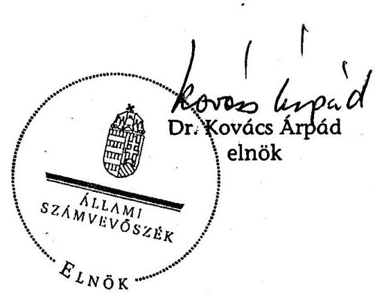

---

# MELLÉKLETEK 

a V-18-129/2006-2007. sz. jelentéshez

---

1. sz. melléklet
2. sz. melléklet
3. sz. melléklet
4. sz. melléklet
5. sz. melléklet
6. sz. melléklet
7. sz. melléklet
8. sz. melléklet
9. sz. melléklet
10. sz. melléklet
11. sz. melléklet
12. sz. melléklet

A jelentést véleményező miniszterek/elnök levelei Az Európai Unió infokommunikációs törekvéseinek vázlata
Az EU elektronikus közszolgáltatások színvonalának értékelésére szolgáló négyfokú skálája
Az EU 20 szolgáltatás magyarországi megfelelői
Az 1044/2005. (V. 11.) Korm. határozat előírásait teljesítő e-szolgáltatások száma és aránya
A magasabb szintet elért e-kormányzati szolgáltatások használatának alakulása
Az 1044/2005. (V. 11.) Korm. határozatban előírt és az elért szolgáltatási szintek
Informatikai biztonsági követelmények teljesülése a magasabb szintet elért szolgáltatások esetében
Az e-szolgáltatások kialakítására fordított intézményi kiadások az adatlapos felmérés alapján
A magasabb szintet elért e-kormányzati szolgáltatások által nyújtott előnyök a hagyományos ügyintézéshez képest
Elektronikus szolgáltatást igénybe vevő ügyfelek számának és arányának alakulása az adatlapos felmérés alapján
A magasabb szintet elért e-kormányzati szolgáltatások népszerúsítése

---

# A jelentést véleményező miniszterek/elnök levelei 

| $1 / 1$. | Dr. Szilvásy György | MeH |
| :--: | :--: | :--: |
| $1 / 2$. | Dr. Kóka János | GKM |
| $1 / 3$. | Dr. Lamperth Mónika | ÖTM |
| $1 / 4$. | Dr. Veres János | PM |
| $1 / 5$. | Dr. Petrétei József | IRM |
| $1 / 6$. | Dr. Hiller István | OKM |
| $1 / 7$. | Dr. Horváth Ágnes | EüM |
| $1 / 8$. | Dr. Fodor Gábor | KvVM |
| $1 / 9$. | Kiss Péter | SZMM |
| $1 / 10$. | Dr. Pukli Péter | KSH |

---

# Dr. Kovács Árpád úr részére   elnök   Állami Számvevőszék 

## Budapest

Tisztelt Elnők Úr!

Az Állami Számvevőszék által az elektronikus kormányzati szolgáltatások fejlesztésének ellenőrzéséről készített jelentést megkaptam, köszönöm. A Jelentés megállapításaival egyetértek, észrevételt nem teszek.

Tájékoztatom Elnők Urat, hogy a Jelentésben megfogalmazott javaslatok alapján - az Elektronikuskormányzat-központot érintő megállapításokra vonatkozóan - Intézkedési Tervet adtam ki, amelyet jelen levelemhez csatolva megküldök.

Budapest, 2007. június „, "

---

MINISZTERELNÖKI HIVATAL

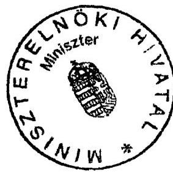

Jóváhagyom:

*Sa-1*

dr. Szilvásy György

*MINISZTER*

# INTÉZKEDÉSI TERV

Az Állami Számvevőszéknek az elektronikus kormányzati szolgáltatások fejlesztésének ellenőrzéséről készített jelentéstervezetében megfogalmazott javaslatok végrehajtása érdekében az alábbi feladatokat jelölöm ki az Elektronikuskormányzat-központ szervezeti egységei részére

## A Kormány részére címzett javaslatok vonatkozásában:

1. Javaslatot kell készíteni az e-kormányzati fejlesztések, szolgáltatások jogszabályi környezetének kialakítására

   a1) az elektronikus fizetéssel kapcsolatos szabályozások kiadásáról a Pénzügyminisztériummal közösen, különös figyelemmel az NFT II. által biztosított források rendelkezésre állásának idejére

   - Felelős: Gazdálkodási és Szabályozási Főosztály vezetője
   - Pénzügyminisztérium
   - Határidő: 2008. január 31.

   a2) a korlátozottan cselekvőképes személyek ügyfélkapu használatával kapcsolatos szabályozások kiadásáról

   - Felelős: Gazdálkodási és Szabályozási Főosztály vezetője (jogi tartalomért)
   - E-közigazgatási Főosztály vezetője (a szakmai tartalom vonatkozásában)
   - Határidő: 2007. augusztus 1. (folyamatban van)

   b1) a Központi Elektronikus Szolgáltató Rendszer működtetésének (ezek között a kötelező adatkezelés) szabályozási környezetére

   - Felelős: Gazdálkodási és Szabályozási Főosztály vezetője
   - Határidő: 2007. november 30.

   b2) az Igazságügyi és Rendészeti Minisztériummal közösen az e-cégeljárás szolgáltatások jogszabályi hátterére

---

Felelős: Gazdálkodási és Szabályozási Főosztály vezetője
Igazságügyi és Rendészeti Minisztérium
Határidő: 2007. december 31
b3) az Oktatási és Kulturális Minisztériummal közösen az e-felvételi szolgáltatások jogszabályi hátterére

Felelős: Gazdálkodási és Szabályozási Főosztály vezetője
Oktatási és Kulturális Minisztérium
Határidő: 2007. december 31
2. Az e-kormányzati szolgáltatások fejlesztésére és müködtetésére fordított kiadások teljes körű kimutatásához szakmai háttéranyagot kell készíteni a Pénzügyminisztérium ezirányú tevékenységének támogatásához

Felelős: Gazdálkodási és Szabályozási Főosztály (Gazdálkodási Osztály)
Határidő: 2007. szeptember 30.
Megjegyzés: Az ÁSZ javaslatok 2. pont második része a KSZK hatáskörébe tartozik
3. Javaslatot kell előkészíteni az elektronikus közszolgáltatások fejlesztéséért felelős központi szervezet megfelelő jogosítványokkal történő felruházásáról, hogy a szolgáltató állam megvalósítására irányuló intézményi folyamatok irányításához, koordinációjához, felügyeletéhez - az uniós irányelvek és a hazai jogszabályi elölrások érvényesítéséhez hatékony jogi eszközökkel rendelkezzenek
a) javaslatot kell készíteni a 44/2005. (III. 11.) Korm. rendelet módosítására az egyetértési jog érvényesítéséhez szükséges szankciókról.
Felelős: Gazdálkodási és Szabályozási Főosztály (Monitoring Osztály)
Határidő: 2007. december 15.

# A Miniszterelnöki Hivatalt vezető miniszternek címzett javaslatok vonatkozásában 

.1. Tanulmányt kell készíteni az e-kormányzati szolgáltatások költség-hatékony megvalósítását segítő elemzési módszerek és módszertanok kidolgozására

Felelős: E-közigazgatási Főosztály vezetője
Határidő: 2008. február 28.
2. Tanulmányt kell készíteni az elektronikus közigazgatási szolgáltatások fejlettségének érdemi mérésére alkalmas értékelési szempontrendszer kidolgozásáról és monitoring rendszer kialakításáról

Felelős: E- közigazgatási Főosztály vezetője
Határidő: 2008. február 28.

---

3. A 84/2007. (IV. 25.) Korm. rendelettel összhangban el kell késziteni a 195/2005. (IX. 22.) Korm. rendelettel elöirt ajánlásokat, és a Közigazgatási Informatikai Bizottság (KIB) által ki kell adni
a) az elektronikus szolgáltatások minőségbiztosításáról szóló KIB ajánlás

Felelős: E- közigazgatási Főosztály vezetője
Határidő: 2008. március 31.
b) az elektronikus szolgáltatások informatikai biztonságának fejlesztéséről szóló KIB ajánlás
Felelős: E- közigazgatási Főosztály vezetője
Határidő: 2008. április 30.
c) az elektronikus szolgáltatások biztonsági ellenőrzésének végrehajtásáról szóló KIB ajánlás
Felelős: E- közigazgatási Főosztály vezetője
Határidő: 2008. április 30.
4. Végre kell hajtani a Központi Elektronikus Szolgáltató Rendszer biztonságos müködtetéséhez és felügyeletéhez szükséges kontrollrendszer teljes körü kialakítását
a) ki kell dolgozni a Központi Rendszer egészére érvényes adatvédelmi szabályzatot, Felelős: Gazdálkodási és Szabályozási Főosztály
Határidő: 2007. december 31.
b) javaslatot kell tenni a MeH vezető miniszter részére a biztonsági felügyelő kinevezésére
Felelős: kormánybiztos
Határidő: 2007. augusztus 31.
c) ki kell nevezni az adatvédelmi felelőst.

Teljesitve.
d) át kell vizsgálni a belső biztonsági szabályzatokat és szükség esetén módosítani kell azokat
Felelős: Hálózati és Rendszerfelügyeleti Főosztály
Határidő: 2007. szeptember 30.
e) végre kell hajtani a katasztrófa-elhárítási terv végleges kialakításához szükséges felkészülési szakszt
Felelős: Hálózati és Rendszerfelügyeleti Főosztály
Védelemszervezési Iroda
Határidő: 2007. december 31.

---

f) ki kell alakítani a belsö biztonsági ellenörzési rendszert

Felelős: Hálózati és Rendszerfelügyeleti Főosztály
Határidő: 2007. november 30.
5. El kell készíteni a közigazgatás informatikai rendszereinek átjárhatóságát biztosító interoperabilitási szabványtár aktualizálását
a) kidolgozás

Felelős: Hálózati és Rendszerfelügyeleti Főosztály
Határidő: 2007. november 1.
b) KIB egyeztetés

Határidő: 2007. november 30.
c) hatályba helyezés

Határidő: 2008. január 1.
6. Szakmai javaslatot kell készíteni a Kormányzati Kommunikációs Központ számára az eszolgáltatások használatát szorgalmazó program kidolgozására, különös figyelemmel az ösztönzö, illetve kockázati tényezők feltárására

Felelős: E- közigazgatási Főosztály vezetője
Határidő: 2007. szeptember 30.
Megjegyzés: Az ÁSZ javaslatok 6. pontjában szereplő másik feladat - a marketing központi koordinációja, különös figyelemmel az ügyfélközpontú megközelítés erősitésére - a KKK feladata.

Budapest, 2007. május 31.

Simon Géza sk.
kormánybiztos

---

1/2. sz. melléklet
a V-18-129/2006-2007. sz. jelentéshez

$$
\begin{aligned}
& A T M-242 / 2007 \\
& 826107
\end{aligned}
$$

GAZDASÁGI És KOZLEKEDÉSI MINISZTÉRIUM

# dr. Kovács Árpád 

Iktatószám: GKM/6768/13/2007.
Elnök Úr
Állami Számvevőszék
Budapest

Tisztelt Elnök Úr!
Hiv. szám: V-18-117/2006-2007.

Köszönettel vettem „az elektronikus kormányzati szolgáltatások fejlesztésének ellenőrzéséről" szóló jelentést.

Tájékoztatom, hogy a jelentésre észrevételt nem teszek, egyben köszönöm, hogy munkájukkal hozzájárultak a minisztérium hatékonyabb müködéséhez.

Budapest, 2007. május „ "

Tisztelettel:
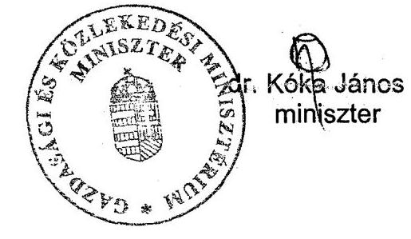

ÁLLAMI SZÁMVEVŐSZÉK
Örkereli: LUU JÚN 0.1
Iktatószám: $V-18-121 / 2007$
Melléklet:

---

# ÁLLAMI SZÁMVEVŐSZÉK 

## Érkeze: 200/ JUN 05

Iktatószám: V-18-126/2006-07
Melléklet: $\qquad$
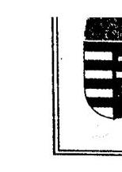

Ót KORMÁNYZATI ÉS TERÜLETFEJLESZTÉSI MINISZTER

## 06.05

Hiv. szám:V-18-117/2006-2007. $\quad$ AEF-393/32

Dr. Kovács Árpád úrnak, elnök
Állami Számvevőszék
Budapest.

## Tisztelt Elnök Úr!

Köszönettel vettem az elektronikus kormányzati szolgáltatások fejlesztésének ellenőrzéséről készített jelentést. Az abban foglaltakkal egyetértek, észrevételt nem teszek.

Feladatkörömet érintően az eddig megtett intézkedésekről az alábbiakban tájékoztatom.
Jelentésében javasolja, hogy gondoskodjam az elektronikus szolgáltatásokért felelős intézményeknél az iratkezelési elöírások betartásának ellenőrzéséről.

Tájékoztatom Elnök urat, hogy az ÖTM az iratkezelés állapotának felmérése érdekében ez évben a közigazgatási szervek számára kérdőívet állított össze, melyben az iratkezelés helyzetének legfontosabb paramétereire (többek között az alkalmazott szoftverekre, azok tanúsítottságára, biztonságos üzemeltetésére és az adatok archiválására) kérdezett rá. A felmérésből nyert adatok fontos visszacsatolási lehetőséget nyújtanak a jogszabályi változások végrehajtása tekintetében, de megteremtik az alapját a későbbi kormányzati fejlesztéseknek is.

## A Minisztériumok által beküldött adatlapokból az alábbi következtetések vonhatók le:

A 11 minisztérium közül kettőben papír alapú, a többi minisztériumnál elektronikus iratkezelés (elsősorban iktatás) történik. A 11 minisztérium összesen 6 különböző iratkezelő rendszert alkalmaz, melyből jelenleg 2 rendelkezik a jogszabályi előírásoknak megfelelő tanúsítvánnyal. Az iratkezelés rendszere általában vegyes jellegű, azaz bizonyos tevékenységeket központosítva oldanak meg, viszont több szervezeti egység is végez iktatási tevékenységet. A minisztériumok éves iratforgalma összesen hozzávetőlegesen 1000000 irat. (Az adat nem jelenti azonban automatikusan azt, hogy minisztériumi szinten ennyi ügy keletkezik, a vegyes iktatási rendszerekből származó adatok az úgyszámot torzíthatják.)

---

A minisztériumok által használt iratkezelő rendszerek sokfélesége okán az ratkezelés cgységesítése nehezen megvalósítható, mivel a tanúsítással nem rendelkező szofi rerek nem tudnak eleget tenni a jogszabályi kötclezcttségeknek, de tanúsított szoftver használó szervezetnél is előfordul az alkalmazás jogszabályellencs testre szabása. Az i atkezelési rendszerek egységesítésével a minisztériumok egymás közötti kommunikációja fi gyorsulna és egyszerűbb lenne, ezzcl együtt megvalósíthatóvá válna a központi iktatás t alamennyi minisztériumnál, ami csökkenlené a fentiekben megjelölt ügyszámot és hum aerőforrás felszabadítását is lehetővé tenné. Szintén az egységesítés jelenthetné az alap jillérét az elektronikus dokumentumkezelésnek, amely hosszú távon a tárolókapacitások csök entéséhez vezetne.

Az egyéb központi államigazgatási szervek nagy részénél már elektronikus ikta śrendszert alkalmaznak és csak elenyćsző számban iktatnak papír alapon.
Az iratkezelői állomány e szervezeti körben hozzávetőlegesen 3000 fő, ami azor ıan az évi 1000000 iratforgalmat tekintve nem tünik indokolatlanul soknak. A több mint $10000 \mathrm{~m}^{2}$ irattári helyiség és a közel 500000 iratfolyóméter irat mindenképpen a m demizáció szükségességét veti fel.
Ennek azonban legnagyobb akadálya a szervck költségvetési helyzete és a szükí i központi támogatások. Valószínủleg ez az oka annak is, hogy a használatban lévő atkezelési szoftvereknek csupán clenyésző hányada rendelkezik tanúsítvánnyal, holott 2008 január 1jétől az kivétel nélkül törvényileg kötelező.

Az önkormányzati iratkezelési rendszerekre is nagy arányban jellemző a veg: zs iktatási rendszerek fenntartása. A fővárosban vizsgált 24 hivatal közül 15-ben találunk ilyet, míg központi rendszer 6 , osztott rendszer pedig 3 esetben került kialakításra. A . azonban mindenképpen előremutató, hogy az önkormányzatok mindegyike elektronikus ikti ást végez, bár a tanúsított szoftverek használata meglehetősen alacsony, mindössze 7 önkor: iányzatnál találunk ilyet, melyből 4 esetben szűkített, azaz kizárólag 2009. január 1-jćí: érvényes tanúsítvánnyal rendelkező szoftverről van szó.
A fővárosi kerületekről elmondható, hogy az clektronizálás terén rendkívül d iamikusan fejlődnek. Szinte valamennyi kerülct megjelölte 2007. évi céljai közt a tanúsít: it szoftver beszerzésének szándékát, melyhez számos helyen az anyagi forrás is biztosított önerőből, vagy EU-s forrásokból. Mindemellett gyakori célkitüzés az elektronikus igyintézés bevezetése, de mára inkább már újabb területekre való kiterjesztése. Ezen :ülmenően megtalálhatók a tervek között az „elektronikus hivatal" terve, valamint egyéb d jitalizálási célkitüzések is. A hardver igények között az alapinfrastruktúrára vonatkozó igényeket egyáltalán nem találni, ami arra enged következtetni, hogy ezen önkormányzatok i yen irányú problémákkal szerencsére már nem küzdenck. Terveik leginkább a legújabb te hnológiák bevezetésćrc irányulnak.
Sajnálatos módon azonban a fővárosi kerületek helyzete az ország egészćre ézve nem általánosítható. Az adatok jelen feldolgozási szintje mellett is kivételesnek ítélhe ük a fenti szerveket.

Ellenőrzésünk során megállapítást nyert, hogy az alkalmazott iratkezelési rendszerek alkalmasak az iratok nyilvántartására és az ügyintézés segitésére, annak ellenér i, hogy az APEH iratkezelésének szabályozása például nem minden tekintetben fel 1 meg a 335/2005. (XII. 29.) Korm. rend. előírásainak. Ennek felszámolására az APEH fo jamatosan intézkedéseket tesz, amelyek végrehajtását, visszatérő ellenőrzés keretében fi :yelemmel kísérjük.

---

A kezelt iratok számának növekedésével a tárolási kapacitás bővítésének szükss gessége is felmerül, amelyre az elektronikus dokumentumkezelés, a digitális archiválás, ,gszabályi hátterének kialakítása megoldást jelentene. Ezért szorgalmazzák ezen jogszabályok ciadását.

Az Állami Számvevőszéknek az elektronikus iratkezelés helyzetének felmérésé 2 irányuló vizsgálata nyomán fokozott figyelmet fordítanak az ügyfélkapun érkező iratokra. Ez év első negyedévének adatai szerint az eBEV iratforgalom ugrásszerűen nőtt, a 2006. é i mintegy 382000 irattal szemben számuk 5,5 millió volt.

A szervezetnél saját fejlesztésű iratkezelési rendszert építettek ki, továt tfejlesztett változatának próbaüzembe helyezésére és auditáltatására intézkedést tesznek. Az i lkalmazott iratkezelési rendszer a maradandó értékủ irat megőrzését nem veszélyezteti, és iztositja a nem maradandó értékủ iratok visszakereshetőségét.

A Központi Hivatal iratforgalma közel 10 éves időintervallumot tekintve megı uplázódott (1997: 106772 - 2006: 251146), 20 éves távlatot nézve pedig annak rot unásszerủ növekedése látható (1987: 8000 - 2006: 251 146). Ezen iratanyag kezelése csak jó szervezett rendszerben, az iratkezelési szabályzatban foglaltakat betartva, kiváló e sktronikus iratkezelési háttérrel támogatva valósulhat meg. Az iratkezelés kiváló színve talon való ellátása érdekében ezért az országos szinten mintegy 500 fő iratkezelést ellátó rés ére évente 4 alkalommal tartanak oktatást. A szervezetnél iratkezelési területen foglalk iztatott új munkatársakkal már a belépéskor megismertetik az iratkezelésre vonatkozó előirási kat.
Az iratok feldolgozására 14000 on-line munkaállomáson kerül sor.
A Közigazgatási és Elektronikus Közszolgáltatások Központi Hivatal szervezc i egységei közül eddig a Központi Iratkezelési Osztályának ellenőrzésére került sor. A 1 regbízható informatikai háttérre alapítottan ellátott iratkezelési tevékenységet nagyfokú szerv: zettséggel, a vonatkozó jogszabályoknak megfelelően végzik. (A Központi Iratkezelési Osztí y mintegy 400000 iktatást végez egy évben.) Igény jelentkezik a papíralapú iratke: slésről az elektronikus iratkezelésre való áttérés feltételeinek a kidolgozására, az iratok | itelességét biztositó szabályok meghatározására.

Végezetül tájékoztatom Elnök Urat, hogy az ÁSZ megállapításaira, illetőleg a javaslatok jövőbeni hasznosítására kiemelt figyelmet fordítunk.
Munkájukhoz Önnek és munkatársainak további sikereket kívánok.

Budapest, 2007. 05.31.
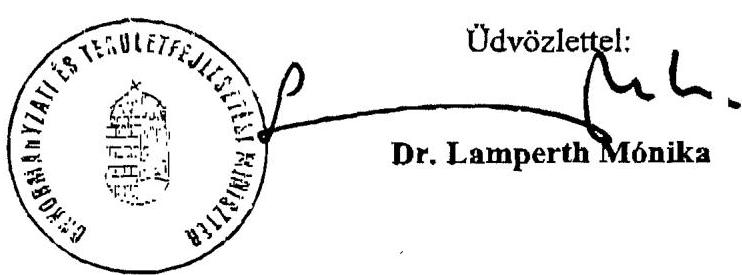

---

H-1051 BUDAPEST V., JÓZSEF NÁDOR TÉR 2-4. POSTACÍM: 1369 BUDAPEST, POSTAFIÓK 481.
TELEFON: (36-1) 327-2159, (36-1) 327-2141
E-MAIL: janos.veres@pm.gov.hu
FAX: (36-1) 318-0738
PÉNZÜGYMINISZTER

Iktatószám: 5590/18/2007
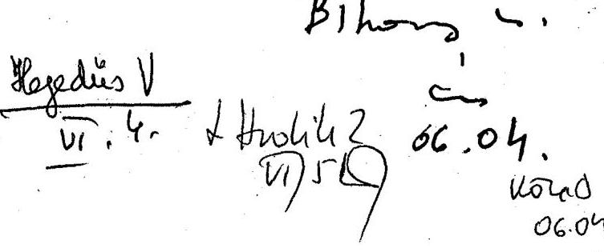

Tisztelt Elnök Úr!
Tájékoztatom, hogy az elektronikus kormányzati szolgáltatások fejlesztésének ellenőrzéséről készített jelentésükhöz észrevételt nem teszünk.

Budapest, 2007. május 29.
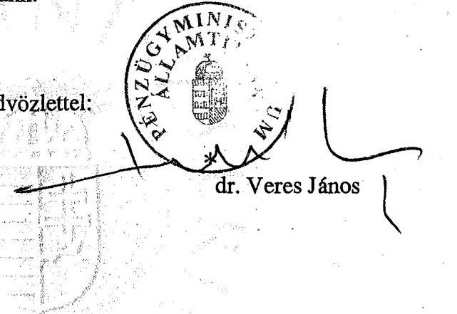

ÁLLAMI SZÁMVEVÓSZÉK
Erkezzett: ZUU JON 04.
Iktatószám: $1-18-622 / 206-07$
Melléklet:

---

# $V-18-121 / 2006-07$ 

1/5. sz. melléklet
a V-18-129/2006-2007. sz. jelentéshez

A Magyar Köztársaság
igazságügyi és rendészeti minisctere
IRM/MK/2007/204/9.

Hiv.sz.: V-18-117/2006-2007.

Dr. Kovács Árpád úrnak, elnök Állami Számvevőszék

## Budapest

## Tisztelt Elnök Úr!

Az elektronikus kormányzati szolgáltatások fejlesztésének ellenőrzéséről készített jelentésre észrevételt nem teszek.

Budapest, 2007. május 30.

Tisztelettel:
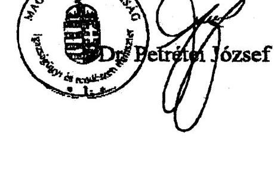

---

# Oktatási és Kulturális Minisztérium 

## Miniszter

Dr. Kovács Árpád úr
elnök

Állami Számvevőszék

Budapest
Apáczai Csere J. u. 10 .
1052
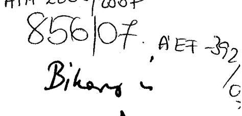

Iktatószám: 8991-5/2007.
Tárgy: Az elektronikus kormányzati szolgáltatások fejlesztésének ellenőrzése
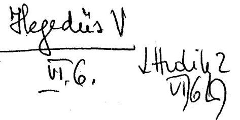

Tisztelt Elnök úr!

Tájékoztatom, hogy az Állami Számvevőszék V-18-117/2006-2007. számú levelével egyidejúleg fenti tárgyban megküldött - Arató Gergely államtitkár úrral előzetesen egyeztetett - jelentést megkaptam, az ellenőrzés megállapításaira észrevételt nem teszek.

Tájékoztatom továbbá, hogy az ellenőrzés alapján elrendelt intézkedéseinkről a megadott határidőre a kért tájékoztatást meg fogjuk adni.

Budapest, 2007. május „St"

## ÁLLAMI SZÁMVEVÖSZÉK

Erkezett: ZUU/ JÓN 05.
Iktatószám: $1-18-125 / 20607$
Melléklet: $\qquad$
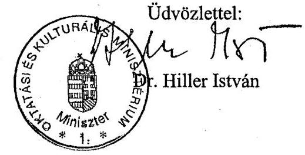

---

# EGÉSZSÉGÜGYI MINISZTÉRIUM MINISZTÉR 

Iktatási szám: 10885-2/2007-0006KTF

Dr. Kovács Árpád
elnök úr
részére

Állami Számvevőszék

Budapest

## Tisztelt Elnök Úr!

Az Állami Számvevőszék „Jelentés az elektronikus kormányzati szolgáltatások fejlesztésének ellenőrzéséről,, kćszített jelentést köszönettel megkaptam.

Az ellenőrzési jelentésre további észrevételt nem teszek.

Budapest, 2007. május , 15 ,

Üdvözlettel:
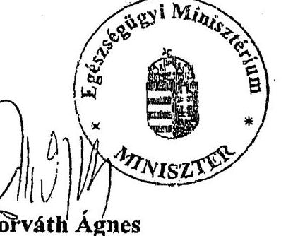

Horváth Ágnes

## ÁLLAMI SZÁMVEVŐSZÉK

Erkezzett: LUU MAJ 29.
Iktatószám: $\qquad$
Melléklet: $\qquad$

---

Környezetvédelmi
és Vizügyi
Minisztérium

MAGYAR KÖZTÁRSASÁG
KÖRNYEZETVÉDELMI ÉS VÍZÜGYI MINISZTERE

KIF/82/4/2007.

Dr. Kovács Árpád úr
elnök
Állami Számvevőszék

Budapest
Apáczai Csere J. u. 10.
1052

Bihay
i.
$28.05$.
$40200$
$06.05$
$t$ tudik 2
$71 / 6 \mathrm{~B}$

Tisztelt Elnök Úr!

Az elektronikus kormányzati szolgáltatások fejlesztésének ellenőrzéséről készített jelentést megkaptam, a jelentéshez észrevételt nem kívánok tenni.

Budapest, 2007. május 30.

Üdvözlettel

ÁLLAMI SZÁMVEVÖSZÉK

2007. 7. 11. 02
V-AZ-AZ-AZ06-2007

1011 Budapest, Fő utca 44-50.
1354 Rorlannat. Pl. 351.
T 0 90:00 30 2002 50 1401

Üdvözlettel

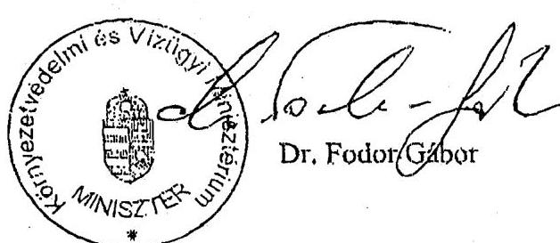

Islufon: 457 3300
telefőz: 201 2134
DUSZKOLLI TABLZSINIWI TOLI

---

# Szociális és Munkaügyi Minisztérium Miniszter 

1/9. sz. melléklet
a V-18-129/2006-2007. sz. jelentéshez

Iktatószám:12411-2/2007-SZMM
Hiv. szám: V-18-117/2006-2007

## Dr. Kovács Árpád

elnök úr részére

## Állami Számvevőszék

## Budapest

## Tisztelt Elnök Úr!

Az Állami Számvevőszék által „az elektronikus kormányzati szolgáltatások fejlesztésének ellenőrzéséről" végzett vizsgálati jelentésével kapcsolatban - melyet előzetesen már egyeztettünk tárcánk részéről - további észrevételt nem teszek. Egyben tájékoztatom, hogy 30 napon belül eljuttatom Önhöz az ellenőrzés alapján elrendelt intézkedési tervet.

Budapest, 2007. május 22.

Üdvözlettel:

## ÁLLAMI SZÁMVEVÓSZÉK

Érkezett: ZUU/ JÓN 05
Iktatószám:V-18-123/2006-07
Melléklet: $\qquad$
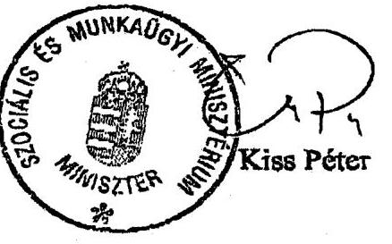

Levétet: 1054 Budapest, Alkotmány utca 3.
Telefon: (+36-3) 473-8293, Fax: (+36-3) 332-9382
E-mail cins: kiss.peter@szmm.gov.hu
Internet: www.szmm.gov.hu

---

Központi Statisztikai Hivatal
Elnök
$300-418 / 2 / 2007$

Dr. Kovács Árpád úr
elnök
Állami Számvevőszék

Budapest

Tisztelt Elnök Úr!

Köszönettel megkaptam 2007. május 15-én kelt, V-18-117/2006-2007 iktatószámú levelét és a mellékletként érkezett a „Jelentés az elektronikus kormányzati szolgáltatások fejlesztésének ellenőrzéséről, 2007 május" című dokumentumot. A Jelentést áttanulmányoztam, az abban foglaltakra vonatkozóan észrevételt nem teszek.

Budapest, 2007. május 23.

Tisztelettel:

# ÁLLAMI SZÁMVEVŐSZÉK 

Érkezett: LUU MAJ 28.
Iktatószám: $\underline{V-18-117 / 2006-07}$
Melléklet: $\qquad$
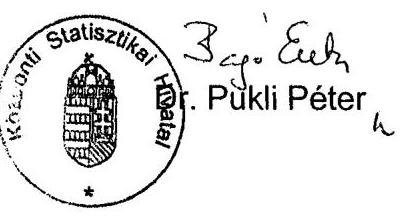

---

# Az Európai Unió infokommunikációs törekvéseinek vázlata 

## STRATÉGIAI CÉL:

a gazdasági versenyképesség növelése „Európa 2010-re a legversenyképesebb tudásalapú társadalom legyen!"

pán-európai szintű információs társadalom „Információs társadalom mindenkinek!"
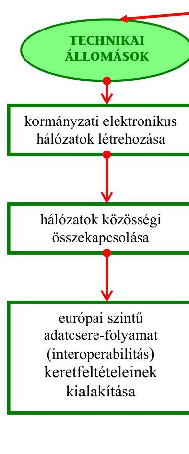
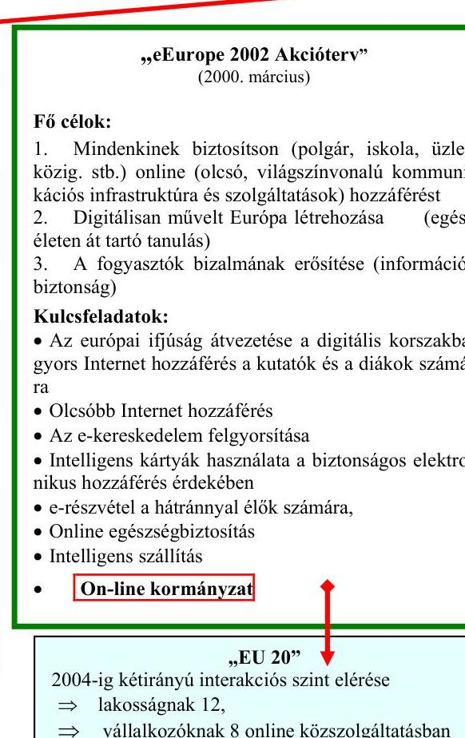
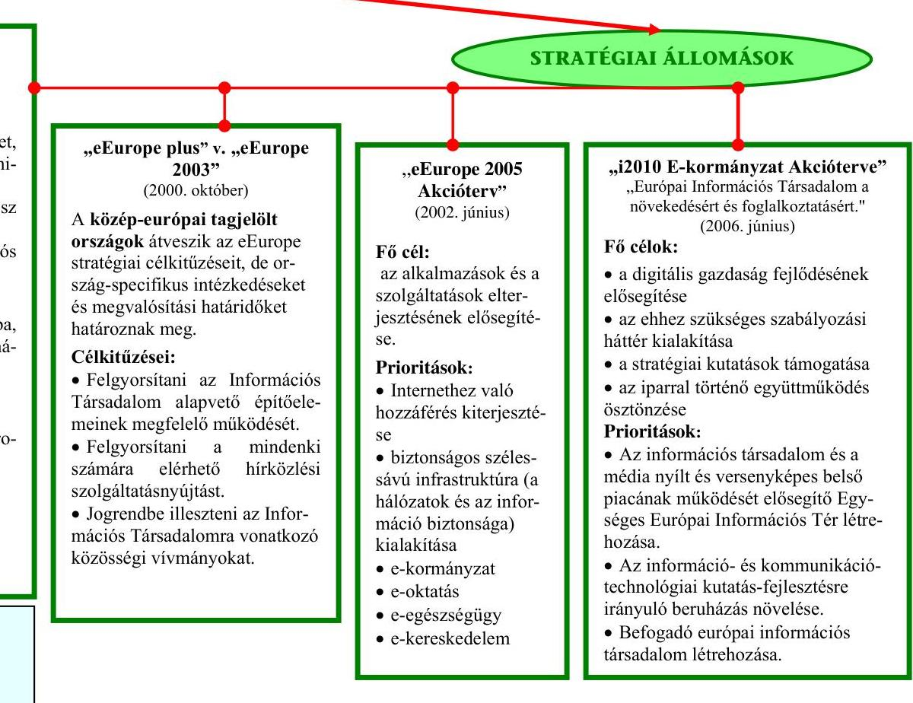

---

# Az EU elektronikus közszolgáltatások színvonalának értékelésére szolgáló négyfokú skálája* 

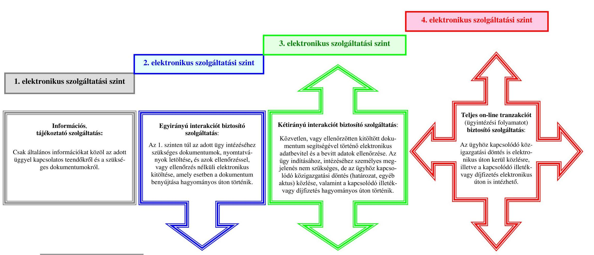

* A közigazgatás korszerűsítését szolgáló aktuális kormányzati feladatokról szóló 1044/2005 (V. 11.) Korm. határozat alapján.

---

# Az EU 20 szolgáltatás magyarországi megfelelői 

| Állampolgárok számára nyújtott szolgáltatások |  |  |  |
| :--: | :--: | :--: | :--: |
| Megnevezése | Kódja ${ }^{1}$ | Jelenlegi felelős | Adatot szolgáltató intézmény |
| Jövedelemadó bevallás, értesítés a kivetett adóról | CIT 1 | pénzügyminiszter | Adó- és Pénzügyi Ellenőrzési Hivatal |
| Álláskeresés interneten keresztül az AFSZ állásajánlataiban | CIT 2/a | szociális és munkaügyi miniszter | Foglalkoztatási Hivatal |
| Állásbejelentés interneten keresztül az AFSZ állásadatbázisába | CIT 2/b | szociális és munkaügyi miniszter | Foglalkoztatási Hivatal |
| Munkanélküli járadék igénylése | CIT 3/a | szociális és munkaügyi miniszter | Foglalkoztatási Hivatal |
| Munkavállalók gyermekei után járó pótlékok igénylése | CIT 3/b | pénzügyminiszter | Magyar Államkincstár |
| Kötelező egészségbiztosítás ellátásai | CIT 3/c | OEP föigazgatója | Országos Egészségbiztosítási Pénztár |
| Tanulói ösztöndíj megpályázása | CIT 3/d | oktatási és kulturális miniszter | Oktatási és Kulturális Minisztérium |
| Ütlevéligénylés és útlevéllel kapcsolatos egyéb ügyintézés | CIT 4/a | Miniszterelnöki   Hivatalt vezető   miniszter | Központi Adatfeldolgozó, Nyilvántartó és Választási Hivatal |
| Gépjármüvezetői engedély ügyintézés | CIT 4/b | Miniszterelnöki   Hivatalt vezető   miniszter | Központi Adatfeldolgozó, Nyilvántartó és Választási Hivatal |
| Vezetési jogosultság megszerzése |  | gazdasági és közlekedési miniszter | Közlekedési Főfelügyelet |
| Járművek nyilvántartásával kapcsolatos ügyintézés, Járműigazgatás (új, használt és importált gépjárművek forgalomba helyezése, műszaki vizsgáztatása, járműigazgatási ügyek) | CIT 5 | Miniszterelnöki   Hivatalt vezető   miniszter   gazdasági és   közlekedési miniszter | Központi Adatfeldolgozó, Nyilvántartó és Választási Hivatal |
| Építési engedély iránti kérelem | CIT 6 | önkormányzati és területfejlesztési miniszter | Önkormányzati és Területfejlesztési Minisztérium |
| Rendőrségi on-line bejelentések, feljelentések | CIT 7 | igazságügyi és rendészeti miniszter | Országos Rendőrfőkapitányság |
| Közkönyvtári katalógusok hozzáférhetősége, keresési lehetőségek elérése 1954-ig visszamenőleg | CIT 8 | oktatási és kulturális miniszter | Országos Széchényi Könyvtár |
| Születési anyakönyvi kivonat ügyintézése: kérvényezés, kiadás | CIT 9/a | Miniszterelnöki   Hivatalt vezető   miniszter | Központi Adatfeldolgozó, Nyilvántartó és Választási Hivatal |

[^0]
[^0]:    ${ }^{1}$ Az elektronikus szolgáltatásnak az 1044/2005. (VI. 11.) Korm. határozat függelékében meghatározott kódja.

---

| Állampolgárok számára nyújtott szolgáltatások |  |  |  |
| :--: | :--: | :--: | :--: |
| Megnevezése | Kódja ${ }^{1}$ | Jelenlegi felelős | Adatot szolgáltató intézmény |
| Házassági anyakönyvi kivonat ügyintézése: kérvényezés, kiadás | CIT 9/b | Miniszterelnöki Hivatalt vezető miniszter | Központi Adatfeldolgozó, Nyilvántartó és Választási Hivatal |
| Felvételi jelentkezés (középiskolákba, felsőoktatási intézményekbe) | CIT 10 | oktatási és kulturális miniszter | EDUCATIO Kht. |
| Lakcímváltozás bejelentése (lakcímigazolvány pótlás, csere) | CIT 11 | Miniszterelnöki Hivatalt vezető miniszter | Központi Adatfeldolgozó, Nyilvántartó és Választási Hivatal |
| Egészségüggyel összefüggő szolgáltatások (pl. interaktív tanácsadás kórházi szolgáltatások elérhetőségéről, kórházi bejelentkezések) | CIT 12 | Egészségügyi miniszter | Egészségügyi Minisztérium |

| Vállalkozások számára nyújtott szolgáltatások |  |  |  |
| :--: | :--: | :--: | :--: |
| Megnevezése | Kódja ${ }^{1}$ | Jelenlegi felelős | Adatot szolgáltató intézmény |
| Munkavállalók és foglalkoztatók számára nyújtott szolgáltatások (munkáltatók bejelentési kötelezettségének elősegítése, munkavállalók számára betekintési lehetőség a róluk benyújtott információkba) | BUS 1/a | szociális és munkaügyi miniszter | Foglalkoztatási Hivatal |
| Munkáltatók bejelentése nyugdíjbiztosítási adatokról | BUS 1/b | ONYF főigazgatója | Országos Nyugdíjbiztosítási Főigazgatóság |
| Társasági adóbevallás, értesítés | BUS 2 | pénzügyminiszter | Adó- és Pénzügyi Ellenőrzési Hivatal |
| Áfabevallás, -értesítés | BUS 3 | pénzügyminiszter | Adó- és Pénzügyi Ellenőrzési Hivatal |
| Korlátolt felelősségủ társaságok és részvénytársaságok bejegyzése, változásbejegyzése | BUS 4 | igazságügyi és rendészeti miniszter | Igazságügyi és Rendészeti Minisztérium |
| Adatközlés a statisztikai hivataloknak | BUS 5 | KSH elnöke | Központi Statisztikai Hivatal |
| Vámáru-nyilatkozatok benyújtása, kezelése | BUS 6 | pénzügyminiszter | Vám- és Pénzügyőrség Országos Parancsnoksága |
| Környezetvédelemmel összefüggő engedélyek szerzése | BUS 7 | környezetvédelmi és vízügyi miniszter | Környezetvédelmi és Vízügyi Minisztérium |
| Közbeszerzési eljárás | BUS 8 | Miniszterelnöki   Hivatalt vezető   miniszter | Központi Szolgáltatási Főigazgatóság |

---

# Az 1044/2005. (V. 11.) Korm. határozat előírásait teljesítő e-szolgáltatások száma és aránya 

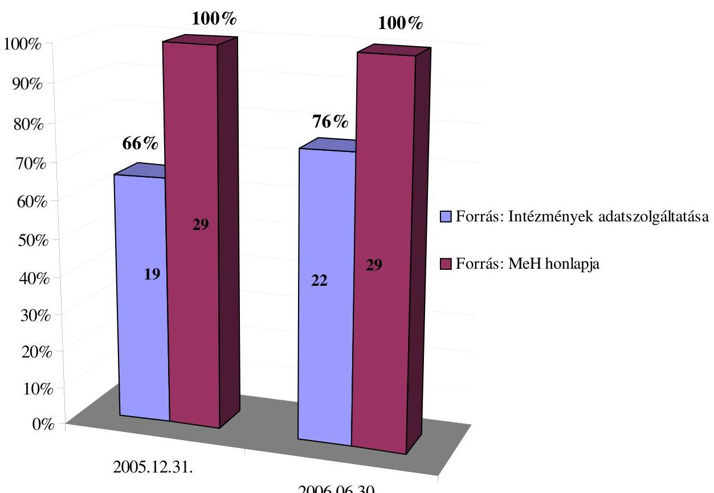

---

# A magasabb szintet elért e-kormányzati szolgáltatások használatának alakulása 

A lakosság számára nyújtott e-szolgáltatásokat igénybevevő ügyfelek aránya a teljes ügyfélkörhöz képest
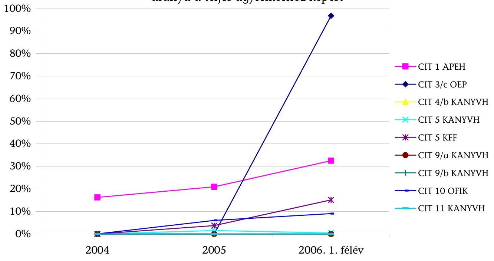

|  | CIT 1   APEH | CIT 3/c   OEP | CIT 4/b   KANYV | CIT 5   KANYV | CIT 5   KFF | CIT 9/a   KANYV | CIT 9/b   KANYV | CIT 10   OFIK | CIT 11   KANYV |
| :--: | :--: | :--: | :--: | :--: | :--: | :--: | :--: | :--: | :--: |
| 2004. | $16,23 \%$ | - | - | - | - | - | - | $0,06 \%$ | - |
| 2005. | $20,97 \%$ | - | - | $1,55 \%$ | $3,75 \%$ | - | - | $6,01 \%$ | - |
| 2006. 1. félév | $32,53 \%$ | $96,83 \%$ | $0 \%^{1}$ | $0,42 \%$ | $15,12 \%$ | $0,01 \%$ | $0 \%^{2}$ | $9,05 \%$ | $0,01 \%$ |

Forrás: Intézmények adatszolgáltatása
${ }^{1}$ : Az elektronikus szolgáltatást az adott időszakban 2 ügyfél vette igénybe.
${ }^{2}$ : Az elektronikus szolgáltatást az adott időszakban senki nem vette igénybe.

| Szolgáltatás   kódja | Szolgáltatás megnevezése | Adatot szolgáltató   intézmény |
| :--: | :-- | :--: |
| CIT 1 | Jövedelemadó bevallás, értesítés a kivetett adó-   ról | Adó- és Pénzügyi Ellenőrzési Hivatal |
| CIT 3/c | Kötelező egészségbiztosítás ellátásai (TAJ auto-   rizáció, valamint betegéletút és biztosítási jog-   viszony lekérdezése) | Országos Egészségbiztosítási Pénztár |
| CIT 4/b | Gépjárművezetői engedély ügyintézés | MeH Központi Adatfeldolgozó, Nyil-   vántartó és Választási Hivatal |
| CIT 5 | Járművek nyilvántartásával kapcsolatos ügyin-   tézés Járműigazgatás | MeH Központi Adatfeldolgozó, Nyil-   vántartó és Választási Hivatal |
| CIT 5 | Járművek nyilvántartásával kapcsolatos ügyin-   tézés Járműigazgatás | GKM Közlekedési Főfelügyelet |
| CIT 9/a | Születési anyakönyvi kivonat ügyintézése:   kérvényesés, kiadás | MeH Központi Adatfeldolgozó, Nyil-   vántartó és Választási Hivatal |
| CIT 9/b | Házassági anyakönyvi kivonat ügyintézése:   kérvényesés, kiadás | MeH Központi Adatfeldolgozó, Nyil-   vántartó és Választási Hivatal |
| CIT 10 | Felvételi jelentkezés | OKM EDUCATIO Kht. |
| CIT 11 | Lakcímváltozás bejelentése | MeH Központi Adatfeldolgozó, Nyil-   vántartó és Választási Hivatal |

---

# A magasabb szintet elért e-kormányzati szolgáltatások használatának alakulása 

A vállalkozások számára nyújtott e-szolgáltatásokat igénybevevő
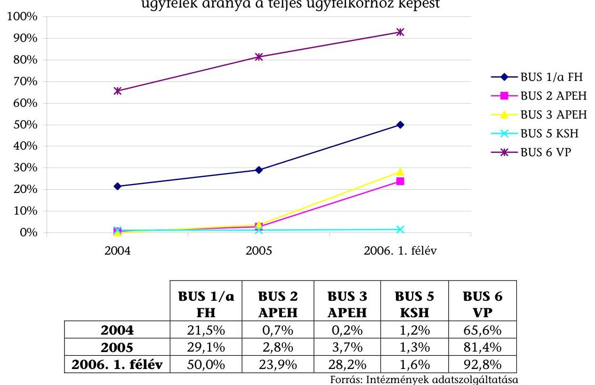

| Szolgáltatás   kódja | Szolgáltatás megnevezése | Adatot szolgáltató   intézmény |
| :--: | :-- | :--: |
| BUS 1/a | Munkavállalók és foglalkoztatók számára   nyújtott szolgáltatások | SzMM Foglalkoztatási Hivatal |
| BUS 2 | Társasági adóbevallás, értesítés | Adó- és Pénzügyi Ellenőrzési Hivatal |
| BUS 3 | Áfabevallás, -értesítés | Adó- és Pénzügyi Ellenőrzési Hivatal |
| BUS 5 | Adatközlés a statisztikai hivataloknak | Központi Statisztikai Hivatal |
| BUS 6 | Vámáru-nyilatkozatok benyújtása, kezelése | PM Vám- és Pénzügyőrség   Országos Parancsnoksága |

---

# Az 1044/2005. (V. 11.) Korm. határozatban előírt és az elért szolgáltatási szintek 

| Szolgáltatás kódja ${ }^{1}$ és a szolgáltató intézmény rövidítése | Korm. határozatban előírt szolgáltatási szint $^{2}$ | 2005. dec.   31-ére elért szolgáltatási szint $^{2}$ | 2006. június 30-ára elért szolgáltatási szint ${ }^{2}$ | Stratégiai időtávban (2-3 év) elérni kívánt szolgáltatási szint ${ }^{2}$ |
| :--: | :--: | :--: | :--: | :--: |
| CIT 1 - APEH | 4 | 3 | 3 | 4 |
| CIT 2/a - FH | 3 | 2 | 2 | 3 |
| CIT 2/b - FH | 3 | 2 | 3 | 3 |
| CIT 3/a - FH | 2 | 2 | 2 | 3 |
| CIT 3/b - MÁK | 2 | 2 | 2 | $3-4$ |
| CIT 3/c - OEP | 2 | 2 | 4 | 4 |
| CIT 3/d - OKM | 2 | 1 | 1 | 1 |
| CIT 4/a - KANYVH | 2 | 2 | 2 | 2 |
| CIT 4/b - KANYVH | 3 | 2 | $3-4^{3}$ | $3-4^{3}$ |
| CIT 4/b - KFF | 3 | 1 | 1 | 3 |
| CIT 5 - KANYVH | 3 | 3 | 3 | 3 |
| CIT5 - KFF | 3 | 3 | 3 | 3 |
| CIT6 - ÖTM | 2 | 2 | 2 | - ${ }^{3}$ |
| CIT 7 - ORFK | 2 | 3 | 3 | 3 |
| CIT 8 - OSZK | 3 | 2 | 2 | 3 |
| CIT 9/a - KANYVH | 3 | 4 | 4 | 4 |
| CIT 9/b - KANYVH | 3 | 4 | 4 | 4 |
| CIT 10 - OFIK | 4 | 4 | 4 | 4 |
| CIT 11 - KANYVH | 3 | 2 | $3-4^{3}$ | $3-4^{3}$ |
| CIT 12 - EüM | 2 | 2 | 2 | 2 |
| BUS 1/a - FH | 3 | 3 | 3 | 3 |
| BUS 1/b - ONYF | 2 | 2 | 2 | 3 |
| BUS 2 - APEH | 4 | 3 | 3 | 4 |
| BUS 3 - APEH | 4 | 3 | 3 | 4 |
| BUS 4 - IRM | 4 | 4 | 4 | 4 |
| BUS 5 - KSH | 3 | 3 | 3 | 3 |
| BUS 6 - VP | 3 | 3 | 3 | 4 |
| BUS 7 - KvVM | 3 | 2 | 2 | 3 |
| BUS 8 - KSZF | 2 | 2 | 3 | 4 |

${ }^{1}$ Az elektronikus szolgáltatásnak az 1044/2005. (VI. 11.) Korm. határozat függelékében meghatározott kódja.
${ }^{2} \mathrm{Az}$ elektronikus szolgáltatás szintje az 1044/2005. (VI. 11.) Korm. határozat 1./a pontjában meghatározott besorolás (négyfokú skála) szerint.
${ }^{3} \mathrm{~A}$ szolgáltatás szintje ügytípusonként eltérő.
${ }^{4} \mathrm{Az}$ intézmény a kérdésre nem szolgáltatott adatot.

---

# Informatikai biztonsági követelmények teljesülése a magasabb szintet elért szolgáltatások esetében 

| Biztonsági kritériumok | Kritériumnak   megfelelő szol-   gáltatások | Szolgáltatások   aránya |
| :-- | :--: | :--: |
| Kinevezték az informatikai célrendszer informa-   tikai biztonsági követelményeiért általánosan   felelős személyt | 11 | $65 \%$ |
| Felmérték-e az informatikai célrendszer bizton-   sági kockázatait | 12 | $71 \%$ |
| Biztonsági osztályokba sorolták az informatikai   célrendszer segítségével elektronikus úton végez-   hető egyes eljárási cselekményeket | 8 | $47 \%$ |
| Meghatározták az informatikai célrendszerrel   szemben támasztott részletes biztonsági köve-   telményeket | 17 | $100 \%$ |
| Rendelkezett a szervezet az adatokhoz történő   hozzáférési rendet szabályozó előírásokkal | 17 | $100 \%$ |
| Megoldott az informatikai célrendszer múködése   szempontjából meghatározó folyamatok vala-   mennyi eseményének naplózása | 15 | $88 \%$ |
| Rendelkezik a szervezet a szolgáltatásra is kiter-   jedő katasztrófa-elhárítási tervvel | 12 | $71 \%$ |
| Meghatározott, hogy a szolgáltatás múködését -   akár katasztrófa esetén is - legkésőbb mennyi   időn belül kell visszaállítani | 11 | $65 \%$ |
| Tesztelték a katasztrófa-elhárítási tervet | 10 | $59 \%$ |
| Rendelkezik a szervezet rendszeres mentésekkel   az informatikai célrendszer szoftver elemeiről | 16 | $94 \%$ |
| Történt a Miniszterelnöki Hivatalt vezető minisz-   ter nevében informatikai biztonsági ellenőrzés a   célrendszerre és/vagy a szervezetre vonatkozóan | 1 | $6 \%$ |

Forrás: Intézmények adatszolgáltatása

[^0]
[^0]:    ${ }^{1}$ Az adott feltételnek megfelelő szolgáltatások aránya a biztonság felmérésébe bevont (3-as szintet elérő) 17 db szolgáltatáson belül.

---

# Az e-szolgáltatások kialakítására fordított intézményi kiadások az adatlapos felmérés alapján 

Ezer Ft-ban

| Intézmény | Szol-gál-tatás kód ${ }^{1}$ | Összes ráfordítás ${ }^{2}$ | Ebből |  |
| :--: | :--: | :--: | :--: | :--: |
|  |  |  | 2005. 12. 31-ig | 2006. I. félévben |
| Igazságügyi és Rendészeti Minisztérium | BUS 4 | 456791 | 426375 | 30416 |
| EüM Országos Egészségbiztosítási Pénztár | CIT 3c | 11000 | 0 | 11000 |
| GKM Közlekedési Főfelügyelet ${ }^{3}$ | CIT 5 | 30000 | 30000 | 0 |
|  | CIT 4b | 35000 | 35000 | - |
| Egészségügyi Minisztérium | CIT 12 | 170608 | 130661 | 39947 |
| IRM Országos Rendőr-főkapitányság | CIT 7 | 0 | 0 | 0 |
| Központi Statisztikai Hivatal | BUS 5 | 329746 | 290308 | 39438 |
| KvVM Országos Környezetvédelmi, Természetvédelmi és Vízügyi Főfelügyelőség | BUS 7 | 74654 | 71154 | 3500 |
| MeH Központi Adatfeldolgozó és Nyilvántartó Hivatal | CIT4a | 24508 | 17441 | 7067 |
|  | CIT4b | 51137 | 46691 | 4446 |
|  | CIT5 | 120907 | 116461 | 4446 |
|  | CIT9a | 46262 | 41816 | 4446 |
|  | CIT9b | 46262 | 41816 | 4446 |
|  | CIT11 | 29750 | 17442 | 12308 |
| MeH Központi Szolgáltatási Föigazgatóság | BUS 8 | 390884 | 380881 | 10003 |
| Oktatási és Kulturális Minisztérium | CIT 3d | 1400 | 1100 | 300 |
| OKM EDUCATIO Társadalmi Szolgáltató Kht. | CIT 10 | 7534 | 5667 | 1867 |
| OKM Országos Széchényi Könyvtár | CIT 8 | 140000 | 140000 | 0 |
| Önkormányzati és Területfejlesztési Minisztérium ${ }^{3}$ | CIT 6 | - | - | - |
| Adó- és Pénzügyi Ellenőrzési Hivatal | CIT 1   BUS 2   BUS 3 | 2382299 | 1285479 | 1096820 |
| PM Magyar Államkincstár | CIT 3b | 1708 | 650 | 1058 |
| PM Vám és Pénzügyőrség ${ }^{3}$ | BUS 6 | 725000 | 725000 | - |
| SZMM Foglalkoztatási és Szociális Hivatal ${ }^{3}$ | CIT 2a | - | - | - |
|  | CIT 2b | - | - | - |
|  | CIT 3a | - | - | - |
|  | BUS 1a | 282833 | 268937 | 13896 |
| SZMM Országos Nyugdíjbiztosítási Föigazgatóság ${ }^{3}$ | BUS 1b | - | - | - |
| Összesen: |  | 5358283 | 4072879 | 1285404 |

${ }^{1}$ Az elektronikus szolgáltatásnak az 1044/2005. (VI. 11.) Korm. határozat függelékében meghatározott kódja.
${ }^{2}$ A szolgáltatás kialakítására fordított összes kiadás, beleértve a 2004 előtti időszakot.
${ }^{3} \mathrm{Az}$ intézmény nem vagy nem teljes körűen szolgáltatott adatot (pl. a kialakítás költségei nem különíthetők el egyéb informatikai fejlesztési költségektől).

---

# A magasabb szintet elért e-kormányzati szolgáltatások által nyújtott előnyök a hagyományos ügyintézéshez képest 

| Előny | Szolgáltatások   száma $^{1}$ |
| :-- | :--: |
| Eljárási szabályok előzetes megismerése | 15 |
| Az eljáráshoz szükséges űrlapok/dokumentumok előzetes kitöltésének lehetősége | 16 |
| Az eljáráshoz szükséges űrlapok/dokumentumok előzetes elektronikus ellenőrzése | 15 |
| Egyszerűbb és gyorsabb kommunikáció az ügyintézés során | 16 |
| Többlet információ az eljárás aktuális állapotáról | 13 |
| Az ügyfél több információhoz juthat a személyével kapcsolatban nyilvántartott   adatokról | 8 |
| Az eljárás elindítása személyes megjelenés nélkül | 15 |
| A teljes eljárás lefolytatása személyes megjelenés nélkül | 11 |
| Alacsonyabb illeték, költségtérítés, díj | 1 |
| Egyéb $^{2}$ | 3 |

Forrás: Intézmények adatszolgáltatása

## Szolgáltatások megoszlása az általuk biztosított előnyök szerint

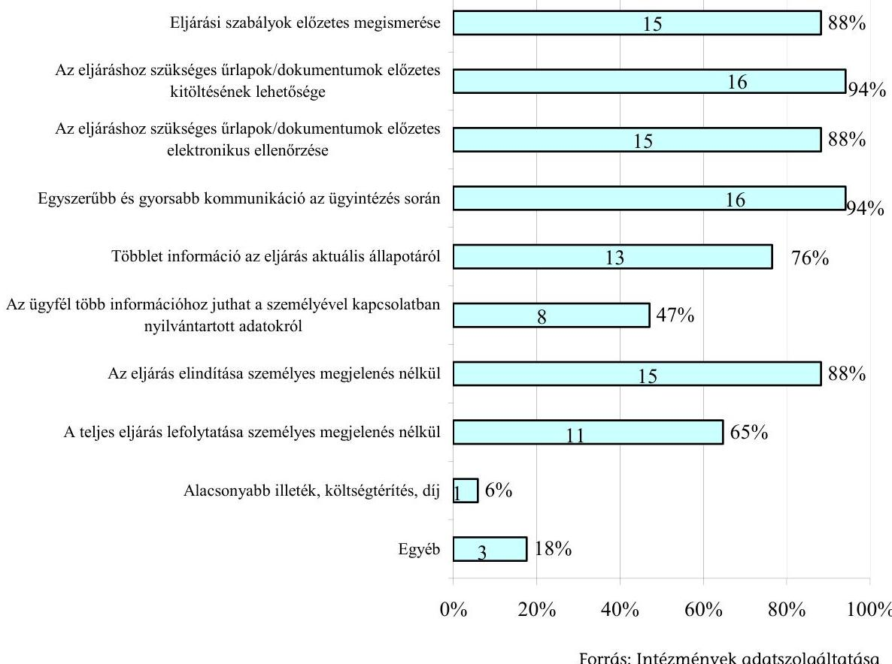

[^0]
[^0]:    ${ }^{1}$ A felmérésébe bevont (3-as szintet elérő) 17 db szolgáltatáson belül.
    ${ }^{2}$ Az intézmények által megjelölt egyéb előnyök: gyorsabb kitöltés és elküldés (2 szolgáltatás), bankkártyás fizetés lehetősége (1 szolgáltatás).

---

# Elektronikus szolgáltatást igénybe vevő ügyfelek számának és arányának alakulása az adatlapos felmérés alapján 

| A szolgáltatás jele és felelős intézménye | Időszak | Ügyfelek száma összesen (fő) | Elektronikus szolgáltatást igénybe vevő ügyfelek száma (fő) | Elektronikus szolgáltatást igénybe vevő ügyfelek aránya (\%) |
| :--: | :--: | :--: | :--: | :--: |
| CIT 1 APEH | 2004 | 4526945 | 734545 | 16,23\% |
|  | 2005 | 4454003 | 934127 | 20,97\% |
|  | 2006. 1. félév | 4459748 | 1450820 | 32,53\% |
| CIT 2/b FH | 2004 | - | - | - |
|  | 2005 | - | - | - |
|  | 2006. 1. félév | - | - | - |
| CIT 3/c OEP | 2004 | - | - | - |
|  | 2005 | - | - | - |
|  | 2006. 1. félév | 4882 | 4727 | 96,83\% |
| CIT 4/b KANYVH | 2004 | - | - | - |
|  | 2005 | - | - | - |
|  | 2006. 1. félév | 46587 | 2 | 0,00\% |
| CIT 5 KANYVH | 2004 | 2908 | - | - |
|  | 2005 | 24450 | 380 | 1,55\% |
|  | 2006. 1. é félév | 335000 | 1400 | 0,42\% |
| CIT 5 KFF | 2004 | 230162 | - | - |
|  | 2005 | 205155 | 7696 | 3,75\% |
|  | 2006. 1. félév | 97609 | 14763 | 15,12\% |
| CIT 8 OSZK | 2004 | - | - | - |
|  | 2005 | - | - | - |
|  | 2006. 1. félév | - | - | - |
| CIT 9/a KANYVH | 2004 | - | - | - |
|  | 2005 | - | - | - |
|  | 2006. 1. félév | 16000 | 1 | 0,01\% |
| CIT 9/b KANYVH | 2004 | - | - | - |
|  | 2005 | - | - | - |
|  | 2006. 1. félév | 7000 | 0 | 0,00\% |
| CIT 10 OFIK | 2004 | 167082 | 100 | 0,06\% |
|  | 2005 | 149828 | 9000 | 6,01\% |
|  | 2006. 1. félév | 132527 | 12000 | 9,05\% |
| CIT 11 KANYVH | 2004 | - | - | - |
|  | 2005 | - | - | - |
|  | 2006. 1. félév | 70572 | 7 | 0,01\% |
| BUS 1/a FH | 2004 | 130000 | 28000 | 21,54\% |
|  | 2005 | 210000 | 61000 | 29,05\% |
|  | 2006. 1. félév | 170000 | 85000 | 50,00\% |
| BUS 2 APEH | 2004 | 450356 | 2923 | 0,65\% |
|  | 2005 | 427510 | 12065 | 2,82\% |
|  | 2006. 1. félév | 418646 | 99975 | 23,88\% |
| BUS 3 APEH | 2004 | 548127 | 1100 | 0,20\% |
|  | 2005 | 510793 | 18900 | 3,70\% |
|  | 2006. 1. félév | 499675 | 141000 | 28,22\% |
| BUS 4 IRM | 2004 | - | 20649 | - |
|  | 2005 | - | 21019 | - |
|  | 2006. 1. félév | - | 21197 | - |

---

| A szolgáltatás   jele és felelős   intézménye | Idószak | Ügyfelek száma   összesen   (fó) | Elektronikus szolgál-   tatást igénybe vevő   ügyfelek száma   (fó) | Elektronikus szolgál-   tatást igénybe vevő   ügyfelek aránya   (\%) |
| :--: | :--: | :--: | :--: | :--: |
| BUS 5 KSH | 2004 | 140630 | 1691 | $1,20 \%$ |
|  | 2005 | 144232 | 1843 | $1,28 \%$ |
|  | 2006. 1. félév | 126087 | 2011 | $1,59 \%$ |
| BUS 6 VP | 2004 | 37248 | 24451 | $65,64 \%$ |
|  | 2005 | 42614 | 34668 | $81,35 \%$ |
|  | 2006. 1. félév | 30350 | 28167 | $92,81 \%$ |

A táblázatban - jellel jelöltük, ha az intézmény nem vagy nem teljes körűen szolgáltatott adatot (pl. a szolgáltatás még nem múködött, vagy az igénybevétel nem volt kimutatható).

---

# A magasabb szintet elért e-kormányzati szolgáltatások népszerúsítése 

Információs csatornák igénybevétele az ügyfelek tájékoztatására
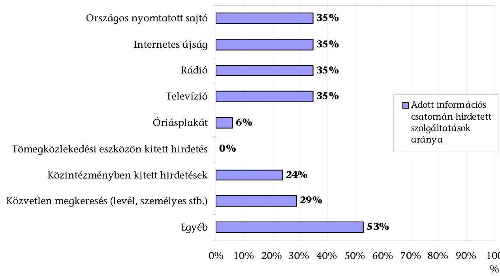

| Információs csatorna | Szolgáltatások   száma | Szolgáltatások   aránya ${ }^{1}$ |
| :-- | :--: | :--: |
| Országos nyomtatott sajtó | 6 | $35 \%$ |
| Internetes újság | 6 | $35 \%$ |
| Rádió | 6 | $35 \%$ |
| Televízió | 1 | $6 \%$ |
| Óriásplakát | 0 | $0 \%$ |
| Tömegközlekedési eszközön kitett hir-   detés | 4 | $24 \%$ |
| Közintézményben kitett hirdetések | 5 | $29 \%$ |
| Közvetlen megkeresés (levél, szemé-   lyes stb.) | 9 | $53 \%$ |
| Egyéb $^{2}$ |  |  |

Forrás: Intézmények adatszolgáltatása

[^0]
[^0]:    ${ }^{1}$ Az adott feltételnek megfelelő szolgáltatások aránya a marketing tevékenységek felmérésébe bevont (3-as szintet elérő) 17 db szolgáltatáson belül.
    ${ }^{2}$ Az intézmények által megjelölt egyéb hirdetési csatornák: sajtótájékoztató (1), saját honlap (8 szolgáltatás).

---

# A szolgáltatással kapcsolatban megjelent reklámok és tájékoztatások tartalma 

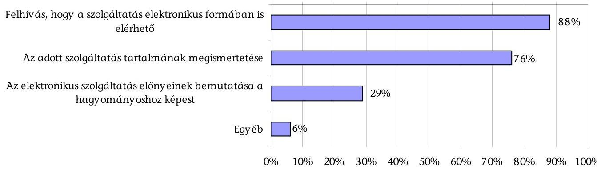

| Cél | Szolgáltatások   száma | Szolgáltatások   aránya |
| :-- | :--: | :--: |
| Felhívás, hogy a szolgáltatás elektronikus   formában is elérhető | 15 | $88 \%$ |
| Az adott szolgáltatás tartalmának megis-   mertetése | 13 | $76 \%$ |
| Az elektronikus szolgáltatás előnyeinek   bemutatása a hagyományoshoz képest | 5 | $29 \%$ |
| Egyéb $^{3}$ | 1 | $6 \%$ |

Forrás: Intézmények adatszolgáltatása

## Ügyfél elégedettség mérés eszközei

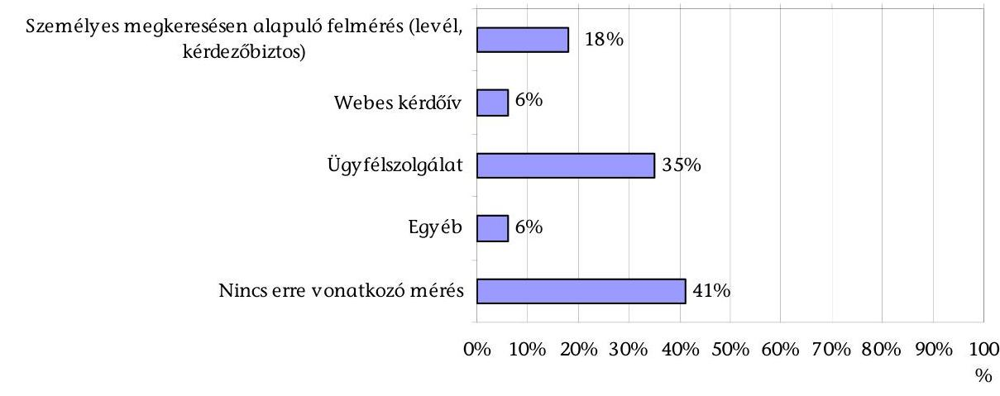

| Eszköz | Szolgáltatások   száma | Szolgáltatások   aránya |
| :-- | :--: | :--: |
| Személyes megkeresésen alapuló   felmérés (levél, kérdezőbiztos stb.) | 3 | $18 \%$ |
| Webes kérdőív | 1 | $6 \%$ |
| Úgyfélszolgálat | 6 | $35 \%$ |
| Egyéb $^{4}$ | 1 | $6 \%$ |
| Nincs erre vonatkozó mérés | 7 | $41 \%$ |

Forrás: Intézmények adatszolgáltatása

Budapest, 2007. június

[^0]
[^0]:    ${ }^{3}$ Az intézmény által megjelölt egyéb hirdetési cél az ügyfélkapu népszerűsítése volt.
    ${ }^{4}$ Az ügyfél elégedettség mérésnek eszköze az intézmény honlapjának „írjon nekünk" rovata volt.

---

# ÁLLAMI   SZÁMVEVŐSZÉK 

## F Ü G G E L É K

Az elektronikus kormányzati szolgáltatások fejlesztésének vizsgálatáról készített V-18-129/2006-2007. sz. jelentéshez

---

# A magasabb szintet elért intézményi e-szolgáltatások részletes megállapításai 

- AZ ADÓ- ÉS PÉNZÜGYI ELLENŐRZÉSI HIVATAL ÁLTAL NYÚJTOTT ELEKTRONIKUS SZOLGÁLTATÁSOK (CIT 1), (BUS 2), (BUS 3)
- A KÖZPONTI ADATFELDOLGOZÓ, NYILVÁNTARTÓ HIVATAL ÁLTAL NYÚJTOTT ELEKTRONIKUS SZOLGÁLTATÁSOK (CIT4/A), (CIT4/B), (CIT5), (CIT9), (CIT 11)
- AZ ORSZÁGOS FELSŐOKTATÁSI INFORMÁCIÓS KÖZPONT ELEKTRONIKUS SZOLGÁLTATÁSA (CIT 10)
- AZ IGAZSÁGÜGYI ÉS RENDÉSZETI MINISZTÉRIUM ELEKTRONIKUS CÉGELJÁRÁSI SZOLGÁLTATÁSA (BUS 4)

---

# A magasabb szintet elért intézményi e-szolgáltatások részletes megállapításai 

## 1. Az Adó- és PénzüGyi Ellenőrzési Hivatal Által Nyújtott ELEKTRONIKUS SZOLGÁLTATÁSOK

Az EU által definiált 20 alapvető szolgáltatásból az adónemekkel kapcsolatos az állampolgárok, illetve a vállalkozások számára nyújtott - szolgáltatások fejlesztésében, működtetésében értelemszerűen a pénzügyi tárca, intézményi szinten az Adó- és Pénzügyi Ellenőrzési Hivatal (továbbiakban: APEH) az illetékes. A „Jövedelemadó bevallás, értesítés a kivetett adóról" (CIT 1); „Társasági adóbevallás, értesítés" (BUS 2), valamint az „ÁFA-bevallás, értesítés" (BUS 3) szolgáltatások esetében a Kormány 4. szintü - teljes on-line tranzakciót biztosító (a fizetést és a kézbesítést is lehetővé tevő) - szolgáltatás megvalósítását írta elő ${ }^{1}$.

A jogszabályi előírások folyamatosan bővítették az elektronikus adózásban érintett, ez ideig többségében a vállalkozói szférára kiterjedő felhasználói kört. Az elektronikus adózás végrehajtásával, illetve az ezzel összefüggő adatszolgáltatás teljesítésével kapcsolatos általános szabályokat az adózás rendjéről szóló 2003. évi XCII. törvény (Art.) hatályos változata tartalmazta. Az Art. 2004. évi módosítása ${ }^{2}$ révén lehetőség nyílt bárki számára - ideértve a magánszemélyek SZJA bevallásait is - az elektronikus adóbevallásra, hogy az elektronikus adóbevallást választók a kormányzati ügyfélkapun keresztül tegyenek eleget bevallási kötelezettségüknek.

A pénzügyeket szabályozó egyes jogszabályok módosításáról szóló 2001. évi LXXIV. törvény (Ptv.) 167. § (4) bekezdése alapján az APEH 2002. októberétől kötelezően elektronikusan fogadta az adózás rendjéről szóló 1990. évi XCI. törvény 7. sz. mellékletében meghatározott, a Kiemelt Adózók Igazgatóságához (továbbiakban: KAIG) tartozó mintegy 500 pest megyei, illetve budapesti nagy adózó bevallásait, adatközléseit. A teljesítés szabályait a 30/2002. (X. 11.) PM-IHM együttes rendelet tartalmazta.

Az Art. előírása alapján 2004 januárjától az ország 3000 legnagyobb adózója minden bevallását és adatszolgáltatását kötelezően elektronikus úton teljesítette. Az Art. 2004. évi módosítása az elektronikus bevallási kötelezettséget kiterjesztette a 10000 legnagyobb adózóra. Az adózás rendjéről szóló törvény egyes rendelkezéseinek alkalmazásáról és módosításáról, valamint egyes adótörvények módosításáról szóló 2005. évi CLXIII. törvény 1. § (2) bek. alapján 2006. május 1jétől mintegy 50000 -es adózói kör számára a kormányzati ügyfélkapun keresztül kötelezővé vált az elektronikus bevallás.

[^0]
[^0]:    ${ }^{1}$ A közigazgatás korszerűsítését szolgáló aktuális e-kormányzati feladatokról szóló 1044/2005. (V. 11.) Korm. határozat
    ${ }^{2}$ Az adókról, járulékokról és egyéb költségvetési befizetésekről szóló törvények módosításáról szóló 2004. évi CI. törvény.

---

A 2005. évi CLXIII. törvény 1. § (4) bek. és az Art. 2006 elejétől hatályos előírásai (31. § (2) bek. és 52. § (4) bek.) szerint - az Európai Unióban egyedülálló módon 2007. január 1-jétől minden munkáltatónak, illetve kifizetőnek minősülő adóalany a bevallásainak, adatszolgáltatási kötelezettségeinek már csak elektronikus módon tehet eleget.

Az Art. 2005. év végi módosításakor korlátozottan vették figyelembe az ország, illetve az adózók informatikai ellátottságát. Az elektronikus adóbevallásra kötelezettek egy részénél a teljesítés komoly erőfeszítéseket követelhet meg, különös tekintettel a havonkénti jelentős mennyiségű adatra és az Internet hozzáférhetőség nehézségeire (ellátottság, sebesség, üzembiztonság).

A 2007. január 1-jétől kötelezően előírt elektronikus bevallással és adatszolgáltatással kapcsolatosan az Art. módosításakor, ill. a törvény előkészítése során nem készült a hatékonyságot illetően előtanulmány és az eredményességet érintő kockázatok feltárását, elemzését sem készítették el. Ennek hiánya azért bír jelentősséggel, mert az előkészítés időszakában az Internet előfizetések száma országosan nem érte el az 1 milliót és a 3,4 millió vezetékes fővonal 17\%-a volt ISDN vonal (forrás: a KSH 2006. december 6-i Gyorstájékoztatója).

Az Art. módosítására - 2004. január 1-jei hatálybalépése óta - 25 alkalommal (összesen közel 1200 helyen) került sor, ebből az elektronikus bevallást, illetve adatszolgáltatást érintő szabályokat 11-szer (68 pontban) változtatták meg. Kirívó, hogy 2005-ben július 10. és 17. között 4 változata volt a jogszabálynak, a 2-3 naponkénti módosítások következtében összesen 21 pontban változott meg a szöveg. Ez a bizonytalanságokat tükröző jogalkotói magatartás korlátozza az átláthatóságot és kiszámíthatóságot.

# Az APEH 2003-2007. időszakra vonatkozó informatikai stratégiája 

kiemelt feladatként határozta meg az elektronikusan hitelesített bevalláskészítés és feldolgozás megvalósítását, valamint az elektronikus ügyintézés megteremtését és kiterjesztését. A szolgáltatás kialakításához szükséges feladatok mind az informatika, mind a létrehozásban érintett egyéb szakterületek éves irányelveiben és az APEH feladattervében szerepeltek.

Az adóbevallások elektronikus formában történő teljesítését lehetővé tevő rendszert az APEH a 2003 novemberében indított Elektronikus Adóbevallás és Adatszolgáltatás Projekt (továbbiakban: Ebev projekt) keretében alakította ki. Az indítást megelőzően a hivatal meghatározta a rendszerrel szemben támasztott követelményeket, a fejlesztésben résztvevők feladatait és felelősségi körét, valamint a projekt ütemezését és eredménytermékeit. A projekt szervezeti hátterében biztosították a felső vezetés és a nem informatikai szakterületek részvételét a fejlesztést érintő valamennyi lényeges döntési folyamatban.

Az Ebev projekt a tervezett határidő előtt megteremtette az elektronikus adóbevallás feltételeit. Az előzetesen meghatározott célok egy része azonban - jogszabályi feltételek hiányában - nem valósult meg. A múködést érdemben nem befolyásoló hiányosságok említhetők még a projekt elfogadott eredménytermékeinek dokumentáltsága terén. Az Ebev projekt megvalósításához alapvetően szükséges forrásokat a költségvetés biztosította.

---

A projekt vezetése - az elektronikus illetékfizetéssel és a közigazgatásban elfogadott elektronikus aláírásokkal kapcsolatos szabályozás hiánya miatt - elhalasztotta az elektronikus aláírással hitelesített adóigazolások kiadását, a harmadik fél által aláírt elektronikus bevallások fogadását, valamint a teljes körű elektronikus levelezést lehetővé tevő fejlesztéseket.

A projekt eredménytermékeinek elfogadásával kapcsolatban nem készültek el a Projekt Alapító Okiratban meghatározott minőségi szemlék jegyzőkönyvei. A teljes rendszerre vonatkozó dokumentumok áttekinthető formában nem álltak rendelkezésre, mivel a legfontosabb elemzési és tervezési dokumentációk (részletes követelmények, specifikációk, rendszerterv) csak a tervezéshez használt szoftverrel generálhatóan, a feldolgozások résztermékeként állíthatók elő.

A Hivatal 2004-ben mintegy 486 M Ft-ot fordított az elektronikus szolgáltatások kialakítására, amelyből 213 M Ft IHM és 250 M Ft MEH-EKK forrásból származott. Az elektronikus szolgáltatásokhoz kapcsolódó informatikai beruházásokra 2005-ben intézményi pénzből 359 M Ft-ot, EU-s támogatásból pedig 150 M Ft-ot, mindösszesen 509 M Ft-ot költöttek. A havi járulékbevallás projekthez köthetően 2006-ban feladatfinanszírozás keretében közel 3 Mrd Ft került felhasználásra. A fejlesztés során felhasznált belső erőforrások mértéke - részletes munkaidő elszámolás hiányában - nem mutatható ki ${ }^{3}$.

Az elektronikus adóbevallások és adatszolgáltatások informatikai rendszerének védelme szabályozott, a szabályzatok naprakészen tartása és az informatikai biztonság rendszeres belső ellenőrzése megoldott. (Az Ebev rendszert a Kormányzati Portálhoz történő csatlakozás előtt több alkalommal külső informatikai szakértő cégek is auditálták.) Rendelkeztek üzemeltetési előírásokkal és eljárásrendekkel, valamint kidolgozták a katasztrófahelyzetek kezelésére vonatkozó eljárásokat is. A hivatal ugyanakkor nem végezte el az informatikai eszközökön kezelt adatok, valamint az elektronikusan végezhető eljárási cselekmények biztonsági osztályokba sorolását, annak ellenére, hogy ezt mind a szervezet Informatikai Biztonsági Szabályzata, mind jogszabály előírta (195/2005. (IX. 22.) Korm. rendelet).

Az elektronikus úton érkező adóbevallások és adatszolgáltatások kezelésének és feldolgozásának eljárásrendje elnöki utasításokban szabályozott. Az elektronikus szolgáltatásokhoz kapcsolódóan az APEH nem módosította az iratkezelés belső szabályzását. Sem az iratkezelési szabályzat, sem az adóbevallások és adatszolgáltatások kezelésének és feldolgozásának eljárásrendje nem nyújtott egyértelmű és teljes körű útmutatást a hivatal és az adózó közötti kommunikáció során keletkezett elektronikus iratok és üzenetek kezelésére, illetve megőrzésére.

A szabályzatok nem határozták meg például, hogy mely állomány számít az elektronikus bevallás hiteles alapbizonylatának, nem szabályozták továbbá ezen

[^0]
[^0]:    ${ }^{3}$ A fenti hiányosságra az Adó és Pénzügyi Ellenőrzési Hivatal múködésének 2006. évi ellenőrzése során az ÁSZ már felhívta a figyelmet. A Hivatal vezetése a 2006. októberében elfogadott intézkedési tervében - 2007. március 1-i határidővel - az informatikai terület belső erőforrás-felhasználásának mérését lehetővé tevő munkaóra elszámolási rendszer bevezetéséről döntött.

---

elektronikus dokumentumokra vonatkozóan az iratokba való betekintés feltételeit és folyamatát.

Az iratkezelési szabályzat emellett nem felelt meg teljes körűen a közfeladatokat ellátó szervek iratkezelésének általános követelményeiről szóló kormányrendelet előírásainak. A hivatal által befogadható (formai, technikai követelményeknek megfelelő) elektronikus adóbevallásokat és adatszolgáltatásokat az informatikai rendszer automatikusan iktatta. A befogadás feltételeivel nem rendelkező bevallások esetében viszont a jogszabályi előírást figyelmen kívül hagyó iktatási gyakorlat alakult ki. A már érvényben lévő iratkezelési szabályzatok módosítására jogszabály rendelkezett (2007. január 1-jei határidővel), ennek megfelelően a Hivatal új iratkezelési szabályzatot dolgozott ki, amely a helyszíni vizsgálat befejezésekor véleményezés alatt állt.

A 335/2005. (XII. 29.) Korm. rendelet 33. § előírta, hogy amennyiben az elektronikus irat benyújtásához jogkövetkezmény fűződik, az iratkezelési szabályzatban meg kell határozni azokat a technikai követelményeket, amelyek biztosítják, hogy az elektronikus irat beérkezésének időpontja harmadik fél által megállapítható legyen. Ilyen technikai feltételeket a szabályzat nem tartalmazott, holott a bevallás beérkezésének időpontjához jogkövetkezmény fűződhet. Elektronikus iratok automatikus iktatása esetén az iratkezelési szabályzatban rendelkezni kell a tévesen bekerült iratok kezeléséről, de ezzel a kérdéssel a szabályzat nem foglalkozott.

Azon elektronikus bevallásokat és adatszolgáltatásokat, amelyek nem feleltek meg a befogadás feltételeinek (pl. nem az arra jogosult adta be), a hivatal nem tekintette beérkezett elektronikus iratnak, ezért azokat nem érkeztette és nem is iktatta. A hivatkozott kormányrendelet 34. § előírása szerint: „Minden küldeményt érkeztetni kell. A nem iktatandó iratokat az iratkezelési szabályzatban meg kell határozni." A Korm. rendelet 31. § (4) bek, valamint a 47. § meghatározza a nem iktatandó dokumentum típusokat (pl. reklámanyagok), de ezek közül a fenti elektronikus bevallások egyik kategóriába sem sorolhatók.

Az ügyfél-azonosítás technológiai változása több szempontból befolyásolta a bevallási és adatszolgáltatási kötelezettségek elektronikus úton történő teljesítésének feltételeit. Az elektronikus aláírásról szóló törvény ${ }^{4}$ rendelkezései és a 2006 előtt alkalmazott chipkártyás technológia megfelelő alapot teremtettek, úgy a hivatali és az ügyfél oldali feladatok meghatározásához, utólagos számonkéréséhez, mint az elektronikus bevallások beadásához, azok fogadásához, feldolgozásához és megőrzéséhez. Az Art. 2006-tól hatályos módosítása kizárólagosan az ügyfélkapun keresztül történő bevallást írta elő.

Az ügyfél-azonosítási technológiai kiválasztása során a MeH EKK megvizsgálta az elektronikus aláíráson alapuló technológia lehetőségét is, azonban azt magas költségei miatt elvetette.

A Kormányzati Portálon történő azonosítás folyamatában kockázatot hordozott, hogy a Kormányzati Portál alkalmatlan volt a többes jóváhagyást igénylő bevallások kezelésére. A megoldás alapját az adózó által elektronikusan aláírt

[^0]
[^0]:    ${ }^{4}$ Az elektronikus aláírásról szóló 2001. évi XXXV. tv.

---

bevallások jelenthetik, amire a jogszabályi rendelkezés alapján 2007. január 1jétől nyílt lehetőség.

Az APEH által alkalmazott informatikai megoldás ugyan biztosította a bevallások többes jóváhagyását, azonban ilyen esetekben a jóváhagyás ténye és időpontja utólag, csak a naplóállományokból állapítható meg.

A bevallási és adatszolgáltatási kötelezettségek elektronikus úton történő teljesítésének szabályairól szóló 13/2006. (IV. 28.) PM-IHM-MeHVM együttes rendelet 2007-től tette lehetővé az adózók számára a bevallások elektronikus aláírását.

A kizárólagosan ügyfélkapun keresztül történő bevallásra történt átállással együtt járt az is, hogy a chipkártyás technológia kialakítására fordított anyagi és emberi erőforrások csak korlátozottan hasznosultak.

Az APEH a chipkártyás adózói kör 2005. évi kibővítése kapcsán 87 M Ft -ot költött olyan eszközök és - több évre szóló - licenszek beszerzésére, amelyek mindössze 2005 évben hasznosultak.

Az APEH kialakította az állományok fogadásához és elsődleges feldolgozásához szükséges infrastruktúrát. Az informatikai terület által végzett mérések és tesztek alapján a rendszer kapacitása lehetővé teszi - a bevallások elvi maximumát jelentő - 1,2 millió bevallás 2 napon belül történő befogadását.

Az ügyfelek tájékoztatása, támogatása érdekében az APEH honlapján az adózással kapcsolatos információk mellett az elektronikus adóbevallással öszszefüggő tudnivalók és különféle APEH kiadványok (pl. Adó és Ellenőrzési Értesítő, információs füzetek), illetve adózással kapcsolatos adatok (pl. üzemanyagárak) érhetők el. A Kormányzati Portálon a bevallás benyújtásának ügymenete olvasható. A elektronikus úton történő bevallási kötelezettségének teljesítését az APEH oktató program segítségével is támogatta.

Az adózással kapcsolatos tájékoztatásra és az adózói kérdések megválaszolására az APEH 2004-től központi Help Desk szolgáltatást nyújt, amely az adózók számára - ügyfélszolgálati időben - telefonon, valamint hagyományos és elektronikus levél formájában is igénybe vehető. Az igazgatóságok szakemberei az ügyfelek tájékoztatását egyéb feladataik ellátása mellett végezték, ami nem biztosított egy állandó, garantált létszámot a telefonos ügyfél-tájékoztatási feladatok ellátására.

A telefonos ügyfél-tájékoztatási feladatokat a Központi Tájékoztatási Osztály (KTO) és az igazgatóságok közösen látták el, 2006-tól e feladatok ellátása elsősorban az igazgatóságok feladatkörébe került. A telefonos Help Desk 2005-ben a beérkező hívások 51\%-át fogadta, ez az arány 2006-ra 45\%-ra romlott.

A Hivatal 2007-től az ügyfél-tájékoztatás rendszerének átalakítását tervezi: az ügyfelek tájékoztatását a régiónként létrehozott tájékoztatási osztályok fogják végezni. A szervezeti átalakítással egyidejűleg a létszám is bővülni fog: az osztályok várhatóan 25 fővel fognak létrejönni, illetve a központi régióban 75 fő a tájékoztatási osztály tervezett létszáma.

Az APEH az elektronikus bevallások elkészítéséhez és beküldéséhez szükséges informatikai követelményeket - a 13/2006. (IV. 28.) PM-IHM-MeHVM együttes

---

rendelet előírásainak megfelelően - a honlapján közzéteszi. A szolgáltatás igénybevételét nehezítette, hogy a bevallások kitöltéséhez Microsoft Windows operációs rendszerrel ellátott személyi számítógép szükséges. Ez a körülmény korlátozza a szolgáltatást igénybe vevők körét, illetve egyes adózókat - a kötelezően előírt elektronikus bevallások és adatszolgáltatások esetén -pótlólagos beruházásra kényszeríti. E feltétel az e-kormányzati stratégia azon célkitúzésével sincs összhangban, miszerint támogatni kell a nyílt forráskódú szoftverek elterjedését. (A probléma megoldására az APEH 2007. évi informatikai irányelvében feladatként határozta meg a kitöltő-program platform független változatának kifejlesztését.)

A Bell Research felmérése szerint 2006-ban a személyi számítógépek közel 88,7\%án Microsoft Windows operációs rendszer múködött.

A Kormány - a havi adatszolgáltatáson alapuló egyéni adó- és járuléknyilvántartás, valamint a kötelezettségcsoportonkénti számlákra történő adófizetés megvalósításáról szóló határozatával - 2006. február 1-jei határidővel elrendelte az adatszolgáltatás lehetőségének széleskörű megteremtését. ${ }^{5}$ Az APEH folyamatosan közreműködik a kormányzati szándék megvalósításában. A bevalláshoz szükséges program minden Internet hozzáféréssel rendelkező helyen letölthető, azonban az adózók számára az ügyfélkapu elérését az APEH csak a központi ügyfélszolgálatain (két igazgatóság kivételével, megyénként 1 helyszínen) biztosította. Az APEH elkészíttette a kitöltő program publikus változatát, amely lehetővé teszi, hogy közösségi helyeken (pl. teleházak, eMagyarország pontok) az adatvédelem szempontjából biztonságos módon lehessen adóbevallást elkészíteni és beadni. Ez a program 2006 áprilisától letölthető az www.apeh.hu lapról. Az APEH informatikai vezetése együttműködési megállapodást kötött a Teleházak Szövetségével az elektronikus adóbevallás lehetőségének megteremtéséről.

A kormányzati rendelkezés - 2006. január 1-jei határidővel és a kormányzati informatikáért felelős kormánymegbízott felelősségével - azt is előírta, ${ }^{6}$ hogy az Internet hozzáféréssel nem rendelkező adatszolgáltatók számára elérhető, közvetlenül, kizárólag a központi közigazgatás elektronikus ügyintézési szolgáltatásait elérő telefonos (modemes) behívó hálózatot kell biztosítani. Meg kell szervezni az adatszolgáltatás elindítását lehetővé tevő szolgáltatást (pl. modem, kliensprogram telepítése, betanítás), amelyet az ügyfelek méltányos áron vehetnek igénybe. A feladat nem teljesült, de megfontolandó, hogy az Internet hozzáférések menedzselése mellett ez az elérési mód célszerű, gazdaságos megoldáshoz vezet-e.

Az elektronikus adó- és járulékbevallás tudnivalóinak kommunikálásához eredetileg három területen (nyomtatott tájékoztató anyagok, előadások és társa-

[^0]
[^0]:    ${ }^{5}$ A 1102/2005. (X. 25.) Korm. határozat 8. pontja szerint: „Az adatszolgáltatás lehetőségét az ügyfél saját internetes kapcsolatán kívül teleházakon, e-Magyarország pontokon, ügyfélszolgálatokon, esetleg más nyilvános kommunikációs csomópontokon (internetszolgáltatók ügyfélszolgálatai, internetkávézók, információs kioszkok stb.) keresztül is lehetővé kell tenni."
    ${ }^{6}$ A 1102/2005. (X. 25.) Korm. határozat 9/a. pontja

---

dalmi célú reklámok) kívánt az APEH Központi Hivatal Titkársági Főosztály tevékenykedni.

2006. március végére az APEH saját sokszorosító üzemében 3000 példányban elkészült az ügyfélszolgálatok belső használatára szánt szakmai füzet. Külső kivitelezésben az év második felére mintegy 400 ezer példányban adtak ki ügyfél tájékoztató füzetet (közel egyharmada az APEH ügyfélszolgálatokhoz és 280 ezer darab az okmányirodákba került). Közel 200 e Ft-ot plakátok és szórólapok előállítására fordítottak. A szakmai kamarákkal együttmúködve a megyei APEH igazgatóságok szervezésében mintegy 1000 - demonstrációval és azt követő konzultációval egybekötött - előadást tartottak. A feladatot költségkímélési szempontok miatt az APEH szakemberei végül társadalmi munkában oldották meg. A média társadalmi célú hirdetések formájában történő igénybevételére - forráshiány miatt 2007. évre áthúzódóan - került sor, a hivatal televíziós és rádiós reklámok, valamint óriásplakátok segítségével hívta fel a figyelmet az elektronikus adóbevallás előnyeire.

Az elektronikus bevallásra és adatszolgáltatásra 2007. január 1-jétől kötelezett adózói körrel kapcsolatos jogszabályi előírások ${ }^{7}$ érvényesítése - az értesítési kötelezettség teljesítésében - nehéz feladat elé állította a hivatalt, mivel a munkáltatók és kifizetők köre a jövőre kivetítve teljes bizonyossággal nem határozható meg (a jövőben az adózó munkáltatónak, illetve kifizetőnek minősül-e). Ennek következtében az APEH - utólag túlméretezettnek minősíthető biztonsággal - tájékoztatta levélben a vélelmezett adózói kört a bevallási és regisztrációs kötelezettségéről.

Az APEH 2006 tavaszától kezdve a regisztrációra történő felhívással - mintegy 67 M Ft ráfordítással - közel 1121 ezer db levelet küldött ki az elvileg érintett adóalanyoknak, közölve egyúttal az okmányirodákkal előre egyeztetett időpontokat is, amikor az adott címzett várakozási idő nélkül elintézheti e feladatát. A későbbiekben az APEH - részben az Art. 2006. július 17-i módosításával összefüggésben, a nem non profit gazdálkodó szervekből és a kiegészítő tevékenységet nem folytató adózókból - meghatározott egy szűkített (850 417 adózót tartalmazó) halmazt.

Tekintve, hogy 2006. november elején a szűkített adózói körből még csak 462 ezren regisztráltak, az érintetteknek újabb értesítést küldtek mintegy 23 M Ft ráfordítással, felhívva a figyelmet az esetleges következményekre is. 2006. december 8ig a szűkített adózói körből mindössze 516905 adóalany regisztrált, 2007. január 9-re a kötelezettek körét tovább szűkítették (831 257 főre), a regisztrálók száma növekedett (649 230 főre). Az első adatszolgáltatási határidő napján (2007. február 13-án) a regisztrációra kötelezettek közül még 122284 adóalany (közel $15 \%$ ) nem regisztrált.

Az értesítések ráfordításai - mint a magas fokú biztonságra irányult törekvés utólag túlzottnak látszanak, viszont ha ilyen áron is, de elkerülhető volt, hogy az APEH hibájából adóalanyok elessenek kötelezettségük teljesíthetőségétől. Az

[^0]
[^0]:    ${ }^{7}$ Art. 31. § (2) bek., az adózás rendjéről szóló törvény egyes rendelkezéseinek alkalmazásáról és módosításáról, valamint egyes adótörvények módosításáról szóló 2005. évi CLXIII. Törvény 1. § (5) bek.

---

értesítési kiadások nagyságrendjéhez képest ugyanakkor elenyésző volt az elektronikus bevallással kapcsolatos előnyök népszerűsítésére, a teendőkkel öszszefüggő tájékoztatásra fordított saját forrásból biztosított összeg (2006. I. félévben 529 eFt). Egyfelől ez, másfelől a megcélzott adózói kör infrastrukturális körülményeinek, adózási szokásainak részleges figyelembe vétele nem növelte a szolgáltatás igénybevételét segítő tevékenységek eredményességét. A regisztrálási adatok alapján az adózási morállal kapcsolatos kockázat merült fel, ugyanis a regisztrációs kötelezettségüket nem teljesítő adózók a jövőben semmilyen adatszolgáltatási és adóbevallási kötelezettségüket nem lesznek képesek teljesíteni.

Az APEH az elektronikus formában benyújtott adóbevallások és adatszolgáltatások feldolgozásával kapcsolatos problémákról az adózókat elektronikus üzenetben tájékoztatta. Az ügyfelek kizárólag elektronikus levélben történő értesítése kockázatot hordoz mindaddig, amíg nem nem születik technikai megoldás (pl. csatlakozás a Kormányzati Portál üzenetküldő rendszeréhez). Az elektronikus üzenetek megérkezése ugyanis nem volt ellenőrizhető, ezért a hivatal nem tudta egyértelmúen megállapítani, hogy szükséges-e a hagyományos levélben történő kiértesítés.

A szolgáltatások használatának dinamikus növekedése alátámasztotta, hogy az elektronikus szolgáltatás olyan előnyöket biztosít az ügyfelek számára (pl. nyomtatványok ellenőrzése), amelyek a kötelezettek körén túl más adóalanyok számára is vonzóvá teszik a használatot. Az elektronikus és fél elektronikus („kétdimenziós pontkódos") adóbevallások száma 2004-2006 között mind az SZJA, mind a Társasági adó vonatkozásában egyértelmű növekedést mutatott. A kezdeti $65,1 \%$ - os arányról 2006-ban az elektronikus és pontkódos Társasági adó bevallások száma együttesen elérte a 88,2\%-ot, míg az SZJA területén megduplázódott az ilyen módon beadott bevallások száma.
Az elektronikus szolgáltatások bevezetése lehetővé tette bevallások feldolgozási folyamatának egyszerűsítését (pl. a „2 D pontkód" bevezetésével elhagyható volt a kétszeres adatrögzítés). Ezzel együtt a hivatal az elektronikus szolgáltatás bevezetésével nem mutatott ki realizált megtakarítást sem az állandó ügyintézői létszám, sem az alkalmi adatrögzítői létszám tekintetében, sem a bevallásfeldolgozás időigényével összefüggésben csökkenése sem.

# 2. A Központi Adatfeldolgozó, Nyilvántartó Hivatal Által NYÚJTOTT ELEKTRONIKUS SZOLGÁltATÁSOK 

Az állampolgárok számára nyújtandó - az Európai Bizottság közleményében megjelölt 12 elektronikus szolgáltatás közül - négy szolgáltatás kialakításában felelős intézmény Magyarországon a Központi Adatfeldolgozó, Nyilvántartó Hivatal ${ }^{8}$ (továbbiakban: Hivatal). A kormányzati döntés értelmében ${ }^{9}$ a szolgáltatás nemeket - a magyar közigazgatási viszonyokhoz igazodva - tovább bon-

[^0]
[^0]:    ${ }^{8}$ 2007. január 1-től Közigazgatási és Elektronikus Közszolgáltatások Központi Hivatala
    ${ }^{9}$ 1044/2005. (V. 11.) Korm. határozat

---

tották. Eszerint az útlevél igénylés és ügyintézés (CIT 4/a) szolgáltatás 2. szintű, a gépjármúvezetői engedély ügyintézés, illetőleg vezetési jogosultság megszerzése (CIT 4/b), a jármú-nyilvántartási ügyintézés, járműigazgatás (CIT 5), a születési és házassági anyakönyvi kivonat igénylés (CIT 9) és a lakcímváltozás bejelentése (CIT 11)) e-szolgáltatások 3. szintű kialakításáért a Kormány a Miniszterelnöki Hivatalt vezető minisztert tette felelőssé.

A Hivatal által nyújtott szolgáltatások tekintetében jogszabályi környezet nem zárta ki az elektronikus hatósági eljárást és ügyintézést. A Hivatal hatósági eljárásaira vonatkozó szakmai jogszabályok (mint a polgárok személyi adatainak és lakcímének nyilvántartásáról szóló 1992. évi LXVI. törvény) - az okmányok hitelessége és a nyilvántartás közhitelessége érdekében - ugyanakkor egyes eljárásokra vonatkozóan előírták az ügyfél személyes megjelenését. Ezáltal egyes ügytípusoknál (pl. személyi okmányok) eleve korlátozottá vált a teljes elektronikus ügyintézés megvalósítása.

Az 1992. évi LXVI. törvény 29. § (2) bekezdésének értelmében a polgár elektronikus úton is bejelentheti a személyazonossága igazolására alkalmas hatósági igazolványa elvesztését, ellopását, megsemmisülését és kérheti annak pótlását, amennyiben adataiban nem következett be változás. A törvényben felsorolt és a külön jogszabályban meghatározott eseteket kivéve a személyazonosság igazolására alkalmas hatósági igazolványok kiadására irányuló kérelem csak személyesen terjeszthető elő. Az eljárásban a kivételként kezelt pótlás eljárási cselekményén kívül valamennyi eljárási cselekményhez nélkülözhetetlen az érintett (kérelmező) személyes megjelenése, tekintettel arra, hogy az okmányban szereplő személyazonosító adatok - így többek között az érintett arcképmás és saját kezű aláírás adata - adat-felvételezése csak az ügyfél jelenlétében biztosítható.

A Hivatal egyes szolgáltatásai nem egy, hanem a tárgykörben több, alapvetően önálló ügyintézési folyamatot jelentő ügytípust tartalmaznak. Az elektronikus szolgáltatás keretében az ügytípusok mindegyikénél lehetőség van az elektronikus ügyindításra, de azon túl elektronikus ügyintézés csak azoknál az ügytípusoknál lehetséges, ahol a jogszabályi környezet nem igényli az ügyfél személyes megjelenését. Az egyes szolgáltatásokhoz rendelt elektronizálási szint értelemszerúen nem teljesíthető a szolgáltatáshoz tartozó valamennyi ügytípus eljárásaiban. Ezt a korlátozó tényezőt csak az útlevél igénylés és ügyintézés szolgáltatás szintmeghatározásánál vették figyelembe.

A 3. és ennél magasabb szintre fejlesztendő szolgáltatásoknak a kormányhatározat értelmében, már biztosítani kell a kétirányú interakciót, kiváltva az ügy indításához, intézéséhez az ügyfél személyes megjelenését, amelyet az egyes ügytípusokra vonatkozó egyedi szabályozások nem tesznek minden esetben lehetővé.

Az elektronikus szolgáltatási követelmények részletes, ügytípusonkénti meghatározását sem a vonatkozó kormányhatározat, sem a Hivatal és a MEH EKK között kötött megállapodás nem rögzítette. Az általánosan megfogalmazott szolgáltatásból (lakcímváltozás bejelentés) nem levezethető a kormányzati szándék, hogy a szolgáltatás valamennyi ügytípusa esetében követelmény-e a kormányhatározatban meghatározott 3. szolgáltatási szint határidőre (2005. dec. 31.) történő teljesítése. Nem részletezték, milyen szempontok alapján kell értékelni a követelményként előírt szolgáltatási szint teljesítését, ha az adott

---

szolgáltatás valamelyik ügytípusát nem a határozatban előírt szintű szolgáltatásként tudja biztosítani a Hivatal az állampolgárok felé. Mindezek egyértelművé tételének hiánya a szolgáltatások elért fejlesztési szintjének megítélésében is éreztette hatását.

A Hivatal - az e-szolgáltatások megvalósításában kormányzati koordinációt ellátó szervezeteknek (EKOB, EKK) készített - beszámoló, értékelő anyagaiban az elektronikus közszolgáltatásai színvonalának értékelését nem teljesen az EU által kidolgozott (és a Kormány által elfogadott) négyfokú skála minősítési szempontjaira alapozta. A 3. szintű szolgáltatásoknál - az anyakönyvi és az útlevél ügyek kivételével - a szolgáltatáshoz tartozó legmagasabb szinten megvalósítható ügytípust általánosította a szolgáltatás egészére, annak ellenére, hogy a hatósági eljárás szabályozási sajátosságai miatt egyes ügyeinél, ügytípusainál az e szintnek megfelelő elektronizálás nem valósítható meg.

A személyes adatok megváltozása, a lakóhely címváltozása és a tartózkodási hely címváltozása miatti okmánycserék esetén a hatályos szabályozás megköveteli a személyes megjelenést és a bejelentő lap saját kezű aláírását, így ezen ügytípus tekintetében nem teljesülhet a 3. szolgáltatási szint.

A vezetői engedély (amely egyébként személyazonosító igazolvány) ügyintézése ügyek esetében az 1992. évi LXVI. törvény 29. § (2) bekezdése szerint a polgár elektronikus úton is bejelentheti a személyazonossága igazolására alkalmas hatósági igazolványa elvesztését, ellopását, megsemmisülését és kérheti annak pótlását, de csak abban az esetben, ha adataiban nem következett be változás. A törvényben felsorolt és a külön jogszabályban meghatározott eseteket kivéve a személyazonosság igazolására alkalmas hatósági igazolványok kiadásával összefüggő eljárásokat elektronikus úton azonban nem lehet intézni (ide tartozik az adatváltoztatás esete is), mivel a személyazonosság igazolására alkalmas hatósági igazolványok kiadására irányuló kérelem csak személyesen terjeszthető elő. Így ezen ügyekben sem valósítható meg a 3. szintnek megfelelő szolgáltatás.

A Hivatal több szolgáltatása tekintetében még a 4. szolgáltatási szint megvalósításáról is beszámolt, félreértelmezve például azt a folyamatot, hogy az állampolgári befizetésekről a Magyar Államkincstártól elektronikus úton kapta az információt. Amikor a Hivatal az ügy és a befizető azonosítását csak a hagyományos postai úton történő csekk-befizetés esetében képes megoldani, az állampolgárnak nincs lehetősége a szolgáltatási illetékek és díjak elektronikus (banki átutalás, mobiltelefon) úton történő befizetésére, ezek szolgáltatások nem érik el a 4. követelményszintet. (Mindössze 2006. második félévében kezdték meg az elektronikus fizetés kezelésével kapcsolatos rendszertervezési és fejlesztési feladatok végrehajtását.)

Az Internet adta lehetőségeken keresztül történő közigazgatási ügyintézést (az ügyintézői és az ügyfél oldalt) támogató informatikai fejlesztések a Hivatalnál 2003-ban indultak. Az Internetes Közigazgatási Szolgáltató Rendszer (XR) kialakítása előrelépés volt az okmányirodák hatósági feladatainak támogatásában, és az ügyfelek internetes ügyindítási kapcsolatának megvalósításában. A Hivatal - mint szolgáltatásszervező - felelős a rendszer múködéséért, fejlesztéséért, melynek ellátásában külső szolgáltatásokat vett igénybe.

A 2001. novemberben elindított Kormányzati Portál (www.magyarorszag.hu) tartalma és szolgáltatása nem statikus állapotot tükröz, folyamatosan bővült,

---

többek között a Hivatal által működtetett XR rendszeren elérhető - okmányirodai és egyéb - szolgáltatásokkal.

Az XR felületét az internetes felhasználó a Kormányzati Portálon keresztül érheti el, ahol 2005. április 1-jétől vehetők igénybe az ügyfélkapu szolgáltatásai.

A Hivatal az XR rendszerben már 2004. februárról kialakította az okmányirodai ügyintézéshez az Internetes okmányirodai időpontfoglalás lehetőségét, melyben az ügyfélfogadásra kijelölt szabad időpontok közül az Ügyfél kiválaszthatta a számára megfelelőt. A kialakított rendszer több módon biztosít lehetőséget az internetes időpontfoglalásra.

Az XR rendszeren keresztül a felhasználó otthonról megtudhatja milyen iratok szükségesek az ügyének intézéséhez, amelyeket összegyűitve rövidítheti az ügyintézési időt. A rendszer által nyújtott szolgáltatásokból az igénybevevő kiválaszthatja, hogy konkrét ügyét több, illetékes hatóság közül hol kívánja intézni. Elektronikus kérelmet készíthet, illetve az általa elektronikusan kezdeményezett ügyben időpontot foglalhat, mely esetben az okmányiroda a lefoglalt és visszaigazolt időpontban soron kívül fogadja. Az ügyben eljáró ügyintéző előzetesen ellenőrizheti a megadott adatokat, tájékoztathatja ügyfelet a hiánypótlásról. A lefoglalt időpontban elegendő egyszer megjelenni az okmányirodában, a rendszer segítségével már előzetesen megtörténik a hatósági ügy előkészítése.

Az elektronikus úton nyújtott szolgáltatások körét a Hivatal folyamatosan bővítette, amely olyan területeken is biztosította az elektronikus ügyintézés megkezdését, amelyet a kormányhatározat nem írt elő (pl. hatósági bizonyítvány, egyéni vállalkozói igazolvány, parkolási igazolvány kiállítása). 2006. március végére fejeződött be a személy- és lakcím nyilvántartáshoz kapcsolódó adatszolgáltatás letiltása, a fennálló tilalom visszavonása elektronikus ügyintézését biztosító fejlesztés.

A Hivatal a kezelésébe utalt szolgáltatások internetes elérhetőségét, használatát az előírt határidőre alapvetően biztosította, azzal a kiegészítéssel, hogy 2006. január 1-től a gépjármú vezetői engedély, a vezetői jogosultság megszerzése és a lakcímváltozás bejelentése szolgáltatások átmenetileg - a minimum követelményként meghatározottnál - alacsonyabb, a 3. helyett 2. szinten funkcionáltak.

Az elektronikus úton nyújtott szolgáltatások elérését, használatát több internetes honlap és ügyfélszolgálat segíti. A Kormányzati Ügyféltájékoztató Központ (KÜK) 2005. augusztustól múködik, lehetővé téve telefonon, faxon, e-mailben és Interneten keresztül on-line módon történő segítségnyújtást. Ebbe a Hivatal Ügyfélszolgálata közvetlenül bekapcsolódott, úgy, hogy az egyedi és konkrét kérdések esetén a KÜK ide irányítja az ügyfeleket.

A hatósági eljárás sajátosságainak megfelelően az elektronikus szolgáltatás csak közvetetten kapcsolódik a nyilvántartási rendszerekhez. Az elektronikus eljárásban a határozatok, döntések meghozatalához, az okmány kiállításához és az adatok ellenőrzéséhez minden esetben ügyintézői beavatkozás szükséges. Így az ügyfél által elektronikus úton megküldött beadványadatok csak a hatósági feladatokban eljáró ügyintéző által kezelt belső alkalmazáson keresztül

---

kerülhet a közhiteles nyilvántartásba (pl. a lakcímnyilvántartásba ${ }^{10}$ ). Egyes ügyeknél, ahol jogszabály nem írt elő személyes megjelenést az elektronikus ügyindítás az ügyfél oldaláról egyben teljes ügyintézést is jelent. Ugyanakkor az eljárási sajátosságokra tekintettel (pl. ügyintézői közigazgatási tevékenységek) nem váltható ki a folyamatban az ügyintézői közremúködés, így nem alakítható ki az ügyindító, ügyintéző és nyilvántartó rendszerek automatizált adatkapcsolata.

Az e-szolgáltatások rendelkezésre állását a Hivatal külső szolgáltatások igénybevételével biztosította. A XR rendszer múködtetésére egy vállalkozással üzemeltetési, fejlesztési és rendszer-felügyeleti szolgáltatásokra kötött szerződést (2005. február 3.), amelyben a vállalkozó a szakrendszerek (lakcímigazolvány, személyiadat- és lakcímnyilvántartó rendszer, stb.) egyedileg meghatározott rendelkezésre állása mellett, vállalta az XR rendszer 98\%-os, folyamatos üzemidejú rendelkezésre állását.

A szolgáltatást igénybe vevő ügyfelek az XR rendszer szolgáltatásait az ügyfélkapu felületén keresztül érik el, melynek $7 \times 24$ órás rendelkezésre állás biztosítása a Hivatal és a MEH EKK között kötött megállapodásnak megfelelően - a MEH EKK feladatát képezi.

A Hivatal elektronikus szolgáltatásainak kialakítása nem önállóan, hanem az okmányirodai és a nyilvántartási rendszerek együttes továbbfejlesztésével történt. Így a kormányhatározatban a Hivatal részére előírt e-szolgáltatás fejlesztések és azok költségei általában nem önállóan, hanem más fejlesztésekkel összevontan jelentek meg. A szolgáltatásokkal kapcsolatos valamennyi fejlesztés finanszírozására a Hivatal költségvetésében rendelkezésre álló saját forrás nem volt elegendő. A Hivatal adatszolgáltatása alapján a feladatkörébe tartozó elektronikus szolgáltatások a helyszíni ellenőrzés időszakáig megvalósított szolgáltatásokra 296,7 M Ft-ot, ezen belül a lakcímváltozás bejelentése szolgáltatásra mindössze 29,7 M Ft-ot használtak fel.

A Hivatal hatáskörébe tartozó feladatokhoz kialakított egyes rendszerek, közszolgáltatások (a gépjármúvezetői engedély ügyintézés, illetőleg vezetési jogosultság megszerzésez (CIT 4/b), a járműnyilvántartási ügyintézés, járműigazgatás (CIT 5), a születési és házassági anyakönyvi kivonat igénylés (CIT 9)) elektronikus ügyintézésre való alkalmazásá tételét - megállapodás alapján - a Miniszterelnöki MEH EKK finanszírozta 180 M Ft összeg átadásával.

A gépjármúvezetői engedély, illetőleg vezetési jogosultság, valamint a születési és házassági anyakönyvi kivonat igénylés ügyintézés szolgáltatás 3. szintet elérő fejlesztésére 30 M Ft , illetve 50 M Ft , továbbá a járműnyilvántartási ügyintézés, járműigazgatás 2. szintű szolgáltatás fejlesztéséhez 100 M Ft előirányzatot biztosított a MEH. A Hivatal költségvetéséből kellett a lakcímváltozás bejelentése (CIT

[^0]
[^0]:    ${ }^{10}$ A személyiadat- és lakcímnyilvántartás (SZL) olyan közhiteles, hatósági nyilvántartás, amely a polgárok személyi és lakcímadatait, valamint az azokban bekövetkezett változásokat tartalmazza. A nyilvántartás szervei a polgár, az állami és önkormányzati szervek, más jogi személyek, valamint jogi személyiséggel nem rendelkező szervezetek részére az SZL-ből adatot szolgáltatnak.

---

11), továbbá az útlevéligénylés és az útlevéllel kapcsolatos egyéb ügyintézés (CIT 4/a) szolgáltatásokat megvalósítani.

A Hivatal illetékességi köréhez tartozó e-szolgáltatások fejlesztésének eredményessége kettős képet mutatott. A rendszerfejlesztések eredményeként az XR rendszerben fokozatosan növekedett az elektronikusan indítható ügyek száma, 2006. augusztusra kilenc szolgáltatásnál 43 ügytípus elektronikus ügyindítását tette lehetővé. A fejlesztések hozzájárultak ahhoz is, hogy a kormányhatározattal előírtnál szélesebb szolgáltatási körben adódott lehetőség okmányirodai ügyintézési időpont foglalására (10 szolgáltatás 86 ügytípusánál múködik az időpontfoglalás).

Nem sikerült azonban elérni a hatósági eljárás évtizedes személyes ügyintézés gyakorlatának megváltoztatását, az elektronikus ügyintézés széleskörű elterjedését. Az elektronikus szolgáltatás által nyújtott előnyök nyilvánosság elé tárása (egyszerűbb és gyorsabb kommunikáció, az eljárási szabályok előzetes megismerhetősége, nyomtatvány kitöltése stb.) nem volt olyan mértékben hatásos, hogy a megcélzott felhasználói kört a szolgáltatások elektronikus úton történő igénybevételére ösztönözze. A bevezetett elektronikus ügyintézéseknél elérhető időmegtakarítás, illetve egyszerűsödő eljárás ellenére nem vált általánossá az elektronikus ügyindítás.

A járművek nyilvántartásával (új vagy behozott, illetve forgalomból kivont gépjármú forgalomba helyezés, forgalomból kivonása, tulajdonos lakcímével, okmányokkal és műszaki adatok változtatása) kapcsolatos internetes ügyintézés, az elektronikus szolgáltatásnyújtás a Hivatalnál 2004. októberiól folyamatos. Bár az elektronikus szolgáltatást igénybevevő ügyfelek száma mintegy 366\%-kal (2004. évi 380 fơről 2006. II. félévre 1400 főre) növekedett a szolgáltatást igénybevevők számának mindössze 4,1\%-át képezi.

Nem mutatott kedvezőbb képet a 2005. végén, 2006. elején kialakított, az interneten elérhető új e-szolgáltatások használata sem. 2005 végétől interneten elérhető születési- és a házassági anyakönyvi kivonat ügyintézést 2006. első félévében 23000 ügyfélből mindössze egy vette igénybe. Hasonló igénybevételi arány jellemezte a 2006. második félév elejétől nyújtott gépjárművezetői engedély és a vezetői jogosultság megszerzésével, valamint a lakcímváltozással kapcsolatos ügyintézést. A két szolgáltatás több mint húsz ügytípusát (lakóhely létesítés, lakóhely változtatás, megszüntetés, lakcímigazolvány cseréje címváltozás miatt, vezetői engedély igénylése, vezetői engedély érvényességi idejének meghosszabbítása stb.) igénybevevő mintegy 117200 főből 2006. július 1-ig mindösszesen 9 fő választotta az elektronikus ügyintézést.

A Hivatal a honlapján elérhető részletes ügyleírásokkal, valamint önálló ügyfélszolgálatával (e-mail, telefon, személyes megjelenés) igyekezett felkelteni az érdeklődést, illetve érdemben segíteni az ügyintézést. A Kormányzati Portálon megjelent és az e-szolgáltatásokkal kapcsolatban kiadott tájékoztató anyagok egyaránt szorgalmazták az igénybevételt, ugyanakkor - a Hivatal saját értékelése szerint is - egyes tájékoztatások helyenként hiányosak voltak. Az eszolgáltatások igénybevételét a 2006. áprilisban megújított Kormányzati Portál tartalma sem támogatta megfelelően, mivel a használatot egyes ügytípusok esetében megnehezítették az adattartalom megjelenítésének problémái.

---

A Hivatal a szolgáltatások múködésével összefüggésben tartalmi és használhatósági szempontból értékelte a szolgáltatások megjelenését a Kormányzati Portálon (főként a Hivatal ügyfélszolgálatának tapasztalatai alapján). A felmerült javaslataikat egyeztették a portál üzemeltetőivel.

Programozási problémák miatt egyes ügyek Kormányzati Portálon történő kiválasztásakor a legördülő sávban az ügytípusok nem olvashatóak végig (pl. személyigazolvány ügyek választékából nem lehetett rendeltetésszerúen választani). Az ilyen technikai problémák nem csak a használhatóságot, hanem nyilvánvalóan az ügyfélbizalmat is rontották. (A problémákat a helyszíni ellenőrzés befejezéséig nem teljes körűen oldották meg.)

A tapasztalt felhasználói érdektelenség kialakulásában szerepe volt annak is, hogy az ügyfelek az elektronizálás adott szintjén elérhető előnyöket még nem érzékelték olyan mértékűnek, ami a közszolgáltatás teljes folyamatát számukra leegyszerúsítené. (Előfordultak olyan esetek is, amikor az ügyfelek éltek az elektronikus ügyindítás lehetőségével, de az időpontfoglalás az okmányiroda ügyfélszolgálatán hiába valónak bizonyult.)

# 3. AZ OrszÁGOS FelsŐoktatási Információs KöZpont eleKTRONIKUS SZOLGÁltATÁSA 

Az EU által definiált „Felsőbb oktatásba jelentkezés" megnevezésű - állampolgárok számára nyújtott - szolgáltatás fejlesztésében, múködtetésében az oktatási tárca, intézményi szinten az Országos Felsőoktatási Információs Központ (továbbiakban: OFIK), a tárca tulajdonában álló EDUCATIO Kht. egyik szervezeti egysége az illetékes. A „Felvételi jelentkezés" (CIT 10) szolgáltatásra vonatkozóan a Kormány a 4. szint elérését, teljes on-line tranzakciót biztosító szolgáltatás megvalósítását írta elő ${ }^{11}$.

A felsőoktatási törvényben ${ }^{12}$ is nevesített, az Oktatási és Kulturális Minisztérium (OKM) felelősségi körébe rendelt feladat, a felvételi eljárás kormányrendeletben ${ }^{13}$ (továbbiakban: Rendelet) deklarált célja a felsőoktatási tanulmányok folytatására legalkalmasabb jelentkezők kiválasztása. Az ezzel járó feladatok megszervezése és lebonyolítása az OFIK-ra hárult. Az intézmény feladata többek között a következő évi képzési lehetőségekről szóló tájékoztatók öszszeállítása, kommunikációja, a felvételi eljárást támogató informatikai alkalmazások és a honlap (www.felvi.hu) üzemeltetése és fejlesztése, a személyes adatok kezelése, valamint a közremúködés a felvételivel kapcsolatos szabályozások előkészítésében.

[^0]
[^0]:    ${ }^{11}$ A közigazgatás korszerűsítését szolgáló aktuális e-kormányzati feladatokról szóló 1044/2005. (V. 11.) Korm. határozat
    ${ }^{12}$ A felsőoktatásról szóló 2005. évi CXXXIX tv.
    ${ }^{13}$ A felsőoktatási intézmények felvételi eljárásairól szóló 237/2006. (XI. 27.) Korm. rendelet alapján.

---

A felvételi eljárások részletes szabályait a felsőoktatási törvény felhatalmazása alapján kormányrendeletek, valamint az évente összeállított és kiadott Felsőoktatási Felvételi Tájékoztató (továbbiakban: Tájékoztató) rögzítették. Az elektronikus felvételi bevezetésének jogi hátterének alapját a felsőoktatási intézmények felvételi eljárásainak általános szabályairól szóló kormányrendelet 2004. évi módosítása ${ }^{14}$ teremtette meg (2005. január 1-től). Az e-felvételi ügyfélkapun keresztül történő igénybevételének jogszabályi megalapozására azonban csak mintegy évvel később, a felsőoktatási intézmények felvételi eljárásáról szóló Rendelet kiadásával került sor.

A közigazgatási hatósági és szolgáltatás általános szolgáltatás szabályairól szóló törvényben ${ }^{15}$ (Ket.) megfogalmazott szabályok alapján múködő ügyfélkapu a közigazgatási hatósági eljárás és szolgáltatások igénybevételéhez szükséges azonosításra ad lehetőséget, ami azonban a nem hatósági típusú ügyekre - amilyen a felvételi eljárás is - nem vonatkozott. Az ügyfélkapu más célra történő igénybevételének jogszabályi meghatározása azonban az elektronikus felvételi jelentkezés ügyfélkapus azonosításának 2006. februári elindításakor még nem volt megoldott. A felsőoktatási intézmények felvételi eljárásáról szóló - 2006. december 1-én hatályba léptetett - Rendelet 9. §-a megadta a hiányzó jogszabályi felhatalmazást és kimondta, hogy a felvételi kérelmet a Ket. X. fejezetében meghatározott azonosítási eljárás (ügyfélkapu) segítségével hitelesítve elektronikus úton is be lehet küldeni.

A Rendelet azonban amellett, hogy rendezte az ügyfélkapun keresztül történő igénybevétel jogi hátterét, nem tért ki arra, hogy az OFIK a felvételi eljárásban gyakorol-e hatósági jogköröket, illetve az általa létrehozott és kezelt nyilvántartások hatósági nyilvántartásnak minősülnek-e. Az OFIK jogállását, feladatai és eljárásai jogi természetét a felsőoktatási törvény nem határozta meg, és a Rendelet előterjesztése sem adott további támpontot az értelmezéshez.

A Rendelet 3. § (1) bekezdése azt deklarálta, hogy „az OFIK a felvételi eljárás során a közigazgatási hatósági és szolgáltatás általános szolgáltatás szabályairól szóló 2004. évi CXL. törvény (Ket.) szerinti hatóságként jár el."

A felvételi eljárást sem a felsőoktatási törvény, sem a végrehajtására kiadott kormányrendeletek nem minősítették hatósági eljárásnak. A felvételi ugyanis a felsőoktatási intézmények eljárása a hallgatók kiválasztására, így azok döntenek a jelentkező felvételéről is. A felsőoktatási intézmények nem hatósági szervek, az eljárást sem a Ket. szabályai szerint kell lefolytatni, a felvételről szóló érdemi határozat sem minősül közigazgatási határozatnak.

Az OFIK szervezeti megközelítésben nem tartozott a Ket. hatálya alá, vagyis nem közigazgatósági hatóság, hanem a társasági formában múködő Educatio Kht. önálló jogi személyiséggel nem rendelkező szervezeti egysége. A hatósági múkö-

[^0]
[^0]:    ${ }^{14}$ A 269/2000. (XII. 26.) Korm. rendeletet módosító 234/2004. (VIII. 6.) Korm. rendelet 3.§ alapján „... a Tájékoztatóban meghatározott feltételekkel és módon a jelentkezési lapok benyújtása elektronikus módon is történhet."
    ${ }^{15}$ A közigazgatási hatósági és szolgáltatás általános szolgáltatás szabályairól szóló 2004. évi CXL. törvény (Ket.)

---

désnek szervezeti oldalról sem volt meg a feltétele, hiszen pl. nem volt biztosított a jogorvoslat lehetősége.

A felsőoktatási törvény 2006-tól új informatikai adatbázisok és alkalmazások felállítását, valamint üzemeltetését írta elő az OFIK számára, amellyel kapcsolatban a felvételi eljáráshoz hasonlóan eljárási és adatkezelési problémák merültek fel. Látni kell azonban, hogy a törvényben „központi nyilvántartási rend-szer"-nek nevezett adatbázis hatósági nyilvántartásnak minősítéséről, a nyilvántartás kezelésének hatósági eljárások körébe sorolásáról a jogszabály nem rendelkezett. Ez vonatkoztatható mind a felsőoktatási információs rendszerre, mind pedig a kizárólag a felvételi eljárás lefolytatása céljából, időlegesen létrehozott felvételi adatbázisra is.

A törvény rendelkezése szerint a felsőoktatási intézmény a hallgatói jogviszony létrejöttétől tartja nyilván a beiratkozott hallgatókat, illetve a felvételi kérelmet is ide kell benyújtani. A felsőoktatási intézmények által kezelt adatok alapján kell létrehozni a felsőoktatási információs rendszert, illetve ők küldik tovább az OFIKnak adatrögzítésre a jelentkezési lapokat (az OFIK a törvény alapján kezelheti a felsőoktatási intézmények felvételi eljárással összefüggő adatokat). Az OFIK szerepe a felvételi eljárásban az adatbázisok (nyilvántartások) létrehozása és kezelése, valamint az eljárás informatikai támogatása, vagyis szolgáltatások nyújtása. Az adatbázisba történő rögzítés vagy annak elmaradása vagy az adatok módosítása nem érinti sem a hallgató jogviszonyt, sem a határidőben, szabályosan benyújtott felvételi jelentkezés érvényességét.

A felvételi jelentkezés e-szolgáltatás belső szabályozási környezete - az SzMSz, az intézmény adatvédelmi, iratkezelési szabályzatai - alapvetően az aktualizálási hiányosságokra tekintettel nem tekinthető rendezettnek. (Az OKM tájékoztatása szerint 2007. január 1-jei hatállyal az iratkezelés megfelelő szabályozása megtörtént, a további feladatokra pedig intézkedési tervet dolgoztak ki.)

Az EDUCATIO Kht. elkészítette és tulajdonosi jóváhagyásra 2006. áprilisban felterjesztette az OKM-be a módosított SzMSz-t, azonban a helyszíni ellenőrzés időszakáig nem hagyott jóvá a miniszter. Az EDUCATIO Kht. és így az OFIK múködését aktualizált, de hatályossá még nem vált szabályozás nélkül folytatta.

Az OFIK adatbázisaiban és eljárásaiban tömegesen kezel személyes adatokat. Az intézmény hatályos adatkezelési és adatvédelmi szabályzatát 2005-ben adták ki. A szabályzat a számítógépes rendszerben nyilvántartott személyes adatok kezelésére vonatkozott, nem terjedt ki a papíron lévő adatok kezelésére és ezt az iratkezelési szabályzat sem rendezte. Időközben hatályba lépett az új felsőoktatási törvény és felvételi eljárási kormányrendelet, de az adatvédelmi szabályzat felülvizsgálata, aktualizálás elmaradt.

Az OFIK iratkezelési eljárásait az EDUCATIO Kht. 2003. július 1-én kiadott Iratkezelési Szabályzata (ISZ) határozta meg, amely - a szervezet legjelentősebb iratforgalmát kitevő - felvételi jelentkezéseket az irattári tervben nem is nevesítette. A felvételi jelentkezéseken feltüntetett iktatószámot csak azonosításra használja. Az ISZ az iratkezelés általános követelményeit meghatározó - 2005-ben kiadott -

---

jogszabály ${ }^{16}$ előírásait és fogalomrendszerét 2006-ra nem vezette át, így az elektronikus felvételi eljárásban alkalmazott cselekmények szabályozására sem volt alkalmas.

Az OKM jogelődje, az Oktatási Minisztérium (OM) 2004 márciusában elfogadott informatikai stratégiája az egyik legfontosabb fejlesztési célterületként határozta meg a felvételi információs rendszer és egy korszerű felsőoktatási portál kialakítását, de az e-felvételi fejlesztését külön nem nevesítette. (A feladat végrehajtására az OFIK jogelődjét jelölték ki.) Az OFIK számára a konkrét feladatokat - az elektronikus felvételi jelentkezések feltételeinek megteremtését, a rendszer kifejlesztését és üzemeltetését - az OM/OKM és az EDUCATIO Kht. évente megújított - közhasznú szerződésében határozták meg.

Az elektronikus felvételi jelentkezést támogató informatikai rendszer fejlesztését az OFI 2003 első félévében kezdte meg, önálló projekt keretei között. Az induláshoz a projekt fejlesztési terve jól dokumentált volt, megfelelően meghatározta a projekt szervezeti kereteit, a projektben résztvevők feladat- és felelősségi köreit, az előállítandó eredmény-termékeket, az egyes részfeladatokat megvalósításuk határidejét, becsült erőforrásigényét. Az informatikai rendszerek fejlesztésére és dokumentálására vonatkozó belső szabályzás nem történt, ennek is tudható, hogy a technikai dokumentáció még nem elégítette ki a szakmai igényeket (hiányzott belőle többek között a folyamatok átfogó leírása, a szerepkörök és jogosultságok meghatározása, teljesítménykövetelmények, adattáblák és belső ellenőrzési eljárások részletes specifikációja).

A pilot rendszer kiépítését követően (2004 márciusától) a fejlesztések - informatikai szakterület által készített - technikai dokumentációjának minősége és részletezettsége jelentősen javult. Ugyanakkor a fejlesztések projektszerű megvalósításának formális kereteit az OFIK már nem alakította ki.

Sem az OFIK vezetése, sem a szakmai felügyeletet ellátó minisztérium nem határozta meg, hogy az e-felvételi fejlesztése során milyen dokumentumokat kell előállítani (pl. kockázatkezelés, erőforrás-tervezés), ki milyen kérdésekben és változtatásokban jogosult dönteni, az egyes követelmények és termékek elfogadásáért ki a felelős.

Nem volt dokumentált például, hogy ki és milyen indokok alapján döntött arról, hogy az elektronikus aláírással hitelesített felvételi jelentkezések kezelésére a rendszert nem készítik fel; milyen szintű rendelkezésre állást kell a rendszernek biztosítania; a feldolgozások során milyen automatikus javításokat alkalmazzanak; milyen fokú felhasználói igénybevételre (kapacitásra) épüljön ki a rendszer és ennek alapján a terheléses tesztek eredményei elfogadhatóak-e.

Mindezekkel együtt az OFIK az elektronikus felvételi eljárást körültekintően vezette be. A rendszer pilot változatát 2004 elején csak 100 önként jelentkező felvételiző alkalmazhatta, tapasztalataikat a fejlesztők részletesen felmérték és

[^0]
[^0]:    ${ }^{16}$ A 335/2005. (XII. 29.) kormányrendelet szabályozza a közfeladatot ellátó szervek iratkezelésének általános követelményeit. A rendelet határozza meg a közfeladatot ellátó szervekhez beérkező és az ott keletkezett papíralapú és elektronikus közokiratok kezelésének egységes követelményeit, amelyek az e-felvételire is alkalmazandó.

---

feldolgozták. Az e-felvételi rendszer indítását az OFIK éves rendszerességgel tesztelési eljárással készítette elő. Az e-felvételi kiszolgálórendszerének terheléses tesztjeit az OFIK külső vállalkozó bevonásával minden évben elvégezte. A papírmentes felvételi jelentkezés 2006-ra vált lehetővé: a rendszert összekapcsolták a Kormányzati Portállal, illetve az ügyfélkapuval, ami technikailag megoldotta az elektronikus hitelesítést, továbbá átutalással vagy bankkártya használatával lehetőség nyílt az eljárási díj megfizetésére is.

Az elektronikus felvételi jelentkezés szolgáltatása a 2004-2005. évi jelentkezési időszaktól kezdődően vehető igénybe. A szabályozási környezet és a technikai háttér ekkor még nem tette lehetővé a jelentkezési folyamat teljes elektronizálását, a hitelesség biztosítása érdekében a jelentkezőknek a számítógépen kitöltött jelentkezési lapokat kinyomtatva és aláírva kellett postai úton beküldeniük.

A felvételi eljárás szakmai felügyeletét ellátó OKM a Tájékoztatót és a papír alapú felvételi jelentkezési lapokat a nyomdába küldés előtt véleményezte, illetve jóváhagyta, ilyen kontroll funkció azonban a felvételi eljárás szerves részének tekinthető e-felvételi rendszerében nem érvényesült.

Az e-felvételi kialakítására (múködtetésére, marketingjére) fordított kiadások pontos meghatározását az EDUCATIO Kht. nyilvántartási és elszámolási rendszere nem tette lehetővé. Az EDUCATIO Kht. a közhasznú szerződésben előírt költségvetési- és feladatterveket elkészítette, azonban - mivel azt a közhasznú szerződés nem írta elő - az elektronikus felvételi jelentkezés megteremtésének és múködtetésének költségeit önállóan sem a tervezési dokumentumaiban, sem a közhasznú beszámolójában nem mutatta ki.

Az e-felvételi pilot rendszere egy $15,5 \mathrm{M}$ Ft bruttó összköltségű projekt eredményeként 2004 márciusára készült el, amely költségvetésből 11 M Ft-ot - kutatásfejlesztési célra kiírt pályázat útján - az Informatikai és Hírközlési Minisztérium biztosított.

Az e-felvételi bevezetése kimutatható megtakarítást (költségcsökkenést) a jelentkezési lapok feldolgozásának dologi költségeiben eredményezett, amely 2005-ben a 8354 e-felvételizővel kalkulálva mintegy 1,3 M Ft-ot, 2006-ban a 11071 e-felvételizővel számolva mintegy 2 M Ft-ot jelentett. Ezen felüli, az elektronikus eljárás bevezetéséhez kapcsolható további megtakarításokat egyik érintett szervezet (OFIK és EDUCATIO Kht.) sem tudott kimutatni vagy számszerúsíteni, holott akár számszerúsíthető lehetne a papírok tárolási szükségleteinek, postaköltségeknek, valamint a hibajavítások és hiánypótlások csökkenése is. Az elérhető megtakarítások kimutatásának igénye az OM részéről sem fogalmazódott meg elvárásként.

Az OFIK a jogszabályban ${ }^{17}$ előírt biztonsági intézkedések többségét kialakította, azonban a védelmi eljárásokat összességében nem következetes rendszer szerint, nem kockázatelemzésre alapozva építette ki. Hiányosságként értékelhe-

[^0]
[^0]:    ${ }^{17}$ Az elektronikus ügyintézést lehetővé tevő informatikai rendszerek biztonságáról, együttmúködési képességéről és egységes használatáról szóló 195/2005. (IX. 22.) Korm. rendelet

---

tő, hogy az OKM (mint felügyeleti szerv) és a hivatkozott jogszabály (5. §) alapján illetékes informatikai és hírközlési miniszter, illetve jogutódja nem gondoskodott az e-felvételi rendszerének rendszeres, független biztonsági ellenőrzéséről.

Az OFIK megfelelően megoldotta az e-felvételi rendszerének naplózását, jelszavas védelmét, a központi gépek fizikai hozzáférés-védelmét, az üzemi- és tesztkörnyezet szétválasztását. Nem alakította ki azonban a felhasználói jogosultságok nyilvántartását, az adattulajdonosi rendszert, a változások nem dokumentáltak, illetve magas biztonsági kockázatot hordozott, hogy a rendszer üzemeltetését a fejlesztők végezték.

Az OFIK az e-felvételi rendszer magas szintű rendelkezésre állása érdekében helyreállítási tervet dolgozott ki a mentésekből történő visszaállításra, amelyet rendszeresen tesztel, azonban az OFIK nem rendelkezett katasztrófa-elhárítási tervvel, így bizonyos hardver vagy infrastrukturális elemek kiesése, illetve egy súlyosabb természeti csapás utáni helyreállítás bizonytalan kimenetellel jár.

Az OFIK alaptevékenységi köréhez tartozik a felsőoktatási felvételi eljárással kapcsolatos tájékoztatási feladatok ellátása. Ennek elsődleges formája a Tájékoztató összeállítása és közzététele, amely leírja a felvételi jelentkezések elektronikus úton történő benyújtásának szabályait is. Az évenként kiadott Tájékoztatókon kívül egyéb kiadványok (pl. Felvételi kisokos, Ofinfo/Felvi magazin), sajtóban és Interneten megjelentetett cikkek és ismertetők, valamint reklámspotok is készültek, amelyek az OFIK tevékenységének bemutatásán túl az e-felvételi népszerűsítését is magában foglalták.

A sajtómegjelenésen kívül az EDUCATIO Kht. szakkiállításokat szervezett, részt vett felsőoktatási intézmények nyílt napjain, előadásokat tartott. A tájékoztatókban és a prezentációkban ismertetésre kerül a szolgáltatás által nyújtott előnyök (pl. olcsóbb, egyszerűbb és gyorsabb kommunikáció, a felvételiző innen értesülhet elsőként arról, hogy felvételije sikerült-e stb.).

2005-ben az e-felvételi promócióját az OFIK végezte. 2006-ban az EKK és az OFIK között volt együttmúködés az e-felvételi népszerúsítésére, mivel a szolgáltatás felkerült a központi portálra, de a promóció csak késve, a jelentkezési határidő előtt két héttel indult el. A 2007-es felvételi időszakhoz kapcsolódó promóciót teljes egészében az OFIK szervezte és finanszírozta.

Az OFIK végeredményben a felvételi jelentkezés és az azt követő ügyintézés teljes folyamatára technikailag eredményesen megoldotta, hogy a papíralapú és az elektronikus ügyintézési mód az eljárás bármely szakaszában szabadon választható legyen a felhasználó igénye és technikai lehetőségei függvényében. A felvételi eljárás időszakában információs szolgálatot múködtettek, mérték az e-ügyintézéssel kapcsolatos ügyfél-elégedettséget (telefonon, emailben és a honlapon múködő fórumon is lehetősége van az ügyfélnek elmondania észrevételeit). Mindezek ellenére a felvételizők nagyobb hányada a jelentkezések benyújtására még nem az elektronikus utat választotta, viszont igen népszerűvé vált az e-ügyintézés szolgáltatás.

Az elektronikus szolgáltatás az e-felvételi mellett kiterjedtek az ún. e-ügyintézésre is, ahol a felvételizők - függetlenül attól, hogy elektronikus vagy hagyományos úton adták be felvételi jelentkezésüket - a felvételi eljárás során bármikor lekérdezhetik a személyükhöz tartozó információkat, hibajavításokat és a jogszabály-

---

ok által engedélyezett módosítások hajthatnak végre, a felvételi eljárással kapcsolatban kérelmeket nyújthatnak be vagy információt, és segítséget kérhetnek az Interneten keresztül.

Az e-felvételi rendszeren keresztül 2005-ben 8354 jelentkező, az összes felvételizők 5,6 \%-a nyújtotta be adatlapját, amely arány a következő évben a 8,4\%-ra nőtt (11 071 jelentkező). A 2006-ban lehetővé vált teljesen elektronikus ügyintézést 1540-en, a felvételizők teljes létszámának kevéssel több, mint 1\%-a választotta. Ugyanakkor az e-ügyintézést igénybevevők száma dinamikus emelkedést mutatott, 2005-ben már az összes jelentkező fele, 2006-ban pedig 81\%-a vette azt igénybe valamilyen módon.

Az OFIK fejlesztéseiben hangsúlyos szerepet kapott az ügyfél- és szolgáltatásközpontú megközelítés. Ennek példája, és a felhasználóknak nyújtott szolgáltatás színvonalát emelte, hogy az OFIK az oktatási ágazat más adminisztrációs rendszereivel is együttmúködést alakított ki.

Az együttmúködés eredményeként a rendszer - a felvételi jelentkezési adatok bevitelénél - a 2005. év után érettségizettek érettségi eredményeit képes automatikusan kitölteni, továbbá a felvételt nyert hallgatók a már rögzített adataik alapján a honlap (www.felvi.hu) felületéről automatikusan indíthatják diákigazolvány igénylésüket.

Ösztönző hatással bírt volna az OFIK felvételi kormányrendelet előkészítése idején - oktatási tárcán keresztül tett - javaslata, hogy a felvételi eljárás alapdíja és kiegészítő díja $25 \%$-kal alacsonyabb legyen azok számára, akik a felvételi jelentkezésüket teljes egészében elektronikusan intézik. A költségcsökkentési javaslatot az e-jelentkezések alacsonyabb feldolgozási költségeivel indokolták. A javaslat e része a közigazgatási egyeztetés során kikerült a tervezetből.

# 4. Az IGAzSÁGÜGYi És RENDÉsZETI MinisZTÉriUM ElekTRONIKUS CÉGELJÁRÁSI SZOLGÁLTATÁSA 

Az EU által megjelölt leginkább keresett szolgáltatásból a cégalapítással, nyilvántartással kapcsolatos - a vállalkozások számára nyújtott - szolgáltatás fejlesztésében, múködtetésében az igazságügyi és rendvédelmi tárca, ezen belül az Országos Cégnyilvántartó és Céginformációs Szolgálat (továbbiakban: Cégszolgálat) az illetékes. A Kormány a „korlátolt felelősségú társaságok és részvénytársaságok bejegyzése, változásbejegyzése" (BUS 4) szolgáltatás 4. szintü - teljes on-line tranzakciót biztosító - megvalósítását írta elő ${ }^{18}$.

A cégeljárás és céginformáció kérés elektronikus rendszerét az uniós irányelvekre és a magyar kormányzati kezdeményezésekre, előírásokra figyelemmel, ugyanakkor alapvetően a cégeljárásokra vonatkozó törvényi szabályozások előírásainak megfelelve kellett kialakítani. Ezért az elektronikai fejlesztések szélesebb - a cégbíróságok és a cégszolgálat feladatkörébe tartozó - tevékenységi

[^0]
[^0]:    ${ }^{18}$ A közigazgatás korszerűsítését szolgáló aktuális e-kormányzati feladatokról szóló 1044/2005. (V. 11.) Korm. határozat: 20 „leginkább keresett szolgáltatás.

---

kört érintettek, mint amit a Kormány - a 2005. évi határozatában - az ekormányzati feladatok közé sorolt.

Az elektronikus cégalapítási eljárás (Registration of a new company - új társaság bejegyzése) elektronizálása az Unió részéről először 2001-ben merült fel ${ }^{19}$, majd a cégeljárás, nyilvántartás és az adatszolgáltatás tekintetében az elektronikus cégeljárás lehetőségét az Európai Parlament és a Tanács irányelvei ${ }^{20}$ vezették be.

A magyar cégbíróságok múködésében az elektronikus ügyintézés lehetőségét biztosító jogszabályi háttért a 2003. évi törvényi szabályozás ${ }^{21}$ jelentette, a korlátolt felelősségű társaságokra és részvénytársaságokra vonatkozóan meghatározva az elektronikus cégbejegyzési eljárás részletes eljárási rendjét, a bevezetés határidőit.

A korlátolt felelősségű társaság és részvénytársaság bejegyzésére irányuló nem elektronikus úton benyújtott kérelem esetén, a bejegyzési kérelem elektronikus okirattá alakítását - 2005. január 1-től, a bejegyzési kérelmek és a számviteli törvény szerinti beszámolók elektronikus benyújtását, valamint az illeték és költségtérítés elektronikus megfizetését, valamint a cégiratok elektronikus megismerését - 2005. szeptember 1-től írta elő a törvény. Az elektronikus lehetőségek alkalmazását minden korlátolt felelősségű társaság és részvénytársaság bejegyzésére és változásbejegyzésére irányuló eljárásban csak 2006. szeptember 1-jétől tervezték bevezetni.

A cégnyilvánosságról, a bírósági cégeljárásról és a végelszámolásról szóló 2006. évi V. törvény (továbbiakban: Ctv.) a 2003. évi törvényi szabályozás tartalmára és a határidőkre vonatkozó egyes korábbi rendelkezéseit megváltoztatta, a cégbíróságok és a cégek elektronikus kommunikációját már nem korlátozta két (kft. és rt.) cégformára.

A Ctv. a folyamatot felgyorsítva - 2006. júliusától valamennyi gazdasági társasági forma esetében megadta a lehetőséget, hogy a cégbejegyzési (változásbejegyzési) kérelmeiket elektronikus úton is előterjeszthessék és a cégbíróság az érintett cégeket elektronikus úton jegyezze be, tartsa nyilván. A törvény mindezek mellett megteremtette a lehetőségét a céginformációk teljes körének elektronikus úton történő benyújtására és megismerésére.

A mérleg-közzétételi kötelezettség elmulasztása esetén az EU 1. társasági irányelvének 6. cikke szerint a tagállamoknak megfelelő szankciókról kell gondoskodniuk, ha elmulasztják a mérleg és az eredmény-kimutatás közzétételét. A Ctv. felhatalmazta (87. §) a Cégbíróságot, hogy intézkedéseket hozzon az éves beszámoló letétbe helyezésének (közzétételének) kikényszerítése érdekében. Ezért a Ctv. 2006. január 1-től az adóhatóságot információ szolgáltatására kö-

[^0]
[^0]:    ${ }^{19}$ Az Európai Bizottság 2001. február 22-ei közleménye (COM/2001/0140 final)
    ${ }^{20}$ Az Európai Parlament és a Tanács 68/151/EGK számú irányelve (1. társasági irányelv) és azt - a meghatározott jogi formájú társaságokra vonatkozó nyilvánossági követelmények tekintetében - módosító 2003. július 15-i (2003/58/EK) irányelv
    ${ }^{21}$ Az elektronikus cégeljárásról és a cégiratok elektronikus úton történő megismeréséről szóló 2003. évi LXXXI. törvény

---

telezte a Cégbíróság, illetve a Cégszolgálat felé azon társaságokról, melyek az EVA alá tartoznak, de beszámolójukat közzé kell tenniük. Ez a törvényi előírás azonban csak a cégek töredékére vonatkozott, ezzel egyidejűleg nem történt hasonló intézkedés a többséget jelentő többi cég körében előforduló közzétételi kötelezettség mulasztások felszámolhatósága érdekében.

A szabályozási hiányosság pótlása eszköze lehet azon évek óta fennálló probléma megoldásának, annak felszámolásának, hogy évente mintegy 100-200 ezer cég nem tesz eleget közzétételi kötelezettségének. Az IM (IRM) illetékesei rendszeresen 70-80 ezer ilyen cégről nyilatkoztak, míg az ÁSZ 2005. évi átfogó ellenőrzési jelentésében ${ }^{22}$ megállapította, hogy pl. 2004. évre vonatkozóan mintegy 143 ezer cég nem tett eleget e kötelezettségének.
A jogszabályi környezet megváltoztatására irányuló 2006. évi kezdeményezések eredményeként 2006. októberében az IRM honlapján elérhető, véleményezhető volt egy - többek között - a Ctv. módosítására irányuló törvénytervezet. A minisztérium a törvénytervezetet részben a széles körű egyeztetés (Legfelsőbb Bíróság, Legfőbb Ügyészség, Táblabíróságok, Fővárosi Bíróság mint Cégbíróság, a Cégbírák Egyesülete) véleményei alapján, részben a minisztérium vezetőinek döntései nyomán folyamatosan módosította.

A korábbi törvénytervezetből a tárca a Cégszolgálat múködését közvetlenül, vagy hatásában rövidtávon érintő jogszabály-módosítások kidolgozását átütemezte, kizárólag a Cégszolgálattal összefüggő kezdeményezések körében folytatott további egyeztetéseket, tekintettel a múködés belső és külső ellenőrzések által feltárt kockázataira.

Az elektronikus közszolgáltatás kialakítása alapvetően a meglévő Országos Cégnyilvántartó és Céginformációs Rendszer (továbbiakban: OCCR) funkcióira épült, melyeket a 20 megyei cégbíróság és az Igazságügyi Minisztérium illetékes szervezeti egységei láttak/látnak el. A cégnyilvántartást - melynek adattartalmát a cégek, illetve a cégbíróság által közzétett, jogszabályokban meghatározott információk képezik - a Cégszolgálat vezeti. A szervezet feladata, hogy közszolgáltatásként biztosítsa a közhiteles nyilvántartásában szereplő cégek adatainak nyilvánosságát, bárki által való - jogszabályok útján szabályozott - igénybevételét.

Az informatikai fejlesztések szakmai követelményeinek meghatározása, az információtechnológiai fejlesztési tervek kidolgozása, az üzemeltetési tevékenység és az informatikai biztonság szabályozása, az informatikai szakterület közvetlen irányítása az IM Informatikai és Céginformációs Főosztály (ICF) feladata volt. A fejlesztésekben érintett minisztériumi szervezetek, így a Cégszolgálat is a 2003-2006 időszakban rendkívül sok változtatást éltek meg a szervezeti besorolások, vezető váltások és létszámviszonyok tekintetében. A tárca felelősségébe utalt fejlesztésekhez kedvezőtlen feltételeket jelentett az alapvető szabályozási, felügyeleti, ellenőrzési funkciók érvényesítésének hiánya.

A Cégszolgálat az ICF szervezetében múködött 2005-ig, majd a Cégszolgálat feladatait a Polgári Jogi Kodifikációs és Céginformációs Főosztályon belüli Cégin-

[^0]
[^0]:    ${ }^{22}$ 0567. számú jelentés az Igazságügy Minisztérium fejezet múködésének ellenőrzéséről

---

formációs Osztály látta el. Az osztálynak 2005. szeptember és december között nem volt kinevezett vezetője. A 2005 decemberében kinevezett, jogi végzettségű osztályvezetőt 2006. októberben felmentették vezetői megbízatása alól. 2006. november közepétől az Osztály a szakállamtitkár irányítása alól átkerült a miniszteri kabinetfőnökhöz, kinevezett vezetője 2006. végén nem volt. A Ctv. meghatározása szerint a Cégszolgálat az IM (2006.június 9-től IRM) szervezeti egységeként működik, ennek ellenére az IRM 2006. augusztus 1-től hatályos, a miniszterelnök által jóváhagyott szervezeti és működési szabályzata nem nevezett meg ilyen szervezeti egységet.

A vezetők felmentése rendszeresen váratlanul történt, a feladatok átadás-átvétele rendre elmaradt, azokat nem dokumentálták. Ez nehézséget okozott a feladatok számonkérésében, az osztály munkavégzésének dokumentálásában, a szerződéses partnerekkel a kapcsolattartásban. Részben ennek következményeként elmaradt a szerződések belső intézkedési tervek által elrendelt felülvizsgálata és a szerződéses feladatok számonkérése.

Az informatikai rendszer-ellenőrzések végrehajtása szerepelt az IM Ellenőrzési Főosztályának feladatai között, azonban ezek végrehajtásához nem rendelkeztek megfelelő szakértelemmel, így teljes körű ellenőrzésre nem került sor. (A Cégszolgálat működését egy alkalommal vizsgálták, 2005. második félévében. Jelentésük többek között megállapította az OCCR működését segítő szoftverek tulajdonjogának tisztázatlanságát, illetve a rendszer és szoftver dokumentáció hiányát, aminek következtében az informatikai rendszer pontos felépítését, múködését a minisztérium nem ismeri. A 2006. elején jóváhagyott intézkedési terv teljeskörű végrehajtása a Cégszolgálat vezetésének változása miatt elmaradt.)

A minisztérium 2006. augusztusi átalakítása tovább rontotta a belső ellenőrzés helyzetét, mivel a költségvetési megtakarítások jegyében az ellenőri állományt is drasztikusan csökkentették, a belső ellenőrzés vezetőjének feladatait pedig az egyéb alapfeladatokkal leterhelt kabinetfőnök látja el. A tárca vezetése azonban nem vizsgáltatta a létszámcsökkentések miatt szükséges szolgáltatásigénybevételek hatását, gazdaságosságát a feladatellátás költségeire. A minisztérium vezetése a problémákkal folyamatosan szembesült, de a problémák teljes körű felmérésére és megoldására irányuló törekvések csak 2006. őszétől kaptak lendületet.

A szolgáltatás kialakítására az igazságügyi tárca projektszervezetet hozott létre. A projekt irányításában az IM felső vezetése, a megvalósításban az érintett középvezetés képviseltetve volt, de a projekt menedzselésével - főként az állomány kellő informatikai ismereteinek hiányában - külső vállalkozót bíztak meg. Az informatikai szakismerettel rendelkező személyi állomány fokozatos leépítése következtében a minisztérium (így a Cégszolgálat) az informatikai rendszerek fejlesztésébe, üzemeltetésébe bevont külső szervezetektől függővé vált. Súlyosbította a helyzetet, hogy a vállalkozói szerződéskötéseknél sem kellő körültekintéssel jártak el. Úgy a fejlesztési folyamatban, mint az e-szolgáltatás múködtetésében - a feltételrendszer kedvezőtlen alakulása miatt - számos más kockázatokat hordozó jelenséggel és azok következményeivel találkozott az ellenőrzés.

Az elektronikus eljárás megvalósításával, illetve a cégnyilvántartás múködtetésével összefüggő szerződések (és módosításaik) tartalmilag hiányosak, fogalmilag zavarosak voltak, a kötelmeket rosszul, pontatlanul, szakszerűtlenül és a teljesítések ellenőrzésére alkalmatlan módon határozták meg. A szerződésekben a szerződések tárgya és a szerződési akarat csak az aláírók által ismert, azt nem egyér-

---

telműen fogalmazták meg. Az IRM a vonatkozó szerződések felülvizsgálata, az OCCR üzembiztos feltételeinek teljes körű felmérése 2007. március 23-án kiadott Intézkedési terv alapján folyamatban van.

A Ctv. folyamatos változásai a cégeljáráshoz kapcsolódó háttérfeladatokat és szolgáltatásokat jelentősen bővítették, átalakították, melyek a megvalósítást támogató informatikai megoldásokat is érintették, ugyanakkor a vállalkozó feladatait továbbra is a 4-9 évvel korábban határozatlan időre kötött szerződések tartalma szabályozta (olyan hivatkozással, hogy a vállalkozó sem érvényesítette a szolgáltatási körének bővülését). Ezzel együtt hiányzott többek között az elektronikus cégeljárás megvalósítását, működtetését és 24 órás rendelkezésre állását biztosító kötelezettségek szerződéses háttere is, mivel ezekre a hatályos szerződések nem jelentenek biztosítékot.

Az IRM a rendszereiben nem alakított ki olyan kontrollokat, amelyek alkalmasak az OCCR múködtetésével kapcsolatos számlákon feltűntetett teljesítések igazolásához. Sem az IRM, sem a külső ellenőrzés részére nem álltak rendelkezésre a vállalkozó által igazolt teljesítések valódiságának megítélésére alkalmas kontrolladatok. Ez az elszámolásoknál véleménykülönbségek kialakulásához vezetett, amit már csak kompromisszumok árán lehetett rendezni. A véleménykülönbségeket 2006. november 1. dátummal aláírt megállapodásokkal, havi nettó 4, illetve 6 M Ft átalánydíj bevezetésével oldották fel, így zárva ki a belső adatforgalommal kapcsolatos teljesítések havi igazolási kényszerét. Az évenkénti ármódosításoktól 3 év időtartamra a felek közös akarattal eltekintettek, ezzel középtávon biztosítják a költségek stabilitását. Emellett továbbra sem megoldott a vállalkozó által a disztribútorok és az on-line felhasználók felé teljesített, az IRM által továbbszámlázott teljesítmények igazolása, ellenőrzése.

A vállalkozó szolgáltatások üzemeltetéséhez szükséges biztonsági követelmények teljesülésére vonatkozó szóbeli kijelentésének ellenőrzése a megbízó részéről nem történt meg, megjegyezve, hogy a Cégszolgálat nem is rendelkezett a feladatok számonkérésére alkalmas humán erőforrással. (Az ÁSZ részére megküldött adatlap biztonságra vonatkozó kérdéseire adott válaszokban az IRM hivatkozott a vállalkozó belső szabályzóira, dokumentumaira (pl. katasztrófaterv), de a dokumentumokkal az IRM nem rendelkezett.)

2004 és 2006 között - mintegy 457 M Ft összegű költségvetési ráfordítással - kialakították az elektronikus cégeljárást. Ez az összeg nem csak a front-office rendszer, hanem a Ctv.-ben foglalt feladatok megvalósítását támogató backoffice rendszer fejlesztését is fedezte. A projekt előkészítése és végrehajtása során azonban nem készült követelményelemzés, követelményspecifikáció, továbbá a projekt lezárásakor a kifejlesztett rendszer nem dokumentált módon lett átadva, ami korlátozta a feladatmegvalósítás utólagos teljes körű értékelését.

A feladatmegvalósítás költségeiben jelentős hányadot tett ki a projektmenedzsment tevékenységekre meghatározott összeg ( 116 M Ft ), melynek elszámolásánál az IRM és a vállalkozás között (2006. novemberében) teljesítési véleménykülönbség alakult ki. Ez alapvetően azért következhetett be, mert a szerződéskötéskor a szerződések tárgyát, a vállalkozó feladatait nem megfelelően határozták meg.

Az IRM 13 feladat elmaradását kérte számon a vállalkozótól, köztük olyanokat is, amelyekkel kapcsolatban a feladatmegvalósítás felelőssége a vállalkozó hatáskörén kívül esik, és végrehajtásukat Projekt Irányító Bizottság (PIB) vezetését

---

ellátó államtitkárnak kellett volna felügyelni. Többek között a bírósági rendszerek és az OCCR összekapcsolása, „a PIB elé kerülő előterjesztések mögött nem volt gazdaságossági számítás és értékelhető kockázatelemzés", „a hiányos előterjesztések és koordináció következtében nem megoldott teljes körűen a szkennerek karbantartása, a fejlesztett rendszer egyes alapszoftvereinek követése", „az ealáírással és időpecséttel ellátott akták bevezetését nem előzte meg gazdaságossági számítás". A feladatelmaradásokra hivatkozással az IRM visszatartott három hónapra szóló jóteljesítési díjat (összesen 719 e Ft-ot).

A Cégszolgálat fejlesztéséhez, múködtetéséhez biztosított költségvetési előirányzatok mellett az igazságügyi tárca költségtérítés címén jutott még bevételhez. A cégnyilvánosságra és a bírósági cégeljárásra vonatkozó szabályozások azonban a reálfolyamatok pénzügyi fedezetének megteremtését nem egységes módon kezelik azzal, hogy a cégbírósági tevékenységekért illeték fizetését (mely a központi költségvetés központosított bevételét képezi), míg az IRM, illetve a Cégszolgálat tevékenységeiért az IRM hatáskörében megállapítható költségtérítés befizetését írták elő (melynek egy része fejezeti hatáskörben felhasználható, más része központosított bevétel).

A cégbíróságok és az IRM eltérő hovatartozására tekintettel (a Bíróságok, mint önálló hatalmi ág) a cégeljárás egységes adatbázis létrehozására fordított szellemi és anyagi eszközök felmérése még elméleti síkon sem merült fel. Részben ennek következtében mind az illetékek, mind a költségtérítések megállapítása más szempontok (pl.: állami költségvetés helyzete, a vállalkozások teherviselő képessége, aktuálpolitikai szempontok), figyelembevételével történt és nem a kormányzati szolgáltatás költsége alapján. A térítési díjak meghatározására vonatkozó vezetői döntések alátámasztására költségkimutatások azonban nem készültek. (Az IRM a valós ráfordítások kimutatását az ÁSZ kérésére készítette el.)

Az e-szolgáltatások bevételeinek és költségeinek - ellenőrzés részére átadott kimutatásai (forrás: IRM KGF) arra engedtek következtetni, hogy a cégközzétételi és céginformációs szolgáltatások költségtérítései minden évben meghaladták az IM/IRM e szolgáltatásokhoz rendelt valós ráfordításait. Ez arra enged következtetni, hogy a költségtérítés-emelések nem lehettek megalapozottak, még az elektronikus cégeljárás bevezetése miatti többletkiadásokat figyelembe véve sem.

A cégnyilvántartásról, a cégnyilvánosságról és a bírósági cégeljárásról szóló 1997. évi CXLV. Törvényben, valamint a jelenleg hatályos Ctv.-ben ${ }^{23}$ egyaránt az szerepel, hogy a nem ingyenes céginformációért annak kérelmezője a szolgáltatás költségeivel összhangban álló költségtérítést köteles fizetni. Ezzel az előírással a törvény megvalósította a vonatkozó uniós irányelvekben ${ }^{24}$ foglalt

[^0]
[^0]:    ${ }^{23}$ 15. § (2) Az (1) bekezdésben nem említett céginformációért, valamint ha a kérelmező a céginformációt közokirat formájában kéri, a kérelmező a Cégszolgálat tevékenységének igénybevételéért - a szolgáltatás költségeivel összhangban álló - költségtérítést köteles fizetni.
    ${ }^{24}$ 2003/58/EK irányelvvel módosított 68/151/EGK (1.társasági) irányelv 3.cikk: .."A 2. cikkben említett okiratok vagy adatok egészének vagy azok kivonatának papíron vagy

---

követelményeket, a törvényi felhatalmazás alapján kiadott IM/IRM rendeletek azonban már nem voltak azokkal összhangban. A Cégszolgálat szolgáltatásaihoz rendelt költségtérítések valós költségeken alapuló meghatározására már 2005. évi ellenőrzésünk felhívta az IM vezetésének figyelmét, de ez azóta sem valósult meg. Önköltség számítás hiányában a döntések nem a szolgáltatások teljes körű és pontos költségeinek bemutatásával, elemzésével születtek, a miniszteri rendeletekben megállapított térítési díjak nem álltak összhangban a szolgáltatások valós költségeivel.

A többletbevételek felhasználásának kimutatásából (forrás: IRM KGF) és az IM/IRM Igazgatása 2003- 2005 évi költségvetési adataiból következtethető, hogy a költségvetési eredeti előirányzatot meghaladó teljesítésekre tekintettel a többletbevételek átcsoportosításával - a gazdálkodási szabályokat ugyan nem sértve - igyekezett javítani a minisztérium, illetve a fejezet költségvetéséből gazdálkodó szervezetek (pl. BV) forráshiányán. Az előzők figyelembe vételével azonban nem fogadható el, hogy ezt a költségtérítések túlértékelésével biztosították. Az IRM az OCCR szolgáltatásainak igénybevételéért fizetendő illetékeket és költségtérítéseket felülvizsgálja, és szükség esetén a jogszabályok módosítását kezdeményezi, illetve elvégzi a 2007. március 23-án kiadott Intézkedési terv alapján.

A mérlegbeszámoló papíralapú vagy elektronikus megismeréséért csak az e tevékenységre fordított költségeket fedező költségtérítést lehetne elkérni, de az ezt megalapozó költségszámítást az IM (IRM) nem végzett. A közelítő számítással IMR KGF által kimutatott költségeket a bevételek 2004-2005. évben mintegy 1-1 Mrd Ft -al meghaladták.

A Cégközlöny elektronikus kiadását követően szintén felmerül a többletbevétel beszedésének problémája. A befolyt bevétel az állami költségvetés központosított bevétele, évente 3 Mrd Ft nagyságrendű, az ezzel szemben felmerülő költségek 50150 M Ft között alakultak az elmúlt három évben. A Cégközlöny tartalmát a megjelentetését végző Magyar Hivatalos Közlönykiadó az IRM-től megszerkesztve kapja, azt elektronikusan értékesítve jelentős bevételt ér el. (Pl. a 2006. évi 46. szám 3456 Ft-ba került.) A Ctv. 2007. október 1-től hatályba lépő 20. § (1) bekezdésnek megfelelően biztosítani kell a Cégközlöny honlapon történő megjelenítését, az egyes lapszámokba az ingyenes betekintés és letöltés lehetőségét.
elektronikus formában készült másolatáért fizetendő díj nem haladhatja meg annak eljárási költségét."

Az Európai Parlament és a Tanács 2003. november 17-i 2003/98/EK - a közszféra információinak további felhasználásáról szóló irányelv (14) bekezdése alapján a közszféra dokumentumainak további felhasználásra elérhetővé tétele (eladása, terjesztése, cseréje, vagy átadása) érdekében számított díjból származó teljes bevétel „egy ésszerű nyereséghányaddal együtt sem haladhatja meg a dokumentumok gyűjtésének, előállításának, feldolgozásának, és terjesztésének költségét, figyelembe véve az érintett közigazgatási szerv önfinanszírozásának lehetőségeit."

---

A fejlesztési, szervezési feladatok nagy részét a Ctv.-ben meghatározott határidőkre bevezették, elvégezték. A jogszabályokban előírt szolgáltatások kisebbnagyobb hiányosságokkal - 2006. augusztustól igénybe vehetők. A Ctv. efizetésre vonatkozó szabályozásának köszönhetően az e-szolgáltatás megvalósult a Kormány határozatában előírt 4. szolgáltatási szinten. A Cégszolgálat elektronikus szolgáltatása lehetőség ad a cégeljárás iratainak (okiratainak), a mérlegbeszámolók benyújtására, a céginformációk és mérlegbeszámolók megismerésére, a cégközlöny elérésére CD lemezen és elektronikus úton.

A Cégszolgálat honlapján a szolgáltatás igénybevételéhez szükséges információk elérhetőek. Azok kellő eligazítást nyújtanak a szolgáltatás eléréséhez, igénybevételéhez (pl. igényelhető céginformációk, igénybevétel technikai feltételei, Útmutató az elektronikus fizetéshez, szerződésminták, cégbejegyzési, változásbejegyzési és névfoglalási kérelmek formanyomtatványai, az elektronikus beszámoló benyújtásának menete, stb.).

Az e-cégeljárás múködtetésével kapcsolatos feladatok - a Ctv. alapján megoszlanak a cégbíróságok és a Cégszolgálat között. Ugyanakkor az elektronikus cégeljárás cégbíróságokat terhelő feladatainak ellátását is a vállalkozó végezte úgy, hogy szerződéses környezetben ezek a feladatok sem kerültek meghatározásra, így a vállalkozó ellátási kötelezettsége ebben a tekintetben sem számon kérhető. A feladatok gyakorlati megvalósítását, a szolgáltatás múködtetését csak az IM/IRM-el kötött (fent említett) szerződéses jogviszonyok alapján végzi a vállalkozás. Az OCCR üzemeltetésével kapcsolatban az IM és az OITH között fennálló megállapodásban csak az OCCR hardver-szoftver infrastruktúrájára vonatkozóan rendelkeztek.

A Ctv. szabályozása értelmében a Cégszolgálatnak kell biztosítani az elektronikus ügyintézést támogató rendszer üzemeltetését, ugyanakkor a cégbíróságok feladatköreit illetően nem illeti meg a rendelkezés joga. A szerződéses jogviszonyokban nem tisztázott a cégbíróságok, a Cégszolgálat és a fejlesztőüzemeltető vállalkozás kapcsolata, nincs előírva a cégbíróságok közvetlen rendelkezési lehetősége. Ezek miatt nem egyértelmú az esetleges hibás, vagy elmaradt követelménytámasztás felelőssége.

A cégbíróságok ellátási kötelezettségébe tartozó feladatokban a cégnyilvántartást és az elektronikus cégeljárást megvalósító rendszerek követelményeinek meghatározásával és szerződéses előkészítésével a cégbíróságok nevében hivatalos állásfoglalás, vagy rendelkezés nem történt (pl. rendelkezésre állás, szakmai sajátosságokból eredő igények, a Ctv.-ben az elektronikus okiratokkal kapcsolatban meghatározott archiválási és őrzési kötelezettség ellátásnak egyeztetése).

A cégbíróságok az elektronikus cégeljárás múködési tapasztalatait számon kérhető és ellenőrizhető formában nem jelezték a Cégszolgálat felé. A cégbírák nem hivatalos csatornákon és nem dokumentált módon terjesztik elő a az OCCR-rel kapcsolatos fejlesztési, múködtetési, üzemeltetési igényeiket (pl. 2006. november 14-én a Magyar Bíróképző Akadémia szervezésében megrendezett cégbírák részére szóló szemináriumon a múködtetéssel kapcsolatban több lényeges észrevételt és igényt jeleztek a rendszer üzemeltetését végző vállalkozás jelen lévő képviselői felé). Az OITH képviselői 2004. augusztus 1-től az „E-cégeljárás megvalósítás projekt" irányító és operatív bizottságaiban is részt vettek, de az elektronikus bírósági eljárás informatikai, szakmai követelményei ott nem kerültek meghatározásra. A projektben nem határozták meg az OITH szerepét, az OCCR és bírósági rend-

---

szerek 2005. június 30. határidejú összekapcsolásának elmaradását az IRM utólag az OITH mulasztásával indokolta.

A szerződési és dokumentálási hiányosságok miatt az elektronikus cégeljárás fejlesztésében és megvalósításában a folyamatok, feladatok és felelősségek gyakorlati megvalósítása és megosztása a vállalkozó által ellátott feladatok tekintetében nem meghatározott.

Így például a Ctv.-ben a beszámoló letétbe helyezése és közzétételekor az elektronikus okirat informatikai (az elektronikus aláírás hitelessége, az adatok sértetlensége, az időbélyegző dátuma és hitelessége, az elektronikus okirat formátuma tekintetében) és a beküldő személyének vizsgálatával kapcsolatban előírt (Ctv. 19. §), valamint a cégbejegyzési (változásbejegyzési) kérelem elektronikus úton történő benyújtásakor előírt informatikai vizsgálat végrehajtását a vállalkozó végzi nem azonosított felelősséggel, szabályozatlan környezetben.

Az elektronikus okiratok informatikai vizsgálatára a hatályos szerződések nem térnek ki, de a vállalkozó végzi (meghatározatlan személyi felelősség nélkül), emellett az IRM nem írta elő, hogy mik az elektronikus okirat informatikai szempontból szabályszerű benyújtásának feltételei, ugyanakkor a Cégszolgálat már egyes beszámolók elektronikus közzétételével összefüggésben kifogásolta a megküldött elektronikus okiratok - vállalkozó által elvégzett - informatikai vizsgálatainak szakszerű teljesítéseit. Ugyanezen hiányosságok a cégbejegyzési (változásbejegyzési) kérelem elektronikus úton történő benyújtásakor is fennállnak.

A Ctv. 19. § (1) bekezdése értelmében a Cégszolgálat ellenőrzi, hogy a beszámolót a törvényben megjelölt személy küldte-e meg. A feladat gyakorlati megvalósítását a vállalkozó végzi, ami nem megengedhető szerződéses kötelem és a személyi felelősség meghatározása nélkül.

Az elektronikus úton feldolgozott és benyújtott beszámolók tárolására szolgáló elektronikus irattár múködtetésével kapcsolatos feladatokat 2005. január 1-től a vonatkozó IM rendeletek lényegében azonos tartalommal és megfelelően szabályozták. Ezen feladatok megvalósítását a Cégszolgálat saját felelősségi körében, köztisztviselői útján, azonban nem megfelelően és nem szabályozott környezetben látta el. A Cégszolgálat az IM rendeletekben meghatározott feladatok ellenére nem szabályozta és nem alakította ki az irattár hozzáférési- és jogosultságrendszerét.

A Cégszolgálat nem szabályozta és nem alakította ki az irattár hozzáférési- és jogosultságrendszerét, nem dolgozott ki üzemmenet-folytonossági tervet a megbízható üzemmenet, illetve annak mielőbbi helyreállítása érdekében. A szolgáltatás üzemmenet folytonossága és az irattári adatvesztés elkerülése miatt a Cégszolgálat nem szabályozott és nem számon kérhető formában látta el a mentési feladatokat, ami így nem biztosítja az informatikai rendszer helyre állíthatóságát. Az elektronikus irattár üzemeltetésének és rendelkezésre állásának alapvető követelményeit nem határozták meg, ami a biztonsági kontrollok kialakításának és a költségek tervezésének alapja. Nem határozták meg a szolgáltatás rendelkezésreállásának követelményeit, ami alapvetően szükséges az üzemeltetési és fejlesztési feladatok tervezéséhez. A Cégszolgálat állománya nem rendelkezett teljes körű és számon kérhető eljárásrendekkel annak érdekében, hogy minimálisra csökkentsék az előre nem látható üzemzavarok kockázatát, valamint, hogy a szolgáltatást mielőbb vissza tudják állítani egy esetleges üzemzavar után.

---

A Ctv. és a kapcsolódó rendeletek az elektronikus cégeljárás igénybevételét alapvetően megfelelően szabályozták. Az elektronikus eljárásban a céginformáció elektronikus megismerésének módját, valamint a költségtérítés kötelezettségét és mértékét a Cégszolgálat által adott céginformációk tartalmához (cégjegyzékadat, cégirat) és formájához (közokiratinak minősül-e) rendelték. Meghatározott cégjegyzékadatok ingyenes megismerését azonban a Ctv. a betekintés lehetőségére korlátozta anélkül, hogy annak fogalmát körültekintően, a végrehajtásban, megvalósításban érintettek számára is érthetően meghatározta volna. Az egyértelműség hiányában a Cégszolgálat a céginformációk ingyenes megismerésének lehetőségét - az Ügyfélszolgálati irodában történő betekintés kivételével - még nem alakította ki, honlapján az „Ingyenesen elérhető szolgáltatások" között a „Betekintés elektronikusan" cím alatt a kérelem benyújtásával kapcsolatban a következő tájékoztatás olvasható: "Az elektronikus kérelmek fogadásának technikai feltételei jelenleg kidolgozás alatt állnak." Így a Cégszolgálattól elektronikus úton nem ismerhető meg ingyenesen a Ctv.ben hivatkozott ${ }^{25}$ korlátozott mennyiségű - a törvény indoklásában nevesített eseti jellegű, „házi használatra" szolgáló - céginformáció.

A probléma hátterében szabályozási és technikai hiányosságok álltak, melyek rendezésére lehetőséget nyújt a Kormány 2007. első félévi jogalkotási programjában szereplő Ctv., illetve a kapcsolódó IRM rendeletek módosítása.

A Céginformációs és az Elektronikus Cégeljárásban Közreműködő Szolgálat működéséről, valamint a céginformáció költségtérítéséről szóló 1/2006. (VI. 26.) IRM rendelet 10. § (1) bekezdése a Ctv. 15. § (1) bekezdésében meghatározott cégjegyzékadatok megismerésének eljárási módját ${ }^{26}$ szabályozza. A rendelet többszörösen áttételes normahivatkozásai utalnak a Ctv. szerint ingyenesen megismerhető adatok - a cégjegyzékben szereplő fennálló vagy törölt adatok, valamint a bejegyzési (változásbejegyzési) kérelem elektronikusan rögzített, még be nem jegyzett adatai - körére, azonban a 10. § (1) bekezdése a 2. § (1)-(4) bekezdések szerinti formátumú céginformációkat az ingyenes körből kizárja, emellett az ingyenesen ${ }^{27}$ megismerhető céginformáció tartalmát, formáját a rendelet nem határozza meg, így az a szolgáltatást igénybevevők számára értelmezhetetlen.

A törvény által garantált ingyenesség ellenére - a rendeleti szabályozás következtében - az elektronikus úton kért, nem közokirati formában nyújtott valamennyi cégjegyzékadatért (pl. névjegy, cégkivonat, cégmásolat) - az ügyfél havi lekérdezéseinek számától függetlenül - 270-630 Ft közötti térítési díjakat ír elő a Cégszolgálat honlapja, mely a kiadmány fajtájától függően (szöveges, vagy képi) 180, il-

[^0]
[^0]:    ${ }^{25}$ A céginformációs szolgálat a cégjegyzékben szereplő fennálló vagy törölt adatok, valamint a bejegyzési (változásbejegyzési) kérelem elektronikusan rögzített, még be nem jegyzett adatainak a megismerését (a betekintés lehetőségét) kérelemre, bárki számára ingyenesen biztosítja, feltéve, hogy a céginformációt elektronikus úton kérik (Ctv. 15. § (1) bekezdése)
    ${ }^{26}$ A „vonatkozó kérelmet a Ctv. 16. §-ának (4) bekezdésében meghatározott módon kell a Cégszolgálathoz megküldeni".
    ${ }^{27}$ Az adatokhoz történő hozzáférés ingyenes, és amennyiben az havonta nem haladja meg a tizenöt lekérdezést, az adatátviteli és a szerverhasználati költséget sem kell megfizetni. (1/2006. IRM rendelet 10. § (1) bek.)

---

letve 384 Ft számítógépes rendszer használati díjat is tartalmaz. Annak ellenére, hogy a Ctv. a számítógépes rendszer használatának díjára vonatkozóan miniszteri rendeleti szabályozást írt elő, a díj mértékét a rendelet nem szabályozza, azt a Cégszolgálat honlapja tartalmazza, a díjtételek megállapítására vonatkozó jogosultság közlése nélkül.

A Ctv. írta elő (13. § (3) bek.), hogy a céginformációk 2006. július 1-től a kormányzati portál útján, 2007. január 1-től pedig a Cégszolgálat honlapjáról is megismerhetők legyenek, ennek lehetőségét a megadott határidőkre nem alakították ki. A kormányzati portál eddig a cégnév, cégjegyzékszám, székhely megismerését tette lehetővé egy-egy cégre vonatkozóan, havi 20 lekérdezésig. A tárca rendelkezése szerint ${ }^{28}$ a költségtérítés megfizetését a céginformációk megismerésére irányuló elektronikus eljárásokban, a befizetés igazolásának eljárása csak fokozott biztonságú elektronikus aláírás használatával vehető igénybe, így a jelenlegi jogszabályi környezetben még hiányzik a kormányzati portálon és a minisztériumi honlapon keresztül történő eljárás külön szabályozása, így nincsenek meg a technikai megvalósítás alapjai.

Az IRM az „Általános Szerződési Feltételek"-ben megfogalmazta a disztribútori szerződés ${ }^{29}$ lényeges elemeit (ideértve a szolgáltatásért az IRM részére fizetendő díjakat), az a Cégszolgálat honlapján elérhető, annak elfogadására a megkötött szerződésekben minden esetben hivatkoztak. Az ügyfeleknek emellett a hálózati szolgáltatás igénybevétele érdekében az OCCR-t múködtető vállalkozóval ún. számítógép-hálózati szolgáltatás előfizetői szerződést is kell kötni. Az általános szerződési feltételekben érvényesítették a Ctv. 15 (1) bekezdés szerinti havi 15 ingyenes lekérdezés lehetőségét, de ennek gyakorlati megvalósítása, mérése, elszámolása nem kialakított. Az adatátviteli költségek a legtöbb esetben meghaladták az IRM adat árait.

Ennek olyan szélsőséges megnyilvánulásai is vannak, miszerint az elektronikus cégközlönyért az IRM részére fizetendő díj bruttó $30000,-$ Ft, ennek a műszaki szolgáltató által felszámított adattovábbitási díja viszont 139061 Ft. (Az ügyfél ezért lemondott a szolgáltatásról.)

A Cégszolgálattól az egyes cégjegyzékekbe bejegyzett adatok csoportosított céginformációként történő szolgáltatása is kérhető. A csoportosított céginformáció azonban a cégadatok nyilvánosságának minőségileg már más szintjét jelenti. A csoportosított céginformáció a törvény értelmében - figyelemmel a személyes adatok védelméről és a közérdekű adatok nyilvánosságáról szóló 1992. évi LXIII. törvény rendelkezéseire - csak meghatározott feltételek esetén közölhető. Az ilyen adatok csak abban az esetben kapcsolhatók össze és tehetők hozzáférhetővé, ha az érintett ehhez hozzájárul, vagy törvény ezt megengedi. A cégszolgálattal szerződő egyes vállalkozások disztribútori szolgáltatásainak keresési lehetőségeit kihasználva lehetővé vált ilyen információk leválogatása annak

[^0]
[^0]:    ${ }^{28} 25 / 2006$. (V. 18.) IM rendelet az illeték és a közzétételi költségtérítés elektronikus úton történő megfizetéséről a cégeljárásban és más cégügyekben
    ${ }^{29}$ Disztribútor: az IRM szerződéses partnere, aki az IRM "meghosszabbított kezeként" közremúködik a cégnyilvántartásban szereplő adatok továbbításában, azáltal, hogy elektronikus céginformáció szolgáltatást nyújt partnerei számára. A disztribútorok listáját a Cégszolgálat honlapja tartalmazza.

---

ellenére, hogy a disztribútori megállapodásra vonatkozó általános szerződési feltételek kizárták a csoportos céginformáció-nyújtás lehetőségét. (Az IRM tájékoztatása szerint a minisztérium a helyszíni ellenőrzés befejezését követően elkezdte a csoportosított céginformáció-szolgáltatás vonatkozásában a disztribútoroknak az OCCR-t múködtető vállalkozóval megkötött szerződéseinek és azok teljesítési gyakorlatának áttekintését.)

A disztribútori szolgáltatáson keresztül a természetes személyre vonatkozó csoportosított cégadatok lekérdezése esetén nem biztosított a személyes adatok megismerésérésével kapcsolatban a felhasználói jogos érdek, vagy az érintett hozzájárulásának igazolása (Ctv. 14. §). A Ctv. szerint az információk kérését az elektronikus rendszernek úgy kell rögzíteni, hogy az adat célhoz kötöttsége ellenőrizhető legyen, ennek megvalósulásáról az IRM nem rendelkezett információval.

Az elektronikus cégeljárás szolgáltatások hasznosulása az igénybevételek tekintetében még nem mutatott kedvező képet. Az alacsony használatbavétel nem jelenti a szolgáltatás kialakításának feleslegességét, hiszen azt az Uniós irányelvek alapján a kormánynak mindenképpen meg kellett valósítani, de a használat elterjesztését ösztönözni kell (pl. ügyvédi irodák, vagy más „nagy fogyasztók", ügyintézések számához igazított progresszív költségtámogatásával).

A 2006-ban közzétételre benyújtott több mint 200.000 beszámolóból csupán 100 db-ot nyújtottak be elektronikusan, ennek mintegy $85 \%$-át egyetlen könyvelő iroda teljesítette. Az átadott kimutatások alapján a Cégszolgálattól az elektronikus szolgáltatáson keresztül 57 céginformációt kértek az ügyfelek. Az Országos Igazságszolgáltatási Tanács Hivatala figyelemmel kísérte a cégbíróságok munkaterhének alakulását, azonban statisztikai adatgyűjtéseik nem vették számba azt, hogy az összes cégeljárási ügynek milyen hányadát intézték elektronikus úton. Mindössze az e-aláírás használatára vonatkozóan rendelkeztek adatokkal, amelyek azonban nem alkalmasak ennek megítélésére. A cégszolgálat, illetve az OCCR-t múködtető vállalkozó tájékoztatása alapján a cégbíróságokra továbbított elektronikus bejegyzési/változásbejegyzési kérelmek száma 2006 végéig 2042 db volt.

Az elektronikus szolgáltatás technikai feltételeinek teljesülése óta eltelt rövid idő alatt az elektronikus cégeljárás és a kapcsolódó szolgáltatások igénybevétele nem vált tömegessé, ebben többek között szerepet játszott az e-aláírás és az efizetés újszerűsége és egyelőre szűk körű használata, valamint a marketing hiánya. A céginformációk egyszerűbb és olcsóbb (e-aláírás nélküli) elérhetőségét támogatta volna a szolgáltatás kormányzati portálon keresztül történő megvalósítása, amelyet viszont nem a Ctv. rendelkezéseinek megfelelően alakítottak ki.

Az elektronikus céginformációs szolgáltatás potenciális ügyfeleinek széles köre érte el a céginformációkat a disztribútori, vagy az on-line szolgáltatásokon keresztül, így ők nem érdekeltek az elektronikus szolgáltatás közvetlen igénybevételében. A jogszabályok által az elektronikus eljárásokhoz meghatározott kedvezményes díjtételek elvileg ösztönzik az elektronikus eljárás igénybevételét, de csak a szolgáltatás gyakori igénybevétele mellett térülnek meg az ügyfelek ehhez szükséges befektetései (hardver, szoftver, e-alárírás, Internet-elérés, stb.).

Budapest, 2007. június