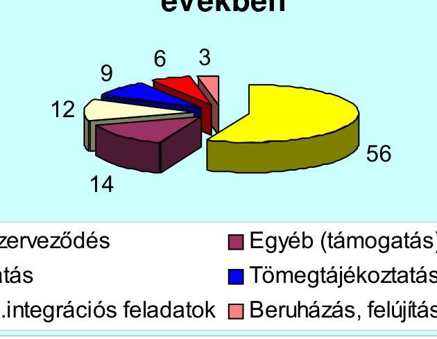
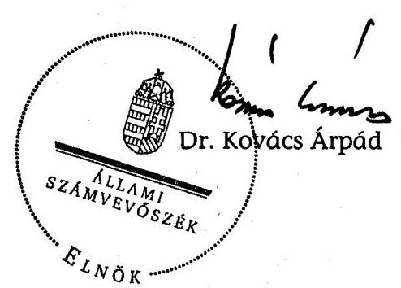
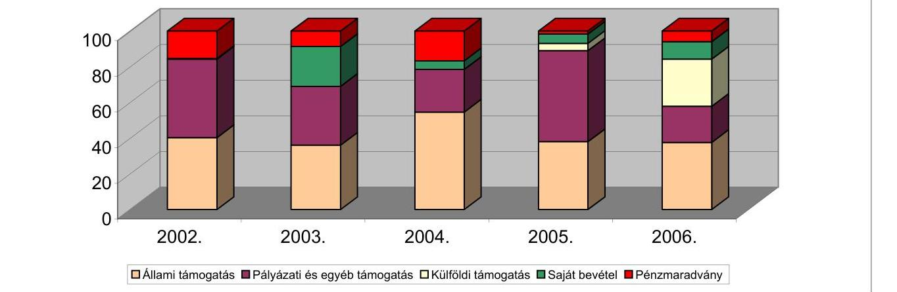
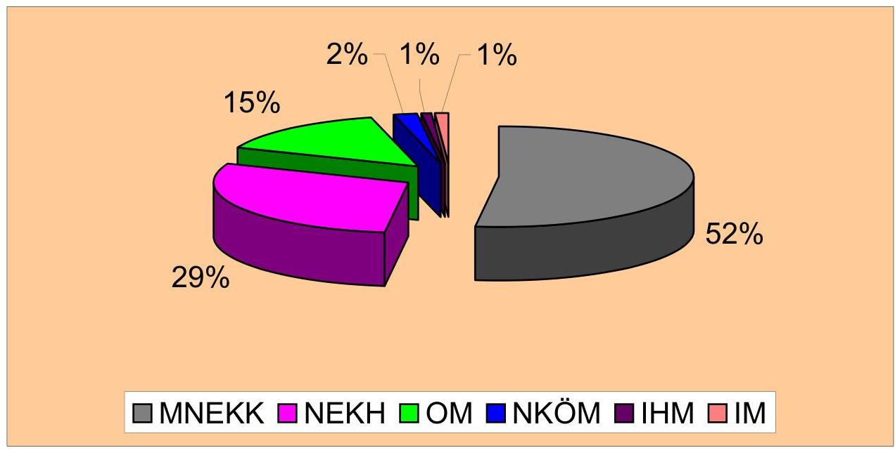
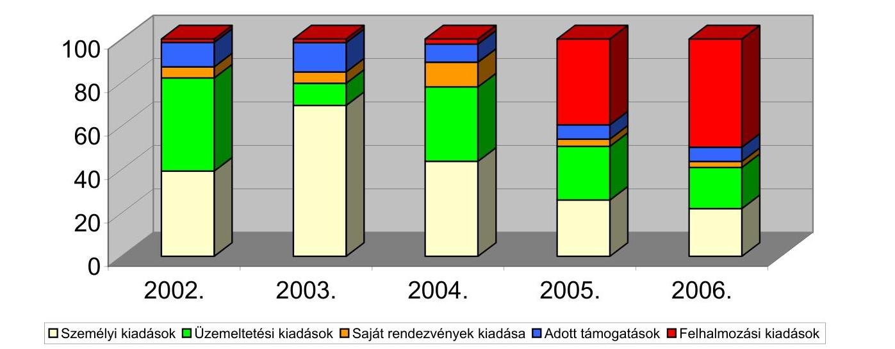

# ÁLLAMI   SZÁMVEVŐSZÉK 

## JELENTÉS

az Országos Lengyel Kisebbségi Önkormányzat 2002-2005. évi pénzügyi-gazdasági tevékenységének ellenőrzéséről

---

3. Önkormányzati és Területi Ellenőrzési Igazgatóság
3.1. Szabályszerűségi Ellenőrzési Főcsoport
Iktatószám: V-1006-026/2007.
Témaszám: 850
Vizsgálat-azonosító szám: V-0344
Az ellenőrzést felügyelte:
Dr. Lóránt Zoltán
főigazgató
Az ellenőrzés végrehajtásáért felelős:
Dr. Elek János
általános főigazgató-helyettes
Az ellenőrzést vezette:
Horváth Balázs
főcsoportfőnök-helyettes
Az összefoglaló jelentést készítette:
Dr. Faragóné Tóth Mária
számvevő tanácsos
Az ellenőrzést végezték:
Dr. Faragóné Tóth Mária Tóth István
számvevő tanácsos számvevő tanácsadó
A témához kapcsolódó eddig készített számvevőszéki jelentések:
címe
sorszáma
Jelentés az Országos Lengyel Kisebbségi Önkormányzat pénzügyi- 376 gazdasági tevékenységének ellenőrzéséről
Jelentés az Országos Lengyel Kisebbségi Önkormányzat pénzügyi- 0043 gazdasági tevékenységének utóellenőrzéséről
Jelentés az országos kisebbségi önkormányzat pénzügyi-gazdasági 0201 tevékenységének vizsgálatáról

---

# TARTALOMJEGYZÉK 

BEVEZETÉS ..... 5
I. ÖSSZEGZŐ MEGÁLLAPÍTÁSOK, KÖVETKEZTETÉSEK, JAVASLATOK ..... 6
II. RÉSZLETES MEGÁLLAPÍTÁSOK ..... 11

1. A feladatellátás szervezettsége, szabályozottsága ..... 11
1.1. Az Önkormányzat szervezeti és működési rendje ..... 11
1.2. A gazdálkodási feladatok szabályozása ..... 12
1.3. A feladatellátás szervezeti háttere ..... 12
2. Az Önkormányzat gazdálkodásának jellemzői ..... 13
2.1. A gazdálkodási tevékenység feltételei ..... 13
2.2. A vagyongazdálkodás, vagyonvédelem ..... 14
2.3. A gazdálkodás számviteli szabályozása ..... 15
3. Az éves költségvetések jóváhagyása, végrehajtása ..... 16
3.1. Az éves költségvetések elkészítése, elfogadása ..... 16
3.2. A költségvetés végrehajtása, zárszámadása ..... 17
3.3. A költségvetési feladatok teljesítése ..... 17
3.3.1. A költségvetési törvényben megállapított támogatás alakulása ..... 18
3.3.2. Pályázati támogatások elszámolása, felhasználása ..... 19
3.3.3. A kiadások alakulása, összetétele ..... 21
4. Az Önkormányzat számviteli tevékenysége ..... 22
4.1. A könyvvezetési kötelezettség teljesítése ..... 22
4.2. Az éves beszámolók összeállítása, jóváhagyása ..... 23
4.3. A bizonylati rend és a bizonylati fegyelem érvényesítése ..... 23
5. Az Önkormányzat belső ellenőrzési rendszere ..... 24
MELLÉKLETEK
6. számú Az Önkormányzat 2002-2006. évi bevételei és megoszlása
7. számú A központi költségvetésből kapott támogatás nemzeti és etnikai kisebbségi feladatokra teljesítése, megoszlása
8. számú A központi költségvetésből kisebbségi feladatokra pályázati és egyedi döntés alapján kapott támogatások részletezése 2002-2006. évekre
9. számú Az Önkormányzat 2002-2006. évi kiadásai és megoszlása

---

.

---

# RÖVIDÍTÉSEK JEGYZÉKE 

| Áht. | Az államháztartásról szóló - többször módosított - 1992.   évi XXXVIII. törvény |
| :-- | :-- |
| Ámr. | Az államháztartás működési rendjéről szóló - többször   módosított - 217/1998. (XII. 30.) Korm. rendelet |
| ÁSZ | Állami Számvevőszék |
| ICSSZEM | Ifjúsági, Családügyi, Szociális és Esélyegyenlőségi Minisztérium |
| IHM | Informatikai és Hírközlési Minisztérium |
| IM | Igazságügyi Minisztérium |
| Kbt. | A közbeszerzésekről szóló 2003. évi CXXIX. törvény |
| MÁK | Magyar Államkincstár |
| MeH | Miniszterelnöki Hivatal |
| MNEKK | Magyarországi Nemzeti Etnikai Kisebbségekért Közalapít-   vány |
| Nek. tv. | A nemzeti és etnikai kisebbségek jogairól szóló - többször   módosított - 1993. évi LXXVII. törvény |
| NEKH | Nemzeti és Etnikai Kisebbségi Hivatal |
| NKÖM | Nemzeti Kulturális Örökség Minisztériuma |
| OM | Oktatási Minisztérium |
| Önkormányzat | Országos Lengyel Kisebbségi Önkormányzat |
| Szja tv | A személyi jövedelemadóról szóló - többször módosított -   1995. évi CXVII. törvény |
| SZMSZ | Szervezeti és Működési Szabályzat |
| Számv. tv. | A számvitelről szóló - többször módosított - 2000. évi C.   törvény |
| Vhr. | A számviteli törvény szerinti egyes egyéb szervezetek be-   számoló készítési és könyvvezetési kötelezettségének sajá-   tosságairól szóló - többször módosított - 224/2000. (XII.   19.) Korm. rendelet |

---

.

---

# JELENTÉS 

## az Országos Lengyel Kisebbségi Önkormányzat 2002-2005. évi pénzügyi-gazdasági tevékenységének ellenőrzéséről

## BEVEZETÉS

A 2001. évi népszámlálás adatai szerint a magyarországi lengyel közösségből 2580 fő lengyel anyanyelvűnek, 2962 fő a lengyel nemzetiséghez tartozónak, 3983 fő a lengyel kulturális értékekhez, hagyományokhoz kötődőnek vallotta magát. A 2002. évi önkormányzati választáson 51 helyi kisebbségi önkormányzat alakult. Három választási ciklus után a 2007. március 4-én tartott kisebbségi önkormányzati választások eredményeként az Országos Lengyel Kisebbségi Önkormányzat (továbbiakban: Önkormányzat) március 19-én tartott alakuló közgyűlésén új elnököt választottak.

Az Önkormányzat 2002-2006 között működési és fejlesztési feladataira 279381 ezer Ft költségvetési támogatásban részesült, ebből 156400 ezer Ft a költségvetési törvényben biztosított támogatás.

A nemzeti és etnikai kisebbségek jogairól szóló módosított 1993. évi LXXVII. törvény (továbbiakban: Nek. tv.) 39/G. § (1) bekezdése, valamint az Állami Számvevőszékről szóló - többször módosított - 1989. évi XXXVIII. törvény 2. § (5) bekezdésében kapott felhatalmazás alapján vizsgáltuk az országos önkormányzat 2002-2005 közötti, éves beszámolóval lezárt gazdálkodását, valamint a 2006. évi költségvetési terv összeállítását, alakulását.

Az ellenőrzés célja: annak megállapítása volt, hogy

- az Önkormányzat a központi költségvetési támogatást a Nek. tv-ben meghatározott feladatokra használta-e fel, a felhasználása és elszámolása során betartották-e a vonatkozó hatályos jogszabályi előírásokat;
- a gazdálkodás törvényessége, szabályszerűsége biztosított volt-e: a tervezés, az operatív gazdálkodás, a beszámolási kötelezettség és a számviteli bizonylati rend teljesítése során érvényesültek-e a jogszabályokban és a belső szabályzatokban megfogalmazott követelmények;
- a szabályszerű gazdálkodás érdekében kialakított kontrollmechanizmusok megfelelően segítették-e a feladatok végrehajtását.

Az ellenőrzés: 2007. február 16. - április 13. között az Önkormányzat székhelyén történt.

---

# I. ÖSSZEGZŐ MEGÁLLAPÍTÁSOK, KÖVETKEZTETÉSEK, JAVASLATOK 

#### Abstract

Az Önkormányzat a nemzetiségi összefogást, fejlődést célzó feladatait a szabályozási hiányosságok ellenére eredményesen szervezte. A közgyűlés a nemzeti és etnikai kisebbségi törvény (Nek. tv.) előírásaival összhangban megállapított hatáskörében a pénzügyi és gazdasági tevékenységet érintő döntéseket határozatképesen hozta. A közgyűlés feladatainak hatékonyabb ellátását és törvényességének biztosítását szakmai, pénzügyi és ellenőrzési bizottságok segítették, amelyek éves munkaterv alapján végezték tevékenységüket. Az Önkormányzatnál hatályos SZMSZ nem szabályozta a kisebbségi feladatok körét és a feladatellátás rendszerét. A szervezeti és működési rendet a Nek. tv. 2005. november 25-ei hatályú módosításával, a pénzügyi bizottság feladatainak meghatározásával, valamint a vasárnapi iskola intézményesítésével elmulasztották aktualizálni.

Az országos kisebbségi feladatok 2003-2004 között intézményi szervezetek fenntartásával bővültek. A Magyarországi Lengyelség Múzeuma és Levéltára alapítását, törzskönyvezését önálló gazdálkodási jogkörrel végezték, de az intézményi SZMSZ-t - az önállósági feltételek megteremtése hiányában - szabálytalanul kétéves késedelemmel, részben önálló jogkörrel hagyták jóvá. Az Országos Lengyel Nyelvoktató Iskolát 2004. szeptember 1-jei hatállyal részben önálló költségvetési szervként alapították, vették államkincstári törzskönyvi nyilvántartásba. A gazdálkodási feladatok ellátására nem jelöltek ki önálló jogkörrel felruházott költségvetési szervet, elmaradt a felelősségvállalási és munkamegosztási rend megállapodásba foglalása. A közgyűlés elmulasztotta jóváhagyni a szabályszerű működéshez szükséges SZMSZ-t, ügyrendet is. Az Önkormányzat mindkét intézmény vonatkozásában megsértette a költségvetési szervek alapításának és működtetésének kormányrendeletben meghatározott rendelkezéseit. A Magyarországi Lengyel Katolikusok Szent Adalbert Egyesületével közösen működtetett Lengyel Ház - megállapodásban vállalt - részleges fenntartási feladatait 2003. októberétől rendszeresen teljesítette.

A gazdálkodási tevékenység szabályszerű ellátásának feltételei is hiányoztak. Az SZMSZ rendelkezése alapján működtetett iroda az ügyrend szerinti irodatitkár nélkül funkcionált. A Nek. tv. módosító rendelkezését figyelmen kívül hagyva az iroda hivatali szervezetté fejlesztéséről, a törvénnyel összhangban álló feladatairól és személyi feltételeiről, a hivatalvezető kinevezéséről nem gondoskodtak. Utóbbi hiányában a gazdálkodási és munkáltatói jogkörök törvénysértő módon az elnök hatáskörében maradtak. Az Önkormányzat és intézményei pénzügyeinek ellenőrzése nem volt megoldott, a törvény rendelkezése ellenére a belső ellenőr foglalkoztatását 2005 után nem tartották fenn. Az irodai foglalkoztatottak létszáma, két alkalmazotti és egy külsős számviteli státuszra szűkült. Az irodai működéshez szükséges tárgyi feltételeket folyamatosan biztosították.

A vagyongazdálkodási döntések szabályszerű közgyűlési határozatokon alapultak. A közgyűlés a Nek. tv. rendelkezése ellenére nem határozta meg a

---

vagyonleltár tartalmi-szerkezeti követelményeit, a törzsvagyon körét. Az Önkormányzat eszközállománya a 2005-2006. évi intézményi beruházások eredményeként megháromszorozódott, 2006. évi előzetes záró értéke 88731 ezer Ft, amelynek 88%-át az aktivált ingatlanok tették ki. Az egyszeri ingyenes vagyonjuttatásként kapott részvényekből vásárolt értékpapírokból 2005 végén 17410 ezer Ft pénzügyi befektetéssel rendelkeztek, amelynek értékesítéséből befolyt bevételt ingatlanvásárlásra, valamint a vizsgált időszakot megelőzően felhalmozott központi költségvetési tartozáskiegyenlítésre fordították.

Az Önkormányzat a módosított Nek. tv. előírásai alapján egyszeri, ingyenes vagyonjuttatásként 2006 végén szerződéssel átvette a 42199 ezer Ft értékű székházat, amely az Önkormányzat forgalomképtelen törzsvagyonának minősül. Az épület biztonságtechnikai szolgáltató által felügyelt riasztóberendezéssel ellátott.

Az Önkormányzat nem rendelkezett a hatályos számviteli törvény alapján kiadott számviteli szabályozással. A számviteli politika és a kapcsolódó pénzkezelési, leltározási, értékelési szabályzat a hatályon kívül helyezett törvényi előírások alapján készült, így nem felelt meg az aktuális jogszabályok rendelkezéseinek. A törvény előírása ellenére nem határozták meg a számlarendet sem. A számviteli szabályozások elkészítéséért, módosításáért az Önkormányzat képviseletére jogosult elnök a felelős.

Az Önkormányzat közgyűlése 2002-2005 között minden évben jóváhagyta az éves költségvetést, zárszámadást. A közgyűlés kizárólagos hatáskörébe utalt költségvetés és zárszámadás összeállításának tartalmi követelményeit nem szabályozták. A költségvetések évente azonos szerkezetben - bizottsági közreműködéssel - készültek, amelyekkel a zárszámadások tartalma összhangban volt. A bevételeket és kiadásokat főbb jogcímek szerint csoportosították. A tervezésnél és a költségvetés végrehajtásánál az alapvető kisebbségi feladatok forrásigényét és felhasználását elkülönítetten határozták meg. A takarékossági intézkedések a költségvetések végrehajtásánál lehetővé tették a kötelezettségvállalások pénzügyi fedezetét, a pénzügyi egyensúly folyamatos megőrzését. A Nek. tv. 2005. év végi módosításával összhangban az Önkormányzat nem gondoskodott a közgyűlés által elfogadott költségvetés közzétételéről.

A 2002-2006. években összesen 352885 ezer Ft pénzforgalmi bevételből gazdálkodott az Önkormányzat. A költségvetési törvények alapján 156400 ezer Ft, pályázati és egyedi döntés eredményeként 122981 ezer Ft központi költségvetési támogatásban részesült, amely együttesen a pénzforgalmi bevétel 79,2%-át tette ki. A nevesített működési célú költségvetési támogatás a 2002. évi bázishoz képest 2003-ra 42,9%-kal nőtt, 2004. évben az előző évi szinten teljesült, míg 2005-ben az államháztartási egyensúlyi intézkedések miatt csökkent. A 2006. évi támogatás 35000 ezer Ft-tal teljesült. Az Önkormányzat az ellenőrzött időszakban jelentős mértékben növelte forrásait a pályázati lehetőségekkel. A 2004. évtől alapított és fenntartott intézmények költségvetési támogatását kötelezettségként könyvelték. A hibás elszámolás következtében 64840 ezer Ft támogatás kimaradt az elszámolt bevételekből. Az elszámolási hiba ellenére az Önkormányzat a saját intézményei fenntartására 2004-2006 között kapott 18030 ezer Ft normatív és 23782 ezer Ft pályázati támogatást, valamint a Lengyel Ház működtetésére elnyert 23028 ezer Ft támogatást az intézményeknek rendeltetésszerűen továbbadta, fenntartóként határidőben teljesítette a támogatások dokumentált elszámolását.

Az Önkormányzat összes kiadásának 65,7%-át működésre, 25,7%-át felhalmozásra, 8,6%-át lengyel kisebbségi szervezetek támogatására fordította. A működési célú költségvetési támogatás 56%-át az Önkormányzat önszerveződési kiadásokra, 14%-át kisebbségi önkormányzatok és lengyel szervezetek támogatására, 12%-át oktatási, 9%-át tömegtájékoztatási, 6%-át társadalmi integrációs feladatokra és 3%-át beruházásra fordította. A felhalmozási kiadás a 2005-2006. években merült fel, az önkormányzati ingatlan beruházások, az iskola épületének megvásárlása és a múzeum rekonstrukciója kapcsán teljesült. A lengyel kisebbségi szervezetek közül évente 13-15 szervezetet 4500 ezer-6400 ezer Ft közötti összeggel, szerződéssel támogattak. A támogatott szervezetektől részletes elszámolást kértek, kivéve két nagy szervezetet, amellyel napi kapcsolatban álltak. A pályázati támogatások több mint felét kisebbségi lap megjelentetésének céljára,
 15%-át a vasárnapi iskolák működésére biztosították. A költségvetési és pályázati támogatások rendeltetésszerű felhasználását a bizonylatok, a pénzügyi és szakmai beszámolók igazolták. Az Önkormányzat minden évben határidőre teljesítette a támogatási szerződésben megállapított elszámolási kötelezettséget.

A könyvvezetési kötelezettségét az Önkormányzat kettős könyvvitellel, az időszakban cserélődött, regisztrált számviteli szolgáltató igénybevételével teljesítette. A könyvvezetésben feltárt hibák a számviteli szabályozás, illetve a jogszabályok betartásának hiányából következtek. A számlarend nélkül történt könyvelésben lényeges hibát okozott az intézményi költségvetési támogatások szabálytalan könyvelése. A 2004-2006. évi könyvvezetésben sérült a teljesség, valódiság, következetesség és időbeli elhatárolás elve. A könyvvezetési szabálytalanságokból eredően a hiba mértéke 2004-ben 37,2%, 2005-ben 31,2% volt.

A lényegességi szintet meghaladó hiba folytán a 2004. és 2005. évi beszámoló nem mutatott megbízható és valós képet. Az éves beszámolókhoz biztosították a ráfordítások kisebbségi feladatonkénti kimutatását, a főkönyvvel való egyezőségét; a jogszabályban meghatározott formában, határidőre elkészítését. Az éves mérlegadatokat a korszerűtlen leltározási, értékelési szabályok alapján összeállított leltár támasztotta alá.

A kiadások teljesítésére, banki átutalások kezdeményezésére, és azok főkönyvi könyvelésére - a kiküldetések kivételével - szabályszerűen kiállított bizonylatok alapján, az utalványozást követően került sor. Betartották a szigorú számadási kötelezettségre és a bizonylatok megőrzésére vonatkozó előírásokat. Az Önkormányzat minden évben eleget tett a jogszabályokban előírt bejelentési, nyilvántartási és bevallási kötelezettségeinek. A kiküldetések, útiköltség-térítések bizonylatolása és a pénztárjelentés ellenőri aláírása kivételével érvényesültek a törvényben meghatározott bizonylatolási előírások.

Az Önkormányzat belső ellenőrzési rendszere a Gazdasági, Pénzügyi és Jogi Bizottság tevékenységén, a vezetői és a munkafolyamatba épített ellenőrzésen keresztül működött. A választott ellenőrző testület a vizsgált időszakban az SZMSZ előírásainak megfelelően éves munkatervek alapján a költségvetés és a beszámoló elkészítésével, a gazdasági feladatok teljesítésével kapcsolatos irányítási és véleményezési feladatait, valamint az utalványozások ellenjegyzését végezte.

Az Önkormányzat 2004. július 1-je és 2005. december 31-e között vállalkozási szerződéssel belső ellenőrt foglalkoztatott, de az általa végzett vizsgálatokat ellenőrzési dokumentumok nem igazolták. A szerződés lejárta után az Önkormányzat és intézményei gazdálkodásának ellenőrzésére 2006. január 1-jétől belső ellenőrt nem bíztak meg, ezáltal megsértették a hatályos Nek. tv. rendelkezését. A vezetői ellenőrzés a kiadmányozási jog gyakorlásával, az utalványozással és a számlák ellenjegyzésével volt dokumentált. A gazdasági vezetői feladatokhoz nem rendelkeztek a törvényben előírt hivatalvezetővel. A munkafolyamatba épített ellenőrzés a pénztárellenőrzések, számviteli egyeztetések folyamatában hiányosan teljesült. A pénztárjelentésekről minden esetben, a bizonylatokról 23%-ban hiányzott az ellenőrzés aláírással való igazolása.

A helyszíni ellenőrzés megállapításainak hasznosítása mellett javasoljuk:

# az Önkormányzat közgyűlésének: 

1. Módosítsa az SZMSZ-t
a) a Nek. tv. 37. § (1) bekezdése alapján az országos kisebbségi önkormányzati feladatok meghatározásával;
b) a hivatali szervezet országos kisebbségi önkormányzati költségvetési szervként való meghatározásával, szervezeti és működési rendjének szabályozásával, összhangban a Nek. tv. 39/A. § (2), a 39/B. § (5), valamint a 39/G. § (1) bekezdésében foglaltakkal;
c) az Országos Lengyel Nyelvoktató Iskolának az intézmények felsorolásában való feltüntetésével;
d) a Gazdasági, Pénzügyi Bizottság feladatainak meghatározását a Nek. tv 39/G. § (2) bekezdésében előírt feladatoknak megfelelően, az előírt feladatok teljesítését rendszeresen kísérje figyelemmel.
2. Készítse el az SZMSZ 41. § (5) bekezdés előírása szerint az Önkormányzat vagyonkezelési és befektetési szabályzatát.
3. Határozza meg az éves költségvetés és zárszámadás összeállításának tartalmi és eljárási követelményeit, a törzsvagyon körét.
4. Módosítsa a Magyarországi Lengyelség Múzeuma és Levéltára Alapító Okiratát, SZMSZ-ét, valamint Ügyrendjét az Ámr. 8-18. §-aiban foglaltakra tekintettel.
5. Fogadja el az Országos Lengyel Nyelvoktató Iskola SZMSZ-ét és Ügyrendjét az Ámr. 8-18. §-ai előírásainak megfelelően.
6. A Nek. tv. módosítása szerint 2008. január 1-jéig hozza létre a hivatali szervezetét és gondoskodjon az Ámr. összeférhetetlenségi szabályai előírásainak megfelelően, feladataival arányos személyi és tárgyi feltételeiről. Az Ámr. 14. § előírásai alapján hatáskörében rendezze a részben önálló gazdálkodási jogkörű intézmények gazdasági feladatainak ellátását.

# az Önkormányzat elnökének: 

1. Gondoskodjon az Önkormányzat számviteli politikájának és kapcsolódó szabályzatainak, valamint számlarendjének a Számv. tv. 14-16. §, valamint 161. és 161/A. §-ai előírásaival összhangban lévő elkészítéséről.
2. Gondoskodjon az Önkormányzat közgyűlése által elfogadott éves költségvetés Nek. tv. 39/G. § (4) bekezdés előírása szerinti Magyar Közlönyben való megjelentetéséről.
3. Biztosítsa a könyvvezetésben és a beszámoló összeállítása során a Számv. tv. 15-16. §-ban foglalt számviteli elvek teljes körű érvényesülését, valamint a 2004-2005. évi beszámolók lényeges hibáinak önellenőrzéssel való megszüntetését.
4. Szerezzen érvényt a kiküldetéseknél és a pénztárellenőrzésnél a Számv. tv. 167. § (1) bekezdésben foglalt bizonylatolási alaki és tartalmi követelményeknek.
5. Gondoskodjon a Nek. tv. 39/G. § (1) bekezdésében foglaltak szerint az önkormányzat és saját intézményei pénzügyi ellenőrzésére jogszabályban meghatározott képesítésű belső ellenőr foglalkoztatásáról.

# II. RÉSZLETES MEGÁLLAPÍTÁSOK 

## 1. A feladatELLÁTÁS SZERVEZETTSÉGE, SZABÁLYOZOTTSÁGA

### 1.1. Az Önkormányzat szervezeti és működési rendje

Az Önkormányzat szervezeti rendjét hatályos SZMSZ határozta meg. A 2005. november 25-éig hatályos Nek. tv. 35-39. § előírásai alapján az SZMSZ-ben meghatározta jogállását, hatáskörét, szervezetét, tisztségviselőit. Felsorolta - az Országos Lengyel nyelvoktató Iskola kivételével - az alapított és fenntartott intézményeit. Szabályozta a közgyűlés döntéshozatali tevékenységét, a bizottságok működését, az elnökség, képviselők jogait, kötelességeit. Nem szabályozta az ellátott kisebbségi feladatait és a feladatellátás rendszerét. Részben kitért az Önkormányzat gazdálkodására, vagyonára, költségvetésére.

A vizsgált időszakban egymást követően két SZMSZ volt érvényben. Az 1999. június 19-étől hatályos SZMSZ és a 2002. évi választásokat követően 2003. szeptember 7-én elfogadott új SZMSZ, amely - az Önkormányzat bizottságainak megnevezése és a bizottságok feladatainak előírása kivételével - érdemi változást nem tartalmazott. Az SZMSZ-t a Nek. tv. 2005. év végi módosításával, a Gazdasági, Pénzügyi Bizottság feladatainak meghatározásával, valamint a vasárnapi iskola intézményesítésével nem aktualizálták.

Az Önkormányzat törvényben meghatározott feladat- és hatáskörét a szabályszerűen választott közgyűlés gyakorolta. A közgyűlés által irányított, felügyelt személyek, szervezeti egység: az elnök, elnökhelyettesek, bizottságok, az iroda.

Az SZMSZ a közgyűlés hatásköréből át nem ruházható hatásköröket a Nek. tv. 37. §-a előírásaival összhangban állapította meg. Az Önkormányzat képviselőtestülete tagjainak száma - az érvényes előírásoknak megfelelően - 2002. január 1-je és 2003 márciusa között 15 fő, 2003 márciusa és 2006. december 31-e között 19 fő volt. Az Önkormányzat képviselőtestülete az SZMSZ előírása szerinti üléseket megtartotta. A testületi ülésekről írásos jegyzőkönyvek készültek magyar nyelven.

Az Önkormányzat az ellenőrzés rendelkezésére bocsátotta a 2002-2006. évi jegyzőkönyvekből a gazdasági tárgyú határozatok kivonatait. A pénzügyigazdasági tevékenységet érintő döntéseket határozatképesen hozták.

A közgyűlés feladatainak hatékonyabb ellátása és törvényességének biztosítása érdekében 2003. szeptember előtt 4, utána pedig 3 bizottságot hozott létre. A bizottságok működési szabályait az SZMSZ-ben szabályozták. A bizottságok feladatait a 2003. szeptember 7-én elfogadott új SZMSZ mellékletében határozták meg. A bizottságok a szabályozásnak megfelelően éves munkatervek alapján végezték tevékenységüket, szükség szerint üléseztek.

Az Önkormányzat szervezeti és működési rendje, az egyes önkormányzati szervek (közgyűlés, elnök, bizottságok) közötti munkamegosztás módja, gyakorlata a vizsgált időszakban 2005. novemberig megfelelt a Nek. tv. 35-39. §-aiban előírtaknak. Biztosítottak voltak a folyamatos munkavégzés feltételei, érvényesültek az összeférhetetlenségi szabályok. A Nek. tv. 39/A. § (2) bekezdése 2005. november 25-e óta hatályos módosítása szerint a közgyűlés szervei: az elnök, az egy, vagy több elnökhelyettes, a bizottságok és a hivatal. A Nek. tv. 39/B. § (5) bekezdése szerint az országos kisebbségi önkormányzatok hivatala országos kisebbségi önkormányzati költségvetési szerv. Az Önkormányzatnak a közgyűlés szervként létre kellett volna hoznia hivatalát. Az Önkormányzat hivatali szervezetét (irodáját) a vizsgálat időpontjáig nem alakította át a törvény módosításának megfelelően költségvetési szervvé.

# 1.2. A gazdálkodási feladatok szabályozása 

Az Önkormányzat az SZMSZ IX. fejezetében meghatározta gazdálkodásának pénzügyi forrásait, az önkormányzat vagyonára, gazdálkodására vonatkozó kritériumokat.

A közgyűlés kizárólagos hatáskörébe tartozott a költségvetés és zárszámadás elfogadása. Az éves költségvetések és zárszámadások elfogadásának rendjével kapcsolatban az SZMSZ 4. számú melléklete értelmében a Gazdasági, Pénzügyi és Jogi Bizottság készíti el az Önkormányzat éves költségvetését az elnökség felé a többi bizottság közreműködésével. Gondoskodik arról, hogy a javaslatok az egyeztetést követően a költségvetésben szerepeljenek. A Gazdasági, Pénzügyi és Jogi Bizottság irányítja és ellenőrzi a jogszabályban előírt módon és időben az évközi és az előző évi költségvetés teljesítéséről készült beszámolót, szükség esetén, a törvényes keretek között módosítási javaslatokat tesz. Az Ellenőrző és Etikai Bizottság feladata a gazdálkodáshoz kapcsolódóan az éves költségvetési jelentés ellenjegyzése és a pénzügyi támogatásban részesült szervezetek részére nyújtott támogatás felhasználásának ellenőrzése.

### 1.3. A feladatellátás szervezeti háttere

Az Önkormányzat közgyűlése az SZMSZ 3. § (4) bekezdés d) pontjában foglalt kizárólagos jogkörében 2004. évben két intézményt alapított, valamint a Magyarországi Lengyel Katolikusok Szent Adalbert Egyesületével közösen működtetett intézményt tartott fenn.

A Magyarországi Lengyelség Múzeuma és Levéltára Alapító Okirata és az államkincstári bejegyzése szerint önállóan gazdálkodó országos kisebbségi önkormányzati intézményként működik, szakmai besorolása szakgyűjtemény/közérdekű muzeális gyűjtemény. A Magyarországi Lengyelség Múzeuma és Levéltára működésének szabályozása ellentmondásos. Az alapító okirattól eltérően a 2006. január 13-án kelt múzeumi SZMSZ 11. §-a értelmében a muzeális intézmény részben önállóan gazdálkodó költségvetési szerv. A Múzeum Ügyrendje értelmében az igazgató teljes gazdálkodási jogkörrel rendelkezik. A Múzeum az Ámr. 14. § (3) bekezdés b) pontja szerinti önálló gazdálkodási jogkörrel való működésre szervezetileg nem alkalmas. A Múzeumnál akadályoztatás és érintettség esetén az utalványozó és ellenjegyző helyettesítése a szervezeten belül nem megoldott.

Az Országos Lengyel Nyelvoktató Iskola Alapító Okirata és államkincstári bejegyzése szerint részben önállóan gazdálkodó, előirányzatai felett részjogkörrel rendelkező költségvetési szervként működik. Az iskolát az Önkormányzat országos működési területű, nyelvoktató kiegészítő kisebbségi iskolaként alapította. Az intézmény SZMSZ-ét és Ügyrendjét a helyszíni ellenőrzés időpontjáig az Önkormányzat nem fogadta el, ezzel megsértette az Ámr. 10. § (4) bekezdése, valamint 14. § (5) bekezdése előírásait. Az Országos Lengyel Nyelvoktató Iskolát az Önkormányzat hatályos SZMSZ-ének 5. § (5) bekezdésében az intézmények között nem nevesíti. A részben önállóan gazdálkodó intézmény pénzügyi és gazdasági feladatai ellátására az Önkormányzat az Ámr. 14. § (5) bekezdés a) pontjában előírt, önállóan gazdálkodó költségvetési szervet nem jelölt ki, az Ámr. 14. § (5) bekezdés b) pontjában előírt megállapodást nem kötötték meg a felelősségvállalás és munkamegosztás rendjéről.

Az intézmények maguk készítették el és nyújtották be költségvetésüket az Önkormányzat közgyűlésének. Az intézmények költségvetését és beszámolóját az Ámr. 13. § (3) bekezdésének előírása szerint a közgyűlés fogadta el. Az Önkormányzat az intézmények feletti felügyeleti jogait a vizsgált időszakban az előírásoknak megfelelően gyakorolta. Fenntartóként saját egyéb forrásaiból, normatív költségvetési támogatásból és pályázati támogatások megszerzése útján is támogatta az intézmények működését.

A Lengyel Ház a Magyarországi Lengyel Katolikusok Szent Adalbert Egyesületével közösen fenntartott intézmény. Az Önkormányzat megállapodásban vállalta, hogy az Egyesület által készített, közösen elfogadott költségvetési terv alapján a MeH-hez benyújtott és elnyert támogatást tovább adja. Az Önkormányzat betartotta
 a NEKH-val, valamint az Egyesülettel kötött megállapodásban foglaltakat.

# 2. Az ÖNKORMÁNYZAT GAZDÁLKODÁSÁNAK JELLEMZŐI 

### 2.1. A gazdálkodási tevékenység feltételei

Az Önkormányzat az SZMSZ szabályozása szerint a testület hivatali teendőinek ellátására irodát hozott létre és részletes szabályait, alkalmazotti létszámát az SZMSZ mellékletét képező Ügyrendben meghatározta. Ennek értelmében az iroda feladata az Önkormányzat és szervei testületi üléseinek technikai és ügyviteli előkészítése, az Önkormányzat ügyvitelének könyvviteli, adminisztrációs és gondnoki feladatainak ellátása, a rendezvények előkészítésében és lebonyolításában való közreműködés. A 2003. szeptember 7-én elfogadott Ügyrend értelmében az irodát az elnök irányításával az irodatitkár vezeti. Az irodatitkári munkakört a vizsgált időszakban közgyűlési határozat alapján takarékossági szempontok miatt nem töltötték be. Az iroda létszáma 4 fő volt, akik közül 3 főt alkalmazottként foglalkoztattak, akik a munkakörükhöz szükséges végzettséggel rendelkeztek. A számviteli, az adózással, a munkaügyi és bérszámfejtéssel kapcsolatos, valamint az állami támogatás elszámolás elkészítésével összefüggő feladatok ellátására az Önkormányzat külső számviteli szolgáltatást végző gazdasági társasággal, illetve magánszeméllyel kötött megállapodást. A számviteli szolgáltatást végző vállalkozás, illetve magánszemély a Számv. tv. 151. §-ában előírt követelményeknek megfelelt. A szolgáltatást a gazdasági társaság,

---

illetve a magánszemély az Önkormányzat székházában nyújtotta, így az operatív információáramlás, valamint a bizonylatok megőrzésének feltételei biztosítottak voltak. A működés tárgyi feltételeit illetően a kialakított iroda berendezése, számítástechnikai felszereltsége megfelelő kereteket biztosított a feladatellátáshoz, biztosítottak voltak a folyamatos munkavégzés feltételei.

# 2.2. A vagyongazdálkodás, vagyonvédelem 

Az Önkormányzat az SZMSZ-ben rögzítette a vagyongazdálkodással kapcsolatosan a közgyűlés át nem ruházható hatáskörét, melyet az Önkormányzat betartott. A Nek tv. 37. § b) pontja szerint az Önkormányzat önállóan dönt vagyonleltár megállapításáról, de az SZMSZ-ben és más szabályzatban nem határozták meg a vagyonleltár belső tartalmát, felépítését. Az önkormányzati SZMSZ előírására a vagyongazdálkodás részletes szabályait külön szabályzatban nem állapították meg. Az önkormányzati vagyon fogalmát meghatározták, de nem állapították meg a törzsvagyon körét.

Az SZMSZ mellékletében a gazdálkodási és ellenőrzési jogköröket (kötelezettségvállalás, utalványozás, ellenjegyzés) rögzítették és a gyakorlatban ennek megfelelően jártak el. A szabályozás megfelel a vonatkozó jogszabályi rendelkezéseknek összeférhetetlenség, hatáskör leadása tekintetében. A felhalmozási kiadások eredményeként az Önkormányzat eszközállománya a vizsgált időszak alatt közel megháromszorozódott. Az eszközállományon belül a befektetett eszközök aránya 35,3 %-ról 92,1 %-ra nőtt.

Az Önkormányzat eszközállományának alakulását a következő összeállítás szemlélteti:

Adatok: ezer Ft-ban

| Megnevezés | 2002.   évi záró | 2003.   évi záró | 2004.   évi záró | 2005.   évi záró | 2006.*   évi záró |
| :-- | --: | --: | --: | --: | --: |
| Ingatlan | 0 | 0 | 0 | 30896 | 78384 |
| Egyéb berendezés | 1111 | 2335 | 2934 | 2566 | 3331 |
| Immateriális javak | 0 | 42 | 33 | 23 | 23 |
| Pénzügyi befektetés | 9206 | 16983 | 16983 | 17410 | 0 |
| Értékpapír | 8771 | 2881 | 2881 | 1019 | 1019 |
| Készpénz | 36 | 73 | 116 | 6 | 59 |
| Betétszámla | 7969 | 10097 | 1305 | 5617 | 5030 |
| Egyéb követelés | 2158 | 670 | 645 | 884 | 885 |
| Összesen: | $\mathbf{2 9 2 5 1}$ | $\mathbf{3 3 0 8 1}$ | $\mathbf{2 4 8 9 7}$ | $\mathbf{5 8 4 2 1}$ | $\mathbf{8 8 7 3 1}$ |

* 2006. évi számok előzetes tény

Az Önkormányzat az általa 2004. évben alapított Magyarországi Lengyelség Múzeuma és Levéltára épületét 2005. évben - közgyűlési döntés alapján - saját keretéből a Fővárosi Önkormányzattól 1250 ezer Ft-ért megvásárolta és 2005-2006 évben bővítette. A Kbt. szerinti eljárást szabályszerűen lefolytatták. A Mú-

---

zeum rekonstrukciós munkáira és bővítésére 2005. évben 32354 ezer Ft támogatást kaptak, ebből a NEKH pályázattal 25000 ezer Ft felhalmozási célú támogatást biztosított. Az építési munkák finanszírozásához 2005. évben a X. kerületi Önkormányzat 4000 ezer Ft-tal hozzájárult és a lengyel „Wspólnota Polska" Egyesület még 3354 ezer Ft-tal támogatta a beruházást.

Az Önkormányzat 2006. évben a lengyel államtól a múzeumi beruházásra 24582,5 ezer Ft támogatást kapott. A NEKH-től tereprendezésre és berendezésre 6000 ezer Ft támogatást nyert el. Az Önkormányzat 2006-ban az általa alapított Országos Lengyel Nyelvoktató Iskola céljaira testületi döntés alapján a székhelye területén lévő lakást a tulajdonostól a kerületben szokásos áron 16250 ezer Ft-ért megvásárolta.

Az Önkormányzat a vizsgált időszakot megelőzően az egyszeri vagyonjuttatásként kapott 15000 ezer Ft névértékű MOL részvényeket értékesítette, az abból származó bevételt lekötött betétben, állampapírban helyezte el, illetve tartozásainak kiegyenlítésére, ingatlan vásárlásra fordította. Ezzel párhuzamosan jelentős tőkeváltozás is lezajlott. A saját tőke nagysága a 2002. évi 22509 ezer Ftról 2006. év végére 89608 ezer Ft-ra változott, ami 398%-os növekedést jelent.

A tőkeváltozást az alábbi táblázat szemlélteti:
Adatok: ezer Ft-ban

| Megnevezés | $\mathbf{2002}$. | $\mathbf{2003}$. | $\mathbf{2004}$. | $\mathbf{2005}$. | $\mathbf{2006. *}$ |
| :-- | --: | --: | --: | --: | --: |
| Saját tőke | 22509 | 26190 | 24199 | 57684 | 89608 |
| Jegyzett tőke | 15000 | 15000 | 15000 | 15000 | 15000 |
| Tőke tartalék | 5125 | 7509 | 11190 | 9199 | 46807 |
| Mérleg szerinti eredmény | 2384 | 3681 | -1991 | 34608 | 30801 |

* 2006. évi számok előzetes tény

A Magyar Állam nevében eljáró Kincstári Vagyoni Igazgatóság egyszeri ingyenes vagyonjuttatásként bruttó 42199 ezer Ft értékben, 2006. december 29-én kelt szerződésével a 1102 Budapest, Állomás utca 10. A. épület földszintjén található $285 \mathrm{~m}^{2}$ területű ingatlant átadta az Önkormányzatnak székház céljára. Az ingatlan a módosított Nek. tv. 59/A. § (1) bekezdésének előírásai alapján az Önkormányzat tulajdonába került és a törvény 59/A. § (3) bekezdése értelmében az Önkormányzat forgalomképtelen törzsvagyonának minősül. Az épület biztonságtechnikai szolgáltató által felügyelt riasztó-berendezéssel ellátott.

# 2.3. A gazdálkodás számviteli szabályozása 

A vizsgált időszakban az Önkormányzatnak a 2001. január 1-je óta hatályos Számv. tv. 14-16. §-ai, valamint a Vhr. 8-9. §-ai alapján készült számviteli politikája és kapcsolódó szabályzatai nem voltak. A számviteli belső szabályozás rendszere az 1999 novemberében elfogadott, az 1991. évi XVIII. törvény alapján kiadott számviteli politikán és kapcsolódó pénzkezelési, leltározási, értékelési szabályozáson alapult.

---

Az Önkormányzat a Számv. tv. 161. § és 161/A. § előírása ellenére nem készítette el számlarendjét. Nem határozta meg az egyes alkalmazásra kerülő számlák megnevezését, tartalmát, ha az a számla megnevezéséből egyértelműen nem következik, a számla értéke növekedésének és csökkenésének jogcímeit, a számlát érintő gazdasági eseményeket és azok más számlákkal való összefüggését, a főkönyvi számla és az analitikus nyilvántartás kapcsolatát, a számlarendben foglaltakat alátámasztó bizonylati rendet.

A számviteli szabályozások elkészítéséért, módosításáért az Önkormányzat képviseletére jogosult elnök a felelős a Számv. tv. 14. § (9) és a 161. § (4) bekezdése szerint.

# 3. AZ ÉVES KÖLTSÉGVETÉSEK JÓVÁHAGYÁSA, VÉGREHAJTÁSA 

### 3.1. Az éves költségvetések elkészítése, elfogadása

Az Önkormányzatnál az éves költségvetések elkészítése során érvényesültek a belső szabályozás előírásai. Az SZMSZ szerint a költségvetés megállapításáról önállóan döntöttek és elfogadása a közgyűlés kizárólagos, át nem ruházható hatáskörébe tartozott. Kijelölték a költségvetés elkészítéséért felelős személyt, elkészítésének rendjét, a költségvetés tartalmát belső előírás nem szabályozta.

A szabályozásnak megfelelően az éves költségvetések elkészítését és elnökség elé terjesztését - a többi bizottság közreműködésével - 2006. évtől az Ellenőrző és Etikai Bizottság ellenjegyzésével - a Gazdasági, Pénzügyi és Jogi Bizottság végezte. A gyakorlatban a költségvetések alapjául az Önkormányzat, a bizottságok éves szakmai tervei, pénzügyi tervek és a számviteli szolgáltató által végzett számítások szolgáltak. A költségvetés elkészítésénél minden ellenőrzött évben az előző évi költségadatokat, a várható pályázati bevételeket, valamint a jóváhagyott költségvetési támogatást vették figyelembe.

Az Önkormányzat éves költségvetéseit egymással összehasonlítható szerkezetben, jól átlátható tagolásban készítették el. A költségvetésekben a korábban felhalmozódott adó- és járuléktartozások kiegyenlítésére tartalékot képeztek. A bevételeket és kiadásokat főbb jogcímek szerint csoportosították. A bevételeket előző évi pénzmaradvány, állami támogatás, lapkiadás, oktatás, egyéb pályázatok, adományok és befektetett vagyon bontásban részletezték.

Az Önkormányzatnál 2003. és 2005. évben előző évi tartozásokat és kötelezettségeket is terveztek (ügyvédi, önrevízió és könyvelői díjat, APEH tartozást). A vizsgált időszakban az Önkormányzat kiadásait 10-13 jogcímen; központi dolgozók bére és járulékai, étkezési hozzájárulás dolgozók részére, képviselők tiszteletdíja, költségtérítés és közlekedési költség, üzemeltetési költség, egyéb berendezési és felszerelési tárgyak beszerzése, rendezvények költségei, lengyel szervezetek és egyesületek támogatása, múzeum költségei, lapkiadás, oktatás, kötelezettségek és tartalék terveztek. Az üzemeltetési költségeket költség-nemenként is részletezték. A költségvetések elfogadása 2002-2006 között az SZMSZ előírásainak megfelelően érvényes közgyűlési határozattal történt. Az intézményi bevételeket és kiadásokat 2004. évtől intézményenként külön-külön tervezték. Az intézmények költségvetését a közgyűlés elfogadta.

---

A módosított Nek. tv. 39/G. § (4) bekezdés előírása ellenére az Önkormányzat 2006. évi - közgyűlés által elfogadott - költségvetését február 28-ig a Magyar Közlönyben nem jelentették meg.

# 3.2. A költségvetés végrehajtása, zárszámadása 

A költségvetés végrehajtásánál a konkrét feladatok forrásigényét és felhasználását elkülönítetten határozták meg. Az azonos bevételi és kiadási jogcímek biztosították az évek közötti összehasonlítást, az éves zárszámadásokból megállapíthatók a központi költségvetési támogatás felhasználásának jogcímei és összegei. A zárszámadásban a bevételeket és kiadásokat a költségvetéshez hasonlóan önkormányzati feladatonként is részletezték. Az éves zárszámadások adatai az adott év főkönyvi könyveléséből munkaszámok alapján levezethetőek voltak. A bevétel közel 50 munkaszáma és a kiadások 300 feletti munkaszáma a költség-nemenkénti részletezésen kívül az önkormányzati feladatok részletes bontását is tartalmazta.

A költségvetések végrehajtása során szabályozásuknak megfelelően érvényesült a kötelezettségvállalások és utalványozások hatásköri rendje, biztosított volt a kötelezettségvállalások pénzügyi fedezete. A vizsgált időszakban az előző Önkormányzat - 1999-2000. év időszak - APEH tartozásai miatt takarékossági intézkedést tett. A kiadásokat csökkentették és rangsorolták, intézkedtek a kinnlevőségek behajtására, ennek eredményeként a korábbról felhalmozott adósságot 2005. év végéig rendezték. Az APEH Kelet-budapesti Igazgatósága adófolyószámla kivonatai szerint az Önkormányzatnak a vizsgált időszakban az 1999-2000. évekre visszamenően 8998 ezer Ft lejárt, kiegyenlítetlen adó, járulék és késedelmi kamat tartozása volt, melyet megállapodás alapján, több részletben 2002. január 20. és 2005. december 31-e között törlesztett az Önkormányzat.

A pénzmaradvánnyal együtt a bevételek az ellenőrzött években meghaladták a kiadásokat, a beszámolók tanúsága szerint az Önkormányzat megőrizte pénzügyi egyensúlyát. A tőkeváltozás - 2002. év kivételével - pozitív eredményű volt. Az Önkormányzat a vizsgált időszakban még átmeneti jelleggel sem kényszerült hitelfelvételre, bankszámla egyenlege folyamatosan, legalább 1421 ezer Ft összegű volt. A vizsgált időszakban
 az Önkormányzat gazdálkodásáról szóló zárszámadásokat, belső szabályozásuknak megfelelően a Gazdasági, Pénzügyi és Jogi Bizottság ellenőrzése után, ajánlására a gazdasági évet követő áprilisban a legfőbb döntéshozó szerv határozatképesen, szabályszerűen elfogadta.

### 3.3. A költségvetési feladatok teljesítése

Az Önkormányzat a 2002-2006. években összesen 352 885 ezer Ft pénzforgalmi bevétellel gazdálkodott, melyből a költségvetési törvény alapján 156 400 ezer Ft-ot, pályázat és egyedi döntés eredményeként a központi költségvetésből 122 981 ezer Ft-ot kapott, amely együttesen a pénzforgalmi bevétel 79,2%-át tette ki. A fennmaradó hányad egyéb jogcímeken külföldi támogatásból (7,9%), saját bevételből (10,5%), a nemzetiségi feladatok megvalósításához kapott egyéb támogatásból (2,4%) teljesült.

---

A múzeum átépítésére az Önkormányzat 2005-2006. évben 27 936 ezer Ft külföldről származó forrást kapott, a célnak megfelelően használta fel és arról elszámolt. A belföldi egyéb támogatásokat (2,4%) az önkormányzatok és magánszemélyek rendezvényekre - Lengyelség napja, nyári tábor, Múzeum átépítése, stb. - kapott támogatásaiból származott.

Az Önkormányzat éves bevételében az előző évi pénzmaradvány nem volt jelentős (1,7%-16,7% között) a vizsgált időszak összes bevételének csak 8,8%-át tette ki. A MOL részvényeket már a vizsgált időszak előtt értékesítették. A 2003. évben a lejárt AB Aegon kamatozó kincstárjegy kamata miatt az előző évi 8005 ezer Ft pénzmaradvány 10 158 ezer Ft-ra nőtt.

# 3.3.1. A költségvetési törvényben megállapított támogatás alakulása 

Az Önkormányzat évenkénti működéséhez a költségvetési törvény alapján 2002. évben 23 300 ezer Ft, 2003-2004. évben 33 300 ezer Ft, 2005. évben 31 500 ezer Ft és 2006. évben 35 000 ezer Ft állami támogatást kapott.

A működési célú támogatás 2002. évi bázishoz képest 2003-ra 42,9%-kal nőtt, 2004. évben a támogatás összege előző évi szinten maradt. A 2005. évi támogatás összege az államháztartási egyensúlyi intézkedések miatt csökkent és 2006. évben pedig 11,1%-kal nőtt. A 2006. évi támogatás a 2002. évi bázishoz képest 50,2%-kal nőtt.

Az Önkormányzatnál az összes pénzforgalmi bevétel 44,3%-át tette ki az évenkénti működési célú költségvetési törvényben biztosított központi támogatás (1. számú melléklet).

Az Önkormányzat által a központi költségvetésből kapott támogatásból nemzeti és etnikai kisebbségi feladatokra teljesített kiadások feladatonként elkülönültek (2. számú melléklet).

## Nemzeti és etnikai feladatokra kifizetett összegek %-os megoszlása 2002-2006. években

■Önszerveződés
$\square$ Oktatás
■ Társ.integrációs feladatok
Egyéb (támogatás)
■ Tömegtájékoztatás
$\square$ Beruházás, felújítás

---

A 2002-2006. évi 156 400 ezer Ft összes központi költségvetési támogatás 56%-át az Önkormányzat önszerveződési kiadásokra, az Önkormányzat működtetésére, az egész ország lengyel önkormányzatai és civil szervezetei részére - a minden évben megrendezésre kerülő - „Magyarországi Lengyelség Napja" központi rendezvényre használta fel. Ezen túl a fontosabb budapesti lengyel rendezvényekre (idősek napja, karácsonyi és húsvéti ünnepségek), a 2004. évben Magyarország és Lengyelország belépését az Európai Unióba rendezvény és a Lengyel Függetlenségi Nap Fővárosi Önkormányzattal közös rendezvény kiadásaira használták fel. A központi támogatást 2003-2004. évben intézményerősítésre a Magyarországi Lengyelség Múzeumának és Levéltárának további fejlesztésével kapcsolatos kiadásokra fordították.

A központi támogatás 14%-át települési kisebbségi önkormányzatok, a nehéz körülmények között lévő fontosabb lengyel szervezetek, lengyel rádió működési költségei és a művészeti csoportok támogatására használták fel.

Az oktatási feladatok között kimutatott 12%-os arány a 2004. év nyaráig működő vasárnapi iskolahálózat üzemeltetésére, ezen belül az egész országból összesereglő fiataloknak az ünnepélyes évzáró ünnepség rendezésére fordított kiadásait jelentette.

A tömegtájékoztatás feladatsoron 9%, a reklám kiadásokat, a média tevékenység megerősítésére havonta megjelenő folyóirat költségeihez - a pályázott közalapítványi támogatáson kívüli - önkormányzati hozzájárulását, a média támogatását és internetes honlap létrehozását szerepeltették. Társadalmi integrációs feladatokra 6%-ot - 2003. évben az Országos Lengyel Iskola alapításával kapcsolatban a tanárok posztgraduális képzésének költségeire - és 3%-ot beruházásra fordítottak.

# 3.3.2. Pályázati támogatások elszámolása, felhasználása 

Az Önkormányzat a nemzeti és etnikai kisebbségi feladatokra benyújtott pályázatok és egyedi döntés eredményeként 2002-2006 között összesen 122 981 ezer Ft központi költségvetési (központi költségvetési szervtől és közalapítványtól kapott) támogatást nyert el, ami az összes pénzforgalmi bevétel 34,9%-át tette ki (3. számú melléklet).

A pályázati támogatások: 52%-a a MNEKK-től származott, ami elsősorban a Polonia Wegierska c. országos terjesztésű kisebbségi lap és a Gloss Polonii című lap megjelentetésének céljára évenként biztosított támogatás volt; 29%-át a NEKH-től kapta (36 050 ezer Ft) a támogatásból a 2005-2006. évben befolyt 31 000 ezer Ft-ot, az önálló intézményként működő Magyarországi Lengyelség Múzeuma és Levéltára tereprendezésére, bővítésére és berendezésére kapta az Önkormányzat; az OM-től elnyert 15% támogatást a vasárnapi iskolák működésére biztosították; végül támogatást nyújtott még a NKÖM 2%, az IHM 1% és az IM 1% részarányban.

A számadatokból kitűnik, hogy az Önkormányzat az ellenőrzött időszakban jelentős mértékben növelte forrásait a pályázati lehetőségekkel. Az egyes évek bevételeinek 20,9-50,2%-át tették ki a pályázati és egyedi döntés alapján elért bevételek.

---

A 2004. évtől alapított és fenntartott intézmények pályázati támogatása a Vhr. 16. § (6)-(7) bekezdés előírásai ellenére az Önkormányzat bevételében nem jelent meg, de ezeket a szervezetek megkapták. Az Önkormányzat által alapított két intézmény (Országos Lengyel Nyelvoktató Iskola, Magyarországi Lengyelség Múzeuma és Levéltára) és a Szent Adalbert Egyesülettel közösen fenntartott Lengyel Ház működtetésével és fenntartásával kapcsolatosan kapott pályázati és normatív támogatásokat az alábbi tábla tartalmazza:

Adatok ezer Ft-ban

| Intézményi költségvetési   támogatások | 2002.   év | 2003.   év | 2004.   év | 2005.   év | 2006.   év* | 2002-   2006.   év összesen |
| :-- | :--: | :--: | :--: | :--: | :--: | :--: |
| Saját intézmények támogatása pályázatból | $\mathbf{0}$ | $\mathbf{0}$ | $\mathbf{5 000}$ | $\mathbf{7 982}$ | $\mathbf{10 800}$ | $\mathbf{23 782}$ |
| Lengyel Ház fenntartása   NEKH pályázatból | 0 | 0 | 9828 | 6600 | 6600 | 23028 |
| Támogatás pályázatból   összesen: | $\mathbf{0}$ | $\mathbf{0}$ | $\mathbf{14 828}$ | $\mathbf{14 582}$ | $\mathbf{17 400}$ | $\mathbf{46 810}$ |
| Normatív támogatás | 0 | 0 | 4095 | 4035 | 9900 | 18030 |
| Pályázati és normatív   támogatások összesen: | $\mathbf{0}$ | $\mathbf{0}$ | $\mathbf{18 923}$ | $\mathbf{18 617}$ | $\mathbf{27 300}$ | $\mathbf{64 840}$ |

*Megjegyzés: a 2006. évi számok előzetes tény
Az Önkormányzat elszámolt bevételei és ráfordításai között a vizsgált időszakban 64 840 ezer Ft támogatás nem jelent meg, de 2004. évtől az Önkormányzat által alapított két önálló intézmény támogatására és a Szent Adalbert Egyesülettel közösen fenntartott Lengyel Ház fenntartására központi költségvetésből biztosított fedezetet a kötelezettségek között szerepeltették.

Összességében megállapítható, hogy a vizsgált időszakban a támogatások az Ámr. 87-89. § követelményével kötött szerződések alapján teljesültek. Az Önkormányzatnál a feladat elmaradása miatt támogatás visszautalása nem volt. A kapott támogatásokat a támogatási cél megvalósítására fordították. A feladat megvalósítására a szerződésben meghatározott határidőn belül került sor. A vizsgált pályázatok elszámolása a támogatási szerződésben előírt formában és tartalommal szabályszerűen, pénzügyi és szakmai beszámolóval alátámasztva történt. A támogatások rendeltetésszerű felhasználását a külső támogatók a helyszínen nem ellenőrizték.

Az Önkormányzat a pályázati úton elnyert és célszerű felhasználásra kapott összegeket jogcím szerint elkülönítette, azok rendeltetésszerű felhasználásáról elkülönített analitikus nyilvántartást vezetett. A nyilvántartások vezetése megfelelt a jogszabályok és a támogatók által támasztott követelményeknek. Az Önkormányzat fenntartóként mindenkor határidőre teljesítette a normatív támogatások elszámolását.

---

# 3.3.3. A kiadások alakulása, összetétele 

Az ellenőrzött időszakban az Önkormányzat összes kiadása 316 396 ezer Ft volt. Az összes kiadás 65,7%-át működésre (személyi, üzemeltetési és saját rendezvény kiadásai), 25,7%-át felhalmozási célra fordították, 8,6%-át kisebbségi szervezeteknek továbbadták. A kiadások a 2002. évi 46 993 ezer Ft-ról 2006. évre 96 976 ezer Ft-ra nőttek, ez több mint kétszeres növekedést jelent (4. számú melléklet).

A 207 977 ezer Ft működési kiadás 53,9%-a személyi jellegű kiadásokból származott. A létszám és a bér a vizsgált időszakban jelentősen nem változott. A személyi kiadások 2006. évre a 2002. évhez viszonyítva 15%-kal nőttek. Az Önkormányzat feladatait közgyűlési határozatokban rögzítettek szerint takarékossági intézkedései miatt - régi 2000-2001. évi APEH és egyéb kötelezettségei teljesítése - kevés létszámmal látta el. A vizsgált időszakban a foglalkoztatási létszámból csak 1 fő főmunkaidőben, 2 fő részmunkaidőben foglalkoztatott dolgozó volt, a többség (53-57 fő) a vasárnapi iskolában tanító és lapkiadás feladattal kapcsolatos megbízásos jogviszonyban foglalkoztatott. A (46,1%) működéssel kapcsolatos kiadásokban az Önkormányzat üzemeltetési kiadásai (38,5%) és rendezvények kiadásai (7,6%) szerepeltek. Az üzemeltetési költség 2003. év kivételével - lényegesen nem változott (18 000 ezer-20 000 ezer Ft). A rendezvények kiadása a vizsgált időszakban lényegesen nem változott, ezekre évenként 2000 ezer - 2600 ezer Ft közötti összeget költöttek.

A vizsgált időszak összes 81 339 ezer Ft (25,7%) felhalmozási kiadásból a 96% (78 786 ezer Ft) 2005-2006. évben merült fel és nagyrészt az önkormányzati ingatlan beruházások, tereprendezés, az iskola épületének megvásárlása és a múzeum rekonstrukciója miatti kiadásból állt, amit részben saját pályázati és külföldi forrásból oldottak meg.

Az Önkormányzat a vizsgált időszakban a nemzeti és etnikai kisebbségi szervezeteknek 27 080 ezer Ft-ot, a rendelkezésre álló összes kiadás 8,6%-át, adta tovább támogatásként a központi költségvetésből kapott források terhére (3. számú melléklet). Az évenként 13-15 szervezetnek továbbadott támogatás a vizsgált időszakban 4500-6400 ezer Ft közötti érték volt.

Az adott támogatásokat az Önkormányzat költségvetési tervében külön fejezetben szerepeltette, a támogatandó szervezetek és a támogatási összeg megadásával. A támogatás mindenkor testületi határozaton alapult. Az Önkormányzat az eltérő napi kapcsolatokból fakadóan, nem folytatott egységes gyakorlatot a támogatás odaítélésénél. A legnagyobb és legfontosabb szervezeteknek az Önkormányzat határozta meg a támogatás összegét, a többi szervezetnek kérelem alapján ítélték meg a támogatást.

Az összes támogatás 60,5%-át kapták a nagyobb lengyel szervezetek. A támogatott szervezetekkel támogatási szerződést kötöttek. A támogatott szervezetektől - két nagy szervezet kivételével - részletes elszámolást kértek. A továbbadott támogatás rendeltetésszerű felhasználását az Önkormányzat ellenőrizte.

---

# 4. Az ÖNKORMÁNYZAT SZÁMVITELI TEVÉKENYSÉGE 

### 4.1. A könyvvezetési kötelezettség teljesítése

Az Önkormányzat könyvvezetési kötelezettségének számítógépes rendszerű kettős könyvvitel vezetésével tett eleget. A könyvvezetésben és beszámolóban feltárt hibák az Önkormányzat számlarendjének és kormányrendelet betartásának hiányából következtek. A számlarend nélkül történt könyvelés az alábbiakban részletezett lényeges hiba miatt nem valós.

- Az Önkormányzat 2004. évtől az általa alapított intézményei központi továbbutalási céllal kapott támogatásánál nem a Vhr. 16. § (6-7) bekezdése szerint járt el. A továbbutalási céllal 2004-2006. évben kapott
 64840 ezer Ft támogatást egyéb bevételként nem mutatta ki és az így kapott támogatás továbbutalt, átadott összegét egyéb ráfordításként nem számolta el. Az adott évben továbbutalási bevételként elszámolt, de még tovább nem utalt összeget időbelileg nem határolta el. Ezzel megsértette az Számv. tv. 15. § (2)-(3), valamint a 16. § (2) bekezdés szerinti teljesség, valódiság és időbeli elhatárolás alapelvet. Az Önkormányzat az önálló és közösen fenntartott szervezeteinél a továbbadott támogatásokat és azok felhasználását - a 2004. év előtti szabályok szerint - a 4-es számlaosztályban, a kötelezettségek között szervezetenként szerepeltette.
- A kötelezettségek között könyvelt támogatás nem teljes körűen tartalmazta a költségvetési támogatás szervezetnek átutalt összegét. Késedelmes finanszírozás miatt az Önkormányzat megelőlegezte a költségvetési támogatást és ezt nyújtott kölcsönként könyvelte le, nem szerepeltette a 4. számlaosztályban vezetett intézményi számlákon. Az intézmények megkapták a támogatást, de 2005. évben nem jelent meg az intézményenként vezetett számlákon a Lengyel Ház 1050 ezer Ft és a Magyarországi Lengyelség Múzeuma és Levéltára 3900 ezer Ft támogatása, ezzel megsértették a Számv. tv 15. (2) és (5) bekezdése szerinti teljesség, következetesség számviteli alapelvet.

A hiba lényeges mértékű (2\%-nál magasabb), 2004. évben 37,2\%, 2005. évben 31,2% volt. A könyvvezetés során a gazdasági eseményeket megtörténtük sorrendjében, a Számv. tv-ben előírt határidőn belül könyvelték.

A kettős könyvvitelhez az elavult számviteli politika szerinti analitikus nyilvántartásokat vezették, azok tartalma egyezett a kapcsolódó főkönyvi számlák adatával. Az elszámolásra kiadott előlegekről a könyvelésben személyenkénti analitikus nyilvántartás volt, de a pénzkezelési szabályzatban előírt előleg nyilvántartást nem vezették. Az Önkormányzatnál a szigorú számadású nyilvántartás vezetése megfelelő volt.

A rendelkezésre álló dokumentumok alapján megállapítható volt, hogy a beszámoló készítést megelőző zárlati munkálatokat meghatározott határidőn belül végrehajtották. Az alkalmazott könyvelési program megfelel a Számv. tvben előírt zárt könyvelési rendszer követelményének. A program által biztosított a gazdálkodáshoz, az irányításhoz és az ellenőrzéshez szükséges, megbízható adatszolgáltatás. Az Önkormányzat és a könyvelési szolgáltató között az operatív információáramlás a vizsgált időszakban megfelelő volt.

---

# 4.2. Az éves beszámolók összeállítása, jóváhagyása 

Az ellenőrzött időszakban az Önkormányzat beszámoló-készítési kötelezettségének a Vhr. előírásai alapján tett eleget. A beszámoló formája a Vhr. 6. § (4) bekezdése ba) pontja alapján egyszerűsített éves beszámoló volt, amelyet a rendelet 4. számú melléklete szerinti mérlegből és az 5. számú melléklet szerinti eredménykimutatásból állt. Az éves mérleg adatait korszerűtlen leltározási, értékelési szabályok alapján összeállított leltár támasztotta alá. Az éves beszámolókat minden ellenőrzött évben, a hivatkozott jogszabályban meghatározott formai követelményeknek megfelelően, az előírt május 31-i határidőre elkészítették. A beszámolók adatai a vizsgált években megegyeztek a főkönyvi könyvelés adataival. Az önkormányzati intézmények és közösen fenntartott szervezet - pályázati, normatív - támogatása az Önkormányzat bevételében és átadott pénzeszközként nem szerepelt a beszámoló összeállítása során, ezzel megsértették a Számv. tv. 15 § (2)-(3)-(5) és a 16. § (2) bekezdés teljesség, valódiság, következetesség, időbeli elhatárolás számviteli alapelvét. A szabálytalan könyvelés a beszámolóban lényeges hibát okozott, ezért a beszámoló nem mutatott megbízható és valós képet.

### 4.3. A bizonylati rend és a bizonylati fegyelem érvényesítése

A kiadások teljesítésére, banki átutalások kezdeményezésére, és azok főkönyvi könyvelésére - a kiküldetések kivételével - a gazdasági eseményről szabályszerűen kiállított alapbizonylatok alapján, az utalványozást követően került sor. A vizsgált időszakban a könyvelt bizonylaton szerepelt az érintett főkönyvi számlákra való hivatkozás, és a könyvelés alapjául szolgáló alapbizonylatokon a könyvviteli nyilvántartásban történt rögzítés időpontját feltüntették.

A napi pénztárjelentést az ellenőr nem írta alá. Az útiköltség térítések kifizetése az Önkormányzat által készített „utazási költségelszámolás" nyomtatványok alapján történt. A nyomtatvány tartalma nem felelt meg maradéktalanul az Szja. tv. 25. § (2) bekezdés c) pontja és (3) bekezdése, valamint az 5. sz. melléklet II/7. pontja előírásának. A költségelszámolások alapján az utazások 50\%-ánál a hivatalos jelleg nem állapítható meg, mivel azokról a felkeresett partner megnevezése hiányzott. Az utazások hivatalos jellegének felülvizsgálata indokolt.

Külföldi kiküldetésekkel összefüggésben az Önkormányzat, szállás és egyéb dologi kiadásokat térített. A külföldi utazások hivatalos jellegének előzetes dokumentálása, elrendelése nem történt meg, így azok hivatalos jellege a pénzügyi elszámolásokból utólag nem állapítható meg, ezért az utazások hivatalos jellegének felülvizsgálata indokolt.

A fentiek kivételével érvényesültek a Számv. tv. 165-167. §-ban meghatározott bizonylati előírások. Betartották a szigorú számadási kötelezettségre és a bizonylatok megőrzésére vonatkozó 168-169. § rendelkezéseit is.

A rendelkezésre bocsátott nyilvántartások, adatszolgáltatások alapján az Önkormányzat minden ellenőrzött évben eleget tett a jogszabályokban előírt bejelentési, nyilvántartási és bevallási kötelezettségeknek.

---

# 5. Az ÖNKORMÁNYZAT BELSŐ ELLENŐRZÉSI RENDSZERE 

Az Önkormányzat belső ellenőrzési rendszere a Gazdasági, Pénzügyi és Jogi Bizottság tevékenységén, a vezetői és a munkafolyamatba épített ellenőrzésen keresztül működött.

Az Önkormányzat SZMSZ-e az ellenőrzést a Gazdasági, Pénzügyi és Jogi Bizottság és az Ellenőrző Bizottság között osztotta fel. A Gazdasági, Pénzügyi és Jogi Bizottság, valamint az Ellenőrző és Etikai Bizottság létrehozását, megválasztását az SZMSZ írja elő, feladatkörüket az SZMSZ 4. számú melléklete tartalmazza. A bizottságok közvetlenül a közgyűlés alá tartoztak, elnökből és két tagból álltak, akik a közgyűlés tagjai.

A Gazdasági, Pénzügyi és Jogi Bizottság a vizsgált időszakban az SZMSZ előírásainak megfelelően éves munkatervek alapján végezte tevékenységét. A rendelkezésre bocsátott jegyzőkönyvek szerint a bizottság a vizsgált időszakban a költségvetés és a beszámoló elkészítésével, a gazdasági feladatok teljesítésével kapcsolatos irányítási és véleményezési feladatait, valamint, elnökén keresztül az utalványozások ellenjegyzését gyakorolta.

Az Ellenőrző és Etikai Bizottság a vizsgált időszakban ellenőrzési feladatokat nem végzett.

Az Önkormányzat 2004. július 1. és 2005. december 31. között vállalkozási szerződéssel belső ellenőrt foglalkoztatott, aki vizsgálatait nem dokumentálta. Az elnök nyilatkozata szerint munkájáról rendszeresen beszámolt.

Az Önkormányzat a belső ellenőr megbízásának 2005. december 31-i lejárta után belső ellenőrt nem foglalkoztatott, így nem tartotta be a Nek. tv. 39/G. § (1) bekezdésben foglaltakat „az országos önkormányzat saját és intézményi pénzügyi ellenőrzését jogszabályban meghatározott képesítésű belső ellenőr útján látja el".

A folyamatba épített és a vezetői ellenőrzés szabályozása más gazdálkodáshoz kapcsolódó szabályozásokban - leltározási szabályzat, pénzkezelési szabályzat, utalványozási rend - jelent meg.

Az SZMSZ 4. számú melléklete értelmében a gazdasági vezetői feladatokat az Önkormányzat elnöke látja el a gazdasági ügyekkel megbízott alelnök, valamint a Gazdasági, Pénzügyi és Jogi Bizottság elnökének előterjesztései alapján. Ez a rendelkezés sérti - a 2005. november 25-e óta hatályos - Nek. tv. 39/G. § (2) bekezdésének előírását.

A vezetői ellenőrzés a kiadványozási jog gyakorlásával, az utalványozással, illetve a számlák ellenjegyzésével történt. A munkafolyamatba épített ellenőrzés a pénztárellenőrzések és egyeztetések gyakorlatában hiányosan érvényesült. A pénztárellenőrzés azonban nem volt teljes körű, a pénztárjelentésekről minden esetben, a bizonylatok 23\%-ában hiányzott az ellenőr aláírása.

Az Önkormányzat az általa alapított intézmények tekintetében a tulajdonosi, illetve felügyeleti ellenőrzést szabályszerűen gyakorolta.

---

Az önállóan gazdálkodó költségvetési szervként 2004. január 1-jével alapított Magyarországi Lengyelség Múzeuma és Levéltára, valamint a részben önálló gazdálkodású költségvetési szervként 2004. szeptember 1-jével alapított intézmények felett a tulajdonosi jogokat - az igazgató kinevezésén és a tulajdonost megillető egyéb döntéseken és beszámoltatásokon keresztül - a felügyeleti jogokat az Ámr. 13. §-ban előírtak alkalmazásával.

Minden évben az intézmények mérlegbeszámolóját, könyvvizsgálói záradékát, szóbeli beszámolóját a közgyűlés megtárgyalta, elfogadta.

Budapest, 2007. június " $\mathcal{M}$ "

Melléklet: $\quad 4 \mathrm{db}$

---

## **Az Önkormányzat 2002-2006. évi bevételei és megoszlása**

### **A/ A bevételek alakulása**

|  Bevételi jogcímek | 2002. év | 2003. év |  | 2004. év |  | 2005. év |  | 2006. év* |  | 2002-2006. év |   |
| --- | --- | --- | --- | --- | --- | --- | --- | --- | --- | --- | --- |
|   | ezer Ft | ezer Ft | előző év   = 100% | ezer Ft | előző év   = 100% | ezer Ft | előző év   = 100% | ezer Ft | előző év   = 100% | Összesen   ezer Ft | Megoszlás   %  |
|  Állami támogatás | 23 300 | 33 300 | 142,9 | 33 300 | 100,0 | 31 500 | 94,6 | 35 000 | 111,1 | 156 400 | 40,4  |
|  Pályázati és egyéb támogatás | 25 473 | 30 354 | 119,2 | 14 568 | 48,0 | 42 295 | 290,3 | 18 789 | 44,4 | 131 479 | 34,0  |
|  Külföldi támogatás |  |  |  |  |  | 3 354 |  | 24 582 | 732,9 | 27 936 | 7,2  |
|  Saját bevétel | 201 | 20 543 | 102,2% | 2 934 | 14,3 | 4 317 | 147,1 | 9 075 | 210,2 | 37 070 | 9,6  |
|  Pénzforgalmi bevétel | 48 974 | 84 197 | 171,9 | 50 802 | 60,3 | 81 466 | 160,4 | 87 446 | 107,3 | 352 885 | 91,2  |
|  Pénzmaradvány | 8 868 | 8 005 | 90,3 | 10 158 | 126,9 | 1 421 | 14,0 | 5 623 | 395,7 | 34 075 | 8,8  |
|  Összes bevétel | 57 842 | 92 202 | 159,4 | 60 960 | 66,1 | 82 887 | 136,0 | 93 069 | 112,3 | 386 960 | 100,0  |
|  Tervezett bevétel | 56 638 | 67 023 |  | 77 386 |  | 34 996 |  | 64 365 |  | 300 408 |   |
|  Tervteljesítés %-a | 102,1 | 137,6 |  | 78,8 |  | 236,8 |  | 144,6 |  | 128,8 |   |

*2006. évi számok előzetes tény

### **B/ A bevételek forrásonkénti megoszlása**

---

# A központi költségvetésből kapott támogatás nemzeti és etnikai kisebbségi feladatokra teljesítése, megoszlása 

Adatok: ezer Ft-ban

| Feladatok | 2002. | 2003. | 2004. | 2005. | 2006.* | 2002-2006. évek |  |
| :--: | :--: | :--: | :--: | :--: | :--: | :--: | :--: |
|  |  |  |  |  |  | Összesen   ezer Ft | Megoszlás   \% |
| Önszerveződés | 4670 | 6167 | 25387 | 24157 | 27491 | 87872 | 56 |
| Egyéb (támogatás) | 0 | 5776 | 4433 | 5134 | 6414 | 21757 | 14 |
| Oktatás | 9551 |

 7319 | 1519 | 0 | 106 | 18495 | 12 |
| Tömegtájékoztatás | 7252 | 7122 | 143 | 0 | 0 | 14517 | 9 |
| Társadalmi integrációs feladatok | 1116 | 6250 | 642 | 959 | 92 | 9059 | 6 |
| Beruházás, felújítás | 711 | 666 | 1176 | 1250 | 897 | 4700 | 3 |
| Összesen: | 23300 | 33300 | 33300 | 31500 | 35000 | 156400 | 100 |

*2006. évi számok előzetes tény

---

# A központi költségvetésből kisebbségi feladatokra pályázati és egyedi döntés alapján kapott támogatások részletezése 2002-2006. évekre 

1.) Pályázati és egyedi döntés alapján kapott támogatási bevételek alakulása

Adatok: ezer Ft-ban

| Feladatok | 2002. | 2003. | 2004. | 2005. | 2006.* | 2002-2006. évek |  |
| :--: | :--: | :--: | :--: | :--: | :--: | :--: | :--: |
|  |  |  |  |  |  | Összesen   ezer Ft | Megoszlás   \% |
| Magyar Nemzeti Etnikai Kisebbségekért Közalapítvány | 14241 | 15245 | 10836 | 12093 | 11250 | 63665 | 52 |
| Magyar Etnikai Kisebbségi Hivatal   ebből: egyedi döntés alapján | 0 | 4950 | 100 | 25000 | 6000 | 36050 | 29 |
| Oktatási Minisztérium ebből: egyedi döntés alapján | 9751 | 8272 | 450 | 0 | 0 | 18473 | 15 |
| Nemzeti Kulturális Örökség Minisztériuma | 160 | 460 | 1851 | 525 | 0 | 2996 | 2 |
| Informatikai és Hírközlési Minisztérium | 0 | 0 | 0 | 348 | 999 | 1347 | 1 |
| Igazságügyi Minisztérium | 450 | 0 | 0 | 0 | 0 | 450 | 1 |
| Mindösszesen: ebből egyedi döntés alapján | 24602 | 28927 | 13237 | 37966 | 18249 | 122981 | 100 |

*2006. évi számok előzetes tény
2.) Támogatási bevételek támogatást nyújtó szervezetenkénti megoszlása

---

# Az Önkormányzat 2002-2006. évi kiadásai és megoszlása

## A/ A kiadások alakulása

|  Kiadási jogcímek | 2002. év | 2003. év |  | 2004. év |  | 2005. év |  | 2006. év* |  | 2002-2006. év |   |
| --- | --- | --- | --- | --- | --- | --- | --- | --- | --- | --- | --- |
|   | ezer Ft | ezer Ft | Változás
előző év
= 100% | ezer Ft | Változás
előző év
= 100% | ezer Ft | Változás
előző év
= 100% | ezer Ft | Változás
előző év
= 100% | Összesen
ezer Ft | Meg-
oszlás
%  |
|  Személyi kiadások | 18410 | 29406 | 159,7 | 23039 | 78,3 | 20050 | 87 | 21219 | 105,8 | 112124 | 35,4  |
|  Üzemeltetési költség | 20149 | 4326 | 21,5 | 18083 | 418,0 | 19104 | 105,6 | 18457 | 96,6 | 80119 | 25,3  |
|  Saját rendezvények kiadásai | 2400 | 2196 | 91,5 | 5949 | 270,9 | 2570 | 43,2 | 2619 | 101,9 | 15734 | 5,0  |
|  Adott támogatások | 5323 | 5776 | 108,5% | 4433 | 76,7 | 5134 | 115,8 | 6414 | 124,9 | 27080 | 8,6  |
|  Felhalmozási kiadások | 711 | 666 | 93,7% | 1176 | 176,6 | 30519 | 259,5 | 48267 | 158,2 | 81339 | 25,7  |
|  Összes kiadás | 46993 | 42370 | 90,2 | 52680 | 124,3 | 77377 | 146,9 | 96976 | 125,3 | 316396 | 100,0  |
|  Tervezett kiadás | 52101 | 43006 |  | 33925 |  | 43730 |  | 51446 |  | 224208 |   |
|  Tervteljesítés %-a | 90,2 | 98,5 |  | 155,3 |  | 176,9 |  | 188,5 |  | 141,1 |   |

*2006. évi számok előzetes tény

## B/ A kiadások forrásonkénti megoszlása

