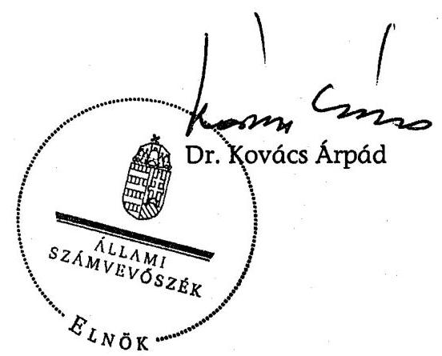
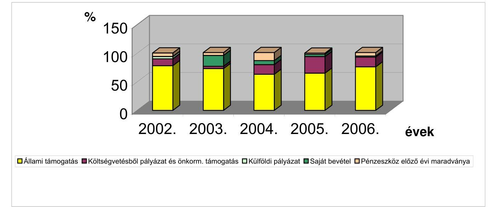
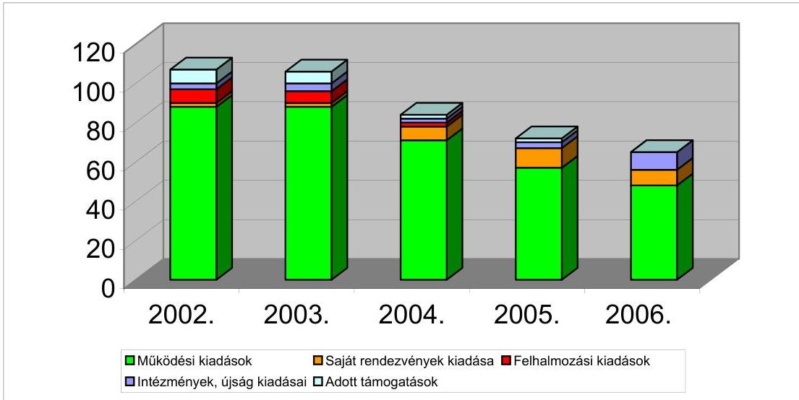
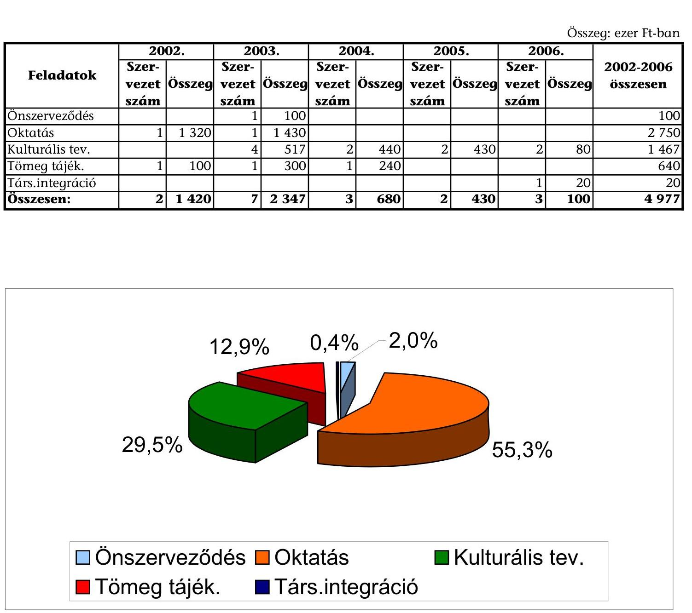

# ÁLLAMI   SZÁMVEVŐSZÉK 

## JELENTÉS

az Országos Ruszin Kisebbségi Önkormányzat 2002-2005. évi pénzügyi-gazdasági tevékenységének ellenőrzéséről

---

3. Önkormányzati és Területi Ellenőrzési Igazgatóság
3.1. Szabályszerűségi Ellenőrzési Főcsoport
Iktatószám: V-1007-033/2007.
Témaszám: 851
Vizsgálat-azonosító szám: V-0346
Az ellenőrzést felügyelte:
Dr. Lóránt Zoltán
főigazgató
Az ellenőrzés végrehajtásáért felelős:
Dr. Elek János
általános főigazgató-helyettes
Az ellenőrzést vezette:
Horváth Balázs
főcsoportfőnök-helyettes
Az összefoglaló jelentést készítette:
Benesné Baracsi Szilvia
számvevő
Az ellenőrzést végezték:
Benesné Baracsi Szilvia Dr. Sallai Csilla
számvevő
szakértő-könyvvizsgáló
A témához kapcsolódó eddig készített számvevőszéki jelentések:
címe
sorszáma
Jelentés az Országos Ruszin Kisebbségi Önkormányzat pénzügyi- 0208 gazdasági tevékenységének vizsgálatáról

---

# TARTALOMJEGYZÉK 

BEVEZETÉS ..... 5
I. ÖSSZEGZŐ MEGÁLLAPÍTÁSOK, KÖVETKEZTETÉSEK, JAVASLATOK ..... 7
II. RÉSZLETES MEGÁLLAPÍTÁSOK ..... 13

1. A feladatellátás szervezettsége, szabályozottsága ..... 13
1.1. Az Önkormányzat szervezeti és működési rendje ..... 13
1.2. A gazdálkodási feladatok szabályozása ..... 14
1.3. A feladatellátás szervezeti háttere ..... 14
2. Az Önkormányzat gazdálkodásának jellemzői ..... 15
2.1. A gazdálkodási tevékenység feltételei ..... 15
2.2. A vagyongazdálkodás, vagyonvédelem ..... 16
2.3. A gazdálkodás számviteli és egyéb kapcsolódó szabályozása ..... 17
3. Az éves költségvetések elkészítése, elszámolása ..... 19
3.1. Az éves költségvetések elkészítése, elfogadása ..... 19
3.2. A költségvetés végrehajtása, zárszámadás jóváhagyása ..... 20
3.3. A költségvetési feladatok teljesítése ..... 20
3.3.1. A költségvetési törvényben megállapított támogatás alakulása, felhasználása ..... 20
3.3.2. Pályázati támogatások elszámolása, felhasználása ..... 21
3.3.3. A kiadások alakulása, összetétele ..... 23
4. Az Önkormányzat számviteli tevékenysége ..... 24
4.1. A könyvvezetési kötelezettség teljesítése ..... 24
4.2. Az éves beszámolók összeállítása, jóváhagyása ..... 25
4.3. A bizonylati rend és a bizonylati fegyelem érvényesülése ..... 27
5. Az Önkormányzat belső ellenőrzési rendszere ..... 29
6. Az előző ellenőrzés javaslataira tett intézkedések ..... 30

---

# MELLÉKLETEK 

1. számú Az ORKÖ 2002 - 2006. évi korrigált mérlegadatai
2. számú Az ORKÖ 2002 - 2006. évi bevételei és megoszlása
3. számú A központi költségvetésből kapott támogatásból nemzeti és etnikai kisebbségi feladatok teljesítése, megoszlása
4. számú Az ORKÖ pályázati támogatásának alakulása 2002 - 2006. évekre
5. számú Az ORKÖ 2002 - 2006. évi kiadásai és megoszlása
6. számú A továbbadott támogatások 2002 - 2006. év közötti alakulása

---

# RÖVIDÍTÉSEK JEGYZÉKE 

| Áht. | Az államháztartásról szóló - többször módosított - 1992.   évi XXXVIII. törvény |
| :-- | :-- |
| Ámr. | Az államháztartás működési rendjéről szóló - többször   módosított - 217/1998. (XII. 30.) Korm. rendelet |
| ÁSZ | Állami Számvevőszék |
| MARUSZE | Magyarországi Ruszinok Szervezete |
| MNEKK | Magyarországi Nemzeti Etnikai Kisebbségekért Közalapít-   vány |
| Nek. tv. | A nemzeti és etnikai kisebbségek jogairól szóló - többször   módosított - 1993. évi LXXVII. törvény |
| NEKH | Nemzeti és Etnikai Kisebbségi Hivatal |
| NKA | Nemzeti Kulturális Alapprogram |
| OM | Oktatási Minisztérium |
| ORKÖ | Országos Ruszin Kisebbségi Önkormányzat |
| PEB | Pénzügyi Ellenőrző Bizottság |
| Szja tv | A személyi jövedelemadóról szóló - többször módosított -   1995. évi CXVII. törvény |
| SZMSZ | Szervezeti és Működési Szabályzat |
| Számv. tv. | A számvitelről szóló - többször módosított - 2000. évi C.   törvény |
| Vhr. | A számviteli törvény szerinti egyes egyéb szervezetek be-   számoló készítési és könyvvezetési kötelezettségének sajá-   tosságairól szóló - többször módosított - 224/2000. (XII.   19.) Korm. rendelet |

---

.

---

# JELENTÉS 

## az Országos Ruszin Kisebbségi Önkormányzat 2002-2005. évi pénzügyi-gazdasági tevékenységének ellenőrzéséről

## BEVEZETÉS

A magyarországi ruszin közösség létszámáról 2001. évben a népszámláláskor átfogó felmérés készült. Eszerint 1098 fő tartotta magát ruszin nemzetiséghez tartozónak, 1113 fő ruszin anyanyelvűnek vallotta magát, 1292 fő vállalta a ruszin kulturális értékekhez, hagyományokhoz való kötődést. A 2002. évi önkormányzati választások során 32 ruszin helyi kisebbségi önkormányzat alakult, ebből 15 Budapesten, 9 Borsod-Abaúj-Zemplén megyében. 2003. február 4-én került sor az ORKÖ új testületének és elnökének megválasztására. A 2007. március 4-én tartott országos kisebbségi önkormányzati választások után 2007. március 28-i közgyűlésen új elnököt választottak meg. Az ORKÖ 2002-2006. között kisebbségi feladatainak ellátásához 163 041 ezer Ft központi költségvetési támogatásban részesült.

A Nek. tv. 39/G. § (1) bekezdésében, valamint az Állami Számvevőszékről szóló - többször módosított - 1989. évi XXXVIII. törvény 2. § (5) bekezdésében kapott felhatalmazás alapján az ÁSZ feladata a különböző állami forrásokból juttatott pénzeszközök felhasználása törvényességének ellenőrzése a nemzeti és etnikai kisebbségi szervezeteknél. Az ÁSZ a 2007. évi ellenőrzési terve keretében vizsgálta az ORKÖ 2002-2005. évi pénzügyi-gazdasági tevékenységét, valamint a 2006. évi költségvetési terv összeállítását, alakulását.

Az ellenőrzés célja: annak megállapítása, hogy az országos szervezet

- a központi költségvetési támogatást a Nek. tv-ben meghatározott feladatokra használta-e fel, a felhasználása, elszámolása során betartották-e a vonatkozó hatályos jogszabályi előírásokat;
- a gazdálkodás törvényessége, szabályszerűsége biztosított volt-e: a tervezés, az operatív gazdálkodás, a beszámolási kötelezettség és a számviteli bizonylati rend teljesítése során érvényesültek-e a jogszabályokban és a belső szabályzatokban megfogalmazott követelmények;
- a szabályszerű gazdálkodás érdekében kialakított kontrollmechanizmusok megfelelően segítették-e a feladatok végrehajtását.

Az ellenőrzés körülményeit illetően rögzíteni szükséges, hogy a 2003. február 4-ig funkcionált önkormányzati elnök a megválasztott testület új elnökének a

---

2003. március 25-én kelt átadás-átvételi jegyzőkönyv tanúsága szerint nem adta át tételesen a 1999-2002. között keletkezett iratokat, dokumentumokat, az 1999-2003. évre vonatkozó számviteli bizonylatokat.

Az ellenőrzéshez szükséges következő dokumentumok hiányoztak: 2002. 01. 01-2003. 03. 08 között hatályos SZMSZ, 2002. évi közgyűlések jegyzőkönyvei, illetve kivonatai, a belső számviteli szabályozás 2002. 01. 01-2003. évi választásokig érvényes dokumentumai. A könyvelési dokumentációk, az elfogadott beszámoló a 2003. év előtti önkormányzati ciklusból rendelkezésre álltak, így a könyvvezetési és beszámolási kötelezettség teljesítésének ellenőrzési lehetősége biztosított volt.

Az ellenőrzés: 2007. február 16. - április 13. között az ORKÖ székhelyén történt.

---

# I. ÖSSZEGZŐ MEGÁLLAPÍTÁSOK, KÖVETKEZTETÉSEK, JAVASLATOK 

Az ORKÖ 2002-2006 között nem teremtette meg működésének - a Nek. tv-ben előírt - szabályszerű feltételeit. A közgyűlés a vizsgált időszakban hatályos SZMSZ-ekben nem rendelkezett a Nek. tv-ben meghatározott, az általa ellátott nemzeti és etnikai kisebbségi feladatok teljes vertikumáról, a választott tisztségviselőkre és testületekre átruházható feladat- és hatáskörökről. Az SZMSZ előírásait a Nek. tv. 2005. évi módosításával aktualizálták, a pénzügyi bizottság feladatát a törvény előírásától eltérően nem határozták meg. A 2003. március 8-i SZMSZ és a Nek. tv. módosítás előírásával ellentétesen hivatalt nem hoztak létre.

A vizsgált időszakban évente növekvő számú állandó bizottságot választottak. A bizottságok közül 2003-2005 között csak a kulturális bizottság ülésezett évente egy-egy alkalommal, 2004-ben a nyolc bizottság egy összevont ülést tartott. A közgyűlés a bizottságok 2004. évi tevékenységéről szóló szóbeli beszámolót határozattal elfogadta. Az elnök és elnökség feladatkörét az előző ÁSZ ellenőrzés javaslatára a 2004-től hatályos SZMSZ-ben meghatározták, ezek operatív döntéshozó jogköröket, a támogatások odaítélésén túl nem tartalmaztak. A közgyűlés, az elnökség és a bizottságok tevékenységéhez kapcsolódó, hiányosan meghatározott feladat- és hatáskörök, valamint a döntési jogkörök kialakítása nem segítette hozzá az ORKÖ-t az SZMSZ-ben meghatározott feladatok ellátásához.

A munkáltatói jogkört a 2005. novembertől hatályos Nek. tv-vel ellentétesen, az elnök látta el. A közművelődési feladatok ellátásához 2004-től az ORKÖ székhelyén működő Magyarországi Ruszinok Könyvtára, valamint a Magyarországi Ruszinok Közérdekű Muzeális Gyűjteménye és Kiállítóhelye, részben önállóan gazdálkodó költségvetési intézményeket tartották fenn. Az ORKÖ a felügyeleti jogkört szabálytalanul gyakorolta, nem jelölt ki az intézményei pénzügyi-gazdálkodási feladatainak ellátására önállóan gazdálkodó költségvetési szervet, az intézmények beszámolóit nem vizsgálta felül és nem fogadta el, közel két éven keresztül elmulasztotta az intézmények vezetőinek kinevezését. Közalkalmazotti álláshelyek terhére megbízási szerződéssel foglalkoztattak múzeumi tárlatvezetőt, kölcsönző könyvtárost, rendezvényszervezőt.

A gazdálkodási feladatok közül a közgyűlés kizárólagos hatáskörébe tartozott a költségvetés és zárszámadás elfogadása, az éves beszámoló jóváhagyása. Ehhez belső szabályozás - az előző ÁSZ javaslat ellenére - továbbra sem rögzítette az ORKÖ gazdasági sajátosságait figyelembe vevő szerkezeti, tartalmi és határidő követelményeket; a gazdálkodási jogköröket egységes gazdálkodási szabályzatban nem rögzítették.

Az ORKÖ működésének tárgyi feltételeit 2006 decemberéig használatában volt, majd tulajdonába került ingatlan, az irodák berendezése, számítástechnikai felszerelése biztosította. Az elnök az ORKÖ gazdálkodásának személyi feltételeiről az SZMSZ-ben rögzített feladata ellenére nem gondoskodott. Az ope-

---

ratív működési feladatokat egy titkár és titkárságvezető látta el, ez utóbbi munkaköri leírás nélkül. Pénztárost, 2003. év második felétől nem alkalmaztak, a pénzkezelési feladatokat a közgyűlés felhatalmazása nélkül, az összeférhetetlenségi szabályokat megsértve az ORKÖ elnöke látta el. A pénzkezelési szabályzatban rögzítettek ellenére pénztárellenőrt nem jelöltek ki.

Két alkalmazott határozott idejű munkaviszonyát 2003-ban, közgyűlési döntéssel határidő előtt megszüntették. A munkáltatói jogkört ellátó elnök a jogviszony megszüntetésekor nem intézkedett a jogszabályban előírt járandóságok megfizetéséről. Ezért az egyik dolgozó esetében a bíróság ítéletében megállapította a jogellenes felmondás tényét, és az elmaradt bér kifizetését rendelte el. A másik alkalmazottal peren kívül egyeztek meg. Az ORKÖ-nek 160 ezer Ft késedelmi pótlékot és perköltséget is tartalmazó 3 526 ezer Ft fizetési kötelezettsége keletkezett. Továbbá a munkaügyi hatóság 700 ezer Ft - külföldi munkavállaló jogellenes, engedély nélküli foglalkoztatásból eredő - pénzbüntetést is kivetett. A késedelmi pótlék, perköltség és pénzbüntetés kifizetése az ORKÖ-nek 860 ezer Ft többletkiadást jelentett.

Az ORKÖ az előző ÁSZ jelentésben javasolt vagyongazdálkodási szabályzatot nem készített. A vagyon feletti rendelkezési jogosultságot a közgyűlés a Nek. tv-vel összhangban saját hatáskörében tartotta. A közgyűlés a jogszabályi és az SZMSZ előírásától eltérően nem döntött a törzsvagyon köréről és a vagyonleltárról. A befektetett pénzügyi eszközként kimutatott, egyszeri vagyonjuttatásból vásárolt kötvényt 2003-ban beváltották, az ellenértéket az ORKÖ működési kiadásaira 2004-re teljesen felhasználták.

A Nek. tv. és a belső szabályozás ellenére 2002-ben és 2003-ban költségvetés, zárszámadás pedig egyik évben sem készült. 2004-től a költségvetés jóváhagyásáról a közgyűlés határozatban döntött, a kisebbségi feladatok ráfordításait megtervezték. A Nek. tv. 2005. évi módosítását figyelmen kívül hagyva az ORKÖ elnöke nem gondoskodott a 2006. évi költségvetés közzétételéről.

Az ORKÖ működtetésének és feladatellátásának finanszírozását alapvetően költségvetési forrásból származó bevételekből biztosították. Az éves költségvetési törvényekben meghatározott 132 340 ezer Ft állami támogatáson túl, a kisebbségi célok megvalósítását különböző pályázatokon elnyert pénzeszközök egészítették ki. Költségvetésből pályázati úton a 2002-2006. évek során 30 701 ezer Ft bevételre tettek szert, így az ellenőrzött évek átlagában a bevételek 86,5%-a a központi költségvetésből teljesült. A pályázaton elnyert támogatások felhasználásának szabályait a támogatók szerződésben rögzítették.

Az ORKÖ a törvényben nevesített és a pályázati úton elnyert költségvetési támogatást a gazdasági dokumentációk és a beszámolók szerint rendeltetésszerűen, kisebbségi feladatainak ellátására használta fel. Az ORKÖ a 2002-2006. években kapott költségvetési támogatás 77%-át önszerveződésre, 10%-át tömegtájékoztatásra, 6-6%-át közművelődési és kulturális feladatokra, 1%-át nemzetközi kapcsolattartásra fordította.

Az ellenőrzött időszakban az ORKÖ összes kiadása 171 279 ezer Ft volt. Az összes kiadás 69%-át működési kiadásokra, 6%-át saját rendezvényekre, intézmények működtetésére és az újság kiadásaira 18%-át, felhalmozási célra 4%-át

---

fordították, 3%-át kisebbségi szervezeteknek adták tovább. A 2006. évben 100 ezer Ft támogatás
 odaítélésekor nem tartották be a 2005. november 25-étől hatályos Nek. tv. támogatási lehetőségek nyilvánosságra hozatalára vonatkozó előírását. A kiadások a 2002. évi 21 035 ezer Ft-ról 2006. évre 44 315 ezer Ft-ra nőttek, ez több mint kétszeres növekedést jelentett.

Az ORKÖ számviteli szabályzatait – a törvényben előírt határidőhöz képest – hároméves késedelemmel, hiányosan és nem a számviteli törvényi előírásoknak megfelelően készítette el. Az elnök nem gondoskodott az eszközök és források értékelési szabályzatának elkészítéséről. A számviteli politika nem rögzítette a számviteli alapelveket és nem tükrözte a működési sajátosságokat.

A pénzkezelési szabályzat kizárólag a készpénzforgalom kereteit határozta meg, nem szabályozta a záró készpénzállomány nagyságát. Az elnök feladatkörében elkészíttetett, de hatályba nem léptetett számlarend nem tartalmazta a jogszabályban előírt adattartalmat.

Könyvvezetési kötelezettségét az ORKÖ kettős könyvvezetéssel, külső számviteli szolgáltatók igénybevételével teljesítette. A könyvvezetés során sérült a számviteli törvény valódiság alapelve, mivel 2003–2005. években 8333 ezer Ft költségvetési támogatást a végrehajtási rendelettel ellentétesen egyéb bevétel helyett kötelezettségként számoltak el. A 2004. évtől a könyvelési rendszerben az analitikus nyilvántartásokat és a főkönyvi könyvelést integrálták. A vevő és szállító analitikus nyilvántartás és főkönyvi könyvelés adatai egyeztek. A házipénztár analitika vezetése térben és időben eltért a tényleges pénzmozgástól, mivel a bevételi és kiadási pénztárbizonylatokat, valamint az időszaki pénztárjelentést a könyvelő szolgáltató állította ki havonta egy alkalommal. A pénzforgalom helyszínén nem vezettek pénztári analitikát.

A tárgyi eszközökről készített analitika 2003-ban el nem számolt értékcsökkenés miatt 361 ezer Ft-tal, 2005-ben többlet bruttó érték kimutatása miatt 25 ezer Ft-tal eltért a főkönyvi könyveléstől. A közpénzek és azok felhasználásának elkülönített nyilvántartását nem teljesítették. A zárási feladatokat nem végezték el év végén, továbbá a mérlegtételeket – tárgyi eszköz kivételével – leltárral nem támasztották alá.

A vizsgált évek egyszerűsített éves beszámolóit nem az egyéb szervezetekre vonatkozó végrehajtási rendeletben meghatározott formában, hanem a gazdasági társaságokra előírt tartalommal készítették el. A 2003–2006. években a közgyűlés a jogszabályi előírás ellenére május 31-e után fogadta el a beszámolókat. A 2002. évi beszámolóban az előző időszak adatainak hiánya, a 2002–2005. évi beszámolókban a könyvvezetési hibák, a mérleg és az azt alátámasztó főkönyvi kivonat adatainak eltérése, valamint a mérlegtételek – tárgyi eszközök kivételével – leltárral való alátámasztásának hiánya miatt sérült a teljesség, a valódiság és a folytonosság elve.

A 2004–2005. évi beszámolókban szereplő pénzkészlet nem felelt meg a valóságnak, mivel 2006. decemberében 355 ezer Ft értékű 2004. évi készpénzfizetési számlák kerültek elő. A fellelés időpontjában helyezték a pénztárból kiadásba. A pénztári tranzakcióval kapcsolatban nem tisztázták a személyi és anyagi felelősséget. A beszámolókban feltárt eltérések előjeltől független összege és a

---

közgyűlés által elfogadott beszámolók mérleg fő összegének aránya a 2003., 2004. és 2005. években: 135%, 83%, 159% volt. A 2003–2005. évi beszámolók a lényeges mértékű hibák következtében nem mutattak megbízható, valós képet.

Az ellenőrzött időszakban a bizonylati rendet a szigorú számadású nyomtatványok kivételével nem szabályozták. A 2004. évtől a számítógépen vezetett házipénztári rendszer zártsága nem volt biztosított, mivel későbbi lekérdezés során a program az ismételten kinyomtatott bizonylatnak újabb sorszámot generált. A könyvelés alapjául szolgáló számviteli bizonylatokon 2003. évben hiányzott a könyvelés módjára, az érintett könyvviteli számlákra történt hivatkozás. A 2003. évben kiállított összesítő bizonylatok nem feleltek meg a számviteli törvény követelményeinek.

A 2004–2006. évre a könyvviteli elszámolást közvetlenül alátámasztó bizonylatokon a kiállító aláírása nem szerepelt. A vizsgált években az igénybevett szolgáltatások, vásárolt eszközök számviteli alapbizonylatai 10–30%-án, a csekkel kiegyenlített közüzemi számlák 100%-án nem szerepelt az utalványozó személy aláírása. Az ORKÖ – a természetbeni juttatásokat, megbízási díjakat terhelő adók és járulékok kivételével – határidőben eleget tett a jogszabályokban előírt bejelentési, nyilvántartási és bevallási kötelezettségeinek. Az adó- és járulékfizetési kötelezettséget likviditási helyzettől függően teljesítették. A 2003–2005. évi beszámolók év végén többhónapos adó- és járuléktartozást mutattak.

A belső ellenőrzés szabálytalanul és eredménytelenül funkcionált. A PEB feladatkörét, munkarendjét a 2004-től hatályos SZMSZ-ek nem szabályozták. Belső ellenőrt a 2005. november 25-étől hatályos Nek. tv. előírása ellenére nem foglalkoztattak. A testület kontroll tevékenysége formális volt, a költségvetés és éves beszámoló véleményezésére korlátozódott. A választott ellenőrző testület nem tárta fel a gazdálkodáshoz kapcsolódó szabályozási hiányosságot, könyvvezetési szabálytalanságot, pénzkezelési mulasztást, bizonylatolási hibát, továbbá nem hívta fel a közgyűlés figyelmét a zárszámadás hiányára, leltározás elmulasztására, a beszámolók lényeges hibáira.

A vezetői ellenőrzés dokumentáltan a kötelezettségvállalási jog, valamint az utalványozás szabálytalan gyakorlásával történt. Az elnök végezte a közgyűlési határozatban foglaltakkal ellentétben az utalványozást, továbbá összeférhetetlen módon a házipénztár kezelését. Mindezek, továbbá a készpénzforgalom indokolatlanul magas aránya az ORKÖ készpénzkezelési kockázatát jelentette. A munkafolyamatba épített ellenőrzéshez a pénzkezelési szabályzatban előírt pénztárellenőrt nem foglalkoztattak.

A belső ellenőrzési rendszerben feltárt szabálytalanságok miatt 2003–2006. év időszakában továbbra is eredménytelennek minősült a testületi, vezetői és a folyamatba épített ellenőrzés.

Az ÁSZ előző jelentésének javaslataira intézkedési terv nem készült, 13 javaslatból 11-et nem hajtottak végre. Az ORKÖ továbbra sem gondoskodott a belső ellenőrzési rendszer összehangolt szabályozásáról, a 2005. november 25-étől hatályos Nek. tv-ben és pénzkezelési szabályzatban meghatározott ellenőrzési funkciók ellátásáról.

---

A helyszíni ellenőrzés megállapításainak hasznosítása mellett javasoljuk:

# az Önkormányzat közgyűlésének: 

1. Módosítsa az SZMSZ-t:
a) a Nek. tv. 37. § (1) bekezdése alapján az országos kisebbségi önkormányzati feladatok meghatározásával;
b) a Nek. tv. 39/B. § (5) bekezdésében foglaltaknak megfelelően a hivatalra vonatkozó rendelkezések hatályba léptetésével és működésének részletes szabályaival;
c) a közgyűlés feladatainak hatékonyabb ellátása érdekében a bizottsági feladatok meghatározásával, különös tekintettel arra, hogy a PEB feladatköre összhangban legyen a Nek. tv. 39/G. § (2) bekezdésében előírt követelményekkel.
2. Teremtse meg a hivatal működésének és a gazdálkodás szabályszerű ellátásának személyi feltételeit, működtesse a Nek. tv. 39/A. § (2) bekezdésben és az SZMSZ-ben rögzített hivatalt.
3. Rendelkezzen az Önkormányzat vagyongazdálkodási szabályzatának kiadásáról.
4. Döntsön a Nek. tv. 37. § (1) bekezdés (b) pontjában előírt zárszámadásról, valamint a vagyonleltár és a törzsvagyon körének megállapításáról, figyelemmel a Nek. tv. 60/A. § előírásaira;
5. Szabályozza az Ámr. 21. és 23. §-ai előírásaival összhangban a költségvetés összeállításának feladatait; határozza meg a költségvetés tartalmát, felépítését és annak módosítási szabályait.
6. A részben önállóan gazdálkodó költségvetési szervei szabályszerű működésének és gazdálkodásának érdekében:
a) jelölje ki azt az önállóan gazdálkodó költségvetési szervet, amely a részben önállóan gazdálkodó költségvetési szerv pénzügyi-gazdasági feladatait ellátja, figyelemmel az Ámr. 14. § (5) bekezdésben előírtakra;
b) gondoskodjon a költségvetési szervei beszámolójának felülvizsgálatáról, jóváhagyásáról az Ámr. 149. § (3) és (5) bekezdésben foglaltak szerint.
7. Biztosítsa a külső szervezeteknek nyújtott támogatási lehetőségek nyilvánosságát, figyelemmel a Nek. tv. 39/D. § (4) bekezdésben rögzített előírásokra.
8. Vizsgálja ki a munkaviszony jogellenes megszüntetéséből és munkavállalói engedély nélküli alkalmazásból eredő, az ORKÖ-t terhelő 860 ezer Ft fizetési kötelezettséggel, valamint a 355 ezer Ft összegű pénztári tranzakcióval kapcsolatos személyi és anyagi felelősséget.
9. Gondoskodjon a belső ellenőrzési rendszer szabályszerű és eredményes működtetése érdekében a Nek. tv. 39/G. § (1) bekezdésével összhangban a belső ellenőr foglalkoztatásáról; a PEB ellenőrzési feladatainak tervszerű végrehajtásáról, beszámoltatásáról; a vezetői és munkafolyamatba épített ellenőrzés összehangolt, belső előírásainak megfelelő ellátásáról.

---

# az Önkormányzat elnökének: 

1. Gondoskodjon a Nek. tv. 39/G. § (4) bekezdés előírása szerint a közgyűlés által elfogadott költségvetés Magyar Közlönyben való megjelentetéséről.
2. Intézkedjen az ORKÖ számviteli politikájának és kapcsolódó szabályzatainak a hatályos Számv. tv. 14–16. §. előírásaival összhangban lévő módosításáról, valamint az eszközök és források értékelési szabályzatának kiadásáról.
3. Módosítsa az ORKÖ számlarendjét a Számv. tv. 161. § (2) bekezdésének figyelembevételével, majd a közgyűlési jóváhagyás után helyezze hatályba.
4. Biztosítsa a könyvvezetés és beszámoló-készítés során:
a) a Számv. tv. 15. § (2)–(3) és (6) bekezdésben szabályzott teljesség, valódiság és folytonosság számviteli elvek betartását;
b) a Vhr. 17. § (8) bekezdés előírása szerint a közpénzek és azok felhasználásának teljes körű elkülönítését;
5. Intézkedjen a Számv. tv. 164. § (1) bekezdésben rögzített feladatok elvégzéséről és a leltárak elkészítéséről a Számv. tv. 69. § (1)–(2) bekezdésében foglaltakkal, valamint a leltározási szabályzattal összhangban.
6. Gondoskodjon a számviteli nyilvántartásokban a Számv. tv. 165. §-ban rögzített bizonylati elv és fegyelem, valamint a 167. § (1) bekezdés szerint a bizonylatok alaki és tartalmi követelményeinek betartásáról.
7. Javíttassa ki a könyvelési hibákat a 2004–2005. és 2006. évi beszámolók valós pénzügyi adatainak megállapítása érdekében önrevízió keretében, majd a Vhr. 6.§ (7) bekezdésében előírt formában terjessze jóváhagyásra a közgyűlés elé.
8. Intézkedjen az Szja tv. 69. §-ában szabályozott természetbeni juttatások után, megbízási díjakból fizetendő adó nyilvántartásáról, bevallásáról és megfizetéséről, valamint az adó- és a járulék fizetési kötelezettség határidőinek betartására.
9. Gondoskodjon a készpénzkezelés összeférhetetlenségének megszüntetéséről, valamint a házipénztár szabályszerű működtetéséről és a készpénzforgalom Számv. tv. 165. § (3) bekezdés a) pontjának megfelelő nyilvántartásáról.

---

# II. RÉSZLETES MEGÁLLAPÍTÁSOK 

## 1. A FELADATELLÁTÁS SZERVEZETTSÉGE, SZABÁLYOZOTTSÁGA

### 1.1. Az Önkormányzat szervezeti és működési rendje

A vizsgált időszak alatt az ORKÖ szervezetét, működésének rendjét négy, hatályos SZMSZ-ben határozta meg. A 2003. március 8-án hatályba léptetett SZMSZ-t a 10 hónapos működési tapasztalatok, valamint az ÁSZ 0208 számú jelentésének javaslatai alapján, év végén módosították. Az SZMSZ 2004. évben megújításra került a közgyűlési és a bizottsági tagok létszámának változása, valamint az intézményrendszert segítő bizottság létrehozása és a gazdasági alelnök státusz megszüntetése miatt. A 2005. november 25-én hatályos Nek. tv-ben előírt határidőn belül a közgyűlés ismételten új SZMSZ-t fogadott el. A hatályos SZMSZ a Nek. tv. rendelkezéseivel összhangban határozta meg az önkormányzat jogállását, a közgyűlés feladatát, hatáskörét, működési rendjét, képviselők jogállását, jogait, kötelezettségeit és vezető tisztségviselőit. A szabályzat külön fejezete tartalmazta a költségvetésre, vagyonra vonatkozó rendelkezéseket. A Nek. tv. 39/H. § (1) bekezdésével összhangban nem léptették hatályba a képviselők vagyonnyilatkozat tételére vonatkozó részt, valamint a hivatkozott törvény 39/A. § (2) bekezdése előírásával ellentétesen az ORKÖ Hivatala működését érintő rendelkezést. Az SZMSZ-ben vagy egyéb belső szabályzatban az ORKÖ feladatait és a feladatellátás rendszerét nem határozták meg.

A közgyűlés át nem ruházható feladat- és hatáskörének meghatározása összhangban volt a Nek. tv. 37. § (1) és a 39/H. § (6) bekezdésének előírásaival. A testület nem döntött az átruházható hatáskörökről. A SZMSZ-ek rendelkezései szerint a közgyűlés határozatképességét biztosították, a közgyűlés döntéseit közgyűlési határozatokba foglalták, nyilvántartották. A közgyűlés feladatait – az SZMSZ előírása ellenére – csak 2006-ban rögzítették munkatervben. A közgyűlés tisztségviselői és szervei: elnök, elnökhelyettes, bizottságok.

A 2006. január 27-ig működött elnökség az elnökből, az elnökhelyettesből, az alelnökökből (2004. december 9-ig gazdasági alelnök, 2006. január 27-ig regionális alelnök) és a bizottságok elnökeiből állt. A közgyűlés 2004. évben az előző ÁSZ ellenőrzés
 javaslatára meghatározta az elnök és az elnökség feladatkörét. Ezek konkrét gazdálkodásra vonatkozó feladatokat és hatásköröket a támogatások odaítélésének összeghatárán kívül – nem tartalmaztak. Az elnökség a vizsgált időszakban a költségvetés-tervezeteket, valamint az éves beszámolókat a közgyűlés jóváhagyása előtt megvitatta és elfogadta. Az elnök, az elnökhelyettes és az alelnökök a 2003–2005. évi tevékenységükről a közgyűlésnek beszámoltak.

A közgyűlés az önkormányzati feladatok hatékonyabb ellátása érdekében 2003. évi választások után négy, 2003. decemberétől hét, 2004. decemberétől nyolc bizottságot hozott létre. A 2004. évben Állandó Selejtező, Leltár és Vagyonvédelmi Albizottságot hoztak létre. Az SZMSZ valamennyi bizottságra

---

egyértelműen előírta, hogy „a bizottság feladatkörében előkészíti az Önkormányzat döntéseit, szervezi és ellenőrzi a döntések végrehajtását”. Az SZMSZ-ben nem határozták meg a bizottságok konkrét feladatait, ügyrendjét, illetve annak elkészítésének módját, az ülésezés gyakoriságát. A megválasztott bizottságok közül 2003–2005 között csak a kulturális bizottság ülésezett évente egy-egy alkalommal. A nyolc bizottság 2004-ben egy összevont ülést tartott, ahol a ruszin nemzeti nap programját, az intézményalapítás költségvetését, az ORKÖ 2002–2003. évi beszámolóját, valamint a 2004. évi költségvetési tervét tárgyalták. A közgyűlés a bizottságok 2004. évi tevékenységéről szóló szóbeli beszámolót határozattal elfogadta, a beszámolás hiányát más években nem kifogásolta.

A közgyűlés, az elnökség és a bizottságok közötti munkamegosztás módja nem volt szabályozott. A testületek tevékenységéhez kapcsolódó, hiányosan meghatározott feladat- és hatáskörök, valamint a döntési jogkörök kialakítása, továbbá a rendszertelen működés nem segítette hozzá az ORKÖ-t az SZMSZ-ben meghatározott feladatok ellátásához.

# 1.2. A gazdálkodási feladatok szabályozása 

Az ORKÖ gazdálkodásának, vagyonának, költségvetésének a szabályozása az SZMSZ-ben nem teljes körű. A 2003–2005. években hatályban lévő SZMSZ-ekben az akkor hatályos Nek. tv-vel összhangban a közgyűlés saját hatáskörében írta elő a költségvetést és zárszámadást elfogadását, vagyonleltárt, és a törzsvagyon körének meghatározását.

Az előző ÁSZ vizsgálat javaslata ellenére SZMSZ-ben és más szabályzatban sem határozták meg a költségvetés tervezésének, a zárszámadás elkészítésének az önkormányzat sajátosságainak megfelelő szabályozást, továbbá hiányzott a költségvetés belső tartalmára, felépítésére vonatkozó rendelkezések meghatározása. A költségvetés és zárszámadás elkészítésére, elfogadására, a benyújtás határidejére nem fogalmazott meg előírásokat. A közgyűlés saját hatáskörében tartotta a vagyongazdálkodási, tulajdonosi jogokat.

A 2003. március 8–december 13-ig hatályos SZMSZ az ellenőrző testület feladatkörébe rendelte a működés és gazdálkodás szabályszerűségének ellenőrzését, a zárszámadás véleményezését. Az ezután hatályban lévő két SZMSZ-ben nem határozták meg a testület feladatát. A 2006. január 28-án elfogadott SZMSZ sem rögzítette a 2005. november 25-étől hatályos Nek. tv. 39/G. § (2) bekezdés előírásával összhangban a PEB feladatait.

### 1.3. A feladatellátás szervezeti háttere

Az ORKÖ közgyűlése az SZMSZ-ben szabályozott módon, át nem ruházható hatáskörében döntött a Magyarországi Ruszinok Könyvtára és a Magyarországi Ruszinok Közérdekű Muzeális Gyűjteménye és Kiállítóhelye alapításáról. Az intézmények alapító okiratát, SZMSZ-ét jóváhagyta. Az ORKÖ részben önállóan gazdálkodó költségvetési szervként alapította intézményeit. Nyilvántartásba vételéről az Áht. 88. § (5) bekezdésében foglaltaknak megfelelően gondoskodott. Az ORKÖ, mint felügyeleti szerv nem jelölte ki azt az önállóan gazdálkodó költségvetési szervet, amely a részben

---

önállóan gazdálkodó költségvetési szerv meghatározott pénzügyi-gazdasági feladatait ellátja, így nem hagyta jóvá a költségvetési szervek közötti megállapodást a felelősségvállalás és munkamegosztás rendjéről. Ezzel nem tett eleget az Ámr. 14. § (5) bekezdés a)–b) pontjában előírtaknak.

A közgyűlés az intézmények szabályszerű működtetéséhez elmulasztotta az intézmények vezetőinek kinevezését, amelyet 2006. november 25-én pótolt. Az átmeneti időszakban a közalkalmazotti álláshelyek terhére megbízási szerződéssel foglalkoztattak múzeumi tárlatvezetőt, kölcsönző könyvtárost, rendezvényszervezőt.

A közgyűlés az ORKÖ 2004–2005. évi tevékenységéről szóló beszámolóval együtt tárgyalta a múzeum és a könyvtár tevékenységéről szóló szöveges beszámolót az elnök előterjesztésében. Annak elfogadásáról a közgyűlés nem hozott határozatot. Az intézmények beszámolóinak tartalma, felülvizsgálati és elfogadási rendje nem felelt meg az Ámr. 149. § (3) és (5) bekezdésében rögzítetteknek.

Az ORKÖ normatív költségvetési és pályázati támogatásokból működtette az intézményeket. Az ORKÖ közgyűlése az intézményeknek csak a 2006. évi költségvetését fogadta el az Ámr. 13. § (4) bekezdés c) pontjának előírása szerint. Az intézmények szakmai feladatainak teljesítéséhez 2006. év végétől biztosították a személyi és tárgyi feltételeket. A múzeumot egy évig működtették ideiglenes engedéllyel, de a végleges engedélyt az ellenőrzés lezártáig nem kapták meg az Oktatási és Kulturális Minisztériumtól.

# 2. Az ÖNKORMÁNYZAT GAZDÁLKODÁSÁNAK JELLEMZŐI 

### 2.1. A gazdálkodási tevékenység feltételei

A 2003. március 8-án hatályba lépett SZMSZ a közgyűlés irányításába tartozó szervként határozta meg a hivatalt, de nem rendelkezett a hivatali tevékenység működési szabályairól. Az SZMSZ rendelkezésével ellentétesen a hivatalt nem hozták létre. Az SZMSZ 2003. december 14-ei módosításával a hivatalról szóló rendelkezést megszüntették. A 2005. november 25-étől hatályos Nek. tv-vel összhangban terjesztették közgyűlési jóváhagyásra az ORKÖ hivatalának létrehozását, feladat- és hatáskörének, vezetőjének, továbbá belső szervezeti és működési rendjének szabályozását. A záró rendelkezésekben rögzítettek alapján az SZMSZ hivatalra vonatkozó részét nem léptették hatályba. A testület megsértette a 2005. évben módosított Nek. tv. 39/A. § (2) bekezdés előírását. A hivatkozott törvény 39/B. § (2) bekezdése szerint a hivatalvezető hatáskörébe rendelt munkáltatói jogokat törvénysértő módon az elnök gyakorolta.

Az ORKÖ elnökének irányítási jogkörébe tartozóan 2003-tól titkárt, 2004. október 1-jétől titkárságvezetőt is foglalkoztattak. A titkári feladatokat munkaköri leírás rögzítette, a titkárságvezető nem rendelkezett munkaköri leírással.

Az elnök az ORKÖ szabályszerű gazdálkodásának személyi feltételeiről a 2006-tól hatályos SZMSZ 21. § (2) bekezdés f) pontban rögzített feladata ellenére nem gondoskodott.

---

Az ORKÖ 2003. július 1-jétől nem rendelkezett megbízott pénztárossal. A pénzkezelési feladatokat a közgyűlés felhatalmazása nélkül az ORKÖ elnöke látta el, a 2003. október 11-étől hatályos pénzkezelési szabályzatban rögzítettek ellenére pénztárellenőrt nem jelöltek ki. A 2005. évi módosított Nek. tv. 39/G. § (1) bekezdésének előírását megsértve az Önkormányzat és intézményei pénzügyi ellenőrzésére belső ellenőrt nem alkalmaztak.

Az ORKÖ számvitellel, az adózással, a munkaügyi és bérszámfejtéssel kapcsolatos feladatait 2003. február 4–2003. szeptember 24-ig, illetve 2004. január 1-jétől két külső számviteli szolgáltató bt. végezte.

Az ORKÖ működésének tárgyi feltételeit a Kincstári Vagyoni Igazgatóság által használatba adott, majd 2006. decemberében egyszeri ingyenes vagyonjuttatásként tulajdonába került székházként funkcionáló ingatlan biztosította. A működés tárgyi feltételeit illetően a kialakított iroda berendezése, számítástechnikai felszereltsége megfelelő kereteket biztosított a feladatellátáshoz, folyamatos munkavégzéshez. Az ingatlan állagmegóvásáról folyamatosan gondoskodtak.

# 2.2. A vagyongazdálkodás, vagyonvédelem 

Az ORKÖ az előző ÁSZ jelentés javaslata ellenére a vagyongazdálkodásról külön szabályzatot nem készített. Az SZMSZ-ben rögzítette a közgyűlés át nem ruházható hatáskörében az önkormányzati vagyon feletti rendelkezési jogosultságot. Deklarálta, hogy az ORKÖ a kisebbségi közügyek ellátása során vagyonával önállóan gazdálkodik. A közgyűlés a törzsvagyon köréről a hatályos Nek. tv. 37. § c) pontját megsértve nem döntött. Ezzel összefüggésben a 2005. november 25-étől hatályos hivatkozott törvény 60/A. § (3)–(5) bekezdéseinek előírásával ellentétben nem határozta meg forgalomképtelen és korlátozottan forgalomképes vagyon körét. Az ORKÖ a hivatkozott törvény 37. § b) pontjában meghatározott feladatkörében a vagyonleltárt nem állapította meg.

A gazdálkodás biztonságáért a közgyűlés, annak szabályszerűségéért az elnök a felelős a 2005. november 25-étől hatályos Nek. tv. 39/F. § (2) bekezdésének szabályozása szerint. A korábbiakban hatályos Nek. tv. nem rendelkezett az elnök hatásköréről és felelősségéről. Az ORKÖ közgyűlése, az elnök feladatkörét jóváhagyta, a gazdálkodással kapcsolatos jogkörét a kötelezettségvállalásra terjesztette ki.

A közgyűlés – a 2004. december 10-ig hatályban lévő SZMSZ szerint – a gazdasági alelnök hatáskörébe rendelte a székház üzemeltetésével és működtetésével, továbbá a közgyűlés üléseinek és a rendezvények szervezésével, lebonyolításával kapcsolatos feladatokat, de további gazdálkodási jogkört nem ruházott rá.

Az ORKÖ – a vizsgált időszakot megelőzően az egyszeri vagyonjuttatásként kapott – 14998 ezer Ft névértékű MOL részvényből vásárolt 6000 ezer Ft névértékű kötvényt 2003. március 1-jén beváltott. A kötvény eladásából – kamattal együtt – 6914 ezer Ft bevételhez jutott, amit 2004-re teljes egészében működésre felhasznált. Ezáltal az ORKÖ eszközállománya összességében 2002. évről 2004. évre, felére csökkent. Az eszközállományban 2005. évről 2006. évre bekö-

---

vetkezett növekedés a nehezen mobilizálható követelésállományból, továbbá az intézményi célt szolgáló tárgyi eszközök beszerzéséből eredt. Az ORKÖ 2006. évi ingatlanszerzése a helyszíni ellenőrzés befejezésekor még nem szerepelt az ORKÖ nyilvántartásában.

A tárgyi eszközök között az ORKÖ tevékenységéhez ténylegesen használt eszközök szerepeltek. A 2002–2005. években az eszközértékek évek közötti változása az üzemszerű elhasználódásból eredő amortizáció és az eszközbeszerzések különbözetét mutatta. 2006. évben jelentkezett majdnem háromszoros növekedés a mérleg fordulónapjáig nem aktivált beruházási értékből eredt, amely a múzeum és a könyvtár eszközeit tartalmazta. A vizsgált időszakban két alkalommal történt selejtezés, ahol a szabályzatban rögzített módon felállt a bizottság, készült jegyzőkönyv, de nem szerepelt a listában a selejtezett eszközök beazonosításához szükséges leltári szám, illetve az eszközök megsemmisítésének módja. A vizsgált időszak alatt a kis értékű tárgyi eszközökről nem vezettek folyamatos mennyiségi nyilvántartást, azokat nem leltározták.

A követelések értékének 90%-át 2004–2006 között a Magyarországi Ruszinok Szervezetével (MARUSZE) szembeni 881 ezer Ft értékű kártérítés tette ki. A további követelések az egyes adónemekben jelentkező túlfizetéseket, illetve a kiadott, de évvégén el nem számolt előlegeket foglalták magukba.

A pénzeszközök év végi záró értéke a vizsgált évek sorrendjében: 2729 ezer Ft; 6001 ezer Ft; 838 ezer Ft; 2638 ezer Ft; 277 ezer Ft volt. A pénzeszközök beszámoló fordulónapján kimutatott – értéke a 2002–2006. évekre vonatkozóan eltolódott a készpénzállomány felé.

A vizsgálat előtti időszakokban és a 2003–2004. évek veszteségének következtében az ORKÖ saját tőkéje folyamatosan a jegyzett tőke alatt volt, 2004. évben negatív értéket ért el. Az ORKÖ a tevékenységét nem tudta saját forrásokból finanszírozni, folyamatosan idegen források igénybevétele történt. Az idegen források, azaz a kötelezettségek az adóhatósággal, illetve a szállítókkal szembeni kötelezettségeket jelentették, 2002-ről 2006-ra 4,5-szeresére nőttek (1. számú melléklet).

# 2.3. A gazdálkodás számviteli és egyéb kapcsolódó szabályozása 

Az ORKÖ közgyűlése 2003. október 11-én elfogadta, és hatályba léptette a Számv. tv. 14. § (3) és (5) bekezdésében előírt szabályzatok közül a számviteli politikát, a pénzkezelési, továbbá az eszközök és a források leltározási szabályzatát. Az elnök nem gondoskodott a Számv. tv. 14. § (5) bekezdés b) pontjában előírt eszközök és források értékelési szabályzatának elkészítéséről. A belső előírások közül a számviteli politika, a leltározási és selejtezési szabályzat a jóváhagyás időpontjában már hatályon kívül helyezett, a számvitelről szóló 1991. évi XVIII. törvény előírásai alapján készült, illetve arra hivatkozott.

A számviteli politika nem felelt meg a Számv. tv. 14–16. §-ainak, mivel nem szabályozta a könyvvezetés és a beszámoló elkészítése során érvényesítendő számviteli alapelveket. A számviteli politikában figyelmen kívül hagyták a Vhr-nek a beszámoló készítésére vonatkozó előírásait;
 az eszközök és források

---

minősítése nem volt az ORKÖ szervezetére, tevékenységére aktualizálva. A számviteli politikában 30 ezer Ft-ban állapította meg a kisértékű eszközök egy összegben való elszámolásának értékhatárát, a számlarendben ez az értékhatár 50 ezer Ft volt, így az egyösszegű költség elszámolás értékhatárának megállapítása ellentmondásos volt. Figyelmen kívül hagyták, hogy a Számv. tv. 80. § (2) bekezdésében előírt értékhatár 2006. január 1-jétől 100 ezer Ft-ra módosult. A számviteli politikában meghatározták a szigorú számadás alá vont bizonylatok körét, azok nyilvántartásáról, megőrzéséről rendelkeztek.

Az ORKÖ elnöke gondoskodott a számlarend elkészítéséről, de azt a közgyűlés a többi számviteli és egyéb gazdálkodási szabályzatokról rendelkező határozattal nem fogadta el, nem léptette hatályba. A számlarendben a támogatások főkönyvi kimutatása hibásan szerepelt, mivel árbevételként és nem a Vhr. 17. § (4) bekezdésében foglaltaknak megfelelően egyéb bevételként szabályozta elszámolni. A számlarendből a Számv. tv. 161. § (2) bekezdésének előírását megsértve hiányoztak a számlák megnevezései, azok tartalma, a számla értékének növekedése és csökkenése jogcímei, a számlát érintő gazdasági események, azok más számlákkal való kapcsolatai, a főkönyvi számla és az analitikus nyilvántartás kapcsolata, a számlarendben foglaltakat alátámasztó bizonylati rend. Az ORKÖ elnöke, mint a gazdálkodó képviseletére jogosult személy felelős a Számv. tv. 161. § (4) bekezdésben rögzített előírás értelmében a számlarend összeállításáért, annak folyamatos karbantartásáért.

A pénzkezelési szabályzat a pénztári pénzkezelésen kívül nem tért ki a bankszámlapénz forgalom kezelésének szabályaira. Az előírás keretjellegű, az ORKÖ sajátosságait nem tükrözi. A szabályzat szerint: „Az utalványozási joggal az ORKÖ elnöke, illetve az ORKÖ hivatalának vezetője ruházhat fel egyes dolgozókat". Ez a szabályozás ellentétes a 39/2003. (II. 4.) számú határozatban foglaltakkal, amely szerint közgyűlés az utalványozás jogát az elnök-helyettesre ruházta át. A pénztáros és a pénztári ellenőr feladata meghatározásra került. A szabályzat rögzítette, hogy a pénztáros az utalványozóval és a pénztári ellenőrrel azonos személy nem lehet, a pénztári ellenőrzés feladatát az utalványozó is elláthatja. A pénztárban tartható pénzkészlet konkrét maximális nagyságát nem rögzítette. A szabályzat melléklete a kézzel vezetett pénztári nyilvántartást, illetve a bevételek és kiadások bizonylatolását tartalmazta. A szabályzat kiegészítése tartalmazta a számítógéppel történő pénztárbizonylat kiállítását, ezt a közgyűlés nem fogadta el, nem léptette hatályba.

Az eszközök és források leltárkészítési és leltározási szabályzat nem tartalmazta a leltározás technikai feltételeinek, az eszközeinek biztosítását továbbá a leltári egységek kijelölését. A leltározási ütemterv elkészítéséért felelős személyként a gazdasági vezetőt jelölték a belső előírásban, amely munkakör a szabályzat elfogadásakor és azt követően sem volt betöltve. A leltározás lebonyolítására a szabályzat megfelelő rendelkezéseket tartalmazott. A közgyűlés a törvényesség érvényesülését segítő egyéb szabályzatokat: a feleslegessé vált vagyontárgyak hasznosításának, selejtezésének szabályzatát; a gépjármű használati; külföldi kiküldetéssel összefüggő; iratkezelési szabályzatot 2003. október 11-én fogadta el és léptette hatályba.

---

# 3. Az ÉVES KÖLTSÉGVETÉSEK ELKÉSZÍTÉSE, ELSZÁMOLÁSA 

### 3.1. Az éves költségvetések elkészítése, elfogadása

Az ORKÖ költségvetésének elkészítési rendjét, az Ámr. 21. és 23. §-ában szabályozott költségvetés tervezésének munkaszakaszait, feladatait a 22. § (1) bekezdésben rögzítettek ellenére nem határozta meg és a költségvetés jóváhagyását kivéve, nem teljesítette az előírásokat. A bevételi és kiadási jogcímek tartalmát, az elfogadás határidejét és a módosításra vonatkozó előírásokat, valamint a költségvetési támogatás feladatok közötti megosztásának elveit nem szabályozta. A költségvetés elfogadását a hatályos SZMSZ-ek a közgyűlés át nem ruházható hatáskörébe utalták. A PEB feladatai meghatározásának hiánya ellenére a költségvetési tervezet előkészítésében, összeállításában és véleményezésében részt vett. A költségvetések közgyűlési általi elfogadása előtt az elnökség is tárgyalta, megvitatta az éves költségvetéseket és határozatot hozott azok elfogadásáról, valamint a közgyűlés elé terjesztéséről.

A költségvetés előkészítését 2005. év kivételével nem előzte meg költségvetési irányelvek (koncepciók) meghatározása. A 2005. évi költségvetési tervezet előkészítésével kapcsolatban a közgyűlés határozatában elfogadta, hogy a ruszin nemzeti öntudat megőrzésével összefüggő feladatok prioritást kapnak, ezen belül az anyanyelv ápolása, kultúra, hagyományőrzés, vallás, továbbá a költségvetés tervezetének kiemelten fontos részét képezi az intézményrendszer további kiépítése és működtetése.

A 2002. és 2003. évre költségvetés nem készült, a közgyűlés az akkor hatályos Nek. tv. 37. § b) pontjának előírását megsértve nem döntött a költségvetés elfogadásáról.

Az ORKÖ bevételei tervezése során a 2004-2005. évi költségvetésben a költségvetési törvényben nevesített támogatással számolt. A 2006. évi költségvetésben szerepelt bevételként az intézmények működtetésére kapott költségvetési támogatás is.

A 2004. évi kiadási előirányzatokat személyi jellegű juttatások és járulékai, dologi kiadások, felhalmozási kiadások és feladatalapú adott támogatások jogcímekre tervezték. Ezeket a költségvetésben nem részletezték. A 2005. évi költségvetést részletesebben tervezték. A személyi jellegű kiadásokat és járulékait alábontották bérköltségre, személyi jellegű kifizetésekre, megbízási díjakra és azok járulékaira. A dologi kiadások között tervezték az újságtámogatást, könyvelési költségeket, rezsiköltséget, postaköltséget, telefont, költségtérítéseket, irodaszer és nyomtatvány beszerzéseket. Tovább részletezték a kisebbségi feladatokra adott támogatásokat, valamint 2000 ezer Ft tartalékot terveztek. Ennek céljáról, felhasználási rendjéről nem döntöttek. Az ORKÖ 2006. évi költségvetésében a személyi kiadások és a kisebbségi feladatok támogatása tervezésének struktúrája nem változott, a dologi kiadások egyéb nem anyagjellegű szolgáltatások költségével bővültek. A 2006. évi költségvetésbe az intézmények kiadásait is tervezték, személyi jellegű szolgáltatás (számla ellenében) és felhalmozás bontásban.

---

A 2004-2006. évi költségvetések elfogadása az SZMSZ előírásának megfelelően közgyűlési határozattal történt. A 2005. november 25-étől hatályos Nek. tv. 39/G. § (4) bekezdésének előírása ellenére az ORKÖ közgyűlése által elfogadott 2006. évi költségvetését február 28-ig a Magyar Közlönyben nem jelentették meg.

# 3.2. A költségvetés végrehajtása, zárszámadás jóváhagyása 

Az elfogadott költségvetési előirányzatokat az évközi változások ismeretében a közgyűlés egyik évben sem módosította, így a tervezett előirányzatokhoz képest mind a bevételek, mind a kiadások terven felül teljesültek. A költségvetés végrehajtása során a közgyűlés értékhatár kikötése nélkül az elnököt jelölte ki kötelezettségvállalónak. Így a támogatási szerződéseket, megbízási és munkaszerződéseket az elnök írta alá. Az elnök közgyűlési határozat alapján a támogatások odaítélésében 100 ezer Ft-ig dönthetett. Gyakorlatban az adott támogatások megítélésénél az értékhatárt betartották.

A konkrét feladatok ellátása során felmerült ráfordításokat elkülönítetten nem teljes körűen tartották nyilván. A főkönyvi könyvelésben a költségszámlákat feladatokra bontották. Ezek a számlák az adott feladatra felhasznált összegeket hiányosan tartalmazták, mivel a számviteli szolgáltatások és személyi juttatások költségét feladatokra nem osztották fel, csak a költségnem főkönyvi számlán mutatták ki. Ezek a költségek az ORKÖ működésével kapcsolatos kiadások között jelentek meg.

Az ORKÖ-nél a vizsgált évekre zárszámadás a hatályos Nek. tv. 37. § b) pontja előírása szerint nem készült, így a közgyűlés nem fogadta el. A közgyűlés az ORKÖ éves tevékenységének beszámolójaként az egyszerűsített éves, valamint az elnök tevékenységéről szóló beszámolókat fogadta el. A PEB a közgyűlés jóváhagyása előtt véleményezte az egyszerűsített éves beszámolókat.

### 3.3. A költségvetési feladatok teljesítése

Az ORKÖ 2002-2006. években összesen 188664 ezer Ft-tal gazdálkodott, melyből a költségvetési törvény alapján 132340 ezer Ft, pályázat útján 30701 ezer Ft támogatást kapott a központi költségvetésből. Az összes bevétel 86,5%-át a költségvetési támogatások jelentették. Egy külföldi alapítványtól és két önkormányzat támogatásából 1225 ezer Ft bevétel származott. A 11976 ezer Ft saját bevétel, kamatokból, az eladott gépjármű és a kötvények ellenértékéből keletkezett (2. számú melléklet).

### 3.3.1. A költségvetési törvényben megállapított támogatás alakulása, felhasználása

A 2002-2006. évekre a költségvetési törvény alapján folyósított támogatás évente különbözőképpen alakult. A 2002. évi bázishoz képest 2003-ra 54,5%-kal nőtt, 2004. évben a támogatás összege előző évi szinten maradt. A 2005. évi támogatás összege az államháztartási egyensúlyi intézkedések miatt 5,4%-kal csökkent. Az ORKÖ 2006. évi 28600 ezer Ft nevesített támogatása mellett címzetten 6000 ezer Ft-ot kapott az intézményei fenntartására. Az ORKÖ-nél az

---

összes pénzforgalmi bevétel 70,1%-át tette ki az évenkénti működési célú költségvetési törvényben biztosított központi támogatás. Az ORKÖ kiadásaira döntően ez a bevételi forrás nyújtott fedezetet.

Az ORKÖ által a központi költségvetésből kapott támogatásból nemzeti és etnikai kisebbségi feladatokra kifizetett összegeket és azok megoszlását a 3. számú melléklet mutatja be.

A 2002-2006. évi 132340 ezer Ft összes központi költségvetési támogatás 77%-át az önkormányzat önszerveződési kiadásokra, az önkormányzat működtetésére, az általa támogatott települési kisebbségi önkormányzatok által megvalósított feladatokra, ruszin társadalmi szervezet, művészeti csoport támogatására használta fel.

A tömegtájékoztatás feladatsoron 10%, a hazai ruszin kisebbség naprakész tájékoztatására, az ORKÖ által alapított Ruszin Világ kiadására fordított kiadásokat szerepeltették.

A 2006. évtől az intézményei működési fenntartására a költségvetési törvényben elkülönítetten biztosították a forrást. A múzeumi és könyvtári közművelődési feladatokra az állami támogatás 6%-át fordították.

A központi támogatás 6%-ából kulturális tevékenységet finanszíroztak. Ezen a feladatsoron a minden évben megrendezésre kerülő ruszin nemzeti napot, 2003. évben csepeli búcsút és váci rendezvény kiadásait szerepeltették, továbbá 2004-ben a ruszin és magyar nyelvű Kalendárium-almanach kiadását és a ruszin kisebbség életét és kultúráját bemutató műsorok sugárzását támogatták.

Nemzetközi kapcsolattartásra a 2003. évben 160 ezer Ft-ot fordítottak. A feladatkörben nemzetközi ifjúsági tábort szerveztek, továbbá a Szlovákiában tartott Ruszinok Világtanácsa konferenciára kiküldött ORKÖ-t képviselők utazási költségeit finanszírozták.

# 3.3.2. Pályázati támogatások elszámolása, felhasználása 

Az ORKÖ a központi költségvetésből és egy külföldi alapítványtól - a nemzeti és etnikai kisebbségi feladatokra - pályázati úton a vizsgált évekre 31676 ezer Ft támogatásban részesült. A központi költségvetésből nemzeti és etnikai kisebbségi feladatok ellátására, valamint informatikai infrastruktúra fejlesztésére kapott pályázati támogatás összege 2001-ről 2004-re a majdnem háromszorosára nőtt. A jelentős növekedés a 2004. évben alapított két, részben önálló költségvetési szerv működtetésére pályázati úton kapott támogatások miatt volt (4. számú melléklet).

Az ORKÖ az ellenőrzött időszakban összesen 1645 ezer Ft pályázati támogatást utalt vissza.

Az OM-től a vasárnapi iskolák 2002-2003. évi működtetésére kapott támogatásokból a fel nem használt 163 ezer Ft-ot visszautalták. Továbbá a Kárpátok Alapítvány Magyarországtól kapott 975 ezer Ft-ból 600 ezer Ft-ot visszautaltak, mivel nem használták fel. A MNEKK és az ORKÖ, valamint a lap készítéséért és ki-

---

adásáért felelős MARUSZE 1999-ben a Ruszin Élet című kiadvány megjelentetésére támogatási szerződést kötött. A lapkiadást a MARUSZE nem teljesítette. A 2003. évben megválasztott ORKÖ 881 ezer Ft támogatási összeget fizetett vissza a feladat elmaradásra vonatkozó szerződéses kötelezettsége miatt. Az ORKÖ kártérítés iránti pert indított a MARUSZE ellen. A bíróság ítéletben jóváhagyta a visszafizetett összeg és annak kamatának megtérítését. Az ítélet jogerőssé vált, bírósági végrehajtást rendeltek el. A 2006. június 21-i végrehajtás ügyében tett jegyzőkönyv tanúsága szerint a követelés behajthatatlan.

Az ORKÖ a pályázatokat a jogszabályban előírt tartalmi és formai követelményeknek megfelelően nyújtotta be. A 2002. évben a kapott támogatásokat és annak felhasználását külön főkönyvi számlán tartotta nyilván. A 2003. évben a Ruszin Világgal kapcsolatos költségek kifizetésére külön banki alszámlát
 nyitott, így 2004-től az újság megjelentetésére kapott támogatás és annak felhasználása nyomon követhető volt. 2003-ban a többi támogatás szerződéses kötelezettsége ellenére elkülönített nyilvántartást nem vezetett. A 2004-2006. évben a kapott támogatások felhasználásának nyilvántartására a költségnem számlákat használták, ez nem felelt meg a szerződésben előírt elkülönítés kritériumának.

A támogatók - 2002. évben a kisebbségi intervenciós keretből nyújtott 320 ezer Ft támogatás kivételével - szerződést kötöttek az Ámr. 87-89. § szabályainak megfelelő tartalmi követelményekkel.

Az ORKÖ az elszámoláshoz benyújtott bizonylatok - más támogatóhoz történő benyújtásának kizárása érdekében - eredeti példányán feltüntette a vonatkozó szerződés számát. Az ellenőrzött időszakban a felhasználás elszámolása - kettő kivételével - határidőben, szabályszerűen, pénzügyi és szakmai beszámolóval alátámasztva történt. Egy elszámolást nyolc nap késéssel, határidőn túl, a Ruszin Világ megjelenéséhez NKA-tól kapott támogatás elszámolásához a kötelező példányszámokat három hónapos késéssel nyújtották be. A vizsgált években a kapott támogatásokat rendeltetésszerűen nemzeti és etnikai kisebbségi feladatokra, továbbá informatikai infrastruktúrájá fejlesztésére használták fel.

A Magyarországi Ruszinok Közérdekű Muzeális Gyűjteménye és Kiállítóhelye és Magyar Ruszinok Könyvtára kisebbségi intézmény működési feltételeinek kialakítására, továbbá működési célú felhasználásra 6710 ezer Ft, felhalmozásra 1190 ezer Ft támogatásban részesült az ORKÖ-n keresztül. A könyvtár állományának gyarapítására 1100 ezer Ft támogatást kaptak. Ez összesen 9000 ezer Ft, ami a vizsgált időszakban az összes pályázati támogatások 28%-át tette ki.

Az ORKÖ által alapított Ruszin Világ című havonta megjelenő lap kiadására 2004. évtől 13309 ezer Ft pályázati támogatást kaptak különböző központi költségvetési szervektől. Ez az összes pályázati támogatás 42%-át adta.

A 2002-2006. évi támogatások rendeltetésszerű felhasználását a támogatók a helyszínen nem ellenőrizték, az elszámolás elfogadásáról csak a NEKH küldött visszaigazolást.

---

# 3.3.3. A kiadások alakulása, összetétele 

Az ellenőrzött időszakban az ORKÖ összes kiadása 171279 ezer Ft volt. Az összes kiadás 69%-át működésre (személyi, járulék és dologi kiadásra), 6%-át saját rendezvényekre, az intézmények és újság kiadásaira 18%-át, felhalmozási célra 4%-át fordították, 3%-át kisebbségi szervezeteknek adták tovább. A kiadások a 2002. évi 21035 ezer Ft-ról 2006. évre 44315 ezer Ft-ra nőttek, ez több mint kétszeres növekedést jelent. A növekedés a bevételek majdnem kétszeresére való emelkedésének tudható be (5. számú melléklet).

Az ellenőrzött időszakban a működési kiadások 58%-át személyi jellegű kiadások és járulékaik tették ki. A személyi jellegű kiadások és a járulékok 2002-ről 2003-ra több mint másfélszeresére nőttek. Ezt a létszámnövekedés, továbbá 2003-ban a közgyűlés minden tagja részére megállapított tiszteletdíj kifizetése okozta. A képviselők tiszteletdíját közgyűlési döntés alapján költségtérítés váltotta fel, így a személyi jellegű kiadások és járulékaik 2005-ben az előző évhez viszonyítva felére csökkentek.

A 2002-2006. között a működéssel kapcsolatos kiadások 42%-át az ORKÖ dologi kiadásaira fordították. Ezen a kiadási jogcímen az anyagköltséget, az igénybevett és egyéb szolgáltatásokat, az adóbírságot és a késedelmi kamatot szerepeltették. Itt mutatták ki két alkalmazottal kötött határozott idejű munkaszerződésének határidő előtt felmondásából adódó - bíróságon, illetve peren kívül megegyezésből származó - 3526 ezer Ft 2003. évre vonatkozó fizetési kötelezettséget, amely 160 ezer Ft késedelmi pótlékot és perköltséget is tartalmazott. Továbbá 700 ezer Ft külföldi munkavállaló jogellenes, engedély nélküli foglalkoztatásból eredő pénzbüntetést is. A késedelmi pótlék, perköltség és pénzbüntetés kifizetése az ORKÖ-nek 860 ezer Ft többletkiadást jelentett.

Az ORKÖ-nek a két intézmény fenntartása 2002-2006. években összesen 30849 ezer Ft-ba került, ami az összes kiadás 18%-a volt.

A felhalmozási kiadások között a tárgyi eszközök beszerzését tartotta nyilván. A könyvtári berendezés vásárlás, a múzeumi kiállítási, valamint számítástechnikai eszközbeszerzések az ORKÖ infrastruktúrájának javítását szolgálták. A 7639 ezer Ft felhalmozási kiadásból 4150 ezer Ft a 2006. évben merült fel.

Az ORKÖ a vizsgált időszakban 17 nemzeti és etnikai kisebbségi szervezeteknek 4977 ezer Ft támogatást adott tovább a központi költségvetésből kapott források terhére. Az átadott pénzeszközök 55,3%-a oktatási céllal a budapesti és a komlóskai vasárnapi iskola számára történt (6. számú melléklet).

Az elnök 100 ezer Ft és az alatti támogatásokról egy személyben, az elnökség saját hatáskörében 500 ezer Ft-ig döntött a közgyűlés által kapott felhatalmazása alapján.

A 2002. évben egy szervezet, 2003. évben kettő területi és egy kerületi önkormányzat, 2004. évben kettő területi önkormányzat, 2005. évben egy szervezet kért az ORKÖ-től írásban támogatást a támogatási cél, összeg megjelölésével. Az ORKÖ utófinanszírozással, a számlák benyújtása után teljesítette a kifize-

---

tést. A 2002-2005. években nyolc területi és kerületi önkormányzattal kötöttek támogatási szerződést. A kisebbségi önkormányzatok a támogatási szerződések előírásainak megfelelően számlák benyújtásával elszámoltak. Az ORKÖ 2003. évben két területi kisebbségi önkormányzatnak támogatást nyújtott működésre, kulturális nap megrendezésére. Az adott támogatással nem számoltak el, az elnök nyilatkozata szerint a program, illetve a szerződésben foglalt cél megvalósult. A 2006. évben 100 ezer Ft továbbadásakor nem tartották be a 2005. november 25-étől hatályos Nek. tv. 39/D. § (4) bekezdésben rögzített támogatási lehetőségek nyilvánossá hozatalára vonatkozó előírást.

# 4. Az ÖNKORMÁNYZAT SZÁMVITELI TEVÉKENYSÉGE 

### 4.1. A könyvvezetési kötelezettség teljesítése

Az ORKÖ az ellenőrzött időszakban a Számv. tv. 12. § (3) bekezdése alapján könyvvezetési kötelezettségét a kettős könyvvitel rendszerében, a számviteli bizonylatok számítógépes feldolgozása útján két időszakban, két külső számviteli szolgáltató igénybevételével teljesítette.

Az ORKÖ számviteli feladatait 2003. február 4-ig munkaviszonyban álló alkalmazott látta el. Ez követően az elnök egy külső könyvelési szolgáltatóval kötött megbízási szerződést a könyvelési, nyilvántartási, beszámoló készítési, bérszámfejtési, adatszolgáltatási valamint számviteli szabályzatok karbantartási feladataira. A szerződést az abban foglalt kötelezettségek nem teljesítése miatt 30/2003. (IX. 24.) elnökségi határozattal, azonnali hatállyal felbontották.

Az új szolgáltatóval a szerződést 2004. január 1-jétől határozatlan időre kötötték, aki a rendelkezésére álló bizonylatokból befejezte a 2003. év könyvelését és összeállította a beszámolót. A szerződés nem részletezte a számviteli, illetve egyéb adózási és adminisztrációs feladatokat, amelyből egyértelműen megállapíthatóak lennének a konkrét teendők, illetve a feladatok nem teljesítésének következményei, a felelősségi szabályok. A szolgáltató székhelyén, a saját számítógépével és hivatalos könyvelési programjával végezte a feladatokat.

A könyvelő program zártsága a pénztári alrendszer működésének tapasztalatai alapján nem volt biztosított.

A 2005. évi bevételek között szerepelt a december 5-i kelű, B-53810043 sorszámú pénztárbevételi bizonylat Hodinka Antal Ruszin KHE befizetéséről, 212250 Ft összegről, egy db melléklet jelöléssel. A mellékletként ténylegesen egy további bevételi pénztárbizonylat szerepelt, amely könyvelésben a bevételek között nem jelent meg. Bizonylat dátuma ugyancsak 2005. december 5. volt és 215250 Ft összegről szólt. Az elnök nyilatkozata szerint az utóbbi a B-53810034 számú bizonylat rontott másolata volt.

Az ORKÖ számlarendje nem biztosította a jogcímeknek megfelelő könyvelést. Hibás könyvvezetés miatt 2003-ban 1430 ezer Ft, 2004-ben 483 ezer Ft, 2005-ben 6420 ezer Ft költségvetési támogatást nem az egyéb bevételek között, hanem azokat kötelezettség növekedésként mutatták ki. Ez ellentétes volt a Vhr. 17. § (4) bekezdésben előírt elszámolással, így a könyvvezetés során sérült a Számv. tv. 15. § (3) bekezdésben rögzített valódiság számviteli alapelv.

---

A könyvelési rendszerben az analitikus nyilvántartásokat és a főkönyvi könyvelést integrálták. A főkönyvi rendszer és az analitikák közötti kapcsolat eltérő volt:

- A vevő illetve a szállító analitika feladása automatikus, zárt volt a főkönyvi könyvelési rendszer felé. Az analitikus nyilvántartások közül a vevő - szállító analitika nem mutatott eltérést.
- A házipénztári analitika vezetése során 2004-től folyamatosan sérült a Számv. tv. 165. § (3) bekezdés a) pontjában rögzített előírás, mivel a készpénzbevételi és kiadási bizonylatokat, valamint az időszaki pénztárjelentést a készpénzmozgástól időben és térben elszakadva utólag, havonta egy alkalommal, a könyvelő állította ki. Az analitikában az alapbizonylatokra való hivatkozás nem biztosította a visszakereshetőséget. Az ORKÖ székhelyén nem vezettek pénztári analitikát.
- A tárgyi eszközökről kézzel vezetett analitika nem egyezett a főkönyvi könyveléssel. Az ORKÖ számlarendjében nem volt átfogó szabályozás a tárgyi eszközök egyedi nyilvántartásának és a főkönyvnek a kapcsolatára vonatkozóan. 2002-2003. évekre az immateriális javak és tárgyi eszközök egyedi nyilvántartása áttekinthetetlen volt, a főkönyvi egyezőség nem állt fent. 2004-ben - visszamenőlegesen, az eredeti értékek figyelembe vételével - újra elkészítették a tárgyi eszközök analitikus nyilvántartását. Az egyedi nyilvántartás értékei két esetben eltértek a főkönyvi, illetve az addigi analitika értékeitől.

2003-ban a személygépkocsi értékcsökkenését 361064 Ft értékben nem számolták el, 2005-ben egy monitor értékcsökkenéseként szabálytalanul a bruttó értéket 24985 Ft összeggel meghaladó értékben számolták el, így a nettó nyilvántartási érték negatív lett.

A számviteli politikában előírt értékcsökkenés negyedévenkénti elszámolása, a gyakorlatban évente egyszer, az év végén valósult meg. A hibás szabályozás ellenére, az egy összegben elszámolható kisértékű tárgyi eszközöket a számlarendben rögzített, helyes 50 ezer Ft-os értékhatár figyelembevételével számolták el, ezzel figyelmen kívül hagyták, hogy a Számv. tv. 80. § (2) bekezdésében előírt értékhatár 2006. január 1-jétől 100 ezer Ft-ra módosult.

A számviteli nyilvántartásban a Vhr. 2004. január 1-jétől hatályos 17. § (8) bekezdés előírása ellenére az ORKÖ nem vezetett a közpénzekről és azok felhasználásáról elkülönített nyilvántartást.

Az ORKÖ a gazdasági év végén a folyamatos könyvelés teljessé tétele érdekében hiányosan végezte a kiegészítő, helyesbítő, egyeztető, összesítő könyvelési munkákat, ezzel megsértette a Számv. tv. 164. § (1) bekezdésben rögzített előírásokat.

# 4.2. Az éves beszámolók összeállítása, jóváhagyása 

Az ORKÖ az ellenőrzött időszakban a gazdasági társaságokra a Számv. tv-ben előírt tartalmú beszámolót állított össze, ezzel sérült a Vhr. 6. § (7) bekezdésének előírása.

---

Az ORKÖ közgyűlése a vizsgált évek sorrendjében a következő dátumokkal fogadta el a beszámolókat: 2004. 06. 18. (2002-2003. évi), 2005. 06. 18. (2004. évi), 2006. 07. 01. (2005. évi). A 2003-2006. években a közgyűlés május 31-ig nem tárgyalta és nem fogadta el a beszámolókat.

A 2002-2005. évi egyszerűsített éves beszámolókat a főkönyvi kivonat adataiból - mérleg és eredmény-kimutatás soraihoz kapcsolódóan - állították össze. A Számv. tv. 69. § (1) bekezdés előírása ellenére az éves beszámolók elkészítéséhez, a mérlegtételnek alátámasztásához - a tárgyi eszközök kivételével - nem készült leltár a befektetett eszközökre, a pénzeszközökre, a követelésekre, a kötelezettségekre és időbeli elhatárolásokra vonatkozóan. Az év végi mérlegekhez az eszközök és források számbavétele a főkönyvi könyvelésben, illetve az analitikus nyilvántartásban szereplő adatok alapján történt. Ezzel az ORKÖ nem tartotta be a 2003. október 11-étől hatályos leltározási szabályzat előírását.

A 2004-2005. évi beszámolóban szereplő pénzkészlet nagysága nem felelt meg a valóságnak.

A 2006. december 30-i jegyzőkönyv tanúsága szerint 355 ezer Ft értékű, 2004. évről származó készpénzfizetési számlák kerültek elő, amit a fellelés időpontjában helyeztek a pénztárból kiadásba. A pénztári tranzakcióval kapcsolatban nem tisztázták az elnök, mint pénztáros személyi, anyagi felelősségét, a volt gazdasági alelnök mulasztását.

A 2002. évi egyszerűsített éves beszámoló összeállítása során sérült a Számv. tv. 15. § (3) és (6) bekezdésében
 rögzített valódiság és folytonosság számviteli elve.

A beszámolóban hiányoztak a bázisidőszak adatai, továbbá a rendelkezésre álló főkönyvi kivonat számszakilag nem támasztotta alá a közgyűlés által elfogadott beszámolót. A közgyűlés által elfogadott beszámolóban a mérleg fő összege 1850 ezer Ft-tal, mérleg szerinti eredmény 2993 ezer Ft-tal volt kevesebb, mint a főkönyvi kivonat adatai.

A 2003. évre vonatkozó egyszerüsített éves beszámoló elkészítése során nem érvényesült Számv. tv. 15. § (3) bekezdésében megfogalmazott valódiság számviteli elve.

A beszámoló eredmény-levezetésében több eltérés is található a főkönyvi kivonathoz képest, amelynek összes eredményre gyakorolt hatása 16 ezer Ft. Ennek hatására nem egyeztek a kötelezettségek, a mérleg szerinti eredmény sorai, valamint a mérleg fő összege. Az eltérés rendezése a helyszíni ellenőrzés lezárásáig nem történt meg. A hibásan könyvelt költségvetési támogatások eredményre gyakorolt hatása 1430 ezer Ft-tal javította az eredményt. További 100 ezer Ft-tal több követelést mutattak ki, helytelen könyvelés következtében. A tárgyév mérleg szerinti eredménye az ellenőrzés által kimutatott eltérések eredményeként 1330 ezer Ft-tal javult. További változás, hogy a mérlegben a kötelezettségek közül a passzív időbeli elhatárolások közé kellett 715 ezer Ft-ot átsorolni a vasárnapi iskolára kapott támogatás elhatárolása miatt.

A 2004. évre vonatkozó beszámolóban sérült Számv. tv. 15. § (2) és (3) bekezdésében szabályzott teljesség és valódiság számviteli elve.

---

A mérleg szerinti eredmény (-) 6310 ezer Ft, a főkönyv szerinti eredmény (-) 5387 ezer Ft volt. Így az eredmény-kimutatás 923 ezer Ft különbözetet mutatott. A mérlegben a befektetett eszközök értéke, a pénzeszközök értéke, saját tőke értéke, illetve a kötelezettségek értéke nem egyezett a főkönyvvel. Az eltérés oka az volt, hogy a beszámolóba könyvelés nélkül állítottak be zárlati tételeket. A támogatások helytelen elszámolásából eredően 483 ezer Ft-ot nem számoltak el egyéb bevételként, ez az adott évre vonatkozóan a kötelezettségek értékét 695 ezer Ft-tal, a követelések értékét pedig 212 ezer Ft-tal csökkentette.

A 2005. évi beszámoló összeállítása során nem érvényesült a Számv. tv. 15. § (2)-(3) bekezdésében rögzített teljesség és valódiság számviteli elve.

A kapott támogatások 6420 ezer Ft összegét nem könyvelték le az egyéb bevételek között, hanem azokat kötelezettségként mutatták ki az elszámolás időpontjáig függetlenül attól, hogy a támogatási időszak december 31-ével befejeződött. Ezzel párhuzamosan a ténylegesen felmerült és elszámolt költségek egy részét is átvezették az aktív időbeli elhatárolások közé. A szabálytalan elszámolással figyelmen kívül hagyták a Vhr. 16. § (5) bekezdésében foglaltakat. A mérlegben hibás elszámolás következtében 9745 ezer Ft-tal több aktív időbeli elhatárolás és 11534 ezer Ft-tal több passzív időbeli elhatárolás szerepelt. Az időbeli elhatárolás elszámolása során nem vették figyelembe a Számv. tv. 45. § (1) bekezdésének a) pontját.

Az eltérések előjeltől független összege és a közgyűlés által elfogadott beszámolók mérleg fő összeg aránya a 2003-2005. években:

| Évek | $\mathbf{2 0 0 3 .}$ | $\mathbf{2 0 0 4 .}$ | $\mathbf{2 0 0 5 .}$ |
| :-- | --: | --: | --: |
| Eltérések | 10276 | 4082 | 25882 |
| Mérleg fő összege | 7598 | 4941 | 16322 |
| Arány %-ban | 135 | 83 | 159 |

# A vizsgált években a hiba mértéke meghaladta a 2\%-os lényegességi küszöb értéket. 

A közgyűlés által elfogadott beszámolók az ORKÖ vagyoni, pénzügyi és jövedelmi helyzetéről és azok változásáról nem mutattak megbízható és valós képet, így sérült a Számv. tv. 18. §-ában előírt követelmény. A beszámolót alátámasztó könyvvezetés helyességéért a Számv. tv. 161. § (4) bekezdésének szabályozása szerint a gazdálkodó képviseletére jogosult személy a felelős.

### 4.3. A bizonylati rend és a bizonylati fegyelem érvényesülése

Az ellenőrzött időszakban a bizonylati rendet a szigorú számadású nyomtatványok kivételével nem szabályozták. A 2004. évtől a házipénztár vezetése számítógépes program segítségével történt, amely a könyvelési rendszer részeként volt hivatott biztosítani az analitikus nyilvántartás és a főkönyvi rendszer egyezőségét.

Az analitikus nyilvántartás gépi rendszeréből történő későbbi lekérdezés során a rendszer az ismételten kinyomtatott bizonylatnak újabb sorszámot generált. Az alkalmazott program hibája miatt nem biztosította a Számv. tv. 165. § (4)

---

bekezdésében az analitikus nyilvántartások és a bizonylatok adatai közötti egyeztetés zártságát, valamint a hivatkozott törvény szigorú számadás alá vont bizonylatokra vonatkozó 168. § (2)-(3) bekezdésében rögzített követelmények érvényesülését.

A könyvelés alapjául szolgáló számviteli bizonylatok az alábbiak miatt nem feleltek meg maradéktalanul a Számv. tv. 167. § (1) bekezdésében meghatározott alaki és tartalmi követelményeknek:

- Az igénybevett szolgáltatások, vásárolt eszközök számviteli alapbizonylatai 10-30\%-án, a csekkel kiegyenlített közüzemi számlák 100\%-án nem szerepelt az utalványozást igazoló személy aláírása (c. pont);
- 2006. évben saját gépkocsi használatra költségtérítést fizettek ki, a kifizetést alapjául szolgáló számviteli bizonylatokon az összeg átvevőjének az aláírása nem szerepelt (c. pont);
- 2003. évben a bizonylatok 25\%-át összevontan könyvelték. Azok nem feleltek meg az összesítő bizonylat követelményének, mivel nem tüntették fel az összesítést szolgáló bizonylatok körét, valamint az összesítés időszakát (g. pont);
- 2003. évben a vizsgált bizonylatok teljes körére jellemző volt, hogy az alapbizonylatokról hiányzott a könyvelés módjára, az érintett könyvviteli számlákra történt hivatkozás (h. pont)
- 2004. évben a bizonylatok 5\%-án hiányzott a könyvelő aláírása (i. pont)
- 2004-2006. évre a könyvviteli elszámolást közvetlenül alátámasztó bizonylatokon a kiállító (pénztáros) aláírása nem szerepelt.

A 2006. évben 806 ezer Ft értékű számla kiegyenlítése nem a szerződésnek megfelelően banki átutalással, hanem pénztárból történt. A szerződés szerinti fizetési móddal ellentétes kifizetésről testületi, vezető tisztségviselő általi döntés nem született. Így ez nem felelt meg a Számv. tv. 166. § (2) bekezdésében foglaltaknak megfelelő a számviteli bizonylatok adatainak alaki és tartalmi hitelességre vonatkozó rendelkezésnek, mivel a bizonylatban rögzített adat a gazdasági esemény tartalmáról nem adott valós képet.

A rendelkezésre bocsátott nyilvántartások, adatszolgáltatások alapján az ORKÖ határidőben eleget tett - az alább felsorolt kivételektől eltérően - a jogszabályokban előírt bejelentési, nyilvántartási és bevallási kötelezettségeknek. Az ORKÖ a szabálytalan elszámolásból eredően, a természetbeni juttatásokat (telefonkártya, helyi bérlet) és megbízási díjakat terhelő adókat és járulékokat nem vallotta, és nem fizette be.

- 2004. február 1-jétől a 130/2004. (I. 24.) közgyűlési határozat szerint a közgyűlés tagjai a bizottsági munkájukért bruttó 10 ezer Ft költségtérítésben vagy tiszteletdíjban részesültek. A költségtérítést kívánta az ORKÖ a telefonkártya biztosításával megoldani. A telefonkártya biztosítása természetbeni juttatásnak számított, amelyről az ORKÖ személyre szóló analitikus nyilvántartást nem készített, a főkönyvi könyvelésből sem volt megállapítható, hogy kik részesültek a juttatásból. A határozat arra nem adott választ, hogy mi a költségtérítés vagy tiszteletdíj juttatás kritériuma.

---

- Az ORKÖ munkavállalói részére 2002. évtől helyi utazási bérletet biztosított 2002. évben 108 ezer Ft, 2003. évben 105 ezer Ft értékben. A helyi bérleteket, mint természetbeni juttatást terhelő adót az ORKÖ nem fizetett.
- A vezető választott tisztségviselők részére a 2005-2006. évekre a jogszabályok és állásfoglalásokban előírt szabályok figyelmen kívül hagyásával tiszteletdíj helyett megbízási díjat fizettek ki.

Az ORKÖ adó- és járulékfizetési kötelezettségét likviditási helyzetétől függően teljesítette. A vizsgált időszak minden beszámolója tartalmazott a decemberi bérhez kapcsolódó adó- és járulékfizetési kötelezettséget meghaladó tartozást.

# 5. Az ÖNKORMÁNYZAT BELSŐ ELLENŐRZÉSI RENDSZERE 

Az ORKÖ belső ellenőrzésének rendszerét átfogóan nem szabályozták. A PEB létrehozását, megválasztását az SZMSZ írta elő. A vizsgált időszak alatt hatályba lévő SZMSZ-ek közül csak a 2003. március 8-án elfogadott szabályzat tartalmazott konkrét feladatot. E szerint a PEB-nek feladata volt az önkormányzat gazdálkodásának, szabályszerű működésének ellenőrzése, a zárszámadás véleményezése. Az ezután hatályban lévő SZMSZ-ekben nem határozták meg a testület részletes feladatkörét, munkarendjét nem szabályozták.

Az ORKÖ figyelmen kívül hagyta a 2005. november 25-étől hatályos Nek. tv. 39/G. § (1) bekezdésben foglaltakat és az SZMSZ-ben nem rögzítette, hogy „az országos önkormányzat saját és intézményi pénzügyi ellenőrzését jogszabályban meghatározott képesítésű belső ellenőr útján látja el". A vizsgált időszakban belső ellenőrt nem foglalkoztattak.

A folyamatba épített és a vezetői ellenőrzés szabályozása egyedül a pénzkezelési szabályzatban jelent meg. Ebben a pénztáros és a pénztári ellenőr feladatát meghatározták. A vezetői ellenőrzés szabályozása a hivatali szervezet, ezen belül a hivatalvezető hiányában 2005. november 25 -étől ellentmondásossá vált.

A választott ellenőrző testület 2003. évben nem ülésezett, 2004 - 2005-ben véleményezték az egyszerűsített éves beszámolókat, költségvetési tervezeteket. Továbbá segítséget nyújtottak területi ruszin kisebbségi önkormányzatok pályázatainak elkészítésében, valamint az országos rendezvények pénzügyi előkészítésében és elszámolásában. A PEB ellenőrzési tevékenysége 2003-ig sem fedte le az SZMSZ-ben meghatározott feladatokat, érdemben nem segítette a szabályszerűség érvényesítését.

A vezetői ellenőrzés dokumentáltan a kötelezettségvállalási jog, valamint az utalványozás gyakorlásával történt. A kötelezettségvállalást a közgyűlési határozatban foglaltak szerint, az utalványozást azzal ellentétben az elnök végezte. A munkafolyamatba épített ellenőrzéshez a pénzkezelési szabályzatban előírt pénztárellenőrt nem foglalkoztattak. Az elnök 2003. július 1-jétől a házipénztár vezetését a hatályos pénztárkezelési szabályzatban rögzített hatásköri előírással ellentétben végezte. Ezért a számvevőszéki ellenőrzés az elnök utalványozása vonatkozásában a hatáskör hiányát, a pénzkezelés vonatkozásában ezen túl összeférhetetlenséget állapított meg.

---

A 2003. február 4-én megválasztott közgyűlés az Önkormányzat 1999-2002. évi gazdálkodásának átvilágítására könyvvizsgáló cég megbízására adott felhatalmazást az elnök részére. A könyvvizsgáló 2003. november 30-i jelentésében megállapította, hogy „Az Önkormányzat 1999 - 2002 évi gazdálkodására a pazarlás, az Önkormányzat érdekeit figyelmen kívül hagyó, hanyag, mindenáron való pénzköltés a jellemző. Takarékosságnak, ésszerűségnek, pénzügyi fegyelemnek a nyomait nem lehet felfedezni a könyvelés alapján."

A könyvvizsgálói jelentés megállapításaira az ORKÖ különböző külső hatósági ellenőrzést kért 1999-2002. évekre vonatkozóan.

Az APEH valamennyi adóra kiterjedő bevallások utólagos vizsgálatára vonatkozó ellenőrzést végzett. Az adóhatóság összesen 828 ezer Ft összegű adóhiányt, adókülönbözetet, késedelmi pótlékot és mulasztási bírságot vetett ki. Az ORKÖ a feltárt hiányosságokból eredő károkozás címén kártérítési pert kezdeményezett a hatósági ellenőrzés időszakában alkalmazott gazdasági vezető ellen. A pert kiterjesztették a 2003. évi választásokig funkcióban lévő önkormányzati elnökre is. A 2007. január 29-i bírósági végzés tanúsága szerint igazságügyi szakértőt rendelt ki a bíróság, annak a megállapítására, hogy az APEH határozata szerint az adóhiány, késedelmi pótlék, valamint a főkönyvi könyvelés vezetésének hiánya miatti mulasztási bírság visszavezethető volt-e a gazdasági vezető munkavégzésére, annak ok-okozati összefüggéseire.

Az ORKÖ 2003. februárjában megválasztott elnöke 2004. évben ismeretlen tettes ellen, hanyag kezelés vétségének gyanúja és a számviteli rend megsértése miatt feljelentést tett a rendőrségen. A nyomozást elévülés miatt megszüntették.

A belső ellenőrzési rendszerben feltárt szabálytalanságok miatt 2003-2006. év időszakában továbbra is eredménytelennek minősült a testületi, vezetői és a folyamatba épített ellenőrzés.

# 6. AZ ELŐZŐ ELLENŐRZÉS JAVASLATAIRA TETT INTÉZKEDÉSEK 

Az ÁSZ az 1999-2000. évi és 2001. első félévi vizsgálati időszakra kiterjedt 0208. számú jelentésben, a törvényes állapot helyreállítása érdekében 13 pontban tett
 javaslatot. A feltárt hiányosságok megszüntetésére nem született a közgyűlés által jóváhagyott, határidőket és felelősöket tartalmazó intézkedési terv.

Ennek ellenére a 2003-ban megválasztott közgyűlés az ellenőrzés megállapításaival foglalkozott, a hiányosságok megszüntetésére csak részben tett intézkedést. Az ORKÖ továbbra sem készítette el a költségvetés és a zárszámadás összeállításának és jóváhagyásának tartalmi és eljárási szabályozását, valamint a vagyongazdálkodási szabályzatot.

A gazdálkodás vitelére vonatkozó szabályzatok korszerűtlenek, hiányosak, az ORKÖ sajátosságait nem tükrözték. Az ORKÖ továbbra sem rendelkezett értékelési szabályzattal. A kötelezettségvállalás és utalványozás rendjét nem foglalták egységes szabályzatba.

---

Az ORKÖ vagyonát 2003. március 3-án tételesen a PEB közreműködésével leltározták. A tárgyi eszközök, a befektetett pénzügyi eszközök és az immateriális javak nyilvántartását a könyvelő végezte, azok ellenőrzése nem megoldott. Az ORKÖ a feladatok költségtételeinek elkülönítését a gyakorlatban nem teljes körűen alakította ki.

Az ORKÖ továbbra sem gondoskodott a belső ellenőrzési rendszer összehangolt szabályozásáról, a 2005. november 25-étől hatályos Nek. tv-ben és pénzkezelési szabályzatban meghatározott ellenőrzési funkciók ellátásáról. Súlyos hiányosság, hogy a korábbi számvevőszéki ellenőrzés 13 javaslata közül 11 nem hasznosult.

Budapest, 2007. június 2.

Melléklet: $\quad 6 \mathrm{db}$

---

# Az ORKÖ 2002-2006. évi korrigált mérlegadatai* 

## A) Eszközállománya

Adatok: ezer Ft-ban

| Megnevezés | 2002. évi   záró | 2003. évi   záró | 2004. évi   záró | 2005. évi   záró | 2006. évi   záró** | Változás %-ban   bázis adat 2002.   évi záró |
| :-- | --: | --: | --: | --: | --: | --: |
| Ingatlan | 0 | 0 | 0 | 0 | 0 | 0 |
| Egyéb berendezés | 2687 | 1400 | 2665 | 2066 | 6530 | 243 |
| Immateriális javak | 214 | 46 | 297 | 198 | 98 | 46 |
| Pénzügyi befektetés | 6000 | 0 | 0 | 0 | 0 | 0 |
| Értékpapír | 0 | 0 | 0 | 0 | 0 | 0 |
| Egyéb követelés | 30 | 30 | 1916 | 1156 | 1635 | 5450 |
| Készpénz | 88 | 74 | 238 | 2610 | 264 | 300 |
| Betétszámla | 2641 | 5927 | 600 | 28 | 13 | 0,5 |
| Aktív elhatárolások | 0 | 51 | 19 | 0 | 0 | 0 |
| Összesen | $\mathbf{1 1 6 6 0}$ | $\mathbf{7 5 2 8}$ | $\mathbf{5 7 3 5}$ | $\mathbf{6 0 5 8}$ | $\mathbf{8 5 4 0}$ | $\mathbf{73}$ |
| B) Forrásállománya |  |  |  |  |  |  |

Adatok: ezer Ft-ban

| Megnevezés | 2002. évi   záró | 2003. évi   záró | 2004. évi   záró | 2005. évi   záró | 2006. évi   záró** | Változás %-ban   bázis adat 2002.   évi záró |
| :-- | --: | --: | --: | --: | --: | --: |
| Saját tőke | 10844 | 4098 | -2152 | 1810 | 4938 | 46 |
| Ebből:   -- Jegyzett tőke | 15000 | 15000 | 15000 | 15000 | 15000 | 0 |
| -- Eredménytartalék | -7168 | -4156 | -10902 | -17152 | -13190 | 184 |
| -- Mérleg sz. eredmény | 3012 | -6746 | -6250 | 3962 | 3128 | 104 |
| Kötelezettségek | 576 | 2582 | 6914 | 3907 | 2621 | 455 |
| Passzív időbeli   elhatárolások | 240 | 848 | 973 | 341 | 981 | 409 |
| Összesen | $\mathbf{1 1 6 6 0}$ | $\mathbf{7 5 2 8}$ | $\mathbf{5 7 3 5}$ | $\mathbf{6 0 5 8}$ | $\mathbf{8 5 4 0}$ | $\mathbf{73}$ |
| *Megjegyzés: vizsgálat eredményekkel korrigált |  |  |  |  |  |  |
| **Megjegyzés: a 2006. évi számok előzetes adatok |  |  |  |  |  |  |

---

# Az ORKÖ 2002-2006. évi bevételei és megoszlása 

## A/ A bevételek alakulása

Adatok ezer Ft-ban

| Bevételi jogcímek | 2002. év | 2003. év | 2004. év | 2005. év | 2006. év* | 2002-2006. év |  |
| :--: | :--: | :--: | :--: | :--: | :--: | :--: | :--: |
|  |  |  |  |  |  | Összesen | Megoszlás   $\%$ |
| Állami támogatás   ebből intézményi fenntartásra | 17600 | 27200 | 27200 | 25740 | 34600 | 132340 | 70,1 |
| Költségvetésből pályázat és önkorm.támogatás | 0 | 0 | 0 | 0 | 6000 | 6000 |  |
| ebből pályázati támogatás | 2641 | 1538 | 7422 | 11478 | 7872 | 30951 | 16,4 |
| ebből pályázati támogatás | 2591 | 1538 | 7222 | 11478 | 7872 | 30701 |  |
| Külföldi pályázat | 975 | 0 | 0 | 0 | 0 | 975 | 0,5 |
| Saját bevétel | 10 | 6977 | 2840 | 1438 | 711 | 11976 | 6,3 |
| Pénzeszköz előző évi maradványa | 1314 | 1701 | 6001 | 768 | 2638 | 12422 | 6,6 |
| Összes pénzforgalmi bevétel | 22543 | 37416 | 43463 | 39424 | 45821 | 188664 | 100,0 |

*2006. évi számok előzetes adatok

## B/ A bevételek forrásonkénti megoszlása

---

# A központi költségvetésből kapott támogatásból nemzeti és etnikai kisebbségi feladatok teljesítése, megoszlása 

Adatok: ezer Ft-ban

| Feladatok | 2002. | 2003. | 2004. | 2005. | 2006.* | 2002-2006. évek |  |
| :--: | :--: | :--: | :--: | :--: | :--: | :--: | :--: |
|  |  |  |  |  |  | Összesen   ezer Ft | Megoszlás   $\%$ |
| Önszerveződés | 17450 | 25149 | 22416 | 21601 | 15820 | 102436 | 77 |
| Kulturális tevékenység | 50 | 392 | 2371 | 1829 | 3383 | 8025 | 6 |
| Tömegtájékoztatás | 100 | 1499 | 2413 | 2310 | 6854 | 13176 | 10 |
| Közművelődés | 0 | 0 | 0 | 0 | 8543 | 8543 | 6 |
| Nemzetközi kapcsolattartás | 0 | 160 | 0 | 0 | 0 | 160 | 1 |
| Összesen: | 17600 | 27200 | 27200 | 25740 | 34600 | 132340 | 100 |

*2006. évi számok előzetes adatok

---

Az ORKÖ pályázati támogatásának alakulása 2002-2006. évekre

Adatok ezer Ft-ban

| Sorszám | Megnevezés | 2002. | 2003. | 2004. | 2005. | 2006. | Összesen | \%-os megosz-   lás |
| :--: | :--: | :--: | :--: | :--: | :--: | :--: | :--: | :--: |
| 1. | MNEKK | 0 | 0 | 1943 | 5928 | 5372 | 13243 | 42 |
| 2. | NEKH | 881 | 108 | 3950 | 4400 | 1500 | 10839 | 34 |
| 3. | OM Vasárnapi iskola | 1320 | 1430 |  |  |  | 2750 | 9 |
| 4. | Nemzeti Kulturális Örökség Minisztériuma, NKA, Informatikai és Hírközlési Minisztérium | 390 | 0 | 1329 | 1150 | 1000 | 3869 | 12 |
| 5. | Kárpátok Alapítvány Magyarország (külföldi) | 975 | 0 | 0 | 0 | 0 | 975 | 3 |
| 1-5. jogcímből összes bevétel |  | 3566 | 1538 | 7222 | 11478 | 7872 | 31676 | 100 |
| 2002. évhez képest %-ban |  | - | 43,1 | 202,5 | 321,9 | 220,8 | - |  |
| Az előző évhez képest %-ban |  | - | 43,1 | 469,6 | 158,9 | 68,6 | - |  |

---

# Az ORKÖ 2002-2006. évi kiadásai és megoszlása 

## A/ A kiadások alakulása

Adatok ezer Ft-ban

| Kiadási jogcímek | 2002. év | 2003. év | 2004. év | 2005. év | 2006. év* | 2002-2006. év |  |
| :--: | :--: | :--: | :--: | :--: | :--: | :--: | :--: |
|  |  |  |  |  |  | Összesen | Megoszlás   $\%$ |
| Személyi kiadások és járulékai | 12359 | 19534 | 17087 | 9369 | 9369 | 67718 | 40 |
| Dologi kiadások | 6223 | 13088 | 9945 | 8325 | 11884 | 49465 | 29 |
| Működési kiadások (személyi+dologi) | 18582 | 32622 | 27032 | 17694 | 21253 | 117183 | 69 |
| Saját rendezvények kiadásai | 428 | 869 | 2786 | 3165 | 3383 | 10631 | 6 |
| Intézmények, újság kiadásai |  |  | 6654 | 8766 | 15429 | 30849 | 18 |
| Felhalmozási kiadások | 605 | 1400 | 630 | 854 | 4150 | 7639 | 4 |
| Adott támogatások | 1420 | 2347 | 680 | 430 | 100 | 4977 | 3 |
| Összes kiadás | 21035 | 37238 | 37782 | 30909 | 44315 | 171279 | 100 |

*2006. évi számok előzetes adatok

## B/ A kiadások forrásonkénti megoszlása

---

# A továbbadott támogatások 2002-2006. év közötti alakulása 

