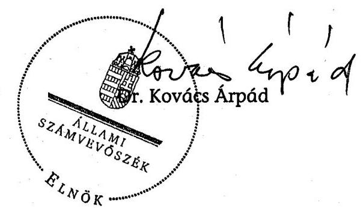
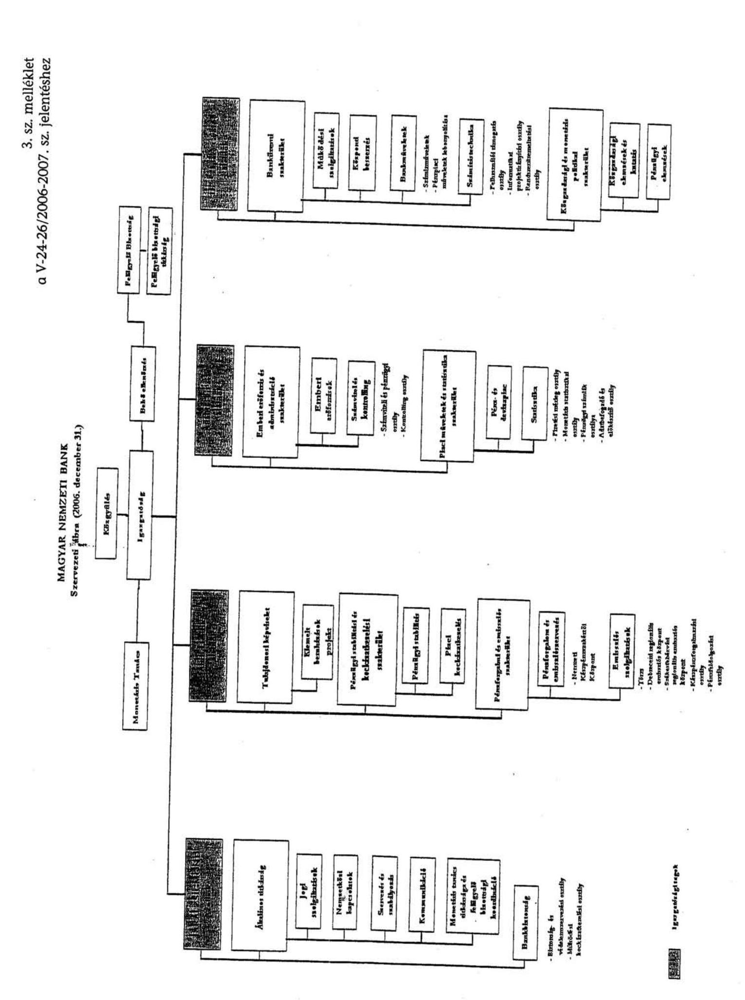
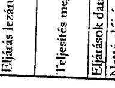
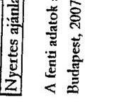

# ÁLLAMI   SZÁMVEVŐSZÉK 

## JELENTÉS

a Magyar Nemzeti Bank 2006. évi működésének ellenőrzéséről

---

2. Államháztartás Központi Szintjét Ellenőrző Igazgatóság
2.1. Teljesítmény Ellenőrzési Főcsoport
Iktatószám: V-24-26/2006-2007.
Témaszám: 841
Vizsgálat-azonosító szám: V0310

# Az ellenőrzést felügyelte: 

Bihary Zsigmond
főigazgató
Az ellenőrzés végrehajtásáért felelős:
Kemény Emil
főcsoportfőnök
Az ellenőrzést vezette:
Tóthné Nagy Éva
mb. osztályvezető főtanácsos
Az ellenőrzést végezték:
Koczka Róbert Lászlóné Verő Tünde Vörös Katalin
számvevő számvevő
A témához kapcsolódó eddig készített számvevőszéki jelentések:
címe
sorszáma
A Magyar Nemzeti Bank működésének ellenőrzése ..... 0238
A Magyar Nemzeti Bank belső (banküzemi) működésének ellenőrzése ..... 0328
A Magyar Nemzeti Banknál alkalmazott teljesítményértékelési ..... 0438
rendszer működésének ellenőrzése
A Magyar Nemzeti Bank 2002. évi működésének ellenőrzése ..... 0340
A Magyar Nemzeti Bank 2003. évi működésének ellenőrzése ..... 0447
A Magyar Nemzeti Bank 2004. évi működésének ellenőrzése ..... 0531
A Magyar Nemzeti Bank 2005. évi működésének ellenőrzése ..... 0622

---

# TARTALOMJEGYZÉK 

BEVEZETÉS ..... 5
I. ÖSSZEGZŐ MEGÁLLAPÍTÁSOK, KÖVETKEZTETÉSEK, JAVASLATOK ..... 7
II. RÉSZLETES MEGÁLLAPÍTÁSOK ..... 12

1. Az MNB működésének törvényessége és szabályszerűsége ..... 12
1.1. A közgyűlés tevékenysége, az alapszabály módosításai ..... 12
1.2. Az igazgatóság működése ..... 12
1.3. A felügyelő bizottság működése ..... 13
1.4. A Belső ellenőrzési szervezet tevékenysége ..... 14
1.5. A középtávú és az éves célkitűzések ..... 14
1.6. A középtávú működésfejlesztési program megvalósítása ..... 16
1.7. Az intézmény belső szabályozási rendszere ..... 17
2. Az MNB belső gazdálkodása ..... 20
2.1. A működési költségek tervezési rendszere, az elszámolt költségek alakulása ..... 20
2.1.1. Az emberi erőforrás gazdálkodás ..... 21
2.1.2. Az információtechnológiai rendszerek költségei ..... 23
2.1.3. Az üzemeltetési, az egyéb költségek és az értékcsökkenés ..... 23
2.2. A beruházási kiadások tervezési rendszere és az előirányzatok felhasználása ..... 24
2.2.1. A Logisztikai Központ megvalósításának előrehaladása ..... 27
2.2.2. A Konferencia-központ megvalósítása ..... 29
2.3. Az intézmény beszerzési rendszere ..... 32
2.4. A banküzemi bevételek és ráfordítások ..... 33
3. Az MNB befektetett eszközei ..... 34
3.1. Az immateriális javak, a tárgyi eszközök, valamint a beruházások állománya ..... 34
3.2. Az MNB befektetései ..... 35
4. Az MNB kapcsolata a központi költségvetéssel ..... 36
5. Az ÁSZ 2006-ban közzétett jelentésében megfogalmazott javaslatok hasznosulása ..... 37

---

## MELLÉKLETEK

1. számú melléklet
2. számú melléklet
3. számú melléklet
4. számú melléklet
5. számú melléklet
6. számú melléklet
7. számú melléklet

Észrevétel
Teljesítmény-ellenőrzési kritériumok
Az MNB szervezeti ábrája (2006. január 24.)
Az MNB működési költségeinek alakulása
Az immateriális javak és tárgyi eszközök 2006. évi beszerzésének, létrehozásának tervezett és tényleges ráfordításai
Befektetések és a befektetésekből származó osztalékok alakulása
Tanúsítványok jegyzéke

---

# RÖVIDÍTÉSEK JEGYZÉKE 

| ÁSZ | Állami Számvevőszék |
| :-- | :-- |
| BIS | Nemzetközi Fizetések Bankja |
| BKB | Beruházási és Költséggazdálkodási Bizottság |
| EEF | Emberi erőforrások |
| EKB | Európai Központi Bank |
| EU | Európai Unió |
| FB | Felügyelő bizottság |
| Gt. | 2006. évi IV. törvény a gazdasági társaságokról |
| IAC | Központi Bankok Európai rendszerén belül működő Belső |
|  | Ellenőrzési Bizottság |
| IT | Információ technológia |
| KBB | Kiemelt beruházási bizottság |
| KBE | Központi beszerzés |
| KBER | Központi Bankok Európai Rendszere |
| Kbt. | 2003. évi CXXIX. törvény a közbeszerzésekről |
| KBP | Kiemelt beruházások projekt |
| KELER Zrt. | Központi Elszámolóház és Értéktár Zrt. |
| MNB, Bank | Magyar Nemzeti Bank |
| MNB tv. | 2001. évi LVIII. törvény a Magyar Nemzeti Bankról |
| MSZ | Működési szolgáltatások |
| PEM | Pénzforgalom és emissziószervezés |
| STA | Statisztika |
| SWIFT | Society for Worldwide Interbank Financial |
|  | Telecommunication SCRL |
| SZE | Szervezés és szabályozás |
| SZMSZ | Szervezeti és Működési Szabályzat |
| SZV | Számvitel és kontrolling |
| TB | Tulajdonosi bizottság |
| VBK | Választható béren kívüli juttatás |

---

.

---

# JELENTÉS   a Magyar Nemzeti Bank 2006. évi működésének ellenőrzéséről 

## BEVEZETÉS

A Magyar Nemzeti Bank (továbbiakban: MNB) elsődleges célja az árstabilitás elérése és fenntartása, amelyet a róla szóló 2001. évi LVIII. törvény (továbbiakban: MNB tv.) 3. § (1) bekezdése tartalmaz. E törvényben meghatározott alapvető feladatait hatékony és szabályszerű működéssel kell biztosítania.

Az Állami Számvevőszék (továbbiakban: ÁSZ) az Állami Számvevőszékről szóló 1989. évi XXXVIII. törvény 3. §-a alapján ellenőrzi az MNB gazdálkodását és az MNB tv.-vel összhangban - az alapfeladatok körébe nem tartozó tevékenységét. Az ÁSZ azt vizsgálja, hogy az MNB a jogszabályoknak, kiemelten az MNB tv. rendelkezéseinek, az alapszabálynak és a közgyűlés határozatainak megfelelően működik-e.

Az ellenőrzés nem terjedhet ki a monetáris politika meghatározására és megvalósítására; a hivatalos deviza- és aranytartalék képzésére és kezelésére; a devizatartalék kezelésével és az árfolyam-politika végrehajtásával kapcsolatban végzett devizaműveletekre; a belföldi elszámolási rendszerek kialakítására és szabályozására, azok biztonságos és hatékony működésének támogatására; a feladatai ellátásához szükséges statisztikai információk gyűjtésére és közzétételére; a pénzügyi rendszer stabilitásának, valamint a pénzügyi rendszer prudenciális (azonnali és mindenkori fizetőképesség folyamatos fenntartása) felügyeletére vonatkozó politika kialakításának és hatékony vitelének támogatására, továbbá a bankjegy- és érmekibocsátásra.

Az MNB működésének és gazdálkodásának folyamatos tulajdonosi ellenőrzését a felügyelő bizottság (továbbiakban: FB) ${ }^{1}$ látja el. Az éves beszámoló valódiságát könyvvizsgáló ellenőrzi.

Az MNB a jegybanktörvényben megfogalmazott alapvető feladatainak színvonalas és üzembiztos ellátása érdekében stratégiájában a hatékony banküzem kialakítását tűzte ki célul. Ennek megvalósítására az elmúlt hat év alatt szervezetét és működését több lépcsőben korszerűsítette, a jegybanki feladatellátáshoz nem kapcsolódó tevékenységek megszüntetésén túl, egyebek mellett, új munkakultúrát honosított meg. A szervezetkorszerűsítést, a működésfejlesztést és a

[^0]
[^0]:    ${ }^{1}$ Nevét az MNB tv. szóhasználatának megfelelően alkalmazzuk.

---

feladatracionalizálást hatékony létszámgazdálkodással, valamint költségmegtakarítással valósította meg. Mindezek eredményeként a 2001 óta eltelt hat év alatt a munkavállalói létszám 38\%-kal, 1246-ról 773 főre csökkent. A működési költségek - az MNB kimutatása szerint - nominál értéken 2001-ben 15,2 Mrd, 2006-ban 14,8 Mrd Ft-ot tettek ki. A reálértéken számított 2006. évi működési költségek főösszege (11,7 Mrd Ft) 23\%-kal volt alacsonyabb a 2001. évinél.

Az ÁSZ 2002 óta elvégzett vizsgálatai az MNB banküzemi működésére és belső gazdálkodására, annak racionalizálására, a működési költségek és a beruházási kiadások alakulására, a kontrolling feladatokat támogató informatikai, a katasztrófatűrő adattároló és a teljesítményértékelő rendszerek megvalósítására, valamint az analitikus számlavezető rendszer bevezetésére terjedtek ki. Az ellenőrzések kiemelt figyelmet fordítottak az MNB tv. változásából adódó feladatok teljesítésére.

A jelenlegi ellenőrzés célja annak értékelése volt, hogy az MNB:

- időarányosan teljesítette-e középtávú intézményi célkitűzéseit, működése megfelelt-e a törvényi előírásoknak, az irányítási, a döntéshozatali, valamint az ellenőrzési rendszere hatékonyan működött-e;
- gazdálkodásában a szabályszerűség és a hatékonyság követelményei érvényesültek-e, kiemelt figyelemmel a működési költségek alakulására, a beruházási célkitűzések megvalósulására, a létszám- és bérgazdálkodásra, valamint a belső ellenőrzés tevékenységére;
- befektetett eszközeivel törvényesen és szabályszerűen, a tulajdonosi stratégiával, valamint az éves célkitűzéseivel összhangban gazdálkodott-e;
- hasznosította-e az előző évi ÁSZ ellenőrzés megállapításait, és milyen intézkedéseket tett a javaslatok megvalósítására.

Az ellenőrzés kiterjedt a Magyar Köztársaság 2006. évi költségvetése végrehajtásához kapcsolódó elszámolások szabályszerűségének vizsgálatára is.

Az ellenőrzést az ÁSZ ellenőrzési kézikönyve és szakmai dokumentumai alapján átfogó ellenőrzéssel, a teljesítmény-ellenőrzési kritériumok figyelembevételével (2. sz. mellélet) végeztük el.

A vizsgálat a 2006. évi gazdálkodásra, illetve indokolt esetben az adott gazdasági esemény keletkezésétől számított időszakra irányult, de szükség szerint a pénzügyi-gazdasági folyamatokat a helyszíni ellenőrzés befejezéséig figyelemmel kísérte.

A végleges jelentést megküldtük az MNB elnökének. Válaszlevelét az 1. számú melléklet tartalmazza.

---

# I. ÖSSZEGZŐ MEGÁLLAPÍTÁSOK, KÖVETKEZTETÉSEK, JAVASLATOK 

A közgyűlés az MNB tv.-ben meghatározott feladatait 2006-ban is a törvényi előírásokkal összhangban látta el, az alapszabályt betartotta. A 2006. május 10-én megtartott éves rendes közgyűlésen elfogadta az MNB 2005. évi auditált éves beszámolóját, megállapította a könyvvizsgáló 2006. évi díját, és átvezette az alapszabályban a gazdasági társaságokról szóló 2006. évi IV. törvény (továbbiakban: Gt.) változásait.

Az igazgatóság az MNB tv., az alapszabály és a hatályos ügyrendje előírásainak betartásával, féléves munkaterve alapján végezte feladatát. Döntést hozott mindazon kérdésekben, amelyek az MNB tv.-ben rögzített alapfeladataihoz tartoznak, valamint az éves fő célkitűzések teljesítéséhez kapcsolódtak. Ügyrendjét többször módosította, többek között a 2006. januárban elfogadott szervezeti változásokkal, nem tartalmazta azonban az igazgatóság Gt.-ben előírt azon feladatát, hogy az ügyvezetésről, a társaság vagyoni helyzetéről és üzletpolitikájáról legalább háromhavonta az FB részére jelentést készít, az FB MNB tv.-ben korlátozott ellenőrzési hatáskörének figyelembevételével. Az ügyrend nem szabályozta továbbá az új elnöki utasítások, illetve azok lényeges módosításának jóváhagyását. Ennek ellenére 2006-ban az igazgatóság negyedéves beszámolóit az FB számára elkészítette és az elnöki utasításokat is jóváhagyta.

A felügyelő bizottság a törvényi előírásoknak és a munkaterveinek megfelelően végezte az MNB működésének és gazdálkodásának ellenőrzését. A 2006. évben megtartott tizenegy ülésén 51 napirendi pontot megtárgyalt és hét témában hozott határozatot. Az FB a hatáskörébe tartozó területeken irányította és felügyelte a Belső ellenőrzési szervezet munkáját. Az FB tagjai - a törvényi előírásnak megfelelően - beszámoltak éves tevékenységükről az Országgyűlésnek és a pénzügyminiszternek.

A Belső ellenőrzési szervezet feladatát az igazgatóság és az FB által jóváhagyott éves munkaterve alapján látta el, amelynek időarányos teljesítéséről az irányító szerveinek rendszeresen beszámolt. Az elvégzett 62 vizsgálathoz 78 megállapítást és 32 ajánlást tett, amelyek megoldására 125 intézkedési terv készült. A szervezet megállapításainak hasznosulását 20 utóvizsgálat keretében ellenőrizte. A vizsgálatok jogszabályba ütköző hiányosságot nem tártak fel. Az ellenőrző szervezet képviselői rendszeresen részt vettek a Központi Bankok Európai Rendszerén (továbbiakban: KBER) belül működő Belső Ellenőrzési Bizottság ülésein és együttműködtek a közös vizsgálatokban. A Belső ellenőrzési szervezet 2006-ban is szabályszerűen végezte a munkáját. Az elmúlt évek javuló tendenciáját folytatva, ellenőrzési kapacitásának növekvő hányadát (2006-ban 84%, 2005-ben 80%) fordította belső ellenőrzési vizsgálatokra.

Az MNB a 2001. évben elfogadott stratégiája alapján jóváhagyta a 2005-2007. évi célkitűzéseit, amelyek középpontjában a 2005-ben megkezdett működésfejlesztési program folytatása állt. Ez alapján határozta meg az éves intézményi célkitűzéseit. A működésfejlesztési program első szakasza 2006

---

decemberében lezárult, a teljes program a Logisztikai Központ üzembe helyezésével, várhatóan 2007 végére befejeződik. Az MNB a 2006. évi célkitűzéseit teljesítette, ezzel a középtávú intézményi célok is időarányosan megvalósultak. A Bank a kitűzött célok eredményességét a létszámcsökkentéssel mérte, 2005-ben 95, 2006-ban 41 fővel csökkent a létszáma, a csökkentés 8 fővel meghaladta a tervezettet. 2006-ban az igazgatóság az MNB szervezetét átalakította, négy vezetési szintet határozott meg, mindezek hatására a vezetői munkakörök száma 36,4\%-kal csökkent. A Bank 2005-ben a működésfejlesztési program megkezdése előtt 25, míg a vizsgált időszak végén 22 szervezeti egységgel látta el feladatait.

Az MNB új munkakultúrát honosított meg, a szabályvezérelt működést felváltotta a „vezetői felhatalmazáson" alapuló irányítás. Az új vezetési módszer alkalmazása kiszélesítette a döntési jogköröket, ezzel összhangban nőtt a munkavállalók egyéni felelősségvállalása, mindezek alapján lehetővé vált a szabályzatok deregulációja. A belső szabályozási rendszert a
 Bank a szervezeti változtatásoknak megfelelően alakította át, és azokkal összehangoltan dolgozta ki a feladat- és eljárási rend változásokat. Az azonos feladatokhoz tartozó szabályokat egységes szerkezetbe foglalta, a kis kockázatú területeken szabályzatok helyett irányelveket, útmutatókat adott ki. Az MNB kitűzött céljaival összhangban a belső szabályozás teljeskörűsége megszűnt, a működési kockázat csak az alacsony kockázatú területeken nőtt. Az előzetes és az utólagos ellenőrzés az irányelvek megjelenésével lazult, a folyamatba épített ellenőrzést pedig erősítette a munkafolyamatok elektronikus rendszerben történő kezelése. Az MNB a deregulációs folyamatot 2006 decemberében lezárta, 12 utasítást azonban ezt követően, 2007 márciusára dolgozott át. 2006 végén az MNB vezetése megállapította, hogy a Bank szabályozottsága nem romlott. A megállapításhoz független ellenőrzéssel alátámasztott értékelés nem készült. A helyszíni ellenőrzés a szabályozás enyhébb eszközeinek alkalmazásával összefüggő hiányosságot nem tárt fel. A belső utasítások - az elnöki utasítások jóváhagyásának szabályzatba foglalása kivételével - összhangban voltak a hatályos jogszabályokkal.

A Bank a működésfejlesztési programjával összefüggésben egyszerűsítette tervezési rendszerét, a tervezés mélysége és az adminisztrációs feladatok csökkentek. A folyamat szabályozott volt, a terveket nulla bázison, a részletes beszerzési tervekre alapozva, a belső szabályzatok betartásával készítették el. Az igazgatóság a működési költségek tervének főösszegét 15,5 Mrd Ft-ban hagyta jóvá, amelyből 0,2 Mrd Ft volt a központi tartalék. A 2006. évi felhasználás 14,8 Mrd Ft, a terv 95,1%-a volt, amely az előző évinél 0,6%-kal alacsonyabb lett. A pénzügyi keretek felhasználása és az elszámolások szabályszerűek voltak. Személyi költségekre a Bank 8,6 Mrd Ft-ot fordított, amely a 2006-ban megvalósult 4,2% átlagjövedelem-növekedés ellenére - elsősorban a működésfejlesztéssel összefüggő létszámleépítés hatására - mintegy 10%-kal maradt el az előző évitől. Az átlagos állományi létszám 2001 és 2006 között 473 fővel csökkent. Az elmúlt hat évben a működési költségek legnagyobb hányadát a személyi költségek tették ki. Ezek részaránya 2002-től folyamatosan csökkenő tendenciájú - a 2001. évi 64,7% 2006-ra 58,3% lett -, részben az információtechnológiai (továbbiakban: IT) költségek javára, amelyek részaránya 6,3%-ról 8,8%-ra emelkedett. Az MNB 2001 és 2004 között reál értéken csökkenő működési költségekkel látta el feladatait. A 2006. évi működési költségei reál és nominál értéken is a 2001. évi felhasználás alatt maradtak.

Az MNB 2006-ban - a támogatási tevékenységét szabályozó utasításnak megfelelően - jószolgálati, adományozási, humanitárius és művészeti célokat támogatott és 0,3 Mrd Ft-ot, az előző évinek mintegy háromszorosát fordította e célokra. A növekedést döntően olyan egyedi támogatások (pl. műtárgy, hangszer vásárlás) okozták, amelyek csak a tárgyévben merültek fel. A Bank támogatást csak az igazgatóság jóváhagyásával, szabályzatának betartásával juttatott.

Az MNB a 2006. évi beruházási tervét a hatályos jogszabályok és a belső szabályzatok előírásainak betartásával készítette el. Az új tervezési irányelveknek megfelelően az igazgatóság 2006-ban csak a tárgyévben induló beruházások jóváhagyásáról döntött. 2006. évre 4,0 Mrd Ft-ot irányozott elő, amit az év közben felmerülő új igény miatt 4,1 Mrd Ft-ra megemelt. A terv tételeit dokumentumok támasztották alá. A korábbi évek döntései alapján folyamatban lévő beruházások jóváhagyott terve 14,9 Mrd Ft volt, amelyet az előző évről áthúzódó tételek 15,0 Mrd Ft-ra növeltek. Ezzel a terv teljes jóváhagyott előirányzata 19,1 Mrd Ft lett, amelyből a 2006. évi 10,2 Mrd Ft, az elszámolt kiadás pedig 6,5 Mrd Ft volt. Az éves kiadások mintegy 80%-át a stratégiai célú fejlesztésekre, 20%-ot pedig a működési környezet fenntartására (pl. az ingatlanok állagmegőrzésére és technológiai korszerűsítésekre) fordítottak. A Logisztikai Központ teljes pénzügyi tervét az igazgatóság 2003-ban pontosította és 11,4 Mrd Ft-ban hagyta jóvá. A kivitelezési munkák 2005-ben kezdődtek meg, és 2006 végéig a teljes előirányzatból 6,0 Mrd Ft-ot használtak fel, amely a tervezéssel és a területmegszerzéssel kapcsolatos kiadásokat is tartalmazta. A fővállalkozói szerződést 2006-ban - egyebek mellett a kedvezőtlen időjárás, valamint a műszaki tartalom változása miatt - két alkalommal módosították. Ezek a teljes előirányzat összegét nem érintették, a létesítmény átadásának véghatáridejét azonban 2007 decemberére változtatták. A beruházás lebonyolítása szabályszerű volt, a folyamatba épített kontrollok - a beruházási adatlap aktualizálását kivéve - a dokumentumok tanúságai alapján megvalósultak.

A Bank vezetése egy 50-60 fő elhelyezésére alkalmas, az MNB főépületében megvalósuló Konferencia-központ létrehozásáról döntött, amelyet a pályáztatás előtti időszakban felmerült igényeknek megfelelően 100-150 fő befogadó képességűre bővítettek. Az MNB a beruházás megkezdése előtt egyértelműen megfogalmazta a fejlesztés céljait, és szakmailag megalapozott döntés alapján, a belső szabályzatok betartásával valósította meg azt. A beruházás megvalósítására a Bank három pályázatot írt ki, amelyek előkészítését és lebonyolítását szabályszerűen végezték, és - a pótmunkákra kiírt eljárás kivételével - a közbeszerzési törvény előírásai szerint jártak el. A nyertes ajánlattevő kiválasztásakor a döntéshozók - a gazdaságosság követelményét szem előtt tartva - az elvárt műszaki tartalmat és minőségi szintet biztosító pályázatok közül a legalacsonyabb összegű ajánlatot fogadták el. A szerződéseket a pályázati dokumentációknak megfelelően kötötték meg, amelyek a tartalmi elemek mellett a szükséges garanciákat is rögzítették. Az eredetileg 2006. június végére tervezett befejezési határidőt egy hónappal későbbre halasztották, egy hiánypótlás benyújtása, valamint egy szakhatósági állásfoglalás megszerzése miatt. Az építési napló bejegyzései tanúsítják, hogy a kivitelezési munkákat folyamatosan ellenőrizték, az igazgatóság rendszeres tájékoztatást kapott a megvalósítás állapotáról. A beruházás pénzügyi fedezetére 0,3 Mrd Ft-ot irányoztak elő, amelyet 2,6%-kal túlléptek. A lezáró dokumentumok alapján a beruházás a módosított határidőre, a szerződésnek, a kitűzött céloknak, és a jóváhagyott terveknek megfelelően elkészült. A rendeltetésszerű használatba vételt követően az igazgatóság tájékoztatta az FB-t a beruházás megvalósulásáról.

A beszerzési folyamatok 2005-ben megkezdett központosítása tovább folytatódott, a számla- és szerződésadminisztrációt egy szervezeti egység feladatkörébe vonták. A 2006. évi beszerzési és éves közbeszerzési tervet a hatályos szabályzatoknak megfelelően állították össze, amelyek biztosították a beszerzési és a pénzügyi tervek összhangját. A beszerzési és az éves közbeszerzési tervek visszaméréséhez a számítástechnikai feltételek kialakítását a Bank megkezdte, a megvalósításra kiírt első közbeszerzési eljárás sikertelensége miatt az alkalmazás átadását 2007-re halasztotta. A beszerzési eljárásokat az MNB - egy kivétellel - a törvényi előírások, a belső szabályzatok és a Beruházási és Költséggazdálkodási Bizottság (továbbiakban: BKB) határozatainak betartásával végezte.

Az MNB befektetett eszközeinek 2006. évben kimutatott nettó nyitó állománya 29,6 Mrd Ft volt, amely az év végére 32,4 Mrd Ft-ra nőtt, elsősorban a beruházások értékének növekedése miatt. Az állomány mintegy 54%-át a befektetések képezték. A Bank továbbra is hat belföldi és három külföldi társaságban rendelkezik részesedéssel, amelyek könyv szerinti értéke az év végén 17,5 Mrd Ft volt. Az előzetes beszámolók alapján a belföldi társaságok 2006. évi gazdálkodása eredményes volt, az MNB 2,4 Mrd Ft osztalékot vár, 0,3 Mrd Ft-tal többet az előző évinél. A külföldi társaságoktól várható osztalék összege - a naptári évtől eltérő üzleti év alkalmazása miatt - csak 2007. második félévében lesz ismert. Az MNB befektetett eszközeivel a hatályos törvények betartásával, szabályszerűen gazdálkodott. Társaságainak működése stratégiájával és éves célkitűzéseivel összhangban volt.

Az MNB nyilvántartása szerint a banküzemi bevételek és ráfordítások 2006. évi egyenlege 14,6 Mrd Ft veszteség. A várható 2006. évi mérleg szerinti eredmény 14,6 Mrd Ft nyereség, amelyet elsősorban a tárgyévben realizált nettó árfolyamnyereség befolyásolt. A forintárfolyam kiegyenlítési tartalék elszámolt összege 49,6 Mrd Ft volt az előző évi 106,0 Mrd Ft-tal szemben, döntően a forint árfolyamának év folyamán megvalósult növekedése hatására. A devizaértékpapírok kiegyenlítési tartaléka - piaci értékváltozásuk eredményeként - mínusz 20,6 Mrd Ft lett, amelyet a központi költségvetés 2007. március 31-ig megtérített. Az MNB a Kincstári Egységes Számla kamatelszámolásait a jogszabály előírásainak betartásával végezte el.

Az MNB vezetése az ÁSZ korábbi jelentésében megfogalmazott javaslatokat elfogadta és hasznosította, az elnöki utasítások igazgatósági jóváhagyását azonban belső szabályzatában nem rögzítette.

A helyszíni ellenőrzés megállapításainak hasznosítása mellett javasoljuk:

# az MNB igazgatóságának 

1. Rögzítse ügyrendjében a felügyelő bizottság részére negyedévente esedékes beszámoló készítési kötelezettséget.
2. Építse be ügyrendjébe az elnöki utasítások igazgatósági jóváhagyásának feladatát.

## az MNB felügyelő bizottságának

Vizsgáltassa meg, hogy az MNB új szabályozási rendszere biztosítja-e a Bank kitűzött céljainak megfelelő (ellenőrizhető, átlátható és költségtakarékos) működést.

# II. RÉSZLETES MEGÁLLAPÍTÁSOK 

## 1. Az MNB MŰKÖDÉSÉNEK TÖRVÉNYESSÉGE ÉS SZABÁLYSZERŰSÉGE

### 1.1. A közgyűlés tevékenysége, az alapszabály módosításai

Az MNB sajátos feladatából és státuszából eredően speciális részvénytársaság, amelyre a Gt. rendelkezéseit az MNB tv.-ben meghatározott eltérésekkel kell alkalmazni. A közgyűlés feladata az MNB alapszabályának megállapítása és módosítása, a mérleg és eredménykimutatás elfogadása, a könyvvizsgáló megválasztása és visszahívása, valamint díjazásának meghatározása. 2006-ban egy alkalommal, május 10-én ülésezett. A közgyűlés határozatképes volt, azon a részvényes képviselője megjelent. Három határozatot hozott, elfogadta az MNB 2005. évi auditált éves beszámolóját, megállapította a könyvvizsgáló 2006. évi díját, valamint módosította az alapszabályát. A módosítások egyebek mellett kiterjedtek a konferencia közgyűlés megtartásának Gt.-ben előírt szabályaira, az igazgatóság munkáját segítő szakmai bizottságok létrehozására és azok ügyrendjének meghatározására. A közgyűlés 2006. évi működése megfelelt a törvényi előírásoknak, az alapszabályt betartotta.

### 1.2. Az igazgatóság működése

Az igazgatóság hatáskörét és feladatait az MNB tv. és az alapszabály rögzíti, amelyek alapján az igazgatóság felelős a monetáris tanács döntéseinek végrehajtásáért és az MNB működésének irányításáért. Tevékenységét ügyrendje szabályozza, amelyet az év folyamán többször módosított. Kiegészítette egyebek mellett a védelmi célú bankjegytartalékkal összefüggő szabályozással, valamint aktualizálta az elfogadott szervezeti és működési változásokkal is. Nem tartalmazta azonban azt, hogy a Gt. 244. § (2) bekezdése alapján az igazgatóság az ügyvezetésről, a társaság vagyoni helyzetéről és üzletpolitikájáról legalább háromhavonta az FB részére jelentést készít. Ez a beszámoló - figyelemmel az FB MNB tv.-ben korlátozott ellenőrzési hatáskörére - nem terjedhet ki az MNB alapfeladataira, illetve azoknak az eredményre gyakorolt hatására. Az ügyrend nem tartalmazza továbbá az új elnöki utasítás, illetve az elnöki utasítás lényeges módosításának jóváhagyását, ugyanakkor ezt a feladatot az igazgatóság határozatában megerősítette. Az igazgatóság 2006-ban az elnöki utasításokat jóváhagyta és a Gt. előírásának megfelelően elkészítette az FB-nek szóló negyedéves jelentéseit.

Az igazgatóság 2006-ban irányító és döntéshozó tevékenységét a hatályos ügyrendjének betartásával, féléves munkatervei alapján végezte. Tizennégy alkalommal ülésezett, és 118 napirendi pontot tárgyalt meg, valamint nyolc alkalommal ülésen kívül, írásban hozta meg döntéseit, összesen 80 határozatot hozott. Állandó napirendként megtárgyalta a monetáris tanács határozataihoz kapcsolódó feladatokat és intézkedett azok végrehajtására. Döntött az MNB szervezetével, belső irányításával összefüggő kérdésekben. Jóváhagyta a Bank működésével, feladatainak ellátásával kapcsolatos szakmai terveket és programokat, a működési költségek és a beruházási kiadások pénzügyi tervét. Az FB hatáskörébe nem tartozó feladatok tekintetében irányította az MNB Belső ellenőrzési szervezeti egységét, megtárgyalta
 éves munkatervét és ellenőrzési tapasztalatait.

# 1.3. A felügyelő bizottság működése 

Az FB az MNB folyamatos tulajdonosi ellenőrzésének a szerve. Az MNB tv. alapján az FB irányítja az MNB Belső ellenőrzési szervezetét a hatáskörébe tartozó feladatok tekintetében, amely nem terjed ki a monetáris politika meghatározására és megvalósítására. Jelentéseit szintén e korlátozásnak megfelelően készíti el.

Az FB feladatát munkatervei alapján végezte, amelyek az éves rendes közgyűléshez igazodva a 2005. júniustól 2006. júniusig, illetve a 2006. szeptembertől 2007. júniusig terjedő időszakot fogják át. 2006. szeptembertől „ideiglenes" munkatervvel rendelkezik. Ennek oka, hogy a tagok mandátuma az Országgyűlés megbízatásának megszűnésével 2006. májusában lejárt. Az új FB tagok megválasztása a helyszíni ellenőrzés végéig (2007. március 2.) még nem történt meg.

Az MNB tv. 52/B. §-a kimondja, hogy „A felügyelő bizottság tagjainak megbízatása az Országgyűlés megbízatásának időtartamára szól, és az Országgyűlés megbízatásának megszünéséig tart. A felügyelő bizottság működése addig tart, amíg az új Országgyűlés az alakuló üléstől számított három hónapon belül az új felügyelő bizottsági tagokat megválasztja. Ha az új Országgyűlés az említett határidőig az új felügyelő bizottsági tagokat nem választja meg, a felügyelő bizottság működése mindaddig tart, amíg az új Országgyűlés a felügyelő bizottsági tagokat megválasztja."

Az FB munkatervében 2006. évre kitűzte az MNB peres ügyeinek, a kapcsolt vállalkozások gazdálkodásának, a közbeszerzési törvény előírásai érvényesülésének, az őrzési feladatok kiszervezésének pénzügyi hatásai vizsgálatát, továbbá az MNB 2005. évi mérlegének és eredménykimutatásának értékelését, a Logisztikai Központ beruházási projekt helyzetének áttekintését. Feladatait teljesítette, ülésein rendszeresen megtárgyalta az irányítása alá tartozó Belső ellenőrzési szervezetnek az MNB gazdálkodásával és működésével kapcsolatos ellenőrzéseit, megállapításait, valamint javaslatait. Áttekintette többek között a Bank 2006. évi fő prioritású céljait, a 2006. évi pénzügyi tervét, a Konferenciaközpont beruházás megvalósítását és értékelte az MNB leányvállalatainak 2005. évi gazdálkodását, valamint stratégiáját.

A 2006-ban megtartott 11 ülésén 51 napirendi pontot megtárgyalt és 7 témában hozott határozatot. Az FB tagjai - a dokumentumok tanúsága szerint - további intézkedéseket is kértek, de azok figyelemmel kísérése a jegyzőkönyvekben nem minden esetben követhető nyomon (pl. a 2006. március 21-ei ülésen elhangzott, hogy foglalkoznak az MNB szervezetfejlesztésének témakörével, de erre a jegyzőkönyvek alapján a helyszíni ellenőrzés végéig - 2007. március 2. - nem tértek vissza). Az FB véleménye, hogy nyilvántartó rendszer nélkül is nyomon tudja követni határozatait és javaslatait, de tervezi annak bevezetését.

---

Az FB ellenőrzési tevékenységét az MNB tv. előírásainak és ügyrendjének megfelelően látta el. Munkatervét időarányosan teljesítette.

# 1.4. A Belső ellenőrzési szervezet tevékenysége 

Az MNB-ről szóló törvény előírja, hogy a Belső ellenőrzés az FB, illetve az FB hatáskörébe nem tartozó feladatok tekintetében az igazgatóság irányítása alá tartozik. Tevékenységének célja, hogy vizsgálataival megfelelő információt szolgáltasson a Bank vezetésének és az FB-nek, valamint javaslatokat tegyen a feltárt hiányosságok megszüntetésére.

A Belső ellenőrzés 2006. évi tevékenységét az igazgatóság és az FB által elfogadott munkaterve alapján végezte, amelyben 23 pénzügyi, 15 információtechnológiai, 4 emissziós jellegű ellenőrzést, 21 utóvizsgálatot, összesen 63 ellenőrzést tervezett, ebből 62 vizsgálatot végrehajtott. Munkatervét annak ellenére teljesítette, hogy létszáma az év végéig felére csökkent. Tevékenységét az irányító szervei folyamatosan figyelemmel kísérték és értékelték, azt jóváhagyólag tudomásul vették. Az FB részére az éves beszámolón kívül havonta, az Audit Bizottság részére negyedévente jelentést készített az elvégzett vizsgálatokról és a megállapításokról. Éves célkitűzéseinek megvalósulásáról 2006 októberében az igazgatóságnak beszámolt.

A vizsgált területek szabályozottságát, a szabályok betartását, a tevékenységek kontrolláltságát a Belső ellenőrzés rendben találta, csak kisebb hiányosságokat tárt fel. (pl. elmaradt adatszolgáltatások, az MNB honlapjához kilépett dolgozó is rendelkezett felhasználói jogosultsággal.) Az ellenőrzött időszakban 78 megállapítást, valamint 32 ajánlást tett, amelyeket az érintettek elfogadtak. Ezek megoldására 125 intézkedési terv készült, amelyből 107 valósult meg. 2006 végén 16 megállapításhoz kapcsolódóan még 18 intézkedési terv végrehajtása volt folyamatban.

A Belső ellenőrzés a Központi Bankok Európai Rendszerén belül működő Belső Ellenőrzési Bizottság (továbbiakban: IAC) ülésein és vizsgálataiban rendszeresen részt vett. Az IAC-val kapcsolatos feladatokra 2005-ben 340, 2006-ban pedig 123 munkanapot fordított, amely a Belső ellenőrzés által ledolgozott munkanapoknak 4%-a volt. A csökkenés oka, hogy két számítástechnikai vizsgálatot az IAC későbbre halasztott.

A Belső ellenőrzés a hatályos szabályzatoknak és a törvényi előírásoknak megfelelően határozta meg és hajtotta végre munkatervét. Megállapításainak hasznosulását, illetve az intézkedési tervek végrehajtását 20 utóvizsgálat keretében ellenőrizte. Ellenőrzési kapacitásának 84%-át belső ellenőrzési vizsgálatokra fordította, ezzel követte az elmúlt évek javuló tendenciáját. 2005-ben ez az arány 80%, az ezt megelőző években rendre 75% és 62% volt.

### 1.5. A középtávú és az éves célkitűzések

Az MNB ügyvezetése a Bank 2005-2007. évekre vonatkozó középtávú intézményi stratégiáját 2005 szeptemberében áttekintette és az abban megfogalmazott céloknak megfelelően - az előző évi munkaprogramból áthúzódó feladatokat is

---

figyelembe véve - a 2006. évi fő prioritású célokat a következők szerint határozta meg:
„Az elemzés, kutatás színvonalának további fejlesztése, az együttműködésben rejlő szinergiák kiaknázása a hatékonyság növelése érdekében.

Értékeken, irányelveken, normákon alapuló, a szabályvezérelt működést felváltó munkakultúra meghonosítása.

A támogató területek belső szolgáltatói szemléletének erősítése, gyors, rugalmas, ésszerű működés, felelős gazdálkodás.

A nemzetközi szabványok elvárásainak megfelelő, felhasználóbarát informatikai üzemeltetés és professzionális projektvezetés.

Az általános pénzügyi kultúra fejlesztésének szakmai támogatása.
Az euró bevezetésére történő felkészülés megkezdése, beleértve az euró érme gyártást is.
A Logisztikai Központ emissziós tevékenysége szervezeti, működési, informatikai és emberi erőforrás feltételeinek előkészítése, megteremtése."

Az igazgatóság jóváhagyta a célkitűzéseket és azok megvalósításának ütemezését. A szervezeti egységek 2006. évi céljainak meghatározása és horizontális egyeztetése a jóváhagyott ütemezéshez képest egy hónapot csúszott, ez azonban a további határidők betartását nem befolyásolta. A szervezeti egységek lebontott munkatervét az Emberi erőforrás (továbbiakban: EEF) határidőre előterjesztette, amit az igazgatóság 2005. decemberi jóváhagyását követően a szakterületi vezetők további szervezeti szintekre, illetve egyénekre lebontottak. Ez képezte alapját a 2006. évi teljesítményértékelésnek.

A szervezeti egységek vezetői munkaterveiket az intézményi célkitűzésekkel összhangban állították össze, azok megvalósításáról a szervezeti egységek vezetői 2006 októberében és novemberében beszámoltak, amelyeket az igazgatóság elfogadott. Az MNB a kitűzött feladatainak 2006. évre ütemezett részét megvalósította, középtávú célkitűzéseit időarányosan teljesítette.

Az MNB az éves teljesítmények értékelését a teljesítménymenedzsment irányelvnek megfelelően, dokumentáltan végezte. 2006-ban először, a teljesítménycélok meghatározása mellett, minden munkatárs számára egyénre szabott kompetenciaelvárásokat (pl. a jó teljesítményhez szükséges készségek, viselkedésmódok, attitűdök) is megfogalmazott, és ezzel összefüggően alakította ki az egyéni szakmai továbbképzési elvárásokat is. Az éves teljesítményértékelés egyénenként dokumentált volt. Ezek összegzése alapján a munkavállalók teljesítménye az előző évhez képest javult.

Az egyéni teljesítményeket a szabályzatnak megfelelő 7-es minősítési skálán értékelve a vizsgált időszakban a munkavállalók 89,5%-át középső vagy a fölötti kategóriába sorolták, 2005-ben ez az arány 82,8% volt. Közepesnél gyengébb teljesítményt 2006-ban a munkavállalók 10,5%-a, míg az előző évben 17,2%-a nyújtott. (2006-ban a leggyengébb kategóriába nem soroltak munkavállalót, míg 2005-ben az alkalmazottak 1,4%-ának teljesítményét értékelték a skála legalsó szintjén.)

---

# 1.6. A középtávú működésfejlesztési program megvalósítása 

Az MNB a benchmarking ${ }^{2}$ projekt lezárását követően, annak eredményeit felhasználva 2005 júniusában működésfejlesztési programot indított el, amelynek céljaként a működés racionalizálását, ezen belül a szervezeti és létszámhatékonyság javítását határozta meg. A megvalósítás első üteme 2006. végén lezárult, a második pedig 2007. végéig - a Logisztikai Központ üzembe helyezéséig tart. Az MNB a program keretében még 2005-ben elvégezte a meglévő funkciók felülvizsgálatát, kijelölte és végrehajtotta - a bérszámfejtés és az alkalmazásfejlesztési tevékenység kivételével - a kiszervezéseket ${ }^{3}$. Meghatározta a hatékonyság növelésének további lehetőségeit, mint pl. a jegybanki ellenőrzési tevékenység átszervezése, a dolgozói számlavezetés megszüntetése, az utazásmenedzsment informatikai modul bevezetése, a tervezési és a tervteljesítés visszamérési rendszer egyszerűsítése, stb. A Bank a működésfejlesztési programhoz kapcsolódó szervezeti változásokat a Szervezeti és Működési Szabályzatában (továbbiakban: SZMSZ) átvezette, amelyet az igazgatóság minden esetben megtárgyalt és jóváhagyott.

Az MNB a működésfejlesztés során kitűzött célokat és az elért eredményeket a Bank létszámára gyakorolt hatásán keresztül mérte. A megvalósítás első ütemére 128 fő létszámcsökkentést irányozott elő, ezzel szemben 2005-ben 95, 2006-ban 41 fővel csökkent a létszám, ami 8 fővel meghaladta a tervezettet.

A működésfejlesztési program három területén elért létszámcsökkentés bemutatása

| Megnevezés | Előirányzott létszámcsökkentés (fő) | Megvalósult létszámleépítés (fő) |  | Összesen   (fő) | Eltérés a tervezettől (fő) |
| :--: | :--: | :--: | :--: | :--: | :--: |
|  |  | 2005. év | 2006. év |  |  |
| Funkció vizsgálat | 48 | 37 | 6 | 43 | $-5$ |
| Kiszervezés | 23 | 12 | 9 | 21 | $-2$ |
| Hatékonyság vizsgálat | 57 | 46 | 26 | 72 | $+15$ |
|  | 128 | 95 | 41 | 136 | 8 |

A funkció vizsgálatot követő intézkedések megvalósításának létszámra gyakorolt hatása 43 fő volt, amely 5 fővel elmaradt a tervezettől. A tervezettnél kisebb létszámcsökkenés valósult meg többek között, a raktározási tevékenység megszüntetése, a pénzforgalmi megbízások elektronikus fogadásához szükséges technikai feltételek megteremtése területeken.

[^0]
[^0]:    ${ }^{2}$ A Bank teljesítményének, gyakorlatának összemérése a kiválasztott partner - svéd jegybank - hasonló adataival, az eltérések azonosítása, elemzése és a legjobb gyakorlat kiválasztása és adaptálása.
    ${ }^{3}$ A működésfejlesztési program keretében végrehajtott kiszervezések és a kapcsolódó szervezeti változások megvalósításáról az ÁSZ a Magyar Nemzeti Bank 2005. évi működésének ellenőrzéséről készült 0622 számú jelentésében beszámolt.

---

A megvalósított kiszervezések a létszámot 21 fővel csökkentették. Nem valósult meg az alkalmazásfejlesztési tevékenység kiszervezése annak ellenére, hogy két közbeszerzési eljárást is lefolytatott a Központi beszerzés (továbbiakban: KBE). A kiszervezés elmaradásának egyik oka az volt, hogy az ajánlati ár meghaladta a tevékenység banki közvetlen költségeit, a másik pedig, hogy időközben a saját fejlesztésű rendszereket kiváltották, és az újonnan indított alkalmazásokat már külső erőforrással valósították meg. A fejlesztési tevékenység átalakításának hatására a létszám a tervezett 8-cal szemben 5 fővel csökkent. Nem valósult meg a bérszámfejtés kiszervezése sem, mivel a szerződött partner a pályázati kiírásban és a megkötött szerződésben szereplő feltételt nem tudta határidőre teljesíteni. Ez utóbbi esetben a Bank a kiszervezés lehetőségét későbbi időpontban újra megvizsgálja.

Az MNB a legnagyobb csökkenést a tevékenységek hatékonyságának vizsgálatakor feltárt létszám-leépítési lehetőség megvalósításával érte el, a tervezett 57 fővel szemben 2005-ben 46, 2006-ban pedig további 26 fő munkáját tudták kiváltani. Létszámcsökkenést jelentett többek között az iktatás és dokumentációkezelés racionalizálása, az új számlavezető rendszer (inforex) bevezetése, a Statisztikai szervezeti egységnél (továbbiakban: STA) az adattárház beindítása, valamint a költséggazdálkodási modell
 egyszerűsítése, az utazásmenedzsment modul működtetése, a kiküldetéssel és munkába járással kapcsolatos előlegek megszüntetése, a dolgozói hitelállomány értékesítése, az adminisztráció központosítása.

Az igazgatóság a működésfejlesztési programmal kapcsolatos tevékenység előrehaladását a vizsgált időszakban nyomon követte. A megvalósítással összefüggésben a Bank szervezeti felépítése több alkalommal változott, amelyeket az igazgatóság minden alkalommal megtárgyalt és jóváhagyott. Az SZMSZ-t ennek megfelelően módosították. A vizsgált időszak végén az MNB 22 szervezeti egységgel látta el feladatát, amelyhez négy vezetési szintet épített ki. A vezetői munkakörök számát 36,4%-kal, a 2005. évi 99-ről 63-ra csökkentette. (Az MNB szervezeti felépítését a 3. sz. melléklet mutatja be.)

# 1.7. Az intézmény belső szabályozási rendszere 

Az MNB vezetésének megítélése szerint a Bank szervezeti kultúrájának fejlettsége lehetővé tette az empowermentnek ${ }^{4}$ nevezett vezetési módszerek alkalmazását. A szemléletváltással összefüggésben a 2005 júniusában megtartott felső vezetői értekezleten a svéd benchmark vizsgálat alapján a belső szabályok dere-

[^0]
[^0]:    ${ }^{4}$ Az empowerment definícióját a Bank belső dokumentumában a Blanchard, Carlos, Randolph: Empowerment - A felelősség hatalma című könyv nyomán az alábbiak szerint értelmezte: „lényegében a felhatalmazás (vezetői) cégfilozófiáját jelenti. Empowermentnek a vezetői hatalmat az alkalmazottaival megosztó menedzsmentet nevezik. Alkalmazottaik önállóan hozzák döntéseiket saját területeiken, nem várva főnökeik megerősítésére. Nagyfokú felelősség-, hatalom-, és információközösséget, megváltozott munkahelyi szervezeti struktúrát hoz létre, ami ügyfélközpontúsághoz, hatékonysághoz, gyorsasághoz, és folytonos fejlődéshez vezeti a céget, már ha sikerül elsajátítani."

---

gulációjáról ${ }^{5}$ döntöttek. Ennek keretében célul tűzték ki, hogy a folyamat leíró belső szabályokat folyamatábra használatával váltják ki. A Szervezés és szabályozás szakterület (továbbiakban: SZE) a hatályos belső szabályokat áttekintette és deregulációs szempontból csoportosította azokat. Nem deregulálható belső szabályoknak azokat minősítette, amelyek jogszabályon alapultak, felelős irányítási ajánlásoknak feleltek meg, kiemelt költségekkel vagy kockázattal járó tevékenységet, hatáskört szabályoztak, valamint amelyek folyamatok leírását tartalmazták. Deregulálhatónak sorolták be azokat a szabályokat, amelyeket policy-vel, útmutatóval, SZMSZ-szel, vagy szakmai bizottságok előírásaival kiváltva, az adott tevékenységet nagyobb kockázatvállalás nélkül működtetni lehet. A deregulációs folyamat megvalósításának ütemezését 2005. július 1-jén állította össze a Bank vezetése, amelynek négy fő szakaszát a következők szerint határozta meg:

- 2005 szeptemberére a policy típusú utasítások kiváltása irányelvekkel és útmutatókkal;
- 2005 decemberére a külső tanácsadó javaslata alapján a belső eljárásrendek - beszerzés, ellátás - kialakítása, valamint a működésfejlesztési program szerinti változások átvezetése a szabályokon;
- 2006 márciusára a homogén szabályzatok kézikönyvekbe foglalása;
- 2006 decemberére az alapvető technológiákat leíró, folyamatjellegű szabályok kiváltása elektronikusan rögzített folyamatábrákkal; a működésfejlesztés eredményeként megvalósult szervezet-egyszerűsítéshez kapcsolódó, a felelősség-megosztást leíró szabályok (pl. a belső gazdálkodás rendjéről szóló, a kötelezettségvállalás és utalványozás rendjéről szóló ügyvezető igazgatói utasítások, stb.) csökkentése.

A szervezeti átalakításokkal összefüggő SZMSZ módosítás előterjesztését az igazgatóság 2006 januárjában két alkalommal tárgyalta. A kért változtatás (három szakterület szervezeti elhelyezésének módosítása) átvezetését követően elfogadta azt és elrendelte január 24-i hatályba helyezését, valamint egységes szerkezetben történő megjelentetését. Elfogadta továbbá az új struktúrának megfelelő vezetői szerepekhez, felelősségekhez illeszkedő munkaköri besorolásokat is. A 2006 márciusára előirányzott négy kézikönyv összeállítása és hatályba helyezése 2006. április és augusztus hónapok között történt meg. Az alapvető technológiákat leíró folyamat jellegű szabályok folyamatábrákkal történő kiváltása nem történt meg. Egyes tevékenységekhez elkészültek ugyan a folyamatábrák, azonban azok kezelése még nehézkes, a fejlesztés folyamatban van.

Az MNB a belső szabályok deregulációját 2006. év végével lezárta, a vizsgált időszak végén tizenkettő ügyvezető igazgatói utasítás azonban még hatályban volt annak ellenére, hogy a Bank szervezetében az ügyvezető igazgatói beosztás

[^0]
[^0]:    ${ }^{5}$ Dereguláció a Bank értelmezésében: „A túlburjánzó, eredeti céljaikat tekintve sokszor teljesen homályos tartalmú, ugyanakkor a szabályozás alanyainál fokozott betartási, míg az igazgatásban fokozott végrehajtási költségekkel járó szabály-dzsungel ritkítása."

---

2006. január 24-től megszűnt. 2007. március 2-ig, a helyszíni ellenőrzés végéig az ügyvezetői utasításokat igazgatói utasításokká alakították át.

A deregulációs folyamat lezárását követően a Bank szabályozási rendszerébe tartoznak:

- az SZMSZ, amelyben a felelős vállalatirányítási elveket rendezik;
- Elnöki utasítások, amelyek szintén tartalmaznak felelős vállalatirányítási elveket, értékeket, felső vezetői irányokat, rendezik a több szervezeti egységet érintő funkciókat, valamint a hatásköröket és a felelősségi köröket;
- Igazgatói utasítások, amelyek az SZMSZ-ben és az elnöki utasításokban nem szabályozott hatásköröket, jogköröket, valamint a szervezeti határokat átlépő folyamatokat rögzítik;
- Irányelvek, útmutatások, amelyek ismertetik a feladatellátás fő irányait, elveit, kereteit, értékeket és elvárásokat közvetítenek;
- Technológiai eljárások, amelyek a szervezeti egységeken belüli folyamatokat rögzítik.

A dereguláció számszerűsíthető eredményét a következő táblázat szemlélteti:

| Megnevezés | Belső szabályok mennyisége |  | Változás |
| :-- | --: | --: | --: |
|  | Dereguláció kezdete | Deregulációs folyamat   vége |  |
| SZMSZ | 1 | 1 | 0 |
| Elnöki utasítások | 36 | 8 | -28 |
| Ügyvezető igazgatói   utasítások | 143 | 12 | -131 |
| Igazgatói utasítások | 0 | 66 | +66 |
| ebből: Kézikönyv | 0 | 4 | +4 |
| Szabályok összesen: | 179 | 86 | -93 |
| Irányelvek,   útmutatók | 0 | 32 | +32 |

*A 12 ügyvezetői utasítást a helyszíni ellenőrzés végéig alakították át igazgatói utasítássá
A hatályos utasítások (elnöki, igazgatói, ügyvezető igazgatói) közül 14 db általános banki, 8 db befektetési, 25 db jegybanki, 39 db támogató és ellátó funkciót szabályoz.

A vizsgált időszakban, egy-egy témakörben több alkalommal is módosítottak utasítást, így 199-szer helyeztek hatályon kívül belső szabályzatot. A Bank szabályzataiból a deregulációs folyamathoz kapcsolódóan ismételten módosításra szorul, pl. az MNB beszerzéseinek és az ezekhez kapcsolódó szerződések előkészítésének, valamint a kötelezettségvállalások rendjéről szóló igazgatói utasítás, mivel az egyes szakterületek eltérő időpontokra készítették el szabályzataik átdolgozását, így azok összehangolását több alkalommal is el kell/kellett végezni. Az ellenőrzés ezzel összefüggő hiányosságot a feladatellátásban nem tárt fel.

---

A szabályzatok kézikönyvekbe foglalása (Gazdálkodási, Számviteli, Működésikockázat-kezelési és Üzleti Termék Kézikönyv) technikailag nem jelentett deregulációt, illetve terjedelemcsökkenést. Ezek a szabályok kiemelt költségekkel, kockázatokkal járó tevékenységeket és az ehhez kapcsolódó jogköröket foglaltak magukba, így azok deregulációja a szabályozott területeken kockázatnövekedéssel járt volna. A négy kézikönyv két elnöki, 39 ügyvezető igazgatói, és egy igazgatói, összesen 42 utasítást váltott ki.

Az MNB belső szabályozási rendszerét a szervezeti változásokkal összhangban átalakította, és azoknak megfelelően dolgozta ki a feladat és eljárási rend változásokat. Az azonos feladatokhoz tartozó szabályokat egységes szerkezetbe foglalta, a kis kockázatú területeken szabályzatok helyett irányelveket és útmutatókat honosított meg. A Bank célkitűzéseivel összhangban a belső szabályozás teljeskörűsége megszűnt, a működési kockázat az alacsony kockázatú területeken nőtt. (A Bank alacsony kockázatúnak tekinti azokat a területeket, amelyeknél kicsi az esélye annak, hogy a munkavállaló megsérti az irányelvek, útmutatók által közvetített elvárásokat, továbbá azok esetleges megsértésének költségvonzata alacsony.) A változtatások hatására a folyamatba épített előzetes és utólagos vezetői ellenőrzés is módosult. Az előzetes ellenőrzés az irányelvek megjelenésével lazult, a Bank vezetése szándékosan, főleg a belső működés területén, csökkentette az előzetes ellenőrzéseket (pl. megszüntette az előlegfizetéseket a külföldi kiküldetésnél, a munkába járásnál és az azokkal kapcsolatos előzetes engedélyeztetési eljárásokat). A folyamatba épített ellenőrzést viszont erősítette a folyamatok elektronikus rendszerben történő kezelésével. Az utólagos ellenőrzés és számonkérés csupán az alacsony kockázatú területeken lazult.

Az irányelvekben, útmutatókban foglaltakat esetleg megsértő munkavállalókkal szemben etikai eljárást kezdeményeznek, és a bankkal szembeni nem megfelelő lojalitás megállapítása a teljesítmény értékeléskor hatást gyakorol a dolgozó anyagi elismerésére. A vizsgált időszakban etikai eljárásra nem került sor.

A deregulációs folyamat megvalósításának előrehaladását az igazgatóság figyelemmel kísérte, a program lezárását és a szabályozottság helyzetét megtárgyalta. A tájékoztató és az addigi tapasztalatok alapján a Bank vezetése megállapította, hogy a szabályozottság helyzete nem romlott, a szabályok mellett az enyhébb eszközök (irányelvek, útmutatók) is biztosították a szabályozást. Az MNB vezetésének megállapításához független ellenőrzéssel alátámasztott értékelés nem készült. A helyszíni ellenőrzés a szabályozás enyhébb eszközeinek alkalmazásával összefüggő hiányosságot nem tárt fel.

# 2. Az MNB BELSŐ GAZDÁLKODÁSA 

### 2.1. A működési költségek tervezési rendszere, az elszámolt költségek alakulása

Az MNB 2005-ben megújította a 2006. évi pénzügyi terv készítésének módszerét, amelyet az igazgatóság jóváhagyott. Az új tervezési módszert a Bank belső szabályzataiban rögzítette, amely szerint a többlépcsős folyamatot úgy egyszerűsítette, hogy egyetlen, dokumentumokkal alátámasztott, végleges tervváltozat készítését írta elő. Csökkentette a tervezés mélységét, előírta, hogy az költségnem szinten történjen, és csak indokolt esetben alkalmazza az ennél

---

részletesebb bontást. A tervezési folyamat egyszerűsödött, a kapcsolódó adminisztráció és a felhasználók ezzel kapcsolatos feladatai csökkentek, mindez azonban nem eredményezte a tervezés megalapozottságának fellazítását. A BKB döntése alapján 2006. január 1-jétől kibővítették a költséggazdai feladatokat ellátók körét - a korábbi hét helyett kilenc költséggazda lett - ezzel a tervkészítést és az erőforrásokkal való gazdálkodást a feladatellátásáért felelős szervezeti egységekhez rendelték.

A költséggazdák a terveket nulla bázison, a részletes beszerzési tervek alapján, a belső szabályzatok előírásainak megfelelően készítették el. A működési költségtervek kialakításához a bérek és juttatások változásának mértékéről, valamint a létszámtervről az igazgatóság határozatot hozott. A tervegyeztetéseket munkaanyagokkal dokumentálták, amelyek hozzájárultak a végleges terv megalapozottságához. Ehhez a költséggazdák a hozzájuk tartozó szakmai területek igényeit felmérték és számszerűsítették, továbbá a kapcsolódó beszerzési eljárásokat ütemezték. A terv kialakításánál figyelembe vették a Bank 2006. évi fő prioritású céljait és kiemelt projektjeit. A tervegyeztetéseken készült emlékeztetők és BKB jegyzőkönyvek tanúsága szerint az egyes tételek alátámasztását, indokolását a terv megalapozása érdekében számon kérték.

Az igazgatóság a működési költségek 2006. évi tervét 15549 M Ft főösszegben hagyta jóvá, amely 230 M Ft központi tartalékot tartalmazott. A tervvisszamérést az előző évek gyakorlatával egyezően költségnem csoportosításban végezték, amelyről a BKB és az igazgatóság havonta kapott tájékoztatót, amit az igazgatóság számára negyedévente szöveges elemzéssel is kiegészítettek. A beszámolókat a BKB és az igazgatóság is megtárgyalta és jóváhagyta.

A 2006. évi felhasználás 14794 M Ft volt, 755 M Ft-tal volt kevesebb a tervezettnél. A tervteljesítés 95,1% volt, az előző évivel közel azonos szinten alakult. A működési költségterv főösszegét nem módosították, a központi tartalékot ebben az évben sem használták fel. A pénzügyi kereteket a belső utasítások betartásával használták fel, az elszámolásokat szabályszerűen végezték. (Az MNB 2006. évi működési költségeinek alakulását az 1. sz. tanúsítvány tartalmazza.)

A 2001-2006 közötti években a működési költségek legnagyobb részarányát minden évben - mintegy 60,0% - a személyi költségek tették ki, amelyek a 2001. évi 64,7%-ról 2006-ra 58,3%-ra csökkentek. Az IT költségek részaránya ugyanakkor 6,3%-ról 8,8%-ra emelkedett. Ezek a tendenciák a hat év alatt végrehajtott - a szervezeti és működési változásokhoz, valamint a
 hatékonyságot javító informatikai alkalmazások bevezetéséhez kapcsolódó – létszámcsökkentésekkel függtek össze. Az MNB feladatait 2001 és 2004 között reál értéken csökkenő működési költségekkel látta el. A 2006. évi működési költségek elszámolt ráfordítása folyó áron 402 M Ft-tal maradt el a 2001. évitől, ami reál értéken 3502 M Ft-ot jelentett. (Az MNB működési költségeinek alakulását és megoszlását a 4. sz. melléklet tartalmazza.)

# 2.1.1. Az emberi erőforrás gazdálkodás 

Az MNB igazgatósága 2005 decemberében elfogadta a 2006–2008 évek humán stratégiáját, amelyben 2006-ra célul tűzte ki a bérrendszer egyszerűsítését, a bonusz- és a teljesítményértékelési rendszer átalakítását.

---

2006-ra az igazgatóság 3,5%-os átlagos alapbérfejlesztést hagyott jóvá, amelyet a hazai banki szektor prognosztizált bérfejlesztése (5,5%), és a várható éves infláció (1,6%) mértékének középértéke alapján határozott meg. Figyelembe vette az Országos Érdekegyeztető Tanács 3,5–4% közötti béremelési ajánlását is. A választható béren kívüli juttatások (továbbiakban: VBK) 2006. éves keretét egy főre 462 E Ft összegben állapította meg, amely a 2005. évi 445 E Ft/fő-höz viszonyítva 3,8%-os növelést jelentett. Jóváhagyta a 2006. évi létszámtervet is, amelyet a szervezeti egységek várható létszámszükséglete alapján készítettek el. A létszámterv összességében 74 fő csökkenést tartalmazott, amelyet a működésfejlesztéshez kapcsolódó kiszervezések és átszervezések, valamint a hatékonyságot növelő intézkedések alapoztak meg.

Az EEF szervezeti egység a személyi költségek éves tervét mindösszesen 8771 M Ft-ban határozta meg, ami az előző évi elszámolt ráfordításnál 8,4%-kal alacsonyabb. A terv összeállításánál az igazgatóság döntésének megfelelően vette figyelembe az alapbérfejlesztés mértékét, a VBK éves keretösszegét, a létszámalakulást és a munkakör változásban érintetteket. A járulékokkal a jogszabályi változásoknak megfelelően számolt. Havi létszámra vetített személyenkénti költségtervet dolgozott ki, amelyet költségnemenként összesített. A tervegyeztetésről a Számvitel és kontrolling (továbbiakban: SZV) és az EEF emlékeztetőt vett fel. A tervet a tervezési irányelvek betartásával, a hatályos belső utasításoknak megfelelően készítette el.

A 2006. évi személyi költségek elszámolt ráfordítása 8624 M Ft volt, amely 147 M Ft-tal alacsonyabb a tervezettnél, ezzel az MNB tervét 98,3%-ra teljesítette. A tervtől való eltérés mindössze 1,7%, amit a záró létszám (tervezett 757 fő, tényleges 739 fő) előre nem tervezhető, 18 fős elmaradása okozott. Az ellenőrzött időszak végén a 18 fő toborzása folyamatban volt. A 2006. évi felhasználás 9,9%-kal alacsonyabb az előző évinél is, amely összefüggött a működésfejlesztési program folytatásával, a szervezeti hierarchia szintjeinek mérséklésével, a vezetői munkakörök számának csökkentésével.

Az igazgatóság 2006. január 10-i határozatában döntött a bérszerkezet egyszerűsítéséről és a bonusz rendszer átalakításáról, amelynek keretében a fix bonuszt a munkavállalók alapbérébe beépítették, a teljesítmény bonuszt az alapbér százalékában, besorolási szintenként határozták meg.

Az igazgatóság a bérszerkezet átalakításáról szóló döntését a tervezési folyamat lezárását követően, 2006. január 10-i ülésén hozta meg. A jövedelmek 2006. évi elszámolását ezzel összhangban végezték. Mindezek hatására a személyi költségek tervezett és tényleges összetétele eltért, ez azonban a személyi költségek tervteljesítését nem befolyásolta.

Az igazgatóság a bérrendszer átalakításáról szóló határozatában szempontként határozta meg, hogy a módosítás ne eredményezzen változást a munkavállalók összes jövedelmében. A 2006. évi átlagjövedelem növekedés 4,2% volt, ami az igazgatóság által jóváhagyott átlagos alapbérfejlesztés mértékét (3,5%) 0,7 százalékponttal meghaladta. Az MNB a 2006. évben a személyi alapbérfejlesztést a döntésnek megfelelően hajtotta végre. A tervezettnél nagyobb jövedelem növekedés a dolgozók összetételének változása miatt következett be, mivel a működésfejlesztési program hatására nőtt a magasabban kvalifikált munkatársak aránya.

---

2006-ban az MNB szervezete tovább egyszerűsödött, a szervezeti hierarchia szintek száma csökkent, ezzel 36 vezetői, elsősorban osztályvezetői munkakör megszűnt. A vezetők összetételében bekövetkezett változások miatt 2006-ban az előző évinél nagyobb arányt képviseltek a magasabb jövedelemmel rendelkező szervezeti egység vezetők, ez okozta, hogy a vezetői átlagjövedelmek 25%-kal meghaladták a 2005. évit. A beosztott dolgozók átlagjövedelme az előző évhez viszonyítva 8,2%-kal nőtt, amit a beosztotti munkakörbe átsorolt osztályvezetők magasabb jövedelme emelte meg. (A Bér- és jövedelem alakulását a 2. sz. tanúsítvány tartalmazza.)

# 2.1.2. Az információtechnológiai rendszerek költségei 

Az MNB a 2006. évi IT költségtervét a középtávú informatikai stratégiában megfogalmazott célkitűzések alapján határozta meg. A tervszámok megalapozásához az adatfeldolgozó rendszerek biztonságos és folyamatos működésének biztosítását szolgáló éves feladatokat számszerűsítette. Figyelembe vette a megszűnő és az újonnan bevezetésre kerülő informatikai rendszerek költségigényét is.

Az IT költségek 2006. évi tervszáma 1468 M Ft, amelyből legnagyobb részarányt, 46%-ot a szoftverek üzemeltetésének költségei tették ki. A hardver- és telekommunikációs eszközök aránya 12%-ot, az adatátviteli és hírszolgálati díjak összesen 29%-ot, a tanácsadói díjak pedig 13%-ot képviseltek. A dokumentációk alapján a 2006. évre tervezett összeg 308 M Ft-tal több a 2005. évi felhasználásnál. A növekmény nagyobb része – közel 200 M Ft – a szoftverköltségeknél jelentkezett, a statisztikai rendszerek költségeihez, a számlavezető rendszer szolgáltatás bővítéséhez és a tárgyévi új infrastrukturális szoftverekhez kapcsolóan. A további mintegy 100 M Ft többletet a tanácsadói díjakon belül a külső szakértők igénybevételére tervezték.

A 2006. évi elszámolt költség 1296 M Ft, a tervteljesítés 88,3% volt. A jóváhagyott keretből 172 M Ft-ot nem használtak fel, ennek oka döntően az volt, hogy az alkalmazásfejlesztés kiszervezésére tervezett pályáztatási költség – a pályáztatás sikertelensége miatt – nem merült fel, továbbá az internet szolgáltatás újrapályáztatása az előirányzottnál kevesebb ráfordításból valósult meg.

### 2.1.3. Az üzemeltetési, az egyéb költségek és az értékcsökkenés

Az üzemeltetési költségek 2006. évi terve 1596 M Ft volt, amelynek kialakításánál figyelembe vették egyebek mellett az MNB ingatlan állományában várható változásokat, megkötött szerződéseit, valamint a prognosztizált üzemanyagárakat.

A költségcsoporton belül a legnagyobb részarányt (63,8%) az ingatlanok működtetéséhez kapcsolódó költségek (1018 M Ft) képviselték. A 2006. évre kialakított terv az előző évi elszámolt költséggel közel azonos volt. A terv számolt a győri és a kecskeméti regionális központok évközi megszűnésével, ugyanakkor figyelembe vette az azonnali tartalékközpont bérleti szerződésének meghosszabbítását és a közüzemi díjak emelkedését is. Az üzemeltetési költségek felhasználása 1554 M Ft volt, amely 97,4%-os tervteljesítést jelentett. Az ingatlan, a járművek és a vagyonbiztosítás költségeinél összesen 29 M Ft túllépés, a többi

---

költségsoron pedig 71 M Ft megtakarítás volt, amelyek hatására a kimutatott felhasználás 42 M Ft-tal volt alacsonyabb a tervezettnél.

A 2006. évi egyéb költségek tervezett összege 1095 M Ft volt, ami 29%-kal magasabb az előző évben kimutatott felhasználásnál. A tervezett 246 M Ft többletköltségből mintegy 200 M Ft-ot a kommunikációs kiadások várható többlet ráfordításaira irányoztak elő, ami elsősorban a közönségtájékoztatási költségeknél (a Bank és a Látogató központ ismertségének növelése, az euró bevezetés kommunikációjának folytatása) jelentkezett. Az egyéb költségcsoporton belül a konferenciák és a kiküldetési költségek együttes tervezett összege 256 M Ft volt, amely közel azonosan alakult az előző évben elszámolt felhasználással (249 M Ft). A többi költségsor tervszámai is közelítették a 2005. évi felhasználásokat.

Az egyéb költségekre 991 M Ft-ot számoltak el, amellyel a terv 91%-os szinten teljesült. A mintegy 100 M Ft-os elmaradásból 72 M Ft-ot a kommunikációs költségek tervezettől alacsonyabb felhasználása okozott, mivel a közönségtájékoztatás pályázata időben elhúzódott. Az egyéb költségcsoporton belül a konferenciák és a kiküldetések elszámolt összege együttesen 252 M Ft volt, ami mindössze 4 M Ft-tal elmaradt a tervezettől, amely a belföldi kiküldetésekhez kapcsolódott. A konferenciák költségtervének kialakításánál figyelembe vették az Európai unió (továbbiakban: EU) tagsággal, a nemzetközi szakmai rendezvényeken való részvétellel, valamint az egyéb rendezvényekkel összefüggő feladatokat. Az Európai Központi Bank (továbbiakban: EKB) és EU tagsággal összefüggésben rendezendő konferenciákra 14 M Ft-ot, a tervezett költségeknek mintegy 26%-át különítették el. Az elszámolt felhasználás 13 M Ft volt. A kiküldetési költségeknél a felhasználói igényeket és a jegybanki ellenőrzés átszervezéséből adódó megtakarítást is figyelembe vették.

Az MNB a tárgyi eszközök és az immateriális javak 2006. évi értékcsökkenési leírására 2389 M Ft-ot tervezett. Az előirányzat kialakításánál többek között figyelembe vette a beruházások 2006. évben tervezett aktivált állományát, és számolt a félévtől megszűnő regionális központok miatti csökkenéssel is. A 2006-ban elszámolt értékcsökkenés 2375 M Ft volt. Az előző évhez viszonyított 28,0%-os növekedés a 2005. év végén és a 2006. év közben aktivált, elsősorban informatikai beruházások hatására következett be.

# 2.2. A beruházási kiadások tervezési rendszere és az előirányzatok felhasználása 

A működésfejlesztési programmal összefüggésben a BKB a 2006. évi pénzügyi tervezés módszerét és ütemezését jóváhagyta azzal, hogy: „a tervezési munka egyszerűsödjön, kevesebb adminisztrációval legyen végrehajtható, s a felhasználói szervezeti egységek által tervezendő tételek száma lényegesen csökkenjen”. A Bank,

---

megfontolva az ÁSZ javaslatát $^{6}$, 2006-tól nem képez központi tartalékot a beruházások tervében.

Az SZV kialakította a pénzügyi tervezés, ezen belül a beruházások új tervezési módszerét, amelyet a BKB és az igazgatóság is megtárgyalt és jóváhagyott. A módszer bevezetéséhez a költséggazdák középtávú (három év) beruházási feladattervet állítottak össze, amit minden évben a tervezési irányelvek kidolgozásához évente aktualizálnak. A feladatterv tartalmazza a tervezési időszakban ismert beruházások indulási és befejezési időpontját, és várható bekerülési értékét, valamint alapját képezi a beruházási tervjavaslatok összeállításának. Egyszerűsíti a tervezést, csökkenti az adminisztrációt. Az igazgatóság által jóváhagyott középtávú beruházási tervben szereplő tételek előkészítése újabb engedélyezés nélkül elindítható.

Az új módszer szerint a tervben az egyes beruházási programok teljes (több évet átfogó) előirányzata szerepel. Ezzel összhangban 2006-tól az igazgatóság nem éves tervet, hanem az új beruházások megvalósítására előirányzott teljes összeget hagyja jóvá, amely tájékoztató jelleggel tartalmazza az előirányzatokat évenkénti bontásban is. A középtávú beruházási feladattervvel összhangban a gördülő tervet évente karban tartják, a lezárt beruházási programokat törlik, az új tételekkel pedig kiegészítik. Az egyes beruházások megvalósulási ütemének változása (évek közötti csúszása), illetve az ezzel kapcsolatos kiadások évek közötti módosulása a teljes beruházási tervet nem érinti, azt a monitoring rendszerben követik nyomon. Ennek megfelelően az évek közötti áthúzódásokat nem kell külön engedélyeztetni. Az évközben fellépő új igényeket, valamint az egyes beruházások megvalósításakor keletkező túllépéseket továbbra is a döntési szinteknek megfelelően a költséggazda, a BKB vagy az igazgatóság engedélyezi.

A 2006. évi pénzügyi tervezés irányelveit a bank az éves intézményi célkitűzéseivel összhangban állította össze, amelyet 2005 szeptemberében a BKB elfogadott és az igazgatóság jóváhagyott. Tartalmazta többek között az egyszerűsített pénzügyi tervezés módszerének főbb jellemzőit, a beruházások új tervezési módszerének javaslatát, a tervezési célkitűzéseket és a 2006. évi pénzügyi terv ütemtervét. A beruházások tervezési módszerének változásait a belső szabályzatokon átvezették.

A működésfejlesztési program célkitűzéseivel összhangban a tervezési folyamat egyszerűsödött, a tervezési idő lerövidült, az adminisztráció csökkent. Mérséklődtek a felhasználók és a költséggazdák tervezéssel összefüggő
 feladatai. A költséggazdák döntési jogköre és ezzel összefüggésben egyéni felelőssége bővült. A tervezési módszer változtatásával a visszamérés részletezettsége megmaradt, azonban a beszámolók mélysége csökkent, a főkönyvi soroknál részletesebb bemutatásra csak a tervtől való jelentős eltérés esetén került sor. Az előző évektől eltérően a tervek teljesítéséről szöveges értékelést a Kontrolling szakterület a

[^0]
[^0]:    ${ }^{6}$ Az ÁSZ 2003 augusztusában közzétett az MNB belső (banküzemi) működéséről szóló, 0328 számú jelentésében javasolta többek között a beruházási tervben szereplő központi tartalék csökkentését. Ennek hatására a Bank 2004-től a központi tartalékot 20\%-ról 5\%-ra csökkentette, 2006-ban pedig az új tervezési módszer kidolgozásával egy időben a központi tartalékképzést megszüntette.

---

korábbi havi gyakoriság helyett negyedévente állít össze. Az összevontabb beszámolók átláthatóbbá, a tendenciák követhetőbbé váltak.

A Bank a 2006. évi beruházási tervét a pénzügyi tervezés irányelveinek és a hatályos belső szabályzatok előírásainak betartásával készítette el.

A 2006. évi beruházási terv, illetve a teljesítés bemutatásának szerkezete is megváltozott. Az előző évek gyakorlatától (beruházási programonkénti szerepeltetés) eltérően a vizsgált időszakban a beruházásokat a megvalósításuk időtartama, a bank stratégiájához illeszkedő céljuk és a minőségi színvonal megtartása szerinti csoportosításban mutatták be. A beruházási tervet megbontották igazgatósági jóváhagyást igénylő, vagy korábbi jóváhagyások alapján folyamatban lévő beruházásokra is.

A költséggazdák a beruházási terveket az előírt határidőben, a terv indokoltságát és alátámasztottságát igazoló dokumentumokkal a SZV részére elektronikus levélben átadták. A terveket egyeztető tárgyalásokról a szabályzatnak megfelelően emlékeztetők készültek.

A 2006-ban induló, több évet átfogó, új beruházások tervét az igazgatóság 3995 M Ft-ban hagyta jóvá, amelyet évközben a költözésekkel összefüggő bútorozási programhoz kapcsolódóan 101 M Ft-tal 4096 M Ft-ra növelt.

A korábbi döntések alapján folyamatban lévő beruházások terve (14942 M Ft) a tervezés időszakában még nem ismert, 2005-ről 2006-ra áthúzódó beruházások miatt, az év során 92 M Ft-tal növekedett, amelyről - mivel az jóváhagyást nem igénylő tétel volt - az igazgatóságot a SZV 2006. április 25-én tájékoztatta. Ezzel a módosított előirányzat összege 15034 M Ft lett.

A módosításokat követően a beruházási terv teljes jóváhagyott előirányzata 19129 M Ft-ra növekedett. A tervmódosításokat a hatályos belső szabályzatban rögzített előírások betartásával hajtották végre.

A beruházások indítása, megvalósítása a hatályos belső szabályzatban foglaltaknak megfelelően, a döntési hatáskörök betartásával történt.

A beruházások indításakor a költséggazdák a Beruházási (projekt) adatlapokat kiállították, folyamatosan aktualizálták, és a SZV részére megküldték. A SZV havonta aktualizálta a beruházási monitoring rendszerben szereplő adatokat, és havonta adott tájékoztatást a költséggazdáknak az aktuális tényadatokról és az éves tervhez viszonyított eltérésekről. Továbbá havonta tájékoztatta a BKB-t a beruházások indításának és fizikai teljesülésének alakulásáról, a pénzügyi előirányzatok elszámolt és várható felhasználásáról. Az igazgatóság szintén havonta kapott tájékoztatást a beruházások aktuális tényadatairól, az éves tervhez viszonyított eltérésekről és az éves várható adatokról. Negyedévente szöveges értékelést is tartalmazott a tájékoztató.

A Bank beruházási kiadásra 2006-ban 6494 M Ft-ot számolt el, amely 108,6 százalékponttal haladta meg az előző évit (3113 M Ft). A 2006. évi beruházási kiadások 79,1\%-át fordították a stratégiai célok, 20,9\%-át pedig a működési környezet megtartására irányuló fejlesztésekre. Az éves beruházási kiadások 59,5\%-át (3865 M Ft) az Emissziós, logisztikai és számítástechnikai központ, 22,6\%-át (1470 M Ft) az információ-technológiai, 12,0\%-át (777 M Ft) az ingatlanok felújítása, állagmegóvása, 5,9\%-át (382 M Ft) pedig a pénzfeldolgozás, gépjárműbeszerzés és egyéb tárgyi eszközök beruházása tette ki. A beruházások tényleges kiadásainak szerkezete a beruházási programok két fő csoportjánál tért el az előző évitől, a Logisztikai Központ kiadásainak részaránya 2005-ben mintegy 40%, az IT fejlesztéseké pedig közel 45% volt. Az arány eltolódást az okozta, hogy a Logisztikai Központ megvalósítására elszámolt kiadás 2006-ban az előző évinek több mint háromszorosa volt.

A teljes jóváhagyott előirányzatból (19 129 M Ft) 2006. év végéig (9280 M Ft) mintegy a felét használták fel. A teljes előirányzatból a 2006. évi előrejelzés 10200 M Ft, amelyből a pénzügyi teljesítés 6494 M Ft (63,7\%) volt.

A Bank 2006. évben 155 beruházást indított, amelynek 25,2\%-a évközben felmerült új igények alapján történt. A jóváhagyott előirányzat összegéhez viszonyítva ez az arány 1,7%, a Bank a nagy értékű beruházásait terveiben szerepeltette. A 2006. évi beruházási előirányzatban szereplő, valamint a maradvány terhére indított beruházások 34,2\%-a tervezett befejezési határidőt meghaladóan valósult meg. Éven belül, de a tervezett határidőt túlhaladóan teljesült a beruházások 7,1\%-a, 27,1\%-ának befejezési határidejét pedig a következő évre ütemezték át.

A beruházások megvalósításának késedelmét, illetve a határidő módosításokat előidéző főbb tényezők:

- a vállalkozók nem megfelelő műszaki tartalmat valósítottak meg (pl. Logisztikai Központban létesített értéktár vízbeszivárgási hibája);
- a tervezett beruházás módosítása, kiegészítése vált szükségessé, ezért a jóváhagyási folyamattól újra indult az eljárás (pl. a felhasználók pontosított igényeinek figyelembevétele a Logisztikai Központ beruházásnál);
- közbeszerzési eljárások eredménytelensége (pl. „A" épület büfé, étkező átalakítása a beérkezett ajánlatok magas ára miatt), valamint az MNB speciális helyzetéből eredően az egyes feladatok ellátása előtt a vállalkozó nemzetbiztonsági vizsgálatának időigénye (pl. stratégiai tároló integrált vagyonvédelmi rendszerének felújítása);
- a Logisztikai Központ beruházás csúszása miatt az azzal összefüggő beruházásokat (pl. a zártrendszerű bankjegy feldolgozó rendszer, a Logisztikai Központ őrségének ruházata, fegyverzete) is át kellett ütemezni.

# 2.2.1. A Logisztikai Központ megvalósításának előrehaladása 

Az Emissziós, Logisztikai és számítástechnikai központ beruházás megvalósításának indítását az igazgatóság 2001. szeptember 28-án hagyta jóvá. A beruházás kivitelezési munkálatai a munkaterület átadásával, 2005 májusában kezdődtek meg. A megvalósítás teljes pénzügyi előirányzata 11400 M Ft, a 2006. év végéig elszámolt kiadások összege 6027 M Ft volt. A teljes előirányzatból a projekt indításától a vizsgált időszak végéig 52,9\%-ot használtak fel. 2006. évi pénzügyi terv előirányzata 5680 M Ft volt, amelyet 68,0\%-os mértékben teljesítettek, az elszámolt kiadás összege 3864 M Ft volt. (Az immateriális javak és a tárgyi eszközök 2006. évi beszerzésének, létrehozásának tervezett és tényleges ráfordításait az 5. sz. melléklet tartalmazza.)

---

A tervtől való elmaradást a kivitelezés során felmerült körülmények (többek között a kezdés időpontjának két hónapos elhúzódása, a kedvezőtlen időjárás, az értéktár vizesedése, illetve újra szigetelése) okozták. Mindez szükségessé tette a beruházás tervezett befejezési határidejének módosítását 2007. május 31-ről szeptember 30-ra. A fővállalkozói szerződésmódosításához a Kiemelt beruházási bizottság (továbbiakban: KBB) hozzájárult.

A módosított szerződésben a fővállalkozó kötelezettséget vállalt a jótállási és szavatossági időtartamok határidő-módosítással összhangban lévő változtatására, valamint arra, hogy a határidők változásából eredően esetlegesen felmerülő károkat megtéríti.

Az MNB az építési munkák előrehaladásával felülvizsgálta az optimális működéshez szükséges feltételeket, áttekintette az elmúlt időszak (2001-2006) technikai fejlődését és a megváltozott szabályozási környezetet. A felülvizsgálat alapján készített előterjesztéseket a KBB 2006 júliusában tárgyalta. Annak érdekében, hogy a létesítmény a mai kornak megfelelő műszaki tartalommal és minőségben készüljön el, szükségessé vált a fővállalkozói szerződés ismételt módosítása, amelyben az MNB pótmunkákat rendelt meg, (pl. rendszámkijelző bővítése, URH és GSM antennák kiépítése, emissziós géptermek ablakaira biztonsági fólia, stb.) valamint a kivitelezés véghatáridejét 2007. december 15-ére módosította, amelyhez a KBB hozzájárult. A fővállalkozói szerződésmódosításokkal összhangban a Bank a technológiai beszállítói és a lebonyolítói szerződések teljesítési határidejét is módosította. Ezek pénzügyi kihatása 155 M Ft és 60,4 ezer euró, amely a Bank számításai szerint a teljes előirányzat összegét nem módosítja, viszont együtt jár a pénzügyi előirányzatok átütemezésével.

A beruházási (projekt) adatlap adattartalma nincs összhangban a 2006. évi beruházási tervben szereplő adatokkal, a megvalósítás fontosabb szakaszaira vonatkozó határidőket sem aktualizálták. Ez azonban nem befolyásolta a belső szabályzatnak megfelelő adatszolgáltatást és a tervteljesítés visszamérését.

A beruházás megvalósításával összefüggő feladatok irányítását és koordinálását a belső szabályzatnak megfelelően a Kiemelt Beruházások Projekt (továbbiakban: KBP) szervezeti egység végezte.

A beruházás helyszínén heti rendszerességgel kooperációs értekezletet tartottak a kivitelezők, a társvállalkozók szakmai vezetői, a lebonyolító és a tervező, valamint a Bankon belüli felhasználó szervezeti egységek részvételével. A megbeszéléseken a kivitelezéssel kapcsolatos problémákat rendezték, amit az építési naplóban is rögzítettek. A Működési szolgáltatások (továbbiakban: MSZ), mint a létesítmény majdani üzemeltetője egy fő üzemeltetési szakembert telepített ki az építés helyszínére, annak érdekében, hogy az üzemeltetéshez szükséges gyakorlati tapasztalatokat megszerezze.

A megvalósítás előrehaladását az igazgatóság rendszeresen figyelemmel kísérte. A KBB a vizsgált időszakban két alkalommal, valamint 2007 januárjában is készített beszámolót, amelyeket az igazgatóság elfogadott. Tájékozódott továbbá a műszaki és pénzügyi megvalósulás előrehaladásáról az SZV havi, illetve negyedévente szöveges értékeléssel kiegészített beszámolói alapján. Az FB 2006-ban egy alkalommal tárgyalta a KBP tájékoztatóját, amelyet a testület tudomásul vett. A KBB kilenc alkalommal ülésezett és megtárgyalta a KBP előter-

---

jesztéseit. A beruházás megvalósításával kapcsolatban huszonkét határozatot hozott, többek között az egyes teljesítések ellenértékének kifizetéséről, beszerzési eljárások indításáról, a szükséges szerződésmódosításokról, a tervezett műszaki megvalósítások módosításáról és azok lebonyolításáról. A SZV szakterület a tervek összeállításához, visszaméréséhez és a megvalósítás folyamatos előrehaladásának nyomon követéséhez (monitoring jelentés) rendszeresen a belső utasításban előírt tartalommal és határidőben kapott információt a KBP-től.

A vizsgált időszakban a Logisztikai Központ megvalósításához hét beszerzési eljárást indítottak. Az eljárások mindegyike a Kbt. hatálya alá tartozott, amelyből öt eredményesen lezárult és a nyertes ajánlattevővel a szerződést megkötötték. Két pályázati eljárás (hálózatbiztonsági és tartalomszűrő rendszerek bővítése, követése támogatása; hang és adatátvitelt biztosító távközlési vonalak biztosítása) ajánlati szakaszban volt. A beszerzési eljárások lebonyolítása a Kbt. előírásainak megfelelt.

A 2006. évi kivitelezési munkák során elkészültek az épület szerkezeti munkái, valamint a külső parkolók. Kiépítették a belső és külső közműveket, továbbá az erős és gyengeáramú hálózatokat, a térvilágítást. A kivitelező a trezor vízbeszivárgási hibáját kijavította. A műszaki készültség lehetővé tette a szak-szerelőipari munkák végzését. Befejeződtek a Havária út szélesítési munkái, valamint a vasúti csomópont kialakítása.

A KBB felkérése alapján - a Logisztikai Központ működtetésének indítására való felkészülés érdekében - a Beszerzési bizottság egy tagja munkacsoportot hozott létre, amely kidolgozta a Logisztikai Központ szervezeti felépítését és annak kialakítását, a munkaidő beosztást és a tervezett létszámot. A munkaanyagot a KBB 2006 októberében megtárgyalta és elfogadta.

# 2.2.2. A Konferencia-központ megvalósítása 

A Bank vezetése egy korszerű, európai színvonalú konferenciaközpont létrehozásáról döntött. Az MNB főépületében egy 50-60 fő befogadására alkalmas konferencia- és rendezvényteremet, valamint a hozzá kapcsolódó kiszolgáló helyiségeket terveztek kialakítani úgy, hogy a konferenciaterem körülbelül 30 fő befogadására, nemzetközi szintű tárgyalás lebonyolítására is alkalmas legyen, továbbá megfeleljen a hazai és az európai uniós előírásoknak és szabványoknak.

A működésfejlesztési program megvalósításának hatására a bank munkavállalóinak létszáma csökkent, ami lehetővé tette a Vadász utcai épület kiürítését. Korábban a nagyobb
 létszámú rendezvényeket a Vadász utcai színházteremben tartották. Ezért szükségessé vált egy korszerű konferenciaterem kialakítása, amit az európai uniós csatlakozással az MNB tevékenységéhez kapcsolódó nemzetközi tudományos és szakmai szervezetek munkájában való részvétel, s ezzel összefüggésben a rendezvények számának folyamatos növekedése is indokolt.

A beruházás megkezdése előtt a Bank a fejlesztés céljait egyértelműen megfogalmazta, azonban az igények és a célok összhangjának megteremtése érdekében a többfunkciós konferenciaterem befogadóképességének bővítésére volt szükség, amelyet már a tervpályázati kiírás tartalmazott.

---

A beruházás megvalósítására a Bank három pályázatot írt ki, a terveztetés lebonyolítására (ötletpályázat), a kivitelezésre, valamint a beruházás befejezését és a használatbavételt követően felmerült további igények (pótmunkák) megvalósítására. A pályázatok előkészítése során a Kbt. előírásainak figyelembevételével minden esetben elkészítették az Ajánlati Dokumentációt. Az ötletpályázat kiírásánál a Bank munkatársai figyelembe vették a Kbt. mellett a tervpályázati eljárások részletes szabályairól szóló 137/2004. (IV. 29.) Korm. rendeletet, valamint a Magyar Építész Kamara Tervpályázati Szabályzatát. Tartalmazták továbbá azon információkat, amelyek segítették a megfelelő ajánlattételeket. A Konferencia-központ kivitelezésének tervezői művezetését külső erőforrással biztosították, az egyéb beszerzés szabályai szerint, mivel az a tervezett beszerzési értéke (4 M Ft) alapján nem tartozott a Kbt. hatálya alá.

A tervezési és a kivitelezési pályázatok kiírása a BKB és az igazgatóság határozatainak és a belső utasítások előírásainak megfelelő volt, a Kbt. vonatkozó szabályait betartották, kivéve a pótmunkák kivitelezésével kapcsolatos eljárást, amelynél a Közbeszerzési Döntőbizottság elnöke jogorvoslati eljárást kezdeményezett.

A Döntőbizottság a Bank közbeszerzési eljárás (Kbt. 125. § (3) bekezdése szerinti hirdetmény nélküli tárgyalásos közbeszerzési eljárás) kiválasztását alátámasztó indokait nem fogadta el, a jogszabályi feltételek teljes körű betartását kifogásolta és ezért marasztalta el az MNB-t, valamint 500 E Ft bírság megfizetésére kötelezte.

A beruházás kivitelezésére beérkezett pályázatok értékelése megfelelt a Kbt., valamint a vonatkozó belső szabályzat előírásainak és a megfelelő minőségi szint biztosítása mellett érvényesült a gazdaságosság követelménye. Az ötletpályázat értékelésében külső szakmai zsűri is közreműködött. A döntési jegyzőkönyvek alapján a nyertes pályázót az ajánlati felhívásban illetve a dokumentációban megjelölt bírálati szempont szerint a legalacsonyabb összegű ellenszolgáltatás alapján választották ki. A pályázatok elbírálása, a nyertes pályázó kiválasztása a Kbt., az ajánlati felhívás és a hatályos belső utasításoknak megfelelően történt.

A megkötött szerződések a vonatkozó ajánlati felhívásban rögzített szerződés tárgyával, a jogi, gazdasági, pénzügyi és technikai információkkal és a pályázatban megfogalmazott egyéb feltételekkel összhangban voltak.

A Bank az ötletpályázat és az engedélyezési és kiviteli tervdokumentációk elkészíttetésére a 2005. évi beruházási tervben 25 M Ft-ot irányzott elő. A beruházás kivitelezésére és művezetésre a tervezői előkalkuláció alapján 280 M Ft-ot határoztak meg, amely az igazgatóság határozatának megfelelően a 2006. évi beruházási tervben szerepelt. Az üzemeltetés költségeit a 2006. évi pénzügyi terv nem tartalmazta, ami azonban nem okozott fennakadást, mivel a költséggazda, a hatályos belső szabályzatnak megfelelően saját hatáskörében, megtakarításai terhére a felmerült kiadásokat fedezte. A 2007. évi működési költségterv a Konferencia-központ üzemeltetésével összefüggő kiadások előirányzatát tartalmazta.

Az MNB a generál kivitelezővel 2006. április 6-án kötött vállalkozási szerződést, amely a beruházás kivitelezésére és két éves időtartamra a Bank által kijelölt

---

berendezések karbantartási és javítási munkáira terjedt ki. A kivitelezés minőségének biztosítását szolgálta a vállalkozási szerződésben kikötött, a kivitelezési munkákra meghatározott bruttó vállalkozási díj 5%-ának megfelelő összegű jótállási biztosíték. A Bank igényeinek és céljainak megfelelő kivitelezői munkák biztosítása érdekében 2006. május 11-én vállalkozási keretszerződést kötöttek a tervező vállalkozással tervezői művezetési tevékenység ellátására. E szerződés részét képezte a kivitelezési munkák ellenőrzése is.

A beruházás tervezése és kivitelezésének megvalósulása - két kivételtől eltekintve - az ütemtervnek megfelelően haladt.

A tervező vállalkozás az építési engedélyezési tervet határidőben, a kiviteli és belsőépítészeti tervdokumentációt - a Bank módosító kéréseinek átvezetését követően - egy hét késéssel, 2005. november 25-én adta át. A kivitelezői pályázat kiírása, annak tervezett idejét meghaladóan, 2006. január 26-án történt. A késedelem oka, hogy a szakhatósági engedélyeket a tervezett időpontnál másfél hónappal később adták ki, mivel a káros anyag kibocsátással összefüggésben hiánypótlásra volt szükség, továbbá a parkoló helyekhez hatósági állásfoglalást kellett beszerezni. Mindezek miatt a Bank a kivitelezés befejezését 2006. június 30-áról augusztus 4-ére prognosztizálta.

A kivitelezési munkákat a vállalkozó ajánlatának megfelelően három ütemre bontották a teljesítés folyamatos és pontos ellenőrizhetősége érdekében. A kivitelezést - az építési napló bejegyzései alapján - a tervezői művezetéssel megbízott vállalkozás, valamint az MSZ munkatársa folyamatosan ellenőrizte. A Konferencia-központ építési kivitelezésének véglegesítés szerinti átadás-átvétele a felvett jegyzőkönyv tanúsága szerint 2006. július 28-án megtörtént. A jegyzőkönyv tanúsítja, hogy a kivitelezés a szerződés szerint, az érvényben lévő szabványoknak, a műszaki előírásoknak, a kivitelezési szabályzatoknak megfelelően, határidőre készült el. A beruházási adatlapot a szabályzatnak megfelelő tartalommal vezették és zárták le. Megállapították, hogy a vállalkozó a végszámla benyújtására jogosulttá vált, a kifizetés a hiánypótlás teljesítését, valamint a dokumentáció átadását követően megtörtént.

A beruházás megvalósítására az MNB 313 M Ft-ot fordított, amely 2,6%-kal haladta meg az eredetileg előirányzott 305 M Ft-ot. A többlet kiadás egyéb bútor beszerzés miatt merült fel, amely nem tette szükségessé az eredeti terv módosítását, mivel a költséggazda - a hatályos belső szabályzatnak megfelelően az éves előirányzata terhére a túllépést elszámolhatta.

A Konferencia-központ kialakítására a Kulturális és Örökségvédelmi Hivatal a szakhatósági hozzájárulások és a megtartott helyszíni szemle alapján a használatbavételi engedélyt megadta, az MNB pedig - a dokumentumok alapján 2006 augusztusában a létesítményt rendeltetésszerűen használatba vette.

Az MNB a vizsgált időszak végéig huszonnégy rendezvényt szervezett a Konferencia-központban. A megtartott rendezvények tapasztalatai további igényeket támasztottak a beruházással kapcsolatban (pl. bankbiztonsági kamera áthelyezése, világítástechnika bővítése, légtechnikai átalakítása).

A beruházás megvalósításáról az előterjesztések, beszámolók tanúsága szerint az MSZ folyamatosan tájékoztatta a BKB-t és az igazgatóságot. Az FB 2006.

---

októberi ülésén tárgyalta a beruházás tervezésének és kivitelezésének folyamatáról szóló tájékoztatót, amely alapján megállapította, hogy a Bank a beruházás megvalósításával kitűzött célját elérte. Az előterjesztés azonban részletes pénzügyi beszámolót nem tartalmazott. Az FB a tájékoztatót tudomásul vette azzal, hogy a pénzügyi lezárásról 2007. február hónapban tájékoztatást kér, amelynek a létesítmény kialakításából eredő megtakarításokat is tartalmaznia kell. A helyszíni vizsgálat végéig (2007. március 2.) a számszaki beszámoló még nem készült el.

# 2.3. Az intézmény beszerzési rendszere 

Az MNB a működésfejlesztési programmal összefüggésben 2005-ben a beszerzési folyamatokat központosította, a számla- és szerződésadminisztrációval kapcsolatos feladatokat a költséggazdáktól az SZV feladatkörébe áthelyezte.

2006-ban a Kbt.-ben előírt közbeszerzési értékhatárok módosításával a KBE már nemcsak közbeszerzéseket, hanem - nettó 2 M Ft-tól az egyszerű közbeszerzés alsó értékhatáráig definiált - egyéb beszerzéseket is lebonyolított. A nettó 2 M Ft-ot el nem érő egyéb beszerzés típusú eljárásokat az előző évi gyakorlattal megegyezően a költséggazdák bonyolították le.

A Banknál megvalósított 2006. január 24-i szervezeti átalakítás, a pénzügyi terv készítésének és visszamérésének új módszere, az ezzel összefüggő feladat, jogkör és felelősségvállalásban bekövetkezett változások, valamint a Kbt. változása a hatályos belső szabályzat módosítását indokolta. Az átdolgozást szükségessé tette továbbá a BKB határozata, amely szerint a KBE-nek a 2006. évi közbeszerzési tervet nem az igazgatóság, hanem a BKB elé kell 2006. április 12-ig terjesztenie. Az MNB beszerzéseinek rendjét szabályozó belső utasítást a szakterület több hónapos késéssel dolgozta át és 2006 novemberében helyezte hatályba. Az MNB módosított belső szabályzata a BKB 2006. januári határozatával nincs összhangban, mivel az utasítás nem rendelkezik arról, hogy a közbeszerzés alsó értékhatárát el nem érő, de elfogadott, egységes programhoz kapcsolódó beruházásokat az indítást megelőzően - értéküktől függetlenül - a BKB elé kell terjeszteni. A szabályzat aktualizálásának késedelme és a határozat átvezetésének hiánya ellenére a beszerzésekkel kapcsolatos feladatokat az igazgatóság, valamint a BKB vonatkozó határozatainak megfelelően elvégezték.

A beszerzési és az éves közbeszerzési terv összeállítása az új irányelveknek megfelelő volt. A tervtábla rendszerek tartalmi összehangolásával a közbeszerzési és a pénzügyi terv konzisztenciája növekedett. A KBE nem vezette át a tervben a költséggazdai kör 2006. évi változását, így a feladatot ellátók köre abból nem volt nyomon követhető.

Az MNB közbeszerzési tervét a hatályos igazgatói utasítás értelmében a KBE készítette el. A BKB 2005. decemberi határozata alapján a közbeszerzési tervet legkésőbb az adott év április 12. napjáig kellett összeállítani és az áprilisi ülésre tájékoztatásul beterjeszteni. A KBE a határozatot nem tartotta be, mivel a közbeszerzési tervet a BKB május 17-i ülésére nyújtotta be. A Bank ezzel a Kbt. vonatkozó előírását nem sértette meg, mivel a törvény a költségvetési év elejére, lehetőség szerint április 15. napjáig kötelezi az ajánlatkérőket az éves összesített közbeszerzési terv összeállítására.

---

Az éves beszerzési és közbeszerzési tervek visszamérése IT feltételek hiányában, 2006-ban sem történt meg. A Bank az alkalmazás átadását 2007 februárjára, a próbaüzemet követelő használatbavételt március közepére, a beszerzési folyamatokat támogató rendszer és a tervezési modul közötti automatikus kapcsolat kialakítását pedig 2007 augusztusára irányozta elő.

A beszerzések tervezését és visszamérését a „SAP reorganizáció" keretében valósítják meg, a projekt befejezési határidejét a BKB 2007. szeptember 1-jére határozta meg. A Bank tervei szerint a beszerzési folyamatok támogatását (workflow), az eljárások automatikus, ütemezett indítását integrált számítástechnikai rendszerben valósítja meg. A BKB a fejlesztést jóváhagyta, a workflow beruházás befejezésének határidejéül 2006. szeptember 30-át jelölte meg. A beüzemelés a november 15-re módosított határidőig sem történt meg. A késedelmet a Bank azzal indokolta, hogy az első közbeszerzési eljárás eredménytelenül zárult, továbbá egy másik fejlesztés kapott prioritást. A közbeszerzési eljárást megismételték.

Az MNB 2004. május 1. óta tartozik a Kbt. hatálya alá. Az eltelt időszakban a Bank 290 közbeszerzési eljárást indított, amelyből az ellenőrzött időszak végéig 37,9% (110) a teljesítése megtörtént, 46,6%-nál (135) az eljárás lezárult, valamint a teljesítés van folyamatban. 8,6% (25) eredménytelen volt, 1,4%-nál (4) pedig visszavonták az eljárást. A szerződéskötést megelőző eljárási szakaszokban 5,5% (16) volt. (Az MNB közbeszerzései eljárásainak státuszát az 3. sz. tanúsítvány tartalmazza.)

Az elmúlt több mint két és fél év alatt a nyertes ajánlatok nettó értéke (12 119 M Ft) 17,3%-kal haladta meg a Bank által meghirdetett nettó előirányzatot (10 330 M Ft), amely 254 eljárást foglalt magában. Ezekből 73 esetben volt magasabb a nyertes ajánlatok nettó értéke (6 847 M Ft) a Bank előirányzatánál (3 566 M Ft), amelyek közel fele beruházási, fennmaradó része pedig működési jellegű volt. A túllépést (3 281 M Ft) mérsékelte, hogy a többi 181 esetnél összességében 1492 M Ft „megtakarítást" értek el a Bank által meghirdetett nettó előirányzathoz viszonyítva. A vizsgált időszakban a
 közbeszerzési eljárások száma 111 volt, 18 eljárással kevesebb, mint 2005-ben, ami az egyszerű közbeszerzési eljárás alsó értékhatárának megemeléséből is adódott.

# 2.4. A banküzemi bevételek és ráfordítások 

Az MNB banküzemi bevételeinek és ráfordításainak 2006. évi kimutatott egyenlege 14611 M Ft veszteség, amely 287 M Ft-tal több a 2005. évinél.

A banküzem 2006. évi elszámolt bevétele 320 M Ft, amely 423 M Ft-tal marad el az előző évitől (743 M Ft). A csökkenést meghatározta, hogy míg 2005-ben befektetés értékesítésből 555 M Ft bevétel származott, addig 2006-ban ezen a jogcímen bevétel nem volt. Ezt mérsékelte, hogy az egyéb bevételek az előző évhez viszonyítva 133 M Ft-tal növekedtek, a növekmény meghatározó részét (128 M Ft) egy függő kötelezettségként fennálló tétel tette ki, amelyet a Bank az eszköz-forrás bizottság határozata alapján bevételként elszámolt.

2006-ban az MNB banküzemi működési költségekre 14794 M Ft-ot számolt el, amely 89 M Ft-tal volt kevesebb az előző évinél. A banküzem működési ráfordításainak kimutatott összege 137 M Ft volt, amely 47 M Ft-tal maradt el a 2005. évitől. A banküzemi működési költségek és ráfordítások előző évhez viszonyított

---

136 M Ft-os mérséklődése elsősorban a személyi jellegű ráfordítások csökkenésének, valamint az anyagjellegű ráfordítások és az értékcsökkenési leírás növekedésének együttes eredménye. (A banküzemi bevételek és ráfordítások alakulását a 4. sz. tanúsítvány tartalmazza.)

Az MNB támogatási tevékenységéről, annak formájáról és a döntéshozatalról elnöki utasítás rendelkezik. E szabályzat alapján a Bank jószolgálati, adományozási, humanitárius, művészeti célokat támogathat. Az igazgatóság a Kommunikáció előterjesztése alapján, 98 M Ft éves pénzügyi keretet hagyott jóvá, amelyet az év folyamán további keretösszeggel (25 M Ft) egészített ki. Ezzel az éves jóváhagyott keret 123 M Ft lett. 2006-ban az igazgatóság egyedi támogatásokról is döntött (pl. a Washingtonban 2007-ben megrendezésre kerülő fotókiállítás támogatása mintegy 20 M Ft, a Szépművészeti Múzeumból műtárgyvásárlása 100 M Ft, stb.). A Bank támogatást csak az igazgatóság jóváhagyása alapján juttatott, amelynek 2006. évi összege 288 M Ft volt.

# 3. Az MNB befektetett eszközei 

A befektetett eszközök 2006. évben kimutatott nettó nyitóállománya 29644 M Ft volt, amely év végére 32397 M Ft-ra nőtt. A változást a beruházások értékének növekedése határozta meg. Az év végi állomány 54%-át a befektetett pénzügyi eszközök, 46%-át pedig az immateriális javak, a tárgyi eszközök, valamint a beruházások tették ki. Az MNB befektetett eszközeivel a hatályos törvények betartásával, szabályszerűen gazdálkodott. Társaságai a tulajdonosi stratégiával és az éves célkitűzésekkel összhangban működtek.

### 3.1. Az immateriális javak, a tárgyi eszközök, valamint a beruházások állománya

Az MNB kimutatásai szerint 2006. január 1-jén 25921 M Ft immateriális javakkal, tárgyi eszközökkel és beruházással rendelkezett. Ezen belül az immateriális javak értéke 27%-ot, a tárgyi eszközöké 66%-ot, a beruházásoké 7%-ot tette ki. (Az eszközmozgás változását a 5. sz. tanúsítvány tartalmazza.)

A nyilvántartott eszközök év végi bruttó értéke 29064 M Ft-ra emelkedett, amely 3143 M Ft-tal, 12%-kal volt magasabb a nyitó értéknél. Ezen belül a beruházások értéke megháromszorozódott, amit elsősorban a Logisztikai Központ építésének előrehaladása, valamint az informatikai beruházások eredményeztek.

Az immateriális javak értéke az év folyamán közel 15%-kal növekedett, amelynek 96%-át a szellemi termékek tették ki.

A tárgyi eszközök értéke ugyanakkor az év végére 15247 M Ft-ra csökkent, amit elsődlegesen a Kincstári Vagyoni Igazgatóság részére térítésmentesen átadott ingatlanok, illetve az azokban lévő berendezések MNB tulajdonából való kikerülése okozott. A tárgyi eszközök értéke a Konferencia-központ aktiválásával 312 M Ft-tal növekedett.

---

Az MNB 2006-ban 14150 M Ft értékcsökkenést számolt el, ami közel 150 M Ft-tal meghaladta a 2005. évit. Az immateriális javak, a tárgyi eszközök és a beruházások év végi záró értéke az értékcsökkenés elszámolása után 14914 M Ft-ot tett ki, amely 3000 M Ft-tal magasabb a 2005. december 31-i nettó értéknél.

# 3.2. Az MNB befektetései 

Az MNB befektetéseit 2006-ban is 3 külföldi és 6 belföldi társaságban lévő részesedés alkotta. A részesedések 2006. december 31-én kimutatott állománya 17484 M Ft volt, amely az előző évihez (17730 M Ft) viszonyítva 246 M Ft-tal alacsonyabb, a külföldi befektetések év végi átértékelése hatására. A külföldi befektetések (EKB, Nemzetközi Fizetések Bankja, SWIFT) könyv szerinti állománya 6370 M Ft volt. A belföldi befektetések év végi állománya 11113 M Ft-ot tett ki. Az MNB befektetéseiből a 2005. év után 2006-ban 2817 M Ft osztalékot számolt el. (A befektetéseket és a befektetésekből származó osztalékok alakulását a 6. sz. melléklet tartalmazza.)

A Pénzjegynyomda Zrt. MNB könyveiben 2006. december 31-én nyilvántartott könyv szerinti értéke 8927 M Ft volt. Az igazgatóság 2005-ben hozta meg azt a stratégiai döntést, hogy a társaságban meglévő 100% tulajdoni részét a forint bankjegy gyártásának befejezéséig, - amely az euró bevezetéséig tart - nem értékesíti. A társaság a Tulajdonosi bizottságnak (továbbiakban: TB) írt tájékoztatója alapján a 2006. évi várható nettó árbevétele 7797 M Ft lesz a tervezett 6836 M Ft-tal szemben, a várható adózott eredmény (830 M Ft) alapján a TB 800 M Ft osztalék kifizetésére tesz javaslatot.

A Magyar Pénzverő Zrt. az MNB 100%-os tulajdonában van, amelynek könyv szerinti értéke 575 M Ft. Az MNB stratégiai tervei szerint a társaságot a Logisztikai Központban fogja elhelyezni. Ezzel összefüggésben a Pénzverő jelenlegi telephelyére a Bank külső szakértővel vagyonbecslést készíttetett, a becsült forgalmi érték 470 M Ft volt. Az igazgatóság a telephely későbbi hasznosításáról szóló döntését - a Logisztikai Központ beruházás üzembe helyezésének csúszása miatt - 2007. első negyedévére halasztotta. A társaság a TB-t tájékoztatta a 2006. év gazdálkodásának várható adatairól, amely szerint az árbevétel 3630 M Ft lesz a tervezett 2559 M Ft-tal szemben. A várható adózott eredmény 270 M Ft, amelyet teljes összegben osztalékként tervez felhasználni.

A Bankjóléti Kft. az MNB 100%-os tulajdonában van. A 2003 februárjában megkezdett végelszámolás 2006-ban is folytatódott, lezárását egy folyamatban lévő kártérítési per akadályozza. A vizsgált időszakban a sporteszközöket értékesítették, az ingatlant kiürítették. A társaság MNB könyveiben nyilvántartott értéke 2006. december 31-én 602 M Ft volt.

Az MNB, stratégiája alapján, továbbra sem kívánja megtartani a Budapesti Értéktőzsde Zrt.-ben levő 6,9%-os részesedését, amelynek könyv szerinti értéke 2006. december 31-én 321 M Ft volt. 2006-ban befejeződött a két tőzsde integrációja, a Budapesti Árutőzsde beolvadt a Budapesti Értéktőzsdébe, amelynek eredményeként a társaság többségi tulajdonosa egy külföldi befektetői csoport lett. Meglévő részesedése alapján a Bank 165 M Ft osztalék bevétellel számol.

---

Az MNB-nek a Központi Elszámolóház és Értéktár Zrt-ben (továbbiakban: KELER Zrt.) 53,3%-os részesedése van. 2005-ben az EKB ajánlására módosult a tőkepiacról szóló 2001. évi CXX. tv a 2005. évi CLXXXVI. tv előírásával, amely szerint a KELER Zrt.-t külön elszámolóházra, illetve központi értéktárra kell 2007. december 31-ig szétválasztani oly módon, hogy a központi értéktárban megmaradjon az állam többségi részesedése. Az MNB KELER Zrt.-vel kapcsolatos stratégiáját a későbbi szabályozásnak való megfelelés fogja meghatározni. A társaság 2006. évi eredménye alapján várhatóan 1800 M Ft osztalék alapot képez, amelyből a Bank a tulajdoni részesedése alapján 970 M Ft-ot vár.

Az MNB 2006. december 31-i nyilvántartása szerint a GIRO Elszámolásforgalmi Zrt.-ben 7,3% részesedéssel rendelkezik, amelynek forduló napi könyv szerinti értéke 46 M Ft volt. A Bank társaságra vonatkozó stratégiája, - mely szerint a meglévő a tulajdoni részesedését értékesíti - nem változott, azonban érdeklődés hiányában ezt a szándékát 2006-ban sem tudta megvalósítani. A társaság várható eredményét figyelembe véve a Bank tulajdoni hányada alapján 160 M Ft osztalékkal számol.

# 4. Az MNB kapcsolata a központi költségvetéssel 

Az MNB 2006. évi várható mérleg szerinti eredménye 14,6 Mrd Ft nyereség volt, a 2005. évi 21,4 Mrd Ft veszteséggel szemben. A 36,0 Mrd Ft eredményjavulást több tényező együttes hatása okozta. Meghatározó volt a forint árfolyamának az euróhoz viszonyított év közbeni gyengülése, amelynek hatására a Bank az előző évinél 51,8 Mrd Ft-tal több nettó árfolyamnyereséget realizált. E mellett az elszámolt nettó kamat- és kamatjellegű eredmény is 2,5 Mrd Ft-tal több volt az előző évinél. Az eredményt ugyanakkor rontotta a pénzügyi műveletek realizált nettó eredményének 15,4 Mrd Ft-os vesztesége, amely az előző évit 14,1 Mrd Ft-tal meghaladta. Az egyéb eredménytényezők eredményrontó hatása 4,2 Mrd Ft-tal volt nagyobb az előző évinél.

A 2006. december 31-én kimutatott forintárfolyam kiegyenlítési tartaléka 49,6 Mrd Ft volt, az előző évi 106 Mrd Ft-tal szemben, amelyet a forint árfolyamának az év során bekövetkezett változásai (döntően növekedés) és a nettó devizapozíció együttesen okozott.

A deviza-értékpapírok kiegyenlítési tartalékának 2006. december végén elszámolt egyenlege mínusz 20,6 Mrd Ft, azok piaci értékváltozása következtében, amely összeget a központi költségvetés - az MNB törvény alapján - 2007. március 31-ig megtérített.

Az MNB a Kincstári egységes számla kamatelszámolásait - az Államháztartásról szóló 1992. évi XXXVIII. törvény vonatkozó előírásait betartva - a mindenkori jegybanki alapkamaton, belső szabályzatai szerint végezte.

A Kincstári egységes számla forintállománya után a bank által fizetendő kamat előirányzata a Magyar Köztársaság 2006. évi költségvetéséről szóló 2005. évi CLIII. törvény XLI. a központi költségvetés kamatelszámolásai, tőkevisszatérülései, az adósság- és követeléskezelés költségei fejezet 2.4. Kincstári egységes számla forintbetét kamatelszámolásai alcímén 21,4 Mrd Ft volt.

---

A kamatteljesítés a forintállomány után várhatóan 19,9 Mrd Ft lesz, mivel a számla állománya év közben alacsonyabb volt a tervezettnél. A devizaállomány után fizetett kamat az előző évi 1,5 Mrd Ft-tal szemben várhatóan 2,6 Mrd Ft lesz, a betétállomány növekedése miatt. (Az MNB elszámolásait a központi költségvetéssel a 6. sz. tanúsítvány tartalmazza.)

# 5. Az ÁSZ 2006-ban közzétett jelentésében megfogalmazott javaslatok hasznosulása 

Az ÁSZ a V-27-30/2005-2006. számú - a Magyar Nemzeti Bank 2005. évi működésének ellenőrzéséről szóló - jelentésében a következő javaslatokat tette az MNB igazgatóságának:
„Vizsgáltassa meg, hogy a jegybanki ellenőrzési tevékenység átszervezését követően maradéktalanul biztosított-e az MNB tv. 29. §-ban és a 30. §-ban előírt jegybanki ellenőrzési feladat teljesítése."

A működésfejlesztési programmal, illetve a szervezet korszerűsítésével összefüggésben, 2005-ben a jegybanki ellenőrzésben érintett szakterületek a jegybanki kockázatok szintjét felmérték, amelynek alapján az STA a rendszeres tervszerű helyszíni ellenőrzés megszüntetésére, a Pénzforgalom és emissziószervezés (továbbiakban: PEM) a helyszíni ellenőrzések arányának csökkentése mellett, annak fenntartására tett javaslatot. A PEM a felmért kockázatok értékelése alapján a 2005. 10. 01. - 2006. 12. 31. időszakra pénzforgalmi vizsgálati tervet készített, amelyet az igazgatóság jóváhagyott.

A PEM a helyszíni ellenőrzések tapasztalatairól 2007 januárjában beszámolt, megállapította többek között, hogy „az
 ellenőrzési tevékenységben olyan érdemi változás nem volt, ami az MNB törvényben előírt kötelezettségek teljesítését befolyásolta volna". A beszámolót az igazgatóság elfogadta.

Az STA 2005 decembere és 2006. márciusa közötti időszakra összefoglalta a helyszínen kívül végzett ellenőrzéseinek tapasztalatait és az addig tett intézkedéseket. Megállapította, hogy a helyszíni ellenőrzések elmaradását követően nem tapasztalt az adatszolgáltatások minőségét lényegesen befolyásoló újabb kockázatokat.

A szakterületek beszámolói alapján az átszervezést követően az MNB tv.-ben előírt jegybanki ellenőrzési feladatok teljesítése nem sérül.
„Rendelje el közbeszerzési eljárás kiírását a szerződéses alapon működő fegyveres őrség alkalmazására."

A Bank a szerződéses alapon működő fegyveres őrség alkalmazására a közbeszerzési eljárást a vizsgált időszakban - a Kbt. Második rész IV. fejezete szerinti nyílt eljárással - elindította. Az eljárás a helyszíni vizsgálat végéig nem zárult le.
„Tegye egyértelművé szabályzatában, hogy elnöki utasítás igazgatósági jóváhagyást követően adható ki."

---

Az MNB igazgatósága 2006. június 7-én megtárgyalta „Az új strukturáltságnak megfelelő elnöki utasítások bemutatása jóváhagyásra" tárgyú előterjesztést és elfogadta a jövőben megmaradó 8 elnöki utasítást, valamint elrendelte azok szerepeltetését az SZMSZ függelékében. Határozatot hozott továbbá, hogy új elnöki utasítás kiadására, illetve elnöki utasítás lényeges módosítására csak akkor kerülhet sor, ha az abban foglalt elveket az igazgatóság előzetesen megtárgyalta. Ezt a határozatot az MNB belső szabályzatban nem rögzítette, ugyanakkor az elnöki utasításokat az igazgatóság 2006-ban - a dereguláció keretében - maradéktalanul jóváhagyta.

Budapest, 2007. július 16.

Melléklet: $\quad 7 \mathrm{db} \quad 13$ lap

---

# MELLÉKLETEK 

a V-24-26/2006-2007. sz. jelentéshez

---

# MAGYAR NEMZETI BANK 

## Elnök

$V-24-25 / 2006-2007$

Dr. Kovács Árpád úr, elnök
Állami Számvevőszék

## Budapest

Budapest, 2007. július 2.

## Tisztelt Elnök Úr!

Köszönettel kézhez kaptam V-24-24/2006-2007 jelű levelét a Magyar Nemzeti Bank 2006. évi működésének ellenőrzéséről készített jelentésükkel.

Tájékoztatom Elnök Urat, hogy az Állami Számvevőszék ellenőrzésének megállapításaira észrevételt nem teszek.

## Üdvözlettel:

## Szinor András

---

# Kérdések, kritériumok és adatforrások az MNB Konferencia-központ beruházás megvalósításának ellenőrzéséhez

Fő kérdés: Az MNB Konferencia-központ a tervezett célnak megfelelően, a jóváhagyott előirányzatból, a tervdokumentációk szerint és határidőre készült-e el?

|  Alkérdés | Kritériumok | Adatforrás  |
| --- | --- | --- |
|  A megvalósításra vonatkozó döntések, a beruházás előkészítése a szabályzatoknak megfelelően történt-e, érvényesítették-e a gazdaságosság és a költségtakarékosság szempontjait? |  |   |
|  A beruházás megkezdése előtt egyértelműen megfogalmazták-e a fejlesztés céljait? | Igények és célok összhangjának megléte | BKB, igazgatósági előterjesztések  |
|  Megfogalmazták-e a pályázatok tartalmi elemeit, a legfontosabb elvárásokat és az értékelési szempontokat? | Az MNB beszerzéseinek és az ezekhez kapcsolódó szerződések előkészítésének rendjéről szóló szabályzat előírásainak betartása | Pályázati kiírás, MNB belső dokumentumai  |
|  A pályázat kiírása az igazgatósági döntésnek, a Kbt. előírásainak és a belső szabályzatnak megfelelően történt-e? | A Kbt., valamint az MNB beszerzéseinek és az ezekhez kapcsolódó szerződések előkészítésének rendjéről szóló szabályzat előírásainak betartása | Pályázati kiírás, Kbt., MNB belső dokumentumai  |
|  A pályázatok értékelése a Kbt. és a belső szabályzat szerint történt-e? | A Kbt., valamint az MNB beszerzéseinek és az ezekhez kapcsolódó szerződések előkészítésének rendjéről szóló szabályzat előírásainak betartása | Előterjesztés, bírálati jegyzőkönyv, Kbt.  |
|  A nyertes pályázók kiválasztásakor érvényesült-e a gazdaságosság követelménye az elvárt minőségi szint biztosítása mellett? | A költségtakarékosság és a megfelelő műszaki tartalom megvalósulása | Bírálati jegyzőkönyv, BKB előterjesztés, igazgatósági előterjesztés  |
|  A döntést a Kbt., valamint a belső szabályzatok rendelkezéseivel összhangban hozták-e meg? | A törvényesség és szabályszerűség érvényesülése | Közbeszerzési törvény, belső szabályzatok  |
|  A megkötött szerződés megfelelt-e a pályázati feltételeknek? | A szerződés, az igazgatósági döntés és a pályázat összhangja | Szerződés, BKB határozat, pályázati kiírás  |
|  Felmérték-e, hogy a megvalósításhoz mekkora és milyen erőforrás szükséges? | Az erőforrás igényt megalapozó számítások készítése | Az MNB belső dokumentumai  |
|  Biztosították-e a megvalósításhoz szükséges erőforrásokat? | A működési költségek és a beruházási ráfordítások fedezetének biztosítása az éves tervekben | Az MNB belső dokumentumai, tervek és beszámolók  |

---

|  A beruházás a kitűzött céloknak, az előzetesen jóváhagyott terveknek megfelelően, a pénzügyi kereteken belül, a tervezett határidőre valósult-e meg? |  |   |
| --- | --- | --- |
|  A szerződésbe beépítettek-e garanciális elemeket annak érdekében, hogy az MNB az igényeinek és céljainak megfelelő létesítményt kapja? | Megfelelés a beruházás céljainak | Szerződés, tervdokumentáció  |
|  A szerződésnek voltak-e olyan elemei, amelyek a kivitelezés minőségének biztosítására irányultak? | A tervezett műszaki tartalom biztosítása | Szerződés  |
|  A beruházás a terveknek megfelelően, határidőre, az elvárt színvonalon, a szerződéses feltételeknek megfelelően valósult-e meg? | Szerződésnek megfelelő teljesítés | Szerződés, teljesítés dokumentumai, építési napló  |
|  A beruházás megvalósításának költségei a terveknek megfelelően alakultak-e? | Terveknek megfelelő kiadások | MNB dokumentumai, beruházási adatlapok  |
|  Megfelelő és szabályszerű volt-e a beruházás irányítása? | Szerződéses feltételek és belső szabályzatok betartása | Előterjesztések, beszámolók, jegyzőkönyvek, szerződés, építési napló  |
|  Megtörtént-e a létesítmény rendeltetésszerű használatba vétele? | Használatba vételi engedélyek rendelkezésre állása | Üzembehelyezési dokumentumok  |
|  Készült-e értékelés a beruházás céljainak teljesüléséről? | A beruházás céljainak teljesülése | Beszámolók, előterjesztések  |

Budapest, 2006. november 20.

---

3. sz. melléklet
a V-24-26/2006-2007. sz. jelentéshez

MAGYAR NEMZETI BANK
Szervezeti jóváhagyás (2006. december 31.)

Központi
Egyszerűsített tagok

Mikszent
szabandék
Főszabandék
Főszabandék
Főszabandék
Főszabandék
Főszabandék
Főszabandék
Főszabandék
Főszabandék
Főszabandék
Főszabandék
Főszabandék
Főszabandék
Főszabandék
Főszabandék
Főszabandék
Főszabandék
Főszabandék
Főszabandék
Főszabandék
Főszabandék
Főszabandék
Főszabandék
Főszabandék
Főszabandék
Főszabandék
Főszabandék
Főszabandék
Főszabandék
Főszabandék
Főszabandék
Főszabandék
F

---

# A Bank működési költségeinek alakulása 2001-2006.

|   |  |  |  |  | adatok: nominál értékben M Ft |   |
| --- | --- | --- | --- | --- | --- | --- |
|  Megnevezés | 2001. | 2002. | 2003. | 2004. | 2005. | 2006.  |
|  Személyi költségek | 9841 | 9156 | 8547 | 8917 | 9570 | 8624  |
|  IT költségek | 953 | 751 | 755 | 954 | 1160 | 1295  |
|  Üzemeltetési költségek | 1730 | 1412 | 1418 | 1438 | 1543 | 1554  |
|  Értékcsökkenés | 2114 | 1653 | 1368 | 1480 | 1855 | 2375  |
|  Egyéb költségek | 633 | 626 | 827 | 858 | 849 | 991  |
|  Átvezetések | $-75$ | $-91$ | $-216$ | $-123$ | $-94$ | $-45$  |
|  Működési költségek összesen | 15196 | 13507 | 12699 | 13524 | 14883 | 14794  |
|   |  |  |  |  | adatok: %-ban |   |
|  Nominál index (előző év =100\%) |  | 88,9 | 94,0 | 106,5 | 110,1 | 99,4  |
|  Nominál index (2001 =100\%) |  | 88,9 | 83,6 | 89,0 | 97,9 | 97,4  |
|   |  |  |  |  | adatok: %-ban |   |
|  Megnevezés | 2001. | 2002. | 2003. | 2004. | 2005. | 2006.  |
|  Infláció (éves átlag) |  | 105,3 | 104,6 | 106,7 | 103,6 | 103,9  |
|   |  |  |  |  | adatok: reál értékben M Ft |   |
|  Megnevezés | 2001. | 2002. | 2003. | 2004. | 2005. | 2006.  |
|  Személyi költségek | 9841 | 8695 | 7760 | 7587 | 7860 | 6817  |
|  IT költségek | 953 | 713 | 685 | 812 | 953 | 1024  |
|  Üzemeltetési költségek | 1730 | 1341 | 1287 | 1224 | 1267 | 1228  |
|  Értékcsökkenés | 2114 | 1570 | 1242 | 1259 | 1524 | 1878  |
|  Egyéb költségek | 633 | 594 | 751 | 730 | 697 | 783  |
|  Átvezetések | $-75$ | $-86$ | $-196$ | $-105$ | $-77$ | $-36$  |
|  Működési költségek összesen | 15196 | 12827 | 11529 | 11507 | 12224 | 11694  |
|   |  |  |  |  | adatok: %-ban |   |
|  Reál index (előző év = 100\%) |  | 84,4 | 89,9 | 99,8 | 106,2 | 95,7  |
|  Reál index (2001 = 100\%) |  | 84,4 | 75,9 | 75,7 | 80,4 | 77,0  |
|   |  |  |  |  | adatok: fő |   |
|  Átlagos stat. állományi létszám | 1246 | 1058 | 958 | 946 | 896 | 773  |
|   |  |  |  |  | adatok: %-ban |   |
|  Index (előző év = 100\%) |  | 84,9 | 90,5 | 98,7 | 94,7 | 86,3  |
|  Index (2001 = 100\%) |  | 84,9 | 76,9 | 75,9 | 71,9 | 62,0  |

A Bank működési költségeinek megoszlása 2001-2006.

|   |  |  |  |  | adatok: %-ban |   |
| --- | --- | --- | --- | --- | --- | --- |
|  Megnevezés | 2001. | 2002. | 2003. | 2004. | 2005. | 2006.  |
|  Személyi költségek | 64,7 | 67,8 | 67,3 | 65,9 | 64,3 | 58,3  |
|  IT költségek | 6,3 | 5,6 | 5,9 | 7,1 | 7,8 | 8,8  |
|  Üzemeltetési költségek | 11,4 | 10,5 | 11,2 | 10,6 | 10,4 | 10,5  |
|  Értékcsökkenés | 13,9 | 12,2 | 10,8 | 10,9 | 12,5 | 16,0  |
|  Egyéb költségek | 4,2 | 4,6 | 6,5 | 6,3 | 5,7 | 6,7  |
|  Átvezetések | $-0,5$ | $-0,7$ | $-1,7$ | $-0,8$ | $-0,7$ | $-0,3$  |
|  Működési költségek összesen | 100,0 | 100,0 | 100,0 | 100,0 | 100,0 | 100,0  |

---

5. sz. melléklet a V-24-26/2006. számú jelentéshez

Az immateriális javak és tárgyi eszközök 2006. évi beszerzésének, létrehozásának tervezett és tényleges ráfordításai

|  Beruházási programok megnevezése | Teljes jóváhagyott

 előirányzat | 2005. évi áthúzódó | 2006. évi új igény | Teljes előirányzatból 2006. évi előrejelzés | Teljes előirányzatból későbbi évek előrejelzései összesen | Korábbi évek kiadása ( - 2005) | 2006. évi tényleges kiadások | Kiadások összesen | 2007-re áthúzódó | Pénzügyi index 2006. tény / 2006. évi előirány- zat | Pénzügyi index Kiadások / Teljes előirány- zat  |
| --- | --- | --- | --- | --- | --- | --- | --- | --- | --- | --- | --- |
|  1. | 2. | 3. | 4. | 5. | 6. | 7. | 8. | 9. | 10. | 11. | 12.  |
|   |  |  |  | 3 + 4 | 2 - 5 - 7 | 2 - 5 - 6 |  | 7 + 8 | 5 - 6 * | 8/5 | 9/2  |
|  Stratégiai célok megvalósítása érdekében megvalósuló beruházások | 15 489 900,6 | 2 032 272,7 | 6 170 621,5 | 8 202 894,2 | 4 598 648,3 | 2 688 358,1 | 5 139 658,8 | 7 828 016,9 | 2 717 205,6 | 62,7% | 30,5%  |
|  Erős elemzési bázis kialakítása | 836 340,0 | 125 003,6 | 567 690,0 | 692 693,6 | 0,0 | 143 646,4 | 294 654,2 | 398 300,6 | 375 625,6 | 36,8% | 47,6%  |
|  Integrált Statisztikai Rendszer kialakítása (ISTAT) | 806 340,0 | 125 003,6 | 537 690,0 | 662 693,6 | 0,0 | 143 646,4 | 235 125,0 | 378 771,4 | 375 625,6 | 35,5% | 47,0%  |
|  Elemző szoftverek | 30 000,0 | 0,0 | 30 000,0 | 30 000,0 | 0,0 | 0,0 | 19 529,2 | 19 529,2 | 0,0 | 65,1% | 65,1%  |
|  Az információ-megosztás és a kapcsolatépítés hatékonyságának növelése | 444 787,0 | 28 725,0 | 365 100,0 | 393 825,0 | 26 000,0 | 24 962,0 | 345 192,9 | 370 154,9 | 8 133,6 | 87,7% | 83,2%  |
|  Konferenciaközpont kialakítása | 304 962,0 | 0,0 | 280 000,0 | 280 000,0 | 0,0 | 24 962,0 | 288 017,2 | 312 979,2 | 0,0 | 102,9% | 102,6%  |
|  Információ-megosztással kapcsolatos beruházások | 139 825,0 | 28 725,0 | 85 100,0 | 113 825,0 | 26 000,0 | 0,0 | 57 175,7 | 57 175,7 | 8 133,6 | 50,2% | 40,9%  |
|  Korszerű emisszió megteremtése | 12 356 800,0 | 1 846 710,7 | 4 139 808,5 | 5 986 519,2 | 4 207 648,3 | 2 162 632,5 | 3 865 248,5 | 6 027 881,0 | 2 121 270,8 | 64,6% | 48,8%  |
|  Logisztikai központ kialakítása | 11 400 000,0 | 1 846 710,7 | 3 833 008,5 | 5 679 719,2 | 3 557 648,3 | 2 162 632,5 | 3 864 167,9 | 6 026 800,4 | 1 819 551,4 | 66,0% | 52,9%  |
|  Korszerű bankjegyfeldolgozás | 956 800,0 | 0,0 | 306 800,0 | 306 800,0 | 650 000,0 | 0,0 | 1 080,6 | 1 080,6 | 305 719,4 | 0,4% | 0,1%  |
|  Hatékony banküzem kialakítása | 1 851 973,6 | 31 833,4 | 1 098 023,0 | 1 129 956,4 | 365 000,0 | 357 117,2 | 674 563,3 | 1 031 680,5 | 212 175,6 | 59,7% | 55,7%  |
|  Számítástechnikai terület | 1 289 323,0 | 19 707,8 | 696 323,0 | 716 030,8 | 235 000,0 | 338 292,2 | 422 106,4 | 760 450,8 | 30 524,8 | 59,0% | 59,0%  |
|  Gazdálkodási területek | 388 825,0 | 0,0 | 270 000,0 | 270 000,0 | 100 000,0 | 18 825,0 | 211 935,8 | 230 760,8 | 95 190,5 | 78,5% | 59,3%  |
|  Egyéb területek | 173 825,0 | 12 125,6 | 131 700,0 | 143 825,0 | 30 000,0 | 0,0 | 40 519,0 | 40 519,0 | 86 460,3 | 28,2% | 23,3%  |
|  Beruházások a minőségi színvonal megtartása érdekében | 3 639 408,1 | 311 493,4 | 1 686 051,9 | 1 997 545,3 | 1 545 000,0 | 96 862,8 | 1 354 685,1 | 1 451 547,9 | 419 626,0 | 67,9% | 39,9%  |
|  Beruházások az ingatlangazdálkodási koncepcióval összhangban | 1 210 000,0 | 58 100,0 | 180 000,0 | 238 100,0 | 970 000,0 | 1 900,0 | 125 156,2 | 127 056,2 | 103 915,2 | 52,6% | 10,5%  |
|  Központi épületek: "E" épület | 950 000,0 | 0,0 | 50 000,0 | 50 000,0 | 900 000,0 | 0,0 | 984,0 | 984,0 | 49 016,0 | 2,0% | 0,1%  |
|  Központi épületek: "A" épület | 152 000,0 | 0,0 | 82 000,0 | 82 000,0 | 70 000,0 | 0,0 | 29 736,1 | 29 736,1 | 27 264,0 | 36,3% | 19,6%  |
|  Stratégiai társtól | 108 000,0 | 58 100,0 | 48 000,0 | 106 100,0 | 0,0 | 1 900,0 | 94 436,1 | 96 336,1 | 27 635,2 | 89,0% | 89,2%  |
|  Működési környezet megtartására irányuló beruházások | 2 429 408,1 | 253 393,4 | 1 506 051,9 | 1 759 445,3 | 575 000,0 | 94 962,8 | 1 229 528,9 | 1 324 491,7 | 315 710,8 | 69,9% | 54,3%  |
|  Számítástechnikai környezet | 1 428 783,5 | 80 642,6 | 888 756,6 | 769 399,4 | 575 000,0 | 84 384,1 | 484 242,5 | 568 626,6 | 140 061,0 | 82,9% | 39,8%  |
|  Általános banki IT infrastruktúra fenntartása | 313 050,1 | 74 026,7 | 239 023,4 | 313 050,1 | 0,0 | 0,0 | 118 480,5 | 119 480,5 | 99 783,8 | 38,2% | 38,2%  |
|  Kliens oldal teljes körű készültségállása (hardverek és szoftverek) | 220 080,6 | 0,0 | 220 080,6 | 220 080,6 | 0,0 | 0,0 | 186 582,9 | 186 582,9 | 1 903,9 | 84,8% | 84,8%  |
|  Szerverek és üzemeltetésükhöz kapcsolódó szoftverek | 149 652,8 | 0,0 | 149 652,8 | 149 652,8 | 0,0 | 0,0 | 135 532,8 | 135 532,8 | 20 373,5 | 90,6% | 90,6%  |
|  Adatvagyon megőrzése (Storage) | 520 000,0 | 0,0 | 20 000,0 | 20 000,0 | 500 000,0 | 0,0 | 1 980,0 | 1 980,0 | 18 000,0 | 9,9% | 0,4%  |
|  Szoftverek verzióváltása | 226 000,0 | 6 615,9 | 60 000,0 | 66 615,9 | 75 000,0 | 84 384,1 | 40 666,4 | 125 050,5 | 0,0 | 61,0% | 55,3%  |
|  Biztonságtechnikai környezet | 371 236,5 | 56 000,0 | 315 236,5 | 371 236,5 | 0,0 | 0,0 | 169 450,6 | 169 450,6 | 130 349,8 | 45,6% | 45,6%  |
|  Kordidón | 50 000,0 | 50 000,0 | 0,0 | 50 000,0 | 0,0 | 0,0 | 56 224,2 | 56 224,2 | 0,0 | 112,4% | 112,4%  |
|  Tűzvédelmi rendszerek | 4 000,0 | 0,0 | 4 000,0 | 4 000,0 | 0,0 | 0,0 | 3 768,0 | 3 768,0 | 0,0 | 94,2% | 94,2%  |
|  Behatolásjelző rendszerek | 20 500,0 | 0,0 | 20 500,0 | 20 500,0 | 0,0 | 0,0 | 10 780,4 | 10 780,4 | 5 500,0 | 52,6% | 52,6%  |
|  Védelmegligyelő rendszerek | 78 500,0 | 6 000,0 | 72 500,0 | 78 500,0 | 0,0 | 0,0 | 20 935,4 | 20 935,4 | 45 000,0 | 26,7% | 26,7%  |
|  Beléptető rendszerek | 88 500,0 | 0,0 | 88 500,0 | 88 500,0 | 0,0 | 0,0 | 16 488,0 | 16 488,0 | 55 000,0 | 18,6% | 18,6%  |
|  Mechanikai védelmi erősítése | 81 450,0 | 0,0 | 81 450,0 | 81 450,0 | 0,0 | 0,0 | 45 705,5 | 45 705,5 | 0,0 | 56,1% | 56,1%  |
|  Védelmi eszközök | 48 286,5 | 0,0 | 48 286,5 | 48 286,5 | 0,0 | 0,0 | 15 549,1 | 15 549,1 | 24 849,8 | 32,2% | 32,2%  |
|  Ingatlanok állagmegőrzése | 241 250,0 | 45 671,3 | 185 000,0 | 230 671,3 | 0,0 | 10 578,7 | 209 580,1 | 220 158,8 | 1 000,0 | 90,9% | 91,3%  |
|  Kazánmat felújítása | 45 000,0 | 0,0 | 45 000,0 | 45 000,0 | 0,0 | 0,0 | 40 490,7 | 40 490,7 | 0,0 | 90,0% | 90,0%  |
|  Központi folyadékhűtő felújítása | 60 000,0 | 0,0 | 60 000,0 | 60 000,0 | 0,0 | 0,0 | 53 688,5 | 53 688,5 | 0,0 | 89,5% | 89,5%  |
|  Kőműves és gépészeti munkálatok | 15 000,0 | 0,0 | 15 000,0 | 15 000,0 | 0,0 | 0,0 | 12 664,9 | 12 664,9 | 0,0 | 84,4% | 84,4%  |
|  Elektromos munkálatok | 32 000,0 | 0,0 | 32 000,0 | 32 000,0 | 0,0 | 0,0 | 23 273,4 | 23 273,4 | 1 000,0 | 72,7% | 72,7%  |
|  Szakipari munkák | 86 250,0 | 45 671,3 | 30 000,0 | 75 671,3 | 0,0 | 10 578,7 | 76 925,7 |

 87 504,4 | 0,0 | 101,7% | 101,5%  |
|  Veszélyes hulladék tároló kialakítása | 3 000,0 | 0,0 | 3 000,0 | 3 000,0 | 0,0 | 0,0 | 2 536,8 | 2 536,8 | 0,0 | 84,6% | 84,6%  |
|  Emissziós berendezések, gépjárművek és egyéb tárgyi eszközök | 386 138,1 | 71 079,5 | 317 058,6 | 388 138,1 | 0,0 | 0,0 | 366 255,6 | 366 255,6 | 44 300,0 | 94,4% | 94,4%  |
|  Bankjegyfeldolgozó és érmeszámoló gépek | 79 679,5 | 13 679,5 | 66 000,0 | 79 679,5 | 0,0 | 0,0 | 92 485,1 | 92 485,1 | 19 000,0 | 116,1% | 116,1%  |
|  Gépjárművek | 50 000,0 | 34 000,0 | 16 000,0 | 50 000,0 | 0,0 | 0,0 | 29 205,2 | 29 205,2 | 0,0 | 58,4% | 58,4%  |
|  Informatikai és távközlési eszközök | 29 500,0 | 0,0 | 29 500,0 | 29 500,0 | 0,0 | 0,0 | 32 328,3 | 32 328,3 | 0,0 | 109,6% | 109,6%  |
|  Polyamidos napi munkavégzéshez biztosított eszközök | 228 958,6 | 23 400,0 | 205 558,6 | 228 958,6 | 0,0 | 0,0 | 212 236,9 | 212 236,9 | 25 300,0 | 92,7% | 92,7%  |
|  2006. évben lezárt beruházások maradványa |  |  |  |  |  |  |  |  | 569 264,1 |  |   |
|  Összesen: | 19 129 308,7 | 2 343 766,1 | 7 856 673,4 | 10 200 439,5 | 6 143 648,3 | 2 785 220,9 | 6 494 343,9 | 9 279 564,8 | 3 706 095,6 | 63,7% | 48,5%  |

A fenti adatok az MNB számviteli nyilvántartásaival megegyeznek.

- A 10. oszlop a 2006. évben lezárult beruházások maradványát egyösszegben tartalmazza, ezért a matematikai összefüggés soronként nem értelmezhető.

---

# Befektetések és a befektetésekből származó osztalékok alakulása 

|  |  |  |  |  |  | $E F t$ |
| :--: | :--: | :--: | :--: | :--: | :--: | :--: |
| Megnevezés | Tulajdonosi hányad (\%) |  | Könyv szerinti érték |  | Kapott osztalék * |  |
|  | 2005.12.31. | 2006.12.31. | 2005.12.31. | 2006.12.31. | 2005. | 2006. |
| BIS Basel (millió forint, millió XDR, millió arany CHF) | 1,4 | 1,4 | $\begin{array}{r} 5247,5 \\ 10,0 \\ 13,0 \\ 1366,8 \\ 5408,0 \\ 2,2 \\ 8,6 \end{array}$ | $\begin{array}{r} 5003,4 \\ 10,0 \\ 13,0 \\ 1364,5 \\ 5408,0 \\ 2,2 \\ 8,6 \end{array}$ | $\begin{array}{r} 562,0 \\ 0,0 \\ 0,0 \\ 0,0 \\ 0,0 \end{array}$ | $\begin{array}{r} 686,0 \\ 0,0 \\ 0,0 \\ 0,0 \end{array}$ |
| Európai Központi Bank (millió forint, ezer EUR) | 1,4 | 1,4 | $\begin{array}{r} 1366,8 \\ 5408,0 \\ 2,2 \\ 8,6 \end{array}$ | $\begin{array}{r} 1364,5 \\ 5408,0 \\ 2,2 \\ 8,6 \end{array}$ | $\begin{array}{r} 0,0 \\ 0,0 \\ 0,0 \\ 0,0 \end{array}$ | $\begin{array}{r} 0,0 \\ 0,0 \\ 0,0 \\ 0,0 \end{array}$ |
| SWIFT (millió forint,   ezer EUR) | 0,0 | 0,0 | $\begin{array}{r} 2,2 \\ 8,6 \\ 616,5 \end{array}$ | $\begin{array}{r} 2,2 \\ 8,6 \\ 6370,1 \end{array}$ | $\begin{array}{r} 0,0 \\ 0,0 \\ 0,0 \\ 0,0 \end{array}$ | $\begin{array}{r} 0,0 \\ 686,0 \\ 500,0 \\ 194,3 \\ 1119,9 \\ 153,2 \\ 164,0 \end{array}$ |
| Külföldi befektetések összesen: |  |  | 6616,5 | 6370,1 | 562,0 | 686,0 |
| Pénzjegynyomda Rt. | 100,0 | 100,0 | 8927,0 | 8927,0 | 288,3 | 500,0 |
| Magyar Pénzverő Rt. | 100,0 | 100,0 | 575,0 | 575,0 | 125,0 | 194,3 |
| KELER Rt. | 53,3 | 53,3 | 642,7 | 642,7 | 1066,6 | 1119,9 |
| GIRO Elszámolásforgalmi Rt. | 7,3 | 7,3 | 45,7 | 45,7 | 134,7 | 153,2 |
| Bankjóléti Kft. | 100,0 | 100,0 | 602,2 | 602,2 |  |  |
| Budapesti Értéktőzsde | 6,9 | 6,9 | 321,1 | 321,1 |  | 164,0 |
| Belföldi befektetések összesen: |  |  | 11113,7 | 11113,7 | 1614,6 | 2131,4 |
| Befektetések mindösszesen: |  |  | 17730,2 | 17483,8 | 2176,6 | 2817,4 |

* Az adott évben pénzügyileg kapott osztalék

A fenti adatok az MNB számviteli nyilvántartásaival megegyeznek.
Budapest, 2007. január 18.

---

# TANÚSÍTVÁNYOK 

$1-6$.
a V-24-26/2006-2007. sz. jelentéshez

---

# Tanúsítványok jegyzéke 

1. sz. tanúsítvány Az MNB 2006. évi működési költségeinek alakulása
2. sz. tanúsítvány Bér- és jövedelem alakulása
3. sz. tanúsítvány Az MNB közbeszerzési eljárásainak státusza évenként 2004-2006.
4. sz. tanúsítvány A banküzemi bevételek és ráfordítások alakulása
5. sz. tanúsítvány 2006. évi eszközmozgás alakulása
6. sz. tanúsítvány Az MNB elszámolásai a központi költségvetéssel

---

Az MNB 2006. évi működési költségeinek alakulása

|  Megnevezés | 2005. évi tény | 2006. évi terv | 2006. évi tény | Index
(2006. tény /
2005. tény) | Index
(2006. tény /
2006. terv)  |
| --- | --- | --- | --- | --- | --- |
|   | ezer forintban |  |  | \% | \%  |
|  1. Személyi költségek |  |  |  |  |   |
|  1.1 Bérek | 3765112,3 | 3545923,7 | 4288515,0 | 113,9% | 120,9%  |
|  1.2 Jutalom | 1786738,0 | 1704380,4 | 818219,2 | 45,8% | 48,0%  |
|  1.3 Végkielégítések, felmentési pénzek | 414493,7 | 227978,5 | 272608,2 | 65,8% | 119,6%  |
|  1.4 Járulékok | 2249515,4 | 2051578,9 | 2020185,7 | 89,8% | 98,5%  |
|  1.5 Oktatás | 142887,2 | 136732,4 | 135530,4 | 94,9% | 99,1%  |
|  1.6 Választható béren kívüli juttatások | 379302,7 | 344306,9 | 342234,4 | 90,2% | 99,4%  |
|  1.7 Alapjuttatások és jóléti költségek | 781323,0 | 711509,4 | 693202,8 | 88,7% | 97,4%  |
|  1.8 Hirdetési költségek, tanácsadói díjak | 50806,4 | 49000,0 | 53241,1 | 104,8% | 108,7%  |
|  1. Személyi költségek összesen | 9570178,7 | 8771410,1 | 8623736,8 | 90,1% | 98,3%  |
|  2. IT költségek |  |  |  |  |   |
|  2.1 Hardver- és telekommunikációs eszközök | 204370,7 | 172989,4 | 177894,3 | 87,0% | 102,8%  |
|  2.2 Szoftverek | 474599,3 | 670134,3 | 572095,6 | 120,5% | 85,4%  |
|  2.3 Adatátviteli díjak | 129097,1 | 147065,0 | 105070,4 | 81,4% | 71,4%  |
|  2.4 Hírszolgálati díjak | 254668,8 | 284499,9 | 277979,1 | 109,2% | 97,7%  |
|  2.5 Tanácsadói díjak | 97673,9 | 193241,6 | 162496,1 | 166,4% | 84,1%  |
|  2. IT költségek összesen | 1160409,8 | 1467930,2 | 1295535,5 | 111,6% | 88,3%  |
|  3. Üzemeltetési költségek |  |  |  |  |   |
|  3.1 Ingatlan költségek | 1017474,8 | 1018387,3 | 1044569,5 | 102,7% | 102,6%  |
|  3.2 Emissziós gépek, berendezések | 66859,6 | 69961,8 | 49762,8 | 74,4% | 71,1%  |
|  3.3 Egyéb gépek, tárgyi eszközök | 74444,7 | 86327,4 | 80607,2 | 108,3% | 93,4%  |
|  3.4 Járművek | 55310,8 | 54792,5 | 57859,8 | 104,6% | 105,6%  |
|  3.5 Telefon, posta | 138860,1 | 145897,9 | 128064,5 | 92,2% | 87,8%  |
|  3.6 Pénzszállítás | 30963,6 | 40536,8 | 33991,8 | 109,8% | 83,9%  |
|  3.7 Nyomtatványok, irodaszerek és admin. anyagok | 29783,9 | 28100,2 | 23124,4 | 77,6% | 82,3%  |
|  3.8 Vagyonbiztosítás | 9225,8 | 6829,3 | 6879,6 | 74,6% | 100,7%  |
|  3.9 Tanácsadói díjak | 30995,6 | 39970,0 | 27044,2 | 87,5% | 67,7%  |
|  3.10 Egyéb költségek | 89326,2 | 105064,9 | 101938,6 | 114,1% | 97,0%  |
|  3. Üzemeltetési költségek összesen | 1543245,1 | 1595868,1 | 1553842,4 | 100,7% | 97,4%  |
|  4. Értékcsökkenés |  |  |  |  |   |
|  4.1 Tárgyi eszközök | 1164688,6 | 1344562,8 | 1338345,8 | 114,9% | 99,5%  |
|  4.2 Immateriális javak | 690468,1 | 1044214,4 | 1037013,7 | 150,2% | 99,3%  |
|  4. Értékcsökkenés összesen | 1855156,7 | 2388777,2 | 2375359,5 | 128,0% | 99,4%  |
|  5. Egyéb költségek |  |  |  |  |   |
|  5.1 Hatósági díjak | 1928,4 | 1500,0 | 895,9 | 46,5% | 59,7%  |
|  5.2 Tagsági díjak | 30893,7 | 24622,5 | 24914,3 | 80,6% | 101,2%  |
|  5.3 Jogi költségek | 37658,1 | 50000,0 | 57947,5 | 153,9% | 115,9%  |
|  5.4 Audit | 41625,0 | 42320,0 | 39885,0 | 95,8% | 94,2%  |
|  5.5 Közgazdasági tanácsadás, adatvásárlás | 102726,4 | 101616,7 | 98301,4 | 95,7% | 96,7%  |
|  5.6 Kommunikáció | 190065,8 | 393450,0 | 321338,3 | 169,1% | 81,7%  |
|  5.7 Újság, szakkönyv | 69036,8 | 75476,0 | 72942,2 | 105,7% | 96,6%  |
|  5.8 Reprezentáció | 33020,5 | 29930,8 | 32227,9 | 97,6% | 107,7%  |
|  5.9 Konferenciák | 49173,6 | 52818,4 | 55636,2 | 113,1% | 105,3%  |
|  5.10 Külkidetési költségek | 200023,0 | 203326,1 | 196575,1 | 98,3% | 96,7%  |
|  5.11 Külképviseletek | 48918,2 | 0,0 | 623,6 | 1,3% |   |
|  5.12 Egyéb vegyes költségek | 43587,8 | 119700,0 | 89737,3 | 205,9% | 75,0%  |
|  5. Egyéb költségek összesen | 848657,3 | 1094760,5 | 991034,7 | 116,8% | 90,5%  |
|  6. Átvezetések összesen | -94297,2 |  |  |  |  |

 | 0,0 | $-45394,6$ | 48,1\% |   |
|  7. Költségek összesen | 14883350,4 | 15318746,0 | 14794104,3 | 99,4\% | 96,6\%  |
|  8. Tartalék |  | 229781,2 |  |  | 0,0\%  |
|  9. Költségek főösszege | 14883350,4 | 15548527,2 | 14794104,3 | 99,4\% | 95,1\%  |

A fenti adatok az MNB számviteli nyilvántartásával megegyeznek.

---

2. sz. tanúsítvány a V-24-26/2006-2007. sz. jelentéshez

|  Jövedelem |  |  |  |  |  |  |  |  |  |  |  |  |  |  |  |  |  |  |  |  |  |   |
| --- | --- | --- | --- | --- | --- | --- | --- | --- | --- | --- | --- | --- | --- | --- | --- | --- | --- | --- | --- | --- | --- | --- |
|   |  |  |  |  |  |  |  |  |  |  |  |  |  |  |  |  |  |  |  |  |  |   |
|  Jövedelem |  |  |  |  |  |  |  |  |  |  |  |  |  |  |  |  |  |  |  |  |  |   |
|  HÉR |  |  |  |  |  |  |  |  |  |  |  |  |  |  |  |  |  |  |  |  |  |   |
|  Hozam |  |  |  |  |  |  |  |  |  |  |  |  |  |  |  |  |  |  |  |  |  |   |
|  VÉGKIEDÉLÍTÉS |  |  |  |  |  |  |  |  |  |  |  |  |  |  |  |  |  |  |  |  |  |   |
|  HÜGKIELÉGÍTÉS |  |  |  |  |  |  |  |  |  |  |  |  |  |  |  |  |  |  |  |  |  |   |
|  Egyéb bér |  |  |  |  |  |  |  |  |  |  |  |  |  |  |  |  |  |  |  |  |  |   |
|  Egyéb bér |  |  |  |  |  |  |  |  |  |  |  |  |  |  |  |  |  |  |  |  |  |   |
|  Összesen |  |  |  |  |  |  |  |  |  |  |  |  |  |  |  |  |  |  |  |  |  |   |
|  Törzstőke |  |  |  |  |  |  |  |  |  |  |  |  |  |  |  |  |  |  |  |  |  |   |
|  Jövedelem |  |  |  |  |  |  |  |  |  |  |  |  |  |  |  |  |  |  |  |  |  |   |
|  Jövedelem |  |  |  |  |  |  |  |  |  |  |  |  |  |  |  |  |  |  |  |  |  |   |
|  HÉR | 1 050 465 | 2 575 458 |  |  |  |  |  |  |  |  |  |  |  |  |  |  |  |  |  |  |  |   |
|  Hozam | 846 715 | 940 025 |  |  |  |  |  |  |  |  |  |  |  |  |  |  |  |  |  |  |  |   |
|  VÉGKIEDÉLÍTÉS | 2 505 | 57 708 | 19 685 |  |  |  |  |  |  |  |  |  |  |  |  |  |  |  |  |  |  |   |
|  Egyéb bér | 55 293 | 279 285 | 18 |  |  |  |  |  |  |  |  |  |  |  |  |  |  |  |  |  |  |   |
|  Összesen | 1 954 978 | 3 852 476 | 19 703 |  |  |  |  |  |  |  |  |  |  |  |  |  |  |  |  |  |  |   |
|  Törzstőke |  |  |  |  |  |  |  |  |  |  |  |  |  |  |  |  |  |  |  |  |  |   |
|  Jövedelem |  |  |  |  |  |  |  |  |  |  |  |  |  |  |  |  |  |  |  |  |  |   |
|  Jövedelem |  |  |  |  |  |  |  |  |  |  |  |  |  |  |  |  |  |  |  |  |  |   |
|  Jövedelem |  |  |  |  |  |  |  |  |  |  |  |  |  |  |  |  |  |  |  |  |  |   |
|  HÉR | 730 263 | 2 575 458 |  |  |  |  |  |  |  |  |  |  |  |  |  |  |  |  |  |  |  |   |
|  Hozam | 675 885 | 940 025 |  |  |  |  |  |  |  |  |  |  |  |  |  |  |  |  |  |  |  |   |
|  VÉGKIEDÉLÍTÉS | 2 505 | 57 708 | 19 685 |  |  |  |  |  |  |  |  |  |  |  |  |  |  |  |  |  |  |   |
|  Egyéb bér | 55 293 | 279 285 | 18 |  |  |  |  |  |  |  |  |  |  |  |  |  |  |  |  |  |  |   |
|  Összesen | 1 463 946 | 3 852 476 | 19 703 |  |  |  |  |  |  |  |  |  |  |  |  |  |  |  |  |  |  |   |
|  Törzstőke |  |  |  |  |  |  |  |  |  |  |  |  |  |  |  |  |  |  |  |  |  |   |
|  Jövedelem |  |  |  |  |  |  |  |  |  |  |  |  |  |  |  |  |  |  |  |  |  |   |
|  Jövedelem |  |  |  |  |  |  |  |  |  |  |  |  |  |  |  |  |  |  |  |  |  |   |
|  HÉR | 730 263 | 2 575 458

 |  |  |  |  |  |  |  |  |  |  |  |  |  |  |  |  |  |  |  |   |
|  HOTELLOM | 675 885 | 940 025 |  |  |  |  |  |  |  |  |  |  |  |  |  |  |  |  |  |  |  |   |
|  VÉGKIELÉGÍTÉS | 2 505 | 57 708 | 19 685 |  |  |  |  |  |  |  |  |  |  |  |  |  |  |  |  |  |  |   |
|  EGYÉB BÉR | 55 293 | 279 285 | 18 |  |  |  |  |  |  |  |  |  |  |  |  |  |  |  |  |  |  |   |
|  ÖSSZESEN | 1 994 977 | 3 852 655 | 19 785 |  |  |  |  |  |  |  |  |  |  |  |  |  |  |  |  |  |  |   |
|  TÁRZETŐ |  |  |  |  |  |  |  |  |  |  |  |  |  |  |  |  |  |  |  |  |  |   |
|  JÓVEDELEM |  |  |  |  |  |  |  |  |  |  |  |  |  |  |  |  |  |  |  |  |  |   |
|  JÓVEDELEM |  |  |  |  |  |  |  |  |  |  |  |  |  |  |  |  |  |  |  |  |  |   |
|  JÓVEDELEM |  |  |  |  |  |  |  |  |  |  |  |  |  |  |  |  |  |  |  |  |  |   |
|  JÓVEDELEM |  |  |  |  |  |  |  |  |  |  |  |  |  |  |  |  |  |  |  |  |  |   |
|  JÚTALÉK ÁLLOMÁNYI LÉTSZÁM (FŐ) | 93,8 | 802,5 |  |  |  |  |  |  |  |  |  |  |  |  |  |  |  |  |  |  |  |   |
|  JÚTALÉK ÁLLOMÁNYI LÉTSZÁM (FŐ) | 81,5 | 802,5 |  |  |  |  |  |  |  |  |  |  |  |  |  |  |  |  |  |  |  |   |
|  JÚTALÉK |  |  |  |  |  |  |  |  |  |  |  |  |  |  |  |  |  |  |  |  |  |   |
|  JÚTALÉK |  |  |  |  |  |  |  |  |  |  |  |  |  |  |  |  |  |  |  |  |  |   |
|  JÚTALÉK |  |  |  |  |  |  |  |  |  |  |  |  |  |  |  |  |  |  |  |  |  |   |
|  JÚTALÉK |  |  |  |  |  |  |  |  |  |  |  |  |  |  |  |  |  |  |  |  |  |   |
|  JÚTALÉK |  |  |  |  |  |  |  |  |  |  |  |  |  |  |  |  |  |  |  |  |  |   |
|  JÚTALÉK |  |  |  |  |  |  |  |  |  |  |  |  |  |  |  |  |  |  |  |  |  |   |
|  JÚTALÉK |  |  |  |  |  |  |  |  |  |  |  |  |  |  |  |  |  |  |  |  |  |   |
|  JÚTALÉK |  |  |  |  |  |  |  |  |  |  |  |  |  |  |  |  |  |  |  |  |  |   |
|  JÚTALÉK |  |  |  |  |  |  |  |  |  |  |  |  |  |  |  |  |  |  |  |  |  |   |
|  JÚTALÉK |  |  |  |  |  |  |  |  |  |  |  |  |  |  |  |  |  |  |  |  |  |   |
|  JÚTALÉK |  |  |  |  |  |  |  |  |  |  |  |  |  |  |  |  |  |  |  |  |  |   |
|  JÚTALÉK |  |  |  |  |  |  |  |  |  |  |  |  |  |  |  |  |  |  |  |  |  |   |
|  JÚTALÉK |  |  |  |  |  |  |  |  |  |  |  |  |  |  |  |  |  |  |  |  |  |   |
|  JÚTALÉK |  |  |  |  |  |  |  |  |  |  |  |  |  |  |  |  |  |  |  |  |  |   |
|  JÚTALÉK |  |  |  |  |  |  |  |  |  |  |  |  |  |  |  |  |  |  |  |  |  |   |
|  JÚTALÉK |  |  |  |  |  |  |  |  |  |  |  |  |  |  |  |  |  |  |  |  |  |   |
|  JÚTALÉK |  |  |  |  |  |  |  |  |  |  |  |  |  |  |  |  |  |  |  |  |  |   |
|  JÚTALÉK |  |  |  |  |  |  |  |  |  |  |  |  |  |  |  |  |  |  |  |  |  |   |
|  JÚTALÉK |

  |  |  |  |  |  |  |  |  |  |  |  |  |  |  |  |  |  |  |  |  |   |
|  JÚTALÓ |  |  |  |  |  |  |  |  |  |  |  |  |  |  |  |  |  |  |  |  |  |   |
|  JÚTALÓ |  |  |  |  |  |  |  |  |  |  |  |  |  |  |  |  |  |  |  |  |  |   |
|  JÚTALÓ |  |  |  |  |  |  |  |  |  |  |  |  |  |  |  |  |  |  |  |  |  |   |
|  JÚTALÓ |  |  |  |  |  |  |  |  |  |  |  |  |  |  |  |  |  |  |  |  |  |   |
|  JÚTALÓ |  |  |  |  |  |  |  |  |  |  |  |  |  |  |  |  |  |  |  |  |  |   |
|  JÚTALÓ |  |  |  |  |  |  |  |  |  |  |  |  |  |  |  |  |  |  |  |  |  |   |
|  JÚTALÓ |  |  |  |  |  |  |  |  |  |  |  |  |  |  |  |  |  |  |  |  |  |   |
|  JÚTALÓ |  |  |  |  |  |  |  |  |  |  |  |  |  |  |  |  |  |  |  |  |  |   |
|  JÚTALÓ |  |  |  |  |  |  |  |  |  |  |  |  |  |  |  |  |  |  |  |  |  |   |
|  J

---

### Az MNB közbeszerzési eljárásainak státusza évenként 2004-2006

|  Eljárás státusza | Megnevezés | Év |  |  | Összesen  |
| --- | --- | --- | --- | --- | --- |
|   |  | 2004 | 2005 | 2006 |   |
|  Előkészítés előtt | Eljárások darabszáma |  |  |  | 3  |
|   | Nettó előírányzat |  |  |  | 1 033 983  |
|   | Nyertes ajánlat nettó értéke |  |  |  | 0  |
|  Előkészítés alatt (BB) | Eljárások darabszáma |  |  |  | 3  |
|   | Nettó előírányzat |  |  |  | 76 033  |
|   | Nyertes ajánlat nettó értéke |  |  |  | 0  |
|  Humán erőforrás kezelés alatt | Eljárások darabszáma |  |  |  |   |
|   | Nettó előírányzat |  |  |  |   |
|   | Nyertes ajánlat nettó értéke |  |  |  |   |
|  Ajánlattételi szakasz | Eljárások darabszáma |  |  |  | 6  |
|   | Nettó előírányzat |  |  |  | 443 970  |
|   | Nyertes ajánlat nettó értéke |  |  |  | 0  |
|  Felhívás visszavonva | Eljárások darabszáma |  |  |  | 4  |
|   | Nettó előírányzat |  |  |  | 120 000  |
|   | Nyertes ajánlat nettó értéke |  |  |  | 0  |
|  Részvételi jelentkezések értékelése | Eljárások darabszáma |  |  |  | 1  |
|   | Nettó előírányzat |  |  |  | 120 000  |
|   | Nyertes ajánlat nettó értéke |  |  |  | 0  |
|  Ajánlatok értékelése | Eljárások darabszáma |  |  |  | 2  |
|   | Nettó előírányzat |  |  |  | 146 917  |
|   | Nyertes ajánlat nettó értéke |  |  |  | 0  |
|  Eredménytelen eljárás | Eljárások darabszáma |  |  |  | 25  |
|   | Nettó előírányzat |  |  |  | 131 134  |
|   | Nyertes ajánlat nettó értéke |  |  |  | 0  |
|  Szerződéskötés előtt | Eljárások darabszáma |  |  |  | 1  |
|   | Nettó előírányzat |  |  |  | 195 204  |
|   | Nyertes ajánlat nettó értéke |  |  |  | 195 204  |
|  Eljárás lezárult, teljesítés | Eljárások darabszáma |  |  |  | 62  |
|   | Nettó előírányzat |  |  |  | 2 597 692  |
|   | Nyertes ajánlat nettó értéke |  |  |  | 6 529 592  |
|  Teljesítés megtörtént | Eljárások darabszáma |  |  |  | 19  |
|   | Nettó előírányzat |  |  |  | 1 874 782  |
|   | Nyertes ajánlat nettó értéke |  |  |  | 1 310 109  |
|  Eljárások darabszáma összesen |  |  |  |  | 296  |
|   | Nettó előírányzat összesen |  |  |  | 13 574 430  |
|   | Nyertes ajánlatok nettó értéke összesen |  |  |  | 12 119 331  |

A fenti adatok az MNB nyilvántartásával megegyeznek.

Budapest, 2007. március 22.

---

# A banküzemi bevételek és ráfordítások alakulása

|  Megnevezés | 2005. évi tény | 2006. évi tény | Index \%
2006/2005.  |
| --- | --- | --- | --- |
|  Exportértékesítés árbevétele | 6261 | 2803 | 45%  |
|  Befektetés értékesítésének árfolyamnyeresége | 554 890 | 0 | 0%  |
|  Készletértékesítés bevétele | 39 359 | 49 429 | 126%  |
|  Közvetített szolgáltatás bevétele | 59 133 | 52 657 | 89%  |
|  Kiszámlázott szolgáltatások bevétele | 62 059 | 49 891 | 80%  |
|  Egyéb bevételek | 20 822 | 153 539 | 737%  |
|  Rendkívüli bevételek | 737 | 11 185 | 1518%  |
|  Banküzem bevételei összesen | 743 261 | 319 504 | 43%  |
|  Anyagjellegű ráfordítás összesen | 3 742 805 | 4 025 049 | 108%  |
|  Személyi jellegű ráfordítás összesen | 9 500 749 | 8 562 432 | 90%  |
|  Értékcsökkenési leírás | 1 871 989 | 2 402 646 | 128%  |
|  Készletek aktivált értéke | -37 551 | 0 | 0%  |
|  Egyéb tevékenység önköltségének átvezetése | -194 640 | -196 022 | 101%  |
|  Banküzem működési költségei összesen | 14 883 350 | 14 794 105 | 99%  |
|  Befektetés értékesítésének árfolyamvesztesége | 0 | 0 | 0%  |
|  Készletek és készletértékesítés miatti ráfordítás | 125 199 | 90 484 | 72%  |
|  Kiszámlázott szolgáltatások ráfordításai | 57 293 | 45 395 | 79%  |
|  Eredményt terhelő adók | 1 094 | 990 | 90%  |
|  Térítés nélkül átadott eszközök | 0 | 0 | 0%  |
|  Egyéb ráfordítás | 249 | 2 | 1%  |
|  Banküzem működési ráfordításai összesen | 183 835 | 136 871 | 74%  |
|  Banküzem működési költségei és ráfordításai mindösszesen | 15 067 185 | 14 930 976 | 99%  |

A fenti adatok az MNB számviteli nyilvántartásával megegyeznek.

Budapest, 2007. március 22.

MAGYAR NEMZETI BANK

001

Gyöngyösy Éva igazgató-helyettes

Asbóth Zoltán Számviteli vezető

---

5. sz. tanúsítvány a V-24-26/2006-2007. sz. jelentéshez

|   |  |  |  |  |  |  |  |  |  |  |  |  |  |  |  |  |  |  |  |  |  |  |  |  |  |  |  |  |  |  |  |  |  |  |  |  |  |  |  |  |  |  |  |  |  |  |
  |  |  |  |  |  |  |  |  |  |  |  |  |  |  |  |  |  |  |  |  |  |  |  |  |  |  |  |  |  |  |  |  |  |  |  |  |  |  |  |  |  |  |  |  |  |  |  |  |  |  |  |  | 

---

# Az MNB elszámolásai a központi költségvetéssel

|  Megnevezés | 2005. 12. 31. | 2006. 12. 31. | Változás  |
| --- | --- | --- | --- |
|  Osztalékfizetés* (közgyűlés döntése alapján) | 0 | N/A | N/A  |
|  Az MNB mérleg szerinti eredményéhez füződő elszámolás** |  |  |   |
|  Mérleg szerinti eredmény (amennyiben nyereség) | 0 | 14571149 | 14571149  |
|  Mérleg szerinti eredmény (amennyiben veszteség) | -21421174 | 0 | 21421174  |
|  Eredménytartalék igénybevétele veszteség fedezetére | 21421174 | 0 | -21421174  |
|  Központi költségvetés térítési kötelezettsége | 0 | 0 | 0  |
|  Kiegyenlítési tartalékok |  |  |   |
|  Forintárfolyam kiegyenlítési tartaléka | 105965413 | 49595195 | -56370217  |
|  Központi költségvetés térítési kötelezettsége (negatív kiegyenlítési tartalék esetén)*** | 0 | 0 | 0  |
|  Deviza-értékpapírok kiegyenlítési tartaléka | -14815490 | -20600474 | -5784984  |
|  Központi költségvetés térítési kötelezettsége (negatív kiegyenlítési tartalék esetén)*** | 14815490 | 20600474 | 5784984  |
|  Kincstári egység számlához kapcsolódó kamatfizetések |  |  |   |
|  Forintállomány után fizetett kamatok | 22600452 | 19890959 | -2709494  |
|  Devizsállomány után fizetett kamatok**** | 1462077 | 2554917 | 1092840  |

*A Magyar Nemzeti Banktól szóló 2001. évi LVIII. törvény 65. § (1) **A Magyar Nemzeti Banktól szóló 2001. évi LVIII. törvény 65. § (3) ***A Magyar Nemzeti Banktól szóló 2001. évi LVIII. törvény 17. § (4-5) ****A központi költségvetés folyószámla, lekötött és kudátozottan diszponibilis devizabetéteinek kamatráfordítása.

A fenti adatok az MNB számviteli nyilvántartásaival megegyeznek. Budapest, 2007. január 23.
