# ÁLLAMI   SZÁMVEVŐSZÉK 

## JELENTÉS

a költségvetést megillető áfabevételek realizálásának ellenőrzéséről

---

2. Államháztartás Központi Szintjét Ellenőrző Igazgatóság
2.1. Teljesítmény Ellenőrzési Főcsoport
Iktatószám: V-21-049/2006-2007.
Témaszám: 835
Vizsgálat-azonosító szám: V0297
Az ellenőrzést felügyelte:
Bihary Zsigmond
főigazgató
Az ellenőrzés végrehajtásáért felelős:
Kemény Emil
főcsoportfőnök
Az ellenőrzést vezette:
Vörös Mária
osztályvezető főtanácsos
Az ellenőrzést végezték:
Dr. Földvári Gábor Józsa Ferencné
számvevő
Kapronczai Gabriella
számvevő
számvevő
tanácsadó
Temesváry Miklós
számvevő
Uram Ferenc
számvevő tanácsos

# A témához kapcsolódó eddig készített számvevőszéki jelentések: 

címe
sorszáma
Az áfa visszaigénylési rendszerének ellenőrzése (2003. április) 0310
A Magyar Köztársaság 2003. évi költségvetése végrehajtásának 0443 ellenőrzése (2004. augusztus)
A Magyar Köztársaság 2004. évi költségvetése végrehajtásának 0540 ellenőrzése (2005. augusztus)
A társasági adó beszedésére kialakított rendszer múködésének el- 0549 lenőrzése (2005. október)
Az Adó- és Pénzügyi Ellenőrzési Hivatal múködésének ellenőrzése 0616 (2006. június)
A Magyar Köztársaság 2005. évi költségvetése végrehajtásának 0628 ellenőrzése (2006. augusztus)
A közösségi és a hazai költségvetést megillető vámbevételek realizálása feltételeinek és a vámeljárások eredményességének ellenőrzése (2006. december)

---

# TARTALOMJEGYZÉK 

BEVEZETÉS ..... 9
I. ÖSSZEGZŐ MEGÁLLAPÍTÁSOK, KÖVETKEZTETÉSEK, JAVASLATOK ..... 13
II. RÉSZLETES MEGÁLLAPÍTÁSOK ..... 18

1. A pénzügyminiszter felügyeleti jogköre gyakorlásának értékelése ..... 18
1.1. A pénzügyminiszter jogszabály előkészítési és -alkotási kötelezettségének teljesítése ..... 18
1.1.1. Az áfa-csalások feltárása érdekében kialakított jogszabályi környezet értékelése az EU ajánlása és a tagországok ellenőrzési gyakorlata alapján ..... 18
1.1.2. Az áfát érintő jogszabályok előkészítésének megalapozottsága ..... 22
1.2. Az adóhatóságok áfához kapcsolódó érdekeltségi feltételei ..... 24
2. Az adóhatóságok áfával kapcsolatos feladat-végrehajtásának értékelése ..... 24
2.1. Az adóhatóságok áfát érintő ellenőrzései ..... 24
2.1.1. Az APEH áfát érintő ellenőrzéseinek értékelése ..... 26
2.1.2. A VP áfát érintő ellenőrzéseinek értékelése ..... 31
2.2. Az adóhatóságok hátralékkezelése ..... 33
2.2.1. Hátralék-kezelés a VP-nél ..... 33
2.2.2. Hátralék-kezelés az APEH-nél ..... 37
2.3. Adóhatóságok együttmúködése ..... 41
2.3.1. Együttmúködés az áfa-csalások feltárása érdekében ..... 41
2.3.2. Együttmúködés az áfa hátralékok beszedése érdekében ..... 43
MELLÉKLET
3. sz. Észrevétel, válasz
4. sz. Tanúsítványok

---

.

---

# RÖVIDÍTÉSEK JEGYZÉKE 

adóhatóságok
áfa
Áfa tv.
AMIR
APEH, Hivatal
APEH tv.
Art.
ÁSZ
Be.
Bizottság
Btk.
Ctv.
Csőd tv.
EBIR
EU
KEP
PM
SCAC
VIES
VP, Testület
VPOP
VIR

Vám- és Pénzügyőrség, Adó- és Pénzügyi Ellenőrzési Hivatal
Általános forgalmi adó
Az általános forgalmi adóról szóló 1992. évi LXXIV. tv.
Adósminősítő Információs Rendszer
Adó- és Pénzügyi Ellenőrzési Hivatal
Az Adó- és Pénzügyi Ellenőrzési Hivatalról szóló 2002. évi LXV. tv. (hatályon kívül helyezve: 2007. január 1.)
Az adózás rendjéről szóló 2003. évi XCII. tv.
Állami Számvevőszék
A büntetőeljárásról szóló 1998. évi XIX. tv.
Európai Bizottság
A Büntető Törvénykönyvről szóló 1978. évi IV. tv.
A cégnyilvánosságról, a bírósági cégeljárásról és a végelszámolásról szóló 2006. évi V. tv.
A csődeljárásról, a felszámolási eljárásról szóló 1991. évi XLIX. tv.
Egységes Biztosítékkezelő Rendszer
Európai Unió
Központi Ellenőrzési Parancsnokság
Pénzügyminisztérium
Standing Committee on Administrative Co-operation / EU Igazgatási Együttmúködés Állandó Bizottsága
Value Added Tax Information Exchange System / Hozzáadott érték-adó információ csere rendszer
Vám- és Pénzügyőrség
Vám- és Pénzügyőrség Országos Parancsnoksága
Vezetői Információs Rendszer

---

.

---

# ÉRTELMEZŐ SZÓTÁR 

Adminisztratív ellenőrzés

Adóbiztosíték

Adócsalás

Adókülönbözet

Adós

Adótartozás
Áfa-raktár

Benchmarking

A származás okmányszerủ igazolásának ellenőrzése. A bemutatott okmányok felülvizsgálatából, az adott nyilatkozatot vagy bizonyítványt alátámasztó további bizonyíték szolgáltatására való felhívásból állhat. (Forrás: 1982. évi 11. tvr. 3. sz. melléklet.)
Az adómentes termékimport feltételeinek teljesítése hiányában termékimport jogcímén keletkező adófizetési kötelezettség biztosítására szolgáló, az importált termékre vonatkozó adómértékkel kiszámított adó összegének megfelelő összeg, mely a közösségi vámjog végrehajtásáról szóló törvényben a vámbiztosíték nyújtására irányadó szabályok szerint nyújtható. (Forrás: Áfa tv. 13. § (1) bek. 41. pont)
Aki az adókötelezettség megállapítása szempontjából jelentős tényre (adatra) vonatkozóan valótlan tartalmú nyilatkozatot tesz, vagy ilyen tényt (adatot) a hatóság elől elhallgat, és ezzel vagy más megtévesztő magatartással az adóbevételt csökkenti adócsalást követ el. (Forrás: Btk. 310. § (1) bek.)

A bevallott (bejelentett), bevallani (bejelenteni) elmulasztott vagy a bevallás (bejelentés) alapján kivetett, kiszabott és az adóhatóság által utólag megállapított adó, költségvetési támogatás különbözete, vagy a büntető bíróság által jogerősen megállapított adóbevétel -csökkenés, illetőleg a jogosulatlanul igénybe vett költségvetési támogatás. (Forrás: Art. 178. § 3. pont)
Az az adóalany, amely tartozását az esedékességkor nem tudta, vagy előre láthatóan nem tudja kiegyenlíteni; ill. a vámtartozás megfizetésére köteles bármely személy. (Forrás: Art. 150. § és a Tanács 1992. október 12-i 2913/92 EGK rendelet 4. cikk. 12. pont)
Az esedékességkor meg nem fizetett adó. (Forrás: Art. 178. § (4) bek.)
A jövedéki termékek kivételével, a közösségi áru korlátlan ideig történő tárolása céljából létesített raktár, melyet olyan belföldön nyilvántartásba vett adóalany üzemeltet - ide nem értve azt az adóalanyt, aki termelő tevékenységet végez belföldön - ,aki (amely) rendelkezik a Közösségi Vámkódexet létrehozó 2913/92 (EGK) számú a Tanácsi Rendelet végrehajtásáról szóló 1993. július 2-i 2454/93 (EGK) számú Bizottsági Rendelete 525. cikkében meghatározott „A" típusú vámraktári engedéllyel. Az áfaraktárban tárolt termékek a Vám- és Pénzügyőrség közvetlen vagy közvetett felügyelete alatt állnak. (Forrás: Áfa tv. 66/I. § (1) bek. 1. pont)
A teljesítmények megítéléséhez teljesítménykövetelmények hiányában alkalmazott összehasonlító értékelés.

---

Csalás

Csődeljárás

Egyszerűsített vámeljárás

Felszámolási eljárás

Fordított adózás

Harmadik ország területe
Inkasszó

Ismételt ellenőrzés

Közösségen belüli szolgáltatásnyújtás
Közösségen belüli termékbeszerzés

Közösségen belüli termékértékesítés

Közösségen belüli ügylet

Köztartozás
(Forrás: ÁSZ Útmutató a teljesítményellenőrzéshez)
Aki jogtalan haszonszerzés végett mást tévedésbe ejt, vagy tévedésben tart és ezzel kárt okoz, csalást követ el. (Forrás: Btk. 318. § (1) bek.)
Olyan eljárás, amelynek során az adós - a csőd-egyezség megkötése érdekében - fizetési haladékot kezdeményez, illetve csődegyezség megkötésére tesz kísérletet. (Forrás: Csődtv. 1. § (2) bek.)
Lehetővé teszi, hogy az árukat egyszerúsített vámárunyilatkozat benyújtása mellett vonják vámeljárás alá, ezt követően kiegészítő vámáru-nyilatkozatot kell benyújtani. (Forrás: a Tanács 1992. okt. 12-i 2913/92 EGK rendelete a közösségi vámkódex létrehozásáról)
Olyan eljárás, amelynek célja, hogy fizetésképtelen adós jogutód nélküli megszüntetése során a hitelezők meghatározott módon kielégítést nyerjenek. (Forrás: Csődtv. 1. § (3) bek.)

Abban az esetben valósul meg, ha az adót a saját nevében beszerző, belföldön nyilvántartásba vett adóalany fizeti meg. (Forrás: Áfa tv. 40. § (12) bek.)
Olyan terület, amely kívül esik az Európai Közösség területén. (Forrás: Áfa tv. 13. § 27. pont)
Azonnali beszedési megbízás. (Forrás: 1992. évi XXXVIII. tv. 18/C § (3) bek.)
Az ellenőrzéssel lezárt bevallási időszakra vonatkozó adó, költségvetési támogatás vizsgálata. (Forrás: Art. 115. § (1) bek.)
Bármely szolgáltatásnyújtás, amely a 77/388/EGK irányelv 28 (b) cikkének C, D, E és F része alá tartozik.
Ingó vagyon felett tulajdonosi rendelkezési jog megszerzése a 77/388/EGK irányelv 28 (a) cikkének (3) bekezdése szerint.
Bármely termékértékesítés, amelyet a 77/388/EGK irányelv 22. cikke (6) bekezdésének (b) pontjában megjelölt összesítő bevallásban fel kell tüntetni.
Közösségen belüli termékértékesítés vagy szolgáltatásnyújtás, valamint a Közösségen belüli termékbeszerzés és szolgáltatás igénybevétel.(lásd előző két fogalom)
Törvényben meghatározott, az államháztartás alrendszereinek költségvetéseiből ellátandó feladatok fedezetére előírt fizetési kötelezettség, amelynek megállapítása, ellenőrzése, behajtása bíróság vagy közigazgatási szerv hatáskörébe tartozik, valamint a köztestület múködésének fedezetére törvényben előírt fizetési kötelezettség, feltéve, hogy azt önkéntesen az esedékességkor nem teljesítették. Köztartozás az is, ha az államháztartás alrendszereinek költségvetése terhére jogosulatlanul igénybe vett vagy rendeltetésétől eltérően felhasznált támogatás és járulékai megfizetését az arra hatáskörrel rendelkező szerv elrendeli

---

Mulasztási bírság

Spontán információcsere

Szabad forgalomba bocsátás

Termékexport

Termékimport

Utólagos ellenőrzés

Vámellenőrzés

Vámhatóságok

Vámhivatal

Vámigazgatási eljárás
és azt a kötelezett az előírt határidőig nem teljesíti. Az állami adóhatóság a támogatás visszafizetéséről rendelkező szerv megkeresésére a költségvetési támogatás visszatartási jogát e tartozások tekintetében is gyakorolja. (Forrás: Art. 178. § 20. pont)
A bejelentési, adatszolgáltatási kötelezettségét késedelmesen, hibásan, valótlan adattartalommal, vagy hiányosan teljesítő adózó részére megállapított fizetési kötelezettség. (Forrás: Art. 172. § (3) bek.)
Információ előzetes megkeresés nélküli nem rendszeres közlése egy másik tagállammal. (Forrás: a Tanács 2003. okt. 7-i 1798/2003. EK rend. 2. cikk 15. pont)
A szabad forgalomba bocsátással a nem közösségi áruk elnyerik a közösségi áruk vámjogi helyzetét. (Forrás: 2913/92 EGK a tanácsi rendelet 79. cikk)
Az a termékértékesítés, amelynek közvetlen következményeként a terméket legkésőbb a teljesítés hónapját követő harmadik hónap utolsó napjáig a vámhatóság - végleges rendeltetéssel - harmadik ország területére kilépteti. (Forrás: Áfa tv. 11. § (1) bek.)
A terméknek harmadik ország területéről a Közösség területére történő behozatala, vagy egyéb módon történő bejuttatása. (Forrás: Áfa tv. 10. § (1) bek.)
Az ügyfél nem közösségi termékekkel, illetve a vámellenőrzés alá eső közösségi termékekkel folyatott külkereskedelmi tevékenységére irányuló felülvizsgálat, amelynek célja annak megállapítása, hogy az ügyfél a jogszabályokban előírt kötelezettségeinek eleget tett-e. (Forrás: 2003. évi CXXVI. tv. 1. §. (3) bek. 7. pont)
A vámjogszabályok és - indokolt esetben a vámfelügyelet alatt lévő árura vonatkozó egyéb rendelkezések betartásának biztosítása céljából tett olyan különleges intézkedések, mint például az áru megvizsgálása, dokumentumok meglétének és hitelességének ellenőrzése, vállalkozások könyvvitelének és egyéb nyilvántartásainak megvizsgálása, közlekedési eszközök átvizsgálása, poggyász vagy egyéb, személy által szállított áru átvizsgálása, valamint hivatalos vizsgálatok lefolytatása vagy egyéb hasonló intézkedések megtétele. (Forrás: a Tanács 1992. október 12-i 2913/EGK rendelete 4. cikk. 14. pont)
Azok a hatóságok, amelyek - többek között - a vámjogszabályok alkalmazásáért felelősek. (Forrás: a Tanács 1992. október 12-i 2913/92 EGK rendelete 4. cikk 3. pont)

Minden olyan hivatal, ahol a vámjogszabályok által megállapított vámalakiságok egésze vagy egy része teljesíthető. (Forrás: a Tanács 1992. október 12-i 2913/92 EGK rendelete 4. cikk 4. pont)
A vámhatóság által a vám- és egyéb jogszabályok rendelkezéseinek érvényesítése érdekében végzett cselekmények

---

Végelszámolás

VIES
összessége. (Forrás: 2003. évi CXXVI. tv. 1. § (3) bek. 2. pont)
Olyan eljárás, amelynek során a nem fizetésképtelen gazdálkodó szervezet - a jogutód nélküli megszủnése kapcsán - a hitelezőit kielégíti. (Forrás: Ctv. 94. §)
Hozzáadott érték-adó információ csere rendszer / a közösségi adószámok érvényességére vonatkozó információk és a negyedéves forgalmi adatok tagállamok közötti áramlását biztosító szabványosított és ezért az egész EU-ban egységes üzenettovábbító hálózat. (Forrás: Bizottság 2004. okt. 29-i 1925/2004. EK rendelet)

---

# JELENTÉS 

## a költségvetést megillető áfa bevételek realizálásának ellenőrzéséről

## BEVEZETÉS

Hazánk európai uniós (továbbiakban: EU) tagságával megváltozott az általános forgalmi adó (a továbbiakban: áfa) elszámolási és beszedési rendszere. Új fogalmi kategóriaként jelent meg a jogszabályokban a Közösségen belüli termékbeszerzés és termékértékesítés, így az import és export fogalma a Közösségen kívüli (harmadik) országokkal történő kereskedelemre szűkült. Ezzel egyidőben változott az áfa beszedésének a rendszere is: a csatlakozást megelőzően az import termékekre a Vám- és Pénzügyőrség (továbbiakban: VP) kivetéssel állapította meg az áfa összegét és szedte be azt, míg a csatlakozást követően az adózók az importált termékek után fizetendő áfát önbevallással rendezték az esedékes bevallásukban. Az általános forgalmi adóról szóló 1992. LXXIV. tv. (továbbiakban: Áfa tv.) módosítása ezt a gyakorlatot 2005. július 1jétől megváltoztatta, a termékimport után fizetendő áfát főszabály szerint ismét a vámhatóság állapítja meg és veti ki, de a jogszabály meghatározott adóalanyi körben továbbra is lehetővé teszi az import áfa önadózásos elszámolását. Az előzetesen felszámított adót az adóalanyok minden esetben az Adó- és Pénzügyi Ellenőrzési Hivatalhoz (továbbiakban: APEH) benyújtott bevallásokban számolják el.

Az áfa-köteles adóalanyok (mintegy 550 ezer) évente több mint kétmillió áfabevallást nyújtanak be az APEH-nak. 2006-ban ezek egyötöde (113 ezer) közösségi adószámmal is rendelkezett, azonban tényleges közösségi kereskedelmet (ide nem értve a szolgáltatásokat, amelyről nem áll rendelkezésre adat) csak 35 ezer adóalany folytatott.

A központi költségvetés legnagyobb összegű bevételét (a vizsgált időszakban átlagosan $28-34 \%$-át) az áfa tette ki. 2003-ban 1699,6 Mrd Ft, 2004-ben 1727,5 Mrd Ft, 2005-ben 1785,1 Mrd Ft, 2006-ban 1832,0 Mrd Ft folyt be a költségvetésbe ebből az adónemből. Az áfa bevételek az EU közös költségvetésébe fizetendő tagállami hozzájárulások egyik forrását is jelentik, ezért a tagállamoknak és az EU-nak egyaránt érdeke az áfa minél teljesebb körű beszedése. A Pénzügyminisztérium (továbbiakban: PM) látja el az áfa alapú hozzájárulással kapcsolatos koordinációs feladatokat, részt vesz az adójog-harmonizációval összefüggő egyeztetéseken, kapcsolatot tart az EU Bizottságával. A pénzügyminiszter gyakorolja az APEH és a VP (együttesen: adóhatóságok) feletti felügyeleti jogkört.

Az Európai Unióban becslések szerint évente 60 Mrd euro (kb. 15000 Mrd Ft) összeget tesz ki az áfa csalások mértéke, amely nagyságrendileg azonos az EU

---

költségvetésének legnagyobb kiadási tételével, a közösségi agrárköltségvetés összegével és ötszöröse a foglakoztatásra vagy a szociális kiadásokra fordított összegeknek. A határon átnyúló, ún. körbeszámlázásos (lánckereskedelem, körhinta vagy caroussel) csalásból származó éves költségvetési bevételelmaradás mértéke, mintegy 20 Mrd euro Németországban, amely Magyarország legfőbb kereskedelmi partnere. A PM becslése szerint a potenciális nettó áfa bevétel és a ténylegesen, pénzforgalomban is realizált áfa bevétel közötti különbözet becsült értéke (költségvetési bevétel-elmaradás) az éves nettó áfa bevétel 14-15\%-a (kb. 250 Mrd Ft). Az APEH becslése szerint ennek több mint kétharmada kapcsolható áfa-csalásokhoz. Magyarországon a csalások elsősorban a számla nélküli értékesítésből, a fiktív számlázásból adódnak, de növekvő arányt tesznek ki az EU-n belüli szabad árumozgást kihasználó csalástípusok.

Az Európai Bizottság nem írja elő kötelező jelleggel azokat a szabályozási és eljárási elemeket, amelyekkel a csalások köre szűkíthető, azokat a tagállamok egymás tapasztalatait is figyelembe véve - a jogrendjükhöz illeszkedve dolgozzák ki. A lánckereskedelem-csalás feltárására alkalmas módszereket a SCAC (EU Igazgatási Együttmúködés Állandó Bizottsága) által kidolgozott Good Practice Guide (a legjobb gyakorlat) alapján javasolja a tagállamoknak átvételre. Az adócsalások megelőzésére és feltárására kialakított szabályozási környezetet, illetve az adóhatóságok eljárás rendjét az EU Bizottság javaslata, valamint a tagállamok általános gyakorlata alapján a benchmarking módszerével értékeltük. Ennek megfelelően ellenőrzésünk során kiemelt figyelmet fordítottunk annak átfogó értékelésére, hogy a hazai jogrendszer és az adóhatóságok eljárásrendje mennyiben alkalmas a pénzügyi csalások feltárására, illetve megelőzésére.

Az ÁSZ részt vesz a „nemzetközi pénzügyi csalások elleni küzdelem" témakörében az EU tagállamok számvevőszékei által létrehozott áfa munkacsoport tevékenységében. A munkacsoport célja, hogy segítse az egyes tagállamok számvevőszékeit abban, hogy azonos módszerek alkalmazásával értékeljék a nemzeti adóhatóságok eljárásrendjét abból a szempontból, hogy azok mennyire alkalmasak a nemzetközi pénzügyi csalások felderítésére, valamint ennek ellenőrzéséhez az eddigi tapasztalatok szintetizálásával a „legjobb gyakorlat" kialakítása. A munkacsoport tagállamai szükségesnek tartják továbbá az egyes országokban az áfa-csalások miatti költségvetési bevétel-elmaradások meghatározására kialakított módszerek összehangolását.

Az ellenőrzés célja annak értékelése volt, hogy

- a pénzügyminiszter felügyeleti és irányítási jogkörében érvényesítette-e a törvényességi, a célszerűségi és a szakmai szempontokat, illetve meghatározott-e követelményeket, feladatokat az adóhatóságok számára az áfa beszedési tevékenység hatékonyságának és eredményességének javítása érdekében;
- az APEH és a VP eljárásrendje, valamint ellenőrzései biztosították-e az áfa bevételek minél teljesebb körű beszedését, az áfa csalások feltárását, a jogosulatlan kifizetések megakadályozását;

---

- eredményes volt-e az adóhatóságok hátralékkezelése, különös tekintettel a követelések megtérülésének arányára;
- hasznosították-e az adóhatóságok a korábbi számvevőszéki ellenőrzések megállapításait, javaslatait.

A központi költségvetés szempontjából kiemelt jelentősége van az áfabevételeknek, amelynek alakulásában több tényező együttes hatása érvényesül. Ilyenek például a jogszabályi környezet, az adóhatóságok eljárásrendje, kockázatkezelése, ellenőrzési portfoliója, de meghatározó szerepe van az adóalanyok jogkövető magatartásának is. Ellenőrzésünk során nem értékeltük, hogy az adatvédelmi törvény - amelynek alapja az Alkotmány - mely területeken és milyen mértékben korlátozza az induló vállalkozások adóhatóságok általi ellenőrizhetőségét, illetve hogy az adótörvények változásai milyen irányban és mértékben befolyásolták az adóalanyok jogkövető magatartását. Ezen értékelések túlmutatnak az ÁSZ hatáskörén, illetve nem végezhetők az alkalmazott ellenőrzési módszerekkel.

Az ellenőrzés szempontrendszerét előtanulmánnyal alapoztuk meg. Az ellenőrzési területek meghatározásánál figyelembe vettük a korábbi ellenőrzéseink megállapításait és javaslatait. Ellenőrzésünk során a teljesítmény-ellenőrzés módszerét alkalmaztuk.

Az ÁSZ minden évben ellenőrzi az állami költségvetés végrehajtását és véleményezi a költségvetési javaslatot. A javaslat véleményezése keretében értékeli, hogy a tervezett általános forgalmi adóval kapcsolatos bevételi előirányzatok megalapozottak-e, illetve teljesíthetők-e. Az állami költségvetés végrehajtásának ellenőrzése keretében vizsgálja a bevételi előirányzatok teljesítését, és minősíti a bevételek elszámolásának megbízhatóságát. Ezért ellenőrzésünk nem terjedt ki az általános forgalmi adó tervezésének és elszámolásának pénzügyiszabályszerűségi, továbbá az informatikai rendszerek védelmére kialakított szabályozások, eljárások, és azok gyakorlati alkalmazásának vizsgálatára. Nem vizsgáltuk továbbá az APEH-nál végzett korábbi teljesítmény-ellenőrzéseink keretében már értékelt bevallás-feldolgozási és ellenőrzési rendszereket, valamint a Hivatal hatósági munkáját, de figyelembe vettük az említett ellenőrzések megállapításait.

Az ellenőrzés a 2004. május 1. - 2006. december 31. közötti időszakot foglalja magában, felhasználva a 2003. évi és a 2004. év csatlakozás előtti időszakára vonatkozó adatokat, figyelemmel kísérve a helyszíni ellenőrzés lezárásáig bekövetkezett változásokat. Ugyanakkor nem terjedt ki a költségvetési bevételek 2007. I. negyedévi és a korábbi évek adatainak összehasonlítására tekintettel arra, hogy az I. negyedévi adatok nem tükröznek éves tendenciákat.

A helyszíni ellenőrzésbe bevont szervezetek: PM, Vám- és Pénzügyőrség Országos Parancsnoksága (továbbiakban: VPOP) és a VP regionális parancsnokságai, a VP Számlavezető Parancsnoksága, a VP Központi Ellenőrzési Parancsnoksága, a VP fővámhivatalai, az APEH Központi Hivatala és területi (regionális) Igazgatóságai.

---

Az ellenőrzésre az Állami Számvevőszékről szóló 1989. évi XXXVIII. tv. 2. § (4) bekezdése alapján került sor.

A jelentést egyeztetésre megküldtük a pénzügyminiszternek. Válasz levelét és az arra adott válaszunkat az 1. sz. melléklet tartalmazza.

---

# I. ÖSSZEGZŐ MEGÁLLAPÍTÁSOK, KÖVETKEZTETÉSEK, JAVASLATOK 

A pénzügyminiszter a vizsgált időszakban felügyeleti jogkörében eljárva rendszeresen beszámoltatta mindkét adóhatóságot a költségvetés bevételi előirányzatainak időarányos teljesüléséről, az ellenőrzések eredményeiről, a hátralékállomány, valamint a felszámolási, csőd- és végelszámolási eljárások alakulásáról. Az adóhatóságok folyamatosan adatokat, prognózisokat szolgáltatnak az egyes szakterületeiket érintő folyamatokról és eredményekről. Ezeket a PM - a bevételi előirányzatok alakulásának értékelését kivéve - nem használja fel elemzések, értékelések készítéséhez, a jogszabályok előkészítéséhez.

Az APEH értékelte, hogy az EU Igazgatási Együttmúködés Állandó Bizottsága (SCAC) által az áfa-csalások feltárására és megelőzésére kidolgozott ajánlásai (Good Practice Guide) mennyiben építhetők be a magyar adózás jogrendszerébe. A PM azonban nem tartja lehetségesnek, illetve célszerűnek azok megvalósítását a jelenlegi hazai jogszabályi környezetben. Nem mérte fel, hogy a vál-lalkozás-alapítás eljárásrendjének liberalizálása mely területeken és milyen mértékben sértheti a költségvetés érdekét. Az elemzések, értékelések elvégzésének szükségességét indokolja, hogy a közösségen belüli áruforgalom ellenőrzése terén az EU által kialakított VIES rendszer alkalmazhatósága korlátozott, a potenciális nettó áfa bevétel és a ténylegesen, pénzforgalomban is realizált áfa bevétel közötti különbözet becsült értéke (költségvetési bevétel-elmaradás) az éves nettó áfa bevétel 14-15\%-a, ami kb. 250 Mrd Ft. Az APEH becslése szerint ennek több mint kétharmada kapcsolható áfa-csalásokhoz.

Az áfát érintő jogszabályok alapvetően biztosítják a költségvetés áfa bevételeinek realizálását. Az Áfa tv-t évente többször módosították, ami nehezítette az adózók önkéntes jogkövetését, valamint az adóhatóságok jogalkalmazását. A jogszabályok megváltoztatásának célja a vizsgált esetekben a költségvetési érdekek erősítése volt, pl. az import áfa bevallási és befizetési rendjének megváltoztatása, az adószám felfüggesztésének, valamint az adóbiztosíték jogintézményének bevezetése.

Az EU tagországok többségének gyakorlatától eltérően az induló vállalkozások esetében a regisztrációs eljárások jogi szabályozása nem foglal magában kötelező kontrollokat. A Hivatalnak az Art. rendelkezései szerint joga van megtagadni a regisztrációt az adózó által bejelentett adatok valótlansága, vagy hiányossága miatt, ilyen ellenőrzéseket azonban nem végez, mivel a jogszabályok által meghatározott határidők nem is teszik ezt számára lehetővé. Ennek következtében a regisztrációs eljárás keretében a Hivatal nem tudja kiszűrni rendszer jellegűen a fiktív vállalkozásokat még a múködésük megkezdése előtt.

Az Art. nem ad lehetőséget az APEH-nek, hogy az általa kockázatosnak minősíthető adóalanyok számára - a múködésük megkezdését követően - soron kívüli és/vagy gyakoribb adó-bevallást rendeljen el, illetve pénzügyi biztosítékot

---

írjon elő́ ${ }^{1}$. A Hivatal a regisztrációs eljáráshoz kapcsolódóan nem sorolja kockázati kategóriákba az egyes adóalanyokat, amihez az adatok a rendelkezésére állnak.

Az APEH-nak nincs tudomása arról - ha nem ő tette a feljelentést -, hogy jogerős bírósági ítélet szerint az adóalanynak adófizetési kötelezettsége keletkezett. A Hivatal tájékoztatása szerint az ítéletek megküldésével kapcsolatos büntető bírósági gyakorlat eltérő, és az ügyek jelentős részében az adóhatóság részére történő kézbesítés elmarad.

A hatályos jogi szabályozás szerint a közösségen belül beszerzett használt személygépkocsik forgalomba helyezésének nem feltétele, hogy az adóalany mint a regisztrációs adót - az áfát is megfizesse. Ez a vizsgált időszakban jelentős összegű költségvetési bevételkiesést okozott. Az ellenőrzésekkel már feltárt adóhiány összege közel 0,6 Mrd Ft és az APEH a folyamatban lévő ellenőrzésekkel további 6,5 Mrd Ft adóhiányt prognosztizált.

A pénzügyminiszter az éves költségvetési törvény felhatalmazása alapján minden évben meghatározza az adóhatóságok részére az érdekeltségi jutalom kifizetésének feltételeit. A VP számára nem fogalmazott meg az áfához kapcsolódóan sem mennyiségi, sem hatékonysági, illetve eredményességi elvárásokat annak ellenére, hogy az import- és a dohánytermékek utáni áfát a Testület szedi be, továbbá hogy az import és export forgalom alacsony ellenőrzöttségi szintje magas kockázatot jelent a költségvetés áfa bevételeinek realizálásában. Az APEH számára is csak mennyiségi elvárásokat írt elő²: a beszedendő áfa öszszege, az adóminimalizálók ellenőrzésének száma, kiutalás előtti ellenőrzések, ezen belül áfa-ellenőrzések száma stb.

Mind az APEH, mind a VP kidolgozta az Európai Unión belüli kereskedelemben érintett adózók ellenőrzésének módszertanát, amelyet a gyakorlatban is alkalmaznak. Kialakították az ellenőrzésre kiválasztás kockázatkezelési informatikai rendszereit, amelyekben folyamatosan bővítik a kockázati paraméterek számát és körét. A kapott adatokat - a következőkben jelzett esetek kivételével - hasznosítják mind az ellenőrzésre kiválasztáshoz, mind az ellenőrzések lefolytatásához. Ehhez azonban csak korlátozottan állnak rendelkezésére kontrolladatok, vagy azok nem teljes körűen megbízhatóak.

A vizsgált időszak éveiben az APEH közzé tette éves ellenőrzési irányelveit, amelyekben a törvényben előírt kötelező ellenőrzési feladatokon túl kiemelt vizsgálati célokat is meghatározott. Ilyenek pl. az áfával kapcsolatos visszaélések feltárása, értékesítési láncolatok felkutatása, körbeszámlázásos ügyletek felderítése, EU tagállamokból érkező kontrolladatok összevetése az adózó által benyújtott összesítő nyilatkozat adataival. A korábbi ellenőrzések tapasztalatai

[^0]
[^0]:    ${ }^{1}$ A PM álláspontja szerint az egyes adókötelezettségek teljesítésére irányuló adóhatósági ellenőrzések elegendő lehetőséget biztosítanak a fiktív vállalkozások kiszűrésére.
    ${ }^{2}$ Az APEH érdekeltségi rendszerének értékelésére vonatkozó részletes megállapításokat az Adó- és Pénzügyi Ellenőrzési Hivatal működésének ellenőrzéséről készített ÁSZ jelentés tartalmazza. (0616) A PM a jelentés megállapításai alapján intézkedési tervet állított össze, amelyet a pénzügyminiszter 2006. június 19-én megküldött az ÁSZ-nak.

---

és az EU tagállamok gyakorlatának megfelelően az éves ellenőrzési irányelvekben elrendelte az áfa kötelezettségüket minimalizálók, a bevallást nem, vagy késedelmesen teljesítők, valamint a nyugtaadási kötelezettség teljesítésének vizsgálatát. Növekvő számban végez regisztrációt követő preventív ellenőrzést, amelynek célja elsősorban az adóhatósági jelenlét fokozása, ezáltal az adóalanyok jogkövető magatartásának elősegítése.

A megállapított adókülönbözet alapján az APEH áfát érintő ellenőrzéseinek eredményessége 2005-ben a 2004. évihez képest számottevően nem változott, 2006-ban azonban jelentős mértékben javult. Az egy ellenőrzésre jutó adókülönbözet az utólagos átfogó ellenőrzéseknél 2006-ban több mint $60 \%$-kal, a kiutalás előtti áfa ellenőrzéseknél $143 \%$-kal nőtt. Ennek oka elsősorban az, hogy a Hivatal a kockázati paraméterek között előírta az adóminimalizálók kiválasztását ellenőrzésre.

Az APEH nem tartja nyilván, illetve nem mutatja ki, hogy az ellenőrzései mennyiben eredményeztek tényleges költségvetési bevételt ${ }^{3}$. Így az ellenőrzések eredményessége ebből a szempontból nem értékelhető. Az Art. nem írja elő ugyanakkor nem is zárja ki - az APEH számára olyan nyilvántartás vezetését, amelyből kimutatható a megállapított adókülönbözet pénzügyi teljesítésének összege ${ }^{4}$. A különböző ellenőrzési típusok portfolión belüli arányának meghatározásához, illetve a nagy összegű kintlévőségek kialakulásának megakadályozásához szükséges annak ismerete is, hogy az adóhiányként megállapított összegeket milyen arányban fizetik meg az adóalanyok.

A Hivatal az adóalanyok egy részét az utólagos ellenőrzések során már nem éri el. A vizsgált időszakban a meghiúsult ellenőrzések száma a 2004. évi 12951 db-ról 2006. évre 13888 db-ra nőtt.

A költségvetést megillető áfa bevételek beszedésében magas kockázatot jelent, hogy a VIES rendszer nem tartalmaz adatokat a Közösségen belüli szolgáltatásokról és az adóalanyok beszerzéseiről, illetve időben nem állnak rendelkezésre a kiutalás előtti ellenőrzések elvégzéséhez. Nem szolgáltat információkat az adószám felfüggesztéséről, valamint nem tartalmaz elkülönített kontrolladatokat a harmadik országból származó, egy másik tagállamban vámkezelt, de Magyarországon forgalomba helyezett termékek beszerzéséről. A VIES rendszer hiányosságai miatt a rendszer által szolgáltatott adatokat az APEH csak korlátozott mértékben tudja az ellenőrzéseihez kontroll-adatként felhasználni. A kockázatot növeli, hogy a VP által az APEH részére átadott import forgalmi adatok nem teljes körűen megbízhatóak a VP tételes ellenőrzéseinek alacsony száma miatt (az áruk vámértékének az 1\%-ára sem terjedtek ki), valamint az adatokat az APEH az adattartalom pontatlansága miatt korlátozottan felhasz-

[^0]
[^0]:    ${ }^{3}$ A PM - tájékoztatása szerint - 2006-ban szóban kérte az APEH elnökét, teremtse meg annak lehetőségét, hogy az ellenőrzési megállapításokból befolyt bevételek alakulása kimutatható legyen.
    ${ }^{4}$ Az APEH álláspontja szerint az ellenőrzések során megállapított adóhiányok megfizetésének kimutatása az elszámolási szabályok miatt pontosan nem kivitelezhető. Folyamatban van a jelenlegi jogszabályi környezetnek megfelelő informatikai program kidolgozása.

---

nálhatónak minősítette. Az export vámeljárások esetében 2006-ban a tételes ellenőrzések az export értékének mindössze 0,5\%-ra terjedtek ki. Az alacsony ellenőrzöttségi szint nem teszi lehetővé a fiktív export miatti csalások eredményes feltárását. A VP egy utólagos ellenőrzéssel a költségvetés áfa bevételeit 2,7 Mrd Ft-tal megrövidítő fiktív exportot tárt fel, az APEH egy ellenőrzése során 1 Mrd Ft áfa-hiányt állapított meg fiktív export kiléptetés miatt.

Az APEH a külföldi utasok áfa-visszaigényléseinek és az adójegyes dohánygyártmány értékesítésének ellenőrzésére a VP-től kapott kontroll-adatokat nem hasznosítja annak ellenére, hogy a külföldi utasoknak visszatérített áfa összege a vizsgált időszakban folyamatosan nőtt (2005-ben elérte a 4,5 Mrd Ft-ot), a költségvetés dohánygyártmány értékesítésből származó áfa bevétele a vizsgált időszakban mintegy 50 Mrd Ft-tal csökkent.

A VP-nél az EU csatlakozást követően a vámeljárások során keletkezett hátralékok, ezen belül az áfa hátralékok összege is 2003. és 2005. évek között jelentős mértékben csökkent, 2005-ről 2006-ra azonban nőtt. A csökkenést egyrészt az import forgalom szűkülése (a csatlakozást követően importnak csak a harmadik országból származó behozatal minősül), másrészt jogszabályi változások (Áfa tv., vámtörvény) eredményezték. A 2006. évi növekedés oka, hogy a 2005-ben és 2006-ban végzett saját kezdeményezésű utólagos ellenőrzések a csatlakozás előtti vámkezelésekre irányultak.

A VP-nek a hátralékok behajtására kialakított eljárásrendje biztosítja a feladatok eredményes ellátását. Az adóalanyok fizetési kötelezettségét és azok teljesítését határozatonként tartja nyilván és teszi meg a szükséges intézkedéseket a behajtás érdekében. A keletkezett hátralékoknak 2003-ban 87\%-át, 2004-ben $98 \%$-át, 2005-ben $67 \%$-át és 2006-ban $65 \%$-át, ezen belül az áfa hátraléknak 2003-ban $87 \%$-át, 2004-ben $98 \%$-át, 2005-ben $71 \%$-át és 2006-ban $77 \%$-át szedte be. A fizetési kedvezmények iránti kérelmek elbírálásakor megalapozottan járt el, a kérelmek több mint $90 \%$-ában az adóalanyok eleget tettek fizetési kötelezettségüknek.

Az APEH által nyilvántartott összes hátralék, illetve ezen belül az áfa hátralék összege a vizsgált időszakban folyamatosan nőtt: 2003-ról 2006-ra az összes hátralék közel 300 Mrd Ft-tal ( 699594 M Ft-ról 997092 M Ft-ra), az áfahátralék pedig közel 133 Mrd Ft-tal (197 992 M Ft-ról 330962 M Ft-ra). A Hivatal feladat-ellátásának eredményességét külső és belső tényezők egyaránt meghatározták. Ilyenek például az adóalanyok fizetési készségének és képességének változása, a Hivatal ellenőrzési portfolióján belül az ellenőrzési típusok aránya, az ellenőrzésekkel feltárt adókülönbözet növekedése, a végrehajtásra kiválasztás eljárásrendje, a rendelkezésére álló humánerőforrás hatékonyságának negatív irányú alakulása.

A Hivatal hátralékok beszedésére kialakított eljárásrendje nem felel meg az Art. előírásainak. Intézkedéseit nem haladéktalanul és nem a hátralékok teljes körének figyelembe vételével teszi meg. A működő adózóknál a kis összegű hátralékok csökkentése érdekében fizetési felszólításokat küld ki, a 1-10 M Ft közötti hátralékok esetében az azonnali beszedési megbízásokat - szűrőfeltételek alkalmazásával - csak a kiválasztott adóalanyokra bocsátja ki. A vizsgált években az összes hátralékot közel azonos, ugyanakkor az áfa-hátralékot növekvő

---

összegben, de 2004-től csökkenő arányban szedte be. A beszedett hátralékok összege a 2003. évi 146 Mrd Ft-ról 2006-ra 219 Mrd Ft-ra, az áfa hátraléké pedig 50 Mrd Ft-ról 87 Mrd Ft-ra emelkedett.

Továbbra sem megoldott a fizetési kedvezményekkel érintett hátralékok esetében a részletfizetések nem teljesítésének folyamatos - egy informatikai rendszeren belüli - figyelése. Ennek következménye, hogy a Hivatal nem rendelkezik naprakész információval arról, hogy mely adóalany és milyen összegben nem tesz eleget részletfizetési kötelezettségének. A fizetési kedvezménnyel érintett hátralékok mindössze 13-18\%-ban intézkedett - nem fizetés miatt - a részletfizetések visszarendezéséről és ezzel együtt a végrehajtási eljárások megindításáról. Az Adós Minősítő Rendszer (AMIR) bevezetésével 2005-től szigorodott ugyan a fizetési kedvezményre irányuló kérelmek elbírálása, de 2005-ben és 2006-ban a Hivatal a jóváhagyott fizetési kedvezmények mintegy felénél intézkedett visszarendezésről.

A helyszíni ellenőrzés megállapításainak hasznosítása mellett javasoljuk:

# a pénzügyminiszternek 

1. Kezdeményezze az adójogszabályok módosítását annak érdekében, hogy a használt személygépkocsik Közösségen belüli beszerzése utáni áfát az adóalanyok a forgalomba helyezés előtt megfizessék.
2. Alakítsa át a VP részére megfogalmazott, az érdekeltségi jutalom kifizetésének feltételeként meghatározott teljesítmény-elvárásokat oly módon, hogy azok hatékonyabb és eredményesebb munkavégzésre, illetve többletteljesítmény elérésére ösztönözzenek és teljesítésük mérhető legyen, továbbá írjon elő teljesítmény követelményeket az export és import forgalom terén a tételes ellenőrzések arányának növelésére.
3. Írja elő az Adó- és Pénzügyi Ellenőrzési Hivatal elnöke számára, hogy
a) alakítsa át a hátralékok beszedésére kialakított eljárásrendet annak érdekében, hogy a Hivatal a végrehajtási eljárásokat az Art. 150. § (3) bek.-ében előírtakkal összhangban a hátralékok teljes körének figyelembevételével kezdeményezze;
b) tegyen intézkedést annak érdekében, hogy az informatikai rendszer alkalmas legyen a fizetési kedvezménnyel érintett hátralékok esetében a részletfizetések teljesítésének naprakész figyelésére és nem-fizetés esetén azok visszarendezésére.

---

# II. RÉSZLETES MEGÁLLAPÍTÁSOK 

## 1. A PÉNZÜGYMINISZTER FELÜGYELETI JOGKÖRE GYAKORLÁSÁNAK ÉRTÉKELÉSE

### 1.1. A pénzügyminiszter jogszabály előkészítési és -alkotási kötelezettségének teljesítése

A pénzügyminiszter a vizsgált időszakban felügyeleti jogkörében eljárva rendszeresen beszámoltatta mindkét adóhatóságot a költségvetés bevételi előirányzatainak időarányos teljesüléséről, az ellenőrzések eredményeiről, a hátralékállomány, valamint a felszámolási-, csőd és végelszámolási eljárások alakulásáról. Az adóhatóságok folyamatosan adatokat, prognózisokat szolgáltattak az egyes szakterületeiket érintő folyamatokról és eredményekről. Ezeket a PM - a bevételi előirányzatok alakulásának értékelését kivéve - nem használta fel elemzések, értékelések készítéséhez.

### 1.1.1. Az áfa-csalások feltárása érdekében kialakított jogszabályi környezet értékelése az EU ajánlása és a tagországok ellenőrzési gyakorlata alapján

A PM az áfával kapcsolatos jogszabályok módosításának előkészítése során nem vizsgálta széles körűen az EU tagállamok áfa-ellenőrzési gyakorlatát.

A PM egyedül a francia áfa visszatérítési rendszert tanulmányozta, de annak elemeit nem tartotta a magyar adórendszer számára alkalmazhatónak.

Az APEH értékelte, hogy az EU Igazgatási Együttmüködés Állandó Bizottsága (SCAC) által az áfa-csalások feltárására és megelőzésére kidolgozott ajánlásai (Good Practice Guide) mennyiben építhetők be a magyar adózás jogrendszerébe. A PM azonban nem tartja lehetségesnek, illetve célszerúnek azok megvalósítását a jelenlegi hazai jogszabályi környezetben.

Az induló vállalkozások esetében a regisztrációs eljárások jogi szabályozása - az EU tagországok többségének gyakorlatától eltérően - nem foglal magában kötelező kontrollokat. A Hivatalnak az Art. rendelkezései szerint joga van megtagadni a regisztrációt az adózó által bejelentett adatok valótlansága vagy hiányossága miatt, ilyen ellenőrzéseket azonban nem végez, mivel a jogszabályok által meghatározott határidők nem is teszik lehetővé az APEH számára ezen ellenőrzések elvégzését. ${ }^{5}$ Ennek

[^0]
[^0]:    ${ }^{5}$ A PM - tájékoztatása szerint - az APEH szakértőinek bevonásával egyeztetést kezdeményezett az Igazságügyi és Rendészeti Minisztériummal az Art. és a Ctv. módosításainak lehetőségeiről, és vizsgálja a preregisztrációs ellenőrzések tényleges végrehajtását megkönnyítő jogszabályi környezet megteremtésének feltételeit.

---

következtében a Hivatal a regisztrációs eljárás keretében nem tudja rendszer jellegűen kiszűrni a fiktív vállalkozásokat még a működésük megkezdése előtt.

Az Art. - a szektorsemlegesség elvének érvényesítésére alapozva ${ }^{6}$ - nem teszi lehetővé az APEH által kockázatosnak minősíthető adóalanyok számára a soron kívüli és/vagy gyakoribb adó-bevallás elrendelését, illetve pénzügyi biztosíték előírását. A Hivatal a regisztrációs eljáráshoz kapcsolódóan nem sorolja kockázati kategóriákba az egyes adóalanyokat, amihez az adatok a rendelkezésére állnak.

Az egyéni vállalkozók esetében az egyéni vállalkozásról szóló 1990. évi V. törvény 4. § (8) bekezdése alapján a szükséges adatok megérkezésétől számított 5 naptári nap áll az APEH rendelkezésére az adószám kiadása előtti ellenőrzésre, a társas vállalkozások részére - a cégnyilvánosságról, a bírósági cégeljárásról és a végelszámolásról szóló 2006. évi V. tv. (továbbiakban Ctv.) 44.§-a alapján - a Hivatalnak azonnal ki kell adnia az adószámot, így nincs módja és lehetősége az adatok valódiságát ellenőrizni.

A cégbejegyzési, illetve adóalany-regisztrációs eljárás jogi szabályozása a nemzetközi gyakorlattól eltérően nem ír elő kontrollokat, ennek következménye, hogy magas a „fantomcégek" alapításának a kockázata. A cégbejegyzési eljárás során a cégbíróság a bejegyzés formai feltételeit vizsgálja, mivel a cégbejegyzés nemperes eljárás. A társasági szerződésben jelölt adatok ellenőrzésére így nem kerül sor. A nemperes eljárás keretében csak az okirati bizonyítás megengedett (Ctv. 32. § (2) bek.), így az eljárás keretével nem egyeztethető össze az, hogy a cégbíróság konkrét pl. székhelyre, vagy tevékenységi körre vonatkozó vizsgálatot folytasson. A gazdasági társaságokról szóló 2006. évi IV. tv. a vezető tisztségviselőkre vonatkozóan több korlátozást tartalmaz (összeférhetetlenség, eltiltás stb. ${ }^{7}$ ), annak ellenőrzésére sem a cégbejegyzés, sem az adóalany regisztráció keretében az eljárási rend lehetőséget nem biztosít.

Míg az egyéni vállalkozók esetében a regisztrációs eljárás a körzetközponti jegyző feladatává teszi az okmányok ellenőrzését és a lakcímnyilvántartással történő egybevetést, a társas vállalkozások esetében a cégbíróságok a jogi képviselő útján kérik be a szükséges adatokat, így a személyi okmányok valódiságáról nincs lehetőségük meggyőződni. A cégbíróság a cégbejegyzésről szóló végzést nem cégnek címezve, a cég székhelyére kézbesítteti, hanem a jogi képviselőnek, így a fiktív cím csak a jogerős cégbejegyzést követően az adóhatósági eljárások során állapítható meg. (Ctv. 33. § (2) bek.)

Pozitív irányú változást eredményezett a fiktív cégek megszüntetése terén az Art. 2006. évi azon módosítása, amely lehetővé tette az APEH számára, hogy azoknak az adóalanyoknak az adószámát határozattal felfüggessze, majd törölje, amelyekkel - a jogszabály által meghatározott eljárási rendben - kapcsolatot létesíteni nem tud. A jogszabály-módosítást megelőzően erre csak a cégtörlési eljárást, vagy a vállalkozói igazolvány visszavonását követően volt módja a Hivatalnak.
2006. szeptember 15. előtt az adóhatóság az adószám (és az adózó) nyilvántartásból történő törlésre csak azután volt jogosult, ha a cégbíróság a bejegyzés irán-

[^0]
[^0]:    ${ }^{6}$ A PM álláspontja, hogy az Art. módosításakor a szektorsemlegesség elvét érvényesítik.
    ${ }^{7}$ 2006. évi IV. tv. 23. § (1)-(3), 25. § (1)

---

ti kérelmet elutasította, illetve a cégjegyzékből való törlést jogerős végzésével elrendelte, valamint a körzetközponti jegyző a vállalkozói igazolvány iránti kérelmet elutasította, illetve a vállalkozói igazolványt jogerősen visszavonta. (Art. 24. § (9) bek.) Az adóhatóság egyetlen lehetősége a "fantomcégek" esetén az volt, hogy értesítette a cégbíróságot arról, hogy a cég székhelyén, telephelyén, fióktelepén nem található, továbbá a cég képviseletére jogosult személyek sem érhetők el a cégjegyzékben bejegyzett címükön.

A helyszíni vizsgálat időpontjáig mintegy 350 adószám felfüggesztésére tett intézkedést a Hivatal, törlés a nyitott fellebbezési határidő miatt még nem történt.

# Az Art. és az Áfa tv. biztosítja az áfa visszatérítés megtagadásának, a levonásba helyezett áfa jogszerúsége felülvizsgálatának lehetőségét, nem részletezi azonban azokat az okokat, amelyek esetében az APEH élhet ezzel a jogával ${ }^{8}$. Egyértelmú jogi meghatározás hiányában a jogorvoslati eljárásokban a bíróságok eltérő módon értelmezték a jogszabályt. A Fővárosi Bíróság 2001. évi jogerős ítéleteivel, valamint a pénzügyminiszter 7003/2002. (PK. 21.) PM irányelvével ellentétes Legfelsőbb Bírósági ítélet született 2006-ban. 

Jogerős ítéletekben ${ }^{9}$ kifejtett bírósági álláspont szerint az Áfa tv. 32. § (1) bek. és 35. § (1) bek. rendelkezései csak és kifejezetten két személyre, az érintett gazdasági esemény két résztvevőjére szűkíti az értékelendő adóalanyok körét. Ez alapján az adóhatóságnak nincs jogszerű lehetősége arra, hogy valós gazdasági esemény esetén, kizárólag a többedik alvállalkozó személyében rejlő ok miatt, az éppen ellenőrzött személynél vonja le valamely másik számlakibocsátó magatartásának adójogi következményét.

Az e tárgykörben kiadott hatályos pénzügyminiszteri irányelv ${ }^{10}$ szerint a vevőtől az adott ügyletben csak a szokásos gondosság várható el (pl. az eladó adóalanyiságának ellenőrzése). Amennyiben a vevő ezeknek a követelményeknek eleget tett nem vitatható el tőle az adólevonási jog.

A fentiekkel, vagyis a konkrét esetben hozott jogerős bírósági ítéletekkel, valamint a hatályos Pénzügyminisztériumi irányelvvel ellentétes az ítélete ${ }^{11}$ a Legfelsőbb Bíróságnak. Az ítélet az alábbi megállapításokat tette: „Az adóvisszaigénylés teljesítésének elsődleges feltétele az olyan termékértékesítés, amelyről alakilag és tartalmilag hiteles, megbízható és helytálló számlát állítanak ki. A számla akkor tekinthető hiteles bizonylatnak, ha annak valamennyi adata helytálló, a számlán feltüntetett adatok bármelyikének valótlansága megdönti a számla hitelességét... Hiteles számla hiányában az általános forgalmi adó viszszaigénylésre vonatkozó kérelmet vissza kell utasítani... Ha és amennyiben az adóalany nem tartotta szükségesnek az általa forgalomba hozott termék eredetének megállapítását, ez saját vállalkozása kockázatára természetesen megteheti.

[^0]
[^0]:    ${ }^{8}$ A PM szóbeli tájékoztatása szerint az ÁSZ helyszíni ellenőrzésének lezárását követően várhatóan megkezdődik az Áfa tv. újrakodifikálása, amelynek során részletesebben szabályozzák az áfa levonási jog érvényesíthetőségének feltételeit.
    ${ }^{9}$ Fővárosi Bíróság 4. K32. 898/2001/9. sz. és 24. K32. 007/2001/6. sz. ítélete
    ${ }^{10}$ a pénzügyminiszter 7003/2002 (PK. 21.) PM irányelve
    ${ }^{11}$ Legfelsőbb Bíróság Kfv.I. 35. 046/2006/7 számú ítéletében jóváhagyta a Fővárosi bíróság 11. K31. 391/2005/12 számú ítéletét, amely az idézett megállapításokat tartalmazza.

---

A mulasztásból származó adóügyi következményeket azonban viselnie kell. Ha a gazdasági teljesítés teljes folyamatában valamelyik résztvevő hibásan, vagy nem teljesít (tisztázatlan eredetú áru, kiszámlázott de meg nem valósított gazdasági esemény) az áfa visszaigénylés két résztvevője között is eredményez olyan tartalmi hiányosságot - gazdasági esemény hiánya - amely miatt a levonási joggal érintett számla nem lesz hiteles."

A tagállamok nemzeti bíróságai általában elutasítják az adólevonási jogot, ha annak feltételei nem teljesülnek, még akkor is, ha a vevő jóhiszemú, vagyis a vevő jóhiszemúsége nem támasztja alá az adólevonási jogot. A vevő az ebből származó kárát az eladóval szembeni polgári peres eljárás útján érvényesítheti ${ }^{12}$.

A Tanács 1998. március 30-i 98/259/EK Határozatának 3.1. pontja előírta Magyarország számára Anti Fraud Unit (csalás elleni egység) létrehozását. A hatósági feladatokat a vizsgált időszakban több szervezet látta el. A feladatok és a hatáskörök különböző szervezetekhez történt delegálása és jelenlegi megosztása, továbbá közös adatbázis létrehozásának korlátja (alkotmány és ennek alapján az adatvédelmi törvény) nem segíti a feladatok hatékony és eredményes végrehajtását.

A Határozat nem rögzítette, hogy az egységnek milyen feladatokat kell ellátnia, milyen illetékességi és hatáskörökkel kell rendelkeznie, ezt a nemzeti szabályozás hatáskörébe utalta. Ennek alapján az Országgyúlés 1999-ben jóváhagyta a Bűnügyi Igazgatóság létrehozását az APEH keretein belül. Az igazgatóság titkos információgyűjtési jogosultságát az Alkotmánybíróság 31/2001 (VII. 11.) határozata jogellenesnek minősítette és 2002. december 31-vel hatályon kívül helyezte az APEH törvény ezen rendelkezéseit. A titkosszolgálati eszközök alkalmazási jogának hiányában - a 2002. évi LXVI. tv. indokolása szerint - a nyomozó hatóság nem tudja ellátni a feladatát, ezért megszűntették az APEH Bűnügyi Igazgatóságát és a feladatokat 2003. január 1-jétől a rendőrség látta el, majd 2006. szeptember 15-től a VP, különös tekintettel a nyomozó szolgálat feladatkörét bővítették. A jogszabály hatályba lépése óta eltelt (rövid) időszak nem teszi lehetővé az átvett feladatok végrehajtása eredményességének értékelését.
2007. január 1-jétől az APEH Kiemelt Adózók Igazgatósága feladatai központosított ellenőrzési feladatokkal bővültek. Az Art. alapján központosított ellenőrzés elrendelésére abban az esetben kerülhet sor, ha a rendelkezésre álló adatok, tények, körülmények valószínűsítik, hogy az adókötelezettségeket a határon átnyúló, harmadik országba irányuló jogsértő kereskedelmi kapcsolatokkal, jogszerú kereskedelmi kapcsolatok színlelésével teljesítik, vagy az Európai Közösség más tagállamában illetőséggel bíró adóalannyal, adóalanyokkal folytatott kereskedelmi kapcsolat során megsértik, illetve belföldi illetőségű, egy vagy több területi szerv illetékességébe tartozó adózók a kapcsolt vállalkozásokra előírt szabályok (elszámoló árak) megsértésével, színlelt szerződéssel vagy a rendeltetésszerú joggyakorlás alapelvébe ütköző módon teljesítik.

# Az áfa-kikerülés lehetőségének korlátozása érdekében a PM kezdeményezte az Áfa tv. módosítását és 2006. szeptember 1-jétől hatályba lépett az adóbiztosíték jogintézménye az áfa megfizetésének biztosítására. 

[^0]
[^0]:    ${ }^{12}$ Good Practice Guide 9.2.1. pont

---

A költségvetési bevételek szempontjából az import áfa megfizetésének egyik legkockázatosabb formája volt, amikor a vámáru szabad forgalomba bocsátása Magyarországon történik azzal, hogy a célország más tagállam. Ebben az esetben a vámot a vámhatóság szedi be, az importőrnek az áfát a célország adóhatósága részére kell megfizetnie. Ha az áru mégsem lépte át az országhatárt, a termék úgy kerül Magyarországon forgalomba, hogy azután az áfát sehol sem fizették meg.

A hatályos jogi szabályozás szerint a közösségen belül beszerzett használt személygépkocsik forgalomba helyezésének nem feltétele, hogy az adóalany - mint a regisztrációs adót - az áfát is megfizesse. Ez - a vizsgált időszakban - jelentős összegú költségvetési bevételkiesést okoz. Az ellenőrzésekkel már feltárt adóhiány összege közel 0,6 Mrd Ft és a Hivatal a folyamatban lévő ellenőrzései alapján további 6,5 Mrd Ft adóhiányt prognosztizált.

Az APEH a Közösségen belül beszerzett használt személygépkocsik utáni áfa megfizetését a VP, illetve a külföldi adóhatóságok adatszolgáltatása alapján 2006. évben több igazgatóság bevonásával ellenőrizte. Az ellenőrzés 87 adóalany által forgalomba helyezett több ezer személygépkocsira terjedt ki és áfa-csalás céljából létrehozott kereskedelmi láncolatokat tárt fel. Az ellenőrzések 270 M Ft jogerős, 325 M Ft nem jogerős adóhiányt állapítottak meg. A folyamatban lévő vizsgálatok - az igazgatóságok tájékoztatása alapján - várhatóan további 6 Mrd Ft áfahiányt támak fel. Az adóhiányból 1,5 M Ft folyt be, további 3 M Ft megfizetésére lehet számítani az adózók részéről, mintegy 6,5 Mrd Ft azonban várhatóan nem térül meg a költségvetés számára. Az ellenőrzéssel érintett adóalanyok 53\%-a nem volt elérhető az adóhatóság számára (lásd meghiúsult ellenőrzések, 25. oldal).

Tekintettel arra, hogy a vonatkozó közösségi áfa szabály (2006/112/EK irányelv) nem ad rá módot, a PM nem tartja lehetségesnek és célszerűnek az Áfa tv. módosítását annak érdekében, hogy az áfa megfizetése - a regisztrációs adóhoz hasonlóan - a gépkocsi forgalomba helyezésének feltétele legyen.

# 1.1.2. Az áfát érintő jogszabályok előkészítésének megalapozottsága 

Az áfát érintő jogszabályok alapvetően biztosítják a költségvetés áfa bevételeinek realizálását. Az Áfa tv-t 2003-ban 4, 2004-ben és 2005-ben egyaránt 6-6, 2006-ban pedig 5 alkalommal módosították. Ennek során a PM 2003-ban 2, 2004-ben 3, 2005-ben 5, 2006-ban 2 alkalommal terjesztett elő törvénymódosítási javaslatot, többek között az import utáni áfa megfizetésére, az áfa mértékére, az áfa-raktárakra vonatkozóan. Az EU csatlakozással egyidejűleg módosították az import áfa megfizetésének rendjét: a korábbi „kivetéses" áfa-megfizetési rendszert önbevallásos rendszer váltotta fel. A költségvetés áfa bevételeinek folyamatos biztosítása érdekében 2005. július 1-jétől a korábbi rendszert részben visszaállítottak. Az Áfa tv. rendelkezéseit - két kivételtől eltekintve - nem önállóan, hanem más adójogszabályokkal együtt úgynevezett „salátatörvényben" - módosították, ami nem felel meg az átláthatóság és a célszerűség követelményének. Ezt a gyakorlatot az ÁSZ korábbi

---

vizsgálata ${ }^{13}$ során már kifogásolta. Átfogó adózáshoz kapcsolódó jogszabályalkotási koncepció hiányában a gyakori, különösen az évközi módosítások nehezítették az adózók önkéntes jogkövetését, valamint az adóhatóságok jogalkalmazását.

A jogalkotásról szóló 1987. évi XI. tv. 23. § szerint a hatáskörrel rendelkező, illetőleg a kijelölt miniszter felelős a jogszabály előkészítéséért, továbbá, hogy a szabályozás a kitűzött célok elérésére alkalmas legyen.

Az APEH-nak nincs tudomása arról - ha nem ő tette a feljelentést -, hogy jogerős bírósági ítélet szerint az adóalanynak adófizetési kötelezettsége keletkezett. A Hivatal tájékoztatása szerint az ítéletek megküldésével kapcsolatos büntető bírósági gyakorlat eltérő, és az ügyek jelentős részében az adóhatóság részére történő kézbesítés elmarad.

A Legfelsőbb Bíróság 2004. szeptember 13-án a 3/2004. BJE számú büntető jogegységi határozatában az állam vagyoni sérelmével járó bűncselekmények miatt indított büntetőeljárásokban az állam sértetti jogállásának kérdését - a pótmagánvád előterjesztése lehetőségének vizsgálatán keresztül - rendezte. A jogegységi határozat rámutatott arra, hogy mindazokban az esetekben, melyekben az állam vagyoni sérelmére elkövetett bűncselekmények miatt indult büntető eljárás, az államot az a szervezet képviseli pótmagánvádlóként, amelynek érdekkörében a bűncselekmény sérelmet vagy veszélyhelyzetet idéz elő. Az Alkotmánybíróság 42/2005. (XI. 14.) AB határozatában azonban megállapította, hogy az említett jogegységi határozat alkotmányellenes, ezért azt a határozat kihirdetése napjával (megjelent: MK. 149. szám, 2005. november 14.) megsemmisítette.

A vizsgálat időpontjában „körhintacsalás" miatt elrendelt nyomozások 66\%ában, fiktív számlázás (un. számlagyár) miatt elrendelt nyomozások 20\%-ában nem az APEH tette a feljelentést.

A pénzügyminiszter 2004. novemberében utasította (24.441/2004. sz. utasítással) az APEH-ot a közösségi adószámmal rendelkező adóalanyok teljes körű kiutalás előtti ellenőrzésének elvégzésére, és meghatározta az ellenőrzések szempontjait. 2005-ben az utasítását visszavonta. Az ellenőrzések a költségvetésre összességében pozitív hatást gyakoroltak (egy ezrelék alatti többletbevételhez jutatta a költségvetést, azzal a következménnyel, hogy az áfa bevételek 6,6\%-ának, 127 Mrd Ft-nak az utólagos visszautalása rontotta a költségvetés 2005. évi pozícióját ${ }^{14}$ ), de rontották a kiutalás előtti áfaellenőrzések eredményességét, valamint a humán-erőforrás felhasználásának hatékonyságát ${ }^{15}$.

[^0]
[^0]:    ${ }^{13}$ A részletes megállapításokat az Adó- és Pénzügyi Ellenőrzési Hivatal múködésének ellenőrzéséről (0616) készített ÁSZ jelentés tartalmazza.
    ${ }^{14}$ A részletes megállapításokat lásd a Magyar Köztársaság 2005. évi költségvetése végrehajtásának ellenőrzéséről készített ÁSZ jelentés tartalmazza. (0628)
    ${ }^{15}$ A részletes megállapításokat az Adó- és Pénzügyi Ellenőrzési Hivatal múködésének ellenőrzéséről készített jelentés tartalmazza. (0616)

---

# 1.2. Az adóhatóságok áfához kapcsolódó érdekeltségi feltételei 

A pénzügyminiszter az éves költségvetési törvény felhatalmazása alapján minden évben meghatározza az adóhatóságok részére az érdekeltségi jutalmuk kifizetésének feltételeit.

Az APEH számára meghatározott feltételek az áfát érintően a beszedendő adó összegének meghatározásán felül csak mennyiségi elvárásokat tartalmaztak (pl. az adóminimalizálók ellenőrzésének száma, kiutalás előtti ellenőrzések, ezen belül áfa-ellenőrzések száma), a feladatvégrehajtás eredményességére, illetve hatékonyságára vonatkozóan azonban a pénzügyminiszter nem fogalmazott meg elvárásokat. Az éves bevételi előirányzatok megalapozottságát az ÁSZ a költségvetés véleményezésekor, valamint a költségvetés végrehajtásának ellenőrzésekor több esetben kifogásolta ${ }^{16}$. Az előírt bevételi összegek teljesítése nemcsak a Hivatal fel-adat-végrehajtásának hatékonyságától és eredményességétől, hanem külső tényezők alakulásától is függ. Ilyenek pl. az adózók gazdasági teljesítménye, az infláció, valamint a devizaárfolyamok alakulása, a jogszabályi környezet, ezen belül különösen az áfa mértékének változásai.

A pénzügyminiszter nem fogalmazott meg a VP számára a költségvetési törvényben előírt áfa bevételi előirányzat teljesítéséhez kapcsolódóan sem mennyiségi, sem minőségi elvárásokat annak ellenére, hogy az import- és a dohánytermékek utáni áfát a Testület szedi be. Nem ír elő mennyiségi, eredményességi és hatékonysági követelményeket az import és export forgalom ellenőrzésére sem, ami növekvő kockázatot jelent a költségvetés áfa bevételeinek beszedésében.

A magas kockázatot - az export áfa-mentessége miatt - a fiktív kiléptetések jelentik, amikor is a visszaélésben résztvevők csak papíron léptetik ki az árut (vagy annak egy részét), ehelyett ezt (vagy annak egy részét) belföldön áfa megfizetése nélkül értékesítik. A kockázat csökkentése az export forgalom fokozottabb ellenőrzésével érhető el (lásd részletesen a 2.1. fejezetben).
2.

AZ ADÓHATÓSÁGOK ÁFÁVAL KAPCSOLATOS FELADATVÉGREHAJTÁSÁNAK ÉRTÉKELÉSE

### 2.1. Az adóhatóságok áfát érintő ellenőrzései

Mind az APEH, mind a VP kidolgozta az adózók ellenőrzésének módszertanát, amelyet a gyakorlatban is alkalmaznak.

A Hivatal 2004-ben rögzítette azokat a szempontokat, amelyeket az adóalanyok tagállami kereskedelmének ellenőrzése során az ellenőröknek figyelembe kell

[^0]
[^0]:    ${ }^{16}$ A részletes megállapításokat a Magyar Köztársaság 2004. és 2005. évi költségvetésének végrehajtásáról készített jelentések (0540, 0628), valamint vélemények a Magyar Köztársaság 2004. és 2005. évi költségvetésének javaslatáról (0338, 0449) tartalmazzák.

---

venni. A VP 2006. december 1-jével készítette el az osztrák twining program keretében az „ellenőrzési kézikönyv"-et, amely egymásra épülve részletesen szabályozza az egyes feladatokat, döntési pontokat. A helyszíni vizsgálat időpontjában az ellenőrzési kézikönyv alkalmazását már (tesztelés céljából) megkezdték, hatályba léptetésére várhatóan 2007. július 1-jétől kerül sor.

A vizsgált időszak éveiben az APEH közzétette éves ellenőrzési irányelveit, amelyekben a törvényben előírt kötelező ellenőrzési feladatokon túl kiemelt vizsgálati célokat is meghatározott (pl. értékesítési láncolatok felkutatását, körbeszámlázásos ügyletek felderítését, EU tagállamokból érkező kontrolladatok öszszevetését az adózó által benyújtott összesítő nyilatkozat adataival). A korábbi ellenőrzések tapasztalatai és néhány EU tagállam gyakorlatának megfelelően az éves ellenőrzési irányelvekben elrendelte az áfa kötelezettségüket minimalizálók ${ }^{17}$, a bevallást nem, vagy késedelmesen teljesítők, valamint a nyugtaadási kötelezettség teljesítésének vizsgálatát. A Hivatal az EU gyakorlatnak megfelelően növekvő számban végez regisztrációt követő preventív ellenőrzést. Ennek az ellenőrzési típusnak a célja elsősorban az adóhatósági jelenlét fokozása, ezáltal az adóalanyok jogkövető magatartásának elősegítése.

Pl. a Dél-budapesti Igazgatóság 269 db áfa adóminimalizáló adóalanyt ellenőrzött, összesen 5,1 Mrd Ft adókülönbözetet állapított meg. 38 adózó ellenőrzése elérhetetlenség miatt meghiúsult, ezekben az esetekben az APEH a cégbíróságnál kezdeményezte a cég törlését. A befejezett vizsgálatok 75\%-a zárult megállapítással illetve büntető feljelentéssel.

2006-ban a preventív ellenőrzések számát a korábbi évekhez képest jelentősen megnövelték (2004-ben $451 \mathrm{db}, 2005$-ben $364 \mathrm{db}, 2006$-ban 3283 db vizsgálat volt). A jogerős határozatok száma 2004-ben $8 \mathrm{db}, 2005$-ben $1 \mathrm{db}, 2006$-ban 21 db volt, amelyekben 2004-ben 8 E Ft, 2005-ben 0 Ft, 2006-ban 1285 E Ft mulasztási bírságot szabtak ki.

Az ellenőrzések a szürke, feketegazdaság számos területére (adóminimalizálókra, számítástechnikai alkatrész-kereskedelemre, transzferárakra stb.) fókuszáltak. Az operatív ellenőrzések a szélesebb körű adóhatósági jelenléttel elősegítették a jogkövető magatartásra késztetést. 2004-ben 161 ezer, 2005-ben 147 ezer, 2006-ban 188 ezer egyes adókötelezettségekre, valamint adatgyűjtésre irányuló (pl. számla, nyugta ellenőrzés, árueredet-vizsgálat, be nem jelentett foglalkoztatás) vizsgálat fejeződött be (1/a-c. sz. tanúsítvány). Az adóminimalizálók körében 2005-ben 2408, 2006-ban 3652 ellenőrzést folytatott le a Hivatal, amely 30, illetve 55\%ban megállapítással zárult. A bevallást be nem adók vizsgálata még eredményesebb volt, 2004-ben az ellenőrzések ( 1693 db ) 84\%-a, 2005-ben ( 648 db ) 80\%-a, 2006-ban ( 860 db ) 73\%-a zárult megállapítással.

2004-ben 21 ezer 2005-ben 29 ezer, 2006-ban 17 ezer kiutalás előtti ellenőrzést folytatott le a Hivatal, amelynek során 31,3 Mrd Ft, 39,3 Mrd Ft, illetve 35 Mrd Ft jogtalanul visszaigényelt összeg kifizetését akadályozták meg. (VIR adatok)

[^0]
[^0]:    ${ }^{17}$ Azon adózók, akik áfa kötelezettségük minimalizálása érdekében bevallásaikban nagy összegű értékesítést terhelő áfa kötelezettséggel szemben ugyancsak nagy összegű beszerzés előzetesen felszámított adóját állították be.

---

A VP is meghatározta a kiemelt ellenőrzési céljait, ennek megfelelően fokozta ellenőrzéseit a magas kockázatú területeken: fuvarozó, szállítmányozó cégek, speciális árucikkek (pl. informatikai termékek, cukor), valamint árueredet.

Mindkét adóhatóság kialakította az ellenőrzésre kiválasztás kockázatkezelési informatikai rendszerét, ezekben folyamatosan bővíttették a kockázati paraméterek számát és körét. A saját adatállományaikban meglévő, illetve a társhatóságoktól (belföldi, külföldi) kapott adatokat általában, növekvő arányban hasznosítják, de az ellenőrzésre kiválasztáshoz és az ellenőrzések lefolytatásához nem minden esetben állnak rendelkezésére kontroll-adatok (lásd 2.1.1 pontban a VIES rendszer értékelése), illetve azok nem teljes körúen megbízhatóak (lásd 2.1.2 pont).

# 2.1.1. Az APEH áfát érintő ellenőrzéseinek értékelése 

Az APEH nem tartja nyilván, illetve nem mutatja ki, hogy az ellenőrzései mennyiben eredményeztek tényleges költségvetési bevételt. Így az ellenőrzések eredményessége ebből a szempontból nem értékelhetö ${ }^{18}$. Az Art. nem írja elő - ugyanakkor nem is zárja ki - az APEH számára olyan nyilvántartás vezetését, amelyből kimutatható a megállapított adóhiány pénzügyi teljesítésének aránya. A különböző ellenőrzési típusok portfolión belüli arányának meghatározásához, illetve a nagy összegű kintlévőségek kialakulásának megakadályozásához szükséges annak ismerete is, hogy az adóhiányként megállapított összegeket milyen arányban fizetik meg az adóalanyok. A vizsgált időszakban a meghiúsult utólagos ellenőrzései száma a 2004-ben 6055 db, 2005-ben 5927 db, 2006-ban 4675 db volt.

Az APEH 2004. és 2005. években nem tartotta nyilván a vizsgálatok meghiúsulásának okait, 2006-ban pedig csak az R+ rendszerben feldolgozott ellenőrzésekre vonatkozóan (az összes meghiúsult ellenőrzés 2\%-ára, 318 db-ra) készített kimutatást. Ebben 5 meghiúsulási okot különböztetett meg: csak kézbesítési megbízott érhető el (9\%), a céget eladták hajléktalannak (7\%), fantomcég (37\%), megszüntette tevékenységét (13\%), cégbíróság törölte (34\%).

Az összes meghiúsult ellenőrzés (2004-ben 12951 db, 2005-ben 13557 db, 2006ban 13888 db ) átlagosan $41 \%$-a bevallások utólagos vizsgálatához kapcsolódott (1. a-c. sz. tanúsítvány). Az APEH Közép-Magyarországi Regionális Igazgatóságán véletlenszerúen mintaként kiválasztott 20 adóalanyt érintő meghiúsult ellenőrzések közül 2 irányult magánszemély ellenőrzésére, 3 esetben az adóalany nem adott bevallást, 2 esetben nem létező címet jelöltek meg székhelyként, 1 esetben az adóalany székhelyét másik megyébe helyezte át, 12 esetben pedig a kiválasztás adóminimalizálás kockázatát jelezte. Az adóminimalizáló adóalanyok közül például: egy kft. 511 M Ft-os árbevétel mellett 80 E Ft, egy másik kft. 2005-ben 1670 M Ft-os árbevétel mellett 1,2 M Ft és 2006-ban 4902 M Ft árbevétel mellett 1 M Ft fizetendő áfát vallott be.

Az APEH a Közösségen belül beszerzett használt személygépkocsik utáni áfa megfizetésének ellenőrzése során 270 M Ft jogerős, 325 M Ft nem jogerős adóhiányt

[^0]
[^0]:    ${ }^{18}$ A részletes megállapításokat az Adó- és Pénzügyi Ellenőrzési Hivatal múködésének ellenőrzéséről (0616) készített jelentés tartalmazza.

---

állapított meg. A folyamatban lévő vizsgálatok - az igazgatóságok tájékoztatása alapján - várhatóan további 6 Mrd Ft áfa-hiányt tárnak fel. Az adóhiányból 1,5 M Ft folyt be, további 3 M Ft megfizetésére lehet számítani az adózók részéről, mintegy 6,5 Mrd Ft azonban várhatóan nem térül meg.

# A megállapított adókülönbözet alapján az APEH áfát érintő ellenőrzéseinek eredményessége 2005-ben a 2004. évihez képest számottevően nem változott, 2006-ban azonban jelentős mértékben javult. Az 

egy ellenőrzésre jutó adókülönbözet az utólagos átfogó ellenőrzéseknél 2005ben $9,2 \%$-kal, 2006-ban $60,7 \%$-kal nőtt, a kiutalás előtti áfa ellenőrzéseknél 2005-ben 7,7\%-kal csökkent, 2006-ban 143,2\%-kal nőtt.

A bevallások utólagos ellenőrzésének száma 2004-ről 2006-ra 82531 db-bal csökkent (1. sz. táblázat), miközben az ellenőrzések során megállapított adókülönbözet 113 Mrd Ft-tal nőtt. Ezen belül az átfogó ellenőrzések száma 2694 dbbal, a megállapított adókülönbözet pedig 90 Mrd Ft-tal emelkedett. A kiutalás előtti áfa-ellenőrzések száma 2004-ről 2006-ra 6939 db-bal csökkent, 2005-ben a pénzügyminiszter a közösségi adószámmal rendelkezők ellenőrzését elrendelő utasítása következtében - az előző évinél 7706 db-bal több ellenőrzést végeztek el. A kiutalás előtti áfa ellenőrzések alapján megállapított adókülönbözet 2004. és 2006. között 8,3 Mrd Ft-tal nőtt (1. a-c. sz. tanúsítvány).

Az áfára vonatkozó ellenőrzések száma és a megállapított nettó adókülönbözet alakulása

| Megnevezés |  | 2004 | 2005 | 2005/2004 | 2006 | 2006/2005 | 2006/2004 |
| :-- | :--: | :--: | :--: | :--: | :--: | :--: | :--: |
| Bevallások   utólagos   ellenőrzése   összesen | db | 158780 | 137848 | $86,8 \%$ | 76249 | $55,3 \%$ | $48,0 \%$ |
| Ebből: |  |  |  |  |  |  |  |
| Átfogó és adónem   ellenőrzés | db | 28384 | 27941 | $98,4 \%$ | 31078 | $111,2 \%$ | $109,5 \%$ |
|  | M Ft | 97737 | 105107 | $107,5 \%$ | 187869 | $178,7 \%$ | $192,2 \%$ |
| Kiutalás előtti áfa-   ellenőrzés | db | 15929 | 23635 | $148,4 \%$ | 8990 | $38,0 \%$ | $56,4 \%$ |
|  | M Ft | 31242 | 42770 | $136,9 \%$ | 39562 | $92,5 \%$ | $126,6 \%$ |

Az áfa ellenőrzések tapasztalatainak hasznosítása és a további ellenőrzések eredményességének növelése érdekében az APEH áfa-munkacsoportot hozott létre. A munkacsoport 2006-ban összehasonlító elemzést készített Magyarország és a többi EU tagállam áfa-ellenőrzési gyakorlatáról, meghatározta a hazai rendszer hiányosságait és javaslatokat dolgozott ki az ellenőrzések eredményességének növelésére, illetve a költségvetés áfa bevételeinek teljesebb körű biztosítása érdekében.

A munkacsoport a tanulmányban felmérte pl. az ellenőrzést támogató rendszerek alkalmazásának lehetőségeit, a kiutalás előtti ellenőrzések sajátosságait, a kiválasztási szempontok szerepét, a bevallások kockázatelemzését, a nemzetközi információcsere alkalmazását. A javaslatok között szerepelt pl. a fordított adózás körének kiterjesztése, a váltóval való fizetés áfa szempontjából történő újraszabályozása, az adó fizetésére kötelezett személyekre vonatkozó szabályozás módosítása. A javaslatok összhangban állnak az EU Bizottság által vizsgált, az áfacsalások megakadályozására szolgáló megoldási lehetőségekkel.

---

A különböző forrásból származó adatok összevetése, illetve a kontroll-adatok közötti eltérések aránya alapján rangsorolják az adózókat. A kiválasztási paraméterek között szerepel pl. a háromszögügyletek alakulásának figyelése, a VPOP által szolgáltatott és a bevallásban lévő adatok közötti eltérés, az export tárgyidőszaki változásának és előző évi átlagának aránya, az áfa-raktári értékesítések, a VIES rendszer és az áfa-bevallások adatainak eltérése, kiemelt árucsoportok, illetve szállítók és fuvarozók.

# A külföldi utasok áfa-visszaigényléseiről a VP rendszeresen adatot szolgáltat az APEH részére, a Hivatal azonban nem használja fel ezeket kontroll-adatként az áfa-bevallások ellenőrzéséhez. A külföldi utasoknak visszatérített áfa összege 2003-ról 2005-re 3,5 Mrd Ft-ról 4,5 Mrd Ftra (29\%-kal) növekedett (2. sz. tanúsítvány), miközben a visszaigénylésre jogosultak köre - az EU csatlakozással - csökkent. 

A visszaigénylő lap záradékolt példányát a VP az APEH részére a jogszabálynak megfelelően a záradékolást követő hó 10. napjáig jegyzék kíséretében megküldi. A visszaigénylő lapok kontrolladatokat tartalmaznak a kereskedők által előzetesen felszámított áfa ellenőrzéséhez. Az APEH a beérkezett visszaigénylő lapokat rendszerezve tárolja, de a vizsgált időszakban egy alkalommal sem használták fel az igazgatóságok ellenőrzéseikhez.

A vizsgált időszakban az APEH igazgatóságai 73 visszatérítést végző adóalanynál hajtottak végre olyan ellenőrzést, amely a külföldi utasok áfa-visszatérítésére is kiterjedt. Ezek közül három kereskedőnél tártak fel hiányosságokat.

Az APEH az adójegyes dohánygyártmány értékesítésére az áfabevallásban szereplő tájékoztató adatokat - a kérdőívekben adott válaszok szerint - az ellenőrzések lefolytatása során nem hasznosítja. Az áfa bevallások összesített adatai szerint az adójegyes dohánygyártmányértékesítés kiskereskedelmi eladási áron számított értéke 2003-ról 2005-re 1004 Mrd Ft-ról 818 Mrd Ft-ra (19\%-kal), áfa nélkül számított ellenértéke pedig 770 Mrd Ft-ról 638 Mrd Ft-ra (17\%-kal) csökkent. A PM nem elemezte a költségvetés számára kedvezőtlen tendencia (mintegy 50 Mrd Ft áfacsökkenés) okait és összefüggéseit az illegális kereskedelemmel, és nem tárta fel, hogy a VP nyilvántartása szerinti adatok nem vethetők össze az APEH által szolgáltatott adatokkal, tekintettel arra, hogy azok az áfa-bevallásokból kumulált adatok.

Az adóhatóságok rendszeres adatszolgáltatásaik keretében tájékoztatják a PM-et a dohánytermékek forgalmának, valamint az ehhez kapcsolódó adóbevételek alakulásáról.

A Közösségen belüli szolgáltatásokról, illetve az adóalanyok beszerzéseiről a VIES rendszer nem tartalmaz adatokat. Ennek következménye, hogy a magyar adózók tagállamokból történő beszerzései (az összesítő nyilatkozatok és az eladó értékesítéséről a VIES rendszerben közölt adatok öszszevetésével) kontrollálhatók, míg a tagállami adóalanyok részére teljesített áruforgalom és ebből adódóan az áfa-mentesség jogszerúsége nem ellenőrizhető.

---

Az EU tagországokból származó beszerzésekről a hozzáadott értékadó információcsere rendszer (Value Added Tax Information Exchange System, továbbiakban: VIES) szolgáltat kontroll-adatokat. Az EU Bizottsága a hiányosságok megszüntetése érdekében megkezdte a VIES rendszer új technikai megoldásokkal való továbbfejlesztését VIES2 néven. A több modulból álló VIES2 rendszer fejlesztési koncepciója elkészült, az első modul bevezetését 2008-tól tervezi.

# A kiutalás előtti ellenőrzések elvégzéséhez az áfa-bevallásokat alátámasztó VIES kontroll-adatok a kiutalás határidején belül még 

nem állnak rendelkezésre, mivel a VIES adatszolgáltatás határideje az adott negyedévet követő negyedév vége. Tekintve, hogy a kiutalás előtti ellenőrzés vizsgálattal lezárt időszakot teremt, így a VIES kontrolladatok csak ismételt ellenőrzés keretében hasznosíthatóak. Az APEH - és ezzel a költségvetés - számára a kontrolladatok bevárása késedelmi kamatfizetési kötelezettséggel jár abban az esetben, ha a kapott információk az adóalany bevallásában foglaltakat támasztják alá. A késedelmi kamatfizetés kockázata miatt a közösségi adószámmal rendelkező adóalanyok ellenőrzésére elsősorban utólagos átfogó és adónem ellenőrzés keretében kerülhet sor (lsd. 27. oldalon a táblázat), azt követően, hogy a visszaigényelt áfa kiutalása megtörtént.

Az Art. módosítását követően 2006. január 1-jétől az ellenőrzés határidejébe nem számít bele a külföldi adóhatóság megkeresésének időtartama, de késedelmi kamatfizetés esetén a kamat kiszámításánál ezt az időtartamot is figyelembe kell vennie a Hivatalnak.

## A VIES rendszer nem tartalmaz elkülönített kontroll-adatokat a

harmadik országból származó, egy másik tagállamban vámkezelt, de Magyarországon forgalomba helyezett termékek beszerzéséről, (ezekben az esetben az adózónak az áfát önbevallással kell elszámolnia, így a bevallásban szereplő értékadatok kontroll-adatokkal nem vethetők össze) és nem szolgáltat információkat az adószám felfüggesztéséről (a felfüggesztés jogintézményét az EU tagállamok egyike sem alkalmazza).

Az adatok megszerzése érdekében a VP együttműködési megállapodást kötött a szlovák és a holland vámhatósággal a vámtitoknak minősülő adatok ellenőrzési célú átadásáról, az így megkapott adatokat továbbítja az APEH részére.

Az APEH az esetleges visszaélések elkerülése érdekében kezdeményezte a magyar nemzeti VIES alkalmazás módosítását annak érdekében, hogy a felfüggesztett közösségi adószámok érvényességének lekérdezésekor az ellenőrzést végző ne kaphasson „érvényes közösségi adószám" visszajelzést. Annak érdekében pedig, hogy a felfüggesztett magyar közösségi adószámokról a másik tagállambeli adóhatóságok munkatársai ne csupán véletlenszerűen, egy esetleges lekérdezés alkalmával szerezzenek tudomást, a Hivatal spontán információközlés keretében elküldte - és a jövőben havonta küldi - a felfüggesztett magyar adószámok teljes listáját annak a 9 tagállamnak, amelyek az előzetesen lefolytatott egyeztetés eredményeként ezt kérték.

A VIES adatok kontroll-adatként való felhasználásának korlátját jelenti, hogy a tagországok az értékesítési és beszerzési értékadatok átszámításához eltérő árfolyamokat alkalmaznak.

---

Az APEH által indított megkeresések száma 2005-ről 2006-ra 1238 db-ról 1368 db-ra (7\%-kal) emelkedett, értéke ugyanakkor 173,9 Mrd Ft-ról 116,9 Mrd Ft-ra (33\%-kal) csökkent. A csökkenéshez hozzájárult, hogy 2005ben a közösségi adószámmal rendelkező adóalanyok PM utasítással elrendelt kötelező kiutalás előtti ellenőrzése megnövelte a megkeresések értékét (3. a-c., 4. a-c. sz. tanúsítvány).

Az APEH igazgatóságai - az 1798/2003. EK rendelet ${ }^{19}$ alapján - már az EU csatlakozás évében (2004-ben) is indítottak ill. fogadtak megkereséseket a VIES rendszeren keresztül, de a tört időszak ( 8 hónap) és a gyakorlat kialakulatlansága miatt a 2004. évi adatok összehasonlításra nem alkalmasak. Az igazgatóságok 2005-ben 338 db, 2006-ban 300 db megkeresést indítottak értékesítésre és 945 db ot, illetve 1068 db -ot beszerzésre vonatkozóan. Az egyes igazgatóságok között az indított megkeresések számát illetően jelentős szóródás (2005-ben 2 db-tól 261 db-ig, 2006-ban 0 db -tól 776 db -ig) tapasztalható. 2006-ban 4 igazgatóság nem indított megkeresést.

Az APEH-hoz más tagállamokból érkezett megkeresések száma 2005-ről 2006ra 321 db -ról 449 db -ra ( $40 \%$-kal) emelkedett, a fogadott megkeresések értéke ugyanakkor 23,6 Mrd Ft-ról 169,3 Mrd Ft-ra (a 7-szeresére) nőtt.

Az APEH igazgatóságai 2005-ben értékesítésre 117 db , beszerzésre 204 db , 2006ban értékesítésre 181 db , beszerzésre 318 db megkeresést fogadtak.

A körbeszámlázásos csalásokra vonatkozóan a Hivatal 2004-ben 4 db, 2005-ben 88 db , 2006-ban 137 db megkeresést küldött. A megkeresésekkel érintett összeg 0,8 Mrd Ft, 36 Mrd Ft-ot, illetve 18 Mrd Ft-ot tett ki. Magyarországra ugyanakkor 2004-ben 7, 2005-ben 52, 2006-ban 98 db megkeresés érkezett 0,5 Mrd Ft, 9 Mrd Ft, illetve 47 Mrd Ft összegben (5. a-c. sz. tanúsítvány). A tagállamok információit felhasználva azonban a megállapítások aránya csökkent: míg 2004ben 100\%-ban, 2005-ben 27\%-ban, 2006-ban 7\%-ban zárultak megállapítással az ellenőrzések (6. a-c. sz. tanúsítvány).

A megkeresésekre történő válaszadási határidőt a rendelet maximálisan 90 napban határozza meg. Legfőbb kereskedelmi partnereink adóhatóságai közül Ausztria és az Egyesült Királyság általában 60 napon belül, Németország 100, Olaszország 135 Spanyolország 260 napon belül válaszoltak 2004-2005-ben. A 2006-ban a válaszadások némileg felgyorsultak, de még így is több tagállam nem tudta betartani az előírt határidőt. (PI. Olaszország 103, Hollandia 118, Lengyelország 130, Litvánia 140 nap alatt küldte meg az információkat) (4. a-c. sz. tanúsítvány).

Az Európai Bizottság Adó- és Vámügyi Főigazgatóságának az adminisztratív együttműködéssel foglalkozó állandó bizottsága elemezte az adóhatósági megkeresések teljesítésére vonatkozó 2005. évi együttmúködésének gyakorlatát. ${ }^{20} \mathrm{E}$ szerint az APEH a fogadott megkeresések 26\%-ára adott választ határidőn túl, míg ez az arány az összes tagállam átlagára vonatkozóan $41 \%$ volt. A kedvező

[^0]
[^0]:    ${ }^{19}$ Az 1798/2003. EK rendelet alapján az APEH-nak lehetősége van más tagállamok adóhatóságait értékesítéssel ill. beszerzéssel kapcsolatos információ és közigazgatási vizsgálat iránt megkeresni.
    ${ }^{20}$ SCAC DOCUMENT N ${ }^{\circ} 453$

---

arányt részben magyarázza, hogy a fogadott megkeresések száma az összes tagállam átlagának $1 / 3$-a.

Pl. Szlovákia 306 megkeresés 13\%-ára, Csehország 371 megkeresés 15\%-ára, Lengyelország 557 megkeresés 14\%-ára adott késedelmes választ. Az értékelés megállapítja, hogy a tagállamok csak az esetek 4,36\%-ában indokolták késedelmüket.

# 2.1.2. A VP áfát érintő ellenőrzéseinek értékelése 

A VP a közösségen kívüli országokból származó termék-importhoz kapcsolódó vámeljárásoknál a tételes ellenőrzések számát 2005-ről 2006-ra a duplájára növelte, de még így is az áruk vámértékének 1\%-ára sem terjedtek ki. Így a VP az APEH-nak teljes körűen megbízható adatot az import áruforgalom értékének 1\%-ában szolgáltat. Az adatátadás - az együttműködési megállapodás alapján - rendszeres, részben elektronikusan, részben papíralapon történik. Az adatszolgáltatás gyakoriságát és struktúráját megfelelőnek, adattartalmát azonban pontatlannak minősítette az APEH, ami csökkenti az adatok kontroll-adatkénti felhasználhatóságát.
2005. július 1-jétől az import termékek utáni áfa egy részét a VP szedi be, másik részét ill. a Közösségen belüli beszerzések utáni áfát az adóalanyok az áfabevallásukban szerepeltetik és az APEH részére önadózással fizetik meg. A VP az import vámeljárásoknak 2004-ben 88\%-át, 2005-ben 83\%-át, 2006-ban 79\%-át adminisztratív, 2004-ben $8 \%$-át, 2005-ben és 2006-ban egyaránt $11 \%$-át szúrópróbaszerű, 2004-ben $4 \%$-át, 2005-ben $6 \%$-át, 2006-ban $10 \%$-át tételes ellenőrzéssel folytatta le (lásd 32. oldalon a táblázat).

Az APEH regionális igazgatóságai a VP által szolgáltatott adatok gyakoriságát $90 \%$-ban megfelelőnek, kezelhetőségét és struktúráját $90 \%$-ban, tartalmát $60 \%$ ban részben megfelelőnek minősítették. Az adatszolgáltatással kapcsolatban a vizsgált időszakban a felmerült problémák közül a legjellemzőbbek az alábbiak voltak: a közvetett vámjogi képviselőkkel kapcsolatos állomány hibásnak bizonyult, a vámhatározatokról szóló lista duplikált adatokat tartalmazott, illetve bizonyos vámhatározatok az átadott adatállományban nem szerepeltek. Az export adatok a kiléptetés napját csak abban az esetben tartalmazták, ha az a vámoltatás hónapjában történt. A köztartozásokról nyújtott információ nem mindig az aktuális egyenleget tartalmazta.

A közösségen kívüli országokba irányuló export vámeljárásoknál a VP az áruk kivitelének megtörténtét ellenőrzi. A tételes ellenőrzések száma 2005-ről 2006ra $8 \%$-kal nőtt, összes ellenőrzésen belüli aránya azonban nem változott, $1 \%$ maradt. Tételes ellenőrzéssel a VP az export áruforgalom értékének 2004-ben $0,7 \%$-át, 2006-ban $0,5 \%$-át ellenőrizte, így a VP által az APEH részére átadott 2006. évi adatok $0,5 \%$-ban voltak teljes körűen megbízhatóak. A VP nem készít statisztikai nyilvántartást az ellenőrzései eredményeiről ${ }^{21}$, így nem tudja kimutatni, hogy mekkora összegű költségvetési bevétel-kiesést okozott volna a tételes ellenőrzésekkel feltárt összes fiktív export.

[^0]
[^0]:    ${ }^{21}$ A részletes megállapításokat a közösségi és a hazai költségvetést megillető vámbevételek realizálása feltételeinek és a vámeljárások eredményességének ellenőrzéséről készített jelentés tartalmazza. (0648)

---

A Közösségen belüli értékesítés az exporthoz hasonlóan áfa-mentes, azonban a kiszállítás tényét a vámhatóság vámeljárással nem ellenőrizheti. Ezért az értékesítés ellenőrzése csak a tagállamok kontrolladatai alapján és csak utólagosan lehetséges. A Közösségen belüli beszerzésekről Magyarországon kívül csak Spanyolországban, Olaszországban, Görögországban, Lengyelországban, Lettországban, Bulgáriában és Romániában kell nyilatkozatot adni az adóhatóságnak.

A határon túli értékesítések összege - az áfa bevallások összesített adatai szerint - a 2003. évi 9768 Mrd Ft-ról 2005-re 12545 Mrd Ft-ra, azaz 28\%-kal nőtt (2. sz. tanúsítvány) ${ }^{22}$. Ezen összeg után az adóalanyoknak nem keletkezik áfa-fizetési kötelezettségük.

A Testület 2004-ben az export vámeljárások 93,5\%-át, 2006-ban 95\%-át csak adminisztratív módon ellenőrizte, 2004-ben az eljárások 5,4\%-ában, 2006-ban 4\%-ában szúrópróbaszerű, 2004-ben 1,1\%-ában, 2006-ban 1\%-ában tételes ellenőrzést folytatott.

Az export ellenőrzöttségi szint növelését indokolja, hogy például a VP egy utólagos ellenőrzéssel a költségvetés áfa bevételeit 2,7 Mrd Ft-tal megrövidítő fiktív exportot tárt fel. Az APEH Közép-Dunántúli Régiója egy ellenőrzéssel 1 Mrd Ft áfa-hiányt állapított meg fiktív export kiléptetés miatt. A fiktív export (lásd részletes 1.2 pont) az export áfa-mentessége miatt csökkenti a költségvetés áfa bevételeit.

A VP a tételes vizsgálatok számának növelését nem tartja indokoltnak. ${ }^{23}$
${ }^{22}$ 2006. évi adatok a helyszíni ellenőrzés befejezéséig nem álltak rendelkezésre.
${ }^{23}$ A VP álláspontja szerint a fizikai áruvizsgálatot jelentő szúrópróbaszerű és a teljes okmányvizsgálatot jelentő adminisztratív vámvizsgálatokat is figyelembe kell venni. A tételes vámvizsgálatok arányának áru értékéhez viszonyítása az esetszámokhoz történő viszonyításhoz képest jelentős eltérést eredményez. Az áruforgalom értékben meghatározó részét a vámszempontból megbízható, rendszeres ügyfelek bonyolítják le. Ezek a gazdálkodók kis kockázati tényezőt képviselnek. A tételes vámvizsgálatok többletköltségeket okoznak az ügyfeleknek, megnövekszik a vizsgálatok időszükséglete, és kiszámíthatatlanná teszik a logisztikai folyamatokat, így közvetve a termelési folyamatokat is. Mindez egyrészt kedvezőtlen gazdasági folyamatokat indíthat, a vámeljárásokat más tagállamba helyezik át, másrészt ellentétes az EU-s (lisszaboni folyamat) és kormányzati elvárásokkal az eljárások egyszerűsítése és az eljárási idők csökkentése tekintetében. A PM nem tartja szükségesnek a tételes vámvizsgálatok számának növelését, álláspontja szerint az ellenőrzések eredményességét biztosítja a jelenlegi - kockázatkezelésen alapuló - kiválasztási rendszer.

---

Az export-import vámeljárások ellenőrzéseinek alakulása és megoszlása

| Megnevezés | $2004^{*}$ |  | 2005 |  | 2006 |  |
| :-- | --: | --: | --: | --: | --: | --: |
|  | db | $\%$ | db | $\%$ | db | $\%$ |
| Összes vámeljárás száma | 600708 |  | 868499 |  | 952163 |  |
| Ebből: |  |  |  |  |  |  |
| Export | 301884 | $\mathbf{1 0 0 \%}$ | 457845 | $\mathbf{1 0 0 \%}$ | 480099 | $\mathbf{1 0 0 \%}$ |
| Adminisztratív ellenőrzés | 282274 | $94 \%$ | 422156 | $92 \%$ | 456699 | $95 \%$ |
| Szúrópróbaszerú ellenőrzés | 16156 | $5 \%$ | 31229 | $7 \%$ | 17688 | $4 \%$ |
| Tételes ellenőrzés | 3230 | $1 \%$ | 4120 | $1 \%$ | 4462 | $1 \%$ |
| Áfa vonzatú import   vámkezelés | 298824 | $\mathbf{1 0 0 \%}$ | 410654 | $\mathbf{1 0 0 \%}$ | 472064 | $\mathbf{1 0 0 \%}$ |
| Adminisztratív ellenőrzés | 262139 | $88 \%$ | 340377 | $83 \%$ | 373260 | $79 \%$ |
| Szúrópróbaszerú ellenőrzés | 24994 | $8 \%$ | 47167 | $11 \%$ | 50475 | $11 \%$ |
| Tételes ellenőrzés | 11662 | $4 \%$ | 23084 | $6 \%$ | 46643 | $10 \%$ |

* Az EU csatlakozás utáni időszak adatait tartalmazza

# 2.2. Az adóhatóságok hátralékkezelése 

Mind az APEH, mind a VP a hátralékok beszedésére a végrehajtási eljárás első szakaszaként azonnali beszedési megbízásokat bocsátottak ki. Amennyiben a VP által kibocsátott inkasszó nem járt eredménnyel - a jogszabálynak megfelelően - a követelést heti rendszerességgel átadta az APEH-nak behajtásra. A csődeljárásban, a felszámolási eljárásban, a végelszámolási eljárásban a VPnél keletkezett hátralékok tekintetében a hitelezői képviselőként, illetőleg az ingó-, ingatlan-végrehajtási eljárásban az APEH jár el. A feladatok végrehajtásának részletes szabályait az adóhatóságok együttmúködési megállapodásban rögzítették.

Az ellenőrzés során nemcsak az áfa-hátralékok, hanem az összes hátralék alakulását is értékeljük, tekintettel arra, hogy mindkét adóhatóság intézkedései egy adóalany valamennyi hátralékának beszedésére irányulnak.

### 2.2.1. Hátralék-kezelés a VP-nél

A vámeljárások során keletkezett hátralékok, ezen belül az áfa hátralékok összege is 2003 és 2005 között jelentős mértékben csökkent, 2005-ről 2006-ra azonban nőtt.

Az összes hátralék a 2003. évi 25390 M Ft-ról 2005-ben 7058 M Ft-ra csökkent, majd 2006-ban 12665 M Ft-ra emelkedett. Az áfa hátralék összege a 2003. évi 22426 M Ft-ról 2005-ben 5777 M Ft csökkent, majd 2006-ban 9804 M Ft-ra növekedett (1. sz. ábra).

A csökkenést több tényező együttes hatása eredményezte:

- az import forgalom az EU csatlakozást követően csökkent, mivel importnak csak a harmadik ország területéről a Közösség területére történő behozatal minősül;

---

- az Áfa tv. módosításával a 2004. május 1. és 2005. július 1. között a termékimport utáni áfát az adóalanyoknak önadózás útján kellett az APEH felé bevallaniuk és megfizetniük;
- a vámtörvénynek ${ }^{24}$ a biztosítékra vonatkozó rendelkezései alkalmazásának eredményeként hátralékok alapeljárásban nem, csak utólagos eljárások és utólagos ellenőrzések során keletkezhetnek.

A törvény értelmében biztosítékot kell nyújtani a szabad forgalomba kerülés esetén felszámítható vám, nem közösségi adók (ennek egyik fajtája az áfa) és díjak összegének erejéig. Utólagos eljárás keretében a VP egy konkrét vámeljárás adatait módosítja utólagosan benyújtott bizonylatok alapján, pl. a vámérték megállapításához szükséges fuvarlevél vagy származási bizonyítvány csak a vámkezelést követő időpontban áll rendelkezésre, szakértői vélemény alapján a vámáru tarifális besorolása.

A törvényi előírások alapján a VP 2005. január 1-jével bevezette az Egységes Biztosítékkezelő Rendszert (EBiR) ${ }^{25}$, amely egyrészt információt szolgáltat a vámkezelések végrehajtásához a biztosíték meglétéről, összegéről és érvényességéről, másrészt támogatja a biztosítékkeret kezelésével kapcsolatos feladatok (biztosítékkeret lekötése, felszabadítása, elszámolása) ellátását.

A helyszíni ellenőrzés során vizsgált 366 határozatból 97 vonatkozott a biztosíték rendszer bevezetése után lefolytatott alapeljárásra. Ezekben az esetekben hátralék nem keletkezett.

A 2006. évi növekedés oka, hogy a 2005-ben és 2006-ban végzett saját kezdeményezésű utólagos ellenőrzések a csatlakozás előtti vámkezelésekre irányultak. E területen az ÁSZ a korábbi vizsgálatában jelentős hiányosságokat tárt fel ${ }^{26}$.

A VP az utólagos ellenőrzéseket egyrészt a saját ellenőrzési terve alapján, másrészt külső megkeresésekre végezte. Ennek során a VP egy adóalanynál egy megelőző időszakban végrehajtott vámeljárások szabályszerűségét ellenőrzi. Ennek keretében megvizsgálja az áru vámellenőrzés alá helyezésének megtörténtét, a vámérték kimunkálásának, az áru tarifális besorolásának, valamint a vámkedvezmények vagy vámmentességek igénybevételének jogszerüségét, és az ezek alkalmazásához előírt feltételek kedvezményezett által történő betartását, a vámtartozás rendezésének megtörténtét, valamint a kötelező felvilágosítás vámkezelések, vámeljárások során történt felhasználásának jogszerüségét.

# A VP által kialakított eljárásrend biztosítja a hátralékok teljes körü figyelését, a behajtási feladatok eredményes ellátását. A VP az adó- 

[^0]
[^0]:    ${ }^{24}$ A közösségi vámjog végrehajtásáról szóló 2003. évi CXXVI. tv.
    ${ }^{25}$ Az EBiR informatikai szempontú értékelését a közösségi és a hazai költségvetést megillető vámbevételek realizálása feltételeinek és a vámeljárások eredményességének ellenőrzése keretében végeztük el. Részletes megállapításainkat a 2006-ban nyilvánosságra hozott jelentés tartalmazza. (0648)
    ${ }^{26}$ Az utólagos ellenőrzések értékelését a közösségi és a hazai költségvetést megillető vámbevételek realizálása feltételeinek és a vámeljárások eredményességének ellenőrzése keretében végeztük el. Részletes megállapításainkat a 2006-ban nyilvánosságra hozott jelentés tartalmazza. (0648)

---

alanyok fizetési kötelezettségét és azok teljesítését határozatonként tartja nyilván és teszi meg a szükséges intézkedéseket a behajtás érdekében.

A VP a keletkezett hátralékoknak 2003-ban 86,7\%-át, 2004-ben 97,7\%-át, 2005-ben 66,6\%-át és 2006-ban 65,0\%-át, ezen belül az áfa hátraléknak 2003ban $86,6 \%$-át, 2004-ben $98,1 \%$-át, 2005-ben $70,5 \%$-át és 2006-ban $76,7 \%$-át szedte be.
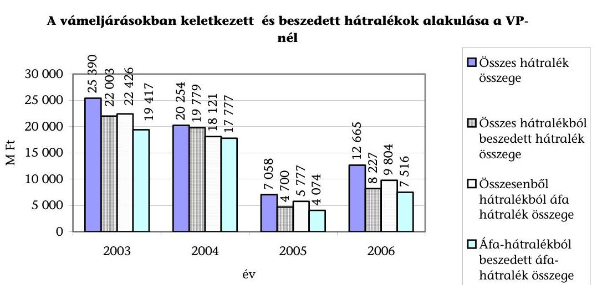

A VP a jogszabályi előírások alapján - a helyszíni ellenőrzés során kiválasztott esetek mindegyikében - kezdeményezte a felszámolási eljárás megindítását, azokban az esetekben, amikor az azonnali beszedési megbízások, illetve az APEH által lefolytatott végrehajtási eljárások nem eredményezték az adóalany hátralékának beszedését.

A felszámolási eljárás alatt álló adóalanyok közül a legnagyobb áfa hátralékkal rendelkező 100 adóalanyból 17-nél, a legnagyobb áfa hátralékkal felszámolási eljárás alá vont 100 adóalanyból 12-nél, a legnagyobb áfa hátralékkal törölt 100 adóalanyból 13-nál hozott összesen 366 db határozatot és az ezekhez kapcsolódó intézkedéseket vizsgáltuk. Ebből 309 határozat alapján kezdeményeztek felszámolási eljárást. 2003. és 2006. között a felszámolási eljárással érintett adóalanyok száma 1058 -ról 722 -re ( $32 \%$-kal), a tartozásaik összege 26721 M Ft -ról 8693 M Ft-ra ( $68 \%$-kal), ezen belül az áfa tartozások összege 6348 M Ft-ról 4575 M Ft-ra ( $28 \%$-kal) csökkent. (7. sz. tanúsítvány)

A hátralékok nyilvántartásból való törlését megelőzően a vámhivatalok a belső szabályozásnak megfelelően - a helyszíni ellenőrzés során kiválasztott esetek ( 366 db határozat) mindegyikében - megtették a szükséges intézkedéseket a tartozások behajtására, hátralékokat csak a végrehajtási eljárások teljes folyamatának eredménytelensége után töröltek. 2003 és 2006 között a törölt hátralékok összege 66269 M Ft, ebből 16077 M Ft volt az áfa.

---

Törölt hátralékok alakulása

| Megnevezés | 2003 | 2004 | 2005 | 2006 | 2003-2006   között törölt   összess   hátralék |
| :--: | :--: | :--: | :--: | :--: | :--: |
| Összes törölt hátralék | 28004 | 6906 | 17964 | 13395 | 66269 |
| ebből áfa | 8760 | 2264 | 3504 | 1549 | 16077 |
| Törlések megoszlása: |  |  |  |  |  |
| Behajthatatlanság miatt törölt hátralék | 6912 | 1349 | 6709 | 1144 | 16114 |
| ebből áfa | 1078 | 403 | 958 | 214 | 2653 |
| Cégtörlés miatt törölt hátralék | 6983 | 1180 | 2351 | 8301 | 18815 |
| ebből áfa | 2980 | 537 | 923 | 195 | 4635 |
| Elévülés miatt törölt hátralék | 14109 | 4377 | 8904 | 3950 | 31340 |
| ebből áfa | 4702 | 1324 | 1623 | 1140 | 8789 |

A helyszíni ellenőrzés keretében a legnagyobb áfa hátralékkal törölt 100 adóalanyból 13 adóalany hátralékának törlését vizsgáltuk részletesen. A tartozások törlése előtt a vámhivatalok a vizsgált esetekben megtették a belső utasításban előírt intézkedéseket.

# A fizetési kedvezmények iránti kérelmek elbírálásakor a VP megalapozottan járt el. A kérelmek több mint $90 \%$-ában az adóalanyok eleget tettek fizetési kötelezettségüknek (a visszarendezéssel érintett fizetési kedvezmények száma egyik évben sem érte el a 10\%-ot). A visszarendezett tételek értékének aránya - 2005. év kivételével - 5\% alatt maradt, ezen belül a visszarendezett áfa összegének aránya 5,6\% és 16,1\% között alakult. 2006-ban fizetési kedvezményben részesült adóalanyok majdnem mindegyike eleget tett ( $99,97 \%$-a) fizetési kötelezettségének.

Fizetési kedvezmények visszarendezésének alakulása

|  | 2003 | 2004 | 2005 | 2006 |
| :--: | :--: | :--: | :--: | :--: |
| Jóváhagyott fizetési kedvezmények |  |  |  |  |
| száma (db) | 484 | 546 | 672 | 475 |
| értéke (M Ft) | 566,1 | 936,3 | 330,6 | 2877,7 |
| ebből áfa (M Ft) | 44,5 | 29,9 | 205,9 | 749,3 |
| Visszarendezett fizetési kedvezmények |  |  |  |  |
| száma (db) | 45 | 46 | 63 | 30 |
| értéke (M Ft) | 26,4 | 22,9 | 44,4 | 8,7 |
| ebből áfa (M Ft) | 2,5 | 4,8 | 21,3 | 0,5 |
| Visszarendezett tételek jóváhagyott tételekhez viszonyított aránya |  |  |  |  |
| száma (db) | 9,3\% | 8,4\% | 9,4\% | 6,3\% |
| értéke | 4,7\% | 2,4\% | 13,4\% | 0,3\% |
| ebből áfa | 5,6\% | 16,1\% | 10,3\% | 0,1\% |

A fizetési kedvezménnyel érintett hátralékok teljesítését az elbírálást végző vámhivatalok tételesen figyelték, nem teljesítés esetén azonnal intézkedtek a kedvezmények megvonásáról és a tételek visszarendezéséről. A kedvezménnyel érintett hátralékok nyilvántartását nem támogatta informatikai rendszer, ami a kedvezően elbírált kérelmek alacsony számával (a vizsgált években országosan 470670 db között alakult) indokolható. A fizetési kedvezmények száma régiónként nagy szóródást mutatott, például 2006-ban a Közép-Dunántúli Régiós Parancs-

---

nokságnál nem volt, a Közép-Magyarországi Régiós Parancsnokságnál 59 db, az Észak-Alföldi Régiós Parancsnokságnál pedig 215 db volt (8. a-d. sz. tanúsítvány).

A fizetési kedvezményre irányuló kérelmeknek 2003-ban 68\%-át, 2004-ben 65\%át, 2005-ben $74 \%$-át és 2006-ban $69 \%$-át, az áfa összegekre vonatkozóan pedig 2003-ban 7,95\%-át, 2004-ben 3,2\%-át, 2005-ben 6,3\%-át és 2006-ban 83,4\%-át hagyta jóvá. Az arányeltolódást 2006-ban egy, dohányáru forgalmazásával foglalkozó cég számára adott 633037 E Ft összegű kedvezmény okozta, ami a VP által adott összes kedvezmény 84,5\%-át jelentette.

# 2.2.2. Hátralék-kezelés az APEH-nél 

## Az APEH a behajtási és végrehajtási feladatait alapvetően eredményesen látja el, azonban a vizsgálat által feltárt hiányosságok megszüntetésével az eredményesség további javítása érhető el.

A vizsgált időszakban a feladat-ellátás eredményességét külső és belső tényezők egyaránt meghatározták. Ilyenek például az adóalanyok fizetési készségének és képességének változása, a Hivatal ellenőrzési portfolióján belül az ellenőrzési típusok aránya, az ellenőrzésekkel feltárt adókülönbözet növekedése, a végrehajtásra kiválasztás eljárásrendje, a rendelkezésére álló humánerőforrás hatékonyságának negatív irányú alakulása ${ }^{27}$.

A jelentés megállapította, hogy csökkenő létszám mellett nőttek a Hivatal számára jogzabályokban megfogalmazott feladatok, különösen az adók módjára behajtandó köztartozások növekvő számú jogcímeihez kapcsolódóan.

## A Hivatal hátralékok beszedésére kialakított eljárásrendje nem felel meg az Art. 150. § (3) bek.-e előírásainak. Intézkedéseit nem haladéktalanul és nem a hátralékok teljes körének figyelembe vételével

teszi meg. A működő adózóknál a kis összegű hátralékok csökkentése érdekében fizetési felszólításokat küld ki, a 1-10 M Ft közötti hátralékok esetében az azonnali beszedési megbízásokat - szűrőfeltételek alkalmazásával - csak a kiválasztott adóalanyokra bocsátja ki. Az igazgatóságok az APEH irányelvekben, belső utasításban megfogalmazottak, valamint a humánerőforrás-kapacitás függvényében minden évben eltérő számban - szűrőparaméterek alkalmazásával - választanak ki behajtási és végrehajtási eljárásra adóalanyokat.

Az Art. 150. § (3) bekezdése értelmében „az adótartozás behajtása érdekében a tartozást megállapító vagy nyilvántartó adóhatóság a végrehajtható okirat alapján a végrehajtás iránt haladéktalanul intézkedik". Arról azonban, hogy mely hátralékost választják ki végrehajtási eljárásra, az igazgatóságok az azonnali beszedési megbízás kibocsátása előtt és nem azt követően döntenek. Az igazgatóságok a szűrő paraméterek beállításakor a keletkezett hátralékok nagyságát, annak várható megtérülését és a végrehajtási eljárások lefolytatására rendelkezésre álló humánerőforrás-kapacitást veszik figyelembe.

[^0]
[^0]:    ${ }^{27}$ A humán-erőforrás gazdálkodást az Adó- és Pénzügyi Ellenőrzési Hivatal múködésének ellenőrzése keretében vizsgáltuk, a részletes megállapításokat a 2006-ban nyilvánosságra hozott jelentés tartalmazza (0616)

---

Az APEH tájékoztatása szerint a hátralékok beszedésére kialakított belső eljárásrendje kialakításánál figyelembe vette a rendelkezésére álló humánerőforráskapacitás korlátait, a végrehajtás jogszerű megindítása előkészítésének időigényét. Ezért a végrehajtásra történő kiválasztást csak szűrőfeltételek alkalmazásával tudja biztosítani. A jogszabály módosítására javaslatot nem tett.

A 10 M Ft feletti tartozással rendelkező adóalanyok esetében az igazgatóságok - a vizsgált esetek mindegyikében - az eljárásrend szerint megkezdték a végrehajtási eljárások lefolytatását.

A helyszíni ellenőrzés keretében a legnagyobb áfa hátralékkal rendelkező 100 adóalanyból 14, a legnagyobb áfa hátralékkal felszámolási eljárás alá vont 100 adóalanyból 12, a legnagyobb áfa hátralékkal törölt 150 adóalanyból 15 adóalany esetében részletesen vizsgáltuk a végrehajtási eljárások dokumentumait a hátralék keletkezésétől a foganatosított intézkedésekig. A vizsgált esetekben a Hivatal kibocsátotta az azonnali beszedési megbízásokat és lefolytatta a végrehajtási eljárást. Az azonnali beszedési megbízásokat akár egyidejűleg az adóalany több bankszámlájára is benyújtotta, valamint ezt az esetek mintegy 70\%-nál egy későbbi időpontban megismételte.

Az APEH az azonnali beszedési megbízások és a teljes körűen lefolytatott végrehajtási eljárások sikertelensége esetén a kialakított eljárásrendje szerint járt el, kezdeményezte a felszámolási eljárások megindítását. A más szervezet által kezdeményezett felszámolási eljárások esetében a Hivatal hitelezői igényt nyújtott be a felszámolónak.

Az APEH - a vizsgált esetek mindegyikében - felszámolási eljárásokat kezdeményezett, amennyiben az azonnali beszedési megbízások és a teljes körűen lefolytatott végrehajtási eljárások nem eredményezték az adóalany hátralékának behajtását. A felszámolási eljárások több mint felét a Hivatal kezdeményezte ${ }^{28}$. A helyszíni vizsgálat keretében a felszámolási eljárás alatt álló adóalanyok közül a legnagyobb áfa hátralékkal rendelkező 100 adóalanyból 14, a legnagyobb áfa hátralékkal felszámolási eljárás alá vont 100 adóalanyból 12, a legnagyobb áfa hátralékkal törölt 150 adóalanyból 15 esetében részletesen vizsgáltuk a végrehajtási eljárás dokumentumait.

Az APEH által nyilvántartott összes hátralék, illetve ezen belül az áfa hátralék összege a vizsgált időszakban folyamatosan nőtt, 2003-ról 2006-ra az összes hátralék 43\%-kal, közel 300 Mrd Ft-tal ( 699594 M Ft-ról 997092 M Ft-ra), az áfa-hátralék pedig 67\%-kal, közel 133 Mrd Ft-tal (197 992 M Ft-ról 330962 M Ft-ra) emelkedett.

A Hivatal a vizsgált években az összes hátralékot közel azonos, ugyanakkor az áfa-hátralékot növekvő összegben, de 2004-től csökkenő arányban szedte be. A beszedett hátralékok összege a 2003. évi 146410 M Ft-ról 2006-ra 219055 M Ftra (50\%-kal), az áfáé pedig 50351 M Ft-ról 87154 M Ft-ra (73\%-kal) emelkedett.

[^0]
[^0]:    ${ }^{28}$ A felszámolási eljárások részletes vizsgálatát az Adó- és Pénzügyi Ellenőrzési Hivatal múködésének ellenőrzése keretében 2005-ben végeztük el. A részletes megállapításokat a 2006-ban nyilvánosságra hozott jelentés tartalmazza. (0616)

---

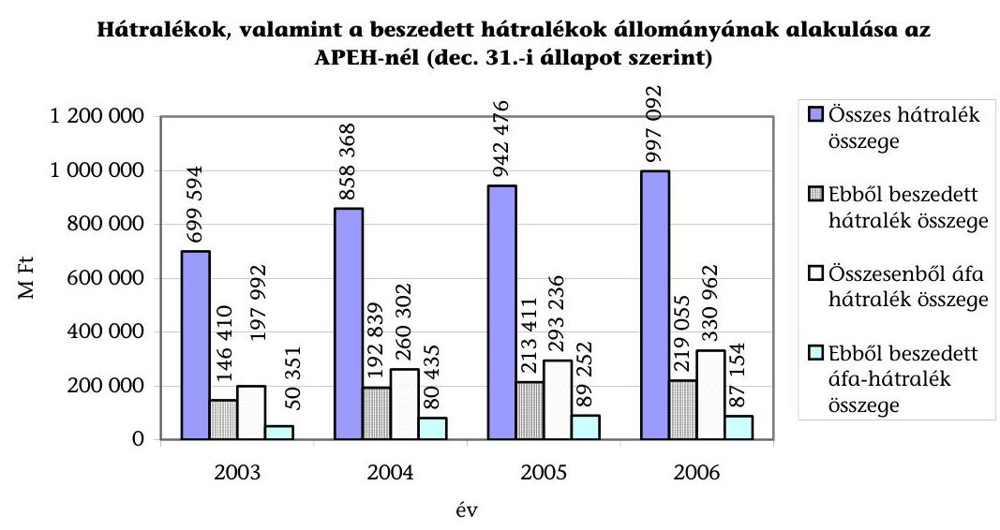

A hátralékkal rendelkező adóalanyok (továbbiakban: hátralékosok) száma 2003-ról 2004-re 10\%-kal csökkent, 2004. és 2006. évek között számottevően nem változott.

Az 1 M Ft alatti hátralékkal rendelkező adóalanyok száma és tartozásuk összege 2003. és 2006. évek között fokozatosan csökkent. Ez az adóalanyi kör teszi ki a hátralékosok mintegy 87-90\%-át, tartozásuk összege ugyanakkor a teljes hátralékállomány 7 és $12 \%$-a között alakult. E kategóriában egy adóalany átlagos hátraléka 2006-ban 138 E Ft volt.

Az 1 és 10 M Ft között hátralékkal rendelkező adóalanyok száma és hátralékuk összege ugyanebben az időszakban folyamatosan növekedett. Ebbe az adóalanyi körbe tartozik az összes hátralékos 9-11\%-a, tartozásuk összegének összes hátralékhoz viszonyított aránya folyamatosan, 23\%-ról 19\%-ra csökkent. Egy adóalany átlagos hátraléka 2006-ban 2,75 M Ft-ot jelentett.

A 10 és 50 M Ft közötti hátralékkal rendelkező adóalanyok száma és hátralékuk összege 2003. és 2005. között növekedett, majd 2006-ban kis mértékben csökkent. Ebbe az adóalanyi körbe tartozik az összes hátralékos 1-1,3\%-a, hátralékállományuk pedig az összes hátralék 17-21\%-át teszi ki. Egy adóalany átlagos hátraléka 2006-ban $21,2 \mathrm{M}$ Ft volt.

Az 50 M Ft feletti hátralékkal rendelkező adóalanyok száma és hátralékuk öszszege is (számuk 37\%-kal, hátralékuk 75\%-kal) nőtt. Ebbe az adóalanyi körbe tartozik a hátralékosok mintegy 2-4 ezreléke, tartozásuk összege azonban az összes hátraléknak mintegy felét teszi ki. E kategóriában egy adóalany átlagos hátraléka 2006-ban 238 M Ft-ot jelentett.

A nagy összegű tartozások kialakulásában szerepet játszik, hogy például az adóalanyok bár bevallják, de nem tudják megfizetni adótartozásaikat (pl. „körbetartozások" esetében), vagy az ellenőrzéssel feltárt adókülönbözetet, vannak azonban olyan adóalanyok is, akiket az APEH nem talál (fiktív cégek), illetve amelyeket eleve az adómegkerülés szándékával hoztak létre. A hátralékok összegét növeli továbbá a tőketartozásra felszámított késedelmi pótlékok összegei is.

---

A vizsgált években a felszámolási eljárások száma fokozatosan növekedett, ugyanakkor a felszámolással érintett hátralékok összege - beleértve a keletkezett áfa hátralékok összegét is - az egyes években eltérő módon alakult. 2003. és 2006. között a felszámolási eljárással érintett adóalanyok száma 20,4\%-kal (14576 db-ról 17553 db-ra), az összes tartozásuk összege több mint másfélszeresére ( 246819 M Ft-ról 374721 M Ft-ra), ezen belül az áfa összege a kétszeresére ( 70566 M Ft-ról 141127 M Ft-ra) nőtt (9. sz. tanúsítvány).

Éves bontásban a hátralékok összege 2003-ról 2004-re 33,7\%-kal emelkedett, 2004-ről 2005-re 8,8\%-kal csökkent, majd 2005-ről 2006-ra 24,5\%-kal nőtt. Ezen belül az áfa összege 2003-ról 2004-re 48,5\%-kal emelkedett, 2004-ről 2005-re 8,9\%-kal csökkent, majd 2005-ről 2006-ra 47,9\%-kal nőtt A kezelt felszámolási ügyeknek 2004-ben 55\%-a, 2005-ben 59\%-a, 2006-ban pedig 63\%-a indult a Hivatal kezdeményezésére.

Az APEH az egyes évek hátralékállományából csökkenő arányban törölt hátralékot. Míg 2003-ban az összes hátralékának 8,4\%-át ( 58710 M Ft-ot), 2006-ban 4,3\%-át ( 42691 M Ft-ot) törölte. Az összes hátralékából a vizsgált négy évben összesen 196599 M Ft-ot, ezen belül az áfa hátralékból 44349 M Ft-ot törölt.

2003-ról 2006-ra a törölt áfa hátralék összege 33\%-kal (15 110 M Ft-ról 10151 M Ft-ra), ebből behajthatatlanság miatt 25\%-kal ( 4831 M Ft-ról 3601 M Ft-ra), cégtörlés miatt 64\%-kal ( 6485 M Ft-ról 2294 M Ft-ra) csökkent. Elévülés miatt azonban 12\%-kal ( 3793 M Ft-ról 4256 M Ft-ra) emelkedett.

A helyszíni ellenőrzés keretében a legnagyobb áfa hátralékkal törölt 150 adóalanyból 15 esetében részletesen vizsgáltuk a végrehajtási eljárások dokumentumait. A vizsgált esetek mindegyikében az igazgatóságok a tartozások törlése előtt lefolytatták a végrehajtási eljárásokat.

Törölt hátralékok alakulása

|  |  |  |  |  |  |
| :--: | :--: | :--: | :--: | :--: | :--: |
| Megnevezés | 2003 | 2004 | 2005 | 2006 | 2003-   2006   összesen |
| Összes törölt hátralék | 58710 | 48450 | 46748 | 42691 | 196599 |
| ebből áfa | 15109 | 9462 | 9627 | 10151 | 44349 |
| Törlések megoszlása: |  |  |  |  |  |
| Behajthatatlanság miatt törölt   hátralék | 9853 | 12851 | 7871 | 8844 | 39419 |
| ebből áfa | 4831 | 3564 | 3662 | 3601 | 15658 |
| Elévülés miatt törölt hátralék | 34307 | 30053 | 34730 | 28666 | 127756 |
| ebből áfa | 3793 | 3583 | 4260 | 4256 | 15892 |
| Cégtörlés miatt törölt hátralék | 14550 | 5546 | 4147 | 5181 | 29424 |
| ebből áfa | 6485 | 2315 | 1705 | 2294 | 12799 |

Továbbra sem megoldott a fizetési kedvezményekkel érintett hátralékok esetében a részletfizetések nem teljesítésének folyamatos - egy informatikai rendszeren belüli - figyelése. Ennek következménye, hogy a Hivatal nem rendelkezik naprakész információval arról, hogy mely adóalany és milyen összegben nem tesz eleget részletfizetési kötelezettségének, így nem minden esetben intézkedik a részletfizetések visszarendezéséről és ezáltal a végrehajtási eljárás megindításáról.

---

Az Adós Minősítő Rendszer (AMIR) bevezetésével 2005-től szigorodott ugyan a fizetési kedvezményre irányuló kérelmek elbírálása, de 2005-ben és 2006-ban a Hivatal a jóváhagyott fizetési kedvezmények, mintegy felét mégis visszarendezte.

A jóváhagyott kérelmek száma az előző évihez képest 6\%-kal, összegüket tekintve pedig 27\%-kal, ezen belül az áfa összegé 54\%-kal csökkent. A visszarendezett tételek összege 2003. évi 25213 M Ft-ról 2006-ban 40840 M Ft-ra (62\%-kal), az áfáé pedig 9418 M Ft-ról 19674 M Ft-ra (109\%-kal) nőtt.

Az ÁSZ az Adó- és Pénzügyi Ellenőrzési Hivatal múködésének ellenőrzése keretében 2005-ben vizsgálta a fizetési kedvezményre irányuló kérelmek elbírálásának eljárásrendjét, és a részletfizetések teljesítésének figyelése kivételével hiányosságot nem tárt fel ${ }^{29}$. Utóellenőrzés keretében vizsgáltuk a fizetési kedvezménnyel érintett hátralékok teljesítésének nyomon követését. A Hivatal - az ÁSZ észrevételei alapján - megteremtette a fizetési könnyítéssel rendelkező adózók havi gyakorisággal történő leválogatásának lehetőségét.

Az ÁSZ jelentésben megfogalmazott javaslatokra készített intézkedési tervben az APEH elnöke 2006. októberében azt a tájékoztatást adta, hogy a fenti problémát a fizetési könnyítési modul kiváltását szolgáló, a helyszíni vizsgálat idején is fejlesztés alatt álló ORACLE Fizetési Kedvezmény Modul keretében fogják megoldani.

Fizetési kedvezmények visszarendezésének alakulása

|  | $\mathbf{2 0 0 3}$ | $\mathbf{2 0 0 4}$ | $\mathbf{2 0 0 5}$ | $\mathbf{2 0 0 6}$ |
| :-- | --: | --: | --: | --: |
| Jóváhagyott fizetési kedvezmények |  |  |  |  |
| száma (db) | 118165 | 139237 | 130641 | 103052 |
| értéke (M Ft) | 190046 | 300998 | 220114 | 224844 |
| ebből áfa (M Ft) | 72623 | 177309 | 99288 | 119946 |
| Visszarendezett fizetési kedvezmények |  |  |  |  |
| száma (db) | 39117 | 54613 | 60346 | 52770 |
| értéke (M Ft) | 25213 | 36979 | 40470 | 40840 |
| ebből áfa (M Ft) | 9418 | 14047 | 18507 | 19674 |
| Visszarendezett tételek jóváhagyott tételekhez viszonyított aránya |  |  |  |  |
| száma (db) | $33,1 \%$ | $39,2 \%$ | $46,2 \%$ | $51,2 \%$ |
| értéke | $13,3 \%$ | $12,3 \%$ | $18,4 \%$ | $18,2 \%$ |
| ebből áfa | $13,0 \%$ | $7,9 \%$ | $18,6 \%$ | $16,4 \%$ |

# 2.3. Adóhatóságok együttmúködése 

### 2.3.1. Együttmúködés az áfa-csalások feltárása érdekében

A magyar adóhatóságok egymással, valamint a külföldi adó- és vámhatóságokkal együttműködnek az áfa-csalások megelőzése és feltárása érdekében.

A csalások feltárását elősegíti a VP és az APEH között megkötött Együttmüködési Megállapodás. Ebben többek közt rögzítették az ellenőrzéshez kapcsolódó információáramlás formáját, illetve a közös és egyidejú el-

[^0]
[^0]:    ${ }^{29}$ A részletes megállapításokat az Adó- és Pénzügyi Ellenőrzési Hivatal múködésének ellenőrzéséről 2006-ban nyilvánosságra hozott jelentés tartalmazza. (0616)

---

lenőrzések lefolytatásának szervezeti és technikai részleteit. Nem szabályozták azonban az adóigazgatás és a bűnügyi szervezet (Vám- és Pénzügyőrség) együttműködési területeit, amely elsősorban az információáramlás gyorsításával, illetve a tapasztalatok átadásával segíthetné mindkét adóhatóság intézkedését az adócsalások feltárása terén.

Az adóhatóságok 2004-ben még nem, 2005-ben 9, 2006-ban 18 esetben folytattak le közös, illetve egyidejú ellenőrzést (nem értve bele a jövedékkel kapcsolatos ellenőrzéseket). Az ellenőrzések eredményeként feltárt adókülönbözet $256,5 \mathrm{M} \mathrm{Ft}$, illetve 1785 M Ft volt.

Az adóhatóságok 2005-től - az APEH koordinációjával - közösen múködtetik az ún. RAPID csoportokat, amelynek célja az adóhatósági jelenlét fokozásával az áfa-csalások feltárása érdekében az értékesítési láncolatok vizsgálata, az áruk eredetének és értékesítésének megfelelő bizonylatolásának ellenőrzése, valamint a fiktív számlákat kiállítók, fiktív cégek kiszűrése, továbbá adatszolgáltatás az utólagos ellenőrzésekhez. Az egyes csoportok bár eredményesen múködnek, a költségvetés áfa-csalások miatti bevétel-kiesésének nagyságrendjéhez viszonyítva a mobilcsoportok, illetve az általuk elvégzett ellenőrzések száma csak korlátozottan jelentenek visszatartó erőt.

A felállított 10 mobilcsoport egyenként 3 fő adóellenőrből és 1 fő pénzügyőrből áll. A csoportok egyik fele a főváros és Pest megye területén lát el feladatot, míg a másik fele egyenként 3-4 megyében ellenőriz.

Vizsgálataik elsősorban a hulladékgyűjtő kereskedőket, számítástechnikai termékeket, valamint ruházati és lábbeli kereskedőket érintették. 2005-ben 969 db , 2006-ban 2300 db ellenőrzést folytattak le. A vizsgálatok során főként árueredetet, valamint nyugtaadási kötelezettség teljesítését ellenőrizték, továbbá adatokat gyűjtöttek későbbi ellenőrzésekhez. Az árueredet vizsgálatok mindkét évben mintegy $62 \%$-ban, a nyugtaadási kötelezettség ellenőrzések 40-45\%-ban megállapítással zárultak.

Az APEH - a vizsgált időszakban - más tagállami adóhatósággal még nem alakított ki együttmüködést, harmadik országgal pedig nem kötött megállapodást. A helyszíni ellenőrzés szakaszában négy közös ellenőrzés volt folyamatban, amelyből kettőt Ausztria, egyet az Egyesült Királyság, egyet Magyarország kezdeményezett. Együttmüködést kezdeményezett több tagállam adóhatóságával az adatcsere felgyorsítására, de a megállapodások az adóhatóságok fogadókészségének hiányában nem jöttek létre.

# A VP vámstatisztikai adatok cseréjéről egyedül Ukrajnával kötött 

megállapodást (2003-ban), ezáltal ebben a relációban lehetővé vált az export és import forgalmi adatok összevetése. A csalások felderítését korlátozza, hogy az egyedi adatokat is tartalmazó adatcsere a közösségi vámjog életbelépését követően megszűnt. A Közösségi vámjog végrehajtásáról szóló 2003. évi CXXVI. tv. 16. § (7) bekezdésében foglaltak alapján a vámhatóság harmadik országba csak akkor továbbíthat személyes és egyedi adatot, amenynyiben az adatkérő vámszerv az adatvédelem feltételeinek eleget tesz. Ukrajna által biztosított adatvédelmi feltételek a VP által bekért állásfoglalások szerint nem felelnek meg ennek a követelménynek, így adatok kölcsönös megküldése

---

sem lehetséges. A VP a probléma megoldásaként kezdeményezte a vonatkozó törvényi hely módosítását, a vámtitok fogalmának újraszabályozását.

A téma jelentőségét mutatja például: az ukrán vámhatóság a VP által átadott vámstatisztikák elemzése alapján megállapította, hogy 2006. első félévében 47,7 M USD értékben mobiltelefonok, 21,5 M USD értékben televíziókészülékek exportja nem jelent meg importként az ukrán vámstatisztikában. A VP értékelése szerint ez az áfa csalás gyanúját veti fel, mivel feltételezhető, hogy az ügyletben résztvevő magyar gazdálkodók fiktív kiléptetést igazolnak, vagyis az áru csak papíron hagyja el az országot és belföldön áfa megfizetése nélkül értékesítik.

# 2.3.2. Együttmúködés az áfa hátralékok beszedése érdekében 

Az adóhatóságok által a vám- és adóbevételek beszedésére kialakított együttműködés feltételei biztosítják a behajtási és végrehajtási feladatok ellátáshoz szükséges adatok, dokumentumok rendelkezésre állását.

Az együttműködési megállapodás összhangban van az Art., a vámkódex és a Csőd tv. előírásaival. A vizsgált időszakban az adóhatóságok a megállapodásban foglaltak szerint jártak el mind a behajtási és végrehajtási eljárások lefolytatása, mind az Art. 151. § (2) bek.-ben meghatározott visszatartási jog érvényesítéséhez szükséges kintlévőségi adatok egymás közötti átadása terén.

A VP a hátralékok behajtásához szükséges adatokat és információkat az azonnali beszedési megbízások eredménytelenségéről történő értesítést követően a 12-15. napon adja át az APEH számára behajtásra.

A helyszíni ellenőrzés során 224 határozat esetében értékeltük az APEH részére a behajtásra-átadás átlagos időszükségletét.

Az együttműködési megállapodás alapján a VP az importhoz kapcsolódóan 2003. és 2006. évek között 10479 M Ft, ebből 4921 M Ft áfa-követelést adott át az APEH-nak behajtásra. A Hivatal a VP-től behajtásra átvett hátralékból 2003-ban 73 M Ft-ot, 2004-ben 108 M Ft-ot, 2005-ben 81 M Ft-ot, 2006-ban 136 M Ft-ot, összesen 398 M Ft-ot hajtott be és utalt át a VP számlájára. (Az összesen behajtott 398 M Ft-ból 175 M Ft volt az áfa.)

APEH-nak beszedésre átadott és a VP-nél keletkezett hátralékok alakulása

| Megnevezés | 2003 | 2004 | 2005 | Mrd Ft   2006 |
| :--: | :--: | :--: | :--: | :--: |
| APEH-nak átadott: |  |  |  |  |
| importhoz kapcsolódó összes hátralék összege | 1521 | 1530 | 2392 | 5036 |
| ebből import áfa hátralék összege | 782 | 737 | 1382 | 2020 |
| APEH által beszedett: |  |  |  |  |
| importhoz kapcsolódó összes hátralék összege | 73 | 108 | 81 | 136 |
| ebből import áfa hátralék összege | 28 | 38 | 30 | 79 |
| Beszedett hátralék aránya összes átadotthoz viszonyítva (\%): |  |  |  |  |
| importhoz kapcsolódó összes hátralék összege | $4,80 \%$ | 7,06\% | $3,39 \%$ | 2,70\% |
| import áfa aránya | $3,58 \%$ | $5,16 \%$ | 2,17\% | $3,91 \%$ |

---

A VP hátralékainak alacsony beszedési arányát ( $2,7 \%-7,1 \%$ ) az okozza, hogy az adóalanyoknak csak azokat a tartozásait adja át behajtásra az APEH-nek, amelyeket a saját maga által kibocsátott azonnali beszedési megbízásokkal nem tudott behajtani.

Budapest, 2007. július 16 .

Melléklet: $\quad 2 \mathrm{db} \quad 14$ lap
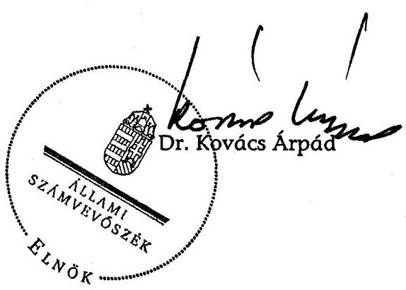

---

# 1. SZ. MELLÉKLET

---

# 1/a. sz. melléklet 

a V-21-049/2006-2007. sz. jelentéshez

## PENZUGYMINISZTER

Dr. Kovács Árpád úr
elnök

## Állami Számvevőszék

Budapest
Apáczai Csere János u. 10.

Tárgy: költségvetést megillető áfa ellenőrzés

Tisztelt Elnők Úr!
A költségvetést megillető áfa ellenőrzésekről készített Jelentésüket köszönettel megkaptam. Az abban foglaltakkal kapcsolatban a következő észrevételeket teszem.

A Jelentés 10. és 13. oldalán a Pénzügyminisztérium (PM) becslésére hivatkozva azt tartalmazza, hogy az áfa csalásokhoz a $14-15 \%$-os áfa-rés több, mint kétharmada kapcsolható, valamint, hogy növekvő arányt tesznek ki az EU-n belüli szabad árumozgást kihasználó csalástípusok. Erre vonatkozóan tájékoztatom, hogy a PM sem a 2/3-os arányra, sem a Közösségen belüli árumozgáshoz kapcsolódó csalások növekvő arányára vonatkozó becslést nem adott, és megjegyzem, a Jelentés sem ad további támpontot, hogy milyen adatokra alapozza ezen kijelentéseket.

A Jelentés 14. és 17. oldalán található megállapítása szerint az import és az export alacsony ellenőrzöttségi szintje magas kockázatot jelent a költségvetés áfa bevételeinek realizálása szempontjából. Emiatt felrója, hogy a Vám- és Pénzügyőrség (VP) számára a pénzügyminiszter nem fogalmaz meg áfához kapcsolódó érdekeltségi elvárásokat. Az alacsony ellenőrzöttségi szintre vonatkozó kijelentésnek ellentmond a 34. oldalon vastagon kiemelt mondat, miszerint „a VP által kialakított eljárásrend biztosítja a hátralékok teljes körű figyelését, a behajtási feladatok eredményes ellátását." Ezen túlmenően a Jelentés 35. oldala szerint a VP a keletkezett áfa hátralék $70-98 \%$-át beszedi. Ez az arány messze meghaladja az APEH áfa beszedési mutatóit ( $25-30 \%, 39$. oldal), noha az APEH érdekeltségi rendszerében szerepel az áfa. Ezek alapján nem tünik megalapozottnak az import alacsony ellenőrzöttségi szintjére és a magas költségvetési kockázatra utaló kijelentések, illetve a 17. oldal 2. ajánlásának nagyobb teljesítményre ösztönző érvelése sem, hiszen épp a Jelentésben bemutatott adatok mutatják, hogy a VP kivetéses eljárással nagyobb eredményességgel szedi be az áfa bevételt, mint az APEH az önbevallásos módszerrel.

---

Ezen túlmenőn jelzem, hogy 2005-2006. években a VP által kivetéssel beszedett import áfa a kisebb részét tette ki az összes import áfának. A 2004. előtti időszakban beszedett teljes import áfának a jelenlegi rendszerben a VP mintegy $15 \%$-át szedi be. Az előzőekben jelzett ellenőrzöttségi szint mellett ez az arány a költségvetés áfa bevételeinek realizálása szempontjából kockázatot így nem jelenthet.

A Jelentés 19. oldalán megfogalmazottak kapcsán jelzem, hogy a fiktív vállalkozások kiszűrésére - a korábban kifejtettekkel összhangban, tekintettel annak adóadminisztrációt növelő hatására is - továbbra sem tartom a gyakoribb bevallás előírását a cég fiktív müködésének kiszűrésére alkalmas eszköznek. Ha egy cég negyedévente ad be formális szempontból tökéletes bevallást és ebben adót igényel vissza, a havi bevallás előírásával még nem lesz jobb a helyzet. Feltehetőleg ugyanúgy be tud nyújtani havonta tökéletes bevallást mint negyedévente, ennek persze az lesz az eredménye, hogy havonta tud adót visszaigényelni a költségvetésből. A fiktív müködésnek éppen az az egyik ismérve, hogy formai szempontból „bizonyos ideig" kifogástalanul müködik a cég, egyebekben a gyakoribb bevallás benyújtás az adóhatóság oldalán is többlet adminisztrációt jelent (feldolgozás) és ellenőrizni is több bevallást kell emiatt. Szabályozási szinten a fiktív vállalkozások kiszűrésére - mint ahogy azt a Jelentés is részletesen rögzíti - a PM hatékonyabb módszereket alkalmaz. Így például a 2006. szeptember 1-jétől bevezetett adószám felfüggesztésének az intézményét, amelynek alkalmazásával az adóhatóság igen rövid idő alatt, 2007. május 31-ig jogerősen 3615 cég adószámát függesztette fel. Ezen időpontig 267 fiktív cég adószámát törölte az APEH és további 446 cég esetében folyamatban van a törlési eljárás.

A Jelentés megállapításaival kapcsolatban további észrevételeket nem teszek.

Budapest, 2007. július " $5^{\circ}$ ".
Tisztelettel:
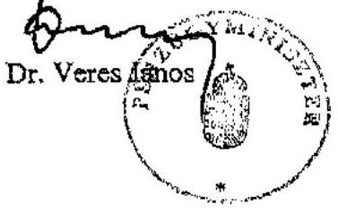

---

# Dr. Veres János úr 

pénzügyminiszter
Pénzügyminisztérium

## Budapest

## Tisztelt Miniszter Úr!

Köszönettel megkaptam a költségvetést megillető áfabevételek realizálásának ellenőrzéséről készült jelentésünkre adott észrevételeit és azokkal kapcsolatban a következőkröl tájékoztatom.

Jelentésünk 10. és 13. oldalán leírtak valóban pontatlanok és úgy értelmezhetők, hogy valamennyi becslés a PM-től származott. Ezért egyértelművé tesszük, hogy a költégvetési bevétel elmaradás ( 250 Mrd Ft) 2/3-át az APEH becslése kapcsolta az áfa-csalásokhoz. Az EUn belüli szabad árumozgást kihasználó csalástípusok növekvő arányáról szóló információ pedig az EU tagállamok számvevőszékeitől származik.

Az import és az export ellenőrzöttségi szintje és az áfa hátralék figyelésének, illetve behajtásának minősége között nincs közvetlen összefüggés. Az áfahátralékok a VP-nél ugyanis az utólagos ellenőrzések eredményeként keletkeznek.

Megítélésem szerint az a körülmény, hogy a VP nagyobb eredményességgel szedi be az áfabevételt mint az APEH, önmagában nem bizonyítja, hogy nem lenne indokolt a VP-t nagyobb teljesítményre ösztönözni. Az APEH esetében egyébként Miniszter úr már érvényesített ellenőrzöttségi szinttel kapcsolatos elvárásokat.

Úgy gondolom, hogy a központi költségvetés valamennyi bevételének realizálásához - a nagyságrendtől függetlenül is - fontos közérdek fűződik, ezért a VP által teljesített közel 715 Mrd Ft áfabevétel (import termékek dohánygyártmány áfája, 2006. évi adat) realizálásával kapcsolatos kockázatokra is indokolt felhívni a figyelmet. Megjegyzem, hogy a Miniszter úr által észrevételezett jelentés 32. oldal utolsó mondata és az ehhez kapcsolódó 23 -as számú

---

lábjegyzete tartalmazza a PM és a VP álláspontjait, miszerint nem értenek egyet a tételes vizsgálatok számának növelésével.

Amint azt a jelentés bevezetőjében leírtuk, az ellenőrzést az EU számvevőszékei által létrehozott munkacsoport kezdeményezésére folytattuk le, a többi tagállamhoz hasonlóan. A munkacsoportban az ellenőrzési tapasztalatok alapján elsősorban német kezdeményezésre fogalmazódott meg az a javaslat, hogy célszerú lenne kezdeményezni az EU-n belül egységesen havi bevallási kötelezettség előírását a közösségi adószámmal rendelkező adóalanyok számára, mivel az előírt negyedéves bevallási kötelezettség mellett - legjobb esetben is - csak féléves késéssel lehet a fiktíven müködő cégeket kiszürni. Ezt a véleményt magam is osztom. A javaslat egyébként nem mond ellent annak, hogy a PM valóban fontos kérdésként kezeli a problémát és figyelemre méltó eredményeket ért el. Ezt jelentésünk 13. oldalának 3. bekezdése egyébként tartalmazza.

Végezetül tájékoztatom Miniszter urat, hogy az ellenőrzésről készült jelentést - kialakult gyakorlatunk szerint - az Ön észrevételével és az arra adott válaszommal együtt küldőm meg az Országgyűlés elnökének, az illetékes bizottságai elnökeinek és a Miniszterelnöknek.

Budapest, 2007. július 16 .

Tisztelettel:
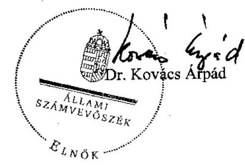

---

# 2. SZ. MELLÉKLET (tanúsítványok)

---

# Tanúsítványok jegyzéke 

| Sorsz.: | Megnevezés |
| :-- | :-- |
| 1. a-c. | az egyes ellenőrzési típusok megoszlásáról és eredményessé-   géről (2004, 2005, 2006) |
| 2. | áfa bevallások összesített adatairól (2003-2006) |
| 3. a-c. | az 1798/2003 EK rendelet alapján folytatott információcsere   alakulásáról (2004, 2005, 2006) |
| 4. a-c. | az APEH által indított és az APEH-hez érkezett megkeresé-   sekről (2004, 2005, 2006) |
| 5. a-c. | a körbeszámlázásos csalásokról az APEH által indított és az   APEH-hez érkezett megkeresésekről (2004, 2005, 2006) |
| 6. a-c. | a körbeszámlázásos csalásra és a hiányzó kereskedőkre vo-   natkozó megkeresések száma az 1798/2003/EK rendelet 5.   cikke alapján küldött és fogadott megkeresésekről és a meg-   keresések alapján lefolytatott ellenőrzések eredményességé-   ről (2004, 2005, 2006) |
| 7. | a nyilvántartott csőd, felszámolási és végelszámolási eljárá-   sokról, (VP, 2003-2006) |
| 8. a-d. | a fizetési kedvezmények alakulásáról (2003, 2004, 2005,   2006) |
| 9. | a nyilvántartott csőd, felszámolási és végelszámolási eljárá-   sokról, (APEH, 2003-2006) |

---

1/a. sz. tanúsítvány a V-21-049/2006-2007. sz. jelentéshez

# Tanúsítvány az egyes ellenőrzési típusok megoszlásáról és eredményességéről 2004

Adatszolgáltató szervezet megnevezése: APEH

|   |  | 2004. év |  |   |
| --- | --- | --- | --- | --- |
|  Kiemelt ellenőrzési típusok |  | Ellenőrzések
száma (db) | Ellenőrzések
megoszlása (%) | Ellenőrzéssel
megállapított
nettó
adókülönbözet (E
Ft)  |
|  Bevallások utólagos ellenőrzése összesen |  | 158 780 | 47,7 | 187 885 256  |
|  ebből | összes átfogó és adónem ellenőrzése | 28 384 | 8,5 | 97 736 982  |
|   | átalakuló, megszűnő vállalkozások ellenőrzése | 19 834 | 6,0 | 55 228 459  |
|   | egyszerűsített ellenőrzés | 89 564 | 26,9 | 299 058  |
|   | kiutalás előtti összesen | 20 998 | 6,3 | 34 620 757  |
|   | áfa adónem | 15 929 | 4,8 | 31 242 010  |
|   | szja adónem | 4 220 | 1,3 | 439 472  |
|  Egyes adókütelesettségek teljesítésére irányuló ellenőrzés |  | 106 028 | 31,8 | 0  |
|  Állany garancia beváltásához kapcsolódó ellenőrzés |  | 70 | 0,0 | 0  |
|  Inmélett ellenőrzés (feljátékozórzés nélkül) |  | 155 | 0,0 | 181 532  |
|  Art.-én kívüli ellenőrzés |  | 225 | 0,1 | 250 675  |
|  Adatok gyűjtését célzó ellenőrzések |  | 54 726 | 16,4 | 0  |
|  Befejézett összes |  | 310 984 | 96,1 | 187 954 385  |
|  Méghásult ellenőrzések |  | 12 651 | 3,9 | 481 353  |
|  Mindösszesen |  | 332 935 | 100,0 | 188 435 738  |

Fenti adatok hitelességét igazolom.

Kelt: Budapest, 2007. január *11*

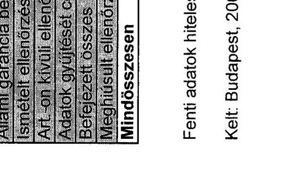

---

1/b. sz. tanúsítvány a V-21-049/2006-2007. sz. jelentéshez

### Tanúsítvány az egyes ellenőrzési típusok megoszlásáról és eredményességéről 2005

Adatszolgáltató szervezet megnevezése: APEH

|   |  | 2005. év |  |   |
| --- | --- | --- | --- | --- |
|  Kiemelt ellenőrzési típusok |  | Ellenőrzések
száma (db) | Ellenőrzések
megoszlása (%) | Ellenőrzéssel
megállapított
nettó
adókülönbözet (E
Ft)  |
|  Bevallások utólagos ellenőrzésé összesen |  | 137 848 | 46,1 | 203 198 332  |
|  ebből | összes átfogó és adónem ellenőrzése | 27 941 | 9,3 | 105 107 315  |
|   | átalakuló, megszűnő vállalkozások ellenőrzése | 18 550 | 6,2 | 52 142 825  |
|   | egyszerűsített ellenőrzés | 61 951 | 20,7 | 335 669  |
|   | kiutalás előtti összesen | 29 406 | 9,8 | 45 612 523  |
|   | áfa adónem | 23 635 | 7,9 | 42 770 089  |
|   | szja adónem | 5 321 | 1,8 | 482 425  |
|  Egyes adókütelesettségét teljesítésére irányuló ellenőrzés |  | 100 305 | 33,5 | 0  |
|  Állami garancia bevallásához kapcsolódó ellenőrzés |  | 50 | 0,0 | 0  |
|  Inméleti ellenőrzés (fektetlenőrzés nélkül) |  | 223 | 0,1 | 622 227  |
|  Árt. on kívül ellenőrzés |  | 280 | 0,1 | 91 908  |
|  Adatok gyűjtését célzó ellenőrzések |  | 47 024 | 15,7 | 0  |
|  Belmezett összes |  | 285 730 | 95,5 | 202 668 025  |
|  Meghívosult ellenőrzések |  | 13 562 | 4,6 | 436 253  |
|  Mindösszesen |  | 299 287 | 100,0 | 203 094 278  |

Fenti adatok hitelességét igazolom.

Kelt: Budapest, 2007. január " "

---

1/c. sz. tanúsítvány a V-21-049/2006-2007. sz. jelentéshez

### Tanúsítvány az egyes ellenőrzési típusok megoszlásáról és eredményességéről 2006

Adatszolgáltató szervezet megnevezése: APEH

|  |   |   |   |
| --- | --- | --- | --- |
|  Kiemelt ellenőrzési típusok | Ellenőrzések száma (db) | Ellenőrzések megoszlása (%) | Ellenőrzéssel megállapított nettó adókülönbözet (E Ft)  |
|  Bevallások utólagos ellenőrzése összesen | 76249 | 27,3 | 301359430  |
|  ébből | 31078 | 11,1 | 187869534  |
|   | 18457 | 6,6 | 71484865  |
|   | 9826 | 3,5 | 346757  |
|   | 16888 | 6,0 | 41658282  |
|   | 8990 | 3,2 | 39562224  |
|   | 7541 | 2,7 | 667373  |
|  Egyen adókülönzettségek teljesítésére irányuló ellenőrzés | 136912 | 49,0 | 0  |
|  Ahami garancia bevállásához kapcsolódó ellenőrzés | 113 | 6,0 | 0  |
|  Istenített ellenőrzés (felületlenőrzés nélkül) | 266 | 0,1 | 716561  |
|  Art.-on kivüli ellenőrzés | 411 | 0,2 | 169029  |
|  Adatok gyüjtését célozó ellenőrzések | 51475 | 16,4 | 0  |
|  Befejezett összes | 265426 | 95,0 | 302245020  |
|  Meghiúsult ellenőrzések | 13888 | 5,0 | 1238114  |
|  Mindösszesen | 279314 | 100,0 | 303473134  |

Fenti adatok hitelességét igazolom.

Kelt: Budapest, 2007. január 11.

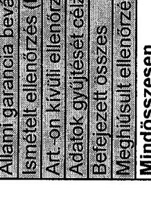

Aláírás

---

2. sz. tanúsítvány a V-21-049/2006-2007. sz. jelentéshez

|  Adatcsolgáltató szervezet megnevezése: APR24 |  |  |  |  |  |  |  |  |  |  |  |  |  |  |  |  |  |  |  |  |  |  |  |  |  |  |  |  |  |   |
| --- | --- | --- | --- | --- | --- | --- | --- | --- | --- | --- | --- | --- | --- | --- | --- | --- | --- | --- | --- | --- | --- | --- | --- | --- | --- | --- | --- | --- | --- | --- |
|   |  |  |  |  |  |  |  |  |  |  |  |  |  |  |  |  |  |  |  |  |  |  |  |  |  |  |  |  |  |   |
|   |  |  |  |  |  |  |  |  |  |  |  |  |  |  |  |  |  |  |  |  |  |  |  |  |  |  |  |  |  |   |
|   |  |  |  |  |  |  |  |  |  |  |  |  |  |  |  |  |  |  |  |  |  |  |  |  |  |  |  |  |  |   |
|  Megnevezés |  |  |  |  |  |  |  |  |  |  |  |  |  |  |  |  |  |  |  |  |  |  |  |  |  |  |  |  |  |   |
|   |  |  |  |  |  |  |  |  |  |  |  |  |  |  |  |  |  |  |  |  |  |  |  |  |  |  |  |  |  |   |
|   |  |  |  |  |  |  |  |  |  |  |  |  |  |  |  |  |  |  |  |  |  |  |  |  |  |  |  |  |  |   |
|  |   |   |   |   |   |   |   |   |   |   |   |   |   |   |   |   |   |   |   |   |   |   |   |   |   |   |   |   |   |   |
|  |   |   |   |   |   |   |   |   |   |   |   |   |   |   |   |   |   |   |   |   |   |   |   |   |   |   |   |   |   |   |
|  |   |   |   |   |   |   |   |   |   |   |   |   |   |   |   |   |   |   |   |   |   |   |   |   |   |   |   |   |   |   |
|  |   |   |   |   |   |   |   |   |   |   |   |   |   |   |   |   |   |   |   |   |   |   |   |   |   |   |   |   |   |   |
|  |   |   |   |   |   |   |   |   |   |   |   |   |   |   |   |   |   |   |   |   |   |   |   |   |   |   |   |   |   |   |
|  |   |   |   |   |   |   |   |   |   |   |   |   |   |   |   |   |   |   |   |   |   |   |   |   |   |   |   |   |   |   |
|  |   |   |   |   |   |   |   |   |   |   |   |   |   |   |   |   |   |   |   |   |   |   |   |   |   |   |   |   |   |   |
|  |   |   |   |   |   |   |   |   |   |   |   |   |   |   |   |   |   |   |   |   |   |   |   |   |   |   |   |   |   |   |
|  |   |   |   |   |   |   |   |   |   |   |   |   |   |   |   |   |   |   |   |   |   |   |   |   |   |   |   |   |   |   |
|  |   |   |   |   |   |   |   |   |   |   |   |   |   |   |   |   |   |   |   |   |   |   |   |   |   |   |   |   |   |   |
|  |   |   |   |   |   |   |   |   |   |   |   |   |   |   |   |   |   |   |   |   |   |   |   |   |   |   |   |   |   |   |
|  |   |   |   |   |   |   |   |   |   |   |   |   |   |   |   |   |   |   |   |   |   |   |   |   |   |   |   |   |   |   |
|  |   |   |   |   |   |   |   |   |   |   |   |   |   |   |   |   |   |   |   |   |   |   |   |   |   |   |   |   |   |   |
|  |   |   |   |   |   |   |   |   |   |   |   |   |   |   |   |   |   |   |   |   |   |   |   |   |   |   |   |   |   |   |
|  |   |   |   |   |   |   |   |   |   |   |   |   |   |   |   |   |   |   |   |   |   |   |   |   |   |   |   |   |   |   |
|  |   |   |   |   |   |   |   |   |   |   |   |   |   |   |   |   |   |   |   |   |   |   |   |   |   |   |   |   |   |   |
|  |   |   |   |   |   |   |   |   |   |   |   |   |   |   |   |   |   |   |   |   |   |   |   |   |   |   |   |   |   |   |
|  |   |   |   |   |   |   |   |   |   |   |   |   |   |   |   |   |   |   |   |   |   |   |   |   |   |   |   |   |   |   |
|  |   |   |   |   |   |   |   |   |   |   |   |   |   |   |   |   |   |   |   |   |   |   |   |   |   |   |   |   |   |   |
|  |   |   |   |   |   |   |   |   |   |   |   |   |   |   |   |   |   |   |   |   |   |   |   |   |   |   |   |   |   |   |
|  |   |   |   |   |   |   |   |   |   |   |   |   |   |   |   |   |   |   |   |   |   |   |   |   |   |   |   |   |   |   |
|  |   |   |   |   |   |   |   |   |   |   |   |   |   |   |   |   |   |   |   |   |   |   |   |   |   |   |   |   |   |   |
|  |   |   |   |   |   |   |   |   |   |   |   |   |   |   |   |   |   |   |   |   |   |   |   |   |   |   |   |   |   |   |
|  |   |   |   |   |   |   |   |   |   |   |   |   |   |   |   |   |   |   |   |   |   |   |   |   |   |   |   |   |   |   |
|  |   |   |   |   |   |   |   |   |   |   |   |   |   |   |   |   |   |   |   |   |   |   |   |   |   |   |   |   |   |   |
|  |   |   |   |   |   |   |   |   |   |   |   |   |   |   |   |   |   |   |   |   |   |   |   |   |   |   |   |   |   |   |
|  |   |   |   |   |   |   |   |   |   |   |   |   |   |   |   |   |   |   |   |   |   |   |   |   |   |   |   |   |   |   |
|  |   |   |   |   |   |   |   |   |   |   |   |   |   |   |   |   |   |   |   |   |   |   |   |   |   |   |   |   |   |   |
|  |   |   |   |   |   |   |   |   |   |   |   |   |   |   |   |   |   |   |   |   |   |   |   |   |   |   |   |   |   |   |
|  |   |   |   |   |   |   |   |   |   |   |   |   |   |   |   |   |   |   |   |   |   |   |   |   |   |   |   |   |   |   |
|  |   |   |   |   |   |   |   |   |   |   |   |   |   |   |   |   |   |   |   |   |   |   |   |   |   |   |   |   |   |   |

---

3/a. sz. tanúsítvány a V-21-049/2006-2007. sz. jelentéshez

tanúsítvány az 1798/2003 EK rendelet alapján folytatott információcsere alakulásáról 2004

Adatszolgáltató szervezet megnevezése: APEH

|  Igazgatóság |  |  |  |  |  |  |  |  |  |  |  |  |  |  |  |  |  |  |  |  |  |  |  |  |  |  |  |  |  |  |   |
| --- | --- | --- | --- | --- | --- | --- | --- | --- | --- | --- | --- | --- | --- | --- | --- | --- | --- | --- | --- | --- | --- | --- | --- | --- | --- | --- | --- | --- | --- | --- | --- |
|   |  |  |  |  |  |  |  |  |  |  |  |  |  |  |  |  |  |  |  |  |  |  |  |  |  |  |  |  |  |  |   |
|   |  |  |  |  |  |  |  |  |  |  |  |  |  |  |  |  |  |  |  |  |  |  |  |  |  |  |  |  |  |  |   |
|   |  |  |  |  |  |  |  |  |  |  |  |  |  |  |  |  |  |  |  |  |  |  |  |  |  |  |  |  |  |  |   |
|   |  |  |  |  |  |  |  |  |  |  |  |  |  |  |  |  |  |  |  |  |  |  |  |  |  |  |  |  |  |  |   |
|   |  |  |  |  |  |  |  |  |  |  |  |  |  |  |  |  |  |  |  |  |  |  |  |  |  |  |  |  |  |  |   |
|   |  |  |  |  |  |  |  |  |  |  |  |  |  |  |  |  |  |  |  |  |  |  |  |  |  |  |  |  |  |  |   |
|   |  |  |  |  |  |  |  |  |  |  |  |  |  |  |  |  |  |  |  |  |  |  |  |  |  |  |  |  |  |  |   |
|   |  |  |  |  |  |  |  |  |  |  |  |  |  |  |  |  |  |  |  |  |  |  |  |  |  |  |  |  |  |  |   |
|   |  |  |  |  |  |  |  |  |  |  |  |  |  |  |  |  |  |  |  |  |  |  |  |  |  |  |  |  |  |  |   |
|   |  |  |  |  |  |  |  |  |  |  |  |  |  |  |  |  |  |  |  |  |  |  |  |  |  |  |  |  |  |  |   |
|   |  |  |  |  |  |  |  |  |  |  |  |  |  |  |  |  |  |  |  |  |  |  |  |  |  |  |  |  |  |  |   |
|   |  |  |  |  |  |  |  |  |  |  |  |  |  |  |  |  |  |  |  |  |  |  |  |  |  |  |  |  |  |  |   |
|   |  |  |  |  |  |  |  |  |  |  |  |  |  |  |  |  |  |  |  |  |  |  |  |  |  |  |  |  |  |  |   |
|   |  |  |  |  |  |  |  |  |  |  |  |  |  |  |  |  |  |  |  |  |  |  |  |  |  |  |  |  |  |  |   |
|   |  |  |  |  |  |  |  |  |  |  |  |  |  |  |  |  |  |  |  |  |  |  |  |  |  |  |  |  |  |  |   |
|   |  |  |  |  |  |  |  |  |  |  |  |  |  |  |  |  |  |  |  |  |  |  |  |  |  |  |  |  |  |  |   |
|   |  |  |  |  |  |  |  |  |  |  |  |  |  |  |  |  |  |  |  |  |  |  |  |  |  |  |  |  |  |  |   |
|   |  |  |  |  |  |  |  |  |  |  |  |  |  |  |  |  |  |  |  |  |  |  |  |  |  |  |  |  |  |  |   |
|   |  |  |  |  |  |  |  |  |  |  |  |  |  |  |  |  |  |  |  |  |  |  |  |  |  |  |  |  |  |  |   |
|   |  |  |  |  |  |  |  |  |  |  |  |  |  |  |  |  |  |  |  |  |  |  |  |  |  |  |  |  |  |  |   |
|   |  |  |  |  |  |  |  |  |  |  |  |  |  |  |  |  |  |  |  |  |  |  |  |  |  |  |  |  |  |  |   |
|   |  |  |  |  |  |  |  |  |  |  |  |  |  |  |  |  |  |  |  |  |  |  |  |  |  |  |  |  |  |  |   |
|   |  |  |  |  |  |  |  |  |  |  |  |  |  |  |  |  |  |  |  |  |  |  |  |  |  |  |  |  |  |  |   |
|   |  |  |  |  |  |  |  |  |  |  |  |  |  |  |  |  |  |  |  |  |  |  |  |  |  |  |  |  |  |  |   |
|   |  |  |  |  |  |  |  |  |  |  |  |  |  |  |  |  |  |  |  |  |  |  |  |  |  |  |  |  |  |  |   |
|   |  |  |  |  |  |  |  |  |  |  |  |  |  |  |  |  |  |  |  |  |  |  |  |  |  |  |  |  |  |  |   |
|   |  |  |  |  |  |  |  |  |  |  |  |  |  |  |  |  |  |  |  |  |  |  |  |  |  |  |  |  |  |  |   |
|   |  |  |  |  |  |  |  |  |  |  |  |  |  |  |  |  |  |  |  |  |  |  |  |  |  |  |  |  |  |  |   |
|   |  |  |  |  |  |  |  |  |  |  |  |  |  |  |  |  |  |  |  |  |  |  |  |  |  |  |  |  |  |  |   |
|   |  |  |  |  |  |  |  |  |  |  |  |  |  |  |  |  |  |  |  |  |  |  |  |  |  |  |  |  |  |  |   |
|   |  |  |  |  |  |  |  |  |  |  |  |  |  |  |  |  |  |  |  |  |  |  |  |  |  |  |  |  |  |  |   |
|   |

---

3/b. sz. tanúsítvány a V-21-049/2006-2007. sz. jelentéshez

tanúsítvány az 1788/2003 EK rendelet alapján folytatott információcsere alakulásáról 2005

Adatszolgáltató szervezet megnevezése: APEH

|  Igazgatóság | Indított megkeresések |  |  |  |  |  |  |  |  |  |  |  |  |  |  |  |  |  |  |  |  |  |  |  |  |  |  |  |  |  |  |  |  |  |  |  |  |  |  |  |  |  |  |  |  |  |  |   |
| --- | --- | --- | --- | --- | --- | --- | --- | --- | --- | --- | --- | --- | --- | --- | --- | --- | --- | --- | --- | --- | --- | --- | --- | --- | --- | --- | --- | --- | --- | --- | --- | --- | --- | --- | --- | --- | --- | --- | --- | --- | --- | --- | --- | --- | --- | --- | --- | --- | --- | --- |
|   |  |  |  |  |  |  |  |  |  |  |  |  |  |  |  |  |  |  |  |  |  |  |  |  |  |  |  |  |  |  |  |  |  |  |  |  |  |  |  |  |  |  |  |  |  |  |   |
|   |  |  |  |  |  |  |  |  |  |  |  |  |  |  |  |  |  |  |  |  |  |  |  |  |  |  |  |  |  |  |  |  |  |  |  |  |  |  |  |  |  |  |  |  |  |  |   |
|   |  |  |  |  |  |  |  |  |  |  |  |  |  |  |  |  |  |  |  |  |  |  |  |  |  |  |  |  |  |  |  |  |  |  |  |  |  |  |  |  |  |  |  |  |  |  |   |
|   |  |  |  |  |  |  |  |  |  |  |  |  |  |  |  |  |  |  |  |  |  |  |  |  |  |  |  |  |  |  |  |  |  |  |  |  |  |  |  |  |  |  |  |  |  |  |   |
|   |  |  |  |  |  |  |  |  |  |  |  |  |  |  |  |  |  |  |  |  |  |  |  |  |  |  |  |  |  |  |  |  |  |  |  |  |  |  |  |  |  |  |  |  |  |  |   |
|   |  |  |  |  |  |  |  |  |  |  |  |  |  |  |  |  |  |  |  |  |  |  |  |  |  |  |  |  |  |  |  |  |  |  |  |  |  |  |  |  |  |  |  |  |  |  |   |
|   |  |  |  |  |  |  |  |  |  |  |  |  |  |  |  |  |  |  |  |  |  |  |  |  |  |  |  |  |  |  |  |  |  |  |  |  |  |  |  |  |  |  |  |  |  |  |   |
|   |  |  |  |  |  |  |  |  |  |  |  |  |  |  |  |  |  |  |  |  |  |  |  |  |  |  |  |  |  |  |  |  |  |  |  |  |  |  |  |  |  |  |  |  |  |  |   |
|   |  |  |  |  |  |  |  |  |  |  |  |  |  |  |  |  |  |  |  |  |  |  |  |  |  |  |  |  |  |  |  |  |  |  |  |  |  |  |  |  |  |  |  |  |  |  |   |
|   |  |  |  |  |  |  |  |  |  |  |  |  |  |  |  |  |  |  |  |  |  |  |  |  |  |  |  |  |  |  |  |  |  |  |  |  |  |  |  |  |  |  |  |  |  |  |   |
|   |  |  |  |  |  |  |  |  |  |  |  |  |  |  |  |  |  |  |  |  |  |  |  |  |  |  |  |  |  |  |  |  |  |  |  |  |  |  |  |  |  |  |  |  |  |  |   |
|   |  |  |  |  |  |  |  |  |  |  |  |  |  |  |  |  |  |  |  |  |  |  |  |  |  |  |  |  |  |  |  |  |  |  |  |  |  |  |  |  |  |  |  |  |  |  |   |
|   |  |  |  |  |  |  |  |  |  |  |  |  |  |  |  |  |  |  |  |  |  |  |  |  |  |  |  |  |  |  |  |  |  |  |  |  |  |  |  |  |  |  |  |  |  |  |   |
|   |  |  |  |  |  |  |  |  |  |  |  |  |  |  |  |  |  |  |  |  |  |  |  |  |  |  |  |  |  |  |  |  |  |  |  |  |  |  |  |  |  |  |  |  |  |  |   |
|   |  |  |  |  |  |  |  |  |  |  |  |  |  |  |  |  |  |  |  |  |  |  |  |  |  |  |  |  |  |  |  |  |  |  |  |  |  |  |  |  |  |  |  |  |  |  |   |
|   |  |  |  |  |  |  |  |  |  |  |  |  |  |  |  |  |  |  |  |  |  |  |  |  |  |  |  |  |  |  |  |  |  |  |  |  |  |  |  |  |  |  |  |  |  |  |   |
|   |  |  |  |  |  |  |  |  |  |  |  |  |  |  |  |  |  |  |  |  |  |  |  |  |  |  |  |  |  |  |  |  |  |  |  |  |  |  |  |  |  |  |  |  |  |  |   |
|   |  |  |  |  |  |  |  |  |  |  |  |  |  |  |  |  |  |  |  |  |  |  |  |  |  |  |  |  |  |  |  |  |  |  |  |  |  |  |  |  |  |  |  |  |  |  |   |
|   |  |  |  |  |  |  |  |  |  |  |  |  |  |  |  |  |  |  |  |  |  |  |  |  |  |  |  |  |  |  |  |  |  |  |  |  |  |  |  |  |  |  |  |  |  |  |   |
|   |  |  |  |  |  |  |  |  |  |  |  |  |  |  |  |  |  |  |  |  |  |  |  |  |  |  |  |  |  |  |  |  |  |  |  |  |  |  |  |  |  |  |  |  |  |  |   |
|   |  |  |  |  |  |  |  |  |  |  |  |  |  |  |  |  |  |  |  |  |  |  |  |  |  |  |  |  |  |  |  |  |  |  |  |  |  |  |  |  |  |  |  |  |  |  |   |
|   |  |  |  |  |  |  |  |  |  |  |  |  |  |  |  |  |  |  |  |  |  |  |  |  |  |  |  |  |  |  |  |  |  |  |  |  |  |  |  |  |  |  |  |  |  |  |   |
|   |  |  |  |  |  |  |  |  |  |  |  |  |  |  |  |  |  |  |  |  |  |  |  |  |  |  |  |  |  |  |  |  |  |  |  |  |  |  |  |  |  |  |  |  |  |  |   |
|   |  |  |  |  |  |  |  |  |  |  |  |  |  |  |  |  |  |  |  |  |  |  |  |  |  |  |  |  |  |  |  |  |  |  |  |  |  |  |  |  |  |  |  |  |  |  |   |
|   |  |  |  |  |  |  |  |  |  |  |  |  |  |  |  |  |  |  |  |  |  |  |  |  |  |  |  |  |  |  |  |  |  |  |  |  |  |  |  |  |  |  |  |  |  |  |   |
|   |  |  |  |  |  |  |  |  |  |  |  |  |  |  |  |  |  |  |  |  |  |  |  |  |  |  |  |  |  |  |  |  |  |  |  |  |  |  |  |  |  |  |  |  |  |  |   |
|   |  |  |  |  |  |  |  |  |  |  |  |  |  |  |  |  |  |  |  |  |  |  |  |  |  |  |  |  |  |  |  |  |  |  |  |  |  |  |  |  |  |  |  |  |  |  |   |
|   |  |  |  |  |  |  |  |  |  |  |  |  |  |  |  |  |  |  |  |  |  |  |  |  |  |  |  |  |  |  |  |  |  |  |  |  |  |  |  |  |  |  |  |  |  |  |   |
|   |  |  |  |  |  |  |  |  |  |  |  |  |  |  |  |  |  |  |  |  |  |  |  |  |  |  |  |  |  |  |  |  |  |  |  |  |  |  |  |  |  |  |  |  |  |  |   |
|   |  |  |  |  |  |  |  |  |  |  |  |  |  |  |  |  |  |  |  |  |  |  |  |  |  |  |  |  |  |  |  |  |  |  |  |  |  |  |  |  |  |  |  |  |  |  |   |
|   |  |  |  |  |  |  |  |  |  |  |  |  |  |  |  |  |  |  |  |  |  |  |  |  |  |  |  |  |  |  |  |  |  |  |  |  |  |  |  |  |  |  |  |  |  |  |   |
|   |

---

3/c. sz. tanúsítvány a V-21-049/2006-2007. sz. jelentéshez

|  Igazgatóság |  |  |  |  |  |  |  |  |  |  |  |  |  |  |  |  |  |  |   |
| --- | --- | --- | --- | --- | --- | --- | --- | --- | --- | --- | --- | --- | --- | --- | --- | --- | --- | --- | --- |
|   |  |  |  |  |  |  |  |  |  |  |  |  |  |  |  |  |  |  |   |
|   |  |  |  |  |  |  |  |  |  |  |  |  |  |  |  |  |  |  |   |
|  Észak-budapesti | 95 | 62% |  |  | 5 108 576 838 | 28% | 37 | 4% | 15 014 988 191 | 48% | 40 | 42% | 14 076 774 180 | 14% | 47 | 27% | 3 402 679 272 | 21% |   |
|  Kelet-budapesti | 32 | 21% |  |  | 8 197 981 719 | 45% | 744 | 82% | 9 876 231 501 | 32% | 30 | 31% | 81 828 249 109 | 84% | 60 | 35% | 9 499 241 484 | 60% |   |
|  Dél-budapesti | 21 | 14% |  |  | 2 780 298 860 | 15% | 105 | 12% | 2 154 665 711 | 7% | 20 | 21% | 1 305 418 387 | 1% | 62 | 36% | 2 425 156 324 | 15% |   |
|  KAKI | 5 | 3% |  |  | 2 146 679 300 | 12% | 25 | 3% | 4 080 872 160 | 13% | 6 | 5% | 551 590 219 | 1% | 4 | 2% | 515 597 083 | 3% |   |
|  Fővárosi igazgatóságok összesen | 133 | 100% |  |  | 18 233 501 417 | 100% | 911 | 100% | 31 126 757 563 | 100% | 96 | 100% | 97 762 131 895 | 100% | 173 | 100% | 15 843 074 143 | 100% |   |
|  Baranya megyei | 1 | 1% |  |  | 185 893 000 | 0% | 3 | 2% | 332 981 793 | 1% | 2 | 2% | 18 240 823 | 0% | 2 | 1% | 120 536 562 | 1% |   |
|  Bács-Koloun megyei | 42 | 29% |  |  | 3 778 063 179 | 9% | 13 | 8% | 755 827 259 | 3% | 7 | 8% | 123 008 301 | 0% | 15 | 10% | 839 047 991 | 7% |   |
|  Békés megyei | 1 | 1% |  |  | 135 082 000 | 0% | 2 | 1% | 247 639 252 | 1% | 4 | 5% | 121 641 500 | 0% | 3 | 2% | 57 005 396 | 0% |   |
|  Borsoi-Abeig-Zemplén megyei | 19 | 13% |  |  | 17 710 034 192 | 41% | 8 | 5% | 278 371 555 | 1% | 4 | 5% | 4 391 860 825 | 10% | 11 | 8% | 823 219 101 | 7% |   |
|  Csongrád megyei | 8 | 5% |  |  | 1 107 363 317 | 3% | 1 | 1% | 97 795 000 | 0% | 1 | 1% | 272 408 762 | 1% | 7 | 5% | 126 483 853 | 1% |   |
|  Fejér megyei | 3 | 2% |  |  | 141 860 248 | 0% | 4 | 3% | 1 308 275 572 | 5% | 3 | 4% | 245 039 419 | 1% | 10 | 7% | 539 280 270 | 4% |   |
|  Győr-Moson-Sopron megyei | 32 | 22% |  |  | 8 810 253 579 | 20% | 14 | 9% | 8 279 470 079 | 34% | 3 | 4% | 244 329 097 | 1% | 11 | 8% | 1 338 652 122 | 11% |   |
|  Hajdu-Bihar megyei | 2 | 1% |  |  | 1 405 635 000 | 3% | 0 | 0% | 0 | 0% | 3 | 4% | 165 902 073 | 0% | 6 | 4% | 131 694 231 | 1% |   |
|  Heves megyei | 0 | 0% |  |  | 0 | 0% | 0 | 0% | 0 | 0% | 1 | 1% | 13 029 398 | 0% | 1 | 1% | 631 825 | 0% |   |
|  Komárom-Esztergom megyei | 0 | 0% |  |  | 0 | 0% | 0 | 0% | 0 | 0% | 8 | 9% | 2 667 835 129 | 6% | 7 | 5% | 2 715 752 029 | 22% |   |
|  Niigrád megyei | 2 | 1% |  |  | 246 181 968 | 1% | 63 | 40% | 687 380 000 | 3% | 2 | 2% | 867 943 362 | 2% | 11 | 8% | 93 564 616 | 1% |   |
|  Pest megyei | 20 | 14% |  |  | 7 919 305 088 | 18% | 14 | 9% | 6 189 662 403 | 34% | 30 | 35% | 33 599 846 473 | 78% | 38 | 26% | 2 616 856 740 | 21% |   |
|  Somogy megyei | 0 | 0% |  |  | 0 | 0% | 0 | 0% | 0 | 0% | 0 | 0% | 0 | 0% | 1 | 1% | 0 | 0% |   |
|  Szabolcs-Szatmár-Berog megyei | 2 | 1% |  |  | 323 616 000 | 1% | 1 | 1% | 44 127 809 | 0% | 3 | 4% | 41 409 827 | 0% | 7 | 5% | 68 014 011 | 1% |   |
|  Jász-Nagykun-Szolnok megyei | 2 | 1% |  |  | 31 881 000 | 0% | 12 | 8% | 652 148 000 | 3% | 2 | 2% | 427 816 936 | 1% | 1 | 1% | 7 076 440 | 0% |   |
|  Tohra megyei | 0 | 0% |  |  | 0 | 0% | 0 | 0% | 0 | 0% | 0 | 0% | 0 | 0% | 3 | 2% | 11 878 968 | 0% |   |
|  Vas megyei | 4 | 3% |  |  | 494 576 186 | 1% | 18 | 11% | 3 227 595 000 | 13% | 5 | 6% | 100 413 922 | 0% | 2 | 1% | 1 418 710 361 | 11% |   |
|  Veszprém megyei | 1 | 1% |  |  | 79 094 470 | 0% | 3 | 2% | 16 406 000 | 0% | 1 | 1% | 6 561 357 | 0% | 4 | 3% | 104 265 222 | 1% |   |
|  Zala megyei | 7 | 5% |  |  | 979 285 006 | 2% | 1 | 1% | 49 252 000 | 0% | 6 | 7% | 25 544 000 | 0% | 5 | 3% | 1 348 068 656 | 11% |   |
|  Megyei igazgatóságok összesen | 146 | 100% |  |  | 43 348 124 233 | 100% | 157 | 100% | 24 166 831 722 | 100% | 85 | 100% | 43 332 821 204 | 100% | 145 | 100% | 12 360 768 394 | 100% |   |
|  Országos összesen | 299 | 100% |  |  | 61 581 625 650 | 100% | 1 068 | 100% | 55 293 689 285 | 100% | 181 | 100% | 141 094 963 099 | 100% | 318 | 100% | 28 203 842 537 | 100% |   |
|  Központi Hivatal | 1 |  |  |  |  |  |  |  |  |  |  |  |  |  |  |  |  |  |   |
|  APEH összesen | 300 | 100% |  |  | 61 581 625 650 | 100% | 1 068 | 100% | 55 293 689 285 | 100% | 181 | 100% | 141 094 963 099 | 100% | 318 | 100% | 28 203 842 537 | 100% |   |
|  * Megoszlási viszonyszám |  |  |  |  |  |  |  |  |  |  |  |  |  |  |  |  |  |  |   |

Fentő adatok hitelésségeit igazolom.

Kelt: Budapest, 2007.

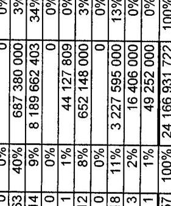

---

4/a. sz. tanúsítvány a V-21-049/2006-2007. sz. jelentéshez

|  Adatszolgáltató szervezet megnevezése: APEH |  |  |  |  |  |   |
| --- | --- | --- | --- | --- | --- | --- |
|  EU tagállam megnevezése | Más tagállamok adóhatóságainak küldött megkeresések száma (5. cikk alapján*) | Más tagállamok adóhatóságaitól érkezett megkeresések száma (5. cikk alapján*) | A magyar adóhatóság megkereséseire érkezett válaszok átlagos időtartama (nap) | Előzetes megkeresés nélkül küldött információcserék száma (17. cikk alapján*) | Előzetes megkeresés nélkül érkezett információcserék száma (17. cikk alapján*) | Előzetes megkeresés nélkül érkezett információcserék száma (17. cikk alapján*)  |
|  Németország | 16 | 14 | 92 |  |  |   |
|  Ausztria | 6 |  | 58 |  |  |   |
|  Olaszország |  | 1 |  |  |  |   |
|  Hollandia | 2 | 3 | 140 |  |  |   |
|  Belgium |  |  |  |  |  |   |
|  Szlovénia |  |  |  |  |  |   |
|  Spanyolország | 2 |  | 336 |  |  |   |
|  Fennország |  |  |  |  |  |   |
|  Csehország |  | 1 |  |  |  |   |
|  Görögország |  | 10 |  |  |  |   |
|  Szlovákia | 4 | 3 | 41 |  |  |   |
|  Portugália |  |  |  |  |  |   |
|  Svédország | 2 |  | 79 |  |  | 1  |
|  Egyesült Királyság | 3 |  | 37 |  |  |   |
|  Esztország |  |  |  |  |  |   |
|  Dánia | 1 |  | 66 |  |  |   |
|  Lengyelország | 3 |  | 29 |  |  |   |
|  Ulivánia |  | 2 |  |  |  | 1  |
|  Luxemburg |  |  |  |  |  |   |
|  Lettország |  | 2 |  |  |  |   |
|  Cyprus | 1 |  | 8 |  |  |   |
|  Franciaország |  |  |  |  |  |   |
|  Irország |  |  |  |  |  |   |
|  Mária |  |  |  |  |  |   |
|  Összesen | 45 | 36 |  |  |  |   |

- 1798/2003/EK rendelet hivatkozott cikkei alapján

Fenti adatok hitelességét igazolom...

Kelt: Budapest, 2007. január 11.

---

4/b. sz. tanúsítvány a V-21-049/2006-2007. sz. jelentéshez

tanúsítvány az APEH által indított és az APEH-hez érkezett megkeresésekről 2005

Adatszolgáltató szervezet megnevezése: APEH

|  EU tagállam megnevezése | Más tagállamok adóhatóságainak küldött megkeresések száma (5. cikk alapján*) | Más tagállamok adóhatóságaitól érkezett megkeresések száma (5. cikk alapján*) | A magyar adóhatóság megkereséseire érkezett válaszok átlagos időtartama (nap) | Előzetes megkeresés nélkül küldött információcserék száma (17. cikk alapján*)  |
| --- | --- | --- | --- | --- |
|  Bémetország | 449 | 95 | 100 |   |
|  Aurzitria | 119 | 16 | 58 |   |
|  Olaszország | 109 | 46 | 135 |   |
|  Hollandia | 83 | 11 | 142 |   |
|  Belgium | 34 | 0 | 136 |   |
|  Szlovénia | 41 | 4 | 42 |   |
|  Spanyolország | 22 | 1 | 260 |   |
|  Finnország | 16 | 0 | 41 |   |
|  Csehország | 48 | 37 | 73 |   |
|  Görögország | 3 | 0 | 88 |   |
|  Szlovákia | 94 | 59 | 61 |   |
|  Portugália | 6 | 0 | 291 | 2  |
|  Svédország | 13 | 0 | 106 |   |
|  Egyesült Királyság | 74 | 2 | 68 |   |
|  Esztország | 1 | 0 | 89 |   |
|  Dánia | 15 | 5 | 85 |   |
|  Lengyelország | 66 | 31 | 65 |   |
|  Litvánia | 5 | 7 | 56 | 2  |
|  Luxemburg | 5 | 0 | 90 |   |
|  Lettország | 4 | 4 | 24 |   |
|  Cíprus | 2 | 0 | 44 |   |
|  Franciaország | 68 | 3 | 96 |   |
|  Irország | 6 | 0 | 169 | 15  |
|  Malta | 0 | 0 |  |   |
|  Összesen | 1283 | 321 |  |   |

- 1798/2003/EK rendelet hivatkozott cikkel alapján

Fenti adatok hítelességét igazolom.

Kelt: Budapest, 2007. január 15.

PH.

*Kó-11111111111111111111111111111111111111111111111111111111111111111111111111111111111111111111111111111111111111111111111111111111111111111111111111111111111111111111111111111111111111111111111111111111

---

4/c.sz. tanúsítvány a V-21-049/2006-2007. sz. jelentéshez

|  ELI tagállam megnevezése | Más tagállamok adóhatóságainak küldött megkeresések száma (5. cikk alapján*) | Más tagállamok adóhatóságaitól érkezett megkeresések száma (5. cikk alapján*) | A magyar adóhatóság megkereséseire érkezett válaszok átlagos időtartama (nap) | Előzetes megkeresés nélkül küldött információcserék száma (17. cikk alapján*) | Előzetes megkeresés nélkül érkezett információcserék száma (17. cikk alapján*)  |
| --- | --- | --- | --- | --- | --- |
|  Nemelország | 759 | 179 | 80 | 535 | 16  |
|  Ausztria | 96 | 18 | 54 | 433 | 16  |
|  Olaszország | 42 | 9 | 103 | 112 | 1174  |
|  Hollandia | 58 | 9 | 118 | 162 | 4  |
|  Belgium | 61 | 1 | 43 | 53 | 227  |
|  Szlovénia | 33 | 6 | 46 | 16 | 1165  |
|  Spanyolország | 24 | 2 | 70 | 32 | 1033  |
|  Finnország | 1 | 1 |  | 26 | 155  |
|  Csehország | 35 | 37 | 82 | 73 |   |
|  Görögország | 3 | 3 |  |  | 1  |
|  Szlovákia | 165 | 157 | 84 | 64 | 223  |
|  Portugália | 2 | 0 |  | 5 |   |
|  Svédország | 1 | 5 | 73 | 54 | 305  |
|  Egyesült Királyság | 28 | 12 | 50 | 104 | 2  |
|  Eszterszög | 0 | 1 |  | 13 | 11  |
|  Dánia | 8 | 0 | 94 | 66 | 254  |
|  Lengyelország | 22 | 38 | 130 | 36 |   |
|  Litvánia | 1 | 10 | 140 | 11 | 1  |
|  Luxemburg | 3 | 1 | 50 | 9 | 484  |
|  Lettország | 0 | 3 |  | 2 | 1  |
|  Ciprus | 6 | 1 | 39 | 3 |   |
|  Franciaország | 12 | 6 | 73 | 86 | 1189  |
| ország | 2 | 0 | 32 | 8 | 80  |
|  Málta | 0 | 0 |  | 1 |   |
|  Összesen | 1368 | 499 |  | 1904 | 6305  |

- 1798/2003/EK rendelet hivatkozott cikkei alapján

Fenti adatok hitelességét igazolom.

Kelt: Budapest, 2007.

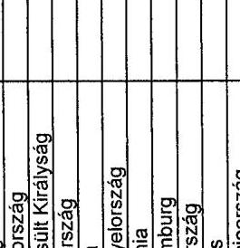

Aláírás

---

5/a. sz. tanúsítvány a V-21-049/2006-2007. sz. jelentéshez

Tanúsítvány a körbeszámlázásos csalásokról az APEH által indított és az APEH-hez érkezett megkeresésekről 2004

Adatszolgáltató szervezet megnevezése: APEH

|  EU tagállam megnevezése | 1798/2003/EK rendelet 5. cikke alapján |  |  |  | 1798/2003/EK rendelet 19. cikke alapján |  |  |   |
| --- | --- | --- | --- | --- | --- | --- | --- | --- |
|   | Érkezett megkeresések |  | Elküldött |  | Érkezett |  | Elküldött |   |
|   | száma (db) | összege ( E Ft) | száma (db) | összege ( E Ft) | száma (db) | összege ( E Ft) | száma (db) | összege ( E Ft)  |
|  Ausztria |  |  | 1 | 496 740 |  |  |  |   |
|  Czech Köztársaság | 3 | 308 473 |  |  |  |  |  |   |
|  Németország | 2 | 176 108 |  |  |  |  |  |   |
|  Hollandia |  |  | 1 | 23 977 |  |  |  |   |
|  Lengyelország |  |  | 1 | 79 958 |  |  |  |   |
|  Szlovákia | 2 | 963 | 1 | 160 326 |  |  |  |   |

Fenti adatok hitelességét igazolom.

Kelt: Budapest, 2007. január *N.*

PH.

Alakás

---

5/b. sz. tanúsítvány a V-21-049/2006-2007. sz. jelentéshez

Tanúsítvány a körbeszámlázásos csalásokról az APEH által indított és az APEH-hez érkezett megkeresésekről 2005

Adatszolgáltató szervezet megnevezése: APEH

|  EU tagállam megnevezése | 1798/2003/EK rendelet 5. cikke alapján |  |  |  | 1798/2003/EK rendelet 19. cikke alapján |  |  |   |
| --- | --- | --- | --- | --- | --- | --- | --- | --- |
|   | Érkezett megkeresések |  | Elküldött |  | Érkezett |  | Elküldött |   |
|   | száma (db) | összege ( E Ft) | száma (db) | összege ( E Ft) | száma (db) | összege ( E Ft) | száma (db) | összege ( E Ft)  |
|  Ausztria | 7 | 798 928 | 11 | 1 431 889 |  |  | 2 | 111 563  |
|  Belgium |  |  |  |  |  |  |  |   |
|  Cyprus |  |  |  |  |  |  |  | 1  |
|  Cseh Köztársaság | 6 | 747 412 | 9 | 3 309 094 |  |  |  |   |
|  Dánia | 2 | 841 724 |  |  |  |  |  |   |
|  Franciaország | 2 | 81 006 |  |  |  |  |  |   |
|  Németország | 18 | 3 243 858 | 30 | 754 844 | 1 | 6 657 | 4 | 101 279  |
|  Spanyolország |  |  |  | 8 740 476 |  |  |  |   |
|  Iország |  |  |  | 458 734 |  |  |  |   |
|  Olaszország |  |  |  | 16 588 703 |  |  |  | 31 397  |
|  Litvánia | 1 | 116 980 | 1 | 7 225 |  |  |  |   |
|  Hollandia | 2 | 2 226 430 | 1 | 2 643 |  |  |  |   |
|  Lengyelország | 3 | 93 214 | 2 | 93 174 |  |  |  |   |
|  Szlovákia | 10 | 914 001 | 16 | 1 869 442 |  |  |  |   |
|  Szlovénia | 1 | 15 000 | 1 | 815 |  |  |  |   |
|  Egyesült Királyság |  |  | 4 | 2 744 332 |  |  |  |   |

Fenti adatok hitelességét igazolom.

Kelt: Budapest, 2007. január

PH.

Aláírás

---

5/c.sz. tanúsítvány a V-21-049/2006-2007. sz. jelentéshez

Tanúsítvány a körbeszámlázásos csalásokról az APEH által indított és az APEH-hez érkezett megkeresésekről 2006

Adatszolgáltató szervezet megnevezése: APEH

|  EU tagállam megnevezése | 1798/2003/EK rendelet 5. cikke alapján | 1798/2003/EK rendelet 19. cikke alapján  |
| --- | --- | --- |
|   | Érkezett megkeresések | Elküldött  |
|   | száma (db) | összege ( E Ft)  |
|  Ausztria | 3 | 714 429  |
|  Cseh Közt. | 3 | 79 022  |
|  Franciaország | 1 | 3 607 845  |
|  Németország | 45 | 3 101 172  |
|  Spanyolország |  |   |
|  Olaszország | 5 | 25 193 058  |
|  Litvánia | 4 | 0  |
|  Luxemburg | 1 | 43 660  |
|  Hollandia | 3 | 264 784  |
|  Lengyelország | 1 | 56 060  |
|  Szlovákia | 32 | 13 962 998  |
|  Egyesült Kír. |  |   |
|  Összesen | 98 | 47 023 028  |

Fenti adatok hitelességét igazolom.

Kelt: Budapest, 2007.

5/

---

6/a. sz. tanúsítvány a V-21-049/2006-2007. sz. jelentéshez a körbeszámlázásos csalásra és a hiányzó kereskedőre vonatkozó megkeresések száma az 1798/2003/EK rendelet 5. cikke alapján küldött és fogadott megkeresésekről és a megkeresések alapján lefolytatott ellenőrzések eredményességéről 2004

Adatszolgáltató szervezet megnevezése: APEH

|  Országok | Elküldött megkeresések száma | Elküldött megkeresésekkel érintett összeg | Megállapítással zárult ellenőrzések |  |  |  | Beérkezett megkeresések száma | Beérkezett megkeresésekkel érintett összeg  |
| --- | --- | --- | --- | --- | --- | --- | --- | --- |
|   |  |  | száma | aránya | nettó adókülönbözet |  |  |   |
|   | db | E Ft | db | % | E Ft | db |  | E Ft  |
|  Ausztria | 1 | 496 740 | 1 |  | 127 534 |  |  |   |
|  Belgium |  |  |  |  |  |  |  |   |
|  Cyprus |  |  |  |  |  |  |  |   |
|  Cseh Köztársaság |  |  |  |  |  |  | 3 | 308 473  |
|  Dánia |  |  |  |  |  |  |  |   |
|  Észtország |  |  |  |  |  |  |  |   |
|  Finnország |  |  |  |  |  |  |  |   |
|  Franciaország |  |  |  |  |  |  |  |   |
|  Németország |  |  |  |  |  |  | 2 | 176 108  |
|  Görögország |  |  |  |  |  |  |  |   |
|  Spanyolország |  |  |  |  |  |  |  |   |
|  Irország |  |  |  |  |  |  |  |   |
|  Olaszország |  |  |  |  |  |  |  |   |
|  Lettország |  |  |  |  |  |  |  |   |
|  Litvánia |  |  |  |  |  |  |  |   |
|  Luxemburg |  |  |  |  |  |  |  |   |
|  Málta |  |  |  |  |  |  |  |   |
|  Hollandia | 1 | 23 977 | 1 |  | 6 913 |  |  |   |
|  Lengyelország | 1 | 79 958 | 1 |  | 23 352 |  |  |   |
|  Portugália |  |  |  |  |  |  |  |   |
|  Szlovákia | 1 | 160 326 | 1 |  | 40 082 | 2 |  | 963  |
|  Szlovénia |  |  |  |  |  |  |  |   |
|  Svédország |  |  |  |  |  |  |  |   |
|  Egyesült Királyság |  |  |  |  |  |  |  |   |
|  Összesen | 4 | 761 001 | 4 |  | 197 881 | 7 |  | 485 544  |

- Az ellenőrzések megállapításai nem feltétlenül az elküldött megkeresésekre adott válaszokon alapult.

Fenti adatok hitelességét igazolong.

Kelt: Budapest, 2007. január " ".

PH.

alárás

---

6/b. sz. tanúsítvány a V-21-049/2006-2007. sz. jelentéshez a körbeszámlázásos csalásra és a hiányzó kereskedőre vonatkozó megkeresések száma az 1798/2003/EK rendelet 5. cikke alapján küldött és fogadott megkeresésekről és a megkeresések alapján lefolytatott ellenőrzések eredményességéről 2005

Adatszolgáltató szervezet megnevezése: APEH

|  Országok | Elküldött megkeresések száma | Elküldött megkeresésekkel érintett összeg | Megállapítással zárult ellenőrzések |  |  | Beérkezett megkeresések száma | Beérkezett megkeresésekkel érintett összeg  |
| --- | --- | --- | --- | --- | --- | --- | --- |
|   |  |  | száma | aránya | nettó adókülönbözet |  |   |
|   | db | E Ft | db | % | E Ft | db | E Ft  |
|  Ausztria | 11 | 1 431 889 | 2 |  | 90 880 | 7 | 798 928  |
|  Belgium | 1 | 63 964 | 1 |  | 7 021 |  |   |
|  Ciprus |  |  |  |  |  |  |   |
|  Cseh Köztársaság | 9 | 3 309 094 | 7 |  | 242 306 | 6 | 747 412  |
|  Dánia |  |  |  |  |  | 2 | 841 724  |
|  Esztország |  |  |  |  |  |  |   |
|  Finnország |  |  |  |  |  |  |   |
|  Franciaország |  |  |  |  |  | 2 | 81 006  |
|  Németország | 30 | 754 844 | 4 |  | 265 354 | 18 | 3 243 858  |
|  Görögország |  |  |  |  |  |  |   |
|  Spanyolország | 2 | 8 740 476 | 1 |  | 93 926 |  |   |
|  Irország | 1 | 458 734 |  |  |  |  |   |
|  Olaszország | 9 | 16 588 703 | 1 |  | 4 776 |  |   |
|  Lettország |  |  |  |  |  |  |   |
|  Litvánia | 1 | 7 225 |  |  |  | 1 | 116 980  |
|  Luxemburg |  |  |  |  |  |  |   |
|  Mária |  |  |  |  |  |  |   |
|  Hollandia | 1 | 2 643 |  |  |  | 2 | 2 226 430  |
|  Lengyelország | 2 | 93 174 | 1 |  | 29 754 | 3 | 93 214  |
|  Portugália |  |  |  |  |  |  |   |
|  Szlovákia | 16 | 1 869 442 | 6 |  | 434 526 | 10 | 914 001  |
|  Szlovénia | 1 | 815 |  |  |  | 1 | 15 000  |
|  Svédország |  |  |  |  |  |  |   |
|  Egyesült Királyság | 4 | 2 744 332 | 1 |  | 4 248 |  |   |
|  Összesen | 88 | 36 065 335 | 24 |  | 1 172 791 | 52 | 9 078 553  |

- Az ellenőrzések megállapításai nem feltétlenül az elküldött megkeresésekre adott válaszokon alapult.

Fenti adatok hitelességét igazolom.

Kelt: Budapest, 2007. január 25.

PH. aláírás

---

6/c. sz. tanúsítvány a V-21-049/2006-2007. sz. jelentéshez a körbeszámlázásos csalásra és a hiányzó kereskedőre vonatkozó megkeresések száma az 1798/2003/EK rendelet 5. cikke alapján küldött és fogadott megkeresésekről és a megkeresések alapján lefolytatott ellenőrzések eredményességéről 2006

Adatszolgáltató szervezet megnevezése: APEH

|  Országok | Elküldött megkeresések száma | Elküldött megkeresésekkel érintett összeg | Megállapitással zárult ellenőrzések |  |  | Beérkezett megkeresések száma | Beérkezett megkeresésekkel érintett összeg  |
| --- | --- | --- | --- | --- | --- | --- | --- |
|   | db |  | száma | aránya | nettó adókülönbözet |  |   |
|   |  |  | db | % | E Ft | db | E Ft  |
|  Ausztria | 10 | 4 636 160 |  |  |  | 3 | 714 429  |
|  Cseh Köztársaság | 4 | 2 396 800 |  |  |  | 3 | 79 022  |
|  Franciaország | 1 | 162 405 |  |  |  | 1 | 3 607 845  |
|  Németország | 66 | 2 478 604 |  |  |  | 45 | 3 101 172  |
|  Spanyolország | 1 | 142 906 |  |  |  |  |   |
|  Olaszország | 2 | 32 761 | 1 |  | 343 | 5 | 25 193 058  |
|  Litvánia |  |  |  |  |  | 4 | 0  |
|  Luxemburg |  |  |  |  |  | 1 | 43 660  |
|  Hollandia | 1 | 2 246 |  |  |  | 3 | 264 784  |
|  Lengyelország | 10 | 127 928 |  |  |  | 1 | 56 060  |
|  Szlovákia | 39 | 8 045 705 | 9 |  | 388 959 | 32 | 13 962 998  |
|  Egyesült Királyság | 3 | 391 180 |  |  |  |  |   |
|  Összesen | 137 | 18 416 695 | 10 |  | 389 302 | 98 | 47 023 028  |

- Az ellenőrzések megállapításai nem feltétlenül az elküldött megkeresésekre adott válaszokon alapult.

Fenti adatok hitelességét igazolom.

Kelt: Budapest, 2007.

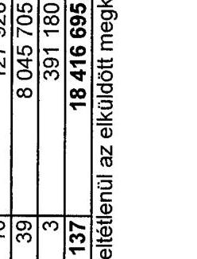

aláifás

---

7. sz. tanúsítvány a V-21-049/2006-2007. sz. jelentéshez

|  Adatszolgáltató szervezet megnevezése: Vám- és Pénzügyőrség |  |  |  |  |  |  |  |  |  |   |
| --- | --- | --- | --- | --- | --- | --- | --- | --- | --- | --- |
|  Év | Csődeljárás |  |  |  | Felszámolási eljárás |  |  |  | Végelszámolási eljárás |   |
|   | száma
(db) | tartozás összege (E Ft) | ebből áfa összege (E Ft) | száma (db) | tartozás összege (E Ft) | ebből áfa összege (E Ft) | száma (db) | tartozás összege (E Ft) | ebből áfa összege (E Ft) |   |
|  2003 | 5 | 10.167 | 4.938 | 1.058 | 26.721.458 | 6.347.600 | 238 | 1.304.280 | 470.183 |   |
|  2004 | 4 | 9.865 | 4.846 | 1.002 | 24.657.276 | 5.884.650 | 228 | 228.128 | 146.174 |   |
|  2005 | 4 | 9.865 | 4.846 | 765 | 16.604.323 | 4.756.195 | 167 | 425.886 | 158.102 |   |
|  2006 | 3 | 7.990 | 4.846 | 722 | 8.692.665 | 4.575.104 | 144 | 187.241 | 81.684 |   |

Ferci adatok hitelességét igazolom.

Kelt: Budapest, 2007. január 15.

Tanus_25VPIcsod_elj

---

8/a. sz. tanúsítvány a V-21-049/2006-2007. sz. jelentéshez

Tanúsítvány a fizetési kedvezmények alakulásáról 2003. év

Adatszolgáltató szervezet megnevezése: Vám- és Pénzügyőrség

|  |   |   |   |   |   |   |   |   |   |   |   |
| --- | --- | --- | --- | --- | --- | --- | --- | --- | --- | --- | --- |
|   |  |  |  |  |  |  |  |  |  |  | Örszágos összesen  |
|  Megnevezés |  |  | Nyugat-Dunántúli
Regionális
Parancanokság | Köszp-Dunántúli
Regionális
Parancanokság | Déli-Dunántúli
Regionális
Parancanokság | Köszp-Megvarország
Regionális
Parancanokság | Észak-Megvarország
Regionális
Parancanokság | Észak-Allóki
Regionális
Parancanokság | Déli-Allóki Regionális
Parancanokság | Központi Regálítási
Parancanokság | Örszágos összesen  |
|  A | Fizetési
kedvezmények/
e irányuló
kéntinek | száma (db)
érléke
(E Ft) | 30 | 53 | 56 | 177 | 204 | 179 | 711 | 1 | 771  |
|   |  |  | 27065 | 24330 | 26351 | 1961931 | 81896 | 385449 | 30423 | 8 | 2537463  |
|   |  | e irányuló
kéntinek | ebből áfa
érléke
(E Ft) | 9786 | 3464 | 266 | 661173 | 3490 | 17266 | 2728 | 7  |
|   |  |  | 30 | 51 | 46 | 40 | 100 | 149 | 65 | 1 | 464  |
|  B | "A"-ből
jóváhagyott
kéntinek | száma (db)
érléke
(E Ft) | 27065 | 21482 | 25223 | 14754 | 55041 | 383858 | 28854 | 8 | 566085  |
|   |  | ebből áfa
érléke
(E Ft) | 9786 | 3266 | 139 | 5940 | 2833 | 17225 | 2341 | 7 | 44537  |
|   |  |  | 10 | 10 | 2 | 60 | 35 | 146 | 22 | 0 | 286  |
|  C | "A"-ből fizetési
környilási
kéntinek | száma (db)
érléke
(E Ft) | 7841 | 16754 | 127 | 21006 | 9511 | 349809 | 14812 | 0 | 421860  |
|   |  | ebből áfa
érléke
(E Ft) | 617 | 2068 | 127 | 12939 | 653 | 15095 | 934 | 0 | 32433  |
|   |  |  | 10 | 8 |  | 20 | 35 | 122 | 22 | 0 | 217  |
|  D | "C"-ből
jóváhagyott
kéntinek | száma (db)
érléke
(E Ft) | 7841 | 6513 |  | 6680 | 9511 | 348540 | 14812 | 0 | 393897  |
|   |  | ebből áfa
érléke
(E Ft) | 817 | 1946 |  | 4172 | 653 | 15086 | 934 | 0 | 23408  |
|   |  |  | 4 | 37 | 4 | 64 | 48 | 31 | 27 | 1 | 213  |
|  E | "A"-ből
mérsékleti kéri
kéntinek | száma (db)
érléke
(E Ft) | 14704 | 3517 | 396 | 24116 | 12614 | 9155 | 8274 | 8 | 72774  |
|   |  | ebből áfa
érléke
(E Ft) | 8087 | 2291 | 271 | 14334 | 717 | 381394 | 844 | 7 | 407945  |
|   |  |  | 4 | 35 | 3 | 22 | 45 | 29 | 21 | 1 | 160  |
|  F | "E"-ből
jóváhagyott
kéntinek | száma (db)
érléke
(E Ft) | 14704 | 1122 | 322 | 7815 | 12428 | 9029 | 6705 | 8 | 52133  |
|   |  | ebből áfa
érléke
(E Ft) | 8087 | 1107 | 257 | 4734 | 585 | 384384 | 457 | 7 | 399716  |
|   |  |  | 16 | 7 | 1 | 79 | 125 | 127 | 22 | 0 | 377  |
|  G | "A"-ből vegyes
kéntinek | száma (db)
érléke
(E Ft) | 11871 | 3187 | 615 | 59131 | 9509 | 372602 | 7337 | 0 | 464252  |
|   |  | ebből áfa
érléke
(E Ft) | 1602 | 212 | 51 | 10015 | 2264 | 2757 | 950 | 0 | 17651  |
|   |  |  | 8 | 7 | 1 | 46 | 125 | 93 | 22 | 0 | 304  |
|  H | "G"-ből
jóváhagyott
kéntinek | száma (db)
érléke
(E Ft) | 4780 | 3158 | 615 | 12062 | 47936 | 311878 | 7337 | 0 | 387764  |
|   |  | ebből áfa
érléke
(E Ft) | 1083 | 212 |  | 1790 | 1870 | 2513 | 950 | 0 | 5416  |
|   | "B"-ből
visszerendezés
nem teljesítés
esetén | száma (db)
érléke
(E Ft) | 8 | 2 | 9 | 11 | 3 | 9 | 0 | 0 | 48  |
|   |  | ebből áfa
érléke
(E Ft) | 3631 | 44 | 1650 | 2411 | 17656 | 722 | 281 | 0 | 26377  |
|   |  |  | 257 | 1 |  | 1383 | 698 | 163 | 15 | 0 | 2517  |

Fenti adatok hitelességét igazolom: Kelt: Budapest, 2006. december

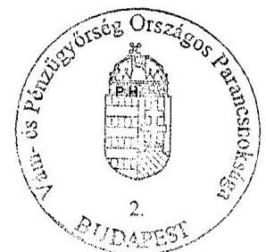

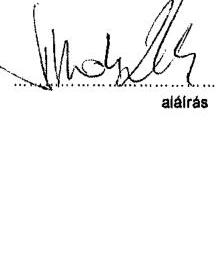

---

8/b. sz. tanúsítvány a V-21-049/2006-2007. sz. jelentéshez

# Tanúsítvány

a fizetési kedvezményes alakulásáról 2004. év

Adatszolgáltató szervezet megnevezése: Vám- és Pénzügyőrség

|  Megnevezés | Nyugat-Dumántúi
Regionális
Parancsnokság | Közép-Dumántúi
Regionális
Parancsnokság | Dió-Dumántúi
Regionális
Parancsnokság | Közép-Megnevezési
Regionális
Parancsnokság | Észak-Állitól
Regionális
Parancsnokság | Dió-Állitól Regionális
Parancsnokság | Központi Regiálási
Parancsnokság | Országos összesen  |
| --- | --- | --- | --- | --- | --- | --- | --- | --- |
|  A |  |  |  |  |  |  |  |   |
|  Fizetési
kedvezményes/
a irányuló
kérelmek | száma (dő) | 20 | 16 | 69 | 255 | 118 | 322 | 33  |
|   | értéke
(E Ft) | 28101 | 9355 | 12492 | 3899698 | 57966 | 847914 | 15022  |
|   | e irányuló
kérelmek | ebből áfa
értéke
(E Ft) | 3437 | 2147 | 419 | 1294095 | 1480 | 4239  |
|   |  | száma (dő) | 19 | 11 | 59 | 98 | 84 | 257  |
|  B | "A"-ből
jóváhagyott
kérelmek | értéke
(E Ft) | 28092 | 6464 | 7880 | 33547 | 51475 | 802580  |
|   |  | ebből áfa
értéke
(E Ft) | 3437 | 1485 | 93 | 21609 | 752 | 1929  |
|   |  | száma (dő) | 4 | 7 | 0 | 130 | 53 | 52  |
|  C | "A"-ből fizetési
kőznyitási
kérelmek | értéke
(E Ft) | 3629 | 6526 | 0 | 3842079 | 2744 | 1316370  |
|   |  | ebből áfa
értéke
(E Ft) | 296 | 1648 | 0 | 1273246 | 15 | 0  |
|   |  | száma (dő) | 4 | 5 | 0 | 52 | 23 | 30  |
|  D | "C"-ből
jóváhagyott
kérelmek | értéke
(E Ft) | 3629 | 375 | 0 | 22333 | 2744 | 607656  |
|   |  | ebből áfa
értéke
(E Ft) | 296 | 13 | 0 | 13926 | 15 | 0  |
|   |  | száma (dő) | 4 | 3 | 0 | 89 | 38 | 98  |
|  E | "A"-ből
mérsékleti kére
kérelmek | értéke
(E Ft) | 2307 | 938 | 229 | 32695 | 3459 | 95848  |
|   |  | ebből áfa
értéke
(E Ft) | 1243 | 64 | 134 | 19392 | 72 | 2374  |
|   |  | száma (dő) | 3 | 3 | 1 | 35 | 37 | 17  |
|  F | "E"-ből
jóváhagyott
kérelmek | értéke
(E Ft) | 2298 | 938 | 59 | 12159 | 2956 | 697731  |
|   |  | ebből áfa
értéke
(E Ft) | 1243 | 61 | 89 | 7769 | 50 | 1884  |
|   |  | száma (dő) | 16 | 6 | 0 | 68 | 31 | 173  |
|  G | "A"-ből vegyes
kérelmek | értéke
(E Ft) | 35794 | 1891 | 0 | 38135 | 42525 | 747018  |
|   |  | ebből áfa
értéke
(E Ft) | 2194 | 238 | 0 | 6849 | 793 | 1865  |
|   |  | száma (dő) | 13 | 4 | 0 | 37 | 31 | 152  |
|  H | "G"-ből
jóváhagyott
kérelmek | értéke
(E Ft) | 21056 | 1369 | 0 | 12863 | 41761 | 709283  |
|   |  | ebből áfa
értéke
(E Ft) | 1907 | 212 | 0 | 2292 | 780 | 1865  |
|   |  | száma (dő) | 2 | 2 | 15 | 15 | 12 | 0  |
|  I | "B"-ből
visszerenlészés
nem teljesítés
esején | értéke
(E Ft) | 4361 | 4007 | 941 | 5040 | 8625 | 0  |
|   |  | ebből áfa
értéke
(E Ft) | 263 | 1402 | 0 | 2758 | 421 | 0  |

Fenti adatok hitelességét igazolom.

Kelt: Budapest, 2006. december 11.

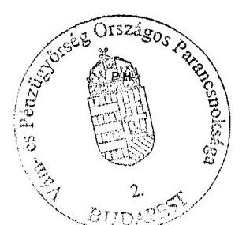

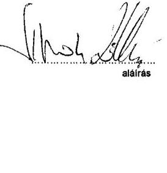

---

8/c. sz. tanúsítvány a V-21-049/2006-2007. sz. jelentéshez

|  Adatszolgáltató szervezet megnevezése: Vám- és Pánzügyőrség |  |  |  |  |  |  |  |  |  |  |  |   |
| --- | --- | --- | --- | --- | --- | --- | --- | --- | --- | --- | --- | --- |
|  Megnevezés |  |  | Nyugat-Dunántúli
Regionális
Parancsnokság | Közép-Dunántúli
Regionális
Parancsnokság | Dél-Dunántúli
Regionális
Parancsnokság |  |  |  |  |  |  |   |
|   |  |  |  |  |  |  |  |  |  |  |  | Örszégre összesen  |
|  A | "Fizetési
kedvezményezi
e irányuló
kérelmek | száma (dő) | 11 | 2 | 60 | 147 | 217 | 449 | 17 | 0 | 903 |   |
|   |  | értéke
(E Ft) | 16123 | 238655 | 20148 | 1579051 | 171851 | 216255 | 11887 | 0 | 2256080 |   |
|   |  | e irányuló
kérelmek | ebből áfa
értéke
(E Ft) | 4494 | 18869 | 2472 | 489889 | 7803 | 14029 | 4093 | 0 | 541648  |
|   |  |  | e száma (dő) | 11 | 0 | 49 | 54 | 151 | 402 | 5 | 0 | 672  |
|  B | "A"-ből
jóváhagyott
kérelmek | értéke
(E Ft) | 16123 | 0 | 19871 | 25185 | 90438 | 176114 | 2908 | 0 | 330639 |   |
|   |  | ebből áfa
értéke
(E Ft) | 4494 | 0 | 2472 | 11164 | 1830 | 455 | 183 | 0 | 20598 |   |
|   |  |  | e száma (dő) | 9 | 0 | 0 | 96 | 37 | 34 | 4 | 0 | 240  |
|  C | "A"-ből fizetési
környítési
kérelmek | értéke
(E Ft) | 14333 | 0 | 0 | 1546831 | 36691 | 17101 | 3252 | 0 | 1618208 |   |
|   |  | ebből áfa
értéke
(E Ft) | 3912 | 0 | 0 | 477787 | 58 | 13541 | 1430 | 0 | 496708 |   |
|   |  |  | e száma (dő) | 4 | 0 | 0 | 45 | 35 | 18 | 1 | 0 | 104  |
|  D | "C"-ből
jóváhagyott
kérelmek | értéke
(E Ft) | 3634 | 0 | 0 | 21314 | 28171 | 2134 | 1941 | 0 | 57194 |   |
|   |  | ebből áfa
értéke
(E Ft) | 2295 | 0 | 0 | 9134 | 58 | 0 | 168 | 0 | 11855 |   |
|   |  |  | e száma (dő) | 0 | 1 | 0 | 40 | 20 | 234 | 8 | 0 | 305  |
|  E | "A"-ből
mérsékleti kére
kérelmek | értéke
(E Ft) | 0 | 238552 | 0 | 19256 | 27658 | 168622 | 7400 | 0 | 461488 |   |
|   |  | ebből áfa
értéke
(E Ft) | 0 | 18869 | 0 | 10468 | 1043 | 33 | 2377 | 0 | 32790 |   |
|   |  |  | e száma (dő) | 0 | 1 | 0 | 14 | 20 | 230 | 2 | 0 | 267  |
|  F | "E"-ből
jóváhagyott
kérelmek | értéke
(E Ft) | 0 | 238552 | 0 | 3891 | 27658 | 149679 | 574 | 0 | 420354 |   |
|   |  | ebből áfa
értéke
(E Ft) | 0 | 18869 | 0 | 2030 | 142 | 0 | 0 | 0 | 21041 |   |
|   |  |  | e száma (dő) | 5 | 1 | 0 | 45 | 96 | 79 | 5 | 0 | 238  |
|  G | "A"-ből vegyes
kérelmek | értéke
(E Ft) | 11668 | 113 | 0 | 25111 | 34688 | 24298 | 1235 | 0 | 97113 |   |
|   |  | ebből áfa
értéke
(E Ft) | 1770 | 0 | 0 | 10160 | 730 | 455 | 266 | 0 | 13401 |   |
|   |  |  | e száma (dő) | 5 | 1 | 0 | 13 | 96 | 79 | 2 | 0 | 196  |
|  H | "G"-ből
jóváhagyott
kérelmek | értéke
(E Ft) | 10668 | 113 | 0 | 5573 | 34688 | 24298 | 393 | 0 | 75733 |   |
|   |  | ebből áfa
értéke
(E Ft) | 1817 | 0 | 0 | 1027 | 729 | 455 | 18 | 0 | 3843 |   |
|   | "B"-ből
visszerendezés
nem teljesítés
eselén | e száma (dő) | 0 | 0 | 18 | 1 | 96 | 1 | 0 | 0 | 63 |   |
|  I |  |  |  |  |  |  |  |  |  |  |  | 44380  |
|   |  | ebből áfa
értéke
(E Ft) | 0 | 0 | 2920 | 2355 | 28991 | 10114 | 0 | 0 | 44380 |   |
|   |  |  |  |  |  |  |  |  |  |  |  | 2128  |

Fentő adatok hitelességét igazolom.

Kelt: Budapest, 2006. december

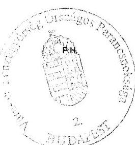

---

8/d. sz. tanúsítvány a V-21-049/2006-2007. sz. jelentéshez

|  Megnevezés |  |  |  |  |  |  |  |  |  |  |  |  |   |
| --- | --- | --- | --- | --- | --- | --- | --- | --- | --- | --- | --- | --- | --- |
|   |  |  |  |  |  |  |  |  |  |  |  |  |   |
|  A | Fizetési kedvezménye |  |  |  |  |  |  |  |  |  |  |  |   |
|   |  |  |  |  |  |  |  |  |  |  |  |  |   |
|   | Fizetési kódszámlájú kére |  |  |  |  |  |  |  |  |  |  |  |   |
|   |  |  |  |  |  |  |  |  |  |  |  |  |   |
|   | Fizetési kódszámlájú kére |  |  |  |  |  |  |  |  |  |  |  |   |
|   |  |  |  |  |  |  |  |  |  |  |  |  |   |
|   |  |  |  |  |  |  |  |  |  |  |  |  |   |
|  B | "A"-ból (öváhagyott kéreinek |  |  |  |  |  |  |  |  |  |  |  |   |
|   |  |  |  |  |  |  |  |  |  |  |  |  |   |
|   | "A"-ből vegyes kéreinek |  |  |  |  |  |  |  |  |  |  |  |   |
|   |  |  |  |  |  |  |  |  |  |  |  |  |   |
|   | "A"-ből vegyes kéreinek |  |  |  |  |  |  |  |  |  |  |  |   |
|   |  |  |  |  |  |  |  |  |  |  |  |  |   |
|   | "A"-ből vegyes kéreinek |  |  |  |  |  |  |  |  |  |  |  |   |
|   |  |  |  |  |  |  |  |  |  |  |  |  |   |
|   | "A"-ből vegyes kéreinek |  |  |  |  |  |  |  |  |  |  |  |   |
|   |  |  |  |  |  |  |  |  |  |  |  |  |   |
|   | "A"-ből vegyes kéreinek |  |  |  |  |  |  |  |  |  |  |  |   |
|   |  |  |  |  |  |  |  |  |  |  |  |  |   |
|   | "A"-ből vegyes kéreinek |  |  |  |  |  |  |  |  |  |  |  |   |
|   |  |  |  |  |  |  |  |  |  |  |  |  |   |
|   | "A"-ből vegyes kéreinek |  |  |  |  |  |  |  |  |  |  |  |   |
|   |  |  |  |  |  |  |  |  |  |  |  |  |   |
|   | "A"-ből vegyes kéreinek |  |  |  |  |  |  |  |  |  |  |  |   |
|   |  |  |  |  |  |  |  |  |  |  |  |  |   |
|   | "A"-ből vegyes kéreinek |  |  |  |  |  |  |  |  |  |  |  |   |
|   |  |  |  |  |  |  |  |  |  |  |  |  |   |
|   | "A"-ből vegyes kéreinek |  |  |  |  |  |  |  |  |  |  |  |   |
|   |  |  |  |  |  |  |  |  |  |  |  |  |   |
|   | "A"-ből vegyes kéreinek |  |  |  |  |  |  |  |  |  |  |  |   |
|   |  |  |  |  |  |  |  |  |  |  |  |  |   |
|   | "A"-ből vegyes kéreinek |  |  |  |  |  |  |  |  |  |  |  |   |
|   |  |  |  |  |  |  |  |  |  |  |  |  |   |
|   | "A"-ből vegyes kéreinek |  |  |  |  |  |  |  |  |  |  |  |   |
|   |  |  |  |  |  |  |  |  |  |  |  |  |   |
|   | "A"-ből vegyes kéreinek |  |  |  |  |  |  |  |  |  |  |  |   |
|   |  |  |  |  |  |  |  |  |  |  |  |  |   |
|   | "A"-ből vegyes kéreinek |  |  |  |  |  |  |  |  |  |  |  |   |
|   |  |  |  |  |  |  |  |  |  |  |  |  |   |
|   | "A"-ből vegyes kéreinek |  |  |  |  |  |  |  |  |  |  |  |   |
|   |  |  |  |  |  |  |  |  |  |  |  |  |   |
|   | "A"-ből vegyes kéreinek |  |  |  |  |  |  |  |  |  |  |  |   |
|   |  |  |  |  |  |  |  |  |  |  |  |  |   |
|   | "A"-ből vegyes kéreinek |  |  |  |  |  |  |  |  |  |  |  |   |
|   |  |  |  |  |  |  |  |  |  |  |  |  |   |
|   | "A"-ből vegyes kéreinek |  |  |  |  |  |  |  |  |  |  |  |   |
|   |  |  |  |  |  |  |  |  |  |  |  |  |   |
|   | "A"-ből vegyes kéreinek |  |  |  |  |  |  |  |  |  |  |  |   |
|   |  |  |  |  |  |  |  |  |  |  |  |  |   |
|   | "A"-ből vegyes kéreinek |  |  |  |  |  |  |  |  |  |  |  |   |
|   |  |  |  |  |  |  |  |  |  |  |  |  |   |
|   | "A"-ből vegyes kéreinek |  |  |  |  |  |  |  |  |  |  |  |   |
|   |  |  |  |  |  |  |  |  |  |  |  |  |   |
|   | "A"-ből vegyes kéreinek |  |  |  |  |  |  |  |  |  |  |  |   |
|   |  |  |  |  |  |  |  |  |  |  |  |  |   |
|   | "A"-ből vegyes kéreinek |  |  |  |  |  |  |  |  |  |  |  |   |
|   |  |  |  |  |  |  |  |  |  |  |  |  |   |
|   | "A"-ből vegyes kéreinek |  |  |  |  |  |  |  |  |  |  |  |   |
|   |  |  |  |  |  |  |  |  |  |  |  |  |   |
|   | "A"-ből vegyes kéreinek |  |  |  |  |  |  |  |  |  |  |  |   |
|   |  |  |  |  |  |  |  |  |  |  |  |  |   |
|   | "A"-ből vegyes kéreinek |  |  |  |  |  |  |  |  |  |  |  |   |
|   |  |  |  |  |  |  |  |  |  |  |  |  |   |
|   | "A"-ből vegyes kéreinek |  |  |  |  |  |  |  |  |  |  |  |   |
|   |  |  |  |  |  |  |  |  |  |  |  |  |   |
|   | "A"-ből vegyes kéreinek |  |  |  |  |  |  |  |  |  |  |  |   |
|   |  |  |  |  |  |  |  |  |  |  |  |  |   |
|   | "A"-ből vegyes kéreinek |  |  |  |  |  |  |  |  |  |  |  |   |
|   |  |  |  |  |  |  |  |  |  |  |  |  |   |
|   | "A"-ből vegyes kéreinek |  |  |  |  |  |  |  |  |  |  |  |   |
|   |  |  |  |  |  |  |  |  |  |  |  |  |   |
|   | "A"-ből vegyes kéreinek |  |  |  |  |  |  |  |  |  |  |  |   |
|   |  |  |  |  |  |  |  |  |  |  |  |  |   |
|   | "A"-ből vegyes kéreinek |  |  |  |  |  |  |  |  |  |  |  |   |
|   |  |  |  |  |  |  |  |  |  |  |  |  |   |
|   | "A"-ből vegyes kéreinek |  |  |  |  |  |  |  |  |  |  |  |   |
|   |  |  |  |  |  |  |  |  |  |  |  |  |   |
|   | "A"-ből vegyes kéreinek |  |  |  |  |  |  |  |  |  |  |  |   |
|   |  |  |  |  |  |  |  |  |  |  |  |  |   |
|   | "A"-ből vegyes kéreinek |  |  |  |  |  |  |  |  |  |  |  |   |
|   |  |  |  |  |  |  |  |  |  |  |  |  |   |
|   | "A"-ből vegyes kéreinek |  |  |  |  |  |  |  |  |  |  |  |   |
|   |  |  |  |  |  |  |  |  |  |  |  |  |   |
|   | "A"-ből vegyes kéreinek |  |  |  |  |  |  |  |  |  |  |  |   |
|   |  |  |  |  |  |  |  |  |  |  |  |  |   |
|   | "A"-ből vegyes kéreinek |  |  |  |  |  |  |  |  |  |  |  |   |
|   |  |  |  |  |  |  |  |  |  |  |  |  |   |
|   | "A"-ből vegyes kéreinek |  |  |  |  |  |  |  |  |  |  |  |   |
|   |  |  |  |  |  |  |  |  |  |  |  |  |   |
|   | "A"-ből vegyes kéreinek |  |  |  |  |  |  |  |  |  |  |  |   |
|   |  |  |  |  |  |  |  |  |  |  |  |  |   |
|   | "A"-ből vegyes kéreinek |  |  |  |  |  |  |  |  |  |  |  |   |
|   |  |  |  |  |  |  |  |  |  |  |  |  |   |
|   | "A"-ből vegyes kéreinek |  |  |  |  |  |  |  |  |  |  |  |   |
|   |  |  |  |  |  |  |  |  |  |  |  |  |   |
|   | "A"-ből vegyes kéreinek |  |  |  |  |  |  |  |  |  |  |  |   |
|   |  |  |  |  |  |  |  |  |  |  |  |  |   |
|   | "A"-ből vegyes kéreinek |  |  |  |  |  |  |  |  |  |  |  |   |
|   |  |  |  |  |  |  |  |  |  |  |  |  |   |
|   | "A"-ből vegyes kéreinek |  |  |  |  |  |  |  |  |  |  |  |   |
|   |  |  |  |  |  |  |  |  |  |  |  |  |   |
|   | "A"-ből vegyes kéreinek |  |  |  |  |  |  |  |  |  |  |  |   |
|   |  |  |  |  |  |  |  |  |  |  |  |  |   |
|   | "A"-ből vegyes kéreinek |  |  |  |  |  |  |  |  |  |  |  |   |
|   |  |  |  |  |  |  |  |  |  |  |  |  |   |
|   | "A"-ből vegyes kéreinek |  |  |  |  |  |  |  |  |  |  |  |   |
|   |  |  |  |  |  |  |  |  |  |  |  |  |   |
|   | "A"-ből vegyes kéreinek |  |  |  |  |  |  |  |  |  |  |  |   |
|   |  |  |  |  |  |  |  |  |  |  |  |  |   |
|   | "A"-ből vegyes kéreinek |  |  |  |  |  |  |  |  |  |  |  |   |
|   |  |  |  |  |  |  |  |  |  |  |  |  |   |
|   | "A"-ből vegyes kéreinek |  |  |  |  |  |  |  |  |  |  |  |   |
|   |  |  |  |  |  |  |  |  |  |  |  |  |   |
|   | "A"-ből vegyes kéreinek |  |  |  |  |  |  |  |  |  |  |  |   |
|   |  |  |  |  |  |  |  |  |  |  |  |  |   |
|   | "A"-ből vegyes kéreinek |  |  |  |  |  |  |  |  |  |  |  |   |
|   |  |  |  |  |  |  |  |  |  |  |  |  |   |
|   | "A"-ből vegyes kéreinek |  |  |  |  |  |  |  |  |  |  |  |   |
|   |  |  |  |  |  |  |  |  |  |  |  |  |   |
|   | "A"-ből vegyes kéreinek |  |  |  |  |  |  |  |  |  |  |  |   |
|   |  |  |  |  |  |  |  |  |  |  |  |  |   |
|   | "A"-ből vegyes kéreinek |  |  |  |  |  |  |  |  |  |  |  |   |
|   |  |  |  |  |  |  |  |  |  |  |  |  |   |
|   | "A"-ből vegyes kéreinek |  |  |  |  |  |  |  |  |  |  |  |   |
|   |  |  |  |  |  |  |  |  |  |  |  |  |   |
|   | "A"-ből vegyes kéreinek |  |  |  |  |  |  |  |  |  |  |  |   |
|   |  |  |  |  |  |  |  |  |  |  |  |  |   |
|   | "A"-ből vegyes kéreinek |  |  |  |  |  |  |  |  |  |  |  |   |
|   |  |  |  |  |  |  |  |  |  |  |  |  |   |
|   | "A"-ből vegyes kéreinek |  |  |  |  |  |  |  |  |  |  |  |   |
|   |  |  |  |  |  |  |  |  |  |  |  |  |   |
|   | "A"-ből vegyes kéreinek |  |  |  |  |  |  |  |  |  |  |  |   |
|   |  |  |  |  |  |  |  |  |  |  |  |  |   |
|   | "A"-ből vegyes kéreinek |  |  |  |  |  |  |  |  |  |  |  |   |
|   |  |  |  |  |  |  |  |  |  |  |  |  |   |
|   | "A"-ből vegyes kéreinek |  |  |  |  |  |  |  |  |  |  |  |   |
|   |  |  |  |  |  |  |  |  |  |  |  |  |   |
|   | "A"-ből vegyes kéreinek |  |  |  |  |  |  |  |  |  |  |  |   |
|   |  |  |  |  |  |  |  |  |  |  |  |  |   |
|   | "A"-ből vegyes kéreinek |  |  |  |  |  |  |  |  |  |  |  |   |
|   |  |  |  |  |  |  |  |  |  |  |  |  |   |
|   | "A"-ből vegyes kéreinek |  |  |  |  |  |  |  |  |  |  |  |   |
|   |  |  |  |  |  |  |  |  |  |  |  |  |   |
|   | "A"-ből vegyes kéreinek |  |  |  |  |  |  |  |  |  |  |  |   |
|   |  |  |  |  |  |  |  |  |  |  |  |  |   |
|   | "A"-ből vegyes kéreinek |  |  |  |  |  |  |  |  |  |  |  |   |
|   |  |  |  |  |  |  |  |  |  |  |  |  |   |
|   | "A"-ből vegyes kéreinek |  |  |  |  |  |  |  |  |  |  |  |   |
|   |  |  |  |  |  |  |  |  |  |  |  |  |   |
|   | "A"-ből vegyes kéreinek |  |  |  |  |  |  |  |  |  |  |  |   |
|   |  |  |  |  |  |  |  |  |  |  |  |  |   |
|   | "A"-ből vegyes kéreinek |  |  |  |  |  |  |  |  |  |  |  |   |
|   |  |  |  |  |  |  |  |  |  |  |  |  |   |
|   | "A"-ből vegyes kéreinek |  |  |  |  |  |  |  |  |  |  |  |   |
|   |  |  |  |  |  |  |  |  |  |  |  |  |   |
|   | "A"-ből vegyes kéreinek |  |  |  |  |  |  |  |  |  |  |  |   |
|   |  |  |  |  |  |  |  |  |  |  |  |  |   |
|   | "A"-ből vegyes kéreinek |  |  |  |  |  |  |  |  |  |  |  |   |
|   |  |  |  |  |  |  |  |  |  |  |  |  |   |
|   | "A"-ből vegyes kéreinek |  |  |  |  |  |  |  |  |  |  |  |   |
|   |  |  |  |  |  |  |  |  |  |  |  |  |   |
|   | "A"-ből vegyes kéreinek |  |  |  |  |  |  |  |  |  |  |  |   |
|   |  |  |  |  |  |  |  |  |  |  |  |  |   |
|   | "A"-ből vegyes kéreinek |  |  |  |  |  |  |  |  |  |  |  |   |
|   |  |  |  |  |  |  |  |  |  |  |  |  |   |
|   | "A"-ből vegyes kéreinek |  |  |  |  |  |  |  |  |  |  |  |   |
|   |  |  |  |  |  |  |  |  |  |  |  |  |   |
|   | "A"-ből vegyes kéreinek |  |  |  |  |  |  |  |  |  |  |  |   |
|   |  |  |  |  |  |  |  |  |  |  |  |  |   |
|   | "A"-ből vegyes kéreinek |  |  |  |  |  |  |  |  |  |  |  |   |
|   |  |  |  |  |  |  |  |  |  |  |  |  |   |
|   | "A"-ből vegyes kéreinek |  |  |  |  |  |  |  |  |  |  |  |   |
|   |  |  |  |  |  |  |  |  |  |  |  |  |   |
|   | "A"-ből vegyes kéreinek |  |  |  |  |  |  |  |  |  |  |  |   |
|   |  |  |  |  |  |  |  |  |  |  |  |  |   |
|   | "A"-ből vegyes kéreinek |  |  |  |  |  |  |  |  |  |  |  |   |
|   |  |  |  |  |  |  |  |  |  |  |  |  |   |
|   | "A"-ből vegyes kéreinek |  |  |  |  |  |  |  |  |  |  |  |   |
|   |  |  |  |  |  |  |  |  |  |  |  |  |   |
|   | "A"-ből vegyes kéreinek |  |  |  |  |  |  |  |  |  |  |  |   |
|   |  |  |  |  |  |  |  |  |  |  |  |  |   |
|   | "A"-ből vegyes kéreinek |  |  |  |  |  |  |  |  |  |  |  |   |
|   |  |  |  |  |  |  |  |  |  |  |  |  |   |
|   | "A"-ből vegyes kéreinek |  |  |  |  |  |  |  |  |  |  |  |   |
|   |  |  |  |  |  |  |  |  |  |  |  |  |   |
|   | "A"-ből vegyes kéreinek |  |  |  |  |  |  |  |  |  |  |  |   |
|   |  |  |  |  |  |  |  |  |  |  |  |  |   |
|   | "A"-ből vegyes kéreinek |  |  |  |  |  |  |  |  |  |  |  |   |
|   |  |  |  |  |  |  |  |  |  |  |  |  |   |
|   | "A"-ből vegyes kéreinek |  |  |  |  |  |  |  |  |  |  |  |   |
|   |  |  |  |  |  |  |  |  |  |  |  |  |   |
|   | "A"-ből vegyes kéreinek |  |  |  |  |  |  |  |  |  |  |  |   |
|   |  |  |  |  |  |  |  |  |  |  |  |  |   |
|   | "A"-ből vegyes kéreinek |  |  |  |  |  |  |  |  |  |  |  |   |
|   |  |  |  |  |  |  |  |  |  |  |  |  |   |
|   | "A"-ből vegyes kéreinek |  |  |  |  |  |  |  |  |  |  |  |   |
|   |  |  |  |  |  |  |  |  |  |  |  |  |   |
|   | "A"-ből vegyes kéreinek |  |  |  |  |  |  |  |  |  |  |  |   |
|   |  |  |  |  |  |  |  |  |  |  |  |  |   |
|   | "A"-ből vegyes kéreinek |  |  |  |  |  |  |  |  |  |  |  |   |
|   |  |  |  |  |  |  |  |  |  |  |  |  |   |
|   | "A"-ből vegyes kéreinek |  |  |  |  |  |  |  |  |  |  |  |   |
|   |  |  |  |  |  |  |  |  |  |  |  |  |   |
|   | "A"-ből vegyes kéreinek |  |  |  |  |  |  |  |  |  |  |  |   |
|   |  |  |  |  |  |  |  |  |  |  |  |  |   |
|   | "A"-ből vegyes kéreinek |  |  |  |  |  |  |  |  |  |  |  |   |
|   |  |  |  |  |  |  |  |  |  |  |  |  |   |
|   | "A"-ből vegyes kéreinek |  |  |  |  |  |  |  |  |  |  |  |   |
|   |  |  |  |  |  |  |  |  |  |  |  |  |   |
|   | "A"-ből vegyes kéreinek |  |  |  |  |  |  |  |  |  |  |  |   |
|   |  |  |  |  |  |  |  |  |  |  |  |  |   |
|   | "A"-ből vegyes kéreinek |  |  |  |  |  |  |  |  |  |  |  |   |
|   |  |  |  |  |  |  |  |  |  |  |  |  |   |
|   | "A"-ből vegyes kéreinek |  |  |  |  |  |  |  |  |  |  |  |   |
|   |  |  |  |  |  |  |  |  |  |  |  |  |   |
|   | "A"-ből vegyes kéreinek |  |  |  |  |  |  |  |  |  |  |  |   |
|   |  |  |  |  |  |  |  |  |  |  |  |  |   |
|   | "A"-ből vegyes kéreinek |  |  |  |  |  |  |  |  |  |  |  |   |
|   |  |  |  |  |  |  |  |  |  |  |  |  |   |
|   | "A"-ből vegyes kéreinek |  |  |  |  |  |  |  |  |  |  |  |   |
|   |  |  |  |  |  |  |  |  |  |  |  |  |   |
|   | "A"-ből vegyes kéreinek |  |  |  |  |  |  |  |  |  |  |  |   |
|   |  |  |  |  |  |  |  |  |  |  |  |  |   |
|   | "A"-ből vegyes kéreinek |  |  |  |  |  |  |  |  |  |  |  |   |
|   |  |  |  |  |  |  |  |  |  |  |  |  |   |
|   | "A"-ből vegyes kéreinek |  |  |  |  |  |  |  |  |  |  |  |   |
|   |  |  |  |  |  |  |  |  |  |  |  |  |   |
|   | "A"-ből vegyes kéreinek |  |  |  |  |  |  |  |  |  |  |  |   |
|   |  |  |  |  |  |  |  |  |  |  |  |  |   |
|   | "A"-ből vegyes kéreinek |  |  |  |  |  |  |  |  |  |  |  |   |
|   |  |  |  |  |  |  |  |  |  |  |  |  |   |
|   | "A"-ből vegyes kéreinek |  |  |  |  |  |  |  |  |  |  |  |   |
|   |  |  |  |  |  |  |  |  |  |  |  |  |   |
|   | "A"-ből vegyes kéreinek |  |  |  |  |  |  |  |  |  |  |  |   |
|   |  |  |  |  |  |  |  |  |  |  |  |  |   |
|   | "A"-ből vegyes kéreinek |  |  |  |  |  |  |  |  |  |  |  |   |
|   |  |  |  |  |  |  |  |  |  |  |  |  |   |
|   | "A"-ből vegyes kéreinek |  |  |  |  |  |  |  |  |  |  |  |   |
|   |  |  |  |  |  |  |  |  |  |  |  |  |   |
|   | "A"-ből vegyes kéreinek |  |  |  |  |  |  |  |  |  |  |  |   |
|   |  |  |  |  |  |  |  |  |  |  |  |  |   |
|   | "A"-ből vegyes kéreinek |  |  |  |  |  |  |  |  |  |  |  |   |
|   |  |  |  |  |  |  |  |  |  |  |  |  |   |
|   | "A"-ből vegyes kéreinek |  |  |  |  |  |  |  |  |  |  |  |   |
|   |  |  |  |  |  |  |  |  |  |  |  |  |   |
|   | "A"-ből vegyes kéreinek |  |  |  |  |  |  |  |  |  |  |  |   |
|   |  |  |  |  |  |  |  |  |  |  |  |  |   |
|   | "A"-ből vegyes kéreinek |  |  |  |  |  |  |  |  |  |  |  |   |
|   |  |  |  |  |  |  |  |  |  |  |  |  |   |
|   | "A"-ből vegyes kéreinek |  |  |  |  |  |  |  |  |  |  |  |   |
|   |  |  |  |  |  |  |  |  |  |  |  |  |   |
|   | "A"-ből vegyes kéreinek |  |  |  |  |  |  |  |  |  |  |  |   |
|   |  |  |  |  |  |  |  |  |  |  |  |  |   |
|   | "A"-ből vegyes kéreinek |  |  |  |  |  |  |  |  |  |  |  |   |
|   |  |  |  |  |  |  |  |  |  |  |  |  |   |
|   | "A"-ből vegyes kéreinek |  |  |  |  |  |  |  |  |  |  |  |   |
|   |  |  |  |  |  |  |  |  |  |  |  |  |   |
|   | "A"-ből vegyes kéreinek |  |  |  |  |  |  |  |  |  |  |  |   |
|   |  |  |  |  |  |  |  |  |  |  |  |  |   |
|   | "A"-ből vegyes kéreinek |  |  |  |  |  |  |  |  |  |  |  |   |
|   |  |  |  |  |  |  |  |  |  |  |  |  |   |
|   | "A"-ből vegyes kéreinek |  |  |  |  |  |  |  |  |  |  |  |   |
|   |  |  |  |  |  |  |  |  |  |  |  |  |   |
|   | "A"-ből vegyes kéreinek |  |  |  |  |  |  |  |  |  |  |  |   |
|   |  |  |  |  |  |  |  |  |  |  |  |  |   |
|   | "A"-ből vegyes kéreinek |  |  |  |  |  |  |  |  |  |  |  |   |
|   |  |  |  |  |  |  |  |  |  |  |  |  |   |
|   | "A"-ből vegyes kéreinek |  |  |  |  |  |  |  |  |  |  |  |   |
|   |  |  |  |  |  |  |  |  |  |  |  |  |   |
|   | "A"-ből vegyes kéreinek |  |  |  |  |  |  |  |  |  |  |  |   |
|   |  |  |  |  |  |  |  |  |  |  |  |  |   |
|   | "A"-ből vegyes kéreinek |  |  |  |  |  |  |  |  |  |  |   |
|   |  |  |  |  |  |  |  |  |  |  |  |  |   |
|   | "A"-ből vegyes kéreinek |  |  |  |  |  |  |  |  |  |  |  |   |
|   |  |  |  |  |  |  |  |  |  |  |  |  |   |
|   | "A"-ből vegyes kéreinek |  |  |  |  |  |  |  |  |  |  |   |
|   |  |  |  |  |  |  |  |  |  |  |  |  |   |
|   | "A"-ből vegyes kéreinek |  |  |  |  |  |  |  |  |  |  |   |
|   |  |  |  |  |  |  |  |  |  |  |  |  |   |
|   | "A"-ből vegyes kéreinek |  |  |  |  |  |  |  |  |  |  |   |
|   |  |  |  |  |  |  |  |  |  |  |  |  |   |
|   | "A"-ből vegyes kéreinek |  |  |  |  |  |  |  |  |  |   |
|   |  |  |  |  |  |  |  |  |  |  |  |   |
|   | "A"-ből vegyes kéreinek |  |  |  |  |  |  |  |  |  |  |   |
|   |  |  |  |  |  |  |  |  |  |  |  |   |
|   | "A"-ből vegyes kéreinek |  |  |  |  |  |  |  |  |  |   |
|   |  |  |  |  |  |  |  |  |  |  |  |   |
|   | "A"-ből vegyes kéreinek |  |  |  |  |  |  |  |  |   |
|   |  |  |  |  |  |  |  |  |  |  |   |
|   | "A"-ből vegyes kéreinek |  |  |  |  |  |  |  |  |   |
|   |  |  |  |  |  |  |  |  |  |  |  |   |
|   | "A"-ből vegyes kéreinek |  |  |  |  |  |  |  |  |  |   |
|   |  |  |  |  |  |  |  |  |  |  |   |
|   | "A"-ből vegyes kéreinek |  |  |  |  |  |  |  |  |   |
|   |  |  |  |  |  |  |  |  |  |  |   |
|   | "A"-ből vegyes kéreinek |  |  |  |  |  |  |  |   |
|   |  |  |  |  |  |  |  |  |  |   |
|   | "A"-ből vegyes kéreinek |  |  |  |  |  |  |  |   |
|   |  |  |  |  |  |  |  |  |  |   |
|   | "A"-ből vegyes kéreinek |  |  |  |  |  |  |  |   |
|   |  |  |  |  |  |  |  |  |  |   |
|   | "A"-ből vegyes kéreinek |  |  |  |  |  |  |   |
|   |  |  |  |  |  |  |  |  |  |   |
|   | "A"-ből vegyes kéreinek |  |  |  |  |  |   |
|   |  |  |  |  |  |  |  |  |   |
|   | "A"-ből vegyes kéreinek |  |  |  |  |  |  |   |
|   |  |  |  |  |  |  |  |  |   |
|   | "A"-ből vegyes kéreinek |  |  |  |  |  |   |
|   |  |  |  |  |  |  |  |  |   |
|   | "A"-ből vegyes kéreinek |  |  |  |  |  |   |
|   | "A"-ből vegyes kéreinek |  |  |  |  |  |   |
|   | "A"-ből vegyes kéreinek |  |  |  |  |  |   |
|   | "A"-ből vegyes kéreinek |  |  |  |  |  |   |
|   | "A"-ből vegyes kéreinek |  |  |  |  |  |   |
|   | "A"-ből vegyes kéreinek |  |  |  |  |  |   |
|   | "A"-ből vegyes kéreinek |  |  |  |  |  |   |
|   | "A"-ből vegyes kéreinek |  |  |  |  |  |   |
|   | "A"-ből vegyes kéreinek |  |  |  |  |  |   |
|   | "A"-ből vegyes kéreinek |  |  |  |  |  |   |
|   | "A"-ből vegyes kéreinek |  |  |  |  |  |   |
|   | "A"-ből vegyes kéreinek |  |  |  |  |  |   |
|   | "A"-ből vegyes kéreinek |  |  |  |  |  |   |
|   | "A"-ből vegyes kéreinek |  |  |  |  |  |   |
|   | "A"-ből vegyes kéreinek |  |  |  |  |  |   |
|   | "A"-ből vegyes kéreinek |  |  |  |  |   |
|   | "A"-ből vegyes kéreinek |  |  |  |  |  |   |
|   | "A"-ből vegyes kéreinek |  |  |  |  |  |   |
|   | "A"-ből vegyes kéreinek |  |  |  |  |   |
|   | "A"-ből vegyes kéreinek |  |  |  |  |  |   |
|   | "A"-ből vegyes kéreinek |  |  |  |  |  |   |
|   | "A"-ből vegyes kéreinek |  |  |  |  |  |   |
|   | "A"-ből vegyes kéreinek |  |  |  |  |  |   |
|   | "A"-ből vegyes kéreinek |  |  |  |  |  |   |
|   | "A"-ből vegyes kéreinek |  |  |  |  |  |   |
|   | "A"-ből vegyes kéreinek |  |  |  |  |   |
|   | "A"-ből vegyes kéreinek |  |  |  |  |  |   |
|   | "A"-ből vegyes kéreinek |  |  |  |  |  |   |
|   | "A"-ből vegyes kéreinek |  |  |  |  |  |   |
|   | "A"-ből vegyes kéreinek |  |  |  |  |  |   |
|   | "A"-ből vegyes kéreinek |  |  |  |  |  |   |
|   | "A"-ből vegyes kéreinek |  |  |  |  |  |   |
|   | "A"-ből vegyes kéreinek |  |  |  |  |  |   |
|   | "A"-ből vegyes kéreinek |  |  |  |  |  |   |
|   | "A"-ből vegyes kéreinek |  |  |  |  |  |   |
|   | "A"-ből vegyes kéreinek |  |  |  |  |  |   |
|   | "A"-ből vegyes kéreinek |  |  |  |  |  |   |
|   | "A"-ből vegyes kéreinek |  |  |  |  |  |   |
|   | "A"-ből Váris kéreinek |  |  |  |  |  |   |
|   | "A"-ből Váris kéreinek |  |  |  |  |  |   |
|   | "A"-ból Váris kéreinek |  |  |  |  |  |   |
|   | "A"-ból Váris kéreinek |  |  |  |  |  |   |
|   | "A"-ból Váris kéreinek |  |  |  |  |  |   |
|   | "A"-ból Váris kéreinek |  |  |  |  |  |   |
|   | "A"-ból Váris kéreinek |  |  |  |  |  |   |
|   | "A"-ból Váris kéreinek |  |  |  |  |  |   |
|   | "A"-ból Váris kéreinek |  |  |  |  |  |   |
|   | "A"-ból Váris kéreinek |  |  |  |  |  |   |
|   | "A"-ból Váris kéreinek |  |  |  |  |  |   |
|   | "A"-ból Váris kéreinek |  |  |  |  |   |
|   | "A"-ból Váris kéreinek |  |  |  |  |  |   |
|   | "A"-ból Váris kéreinek |  |  |  |  |  |   |
|   | "A"-ból Váris kéreinek |  |  |  |  |  |   |
|   | "A"-ból Váris kéreinek |  |  |  |  |  |   |
|   | "A"-ból Váris kéreinek |  |  |  |  |  |   |
|   | "A"-ból Váris kéreinek |  |  |  |  |  |   |
|   | "A"-ból Váris kéreinek |  |  |  |  |  |   |
|   | "A"-ból Váris kéreinek |  |  |  |  |  |   |
|   | "A"-ból Váris kéreinek |  |  |  |  |  |   |
|   | "A"-ból Váris kéreinek |  |  |  |  |   |
|   | "A"-ból Váris kéreinek |  |  |  |  |   |
|   | "A"-bizis kéreinek |  |  |  |  |  |   |
|   | "A"-bizis kéreinek |  |  |  |  |  |   |
|   | "A"-bizis kéreinek |  |  |  |  |  |   |
|   | "A"-bizis kéreinek |  |  |  |  |  |   |
|   | "A"-bizis kéreinek |  |  |  |  |   |
|   | "A"-bizis kéreinek |  |  |  |  |   |
|   | "A"-bizis kéreinek |  |  |  |  |   |
|   | "A"-bizis kéreinek |  |  |  |  |   |
|   | "A"-bizis kéreinek |  |  |  |  |   |
|   | "A"-bizis kéreinek |  |  |  |  |   |
|   | "A"-bizis kéreünk |  |  |  |   |
|   | "A"-bizis kéreünk |  |  |  |  |   |
|   | "A"-bizis kéreünk |  |  |  |  |   |
|   | "A"-bizis kéreünk |  |  |  |   |
|   | "A"-bizis kéreünk |  |  |  |   |
|   | "A"-bizis kéreünk |  |  |  |  |   |
|   | "A"-bizis kéreünk |  |  |  |   |
|   | "A"-bizis kéreünk |  |  |  |   |
|   | "A"-bizis kéreünk |  |  |  |   |
|   | "A"-bizis kéreünk |  |  |  |   |
|   | "A"-bizis kéreünk |  |  |  |   |
|   | "A"-bizis kéreünk |  |  |  |   |
|   |  |  |  |   |
|   | "A"-bizis kéreünk |  |  |  |   |
|   |  |  |  |   |
|   | "A"-bizis kéreünk |  |  |  |   |
|   |  |  |   |
|   | "A"-bizis kéreünk |  |  |  |   |
|   |  |   |
|   |  |  |  |  |   |
|   | "A"-bizis kéreünk |  |  |  |   |
|   |  |   |
|   |  |  |   |
|   |  |  |  |  |   |
|   |  |  |  |  |   |
|   |  |  |   |
|   |  |  |   |
|   |  |  |  |   |
|   |  |  |   |
|   |  |  |   |
|   |  |  |  |  |   |
|   |  |  |  |   |
|   |  |  |  |   |
|   |  |  |  |   |
|   |  |  |  |   |
|   |  |  |  |   |
|   |  |  |  |   |
|   |  |  |   |
|   |  |  |   |
|   |  |  |   |
|   |  |  |  |   |
|   |  |  |   |
|   |  |  |  |   |
|   |  |  |  |   |
|   |  |   |
|   |  |   |
|   |  |  |   |
|   |  |  |   |
|   |  |  |   |
|   |  |  |   |
|   |  |  |  |   |
|   |  |  |   |
|   |  |  |   |
|   |  |  |  |   |
|   |  |  |   |
|   |  |  |   |
|   |  |  |  |   |
|   |  |  |  |   |
|   |  |  |   |
|   |  |  |  |   |
|   |  |  |  |  |  |  |  |  |  |  |  |  |  |  |  |  |  |  |   |  |     |     |       |         |           |          |        |           |        |          |         |      |            |        |         |      |           |          |           |          |        |        |        |        |          |     |           |  |           |       |          |          |          |        |          |         |        |           |        |           |       |           |         |         |         |          |         |        |           |          |         |        |           |          |       |            |        |        |          |         |           |        |           |          |        |        |          |           |        |      

---

9. sz. tanúsítvány a V-21-049/2006-2007. sz. jelentőshez

Tanúsítvány a nyilvántartott csőd, felszámolási és végelszámolási eljárásokról 2003-2006.

Adatszolgáltató szervezet megnevezése: APEH

|  Év | Csődeljárás |  |  | Felszámolási eljárás |  |  | Végelszámolási eljárás |   |
| --- | --- | --- | --- | --- | --- | --- | --- | --- |
|   | száma
(db) | tartozás összege
(E Ft) | ebből áfa összege
(E Ft) | száma (db) | tartozás összege
(E Ft) | ebből áfa összege
(E Ft) | száma (db) | tartozás összege
(E Ft)  |
|  2003 | 2 | 557 756 | 109 595 | 14 576 | 246 819 191 | 70 565 987 | 10 084 | 11 707 275  |
|  2004 | 9 | 738 751 | 113 680 | 15 786 | 329 973 917 | 104 791 742 | 9 368 | 15 690 956  |
|  2005 | 10 | 521 560 | 235 595 | 15 864 | 301 029 397 | 95 443 297 | 9 388 | 12 524 035  |
|  2006 | 11 | 475 061 | 187 083 | 17 553 | 374 720 734 | 141 127 367 | 10 187 | 16 458 645  |

Fenti adatok hitelességét igazolom.

Kelt: Budapest, 2007.január 22.