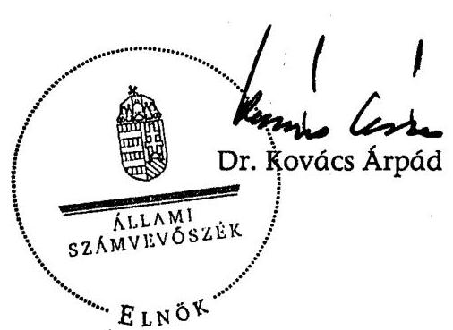

# JELENTÉS 

a 2006. évi országgyűlési választásra fordított pénzeszközök elszámolásának ellenőrzéséről a jelölő szervezeteknél és a független jelölteknél

---

3. Önkormányzati és Területi Ellenőrzési Igazgatóság
3.1. Szabályszerűségi Ellenőrzési Főcsoport
Iktatószám: V-1004-039/2007.
Témaszám: 848
Vizsgálat-azonosító szám: V-0341
Az ellenőrzést felügyelte:
Dr. Lóránt Zoltán
főigazgató
Az ellenőrzés végrehajtásáért felelős:
Dr. Elek János
általános főigazgató-helyettes
Az ellenőrzést vezette:
Horváth Balázs
főcsoportfőnök-helyettes
Az összefoglaló jelentést készítette:
Szakmányné Bilik Mária
számvevő
Az ellenőrzést végezték:
Szakmányné Bilik Mária Szendrey Lajos
számvevő
A témához kapcsolódó eddig készített számvevőszéki jelentések:
címe
sorszáma
Jelentés az 1998. évi országgyűlési választásra fordított pénzeszközök elszámolásának ellenőrzéséről a jelölő szervezeteknél és a független jelölteknél
Jelentés az 1999. októberi és a 2000. áprilisi időközi országgyűlési 039
választási kampányokra a jelölő szervezetek és független jelöltek által fordított pénzeszközök ellenőrzéséről
Jelentés a 2001. évi időközi országgyűlési választási kampányra a 0135
jelölő szervezetek által fordított pénzeszközök ellenőrzéséről
Jelentés a 2002. évi országgyűlési választásra fordított pénzeszközök elszámolásának ellenőrzéséről a jelölő szervezeteknél és a független jelölteknél
Jelentés a 2004-2005. évi időközi országgyűlési választási kampányra a jelölő szervezetek által fordított pénzeszközök ellenőrzéséről

---

# TARTALOMJEGYZÉK 

BEVEZETÉS ..... 3
I. ÖSSZEGZŐ MEGÁLLAPÍTÁSOK, KÖVETKEZTETÉSEK, JAVASLATOK ..... 7
II. RÉSZLETES MEGÁLLAPÍTÁSOK ..... 9

1. A beszámoló közzététele és tartalma ..... 9
2. A választásokkal kapcsolatos speciális nyilvántartási és gazdálkodási teendők szabályozása, a választási bevételek és kiadások nyilvántartásban történő elkülönítése ..... 11
3. A választásra fordítható összeghatár és a párttörvényben meghatározott korlátozó előírások betartása ..... 13
4. A beszámolóban közzétett adatok bizonylati alátámasztottsága ..... 15

## MELLÉKLETEK

1. számú A Fidesz-Magyar Polgári Szövetség és a Kereszténydemokrata Néppárt által a 2006. évi országgyűlési képviselő-választásra fordított pénzeszközök forrásai és felhasználása
2. számú A Magyar Demokrata Fórum által a 2006. évi országgyűlési választásokra fordított pénzeszközök forrásai és felhasználása
3. számú Az MSZP 2006. évi országgyűlési képviselő-választás pénzügyi elszámolása
4. számú A SOMOGYÉRT Szövetség által a 2006. évi országgyűlési képviselőválasztásra fordított pénzeszközök forrásai és felhasználása
5. számú A Szabad Demokraták Szövetsége - a Magyar Liberális Párt által a 2006. évi országgyűlési képviselő-választásra fordított pénzeszközök forrásai és felhasználása

---

# RÖVIDÍTÉSEK JEGYZÉKE 

| ÁSZ | Állami Számvevőszék |
| :-- | :-- |
| Fidesz és KDNP jelölő | Fidesz-Magyar Polgári Szövetség és Kereszténydemokrata |
| szervezet | Néppárt jelölő szervezet |
| MDF | Magyar Demokrata Fórum |
| MSZP | Magyar Szocialista Párt |
| párttörvény | A pártok működéséről és gazdálkodásáról szóló - többször |
|  | módosított - 1989. évi XXXIII. törvény |
| OVB | Országos Választási Bizottság |
| SOMOGYÉRT | SOMOGYÉRT Szövetség |
| Számv. tv. | A számvitelről szóló - többször módosított - 2000. évi C. |
|  | törvény |
| SZDSZ | Szabad Demokraták Szövetsége - a Magyar Liberális Párt |
| Ve. | A választási eljárásról szóló - többször módosított - 1997. |
|  | évi C. törvény |

---

# JELENTÉS 

## a 2006. évi országgyűlési választásra fordított pénzeszközök elszámolásának ellenőrzéséről a jelölő szervezeteknél és független jelölteknél

## BEVEZETÉS

A választási eljárásról szóló - többször módosított - 1997. évi C. törvény (a továbbiakban: Ve.) 92. § (3) bekezdésében kapott felhatalmazás alapján az országgyűlési képviselőválasztásra fordított állami és más pénzeszközök, anyagi támogatások felhasználásának ellenőrzése az Állami Számvevőszék (a továbbiakban: ÁSZ) feladata. A Ve. 92. § (3) bekezdésének előírása alapján „A választásra fordított állami és más pénzeszközök felhasználását az ÁSZ a választás második fordulóját követő egy éven belül az országgyűlési képviselethez jutott jelölő szervezetek és független jelöltek tekintetében hivatalból, egyéb jelölő szervezetek és független jelöltek tekintetében más jelölt, jelölő szervezet kérelmére ellenőrzi".

A 2006. évi országgyűlési választáson öt jelölő szervezet, ebből hat párt jelöltjei jutottak képviselethez. Független jelölt nem szerzett mandátumot az Országgyűlésben. Két jelölt kérelmet nyújtott be az ÁSZ-hoz a Ve. 92. § (3) bekezdésben szabályozott határidőn belül, a Fidesz-Magyar Polgári Szövetség és a Kereszténydemokrata Néppárt jelölő szervezet (a továbbiakban: Fidesz és KDNP jelölő szervezet), valamint a Magyar Szocialista Párt egy-egy jelöltje kampányráfordításainak törvényben meghatározott mértékének túllépése miatt. Az ellenőrzésre hivatalból, az ÁSZ 2007. évi ellenőrzési terve alapján került sor, mivel a jelölő szervezetek jelöltjei mandátumot szereztek az országgyűlési általános választáson.

Az ÁSZ a 2006. évi országgyűlési választásokra fordított pénzeszközök felhasználásának ellenőrzését a Fidesz-Magyar Polgári Szövetség (a továbbiakban: Fidesz-MPSZ); a Magyar Demokrata Fórum (a továbbiakban: MDF); a Magyar Szocialista Párt (a továbbiakban: MSZP); a SOMOGYÉRT Szövetség (a továbbiakban: SOMOGYÉRT); a Szabad Demokraták Szövetsége - a Magyar Liberális Párt (a továbbiakban: SZDSZ) jelölő szervezeteknél hajtotta végre.

A Fidesz-MPSZ és a Kereszténydemokrata Néppárt - együttműködési megállapodás alapján - választási szövetség keretében közösen állított listát. A két párt kiegészítő megállapodásának megfelelően az országgyűlési képviselő-választás kampányszervezését, a kampányráfordítások finanszírozását, nyilvántartását, továbbá a kampányelszámolás közzétételét a Fidesz-MPSZ teljesítette. A Fidesz és KDNP jelölő szervezet további megállapodást kötött az MDF-fel két közös egyéni jelölt indítására, az előzőekben ismertetett finanszírozási és elszámolási feltételekkel.

---

Az MDF további két - képviselethez nem jutott - párttal állított egy-egy közös jelöltet, írásos megállapodást nem kötöttek. Az MSZP és az SZDSZ tíz közös jelöltet állított együttműködési megállapodás alapján, a finanszírozást és az elszámolást az MSZP teljesítette. A Ve. 49. § (2) bekezdésének rendelkezése szerint: „Ha több jelölő szervezet közösen állít jelöltet, a továbbiakban - a választás szempontjából - egy jelölő szervezetnek számítanak."

Az ellenőrzött időszak: a 2006. évi általános országgyűlési képviselő választási kampány - és elszámolási időszak.

Az ellenőrzés célja: annak megállapítása volt, hogy a 2006. évi országgyűlési képviselő-választáson mandátumhoz jutott jelölő szervezetek betartották-e a Ve. előírásait, ezen belül:

- a 92. § (2) bekezdése értelmében a választás második fordulóját követő 60 napon belül a Magyar Közlönyben nyilvánosságra hozták-e a választásra fordított állami és más pénzeszközök, anyagi támogatások összegét, forrását és felhasználásának módját;
- a 92. § (1) bekezdésében meghatározott költséghatárnak érvényt szereztek-e, amely szerint „a jelölő szervezetek a választásra a 91. §-ban foglalt költségvetési támogatáson felül jelöltenként legfeljebb egymillió forintot fordíthatnak".

Az ellenőrzés feltételeiről és körülményeiről szükséges rögzíteni, hogy a Ve. 1998 óta hatályos rendelkezései, valamint a párttörvény előírásai a harmadik országgyűlési választási ciklusra sem biztosították a feltételeket a választási kampánypénzek eredetének és felhasználásának teljes átláthatóságához. Így 1998 óta a választási elszámolások ellenőrzéséről kiadott jelentéseinkben jeleztük, hogy az ÁSZ nem tudja teljes mértékben betölteni a választási kampány átláthatóságával kapcsolatosan azt a szerepet, amelyet az alkotmányos szabályozás megkívánna, valamint külön részleteztük az ÁSZ hatásköri korlátait is ${ }^{1}$.

Rendszeresen felhívtuk a figyelmet továbbá arra, hogy a választási kampányra fordítható kiadások, ezek ellenőrzésére vonatkozó hatályos szabályok korrupciós kockázatot jelentenek, valamint nem segítik maradéktalanul a Ve. 3. §-ban rögzített alapelvek érvényesítését ${ }^{2}$.

Az ÁSZ jelzései ellenére olyan nézet vált általánossá, hogy a jogalkotási hiányosságok jogértelmezési, ellenőrzési eszközökkel kezelhetők, megoldhatók. Az ÁSZ-hoz folyamatosan, nagyszámban érkeztek a kampánypénzek túllépésével kapcsolatos bejelentések. A bejelentők olyan vizsgálatot igényelnek, amelyre az ÁSZ-nak nincs felhatalmazása, hatásköre. Számos tanulmány, újságcikk született a témában, amelyek nem a jogrendszeri megoldásokat szorgalmazták. Az

[^0]
[^0]:    ${ }^{1}$ A témához kapcsolódóan kiadott számvevőszéki jelentések sorszáma: 9916, 039, 0135, 0307, 0562.
    ${ }^{2}$ A témakör részletes kifejtése megtalálható „A korrupció elleni küzdelem a számvevőszéki közreműködés bemutatásán keresztül" című 2002. októberi keltű ÁSZ tanulmányban. A tanulmány olvasható az ÁSZ internetes honlapján.

---

ÁSZ egyértelmű álláspontja, hogy jogállami eszközökön túllépő megoldásokkal (informális adatgyűjtés, szóbeli információk alapján induló vizsgálódások, stb.) a kialakult anomáliákat, átláthatatlan helyzetet nem lehet és a jogállamiság érdekében nem szabad „kezelni".

Az ÁSZ visszatérően javasolta a Kormánynak, hogy kezdeményezze az Országgyűlésnél a Ve. oly módon való módosítását, amely biztosítja a kampányfinanszírozás átláthatóságát, ellenőrizhetőségét és egyértelműen meghatározza:

- a választási költségek elszámolása szempontjából mely időszak, illetve tevékenység forrásait és ráfordításait kell figyelembe venni;
- a jelöltek száma alapján, normatív módon juttatott állami támogatás felhasználása tekintetében mi a dologi költségek fogalma, a felhasználás elszámolásának formája, tartalma és kifizetőhelye;
- a választási költségek forrásai körében az egyéb anyagi támogatások között milyen formában nyújtott és kiktől származó juttatásokat kell figyelembe venni;
- milyen legyen az országgyűlési választásra fordított állami és más pénzeszközök, anyagi támogatások összegét, forrását és a felhasználás módját bemutató, a Magyar Közlönyben megjelentetett választási beszámoló formája és részletes tartalma;
- hogyan történjen az egyéni jelöltek választási költségei és azok forrásai ellenőrizhetőbb nyilvántartási kötelezettségének érvényesítése;
- mennyi legyen a költségvetési támogatáson felüli egy jelöltre átlagosan fordítható kiadás reális értékhatára;
- milyen tartalmú írásos megállapodást kössenek a közös jelöltet állító szervezetek a kampányfinanszírozásra, a nyilvántartásra és az elszámolásra vonatkozóan;
- milyen szankciókkal járjon a határidős elszámolási és beszámolási kötelezettségek elmulasztása.

Annak ellenére, hogy a javaslatokról, a megoldási lehetőségekről az ÁSZ többszöri egyeztetéseket folytatott a jogalkotó szervezetekkel - amelyek azokat elfogadták, illetve a jogszabályi tervezeteknél figyelembe vették - a mai napig nem született döntés politikai konszenzus hiányában a kérdés rendezésére. A Kormány a 2006. évi országgyűlési képviselő-választást követően a pártok működéséről és gazdálkodásáról szóló 1989. évi XXXIII. törvény és a választási eljárásról szóló 1997. évi C. törvény, valamint ezzel összefüggésben egyes más törvények módosításáról a T/237. számon az Országgyűlés elé terjesztette törvényjavaslatát. A tárgysorozatba vett törvényjavaslat elfogadására a mai napig nem került sor. Így az ÁSZ, mint jogalkalmazó szerv csak a jelenlegi jogszabályban biztosított keretek között végezhette ellenőrzését, kiterjesztő jogértelmezésre nem volt lehetősége, többletellenőrzési jogosítványokat nem alkalmazhatott.

---

Az ÁSZ-nak a jelen vizsgálatnál is tudomásul kellett vennie, - a témához kapcsolódóan kiadott jelentéseiben már jelzett gyakorlatot - hogy dokumentális ellenőrzést végezhet és csak azt veheti figyelembe kampányköltségként az elszámolásban, amit a jelölő szervezet annak minősít, továbbá amely az elszámolási határidőig megjelent a számviteli nyilvántartásaiban.

A Ve. a jelölő szervezetek számára továbbra is azt írja elő, hogy az állami támogatáson felüli kampányköltség nem haladhatja meg a jelöltenkénti legfeljebb egymillió forintot. Tekintettel arra, hogy ez a szabály sem változott, az ÁSZ az ellenőrzésénél az alábbiakat vette tudomásul:

- A jelöltenkénti egymillió forintos összeg a jelölő szervezet részére, a jelöltjeinek száma alapján felhasználható maximális keretet jelenti, így az jelöltenként csak átlagosan érthető. E szabályozás eredményeként az ÁSZ nem vizsgálhatja egy jelölő szervezeten belül az egyes jelöltek kampányára fordított költség alakulását.
- A jelölő szervezet tudtán kívül a jelölt érdekében és annak népszerűsítésére szolgáló, más által fizetett kampányköltségek nem tartoznak ebbe az összeghatárba, mivel ez a korlát csak a jelölő szervezetre vonatkozik, másra nem.

A pénzügyi szabályszerűségi ellenőrzést a 21/2004. számú Elnöki Utasítással kiadott, „A számvevőszéki ellenőrzés szakmai szabályai" című kézikönyv módszertani előírásai szerint készítettük elő és folytattuk le.

Az ellenőrzés módszere: A jelölő szervezetek által rendelkezésre bocsátott iratok és a Magyar Közlönyben közzétett választási beszámolók tartalmi összevetésével, valamint az alkalmazott eljárások és a jogszabályi követelmények egybevetésével történt.

A helyszíni ellenőrzés:
 2007. február 23. – április 18. között a jelölő szervezetek központjában történt.

---

# I. ÖSSZEGZŐ MEGÁLLAPÍTÁSOK, KÖVETKEZTETÉSEK, JAVASLATOK 

A hivatalból ellenőrzött jelölő szervezetek törvényes határidőben teljesítették beszámolási kötelezettségüket az országgyűlési képviselő-választással kapcsolatos forrásokról és ráfordításokról. A Fidesz és KDNP jelölő szervezet a 2006. évi országgyűlési képviselő-választásról szóló elszámolását a Magyar Közlöny 2006. évi 75., az MDF a 2006. évi 74., az MSZP a 75., a SOMOGYÉRT a 73., az SZDSZ pedig a 75. számában, a törvény által előírt határidőben hozta nyilvánosságra.

A közzétett beszámolókat megalapozó számviteli nyilvántartásokban a választásra fordított pénzeszközök forrásainak jogcímeiről, egy jelölő szervezet kivételével az ellenőrzött szervezetek nem vezettek a beszámoló jogcímek szerint elkülönített nyilvántartást. A Fidesz és KDNP jelölő szervezet a kampány célú bevételeket és kiadásokat ún. kampányszámlán keresztül vezette, azokat ezzel a működéssel összefüggő pénzforgalomtól elkülönítette. Az SZDSZ egy 2006. évi országgyűlési választással kapcsolatos előleg számlát hibásan számolt el 2005-ben ráfordításként, így az országgyűlési választásokkal kapcsolatos ráfordítások főkönyvének 2006. évi egyenlege alacsonyabb volt a beszámolóban megjelent összegtől. A hiba mértéke a beszámoló főösszegére vetítve kevesebb, mint fél ezrelék. Az MDF 371 fő jelölt helyett 680, az SZDSZ 376 fő helyett 380 fővel tette közzé jelöltjeinek számát, ennek ellenére a jelöltekre felhasznált kampányráfordításokat nem lépték túl a nyilvántartásuk és a beszámolójuk szerint.

A jelöltarányos költségvetési támogatást a jelölő szervezetek szabályszerűen, dologi kiadásokra használták fel, arról határidőben, számlamásolatokkal elszámoltak a Belügyminisztérium felé.

Belső szabályozást vagy utasítást léptettek hatályba a választásokkal kapcsolatos speciális nyilvántartási és gazdálkodási teendők ellátásához a helyszínen ellenőrzött jelölő szervezetek. Ezek az előírások a jelölő szervezeten belül egységesen, azonban egymástól eltérően, továbbá nem teljes körűen szabályozták – a törvényben nem definiált – kampányköltség és kampányidőszak fogalmát; a kampányelszámolás, valamint a források és ráfordítások elkülönítésének feladatait. Az előírások a gyakorlatban érvényesültek, illetve a hiányos szabályozás ellenére biztosították a kampánybevételek és ráfordítások fő jogcímeinek elkülönítését.

Az ÁSZ ellenőrzési hatásköre a hiányos jogszabályi háttér miatt korlátozott, ellenőrzési jogosultsága csak a jelölő szervezetek elszámolásainak ellenőrzésére terjed ki. A törvény hiányosságai fenntartják a választások finanszírozásának átláthatatlanságát és korrupciós kapcsolatoknak adnak teret. A kampányráfordítások nyilvánosságát, a magánszektor támogató szerepének megismerését korlátozza az a jogszabályi hiányosság, miszerint a kampány célú reklámok, plakátok kiadóit nem terheli sem az OVB felé, sem a jelölő szervezet felé bejelentési kötelezettség, a finanszírozók, a megjelentetett példányszámok, a reklámanyagok mérete és értéke tekintetében.

---

Mind a közvélemény, mind pedig az ellenőrzést végző ÁSZ számára is ismeretlenek maradnak az utcán és médiában megjelent hirdetések finanszírozására vonatkozó információk, amennyiben azok nem jelennek meg a jelölő szervezet nyilvántartásában. Mindezek megerősítik a Ve. módosításának szükségességét.

A szankció nélkül felhasználható keretösszeget a rendelkezésre bocsátott dokumentációk szerint, az ellenőrzött jelölő szervezetek nem lépték túl, annál kevesebbet költöttek. A Fidesz és KDNP, valamint az MSZP egy-egy jelöltje kampányráfordításai törvényben meghatározott mértékének túllépése miatti bejelentést a jelölő szervezeteknél a Ve-ben biztosított ellenőrzési hatásköri jogosultság alapján kivizsgáltuk. A gazdálkodási dokumentumok alapján megállapítottuk, a Fidesz-MPSZ, mint kampányfinanszírozó – a beadványban kifogásolt – újságokkal, hirdetési lapokkal megrendelőként és szolgáltatás igénybevevőként nem állt kapcsolatban, számviteli nyilvántartásaiban nem szerepeltek. A kampányfinanszírozás központilag történt, a kampányra a képviselőjelöltek, illetve a területi koordinációs irodák nem fordítottak saját pénzeszközöket. Az MSZP-nél a belső előírásnak megfelelően a kampányfinanszírozás több szinten történt. Az Országos Központ 312 481 ezer Ft, a területi szervek összesen 88 263 ezer Ft választási kiadást számoltak el, ebből a kifogásolt képviselőjelöltre helyi szinten 185 ezer Ft összeget fordítottak. A bejelentésben szereplő mindkét jelölő szervezet betartotta – a választással kapcsolatos nyilvántartásai és dokumentációi szerint – a törvényes keretösszeget.

A nyilvántartott kampánybevételek és költségek bizonylatolása – két szervezetnél feltárt hiba kivételével – megfelelt a számviteli törvényben és belső előírásokban meghatározott alaki és tartalmi követelményeknek. A bevételek utalványozását és az ellenőrzés dokumentálását az MSZP jelölő szervezet hiányosan teljesítette, a számvevői jelentésre adott észrevételben a hibák kijavításának intézkedéséről adott tájékoztatást. A SOMOGYÉRT jelölő szervezetnél a belső előírásban rögzített összeférhetetlenség követelményét sértette, hogy az egyetlen adománybevételnél a pénztári bevételi bizonylaton befizetőként és utalványozóként ugyanaz a személy aláírása szerepelt.

A párttörvényben rögzített forrásszerzést korlátozó előírásokat a jelölő szervezetek nyilvántartásai szerint a beszámolóban feltüntetett országgyűlési képviselő-választásra fordított összeg forrásai vonatkozásában – egy eset kivételével – betartották. A Fidesz és KDNP jelölő szervezet a bevételei között elszámolt háromezer forint összegű névtelen adomány kétszeresét a helyszíni ellenőrzés időszakában befizette a központi költségvetésbe.

A helyszíni ellenőrzés megállapításainak hasznosítása mellett javasoljuk

# a Kormánynak 

Ismételten kezdeményezze a választási eljárásról szóló törvény módosítását – figyelemmel az Állami Számvevőszék korábbi jelentéseiben megfogalmazott javaslataira is – annak érdekében, hogy a választási kampány finanszírozása átlátható, ellenőrizhető legyen.

---

# II. RÉSZLETES MEGÁLLAPÍTÁSOK 

## 1. A beszámoló közzététele és tartalma

A Ve. 92. § (2) bekezdés előírása szerint minden jelölő szervezetnek és független jelöltnek a választás második fordulóját követő 60 napon belül a Magyar Közlönyben nyilvánosságra kell hoznia a választásra fordított állami és más pénzeszközök, anyagi támogatások összegét, forrását és felhasználásának módját.

Figyelemmel arra, hogy a Ve. a nyilvánosságra hozandó beszámoló tartalmát, részletezettségét nem szabályozta, az OVB a Választási füzetek 1998. évi 44. száma függelékében az ÁSZ ajánlását tette közzé. Jelezni szükséges, hogy a nyilvánosságra hozatali kötelezettség elmulasztását a törvény nem szankcionálja, így annak elmulasztása vagy késedelmes teljesítése esetén intézkedésre nincs lehetőség.

## A jelölő szervezetek határidőben eleget tettek közzétételi kötelezettségüknek:

- a Fidesz és KDNP jelölő szervezet a Magyar Közlöny 2006. június 22-i, 75. számában;
- az MDF a Magyar Közlöny 2006. évi június 21-i, 74. számában;
- az MSZP a Magyar Közlöny 2006. június 22-i, 75. számában;
- a SOMOGYÉRT a Magyar Közlöny 2006. évi június 19-i, 73. számában;
- az SZDSZ a Magyar Közlöny 2006. évi június 22-i, 75. számában
tette közzé kampányelszámolását (1-5. számú melléklet).
A nyilvánosságra hozott beszámolók szerkezete, tartalma a kiemelt jogcímek vonatkozásában, összhangban volt az ÁSZ ajánlásával. Az MSZP az egyes ráfordítási jogcímeket a számlarend számlacsoportjainak megfelelően tovább részletezte, az SZDSZ a rendezvények kiadásait külön soron mutatta be.
- A Fidesz és KDNP jelölő szervezet közzétett beszámolójában az egyes kiadási jogcímek nyilvánosságra hozott adata megegyezett a nyilvántartott ráfordításokkal, ugyanakkor az országgyűlési képviselő-választásra fordított összes ráfordítás sort, a könyvekben rögzített 400 586 ezer Ft helyett, tévesen 400 755 ezer Ft összegben közölték. Ez utóbbi, a források összegével volt azonos. A könyvelésben 400 755 ezer Ft kampány célú bevételt és 400 586 ezer Ft kampány ráfordítást tartottak nyilván az országgyűlési képviselő-választásokkal kapcsolatosan.
- Az MDF a nyilvánosságra hozott beszámolóban hibásan, 680 fő jelöltet közölt, a Ve. 91. § (2) bekezdésben előírt számítási mód alapján figyelembe vehető 371 fő jelölttel szemben. A beszámoló összeállításánál betartották a speciális törvényi és belső előírásokat.

- Az MSZP, a SOMOGYÉRT a választásokra fordított pénzeszközök, anyagi támogatások összegéről, forrásáról és azok felhasználásának módjáról nyilvánosságra hozott beszámolója megegyezett a könyvvezetésben rögzített adatokkal. A beszámolók összeállításánál betartották a sajátos törvényi és belső előírásokat.
- Az SZDSZ nyilvánosságra hozott beszámolójában a 3. 2. Jogcímek szerinti felhasználás összegeként kimutatott 363 597 ezer Ft sorból, az országgyűlési választásokkal kapcsolatos költségek főkönyvi számla 2006. év végi egyenlege 363 479 ezer Ft-ot támasztott alá, így a beszámoló sor nem egyezett meg a 2006. évre vonatkozó könyvvezetésben rögzített adatokkal. A 118 ezer Ft különbözet, 2005. évben hibásan került előleg számla alapján – egyéb követelés helyett – költségszámlán könyvelésre. Az előleget 2005-ben kifizették, a szolgáltatás teljesítésére a jogszabályban rögzített kampányidőszakban került sor.

A hibás könyvelés alapján a ráfordítást ugyanakkor nem vezették át az aktív időbeli elhatárolások közé. A könyvvezetésben sérült a számvitelről szóló – többször módosított – 2000. évi C. törvény (a továbbiakban: Számv. tv.) 15. § (3) bekezdésében szabályozott valódiság számviteli alapelv. A beszámolóban hibásan, 380 fő jelöltet közöltek a Ve. 91. § (2) bekezdésben előírt számítási mód alapján figyelembe vehető 376 fő jelölttel szemben.

A Ve. nem szabályozta a kampányráfordítások fogalmát, így jelölő szervezetenként, a belső szabályozástól függően, különböző költségfajták elszámolására került sor.

A ráfordítások jellemzően a plakátok, szórólapok, kampányfilmek gyártása, a különböző médiákban megjelent hirdetések, címlista vásárlása, postai szolgáltatás igénybevétele, reklámhordozók kihelyezéséhez szükséges anyagok vásárlása, terület- és terembérlet, dekorációs anyagok vásárlása, hangtechnikai szolgáltatás igénybevétele, továbbá egészségügyi és biztonsági szolgáltatás díjának megfizetése érdekében merültek fel.

Előfordult telefonköltség, valamint a megnövekedett másolási igény miatt másolópapír, nyomtatványköltség elszámolás is.

A jelölő szervezetek a teljesítés időpontja tekintetében betartották a választásra fordított állami és más pénzeszközök felhasználása során a Ve. 40. § (1) bekezdésben meghatározott kampányidőszakot.

A Ve. nem ad eligazítást arra vonatkozóan, hogy a kampányidőszakban felmerült kampányráfordításokra vonatkozó kötelezettségvállalásnak, a termék, szolgáltatás igénybevételének, illetve pénzügyi teljesítésnek együttesen kell, illetve elegendő-e a fizikai teljesítésnek a Ve-ben szabályozott kampányidőszakra esni.

A jelöltarányos költségvetési támogatás egy főre jutó összege a 137/2006. (III. 31.) OVB határozat alapján 38 226 Ft volt.

---

Az alábbi tábla mutatja a jelölő szervezetek – a Ve. 91. § (2) bekezdés szerint számított – jelöltjeinek számát, a jelöltarányos állami támogatás összegét és elszámolási kötelezettség teljesítésének időpontját:

| Jelölő szer-   vezet | Támogatott jelöl-   tek száma fő | Kiutalt jelöltará-   nyos központi költs-   ségvetési támogatás   Ft | Elszámolás idő-   pontja |
| :-- | :--: | :--: | :--: |
| Fidesz és   KDNP | 386 | 14 755 236 | 2006. május 18. |
| MDF | 371 | 14 181 846 | 2006. május 23. |
| MSZP | 386 | 14 755 236 | 2006. május 18. |
| SOMOGYÉRT | 1 | 38 226 | 2006. május 20. |
| SZDSZ | 376 | 14 372 976 | 2006. május 15. |

A jelölő szervezetek a jelöltarányos költségvetési támogatás összegének felhasználásáról a Ve. 91. § (4) bekezdésben előírt, választásokat követő 30 napos elszámolási határidőben teljesítették elszámolási kötelezettségüket. Ennek számlamásolatok és összesítő jegyzék megküldésével tettek eleget. A támogatás teljes összegét felhasználták, azokat szabályszerűen dologi kiadásokra fordították. Az elszámolást a Belügyminisztérium részére küldték meg a jelzett időpontban.

# 2. A VÁLASZTÁSOKKAL KAPCSOLATOS SPECIÁLIS NYILVÁNTARTÁSI ÉS GAZDÁLKODÁSI TEENDŐK SZABÁLYOZÁSA, A VÁLASZTÁSI BEVÉTELEK ÉS KIADÁSOK NYILVÁNTARTÁSBAN TÖRTÉNŐ ELKÜLÖNÍTÉSE 

A Ve. nem szabályozta a választási kampány forrásai és ráfordításai elkülönítésének módját. A Számv. tv. 161/A. § (2) bekezdés a közpénzek felhasználásával, nyilvánosságával, ellenőrzésével összefüggésben azok forrásának és felhasználásának elkülönítését írja elő. Ennek módja, tartalma a jelölő szervezetek belső szabályozásától függően eltérő volt.

Az ellenőrzött jelölő szervezetek a választási kampányt megelőzően gondoskodtak a választásokkal kapcsolatos speciális nyilvántartási és gazdálkodási feladatok szabályozásáról egy vagy több dokumentumban. Részletezettségük, tartalmuk eltérő volt,
 az adott jelölő szervezet a sajátosságaitól és kampánnyal kapcsolatos stratégiájától függően.

- A Fidesz-MPSZ számviteli politikáját és a pénzügyi szabályzatát kiegészítette a 2006. évi országgyűlési képviselő-választásra vonatkozó kampány mellékletével, amelyekben meghatározták a kampányköltség fogalmát, rögzítették a kizárólagos központi kampányfinanszírozást, az elkülönített bankszámla alkalmazását. A kampánnyal kapcsolatos gazdálkodási jogkörökre a kampányfőnök és helyettese, valamint a gazdasági igazgató kaptak felhatalmazást. A jelöltek nyilatkozatot írtak alá arra vonatkozóan, hogy a központilag finanszírozott egymillió forintos kampányköltséget nem lépik túl, támogatást a párttörvény előírásai szerint fogadnak el, továbbá kötelezettséget vál-

---

laltak ezek megsértése esetén a pénzügyi szankcióként kiszabott befizetési kötelezettség teljesítésére.

A Fidesz és KDNP jelölő szervezet elkülönített bankszámlán, kampányszámlán keresztül bonyolította a választási bevételeket és kiadásokat. Ezzel, valamint az elsődleges költségnem elszámolás mellett, a 6. számlaosztályban (gyűjtőn) nyilvántartott költségekkel teljes körűen biztosította a kampánycélú bevételek és kiadások forgalmának elkülönítését.

# A többi ellenőrzött jelölő szervezet a párt működésével kapcsolatos bankszámlát használta a kampány pénzforgalmának elszámolására. 

- Az MDF a választásokkal kapcsolatos speciális nyilvántartási és gazdálkodási teendőket hiányosan szabályozta. A Számv. tv. alapján kiadott számviteli politika, pénzkezelési szabályzat és számlarend nem tartalmazott a vonatkozó törvényi szabályozáshoz igazodó sajátos rendelkezéseket. A szabályozási hiányosságot részben pótolta a választási kampányt megelőzően kiadott igazgatói utasítás. Ebben meghatározták a kampánystáb összetételét, működését, a finanszírozás törvényes forrásait, a normatív költségvetési támogatás dologi költségekre való felhasználhatóságát, a források és felhasználásuk Magyar Közlönyben történő nyilvánosságra hozatalát. Általánosságban rögzítették a választási kampányra jelöltenként fordítható egymillió Ft összeg betartásának követelményét. Nem szabályozták a választási kampányt megtestesítő összetevőket, a kampányidőszak pontos terjedelmét, a költségvetési támogatás és annak felhasználásának ellenőrzési követelményével összefüggő Számv. tv. 161/A. § (2) bekezdése szerinti elkülönítésének módját.

Az MDF a számviteli szabályozás hiánya ellenére biztosította a beszámoló jogcímek szerinti megfeleltethetőségét. A választásokkal kapcsolatos források közül a költségvetési támogatás, az adományok tekintetében az egyértelmű elkülönítést külön főkönyvi számlán biztosították, a költségek elkülönítése az általánosan használt főkönyvhöz kapcsolódó gyűjtőkóddal valósult meg.

- Az MSZP hatályos számlarendjében rögzítette az országgyűlési képviselő választással kapcsolatos kampánykiadás fogalmát, mely szerint minden olyan kiadás, amely az MSZP és a képviselőjelölt megismertetésével, népszerűsítésével, programjának ismertetésével kapcsolatosan felmerül. Két külön kódszámot jelöltek ki az állami támogatást, valamint az egyéb forrásokat terhelő országgyűlési képviselő-választás költségei elszámolására. Az egyéb források összetevőinek elkülönítését nem szabályozták. Előírták az Országos Központ, valamint a budapesti és megyei területi szervezetek választásokra fordítható, megyénként eltérő keretösszegeit. A kampánykiadások elszámolását az illetékes kampányfőnök teljesítésigazolásával és a választókerületi jelölt nevének, a felhasznált összeg hovatartozásának feltüntetésével záradékolt számlák alapján engedélyezték.

Az MSZP belső előírásának megfelelően különítette el a kampányra fordított pénzeszközök felhasználását és azok forrásait. A kialakított nyilvántartási rendben biztosították a beszámolósorok egyeztethetőségét.

---

- A SOMOGYÉRT az alapszabályban nevesítette a választás finanszírozásának törvényes forrásait. A választási pénzeszközök nyilvántartásokban történő elkülönítését a Számv. tv. alapján kiadásra került számviteli politikában szabályozták. Nem szabályozták a kampány összetevőit, a pénzfelhasználás korlátait, a kampányidőszak pontos terjedelmét. A jelölő szervezet sajátossága, hogy politikai szervezetként az országgyűlési képviselőválasztásra koncentrálva, minden gazdasági művelet egyetlen jelöltjének választási kampányával függött össze, így a választásokkal kapcsolatos kiadások és bevételek nyilvántartásban történő elkülönítését főkönyvi számlákon biztosította.
- Az SZDSZ-nél belső előírásban meghatározták a kampányidőszak terjedelmét, a választási kampány fogalmát, a költségvetési támogatás felhasználásának korlátait, a nyilvánosságra hozatal követelményét, a kampányra fordítható maximális összeget, a képviselőjelöltek kampánnyal kapcsolatos pénzügyi feladatait, valamint a párttörvény szerinti lehetséges bevételeket, az elszámolás határidejét, a költségtérítéseket. Nem szabályozták a nyilvánosságra hozandó beszámoló tartalmát, a kampány kiadásainak, bevételeinek elkülönítési módját.

A választási kampányköltségek nyilvántartására a hatályos számlarend szerinti országgyűlési választással kapcsolatos költségek főkönyvi számlát alkalmazták. Kiegészítésként analitikus nyilvántartást vezettek, amelyből megállapítható volt, hogy azok anyagköltség, szolgáltatás vagy egyéb költség címén merültek-e fel. A választásokkal kapcsolatosan kapott bevételek elkülönített nyilvántartása a költségvetési támogatás és választási célra biztosított adomány vonatkozásában megvalósult, az egyéb forrásokon belül a saját forrás elkülönítését nem biztosították.

# 3. A választásra fordítható összeghatár és a párttörvényben meghatározott korlátozó előírások betartása 

A Ve. 92. § (1) bekezdése szerint "a jelölő szervezetek a választásra a 91. §-ban foglalt költségvetési támogatáson felül jelöltenként legfeljebb egymillió forintot fordíthatnak. A figyelembe vehető jelöltek számát a 91. § (2) bekezdése szerint kell megállapítani." A jelölő szervezetek által állított jelöltek számát és a felhasználható keretösszeghez képest közölt pénzfelhasználást a következő kimutatás szemlélteti:

| Jelölő szerve-   zet | Jelöltek szá-   ma | Felhasználható   keretösszeg*   ezer Ft | Összes rá-   fordítás   ezer Ft | Eltérés a   keretösszeg-   től ezer Ft |
| :-- | :--: | :--: | :--: | :--: |
| Fidesz - KDNP | 386 | 400755 | 400586 | -169 |
| MDF | 371 | 385182 | 305963 | -79219 |
| MSZP | 386 | 400755 | 400744 | -11 |
| SOMOGYÉRT | 1 | 1038 | 961 | -77 |
| SZDSZ | 376 | 390373 | 363597 | -26776 |

*keretösszeg = jelölt arányos költségvetési támogatás + (jelöltek száma x egymillió forint)

---

A Ve. 49. § (2) bekezdés szabályai szerint a Fidesz-MPSZ és a KDNP a választás szempontjából - egy jelölő szervezetnek számítottak, így együttesen fordíthattak 386 millió Ft-ot kampánycélokra a jelöltarányos költségvetési támogatáson felül.

A kimutatás alapján az állapítható meg, hogy a jelölő szervezetek számviteli nyilvántartásaik tanúsága szerint nem lépték túl a jelöltenként szankció nélkül választásra fordítható egymillió forint összeghatárt, attól kevesebbet költöttek. Az ellenőrzött jelölő szervezeteknél a kampány célú pénzfelhasználás, a Ve. 92. § (1) bekezdésének előírása szerinti törvényes kereteken belül maradt.

Az ÁSZ ellenőrzési hatásköre a hiányos jogszabályi háttér miatt korlátozott, ellenőrzési jogosultsága csak a jelölő szervezetek kampány elszámolásainak ellenőrzésére terjed ki. A kampányráfordítások nyilvánosságát, a magánszektor támogató szerepének megismerését korlátozza az a jogszabályi hiányosság, miszerint a kampány célú reklámok, plakátok kiadóit nem terheli az OVB felé bejelentési kötelezettség, a finanszírozók, a megjelentetett példányszámok, a reklámanyagok mérete és értéke tekintetében. Ennek következtében az utcán, médiumokban megjelent hirdetések finanszírozására vonatkozó információk a közvélemény és az ellenőrzést végző ÁSZ részére ismeretlenek maradnak, amennyiben nem jelennek meg a jelölő szervezet nyilvántartásában.

Az ÁSZ-hoz ellenőrzés iránti kérelemmel két képviselőjelölt fordult a Ve. 92. § (3) bekezdésében rögzített határidőn belül, dr. Lázár János, Csongrád megye 6. számú választókerületi Fidesz és KDNP képviselőjelölttel, valamint dr. Vadai Ágnes Jász-Nagykun-Szolnok megye 8. számú választókerületi MSZP-s képviselőjelölttel kapcsolatos kampányráfordítások törvényben meghatározott túllépése miatt.

- A Fidesz és KDNP jelölő szervezetnél a rendelkezésre álló dokumentumok alapján a kampányfinanszírozás központilag történt, a kampányra a képviselőjelöltek, illetve a területi koordinációs irodák nem fordítottak saját pénzeszközöket. A jelölő szervezet kampányráfordításait tételesen ellenőriztük. A nyilvántartások szerint a Fidesz és KDNP jelölő szervezet nem lépte túl a felhasználható keretösszeget. A gazdálkodási dokumentumok szerint a Fidesz-MPSZ, mint kampányfinanszírozó - a beadványban kifogásolt - Hódmezővásárhelyi Szuperinfóval, a Délvilág című lappal, valamint a Vásárhelyi riport helyi újsággal megrendelőként és szolgáltatás igénybevevőként nem állt kapcsolatban. A jelölő szervezet szállítói nyilvántartásában, illetve a pénztári kifizetések között az előző szolgáltatók számlái nem szerepeltek a kampányidőszakban, a gazdasági igazgató nyilatkozata szerint a 2006. év más hónapjaiban sem fordultak elő.
- Az MSZP-nél a rendelkezésre álló dokumentumok, a könyvvezetés adatai és bizonylatai alapján a belső előírásnak megfelelően a kampányfinanszírozás több szinten történt. Az Országos Központ 312481 ezer Ft, a területi szervek összesen 88263 ezer Ft választási kiadást számoltak el szabályszerű bizonylatok alapján, figyelemmel a belső utasításban rögzített keretösszegekre. A bejelentés kivizsgálása érdekében Jász-Nagykun-Szolnok megye elszámolt kampányráfordításait tételesen ellenőriztük. A rendelkezésre bocsátott bi-

---

zonylatok és nyilvántartások szerint Jász-Nagykun-Szolnok megye az országgyűlési képviselő-választásra fordított kiadása 3923 ezer Ft volt, ezen belül dr. Vadai Ágnes képviselőjelöltre 185 ezer Ft összeget fordítottak. A megyei szövetségnél a képviselőjelölt népszerűsítésére felmerült kampányráfordítás a Karcagi Hírmondóban és Karcagi Szuperinfóban megjelent hirdetések, valamint Tiszafüreden és Karcagon igénybevett termek bérleti díját jelentette. Az ellenőrzés részére átadott gazdálkodási dokumentumok és a 2006. évi országgyűlési képviselő-választásra fordított pénzeszközök nyilvántartása szerint a jelölő szervezet nem lépte túl a szankció nélkül felhasználható 400755 ezer Ft keretösszeget, ennél 11 ezer Ft-tal kevesebbet használtak fel.

A párttörvény 4. § (2) és (3) bekezdése értelemszerúen a választási kampányra vonatkozóan is korlátokat határoz meg a pártok részére a vagyoni hozzájárulások, adományok elfogadhatóságát illetően.
„(2) A párt részére - a 4. § (1) bekezdésében foglalt kivételektől eltekintve - költségvetési szerv, továbbá állami vállalat, állami részvétellel működő gazdasági társaság, közvetlen költségvetési támogatásban, vagy költségvetési szervi támogatásban részesülő alapítvány vagyoni hozzájárulást nem adhat, a párt költségvetési szervtől, továbbá állami vállalattól, állami részvétellel működő gazdasági társaságtól, közvetlen költségvetési támogatásban, vagy költségvetési szervi támogatásban részesülő alapítványtól vagyoni hozzájárulást nem fogadhat el."
„(3) A párt vagyoni hozzájárulást más államtól nem fogadhat el. A párt névtelen adományt nem fogadhat el; az ilyen adományt be kell fizetni a 8. § (1) bekezdésében említett alapítvány céljaira."

A jelölő szervezetek által rendelkezésre bocsátott nyilvántartások és bizonylatok vizsgálata alapján - egy szervezet kivételével - nem merült fel adat arra vonatkozóan, hogy figyelmen kívül hagyták volna a hivatkozott előírásokat. A Fidesz-MPSZ nyilvántartása szerint háromezer forint névtelen - postai úton befizetett - támogatást elszámolt a bevételek között, a párttörvény 4. § (3) bekezdés előírása ellenére. A Fidesz-MPSZ az ellenőrzés jelzésére, a helyszíni ellenőrzés időszakában a névtelen adomány kétszeresét befizette a központi költségvetésbe.

# 4. A beszámolóban közzétett adatok bizonylati alátámasztottsága 

Az ellenőrzött jelölő szervezeteknél a nyilvántartott kampányköltségeket bizonylatok támasztották alá, tartalmuk szerint a könyvelt gazdasági eseményt igazolták. A könyvelési adatok alapján az alapbizonylatok visszakereshetők voltak. A gazdálkodási jogköröket a SOMOGYÉRT kivételével szabályszerűen gyakorolták.

- A Fidesz és KDNP jelölőszervezetnél a kampányhoz kapcsolódó gazdasági tranzakciók szabályszerű szerződések alapján bonyolódtak, hozzájuk a Számv. tv. követelményeinek megfelelő bizonylatok kapcsolódtak.

---

- Az MDF és az SZDSZ jelölő szervezeteknél a könyvviteli elszámolást közvetlenül alátámasztó bizonylatokra - a Számv. tv. 167. § c. pontjában - előírt általános alaki és tartalmi kellékek tekintetében a gazdasági műveletet elrendelő, az utalványozó és a rendelkezés végrehajtását igazoló személy aláírásának hiánya a megyei elszámolásoknál, a vizsgált bizonylatok kevesebb, mint fél-fél százalékában fordult elő.
- Az MSZP-nél a Számv. tv. 167. § (1) bekezdés c) pont előírását nem tartották be, mivel hiányzott az ellenőrzést végzők aláírása a kiadási bizonylatok 53,8%-áról, továbbá a bevételek 48,6%-át nem utalványozták. Az MSZP a számvevői jelentésre küldött észrevételében jelezte a hiba kijavítására tett intézkedését.
- A SOMOGYÉRT jelölő szervezetnél a pénz- és
 értékkezelési szabályzatban foglalt összeférhetetlenséget sértette, hogy pénztári bevételi bizonylaton a befizetőként és utalványozóként ugyanaz a személy aláírása szerepelt. A választási célra kapott adomány az országgyűlési képviselő jelölttől, mint magánszemélytől származó befizetésként teljesült.

A jelölő szervezetek közül a 2006. évi országgyűlési képviselő-választás forrásairól és kampányköltségeiről szóló előterjesztést egyedül a Fidesz-MPSZ Számvizsgáló Bizottsága tárgyalta és fogadta el.

Budapest, 2007. július " 16 "

Melléklet: $\quad 5 \mathrm{db}$

---

# VI. rész 

## KÖZLEMÉNYEK, HIRDETMÉNYEK

## A Fidesz - Magyar Polgári Szövetség és a Kereszténydemokrata Néppárt által a 2006. évi országgyűlési képviselő-választásra fordított pénzeszközök forrásai és felhasználása

Ezer forint

1. A jelölt szervezet neve: Fidesz - Magyar Polgári Szövetség, Kereszténydemokrata Néppárt
2. A jelölő szervezet által állított jelöltek száma: 386 fő
3. Az országgyűlési képviselő-választásra fordított összeg

400755
3.1. Forrásai összesen

400755
3.1.1. Állami költségvetési támogatás

14755
3.1.2. Egyéb források

386000
ebből:

- választási célra kapott adományok

123074

- hitel és engedményezés

262926

- saját források
3.2. Jogcímek szerinti felhasználás összege
3.2.1. Az állami költségvetési támogatás terhére

14755
ebből:

- anyagjellegű ráfordítás
- nem anyagjellegű ráfordítás
- egyéb ráfordítás
3.2.2. Egyéb források terhére

14755
ebből:

- anyagjellegű ráfordítás

132636

- személyi jellegű ráfordítás
- nem anyagjellegű ráfordítás
- egyéb ráfordítás

Megjegyzés: a Szövetség kettős könyvvitelt vezet, ezért a ráfordítások a kampányra fordított összegeket tartalmazzák, függetlenül azok közzétételig történő teljes körű kifizetésétől.

Tóth Józsefné s. k., gazdasági igazgató

Priszter Erzsébet s. k.,
főkönyvelő

---

# A Magyar Demokrata Fórum által a 2006. évi országgyűlési választásokra fordított pénzeszközök forrásai és felhasználása 

Ezer forintban:

1. A jelölő szervezetek neve: Magyar Demokrata Fórum
2. A jelölő szervezetek által állított jelöltek száma: 680 fő
3. Országgyűlési képviselő-választásra fordított összeg:
3.1. Forrásai összesen:

305963
3.1.1. Állami költségvetési támogatás:

14182
3.1.2. Egyéb források:

291781
ebből:

- választási célra kapott támogatás:

108000

- hitel:

110000
- egyéb saját forrás:

73781
3.2. Jogcímek szerinti felhasználás összesen:

305963
3.2.1. Állami költségvetési támogatás terhére:

14182
ebből:

- anyagjellegű ráfordítás:
- egyéb ráfordítás:
- igénybe vett ráfordítás:

14182
3.2.2. Egyéb források terhére:

14182
ebből:

- anyagjellegű ráfordítás:
- egyéb ráfordítás:
- igénybe vett ráfordítás:

52800
238981

Szemereki Zoltán s. k.,
pártgazgató

---

# Az MSZP 2006. évi országgyűlési képviselő-választás pénzügyi elszámolása

|   |  |  |  | Ezer forint  |
| --- | --- | --- | --- | --- |
|  Bevételek |  |  |  |   |
|  I. Állami költségvetési választási támogatás |  |  |  | 14 755  |
|  II. Egyéb források |  |  |  | 385 989  |
|  1. Állami költségvetésből származó alaptámogatás |  |  | 323 040 |   |
|  2. Egyéb támogatások |  |  | 62 949 |   |
|  2.1. Jogi személyektől |  | 90 |  |   |
|  2.1.1. Belföldiektől | 90 |  |  |   |
|  2.1.2. Külföldiektől |  |  |  |   |
|  2.2. Jogi személyiségnek nem minősülő GT-től |  |  |  |   |
|  2.2.1. Belföldiektől |  |  |  |   |
|  2.2.2. Külföldiektől |  |  |  |   |
|  2.3. Magánszemélyektől |  | 62 859 |  |   |
|  2.3.1. Belföldiektől | 62 859 |  |  |   |
|  2.3.2. Külföldiektől |  |  |  |   |
|  Összes bevétel: |  |  |  | 400 744  |
|  |   |   |   |   |
|   |  | Kiadások |  |   |
|  I. Állami költségvetési választási támogatás terhére |  |  |  | 14 755  |
|  1. Dologi kiadások |  |  | 14 755 |   |
|  1.1. Bérleti díjak |  | 859 |  |   |
|  1.2. Propagandaköltség |  | 6 336 |  |   |
|  1.3. Egyéb anyagjellegű szolgáltatások |  | 7 560 |  |   |
|  II. Egyéb források terhére |  |  |  | 385 989  |
|  1. Dologi kiadások |  |  | 385 989 |   |
|  1.1. Anyagköltség |  | 3 451 |  |   |
|  1.2. Posta-, telefonköltség |  | 89 591 |  |   |
|  1.3. Közlekedés, szállítási kiadások |  | 3 940 |  |   |
|  1.4. Bérleti díjak |  | 54 056 |  |   |
|  1.5. Propagandaköltség |  | 183 355 |  |   |
|  1.6. Egyéb anyagjellegű szolgáltatások |  | 51 585 |  |   |
|  1.7. Egyéb nem anyagjellegű kiadások |  | 11 |  |   |
|  Összes kiadás: |  |  |  | 400 744  |
|   |  | Puch László s. k., pénztárnok |  |   |

---

# A SOMOGYÉRT Szövetség által a 2006. évi országgyűlési képviselő-választásra fordított pénzeszközök forrásai és felhasználása 

## 1. A jelölő szervezet neve: SOMOGYÉRT Szövetség

2. A jelölő szervezet által állított jelöltek száma: 1 fő
3. Az országgyűlési képviselő-választásra fordított összeg
3.1. Forrásai összesen
3.1.1. Állami költségvetési támogatás
3.1.2. Egyéb források
ebből:

- választási célra kapott adományok
- saját források
3.2. Jogcímek szerinti felhasználás összesen
3.2.1. Állami költségvetési támogatás terhére
ebből:
- anyagjellegű ráfordítás
- egyéb ráfordítás
3.2.2. Egyéb források terhére
ebből:
- anyagjellegű ráfordítás
- egyéb ráfordítás

Forint

960768
38226
922542

960768
38226
38226
38226

Kovács Imre s. k.,
elnök

---

# A Szabad Demokraták Szövetsége - a Magyar Liberális Párt által a 2006. évi országgyűlési képviselő-választásra fordított pénzeszközök forrásai és felhasználása 

Ezer forint

1. A jelölő szervezet neve: Szabad Demokraták Szövetsége - a Magyar Liberális Párt
2. A jelölő szervezet által állított jelöltek száma: 380 fő
3. Az országgyűlési képviselő-választásra fordított összeg
3.1. Forrásai összesen
363597
3.1.1. Állami költségvetési támogatás
14373
3.1.2. Egyéb források
349224
ebből:

- választási célra kapott adományok
1372
- saját források 347852
3.2. Jogcímek szerinti felhasználás összege
363597
3.2.1. Az állami költségvetési támogatás terhére
14373
3.2.2. Az egyéb források terhére 349224
ebből:
- anyagköltség 205
- igénybe vett szolgáltatás költségei 348868
- rendezvény kiadásai 151

Kuncze Gábor s. k., pártelnök
