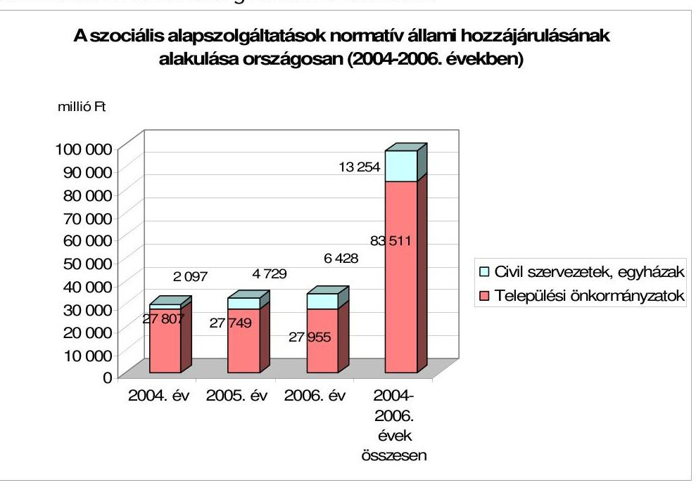
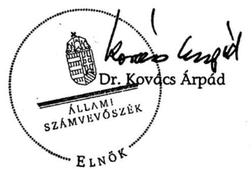
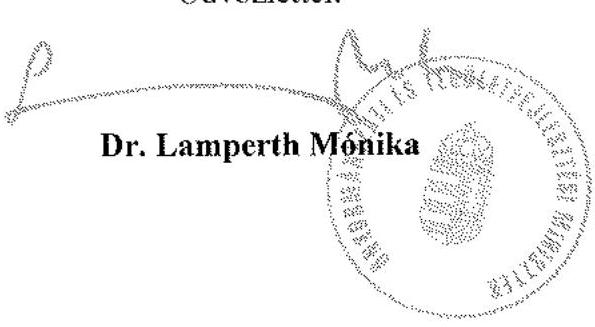
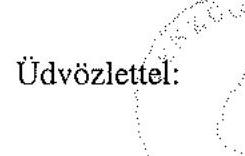

# ÁLLAMI   SZÁMVEVŐSZÉK 

## JELENTÉS

az önkormányzatok szociális alapszolgáltatási tevékenységének ellenőrzéséről

---

# 3. Önkormányzati és Területi Ellenőrzési Igazgatóság 

3.2. Szabályszerüségi és Teljesítményellenőrzési Föcsoport

Iktatószám: V-1011-41/2006-07.
Témaszám: 822
Vizsgálat-azonosító szám: V-0301

## Az ellenőrzést felügyelte:

Dr. Lóránt Zoltán
föigazgató
Az ellenőrzés végrehajtásáért felelős:
Németh Péterné
főcsoportfőnök

## Az ellenőrzést vezette:

Dr. Sallai Antal
igazgatóhelyettes
A számvevői jelentések feldolgozásában és a jelentés összeállításában közremüködött/tek:

Berényi Magdolna
főtanácsadó
Huberné Kuncsik Zsuzsanna
tanácsadó
Valu Tibor
tanácsadó

## Az ellenőrzést végezték:

| Szenténé Tubak Klára | Balogné Dakó Eszter | Dr. Horváth Klára |
| :-- | :-- | :-- |
| számvevő tanácsos | számvevő tanácsos | számvevő |
| Bács-Kiskun megye | Bács-Kiskun megye | Baranya megye |
| Kéri Péter | Tóth Tamás | Kerezsi Pál |
| számvevő tanácsos | számvevő | számvevő tanácsos |
| Baranya megye | Baranya megye | Borsod-Abaúj-Zemplén |
|  |  | megye |
| Klinga László | Luhály Matild | Szihalminé Kovács |
| számvevő tanácsos | számvevő | Zsuzsanna |
| Borsod-Abaúj-Zemplén | Borsod-Abaúj-Zemplén | számvevő |
| megye | megye | Borsod-Abaúj-Zemplén |
|  |  | megye |
| Huberné Kuncsik | Mohl Anna | Kisgergely István |
| Zsuzsanna | számvevő | számvevő |
| tanácsadó | Fejér megye | Fővárosi Ellenőrzési Iroda |
| Fejér megye |  |  |

Jelentéseink az Országgyűlés számítógépes hálózatán és az Interneten a www.asz.hu címen is olvashatóak.

---

Berényi Magdolna
főtanácsadó
Győr-Moson-Sopron me-
gye
Nyikon Zsigmondné
számvevő tanácsos
Hajdú-Bihar megye
Papp József
számvevő tanácsos
Jász-Nagykun-Szolnok megye
Szabó Tamás
számvevő tanácsos
Pest megye
Tormáné Ivánfi Irén
számvevő tanácsos
Somogy megye
Dr. Szücs Zoltán
számvevő tanácsos
Szabolcs-Szatmár-Bereg megye
Buús Zoltánné Hütter Erzsébet
számvevő
Vas megye
Szarvas Szilárd
számvevő
Veszprém megye
Bencsik Árpád
számvevő
Zala megye

Dr. Lacó Bálintné
számvevő tanácsos
Győr-Moson-Sopron megye
Fórián Erika
számvevő tanácsos
Hajdú-Bihar megye
György Árpád
számvevő tanácsos
Komárom-Esztergommegye
Dr. Hegedüs György
főtanácsadó
Somogy megye
Tóth Péter
számvevő
Somogy megye
Valu Tibor
tanácsadó
Szabolcs-Szatmár-Bereg megye
Kiss Rita Teréz
számvevő
Vas megye
Dr. Vasváriné dr. Ró-
zsa Anikó
főtanácsadó
Veszprém megye
Dér Lívia
számvevő tanácsos
Zala megye

## Kalmár István

számvevő tanácsos
Győr-Moson-Sopron megye
Pálfi András
számvevő tanácsos
Hajdú-Bihar megye
Huszár Sándorné
számvevő tanácsos
Nógrád megye
Reichert Margit
számvevő
Somogy megye
Kenéz Sándor
főtanácsadó
Szabolcs-Szatmár-Bereg megye
Eigner György Zoltán
számvevő
Tolna megye
Szabó Leonóra Ildikó
számvevő
Veszprém megye
Ritecz Tibor
számvevő
Zala megye

# A témához kapcsolódó eddig készített számvevőszéki jelentések: 

címe
sorszáma
Jelentés a hajléktalanokat ellátó intézményrendszer ellenőrzéséről 0613/2005
Jelentés a helyi önkormányzatok tartós szociális ellátási feladatai- 0317/2002 nak ellenőrzéséről az idősek otthonainál
Jelentés a települési önkormányzatok szociális és gyermekjóléti 0015/1999 szolgáltatásai helyzetéről
Az önkormányzatok felnőtt szociális alapellátási tevékenysége 165/1993

---

# TARTALOMJEGYZÉK 

BEVEZETÉS ..... 7
I. ÖSSZEGZŐ MEGÁLLAPÍTÁSOK, KÖVETKEZTETÉSEK, JAVASLATOK ..... 10
II. RÉSZLETES MEGÁLLAPÍTÁSOK ..... 18

1. A szociális alapszolgáltatások jogi szabályozottsága, finanszírozása ..... 18
1.1. A szociális alapszolgáltatások fejlesztésének koncepciója, az ellátások jogszabályi előírásainak érvényesülése ..... 18
1.1.1. Az önkormányzatok kötelező szociális alapszolgáltatási feladatai ..... 19
1.1.2. A szociális alapszolgáltatások rendszere, a szociális rászorultság feltételei ..... 22
1.1.3. A térítési díj megállapításának szabályai és gyakorlata ..... 24
1.1.4. A jogszabályi környezet változásának hatása az önkormányzatok által nyújtott szociális alapszolgáltatásokra ..... 26
1.2. A szociális alapszolgáltatások finanszírozási rendszere ..... 29
1.2.1. A szociális alapszolgáltatások normatív állami hozzájárulása ..... 29
1.2.2. A fejezeti kezelésű előirányzatok alakulása és felhasználása ..... 35
2. A vizsgált szociális alapszolgáltatások, forrásai és kiadásai ..... 40
2.1. A szociális alapszolgáltatások bevételeinek és kiadásainak alakulása ..... 40
2.1.1. Falugondnok-tanyagondnok ..... 44
2.1.2. Szociális információs szolgáltatás ..... 46
2.1.3. Étkeztetés ..... 47
2.1.4. Házi segítségnyújtás ..... 50
2.1.5. Családsegítés ..... 53
2.1.6. Jelzőrendszeres házi segítségnyújtás ..... 55
2.1.7. Nappali ellátás ..... 57
2.1.8. A szociális alapszolgáltatások ellátásának változása a társulások keretei között ..... 59
2.1.9. A múködést engedélyező szervek, fenntartók ellenőrzési tevékenysége ..... 63

---

# MELLÉKLETEK 

1. számú melléklet A települési önkormányzatoknál vizsgált szolgáltatások adatai
2. számú melléklet A vizsgált települések településtípus és lakosságszám szerinti adatai
3. számú melléklet A vizsgált települések által biztosított szociális alapszolgáltatások (2004-2006. években).
4. számú melléklet A szociális alapszolgáltatások normatíváinak alakulása (20042006. években).
5. számú melléklet A szociális alapszolgáltatások fejezeti kezelésű előirányzatainak alakulása (2004-2006. években).
6. számú melléklet A vizsgált önkormányzatok szociális alapszolgáltatási feladatai forrásainak alakulása (2004-2006. I. félévben).
7. számú melléklet A vizsgált önkormányzatok szociális alapszolgáltatási feladatokra fordított kiadásainak alakulása (2004-2006. I. félévben).

## FÜGGELÉKEK

1. számú függelék Vizsgált önkormányzatok

---

# RÖVIDÍTÉSEK JEGYZÉKE 

| Ámr. | Az államháztartás múködési rendjéről szóló 217/1998. (XII. 30.)   Korm. rendelet |
| :--: | :--: |
| ÁSZ | Állami Számvevőszék |
| Ber. | A költségvetési szervek belső ellenőrzéséről szóló 193/2003. (XI.   26.) Korm. rendelet |
| BM | Belügyminisztérium |
| CÉDE | Céljellegú decentralizált támogatás |
| ESZCSM | Egészségügyi, Szociális és Családügyi Minisztérium |
| EU | Európai Unió |
| EÜM | Egészségügyi Minisztérium |
| Gyvt. | A gyermekek védelméről és a gyámügyi igazgatásról szóló 1997.   évi XXXI. Tv. |
| MÁK | Magyar Államkincstár |
| miniszteri rendelet | A személyes gondoskodást nyújtó szociális intézmények szakmai   feladatairól és múködésük feltételeiről szóló 1/2000. (I. 7.) SZCSM   rendelet |
| Minisztérium | A szociális ágazat irányításáért felelős minisztérium |
| NCSSZI | Nemzeti Családi- és Szociálpolitikai Intézet (SZMM fejezethez tar-   tozó önálló költségvetési szerv) |
| NCST | Nemzeti Cselekvési Terv |
| normatíva | az éves költségvetési törvényekben meghatározott, a szociális   szolgáltatásokhoz nyújtott egy feladatmutatóra jutó normatív ál-   lami hozzájárulás éves összege |
| szakmai főosztály | Szociális és Munkaügyi Minisztérium Családi és Szociális Szolgál-   tatások Főosztálya |
| Számv.tv. | Számvitelről szóló 2000. évi C. törvény |
| SZMM | Szociális és Munkaügyi Minisztérium |
| Szmr. | a személyes gondoskodást nyújtó szociális intézmény és a falu-   gondnoki szolgálat múködésének engedélyezéséről, továbbá a   szociális vállalkozás engedélyezéséről szóló 188/1999. (XII. 16)   Korm. rendelet |
| Szoctv. | A szociális igazgatásról és a szociális ellátásokról szóló 1993. évi   III. törvény. |
| TERKI támogatás | Területi kiegyenlítést szolgáló fejlesztési támogatás |
| TFC | Területfejlesztési Célelóirányzat |
| térítési dijról szóló   kormányrendelet | A személyes gondoskodást nyújtó szociális ellátások térítési dijá-   ról szóló 29/1993. (II. 17) Korm. rendelet |
| Tktv. | A 2004. évi CVII. törvény a települési önkormányzatok többcélú   kistérségi társulásáról |
| Ttv. | Az 1997. évi CXXXV. törvény a helyi önkormányzatok társulása-   iról és együttmúködéséről |

---

.

---

# ÉRTELMEZŐ SZÓTÁR 

alapszolgáltatási központ
állami fenntartó
egyházi fenntartó
ellátási terület
fenntartó
közösségi fenntartó
működést engedélyező szerv
nappali ellátást nyújtó szociális intézmény

Alapszolgáltatási központ az a szociális intézmény, amely étkeztetést, házi segítségnyújtást, családsegítést, nappali ellátást és gyermekjóléti szolgáltatást együttesen biztosítja. Az alapszolgáltatási központ múködtetéséhez a 2005. évben külön nevesített normatívát igényelhetett a fenntartó a központok száma alapján, a 2006. évtől ez a normatíva megszűnt.
A közigazgatási szerv, a helyi önkormányzat, a helyi önkormányzatok társulása, a helyi kisebbségi önkormányzat és az egyéb állami szerv.
A magyarországi székhelyú egyházi jogi személy.
Az a település, megye, régió vagy az ország teljes területe, ahonnan a szociális szolgáltató, illetve intézmény ellátási igényeket fogad.
Az a személy vagy szervezet, amely az előírt jogszabályokban meghatározott feltételek szerint szociális szolgáltatót, illetve szociális intézményt létesít és múködtet.
Az Európai Gazdasági Térségről szóló egyezményben részes, illetve nemzetközi szerződés alapján azonos jogállást élvező más állam szociális vállalkozói engedéllyel rendelkező állampolgára, az a jogi személyiséggel rendelkező gazdálkodó szervezet, illetve jogi személyiség nélküli gazdasági társaság, amelynek székhelye, központi ügyvezetése vagy üzleti tevékenységének fő helye EGT tagállamban van.
Szociális szolgáltató esetén a kérelemben megjelölt elsődleges ellátási terület szerint illetékes városi jegyző, nappali ellátást nyújtó szociális intézmény esetén az intézmény székhelye, illetőleg telephelye szerint illetékes városi jegyző, bentlakásos szociális intézmény esetén az intézmény székhelye, illetőleg telephelye szerint illetékes Hivatal (szociális és gyámhivatal). Ha a szociális intézmény alapszolgáltatás mellett nappali ellátást is nyújt, az intézmény székhelye, illetőleg telephelye szerint illetékes városi jegyző, ha alapszolgáltatás mellett bentlakásos intézményi ellátást is nyújt, az intézmény székhelye, telephelye szerint illetékes Hivatal vezetője dönt a múködési engedély kiadásáról.
A nappali ellátást nyújtó intézmény a hajléktalanok, a saját otthonukban élő tizennyolcadik életévüket betöltött, egészségi állapotuk vagy idős koruk miatt szociális és mentális támogatásra szoruló, önmaguk ellátására részben képes személyek, a fekvőbeteg-gyógyintézeti kezelést nem igénylő pszichiátriai betegek, illetve szenvedélybetegek, továbbá a harmadik életévüket betöltött, önkiszolgálásra részben képes vagy önellátásra nem képes, de fel-

---

nem állami fenntartó
szakosított ellátások
személyes gondoskodást nyújtó szociális ellátás
székhely
szociális alapszolgáltatások
szociális intézmény
szociális szolgáltató
telephely
ügyeletre szoruló fogyatékos, illetve autista személyek részére biztosít lehetőséget a napközbeni tartózkodásra, társas kapcsolatokra, valamint az alapvető higiéniai szükségleteik kielégítésére. A nappali ellátás keretében igény szerint megszervezik az ellátottak napközbeni étkeztetését is.
A szociális vállalkozói engedéllyel rendelkező természetes személy, a magyarországi székhelyű jogi személy, jogi személyiség nélküli gazdasági társaság.
Az alapszolgáltatások keretében nem gondozható, az életkoruk, egészségi állapotuk, valamint szociális helyzetük miatt a rászorult személyek részére bentlakásos intézményekben biztosított tartós ellátási formák (ápológondozó, rehabilitációs intézmények, lakóotthonok, átmeneti elhelyezést és egyéb speciális ellátást nyújtó szociális intézmények).
A szociálisan rászorultak részére az állam, valamint az önkormányzatok által biztosított személyes gondoskodást nyújtó ellátások, melyek magukban foglalják a szociális alapszolgáltatásokat és a szakosított ellátásokat.
A szociális intézmény központi ügyintézésének helye, függetlenül attól, hogy a székhelyen szociális szolgáltatást nyújtanak-e.
A szociális alapszolgáltatások megszervezésével a települési önkormányzat segítséget nyújt a szociálisan rászorulók részére saját otthonukban és lakókörnyezetükben önálló életvitelük fenntartásában, valamint egészségi állapotukból, mentális állapotukból vagy más okból származó problémáik megoldásában. Az alapszolgáltatások típusai többször változtak, a Szoctv. hatályos rendelkezései szerint ezek: a falugondnoki és tanyagondnoki szolgáltatás, az étkeztetés, a házi segítségnyújtás, a családsegítés, a jelzőrendszeres házi segítségnyújtás, a közösségi ellátások, a támogató szolgáltatás, az utcai szociális munka, a nappali ellátás.
A nappali ellátást nyújtó és a bentlakásos szociális intézmény.
Az a személy vagy szervezet, amely a nappali ellátások kivételével kizárólag a szociális alapszolgáltatásokat nyújtja. Ha jogszabály másként nem rendelkezik, a szociális szolgáltatókra a szociális intézményekre vonatkozó szabályokat kell megfelelően alkalmazni.
Az intézmény legalább tíz, de legfeljebb százötven fő személyes gondoskodást nyújtó intézményi ellátásának az ingatlan-nyilvántartásban a székhelytől, valamint az intézmény másik telephelyétől különböző helyrajzi számon feltüntetett helye.

---

# JELENTÉS 

## az önkormányzatok szociális alapszolgáltatási tevékenységének ellenőrzéséről

## BEVEZETÉS

A jóléti társadalmakban az életszínvonal emelkedésével, a születések számának csökkenésével a társadalom elöregszik. Egyre többen jogosultak nyugellátásra és egyre többen igényelnek szociális juttatásokat, melyeket a költségvetés a korábbi szinten nem tud finanszírozni, ezért előtérbe kerül a szociális ellátások szűkítése, a támogatások csökkentése.

A társadalmi-gazdasági folyamatok, a munkanélküliség, a létbizonytalanság, illetve az ebből eredő devianciák következtében egyre többen igénylik a gondoskodás, a támogatás valamilyen formáját. Az igények és a lehetőségek közötti olló egyre tovább nyílik, így a szűkös anyagi erőforrások hatékonyabb, eredményesebb felhasználása társadalmi érdek. Ugyanakkor a segítségre szoruló hátrányos helyzetben lévők számára a szociális intézmény elérhetősége a létbiztonság egyik fontos tényezője. Az ország hátrányos helyzetű térségeiben nemcsak a gazdaság állapota rosszabb az átlaghoz képest, hanem a szociális szolgáltatások iránti igények is nagyobbak, sok településen el sem érhetők.

Magyarország lakossága 2006-ban összesen 3152 településen élt. A hazai településhálózat sajátossága - legjellemzőbben a Nyugat- és Dél-Dunántúlon, valamint Észak-Magyarországon - a szórt, törpe- és aprófalvas településrendszer.

A települések fele ezer főnél kisebb lélekszámú, a harmadán ötszáz főnél kevesebben élnek. Minél kisebb lélekszámú a település, annál magasabb az ott élő idősek (60 éven felüliek) aránya, az ötezer fő alatti településeken ez az arány $25 \% .^{1}$

Az egyenlőtlenségek egyrészt az eltérő település kategóriák, a községek, a falvak, a városok, másrészt pedig az ország keleti és nyugati része között mutatkoznak meg. Ezzel párhuzamosan a társadalmi-demográfiai jellemzők is különbözőek.

[^0]
[^0]:    ${ }^{1}$ Állami Népességnyilvántartó Hivatal (2006. január 1.)

---

A 2004-2006. években a költségvetésből 96 Mrd Ft-ot² nyújtottak a területi különbségek kiegyenlítését célzó programokra (terület és régiófejlesztési célelőirányzat, területi kiegyenlítést célzó támogatás, három éves kistérségi szociális felzárkóztató támogatások). A területfejlesztés részeként a szociális szolgáltatások fejlesztését, területi kiegyenlítését a 2001. évtől segítik a három éves kistérségi szociális felzárkóztató programok. A vizsgált időszakban erre a célra 2,2 Mrd Ft támogatást biztosítottak a költségvetésből, ez a területfejlesztési források 2,2\%-át képezte. A területfejlesztési célra fordított források ellenére az elmúlt évek tapasztalatai azt mutatják, hogy az elmaradott helyzetű térségek többsége nem tud tartósan kikerülni hátrányos helyzetéből.

A vizsgálat célja: annak megállapítása volt, hogy

- a települési önkormányzatok kötelező alapszolgáltatási feladatellátásával kapcsolatos jogszabályi előírások és azok módosításai segítették-e és eredménnyel járultak-e hozzá a szociális alapszolgáltatások bővüléséhez, a források felhasználásának átláthatóságához;
- a települési önkormányzatok biztosítják-e a szociális törvényben meghatározott kötelező alapszolgáltatásokat;
- a kötelező alapszolgáltatási feladatellátásoknál éltek-e a társulás lehetőségével.

Az ellenőrzésre a szociális alapszolgáltatások átfogó értékelése mellett teljesít-mény-ellenőrzési szempontok alapján került sor.

A helyszíni ellenőrzés tizenhat megyében 333 feladatellátásra kötelezett önkormányzat 559 szociális alapszolgáltatására terjedt ki. (A települési önkormányzatoknál vizsgált szolgáltatások adatait az 1. számú melléklet tartalmazza).

A települési önkormányzatokat a szociális igazgatásról és a szociális ellátásokról szóló törvény egyre több központilag meghatározott szolgáltatás biztosítására kötelezte, a tényleges helyi szükségletek figyelembevételének mellőzésével. Ugyanakkor a települések közötti egyenlőtlenség, az ellátási hiányok éppen a legszegényebb településeken maradtak fenn, vagy alakultak ki, ahol a leginkább rászoruló népesség lakik. A szociális alapszolgáltatások helyszíni vizsgálatára ennek figyelembevételével a 333 település közül 234, ezer lakosúnál kisebb települést jelöltünk ki. A kijelölt települések között mindössze öt város volt, a többi község. (A vizsgált települések településtípus és lakosságszám szerinti adatait a 2. számú melléklet tartalmazza). A tíz szociális alapszolgáltatásból a támogató szolgáltatást, közösségi ellátást, utcai szociális munkát a helyszínen nem vizsgáltuk. Ezeket a szolgáltatásokat a jelzőrendszeres házi segítségnyúj-

[^0]
[^0]:    ${ }^{2}$ Forrás a Szociális védelemről és társadalmi összetartozásról szóló Nemzeti Stratégiai Jelentés 2.2 számú függeléke „Beszámoló a 2004-2006 közötti időszakra vonatkozó társadalmi összetartozásról szóló nemzeti cselekvési terv intézkedéseinek megvalósulásáról" 2006. október.

---

tással együtt a Szoctv. szerint csak az a települési önkormányzat köteles biztosítani, melynek lakosságszáma meghaladja a 10000 fót, illetve utcai szociális munka esetében az 50000 fót. A vizsgálatra kijelöltek közül három település lakosságszáma érte el a 10000 fót.

A vizsgálatra kijelölt településeken biztosított szociális alapszolgáltatásokat a 3. számú melléklet szemlélteti.

Az ellenőrzés a 2004-2005. évekre, és 2006. I. félévre irányult, és a szociális alapszolgáltatások szabályozásának, irányításának és az önkormányzatok kötelező feladatellátásának értékelését foglalta magában.

Az ellenőrzés végrehajtására az Állami Számvevőszékről szóló 1989. évi XXXVIII. törvény 2. § (5) bekezdése, az államháztartásról szóló 1992. évi XXXVIII. törvény 120/A. § (1) bekezdésében foglaltak adnak jogszabályi alapot.

---

# I. ÖSSZEGZŐ MEGÁLLAPÍTÁSOK, KÖVETKEZTETÉSEK, JAVASLATOK 

A szociális alapszolgáltatások és az intézményrendszer kereteit a Szoctv. határozza meg. A törvény 1993. évi megalkotását nem előzte meg a lakosság szociális helyzetének, ellátási szükségleteinek felmérése, az ellátások átalakítására nem készült közép és hosszú távú koncepció. A koncepció elkészítéséhez szükséges reális helyzetelemzés, hatásvizsgálat nem készült, a szaktárca nem rendelkezett információval a múködő szolgáltatásokról, ellátottakról.

Jelenleg sincs olyan nyilvántartási rendszer, amely naprakész adatokkal tartalmazza a működő szolgáltatások típusát, az ellátottak számát, az egyes szolgáltatások iránti szükségleteket. ${ }^{3}$ A szakmai statisztikai adatszolgáltatás rendszere a múködési engedéllyel rendelkező szolgáltatásokra terjed ki, nem tartalmazza a múködési engedély nélkül biztosított szolgáltatások adatait. Az önkormányzatok múködtetnek olyan szociális alapszolgáltatásokat is, melyek a személyi-, tárgyi feltételek hiánya miatt nem rendelkeznek múködési engedélylyel.

A szociális alapszolgáltatások jogszabályi előírásai gyakran változtak, ma sem egyértelmúen meghatározottak. A személyes gondoskodás megszervezésére köteles önkormányzatok köre a feltételek módosulásával a Szoctv. megalkotása óta és a vizsgált időszakban is változott. A Szoctv. az alapszolgáltatások között a települési és a fővárosi kerületi önkormányzatok részére kötelező ellátásként az étkeztetést és a házi segítségnyújtást határozta meg. A további alapszolgáltatások biztosítását a település állandó lakosságszámától függően tette kötelezővé. A szociális alapszolgáltatásokra vonatkozó ellátási kötelezettség vizsgált időszakban hatályos szabályai nem voltak figyelemmel a települések teherbíró képességére, az adott településen élők valós ellátási igényeire. A lakosságszámhoz kötött szabályozás is hozzájárult ahhoz, hogy a szociális alapszolgáltatások biztosításával kapcsolatosan az önkormányzati felelősség nem érvényesült, a vizsgált 333 önkormányzat közül csupán 44 mérte fel a szociális alapszolgáltatások iránti igényeket.

A szolgáltatások igénybevételéhez a jogosultsági kritériumok nincsenek valamennyi alapszolgáltatásra egységesen és egyértelmúen meghatározva, így egyre több olyan lakos is részesült a szociális szolgáltatások állam által finanszírozott ellátásaiból, akinek sem vagyoni helyzete, sem önellátó képessége nem tette azt indokolttá. Az étkeztetés szociális rászorultság feltételeinek meghatározása során a szabályozás tág teret biztosított az önkormányzatoknak, nem ér-

[^0]
[^0]:    ${ }^{3}$ Minisztérium Szoctv. 2006. évi módosító javaslatából „a meglévő és orvoslásra szoruló problémák"

---

vényesült a szolgáltatások igénybevételénél az esélyegyenlőség ${ }^{4}$. A házi segítségnyújtást, jelzőrendszeres házi segítségnyújtást, illetve támogató szolgáltatást igénybevevőknél is vizsgálni kell 2007. január 1-től a szociális rászorultságot, azonban az étkeztetéstől eltérően nem feltétel az igénylő jövedelmi helyzete.

A szociális alapszolgáltatások számosságából adódóan az ellátórendszer szétaprózott, a szabályozás bonyolult. A Szoctv. 1993. évi megjelenésekor még csak négy alapellátást nevesített, ugyanakkor a 2006. évi módosítása már 10 alapszolgáltatást határozott meg. A Szoctv. előírásai megjelenése óta 49 alkalommal módosultak. A változások az ellátási formák, szolgáltatások körét, elnevezését, tartalmát, feltételeit érintve, módosították a személyes gondoskodás megszervezésére kötelezettek körét. Az egyre részletesebb központi szabályozás öngerjesztő folyamattá vált, újabb és újabb szabályozást indukált, ami ellentmondásos jogi szabályozási környezet kialakulásához vezetett. Az egyes szolgáltatások (házi segítségnyújtás-jelzőrendszeres házi segítségnyújtás, közösségi ellátás, támogató szolgálat; családsegítés-gyermekjóléti szolgálat) tevékenység tartalma részben átfedi egymást. A „szolgáltatáshoz való hozzáférés" fogalma, a feladat tartalma nem meghatározott. Nem egyértelmű a különbség a kötelezően biztosítandó szolgáltatás és a szolgáltatáshoz való hozzáférés biztosításának kötelezettsége között.

A Szoctv. és a kapcsolódó végrehajtási szabályok fogalom meghatározásai nem azonosak, ez akadálya az egységes értelmezésnek, a gyakorlati alkalmazásnak, ellenőrizhetőségnek.

A szociális alapszolgáltatások keretében nyújtott ellátások az ország egyes területein különbözőek, az önkormányzatok eltérő mennyiségű és minőségű szolgáltatás biztosítása mellett látják el feladatukat, melynek oka, hogy nincsenek meghatározva a szolgáltatások minimális ellátottsági mutatói, az önkormányzatok adottságai (népesség, pénzügyi helyzet) nem azonosak. A vizsgált időszakban nem volt biztosított valamennyi településen a szociális ellátások, szolgáltatások célzottsága, és nem érvényesült megfelelően az igazságosság és esélyegyenlőség. A korábbi speciális alapellátás 2005. január 1-től kettévált, támogató szolgáltatásra és közösségi ellátásra. Előbbi önálló szolgáltatásként történő nevesítését nem előzte meg a fogyatékos személyek számának, egészségügyi állapotának, fogyatékosságuk, lakóhelyük felmérése, a szolgáltatás célzottsága települési szinten nem volt biztosított.

[^0]
[^0]:    ${ }^{4}$ A Szoctv. 62. § (2) bekezdése szerint a szociális rászorultság feltételeit a települési önkormányzat rendeletében szabályozza. Az önkormányzat rendeletében az egy főre számított havi családi jövedelemhatárt úgy kell szabályozni, hogy az öregségi nyugdíj mindenkori legkisebb összegének 100\%-ánál, egyedül élő esetén annak 150\%-ánál alacsonyabb jövedelmet jogosultsági feltételként nem lehet előírni; a szociális rászorultság további feltételeit az önkormányzat a helyi viszonyoknak megfelelően szabályozza.

---

A Nemzeti Családi- és Szociálpolitikai Intézet ${ }^{5}$ a Minisztériummal kötött megállapodás szerint - hozzárendelt források biztosításával - 2006-ban létrehozta azon munkacsoportokat, melyek szolgáltatás típusonként készítik el a jogosultsági kritériumok meghatározásához szükséges szakmai javaslataikat. A feladatok tevékenység tartalmának meghatározása a standard és protokoll projekt keretén belül történik.

A települési önkormányzatok kötelező alapszolgáltatási feladatellátásával kapcsolatos jogszabályi előírások és azok módosításai eredményeként bővültek a szociális alapszolgáltatások, az ellátásban részesültek száma emelkedett, azonban a változás konkrét mértéke településenként nem állapítható meg. A kialakult ellátórendszer nem átlátható, gazdaságosságára, hatékonyságára a Minisztérium nem készített elemzéseket.

A szociális szolgáltatások közel $30 \%$-át ${ }^{6}$ nem az önkormányzatok látják el, és egy új szolgáltatás elindításához és állami finanszírozásához elegendő volt a múködési engedély megléte akkor is, ha az adott településen az indítandó szolgáltatást már az önkormányzat kötelezően működtette, és a kapacitásbővítés nem volt indokolt. A normatív támogatás igénybevételének nem volt feltétele a feladatellátásra kötelezett önkormányzattal kötött megállapodás.

A kötelező feladatok teljes köre - elsősorban pénzügyi források hiányában - a települési önkormányzatok számára nem teljesíthetők, ezért a szabályozás ellenére kialakultak „fehér foltok". Növekedett a települések közötti egyenlőtlenség, az ellátási hiányok éppen a legszegényebb településeken maradtak fenn, vagy alakultak ki. ${ }^{7}$ A hiányzó alapszolgáltatások következtében a szakosított ellátások iránti igények ${ }^{8}$ növekednek, holott az igénylők egy része az alapszolgáltatás keretében otthonában, illetve helyben is ellátható, ami az érintettek és a költségvetés számára a legkedvezőbb megoldás lenne.

A feladatellátáshoz nyújtott állami támogatások, hozzájárulások rendszere bonyolult, nehezen áttekinthető. A 2004-2006. évek között országosan a szociális alapszolgáltatások normatív állami hozzájárulása 96765 millió Ft-ot tett ki, ennek 86,3\%-át a települési önkormányzatok részére folyósították, 13254 millió Ft-ot a humánszolgáltatók (civil szervezetek, egyházak) vettek igénybe a szolgáltatások biztosításához.

[^0]
[^0]:    ${ }^{5}$ 2007. január l-től az intézmény átalakult, neve Szociálpolitikai és Munkaügyi Intézet.
    ${ }^{6}$ Magyar Statisztikai Évkönyv, 2005
    ${ }^{7}$ Borsod-Abauj-Zemplén megyében vizsgált 42 település közül 18 önkormányzat biztosította a házi segítségnyújtást, 30 az étkeztetést.
    ${ }^{8}$ A vizsgált időszakban a KSH adatgyűjtése a bentlakásos intézményi ellátásra várakozók számára nem terjedt ki. Az Egészségügyi Szociális és Családügyi Miniszter K.7091/1 számú levele szerint 2004. évben a bentlakásos intézményi elhelyezésre várók száma országosan 12291 fő volt. A Somogy Megyei Szociálpolitikai Kerekasztal 2007. április 5-i alakuló ülésének jegyzőkönyve szerint a bentlakásos szociális ellátások iránti igény 2001-2006. évek között $230 \%$-kal nőtt, az átlagos várakozási idő megduplázódott, jelenleg négy év.

---

Az egyes önkormányzati feladatokat a központi költségvetés nem azonos elvek szerint (lakosságszám, feladatmutatóhoz kötött, szolgálatok száma) támogatja. Az ellátásokhoz kapcsolódó normatív állami hozzájárulás előirányzati kerete 2006. december 31-ig „felülről nyitott" volt, az ellátási szükségletek koordinálása nélkül befogadott igényekből adódóan a tényleges mutatószámok alapján történő elszámolás előre nem tervezhető többletkiadásokkal terhelte a központi költségvetést. A szolgáltatások kapacitásnövekedését nagymértékben a normatívához való hozzájutás határozta meg, aminek eredményeképpen az ellátottsági mutatókban egyenlőtlenségek alakultak ki, továbbá a finanszírozott kapacitások bővülésének nem volt korlátja. Három alapszolgáltatás esetében (jelzőrendszeres házi segítségnyújtás, támogató szolgálat, közösségi ellátás), 2007. január 1-től részlegesen bevezetésre került a kapacitásszabályozás (nem állami szolgáltatók befogadása), továbbá változott a finanszírozás rendje is.

A finanszírozási rend 2006. évtől hatályos változása a feladatellátáshoz biztosított állami-támogatások átláthatóságát nehezíti. A feladatellátásra kötelezett önkormányzatok egyre szélesebb körénél a pénzügyi információban a szociális alapszolgáltatások forrásai és kiadásai nem jelennek meg, ugyanakkor a többcélú kistérségi társulások által készített beszámolókban az adatok összevontan szerepelnek. A Minisztériumban nem készültek összesítő elemzések arra vonatkozóan, hogy a társulásban ellátott feladatokhoz nyújtott többlettámogatások hogyan hatottak az ellátások mennyiségére és minőségére, menynyiben járultak hozzá az esélyegyenlőség javulásához.

A fejezeti kezelésű előirányzatok évente tartalmazták a szociális alapszolgáltatások múködéséhez, fejlesztéséhez kapcsolódó előirányzatokat, melyek összegét a Minisztérium jóváhagyott éves költségvetése határozott meg. A szociális alapszolgáltatások fejlesztésére a 2004-2006. évek között 1321 millió Ft-ot fordítottak. Ebből a 2006. évben 29 millió Ft-ot a szakmai célokat figyelembe véve, egyedi elbírálás alapján jutattak a szolgáltató szervezeteknek. A pályázati források az étkeztetést, házi segítségnyújtás megszervezését, falugondnoki, tanyagondnoki szolgálatok feladatainak ellátását támogatták.

Az NCSSZI monitoring rendszerének kialakítása részlegesen valósult meg. A 2004. évben kiírt szakmai pályázatok monitorozása nem történt meg, a pályázati célok megvalósítását összegző értékelés nem készült. A célok megvalósulását a Minisztérium a támogatások felhasználására vonatkozó szakmai és pénzügyi beszámolók bekérésével ellenőrizte, ugyanakkor a helyszíni vizsgálatokról személyi- és tárgyi feltételek hiányában nem gondoskodtak.

Az NCSSZI által bonyolított, a 2005. évben kiírt pályázatok utófinanszírozottak voltak, valamennyi támogatás kiutalása a támogatási szerződésekben meghatározott megvalósítási határidőt követően 2006. április-augusztus hó közötti időszakban történt. A pályáztatások bonyolítása során az előírt eljárási rendet betartották.

A Minisztérium az uniós és hazai pályázatok támogatásának átláthatósága érdekében a szakmai pályáztatások kezelését és bonyolítását egy szervezetbe integrálta. A szervezeti változásokat követően, 2007. január elsejétől, a szak-

---

mai pályáztatások bonyolítását az Európai Szociális Alap Kht. végzi, feladata a támogatott projektek monitorozására is kiterjed.

A Minisztérium fejlesztési programjaként a 2001. évtől múködnek kistérségi szociális felzárkóztató programok, a hátrányos helyzetú kistérségek támogatására, a szociális infrastruktúra fejlesztésére. A támogatás a kistérségek által készített 3 éves fejlesztési tervek szerint, a területfejlesztési intézményrendszerrel és a rendelkezésre álló forrásokkal (Minisztérium, CÉDE, TERKI, TFC, Munkaügyi Központok) összehangoltan, egyedi megállapodások alapján történik. A kistérségi szociális felzárkóztató program monitorozásáról 2007. január hónapban készült összesítő jelentés megállapította, hogy a források együttes összege, megoszlása nem ismert, az elszámolásokhoz, beszámolókhoz mellékelt kimutatásokban a fejlesztési projektek egyértelmúen nem voltak azonosíthatók, azok nem igazodtak a Szoctv.-ben meghatározott szolgáltatásokhoz. A három éves szociális felzárkóztató programokhoz biztosított költségvetési támogatások felhasználásának a szociális alapszolgáltatások biztosítására gyakorolt hatása együttesen, szolgáltatásonként nem értékelhető, mivel az eredmények mérhetőségét, elemzését lehetővé tevő mutatók hiányoznak.

A vizsgált önkormányzatok szociális alapszolgáltatásokhoz kapcsolódó összes bevétele a 2004. évben 1597,0 millió Ft, a 2005. évben 1809,7 millió Ft volt, az időszakban 13,3\%-kal emelkedett. Az összbevételeken belül a normatív támogatás aránya volt a meghatározó (72,4-70,5\%). A vizsgált önkormányzatok egyre szélesebb köre élt a szociális alapszolgáltatások megszervezését és biztosítását segítő pályázati lehetőségekkel. A pályázati források aránya az összes bevételeken belül nem volt jelentős (5,3-7,8\%), de az ebből származó bevételek 66,2\%-kal emelkedtek a 2004-2005. évek között.

A 2004-2005. években - a vizsgált önkormányzatoknál - a normatív hozzájárulás az összkiadásnak a 66,6\%-64,4\%-át fedezte. Minkét évben szükség volt a szociális alapszolgáltatások biztosításához - a központi költségvetésből juttatott állami támogatás, pályázati átvett pénzeszközök és az ellátási díjak bevételén kívül - önkormányzati forrásokra. Az önkormányzatok által nyújtott források a kiadásoknak a 8\%-8,6\%-át fedezték a 2004-2005. években.

A vizsgált önkormányzatok a szociális alapszolgáltatások biztosítására a 2004. évben 1736,0 millió Ft-ot, a 2005. évben 1980,4 millió Ft-ot fordítottak, ennek 9,9-12,4\%-a felhalmozási kiadás volt.

A vizsgált önkormányzatok szociális alapszolgáltatásokra kimutatott bevételei és kiadásai nem hasonlíthatók országos szintű adatokhoz, ugyanis erre vonatkozóan az állami és a nem állami fenntartóktól konkrétan meghatározott, egységes tartalmú információszolgáltatás nincs. Az önkormányzatok pénzügyi információs rendszerében a szakfeladatok nincsenek összhangban a szakmai jogszabályokkal, így a Szoctv.-ben részletezett szolgáltatások ráfordításai csak egyedi kigyűjtéssel állapíthatók meg.

Az önkormányzatok pénzügyi információs rendszerének hiányosságai a szociális alapszolgáltatások ráfordításainak átláthatóságát nem biztosítja. A döntéshozók (Országgyűlés, Kormány, szakminisztérium, önkormányzatok) számára nem állnak rendelkezésre információk a fejlesztési célkitűzések megalapozásá-

---

hoz, a feladatellátás hatékonyabb, eredményesebb, gazdaságosabb megszervezéséhez.

A falugondnoki, illetve tanyagondnoki szolgáltatás nem kötelezően ellátandó feladat a települési önkormányzatok számára. Az elvégzett feladatokról az igénybevevők személyéről, számáról nyilvántartás vezetését a szakmai jogszabályok nem írnak elő, statisztikai adatgyűjtés erre vonatkozóan nincs. A szolgáltatás ráfordításai hatékonyságának, gazdaságosságának megállapításához az adatok nem álltak rendelkezésre.

Az étkeztetés, mint az egyik legfontosabb szociális alapszolgáltatás jelentőségét mutatja, hogy 2001. évtől országosan évente több mint 100000 ember részesült ebben az ellátásban. A vizsgált önkormányzatok összesített adatai szerint az étkeztetésben részesülők száma emelkedő tendenciát mutat, 2004. évről 2005 évre 10\%-kal többen, összesen 3956-étkeztek a vizsgált 333 település 335069 fős népességből. Megvalósult a jogalkotó azon szándéka, hogy a kis településeken, ahol nagyobb a gondoskodást igénylők száma, többen részesüljenek étkeztetésben.

A házi segítségnyújtás azon alapellátási forma, melyet a Szoctv. már megjelenésekor tartalmazott. Országosan házi segítségnyújtásban, 2004. évben 43542 fő, 2005. évben 45130 fő részesült. A vizsgált településeken 2005. évben 1439 fő részesült házi segítségnyújtásban, számuk 17,6 \%-kal emelkedett. A tízezer 60 éven felüli lakosra jutó ellátottak száma az ezer fő alatti településeken az országos átlagot meghaladó, ennek oka, hogy a települések lakossága elöregedett, a fiatalok munkalehetőség hiányában elköltöztek, és az idősek hozzátartozók híján - nagyobb számban igénylik a házi segítségnyújtást.

A családsegítés az alapellátások egyikeként a Szoctv. hatályba lépésétől szerepelt a személyes gondoskodást nyújtó szolgáltatások között. Országosan 2004. évben 2162, 2005. évben már csak 1936 településen biztosították a családsegítést, a vizsgált 333 önkormányzat közül 2004-ben 194, 2005-ben 189 településen biztosították a családsegítést. A családsegítő szolgálatok számának csökkenésében meghatározó szerepe volt a szolgáltatásra kötelezett önkormányzati kör pontosításának. A családsegítést a vizsgált szolgáltatások esetében döntően ( $84,3 \%$-ban) társulásban látták el. A családsegítő és a gyermekjóléti szolgálatok feladatai közel azonosak, nehezen különíthetők el. A gyermekes családok esetében a két ellátás egyidejű megszervezése, múködtetése párhuzamos gondoskodást jelent.

A jelzőrendszeres házi segítségnyújtás viszonylag új szolgáltatási forma, kötelezően csak a 10000 főnél több állandó lakosú településeken kell megszervezni. 2005. évben országosan 8870 fő tartozott az ellátottak közé. Az ezer lakosnál kisebb településen lakott az ellátottak 7,7\%-a. A többcélú kistérségi társulások keretében ellátott jelzőrendszeres házi segítségnyújtásra a központi költségvetés kiegészítő támogatást is biztosít. A települési önkormányza-tok társultak a feladatellátásra, ugyanis anyagi hozzájárulást nem igényelt tőlük a szolgáltatás biztosítása. A vizsgált 39 jelzőrendszeres házi segítségnyújtó szolgáltatást társulás keretében szervezték meg. A jelzőrendszeres há-

---

zi segítségnyújtás bevezetését országosan és a vizsgált önkormányzatoknál nem előzte meg a potenciális ellátottak számának felmérése.

A nappali ellátásra vonatkozó szabályokat a Szoctv. 2005. január 1-től módosította, az ellátás rendszerbeli helye megváltozott, a korábban szakellátásként definiált szolgáltatási forma az alapszolgáltatások közé került. A módosítás érintette az önkormányzatok feladat-ellátási kötelezettségét is, ugyanis míg korábban a kétezer fő felett, 2005. január 1-től háromezer főnél nagyobb lakosságszámú települések önkormányzatainak kell a szolgáltatást biztosítaniuk. A vizsgálatra kijelölt önkormányzatoknál a szabályozás változás hatására csökkent a nappali ellátásban részesültek száma.

A vizsgálatra kijelölt önkormányzatok feladatellátása a többcélú kistérségi társulások létrejöttével átrendeződött, keretében egyre több településen került megszervezésre egy-egy hiányzó ellátási forma. A többcélú kistérségi társulások megalakításakor célként fogalmazódott meg, hogy az integrált ellátás eredményeként a szakmai és költséghatékonysági mutatók javuljanak, ugyanakkor ilyen mutatók nincsenek. A gyakorlati tapasztalatok azt mutatták, hogy a szociális alapszolgáltatások szervezeti keretei esetenként nem, vagy alig változtak. A többcélú kistérségi társulások keretében történő feladatellátás a kiegészítő normatív állami hozzájárulások ösztönző hatására bővült. A szociális alapszolgáltatások megszervezéséhez kapcsoltan a 2005. évben 1007 millió Ft, a 2006. évben 1743,9 millió Ft volt a kiegészítő normatív állami hozzájárulás összege

A működést engedélyező szervek és fenntartók ellenőrzési feladatait több jogszabály (Szoctv., a személyes gondoskodást nyújtó szociális intézmény és a falugondnoki szolgálat működésének engedélyezéséről, továbbá a szociális vállalkozás engedélyezéséről szóló Kormányrendelet, a személyes gondoskodást nyújtó szociális intézmények szakmai feladatairól és működésük feltételeiről szóló miniszteri rendelet) határozza meg. A vizsgálatok lefolytatásához nem határoztak meg egységes ellenőrzési szempontokat, emiatt a lefolytatott vizsgálatok sem egységesek. A működést engedélyező szervek a vizsgált önkormányzatok mindössze 8,3\%-nál végezték el a szolgáltatások ellenőrzését. A vizsgált önkormányzatok, mint fenntartók 94,3\%-a nem tett eleget évenkénti ellenőrzési kötelezettségének.

A helyszíni ellenőrzés megállapításainak hasznosítása mellett javasoljuk:

# A szociális és munkaügyi miniszternek 

1. dolgozza ki a személyes gondoskodást nyújtó szociális alapszolgáltatások hosszú távú átalakítási koncepcióját a szükséges források és prioritások meghatározásával;
2. gondoskodjon arról, hogy az irányítása alá tartozó szociális és gyámhivatalok eleget tegyenek a Szoctv. 90/A §-ában meghatározott feladatkörük teljesítésének;
3. kezdeményezze a Szoctv. módosítását annak érdekében, hogy a szociális alapszolgáltatások iránti igények és szükségletek felmérésre kerüljenek;

---

4. vizsgálja felül az ágazati szakmai statisztikák adattartalmát, és kezdeményezze módosítását az ellátórendszer egészére vonatkozó lényeges információ biztosítása érdekében;
5. jelezze az államháztartásért felelős miniszter felé az önkormányzatok pénzügyi információs rendszerére vonatkozó jogszabályi módosítások szükségességét annak érdekében, hogy a feladatellátás átlátható, a Szoctv.-ben nevesített szolgáltatások ráfordításai pedig kimutathatóak legyenek;
6. vizsgálja felül a Szoctv. és az ahhoz kapcsolódó végrehajtási jogszabályok fogalommeghatározásai közt fennálló ellentmondásokat, rendeletalkotási jogkörében gondoskodjon azok feloldásáról, illetve kezdeményezze a szükséges jogszabályi módosításokat;
7. kezdeményezze a Szoctv. módosítását, annak érdekében, hogy az igényeknek megfelelő szociális alapszolgáltatások minden településen elérhetők legyenek;
8. az önkormányzati és területfejlesztési miniszterrel együttműködésben vizsgálja felül a Szoctv. lakossági igénytől független feladat-ellátási kötelezettséget előíró rendelkezései és az Ötv. 8. §-ának (2) bekezdésében foglaltak közti összhang megteremtésének lehetőségét;
9. kezdeményezze a Szoctv. módosítását annak érdekében, hogy az egyes szolgáltatások igénybevételénél a szociális rászorultság feltételei egységesen kerüljenek meghatározásra;
10. gondoskodjon a pályázati támogatások felhasználásával kapcsolatos monitoring rendszer folyamatos múködéséről;
11. gondoskodjon a kidolgozás alatt álló standardok és az egységes ellenőrzési szempontok bevezetéséről, valamint biztosítsa - a múködést engedélyező szervek (jegyzők, szociális és gyámhivatalok) révén - a szociális intézményeknek és szolgáltatóknak a Szoctv. 92/K. §-ának (3) bekezdésében és az Szmr. 14. §-ában meghatározott rendszeres ellenőrzését.

---

# II. RÉSZLETES MEGÁLLAPÍTÁSOK 

## 1. A SZOCIÁLIS ALAPSZOLGÁLTATÁSOK JOGI SZABÁLYOZOTTSÁGA, FINANSZíROZÁSA

### 1.1. A szociális alapszolgáltatások fejlesztésének koncepciója, az ellátások jogszabályi előírásainak érvényesülése

A szociális alapszolgáltatások és az intézményrendszerének kereteit a szociális igazgatásról és szociális ellátásokról szóló Szoctv. határozza meg. A törvény 1993. évi bevezetését nem előzte meg a lakosság szociális helyzetének és ellátási szükségleteinek felmérése, az ellátások fejlesztésére nem készült közép, és hosszú távú koncepció.

A Szoctv. hatályba lépése előtt nem készült reális helyzetelemzés és hatásvizsgálat, melynek oka, hogy a szaktárca nem rendelkezett naprakész információval a múködő szolgáltatásokról, az ellátottakról. A szociális ellátásokkal kapcsolatos információk ma sem állnak rendelkezésre, ugyanis nincs olyan nyilvántartási rendszer, amely naprakészen tartalmazza a jelenleg múködő szolgáltatások típusát, ellátottainak számát, valamint az egyes szolgáltatásokkal szemben meglévő szükségleteket. Az időközben megjelent 226/2006. (XI. 20.) Korm. rendelet a szociális, gyermekjóléti és gyermekvédelmi szolgáltatók, intézmények ágazati azonosítójáról és országos nyilvántartásáról a múködő szolgáltatásokra vonatkozó adatszolgáltatási és nyilvántartási kötelezettségeket szabályozza, azonban ennek hatása csak a későbbiekben lesz érzékelhető.

Az információszolgáltatás jelenlegi rendszerében nem állnak rendelkezésre megbízható adatok településenkénti részletezésben a szociális szolgáltatásokról. A szociális szolgáltatásokról, az ellátottak számáról a szakmai statisztikák nyújtanak információt. A szakmai statisztikákat a fenntartók kötelesek elkészíteni, amelyek egyes szociális alapszolgáltatásokra vonatkozóan (az 1207. számú kérdőív 1. számú táblája) településenként és telephelyenként kérnek ellátotti adatokat és a feldolgozáshoz a telephelyenkénti szakmai adatokat, kell továbbítani. Ebből következően az ellátotti adatok településenkénti információja nem állt rendelkezésre.

Fejér megyében a családsegítésről készítendő szakmai KSH statisztikát (1696. számú kérdőívet) a feladatot ellátó intézmény (Polgárdi Város Önkormányzatának Családsegítő és Gyermekjóléti Szolgálata) készítette el, abból a településenkénti adatokat elkülönítetten nem lehetett megállapítani. A statisztika a társult települések (Polgárdi, Kőszárhegy, Jenő, Füle, Mátyásdomb) ellátási adatait öszszevontan tartalmazta.

Bács-Kiskun megyében Dunaszentbenedek, Foktő, Uszód Községek Önkormányzatai a családsegítést intézményfenntartó társulás keretében biztosították, melynek gesztor települése Dunaszentbenedek Község Önkormányzata volt. Az egyes településeken nem, csak Dunaszentbenedek Község Önkormányzatánál álltak rendelkezésre az egyes társult települések vonatkozásában településenként a

---

családsegítő szolgálat 2005. évi adatai, melynek alapján összesített statisztikai adatszolgáltatás készült.

A szociális szolgáltatások közel 30\%-át ${ }^{9}$ nem az önkormányzatok látják el, és egy új szolgáltatás elindításához és állami finanszírozásához elegendő a múködési engedély megléte, akkor is, ha az adott településen az indítandó szolgáltatást már az önkormányzat múködteti, és elegendőnek bizonyul az adott településen. A települési önkormányzatok ugyanakkor nem ismerik a településen működő - nem állami szervek, társulások keretében biztosított szociális szolgáltatásokat, az ellátottak körét, számát, mivel sem a múködést engedélyezőnek, sem a múködtetőnek nincs információszolgáltatási kötelezettsége az önkormányzat felé.

A megalapozott országos hosszú és köztávú fejlesztési koncepciók és megvalósításukhoz szükséges hatékony intézkedésekhez (szakmai irányítás, megfelelő jogszabályi környezet kialakítása) nem elégséges a statisztikai adatszolgáltatás, ugyanis az csak a működési engedéllyel rendelkező szociális alapszolgáltatásokról szolgáltat információt. Az ÁSZ vizsgálat tapasztalatai szerint az önkormányzatok biztosítanak olyan szociális szolgáltatásokat, melyek a személyi-, tárgyi feltételek vagy a változó jogszabályok ismeretének hiánya miatt nem rendelkeznek múködési engedéllyel.

# 1.1.1. Az önkormányzatok kötelező szociális alapszolgáltatási feladatai 

1993. év elején a Szoctv. az alapellátások között a gyermekek napközbeni ellátását, étkeztetést, házi segítségnyújtást és családsegítést nevesítette, a települési és a fővárosi kerületi önkormányzatok részére kötelező ellátásként az étkeztetést és a házi segítségnyújtást határozta meg. A további alapellátások illetve a szakosított ellátások biztosítását a település állandó lakosságszámától függően tette kötelezővé. A Szoctv. előírásai megjelenése óta 49 alkalommal módosultak. A változások az ellátási formák, szolgáltatások körét, elnevezését, tartalmát, feltételeit érintve, módosították a személyes gondoskodás megszervezésére kötelezettek körét, bizonytalanná téve az ellátórendszert.

A 2004. évben hatályos Szoctv. 86. §-a települési önkormányzat, fővárosi kerületi önkormányzat kötelező feladataként továbbra is az étkeztetést és a házi segítségnyújtást határozta meg. A Szoctv. 87. §-a további, lakosságszámtól függő kötelező feladatellátást írt elő az alábbiak szerint:

- a kétezernél több állandó lakosú település részére idősek nappali ellátását nyújtó intézményi szolgáltatást,
- a tízezernél több állandó lakosú települések részére az előzőeken felül idősek átmeneti elhelyezését biztosító intézményt,

[^0]
[^0]:    ${ }^{9}$ Magyar Statisztikai Évkönyv, 2005

---

- a húszezernél több állandó lakosú település részére az előzőeken felül valamennyi nappali ellátást nyújtó intézményi ellátást,
- a harmincezernél több állandó lakosú település részére az előzőeken kívül az átmeneti elhelyezési formákat.

A Szoctv. 57. § (1) bekezdése 2005. január 1-től alapellátási formák helyett alapszolgáltatásokat határozott meg, melyek köre bővült: a speciális alapellátási feladatok helyett közösségi ellátással, támogató szolgáltatással, a korábban szakellátásnak minősülő nappali ellátási formákkal, továbbá ez időponttól önálló szolgáltatásként nevesített szociális információs szolgáltatással.

A közösségi ellátások és a támogató szolgáltatás bevezetését sem előzte meg az ellátás célja szerinti ellátotti kör (pszichiátriai, szenvedélybetegek és fogyatékos személyek) és azok szükségleteinek felmérése. Ezen ellátások célja alapvetően a házi segítségnyújtáshoz hasonlóan a gondozottak részére lakókörnyezetükben önálló életvitelükkel kapcsolatos segítségnyújtás. A támogató szolgálat,(Szoctv. 57. § (1) bekezdés h) pont) mint új speciális alapellátási feladat bevezetését modellkísérleti program előzte meg. A modellkísérleti programok keretében a szolgálatok személyi és tárgyi feltételeire, múködésére vonatkozóan készültek javaslatok.

Az alapszolgáltatások megszervezésével a Szoctv. 59. § (1) szerint a települési önkormányzat segítséget nyújt a szociálisan rászorulók részére saját otthonukban és lakókörnyezetükben önálló életvitelük fenntartásában, valamint egészségi állapotukból, mentális állapotukból vagy más okból származó problémáik megoldásában.

A vizsgált időszakban (2005. évtől) a Szoctv. 60-65/F. §-aiban a következő szociális alapszolgáltatásokat nevesítette:

- falugondnoki és tanyagondnoki szolgáltatás,
- szociális információs szolgáltatás,
- étkeztetés,
- házi segítségnyújtás,
- családsegítés,
- jelzőrendszeres házi segítségnyújtás,
- közösségi ellátások,
- támogató szolgáltatás,
- utcai szociális munka,
- nappali ellátás.

A lakosságszámhoz kötött szabályozás is hozzájárult ahhoz, hogy a szociális alapszolgáltatások biztosításával kapcsolatos önkormányzati felelősség nem

---

érvényesült, a vizsgált 333 önkormányzat közül csupán 44 mérte fel a szociális alapszolgáltatások iránti igényeket.

Nem készítettek a lakosság szolgáltatások iránti igényeiről felmérést a helyszíni vizsgálatra kijelölt önkormányzatok Komárom-Esztergom, Györ-MosonSopron, Nógrád, Pest, Tolna megyében.

A kétezer főnél több lakossal rendelkező települések számára kötelező a (Szoctv. 92. § (3) bekezdés) szolgáltatástervezési koncepció elkészítése, melynek része az igényfelmérés, azonban még ezek az önkormányzatok sem mérték fel teljes körűen a lakossági igényeket.

A szolgáltatástervezési koncepció készítésére kötelezett, a helyszíni vizsgálatra kijelölt 44 önkormányzat közül 31 önkormányzat mulasztotta el a lakossági igények felmérését.

Bács-Kiskun megyében Bácsbokod nagyközség, Borsod-Abaúj-Zemplén megyében Edelény város, Hajdú-Bihar megyében Bagamér, Pocsaj nagyközségek, Ebes, Hajdúszovát, Mikepércs községek önkormányzatai nem mérték fel a szociális szolgáltatások iránti igényeket, továbbá nem készítették el a számukra kötelezően előírt szolgáltatástervezési koncepciót.

A szociális szolgáltatások kötelező biztosítását a szolgáltatások iránti igényfelmérés eredménye nem befolyásolja, ugyanis a települési önkormányzatokat a Szoctv. egyre több központilag meghatározott szolgáltatás múködtetésére kötelezi, a tényleges helyi szükségletektől függetlenül. ${ }^{10}$

Az önkormányzatok kötelező alapszolgáltatási feladatellátása nem függ a település lakosságának tényleges ellátottságától, mivel a Szoctv. szerint az önkormányzat nem teljesíti kötelező feladatát, ha nem biztosít olyan alapszolgáltatást, amelyet már más szolgáltató - ellátási szerződés nélkül - múködtet a településen.

A kötelező feladatok teljes köre - elsősorban pénzügyi források hiányában - a települési önkormányzatok számára nem teljesíthetők, a szabályozás ellenére kialakultak ellátási hiányok ott, ahol a leginkább rászoruló népesség lakik.

A vizsgálatra kijelölt települések körében végzett felmérés szerint a szociális étkeztetést 249, a házi segítségnyújtást 207, a szociális információs szolgáltatást 171 önkormányzat biztosította 2006. január 1-én, annak ellenére, hogy mind a 333 településre kötelező feladatként határozta meg a hatályos Szoctv. Borsod-AbaújZemplén megyében vizsgált 42 település közül 18 önkormányzat biztosította a házi segítségnyújtást, 30 az étkeztetést.

A hiányzó alapszolgáltatások következtében a szakosított ellátások iránti igények növekednek, holott az igénylők egy része az alapszolgáltatás keretében

[^0]
[^0]:    ${ }^{10}$ Az Ötv. 8 § (2) bekezdésében foglaltak szerint a települési önkormányzat maga határozza meg - a lakosság igényei alapján, anyagi lehetőségeitől függően -, mely feladatokat milyen mértékben és módon lát el.

---

otthonában, illetve helyben is ellátható, ami az érintettek és a költségvetés számára a legkedvezőbb megoldás.

A vizsgált időszakban a KSH adatgyűjtése a bentlakásos intézményi ellátásra várakozók számára nem terjedt ki. Az Egészségügyi Szociális és Családügyi Miniszter K.7091/1 számú levele szerint 2004. évben a bentlakásos intézményi elhelyezésre várók száma országosan 12291 fő volt. A Somogy Megyei Szociálpolitikai Kerekasztal 2007. április 5-i alakuló ülésének jegyzőkönyve szerint a bentlakásos szociális ellátások iránti igény 2001-2006. évek között 230\%-kal nőtt, az átlagos várakozási idő megduplázódott, jelenleg négy év.

# 1.1.2. A szociális alapszolgáltatások rendszere, a szociális rászorultság feltételei 

A szociális alapszolgáltatások számosságából adódóan az ellátórendszer szétaprózott, a szabályozás bonyolult, az egyes szolgáltatások (házi segítségnyújtás-jelzőrendszeres házi segítségnyújtás, közösségi ellátás, támogató szolgálat; családsegítés-gyermekjóléti szolgálat) tevékenység tartalma részben átfedi egymást.

A Szoctv. előírásai szerint a házi segítségnyújtás, a támogató szolgálat, a közösségi szolgálat célja az idősek, pszichiátriai és szenvedélybetegek és a fogyatékosok lakókörnyezetben történő ellátása. A házi segítségnyújtás és a jelzőrendszeres házi segítségnyújtás feladatai közé tartozik a krízis, illetve a veszélyhelyzetek elhárítása céljából nyújtott ellátás. A családsegítés és a gyermekjóléti szolgálat egyaránt a család - melynek tagja a gyermek is - gondozásával foglalkozik. A Szoctv. 2005. január l-től hatályos szabályai szerint a családsegítés kiskorú személyre is kiterjedhet, ha a kiskorú családtagjainak ellátása a családsegítés keretében indult és a kiskorú érdekei a családsegítés kertében is megfelelően biztosíthatók.

A „szolgáltatáshoz való hozzáférés" fogalma, a feladat tartalma nem meghatározott. Nem egyértelmú a különbség a kötelezően biztosítandó szolgáltatás és a szolgáltatáshoz való hozzáférés biztosításának kötelezettsége között.

A Szoctv. 86. § (1) bekezdése szerint a települési önkormányzat köteles biztosítani szociális információs szolgáltatást, étkeztetést, házi segítségnyújtást, állandó lakosainak számától függően a (2) bekezdés szerinti szociális szolgáltatásokat és az előbbiekben nem említett szociális szolgáltatásokhoz - különös tekintettel a családsegítéshez - való hozzáférést.

Nincsenek teljes körűen meghatározva a szolgáltatások igénybevételéhez a jogosultsági kritériumok, ami oda vezetett, hogy egyre több olyan lakos is részesül a szociális szolgáltatások állam által finanszírozott ellátásaiból, akinek önellátó képessége nem teszi azt indokolttá.

A falugondnoki szolgálatnál és az idősek nappali ellátásánál nem határoz meg a Szoctv. szociális rászorultságot, az étkeztetésnél - ahol ezt szabályozta - nem tisztázott egyértelműen a szociális rászorultság fogalma. A házi segítségnyújtásnál, a jelzőrendszeres házi segítségnyújtásnál és a támogató szolgálatnál csak a Szoctv. 2006. decemberi módosítása határozta meg a szociális rászorultság kritériumait.

---

A Szoctv. 63. § (4) bekezdése szerint a házi segítségnyújtás igénybevétele szempontjából szociálisan rászorult az, akinek egészségi állapota indokolja a szolgáltatás biztosítását.

A jelzőrendszeres házi segítségnyújtás igénybevétele szempontjából szociálisan rászorult az egyedül élő 65 év feletti személy, az egyedül élő súlyosan fogyatékos vagy pszichiátriai beteg személy, vagy a kétszemélyes háztartásban élő 65 év feletti, illetve súlyosan fogyatékos vagy pszichiátriai beteg személy, ha egészségi állapota indokolja a szolgáltatás folyamatos biztosítását.

A támogató szolgáltatás igénybevétele során szociálisan rászorultnak minősül a súlyosan fogyatékos személy.
2006. január 1-től az önkormányzatoknak a Szoctv. 92. § (2) bekezdés (h) pontjában foglaltaknak megfelelően a helyi szociális rendeletben kell meghatározni kizárólag az étkeztetéssel kapcsolatban a 62. § (2) bekezdés szerinti szociális rászorultság feltételeit. A törvényi szabályozás ${ }^{11}$ nem határozza meg pontosan a szociális rászorultságot, emiatt a továbbiakban sem kizárt az ország különböző területei között a nagy különbség. A Szoctv.-ben az egy főre számított havi családi jövedelem alsó határa került rögzítésre, amelynél alacsonyabb összeget nem lehet a jogosultsági feltételként előírni, a többi feltétel az egy főre jutó családi jövedelem felső határa is - helyi szabályozás kérdése. A törvényi szabályozás rászorultakként azokat a személyeket említi, akik átmeneti jelleggel vagy tartósan önmaguk, illetve eltartottjaik részére nem tudják az étkeztetést biztosítani különösen koruk, egészségi állapotuk, fogyatékosságuk, pszichiátriai és szenvedélybetegségségük, hajléktalanságuk miatt. A nem egyértelmű törvényi szabályozás szerepet játszott abban, hogy a helyi rendeletekben sem megfelelő a szociális rászorultság meghatározása. A vizsgált önkormányzatok egyáltalán nem vagy hiányosan szabályozták az étkeztetéssel kapcsolatosan a rászorultság feltételeit.

Baranya megyében a vizsgált önkormányzatok közül kilenc (28 \%) szabályozta az étkeztetésnél a rászorultság feltételeit. Hét önkormányzat részben tett eleget, ugyanis a szociális rendelet nem tartalmazta a rászorultság részletes feltételeit. Ivándárda, Sárok községek csak annyit rögzítettek, hogy étkeztetésben a szociálisan leginkább rászorultakat kell részesíteni a Szoctv. szabályainak megfelelően.
${ }^{11}$ A törvénymódosítás indoklása szerint „a szociális rászorultság fogalma eddig a személyes gondoskodási formákra vonatkozóan nem került pontosan meghatározásra a törvényben, ami problémát okozott az önkormányzatoknak a jogosultak körének értelmezésében, egyúttal rendkívül nagy különbségeket eredményezett az ország különböző területei között. A törvény kifejezett felhatalmazást ad az önkormányzatoknak az étkeztetés jogosultsági feltételeinek szabályozására, meghatározza egyúttal az ellátottak érdekében azokat a kereteket, amelynél szigorúbb feltételeket az önkormányzat nem határozhat meg. Ez a megoldás az önkormányzati hatáskörben lévő pénzbeli, illetve a természetbeni ellátások körében évek óta hatékonyan múködik, és tekintettel arra, hogy az étkeztetésben, mint ellátási formában a személyes gondoskodás mellett a természetbeni ellátási jelleg is hangsúlyos, alkalmas a jogosult kör konkretizálására vonatkozó szándék megvalósítására.

---

Bács-Kiskun megyében a vizsgált önkormányzatok 72,7\%-a (Dunaszentbenedek, Ersekhalma, Foktő, Bácsbokod, Bácsszentgyörgy, Bugac, Bugacpusztaháza), Hajdú-Bihar megyében az ellenőrzött önkormányzatok 60\%a Tiszagyulaháza, Mezőpeterd, Ebes, nem szabályozta az étkeztetéssel kapcsolatosan a szociális rászorultság feltételeit.

A Nógrád megyei Mátraverebély az étkeztetés szempontjából szociálisan rászorultnak azt tekintette a helyi rendeletében, aki hajléktalan és jövedelemmel nem rendelkezik.

A szociális rászorultság megállapítása, szabályozása - Szoctv. előírásait figyelembe véve - tág teret biztosít az önkormányzati rendelet alkotás során, alapvetően befolyásolja az önkormányzat pénzügyi helyzete, illetve az étkeztetéshez kapcsolódó, a meglévő konyhai kapacitás kihasználása miatti önkormányzati érdek. A vizsgált önkormányzatok a rászorultság feltételeit az étkeztetés esetében eltérő módon határozták meg.

Fejér megyében öt önkormányzat (Kincsesbánya, Lepsény, Mezőkomárom, Nagyveleg, Vértesacsa) a rászorultság megállapításához környezettanulmány készítését is előírta, két településen (Sukoró, Vértesacsa) a rászorultság további feltétele, hogy az ellátottnak ne legyen tartásra köteles hozzátartozója, vagyona, valamint nem rendelkezhet tartási, öröklési illetve életjáradéki szerződéssel sem.

Borsod-Abaúj-Zemplén megyében a jövedelem nagysága csak a térítési díj összegét befolyásolta, de nem volt feltétele a szolgáltatás igénybevételének. Lénárddaróc, Litka, Kupa, Hernádbűd településeken az étkeztetési igényeket minden esetben kielégítették, mert az önkormányzatnak is érdeke volt a konyha kihasználtságának növelése.

Győr-Moson-Sopron megyében Völcsejen az óvoda és az általános iskola múködését 2005. évben megszüntették, az épületben múködő konyhát Szociális Konyhaként üzemeltették tovább, ahonnan az étkeztetést szervezték. A szociális rászorultság helyi szabályai az egy főre jutó családi havi jövedelemre vonatkoztak, melynek összege az öregségi nyugdíj mindenkori legkisebb összegének háromszorosa volt egyedül élő esetében is.

# 1.1.3. A térítési díj megállapításának szabályai és gyakorlata 

A szociális alapszolgáltatások térítési díjának megállapítására különböző szintű jogszabályok - Szoctv. és a térítési díjról szóló kormányrendelet - tartalmaznak előírásokat melyek nem egyértelműek. A térítési díjról szóló kormányrendelet megjelentése óta 14 esetben változott. A gyakori (a vizsgált időszakban hat esetben) módosítások nehezítették a gyakorlati alkalmazást.

A térítési díjról szóló kormányrendelet 2006. március 7-től hatályos módosítása bizonytalanságot okoz a házi segítségnyújtás esetében a gondozásra fordított idő megállapításánál. A módosítás előtti szabályozás szerint gondozásra fordított időnek az ellátott lakásán töltött idő minősült, a hatályos rendelkezésből ez a meghatározás kimaradt.

---

A szolgáltatási önköltség tartalmát ${ }^{12}$ és az intézményi térítési díj meghatározásának módját a Szoctv. 2006. december 11-én elfogadott módosítása pontosította. ${ }^{13}$ A Szoctv. 115. § (1) és (2) bekezdései szerint az intézményi térítési díj a szolgáltatási önköltség és a normatív állami hozzájárulás különbsége, melyet a személyi térítési díj nem haladhat meg. A Szoctv. 116. § (3) bekezdése rögzítette, hogy az étkeztetésért, a házi segítségnyújtásért, a támogató szolgálatért, a jelzőrendszeres házi segítségnyújtásért valamint az idősek nappali ellátásáért fizetendő személyi térítési díj nem haladhatja meg az ellátást igénybe vevő szociálisan rászorult rendszeres havi jövedelmének meghatározott \%-át.

Az étkeztetés igénybevételénél a Szoctv. 116. § (3) bekezdés a) pontja szerint a személyi térítési díj nem haladhatja meg az igénybevevő rendszeres havi jövedelmének $25 \%$-át. A (3) bekezdés módosítása ellentmondásos, ugyanis a megállapítás a Szoctv. 59/A § (1) bekezdés szerinti szolgáltatásokra hivatkozik, melyben az étkeztetés nem szerepel. A törvényi szabályozás alapján az étkeztetés igénybe vételéért a tehetősebb ellátott is legfeljebb az intézményi térítési díjat téríti - esetében a jövedelmi korlát nem érvényesíthető -, holott anyagi helyzete lehetővé tenné a teljes önköltség megfizetését is.

Az egyes szociális alapszolgáltatásoknál a szociális rászorultság feltételei nincsenek összhangban, ebből következően a személyi térítési díj összegének megállapítására vonatkozó szabályok is eltérőek. A házi segítségnyújtást, jelzőrendszeres házi segítségnyújtást, illetve támogató szolgáltatást igénybevevőknél a szociális rászorultság megállapításánál nem feltétel az igénylő jövedelmi helyzete, ugyanakkor az étkeztetésnél a rászorultság megállapításánál ezt is vizsgálni kell. A házi segítségnyújtást, jelzőrendszeres házi segítségnyújtást, illetve támogató szolgáltatást igénybevevő nem szociálisan rászorult személy esetében a személyi térítési díjat a fenntartó szabadon állapíthatja meg, ugyanakkor itt is feltétel, hogy az nem lehet magasabb az intézményi térítési díj összegénél. Nem rendelkezik azonban a törvény az étkeztetésben részesülő nem szociálisan rászorultak térítési díjának megállapításáról.

A helyi önkormányzat a személyes gondoskodást nyújtó ellátásokról, azok igénybevételéről, valamint a fizetendő térítési díjakról rendeletet alkot a Szoctv. 92. § (1) bekezdésének előírása szerint. A helyi rendeletben kell szabályozni a fizetendő térítési díjak mértékét, a fizetésre kötelezettek körét, a térítési díj csökkentésének, illetve elengedésének eseteit és módjait. Az önkormányzatok nem követték a jogszabályváltozásokat, nem vezették át a helyi szociális rendeletekben a szükséges módosításokat.

[^0]
[^0]:    ${ }^{12}$ Szoctv. 115. § (9) bekezdése szerint a szolgáltatási önköltség a szolgáltatás kapcsán felmerült ráfordítások (a számvitelről szóló 2000. évi C. törvény 78-80. §-ai szerinti költségek, önkormányzati intézményeknél az éves költségvetési beszámoló 21. táblája 0107 soraiban feltüntetett költségek) egy szolgáltatási egységre (ételadag, szolgáltatási óra, nap) számított értéke, amelyet az előző év adatai alapján kell megállapítani. A szolgáltatási önköltség év közben egy alkalommal korrigálható, ha azt a tárgyidőszaki folyamatok indokolják.
    ${ }^{13}$ Hatályos 2007. január 1-től.

---

A vizsgált szolgáltatások (étkeztetés, házi segítségnyújtás, nappali ellátás) 80,4\%-ánál (189) alkotott rendeletet az érintett önkormányzat a fizetendő térítési díjakról, azonban csak ezek háromnegyede (143) felelt meg a térítési díjról szóló kormányrendelet előírásainak.

Fejér megyében Baracs település önkormányzata a személyes gondoskodást nyújtó intézményi térítési díjakról külön rendeletet alkotott, melyet a vizsgált időszakban két alkalommal módosítottak. A helyi rendeletben nem határozták meg az étkeztetés és a házi segítségnyújtás intézményi térítési díját. Nagykarácsony önkormányzatánál nem határozták meg az étkeztetés intézményi térítési díját, a házi segítségnyújtásnál a jövedelmi helyzettől függetlenül, egységes gondozási óradíjat állapítottak meg. További probléma e téren, hogy az ételkihordásért megállapított térítési díjat a házi segítségnyújtás keretében határozták meg, holott ez a térítési díjról szóló kormányrendelet 2006. március 7-től hatályos rendelkezése szerint az étkeztetés része, és annak költségeként kell a számviteli nyilvántartásokban elszámolni.

Györ-Moson-Sopron megyében Répceszemere községben önkormányzata az intézményi térítési díjtól való eltérés és a térítési díj csökkentésének szabályait nem rögzítették

# 1.1.4. A jogszabályi környezet változásának hatása az önkormányzatok által nyújtott szociális alapszolgáltatásokra 

Az egyre részletesebb központi szabályozás ellentmondásos jogi szabályozási környezet kialakulásához vezetett, akadályozva a gyakorlati végrehajtást.

A gyakori jogszabály módosítások következménye, hogy a települési önkormányzatok képviselő testülete késedelmesen, vagy formálisan alkotta meg rendeletét.

A Szoctv. 2005. január 1-től tette kötelezővé valamennyi települési önkormányzat számára a szociális információs szolgáltatás biztosítását. Jász-NagykunkSzolnok megyében 2005. évben Örményes község február 15-től, Jászladány nagyközség április 1-től, Cibakháza, Öcsöd nagyközség és Tiszaörs község július 1 -től, Kuncsorba község szeptember 1-től, Nagyiván község november 1-től, Jánoshida község december 1-től vezette be a szolgáltatást.

Jász-Nagykunk-Szolnok megyében Cibakháza nagyközség Önkormányzata a helyi rendeletében a tanyagondnoki szolgáltatás alap-, kiegészítő feladatait, valamint közvetett szolgáltatásait nem a 2006. április 22-től hatályos jogszabályi előírásnak megfelelően határozta meg.

A Pest megyei Szigetújfalun a szociális ékeztetés rászorultsági feltételeit a Szoctv.-ben megfogalmazottakat megismételve szabályozta, a helyi sajátosságokat nem vette figyelembe.

A szociális alapszolgáltatások keretében nyújtott ellátások különbözőek, ugyanis az önkormányzatok eltérő mennyiségű és minőségű szolgáltatások biztosítása mellett látják el feladatukat, melynek oka, hogy nincsenek meghatározva a szolgáltatások tartalmi követelményei, minimális mennyiségi és minőségi mutatói.

---

Vas megyében Orfalun 2004. évben részmunkaidős szociális gondozót alkalmaztak a múködési engedély nélküli házi segítségnyújtás biztosítására, mely formát az ellátottak számának két főre csökkenésekor megszüntették. A gondozást végző személynek ápolási díjat állapítottak meg a két személy ellátására. 2006. évtől a szolgáltatást a szentgotthárdi többcélú kistérségi társulás biztosítja.

Pest megyében a házi segítségnyújtást öt (Ceglédbercel, Kocsér, Sülysáp, Budajenő, Herceghalom) önkormányzatnál vizsgáltuk, egyik helyen sem láttak el a házi gondozók ápolási feladatokat.

Az NCSSZI a Minisztériummal kötött megállapodás szerint - hozzárendelt források biztosításával - létrehozta azokat a munkacsoportokat, melyek szolgáltatás típusonként készítik el a jogosultsági kritériumok meghatározásához szükséges szakmai javaslataikat. A feladatok tevékenység tartalmának meghatározása a standard és protokoll projekt keretén belül történik. ${ }^{14}$

A közösségi pszichiátriai ellátásról és a támogató szolgálatról a Szoctv. 2003. január l-től a speciális alapellátási feladatokon belül tesz említést. A támogató szolgálat önálló szolgáltatásként 2005. január 1-től került nevesítésre a Szoctv.ben. A Szoctv. 65/C. § (1) bekezdése szerint a támogató szolgáltatás célja a fogyatékos személyek lakókörnyezetben történő ellátása, elsősorban a lakáson kívüli közszolgáltatások elérésének segítése, valamint életvitelük önállóságának megőrzése mellett a lakáson belüli speciális segítségnyújtás biztosítása révén.

A támogató szolgáltatás önálló szolgáltatásként történő nevesítését nem előzte meg a fogyatékkal élő személyek számának, egészségügyi állapotának, fogyatékosságuk, lakóhelyük felmérése, ezáltal a szolgáltatás célzottsága nem volt biztosított. A vizsgált önkormányzatok sem tudtak adatokat szolgáltatni a településen élő fogyatékos személyek számáról.

A vizsgált önkormányzatok a fogyatékkal élők és a 67, vagy annál magasabb százalékban csökkent munkaképességű lakosok számáról, ilyen jellegű statisztika hiánya miatt, nem rendelkeztek információval

[^0]
[^0]:    ${ }^{14}$ A projekt gazdája az NCSSZI, mely az első munkaanyagokat elkészítette, a munkaanyagok társadalmi vitája jelenleg folyik. A standardok és protokollok bevezetése irányelvként 2008. I. félévben várható. A közösségi ellátások országos értékelése keretében az interjúk és kérdőívek feldolgozása folyamatban van. A támogató szolgálatok hatásvizsgálata elindult 2006. évben, záró tanulmánya 2007. I. félévében készül el.
    A Szociális Szolgáltatások Ellenőrzésfejlesztési Programja keretében 2007. II. félévében készülnek el, a szolgáltatás típusonkénti egységes ellenőrzési szempontsorok is. A feladat meghatározás a szakértői csoport számára megtörtént az Országos szintű szükség-let-felmérési rendszer és eszköztár kialakítása a szociális ellátórendszer múködésének és fejlesztésének támogatásához. A szükséglet feltáró anyagok tanulmányok még nem készültek el.

---

A statisztikai adatok ${ }^{15}$ szerint 2005. évben országosan 10531 fő részesült támogató szolgáltatásban, melyből az 500 lakosnál kisebb településen nem volt ellátott, az 500-999 fős településeken 7 főt és az 1000-1999 népességű településeken 401 főt láttak el. Az adatokból nem állapítható meg a súlyosan fogyatékos személyek száma.

A miniszteri rendelet tartalmazza a támogató szolgáltatás keretében ellátandó feladatokat. A támogató szolgáltatást igénybe vevők fogyatékos személyek, ennek ellenére csak a 2006. decemberi módosítással került rögzítésre az, hogy a támogató szolgálat gépjárművének alkalmasnak kell lennie elektromos kerekes székes személy szállítására, valamint rendelkeznie kell mobil emelőszerkezettel, valamint $4+3$ pontos biztonsági rögzítéssel.

A támogató szolgálatok - melyek 10000 lakosnál nagyobb településen kötelezően biztosítandók - múködését, múködési engedély megléte esetén szolgálatonként a költségvetés normatív állami hozzájárulással (2004. évben 10000 ezer Ft, 2005. évben 10200 ezer Ft) támogatja. Társulás keretében biztosított támogató szolgáltatás múködéséhez, ha a társult települések lakosság száma eléri a 10000 főt, a központi költségvetés ezen felül kiegészítő normatív állami hozzájárulást ( 3500 ezer Ft) biztosít. A helyszíni tapasztalatok alapján a vizsgált települések a szolgáltatók megkeresésére éltek a társulás lehetőségével, alapvető szempont volt, hogy a szolgálat múködése nem igényel önkormányzati pénzügyi hozzájárulást. A támogató szolgálat múködéséről, a szolgáltatások iránti lakossági igényekről nem rendelkeztek információval.

Szabolcs-Szatmár-Bereg megyében Császló és Penyige községek önkormányzata 2006. január hónapban megállapodást kötött a Felső-Tisza Vidéki Többcélú Kistérségi Társulással „Támogató szolgáltatás" létrehozására és múködtetésére. A településeken a szolgáltatás múködésével, eredményeivel, tervezett feladataival kapcsolatosan információ nem állt rendelkezésre.

Győr-Moson Sopron megyében Csáfordjánosfa, Csér községek 15 további önkormányzattal támogató szolgálatot hoztak létre, melynek múködési területe a társult 17 község, feladata a 10042 fős lakosságon belül a rászorultak ellátása. 2005 év végén a társulást megszüntették és a 17 község Családsegítő, Gyermekjóléti és Támogató Szolgálati társulás létrehozásáról döntött. A támogató szolgálat múködéséről az önkormányzatok nem rendelkeztek információval.

A Szoctv. és a kapcsolódó végrehajtási szabályok fogalom meghatározásai nem azonosak, ez akadálya az egységes értelmezésnek, a gyakorlati alkalmazásnak, ellenőrizhetőségnek.

- A nappali ellátást a Szoctv. 65/F. §-a az alapszolgáltatások közé sorolja, ugyanakkor a miniszteri rendelet (74-80. §) az intézményi ellátások között nevesíti.
- A térítési díjról szóló kormányrendelet 2. § (5) bekezdése szerint a személyi térítési díj mellett eseti térítési díj kérhető a külön jogszabály szerinti alapfeladatok körébe nem tartozó szociális szolgáltatásokért, valamint az intézmény által szervezett szabadidős programokért.

[^0]
[^0]:    ${ }^{15}$ Magyar Statisztikai Évkönyv, 2005

---

- A miniszteri rendelet a nappali intézmények szolgáltatásait sorolja fel, nem használja az alapfeladat fogalmat.
- A miniszteri rendelet 39. § a falugondnok feladatait alapfeladatokra, kiegészítő feladatok szerint csoportosítja, ugyanakkor a Szoctv. 115/A. § a) pontja szerint 2005. január 1-től a falugondnoki szolgálatot az ellátott feladatoktól függetlenül,(alap, kiegészítő) térítésmentesen kell biztosítani.
- A miniszteri rendelet (13. §) nem határozza meg az állami fenntartó fogalmát, csak alkalmazza.
- A miniszteri rendelet és az Szmr. nem azonosan szabályozza a szociális szolgáltató múködésének feltételeit. Az Szmr. szerint a múködési engedély kérelemhez nem szükségesek azok a szabályzatok, melyekkel a miniszteri rendelet szerint ${ }^{16}$ a szolgáltatónak rendelkeznie kell. A gazdálkodásra vonatkozó szabályzatok megléte a hatályos jogszabályi előírások (Számv.tv. és a végrehajtási rendeletei) alapján elengedhetetlenek. Felesleges előírás, hogy a szociális szolgáltatónak olyan tevékenységet is szabályoznia kell, melyet nem végez. (Gépjármú-használati szabályzatot kell készítenie akkor is, ha nem rendelkezik gépjármúvel)

# 1.2. A szociális alapszolgáltatások finanszírozási rendszere 

A személyes gondoskodást nyújtó szolgáltatásokhoz, ezen belül a szociális alapszolgáltatások biztosításához a központi költségvetés normatív állami hozzájárulást (szociális normatíva), a Minisztérium fejezeti kezelésű pénzeszközeiből pályázati forrásokat (kötött felhasználású támogatások) biztosít. A szociális normatívák, valamint a szociális alapszolgáltatásokra rendelkezésre álló fejezeti kezelésű előirányzatok éves összegének alakulását alapvetően nem a szakmai igények, hanem a jóváhagyott központi költségvetés határozza meg.

A feladatellátáshoz az állam többcsatornás támogatásokkal járul hozzá, melynek rendszere bonyolult, nehezen áttekinthető. Az egyes önkormányzati feladatokat a központi költségvetés nem azonos elvek szerint támogatja (lakosságszám, feladatmutatóhoz kötött, valamint a szolgálatok száma alapján biztosított normatív állami hozzájárulás, pályázati úton elosztott támogatás).

### 1.2.1. A szociális alapszolgáltatások normatív állami hozzájárulása

Az állami és nem állami fenntartásban múködő szervezetek a szociális alapszolgáltatások biztosításához szektor semlegesen igényelhetnek normatív állami hozzájárulást. A nem állami fenntartók részére ezek forrását, az ágazati irányítást végző minisztérium költségvetésében biztosítják.

[^0]
[^0]:    ${ }^{16}$ A miniszteri rendelet 5. § (1) bekezdése szerint a szociális szolgáltatónak rendelkeznie kell múködési engedéllyel, alapító okirattal - ha a szociális szolgáltató költségvetési szerv -, szervezeti és múködési szabályzattal, szakmai programmal, a foglalkoztatottak munkaköri leírásával, az 1. számú melléklet III. 1. és III. 3. pontjában meghatározott szabályzatokkal, az egyszemélyes szolgálat kivételével az 1. számú melléklet I.1., II.3. és III. 2. pontjában meghatározott szabályzatokkal.

---

A normatív állami hozzájárulás folyósítását, elszámoltatását a MÁK területi igazgatóságai végzik.

A szociális szolgáltatások központi állami normatív támogatása egységes ${ }^{17}$ és garantáltan jogosult rá minden olyan szolgáltató, amely az ahhoz kapcsolódó feltételeket teljesíti.

A szociális alapszolgáltatások normatív finanszírozásának rendszere a 20042006. évek között évente változott, emiatt a rendelkezésre álló források nagyságrendje, a normatívák összegének évenkénti alakulása az egyes szolgáltatások viszonylatában nem hasonlítható össze. Az évek közötti összehasonlíthatóságot nehezíti, hogy a támogatások tartalma változott. A központi források többségét képező normatív állami hozzájárulások egy része a településen élő lakosság számát, szociális jellemzőit figyelembe véve differenciáltan kerül megállapításra, míg más részük a szociális alapszolgáltatásokban, az intézményi ellátásban részesülők létszámához, a múködő szolgálatok számához kapcsolódik. (A szociális alapszolgáltatások normatíváinak alakulását a 20042006. években a 4. számú melléklet tartalmazza).

Az étkeztetés, családsegittés feladatellátását a 2004. évben az általános alaphozzájárulásból támogatták, melyhez elszámolási kötelezettség nem tartozott. A 2005. évtől az étkeztetéshez ellátotti létszám alapján nevesített normatíva jár, mellyel a költségvetési törvényben előírtak szerint elszámolási kötelezettség is társul. A házi segítségnyújtás finanszírozásához a 2004. évben a központi költségvetés az alap hozzájáruláson keresztül, továbbá a házi gondozási körzetek száma alapján is hozzájárult, a 2005. évben a gondozási órák alapján számított létszám volt a támogatás alapja, míg a 2006. évben a normatíva az ellátotti létszám alapján járt. A jelzőrendszeres házi segítségnyújtás támogatása a 2004. évben a szolgálatok számához kötődött, ezt követően a készülékekkel rendelkező ellátottak száma alapján igényelhető a fenntartók által.

A támogató szolgálat, a közösségi ellátás normatív támogatása nem kapcsolódott az ellátotti mutatókhoz, a szolgálatok száma alapján igényelhették a szolgáltatók. A szolgálatok számának emelkedésében meghatározó szerepe volt a finanszírozás szabályozásának, mivel több település együttes lakosságszáma alapján (10 000 fő) is múködési engedélyt kaptak a szolgálatok, igénybevehető volt a normatív állami hozzájárulás összege, függetlenül attól, hogy az adott településeken hányan és milyen szolgáltatásban részesültek.

A 2004-2006 évek között országosan a szociális alapszolgáltatások normatív állami hozzájárulása 96765 millió Ft-ot tett ki, ennek 86,3\%-át a települési önkormányzatok részére folyósították, 13254 millió Ft-ot a humánszolgáltatók (civil szervezetek, egyházak) vettek igénybe a szolgáltatások biztosításához. A szociális alapszolgáltatások terén a humánszol-

[^0]
[^0]:    ${ }^{17}$ A szociális alapszolgáltatások normatívái a humánszolgáltatók és a települési önkormányzatok esetében - két kivétellel - azonosak. A humánszolgáltatók közül a gazdasági társaságokat és az egyéni vállalkozókat a normatíva 30\%-ának megfelelő hozzájárulás illeti meg. A többcélú kistérségi társulások, valamint az egyházi jogi személyek ugyanakkor az alapnormatíván felül kiegészítő normatívában is részesülnek.

---

# gáltatók szerepvállalása folyamatosan nőtt, ami összefügg a finanszírozási rendszer változásával is. 

A humánszolgáltatók által biztosított szociális alapszolgáltatások normatív állami hozzájárulására folyósított összegek alakulását a 2004-2006. években az alábbi táblázat szemlélteti:
millió Ft

| Szociális alap-   szolgáltatások | Feladatmutató | 2004. év | 2005. év | 2006. év |
| :-- | :--: | --: | --: | --: |
| étkeztetés | fő |  | 292,0 | 347,9 |
| Házi segítségnyújtás | fő |  | 49,3 | 150,2 |
| Jelzőrendszeres   házi segítségnyújtás | fő (kihelyezett   készülékek száma) |  | 24,2 | 87,4 |
| Falugondnoki vagy   tanyagondnoki   szolgáltatás | szolgálat |  | 3,7 | 19,0 |
| Támogató szolgá-   lat | szolgálat | 601,9 | 1853,6 | 2536,9 |
| Közösségi ellátások | szolgálat |  | 121,6 | 664,8 |
| Utcai szociális   munka | szolgálat |  | 293,8 | 367,2 |
| Időskorúak, pszi-   chiátriai, szenve-   délybetegek, haj-   léktalanok nappali   int. ellátása | fő | 1145,0 | 1626,2 | 1717,6 |
| Fogyatékos személyek nappali int.   ellátása | fő | 350,0 | 440,4 | 536,6 |
| Alapszolgáltatási   központ | központ |  | 23,8 |  |
| Összesen |  | $\mathbf{2 0 9 6 , 9}$ | $\mathbf{4 7 2 8 , 6}$ | $\mathbf{6 4 2 7 , 6}$ |

A humánszolgáltatók a 2004. évben a szociális alapszolgáltatások közül csak támogató szolgálatokat múködtettek és nappali ellátást nyújtottak az ellátottak részére, a 2005. évtől a szolgáltatások körét bővítették. A humánszolgáltatók részére folyósított normatív állami hozzájárulás a 2005. évről a 2006. évre 1699 millió Ft-tal nőtt, melynek 81,1\%-a a szolgálatok száma, valamint a kihelyezett jelzőkészülékek db száma alapján finanszírozott ellátásokhoz kapcsolódott. Ezeknél a szociális alapszolgáltatásoknál a támogatás igénybevétele és elszámolása nem függ a tényleges ellátotti létszámtól, a normatív állami hozzájárulás felhasználásának hatékonysága és eredményessége adatok hiányában nem minősíthető.

---

A szociális alapszolgáltatásokra igénybe vett normatív állami hozzájárulások ${ }^{18}$ a humánszolgáltatók és a települési önkormányzatok közötti megoszlását a 2004-2006. években az alábbi grafikon szemlélteti:

A fenti ábrából is látható, hogy a szociális alapszolgáltatások biztosításához a központi költségvetés a 2006. évben 5,9\%-kal több normatív állami hozzájárulást folyósított a szolgáltató szervezeteknek, mint a 2004. évben, ugyanakkor a humánszolgáltatók részére kifizetett támogatások összege évről-évre dinamikusan emelkedett, a 2006. évben háromszorosa (306,5\%) volt a 2004. évben igényelt normatív állami hozzájárulás összegének. Emellett a települési önkormányzatok a szociális alapszolgáltatások biztosításához a 2006. évben közel azonos ( 148 millió Ft-tal magasabb) összegű normatív állami hozzájárulást igényeltek, mint a 2004. évben. Ebben a többcélú kistérségi társulások létrejöttének is szerepe volt, mivel a szolgáltatások egyre szélesebb körét ezek keretében szervezték meg, a feladatellátáshoz kapcsoltan a normatív állami hozzájárulást is a többcélú kistérségi társulások vehették igénybe, ezek a települési önkormányzatok beszámolóiban nem jelentek meg.

A többcélú kistérségi társulások szociális alapszolgáltatások biztosításához kapcsoltan a 2005. évben 1006,7 millió Ft, a 2006. évben 1743,9 millió Ft ösztönző kiegészítő normatív támogatásban részesültek ${ }^{19}$. A feladatellátás társulási formában történő biztosítása növekvő tendenciájú, a 2005. évben 159, a 2006. évben már 285 többcélú kistérségi társulás vette igénybe az egyes szolgáltatásokhoz kapcsolódó kiegészítő normatív támogatást.

[^0]
[^0]:    ${ }^{18}$ Az adatok a többcélú kistérségi társulások részére a feladatellátáshoz kapcsoltan évente folyósított normatív állami hozzájárulás összegét nem tartalmazzák.
    ${ }^{19}$ Forrás az ÁSZ jelentés készítésének időszakában a BM által megküldött adatszolgáltatás.

---

A normatív állami hozzájárulások összegét, igénylésének szabályait az éves költségvetési törvények határozzák meg, ezek rendje évente változott. A 2006. évben lényeges változást jelentett, hogy a normatív állami hozzájárulást csak az a szolgáltatást fenntartó igényelhette, amely a törvényben rögzítettek szerint múködési engedéllyel rendelkezett a feladat ellátására. Erre a jogszabályi változásra az önkormányzatok, a nem állami fenntartók, a társulásokban részt vevő települések önkormányzatai nem voltak felkészülve, ezért az újonnan bevezetett előírások alkalmazásában a normatív állami hozzájárulás igénylése és kiutalása vonatkozásában - kiemelten a jelzőrendszeres házi segítségnyújtás területén - zavarok voltak.

A törvényi előírások ellenére a 2006. évben az országos ellátási területtel rendelkező nem állami fenntartásban múködtetett szolgáltató (HB SECURITY Biztonságtechnikai és Vagyonvédelmi Kft.) helyett Veszprém megyében a 2005. évben alkalmazott gyakorlatnak megfelelően a társult település gesztora igényelte meg a támogatást, a MÁK felhívására a támogatásról 2006. július 31-től lemondott. A társulás gesztor önkormányzata a teljes normatív támogatás összegét átutalta a szolgáltatónak üzemeltetési díj címén, ugyanakkor a múködési engedéllyel a Kft. rendelkezett, mely szervezet mint gazdasági társaság a normatíva 30\%-ára jogosult. A normatív támogatást 2006. augusztus 1-től a MEGMENTŐ Szociális Segélynyújtó Kht. igényelte (mint nonprofit szervezet jogosult a normatíva 100\%ára), mely a HB SECURITY Kft-vel engedményezési szerződést kötött.

Az ellátásokhoz kapcsolódó normatív állami hozzájárulás előirányzati kerete 2006. december 31-ig „felülről nyitott" volt, az ellátási szükségletek koordinálása nélkül befogadott igényekből adódóan a tényleges mutatószámok alapján történő elszámolás előre nem tervezhető többletkiadásokkal terhelte a központi költségvetést. A szolgáltatások kapacitás növekedését nagymértékben a normatívához való hozzájutás határozta meg, aminek eredményeképpen országosan növekvő ellátottság mellett az ellátottsági mutatókban egyenlőtlenségek alakultak ki, továbbá a finanszírozott kapacitások bővülésének nem volt korlátja.

Az ágazati irányításért felelős Minisztérium a szolgáltatásokhoz való hozzájutás esélyegyenlőségének javítása, a takarékossági követelmények érvényesülése érdekében a 2006. évben a jogszabályok módosítását, újabbak megalkotását kezdeményezte. Ehhez kapcsolódóan szakmai háttéranyagot készítettek a 2006. évi költségvetési törvényben elfogadott normatív finanszírozás megváltoztatására. A kidolgozott javaslatok egyrészt a meglévő források igazságosabb újraelosztására vonatkoztak, másrészt azt célozták, hogy a szolgáltatásokban részesülők a költségek finanszírozásában vagyoni, jövedelmi helyzetüktől függően nagyobb részt vállaljanak.

Meghatározták a házi segítségnyújtás, jelzőrendszeres házi segítségnyújtás, támogató szolgáltatás a rászorultsági kritériumait, melyeket a 2007. évben benyújtott igényeknél már érvényesíteni kell. A szabályozás a finanszírozással is összefügg, mivel ezt követően csak azokra az ellátottakra jár a normatíva, akik a rászorultsági feltételeknek megfelelnek. Ezzel összhangban változtak a térítési díjak megállapításának szabályai is.

A 2007. évi költségvetési törvényben a szakmai célokkal összhangban a szociális étkeztetés, házi segítségnyújtás, falu-és tanyagondnoki szolgáltatás normatívája emelkedett, míg a jelzőrendszeres házi segítségnyújtás, a támogató szol-

---

gálat, a közösségi ellátás és az utcai szociális munka normatívája csökkent, a nappali ellátások esetében pedig differenciálták a normatíva összegét.

Legerőteljesebb a csökkenés a jelzőrendszeres házi segítségnyújtásnál, az előző évi normatíva 80\%-a. A nappali ellátásokon belül az időskorúak esetében a normatíva $23,9 \%$-kal csökkent, míg a pszichiátriai és szenvedélybetegek, hajléktalanok nappali ellátásához igénybe vehető normatíva $11,7 \%$-kal emelkedett a 2006. évi egységes normatívához viszonyítva.

A Magyar Köztársaság 2006. évi költségvetéséről szóló törvény rendelkezik a nem állami fenntartók 2007. évi normatív állami hozzájárulásának jogosultsági feltételeit biztosító befogadás szabályairól. Ennek megfelelően került sor az aktuális jogi környezethez illeszkedő, a hatályos rendelkezésekkel harmonizáló rövid távú - csak 2007. évre vonatkozó - szabályozás megalkotására. A 239/2006. (XI. 30.) Korm. rendelet a szociális, gyermekjóléti és gyermekvédelmi szolgáltatások 2007. évi irányított területi kiegyenlítési rendszeréről, az új szolgáltatásoknak - az étkeztetés, házi segítségnyújtás kivételével -, illetve új férőhelyeknek a nem állami fenntartók 2007. évi normatív állami hozzájárulásra való jogosultságának megállapításához szükséges befogadására terjed ki.

A befogadási kérelmek elbírálását döntés előkészítő bizottság segíti, a Minisztérium az eljárás során az ellátási terület szolgáltatási jellemzőinek feltárása érdekében bekérheti az ellátási kötelezettséggel rendelkező helyi önkormányzat, illetve azok társulásának, többcélú kistérségi társulásának szolgáltatástervezési koncepcióját, kikérheti azok, valamint az illetékes módszertani intézmény véleményét az új szolgáltatással, férőhellyel kapcsolatban.

Három alapszolgáltatás esetében (jelzőrendszeres házi segítségnyújtás, támogató szolgálat, közösségi ellátás), ahol a 2005-2006. évek között a legdinamikusabb fejlődés indult meg a szolgáltatások mennyisége vonatkozásában, részlegesen bevezetésre került a kapacitásszabályozás (nem állami szolgáltatók befogadása), továbbá változott a finanszírozás rendje is. (Az új belépők - függetlenül a fenntartótól - az állami normatív hozzájárulás felére jogosultak, melyhez kiegészítő támogatást szintén szektor semlegesen, pályázati formában lehet igényelni).

A többcélú kistérségi társulások keretében szervezett feladatellátást finanszírozási eszközökkel is ösztönözték, a kiegészítő támogatások igénylésének bonyolult feltételrendszerét a 2006. és a 2007. évi költségvetési törvényben szabályozták.

A támogatási rend lényege, hogy a többcélú kistérségi társulások általános feladatellátásának támogatásán túlmenően az előírt feltételek teljesítése esetén a szociális alapszolgáltatások ellátásához (családsegítés, házi segítségnyújtás, jelzőrendszeres házi segítségnyújtás, támogató szolgálat, közösségi ellátás, nappali ellátás) kiegészítő támogatást is igényelhetnek, melynek mértéke a feladatellátás szervezeti keretei szerint differenciált mértékű.

A 2006. évtől hatályos finanszírozási rend a feladatellátáshoz biztosított állami támogatások átláthatóságát nehezíti. A feladatellátásra kötelezett önkormányzatok egyre szélesebb körénél (kistérségi és egyéb társulások tagönkormányzatai, nem állami fenntartásban múködtetett szolgáltatások) a pénzügyi információban a szociális alapszolgáltatások forrásai és kiadásai nem jelennek meg, ugyanakkor a többcélú kistérségi társulások által készített beszámolókban

---

az adatok összevontan szerepelnek. Elemzések és adatok hiányában nem ismert továbbá, hogy a társulásban ellátott feladatokhoz nyújtott többlettámogatások hogyan hatottak az ellátások mennyiségére és minőségére, mennyiben járultak hozzá az esélyegyenlőség javulásához.

# 1.2.2. A fejezeti kezelésú előirányzatok alakulása és felhasználása 

A fejezeti kezelésű előirányzatok évente tartalmazták a szociális alapszolgáltatások múködéséhez, fejlesztéséhez kapcsolódó előirányzatokat, melyek összegét alapvetően a Minisztérium költségvetési pozíciója határozta meg. A fejlesztési programokban meghatározott prioritásoknak megfelelően a szakmai főosztály javaslata alapján lebontott pályázati kereteket, valamint azok évközi módosítását a gazdálkodási szabályzatban előírtaknak megfelelően a miniszter hagyta jóvá.

A szakmai pályáztatásokat a 2004. évben a szakmai főosztály bonyolította. A szakmai és ágazati irányítást végző miniszter a felügyelete alá tartozó fejezeti kezelésű előirányzatok felhasználásáról, valamint az előirányzatok felhasználásával összefüggő eljárási rend szabályairól a 2005. és a 2006. évben utasítást adott ki, mely az előző évekről áthozott kötelezettségvállalással terhelt maradványokkal való gazdálkodásra is kiterjedt. Az utasítások mellékletei tartalmazták a fejezeti kezelésű előirányzatok 2005-2006. évi gazdálkodási, kötelezettségvállalási és utalványozási szabályozását.

A szabályozásban foglaltak szerint a pályáztatásokkal kapcsolatos feladatokat kijelölt közremúködő szervezetek látták el. A szociális alapszolgáltatásokhoz kapcsolódó szakmai pályázatok lebonyolításában közremúködő szervezetként az NCSSZI vett részt.

A szociális alapszolgáltatások fejezeti kezelésű előirányzatainak alakulását 2004-2006. években a csatolt 5. számú melléklet szemlélteti. A szociális alapszolgáltatások fejlesztésére a 2004-2006. évek között 1321 millió Ftot fordítottak, ebből a 2006. évben 29 millió Ft-ot a szakmai célokat figyelembe véve egyedi elbírálás alapján jutattak a szolgáltató szervezeteknek. A szakmai pályázatokból a 2004. évben 218,1 millió Ft, a 2005. évben 83 millió Ft, a 2006. évben 88 millió Ft a közösségi ellátások fejlesztését, a fogyatékos ellátás javítását, a módszertani feladatok elvégzését célozta, ezekre az ellenőrzés nem terjedt ki.

A 2004. évben a vizsgált szociális alapellátások közül kiemelten támogatták az étkeztetés, házi segítségnyújtás feladatellátását, ezen felül elősegítették a jelzőrendszeres házi segítségnyújtás múködtetési feltételeinek kialakítását, továbbá előnyben részesítették a falugondnoki, tanyagondnoki szolgáltatások bevezetését, országos hálózatának fejlesztését, valamint a szolgáltatások tárgyi feltételeinek javítását.

Az étkeztetés, ezen belül alapvetően a konyhai eszközök beszerzése, a HACCP előírásoknak való megfelelés elősegítése, továbbá a házi segítségnyújtás múködési feltételeinek biztosítása érdekében kiírt szakmai pályázaton 70 pályázó programjának megvalósítását segítették, 25 szervezet pályázatát a hiányos pályázati feltételek, valamint forráshiány miatt elutasították.

---

A nyertes pályázók együttesen 72,4 millió Ft támogatásban részesültek, melynek 87,6\%-a felhalmozási kiadásokhoz kapcsolódott, a fennmaradó rész múködtetési célokat szolgált. Az odaítélt támogatásokból 1,7 millió Ft maradvány keletkezett (Kisnamény önkormányzata a támogatást nem vette igénybe), a támogatásokat a tárgyévben valamennyi szervezet részére kiutalták.

A jelzőrendszeres házi segítségnyújtás megszervezésére, múködtetésére 63 szervezet pályázott, közülük 40 szervezet részére 113 millió Ft támogatást ítéltek meg. A kiutalt támogatások teljes egészében felhalmozási célokat szolgáltak, a pályázó szervezetek a szolgáltatások működtetéséhez szükséges diszpécserszolgálatok kialakítására, bővítésére, a jelzőkészülékek beszerzésére nyújtottak be támogatási igényeket.

A falugondnoki, tanyagondnoki szolgálatok feladatainak ellátását segítő pályázati kiírások alapján 229 szervezet pályázott többletforrások elérése céljából, ugyanakkor a nyertes pályázatok száma mindössze 43 db volt, amely az egyes pályázati célok alapján jelentős eltérést mutatott.

Az országos hálózatfejlesztésre pályázók 100\%-ban támogatást nyertek (12 szervezet), míg az új szolgálatok bevezetését 10,8\%-ban, a múködő szolgálatok által használt gépkocsik cseréjét 16,8\%-ban támogatták. A sikertelen pályázatok oka alapvetően az előírt pályázati feltételek hiányos teljesítése volt.

Az új szolgálatok bevezetésére pályázó nyertes szervezetek (9 önkormányzat és egy egyesület) 34,6 millió Ft, a gépkocsi cseréjére sikeresen pályázó 21 önkormányzat együttesen 63,6 millió Ft támogatásban részesült. Az országos és megyei falugondnoki hálózat fejlesztésére pályázó 12 civil szervezet részére 41,8 millió Ft támogatást ítéltek oda, melynek 95,8\%-a múködési, 4,2\%-a felhalmozási célokat szolgált. A múködési célokat segítő pályázati támogatások 40,5\%-a (16,2 millió Ft) személyi kiadások finanszírozását is lehetővé tette.

A 2005. évben a vizsgált szociális alapszolgáltatásokhoz kapcsolódó szakmai pályáztatást a miniszteri utasítás előírásai alapján közremúködő szervezetként az NCSSZI bonyolította. A rendelkezésre álló pályázati keretből 510 millió Ft volt az alapszolgáltatások tárgyi feltételeit javító, valamint a falugondnok, tanyagondnok szolgálatok fejlesztését célzó előirányzat kerete, melynek felhasználására a Minisztérium és az NCSSZI megállapodást kötött.

A „falu- és tanyagondnoki hálózat 2005. évi fejlesztése" címen kiírt pályázati programra 80 millió Ft keretösszeg állt rendelkezésre, melyet teljes egészében felhalmozási kiadások finanszírozására hagytak jóvá a megkötött megállapodásban ${ }^{20}$. „A szociális szolgáltatások 2005. évi fejlesztését", valamint „Az új falu- és tanyagondnoki szolgálatok kialakítását" célzó pályázati programok bonyolítására kötött megállapodásban ${ }^{21} 430$ millió Ft felhasználását tették lehetővé a bonyolító szervezet számára. Ez a keretösszeg is a felhalmozási kiadásokhoz járult hozzá, továbbá rögzítették a megállapodásban, hogy 35,6 millió Ft fordítható a pályázatok lebonyolítási költségeire. A bonyolítási kiadásokból a Minisztérium döntése alapján az NCSSZI 6 millió Ft-ot az országos falugondnoki módszertani feladato-

[^0]
[^0]:    ${ }^{20}$ A 13.309-9/2005. december 30-án megkötött megállapodás.
    ${ }^{21}$ A 28.863-3/2005. december 30-án megkötött megállapodás.

---

kat ellátó intézmény számára utalt ki, a pályázat monitorozásási feladataira és az összegző tanulmány elkészítésére. A megállapodásban a pályázat lebonyolítási költségeit „egyéb intézményi felhalmozási kiadásként" hagyták jóvá, ugyanakkor ezekből a forrásokból az NCSSZI-nél a pályáztatással kapcsolatos többletfeladatok miatt jelentkező működtetési kiadásokat finanszíroztak.

A pályáztatást bonyolító NCSSZI a rendelkezésére álló pályázati keret felhasználásával 2006. szeptemberében tételesen elszámolt a Minisztérium felé. Az 510 millió Ft-os előirányzati keretből 470,2 millió Ft-ot felhasználtak a pályázatok támogatására, összesen 4,2 millió Ft keretmaradvány keletkezett, mely a megállapodásokban foglaltak szerint elvonásra került. A pályázatok lebonyolítási, monitorozási költségeire 35,6 millió Ft-ot fordítottak a közremúködő szervezetnél.

Az alapszolgáltatásban működő gépjárművek cseréjére 197 db pályázat érkezett, melyből a nyertes pályázatok aránya 42,6\% ( 84 db ) volt. A pályázó szervezetek által igényelt támogatás együttes összege 1181 millió Ft volt, mely a felhasználható keretnek 331,4\%-a volt. A kiosztható 356,3 millió Ft-ból a nyertes pályázók részére 352,1 millió Ft-ot utaltak ki, a 4,2 millió Ft keretmaradvány három pályázónál jelentkezett. (Egy pályázó visszalépett, kettő pedig a tervezettnél alacsonyabb költséggel valósította meg a pályázati célt, és ennek következtében arányosan kevesebb támogatásban részesült, mint amennyit a bíráló bizottság számukra odaítélt).

Az új falu- és tanyagondnoki szolgálatok kialakítására kiírt két pályázatra együttesen 100 db pályázat érkezett, ezekből 23 pályázatot támogattak 118,1 millió Ft összegben. Ezeknél a pályázatoknál az odaítélt, de fel nem használt keretmaradvány 15 ezer Ft volt, mely egy pályázat elszámolása során jelentkezett (2578-033 számú támogatási szerződés).

Az NCSSZI által bonyolított, a 2005. évben kiírt pályázatok utófinanszírozottak voltak, a támogatások kiutalása 2006. április-augusztus hó közötti időszakban történt, a támogatási szerződésekben meghatározott megvalósítási határidőt követően.

A 2006. évben a vizsgált szociális alapszolgáltatások fejlesztésére a tárgyévben odaítélt támogatások összege 98,0 millió Ft-ot tett ki.

A szakmai pályázatok lebonyolítására az NCSSZI és a Minisztérium két pályázat esetében 2006. május 10-én kötött megállapodást, a jóváhagyott kiosztható pályázati keretösszeg együttesen 217 millió Ft volt, az elszámolási határidők 2007. évre áthúzódtak.

A „falu- és tanyagondnoki egyesületek működési támogatása" címen kiírt pályázati programra 30 millió Ft keretösszeg állt rendelkezésre, melyből a pénzbeli támogatásra 29 millió Ft-ot, bonyolítási költségekre 1 millió Ft-ot használtak fel. A pályázat keretében elnyerhető vissza nem térítendő támogatást előfinanszírozás keretében kapták a pályázók, melyek körét a pályázati felhívásban tételesen kijelölték (11 falugondnoki egyesület és a Magyar Tanya- és Falugondnoki Szövetség). A program célja a falu és tanyagondnoki szolgáltatások országos hálózatának megerősítése, a szolgáltatások sokszínűbbé tétele, a szakmai munka hatékonyságának, minőségének javítása, a pályázó szervezetek múködési kiadásainak támogatása.

---

A „civil fenntartású támogató szolgálatok működési költségeinek kiegészítése" címen kiírt pályázati programra 200 millió Ft keretösszeg állt rendelkezésre, melyből 12 millió Ft a bonyolítási költségek fedezetére szolgált, 188 millió Ft a támogatások finanszírozását biztosította. A civil fenntartók a támogatást kizárólag a 2006. évi múködési kiadásaik kiegészítésére használhatták fel, melyet utófinanszírozással a 2007. évben a cél megvalósítási határidejét (2007. április 30.) követően utalnak ki számukra. A program célja a támogató szolgáltatást igénybevevő személyek számára megfelelő ellátás biztosítása a szolgáltatók szakmai programjában foglaltak maradéktalan megvalósításához szükséges múködési költségek kiegészítésével. A pályázathoz önerő biztosítását nem írták elő, az elnyerhető támogatás a pályázati kiírásban foglaltak szerint a szolgáltatás 2006. évi teljes költségvetésének 40\%-át (illetve 2,7 millió Ft-ot) nem haladhatta meg. A szakmai cél megvalósítására 74 db pályázat érkezett, melyből a nyertes pályázatok aránya $74,3 \%$ ( 55 db ) volt. A pályázó szervezetek által igényelt támogatás együttes összege alatta maradt a felhasználható keretösszegnek ( 145,5 millió Ft volt), a sikertelen pályázatok elutasítását a bíráló bizottság az előírt feltételek hiányos teljesítésével indokolta. A nyertes pályázók együttesen 69 millió Ft támogatásban részesültek, a keretmaradvány jelentős, 119 millió Ft.

A pályáztatások lebonyolítása során az előírt eljárási rendet betartották, ugyanakkor a 2005. évtől bevezetett pályáztatási szabályok következtében a pályázati kiírások késve jelentek meg. A szakmai pályázatokon odaítélt támogatásoknak a pályázó szervezetek részére történő kiutalására a tárgyévben nem került sor, a rendelkezésre álló forrásokat a tárgyévet követő években használták fel. Az utófinanszírozás esetenként hátrányos a feladatellátásban résztvevő azon civil szervezetek számára, amelyek a költségek finanszírozására a normatív állami hozzájáruláson felül saját forrással nem rendelkeznek.

Az NCSSZI monitoring rendszerének kialakítása részlegesen valósult meg. A 2004. évben kiírt szakmai pályázatok monitorozása nem történt meg, a pályázati célok megvalósítását összegző értékelés nem készült. A célok megvalósulását a Minisztérium a támogatások felhasználására vonatkozó szakmai és pénzügyi beszámolók bekérésével ellenőrizte, ugyanakkor a helyszíni vizsgálatokról forrás hiányában nem gondoskodtak.

A 2005. évben kiírt pályázatok monitorozására az NCSSZI, mint közreműködő szervezet kötött megállapodásokat 2006. szeptember hónapban, a monitorozás eredményéről a helyszíni vizsgálat idején nem állt rendelkezésre információ. A monitoring rendszer kialakításában tapasztalt lemaradások nem tették lehetővé a monitoring rendszer átfogó értékelését. A helyszíni vizsgálat során ellenőrzött pályázatok esetében a pályázatkezelési szabályzatban előírtakat betartották, az előírt dokumentumokat vezették, a pályázók által benyújtott szakmai és pénzügyi beszámolók elfogadásáról minden esetben írásban nyilatkozott a pályáztatások lebonyolításáért felelős vezető.

A Minisztérium az uniós és hazai pályázatok támogatásának átláthatósága érdekében a szakmai pályáztatások kezelését és bonyolítását egy szervezetbe integrálta. A szervezeti változásokat követően 2007. január elsejétől a szakmai pályáztatások lebonyolítását az Európai Szociális Alap Kht. végzi, feladata a támogatott projektek monitorozására is kiterjed.

---

A Minisztérium fejlesztési programjaként a 2001. évtől múködnek kistérségi szociális felzárkóztató programok, melynek célja a hátrányos helyzetű kistérségek támogatása a szociális infrastruktúra fejlesztésében. A támogatás a kistérségek által készített 3 éves fejlesztési tervek szerint, a területfejlesztési intézményrendszerrel és a rendelkezésre álló forrásokkal összehangoltan, egyedi megállapodások alapján történik. A program indítását az indokolta, hogy az érintett kistérségekhez tartozó településeken élők szolgáltatásokhoz való hozzáférésének esélye javuljon, a leginkább rászoruló csoportok kirekesztettségének kockázata csökkenjen.

A 2006. évben rendelkezésre álló adatok szerint ${ }^{22} 10$ megye kistérségeiben több mint 300 település érintett a programban, melynek összköltségvetése 2001-2006. évek között 3,4 milliárd Ft. 2006. szeptemberében a miniszter újabb programok indítását engedélyezte. A program múködtetésére és a fejlesztések finanszírozására a Minisztérium és a megyei területfejlesztési tanácsok kötöttek megállapodásokat.

A kistérségi szociális felzárkóztató program monitorozásáról szóló összesítő jelentés 2007. januárjában készült el, abban a monitorozást végző team a 20012003. évben indult fejlesztési projektek megvalósulását értékelte kistérségenként. A 2004-2006. években indult fejlesztések nem zárultak le, emiatt azok eredményeit a tanulmány nem teljes körűen tartalmazza. A 3 éves felzárkóztató programok megvalósításához egy-egy kistérség átlagosan 300 millió Ft támogatásra pályázhatott, melyhez eltérő arányban a pályázóknak (települések, társulások) önerőt is biztosítani kellett. A támogatásokat 3 év alatt több forrásból biztosították (Minisztérium, CÉDE, TERKI, TFC, Munkaügyi Központok) melyek együttes összegének forrásmegoszlása a tanulmány megállapítása szerint nem ismert, az elszámolásokhoz, beszámolókhoz mellékelt kimutatásokban a fejlesztési projektek egyértelműen nem voltak azonosíthatók, azok nem igazodtak a Szoctv.-ben meghatározott szolgáltatásokhoz.

A monitorozási jelentés összegzéseként megállapították, hogy a forráselosztás decentralizációja eltérő volt kistérségenként (a pásztói kistérségben egyetlen település kapta a támogatás $90 \%$-át, míg a szigetvári kistérségben abból valamennyi település részesült). A program nem tartalmazott garanciákat a területi kiegyenlítődésre, az ellátotti mutatók ugyan javultak, de azok költséghatékonysága nem volt mérhető. A végrehajtott fejlesztések átgondolatlanok voltak, azokat szükségletfelmérés nem előzte meg, nem igazodtak a szolgáltatás-fejlesztési koncepciókhoz és a jogszabályi elvárásokhoz.

Az eredmények értékelését nehezítette, hogy nem volt kialakítva egységes szempontrendszer és eljárásrend (az adatgyűjtés módja, tartalma, az információáramlás rendje, a projektek egyedi azonosítása), továbbá hiányzott az eredmények mérhetőségét, elemzését lehetővé tevő mutatók, indikátorok meghatározása. Ennek következtében a 3 éves szociális felzárkóztató programokhoz

[^0]
[^0]:    ${ }^{22}$ A Minisztérium szakmai főosztályának 2006. szeptemberében készült feljegyzése (ikt. szám: 3030-9/2006-SZMM).

---

biztosított költségvetési támogatások felhasználásának a szociális alapszolgáltatások biztosítására gyakorolt hatása átfogóan nem értékelhető.

A fejlesztési projektek 75\%-a valósult meg a tervek szerint, a fennmaradó 25\% nem valósult meg, vagy még nem zárult le. A program keretében nem tervezett fejlesztéseket is megvalósítottak a pályázók (tiszavasvári, bihari, mezőkovácsházi kistérségek). A legtöbb projektet a szigetvári kistérségben tervezték és valósították meg.

Szigetvár kistérség 3 éves Szociális Felzárkóztató Program végrehajtására a Minisztérium 50 millió Ft-ot, a Baranya Megyei Területfejlesztési Tanács szintén 50 millió Ft-ot biztosított. A program záró értékelése ${ }^{23}$ 2006. április hónapban elkészült, az adatok alapján Szigetvár város szakellátásának fejlesztésére 34,8 millió Ft-ot fordítottak., 20 településen szociális alközpontok kialakítására 30 millió Ft-ot használtak fel, 9 településen a falugondnoki szolgálat beindítását 25,2 millió Ft-tal segítették. A támogatásból közösségfejlesztésre 10 millió Ft-ot költöttek.

A szociális célú programok végrehajtását területfejlesztési pénzeszközök is segítették, a kitűzött szakmai célok megvalósításához a 2004-2006. években összesen 2226,7 millió $\mathrm{Ft}^{24}$ támogatást nyújtottak a megyei területfejlesztési tanácsok.

A támogatások 26,7\%-át (594,7 millió Ft) a Szabolcs-Szatmár-Bereg Megyei Területfejlesztési Tanács nyújtotta a szolgáltatások fejlesztésére. A megvalósított projektek költségének ( 3103 millió Ft) átlagosan $71,7 \%$-át fedezte a támogatás, átlagot meghaladó támogatási arány két megyében volt (Jász-Nagykun-Szolnok 79,7\%, Nógrád 88,1\%). A támogatások alapvetően felhalmozási kiadásokhoz kapcsolódtak, ezek eredményeként az étkeztetést biztosító szociális konyhák eszközellátottsága javult, családsegítő szolgálatok jöttek létre, jelzőrendszeres házi segítségnyújtás, támogató szolgálatok múködési feltételeit teremtették meg, továbbá az idősek nappali ellátásának előírt feltételeit biztosították az intézmények kialakításával, bővítésével és felújításával.

# 2. A VIZSGÁLT SZOCIÁLIS ALAPSZOLGÁLTATÁSOK, FORRÁSAI ÉS KIADÁSAI 

### 2.1. A szociális alapszolgáltatások bevételeinek és kiadásainak alakulása

A vizsgált önkormányzatok szociális alapszolgáltatásokhoz kapcsolódó összes bevétele a 2004. évben 1597,0 millió Ft a 2005. évben 1809,7 millió Ft volt, az időszakban 13,3\%-kal emelkedett. (A vizsgált önkormányzatok szociális alapszolgáltatási feladatai forrásainak alakulását 2004-2006. I. félévben a 6. számú melléklet tartalmazza).

[^0]
[^0]:    ${ }^{23}$ A Szigetvár kistérség szociális felzárkóztató Program záró értékeléséről készült tanulmány, 2006. április
    ${ }^{24}$ Forrás: a Minisztérium által az ÁSZ jelentés készítése időszakában bekért adatszolgáltatás.

---

Az összbevételeken belül a normatív támogatás aránya volt a meghatározó 2004-2005. években (72,4-70,5\%) a 2005. évben a normatív támogatások öszszege $10,2 \%$-kal növekedett az előző évihez viszonyítva. A 2004. évben a normatív állami hozzájárulások $25,6 \%$-át, a 2005 . évben $23,8 \%$-át a nappali szociális intézményi ellátás normatívája képezte, mely az időskorúak ellátását szolgálta.

Az alap-hozzájárulás (általános feladatok) a szociális és gyermekjóléti alapszolgáltatások után járó normatívának a 2004. évben 74,4\%-át, a 2005. évben 76,2\%-át képezte. Az étkeztetéshez kapcsolódó kiegészítő hozzájárulás 2005. évi bevezetése következtében a kiegészítő hozzájárulások 30,2\%-a (213,9 millió Ft) az étkeztetés megszervezéséhez kapcsolódott.

A 2004. évben - a vizsgált önkormányzatoknál - a normatív hozzájárulás az összkiadásnak a 66,6\%-át fedezte, ez az arány a 2005. évben 64,4\% volt. A felhalmozási kiadások nélkül ez az arány kedvezőbb, a normatív támogatás a múködési kiadásokat a 2004. évben 74\%-ban, a 2005. évben 73,5\%ban fedezte. Minkét évben szükség volt a szociális alapszolgáltatások biztosításához - a központi költségvetésből juttatott állami támogatás, pályázati átvett pénzeszközök és az ellátási díjak bevételén kívül - egyéb forrás bevonására, önkormányzati támogatásra. Az önkormányzatok által nyújtott támogatások a 2004-2005. években összességében a kiadásoknak a $8,0 \%-8,6 \%$-át fedezték.

A szociális alapszolgáltatások igénybevételével kapcsolatos térítési díjakból származó bevételek részaránya az összbevételeken belül a 2005. évre kismértékben csökkent ( $0,9 \%$ ponttal), volumenük ugyanakkor $8 \%$-kal nőtt. (Ezen belül a legerőteljesebb a házi gondozáshoz kapcsolódó térítési díjak emelkedése, $22 \%$-os). A növekedést részben az ellátottak számának emelkedéséből, másrészt a korábban ingyenesen biztosított szolgáltatások utáni térítési díj megállapításából adódott. A szociális alapszolgáltatások ellátási díj bevételei között mind volumenében, mind arányában 2004-2005. években (60,0-61,9\%) meghatározó volt az étkeztetés térítési díja.

A vizsgált önkormányzatok egyre szélesebb köre élt a szociális alapszolgáltatások megszervezését és biztosítását segítő pályázati lehetőségekkel. A pályázati források aránya az összes bevételeken belül nem volt jelentős (5,3-7,8\%), de az ebből származó bevételek 66,2\%-kal emelkedtek a 2004. évről a 2005. évre. A 2004. évben a pályázati támogatások meghatározó részben ( $64,3 \%$ ) az ágazati irányításért felelős minisztériumtól származtak, a 2005. évben ez az arány alacsonyabb volt ( $43,5 \%$ ), mivel a szociális alapszolgáltatások fejlesztését a területfejlesztési, és egyéb költségvetésből származó források nagyobb arányban segítették. A támogatások esetében jellemző az évek közötti áthúzódás, a 2005. évben bevezetett utófinanszírozás miatt a támogatások a 2006. évben folytak be a pályázó önkormányzatokhoz.

A vizsgált települések 22,5\%-a (75 önkormányzat) részesült az alapszolgáltatások fejlesztését célzó pályázati támogatásban, ezeknek $48 \%$-a a falu- és tanyagondnoki szolgáltatást fejlesztette, 18 település (24\%) a nappali ellátások biztosításához vette igénybe a támogatást. Az alapszolgáltatások egyéb típusaihoz kevés számú (1-7 db) település részesült pályázati támogatásban. A támogatások dön-

---

tően a szociális alapszolgáltatások felhalmozási kiadásaihoz (épületek kialakítása, felújítása, az eszközellátottság javítása) járultak hozzá.

# A Minisztérium által kiírt szakmai pályázatokon a 2004-2006. évek 

között 40 település nyert el támogatást, ugyanakkor az önkormányzatok egyéb forrásokból is részesültek vissza nem térítendő támogatásban a feladatok megvalósításához.

Baranya megyében a falugondnoki szolgálat biztosításához szükséges gépjármú beszerzéséhez Teklafalu a 2005. évben TEKI pályázat keretében 2800 ezer Ftot, a Dél-Dunántúli Regionális Forrásközponttól 1500 ezer Ft-ot nyert el. Endrőc község ugyanerre a célra négy forrásból részesült támogatásban, TEKI pályázat keretében 2800 ezer Ft-ot, a Dél-Dunántúli Regionális Forrásközponttól 1500 ezer Ft-ot, a Baranya Megyei Önkormányzattól 500 ezer Ft-ot és az Országos Cigány Kisebbségi Önkormányzattól 1000 ezer Ft-ot kaptak.

Fejér megyében Baracs az időskorúak klubja épületének átalakításához a megyei területfejlesztési tanácstól a 2005. évben 2991 ezer Ft vissza nem térítendő támogatást nyert, ez a beruházás összköltségének 60\%-át fedezte.

Zala megyében Kisvásárhely falugondnoki gépjármú cseréjéhez a Zala Megyei Területfejlesztési Tanács döntése alapján 2884 ezer Ft területi kiegyenlítést szolgáló pályázati támogatásban részesült, ami a megvalósított gépjármú beszerzés tényleges bekerülési összegének ( 3640 ezer Ft) 79,2\%-át tette ki. Oltárc község az idősek klubja felújítására 1500 ezer Ft, a falugondnoki gépjármú beszerzésére 4372 ezer Ft területfejlesztési támogatásban részesült, melyből a nappali ellátás kiadásait 78,9\%-ban, a gépjármú beszerzés költségét 76,5\%-ban finanszírozták. A gépjármú cseréjéhez az Országos Területfejlesztési Hivatal - az Országos Cigány Önkormányzat javaslata alapján - további 400 ezer Ft támogatást biztosított, így az önkormányzatnak a megvalósított eszközbeszerzéshez összesen 942 ezer Ft-tal kellett hozzájárulnia. A saját erőt a korábban használt falugondnoki autó értékesítéséből származó bevétel ( 1200 ezer Ft) meghaladta.

A vizsgált önkormányzatok a szociális alapszolgáltatások biztosítására a 2004. évben 1736,0 millió Ft-ot, a 2005. évben 1980,4 millió Ft-ot fordítottak, ennek 9,9-12,4\%-a felhalmozási kiadás volt. (A vizsgált önkormányzatok kiadásainak alakulását a 2004-2006. I. félévben a 7. számú melléklet tartalmazza).

A vizsgált települések 86,8\%-a kétezer fő alatti település volt, ahol azonban csak a kiadásoknak a 2004. évben 60\%-a, a 2005. évben 63,2\%-a merült fel. Miközben a vizsgált önkormányzatoknak csak 6,3\%-ánál haladta meg a lakosságszám a háromezer főt, ezek a települések az összkiadásokból 30,5-27\%-ban részesültek, az ellátások szélesebb körét nyújtották lakosaik számára, mint a kistelepülések.

A szociális alapszolgáltatások kiadásai a 2004. évről a 2005. évre 14,1\%-kal emelkedtek, ezen belül a felhalmozási kiadások növekedése 42,9\%-os volt. Ebben az időszakban a múködési kiadásokon belül a személyi juttatások és járulékaik kiadásai $11,1 \%$-kal, a dologi kiadások ennél valamivel nagyobb ütemben ( $12,1 \%$-kal) növekedtek. A múködési célú pénzeszközátadás a múködési kiadásoknak 8,7-8,5\%-a volt, a 2005. évre ez a kiadás volumenében 8,1\%-kal meghaladta az előző évit, ugyanakkor a 2006. év első félévében mind részarányában ( $4,4 \%$ ), mind összegszerűségét tekintve (az előző év azonos időszakához viszonyítva $45 \%$-kal) csökkent. Ez alapvetően a társulások számának nö-

---

vekedése, valamint a finanszírozási rendszer megváltozásának hatása. (A feladatellátásra társult önkormányzat - ha nem gesztor település - központi támogatásban nem részesült, pénzeszközátadásként a csak a saját forrásaiból biztosított hozzájárulást mutatta ki a számviteli elszámolásban). A feladatellátáshoz kapcsolódó céljelleggel átadott pénzeszközök szakfeladatokra bontva az önkormányzati beszámolókban nem jelennek meg.

A vizsgált önkormányzatok szociális alapszolgáltatásokra kimutatott bevételei és kiadásai nem hasonlíthatók országos szintű adatokhoz, ugyanis erre vonatkozóan az állami és a nem állami fenntartóktól konkrétan meghatározott, egységes tartalmú információszolgáltatás nincs. Az önkormányzatok pénzügyi információs rendszerében a szakfeladatok nincsenek összhangban a szakmai jogszabályokkal, így a Szoctv.-ben részletezett szolgáltatások ráfordításai nem elemezhetők.

További probléma, hogy az egyre szélesebb körben jellemző társulási keretekben ellátott feladatok forrásai és kiadásai vonatkozásában - különösen a többcélú kistérségi társulásoknál - önkormányzatonként részletezett pénzügyi információk nem állnak rendelkezésre.

A szabályozásbeli ellentmondások, az önkormányzatok pénzügyi információs rendszerének hiányosságai miatt a szociális alapszolgáltatások ráfordításainak átláthatósága nem biztosított A döntéshozók számára (Országgyűlés, Kormány, szakminisztérium, önkormányzatok) nem állnak rendelkezésre információk a fejlesztési célkitűzések megalapozásához, a feladatellátás hatékonyabb, eredményesebb, gazdaságosabb megszervezéséhez.

Az önkormányzatok pénzügyi információs rendszerében kimutatott feladatmutatók és a statisztikai jelentésekben közölt adatok is eltérnek egymástól.

A szociális étkeztetésben ellátottak száma 2005. évben az önkormányzatok pénzügyi információs rendszerében ${ }^{25} 187856$ fő, a statisztikai adatok ${ }^{26}$ - melyben a nem állami fenntartók adatai is szerepelnek - szerint 104510 fő.

A bevételeket és a kiadásokat torzítja, hogy a 2006. évtől hatályos finanszírozási szabályok következtében a kistelepülések széles körénél - amelyek társulási keretekben szervezték meg a feladatellátást - nem álltak rendelkezésre a 2006. évi pénzügyi adatok, emiatt a megelőző két év (2004-2005. évek) adatainak alakulását elemeztük.

A szociális alapszolgáltatások ellátásához biztosított normatív állami hozzájárulást a 2004-2005. években a települések igényelhették akkor is, ha a feladatot társulás keretében látták el. Ez a szabályozás a 2006. évtől változott, és a normatív támogatást a gesztor önkormányzatok igényelhetik közvetlenül. Ebből egyrészt az következik, hogy a feladatellátás biztosítása ellenére az adott település -

[^0]
[^0]:    ${ }^{25}$ Az önkormányzatok főbb pénzügyi-, ellátottsági mutatói és ingatlanvagyonkataszter adatai, 2005
    ${ }^{26}$ Magyar Statisztikai Évkönyv, 2005

---

ha nem gesztor feladatot lát el - forrást a költségvetésből a társult feladattal kapcsolatban nem igényelhet, bevételeket a beszámolójában nem mutat ki, másrészt ráfordításokat - a saját források átadásán felül - a számviteli elszámolásaiban nem szerepeltet.

# 2.1.1. Falugondnok-tanyagondnok 

A falugondnoki szolgáltatást a Szoctv. 1999. október 1-től vezette be, majd 2003. január 1-től kiegészült a tanyagondnoki szolgáltatással.

A falugondnoki, illetve tanyagondnoki szolgáltatás célja a Szoctv. 60. § (1) bekezdése szerint az aprófalvak és a külterületi vagy egyéb belterületi, valamint a tanyasi lakott helyek intézményhiányából eredő hátrányok enyhítése, az alapvető szükségletek kielégítését segítő szolgáltatásokhoz, közszolgáltatáshoz, valamint egyes alapszolgáltatásokhoz való hozzájutás biztosítása, továbbá az egyéni, közösségi szintű szükségletek teljesítésének segítése.

A falugondnoki, illetve tanyagondnoki szolgáltatás nem kötelezően ellátandó feladat a települési önkormányzatok számára.

A Szoctv. 2004. évben hatályos szabályozása szerint az alapellátási feladatok a hatszáz lakosnál kisebb településen falugondnoki, illetve a négyszáz lakosnál kisebb településen tanyagondnoki szolgálat keretében is elláthatók voltak. A falugondnoki, illetve tanyagondnoki szolgáltatás keretében 2005. január 1-től nem láthatók el a szociális alapszolgáltatások kötelező feladatai, mivel a szabályozás ezt a lehetőséget nem tartalmazza, a falugondnok, tanyagondnok csak a szolgáltatásokhoz való hozzájutást biztosítja, és közremúködhet az étkeztetés biztosításában.
2005. január 1-től teremt lehetőséget a szabályozás a falugondnok, illetve tanyagondnoki szolgáltatás társulásos formában történő megszervezésére.

A falugondnoki hálózat országos módszertani szervezete adatgyűjtése szerint 2006. évben országosan 216 tanyagondnoki, 706 falugondnoki szolgálat múködött.

A helyszíni vizsgálatra kijelölt önkormányzatok 35,7-38,7\%-a ${ }^{27}$ biztosított falugondnoki, tanyagondnoki szolgáltatást 2004-2005. évben. A helyszíni vizsgálat során 14 megyében 86 szolgáltatás vizsgálatára került sor, melyből egy település 2006. július 1-től (Nógrád megye Ősagárd) nem múködtette a falugondnoki szolgáltatást.

A vizsgált önkormányzatok közül 94,2\% rögzítette a falugondnoki, tanyagondnoki szolgáltatás feladatait külön rendeletben, vagy a szociális rendeletben. Az önkormányzatok 32,6\%-ának helyi rendelete nem felelt meg a jogszabályi előírásoknak, nem tartalmazta az ellátandó feladatokat a miniszteri rendelet 39. § (1)-(3) bekezdése szerint, illetve térítési díffizetési kötelezettséget írt elő. Szabályozási kötelezettségének öt önkormányzat nem tett eleget.

[^0]
[^0]:    ${ }^{27}$ Forrás: az önkormányzatoktól bekért 2/A tanúsítvány adata.

---

Hajdú-Bihar megyében Szerep, Zala megyében Pórszombat, Szilvágy, Zalaigrice, Zalabaksa települések önkormányzatai nem alkottak rendeletet a falugondnoki, tanyagondnoki szolgálat feladatairól.

E feladatellátásra nem jellemző a társulási forma, mindössze egy önkormányzat (Vas megye Sárfimizdó) látja el a feladatot másik önkormányzattal létrehozott társulásban. Ebben az esetben sem a gazdasági megfontolások alapján döntöttek a társulási forma mellett, hanem a falugondnok polgármesterré választása miatt keletkezett összeférhetetlenség megszüntetése érdekében hoztak létre társulást. A szolgáltatást az önkormányzat (körjegyzőség) szakfeladatán látta el 78 település, ellátási szerződéssel három, más intézmény keretében három, saját szolgáltatóval egy település biztosította.

Zala megyében Zalaigrice településen az Önkormányzat a falugondnoki szolgáltatást - a Nemesrádó székhelyű szolgálattal - biztosította. Baranya megyei Ibafa településen a falugondnoki szolgáltatást a Gyűrűfű Egyesület látja el. Veszprém megyében Királyszentistván településen az Önkormányzat által biztosított valamennyi szociális alapszolgáltatást a Balatonfűzfő Bendola Humán Szolgáltató Betéti Társasaság nyújtotta ellátási szerződés alapján.

A vizsgált szolgáltatások közül 73 végleges, hét ideiglenes múködési engedéllyel rendelkezik, három szolgálat múködési engedélyeztetési eljárása folyamatban volt a helyszíni vizsgálat időszakában. Egy szolgálat nem rendelkezett érvényes múködési engedéllyel.

Hajdú-Bihar megyei Szerep község önkormányzatának múködési engedélye falugondnoki szolgálat ellátására szól, ténylegesen a Szoctv. 60. § (3) bekezdése szerinti a tanyagondnoki ellátást végzik.

Hat önkormányzat esetében (Nagybakónak, Királyszentistván, Orci, Drávatamási, Teklafalu, Pásztori) a múködést határozott időre szólt, a falugondnokok tanfolyami végzettségének hiánya miatt.

A falugondnokok előírt végzettségének megszerzése a helyszíni vizsgálat időpontjában, folyamatban volt. A falugondnoki tanfolyam képzési díja 316000 forint, melyen felül az önkormányzatokat terhelte az utazási, szállás költség is.

A falugondnoki illetve tanyagondnoki szolgáltatást a Szoctv. 115/A. § a) pontja szerint 2005. január 1-től - az elvégzett feladatok jellegétől (alap, kiegészítő, közvetett szolgáltatás) függetlenül - térítésmentesen kell biztosítani, ennek ellenére a vizsgált települések közül 53 településen térítési díjat állapított meg az önkormányzat.

Szabolcs-Szatmár-Bereg megyében Tákos község önkormányzata, Jász-Nagykun-Szolnok megyében Cibakháza nagyközség önkormányzata, Baranya megyében Feked község önkormányzata a falugondnoki szolgálatról szóló rendeletében a falugondnok által nyújtott szolgáltatások ellátásért térítési díjat állapított meg.

A falugondnoki, tanyagondnoki szolgálatok az elvégzett feladatokról az igénybevevők személyéről, számáról nyilvántartást nem vezettek, statisztikai adatgyűjtés erre vonatkozóan nincs. Adatok hiányában a szolgáltatást nyújtó önkormányzatok falugondnoki, tanyagondnoki szolgálatra elszámolt ráfordítása-

---

inak (2004. évben 321850 ezer Ft, a 2005. évben 399109 ezer Ft) hatékonysága, gazdaságossága nem minősíthető. A falugondnok, tanyagondnok szolgáltatások kiadásai a 2004. évről a 2005. évre $24 \%$-kal emelkedtek, ezen belül a felhalmozási kiadások növekedési üteme $45,6 \%$-os volt, ami a működési kiadások növekedésének 2,4-szerese. A felhalmozási kiadások erőteljes növekedését az indokolta, hogy a települések a szolgáltatások beindításához szükséges gépkocsik beszerzéséhez, a már működő szolgálatok gépjárműcseréjéhez szakmai pályázatokon támogatásokat kaptak.

A falu-és tanyagondnok szolgálatok múködéséhez szükséges gépjármúvek beszerzésére, cseréjére a vizsgált települések a 2004. évben 59328 ezer Ft-ot, a 2005. évben 86357 ezer Ft-ot fordítottak. Erre a célra a Minisztérium által kiírt szakmai pályázatokon 2004-2006. években 111653 millió Ft támogatásban részesült 36 település.

A 2004-2005. évben a szolgáltatások múködési kiadásain belül a legnagyobb részarányt (59,6-59,9\%) a személyi juttatások és járulékaik képezték.

A falu-és tanyagondnok szolgálatok múködéséhez a központi költségvetés a szolgálatok száma alapján nyújt normatív állami hozzájárulást, annak ellenére, hogy a szolgáltatás igénybevétele a 2005. évtől térítésmentes, ellátási díjbevétele a 2005. évben 9051 ezer Ft, a 2006. év első félévében 10482 ezer Ft volt. A szolgáltatások múködési kiadásait a normatív állami hozzájárulás és a térítési díjakból származó bevétel a 2004. évben 80,5\%-ban, a 2005. évben 78,2\%ban fedezte.

# 2.1.2. Szociális információs szolgáltatás 

A szociális szolgáltatások átalakítása kapcsán 2005-2006. években prioritást kapott az alapellátás fejlesztése. Bővült az alapszolgáltatások köre az információnyújtással, annak érdekében, hogy a szociális biztonság megteremtéséhez kapcsolódó ellátásokat és szolgáltatásokat igénylők megfelelő tájékoztatást kapjanak az ellátások hozzáférhetőségéről és az igénybevételükre vonatkozó szabályokról. Az információnyújtás minden település számára kötelező feladat volt 2005. és 2006. évben. A szolgáltatás nem volt múködési engedélyköteles tevékenység.

A szolgáltatás megszervezése, szabályozási, bejelentési kötelezettség, munkaköri leírások módosítása, adminisztrációs többletfeladatot jelentett valamennyi település önkormányzat számára, tényleges feladatellátás a vizsgált önkormányzatok körében (hat önkormányzatot kivéve) dokumentáltan nem történt.

A szolgáltatás megkezdésekor a vizsgált önkormányzatok közül 48 település nem tett eleget az Szmr. 2. § (8)-(9) bekezdésében foglalt bejelentési kötelezettségének.

E szolgáltatást 80 településen vizsgáltuk, melyek közül 72 település szervezte meg az ellátást.

Önkormányzati szakfeladatként 49, más intézmény keretében öt, saját szolgáltatóval kettő, ellátási szerződéssel négy, és társulás keretében 20 önkormányzat biztosította a szolgáltatást.

---

A szolgáltatás megszervezésével kapcsolatos jogalkotói szándék nem valósult meg, ugyanis az önkormányzatok nem tettek eleget feladat ellátási kötelezettségüknek. A vizsgálatra kijelölt önkormányzatok adatszolgáltatása szerint még 2006. évben is 163 önkormányzat nem tett eleget feladat ellátási kötelezettségének.

A szociális információs szolgáltatás keretében meghatározott feladatok rendkívül széles körű, naprakész ismereteket tételeztek fel, egy felelős kijelölésével nem volt megoldható. Mivel nagyobb településeken ezt a családsegítés keretében, kisebb településeken pedig a polgármesteri hivatal közremúködésével korábban is megoldották, nem volt indokolt a feladat önálló nevesítése a kötelezően biztosítandó szolgáltatások között.

A szolgáltatás a Szoctv. 2006. decemberi módosításával kikerült a valamennyi önkormányzat kötelezően ellátandó feladata közül 2007. január 1-i hatállyal.

A szociális információs szolgáltatás biztosításához nevesített normatív állami hozzájárulás nem volt, az általános feladatokhoz kapcsolódó alaphozzájárulás, valamint a települések egyéb forrásai nyújtottak a feladatellátásra fedezetet. A települések három kivétellel (Herceghalom, Magosliget, Uszka) az ehhez kapcsolódó kiadásokat a számviteli elszámolásokban nem szerepeltették.

A szociális információs szolgáltatások biztosítására a fenti három település a 2004. évben 1979 ezer Ft, a 2005. évben 2796 ezer Ft, a 2006. I. félévben 1410 ezer Ft kiadást teljesített.

# 2.1.3. Étkeztetés 

Az étkeztetés, mint az egyik legfontosabb szociális alapszolgáltatás jelentőségét mutatja, hogy 2001 évtől országosan évente több mint 100000 ember részesült ellátásban. Az ellátottak száma 2004 évről 2005 évre 2,1\%-kal emelkedett. Minden tízezer 60 éven felüli lakosból 494,6 fő kapott étkeztetést. Az ország egyes megyéi között nagy volt az eltérés.

Szabolcs-Szatmár-Bereg megyében 848,8 fő, Borsod-Abaúj-Zemplén megyében 819,5 fő a tízezer 60 éven felülire jutó ellátottak száma, addig KomáromEsztergom megyében 379,7 fő.

Az étkeztetést a Szoctv. már a megalkotásakor, 1993-ban az alapellátások között szabályozta, mely szerint az étkeztetés keretében azoknak a szociálisan rászorultaknak a legalább napi egyszeri meleg étkezéséről kell gondoskodni, akik azt önmaguk, illetve eltartottjaik részére tartósan vagy átmeneti jelleggel nem képesek biztosítani.

Az étkeztetés szabályai első alkalommal 2003. január 1-től módosultak, a törvény kiegészült azzal, hogy a településen élő fogyatékos személyek, pszichiátriai betegek, hajléktalan személyek vagy szenvedélybetegek részére lehetőséget kell biztosítani az étkeztetés igénybevételére, illetve segítséget kell nyújtani a saját lakóhelyükön történő étkezés biztosítására. Nem meghatározott az étkeztetés esetében, a „lehetőség biztosítása", illetve a „segítségnyújtás az étkeztetés biztosítására".

---

Lényegesen változott a szabályozás 2006. január 1-től. A Szoctv. egyrészt pontosította a szociálisan rászorultak körét (életkor, egészségi állapot, fogyatékosság, pszichiátriai betegség, szenvedélybetegség, vagy hajléktalanság), másrészt előírta, hogy a szociális rászorultság feltételeit a települési önkormányzat rendeletében szabályozza. A törvény kifejezett felhatalmazást adott az önkormányzatoknak az étkeztetés jogosultsági feltételeinek szabályozására, meghatározta egyúttal az egy főre számított havi családi jövedelemhatárt (az öregségi nyugdíj mindenkori legkisebb összegének 100\%-a, egyedül élő esetén annak 150\%-a), melynél alacsonyabb jövedelmet jogosultsági feltételként nem lehet előírni. A jogszabály a rászorultság jogosultsági feltételeként meghatározott egy főre jutó jövedelemmel kapcsolatosan felső határt nem állapított meg, azt és a szociális rászorultság további feltételeit az önkormányzatok a helyi viszonyoknak megfelelően szabályozhatták.

A vizsgált önkormányzatok összesített statisztikai adatai szerint az étkeztetésben és a házi segítségnyújtás keretében étkezők száma emelkedő tendenciát mutat, 2004. évről 2005 évre 10\%-al többen, összesen 3956 fő részesült étkeztetésben a 335069 fős népességből.

A vizsgált 333 önkormányzat 45,3\%-a szabályozta az étkeztetést igénylők szociális rászorultságának feltételeit. Az önkormányzatok helyi szabályozása Fejér megye kivételével csak a jövedelemhatárokra terjedt ki, melyet az önkormányzatok nagy eltérésekkel állapították meg.

Győr-Moson-Sopron megyei Veszprémvarsány településen, Vas megyei Vámoscsalád településen az öregségi nyugdíjminimum mindenkori összegének 400\%-ában, Vásárosmiskén 300\%-ában, Lócs településen 150\%-ában szabályozták a rászorultság jövedelemhatárát.

A szociális étkeztetés tevékenységi kerete, szervezeti formái a vonatkozó jogszabályok előírásai alapján egyértelműen nem határozhatók meg. További értelmezési problémák 2005. január 1-től kerültek előtérbe az étkeztetéshez igényelhető, nevesített normatív állami hozzájárulás következtében, melynek feltétele az érvényes múködési engedély megléte. Amennyiben az önkormányzat kizárólag szervező tevékenységgel, külső szerven (vendéglátó-ipari egység) keresztül biztosítja az étkeztetést a szociálisan rászorulóknak, nem egyértelmű, hogy a működési engedélyezési eljárásban ki a szociális szolgáltató és ki a fenntartó.

Az étkeztetést a település lakosságszámától függetlenül minden önkormányzatnak biztosítania kell, ennek ellenére a vizsgálatra kijelölt 333 település $44,7 \%$-án, ${ }^{28}$ illetve $39,3 \%$-án nem volt étkeztetés.

A helyszíni vizsgálat 107 önkormányzat szolgáltatására terjedt ki. A feladatot 85 önkormányzat saját intézménnyel, szolgáltatóval látta el, társulásban 14, ellátási szerződéssel nyolc önkormányzat biztosította az étkeztetést.

[^0]
[^0]:    ${ }^{28}$ Forrás: az önkormányzatoktól bekért 2/A tanúsítvány adata.

---

A vizsgált szolgáltatások 23,4\%-a nem rendelkezett működési engedéllyel. A működési engedéllyel nem rendelkező szolgálatok $84 \%$-ánál nem is kezdeményezték a működés engedélyezését.

Pest megyében a súlysápi konyha működési engedélyét 1980. december 3-án adta ki a Súlysáp Közös Tanács VB. Tárgyi feltételek hiánya miatt a további működéshez nem kértek működési engedélyt, így jelenleg érvényes működési engedély nélkül végzik a feladatokat. Váchartyánban a szociális étkeztetést biztosító szolgáltató nem rendelkezett működési engedéllyel. A konyha első működési engedélyét 1973. évben kapta meg, melynek megújításáról a tárgyi feltételek hiánya miatt nem intézkedtek.

Győr-Moson-Sopron megyében az ellenőrzött önkormányzati körben az étkeztetési feladatokat négy önkormányzat (Ágfalva, Dunasziget, Ebergőc, Pusztacsalád) működési engedély nélkül látta el.

A vizsgált szolgáltatások működési engedélyét 95,2\%-ban a székhely szerint illetékes városi jegyző adta ki. A hatáskörrel rendelkezők nagy számából és a jogértelmezés különbözőségéből adódóan eljárásuk nem volt egységes.

Fejér megyében Vértesacsa község vállalkozóval kötött ellátási szerződést az étkeztetés biztosítására. A szolgáltatás fenntartója egyéni vállalkozó volt, ennek ellenére a működési engedélyt az önkormányzat kérte és kapta meg.

Nógrád megyében Debercsény község szerepelt a működési engedélyen fenntartóként, a szolgáltatás székhelyeként a Magyarnándori Általános Iskola címét írták be. Az iskola konyháját vállalkozó működtette, de a működési engedélyen az adatait nem tüntették fel.

A vizsgált szolgáltatáshoz kapcsolódóan a szolgáltatást igénybe vevők körében végzett elégedettségi felmérés keretében 466 kérdőívet töltöttek ki. A megkérdezettek hat kérdésre adhattak választ, melyek összességében az ellátottak többségének megelégedettségét tükrözték.

A polgármesteri hivatalban dolgozók segítőkészségével a megkérdezettek 87,9 \%a elégedett volt. Az étkeztetés körülményeivel a megkérdezettek 85\%-a volt elégedett, vagy nagyon elégedett, elfogadhatónak találta 13,9\%. Az elégedetlenek aránya a fél \%-ot sem érte el. Az ételek minőségét elfogadhatónak találta, illetve elégedett volt vele a megkérdezettek 95,7\%-a. Az ételek ízletességével, változatosságával, a megkérdezettek közel háromnegyede ( $72,4 \%, 72,1 \%$ ) elégedett, illetve nagyon elégedett volt. Az ételek mennyiségének megítélése ennél kedvezőbb, $81,6 \%$ volt elégedett, illetve nagyon elégedett.

Az étkeztetésre a szolgáltatást nyújtó önkormányzatok a 2004-2005. évben az évek sorrendjében 281995 ezer Ft, és 318319 ezer Ft kiadást teljesítettek.

Az étkeztetés kiadásai a 2004. évről a 2005. évre 12,9\%-kal emelkedtek, ezen belül a felhalmozási kiadások növekedési üteme alacsonyabb, 4,5-os volt. A működési kiadások emelkedése az összkiadásokéval közel azonosan (13\%) alakult. A települések az étkeztetés felhalmozási kiadásait a konyha eszközellátottságának javítására használták fel.

Az étkeztetéshez kapcsolódó felhalmozási kiadásokra a települések a 2004. évben 4611 ezer Ft-ot, a 2005. évben 4831 ezer Ft-ot fordítottak. Erre a célra a kiírt

---

szakmai pályázatokon 2004-2006. években 2475 millió Ft támogatásban részesült 7 település (Abod, Répceszemere, Himod, Szentpéterszeg, Cered, Vízvár, Rátót).

Az étkeztetés múködési kiadásain belül a 2004-2005. évben a legnagyobb részarányt a dologi kiadások képezték (76,2-73,5\%), a személyi juttatások és járulékaikra fordított kiadás részaránya 19,9-22,2\% volt.

A vizsgált önkormányzatok (a számított átlaglétszám figyelembevételével) egy ellátottra jutó kiadásai a 2004. évről a 2005. évre 31\%-kal csökkentek, ez azzal magyarázható, hogy a 2005. évben 63,5\%-os ellátotti átlaglétszám növekedésével szemben a ráfordítások csupán 12,9\%-kal emelkedtek. Az étkeztetéssel kapcsolatos kiadások egy része (a konyha fenntartási, rezsi költségei, esetenként a személyzet létszámához kapcsolódó személyi kiadások) független az ellátotti létszámtól, nem emelkedik azzal arányosan.

Az étkeztetés ellátási díjbevétele a 2004. évben 180898 ezer Ft, a 2005. évben 201619 ezer Ft volt.

A vizsgált települések esetében az étkeztetés intézményi térítési díja nagy eltéréseket mutatott, a 2004. évben 125-652 Ft/adag között mozgott. A legalacsonyabb intézményi térítési díjat Hajdú megyében Ujiráz, a legmagasabbat Vas megyében Rátót településen állapították meg. A 2005. évben Zala megyében Bucsuta állapította meg a legalacsonyabb intézményi térítési díjat ( $100 \mathrm{Ft} /$ adag), a legmagasabb továbbra is Rátóton volt az intézményi térítési díj.

A szolgáltatások múködési kiadásait a térítési díjakból származó bevétel a 2004. évben 65,2\%-ban fedezte, ugyanakkor a 2005. évben a normatív állami hozzájárulásból, valamint a térítési díjakból származó bevétel a múködési kiadásokat 32,6\%-kal meghaladta. Ez a finanszírozás változásával is összefügg, mivel az étkeztetés megszervezéséhez 2005. január 1-től nevesített normatív állami hozzájárulást vehettek igénybe a települések, míg ezt megelőzően a kiadásokhoz a szociális és gyermekjóléti alapellátások általános normatív állami hozzájárulása alapján járult hozzá a központi költségvetés. A vizsgált önkormányzatok adatszolgáltatása alapján a 2005. évben az étkeztetés múködtetéséhez rendelkezésre álló források ( 98234 ezer Ft-tal) meghaladták a kiadásokat.

# 2.1.4. Házi segítségnyújtás 

Országosan házi segítségnyújtásban 2004. évben 43542 fő, 2005. évben 45130 fő részesült, számuk 3,6\%-al nőtt. Az étkeztetéssel ellentétben a tízezer 60 éven felüliekre jutó ellátottak száma a 499 főnél kisebb népesség nagyságú településeken a legmagasabb $(393,9)$, ezt követi az 500-999 fő közötti népességnagyságú települések $(367,7)$ adata.

A vizsgált településeken 2004. évben 1224 fő, 2005. évben 1439 fő részesült házi segítségnyújtásban, számuk 17,6\%-kal emelkedett. A tízezer 60 éven felüliekre jutó házi segítségnyújtásban részesülők száma a vizsgált településeken 2005. évben átlagosan 210,6 fő volt, míg Szabolcs-Szatmár-Bereg megyében 435,8 fő a tízezer 60 éven felülire jutó ellátottak száma, addig Komárom-Esztergom megyében 75,4 fő. A két megye adatainak eltérésében szerepe van, hogy Szabolcs-Szatmár-Bereg megyében kisebb lélekszámú településeket vizsgáltunk, és ezek

---

az alacsony lélekszámú települések elöregedtek, a fiatalok munkalehetőség hiányában elkötöztek, és az idősek relatíve nagyobb számban igénylik - hozzátartozók híján - a házi segítségnyújtást.

Megvalósult a jogalkotó azon szándéka, hogy a kis településeken, ahol nagyobb a gondoskodást igénylők száma többen részesüljenek házi segítségnyújtásban. A házi segítségnyújtás azon alapellátási forma, melyet a Szoctv. már megjelenésekor tartalmazott. A Szoctv. 2003. évi módosítása során a gyermekek kikerültek az ellátandók közül, de ezzel együtt a gondoskodásban részesítendő személyek köre részletesebben került meghatározásra. A jelzőrendszeres házi segítségnyújtás, mint a házi segítségnyújtás kiegészítő szolgáltatásaként vagy önállóan megszervezett szolgáltatási formájaként került nevesítésre a jelzőrendszeres házi segítségnyújtás.

A 2005. évi módosítás a házi segítségnyújtás alapvető tartalmi elemeit és szakmai tartalmát pontosította. Az ellátási forma alapszolgáltatási jellegét erősítette annak egyértelművé tétele, hogy a szakápolási feladatok ellátása nem tartozik a házi segítségnyújtás tevékenységei közé, azonban a jelzési kötelezettség fennáll az otthonápolási szolgálat felé.

A házi segítségnyújtás keretében biztosítani kell az alapvető gondozási, ápolási feladatok elvégzését, az önálló életvitel fenntartásában, az ellátott és lakókörnyezete higiéniás körülményeinek megtartásában való közremúködést, a veszélyhelyzetek kialakulásának megelőzésében, illetve azok elhárításában való segítségnyújtást.

A 2006. december 11-én elfogadott Szoctv. módosítás meghatározta a házi segítségnyújtás szempontjából a szociális rászorultság - egészségi állapot - kritériumát.

A vizsgált önkormányzatok (333 település) közül 2004. évben 217, 2005. évben 205 település nem biztosította a szolgáltatást annak ellenére, hogy a Szoctv. a feladatellátást kötelezővé tette minden önkormányzat számára.

A házi segítségnyújtást 80 önkormányzatnál vizsgáltuk, melyek 32 esetben szakfeladaton, 30 esetben társulás keretében, 13 esetben intézményi formában és négy esetben ellátási szerződéssel biztosították a feladat ellátását. Egy önkormányzatnál a jogszabályi változtatásokat figyelmen kívül hagyva falugondnok látta el a házi segítségnyújtást. A 80 szolgáltatás $86,3 \%$-a (69) rendelkezett múködési engedéllyel.

A Vas megyei 96 lakosú Kerkáskápolna a Szoctv. 63. §-ában nevesített házi segítségnyújtást nem múködteti. A lakosság által megfogalmazott házi segítségnyújtási igény a lakókörnyezet rendben tartására szorítkozik, amit a falugondnok lát el. A település lakosainak száma, a rendelkezésre álló pénzügyi források csak egy minimális szolgáltatás biztosítását tették lehetővé, a múködési engedély feltételeit csak a falugondnoki szolgálat számára tudták biztosítani.

Komárom-Esztergom megyében, Baj községben a házi segítségnyújtást gimnáziumi érettségivel rendelkező gondozónő látta el. A jegyző a gondozónő szakképzettségének hiánya miatt nem kezdeményezte a tevékenység múködésének engedélyezését.

---

A házi segítségnyújtás működését $87 \%$-ban az illetékes városi jegyzők engedélyezték. A vizsgált önkormányzatoknál 45 esetben az adott településen élőket látták el, 35 esetben a társulási formák terjedésének hatására több települést.

A vizsgált önkormányzatok $65 \%$-a szabályozta rendeletben a szolgáltatásért fizetendő térítési díjat, melyből a jogszabályi előírásoknak $75 \%$ - felelt meg.

Somogy megyében Libickoma, Somogyszentpál, Balatonújlak önkormányzatai, Baranya megyében Mezőkomárom Önkormányzata jogszabályi előírásokat megsértve, nem állapított meg intézményi térítési díjat, a szolgáltatást helyi szabályozás nélkül térítésmentesen biztosították.

A házi segítségnyújtás személyi térítési díját a Szoctv. 2006. decemberi módosítását követően szociálisan nem rászorult személy esetén a fenntartó szabadon állapítja meg, azonban nem haladhatja meg az intézményi térítési díj összegét. Az új szabályozás gyakorlati tapasztalatai a későbbiekben értékelhetők.

A vizsgált szolgáltatáshoz kapcsolódóan a szolgáltatást igénybe vevők körében végzett elégedettségi felmérés keretében 365 kérdőívet töltöttek ki. A megkérdezettek hat kérdésre adhattak választ, melyek összességében az ellátottak megelégedettségét tükrözték.

A polgármesteri hivatalban dolgozók segítőkészségével a megkérdezettek 94,8\%a elégedett volt. A házi segítségnyújtással kapcsolatos felvilágosítással a megkérdezettek 89,3 \%-a volt elégedett, vagy nagyon elégedett, elfogadhatónak találta $9,4 \%$. Az elégedetlenek aránya a fél \%-ot sem érte el. A gondozónő magatartását elfogadhatónak találta, illetve elégedett volt vele a megkérdezettek 99,5\%-a. A gondozónő segítőkészségével és munkájával a megkérdezettek többsége ( $95,9 \%$, $96,2 \%$ ) elégedett, illetve nagyon elégedett volt. A házi segítségnyújtás idejével voltak a legkevésbé elégedettek ( $85,4 \%$ ), míg az elégedetlenek aránya 2,2\% volt.

A házi segítségnyújtás biztosítására a 2004-2005. évben az önkormányzatok 246703 ezer Ft, és 333121 ezer Ft kiadást teljesítettek.

A házi segítségnyújtás kiadásai a 2004. évről a 2005. évre 35\%-al emelkedtek, ugyanakkor ezen belül a felhalmozási kiadások ötszörösére növekedtek, arányuk az összkiadásokon belül 3,4\%-ról 14\%-ra emelkedett. A települések kialakították a hiányzó helyiségeket a szociális gondozók számára, továbbá a feladatellátást segítő eszközöket, gépkocsit vásároltak.

A házi segítségnyújtás biztosításához kapcsolódó felhalmozási kiadásokra a települések a 2004. évben 8454 ezer Ft-ot, a 2005. évben 46638 ezer Ft-ot fordítottak. Erre a célra a kiírt szakmai pályázatokon 2004-2006. években 3777 millió Ft támogatásban részesült négy település (Répceszemere, Himod, Szentpéterszeg, Örményes).

A 2004. évről a 2005. évre a múködési kiadások emelkedése a felhalmozási kiadásokénál mérsékeltebb, 20,2\%-os volt. Ebben az időszakban a házi segítségnyújtás múködési kiadásain belül a legnagyobb részarányt a személyi juttatások és járulékai kiadásai képezték ( $87,1-85,6 \%$ ), a dologi kiadás részaránya 7,9$9,3 \%$ volt. A 2004. évről a 2005. évre a múködési célú pénzeszközátadások nagyságrendje $27,6 \%$-kal emelkedett.

---

A vizsgált önkormányzatok egy ellátottra jutó kiadásai a 2004. évről a 2005. évre $44,1 \%$-kal emelkedtek, melynek oka, a szakképzett alkalmazottak személyi juttatásainak emelkedése.

A házi segítségnyújtás ellátási díjbevétele a 2004. évben 25243 ezer Ft, a 2005. évben 30797 ezer Ft volt.

A házi segítségnyújtás múködési kiadásait a normatív állami hozzájárulás és a térítési díjakból származó bevétel a 2004. évben 37,7\%-ban, a 2005. évben ennél magasabb arányban, $45,2 \%$-ban fedezte. Ez a finanszírozás változásával is összefügg, a 2004. évben a központi költségvetés a házi gondozási körzetek száma alapján támogatta a feladatellátást, a 2005. évtől a normatív állami hozzájárulás az ellátottak számához igazodott.

# 2.1.5. Családsegítés 

Országosan 2004. évben 2162, a 2005. évben már csak 1936 településen biztosították a családsegítést. Ezzel párhuzamosan azonban a szolgáltatást igénybevevők száma 315024 főről 330415 főre emelkedett. A családsegítő szolgálatok számának csökkenésében meghatározó szerepe volt a szolgáltatásra kötelezett önkormányzati kör pontosításának.

A 2004. évben hatályos Szoctv. előírásai szerint nem volt ugyanis egyértelmú, hogy a családsegítés mely települések számára kötelező feladat. A Szoctv. 86. §-a szerint a települései önkormányzat az 59-65/D. §-ok szerinti alapellátásokról köteles gondoskodni, ugyanakkor az 59. § (3) bekezdése szerint „az alapellátás körébe tartozó ellátások, szolgáltatások közül a 62-63. §-okban szabályozott ellátások, szolgáltatások igénybevételének lehetőségét valamennyi településen biztosítani kell".
2005. január 1-től azonban a Szoctv. 86. § (1) bekezdés a) pontja szerint a kétezer főnél nagyobb lakosú településeken kötelező a családsegítés biztosítása.

A vizsgálatra kiválasztott 333 önkormányzat közül 2004-ben 194 településen biztosították a családsegítést. A vizsgálatba bevont kétezer fő feletti települések száma - ahol a családsegítés kötelezően ellátandó feladat - 2005. évben 31 volt, ezzel szemben 189 településen biztosították a családsegítést. Az ellátottak száma a 2004. évi 10759 főről 2005. évre 12689 főre, az országos adatokat meghaladó mértékben (17, 9\%) emelkedett.

A családsegítés az alapellátások egyikeként a Szoctv. hatályba lépésétől szerepelt a személyes gondoskodást nyújtó szolgáltatások között. A 2006. január. 1től hatályos Szoctv. pontosította a családsegítés feladatait. A módosítás a családsegítő által 2005. évtől múködtetett jelzőrendszer szabályainak konkretizálásával, valamint a személyes felkeresési kötelezettség erősítésével ösztönözte a szolgáltatás fejlődését.

A családsegítő szolgálat veszélyeztetettséget és krízishelyzetet észlelő és jelző rendszert múködtet, ennek keretében elősegíti különösen az egészségügyi szolgáltatók, oktatási intézmények, a gyermekjóléti szolgálat, a gondozási központ, valamint a társadalmi szervezetek, egyházak és magánszemélyek részvételét a megelőzésben.

---

A családsegítés a szociális vagy mentálhigiénés problémák, illetve egyéb krízishelyzet miatt segítséget igénylő személyek, családok számára az ilyen helyzethez vezető okok megelőzése, a krízishelyzet megszüntetése, valamint az életvezetési képesség megőrzése céljából nyújtott szolgáltatás.

A családsegítést 115 településen jelöltük ki vizsgálatra. Mivel 2005. évtől a kétezer főnél kisebb településeken nem kötelező a szolgáltatás biztosítása, ezért önként vállalták és többnyire társultak az önkormányzatok.

A családsegítést a vizsgált szolgáltatások esetében döntően (84,3\%-ban) társulásban látták el. Saját szakfeladaton négy, intézményi keretek között hét, és ellátási szerződéssel hét szolgáltatást múködtettek.

A társulás keretében ellátott családsegítések esetében - a társulásban ellátott egyéb szociális szolgáltatásokhoz hasonlóan - a települési önkormányzatok nem rendelkeznek információval a feladatellátásról. Ez a társulási illetve a feladat ellátási szerződések, megállapodások hiányosságaira vezethető vissza.

A Fejér megyei Mátyásdomb település, Baranya megyében Sárok község, Győr-Moson-Sopron megyei Nemeskér település önkormányzata a társulási megállapodásában nem határozta meg a beszámolás módját, formáját, a külön jogszabályban meghatározott adatszolgáltatási kötelezettség teljesítésének módját, a statisztikai adatok meghatározását, az ellenértékkel történő elszámolással kapcsolatos kötelezettséget.

A családsegítés több évtizedes múlttal rendelkező ellátási forma, a szolgáltatások $79,1 \%$-a végleges, $16,5 \%$ ideiglenes múködési engedéllyel rendelkezik. Az ideiglenes múködési engedélyek illetve a múködési engedély hiánya alapvetően személyi, szakképzettségi okokra vezethető vissza.

Vas Megyében Vámoscsalád településen a szociális alapszolgáltatásokra vonatkozó személyi feltételek a házi segítségnyújtás és a családsegítő szolgálat esetében már a jogszabályok legutóbbi módosítása előtt sem voltak az Önkormányzat számára biztosíthatók, emiatt múködési engedélyt sem kértek.

Zala megyében Kilimán községben, Pest megyei Vácszentlászló községben, Nógrád megyében Cered és Kisecset településeken, a családsegítési és gyermekjóléti feladatokat végző szolgálat az előírt szakmai végzettség hiánya miatt határozott idejú múködési engedéllyel rendelkezik.

A vizsgált körben a családsegítő szolgálatokat jellemzően önkormányzatok illetve társulásaik tartották fenn, mindössze a tizedrészük (10,4\%) múködött nonprofit szervezet fenntartásában.

Pest megyei Herceghalom, és Budajenő települések Önkormányzata 2006. évben megállapodást kötött a Magyar Máltai Szeretetszolgálat Gondviselés Házával. A megállapodás kiterjedt a családsegítésre, a házi segítségnyújtásra és a szociális információs szolgáltatásra.

Vas megyében Szemenye településen a családsegítés szolgáltatást a Hegyháti Jóléti Szolgálat Alapítvány látja el, kezdetben feladat ellátási megállapodással, majd a többcélú kistérségi társulás megalakulását követően a társulás által az alapítvánnyal kötött megállapodás-alapján.

---

A családsegítés keretében végzett tevékenységnek (Szoctv. 64. § (5)) - a szolgáltatást igénybe vevő érdekében, mások személyiségi jogainak sérelme nélkül - a szükséges mértékig ki kell terjednie az igénybe vevő környezetére, különösen családjának tagjaira. Kiskorú személyre a családsegítés akkor terjedhet ki, ha
a) a kiskorú családtagjának ellátása a családsegítés keretében indult, és
b) a kiskorú érdekei - a gyermekjóléti szolgáltatás igénybevétele nélkül - e szolgáltatás keretében is megfelelően biztosíthatók.

A Szoctv.-ben és a Gyvt-ben szabályozott egyes ellátási formák (a családsegítés és a gyermekjóléti szolgálatok) feladatai közel azonosak, nehezen különíthetők el. A gyermekes családok esetében a két ellátás egyidejű megszervezése, működtetése párhuzamos gondoskodást jelent.

A szolgáltatás finanszírozása (normatív) a 2004. évben a gyermekjóléti szolgálattal közösen történt, a szakfeladat rendben a két szolgáltatás együtt szerepel, kiadásai nem különíthetők el, emiatt a szolgáltatásról elkülönített információk nem állnak rendelkezésre.

A családsegítés biztosítására rendelkezésre álló normatív állami hozzájárulás alakulása a 2004-2005. év viszonylatában nem hasonlítható össze reálisan, azok belső tartalmának változása miatt. A szolgáltatást biztosító vizsgált települések (2004-ben 194, 2005-ben 189) a rendelkezésre álló bevételeiket és kiadásaikat a Gyvt. hatálya alá tartozó gyermekjóléti szolgálat bevételeitől és kiadásaitól nem különítették el, a tanúsítványokon szerepeltetett adatok következtetések levonására nem alkalmasak.

A családsegítés térítésmentesen biztosítandó szolgáltatás a Szoctv. 115/A. §-a alapján. A vizsgált önkormányzatok mindegyike térítés nélkül biztosította a szolgáltatást.

# 2.1.6. Jelzőrendszeres házi segítségnyújtás 

A jelzőrendszeres házi segítségnyújtás viszonylag új szolgáltatási forma, kötelezően csak a 10000 ezer főnél több állandó lakosú településeken kell megszervezni. 2005. évben országosan 8870 fő tartozott az ellátottak közé. Az ezer lakosnál kisebb településen lakott az ellátottak 7,7\%-a.

A Szoctv. 2004. évben a jelzőrendszeres házi segítségnyújtást a házi segítségnyújtás kiegészítő szolgáltatásaként, vagy önállóan megszervezett szolgáltatási formájaként határozta meg. A miniszteri rendelet ezzel szemben 2004. február 5-i hatállyal a házi segítségnyújtás keretén belül fogalmazta meg a jelzőrendszeres házi segítségnyújtás feladatait.

A szolgáltatás bevezetését modellkísérleti program előzte meg, 1999-2001. évek között. A modellkísérleti program múködtetése során került kidolgozásra a szakmai, tárgyi és pénzügyi feltételrendszer, melyek alapul szolgáltak a jogszabályok megalkotásához. A program lezárását követően a Minisztérium 2003. évben tárgyalta meg és fogadta el a modellkísérleti programról szóló előterjesztést.

---

A Szoctv. 2005. január 1-től hatályos módosításával került önállóan nevesítve a szociális alapszolgáltatások rendszerébe. A legalapvetőbb otthon közeli szolgáltatások egyike, melynek célja az olcsóbb, gyorsabb, hatékonyabb alapszolgáltatások keretében ellátni a rászorulót. A jelzőrendszeres házi segítségnyújtás eltér a többi alapszolgáltatástól, itt az ellátottak azok a személyek, akiknél a jelzésre alkalmas készüléket elhelyezték, függetlenül attól, hogy használták-e az év folyamán.

Fejér megyében Mezőföldi Többcélú Kistérségi Társulás 100 db készüléket szerzett be a társulás számára. A szolgáltató központ havi jelentése alapján 2006. szeptember hónapban 11, október hónapban 10 segítségkérés érkezett a diszpécserközpontba.

A vizsgált 333 település közül 2004. évben 21, 2005. évben 52 településen működött jelzőrendszeres házi segítségnyújtás, melynek keretében az önkormányzatok tanúsítványai szerint 22 és 78 főt láttak el 2004. és 2005. években.

A települési önkormányzatok által kiállított tanúsítványok adatai a jelzőrendszeres házi segítségnyújtás keretében ellátottakra vonatkozóan hiányosak A tanúsítványokat kiállító önkormányzatok nem rendelkeztek információval a jelzőrendszeres házi segítségnyújtás működéséről, az ellátott személyekről, a szolgáltatáshoz igénybevett normatív állami hozzájárulás összegéről, a felmerült kiadásokról. A feladatellátást a települések társulás keretében biztosították, a normatív állami hozzájárulást a gesztor települések, illetve a szolgáltatók igényelték. A vizsgált önkormányzatok közül a 2004. és a 2005. években mindössze három település (Hajdúszovát, Göncruszka, Háságy) mutatott ki kiadást (átadott pénzeszközt). Ennek együttes összege a 2004. évben 191 ezer Ft, a 2005. évben 1265 ezer Ft volt.

Veszprém megyében Csót, Nagyacsád, Bakonyság, Marcalgergelyi településeken a jelzőrendszeres házi segítségnyújtást a HB SEKURITY Kft biztosította. Sza-bolcs-Szatmár-Bereg megyében három település (Pócspetri, Bátorliget, Penyige) társulás útján látta el a feladatot az ellátás múködéséről, az ellátott személyekről, a térítési díjakról az önkormányzatok nem rendelkeztek adatokkal.

A többcélú kistérségi társulások keretében ellátott jelzőrendszeres házi segítségnyújtásra a központi költségvetés kiegészítő támogatást is biztosít. A települési önkormányzatok a társulás keretén belül vállalták a feladatellátást, ugyanis részükről anyagi hozzájárulást nem igényelt a szolgáltatás biztosítása. A vizsgált 39 jelzőrendszeres házi segítségnyújtó szolgáltatást társulás keretében szervezték meg, melyből 12 település esetében a társulások a szolgáltatást ellátási szerződéssel biztosították.

A vizsgált településeken múködő jelzőrendszeres házi segítségnyújtási szolgáltatások fenntartóinak 35,9\%-a nem állami szerv. A civil szervezetek nagyobb arányú jelenlétének okai között meghatározó a normatív állami hozzájárulás és a tevékenységgel kapcsolatos minimális nyilvántartási kötelezettség.

Az egyház kettő, non-profit szervezet öt, gazdasági társaság hét szolgáltatást tart fenn.

A miniszteri rendelet a 2006. decemberi módosítás eredményeként konkrétabban tartalmazza a jelzőrendszeres segítség nyújtás megszervezéséhez szükséges

---

személyi és tárgyi feltételeket, a szükséges nyilvántartásokat és a múködéssel kapcsolatos havi jelentések adattartalmát. Meghatározásra kerültek a jelzőrendszeres házi segítségnyújtás szempontjából a szociális rászorultság kritériumai.

A jelzőrendszeres házi segítségnyújtás térítési díját a Szoctv. módosításával 2006. január 1-i hatállyal szabályozták, annak ellenére, hogy a szolgáltatás már 2004. évtől nevesítésre került a Szoctv.-ben. A térítési díjakról szóló kormányrendelet azonban csak 2006. március 7-től tartalmaz a jelzőrendszeres házi segítségnyújtás térítési díjával kapcsolatos rendelkezéseket.

A jelzőrendszeres házi segítségnyújtás éves térítési díja a Szoctv. 116. § (5) bekezdés szerint - 2006. január 1-től - a jelzőkészülék üzemben tartásának költsége alapján megállapított éves átalánydíj, amely nem haladhatja meg az öregségi nyugdíj mindenkori legkisebb havi összegének 20\%-át. Térítésmentesen kell biztosítani a jelzőrendszeres házi segítségnyújtást annak a személynek, akinek rendszeres havi jövedelme nem haladja meg az öregségi nyugdíj mindenkori legkisebb havi összegét.

A Szoctv. 2006. december 11-én elfogadott - 2007. január 1-től hatályos - módosításával a jelzőrendszeres házi segítségnyújtásra vonatkozó szabályok is változtak. A szociálisan nem rászorult személy esetében térítési díját a fenntartó szabadon állapítja meg, legfeljebb az intézményi térítési díjjal azonos összegben. A szociálisan rászorult esetében a személyi térítési díj nem haladhatja meg az igénybevevő rendszeres havi jövedelmének $2 \%$-át, ami a korábbiakhoz képest emelkedést jelent.

# 2.1.7. Nappali ellátás 

A nappali ellátás a Szoctv. szerint az idősek, fogyatékosok, szenvedélybetegek, és a hajléktalanok nappali ellátását foglalja magában. Az országos adatok szerint 2005. évben 43141 fő részesült ellátásban, az ellátottak 92,1\%-a (39 742 fő), időskorúak nappali ellátását vette igénybe. A vizsgálatra kijelölt önkormányzatok körében is az országos tendencia érvényesült, a helyszíni ellenőrzés során, egy településen (Tolna megye, Kapospula) szervezte meg az önkormányzat fogyatékosok (egy fő) nappali ellátását. A vizsgálatra kijelölt további 50 szolgáltatás idősek nappali ellátását biztosította.

A Szoctv. megjelenésekor a nappali ellátást a szakosított ellátások között szabályozta. A Szoctv. 2005. január 1-től hatályos módosítása alapvető strukturális és szemléletbeli változást jelentett. A nappali ellátások rendszerbeli helye megváltozott, a korábban szakellátásként definiált szolgáltatási forma az alapszolgáltatások közé került. A módosítás a jogalkotó szándéka szerint azt célozta, hogy a nappali ellátás alapvetően egy nyitott, a szükségletekre gyorsan reagáló, integráló szerepet betöltő ellátási formává váljon. Ezzel egyidejúleg lényeges szempont volt az, hogy a nappali ellátások bizonyos típusainak jelentős fejlesztési forrásai jelentek meg az EU fejlesztési alapjaiban.

A módosítás érintette az önkormányzatok feladat ellátási kötelezettségét is, ugyanis míg korábban a kétezer fő felett, 2005. január 1-től háromezer főnél nagyobb lakosságszámú települések önkormányzatainak kell a szolgáltatást biztosítaniuk. A vizsgálatra kijelölt önkormányzatoknál a szabályozás változás

---

hatására 2005. évben a 2000-2999 közötti lakosságszámú településeken (23 település) $14,3 \%$-al, 245 fơről 210 fơre csökkent a nappali ellátásban részesültek száma 2004. évhez képest.

Szabolcs-Szatmár-Bereg megyei Ököritófülpös önkormányzata 2004. évben nappali szociális ellátást biztosított, 2005. január 1-től a szolgáltatást megszüntette. Győr-Moson-Sopron megyében Rajka önkormányzata az idősek klubjának múködését 2006. évtől szünetelteti.

A vizsgált településeken az idősek nappali ellátásában részesültek száma 2004 évről 2005 évre 65 fővel, 1031 főre csökkent. A vizsgálatra kijelölt önkormányzatok közül 2004. évben 90, 2005. évben 88 önkormányzat biztosította az ellátást, közülük csak 17 település volt erre kötelezett, mivel a lakosságszámuk a háromezer főt meghaladta. A helyszíni vizsgálat 51 önkormányzat által biztosított szolgáltatásra terjedt ki. A feladat jellegéből adódóan intézményi keretek között a szolgáltatások 56,9\%-át, az önkormányzat szakfeladatán 29,4\%-át biztosították. Társulás keretén belül a szolgáltatások 7,8\%-át, míg ellátási szerződéssel 5,9\%-át szervezték meg.

A nappali intézmények személyi és tárgyi feltételeit a miniszteri rendelet határozza meg, melyek biztosítása szükséges a végleges múködési engedély megadásához. A vizsgált idősek nappali ellátásának 90,2\%-a rendelkezik múködési engedéllyel, melyből 33 határozatlan időre szól. A személyi és tárgyi feltételek hiánya miatt nem kapott múködési engedélyt 13 szolgáltatás.

Bács-Kiskun megyében Uszód községben, Jász-Nagykun-Szolnok megyében Öcsöd Nagyközségben az idősek klubja határozott időre szóló múködési engedéllyel rendelkezett, mert az idősek klubja vezetőjének és dolgozóinak képesítése nem felel meg a miniszteri rendelet előírásaink.

A nappali ellátásért térítési díjat kell fizetni. A Szoctv. 117. § (1) bekezdése a) pontja alapján az intézményi térítési díj alapja nappali ellátást nyújtó intézmények esetén az élelmezési térítés. A hivatkozott paragrafus a nappali ellátást nyújtó intézményt szakosított ellátásként említi, holott már 2005. január l-i hatállyal ezen ellátási formák az alapszolgáltatások közé tartoznak.

Az idősek nappali ellátásánál a jogalkotó nem határozta meg a szociális rászorultság kritériumait, ami figyelemmel az egyéb ellátásokra pozitív megkülönböztetést jelent a nappali ellátást igénybevevők számára.

A személyes gondoskodást nyújtó szociális ellátások térítési díjáról szóló kormányrendelet 2. § (5) bekezdése szerint a személyi térítési díj mellett eseti térítési díj kérhető a külön jogszabály szerinti alapfeladatok körébe nem tartozó szociális szolgáltatásokért, valamint az intézmény által szervezett szabadidős programokért. A miniszteri rendelet azonban nem határozza meg az idősek ellátását biztosító intézmény alapfeladatait, szóhasználatában nem is szerepel az alapfeladat elnevezés, így nem egyértelmú, hogy miért kérhető eseti térítési díj.

Az időskorúak nappali ellátásának biztosítására az önkormányzatok a 2004. évben 494184 ezer Ft, a 2005. évben 552519 ezer Ft kiadást számoltak el. Az összkiadásokon belül erőteljesen ( $23,3 \%$-kal) emelkedtek a felhalmozási kiadások, arányuk az összkiadásokon belül 15,7\%-ról 17,4\%-ra nőtt.

---

Az időskorúak nappali ellátásának biztosításához kapcsolódó felhalmozási kiadásokra a települések a 2004. évben 77825 ezer Ft-ot, a 2005. évben 95956 ezer Ft-ot fordítottak, melyből felújították a régi épületeket, javították az ellátás színvonalát az eszközellátottság javításával. Erre a célra a kiírt szakmai pályázatokon 2004-2006. években 50988 ezer Ft támogatásban részesült 16 település.

Az időskorúak nappali ellátásának működési kiadásain belül a legnagyobb részarányt a személyi juttatások és járulékaik kiadásai képezték (58,8-59,7\%), a dologi kiadás részaránya 38,1-37,1\% volt. Ebben az időszakban a működési célú pénzeszközátadások nagyságrendje a társulás keretében történő feladatellátás emelkedése miatt megduplázódott (207,0\%).

A vizsgált önkormányzatok (a normatív támogatás alapját képező átlaglétszám figyelembevételével számított) egy ellátottra jutó kiadásai a 2004. évről a 2005. évre $17,6 \%$-kal emelkedtek, ugyanakkor a számított átlaglétszám 4,9\%kal csökkent. Az időskorúak nappali ellátásának ellátási díjbevétele a 2004. évben 86235 ezer Ft, a 2005. évben 82717 ezer Ft volt.

Az időskorúak nappali ellátásának működési kiadásait a normatív állami hozzájárulás és a térítési díjakból származó bevétel a 2004. évben 91,4\%-ban, a 2005. évben ennél alacsonyabb arányban, 84,6\%-ban fedezte. A vizsgált önkormányzatok nappali ellátásokhoz kapcsolódó normatív állami hozzájárulásának összege a 2005. évben 3,1\%-kal haladta meg a 2004. évi támogatás öszszegét.

# 2.1.8. A szociális alapszolgáltatások ellátásának változása a társulások keretei között 

Az Országgyűlés a helyi önkormányzatok Alkotmányban és az Ötv. 41. § (1) bekezdésében meghatározott társulási jogának gyakorlati érvényesítése, a helyi önkormányzatok együttműködésének bővítése, közös érdekű feladataik célszerűbb, gazdaságosabb és hatékonyabb megvalósítása, a polgároknak nyújtott közszolgáltatásaik színvonalának javítása, a térségi kapcsolatok elmélyítése, a társulások általánosabbá és tartósabbá tétele érdekében szabályozta az önkormányzatok által létrehozható társulási formákat:

- A Ttv szerint a képviselő-testület megállapodhat más képviselő-testülettel abban, hogy annak szerve, intézménye, más szervezete meghatározott feladatot, hatáskört, szolgáltatást ellát a megbízó önkormányzat számára,
- Két vagy több képviselő-testület megállapodhat intézmény vagy más szervezet közös fenntartásában, egyes alapítói jogok közös gyakorlásában, munkavállaló közös foglalkoztatásában azzal, hogy a közös fenntartással, illetve a közös foglalkoztatással kapcsolatos feladat- és hatásköröket a megállapodásban meghatározott képviselő-testület, illetve annak szerve gyakorolja,
- Két vagy több képviselő-testület közös döntéshozó szerv létrehozásával megállapodhat intézmény vagy más szervezet közös fenntartásában, egyes alapítói jogok közös gyakorlásában, munkavállaló közös foglalkoztatásában, illetve feladat, hatáskör, szolgáltatás más módon történő közös ellátásában,

---

- Két vagy több képviselő-testület megállapodhat jogi személyiséggel rendelkező társulás létrehozásában, ha a feladat, szolgáltatás közös ellátása, intézmény vagy más szervezet közös alapítása, fenntartása szükségessé teszi, hogy a társulás önállóan vállaljon kötelezettségeket, és rendelkezzen vagyoni jogokkal.

A Kormány programjában célul tűzte ki, hogy javítja a lakossági szolgáltatások színvonalát, és egyben hatékonyabbá teszi azok ellátását. A Kormányprogram alapján kidolgozásra került a Közigazgatási Szolgáltatások Korszerűsítési Programja, amelynek kiemelkedő fontosságú eleme a kistérségi szint kialakítása.

A kistérségi társulás által ellátható feladatok megvalósításának szakmai minimum követelményeit az ágazati törvények határozzák meg. A szociális alapszolgáltatások esetében az a cél, hogy a feladatellátás integrálásával a társulásban részt vevő önkormányzatok lakosságának egyre nagyobb rétege részesüljön a szolgáltatásokban, bővüljön a szociális, ezen belül a speciális alapszolgáltatásban részesülök száma. További célkitúzés volt, hogy az alapszolgáltatások köre új ellátási formákkal bővüljön, növekedjen a házi segítségnyújtásban a fogyatékos személyek, pszichiátriai- és szenvedélybetegek részaránya, ennek következtében lehetőleg csökkenjen a bentlakásos intézményi elhelyezésre várakozók száma.

A vizsgálatra kijelölt önkormányzatok feladatellátása a többcélú kistérségi társulások létrejöttével átrendeződött, keretében egyre több településen került megszervezésre egy-egy hiányzó ellátási forma. Eredmények - az eddigi tevékenység alapján - leginkább a családsegítés, a jelzőrendszeres házi gondozás és a támogató szolgáltatás területén jelentkeztek, de más alapszolgáltatások is érintettek.

A vizsgált önkormányzatok közül 2004. évben 159, 2006. évben 206 biztosított házi segítségnyújtás szolgáltatást. Jelzőrendszeres házi segítségnyújtásban 2004. évben 21, 2006. évben 107 településen részesültek.

A szociális alapszolgáltatások közül társulási formában 2004. évben családsegítést három, jelzőrendszeres házi segítségnyújtást két önkormányzat biztosított. A házi segítségnyújtás szolgáltatást 2004. évben társulási formában nem láttak el az önkormányzatok. 2006. évben családsegítést 97, házi segítségnyújtást 34, jelzőrendszeres házi segítségnyújtást 42 település múködtetett társulás keretei között.

Ezen túlmenően célként fogalmazódott meg, hogy az integrált ellátás eredményeként a szakmai és költséghatékonysági mutatók javuljanak, ugyanakkor ilyen mutatók (az összehasonlítás alapját képező bázis és tényadatok) nincsenek. A gyakorlati tapasztalatok azt mutatták, hogy a szociális alapszolgáltatások szervezeti keretei esetenként nem, vagy alig változtak.

Szabolcs-Szatmár-Bereg megyei Bátorliget település a kistérségi társulás keretein belül biztosítja a családsegítés, házi segítségnyújtás szolgáltatásokat. A feladatot továbbra is az önkormányzat dolgozója végzi a településen, megállapodás értelmében megbízási diját a többcélú kistérségi társulással feladat-ellátási megállapodást kötött városi intézménytől kapja.

---

Nógrád megyében Salgótarján többcélú kistérségi társulás szervező munkájának eredményeként Cered és Rákóczibánya központtal intézményfenntartó társulást alapítottak a szociális alapszolgáltatások ellátására. A szociális szolgáltatások nem bővültek, ugyanis mindkét ellenőrzött önkormányzat korábban is biztosított étkeztetést, házi segítségnyújtást, családsegítést, nappali ellátást.

Pest megyében Újszilvás önkormányzat 2003. évben csatlakozott a Tápiószele székhellyel létrehozott Családsegítő és Gyermekjóléti Szolgálatot társuláshoz 2004. évtől a Tápió-vidéki többcélú kistérségi társulás, mint gesztor koordinálta a feladatellátását. A szolgálat múködési költségeihez Újszilvás 2004. évben 1265 ezer Ft, 2005. évben 1264 ezer Ft támogatást biztosított. A 2006. évtől már a szolgálat igényelte le az ellátottak után járó a normatív hozzájárulást.

A többcélú kistérségi társulások keretében történő feladatellátás a kiegészítő normatív állami hozzájárulások ösztönző hatására bővült. A szociális alapszolgáltatások megszervezéséhez kapcsoltan a 2005. évben 1007 millió Ft, a 2006. évben 1743,9 millió Ft volt a kiegészítő normatív állami hozzájárulás összege

A 2005. évben a kistérségi társulási keretek között szervezett feladatellátáshoz igénybe vehető kiegészítő normatív támogatást szolgáltatásonként a 17/2005. (IV. 5.) BM-PM együttes rendelet határozta meg. A 2006. évben az ösztönző támogatás összegét a Magyar Köztársaság 2006. évi költségvetéséről szóló 2005. évi CLIII. törvény 8. számú melléklete tartalmazta.

A kiegészítő normatíva és a többcélú kistérségi társulások részére folyósított támogatás összege szolgáltatásonként a 2005-2006. években:

| Megnevezés | 2005. év |  | 2006. év |  |
| :-- | :--: | :--: | :--: | :--: |
|  | Kiegészítö   normatíva | Folyósitott   támogatás   (millió Ft) | Kiegészítö   normatíva | Folyósitott   támogatás   (millió Ft) |
| Családsegítés | $256 \mathrm{Ft} /$ lakos | 499,6 | $280 \mathrm{Ft} / \mathrm{fő}$ | 711,3 |
| Házi segítségnyújtás | $40000 \mathrm{Ft} /$   számított   ellátott | 165,9 | $44000 \mathrm{Ft} / \mathrm{fő}$ | 259,3 |
| Jelzőrendszeres házi   segítségnyújtás | 20000   Ft/ellátott | 75,7 | $22000 \mathrm{Ft} / \mathrm{fő}$ | 192,9 |
| Közösségi ellátások | 2100000   Ft/szolgálat | 40,5 | 2100000   Ft/szolgálat | 113,4 |
| Támogató szolgáltatás | 3500000   Ft/szolgálat | 116,6 | 3500000   Ft/szolgálat | 290,5 |
| Nappali ellátás | 60000   Ft/ellátott | 108,4 | $62000 \mathrm{Ft} / \mathrm{fő}$ | 176,5 |

A 2006. I. félévben a vizsgált önkormányzatok közül 125 település látott el többcélú kistérségi társulás keretében egy vagy több szociális alapszolgáltatási feladatot.

---

A családsegítés esetében jellemzően a korábbi társulási megállapodást váltotta fel a többcélú kistérségi társulás keretében történő ellátás.

Győr-Moson-Sopron megyei Nemeskér település 2003. március 1-től csatlakozott az 1999. december 1-el alapított Családsegítő és Gyermekjóléti Szolgálati Társuláshoz, melyből 2005. december 31-vel kilépett. A szolgáltatást a 2006. január 1-el megalakult Családsegítő, Gyermekjóléti és Támogató Szolgálati Társulás keretein belül látja el.

A kistérségi szintű költséghatékony, mindenkit elérő szolgáltatás kialakításának nélkülözhetetlen feltétele a kistérségi szociális szolgáltatástervezés. Ennek akadálya, hogy a szociális alapszolgáltatások iránti társadalmi szükségletek és az ezek kielégítését szolgáló rendelkezésre álló kapacitások nem ismertek. A kistérségek információs rendszere még nem alakult ki, nem áll rendelkezésre olyan adatbázis, amely a reális igényeken alapuló tervezést megalapozná.

A Szoctv. 92. § rendelkezése alapján a legalább kétezer lakosú települési önkormányzat, illetve a megyei önkormányzat a településen, illetve a megyében, fővárosban élő szociálisan rászorult személyek részére biztosítandó szolgáltatási feladatok meghatározása érdekében szolgáltatástervezési koncepciót köteles készíteni. További probléma, hogy, a 2005. január 1-től hatályos előírás szerint, amennyiben a települések egyes szociális feladataikat társulás keretében látják el, e szolgáltatások tekintetében a szolgáltatástervezési koncepciót a társulás készíti el. A társulás által készített koncepciónak illeszkednie kell a megyei, fővárosi önkormányzat által készített koncepcióhoz, illetve többcélú kistérségi társulás esetén a kistérség területének összehangolt fejlesztését biztosító tervekhez, programokhoz.

A társulások által készítendő szolgáltatástervezési koncepció kidolgozásának feltételei nem biztosítottak, mivel az ehhez szükséges információk (a szociális alapszolgáltatások iránti igények, a rendelkezésre álló kapacitások) hiányoznak. A Szoctv. nem rögzíti a koncepció elkészítéséhez kapcsolódó kötelezettségek és a széleskörű egyeztetési folyamatok rendjét, így nem biztosított a különböző társulások keretei között ellátott szolgáltatások, illetve szolgáltatástervezési koncepciók összhangja.

A többcélú kistérségi társulások még nem rendelkeznek szolgáltatástervezési koncepcióval, a vizsgált önkormányzati körben is csak egy társulás készített.

Szolgáltatástervezési koncepcióval a vizsgált önkormányzatokhoz kapcsolódóan, csak Hajdú-Bihar megyében a Bihari Önkormányzatok Kistérségi társulása rendelkezett.

A társulási megállapodások tartalma eltérő részletezettséggel, a feladatellátás garanciális tényezőire kevésbé tértek ki, nem dokumentálták, hogy annak megszervezése és végrehajtása érdekében milyen együttműködés szükséges az önkormányzatokkal, és ennek milyen eszközei alkalmazhatók. A megállapodások nem határozták meg az információszolgáltatás, a beszámoltatás és a szakmai feladatellátás ellenőrzésének rendjét.

A szociális intézményi feladatok, valamint az alapszolgáltatások ellátásához 2004-2006. években a többcélú kistérségi társulások pályázati forrásokban,

---

normatív támogatásban részesültek. A vizsgálat során nem állt rendelkezésre olyan összesítő értékelés, amelyből megállapítható, hogy a feladatellátáshoz biztosított központi források milyen hatást gyakoroltak az ellátórendszer fejlesztésére, hány új településen vált elérhetővé a korábban hiányzó alapszolgáltatás, és az ellátottak körét (ellátottsági mutatók) ez milyen arányban érintette.

# 2.1.9. A múködést engedélyező szervek, fenntartók ellenőrzési tevékenysége 

A működést engedélyező szervek és fenntartók ellenőrzési feladatait meghatározó Szmr., miniszteri rendelet a szociális alapszolgáltatásokra nem, kizárólag a szociális intézmények ellenőrzésére tartalmaznak előírásokat. A vizsgálatok lefolytatásához nem határoztak meg egységes ellenőrzési szempontokat, emiatt a lefolytatott vizsgálatok sem egységesek. A Szoctv. 4. § (1) bekezdés g) pontja szerint a szociális szolgáltatókra, a szociális intézményekre vonatkozó előírásokat kell alkalmazni.

A működést engedélyező szerv ellenőrzi, hogy a szociális intézmény működése megfelel-e a működési engedélyben és a jogszabályokban foglaltaknak az Szmr. 14. § (3) bekezdése szerint. A jogszabályok közötti összhang hiánya is közrejátszott abban, hogy a működést engedélyező szervek a vizsgált önkormányzatok mindössze 8,3\%-nál végezték el a szolgáltatások működésének ellenőrzését.

Veszprém megyében a vizsgált 23 önkormányzatból 20, Zala megyében a vizsgált 28 önkormányzat esetében 20, Somogy megyében a vizsgált 45 önkormányzat esetében 41, Szabolcs-Szatmár-Bereg megyében a vizsgált 21 önkormányzatnál 21 önkormányzat esetében nem ellenőrizték a működést engedélyező szervek a szolgáltatások múködését

Az állami fenntartó az Szoctv. 92/B. §-ában meghatározott feladataira figyelemmel, a miniszteri rendelet 13. §-a szerint legalább évente egyszer ellenőrzi és ennek alapján átfogóan értékeli a személyes gondoskodást nyújtó intézmény múködését. Az értékelés magában foglalja különösen

- az intézménybe történő felvétel gyakorlatát, a megkötött megállapodások tartalmi vizsgálatát, szakmai szempontú elemzését,
- az intézmény feladatainak ellátására vonatkozó szakmai program megvalósulását,
- az intézmény működésének általános feltételeit, a tárgyi, a személyi, a múködési, illetve a szakmai feltételeket,
- bentlakásos intézmény esetén a gondozási tervek hatékonyságát, eredményességét, összhangban, az intézményben folyó ápolási-gondozási munkával,
- az intézmény szerepét a helyi szociális ellátórendszerben, valamint az ellátotti szükségletek alakulásának ismert tendenciáit.

---

A vizsgált önkormányzatok, mint fenntartók 94,3\%-a nem tett eleget évenkénti ellenőrzési kötelezettségének

Nem tett eleget évenkénti ellenőrzési kötelezettségének egyetlen vizsgált önkormányzat sem Bács-Kiskun megyében, Baranya megyében, Hajdú-Bihar megyében, Jász-Nagykun-Szolnok megyében, Komárom-Esztergom megyében, Nógrád megyében, Pest megyében, Szabolcs-Szatmár-Bereg megyében, Tolna megyében.

Budapest, 2007. július „ 16 "

| Melléklet: | 7 db | 8 lap |
| :-- | :-- | :-- |
| Függelék: | 1 db | 7 lap |

---

# A települési önkormányzatoknál vizsgált szolgáltatások adatai

|  Vizsgált megyék | Települések száma | KörjegyzöségSzékhely | Lakosság-szám | Falugondnok, tanyagondnok | Szociális információ szolgáltatás | Elkeztetés | Házis segítségnyújtás | Családsegítés | Jutalódszámlázat | Szolgáltatások kizárólag megyek | Neppali ellátás | Ellenőrzésre kijelölt szolg.öszzesen  |
| --- | --- | --- | --- | --- | --- | --- | --- | --- | --- | --- | --- | --- |
|  Bács-Kiskun megye | 11 | 9 | 25148 | 4 | 5 | 4 | 3 | 1 | 0 | 4 | 21 |   |
|  Baranya megye | 32 | 1 | 10496 | 8 | 6 | 8 | 8 | 12 | 4 | 0 | 46 |   |
|  Borsod-Abaúj-Zemplén megye | 42 | 20 | 26285 | 16 | 7 | 13 | 10 | 10 | 5 | 7 | 68 |   |
|  Fejér megye | 11 | 0 | 27478 | 0 | 3 | 3 | 5 | 4 | 2 | 2 | 19 |   |
|  Győr-Moson-Sopron megye | 20 | 6 | 14252 | 4 | 6 | 8 | 6 | 12 | 3 | 2 | 41 |   |
|  Hajdú-Bihar megye | 18 | 1 | 30159 | 4 | 2 | 5 | 6 | 6 | 5 | 5 | 33 |   |
|  Jász-Nagykun-Szolnok megye | 8 | 0 | 22191 | 1 | 2 | 3 | 4 | 2 | 1 | 2 | 15 |   |
|  Komárom-Esztergom megye | 9 | 3 | 17614 | 0 | 2 | 4 | 2 | 2 | 0 | 3 | 13 |   |
|  Nógrád megye | 12 | 5 | 12687 | 3 | 2 | 3 | 1 | 2 | 1 | 2 | 14 |   |
|  Pest megye | 18 | 0 | 48934 | 2 | 6 | 5 | 5 | 8 | 2 | 5 | 33 |   |
|  Somogy megye | 45 | 10 | 30749 | 10 | 11 | 12 | 10 | 15 | 7 | 4 | 69 |   |
|  Szabolcs-Szatmár-Bereg megye | 21 | 7 | 16667 | 7 | 7 | 11 | 6 | 3 | 0 | 5 | 39 |   |
|  Tolna megye | 9 | 5 | 7658 | 1 | 4 | 3 | 1 | 4 | 0 | 2 | 15 |   |
|  Vas megye | 26 | 14 | 11362 | 8 | 6 | 11 | 6 | 13 | 2 | 1 | 47 |   |
|  Veszprém megye | 23 | 8 | 23887 | 5 | 6 | 7 | 4 | 8 | 5 | 2 | 37 |   |
|  Zala megye | 28 | 10 | 9502 | 13 | 6 | 7 | 3 | 13 | 2 | 5 | 49 |   |
|  Összesen | 333 | 99 | 335069 | 86 | 81 | 107 | 80 | 115 | 39 | 51 | 559 |   |

---

# A vizsgált települések településtípus és lakosságszám szerinti adatai

|  Vizsgált megyék | Tele-pülések száma | Kör-jegy-zőség Székhely | Lakosságszám | Települések száma lakosságszám szerint (2006. január 1.) |  |  |  |  |  |  | Összesen |  | Mindösszesen  |
| --- | --- | --- | --- | --- | --- | --- | --- | --- | --- | --- | --- | --- | --- |
|   |  |  |  | 0-999 fő között | Megoszlás
\% | 1000-1999
fő között | Megoszlás
\% | 2000-2999
fő között | Megoszlás
\% | 3000 fő felett | Megoszlás
\% | Város | község  |
|  Bács-Kiskun megye | 11 | 9 | 25148 | 5 | 45,5\% | 2 | 18,2\% | 1 | 9,1\% | 3 | 27,3\% | 1 | 10  |
|  Baranya megye | 32 | 1 | 10496 | 29 | 90,6\% | 3 | 9,4\% |  | 0,0\% |  | 0,0\% |  | 32  |
|  Borsod-Abaúj-Zemplén megye | 42 | 20 | 26285 | 39 | 92,9\% | 2 | 4,8\% |  | 0,0\% | 1 | 2,4\% | 1 | 41  |
|  Fejér megye | 11 | 0 | 27478 | 3 | 27,3\% | 4 | 36,4\% |  | 0,0\% | 4 | 36,4\% | 1 | 10  |
|  Győr-Moson-Sopron megye | 20 | 6 | 14252 | 14 | 70,0\% | 5 | 25,0\% | 1 | 5,0\% |  | 0,0\% |  | 20  |
|  Hajdú-Bihar megye | 18 | 1 | 30159 | 5 | 27,8\% | 8 | 44,4\% | 2 | 11,1\% | 3 | 16,7\% |  | 18  |
|  Jász-Nagykun-Szolnok megye | 8 | 0 | 22191 | 1 | 12,5\% | 3 | 37,5\% | 1 | 12,5\% | 3 | 37,5\% |  | 8  |
|  Komárom-Esztergom megye | 9 | 3 | 17614 | 3 | 33,3\% | 1 | 11,1\% | 3 | 33,3\% | 2 | 22,2\% |  | 9  |
|  Nógrád megye | 12 | 5 | 12687 | 7 | 58,3\% | 2 | 16,7\% | 3 | 25,0\% |  | 0,0\% |  | 12  |
|  Pest megye | 18 | 0 | 48934 | 2 | 11,1\% | 7 | 38,9\% | 6 | 33,3\% | 3 | 16,7\% | 1 | 17  |
|  Somogy megye | 45 | 10 | 30749 | 34 | 75,6\% | 9 | 20,0\% | 2 | 4,4\% |  | 0,0\% |  | 45  |
|  Szabolcs-Szatmár-Bereg megye | 21 | 7 | 16667 | 16 | 76,2\% | 2 | 9,5\% | 3 | 14,3\% |  | 0,0\% |  | 21  |
|  Tolna megye | 9 | 5 | 7658 | 6 | 66,7\% | 3 | 33,3\% |  | 0,0\% |  | 0,0\% |  | 9  |
|  Vas megye | 26 | 14 | 11362 | 24 | 92,3\% | 1 | 3,8\% |  | 0,0\% | 1 | 3,8\% |  | 26  |
|  Veszprém megye | 23 | 8 | 23887 | 20 | 87,0\% | 1 | 4,3\% | 1 | 4,3\% | 1 | 4,3\% | 1 | 22  |
|  Zala megye | 28 | 10 | 9502 | 26 | 92,9\% | 2 | 7,1\% |  | 0,0\% |  | 0,0\% |  | 28  |
|  Mindösszesen | 333 | 99 | 335069 | 234 | 70,3\% | 55 | 16,5\% | 23 | 6,9\% | 21 | 6,3\% | 5 | 328  |
|  A vizsgált települések számának megoszlása lakosságcsoportok |  |  |  |  | 70,3\% |  | 16,5\% |  | 6,9\% |  | 6,3\% |  | 1,5\%  |

---

# A vizsgált települések által biztosított szociális alapszolgáltatások (2004-2006. években)

|  sor-
szám | Megye neve | Alapszolgáltatások |  |  |  |  |  |  |  |  |  |  |  |  |  |  |  |  |  |  |  |  |  |  |  |  |  |   |
| --- | --- | --- | --- | --- | --- | --- | --- | --- | --- | --- | --- | --- | --- | --- | --- | --- | --- | --- | --- | --- | --- | --- | --- | --- | --- | --- | --- | --- |
|   |  | falu-tanyagondnok |  |  |  | szociális információs szolgáltatás* |  |  |  |  |  |  |  |  |  |  |  |  |  |  |  |  |  |  |  |  |  |   |
|   |  |  |  |  |  |  |  |  |  |  |  |  |  |  |  |  |  |  |  |  |  |  |  |  |  |  |  |   |
|   |  | 2004 | 2005 | 2006 |  | 2005 év | 2006. év |  |  |  |  |  |  |  |  |  |  |  |  |  |  |  |  |  |  |  |  |   |
|   |  |  |  |  |  |  |  |  |  |  |  |  |  |  |  |  |  |  |  |  |  |  |  |  |  |  |  |   |
|  1 Bács-Kiskun |  | 3 | 4 | 4 |  | 133,3\% | 4 | 8 | 200,0\% | 7 | 8 | 9 | 128,6\% | 7 | 7 | 9 | 128,6\% | 0 | 0 | 2 | 3 | 6 | 8 | 266,7\% | 4 | 4 | 5 | 125,0\%  |
|  2 Baranya |  | 12 | 16 | 16 |  | 133,3\% | 10 | 13 | 130,0\% | 8 | 13 | 17 | 212,5\% | 8 | 13 | 19 | 237,5\% | 1 | 0 | 13 | 20 | 19 | 23 | 115,0\% | 2 | 3 | 3 | 150,0\%  |
|  3 Borsod-Abaúj-Zemplén |  | 30 | 29 | 29 |  | 96,7\% | 12 | 13 | 108,3\% | 21 | 22 | 30 | 142,9\% | 8 | 10 | 18 | 225,0\% | 0 | 1 | 11 | 6 | 6 | 31 | 516,7\% | 10 | 10 | 10 | 100,0\%  |
|  4 Fejér |  | 0 | 0 | 0 |  | 0,0\% | 5 | 7 | 140,0\% | 6 | 6 | 9 | 150,0\% | 5 | 6 | 9 | 180,0\% | 0 | 0 | 3 | 7 | 8 | 7 | 100,0\% | 2 | 2 | 2 | 100,0\%  |
|  5 Győr-Moson-Sopron |  | 5 | 6 | 6 |  | 120,0\% | 8 | 18 | 225,0\% | 9 | 10 | 12 | 133,3\% | 7 | 7 | 11 | 157,1\% | 0 | 0 | 5 | 14 | 15 | 16 | 114,3\% | 3 | 3 | 2 | 66,7\%  |
|  6 Hajdú-Bihar |  | 4 | 4 | 4 |  | 100,0\% | 5 | 6 | 120,0\% | 15 | 15 | 16 | 106,7\% | 14 | 13 | 14 | 100,0\% | 1 | 1 | 12 | 12 | 12 | 14 | 116,7\% | 9 | 9 | 9 | 100,0\%  |
|  7 Jász-Nagykun-Szolnok |  | 1 | 1 | 1 |  | 100,0\% | 0 | 6 | 0,0\% | 8 | 8 | 8 | 100,0\% | 8 | 8 | 8 | 100,0\% | 0 | 0 | 0 | 8 | 8 | 8 | 100,0\% | 8 | 8 | 7 | 87,5\%  |
|  8 Komárom-Esztergom |  | 0 | 0 | 0 |  | 0,0\% | 5 | 7 | 140,0\% | 6 | 5 | 9 | 150,0\% | 4 | 4 | 7 | 175,0\% | 0 | 0 | 1 | 8 | 7 | 7 | 87,5\% | 5 | 5 | 5 | 100,0\%  |
|  9 Nógrád |  | 5 | 5 | 6 |  | 120,0\% | 2 | 6 | 300,0\% | 10 | 10 | 10 | 100,0\% | 5 | 5 | 9 | 180,0\% | 0 | 0 | 3 | 9 | 10 | 10 | 111,1\% | 5 | 5 | 5 | 100,0\%  |
|  10 Pest |  | 2 | 2 | 2 |  | 100,0\% | 4 | 7 | 175,0\% | 6 | 6 | 12 | 200,0\% | 8 | 9 | 9 | 112,5\% | 0 | 0 | 2 | 12 | 12 | 15 | 125,0\% | 9 | 8 | 8 | 88,9\%  |
|  11 Somogy |  | 15 | 18 | 21 |  | 140,0\% | 12 | 29 | 241,7\% | 27 | 30 | 38 | 140,7\% | 13 | 15 | 34 | 261,5\% | 0 | 0 | 19 | 23 | 19 | 40 | 173,9\% | 10 | 10 | 11 | 110,0\%  |
|  12 Szabolcs-Szatmár-Bereg |  | 9 | 9 | 9 |  | 100,0\% | 7 | 8 | 114,3\% | 11 | 15 | 19 | 172,7\% | 7 | 11 | 17 | 242,9\% | 0 | 0 | 7 | 7 | 8 | 13 | 185,7\% | 11 | 11 | 9 | 81,8\%  |
|  13 Tolna |  | 1 | 1 | 1 |  | 100,0\% | 5 | 6 | 120,0\% | 4 | 6 | 7 | 175,0\% | 4 | 3 | 6 | 150,0\% | 0 | 0 | 4 | 6 | 6 | 9 | 150,0\% | 1 | 1 | 2 | 200,0\%  |
|  14 Vas |  | 11 | 11 | 12 |  | 109,1\% | 3 | 9 | 300,0\% | 15 | 16 | 19 | 126,7\% | 3 | 5 | 14 | 466,7\% | 0 | 0 | 5 | 15 | 15 | 18 | 120,0\% | 1 | 1 | 3 | 300,0\%  |
|  15 Veszprém |  | 4 | 5 | 7 |  | 175,0\% | 7 | 13 | 185,7\% | 14 | 13 | 15 | 107,1\% | 5 | 5 | 9 | 180,0\% | 0 | 0 | 13 | 16 | 16 | 21 | 131,3\% | 2 | 2 | 4 | 200,0\%  |
|  16 Zala |  | 17 | 18 | 19 |  | 111,8\% | 9 | 15 | 166,7\% | 17 | 19 | 19 | 111,8\% | 10 | 7 | 14 | 140,0\% | 0 | 0 | 8 | 28 | 22 | 25 | 89,3\% | 8 | 6 | 6 | 75,0\%  |
|  Összesen |  | 119 | 129 | 137 |  | 115,1\% | 98 | 171 | 174,5\% | 184 | 202 | 249 | 135,3\% | 116 | 128 | 207 | 178,4\% | 2 | 2 | 108 | 194 | 189 | 265 | 136,6\% | 90 | 88 | 91 | 101,1\%  |

A szolgáltatások számának növekedése 2004-2006. évek között

18 73 65 91 106 71 1

---

|  Megnevezés |  |  |  | 2004. év |  | 2005. év |  | 2006. év |   |
| --- | --- | --- | --- | --- | --- | --- | --- | --- | --- |
|   |  |  |  | mutató | fejlegos Ft | mutató | fejlegos Ft | mutató | fejlegos Ft  |
|  Nappali szociális intézményi ellátás* |  |  | időtétoruk, pszichiatriai és szenvedélybelegek, hajóklatások nappil ellátása | ellátottak becsült (fény) éves összege : 253 | fő | 177 300 | fő | 200 000 | fő  |
|   |  |  | fogyatékos személyek nappali ellátása |  | fő | 450 000 | fő | 465 100 | fő  |
|  alap-hozzájárulás** |  |  |  | lakos | 1 300 |  |  |  |   |
|  alap-hozzájárulás 40%-a |  |  |  | lakos | 520 |  |  |  |   |
|  alap-hozzájárulás 70%-a |  |  |  | lakos | 910 |  |  |  |   |
|  alap-hozzájárulás 85%-a |  |  |  | lakos | 1 105 |  |  |  |   |
|  kiegészítő hozzájárulás | családsegítő szolgálat |  |  |  |  |  |  |  |   |
|   | gyermekjóléti szolgálat |  |  |  |  |  |  |  |   |
|   | falugondnoki szolgáltatás |  |  |  | szolgálat | 2 000 000 | szolgálat | 2 120 000 | szolgálat  |
|   | tanyagondnoki szolgáltatás |  |  |  | szolgálat | 2 000 000 | szolgálat | 2 120 000 | szolgálat  |
|   | gondozási központ müködtetése | 3000 ezernél kevesebb lakos esetén, nem társulásban |  |  |  | 3 001 000 |  |  |   |
|   |  | 3000-5000 ezer lakos esetén, nem társulásban |  |  |  | 4 001 700 |  |  |   |
|   |  | legfeljebb 5000 lakos esetén | társulás gesztora |  |  | 4 001 700 |  |  |   |
|   |  |  | társulás tagja |  |  |  |  |  |   |
|  Szociális és gyermekjóléti alapszolgáltatási feladatok | Támogató szolgálat működtetése |  |  |  | szolgálat | 10 000 000 | szolgálat | 10 200 000 | szolgálat  |
|   | házi gondozási | gondozási | legalább 800 fős körzet (település, vagy gesztor település) |  |  |  |  |  |   |
|   |  | körzet | 400-799 fős részkörzet (település, vagy gesztor település) |  |  |  |  |  |   |
|   |  | müködtetése | 400 fő alatti körzet társulásban (gesztor település) |  |  |  |  |  |   |
|   |  | legfeljebb 3000 |  |  |  |  |  |  |   |
|   |  | lakos esetén | gondozási | legalább 800 fős körzet (település, vagy gesztor település) |  |  |  |  |   |
|   |  |  | körzet | 400-799 fős részkörzet (település, vagy gesztor település) |  |  |  |  |   |
|   |  |  | 400-799 fős részkörzet (település, vagy gesztor település) |  |  |  |  |  |   |
|   |  |  | 400 fő alatti körzet társulásban (gesztor település) |  |  |  |  |  |   |
|   |  |  |  |  |  |  |  |  |   |
|   |  |  |  |  |  |  |  |  |   |
|   |  |  |  |  |  |  |  |  |   |
|   |  |  |  |  |  |  |  |  |   |
|   |  |  |  |  |  |  |  |  |   |
|   |  |  |  |  |  |  |  |  |   |
|   |  |  |  |  |  |  |  |  |   |
|   |  |  |  |  |  |  |  |  |   |
|   |  |  |  |  |  |  |  |  |   |
|   |  |  |  |  |  |  |  |  |   |
|   |  |  |  |  |  |  |  |  |   |
|   |  |  |  |  |  |  |  |  |   |
|   |  |  |  |  |  |  |  |  |   |
|   |  |  |  |  |  |  |  |  |   |
|   |  |  |  |  |  |  |  |  |   |
|   |  |  |  |  |  |  |  |  |   |
|   |  |  |  |  |  |  |  |  |   |
|   |  |  |  |  |  |  |  |  |   |
|   |  |  |  |  |  |  |  |  |   |
|   |  |  |  |  |  |  |  |  |   |
|   |  |  |  |  |  |  |  |  |   |
|   |  |  |  |  |  |  |  |  |   |
|   |  |  |  |  |  |  |  |  |   |
|   |  |  |  |  |  |  |  |  |   |
|   |  |  |  |  |  |  |  |  |   |
|   |  |  |  |  |  |  |  |  |   |
|   |  |  |  |  |  |  |  |  |   |
|   |  |  |  |  |  |  |  |  |   |
|   |  |  |  |  |  |  |  |  |   |
|   |  |  |  |  |  |  |  |  |   |
|   |  |  |  |  |  |  |  |  |   |
|   |

---

A szociális alapszolgáltatások fejezeti kezelésű előirányzatainak alakulása (2004-2006. években)

|  Sorszám | Megnevezés | Alapszolgáltatások fejlesztésére, működtetésére irányuló programok |  |  |  |  |  |  |  |  |  |  |   |
| --- | --- | --- | --- | --- | --- | --- | --- | --- | --- | --- | --- | --- | --- |
|   |  | 2004. év |  |  | 2005. év |  |  | 2006. év |  |  | 2004-2006. évek |  |   |
|   |  | Támogatás összege |  |  | Támogatás összege |  |  | Támogatás összege |  |  | Támogatás összege mindösszesen |  |   |
|   |  | Pályázat alapján felhasználható | Egyedi elbírálás alapján | Összesen | Pályázat alapján felhasználható | Egyedi elbírálás alapján | Összesen | Pályázat alapján felhasználható | Egyedi elbírálás alapján | Összesen | Pályázat alapján felhasználható | Egyedi elbírálás alapján | Összesen  |
|  1. | Eredeti előirányzat | 493 | 0 | 493 | 540 | 0 | 540 | 182 | 68 | 250 | 1215 | 68 | 1283  |
|  2. | Módosított előirányzat | 558 | 0 | 558 | 593 | 0 | 593 | 390 | 29 | 419 | 1541 | 29 | 1570  |
|  3. | Tényleges teljesítés | 542 | 0 | 542 | 593 | 0 | 593 | 157 | 29 | 186 | 1292 | 29 | 1321  |
|  4. | Keretmaradvány | 16 | 0 | 16 | 0 | 0 | 0 | 233 | 0 | 233 | 249 | 0 | 249  |
|  5. | Tényleges teljesítés a módosított előirányzathoz viszonyítva (\%) | 97,13\% |  | 97,13\% | 100,00\% |  | 100,00\% | 40,25\% | 100,00\% | 44,38\% | 83,84\% | 100,00\% | 84,14\%  |
|  6. | Keretmaradvány a módosított előirányzat \%-ában | 2,87\% |  | 2,87\% | 0,00\% |  | 0,00\% | 59,75\% | 0,00\% | 55,62\% | 16,16\% | 0,00\% | 15,86\%  |

---

# A vizsgált önkormányzatok szociális alapszolgáltatási feladatai forrásainak alakulása 2004-2006. I. félévben

|  Sorszám | Megnevezés | Bevételek |  |  |  |  |  | Index \% 2005/2004  |
| --- | --- | --- | --- | --- | --- | --- | --- | --- |
|   |  | 2004. év | Megosz-
lás \% | 2005. év | Megosz-
lás \% | 2006. I. félév | Megosz-
lás \% |   |
|  1. | Normatív támogatás (2+14) | 1157063 | 72,4\% | 1275120 | 70,5\% | 703743 | 68,0\% | 110,2\%  |
|  2. | Szociális és gyermekjóléti alapszolgáltatási feladatok (3+4) | 860474 | 74,4\% | 971561 | 76,2\% | 528065 | 75,0\% | 112,9\%  |
|  3. | = Alap-hozzájárulás (általános feladatok) | 404128 | 47,0\% | 263089 | 27,1\% | 135435 | 25,6\% | 65,1\%  |
|  4. | = Kiegészítő hozzájárulások | 456346 | 53,0\% | 708472 | 72,9\% | 392630 | 74,4\% | 155,2\%  |
|  5. | Elővöl |  |  |  |  |  |  |   |
|   | - Falugondnoki/tanyagondnoki szolgáltatás | 202334 | 44,3\% | 233891 | 33,0\% | 157181 | 40,0\% | 115,6\%  |
|  6. | - Elkeztetés (szociális étkeztetés) |  | 0,0\% | 213973 | 30,2\% | 128195 | 32,7\% |   |
|  7. | - Házi gondozási körzet müködtetése (házi segítségnyújtás) | 64536 | 14,1\% | 98557 | 13,9\% | 68861 | 17,5\% | 152,7\%  |
|  8. | - Jelzőrendszeres házi segítségnyújtás | 0 | 0,0\% |  | 0,0\% | 646 | 0,2\% |   |
|  9. | - Családsegítő és gyermekjóléti szolgáltat | 123501 | 27,1\% | 52610 | 7,4\% | 32906 | 8,4\% | 42,6\%  |
|  10. | - Gondozási (alapszolgáltatási) központ müködtetése | 65975 | 14,5\% | 100091 | 14,1\% | 0 | 0,0\% | 151,7\%  |
|   | - Támogató szolgáltatok müködtetése | 0 | 0,0\% | 9350 | 1,3\% | 4841 | 1,2\% |   |
|  11. | - Közösségi ellátások | 0 | 0,0\% | 0 | 0,0\% | 0 | 0,0\% |   |
|  12. | - Utcal szociális munka | 0 | 0,0\% | 0 | 0,0\% | 0 | 0,0\% |   |
|  14. | Nappali szociális intézményi ellátás (15-18) | 296589 | 25,6\% | 303559 | 23,8\% | 175678 | 25,0\% | 102,4\%  |
|  15. | Elővöl:- időskorúak | 294501 | 99,3\% | 303559 | 100,0\% | 175678 | 100,0\% | 103,1\%  |
|  16. | - pszichiátriai és szenvedélybetegek | 0 | 0,0\% | 0 | 0,0\% | 0 | 0,0\% |   |
|  17. | - hajléktalanok | 2088 | 0,7\% | 0 | 0,0\% | 0 | 0,0\% | 0,0\%  |
|  18. | - fogyatékos személyek | 0 | 0,0\% | 0 | 0,0\% | 0 | 0,0\% |   |
|  19. | Egyéb központi költségvetésből származó támogatás | 23463 | 1,5\% | 4911 | 0,3\% | 1297 | 0,1\% | 20,9\%  |
|  20. | Szociális alapszolgáltatások pályázati támogatása* | 85173 | 5,3\% | 141553 | 7,8\% | 119773 | 11,6\% | 166,2\%  |
|  21. | Elővöl:- ágazati minisztériumtól származó támogatások (22-31) | 54736 | 100,0\% | 61641 | 100,0\% | 90713 | 100,0\% | 112,6\%  |
|  22. | Elővöl:- Falugondnoki/tanyagondnoki szolgáltatás | 22270 | 40,7\% | 29713 | 48,2\% | 59670 | 65,8\% | 133,4\%  |
|  23. | - Elkeztetés (szociális étkeztetés) | 1443 | 2,6\% | 961 | 1,6\% | 71 | 0,1\% | 66,6\%  |
|  24. | - Házi gondozási körzet müködtetése (házi segítse | 669 | 1,2\% | 558 | 0,9\% | 2550 | 2,8\% | 83,4\%  |
|  25. | - Jelzőrendszeres házi segítségnyújtás | 0 | 0,0\% | 0 | 0,0\% | 0 | 0,0\% |   |
|  26. | - Családsegítő és gyermekjóléti szolgáltat | 2871 | 5,2\% | 7700 | 12,5\% | 4393 | 4,8\% | 268,2\%  |
|  27. | - Gondozási (alapszolgáltatási) központ müködtetés | 8008 | 14,6\% | 0 | 0,0\% | 7245 | 8,0\% | 0,0\%  |
|  28. | - Támogató szolgáltatok müködtetése | 4320 | 7,9\% | 0 | 0,0\% | 3660 | 4,0\% | 0,0\%  |
|  29. | - Közösségi ellátások | 0 | 0,0\% | 0 | 0,0\% | 0 | 0,0\% |   |
|  30. | - Utcal szociális munka | 0 | 0,0\% | 0 | 0,0\% | 0 | 0,0\% |   |
|  31. | - Nappali szociális intézményi ellátás | 15155 | 27,7\% | 22709 | 36,8\% | 13124 | 14,5\% | 149,8\%  |
|  32. | Ellátási díjak bevétele (33-39) | 301533 | 18,9\% | 325740 | 18,0\% | 174240 | 16,8\% | 108,0\%  |
|  33. | Elővöl: |  |  |  |  |  |  |   |
|   | - Falugondnoki/tanyagondnoki szolgáltatás | 9051 | 3,0\% | 10482 | 3,2\% | 5280 | 3,0\% | 115,8\%  |
|  34. | - Elkeztetés (szociális étkeztetés) | 180898 | 60,0\% | 201619 | 61,9\% | 107241 | 61,5\% | 111,5\%  |
|  35. | - Házi segítségnyújtás | 25243 | 8,4\% | 30797 | 9,5\% | 17373 | 10,0\% | 122,0\%  |
|  36. | - Jelzőrendszeres házi segítségnyújtás | 106 | 0,0\% | 125 | 0,0\% | 70 | 0,0\% | 117,9\%  |
|  37. | - Támogató szolgáltatok müködtetése | 0 | 0,0\% | 0 | 0,0\% | 0 | 0,0\% |   |
|  38. | - Közösségi ellátások | 0 | 0,0\% | 0 | 0,0\% | 0 | 0,0\% |   |
|  39. | - Nappali szociális intézményi ellátás | 86235 | 28,6\% | 82717 | 25,4\% | 44276 | 25,4\% | 95,9\%  |
|  40. | Többcélú kistérségi társulástól szociális alapszolgáltatások befolyt bevétei (támogatás) | 6283 | 0,4\% | 27052 | 1,5\% | 26281 | 2,5\% | 430,6\%  |
|  41. | Egyéb, a szociális alapszolgáltatásokhoz átvett bevétei | 23564 | 1,5\% | 35346 | 2,0\% | 9790 | 0,9\% | 150,0\%  |
|  42. | Bevételek összesen
(1+19+20+32+40+41) | 1597079 | 100,0\% | 1809722 | 100,0\% | 1035124 | 100,0\% | 113,3\%  |

---

# A vizsgált önkormányzatok szociális alapszolgáltatási feladatokra fordított kiadásainak alakulása (2004-2006. I. félévben)

|  Sorszám | Megnevezés | Kiadások |  |  |  |  | Index \% 2005/2004 | Index \% (megosztás) 2005/2004  |
| --- | --- | --- | --- | --- | --- | --- | --- | --- |
|   |  | 2004. év | Meg-
oszlás\% | 2005. év | Meg-
oszlás\% | 2006. I. félév |  |   |
|  1. | Falugondnok, tanyagondnok |  |  |  |  |  |  |   |
|  2. | Müködési kiadás összesen | 262522 | 81,6\% | 312752 | 78,4\% | 181264 | 119,1\% | 96,1\%  |
|   | Ebből: |  |  |  |  |  |  |   |
|  3. | -személyi juttatások és járulékaik összesen | 156562 | 59,6\% | 186951 | 59,8\% | 114615 | 119,4\% | 100,2\%  |
|  4. | -dologi kiadások | 99026 | 37,7\% | 116123 | 37,1\% | 63662 | 117,3\% | 98,4\%  |
|  5. | -müködési célú pénzeszközátadás összesen | 4914 | 1,9\% | 8165 | 2,6\% | 2928 | 166,2\% | 139,5\%  |
|  6. | -egyéb müködési kiadás | 2020 | 0,8\% | 1513 | 0,6\% | 80 | 74,9\% | 62,9\%  |
|  7. | Felhalmozási kiadás összesen | 59328 | 18,4\% | 86357 | 21,6\% | 80433 | 145,6\% | 117,4\%  |
|  8. | Kiadás összesen (2+7) | 321850 | 100,0\% | 399109 | 100,0\% | 261697 | 124,0\% | 100,0\%  |
|  9. | Szociális információs szolgáltatás |  |  |  |  |  |  |   |
|  10. | Müködési kiadás összesen | 1979 | 100,0\% | 2796 | 100,0\% | 1410 | 141,3\% | 100,0\%  |
|   | Ebből: |  |  |  |  |  |  |   |
|  11. | -személyi juttatások és járulékaik összesen | 1672 | 84,5\% | 1764 | 63,1\% | 935 | 105,5\% | 74,7\%  |
|  12. | -dologi kiadások | 307 | 15,5\% | 651 | 23,3\% | 138 | 212,1\% | 150,1\%  |
|  13. | -müködési célú pénzeszközátadás összesen | 0 | 0,0\% | 381 | 13,6\% | 337 |  |   |
|  14. | -egyéb müködési kiadás | 0 | 0,0\% | 0 | 0,0\% | 0 |  |   |
|  15. | Felhalmozási kiadás összesen | 0 | 0,0\% | 0 | 0,0\% | 0 |  |   |
|  16. | Kiadás összesen (10+15) | 1979 | 100,0\% | 2796 | 100,0\% | 1410 | 141,3\% | 100,0\%  |
|  17. | Étkeztetés |  |  |  |  |  |  |   |
|  18. | Müködési kiadás összesen | 277384 | 98,4\% | 313488 | 98,5\% | 176131 | 113,0\% | 100,1\%  |
|   | Ebből: |  |  |  |  |  |  |   |
|  19. | -személyi juttatások és járulékaik összesen | 55078 | 19,9\% | 69686 | 22,2\% | 47537 | 126,5\% | 111,9\%  |
|  20. | -dologi kiadások | 211437 | 76,2\% | 230487 | 73,5\% | 119155 | 109,0\% | 96,5\%  |
|  21. | -müködési célú pénzeszközátadás összesen | 10601 | 3,8\% | 12430 | 4,0\% | 9007 | 117,3\% | 103,7\%  |
|  22. | -egyéb müködési kiadás | 267 | 0,1\% | 885 | 0,3\% | 432 | 331,5\% | 293,3\%  |
|  23. | Felhalmozási kiadás összesen | 4611 | 1,6\% | 4831 | 1,5\% | 2037 | 104,8\% | 92,8\%  |
|  24. | Kiadás összesen (18+23) | 281995 | 100,0\% | 318319 | 100,0\% | 178168 | 112,9\% | 100,0\%  |
|  25. | Elátottak száma tárgyév dec. 31-én | 3595 |  | 3956 |  | 3346 | 110,0\% |   |
|  26. | - tárgyév folyamán ellátásba vettek | 1213 |  | 1320 |  | 748 | 108,8\% |   |
|  27. | - tárgyév folyamán ellátásból kikerültek | 1005 |  | 1074 |  | 404 | 106,9\% |   |
|  28. | Elátottak éves száma | 1959 |  | 3203 |  | 2987 | 163,5\% |   |
|  29. | Egy ellátottra jutó kiadás (24/28) (Ft/fö) | 143948 |  | 99382 |  | 59648 | 69,0\% |   |
|  30. | Házi segítségnyújtás |  |  |  |  |  |  |   |
|  31. | Müködési kiadás összesen | 238249 | 96,6\% | 286483 | 86,0\% | 150338 | 120,2\% | 89,1\%  |
|   | Ebből: |  |  |  |  |  |  |   |
|  32. | -személyi juttatások és járulékaik összesen | 207572 | 87,1\% | 245300 | 85,6\% | 130855 | 118,2\% | 98,3\%  |
|  33. | -dologi kiadások | 18856 | 7,9\% | 26589 | 8,3\% | 13320 | 141,0\% | 117,3\%  |
|  34. | -müködési célú pénzeszközátadás összesen | 11437 | 4,8\% | 14592 | 5,1\% | 6063 | 127,6\% | 106,1\%  |
|  35. | -egyéb müködési kiadás | 384 | 0,2\% | 2 | 0,0\% | 100 | 0,5\% | 0,4\%  |
|  36. | Felhalmozási kiadás összesen | 8454 | 3,4\% | 46638 | 14,0\% | 9609 | 551,7\% | 408,6\%  |
|  37. | Kiadás összesen (31+36) | 246703 | 100,0\% | 333121 | 100,0\% | 159947 | 135,0\% | 100,0\%  |
|  38. | Elátottak száma tárgyév dec. 31-én | 1224 |  | 1439 |  | 1213 | 117,6\% |   |
|  39. | -tárgyév folyamán ellátásba vettek | 458 |  | 544 |  | 293 | 118,8\% |   |
|  40. | - tárgyév folyamán ellátásból kikerültek | 373 |  | 352 |  | 208 | 94,4\% |   |
|  41. | Elátottak éves száma (normatív támogatás alapját képező számított létszám) |  |  | 1147 |  | 1226 |  |   |
|  42. | Egy ellátottra jutó kiadás (37/41) (Ft/fö)* | 201555 |  | 290428 |  | 130462 | 144,1\% |   |
|  43. | Jelzőrendszeres házi segítségnyújtás |  |  |  |  |  |  |   |
|  44. | Müködési kiadás összesen | 191 | 100,0\% | 1265 | 100,0\% | 159 | 662,3\% | 100,0\%  |
|   | Ebből: |  |  |  |  |  |  |   |
|  45. | -személyi juttatások és járulékaik összesen | 0 | 0,0\% | 0 | 0,0\% | 0 |  |   |
|  46. | -dologi kiadások | 0 | 0,0\% | 0 | 0,0\% | 0 |  |   |
|  47. | -müködési célú pénzeszközátadás összesen | 191 | 100,0\% | 1265 | 100,0\% | 159 | 662,3\% | 100,0\%  |
|  48. | -egyéb müködési kiadás | 0 | 0,0\% | 0 | 0,0\% | 0 |  |   |
|  49. | Felhalmozási kiadás összesen | 0 | 0,0\% | 0 | 0,0\% | 312 |  |   |
|  50. | Kiadás összesen (44+49) | 191 | 100,0\% | 1265 | 100,0\% | 471 | 662,3\% | 100,0\%  |
|  51. | Elátottak száma tárgyév dec. 31-én | 22 |  | 78 |  | 217 | 354,5\% |   |
|  52. | - tárgyév folyamán ellátásba vettek | 0 |  | 43 |  | 135 |  |   |
|  53. | - tárgyév folyamán ellátásból kikerültek | 0 |  | 0 |  | 2 |  |   |
|  54. | Egy ellátottra jutó kiadás (50/51) (Ft/fö) | 8682 |  | 16218 |  | 2171 | 186,8\% |   |

---

# A vizsgált önkormányzatok szociális alapszolgáltatási feladatokra fordított kiadásainak alakulása (2004-2006. I. félévben)

|  Sorszám | Megnevezés | Kiadások |  |  |  |  | Index \% 2005/2004 | Index \% (megosztás) 2005/2004  |
| --- | --- | --- | --- | --- | --- | --- | --- | --- |
|   |  | 2004. év | Meg-
oszlás\% | 2005. év | Meg-
oszlás\% | 2006. I. félév |  |   |
|  55. | Családsegítés |  |  |  |  |  |  |   |
|  56. | Müködési kiadás összesen | 365231 | 97,4\% | 354455 | 96,7\% | 168946 | 97,0\% | 99,3\%  |
|   | Ebből: |  |  |  |  |  |  |   |
|  57. | -személyi juttatások és járulékait összesen | 228036 | 62,4\% | 219071 | 61,8\% | 129138 | 96,1\% | 99,0\%  |
|  58. | -dologi kiadások | 34790 | 8,5\% | 36951 | 10,4\% | 18510 | 106,2\% | 109,4\%  |
|  59. | -müködési célú pénzeszközátadás összesen | 102000 | 27,9\% | 95813 | 27,0\% | 19100 | 93,9\% | 96,8\%  |
|  60. | -egyéb müködési kiadás | 405 | 0,1\% | 2620 | 0,7\% | 2198 | 646,9\% | 666,6\%  |
|  61. | Felhalmozási kiadás összesen | 9804 | 2,6\% | 11912 | 3,3\% | 2161 | 121,5\% | 124,4\%  |
|  62. | Kiadás összesen (56+61) | 375035 | 100,0\% | 366367 | 100,0\% | 171107 | 97,7\% | 100,0\%  |
|  63. | A családsegítő szolgáltatást igénybe vevők száma | 10759 |  | 12689 |  | 8527 | 117,9\% |   |
|  64. | Egy igénybe vevőre jutó kiadás (62/63) (Ft/65) | 34658 |  | 28873 |  | 20066 | 82,8\% |   |
|  65. | Időskorúak nappali ellátása |  |  |  |  |  |  |   |
|  66. | Müködési kiadás összesen | 416359 | 84,3\% | 456563 | 82,6\% | 247941 | 109,7\% | 98,1\%  |
|   | Ebből: |  |  |  |  |  |  |   |
|  67. | -személyi juttatások és járulékait összesen | 244709 | 58,8\% | 272394 | 59,7\% | 153290 | 111,3\% | 101,5\%  |
|  68. | -dologi kiadások | 158762 | 38,1\% | 169360 | 37,1\% | 91786 | 106,7\% | 97,3\%  |
|  69. | -müködési célú pénzeszközátadás összesen | 7013 | 1,7\% | 14516 | 3,2\% | 2865 | 207,0\% | 188,8\%  |
|  70. | -egyéb müködési kiadás | 3875 | 1,4\% | 293 | 0,1\% | 0 | 5,0\% | 4,5\%  |
|  71. | Felhalmozási kiadás összesen | 77825 | 15,7\% | 95956 | 17,4\% | 55123 | 123,3\% | 110,3\%  |
|  72. | Kiadás összesen (66+71) | 494184 | 100,0\% | 552519 | 100,0\% | 303064 | 111,8\% | 100,0\%  |
|  73. | Elátottak száma tárgyév dec. 31-én | 1881 |  | 1870 |  | 1416 | 99,4\% |   |
|  74. | - tárgyév folyamán ellátásba vettek | 389 |  | 380 |  | 229 | 97,7\% |   |
|  75. | - tárgyév folyamán ellátásból kikerültek | 334 |  | 363 |  | 113 | 108,7\% |   |
|  76. | Elátottak éves száma (normatív támogatás alapját képező számított létszám) | 1695 |  | 1612 |  | 1794 | 95,1\% |   |
|  77. | Egy ellátottra jutó kiadás (72/76) (Ft/76) | 291554 |  | 342754 |  | 168932 | 117,6\% |   |
|  78. | Hajlektalanok nappali ellátása |  |  |  |  |  |  |   |
|  79. | Müködési kiadás összesen | 2258 | 100,0\% | 0 |  | 90 | 0,0\% | 0,0\%  |
|   | Ebből: |  |  |  |  |  |  |   |
|  80. | -személyi juttatások és járulékait összesen | 1830 | 81,0\% | 0 |  | 0 | 0,0\% | 0,0\%  |
|  81. | -dologi kiadások | 428 | 19,0\% | 0 |  | 0 | 0,0\% | 0,0\%  |
|  82. | -müködési célú pénzeszközátadás összesen | 0 | 0,0\% | 0 |  | 90 |  |   |
|  83. | -egyéb müködési kiadás | 0 | 0,0\% | 0 |  | 0 |  |   |
|  84. | Felhalmozási kiadás összesen | 0 | 0,0\% | 0 |  | 0 |  |   |
|  85. | Kiadás összesen (79+84) | 2258 | 100,0\% | 0 |  | 90 | 0,0\% | 0,0\%  |
|  86. | Támogató szolgálat |  |  |  |  |  |  |   |
|  87. | Müködési kiadás összesen | 0 | 0,0\% | 6900 | 100,0\% | 4216 |  |   |
|   | Ebből: |  |  |  |  |  |  |   |
|  88. | -személyi juttatások és járulékait összesen | 0 |  | 0 | 0,0\% | 0 |  |   |
|  89. | -dologi kiadások | 0 |  | 6900 | 100,0\% | 4140 |  |   |
|  90. | -müködési célú pénzeszközátadás összesen | 0 |  | 0 | 0,0\% | 76 |  |   |
|  91. | -egyéb müködési kiadás | 0 |  | 0 | 0,0\% | 0 |  |   |
|  92. | Felhalmozási kiadás összesen | 11895 | 100,0\% | 0 | 0,0\% | 0 | 0,0\% | 0,0\%  |
|  93. | Kiadás összesen (87+92) | 11895 | 100,0\% | 6900 | 100,0\% | 4216 | 58,0\% | 100,0\%  |
|  94. | Kiadás mindösszesen | 1736090 | 100,0\% | 1980396 | 100,0\% | 1080170 | 114,1\% | 100,0\%  |
|   | Ebből: |  |  |  |  |  |  |   |
|  95. | -müködési kiadás összesen | 1564173 | 90,1\% | 1734702 | 87,6\% | 930495 | 110,9\% | 97,2\%  |
|  96. | -felhalmozási kiadások összesen | 171917 | 9,9\% | 245694 | 12,4\% | 149675 | 142,9\% | 125,3\%  |

*Megjegyzés: A 2004. évben a tárgyév december 31-én nyilvántartott ellátottak száma alapján számított adat

---

ÖNKORMÁNYZATI ÉS TERÜLETFEJLESZTÉSI MINISZTER

Ikt. szám: P-305-39/ /2007.

Dr. Kovács Árpád úrnak, elnök

Állami Számvevőszék

Budapest

ATM-2753/2007

Loinant

02.04. 2007

Tob 1 Buverann
Tómpfli.
mfek fák

Sollas fot. ur
07.04. 2007

Tisztelt Elnök Úr!

Az önkormányzatok szociális alapszolgáltatási tevékenysége ellenőrzéséről készült jelenté-
tervezet megküldését köszönettel vettem, az abban foglaltakkal kapcsolatban az alábbi
észrevételeket teszem.

A jelentés előremutató, hasznos megállapításaival segíti a szociális ellátórendszer
működésének gazdaságosabbá tételét, a tevékenységck színvonalának emelését, amely
mindannyiunk közös érdeke. Az ellenőrzés során clkészült anyag felhívja a figyelmet a
szociális területen tapasztalt hiányosságokra, czzel hozzájárul az Önkormányzati és
Területfejlesztési Minisztérium szociális területet érintő munkájához is.

A Jelentés tervezete alátámasztja azokat a felvetéseket, amelyeket már az ÖTM is többször
megfogalmazott a szociális szaktárcának: a feladatok és hatáskörök felülvizsgálatának
szükségességét, a párhuzamosságok megszüntetését, a szociális rászorultság feltételeinek
egyértelmű meghatározását, az önkormányzati mozgástér bővitésének igényét.

A többcélú kistérségi társulások feladatellátásával kapcsolatosan tett megállapítások kapcsán
jelzem, hogy meglátásom szerint e társulások megjelenése a szociális feladatok ellátása terén
előrelépés volt: olyan területeken is elérhetővé váltak az ellátások, ahol azokat addig az
önkormányzat önállóan nem tudta biztosítani, és a szolgáltatások színvonala is nőtt.
A tervezet szerint a költséghatékonyság mutatói a többcélú kistérségi társulások szociális
feladat-ellátásában nem léteznek, a szaktárca czcket nem vizsgálta, így a megtakarítás nem
alátámasztható. Megjegyzem, a szociális területen már a kistérségi társulások ösztönzésének
kialakításakor sem az volt az elsődleges cél, hogy a központi költségvetés szintjén mielőbb
megtakarítást lehessen elérni. Már akkor is látszottak azok a problémák, amelyek kezelésére e
társulások alkalmasnak bizonyultak: az ország különböző területci között jelentős eltérések
voltak az elérhető alapszolgáltatásokban, és azok minőségében. Az elsődleges cél tehát az
volt, hogy az alapvető ellátások terén a "fehér foltok" felszámolása megtörténjen, a területi
különbségek mérséklődjenek, az esélyegyenlőség javuljon. Véleményem szerint ez a cél - ha
még nem is teljes egészében - teljesülni látszik, a többcélú társulások képesek a nekik szánt
szerepet betölteni a szociális ágazatban.

Budapest V., József Attila u. 2-4. Postacím: 1903 Budapest, Pf.: 314

---

Ugyanakkor véleményem szerint is eltelt már annyi idő az első ösztönzés óta, hogy érdemes megvizsgálni a többcélú kistérségi társulások feladatellátásának költségeit, és ezt összehasonlítani pl. a feladatokat önállóan ellátó települések költségeivel. Ennek a vizsgálatnak az elvégzése véleményem szerint a szociális tárca feladata.

A szociális és munkaügyi miniszter részére tett javaslataiban (7. pont) megfogalmazódott, hogy kezdeményezni szükséges a Szoctv. módosítását annak érdekében, hogy az igényeknek megfelelő szociális alapszolgáltatások minden településen elérhetőek legyenek. Megjegyzem, hogy a megfelelő mennyiségű és minőségủ alapszolgáltatások települési igényekhez történő igazítása egyrészt megköveteli, hogy az igények és szükségletek felmérésre kerüljenek, másrészt nem szabad figyelmen kívül hagyni, hogy az esetleges feladatbővüléssel együtt járó forrásokat is biztosítani szükséges az önkormányzatok részére.

A 8. pontban szereplő javaslattal kapcsolatban megjegyzem, hogy az Ötv. 8. § (2) bekezdésében megfogalmazottakat nem lehet függetlenül vizsgálni a (3) bekezdésben foglaltaktól, amely szerint törvény előírhatja a települési önkormányzatok részére, hogy egyes közszolgáltatásokról és közhatalmi helyi feladatok ellátásáról gondoskodjanak. E kötelezettségek a település nagyságától, a lakosságszámtól, és egyéb feltételektől függően eltérően is megállapíthatók. Amint azt levelemben már jeleztem, egyetértek azzal, hogy a feladatok felülvizsgálata, és lehetőség szerinti csökkentése, differenciálása szükséges, ugyanakkor a „minden településen elérhető" közszolgáltatások ellátotti számának bővítése nem kezelhető külön a költségvetés mindenkori helyzetétől, a rendelkezésre álló forrásoktól.

Bízva további eredményes együttműködésünkben munkájához a továbbiakban is sok sikert kívánok.

Budapest, 2007. június ,, 8. ,"
Üdvözlettel:

---

II-1051 BUDAPEST V., JÓZSEF NÁDOR TÉR 2-4. POSTACIM: 1369 BUDAPEST, POSTAFIÓK 481.
TELEFON: (36-1) 327-2159, (36-1) 327-2141
E-MAIL: janos.veres@pm.gov.lm
FAX: (36-1) 318-0738

PÉNZÜGYMINISZTER

Dr. Kovács Árpád úr részére
Elnök
Állami Számvevőszék
Budapest

# Lóhant $c$ 

Iktatószám: 8506/3./2007
Hiv. szám: M. 06.
V-1011-41/2006-07.

Tisztelt Elnök Úr!

Az önkormányzatok szociális alapszolgáltatási tevékenységének ellenőrzéséről készített Jelentést köszönettel vettem.
A dokumentum átfogóan tartalmazza, és tárgyilagosan elemzi a szociális alapszolgáltatás körébe tartozó feladatok jogi szabályozását, tervezésének, felhasználásának és elszámolásának tapasztalatait. A megfogalmazott javaslatokkal magam is egyetértek.
Egyben tájékoztatom Elnök urat, hogy a közeljövöben Országgyűlés elé kerülő szociális törvénymódosítási javaslatot hosszú, a szaktárcával közös előkészítő munka előzte meg a szakmai és pénzügyi feltételek összehangolása érdekében.

Budapest, 2007. június 12.
Üdvözlettel:

---

# Szociális és Munkaügyi Minisztérium Miniszter 

Ikt. szám: 13852-2/2007-SZMM

## Dr. Kovács Árpád úr részére

elnök

Állami Számvevőszék

Budapest
Apáczai Csere János u. 10.
1052

## Tisztelt Elnök Úr!

Köszönettel megkaptam az önkormányzatok szociális alapszolgáltatási tevékenységéről ellenőrzéséről szóló jelentést, mellyel kapcsolatosan észrevételt nem teszek.

Budapest, 2007. június, 4 ,,

Üdvözlettel:

---

# Vizsgált önkormányzatok 

| Bács-Kiskun | Bácsbokod |
| :-- | :-- |
|  | Bugac |
|  | Bugacpusztaháza |
|  | Dunaszentbenedek |
|  | Érsekcsanád |
|  | Foktő |
|  | Jánoshalma |
|  | Pirtó |
|  | Uszód |
|  | Zsana |
|  | Bácsszentgyörgy |
| Baranya | Horváthertelend |
|  | Ibafa |
|  | Siklósbodony |
|  | Tengeri |
|  | Rádfalva |
|  | Erzsébet |
|  | Kékesd |
|  | Felsőszentmárton |
|  | Hisztót |
|  | Kovácsszénája |
|  | Szentkatalin |
|  | Erdősmárok |
|  | Szűr |
|  | Ivánbattyán |
|  | Márok |
|  | Palkonya |
|  | Gyöngyfa |
|  | Királyegyháza |
|  | Ivándárda |
|  | Sárok |
|  | Kisdobsza |
|  | Hásságy |
|  | Pereked |
|  | Romonya |
|  | Márfa |
|  | Endrőc |
|  | Teklafalu |
|  | Feked |
|  | Véménd |
|  | Kemse |
|  | Piskó |
|  | Zaláta |
| Borsod-Abaúj-Zemplén | Hejőbába |
|  | Kács |
|  | Abaújalpár |
|  | Abaújkér |

---

|  | Hernádbüd |
| :--: | :--: |
|  | Pányok |
|  | Zsújta |
|  | Teresznye |
|  | Bódvarákó |
|  | Tornabarakony |
|  | Lénárddaróc |
|  | Edelény |
|  | Dövény |
|  | Jákfalva |
|  | Kupa |
|  | Mogyoróska |
|  | Fancsal |
|  | Fulókércs |
|  | Litka |
|  | Pusztafalu |
|  | Bózsva |
|  | Füzérkomlós |
|  | Nyíri |
|  | Kiscsécs |
|  | Tornaszentandrás |
|  | Nagycsécs |
|  | Abod |
|  | Balajt |
|  | Egerlövő |
|  | Alsóregmec |
|  | Felsőregmec |
|  | Mikóháza |
|  | Varbóc |
|  | Imola |
|  | Viszló |
|  | Alsótelekes |
|  | Kánó |
|  | Sajómercse |
|  | Tornakápolna |
|  | Oszlár |
|  | Göncruszka |
|  | Vilmány |
| Fejér | Baracs |
|  | Gárdony |
|  | Kincsesbánya |
|  | Lepsény |
|  | Mátyásdomb |
|  | Mezőkomárom |
|  | Nagykarácsony |
|  | Nagyveleg |
|  | Sukoró |
|  | Szabadbattyán |
|  | Vértesacsa |
| Győr-Moson-Sopron | Ágfalva |
|  | Dunasziget |
|  | Gyóró |

---

| Hajdú-Bihar | Koroncó |
| :--: | :--: |
|  | Rajka |
|  | Dénesfa |
|  | Edve |
|  | Vásárosfalu |
|  | Himod |
|  | Répceszemere |
|  | Csáfordjánosfa |
|  | Csér |
|  | Pusztacsalád |
|  | Nemeskér |
|  | Völcsej |
|  | Rábapordány |
|  | Ebergőc |
|  | Pásztori |
|  | Zsebeháza |
|  | Veszprémvarsány |
|  | Álmosd |
|  | Bagamér |
|  | Ebes |
|  | Hajdúszovát |
|  | Hencida |
|  | Mezőpeterd |
|  | Mezősas |
|  | Mikepércs |
|  | Nagykereki |
|  | Pocsaj |
|  | Szerep |
|  | Tépe |
|  | Újiráz |
|  | Újléta |
|  | Váncsod |
|  | Szentpéterszeg |
|  | Tiszagyulaháza |
|  | Vekerd |
| Jász-Nagykun-Szolnok | Cibakháza |
|  | Jánoshida |
|  | Jászladány |
|  | Kuncsorba |
|  | Nagyiván |
|  | Öcsöd |
|  | Örményes |
|  | Tiszaörs |
| Komárom-Esztergom | Almásfüzitő |
|  | Annavölgy |
|  | Baj |
|  | Csolnok |
|  | Környe |
|  | Piliscsév |
|  | Vértestolna |
|  | Csép |
|  | Csém |

---

| Nógrád | Buják |
| :--: | :--: |
|  | Mátraverebély |
|  | Cered |
|  | Zabar |
|  | Rákóczibánya |
|  | Debercsény |
|  | Mátraterenye |
|  | Szécsénke |
|  | Nógrádmegyer |
|  | Felsőpetény |
|  | Ösagárd |
|  | Kisecset |
| Pest | Törökbálint |
|  | Budajenő |
|  | Ceglédbercel |
|  | Dunabogdány |
|  | Herceghalom |
|  | Kocsér |
|  | Makád |
|  | Penc |
|  | Pilisszentkereszt |
|  | Pócsmegyer |
|  | Súlysáp |
|  | Szigetújfalu |
|  | Újszilvás |
|  | Váchartyán |
|  | Vácszentlászló |
|  | Perőcsény |
|  | Tésa |
|  | Vámosmikola |
| Somogy | Balatonfenyves |
|  | Balatonszárszó |
|  | Balatonszemes |
|  | Balatonújlak |
|  | Homokszentgyörgy |
|  | Karád |
|  | Kőröshegy |
|  | Somogyszentpál |
|  | Szőlősgyörök |
|  | Tarany |
|  | Zákány |
|  | Komlósd |
|  | Péterhida |
|  | Rinyaújnép |
|  | Somogyaracs |
|  | Miklósi |
|  | Szenta |
|  | Rinyakovácsi |
|  | Drávagárdony |
|  | Drávatamási |
|  | Görgeteg |
|  | Rinyaszentkirály |

---

| Szabolcs-Szatmár-Bereg | Csombárd |
| :--: | :--: |
|  | Kazsok |
|  | Ráksi |
|  | Iharos |
|  | Pogányszentpéter |
|  | Tengőd |
|  | Potony |
|  | Szentborbás |
|  | Tótújfalu |
|  | Orci |
|  | Libickozma |
|  | Ötvöskónyi |
|  | Segesd |
|  | Újvárfalva |
|  | Kaszó |
|  | Csákány |
|  | Somogyzsitfa |
|  | Gálosfa |
|  | Hajmás |
|  | Kaposgyarmat |
|  | Szentbalázs |
|  | Heresznye |
|  | Vízvár |
|  | Bátorliget |
| Szatmár-Bereg | Csegöld |
|  | Döge |
|  | Milota |
|  | Nyírmihálydi |
|  | Pócspetri |
|  | Terem |
|  | Hetefejércse |
|  | Tákos |
|  | Császló |
|  | Garbolc |
|  | Kishódos |
|  | Nagyhódos |
|  | Kérsemjén |
|  | Ököritófülpös |
|  | Szamoskér |
|  | Penyige |
|  | Szatmárcseke |
|  | Magosliget |
|  | Uszka |
|  | Mánd |
| Tolna | Gyulaj |
|  | Kapospula |
|  | Németkér |
|  | Alsónána |
|  | Nagyvejke |
|  | Alsónyék |
|  | Bonyhádvarasd |
|  | Bátaapáti |

---

Vas

Veszprém

Zala

Harc
Alsószölnök
Szakonyfalu
Orfalu
Kerkáskápolna
Balogunyom
Kemenespálfa
Kócsk
Narda
Vásárosmiske
Sárfimizdó
Szemenye
Kisrákos
Viszák
Harasztifalu
Rádóckölked
Rátót
Rönök
Iklanberény
Lócs
Nemesládony
Tompaládony
Dozmat
Vámoscsalád
Bozzai
Vép
Kemenesszentmárton
Balatonfüred
Ősi
Németbánya
Nemesvita
Vilonya
Csót
Hetyefő
Zalaerdőd
Homokbödöge
Bodorfa
Nemeshany
Nagyacsád
Uzsa
Királyszentistván
Bakonyság
Malomsok
Somlóvecse
Vid
Nagygyimót
Káptalantóti
Marcalgergelyi
Vinár
Sáska
Hahót
Kiscsehi

---

Lasztonya
Maróc
Oltárc
Várfölde
Gelsesziget
Kilimán
Sand
Kisvásárhely
Nagykutas
Nagybakónak
Zalaújlak
Nemesrádó
Zalaigrice
Bucsuta
Pusztamagyaród
Dobri
Gétye
Kerkabarabás
Kozmadombja
Porszombat
Pusztaapáti
Szilvágy
Zalabaksa
Zalaszántó
Kávás
Zalaboldogfa