# 3614. szám 

## Állami Számvevőszék

## JELENTÉS

a szakszervezeti vagyon védelméről, a munkavállalók szervezkedési és szervezeteik működési esélyegyenlőségéről szóló 1991. évi XXVIII. törvény alapján tett vagyonelszámolásokról
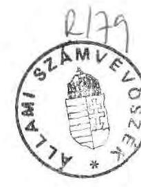

---

A vizsgálatot vezette: dr. Zsarnai Dezsőné főtanácsos
A vizsgálatban közreműködtek:
Vagyonkezelő Főcsoport
Területi Főcsoport
Fejezeti Főcsoport
Elvi, Módszertani és Információs Főcsoport
Az adatrögzítést a Mini Multi Kft. végezte
A jelentés 1. sz. melléklete tartalmazza az ellenőrök és az ellenőrzött egységek felsorolását.

---

# Állami Számvevőszék   Elnöke 

JAVASLAT

Az Országgyűlés
.../1991. ( ) OGY
határozata
a szakszervezeti vagyon védelméről, a munkavállalók szervezkedési és szervezeteik működési esélyegyenlőségéről szóló 1991. évi XXVIII. törvény alapján tett vagyonelszámolásokról

A szakszervezeti vagyon védelméről, a munkavállalók szervezkedési és szervezeteik működési esélyegyenlőségéről szóló 1991. évi XXVIII. törvény végrehajtásaként benyújtott vagyonelszámolások ellenőrzéséről szóló 3614. sz. jelentése alapján az Állami Számvevőszék elnöke az Országgyűlésnek a következő határozati javaslatot terjeszti elő és kéri annak mérlegelését és elfogadását.
"Az Országgyűlés elfogadja az Állami Számvevőszék 3614.sz. jelentését a törvényben előírt teljesítési határidőn belül a hozzá benyújtott vagyonelszámolások hitelesítéséről és ezzel az Állami Számvevőszék feladatát teljesítettnek tekinti."

Budapest, 1991. november 28.
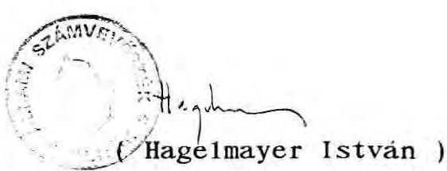

---

# ÁLLAMI SZÁMVEVŐSZÉK 

V-131-74/1991.
Témaszám: 85

## J E L E N T É S

a szakszervezeti vagyon védelméről, a munkavállalók szervezkedési és szervezeteik működési esélyegyenlőségéről szóló 1991. évi XXVIII. törvény alapján tett vagyonelszámolásokról

## I.

## AZ ELLENŐRZÉSI FELADAT

Az 1991. évi XXVIII. törvény (továbbiakban: törvény) szerint: "az elmúlt társadalmi rendszerben hozott döntések következtében tisztázatlanná váltak a munkavállalói érdekképviseleti és érdekvédelmi szervezetek vagyoni viszonyai. A jogilag rendezetlen helyzet veszélyezteti e szervek működőképességét és gátolja a szervezkedési szabadság alkotmányos jogának érvényesülését."

A megoldás érdekében az Országgyűlés a következőket írta elő:

A törvény hatálya alá tartoznak az egyesülési jogról szóló 1989. évi II. törvény alapján nyilvántartásba vett munkavállalói érdekképviseleti szervezetek (a továbbiakban: szakszervezet).

A szakszervezetek 1991. augusztus 31-ig kötelesek voltak az Állami Számvevőszékhez a törvény mellékletében meghatározott rendszerben vagyonel számolást benyújtani.

---

A vagyonel számolási kötelezettség az alábbi vagyontárgyakra terjedt ki:

- ingatlanok;
- állóeszközök, melyeknek nyilvántartott értéke a törvény hatályba lépésének időpontjában a 200000 Ft-ot meghaladta;
- védett műalkotások;
- a szakszervezet által alapított vállalat vagy a szakszervezet részvételével működő gazdasági társaságban a szakszervezeteket megillető tagsági, illetve tulajdonosi részesedés;
- értékpapírok;
- bankszámlán és egyéb módon kezelt pénzeszközök;
- alapítványba bevitt vagyon.

Az elszámolási kötelezettség az 1991. január 1-jén és a törvény hatályba lépésének napján, az 1991. július 17-én fennálló vagyoni helyzetre terjedt ki.

Az elszámolások teljességéért és valódiságáért az elszámoló felelős a törvény 2. sz. melléklete szerinti "Teljességi nyilatkozat" alapján.

Az Állami Számvevőszék feladatai a törvény végrehajtásában:
1, A benyújtott vagyonel számolások érkeztetése és befogadása.
2. Az elszámolások ellenőrzése és hitelességükről nyilatkozattétel, majd ezek eredményeiről beszámolás az Országgyűlésnek 1991. november 30-ig.
3. A hitelesség vagy a nem hitelesség megállapításának közlése a vizsgált szervezetekkel.
4. A vagyonel számolások megküldése a Vagyont Ideiglenesen Kezelő Szervezet (továbbiakban: VIKSZ) részére.
5. Az Országgyűlésnek készített beszámoló megküldése valamennyi szakszervezetnek.

---

Az Állami Számvevőszék a számára előírt feladatoknak az alábbiak szerint tett eleget.

# A FELADATVÉGZÉS KÖRÜLMÉNYEI 

Az Állami Számvevőszékhez az előírt határidőre, 1991. augusztus 31-ig 700 elszámolást nyújtottak be. Egyetlen szövetség sem nyújtott be elszámolást tagszervezetei teljes köréről gazdálkodói felelősséggel. A benyújtott vagyonelszámolási dokumentumok alapszervezetektől származnak.

A törvény nem nevesítette szervezetenként vagy szervezeti egységenként az elszámolásra kötelezettek körét. Mint erre a későbbiekben röviden utalunk, az Állami Számvevőszék megkísérelte az elszámolásra kötelezettek körének tételes meghatározását. Kezdeményezése nem járt sikerrel. Ezért csak nagyságrendileg becsülhető, hogy az előírt határidőre kötelezettségüknek az érintetteknek még negyede sem tett eleget.

Az elszámolásra kötelezettek körének megismerése érdekében az Állami Számvevőszék az általa ismert nagyobb szakszervezeti tömörülések vezetéséhez fordult. A Szakszervezetek Demokratikus Ligája rövid úton rendelkezésre bocsátotta a név- és címjegyzékeket, és hasonlóan jártak el a független tömörülések is. Ugyanakkor a Magyar Szakszervezetek Országos Szövetségének elnöke elzárkózott attól, hogy a MSZOSZ tagszervezeteiről az egyébként publikus, aktuális helyzetet tükröző listát az ÁSZ részére hivatalosan megküldje.

Az Állami Számvevőszék a központi bírósági nyilvántartás lehetőségeire építve megkísérelte számítógépes módszerrel is meghatározni a vagyonelszámolásra kötelezettek körét. A Legfelsőbb Bíróság nyilvántartása a társadalmi szervezetek szakmai szervezet szerinti vagy területi szerveződési elven való elkülönítését és címjegyzékéket nem képes biztosítani. A nyilvántartott mintegy 17000 társadalmi szervezetből számítógéppel, kizárásos módszerrel sem lehet meghatározni az összes 1991. évi XXVIII. tv. hatálya alá tartozó munkavállalói érdekképviseleti szervezetet, amelyek szakszervezetnek minősülnek (munkástanácsok, ipartestületek, szakszervezetek, stb.) A társadalmi szervezetek sajátos nyilvántartása, valamint az adatszolgáltatások megtagadása teremtette azt a helyzetet, hogy a vagyonel számolásra kötelezett szervezetek sem számbelileg, sem pedig egyenként nem voltak meghatározhatók teljes körben.

A törvény nem tartalmazott szankciókat azon szervezetekre nézve, amelyek késve tettek eleget elszámolási kötelezettségüknek, minderre figyelemmel, az ÁSZ minden hozzá eljuttatott elszámolást feldolgozott. A jelentés aláírása időpontjáig 1991. november 26-ig további több mint 1200 elszámolás érkezett be. Az összesen 1907 elszámolás vélhetően fele-kétharmada annak, amit a törvény alapján teljesíteni kellett volna.

A Magyar Szakszervezetek Országos Szövetségének elnöke 1991. augusztus 8-án; a Fogyasztási Szövetkezeti Dolgozók Szakszervezetének elnöke 1991. augusztus 30-án, a Szakszervezeti Munkavállalók Szakszervezetének Kaposvári Szakszervezete bizottságának titkára 1991. szeptember 4-én írásban bejelentette, hogy az Alkotmánybírósághoz fordultak és a döntés meghozataláig nem kívánnak eleget tenni a törvényben foglaltaknak.

Az Állami Számvevőszék amikor törvényben foglalt elszámolási kötelezettségek elmulasztásáról, az ellenőrzés meghiúsításáról értesült, megtette a szükséges intézkedéseket. Az ÁSZ elnöke 1991. szeptember 5-én a Legfőbb Ügyészhez fordult, hogy - mint aki a szakszervezetek működésének törvényességi vizsgálatára jogosult - az ügyben járjon el és lépéséről, a kialakult helyzetről adjon tájékoztatást.

A Legfőbb Ügyész 1991. szeptember 26-án kelt levelében értesítette az Állami Számvevőszék elnökét arról, hogy a megküldött íratok alapján az egyesülési jogról szóló módosított 1989. évi II. törvény 14. §. (1) bekezdésében biztosított felügyeleti jogkörben, a Magyar Köztársaság Ügyészségéről szóló 1972. évi V. tv. 16.§. (1) bekezdése alapján - mulasztásban megnyilvánuló törvénysértés miatt - az ügyészség felszólalással élt 1991. szeptember 26-án a Magyar Szakszervezetek Országos Szövetsége elnökénél,

---

a Fogyasztási Szövetkezeti Dolgozók Szakszervezete elnökénél, valamint a Szakszervezeti Munkavállalók Szakszervezetének Kaposvári Szakszervezete Bizottsága titkáránál.

Később a Postai Dolgozók Szakszervezete is elzárkózó nyilatkozatot tett, így e szakszervezet országos titkárához is 1991. október 28-án hasonló levelet küldtek. (A vonatkozó levelezést a 2-10. sz. mellékletek tartalmazzák.)

A felsorolt szervezetek a Legfőbb Ügyész felszólítására sem nyújtottak be vagyonelszámolást az Állami Számvevőszékhez.

Voltak olyan érdekképviseleti szervek, amelyek az ÁSZ részére arról küldtek értesítést, hogy letétbe helyezték bevallásukat, törvény értelmezésre vonatkozó állásfoglalásokat kértek, vagy a szövetségükhöz tartozó szervezetek adatszolgáltatásainak megküldéséig egyidejűleg határidő módosítást is igényeltek (11. sz. melléklet szerint). E szervezetek postafordultával arról kaptak értesítést, hogy kívül esik az ÁSZ feladatkörén és hatáskörén a törvény értelmezése, továbbá a törvény előírásaitól eltérő eljárásra senkinek nem lehet felhatalmazása. E szervezetek közül a jelentés lezárásáig nem tett eleget adatközlési kötelezettségének: a Mezőgazdasági, Erdészeti és Vízgazdálkodási Dolgozók Szakszervezetének Szövetsége, a Kereskedelmi Szakszervezetek Szövetsége, a Fogyasztási Szövetkezeti Dolgozók Szakszervezete. Az ÁSZ velük szemben is ügyészi fellépést kezdeményezett.

# A FELADAT VÉGREHAJTÁSA 

A vizsgálat egységes elvi és szakmai alapjait az 1991. augusztus 15-én a "Figyelőben" közzétett általános vizsgálati program nyilvánosságra hozatala biztosította. E program egyértelművé tette, hogy az ÁSZ milyen követelmények alapján nyilatkozik a hitelességről.

A vagyonel számolási feladat az MSZOSZ-hoz tartozó szakszervezetek elzárkózó álláspontja ellenére is sokkal nagyobb terjedelmű volt, mint amelyet az Állami Számvevőszék társadalmi szervezetek, pár-

---

tok gazdálkodását ellenőrző vizsgálati egysége ellátni képes. Emiatt - élve az Országgyűlés által biztosított többlet pénzforrás lehetőségével - 12 fő külső szakértőt vont be a manuális feldolgozás és helyszíni ellenőrzés munkáinak elvégzésére. Az így kiegészült létszám lehetővé tette, hogy az ÁSZ munkatársai minden benyújtott vagyonelszámolást legalább formai-alaki, számszaki szempontból ellenőrizzenek és az ellenőrzés megállapításait egyenként, minden szervezetnél jelentésbe foglalják, valamint az alátámasztó dokumentumokat 242 szervezetnél, a fővárosban és az ország megyéiben a helyszínen részleteiben is megvizsgálják.

Az 1907 szervezettől beérkezett adattömeg teljes egésze számítógépre került. A listázás, összesítés, címzés, értesítés munkája a 100 ezres nagyságrendű adatelem-sort figyelembe véve - enélkül megoldhatatlan lett volna.

Az Állami Számvevőszék folyamatosan postázza az adatszolgáltató munkavállalói érdekképviseleti szervezeteknek a benyújtott elszámolásokra vonatkozó minősítésről szóló egyenkénti nyilatkozatát és összefoglaló jelentését.

Az Állami Számvevőszék a törvény előírásai szerint a jelentés benyújtásával egyidejűleg átadja a Vagyont Ideiglenesen Kezelő Szervezet (VIKSZ) részére a vagyonelszámolásokat, valamint - bár ez nem volt törvényi kötelezettsége - saját elhatározásából az ezek összesítéséről készített, táblázatos összesítéseket és a sokcélú továbbfeldolgozásra is kiinduló bázist nyújtó elektronikus adathordozókat.

Az Országgyűlés által rendelkezésre bocsátott 6,6 millió Ft-ból a fel nem használt összeget az ÁSZ éves pénzügyi beszámolója elfogadását követően a költségvetésnek visszautalja.

---

II.

# MEGÁLLAPÍTÁSOK 

Az Állami Számvevőszék meghirdetett programja szerint minden vagyonel számolást tartalmilag és formailag ellenőrzött (1907 db).

Tartalmilag és formailag hibátlan volt 1385 db vagyonel számolás.

Formailag hibás, de tartalmilag hiteles volt 298 db vagyonel számolás. Ezeket az Állami Számvevőszék elfogadta.

Összesen hiteles 1683 db vagyonel számolás (88%).
Formailag megfelelő volt, de tartalmilag hibás és emiatt nem hitelesíthető volt 123 db vagyonel számolás.

Nem volt hitelesíthető súlyos tartalmi és formai hibák miatt 101 db vagyonel számolás.

Összesen nem hiteles 224 db vagyonel számolás (22%).

Nem tartalmazott vagyonadatot (jelöletlen) 73 db elszámolás címén küldött irat. Ezek egy részéről a feldolgozáskor kiderült, hogy valamely már megküldött dokumentumhoz kapcsolódnak.

A vagyonel számolást benyújtó szakszervezetek működési körülményeit jellemzi, hogy döntő többségének nincs jelentősebb vagyona, sem ingatlannal, sem egyéb állóeszközzel nem rendelkeznek. Mint arról a későbbiekben beszámolunk, az ÁSZ által összesített adatok szerint jelentős, a bevallott vagyon 30%-át kitevő, 2,6 Mrd Ft-az értékpapírok 1991. VII. 17-i záróállománya. A szakszervezeteknél ezután jellemzően a pénzforgalom jelent meg a vagyonkimutatásban. Annál a néhány szakszervezetnél, amely ingatlannal vagy egyéb állóeszközzel is rendelkezik sem túl jelentős a vagyon értéke. Kivételt képez ez alól az a néhány vagyonel számolást benyújtó szakszervezet, amely már 1945. előtt is működött és az idő alatt üdülő, székház vagy egyéb ingatlan tulajdont vásároltak a befizetett tagdijakból, vagy azon felül a szakszervezeti tagság külön, céljellegű befizetéséből.

A hitelesség meghatározása több gondot vetett fel. A törvény szövegében is kötelezően előírta a meghatározott tartalmú teljességi nyilatkozat megadását. Ahol ez a nyilatkozat hiányzott, az súlyos tartalmi hibának minősült, mert maga a vagyonel számoló sem garantálta, hogy a bevallás minden előírt vagyonrészt tartalmaz. Az Állami Számvevőszék azon vagyonel számolásokat nem minősíthette hitelesnek, amelyekhez teljességi nyilatkozatot nem csatoltak. A törvény 4. §-a szerint "az elszámolások teljességéért és valódiságáért az elszámoló felelős". Így elfogadható volt a számviteli rendért felelős személytől származó egyetlen aláírás mellett is a nyilatkozat, éppen mert a törvény a felelősséget ráhárítja és mert egyéni érdekével nem kell számolni.

Az Állami Számvevőszék hitelesnek fogadta el azokat a teljességi
 nyilatkozatokat, amelyek kis létszámú alapszervezetektől érkeztek háromnál kevesebb aláírással. Ezeknél a törvény szerinti minta által előírt három aláíró közül ugyanis egy vagy kettő funkciót betöltött és csak ezek a személyek írták alá. Ha a nyilatkozatot ketten írták alá, az a jogi személyek képviseletére vonatkozó szabálynak megfelel, tehát el lehetett fogadni teljes értékűnek. Ha csak egy aláírás szerepel, nyilvánvaló, hogy ez a számviteli rendért felelős személytől származott.

Mindezeket mérlegelve és elfogadva a hitelesség szempontjából eleve ki kellett zárnunk 139 elszámolást, ami a nem hitelesített mennyiség 62%-a volt.

---

A következő jellemzők és kisebb-nagyobb hibák voltak tapasztalhatók a helyszíni ellenőrzés alapján:

A "Pénzforgalom alakulása" megnevezésű adatlapot töltötte ki az elszámolók több mint 90%-a. A kitöltés pontos volt, összeadási hiba viszonylag kevés esetben merült fel, ezeket a feldolgozás kimutatta. Többször előfordult, hogy a pénzforgalmi összegre vonatkozó adatokat nem a törvényben előírt forint értékben, hanem 1000 Ft-ban adták meg, hasonlóan az előző és következő táblázatokra előírtnak. Ahol ezen nagyságrendi tévedéseket ki lehetett szűrni, azokat az elszámolásokat hitelesíthetőknek tekintettük.

Előfordult, hogy az elsődleges (nem helyszíni) ellenőrzéssel nem lehetett megállapítani a pénzforgalmi adatok nagyságrendjét. Ezt az értékadatok összesítésében hibatényezőként számításba kellett venni.

Az adathiányos, úgynevezett "nemleges" vagyonel számolások különböző formában jelentek meg. A leggyakoribb eset az volt, hogy csak a pénzforgalmi adatlapot töltötte ki a vagyonel számolást benyújtó szervezet a teljességi nyilatkozattal együtt és a többi adatlapot nem is mellékelték. Nemlegesként voltak értelmezhetők az olyan vagyonel számolások is, amelyeknél csatolták az összes adatlapot, de azokat teljesen üresen hagyták. Ezen elszámolásokat - a helyszíni ellenőrzési tapasztalatokat is figyelembevéve - hitelesnek minősítettük.

Ingatlanvagyon kimutatása során az adatlap 2-es rovatának kitöltésénél csupán egy, általában négyjegyű számot tüntettek fel egyesek, amiről nem lehet megállapítani, hogy helyrajzi számot jelöl vagy tulajdoni lapszámot. Az ingatlannyilvántartási hibákra az ellenőrök felhívták a figyelmet, ahol lehetett egyértelművé tették a helyszíni ellenőrzések során az azonosítást. Ennek meg-

---

felelően a hitelesítésre ezen esetek döntő többségénél is sor került. Végül csak mintegy 10 szervezet elszámolása volt ilyen okból elfogadhatatlan.

Állóeszközök vagyonelszámolásánál jellemző hiba, hogy a 200000 Ft-os értékhatár alatti állóeszközöket is bevallották, holott a törvény csak a 200000 Ft felettiek elszámolására vonatkozott. Ezt az ÁSZ munkatársai természetesen nem tekintették hitelesítést kizáró hibának.

Műalkotásra vonatkozó vagyonelszámolási adatokat nem kaptunk, ilyennel a helyszíni ellenőrzések során sem találkoztunk.

Gazdasági szervezetben való részvételt 0,3 MFt értékben jelentettek, némelyek az adatlap harmadik rovatát félreértve saját adataikkal töltötték ki.

Értékpapír és alapítványi érdekeltség 2,638 MFt értékben fordult elő, az adatlapok kitöltése megfelelő volt.

Kiemelendő, hogy a bevallott értékek nem képezik a teljes szakszervezeti vagyont, mert csak a kiemelt mérlegtételeket kellett bevallani, továbbá, mert az ún. pénzforgalmi mozgótételek szerepeltek az űrlapokon.

Az érintettek a vagyonelszámolásokban tapasztalt hibákat a helyszíni ellenőrzés során írásban elismerték, nyilatkoztak a korrekció elfogadásáról, így a helyszíni ellenőrzések további vita nélkül lezárhatók voltak.

Általánosságban megfogalmazható, hogy a hagyományos, hosszú múlttal rendelkező szakszervezeteknél - a korábban szakszervezeti gazdálkodási képzésben részesült - dolgozó gazdasági felelősök ma is pontosan, szabályosan vezetik nyilvántartásaikat, vagyonel szá-

---

molásuk megbízható. Gondok vannak az újonnan alakult szakszervezeteknél, valamint az új munkavállalói érdekképviseleti szervezeteknél, mert gazdasági ügyvitelt végző munkatársaik általában nincsenek, vagy olyan személyek látják el a munkát, akik szakismeretekkel nem rendelkeznek. A hatályos könyvvezetési kötelezettségekre vonatkozó jogszabályokban előírt nyilvántartások és elszámolások nem mindenütt biztosítottak.

Visszaélést vagy annak alapos gyanúját megalapozó tényt a beszámolást benyújtó körben az Állami Számvevőszék hitelesítési vizsgálatai nem tártak fel.

# A SZAKSZERVEZETEK ÁLTAL BEVALLOTT VAGYONÉRTÉK VAGYONNEMKÉNT 

Az Állami Számvevőszék számára a törvény nem írta elő a benyújtott vagyonel számolások összesítését. Természetesnek tartottuk azonban, hogy az Országgyűlés tájékoztatására, valamint a vagyonkezelési tevékenység kiinduló adatbázisának megteremtésére a rendelkezésre álló számítógépi háttérrel ilyen adat összesítést végezzünk.

Az Állami Számvevőszék fokozottan ügyelve a szakszervezetek önállóságára az elszámolt vagyonértékeket csak összevontan szerepelteti.

A benyújtott 1907 vagyonel számolás 1991. január 1-jei állományként összesen 6.948,4 millió Ft bruttó vagyonértékről adott számot. Ezek egy része 703,9 millió Ft, a szakszervezeti tagdijakból származó forgóeszköz, illetőleg bankbetét, bankszámla, pénztári készpénz.

---

Vagyonnemenként az alábbi bruttó vagyonértékeket vallották be a szakszervezetek:
millió Ft-ban

| Vagyonnem | 1991.01.1. | 1991.07.17. | növe-   kedés | csök-   kenés |
| :-- | --: | --: | --: | --: |
| Ingatlanok | 2.689,6 | 4.162,2 | 1499,3 | 26,7 |
| Állóeszközök és   védett múalk. | 716,5 | 1.016,5 | 311,8 | 11,8 |
| A szaksz.részvé-   telével működő   gazd.szerv. vagyoni   betéte | 0,2 | 0,3 | 0,1 | - |
| Értékpapírok | 2.667,5 | 2.637,7 | - | 29,8 |
| Pénzforgalom | 703,9 | 851,6 | 147,7 | - |
| Alapítványba bevitt   vagyon | 170,7 | 184,0 | 13,3 | - |
| ÖSSZESEN: | $6.948,4$ | $8.852,3$ | 1972,2 | 68,3 |

Bankbetéteket, értékpapírokat jelentősebb összegben azon szakszervezetek mutattak ki, amelyek hagyományosak, több évtizede működnek. E szervezeteknél a korábbi tagság befizetett tagdijai mellett felhalmozódott pénz a vállalatok, intézmények által nyújtott pénzbeni támogatásból is keletkezett. A szakszervezetek ennek fel nem használt részét kamatozó betétekként helyezték el pénzintézeteknél.

A törvény értelemszerűen nem tiltotta a pénzeszközök igénybevételét, mivel azzal a szakszervezetek folyamatos működését tette volna lehetetlenné. Az 1991. évi befolyó tagdijak, illetőleg a szakszervezetek működésével kapcsolatos bevételek és kiadások képezik az elszámolási időszakban a pénzmozgást. Számos szervezetnél a tagdijak - a tagok hozzájárulása alapján - levonásos rendszerben folyamatosan folynak be a szakszervezetekhez. Ha a tagdíjat nem a bérszámfejtésen keresztül számolják el, a szakszerveze-

---

ti tagok, bizalmiakhoz fizetik be a tagdíjat. Előfordult, hogy a tagdíjbevételeket házipénztárban tartották, bankszámlát nem nyitottak. A helyszíni ellenőrzések során az Állami Számvevőszék nem állapított meg visszaélést vagy arra utaló helytelen gyakorlatot a tagdíjelszámolásokkal kapcsolatban.

A szakszervezetek beszámolóikban összesen 248 ingatlanról közöltek adatokat. Az ingatlanok számos esetben a szakszervezet tulajdonát képezték. Főként az 1945. előtti ingatlanvételek szerepeltek tulajdonként a tulajdoni lapokon. A tulajdoni lapok kiállításának idejétől függően kezelői, illetőleg használati jog bejegyzések szerepeltek a megszerzés adataként. Egyes szakszervezetek ingatlanjainak vagyonelszámolásában "rendezés alatt álló" megjegyzéssel szerepeltek érték nélkül vagy értékkel kimutatott ingatlanok.

A "rendezés alatt álló" ingatlanok értékadatait azonban nem számították bele a vagyonértékbe, mert nem volt egyértelmű, hogy megilleti-e őket az ingatlannal kapcsolatos jog. Ez az eljárás megfelel az óvatos értékelés elvének, ennél fogva a revízió során ilyen okból nem módosult a bevallott vagyonérték.

Ahol az ingatlan bruttó értéke egyértelműen megállapítható volt, és csak az értékcsökkenési leírás elszámolásában volt számszaki tévedés, a vagyonelszámolást hitelesnek fogadta el az Állami Számvevőszék a számszaki hiba egyidejű javítása és a vagyonelszámoló szakszervezet nyilatkozata alapján. Az "osztott ingatlanvagyon" esetleges többszöri szerepeltetése (minden résztulajdonos az eredeti összingatlan értéket vallotta be) nem volt kizárható.

Az is előfordult, hogy egyik tulajdonos sem számolt el az osztott ingatlannal.

---

Mindezek miatt nyilvánvaló, hogy az így képzett adatok bár hitelesek, megnehezítik az ingatlanállományról közölt pénzügyi mutatók értékelését. Az ingatlanok összesített adatai emiatt csak tájékoztató jellegűnek tekinthetők és a táblázat záró értéke is csak nagyságrendi eligazítást nyújt.

Tájékoztatásul megemlítjük, hogy az ÁSZ-nak rendelkezésére állnak a SZOT jogelőd 1990. évi kongresszusának anyagai. Ezek tartalmaznak bizonyos 1989. december 31-i várható vagyoni adatokat. A vagyonel számoltatás gondolata még az előző évben merült fel és az ÁSZ munkatársai tájékozódtak a feladat körvonalai meghatározása érdekében. Ennek során adták át az említett dokumentumokat a MSZOSZ illetékesei. Ezek szerint a SZOT vagyona 1990. februárjában 2,4 milliárd Ft nettó érték körül alakult. Az adat azonban nem tartalmazza a különböző szakszervezeti szövetségek vagyonát.

Az Állami Számvevőszék megítélése szerint annak ellenére, hogy 1907 szervezet számolt el, a bevallott értékek a szakszervezeti vagyonnak csupán egy részét képezik. Következésképpen a vagyonel számolásban kimutatott vagyonérték nem ad országos összképet a ténylegesen létező, működő szakszervezeti vagyonról.

E vagyon is rendkívül szétaprózott, nincsenek összefüggő gazdálkodói felelősséget vállaló tömörülések.

Budapest, 1991. november

# / Hage1mayer István /

---

# MELLÉKLETEK 

a V-131-74/1991.sz. "JELENTÉS"-hez

---

# TARTALOMJEGYZÉK 

a V-131-74/1991. sz. szakszervezeti vagyonel számolás jelentésének mellékleteiről

1. sz.melléklet A szakszervezeti vagyonel számolások szervezeti listája, minősítése, az ellenőrök neve.
2. sz.melléklet Az ÁSZ elnökének levele (V-131-17/91., VIII.12.) az Országgyűlés elnökének, Nagy Sándor MSZOSZ elnök szakszervezeti vagyonel számolást megtagadó nyilatkozatáról az Alkotmánybíróság döntéséig.
3. sz.melléklet Nagy Sándor MSZOSZ elnök levele (V-131-16/91. VIII.8.) az Alkotmánybírósághoz fordulásról.
4. sz.melléklet Dr. Györgyi Kálmán legfőbb ügyész válasza a V-131-40/91. és V-131-59/91. sz. ügyekre a szakszervezeti vagyonel számolásra való felszólításról.
5. sz.melléklet A V-131-51/91. IX. 4-ei bejelentés Svajda József titkártól, a Szakszervezeti Munkavállalók Szakszervezetének Kaposvári Szakszervezeti Bizottsága vagyonel számolásának megtagadásáról az Alkotmánybíróság döntéséig.
6. sz.melléklet A V-131-19/1991. VIII. 15-ei ÁSZ elnöki levél Nagy Sándor MSZOSZ elnökének az 1991. évi XXVIII. tv. végrehajtásának hatályáról.
7. sz.melléklet A V-131-73/91. X. 28-ai értesítés a Legfőbb Ügyész helyettesétől az ÁSZ elnökének a Postai Dolgozók Szakszervezete országos titkárának felszólításáról vagyonel számolásra.

---

8. sz.melléklet A V-131-40/91. IX. 5. az ÁSZ elnökének levele a Legfőbb Ügyésznek a vagyonel számolást elmulasztókról.
9. sz.melléklet A V-131-41/91. IX.5. az ÁSZ elnökének levele az Országgyűlés elnökének a vagyonel számolást elmulasztókról.
10. sz.melléklet V-131-69/91. X.7.a Postai Dolgozók Szakszervezetének levele az ÁSZ elnökének a vagyonel számolás megtagadásáról.
11. sz.melléklet Jegyzék a késedelmes vagyonel számolást bejelentő és a törvényről állásfoglalást kérő szakszervezetekről.
12. sz.melléklet V-131-78/1991. XI. 18. az ÁSZ elnökének levele a Legfőbb Ügyészhez a vagyonel számolást nem teljesítő további szakszervezetekről.
13. sz.melléklet Szakszervezetek vagyonel számolásának összesített értékelő táblázata.
14. sz.melléklet V-131- 79 /1991. XI.2. Az ÁSZ levele dr. Beck Károly főosztályvezetőhöz a vagyonel számolást elmulasztó szakszervezetekről.
15. sz.melléklet Program a szakszervezeti vagyonvédelemről, a munkavállalók szervezkedési és szervezeteik működési esélyegyenlőségéről szóló 1991. évi XXVIII. tv. 5.§-ában előírt ellenőrzési és hitelesítési feladathoz (Megjelent a Figyelő 1991. augusztus 15-i számában.)

---

# 1.sz. melléklet

ÁLLAMI SZÁMVEVŐSZÉK

## Kimutatás a szakszervezetek vagyonelszámolása hitelességéről az 1991. évi XXVIII. tv. alapján

## Jelentéshez

### ORSZÁGOS ÖSSZESEN

|  Megye megnevezése | Beérkezett elszámolások száma | HITELES | NEM HITELES | JELÖLETLEN  |
| --- | --- | --- | --- | --- |
|  BUDAPEST | 375 | 297 | 56 | 22  |
|  BARANYA MEGYE | 90 | 60 | 27 | 3  |
|  BÁCS-KISKUN MEGYE | 143 | 115 | 17 | 11  |
|  BÉKÉS MEGYE | 112 | 104 | 7 | 1  |
|  BORSOD-ABAÚJ-ZEMPLÉN MEGYE | 124 | 100 | 21 | 3  |
|  CSONGRÁD MEGYE | 63 | 52 | 10 | 1  |
| 

 FEJER MEGYE | 103 | 87 | 14 | 2  |
|  GYOR-SOPRON MEGYE | 77 | 72 | 2 | 3  |
|  HAJDU-BIHAR MEGYE | 98 | 86 | 10 | 2  |
|  HEVES MEGYE | 66 | 59 | 6 | 1  |
|  KOMÁROM-ESZTERGOM MEGYE | 76 | 71 | 3 | 2  |
|  NOGRÁD MEGYE | 57 | 53 | 1 | 3  |
|  PEST MEGYE | 88 | 75 | 12 | 1  |
|  SOMOGY MEGYE | 97 | 94 | 1 | 2  |
|  SZABOLCS-SZATMÁR-BEREG MEGYE | 55 | 44 | 8 | 3  |
|  JÁSZ-NAGYKUN-SZOLNOK MEGYE | 80 | 76 | 1 | 3  |
|  TOLNA MEGYE | 57 | 46 | 11 | 0  |
|  VAS MEGYE | 41 | 36 | 3 | 2  |
|  VESZPRÉM MEGYE | 98 | 86 | 10 | 2  |
|  ZALA MEGYE | 80 | 70 | 4 | 6  |
|  ORSZÁGOS ÖSSZESEN | 1980 | 1683 | 224 | 73  |

---

|  A. ÁLLAMI | Kimutatás |  |  | Lapszám:  |
| --- | --- | --- | --- | --- |
|  SZÁMVEVŐSZÉK | a szakszervezetek vagyonelszámolása |  |  |   |
|   | hitelességéről az 1991. évi XXVIII. tv. alapján |  |  |   |
|   | BUDAPEST |  |  |   |
|  Szervezet megnevezése |  | ÁSZ | Ellenőr neve | A vagyonelszámolás  |
|  Címe |  | iktatószám |  | minősítése  |
|  1. ÉPÍTŐK-DUNA MUNKÁSTANÁCSA 1990. |  |  | DR. HORVÁTH FERENC | HITELES  |
|  1117 BUDAPEST |  |  | ALMÁSI ÁRPÁD |   |
|  KAPOSVÁR U.5-7. |  | 1 |  |   |
|  2. STRABAG HUNGÁRIA ÉPÍTŐ KFT. MUNKÁSTANÁCS |  |  | DR. OCSOVAI SÁNDOR | NEM HITELES  |
|  1021 BUDAPEST |  |  | VÉGH ANDRÁS |   |
|  TÁROGATO U.2-4 |  | 15 |  |   |
|  3. MUNKÁSTANÁCSOK ZALA MEGYEI SZÖVETSÉGE |  |  | DR. OCSOVAI SÁNDOR | NEM HITELES  |
|  1021 BUDAPEST |  |  | VÉGH ANDRÁS |   |
|  TÁROGATO U.2-4 |  | 16 |  |   |
|  4. BKV FÜRST BUSZ ÜZEMEGYSÉG MUNKÁSTANÁCSA ELNÖKSÉGE |  |  | DR. OCSOVAI SÁNDOR | NEM HITELES  |
|  1113 BUDAPEST |  |  | VÉGH ANDRÁS |   |
|  HAMZSABÉGI U.55. |  | 21 |  |   |
|  5. BKV MEZŐ AUTOBUSZ ÜZEMEGYSÉG MUNKÁS-, ÉS ÉRDEKVÉDELMI TANÁCSA |  |  | DR. OCSOVAI SÁNDOR | NEM HITELES  |
|  1089 BUDAPEST |  |  | VÉGH ANDRÁS |   |
|  KORÁNYI S.U.3C. |  | 22 |  |   |
|  6. BKV AUTOBUSZ ÜZEMEGYSÉG MUNKÁSTANÁCSA OBUDA |  |  | DR. OCSOVAI SÁNDOR | NEM HITELES  |
|  1035 BUDAPEST |  |  | VÉGH ANDRÁS |   |
|  POMÁZI U.15. |  | 23 |  |   |
|  7. BKV KILIÁN AUTOBUSZ ÜZEMEGYSÉG MUNKÁSTANÁCSA |  |  | DR. OCSOVAI SÁNDOR | NEM HITELES  |
|  1194 BUDAPEST |  |  | VÉGH ANDRÁS |   |
|  META U.39. |  | 24 |  |   |
|  8. PETERFY SÁNDOR U-I KORHÁZ-RENDELETI INTÉZET SZAKSZ.BIZ. |  |  | DR. OCSOVAI SÁNDOR | NEM HITELES  |
|  1441 BUDAPEST |  |  | VÉGH ANDRÁS |   |
|  PETERFY S.U.8-20. BP.70.PF.76 |  | 25 |  |   |
|  9. SEMMELWEIS ORVOSTUDOMÁNYI EGYETEM SZAKSZERVEZETE |  |  | DR. OCSOVAI SÁNDOR | NEM HITELES  |
|  1085 BUDAPEST |  |  | VÉGH ANDRÁS |   |
|  ÚLLOI U.26. |  | 38 |  |   |
|  10. FŐVÁROSI FÜRDŐIGAZGATÓSÁG SZAKSZERVEZETI BIZOTTSÁGA |  |  | VÉGH ANDRÁS | HITELES  |
|  1051 BUDAPEST |  |  | DR. BAKI JÓZSEF |   |
|  SAS U.25. |  | 41 |  |   |
|  11. VEGYIÁRU KÜLKERESKEDŐK FÜGGETLEN DEMOKRATIKUS SZAKSZERVEZETE |  |  | VÉGH ANDRÁS | HITELES  |
|  1063 BUDAPEST |  |  | DR. BAKI JÓZSEF |   |
|  SZIV U.17. |  | 43 |  |   |
|  12. ENERGIAIPARI KARBANTARTÓK SZAKSZERVEZETE |  |  | VÉGH ANDRÁS | HITELES  |
|  1158 BUDAPEST |  |  | DR. OCSOVAI SÁNDOR |   |
|  CSERVENKA M.U.94. |  | 44 |  |   |
|  13. BKV OKTATÁSI ÉS SZOCIÁLIS DOLGOZÓK SZAKSZERVEZETI SZÖVETSÉGE |  |  | VÉGH ANDRÁS | HITELES  |
|  1980 BUDAPEST |  |  | DR. BAKI JÓZSEF |   |
|  PF:11. |  | 53 |  |   |
|  14. MTESZ ÉS TAGEGYESÜLETI DOLG. ORSZÁGOS SZAKSZ. ALAPSZ. A KÖZSZOLG.SZAKSZ.SZÖV.T. |  |  | VÉGH ANDRÁS | HITELES  |
|  1027 BUDAPEST |  |  | DR. BAKI JÓZSEF |   |
|  FO U.68. |  | 55 |  |   |
|  15. MUNKÁSTANÁCSOK ORSZÁGOS SZÖVETSÉGE /1 DB LEVÉL |  |  |  |   |
|  1021 BUDAPEST |  |  |  |   |
|  TÁROGATO U.2-4. |  | 56 |  |   |
|  16. AUTOJAVÍTÓIPARI SZOLGÁLTATÓ VÁLLALAT DOLGOZÓINAK SZAKSZERVEZETE |  |  | VÉGH ANDRÁS | HITELES  |
|  1056 BUDAPEST |  |  | DR. BAKI JÓZSEF |   |
|  SZABADSÁGJTO U.5. 1364 BP.5 PF:9. |  | 59 |  |   |
|  17. CSECSEMDTTHONOK PIKLER EMMI ORSZÁGOS MÓDSZERTANI INTÉZETE |  |  | VÉGH ANDRÁS | HITELES  |
|  1022 BUDAPEST |  |  | DR. BAKI JÓZSEF |   |
|  LOCZY LAJOS UTCA 3. |  | 60 |  |   |
|  18. ÉPÍTÉSTUDOMÁNYI INTÉZET SZAKSZERVEZETI BIZOTTSÁGA |  |  | VÉGH ANDRÁS | HITELES  |
|  1502 BUDAPEST |  |  | DR. BAKI JÓZSEF |   |
|  PF:71. |  | 66 |  |   |
|  19. KILIÁN AUTOBUSZ ÜZEMEGYSÉG SZAKSZERVEZETE |  |  | VÉGH ANDRÁS | HITELES  |
|  1194 BUDAPEST |  |  | DR. BAKI JÓZSEF |   |
|  META U.39. |  | 70 |  |   |
|  20. TÁRSADALOMBIZTOSÍTÁSI DOLGOZÓK SZAKSZERVEZETE |  |  | DR.VELÉNYI JÁNOS | HITELES  |
|  1139 BUDAPEST |  |  | VÁRLAKI PÁL |   |
|  VÁCI U.73. |  | 71 |  |   |

---

A SZÁMVEVŐSZÉK
a szakszervezetek vagyonelszámolása
hitelességéről az 1991. évi XXVIII. tv. alapján

BUDAPEST

| Szervezet megnevezése |  |  | A SZ | Ellenőr neve | A vagyonelszámolás minősítése |
| :--: | :--: | :--: | :--: | :--: | :--: |
|  | Címe |  | iktatószám |  |  |
| 21. VOLÁN TEFU RT. PILLANGÓ ÚTI DOLGOZÓK SZAKSZERVEZETE |  |  |  | VÉGH ANDRÁS | HITELES |
|  | 1149 BUDAPEST |  |  | DR. BAKI JÓZSEF |  |
|  | PILLANGÓ ÚT 15. | 77 |  |  |  |
| 22. BKV FORGALMI ÉS KERESKEDELMI IGAZGATÓSÁG DOLGOZÓINAK SZAKSZERVEZETE |  |  |  | VÉGH ANDRÁS | HITELES |
|  | 1072 BUDAPEST |  |  | DR. BAKI JÓZSEF |  |
|  | AKÁCSFA U.15.II./217./ | 78 |  |  |  |
| 23. BUDAI GYERMEKKORHÁZ-RENDELETI INTÉZET SZAKSZERVEZETI BIZOTTSÁGA |  |  |  | VÉGH ANDRÁS | HITELES |
|  | 1023 BUDAPEST |  |  | DR. BAKI JÓZSEF |  |
|  | BORBOLYA U.2. | 79 |  |  |  |
| 24. FŐVÁROSI LÁSZLÓ KORHÁZ SZB. |  |  |  | DR. BAKI JÓZSEF | HITELES |
|  | 1097 BUDAPEST |  |  | BERZETEY ATTILÁNE |  |
|  | GYÁLI U.5-7. 1450 PF:29. | 85 |  |  |  |
| 25. MAGYAR IZRAELITÁK ORSZÁGOS KÉPVISELETE SZERETETKORHÁZA ÉS BETEGOTTHONA |  |  |  | DR. OCSOVAI SÁNDOR | NEM HITELES |
|  | 1145 BUDAPEST |  |  | VÉGH ANDRÁS |  |
|  | AMERIKAI UT 53. | 91 |  |  |  |
| 26. MUNKÁSTANÁCSOK ORSZÁGOS SZÖVETSÉGE |  |  |  | DR. OCSOVAI SÁNDOR | NEM HITELES |
|  | 1021 BUDAPEST |  |  | VÉGH ANDRÁS |  |
|  | TÁROGATO U.2-4. | 94 |  |  |  |
| 27. ORSZÁGOS KORÁNYI IMRE ÉS PULMONOLÓGIAI INTÉZET SZB. |  |  |  | VÉGH ANDRÁS | HITELES |
|  | 1529 BUDAPEST |  |  | VITÁRISNÉ DR. AGULÁR MÁRIA |  |
|  | PIMENŐ U.1. | 101 |  |  |  |

 28. VOLÁN TOMEGÁRU ÉS BÁNYÁSZATI FUVAROZÓ VÁLLALAT SZAKSZ. |  |  |  | DR.SZÁLKA BÉLA | HITELES |
|  | 1364 BUDAPEST |  |  | RÁDLER LÁSZLÓ |  |
|  | PF:21. | 110 |  |  |  |
| 29. PEST MEGYEI KÖZLEKEDÉSI FELÜGYELET SZAKSZ. |  |  |  | VEGH ANDRÁSNE | HITELES |
|  | 1400 BUDAPEST |  |  | VITÁRISNE DR. AGULÁR MÁRIA |  |
|  | PF:12. | 112 |  |  |  |
| 30. KÖZPONTI STATISZTIKAI HIVATAL SZAKSZERVEZETE |  |  |  | VEGH ANDRÁSNE | HITELES |
|  | 1525 BUDAPEST |  |  | VITÁRISNE DR. AGULÁR MÁRIA |  |
|  | KELETI KÁROLY U.5-7.; PF: 51. | 121 |  |  |  |
| 31. BAJCSY-ZSILINSZKY KORHÁZ-RENDELEINTÉZET SZB. |  |  |  | VEGH ANDRÁSNE | HITELES |
|  | 1106 BUDAPEST |  |  | VITÁRISNE DR. AGULÁR MÁRIA |  |
|  | MAGLODI U. 89-91. | 136 |  |  |  |
| 32. FŐVÁROSI TÁVFŰTŐ MŰVEK MUNKAVÁLLALÓI ÉRDEKVÉDELMI SZERV. |  |  |  | VEGH ANDRÁSNE | HITELES |
|  | 1116 BUDAPEST |  |  | VITÁRISNE DR. AGULÁR MÁRIA |  |
|  | KALOTASZEG U.31. | 147 |  |  |  |
| 33. BUDAPESTI TROLIBUSZKÖZLEKEDÉSI DOLG. SZAKSZ. |  |  |  | DR.VELÉNYI JÁNOS | HITELES |
|  | 1101 BUDAPEST |  |  | VÁRLAKI PÁL |  |
|  | ZÁCH U.8. | 153 |  |  |  |
| 34. EGÉSZSÉGÜGYBEN DOLGOZÓ DEMOKRATIKUS SZAKSZ. BP-I BIZ. TITKÁRSÁGA |  |  |  | VEGH ANDRÁSNE | HITELES |
|  | 1363 BUDAPEST |  |  | VITÁRISNE DR. AGULÁR MÁRIA |  |
|  | NÁDOR U. 32.; PF: 36. | 176 |  |  |  |
| 35. FÜGGETLEN SZAKSZ. DEMOKRATIKUS LIGÁJA |  |  |  | BERZETEY ATTILÁNE | HITELES |
|  | 1071 BUDAPEST |  |  | RIDEG MARGIT |  |
|  | GORKIJ FASOR 45. | 181 |  |  |  |
| 36. ÖNÁLLÓ HILTON SZAKSZ. |  |  |  | VEGH ANDRÁSNE | HITELES |
|  | 1014 BUDAPEST |  |  | VITÁRISNE DR. AGULÁR MÁRIA |  |
|  | HESS ANDRÁS TÉR 1-3. | 182 |  |  |  |
| 37. ROBERT K. KRT.-I KORHÁZ-RENDE. INTÉZET GAZDASÁGI MŰSZAKI ELLÁTÁS FÜGGETLEN SZAKSZ |  |  |  | VEGH ANDRÁSNE | HITELES |
|  | 1134 BUDAPEST |  |  | VITÁRISNE DR. AGULÁR MÁRIA |  |
|  | ROBERT K. KRT. 82-84. | 183 |  |  |  |
| 38. SOTE GAZDASÁGI MŰSZAKI, IGAZGATÓSÁGI DOLGOZÓK SZAKSZ. |  |  |  | VEGH ANDRÁSNE | HITELES |
|  | 1085 BUDAPEST |  |  | VITÁRISNE DR. AGULÁR MÁRIA |  |
|  | ULLŐI U. 26. | 191 |  |  |  |
| 39. MAGYAR VEGYIPARI DOLGOZÓK SZAKSZ. SZÖVETSÉGE (KÍSÉROLEVEL) |  |  |  |  |  |
|  | 1068 BUDAPEST |  |  |  |  |
|  | BENCZUR U.45.; 1046 BP. PF: 29. | 192 |  |  |  |
| 40. MAGYAR VEGYIPARI DOLGOZÓK SZAKSZ. SZÖVETSÉGE ORSZÁGOS IRODÁJA |  |  |  | BERZETEY ATTILÁNE | HITELES |
|  | 1068 BUDAPEST |  |  | DR.BAKI JÓZSEF |  |
|  | BENCZUR U.45. | 192/1 |  |  |  |

---

|  SZERVEZET |  |  |  |   |
| --- | --- | --- | --- | --- |
|  Szervezet megnevezése |  |  |  |   |
|  Címe |  |  |  |   |
|  41. VDSZ KÖZÉPSZERVEZETEK |  |  |  |   |
|  1068 BUDAPEST |  |  |  |   |
|  BENCZUR U.45. |  | 192/2 | VEGH ANDRÁSNE | HITELES  |
|   |  |  | VITÁRISNE DR. AGULÁR MÁRIA |   |
|  42. VDSZ ALAPSZERVEZETEK |  |  |  |   |
|  1068 BUDAPEST |  |  | BERZETEY ATTILÁNE | HITELES  |
|  BENCZUR U.45. |  | 192/3 | DR. BAKI JÓZSEF |   |
|  43. MVDSZ MŰVELŐDÉSI INTÉZMÉNYEK |  |  | VEGH ANDRÁSNE | HITELES  |
|  1068 BUDAPEST |  |  | VITÁRISNE DR. AGULÁR MÁRIA |   |
|  BENCZUR U.45. |  | 192/4 |  |   |
|  44. MVDSZ TANINTÉZETEK |  |  | VEGH ANDRÁSNE | HITELES  |
|  1068 BUDAPEST |  |  | VITÁRISNE DR. AGULÁR MÁRIA |   |
|  BENCZUR U.45. |  | 192/5 |  |   |
|  45. INGATLANKÉZELŐ ÉS VÁROSGAZDÁLKODÁSI DOLGOZÓK FÜGGETLEN SZAKSZ. |  |  | VEGH ANDRÁSNE | HITELES  |
|  1146 BUDAPEST |  |  | VITÁRISNE DR. AGULÁR MÁRIA |   |
|  THOKOLY UT 106. |  | 193 |  |   |
|  46. FŐVÁROSI BÜNTETÉSVÉGREHAJTÁSI INTÉZET FÜGGETLEN ORI SZAKSZ. |  |  | DR. OCSOVAL SÁNDOR | NEM HITELES  |
|  1363 BUDAPEST |  |  | VEGH ANDRÁSNE |   |
|  NAGY IGNÁC U. 5-11. |  | 194 |  |   |
|  47. "NIVELCO" ÉRDEKVÉDELMI SZAKSZ. ELZETT ZÁR ÉS LAKATGYÁR |  |  | VEGH ANDRÁSNE | HITELES  |
|  1138 BUDAPEST |  |  | DR. OCSOVAL SÁNDOR |   |
|  VÁCI UT 117-119. |  | 203 |  |   |
|  48. BETONÚTÉPÍTŐK SZAKSZERVEZETE |  |  | DR. BAKI JÓZSEF | HITELES  |
|  1061 BUDAPEST |  |  | BERZETEY ATTILÁNE |   |
|  ANDRÁSSY UT 9. |  | 204 |  |   |
|  49. LÉGIFORGALMI ÉS REPÜLŐTÉRI IGAZGATÓSÁG SZAKSZ. SZERVEZETE |  |  | VEGH ANDRÁSNE | HITELES  |
|  1675 BUDAPEST |  |  | VITÁRISNE DR. AGULÁR MÁRIA |   |
|  PF: 53. |  | 225 |  |   |
|  50. FŐVÁROSI SZERELŐIPARI VÁLLALAT SZB. |  |  | VEGH ANDRÁSNE | HITELES  |
|  1097 BUDAPEST |  |  | VITÁRISNE DR. AGULÁR MÁRIA |   |
|  KOPPANY U. 5/11. |  | 251 |  |   |
|  51. BHDFSZ BUDAPESTI HŐERŐMŰVEK DOLGOZÓINAK FÜGGETLEN SZAKSZ. |  |  | VEGH ANDRÁSNE | HITELES  |
|  1211 BUDAPEST |  |  | VITÁRISNE DR. AGULÁR MÁRIA |   |
|  BÜDAFOKI UT 52. |  | 260 |  |   |
|  52. MÉRNOKOK ÉS TECHNIKUSOK SZABAD SZAKSZ. |  |  | VEGH ANDRÁSNE | HITELES  |
|  1071 BUDAPEST |  |  | VITÁRISNE DR. AGULÁR MÁRIA |   |
|  DOZSA GYÖRGY U.84/B. |  | 278 |  |   |
|  53. HAJÓJAVÍTÓ SZAKSZ. SZB. |  |  | VEGH ANDRÁSNE | HITELES  |
|  1044 BUDAPEST |  |  | VITÁRISNE DR. AGULÁR MÁRIA |   |
|  IV. NÉPSZIGET; 1325 BP. PF: 97. |  | 281 |  |   |
|  54. ORSZÁGOS HAEMATOLÓGIAI ÉS VÉRTRANSFUZIÓS INTÉZET SZB. |  |  | DR. OCSOVAL SÁNDOR | NEM HITELES  |
|  1502 BUDAPEST |  |  | VEGH ANDRÁSNE |   |
|  XI. DAROCZI UT 24.; PF: 44. |  | 282 |  |   |
|  55. KÉPZŐMŰVÉSZÉK, IPARMŰVÉSZÉK ÉS MŰVÉSZETI DOLGOZÓK SZAKSZ. |  |  | VEGH ANDRÁSNE | HITELES  |
|  1406 BUDAPEST |  |  | DR. OCSOVAL SÁNDOR |   |
|  VI. GORKIJ FASOR 38. |  | 284 |  |   |
|  56. BM PEST MEGYEI TÁKISZ SZB. |  |  | SOLYOM LÁSZLÓ | NEM HITELES  |
|  1051 BUDAPEST |  |  |  |   |
|  SEMMELWEIS U.13. |  | 285 |  |   |
|  57. ORSZÁGOS KORHÁZ- ÉS ORVOSTECHNIKAI INTÉZET SZB. |  |  | VEGH ANDRÁSNE | HITELES  |
|  1125 BUDAPEST |  |  | VITÁRISNE DR. AGULÁR MÁRIA |   |
|  XII. DIOSÁROK U 3. |  | 289 |  |   |
|  58. INTERGLOB SZÁLLÍTMÁNYOZÁSI ÉS KERESKEDELMI DOLGOZÓK SZAKSZ. |  |  | VEGH ANDRÁSNE | HITELES  |
|  1146 BUDAPEST |  |  | VITÁRISNE DR. AGULÁR MÁRIA |   |
|  XIV. AJTOSI DÜRER SOR 10. |  | 298 |  |   |
|  59. ÚJPESTI KORHÁZ-RENDELEINTÉZET DOLGOZÓI ÖNÁLLÓ SZAKSZ. |  |  | VEGH ANDRÁSNE | HITELES  |
|  1045 BUDAPEST |  |  | VITÁRISNE DR. AGULÁR MÁRIA |   |
|  NYÁR U. 103. |  | 301 |  |   |
|  60. VÍZÜGYI ORSZÁGOS SZAKSZ. |  |  | DR. BAKI JÓZSEF | HITELES  |

 1088 BUDAPEST |  |  | BERZETEY ATTILÁNÉ |   |
|  RÁKOCZI UT 41. |  | 302 |  |   |

---

|  SZÁMVEVŐSZÉK | a szakszervezetek vagyonelszámolása hitelességéről az 1991. évi XXVIII. tv. alapján | Lapszám:  |
| --- | --- | --- |
|   | BUDAPEST |   |
|  Szervezet megnevezése | ÁSZ | Ellenőr neve  |
|  Címe | iktatószám | A vagyonelszámolási minősítése  |
|  61. KÖZÉP-DUNA-VOLGYI VIZÜGYI IGAZGATÓSÁG SZAKSZ. |  | VÉGH ANDRÁSNE  |
|  1088 BUDAPEST |  | VITÁRISNÉ DR. AGULÁR MÁRIA  |
|  RÁKOCZI UT 41. | 303 |   |
|  62. ÁLLAMI NÉPEGESZSEGÜGYI ÉS TISZTORVOSI SZOLGÁLAT PEST MEGYEI INTÉZETE SZB. |  | VÉGH ANDRÁSNE  |
|  1300 BUDAPEST |  | VITÁRISNÉ DR. AGULÁR MÁRIA  |
|  III. VÁRADI U. 35-41.; PF: 61. | 305 |   |
|  63. VENDÉGLÁTÓ ÉS IDEGENFORGALMI SZAKSZ. ORSZÁGOS KÖZPONTJA |  | DR. BAKI JÓZSEF  |
|  1066 BUDAPEST |  | ALMÁSI ÁRPÁD  |
|  JOKAI U. 6.; 1389 PF: 116. | 306 |   |
|  64. VENDÉGLÁTÓ ÉS IDEGENFORGALMI SZAKSZ. HUNGARHOTELS SZAKSZ. INTÉZŐ BIZOTTSÁG |  | VÉGH ANDRÁSNE  |
|  1052 BUDAPEST |  | VITÁRISNÉ DR. AGULÁR MÁRIA  |
|  PETŐFI S. U. 14. | 306/1 |   |
|  65. PANNÓNIA SZÁLLODA ÉS V. V. SZAKSZ. INTÉZŐ BIZ. |  | SOLYOM LÁSZLÓ  |
|  1088 BUDAPEST |  |   |
|  PUSKIN U. 6. | 306/2 |   |
|  66. DANUBIUS SZÁLLODA ÉS GYÓGYFÜRDŐ VÁLL. SZAKSZ. INT. BIZ. |  | VÉGH ANDRÁSNE  |
|  1138 BUDAPEST |  | VITÁRISNÉ DR. AGULÁR MÁRIA  |
|  MARGITSZIGET | 306/3 |   |
|  67. IGUSZ RT. SZAKSZ. INT. BIZ. |  | DR. SZÁLKA BÉLA  |
|  1053 BUDAPEST |  | RÁDLER LÁSZLÓ  |
|  FELSZABADULÁS TÉR 5. | 306/4 |   |
|  68. VISZ ATRIUM SZB. |  | VÉGH ANDRÁSNE  |
|  1051 BUDAPEST |  | VITÁRISNÉ DR. AGULÁR MÁRIA  |
|  ROOSEVELT TÉR 2. | 306/5 |   |
|  69. KERESKEDELMI-, PÉNZÜGYI ÉS VENDÉGLÁTÓIPARI DOLG. SZAKSZ. BP. TOURIST SZB. |  | DR. SZÁLKA BÉLA  |
|  1051 BUDAPEST |  | RÁDLER LÁSZLÓ  |
|  ROOSEVELT TÉR 5. | 306/6 |   |
|  70. COOPTOURIST SZB. |  | VÉGH ANDRÁSNE  |
|  1016 BUDAPEST |  | VITÁRISNÉ DR. AGULÁR MÁRIA  |
|  DEREK U. 2. | 306/7 |   |
|  71. CSEPEL VENDÉGLÁTÓ VÁLLALAT SZB. |  | VÉGH ANDRÁSNE  |
|  1095 BUDAPEST |  | VITÁRISNÉ DR. AGULÁR MÁRIA  |
|  SOROKSÁRI U. 98. | 306/8 |   |
|  72. DÉL-BUDAI VENDÉGLÁTÓ VÁLLALAT ÉS BUDA-VÁR RT. |  | VÉGH ANDRÁSNE  |
|  1126 BUDAPEST |  | VITÁRISNÉ DR. AGULÁR MÁRIA  |
|  BOSZORMÉNYI UT 20/22. | 306/9 |   |
|  73. DÉL-PESTI VENDÉGLÁTÓ VÁLLALAT GASTORG RT. SZB. |  | VÉGH ANDRÁSNE  |
|  1204 BUDAPEST |  | VITÁRISNÉ DR. AGULÁR MÁRIA  |
|  ERZSÉBET TÉR 1-2. | 306/10 |   |
|  74. ÉSZAK-BUDAI VENDÉGLÁTÓ VÁLLALAT SZB. |  | VÉGH ANDRÁSNE  |
|  1036 BUDAPEST |  | VITÁRISNÉ DR. AGULÁR MÁRIA  |
|  FENYVES ADOLF U. 19. | 306/11 |   |
|  75. PLATÁN RT. SZAKSZ. INTÉZŐ BIZ. |  | VÉGH ANDRÁSNE  |
|  1044 BUDAPEST |  | VITÁRISNÉ DR. AGULÁR MÁRIA  |
|  ROTTENBILLER U. 14. | 306/12 |   |
|  76. KERESKEDELMI, PÉNZÜGYI ÉS VENDÉGLÁTÓIPARI DOLG. SZAKSZ. HOTEL IFJÚSÁG SZB. |  | VÉGH ANDRÁSNE  |
|  1024 BUDAPEST |  | VITÁRISNÉ DR. AGULÁR MÁRIA  |
|  ZIVATAR U. 1-3. | 306/13 |   |
|  77. JUNIOR VENDÉGLÁTÓ VÁLLALAT SZB. |  | VÉGH ANDRÁSNE  |
|  1077 BUDAPEST |  | VITÁRISNÉ DR. AGULÁR MÁRIA  |
|  VII. MAJAKOVSZKIJ U. 55. | 306/14 |   |
|  78. ORIENT VENDÉGLÁTÓ RT. SZB. |  | VÉGH ANDRÁSNE  |
|  1072 BUDAPEST |  | VITÁRISNÉ DR. AGULÁR MÁRIA  |
|  NAGYDIOFA U. 8. | 306/15 |   |
|  79. KELET-PESTI VENDÉGLÁTÓ VÁLLALAT SZB. |  | VÉGH ANDRÁSNE  |
|  1055 BUDAPEST |  | VITÁRISNÉ DR. AGULÁR MÁRIA  |
|  MAKARENKO U. 26. | 306/16 |   |
|  80. PEST-BUDAI V. V. SZB. |  | VÉGH ANDRÁSNE  |
|  1250 BUDAPEST |  | VITÁRISNÉ DR. AGULÁR MÁRIA  |
|  I. FORTUNA U. 4. | 306/17 |   |

---

|  SZÁMVEVŐSZÉK | Kimutatás a szakszervezetek vagyonelszámolása hitelességéről az 1991. évi XXVIII. tv. alapján | Lapszám:  |
| --- | --- | --- |
|   | BUDAPEST |   |
|  Szervezet megnevezése |  |   |
|  Címe |  | A szakszervezetek vagyonelszámolása minősítése  |
|  81. PEST-VIDÉKI V. V. SZB. |  | VÉGH ANDRÁSNE  |
|  1074 BUDAPEST |  | VITÁRISNÉ DR. AGULÁR MÁRIA  |
|  VÖRÖSMARTY U. 12/B. | 306/18 |   |
|  82. TAVERNA SZÁLLODA ÉS ÉTTEREM RT. SZAKSZ. INT. BIZ. |  | DR. HORVÁTH FERENCNÉ  |
|  1056 BUDAPEST |  | DR. ZSARNAI DEZSONÉ  |
|  MÁRCIUS 15. TÉR 8. | 306/19 |   |
|  83. VIBEG VÁLLALAT SZB. |  | VÉGH ANDRÁSNE  |
|  1107 BUDAPEST |  | VITÁRISNÉ DR. AGULÁR MÁRIA  |
|  GEM U. 3. | 306/20 |   |
|  84. KERESKEDELMI PÉNZÜGYI ÉS VENDÉGLÁTÓIPARI DOLG. SZ. GASZTROTRANSZ FUV. KFT. SZB. |  | VÉGH ANDRÁSNE  |
|  1037 BUDAPEST |  | VITÁRISNÉ DR. AGULÁR MÁRIA  |
|  POMÁZI U. 5-7. | 306/21 |   |
|  85. PEST MEGYEI VENDÉGLÁTÓ VÁLL. SZB. |  | VÉGH ANDRÁSNE  |
|  1054 BUDAPEST |  | VITÁRISNÉ DR. AGULÁR MÁRIA  |
|  V. STEINDL I. U. 7. | 306/42 |   |
|  86. ERZSÉBETVÁROSI SZAKSZ. SZÖVETSÉG |  | VÉGH ANDRÁSNE  |
|  1071 BUDAPEST |  | VITÁRISNÉ DR. AGULÁR MÁRIA  |
|  DAMJANICH U. 48. | 307 |   |
|  87. VIZÜGYI KÖZSZOLGÁLTATÁSI DOLGOZÓK SZAKSZ. |  | SOLYOM LÁSZLÓ  |
|  1068 BUDAPEST |  |   |
|  BENCZÚR U. 43. | 308 |   |
|  88. TARTALÉKGAZDÁLKODÁSI IGAZGATÓSÁG SZAKSZ. |  | DR. BAKOS ROBERT  |
|  1053 BUDAPEST |  | ALMÁSI ÁRPÁD  |
|  VÁMHAZ KRT. 2. | 309 |   |
|  89. TUNGSRAM DOLGOZÓK FÜGGETLEN SZAKSZ. |  | SOLYOM LÁSZLÓ  |
|  1340 BUDAPEST |  |   |
|  IV. VÁCI UT 77. | 310 |   |
|  90. FSZOL FÜGGETLEN KÖZLEKEDÉSI SZAKSZ. ORSZÁGOS SZAKMAI SZÖV. |  | SOLYOM LÁSZLÓ  |
|  1056 BUDAPEST |  |   |
|  BELGRÁD RAKPART 1. | 311 |   |
|  91. FOLYAMI HAJÓSOSOK FÜGGETLEN SZAKSZ. |  | DR. BAKI JÓZSEF  |
|  1056 BUDAPEST |  | BERZETEY ATTILÁNÉ  |
|  BELGRÁD RAKPART 1. | 312 |   |
|  92. MAGYAR TENGERÉSZ SZAKSZ. |  | VÉGH ANDRÁSNE  |
|  1056 BUDAPEST |  | VITÁRISNÉ DR. AGULÁR MÁRIA  |
|  BELGRÁD RAKPART 1. | 313 |   |
|  93. STATISZTIKAI IGAZGATÓSÁGOK SZAKSZ. TANÁCSA PEST M-I ALAPSZERV. |  | VÉGH ANDRÁSNE  |
|  1052 BUDAPEST |  | VITÁRISNÉ DR. AGULÁR MÁRIA  |
|  PF: 118 | 322 |   |
|  94. FELSŐOKTATÁSI DOLGOZÓK SZAKSZERVEZETE KÖNNYŰIPARI MŰSZAKI FŐISKOLA SZAKSZ. BIZ. |  | VÉGH ANDRÁSNE  |
|  1034 BUDAPEST |  | VITÁRISNÉ DR. AGULÁR MÁRIA  |
|  DOBERDŐ U. 6. | 323 |   |
|  95. LÁSD 91-ES IKT. KÓD |  |   |
|   | 324 |   |
|  96. ORSZÁGOS TESTNEVELÉSI ÉS SPORT HIVATAL DOLG. SZAKSZ. |  | VITÁRISNÉ DR. AGULÁR MÁRIA  |
|  1374 BUDAPEST |  | VÉGH ANDRÁSNE  |
|  HOLD U. 1. BP. 5. PF: 614. | 325 |   |
|  97. KÖZPONTI STOMATOLÓGIAI INTÉZET SZB. |  | DR. OCSOVAI SÁNDOR  |
|  1088 BUDAPEST |  | VÉGH ANDRÁSNE  |
|  SZENTKIRÁLYI U. 40. | 326 |   |
|  98. HŰTŐIPARI DOLGOZÓK SZAKSZ. |  | DR. OCSOVAI SÁNDOR  |
|  1406 BUDAPEST |  | VÉGH ANDRÁSNE  |
|  PF: 6. | 327 |   |
|  99. BAROMFIIPARI DOLG. SZAKSZ. |  | VITÁRISNÉ DR. AGULÁR MÁRIA  |
|  1068 BUDAPEST |  | VÉGH ANDRÁSNE  |
|  GORKIJ FASOR 44. | 328 |   |
|  100. HEIM PÁL GYERMEKKORHÁZ RENDELŐINTÉZET SZB. |  | DR. BAKI JÓZSEF  |
|  1089 BUDAPEST |  | BERZETEY ATTILÁNÉ  |
|  ÚLLOI U. 86. | 329 |   |

---

|  SZÁMVEVŐSZÉK | Kimutatás a szakszervezetek vagyonelszámolása hitelességéről az 1991. évi XXVIII. tv. alapján | Lapszám:  |
| --- | --- | --- |
|   | BUDAPEST |   |
|  Szervezet megnevezése | ÁSZ | Ellenőr neve  |
|  Címe | iktatószám |   |
|  101. SZINAZI DOLG. SZAKSZ. |  | DR. OCSOVAI SÁNDOR  |
|  1068 BUDAPEST |  | VÉGH ANDRÁSNE  |
|  GORKIJ FASOR 38.: 1406. BP. PF: 7-8. | 342 |   |
| 

 102. TÁVKOZLESI BERUHÁZÁSI IRODA SZB. |  | VÉGH ANDRÁSNE  |
|  1441 BUDAPEST |  | VITÁRISNE DR. AGULÁR MÁRIA  |
|  PF:208. | 343 |   |
|  103. IPARI ÉS KERESKEDELMI IGAZGATÁSI DOLG.SZAKSZ. |  | VÉGH ANDRÁSNE  |
|  1525 BUDAPEST |  | VITÁRISNE DR. AGULÁR MÁRIA  |
|  PF:96. | 344 |   |
|  104. KÖZLEKEDÉSI SZAKSZ.SZÖVETSÉGE PEST MEGYEI RÉVHAJOZÁSI ÉS HAJÓÉPÍTŐ VÁLL.SZB. |  | VÉGH ANDRÁSNE  |
|  1011 BUDAPEST |  | VITÁRISNE DR. AGULÁR MÁRIA  |
|  CORVIN TÉR 6. | 345 |   |
|  105. ADSZ SPIRÁL AUTOVÁLLALAT SZB. |  | VÉGH ANDRÁSNE  |
|  1388 BUDAPEST |  | VITÁRISNE DR. AGULÁR MÁRIA  |
|  PF:98. | 346 |   |
|  106. IGAZSÁGSZOLGÁLTATÁSI MINISZTÉRIUM SZAKSZ. |  | VÉGH ANDRÁSNE  |
|  1363 BUDAPEST |  | VITÁRISNE DR. AGULÁR MÁRIA  |
|  PF:54. | 347 |   |
|  107. FELSŐOKTATÁSI DOLG.SZAKSZ.PÉNZÜGYI ÉS SZÁMVITELI FŐISKOLA SZB. |  | VÉGH ANDRÁSNE  |
|  1149 BUDAPEST |  | VITÁRISNE DR. AGULÁR MÁRIA  |
|  BUZOGÁNY U.10-12. | 354 |   |
|  108. HIVATÁSOS TŰZOLTÓK FÜGGETLEN SZAKSZ. |  | VÉGH ANDRÁSNE  |
|  1064 BUDAPEST |  | VITÁRISNE DR. AGULÁR MÁRIA  |
|  IZABELLA U.62-64. | 355 |   |
|  109. FŐVÁROSI VÍZMŰVEK MUNKAHELYI SZAKSZERVEZET |  | DR. FAZEKAS LÁSZLÓNÉ  |
|  1566 BUDAPEST |  | DR. HÁBENCZIUS GYULA  |
|  VÁCI U. 23. | 382 |   |
|  110. KÖZALKALMAZOTTAK SZAKSZERVEZETE |  | RIDEG MARGIT  |
|  1088 BUDAPEST |  | BERZETEY ATTILÁNÉ  |
|  PUSKIN U.4. | 383 |   |
|  111. AUTO- ÉS ALKATRÉSZKERESKEDELMI DOLGOZÓK SZAKSZ. ADSZ |  | DR. FAZEKAS LÁSZLÓNÉ  |
|  1061 BUDAPEST |  | DR. HÁBENCZIUS GYULA  |
|  PAULAY EDE U.50. | 384 |   |
|  112. MALEV SZAKSZERVEZETI SZERVEZETE I. TERMINÁL |  | DR. FAZEKAS LÁSZLÓNÉ  |
|  1185 BUDAPEST |  | DR. HÁBENCZIUS GYULA  |
|  | 386 |   |
|  113. LÉGIKÖZLEKEDÉSI FORGALMI DOLGOZÓK FÜGGETLEN SZAKSZ. |  | DR. FAZEKAS LÁSZLÓNÉ  |
|  1185 BUDAPEST |  | DR. HÁBENCZIUS GYULA  |
|  FERIHEGY I. | 386 |   |
|  114. JÁRMŰDOLGOZÓK AUTONÓM SZAKSZERVEZETE |  | DR. FAZEKAS LÁSZLÓNÉ  |
|  1185 BUDAPEST |  | DR. HÁBENCZIUS GYULA  |
|  FERIHEGY I. | 387 |   |
|  115. FÜGGETLEN DEMOKRATIKUS SZAKSZERVEZET "FÉG" |  | DR. FAZEKAS LÁSZLÓNÉ  |
|  1095 BUDAPEST |  | DR. HÁBENCZIUS GYULA  |
|  SOROKSÁRI ÚT 153. | 389 |   |
|  116. MŰVÉSZETI SZAKSZ. SZÖVETSÉGE |  | DR. FAZEKAS LÁSZLÓNÉ  |
|  1068 BUDAPEST |  | DR. HÁBENCZIUS GYULA  |
|  GORKIJ FASOR 38. | 390 |   |
|  117. MENTŐDOLGOZÓK FÜGGETLEN SZAKSZERVEZETE |  | DR. FAZEKAS LÁSZLÓNÉ  |
|  1194 BUDAPEST |  | DR. HÁBENCZIUS GYULA  |
|  TEMESVÁR U. 106 | 391 |   |
|  118. KÉZBESÍTŐK FÜGGETLEN DEMOKRATIKUS SZAKSZERVEZETE |  | DR. FAZEKAS LÁSZLÓNÉ  |
|  1525 BUDAPEST |  | DR. HÁBENCZIUS GYULA  |
|  KRISZTINA KRT. 6-8. | 393 |   |
|  119. MALEV KERESKEDELMI DOLGOZÓK AUTONÓM SZAKSZ. |  | DR. FAZEKAS LÁSZLÓNÉ  |
|  1052 BUDAPEST |  | DR. HÁBENCZIUS GYULA  |
|  ROOSEVELT TÉR 2. | 395 |   |
|  120. TUDOSZ TUDOMÁNYOS DOLGOZÓK SZAKSZERVEZETE |  | DR. FAZEKAS LÁSZLÓNÉ  |
|  1088 BUDAPEST |  | DR. HÁBENCZIUS GYULA  |
|  PUSKIN U.4. | 397 |   |

---

|  ÁLLAMI |  |  |  |   |
| --- | --- | --- | --- | --- |
|  SZÁMVEVŐSZÉK |  | a szakszervezetek vagyonelszámolása hitelességéről az 1991. évi XXVIII. tv. alapján |  |   |
|   |  | BUDAPEST |  |   |
|   | Szervezet megnevezése |  |  |   |
|   | Címe |  |  |   |
|  121. | VASÚTI DOLGOZÓK SZABAD SZAKSZERVEZETE |  |  |   |
|   | 1087 BUDAPEST |  |  |   |
|   | KEREPESI ÚT 3. | 398 |  |   |
|  122. | GYÓGYSZERTERMESZTÉSI DOLGOZÓK SZAKSZERVEZETE |  |  |   |
|   | 1441 BUDAPEST |  |  |   |
|   | 70. PF: 72. | 399 |  |   |
|  123. | MAGYAR MŰSZERIPARI EGYESÜLET SZAKSZERVEZETI SZÖVETSÉGE |  |  |   |
|   | 1518 BUDAPEST |  |  |   |
|   | 112. PF: 155. | 400 |  |   |
|  124. | SAJTOSZAKSZERVEZET |  |  |   |
|   | 1085 BUDAPEST |  |  |   |
|   | KOLCSEY U.2. | 401 |  |   |
|  125. | TÁVKOZLÉSI DOKUMENTÁCIÓS KÖZPONT SZB. |  |  |   |
|   | 1525 BUDAPEST |  |  |   |
|   | PF: 28. | 402 |  |   |
|  126. | MŰVELŐDÉSI ÉS KÖZOKTATÁSI MINISZTÉRIUM SZB. |  |  |   |
|   | 1191 BUDAPEST |  |  |   |
|   | SZALAY U. 10-14. | 403 |  |   |
|  127. | FOKA FÜGGETLEN HAJÓS SZAKSZERVEZET |  |  |   |
|   | 1138 BUDAPEST |  |  |   |
|   | CSERHALOM U.2. | 404 |  |   |
|  128. | KÖZLEKEDÉSI SZAKSZERVEZETEK ALKALMAZOTTAINAK SZAKSZ. |  |  |   |
|   | 1081 BUDAPEST |  |  |   |
|   | KÖZTÁRSASÁG TÉR 3 | 424 |  |   |
|  129. | INFORMATIKAI SZAKSZERVEZET |  |  |   |
|   | 1088 BUDAPEST |  |  |   |
|   | PUSKIN U.4. | 431 |  |   |
|  130. | FÜGGETLEN RENDŐRSZAKSZERVEZET KÖZPONTI KOORDINÁCIÓS IRODA |  |  |   |
|   | 1903 BUDAPEST |  |  |   |
|   | PF: 314. | 444 |  |   |
|  131. | DOHÁNYIPARI DOLGOZÓK SZAKSZ.SZÖV. |  |  |   |
|   | 1068 BUDAPEST |  |  |   |
|   | GORKIJ FASOR 44. | 452 |  |   |
|  132. | MAGYAR ZENEMŰVÉSZEK ÉS TÁNCMŰVÉSZEK SZAKSZ. |  |  |   |
|   | 1068 BUDAPEST |  |  |   |
|   | GORKIJ FASOR 38. | 453 |  |   |
|  133. | BÜNTETÉS-VEGREHAJTÁSI DOLGOZÓK ORSZ. SZAKSZ.SZÖV. |  |  |   |
|   | 1088 BUDAPEST |  |  |   |
|   | PUSKIN U.4. | 461 |  |   |
|  134. | BÜNTETÉS-VEGREHAJTÁSI DOLGOZÓK ORSZ.SZAKSZ.SZÖV. KALOCSAI ALAPSZERVEZETE |  |  |   |
|   | 1088 BUDAPEST |  |  |   |
|   | PUSKIN U.4. | 461/1 |  |   |
|  135. | BÜNTETÉS-VEGREHAJTÁSI DOLGOZÓK ORSZ.SZAKSZ.SZÖV. SZEGEDI ALAPSZERVEZETE |  |  |   |
|   | 1088 BUDAPEST |  |  |   |
|   | PUSKIN U.4. | 461/2 |  |   |
|  136. | BÜNTETÉS-VEGREHAJTÁSI DOLGOZÓK ORSZ.SZAKSZ.SZÖV. |  |  |   |
|   | 1088 BUDAPEST |  |  |   |
|   | PUSKIN U.4. | 461/3 |  |   |
|  137. | SZIGORÍTOTT JAVÍTÓ-NEVELŐ MUNKÁT VÉGREHAJTÓ INTÉZET SZB. |  |  |   |
|   | 1088 BUDAPEST |  |  |   |
|   | PUSKIN U.4. | 461/4 |  |   |
|  138. | BÜNTETÉS-VEGREHAJTÁSI DOLGOZÓK ORSZ.SZAKSZ.SZÖV. |  |  |   |
|   | 1088 BUDAPEST |  |  |   |
|   | PUSKIN U.4. | 461/5 |  |   |
|  139. | BÜNTETÉS-VEGREHAJTÁSI DOLGOZÓK ORSZ.SZAKSZ.SZÖV. ÁLLAMPUSZTAI ALAPSZERVEZETE |  |  |   |
|   | 1088 BUDAPEST |  |  |   |
|   | PUSKIN U.4. | 461/6 |  |   |
|  140. | BÜNTETÉS-VEGREHAJTÁSI DOLGOZÓK ORSZ.SZAKSZ.SZÖV. VÁCI ALAPSZERVEZETE |  |  |   |
|   | 1088 BUDAPEST |  |  |   |
|   | PUSKIN U.4. | 461/7 |  |   |

---

## ÁLLAMI SZÁMVEVŐSZÉK

## KÖZLEMÉNY a szakszervezetek vagyonelszámolása hitelességéről az 1991. évi XXVIII. tv. alapján

### BUDAPEST

|  Szervezet megnevezése | ÁSZ iktatószám | Ellenőr neve | A vagyonelszámol. minősítése  |
| --- | --- | --- | --- |
|  141. BÜNTETÉS-VEGREHAJTÁSI DOLGOZÓK ORSZ.SZAKSZ.SZÖV. PILISSZENTKERESZTI ALAPSZERV. DR. HORVÁTH

 FERENCNE 1088 BUDAPEST | 461/8 | DR. HORVÁTH FERENCNE | NITELE  |
|  PUSKIN U.4. |  | DR. BAKOS ROBERT |   |
|  142. BÜNTETÉS-VEGREHAJTÁSI DOLGOZÓK ORSZ.SZAKSZ.SZÖV. SOPRONKOHIDAI ALAPSZERVEZETE 1088 BUDAPEST | 461/9 | DR. OCSÓVAI SÁNDOR SOLYOM LÁSZLÓ | NITELE  |
|  PUSKIN U.4. |  | DR. OCSÓVAI SÁNDOR SOLYOM LÁSZLÓ | NITELE  |
|  143. BÜNTETÉS-VEGREHAJTÁSI DOLGOZÓK ORSZ.SZAKSZ.SZÖV. SÁTORALJAÚJHELYI ALAPSZERV. DR. OCSÓVAI SÁNDOR 1088 BUDAPEST | 461/10 | DR. OCSÓVAI SÁNDOR SOLYOM LÁSZLÓ | NITELE  |
|  PUSKIN U.4. |  | DR. SZÁLKA BÉLA | NITELE  |
|  144. BÜNTETÉS-VEGREHAJTÁSI DOLGOZÓK ORSZ.SZAKSZ.SZÖV. KECSKEMÉTI ALAPSZERVEZETE 1088 BUDAPEST | 461/11 | RADLER LÁSZLÓ DR. SZÁLKA BÉLA | NITELE  |
|  PUSKIN U.4. |  | DR. SZÁLKA BÉLA | NITELE  |
|  145. BÜNTETÉS-VEGREHAJTÁSI DOLGOZÓK ORSZ.SZAKSZ.SZÖV. NAGYFAI ALAPSZERVEZETE 1088 BUDAPEST | 461/12 | DR. FAZEKAS LÁSZLÓNÉ HÁBENCZIUS GYULA | NITELE  |
|  PUSKIN U.4. |  | DR. FAZEKAS LÁSZLÓNÉ HÁBENCZIUS GYULA | NITELE  |
|  146. BÜNTETÉS-VEGREHAJTÁSI DOLGOZÓK ORSZ.SZAKSZ.SZÖV. PÉCSI ALAPSZERVEZETE 1088 BUDAPEST | 461/13 | DR. HORVÁTH FERENCNÉ ALMÁSI ÁRPÁD | NITELE  |
|  PUSKIN U.4. |  | DR. OCSÓVAI SÁNDOR SOLYOM LÁSZLÓ | NITELE  |
|  147. BÜNTETÉS-VEGREHAJTÁSI DOLGOZÓK ORSZ.SZAKSZ.SZÖV. TOKOLI ALAPSZERVEZETE 1088 BUDAPEST | 461/14 | DR. FAZEKAS LÁSZLÓNÉ DR. HÁBENCZIUS GYULA | NITELE  |
|  PUSKIN U.4. |  | DR. FAZEKAS LÁSZLÓNÉ DR. HÁBENCZIUS GYULA | NITELE  |
|  148. BÜNTETÉS-VEGREHAJTÁSI DOLGOZÓK ORSZ.SZAKSZ.SZÖV. PÁLHALMAI ALAPSZERVEZETE 1088 BUDAPEST | 461/15 | DR. FAZEKAS LÁSZLÓNÉ DR. HÁBENCZIUS GYULA | NITELE  |
|  PUSKIN U.4. |  | DR. FAZEKAS LÁSZLÓNÉ DR. HÁBENCZIUS GYULA | NITELE  |
|  149. SZENTENDREI HEV FÜGGETLEN DEMOKRATIKUS SZAKSZ. 1011 BUDAPEST | 462 | DR. VELENYI JÁNOS VÁRLÁKI PÁL | NITELE  |
|  BATTHYÁNY TÉR |  |  |   |
|  150. FŐVÁROSI AUTOBUSZ ÜZEMEK SZAKSZ.SZÖV. 1072 BUDAPEST | 464 | DR. VELENYI JÁNOS VÁRLÁKI PÁL | NITELE  |
|  AKÁCFA U.15. |  |  |   |
|  151. BKV ÓBUDA AUTOBUSZ ÜZEMEGYSEG SZAKSZ. 1037 BUDAPEST | 464/1 | DR. VELENYI JÁNOS VÁRLÁKI PÁL | NITELE  |
|  POMÁZI U.15. |  |  |   |
|  152. KÖZLEKEDÉSI SZAKSZ.SZÖV. BKV AUTOBUSZ JÁRMŰJAVÍTÓMŰHELY SZB. 1072 BUDAPEST | 464/2 | DR. VELENYI JÁNOS VÁRLÁKI PÁL | NITELE  |
|  AKÁCFA U.15. |  |  |   |
|  153. BKV FÜRST ÜZEMEGYSEG SZB. 1072 BUDAPEST | 464/3 | DR. VELENYI JÁNOS VÁRLÁKI PÁL | NITELE  |
|  AKÁCFA U.15. |  |  |   |
|  154. FŐVÁROSI AUTOBUSZ ÜZEMEK SZAKSZ. SZÖV. RÉCSEI ÜZEMEGYSEG ELN. 1466 BUDAPEST | 464/4 | DR. VELENYI JÁNOS VÁRLÁKI PÁL | NITELE  |
|  155. BKV MEZŐ IMRE ÜZEMEGYSEG SZB. 1072 BUDAPEST | 464/5 | DR. VELENYI JÁNOS VÁRLÁKI PÁL | NITELE  |
|  AKÁCFA U.15. |  |  |   |
|  156. BKV AUTOBUSZ VONALMŰSZAKI SZB. 1072 BUDAPEST | 464/6 | DR. VELENYI JÁNOS VÁRLÁKI PÁL | NITELE  |
|  AKÁCFA U.15. |  |  |   |
|  157. AUTOBUSZ ÜZEMELTETÉSI IGAZGATÓSÁG MŰSZAKI FŐMERNÖKSÉG. 1072 BUDAPEST | 464/7 | DR. VELENYI JÁNOS VÁRLÁKI PÁL | NITELE  |
|  AKÁCFA U.15. |  |  |   |
|  158. FŐVÁROSI AUTOBUSZ ÜE.SZAKSZ.SZÖV. CINKOTA ÜE. ELNÖKE 1165 BUDAPEST | 464/8 | DR. VELENYI JÁNOS VÁRLÁKI PÁL | NITELE  |
|  BOKRÉTAFÖLDI UT |  |  |   |
|  159. BANKOK, BIZTOSÍTÓK DOLGOZÓINAK SZAKSZ. ORSZÁGOS KÖZPONT 1066 BUDAPEST | 477 | ALMÁSI ÁRPÁD DR. BAKOS ROBERT | NITELE  |
|  JOKAI U.6. |  |  |   |
|  160. KÖZPONTI IGAZGATÁSBAN DOLGOZÓK SZAKSZ. 1088 BUDAPEST | 478 | RIDEG MARGIT BERZETEY ATTILÁNÉ | NITELE  |
|  PUSKIN U.4. |  |  |   |

---

|  ÁLLAMI |  |  |  |   |
| --- | --- | --- | --- | --- |
|  SZÁMVEVŐSZÉK |  | a szakszervezetek vagyonelszámolása hitelességéről az 1991. évi XXVIII. tv. alapján |  | Lapszám:  |
|   |  | BUDAPEST |  |   |
|  Szervezet megnevezése |  |  |  |   |
|  Címe |  |  |  |   |
|  161. ORSZÁGOS MÉRÉSEGYSÉGI HIVATAL SZB. |  |  |  | A vagyonelszámolási minősítése  |
|  1531 BUDAPEST |  |  |  |   |
|  PF: 19. |  | 479 |  |   |
|  162. TÉTÉNYI ÚTI KORHÁZ-RENDELEINTEZET SZB. |  |  |  |   |
|  1502 BUDAPEST |  |  |  |   |
|  TÉTÉNYI ÚT 12/16. PF:4. |  | 481 |  |   |
|  163. KÖZÚTI KÖZLEKEDÉSI SZAKSZ. |  |  |  |   |
|  1081 BUDAPEST |  |  |  |   |
|  KÖZTÁRSASÁG TÉR 3. 1428 BP. PF:42. |  | 482 |  |   |
|  164. LÁSD 482-ES IKT.KÓD |  |  |  |   |
|   |  | 482/1 |  |   |
|  165. FŐVÁROSI VILLAMOS VASUTAK SZAKSZ.SZÖV. |  |  |  |   |
|  1145 BUDAPEST |  |  |  |   |
|  THOKOLY U.173. |  | 483 |  |   |
|  166. MÁV KORHÁZ ÉS KÖZPONT RENDELEINTEZET ÖNÁLLÓ SZAKSZ. |  |  |  |   |
|  1062 BUDAPEST |  |  |  |   |
|  PODMANICZKY U.111. |  | 486 |  |   |
|  167. ADÓSZTÓ ADÓ- ÉS PÉNZÜGYI ELLENŐRZÉSI DOLG. ORSZÁGOS SZAKSZ. TAN. |  |  |  |   |
|  1088 BUDAPEST |  |  |  |   |
|  PUSKIN U.4. |  | 487 |  |   |
|  168. BBV FÜGGETLEN SZABADSZAKSZ. |  |  |  |   |
|  1225 BUDAPEST |  |  |  |   |
|  NAGYTETÉNYI U.74-76. |  | 488 |  |   |
|  169. TÁVFŰTÉSI DOLGOZÓK FÜGGETLEN SZAKSZERVEZETE |  |  |  |   |
|  1184 BUDAPEST |  |  |  |   |
|  BENEDEK E.U. 9-15. |  | 489 |  |   |
|  170. SZENT JÁNOS KORHÁZ RENDELEINTEZET SZB. |  |  |  |   |
|  1125 BUDAPEST |  |  |  |   |
|  DIÓSÁROK U.1. |  | 491 |  |   |
|  171. KÖZLEKEDÉSI DOLGOZÓK SZAKSZ.SZÖV. |  |  |  |   |
|  1081 BUDAPEST |  |  |  |   |
|  KÖZTÁRSASÁG TÉR 3. |  | 492 |  |   |
|  172. KÖZL.DOLG.SZAKM.SZÖV. POSCHER MŰVELŐDÉSI HÁZA |  |  |  |   |
|  1135 BUDAPEST |  |  |  |   |
|  POSCHER JÁNOS U.6. |  | 492/1 |  |   |
|  173. VÁROSI TÖMEGKÖZLEKEDÉSI DOLGOZÓK SZAKSZ.SZÖV. |  |  |  |   |
|  1072 BUDAPEST |  |  |  |   |
|  AKÁCFA U.15. |  | 493 |  |   |
|  174. TÁRSULT ALAPSZERVEZETEK SZÖVETSÉGE |  |  |  |   |
|  1074 BUDAPEST |  |  |  |   |
|  AKÁCFA U.15. |  | 494 |  |   |
|  175. FELSŐOKTATÁSI DOLGOZÓK SZAKSZERVEZETE |  |  |  |   |
|  1417 BUDAPEST |  |  |  |   |
|  GORKIJ FASOR 10. |  | 495 |  |   |
|  176. GYORSVASÚTI DOLGOZÓK SZAKSZ. |  |  |  |   |
|  1143 BUDAPEST |  |  |  |   |
|  HUNGÁRIA KRT. 46. |  | 496 |  |   |
|  177. 9.SZ. BÁNKI DONÁT IPARI SZAKKÖZÉPISKOLA ÉS SZAKMUNKÁSKEPZŐ INTÉZET SZB. |  |  |  |   |
|  1138 BUDAPEST |  |  |  |   |
|  VÁCI UT 179-183. |  | 502 |  |   |
|  178. ÜGYÉSZSÉGI DOLGOZÓK ORSZ.SZAKSZ.TAN. |  |  |  |   |
|  1055 BUDAPEST |  |  |  |   |
|  MARKO U.16. |  | 505 |  |   |
|  179. KÖZEGÉSZSÉGÜGYI SZAKSZERVEZET |  |  |  |   |
|  1051 BUDAPEST |  |  |  |   |
|  NÁDOR U.32. |  | 506 |  |   |
|  180. LIGA FÜGGETLEN SZAKSZ.DEM. LIGÁJA (KÍSÉRŐLEVÉL) |  |  |  |   |
|  1071 BUDAPEST |  |  |  |   |
|  GORKIJ FASOR 45. |  | 507 |  |   |

---

|  SZÁMVEVŐSZÉK |  | a szakszervezetek vagyonelszámolása hitelességéről az 1991. évi XXVIII. tv. alapján |  |

  |  |  |  |  |  |  |  |  |  |  |  |  |  |  |  |  |  |  |  |  |  |   |
| --- | --- | --- | --- | --- | --- | --- | --- | --- | --- | --- | --- | --- | --- | --- | --- | --- | --- | --- | --- | --- | --- | --- | --- | --- | --- |
|   |  | BUDAPEST |  |  |  |  |  |  |  |  |  |  |  |  |  |  |  |  |  |  |  |  |  |  |   |
|   | Szervezet megnevezése |  |  |  |  |  |  |  |  |  |  |  |  |  |  |  |  |  |  |  |  |  |  |  |   |
|   | Címe |  |  |  |  |  |  |  |  |  |  |  |  |  |  |  |  |  |  |  |  |  |  |  |  |   |
|  181. | BUDAPEST-PENTA ÖNÁLLÓ SZAKSZERVEZET
1013 BUDAPEST
KRISZTINA KRT. 41-43. |  |  |  |  |  |  |  |  |  |  |  |  |  |  |  |  |  |  |  |  |  |  |  |  |   |
|  182. | BUDAPEST TELEFONGYÁR FÜGGETLEN SZAKSZ.
1143 BUDAPEST
HUNGÁRIA KRT. 126-132. |  |  |  |  |  |  |  |  |  |  |  |  |  |  |  |  |  |  |  |  |  |  |  |  |   |
|  183. | COLA-AROMA ÜDÍTŐITALIPARI SZAKSZERVEZET
1105 BUDAPEST
BÁNYA U. 35. |  |  |  |  |  |  |  |  |  |  |  |  |  |  |  |  |  |  |  |  |  |  |  |  |   |
|  184. | EGISZ DOLGOZÓK FÜGGETLEN SZAKSZ.
1106 BUDAPEST
KERESZTÚRI UT. 30-38. |  |  |  |  |  |  |  |  |  |  |  |  |  |  |  |  |  |  |  |  |  |  |  |  |   |
|  185. | ÉPÍTŐIPARI TERMELÉSZKÖZKERESKEDELMI VÁLL. FÜGG.DEM.SZAKSZ.
1106 BUDAPEST
JÁSZBERENYI U. 38-72. |  |  |  |  |  |  |  |  |  |  |  |  |  |  |  |  |  |  |  |  |  |  |  |  |   |
|  186. | FIATALOK ÉS MUNKAVÁLLALÓK SZAKSZ.SZÖV. CHINOIN GYÁRI SZERV.
1045 BUDAPEST
TÓ U. 1-5. |  |  |  |  |  |  |  |  |  |  |  |  |  |  |  |  |  |  |  |  |  |  |  |  |   |
|  187. | FOSPED-TEFU DOLGOZÓK FÜGG.SZAKSZ.
1108 BUDAPEST
GYOMROI U. 105. |  |  |  |  |  |  |  |  |  |  |  |  |  |  |  |  |  |  |  |  |  |  |  |  |   |
|  188. | FÜGGETLEN FORUM KÖZÚTI JÁRMŰJAVÍTÓK SZAKSZ.
1980 BUDAPEST
GYOMROI U. 156. |  |  |  |  |  |  |  |  |  |  |  |  |  |  |  |  |  |  |  |  |  |  |  |  |   |
|  189. | GAZDASÁGI SZAKEMBEREK SZAKSZ.
1185 BUDAPEST
FERIHEGY |  |  |  |  |  |  |  |  |  |  |  |  |  |  |  |  |  |  |  |  |  |  |  |  |   |
|  190. | GYERMEKEGESZÉGÜGYI DOLGOZÓK DÉL-BUDAI FÜGG.DEM.SZAKSZ.
1117 BUDAPEST
FŐVÁROSI ÚT 12. |  |  |  |  |  |  |  |  |  |  |  |  |  |  |  |  |  |  |  |  |  |  |  |  |   |
|  191. | MARGITSZIGETI SZÁLLODÁK ÖNÁLLÓ SZAKSZ.
1138 BUDAPEST
MARGITSZIGET |  |  |  |  |  |  |  |  |  |  |  |  |  |  |  |  |  |  |  |  |  |  |  |  |   |
|  192. | PEDAGÓGUSOK DEMOKRATIKUS SZAKSZERVEZETE
1071 BUDAPEST
GORKIJ FASOR 45. |  |  |  |  |  |  |  |  |  |  |  |  |  |  |  |  |  |  |  |  |  |  |  |  |   |
|  193. | POLIFOAM KFT. FIZ.DOLG. FÜGG.ÉRDEKVÉDELMI SZERV.
1097 BUDAPEST
GYÁLI UT 37. |  |  |  |  |  |  |  |  |  |  |  |  |  |  |  |  |  |  |  |  |  |  |  |  |   |
|  194. | POSTÁSOK FÜGGETLEN SZAKSZERVEZETE
1087 BUDAPEST
VERSENY U. 3. |  |  |  |  |  |  |  |  |  |  |  |  |  |  |  |  |  |  |  |  |  |  |  |  |   |
|  195. | REPÜLŐGÉP MŰSZAKI FÜGGETLEN SZAKSZERVEZET MALEV
1185 BUDAPEST
FERIHEGY |  |  |  |  |  |  |  |  |  |  |  |  |  |  |  |  |  |  |  |  |  |  |  |  |   |
|  196. | SZÜV NYOMDA FÜGGETLEN DEM.SZAKSZ.
1145 BUDAPEST
SZŰLŐ U. 9-15. |  |  |  |  |  |  |  |  |  |  |  |  |  |  |  |  |  |  |  |  |  |  |  |  |   |
|  197. | FIMUSZ VILLAMOSENERGIA IPARI ALKALMAZOTTAK, FIATALOK ÉS MUNKAVÁLL.MVMT. KOZP.SZ. DR.VELÉNYI JÁNOS
1011 BUDAPEST
VÁM U. 5-7. |  |  |  |  |  |  |  |  |  |  |  |  |  |  |  |  |  |  |  |  |  |  |  |  |   |
|  198. | VOLÁNSPEC FÜGGETLEN SZABAD SZAKSZ.
1138 BUDAPEST
MADARÁSZ UT. 51. |  |  |  |  |  |  |  |  |  |  |  |  |  |  |  |  |  |  |  |  |  |  |  |  |   |
|  199. | RÁDIÓÉNEKKARI ÉRDEKVÉDELMI SZERVEZETE
1800 BUDAPEST
BRODY U. 5-7. |  |  |  |  |  |  |  |  |  |  |  |  |  |  |  |  |  |  |  |  |  |  |  |  |   |
|  200. | FÜGGETLEN SZAKSZ.DEM.LIGÁJA VILLAMOS ENERGIA IPARI TAGOZATA
1011 BUDAPEST
VÁM U. 5-7. |  |  |  |  |  |  |  |  |  |  |  |  |  |  |  |  |  |  |  |  |  |  |  |  |   |

---

## ÁLLAMI SZÁMVEVŐSZÉK

## Kimutatás a szakszervezetek vagyonelszámolása hitelességéről az 1991. évi XXVIII. tv. alapján

### BUDAPEST

|  Szervezet megnevezése | ÁSZ iktatószám | Ellenőr neve | A vagyonelszámolás minősítése  |
| --- | --- | --- | --- |
|  201. BELKERESKEDELMI DOLGOZÓK SZAKMAI SZERVEZETE
1066 BUDAPEST
JOKAI U. 6. | 508 | DR.VELÉNYI JÁNOS, VÁRLAKI PÁL | HITELES  |
|  202. BUDAPESTI KÖZGAZDASÁGTUDOMÁNYI EGYETEM SZB.
1093 BUDAPEST
FŐVÁM TÉR 8. | 509 | DR. FAZEKAS LÁSZLÓ,
DR. HÁBENCZIUS GYULA | NEM HITELES  |
|  203. MUNKAVÉDELMI ÉS MUNKAÜGYI FŐFELÜGYELŐSÉG SZB.
1399 BUDAPEST
PF: 639. | 510 | DR. FAZEKAS LÁSZLÓ,
RIDEG MARGIT | NEM HITELES  |
|

  204. FILMMŰVESZÉK ÉS FILMALKALMAZOTTAK SZAKSZ.
1064 BUDAPEST
GORKIJ FASOR 38. PF: 8. | 511 | DR. FAZEKAS LÁSZLÓNÉ
DR. HÁBENCZIUS GYULA | NEM HITELES  |
|  205. PEDAGÓGUSOK SZAKSZERVEZETE ORSZÁGOS IRODA
1417 BUDAPEST
GORKIJ FASOR 10. PF: 11. | 512 | DR. HORVÁTH FERENCNÉ
DR. ZSARNAI DÉZSONÉ | HITELES  |
|  206. PED.SZAKSZ. KÖZPONTI ALAPSZERVEZET
1068 BUDAPEST
GORKIJ FASOR 10 | 523/8 | DR. HORVÁTH FERENCNÉ
DR. ZSARNAI DÉZSONÉ | HITELES  |
|  207. PED.SZAKSZ. PEST MEGYEI ALAPSZERVEZETEINEK SZÖV.
1068 BUDAPEST
GORKIJ FASOR 10. | 523/16 | BENCSIK LÁSZLÓNÉ
GIDAY ZOLTÁN | NEM HITELES  |
|  208. METRO ÉSZAK-DÉLI MOTORKOCSIVEZETŐK FÜGG.SZAKSZ.
1151 BUDAPEST
CSOBOGOS U.4.III 16. | 534 | DR. HORVÁTH FERENCNÉ
DR. ZSARNAI DÉZSONÉ | HITELES  |
|  209. KONZERVIPARI DOLGOZÓK SZAKSZ.
1068 BUDAPEST
GORKIJ FASOR 44 | 541 | DR. HORVÁTH FERENCNÉ
DR. ZSARNAI DÉZSONÉ | NEM HITELES  |
|  210. HUNGAROCAMION DOLGOZÓK SZAKSZ.INTEZŐ BIZ.
1656 BUDAPEST | 562 | RIDEG MARGIT
BERZETEY ATTILÁNÉ | HITELES  |
|  211. UNIVERZUM AUTOJAVÍTÓ VÁLL.SZAKSZ.BIZ
1441 BUDAPEST
MISKOLCI UT.157-159.PF.71 | 563 | DR. HORVÁTH FERENCNÉ
DR. ZSARNAI DÉZSONÉ | HITELES  |
|  212. MSZSZ.ÍRÓ SZAKSZERVEZETE
1068 BUDAPEST
GORKIJ FASOR 38. | 572 | BERZETEY ATTILÁNÉ
RIDEG MARGIT | NEM HITELES  |
|  213. EDDSZ.CMÚI.CSEPEL MŰVEK ÜZEMI RENDELŐINTEZET SZAKSZ.ALAPSZ.
1751 BUDAPEST
PF: 93 | 588 | DR. HORVÁTH FERENCNÉ
DR. ZSARNAI DÉZSONÉ | HITELES  |
|  214. PMKSZV FÜGGETLEN DEM.SZAKSZ.FSZDL.
1388 BUDAPEST
NÁDOR U.30. | 593 | RIDEG MARGIT
BERZETEY ATTILÁNÉ | NEM HITELES  |
|  215. TÁVKOZLÉSI DOLG.SZAKSZ.BUDAPESTI TÁVBESZÉLŐ IG.TERÜLETI SZAKSZ.
1431 BUDAPEST
PF: 187 | 601 | DR. HÁBENCZIUS GYULA
DR. FAZEKAS LÁSZLÓNÉ | HITELES  |
|  216. PEST MEGYEI FÖLDHIVATAL SZB.
1052 BUDAPEST
SAS U.19. | 602 | DR. HORVÁTH FERENCNÉ
DR. ZSARNAI DÉZSONÉ | HITELES  |
|  217. KÖZLEKEDÉSI ÉS SZÁLLÍTÁSI DOLG. SZAKSZ.MAHART SZABADKIKÖTŐ SZB.
1751 BUDAPEST
PF: 95 | 609 | DR. HORVÁTH FERENCNÉ
DR. ZSARNAI DÉZSONÉ | HITELES  |
|  218. TDDSZ TUDOMÁNYOS DOLG.DEM.SZAKSZ.ORSZÁGOS VÁLASZTÁNYA
1556 BUDAPEST
PF: 526 | 610 | RIDEG MARGIT
BERZETEY ATTILÁNÉ | NEM HITELES  |
|  219. TDDSZ. AKADEMIAI VÁLASZTÁNYA.
1556 BUDAPEST
PF: 526 | 610/1 | BERZETEY ATTILÁNÉ
RIDEG MARGIT | NEM HITELES  |
|  220. TDDSZ.55 HELYI CSOPORTJÁNAK ÖSSZEGZŐJE
1556 BUDAPEST
PF: 526 | 610/2 | BERZETEY ATTILÁNÉ
RIDEG MARGIT | NEM HITELES  |

---

|  SZÁMVEVŐSZÉK | Kimutatás a szakszervezetek vagyonelszámolása hitelességéről az 1991. évi XXVIII. tv. alapján | Lapszám:  |
| --- | --- | --- |
|   | BUDAPEST |   |
|  Szervezet megnevezése |  |   |
|  Címe |  | Asz  |
|  221. TÁVKOZLÉSI DOLGOZÓK SZAKSZ
1406 BUDAPEST
PF:14/T. | 611 | DR. HÁBENCZIUS GYULA
DR. FAZEKAS LÁSZLÓNÉ  |
|  222. BELÜGYI DOLGOZÓK SZAKSZ. ELNÖKSÉG
1903 BUDAPEST
PF:314 | 612 | KOVÁCSNÉ SOÓS PIROSKA
ALMÁSI ÁRPÁD  |
|  223. OMKER VÁLLALAT FÜGG. DEM. SZAKSZ.
1474 BUDAPEST
REZSO U.5-7. | 614 | DR. BAKI JÓZSEF
BERZETEY ATTILÁNÉ  |
|  224. GEODEZIAI DOLG. FÜGGETLEN SZAKSZ.
1442 BUDAPEST
BOSNYÁK TÉR 5.PF:87 | 615 | DR. BAKI JÓZSEF
BERZETEY ATTILÁNÉ  |
|  225. KÖZALK.SZAKSZ.ORSZ. TALÁLMÁNYI HIVATAL SZB.
1370 BUDAPEST
PF:552 | 620 | DR. BAKI JÓZSEF
BERZETEY ATTILÁNÉ  |
|  226. FŐVÁROSI CSATORNÁZÁSI MŰVEK SZB.
1056 BUDAPEST
MÁRCIUS 15.TÉR 3 | 624 | BERZETEY ATTILÁNÉ
DR. BAKI JÓZSEF  |
|  227. METEOROLÓGUS DOLGOZÓK SZAKSZ.
1024 BUDAPEST
KITAIBEL PÁL U.1. | 632 | BERZETEY ATTILÁNÉ
RIDEG MARGIT  |
|  228. AKADÉMIA IGAZGATÁSI ÉS SZOLGÁLTATÁSI DOLGOZÓK SZAKSZ.
1361 BUDAPEST
PF:6. | 640 | DR. BAKI JÓZSEF
BERZETEY ATTILÁNÉ  |
|  229. POSTAI ÉS HÍRKÖZLÉSI DOLG. SZAKSZ. SZÖV.
1406 BUDAPEST
PF:14. | 652 | BERZETEY ATTILÁNÉ
RIDEG MARGIT  |
|  230. ÖNKORMÁNYZAT UZSOKI UTCAI KORHÁZ SZB.
1426 BUDAPEST
UZSOKI U.29.PF:6. | 667 | VÉGH ANDRÁSNÉ
VITÁRISNÉ DR. AGULÁR MÁRIA  |
|  231. KÖZALK.SZAKSZ. PEST MEGYEI ILL.HIV. SZB.
1426 BUDAPEST
PILLANGÓ U.10.PF:102. | 668 | DR. BAKI JÓZSEF
BERZETEY ATTILÁNÉ  |
|  232. GANZ-HUNSLET RT. MUNKAVÁLLALÓINAK SZAKSZ.
1089 BUDAPEST
VAJDA PÉTER U.12 | 683 | DR. HÁBENCZIUS GYULA
DR. FAZEKAS LÁSZLÓNÉ  |
|  233. TÁVKOZLÉSI DOLG. SZAKSZ. BUDAPEST-VIDÉKI TÁVKOZL. IG.
1406 BUDAPEST
PF:14 | 687 | DR. HÁBENCZIUS GYULA
DR. FAZEKAS LÁSZLÓNÉ  |
|  234. ORVOSTOVÁBBKÉPZŐ EGYETEM SZAKSZ.
1389 BUDAPEST
PF:112. | 688 | DR. BAKOS ROBERT
ALMÁSI ÁRPÁD  |
|  235. VOLÁN TEFU VÁLL. MOGYORÓDI ÚTI DOLG. SZAKSZ. SZÖV.
1149 BUDAPEST
MOGYORÓDI U.32 | 694 | DR. OCSOVAI SÁNDOR  |
|  236. VAKOK ÁLLAMI INTÉZETE SZB.
1146 BUDAPEST
HERMINA U 21. | 697 | DR. BAKI JÓZSEF
BERZETEY ATTILÁNÉ  |
|  237. MAGYAR SZABVÁNYUGYI HIVATAL SZB.
1450 BUDAPEST
ÚLLOI UT 25.PF:24. | 718 | DR. BAKI JÓZSEF
BERZETEY ATTILÁNÉ  |
|  238. ALUMINIUMIPARI SZABAD ÉRDEKKÉPVISELETEK SZÖV.
1133 BUDAPEST
POZSONYI U.56. | 729 | DR. BAKI JÓZSEF
BERZETEY ATTILÁNÉ  |
|  239. ÁLLATEGÉSZSÉGÜGYI ÉS ÉLELMISZER-ELLENŐRZÉSI DOLG. SZAKSZ.
1088 BUDAPEST
PUSKIN U 8 | 732 | DR. SZÁLKA BÉLA
RÁDLER LÁSZLÓ  |
|  240. ÁLLAMI PÉNZVERŐ SZAKSZ.
1089 BUDAPEST
ÚLLOI U. 102. | 742 | ALMÁSI ÁRPÁD
DR. BAKOS ROBERT  |

---

#### SZÁMVEVŐSZÉK

A szakszervezetek vagyonelszámolása hitelességéről az 1991. évi XXVIII. tv. alapján

|  BUDAPEST |  |  |   |
| --- | --- | --- | --- |
|  Szervezet megnevezése |  |  |   |
|  Címe |  |  |   |
|  241. AMATŐR SZÍNESZ AKADÉMIA ÉRDEKVÉDELMI SZÖV.
1117 BUDAPEST
DOMBOVÁRI U.2. |  |  | BERZETEY ATTILÁNÉ
DR. BAKI JÓZSEF  |
|  242. EÜ.DOLG.SZAKSZ.SZÖV.
1051 BUDAPEST
NÁDOR UTCA 32. |  | 750 | DR.BAKOS ROBERT
ALMÁSI ÁRPÁD  |
|  243. ÉRTELMISEGI SZAKSZ.TOMORÚLÉS
1417 BUDAPEST
GORKIJ FASOR 10 |  | 751 | DR. HORVÁTH FERENCNÉ
DR. ZSARNAI DÉZSONÉ  |
|  244. LÁSD 826-OS IKT.KÓD |  | 752 |   |
|   |  | 754 |   |
|  245. KÖZALK.SZAKSZ.SZB.PEST MEGYEI TANÁCS
1051 BUDAPEST
VÁROSHÁZ U.7. |  | 759 | DR. HORVÁTH FERENCNÉ
ALMÁSI ÁRPÁD  |
|  246. BANKOK BIZTOSÍTÓK DOLG.SZAKSZ. ALAPSZERVEZETEINEK
1066 BUDAPEST
JOKAI U.6. |  | 760 | BERZETEY ATTILÁNÉ
DR. BAKI JÓZSEF  |
|  247. KÜLÜGYMINISZTÉRIUM DIPLOMÁCIAI TESTÜLETET ELLÁTÓ IGAZG.SZB.
1027 BUDAPEST
BEM RÁKP.47. |  | 761 | DR. HORVÁTH FERENCNÉ
ALMÁSI ÁRPÁD  |
|  248. LÁSD 329-ES IKT.KÓD |  | 769 |   |
|  249. BELKERESKEDELMI DOLGOZÓK SZAKMAI SZAKSZ. (KÍSÉRŐLEVEL)
1066 BUDAPEST
JOKAI U.6. |  | 779 |   |
|  250. AMFORA KERESKEDELMI RT.SZB.
1075 BUDAPEST
MADÁCH I.U.5. |  | 779/1 | DR. BAKI JÓZSEF
BERZETEY ATTILÁNÉ  |
|  251. ÁPISZ KERESKEDELMI RT.SZB.
1075 BUDAPEST
WESSELENYI U.6. |  | 779/2 | VÁRLÁKI PÁL
DR.VELENYI JÁNOS  |
|  252. AZUR UNIO RT.ALAPSZ.
1093 BUDAPEST
LONYAY U.22. |  | 779/3 | DR. BAKI JÓZSEF
BERZETEY ATTILÁNÉ  |
|  253. BOSZSZ ROYAL BÚTORKERESKEDELMI RT. SZAKSZ.
1096 BUDAPEST
KOZRAKTÁR U.32. |  | 779/4 | DR. BAKI JÓZSEF
BERZETEY ATTILÁNÉ  |
|  254. DOMUS KERESKEDELMI RT.ALAPSZERV.
1093 BUDAPEST
KOZRAKTÁR U.32. |  | 779/5 | DR. BAKI JÓZSEF
BERZETEY ATTILÁNÉ  |
|  255. IPCIKK KÖLCSÖNZŐ ÉS SZOLG.V.ALAPSZ.
1450 BUDAPEST
KOZRAKTÁR U.30. |  | 779/6 | DR. BAKI JÓZSEF
BERZETEY ATTILÁNÉ  |
|  256. KERAVILL RT.ALAPSZ.
1051 BUDAPEST
ARANY JÁNOS U.10. |  | 779/7 | DR. BAKI JÓZSEF
BERZETEY ATTILÁNÉ  |
|  257. BOSZSZ.OFOTERT VÁLL.SZB.
1135 BUDAPEST
REITTER F.U.45-49. |  | 779/8 | DR. BAKI JÓZSEF
BERZETEY ATTILÁNÉ  |
|  258. ÓRA- ÉS ÉKSZERKERESKEDELMI VÁLL.SZAKSZ.ALAPSZERV.
1051 BUDAPEST
BAJCSY 25. U.22. |  | 779/9 | DR. HORVÁTH FERENCNÉ
DR. ZSARNAI DÉZSONÉ  |
|  259. BELKERMI DOLG.SZAKSZ.RAVILL KERMI.VÁLL.SZB.
1162 BUDAPEST
ANDRÁSSY U.53. |  | 779/10 | DR. BAKI JÓZSEF
BERZETEY ATTILÁNÉ  |
|  260. VASEDÉNY KERMI.RT.ALAPSZERV.BIZ.
1095 BUDAPEST
SOROKSÁRI U.1. |  | 779/11 | DR.BAKOS ROBERT
ALMÁSI ÁRPÁD  |

---

|  Szervezet megnevezése |  |  |   |
| --- | --- | --- | --- |
|  Címe |  |  |   |
|  261. BDSZSZ VASÉRT VÁLL.ALAPSZERV. |  |  |   |
|  1085 BUDAPEST |  |  |   |
|  ÚLLOI UT.32. |  | 779/12 |   |
|  262. BDSZSZ ALFA KERMI RT.ALAPSZERV. |  |  |   |
|  1077 BUDAPEST |  |  |   |
|  DOHÁNY U.40. |  | 779/13 |   |
|  263. BDSZSZ.DELKER RT.SZAKSZ.BIZ. |  |  |   |
|  1051 BUDAPEST |  |  |   |
|  ZRINYI U.1. |  | 779/14 |   |
|  264. BDSZSZ.ZÚGLÓI KÖZÉRT VÁLL.SZB. |  |  |   |
|  1071 BUDAPEST |  |  |   |
|  DAMJANICH U.51. |  | 779/15 |   |
|  265. BDSZSZ.ALKALMI ÁRUK HÁZA VÁLL.SZB. |  |  |   |
|  1074 BUDAPEST |  |  |   |
|  RÁKÓCZI U.14. |  | 779/16 |   |
|  266. ARANYPOK KERMI VÁLL.ALAPSZERV. |  |  |   |
|  1051 BUDAPEST |  |  |   |
|  SAS U.1. |  | 779/17 |   |
|  267. BETEX TEXTILKER.VÁLL.ALAPSZERV. |  |  |   |
|  1051 BUDAPEST |  |  |   |
|  SAS U.15. |  | 779/18 |   |
|  268. BDSZSZ CORSO CIPŐKER VÁLL.SZB. |  |  |   |
|  1082 BUDAPEST |  |  |   |
|  ÚLLOI U.82. |  | 779/19 |   |
|  269. FER.KERMI.VÁLL. |  |  |   |
|  1051 BUDAPEST |  |  |   |
|  ARANY J.U.27. |  | 779/20 |   |
|  270. "FONICIA"KERESKEDELMI KFT.SZB. |  |  |   |
|  1054 BUDAPEST |  |  |   |
|  BAJCSY-ZSILINSZKY UT 66-68. |  | 779/21 |   |
|  271. BDSZSZ NÉPMŰVÉSZET ÉS HÁZIIP.V.SZB. |  |  |   |
|  1052 BUDAPEST |  |  |   |
|  RÉGI POSTA U.12. |  | 779/22 |   |
|  272. BOLTEX KERMI.RT.SZB. |  |  |   |
|  1085 BUDAPEST |  |  |   |
|  ÚLLOI U.32. | 

 | 779/23 |   |
|  273. RUHÁZATI BOLT KERMI. RT. |  |  |   |
|  1051 BUDAPEST |  |  |   |
|  MERLEG U. 9. |  | 779/24 |   |
|  274. RUHÁZATI MINŐSÉGELLÁTÓ EGYESÜLÉS |  |  |   |
|  1061 BUDAPEST |  |  |   |
|  PAULAY EDE U. 22-24. |  | 779/25 |   |
|  275. S MODELL KERMI RT. |  |  |   |
|  1092 BUDAPEST |  |  |   |
|  KINIZSI U. 30-36. |  | 779/26 |   |
|  276. BUDAPESTI TŰZÉP VÁLL. |  |  |   |
|  1093 BUDAPEST |  |  |   |
|  KOZRAKTÁR U. 32. |  | 779/27 |   |
|  277. CENTRUM ÁRUHÁZAK TEXTILFELDOLGOZÓ ALAPSZ. |  |  |   |
|  1082 BUDAPEST |  |  |   |
|  KISSTÁCIÓ U. 11. |  | 779/28 |   |
|  278. CENTRUM KISPEST ÁRUHÁZ ALAPSZERV. |  |  |   |
|  1191 BUDAPEST |  |  |   |
|  KOSSUTH TÉR 4-5 |  | 779/29 |   |
|  279. KISOSZ ALAPSZERV. |  |  |   |
|  1162 BUDAPEST |  |  |   |
|  ANDRÁSSY U. 43. |  | 779/30 |   |
|  280. BDSZSZ KÖZÉP-MAGYARORSZÁGI TŰZÉP VÁLL.SZÖV. |  |  |   |
|  1082 BUDAPEST |  |  |   |
|  PRÁTER U. 22. |  | 779/43 |   |

---

|  SZÁMVEVŐSZÉK | Kimutatás a szakszervezetek vagyonelszámolása hitelességéről az 1991. évi XXVIII. tv. alapján | Lapszám:  |
| --- | --- | --- |
|   | BUDAPEST |   |
|  Szervezet megnevezése |  |   |
|  Címe |  | Asz iktatószám  |
|  281. SOGYÁRI DOLGOZÓK FÜGGETLEN SZAKSZ. |  | DR. SZÁLKA BÉLA  |
|  1107 BUDAPEST |  | RÁDLER LÁSZLÓ  |
|  HOROG U. 14. | 790 |   |
|  282. MAGYAR VAKOK ÉS GYENGENLÁTOK ORSZ. SZÖV. MUNKAVÁLL. ÉRDEKKÉPVISELETI SZERV. |  | DR. SZÁLKA BÉLA  |
|  1146 BUDAPEST |  | RÁDLER LÁSZLÓ  |
|  HERMINA UTCA 47. | 798 |   |
|  283. FŐVÁROSI ÖNKORMÁNYZAT SZOC. OTTHONAINAK SZAKSZ. BIZOTTSÁGA |  | DR. SZÁLKA BÉLA  |
|  1173 BUDAPEST |  | RÁDLER LÁSZLÓ  |
|  PESTI UTCA 117. | 801 |   |
|  284. KANDO KÁLMÁN MŰSZAKI FŐISKOLA FDSZ SZAKSZ. BIZ. |  | DR. SZÁLKA BÉLA  |
|  1431 BUDAPEST |  | RÁDLER LÁSZLÓ  |
|  TAVASZMEZŐ U. 17. PF: 112. | 803 |   |
|  285. MENTŐDOLGOZÓK ORSZÁGOS SZAKSZERVEZETE |  | VITÁRISNÉ DR. AGULÁR MÁRIA  |
|  1395 BUDAPEST |  | VÉGH ANDRÁSNÉ  |
|  ROBERT K. KRT. 77. | 804 |   |
|  286. ÖSSZEFOGÁS MUNKÁS TANÁCS BUDAPEST ÉPFÜ |  | DR. SZÁLKA BÉLA  |
|  1201 BUDAPEST |  | RÁDLER LÁSZLÓ  |
|  HELSINKI UTCA 105. | 806 |   |
|  287. SZOCIALISTA PÁRT DOLGOZÓINAK SZAKSZERVEZETE/SZODOSZ/ |  | DR. FAZEKAS LÁSZLÓNÉ  |
|  1430 BUDAPEST |  | DR. HÁBENCZIUS GYULA  |
|  KÖZTÁRSASÁG TÉR 26: BP. 81. PF: D | 807 |   |
|  288. ORSZÁGHÁZI DOLGOZÓK ÉRDEKKÉPVISELETI SZERVEZETE |  | DR. SZÁLKA BÉLA  |
|  1357 BUDAPEST |  | RÁDLER LÁSZLÓ  |
|  PF: 2. | 809 |   |
|  289. ÜDÜLŐI DOLGOZÓK SZAKSZERVEZETE |  | DR. SZÁLKA BÉLA  |
|  1068 BUDAPEST |  | RÁDLER LÁSZLÓ  |
|  DOZSA GYÖRGY UTCA 84/B | 810 |   |
|  290. BELKERESKEDELMI DOLG. SZAKMAI SZAKSZ. (KISÉROLEVÉL) |  |   |
|  1066 BUDAPEST |  |   |
|  JOKAI U. 6. | 811 |   |
|  291. B.D.SZ.SZ. MOBIL JÁRMŰ-ÉS ALKATRÉSZKERESKEDELMI VÁLL. |  | DR. SZÁLKA BÉLA  |
|  1114 BUDAPEST |  | RÁDLER LÁSZLÓ  |
|  HAMZSABÉGI UTCA 37. | 811/1 |   |
|  292. B.D.SZ.SZ. ERGONETT RT. |  | DR. SZÁLKA BÉLA  |
|  1084 BUDAPEST |  | RÁDLER LÁSZLÓ  |
|  KISFALUDY U. 9-11. | 811/2 |   |
|  293. B.D.SZ.SZ. GRÁCIA |  | VITÁRISNÉ DR. AGULÁR MÁRIA  |
|  1066 BUDAPEST |  | VÉGH ANDRÁSNÉ  |
|  TEREZ KRT. 42-44. | 811/3 |   |
|  294. B.D.SZ.SZ. MIOI SZAKSZ. BIZ. |  | DR. SZÁLKA BÉLA  |
|  1075 BUDAPEST |  | RÁDLER LÁSZLÓ  |
|  SIP U. 12. | 811/4 |   |
|  295. B.D.SZ.SZ. CA. CORVIN ÁRUHÁZ SZAKSZ. BIZ. |  | VITÁRISNÉ DR. AGULÁR MÁRIA  |
|  1085 BUDAPEST |  | VÉGH ANDRÁSNÉ  |
|  BLAHA LUJZA TÉR 1-2. | 811/5 |   |
|  296. SZOCIALISTA PÁRT DOLG. SZAKSZ. PEST MEGYEI ALAPSZERVEZETE |  | DR. FAZEKAS LÁSZLÓNÉ  |
|  1081 BUDAPEST |  | DR. HÁBENCZIUS GYULA  |
|  KÖZTÁRSASÁG TÉR 26. | 812 |   |
|  297. SKÁLA COOP RT. SZAKSZERVEZETI LIGA |  | DR. SZÁLKA BÉLA  |
|  1036 BUDAPEST |  | RÁDLER LÁSZLÓ  |
|  NAGYSZOMBAT U. 1. | 815 |   |
|  298. BELKERESKEDELMI DOLGOZÓK SZAKMAI SZAKSZERVEZETE (KISÉROLEVÉL) |  |   |
|  1066 BUDAPEST |  |   |
|  JOKAI U. 6. | 823 |   |
|  299. MODI KERESKEDELMI VÁLL. SZÖV. 1-20-80 |  | DR. VELENYI JÁNOS  |
|  1051 BUDAPEST |  | DR. SZÁLKA BÉLA  |
|  ALPÁRI GY. U. 8. | 823/1 |   |
|  300. B.D.SZ.SZ. KERESKEDELMI ÉS VENDÉGLÁTÓIP. FŐISK. SZAKSZERVEZETI BIZOTTSÁGA |  | VÉGH ANDRÁSNÉ  |
|  1054 BUDAPEST |  | VITÁRISNÉ DR. AGULÁR MÁRIA  |
|  ALBERTFALVI U. 9-11 | 823/2 |   |

---

|  ÁLLAMI |  |  |  |  | Lapszám:  |
| --- | --- | --- | --- | --- | --- |
|  SZÁMVEVŐSZÉK |  | a szakszervezetek vagyonelszámolása hitelességéről az 1991. évi XXVIII. tv. alapján |  |  |   |
|   |  | BUDAPEST |  |  |   |
|   | Szervezet megnevezése |  | ÁSZ | Ellenőr neve | A vagyonelszámolás |
|   | Címe |  | iktatószám |  | minősítése  |
|  301. | FELSŐOKTATÁSI DOLG. SZAKSZ. BUDAPESTI MŰSZAKI EGYETEMI BIZOTTSÁGA 1111 BUDAPEST |  |  | DR. OCSOVAI SÁNDOR | HITELE  |
|   | MŰEGYETEM RAKPART 3. |  | 824 |  |   |
|  302. | CANINUS FÜGGETLEN SZAKSZERVEZET 1074 BUDAPEST |  |  | DR. VELÉNYI JÁNOS DR. SZÁLKA BÉLA | HITELE  |
|   | CSENGERY U. 25. |  | 826 |  |   |
|  303. | SZODOSZ KÖZPONTI ALAPSZERVEZET 1081 BUDAPEST |  |  | DR. VELÉNYI JÁNOS DR. SZÁLKA BÉLA | HITELE  |
|   | KÖZTÁRSASÁG TÉR |  | 827 |  |   |
|  304. | BÍRÓSÁGI DOLGOZÓK SZAKSZERVEZETE 1054 BUDAPEST |  |  | DR. FAZEKAS LÁSZLÓNÉ DR. HÁBENCZIUS GYULA | HITELE  |
|   | MARKO U. 16. |  | 832 |  |   |
|  305. | HÍDÉPÍTŐ VÁLLALAT SZAKSZERVEZETI BIZOTTSÁGA 1368 BUDAPEST |  |  | DR. SZÁLKA BÉLA RÁDLER LÁSZLÓ | NEM HITELE  |
|   | PF 1235. |  | 838 |  |   |
|  306. | MOZDONYVEZETŐK SZAKSZERVEZETE 1087 BUDAPEST |  |  | VITÁRISNÉ DR. AGULÁR MÁRIA VÉGH ANDRÁSNÉ | HITELE  |
|   | KEREPESI UTCA 3. |  | 839 |  |   |
|  307. | KÖZSZOLGÁLATI SZAKSZERVEZETEK SZÖVETSÉGE 1088 BUDAPEST |  |  | DR. OCSOVAI SÁNDOR | HITELE  |
|   | PUSKIN U. 4. |  | 845 |  |   |
|  308. | HAJÓMŰ FÜGGETLEN SZAKSZERVEZET 1116 BUDAPEST |  |  | DR. SZÁLKA BÉLA RÁDLER LÁSZLÓ | HITELE  |
|   | SOPRON UTCA 62. |  | 847 |  |   |
|  309. | BÁNKI DONÁT GÉPIPARI MŰSZAKI FŐISKOLA SZB. 1081 BUDAPEST |  |  | VÉGH ANDRÁSNÉ VITÁRISNÉ DR. AGULÁR MÁRIA | HITELE  |
|   | NAPSZÁMHAZ U. 8. |  | 848 |  |   |
|  310. | SEMMELWEIS ORVOSTUDOMÁNYI EGYETEM SZAKSZERVEZETE 1085 BUDAPEST |  |  | DR. SZÁLKA BÉLA RÁDLER LÁSZLÓ | NEM HITELE  |
|   | ULLŐI UTCA 26. |  | 853 |  |   |
|  311. | EDDSZ EGÉSZSÉGÜGYBEN DOLGOZÓK DEMOKRATIKUS SZAKSZERVEZETE 1051 BUDAPEST |  |  | DR. SZÁLKA BÉLA RÁDLER LÁSZLÓ | NEM HITELE  |
|   | NÁDOR U. 32. |  | 856 |  |   |
|  312. | HOTEL GELLÉRT BUDAPEST 1111 BUDAPEST |  |  | DR. SZÁLKA BÉLA RÁDLER LÁSZLÓ | NEM HITELE  |
|   | GELLÉRT TÉR 1. |  | 863 |  |   |
|  313. | LIGA FÜGGETLEN DOLGOZÓK SZAKSZERVEZETE (KISÉROLEVÉL) 1071 BUDAPEST |  |  |  |   |
|   | GORKIJ SÉTÁNY 45. |  | 865 |  |   |
|  314. | LÁSD 488-AS IKT. KÓD |  | 

 |  |   |
|   |  |  | 865/3 |  |   |
|  315. | LÁSD 66-OS IKT. KÓD. |  |  |  |   |
|   |  |  | 865/12 |  |   |
|  316. | LÁSD 389-ES IKT. KÓD |  |  |  |   |
|   |  |  | 865/13 |  |   |
|  317. | LÁSD 404-ES IKT. KÓD |  |  |  |   |
|   |  |  | 865/14 |  |   |
|  318. | LÉGIKÖZLEKEDÉSI HAJÓZÓK FÜGGETLEN SZAKSZERVEZETE 1184 BUDAPEST |  |  | DR. SZÁLKA BÉLA RÁDLER LÁSZLÓ | HITELE  |
|   | FERIHEGY |  | 865/23 |  |   |
|  319. | LÁSD 614-ES IKT. KÓD |  |  |  |   |
|   |  |  | 865/28 |  |   |
|  320. | LÁSD 593-AS IKT. KÓD |  |  |  |   |
|   |  |  | 865/29 |  |   |

---

|  ÁLLAMI |  |  |  |   |
| --- | --- | --- | --- | --- |
|  SZÁMVEVŐSZÉK |  | a szakszervezetek vagyonelszámolása hitelességéről az 1991. évi XXVIII. tv. alapján |  | Lapszám: 1  |
|   |  | BUDAPEST |  |   |
|  Szervezet megnevezése |  |  |  |   |
|  Címe |  |  |  |   |
|  321. LÁSD 790-ES IKT. KÓD |  |  |  | A vagyonelszámolás minősítése  |
|   |  | 865/32 |  |   |
|  322. LÁSD 398-AS IKT. KÓD |  |  |  |   |
|   |  | 865/37 |  |   |
|  323. VILLAMOSENERGIAIPARI DOLGOZÓK SZAKSZ. SZÖV. (KÍSÉROLEVÉL) 1011 BUDAPEST |  |  |  |   |
|   | FŐ U. 34-36. | 867 |  |   |
|  324. VILLAMOSENERGIAIPARI DOLG. SZAKSZ. SZÖV. 1011 BUDAPEST |  |  |  |   |
|   | FŐ U. 34-36. | 867/1 |  |   |
|  325. VILLAMOSENERGIAIPARI DOLG. SZAKSZ. SZÖV. 1011 BUDAPEST |  |  |  |   |
|   | FŐ U. 34-36. | 867/2 |  |   |
|  326. ORSZÁGOS VILLAMOSTÁVVEZETÉK VÁLLALAT VOSZSZ ÖVIT TAGSZAKSZERVEZETE 1054 BUDAPEST |  |  |  |   |
|   | BÁTHORY UTCA 5. | 867/7 |  |   |
|  327. VOSZSZ. ENERGIAIPARI KARBANTARTÓK ERŐKAR SZB. 1158 BUDAPEST |  |  |  |   |
|   | CSERVENKA U. | 867/8 |  |   |
|  328. VOSZSZ. BUDAPESTI HŐERŐMŰ VÁLLALAT SZAKSZERVEZETI BIZOTTSÁGA 1107 BUDAPEST |  |  |  |   |
|   | BIHARI U. 10/A | 867/11 |  |   |
|  329. MERLIN GERIN VERTESZ VILLAMOSSÁGI RT. SZAKSZ. BIZ. 1116 BUDAPEST |  |  |  |   |
|   | FEHÉRVÁRI U. 108. | 867/12 |  |   |
|  330. V. D. SZ. SZ. BERUHÁZÁSI VÁLL. SZ. B. 1011 BUDAPEST |  |  |  |   |
|   | FŐ U. 34-36. | 867/15 |  |   |
|  331. BUDAPESTI ELEKTROMOS MŰVEK VÁLLALATI SZAKSZ. TANÁCSA 1011 BUDAPEST |  |  |  |   |
|   | FŐ U. 34-36. | 867/17 |  |   |
|  332. EÖTVÖS LORÁND TUD. EGYETEM FELSŐOKT. DOLG. SZAKSZ. 1053 BUDAPEST |  |  |  |   |
|   | EGYETEM TÉR 1-3. | 868/1 |  |   |
|  333. HŰTŐIPARI DOLGOZÓK SZAKSZERVEZETE (KÍSÉROLEVÉL) 1068 BUDAPEST |  |  |  |   |
|   | GORKIJ FASOR 44. | 869 |  |   |
|  334. MIRELIT HŰTŐIPARI VÁLLALAT 1068 BUDAPEST |  |  |  |   |
|   | GORKIJ FASOR 44. | 869/1 |  |   |
|  335. BAJAI HŰTŐIPARI VÁLLALAT SZB. 1068 BUDAPEST |  |  |  |   |
|   | GORKIJ FASOR 44. | 869/3 |  |   |
|  336. BAJAI HŰTŐIPARI VÁLLALAT KECSKEMETI LEÁNYVÁLLALATA SZB. 1068 BUDAPEST |  |  |  |   |
|   | GORKIJ FASOR 44. | 869/4 |  |   |
|  337. DUNAKESZI HŰTŐIPARI VÁLLALAT SZB. 1068 BUDAPEST |  |  |  |   |
|   | GORKIJ FASOR 44. | 869/5 |  |   |
|  338. GYŐRI HŰTŐIPARI VÁLLALAT SZB. 1068 BUDAPEST |  |  |  |   |
|   | GORKIJ FASOR 44. | 869/6 |  |   |
|  339. SZÉKESFEHÉRVÁRI HŰTŐIPARI RT. SZB. 1068 BUDAPEST |  |  |  |   |
|   | GORKIJ FASOR 44. | 869/8 |  |   |
|  340. ZALAKGERSZEGI HŰTŐIPARI VÁLLALAT SZB. 1068 BUDAPEST |  |  |  |   |
|   | GORKIJ FASOR 44. | 869/9 |  |   |

---

|  ÁLLAMI |  |  |  |  |   |
| --- | --- | --- | --- | --- | --- |
|  SZÁMVEVŐSZÉK |  | a szakszervezetek vagyonelszámolása hitelességéről az 1991. évi XXVIII. tv. alapján |  |  |   |
|   |  | BUDAPEST |  |  |   |
|   | Szervezet megnevezése |  |  |  |   |
|   | Címe |  |  |  |   |
|  341. | PED. SZAKSZ. STATISZTIKAI IGAZGATÓSÁGOK SZAKSZ. TANÁCSA FŐVÁROSI ALAPSZERVEZETE BERZÉTEY ATTILÁNÉ RIDEG MARGIT |  |  |  | HITELE  |
|   | 1519 BUDAPEST |  |  |  |   |
|   | PF: 189. ANDOR U. 47-49. |  | 873 |  |   |
|  342. | PED. SZAKSZ. CSŐSZERELŐIPARI VÁLLALAT SZAKSZ. INTÉZŐ BIZOTTSÁGA |  |  |  |   |
|   | 1117 BUDAPEST |  |  |  |   |
|   | BUDAFOKI UT 95-97. |  | 877 |  |   |
|  343. | BUDAPESTI PED. SZAKSZ. (KÍSÉROLEVÉL) |  |  |  |   |
|   | 1417 BUDAPEST |  |  |  |   |
|   | GORKIJ FASOR 10. PF: 11. |  | 885 |  |   |
|  344. | PED. SZAKSZ. NEMZETI SZAKKÉPZÉSI INTÉZET |  |  |  |   |
|   | 1087 BUDAPEST |  |  |  |   |
|   | BERZSENYI DÁNIEL U. 6. |  | 885/1 |  |   |
|  345. | PED. SZAKSZ. MORICZ ZSIGMOND GIMNÁZIUM |  |  |  |   |
|   | 1417 BUDAPEST |  |  |  |   |
|   | GORKIJ FASOR 10. PF: 11. |  | 885/2 |  |   |
|  346. | PED. SZAKSZ. BUDAPESTI BIZOTTSÁGA |  |  |  |   |
|   | 1081 BUDAPEST |  |  |  |   |
|   | KENYÉRMESZŐ U. 6. |  | 885/3 |  |   |
|  347. | PED. SZAKSZ. I. KER. BIZOTTSÁGA |  |  |  |   |
|   | 1417 BUDAPEST |  |  |  |   |
|   | GORKIJ FASOR 10. PF: 11. |  | 885/4 |  |   |
|  348. | PED. SZAKSZ. II. KER. BIZOTTSÁGA |  |  |  |   |
|   | 1022 BUDAPEST |  |  |  |   |
|   | MARCIBÁNYI TÉR 1. |  | 885/5 |  |   |
|  349. | PED. SZAKSZ. III. KER. BIZOTTSÁGA |  |  |  |   |
|   | 1032 BUDAPEST |  |  |  |   |
|   | MORUS U. 1-3. |  | 885/6 |  |   |
|  350. | PED. SZAKSZ. IV. KER. BIZOTTSÁGA |  |  |  |   |
|   | 1417 BUDAPEST |  |  |  |   |
|   | GORKIJ FASOR 10. PF: 11. |  | 885/7 |  |   |
|  351. | PED. SZAKSZ. V. KER. BIZOTTSÁGA |  |  |  |   |
|   | 1052 BUDAPEST |  |  |  |   |
|   | SÚTÓ U. 1. |  | 885/8 |  |   |
|  352. | PED. SZAKSZ. VI. KER. BIZOTTSÁGA |  |  |  |   |
|   | 1417 BUDAPEST |  |  |  |   |
|   | GORKIJ FASOR |  | 885/9 |  |   |
|  353. | PED. SZAKSZ. VII. KER. BIZOTTSÁGA |  |  |  |  

 |
|   | 1417 BUDAPEST |  |  |  |   |
|   | GORKIJ FASOR 10. PF:11. |  | 885/10 |  |   |
|  354. | PED.SZAKSZ. VIII.KER. BIZOTTSÁGA |  |  |  |   |
|   | 1085 BUDAPEST |  |  |  |   |
|   | JÓZSEF KRT. 46. |  | 885/11 |  |   |
|  355. | PED.SZAKSZ. IX.KER. BIZOTTSÁGA |  |  |  |   |
|   | 1096 BUDAPEST |  |  |  |   |
|  356. | PED.SZAKSZ. X.KER. BIZOTTSÁGA |  |  |  |   |
|   | 1102 BUDAPEST |  |  |  |   |
|   | PATAKY I. TÉR 1. |  | 885/13 |  |   |
|  357. | PED.SZAKSZ. XI.KER. BIZOTTSÁGA |  |  |  |   |
|   | 1119 BUDAPEST |  |  |  |   |
|   | BORNÉMISSZA U.21. |  | 885/14 |  |   |
|  358. | PED.SZAKSZ. XII.KER. BIZOTTSÁGA |  |  |  |   |
|   | 1417 BUDAPEST |  |  |  |   |
|   | GORKIJ FASOR 10. PF:11. |  | 885/15 |  |   |
|  359. | PED.SZAKSZ. XIII.KER. BIZOTTSÁGA |  |  |  |   |
|   | 1138 BUDAPEST |  |  |  |   |
|   | KARIKÁS U.12. |  | 885/16 |  |   |
|  360. | PED.SZAKSZ. XIV.KER. BIZOTTSÁGA |  |  |  |   |
|   | 1417 BUDAPEST |  |  |  |   |
|   | GORKIJ FASOR 10. PF:11. |  | 885/17 |  |   |

---

|  SZÁMVEVŐSZÉK | Kimutatás a szakszervezetek vagyonelszámolása hitelességéről az 1991. évi XXVIII. tv. alapján | Lapszám: 1  |
| --- | --- | --- |
|   | BUDAPEST |   |
|  Szervezet megnevezése |  |   |
|  Címe | ÁSZ iktatószám | Ellenőr neve  |
|  361. PED.SZAKSZ. XV.KER. BIZOTTSÁGA 1417 BUDAPEST GORKIJ FASOR 10. PF:11. | 885/18 | VEGH ANDRÁSNE VITÁRISNÉ DR. AGULÁR MÁRIA  |
|  362. PED.SZAKSZ. XVI.KER. BIZOTTSÁGA 1417 BUDAPEST GORKIJ FASOR 10. PF:11 | 885/19 | VEGH ANDRÁSNE VITÁRISNÉ DR. AGULÁR MÁRIA  |
|  363. PED.SZAKSZ. XVII.KER. BIZOTTSÁGA 1172 BUDAPEST HŐSÖK TERE 1. | 885/20 | VEGH ANDRÁSNE VITÁRISNÉ DR. AGULÁR MÁRIA  |
|  364. PED.SZAKSZ. XIX.KER. BIZOTTSÁGA 1192 BUDAPEST HUNGÁRIA U.28. | 885/21 | VEGH ANDRÁSNE VITÁRISNÉ DR. AGULÁR MÁRIA  |
|  365. PED.SZAKSZ. XX.KER. BIZOTTSÁGA 1417 BUDAPEST GORKIJ FASOR 10. PF:11. | 885/22 | VEGH ANDRÁSNE VITÁRISNÉ DR. AGULÁR MÁRIA  |
|  366. PED.SZAKSZ. XXI.KER. BIZOTTSÁGA 1417 BUDAPEST GORKIJ FASOR 10. PF:11. | 885/23 | VEGH ANDRÁSNE VITÁRISNÉ DR. AGULÁR MÁRIA  |
|  367. PED.SZAKSZ. XXII.KER. BIZOTTSÁGA 1223 BUDAPEST KÖZGAZDÁSZ U.-I ÁLT.ISKOLA | 885/24 | VEGH ANDRÁSNE VITÁRISNÉ DR. AGULÁR MÁRIA  |
|  368. PED.SZAKSZ. NEVELŐOTTHONI BIZOTTSÁGA 1081 BUDAPEST KENYERMEZŐ U.6. | 885/25 | VEGH ANDRÁSNE VITÁRISNÉ DR. AGULÁR MÁRIA  |
|  369. PED.SZAKSZ. BP.-I SZAKOKTATÁSI BIZOTTSÁG ALAPSZERVEZETE 1417 BUDAPEST GORKIJ FASOR 10. PF:11. | 885/26 | VEGH ANDRÁSNE VITÁRISNÉ DR. AGULÁR MÁRIA  |
|  370. PED.SZAKSZ. BOKÁNYI DEZSŐ KÍSÉRLETI ÁLT.ISKOLA SZB. 1078 BUDAPEST HERNÁD U.46. | 885/27 | VEGH ANDRÁSNE VITÁRISNÉ DR. AGULÁR MÁRIA  |
|  371. PED.SZAKSZ. FŐVÁROSI PEDAGÓGIAI INTÉZET 1417 BUDAPEST GORKIJ FASOR 10.PF:11. | 885/28 | VEGH ANDRÁSNE VITÁRISNÉ DR. AGULÁR MÁRIA  |
|  372. PED.SZAKSZ. NÉPJÓLÉTI MINISZTÉRIUM NAGYZOTHALLÓK SZAKSZ. 1417 BUDAPEST GORKIJ FASOR 10.PF:11. | 885/29 | VEGH ANDRÁSNE VITÁRISNÉ DR. AGULÁR MÁRIA  |
|  373. PED.SZAKSZ. NÉPJÓLÉTI MIN. I.SZ. FIÚNEVELŐ INTÉZET 1032 BUDAPEST SZOLNOK U.60. | 885/30 | VEGH ANDRÁSNE VITÁRISNÉ DR. AGULÁR MÁRIA  |
|  374. PED.SZAKSZ. SZERB ANTAL GIMN. 1417 BUDAPEST GORKIJ FASOR 10. PF:11. | 885/31 | VEGH ANDRÁSNE VITÁRISNÉ DR. AGULÁR MÁRIA  |
|  375. PED.SZAKSZ. FŐVÁROSI GYERMEK ÉS IFJÚSÁGVÉDELMI INTÉZET 1417 BUDAPEST GORKIJ FASOR 10. PF:11. | 885/32 | VEGH ANDRÁSNE VITÁRISNÉ DR. AGULÁR MÁRIA  |

---

|  ÁLLAMI |  |  |  |  |  |  |  |  |  |  |  |  |  |  |  |  |  |  |  |  |  |  |  |  |  |  |  |  |  |  |  |  |  |  |  |  |  |  |  |  |  |  |  |  |  |  |  |  |  |  |  |  |  |  |  |  |  |  |  |  |  |  |  |  |  |  |  |  |  |  |  |  |  |  |  |  |  |  |  |  |  |  |  |  |  |  |  |  |  |  |  |  |  |  |  |  |  |  |  | 

---

## SZÁMVEVŐSZÉK

A szakszervezetek vagyonelszámolása hitelességéről az 1991. évi XXVIII. tv. alapján

## BARANYA MEGYE

|  Szervezet megnevezése
Címe | ÁSZ
iktatószám | Ellenőr neve | A vagyonelszámolás
minősítése  |
| --- | --- | --- | --- |
|  21. SELLYEI EGÉSZSÉGÜGYI DOLG. SZAKSZ.
7960 SELLYE
EDESANYÁK | 135 | DR. FAZEKAS LÁSZLÓNÉ
HÁBENCZIUS GYULA | HITELES  |
|  22. PANNONAUTO AUTOJAVÍTÓ VÁLLALAT SZB.
7601 PÉCS | 139 | DR. FAZEKAS LÁSZLÓNÉ
HÁBENCZIUS GYULA | HITELES  |
|  23. BARANYA MEGYEI TANÁCS KORHÁZ RENDEKŐINTÉZET EGÉSZSÉGÜGYI SZAKISKOLA SZB.
7623 PÉCS
PF: 172. | 165 | DR. FAZEKAS LÁSZLÓNÉ
HÁBENCZIUS GYULA | HITELES  |
|  24. KOMLÓ BÁNYAUZEM MUNKÁSTANÁCSA
7300 KOMLÓ
ZOBÁK BÁNYA | 170 | DR. FAZEKAS LÁSZLÓNÉ
HÁBENCZIUS GYULA | NEM HITELES  |
|  25. SIKLÓS VÁROS-VÁROSKÖRNYÉK EÜ. DOLGOZÓK SZAKSZ.
7801 SIKLÓS
BAROSS G.6. | 178 | DR. KORONICS KÁROLYNÉ
MACZEKO KÁROLY | NEM HITELES  |
|  26. MOHÁCSI TEGLAGYÁR MUNKÁSTANÁCSA
7700 MOHÁCS
BUDAPESTI ORSZÁGÚT 50. | 211 | DR. FAZEKAS LÁSZLÓNÉ
HÁBENCZIUS GYULA | HITELES  |
|  27. URÁNDOLGOZÓK SZAKSZ. SZÖVETSÉGE
7614 PÉCS
39-ES DANDÁR U.19. | 213 | DR. KORONICS KÁROLYNÉ
MACZEKO KÁROLY | NEM HITELES  |
|  28. EÜ. DOLG. SZAKSZ. GYERMEKOTTHON SZB.
7754 BOLY | 268 | DR. FAZEKAS LÁSZLÓNÉ
HÁBENCZIUS GYULA | HITELES  |
|  29. BARANYA MEGYEI VENDÉGLÁTÓ VÁLL. SZB.2.
7621 PÉCS
JÓZSEF U.19. | 306/22 | DR. FAZEKAS LÁSZLÓNÉ
HÁBENCZIUS GYULA | HITELES  |
|  30. MECSEKVIDÉKI VENDÉGLÁTÓ VÁLL.
7621 PÉCS
BAJCSY ZS. U.14-16. | 306/23 | DR. FAZEKAS LÁSZLÓNÉ
HÁBENCZIUS GYULA | HITELES  |
|  31. INTEGRÁLT SZOCIÁLIS INTÉZMÉNY SZB.
7636 PÉCS
MALOMVOLGYI UT 21. | 466 | DR. FAZEKAS LÁSZLÓNÉ
HÁBENCZIUS GYULA | HITELES  |
|  32. DÉL-DUNÁNTULI VIZÜGYI IGAZGATÓSÁG CHÁLLÓ SZAKSZ.
7623 PÉCS
KÖZTÁRSASÁG TÉR 7. | 503 | DR. FAZEKAS LÁSZLÓNÉ
RIDEG MARGIT | HITELES  |
|  33. SIKLÓS VÁROS SZOCIÁLIS DOLGOZÓINAK SZAKSZ.
7818 SIKLÓS
VUJÍCSICS T.U. 68. | 504 | DR. FAZEKAS LÁSZLÓNÉ
HÁBENCZIUS GYULA | HITELES  |
|  34. PANNON VOLÁN ÁRUFORGALMI ÜZEMIGAZGATÓSÁG FÜGG.SZAKSZ.
7632 PÉCS | 507/55 | DR. FAZEKAS LÁSZLÓNÉ
HÁBENCZIUS GYULA | HITELES  |
|  35. PEDAGÓGUSOK SZAKSZERVEZETE BARANYA MEGYEI ALAPSZ.SZÖV.
7600 PÉCS | 513/1 | DR. FAZEKAS LÁSZLÓNÉ
HÁBENCZIUS GYULA | NEM HITELES  |
|  36. ÁLTALÁNOS ISKOLAI ALAPSZERVEZET PÉCS
7621 PÉCS
SZENT ISTVÁN TÉR.6. | 513/2 | DR. KORONICS KÁROLYNÉ
MACZEKO KÁROLY | NEM HITELES  |
|  37. ÓVODAI ALAPSZERVEZET PÉCS
7621 PÉCS
SZENT ISTVÁN TÉR 6. | 513/3 | DR. KORONICS KÁROLYNÉ
MACZEKO KÁROLY | NEM HITELES  |
|  38. KÖZÉPISKOLAI ALAPSZERVEZET PÉCS
7621 PÉCS
SZENT ISTVÁN TÉR 6. | 513/4 | DR. KORONICS KÁROLYNÉ
MACZEKO KÁROLY | NEM HITELES  |
|  39. PEDAGÓGUSOK SZAKSZ. KÖRZETI BIZOTTSÁGA
7800 SIKLÓS
KÖZTÁRSASÁG T.6. | 513/5 | DR. KORONICS KÁROLYNÉ
MACZEKO KÁROLY | NEM HITELES  |
|  40. BARANYA MEGYEI FÜRDO VÁLLALAT MUNKAHELYI SZAKSZ.
7815 HARKÁNY | 543 | DR. FAZEKAS LÁSZLÓNÉ
HÁBENCZIUS GYULA | HITELES  |

---

# Lapszám: 1

## BARANYA MEGYE

|  Szervezet megnevezése | ÁSZ  |
| --- | --- |
|  Címe | iktatószám  |

|  61. KÖZALK.SZAKSZ.VÁROSI MŰVELŐDÉSI KÖZPONT
7300 KOMLÓ
TEMPLOM TÉR 4. | 747/16  |
| --- | --- |
|  62. PÉCS M.VÁROS POLGÁRM.HIV.SZB.
7601 PÉCS | 747/17  |
|  63. SIKLÓS VÁROS ÉS KÖRNYÉKE SZB.
7800 SIKLÓS | 747/18  |
|  64. KÖZALK.SZAKSZ.SÁSDI CSOPORTJA
7370 SÁSD | 747/19  |
|  65. KÖZALK.SZAKSZ.KOMLÓ VÁROS ÉS KÖRNYÉKE SZB.
7300 KOMLÓ | 747/20  |
|  66. KÖZALK.SZAKSZ.MEGYEI SZÖV.PÉCS POLGM.HIV.VILLÁNY BIZ.CSOP.
7601 PÉCS | 747/21  |
|  67. HOSSZÚHETENY POLGM.HIV.BIZ.CSOP.
7694 HOSSZÚHETENY
FŐ U.166. | 747/22  |
|  68. BOSZSZ "SZIMPATEX"KERMI.RT.SZB.
7604 PÉCS
KOSSUTH L.U.3. | 747/22  |
|  69. BOSZSZ ÉLELMISZERKERMI.RT.ALAPSZERV.
7624 PÉCS
IFJÚSÁG U.11. | 779/31  |
|  70. STATISZTIKAI IGAZG.SZAKSZ.TAN.BARANYA M-I ALAPSZ.
7601 PÉCS | 780  |
|  71. EGÉSZSÉGÜGYI DOLGOZÓK SZAKSZERVEZETE SZAKSZERVEZETI BIZOTTSÁGA MOHÁCSI ALAPSZ.
7701 MOHÁCS
HŐSÖK TERE 7. | 788  |
|  72. B.D.SZ.SZ. "CENTRUM ÁRUHÁZAK" PÉCSI ÁRUHÁZ
7631 PÉCS | 811/10  |
|  73. B.D.SZ.SZ. TRITEX KERESKEDELMI RT SZAKSZ. BIZ.
7631 PÉCS
KÖZRAKTÁR U.1. | 811/11  |
|  74. B.D.SZ.SZ. DÉLD. RÖVID ÉS KOTOTTÁRU KEREKS. VÁLL.SZB.
7631 PÉCS
KÖZRAKTÁR U.1. | 811/12  |
|  75. B.D.SZ.SZ. KONZUM KERESKEDELMI ÉS IPARI RT. SZAKSZ.BIZ.
7621 PÉCS
BÉM U.5. | 811/13  |
|  76. B.D.SZ.SZ. "BARANYA" KERESKEDELMI VÁLLALAT SZAKSZERVEZETI BIZOTTSÁGA
7621 PÉCS
RÁKÓCZI U.11. | 811/14  |
|  77. B.D.SZ.SZ. DUNÁNTULI CIPŐKER.VÁLL. ALAPSZERVEZETE
7631 PÉCS
KÖZRAKTÁR U.1-5. | 811/15  |
|  78. DÉL-DUNÁNTULI

 TÚZÉP VÁLLALAT
7623 PÉCS
RÁKOCZI UT 17. | 811/16  |
|  79. KÖZALKALMAZOTTAK SZAK. BARANYA MEGYEI SZÖVETKEZETE ÖNÁLLÓ BIZALMI CSOPORT
7763 EGÉRÁG | 814  |
|  80. KÖZALK.SZAKSZ. BARANYA M. SZÖVETKEZETE KÖZJEGYZŐSÉG
7394 MAGYARHERTELEND | 814/1  |

---

|  SZÁMVEVŐSZÉK | Kimutatás a szakszervezetek vagyonelszámolása hitelességéről az 1991. évi XXVIII. tv. alapján | Lapszám:  |
| --- | --- | --- |
|   | BARANYA MEGYE |   |
|  Szervezet megnevezése |  |   |
|  Címe |  | A vagyonelszámolás minősítése  |
|  41. PÉCSVÁRADI SZAKMUNKÁSKEPZŐ FÜGGETLEN SZAKSZ. |  |   |
|  7720 PÉCSVÁRAD |  | DR. FAZEKAS LÁSZLÓNÉ HÁBENCZIUS GYULA  |
|  VAK BÉLA U.8. | 573 |   |
|  42. EU.DOLG.SZAKSZ.VÁROSI ÖNKORM.KORHÁZ-RENDELEINTEZET |  |   |
|  7301 KOMLÓ |  | DR. KORONICS KÁROLYNÉ MACZEKO KÁROLY  |
|  MAJÁLIS TÉR 1.PF:82. | 656 |   |
|  43. FELSŐOKTATÁSI DOLG.SZAKSZ.JANUS PANNONIUS TUDOMÁNYEGYETEM BIZ. |  |   |
|  7622 PÉCS |  | DR. KORONICS KÁROLYNÉ MACZEKO KÁROLY  |
|  RÁKOCZI UT.80. | 670 |   |
|  44. POLLACK MIHÁLY MŰSZAKI FŐISKOLA SZB. |  | DR. FAZEKAS LÁSZLÓNÉ HÁBENCZIUS GYULA  |
|  7604 PÉCS |  |   |
|  BOSZORKÁNY U.2. | 714 |   |
|  45. KÖZALK.SZAKSZ.MEGYEI SZÖV.PÉCS (KISÉROLEVÉL) |  |   |
|  7601 PÉCS |  |   |
|  SZALAI A.U.11 | 747 |   |
|  46. NAGYKŐZSÉGI POLGÁRMESTERI HIV.SZB. |  | DR. FAZEKAS LÁSZLÓNÉ HÁBENCZIUS GYULA  |
|  7827 BEREMEND |  |   |
|  SZABADSÁG TÉR 1. | 747/1 |   |
|  47. KÖZALK.SZAKSZ.BARANYA MEGYEI FÖLDHIV.SZB. |  | DR. FAZEKAS LÁSZLÓNÉ HÁBENCZIUS GYULA  |
|  7601 PÉCS | 747/2 |   |
|  48. MOHÁCS VÁROS ÉS KÖRNYÉKE TIDSZ MOHÁCS |  | DR. FAZEKAS LÁSZLÓNÉ HÁBENCZIUS GYULA  |
|  7700 MOHÁCS | 747/3 |   |
|  49. KÖZALK.SZAKSZ.SZB.GEODEZIAI ÉS TÉRKÉPEZSÉTI VÁLL.I.SZ. |  | DR. KORONICS KÁROLYNÉ MACZEKO KÁROLY  |
|  7601 PÉCS | 747/4 |   |
|  50. TANÁCS ÉS INTÉZMÉNYI DOLGOZÓK SZAKSZ. |  | DR. FAZEKAS LÁSZLÓNÉ HÁBENCZIUS GYULA  |
|  7342 MÁGOCS | 747/5 |   |
|  51. ÚJPETREI BIZALMI CSOPORT |  | DR. FAZEKAS LÁSZLÓNÉ HÁBENCZIUS GYULA  |
|  7766 ÚJPETRE | 747/6 |   |
|  52. KÖZALK.SZAKSZ.MEGYEI SZÖV.PÉCS |  | DR. FAZEKAS LÁSZLÓNÉ HÁBENCZIUS GYULA  |
|  7601 PÉCS | 747/7 |   |
|  53. SELLYE NAGYKŐZSÉGI KÖZÖS TANÁCS ÉS KÖRNYÉKE SZB. |  | DR. FAZEKAS LÁSZLÓNÉ HÁBENCZIUS GYULA  |
|  7690 SELLYE | 747/8 |   |
|  54. KÖZALK.SZAKSZ.PÉCS M.VÁROS TANÁCS PÉNZÜGYI ALAPSZERV SZB. |  | DR. FAZEKAS LÁSZLÓNÉ HÁBENCZIUS GYULA  |
|  7601 PÉCS | 747/9 |   |
|  55. KÖZALK.SZAKSZ.NAGYKŐZSÉGI KÖZÖS TANÁCS SZB. |  | DR. FAZEKAS LÁSZLÓNÉ HÁBENCZIUS GYULA  |
|  7720 PÉCSVÁRAD | 747/10 |   |
|  56. KÖZALK.SZAKSZ.SZIGETVÁR VÁROS ÉS KÖRNYÉKE ALAPSZERV POLGÁRM.HIV. |  | DR. KORONICS KÁROLYNÉ MACZEKO KÁROLY  |
|  7900 SZIGETVÁR | 747/11 |   |
|  57. TANÁCSI ÉS INTÉZM.DOLG.SZAKSZ. |  | DR. FAZEKAS LÁSZLÓNÉ HÁBENCZIUS GYULA  |
|  7351 MÁZASZÁSZVÁR | 747/12 |   |
|  58. KÖZALK.SZAKSZ.BARANYA MEGYEI KÖZGYŰLÉS SZB. |  | DR. KORONICS KÁROLYNÉ MACZEKO KÁROLY  |
|  7601 PÉCS | 747/13 |   |
|  59. KÖZALK.SZAKSZ.SZB.HARKÁNY |  | DR. FAZEKAS LÁSZLÓNÉ HÁBENCZIUS GYULA  |
|  7815 HARKÁNY | 747/14 |   |
|  60. PÉCS M.VÁROS POLGÁRM.HIV.HATÓSÁGI IRODA |  | DR. FAZEKAS LÁSZLÓNÉ HÁBENCZIUS GYULA  |
|  7601 PÉCS | 747/15 |   |

---

## SZÁMVEVŐSZÉK

A szakszervezetek vagyonelszámolása hitelességéről az 1991. évi XXVIII. tv. alapján

### BARANYA MEGYE

|  Szervezet megnevezése | ÁSZ
iktatószám | Ellenőr neve | A vagyonelszámoló
minősítése  |
| --- | --- | --- | --- |
|  81. KÖZALKALMAZOTTAK SZAKSZ. SZENTLORINC NAGYKŐZSÉG ÉS KÖRNYÉKE ALAPSZERVEZETE
7940 SZENTLORINC | 821 | DR. FAZEKAS LÁSZLÓNÉ
HÁBENCZIUS GYULA | HITELE  |
|  82. SZODOSZ BARANYA MEGYEI SZERVEZETE
7631 PÉCS | 829 | DR. FAZEKAS LÁSZLÓNÉ
HÁBENCZIUS GYULA | HITELE  |
|  83. PÉCSI ORVOSTUDOMÁNYI EGYETEM SZAKSZERVEZETI BIZOTTSÁGA
7624 PÉCS
SZIGETI UT 12. | 851 | DR. FAZEKAS LÁSZLÓNÉ
HÁBENCZIUS GYULA | HITELE  |
|  84. EU. DOLGOZÓK SZAKSZERVEZETÉNEK VÁROSKÖRNYÉKI ALAPSZERVEZETE
7833 GORCSONY | 855 | DR. FAZEKAS LÁSZLÓNÉ
DR. OCSOVAI SÁNDOR | HITELE  |
|  85. MECSEKI KULTURPARK SZAKSZERVEZETE
7627 PÉCS
DOMBORKAPU | 860 | DR. FAZEKAS LÁSZLÓNÉ
VEGH ANDRÁSNE | HITELE  |
|  86. LÁSD 573-AS IKT.KÓD | 865/30 |  |   |
|  87. V.D.SZ.SZ. PÉCSI HŐERŐMŰ V. TAGSZAKSZERVEZET VÁLLALATI SZAKSZ.BIZ.
7630 PÉCS
EDISON U.1. | 867/22 | DR. FAZEKAS LÁSZLÓNÉ
HÁBENCZIUS GYULA | HITELE  |
|  88. LÁSD 63-AS IKT.KÓD | 867/23 |  |   |
|  89. BARANYA MEGYEI TANÁCS GYERMEKKORHÁZ ÉS MECSEKJÁNOSI CSECSEMDŐOTTHON SZB.
7624 PÉCS
NYÁR U. 8. | 868 | DR. SZÁLKA BÉLA
RÁDLER LÁSZLÓ | HITELE  |
|  90. VÁROSI TANÁCS EGYESÍTETT ÉÜ. INTÉZMÉNYEK SZ.B.
7614 PÉCS
PF: 114. | 884 | DR. SZÁLKA BÉLA
RÁDLER LÁSZLÓ | HITELE  |

---

## SZÁMVEVŐSZÉK

### Kimutatás a szakszervezetek vagyonelszámolása hitelességéről az 1991. évi XXVIII. tv. alapján

### BÁCS-KISKUN MEGYE

|  Szervezet megnevezése | ÁSZ  |
| --- | --- |
|  Címe | iktatószám  |

|  1. ÉSZAK BÁCS-KISKUN MEGYEI VÍZMŰ VÁLLALAT
6001 KECSKEMÉT
IZSÁKI UT 13.PF.133. | 5  |
| --- | --- |
|  2. EDSZ ÖNÁLLÓ TERÜLETI SZÖVETKEZET
6000 KECSKEMÉT
KISFALUDY U.6-8 | 14  |
|  3. SEMMELWEIS KORHÁZ
6401 KISKUNHALAS
PF.68. | 17  |
|  4. FOKA MUNKÁSTANÁCS
6500 BAJA
DIMITROV U.76/8. | 36  |
|  5. BÁCS-KISKUN M.ÖNKORMÁNYZAT EGÉSZSÉGÜGYI GYERMEKKOTTHON SZAKSZERVEZETI BIZOTTS.
6522 GARA | 46  |
|  6. CSECSEMDŐOTTHON SZAKSZERVEZETI BIZOTTSÁGA
6001 KECSKEMÉT
LORÁNTFFY U.1. | 48  |
|  7. SZABADSZÁLLÁS EGÉSZSÉGÜGYI SZAKSZERVEZETE
6080 SZABADSZÁLLÁS
LENIN TÉR | 49  |
|  8. VÁROSI TANÁCS V.B. SZOCIÁLIS OTTHON
6098 TASS
EGERCSÉY KÖRÚT 48. | 54  |
|  9. FÜGGETLEN SZAKSZERVEZETEK DEMOKRATIKUS LIGÁJA EG.ÜGYI SZÖV. ORSZ. ÜGYV. 5.
6001 KECSKEMÉT
PF:113. | 67  |
|  10. HOLLÓS JÓZSEF KORHÁZ GYERMEKOSZTÁLY ÁPOLÓNŐI ALAPSZERVEZETE
6001 KECSKEMÉT
IZSÁKI U.5. | 68  |
|  11. KÖZALKALMAZOTTAK SZAKSZERVEZETE
6346 SUKOSD | 80  |
|  12. KÖZALKALMAZOTTAK SZAKSZERVEZETE SZAKSZERVEZETI BÍR. KISKUNHALAS
6400 KISKUNHALAS | 82  |
|  13. VÍOSZ ALSÓ-DUNA-VOLGYI VÍZÜGYI IGAZGATÓSÁG SZAKSZERVEZETE
6501 BAJA | 84  |
|  14. KÖZALKALMAZOTTAK SZAKSZ. SZB KEREKEGYHÁZA NAGYKŐZSÉGI ÖNKORM.
6041 KEREKEGYHÁZA | 87  |
|  15. EGYESÍTETT SZOCIÁLIS INTÉZMÉNY DOLGOZÓK SZAKSZ.
6500 BAJA
MÓRA F.1-3. | 99  |
|  16. BÁCSKAI MUNKAVÁLLALÓK ÉRDEKVEDELMI SZERVEZETEINEK SZÖVETKEZETE
6500 BAJA
DEÁK F.U.5. | 103  |
|  17. BÁCS VOLÁN DEMOKRATIKUS FÜGGETLEN SZAKSZ.
6500 BAJA
NAGY I.U.39. | 104  |
|  18. KÖZALK.SZAKSZ. NAGYKŐZSÉGI BIZOTTSÁGA
6449 MELYKÚT | 107  |
|  19. SEMMELWEIS KORHÁZ RENDELEINTEZET MÁSODORVOSI KAR EGYESÜLETE
6400 KISKUNHALAS
MONSPART LÁSZLÓ TÉR 1. | 134  |
|  20. DÁVOD ÉS KÖRNYÉKE KÖZALK. SZB.
6524 DÁVOD | 145  |

---

|  SZÁMVEVŐSZÉK | Kimutatás a szakszervezetek vagyonelszámolása hitelességéről az 1991. évi XXVIII. tv. alapján | Lapszám:  |
| --- | --- | --- |
|   | BÁCS-KISKUN MEGYE |   |
|  Szervezet megnevezése |  |   |
|  Címe |  |   |
|  21. FÜGGETLEN SZAKSZ. DEMOKRATIKUS LIGÁJÁNAK BRG.RT. MUNKÁSTANÁCSA |  |   |
|  6000 KECSKEMÉT |  |   |
|  SZOLNOKI UT 16. | 154 |   |
|  22. KÖZALK. SZAKSZ. SZB. |  |   |
|  6114 BUGAC |  |   |
|  BÉKE U. 10. | 166 |   |
|  23. KÖZALK. BIZALMI CSOPORTJA |  |   |
|  6311 ÓREGCSERTŐ |  |   |
|  KOSSUTH 141. | 173 |   |
|  24. KÖZALK. SZAKSZ. SZB. HAJÓS NAGYKŐZSÉGI TANÁCS |  |   |
|  6344 HAJÓS |  |   |
|  RÁKÓCZI U.12. | 186 |   |
|  25. KÖZALK. SZAKSZ. SZB. TISZAKECSKE VÁROS POLGÁRMESTERI HIVATAL |  |   |
|  6060 TISZAKECSKE |  |   |
|   | 230 |   |
|  26. KÖZALK. SZAKSZ. SZB. IZSAK |  |   |
|  6070 IZSAK |  |   |
|  SZABADSÁG TÉR 1. | 231 |   |
|  27. KÖZALK. SZAKSZ. MEGYEI TANÁCS SZB. KECSKEMÉT |  |   |
|  6001 KECSKEMÉT |  |   |
|  PF: 09. | 233 |   |
|  28. KÖZALK. SZAKSZ. SZB. LAKITELEK |  |   |
|  6001 KECSKEMÉT |  |   |
|  PF: 113. | 234 |   |
|  29. EU. DOLGOZÓK FÜGGETLEN SZAKSZERVEZETE |  |   |
|  6100 KISKUNFELEGYHÁZA |  |   |
|  FADRUSZ J.4. | 237 |   |
|  30. VÁROSI KORHÁZ RENDELEINTEZETE ALAPSZERVEZETE KALOCSA |  |   |
|  6300 KALOCSA | 240 |   |
|  31. DUNASZENTBENEDEK KÖZALK. SZAKSZ. POLGÁRMESTERI HIVATAL |  |   |
|  6333 DUNASZENTBENEDEK |  |   |
|  KOSSUTH U.57. | 243 |   |
|  32. SZOC. DOLG. ALAPSZERV. MARGARETA OTTHON SZB. |  |   |
|  6001 KECSKEMÉT |  |   |
|   | 248 |   |
|  33. EDDSZ ESZI SZB. KISKUNHALAS |  |   |
|  6400 KISKUNHALAS |  |   |
|  NYÚL U.5. | 258 |   |
|  34. KÖZALK. SZAKSZ. CSIKÉRIA |  |   |

  6424 CSIKERIA |  |   |
|  KOSSUTH U.113. | 261 |   |
|  35. POLGÁRMESTERI HIVATAL KOZÁLK. SZAKSZ. APOSTAG |  |   |
|  6088 APOSTAG |  |   |
|  KOSSUTH L.U.1. | 263 |   |
|  36. KOZÁLK. SZAKSZ. SZB. TOMPA |  |   |
|  6422 TOMPA | 265 |   |
|  37. KOZÁLK. SZAKSZ. SZB. |  |   |
|  6326 HARTA | 267 |   |
|  38. PLATÁN SZOCIÁLIS OTTHON SZB. |  |   |
|  6001 KECSKEMÉT |  |   |
|  SZT. ISTVÁN U.1. | 296 |   |
|  39. KOZÁLK. SZAKSZ. VÁROSI TANÁCS SZB. BÁCSALMÁS |  |   |
|  6430 BÁCSALMÁS |  |   |
|  FÜRST S.U. 4-8. | 299 |   |
|  40. KISKUNSÁGI VENDÉGLÁTO VÁLL. SZB. |  |   |
|  6000 KECSKEMÉT |  |   |
|  KATONA J.TÉR 8. | 306/24 |   |

---

## SZÁMVEVŐSZÉK

### Kimutatás a szakszervezetek vagyonelszámolása hitelességéről az 1991. évi XXVIII. tv. alapján

### BÁCS-KISKUN MEGYE

|  Szervezet megnevezése | ÁSZ
iktatós | Ellenőr neve | A vagyonelszámolás
minősítése  |
| --- | --- | --- | --- |
|  41. DUNATÁJI VENDÉGLÁTO VÁLL. SZB.
6500 BAJA
TÓTH K.TÉR.5. | 306/25 | RADLER LÁSZLÓ
DR. SZÁLKA BÉLA | HITELES  |
|  42. DÉL-BÁCS-KISKUN MEGYEI VÍZMŰ VÁLL.SZB.
6400 KISKUNHALAS
BRINKUS L.U.1. | 350 | RADLER LÁSZLÓ
DR. SZÁLKA BÉLA | NEM HITELES  |
|  43. EU.DOLG.KISKUNMAJSAI ALAPSZERV.
6120 KISKUNMAJSA
FŐ U.66. | 375 | RADLER LÁSZLÓ
DR. SZÁLKA BÉLA | HITELES  |
|  44. KOZÁLK.SZAKSZ. NAGYKOZSÉGI POLGÁRMESTERI HIV. SZB.
6237 KECEL | 415 | RADLER LÁSZLÓ
DR. SZÁLKA BÉLA | HITELES  |
|  45. KOZÁLK.SZAKSZERVEZETI ALAPSZERVEZETE
6221 AKASZTO
FŐ U.40. | 416 | RADLER LÁSZLÓ
DR. SZÁLKA BÉLA | HITELES  |
|  46. ORVOS EGÉSZSÉGÜGYI SZAKSZ. KISKOROSI CSOPORTJA
6200 KISKOROS | 417 | RADLER LÁSZLÓ
DR. SZÁLKA BÉLA | HITELES  |
|  47. DOLGOZÓK SZABAD SZAKSZERVEZETE
6500 BAJA
KOLOSZVÁR U.1. | 438 | RADLER LÁSZLÓ
DR. SZÁLKA BÉLA | HITELES  |
|  48. KELEBIA KÖZSÉG POLGÁRMESTERI HIV.SZB.
6423 KELEBIA
ADY E.U.114. | 439 | RADLER LÁSZLÓ
DR. SZÁLKA BÉLA | HITELES  |
|  49. KISKUNHALAS ORVOSI KAMARA
6401 KISKUNHALAS
SEMMELWEIS TÉR 15. PF: 68. | 440 | RADLER LÁSZLÓ
DR. SZÁLKA BÉLA | HITELES  |
|  50. KISKOROSI ÁLLAMI GAZDASÁGI DOLGOZÓK FÜGGETLEN SZAKSZ.
6200 KISKOROS
KILIÁN GY.U.23. | 441 | RADLER LÁSZLÓ
DR. SZÁLKA BÉLA | HITELES  |
|  51. KOZÁLK.SZAKSZ. SZB. KISKUNMAJSA
6120 KISKUNMAJSA | 443 | RADLER LÁSZLÓ
DR. SZÁLKA BÉLA | HITELES  |
|  52. HOLLÓS JÓZSEF KORHÁZ ORVOS SZAKSZ.ALAPSZERV.
6000 KECSKEMÉT
NYÍRI U.38. | 454 | RADLER LÁSZLÓ
DR. SZÁLKA BÉLA | HITELES  |
|  53. KOZÁLK.SZAKSZ.SZB. KISKOROS VÁROSI TANÁCS
6200 KISKOROS
PETŐFI TÉR 1. | 471 | RADLER LÁSZLÓ
DR. SZÁLKA BÉLA | HITELES  |
|  54. "RAJZÁS" FÜGGETLEN ANIMÁCIOSFILMES SZAKSZ.
6000 KECSKEMÉT
LISZT F.U.21. | 474 | RADLER LÁSZLÓ
DR. SZÁLKA BÉLA | HITELES  |
|  55. GÉPIPARI ÉS AUTOMATIZÁLÁSI MŰSZAKI FŐISKOLA BIZOTTSÁGA
6001 KECSKEMÉT
IZSÁKI UT 18. PF: 91. | 480 | GABORJÁKNE DR. VYDARENY KLÁRA | NEM HITELES  |
|  56. LÁSD 417-ES IKT.KÓD | 507/15 |  |   |
|  57. LÁSD 99-ES IKT.KÓD | 507/19 |  |   |
|  58. ÉPÍTŐIPARI KISGÉPGYÁRTÓ VÁLLALAT FÜGG.DEM.SZAKSZ.
6300 KALOCSA
FELSZABADÍTOTTAK U. 8. PF: 60. | 507/22 | RADLER LÁSZLÓ
DR. SZÁLKA BÉLA | HITELES  |
|  59. VÁROSI TANÁCS EGYESÍTETT SZOCIÁLIS INTÉZMÉNY SZB.
6100 KISKUNFELEGYHÁZA | 507/39 | RADLER LÁSZLÓ
DR. SZÁLKA BÉLA | HITELES  |
|  60. KÜLSŐS VOLÁN MUNKAVÁLLALÓINAK FÜGGETLEN SZAKSZ.
6000 KECSKEMÉT
CSÁKTORNYAI U. 4-6. | 507/42 | RADLER LÁSZLÓ
DR. SZÁLKA BÉLA | HITELES  |

---

#### SZÁMVEVŐSZÉK

A szakszervezetek vagyonelszámolása hitelességéről az 1991. évi XXVIII. tv. alapján

#### BÁCS-KISKUN MEGYE

|  Szervezet megnevezése |  |  |   |
| --- | --- | --- | --- |
|  Címe | ÁSZ | Ellenőr neve | A vagyonelszámolás  |
|   | iktatószám |  | minősítése  |
|  61. MÁV KECSKEMÉT ÁLLOMÁSFŐNÖKSÉG MUNKÁSTANÁCSA
6000 KECSKEMÉT
KANDÓ K.U. 34. | 507/47 | RADLER LÁSZLÓ
DR. SZÁLKA BÉLA | HITELES  |
|  62. PÁLMONOSTORI BORIPARI DOLGOZÓK FÜGG.SZAKSZ.
6112 PÁLMONOSTOR
TÁNCSICS U.20. | 507/56 | RADLER LÁSZLÓ
DR. SZÁLKA BÉLA | HITELES  |
|  63. 619.SZ. IPARI SZAKMUNKÁSKEPZŐ INTÉZET SZB.
6300 KALOCSA | 514 | RADLER LÁSZLÓ
DR. SZÁLKA BÉLA | HITELES  |
|  64. VASAS MUNKAVÁLLALÓK FÜGGETLEN SZAKSZ.
6500 BAJA
SZEGEDI UT 121. | 533 | RADLER LÁSZLÓ
DR. SZÁLKA BÉLA | HITELES  |
|  65. LÁSD 795-ÖS IKT.KÓD | 538 |  |   |
|  66. ISKOLAI DOLGOZÓK FÜGGETLEN DEM.SZAKSZ.
6000 KECSKEMÉT
JUHAR UTCA 23 | 544 | RADLER LÁSZLÓ
DR. SZÁLKA BÉLA | HITELES  |
|  67. KOZÁLK.SZAKSZ.BÁCS-KISKUN MEGYEI FÖLDHIVATAL SZB.
6000 KECSKEMÉT
KOSSUTH TÉR 1 | 545 | RADLER LÁSZLÓ
DR. SZÁLKA BÉLA | NEM HITELES  |
|  68. USZÓD POLGÁRMESTERI HIVATAL SZAKSZ.CSOPORTJA
6332 USZÓD
ÁRPÁD UTCA 9 | 555 | RADLER LÁSZLÓ
DR. SZÁLKA BÉLA | HITELES  |
|  69. HOSSZÚHEGYI MEZŐGAZDASÁGI KOMBINÁT MUNKÁSTANÁCSA (BORÁSZATI ÜZEM)
6344 HAJÓS-HILD
TÁROGÁTÓ U.2-4 | 556 | RADLER LÁSZLÓ
DR. SZÁLKA BÉLA | NEM HITELES  |
|  70. DUNAPATAJ NAGYKÖZSÉGI POLGÁRMESTERI HIV.
6328 DUNAPATAJ
PETŐFI SÁNDOR U.20. | 567 | RADLER LÁSZLÓ
DR. SZÁLKA BÉLA | HITELES  |
|  71. KOZÁLK.SZAKSZ.SZB.SOLT NAGYKÖZSÉGI KÖZÖS TANÁCS
6320 SOLT | 568 | RADLER LÁSZLÓ
DR. SZÁLKA BÉLA | HITELES  |
|  72. KOZÁLK.SZAKSZ.SZB.KISKUNFELEGYHÁZA VÁROSI POLGÁRM.HIV.
6101 KISKUNFELEGYHÁZA | 569 | RADLER LÁSZLÓ
DR. SZÁLKA BÉLA | HITELES  |
|  73. KOZÁLK.SZAKSZ.SOLTVADKERT NAGYKÖZSÉGI TANÁCS
6230 SOLTVADKERT | 577 | RADLER LÁSZLÓ
DR. SZÁLKA BÉLA | HITELES  |
|  74. KOZÁLK.SZAKSZ.POLGÁRMESTERI HIV.SZB.LAJOSMIZSE
6050 LAJOSMIZSE | 584 | RADLER LÁSZLÓ
DR. SZÁLKA BÉLA | HITELES  |
|  75. KOZÁLK. SZAKSZ.SZB.TISZAALPÁR
6066 TISZAALPÁR | 595 | RADLER LÁSZLÓ
DR. SZÁLKA BÉLA | HITELES  |
|  76. KOZÁLK.SZAKSZ.SZB.SZABADSZÁLLÁS NAGYKÖZSÉG
6080 SZABADSZÁLLÁS | 597 | RADLER LÁSZLÓ
DR. SZÁLKA BÉLA | HITELES  |
|  77. KASKANTYÚ POLGÁRMESTERI HIVATAL SZB.
6211 KASKANTYÚ | 598 | RADLER LÁSZLÓ
DR. SZÁLKA BÉLA | HITELES  |
|  78. BAJAFIL FONALGYÁRTÓ DEMOKRATIKUS SZERV.
6500 BAJA
SÍSZA U.3. | 600 | RADLER LÁSZLÓ
DR. SZÁLKA BÉLA | HITELES  |
|  79. JÁRÓBETEGELLÁTÁS SZAKSZERVEZETE
6000 KECSKEMÉT
AKADÉMIA KRT.64. | 605 | RADLER LÁSZLÓ
DR. SZÁLKA BÉLA | NEM HITELES  |
|  80. NAGYKÖZSÉGI ÖNKORMÁNYZAT SZB.
6453 BÁCSBOKOD | 637 | DOMJÁN JENŐ | NEM HITELES  |

---

|  SZÁMVEVŐSZÉK | Kimutatás a szakszervezetek vagyonelszámolása hitelességéről az 1991. évi XXVIII. tv. alapján | Lapszám:  |
| --- | --- | --- |
|   | BÁCS-KISKUN MEGYE |   |
|  Szervezet megnevezése |  |   |
|  Címe |  | A vagyonelszámolás minősítése  |
|  81. EU.DOLG.ALAPSZERVEZETE |  |   |
|  6001 KECSKEMÉT |  | RADLER LÁSZLÓ  |
|  PF:113. | 654 | DR. SZÁLKA BÉLA  |
|  82. KOZÁLK.SZAKSZ.SZB.KUNSZENTMIKLÓS |  |   |
|  6090 KUNSZENTMIKLÓS |  | RADLER LÁSZLÓ  |
|  KÁLVIN TÉR 12. | 655 | DR. SZÁLKA BÉLA  |
|  83. KOZÁLK.SZAKSZ.TERÜLETI SZÖV. |  |   |
|  6000 KECSKEMÉT |  | RADLER LÁSZLÓ  |
|  KISFALUDY U.6-8.PF:141 | 662 | DR. SZÁLKA BÉLA  |
|  84. KOZÁLK.SZAKSZ.BAJA VÁROS POLGÁRMESTERI HIV. |  |   |
|  6501 BAJA |  | GABORJÁKNE DR. VYDARENY KLÁRA  |
|  BÉKE TÉR 1.PF:101. | 663 |   |
|  85. PED.SZAKSZ.KÖRZETI BIZ.BAJA |  | DOMJÁN JENŐ  |
|  6501 BAJA |  |   |
|  MARTINOVICS UTCA 5-9. | 681 |   |
|  86. KOZÁLK.SZAKSZ. |  | RADLER LÁSZLÓ  |
|  6334 GEDERLAK |  | DR. SZÁLKA BÉLA  |
|  KOSSUTH U.95. | 691 |   |
|  87. PÁHI KÖZSÉGI ÖNKORMÁNYZATI HIV.POLGÁRMESTERI HIV.ALAPSZERV. |  | RADLER LÁSZLÓ  |
|  6075 PÁHI | 712 | DR. SZÁLKA BÉLA  |
|  88. STATISZTIKAI IGAZGATÓSÁGOK SZAKSZ.TAN.BÁCS-KISKUN M-I ALAPSZ. |  | RADLER LÁSZLÓ  |
|  6000 KECSKEMÉT |  | DR. SZÁLKA BÉLA  |
|  IRINYI UT 17. | 716 |   |
|  89. KOZÁLK.SZAKSZ.IMREHEGY |  | RADLER LÁSZLÓ  |
|  6238 IMREHEGY | 735 | DR. SZÁLKA BÉLA  |
|  90. HIVATÁSOS TŰZOLTÓK FÜGGETLEN SZAKSZ. KISKUNHALAS |  | DR.BAKI JÓZSEF  |
|  6400 KISKUNHALAS |  | BERZETEY ATTILÁNÉ  |
|  KOROSI U.21. | 755 |   |
|  91. KOZÁLK.SZAKSZ.KUNBAJA |  | RADLER LÁSZLÓ  |
|  6435 KUNBAJA | 763 | DR. SZÁLKA BÉLA  |
|  92. SZAKMÁR KÖZSÉGI KOZÁLK.SZAKSZ. CSOP. |  | RADLER LÁSZLÓ  |
|  6336 SZAKMÁR | 768 | DR. SZÁLKA BÉLA  |
|  93. ÖNÁLLÓ SZAKSZ.CSOP.POLGÁRM.HIV.FAJSZ |  | RADLER LÁSZLÓ  |
|  6352 FAJSZ | 771 | DR. SZÁLKA BÉLA  |
|  94. BAJAI KORHÁZ FÜGGETLEN DEM. SZAKSZ. |  | RADLER LÁSZLÓ  |
|  6500 BAJA | 795 | DR. SZÁLKA BÉLA  |
|  95. PEDAGÓGUSOK SZAKSZERVEZETE KALOCSAI GYERMEKKOTTHON |  | RADLER LÁSZLÓ  |
|  6300 KALOCSA |  | DR. SZÁLKA BÉLA  |
|  SZT. ISTVÁN KIR. U. 16-22. | 800 |   |
|  96. B.D.SZ.SZ. SZIGMA KERESKEDELMI VÁLL. ÉS RT. SZB. |  | RADLER LÁSZLÓ  |
|  6100 KISKUNFELEGYHÁZA |  | DR. SZÁLKA BÉLA  |
|  WESSELENYI U.1. | 811/8 |   |
|  97. SZŐDÖSZ KISKUNFELEGYHÁZI ALAPSZERVEZETE |  | RADLER LÁSZLÓ  |
|  6100 KISKUNFELEGYHÁZA |  | DR. SZÁLKA BÉLA  |
|  GORKIJ U.2. | 836 |   |
|  98. F.SZ.DL. BÁCS-KISKUN MEGYEI BIZOTTSÁGA |  | RADLER LÁSZLÓ  |
|  6000 KECSKEMÉT |  | DR. SZÁLKA BÉLA  |
|  KISFALUDY U. 6-8. | 844 |   |
|  99. SZOCIALISTA PÁRT DOLGOZÓINAK NYUGDÍJAS ALAPSZERVEZETE |  | RADLER LÁSZLÓ  |
|  6400 KISKUNHALAS |  | DR. SZÁLKA BÉLA  |
|  ÁRPÁD U.12. | 852 |   |
|  100. LÁSD 886/27-ES IKT.KÓD |  |   |

---

# KIMUTATÁS

## Lapszám:

### a szakszervezetek vagyonelszámolása hitelességéről az

 1991. évi XXVIII. tv. alapján

### BÁCS-KISKUN MEGYE

|  Szervezet megnevezése | ÁSZ | Ellenőr neve | A vagyonelszámolás minősítése  |
| --- | --- | --- | --- |
|  Címe | iktatószám |  |   |
|  101. LÁSD 46-05. IKT.KOD. |  |  |   |
|   | 865/1 |  |   |
|  102. LÁSD 103-AS IKT.KOD |  |  |   |
|   | 865/2 |  |   |
|  103. LÁSD 240-ES IKT.KOD |  |  |   |
|   | 865/8 |  |   |
|  104. LÁSD 54-ES IKT.KOD. |  |  |   |
|   | 865/10 |  |   |
|  105. LÁSD 248-AS IKT.KOD |  |  |   |
|   | 865/11 |  |   |
|  106. LÁSD 438-AS IKT.KOD |  |  |   |
|   | 865/15 |  |   |
|  107. LÁSD 441-ES IKT.KOD |  |  |   |
|   | 865/19 |  |   |
|  108. KECSKEMÉT MEGYEI JOGÚ VÁROS POLGÁRMESTERI HIVATAL ADÓÜGYI IRODA SZAKSZ.BIZ. |  | RADLER LÁSZLÓ | HITELES  |
|  6000 KECSKEMÉT |  | DR. SZÁLKA BÉLA |   |
|  KOSSUTH TÉR 1. PF:144. | 880 |  |   |
|  109. PED.SZAKSZ. KÖZSEGI ALAPSZERV. MELYKÚT |  | DR. SZÁLKA BÉLA | HITELES  |
|  6449 MELYKÚT |  | RADLER LÁSZLÓ |   |
|   | 886/1 |  |   |
|  110. PED.SZAKSZ. VÁROSI BIZ. |  | DR. SZÁLKA BÉLA | HITELES  |
|  6440 JÁNOSHALMA |  | RADLER LÁSZLÓ |   |
|   | 886/2 |  |   |
|  111. PED.SZAKSZ. JELKY ANDRÁS SZKI ÉS SZAKKÖZÉPISK. SZB |  | DR. SZÁLKA BÉLA | HITELES  |
|  6503 BAJA |  | RADLER LÁSZLÓ |   |
|   | 886/3 |  |   |
|  112. PED.SZAKSZ. BÁCS-KISKUN MEGYEI SZERV. |  | DR. SZÁLKA BÉLA | HITELES  |
|  6001 KECSKEMÉT |  | RADLER LÁSZLÓ |   |
|  KISFALUDY U.6-8. | 886/5 |  |   |
|   | 886/5 |  |   |
|  113. PED.SZAKSZ. KÖRZETI BIZOTTSÁG |  | DR. SZÁLKA BÉLA | HITELES  |
|  6430 BÁCSALMÁS |  | RADLER LÁSZLÓ |   |
|   | 886/6 |  |   |
|  114. PED.SZAKSZ. KÖRZETI BIZOTTSÁG |  | DR. SZÁLKA BÉLA | NEM HITELES  |
|  6400 KISKUNHALAS |  | RADLER LÁSZLÓ |   |
|   | 886/7 |  |   |
|  115. PED.SZAKSZ. KISKUNHALAS (SZAKSZ.VEZ: KIS GYÖRGYNÉ) |  | DR. SZÁLKA BÉLA | HITELES  |
|  6400 KISKUNHALAS |  | RADLER LÁSZLÓ |   |
|   | 886/8 |  |   |
|  116. PED.SZAKSZ. AMK ALAPSZERV. |  | DR. SZÁLKA BÉLA | HITELES  |
|  6421 KISSZÁLLÁS |  | RADLER LÁSZLÓ |   |
|  ISKOLA U.20-22. | 886/9 |  |   |
|   | 886/9 |  |   |
|  117. PED.SZAKSZ. TOMPAI ALAPSZERV. |  | DR. SZÁLKA BÉLA | HITELES  |
|  6422 TOMPA |  | RADLER LÁSZLÓ |   |
|   | 886/10 |  |   |
|  118. PED.SZAKSZ. NAPKÖZITOTTHONOS ÓVODA |  | DR. SZÁLKA BÉLA | HITELES  |
|  6133 JÁSZSZENTLÁSZLÓ |  | RADLER LÁSZLÓ |   |
|  KOSSUTH U.8. | 886/11 |  |   |
|   | 886/11 |  |   |
|  119. PED.SZAKSZ. KÖRZETI BIZ. |  | DR. SZÁLKA BÉLA | HITELES  |
|  6200 KISKŐRŐS |  | RADLER LÁSZLÓ |   |
|   | 886/12 |  |   |
|  120. PED.SZAKSZ. 621.SZ. IPARI SZKI |  | DR. SZÁLKA BÉLA | HITELES  |
|  6200 KISKŐRŐS |  | RADLER LÁSZLÓ |   |
|  ÁRPÁD U.20. | 886/13 |  |   |

---

|  SZERVEZET MEGNEVEZÉSE |  |  |  |  |  |  |  |  |  |  |  |  |  |  |  |  |  |  |  |  |  |  |  |  |  |  |  |  |  |  |  |  |  |  |  |  |  |  |  |  |  |  |  |  |  |  |  |  |  |  |  |  |  |  |  |  |  |  |  |  |  |  |  |  |  |  |  |  |  |  |  |  |  |  |  |  |  |  |  |  |  |  |  |  |  |  |  |  |  |  |  |  |  |  |  |  |  |  |  |  | 

---

#### SZÁMVEVŐSZÉK

A szakszervezetek vagyonelszámolása hitelességéről az 1991. évi XXVIII. tv. alapján

#### BÁCS-KISKUN MEGYE

|  Szervezet megnevezése | ÁSZ
iktatós | Ellenőr neve | A vagyonelszámolás
minősítése  |
| --- | --- | --- | --- |
|  Címe |  |  |   |
|  141. PED.SZAKSZ. KÖRZETI BIZ.
6100 KISKUNFELEGYHÁZA |  | DR. SZÁLKA BÉLA
RADLER LÁSZLÓ | HITELES  |
|   | 886/34 |  |   |
|  142. PED.SZAKSZ. KOSSUTH LAJOS SZKI ÉS SZAKMUNKÁSKEPZŐ
6100 KISKUNFELEGYHÁZA
KOSSUTH U.34. |  | DR. SZÁLKA BÉLA
RADLER LÁSZLÓ | HITELES  |
|   | 886/35 |  |   |
|  143. PED.SZAKSZ.
6300 KALOCSA |  | VÁRLAKI PÁL
DR. VELENYI JÁNOS | NEM HITELES  |

---

# KIMUTATÁS

## Lapszám:

### a szakszervezetek vagyonelszámolása

### hitelességéről az 1991. évi XXVIII. tv. alapján

### BÉKÉS MEGYE

|  Szervezet megnevezése | ÁSZ | Ellenőr neve | A vagyonelszámolás  |
| --- | --- | --- | --- |
|  Címe | iktatószám |  | minősítése  |
|  1. KÖZALKALMAZOTTAK SZAKSZERVEZETE BÉKÉS MEGYEI ILL.HIVATAL SZAKSZ. BIZOTTSÁGA
5600 BÉKÉSCSABA
DOZSA GY.U.2. | 75 | VEGH ANDRÁSNÉ
VITÁRISNÉ DR. AGULÁR MÁRIA | HITELES  |
|  2. POLGÁRMESTERI HIVATAL SZAKSZERVEZETI BIZOTTSÁGA
5600 BÉKÉSCSABA
ISTVÁN KIRÁLY TÉR 7. | 76 | KOLLÁR LÁSZLÓNÉ | HITELES  |
|  3. KÖZALKALMAZOTTAK HELYI SZAKSZERVEZETI ALAPSZERVEZETE
5622 KOROSTARCSA | 88 | VEGH ANDRÁSNÉ
VITÁRISNÉ DR. AGULÁR MÁRIA | HITELES  |
|  4. KÖZALKALMAZOTTAK SZAKSZ. GAMESZ SZB
5932 GÁDOROS | 90 | VEGH ANDRÁSNÉ
VITÁRISNÉ DR. AGULÁR MÁRIA | HITELES  |
|  5. FELSŐOKTATÁSI DOLG.SZAKSZ. BRUNSZVIK TERÉZ ÓVÓKÉPZŐ FŐISKOLA BIZ.
5541 SZARVAS
FP/6. | 108 | VEGH ANDRÁSNÉ
VITÁRISNÉ DR. AGULÁR MÁRIA | HITELES  |
|  6. KÖZALK. SZAKSZERV. SARKAD VÁROSI TANÁCS ALAPSZERV.
5720 SARKAD
KOSSUTH U.27. | 138 | VEGH ANDRÁSNÉ
VITÁRISNÉ DR. AGULÁR MÁRIA | HITELES  |
|  7. KÖVIZIG GÉPÜZEM MUNKÁSTANÁCSA
5700 GYULA
NAGYVÁRADI UT 59/B. | 144 | VEGH ANDRÁSNÉ
VITÁRISNÉ DR. AGULÁR MÁRIA | HITELES  |
|  8. EM BÉKÉS MEGYEI TERÜLETI ÁLLAMHÁZTARTÁSI ÉS KÖZIGAZGATÁSI INFORM. SZOLG. SZB.
5600 BÉKÉSCSABA | 155 | VEGH ANDRÁSNÉ
VITÁRISNÉ DR. AGULÁR MÁRIA | HITELES  |
|  9. BHG 8.SZ. GYÁR MUNKÁSTANÁCSA
5600 BÉKÉSCSABA
TEMETŐ SÖR 8. | 156 | VEGH ANDRÁSNÉ
VITÁRISNÉ DR. AGULÁR MÁRIA | HITELES  |
|  10. KÖZSZOLGÁLATI SZAKSZERVEZETEK BATTONYA VÁROS POLGÁRMESTERI HIVATALÁNAK ALAPSZ
5830 BATTONYA
FŐ UTCA 91. | 169 | VEGH ANDRÁSNÉ
VITÁRISNÉ DR. AGULÁR MÁRIA | HITELES  |
|  11. KÖZALK. SZAKSZ. 1.SZÁMÚ ALAPSZERVEZET OROSHÁZA
5901 OROSHÁZA
SZABADSÁG TÉR 4-6. | 171 | BAJI FERENCNÉ | HITELES  |
|  12. SZÉCHENYI ISTVÁN FÜGGETLEN PEDAGÓGUS SZAKSZ.
6600 BÉKÉSCSABA
ANDRÁSSY UT 1. | 185 | VEGH ANDRÁSNÉ
VITÁRISNÉ DR. AGULÁR MÁRIA | HITELES  |
|  13. KÖZALK. SZAKSZ. BIHARUGRA-KOROSNAGYHARSÁNY ALAPSZERV.
5538 BIHARUGRA
ERZSÉBET U.25. | 196 | VEGH ANDRÁSNÉ
VITÁRISNÉ DR. AGULÁR MÁRIA | HITELES  |
|  14. KÖZALK. SZAKSZ. NAGYKŐZSÉGI TANÁCS SZAKSZ.
5516 KOROSLADÁNY
DOZSA GY.U.2. | 197 | VEGH ANDRÁSNÉ
VITÁRISNÉ DR. AGULÁR MÁRIA | HITELES  |
|  15. KÖZALK. HELYI SZAKSZ. ALAPSZERVEZETE
5525 FÜZESGYARMAT
SZABADSÁG TÉR 1. | 207 | KOLLÁR LÁSZLÓNÉ | NEM HITELES  |
|  16. KOROS VIDÉKI VIZÜGYI IGAZGATÓSÁG ÖNÁLLÓ SZAKSZERVEZETE
5700 GYULA
VÁROSHÁZ U.26. | 221 | VEGH ANDRÁSNÉ
VITÁRISNÉ DR. AGULÁR MÁRIA | HITELES  |
|  17. DEFENZÍV KFT KÖZSZOLGÁLATI SZAKSZERVEZET
5600 BÉKÉSCSABA
KINIZSI U.11. | 239 | VEGH ANDRÁSNÉ
VITÁRISNÉ DR. AGULÁR MÁRIA | HITELES  |
|  18. KÖZALK. SZAKSZ. SZB. BÉKESSÁMSON
5946 BÉKESSÁMSON | 241 | BAJI FERENCNÉ | HITELES  |
|  19. EÜ.SZAKSZ. ALAPSZERV. BÉKÉS MEGYEI SZÖVETSÉGE
5600 BÉKÉSCSABA
ANDRÁSSY U.12. | 247 | VEGH ANDRÁSNÉ
VITÁRISNÉ DR. AGULÁR MÁRIA | HITELES  |
|  20. EÜ. DOLGOZÓK VÁROSI ALAPSZERV. SZEGHALOM
5520 SZEGHALOM | 247/1 | VEGH ANDRÁSNÉ
VITÁRISNÉ DR. AGULÁR MÁRIA | HITELES  |

---

|  ÁLLAMI |  | Kimutatás |  | Lapszám:  |
| --- | --- | --- | --- | --- |
|  9 | SZÁMVEVŐSZÉK | a szakszervezetek vagyonelszámolása hitelességéről az 1991. évi XXVIII. tv. alapján |  |   |
|   |  | BÉKÉS MEGYE |  |   |
|   | Szervezet megnevezése |  |  |   |
|   | Címe |  |  |   |
|  21. | CSECSEMDTTHON SZB. GYULA |

  | VÉGH ANDRÁSNE | HITELES  |
|   | 5700 GYULA |  | VITÁRISNÉ DR. AGULÁR MÁRIA |   |
|  22. | EGYESÜLT SZOCIÁLIS INTÉZMÉNY SZAKSZ. ALAPSZERV. BÉKÉS |  | KOLLÁR LÁSZLÓNÉ | NEM HITELES  |
|   | 5630 BÉKÉS |  |  |   |
|   |  | 247/3 |  |   |
|  23. | BÉKÉS M. TANÁCS PULMONOLÓGIAI ÉS REHABILITÁCIÓS SZAKKORHÁZ EÜ. DOLG. SZAKSZ. AL. |  | VÉGH ANDRÁSNE | HITELES  |
|   | 5700 GYULA |  | VITÁRISNÉ DR. AGULÁR MÁRIA |   |
|   |  | 247/4 |  |   |
|  24. | EGÉSZSÉGÜGYI GYERMEKOTTHON SZB. |  | VÉGH ANDRÁSNE | HITELES  |
|   | 5600 BÉKÉSCSABA |  | VITÁRISNÉ DR. AGULÁR MÁRIA |   |
|   |  | 247/5 |  |   |
|  25. | EÜ. DOLG. SZAKSZ. MEZŐKŐVÁCSHÁZA ALAPSZERVEZET |  | VÉGH ANDRÁSNE | HITELES  |
|   | 5800 MEZŐKŐVÁCSHÁZA |  | VITÁRISNÉ DR. AGULÁR MÁRIA |   |
|   |  | 247/6 |  |   |
|  26. | VÁROSI TANÁCS ÜTŐKEZELŐ KORHÁZ-RENDELEINTÉZET SZB. |  | VÉGH ANDRÁSNE | HITELES  |
|   | 5520 SZEGHALOM |  | VITÁRISNÉ DR. AGULÁR MÁRIA |   |
|   |  | 247/7 |  |   |
|  27. | BÉKÉS M. KÉPVISELŐTESTÜLET PÁNDY KÁLMÁN KORHÁZ SZB. |  | VÉGH ANDRÁSNE | HITELES  |
|   | 5701 GYULA |  | VITÁRISNÉ DR. AGULÁR MÁRIA |   |
|   | SEMMELWEIS U.1.; PF: 46. |  |  |   |
|  28. | EDSZ VÁROSI ALAPSZERVEZET SZB. |  | VÉGH ANDRÁSNE | HITELES  |
|   | 5700 GYULA |  | VITÁRISNÉ DR. AGULÁR MÁRIA |   |
|   |  | 247/9 |  |   |
|  29. | SZOCIÁLIS OTTHON NAGYSZÉNÁS |  | VÉGH ANDRÁSNE | HITELES  |
|   | 5931 NAGYSZÉNÁS |  | VITÁRISNÉ DR. AGULÁR MÁRIA |   |
|   |  | 247/10 |  |   |
|  30. | EDSZ VÁROSI ALAPSZERVEZET SZB. |  | VÉGH ANDRÁSNE | NEM HITELES  |
|   | 5600 BÉKÉSCSABA |  | VITÁRISNÉ DR. AGULÁR MÁRIA |   |
|   |  | 247/11 |  |   |
|  31. | EÜ. SZAKSZ. ALAPSZERV. OROSHÁZA |  | BAJI FERENCNÉ | HITELES  |
|   | 5600 BÉKÉSCSABA |  |  |   |
|   | ANDRÁSSY U. 12. |  |  |   |
|   |  | 247/12 |  |   |
|  32. | RETHY PÁL KORHÁZ RENDELEINTÉZET SZB. |  | BAJI FERENCNÉ | HITELES  |
|   | 5600 BÉKÉSCSABA |  |  |   |
|   |  | 247/13 |  |   |
|  33. | ALFÖLDI KŐOLAJIPARI GÉPGYÁR BDSZ SZAKSZ. |  | VÉGH ANDRÁSNE | HITELES  |
|   | 5901 OROSHÁZA |  | VITÁRISNÉ DR. AGULÁR MÁRIA |   |
|   | GYÁRTELÉP U.8.; PF: 85. |  |  |   |
|  34. | KÖZALK. SZAKSZ. HELYI ALAPSZERVEZETE |  | KOLLÁR LÁSZLÓNÉ | HITELES  |
|   | 5662 CSANÁDAPÁCA |  |  |   |
|   | FELSZABADULÁS U.31. |  |  |   |
|   |  | 294 |  |   |
|  35. | KÖZALK.SZAKSZ. KÖZSÉGI ALAPSZERVEZET |  | VÉGH ANDRÁSNE | HITELES  |
|   | 5731 SARKADKERESZTÚR |  | VITÁRISNÉ DR. AGULÁR MÁRIA |   |
|   |  | 295 |  |   |
|  36. | KÖZALK. SZAKSZ. MEZŐKŐVÁCSHÁZI ALAPSZERVEZETE |  | VÉGH ANDRÁSNE | HITELES  |
|   | 5801 MEZŐKŐVÁCSHÁZA |  | VITÁRISNÉ DR. AGULÁR MÁRIA |   |
|   | ÁRPÁD U. 176. |  |  |   |
|   |  | 297 |  |   |
|  37. | BÉKÉS MEGYEI VENDÉGLÁTÓIPARI V. SZB. |  | KOLLÁR LÁSZLÓNÉ | HITELES  |
|   | 5600 BÉKÉSCSABA |  |  |   |
|   | GUTENBERG U.3. |  |  |   |
|   |  | 306/26 |  |   |
|  38. | KÖZALK. SZAKSZ. NAGYKÖZSÉGI TANÁCSI ALAPSZERV. SZB. |  | VÉGH ANDRÁSNE | HITELES  |
|   | 5820 MEZŐHEGYES |  | VITÁRISNÉ DR. AGULÁR MÁRIA |   |
|   | KOZMA FERENC U.11. |  |  |   |
|   |  | 318 |  |   |
|  39. | KÖZALK. SZAKSZ. NAGYKÖZSÉGI BIZOTTSÁGA |  | VÉGH ANDRÁSNE | HITELES  |
|   | 5561 BÉKESSZENTANDRÁS |  | VITÁRISNÉ DR. AGULÁR MÁRIA |   |
|   | HŐSÖK TERE 1.SZ. |  |  |   |
|   |  | 320 |  |   |
|  40. | KÖZALK.SZAKSZ.KÖZSÉGI ALAPSZERVEZETE |  | VÉGH ANDRÁSNE | HITELES  |
|   | 5515 ECSEGFALVA |  | VITÁRISNÉ DR. AGULÁR MÁRIA |   |
|   | FŐ U.67. |  |  |   |

---

|  ÁLLAMI |  | Kimutatás |  | Lapszám:  |
| --- | --- | --- | --- | --- |
|  SZÁMVEVŐSZÉK |  | a szakszervezetek vagyonelszámolása hitelességéről az 1991. évi XXVIII. tv. alapján |  |   |
|   |  | BÉKÉS MEGYE |  |   |
|   | Szervezet megnevezése |  | Ellenőr neve | A vagyonelszámolás  |
|   | Címe |  |  | minősítése  |
|  41. | NAGYALFÖLDI KŐOLAJ-ÉS FÖLDGÁZTERMELŐ VÁLL.OROSHÁZI ÜZEM MUNKÁSTANÁCSA |  | VÉGH ANDRÁSNE | HITELES!  |
|   | 5901 OROSHÁZA |  | VITÁRISNÉ DR. AGULÁR MÁRIA |   |
|   | PF:44. | 359 |  |   |
|  42. | TÓTKOMLOS NAGYKÖZSÉGI TANÁCS KÖZSZOLGÁLATI SZAKSZ.SZB. |  | VÉGH ANDRÁSNE | HITELES!  |
|   | 5940 TÓTKOMLOS |  | VITÁRISNÉ DR. AGULÁR MÁRIA |   |
|   | LENIN U.1. | 360 |  |   |
|  43. | KÖZALK.HELYI SZAKSZ.ALAPSZERV. |  | VÉGH ANDRÁSNE | HITELES!  |
|   | 5920 CSORVÁS |  | VITÁRISNÉ DR. AGULÁR MÁRIA |   |
|   | RÁKÓCZI U.17. | 376 |  |   |
|  44. | OROSHÁZI VÁROSI MUNKÁSTANÁCS |  | VÉGH ANDRÁSNE | HITELES!  |
|   | 5901 OROSHÁZA |  | VITÁRISNÉ DR. AGULÁR MÁRIA |   |
|   | PF:44. | 377 |  |   |
|  45. | BÉKÉS MEGYE ÖNKORMÁNYZATI HIVATALA BÉKÉSCSABA, MEGYEHÁZA |  | VÉGH ANDRÁSNE | HITELES!  |
|   | 5601 BÉKÉSCSABA |  | VITÁRISNÉ DR. AGULÁR MÁRIA |   |
|   | SERKOVITS SOR PF: 118. | 388 |  |   |
|  46. | EG. SZAKSZ. ALAPSZERVEZETEK BÉKÉS MEGYEI SZÖVETSÉGÉNEK DEVA-VÁNYAI ALAPSZERVE. |  | VÉGH ANDRÁSNE | HITELES!  |
|   | 5600 BÉKÉSCSABA |  | VITÁRISNÉ DR. AGULÁR MÁRIA |   |
|   | ANDRÁSSY U.12. | 406 |  |   |
|  47. | KONDOROS NAGYKÖZSÉG POLGÁRMESTERI HIVATALA |  | BAJI FERENCNÉ | NEM HITELES!  |
|   | 5553 KONDOROS |  |  |   |
|   | HŐSÖK TERE 4-5. | 411 |  |   |
|  48. | KÖZALK.SZAKSZ.KÖZSÉGI TANÁCSI ALAPSZERV. LOKOSHÁZA |  | VÉGH ANDRÁSNE | HITELES!  |
|   | 5743 LOKOSHÁZA | 451 | VITÁRISNÉ DR. AGULÁR MÁRIA |   |
|  49. | BÉKÉS MEGYEI FÖLDHIVATAL SZAKSZ.ALAPSZERVEZETE |  | VÉGH ANDRÁSNE | HITELES!  |
|   | 5601 BÉKÉSCSABA |  | VITÁRISNÉ DR. AGULÁR MÁRIA |   |
|   | JÓZSEF A.U. 1-4. PF: 66. | 475 |  |   |
|  50. | SÁRRÉTI TEJ FÜGGETLEN SZAKSZ. |  | VÉGH ANDRÁSNE | HITELES!  |
|   | 5600 BÉKÉSCSABA |  | VITÁRISNÉ DR. AGULÁR MÁRIA |   |
|  51. | SZABÓ PÁL ÁLTALÁNOS ISKOLA SZB. |  | VÉGH ANDRÁSNE | HITELES!  |
|   | 5538 BIHARUGRA | 515/1 | VITÁRISNÉ DR. AGULÁR MÁRIA |   |
|  52. | 1.SZ. ÁLTALÁNOS ISKOLA SZB. |  | VÉGH ANDRÁSNE | HITELES!  |
|   | 5630 BÉKÉS | 515/2 | VITÁRISNÉ DR. AGULÁR MÁRIA |   |
|  53. | PEDAGÓGUS SZAKSZ. ÁMK OKÁNY ALAPSZERVE |  | VÉGH ANDRÁSNE | HITELES!  |
|   | 5534 OKÁNY | 515/3 | VITÁRISNÉ DR. AGULÁR MÁRIA |   |
|  54. | PEDAGÓGUSOK SZAKSZERVEZETE VÁROSI BIZOTTSÁGA |  | VÉGH ANDRÁSNE | HITELES!  |
|   | 5650 MEZŐBERÉNY | 515/4 | VITÁRISNÉ DR. AGULÁR MÁRIA |   |
|  55. | PEDAGÓGUSOK SZAKSZ.KÖZSÉGI

 ALAPSZERV. |  | VEGH ANDRÁSNE | HITELE!  |
|   | 5539 KOROSNAGYHARSÁNY | 515/5 | VITÁRISNÉ DR. AGULÁR MÁRIA |   |
|  56. | PED. SZAKSZ. KISS LAJOS SZB. |  | VEGH ANDRÁSNE | HITELE!  |
|   | 5500 GYOMAENDRŐD | 515/6 | VITÁRISNÉ DR. AGULÁR MÁRIA |   |
|  57. | PEDAGÓGUSOK SZAKSZ. KÖRZETI BIZOTTSÁGA |  | VEGH ANDRÁSNE | HITELE!  |
|   | 5630 BÉKÉS | 515/7 | VITÁRISNÉ DR. AGULÁR MÁRIA |   |
|  58. | PEDAGÓGUSOK SZAKSZ. KÖRZETI BIZOTTSÁGA |  | VEGH ANDRÁSNE | HITELE!  |
|   | 5811 VEGYESGYHÁZA | 515/8 | VITÁRISNÉ DR. AGULÁR MÁRIA |   |
|  59. | BÉKÉS MEGYEI GYERMEKVÉDELMI ÉS GYÓGYPEDAGÓGIAI INTÉZMÉNY. ALAPSZ. |  | VEGH ANDRÁSNE | HITELE!  |
|   | 5700 GYULA | 515/9 | VITÁRISNÉ DR. AGULÁR MÁRIA |   |
|  60. | PEDAGÓGUSOK SZAKSZ. NAGYKÖZSÉGI BIZOTTSÁGA |  | VEGH ANDRÁSNE | HITELE!  |
|   | 5931 NAGYSZENÁS | 515/10 | VITÁRISNÉ DR. AGULÁR MÁRIA |   |

---

|  ÁLLAMI |  |  |  |  |   |
| --- | --- | --- | --- | --- | --- |
|  SZÁMVEVŐSZÉK |  | a szakszervezetek vagyonelszámolása hitelességéről az 1991. évi XXVIII. tv. alapján |  |  |   |
|   |  |  | BÉKÉS MEGYE |  |   |
|   | Szervezet megnevezése |  |  |  |   |
|   | Címe |  |  |  |   |
|   | 61. PEDAGÓGUSOK SZAKSZ. NAGYKÖZSÉGI BIZOTTSÁGA |  |  |  |   |
|   | 5530 VESZTŐ |  |  | VEGH ANDRÁSNE |   |
|   |  |  |  | VITÁRISNÉ DR. AGULÁR MÁRIA |   |
|   | 62. KERESKEDELMI ÉS VENDÉGLÁTÓIPARI SZAKMUNKÁSK. ISKOLA ÉS KERESKEDELMI SZAKKOZ. SZB |  |  |  |   |
|   | 5600 BÉKÉSCSABA |  |  | VEGH ANDRÁSNE |   |
|   |  |  |  | VITÁRISNÉ DR. AGULÁR MÁRIA |   |
|   | 63. BÉKÉS MEGYEI PEDAGÓGIAI INTÉZET SZB. |  |  |  |   |
|   | 5600 BÉKÉSCSABA |  |  | VEGH ANDRÁSNE |   |
|   |  |  |  | VITÁRISNÉ DR. AGULÁR MÁRIA |   |
|   | 64. PEDAGÓGUSOK SZAKSZ. VÁROSI BIZOTTS. |  |  |  |   |
|   | 5520 SZEGHALOM |  |  | VEGH ANDRÁSNE |   |
|   |  |  |  | VITÁRISNÉ DR. AGULÁR MÁRIA |   |
|   | 65. PEDAGÓGUSOK SZAKSZ. NAGYKÖZSÉGI BIZ. |  |  |  |   |
|   | 5830 BATTONYA |  |  | VEGH ANDRÁSNE |   |
|   |  |  |  | VITÁRISNÉ DR. AGULÁR MÁRIA |   |
|   | 66. VAJDA PÉTER GIMNÁZIUM, SZAKKÖZÉPISKOLA ÉS KOLLÉGIUM SZB. |  |  |  |   |
|   | 5540 SZARVAS |  |  | VEGH ANDRÁSNE |   |
|   |  |  |  | VITÁRISNÉ DR. AGULÁR MÁRIA |   |
|   | 67. ROMÁN TANÍTÁSI NYELVŰ ÁLTALÁNOS ISKOLA SZB. |  |  |  |   |
|   | 5741 KETEGYHÁZA |  |  | BAJI FERENCNÉ |   |
|   |  |  |  |  |   |
|   | 68. PEDAGÓGUSOK SZAKSZ. KOROSTARCSA KÖZSÉGI BIZ. |  |  |  |   |
|   | 5622 KOROSTARCSA |  |  | VEGH ANDRÁSNE |   |
|   |  |  |  | VITÁRISNÉ DR. AGULÁR MÁRIA |   |
|   | 69. JÓZSEF ATTILA ÁLTALÁNOS MŰVELŐDÉSI KÖZPONT |  |  |  |   |
|   | 5820 MEZŐHEGYES |  |  | VEGH ANDRÁSNE |   |
|   | BÉKE PARK 1. 103 PF:46. |  |  | VITÁRISNÉ DR. AGULÁR MÁRIA |   |
|   | 70. PEDAGÓGUSOK SZAKSZ. KÖZSÉGI ALAPSZ. |  |  |  |   |
|   | 5527 BUCSA |  |  | VEGH ANDRÁSNE |   |
|   | KOSSUTH U.61. |  |  | VITÁRISNÉ DR. AGULÁR MÁRIA |   |
|   | 71. PEDAGÓGUSOK SZAKSZ. KÖZSÉGI BIZOTTS. |  |  |  |   |
|   | 5925 GERENDÁS |  |  | VEGH ANDRÁSNE |   |
|   |  |  |  | VITÁRISNÉ DR. AGULÁR MÁRIA |   |
|   | 72. PEDAGÓGUSOK SZAKSZ. KÖRZETI BIZ. |  |  |  |   |
|   | 5500 GYOMAENDRŐD |  |  | KOLLÁR LÁSZLÓNÉ |   |
|   |  |  |  |  |   |
|   | 73. PEDAGÓGUSOK SZAKSZ. KÖZSÉGI ALAPSZ. |  |  |  |   |
|   | 5741 KETEGYHÁZA |  |  | VEGH ANDRÁSNE |   |
|   |  |  |  | VITÁRISNÉ DR. AGULÁR MÁRIA |   |
|   | 74. PEDAGÓGUSOK SZAKSZ. KÖZSÉGI ALAPSZ. |  |  |  |   |
|   | 5516 KOROSLADÁNY |  |  | VEGH ANDRÁSNE |   |
|   |  |  |  | VITÁRISNÉ DR. AGULÁR MÁRIA |   |
|   | 75. PEDAGÓGUSOK SZAKSZ. KÖRZETI BIZ. |  |  |  |   |
|   | 5700 GYULA |  |  | VEGH ANDRÁSNE |   |
|   |  |  |  | VITÁRISNÉ DR. AGULÁR MÁRIA |   |
|   | 76. PEDAGÓGUSOK SZAKSZ. BÉKÉS MEGYEI BIZOTTS. |  |  |  |   |
|   | 5600 BÉKÉSCSABA |  |  | BAJI FERENCNÉ |   |
|   |  |  |  |  |   |
|   | 77. MEZŐGYÁN KÖZSÉGI ÖNKORMÁNYZAT ÁLTALÁNOS MŰVELŐDÉSI KÖZPONTJA |  |  |  |   |
|   | 5732 MEZŐGYÁN |  |  | VEGH ANDRÁSNE |   |
|   | ARANY J.U.1. |  |  | VITÁRISNÉ DR. AGULÁR MÁRIA |   |
|   | 78. PEDAGÓGUSOK SZAKSZ. VÁROSI BIZOTTSÁGA |  |  |  |   |
|   | 5800 MEZŐKOVÁCSHÁZA |  |  | VEGH ANDRÁSNE |   |
|   |  |  |  | VITÁRISNÉ DR. AGULÁR MÁRIA |   |
|   | 79. LEKAI JÁNOS KÖZÉPISKOLAI KOLLÉGIUM SZB. |  |  |  |   |
|   | 5600 BÉKÉSCSABA |  |  | VEGH ANDRÁSNE |   |
|   |  |  |  | VITÁRISNÉ DR. AGULÁR MÁRIA |   |
|   | 80. PEDAGÓGUSOK SZAKSZ. KÖRZETI BIZ. |  |  |  |   |
|   | 5900 OROSHÁZA |  |  | VEGH ANDRÁSNE |   |
|   |  |  |  | VITÁRISNÉ DR. AGULÁR MÁRIA |   |

---

|  ÁLLAMI | Kimutatás | Lapszám:  |
| --- | --- | --- |
|  SZÁMVEVŐSZÉK | a szakszervezetek vagyonelszámolása hitelességéről az 1991. évi XXVIII. tv. alapján |   |
|   | BÉKÉS MEGYE |   |
|  Szervezet megnevezése | ÁSZ | Ellenőr neve  |
|  Címe | iktatószám |   |
|  81. PEDAGÓGUSOK SZAKSZ. KÖRZETI BIZ. |  | VÉGH ANDRÁSNE  |
|  5600 BÉKÉSCSABA | 515/31 | VÉGH ANDRÁSNE  |
|   |  | VITÁRISNÉ DR. AGULÁR MÁRIA  |
|  82. MŰ.M.613.SZ.IP.TAN.INT. ÉS SZAKKÖZÉPISKOLA PEDAGÓGUS SZAKSZ. |  | VÉGH ANDRÁSNE  |
|  5700 GYULA | 515/32 | VÉGH ANDRÁSNE  |
|  SZENT ISTVÁN U.38. |  | VITÁRISNÉ DR. AGULÁR MÁRIA  |
|  83. ROZSA FERENC GIMNÁZIUM SZB. |  | VÉGH ANDRÁSNE  |
|  5600 BÉKÉSCSABA | 515/33 | VÉGH ANDRÁSNE  |
|   |  | VITÁRISNÉ DR. AGULÁR MÁRIA  |
|  84. PEDAGÓGUSOK SZAKSZ. KÖRZETI BIZ. |  | VÉGH ANDRÁSNE  |
|  5720 SARKAD | 515/34 | VÉGH ANDRÁSNE  |
|   |  | VITÁRISNÉ DR. AGULÁR MÁRIA  |
|  85. PEDAGÓGUSOK SZAKSZ. INTÉZMÉNYI BIZ. ÁLTALÁNOS ISKOLA |  | VÉGH ANDRÁSNE  |
|  5675 TELEKGERENDÁS | 515/35 | VÉGH ANDRÁSNE  |
|   |  | VITÁRISNÉ DR. AGULÁR MÁRIA  |
|  86. PEDAGÓGUSOK SZAKSZ. KÖZSÉGI ÁLAPSZ. |  | VÉGH ANDRÁSNE  |
|  5746 KUNÁGOTA | 515/36 | VÉGH ANDRÁSNE  |
|   |  | VITÁRISNÉ DR. AGULÁR MÁRIA  |
|  87. PEDAGÓGUSOK SZAKSZ. KÖRZETI BIZOTTS. |  | VÉGH ANDRÁSNE  |
|  5540 SZARVAS | 515/37 | VÉGH

 ANDRÁSNE  |
|   |  | VITÁRISNÉ DR. AGULÁR MÁRIA  |
|  88. PEDAGOGUSOK SZAKSZ. NAGYKÖZSÉGI BIZOTTS. |  | VÉGH ANDRÁSNÉ  |
|  5525 FÜZESGYARMÁT | 515/38 | VÉGH ANDRÁSNÉ  |
|   |  | VITÁRISNÉ DR. AGULÁR MÁRIA  |
|  89. PEDAGOGUSOK SZAKSZERV. |  | VÉGH ANDRÁSNÉ  |
|  5662 CSANADAPÁCA | 515/39 | VÉGH ANDRÁSNÉ  |
|   |  | VITÁRISNÉ DR. AGULÁR MÁRIA  |
|  90. PEDAGOGUSOK SZAKSZERV. NAGYKÖZSÉGI BIZOTTS. |  | VÉGH ANDRÁSNÉ  |
|  5920 CSORVÁS | 515/40 | VÉGH ANDRÁSNÉ  |
|   |  | VITÁRISNÉ DR. AGULÁR MÁRIA  |
|  91. PEDAGOGUSOK SZAKSZ.ISKOLA BIZOTTSÁGA |  | VÉGH ANDRÁSNÉ  |
|  5553 KONDOROS | 515/41 | VÉGH ANDRÁSNÉ  |
|  MARK U.2. |  | VITÁRISNÉ DR. AGULÁR MÁRIA  |
|  92. ADY ENDRE GIMNÁZIUM SZB. |  | VÉGH ANDRÁSNÉ  |
|  5720 SARKAD | 515/42 | VÉGH ANDRÁSNÉ  |
|   |  | VITÁRISNÉ DR. AGULÁR MÁRIA  |
|  93. PEDAGOGUSOK SZAKSZ.BIZOTTS. |  | VÉGH ANDRÁSNÉ  |
|  5510 DEVAVÁNYA | 515/43 | VÉGH ANDRÁSNÉ  |
|   |  | VITÁRISNÉ DR. AGULÁR MÁRIA  |
|  94. KEMÉNY GÁBOR SZAKKÖZÉPISKOLA SZB. |  | VÉGH ANDRÁSNÉ  |
|  5600 BEKESCSABA | 515/44 | VÉGH ANDRÁSNÉ  |
|   |  | VITÁRISNÉ DR. AGULÁR MÁRIA  |
|  95. ÁLTALÁNOS MŰVELŐDÉSI KÖZPONT SZB. |  | VÉGH ANDRÁSNÉ  |
|  5537 ZSADÁNY | 515/45 | VÉGH ANDRÁSNÉ  |
|   |  | VITÁRISNÉ DR. AGULÁR MÁRIA  |
|  96. KÖZALK.SZAKSZ.NAGYKÖZSÉGI TANÁCS SZB.GÁDOROS |  | VÉGH ANDRÁSNÉ  |
|  5932 GÁDOROS | 536 | VÉGH ANDRÁSNÉ  |
|   |  | VITÁRISNÉ DR. AGULÁR MÁRIA  |
|  97. STATISZTIKAI IGAZGATÓSÁGOK SZAKSZ.TAN.BÉKÉS MEGYEI ÁLAPSZ. |  | VÉGH ANDRÁSNÉ  |
|  5600 BEKESCSABA | 546 | VÉGH ANDRÁSNÉ  |
|   |  | VITÁRISNÉ DR. AGULÁR MÁRIA  |
|  98. KÖZALK.SZAKSZ.KÖZSÉGI KÖZÖS TANÁCSI ÁLAPSZERV. |  | VÉGH ANDRÁSNÉ  |
|  5725 KOTEGYÁN | 547 | VITÁRISNÉ DR. AGULÁR MÁRIA  |
|  KOSSUTH U.33 |  |   |
|  99. KÖZALK.SZAKSZ.BIZ.MEZŐBERÉNY,KOSSUTH TÉR 1 |  | VÉGH ANDRÁSNÉ  |
|  5650 MEZŐBERÉNY | 574 | VITÁRISNÉ DR. AGULÁR MÁRIA  |
|  KOSSUTH TÉR 1 |  |   |
|  100. KÖZSZOLGÁLATI SZAKSZERVEZÉTEK BÉKÉS MEGYEI SZÖV. |  | VÉGH ANDRÁSNÉ  |
|  5600 BEKÉSCSABA | 582 | VITÁRISNÉ DR. AGULÁR MÁRIA  |
|  TANÁCSKOZTÁRSASÁG UTJA 12.PF:115. |  |   |

---

# Kintutatás

## Lapszám:

### a szakszervezetek vagyonelszámolása

### hitelességeről az 1991. évi XXVIII. tv. alapján

### BÉKÉS MEGYE

|  Szervezet megnevezése | ÁSZ
iktatós | Ellenőr neve | A vagyonelszámolás
minősítése  |
| --- | --- | --- | --- |
|  Címe |  |  |   |
|  101. KÖZALK.SZAKSZ.SZB.BÉKÉS VÁROSI TANÁCS
5630 BÉKÉS
PETŐFI U.2. | 623 | VÉGH ANDRÁSNÉ
VITÁRISNÉ DR. AGULÁR MÁRIA | HITELES  |
|  102. KÖZALK.GYOMAENDRÓDI SZAKSZ.ALAPSZERV
5500 GYOMAENDRÓD
SZABADSÁG TÉR 1.PF:3. | 660 | VÉGH ANDRÁSNÉ
VITÁRISNÉ DR. AGULÁR MÁRIA | HITELES  |
|  103. EU.DOLG.SZAKSZ.MEGYEI BÍZ.
5601 BEKESCSABA
PF:115. | 715 | VÉGH ANDRÁSNÉ
VITÁRISNÉ DR. AGULÁR MÁRIA | HITELES  |
|  104. ORVOS EU.DOLG.SZAKSZ.MEZŐBERÉNY
5650 MEZŐBERÉNY | 715/1 | VÉGH ANDRÁSNÉ
VITÁRISNÉ DR. AGULÁR MÁRIA | HITELES  |
|  105. KÖZALK.SZAKSZ.ALAPSZERV.KETEGYHÁZA
5741 KETEGYHÁZA | 734 | VÉGH ANDRÁSNÉ
VITÁRISNÉ DR. AGULÁR MÁRIA | HITELES  |
|  106. ÜTŐKEZELŐ KORHÁZ RENDELŐINTÉZET FÜGGETLEN SZAKSZ.
5520 SZEGHALOM
SZABOLCSVÉGÉR U.9. | 758 | VÉGH ANDRÁSNÉ
VITÁRISNÉ DR. AGULÁR MÁRIA | HITELES  |
|  107. FELSŐOKTATÁSI DOLGOZÓK SZAKSZERVEZETE BEKESCSABAI TANÍTÓKÉPZŐ FŐISKOLA
5600 BEKESCSABA
BAJZA U.33. | 808 | VÉGH ANDRÁSNÉ
VITÁRISNÉ DR. AGULÁR MÁRIA | HITELES  |
|  108. MSZP SZAKSZ. DOLGOZÓKNAK ALAPSZERVEZETE
5600 BEKESCSABA
SZABADSÁG TÉR 11-17. | 831 | VÉGH ANDRÁSNÉ
VITÁRISNÉ DR. AGULÁR MÁRIA | HITELES  |
|  109. LÁSD 758-AS IKT.KÓD | 865/34 |  |   |
|  110. BEKESCSABAI HÚTŐIPARI VÁLLALAT SZB.
5600 BEKESCSABA
KETEGYHÁZI U.12. | 869/2 | VÉGH ANDRÁSNÉ
VITÁRISNÉ DR. AGULÁR MÁRIA | NEM HITELES  |
|  111. PED.SZAKSZ. 3.SZ. ÁLTALÁNOS ISKOLA
5700 GYULA | 888/1 | VÉGH ANDRÁSNÉ
RIDEG MARGIT | HITELES  |
|  112. PED.SZAKSZ. VASVÁRI PÁL IPARI ÉS VIZSGÁZAT. SZKI
5600 BEKESCSABA | 888/2 | VÉGH ANDRÁSNÉ
RIDEG MARGIT | HITELES  |

---

## SZÁMVEVŐSZÉK

### Kimutatás a szakszervezetek vagyonelszámolása hitelességéről az 1991. évi XXVIII. tv. alapján

### BORSOD-ABAUJ-ZEMPLEN MEGYE

|  Szervezet megnevezése | ÁSZ
iktatószáma | Ellenőr neve | A vagyonelszámolás
minősítése  |
| --- | --- | --- | --- |
|  1. MÁV MISKOLCI IGAZGATÓSÁG FÜGGETLEN SZAKSZERVEZETE
3501 MISKOLC
SZEMERE U.26 |  | HEGEDŰS GYÖRGY | HITELES  |
|  2. NYÁK KFT. MUNKÁSTANÁCSA NAGYÜZEMI MUNKÁSTANÁCS DIMAG RT MISKOLC
3501 MISKOLC |  | DR.OCSOVAI SÁNDOR
SOLYM LÁSZLÓ | NEM HITELES  |
|  3. ACELMŰ MUNKÁSTANÁCS DIMAG RT MISKOLC
3501 MISKOLC | 28/1 | DR.OCSOVAI SÁNDOR
SOLYM LÁSZLÓ | NEM HITELES  |
|  4. KOMPLEX KFT MUNKÁSTANÁCS DIMAG RT MISKOLC
3501 MISKOLC | 28/2 | DR.OCSOVAI SÁNDOR
SOLYM LÁSZLÓ | NEM HITELES  |
|  5. FÜTŐMŰ MUNKÁSTANÁCS MISKOLC DIMAG RT
3501 MISKOLC | 28/3 | DR.OCSOVAI SÁNDOR
SOLYM LÁSZLÓ | NEM HITELES  |
|  6. NAGYÜZEMI MUNKÁSTANÁCS DIMAG RT MISKOLC
3501 MISKOLC | 28/4 | DR.OCSOVAI SÁNDOR
SOLYM LÁSZLÓ | NEM HITELES  |
|  7. DEK KFT. MUNKÁSTANÁCSA NAGYÜZEMI MUNKÁSTANÁCS DIMAG RT MISKOLC
3501 MISKOLC | 28/5 | DR.OCSOVAI SÁNDOR
SOLYM LÁSZLÓ | NEM HITELES  |
|  8. DIOSGYŐRI ACÉL ÉS VASÖNTŐ KFT. MUNKÁSTANÁCSA NAGYÜZEMI MUNKÁSTANÁCS DIMAG RT MISKOLC
3501 MISKOLC | 28/6 | DR.OCSOVAI SÁNDOR
SOLYM LÁSZLÓ | NEM HITELES  |
|  9. DIMAG RT. VASÚTFORGALMI ÜZEM MUNKÁSTANÁCSA MISKOLC
3501 MISKOLC | 28/7 | DR.OCSOVAI SÁNDOR
SOLYM LÁSZLÓ | NEM HITELES  |
|  10. HENGERMŰ KFT. MUNKÁSTANÁCSA DIMAG RT MISKOLC
3501 MISKOLC | 28/8 | DR.OCSOVAI SÁNDOR
SOLYM LÁSZLÓ | NEM HITELES  |
|  11. DIMAG RT. METAKONTROLL KFT. MUNKÁSTANÁCSA MISKOLC
3501 MISKOLC | 28/9 | DR.OCSOVAI SÁNDOR
SOLYM LÁSZLÓ | NEM HITELES  |
|  12. KÖZALKALMAZOTTAK SZAKSZERVEZETE SZENTISTVÁNI ALAPSZERVEZETE
3418 SZENTISTVÁN
SZÉCHENYI U.10. | 42 | DR.OCSOVAI SÁNDOR
SOLYM LÁSZLÓ | HITELES  |
|  13. SÁTORALJAÚJHELYI DOHÁNYGYÁR DOLGOZÓI FÜGGETLEN SZAKSZERVEZETE
3980 SÁTORALJAÚJHELY
DOHÁNY UT 1-3. | 83 | DR.OCSOVAI SÁNDOR
SOLYM LÁSZLÓ | HITELES  |
|  14. KÖZALKALMAZOTTAK BODVAVÖLGYE ÖNKORMÁNYZATOK ALAPSZERVEZETÉNEK SZAKSZ. BIZOTTS.
3752 SZENDRŐ
HŐSÖK TERE 1. | 95 | DR. TAKÁCS ANDRÁS | HITELES  |
|  15. KÖZALKALMAZOTTAK SZAKSZERVEZETE BAZ MEGYEI ILL.HIVATAL SZAKSZ. BIZOTTSÁGA
3501 MISKOLC
TANÁCSHÁZ TÉR 1.; PF:157. | 96 | DR.OCSOVAI SÁNDOR
SOLYM LÁSZLÓ | HITELES  |
|  16. SÁTORALJAÚJHELY VÁROSI INTÉZMÉNYEK KÖZALK. SZAKSZ.
3980 SÁTORALJAÚJHELY
KAZINCZY U.33. | 123 | DR.OCSOVAI SÁNDOR
SOLYM LÁSZLÓ | HITELES  |
|  17. HIVATÁSOS TŰZOLTÓK FÜGGETLEN SZAKSZ. DIOSGYŐRI EGYSÉGE
3520 MISKOLC
KORNELY ANTAL 12. | 127 | DR.OCSOVAI SÁNDOR
SOLYM LÁSZLÓ | HITELES  |
|  18. MISKOLCI KÖZÚTI IGAZGATÓSÁG SZB.
3501 MISKOLC
PF: 96. | 162 | DR.OCSOVAI SÁNDOR
SOLYM LÁSZLÓ | HITELES  |
|  19. BAZ MEGYEI VÍZMŰVEK VÁLLALAT SZB.
3501 MISKOLC
TOMOSI U.2.; PF: 26. | 174 | HEGEDŰS GYÖRGY | HITELES  |
|  20. MISKOLCI KÖZL. VÁLL. SZÖVETKEZÉGE
3502 MISKOLC
SZONDI GYÖRGY U.1. | 187 | HEGEDŰS GYÖRGY | HITELES  |

---

|  SZERVEZET MEGNEVEZÉSE |  |  |  |  | LAPSZÁM:  |
| --- | --- | --- | --- | --- | --- |
|  SZÁMVEVŐSZÉK |  | a szakszervezetek vagyonelszámolása hitelességéről az 1991. évi XXVIII. tv. alapján |  |  |   |
|   |  | BORSOD-ABAUJ-ZEMPLEN MEGYE |  |  |   |
|  Szervezet megnevezése |  |  |  |  |   |
|  Címe |  |  |  |  |   |
|  21. KÖZALK. SZAKSZ. MUCSONYI ALAPSZERVE |  |  |  |  | A vagyonelszámolás minősítése  |
|  3744 MUCSONY |  |  |  |  |   |
|  FŐ UT 2.SZ. |  | 210 |  |  |   |
|  22. EMV DOLGOZÓINAK FÜGGETLEN DEMOKRATIKUS SZAKSZERVEZETE |  |  |  |  |   |
|  3792 SAJOBÁBONY |  | 215 |  |  |   |
|  23. KÖZALK. SZAKSZ. MEZŐCSÁT |  |  |  |  |   |
|  3450 MEZŐCSÁT |  |  |  |  |   |
|  HŐSÖK TERE 1. |  | 217 |  |  |   |
|  24. KÖZALK. SZAKSZ. MEZŐKŐVESD VÁROSKÖRNYÉKI TANÁCSAINAK BIZ. |  |  |  |  |   |
|  3462 BORSODIVÁNKA |  |  |  |  |   |
|  SZABADSÁG UT 12. |  | 218 |  |  |   |
|  25. MOLNÁR ATTILA |  |  |  |  |   |
|  3533 MISKOLC |  |  |  |  |   |
|  TÓPICZER 27. |  | 220 |  |  |   |
|  26. FELSŐOKTATÁSI DOLGOZÓK SZAKSZ. MISKOLCI EGYETEMI SZERVEZETE |  |  |  |  |   |
|  3515 MISKOLC |  | 223 |  |  |   |
|  27. ÉSZAK-MAGYARORSZÁGI VÍZÜGYI IGAZGATÓSÁG SZB. |  |  |  |  |   |
|  3530 MISKOLC |  |  |  |  |   |
|  VÖRÖSMARTY U.77. |  | 246 |  |  |   |
|  28. EU. DOLG. DEMOKRATIKUS SZAKSZ. VÁROSI ALAPSZERV. |  |  |  |  |   |
|  3701 KAZINCBARCIKA |  |  |  |  |   |

  MÁJUS 1. UT 50.; PF: 113. |  | 256 |  |  |   |
|  29. BORSODI VEGYI KOMBINÁT MUNKAVÁLLALÓI FÜGGETLEN DEM. SZAKSZ. |  |  |  |  |   |
|  3700 KAZINCBARCIKA |  |  |  |  |   |
|  BOLYAI TÉR 1. |  | 262 |  |  |   |
|  30. BUKKVIDEKI VENDÉGLÁTÓ RT. SZB. |  |  |  |  |   |
|  3501 MISKOLC |  |  |  |  |   |
|  ZSOLCAI KAPU 1. |  | 306/27 |  |  |   |
|  31. MISKOLCI VENDÉGLÁTÓIPARI VÁLL. SZB. |  |  |  |  |   |
|  3530 MISKOLC |  |  |  |  |   |
|  SZABADSÁG TÉR 2. |  | 306/28 |  |  |   |
|  32. MIVE JUVENTUS GYERMEKELEMEZÉSI LV. SZB. |  |  |  |  |   |
|  3530 MISKOLC |  |  |  |  |   |
|  SZABADSÁG TÉR 2. |  | 306/29 |  |  |   |
|  33. EGÉSZSÉGÜGYI DOLG. DEM. SZAKSZ. ENCSI VÁROSI ALAPSZERV. |  |  |  |  |   |
|  3860 ENCS |  |  |  |  |   |
|  PETŐFI UT 75. |  | 316 |  |  |   |
|  34. KOZÁLK.SZAKSZ.SZERENCS VÁROS-KÖRZET ALAPSZERVEZETE |  |  |  |  |   |
|  3900 SZERENCS |  |  |  |  |   |
|  RÁKÓCZI U. 89. |  | 337 |  |  |   |
|  35. NYEKLÁDHÁZI KAVICSBÁNYA VÁLL.SZB. |  |  |  |  |   |
|  3433 NYEKLÁDHÁZA |  |  |  |  |   |
|  SZÉCHENYI U. 1. |  | 351 |  |  |   |
|  36. EDDSZ SÁTORALJAUJHELY VÁROSI ALAPSZERV. |  |  |  |  |   |
|  3980 SÁTORALJAUJHELY |  |  |  |  |   |
|  MÁRTÍROK U. 9. |  | 352 |  |  |   |
|  37. ORVOS ÉS EGÉSZSÉGÜGYI DOLG. BORSOD MEGYEI TANÁCS VB. KORHÁZA MISKOLC. SZENTPÉTERI SZB. |  |  |  |  |   |
|  3506 MISKOLC |  | 361 |  |  |   |
|  38. EU-BAN DOLG. DEMOKRATIKUS SZAKSZ. B.-A.-Z. MEGYEI SZÖV. TANÁCSA |  |  |  |  |   |
|  3530 MISKOLC |  |  |  |  |   |
|  MAGYAR-SZOVJET BARÁTSÁG TÉR 3. |  | 362 |  |  |   |
|  39. HEGYKOZ-BODROGKOZ KOZÁLK. SZB. |  |  |  |  |   |
|  3989 MIKOHÁZA |  |  |  |  |   |
|  SZABADSÁG U. 10. |  | 421 |  |  |   |
|  40. DIOSGYŐRI GÉPGYÁR NAGYÜZEMI MUNKÁSTANÁCSA |  |  |  |  |   |
|  3510 MISKOLC |  |  |  |  |   |
|   |  |  |  |  | 434  |

---

## SZÁMVEVŐSZÉK

A szakszervezetek vagyonelszámolása hitelességéről az 1991. évi XXVIII. tv. alapján

## BORSOD-ABAUJ-ZEMPLÉN MEGYE

|  Szervezet megnevezése
Címe | ÁSZ
iktatószáma | Ellenőr neve | A vagyonelszámolás
minősítése  |
| --- | --- | --- | --- |
|  41. MÁLYI UDÍTÓITALGYÁRTÓ ÉS KÉRESZEKLMI VÁLL.
BORSODBOR MUNKÁSTANÁCSA
3510 MISKOLC | 436
DR. OCSOVAI SÁNDOR
SOLYOM LÁSZLÓ | NEM HITELES |   |
|  42. KOZÁLK.SZAKSZ. VÁROSI ÖNK. SZB.
3701 KAZINCBARCIKA
FŐ TÉR 4. PF: 174. | 437
DR. OCSOVAI SÁNDOR
SOLYOM LÁSZLÓ | NEM HITELES |   |
|  43. DIOSGYŐRI VAS-FEMIPARI DOLG. FÜGGETLEN SZAKSZ.
3530 MISKOLC
BINÁRI J. U. 3. | 455
DR. OCSOVAI SÁNDOR
SOLYOM LÁSZLÓ | NEM HITELES |   |
|  44. BORSODI HŐERŐMŰ MUNKAVÁLLALÓINAK FÜGGETLEN DEM.SZAKSZ.
3704 KAZINCBARCIKA
IPARI UT 7. | 507/4
DR. OCSOVAI SÁNDOR
SOLYOM LÁSZLÓ | NEM HITELES |   |
|  45. COMENIUS TANÍTÓKÉPZŐ FŐISKOLA DOLG.FÜGGETLEN SZAKSZ.
3950 SÁROSPATAK
EÖTVÖS U. 7. | 507/9
DR. OCSOVAI SÁNDOR
SOLYOM LÁSZLÓ | NEM HITELES |   |
|  46. EMASZ MUNKAVÁLLALÓK ÉS ÖNSEGÉLYZŐ SZAKSZ.
3525 MISKOLC
DOZSA GY. U. 13. | 507/21
DR. OCSOVAI SÁNDOR
SOLYOM LÁSZLÓ | NEM HITELES |   |
|  47. MISKOLC VÁROSI VADASPARK FÜGG.SZAKSZ.
3501 MISKOLC | 507/49
DR. OCSOVAI SÁNDOR
SOLYOM LÁSZLÓ | NEM HITELES |   |
|  48. LÁSZ 83-AS IKT. KÓD | 507/65 |  |   |
|  49. ABAUJSZÁNTOI PEDAGÓGUS SZAKSZERVEZET
3881 ABAUJSZÁNTO | 516/1
DR. OCSOVAI SÁNDOR
SOLYOM LÁSZLÓ | NEM HITELES |   |
|  50. PED.SZAKSZ. ALSÓZSOLCAI NAGYKÖZSÉGI ALAPSZERVEZETE
3571 ALSÓZSOLCA | 516/2
DR. OCSOVAI SÁNDOR
SOLYOM LÁSZLÓ | NEM HITELES |   |
|  51. PED.SZAKSZ. EDELÉNY KÖRZETI ALAPSZERVEZET
3780 EDELÉNY | 516/3
DR. OCSOVAI SÁNDOR
SOLYOM LÁSZLÓ | NEM HITELES |   |
|  52. PED.SZAKSZ. EMOD NAGYKÖZSÉG ALAPSZERV.
3432 EMOD
KOSSUTH U. 87. | 516/4
DR. OCSOVAI SÁNDOR
SOLYOM LÁSZLÓ | NEM HITELES |   |
|  53. PED. SZAKSZ. ENCS KÖRZETI ALAPSZERVEZETE
3860 ENCS | 516/5
DR. OCSOVAI SÁNDOR
SOLYOM LÁSZLÓ | NEM HITELES |   |
|  54. ENCSI SZAKMUNKÁS KÉPZŐ ISKOLA SZAKSZ.BIZ.
3860 ENCS
RÁKÓCZI UT 59. | 516/6
DR. OCSOVAI SÁNDOR
SOLYOM LÁSZLÓ | NEM HITELES |   |
|  55. PED.SZAKSZ. FELSŐZSOLCA KÖRZETI ALAPSZERV.
3561 FELSŐZSOLCA | 516/7
DR. OCSOVAI SÁNDOR
SOLYOM LÁSZLÓ | NEM HITELES |   |
|  56. PED.SZAKSZ. GYERMEKVÁROSI ALAPSZERVEZETE MISKOLC
3515 MISKOLC
VÖRÖS HADSEREG U. 126. | 516/8
DR. OCSOVAI SÁNDOR
SOLYOM LÁSZLÓ | NEM HITELES |   |
|  57. PED.SZAKSZ. GYERMEK ÉS IFJÚSÁGVÉDŐ INTÉZET ALAPSZERV.
3515 MISKOLC | 516/9
DR. OCSOVAI SÁNDOR
SOLYOM LÁSZLÓ | NEM HITELES |   |
|  58. PED.SZAKSZ. HEJŐKERESZTÚRI ÁMK ALAPSZERVEZETE
3697 HEJŐKERESZTÚR | 516/10
DR. OCSOVAI SÁNDOR
SOLYOM LÁSZLÓ | NEM HITELES |   |
|  59. PED.SZAKSZ. KAZINCBARCIKA KÖRZET ALAPSZERV.
3700 KAZINCBARCIKA | 516/11
DR. TAKÁCS ANDRÁS | NEM HITELES |   |
|  60. 105. SZ. SZAKMUNKÁS KÉPZŐ INTÉZET ALAPSZERVEZET
3700 KAZINCBARCIKA
IRINYI J. U. 1. | 516/12
DR. OCSOVAI SÁNDOR
SOLYOM LÁSZLÓ | NEM HITELES |   |

---

|  SZÁMVEVŐSZÉK | Kimutatás a szakszervezetek vagyonelszámolása hitelességéről az 1991. évi XXVIII. tv. alapján | Lapszám:  |
| --- | --- | --- |
|   | BORSOD-ABAUJ-ZEMPLÉN MEGYE |   |
|  Szervezet megnevezése | ÁSZ iktatószáma | Ellenőr neve  |
|  61. 112. SZ. SZAKMUNKÁSKÉPZŐ INTÉZET ALAPSZERV. 3700 KAZINCBARCIKA | 516/13 | DR. OCSOVAI SÁNDOR SOLYOM LÁSZLÓ  |
|  62. IRINYI JÁNOS MŰSZAKI KÖZÉPISKOLAI ALAPSZERV. 3700 KAZINCBARCIKA PF: 163. | 516/14 | DR. OCSOVAI SÁNDOR SOLYOM LÁSZLÓ  |
|  63. MÁLYI ÁLTALÁNOS ISKOLA ALAPSZERVEZETE 3434 MÁLYI | 516/15 | DR. OCSOVAI SÁNDOR SOLYOM LÁSZLÓ  |
|  64. PED.SZAKSZ. MEZŐCSÁT VÁROSI ALAPSZERVEZETE 3450 MEZŐCSÁT | 516/16 | DR. OCSOVAI SÁNDOR SOLYOM LÁSZLÓ  |
|  65. PED.SZAKSZ. MEZŐKOVÁCSD KÖRZETI ALAPSZERV. 3400 MEZŐKOVÁCSD | 516/17 | DR. OCSOVAI SÁNDOR SOLYOM LÁSZLÓ  |
|  66. PED.SZAKSZ. MISKOLC KÖZÉPISKOLAI ALAPSZERV. 3525 MISKOLC KOSSUTH U. 11. | 516/18 | DR. OCSOVAI SÁNDOR SOLYOM LÁSZLÓ  |
|  67. 101. SZ. SZAKKÖZÉP ÉS SZAKMUNKÁSKÉPZŐ INTÉZET ALAPSZERV. 3525 MISKOLC | 516/19 | DR. OCSOVAI SÁNDOR SOLYOM LÁSZLÓ  |
|  68. FAY ANDRÁS SZAKKÖZÉPISKOLAI ALAPSZERVEZETE 3525 MISKOLC | 516/20 | DR. OCSOVAI SÁNDOR SOLYOM LÁSZLÓ  |
|  69. 42. SZ. ÁLTALÁNOS ISKOLAI ALAPSZERVEZETE 3525 MISKOLC | 516/21 | DR. OCSOVAI SÁNDOR SOLYOM LÁSZLÓ  |
|  70. GÁBOR ÁRON MŰSZAKI KÖZÉPISKOLAI ALAPSZERV. 3525 MISKOLC BOLYAI F. U. 10. | 516/22 | DR. OCSOVAI SÁNDOR SOLYOM LÁSZLÓ  |
|  71. 20. SZ. ÁLTALÁNOS ISKOLAI ALAPSZERVEZET 3525 MISKOLC MARK KÁROLY U. 96. | 516/23 | DR. OCSOVAI SÁNDOR SOLYOM LÁSZLÓ  |
|  72. PEDAGÓGIAI INTÉZETI ALAPSZERV. 3525 MISKOLC MARK KÁROLY U. 96. | 516/24 | DR. OCSOVAI SÁNDOR SOLYOM LÁSZLÓ  |
|  73. TEHETSÉGGONDOZÓ SZAKKOLLÉGIUM ALAPSZERVEZETE 3525 MISKOLC | 516/25 | DR. OCSOVAI SÁNDOR SOLYOM LÁSZLÓ  |
|  74. PED.SZAKSZ. ÓZD KÖRZETI ALAPSZERVEZETE 3600 ÓZD | 516/26 | DR. OCSOVAI SÁNDOR SOLYOM LÁSZLÓ  |
|  75. PETŐFI ÁLTALÁNOS ISKOLAI ALAPSZERVEZETE 3600 ÓZD | 516/27 | DR. OCSOVAI SÁNDOR SOLYOM LÁSZLÓ  |
|  76. VÖRÖSHADSEREG ÚTI ÁLTALÁNOS ISKOLA ALAPSZERVEZETE 3600 ÓZD | 516/28 | DR. OCSOVAI SÁNDOR SOLYOM LÁSZLÓ  |
|  77. JÓZSEF ATTILA GIMNÁZIUM ALAPSZERVEZETE 3600 ÓZD BÉM U. 14. | 516/29 | DR. OCSOVAI SÁNDOR SOLYOM LÁSZLÓ  |
|  78. PED.SZAKSZ. PUTNOK KÖRZETI ALAPSZERVEZETE 3630 PUTNOK | 516/30 | DR. OCSOVAI SÁNDOR SOLYOM LÁSZLÓ  |
|  79. GIMNÁZIUM ÉS MG. SZAKKÖZÉPISKOLA ALAPSZERVEZETE 3630 PUTNOK | 516/31 | DR. OCSOVAI SÁNDOR SOLYOM LÁSZLÓ  |
|  80. PED.SZAKSZ. RICSEI ÁLTALÁNOS ALAPSZERVEZET 3974 RICSE | 516/32 | DR. OCSOVAI SÁNDOR SOLYOM LÁSZLÓ  |

---

## SZÁMVEVŐSZÉK

### Kimutatás a szakszervezetek vagyonelszámolása hitelességéről az 1991. évi XXVIII. tv. alapján

### BORSOD-ABAUJ-ZEMPLÉN MEGYE

|  Szervezet megnevezése
Címe | ÁSZ
iktatószáma | Ellenőr neve | A vagyonelszámolás
minősítése  |
| --- | --- | --- | --- |
|  81. PED.SZAKSZ. SAJÓSZENTPÉTER VÁROSI ALAPSZERVEZETE
3770 SAJÓSZENTPÉTER
PF: 18. | 516/33 | DR. OCSOVAI SÁNDOR
SOLYOM LÁSZLÓ | HITELES  |
|  82. 103. SZ. SZAKMUNKÁSKÉPZŐ INTÉZET ALAPSZERV.
3770 SAJÓSZENTPÉTER | 516/34 | DR. TAKÁCS ANDRÁS | HITELES  |
|  83. PED.SZAKSZ. SZERENCS KÖRZETI ALAPSZERVEZETE
3900 SZERENCS | 516/35 | DR. OCSOVAI SÁNDOR
SOLYOM LÁSZLÓ | HITELES  |
|  84. 118. SZ. IPARI SZAKMUNKÁSKÉPZŐ INTÉZET SZB.
3900 SZERENCS | 516/36 | DR. OCSOVAI SÁNDOR
SOLYOM LÁSZLÓ | HITELES  |
|  85. PED.SZAKSZ. SÁTORALJAUJHELY KÖRZETI ALAPSZERVEZETE
3981 SÁTORALJAUJHELY | 516/37 | DR. OCSOVAI SÁNDOR
SOLYOM LÁSZLÓ | NEM HITELES  |
|  86. PED.SZAKSZ. SZIKSZÓ KÖRZETI ALAPSZERVEZETE
3800 SZIKSZÓ | 516/38 | DR. OCSOVAI SÁNDOR
SOLYOM LÁSZLÓ | HITELES  |
|  87. PED.SZAKSZ. TISZAUJVÁROS KÖRZETI ALAPSZERVEZETE
3580 TISZAUJVÁROS
MUNKÁCSY UT 18. | 516/39 | DR. OCSOVAI SÁNDOR
SOLYOM LÁSZLÓ | HITELES  |
|  88. ARANY JÁNOS ÁLTALÁNOS ISKOLAI ALAPSZERVEZETE
3580 TISZAUJVÁROS | 516/40 | DR. OCSOVAI SÁNDOR
SOLYOM LÁSZLÓ | HITELES  |
|  89. 106. SZ. SZAKMUNKÁSKÉPZŐ INTÉZET ALAPSZERVEZETE
3580 TISZAUJVÁROS | 516/41 | DR. OCSOVAI SÁNDOR
SOLYOM LÁSZLÓ | HITELES  |
|  90. PED.SZAKSZ. TOKAJ VÁROS ALAPSZERVEZETE
3910 TOKAJ
BAJCSY Zs. U. 7. | 516/42 | DR. OCSOVAI SÁNDOR
SOLYOM LÁSZLÓ | HITELES
 |
|  91. PED.SZAKSZ. BORSOD-ABAUJ-ZEMPLÉN MEGYEI SZOVETSÉGE
3501 MISKOLC
PF: 179. | 516/43 | DR. TAKÁCS ANDRÁS | HITELES  |
|  92. PEDAGÓGUSOK SZAKSZ. ÁLTALÁNOS ISKOLAI BIZOTTSÁGA
3501 MISKOLC | 516/44 | DR. TAKÁCS ANDRÁS | HITELES  |
|  93. PEDAGÓGUSOK SZAKSZ. ÓVODAI BIZOTTSÁGA
3501 MISKOLC | 516/45 | DR. OCSOVAI SÁNDOR
SOLYOM LÁSZLÓ | HITELES  |
|  94. TANÁCSI ÉS INTÉZMÉNYI DOLGOZÓK SZAKSZ. SÁROSPATAK VÁROSI TAN.
3950 SÁROSPATAK
KOSSUTH ÚT 44 | 535 | DR. OCSOVAI SÁNDOR
SOLYOM LÁSZLÓ | HITELES  |
|  95. KÖZALK.SZAKSZ.SZB.MISKOLC M.VÁROSI TANÁCSA VÁROSGONDNOKSÁG
3505 MISKOLC | 539 | DR. OCSOVAI SÁNDOR
SOLYOM LÁSZLÓ | HITELES  |
|  96. KÖZALK.SZAKSZ.BIZ.GOLOP
3906 GOLOP
FŐ UT 1 | 552 | DR. OCSOVAI SÁNDOR
SOLYOM LÁSZLÓ | HITELES  |
|  97. KÖZALK.SZAKSZ.ENCS VÁROSI BIZ.
3860 ENCS
PETŐFI UT 75 | 553 | DR. OCSOVAI SÁNDOR
SOLYOM LÁSZLÓ | HITELES  |
|  98. KÖZALK.SZAKSZ.VÁROSI TANÁCSI BIZOTTSÁGA
3800 SZIKSZO
SZABADSÁG TÉR 1 | 554 | DR. OCSOVAI SÁNDOR
SOLYOM LÁSZLÓ | HITELES  |
|  99. KÖZALK.SZAKSZ.SZB.POLGÁRMESTERI HIV.
3501 MISKOLC | 591 | DR. OCSOVAI SÁNDOR
SOLYOM LÁSZLÓ | HITELES  |
|  100. B.A.Z.MEGYEI KÖZLEKEDÉSI FELÜGYELETI DOLG.SZAKSZ.
3510 MISKOLC
JÓZSEF A.U.20. | 613 | DR. OCSOVAI SÁNDOR
SOLYOM LÁSZLÓ | HITELES  |

---

|  ÁLLAMI |  |  |  |   |
| --- | --- | --- | --- | --- |
|  SZÁMVEVŐSZÉK |  | a szakszervezetek vagyonelszámolása hiteleségéről az 1991. évi XXVIII. tv. alapján |  |   |
|   |  | BORSOD-ABAUJ-ZEMPLÉN MEGYE |  |   |
|   | Szervezet megnevezése |  |  |   |
|   | Címe |  |  |   |
|  101. | BORSOD VOLÁN FÜGGETLEN SZABAD SZAKSZ. |  |  |   |
|   | 3535 MISKOLC |  |  |   |
|   | JÓZSEF A.U.70 |  |  |   |
|  102. | B.A.Z.AUTOKOZL.TANINTÉZETI DOLGOZÓK SZAKSZ. |  |  |   |
|   | 3501 MISKOLC |  |  |   |
|   | JÓZSEF A.U.20 |  |  |   |
|  103. | POLGÁRMESTERI HIVATAL SZB.OZD VÁROSI TANÁCS |  |  |   |
|   | 3606 OZD |  |  |   |
|   | VASVÁR UT.5 |  |  |   |
|  104. | KÖZALK.SZAKSZ.FELSŐZSOLCAI NAGYKÖZSÉGI POLGM.HIV.SZB. |  |  |   |
|   | 3561 FELSŐZSOLCA |  |  |   |
|   | SZENT I.U.20. |  |  |   |
|  105. | PANNONGLAS IPARI RT.SAJOSZENTPETERI ÜVEGGYÁR "ÜVEGES"SZAKSZ. |  |  |   |
|   | 3770 SAJOSZENTPÉTER |  |  |   |
|   | PF:20. |  |  |   |
|  106. | B.A.Z.MEGYEI KORHÁZ ÉS RENDELŐINTÉZET MISKOLC |  |  |   |
|   | 3501 MISKOLC |  |  |   |
|   | SZENTPETERI KAPU 76. |  |  |   |
|  107. | EU.DOLG.SZAKSZ.MEZŐCSÁTI ALAPSZERV |  |  |   |
|   | 3450 MEZŐCSÁT |  |  |   |
|  108. | MISKOLCI VÍZMŰVEK FÜRDŐK ÉS CSATORNÁZÁSI VÁLL. |  |  |   |
|   | 3501 MISKOLC |  |  |   |
|   | JÓZSEF A.U.78.PF:344. |  |  |   |
|  109. | KÖZALK.SZAKSZ. ABAUJSZÁNTO NAGYKÖZSÉGI KÖZÖS TANÁCS SZB. |  |  |   |
|   | 3881 ABAUJSZÁNTO |  |  |   |
|  110. | EDSZ. SEMMELWEIS KORHÁZ RENDELŐINTÉZET SZB. |  |  |   |
|   | 3501 MISKOLC |  |  |   |
|   | CSABAI KAPU 9.PF:187 |  |  |   |
|  111. | KÖZALKALMAZOTTAK SZAKSZERV.MISKOLC KÖZTERÜLET FELÜGYELET ÖNÁLLÓ ALAPSZERV. |  |  |   |
|   | 3515 MISKOLC |  |  |   |
|  112. | LÁSD 262-ES IKT.KÓD |  |  |   |
|   |  |  |  |   |
|  113. | LÁSD 455-ÖS IKT.KÓD |  |  |   |
|   |  |  |  |   |
|  114. | ÉSZAKMAGYARORSZÁGI ÁRAMSZOLGÁLTATÓ VÁLL.TAGSZAKSZ.SZAKSZ.BIZ. |  |  |   |
|   | 3525 MISKOLC |  |  |   |
|   | DOZSA GYÖRGY UT 13. |  |  |   |
|  115. | VDSZSZ BORSODI HŐERŐMŰ VÁLLALAT TAGSZAKSZERVEZET |  |  |   |
|   | 3700 KAZINCBARCIKA |  |  |   |
|  116. | VDSZSZ TISZAI ERŐMŰ VÁLLALAT TAGSZAKSZERVEZETE |  |  |   |
|   | 3580 TISZAUJVÁROS |  |  |   |
|  117. | MISKOLCI HŰTŐIPARI VÁLLALAT |  |  |   |
|   | 3502 MISKOLC |  |  |   |
|   | PF: 243 |  |  |   |
|  118. | PED.SZAKSZ. PETŐFI SÁNDOR ÁLTALÁNOS ISK. ALAPSZERV. |  |  |   |
|   | 3950 SÁROSPATAK |  |  |   |
|  119. | PED.SZAKSZ. 119.SZ. SZKI |  |  |   |
|   | 3950 SÁROSPATAK |  |  |   |
|  120. | PED.SZAKSZ. REFORMÁTUS GIMN. ALAPSZERV. (RÁKÓCZI GIMN.) |  |  |   |
|   | 3950 SÁROSPATAK |  |  |   |

---

|  ÁLLAMI | Kimutatás | Lapszám:  |
| --- | --- | --- |
|  SZÁMVEVŐSZÉK | a szakszervezetek vagyonelszámolása hitelességéről az 1991. évi XXVIII. tv. alapján |   |
|   | BORSOD-ABAUJ-ZEMPLÉN MEGYE |   |
|  Szervezet megnevezése | ÁSZ | Ellenőr neve  |
|  Címe | iktatószám |   |
|  121. PED.SZAKSZ. 6.SZ. ÁLTALÁNOS ISK. 3580 TISZAUJVÁROS | 889/4 | BERZETEY ATTILÁNÉ RIDEG MARGIT  |
|  122. PED.SZAKSZ. KORZÉTI ALAPSZERV. 3950 SÁROSPATAK | 889/5 | BERZETEY ATTILÁNÉ DR.HORVÁTH FERENCNÉ  |
|  123. PED.SZAKSZ. ÁLTALÁNOS MŰV. KÖZP. ALAPSZERV. 3600 OZD BRASSOI U. | 889/6 | BERZETEY ATTILÁNÉ DR.HORVÁTH FERENCNÉ  |
|  124. PED.SZAKSZ. ÁLTALÁNOS ISK. ALAPSZERV. 3458 TISZAKESZI | 889/7 | BERZETEY ATTILÁNÉ DR.HORVÁTH FERENCNÉ  |

---

# Kimutatás

a szakszervezetek vagyonelszámolása hitelességéről az 1991. évi XXVIII. tv. alapján

## CSONGRÁD MEGYE

|  Szervezet megnevezése | ÁSZ | Ellenőr neve | A vagyonelszámolás minősítése  |
| --- | --- | --- | --- |
|  1. ÁLLAMI NÉPEGÉSZSÉGÜGYI ÉS TISZTIORVOSI SZOLGÁLAT CSONGRÁD MEGYEI INTÉZETE 6701 SZEGED DERKOVITS FASOR 7-11. | 26 | RÁDLER LÁSZLÓ DR.SZÁLKA BÉLA | HITELES  |
|  2. BÚTORVILL MUNKÁSTANÁCS 6701 SZEGED KÜLSŐ PULCZ U.2. | 27 | RÁDLER LÁSZLÓ DR.SZÁLKA BÉLA | HITELES  |
|  3. ALSÓ-TISZA VIDÉKI VÍZÜGYI IGAZGATÓSÁG ÖNÁLLÓ SZAKSZ. ELNÖKSÉGE 6720 SZEGED TANÁCSKOZTATÁS UTJA 4. | 102 | DR. KLAPCSIK LÁSZLÓ | NEM HITELES  |
|  4. TANÁCSOK ÉS INTÉZMÉNYEK DOLG. SZAKSZ. ÜLLÉS NAGYKÖZSÉGI KÖZÖS TANÁCS SZB. 6794 ÜLLÉS | 118 | RÁDLER LÁSZLÓ DR.SZÁLKA BÉLA | HITELES  |
|  5. TANÁCSOK ÉS INTÉZMÉNYEK DOLG. SZAKSZ. OPUSZTASZER KÖZSÉGI TANÁCS SZB. 6767 OPUSZTASZER | 119 | RÁDLER LÁSZLÓ DR.SZÁLKA BÉLA | NEM HITELES  |
|  6. KÖZALK. SZAKSZ. POLGÁRMESTERI HIVATAL 6900 MAKO LÉNIN TÉR 22. | 120 | RÁDLER LÁSZLÓ DR.SZÁLKA BÉLA | HITELES  |
|  7. KÖZALK. SZAKSZ. SZB. 6741 SZEGED RÁKÓCZI TÉR 1. | 146 | RÁDLER LÁSZLÓ DR.SZÁLKA BÉLA | HITELES  |
|  8. SZEGEDI VÍZMŰVEK ÉS FÜRDŐK SZB. 6701 SZEGED TISZA LAJOS KRT. 88. | 200 | RÁDLER LÁSZLÓ DR.SZÁLKA BÉLA | NEM HITELES  |
|  9. SZEGEDI FÜGGETLEN TERVEZŐI SZAKSZERVEZET 6720 SZEGED ARANY JÁNOS U.7. | 232 | RÁDLER LÁSZLÓ DR.SZÁLKA BÉLA | HITELES  |
|  10. CSONGRÁD MEGYEI VENDÉGLÁTÓ VÁLL. SZB. 6701 SZEGED HONVÉD TÉR 5/B; PF: 70. | 306/30 | DR. KLAPCSIK LÁSZLÓ | HITELES  |
|  11. KÖZALK.SZAKSZ.NYUGDÍJAS CSOPORT SZEGED 6724 SZEGED KOSSUTH L.SUGÁRÚT 53. | 335 | RÁDLER LÁSZLÓ DR.SZÁLKA BÉLA | HITELES  |
|  12. NAGYALFÖLDI KŐOLAJ-ÉS FÖLDGÁZTERMELŐ VÁLL.SZEGEDI ÜZÉME MUNKÁSTANÁCSA 6701 SZEGED PF:37. | 357 | RÁDLER LÁSZLÓ DR.SZÁLKA BÉLA | HITELES  |
|  13. JÓZSEF ATTILA TUDOMÁNYEGYETEMI BIZOTTSÁGA 6720 SZEGED DUGOVICS TÉR 12. | 490 | RÁDLER LÁSZLÓ DR.SZÁLKA BÉLA | HITELES  |
|  14. SZEGEDI KÖRNYEZETVÉDELMI DOLGOZÓK DEM.SZAKSZ. 6721 SZEGED FELSŐ TISZA PART.17. | 507/69 | RÁDLER LÁSZLÓ DR.SZÁLKA BÉLA | HITELES  |
|  15. ÓVODAI PEDAGÓGUS SZAKSZ. 6782 MORAHALOM EGYENLŐSÉG U.19. | 517/1 | CSISZÁRNE DR. KOSIK MÁRIA | NEM HITELES  |
|  16. PED.SZAKSZ. VÁROSI KÖRZETI BIZ. 6760 KISTELEK | 517/2 | RÁDLER LÁSZLÓ DR.SZÁLKA BÉLA | HITELES  |
|  17. PED.SZAKSZ. SZEGEDI VÁROSI ÉS KÖRZETI BIZ. 6722 SZEGED HUNYADI J.SGT.2. | 517/3 | RÁDLER LÁSZLÓ DR.SZÁLKA BÉLA | HITELES  |
|  18. PED.SZAKSZ. CSONGRÁD MEGYEI BIZ. 6743 SZEGED ESZPERANTO U. 3-5. | 517/4 | BERZÉTEY ATTILÁNÉ VEGH ANDRÁSNÉ | HITELES  |
|  19. PED.SZAKSZ.VÁROSI BIZ. 6640 CSONGRÁD JÓZSEF A. U. 16. | 517/5 | RÁDLER LÁSZLÓ DR.SZÁLKA BÉLA | HITELES  |
|  20. PED.SZAKSZ. VÁROSI BIZ. 6600 SZENTES | 517/6 | RÁDLER LÁSZLÓ DR.SZÁLKA BÉLA | HITELES  |

---

|  ÁLLAMI | Kimutatás | Lapszám:  |
| --- | --- | --- |
|  SZÁMVEVŐSZÉK | a szakszervezetek vagyonelszámolása hitelességéről az 1991. évi XXVIII. tv. alapján |   |

 | CSONGRÁD MEGYE |   |
|  Szervezet megnevezése |  |   |
|  Címe | ÁSZ | Ellenőr neve  |
|  21. PED.SZAKSZ. VÁROSI BIZ. |  | RÁDLER LÁSZLÓ  |
|  6900 MAKO |  | DR. SZÁLKA BELA  |
|  LENIN TÉR 6. | 517/7 |   |
|  22. HODMEZŐVÁSÁRHELY VÁROSI PED.SZAKSZ. |  | RÁDLER LÁSZLÓ  |
|  6800 HODMEZŐVÁSÁRHELY | 517/8 | DR. SZÁLKA BELA  |
|  23. PED.SZAKSZ. KOZSEGI BIZ. |  | RÁDLER LÁSZLÓ  |
|  6635 SZEGVÁR |  | DR. SZÁLKA BELA  |
|  TEMPLOM U. 2. | 517/9 |   |
|  24. PED.SZAKSZ. OTTOMOS |  | RÁDLER LÁSZLÓ  |
|  6784 OTTOMOS | 517/10 | DR. SZÁLKA BELA  |
|  25. PED.SZAKSZ. ÁLTALÁNOS ISKOLAI ALAPSZ. |  | RÁDLER LÁSZLÓ  |
|  6786 RUZSA |  | DR. SZÁLKA BELA  |
|  ÜLLÉSI UT. 2. | 517/11 |   |
|  26. ÁMK PED.SZAKSZ. |  | RÁDLER LÁSZLÓ  |
|  6786 PUSZTAMERGES |  | DR. SZÁLKA BELA  |
|  KOSSUTH U. 80. | 517/12 |   |
|  27. PED.SZAKSZ. KOZSEGI ALAPSZ. |  | RÁDLER LÁSZLÓ  |
|  6783 ÁSOTTHALOM |  | DR. SZÁLKA BELA  |
|  BEKE U. | 517/13 |   |
|  28. PED.SZAKSZ. ÜLLÉS-FORRÁSKUT ALAPSZ. |  | RÁDLER LÁSZLÓ  |
|  6794 ÜLLÉS |  | DR. SZÁLKA BELA  |
|  FORRÁSKUT | 517/14 |   |
|  29. PED.SZAKSZ. KOZSEGI BIZ. |  | RÁDLER LÁSZLÓ  |
|  6630 MINOSZENT |  | DR. SZÁLKA BELA  |
|  LENIN U. 72-74. | 517/15 |   |
|  30. PED.SZAKSZ. KOZSEGI BIZ. |  | RÁDLER LÁSZLÓ  |
|  6913 CSANAOPALOTA |  | DR. SZÁLKA BELA  |
|  MARK U. 2. | 517/16 |   |
|  31. PED.SZAKSZ. KOZSEGI ALAPSZ. |  | RÁDLER LÁSZLÓ  |
|  6787 ZÁKÁNYSZEK |  | DR. SZÁLKA BELA  |
|  JOZSEF A. U. 36. | 517/17 |   |
|  32. DERI MIKSA SZAKKOZÉPISKOLA PED.SZAKSZ. |  | RÁDLER LÁSZLÓ  |
|  6724 SZEGED |  | DR. SZÁLKA BELA  |
|  KÁLVÁRIA TÉR 7. | 517/18 |   |
|  33. RADNOTI M. GIMNÁZIUM PED.SZAKSZ. |  | RÁDLER LÁSZLÓ  |
|  6720 SZEGED |  | DR. SZÁLKA BELA  |
|  TISZA L. KRT. | 517/19 |   |
|  34. PEDAGÓGUS SZAKSZ. ÓVODAI SZERVEZETE |  | RÁDLER LÁSZLÓ  |
|  6786 RUZSA |  | DR. SZÁLKA BELA  |
|  ALKOTMÁNY TÉR 3. | 517/20 |   |
|  35. PED.SZAKSZ. ÓVODAI ALAPSZERV. |  | RÁDLER LÁSZLÓ  |
|  6635 SZEGVÁR |  | DR. SZÁLKA BELA  |
|  HUNYADI U. 25. | 517/21 |   |
|  36. GALAMB JÓZSEF IP. SZAKMUNK. INT. PED.SZAKSZ. |  | RÁDLER LÁSZLÓ  |
|  6900 MAKO |  | DR. SZÁLKA BELA  |
|  SZÉP U. 2-4. | 517/22 |   |
|  37. 624. SZ. IPARI SZAKMUNKÁSKÉPZŐ INT. PED.SZAKSZ. |  | RÁDLER LÁSZLÓ  |
|  6724 SZEGED |  | DR. SZÁLKA BELA  |
|  KÁLVÁRIA SGT. UT 86. | 517/23 |   |
|  38. FÜGGETLEN DEM. SZAKSZ. |  | DR. KLAPCSIK LÁSZLÓ  |
|  6640 CSONGRÁD |  |   |
|  SZEGEDI UT. 1 | 549 |   |
|  39. HODMEZŐVÁSÁRHELY MEGYEI JOGÚ VÁROS POLGÁRM. HIV. SZB. |  | RÁDLER LÁSZLÓ  |
|  6801 HODMEZŐVÁSÁRHELY |  | DR. SZÁLKA BELA  |
|  KOSSUTH TÉR 1. | 641 |   |
|  40. TANÁCSOK ÉS INTÉZMÉNYEK DOLGOZÓI SZAKSZ. |  | RÁDLER LÁSZLÓ  |
|  6775 KISZOMBOR |  | DR. SZÁLKA BELA  |

---

|  ÁLLAMI |  |  |  |  |  |  |  |  |  |  |  |  |  |  |  |  |  |  |  |  |  |  |  |  |  |  |  |  |  |  |  |  |  |  |  |  |  |  |  |  |  |  |  |  |  |  |  |  |  |  |  |  |  |  |  |  |  |  |  |  |  |  |  |  |  |  |  |  |  |  |  |  |  |  |  |  |  |  |  |  |  |  |  |  |  |  |  |  |  |  |  |  |  |  |  |  |  |  |  |  | 

---

|  ÁLLAMI | Kimutatás | Lapszám:  |
| --- | --- | --- |
|  SZÁMVEVŐSZÉK | a szakszervezetek vagyonelszámolása hitelességéről az 1991. évi XXVIII. tv. alapján |   |
|   | CSONGRÁD MEGYE |   |
|  Szervezet megnevezése | ÁSZ | Ellenőr neve  |
|  Címe | iktatószám |   |
|  61. SZOCIALISTA DOLGOZÓK ORSZÁGOS SZÖVETKEGÉSE CSONGRÁD MEGYEI ALAPSZERVEZETE |  | RÁDLER LÁSZLÓ  |
|  6720 SZEGED |  | DR. SZÁLKA BELA  |
|  TINA LAJOS KRT. 2-4. | 864 |   |
|  62. V.D.SZ.SZ. DÉLMAGYARORSZÁGI ÁRAMSZOLGÁLTATÓ VÁLL. TAGSZAKSZERVEZETE |  | RÁDLER LÁSZLÓ  |
|  6720 SZEGED |  | DR. SZÁLKA BELA  |
|  KLAUZÁL TÉR 9. | 867/9 |   |
|  63. PED.SZAKSZ. ÁLTALÁNOS ISKOLA |  | RÁDLER LÁSZLÓ  |
|  6768 RAKS |  | DR. SZÁLKA BELA  |
|  FŐ U. 82. | 882 |   |

---

|  ÁLLAMI |  |  |  |   |
| --- | --- | --- | --- | --- |
|  SZÁMVEVŐSZÉK |  | a szakszervezetek vagyonelszámolása hitelességéről az 1991. évi XXVIII. tv. alapján |  |   |
|   |  | FEJÉR MEGYE |  |   |
|  Szervezet megnevezése |  |  |  |   |
|  Címe |  |  |  |   |
|  1. ALBA KÖZLEKEDÉSI DOLGOZÓK MUNKÁSTANÁCSA 8000 SZÉKESFEHÉRVÁR |  |  |  |   |
|   |  |  |  | A vagyonelszámolás  |
|   |  |  |  | minősítése  |
|  2. FEJÉR MEGYEI MUNKÁSTANÁCSOK ÉRDEKVEDELMI SZÖVETKEGÉSE 2400 DUNAUJVÁROS |  |  |  |   |
|   |  | 56/1 |  | HITELES  |
|  3. IKARUS SZÉKESFEHÉRVÁRI GYÁR MUNKÁSTANÁCS 1990. 8000 SZÉKESFEHÉRVÁR |  |  |  |   |
|   |  | 56/2 |  | HITELES  |
|  4. "HOTECHNIKÁ" DUNAUJVÁROSI ÉPÍTÉSVEZETŐSÉG MUNKÁSTANÁCSA 2400 DUNAUJVÁROS |  |  |  |   |
|   |  | 56/3 |  | HITELES  |
|  5. DUNAUJVÁROSI KÖZLEKEDÉSI DOLGOZÓK MUNKÁSTANÁCSA 2400 DUNAUJVÁROS |  |  |  |   |
|   |  | 56/4 |  | HITELES  |
|  6. DUNAUJVÁROSI CÍPŐGYÁR MUNKÁSTANÁCS 2400 DUNAUJVÁROS |  |  |  |   |
|   |  | 56/5 |  | HITELES  |
|  7. ANTÉNNASZERELŐ SZOLGÁLTATÓ MUNKÁSTANÁCS SZERVEZETE 2400 DUNAUJVÁROS |  |  |  |   |
|   |  | 56/6 |  | HITELES  |
|  8. VIDEOTON SÁGVÁRI GYÁREGYSÉG MUNKÁSTANÁCSA 8000 SZÉKESFEHÉRVÁR |  |  |  |   |
|   |  | 56/7 |  | HITELES  |
|  9. SZÉKESFEHÉRVÁRI KÖZÚTI IGAZGATÓSÁG SZAKSZ. INTÉZŐ BIZ. 8000 SZÉKESFEHÉRVÁR |  |  |  |   |
|   |  | 56/8 |  | HITELES  |
|  10. EGÉSZSÉGÜGYI DOLGOZÓK SZAKSZ. FEJÉR MEGYEI MEGYEBÍZOTTSÁGA 8003 SZÉKESFEHÉRVÁR |  |  |  |   |
|   |  | 129 |  | HITELES  |
|  11. FEJÉR MEGYEI VÍZMŰVEK MUNKAHELYI SZAKSZ. 8000 SZÉKESFEHÉRVÁR |  |  |  |   |
|   |  | 130 |  | HITELES  |
|  12. KÖZALK. SZAKSZ. DUNAUJVÁROSI POLGÁRMESTERI HIVATAL SZB. 2401 DUNAUJVÁROS |  |  |  |   |
|   |  | 157 |  | HITELES  |
|  13. ALUMINIUMIPARI DOLGOZÓK ÉRDEKVEDELMI SZERVEZETE 8000 SZÉKESFEHÉRVÁR |  |  |  |   |
|   |  | 252 |  | HITELES  |
|  14. KÖZALK. SZAKSZ. ERCSI NAGYKÖZSÉGI TANÁCS SZB. 2451 ERCSI |  |  |  |   |
|   |  | 287 |  | HITELES  |
|  15. DUNAVIDÉKI VENDÉGLÁTÓ VÁLL. SZB. 2400 DUNAUJVÁROS |  |  |  |   |
|   |  | 306/31 |  | HITELES  |
|  16. EGÉSZSÉGÜGYI MUNKAVÁLLALÓK ÉRDEKVEDELMI SZERVEZETE 8000 SZÉKESFEHÉRVÁR |  |  |  |   |
|   |  | 333 |  | HITELES  |
|  17. FEJÉR MEGYEI LIGA SZAKSZ. 8000 SZÉKESFEHÉRVÁR |  |  |  |  

 |
|   |  | 348 |  | HITELES  |
|  18. KÖZALK.SZAKSZ.MEGYEI HIVATALOK SZB. 8000 SZÉKESFEHÉRVÁR |  |  |  |   |
|   |  | 356 |  | HITELES  |
|  19. BÉRES ORVOSOK FÜGGETLEN SZAKSZ. 2400 DUNAUJVÁROS |  |  |  |   |
|   |  | 379 |  | HITELES  |
|  20. KÖZALK.SZAKSZ. VELENCE-TAVI INTÉZŐ BÍZ. SZB. 2484 AGÁRD |  |  |  |   |
|   |  | 420 |  | HITELES  |

---

|  ÁLLAMI |  |  |  |   |
| --- | --- | --- | --- | --- |
|  SZÁMVEVŐSZÉK |  | a szakszervezetek vagyonelszámolása hitelességéről az 1991. évi XXVIII. tv. alapján |  |   |
|   |  | FEJÉR MEGYE |  |   |
|   | Szervezet megnevezése |  | ÁSZ | Ellenőr neve  |
|   | Címe |  | iktatószám |   |
|  21. | GABONAIPARI TERMÉKGYÁRTÓK ÉRDEKVÉDELMI SZERVEZETE 8000 SZÉKESFEHÉRVÁR |  | DR.OCSOVAI SÁNDOR
SOLYOM LÁSZLÓ |   |
|   | VÁRALJA SOR 1-3. | 433 |  |   |
|  22. | MÁTYÁSDOMBI ÜZEM FÜGGETLEN SZAKSZ. 8134 MÁTYÁSDOMB |  | ÉBNER VILMOSNÉ
HORVÁTH JÓZSEF |   |
|   | VOROSHADSEREG U.26. | 448 |  |   |
|  23. | VIDEOTON ALKATRÉSZ RT. FÜGGETLEN SZAKSZ. 8000 SZÉKESFEHÉRVÁR |  | ÉBNER VILMOSNÉ
HORVÁTH JÓZSEF |   |
|   |  | 449 |  |   |
|  24. | LEPSENY POLGÁRMESTERI HIV. ALAPSZERV. 8132 LEPSENY |  | DR.OCSOVAI SÁNDOR
SOLYOM LÁSZLÓ |   |
|   | FŐ U.74. | 457 |  |   |
|  25. | KÖZALK.SZAKSZ. ÖNÁLLÓ ALAPSZERV. SZÉKESFEHÉRVÁR 8000 SZÉKESFEHÉRVÁR |  | DR.OCSOVAI SÁNDOR
SOLYOM LÁSZLÓ |   |
|   | SZABADSÁGNARCOS U.59. | 473 |  |   |
|  26. | BALINKAI BÁNYAUZEM FÜGGETLEN SZAKSZ. 8054 BALINKA |  | DR.OCSOVAI SÁNDOR
SOLYOM LÁSZLÓ |   |
|   |  | 507/2 |  |   |
|  27. | DUNAUJVÁROSI VÍZ ÉS CSATORNAMŰ 2400 DUNAUJVÁROS |  | DR.OCSOVAI SÁNDOR
SOLYOM LÁSZLÓ |   |
|   |  | 507/14 |  |   |
|  28. | PED.SZAKSZ. FEJÉR MEGYEI BIZ. 8000 SZÉKESFEHÉRVÁR |  | HORVÁTH JÓZSEF
ÉBNER VILMOSNÉ |   |
|   | ENGELS FRIGYES UTCA 3. | 518/1 |  |   |
|  29. | PED.SZAKSZ. KÖZÉPISKOLAI BIZ. 8000 SZÉKESFEHÉRVÁR |  | DR.OCSOVAI SÁNDOR
SOLYOM LÁSZLÓ |   |
|   |  | 518/2 |  |   |
|  30. | PED.SZAKSZ. NAGYKARÁCSONY ÁLTALÁNOS ISKOLA 2425 NAGYKARÁCSONY |  | DR.OCSOVAI SÁNDOR
SOLYOM LÁSZLÓ |   |
|   |  | 518/3 |  |   |
|  31. | KÖZÉP-DUNANTÚLI VÍZÜGYI IG.SZAKSZ. 8000 SZÉKESFEHÉRVÁR |  | HORVÁTH JÓZSEF
ÉBNER VILMOSNÉ |   |
|   | BALATONI U.6. | 531 |  |   |
|  32. | KÖZALK.SZAKSZ. NAGYKOZSÉGI KÖZÖS TANÁCSI BIZ. 2481 VÉLENCE |  | DR.OCSOVAI SÁNDOR
SOLYOM LÁSZLÓ |   |
|   | TOPARTI UT 26. | 579 |  |   |
|  33. | SZAKÉRTŐI DOLGOZÓK FÜGGETLEN SZAKSZ. 2400 DUNAUJVÁROS |  | DR.OCSOVAI SÁNDOR
SOLYOM LÁSZLÓ |   |
|   | NÁSMÚ TÉR 1-3.PF:110 | 583 |  |   |
|  34. | KÖZALK.SZAKSZ. CSÁKVÁR NAGYKOZSÉGI TANÁCS SZB. 8083 CSÁKVÁR |  | DR.OCSOVAI SÁNDOR
SOLYOM LÁSZLÓ |   |
|   | SZÉCHENYI U.8. | 586 |  |   |
|  35. | KSH.SZAKSZERVEZETI TANÁCSA FEJÉR MEGYEI ALAPSZERVEZETE 8000 SZÉKESFEHÉRVÁR |  | DR.OCSOVAI SÁNDOR
SOLYOM LÁSZLÓ |   |
|   | SCHÖNHERZ 2.U.40. | 606 |  |   |
|  36. | IKARUS SZÉKESFEHÉRVÁRI GYÁR SZAKSZ. 8002 SZÉKESFEHÉRVÁR |  | HORVÁTH JÓZSEF
ÉBNER VILMOSNÉ |   |
|   | PF:21 | 608 |  |   |
|  37. | EU.DOLG.SZAKSZ. MÓR VÁROS ÉS KÖRZETE ALAPSZERV. 8061 MÓR |  | DR.OCSOVAI SÁNDOR
SOLYOM LÁSZLÓ |   |
|   | PF:31 | 638 |  |   |
|  38. | KÖZALK.SZAKSZ. MARTONVÁSÁRI ALAPSZERV. 2462 MARTONVÁSÁR |  | DR.OCSOVAI SÁNDOR
SOLYOM LÁSZLÓ |   |
|   | BUDAI U.13. | 665 |  |   |
|  39. | MEZŐFÁLVAI MEZŐGAZDASÁGI DOLG. FÜGGETLEN SZAKSZ. 2422 MEZŐFÁLVAI |  | HORVÁTH JÓZSEF
ÉBNER VILMOSNÉ |   |
|   | PETŐFI U. | 689 |  |   |
|  40. | KÖZALK.SZAKSZ. MÓR VÁROSI TANÁCS SZB. 8060 MÓR |  | DR.OCSOVAI SÁNDOR
SOLYOM LÁSZLÓ |   |
|   | SZENT ISTVÁN TÉR 6. | 692 |  |   |

---

|  ÁLLAMI |  |  |  | Lapszám:  |
| --- | --- | --- | --- | --- |
|  SZÁMVEVŐSZÉK |  | a szakszervezetek vagyonelszámolása hitelességéről az 1991. évi XXVIII. tv. alapján |  |   |
|   | FEJÉR MEGYE |  |  |   |
|  Szervezet megnevezése |  |  |  | A vagyonelszámolás  |
|  Címe |  |  |  | minősítése  |
|  41. KÖZALK.SZAKSZ.BICSKE VÁROSI ÉS VÁROSKÖRNYÉKI SZB. |  |  |  |   |
|  2060 BICSKE |  |  |  |   |
|  KOSSUTH TÉR 14. |  | 693 |  |   |
|  42. KÖZALK.SZAKSZ.POLGÁRM.HIV.SZB.SÁRBOGÁRD |  |  |  |   |
|  7001 SÁRBOGÁRD |  |  |  |   |
|  HŐSÖK TERE 2.PF:6 |  | 698 |  |   |
|  43. ADONY NAGYKÖZSÉG POLGÁRMESTERI HIV. |  |  |  |   |
|  2457 ADONY |  |  |  |   |
|  BAJCSY ZSILINSZKY U.5. |  | 713 |  |   |
|  44. KÖZALK.SZAKSZ. FEJÉR MEGYEI FÖLDHIVATAL SZB. |  |  |  |   |
|  8000 SZÉKESFEHÉRVÁR |  |  |  |   |
|  VÁRKORÚT 22-24 |  | 737 |  |   |
|  45. GÁRDONY POLGÁRMESTERI HIVATAL. |  |  |  |   |
|  2483 GÁRDONY |  |  |  |   |
|  SZABADSÁG UT.20-22 |  | 743 |  |   |
|  46. BOSZSZ DUNAKER VÁLL.SZB. |  |  |  |   |
|  2400 DUNAUJVÁROS |  |  |  |   |
|  VASMŰ U.41. |  | 779/33 |  |   |
|  47. BOSZSZ ALBAKER ÉLELMISZERKERMI.ÉS VENDÉGLÁTÓIP.VÁLL.SZB. |  |  |  |   |
|  8000 SZÉKESFEHÉRVÁR |  |  |  |   |
|  BUDAI U.8. |  | 779/34 |  |   |
|  48. BOSZSZ CENTRUM ÁRUHÁZ ALAPSZERV. |  |  |  |   |
|  8000 SZÉKESFEHÉRVÁR |  |  |  |   |
|  SZABADSÁG TÉR 5. |  | 779/35 |  |   |
|  49. KÖZALKALMAZOTT SZAKSZERVEZET "DINAMIKA" KFT. |  |  |  |   |
|  8000 SZÉKESFEHÉRVÁR |  |  |  |   |
|  SÁRKERESZTÚRI UT 4. |  | 783 |  |   |
|  50. NAGYKÖZSÉGI TANÁCS SZAKSZ. ALAPSZERVEZETE |  |  |  |   |
|  2490 PUSZTASZABOLCS |  |  |  |   |
|  VELENCEI UT 2. TEL:2. |  | 793 |  |   |
|  51. B. D. SZ. SZ. BAKONY ÉLELMISZER ÉS VEGYIÁRU KER. VÁLLALAT |  |  |  |   |
|  8000 SZÉKESFEHÉRVÁR |  |  |  |   |
|  SÓS TÓ |  | 811/18 |  |   |
|  52. B. D. SZ. SZ. KORONA KER. ÉS VÁLL. RT. |  |  |  |   |
|  8000 SZÉKESFEHÉRVÁR |  |  |  |   |
|  VÁRKORÚT 44-46 |  | 811/19 |  |   |
|  53. KÖZALK. SZ. B. VÁROSI TANÁCS ÉS KÖRZETE |  |  |  |   |
|  8000 SZÉKESFEHÉRVÁR |  |  |  |   |
|   |  | 830 |  |   |
|  54. LÁSD 433-AS IKT.KÓD |  |  |  |   |
|   |  | 865/16 |  |   |
|  55. LÁSD 583-AS IKT.KÓD |  |  |  |   |
|   |  | 865/33 |  |   |
|  56. SZOCIALISTA PÁRT DOLGOZÓINAK SZAKSZERVEZETE (SZODOSZ) |  |  |  |   |
|  8000 SZÉKESFEHÉRVÁR |  | 875 |  |   |
|  57. PED.SZAKSZ. NAGYKÖZSÉGI BIZ. |  |  |  |   |
|  8136 LAJOSKOMÁROM |  | 886/4 |  |   |
|  58. PED.SZAKSZ. NAPKÖZITOTTHONOS ÓVODA |  |  |  |   |

  7011 ALAP |  | 898/1 |  |   |
|   |  |  |  |   |
|  59. PED.SZAKSZ. ÁLT.ISK. |  |  |  |   |
|  2454 IVÁNCSA |  | 898/2 |  |   |
|   |  |  |  |   |
|  60. PED.SZAKSZ. ÁLT.ISK. |  |  |  |   |
|  8151 SZABADBATTYÁN |  |  |  |   |
|  VASUT U. 50. |  | 898/3 |  |   |

---

|  ÁLLAMI |  |  |  |   |
| --- | --- | --- | --- | --- |
|  SZÁMVEVŐSZÉK |  | a szakszervezetek vagyonelszámolása hiteleségéről az 1991. évi XXVIII. tv. alapján |  |   |
|   | FEJÉR MEGYE |  |  |   |
|  Szervezet megnevezése |  |  |  |   |
|  Címe |  |  |  |   |
|  61. PED.SZAKSZ. ÁMK BIZ. |  |  |  |   |
|  2476 PÁZMÁND |  |  |  |   |
|  62. PED.SZAKSZ. KOZSEGI BIZ. |  |  |  |   |
|  8092 PÁTKA |  |  |  |   |
|  63. PED.SZAKSZ. PETŐFI SÁNDOR ÁLT.ISK. |  |  |  |   |
|  8060 Mór |  |  |  |   |
|  64. PED.SZAKSZ. GESZ SZERV. |  |  |  |   |
|  8060 Mór |  |  |  |   |
|  65. PED.SZAKSZ. KOZSEGI BIZ. |  |  |  |   |
|  2065 MÁNY |  |  |  |   |
|  66. PED.SZAKSZ. ÁDÁM ZSIGMOND GYERMEKVÁROS |  |  |  |   |
|  8123 SOPONYA |  |  |  |   |
|  67. PED.SZAKSZ. |  |  |  |   |
|  8052 FEHÉRVÁRCSURGÓ |  |  |  |   |
|  68. PED.SZAKSZ. VÁROSI ÉS KÖRZETI BIZ. |  |  |  |   |
|  2060 BICSKE |  |  |  |   |
|  69. PED.SZAKSZ. DR. ZIMMERMANN ÁGOSTON ÁLT. ISK. |  |  |  |   |
|  8060 Mór |  |  |  |   |
|  70. PED.SZAKSZ. NAGYKÖZSÉGI BIZ. |  |  |  |   |
|  8130 ENYING |  |  |  |   |
|  71. PED.SZAKSZ. KOZSEGI BIZ. |  |  |  |   |
|  2066 SZÁR |  |  |  |   |
|  72. PED.SZAKSZ. KOZSEGI BIZ. |  |  |  |   |
|  2465 RACKERESZTÚR |  |  |  |   |
|  73. PED.SZAKSZ. ÁLT. MŰVELŐDÉSI KÖZPONT |  |  |  |   |
|  2427 BARACS |  |  |  |   |
|  SZABADSÁG TÉR 6. |  |  |  |   |
|  74. PED.SZAKSZ. KOZSEGI BIZ. |  |  |  |   |
|  8041 CSOR |  |  |  |   |
|  75. PED.SZAKSZ. ÁLT.ISK. 1.SZ.OVODA 2.SZ.OVODA |  |  |  |   |
|  2490 PUSZTASZABOLCS |  |  |  |   |
|  76. PED.SZAKSZ. GÁRDONYI GÉZA ÁLT.ISK. |  |  |  |   |
|  8060 Mór |  |  |  |   |
|  77. PED.SZAKSZ. KOZSEGI BIZ. |  |  |  |   |
|  2455 BELOIANNISZ |  |  |  |   |
|  78. PED.SZAKSZ. NAGYKÖZSÉGI OVODAI BIZ. |  |  |  |   |
|  2481 VELENCE |  |  |  |   |
|  79. PED.SZAKSZ. KOZSEGI BIZ. |  |  |  |   |
|  2456 BESNYŐ |  |  |  |   |
|  80. PED.SZAKSZ. RADNÓTI MIKLÓS ÁLT.ISK. |  |  |  |   |
|  8060 Mór |  |  |  |   |

---

|  ÁLLAMI |  |  |  | Lapszám:  |
| --- | --- | --- | --- | --- |
|  SZÁMVEVŐSZÉK |  | a szakszervezetek vagyonelszámolása hitelességéről az 1991. évi XXVIII. tv. alapján |  |   |
|   | FEJÉR MEGYE |  |  |   |
|  Szervezet megnevezése |  |  |  | A vagyonelszámolás minősítése  |
|  Címe |  |  |  |   |
|  81. PED.SZAKSZ. NAGYKÖZSÉGI BIZ. |  |  |  |   |
|  7013 CECE |  | 898/24 |  |   |
|   | 82. PED.SZAKSZ. OVODAI BIZ. |  |  |   |
|   | 8000 SZÉKESFEHÉRVÁR | 898/25 |  |   |
|   |  |  |  | 81. PED.SZAKSZ. ÁLT.ISK.BIZ.  |
|   |  |  |  | 8000 SZÉKESFEHÉRVÁR  |
|   |  |  |  | 84. PED.SZAKSZ.  |
|   |  |  |  | 8151 SZABADBATTYÁN  |
|   |  |  |  | 85. PED. SZAKSZ.  |
|   |  |  |  | 2424 ELŐSZÁLLÁS  |
|   |  |  |  | 86. PED.SZAKSZ.  |
|   |  |  |  | 8137 MEZŐKOMÁROM  |
|   |  |  |  | 87. PED.SZAKSZ. KÖZSÉGI BIZ.  |
|   |  |  |  | 2433 SÁROSD  |
|   |  |  |  | 88. PED.SZAKSZ. KÖZSÉGI BIZ. |   |
|   |  |  |  | 2421 NAGYVÉNYIM  |
|   |  |  |  | 89. PED.SZAKSZ. VÁROSI ÉS KÖRZETI BIZ. |   |
|   |  |  |  | 2400 DUNAUJVÁROS  |
|   |  |  |  | 90. PED.SZAKSZ.  |
|   |  |  |  | 8121 TÁC  |
|   |  |  |  | 91. PED.SZAKSZ. NAGYKÖZSÉGI BIZ. |   |
|   |  |  |  | 8083 CSÁKVÁR  |
|   |  |  |  | 92. PED.SZAKSZ. OVODÁK SZERV.  |
|   |  |  |  | 8060 Mór  |
|   |  |  |  | 93. PED.SZAKSZ. INTÉZMÉNYI BIZ. SZÉCHENYI ISTVÁN MŰSZAKI SZKI |   |
|   |  |  |  | 8000 SZÉKESFEHÉRVÁR  |
|   |  |  |  | BUDAI U. 45.  |
|   |  |  |  | 94. PED.SZAKSZ. KÖZSÉGI BIZ.  |
|   |  |  |  | 2431 PÉRKÁTA  |
|   |  |  |  | 0025A GY.U. 13.  |
|   |  |  |  | 95. PED.SZAKSZ. VÁROSI BIZ.  |
|   |  |  |  | 7000 SÁRBOGÁRD  |
|   |  |  |  | 96. PED.SZAKSZ. FEJÉR M-1. ÖNKORMÁNYZAT NÉVELŐOTTHONA |   |
|   |  |  |  | 2459 RÁCALMÁS  |
|   |  |  |  | SZIGETFO 3.  |
|   |  |  |  | 97. PED.SZAKSZ. KÖZSÉGI BIZ.  |
|   |  |  |  | 8081 ZÁMOLY  |
|   |  |  |  | 98. PED.SZAKSZ.  |
|   |  |  |  | 8071 MAGYARALMÁS  |
|   |  |  |  | 99. PED.SZAKSZ. KÖZSÉGI BIZ.  |
|   |  |  |  | 2065 MÁNY  |
|   |  |  |  | 100. PED.SZAKSZ. NAGYKÖZSÉGI BIZ. |   |
|   |  |  |  | 2451 ERCSI  |
|   |  |  |  | PF: 48.  |

---

|  ÁLLAMI |  |  |  |  |  |  |  |  |  |  |  |  |  |  |  |  |  |  |  |  |  |  |  |  |  |  |  |  |  |  |  |  |  |  |  |  |  |  |  |  |  |  |  |  |  |  |  |  |  |  |  |  |  |  |  |  |  |  |  |  |  |  | 

 |  |  |  |  |  |  |  |  |  |  |  |  |  |  |  |  |  |  |  |  |  |  |  |  |  |  |  |  |  |  |  |  |  |  |  |  |  | 

---

ÁLLAMI
SZÁMVEVŐSZÉK
a szakszervezetek vagyonelszámolása
hitelességéről az 1991. évi XXVIII. tv. alapján

GYŐR-SOPRON MEGYE

Szervezet megnevezése
Címe
ÁSZ
iktatószám
Ellenőr neve
A vagyonelszámolás
minősítése
1. GYŐR-SOPRON MEGYEI KÖZÉGESZSÉGÜGYI DOLG. SZB.
DR. OCSOVAL SÁNDOR
9002 GYŐR
SOLYOM LÁSZLÓ
NITELES
JOSIKA UTCA 16.
125
2. SOPRONI FAIPARI VÁLLALAT SZB.
DR. OCSOVAL SÁNDOR
9400 SOPRON
158
NITELES
3. GLOVITA FÜGGETLEN SZAKSZ. GYŐRI KÖTÖTTKESZTYŰGYÁR
DR. SZÉLI TIBOR
NEM NITELES
9027 GYŐR
KANDO KÁLMÁN UTCA 15.
172
4. GYŐRI KÖZÖTI IGAZGATÓSÁG SZAKSZ.
VARLAKI PÁL
9022 GYŐR
DR. ZSARNAI DEZSŐ
NITELES
BATTHYÁNY TÉR 8.
184
5. ÉSZAK-DUNÁNTÚLI KÖRNYEZETVÉDELMI ÉS VÍZÜGYI IGAZGATÓSÁG SZAKSZERVEZETE
DR. OCSOVAL SÁNDOR
9002 GYŐR
SOLYOM LÁSZLÓ
NITELES
ÁRPÁD UTCA 28-32.; PF: 101.
216
6. GASTRON GYŐR-SOPRON MEGYEI VENDÉGLÁTÓ VÁLL. SZB.
DR. OCSOVAL SÁNDOR
9022 GYŐR
SOLYOM LÁSZLÓ
NITELES
LISZT F. UTCA 13.
306/32
7. NYUGAT-MAGYARORSZÁGI VENDÉGLÁTÓ VÁLL. SZB.
DR. OCSOVAL SÁNDOR
9023 GYŐR
SOLYOM LÁSZLÓ
NITELES
BARTOK B. UTCA 8.
306/33
8. SZÉCHENYI KASTÉLY SZÁLLÓ RT. SZB.
DR. OCSOVAL SÁNDOR
9485 NAGYCENK
SOLYOM LÁSZLÓ
NITELES
KISCENKI UTCA 3.
306/34
9. FDSZ ERDÉSZETI ÉS FAIPARI EGYETEM SZB.
DR. LACO BÁLINTNÉ
9401 SOPRON
BÁJCSY ZS. UTCA 4.
409
10. KÜHNE GYÁRI MUNKAVÁLLALÓK FÜGGETLEN SZAKSZ.
DR. OCSOVAL SÁNDOR
9200 MOSONMAGYARÓVÁR
SOLYOM LÁSZLÓ
NITELES
KÜHNE EDE TÉR 2.
445
11. EM. ÉSZAKDUNÁNTÚLI TÉGLA ÉS CSERÉPIPARI V. VÁLL-I SZB.
DR. LACO BÁLINTNÉ
9001 GYŐR
TÜRR UTCA 5, PF: 234.
463
12. GYŐR ÉS KÖRNYÉKE VÍZMŰ ÉS FÜRDŐ VÁLL. MUNKAHÉLYI SZAKSZ.
DR. LACO BÁLINTNÉ
9025 GYŐR
ORSZÁGÚT UTCA 4-6.
469
13. CSIPKEGYÁRI DOLGOZÓK FÜGGETLEN SZAKSZ.
DR. OCSOVAL SÁNDOR
9001 GYŐR
SOLYOM LÁSZLÓ
NITELES
14. GÁZ DOLGOZÓK FÜGGETLEN SZAKSZERVEZETE
DR. OCSOVAL SÁNDOR
9027 GYŐR
SOLYOM LÁSZLÓ
NITELES
PUSKÁS T. UTCA 37-39.
507/32
15. GYŐRI FÜGGETLEN SZAKSZERVEZET
DR. OCSOVAL SÁNDOR
9028 GYŐR
SOLYOM LÁSZLÓ
NITELES
ROZGONYI UTCA 44.
507/35
16. GYŐRI ÉPÍTŐK FÜGGETLEN SZAKSZ.
DR. OCSOVAL SÁNDOR
9028 GYŐR
SOLYOM LÁSZLÓ
NITELES
FEHÉRVÁRI UTCA 75.
507/36
17. ÁFESZ DOLGOZÓK FÜGGETLEN SZAKSZ.
DR. OCSOVAL SÁNDOR
9155 LEBENY-MOSONSZENTMIKLÓS
SOLYOM LÁSZLÓ
NITELES
18. REGIONÁLIS LIGA SZAKSZ.
DR. OCSOVAL SÁNDOR
9021 GYŐR
SOLYOM LÁSZLÓ
NITELES
ÁRPÁD UTCA 2.
507/86
19. PED.SZAKSZ. KÖRZETI BIZOTTSÁGA GYŐR
DR. OCSOVAL SÁNDOR
9000 GYŐR
SOLYOM LÁSZLÓ
NITELES
519/1
20. PED.SZAKSZ. GYŐR-MOSON-SOPRON MEGYEI SZERVEZETE
DR. LACO BÁLINTNÉ
NITELES
9000 GYŐR
CSABA UTCA 16.
519/2

---

|  ÁLLAMI |  |  |  |   |
| --- | --- | --- | --- | --- |
|  SZÁMVEVŐSZÉK |  | a szakszervezetek vagyonelszámolása hitelességéről az 1991. évi XXVIII. tv. alapján |  |   |
|   |  | GYŐR-SOPRON MEGYE |  |   |
|   | Szervezet megnevezése |  |  |   |
|   | Címe |  |  |   |
|  21. | VAS- ÉS VILLAMOSIPARI SZAKKÖZÉPISKOLA ÉS SZAKMUNKÁSINTÉZET SZB. 9400 SOPRON |  |  |   |
|   |  | 519/3 | DR. OCSOVAL SÁNDOR
SOLYOM LÁSZLÓ | HITELES  |
|  22. | DOLGOZÓK GIMNÁZIUMA ÉS SZAKKÖZÉPISKOLA SZAKSZERVEZETI BIZOTTSÁG 9000 GYŐR |  | DR. OCSOVAL SÁNDOR
SOLYOM LÁSZLÓ | HITELES  |
|   | JOKAI UTCA 21. | 519/4 |  |   |
|  23. | MÓRA F. ÁLTALÁNOS ISKOLA SZB. 9000 GYŐR |  | DR. OCSOVAL SÁNDOR
SOLYOM LÁSZLÓ | HITELES  |
|   | KODÁLY Z. UTCA 20/24. | 519/5 |  |   |
|  24. | 402. SZ. IPARI SZAKMUNKÁSKÉPZŐ INTÉZET SZB. 9200 MOSONMAGYARÓVÁR |  | DR. OCSOVAL SÁNDOR
SOLYOM LÁSZLÓ | HITELES  |
|   |  | 519/6 |  |   |
|  25. | 403. SZ. SZMKI PEDAGÓGUS SZAKSZERVEZET 9400 SOPRON |  | DR. OCSOVAL SÁNDOR
SOLYOM LÁSZLÓ | HITELES  |
|   | KALÁN UTCA 9. | 519/7 |  |   |
|  26. | PEDAGÓGUS SZAKSZERVEZET MEGYEI INTÉZMÉNYEI BIZOTTSÁGA 9400 SOPRON |  | DR. OCSOVAL SÁNDOR
SOLYOM LÁSZLÓ | HITELES  |
|   |  | 519/8 |  |   |
|  27. | PEDAGÓGUS SZAKSZERVEZET MAYER LAJOS SZAKKÖZÉPISKOLA SZB. 9000 GYŐR |  | DR. OCSOVAL SÁNDOR
SOLYOM LÁSZLÓ | HITELES  |
|   |  | 519/9 |  |   |
|  28. | PEDAGÓGUS SZAKSZERVEZET RÉVAI MIKLÓS GIMNÁZIUM SZB. 9000 GYŐR |  | DR. OCSOVAL SÁNDOR
SOLYOM LÁSZLÓ | HITELES  |
|   |  | 519/10 |  |   |
|  29. | PEDAGÓGUS SZAKSZERVEZET ORTUTAY GYULA ÁLT. ISKOLA SZB. 9000 GYŐR |  | DR. OCSOVAL SÁNDOR
SOLYOM LÁSZLÓ | HITELES  |
|   |  | 519/11 |  |   |
|  30. | BERCSENYI M. KÖZLEKEDÉSI SZKI. ÉS GIMNÁZIUM SZB. 9000 GYŐR |  | DR. OCSOVAL SÁNDOR
SOLYOM LÁSZLÓ | HITELES  |
|   |  | 519/12 |  |   |
|  31. | PEDAGÓGUS SZAKSZERVEZET GYERMEK ÉS IFJÚSÁGVÉDŐ INTÉZET 9000 GYŐR |  | DR. OCSOVAL SÁNDOR
SOLYOM LÁSZLÓ | HITELES  |
|   |  | 519/13 |  |   |
|  32. | PEDAGÓGUS SZAKSZERVEZET 9200 MOSONMAGYARÓVÁR |  | DR. SZÉLI TIBOR | HITELES  |
|   |  | 519/14 |  |   |
|  33. | PEDAGÓGUS SZAKSZERVEZET 9300 CSORNA |  | DR. LACO BÁLINTNÉ | HITELES  |
|   |  | 519/15 |  |   |
|  34. | DR. PETZ LAJOS EGÉSZSÉGÜGYI SZAKKÖZÉPISKOLA ÉS SZAKISKOLA 9000 GYŐR |  | DR. OCSOVAL SÁNDOR
SOLYOM LÁSZLÓ | HITELES  |
|   |  | 519/16 |  |   |
|  35. | 404. SZ. IPARI SZAKMUNKÁSKÉPZŐ INTÉZET 9330 KAPUVÁR |  | DR. OCSOVAL SÁNDOR
SOLYOM LÁSZLÓ | HITELES  |
|   |  | 519/17 |  |   |
|  36. | ARANY J. ÁLTALÁNOS ISKOLA SZB. 9000 GYŐR |  | DR. OCSOVAL SÁNDOR
SOLYOM LÁSZLÓ | HITELES  |
|   |  | 519/18 |  |   |
|  37. | ÉSZAK-DUNÁNTÚLI KÖRNYEZETVÉDELMI FELÜGYELŐSÉG 9021 GYŐR |  | DR. OCSOVAL SÁNDOR
SOLYOM LÁSZLÓ | HITELES  |
|   | ÁRPÁD UTCA 28-32 9002 GYŐR PF.471. | 537 |  |   |
|  38. | LÁSO 125-ÖS IKTATÓKÓD |  |  |   |
|   |  | 540 |  |   |
|  39. | ÉSZAK-DUNÁNTÚLI MEH NYERSANYAGHASZNOSÍTÓ VÁLLALAT MUNKÁSTANÁCSA 9000 GYŐR |  | DR. OCSOVAL SÁNDOR
SOLYOM LÁSZLÓ | HITELES  |
|   | BARTOK B. UTCA 2-4. | 592 |  |   |
|  40. | SOPRONI VASÖNTÖDE MUNKAVÁLLALÓINAK FÜGGETLEN SZAKSZERVEZET 9400 SOPRON |  | DR. OCSOVAL SÁNDOR
SOLYOM LÁSZLÓ | HITELES  |
|   | ÁGFALVI UTCA 6. PF:15. | 651 |  |   |

---

|  ÁLLAMI | KIMUTATÁS | LAPSZÁM:  |
| --- | --- | --- |
|  SZÁMVEVŐSZÉK | a szakszervezetek vagyonelszámolása hitelességéről az 1991. évi XXVIII. tv. alapján |   |
|   | GYŐR-SOPRON MEGYE |   |
|  Szervezet megnevezése | ÁSZ | Ellenőr neve  |
|  Címe | iktatószám | A vagyonelszámolás minősítése  |
|  41. SZÉCHENYI ISTVÁN MŰSZAKI FŐISKOLA SZB. |  | DR. OCSOVAL SÁNDOR  |
|  9026 GYŐR |  | SOLYOM LÁSZLÓ  |
|  SÁRGVÁRI ENDRE UTCA 3. 9007 GYŐR PF:1 | 740 |   |
|  42. KÖZALK. SZAKSZ. GYŐR-MOSON-SOPRON MEGYEI TERÜLET (KÍSÉRŐLEVÉL) |  | DR. OCSOVAL SÁNDOR  |
|  9023 GYŐR |  | SOLYOM LÁSZLÓ  |
|  CSABA UTCA 16. | 745 |   |
|  43. KÖZALK. SZAKSZ. SZB. SOPRON |  | DR. OCSOVAL SÁNDOR  |
|  9400 SOPRON | 745/1 | SOLYOM LÁSZLÓ  |
|  44. PANNONHALMA POLGÁRMESTERI HIVATAL |  | DR. OCSOVAL SÁNDOR  |
|  9090 PANNONHALMA | 745/2 | SOLYOM LÁSZLÓ  |
|  45. TANÁCS ÉS INTÉZMÉNYDOLGOZÓK SZAKSZERVEZETE SZÁNYI ALAPSZERVEZET |  | DR. OCSOVAL SÁNDOR  |
|  9317 SZÁNY |  | SOLYOM LÁSZLÓ  |
|  KOSSUTH UTCA 5. PF:1. | 745/3 |   |
|  46. KÖZALK. SZAKSZ. SOPRONKÖRNYÉKI ÖNKORMÁNYZATI SZERVEZETI BIZOTTSÁG |  | DR. OCSOVAL SÁNDOR  |
|  9444 FERTŐSZENTMIKLÓS | 745/4 | SOLYOM LÁSZLÓ  |
|  47. KÖZALK. SZAKSZ. TÉT NAGYKŐZSÉGI KÖZÖS TANÁCS SZAKSZERVEZETI BIZOTTSÁG |  | DR. OCSOVAL SÁNDOR  |
|  9100 TÉT | 745/5 | SOLYOM LÁSZLÓ  |
|  48. KÖZALK. SZAKSZ. GYŐRÚJBÁRÁT KÖZSÉGI TANÁCS SZB. |  | DR. OCSOVAL SÁNDOR  |
|  9081 GYŐRÚJBÁRÁT | 745/6 | SOLYOM LÁSZLÓ  |
|  49. KÖZALK. SZAKSZ. TERÜLETI ÁLLAMHÁZTARTÁSI ÉS KÖZIGAZGATÁSI INFORMÁCIÓSZOLGÁLAT SZB. |  | DR. OCSOVAL SÁNDOR  |
|  9023 GYŐR | 745/7 | SOLYOM LÁSZLÓ  |
|  50. GYŐR-SOPRON MEGYEI ILL. ÉS KÖZALK. HIVATAL SZAKSZERVEZET |  | DR. OCSOVAL SÁNDOR  |
|  9023 GYŐR | 745/8 | SOLYOM LÁSZLÓ  |
|  51. KÖZALK. SZAKSZ. SZB. MEGYEI FÖLDHIVALAT |  | DR. OCSOVAL SÁNDOR  |
|  9023 GYŐR | 745/9 | SOLYOM LÁSZLÓ  |
|  52. KÖZALK. SZAKSZ. GYŐR MEGYEI VÁROSI TANÁCS SZB. |  | DR. LACO BÁLINTNÉ  |
|  9023 GYŐR | 745/10 |   |
|  53. KÖZALK. SZAKSZ. GYŐR-SOPRON MEGYEI TANÁCS SZB. |  | DR. OCSOVAL SÁNDOR  |
|  9023 GYŐR | 745/11 | SOLYOM LÁSZLÓ  |
|  54. KÖZALK. SZAKSZ. CSORNA TERÜLETI SZB. |  | DR. OCSOVAL SÁNDOR  |
|  9300 CSORNA | 745/12 | SOLYOM LÁSZLÓ  |
|  FŐ TÉR 1. |  |   |
|  55. KAPUVÁR VÁROSI POLGÁRMESTERI HIVATAL KÖZALK. SZAKSZ. SZB. |  | DR. OCSOVAL SÁNDOR  |
|  9330 KAPUVÁR | 745/13 | SOLYOM LÁSZLÓ  |
|  FŐ TÉR 1. |  |   |
|  56. KÖZALK. SZAKSZ. SZB. MOSONMAGYARÓVÁR VÁROSI TANÁCS |  | DR. SZÉLI TIBOR  |
|  9200 MOSONMAGYARÓVÁR | 745/14 |   |
|  57. BDSZSZ KONTÚR KERMI. KFT. ALAPSZERVEZET |  | DR. SZÉLI TIBOR  |
|  9024 GYŐR | 779/36 |   |
|  CZUCZOR G. UTCA 21. |  |   |
|  58. BDSZSZ KISALFÖLD FŰSZER KERMI. VÁLL. SZB. |  | DR. SZÉLI TIBOR  |
|  9024 GYŐR | 779/37 |   |
|  BARTOK B. UTCA 1. |  |   |
|  59. BDSZSZ FEROVILL KERMI. VÁLLALAT |  | DR. SZÉLI TIBOR  |
|  9024 GYŐR |  |   |
|  GORKIJ UTCA 21. | 779/38 |   |
|  60. B.D.SZ.SZ. CENTRUM ÁRUHÁZ |  | DR. OCSOVAL SÁNDOR  |
|  9019 GYŐR |

  | SOLYOM LÁSZLÓ  |
|  BAROSS U. 24. | 811/6 |   |

---

#### Lapszám:

|  SZÁMVEVŐSZÉK |  | a szakszervezetek vagyonelszámolása hitelességéről az 1991. évi XXVIII. tv. alapján |  |   |
| --- | --- | --- | --- | --- |
|   |  | GYŐR-SOPRON MEGYE |  |   |
|  Szervezet megnevezése |  |  | Ellenőr neve | A vagyonelszámolás  |
|  Címe |  |  |  | minősítése  |
|  61. GYŐRI KÖZÚTI ÉPÍTŐ VÁLLALAT SZAKSZ.BIZ. |  |  |  |   |
|  9022 GYŐR |  |  |  |   |
|  SCHÖNHERZ 2.U. 8/B |  | 862 |  |   |
|  62. LÁSZ 445-ÖS IKT. KÓD |  |  |  |   |
|   |  | 865/22 |  |   |
|  63. ÉSZAK-DUNÁNTÚLI ÁRAMSZOLGÁLTATÓ VÁLLALAT |  |  |  |   |
|  9043 GYŐR |  |  |  |   |
|  KANDO KÁLMÁN U. 13. |  | 867/5 |  |   |
|  64. MSZP GYŐR-SOPRON MEGYEI KOORDINÁCIÓS IRODA SZB |  |  |  |   |
|  9021 GYŐR |  |  |  |   |
|  ÁRPÁD U. 2. |  | 881 |  |   |
|  65. PED.SZAKSZ. KOSSUTH ZSUZSA LEÁNYKOLLÉGIUM SZB. |  |  |  |   |
|  9023 GYŐR |  |  |  |   |
|  FELSZABADULÁS U. 65-67. |  | 899/1 |  |   |
|  66. PED.SZAKSZ. KOSSUTH LAJOS GIMN. |  |  |  |   |
|  9200 MOSONMAGYARÓVÁR |  |  |  |   |
|  GORKIJ U. 1. |  | 899/2 |  |   |
|  67. PED.SZAKSZ. BALÁZS BÉLA ÁMK |  |  |  |   |
|  9000 GYŐR |  | 899/3 |  |   |
|  68. PED.SZAKSZ. 401. SZ. SZAKMUNKÁSKEPZŐ INT. |  |  |  |   |
|  9000 GYŐR |  | 899/4 |  |   |
|  69. PED.SZAKSZ. DEÁK FERENC KÖZGAZD-I SZKI |  |  |  |   |
|  9022 GYŐR |  |  |  |   |
|  BISINGER SÉTÁNY 32. |  | 899/5 |  |   |
|  70. PED.SZAKSZ. MŰVELŐDÉSI HÁZA |  |  |  |   |
|  9400 SOPRON |  |  |  |   |
|  PETŐFI TÉR 3. PF: 222. |  | 899/6 |  |   |
|  71. PED.SZAKSZ. KÖRZETI BIZ. |  |  |  |   |
|  9400 SOPRON |  |  |  |   |
|  PETŐFI TÉR 3. PF: 222. |  | 899/7 |  |   |
|  72. PED.SZAKSZ. BAROSS GÁBOR KÖZGAZD-I SZKI SZB. |  |  |  |   |
|  9000 GYŐR |  |  |  |   |
|  BEM TÉR 20-22. |  | 899/8 |  |   |
|  73. PED.SZAKSZ. PATTANTYÚS Á. GEZA IPARI SZKI |  |  |  |   |
|  9000 GYŐR |  | 899/9 |  |   |
|  74. PED.SZAKSZ. MEGYEI INTÉZM. BIZ. |  |  |  |   |
|  9000 GYŐR |  | 899/10 |  |   |
|  75. PED.SZAKSZ. DOLG. KÖZGAZD. SZKI SZB. |  |  |  |   |
|  9000 GYŐR |  | 899/11 |  |   |
|  76. PED.SZAKSZ. KÖRZETI BIZ. |  |  |  |   |
|  9330 KAPUVÁR |  |  |  |   |
|  FŐ TÉR 25. |  | 899/12 |  |   |
|  77. PED.SZAKSZ. BOSÁRKÁNYI ÁLT.ISK. SZB. |  |  |  |   |
|  9167 BOSÁRKÁNY |  |  |  |   |
|   |  | 899/13 |  |   |

---

|  ÁLLAMI |  |  |  |  |   |
| --- | --- | --- | --- | --- | --- |
|  SZÁMVEVŐSZÉK |  | a szakszervezetek vagyonelszámolása hitelességéről az 1991. évi XXVIII. tv. alapján |  |  |   |
|   |  | HAJDU-BIHAR MEGYE |  |  |   |
|   | Szervezet megnevezése |  |  |  |   |
|   | Címe |  |  |  |   |
|  1. | AUTÓJAVÍTÓIPARI DOLGOZÓK SZAKSZERVEZETE |  |  |  |   |
|   | 4003 DEBRECEN |  |  |  |   |
|   | XII. SZ. AUTÓJAVÍTÓ VÁLL. SZAKSZ.BIZ. |  |  |  |   |
|  2. | FÜGGETLEN SZAKSZERVEZETEK SZÖVETSÉGE |  |  |  |   |
|   | 4001 DEBRECEN |  |  |  |   |
|   | PETŐFIA U. 2. |  |  |  |   |
|  3. | TISZÁNTÚLI VIZÜGYI IGAZGATÓSÁG SZB. |  |  |  |   |
|   | 4001 DEBRECEN |  |  |  |   |
|   | HATVAN U. 8-10. |  |  |  |   |
|  4. | HAJDU-BIHAR MEGYEI VÍZ- ÉS CSATORNAMŰ VÁLL. MUNKAHELYI SZAKSZ. |  |  |  |   |
|   | 4009 DEBRECEN |  |  |  |   |
|   | HETVEZER U. 21. |  |  |  |   |
|  5. | KÖZALK. SZAKSZ. SZB. PÜSPÖKLADÁNY POLGÁRMESTERI HIVATAL |  |  |  |   |
|   | 4151 PÜSPÖKLADÁNY |  |  |  |   |
|   | BOCSKAI U. 2. |  |  |  |   |
|  6. | DEBRECENI TÖMEGKÖZLEKEDÉSI DOLGOZÓK SZAKSZ. |  |  |  |   |
|   | 4025 DEBRECEN |  |  |  |   |
|   | SALÉTRUM U. 3. |  |  |  |   |
|  7. | DEBRECENI VÍZMŰ ÉS GYÓGYFÜRDŐ VÁLLALAT SZB. |  |  |  |   |
|   | 4025 DEBRECEN |  |  |  |   |
|   | HATVAN U. 12-14.; 4001 DEBRECEN I. PF: 88. |  |  |  |   |
|  8. | HAJDU M. ÁLLAMI ÉPÍTŐIPARI VÁLLA. SZB. |  |  |  |   |
|   | 4001 DEBRECEN |  |  |  |   |
|   | KÁLVIN TÉR 11. |  |  |  |   |
|  9. | DEBRECENI KÖZÚTI IGAZGATÓSÁG SZB. |  |  |  |   |
|   | 4025 DEBRECEN |  |  |  |   |
|   | BARNA U. 15.; 4002 PF: 22. |  |  |  |   |
|  10. | ALFÖLDI VENDÉGLÁTÓ VÁLL. SZB. |  |  |  |   |
|   | 4025 DEBRECEN |  |  |  |   |
|   | KOSSUTH U. 21. |  |  |  |   |
|  11. | CIVIS HOTEL ÉS GASZTRONÓMIA RT. SZB. |  |  |  |   |
|   | 4025 DEBRECEN |  |  |  |   |
|   | BAJCSY-ZSILINSZKY U. 1-3. |  |  |  |   |
|  12. | KÖZALK.SZAKSZ. VÁROSI ALAPSZERVEZETI BIZ.HAJDÚBOSZORMÉNY |  |  |  |   |
|   | 4220 HAJDÚBOSZORMÉNY |  |  |  |   |
|   | BOCSKAI TÉR 1. |  |  |  |   |
|  13. | FSZOL SZOLIDARITÁS FÜGGETLEN SZAKSZERVEZET |  |  |  |   |
|   | 4002 DEBRECEN |  |  |  |   |
|   | MIKEPÉRCZI UT 35. |  |  |  |   |
|  14. | FELSŐOKT. DOLG. SZAKSZ. KOSSUTH LAJOS TUDOMÁNYEGYETEM BIZ. |  |  |  |   |
|   | 4010 DEBRECEN |  |  |  |   |
|   |  |  |  |  |   |
|  15. | KÖZALK.SZAKSZ. KABA |  |  |  |   |
|   | 4183 KABA |  |  |  |   |
|   | SZABADSÁG TÉR 1. |  |  |  |   |
|  16. | KÖZALK.SZAKSZ. NAGYERDEI KULTURPARK DEBRECEN |  |  |  |   |
|   | 4032 DEBRECEN |  |  |  |   |
|   | ADY ENDRE U. 1. |  |  |

 |   |
|  17. | HAJDU-BIHAR MEGYEI TERVEZŐ ÉS BERUHÁZÓ VÁLL. SZB. |  |  |  |   |
|   | 4024 DEBRECEN |  |  |  |   |
|   | BECSKEREKI S.U.5. |  |  |  |   |
|  18. | TITÁSZ DEBRECENI ERŐMŰ FÜGGETLEN DEM.MUNKÁS SZAKSZ. |  |  |  |   |
|   | 4002 DEBRECEN |  |  |  |   |
|   | MIKEPERCSI U.1. |  |  |  |   |
|  19. | EGYEKI CSÖHÜZŐÜZEM DOLGOZOINAK FÜGG.SZAKSZ. |  |  |  |   |
|   | 4069 EGYEK |  |  |  |   |
|   |  |  |  |  |   |
|  20. | MOMI RT. EGYSZERHASZNÁLATOS ESZKÖZGYÁR DOLGOZÓK FÜGG.SZAKSZ. |  |  |  |   |
|   | 4033 DEBRECEN |  |  |  |   |
|   | HÁMÁN K.U.96. |  |  |  |   |
|   |  |  |  |  |   |
|  Lapszám: |  |  |  |  |   |
|  A vagyonelszámolás |  |  |  |  |   |
|  minősítése |  |  |  |  |   |
|  KORODI JÓZSEF |  |  |  |  |   |
|  DR.BAKI JÓZSEF |  |  |  |  |   |
|  BERZETEY ATTILÁNÉ |  |  |  |  |   |
|  DR.BAKI JÓZSEF |  |  |  |  |   |
|  BERZETEY ATTILÁNÉ |  |  |  |  |   |
|  BERZETEY ATTILÁNÉ |  |  |  |  |   |
|  NEM HITELES |  |  |  |  |   |
|  NEM HITELES |  |  |  |  |   |
|  NEM HITELES |  |  |  |  |   |
|  NEM HITELES |  |  |  |  |   |
|  NEM HITELES |  |  |  |  |   |
|  NEM HITELES |  |  |  |  |   |
|  NEM HITELES |  |  |  |  |   |
|  NEM HITELES |  |  |  |  |   |
|  NEM HITELES |  |  |  |  |   |
|  NEM HITELES |  |  |  |  |   |
|  NEM HITELES |  |  |  |  |   |
|  NEM HITELES |  |  |  |  |   |
|  NEM HITELES |  |  |  |  |   |
|  NEM HITELES |  |  |  |  |   |
|  NEM HITELES |  |  |  |  |   |
|  NEM HITELES |  |  |  |  |   |
|  NEM HITELES |  |  |  |  |   |
|  NEM HITELES |  |  |  |  |   |
|  NEM HITELES |  |  |  |  |   |
|  NEM HITELES |  |  |  |  |   |
|  NEM HITELES |  |  |  |  |   |
|  NEM HITELES |  |  |  |  |   |
|  NEM HITELES |  |  |  |  |   |
|  NEM HITELES |  |  |  |  |   |
|  NEM HITELES |  |  |  |  |   |
|  NEM HITELES |  |  |  |  |   |
|  NEM HITELES |  |  |  |  |   |
|  NEM HITELES |  |  |  |  |   |
|  NEM HITELES |  |  |  |  |   |
|  NEM HITELES |  |  |  |  |   |
| 

---

|  ÁLLAMI |  |  |  | Lapszám:  |
| --- | --- | --- | --- | --- |
|  SZÁMVEVŐSZÉK |  | a szakszervezetek vagyonelszámolása hitelességéről az 1991. évi XXVIII. tv. alapján |  |   |
|   |  | HAJDU-BIHAR MEGYE |  |   |
|  Szervezet megnevezése |  |  |  | A vagyonelszámolás  |
|  Címe |  |  |  | minősítése  |
|  21. SZOLIDARITÁS FÜGGETLEN SZAKSZERVEZET
4027 DEBRECEN
PETÉRI U.2. |  |  |  | HITELES  |
|   |  | 507/70 |  |   |
|  22. PED. SZAKSZ.
4220 HAJDUBOSZORMÉNY |  |  |  | HITELES  |
|   |  | 520/1 |  |   |
|  23. PED.SZAKSZ.
4026 DEBRECEN
PETŐFI U.2. |  |  |  | HITELES  |
|   |  | 520/2 |  |   |
|  24. NAGYKŐRÖSI POLGÁRMESTERI HIV.KOZALK.SZAKSZ.
4525 NYÍRADONY
ÁRPÁD TÉR 1 |  |  |  | HITELES  |
|   |  | 559 |  |   |
|  25. KOMÁDI KENDERFELDOLGOZÓ VÁLL.FÜGGETLEN SZAKSZ.
4138 KOMÁDI |  |  |  | HITELES  |
|   |  | 565 |  |   |
|  26. KOZALK.SZAKSZ.BALMAZÚJVÁROSI BIZ.
4060 BALMAZÚJVÁROS
KOSSUTH TÉR 4-5 |  |  |  | HITELES  |
|   |  | 587 |  |   |
|  27. POLGÁR NAGYKŐRÖSI POLGM.HIV.SZB.
4090 POLGÁR
SZABADSÁG TÉR 5. |  |  |  | HITELES  |
|   |  | 594 |  |   |
|  28. STATISZTIKAI IGAZGATÓSÁGOK SZAKSZ.TAN.HAJDU M-I ALAPSZERV.
4001 DEBRECEN
PIAC U.42-48.PF:145 |  |  |  | HITELES  |
|   |  | 596 |  |   |
|  29. HAJDU-BIHAR MEGYEI ÖNKORMÁNYZAT ÉS TERÜLETI SZERVEK KÖZALKALMAZOTTAINAK SZB.
4002 DEBRECEN
PIAC U.54.PF:83 |  |  |  | HITELES  |
|   |  | 607 |  |   |
|  30. KOZALK.SZAKSZ.HOSSZÚPÁLYI POLGÁRM.HIV.SZB.
4274 HOSSZÚPÁLYI |  |  |  | HITELES  |
|   |  | 661 |  |   |
|  31. KOZALK.SZAKSZ.DEBRECEN MEGYEI JÓKŐ VÁROS POLGM.HIV. SZB.
4024 DEBRECEN
PIAC U.20.PF:199 |  |  |  | HITELES  |
|   |  | 666 |  |   |
|  32. KOZALK.SZAKSZ.VÁROSI ÖNKORM.POLGM.HIV.SZB.
4081 HAJDUNÁNÁS
KÖZTÁRSASÁG TÉR 1.PF:61 |  |  |  | HITELES  |
|   |  | 731 |  |   |
|  33. BIHARKERESZTES SZAKSZ.BIZ.KOZALK.SZAKSZ.
4110 BIHARKERESZTES
FELSZABADULÁS U.49. |  |  |  | HITELES  |
|   |  | 757 |  |   |
|  34. TAN.ÉS INT.DOLG.SZAKSZ.NAGYKŐRÖSI TAN.NAGYRÁBE
4173 NAGYRÁBE |  |  |  | HITELES  |
|   |  | 764 |  |   |
|  35. HAJDUHADHÁZ TÉGLÁS VÁROSI ÖNKORM.SZB.
4242 HAJDUHADHÁZ
BOCSKAI TÉR 1. |  |  |  | HITELES  |
|   |  | 765 |  |   |
|  36. KOZALK.SZAKSZ.NAGYKŐRÖS POLGM.HIV.SZB.
4251 HAJDUSÁMSON
SZABADSÁG TÉR 5. |  |  |  | HITELES  |
|   |  | 772 |  |   |
|  37. BDSZSZ ALFÖLD ÉLELMISZER ÉS VEGYIÁRU KERMI.VÁLL.SZB.
4025 DEBRECEN
SZÉCHENYI U.48. |  |  |  | HITELES  |
|   |  | 779/39 |  |   |
|  38. BDSZSZ HAJDU-BIHAR MEGYEI ÉLELMISZERKERMI.VÁLL.SZB.
4024 DEBRECEN
PIAC U.42-48. |  |  |  | HITELES  |
|   |  | 779/40 |  |   |
|  39. BELK. DOLG. SZ. SZ. PALETTA KERESKEDELMI RT. SZAKSZ. BIZ.
4078 DEBRECEN
IPARKAMARA U.2.SZ. |  |  |  | HITELES  |
|   |  | 811/17 |  |   |
|  40. POLGÁRMESTERI HIVATAL SZAKSZERVEZETI BIZOTTSÁGA
4287 VÁMOSPERCS
BÉKE U.1. TÉL:22. |  |  |  | HITELES  |

---

|  ÁLLAMI |  |  |  |  |  |   |
| --- | --- | --- | --- | --- | --- | --- |
|  SZÁMVEVŐSZÉK |  | a szakszervezetek vagyonelszámolása hitelességéről az 1991. évi XXVIII. tv. alapján |  |  |  |   |
|   |  | HAJDU-BIHAR MEGYE |  |  |  |   |
|   | Szervezet megnevezése |  |  |  |  |   |
|   | Címe |  |  |  |  |   |
|  41. | H-B. MEGYEI ÖNKORMÁNYZAT KEHÉZY GY. KORHÁZ-RENDELETI INTÉZET SZ. B. |  |  |  | 

 |   |
|   | 4043 DEBRECEN |  |  |  |  |   |
|   | BARTÓK B.U. 2-26. |  |  |  |  |   |
|  42. | VÁROSI POLGÁRMESTERI HIVATAL KÖZALKALMAZOTTAK SZAKSZERVEZETI BIZOTTSÁGA |  |  |  |  |   |
|   | 4087 HAJDUDOROG |  |  |  |  |   |
|   | PF: 10. |  |  |  |  |   |
|  43. | KÖZALKALMAZOTTAK SZAKSZERVEZETE SZAKSZ. BIZ. NÁDUDVAR POLGÁRMESTERI HIVATAL |  |  |  |  |   |
|   | 4181 NÁDUDVAR |  |  |  |  |   |
|   | PF: 2. |  |  |  |  |   |
|  44. | LÁSD 565-ÖS IKT.KOD |  |  |  |  |   |
|   |  |  |  |  |  |   |
|  45. | LÁSD 484-ES IKT.KOD |  |  |  |  |   |
|   |  |  |  |  |  |   |
|  46. | POLGÁRMESTERI HIVATAL SZAKSZERVEZETI BIZOTTSÁGA |  |  |  |  |   |
|   | 4131 DERECSKE |  |  |  |  |   |
|  47. | V.D.SZ.SZ. TISZÁNTÚLI VILLAMOSENERGIA-IPARI SZAKSZERV. |  |  |  |  |   |
|   | 4024 DEBRECEN |  |  |  |  |   |
|   | KOSSUTH U. 41. |  |  |  |  |   |
|  48. | EGÉSZSÉGÜGYI DOLGOZÓK SZAKSZERVEZETE DERECSKE |  |  |  |  |   |
|   | 4130 DERECSKE |  |  |  |  |   |
|   | FELSZABADULÁS TÉR 7. |  |  |  |  |   |
|  49. | PED.SZAKSZ. DR. FÖLDI JÁNOS ÁLT.ISK. INTÉZMÉNYI BIZ. |  |  |  |  |   |
|   | 4242 HAJDUHADHÁZ |  |  |  |  |   |
|  50. | PED.SZAKSZ. INTÉZMÉNYI BIZ. ÁLTALÁNOS ISK. |  |  |  |  |   |
|   | 4184 TETETLEN |  |  |  |  |   |
|  51. | PED.SZAKSZ. KÖZSÉGI BIZ. ÁLT.ISK. |  |  |  |  |   |
|   | 4211 EBES |  |  |  |  |   |
|  52. | PED.SZAKSZ. KÖZSÉGI BIZ. ÁLT.ISK. |  |  |  |  |   |
|   | 4064 NAGYHEGYES |  |  |  |  |   |
|  53. | PED.SZAKSZ. INT.BIZ. SÁRRETUDVARI OVODA |  |  |  |  |   |
|   | 4171 SÁRRETUDVARI |  |  |  |  |   |
|  54. | PED.SZAKSZ. OVODAI BIZ. |  |  |  |  |   |
|   | 4150 PUSPOKLADÁNY |  |  |  |  |   |
|   | JÓGA U.1. |  |  |  |  |   |
|  55. | PED.SZAKSZ. INTÉZMÉNYI BIZ. ZOJA ISKOLA |  |  |  |  |   |
|   | 4150 PUSPOKLADÁNY |  |  |  |  |   |
|  56. | PED.SZAKSZ. INTÉZM.BIZ. PETRI TELEP |  |  |  |  |   |
|   | 4150 PUSPOKLADÁNY |  |  |  |  |   |
|  57. | PED.SZAKSZ. INTÉZM.BIZ. PETŐFI ÁLT.ISK. |  |  |  |  |   |
|   | 4150 PUSPOKLADÁNY |  |  |  |  |   |
|  58. | PED.SZAKSZ. PUSPOKLADÁNYI JÁRÁSI BIZ. |  |  |  |  |   |
|   | 4150 PUSPOKLADÁNY |  |  |  |  |   |
|  59. | PED.SZAKSZ. INT.BIZ. KARACS FERENC GIMN. |  |  |  |  |   |
|   | 4150 PUSPOKLADÁNY |  |  |  |  |   |
|  60. | PED.SZAKSZ. INT.BIZ. OVODAI TÁGOZAT |  |  |  |  |   |
|   | 4080 HAJDUHÁNÁS |  |  |  |  |   |
|  |   |   |   |   |   |   |
|  |   |   |   |   |   |   |
|  |   |   |   |   |   |   |
|  |   |   |   |   |   |   |
|  |   |   |   |   |   |   |
|  |   |   |   |   |   |   |
|  |   |   |   |   |   |   |
|  |   |   |   |   |   |   |
|  |   |   |   |   |   |   |
|  |   |   |   |   |   |   |
|  |   |   |   |   |   |   |
|  |   |   |   |   |   |   |
|  |   |   |   |   |   |   |
|  |   |   |   |   |   |   |
|  |   |   |   |   |   |   |
|  |   |   |   |   |   |   |
|  |   |   |   |   |   |   |
|  |   |   |   |   |   |   |
|  |   |   |   |   |   |   |
|  |   |   |   |   |   |   |
|  |   |   |   |   |   |   |
|  |   |   |   |   |   |   |
|  |   |   |   |   |   |   |
|  |   |   |   |   |   |   |
|  |   |   |   |   |   |   |
|  |   |   |   |   |   |   |
|  |   |   |   |   |   |   |
|  |   |   |   |   |   |   |
|  |   |   |   |   |   |   |
|  |   |   |   |   |   |   |

---

#### HÁJDU-BÍHAR MEGYE

|  Szervezet megnevezése
Címe | ÁSZ
iktatószáma | Ellenőr neve | A vagyonelszámolás
minősítése  |
| --- | --- | --- | --- |
|  61. PED.SZAKSZ. INT.BIZ. ÁLT.ISK.
4132 TEPE | 892/13 | DR.BAKI JÓZSEF
BERZETEY ATTILÁNE | NEM HITELES  |
|  62. PED.SZAKSZ. INT.BIZ.
4242 HAJDUHADHÁZ
PETŐFI U. 45. | 892/14 | DR.BAKI JÓZSEF
BERZETEY ATTILÁNE | HITELES  |
|  63. PED.SZAKSZ. KÖZSÉGI BIZ. ÁLT. ISK.
4163 SZEREP | 892/15 | DR.BAKI JÓZSEF
BERZETEY ATTILÁNE | HITELES  |
|  64. PED.SZAKSZ. NAGYKÖZSÉGI BIZ.
4130 DERECSKE | 892/16 | DR.BAKI JÓZSEF
DR.HARVÁTH FERENCNE | HITELES  |
|  65. PED.SZAKSZ. NAGYKÖZSÉGI BIZ.
4181 NÁDUDVAR | 892/17 | DR.BAKI JÓZSEF
BERZETEY ATTILÁNE | HITELES  |
|  66. PED.SZAKSZ. INT.BIZ. BÁRCZI GUSZTÁV ÁLT.ISK.ÉS DIÁKOTTHON
4024 DEBRECEN
BUDAI É.U.2. | 892/18 | VÉGH ANDRÁSNE
DR.BAKI JÓZSEF | HITELES  |
|  67. PED.SZAKSZ. INT.BIZ. NÁNÁSI OLÁH MIHÁLY ÁLT.ISK.
4081 HAJDUHÁNÁS
BAROSS U. 11/A. PF: 45. | 892/19 | VÉGH ANDRÁSNE
DR.BAKI JÓZSEF | HITELES  |
|  68. PED.SZAKSZ. OVODAI BIZ.
4242 HAJDUHADHÁZ
PETŐFI U.45. | 892/20 | VÉGH ANDRÁSNE
DR.BAKI

 JOZSEF | HITELES  |
|  69. PED.SZAKSZ. KÖZSEGI BIZ.
4075 GORBÉHÁZA | 892/21 | BERZETEY ATTILÁNE
DR BAKI JOZSEF | HITELES  |
|  70. PED.SZAKSZ. INT.BIZ. 123.SZ. IPARI SZAKMUNKÁSOK INT.
4150 PUSPOKLADÁNY | 892/22 | BERZETEY ATTILÁNE
DR BAKI JOZSEF | HITELES  |
|  71. PED.SZAKSZ. KÖZSEGI BIZ.
4065 ÚJSZENTMARGITA | 892/23 | BERZETEY ATTILÁNE
DR BAKI JOZSEF | HITELES  |
|  72. PED.SZAKSZ. ÁLTALÁNOS ISK. NAPKÖZIOTTHON
4243 TEGLÁS
FÉNYE U. 2-8. | 892/24 | BERZETEY ATTILÁNE
DR BAKI JOZSEF | HITELES  |
|  73. PED.SZAKSZ. NAGYKÖZSEGI BIZ. 1.SZ. ÁLT.ISKOLA
4138 KOMÁDI | 892/25 | BERZETEY ATTILÁNE
DR BAKI JOZSEF | HITELES  |
|  74. PED.SZAKSZ. KONYÁR
4133 KONYÁR | 892/26 | BERZETEY ATTILÁNE
DR BAKI JOZSEF | HITELES  |
|  75. PED.SZAKSZ. HAJDU-BÍHAR MEGYEI BIZ.
4001 DEBRECEN
PF: 44. | 892/27 | BERZETEY ATTILÁNE
DR BAKI JOZSEF | HITELES  |
|  76. PED.SZAKSZ. 109.SZ. IPARI SZAKM.KÉPZŐ INT.
4000 DEBRECEN | 892/28 | BERZETEY ATTILÁNE
DR BAKI JOZSEF | HITELES  |
|  77. PED.SZAKSZ. MEGYEI INT.BIZ.
4000 DEBRECEN | 892/29 | BERZETEY ATTILÁNE
DR BAKI JOZSEF | HITELES  |
|  78. PED.SZAKSZ. VÁROSI BIZ.
4200 HAJDUSZOBOSZLO
GÓNCZY PÁL U. 8. | 892/30 | VÉGH ANDRÁSNE
DR BAKI JOZSEF | HITELES  |
|  79. PED.SZAKSZ. INT.BIZ. ÁMK
4176 SÁP | 892/31 | VÉGH ANDRÁSNE
DR BAKI JOZSEF | HITELES  |
|  80. PED.SZAKSZ. INT.BIZ.
4161 BÁRÁND | 892/32 | VÉGH ANDRÁSNE
DR BAKI JOZSEF | HITELES  |

---

|  ÁLLAMI | Kimutatás | Lapszám:  |
| --- | --- | --- |
|  SZÁMVEVŐSZÉK | a szakszervezetek vagyonelszámolása hitelességéről az 1991. évi XXVIII. tv. alapján |   |
|   | HAJDU-BÍHAR MEGYE |   |
|  Szervezet megnevezése | ÁSZ | Ellenőr neve  |
|  Címe | iktatószám |   |
|  81. PED.SZAKSZ. ÓVODA INT.BIZ. |  | VÉGH ANDRÁSNE  |
|  4069 EGYEK | 892/33 | DR BAKI JOZSEF  |
|  82. PED.SZAKSZ. ÁLTALÁNOS ISK.NAGYKÖZSEGI BIZ. |  | VÉGH ANDRÁSNE  |
|  4173 NAGYRÁBE | 892/34 | DR BAKI JOZSEF  |
|  83. PED.SZAKSZ. INT.BIZ. |  | BERZETEY ATTILÁNE  |
|  4080 HAJDUNÁNÁS |  | DR BAKI JOZSEF  |
|  ISKOLA U.3. | 892/35 |   |
|  84. PED.SZAKSZ. INT. GYM. ÁLT. ISKOLA |  | BERZETEY ATTILÁNE  |
|  4069 EGYEK | 892/36 | DR BAKI JOZSEF  |
|  85. PED.SZAKSZ. VÁROSI BIZ. |  | BERZETEY ATTILÁNE  |
|  4110 BIHARKERESZTES | 892/37 | DR BAKI JOZSEF  |
|  86. PED.SZAKSZ. INT.BIZ. |  | BERZETEY ATTILÁNE  |
|  4177 FÖLDES |  | DR BAKI JOZSEF  |
|  VÖRÖSHADSEREG U. 8-14. | 892/38 |   |
|  87. PED.SZAKSZ. NAGYKÖZSEGI BIZ. |  | BERZETEY ATTILÁNE  |
|  4183 KABA | 892/39 | DR BAKI JOZSEF  |
|  88. PED.SZAKSZ. VÁROSI KÖRZETI BIZ. |  | BERZETEY ATTILÁNE  |
|  4100 BERETTYOUJFALU |  | DR BAKI JOZSEF  |
|  KOSSUTH U.6. PF: 76. | 892/40 |   |
|  89. PED.SZAKSZ. NAGYKÖZSEGI BIZ. ÁLT.ISK. |  | BERZETEY ATTILÁNE  |
|  4066 TISZACSEGE | 892/41 | DR BAKI JOZSEF  |
|  90. PED.SZAKSZ. VÁROSI BIZ. |  | BERZETEY ATTILÁNE  |
|  4080 HAJDUNÁNÁS | 892/42 | DR BAKI JOZSEF  |
|  91. PED.SZAKSZ. NAGYKÖZSEGI BIZ. |  | BERZETEY ATTILÁNE  |
|  4090 POLGÁR | 892/43 | DR BAKI JOZSEF  |
|  92. PED.SZAKSZ. KÖZSEGI ÖNKORMÁNYZAT ÁLT. ISKOLA |  | BERZETEY ATTILÁNE  |
|  4172 BIHARNAGYBAJOM |  | DR BAKI JOZSEF  |
|  BACsó BELA U. 2-4. | 892/44 |   |
|  93. PED.SZAKSZ. INT.BIZ. 6.SZ.ÁLT.ISK. |  | BERZETEY ATTILÁNE  |
|  4080 HAJDUNÁNÁS | 892/45 | DR BAKI JOZSEF  |
|  94. PED.SZAKSZ. KÖRZETI BIZ. |  | BERZETEY ATTILÁNE  |
|  4060 BALMAZUJVÁROS | 892/46 | DR BAKI JOZSEF  |
|  95. PED.SZAKSZ. INT.BIZ. 124.SZ. I.SZ.I. |  | BERZETEY ATTILÁNE  |
|  4060 BALMAZUJVÁROS | 892/47 | DR BAKI JOZSEF  |
|  96. PED.SZAKSZ. VÁROSI BIZ. |  | BERZETEY ATTILÁNE  |
|  4087 HAJDUDOROG | 892/48 | DR BAKI JOZSEF  |
|  97. PED.SZAKSZ. KÖZGAZDASÁGI SZKI |  | BERZETEY ATTILÁNE  |
|  4200 HAJDUSZOBOSZLO | 892/49 | DR BAKI JOZSEF  |
|  98. PED.SZAKSZ. NAGYKÖZSEGI BIZ. |  | BERZETEY ATTILÁNE  |
|  4125 POCSAJ | 892/50 | DR BAKI JOZSEF  |

---

|  SZÁMVEVŐSZÉK | Kimutatás a szakszervezetek vagyonelszámolása hitelességéről az 1991. évi XXVIII. tv. alapján | Lapszám:  |
| --- | --- | --- |
|   | HEVES MEGYE |   |
|  Szervezet megnevezése | ÁSZ | Ellenőr neve  |
|  címe | iktatószám |   |
|  1. KÖZALK. SZAKSZ. LORINCI POLGÁRMESTERI HIVATAL ALAPSZERVEZETE 3021 LORINCI |  | VITÁRISNÉ DR. AGULÁR MÁRIA  |
|   | 106 | VÉGH ANDRÁSNE  |
|  2. CSEPEL AUTO SEBESSÉGVÁLTÓ RT. EGRI MUNKÁSTANÁCSA 1990. 3300 EGER |  | VITÁRISNÉ DR. AGULÁR MÁRIA  |
|   | 115 | VÉGH ANDRÁSNE  |
|  3. HEVES MEGYEI VÍZMŰ VÁLLALAT MUNKAHELYI SZAKSZ. 3300 EGER |  | VITÁRISNÉ DR. AGULÁR MÁRIA  |
|   | 126 | VÉGH ANDRÁSNE  |
|  4. HEVES MEGYEI KÖZALK. SZAKSZ. ÖNÁLLÓ BIZALMI CSOP. 3015 CSÁNY |  | VITÁRISNÉ DR. AGULÁR MÁRIA  |
|   | 168 | VÉGH ANDRÁSNE  |
|  5. ÖNÁLLÓ BIZALMI CSOPORT 3382 TÁRNASZENTMIKLÓS |  | VITÁRISNÉ DR. AGULÁR MÁRIA  |
|   | 188 | VÉGH ANDRÁSNE  |
|  6. KÖZALK. SZAKSZ. ÖNÁLLÓ BIZALMI CSOPORT 3011 HERED |  | VITÁRISNÉ DR. AGULÁR MÁRIA  |
|   | 255 | VÉGH ANDRÁSNE  |
|  7. PANORÁMA SZÁLLODA ÉS VENDÉGLÁTÓ V. SZB. 3300 EGER |  | NAGY SÁNDORNE  |
|   | 306/37 | MAROTI SÁNDOR  |
|  8. FELSŐMAGYARORSZÁGI VENDÉGLÁTÓ V. SZB. 3300 EGER |  | NAGY SÁNDORNE  |
|   | 306/38 | MAROTI SÁNDOR  |
|  9. KERESKEDELMI ÉS VENDÉGLÁTÓIPARI SZAKISKOLA ALAPSZERVEZETE 3300 EGER |  | VITÁRISNÉ DR. AGULÁR MÁRIA  |
|   | 306/39 | VÉGH ANDRÁSNE  |
|  10. ESZTERHÁZY KÁROLY TANÁRKEPZŐ FŐISKOLA SZB. 3301 EGER |  | NAGY SÁNDORNE  |
|   | 373 | MAROTI SÁNDOR  |
|  11. HEVES MEGYEI TANÁCS SZAKSZ. BIZOTTSÁGA EGER 3300 EGER |  | VITÁRISNÉ DR. AGULÁR MÁRIA  |
|   | 374 | VÉGH ANDRÁSNE  |
|  12. EGRI ÚTÉPÍTŐ RT. SZAKSZ. ÉRDEKEGYEZTETŐ TANÁCSA 3300 EGER |  | VITÁRISNÉ DR. AGULÁR MÁRIA  |
|   | 381 | VÉGH ANDRÁSNE  |
|  13. EGER KÖRNYÉKI KÖZSEGEK SZAKSZ. BIZ. 3300 EGER |  | VITÁRISNÉ DR. AGULÁR MÁRIA  |
|   | 459 | VÉGH ANDRÁSNE  |
|  14. ALSÓFOKU GAMESZ SZB. 3300 EGER |  | VITÁRISNÉ DR. AGULÁR MÁRIA  |
|   | 460 | VÉGH ANDRÁSNE  |
|  15. KÖZALK. SZAKSZ. EGER VÁROS POLGÁRMESTERI HIV. SZB. 3300 EGER |  | VITÁRISNÉ DR. AGULÁR MÁRIA  |
|   | 467 | VÉGH ANDRÁSNE  |
|  16. BM HEVES MEGYEI TÁKISZ SZB. 3300 EGER |  | VITÁRISNÉ DR. AGULÁR MÁRIA  |
|   | 497 | VÉGH ANDRÁSNE  |
|  17. APC ÉS KÖRNYÉKE SZB. 3032 APC |  | NAGY SÁNDORNE  |
|   | 499 | MAROTI SÁNDOR  |
|  18. KÖZALK. SZAKSZ. SZB. HATVAN 3001 HATVAN |  | VITÁRISNÉ DR. AGULÁR MÁRIA  |
|   | 501 | VÉGH ANDRÁSNE  |
|  19. GYÖNGYÖSI VÍZMŰ FÜGGETLEN DEMOKRATIKUS SZAKSZERVEZET 3200 GYÖNGYÖS |  | VITÁRISNÉ DR. AGULÁR MÁRIA  |
|   | 507/26 | VÉGH ANDRÁSNE  |
|  20. GYÖNGYÖSI MEZŐGÉP FÜGG. DEM. SZAKSZ. 3200 GYÖNGYÖS |  | VITÁRISNÉ DR. AGULÁR MÁRIA  |
|   | 507/34 | VÉGH ANDRÁSNE  |

---

|  ÁLLAMI |  |  |  | Lapszám:  |
| --- | --- | --- | --- | --- |
|  SZÁMVEVŐSZÉK |  | a szakszervezetek vagyonelszámolása hitelességéről az 1991. évi XXVIII. tv. alapján |  |   |
|   |  | HEVES MEGYE |  |   |
|   | Szervezet megnevezése |  | ÁSZ | Ellenőr neve  |
|   | Címe |  | iktatószám |   |
|  21. | KÖNNYŰIPARI GÉPGYÁRTÓ VÁLLALAT FÜGG.DEM.SZAKSZ. |  | VITÁRISNÉ DR.AGULÁR MÁRIA |   |
|   | 3200 GYÖNGYÖS |  | VÉGH ANDRÁSNE |   |
|  22. | MÁTRAALJAI SZÉNBÁNYÁK FÜGG.DEM.SZAKSZ. |  | VITÁRISNÉ DR.AGULÁR MÁRIA |   |
|   | 3023 PETŐFIBÁNYA |  | VÉGH ANDRÁSNE |   |
|  23. | TEJIPARI FÜGGETLEN SZAKSZERVEZET |  | VITÁRISNÉ DR.AGULÁR MÁRIA |   |
|   | 3300 EGER |  | VÉGH ANDRÁSNE |   |
|  24. | VÁROSGAZDÁLKODÁSI ÜZEM DOLGOZÓINAK FÜGG.SZAKSZ. |  | VITÁRISNÉ DR.AGULÁR MÁRIA |   |
|   | 3200 GYÖNGYÖS |  | VÉGH ANDRÁSNE |   |
|  25. | MEZŐG. SZKI. ÉS SZAKMK. INT. SZB. |  | VITÁRISNÉ DR.AGULÁR MÁRIA |   |
|   | 3300 EGER |  | VÉGH ANDRÁSNE |   |
|   | MÁTYÁS KIRÁLY U.52-54. | 521/1 |  |   |
|  26. | JOZSEF ATTILA |  | VITÁRISNÉ DR.AGULÁR MÁRIA |   |
|   | 3200 GYÖNGYÖS |

  | VEGH ANDRÁSNE |   |
|  27. | PED. SZAKSZ. |  | NAGY SÁNDORNE |   |
|   | 3301 EGER |  | MAROTI SÁNDOR |   |
|   | SZÁLLODA U. 5. | 521/3 |  |   |
|  28. | PED. SZAKSZ. KORZ. BIZ. |  | VITÁRISNÉ DR. AGULÁR MÁRIA |   |
|   | 3300 EGER |  | VEGH ANDRÁSNE |   |
|   | SZÁLLODA U. 5. | 521/4 |  |   |
|  29. | PED. SZAKSZ. |  | VITÁRISNÉ DR. AGULÁR MÁRIA |   |
|   | 3200 GYŐNGYÖS |  | VEGH ANDRÁSNE |   |
|  30. | PED. SZAKSZ. |  | VITÁRISNÉ DR. AGULÁR MÁRIA |   |
|   | 3000 HATVAN |  | VEGH ANDRÁSNE |   |
|  31. | PED. SZAKSZ. |  | VITÁRISNÉ DR. AGULÁR MÁRIA |   |
|   | 3360 HEVES | 521/6 | VEGH ANDRÁSNE |   |
|  32. | PED. SZAKSZ. |  | VITÁRISNÉ DR. AGULÁR MÁRIA |   |
|   | 3390 FÜZESABONY | 521/7 | VEGH ANDRÁSNE |   |
|  33. | PED. SZAKSZ. GÉP- ÉS MŰSZ. IP. SZKI. ÉS KOLL. |  | VITÁRISNÉ DR. AGULÁR MÁRIA |   |
|   | 3300 EGER |  | VEGH ANDRÁSNE |   |
|   | RÁKÓCZI U. 2. | 521/9 |  |   |
|  34. | EGÉSZSÉGÜGYI SZKI. |  | VITÁRISNÉ DR. AGULÁR MÁRIA |   |
|   | 3300 EGER |  | VEGH ANDRÁSNE |   |
|   | ÁRVA KOZ 1. | 521/10 |  |   |
|  35. | GÁRDONYI G. GIMN. ÉS SZKI. |  | VITÁRISNÉ DR. AGULÁR MÁRIA |   |
|   | 3300 EGER |  | VEGH ANDRÁSNE |   |
|   | CSIKY S. U. 1. | 521/11 |  |   |
|  36. | PED. SZAKSZ. SZILÁGYI E. GIMN. |  | VITÁRISNÉ DR. AGULÁR MÁRIA |   |
|   | 3300 EGER | 521/12 | VEGH ANDRÁSNE |   |
|  37. | PED. SZAKSZ. VÁROSI BIZ. |  | VITÁRISNÉ DR. AGULÁR MÁRIA |   |
|   | 3250 PETERVÁSÁRA |  | VEGH ANDRÁSNE |   |
|   | SZABADSÁG TÉR 12. | 521/13 |  |   |
|  38. | PED. SZAKSZ. |  | VITÁRISNÉ DR. AGULÁR MÁRIA |   |
|   | 3321 EGÉRBARTA | 521/14 | VEGH ANDRÁSNE |   |
|  39. | PED. SZAKSZ. VAK BOTTYÁN J. IP. SZKI. |  | VITÁRISNÉ DR. AGULÁR MÁRIA |   |
|   | 3200 GYŐNGYÖS | 521/15 | VEGH ANDRÁSNE |   |
|  40. | PED. SZAKSZ. ÓVODA, ÁLT. ISK. ÉS DIÁKOTTHON |  | VITÁRISNÉ DR. AGULÁR MÁRIA |   |
|   | 3300 EGER |  | VEGH ANDRÁSNE |   |
|   | KLAPKA U. 10 | 521/16 |  |   |

---

## SZÁMVEVŐSZÉK

|  SZÁMVEVŐSZÉK | Kimutatás a szakszervezetek vagyonelszámolásának hitelességéről az 1991. évi XXVIII. tv. alapján | Lapszám:  |
| --- | --- | --- |
|   | HEVES MEGYE |   |
|  Szervezet megnevezése |  |   |
|  Címe | ÁSZ iktatószám | Ellenőr neve  |
|  41. PED. SZAKSZ. HEVES M. GYŐNGYÖS 3300 EGER | 521/17 | VITÁRISNÉ DR. AGULÁR MÁRIA, VEGH ANDRÁSNE  |
|  42. PED. SZAKSZ. MEGYEI ÜTTÖRŐHÁZ ASZ. 3300 EGER | 521/18 | VITÁRISNÉ DR. AGULÁR MÁRIA, VEGH ANDRÁSNE  |
|  43. PED. SZAKSZ. ÓVODA, ÁLT. ISK. ÉS DIÁKOTTHON 3300 EGER | 521/19 | VITÁRISNÉ DR. AGULÁR MÁRIA, VEGH ANDRÁSNE  |
|  SZALAPART U. 81. | 521/20 | VITÁRISNÉ DR. AGULÁR MÁRIA, VEGH ANDRÁSNE  |
|  44. TELEKI B. ÁLT. ISK. ASZ. 3390 FÜZESABONY SZABADSÁG U. 33. | 521/20 | VITÁRISNÉ DR. AGULÁR MÁRIA, VEGH ANDRÁSNE  |
|  45. BALASSI B. ÁLT. ISK. 3390 EGER | 521/21 | VITÁRISNÉ DR. AGULÁR MÁRIA, VEGH ANDRÁSNE  |
|  ZALKA M. U. 1. | 521/21 | VITÁRISNÉ DR. AGULÁR MÁRIA, VEGH ANDRÁSNE  |
|  46. ALPÁRI GY. SZKI. 3300 EGER | 521/22 | VITÁRISNÉ DR. AGULÁR MÁRIA, VEGH ANDRÁSNE  |
|  47. PED. SZAKSZ. DOBO ISTVÁN GIMN. SZB. 3300 EGER | 521/23 | VITÁRISNÉ DR. AGULÁR MÁRIA, VEGH ANDRÁSNE  |
|  SZÉCHENYI U. 19. | 521/23 | VITÁRISNÉ DR. AGULÁR MÁRIA, VEGH ANDRÁSNE  |
|  48. PED. SZAKSZ. 7. SZ. ÁLT. ISK. ALAPSZERV. 3200 GYŐNGYÖS KOCSAG UT 40. | 521/24 | VITÁRISNÉ DR. AGULÁR MÁRIA, VEGH ANDRÁSNE  |
|  49. PED. SZAKSZ. ÖNÁLLÓ ISKOLAI CSOPORT 3356 KOMPOLT | 521/25 | VITÁRISNÉ DR. AGULÁR MÁRIA, VEGH ANDRÁSNE  |
|  50. PED. SZAKSZ. KÖZEPFOKÚ OKTATÁSI INTÉZET SZB. 3360 HEVES | 521/26 | VITÁRISNÉ DR. AGULÁR MÁRIA, VEGH ANDRÁSNE  |
|  51. 2. SZ. ÁLTALÁNOS ISKOLA FÜZESABONY 3390 FÜZESABONY KOSSUTH UT 1-3. | 521/27 | VITÁRISNÉ DR. AGULÁR MÁRIA, VEGH ANDRÁSNE  |
|  52. 12. SZ. ÁLTALÁNOS ISKOLA P. ALAPSZERVEZETE 3300 EGER ISKOLA UT 4. | 521/28 | VITÁRISNÉ DR. AGULÁR MÁRIA, VEGH ANDRÁSNE  |
|  53. LENKEY J. ÁLTALÁNOS ISKOLA 3300 EGER MARKHOT U. 6. | 521/29 | VITÁRISNÉ DR. AGULÁR MÁRIA, VEGH ANDRÁSNE  |
|  54. KERMI. ÉS VEDÉGLÁTOIP. SZKI SZAKMUNKÁSKÉPZŐ ISKOLA ÉS KOLL. ALAPSZERVEZETE 3300 EGER POZSONYI U. 4-6. | 521/30 | VITÁRISNÉ DR. AGULÁR MÁRIA, VEGH ANDRÁSNE  |
|  55. KERMI. ÉS VENDÉGLÁTÓIPARI SZKI 3200 GYŐNGYÖS | 521/31 | VITÁRISNÉ DR. AGULÁR MÁRIA, VEGH ANDRÁSNE  |
|  56. PED. SZAKSZ. GYERMEKVÁROS ALAPSZERVEZETE 3300 EGER ÚJ ÉLET UT 1. | 521/32 | VITÁRISNÉ DR. AGULÁR MÁRIA, VEGH ANDRÁSNE  |
|  57. POLGÁRMESTERI HIVATAL SZB. 3200 GYŐNGYÖS FŐ TÉR 13. PF: 173 | 604 | VITÁRISNÉ DR. AGULÁR MÁRIA, VEGH ANDRÁSNE  |
|  58. HEVES MEGYEI FÖLDHIVATAL BIZALMAK TANÁCSA 3301 EGER BELOIANNISZ U. 1 | 618 | BERZETEY ATTILÁNÉ, VITÁRISNÉ DR. AGULÁR MÁRIA  |
|  59. KÖZSÉGI POLGÁRMESTERI HIV. DOLGOZÓINAK KÖZALK. SZAKSZ. 3212 GYŐNGYÖSHALÁSZ FŐ UT 49 | 619 | VITÁRISNÉ DR. AGULÁR MÁRIA, VEGH ANDRÁSNE  |
|  60. LÁSD 255-ÖS IKT. KÓD | 636 | VITÁRISNÉ DR. AGULÁR MÁRIA, VEGH ANDRÁSNE  |

---

|  ÁLLAMI |  |  |  |  |  | Lapszám:  |
| --- | --- | --- | --- | --- | --- | --- |
|  SZÁMVEVŐSZÉK |  | a szakszervezetek vagyonelszámolásának hitelességéről az 1991. évi XXVIII. tv. alapján |  |  |  |   |
|   |  |  |  |  | HEVES MEGYE |   |
|   | Szervezet megnevezése |  |  |  |  |   |
|   | Címe |  |  |  |  |   |
|  61. | KÖZALK. SZAKSZ. HEVES VÁROSI TANÁCS ÉS TERÜLETE SZB. |  |  |  |  |   |
|   | 3360 HEVES |  |  |  |  |   |
|   | TANÁCSKÖZTÁRSASÁG TÉR 3. |  |  |  |  |   |
|  62. | STATISZTIKAI IGAZGATÓSÁGOK SZAKSZ. TAN. HEVES M-1 ALAPSZERV. |  |  |  |  |   |
|   | 3301 EGER |  |  |  |  |   |
|   | PF: 59. |  |  |  |  |   |
|  63. | KÖZALK. SZAKSZ. VÁROSI JOGA NAGYKÖZSÉG TAN. BIZ. |  |  |  |  |   |
|   | 3390 FÜZESABONY |  |  |  |  |   |
|   | RÁKÓCZI U. 48. |  |  |  |  |   |
|  64. | HEVES MEGYEI TELEPÜLÉSTISZTASÁGI VÁLLALAT MUNKÁNEGY SZAKSZERVEZET |  |  |  |  |   |
|   | 3301 EGER |  |  |  |  |   |
|   | PF: 45. |  |  |  |  |   |
|  65. | VILLAMOSENERGIAIP. DOLG. SZAKSZ. SZÖV. GAGARIN HŐERŐMŰ VÁLLALAT SZAKSZ. BIZ. |  |  |  |  |   |
|   | 3271 VISONTA |  |  |  |  |   |
|   | PF: 21. |  |  |  |  |   |
|  66. | SZODOSZ HEVES MEGYEI SZERVEZETE |  |  |  |  |   |
|   | 3300 EGER |  |  |  |  |   |
|   | TELEKESSY UT 2. |  |  |  |  |   |

---

|  SZERVEZET MEGYÉS |  |  |   |
| --- | --- | --- | --- |
|  Szervezet megnevezése |  |  |   |
|  Címe |  |  |   |
|  1. KÖRZETI EGÉSZSÉGÜGYI SZOLGÁLATOK SZAKSZERVEZETE |  |  |   |
|  2510 DOROG |  |  |   |
|  RENDELŐ INTÉZET 29. SZOBÁJA |  | 45 |   |
|  2. KÖZALK. SZAKSZ. POLGÁRMESTERI HIV. SZB. |  |  |   |
|  2525 BAJNA |  |  |   |
|  KOSSUTH LAJOS UTCA 1. |  | 143 |   |
  3. KOZALK. SZAKSZ. A KOZMŰVELŐDÉS HÁZA SZB. |  |  |   |
|  2800 TATABÁNYA |  |  |   |
|  PF: 1298. |  | 159 |   |
|  4. KOZALK. SZAKSZ. KOMÁROM MEGYEI ILL. HIVATAL SZB. |  |  |   |
|  2803 TATABÁNYA |  |  |   |
|  SÁGVÁRI E.U.20.; PF: 3036 |  | 160 |   |
|  5. KÖZTÁRSASÁGI MEGBÍZOTT TERÜLETI HIVATALA SZB |  |  |   |
|  2800 TATABÁNYA |  |  |   |
|  FELSZABADULÁS TÉR 4.; 2801 PF: 147. |  | 195 |   |
|  6. EU. DOLGOZÓK SZAKSZ. KOMÁROM-ESZTERGOM MEGYEI SZÖV. |  |  |   |
|  2801 TATABÁNYA |  |  |   |
|  ELŐD VEZÉR UT 17.; PF: 161. |  | 206 |   |
|  7. KOZALK. SZAKSZ. KOMÁROM-ESZTERG. MEGY. TER. ÁLLAMHÁZT. ÉS KÖZIG. INF. SZOLG. SZB |  |  |   |
|  2800 TATABÁNYA |  |  |   |
|  KOMÁROMI U.6. |  | 212 |   |
|  8. LÁBATLANI PAPÍRGYÁR MUNKÁSTANÁCSA |  |  |   |
|  2541 LÁBATLAN |  |  |   |
|  RÁKÓCZI UT |  | 224 |   |
|  9. OROSZLÁNYI SZÉN-BÁNYÁK MÁRKUSHEGYI BÁNYAÜZEM FÜGGETLEN BÁNYÁSZ SZAKSZERVEZET |  |  |   |
|  2841 OROSZLÁNY |  |  |   |
|  PF: 22. |  | 228 |   |
|  10. KOMÁROM VÁROS POLGÁRMESTERI HIVATAL SZB. |  |  |   |
|  2900 KOMÁROM |  |  |   |
|  SZABADSÁG TÉR 1.; PF: 29. |  | 264 |   |
|  11. KOZALK. SZAKSZ. KOZSÉGI KÖZÖS TANÁCS V.B. SZB. |  |  |   |
|  2884 BAKONYSZOMBATHELY |  |  |   |
|  KOSSUTH U. 31. |  | 271 |   |
|  12. KOZALK. SZAKSZ. POLGÁRMESTERI HIVATAL SZB. |  |  |   |
|  2841 OROSZLÁNY |  |  |   |
|  13. KOZALK. SZAKSZ. ESZTERGOM |  |  |   |
|  2501 ESZTERGOM |  | 279 |   |
|  14. KOZALK. SZAKSZ. FÖLDHIVATAL ESZTERGOM |  |  |   |
|  2500 ESZTERGOM |  |  |   |
|  RUDNAY S. TÉR 2. |  | 280 |   |
|  15. KOZALK. SZAKSZ. SZB. BOKOD |  |  |   |
|  2855 BOKOD |  | 292 |   |
|  16. KRISTÁLY VENDÉGLÁTÓ VÁLL. SZB. |  |  |   |
|  2800 TATABÁNYA |  |  |   |
|  SZÉCHENYI U.11-13. |  | 306/40 |   |
|  17. TIMFÖLDGYÁRI DOLGOZÓK FÜGGETLEN SZAKSZ. |  |  |   |
|  2931 ALMÁSFÜZITŐ |  |  |   |
|  FŐ UT 1. |  | 319 |   |
|  18. KOZALK.SZAKSZ. MŰVELŐDÉSI HÁZ SZB. |  |  |   |
|  2870 KISBER |  | 353 |   |
|  19. ÁCS NAGYKÖZSÉGI SZB. |  |  |   |
|  2941 ÁCS |  | 410 |   |
|  20. ÉDÁSZ. MEGYEI KORHÁZ ALAPSZERVEZETE |  |  |   |
|  2803 TATABÁNYA |  |  |   |
|  GÓZSA GY.U.77. |  | 427 |   |

---

|  SZERVEZET MEGNEVEZÉSE |  |  |  |  |  | LAPSZÁM: 2  |
| --- | --- | --- | --- | --- | --- | --- |
|  Szervezet megnevezése |  |  |  |  |  | A vagyonleltár  |
|  Címe |  |  |  |  |  | minősítése  |
|  21. KOZALK. SZAKSZ. NAGYKÖZSÉGI TANÁCS SZB. |  |  |  |  |  | HITELES  |
|  2541 LÁBATLAN |  |  |  |  |  |   |
|  JÓZSEF A.U.52. |  |  |  |  |  |   |
|  22. KOZALK. SZAKSZ. VÁROSI KÖZMŰVELŐDÉSI ALAPSZERV. SZB. |  |  |  |  |  | HITELES  |
|  2808 TATABÁNYA |  |  |  |  |  |   |
|   |  |  |  |  |  | HITELES  |
|  23. BAKONYVIDÉKI KOZALK. DOLG. SZAKSZ. |  |  |  |  |  | HITELES  |
|  2887 ÁCSTESZÉR |  |  |  |  |  |   |
|   |  |  |  |  |  | HITELES  |
|  24. KOZALK. SZAKSZ. VÁROSI SZB. |  |  |  |  |  | HITELES  |
|  2510 DOROG |  |  |  |  |  |   |
|   |  |  |  |  |  | HITELES  |
|  25. KOZALK. SZAKSZ. POLGÁRMESTERI HIV. SZB. TATABÁNYA |  |  |  |  |  | HITELES  |
|  2801 TATABÁNYA |  |  |  |  |  |   |
|  FELSZABADULÁS TÉR 6. |  |  |  |  |  | HITELES  |
|  26. BÁBOLNAI FÜGGETLEN SZAKSZ. |  |  |  |  |  | HITELES  |
|  2943 BÁBOLNA |  |  |  |  |  |   |
|  MESZÁROS U.11. |  |  |  |  |  | HITELES  |
|  27. KÖZPONT GÉPJAVÍTÓ ÜZEM FÜGGETLEN SZAKSZ. |  |  |  |  |  | HITELES  |
|  2840 OROSZLÁNY |  |  |  |  |  |   |
|   |  |  |  |  |  | HITELES  |
|  28. LÁSD 228-AS IKT. KÓD |  |  |  |  |  | HITELES  |
|   |  |  |  |  |  | HITELES  |
|  29. PED. SZAKSZ. PETŐFI SÁNDOR ÁLT. ISK. ALAPSZERV. |  |  |  |  |  | HITELES  |
|  2870 KISBER |  |  |  |  |  |   |
|  VÁSÁRTÉR 1. |  |  |  |  |  |   |
|  30. PED. SZAKSZ. KÖRZETI BIZ. |  |  |  |  |  | HITELES  |
|  2890 TATA |  |  |  |  |  |   |
|   |  |  |  |  |  | HITELES  |
|  31. PED. SZAKSZ. 5.SZ. ISKOLAI ALAPSZERV. |  |  |  |  |  | HITELES  |
|  2840 OROSZLÁNY |  |  |  |  |  |   |
|   |  |  |  |  |  | HITELES  |
|  32. PED. SZAKSZ. KÖRZETI BIZ. |  |  |  |  |  | HITELES  |
|  2900 KOMÁROM |  |  |  |  |  |   |
|   |  |  |  |  |  | HITELES  |
|  33. ARANY JÁNOS ÁLT. ISK. SZAKSZ. |  |  |  |  |  | HITELES  |
|  2800 TATABÁNYA |  |  |  |  |  |   |
|   |  |  |  |  |  | HITELES  |
|  34. PED. SZAKSZ. GYERMEKVÉDELMI INTÉZMÉNYCSOPORT ALAPSZERV. |  |  |  |  |  | HITELES  |
|  2800 TATABÁNYA |  |  |  |  |  |   |
|   |  |  |  |  |  | HITELES  |
|  35. PED. SZAKSZ. 1. SZÁMÚ KÖZSÉGI ALAPSZERV. |  |  |  |  |  | HITELES  |
|  2545 DUNAALMÁS |  |  |  |  |  |   |
|   |  |  |  |  |  | HITELES  |
|  36. PED. SZAKSZ. NYERGÉSUJFALU-BAJÓT ALAPSZERV. |  |  |  |  |  | HITELES  |
|  2536 NYERGÉSUJFALU |  |  |  |  |  |   |
|  BENEDEK E. ÓVODA |  |  |  |  |  | HITELES  |
|  37. PED. SZAKSZ. BÁNKI DONÁT IPARI SZKI ALAPSZERV. |  |  |  |  |  | HITELES  |
|  2800 TATABÁNYA |  |  |  |  |  |   |
|   |  |  |  |  |  | HITELES  |
|  38.

 PED. SZAKSZ. ÓVODAI ALAPSZERV. |  |  |  |  |  | HITELES  |
|  2870 KISBER |  |  |  |  |  |   |
|  DEÁK F. U. 4. |  |  |  |  |  | HITELES  |
|  39. PED. SZAKSZ. KOMÁROM-ESZTERGOM MEGYEI TERÜLETI SZÖV. |  |  |  |  |  | HITELES  |
|  2800 TATABÁNYA |  |  |  |  |  |   |
|  ELŐD VÉZÉR U. 17. |  |  |  |  |  | HITELES  |
|  40. PED. SZAKSZ. ÁLT. ISK. ÉS DIÁKOTTHON ALAPSZERVEZETE |  |  |  |  |  | HITELES  |
|  2853 KOMLÓD |  |  |  |  |  |   |
|   |  |  |  |  |  | HITELES  |

---

|  ÁLLAMI |  |  |  | Lapszám:  |
| --- | --- | --- | --- | --- |
|  SZÁMVEVŐSZÉK |  | a szakszervezetek vagyonelszámolása hitelességéről az 1991. évi XXVIII. tv. alapján |  |   |
|   |  | KOMÁROM-ESZTERGOM MEGYE |  |   |
|  Szervezet megnevezése |  |  |  | A vagyonelszámolás  |
|  41. PEDAGÓGUSOK SZAKSZERVEZETE |  |  |  | minősítése  |
|   | 2524 NAGYSÁP |  |  |   |
|   |  | 522/13 | DR. VELENYI JÁNOS |   |
|   |  |  | VÁRLAKI PÁL |   |
|  42. PED. SZAKSZ. KÖZSÉGI ALAPSZERV. |  |  |  | HITELES  |
|   | 2882 KEREKTELEK |  |  |   |
|   |  | 522/14 | DR. VELENYI JÁNOS |   |
|   |  |  | VÁRLAKI PÁL |   |
|  43. ÁRPÁD GIMNÁZIUM PEDAGÓGUS SZAKSZ. |  |  |  | HITELES  |
|   | 2800 TATABÁNYA |  |  |   |
|   | FELSZABADSÁG TÉR 1. |  |  |   |
|   |  | 522/15 | DR. VELENYI JÁNOS |   |
|   |  |  | VÁRLAKI PÁL |   |
|  44. PED. SZAKSZ. SÁRBERKI ÁLT. ISK. ALAPSZ. |  |  |  | HITELES  |
|   | 2800 TATABÁNYA |  |  |   |
|   |  | 522/16 | DR. VELENYI JÁNOS |   |
|   |  |  | VÁRLAKI PÁL |   |
|  45. PED. SZAKSZ. 317. SZ. IPARI SZAKM. INT. ÉS GÉPGYÁRTÁSTECHNOLÓGIAI SZKI ALAPSZERVE |  |  |  | HITELES  |
|   | 2500 ESZTERGOM |  |  |   |
|   |  | 522/17 | DR. VELENYI JÁNOS |   |
|   |  |  | VÁRLAKI PÁL |   |
|  46. PED. SZAKSZ. FÜZES UTCAI ALAPSZERV. |  |  |  | HITELES  |
|   | 2800 TATABÁNYA |  |  |   |
|   |  | 522/18 | KALMÁR ISTVÁN |   |
|  47. PED. SZAKSZ. NAGYKÖZSÉGI ALAPSZERVE |  |  |  | HITELES  |
|   | 2941 ÁCS |  |  |   |
|   |  | 522/19 | DR. VELENYI JÁNOS |   |
|   |  |  | VÁRLAKI PÁL |   |
|  48. PED. SZAKSZ. ISKOLAI ALAPSZERV. |  |  |  | HITELES  |
|   | 2840 OROSZLÁNY |  |  |   |
|   |  | 522/20 | DR. VELENYI JÁNOS |   |
|   |  |  | VÁRLAKI PÁL |   |
|  49. PED. SZAKSZ. KERMI. ÉS VÉNÓGÉPLÁTOIPARI SZKI ÉS SZAKM. ISK. ALAPSZ. |  |  |  | HITELES  |
|   | 2800 TATABÁNYA |  |  |   |
|   | SCHÖNHERZ Z. U. 17. |  |  |   |
|   |  | 522/21 | DR. VELENYI JÁNOS |   |
|   |  |  | VÁRLAKI PÁL |   |
|  50. PED. SZAKSZ. NAGYKÖZSÉGI ALAPSZ. |  |  |  | HITELES  |
|   | 2531 TOKOD |  |  |   |
|   |  | 522/22 | DR. VELENYI JÁNOS |   |
|   |  |  | VÁRLAKI PÁL |   |
|  51. PED. SZAKSZ. ISKOLAI ALAPSZERVEZETE |  |  |  | HITELES  |
|   | 2852 KECSKED |  |  |   |
|   |  | 522/23 | DR. VELENYI JÁNOS |   |
|   |  |  | VÁRLAKI PÁL |   |
|  52. PED. SZAKSZ. KÖZSÉGI ALAPSZERV. |  |  |  | HITELES  |
|   | 2854 DAD |  |  |   |
|   |  | 523/2 | KALMÁR ISTVÁN |   |
|  53. PED. SZAKSZ. ... ISTVÁN GYERMEKVÁROS ALAPSZERV. |  |  |  | HITELES  |
|   | 2900 KOMÁROM |  |  |   |
|   |  | 529/7 | DR. SZÁLKA BÉLA |   |
|   |  |  | RÁDLER LÁSZLÓ |   |
|  54. ESZTERGOMI VASZARY KOLOS KÓRUS SZB. |  |  |  | HITELES  |
|   | 2501 ESZTERGOM |  |  |   |
|   | PETŐFI S. UT. 26-28 |  |  |   |
|   |  | 564 | DR. VELENYI JÁNOS |   |
|   |  |  | VÁRLAKI PÁL |   |
|  55. TATA VÁROS POLGÁRMESTERI HIVATAL SZB. |  |  |  | HITELES  |
|   | 2891 TATA |  | KALMÁR ISTVÁN |   |
|   | KOSSUTH TÉR 1. |  |  |   |
|   |  | 575 |  |   |
|  56. KÖZALK. SZAKSZ. TATA KÖRNYÉKI KÖZSÉGI TANÁCSOK SZB. |  |  |  | HITELES  |
|   | 2898 KOCS |  |  |   |
|   | KOSSUTH L. U. 7. |  |  |   |
|   |  | 664 | DR. VELENYI JÁNOS |   |
|   |  |  | VÁRLAKI PÁL |   |
|  57. KÖZALK. SZAKSZ. VÁROSI POLGÁRM. HIV. SZB. |  |  |  | HITELES  |
|   | 2536 NYERGESÚJFALU |  |  |   |
|   | KOSSUTH L. U. 65. |  |  |   |
|   |  | 720 | DR. VELENYI JÁNOS |   |
|   |  |  | VÁRLAKI PÁL |   |
|  58. PED. SZAKSZ. KÖZÉPFOKÚ OKT. INT. ALAPSZERV. ESZTERGOM |  |  |  | HITELES  |
|   | 2501 ESZTERGOM |  |  |   |
|   |  | 770 | DR. VELENYI JÁNOS |   |
|   |  |  | VÁRLAKI PÁL |   |
|  59. KOMÁROM-ESZTERGOM MEGYEI ÖNKORMÁNYZATI HIVATAL SZAKSZERVEZETI BIZOTTSÁGA |  |  |  | HITELES  |
|   | 2801 TATABÁNYA |  |  |   |
|   | PF: 147. |  |  |   |
|   |  | 785 | DR. VELENYI JÁNOS |   |
|   |  |  | VÁRLAKI PÁL |   |
|  60. BELKERESKEDELMI DOLG. SZAKMAI SZAKSZ. GENERÁL KERESKEDELMI RT. SZAKSZ. BIZ. |  |  |  | HITELES  |
|   | 2800 TATABÁNYA |  |  |   |
|   | 1. POSTA U. 5. |  |  |   |
|   |  | 811/9 | DR. VELENYI JÁNOS |   |
|   |  |  | VÁRLAKI PÁL |   |

---

|  SZÁMVEVŐSZÉK | Kimutatás a szakszervezetek vagyonelszámolása hitelességéről az 1991. évi XXVIII. tv. alapján | Lapszám:  |
| --- | --- | --- |
|   | KOMÁROM-ESZTERGOM MEGYE |   |
|  Szervezet megnevezése | ÁSZ iktatószám | Ellenőr neve  |
|  Címe |  |   |
|  61. BELKERESKEDELMI DOLGOZÓK SZAKMAI SZAKSZERVEZETE UNIKER KER. RT. SZAKSZ. BIZ. 2000 ESZTERGOM |  | DR. VELENYI JÁNOS VÁRLAKI PÁL  |
|  KOSSUTH L. U. 13. | 811/20 |   |
|  62. DEMOKRATIKUS ORVOSFÓRUM SZAKSZERVEZET 2800 TATABÁNYA II.; DOZSA GYÖRGY U. 77. |  | DR. VELENYI JÁNOS VÁRLAKI PÁL  |
|  63. STATISZTIKAI IGAZGATÓSÁGOK SZAKSZ. TANÁCSA KOMÁROM-ESZTERGOM MEGYEI ALAPSZERV. 2801 TATABÁNYA MÁRTÍROK U. 81/A | 837 | DR. VELENYI JÁNOS VÁRLAKI PÁL  |
|  64. LÁSD 319-ES IKT. KÓD |  |   |
|   | 865/35 |   |
|  65. OROSZLÁNYI HŐERŐMŰ VÁLLALAT 2841 OROSZLÁNY PF: 23. | 867/4 | DR. VELENYI JÁNOS VÁRLAKI PÁL  |
|  66. V. D. SZ. SZ. TATABÁNYAI HŐERŐMŰ V. SZAKSZERVEZETI BIZOTTSÁGA 2801 TATABÁNYA PF: 123. | 867/21 | DR. VELENYI JÁNOS VÁRLAKI PÁL  |
|  67. PED. SZAKSZ. INTÉZMENYI BIZ. NM 5. SZ. LEÁNYNEVELŐ INT. 2500 ESZTERGOM | 887/1 | DR. VELENYI
 JÁNOS VÁRLAKI PÁL  |
|  68. PED.SZAKSZ.VÁROSI BIZ. 2510 DOROG | 887/2 | DR.VELENYI JÁNOS VÁRLAKI PÁL  |
|  69. PED.SZAKSZ.ÁLTALÁNOS ISK.ALAPSZERV. 2517 KESZTHELY ISKOLA U.68 | 887/3 | DR.VELENYI JÁNOS VÁRLAKI PÁL  |
|  70. PED.SZAKSZ.LÁBATLAN-SUTTO ALAPSZERV. 2541 LÁBATLAN | 887/4 | DR.VELENYI JÁNOS VÁRLAKI PÁL  |
|  71. PED.SZAKSZ.ÁLTALÁNOS ISK.ALAPSZERV. 2855 BOKOD | 887/5 | DR.VELENYI JÁNOS VÁRLAKI PÁL  |
|  72. PED.SZAKSZ.KÖZSÉGI ALAPSZERV. 2523 SÁRISÁP | 887/6 | DR.VELENYI JÁNOS VÁRLAKI PÁL  |
|  73. PED.SZAKSZ.KÖRZETI BIZ. 2808 TATABÁNYA ELŐD U.17.SZAKSZ.HÁZA | 887/7 | DR.VELENYI JÁNOS VÁRLAKI PÁL  |
|  74. PED.SZAKSZ.KÖZSÉGI ALAPSZERV. 2836 BAJ | 887/8 | DR.VELENYI JÁNOS VÁRLAKI PÁL  |
|  75. PED.SZAKSZ.GYAKORLÓ ÁLTALÁNOS ISK.ALAPSZERV. 2500 ESZTERGOM | 887/9 | DR.VELENYI JÁNOS VÁRLAKI PÁL  |
|  76. ÁLTALÁNOS MŰVELŐDÉSI KÖZP.ÁLTALÁNOS ISK. 2884 BAKONYSZOMBATHELY | 887/10 | DR.VELENYI JÁNOS VÁRLAKI PÁL  |

---

|  ÁLLAMI |  |  |  |  |   |
| --- | --- | --- | --- | --- | --- |
|  SZÁMVEVŐSZÉK |  | a szakszervezetek vagyonelszámolása hitelességéről az 1991. évi XXVIII. tv. alapján |  |  |   |
|   |  | NOGRÁD MEGYE |  |  |   |
|   | Szervezet megnevezése |  |  |  |   |
|   | Címe |  |  |  |   |
|  1. | NOGRÁD MEGYEI NÖVÉNYEGÉSZSÉGÜGYI ÉS TALAJVÉDELMI ÁLLOMÁS SZAKSZ., BIZOTTSÁGA 2660 BALASSAGYARMAT |  |  |  |   |
|  2. | SKU FELDOLGOZÓ GYÁREGYÜSÉGE DOLGOZÓINAK FÜGGETLEN SZAKSZ. 3078 BÁTONYTERENYE GÉPÁLLOMÁS UT 5. |  |  |  |   |
|  3. | KÖZALK. SZAKSZ. NOGRÁD MEGYEI BIZ. (KISÉROLEVEL) 3100 SALGOTARJÁN |  |  |  |   |
|  4. | KÖZALK. SZAKSZ. ROMHÁNY POLGÁRMESTERI HIVATALA ALAPSZERV. SZB. 2654 ROMHÁNY KOSSUTH L.U.63. |  |  |  |   |
|  5. | MEGYEI FÖLDHIVATAL SALGOTARJÁN SZB. 3100 SALGOTARJÁN |  |  |  |   |
|  6. | KÖZALK. SZAKSZ. VÁROSI SZB. 8060 PÁSZTO |  |  |  |   |
|  7. | POLGÁRMESTERI HIVATAL SZB. SZECSENY 3170 SZECSENY |  |  |  |   |
|  8. | BM NOGRÁD MEGYEI TÁKISZ SZB. 3100 SALGOTARJÁN |  |  |  |   |
|  9. | NOGRÁD MEGYEI ÖNKORMÁNYZATI KÖZGYŰLÉS HIVATALA SZB. 3100 SALGOTARJÁN |  |  |  |   |
|  10. | ÜVEGGYÁRI DOLG. FÜGGETLEN SZAKSZ. 3101 SALGOTARJÁN HAJEK REZSŐ UT 1. |  |  |  |   |
|  11. | NOGRÁDI MEGYEI ÁLLATORVOSI KAMARA 3101 SALGOTARJÁN BAGLYASI U.2. |  |  |  |   |
|  12. | NOGRÁD MEGYEI VENDÉGLÁTÓ VÁLL. SZB. 3100 SALGOTARJÁN MARTÍROK UTJA 1. |  |  |  |   |
|  13. | STATISZTIKAI IGAZGATÓSÁGOK SZAKSZ. TANÁCSA NOGRÁD M-I ALAPSZ. 3100 SALGOTARJÁN NOGRÁDI S.TÉR.14. |  |  |  |   |
|  14. | FELSŐOKT. DOLG.SZAKSZ. PÉNZÜGYI ÉS SZÁMVITELI FŐISKOLA INTÉZETE SALGOTARJÁN 3101 SALGOTARJÁN |  |  |  |   |
|  15. | EGRI ÚTÉPÍTŐ RT. III.SZ. FŐÉPÍTÉSVEZETŐSÉG FÜGG.SZAKSZ. 2691 NOGRÁDKOVESD |  |  |  |   |
|  16. | NOGRÁD MEGYEI TÁVKÖZLÉSI DOLGOZÓK SZABAD SZAKSZ. 3100 SALGOTARJÁN KÁLLAI ÉVA U.5. |  |  |  |   |
|  17. | ROMHÁNYI ÉPÍTÉSI KERÁMIA GYÁR MUNKÁS SZAKSZ. 2654 ROMHÁNY |  |  |  |   |
|  18. | NOGRÁD MEGYEI BERUHÁZÁSI VÁLL. SZB. 3101 SALGOTARJÁN |  |  |  |   |
|  19. | BOSZSZ NOGRÁDKER RT. 3100 SALGOTARJÁN RÁKÓCZI U.194. |  |  |  |   |
|  20. | KÖZALKALMAZOTTAK SZAKSZERVEZETE NOGRÁD MEGYEI BIZOTTSÁGA (KISÉROLEVEL) 3100 SALGOTARJÁN TANÁCSKOZTÁRSASÁG TÉR 1. |  |  |  |   |

---

|  SZÁMVEVŐSZÉK | Kimutatás a szakszervezetek vagyonelszámolása hitelességéről az 1991. évi XXVIII. tv. alapján | Lapszám:  |
| --- | --- | --- |
|   | NOGRÁD MEGYE |   |
|  Szervezet megnevezése |  |   |
|  Címe | ÁSZ iktatószám | Ellenőr neve  |
|  21. POLGÁRMESTERI HIVATAL SZB. 2645 NAGYOROSZI | 794/1 | DR. HORVÁTH FERENCNÉ  |
|   |  | DR. BAKOS ROBERT  |
|  22. VÁROSI POLGÁRMESTERI HIVATAL SZB. 3100 SALGOTARJÁN | 794/2 | DR. HORVÁTH FERENCNÉ  |
|   |  | DR. BAKOS ROBERT  |
|  23. POLGÁRMESTERI HIVATAL SZB. 2175 KÁLLÓ | 794/3 | DR. HORVÁTH FERENCNÉ  |
|   |  | DR. BAKOS ROBERT  |
|  24. KÖZALKALMAZOTTAK SZAKSZERVEZETE KÖZSÉGI BIZOTTSÁGA 3053 ECSEG | 794/4 | DR. HORVÁTH FERENCNÉ  |
|   |  | DR. BAKOS ROBERT  |
|  25. POLGÁRMESTERI HIVATAL SZB. 3127 KAZÁR | 794/5 | DR. HORVÁTH FERENCNÉ  |
|   |  | DR. BAKOS ROBERT  |
|  26. KÖZALKALMAZOTTAK SZAKSZERVEZETE BÁTONYTERENYE KÖRZETI TANÁCSI ALAPSZ. 3070 BÁTONYTERENYE | 794/6 | DR. HORVÁTH FERENCNÉ  |
|   |  | DR. BAKOS ROBERT  |
|  27. POLGÁRMESTERI HIVATAL SZB. 2643 DIOSJENŐ | 794/7 | DR. HORVÁTH FERENCNÉ  |
|   |  | DR. BAKOS ROBERT  |
|  28. KÖZALKALMAZOTTAK SZAKSZERVEZETE NOGRÁD MEGYEI BIZOTTSÁGA (KISÉROLEVEL) 3100 SALGOTARJÁN | 825 |   |
|  TANÁCSKOZTÁRSASÁG TÉR 1. |  |   |
|  29. KÖZALKALMAZOTTAK SZAKSZERVEZETE POLGÁRMESTERI HIVATAL 3143 MÁTRANOVÁK PETŐFI UT 1. | 825/1 | DR. HORVÁTH FERENCNÉ  |
|   |  | DR. BAKOS ROBERT  |
|  30. KÖZALKALMAZOTTAK SZAKSZERVEZETE SZAKSZ. BIZ. NOGRÁD MEGYEI ILLETÉKHIVATAL 3100 SALGOTARJÁN | 825/2 | DR. HORVÁTH FERENCNÉ  |
|   |  | DR. BAKOS ROBERT  |
|  31. KÖZALKALMAZOTTAK SZAKSZERVEZETE POLGÁRMESTERI HIVATAL SZB. 2660 BALASSAGYARMAT | 825/3 | DR. HORVÁTH FERENCNÉ  |
|   |  | ALMÁSI ÁRPÁD  |
|  32. KÖZALKALMAZOTTAK SZAKSZERVEZETE POLGÁRMESTERI HIVATAL SZB. 2610 NOTINCS | 825/4 | DR. HORVÁTH FERENCNÉ  |
|   |  | DR. BAKOS ROBERT  |
|  33. MAGYAR SZOCIALISTA PÁRT DOLGOZÓI SZAKSZ. 3100 SALGOTARJÁN | 874 | DR. HORVÁTH FERENCNÉ  |
|   |  | ALMÁSI ÁRPÁD  |
|  34. PED.SZAKSZ. NAGYOROSZI ÁLT.ISK. 2645 NAGYOROSZI | 894/1 | DR. HORVÁTH FERENCNÉ  |
|   |  | ALMÁSI ÁRPÁD  |
|  35. PED.SZAKSZ.ÓVODA MÁTRAVEREBELY SZB. 3077 MÁTRAVEREBELY | 894/2 | DR. HORVÁTH FERENCNÉ  |
|   |  | ALMÁSI ÁRPÁD  |
|  36. PED.SZAKSZ.KÖRZETI BIZ. 2660 BALASSAGYARMAT | 894/3 | DR. HORVÁTH FERENCNÉ  |
|   |  | ALMÁSI ÁRPÁD  |
|  37. PED.SZAKSZ.KERMI-ÉS VENDÉGLÁTÓIP.SZAKMUNKÁSKÉPZŐ ÉS SZKI. 2660 BALASSAGYARMAT | 894/4 | DR. HORVÁTH FERENCNÉ  |
|   |  | ALMÁSI ÁRPÁD  |
|  38. PED.SZAKSZ.NÉPHADSEREG ÚTI ÁLT.ISK.SZB. 3100 SALGOTARJÁN | 894/5 | DR. HORVÁTH FERENCNÉ  |
|  NÉPHADSEREG U.38 |  | ALMÁSI ÁRPÁD  |
|  39. PED.SZAKSZ.ÁLT.ISK. 3175 NAGYLÓC | 894/6 | DR. HORVÁTH FERENCNÉ  |
|   |  | ALMÁSI ÁRPÁD  |
|  40. PED.SZAKSZ.GYERMEK-ÉS IFJÚSÁGVÉDŐ INT.SZAKSZ.ALAPSZ. 3101 SALGOTARJÁN | 894/7 | DR. HORVÁTH FERENCNÉ  |
|  SCHÖNHERZ 2.U.9 |  | ALMÁSI ÁRPÁD  |

---

|  ÁLLAMI |  |  |  |   |
| --- | --- | --- | --- | --- |
|  SZÁMVEVŐSZÉK |  | a szakszervezetek vagyonelszámolása hitelességéről az 1991. évi XXVIII. tv. alapján |  |   |
|   |  | NOGRÁD MEGYE |  |   |
|  Szervezet megnevezése |  |  |  |   |
|  Címe |  |  |  |   |
|  41. PED.SZAKSZ.ÁLT.ISK. |  |  |  |   |
|  3068 MÁTRASZŐLŐS |  |  |  |   |
|   |  | 894/8 |  |   |
|  42. PED.SZAKSZ. |  |  |  |   |
|  3178 VARSÁNY |  |  |  |   |
|   |  | 894/9 |  |   |
|  43. PED.SZAKSZ.NAPKÖZIOTTHONOS ÓVODA |  |  |  |   |
|  3170 SZECSENY |  |  |  |   |
|   |  | 894/10 |  |   |
|  44. PED.SZAKSZ.KÖRZETI BIZ. |  |  |  |   |
|  BÁTONYTERENYE |  |  |  |   |
|   |  | 894/11 |  |   |
|  45. PED.SZAKSZ.NOGRÁD M-I BIZ. |  |  |  |   |
|  3101 SALGOTARJÁN |  |  |  |   |
|  TANÁCSKOZTÁRSASÁG TÉR 1 |  |  |  |   |
|   |  | 894/12 |  |   |
|  46. PED.SZAKSZ.DOZSA GYÖRGY KÖRZETI ÁLT.ISK. |  |  |  |   |
|  3060 PÁSZTO |  |  |  |   |
|   |  | 894/13 |  |   |
|  47. PED.SZAKSZ.KÖRZETI BIZ. |  |  |  |   |
|  3170 SZECSENY |  |  |  |   |
|  MAGYAR U.15 |  |

 |  |   |
|   |  | 894/14 |  |   |
|  48. PED.SZAKSZ.TÁNCSICS MIHÁLY GAZDASÁGI ÉS KERESKEDELMI SZKI. |  |  |  |   |
|  3100 SALGOTARJÁN |  |  |  |   |
|  MÁJUS 1.U.58 |  |  |  |   |
|   |  | 894/15 |  |   |
|  49. PED.SZAKSZ.PETŐFI SÁNDOR ÁLT.ISK. |  |  |  |   |
|  3100 SALGOTARJÁN |  |  |  |   |
|  MALINOVSZKIJ U.20 |  |  |  |   |
|   |  | 894/16 |  |   |
|  50. PED.SZAKSZ.ÁLT.ISK. |  |  |  |   |
|  3170 SZECSENY |  |  |  |   |
|   |  | 894/17 |  |   |
|  51. PED.SZAKSZ.JURIJ GAGARIN ÁLT.ISKOLA SZB. |  |  |  |   |
|  3100 SALGOTARJÁN |  |  |  |   |
|  JÓZSEF A.U.2 |  |  |  |   |
|   |  | 894/18 |  |   |
|  52. PED.SZAKSZ.KÖRZETI BIZ. |  |  |  |   |
|  3100 SALGOTARJÁN |  |  |  |   |
|   |  | 894/19 |  |   |
|  53. PED.SZAKSZ.KÖRZETI ÁLT.ISK. |  |  |  |   |
|  3104 SALGOTARJÁN |  |  |  |   |
|  BUDAPESTI UT.66. |  |  |  |   |
|   |  | 894/20 |  |   |
|  54. PED.SZAKSZ.KÖRZETI BIZ. |  |  |  |   |
|  3123 CERED |  |  |  |   |
|   |  | 894/21 |  |   |
|  55. PED.SZAKSZ.BESZTERCE-LAKÓTELEPI ÁLT.ISK. |  |  |  |   |
|  3100 SALGOTARJÁN |  |  |  |   |
|   |  | 894/22 |  |   |
|  56. PED.SZAKSZ.ÁLTALÁNOS ISK. |  |  |  |   |
|  2610 NOTINCS |  |  |  |   |
|   |  | 894/23 |  |   |
|  57. PED.SZAKSZ.VERES PÁLNE ÁLT.ISK. |  |  |  |   |
|  2688 VANYARC |  |  |  |   |
|   |  | 894/24 |  |   |

---

|  SZERVEZET MEGYÉ |  |  |   |
| --- | --- | --- | --- |
|  Szervezet megnevezése |  |  |   |
|  Címe |  |  |   |
|  1. GODOLLŐI GÉPGYÁR SZAKSZERVEZETE |  |  |   |
|  2101 GODOLLŐ |  |  |   |
|  PF.58. |  | 4 |   |
|  2. DUNA MENTI REGIONÁLIS VÍZMŰVEK |  |  |   |
|  2601 VÁC |  |  |   |
|  HIRADÓ U.3. |  | 34 |   |
|  3. KÖZALK. SZAKSZ. VÁROSI BIZ. |  |  |   |
|  2441 SZÁZHALOMBATTA |  |  |   |
|  MÁJUS 1. TER 3. |  | 148 |   |
|  4. DUNAMENTI HŐERŐMŰ VÁLLALAT MUNKÁSTANÁCS |  |  |   |
|  2442 SZÁZHALOMBATTA |  |  |   |
|  PF:28. |  | 149 |   |
|  5. KÖZALK. SZAKSZ. ISASZEGI NAGYKÖZSÉGI BIZOTTSÁGA |  |  |   |
|  2117 ISASZEG |  |  |   |
|  RÁKÓCZI U.45. |  | 151 |   |
|  6. TANÁCSOK ÉS INTÉZMÉNYEK DOLGOZÓK SZAKSZ. NAGYKŐRÖS GAMESZ SZB. |  |  |   |
|  2750 NAGYKŐRÖS |  |  |   |
|  ABONYI U.2. |  | 175 |   |
|  7. TANÁCSI ÉS INTÉZMÉNYI DOLG. SZAKSZ. ÉRD VÁROSI BIZ. |  |  |   |
|  2031 ÉRD |  |  |   |
|  PF: 31. |  | 179 |   |
|  8. KÖZALK. SZAKSZ. VERESEGYHÁZ NAGYKÖZSÉG POLGÁRMESTERI HIVATAL SZB. |  |  |   |
|  2112 VERESEGYHÁZ |  |  |   |
|  FŐ UT 106. |  | 189 |   |
|  9. KÖZALK. SZAKSZ. POLGÁRMESTERI HIVATAL |  |  |   |
|  2174 VERSEG |  |  |   |
|  FŐ U.8. |  | 222 |   |
|  10. TANÁCSOK ÉS INTÉZMÉNYEK DOLGOZÓI SZAKSZ. OCSA ÉS TÁRSKÖZSÉGEK SZB. |  |  |   |
|  2364 OCSA |  |  |   |
|  BAJCSY ZS.U.2. |  | 227 |   |
|  11. FŐ POLGÁRMESTERI HIVATAL |  |  |   |
|  2151 FŐT |  |  |   |
|  VÖRÖSMARTY TER 1. |  | 229 |   |
|  12. KÖZALK. SZAKSZ. GYÁL POLGÁRMESTERI HIVATAL SZB. |  |  |   |
|  2360 GYÁL |  | 270 |   |
|  13. TIDSZ ORKÉNY NAGYKÖZSÉGI KÖZÖS TANÁCS SZB. |  |  |   |
|  2377 ORKÉNY |  |  |   |
|  KOSSUTH L.U.2. |  | 286 |   |
|  14. HELYI ÖNKORMÁNYZATI POLGÁRMESTERI HIVATAL |  |  |   |
|  2367 UJHARTYÁN |  |  |   |
|  FŐ UTCA 21. |  | 288 |   |
|  15. KÖZALK. SZAKSZ. BUDÁORS VÁROS ÉS KÖRZETE SZB. |  |  |   |
|  2040 BUDÁORS |  |  |   |
|  SZABADSÁG U.134. |  | 304 |   |
|  16. DOBOGÓKŐ ÜDÜLŐ |  |  |   |
|  2099 DOBOGÓKŐ |  |  |   |
|  FÉNY U.1. |  | 306/43 |   |
|  17. KÖZALK.SZAKSZ. MONOR VÁROSI JÖVŐ NAGYKÖZSÉGI KÖZÖS TANÁCS ÉS KÖRZETE SZB. |  |  |   |
|  2200 MONOR |  |  |   |
|  KOSSUTH L.U. 78-80. |  | 378 |   |
|  18. KÖZALK.SZAKSZ. ALBERTIRSAI BIZOTTSÁGA |  |  |   |
|  2730 ALBERTIRSA |  |  |   |
|  KOVÁCS J.U.2. |  | 394 |   |
|  19. RÁCKEVE VÁROSI JÖVŐ NAGYKÖZSÉGI KÖZÖS TANÁCS ÉS KÖRZETE SZB. |  |  |   |
|  2300 RÁCKEVE |  |  |   |
|  ISTVÁN TER 4. PF.18. |  | 428 |   |
|  20. GODOLLŐ VÁROS POLGÁRMESTERI HIV. SZB. |  |  |   |
|  2100 GODOLLŐ |  |  |   |
|  SZABADSÁG TER 7. |  | 456 |   |

---

|  ÁLLAMI |  |  |  | Lapszám:  |
| --- | --- | --- | --- | --- |
|  SZÁMVEVŐSZÉK |  | a szakszervezetek vagyonelszámolása hitelességéről az 1991. évi XXVIII. tv. alapján |  |   |
|   |  | PEST MEGYE |  |   |
|  Szervezet megnevezése |  |  |  | A vagyonelszámolás  |
|  Címe |  |  |  | minősítése  |
|  21. IPARI SZERELVÉNY ÉS GÉPGYÁR BUDÁORS 2. FÜGGETLEN SZAKSZ. 2042 BUDÁORS |  |  | DR. HORVÁTH FERENCNE
DR. BAKOS ROBERT | HITELES  |
|   |  | 485 |  |   |
|  22. BOSCOOP DOLGOZÓINAK FÜGGETLEN SZAKSZ. 2040 BUDÁORS |  |  | GARDOS LÁSZLÓ
DR. SPILÁK ANTAL | HITELES  |
|   | NEFELEJCS U.2. | 507/5 |  |   |
|  23. FÜGGETLEN RÉVÉSZ SZAKSZ. 2600 VÁC |  |  | DR. HORVÁTH FERENCNE ALMÁSI ÁRPÁD | HITELES  |
|   |  | 507/29 |  |   |
|  24. OMFSZ GANZ MÉROGYÁRI FÜGGETLEN SZAKSZERVEZET 2100 GODOLLŐ |  |  | DR. HORVÁTH FERENCNE
DR. BAKOS ROBERT | HITELES  |
|   |  | 507/30 |  |   |
|  25. HUMANITAS DEMOKRATIKUS GYÓGYPEDAGÓGIA SZAKSZERV. 2100 GODOLLŐ |  |  | DR. HORVÁTH FERENCNE ALMÁSI ÁRPÁD | HITELES  |
|   |  | 507/37 |  |   |
|  26. OVIT ALBERTIRSAI ÜZEMEGYSÉG MUNKÁSTANÁCSA 2730 ALBERTIRSA |  |  | DR. HORVÁTH FERENCNE
DR. BAKOS ROBERT | HITELES  |
|   |  | 507/54 |  |   |
|  27. SZÁZHALOMBATTAI HŐERŐMŰ DOLGOZÓINAK DEM.SZAKSZ. 2442 SZÁZHALOMBATTA |  |  | DR. HORVÁTH FERENCNE
DR. BAKOS ROBERT | HITELES  |
|   |  | 507/68 |  |   |
|  28. PED.SZAKSZ. ORBOTTYÁN 2162 ORBOTTYÁN |  |  | DR. HORVÁTH FERENCNE ALMÁSI ÁRPÁD | HITELES  |

 | RÁKOCZI U. 84. | 523/1 |  |   |
|  29. PED.SZAKSZ. ALBERTIRSAI BIZOTTSÁGA 2730 ALBERTIRSA |  |  | DR. HORVÁTH FERENCNE DR. BAKOS ROBERT | HITELES  |
|   |  | 523/3 |  |   |
|  30. PED.SZAKSZ.INTEZMENYI BIZ. PETŐFI SÁNDOR GIMN. ÉS GÉPÉSZETI SZAKKOZÉPISKOLA 2170 ASZOD |  |  | DR. HORVÁTH FERENCNE ALMÁSI ÁRPÁD | HITELES  |
|   | HATVÁNI U. 3. PF: 51. | 523/4 |  |   |
|  31. PED.SZAKSZ. KORZETI BIZ. GODOLLO 2170 ASZOD |  |  | DR. HORVÁTH FERENCNE DR. BAKOS ROBERT | HITELES  |
|   |  | 523/5 |  |   |
|  32. VÉROCÉ ÉS KÖRNYÉKE PED.SZAKSZ. 2624 SZOKOLYA |  |  | DR. HORVÁTH FERENCNE ALMÁSI ÁRPÁD | NEM HITELES  |
|   | ÁLT.ISK. | 523/6 |  |   |
|  33. ÁLT.ISK.ÉS DIÁKOTTHON 2230 GYÖMRŐ |  |  | DR. HORVÁTH FERENCNE ALMÁSI ÁRPÁD | HITELES  |
|   | PF: 20. | 523/7 |  |   |
|  34. PED.SZAKSZ. VÁROSI BIZ. 2100 GODOLLO |  |  | DR. HORVÁTH FERENCNE ALMÁSI ÁRPÁD | HITELES  |
|   | MUNKÁCSY MIHÁLY UT 1. | 523/9 |  |   |
|  35. 2.SZ.ÁLT.ISKOLA SZIGETSZENTMIKLÓS 2310 SZIGETSZENTMIKLÓS |  |  | DR. HORVÁTH FERENCNE DR. BAKOS ROBERT | HITELES  |
|   |  | 523/10 |  |   |
|  36. PED.SZAKSZ. NAGYKÖZSÉGI BIZ. DUNAHARASZTI 2330 DUNAHARASZTI |  |  | BENCSIK LÁSZLÓNE GIDAY ZOLTÁN | NEM HITELES  |
|   |  | 523/11 |  |   |
|  37. PED.SZAKSZ. KORZETI BIZ. ÉRD 2030 ÉRD |  |  | DR. HORVÁTH FERENCNE DR. BAKOS ROBERT | HITELES  |
|   |  | 523/12 |  |   |
|  38. PED.SZAKSZ. NAGYKÖZSÉGI BIZ. GOD 2131 GOD |  |  | DR. HORVÁTH FERENCNE ALMÁSI ÁRPÁD | HITELES  |
|   |  | 523/13 |  |   |
|  39. PED.SZAKSZ. VÁCHARTYÁN 2164 VÁCHARTYÁN |  |  | DR. HORVÁTH FERENCNE DR. BAKOS ROBERT | HITELES  |
|   | HALOSZI KÁROLY U. 2. | 523/14 |  |   |
|  40. PED.SZAKSZ. VÁC 2600 VÁC |  |  | DR. HORVÁTH FERENCNE ALMÁSI ÁRPÁD | NEM HITELES  |
|   |  | 523/15 |  |   |

---

|  SZÁMVEVŐSZÉK | Kimutatás a szakszervezetek vagyonelszámolása hitelességei 1991. évi XXVIII. tv. alapján | Lapszám:  |
| --- | --- | --- |
|   | PEST MEGYE |   |
|  Szervezet megnevezése |  |   |
|  Címe |  |   |
|  41. PED.SZAKSZ. KORZETI BIZ. |  |   |
|  2000 SZENTENDRE |  |   |
|  HALÁSZ U. 1. | 523/17 | DR. HORVÁTH FERENCNE ALMÁSI ÁRPÁD  |
|   |  |   |
|  42. PED.SZAKSZ.DABASI ALAPSZERVEZETE |  |   |
|  2373 DABAS |  |   |
|  SZOLÓ U. 2. | 523/18 | DR. HORVÁTH FERENCNE DR. BAKOS ROBERT  |
|   |  |   |
|  43. PED.SZAKSZ. ALAPSZERV. |  |   |
|  2183 GALGAMÁCSA | 523/19 | DR. HORVÁTH FERENCNE ALMÁSI ÁRPÁD  |
|   |  |   |
|  44. PED.SZAKSZ. MONORI KORZETI BIZ. |  |   |
|  2200 MONOR | 523/20 | DR. HORVÁTH FERENCNE ALMÁSI ÁRPÁD  |
|   |  |   |
|  45. KOSSUTH LAJOS GIMN. SZB. |  |   |
|  2701 CEGLÉD |  |   |
|  RÁKOCZI UT 46. PF: 27. | 523/21 | DR. HORVÁTH FERENCNE DR. BAKOS ROBERT  |
|   |  |   |
|  46. 203.SZ. BEM JÓZSEF MŰSZAKI SZKI ÉS SZAKM.INT. SZB. |  |   |
|  2700 CEGLÉD | 523/22 | DR. HORVÁTH FERENCNE ALMÁSI ÁRPÁD  |
|   |  |   |
|  47. PED.SZAKSZ. CSEMŐI ALAPSZERVEZET |  |   |
|  2713 CSEMŐ | 523/23 | DR. HORVÁTH FERENCNE DR. BAKOS ROBERT  |
|   |  |   |
|  48. RADNÓTI MIKLÓS ÁLT.ISKOLA SZB. |  |   |
|  2600 VÁC | 523/24 | DR. HORVÁTH FERENCNE DR. BAKOS ROBERT  |
|   |  |   |
|  49. ÁLTALÁNOS MŰVELŐDÉSI KÖZPONT BERNECÉBARÁTI PED.SZAKSZ. |  |   |
|  2639 BERNECÉBARÁTI | 523/25 | DR. HORVÁTH FERENCNE ALMÁSI ÁRPÁD  |
|   |  |   |
|  50. PED.SZAKSZ. KÖZSÉGI BIZ. BAG |  |   |
|  2191 BAG | 523/26 | BENCSIK LÁSZLÓNE GIDAY ZOLTÁN  |
|   |  |   |
|  51. HALLÁSSERÜLTEK ISKOLÁJA SZB. |  |   |
|  2600 VÁC |  |   |
|  CSIKÓS JÓZSEF U. 29. | 523/27 | DR. HORVÁTH FERENCNE DR. BAKOS ROBERT  |
|   |  |   |
|  52. PED.SZAKSZ. ISKOLAI BIZ. SIKETNÉMIA INTÉZET VÁC |  |   |
|  2600 VÁC | 523/28 | DR. HORVÁTH FERENCNE DR. BAKOS ROBERT  |
|   |  |   |
|  53. NÉPJÓLÉTI MIN. 2.SZ. FIÚNEVELŐ INTÉZET SZB. |  |   |
|  2170 ASZOD | 523/29 | DR. HORVÁTH FERENCNE ALMÁSI ÁRPÁD  |
|   |  |   |
|  54. PED.SZAKSZ. VÁROSI BIZ. SZÁZHALOMBATTA |  |   |
|  2440 SZÁZHALOMBATTA | 523/30 | DR. HORVÁTH FERENCNE DR. BAKOS ROBERT  |
|   |  |   |
|  55. PED.SZAKSZ. CSÚCSBIZOTTSÁGA ABONY |  |   |
|  2740 ABONY | 523/31 | DR. HORVÁTH FERENCNE DR. BAKOS ROBERT  |
|   |  |   |
|  56. KÖZALK.SZAKSZ.CEGLÉD VÁROSI TANÁCS ÉS KÖRZETE SZB. |  |   |
|  2700 CEGLÉD | 566 | DR. HORVÁTH FERENCNE ALMÁSI ÁRPÁD  |
|   |  |   |
|  57. KÖZALK.SZAKSZ.POLGÁRMESTERI HIV. |  |   |
|  2111 SZADA |  |   |
|  DÓZSA GYÖRGY UT. 88 | 576 | DR. HORVÁTH FERENCNE DR. BAKOS ROBERT  |
|   |  |   |
|  58. VECSÉS NAGYKÖZSÉG POLGÁRMESTERI HIV.SZB. |  |   |
|  2220 VECSÉS |  |   |
|  BAJCSY ZS.U. 43. | 580 | GARDOS LÁSZLÓ DR. SPILÁK ANTAL  |
|   |  |   |
|  59. DUNAKANYÁR ÉS VIDÉKE ÖNKORMÁNYZATI DOLGOZÓINAK SZB. |  |   |
|  2013 POMÁZ |  |   |
|  KOSSUTH L.U. 23 | 581 | DR. HORVÁTH FERENCNE ALMÁSI ÁRPÁD  |
|   |  |   |
|  60. SZENTENDRE POLGÁRMESTERI HIV.SZB. |  |   |
|  2000 SZENTENDRE |  |   |
|  VÁROSHÁZA TER. 3. | 603 | DR. HORVÁTH FERENCNE DR. BAKOS ROBERT  |
|   |  |   |

---

|  ÁLLAMI |  |  |  | Lapszám:  |
| --- | --- | --- | --- | --- |
|  SZÁMVEVŐSZÉK |  | a szakszervezetek vagyonelszámolása hitelességéről az 1991. évi XXVIII. tv. alapján |  |   |
|   |  | PEST MEGYE |  |   |
|   | Szervezet megnevezése |  |  | A vagyonelszámolás  |
|   | Címe |  | Ellenőr neve | minősítése  |
|  61. | KÖZALK. SZAKSZ. NAGYKŐRÖSI VÁROSI TANÁCS ÉS KÖRZETE SZB. |  | RADLER LÁSZLÓ DR. SZÁLKA BÉLA | HITELES  |
|   | 2750 NAGYKŐRŐS |  |   |   |
|   | SZABADSÁG TER 5.PF:64. | 621 |  |   |
|  62. | VAS-FEM ÉS VILLAMOSENERGIAIPARI DOLG.SZAKSZ. SZÖV. |  | DR. HORVÁTH FERENCNE ALMÁSI ÁRPÁD | HITELES  |
|   | 2760 NAGYKÁTA | 633 |   |   |
|  63. | KÖZALK.SZAKSZ.SZIGETSZENTMIKLÓS KÖRZET TANÁCSI ALAPSZ.SZB. |  | DR. HORVÁTH FERENCNE DR. BAKOS ROBERT | HITELES  |
|   | 2311 SZIGETSZENTMIKLÓS | 653 |   |   |
|   | PF:40 |  |  |   |
|  64. | PEST MEGYEI VÍZ-ÉS CSATORNAMŰ VÁLL.SZB. |  | DR. HORVÁTH FERENCNE ALMÁSI ÁRPÁD | HITELES  |
|   | 2040 BUDAORS |  |   |   |
|   | KORMÁROMI U. 16. | 717 |  |   |
|  65. | KÖZALK.SZAKSZ.TURA ALAPSZERV. |  | DR. HORVÁTH FERENCNE DR. BAKOS ROBERT | HITELES  |
|   | 2194 TURA | 721 |   |   |
|  66. | KÖZALK.SZAKSZ.VÁROSI JOGÚ NAGYKÖZSÉGI TAN.ÉS KÖRZETE SZB. |  | BENCSIK LÁSZLÓNE GIDAY ZOLTÁN | NEM HITELES  |
|   | 2760 NAGYKÁTA | 723 |   |   |
|  67. | KÖZALK.SZAKSZ.SZB.DUNAKESZI |  | DR. HORVÁTH FERENCNE DR. BAKOS ROBERT | HITELES  |
|   | 2121 DUNAKESZI |  |   |   |
|   | FŐ UT 25. | 738 |  |   |
|  68. | SZŐDLIGET KÖZSÉG POLGÁRM.HIV. |  | GARDOS LÁSZLÓ DR. SPILÁK ANTAL | HITELES  |
|   | 2133 SZŐDLIGET |  |   |   |
|   | SZT. ISTVÁN U. 29. | 741 |  |   |

  69. | PED.SZAKSZ.BENTLAKÁSOS INTÉZMÉNYEINEK ALAPSZERV.POMÁZ |  | DR. HORVÁTH FERENCNE | HITELES  |
|   | 2019 POMÁZ | 778 | DR. BAKOS ROBERT |   |
|  70. | BOSZSZ VÁCI KERMI.RT.SZB. |  | DR. HORVÁTH FERENCNE | HITELES  |
|   | 2601 VÁC |  | DR. BAKOS ROBERT |   |
|   | BELOIANNISZ U.1. | 779/42 |  |   |
|  71. | FELSŐOKTATÁSI DOLG.SZAKSZ. |  | DR. HORVÁTH FERENCNE | HITELES  |
|   | 2072 ZSÁMBEK |  | DR. BAKOS ROBERT |   |
|   | LÉNIN TÉR 3. | 792 |  |   |
|  72. | F.D.SZ.GYAKORLÓ ÁLT.ISK. |  | DR. HORVÁTH FERENCNE | HITELES  |
|   | 2072 ZSÁMBEK |  | DR. BAKOS ROBERT |   |
|   | HONVÉD U.4. | 799 |  |   |
|  73. | KÖZALKALMAZOTTAK SZAKSZ.ABONYI ALAPSZERVE |  | DR. HORVÁTH FERENCNE | NEM HITELES  |
|   | 2740 ABONY |  | ALMÁSI ÁRPÁD |   |
|   | KOSSUTH TÉR 1.PF:25. | 820 |  |   |
|  74. | KÖZALKALMAZOTTAK SZAKSZ.VÁC VÁROS SZAKSZ.BIZ. |  | DR. HORVÁTH FERENCNE | HITELES  |
|   | 2600 VÁC |  | DR. BAKOS ROBERT |   |
|   | MÁRCIUS 15.TÉR 11. | 833 |  |   |
|  75. | KÖZALK. SZAKSZ. GAMESZ |  | DR. HORVÁTH FERENCNE | HITELES  |
|   | 2601 VÁC |  | DR. BAKOS ROBERT |   |
|   | PF: 154. | 842 |  |   |
|  76. | LÁSD 485-ÖS IKT.KOD |  |  |   |
|   |  | 865/39 |  |   |
|  77. | DUNAMENTI HŐERŐMŰ VÁLLALAT SZAKSZERVEZETI BIZOTTSÁGA |  | DR. BAKOS ROBERT | HITELES  |
|   | 2440 SZÁZHALOMBATTA |  | ALMÁSI ÁRPÁD |   |
|   | PF: 28. | 867/19 |  |   |
|  78. | VÁCI KÖRZETI SZAKSZ.BIZ. |  | ALMÁSI ÁRPÁD | HITELES  |
|   | 2683 ACSA |  | DR. BAKOS ROBERT |   |
|  79. | PED.SZAKSZ. KÖRZETI BIZ. |  | DR. HORVÁTH FERENCNE | HITELES  |
|   | 2760 NAGYKÁTA | 893/2 | ALMÁSI ÁRPÁD |   |
|  80. | PED.SZAKSZ. KÖRZETI BIZ. |  | DR. HORVÁTH FERENCNE | HITELES  |
|   | 2700 CEGLÉD | 893/3 | ALMÁSI ÁRPÁD |   |

---

- ÁLLAMI

SZÁMVEVŐSZÉK

Kimutatás a szakszervezetek vagyonelszámolása hitelességéről az 1991. évi XXVIII. tv. alapján

|  Szervezet megnevezése | ÁSZ  |
| --- | --- |
|  Címe | iktatószám  |

|  81. PED.SZAKSZ. ALAPSZERV. | 893/4  |
| --- | --- |
|  2335 TAKSONY |   |

|  82. PED.SZAKSZ. KÖRZETI BIZ. | 893/5  |
| --- | --- |
|  2628 SZOB |   |

|  83. PED.SZAKSZ. GIMNAZIUMI ALAPSZERV. | 893/6  |
| --- | --- |
|  2760 NAGYKÁTA |   |
|  DOZSA GY.U. 26/A. |   |

|  84. PED.SZAKSZ. ÓVODÁK | 893/7  |
| --- | --- |
|  2310 SZIGETSZENTMIKLÓS |   |

|  85. PED.SZAKSZ. KÖZSÉGI BIZ. | 893/8  |
| --- | --- |
|  2316 TOKOL |   |

|  86. PED.SZAKSZ. KÖRZETI BIZ. | 893/9  |
| --- | --- |
|  2040 BUDAPEST |   |

|  87. PED.SZAKSZ. ÁMK ALAPSZERV. | 893/10  |
| --- | --- |
|  2314 HALÁSZTELEK |   |

|  88. PED.SZAKSZ.ALAPSZERV. | 894/25  |
| --- | --- |
|  2174 VERSEG |   |

|  89. DR. HORVÁTH FERENCNE | HITELES  |
| --- | --- |
|  ALMÁSI ÁRPÁD |   |

|  DR. HORVÁTH FERENCNE | HITELES  |
| --- | --- |
|  ALMÁSI ÁRPÁD |   |

|  DR. HORVÁTH FERENCNE | HITELES  |
| --- | --- |
|  ALMÁSI ÁRPÁD |   |

|  DR. HORVÁTH FERENCNE | HITELES  |
| --- | --- |
|  ALMÁSI ÁRPÁD |   |

|  DR. HORVÁTH FERENCNE | HITELES  |
| --- | --- |
|  ALMÁSI ÁRPÁD |   |

|  DR. BAKOS ROBERT | HITELES  |
| --- | --- |
|  ALMÁSI ÁRPÁD |   |

---

## SZÁMVEVŐSZÉK

### Kimutatás a szakszervezetek vagyonelszámolása hitelességéről az 1991. évi XXVIII. tv. alapján

### SOMOGY MEGYE

|  Szervezet megnevezése | ÁSZ | Ellenőr neve | A vagyonelszámolás minősítése  |
| --- | --- | --- | --- |
|  Címe | iktatószám |  |   |
|  1. SOMOGYI KORONA SZÁLLÓ ÉS ÉTTEREM RT. SOMOGY M.V.V.SOM. M-I.V.V. B. LEÁNYV. SZB DR. SZIGETI ISTVÁN |  |  | HITELES  |
|  7400 KAPOSVÁR |  |  |   |
|  ADY ENDRE U.2. | 306/44 |  |   |
|  2. IDEGENFORGALMI DOLGOZÓK ORSZÁGOS SZAKSZ. TANÁCSA SIOFOK ALAPSZERVEZETE |  | DR. HORVÁTH FERENCNE ALMÁSI ÁRPÁD | HITELES  |
|  8601 SIOFOK | 317 |  |   |
|  PF: 49. |  |  |   |
|  3. TIDOSZ PATYOLAT VÁLL.SZAKSZ.INT.BIZ. |  | DR. HEGEDŰS GYÖRGY | HITELES  |
|  7401 KAPOSVÁR |  | DR. SZIGETI ISTVÁN |   |
|  DOMBOVÁRI U.1. | 349 |  |   |
|  4. CSURGO VÁROS ÉS KÖRNYÉKE FÜGGETLEN SZAKSZ.LIGA DÉL-SOMOGYI SZÖVETSÉGE |  | DR. HORVÁTH FERENCNE ALMÁSI ÁRPÁD | HITELES  |
|  8840 CSURGO |  |  |   |
|  NAGYVÁTHY U.46. | 363 |  |   |
|  5. CSURGO VÁROS ÉS KÖRNYÉKE FÜGGETLEN SZAKSZ. |  | DR. HORVÁTH FERENCNE ALMÁSI ÁRPÁD | HITELES  |
|  8840 CSURGO | 363/1 |  |   |
|  6. CUKORGYÁRI SZABAD SZAKSZERVEZET |  | DR. HORVÁTH FERENCNE ALMÁSI ÁRPÁD | HITELES  |
|  7400 KAPOSVÁR |  |  |   |
|  PETŐFI U.39. | 507/10 |  |   |
|  7. CSURGOI KENYÉRGYÁR FÜGGETLEN SZAKSZ. |  | DR. HORVÁTH FERENCNE ALMÁSI ÁRPÁD | HITELES  |
|  8840 CSURGO |  |  |   |
|  IHAROSI UT 4. | 507/12 |  |   |
|  8. DÉL-SOMOGYI MEZŐGAZDASÁGI KOMBINÁT DOLGOZÓINAK FÜGG.SZAKSZ. |  | DR. HEGEDŰS GYÖRGY | HITELES  |
|  7500 NAGYATÁD | 507/13 |  |   |
|  9. SEGESDI EÜ. DOLGOZÓK FÜGG.SZAKSZ. |  | DR. HORVÁTH FERENCNE ALMÁSI ÁRPÁD | HITELES  |
|  7562 SEGESD | 507/66 |  |   |
|  10. SÚTOIPARI DOLGOZÓK SZABAD SZAKSZ. |  | DR. HORVÁTH FERENCNE ALMÁSI ÁRPÁD | HITELES  |
|  7400 KAPOSVÁR |  |  |   |
|  DOMBOVÁRI U.3. | 507/67 |  |   |
|  11. FÜGGETLEN SZAKSZ.DEM.LIGÁJA KAPOSVÁRI REGIONÁLIS SZERVEZETE |  | DR. HORVÁTH FERENCNE ALMÁSI ÁRPÁD | HITELES  |
|  7400 KAPOSVÁR | 507/84 |  |   |
|  12. PED.SZAKSZ. SOMOGY MEGYEI INTÉZŐBIZOTTSÁGA |  | DR. HEGEDŰS GYÖRGY | NEM HITELES  |
|  7400 KAPOSVÁR |  |  |   |
|  KOSSUTH L.U.9. | 524/1 |  |   |
|  13. FONYOD MÁTYÁS KIRÁLY GIMN. |  | DR. HORVÁTH FERENCNE ALMÁSI ÁRPÁD | HITELES  |
|  8640 FONYOD | 524/2 |  |   |
|  14. PED.SZAKSZ. KÖRZETI BIZ. KAPOSVÁR |  | DR. HEGEDŰS GYÖRGY | HITELES  |
|  7400 KAPOSVÁR | 524/3 |  |   |
|  15. SOMOGY M-I PED.SZAKSZ. NAGYATÁD ALKOTMÁNY ÚTI ÓVODA |  | DR. HORVÁTH FERENCNE ALMÁSI ÁRPÁD | HITELES  |
|  7500 NAGYATÁD |  |  |   |
|  ALKOTMÁNY U. | 524/4 |  |   |
|  16. FONYOD KÖZÉPISKOLAI KOLLÉGIUM |  | DR. HORVÁTH FERENCNE ALMÁSI ÁRPÁD | HITELES  |
|  8640 FONYOD | 524/5 |  |   |
|  17. S03.SZ. IPARI SZAKM.INT. PED.SZAKSZ. |  | DR. HORVÁTH FERENCNE ALMÁSI ÁRPÁD | HITELES  |
|  7400 KAPOSVÁR | 524/6 |  |   |
|  18. ÁLTALÁNOS ISK. ÉS DIÁKOTTHON SZB. |  | DR. HORVÁTH FERENCNE ALMÁSI ÁRPÁD | HITELES  |
|  8698 SOMOGYVÁR | 524/7 |  |   |
|  19. PED.SZAKSZ. KÖRZETI BIZ. BARCS |  | DR. SZIGETI ISTVÁN | HITELES  |
|  7570 BARCS | 524/8 |  |   |
|  20. ÁLTALÁNOS ISK. SZB. GÖRGÉTEG |  | DR. HORVÁTH FERENCNE ALMÁSI ÁRPÁD | HITELES  |
|  7553 GÖRGÉTEG | 524/9 |  |   |

---

|  SZÁMVEVŐSZÉK | Kimutatás a szakszervezetek vagyonelszámolása hitelességéről az 1991. évi XXVIII. tv. alapján | Lapszám:  |
| --- | --- | --- |
|  SZÁMVEVŐSZÉK | SZÁMVEVŐSZÉK |   |
|  Szervezet megnevezése |  |   |
|  Címe |  | A szakszervezetek vagyonelszámolása hitelességéről az 1991. évi XXVIII. tv. alapján |   |
|  21. PED.SZAKSZ. BALATONSZENTGYÖRGY
8710 BALATONSZENTGYÖRGY | 524/10 | A vagyonelszámolás minősítése  |
|   |  | HITELES  |
|  22. PED.SZAKSZ. NAGYATÁD 1.SZ. ÁLT. ISKOLA
7500 NAGYATÁD | 524/11 | DR.HORVÁTH FERENCNE ALMÁSI ÁRPÁD | HITELES

 |
|   |  | HITELE!  |
|  23. ÁLTALÁNOS ISKOLA SZB. KUTAS
7541 KUTAS | 524/12 | DR. HORVÁTH FERENCNE ALMÁSI ÁRPÁD  |
|   |  | HITELE!  |
|  24. PED.SZAKSZ. VÁROSI BIZ. MARCALI
8700 MARCALI | 524/13 | DR. SZIGETI ISTVÁN  |
|   |  | HITELE!  |
|  25. 523.SZ. IPARI SZAKM.INT. SZAKSZ. SIOFOK
8600 SIOFOK | 524/14 | DR. HORVÁTH FERENCNE ALMÁSI ÁRPÁD  |
|   |  | HITELE!  |
|  26. GÁRDONYI GEZA ÁLT. ISK. SZB.
8692 SZOLOSGYOROK
ISKOLA U.1. | 524/15 | DR. HORVÁTH FERENCNE ALMÁSI ÁRPÁD  |
|   |  | HITELE!  |
|  27. ÁLT.ISK. PED.SZAKSZ. SOMOGYSZOB
7563 SOMOGYSZOB | 524/16 | DR. HORVÁTH FERENCNE ALMÁSI ÁRPÁD  |
|   |  | HITELE!  |
|  28. ADY ENDRE GIMN.SZB. NAGYATÁD
7500 NAGYATÁD | 524/17 | DR. HORVÁTH FERENCNE ALMÁSI ÁRPÁD  |
|   |  | HITELE!  |
|  29. 8.SZ. NAPKOZI OTHONOTOS OVODA SZB.
7500 NAGYATÁD | 524/18 | DR. HORVÁTH FERENCNE ALMÁSI ÁRPÁD  |
|   |  | HITELE!  |
|  30. PED.SZAKSZ. 512.SZ. IPARI SZAKM.INT. SZB. KAPOSVÁR
7400 KAPOSVÁR | 524/19 | DR. HEGEDŰS GYÖRGY DR. SZIGETI ISTVÁN  |
|   |  | HITELE!  |
|  31. ÁLT.ISK. SZB.
8693 LENGYELTOTI | 524/20 | DR. HORVÁTH FERENCNE ALMÁSI ÁRPÁD  |
|   |  | HITELE!  |
|  32. NAPKOZIOTTHONOS OVODAI KÖZPONT PED.SZAKSZ. ALAPSZERV. LÁBOD
7551 LÁBOD | 524/21 | DR. HORVÁTH FERENCNE ALMÁSI ÁRPÁD  |
|   |  | HITELE!  |
|  33. ÁLT.ISKOLA PED.SZAKSZ. LÁBOD
7551 LÁBOD | 524/22 | DR. HEGEDŰS GYÖRGY DR. SZIGETI ISTVÁN  |
|   |  | HITELE!  |
|  34. NOSZLOPY GÁSPÁR ÁLT.ISK. SZB.
8700 MARCALI
SZECHENYI U.60. | 524/23 | DR. HORVÁTH FERENCNE DR. BAKOS ROBERT  |
|   |  | HITELE!  |
|  35. 522.SZ. "DECSI IMRE" SZAKM.INT. ÉS SZKI SZB. MARCALI
8700 MARCALI | 524/24 | DR. HORVÁTH FERENCNE DR. BAKOS ROBERT  |
|   |  | HITELE!  |
|  36. ÁLT.MŰVELŐDÉSI KÖZPONT INTÉZMÉNYEI SZAKSZ.BIZ. SEGESD
7562 SEGESD | 524/25 | DR. HORVÁTH FERENCNE DR. BAKOS ROBERT  |
|   |  | HITELE!  |
|  37. PED.SZAKSZ.OREGLAK ÁLT.ISKOLA
8697 OREGLAK
NAGY JOZSEF U.12. | 524/26 | DR. HORVÁTH FERENCNE DR. BAKOS ROBERT  |
|   |  | HITELE!  |
|  38. BABAY JOZSEF ÁLT.ISK. SZAKSZ. CSOP.
7500 NAGYATÁD
PETŐFI U. 51/A. | 524/27 | DR. HORVÁTH FERENCNE DR. BAKOS ROBERT  |
|   |  | HITELE!  |
|  39. NAGYATÁD VÁROSI ÖNKORMÁNYZAT 2.SZ. ÁLT.ISKOLA SZB.
7500 NAGYATÁD
ÁRPÁD U.18. | 524/28 | DR. HORVÁTH FERENCNE DR. BAKOS ROBERT  |
|   |  | HITELE!  |
|  40. PED.SZAKSZ. SOMOGY MEGYEI INTÉZŐBIZOTTSÁGA KAPOSVÁR
7400 KAPOSVÁR | 524/29 | DR. HORVÁTH FERENCNE ALMÁSI ÁRPÁD  |

---

|  SZÁMVEVŐSZÉK |  |  |  |  | Lapszám: 3  |
| --- | --- | --- | --- | --- | --- |
|   | a szakszervezetek vagyonelszámolása |  |  |  |   |
|   | hitelességéről az 1991. évi XXVIII. tv. alapján |  |  |  |   |
|   | SOMOGY MEGYE |  |  |  |   |
|   | Szervezet megnevezése |  |  |  | A vagyonelszámolás  |
|   | Címe |  |  |  | minősítése  |
|  41. | ROZSNYÓI ÚTI OVODA SZB. |  |  |  | HITELES  |
|   | 7500 NAGYATÁD |  |  |  |   |
|  42. | PED.SZAKSZ.SOMOGYVÁMOS ÉS PAMAK KÖZSÉGEK KÉPVISELŐTESTÜLETEINEK ÖRJEGYZŐSÉGE |  |  |  | HITELES  |
|   | 8699 SOMOGYVÁMOS |  |  |  |   |
|  43. | MUNKÁCSY M. GIMN. ÉS ÉÜ.SZKI. SZB. |  |  |  | HITELES  |
|   | 7400 KAPOSVÁR |  |  |  |   |
|  44. | VÁROSI TANÁCS VB.ARADI ÚTI OVODA SZB. |  |  |  | HITELES  |
|   | 7500 NAGYATÁD |  |  |  |   |
|   | ARADI UT.1. |  |  |  |   |
|  45. | PED.SZAKSZ.MEGYEI INTÉZMÉNYI BIZ. |  |  |  | HITELES  |
|   | 7400 KAPOSVÁR |  |  |  |   |
|  46. | PED.SZAKSZ.KÖRZETI BIZ. |  |  |  | HITELES  |
|   | 8840 CSURGO |  |  |  |   |
|  47. | SIOFOK VAK BOTTYÁN ÁLT.ISK. |  |  |  | HITELES  |
|   | 8600 SIOFOK |  |  |  |   |
|   | FŐ TER 4. |  |  |  |   |
|  48. | PED.SZAKSZ.KÖRZETI BIZ.TAB. |  |  |  | HITELES  |
|   | 8660 TAB |  |  |  |   |
|  49. | ÁLTALÁNOS ISK.ÉS OVODA SOMOGYVÁR |  |  |  | HITELES  |
|   | 8698 SOMOGYVÁR |  |  |  |   |
|  50. | HÁROMFA ÁLTALÁNOS ISK.SZB. |  |  |  | HITELES  |
|   | 7585 HÁROMFA |  |  |  |   |
|  51. | SZECHENYI FERENC GIMN.ÉS KOLLEGIUM |  |  |  | HITELES  |
|   | 7570 BARCS |  |  |  |   |
|   | TAVASZI U.3. |  |  |  |   |
|  52. | PED.SZAKSZ."KINIZSI PÁL"ÉLELMISZERIPARI SZKI ÉS SZAKSZ.INT.PED.ALAPSZERV. |  |  |  | HITELES  |
|   | 7400 KAPOSVÁR |  |  |  |   |
|  53. | ÜGYÉSZSÉGI DOLGOZÓK SZAKSZ.MEGYEI FŐÜGYÉSZSÉG |  |  |  | HITELES  |
|   | 7401 KAPOSVÁR |  |  |  |   |
|   | BAJCSY ZS.U.3.PF:46 |  |  |  |   |
|  54. | KAPOSVÁR RUHAGYÁR FÜGGETLEN VÁLLALATI SZAKSZ.ALAPSZERV. |  |  |  | HITELES  |
|   | 7401 KAPOSVÁR |  |  |  |   |
|   | PF:12 |  |  |  |   |
|  55. | BDSZSZ SOMOGYKÖR KERMI.RT.SZB. |  |  |  | HITELES  |
|   | 7400 KAPOSVÁR |  |  |  |   |
|   | ADY E.U.2. |  |  |  |   |
|  56. | BDSZSZ BALATON FŰSZER ALAPSZERV. |  |  |  | HITELES  |
|   | 7400 KAPOSVÁR |  |  |  |   |
|   | FÜREDI U.1. |  |  |  |   |
|  57. | BDSZSZ KAPOS KERMI.VÁLL. |  |  |  | HITELES  |
|   | 7400 KAPOSVÁR |  |  |  |   |
|   | FŐ U.57. |  |  |  |   |
|  58. | DUNÁNTÚLI REGIONÁLIS VÍZMŰVEK MUNKAHELYI SZAKSZ. |  |  |  | HITELES  |
|   | 8601 SIOFOK |  |  |  |   |
|   | TANÁCSHÁZ U.7. |  |  |  |   |
|  59. | STATISZTIKAI IGAZGATÓSÁGOK SZAKSZERVEZETI TANÁCSA SOMOGY MEGYEI ALAPSZERVEZETE |  |  |  | HITELES  |
|   | 7400 KAPOSVÁR |  |  |  |   |
|   |  |  |  |  | HITELES  |
|  60. | M.SZ.O.SZ SOMOGY M-1 SZERV. MARCÁL VÁROSI TANÁCS |  |  |  | HITELES  |
|   | 7401 KAPOSVÁR |  |  |  |   |
|   | PF: 11. KOSSUTH U. 7-9. |  |  |  |   |

---

#### SZÁMVEVŐSZÉK

A szakszervezetek vagyonelszámolása hitelességéről az 1991. évi XXVIII. tv. alapján

#### SOMOGY MEGYE

|  Szervezet megnevezése |  |  |   |
| --- | --- | --- | --- |
|  Címe | ÁSZ | Ellenőr neve | A vagyonelszámolás  |
|   | iktatószám |  | minősítése  |
|  61. MAGYAR SZAKSZERVEZETEK ORSZÁGOS SZÖVETKEZÉSE SOMOGY MEGYEI SZERVEZETE
7401 KAPOSVÁR
PF: 11. KOSSUTH U.7-9. | 850/2 | DR. HORVÁTH FERENCNE
DR. BAKOS ROBERT | HITELES  |
|  62. M.SZ.O.SZ. SOMOGY MEGYEI FÖLDHIVATAL
7401 KAPOSVÁR
PF: 11. KOSSUTH U. 7-9. | 850/3 | DR. HORVÁTH FERENCNE
ALMÁSI ÁRPÁD | HITELES  |
|  63. M.SZ.O.SZ. BALATONSZÁRSZOI TANÁCS SZB
8624 BALATONSZÁRSZO | 850/4 | DR. HORVÁTH FERENCNE
DR. BAKOS ROBERT | HITELES  |
|  64. M.SZ.O.SZ. KÖRZETI SZB
8630 BOGLÁRLELLE | 850/5 | DR. HORVÁTH FERENCNE
ALMÁSI ÁRPÁD | HITELES  |
|  65. M.SZ.O.SZ. VÁROSI TANÁCS SZB
7570 BARCS | 850/6 | DR. HORVÁTH FERENCNE
DR. BAKOS ROBERT | HITELES  |
|  66. M.SZ.O.SZ. VÁROSI TANÁCS SZB
8636 BALATONOSZOD | 850/7 | DR. HORVÁTH FERENCNE
DR. BAKOS ROBERT | HITELES  |
|  67. KÖZALKALMAZOTTAK SZAKSZERVEZETE TAB
8660 TAB
KOSSUTH U 17. | 850/8 | DR. HORVÁTH FERENCNE
DR. BAKOS ROBERT | HITELES  |
|  68. DIDAKTIKA GÉPJÁRMŰVEZETŐ-KÉPZŐ KFT. SZ.B.
7401 KAPOSVÁR
DOZSA GY.U. 16. | 850/9 | DR. HORVÁTH FERENCNE
DR. BAKOS ROBERT | HITELES  |
|  69. KÖZALK. SZAKSZ. KÖZSÉGI BIZ.
8725 IHAROSBERENY | 850/10 |

 DR. HORVÁTH FERENCNE
ALMÁSI ÁRPÁD | HITELES  |
|  70. KAPOSVÁR POLGÁRMESTERI HIVATAL SZAKSZERVEZETI BIZOTTSÁG
7401 KAPOSVÁR
KOSSUTH TÉR 1. | 850/11 | DR. HORVÁTH FERENCNE
ALMÁSI ÁRPÁD | HITELES  |
|  71. KOZALKALMAZOTTAK SZAKSZERVEZETE NAGYKŐZSÉGI BIZOTTSÁGA
7516 BERZENCE
SZABADSÁG TÉR 19. | 850/12 | DR. HORVÁTH FERENCNE
DR. BAKOS ROBERT | HITELES  |
|  72. M.SZ.O.SZ. SOMOGY MEGYEI SZERVEZETE
7401 KAPOSVÁR
PF: 11. KOSSUTH U. 7-9. | 850/13 | DR. HORVÁTH FERENCNE
DR. BAKOS ROBERT | HITELES  |
|  73. BM SOMOGY MEGYEI TÁKISZ
7401 KAPOSVÁR
PF: 11. KOSSUTH U. 7-9. | 850/14 | DR. HORVÁTH FERENCNE
DR. BAKOS ROBERT | HITELES  |
|  74. M.SZ.O.SZ. VÁROSI POLGÁRMESTERI HIVATAL
8642 FONYOD | 850/15 | DR. HORVÁTH FERENCNE
ALMÁSI ÁRPÁD | HITELES  |
|  75. M.SZ.O.SZ. POLGÁRMESTERI HIVATAL
7500 NAGYATÁD | 850/16 | DR. HORVÁTH FERENCNE
ALMÁSI ÁRPÁD | HITELES  |
|  76. M.SZ.O.SZ. TAN.INT. DOLGOZÓINAK SZAKSZ. VÁROSI BIZ.
8840 CSURGO | 850/17 | DR. HORVÁTH FERENCNE
DR. BAKOS ROBERT | HITELES  |
|  77. M.SZ.O.SZ. SOMOGY MEGYEI ILLETEKHIVATAL
7401 KAPOSVÁR
PF: 11. KOSSUTH U. 7-9. | 850/18 | DR. HORVÁTH FERENCNE
DR. BAKOS ROBERT | HITELES  |
|  78. MSZOSZ SOMOGY MEGYEI ÖNKORMÁNYZAT
7401 KAPOSVÁR
PF: 11. KOSSUTH U. 7-9. | 850/19 | DR. HORVÁTH FERENCNE
ALMÁSI ÁRPÁD | HITELES  |
|  79. LÁSD 363/1-ES IKT.KOD |  |  |   |
|   | 865/5 |  |   |
|  80. LÁSD 363-AS IKT.KOD |  |  |   |

---

|  SZÁMVEVŐSZÉK | Kimutatás a szakszervezetek vagyonelszámolása hiteleségéről az 1991. évi XXVIII. tv. alapján | Lapszám:  |
| --- | --- | --- |
|  SZÁMVEVŐSZÉK | SZAKSZERVEZETEK VAGYONELSZÁMOLÁSA |   |
|  Szervezet megnevezése |  |   |
|  Címe |  |   |
|  81. ÁLLATEGÉSZSÉGÜGYI ÉS ÉLELMEZÉSI DOLG. ORSZ. SZAKSZ. TANÁCS SOMOGY M. ALAPSZERV |  |   |
|  7401 KAPOSVÁR |  |   |
|  KOSSUTH U. 1-9. PF: 11. | 883/1 |   |
|  82. KÖZSZOLGÁLATI SZAKSZ. SOMOGY MEGYEI SZÖVETKEZETE |  |   |
|  7401 KAPOSVÁR |  |   |
|  PF: 11 | 883/2 |   |
|  83. KÖZALK.SZAKSZ. NAGYKŐZSÉGI KÖZÖS TAN. SZB. LENGYELTOTI |  |   |
|  7401 KAPOSVÁR |  |   |
|  PF: 11. | 883/3 |   |
|  84. KÖZALKALMAZOTTAK SZAKSZERVEZETE.SZB. BALATONFÖLDVÁR NAGYKŐZSÉGI KÖZÖS TANÁCS |  |   |
|  7401 KAPOSVÁR |  |   |
|  PF: 11. | 883/4 |   |
|  85. KÖZALK.SZAKSZ. SZB. BOGLÁRLELLE BM. UDULA |  |   |
|  7401 KAPOSVÁR |  |   |
|  PF: 11. | 883/5 |   |
|  86. PED.SZAKSZ. SOMOGY MEGYEI BIZ. |  |   |
|  7400 KAPOSVÁR |  |   |
|   | 896/1 |   |
|  87. MSZOSZ SOMOGY M-I KÉPVISELETE |  |   |
|  7400 KAPOSVÁR |  |   |
|   | 896/2 |   |
|  88. PED.SZAKSZ. ALAPSZERV. IV.SZ. ÁLT.ISK. |  |   |
|  7500 NAGYATÁD |  |   |
|  SZÉCHENYI TÉR 25. | 896/3 |   |
|  89. PED.SZAKSZ. ÁLT.ISK. |  |   |
|  8685 GAMAS |  |   |
|   | 896/4 |   |
|  90. PED.SZAKSZ. NAGYKŐZSÉGI KÖZÖS TANÁCS |  |   |
|  7275 IGAL |  |   |
|   | 896/5 |   |
|  91. PED.SZAKSZ. ALAPSZERV |  |   |
|  8646 BALATONFENYVÉS |  |   |
|   | 896/6 |   |
|  92. PED.SZAKSZ. BALATONSZABAD ÁLT.ISK. SZB. |  |   |
|  8651 BALATONSZABADI |  |   |
|  VAK BOTTYÁN U. 96/B. | 896/7 |   |
|  93. PED.SZAKSZ. BALATONBOGLÁRI OVODA SZB. |  |   |
|  8630 BALATONBOGLÁR |  |   |
|   | 896/8 |   |
|  94. PED.SZAKSZ. INTÉZŐBIZOTTSÁG |  |   |
|  7400 KAPOSVÁR |  |   |
|   | 896/9 |   |
|  95. PED.SZAKSZ. FONYOD ÁLT.ISK. SZB. |  |   |
|  8642 FONYOD |  |   |
|   | 896/10 |   |
|  96. PED.SZAKSZ. IPARI SZKI SZB. |  |   |
|  7400 KAPOSVÁR |  |   |
|  PÁZMÁNY P. U. 17. | 896/11 |   |
|  97. PED.SZAKSZ. ÉPÍTŐIPARI SZKI ÉS SZAKMUNKÁSKEPZŐ INT. |  |   |
|  7400 KAPOSVÁR |  |   |
|  CSEP U. 8. | 896/12 |   |

---

## SZÁMVEVŐSZÉK

### Kimutatás a szakszervezetek vagyonelszámolása hiteleségéről az 1991. évi XXVIII. tv. alapján

### SZABOLCS-SZATMÁR-BEREG MEGYE

|  Szervezet megnevezése | ÁSZ
iktatószáma | Ellenőr neve | A vagyonelszámolás
minősítése  |
| --- | --- | --- | --- |
|  1. SZABOLCS-SZATMÁR MEGYEI VÍZ- ÉS CSATORNAMŰ VÁLLALAT MUNKAHELYI SZAKSZ.
4401 NYÍREGYHÁZA
STADION U. 5. |  | DR. OCSOVAI SÁNDOR
SOLYOM LÁSZLÓ | HITELES  |
|  2. KÖZALKALMAZOTTAK SZAKSZ. KOLCSE NAGYKŐZSÉGI TANÁCSI ALAPSZERV. SZAKSZ. BIZOTT.
4965 KOLCSE
DOZSA U. 6. |  | LÁSZLÓ ANDRÁS | NEM HITELES  |
|  3. KÖZALK. SZAKSZ. NAGYKÁLLÓ TANÁCSI ALAPSZERVEZETE SZB.
4321 NAGYKÁLLÓ
SOMOGYI E. U. 5-7.; PF: 4. |  | DR. OCSOVAI SÁNDOR
SOLYOM LÁSZLÓ | HITELES  |
|  4. BM SZABOLCS-SZATMÁR-BEREG MEGYEI TERÜLETI ÁLLAMHÁZTARTÁSI ÉS KÖZ. INF. SZOLG. SZB BACSKAI JÁNOS
4400 NYÍREGYHÁZA
MÁRTÍROK TERE 8. | 236 | BACSKAI JÁNOS | HITELES  |
|  5. SZABOLCS VENDÉGLÁTÓ VÁLL. SZB.
4400 NYÍREGYHÁZA
RÁKÓCZI U. 4. | 306/45 | DR. OCSOVAI SÁNDOR
SOLYOM LÁSZLÓ | HITELES  |
|  6. FEKBETÉTGYÁR FÜGGETLEN SZAKSZERVEZETE KISVÁRDA
4600 KISVÁRDA
ÁRPÁD U. 121. |  | DR. OCSOVAI SÁNDOR
SOLYOM LÁSZLÓ | HITELES  |
|  7. FELSŐ-TISZA-VIDEKI VÍZÜGYI IGAZGATÓSÁG ÖNÁLLÓ SZAKSZ.
4400 NYÍREGYHÁZA
SZÉCHENYI U. 19. PF. 14. | 426 | BACSKAI JÁNOS | HITELES  |
|  8. KOSSUTH LAJOS GIMNÁZIUM FÜGGETLEN DIÁKSZAKSZ.
4401 NYÍREGYHÁZA
SZT. ISTVÁN U. 17-19. |  | DR. OCSOVAI SÁNDOR
SOLYOM LÁSZLÓ | NEM HITELES  |
|  9. KSH SZABOLCS-SZATMÁR-BEREG MEGYEI IGAZGATÓSÁGA SZAKSZ. TAN.
4401 NYÍREGYHÁZA
VASVÁRI P. U. 3. PF: 151. | 472 | VEGH ANDRÁSNE
BERZETEY ATTILÁNE | HITELES  |
|  10. STATISZTIKAI IGAZGATÓSÁGOK SZAKSZ. TAN. SZABOLCS-SZATMÁR-BEREG MEGYEI
4401 NYÍREGYHÁZA |  | DR. OCSOVAI SÁNDOR
SOLYOM LÁSZLÓ | HITELES  |
|  11. MÁTESZALKAI SZERELVÉNYGYÁR FÜGGETLEN SZAKSZ.
4700 MÁTESZALKA | 507/38 | LÁSZLÓ ANDRÁS | HITELES  |
|  12. MÁTESZALKA ERŐMŰ GYÁREGYSÉG FÜGG. DEM. SZAKSZ.
4700 MÁTESZALKA | 507/45 | DR. OCSOVAI SÁNDOR
SOLYOM LÁSZLÓ | HITELES  |
|  13. MEZŐTRADE SYSTEMS RT MÁTÉSZALKA FÜGGETLEN SZAKSZ.
4700 MÁTESZALKA | 507/48 | DR. OCSOVAI SÁNDOR
SOLYOM LÁSZLÓ | HITELES  |
|  14. NYÍREGYHÁZI II. SZ. KENYÉRGYÁRI DOLGOZÓK FÜGG. DEM. SZAKSZ.
4400 NYÍREGYHÁZA
GOMBA U. 2. | 507/52 | DR. OCSOVAI SÁNDOR
SOLYOM LÁSZLÓ | HITELES  |
|  15. ÁLT.ISK.SZB. NYÍRMADA
4564 NYÍRMADA | 525/1 | DR. OCSOVAI SÁNDOR
SOLYOM LÁSZLÓ | HITELES  |
|  16. 4.SZ.ÁLT.ISKOLA PED. SZB. NYÍREGYHÁZA
4400 NYÍREGYHÁZA
FELSZABADULÁS U. 17. | 525/2 | DR. OCSOVAI SÁNDOR
SOLYOM LÁSZLÓ | HITELES  |
|  17. ZRINYI ILONA GIMN. NYÍREGYHÁZA
4400 NYÍREGYHÁZA | 525/3 | DR. OCSOVAI SÁNDOR
SOLYOM LÁSZLÓ | HITELES  |
|  18. ÉLTES MÁTYÁS ÁLT.ISK. ÉS DIÁKOTTHON SZB.
4300 NYÍRBÁTOR
DEBRECENI U. 67. | 525/4 | DR. OCSOVAI SÁNDOR
SOLYOM LÁSZLÓ | HITELES  |
|  19. RAKOVSZKI SÁMUEL ÁLT.ISK. PED. SZAKSZ.
4471 GÁVAVENCSELLŐ | 525/5 | LÁSZLÓ ANDRÁS | NEM HITELES  |
|  20. ÁLTALÁNOS ISK. PED. SZAKSZ. CSARODA
4844 CSARODA | 525/6 | DR. OCSOVAI SÁNDOR
SOLYOM LÁSZLÓ | HITELES  |

---

|  SZÁMVEVŐSZÉK | Kimutatás a szakszervezetek vagyonelszámolása hitelességéről az 1991. évi XXVIII. tv. alapján | Lapszám:  |
| --- | --- | --- |
|   | SZABOLCS-SZATMÁR-BEREG MEGYE |   |
|  Szervezet megnevezése | ÁSZ iktatószáma | Ellenőr neve  |
|  21. SZABOLCS-SZATMÁR-BEREG MEGYEI GYERMEKOTTHON ÖNÁLLÓ SZB. 4561 BÁKTALORÁNTHÁZA | 525/7 | LÁSZLÓ ANDRÁS  |
|  22. PED.SZAKSZ.NYÍRBÁTOR KÖRZETI BIZ. 4361 NYÍRBOGÁT | 525/8 | DR. OCSOVAI SÁNDOR SOLYOM LÁSZLÓ  |
|  23. PED.SZAKSZ.VÁROSKÖRZETI BIZ. 4900 FEHÉRGYARMA KISS ERNŐ U. 46. | 525/9 | LÁSZLÓ ANDRÁS  |
|  24. PED.SZAKSZ.KÖRZETI BIZ. 4765 CSENGER | 525/10 | DR. OCSOVAI SÁNDOR SOLYOM LÁSZLÓ  |
|  25. PED.SZAKSZ.1.SZ.ÁLTALÁNOS ISK. 4800 VÁSÁROSNAMÉNY | 525/11 | DR. OCSOVAI SÁNDOR SOLYOM LÁSZLÓ  |
|  26. IPARI ÉS KERESKEDELMI SZAKM.INT.SZB. 4800 VÁSÁROSNAMÉNY KOSSUTH U. 19. | 525/12 | DR. OCSOVAI SÁNDOR SOLYOM LÁSZLÓ  |
|  27. PED.SZAKSZ.TISZASZALKA 4931 TISZASZALKA ARANY J. U. 9. | 525/13 | DR. OCSOVAI SÁNDOR SOLYOM LÁSZLÓ  |
|  28. PED.SZAKSZ.SZABOLCS-SZATMÁR-BEREG MEGYEI BIZ. 4400 NYÍREGYHÁZA SZABADSÁG TÉR 1. | 525/14 | BACSKAI JÁNOS  |
|  29. PED.SZAKSZ.ÁLTALÁNOS ISK.ZÁHONYI ALAPSZERV. 4625 ZÁHONY | 525/15 | DR. OCSOVAI SÁNDOR SOLYOM LÁSZLÓ  |
|  30. KÖZALK.SZAKSZ.VÁROSI BIZ 4803 VÁSÁROSNAMÉNY TAMÁSI Á. U. 1. | 548 | DR. OCSOVAI SÁNDOR SOLYOM LÁSZLÓ  |
|  31. NYÍREGYHÁZI KÖZÚTI ÉPÍTŐ VÁLL.SZAKSZ. 4400 NYÍREGYHÁZA BUZY TÉR 20. | 570 | BACSKAI JÁNOS  |
|  32. NYÍREGYHÁZI TEJIPARI DOLG.FÜGGETLEN DEM.LIGÁJA 4400 NYÍREGYHÁZA OROSI U. 29-31. | 585 | DR. OCSOVAI SÁNDOR SOLYOM LÁSZLÓ  |
|  33. EU.DOLG.KISVÁRD AI DEM.SZAKSZ. 4603 KISVÁRDA | 657 | DR. OCSOVAI SÁNDOR SOLYOM LÁSZLÓ  |
|  34. KÖZALK.SZAKSZ.ÖNKORM.ALAPSZERV.SZB. 4765 CSENGER ADY E. U. 14. | 726 | DR. OCSOVAI SÁNDOR SOLYOM LÁSZLÓ  |
|  35. KÖZALK.SZAKSZ.RAKAMAZI ALAPSZERV. 4465 RAKAMAZ | 753 | DR. OCSOVAI SÁNDOR SOLYOM LÁSZLÓ  |
|  36. SZABOLCS-SZATMÁR-BEREG MEGYEI ÖNKORM.HIV.SZB. 4401 NYÍREGYHÁZA HŐSÖK TERE 5.PF: 145. | 756 | DR. OCSOVAI SÁNDOR SOLYOM LÁSZLÓ  |
|  37. KÖZALK.SZAKSZ.KISVÁRDA VÁROSKÖRZETI ALAPSZ. SZB. 4600 KISVÁRDA SZENT LÁSZLÓ U. 7-11. | 766 | DR. OCSOVAI SÁNDOR SOLYOM LÁSZLÓ  |
|  38. BDSZSZ VASVILL KERMI VÁLL.SZABOLCS MEGYE 4402 NYÍREGYHÁZA TÜNDE 7. | 779/47 | DR. OCSOVAI SÁNDOR SOLYOM LÁSZLÓ  |
|  39. BDSZSZ NYÍRF A KERMI.VÁLL.SZB. 4400 NYÍREGYHÁZA ZRINYI U. 4-6. | 779/48 | DR. OCSOVAI SÁNDOR SOLYOM LÁSZLÓ  |
|  40. BDSZSZ COMPACK DOLWE LOBERTS RT.ZÁHONYI GYÁRA SZB. 4625 ZÁHONY GYÁR

 U.1. | 779/49 | DR.OCSOVAI SÁNDOR SOLYOM LÁSZLÓ  |

---

|  ÁLLAMI | Kimutatás | Lapszám:  |
| --- | --- | --- |
|  SZÁMVEVŐSZÉK | a szakszervezetek vagyonelszámolása hitelességéről az 1991. évi XXVIII. tv. alapján |   |
|   | SZABOLCS-SZATMÁR-BEREG MEGYE |   |
|  Szervezet megnevezése | ÁSZ | Ellenőr neve  |
|  Címe | iktatószám |   |
|  41. BDSZSZ SZABOLCS MEGYEI IPARCIKK KISKERMI.VÁLL. |  | DR.OCSOVAI SÁNDOR  |
|  4400 NYÍREGYHÁZA |  | SOLYOM LÁSZLÓ  |
|  HŐSÖK TÉR 9. | 779/50 |   |
|  42. BDSZSZ ÉLELMISZER KISKERMI.VÁLL. |  | DR.OCSOVAI SÁNDOR  |
|  4400 NYÍREGYHÁZA |  | SOLYOM LÁSZLÓ  |
|  43. BDSZSZ KELET-MAGYARORSZÁGI TŰZÉP VÁLL. |  | DR.OCSOVAI SÁNDOR  |
|  4401 NYÍREGYHÁZA |  | SOLYOM LÁSZLÓ  |
|  HŐSÖK TÉR 9.PF:157. | 779/52 |   |
|  44. TISZADADA KÖZSÉG ÖNKORMÁNYZATÁNAK SZAKSZERVEZETI BIZOTTSÁGÁTÓL |  | DR.OCSOVAI SÁNDOR  |
|  4455 TISZADADA |  | SOLYOM LÁSZLÓ  |
|  KOSSUTH TÉR 1. | 789 |   |
|  45. FELSŐOKTATÁSI DOLGOZÓK SZAKSZERVEZETE BESSENYEI GYÖRGY TANÁRKÉPZŐ FŐISKOLA |  | DR.OCSOVAI SÁNDOR  |
|  4401 NYÍREGYHÁZA |  | SOLYOM LÁSZLÓ  |
|  SÓSDOI UTCA 31/B | 819 |   |
|  46. LÁSD 657-ES IKT.KÓD |  |   |
|   | 865/9 |   |
|  47. LÁSD 412-ES IKT.KÓD |  |   |
|   | 865/20 |   |
|  48. LÁSD 585-ÖS IKT.KÓD |  |   |
|   | 865/27 |   |
|  49. GYERMEK ÉS IFJÚSÁGVÉDELMI INT. |  | HORVÁTH FERENCNE  |
|  4400 NYÍREGYHÁZA |  | BERZETE ATTILÁNE  |
|   | 891/1 |   |
|  50. PED.SZAKSZ. 179.SZ. IPARI SZAKM.KÉPZŐ INT. |  | BERZETE ATTILÁNE  |
|  4400 NYÍREGYHÁZA |  | DR.HORVÁTH FERENCNE  |
|  ÁROK UTCA 53. | 891/2 |   |
|  51. PED.SZAKSZ. KÖRZETI BIZ. |  | BERZETE ATTILÁNE  |
|  4400 NYÍREGYHÁZA |  | DR.HORVÁTH FERENCNE  |
|  VÖRÖSHADSEREG UTCA 17-19. | 891/3 |   |
|  52. PED.SZAKSZ. ZALKA MÁTE ÁLT. ISK. |  | DR.HORVÁTH FERENCNE  |
|  4700 MÁTESZALKA | 891/4 | BERZETE ATTILÁNE  |
|   |  | HITELES  |
|  53. PED.SZAKSZ. KÖZÉPFOKÚ INTÉZMÉNYEK PDSZ BIZ. |  | DR.HORVÁTH FERENCNE  |
|  4900 FEHÉRGYARMAT | 891/5 | BERZETE ATTILÁNE  |
|   |  | HITELES  |
|  54. PED.SZAKSZ. NEVELŐINTÉZET |  | DR.HORVÁTH FERENCNE  |
|  4521 BERKESZ | 891/6 | BERZETE ATTILÁNE  |
|   |  | HITELES  |
|  55. PED.SZAKSZ. ÖNSEGÉLYEZŐ CSOPORT OKORITÓFÜLPÖG ÁLT.ISK. |  | DR.HORVÁTH FERENCNE  |
|  4755 OKORITÓFÜLPÖG | 891/7 | BERZETE ATTILÁNE  |

---

|  SZERVEZET MEGNEVEZÉSE |  |  |  |  | LAPSZÁM:  |
| --- | --- | --- | --- | --- | --- |
|  Szervezet megnevezése |  | ÁSZ | Ellenőr neve | A vagyonelszámolás |   |
|  címe |  | iktatószám |  | minősítése |   |
|  1. KÖZALKALMAZOTTAK SZAKSZERVEZETE KÖZSÉGI TANÁCS SZAKSZ.CSOP. |  |  | DR.VELENYI JÁNOS |  | HITELES  |
|  5061 TISZASÚLY |  | 30 | VÁRLÁKI PÁL |  |   |
|  2. KÖZALKALMAZOTTAK VÁROSI SZAKSZERVEZETE |  |  | DR.VELENYI JÁNOS |  | HITELES  |
|  5310 KISUJSZÁLLÁS |  |  | VÁRLÁKI PÁL |  |   |
|  SZABADSÁG TÉR 1. |  | 33 |  |  |   |
|  3. TISZAJÉNÓ SZAKSZERVEZETI ALAPSZERVEZET |  |  | DR.VELENYI JÁNOS |  | HITELES  |
|  5094 TISZAJÉNÓ |  |  | VÁRLÁKI PÁL |  |   |
|  VASÚT UTCA 11. |  | 58 |  |  |   |
|  4. POLGÁRMESTERI HIVATAL ÉS INTÉZMÉNYEI SZAKSZ. |  |  | DR.VELENYI JÁNOS |  | HITELES  |
|  5081 SZÁJOL |  | 100 | VÁRLÁKI PÁL |  |   |
|  5. JÁSZBERÉNYI TANÍTÓKÉPZŐ FŐISKOLA SZB. |  |  | DR.VELENYI JÁNOS |  | HITELES  |
|  5102 JÁSZBERÉNY |  |  | VÁRLÁKI PÁL |  |   |
|  RÁKÓCZI UTCA 53. |  | 105 |  |  |   |
|  6. KÖZALK. SZAKSZ. JÁSZ-NAGYKUN-SZOLNOK MEGYEI ÖNKORM. HIV. SZB. |  |  | DR.VELENYI JÁNOS |  | HITELES  |
|  5101 SZOLNOK |  | 133 | VÁRLÁKI PÁL |  |   |
|  7. KÖZSZOLGÁLATI DOLG. SZAKSZ. JÁSZAPÁTI VÁROSI TANÁCS ÉS INTÉZMÉNYI ALAPSZERVEZ. |  |  | DR.VELENYI JÁNOS |  | HITELES  |
|  5131 JÁSZAPÁTI |  | 141 | VÁRLÁKI PÁL |  |   |
|  PF: 28. |  |  |  |  |   |
|  8. GÁZ- ÉS OLAJSZÁLLÍTÁSBAN DOLGOZÓK ÖNÁLLÓ FÜGGETLEN SZAKSZ. |  |  | DR.VELENYI JÁNOS |  | HITELES  |
|  5001 SZOLNOK |  | 150 | VÁRLÁKI PÁL |  |   |
|  PF: 170. |  |  |  |  |   |
|  9. KÖZALK. SZAKSZ. JÁSZÁROKSZÁLLÁSI ALAPSZERV. |  |  | DR.VELENYI JÁNOS |  | HITELES  |
|  5123 JÁSZÁROKSZÁLLÁS |  |  | VÁRLÁKI PÁL |  |   |
|  ARPÁD TÉR 1. |  | 152 |  |  |   |
|  10. KUTATÁSI SZERVEZET SZAKSZ. ALAPSZERVEZETE |  |  | DR.VELENYI JÁNOS |  | HITELES  |
|  5000 SZOLNOK |  |  | VÁRLÁKI PÁL |  |   |
|  KOROSI UTCA 43. |  | 161 |  |  |   |
|  11. KOROSVISEKI FÜGGETLEN SZAKSZ. |  |  | DR.VELENYI JÁNOS |  | HITELES  |
|  5440 KUNSZENTMÁRTON |  |  | VÁRLÁKI PÁL |  |   |
|  PF: 79. |  | 163 |  |  |   |
|  12. NAGYKŐZSÉGI POLGÁRMESTERI HIVATAL SZB. |  |  | DR.VELENYI JÁNOS |  | HITELES  |
|  5126 JÁSZFENYSZARU |  |  | VÁRLÁKI PÁL |  |   |
|  SZABADSÁG TÉR 1. |  | 180 |  |  |   |
|  13. KÖZALK. SZAKSZ. ZAGYVAREKAS POLGÁRMESTERI HIVATAL ÉS INTÉZM. |  |  | DR.VELENYI JÁNOS |  | HITELES  |
|  5051 ZAGYVAREKAS |  |  | VÁRLÁKI PÁL |  |   |
|  RÁKÓCZI UTCA 56. |  | 199 |  |  |   |
|  14. KASZ VT. SPORTLÉTESÍTMÉNYEK IGAZGATÓSÁGA SZB. |  |  | DR.VELENYI JÁNOS |  | HITELES  |
|  5001 SZOLNOK |  |  | VÁRLÁKI PÁL |  |   |
|  TISZALIGET PF: 163. |  | 205 |  |  |   |
|  15. TANÁCSOK ÉS INTÉZMÉNYEK DOLGOZÓI TANÁCSI ALAPSZERVEZETÉNEK SZB. |  |  | DR.VELENYI JÁNOS |  | HITELES  |
|  5440 KUNSZENTMÁRTON |  |  | VÁRLÁKI PÁL |  |   |
|  KÖZTÁRSASÁG TÉR 1.; PF: 2. |  | 235 |  |  |   |
|  16. KÖZALK. SZAKSZ. JÁSZBERÉNYI ALAPSZERVEZETE |  |  | DR.VELENYI JÁNOS |  | HITELES  |
|  5100 JÁSZBERÉNY |  |  | VÁRLÁKI PÁL |  |   |
|  LEHEL V.TÉR 18. |  | 238 |  |  |   |
|  17. LEHEL HŰTŐGÉPGYÁRI DOLGOZÓK FÜGGETLEN DEMOKRATIKUS SZAKSZ. |  |  | CSOVÁN MINÁLY |  | HITELES  |
|  5101 JÁSZBERÉNY |  |  |  |  |   |
|  FÉNYNYOMÓ UTCA 1. |  | 242 |  |  |   |
|  18. KÖZSÉGI TANÁCS SZB. |  |  | DR.VELENYI JÁNOS |  | HITELES  |
|  5062 KŐTELEK |  |  | VÁRLÁKI PÁL |  |   |
|  SZABADSÁG UTCA 1. |  | 293 |  |  |   |
|  19. JÁSZ-NAGYKUN VENDÉGLÁTÓ VÁLL. SZB. |  |  | DR.VELENYI JÁNOS |  | HITELES  |
|  5000 SZOLNOK |  |  | VÁRLÁKI PÁL |  |   |
|  KOSSUTH TÉR. IRODAHÁZ |  | 306/46 |  |  |   |
|  20. KÖZALK.SZAKSZ.TOROKSZENTMIKLÓS VÁROS POLGÁRM.HIV. |  |  | DR.VELENYI JÁNOS |  | HITELES  |
|  5201 TOROKSZENTMIKLÓS |  |  | VÁRLÁKI PÁL |  |   |
|  KOSSUTH L.UTCA 135/A. |  | 330 |  |  |   |

---

|  SZERVEZET MEGNEVEZÉSE |  |  |  |  | LAPSZÁM:  |
| --- | --- | --- | --- | --- | --- |
|  Szervezet megnevezése |  |  |  |  | A vagyonelszámolás minősítése  |
|  Címe |  |  |  |  |   |
|  21. SZOLNOK MEGYEI TEJIPARI VÁLL. KISUJSZÁLLÁSI

 SAJTÓÜZEM MUNKÁSTANÁCSA
5310 KISUJSZÁLLÁS
PILLANGO U.11. |  |  |  |  | HITELES  |
|  22. KOZÁLK.SZAKSZ.SZB.MEZŐTÚR
5400 MEZŐTÚR
KOSSUTH TÉR 1. |  |  |  |  | HITELES  |
|  23. KOZÁLK.SZAKSZ.TISZAÖRSI ALAPSZERVEZETE
5362 TISZAÖRÖS
NÓSOK TERE 5. |  |  |  |  | HITELES  |
|  24. TANÁCSOK ÉS INTÉZMÉNYEK DOLG.SZAKSZ.
5340 KUNHEGYES
SZABADSÁG TÉR 1. |  |  |  |  | HITELES  |
|  25. KOZÁLK. SZAKSZ. TISZAFÜRED ÉS VÁROS KÖRNYÉKE SZB.
5350 TISZAFÜRED
SOMOGYI BÉLA UT. 1. |  |  |  |  | HITELES  |
|  26. LÁSD A 150-ES IKT. KÓD |  |  |  |  |   |
|   |  |  |  | 413 |   |
|  27. KOZÁLK.SZAKSZ. CIBAKHÁZI KÖRZETI TANÁCSI ALAPSZERV.
5462 CIBAKHÁZA
SZABADSÁG TÉR 5. |  |  |  |  | HITELES  |
|  28. KÖZÉP-TISZA VIDÉKI VÍZÜGYI IGAZGATÓSÁG SZAKSZ.
5002 SZOLNOK
SÁGVÁRI KRT. 4. |  |  |  |  | HITELES  |
|  29. PED.SZAKSZ.JÁSZBERÉNY VÁROSI BIZ.
5100 JÁSZBERÉNY |  |  |  |  | HITELES  |
|   |  |  |  | 526/1 |   |
|  30. PED.SZAKSZ.KÖRZETI BIZ.SZOLNOK
5000 SZOLNOK
SZAPÁRY U.23.PF:177. |  |  |  |  | HITELES  |
|  31. PED.SZAKSZ.SZOLNOK MEGYEI INTÉZŐBIZ.
5000 SZOLNOK
SÁGVÁRI KRT.23. |  |  |  |  | HITELES  |
|  32. ÁLTALÁNOS ISK.ÉS DIÁKOTTHON SZB.HOMOK
5461 HOMOK
ARANYHEGY 1-3. |  |  |  |  | HITELES  |
|  33. PED.SZAKSZ.ÁLTALÁNOS ISK.ALAPSZERV.
5340 KUNHEGYES
DOZSA GY.U.38. |  |  |  |  | HITELES  |
|  34. PED.SZAKSZ.KUNMADARAS
5321 KUNMADARAS |  |  |  |  | HITELES  |
|   |  |  |  | 526/6 |   |
|  35. PED.SZAKSZ.KÖZSÉGI BIZ.
5142 ALATTYÁN
SZABADSÁG UT 25. |  |  |  |  | HITELES  |
|  36. PED.SZAKSZ.KÖRZETI BIZ.KARCAG
5300 KARCAG |  |  |  |  | HITELES  |
|  37. PED.SZAKSZ.CIPŐIPARI MUSZAKI SZKI SZB.MARTFU
5435 MARTFU |  |  |  |  | HITELES  |
|  38. JENDRASSIK GYÖRGY GÉPIPARI MUSZAKI SZKI SZB.
5000 SZOLNOK |  |  |  |  | HITELES  |
|  39. PED.SZAKSZ.VÁROSI BIZ.MEZŐTÚR
5400 MEZŐTÚR |  |  |  |  | HITELES  |
|  40. PED.SZAKSZ.DOZSA GYÖRGY GÉPÉSZÉTI SZKI ALAPSZERV.
5400 MEZŐTÚR
KOSSUTH UT 2. |  |  |  |  | HITELES  |

---

|  SZERVEZET MEGNEVEZÉSE |  |  | LAPSZÁM:  |
| --- | --- | --- | --- |
|  a szakszervezetek vagyonelszámolása hitelességéről az 1991. évi XXVIII. tv. alapján |  |  |   |
|  JÁSZ-NAGYKUN-SZOLNOK MEGYE |  |  |   |
|  Szervezet megnevezése |  | ÁSZ | Ellenőr neve  |
|  Címe |  | Iktatószám |   |
|  41. PED.SZAKSZ.VÁROSI BIZ.KUNHEGYES 5340 KUNHEGYES |  | 526/13 | DR.VELENYI JÁNOS VÁRLAKI PÁL  |
|  42. KOSSUTH ÚTI ÁLT.ISK.PED.SZAKSZ. 5340 KUNHEGYES KOSSUTH U.43. |  | 526/14 | DR.VELENYI JÁNOS VÁRLAKI PÁL  |
|  43. 633.SZ.IPARI SZAKM.INTÉZET ÉS SZKI. 5000 SZOLNOK PETŐFI S.U.1. |  | 526/15 | DR.VELENYI JÁNOS VÁRLAKI PÁL  |
|  44. KOZÁLK.SZAKSZ.BIZ.KARCAG VÁROSI TANÁCS 5301 KARCAG KOSSUTH TÉR 1. PF.31 |  | 542 | DR.VELENYI JÁNOS VÁRLAKI PÁL  |
|  45. KÖZSZOLGÁLATI SZAKSZ.RÁKÓCZIFALVA 5085 RÁKÓCZIFALVA SZABADSÁG TÉR 2 |  | 550 | DR.VELENYI JÁNOS VÁRLAKI PÁL  |
|  46. POLGÁRMESTERI HIVATAL TŐSZEG SZAKSZ.ALAPSZERV. 5091 TŐSZEG RÁKÓCZI U.37 |  | 551 | DR.VELENYI JÁNOS VÁRLAKI PÁL  |
|  47. KOZÁLK.SZAKSZ.POLGÁRMESTERI HIV. 5322 TISZASZENTIMRE HŐSÖK TERE 7 |  | 560 | DR.VELENYI JÁNOS VÁRLAKI PÁL  |
|  48. KOZÁLK.SZAKSZ.CSEPA TANÁCSI ALAPSZERV.SZB. 5475 CSEPA RÁKÓCZI U.24. |  | 589 | DR.VELENYI JÁNOS VÁRLAKI PÁL  |
|  49. KÖNNYŰIPARI GÉPGYÁRTO VÁLL.8.SZ.GYÁR FDSZ 5400 MEZŐTÚR SZOLNOKI U.31.PF:65 5401 |  | 631 | DR.VELENYI JÁNOS VÁRLAKI PÁL  |
|  50. KOZÁLK.SZAKSZ.SZB.JÁSZKISER NAGYKÖZSÉGI TANÁCS 5137 JÁSZKISER FŐ U 7. |  | 703 | DR.VELENYI JÁNOS VÁRLAKI PÁL  |
|  51. KOZÁLK. SZAKSZ. SZB. 5321 KUNMADARAS KOSSUTH TÉR 1. |  | 705 | DR.VELENYI JÁNOS VÁRLAKI PÁL  |
|  52. KOZÁLK.SZAKSZ.SZB.KENDERES NAGYKÖZSÉGI TANÁCS 5331 KENDERES SZENT ISTVÁN UT 56. |  | 706 | DR.VELENYI JÁNOS VÁRLAKI PÁL  |
|  53. KOZÁLK.SZAKSZ.SZB. 5241 ABÁDSZALÓK LENIN UT 12 |  | 707 | DR.VELENYI JÁNOS VÁRLAKI PÁL  |
|  54. JÁSZBERÉNYI KISÁLLATFELDOLGOZÓK FÜGGETLEN DEM.SZAKSZ. 5100 JÁSZBERÉNY SZELEI U.1. |  | 727 | DR.VELENYI JÁNOS VÁRLAKI PÁL  |
|  55. KOZÁLK.SZAKSZ.VÁROSI BIZOTTSÁGA 5420 TÖRÖKSZENTMIKLÓS PETŐFI TÉR 1. |  | 733 | DR.VELENYI JÁNOS VÁRLAKI PÁL  |
|  56. KOZÁLK.SZAKSZ.ÚJSZÁSZI ALAPSZERV. 5052 ÚJSZÁSZ SZABADSÁG TÉR 1. |  | 773 | DR.VELENYI JÁNOS VÁRLAKI PÁL  |
|  57. STATISZTIKAI IGAZG.SZAKSZ.TAN.JÁSZ-NAGYKUN-SZOLNOK M-I ALAPSZ. 5001 SZOLNOK JÓZSEF A.U.22-24. |  | 776 | DR.VELENYI JÁNOS VÁRLAKI PÁL  |
|  58. JNK.SZOLNOK MEGYEI VÍZ-ÉS CSATORNAMŰVEK SZAKSZ.INT.BIZ. 5001 SZOLNOK VÍZMŰ U.1. |  | 777 | DR.VELENYI JÁNOS VÁRLAKI PÁL  |
|  59. KOZÁLKALMAZOTTAK FEGYVERNEKI ALAPSZERVEZETE 5231 FEGYVERNEK FELSZABADULÁS UT 171. |  | 802 | DR.VELENYI JÁNOS VÁRLAKI PÁL  |
|  60. JÁSZJÁKOHALMA PEDAGÓGUS SZAKSZERVEZET KÖZSÉGI BIZOTTSÁGA 5002 SZOLNOK LIGET UT 36.; PF: 114. |  | 846 | DR.VELENYI JÁNOS VÁRLAKI PÁL  |

---

# Kintutatás

## Lapszám:

### JÁSZ-NAGYKUN-SZOLNOK MEGYE

|  Szervezet megnevezése | JGSZ
iktatós
szám
150-ES IKT.KÓD  |
| --- | --- |
|  61. LÁSD 150-ES IKT.KÓD | 865/17  |
|  62. LÁSD 727-ES IKT.KÓD | 865/18  |
|  63. PED.SZAKSZ. VÁROSI BIZ. TISZAFÜRED
5358 TISZAFÜRED | 890/1  |
|  64. PED.SZAKSZ. GIMN.ÉS KÖZLK. SZKI
5052 ÚJSZÁSZ | 890/2  |
|  65. PED.SZAKSZ. SZÉCHENYI KRT-I. ÁLTALÁNOS ISKOLA
5000 SZOLNOK
SZÉCHENYI KRT. | 890/3  |
|  66. PED.SZAKSZ. VÍZÜGYI ÉS ÉPÍTŐIPARI SZKI
5001 SZOLNOK
BAJCSY ZS. U. 2. | 890/4  |
|  67. PED.SZAKSZ. VÁROSI BIZ.
5322 TISZASZENTIMRE
KISFÁLUGY KOZ. 1. | 890/5  |
|  68. PED.SZAKSZ. CONSTANZIN ÁLTALÁNOS ISKOLA
5000 SZOLNOK | 890/6  |
|  69. PED.SZAKSZ. IPARI SZAKMKEPZÉSI ÉS SZKI
5200 TÖRÖKSZENTMIKLÓS
FELSZABADULÁS U.54. | 890/7  |
|  70. PED.SZAKSZ. NAGYKÖZSÉGI BIZ.
5231 FEGYVERNÉK | 890/8  |
|  71. PED.SZAKSZ. ISKOLAI ALAPSZERV.
5055 JÁSZLADÁNY
BAROSS U.2. | 890/9  |
|  72. PED.SZAKSZ. LISKA JÓZSEF ERŐSÁRAMÚ SZKI
5100 JÁSZBERÉNY
RÁKÓCZI U.13. | 890/10  |
|  73. PED.SZAKSZ. VÁROSI BIZ.
5310 KISUJSZÁLLÁS | 890/11  |
|  74. PED.SZAKSZ. KÖRZETI BIZ.
5440 KÜNSZENTMÁRTON | 890/12  |
|  75. PED.SZAKSZ. KOSSUTH LAJOS ÁLT.ISK.
5100 JÁSZBERÉNY | 890/13  |
|  76. PED.SZAKSZ. KÖZSÉGI ALAPSZERV.
5143 JÁNOSHIDA | 890/14  |
|  77. PED.SZAKSZ. RÁKÓCZI ÚTI ÁLT. ISKOLA
5400 MEZŐTÚR
RÁKÓCZI U. | 890/15  |
|  78. PED.SZAKSZ. KÖRZETI BIZ.
5136 JÁSZSZENTANDRÁS | 890/16  |
|  79. PED.SZAKSZ. NAGYKÖZSÉGI BIZ.
5137 JÁSZKISER
PETŐFI U. 1. | 890/17  |
|  80. PED.SZAKSZ. VARGA KATALIN GIMN.
5000 SZOLNOK
SZABADSÁG TÉR 6. | 890/18  |

---

|  SZERVEZET MEGNEVEZÉSE |  |  | LAPSZÁM:  |
| --- | --- | --- | --- |
|  a szakszervezetek vagyonelszámolása |  |  |   |
|  hitelességéről az 1991. évi XXVIII. tv. alapján |  |  |   |
|  TOLNA MEGYE |  |  |   |
|  Szervezet megnevezése |  | ÁSZ | Ellenőr neve  |
|  címe |  | iktatószám |   |
|  1. TOLNA MEGYEI MUNKÁSTANÁCSOK MEGYEI SZÖVETSEGE |  |  | VÁRLAKI PÁL  |
|  7101 SZEKSZÁRD |  | 19 | DR. VELENYI JÁNOS  |
|  2. GEMENC VOLÁN MUNKÁSTANÁCSA |  |  | VÁRLAKI PÁL  |
|  7101 SZEKSZÁRD |  | 20 | DR. VELENYI JÁNOS  |
|  TÁRTSÁZ U.4. |  |  |   |
|  3. EGÉSZSÉGÜGYI DOLGÓZOK DEMOKRATIKUS SZÖVETSEGE KORHÁZI ALAPSZ. |  |  | PÉNTEK LÁSZLÓ  |
|  7101 DOMBÓVÁR |  | 37 | CSEKEI GYULA  |
|  4. KOZÁLK.SZAKSZ. BONYHÁD VÁROS ÉS VÁROSKÖRNYÉKI ALAPSZERV. SZB. |  |  | VÁRLAKI PÁL  |
|  7150 BONYHÁD |  | 111 | DR. VELENYI JÁNOS  |
|  5. KOZÁLK. SZAKSZ. ILLYÉS GYULA PEDAGÓGIAI FŐISKOLA SZB. |  |  | VÁRLAKI PÁL  |
|  7101 SZEKSZÁRD |  | 257 | DR. VELENYI JÁNOS  |
|  6. KOZÁLK. SZAKSZ. TAMÁSI VÁROS-KÖRZETI ALAPSZERVEZETÉNEK SZB. |  |  | VÁRLAKI PÁL  |
|  7090 TAMÁSI |  | 266 | DR. VELENYI JÁNOS  |
|  SZABADSÁG U. 46-48. |  |  |   |
|  7. V.K.D.SZ. VÍZ- ÉS CSATORNAMŰ VÁLLALAT SZB. |  |  | PÉNTEK LÁSZLÓ  |
|  7101 SZEKSZÁRD |  | 276 | CSEKEI GYULA  |
|  8. TANÁCSOK ÉS INTÉZMÉNYEK DOLG. SZAKSZ. SZEKSZÁRD VÁROS ÉS VÁROSKÖRNYÉKI AL.SZB. |  |  | VÁRLAKI PÁL  |
|  7100 SZEKSZÁRD |  | 277 | DR. VELENYI JÁNOS  |
|  BÉLA TÉR 8.; PF 83. |  |  |   |
|  9. TM. VENDÉGLÁTOIPARI VÁLL. SZB. |  |  | VÁRLAKI PÁL  |
|  7100 SZEKSZÁRD |  | 306/47 | DR. VELENYI JÁNOS  |
|  SZÉCHENYI U.29-31. |  |  |   |
|  10. "DUNAVEND" KFT. SZB. |  |  | VÁRLAKI PÁL  |
|  7030 PAKS |  | 306/48 | DR. VELENYI JÁNOS  |
|  SZENT ISTVÁN TÉR 2. |  |  |   |
|  11. BORIPARI DOLG.SZAKSZ.BONYHÁDI CIPŐGYÁR SZB. |

  |  | VÁRLÁKI PÁL  |
|  7151 BONYHÁD |  | 369 | DR. VELENYI JÁNOS  |
|  12. KÖZALK.SZAKSZ. TOLNA MEGYEI TITKÁRSÁGA |  |  | VÁRLÁKI PÁL  |
|  7100 SZEKSZÁRD |  |  | DR. VELENYI JÁNOS  |
|  BELŐIÁNNISZ U. 9-11. |  | 418 |   |
|  13. PAKS VÁROS ÉS VÁROSKÖRNYÉKI ALAPSZERV. SZB. |  |  | VÁRLÁKI PÁL  |
|  7031 PAKS |  | 500 | DR. VELENYI JÁNOS  |
|  PF: 26. |  |  |   |
|  14. PED.SZAKSZ.KORZETI BÍZ.2. |  |  | VÁRLÁKI PÁL  |
|  7030 PAKS |  | 527/1 | DR. VELENYI JÁNOS  |
|  15. PED.SZAKSZ.MOLNÁR GYÖRGY ÁLT.ISK.ALAPSZERV. |  |  | VÁRLÁKI PÁL  |
|  7200 DOMBÓVÁR |  | 527/2 | DR. VELENYI JÁNOS  |
|  16. KÖZALK.SZAKSZ.TOLNA MEGYEI ÖNKORMÁNYZATI HIV.SZB. |  |  | VÁRLÁKI PÁL  |
|  7100 SZEKSZÁRD |  | 599 | DR. VELENYI JÁNOS  |
|  MÁRTIROK TERE 11-13. |  |  |   |
|  17. PED.SZAKSZ.BOGYISZLÓI ALAPSZERVEZETE |  |  | VÁRLÁKI PÁL  |
|  7132 BOGYISZLÓ |  | 629 | DR. VELENYI JÁNOS  |
|  18. STATISZTIKAI IGAZGATÓSÁGOK SZAKSZ.TAN.TOLNA M-I ALAPSZERV. |  |  | VÁRLÁKI PÁL  |
|  7101 SZEKSZÁRD |  | 635 | DR. VELENYI JÁNOS  |
|  PF: 1 |  |  |   |
|  19. KÖZALK.SZAKSZ.TOLNA MEGYEI FÖLDHIVATAL SZB. |  |  | VÁRLÁKI PÁL  |
|  7100 SZEKSZÁRD |  | 658 | DR. VELENYI JÁNOS  |
|  20. KÖZALK.SZAKSZ.BÁTASZÉK NAGYKÖZSÉGI ALAPSZERV.SZB. |  |  | DR. BAKI JÓZSEF  |
|  7140 BÁTASZÉK |  | 684 | BERZÉTEY ATTILÁNÉ  |

---

|  SZÁMVEVŐSZÉK | Kimutatás a szakszervezetek vagyonelszámolása hitelességéről az 1991. évi XXVIII. tv. alapján | Lapszám:  |
| --- | --- | --- |
|   | TOLNA MEGYE |   |
|  Szervezet megnevezése |  | A vagyonelszámolás  |
|  Címe |  | minősítése  |
|  21. BDSZSZ TM.NEPBOLT RT.SZT. |  | PÉNTEK LÁSZLÓ  |
|  7100 SZEKSZÁRD |  | CSEKEI GYULA  |
|  GARAY TÉR 8. | 779/53 |   |
|  22. KÖZALKALMAZOTTAK SZAKSZERVEZETE SZAKSZERVEZETI BIZOTTSÁGA |  | VÁRLÁKI PÁL  |
|  7201 DOMBÓVÁR |  | DR. VELENYI JÁNOS  |
|  ALKOTMÁNY TÉR 1. | 818 |   |
|  23. KÖZALKALMAZOTTAK SZAKSZ.SZAKSZ.BIZOTTSÁGA VÁROSI POLGÁRMESTERI HIVATAL |  | VÁRLÁKI PÁL  |
|  7130 TOLNA |  | DR. VELENYI JÁNOS  |
|  HŐSÖK TERE 1. | 828 |   |
|  24. PAKSI ATOMERŐMŰ DOLGOZÓINAK SZAKSZERVEZETE |  | VÁRLÁKI PÁL  |
|  7031 PAKS |  | DR. VELENYI JÁNOS  |
|  PF:71. | 867/13 |   |
|  25. PED.SZAKSZ. ZRINYI ILONA ÁLT. ISK.ALAPSZERV. |  | VÁRLÁKI PÁL  |
|  7200 DOMBÓVÁR |  | DR. VELENYI JÁNOS  |
|  26. PED.SZAKSZ. TOLNA MEGYEI BIZ. |  | VÁRLÁKI PÁL  |
|  7100 SZEKSZÁRD | 897/1 | DR. VELENYI JÁNOS  |
|  27. PED.SZAKSZ. SIMONTORNYA |  | VÁRLÁKI PÁL  |
|  7081 SIMONTORNYA | 897/3 | DR. VELENYI JÁNOS  |
|  28. PED.SZAKSZ. KOLESDI ALAPSZERV. |  | VÁRLÁKI PÁL  |
|  7052 KOLESD |  | DR. VELENYI JÁNOS  |
|  JÓZSEF A.U. 1. | 897/4 |   |
|  29. PED.SZAKSZ. VÁROSI BIZ. |  | VÁRLÁKI PÁL  |
|  7150 BONYHÁD |  | DR. VELENYI JÁNOS  |
|  30. PED.SZAKSZ. VÁROSI BIZ. |  | VÁRLÁKI PÁL  |
|  7130 TOLNA | 897/6 | DR. VELENYI JÁNOS  |
|  31. PED.SZAKSZ. ÓVODA ÉS ÁLT.ISK. |  | VÁRLÁKI PÁL  |
|  7121 SZÁLKA | 897/7 | DR. VELENYI JÁNOS  |
|  32. PED.SZAKSZ. KAPOSSZEKCSŐI SZERV. |  | VÁRLÁKI PÁL  |
|  7561 KAPOSSZEKCSŐ | 897/8 | DR. VELENYI JÁNOS  |
|  33. PED.SZAKSZ. |  | VÁRLÁKI PÁL  |
|  7193 REGÖLY |  | DR. VELENYI JÁNOS  |
|  RÁKÓCZI U. 6. | 897/9 |   |
|  34. PED.SZAKSZ. VÁROSI BIZ. |  | VÁRLÁKI PÁL  |
|  7020 DUNAFÖLDVÁR | 897/10 | DR. VELENYI JÁNOS  |
|  35. PED.SZAKSZ. DALMAND |  | VÁRLÁKI PÁL  |
|  7211 DALMAND | 897/11 | DR. VELENYI JÁNOS  |
|  36. PED.SZAKSZ. IPARI SZK.INT. |  | VÁRLÁKI PÁL  |
|  7100 SZEKSZÁRD | 897/12 | DR. VELENYI JÁNOS  |
|  37. PED.SZAKSZ. KURDI ALAPSZ. |  | VÁRLÁKI PÁL  |
|  7226 KURD | 897/13 | DR. VELENYI JÁNOS  |
|  38. PED.SZAKSZ. GÁRDONYI GÉZA II.SZ. ÁLT. ISKOLA |  | VÁRLÁKI PÁL  |
|  7200 DOMBÓVÁR |  | DR. VELENYI JÁNOS  |
|  KOLCSSEY U. 1-3. | 897/15 |   |
|  39. PED.SZAKSZ. ALAPSZERV. ÁLT. ISKOLA |  | VÁRLÁKI PÁL  |
|  7095 IREGSZEMCSE | 897/16 | DR. VELENYI JÁNOS  |
|  40. PED.SZAKSZ. |  | VÁRLÁKI PÁL  |
|  7228 DOROKOZ | 897/17 | DR. VELENYI JÁNOS  |

---

|  SZERVEZET MEGNEVEZÉSE |  |  |  |  | LAPSZÁM:  |
| --- | --- | --- | --- | --- | --- |
|  Szervezet megnevezése |  |  |  |  |   |
|  Címe |  |  |  |  |   |
|  41. PED.SZAKSZ. ÓVODA ÉS ÁLT.ISK. |  |  |  |  |   |
|  7056 SZEDRES |  |  |  |  |   |
|  ÁRÁNY J.U. 1. |  |  |  |  |   |
|  42. PED.SZAKSZ. ALAPSZERV. |  |  |  |  |   |
|  7099 FELSONYEK |  |  |  |  |   |
|   |  |  |  |  | 43. PED.SZAKSZ.  |
|   |  |  |  |  | 7090 TAMÁSI  |
|   |  |  |  |  | 44. PED.SZAKSZ. |   |
|   |  |  |  |  | 7173 ZOMBA  |
|   |  |  |  |  | 45. PED.SZAKSZ. |   |
|   |  |  |  |  | 7084 PINCEHELY  |
|   |  |  |  |  | 46. PED.SZAKSZ. |   |
|   |  |  |  |  | 7173 ZOMBA  |
|   |  |  |  |  | 47. PED.SZAKSZ. |   |
|   |  |  |  |  | 7064 GYÖNK  |
|   |  |  |  |  | 48. PED.SZAKSZ. |   |
|   |  |  |  |  | 7140 BÁTASZÉK  |
|   |  |  |  |  | 49. PED.SZAKSZ. |   |
|   |  |  |  |  | 7055 TENGELIC  |
|   |  |  |  |  | 50. PED.SZAKSZ. |   |
|   |  |  |  |  | 7100 SZEKSZÁRD  |
|   |  |  |  |  | 51. PED.SZAKSZ. |   |
|   |  |  |  |  | 7171 SIÓAGÁRD  |
|   |  |  |  |  | 52. PED.SZAKSZ. |   |
|   |  |  |  |  | 7186 APARHÁNT  |
|   |  |  |  |  | 53. PED.SZAKSZ. |   |
|   |  |  |  |  | 7098 MAGYARKESZI  |
|   |  |  |  |  | 54. PED.SZAKSZ. |   |
|   |  |  |  |  | 7133 FADD  |
|   |  |  |  |  | 55. PED.SZAKSZ. |   |
|   |  |  |  |  | 7100 SZEKSZÁRD  |
|   |  |  |  |  | 56. PED.SZAKSZ. |   |
|   |  |  |  |  | 7144 DECS  |
|   |  |  |  |  | 57. PED.SZAKSZ. |   |
|   |  |  |  |  | 7143 OCSÉNY  |
|   |  |  |  |  | PERCZEL U.2.  |

---

## SZÁMVEVŐSZÉK

A szakszervezetek vagyonelszámolása hitelesül az 1991. évi XXVIII. tv. alapján

### VAS MEGYE

|  Szervezet megnevezése | ÁSZ iktatószám | Ellenőr neve | A vagyonelszámolás minősítése  |
| --- | --- | --- | --- |
|  1. VASEP MUNKÁSTANÁCS
9700 SZOMBATHELY
LOVAS U. | 113 | DR. SZÁLKA BÉLA
RÁDLER LÁSZLÓ | HITELES  |
|  2. SÁRVÁRI CUKORGYÁR FÜGGETLEN SZAKSZ.
9600 SÁRVÁR
SZATMÁR U. 35. | 201 | DR. SZÁLKA BÉLA
RÁDLER LÁSZLÓ | HITELES 
 |
|  3. FÜGGETLEN SZAKSZERVEZET. DEMOKRATIKUS LÍGÁJA VAS MEGYEI REGIONÁLIS SZERVEZETE
9600 SÁRVÁR
PF: 03. | 202 | DR. SZÁLKA BÉLA
RÁDLER LÁSZLO | HITELES  |
|  4. VASI IPAR MUNKÁSTANÁCSA
9700 SZOMBATHELY
VEPO U.25. | 254 | DR. SZÁLKA BÉLA
RÁDLER LÁSZLO | HITELES  |
|  5. VAS MEGYEI VENDÉGLÁTÓ VÁLL. SZB.
9700 SZOMBATHELY
KÖZTÁRSASÁG TÉR 29. | 306/49 | HORVÁTH JÁNOS | HITELES  |
|  6. SÁRVÁRI BAROMFÍHÚZÓ VÁLL. MŰSZAKI FŐOSZTÁLY FÜGGETLEN SZAKSZERVEZETE
9600 SÁRVÁR
SOPRONI U.15. | 314 | DR. SZÁLKA BÉLA
RÁDLER LÁSZLO | HITELES  |
|  7. KÖZALK. SZAKSZ. SZMT. SZB.
9700 SZOMBATHELY
SZÉCHENYI U.4-6. | 366 | DR. SZÁLKA BÉLA
RÁDLER LÁSZLO | HITELES  |
|  8. KÖZALK. SZAKSZ. NYUGDÍJASOK SZB.
9701 SZOMBATHELY | 367 | DR. SZÁLKA BÉLA
RÁDLER LÁSZLO | NEM HITELES  |
|  9. KÖZALK. SZAKSZ. VÁROSI BIZOTTSÁGA CELLDOMOLK
9500 CELLDOMOLK
SZENT RÁMÓNSÁG TÉR 1. | 368 | DR. SZÁLKA BÉLA
RÁDLER LÁSZLO | HITELES  |
|  10. VASI ÉPÍTŐIPARI VÁLLALAT DOLGOZÓINAK SZAKSZ. SZÖVET.
9700 SZOMBATHELY
VEGI UT 4. | 380 | DR. SZÁLKA BÉLA
RÁDLER LÁSZLO | HITELES  |
|  11. KÖZALK. SZAKSZ. VÁROSI BIZOTTSÁGA
9901 KORMEND
PF. 13. | 414 | HORVÁTH JÁNOS | HITELES  |
|  12. STATISZTIKAI IGAZGATÓSÁGOK SZAKSZ. TANÁCSA VAS M-1 ALAPSZERVEZET
9700 SZOMBATHELY
SZÉLL KÁLMÁN U.54. | 425 | DR. SZÁLKA BÉLA
RÁDLER LÁSZLO | HITELES  |
|  13. ETV SÁRVÁRI GYÁREGYSÉG FÜGG. SZAKSZ.
9600 SÁRVÁR | 507/20 | DR. SZÁLKA BÉLA
RÁDLER LÁSZLO | HITELES  |
|  14. FÜGGETLEN ÉRDEKVÉDELMI SZÖVETSEG
9751 VEP
SZENT IMRE U. 36-38. | 507/27 | DR. SZÁLKA BÉLA
RÁDLER LÁSZLO | HITELES  |
|  15. RECOMIX VÁLLALAT DOLGOZÓI FÜGG. SZAKSZ.
9700 SZOMBATHELY | 507/60 | DR. SZÁLKA BÉLA
RÁDLER LÁSZLO | HITELES  |
|  16. REPCELAKI SAJTGYÁR FÜGGETLEN DEM. SZAKSZ.
9653 REPCELAK
VÖRÖSMARTY U.1. | 507/62 | DR. SZÁLKA BÉLA
RÁDLER LÁSZLO | HITELES  |
|  17. PED. SZAKSZ. VAS MEGYEI BIZ.
9700 SZOMBATHELY
SZÉCHENYI U.4-6. | 528 | HORVÁTH JÁNOS | HITELES  |
|  18. PED. SZAKSZ. SZEMENYE-CSORNYE
9685 SZEMENYE | 530/4 | DR. HORVÁTH FERENC
DR. BAKOS ROBERT | HITELES  |
|  19. LÁSD 739-ES IKT. KÓD | 557 |  |   |
|  20. MEGYEI ÖNKORMÁNYZAT SZAKSZ. BIZ.
9701 SZOMBATHELY
BERZSENYI TÉR 1. PF. 35 | 558 | DR. SZÁLKA BÉLA
RÁDLER LÁSZLO | HITELES  |

---

|  SZERVEZET MEGNEVEZÉSE |  | ASSZ | Ellenőr neve | A vagyonelszámolás  |
| --- | --- | --- | --- | --- |
|  Címe |  | iktatószám |  | minősítése  |
|  21. KÖZALK. SZAKSZ. VÁROSI ÉS VÁROSKÖRNYÉKI BIZ.
9970 SZENTGOTTHÁRD
SZÉLL K.TÉR 11.PF:23 |  | 590 | DR. SZÁLKA BÉLA
RÁDLER LÁSZLO | HITELES  |
|  22. SÁRVÁR ÉS KÖRNYÉKE SZB.
9601 SÁRVÁR
VÁRKERÜLET 3.PF:78 |  | 669 | DR. SZÁLKA BÉLA
RÁDLER LÁSZLO | NEM HITELES  |
|  23. MARKUSOVSZKY KORHÁZ EÜ.DOLG.ÖNÁLLÓ FÜGGETLEN SZAKSZ.
9701 SZOMBATHELY
MARKUSOVSZKY U.3. |  | 685/1 | DR. SZÁLKA BÉLA
RÁDLER LÁSZLO | HITELES  |
|  24. MARKUSOVSZKY KORHÁZ EÜ.DOLG.ÖNÁLLÓ FÜGGETLEN SZAKSZ.
9701 SZOMBATHELY
MARKUSOVSZKY U.3. |  | 685/2 | DR. SZÁLKA BÉLA
RÁDLER LÁSZLO | HITELES  |
|  25. KÖZALK. SZAKSZ.SZB.KÖSZEG VÁROSI TANÁCS
9730 KÖSZEG
JÚLIUSICS TÉR 8. |  | 719 | DR. SZÁLKA BÉLA
RÁDLER LÁSZLO | HITELES  |
|  26. EÜ.SZAKSZ.VAS MEGYEI SZÖVET.
9700 SZOMBATHELY
SZÉCHENYI U 4-5. |  | 724 | DR. SZÁLKA BÉLA
RÁDLER LÁSZLO | HITELES  |
|  27. SZÉCHENYI OVODA FÜGGETLEN PEDAGÓGUS SZAKSZ.
9600 SÁRVÁR
SZÉCHENYI U.7. |  | 739 | DR. SZÁLKA BÉLA
RÁDLER LÁSZLO | HITELES  |
|  28. BOSZSZ CENTRUM ÁRUHÁZ 26-27
9700 SZOMBATHELY
KÖZTÁRSASÁG TÉR 12. |  | 779/54 | DR. SZÁLKA BÉLA
RÁDLER LÁSZLO | HITELES  |
|  29. KÖZALKALMAZOTTAK SZAKSZ. SZAKSZERVEZETI BIZ. SZOMBATHELY MEGYEI JOGÚ V.
9700 SZOMBATHELY
KOZUTH L.U. 1-3. |  | 784 | DR. SZÁLKA BÉLA
RÁDLER LÁSZLO | HITELES  |
|  30. EGÉSZSÉGÜGYI GYERMEKOTTHON SZAKSZERVEZETI BIZOTTSÁGA
9700 SZOMBATHELY
KÖZÉPHEGYI UT 1. |  | 797 | DR. SZÁLKA BÉLA
RÁDLER LÁSZLO | HITELES  |
|  31. BELK.DOLG. SZAKMAI SZAKSZ. TÜZÉP KERESKEDELMI VÁLLALAT SZAKSZ. BIZOTTSÁGA
9700 SZOMBATHELY
PÁVEL ÁGOSTON U.2.SZ. |  | 823/3 | DR. SZÁLKA BÉLA
RÁDLER LÁSZLO | HITELES  |
|  32. BELK. DOLG. SZAKMAI SZAKSZ. ROVIKOT KERESK. VÁLL. SZAKSZ. BIZOTTSÁGA
9700 SZOMBATHELY
KÖZTÁRSASÁG TÉR 24. |  | 823/4 | DR. SZÁLKA BÉLA
RÁDLER LÁSZLO | HITELES  |
|  33. BELK. DOLG. SZAKMAI SZAKSZ. VAS MEGYEI ÉLELMISZER KERESKEDELMI V. SZAKSZ. BIZ.
9700 SZOMBATHELY
SZENT ISTVÁN KIRÁLY U.1. |  | 823/5 | DR. SZÁLKA BÉLA
RÁDLER LÁSZLO | HITELES  |
|  34. BELK. DOLG. SZAKMAI SZAKSZ. VAS MEGYEI IPARCIKK KERESK. VÁLL. SZAKSZ. BIZ.
9700 SZOMBATHELY
SZÉLI K. U.40. |  | 823/6 | DR. SZÁLKA BÉLA
RÁDLER LÁSZLO | HITELES  |
|  35. BELKERESKEDELMI DOLG. SZAKMAI SZAKSZ. KERMODUL ÜZLETBERENDEZÉSEKET GY.V. SZ.B.
9500 CELLDOMOLK
TÓ U.4. |  | 823/7 | DR. SZÁLKA BÉLA
RÁDLER LÁSZLO | HITELES  |
|  36. BELKERESKEDELMI DOLGOZÓK SZAKMAI SZAKSZ. URÁNIA RUHÁZATI KERESK. V. SZAKSZ. B.
9700 SZOMBATHELY
KÖZTÁRSASÁG TÉR 24. |  | 823/8 | DR. SZÁLKA BÉLA
RÁDLER LÁSZLO | HITELES  |
|  37. AUTOJAVÍTÓIPARI DOLG. SZAKSZ. "AUTO-AERO" KÖZLEKEDÉSTECHNIKAI VÁLL. SZAKSZ. B.
9701 SZOMBATHELY
PF:87. |  | 835 | DR. SZÁLKA BÉLA
RÁDLER LÁSZLO | HITELES  |
|  38. BOSZSZ KERÁMIA VÁLLALAT
9700 SZOMBATHELY
SEMMELWEIS U. 28. |  | 849 | DR. SZÁLKA BÉLA
RÁDLER LÁSZLO | HITELES  |
|  39. CSEPREGI EGÉSZSÉGÜGYIEK FÜGGETLEN SZAKSZERVEZETE
9735 CSEPREG |  | 858 | DR. SZÁLKA BÉLA
RÁDLER LÁSZLO | HITELES  |
|  40. LÁSD 739-ES IKT.KÓD |  |  |  |   |

---

ÁLLAMI SZÁMVEVŐSZÉK

Kimutatás a szakszervezetek vagyonelszámolása hitelességéről az 1991. évi XXVIII. tv. alapján

VAS MEGYE

|  Szervezet megnevezése | ÁSZ | Ellenőr neve | A vagyonelszámolás  |
| --- | --- | --- | --- |
|  Címe | iktatószám |  | minősítése  |
|  41. VAS MEGYEI SZAKSZERVEZETEK KONZULTATÍV TANÁCSA |  | DR.SZÁLKA BÉLA | NEM HITELES  |
|  9701 SZOMBATHELY |  | RÁDLER LÁSZLO |   |
|  SZÉCHENYI U. 4-6. | 878 |  |   |

---

|  SZERVEZET MEGYE |  |  |  |   |
| --- | --- | --- | --- | --- |
|  Szervezet megnevezése |  |  |  |   |
|  Címe |  |  |  |   |
|  1. POLGÁRMESTERI HIVATAL SZAKSZERVEZETI BIZOTTSÁGA |  |  |  |   |
|  8581 BAKONYJÁKÓ |  |  |  |   |
|  RÁKÓCZI TÉR 9. |  | 18 |  |   |
|  2. KÖZALKALMAZOTTAK SZAKSZERVEZETE KÖZJOGYÉSZÉGI ALAPSZERVEZETE |  |  |  |   |
|  8303 ZALAHALÁP |  | 29 |  |   |
|  3. KÖZALKALMAZOTTAK SZAKSZERVEZETE KÖZSÉGI TANÁCS SZAKSZ.BIZ. |  |  |  |   |
|  8237 TÍHANY |  |  |  |   |
|  CSOKONAI U.63. |  | 31 |  |   |
|  4. KÖZALKALMAZOTTAK SZAKSZERVEZETE TAPOLCA VÁROS ÉS KÖRNYÉKE SZAKSZERV.BIZOTTSÁGA |  |  |  |   |
|  8300 TAPOLCA |  | 52 |  |   |
|  5. MUNKÁSTANÁCSOK VESZPRÉM MEGYEI SZÖVETSEGÉGE |  |  |  |   |
|  8400 AJKA |  |  |  |   |
|  VIDEOTON |  | 72 |  |   |
|  6. ÉKG KFT. MUNKÁSTANÁCSA |  |  |  |   |
|  8400 AJKA |  |  |  |   |
|  GYÁR U.35. |  | 73 |  |   |
|  7. KEGYELETI SZOLGÁLTATÓ VÁLLALAT FÜGGETLEN SZAKSZ. |  |  |  |   |
|  8200 VESZPRÉM |  | 86 |  |   |
|  8. VESZPRÉM MEGYEI VÍZ-ÉS CSATORNAMŰ VÁLLALAT FÜGGETLEN SZAKSZ. |  |  |  |   |
|  8200 VESZPRÉM |  |  |  |   |
|  PÁPAI U.41. |  | 92 |  |   |
|  9. HERENDI PORCELÁNGYÁR MUNKÁSTANÁCSA 1989. |  |  |  |   |
|  8440 HEREND |  | 93 |  |   |
|  10. PÁPAI VGV MUNKÁSTANÁCSA |  |  |  |   |
|  8500 PÁPA |  |  |  |   |
|  ANNA TÉR 11. |  | 98 |  |   |
|  11. VESZPRÉM MEGYEI VÍZ- ÉS CSATORNAMŰ VÁLL. MUNKAHÉLYI SZAKSZ. |  |  |  |   |
|  8201 VESZPRÉM |  | 132 |  |   |
|  12. KÖZALK. SZAKSZ. BIZ. POLGÁRMESTERI HIVATAL |  |  |  |   |
|  8101 VÁRPALOTA |  |  |  |   |
|  GÁRDONYI G.U.39. |  | 137 |  |   |
|  13. CSABRENDEK KÖZSÉGI KÖZÖS TANÁCS SZB. |  |  |  |   |
|  8474 CSABRENDEK |  | 140 |  |   |
|  14. TANÁCSOK ÉS INTÉZMÉNYEK DOLG. SZAKSZ. |  |  |  |   |
|  8242 BALATONUDVARI |  |  |  |   |
|  ADY E.U. 16. |  | 142 |  |   |
|  15. BALATONFÜZFO ÖNKORMÁNYZAT SZB. |  |  |  |   |
|  8175 BALATONFÜZFO |  |  |  |   |
|  BARTÓK B.U. 18. |  | 198 |  |   |
|  16. BALATONFÜREDI POLGÁRMESTERI HIVATAL KÖZALK. SZAKSZ. |  |  |  |   |
|  8230 BALATONFÜRED |  |  |  |   |
|  SZENT ISTVÁN TÉR |  | 209 |  | 

  |
|  17. VESZPRÉM MEGYEI TEJIPARI VÁLLALAT FÜGGETLEN SZAKSZ. |  |  |  |   |
|  8200 VESZPRÉM |  |  |  |   |
|  KISTÓ U. 5. |  | 214 |  |   |
|  18. VIDEOTON VESZPRÉM MUNKÁSTANÁCS |  |  |  |   |
|  8201 VESZPRÉM |  |  |  |   |
|  ALSÓ-ERDŐ PF: 89. |  | 219 |  |   |
|  19. ASSZISZTENSEK KÉPVISELETI SZÖVETSÉGE |  |  |  |   |
|  8200 VESZPRÉM |  |  |  |   |
|  KOMÁKUT TÉR 1. |  | 250 |  |   |
|  20. HOTEL MARINA MŰSZAKI MUNKÁSTANÁCS |  |  |  |   |
|  8230 BALATONFÜRED |  |  |  |   |
|  SZÉCHENYI U. 26. |  | 272 |  |   |

---

|  SZÁMVEVŐSZÉK |  | a szakszervezetek vagyonelszámolása hitelességéről az 1991. évi XXVIII. tv. alapján |  | Lapszám:  |
| --- | --- | --- | --- | --- |
|   | VESZPRÉM MEGYE |  |  |   |
|  Szervezet megnevezése |  |  | Ellenőr neve | A vagyonelszámolás  |
|  Címe |  |  |  | minősítése  |
|  21. BALATONFÜREDI HAJÓGYÁR MUNKÁSTANÁCS |  |  |  |   |
|  8230 BALATONFÜRED |  | 273 |  |   |
|  22. KŐSZEGI KÖZÖS TANÁCS SZB. |  |  |  | HITELES  |
|  8430 BAKONYSZENTKIRÁLY |  |  |  |   |
|  KOSSUTH U. 69. |  | 291 |  |   |
|  23. VESZPRÉM M-I VENDÉGLÁTÓIPARI DOLG. SZAKSZ. INT. BIZ. |  |  |  | HITELES  |
|  8200 VESZPRÉM |  |  |  |   |
|  LENIN TÉR 2. |  | 306/50 |  |   |
|  24. BAKONY GÁZT VÁLL. SZB. |  |  |  | HITELES  |
|  8200 VESZPRÉM |  |  |  |   |
|  RADNÓTI TÉR 2. |  | 306/51 |  |   |
|  25. CLUB ALIGA SZB. |  |  |  | HITELES  |
|  8171 BALATONVILÁGOS |  |  |  |   |
|  ALIGAI U. 1. |  | 306/52 |  |   |
|  26. MUNKÁSTANÁCS VESZPRÉM MEGYEI TÁVKÖZLÉSI ÜZEM |  |  |  | HITELES  |
|  8200 VESZPRÉM |  |  |  |   |
|  OVÁRI F. U. 7. |  | 315 |  |   |
|  27. KÖZALK. SZAKSZ. MEGYEI KÖZIGAZGATÁSI SZERVEZETEK NYUGDÍJAS SZB. |  |  |  | HITELES  |
|  8200 VESZPRÉM |  |  |  |   |
|  MEGYEHÁZA TÉR 5. |  | 338 |  |   |
|  28. KÖZALK. SZAKSZ. DUDÁRI ALAPSZERVEZETE |  |  |  | HITELES  |
|  8416 DUDÁR |  |  |  |   |
|   |  | 341 |  |   |
|  29. FELSŐOKTATÁSI DOLG. SZAKSZ. VESZPRÉMI EGYETEMI BIZ. |  |  |  | HITELES  |
|  8200 VESZPRÉM |  |  |  |   |
|  EGYETEM U. 10. |  | 358 |  |   |
|  30. VESZPRÉMI ÁLLATKERT MUNKÁSTANÁCSA |  |  |  | HITELES  |
|  8205 VESZPRÉM |  |  |  |   |
|  KITTENBERGER U. 15. |  | 370 |  |   |
|  31. VESZPRÉM MEGYEI ÉPÍTŐIPARI VÁLL. MUNKÁSTANÁCSA |  |  |  | HITELES  |
|  8200 VESZPRÉM |  |  |  |   |
|  PÁPAI UT 49. |  | 396 |  |   |
|  32. AJKA VÁROS TANÁCS ALKALMAZOTTAINAK FÜGGETLEN SZAKSZ. |  |  |  | HITELES  |
|  8401 AJKA |  |  |  |   |
|  SZABADSÁG TÉR 12. |  | 458 |  |   |
|  33. TAPOLCAI SZIGETELŐANYAGGYÁR MUNKÁSTANÁCSA |  |  |  | HITELES  |
|  8300 TAPOLCA |  |  |  |   |
|  ÁPRÍLIS 4. U. 53. |  | 458/1 |  |   |
|  34. VESZPRÉM MEGYEI ÖNKORM. TÜDŐGYÓGYINTÉZETE FARKASGYEPŰ ÖNÁLLÓ ÖNSEGÉLYZŐ SZAKSZ |  |  |  | HITELES  |
|  8582 FARKASGYEPŰ |  | 458/2 |  |   |
|  35. AJKAI HŐERŐMŰ VÁLLALAT "JEDLIK ÁNYOS" FÜGGETLEN SZAKSZ. |  |  |  | HITELES  |
|  8400 AJKA |  | 507/1 |  |   |
|   |  |  |  | HITELES  |
|  36. VESZPRÉMI NYOMDÁSZOK FÜGGETLEN SZAKSZ. |  |  |  | HITELES  |
|  8200 VESZPRÉM |  |  |  |   |
|  ORNÁS U. 38. |  | 507/76 |  |   |
|  37. LÁSD 92-ES IKT. KÓD |  |  |  | HITELES  |
|   |  | 507/77 |  |   |
|  38. PED. SZAKSZ. LACZKÓ DEZSŐ VESZPRÉMI NYUGDÍJAS KLUBJA |  |  |  | HITELES  |
|  8200 VESZPRÉM |  |  |  |   |
|  BUDAPESTI UT 8. |  | 529/1 |  |   |
|  39. PED. SZAKSZ. VESZPRÉM MEGYEI INTÉZŐBIZ. |  |  |  | HITELES  |
|  8201 VESZPRÉM |  |  |  |   |
|   |  | 529/2 |  |   |
|  40. PED. SZAKSZ. ALSÓŐRS |  |  |  | HITELES  |
|  8226 ALSÓŐRS |  |  |  |   |
|   |  | 529/3 |  |   |

---

|  ÁLLAMI |  |  |  |   |
| --- | --- | --- | --- | --- |
|  SZÁMVEVŐSZÉK |  | a szakszervezetek vagyonelszámolása hitelességéről az 1991. évi XXVIII. tv. alapján |  |   |
|   |  | VESZPRÉM MEGYE |  |   |
|  Szervezet megnevezése |  |  |  |   |
|  Címe |  |  |  |   |
|  41. MUNKÁCSY MIHÁLY ÁLT. ISK. SZAKSZ. |  |  |  |   |
|  8500 PÁPA |  |  |  |   |
|   |  | 529/4 |  |   |
|  42. PED. SZAKSZ. KÖRZETI BIZ. |  |  |  |   |
|  8330 SÜMEG |  |  |  |   |
|  ÁRPÁD UTCA 5. |  |  |  |   |
|   |  | 529/5 |  |   |
|  43. PED. SZAKSZ. IPARI SZKI SZB. |  |  |  |   |
|  8200 VESZPRÉM |  |  |  |   |
|   |  | 529/6 |  |   |
|  44. VÁRPALOTAI GÉPÜZEM FÜGG. SZAKSZ. |  |  |  |   |
|  8100 VÁRPALOTA |  |  |  |   |
|  PF. 111 |  |  |  |   |
|   |  | 571 |  |   |
|  45. KÖZALK. SZAKSZ. BALATONALMÁDI ÉS VONZÁSKÖRZET SZB. |  |  |  |   |
|  8221 BALATONALMÁDI |  |  |  |   |
|  PF: 131. |  |  |  |   |
|   |  | 578 |  |   |
|  46. PEPSI COLA GYÁREGYSÉG MUNKÁSTANÁCSA |  |  |  |   |
|  8261 BADACSONYTOMAJ |  |  |  |   |
|   |  | 634 |  |   |
|  47. SUPRAFIL KFT. MUNKÁSTANÁCSA |  |  |  |   |
|  8500 PÁPA |  |  |  |   |
|  TOMPA U. 2. |  |  |  |   |
|   |  | 672 |  |   |
|  48. EKGY KFT. AJKA SZB. |  |  |  |   |
|  8400 AJKA |  |  |  |   |
|  GYÁR U. 35. |  |  |  |   |
|   |  | 679 |  |   |
|  49. STATISZTIKAI IGAZGATÓSÁGOK SZAKSZ. TAN. VESZPRÉM M-I ALAPSZ. |  |  |  |   |
|  8200 VESZPRÉM |  |  |  |   |
|  RADNÓTI TÉR 2. |  |  |  |   |
|   |  | 680 |  |   |
|  50. KÖZALK. SZAKSZ. ZIRC VÁROS ÉS KÖRNYÉKE SZB. |  |  |  |   |
|  8420 ZIRC |  |  |  |   |

 BEKE TER 1.PF:54. |  |  |  |   |
|   |  | 701 |  |   |
|  51. "KÖZÉPKÖZÜZSAI ÜZEM MUNKÁSTANÁCSA |  |  |  |   |
|  8321 UZSABÁNYA |  |  |  |   |
|   |  | 710 |  |   |
|  52. EU.DOLG.DEM.SZAKSZ.ÉS SZAKSZ.SZÖV.VESZPRÉM MEGYEI BIZ. |  |  |  |   |
|  8201 VESZPRÉM |  |  |  |   |
|  BUDAPEST U.8. |  |  |  |   |
|   |  | 746 |  |   |
|  53. "RÁTESZ" VÁLLALAT MUNKÁSTANÁCSA |  |  |  |   |
|  1990 VESZPRÉM |  |  |  |   |
|  KOSSUTH U.6. |  |  |  |   |
|   |  | 786 |  |   |
|  54. B.D.SZ.SZ. PANNONKER R.T. SZAKSZERVEZETI BIZOTTSÁGA |  |  |  |   |
|  8200 VESZPRÉM |  |  |  |   |
|  PÁPAI U.37. |  |  |  |   |
|   |  | 811/7 |  |   |
|  55. MAGYAR MŰSORSZÓRÓ VÁLLALAT VESZPRÉMI ÜZEMIGAZGATÓSÁG MUNKÁSTANÁCSA |  |  |  |   |
|  8201 VESZPRÉM |  |  |  |   |
|  PF: 147. |  |  |  |   |
|   |  | 840 |  |   |
|  56. LÁSD 214-ES IKT.KÓD |  |  |  |   |
|   |  | 865/38 |  |   |
|  57. V.D.SZ.SZ. INOTAI HŐERŐMŰ VÁLLALAT SZAKSZ. ALAPSZERV |  |  |  |   |
|  8104 VÁRPALOTA |  |  |  |   |
|   |  | 867/3 |  |   |
|  58. V.D.SZ.SZ. AJKAI HŐERŐMŰ MUNKAVÁLLALÓINAK SZAKSZERVEZETE |  |  |  |   |
|  8401 AJKA |  |  |  |   |
|  PF: 134. |  |  |  |   |
|   |  | 867/10 |  |   |
|  59. PED.SZAKSZ. KERMI.ÉS VENDÉGLÁTÓIP. SZKI ÉS SZAKM.KEPZŐ INT. SZB. |  |  |  |   |
|  8200 VESZPRÉM |  |  |  |   |
|  MÁRCIUS 15. U.5. |  |  |  |   |
|   |  | 895/1 |  |   |
|  60. PED.SZAKSZ. KÖRZETI BIZ. |  |  |  |   |
|  8460 DEVECSER |  |  |  |   |
|   |  | 895/2 |  |   |

---

|  SZÁMVEVŐSZÉK | Kimutatás a szakszervezetek vagyonelszámolása hitelességéről az 1991. évi XXVIII. tv. alapján | Lapszám:  |
| --- | --- | --- |
|   | VESZPRÉM MEGYE |   |
|  Szervezet megnevezése |  |   |
|  Címe |  | A  |
|  61. PED.SZAKSZ. |  | DR. SZÁLKA BELA  |
|  8522 NEMESGORZSONY |  | RÁDLER LÁSZLÓ  |
|   | 895/3 |   |
|  62. PED.SZAKSZ. GYERMEK ÉS IFJÚSÁGVÉDŐ INT. SZB. |  | DR. SZÁLKA BELA  |
|  8200 VESZPRÉM |  | RÁDLER LÁSZLÓ  |
|  TUZER U.44. | 895/4 |   |
|  63. PED.SZAKSZ. VERES PÁLNÉ ALAPSZERV. |  | DR. SZÁLKA BELA  |
|  8400 AJKA | 895/5 | RÁDLER LÁSZLÓ  |
|   | 895/5 |   |
|  64. PED.SZAKSZ. KÖRZETI BIZ. |  | DR. SZÁLKA BELA  |
|  8100 VÁRPALOTA | 895/6 | RÁDLER LÁSZLÓ  |
|   | 895/6 |   |
|  65. PED.SZAKSZ. EGT VÖS L. ÁLT. ISK. |  | DR. SZÁLKA BELA  |
|  8400 AJKA | 895/7 | RÁDLER LÁSZLÓ  |
|   | 895/7 |   |
|  66. PED.SZAKSZ. LOVASSY LÁSZLÓ GIMN. |  | DR. SZÁLKA BELA  |
|  8200 VESZPRÉM |  | RÁDLER LÁSZLÓ  |
|  CSAPLÁR JÁNOS U.11. | 895/8 |   |
|  67. PED.SZAKSZ. NAGYKŐZSÉGI BIZ. |  | DR. SZÁLKA BELA  |
|  8181 BERHIDA | 895/9 | RÁDLER LÁSZLÓ  |
|   | 895/9 |   |
|  68. PED.SZAKSZ. KÖZÉPISKOLAI GAMESZ SZAKSZ. |  | DR. SZÁLKA BELA  |
|  8200 VESZPRÉM |  | RÁDLER LÁSZLÓ  |
|  SZEGLETHY U.4/A. | 895/10 |   |
|   | 895/10 |   |
|  69. PED.SZAKSZ. KÁLLAI ÉVA EÜ.SZKI ÉS SZAKISKOLA |  | DR. SZÁLKA BELA  |
|  8200 VESZPRÉM |  | RÁDLER LÁSZLÓ  |
|   | 895/11 |   |
|  70. PED.SZAKSZ. KOSSUTH LAJOS ALAPSZERV. |  | DR. SZÁLKA BELA  |
|  8400 AJKA | 895/12 | RÁDLER LÁSZLÓ  |
|   | 895/12 |   |
|  71. PED.SZAKSZ. BRODY |  | DR. SZÁLKA BELA  |
|  8400 AJKA | 895/13 | RÁDLER LÁSZLÓ  |
|   | 895/13 |   |
|  72. PED.SZAKSZ. KÖRZETI BIZ. |  | DR. SZÁLKA BELA  |
|  8500 PÁPA | 895/14 | RÁDLER LÁSZLÓ  |
|   | 895/14 |   |
|  73. PED.SZAKSZ. TÁNCSICS M. ÉPÍTŐIPARI SZKI ÉS SZAKMUNKÁSKEPZŐ INT. |  | DR. SZÁLKA BELA  |
|  8200 VESZPRÉM |  | RÁDLER LÁSZLÓ  |
|  JUTASI U. 25. | 895/15 |   |
|   | 895/15 |   |
|  74. PED.SZAKSZ. VASZÁRI ALAPSZERV. |  | DR. SZÁLKA BELA  |
|  8542 VASZÁR | 895/16 | RÁDLER LÁSZLÓ  |
|   | 895/16 |   |
|  75. PED.SZAKSZ. KÖRZETI BIZ. |  | DR. SZÁLKA BELA  |
|  8220 BALATONALMÁDI | 895/17 | RÁDLER LÁSZLÓ  |
|   | 895/17 |   |
|  76. PED.SZAKSZ. KÖRZETI BIZ. |  | DR. SZÁLKA BELA  |
|  8400 AJKA | 895/18 | RÁDLER LÁSZLÓ  |
|   | 895/18 |   |
|  77. PED.SZAKSZ. 300.SZ. IPARI SZKI SZB. |  | DR. SZÁLKA BELA  |
|  8400 AJKA | 895/19 | RÁDLER LÁSZLÓ  |
|   | 895/19 |   |
|  78. PED.SZAKSZ. KÖZLEKEDÉSGÉPÉSZETI SZKI SZB. |  | DR. SZÁLKA BELA  |
|  8201 VESZPRÉM |  | RÁDLER LÁSZLÓ  |
|  PF: 11. | 895/20 |   |
|   | 895/20 |   |
|  79. PED.SZAKSZ. GAMESZ ALAPSZERV. |  | DR. SZÁLKA BELA  |
|  8200 VESZPRÉM |  | RÁDLER LÁSZLÓ  |
|  MÁRCIUS 15.U.5. | 895/21 |   |
|  80. PED.SZAKSZ. VESZPRÉM M-1. GYERMEK HÁZA |  | DR. SZÁLKA BELA  |
|  8200 VESZPRÉM |  | RÁDLER LÁSZLÓ  |
|   | 895/22 |   |

---

|  SZERVEZET MEGYE |  |  |   |
| --- | --- | --- | --- |
|  Szervezet megnevezése |  |  |   |
|  Címe |  |  |   |
|  81. PED.SZAKSZ. HRISZTO BOTEV ÁLT.ISK. |  |  |   |
|  8200 VESZPRÉM |  | 895/23 |   |
|  82. PED.SZAKSZ. ÓVODAI ALAPSZERVEZETE |  |  |   |
|  8400 AJKA |  | 895/24 |   |
|  83. PED.SZAKSZ. BALLA ROBERT TÉRI ÁLT.ISK. |  |  |   |
|  8500 PÁPA |  | 895/25 |   |
|  84. PED.SZAKSZ. KÖRZETI BIZ. |  |  |   |
|  8300 TAPOLCA |  | 895/26 |   |
|  85. PED.SZAKSZ. NAGYKŐZSÉGI BIZ. |  |  |   |
|  8175 BALATONFÜRED |  | 895/27 |   |
|  86. PED.SZAKSZ. 301.SZ. SZKINT. SZB. |  |  |   |
|  8400 AJKA |  | 895/28 |   |
|  87. PED.SZAKSZ. ALSÓFOKÚ OKTATÁSI INTÉZMÉNYEK GAMESZ |  |  |   |
|  8200 VESZPRÉM |  | 895/29 |   |
|  88. PED.SZAKSZ. NAGYKŐZSÉGI BIZ. |  |  |   |
|  8253 REVFÜLÖP |  | 895/30 |   |
|  89. PED.SZAKSZ. BIZALMI TESTÜLETE |  |  |   |
|  8564 UGOD |  | 895/31 |   |
|  PETŐFI S.U.54. |  |  |   |
|  90. PED.SZAKSZ. VÖRÖSMARTY ALAPSZERV. |  |  |   |
|  8400 AJKA |  | 895/32 |   |
|  91. PED.SZAKSZ. KÖRZETI BIZ. |  |  |   |
|  8420 ZIRC |  | 895/33 |   |
|  92. PED.SZAKSZ. MEZŐGAZD-I. GÉPSZERELŐ SZKI ÉS IPARI SZAKMUNKÁSKEPZŐ INTÉZET |  |  |   |
|  8420 ZIRC |  |  |   |
|  RÁKÓCZI TÉR 1. |  | 895/34 |   |
|  93. PED.SZAKSZ. KÖZÉPISK.DOLG. SZAKSZ. |  |  |

   |
|  8300 TAPOLCA |  | 895/35 |   |
|  94. PED.SZAKSZ. 304.SZ.IP. SZKINT. SZB. |  |  |   |
|  8501 PÁPA |  | 895/36 |   |
|  ERKEL FERENC U. 39. |  |  |   |
|  95. PED.SZAKSZ.ALAPSZERV. ERKEL FERENC ÁLT.ISK. |  |  |   |
|  8501 PÁPA |  | 895/37 |   |
|  96. PED.SZAKSZ. ÁLTALÁNOS ISK. |  |  |   |
|  8225 SZENTKIRÁLYSZABADJA |  |  |   |
|  JOZSEF A.U. 6. |  | 895/38 |   |
|  97. PED.SZAKSZ. ÁMK BIZ. |  |  |   |
|  8514 MEZŐLAK |  | 895/39 |   |
|  98. PED.SZAKSZ. FÜGGETLEN SZAKSZ. ALAPSZERV. |  |  |   |
|  8513 MINÁLYHÁZA |  |  |   |
|  PETŐFI S.U.6. |  | 895/40 |   |

---

# KIMUTATÁS

## Lapszám:

### SZÁMVEVŐSZÉK

a szakszervezetek vagyonelszámolása hitelességéről az 1991. évi XXVIII. tv. alapján

### ZALA MEGYE

|  Szervezet megnevezése | ÁSZ | Ellenőr neve | A vagyonelszámolás minősítése  |
| --- | --- | --- | --- |
|  Címe | iktatószám |  |   |
|  1. ZALAI TAKARÉKPENZTÁRI DOLGOZÓK INTÉZMÉNYI TANÁCSA
8900 ZALAEGERSZEG
BERZSENYI U.7. | 40 | DR. HORVÁTH FERENC
ALMÁSI ÁRPÁD | HITELES  |
|  2. SÜMEGI ÖSSZEFOGÁS MGTSZ MUNKÁSTANÁCSA
8796 TURJE
SZÉCHENYI U.12. | 50 | DR. SZÁLKA BÉLA
RÁDLER LÁSZLÓ | HITELES  |
|  3. "KÖZÉPKŐ" VINDORNYÁSZOLÓS MUNKÁSTANÁCSA
8355 VINDORNYÁSZOLÓS | 114 | DR. HORVÁTH FERENC
ALMÁSI ÁRPÁD | NEM HITELES  |
|  4. VENDÉGLÁTÓ ÉS IDEGENFORGALMI SZAKSZ. ZALA MEGYEI VENDÉGLÁTÓIPARI DOLG. ALAPSZ.
8901 ZALAEGERSZEG
KAZINCZY TÉR 4.SZ. ;PF: 171. | 190 | DR. HORVÁTH FERENC
DR. BAKOS ROBERT | HITELES  |
|  5. ZALA VOLÁN ZALAEGERSZEGI MUNKÁSTANÁCSA
8900 ZALAEGERSZEG
ZRINYI U.99. | 208 | DR. HORVÁTH FERENC
ALMÁSI ÁRPÁD | HITELES  |
|  6. DÉLZALAI VÍZ-CSATORNAMŰ ÉS FÜRDŐ VÁLLALAT FÜGGETLEN SZAKSZ.
8800 NAGYKANIZSA
KISFALUDY 15/A. | 245 | ANGYALOSI DÁNIEL | HITELES  |
|  7. TUNGSRAM DOLG.SZABAD SZAKSZ.
8900 ZALAEGERSZEG
ALSÓERDŐI U.3. | 364 | DR. HORVÁTH FERENC
ALMÁSI ÁRPÁD | HITELES  |
|  8. FELSŐOKTATÁSI DOLG.SZAKSZ.PÉNZÜGYI ÉS SZÁMVITELI FŐISK.INTÉZETE ZALAEGERSZEG
8901 ZALAEGERSZEG | 365 | DR. HORVÁTH FERENC
DR. BAKOS ROBERT | HITELES  |
|  9. NAGYKANIZSAI SŐRGYÁR FÜGGETLEN SZAKSZ.
8802 NAGYKANIZSA
PF:10. | 371 | ANGYALOSI DÁNIEL | HITELES  |
|  10. MCM MUSZERIPARI RT.DOLG.FÜGGETLEN SZAKSZ.
8900 ZALAEGERSZEG | 423 | DR. HORVÁTH FERENC
DR. BAKOS ROBERT | HITELES  |
|  11. HIDROPLASZTIK DOLGOZÓINAK FÜGGETLEN SZAKSZ.
8800 NAGYKANIZSA
BÉKE U. 113. | 447 | DR. HORVÁTH FERENC
ALMÁSI ÁRPÁD | HITELES  |
|  12. ALUGEP MUNKÁSTANÁCSA
8901 ZALAEGERSZEG
HORVÁTH I.U.13. | 465 | DR. HORVÁTH FERENC
DR. BAKOS ROBERT | HITELES  |
|  13. PÁPAI HÚSKOMBINÁT KESZTHELYI GYÁREGYSÉGE FÜGGETLEN SZAKSZ.
8360 KESZTHELY
SOMOGYI DŰLŐ | 468 | DR. HORVÁTH FERENC
ALMÁSI ÁRPÁD | HITELES  |
|  14. TESKÁNDI TÉGLAGYÁR DOLGOZÓINAK FÜGG.SZAKSZ.
8991 TESKÁND
PETŐFI U. | 507/73 | DR. HORVÁTH FERENC
DR. BAKOS ROBERT | HITELES  |
|  15. LÁSD 364-ES IKT.KÓD | 507/74 |  |   |
|  16. ZALAEGERSZEG VÁROS DOLGOZÓINAK FÜGG.SZAKSZ.
8900 ZALAEGERSZEG
NOVEMBER 7. TÉR 6. | 507/80 | DR. HORVÁTH FERENC
DR. BAKOS ROBERT | HITELES  |
|  17. ZALA MEGYEI ÁFOR DOLGOZÓINAK FÜGG.SZAKSZ.
8900 ZALAEGERSZEG
ZRINYI U.20. | 507/81 | DR. HORVÁTH FERENC
ALMÁSI ÁRPÁD | HITELES  |
|  18. ZALASZENTGRÓTI FAIPARI SZÖVETKEZET DOLGOZÓINAK FÜGG.SZAKSZ.
8790 ZALASZENTGRÓT
BELOIANNISZ U.2. | 507/82 | DR. HORVÁTH FERENC
DR. BAKOS ROBERT | HITELES  |
|  19. PED.SZAKSZ.KÖRZETI BIZ.ZALAEGERSZEG
8900 ZALAEGERSZEG | 530/1 | DR. HORVÁTH FERENC
ALMÁSI ÁRPÁD | HITELES  |
|  20. PED.SZAKSZ.KÖRZETI BIZ.NAGYKANIZSA
8800 NAGYKANIZSA | 530/2 | DR. HORVÁTH FERENC
DR. BAKOS ROBERT | HITELES  |

---

|  SZÁMVEVŐSZÉK | Kimutatás a szakszervezetek vagyonelszámolása hitelességéről az 1991. évi XXVIII. tv. alapján | Lapszám:  |
| --- | --- | --- |
|   | ZALA MEGYE |   |
|  Szervezet megnevezése | ÁSZ iktatószám | Ellenőr neve  |
|  21. PED.SZAKSZ.ZALA MEGYEI BIZ. 8900 ZALAEGERSZEG | 530/3 | ANGYALOSI DÁNIEL  |
|  22. PED.SZAKSZ.KÖZSÉGI BIZ. 8749 ZALAKAROS LIGET U.28. | 530/5 | DR. HORVÁTH FERENC ALMÁSI ÁRPÁD  |
|  23. PED.SZAKSZ.NAGYKANIZSAI TERÜLETI BIZ. 8771 HAHOT DEÁK F.U.4. | 530/6 | DR. HORVÁTH FERENC ALMÁSI ÁRPÁD  |
|  24. PED.SZAKSZ.VENDÉGLÁTÓIPARI SZKI ÉS SZAKM.INT.SZB. 8361 KESZTHELY MÁRTIROK U.1. | 530/7 | DR. HORVÁTH FERENC DR. BAKOS ROBERT  |
|  25. PED.SZAKSZ.KÖRZETI BIZ.KESZTHELY 8361 KESZTHELY | 530/8 | DR. HORVÁTH FERENC ALMÁSI ÁRPÁD  |
|  26. PED.SZAKSZ.NÉPKÖZTÁRSASÁG ÚTI ÁLT.ISK. 8900 ZALAEGERSZEG | 530/9 | DR. HORVÁTH FERENC DR. BAKOS ROBERT  |
|  27. PED.SZAKSZ.ZALAEGERSZEG 8900 ZALAEGERSZEG | 530/10 | DR. HORVÁTH FERENC ALMÁSI ÁRPÁD  |
|  28. ÁLTALÁNOS ISKOLA HÉVÍZ PED.SZAKSZ. 8380 HÉVÍZ | 530/11 | DR. HORVÁTH FERENC ALMÁSI ÁRPÁD  |
|  29. PED.SZAKSZ.KÖZSÉGI BIZ. 8868 LETENYE | 530/12 | DR. HORVÁTH FERENC DR. BAKOS ROBERT  |
|  30. EGRY PED.SZAKSZ. 8361 KESZTHELY | 530/13 | DR. HORVÁTH FERENC DR. BAKOS ROBERT  |
|  31. PED.SZAKSZ.KÖRZETI BIZ. 8790 ZALASZENTGRÓT | 530/14 | DR. HORVÁTH FERENC ALMÁSI ÁRPÁD  |
|  32. SZENDREY JULIA ÁLT.ISK.SZAKSZ. 8361 KESZTHELY KOSSUTH L.U.75. | 530/15 | DR. HORVÁTH FERENC ALMÁSI ÁRPÁD  |
|  33. PED.SZAKSZ.ZALABÉR 8798 ZALABÉR | 530/16 | DR. HORVÁTH FERENC DR. BAKOS ROBERT  |
|  34. PED.SZAKSZ.TERÜLETI BIZ.ZALAEGERSZEG 8900 ZALAEGERSZEG | 530/17 | DR. HORVÁTH FERENC ALMÁSI ÁRPÁD  |
|  35. PED.SZAKSZ.DEÁK FERENC SZKI ÉS SZÁKISKOLA 8900 ZALAEGERSZEG GOCSEJI U.16. | 530/18 | DR. HORVÁTH FERENC DR. BAKOS ROBERT  |
|  36. PED.SZAKSZ.KÖRZETI BIZ. 8960 LENTI | 530/19 | DR. HORVÁTH FERENC ALMÁSI ÁRPÁD  |
|  37. PED.SZAKSZ.KÖRZETI BIZ. 8690 LENTI | 530/20 | ANGYALOSI DÁNIEL  |
|  38. PED.SZAKSZ.SZB.IPARI SZAKM.ISK. 8900 ZALAEGERSZEG | 530/21 | DR. HORVÁTH FERENC DR. BAKOS ROBERT  |
|  39. PED.SZAKSZ.ALAPSZERV. 8788 ZALASZENTLÁSZLÓ | 530/22 | DR. HORVÁTH FERENC ALMÁSI ÁRPÁD  |
|  40. ÁLT.ISK.ÉS DIÁKOTTHON SZB. 8868 LETENYE | 530/23 | DR. HORVÁTH FERENC DR. BAKOS ROBERT  |

---

|  SZÁMVEVŐSZÉK | Kimutatás a szakszervezetek vagyonelszámolása hitelességéről az 1991. évi XXVIII. tv. alapján | Lapszám:  |
| --- | --- | --- |
|   | ZALA MEGYE |   |
|  Szervezet megnevezése |  |  |  |   |
|  Címe |  |  |  |   |
|  41. PED.SZAKSZ.BÁNOKSZENTGYÖRGY
8891 BÁNOKSZENTGYÖRGY
KOSSUTH U.8. |  | 530/24 | Ellenőr neve | A vagyonelszámolás minősítése  |
|  42. ZRINYI MIKLÓS GIMN.
8900 ZALAEGERSZEG
RÁKÓCZI U.30. |  | 530/25 | DR. HORVÁTH FERENC
DR. BAKOS ROBERT | HITELES  |
|  43. PED.SZAKSZ.BÁZAKERETTYE BIZ.
8887 BÁZAKERETTYE |  | 530/26 | DR. HORVÁTH FERENC
ALMÁSI ÁRPÁD | HITELES  |
|  44. PED.SZAKSZ.407.SZ.IPARI SZAKM.INT.
8900 ZALAEGERSZEG |  | 530/27 | DR. HORVÁTH FERENC
DR. BAKOS ROBERT | HITELES  |
|  45. GANZ ÁBRAHÁM MŰSZAKI KÖZÉPISKOLA
8900 ZALAEGERSZEG
GASPARICH U.27. |  | 530/28 | DR. HORVÁTH FERENC
ALMÁSI ÁRPÁD | HITELES  |
|  46. PED.SZAKSZ.ADY ÁLT.ISK.SZB.
8900 ZALAEGERSZEG |  | 530/29 | DR. HORVÁTH FERENC
DR. BAKOS ROBERT | HITELES  |
|  47. KÖZGAZDASÁGI SZKI SZB.KESZTHELY
8360 KESZTHELY |  | 530/30 | DR. HORVÁTH FERENC
ALMÁSI ÁRPÁD | HITELES  |
|  48. PED.SZAKSZ.CSÁNY LÁSZLÓ ÁLT.ISK.
8360 KESZTHELY
DEÁK FERENC U.25. |  | 530/31 | DR. HORVÁTH FERENC
DR. BAKOS ROBERT | HITELES  |
|  49. PED.SZAKSZ.CSILLAGKŐZI ÓVODA SZB.
8900 ZALAEGERSZEG |  | 530/32 | DR. HORVÁTH FERENC
ALMÁSI ÁRPÁD | HITELES  |
|  50. 406.SZ.IPARI SZAKM.INT.SZB.NAGYKANIZSA
8800 NAGYKANIZSA |  | 530/33 | DR. HORVÁTH FERENC
DR. BAKOS ROBERT | HITELES  |
|  51. LAPGYÁRTOK FÜGGETLEN SZAKSZ.
8800 NAGYKANIZSA
PF.88 |  | 561 | DR. HORVÁTH FERENC
DR. BAKOS ROBERT | HITELES  |
|  52. KÖZALK.SZAKSZ.ZALA MEGYEI TITKÁRSÁGA (KÍSÉRŐLEVÉL)
8900 ZALAEGERSZEG
NOVEMBER 7.TÉR 6. |  | 617 |  | HITELES  |
|  53. MEGYEI ÖNKORMÁNYZATI HIV.SZB.ZALAEGERSZEG
8900 ZALAEGERSZEG |  | 617/1 | DR. HORVÁTH FERENC
ALMÁSI ÁRPÁD | HITELES  |
|  54. KÖZALK.SZAKSZ.VÁROSI TANÁCS ÉS VÁROSKÖRNYÉKI KÖZSÉGI.TAN.SZB.
8960 LENTI |  | 617/2 | DR. HORVÁTH FERENC
ALMÁSI ÁRPÁD | HITELES  |
|  55. KÖZALK.SZAKSZ.BIZ.NAGYKANIZSA
8800 NAGYKANIZSA |  | 617/3 | DR. HORVÁTH FERENC
ALMÁSI ÁRPÁD | HITELES  |
|  56. KÖZALK.SZAKSZ.VÁROSI TANÁCS ÉS VÁROSKÖRNYÉKI KÖZSÉGI TAN.SZB.
8790 ZALASZENTGRÓT |  | 617/4 | DR. HORVÁTH FERENC
ALMÁSI ÁRPÁD | HITELES  |
|  57. KÖZALK.SZAKSZ.POLGÁRMESTERI HIV.SZB.
8864 TOTHSZERDAHELY |  | 617/5 | DR. HORVÁTH FERENC
ALMÁSI ÁRPÁD | HITELES  |
|  58. KÖZALK.SZAKSZ.ZALAI BALATONPART POLGM.HIV.SZB.
8314 VONYARCVASHEGY |  | 617/6 | DR. HORVÁTH FERENC
ALMÁSI ÁRPÁD | HITELES  |
|  59. KÖZALK.SZAKSZ.POLGM.HIV.SZB.
8999 ZALALŐVŐ |  | 617/7 | DR. HORVÁTH FERENC
ALMÁSI ÁRPÁD | HITELES  |
|  60. KÖZALK.SZAKSZ.ZALAEGERSZEG VÁROSKÖRNYÉKI SZB.
8913 EGERVÁR |  | 617/8 | DR. HORVÁTH FERENC
ALMÁSI ÁRPÁD | HITELES  |

---

|  ÁLLAMI |  |  |  | Lapszám:  |
| --- | --- | --- | --- | --- |
|  SZÁMVEVŐSZÉK |  | a szakszervezetek vagyonelszámolása hitelességéről az 1991. évi XXVIII. tv. alapján |  |   |
|   |  | ZALA MEGYE |  |   |
|  Szervezet megnevezése |  |  |  | A vagyonelszámolás  |
|  Címe |  |  |  | minősítése  |
|  61. KÖZALK.SZAKSZERV.POLGM.HIV.SZB. |  |  |  | HITELES  |
|  8918 CSONKAHEGYHÁT |  |  |  |   |
|   |  | 617/9 |  |   |
|  62. TIOSZ KÖZSÉGI TANÁCS SZB. | 

 |  |  | HITELE!  |
|  8764 DIOSKÁL |  |  |  |   |
|   |  | 617/10 |  |   |
|  63. KOZALK.SZAKSZ.POLGÁRM.HIV.SZB. |  |  |  | HITELE!  |
|  8900 ZALAEGERSZEG |  |  |  |   |
|   |  | 617/11 |  |   |
|  64. "MURA" ÁLTALÁNOS FOGYASZTÁSI ÉS ÉRTÉKESÍTŐ SZÖV.SZB. |  |  |  | HITELE!  |
|  8868 LETENYE |  |  |  |   |
|   |  | 630 |  |   |
|  65. Z.M.LAKÁSKARBANTARTÓ ÉS ÉPÍTŐIPARI SZOLGÁLTATÓ VÁLL.HVOSZ |  |  |  | HITELE!  |
|  8900 ZALAEGERSZEG |  |  |  |   |
|  ADY UT 25 |  |  |  | HITELE!  |
|   |  | 671 |  |   |
|  66. EU.SZAKSZ.ALAPSZERVEZETEK SZÖV. (KÍSÉRŐLEVEL) |  |  |  | HITELE!  |
|  8900 ZALAEGERSZEG |  |  |  |   |
|  KOSZTOLÁNYI D.TÉR |  |  |  |   |
|   |  | 690 |  |   |
|  67. ÁLLAMI GYÓGYSZERTÁRKORHÁZ SZB. |  |  |  | HITELE!  |
|  8380 HEVIZ |  |  |  |   |
|   |  | 690/1 |  |   |
|  68. EDSZ.KORHÁZ RENOVÁLÓINTÉZET SZB. |  |  |  | HITELE!  |
|  8360 KESZTHELY |  |  |  |   |
|   |  | 690/2 |  |   |
|  69. KESZTHELY VÁROS EGYESÍTETT SZOC.INTÉZMÉNYE SZB. |  |  |  | HITELE |
|  8360 KESZTHELY |  |  |  |   |
|   |  | 690/3 |  |   |
|  70. SZOCIÁLIS OTTHON SZB. |  |  |  | HITELE |
|  8900 ZALAEGERSZEG |  |  |  |   |
|   |  | 690/4 |  |   |
|  71. SZOCIÁLIS OTTHON SZB. |  |  |  | HITELE |
|  8776 MAGYARSZERDAHELY |  |  |  |   |
|   |  | 690/5 |  |   |
|  72. SZOCIÁLIS OTTHON SZB. |  |  |  | HITELE |
|  8900 ZALAEGERSZEG |  |  |  |   |
|  KOSZTOLÁNYI D.TÉR |  |  |  | HITELE |
|   |  | 690/6 |  |   |
|  73. SZOCIÁLIS OTTHON SZB. |  |  |  | HITELE |
|  8784 KEHIDAKUSTÁNY |  |  |  |   |
|   |  | 690/7 |  |   |
|  74. STATISZTIKAI IGAZGATÓSÁGI SZAKSZ.TAN.ZALA M-I ALAPSZERV. |  |  |  | HITELE |
|  8900 ZALAEGERSZEG |  |  |  |   |
|  KOSZTOLÁNYI U.10. |  |  |  | HITELE |
|   |  | 699 |  |   |
|  75. V.K.D.SZ.ÉSZAK-ZALAI VÍZ-CSATORNAMŰ ÉS FÜRDŐ VÁLLALAT SZAKSZ.INTÉZŐBIZOTTSÁGA |  |  |  | HITELE |
|  8900 ZALAEGERSZEG |  |  |  |   |
|   |  | 805 |  |   |
|  76. BELKERESKEDELMI DOLG.SZAKMAI SZAKSZ.ELELMISZER KERESK.VÁLL.SZAKSZ.BÍZ. |  |  |  | HITELE |
|  8800 NAGYKANIZSA |  |  |  |   |
|  SOMOGYI S.U.47. |  |  |  | HITELE |
|   |  | 811/21 |  |   |
|  77. LÁSD 245-ÖS IKT.KOD. |  |  |  |   |
|   |  | 865/6 |  |   |
|  78. LÁSD 423-AS IKT.KOD |  |  |  |   |
|   |  | 865/24 |  |   |
|  79. NAGYKANIZSAI INGATLANKEZELŐ KÖZV.VÁLL.FÜGG.SZAKSZ. |  |  |  | HITELE |
|  8801 NAGYKANIZSA |  |  |  |   |
|  DEÁK F.TER 5 PF.200 |  |  |  |   |
|   |  | 865/25 |  |   |
|  80. LÁSD 371-ES IKT.KOD |  |  |  |   |
|   |  | 865/26 |  |   |

---

2. sz. melléklet
a V-131-74/1991. sz. jelentéshez

$$
V-131-14 / 91
$$

SZABAD GYÖRGY úr,
a Magyar Köztársaság
Országgyűlésének elnöke

BUDAPEST

Tisztelt Elnök Úr!

A Magyar Szakszervezetek Országos Szövetsége elnökének levelet küldtem a szakszervezetek vagyonáról szóló törvény alapján. A levélre Nagy Sándor válaszolt, amelyben azt írja, hogy nem áll módjában a kért tájékoztatást megadni.

Mindkét levél másolatát mellékeltem.

Budapest, 1991. augusztus 12.

Melléklet

Tisztelettel

Hagelmayer István

---

# MAGYAR SZAKSZERVEZETEK ORSZÁGOS SZÖVETSÉGE 

## ELNÖKE

I/NS/299/1991.

Hagelmayer István úr, az Állami Számvevőszék elnöke Budapest

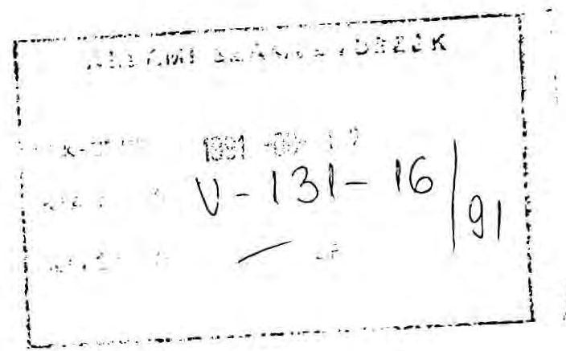

Tisztelt Elnök Úr!

Hozzám küldött levelében Ön azt kéri, hogy bocsássam az Állami Számvevőszék rendelkezésére az MSZOSZ tagszakszervezeteinek címlistáját. E címlistára az Állami Számvevőszéknek "A szakszervezeti vagyon védelméről, a munkavállalók szervezkedési és szervezeteik működési esélyegyenlőségéről" szóló 1991. évi XXVIII. törvény végrehajtásával kapcsolatban lenne szüksége.

Mint Ön előtt is ismert, a Magyar Szakszervezetek Országos Szövetsége az 1991. évi XXVIII. törvényt alkotmányellenesnek és egyúttal végrehajthatatlannak is tartja, ezért az Alkotmánybírósághoz fordult a törvény alkotmányellenességének megállapítása és visszamenőleges hatályú megsemmisítése érdekében. Tagszakszervezeteink döntése és felhatalmazása alapján az Alkotmánybíróság döntéséig nem áll módomban semmilyen, a törvénnyel összefüggésben álló adatot, így az Önök által kért tájékoztatást sem megadni.

Egyúttal szeretném kifejezni azt a reményemet, hogy az 1991. évi XXVIII-as törvény teremtette helyzet nem érinti az Állami Számvevőszék és a Magyar Szakszervezetek Országos Szövetsége eddigi zavartalan kapcsolatát.

Budapest, 1991. augusztus 8.
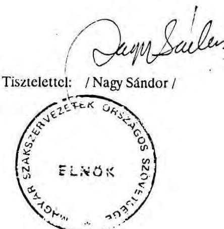

---

# LEGFÖBB ÜGYÉSZ 

Áf1. 1222/1-III.sz.

$$
\begin{gathered}
\text { Hiv.szám: V-131-40/1991. } \\
\text { V-131-59/1991. }
\end{gathered}
$$

Dr. HAGELMAYER ISTVÁN úrnak
az Állami Számvevőszék elnöke
Budapest

Tisztelt Elnök Úr!
Tájékoztatom, hogy a fenti számú megkeresések és a megküldött iratok alapján az egyesülési jogról szóló módosított 1989. évi II. törvény 14.§ (1) bekezdésében biztosított felügyeleti jogkörben, a Magyar Köztársaság Ügyészségéről szóló 1972. évi V. tv. 16.§ (1) bekezdése alapján - mulasztásban megnyilvánuló törvénysértés miatt - az ügyészség felszólalással élt a Magyar Szakszervezetek Országos Szövetsége elnökénél, a Fogyasztási Szövetkezeti Dolgozók Szakszervezete elnökénél, valamint a Szakszervezeti Munkavállalók Szakszervezetének Kaposvári Szakszervezeti Bizottsága titkáránál.

Budapest, 1991. szeptember hó 26.

Üdvözlettel:
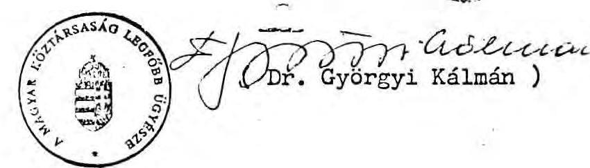

---

Szakszervezeti Munkavállalók Szakszervezetének Kaposvári Szakszervezeti Bizottsága Kaposvár Kossuth L. u. 1-9.

# ÁLLAMI SZÁMVEVŐSZÉK 

BUDAPEST

Tisztelt Cím!
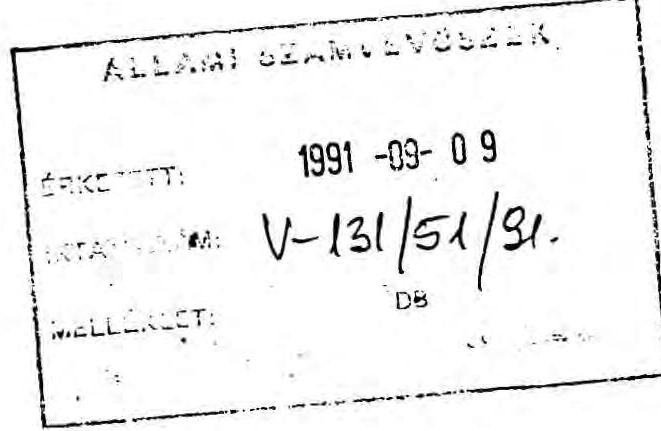

Tisztelettel tájékoztatom Önöket, hogy tagságülésünk augusztus 29-én egybehangzóan úgy döntött, hogy az Alkotmánybíróság döntéséig alapszervezetünk vagyoni helyzetével kapcsolatban nem adhatunk semmilyen tájékoztatást. Tagságunk úgy véli, a havonta átutalt tagdíjából keletkezett pénzeszközeit rajta és az APEH-en kívül nincs joga másnak ellenőrizni, miután működésünk megfelel az egyesülési törvényben foglaltaknak.

Kaposvár, 1991. szeptember 4.
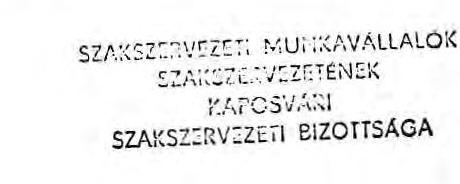

Üdvözlettel:
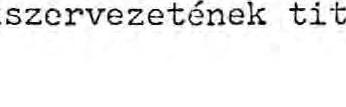
a Szakszervezeti Munkavállalók Szakszervezetének titkára

---

Budapest, 1991. augusztus 15. $\mathrm{V}-131-19 / 1991$

NAGY SÁNDOR úr,
a Magyar Szakszervezetek Országos
Szövetségének elnöke

# BUDAPEST 

Tisztelt Elnök Úr!

Megköszönve levelét, melyben ismertette azon álláspontját, hogy az 1991. évi XXVIII. törvény végrehajtásával kapcsolatosan az Alkotmánybíróság döntéséig nem áll módjában semmilyen tájékoztatást adni, felhívom szíves figyelmét, hogy az említett törvényben előírt teljesítési határidők tekintetében nincs halasztó hatálya ezen lépésnek.

Tisztelettel
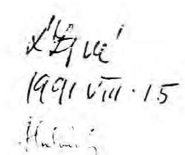
(Hagelmayer István) $h$

---

7.sz. melléklet
a V-131-74/1991.sz. jelentéshez A. Llamoini

LEGFÖBB ÜGYÉSZ
HELYETTESE

Áfl.1383/1991/II.sz.

Dr. HAGELMAYER ISTVÁN úrnak, az Állami Számvevőszék elnöke

Budapest

Tisztelt Elnök Úr!

A V-131/72/1991.számú megkeresésére válaszolva tájékoztatom, hogy az egyesülési jogról szóló módosított 1989. évi II.törvény 14.§ (1) bekezdésében biztosított felügyeleti jogkörben, a Magyar Köztársaság ügyészségéről szóló 1972. évi V.törvény 16.§ (1) bekezdése alapján - mulasztásban megnyilvánuló törvénysértés miatt - a Legfőbb Ügyészség felszólalással élt a Postai Dolgozók Szakszervezete országos titkáránál.

Budapest, 1991. október 28.

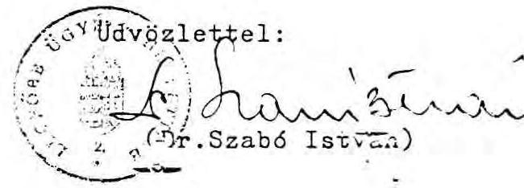

---

# 8.sz. melléklet   a V-131-74/1991.sz.   jelentéshez 

Budapest, 1991. szeptember 5.

$$
V-131-40 / 1991
$$

Dr. Györgyi Kálmán úr
a Magyar Köztársaság
Legfőbb Ügyésze

Budapest

Tisztelt Legfőbb Ügyész úr!

Az Állami Számvevőszék a szakszervezeti vagyon védelméről, a munkavállalók szervezkedési és szervezeteik működési esélyegyenlőségéről szóló 1991. évi XXVIII. tv. 5. §-a alapján köteles a törvényben meghatározott szervek elszámolását és hitelességét ellenőrizni.

Az elszámolások megküldése során egyes érdekképviseleti szervek elzárkóztak kötelezettségük teljesítésétől, hivatkozva arra, hogy megvárják az Alkotmánybíróság határozatát. A Fogyasztási Szövetkezeti Dolgozók Szakszervezete az elszámolás helyett arról küldött értesítést, hogy az Alkotmánybíróság döntéséig nem kíván eleget tenni a törvényben foglaltaknak. Az alkotmánybírósági eljárás nem halasztó hatályú jellegére munkatársaink felhívták a figyelmet. Annak regisztrálására, hogy e szakszervezet milyen tömörüléshez tartozik, nincs módunk. Mint ahogy arra sem, hogy teljeskörűen, szervezeti részletességgel feltüntessük, mely szervezetek vagy szövetségek nem teljesítették a törvény előírásait. Ugyanis a Magyar Szakszervezetek Országos Szövetsége nevében Dr. Nagy Sándor elnök - más szövetségektől eltérően - még azt is megtagadta, hogy az MSZOSZ tagszervezeiről az egyébként publikus listát az

---

ÁSZ részére hivatalosan megküldje. Szövetsége nevében az Alkotmánybíróság határozatáig elzárkózott a törvényben foglaltak teljesítésétől. Bár figyelmét álláspontja törvénysértő jellegére megfelelő időben felhívtam, visszajelzést vagy elszámolást nem kaptunk.

Figyelemmel arra, hogy az Alkotmánybírósághoz történő kérelem-benyújtás nincs halasztó hatállyal az 1991. évi XXVIII. törvényben meghatározott elszámolási kötelezettségre, kérem a Legfőbb Ügyész urat, hogy foglaljon állást - mivel a hivatkozott törvény szankcionálási rendelkezést nem tartalmaz -, milyen más jogszabályi lehetőségek (pl. Btk 289. §.) állnak rendelkezésre a törvényben foglaltak érvényesítésére. Tekintettel arra, hogy a társadalmi szervezetek működése törvényességi ellenőrzésére Önök jogosultak, kérem hogy szükségesnek tartott intézkedéseket hatáskörében kezdeményezni szíveskedjék.

Álláspontja kialakításához és intézkedései megalapozásához fénymásolatban rendelkezésre bocsátom a Magyar Szakszervezetek Országos Szövetségének (1. sz. melléklet) és a Fogyasztási Szövetkezeti Dolgozók Szakszervezetének (2. sz. melléklet) levelét.

Külön megköszönném, ha álláspontjáról, kezdeményezéséről tájékoztatni szíveskedne.

Mellékletek
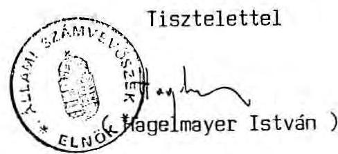

---

# 9.sz. melléklet   a V-131-74/1991.sz.   jelentéshez 

##
 Elnök

Budapest, 1991. szeptember 5.
$\mathrm{V}-131-41 / 1991$.

Dr. Szabady György úr
az Országgyűlés elnöke

Budapest

Tisztelt Elnök úr!

A szakszervezeti vagyon védelméről, a munkavállalók szervezkedési és szervezeteik működési esélyegyenlőségéről szóló törvény az Állami Számvevőszéknek is adott feladatot. A vagyonelszámolásokat hitelesítés céljából az ÁSZ-hoz kellett benyújtani, nekünk pedig ellenőriznünk kell azokat és tapasztalatainkról az Országgyűlést tájékoztatni.

A törvény 5. §-ában meghatározott 1991. augusztus 31-i vagyonelszámolás benyújtási határideje lejárt. A feladat végrehajtásának nehézségeire figyelemmel úgy vélem kötelességem tájékoztatni tapasztalatainkról.

Az Állami Számvevőszékhez 1991. szeptember 5-ig mintegy 1400 elszámolás érkezett be. A dokumentumok között jelentős számban találhatók olyanok, amelyek nem a törvényben meghatározottaknak megfelelően, hanem az adatszolgáltató saját értelmezése szerint készültek, esetenként alakilag is.

Egyes érdekképviseleti szervek letétbe helyezték bevallásukat, értelmezésre vonatkozó állásfoglalást kértek, vagy a szövetségükhöz tartozó szervezetek adatszolgáltatásainak megküldéséig egyidejűleg határidő

---

módosítást is igényeltek. Velük írásban közöltük, hogy a törvény értelmezése kívül esik az ÁSZ feladatkörén és jogkörén, továbbá a törvény előírásaitól eltérő eljárásra senkinek sem lehet felhatalmazása.

A Fogyasztási Szövetkezeti Dolgozók Szakszervezete az elszámolás helyett arról küldött értesítést, hogy az Alkotmánybíróság döntéséig nem kíván eleget tenni a törvényben foglaltaknak. Mint erről Elnök urat korábban már tájékoztattam, a Magyar Szakszervezetek Országos Szövetsége nevében dr. Nagy Sándor elnök - más szövetségektől eltérően - még azt is megtagadta, hogy az MSZOSZ tagszervezeteiről az egyébként publikus listát az ÁSZ részére hivatalosan megküldje. Szövetsége nevében az Alkotmánybíróság határozatáig elzárkózott a törvényben foglaltak teljesítésétől.

Az MSZOSZ-hez tartozó szervezetek eljárása ellenére a feladat manuális és technikai terjedelme nagyobb, mint amit a törvény megfogalmazásakor, a rendelkezésre álló információk alapján előzetesen körvonalazni tudtunk. Az Állami Számvevőszék mindent megtesz, hogy az 1991. november 30-i határidőig azon érdekképviseleti szervek elszámolásáról nyilatkozzon, amelyek a törvényben foglalt kötelezettségeiknek a megadott határidőre eleget tettek. Nincs módja azonban befogadni az alkotmánybírósági döntésre váró, hónapos késéssel benyújtani tervezett elszámolásokat.

A törvényben foglalt elszámolási kötelezettségek elmulasztását, az ellenőrzés meghiúsítását az Állami Számvevőszék nem veheti tudomásul és ezen az sem változtat, hogy az MSZOSZ az Alkotmánybírósághoz fordult. Ma törvényben foglalt feladatunk ellátásában vagyunk akadályoztatva. Ezért a mellékelt levéllel a legfőbb ügyész úrhoz fordultam, hogy mint aki a szakszervezetek működésének törvényességi vizsgálatára jogosult, az ügyben járjon el.

---

Kérem tájékoztatásom szíves elfogadását, egyben jelzem Elnök úrnak, hogy levelemet másolatban az Országgyűlés Költségvetési, Adó- és Pénzügyi, valamint Alkotmányjogi bizottságai elnökeinek is eljuttattam.

Melléklet

Tisztelettel
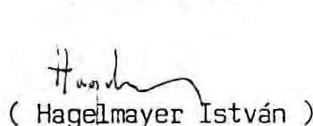

---

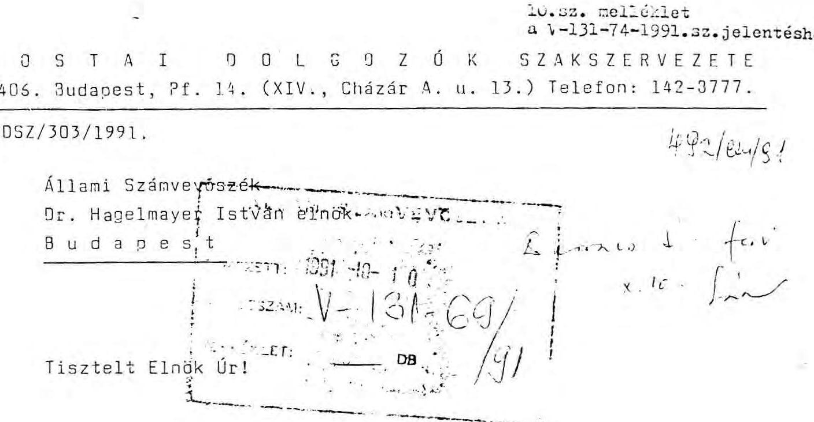

Intézőbizottságunk 1991. augusztus 26-ai ülésén, az 1991. évi XXVIII. számú törvény végrehajtásával kapcsolatban az alábbiakról döntött:

- "A Postai Dolgozók Szakszervezetének tagsága a nevezett törvényt alkotmányellenesnek tartja. Az intézőbizottság ebbéli véleményét a köztársasági elnöknek és az országgyűlés elnökének levélben kifejtette.
- Az intézőbizottság az alap- és a középszervek nyilatkozatai alapján úgy döntött, hogy az Állami Számvevőszék felé szolgáltatandó, törvényben előírt adatokat a szakszervezet belső, zárolt adatainak tekinti, s minden, a törvénnyel kapcsolatos adatszolgáltatást megtagad.
- A PDSZ az Alkotmánybíróság döntése után értékeli az új helyzetet, s ha szükséges, e rendkívüli horderejű kérdésben egész tagságához fordul személy szerinti véleménykéréssel, és e vélemények alapján alakítja ki végleges álláspontját, döntését."

Szakszervezetünk továbbra is érdekelt a konkrét együttműködésben, az egyesülési jogról szóló 1939. évi II. sz. törvény alapján.

Budapest, 1991. október
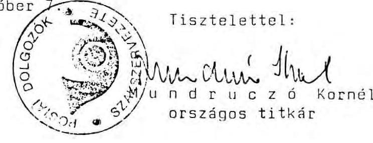

---

# JEGYZÉK

a késedelmes vagyonelszámolást bejelentő és a törvényről állásfoglalást kérő szakszervezetekről

1. Mezőgazdasági, Erdészeti és Vízgazdálkodási Dolgozók Szakszervezeti Szövetsége (V-131-34/91.)
2. Közszolgálati Szakszervezetek Szövetsége (V-131-42/91.)
3. Értelmiségi Szakszervezeti Tömörülés (V-131-37/91.)
4. Egészségügyben Dolgozók Demokratikus Szakszervezete (V-131-31/91.)
5. Belkereskedelmi Dolgozók Szakmai Szakszervezete (V-131-32/91.)
6. Kereskedelmi Szakszervezetek Szövetsége (V-131-33/91.)
7. Fogyasztási Szövetkezeti Dolgozók Szakszervezete (V-131-35/91.)
8. Bóné András telke ingatlanának elidegenítési tilalmára (Gárdony 2373, 2381, 3380 hrsz-ú ingatlanok eredeti tulajdonosnak történő visszadására) dr. Schánné dr. Rádai Ilona ügyvédi képviselő úton (V-131-36/91.)

Budapest, 1991. november 11.

---

Budapest, 1991. november 18. $\mathrm{V}-131-78 / 1991$.
Dr. Györgyikálmán úr
a Magyar Köztársaság
Legfőbb Ügyésze

# BUDAPEST

Tisztelt Legfőbb Ügyész Úr!

A szakszervezeti vagyonelszámolás során az Állami Számvevőszék által észlelt törvénysértésekkel kapcsolatos korábbi levelezésünkre figyelemmel az alábbiakról tájékoztatjuk t. Legfőbb Ügyész urat.

A vagyonelszámolással kapcsolatos levélváltás során az Állami Számvevőszék 7 munkavállalói érdekképviseleti szerv figyelmét hívta fel a vagyonelszámolási törvényben foglaltak szerinti adatok megküldésére.

Ezen szervezetek közül 4 pótlólag megküldte vagyonelszámolását.

Továbbra sem küldte meg elszámolását a Mezőgazdasági, Erdészeti és Vízgazdálkodási Dolgozók Szakszervezetének Szövetsége, a Kereskedelmi Szakszervezetek Szövetsége, valamint a Fogyasztási Szövetkezeti Dolgozók Szakszervezete.

Ez utóbbi szakszervezet annak ellenére sem tett eleget a törvényben foglaltaknak, hogy az ügyben a Legfőbb Ügyész úr is felszólalással élt.

---

Az ügyészi felszólalás ellenére sem tett eleget kötelezettségének a Magyar Szakszervezetek Országos Szövetsége, a Szakszervezeti Munkavállalók Szakszervezetének Kaposvári Szakszervezeti Bizottsága, valamint a Postai Dolgozók Szakszervezete.

Az érdekképviseletekre és szövetségi hovatartozásukra vonatkozóan teljeskörű listát nem lehetett beszerezni, emiatt a bevallást elmulasztók valamennyien nem határozhatók meg nevesítve, mint ahogy a beküldők jelentős része esetében az esetleges szövetséghez tartozás sem tisztázható. Következésképpen csak az ismert körben nyílik mód intézkedésre.

Kérem t. Legfőbb Ügyész urat, hogy jogkörében eljárva a felsorolt szervezeteknél szíveskedjék elősegíteni a törvényben foglaltak érvényesülését.
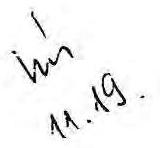
/ Hagedmayer István /

---

13.sz. melléklet a V-131-74/1991.sz. jelentéshez

SZAKSZERVEZETEK VAGYONELSZÁMOLTATÁSÁNAK ÖSSZESÍTETT ÉRTÉKELŐ TÁBLÁZATA

|  VAGYONNEMEK MEGNEVEZÉSE | B | R | U | T | 0 | N | E | T | 0  |
| --- | --- | --- | --- | --- | --- | --- | --- | --- | --- |
|   | 1991.01.01. | 1991.07.17. |  | NÖVEKEDÉS | CSÖKKENÉS | 1991.01.01. | 1991.07.17. | NÖVEKEDÉS | CSÖKKENÉS  |
|  Ingatlanok | 2689621.00 | 4162220.00 |  | 1499275.00 | 26676.00 | 241683.00 | 265561.00 | 44152.00 | 20274.00  |
|  Állóeszközök és védett műalkotások | 716510.00 | 1016473.00 |  | 311748.00 | 11785.00 | 81562.00 | 375909.00 | 303459.00 | 9112.00  |
|  Gazdálkodó szervezetekbe bevitt vagyoni betét | 159.82 | 245.75 |  | 94.63 | 8.70 | 0.00 | 0.00 | 0.00 | 0.00  |
|  Értékpapír-állomány | 2667513.00 | 2637701.00 |  |  | 29812.00 |  |  |  |   |
|  Pénzforgalom | 703932.94 | 851619.40 |  | 147686.46 |  |  |  |  |   |
|  Alapítványba bevitt vagyon | 170652.00 | 184029.00 |  | 13377.00 |  |  |  |  |   |
|  Összesen | 6948388.76 | 8852288.15 |  | 1972181.09 | 68281.70 | 323245.00 | 641470.00 | 347611.00 | 29386.00  |

Minden adat ezer forintban értendő!

---

# 14.sz. melléklet a V-131-74/1991. sz.   jelentéshez

Vagyonkezelő Főcsoport
Budapest, 1991. november 25. V-131-79/1991.

Dr. Beck Károly úr
főosztályvezető
Legfőbb Ügyészség

## BUDAPEST

Tisztelt Főosztályvezető Úr!

A szakszervezeti vagyonelszámolás során észlelt törvénysértésekkel kapcsolatos V-131-78/1991.sz. levelünkre hivatkozva kérésükre pótlólag megküldjük az adatszolgáltatást megtagadó, illetve elmulasztó (vagy letét útján "teljesített") szervezetekkel folytatott levelezésünk másolati példányait. A mellékletek tartalmazzák az ügyészi felszólalás ellenére sem teljesítő szervezetekkel folytatott korábbi levelezést is.

Melléklet: 12 db

Tisztelettel
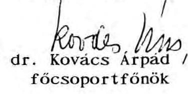

---

# PROGRAM

a szakszervezeti vagyon védelméről, a munkavállalók szervezkedési és szervezetek működési esélyegyenlőségéről szóló 1991. évi XXVIII. tv. 5. §-ában előírt ellenőrzést és hitelesítési feladathoz

Az Állami Számvevőszék
kérésére az alábbiakban
közzétesszük a munkavállalói
érdekképviseleti szervezetek
vagyonelszámolása
hitelességének megállapítására
kidolgozott ellenőrzési
programot.

I.
Az ellenőrzés célja, az ellenőrzött
szervezetek és időtartam

Az ellenőrzés célja:

Az 1989. évi II. törvény kötelezése alapján nyilvántartásba vett munkavállalói érdekképviseleti szervezetek által 1991. augusztus 31-ig benyújtott vagyonelszámolások hitelességének megállapítása.

Az ellenőrzés kiterjed:

Az egyesülési jogról szóló 1989. évi II. törvény
alapján [4. § (1) bek.] a bírósághoz nyilvántartásba
vett valamennyi munkavállalói érdekképviseleti
szervezet (a továbbiakban: szakszervezet), illetőleg ezek szövetségi, valamint szervezeti egységei
által a törvény 1. sz. melléklete szerint elkészített
és az Állami Számvevőszékhez a törvényben meghatározott határidőre benyújtott adatszolgáltatásokra.

* 1989. évi II. törvény 2. § (1) bekezdés

** A 21/1989. (VII. 8.) PM rendelet módosított
52/1988. (XXI. 24.) PM rendelet előírt könyvelési

A törvény nem határozza meg külön, hogy a vagyonelszámolásra kötelezettek önálló jogi személyiségű szakszervezetek szintjén vagy szövetségi
szinten kötelesek-e vagyonukkal elszámolni.

Az Állami Számvevőszék abban az esetben tekinti hitelesnek a szövetségi szintű vagyonelszámolásokat, ha a Szövetség a „Teljességi Nyilatkozatot" valamennyi hozzátartozó vagyonelszámolásra kötelezett jogi személyiségű (és nem jogi személyiségű) munkavállalói érdekképviseleti szervezetre vonatkozóan megadja, az elszámolásban szereplő szervezetek egyetértésével, azok név- és címjegyzékével együtt, annak megfelelő tagolásban.

A vagyonelszámolás benyújtására a törvényben előírt határidőnek az is eleget tesz, aki 1991. augusztus 31-ével bezárólag postára adta, vagy közvetlenül az Állami Számvevőszékhez benyújtotta adatszolgáltatását.

A vizsgált időszak:

1991. január 1. — 1991. július 17., a törvény 3. §-a szerint meghatározottnak megfelelően.

II.
Az ellenőrzés eljárási rendje

1. A határidőre beküldött adatlapok mindegyike az alábbi szempontok szerint teljeskörűen ellenőrzésre kerül:

1.1. A törvényben előírt adatlapok kitöltésének teljeskörűsége, az előírt formai követelményeknek való megfelelése.

1.1.1. Valamennyi (2.1.1.-2.5.) adatlapot ki kell tölteni, semleges válasz esetén is. (Nemleges jelzésű egész táblázat vagy a nemleges adatmező kihúzása.)

1.1.2. Az adatlapok valamennyi adatmezője tartalmazzon értelemszerű információt.

1.2. Az összesített érték-adatok számszaki helyessége.

1.3. A „Teljességi Nyilatkozat" hitelessége, a törvény 2. sz. melléklete szerinti aláírások és bélyegzők megléte.

2. Az adatszolgáltatók köréből kiválasztott körben a beküldött adatok összevetésre kerülnek az azok dokumentálására alkalmas nyilvántartásokkal.

Ehhez szükséges:

2.1. A szervezet gazdálkodására vonatkozóan jogszabályban előírt nyilvántartások rendjének ellenőrzése, a számviteli bizonyító rend betartásának ellenőrzése, a szolgáltatott adatok egyezőségének vizsgálata a nyilvántartások adataival.

2.1.1. Az állóeszközök bruttó értékének összevetése a mérleg (napfeljegyzés)**, illetőleg az 1991. évi számla nyílóegyenlegében szereplő adatokkal, az eltérések okainak feltárása.

2.1.2. Az állóeszközök-állomány tételes összevetése az állóeszközök analitikus nyilvántartásával; az állományban bekövetkezett növekedés vagy csökkenés tételeinek ellenőrzése (azonosító, nyilvántartási és állományi adatok).

2.1.3. Az élőeszközök analitikus nyilvántartása és az éves beszámoló (mérleg) adatainak egyeztetése.

2.1.4. Az 1991. január 1-jét megelőzően felvett utolsó élőeszközleltár alapján az analitikus nyilvántartás adataiban történt helyesbítések ellenőrzése.

2.1.5. Az ingatlanokra, azok állományváltozásaira vonatkozó adatok összevetése a tulajdoni lapok adataival és az adás-vételi szerződésekkel.

2.1.6. Az egyenként nyilvántartott védett műalkotásokról készült vagyonelszámolás összevetése a leltárokkal.

2.1.7. Az értékpapír- és pénzforgalom adatainak összevetése az analitikus nyilvántartásokkal, a mérleg (napfeljegyzés) adataival, illetőleg a bankszámlakivonatokkal.

2.1.8. Az adatszolgáltató által alapított gazdálkodó szervezetekre (vállalat, gazdasági társaság stb.) bevitt vagyoni adatok összevetése e szervezetek alapító okiratában foglaltakkal, valamint — szükség szerint — a cégbíróságnál letétbe helyezett vagyonmérleggel.

2.1.9. A benyújtott vagyonelszámolás egyeztetése az adatszolgáltató, illetőleg más alapító által létrehozott alapítványok alapító okiratának adataival.

3. Az adatszolgáltatás hitelességének követelménye:

3.1. A törvényben előírt határidőre benyújtott vagyonelszámolás táblázatainak minden egyes adatmezője értelmezhetően kitöltött.

3.2. A számszakilag összesíthető adatok összesítése pontos.

3.3. A közölt adatok megegyeznek:

3.3.1. Az adatszolgáltatók analitikus nyilvántartásainak és mérlegbeszámolóinak adataival.

3.3.2. Az állami és egyéb szervezeteknél (bíróságok, Pénzügyminisztérium, Kincstári Vagyonkezelő Szervezet, földhivatalok stb.) nyilvántartott adatokkal.

3.4. A
 „Teljességi Nyilatkozat” előírásosan kitöltött.

4. Minősítések

4.1. „Hiteles” a vagyonelszámolás, ha a beküldött adatszolgáltatás minden egyes táblája hiteles és formailag szabályos.

4.2. „Nem hiteles” a vagyonelszámolás, ha formailag szabálytalan, tartalmilag alapvetően hiányos, vagy pontatlan. (Az ellenőr megállapításai alapján táblánként minősít és indokolni a jelentésben.)

III.
Egyeztetések központi,
államigazgatási nyilvántartásokkal

Az Állami Számvevőszék független forrásokból adatokat kér a vagyonelszámolások ellenőrzéséhez az alábbiaktól:

1. A bíróságok megkeresése az adatszolgáltatók név- és címlistájának rendelkezésre bocsátása végett.

2. A Pénzügyminisztérium illetékes főosztályának felkérése az adatszolgáltatók által benyújtott bevalló jelentések, elszámolások adatainak rendelkezésre bocsátása végett.

3. A Földművelésügyi Minisztérium illetékes főosztályának felkérése a földhivatalok szonatkívüli közreműködésének biztosítása végett.

4. A Magyar Nemzeti Galéria, a Szépművészeti, az Iparművészeti- és a Néprajzi Múzeum felkérése a védett műtárgyakról benyújtott elszámolások felülvizsgálatában való közreműködésre.

5. A Kincstári Vagyonkezelő Szervezet felkérése a 16/1991. (V. 50.) PM rendeletben előírt bejelentések alapján készült nyilvántartás rendelkezésre bocsátására.

IV.
A vizsgálat módszere

1. Az ellenőrzés:

1.1. a II./1. pontban foglaltak szerint valamennyi adatszolgáltatóra vonatkozóan teljes körű.

1.2. a II./2. pontban foglaltak szerint mintavétellel kiválasztott adatszolgáltatók körére vonatkozóan részletes.

2. A helyszíni ellenőrzés időpontjáról a kiválasztott szakszervezeteket az Állami Számvevőszék írásban értesíti. Az ellenőrzés megkezdése előtt tájékoztatjuk a jogosultságukat.

3. A beküldött adatszolgáltatások összevetésre kerülnek az állami és egyéb szervezeteknél vezetett nyilvántartások adataival, valamint a vagyonelszámolás alapjául szolgáló dokumentumokkal.

4. A helyszíni ellenőrzések során — a törvényi előírásoknak megfelelően — a jelentéseket záradékoljuk, amelyben 8 napon belül észrevételezési lehetőséget biztosítunk.
