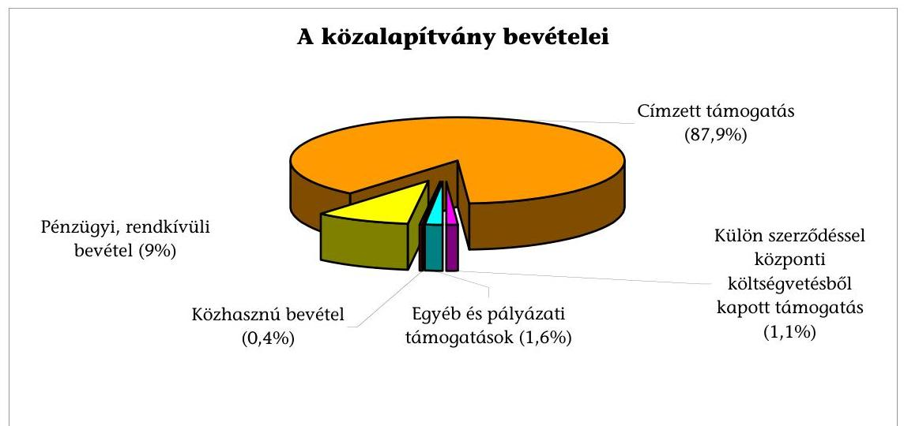
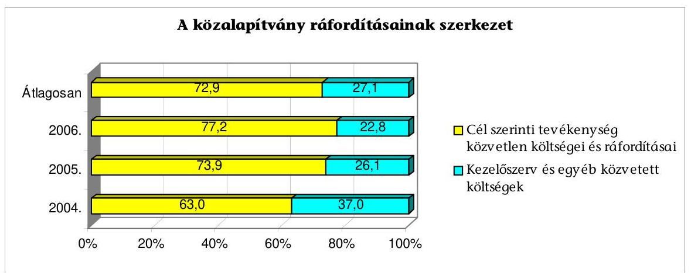
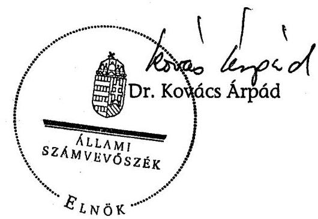
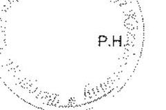
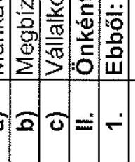
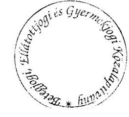

# JELENTÉS 

a Betegjogi, Ellátottjogi és Gyermekjogi Közalapítvány gazdálkodásának ellenőrzéséről

---

3. Önkormányzati és Területi Ellenőrzési Igazgatóság
3.1. Szabályszerüségi Ellenőrzési Föcsoport

Iktatószám: V-1002-32/2007.
Témaszám: 846
Vizsgálat-azonosító szám: V-0342

# Az ellenőrzést felügyelte: 

Dr. Lóránt Zoltán
föigazgató
Az ellenőrzés végrehajtásáért felelős:
Dr. Elek János
általános föigazgató-helyettes
Az ellenőrzést vezette:
Solymár Ágnes
számvevő főtanácsos
Az összefoglaló jelentést készítette:
Brebán Andrea
számvevő
Az ellenőrzést végezték:
Brebán Andrea
Dr. Méri Sándorné
számvevő
számvevő

---

# TARTALOMJEGYZÉK 

BEVEZETÉS ..... 7
I. ÖSSZEGZŐ MEGÁLLAPÍTÁSOK, KÖVETKEZTETÉSEK, JAVASLATOK ..... 11
II. RÉSZLETES MEGÁLLAPÍTÁSOK ..... 17

1. A működés szabályozottsága és szabályossága ..... 17
1.1. Az alapító okirat ..... 17
1.2. A szervezeti és működési szabályzat ..... 18
1.3. A kuratórium gazdálkodási tevékenysége ..... 20
1.4. A gazdálkodási szabályzatok ..... 20
2. A könyvvezetés és az éves beszámolók szabályossága ..... 24
2.1. Könyvvezetés szabályossága ..... 24
2.2. A beszámolási kötelezettség teljesítése ..... 25
3. A gazdálkodás szabályossága ..... 27
3.1. Az éves költségvetés és pénzügyi tervek ..... 27
3.2. A közalapítvány bevételei ..... 27
3.2.1. A költségvetési címzett támogatások ..... 28
3.2.2. A pályázati és egyéb költségvetési bevételek ..... 30
3.3. A közalapítvány költségei és ráfordításai ..... 31
3.3.1. A ráfordítások alakulása és összetétele ..... 31
3.3.2. A cél szerinti költségek és ráfordítások ..... 32
3.3.3. A közalapítvány múködési költségei és ráfordításai ..... 33
4. A közalapítvány cél szerinti tevékenysége ..... 35
5. Az ellenőrzés rendszere ..... 40

---

# MELLÉKLETEK 

1. számú A Betegjogi, Ellátottjogi és Gyermekjogi Közalapítvány eszközei és forrásai
2. számú A Betegjogi, Ellátottjogi és Gyermekjogi Közalapítvány bevételei és költségei, ráfordításai
3. számú A Betegjogi, Ellátottjogi és Gyermekjogi Közalapítvány költségei, ráfordításai
4. számú A Betegjogi, Ellátottjogi és Gyermekjogi Közalapítvány által kifizetett tiszteletdíjak és költségtérítések
5. számú A Betegjogi, Ellátottjogi és Gyermekjogi Közalapítványnál alapfeladat ellátásában résztvevők
6. számú A Betegjogi, Ellátottjogi és Gyermekjogi Közalapítványnál a képviselők részére kifizetett díjak és költségtérítések
7. számú A Betegjogi, Ellátottjogi és Gyermekjogi Közalapítvány tevékenysége
8. számú Kuratóriumi elnök észrevétele
9. számú Kuratóriumi elnök észrevételére adott válasz

---

# RÖVIDÍTÉSEK JEGYZÉKE 

| ÁNTSZ | Állami Népegészségügyi és Tisztiorvosi Szolgálat |
| :--: | :--: |
| EszCsM | Egészségügyi, Szociális és Családügyi Minisztérium |
| EÜM | Egészségügyi Minisztérium |
| Egészségügyi tv. | az egészségügyről szóló 1997. évi CLIV. törvény |
| FB | a Betegjogi, Ellátottjogi és Gyermekjogi Közalapítvány felügyelő bizottsága |
| Gazdálkodási rendelet | az alapítványok gazdálkodási rendjéről szóló 115/1992. (VII. 23.) Korm. rendelet |
| Gyermekvédelmi tv. | a gyermekek védelméről és a gyámügyi igazgatásról szóló 1997. évi XXXI. törvény |
| Iroda | a Betegjogi, Ellátottjogi és Gyermekjogi Közalapítvány irodája |
| Új Kbt. | a közbeszerzésekről szóló 2003. évi CXXIX. törvény |
| Képviselők | Betegjogi, ellátottjogi és gyermekjogi képviselők |
| Kh. tv. | a közhasznú szervezetekről szóló 1997. évi CLVI. törvény |
| Kjt. | a közalkalmazottak jogállásáról szóló 1992. évi XXXIII. törvény |
| Közalapítvány | Betegjogi, Ellátottjogi és Gyermekjogi Közalapítvány |
| MPA | Munkaerő-piaci Alap |
| Önkéntes tv. | a közérdekú önkéntes tevékenységről szóló 2005. évi LXXXVIII. törvény |
| Ptk. | a Polgári Törvénykönyvről szóló 1959. évi IV. törvény |
| Szakmai rendelet | a betegjogi, ellátottjogi és a gyermekjogi képviselő múködésének feltételeiről szóló 1/2004. (I. 5.) ESzCsM rendelet |
| Számviteli rendelet | a számviteli törvény szerinti egyes egyéb szervezetek beszámoló készítési és könyvvezetési kötelezettségének sajátosságairól szóló 224/2000. (XII. 19.) Korm. rendelet |
| Szja. tv. | a személyi jövedelemadóról szóló 1995. évi CXVII. törvény |
| SZMM | Szociális és Munkaügyi Minisztérium |
| SZMSZ | Szervezeti és Múködési Szabályzat |
| Szociális tv. | a szociális igazgatásról és szociális ellátásokról szóló 1993.   évi III. törvény |
| Szt. | a számvitelről szóló 2000. évi C. törvény |
| WHO | Egészségügyi Világszervezet (World Health Organization) |

---

.

---

# ÉRTELMEZŐ SZÓTÁR 

Az alapítvány bevételei

Az alapítvány költségei (kiadásai)

A vállalkozási tevékenység bevétele, valamint az alapítványi célú tevékenység bevételei (minden olyan bevétel, amely nem a vállalkozási tevékenységhez kapcsolódó befizetés, ideértve a céltámogatást is) [115/1992. (VII. 23.) Korm. rendelet 3. § (1) bekezdésének a)-b) pontja].
A vállalkozási tevékenység közvetlen költségei, az alapítványi célú tevékenység közvetlen költségei, az alapítvány kezelő szervének költségei (kiadásai) és az egyéb közvetett költségek (kiadások) [115/1992. (VII. 23.) Korm. rendelet 3. § (2) bekezdésének a)-b)-c) pontja].

Cél szerinti tevékenység
Induló vagyon

Kiemelkedően közhasznú közalapítvány

Közalapítvány

Közfeladat

Közhasznú egyszerűsített éves beszámoló

Közhasznú tevékenység

Minden olyan tevékenység, amely az alapító okiratban megjelölt célkitúzés elérését közvetlenül szolgálja [Kh. tv. 26. § b) pontja].

A közalapítvány javára a célja megvalósításához az alapító okiratban meghatározott vagyon [Ptk. 74/A. § (1) bekezdése, 74/B. § (1) bekezdése]. A közalapítványi vagyon pontos megjelölése nélkül a közalapítvány nem jöhet létre [BH2001. 303].
A kiemelkedően közhasznú közalapítványnak a közhasznú közalapítványokra előírt követelmények teljesítésén túl közhasznú tevékenysége során olyan közfeladatot kell ellátnia, amelyről törvény vagy törvény felhatalmazása alapján más jogszabály rendelkezése szerint, valamely állami szervnek vagy a helyi önkormányzatnak kell gondoskodnia, az alapító okirata szerinti tevékenységének és gazdálkodásának legfontosabb adatait a helyi vagy országos sajtó útján is nyilvánosságra hozza, továbbá a közhasznú tevékenységet maga látja el [Kh. tv. 5. § és a BH2001. 451 alapján].
A közalapítvány olyan alapítvány, amelyet az Országgyűlés, a Kormány, valamint a helyi önkormányzat vagy kisebbségi önkormányzat képviselő-testülete közfeladat ellátásának folyamatos biztosítása céljából hoz létre [Ptk. 74/G. § (1) bekezdése].
Közfeladat az, az állami vagy helyi önkormányzati, kisebbségi önkormányzati feladat, amelynek ellátásáról jogszabály alapján - az államnak vagy az önkormányzatnak kell gondoskodnia [Ptk. 74/G. § (2) bekezdése].
A közhasznú nyilvántartásba vett közalapítványoknál mérlegből, közhasznú eredmény-kimutatásból és tájékoztató adatokból áll [224/2000. (XII. 19.) Korm. rendelet 6. § (8) bekezdése, illetve 4. és 6 . számú melléklete].

A társadalom és az egyén közös érdekeinek kielégítésére irányuló, a közhasznú közalapítvány alapító okiratában szereplő cél szerinti tevékenység a törvényben meghatározott körben [Kh. tv. 26. § c) pontja].

---

Közhasznúsági jelentés

Múködési költség

Támogatás
Törzsvagyon

Vezető tisztségviselő a
közalapítványoknál

Tartalmazza a számviteli beszámolót; a költségvetési támogatás felhasználását; a vagyon felhasználásával kapcsolatos kimutatást; a cél szerinti juttatások kimutatását; a központi költségvetési szervtől, az elkülönített állami pénzalaptól, a helyi önkormányzattól, a kisebbségi települési önkormányzattól, a települési önkormányzatok társulásától és mindezek szerveitől kapott támogatás mértékét; a közhasznú szervezet vezető tisztségviselőinek nyújtott juttatások értékét, illetve összegét; a közhasznú tevékenységről szóló rövid tartalmi beszámolót [Kh. tv. 19. § (3) bekezdése].

A közalapítvány kezelő és ellenőrző szervének közvetett és az egyéb közvetett költségek összege
Pénzbeli és nem pénzbeli juttatás [Kh. tv. 26. § j) pontja].
Az alapítói vagyon dologi-eszköz elemeit törzsvagyonként indokolt elkülöníteni, ami elidegenítési és terhelési tilalmat jelent. A törzsvagyonná nyilvánítás az alapító kizárólagos jogköre, erre az alapító okiratban a kuratórium részére nem adható felhatalmazás [1052/1997. (V. 21.) Korm. határozat 5. a) pontja].
A közalapítvány kuratóriumának és felügyelő bizottságának elnöke és tagja, a közalapítvánnyal munkaviszonyban vagy munkavégzésre irányuló egyéb jogviszonyban álló, az alapító okirat szerint egyszemélyi felelős vezető feladatot ellátó személy [Kh. tv. 26. § m) pontja alapján].

---

# JELENTÉS 

## a Betegjogi, Ellátottjogi és Gyermekjogi   Közalapítvány gazdálkodásának ellenőrzéséről

## BEVEZETÉS

A nonprofit szervezetek között 1994. január 1-jétől megjelenő közalapítványok megalakítására és múködésére a Polgári Törvénykönyvről szóló 1959. évi IV. törvény (továbbiakban: Ptk.) az alapítványok szabályozásán belül külön feltételeket és követelményeket határozott meg az alapítók körét, az ellátandó közfeladatokat, valamint a múködés és gazdálkodás feltételeit illetően a 74/G. §ában. A szabályozást 2006. augusztus 24 -től az államháztartásról szóló 1992. évi XXXVIII. törvény és egyes kapcsolódó törvények módosításáról szóló 2006. évi LXV. törvény 1. §-a hatályon kívül helyezte. A jogszabályi változások hatályba lépését követően azok a szervezetek, amelyek közalapítvány létrehozására a Ptk. 74/G. §-a alapján jogosultak voltak, alapítványt e törvény hatálybalépését követően nem alapíthatnak, ahhoz nem csatlakozhatnak és annak alapítói joga gyakorlására nem jelölhetők ki. A jogszabály a még múködő közalapítványok gazdálkodására vonatkozó szabályokat a korábbihoz képest, annyiban módosította, hogy azok alapítványt nem hozhatnak létre, ahhoz nem csatlakozhatnak, azzal nem egyesíthetők, pályázat kiírása nélkül évente a vagyonuk 5\%-ának mértékéig, de legfeljebb egymillió forint összértékben támogatást nyújthatnak az alapító okiratban foglalt célokra, továbbá tevékenységük újabb közfeladat ellátásával nem bővíthető.

A jogállamiság követelménye alapján az államnak meg kell teremtenie azt a jogszabályi és intézményes közeget, amely lehetővé teszi az egyén számára, hogy képes legyen érvényesíteni jogait, jogai megsértéséből eredő igényeit. ${ }^{1} \mathrm{~A}$ jogvédelem egy-egy sajátos területe a betegek, ellátottak és gyermekek jogvédelme. Az 1970-es évek elejéig leginkább csak az orvosi etika szabályai határozták meg az orvos és a beteg kapcsolatát. Az azóta eltelt időszakban a betegek jogainak biztosítása, törvényi szabályozása valóságos mozgalommá fejlődött Európában különösen az elmúlt 10 évben, főként az Amszterdami Deklaráció hatására indult meg ez a folyamat. A WHO a holland Egészségügyi Minisztériummal egyetértésben 1994-ben jogi szakértőket hívott meg Amszterdamba, a találkozó eredményeképpen létrejött a betegek jogainak európai tervezete, amely modellként szolgált az egyes országok betegjogi törvényeinek megszerkesztéséhez. Az amszterdami találkozó előtt csak pár ország foglalko-

[^0]
[^0]:    ${ }^{1}$ Forrás: A jogi segítségnyújtásról szóló 2003. évi LXXX. törvény általános indoklása

---

zott, a betegek jogainak legalizálásával (Pl. Norvégia, Finnország). Az Amszterdami Deklaráció születésekor Finnország volt az egyetlen európai ország, ahol törvénybe foglalták a betegek jogait. Más országok (így pl. Hollandia, Norvégia, Litvánia, Dánia, Izland, Örményország, Izrael és Ausztria) specifikus betegjogi törvényi szabályozást vezettek be, illetve (pl. Görögország, Beloruszszia, Magyarország, Szlovákia, Szlovénia és Svédország) lépéseket tettek, hogy a betegjogi szabályokat a már létező törvényekbe, jogszabályokba beépítsék. A betegjogok fokozódó jelentőségét mutatja a nem kormányzati betegjog-védő szervezetek egyre elterjedtebb múködése.

Magyarországon a jogalkotó a betegjogi képviselő jogállásáról és az eljárására vonatkozó szabályokról szóló 77/1999. (XII. 29.) EÜM rendelet, majd az egészségügyről szóló 1997. évi CLIV. törvény (továbbiakban: egészségügyi tv.) módosítása alapján az egészségügyi jogviszony sajátos jellegére való tekintettel a betegek jogai érvényesítésének segítésére létrehozta a betegjogi képviselő jogintézményét, a képviselők tevékenységüket 2000. január 3-án kezdhették meg ellátni az ÁNTSZ megyei intézetének szervezeti keretei között. A betegjogi képviselő feladata a betegek jogainak megismertetése és védelme, a betegek segítése jogaik érvényesítésében, az egészségügyi dolgozók tájékoztatása a betegjogokra vonatkozó szabályokról. A képviselő az egészségügyi szolgáltató jogsértő gyakorlata esetén felhívja ezekre az intézmény vezetőinek, illetve a fenntartónak figyelmét, szükség esetén az illetékes hatósághoz fordulhat.

A fogyasztóvédelemi, jogvédelemi folyamatok erősödése miatt a - betegjogok védelméhez hasonlóan - más területeken is megtörtént a jogvédelem szabályozása.

A szociális igazgatásról és szociális ellátásokról szóló 1993. évi III. törvény (továbbiakban: szociális tv.) 2003. január 1-jétől új jogvédelmi szervként jeleníti meg az ellátottjogi képviselöt, amelyek a megyei, fővárosi és egyházi módszertani intézmények keretében kezdhették meg múködésüket. A szociális törvény korszerűsítése során - figyelemmel az elmúlt években született ombudsmani jelentések tartalmára - nemcsak a jogvédelmi képviselők feladatainak meghatározása, hanem a szociális intézményben elhelyezettek jogainak - kiemelten egyes ellátotti csoportok speciális jogainak meghatározása és szabályozása is megtörtént. Az ellátottjogi képviselők elsődleges feladata, hogy az ellátottakat, a dolgozókat tájékoztassák az ellátotti jogokról, valamint képviseljék az ellátottak jogait egyes fórumok előtt.

A gyermekek védelméről és a gyámügyi igazgatásról szóló 1997. évi XXXI. törvény (továbbiakban: gyermekvédelmi tv.) alapján 2003. január 1-jétől a gyermeki jogok védelmét, illetve a gyermeki jogok megismerését és érvényesítését segíti a törvényben megjelölt gyermekjogi képviselö, aki csak a gyermekvédelmi gondoskodásban részesülő (nevelésbe vett) gyermekek vonatkozásában látja el feladatát, kiemelten kezeli a különleges, illetve a speciális szükségletű gyermekek gyermekjogi védelmét, figyelemmel a gyermeki jogok európai egyezményében megfogalmazott kívánalmakra is.

A hosszú távú egészségpolitika folyamatosságának megőrzéséről és az egészségügyi, valamint a szociális rendszerekben ellátottak jogainak érvényesítését biztosító szervezet kialakításáról szóló 38/2002. (VII. 4.) OGY határozattal az

---

Országgyúlés kinyilvánította, hogy az egészségügyi és a szociális intézményekben a szolgáltatásokat és az ellátásokat igénybe vevők jogai érvényre juttatását független képviseleti rendszer támogassa. Erre tekintettel a Kormány az egészségügyi és a szociális szolgáltatásokat és ellátásokat igénybe vevők jogainak érvényesítését és védelmét szolgáló önálló, országos, egységes beteg-, illetve ellátottjogi képviselői intézményrendszer megteremtése érdekében a 2234/2003. (X. 1.) Korm. határozattal létrehozta a Betegjogi, Ellátottjogi és Gyermekjogi Közalapítványt, amelyet a Fővárosi Bíróság 2004. január 5-én jogerőre emelkedett 16.Pk.61.075/2003/2. számú végzéssel, 9076. sorszám alatt kiemelkedően közhasznú szervezetként nyilvántartásba vett.

A közalapítvány alapító okirat szerinti céljai és céljai elérése érdekében folytatott tevékenységei:

- ellátja a betegjogi, ellátottjogi és gyermekjogi képviselők (képviselők) foglalkoztatásával összefüggő feladatokat, irányítja, szervezi és ellenőrzi a képviselők szakmai munkáját, megszervezi a jogszabályban előírt képzéseket és továbbképzéseket, biztosítja a képviselők múködéséhez szükséges személyi és tárgyi feltételeket;
- elősegíti az egészségügyi intézményekben ellátottak, a gyermekvédelmi gondoskodásban, illetve a szociális szolgáltatásban részesülők jogainak érvényesülését, védelmét;
- hozzájárul a társadalmi esélyegyenlőség megteremtéséhez az ellátásokat igénybe vevők részére megkülönböztetés nélkül nyújtott szolgáltatások folyamatos figyelemmel kísérésével, elősegíti egyes hátrányos helyzetű csoportok ellátással összefüggő jogainak érvényre jutását;
- összegzi a képviselők múködésének gyakorlati tapasztalatait, segíti a jogok és kötelezettségek egységes értelmezését, azok gyakorlati megvalósulását;
- támogatja a képviselők munkájának, hozzáférhetőségének megismertetését, továbbá a szolgáltatásokat igénybe vevők, illetve a képviselők együttműködését a szolgáltatást nyújtókkal keletkezett konfliktusaik megoldásában;

A közalapítvány számára rendelkezésre bocsátott induló vagyon 250 millió Ft, ebből a törzsvagyon 5 millió Ft.

A közalapítványok gazdálkodásának törvényességének és célszerűségének ellenőrzésére az Állami Számvevőszék a Ptk. 74/G. § (8) bekezdése, illetve 2006. év augusztus 24 -étől a 2006. évi LXV. törvény 1. § (2) bekezdés e) pontja alapján jogosult, továbbá az Állami számvevőszékről szóló 1989. évi XXXVIII. törvény 2. § (5) bekezdése alapján ellenőrzi a közalapítványoknál az állami költségvetésből nyújtott támogatás felhasználását.

Az ellenőrzés célja volt szabályszerűségi szempontból értékelni, hogy:

- a kuratórium a kapott induló vagyon törzsvagyonon felüli részét és hozadékát, az állami és egyéb támogatásokat, valamint a közalapítvány saját bevételeit szabályosan, rendeltetésszerúen használta-e fel az alapító okiratban meghatározott céljainak megvalósítása érdekében;

---

- a közalapítvány alapító okirata és belső szabályzatai megteremtették-e az induló vagyon törzsvagyonon felüli része és hozadéka, valamint a központi költségvetési támogatás felhasználásának törvényes kereteit;
- a kuratórium biztosította-e a közalapítvány könyvvezetésének és éves beszámolóinak, és gazdálkodásának törvényességét.

Az ellenőrzés a közalapítvány megalakulásától a 2006. december 31-ig tartó időszakra terjedt ki. A közalapítvány gazdálkodásának és szakmai tevékenységének, egyéb szabályszerűségi ellenőrzésére első alkalommal került sor. Az ellenőrzés előkészítése során a közalapítvány eredendő és belső kontroll kockázatát közepesnek minősítettük, ez alapján a kuratórium döntéseit és határozatait, a bevételeket és a befektetett eszközöket tételesen, az anyag- és személyi jellegű ráfordításokat, a képviselők foglalkoztatását és beszámolóit minta alapján ellenőriztük.

---

# I. ÖSSZEGZŐ MEGÁLLAPÍTÁSOK, KÖVETKEZTETÉSEK, JAVASLATOK 

#### Abstract

A kuratórium a kapott állami és egyéb támogatásokat, valamint a közalapítvány saját bevételeit szabályosan, rendeltetésszerüen használta fel az alapító okiratban meghatározott céljainak megvalósítása érdekében. A közalapítványnál az ellenőrzött időszakban összesen 898,4 millió Ft bevétel képződött, ennek 87,9 \%-a címzett támogatás, 12,1 \%-a egyéb központi költségvetési, pályázati úton elnyert és gazdálkodó szervezetektől kapott támogatás, pénzügyi, rendkívüli és közhasznú tevékenységből származó bevétel. A Kormány a közalapítványi célok megvalósításához szükséges forrásokat évről évre csökkenő mértékben biztosította. Ez a feladatellátást nem gátolta, a hiányzó forrásokat a kuratórium a felhasználható induló vagyonból pótolta. A közalapítvány a vonatkozó jogszabályi előírásnak megfelelően szerződést kötött a támogatókkal, amelyekben rögzítették a támogatás felhasználásával kapcsolatos előírásokat. A közalapítvány támogatási szerződésekben megjelölt szakmai beszámolói megfeleltek a szerződéses követelményeknek, azonban a pénzügyi elszámolásait a címzetten kapott támogatásoknál nem a szerződésekben előírt szerkezetben készítette el. A pályázati és egyéb költségvetési támogatások elszámolása során benyújtott számlákon nem tüntette fel a támogatás forrását. A kuratórium bevételszerző tevékenységének eredményeképpen pénzügyi bevétel az átmenetileg szabad pénzeszközök lekötéséből, rendkívüli bevétel a térítésmentesen átvett eszközök után realizálódott.

A közalapítvány az ellenőrzött időszakban összesen 915 millió Ft-ot fordított közhasznú feladataira. A bevételeken felüli ráfordításait a közalapítvány - az alapító okirat felhatalmazása alapján - az induló vagyonból fedezte. A közalapítvány ráfordításain belül a cél szerinti tevékenységek közvetlen költségei és ráfordításai jelentős és növekvő arányt képviseltek, amelyet az országos képviselői hálózat kiépítése, valamint az alapító okiratban meghatározott egyéb szakmai célkitűzések és tevékenységek bevezetése és ellátása indokolt. Az ellenőrzött időszakban a költségek elszámolása és könyvelése - a dologi költségtérítések kivételével - szabályosan történt. A vállalkozók dologi költségeinek kifizetésére havonta, utólagos számlaadás mellett került sor. Az ellenőrzött években az FB költségtérítést nem vett igénybe, 2006-ban a kuratóriumi és az FB tagok a jogszabályi módosítás miatti tiszteletdíj emelésről takarékossági okból lemondtak.

A közalapítvány az alapító okirat szerinti céljainak és a jogvédelemmel kapcsolatos szakmai, jogszabályi előirásoknak megfelelően végezte tevékenységét. A közalapítvány az alkalmazási és a pályázati kiírások tartalmára vonatkozó előírásoknak, a foglalkoztatott képviselők a vonatkozó jogszabályokban meghatározott feladataiknak és dokumentációs kötelezettségeiknek az adatvédelemre vonatkozó szabályok figyelembevételével eleget tettek. A közalapítvány által - létrejöttekor - az ÁNTSZ-től továbbfoglalkoztatott betegjogi képviselőkre a vonatkozó jogszabály nem határozta meg a jogvédelmi tanfolyami végzettség megszerzésének kötelezettségét, az ellenőrzött időszak végére még 17 képviselő nem rendelkezett e végzettséggel, ezáltal nem

---

egységes képzettségű képviselői rendszer alakult ki. A közalapítvány 11 helyen múködtetett területi irodát, ahol a gyermekjogi és ellátottjogi képviselők hetente fogadóórát tartottak, azok a szolgáltatást igénybe vevők helyzetéből adódóan nehezen elérhetők, így indokolatlan azok a fenntartása. A betegjogi képviselők az egészségügyi intézményekben biztosították a területi ellátást.

A közalapítvány az alapító okiratban előírtakkal összhangban ellátta a képviselők tevékenységével kapcsolatos ellenőrzési, szervezési és szakmai irányítási feladatait, a jogvédelmi munka során szerzett tapasztalatok összegzését, az egységes jogértelmezés és -alkalmazás segítését. A közalapítvány az előírt képzéseket és továbbképzéseket megszervezte. Az alapító okiratban foglaltaktól eltérően a meghatározott létszámhoz képest a betegjogi területen a 2004. és 2005. évben, a gyermekjogi területen a 2004. évben 7,7-7,7\%-kal kevesebb létszámot foglalkoztatott, amely a feladatellátást nem veszélyeztette. Az alapító okiratban foglaltaktól eltérően a hat pályázati felhívásból - minisztériumi közlönyben való közzétételén túl - a megjelölt két országos napilapban csak egyet jelentetett meg, a megjelölt foglalkoztatási formákon túl 2006-ban önkénteseket is foglalkoztatott. Az önkéntesek foglalkoztatására a vonatkozó jogszabály előírásainak megfelelően, a kuratórium jóváhagyása, a szakmai, alkalmazási feltételek betartása mellett, díjazás nélkül került sor. Az önkéntesek fogadása a fogadóórák számának költségtakarékos bővítését, továbbá az Európai Unióból érkező, Magyarországon egészségügyi szolgáltatásokat igénybe vevők jogvédelmi ellátását tette lehetővé.

Az alapító okirat megteremtette a közalapítvány múködésének törvényes kereteit, az abban foglaltak megfeleltek a jogszabályi előírásoknak. Az alapító az alapító okirattal kapcsolatos közzétételi kötelezettségének eleget tett. Az alapító okirat tartalmazta a közalapítvány céljait, céljára rendelt vagyont és annak felhasználási módját, megjelölte a kezelő és ellenőrző szervét, a képviseletre és a közalapítvány bankszámlája felett rendelkezésre jogosult személyt, a kezelő szerv működésére vonatkozó szabályokat. A közalapítványnál a képviseleti jogot az alapító okirattal összhangban a kuratórium elnöke gyakorolta, a bankszámla feletti rendelkezésre bejelentett és a bankszámla felett rendelkező személyek köre megfelelt az alapító okirat előírásának. Az SZMSZ az alapító okirattal összhangban rögzítette a közalapítvány szervezeti és irányítási rendszerét, a feladat- és hatásköröket, a vezető tisztségviselők részére nyújtott költségtérítések körét és mértékét. Az alapító okirat előírásától eltérően nem szabályozta a kuratóriumon belüli, szakmai területek közti munkamegosztás rendjét, továbbá a három alelnök tevékenységét.

A közalapítvány rendelkezett számviteli szabályzatokkal, amelyek nem teljes körűen és nem az alapítványi sajátosságokat figyelembe véve szabályozták a számviteli elszámolás rendjét. A könyvvezetésben fellelhető hibák részben a szabályzatok és az aktualizálás hiányosságaira, továbbá az alapítványi sajátosságoktól eltérő szabályozásra vezethetők vissza. A közalapítvány a számviteli politikát, emellett a pénzkezelési szabályzatot, az eszközök és források leltárkészítési és leltározási szabályzatát határidőre, az eszközök és források értékelési szabályzatát közel egyéves késéssel készítette el. A számviteli politika nem határozta meg a számviteli elszámolás és értékelés szempontjából mi tekintendő lényegesnek és nem lényegesnek, nem tartalmazta az alapítvány gazdálkodására jellemző, az alapítványi célú tevékenység közvetlen, és a kezelő szerv

---

költségeinek és egyéb közvetett költségek elkülönítési módját, a zárlathoz kapcsolódóan nem rendelkezett a számlák technikai lezárásáról, nem rögzítette az időbeli elhatárolások körét és tartalmát. A 2006. évben hatályos számviteli politika nem a vonatkozó jogszabály módosításának megfelelően jelölte meg a kis értékű tárgyi eszközök és immateriális javak értékcsökkenésnél figyelembe vehető értékhatárt, könyveit azonban a jogszabályi változásnak megfelelően vezette. A leltározási és leltárkészítési szabályzat nem tartalmazta a forrásokkal kapcsolatos leltározási szabályokat, hatályon kívül helyezett jogszabályokra hivatkozott, valamint a számviteli politikához hasonlóan nem aktualizálta a kis értékű tárgyi eszközök és immateriális javak értékmegjelölését. A házipénz-tár- és pénzkezelési szabályzat nem határozta meg az elektronikus átutalásokra, továbbá a banki és pénztári utalványozás rendjére vonatkozó szabályokat. A vagyonértékelési - eszközök és források értékelési - szabályzata a közalapítványnál nem értelmezhető céltartalék képzésre, kezelésbe illetve koncesszióba adott eszközök értékelésére vonatkozóan is meghatározott szabályokat, továbbá a számviteli politikától eltérően szabályozta a terv szerinti értékcsökkenés elszámolását. A közalapítvány számlarendje nem szabályozta a főkönyvi számlák és analitikus nyilvántartás kapcsolatát, továbbá a bizonylati rendet.

A közalapítvány elkészítette befektetési szabályzatát, abban az alapító okirat előírásaitól eltérően jelölte meg a befektetési tevékenység területét és a kuratóriumi döntéshozatal módját, azonban a kuratórium a befektetési tevékenysége során az alapító okirat előírásainak megfelelően járt el. A közalapítvány az alapító okirat előírásától elérően vagyonkezelési szabályzatot nem készített, az abban szabályozandó területek közül a vezető tisztségviselők és a közalapítványi irodai alkalmazottak, továbbá a közalapítvány működtetési költségeinek körét és mértékét más szabályzatokban, az éves pénzügyi tervben és éves költségvetésben foglaltak elfogadásával szabályozta, azonban a képviselők képzésével és továbbképzésével, a szakmai elemzések, kiadványok, tanulmányok elkészítésével kapcsolatos költségviselést nem szabályozta. A közalapítvány általános közbeszerzési szabályzattal rendelkezett, amelyben nem jelölte meg a belső ellenőrzés felelősségi rendjét. Az ellenőrzött években a közalapítvány közbeszerzési értékhatárt elérő, illetve meghaladó értékben szerződést nem kötött, beszerzést nem végzett.

Az ellenőrzött időszakban a kuratórium eleget tett a kuratóriumi ülések gyakoriságára vonatkozó előírásának, gazdasági döntéseit határozatképes üléseken hozta meg, amelyekről jegyzökönyvet készített. A kuratórium által vezetett nyilvántartásokban az alapító okirat előírásától eltérően, a kuratóriumi ülésen szavazó tagok száma, személye és a szavazati arány az ellenőrzött években, a döntések 56,4\%-ánál nem volt megállapítható. A kuratórium nem döntött a jogvédelmi képviselők képzési támogatásáról, az érintettekkel támogatási szerződést nem kötött, ezen kifizetések jóváhagyása a banki átutalás engedélyezésével történt.

A könyvvezetés a feltárt hiányosságok ellenére megfelelő alapot teremtett az éves beszámolók alátámasztásához. A közalapítvány könyvvezetését számítógépes programmal, a kettős könyvvitel rendszerében, külső szolgáltató megbízásával végezte. A főkönyvi könyvelés során alkalmazott számlák eltértek a számlarendben megjelöltektől, továbbá a 2004. és 2005. évben a főkönyvi kivonat nem a számlarend előírásai szerint került összeállításra. A téves könyv-

---

vezetésből származó hibák mértéke meghaladta a lényegességi szintet, ennek mértéke 2005-ben 7,3\%, 2006-ban 7,2\% volt, de a hibák a kimutatott eredmény, a saját tőke és a mérleg főösszegét nem érintették. A 2005. évi hibák helyesbítése a 2006. évi beszámoló összeállítása során megtörtént, a 2006. évi hibák javítására a zárlati munkák elvégzésekor került sor. A könyvelési bizonylatok szabályszerűen kerültek kiállításra, kivéve a kiadási pénztárbizonylatokat, ahol az utalványozási szabályokat nem tartotta be a közalapítvány. A közalapítvány a vonatkozó jogszabályban előírt cél szerinti tevékenysége közvetlen, az alapítvány kezelő szervének közvetett, továbbá az egyéb közvetett költségeket a főkönyvi könyvelésben 2004. évben nem különítette el.

A közalapítvány a 2004. és 2005. évre közhasznúsági jelentését, benne a közhasznú egyszerúsített éves beszámolóját az alapító okiratban meghatározott határidőig, a vonatkozó jogszabályi előírásokkal összhangban elkészítette, azokat a kuratórium a könyvvizsgálói hitelesítő záradék és az FB elfogadásra tett javaslata alapján elfogadta. A 2004-2005. évekre a közalapítvány a vonatkozó jogszabályok által előírt nyilvánosságra hozatali kötelezettségének eleget tett, azonban legfontosabb adatait az alapító okirat előírásától eltérően a két országos napilapban nem tette közzé. A kuratórium a Ptk. és az alapító okirat előírásának megfelelően évente beszámolt az alapítónak a közalapítvány múködéséről. A közalapítvány közhasznú egyszerúsített éves beszámolóját a számviteli politikákban megjelölttől eltérő, de a vonatkozó jogszabály előírásai alapján a közalapítványok számára választható formában készítette el. A mérleg sorok adatai a leltárakban szereplő adatokkal megegyeztek. A közalapítvány a leltározást a belső szabályzatban előírt mennyiségi felvétel helyett, a nyilvántartások egyeztetésével végezte el a leltározást a tárgyi eszközöknél, továbbá a nyilvántartások egyeztetésével leltározott eszközöknél és forrásoknál az egyeztetéseket és azok kiértékelését nem dokumentálta.

Az alapító a kuratórium tevékenységének ellenőrzésére háromtagú FB-t hozott létre, amely az alapító okirattal összhangban véleményezte az éves költségvetést, a közhasznú jelentést, azonban annak előírásaitól eltérően az alapító felé történő éves beszámolási kötelezettségének nem tett eleget. A közalapítványnál választott könyvvizsgáló ellenőrizte a számviteli beszámolók valódiságát. A belső ellenőrzési rendszer a vezetői és a munkafolyamatban épített ellenőrzés útján érvényesült, a képviselők elszámolásait a szakreferensek ellenőrizték, a teljesítést igazolták. A házipénztári kifizetések esetén az utalványozást az alapító okirat előírásaitól eltérően két személy helyett egy arra felhatalmazott személy végezte, a hibát a pénztárellenőr nem állapította meg.

A helyszíni ellenőrzés megállapításainak hasznosítása mellett javasoljuk:

# a szociális és munkaügyi miniszternek 

1. Tegyen javaslatot a Kormánynak az alapító okiratnak a közérdekű önkéntes tevékenységről szóló 2005. évi LXXXVIII. törvény szerinti foglalkoztatás lehetőségével való kiegészítésére.
2. Vizsgálja felül a betegjogi, ellátottjogi és a gyermekjogi képviselő múködésének feltételeiről szóló 1/2004. (I. 5.) EszCsM rendelet

---

a) 6. § (1) bekezdésében foglalt előírást, a közalapítvány által működtetett területi irodában hetente legalább egy alkalommal tartandó képviselői fogadóórák megtartásának szükségességéről;
b) 3. § (1) bekezdésben foglaltakat, a közalapítvány által továbbfoglalkoztatott betegjogi képviselőkre vonatkozóan, az egységes képzettségű képviselői rendszer kialakítása céljából, a jogvédelmi képviselői tanfolyami végzettség megszerzésének szükségességét.

# a közalapítvány kuratóriumának 

1. Vizsgálja felül a közalapítvány belső szabályzatait a következők figyelembevételével:
a) szabályozza a szervezeti és múködési szabályzatban az alapító okirat VII. fejezet 4. h) pontjában foglaltaknak megfelelően a kuratóriumon belüli szakmai területek közti munkamegosztás rendjét, továbbá a három alelnök tevékenységét;
b) határozza meg a számviteli politikában - a számvitelről szóló 2000. évi C. törvény előírásainak megfelelően - az éves beszámoló formáját, a zárlati feladatok között a számlák technikai lezárását, az időbeli elhatárolások körét és tartalmát, a számviteli elszámolás és értékelés szempontjából mi tekintendő lényegesnek és nem lényegesnek, aktualizálja a kis értékű tárgyi eszközök és immateriális javak értékét a 2006. évi módosításának megfelelően, továbbá szabályozza költségeknek az alapítványok gazdálkodási rendjéről szóló 115/1992. (VII. 23.) Korm. rendelet 5. §-ában előírt elkülönítési módját;
c) egészítse ki a leltározási és leltárkészítési szabályzatot a forrásokkal kapcsolatos leltározási szabályokkal, aktualizálja a hatályos jogszabályoknak megfelelően a szabályzatban megjelölt jogszabályok körét, továbbá a kis értékű tárgyi eszközök és immateriális javak értékét a számvitelről szóló 2000. évi C. törvény 2006. évi módosításának megfelelően;
d) egészítse ki a házipénztár- és pénzkezelési szabályzatot az elektronikus átutalásokra, továbbá a banki és pénztári utalványozás rendjére vonatkozó szabályokkal;
e) aktualizálja vagyonértékelési szabályzatát a közalapítványi sajátosságoknak megfelelően, határozza meg az időbeli elhatárolásokra, továbbá a számviteli politikával azonos módon a terv szerinti értékcsökkenés elszámolására vonatkozó szabályokat;
f) határozza meg a számlarendben a számvitelről szóló 2000. évi C. törvény 161. § (2) bekezdésében foglaltakkal összhangban a főkönyvi és analitikus nyilvántartás kapcsolatát és a bizonylati rendet;
g) módosítsa az alapító okirat X. fejezet 3. pontjában a befektetési tevékenységre meghatározottaknak megfelelően a befektetési szabályzatot;
h) egészítse ki az általános közbeszerzési szabályzatát a közbeszerzésekről szóló 2003. évi CXXIX. törvény 6. § (1) bekezdésében előírt, a belső ellenőrzés felelősségi rendjére vonatkozó szabályokkal.

---

2. Gondoskodjon az alapító okirat VII. fejezet 8. a) pontjában foglalt nyilvántartás vezetéséről, amelyből megállapítható a kuratórium döntéseinek tartalma, időpontja, hatálya, illetve a döntést támogatók és ellenzők számaránya, személye.
3. Gondoskodjon a jogvédelmi képviselők képzési támogatásának alapító okirat VII. fejezet 4. j) pontjával összhangban álló kuratóriumi jóváhagyásáról.
4. Készítse el az alapító okirat X. fejezet 6. pontjában előírt vagyonkezelési szabályzatot.
5. Gondoskodjon a gazdálkodás legfontosabb adatainak, és a pályázati kiírásoknak alapító okirat VII. fejezet 8. d) pontjában foglaltaknak megfelelő közzétételéről.
6. Készítesse el a központi költségvetésből címzetten kapott támogatás szerződés szerinti pénzügyi elszámolását és küldje meg azt a támogató felé.
7. Követelje meg a pályázati és egyéb támogatási szerződésnek megfelelően az elszámoláskor benyújtott számlákon a támogatás forrásának megjelölését.

# a közalapítvány felügyelő bizottságának 

Készítse el az alapító okirat XII. fejezet 6. pontjában foglalt, alapítói jogokat gyakorló miniszter felé megküldendő éves beszámolóját.

## a közalapítványi iroda igazgatójának

1. Biztosítsa, hogy a vállalkozási szerződéssel foglalkoztatott képviselők esetében a dologi költségtérítések csak számla alapján kerüljenek kifizetésre.
2. Gondoskodjon a belső szabályzatok előírásainak betartatásáról, különösen a záró főkönyvi kivonat összeállítása, az alkalmazott főkönyvi számlák, a pénztári kifizetések utalványozása, az éves leltározások során, továbbá a számviteli politikában megjelölt és összeállított éves beszámoló összhangjáról.

---

# II. RÉSZLETES MEGÁLLAPÍTÁSOK 

## 1. A MÜKÖDÉS SZABÁLYOZOTTSÁGA ÉS SZABÁLYOSSÁGA

### 1.1. Az alapító okirat

A kormány a 2234/2003. (X. 1.) Korm. határozattal hozta létre a közalapítványt, amelyet a Fővárosi Bíróság 2004. január 5-én jogerőre emelkedett 16.Pk.61.075/2003/2. számú végzéssel, 9076. sorszám alatt kiemelkedően közhasznú szervezetként vett nyilvántartásba. Az alapító okirat szerint a közalapítvány a közhasznú szervezetekről szóló 1997. évi CLVI. törvényben (továbbiakban: Kh. tv.) rögzített közhasznú tevékenységek közül az alábbiakat folytatta:

- gyermek- és ifjúságvédelem, gyermek- és ifjúsági érdekképviselet,
- hátrányos helyzetú csoportok társadalmi esélyegyenlőségének elősegítése,
- emberi és állampolgári jogok védelme.

A közalapítvány alapító okiratát az alapító az ellenőrzött időszakban egyszer módosította, az a gazdálkodás szabályozását nem érintette. Az alapítót megillető jogosultságokat gyakorló miniszter az eredeti és a módosított alapító okirat közzétételéről a Ptk. 74/G. § (6) bekezdésében foglalt rendelkezésnek megfelelően gondoskodott.

Az alapító a Fogyatékosok Esélye Közalapítvány, a Nemzetközi Pikler Emmi Közalapítvány és a Betegjogi, Ellátottjogi és Gyermekjogi Közalapítvány Alapító Okiratainak módosításáról szóló 1008/2005. (II. 8.) Korm. határozat elfogadta a módosításokkal egységes szerkezetbe foglalt alapító okiratát. Az alapítói jogokat gyakorló miniszter az eredeti alapító okiratot a 4/2004. számú Magyar Közlönyben, a módosított alapító okiratot a 7/2005. számú Szociális Közlönyben tette közzé.

A közalapítvány célja és a cél elérése érdekében az alapító okiratban meghatározott tevékenységek megfeleltek a Kh. tv., továbbá a közalapítvány létrehozásáról szóló 2234/2003. (X. 1.) Korm. határozat rendelkezéseinek. Az alapító okirat a Ptk. 74/B. § (1) bekezdésében foglaltakkal összhangban tartalmazta a közalapítvány céljára rendelt vagyont és annak felhasználási módját.

Az alapító 250000 ezer Ft induló vagyont bocsátott a közalapítvány rendelkezésére, amelyből a közalapítvány a múködés biztonsága érdekében 5000 ezer Ft-ot elkülönítetten, törzsvagyonként. Az induló vagyont - a törzsvagyon kivételével a közalapítvány céljaira és közhasznú múködésére használhatta fel.

Az alapító okirat a Ptk. 74/C. § (1) bekezdésének megfelelően megjelölte a közalapítvány kezelő szervét, a Kh. tv. 7. § (2) bekezdésében foglaltakkal összhangban meghatározta a rájuk vonatkozó összeférhetetlenségi, valamint a szervezet éves beszámolójának jóváhagyására vonatkozó szabályokat, továbbá a Ptk. 74/G. § (5) bekezdésében foglaltakkal összhangban kijelölte a közalapít-

---

vány ellenőrző szervét. Az alapító okirat a Ptk. 74/C. § (4) bekezdésben foglaltakkal összhangban meghatározta a közalapítvány képviseletére jogosult személyt. A közalapítványnál a képviseleti jogot az alapító okirattal összhangban a kuratórium elnöke gyakorolta.

Az alapító a közalapítványi vagyon kezelésére 13 tagú kuratóriumot, a közalapítvány gazdálkodásának és múködésének ellenőrzésére 3 tagú FB-t hozott létre, amelyeknek megbízatása 2007. október 31-éig szól.

Az alapító okirat a közalapítvány bankszámlája feletti rendelkezési jog gyakorlását a Ptk. 29. § (3) bekezdésben foglaltakkal összhangban szabályozta.

A Ptk. 29. § (3) bekezdése alapján a jogi személy nevében aláírásra a jogi személy képviselője jogosult, egyébként két képviseleti joggal felruházott személy aláírása szükséges. A bankszámla felett való rendelkezéshez minden esetben két képviseleti joggal felruházott személy aláírása szükséges. Az alapító okirat a közalapítvány bankszámlája feletti rendelkezési jogot a kuratórium elnökének, illetve annak akadályoztatása esetén az általános helyettesítési jogkörrel megbízott kuratóriumi alelnöknek a kuratórium által erre felhatalmazott alkalmazottal együttesen biztosított. A kuratórium a bankszámla feletti rendelkezési jogot a közalapítvány múködésének megkezdésekor az iroda igazgatójának, majd 2005. augusztus 24 -étől az igazgató akadályoztatása miatt, az iroda igazgatóhelyettesének határozattal biztosított.

A közalapítvány múködésének megkezdésekor a banki átutalás papír alapon, majd 2004. novemberétől elektronikus úton történt. A banki aláíró karton alapján a bankszámla feletti rendelkezésre bejelentett személyek köre megfelelt az alapító okirat által és a kuratóriumi határozattal feljogosítottaknak, a bankszámla felett rendelkezők személye minden esetben megállapítható volt, és megegyezett a rendelkezésre jogosultakkal.

Az alapító okirat a Ptk. 74/B. § (6) bekezdésének és a Kh. tv. 4. § (1) bekezdésének megfelelően tartalmazta a gazdálkodásra vonatkozó szabályokat. Az alapító a közalapítvány számára lehetővé tette - közhasznú céljai elérése érdekében, azt nem veszélyeztetve - vállalkozási tevékenység végzését, de azt a közalapítvány az ellenőrzött időszakban nem végzett.

# 1.2. A szervezeti és múködési szabályzat 

A kuratórium az alapító okirat előírásának megfelelően a közalapítvány SZMSZ-ét elkészítette, amelyet az ellenőrzött időszakban három alkalommal módosított. A kuratórium az eredeti és módosított SZMSZ-eket elfogadta.

A kuratórium 2004. február 16-ai ülésén (6/2004/02. 16. számú határozat) elfogadta az SZMSZ-t, amelynek módosítására a 2004. évben 2 alkalommal (14/2004/06.28. és 27/2004./12.13. számú határozat), 2005. évben (28/2005./12.13. számú határozat) egy alkalommal került sor. Az SZMSZ módosítása az utalványozás szabályozására, az iroda és az igazgató feladatainak pontosítására terjedt ki.

Az SZMSZ az alapító okirattal összhangban rögzítette a közalapítvány jogviszonyait, szervezeti és irányítási rendszerét, képviseletével, bankszámla feletti rendelkezéssel kapcsolatos szabályait, a kuratórium és az iroda feladat-, hatás-

---

körét, működési rendjét. A kuratórium - az alapító okirat előírásának megfelelően - az SZMSZ-ben a gazdálkodási szabályokat a kuratóriumi és FB tagok részére nyújtott költségtérítések körének és mértékének meghatározásával kiegészítette.

A 2004. február 16-án elfogadott eredeti SZMSZ az alapító okirattól eltérően csak a kuratórium elnökének - annak akadályoztatása esetén a kuratórium általános alelnökének - biztosított utalványozási jogot, az utalványozásra felhatalmazott alkalmazottat nem jelölte meg. A 2004. december 13-án megtartott kuratóriumi ülésén elfogadott SZMSZ 1. számú melléklete kiegészítette az utalványozási szabályokat, és az alapító okirattal összhangban már megjelölte az utalványozásra felhatalmazott alkalmazottat.

Az alapító okirat az utalványozási jogot a kuratórium elnökének, annak akadályoztatása esetén a kuratórium általános alelnökének, valamint az arra feljogosított közalapítványi alkalmazottnak együttesen biztosított. „A Közalapítvány Kuratóriumának, a kuratórium elnökének, alelnökeinek, valamint az iroda igazgatójának és munkatársainak a feladatmegosztására és kapcsolattartására vonatkozó munkarend" című 1. számú SZMSZ melléklet 8. pontja a kuratórium elnökével, illetve alelnökével az iroda igazgatójának utalványozási jogot biztosított.

Az SZMSZ meghatározta az iroda feladatait és munkatársainak körét. Az SZMSZ az irodai munkaköröket, munkakörönkénti feladatokat nem tartalmazta, azok meghatározása a foglalkoztatottakkal kötött szerződésben és a munkaköri leírásokban történt.

Az alapító okirat XI. 2 pontjának megfelelően az irodát az ellenőrzött időszakban a kuratórium által kinevezett igazgató vezette, a közalapítvány operatív feladatait átlagosan 8,5 munkajogviszony keretében, teljes munkaidőben foglalkoztatott munkatárs látta el. A munkaköri leírások személyre szólóan rögzítették a feladatokat, a dolgozók a tudomásul vételt aláírásukkal igazolták. A munkaköri leírások által meghatározott feladatokban átfedés nem volt. Az SZMSZ-ben foglaltakkal összhangban a bérszámfejtési, számviteli, honlap-szerkesztési és informatikai feladatokat külső szolgáltatók végezték.

Az SZMSZ nem szabályozta az iroda igazgatója és a képviselők kapcsolatrendszerét, a képviselők feladatait, kötelezettségeit, továbbá az alapító okirat előírásától eltérően az egyes szakterületekért felelős kuratóriumi tagok és a kuratórium közti feladat megosztást, a kuratóriumi alelnökök feladatait. A 2006. évben az SZMSZ-ben nem került átvezetésre az alapító jogokat gyakorló miniszter megjelölése, továbbá nem terjesztették ki a hatályát a foglalkoztatott önkéntesekre. A szabályozatlanság a közalapítvány feladatellátását nem akadályozta.

Az alapító okirat VII. fejezet 4. h) pontja szerint a kuratórium hatáskörébe tartozik a kuratóriumon belüli szakmai területek közti munkamegosztás meghatározása, valamint a három alelnök tevékenységének meghatározása.

A Kormány (köz)alapítványaiért felelősökről szóló 1081/2006. (VIII. 14.) Korm határozat alapján - annak életbe lépésétől - a Szociális és Munkaügyi miniszter gyakorolja. Az SZMSZ 6. pontja szerint az alapító képviseletét az Ifjúsági, Családügyi, Szociális és Esélyegyenlőségi miniszter látja el és gyakorolja.

---

# 1.3. A kuratórium gazdálkodási tevékenysége 

Az alapító okirat a Kh. tv. 7. § (2) bekezdés a) pontjával összhangban meghatározta a kuratórium múködésére vonatkozó szabályokat. Az ellenőrzött időszakban a kuratórium eleget tett a kuratóriumi ülések gyakoriságára vonatkozó előírásnak.

Az alapító okirat VII. fejezet 1-3. pontja előírta, hogy a kuratórium szükség szerint, de évente legalább hatszor tart ülést. A kuratórium 2004-ben tíz, 2005-ben és 2006-ban nyolc alkalommal ülésezett.

Az ellenőrzött időszakban a kuratóriumi ülések a jelenléti ívek alapján határozatképesek voltak. A kuratórium a közalapítványi vagyont érintő gazdasági döntéseit, elsősorban a befektetési tevékenységről szóló döntésével, továbbá az alapító okirat vonatkozó előírásának megfelelően elkészített éves pénzügyi terv és az éves költségvetésének elfogadásával hozta meg. A kuratóriumi ülésekről készített jegyzőkönyvek rögzítették az ülések időpontját, a határozatok és döntések tartalmát, az ülésen elhangzottakat, igazolták a jelenlevők számát, hitelesítettek. A kuratórium a jegyzőkönyvekben foglalt döntésekről részben határozatok részben döntések formában külön nyilvántartást vezetett. A döntések és határozatok tartalmi különbsége a nyilvántartásból nem volt megállapítható, különválasztásuk indokolatlan volt. Az alapító okirat előírásától eltérően a határozatokról és döntésekről vezetett nyilvántartásokból a kuratóriumi ülésen szavazó tagok száma, személye és a szavazati arány az esetek döntő többségében nem volt megállapítható.

Az alapító okirat előírta, hogy a döntésekről vezetett nyilvántartásból a döntést támogatók és ellenzők számaránya és személye megállapítható legyen. A nyilvántartásokban szereplő határozatok és döntések esetében a szavazók száma, személye és a szavazati arány a 2004. évben 70\%-ában, a 2005. évben 20\%ában, 2006. évben 69\%-ában nem volt megállapítható, a nyilvántartás csak azt rögzítette, hogy „a kuratórium elfogadta, tudomásul vette, jóváhagyta".

A kuratórium az alapító okirat előírásától eltérően, a jogvédelmi képviselők képzési támogatásáról (2 978 ezer Ft) egyik évben sem döntött, az érintettekkel támogatási szerződést nem kötött, a kifizetés jóváhagyása a kettős banki aláírással történt.

### 1.4. A gazdálkodási szabályzatok

A közalapítvány a számvitelről szóló 2000. évi C. törvény (továbbiakban: Szt.) 14. § (3-5) bekezdéseiben előírt szabályzatok közül a számviteli politikát, a pénzkezelési szabályzatot, valamint az eszközök és források leltárkészítési és leltározási szabályzatát határidőben elkészítette, az eszközök és források értékelési szabályzatával - az Szt. által előírt, a 2004. január 5-ei megalakulás időpontjától számított 90 nappal szemben - csak 2005. február 15-étől rendelkezett. A kuratórium a szabályzatokat és azok módosításait elfogadta.

A közalapítvány számviteli politikáját egyszer módosította. A számviteli politika az Szt. 14. §-ában foglaltak szerint rögzítette a közalapítvány gazdálkodására és elszámolásaira vonatkozó számviteli alapelveket, a könyvvezetés módját, a beszámoló készítés időpontját, a jelentős és nem jelentős összegű hiba mérté-

---

két, azonban nem határozta meg a számviteli elszámolás, és értékelés szempontjából mi tekintendő lényegesnek és nem lényegesnek, továbbá nem szabályozta a kettő könyvvezetésnek és a közhasznú jellegnek megfelelően a beszámoló választott formáját, illetve a beszámoló összeállításánál figyelembe veendő szabályokat.

A 2004. február 16-án elfogadott számviteli politika a számviteli törvény szerinti egyes egyéb szervezetek beszámoló készítési és könyvvezetési kötelezettségének sajátosságairól szóló 224/2000. (XII. 19.) Korm. rendelet (továbbiakban: számviteli rendelet) 1. (mérleg) és 2. (eredmény-levezetés) melléklete szerinti egyszerüsített beszámoló készítését írta elő, amely pénzforgalmi szemléletű egyszeres könyvvezetés esetén alkalmazható, ugyanakkor a szabályzat a közalapítvány számára kettős könyvvezetést írt elő.

A módosított számviteli politika már a kettős könyvvezetésnek megfelelő, de a közhasznú szervezetek számára nem használható 4. (mérleg) és 5. (eredménykimutatás) melléklete szerinti egyszerúsített éves beszámoló készítését írta elő, de a szabályzat más pontjában a közhasznú egyszerúsített éves beszámoló részeit egyszerúsített mérleg és eredmény-levezetésként határozta meg, elkészítésénél az egyszeres könyvvitelt vezető gazdálkodó egyszerúsített beszámoló készítésére vonatkozó részének figyelembevételét írta elő.

A számviteli politika nem tartalmazta az alapítvány gazdálkodására jellemző, sajátos elszámolásokat.

A számviteli politika nem tartalmazta az alapítványok gazdálkodási rendjéről szóló 115/1992. (VII. 23.) Korm. rendelet (továbbiakban: gazdálkodási rendelet) 3. § (2) bekezdésében előírt cél szerint közvetlen, a kezelő szerv költségeinek és egyéb közvetett költségek elkülönítésének meghatározását.

A számviteli politika az éves könyvviteli zárlathoz kapcsolódó, kiegészítő, helyesbítő, egyeztető könyvelési feladatok körét meghatározta, azonban nem rendelkezett az Szt. 164. § (1) bekezdésével összhangban a számlák technikai lezárásáról, nem rögzítette az időbeli elhatárolások körét és tartalmát, a tárgyi eszközök és immateriális javak esetében a maradványérték meghatározásának konkrét szabályait, továbbá nem került aktualizálásra benne a kis értékű tárgyi eszközökre vonatkozó értékhatár, továbbá az alkalmazott könyvelő program.

A szabályzat előírta a 300 ezer forintot meghaladó egyedi beszerzési értéket immateriális javak és tárgyi eszközök esetében a piaci információk alapján maradványérték képzését. Nem szabályozta azonban, hogy a maradványérték meghatározására ki jogosult, milyen jellemzők és tényezők figyelembevételével, és hogyan kell dokumentálni a döntést.

A 2006. évben az Szt. 100 ezer Ft, míg a szabályzat az 50 ezer Ft alatti bekerülési értékű immateriális javak és tárgyi eszközök esetében előírta azok bekerülésekor értékük értékcsökkenésként való elszámolását, továbbá egy korábbi időszakban használt könyvelő program alkalmazását írta elő az újonnan beszerzett és használatba vett helyett. A gyakorlatban a 100 ezer Ft-os értékhatárt figyelembe véve folyt a könyvvezetés.

A közalapítvány leltározási és leltárkészítési szabályzata tartalmazta a leltározás szabályait, módját, a forrásokkal kapcsolatos leltározási szabályok kivéte-

---

lével. A szabályzat hivatkozásában hatályon kívül helyezett jogszabályokat jelölt meg, valamint a számviteli politikához hasonlóan nem aktualizálta a kis értékű tárgyi eszközök és immateriális javak értékmegjelölését.

A szabályzat a 2001. január 1-jével hatályon kívül helyezett számvitelről szóló 1991. évi XVIII. törvényre, és a költségvetés alapján gazdálkodó szervek beszámolási és könyvvezetési kötelezettségéről szóló 54/1996. (IV.12.) Korm. rendeletre hivatkozik.

A közalapítvány házipénztár és pénzkezelési szabályzata tartalmazta a készpénz kezelésére vonatkozó szabályokat, a bizonylatolás módját, a pénztárzárlatok és a pénztáros helyettesítésének rendjét, a pénztáros és pénztárellenőr feladatait, továbbá a pénzszállítás szabályait. A pénztárosok felelősségvállalási nyilatkozatai és a pénzszállításra való felhatalmazások teljes körűen rendelkezésre álltak. A szabályzat nem szabályozta a pénzforgalom területén az elektronikus átutalások, továbbá a banki és pénztári utalványozás rendjét.

Az eszközök és a források értékelésének részletes szabályait - az Szt. előírásaival összhangban - a vagyonértékelési szabályzat tartalmazta. A szabályzat az időbeli elhatárolások kivételével minden eszközre és forrásra meghatározta az értékelés szabályait, így a közalapítványnál nem értelmezhető céltartalék képzés, kezelésbe illetve koncesszióba adott eszközök értékelésére vonatkozóan is. A szabályzat a számviteli politikától eltérően szabályozta a terv szerinti értékcsökkenés elszámolását.

A vagyonértékelési szabályzat negyedévente, a számviteli politika évente írta elő a terv szerinti értékcsökkenés elszámolását.

A közalapítvány az Szt. előírásával összhangban rendelkezett számlarenddel és számlatükörrel, azonban a szabályzat hatályba kerülésének időpontja nem állapítható meg. A számlarend és számlatükör az Szt. 161. § (2) bekezdésével összhangban megjelölte az alkalmazásra használandó számlákat, más számlákkal való kapcsolatát és növekedés-csökkenés jogcímeit, de nem határozta meg a főkönyvi számlák és analitikus nyilvántartások kapcsolatát, a bizonylati rendet. Az ellenőrzött időszakban a főkönyvi könyvelés a könyvelő programok belső számlatükre alapján történt, amelynek keretében vezetett főkönyvi számlák köre, megnevezése és számrendje eltért a számlarendben kijelölttől.

A számlarendet a kuratórium elnöke aláírta, a szabályzat a hatályba kerülés dátumát nem tartalmazta.

A közalapítvány az alapító okiratnak és Kh. tv.-nek megfelelően a befektetési szabályzatot elkészítette, a kuratórium elfogadta. A befektetési szabályzatban az alapító okirat előírásaitól eltérően az ingatlan, ingatlanhoz kapcsolódó vagyonértékű jog megvásárlását is lehetővé tette befektetési formaként, továbbá csak 50 millió Ft feletti befektetés esetén írta elő a kuratóriumi határozat hozatait. A közalapítvány az ellenőrzött években befektetési tevékenységet csak államilag garantált értékpapírok vásárlásával végzett, amelyről a kuratórium határozattal döntött.

A Kh. tv. 17. §-a szerint a befektetési tevékenységet folytató közhasznú szervezetnek befektetési szabályzatot kell készítenie, amelyet a legfőbb szerv fogad el. Az alapító okirat a közalapítvány számára befektetési tevékenységet csak állami ga-

---

ranciavállalással kibocsátott értékpapírok vonatozásában engedte meg, és minden esetben kuratóriumi döntést írt elő.

A közalapítvány az alapító okirat előírásától eltérően a vagyonfelhasználás részletes szabályozására vagyonkezelési szabályzatot nem készített. A vagyonkezelési szabályzatban - az alapító okirat szerint - szabályozandó területek közül a képviselők képzésével és továbbképzésével kapcsolatos kiadások, továbbá a jogvédelem és jogbiztonság érdekében szükséges elemzések, kiadványok, tanulmányok kiadásainak szabályozására nem került sor. A foglalkoztatott képviselők és irodai alkalmazottak költségeivel kapcsolatos szabályozást a közalapítvány munkaügyi és gépjármú üzemeltetési szabályzata, a kuratórium és FB tagjainak tiszteletdíjára vonatkozó szabályokat az alapító okirat, a költségtérítésükkel kapcsolatos szabályokat az SZMSZ, a közalapítvány múködtetésével kapcsolatban elszámolható költségek körét és mértékét az évente elkészített pénzügyi terv és az éves költségvetés szabályozta.

A munkaügyi szabályzat az irodai dolgozókra és a foglalkoztatott képviselőkre vonatkozó alkalmazási és egyéb előírásokat az alapító okirattal és a Munka törvénykönyvéről szóló 1992. évi XXII. törvény előírásaival összhangban szabályozta, a jogviszony megszűnésére vonatkozó szabályok kivételével. A közalapítvány a jogviszony megszűnésének eseteit a közalkalmazottak jogállásáról szóló 1992. évi XXXIII. törvény (továbbiakban: Kjt.) szerint szabályozta, amelynek hatálya nem terjedt ki a közalapítvány által foglalkoztatottakra. A szabályzat a 2006. évtől fogadott önkéntes képviselők és segítőkkel kapcsolatos szabályokat nem tartalmazta.

A gépjármú szabályzat meghatározta a közalapítvány használatában álló gépkocsi, továbbá a képviselők saját tulajdonú gépkocsi hivatali célú használatára vonatkozó szabályokat. A szabályzat a költségtérítés elszámolásához a képviselők számára útnyilvántartás vezetését írta elő, amely megfelelt a személyi jövedelemadóról szóló 1995. évi CXVII. törvény (továbbiakban: Szja. tv.) szerinti szabályozásnak.

Az Szja. tv. 5. számú melléklete II. 7. pontja rögzíti, hogy az útnyilvántartásnak tartalmaznia kell az utazás időpontját, az utazás célját (honnan-hova történt az utazás), a felkeresett üzleti partner(ek) megnevezését, a közforgalmú útvonalon megtett kilométerek számát.

A közalapítvány a közbeszerzésekről szóló 2003. évi CXXIX. törvényben (továbbiakban: új Kbt.) megjelölt határidőn túl jelentkezett be az ajánlatkérők körébe.

Az új Kbt. 18. § szerint az ajánlatkérők - jelen esetben a közalapítvány - az új Kbt. hatálya alá kerülésüktől számított harminc napon belül kötelesek a Közbeszerzések Tanácsát értesíteni, aki listát vezet az ajánlatkérőkről. A közalapítvány csak megalakulását követően több mint egy évvel, 2005. június 8 -án küldte meg bejelentkező levelét a Közbeszerzési Tanácsnak.

A közalapítvány a bejelentkezéssel egyidőben elkészítette általános közbeszerzési szabályzatát, amely az új Kbt. 6. § (1) bekezdésében foglaltakkal összhangban meghatározta a közbeszerzési eljárásai előkészítésének, lefolytatásának, az ajánlatkérő nevében eljáró, illetőleg az eljárásba bevont személyek, illetőleg

---

szervezetek felelősségi körét és a közbeszerzési eljárásai dokumentálási rendjét, nem szabályozta azonban a belső ellenőrzés felelősségi rendjét. A közalapítvány az új Kbt. 5. § (1) bekezdésében foglaltakkal összhangban a 2005. és 2006. évre elkészítette éves közbeszerzési tervét, az ellenőrzött években az új Kbt. 402. §-ában megjelölt értékhatárt elérő illetve meghaladó értékben szerződést nem kötött, beszerzést nem végzett.

# 2. A KÖNYVVEZETÉS ÉS AZ ÉVES BESZÁmolÓK SZABÁLYOSSÁGA 

### 2.1. Könyvvezetés szabályossága

A könyvvezetés a feltárt hiányosságok ellenére megfelelő alapot teremtett az éves beszámolók alátámasztásához. A közalapítvány könyvvezetését kettős könyvvitel rendszerében, megbízás alapján külső könyvelő iroda végezte.

A 2004. és 2005. évben az éves beszámolót alátámasztó főkönyvi kivonat nem a számlarend előírásai szerint került összeállításra, a beszámoló sorai a záró főkönyvi kivonatból automatikusan nem voltak levezethetők.

A 2004. évben a főkönyvi számlák zárása nem történt meg, az eredményszámlák a főkönyvi kivonatban nem találhatók meg. A 2004. és 2005. évben a költségnemek számlaosztályból az értékesítés elszámolt önköltsége és ráfordítása számlaosztályba az átvezetés nem történt meg, a számlarendtől eltérően az 59. számú átvezetési számlát a költségek átvezetésére év végén nem alkalmazták. Az éves beszámolók részletezett adatait az 1. és 2. számú mellékletek tartalmazzák.

A közalapítvány a gazdálkodási rendelet 3. § (2) bekezdés és az 5. § szerint az alapítvány célszerinti tevékenysége közvetlen, az alapítvány kezelő szervének közvetett, továbbá az egyéb közvetett költségeket 2004-ben az előírástól eltérően a főkönyvi könyvelésben nem különítette el. A közalapítvány a 2005. és 2006. évben a főkönyvi könyvelés során alkalmazott kódszámok segítségével az elkülönítést elvégezte.

A 2005. évben téves könyvvezetésből származó - 24 539,5 ezer Ft összegű - hiba a teljes ráfordítás 7,3\%-át érte el, meghaladta a lényegességi küszöb (3\%) mértékét. A könyvvezetési hibák a kimutatott eredmény, saját tőke és mérleg főösszeg értékét nem érintették, a 2006. évi beszámoló összeállítása során ezek helyesbítésére sor került.

A közalapítvány a 2005. évi főkönyvi kivonatban helyesen kimutatott pénzügyi műveletek ráfordításait a zárlati munkálatok alapján az éves beszámoló ered-mény-kimutatásában nem a pénzügyi műveletek ráfordítások soron mutatta ki. A számviteli politikában előírt bruttó elszámolás számviteli alapelvet megsértve a közalapítvány a pénzügyi műveletek bevételeinek és ráfordításainak különbözetét (pozitív eredmény) mutatta ki az eredmény-kimutatás egyéb bevétel során, ezáltal az eredmény-kimutatásban az egyéb bevétel, valamint a pénzügyi műveletek ráfordítás sorai a főkönyvi kivonathoz képest 1864 ezer Ft-tal kisebb értéket mutatnak.

A közalapítvány a vállalkozó képviselők részére a saját gépjármú használat miatt elszámolt ( 22613 ezer Ft) költségtérítést tévesen a főkönyvi könyvelésben az anyagjellegú szolgáltatások helyett az egyéb személyi ráfordítások között, az éves

---

beszámolóban az anyagjellegú ráfordítások helyett a személyi jellegű ráfordítások között szerepeltette.

A közalapítvány tévesen az anyagjellegű ráfordítások helyett a továbbadott támogatások között mutatta ki egy vállalkozástól megrendelt szolgáltatás, megbízási szerződés alapján elszámolt ( 40 ezer Ft), valamint az egyik közalapítványi dolgozó továbbképzéséhez biztosított (22,5 ezer Ft) összeget.

A 2006. évben téves könyvvezetésből származó - 27124 ezer Ft összegű - hiba a teljes ráfordítás 7,2\%-át érte el, meghaladta a lényegességi küszöb (3\%) mértékét. A könyvvezetési hibák a kimutatott eredmény, saját tőke és mérleg főöszszeg értékét nem érintették, a zárlati munkák során ezek javítása megtörtént.

A közalapítvány a vállalkozó képviselők részére a saját gépjármú használat miatt 27124 ezer Ft költségtérítést a főkönyvi könyvelésben tévesen az anyagjellegú szolgáltatások helyett az egyéb személyi ráfordítások között mutatta ki.

A könyvvezetést alátámasztó bizonylatok megfeleltek az Szt. 167 § alaki és tartalmi előírásainak, a házipénztári utalványozás kivételével. A házipénztár kezelése - az utalványozás kivételével - a belső szabályzatoknak megfelelően történt. A bankszámlán keresztül történő kifizetések esetében az utalványozás megfelelt az alapító okiratban és az SZMSZ-ben foglaltaknak.

A közalapítvány a havi pénztárzárlatot elvégezte, a pénztárjelentéseket elkészítette. Az alapító okiratban és az SZMSZ-ben előírtaktól eltérően a házipénztárból történő kifizetések esetében nem alkalmazta az alapító okiratban előírt kettős utalványozás szabályát, az utalványozást az alapító okirat előírásaitól eltérően csak az iroda igazgatója, vagy a helyettese végezte.

# 2.2. A beszámolási kötelezettség teljesítése 

A közalapítvány a 2004. és 2005. évre a közhasznú egyszerűsített éves beszámolóját és a közhasznúsági jelentését az alapító okiratban meghatározott határidőig, a Kh. tv. 19. §-ában előírtakkal összhangban elkészítette. A 2006. évi éves beszámoló és közhasznúsági jelentés elkészítése a helyszíni ellenőrzés időtartama alatt a számviteli politika előírásaival összhangban még nem zárult le.

A számviteli politika az Szt. előírásaival összhangban, továbbá az alapító okirat az éves beszámoló elkészítésének határidejét május 31 -ével jelölte meg.

A közalapítvány a számviteli politikákban tévesen megjelölttől eltérő, de a számviteli rendelet előírásainak megfelelő, a közalapítványok számára választható közhasznú egyszerűsített éves beszámolót készített.

A közalapítvány a kettős könyvvezetésnek megfelelő, a számviteli rendelet 4. (mérleg) és 6. (közhasznú egyszerúsített beszámoló eredmény-kimutatása) melléklete szerinti éves beszámolót készített, azokat a Ptk. 74/C. § (4) bekezdésében foglaltakkal és az alapító okirattal összhangban a kuratórium elnöke írta alá.

A közalapítvány a 2004. és 2005. évben a közalapítvány a leltározási és leltárkészítési szabályzattól eltérően a tárgyi eszközök körében az előírt mennyiségi felvétel helyett - a kuratórium elnökének nyilatkozata szerint - a nyilvántar-

---

tások egyeztetésével végezte el a leltározást. A házipénztár leltározása és leltára megfelelt a szabályzatban foglaltaknak. A nyilvántartások egyeztetésével leltározott eszközöknél és forrásoknál az egyeztetéshez használt analitikus nyilvántartások rendelkezésre álltak, az egyeztetéseket és azok kiértékelését nem dokumentálták. Az egyeztetések alapján összeállított leltárak adatai az analitikus és főkönyvi nyilvántartások, továbbá a mérleg sorok adataival megegyeztek.

A közalapítvány alapító okirata a Kh. tv. 7. § (2) bekezdésének megfelelően tartalmazta az éves beszámoló jóváhagyásának módjára vonatkozó szabályokat. A közalapítvány számviteli rendjének ellenőrzését független könyvvizsgáló végezte, a közalapítvány ellenőrzött évekre vonatkozó közhasznú egyszerűsített éves beszámolóiról szöveges jelentést készített és a beszámolókat hitelesítő záradékkal látta el. Az FB képviselője a kuratóriumi üléseken a közhasznúsági jelentéseket, benne a közhasznú egyszerűsített éves beszámolót elfogadásra ajánlotta. A kuratórium a közhasznú jelentést a 2004. és 2005. évre vonatkozóan megtárgyalta, a könyvvizsgálói záradék és az FB véleménye alapján, az alapító okirat előírásának megfelelő szavazati aránnyal elfogadta.

Az alapító okirat előírása szerint az elkészített éves beszámolót és közhasznúsági jelentést a könyvvizsgáló jelentése és a felügyelő bizottság véleménye alapján a kuratórium minősített többségi szavazással fogadja el. Az alapító okirat a közhasznú jelentés elfogadását minősített többségi ( 9 igen) szavazással való elfogadáshoz kötötte. A kuratórium a közhasznúsági jelentést, és benne az éves beszámolót a 2004. évre vonatkozóan egyhangúan (10 szavazat, 2005. május 25 -ei kuratóriumi ülés, 18/2005. számú kuratóriumi határozat), a 2005. évre vonatkozóan egyhangúan (10 szavazat, 2006. április 25 -ei kuratóriumi ülés, 15/2006. számú kuratóriumi határozat) fogadta el.

A 2004-2005. évekre vonatkozóan a közalapítvány a Ptk. (2006. augusztus 23ától az államháztartásról szóló 1992. évi XXXVIII. törvény és egyes kapcsolódó törvények módosításáról szóló 2006. évi LXV. törvény 1. § (2) bekezdés f) pontja) és a Kh. tv. által előírt nyilvánosságra hozatali kötelezettségének eleget tett, azonban az alapító okirat előírásától eltérően legfőbb adatait két országos napilapban nem tette közzé.

A közalapítvány gazdálkodása legfontosabb adatait honlapján és az alapító jogosultságokat gyakorló minisztérium hivatalos lapjában közzétette. Az alapító okirat előírta a közalapítványnak, hogy a fentieken túl gazdálkodása legfontosabb adatait két országos napilap útján is hozza nyilvánosságra. A kuratórium elnöke a napilapokban való megjelentetés magas költségeivel és a takarékossági törekvéssel indokolta a napilapokban való közzététel elhagyását. A minisztériumi közlönyben való közzétételt ingyenesen biztosította az alapítói jogokat gyakorló minisztérium, a honlapon való közzététel a folyamatos költségekhez képest többlet költséggel nem járt.

A kuratórium a Ptk. 74/G. § (8) bekezdésével összhangban és az alapító okirat előírásának megfelelően évente beszámolt az alapítónak a közalapítvány múködéséről.

A közalapítvány minden ellenőrzött évre vonatkozóan az alapító okiratnak megfelelően megküldte az alapítói jogokat gyakorló minisztériumnak február 28-áig gazdálkodásának előzetes adatait és éves tevékenységéről szóló rövid beszámolóját, június 30 -áig vagyoni helyzetéről és előző évi gazdálkodásának végleges ada-

---

tairól szóló beszámolóját, mellékelve a közhasznú jelentést, benne az éves számviteli beszámolót.

# 3. A GAZDÁLKODÁs SZABÁLYOSSÁGA 

### 3.1. Az éves költségvetés és pénzügyi tervek

Az éves pénzügyi tervek és az éves költségvetések a közalapítvány alapító okiratban meghatározott céljaival összhangban készültek el, a célok elérését szolgáló tevékenységekhez kapcsolódtak. Az éves költségvetésekben a közalapítvány az összeállításakor ismert bevételeket és a ráfordításokat teljes körűen számba vette. A kiadási oldalon a képviselőkhöz, a vezető tisztségviselőkhöz, az irodához kapcsolódó költségeket megalapozottan tervezték meg.

A kuratórium az éves költségvetést az alapítói okiratban előírt képviselői létszámok, a kuratórium és FB részére meghatározott tiszteletdíjak, valamint a cél szerinti tevékenységeket figyelembe véve állította össze.

A kuratórium a pénzügyi tervek és az éves költségvetések irányszámaitól - a gazdálkodást nem veszélyeztetve - az egyes években eltért, azokat a támogatási szerződések évközi változása esetén sem módosította. A pénzügyi tervek és az éves költségvetések szerkezete eltért a könyvelési rendszerben alkalmazott számlatükör, valamint a könyvelési kódszámok tagolásától, ezáltal a költségvetés, és a benne tervezett támogatások felhasználásának nyomon követése az adatok könyvekből való utólagos kigyűjtésével volt megoldható.

### 3.2. A közalapítvány bevételei

A közalapítványnak 2004-2006. évek között összesen 898385 ezer Ft bevétele képződött, vállalkozási bevétele nem volt.

A közalapítvány 2004-2005. évi beszámolójában a bevételek a főkönyvi kivonatból és a főkönyvi számlákból levezethetők voltak, a bankszámla kivonatokkal megegyeztek.

---

A 2004-2006. években a közalapítvány a Kh. tv. 14. § (2) bekezdésével összhangban megkötött szerződések alapján jutott a támogatásokhoz, amelyekben a támogatók rögzítették a támogatással kapcsolatos előírásokat.

A Kh. tv. 14. § (2) bekezdése alapján a közhasznú szervezet az államháztartás alrendszereitől - a normatív támogatás kivételével - csak írásbeli szerződés alapján részesülhet támogatásban, amelyben meg kell határozni a támogatással való elszámolás részletes feltételeit és módját.

A bevételek adatait a 2. számú melléklet tartalmazza.

# 3.2.1. A költségvetési címzett támogatások 

A Kormány a közalapítványi célok megvalósításához szükséges forrásokat évről évre csökkenő mértékben, a költségvetésből az alapítótól címzetten, szerződéssel biztosította, a közalapítvány alapító okirat szerinti feladatai az ellenőrzött időszakban nem változtak.

2004-ről 2005-re 8,5\%-kal, 2005-ről 2006-ra 3,7\%-kal, az ellenőrzött időszakban 11,9\%-kal csökkent a szerződéssel, a központi költségvetésből címzetten biztosított támogatás.

Az éves költségvetési törvényekben a közalapítvány nevére címzetten a 20042006. évekre összesen 905000 ezer Ft költségvetési támogatás került jóváhagyásra, amely összeg a kormány határozatai alapján 80000 ezer Ft-tal csökkent. A közalapítvány 825000 ezer Ft-ra kötött szerződést, amelyből 789500 ezer Ft-ot számolt el bevételként. Az egyes években a szerződéssel biztosított és a ténylegesen felhasznált támogatás közti különbség az Szt. előírásának megfelelően elszámolt időbeli elhatárolásokból fakadt. A közalapítvány a címzett támogatásokat az alapító okiratban megjelölt céljai és céljai elérése érdekében folytatott tevékenységeire fordította.

2004-ben az államháztartás egyensúlyi helyzetének javításához szükséges rövid és hosszabb távú intézkedésekről szóló 2050/2004. (III. 11.) Korm. határozat az éves költségvetési törvényben a közalapítvány részére meghatározott költségvetési támogatást 345000 ezer Ft-ról 50000 ezer Ft-tal csökkentette. Az alapítói jogokat gyakorló minisztérium 295000 ezer Ft-ra kötött támogatási szerződést, a felhasznált támogatás 197156 ezer Ft.

2005-ben az alapítói jogokat gyakorló minisztérium a fejezetek 2005. évi maradványképzési kötelezettségének teljesítéséről szóló 2166/2005. (VIII. 2.) Korm. határozat kötelező maradványképzési kötelezettség előírására figyelemmel a költségvetési törvényben jóváhagyott 300000 ezer Ft-ot $10 \%$-kal mérsékelte, és 270000 ezer Ft-ra kötött támogatási szerződést a közalapítvánnyal, a felhasznált támogatás 318584 ezer Ft.

2006-ban a költségvetési törvényben meghatározott 260000 ezer Ft éves múködési keretre kötöttek támogatási szerződést, a felhasznált támogatás 273760 ezer Ft volt.

A támogatási összegek tartalmazták az adott évre jóváhagyott felhalmozási támogatásokat is, amely 2004-ben 500 ezer Ft, 2005-ben 5000 ezer Ft volt, 2006ban ilyen jogcímen nem kapott támogatást a közalapítvány. Az elszámolt időbeli elhatárolásokon belül ( 35500 ezer Ft) 5500 ezer Ft a felhalmozási célú támoga-

---

tások, 30000 ezer Ft az évek közötti áthúzódások miatt elhatárolt támogatások egyenlegéből adódott.

A címzett támogatás biztosításáig a felmerülő költségeket - évenkénti szerződéskötés, illetve az első támogatási összeg folyósításáig -, a kieső állami forrásokat a közalapítvány a rendelkezésére bocsátott induló vagyonból fedezte, az abból vásárolt forgatási célú értékpapírok felszabadításával.

A támogatási szerződések alapító okiratban rögzített céloknak megfelelően meghatározták a támogatáshoz kapcsolódó szabályokat.

A szerződések meghatározták a támogatás célját, a támogatás pénzügyi és időbeli ütemezését, a nyilvántartási és elszámolási kötelezettségeket, az elszámolás szabályait, a folyósítás feltételeit, többek között, a támogatás felhasználását és elszámolását alátámasztó részletes pénzügyi terv benyújtását.

A kuratórium a szerződésekben foglaltaknak megfelelően a részletes pénzügyi tervet és költségvetést minden évben elkészítette és megküldte a támogató minisztérium részére.

A támogatások felhasználásáról a szerződések alapján két lépésben kellett beszámolnia a közalapítványnak, egyrészt a támogatási évet követő év elején az előzetes adatokat tartalmazó pénzügyi és szakmai beszámolóval, másrészt a könyvvizsgálóval hitelesített, végleges pénzügyi elszámolással a közhasznúsági jelentés megküldésével egy időben.

A szerződések szerint az előzetes beszámolók beküldési határideje 2004-ben január 31., 2005-ben február 28., 2006-ban február 10. volt, a végleges beszámolót minden esetben a tárgyévet követő év július 31-ig kellett megküldeni az alapítói jogokat gyakorló minisztériumnak.

A közalapítvány az alapító okirat előírása szerinti beszámolási rend keretében adott számot a támogatások felhasználásról, a támogatási szerződéseknek megfelelő külön elszámolást nem nyújtott be az alapítói jogokat gyakorló minisztériumnak, így a címzett támogatásokról való évenkénti előzetes és részletes beszámolási kötelezettségének hiányosan tett eleget.

A közalapítvány szakmai beszámolói minden tekintetben megfeleltek a szerződéses követelményeknek, azonban a pénzügyi beszámolókat nem a támogatási szerződésnek megfelelő formában készítette el, a támogató felé megküldött pénzügyi elszámolások nem adtak tájékoztatást a címzett támogatások felhasználásának alakulásáról sem az alapító okirat céljainak, sem az éves pénzügyi tervnek megfelelő szerkezetben. A támogató minisztériumok a közalapítvány által benyújtott elszámolásokat a hiányosságok ellenére a 2004. és 2005. évre elfogadták, a címzett támogatások felhasználására vonatkozóan az eltérések indoklására, és kiegészítésre nem kötelezték a közalapítványt.

A támogatási szerződések előírták, hogy a támogatások felhasználásáról naprakész, a közalapítvány egyéb bevételeitől és kiadásaitól elkülönített analitikus nyilvántartást kell vezetni, amely tartalmazza a kifizetések jogcímeit és a szerződéshez mellékelt részletes költségvetéshez való kapcsolatát. A pénzügyi elszámolást a számviteli rendelet közhasznú eredmény-kimutatásának kitöltésével végezte el.

---

A közalapítvány előzetes adatokat tartalmazó beszámolóiban a várható adatokkal kitöltött eredmény-kimutatások az eredményt és a tényleges ráfordítási adatokat még nem teljes körűen tartalmazták.

A végleges számviteli beszámolót minden év május 31-éig kellett elkészítenie a közalapítványnak, a támogatások felhasználásáról naprakész - a közalapítvány egyéb bevételeitől és kiadásaitól elkülönített - számlamélységű, a kifizetések jogcímeit és a szerződéshez mellékelt éves költségvetéshez való kapcsolatát bemutató analitikus nyilvántartás nem állt rendelkezésre.

A közalapítvány a könyvvizsgálói hitelesítő záradékkal ellátott és a kuratórium által elfogadott éves beszámolókban nem mutatta be, hogy a támogatást a pénzügyi tervben és az éves költségvetésben megjelölt szerkezetnek megfelelően használta-e fel, a pénzügyi tervben jogcímenként tervezett összeget mely támogatásból fedezte, továbbá nem adott számot az éves pénzügyi tervek teljesítéséről.

# 3.2.2. A pályázati és egyéb költségvetési bevételek 

A közalapítvány a képviselői tevékenység ellátásáért felelős tárcák fejezeti kezelésű előirányzataiból külön szerződések alapján 10000 ezer Ft, pályázati úton 12518 ezer Ft, a MPA-ból 20000 ezer Ft támogatásban részesült. A szerződéses célok összhangban voltak az a közalapítvány alapító okiratában foglalt célokkal.

A közalapítvány a bevételek között kimutatott támogatásokból a képviselők továbbképzésére, szakmai kiadványok megjelentetésére, szakmai konferenciák megtartására, jogvédelmi füzetek készítésére 17518 ezer Ft, a közalapítványi iroda bérléséhez 5000 ezer Ft támogatást kapott és fordított.

A felnőtt képzéshez biztosított 20000 ezer Ft MPA támogatás a közalapítvány számlájára 2006. december 21-én folyt be, 2007-ben került felhasználásra, könyveiben helyesen a passzív időbeli elhatárolások között mutatta ki.

A pályázati és egyéb költségvetési támogatások kimutatása a 2004-2005. évi közhasznú egyszerűsített éves beszámolókban, valamint a 2006. évi könyvvezetésben helyesen történt, a támogatásokat a közalapítványi célokra használta fel, a támogatási összegekkel határidőre, a támogatási szerződésekben foglaltaknak megfelelően számolt el, azzal az eltéréssel, hogy a támogatóknak az elszámolás során benyújtott számlákon szabálytalanul nem tüntette fel a támogatási szerződés iktatószámát.

A közalapítvány gazdálkodó szervezetektől 1395 ezer Ft támogatást kapott, a közhasznú tevékenységből származó bevétele 3709 ezer Ft, az egyéb bevétele 81263 ezer Ft volt. Az egyéb bevételek 97,4\%-a az átmenetileg szabad pénzeszközök lekötéséből realizált pénzügyi bevétel, a többi a térítésmentesen átvett eszközök után keletkezett rendkívüli bevétel. A pénzügyi és rendkívüli bevételek elszámolása a számviteli nyilvántartásokban, 2004-2005. évi közhasznú egyszerűsített éves beszámolókban kimutatásuk szabályosan történt. Az eszközök átvételével a közalapítvány biztosította a képviselői munka megkezdésének tárgyi feltételeit.

---

A közalapítványnak a Magyar Államkincstárnál vásárolt értékpapírokból 79115 ezer Ft pénzügyi hozama keletkezett az ellenőrzött időszakban.

A közalapítvány az ellenőrzött időszakban az egyik telefontársaságtól 139 db mobil telefont, több szervezettől 90 db számítógépet, 6 db mobiltelefont, 40 szoftvert és egyéb irodai berendezéseket kapott.

# 3.3. A közalapítvány költségei és ráfordításai 

### 3.3.1. A ráfordítások alakulása és összetétele

A közalapítvány bevételeit teljes egészében közhasznú céljai elérésére fordította, évről-évre növekvő összegben, az ellenőrzött időszakban összesen 914983 ezer Ft -ot.

A közalapítvány ráfordításai 2004. évben 198671 ezer Ft-ot, 2005. évben 339493 ezer Ft-ot, 2006. évben 376819 ezer Ft-ot tettek ki. A 2006. évben a bevételek feletti költségeket az induló vagyon terhére fedezte a közalapítvány.

A költségek és ráfordítások adatait a 2., 3. és 4. számú mellékletek tartalmazzák.
A közalapítvány az összes ráfordításon belül személyi jellegű ráfordításokra 537202 ezer Ft-ot (58,7\%), anyagjellegú ráfordításokra 363805 ezer Ft-ot (39,8\%), az értékcsökkenési leírásra 6628 ezer Ft ( $0,7 \%$ ), az egyéb, a pénzügyi és rendkívüli ráfordításokra 4370 ezer Ft-ot ( $0,5 \%$ ), a támogatásokra 2978 ezer Ft-ot $(0,3 \%)$ fordított.

A közalapítvány tevékenységét elsősorban jogvédelmi képviselők foglalkoztatásával látta el, így a személyi jellegú ráfordításokon belül a munka- és megbízásos jogviszonyban, az anyagjellegú ráfordításokon belül a vállalkozói jogviszonyban múködő képviselőkhöz kapcsolódó ráfordítások alkották a legnagyobb hányadot.

A közalapítvány ráfordításain belül a cél szerinti tevékenységek közvetlen költségei és ráfordításai jelentős és növekvő arányt képviseltek.

A közalapítvány ráfordításai a képviselői hálózat kiépítése, valamint a közalapítvány alapító okiratában meghatározott egyéb szakmai célkitűzések és tevékenységéteségéteségéteségéteségéteségéteségéteségéteségéteségéteségéteségéteségéteségéteségéteségéteségéteségéteségéteségéteségéteségéteségéteségéteségéteségéteségéteségéteségéteségéteségéteségéteségéteségéteségéteségéteségéteségéteségéteségéteségéteségéteségéteségéteségéteségéteségéteségéteségéteségéteségéteségéteségéteségéteségéteségéteségéteségéteségéteségéteségéteségéteségéteségéteségéteségéteségéteség

---

kenységek folyamatos kialakítása miatt - 2005-ben 70,9\%-kal, 2006-ban 11\%kal - emelkedett.

A 2004. évről 2005. évre bekövetkezett jelentős ráfordítás növekedést az okozta, hogy 2004-ben nem teljes évben, nem teljes létszámmal és kialakított tevékenységi körrel múködött a közalapítvány. 2005-re a ráfordításokat növelte a képviselői létszám, a szerződésekben kikötött kötelező óraszámok növekedése, a képviselői díjak és fix költségtérítések növekvő összege, a teljes munkaidős foglalkoztatás irányába történő elmozdulás és ennek magasabb és növekvő közterhei. További ráfordítás emelkedést jelentett a szakmai értekezletek, továbbképzések, fórumok rendszerének kialakítása és rendszeres megszervezése, a szakmai módszertani füzetek, kiadványok bevezetése, a honlap üzemeltetése, valamint a közalapítványi iroda és kezelő szervezet személyi és dologi költségeinek szinten tartása.

# 3.3.2. A cél szerinti költségek és ráfordítások 

Az ellenőrzött években a célszerinti feladatok közvetlen költségeire az összes ráfordítások 72,9\%-át (667 189 ezer Ft-ot) fordították.

A közalapítvány évenkénti célszerinti közvetlen költségeit a 2. és 3. számú melléklet mutatja be.

A cél szerinti ráfordítások zömét a jogvédelmi képviselők foglalkoztatásához kapcsolódó költségek tették ki. A közalapítvány a képviselők díjazására vállalkozói jogviszonyban 279667 ezer Ft-ot (41,9\%), munkaviszonyban 96141 ezer Ft-ot (14,4\%), megbízás keretében 137396 ezer Ft-ot (20,6\%) fizetett ki, a bérjárulékok összege 64818 ezer Ft-ot ( $9,7 \%$ ) tett ki. A közalapítvány a többi cél szerinti költséget oktatási, tanfolyami díjakra, kutatásra, jogvédelmi kiadványok szerkesztésére és nyomdai előállítására, képviselők költségtérítésére, és egyéb jogcímen (pl. bérleti díj, posta, irodaszer, nyomtatvány, értékcsökkenés, támogatás) számolt el.

A képviselők foglalkoztatására az alapító okirattal összhangban munka-, meg-bízási- vagy vállalkozási jogviszony formájában került sor. A közalapítvány a képviselők foglalkoztatáshoz jogvédelmi területenként mintaszerződéseket dolgozott ki és alkalmazott, azok a belső szabályzatokkal összhangban voltak. A célszerinti ráfordítások elszámolása és kifizetése - a saját gépjármú használat során felmerült költségtérítés elszámolása kivételével - a szerződésekkel és belső szabályzatokkal összhangban történt.

A képviselők foglalkoztatásáról a kuratórium döntést hozott, amely alapján a szerződéseket - az alapító okirattal összhangban - az iroda igazgatója kötötte meg. A jogvédelmi képviselők foglalkoztatásának feltételeit a munkaügyi szabályzat és igazgatói utasítások határozták meg. A közalapítvány évente megtervezte a képviselők foglalkoztatásával kapcsolatos ráfordításokat, a képviselői díjak emelésének mértékét évente a kuratórium a pénzügyi tervben és éves költségvetésben hagyta jóvá. A képviselők saját gépjármú használata miatt felmerült költségtérítések elszámolási szabálytalanságainak leírását részletesen a 2.1. pont tartalmazza.

A vállalkozói díjak elszámolását, a havi kötelező munkaidő teljesítését, a költségtérítések kiszámítását a szakreferensek - munkaköri leírásuknak megfelelően - minden esetben ellenőrizték, a teljesítést igazolták, amely alapján a cso-

---

portos feladások megtörténtek, azok utalványozását és banki átutalását az alapító okirat előírása szerint végezte el a közalapítvány.

Az elszámolás körében a vállalkozási és megbízásos szerződések nem határozták meg, hogy milyen módon kell megállapítani a képviselői díj mértékét, ha a szerződésben meghatározott időtartam $50 \%$-ánál kevesebb a nem teljesített képviselői idő. A 2006. év végén megkötött és módosított, 2007. január 1-jétől érvényes szerződésekben már pontosították a képviselői díj megállapításának módját.

Az ellenőrzött években megkötött megbízási és vállalkozási szerződések szerint „amennyiben a megbizott a havi óraszám 50\%-át valamilyen ok miatt nem tudja teljesiteni, és ezt a feladat elszámolás összesitésében indokolja, a megbizási dij arányos része fizethető ki számára. A megbizott köteles a megbizó számára elöre bejelenteni a havonta várhatóan 2 hetet meghaladó távollétet, ezen időtartamra is arányositani kell a megbizási dij összegét."

A 2007. évre megkötött szerződésekben a fenti meghatározás helyébe az a szabályozás került, hogy amennyiben a megbízott bármilyen oknál fogva a havi fogadóórái teljesítésében részben vagy egészben akadályoztatott, úgy arra az időszakra megbízási díj nem illeti meg a megbízottat, a megbízási díjat a megbízó ez esetben arányosítással állapítja meg.

Az anyagjellegű költségek elszámolása a szerződéseknek megfelelően, szabályosan történt, a dologi költségtérítések kivételével. A vállalkozási szerződésekben 2005-től előírták, hogy a vállalkozók a dologi költségeikről csak utólag, negyedévente állítsanak ki számlát az előzetesen elfogadott összegnek megfelelően, viszont a költségtérítést havonta - az útnyilvántartás ellenőrzése során elfogadott értékben - előzetesen számla nélkül fizetette ki a közalapítvány. A számlát a szerződésnek megfelelően, utólag kapta meg a közalapítvány.

# 3.3.3. A közalapítvány múködési költségei és ráfordításai 

A közalapítvány működési költsége (247 793,8 ezer Ft) az ellenőrzött időszakban folyamatosan növekedett, ennek ellenére aránya a tényleges ráfordításokon belül csökkent, átlagosan $27,1 \%$-ot tett ki.

A közalapítvány múködési költségei 2004-ben 73552 ezer Ft (37,0\%), 2005-ben 88500 ezer Ft $(26,1 \%)$ és 2006-ban $85741,8 \operatorname{ezer} \mathrm{Ft}(22,8 \%)$ volt.

A múködési költségeinek maximumára vonatkozó előírást a közalapítvány hatályos alapító okirata nem tartalmazott, azonban a vezető tisztségviselők létszámát, a fizetendő tiszteletdíjak mértékét, továbbá a foglalkoztatandó képviselői létszámot és kötelező tevékenységeket meghatározták, ezáltal a múködési költségek mértékét behatárolták. A jelentős hányadú múködési költségeket a közalapítvány által múködtetett országos jogvédelmi hálózat feletti irányítási és ellenőrzési funkció alapján indokolt volt.

A kuratóriumi tagok közvetlen szakmai felügyeletet gyakoroltak a jogvédelmi képviselők felett, kivizsgálták a képviselőkkel kapcsolatos panaszokat, részt vettek jogvédelmi képviselők oktatásában, az iroda a képviselők elszámoltatási és munkaszervezési feladatait látta el.

---

A múködési költségeken belül a személyi jellegű ráfordítások 78,5 \%-ot, az anyagjellegú ráfordítások $19,7 \%$-ot valamint az egyéb, a pénzügyi és rendkívüli ráfordítások $1,8 \%$-ot tettek ki.

Az ellenőrzött időszakban a bérköltség 139762 ezer Ft, a bérjárulékok 45468 ezer Ft, a személyi jellegű egyéb kifizetések összege 9437 ezer Ft, az anyagjellegú ráfordítások értéke 48756,8 ezer Ft, az egyéb ráfordítások 157 ezer Ft, a pénzügyi és rendkívüli ráfordítások összege 4213 ezer Ft volt.

A múködési költségek legnagyobb hányadát képező személyi jellegű ráfordítások mértékét, a bérek és egyéb járandóságok évenkénti emelését a kuratórium az éves pénzügyi tervben hagyta jóvá, az a 13 kuratóriumi tag, a 3 FB tag tiszteletdíját és költségtérítését, továbbá az irodai alkalmazottak személyi jellegű kifizetéseit fedezte.

Az alapítványi iroda létszáma átlagosan 8,5 fő volt, ide tartozott az irodaigazgató és helyettese, a három szakreferens, akik a jogvédők munkáját szakmailag koordinálták, ellenőrizték, a gazdasági-humánpolitikai ügyintéző, a kuratóriumi titkár, a kisegítő és a gépkocsivezető.

Az alapító okirat kuratóriumi tagok részére a tiszteletdíjak mértékét a Kjt. „A" fizetési osztály 1. fokozatában megjelölt garantált havi illetmény többszörösében jelölte meg.

Az alapító okirat előírása szerint a garantált illetménynek a kuratóriumi tagok esetén 2, alelnökök esetén 3 , az elnök esetében a 9,5-szeresét, az FB tagoknál 1,5szeresét kell kifizetni. A közalapítvány az alapító okirat szabályozása alapján az ellenőrzött években a 13 kuratóriumi tag és 3 fős FB részére tiszteletdíjként együttesen 82860 ezer Ft -ot fizetett ki.

Az alapító okirat lehetővé tette, hogy a vezető tisztségviselők a tiszteletdíjon túlmenően számlával igazolt és a közalapítvány SZMSZ-ében meghatározott költségtérítésben részesüljenek.
2005. január 16-tól az SZMSZ szabályozása lehetővé tette a kuratóriumi tagok és FB tagok részére a tiszteletdíjon felül, munkájuk során felmerült egyéb költségeik megtérítését, a mobil telefon használatot, a testületi ülésekre történő utazási költség, a tanulmányúttal, konferenciával, továbbképzéssel kapcsolatos útiköltség és külföldi napidíj, szállásköltség megtérítését a költségvetésben megtervezett keret erejéig. A kuratórium és FB tagok részére 1147 ezer Ft mobiltelefon költséget térítettek és 70 ezer Ft kiküldetési, gépjármú használati és utazási költség merült fel.

Az FB költségtérítést nem vett igénybe, továbbá 2006-ban a kuratóriumi és az FB tagok a - Kjt. módosításából adódó - tiszteletdíj emelésről takarékossági okból együttesen lemondtak.

A közalapítványnál az ellenőrzött időszakban a bérek, a megbízási díjak, tiszteletdíjak és egyéb járandóságok számfejtése a szerződéseknek megfelelően, az anyagjellegú ráfordítások kifizetése és elszámolása szabályosan történt.

---

# 4. A KÖZALAPÍTVÁNY CÉL SZERINTI TEVÉKENYSÉGE 

A közalapítvány cél szerinti tevékenységét az ellenőrzött időszakban a betegjogi, ellátottjogi és a gyermekjogi képviselő múködésének feltételeiről szóló 1/2004. (I. 5.) ESzCsM rendeletnek (továbbiakban: szakmai rendelet) megfelelően látta el.

A közalapítvány az alapító okiratban meghatározott létszámelőíráshoz képest a betegjogi területen a 2004. és 2005. évben 7,7 \%-kal, a gyermekjogi területen a 2004. évben 7,7 \%-kal kisebb létszámot foglalkoztatott.

Az alapító okirat a közalapítvány számára a betegjogi területen 52 fő, az ellátottjogi területen 26 fő, a gyermekjogi területen 26 fő képviselő foglalkoztatását írta elő legalább. A közalapítványnál a képviselői létszám feltöltése folyamatosan történt meg. A betegjogi területen az ÁNTSZ-nél jogviszonyban lévő betegjogi képviselők továbbfoglalkoztatásával ( 45 fő), és pályázati úton foglalkoztatott képviselőket a közalapítvány, de a folyamatos fluktuáció miatt a 2004. és 2005. évben az átlaglétszám 48 fő maradt, az előírt létszám csak 2006. évtől állt rendelkezésre. A gyermekjogi területen pályázati úton a 2004. évben 24 képviselőt foglalkoztatott a közalapítvány, az előírt létszám csak 2005. évtől állt rendelkezésre. Az ellátottjogi területen az előírt létszám a 2004. évtől rendelkezésre állt.

A cél szerinti tevékenység jellemző adatait az 5-7. számú mellékletek tartalmazzák.

A közalapítvány a szakmai rendelet 1-3. §-ában meghatározott alkalmazási szabályokat betartotta. A képviselők a szakmai rendeletben előírt pályázati úton kerültek foglalkoztatásra. A foglalkoztatott képviselők a szakmai rendelet előírásaival összhangban büntetlen előéletű, felsőfokú végzettségű személyek, akik rendelkeztek a szakmai rendelet 1. § (2) bekezdésében meghatározott szakmai gyakorlattal, illetőleg a 3. §-ban meghatározott jogvédelmi képviselői tanfolyami végzettséggel.

A közalapítvány az alapító okirat és a szakmai rendelet 11. § (2) bekezdésével összhangban az ÁNTSZ-szel jogviszonyban álló betegjogi képviselőket továbbfoglalkoztatta. A szakmai rendelet a továbbfoglalkoztatott betegjogi képviselőkre vonatkozóan nem határozta meg a jogvédelmi képviselői tanfolyam elvégzésének kötelezettségét, ami nem biztosította az adott jogvédelmi területen az azonos végzettségű képviselői kör kialakítását. A közalapítvány a szervezett képzések keretében - az egységes képzettségű ellátó rendszer érdekében - a továbbfoglalkoztatott betegjogi képviselőknek, a számukra nem kötelező jogvédelmi képviselői tanfolyam elvégzését lehetővé tette.

A közalapítvány bírósági nyilvántartásba vételéről szóló végzés jogerőre emelkedését követően továbbfoglalkoztatta az ÁNTSZ-szel megbízási jogviszonyban álló betegjogi képviselői feladatokat ellátó személyt, amennyiben az érintett ehhez hozzájárult. A továbbfoglalkoztatott betegjogi képviselőknél a szakmai rendelet 11. §-ában foglaltak szerint a foglalkoztatási előírásokat (pályáztatás, végzettség, szakmai gyakorlat) nem kellett alkalmazni. A 2006. év végén a továbbfoglalkoztatott betegjogi képviselők közül még 17 fő nem rendelkezett jogvédelmi tanfolyami végzettséggel.

---

A közalapítvány az ellenőrzött időszakban hat alkalommal írt ki pályázatot, amelyeket a szakmai rendelet 2. § (2) bekezdésében meghatározott minisztériumi hivatalos lapban közzétett, de az alapító okiratban előírt két országos napilapban csak egy alkalommal jelentetett meg. A pályázati felhívások a szakmai rendelet 2. § (1) bekezdésében megjelölt minden tartalmi elemet tartalmazták.

A szakmai rendelet 2. § (2) bekezdésében foglaltakkal összhangban a közalapítvány a pályázati felhívást az alapítói jogokat gyakorló minisztérium hivatalos lapjában közzétette. A kuratórium elnöke a napilapokban való megjelentetés magas költségeivel és a takarékossági törekvéssel indokolta a napilapokban való közzététel elhagyását.

A közalapítvány a 2006. évben az alapító okiratban megjelölt foglalkoztatási formákon túl, a közérdekú önkéntes tevékenységről szóló 2005. évi LXXXVIII. törvény (továbbiakban: önkéntes tv.) 6. § (1) bekezdése szerinti önkéntes szerződéssel is foglalkoztatott képviselőket és segítőket. A közalapítványnál az önkéntesek fogadására a kuratórium jóváhagyásával a betegjogi és ellátottjogi területen került sor.

A 2006. év végén a közalapítványnál összesen 20 főt, betegjogi területen 5 főt, ellátottjogi területen 7 főt fogadtak képviselöként, további 8 fő koordinációs segítő feladatot látott el.

A közalapítvány az önkéntesek fogadása során az önkéntes tv. előírásai szerint járt el. A közalapítvány és az önkéntesek közötti jogviszony az önkéntes tv. 6. §ának megfelelően írásban megkötött, önkéntes szerződéssel jött létre, továbbá a 11. § (1) bekezdés szerinti bejelentési kötelezettségének a felelős minisztérium felé eleget tett. Az önkéntesek fogadására pályázat és jelentkezési felhívás útján, a jogvédelmi tevékenység ellátása érdekében került sor. Az önkéntes képviselők megfeleltek a szakmai rendeletben meghatározott alkalmazási feltételeknek, munkájukért díjazásban nem részesültek, csak a jogszabály által lehetővé tett és szerződésben meghatározott költségtérítést kaptak. Az önkéntesek fogadása a fogadóórák számának bővítését, továbbá az Európai Unióból érkező, Magyarországon egészségügyi szolgáltatásokat igénybevevők jogvédelmének kialakítását tette lehetővé.

Az önkéntes szerződések az önkéntes tv. 6. § (1) bekezdésével összhangban meghatározták a közérdekű önkéntes tevékenység tartalmát, a tevékenység ellátásának helyét, a tevékenységre fordítandó időt, az önkéntesnek biztosított költségtérítések, juttatások körét, továbbá rendelkeztek az önkéntes szerződés megszűnésének esetére.

Az Ifjúsági, Családügyi, Szociális és Esélyegyenlőségi Miniszter 2006. január 31én kelt 3541-2/2006. iktatószámú határozatával a közalapítványt 00179. sorszám alatt az önkéntesek nyilvántartásába felvette.

A szakmai rendeletben előírt képzéseket és továbbképzéseket a közalapítvány az alapító okirat előírásának megfelelően megszervezte. A foglalkoztatott képviselők mindegyike a foglalkoztatási feltételként előírt éves továbbképzéseken részt vett.

---

Az alapító okirat közalapítványi célként és tevékenységként előírta, hogy a képviselők részére szervezze meg a jogszabályban előírt képzéseket és továbbképzéseket. Az ellenőrzött időszakban a szakmai rendelet 3. §-a szerint a jogvédelmi képviselői tanfolyamot a Nemzeti Család- és Szociálpolitikai Intézettel együttmúködve szervezte meg a közalapítvány. A közalapítvány 6 alkalommal szervezett képzést a mellékletében meghatározott tematika szerint. A szakmai rendeletben előírtakkal összhangban a jogvédelmi képviselői tanfolyamot sikeresen elvégző 467 fő tanúsítványt kapott.

A közalapítvány a szakmai rendelet 2. § (5) bekezdésében előírt kötelező továbbképzéseket jogvédelmi területenként, évente legalább két alkalommal megszervezte a szakmai értekezletek keretében, ezek mindegyikén a terület jogvédelmi képviselői részt vehettek. A továbbképzések időtartama megfelelt a szakmai rendelet előírásának.

A közalapítvány által foglalkoztatott képviselők tevékenységük során a szakmai rendelet 6. § (2) bekezdésben foglaltaknak megfelelően a megkeresésekről, a lefolytatott eljárásokról és intézkedéseikről feljegyzést készítettek. A képviselők munkájukról, eljárásaik tapasztalatairól, valamint az általánosítható problémákról készített éves beszámolójukat a szakmai rendelet 6. §-ának megfelelően megküldték a közalapítványi kuratórium elnökének.

A gyermekjogi és ellátottjogi képviselők a megkeresésekről, eljárásokról és intézkedésekről munkanaplót, a betegjogi képviselők az ÁNTSZ-nél kialakított és átvett gyakorlatnak megfelelően éves statisztikát vezettek. A beszámolókat a képviselők a közalapítvány által kialakított, 2005. évtől egységes összegzésre alkalmas rendszerben készítették el. A beszámolók összefoglalását a közalapítványi iroda szakreferensei 2004-2005. évre vonatkozóan elvégezték, a 2006. évre vonatkozó összesítés az ellenőrzés időszakában még nem zárult le.

A közalapítvány a képviselőkkel kapcsolatban az alapító okiratban előírt szervezési feladatait ellátta. Ennek során 2004. év végére Magyarország teljes területén - az intézmények képviselők közti felosztásával - kialakította mindhárom jogvédelmi területen a képviselői rendszert, a képviselők számára a munkavégzéshez szükséges eszközöket biztosította.

Az intézményi kör meghatározására a gyermekjogi területen a gyermekvédelmi, az ellátottjogi területen a szociális, a betegjogi területen az egészségügyi tv.-ben foglaltak alapján került sor. A közalapítvány számára az ellátandó intézményi kör induló adatbázisát a betegjogi területen az ÁNTSZ, az ellátottjogi területen a módszertani központok, a gyermekjogi területen a közigazgatási hivatalok (gyámhivatalok) biztosították, amelyet évente frissítettek. Az adatbázis alapján került rögzítésre minden képviselővel megkötött szerződés 1. számú mellékletében a képviselő által ellátandó intézményi kör. A közalapítványnál foglalkoztatott képviselők tartós távolléte illetve összeférhetetlenség esetén a munkáltatói jogokat gyakorló igazgató kijelölte a helyettesítő képviselőt.

A magyarországi jogvédelmi képviselő rendszerhez 2004. évben 107 főt (15 fő 160 órában, 92 fő átlagosan 79,3 órában), 2005. évben 118 főt (20 fő 160 órában, 98 fő átlagosan 80,2 órában), 2006. évben 121 főt (19 fő 160 órában, 102 fő átlagosan 80,0 órában) foglalkoztatott a közalapítvány. A közalapítványnál a 160 órás foglalkoztatásra átszámított létszám 2004. évben 60,6 fő, 2005. évben 69,1 fő, 2006. évben 70 fő volt.

---

A közalapítvány a képviselők, az irodai dolgozók és a kuratórium tagjai részére flottába rendelt mobil munkatelefont biztosított, amely a flottán belül díjmentes hívást és beszélgetést tett lehetővé. A telefonon keresztül a képviselőkkel a jogvédelmet igénylők a találkozások időpontját, helyét a fogadóórákon kívül is egyeztetni tudták. A képviselők munkavégzéséhez a közalapítvány számítógépet biztosított.

A közalapítvány az alapító okiratban előírtakkal összhangban látta el a foglalkoztatott képviselők tevékenységének ellenőrzését és szakmai irányítását.

Az alapító okirat előírása szerint a képviselők ellenőrzése az iroda, a szakmai irányítás a kuratórium feladata volt.

A fogadóórák megtartását a havi időelszámoltatás rendszerén, a rendeletben meghatározott nyilvántartások vezetését negyedévente a munkanaplókon, vezetendő statisztikákon keresztül, a képviselők szerződésnek megfelelő feladatellátását munkatervben rögzített helyszíni látogatás alapján ellenőrizték az irodán dolgozó szakreferensek. A képviselői munka szakmai irányítását segítették - az irodára negyedévente megküldendő - gyermekjogi területen alkalmazott jogi probléma-jelző lapok, betegjogi és ellátottjogi területen az esetjelentő lapok.

A kuratórium szakmai irányító feladatát az alapító okirat előírásával összhangban a jogvédelmi képviselők képzésében oktatóként való részvétellel, a képviselőkkel telefonon lebonyolított szakmai segítségnyújtással, valamint a képviselőkkel kapcsolatban érkezett bejelentések kivizsgálásával végezte el. Az ellenőrzött időszakban öt képviselővel kapcsolatban érkezett bejelentés, amelyet a kuratórium kivizsgált.

Az alapító okiratban meghatározott képviselői rendszer tevékenységének megismertetését a „Jogvédők" közalapítványi honlapon közzétett tájékoztatókon, a szolgáltatóknál kihelyezett plakátokon és szórólapokon, valamint szakmai rendezvényeken keresztül látta el a közalapítvány. A közalapítvány az alapító okirat által előírt jogvédelmi munka során szerzett tapasztalatokat összegezte, azokat az egységes jogértelmezés és -alkalmazás segítése céljából kiadványok kibocsátásán keresztül tette közzé. Az egységes jogértelmezés és -alkalmazás segítése céljából a közalapítvány a jogvédelmi képviselők tanfolyami anyagát szakmai továbbképzési tananyagként, és továbbképzési formaként akkreditáltatta.

A 2005. évben a közalapítvány a Partners Hungary Alapítvánnyal együttmúködve kiadta az „Esettanulmányok, a betegek, az ellátottak és a gyermekek jogairól és jogsérelmeiről" című könyvet. A 2005. évtől kezdődően a képviselők és a kuratóriumi tagok közös munkájaként jelentek meg jogvédelmi területenként a Jogvédelmi füzetek, amelyek egy konkrét témakörhöz kapcsolódó jogi és eljárási szabályokat, és név nélkül konkrét eseteket is bemutatnak. A közalapítvány az ellenőrzött években 32 kiadványt készített el, azokat térítés nélkül biztosította a képviselők és a képviselők által látogatott intézmények rendelkezésére.

A jogvédelmi képviselők tanfolyami képzése az egészségügyi szakdolgozók és a szociális ágazatban dolgozók kötelező továbbképzési rendszerének keretében szervezett, akkreditált, pontszerző továbbképzési forma. A továbbképzésben résztvevők az egészségügyi területen 40, a szociális területen 50 kredit pontot szerezhettek.

---

A jogvédelmi képviselők a szerződésben rögzített tevékenységi időben kötelesek voltak a szerződésben meghatározottak szerint a fogadóórák megtartására, a tájékoztatási és az adminisztrációs feladatok ellátására, a szükséges eljárások és intézkedés lefolytatására.

A betegjogi képviselők ellátták az egészségügyi tv.-ben foglaltakkal összhangban az egészségügyi szolgáltatóknál ellátásban részesülő betegek egészségügyi tv.-ben meghatározott jogainak védelmét, és segítették őket e jogaik megismerésében és érvényesítésében.

A betegjogi képviselők az egészségügyi tv. 30. §-ában foglaltak alapján segítették a betegeket az egészségügyi dokumentációhoz való hozzájutásban, azzal kapcsolatos megjegyzések, kérdések feltételében, panasza megfogalmazásában, indokolt esetben kezdeményezték annak kivizsgálását. Írásbeli meghatalmazás alapján panaszt tettek az egészségügyi szolgáltatónál, a beteg gyógykezelésével összefüggő ügyekben eljártak az arra illetékes hatóságnál, és ennek során képviselte a beteget. Tájékoztatták az egészségügyi dolgozókat a betegjogokra vonatkozó szabályokról, az egészségügyi szolgáltató múködésével kapcsolatban észlelt jogsértő gyakorlatra és egyéb hiányosságokra felhívták a szolgáltató vezetőjének, illetve fenntartójának a figyelmét, és azok megszüntetésére javaslatot tettek.

Az egészségügyi szolgáltatók körét az egészségügyi tv. határozta meg, ezek köre folyamatosan változott. A képviselők a fekvőbeteg-szakellátást végző egészségügyi szolgáltatónál legalább heti egy napon fogadóórát tartottak, a járó beteg szakrendelőkben a kapacitások és az igények függvényében változott a fogadóórák száma. A többi egészségügyi szolgáltató (pl. ügyeleti ellátás, mentés, orvostechnikai eszközellátás, stb.) által ellátott betegek a területen kijelölt fogadóórákon vagy telefonon keresztül vehették fel a kapcsolatot a betegjogi képviselővel.

Az ellátottjogi képviselők a szociális tv.-ben foglaltakkal összhangban a személyes gondoskodást nyújtó alap- és szakosított ellátást biztosító intézményi elhelyezést igénybe vevő, illetve a szolgáltatásban részesülők részére nyújtottak segítséget jogaik gyakorlásában.

Az ellátottjogi területen a képviselők az otthonokban élő és nappali ellátásban részesülő idősek, fogyatékosok, a szenvedély betegek és pszichiátriai ellátottak, valamint hajléktalanok jogvédelmét segítették a megkeresések és intézkedések alapján. Az ellátottjogi területen a jogvédelmet az ellátottak - mobilitásának akadályoztatása miatt - számára az ellátás helyén biztosította a közalapítvány. Az ellátottjogi képviselők a szociális tv. 94/K. §-ában foglaltak alapján megkeresésre, illetve saját kezdeményezésre tájékoztatást nyújtottak az intézmények kötelezettségeiről és az ellátást igénybe vevők jogairól. Segítették az ellátást igénybe vevőket, azok törvényes képviselőjét az ellátással kapcsolatos kérdések, problémák, szolgáltatókkal kapcsolatos konfliktusok megoldásában, a hatóságokhoz benyújtandó kérelmek, beadványok és panaszok megfogalmazásában, kezdeményezték annak kivizsgálását, írásbeli meghatalmazás alapján képviselték az ellátást igénybe vevőt. Intézkedést kezdeményeztek a fenntartónál a jogszabálysértő gyakorlat megszüntetésére, az ellátottakat érintő korlátozó intézkedések, eljárások esetében a dokumentációt megvizsgálták.

A gyermekjogi képviselők a gyermekvédelmi tv.-ben foglaltakkal összhangban ellátták a gyermekvédelmi gondoskodásban részesülő, nevelésbe vett gyermekek gyermekvédelmi tv.-ben meghatározott jogainak védelmét, segítették a

---

gyermekeket jogaik megismerésében és érvényesítésében, kiemelt figyelmet fordítottak a különleges vagy speciális ellátást igénylő gyermek védelmére.

A gyermekjogi területen a jogvédelmet a nevelésbe vett gyermekek - a szabad mozgásban való korlátozottság miatt - az ellátás helyén tudták elérni, így az ellátást helyben biztosította közalapítvány. A gyermekjogi képviselők a gyermekvédelmi tv. 11/A. §-ában foglaltak alapján segítettek a gyermeket az állapotának megfelelő ellátáshoz való hozzájutásban, panasza megfogalmazásában, indokolt esetben kezdeményezték annak kivizsgálását. Képviselték a gyermekeket a nevelési felügyelettel kapcsolatos eljárásban, segítették a területi gyermekvédelmi szakszolgálat elhelyezési értekezletén az elhelyezéssel kapcsolatos megjegyzések, kérdések megfogalmazásában. Figyelemmel kísérték a közoktatási intézményekben folyó gyermekvédelemmel kapcsolatos tevékenységet, indokolt esetben a gyermek érdekében a gyámhatóságnál eljárást kezdeményeztek, az intézményi érdek-képviseleti fórumok által kezdeményezett intézkedések során eljártak.

A három jogvédelmi területen a képviselőket 60 ezer esetben keresték meg, 34 ezer esetben nyújtottak információt a megkeresések során és 40 ezer esetben intézkedtek. Az ellenőrzött időszakban a képviselők a szakmai rendelet 7-8. és 10. §-ában meghatározott rendben megtartották a fogadóórákat, az ellenőrzött években összesen 91 ezer fogadóórát tartottak.

A képviselők a fogadóórák megtartásáról az időelszámolást havonta az irodára megküldték, a teljesítést a jogvédelmi terület szakreferensei - a szerzősében foglaltakkal, továbbá a képviselői fogadóórák rendjével való összevetés után - ellenőrizték és igazolták.

A közalapítvány 11 helyen múködtetett területi irodát, ahol a területen dolgozó gyermekjogi és ellátottjogi képviselők fogadóórát tartottak hetente. A területi irodák a gyermekek és a szociális ellátottak számára - helyzetükből adódóan nehezen megközelíthetőek, ezért a jogvédelemben feladatukat korlátozottan töltötték be. A betegjogi képviselőket elsősorban az egészségügyi ellátás helyszínén keresték fel, ezért a közalapítvány a betegek számára a területi ellátást a kórházakban és szakorvosi rendelőkben biztosította. Minden jogvédelmi területen lehetőség volt a képviselőktől telefonon tájékoztatást kérni, továbbá a velük egyeztetett időpontban és helyszínen a jogvédelmi szolgáltatás igénybevételére.

A szakmai rendelet 6. § (1) bekezdése előírta a képviselők számára, hogy hetente legalább egy alkalommal fogadóórát tartsanak a közalapítvány által működtetett területi irodában. A területet a jogszabály nem értelmezte. Az alapító okirat szerint a közalapítvány a fővárosban és a megyékben területi irodákat működtethet. (A területi irodákat pl. az otthonokban élő gyermekek, fogyatékosok korlátozott mobilitásuk., vagy a sokszor jövedelemmel nem rendelkező hajléktalanok nem tudták elérni.) A közalapítvány 10 megyében és a fővárosban, 2 helyen térítésmentesen és 9 helyen bérleti dí fizetése mellett működtetett területi irodát.

# 5. Az EllenŐrzés Rendszere 

A Ptk. 74/G. § (5) bekezdésében foglaltakkal összhangban a kuratórium tevékenységének ellenőrzésére létrehozott FB évente az alapító okiratban és az ügyrendjében meghatározott gyakorisággal ülésezett, amelyekről minden alkalommal emlékeztetőt vett fel, meghívottként folyamatosan részt vett a kuratórium ülésein, ennek során véleményezte az éves költségvetést, a közhasznú je-

---

lentést és az éves beszámolókat, valamint a kuratórium elé került jelentéseket. Az FB átfogó ellenőrzést 2004-ben végzett a közalapítvány első féléves gazdálkodásáról, további átfogó ellenőrzést a kuratórium működéséről, gazdálkodásáról, valamint belső szabályozottságról nem készített. Az FB az alapító okiratban előírtaktól eltérően éves beszámolókat nem készített az alapító számára.

A kuratóriumi jegyzőkönyvek és az FB emlékeztetői szerint az FB javaslatokat tett a kuratóriumnak a gazdálkodás ésszerűsítésére, főként a kiadások mérséklésére, amelynek keretében elsősorban a múködési költségek, az irodai elhelyezéssel kapcsolatos kiadások csökkentését szorgalmazta a jogvédő képviselők munkafeltételeinek és illetményhelyzetének megóvása érdekében. 2006. évben támogatta a tiszteletdíjak emelésének elhagyását, az önkéntesek szélesebb körű bevonását a feladatok ellátásába, a kuratóriumi és irodai létszám csökkentését.

Választott könyvvizsgáló ellenőrizte a közalapítvány számviteli beszámolóinak valódiságát. A közalapítványnál a belső ellenőrzési rendszer a vezetői és a munkafolyamatba épített ellenőrzés útján érvényesült, független belső ellenőrrel a közalapítvány nem rendelkezett. A szabályzatok kitértek a munkafolyamatba épített ellenőrzés feladataira, amely a banki kifizetések esetében kettős banki aláírás útján, a képviselői elszámolások ellenőrzése és a teljesítés igazolása révén érvényesült. A házipénztári kifizetések esetén az utalványozást az alapító okirat előírásaitól - két felhatalmazott személy helyett - eltérően csak az iroda igazgatója, vagy a helyettese végezte. A pénztárellenőrzést megbízás alapján a külső könyvelő végezte, a pénztári kifizetések és az időszaki pénztárzárások ellenőrzése teljes körű volt, a közalapítvány munkafolyamatba épített ellenőrzése az utalványozás szabálytalanságait nem tárta fel.

Budapest, 2007. július 24.

Melléklet: $\quad 9 \mathrm{db} \quad 9$ lap

---

# A BETEGJOGI, ELLÁTOTTJOGI ÉS GYERMEKJOGI KÖZALAPÍTVÁNY ESZKÖZEI ÉS FORRÁSAI

|  Sorszám | Megnevezés | 2004. év | 2005. | 2006. év  |
| --- | --- | --- | --- | --- |
|  A. | Befektetett eszközök (I+II+III+IV) | 813,0 | 164 132,0 | 14 211,0  |
|  I. | Immateriális jevak | 179,0 | 653,0 | 365,0  |
|  II. | Tárgyi eszközök | 634,0 | 2 111,0 | 3 883,0  |
|   | 1. Ingatlanok |  |  |   |
|   | 2. Műszaki és egyéb berendezések, gépek, járművek | 577,0 | 1 713,0 | 3 619,0  |
|   | 3. Egyéb berendezések, járművek | 86,0 | 398,0 | 264,0  |
|   | 4. Beruházások, felújítások |  |  |   |
|  III. | Befektetett pénzügyi eszközök | 0,0 | 161 368,0 | 9 963,0  |
|   | 1. Részesedések |  |  |   |
|   | 2. Értékpapírok | 0,0 | 161 368,0 | 9 963,0  |
|   | 3. Adott kölcsönök (1 éven túl) |  |  |   |
|   | 4. Hosszú lejáratú bankbetétek (1 éven túl) |  |  |   |
|  IV. | Befektetett eszközök értékhelyesbítése |  |  |   |
|  B. | Forgóeszközök (I+II+III+IV) | 356 672,0 | 141 756,0 | 274 681,0  |
|  I. | Készletek | 0,0 | 0,0 |   |
|  II. | Követelések | 26 179,0 | 1 148,0 | 1 868,0  |
|   | 1. Követelések áruszállításból és szolgáltatásokból |  | 402,0 | 339,0  |
|   | 2. Adott előlegek |  | 100,0 | 717,0  |
|   | 3. Munkavállalókkal szembeni követelések |  | 18,0 | 0,0  |
|   | 4. Egyéb követelések | 26 179,0 | 628,0 | 810,0  |
|  III. | Értékpapírok | 320 001,0 | 136 882,0 | 251 410,0  |
|   | 1. Eladásra vásárolt kötvények |  |  | 251 410,0  |
|   | 2. Saját és eladásra vásárolt részvények, üzletrészek |  |  |   |
|   | 3. Egyéb értékpapírok | 320 001,0 | 136 882,0 |   |
|  IV. | Pénzeszközök | 10 492,0 | 3 726,0 | 21 405,0  |
|  C. | Aktív időbeli elhatárolások | 26 277,0 | 29 334,0 | 9 446,0  |
|   | Eszközök összesen (A+B+C) | 383 762,0 | 335 222,0 | 298 338,0  |
|  D. | Saját tőke (I+II+III) | 278 394,0 | 303 386,0 | 235 266,0  |
|  I. | Induló tőke | 250 000,0 | 250 000,0 | 250 000,0  |
|  II. | Tőkeváltozás | 0,0 | 28 394,0 | 53 386,0  |
|  III. | Tárgyévi eredmény | 28 394,0 | 24 992,0 | -68 120,0  |
|  E. | Céltartalék | 0,0 | 0,0 |   |
|  F. | Kötelezettségek (I+II) | 1 989,0 | 22 763,0 | 30 968,0  |
|  I. | Hosszú lejáratú kötelezettségek |  | 0,0 |   |
|  II. | Rövid lejáratú kötelezettségek | 1 989,0 | 22 763,0 | 30 968,0  |
|   | 1. Kötelezettségek áruszállításból és szolgáltatásokból | 705,0 | 11 168,0 | 12 120,0  |
|   | 2. Köztartozások (adó, járulék, vám, illeték, stb) | 1 284,0 | 11 453,0 | 5 457,0  |
|   | 2/a. Ebből: 60 napon túl lejárt esedékességű tartozás |  |  |   |
|   | 3. Egyéb rövid lejáratú kötelezettségek |  | 142,0 | 13 377,0  |
|  G. | Pesszív időbeli elhatárolások | 103 379,0 | 9 073,0 | 32 104,0  |
|   | Források összesen (D+E+F+G) | 383 762,0 | 335 222,0 | 298 338,0  |

Alulírott, az Állami Számvevőszékről szóló 1989. évi XXXVII. törvény 24. § c) pontja alapján aláírásommal kijelentem, hogy a feltüntetett adatok teljesek és a közalapítvány nyilvántartásaival, iskminyaival mindenben egyeznek.

Budapest, 2007. május hó 17. nap

---

# 2. számú melléklet a V-1002-32/2007, sz. jelentéshez

## A BETEGJOGI, ELLÁTOTTJOGI ÉS GYERMEKJOGI KÖZALAPÍTVÁNY BEVÉTELEI ÉS KÖLTSÉGEI, RÁFORGÍTÁSAI

|  Sor-
szám | Megnevezés | 2004. év | 2005. év | 2006. év | Összesen  |
| --- | --- | --- | --- | --- | --- |
|  1. | Támogatás alapítólól | 197156,0 | 318584,0 | 273760,0 | 789500,0  |
|  2. | Támogatás központi költségvetésből | 0,0 | 5000,0 | 5000,0 | 10000,0  |
|  3. | Egyéb támogatások | 0,0 | 1576,0 | 60,0 | 1395,0  |
|  4. | Pályázati úton nyert támogatás | 160,0 | 8368,0 | 4000,0 | 12518,0  |
|  5. | Közhasznú tevékenységből származó bevétel | 0,0 | 1560,0 | 2149,0 | 3709,0  |
|  6. | Egyéb bevétellel (párgügyi, rendkívüli) | 20759,0 | 37774,0 | 23730,0 | 51263,0  |
|  7. | Bevétellel összesen (1+2+3+4+5+6) | 227065,0 | 362621,0 | 308899,0 | 898385,0  |
|  8. | Anyag költségek | 2124,0 | 3482,0 | 5594,0 | 11200,0  |
|   | üzemanyag | 950,0 | 965,0 | 1009,0 | 2304,0  |
|   | irodaszar, nyomtatvány | 959,0 | 1027,0 | 2546,0 | 5042,0  |
|   | egyéb anyag költség | 235,0 | 980,0 | 2039,0 | 3254,0  |
|  9. | Igénybevett szolgáltatások | 53882,0 | 131038,0 | 165653,0 | 350573,0  |
|   | szállítás, rakodás | 11,0 | 65,0 | 56,0 | 132,0  |
|   | bérköl díjak | 1854,0 | 7334,0 | 7090,0 | 16078,0  |
|   | postaköltség | 109,0 | 222,0 | 460,0 | 791,0  |
|   | telefonköltség, internet | 3676,0 | 10916,0 | 11614,0 | 26206,0  |
|   | hirdetés, reklám | 230,0 | 0,0 | 120,0 | 335,0  |
|   | előtizetési díj (folyóirat, közlény könyv) | 38,0 | 408,0 | 111,0 | 557,0  |
|   | utazási, kiküktetési költség | 576,0 | 129,0 | 424,0 | 1128,0  |
|   | könyvelési díj, bérszámítatás | 3648,0 | 3565,0 | 2926,0 | 10141,0  |
|   | könyvvizsgálat díj | 400,0 | 450,0 | 284,0 | 1184,0  |
|   | egyéb ügyvitel költség | 0,0 | 1365,0 | 1569,0 | 2924,0  |
|   | számfázott képviselő díjak | 41859,0 | 102930,0 | 134878,0 | 279987,0  |
|   | javítási, karbantartási költségek | 641,0 | 247,0 | 332,0 | 1320,0  |
|   | számítástechnikai szolg. költségei | 68,0 | 24,0 | 247,0 | 339,0  |
|   | oktatási, tanfolyomi díjak | 344,0 | 664,0 | 22,0 | 1030,0  |
|   | kubitási költségek | 0,0 | 1421,0 | 0,0 | 1421,0  |
|   | szakmai kiadványok készítése, nyomdai költségek | 482,0 | 410,0 | 4293,0 | 5185,0  |
|   | igénybe vett egyéb szolgáltatások költsége | 139,0 | 651,0 | 1125,0 | 2115,0  |
|  10. | Egyéb szolgáltatások költsége | 1036,0 | 533,0 | 463,0 | 2032,0  |
|   | pénzügyi befektetés, szolgáltatás költségei | 0,0 | 188,0 | 245,0 | 433,0  |
|   | biztosítás | 284,0 | 345,0 | 218,0 | 847,0  |
|   | bankköltség | 5,0 |  | 0,0 | 5,0  |
|   | egyéb | 747,0 |  |  | 747,0  |
|  11. | Anyagjellegű ráfordítások (7+8+9) | 57042,0 | 135853,0 | 171710,0 | 363805,0  |
|  12. | Bérköltség | 102794,0 | 133466,0 | 138832,0 | 375092,0  |
|   | alkalmazottak bérköltsége | 38740,0 | 56210,0 | 53440,0 | 146390,0  |
|   | tisztségviselés tiszteletölje | 26772,0 | 28044,0 | 28044,0 | 82860,0  |
|   | megdúlási díjak | 33028,0 | 46212,0 | 55156,0 | 137398,0  |
|   | jutalom, helyettesítési költség | 4254,0 |  | 2192,0 | 6446,0  |
|  13. | Személyi jellegű egyéb kifizetések | 5639,0 | 28074,0 | 16111,0 | 51834,0  |
|   | nap díjak | 1,0 | 1,0 | 0,0 | 2,0  |
|   | betegszabadság | 41,0 | 370,0 | 184,0 | 595,0  |
|   | saját gépjármű használat költségtérítése | 4654,0 | 22613,0 | 9947,0 | 37214,0  |
|   | utazási költségtérítési | 13,0 | 2886,0 | 3255,0 | 6155,0  |
|   | reprezentációs költség | 478,0 | 1770,0 | 2864,0 | 4912,0  |
|   | egyéb személyi jellegű kifizetések | 452,0 | 434,0 | 2060,0 | 2946,0  |
|  14. | Bódjárulékok | 30449,0 | 39458,0 | 40379,0 | 110285,0  |
|  15. | Személyi jellegű ráfordítások (11+12+13) | 138882,0 | 200598,0 | 197333,0 | 557202,0  |
|  16. | Tárgyi eszköz terv szerinti értékcsökkenése | 80,0 | 625,0 | 2099,0 | 2604,0  |
|  17. | Kísértékű tárgyi eszközök értékcsökkenése | 1256,0 | 230,0 | 2308,0 | 3824,0  |
|  18. | Értékcsökkenési leírás (15+16) | 1356,0 | 855,0 | 4407,0 | 5628,0  |
|   | Egyéb ráfordítások a közalapítvány által adott támogatások kivételével | 0,0 | 40,0 | 117,0 | 157,0  |
|  19. | A közalapítvány által adott támogatások | 1381,0 | 553,0 | 914,0 | 2978,0  |
|  20. | Pénzügyi és rendkívüli ráfordítások | 0,0 | 1854,0 | 2349,0 | 4213,0  |
|  21. | Költségek és ráfordítások (10+14+17+18+19+20) | 198571,0 | 339493,0 | 376810,0 | 914993,0  |
|  22. | Cél szerinti tevékenység közvetlen költségei és ráfordításai | 125119,0 | 250993,0 | 291077,0 | 567189,0  |
|  23. | Kezelőszere és egyéb közvetett költségek | 73552,0 | 88500,0 | 85741,8 | 247793,8  |

*Alulírott, az Állami Szamvevőszakolt szóló 1986. évi XXXVIII. törvény 24. § (c) pontja alapján. Wárásonnal kijelentem, hogy a feltüntetett adatok teljesek és a közalapítvány nyilvántartásaival, okmányával mindenben egyeznek.

Budapest, 2007. május hó 17. nap

P.H.

---

3. számú melléklet a V-1002-32/2007. sz. jelentéshez

A BETEJJOGI, ELŔTOTTJOGI ÉS GYERMEKJOGI KÓZKLAPÍTVÁNY KÖLTŐZOG, RÁFORDÍTÁSAI

|   |  |  |  |  |  |  |  |  |  |  |  |  |  |  |  |  |  |  |  |  |  |  |  |  |  |  |  |  |  |  |  |  |  |  |  |  |  |  |  |  |  |  |  |  |  |  |  |  |  |  |  |  |  |  |  |  |  |  |  |  |  |  |  |  |  |  |  |  |  |  |  |  |  |  |  |  |  |  |  |  |  |  |  |  |  |  |  |  |  |  |  |  |  |  |  |  |  |  |  | 

---

# A BETEGJOGI, ELLÁTOTTJOGI ÉS GYERMEKJOGI KÓZALAPÍTVÁNY ÁLTAL KIFIZETETT TISZTELETDŰAK ÉS KÖLTSÉGTÉRÍTÉSEK

|  Megnevezés | 2004. év |  | 2005. év |  | 2006. év |  | Összesen |   |
| --- | --- | --- | --- | --- | --- | --- | --- | --- |
|   | fő | kifizetett összeg | fő | kifizetett összeg | fő | kifizetett összeg | fő | kifizetett összeg  |
|  1. | Kuratóriumi tagok tiszteletdíja | 13 | 23 126,0 | 13 | 24 966,0 | 13 | 24 966,0 | 13  |
|  2. | FB tagok tiszteletdíja | 3 | 3 646,0 | 3 | 3 078,0 | 3 | 3 078,0 | 3  |
|  3. | Tiszteletdíjak összesen (1+2) | 16 | 26 772,0 |  | 28 044,0 | 16,0 | 28 044,0 | 16  |
|  3. | Kuratóriumi tagok költségtérítése |  | 0,0 |  | 638,0 |  | 579,0 |   |
|   | kiküldetési költségek (szállásdíj, úti ktg., napidíj) |  | 0,0 |  | 0,0 |  | 34,0 |   |
|   | személygépkocsi-gasználat és utazási költség |  | 0,0 |  | 36,0 |  | 0,0 |   |
|   | telefonköltség megtérítése |  | 0,0 |  | 602,0 |  | 545,0 |   |
|  4. | FB tagok költségtérítése |  | 0,0 |  | 0,0 |  | 0,0 |   |
|   | kiküldetési költségek (szállásdíj, úti ktg., napidíj) |  | 0,0 |  | 0,0 |  | 0,0 |   |
|   | személygépkocsi-gasználat és utazási költség |  | 0,0 |  | 0,0 |  | 0,0 |   |
|  5. | Költségtérítések összesen (3+4) |  | 0,0 |  | 638,0 |  | 579,0 |   |

Alulírott, az Állami Számvevőszékről szóló 1989. évi XXXVIII. törvény 24. § c) pontja alapján aláírásommal kijelentem, hogy a feltüntetett adatok teljesek és a kózalapítvány nyilvántartásával, okmányával mindenben egyeznek.

Budapest, 2007. május hó 17 nap

P. H.

---

5. számú melléklet a V-1002-32/2007. sz. jelentéshez

A BETEGJOGI, ELLÁTOTTJOGI ÉS GYERMEKJOGI KÖZALAPÍTVÁNYNÁL ALAPFELADAT ELLÁTÁSÁBAN RÉSZTVEVŐK

|  Sorszám | Megnevezés | 2004. év | 2005. év | 2006. év | 2004. év | 2005. év | 2006. év | 2004. év | 2005. év | 2006. év  |
| --- | --- | --- | --- | --- | --- | --- | --- | --- | --- | --- |
|   |  | létszám (fő) |  |  | tevékenység idő (óra) |  |  | utazás (km) |  |   |
|  1. | Foglalkoztatott képviselők | 107 | 118 | 121 | 70 028 | 129 810 | 135 245 | 476 369 | 1 033 957 | 1 093 450  |
|  1. | Ebből: Betegjogi képviselő | 48 | 48 | 52 | 40 418 | 56 320 | 59 600 | 268 101 | 391 587 | 407 207  |
|  a) | Munkaviszonyban | 0 | 1 | 1 | 0 | 1 000 | 1 620 | 0 | 4 934 | 6 752  |
|  b) | Megbízásos jogviszonyban | 24 | 20 | 20 | 20 310 | 23 690 | 22 900 | 128 659 | 165 346 | 152 552  |
|  c) | Vállalkozói szerződés alapján | 24 | 27 | 31 | 20 108 | 31 630 | 35 080 | 139 442 | 221 307 | 248 203  |
|  2. | Ellátottjogi képviselő | 35 | 44 | 43 | 15 490 | 37 980 | 39 825 | 116 038 | 374 721 | 403 716  |
|  a) | Munkaviszonyban | 4 | 3 | 1 | 3 840 | 5 040 | 1 920 | 11 920 | 29 553 | 19 705  |
|  b) | Megbízásos jogviszonyban | 12 | 12 | 8 | 5 530 | 8 070 | 7 500 | 44 146 | 78 190 | 80 964  |
|  c) | Vállalkozói szerződés alapján | 19 | 29 | 34 | 6 120 | 24 870 | 30 405 | 59 972 | 266 978 | 303 047  |
|  3. | Gyermekjogi képviselő | 24 | 26 | 26 | 14 120 | 35 510 | 35 820 | 92 230 | 267 649 | 282 527  |
|  a) | Munkaviszonyban | 5 | 5 | 5 | 5 200 | 9 600 | 9 600 | 22 193 | 51 523 | 54 466  |
|  b) | Megbízásos jogviszonyban | 6 | 7 | 6 | 2 720 | 7 060 | 7 020 | 30 873 | 71 273 | 65 603  |
|  c) | Vállalkozói szerződés alapján | 13 | 14 | 15 | 6 200 | 18 850 | 19 200 | 39 164 | 144 853 | 162 458  |
|  II. | Önkéntes képviselők | 0 | 0 | 20 | 0 | 0 | 3 580 | 0 | 0 | 111 748  |
|  1. | Ebből: Betegjogi képviselő | 0 | 0 | 5 | 0 | 0 | 1 300 | 0 | 0 | 450  |
|  2. | Ellátottjogi képviselő | 0 | 0 | 7 | 0 | 0 | 1 880 | 0 | 0 | 105 257  |
|  3. | Gyermekjogi képviselő | 0 | 0 | 0 | 0 | 0 | 0 | 0 | 0 | 0  |
|  4. | Segítő | 0 | 0 | 8 | 0 | 0 | 400 | 0 | 0 | 6 041  |

Alulírott, az Állami Számvevőszékről szóló 1989. évi XXXVIII. törvény 24. § c) pontja alapján aláírásommal kijelentem, hogy a feltüntetett adatok teljesek és a közalapítvány nyilvántartásaival, okmányaival mindenben egyeznek. Budapest, 2007. május hó 17. nap

P.H.

képviseletre jogosult aláírása

---

A BETEGJOGI, ELLATOTTJOGI ES GYERMEKJOGI KOZALAPITVANYNAL A KEPVISELOK RESZERE KIFIZETETT DÍJAK ÉS KÖLTSÉGTÉRÍTÉSEK

|  Sorszám | Megnevezés | 2004. év | 2005. év | 2006. év | 2004. év | 2005. év | 2006. év  |
| --- | --- | --- | --- | --- | --- | --- | --- |
|   |  | képviselői díjak (ezer Ft) |  |  | költségtérítések (ezer Ft) |  |   |
|  I. | Foglalkoztatott képviselők | 82335 | 171110 | 255312 | 10194 | 23991 | 29528  |
|  1. | Ebből: Betegjogi képviselő | 51036 | 72200 | 78579 | 5272 | 8310 | 10187  |
|  a) | Munkaviszonyban | 0 | 5789 | 8810 | 0 | 130 | 171  |
|  b) | Megbízásos jogviszonyban | 24135 | 29971 | 32848 | 2730 | 3485 | 3836  |
|  c) | Vállalkozói szerződés alapján | 25986 | 40855 | 46244 | 2542 | 4695 | 6180  |
|  2. | Ellátottjogi képviselő | 18654 | 49687 | 54610 | 2634 | 8995 | 11026  |
|  a) | Munkaviszonyban | 8917 | 11580 | 9646 | 430 | 807 | 482  |
|  b) | Megbízásos jogviszonyban | 5353 | 10004 | 12460 | 1017 | 2579 | 2131  |
|  c) | Vállalkozói szerződés alapján | 7148 | 32651 | 41827 | 1187 | 5609 | 8413  |
|  3. | Gyermekjogi képviselő | 19485 | 49223 | 49924 | 2288 | 6686 | 8315  |
|  a) | Munkaviszonyban | 11277 | 18364 | 21758 | 669 | 1538 | 1843  |
|  b) | Megbízásos jogviszonyban | 3540 | 9237 | 9848 | 633 | 1660 | 2027  |
|  c) | Vállalkozói szerződés alapján | 8345 | 26036 | 25036 | 986 | 3488 | 4445  |
|  II. | Önkéntes feladatellátók |  |  |  | 0 | 0 | 1450  |
|  1. | Ebből: Betegjogi képviselő |  |  |  | 0 | 0 | 229  |
|  2. | Ellátottjogi képviselő |  |  |  | 0 | 0 | 1071  |
|  3. | Gyermekjogi képviselő |  |  |  | 0 | 0 | 0  |
|  4. | Segítő |  |  |  | 0 | 0 | 150  |

Alulírott, az Állami Számvevőszékről szóló 1989. évi XXXVIII. törvény 24. § c) pontja alapján aláírásommal kijelentem, hogy a feltüntetett adatok teljesek és a kőzalapítvány nyilvántartásaival, okmányaival mindenben egyeznek.

Budapest, 2007. május hó 17. nap

Képviseletre jogosult aláírása

---

7. számú melléklet a V-1002-32/2007. sz. jelentéshez

# A BETEGJOGI, ELLATOTTJOGI ES GYERMEKJOGI KOZALAPITVANY TEVEKENYSEGE (tárgyév december 31-ei állapot szerint)

|  Ssz. | Megnevezés | Betegjogi terület |  |  |  | Ellátottjogi terület |  |  |  | Gyermekjogi terület |  |   |
| --- | --- | --- | --- | --- | --- | --- | --- | --- | --- | --- | --- | --- |
|   |  | 2004. | 2005. | 2006. | 2004. | 2005. | 2006. | 2004. | 2005. | 2006. |  |   |
|  1. | A képviselői fogadóórákat biztosító intézmények száma | 247 | 248 | 253 | 323 | 406 | 417 | 218 | 403 | 423 |  |   |
|  2. | A képviselői által biztosított fogadóórák időtartama (óra) | 14 692 | 20 708 | 21 044 | 2 580 | 6 330 | 7 210 | 2 754 | 7 560 | 7 652 |  |   |
|  3. | A megkeresések száma | 7 477 | 8 337 | 8 034 | n.a | 14 557 | 16 308 | 841 | 1 518 | 3 298 |  |   |
|  4. | Az információ kérés/nyújtás száma | 3 412 | 3 804 | 4 107 | n.a | 6 986 | 10 548 | 681 | 2 019 | 2 435 |  |   |
|  5. | Az intézkedések száma | 6 151 | 6 281 | 7 484 | n.a | 7 571 | 5 100 | 672 | 2 847 | 4 252 |  |   |
|  6. | A lebonyolított felmérések száma | 0 | 0 | 1 | 0,0 | 1 | 0 | 0 | 0 | 1 |  |   |
|  7. | A felmérésbe bevontak száma (fő) | 0 | 0 | 1 598 | 0,0 | 500 | 0 | 0 | 0 | 452 |  |   |
|  8. | A képviselővel közvetlen kapcsolatban lévő szervezetek száma (célszerinti tevékenység ellátása érdekében; a szolgáltatók kivételével) | 274 | 297 | 299 | 390,0 | 390 | 390 | 1 734 | 2 059 | 2 103 |  |   |
|  a. | Ezen belül: közigazgatási szervek | 232 | 233 | 233 | 320 | 320 | 320 | 242 | 301 | 301 |  |   |
|  b. | szakmai szervezetek | 3 | 3 | 3 | 21 | 21 | 21 | 1 270 | 1 528 | 1 528 |  |   |
|  c. | civil szervezetek | 39 | 39 | 40 | 7 | 7 | 7 | 26 | 34 | 78 |  |   |
|  d. | egyéb | 0 | 22 | 23 | 42 | 42 | 42 | 196 | 196 | 196 |  |   |
|  9. | A képviselői dokumentáció ellenőrzésének száma | 8 | 16 | 18 | 10 | 18 | 18 | 5 | 18 | 19 |  |   |
|  10. | A képviselői pénzügyi elszámolások ellenőrzésének száma | 8 | 12 | 12 | 7 | 12 | 12 | 4 | 12 | 12 |  |   |
|  11. | Az jogvédő alapképzésben részvettek száma (fő) | 50 | 40 | 7 | 128 | 81 | 22 | 94 | 38 | 7 |  |   |
|  12. | Az jogvédő továbbképzésben részvettek száma (fő) | 47 | 49 | 57 | 30 | 37 | 43 | 24 | 26 | 25 |  |   |
|  13. | A szervezett képzések száma (alkalom) | 3 | 2 | 1 | 3 | 2 | 1 | 3 | 2 | 1 |  |   |
|  14. | A szervezet képzések összesített időtartama (óra) | 2 | 4 | 3 | 2 | 3 | 2 | 2 | 2 | 3 |  |   |
|  15. | Jogszabályok szakmai véleményezésre való felkérések száma | 0 | 1 | 1 | 0 | 4 | 2 | n.a | 5 | 8 |  |   |
|  16. | Megjelent szakmai kiadványok száma/állagos példányszám | 1/4000 | 1/3650 | 5/4900 | 0/0 | 3/300 | 9/730 | 1/2000 | 1/4370 | 5/1000 |  |   |
|  17. | Elektronikus formában kiadott szakmai tájékoztatók száma | 0 | 12 | 12 | 4 | 8 | 8 | 10 | 13 | 17 |  |   |
|  18. | Lébonyolított szakmai rendezvények száma (alkalom) | 0 | 10 | 9 | 2 | 6 | 8 | 1 | 6 | 9 |  |   |
|  19. | A szakmai rendezvények részt vevőinek száma (fő) | 2 | n.a | n.a | n.a | n.a | n.a | 56 | 100 | 172 |  |   |

Alulírott, az Állami Számvevőszékről szóló 1989. évi XXXVIII. törvény 24. § c) pontja alapján aláírásommal kijelentem, hogy a feltüntetett adatok teljesek és a küzalapítvány nyilvántartásával, okmányaival mindenben megegyeznek.

Budapest, 2007. május hó 17. nap

P.H.

Képviseletre jogosult aláírása

---

8. számú melléklet a V-1002-32/2007. sz. jelentéshez

# Betegiogi, Eltátottjogi és Gyermekjogi Kőzalapítvány Elnök 

Telefon: 225-3294, Telefax: 225-3295

## Dr. Kovács Árpád Zoltán úr részére

Elnök
Állami Számvevőszék

## Tisztelt Elnök Úr!

Megkaptam az Állami Számvevőszék V-1002-37/2007. számon folyó ellenőrzés jelentés-1 tervezetének munkapéldányát egyeztetés céljából.

Miként korábban munkatársainak, engedje meg, hogy Önnek is köszönetet mondjak az Állami Számvevőszék Közalapítványunknál folyó ellenőrzése során tapasztalt magas színvonalú szakmai munka és korrekt segítőkészség miatt.

Észrevételt a részletes jelentéshez nem kívánok tenni.
Az Alapító számára tett javaslatok között rendkívül fontos lenne felhívni a figyelmet a Közalapítvány Alapító Ókirat szerinti müködéséhez szükséges költségvetési források maradéktalan biztosítására, különös tekintettel arra, hogy a megelőző évek során ez az összeg folyamatosan és jelentősen csökkent és ennek következtében az alapítói vagyon is 2008-ban teljes mértékben felhasználásra kell kerüljön.

A Közalapítvány kuratóriumának tett ajánlásokat elfogadjuk és azokat mihamarabb végrehajtjuk.
Levelemhez csatolt mellékletben tájékoztatom Önt már az eddig meghozott intézkedéseinkről a jelentéstervezet ajánlásainak sorrendjét és számozását követve.

A következő kuratóriumi ülésünk július elején lesz, amikor az Önök által elkészített végleges jelentés ismeretében még az elmaradó tennivalókat is pótolni tudjuk.

A további eredményes együttműködés reményében barátsággal üdvözlöm.
Budapest, 2007. július 2.

Dr. Csehák Judit
Elnök

---

# Dr. Csehák Judit úrhölgy 

kuratóriumi elnök
Betegjogi, Ellátottjogi és Gyermekjogi Közalapítvány

## Budapest

## Tisztelt Elnök Úrhölgy!

A Betegjogi, Ellátottjogi és Gyermekjogi Közalapítvány gazdálkodásának ellenőrzéséről készített - előzetesen munkatársaim útján már egyeztetett - jelentésünkre írt észrevételét köszönettel megkaptam.

A közalapítvány működéséhez szükséges költségvetési források maradéktalan biztosítására vonatkozó észrevétele nem igényli a jelentés kiegészítését az alábbiak miatt.

Az alapító a 2004. évben a közalapítvány működésére 250 millió Ft induló vagyont biztosított, amely az alapító okirat X. fejezet 1. pontja értelmében az alapítványi célokra - ötmillió Ft törzsvagyon kivételével - felhasználható. Mint azt a jelentés is tartalmazza a Kormány a közalapítványi célok megvalósításához szükséges forrásokat évről évre csökkenő mértékben biztosította, de ez az alapító okiratban előírt feladatok ellátását az ellenőrzött időszakban nem veszélyeztette, mivel a hiányzó forrást a kuratórium a felhasználható induló vagyon terhére biztosítani tudta.

A jelentés elkészítésében való együttműködését ezúton is köszönöm. Tájékoztatom, hogy levelét és válaszomat a jelentéshez csatoltuk.

Budapest, 2007. július " ".

Tisztelettel:

Dr. Kovács Árpád