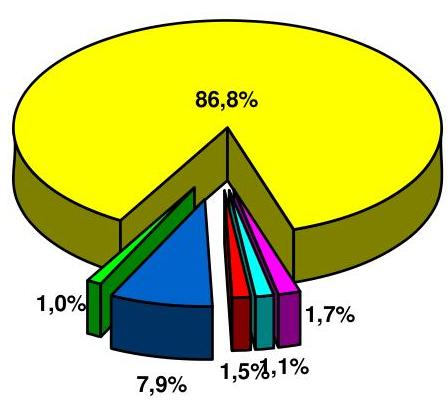
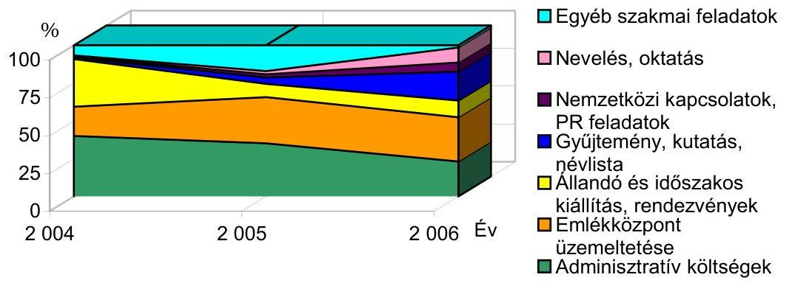
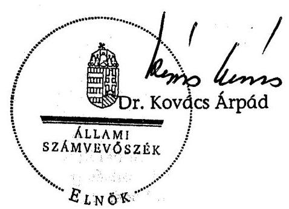
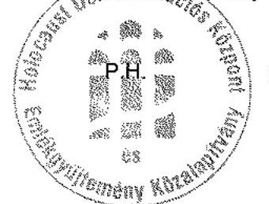
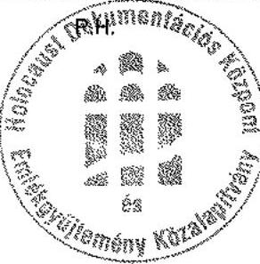
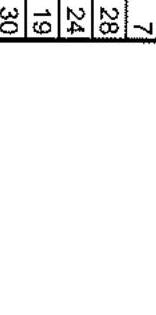

# ÁLLAMI   SZÁMVEVŐSZÉK 

## JELENTÉS

a Holocaust Dokumentációs Központ és Emlékgyűjtemény
Közalapítvány gazdálkodásának ellenőrzéséről

---

3. Önkormányzati és Területi Ellenőrzési Igazgatóság
3.1. Szabályszerüségi Ellenőrzési Föcsoport
Iktatószám: V-1003-28/2007.
Témaszám: 847
Vizsgálat-azonosító szám: V-0340
Az ellenőrzést felügyelte:
Dr. Lóránt Zoltán
föigazgató
Az ellenőrzés végrehajtásáért felelős:
Dr. Elek János
általános föigazgató-helyettes
Az ellenőrzést vezette:
Solymár Ágnes
számvevő főtanácsos
Az összefoglaló jelentést készítette:
Sas Imréné
számvevő tanácsadó
Az ellenőrzést végezték:
Pásztor Katalin
számvevő tanácsos

Sas Imréné
számvevő tanácsadó

Dr. Siskáné Draviczky Éva
számvevő

# A témához kapcsolódó eddig készített számvevőszéki jelentések: 

Jelentés a Magyarországi Zsidó Örökség Közalapítvány gazdálko- 0402 dásának ellenőrzéséről

---

# TARTALOMJEGYZÉK 

BEVEZETÉS ..... 7
I. ÖSSZEGZŐ MEGÁLLAPÍTÁSOK, KÖVETKEZTETÉSEK, JAVASLATOK ..... 10
II. RÉSZLETES MEGÁLLAPÍTÁSOK ..... 16

1. A működés szabályozottsága és szabályossága ..... 16
1.1. Az alapító okirat és a szervezeti és működési szabályzat ..... 16
1.2. A gazdálkodási szabályzatok ..... 19
2. A könyvvezetés és az éves beszámolók szabályossága ..... 22
2.1. A könyvvezetés rendszere ..... 22
2.2. A beszámolási kötelezettség teljesítése ..... 24
3. A gazdálkodás szabályossága ..... 26
3.1. Az éves pénzügyi gazdálkodási terv ..... 26
3.2. A közalapítvány bevételei ..... 26
3.3. A költségek és ráfordítások ..... 29
3.4. A közbeszerzésekről szóló törvény előírásainak betartása ..... 31
4. A közalapítvány cél szerinti tevékenysége ..... 32
4.1. A cél szerinti feladatellátás koncepciója ..... 32
4.2. A bejelentési kötelezettség teljesítése ..... 33
4.3. A cél szerinti feladatellátás ..... 34
4.3.1. A Holokauszt Dokumentációs és Emlékközpont üzemeltetése ..... 35
4.3.2. Az állandó és időszakos kiállítások ..... 36
5. A közalapítvány ellenőrzési rendszere ..... 38

## MELLÉKLETEK

1. számú A közalapítvány eszközei és forrásai
2. számú A közalapítvány bevételei, költségei és ráfordításai
3. számú A közalapítvány költségei és felhalmozási kiadásai tevékenységenként
4. számú A közalapítvány tevékenységének mutatószámai

---

.

---

# RÖVIDÍTÉSEK JEGYZÉKE 

| Áht. | az államháztartásról szóló, többször módosított 1992. évi |
| :-- | :-- |
|  | XXXVIII. törvény |
| ÁSZ | Állami Számvevőszék |
| ÁSZ törvény | az Állami számvevőszékről szóló 1989. évi XXXVIII. tör- |
|  | vény |
| BZSH | Budapesti Zsidó Hitközség |
| Emlékközpont | Holokauszt Dokumentációs és Emlékközpont |
| FB | Felügyelő Bizottság |
| HDKE | Holocaust Dokumentációs Központ és Emlékgyűjtemény |
|  | Közalapítvány |
| IHM | Informatikai és Hírközlési Minisztérium |
| jogelőd alapítvány | Magyar Auschwitz Alapítvány - Holocaust Dokumentáci- |
|  | ós Központ |
| Kbt. | a közbeszerzésekről szóló 2003. évi CXXIX. törvény |
| Kh. tv. | a közhasznú szervezetekről szóló 1997. évi CLVI. törvény |
| levéltári törvény | a közokiratokról, a közlevéltárakról és a magánlevéltári |
|  | anyag védelméről szóló 1995. évi LXVI törvény |
| MÁK | Magyar Államkincstár |
| MEH | Miniszterelnöki Hivatal |
| MNM | Magyar Nemzeti Múzeum |
| NKA | Nemzeti Kulturális Alapprogram |
| NKÖM | Nemzeti Kulturális Örökség Minisztériuma |
| OKM | Oktatási és Kulturális Minisztérium |
| Ptk. | a Polgári Törvénykönyvről szóló 1959. évi IV. törvény |
| SZMSZ | Szervezeti és Múködési Szabályzat |
| Szt. | a számvitelről szóló 2000. évi C. törvény |

---

.

---

# ÉRTELMEZŐ SZÓTÁR 

Az alapítvány bevételei

Az alapítvány költségei (kiadásai)

A vállalkozási tevékenység bevétele, valamint az alapítványi célú tevékenység bevételei (minden olyan bevétel, amely nem a vállalkozási tevékenységhez kapcsolódó befizetés, ideértve a céltámogatást is) [115/1992. (VII. 23.) Korm. rendelet 3. § (1) bekezdésének a)-b) pontja].
A vállalkozási tevékenység közvetlen költségei, az alapítványi célú tevékenység közvetlen költségei, az alapítvány kezelő szervének költségei (kiadásai) és az egyéb közvetett költségek (kiadások) [115/1992. (VII. 23.) Korm. rendelet 3. § (2) bekezdésének a)-b)-c) pontja].

Cél szerinti tevékenység Minden olyan tevékenység, amely az alapító okiratban megjelölt célkitúzés elérését közvetlenül szolgálja [Kh. tv. 26. § b) pontja].

Holokauszt Eredetileg Istennek ajánlott, teljesen elégő tűzáldozat, az 1960-as évek óta az európai zsidóság kétharmadának 1939 és 1945 közötti kiirtása [múzeumi katalógus].
Induló vagyon A közalapítvány javára a célja megvalósításához az alapító okiratban meghatározott vagyon [Ptk. 74/A. § (1) bekezdése, 74/B. § (1) bekezdése]. A közalapítvány rendelkezésére legalább olyan mértékű vagyont kell bocsátani, amely a múködése megkezdéséhez feltétlenül szükséges [Ptk. 74/B. § (4) bekezdése]. A közalapítványi vagyon pontos megjelölése nélkül a közalapítvány nem jöhet létre [BH2001. 303].
Kiemelkedően közhasznú közalapítvány

A kiemelkedően közhasznú közalapítványnak a közhasznú közalapítványokra előírt követelmények teljesítésén túl közhasznú tevékenysége során olyan közfeladatot kell ellátnia, amelyről törvény vagy törvény felhatalmazása alapján más jogszabály rendelkezése szerint, valamely állami szervnek vagy a helyi önkormányzatnak kell gondoskodnia, az alapító okirata szerinti tevékenységének és gazdálkodásának legfontosabb adatait a helyi vagy országos sajtó útján is nyilvánosságra hozza, továbbá a közhasznú tevékenységet maga látja el [Kh. tv. 5. § és a BH2001. 451 alapján].
Közalapítvány
A közalapítvány olyan alapítvány, amelyet az Országgyűlés, a Kormány, valamint a helyi önkormányzat vagy kisebbségi önkormányzat képviselő-testülete közfeladat ellátásának folyamatos biztosítása céljából hoz létre [Ptk. 2006. VIII. 24-ig hatályos 74/G. § (1) bekezdése].

Közfeladat az, az állami vagy helyi önkormányzati, kisebbségi önkormányzati feladat, amelynek ellátásáról jogszabály alapján - az államnak vagy az önkormányzatnak kell gondoskodnia [Ptk. 74/G. § (2) bekezdése].
Közhasznú egyszerűsített éves beszámoló

A közhasznú nyilvántartásba vett közalapítványoknál mérlegből, közhasznú eredmény-kimutatásból és tájékoztató adatokból áll [224/2000. (XII. 19.) Korm. rendelet 6. §

---

Közhasznú tevékenység

Közhasznúsági jelentés

Támogatás
Törzsvagyon

Vagyonkezelői jog

Vezető tisztségviselő a közalapítványoknál
(8) bekezdése, illetve 4. és 6 . számú melléklete].

A társadalom és az egyén közös érdekeinek kielégítésére irányuló, a közhasznú közalapítvány alapító okiratában szereplő cél szerinti tevékenység a törvényben meghatározott körben [Kh. tv. 26. § c) pontja].
Tartalmazza a számviteli beszámolót; a költségvetési támogatás felhasználását; a vagyon felhasználásával kapcsolatos kimutatást; a cél szerinti juttatások kimutatását; a központi költségvetési szervtől, az elkülönített állami pénzalaptól, a helyi önkormányzattól, a települési önkormányzatok társulásától és mindezek szerveitől kapott támogatás mértékét; a közhasznú szervezet vezető tisztségviselőinek nyújtott juttatások értékét, illetve összegét; a közhasznú tevékenységről szóló rövid tartalmi beszámolót [Kh. tv. 19. § (3) bekezdése].
Pénzbeli és nem pénzbeli juttatás [Kh. tv. 26. § j) pontja].
Az alapítói vagyon dologi-eszköz elemeit törzsvagyonként indokolt elkülöníteni, ami elidegenítési és terhelési tilalmat jelent. A törzsvagyonná nyilvánítás az alapító kizárólagos jogköre, erre az alapító okiratban a kuratórium részére nem adható felhatalmazás [1052/1997. (V. 21.) Korm. határozat 5. a) pontja].
A vagyonkezelői jog jogosultját megilletik a tulajdonos jogai, és terhelik a tulajdonos kötelezettségei - ideértve a számvitelről szóló törvény szerinti könyvvezetési és beszámolókészítési kötelezettséget is - azzal, hogy a vagyont nem értékesítheti, illetve arra zálogjogot, illetve haszonélvezeti jogot nem alapíthat [Áht.109/G. § (1) bekezdése]
A közalapítvány kuratóriumának és felügyelő bizottságának elnöke és tagja, a közalapítvánnyal munkaviszonyban vagy munkavégzésre irányuló egyéb jogviszonyban álló, az alapító okirat szerint egyszemélyi felelős vezető feladatot ellátó személy [Kh. tv. 26. § m) pontja alapján].

---

# JELENTÉS 

## a Holocaust Dokumentációs Központ és Emlékgyűjtemény Közalapítvány gazdálkodásának ellenőrzéséről

## BEVEZETÉS

A nonprofit szervezetek között 1994. január 1-jétől megjelenő közalapítványok megalakítására és múködésére a Polgári Törvénykönyvről szóló 1959. évi IV. törvény (továbbiakban: Ptk.) 74/G. §-ában az alapítványok szabályozásán belül külön feltételeket és követelményeket határozott meg az alapítók körét, az ellátandó közfeladatokat, valamint a múködés és gazdálkodás feltételeit illetően A szabályozást 2006. augusztus 24 -től az államháztartásról szóló 1992. évi XXXVIII. törvény és egyes kapcsolódó törvények módosításáról szóló 2006. évi LXV. törvény 1. §-a hatályon kívül helyezte. A jogszabályi változások hatályba lépését követően azok a szervezetek, amelyek közalapítvány létrehozására a Ptk. 74/G. §-a alapján jogosultak voltak, alapítványt e törvény hatálybalépését követően nem alapíthatnak, ahhoz nem csatlakozhatnak és annak alapítói joga gyakorlására nem jelölhetők ki. A jogszabály a még múködő közalapítványok gazdálkodására vonatkozó szabályokat a korábbihoz képest, annyiban módosította, hogy azok alapítványt nem hozhatnak létre, ahhoz nem csatlakozhatnak, azzal nem egyesíthetők, pályázat kiírása nélkül évente a vagyonuk 5\%-ának mértékéig, de legfeljebb egymillió forint összértékben támogatást nyújthatnak az alapító okiratban foglalt célokra, továbbá tevékenységük újabb közfeladat ellátásával nem bővíthető.

Magyarországon - Európa más országaihoz hasonlóan - fontos társadalmi feladat a múlttal való szembenézés, a holokauszt feldolgozása. A Magyar Köztársaság Kormánya az 1990-ben társadalmi kezdeményezésre alakult Magyar Auschwitz Alapítvány - Holocaust Dokumentációs Központ jogutódjaként hozta létre a Holocaust Dokumentációs Központ és Emlékgyűjtemény Közalapítványt, amelyet a Fővárosi Bíróság 2002. június 30 -án jogerőre emelkedett végzésével kiemelkedően közhasznú szervezetként vett nyilvántartásba.

A közalapítvány által üzemeltetett ferencvárosi Páva utcai zsinagóga, és a hozzá csatlakozó új épületszárny ad otthont a Holokauszt Dokumentációs és Emlékközpontnak, amely közérdekú muzeális intézményként és kiállítóhelyként múködik. Az Emlékközpontot 2004. április 16-án, a magyar holokauszt 60. évfordulójára avatták fel, kiállítóterében a „Jogfosztástól népirtásig - a magyar holokauszt áldozatainak emlékére" címet viselő állandó kiállítás látható. A kiállítás témája a magyar holokauszt, célja, hogy a faji ideológia által fizikai megsemmisítésre ítélt magyar állampolgárok, azaz a zsidók vagy a magyar törvények által annak minősítettek, valamint a romák szenvedéseit, üldöztetését és legyilkolását elbeszélje és bemutassa. Az Emlékközpont udvarán nyolc méter magas kőfal őrzi a holokauszt magyarországi áldozatainak nevét.

---

A közalapítvány alapító okiratában rögzített célja az 1938-1945 között vallási, faji, nemzetiségi és más politikai okokból történt üldöztetés, a munkaszolgálat, a deportálások, a náci koncentrációs táborok múködésének és áldozatainak elsődlegesen magyar vonatkozású dokumentációját, tárgyi emlékeit, tudományos és ismeretterjesztő irodalmát, és az e témakörhöz tartozó művészeti alkotásokat tartalmazó gyűjtemény létrehozása. E körbe tartozik az üldöztetés ellen fellépő embermentő szervezetek és személyiségek emlékanyaga is. A gyűjtési munka csak másolatban terjed ki a köziratokra. További cél a hazai vészkorszak történetére irányuló tudományos kutatás, ismeretterjesztés, a pedagógiai tevékenység segítése, figyelemmel arra, hogy április 16-a a holokauszt áldozatainak emléknapja.

A közalapítvány a céljainak elérése érdekében gyűjteményt hozott létre és azt folyamatosan fejleszti, tudományos forrásfeltárást, kutatást végez, kutatási eredményeit publikálja. Tudományos konferenciákat, tanácskozásokat szervez, tudományos szaktanácsadási feladatot lát el, támogatja az ismeretterjesztést, közoktatást és közművelődést. Feladata az embermentő intézmények és személyek felkutatása és elismerésük kezdeményezése, ünnepségek, megemlékezések, találkozók szervezése, emlékművek létesítésének kezdeményezése. Továbbá állandó és időszakos kiállítások rendezésével, kulturális rendezvények szervezésével és lebonyolításával, külföldi intézményekkel való együttműködéssel, valamint felnőtt- és egyéb oktatással valósítja meg céljait.

A közalapítvány a tudományos tevékenység, kutatás, a nevelés és oktatás, képességfejlesztés, ismeretterjesztés, a kulturális tevékenység, valamint a kulturális örökség megóvása feladatok körében végez közhasznú tevékenységet. Feladatait az Emlékközpont üzemeltetésével és a munkaszervezetén keresztül látja el. A kuratórium a 2004-2005. évekre a közalapítvány legfontosabb feladataként az állandó és a nyitó kiállítás megrendezését jelölte meg. Az állandó kiállítás megnyitása után elkészítette, és nyilvánosságra hozta az alapító okirattal összhangban megfogalmazott koncepcióját. A közalapítvány kiemelt feladataként jelölte meg többek között a holokauszt valós történetéről, következményeiről, tanulságáról szóló történetek oktatását, a következmények feldolgozását, az egymás iránti felelősségteljes viselkedés formálását, a holokausztról való ismeretek átadását és az emlékezés társadalmi intézményesülésének megteremtését. A modernkori üldöztetés történeti feldolgozásának, megismerésének és oktatásának eszközeként jelölte meg az Emlékközpont gyűjteményi anyagát, kiállításait, rendezvényeit.

A Kormány a közalapítvány részére induló vagyon címen a jogelőd alapítvány zárómérleg szerinti vagyonát és tízmillió forint készpénzt biztosított, a törzsvagyont ötmillió forint összegben, és - annak megszerzését követően - a közalapítvány székhelyeként megjelölt ingatlan haszonélvezeti jogában határozta meg.

Az Állami Számvevőszék a Ptk. 74/G. § (8) bekezdése, illetve 2006. augusztus 24-étől az államháztartásról szóló 1992. évi XXXVIII. törvény és egyes kapcsolódó törvények módosításáról szóló 2006. évi LXV. törvény 1. § (2) bekezdésének e) pontja alapján ellenőrzi a közalapítványok gazdálkodásának törvényességét és célszerűségét. Az Állami Számvevőszékről szóló 1989. évi XXXVIII. tör-

---

vény (továbbiakban: ÁSZ törvény) 2. § (5) bekezdése alapján ellenőrzi a közalapítványoknál az állami költségvetésből nyújtott támogatás felhasználását.

Az ellenőrzés célja annak értékelése volt, hogy a közalapítvány a vagyonát, illetve a központi költségvetésből kapott támogatást szabályosan, és az alapító okiratában meghatározott céljai megvalósítása érdekében használta-e fel. Ennek keretében ellenőriztük, hogy

- a kuratórium a kapott költségvetési és egyéb támogatásokat, valamint a közalapítvány saját bevételeit az alapító okiratban meghatározott céljainak megvalósítása érdekében törvényesen és szabályosan használta-e fel;
- a közalapítvány alapító okirata és belső szabályzatai megteremtették-e az induló vagyon törzsvagyonon felüli része és hozadéka, valamint a központi költségvetési támogatás felhasználásának törvényes kereteit;
- a gazdálkodás és a könyvvezetés szabályossága biztosította-e a gazdálkodás törvényességét.

A közalapítvány gazdálkodásának ellenőrzésére első alkalommal került sor. Az ellenőrzés a 2004-2006. évek gazdálkodására terjedt ki, mivel a közalapítvány által üzemeltetett Emlékközpontot 2004-ben - a holokauszt 60. évfordulóján nyitották meg, a 2004-2006. évekre az Országgyűlés a közalapítvány részére az éves költségvetési törvényekben együttesen 728,7 millió Ft támogatást hagyott jóvá.

A helyszíni ellenőrzés során a közalapítványnál a kuratórium határozatait és a bevételeket tételesen, a költségeket és ráfordításokat, valamint az immateriális javakat és tárgyi eszközöket reprezentatív minta alapján ellenőriztük.

---

# 1. ÖSSZEGZŐ MEGÁLLAPÍTÁSOK, KÖVETKEZTETÉSEK, JAVASLATOK 

A Holocaust Dokumentációs Központ és Emlékgyűjtemény Közalapítvány alapító okiratában megfogalmazott feladata a náci koncentrációs táborokban faji, vallási, etnikai és más politikai okokból elpusztított magyar állampolgárok emlékének megőrzése, és a holokauszttal kapcsolatos dokumentációk gyűjtése. A kuratórium az ellenőrzött években - összhangban az alapító okiratban foglaltakkal - ezt a feladatot az e témakörben elkészített állandó és időszakos kiállításokkal, gyűjteménygyarapítással, az áldozatok nevének felkutatásával, a történelmi tények tudományos kutatásával, a kutatások eredményeinek ismertetésével, oktatásával, rendezvények, tudományos konferenciák szervezésével valósította meg.

A közalapítvány az ellenőrzött időszakban összesen 874 millió Ft bevételt számolt el, amelynek 88,5\%-a származott költségvetési forrásból, ezen belül az éves költségvetési törvények alapján 758 millió Ft címzett és 15 millió Ft pályázati támogatást kapott. A Nemzeti Kulturális Örökség Minisztériuma (továbbiakban: NKÖM) a támogatások cél szerinti felhasználásának szabályait, a finanszírozás ütemét, az elszámolás feltételeit a törvényi előírásoknak megfelelően szerződésben határozta meg. Az NKÖM az Emlékközpont folyamatos múködtetéséhez szükséges éves költségvetési támogatás időarányos részét az ellenőrzött évek első négy hónapjára utólag folyósította, mivel a szerződéseket az első negyedév utolsó napján, illetve a negyedévet követően kötötték meg. A közalapítvány átmenetileg a Francia Köztársaság Kormányától informatikai eszköz beszerzésre kapott támogatásból fedezte múködését, a felhasznált összeget a költségvetési támogatás folyósítását követően visszapótolta. A közalapítvány a támogatások felhasználásáról a szerződés előírásainak megfelelően szakmai és pénzügyi beszámoló benyújtásával elszámolt, a támogató az elszámolásokat elfogadta. A pályázati támogatást a közalapítvány a támogatási szerződésekben meghatározott feladatokra fordította, a felhasználásról a szerződésekben előírt módon és határidőben elszámolt.

A költségvetésen kívüli bevételek ( 101 millió Ft) 76\%-át a fejlesztésre kapott támogatásból beszerzett eszközök értékcsökkenésével azonos összegben elszámolt, de pénzügyileg az ellenőrzött éveket megelőzően realizált bevétel, további hányadát a magán- és jogi személyek adománya, a szabad pénzeszközök lekötéséből származó kamatbevétel, az SZJA felajánlás és az egyéb bevételek tették ki. A múzeumi belépődíjból és katalógus eladásból a 2006. év második felétől kezdődően keletkezett bevétel, ezek értékesítésével a kuratórium külső szervezetet bízott meg. A vállalkozási szerződés azonban nem tartalmazta a bevételel való elszámolás módját és feltételeit, gyakoriságát, az elszámoláshoz csatolandó bizonylatok körét és ellenőrzésének módját. Az elszámolások 30\%-át nem, vagy nem teljes körűen támasztotta alá hiteles alapbizonylat, és nem történt meg az értékesítésre átadott múzeumi katalógusok mennyiségi elszámoltatása sem. A vállalkozási tevékenység bevétele - három év alatt mindössze egymillió forint - az Emlékközpontban lévő kávézó és könyvesbolt helyiségek bérbeadásából származott. A közalapítvány Titkársága a bérleti díjat a könyvesbolt bér-

---

lője részére a szerződés előírásának megfelelően, a kávézó bérlője részére azonban a szerződéstől eltérően, nem a pénztárgép forgalmi jelentés, hanem a bérlő kimutatása alapján számlázta ki.

A kuratórium a költségvetési és egyéb támogatásokat, valamint a közalapítvány saját bevételeit az alapító okiratban meghatározott céljainak megvalósítása érdekében használta fel. A közalapítványi vagyon felhasználásáról az éves pénzügyi terv keretében, a munkaterv elfogadásával, illetve egyedi határozattal döntött, határozatait az alapító okirat előírásának megfelelően határozatképes ülésen, az előírt szavazataránnyal hozta meg. A közalapítvány költségeit és ráfordításait ( 874 millió Ft-ot) teljes mértékben a közalapítvány alapító okiratban előírt feladataira használta fel. A kuratórium beszerzéseinél érvényesítette a közbeszerzési törvény előírásait.

A cél szerinti kifizetések évek közötti megoszlása tükrözte a feladatoknak a kuratórium által felállított prioritási rendjét. A 2004. évben az Emlékközpont üzemeltetésén túl a cél szerinti költségek egynegyedét a kiállítás előkészítésével és megnyitásával kapcsolatos feladatok tették ki. A 2004-2006. évek között a kutatásra, publikálásra fordított összeg a 17-szeresére, a nevelési, oktatási költségek a 14-szeresére, az áldozatok névlistájára fordított kifizetések a 8 -szorosára emelkedtek. Az Emlékközpont üzemeltetésének tárgyi feltételeit épület beruházás és felújítás keretében az NKÖM, az üzemeltetés személyi feltételeit pedig a közalapítvány biztosította. Az üzemeltetésre árajánlatok alapján külső szervezeteket bízott meg, saját szervezetében a megbízott társaságok szerződés szerinti teljesítését ellenőrző és kapcsolattartó személyeket alkalmazott.

Az állandó kiállítás kivitelezésére az NKÖM nem a közalapítványt, hanem a Magyar Nemzeti Múzeum programirodáját kérte fel. A kiállítást a közalapítvány műszakilag a 2006. év elején vette át, február 21-én ünnepélyesen megnyitotta, ezzel az eszközök rendeltetésszerú használatba vétele megtörtént. A helyszíni ellenőrzés lezárásáig az állandó kiállítás vagyontárgyait, vagyoni értékű jogait a közalapítvány nem aktiválta, mivel a kiállítás beruházással létrejött 511,8 millió Ft értékű kincstári vagyontárgyai vagyonkezelői jogának térítésmentes átvétele teljes körűen csak a használatbavételt követő több mint egy év elteltével valósult meg. A késedelmes átvételt egyrészt az okozta, hogy az Országgyűlés a kincstári vagyontárgyak vagyonkezelői jogának térítésmentes átvételére 2006 novemberében adott felhatalmazást, másrészt a Nemzeti Múzeum csak 2007 áprilisában adta át teljes körűen a beruházás könyv szerinti értékét alátámasztó analitikát.

Az ideiglenes kiállításokhoz a tárgyi és személyi feltételeket egyaránt a közalapítvány biztosította. Az ellenőrzött években kuratóriumi határozat alapján öszszesen tizenegy időszakos kiállítást rendeztek meg, amelyek költségvetéséről minden esetben a kuratórium határozott.

A múzeumi látogatók száma évente átlagosan 39 ezer fő volt. A 2004. évben, a megnyitásához kapcsolódó fokozott érdeklődés következtében, 71 ezren látogatták meg az Emlékközpontot. Az áldozatok neveinek felkutatása, a gyűjtési munka az időközben eltelt több mint 60 év, az elhurcoltakra vonatkozó információkkal rendelkezők számának csökkenése miatt évről évre nehezebb. A közalapítvány a tudományos kutatási tevékenységének eredményeként a 2004-

---

2006. években 90 ezer olyan személy nevét tárta fel, akik bizonyíthatóan áldozatai voltak az üldöztetésnek. A jogelőd alapítvány és a közalapítvány által együttesen feltárt 120 ezer áldozat nevét emlékfalon rögzítették. A feltárt áldozatmentő magánszemélyek száma 263 fő. Az ellenőrzött években mind az oktatott iskolai csoportok, mind a pedagógus továbbképzésben részt vevők száma tízszeresére emelkedett. A magánszemélyek és közintézmények felajánlásai, valamint a kutatások eredményeként a tárgyi anyagok gyűjteménye 239, a dokumentációk gyűjteménye pedig 6800 darabbal gyarapodott az Emlékközpont megnyitása óta.

A közalapítvány működésének legfontosabb szabályait a Kormány által jóváhagyott alapító okirat tartalmazta. Az alapító okirat és annak módosításai nem határozták meg egyértelműen a közalapítvány induló vagyonát, nevezetesen azt, hogy a jogelőd alapítvány zárómérleg szerinti vagyona része-e a jogutód közalapítvány induló vagyonának. Emiatt a számviteli nyilvántartásban kimutatott induló tőke a jogelőd alapítvány zárómérleg szerinti vagyonából csak a jogelőd alapítvány induló tőke összegét ( 6993 ezer Ft), valamint az alapításkor készpénzben kapott tízmillió forintot tartalmazta. A Fővárosi Bírósághoz benyújtott alapító okirat elválaszthatatlan részét képező, a jogelőd alapítvány zárómérlegének főösszege 167164 ezer Ft, a saját tőke összege 166370 ezer Ft, a kötelezettsége 794 ezer Ft volt.

Az alapító okirat a közalapítvány működését, gazdálkodását, valamint a törzsvagyonon felüli induló vagyon és a központi költségvetési támogatás felhasználását a vonatkozó törvényi előírásoknak megfelelően szabályozta. A nemzeti kulturális örökség minisztere az alapító okirat módosításait a törvényi előírásnak megfelelően nyilvánosságra hozta. A közalapítvány felett az alapítói jogokat 2006. augusztusig a nemzeti kulturális örökség minisztere, azt követően az oktatási és kulturális miniszter gyakorolta, e változást a közalapítvány hatályos alapító okirata még nem tartalmazta. Az alapító okirat és módosításai a közalapítvány által kezelt és fenntartott gyűjteményre vonatkozó belső ellentmondást tartalmaztak, mivel a gyűjteményt közlevéltárinak minősítette és előírta a közlevéltárak nyilvántartásába történő bejelentkezési kötelezettséget, ugyanakkor a köziratok gyűjtését csak másolatban engedélyezte, következésképpen a gyűjtemény a levéltári törvény szerint nem minősülhetett közlevéltárinak. Az Emlékközpont megnyitásától kezdve rendelkezett az alapító okirat által előírt működési engedéllyel, amelyben a nemzeti kulturális örökség minisztere a gyűjteményt közérdekű muzeális gyűjteménynek minősítette.

A kuratórium a közalapítvány működésének rendjét a Szervezeti és Működési Szabályzatban (továbbiakban: SZMSZ) határozta meg, a szabályzat nem tartalmazta a közalapítványi Titkárság szakmai szervezeti egységei - Pénzügyi és gazdálkodási munkacsoport, Program és oktatási munkacsoport, Tudományos és szakmai testület - feladatait, működési elveit. A közalapítvány képviseletének, bank- és értékszámla feletti rendelkezésének az alapító okiratban és SZMSZ-ben megvalósuló szabályozása megfelelt a törvényi előírásoknak. Nem felelt meg viszont a Ptk. és az alapító okirat előírásának a képviseletre, illetve a bankszámla feletti rendelkezésre nem jogosult közalapítványi alkalmazottak bankkártya használata. A használattal kapcsolatos visszaélést nem állapítottunk meg. A kuratórium a helyszíni ellenőrzést követően, visszamenőleges hatállyal, engedélyezte a közalapítványi alkalmazottak részére a bankkártya

---

használatát. A kuratórium az alapító okiratban foglaltaknak megfelelően éves pénzügyi, és a szakmai feladatokat tartalmazó munkaterv alapján gazdálkodott. A kuratórium a Ptk.-ban és az alapító okiratban előírt beszámolási kötelezettségének az éves címzett költségvetési támogatások felhasználásáról szóló elszámolás, valamint az NKÖM által előírt kötelező adatszolgáltatás megküldésével tett eleget.

A közalapítvány rendelkezett a számviteli törvényben előírt, a kuratórium által elfogadott szabályzatokkal, amelyek azonban nem teljes körűen, és nem az alapítványi sajátosságok figyelembe vételével szabályozták a számviteli elszámolás rendjét. A szabályzatok előírásai csak részben érvényesültek a gyakorlatban. A számviteli politikában nem határozták meg az elszámolás és értékelés szempontjából a megbízható és valós képet lényegesen befolyásoló hiba mértékét, az éves zárlati könyvelési feladatok körét, a költségek elkülönítésének módját, a számlarend nem rögzítette a bizonylati rendet. A leltározási és selejtezési szabályzatban a kis értékű eszközök értékmegjelölését nem módosították a számviteli politika módosításával összhangban. A szabályzat előírásai a gyakorlatban nem érvényesültek teljes körűen, így pl. az alkalmazott leltározási nyomtatványok eltértek a szabályzattól, nem készült éves leltározási ütemterv és utasítás, a tárgyi eszközök selejtezéséről és a használt eszközök értékesítéséről az ügyvezetés határozott, azt a kuratórium csak utólagosan fogadta el. Az eszközök és a források értékelési szabályzata nem igazodott a közalapítvány gazdálkodásának sajátosságaihoz, és nem volt összhangban a számviteli politikával. A pénzkezelési szabályzat nem tartalmazta a bankkártya használatának, a készpénzes adományok házipénztárba vételezésének, a banki átutalások utalványozásának szabályait, az elektronikus banki átutalások rendjét. A szabályzatok hiányosságai hozzájárultak a könyvvezetésben feltárt hiányosságokhoz.

A könyvvezetés a feltárt hiányosságok ellenére megfelelő alapot teremtett az éves beszámolók alátámasztásához. A közalapítvány az ellenőrzött évekre elkészítette a kettős könyvvitel szerinti könyvvezetéssel alátámasztott közhasznú egyszerűsített éves beszámolóit és az éves közhasznúsági jelentéseket, azokat a könyvvizsgáló hitelesítő záradékkal látta el. Az FB a beszámolókat véleményezte és elfogadásra javasolta, a kuratórium a 2004. évi éves beszámolót féléves késéssel, a 2005. évre vonatkozót határidőben elfogadta. A beszámolókat főkönyvi kivonattal és analitikus nyilvántartásokkal, a mérleget leltárral támasztották alá. A közalapítvány az éves beszámolóját 2005-ben az alapító okirat előírásának megfelelően országos sajtó útján közzétette, a 2004. évre ezt a kötelezettséget nem teljesítette. A törzsvagyon részét képező székhely-ingatlan haszonélvezeti jogát a könyvekben még nem mutatták ki, mivel azt a tulajdonos, a Budapesti Zsidó Hitközség, csak 2006 végén adta át szerződéssel. A szerződés értelmében a haszonélvezeti jog értéke a tulajdonosnál aktiválás alatt álló beruházási érték

A könyvvezetésben a gazdasági eseményeket rögzítő alapbizonylatokat a közalapítvány nevére állították ki, azokon a könyvelés tényét igazolták, a könyvelés időpontját csak 2006-tól kezdődően. A számviteli törvény előírásától eltérően a szállítói számlák nem tartalmaztak egyedi azonosítót, a szigorú számadású pénztári bizonylatokra pedig a pénzkezelési szabályzattól eltérően nem vezették rá a beazonosítást elősegítő be- és kifizetések sorszámát. Az átutalással

---

teljesített kifizetések 42\%-ában a teljesítést nem igazolták, 56\%-ánál pedig az utalványozás csak a banki aláírással valósult meg. A készpénzes kiadásoknak a $25 \%$-át nem utalványozták, e kifizetések mintegy háromnegyedét a rendszeresen ismétlődő, szerződés szerinti személyi jellegű kiadások tették ki. Az ellenőrzés jogosulatlan kifizetést nem állapított meg. A munkabérek számfejtése munkaszerződés, jelenléti ív, távollét- és túlmunka igazolása alapján történt, a megbízással foglalkoztatottak 67\%-ánál azonban a megbízási díjat nem támasztotta alá teljesítésigazolás. A házipénztárban a pénzkészlet az előírt mértéket nem haladta meg, az elszámolásra kiadott előleggel elszámoltak, a szigorú számadási kötelezettség alá vont bizonylatokat a pénztárjelentés kivételével nyilvántartották. A pénzkezelési szabályzatban előírt szabvány nyomtatvány helyett egyedi pénztárjelentést vezettek, és azt nem sorszámozták. A pénzkezelési szabályzattól eltérően a pénztáros anyagi felelősségvállalásáról nem kértek nyilatkozatot, azt az ellenőrzés ideje alatt pótolták.

A Kormány a közalapítvány működésének és gazdálkodásának ellenőrzésére felügyelő bizottságot jelölt ki, működését az alapító okirat a törvényi előírásoknak megfelelően szabályozta. A bizottság az alapító okiratban foglalt ellenőrzési tevékenységét ellátta, véleményezte a közalapítvány éves közhasznúsági jelentéseit, benne az éves egyszerűsített beszámolókat, szorgalmazta a belső szabályzatok elkészítését és véleményezte azokat. Megállapításairól a kuratóriumot tájékoztatta, tevékenységéről évente beszámolt az alapítónak. A közalapítvány számviteli rendjét független könyvvizsgáló ellenőrizte. A munkafolyamatba épített ellenőrzés a könyvelési alapbizonylatok teljesítésigazolása és utalványozása, valamint a házipénztár kezelése során hiányosan működött.

A helyszíni ellenőrzés megállapításainak hasznosítása mellett javasoljuk:

# az oktatási és kulturális miniszternek 

Tegyen javaslatot a Kormánynak az alapító okirat módosítására a közlevéltárak nyilvántartásába történő bejelentkezési kötelezettségre vonatkozó alapító okiratbeli ellentmondás megszüntetése, és az alapítót megillető jogkör gyakorlásáért felelős miniszternek a Kormány (köz)alapítványaiért felelősökről szóló 1081/2006. (VIII. 14.) Korm. határozat I. f) 16. pontjával összhangban történő megjelölése érdekében.

## a közalapítvány kuratóriumának

1. Módosítsa a közalapítvány belső szabályzatait a következők figyelembevételével:
a) egészítse ki a Szervezeti és Múködési Szabályzatot az alapító okirat VIII. fejezet C) 1. pontjának megfelelően a Titkárságon belüli szervezeti egységek (Pénzügyi és gazdálkodási munkacsoport, Program és oktatási munkacsoport, Tudományos és szakmai testület) múködésének szabályaival;
b) határozza meg a számviteli politikában az elszámolás és értékelés szempontjából a megbízható és valós képet lényegesen befolyásoló hiba mértékét a számvitelről szóló 2000. évi C. törvény 3. § (3) bekezdése 5. pontjának, és a zárlati feladatok körét a 164. § (1) bekezdésének előírásaival összhangban, továbbá a költségek-

---

nek az alapítványok gazdálkodási rendjéről szóló 115/1992. (VII. 23.) Korm. rendelet 3. § (2) és (5) bekezdéseiben előírt elkülönítési módját;
c) egészítse ki a számlarendet a bizonylati rend szabályozásával a számvitelről szóló 2000. évi C. törvény 161. § (2) bekezdése d) pontjának megfelelően;
d) módosítsa a leltározási és selejtezési szabályzatban a kis értékű tárgyi eszközök és immateriális javak értékét a számviteli politikában rögzített értéknek megfelelően;
e) módosítsa az eszközök és a források értékelési szabályzatát a közalapítvány gazdálkodási sajátosságainak megfelelően;
f) egészítse ki a pénzkezelési szabályzatot a Polgári Törvénykönyvről szóló 1959. évi IV. törvény 29. § (3) bekezdése és az alapító okirat bankszámla feletti rendelkezésre vonatkozó előírásának megfelelően az elektronikus átutalások és a bankkártyák használatának szabályaival, továbbá a készpénzes adományok házipénztárba vételezésének rendjével.
2. Kezdeményezze az alapítót megillető jogkör gyakorlásáért felelős miniszternél a közalapítvány induló vagyonának egyértelmű megjelölését, és a döntéstől függően módosítása az induló tőke összegét a számviteli nyilvántartásban.
3. Kezdeményezze a törzsvagyon részét képező ingatlan haszonélvezeti jog értékének megállapítását.
4. Vizsgálja felül a számvitelről szóló 2000. évi C. törvény 167. § (1) bekezdésének megfelelően a teljesítésigazolás és az utalványozás rendjét, ennek keretében szabályozza a banki úton történő kifizetések utalványozását.
5. Szabályozza a múzeumi belépődíj és katalógusértékesítés bevételeinek elszámolását, ennek során határozza meg az elszámolás módját és feltételeit.

# a közalapítvány ügyvezető igazgatójának 

1. Gondoskodjon a belső szabályzatok előírásainak maradéktalan betartatásáról, különösen a házipénztár kezelése, a pénztári nyilvántartások vezetése, az éves leltározások, az eszközök selejtezése és értékesítése során.
2. Teremtse meg a könyvviteli elszámolást alátámasztó bizonylatok (szállítói számlák, pénzforgalmi bizonylatok) beazonosításának feltételeit a számvitelről szóló 2000. évi C. törvény 167. § (1) bekezdésének megfelelően.
3. Gondoskodjon a teljesítésigazolási és utalványozási előírások maradéktalan betartatásáról.
4. Biztosítsa, hogy a kávézó bérleti dijának kiszámlázása a bérlővel megkötött szerződés alapján történjen.

---

# II. RÉSZLETES MEGÁLLAPÍTÁSOK 

## 1. A MŰKÖDÉS SZABÁLYOZOTTSÁGA ÉS SZABÁLYOSSÁGA

### 1.1. Az alapító okirat és a szervezeti és múködési szabályzat

A Magyar Köztársaság Kormánya a Ptk. 74/G. § (3) bekezdése alapján elfogadta a Magyar Auschwitz Alapítvány - Holocaust Dokumentációs Központ (jogelőd alapítvány) vagyonának alapítói által felajánlását, és egyidejűleg az 1037/2002. (IV. 12.) Korm. határozattal létrehozta a Holocaust Dokumentációs Központ és Emlékgyűjtemény Közalapítványt (továbbiakban: HDKE).

A Fővárosi Bíróság a HDKE-t 2002. június 30-án jogerőre emelkedett végzésével kiemelkedően közhasznú szervezetként vette nyilvántartásba. A bíróság megállapította, hogy a közalapítvány a közhasznú szervezetekről szóló 1997. évi CLVI. törvény (továbbiakban: Kh. tv.) 26. § c) pontjának 3. alpontjában foglalt tudományos tevékenység, kutatás, 4. alpontjában foglalt nevelés és oktatás, képességfejlesztés, ismeretterjesztés, 5. alpontjában foglalt kulturális tevékenység, valamint a 6. alpontjában foglalt kulturális örökség megóvása közhasznú tevékenységet folytatja, és a muzeális intézményekről, a nyilvános könyvtári ellátásról és a közművelődésről szóló 1997. évi CXL. törvény 73. § (1) bekezdése szerint állami közfeladatot lát el.

A HDKE felett az alapítót megillető jogosultságot - a kuratórium tagjainak kijelölése és az alapító okirat módosítása kivételével - 2006. augusztus 14-ig a nemzeti kulturális örökség minisztere látta el, azt követően pedig az oktatási és kulturális miniszter gyakorolja. A közalapítvány hatályos alapító okirata még nem tartalmazza az alapítót megillető jogosultságban történt személyi változást. Az alapítót megillető jogosultságokat gyakorló nemzeti kulturális örökség minisztere az alapító okiratot és a módosított alapító okiratokat a Ptk. 74/G. § (6) bekezdése, és az államháztartásról szóló 1992. évi XXXVIII. törvény és egyes kapcsolódó törvények módosításáról szóló 2006. évi LXV. törvény 1. § (2) bekezdés f) pontja előírásainak megfelelően nyilvánosságra hozta. ${ }^{1}$

Az alapító az alapító okiratban a Ptk. 74/G. § (5) bekezdésével összhangban kijelölte a közalapítvány kezelő szervét a kuratóriumot, valamint a kezelő szerv ellenőrzésére jogosult szervezetet a felügyelő bizottságot.

Az alapító a kuratórium létszámát a HDKE létrehozásakor 14, az FB létszámát 3 főben határozta meg, a 2006. májustól hatályos alapító okiratban pedig 7 tagú kuratóriumot és 5 tagú FB-t jelölt ki.

[^0]
[^0]:    ${ }^{1}$ Az alapító képviselője az alapító okiratot a Magyar Közlöny 2002/102., módosításait a 2004/8., 2006/14. és a 2006/102. számaiban jelentette meg .

---

Az alapító okirat és annak módosításai nem határozták meg egyértelműen a közalapítvány induló vagyonát, nevezetesen azt, hogy a jogelőd alapítvány zárómérleg szerinti vagyona része-e a jogutód közalapítvány induló vagyonának. Az induló vagyon megnevezést az alapító okirat nem használja.

Az alapító okirat VI. fejezete a közalapítvány alapítói vagyonát úgy határozza meg, hogy egyrészt a közalapítvány vagyonának részévé válik a jogelőd alapítvány zárómérleg szerinti vagyona, amely a bejegyzést követően a közalapítvány céljaira felhasználható, másrészt az alapító az alapító okiratban meghatározott célkitűzések megvalósítása érdekében tízmillió forint készpénz bocsát a közalapítvány rendelkezésére.

Az alapító okirat és módosításai a Ptk. 74/B. § (1) bekezdésének megfelelően meghatározták a közalapítvány céljára rendelt vagyon felhasználásának módját.

Az alapító okirat rögzítette, hogy a HDKE vagyona két részből áll, úgymint törzsvagyonból, amelyet a kuratórium nem használhat fel (mértéke ötmillió forint készpénz, valamint - annak megszerzését követően - a közalapítvány székhelyeként megjelölt ingatlan haszonélvezeti joga), valamint a közalapítványi célok megvalósítását szolgáló célvagyonból, amelyet a kuratórium szabadon felhasználhat a közalapítványi célok megvalósítására.

Az alapító az alapító okiratban rendelkezett a képviseleti jog gyakorlásának módjáról és terjedelméről, valamint a bankszámla feletti rendelkezésre jogosultságról, a szabályozás megfelelt a Ptk. 74/C. § (4), illetve a 29. § (3) bekezdések előírásainak.

Az alapító okirat alapján a közalapítványt 2005. novemberéig a kuratórium elnöke önállóan és teljes körűen képviselhette, akadályoztatása esetén e képviseleti jogát írásbeli meghatalmazással átruházhatta bármely két kuratóriumi tagra, akik aláírásra együttesen voltak jogosultak. Ezt követően az alapító a képviseleti jogosultságot a törvényi előírással összhangban kiterjesztette a HDKE alkalmazottjára is azzal, hogy a kuratórium a közalapítvány alkalmazottjának képviseleti jogot biztosíthat, megjelölve annak módját és terjedelmét.

A bankszámla feletti rendelkezésre két kuratóriumi tag együttesen volt jogosult akként, hogy ebből egyik aláíró a kuratórium elnöke, akadályoztatása esetén bármely más kuratóriumi tag. A 2005. év novemberétől a kuratórium által képviseleti joggal felruházott HDKE alkalmazott (ügyvezető igazgató) is jogosult volt a bankszámla felett rendelkezni.

Az alapító okirat tartalmazta a Kh. tv. 7. és 8. §-aiban megfogalmazott, a közhasznú működésre vonatkozó előírásokat, ennek keretében rögzítette a kuratóriumi ülések gyakoriságát és határozatképességét, a határozathozatal módját, az ülések jegyzőkönyveinek és a kuratóriumi határozatok vezetésének előírásait, a közalapítvány működése, szolgáltatásai igénybevétele és éves beszámolói nyilvánosságra hozásának szabályait.

A kuratórium az alapító okirat előírásának megfelelően, minősített határozattal - a jelenlévő kurátorok 2/3-os támogató szavazatával - elfogadta a HDKE szervezeti és működési szabályzatát és annak 2006. évi módosítását.

---

Az SZMSZ-t a 6/2002. 07. 04. számú, módosítását a 37/2006. 07. 20. számú határozattal fogadta el a kuratórium.

Az SZMSZ részletesen, az alapító okirattal megegyezően tartalmazta a kuratórium működésének szabályait, a kuratórium, a kuratóriumi elnök, az ügyvezető igazgató és a titkárság feladat- és hatáskörét. A szabályzat nem tartalmazta viszont a közalapítványi Titkárság szakmai szervezeti egységeinek, úgymint a Pénzügyi és gazdálkodási munkacsoport, a Program és oktatási munkacsoport, valamint a Tudományos és szakmai testület feladatait, múködési elveit.

Az alapító okirat VIII/C. fejezetének 1. pontja alapján a kuratórium a Titkárságon belül annak alárendelt szakmai szervezeti egységeket és munkacsoportokat hozhat létre és múködtethet, amelynek feladatairól, múködésük elveiről az SZMSZ rendelkezik.

A kuratórium által elfogadott SZMSZ - 2006. júliusáig külön fejezetben, azt követően függelékben - eltérően a Kh. tv. 10. § (2) bekezdésének előírásától - tartalmazta a kuratórium ellenőrzésére jogosult FB múködésének szabályait is.

A Kh. tv. 10. § (2) bekezdése alapján a felügyelő szerv ügyrendjét maga állapítja meg.

Az SZMSZ a közalapítványi vagyon felhasználási módját az alapító okirat előírásaival összhangban határozta meg.

Az SZMSZ a képviseleti jog tekintetében összhangban volt a Ptk. 74/C. § (4) bekezdése, valamint az alapító okirat előírásával. A közalapítványnál a képviseleti jog gyakorlása megfelelt a törvényi, valamint az alapító okirat és az SZMSZ előírásainak, az ellenőrzött szerződéseket a közalapítvány nevében a kuratórium elnöke kötötte meg.

Az alapító okirat és az SZMSZ felhatalmazása alapján a kuratórium elnöke 2006 novemberétől meghatalmazta az ügyvezető igazgatót, hogy helyette és nevében meghatalmazottként aláíria a közalapítvány jognyilatkozatait a munkáltatói jog gyakorlása körébe eső munkavállalók munkaviszonyának létrehozására és megszüntetésére, valamint az árú és szolgáltatás értékesítése és beszerzése kapcsán egymillió forintos értékhatárral.

A bankszámla feletti rendelkezési jog tekintetében az SZMSZ összhangban volt a Ptk. 29. § (3) bekezdésével és az alapító okirattal. A banki aláírásra bejelentettek köre megfelelt az alapító okirat és az SZMSZ előírásának. A HDKE a Magyar Államkincstárnál vezetett bankszámlája mellett kereskedelmi banknál is vezetett bankszámlát, banki forgalmát zömében ez utóbbi számlán bonyolította. A banki átutalást elektronikus úton végezték, az aláírási jogosultsággal rendelkezők köre megfelelt az alapító okirat előírásának. A közalapítványnál a bankszámla feletti rendelkezésre a kuratórium elnöke, két kurátor, és az ügyvezető igazgató voltak jogosultak. A HDKE három alkalmazottja (ügyvezető igazgató, gazdasági igazgató, pénztáros) 2005. februártól bankkártyával rendelkezett, és a házipénztár múködéséhez szükséges készpénzt mintegy 90\%-ban bankkártyás pénzfelvétel útján biztosították. Nem felelt meg a Ptk. 29. § (3) bekezdésének és az alapító okirat előírásának a képviseletre, illetve a bankszámla feletti rendelkezésre nem jogosult közalapítványi alkalmazottak (két fő) bank-

---

kártya használata. A bankkártya használattal kapcsolatos visszaélést nem állapítottunk meg.

A kuratórium 2007. május 31-ei ülésén, visszamenőleges hatállyal, engedélyezte a két közalapítványi alkalmazott bankkártya használatát kizárólag készpénzfelvétel céljára, értékhatár megjelölésével.

# 1.2. A gazdálkodási szabályzatok 

A HDKE gazdálkodásának, éves beszámolói elkészítésének és könyvvezetésének belső szabályozási rendszere a számvitelről szóló 2000. évi C. törvény (továbbiakban: Szt.) és a Kh. tv. által kötelezően előírt, valamint az alapító okiratban és az SZMSZ-ben rögzített belső szabályozáson alapult.

Az HDKE az Szt. által előírt és a kuratórium által elfogadott szabályzatokkal csak 2004. júniustól rendelkezett.

A kuratórium az Szt. 14. § (9) pontjától eltérően a szabályzatokat a közalapítvány megalakulásától számított 90 napon belül nem fogadta el.

Az Szt. 14. § (3)-(5) bekezdései szerint el kellett készíteni a számviteli politikát, az eszközök és a források leltárkészítési és leltározási, az eszközök és a források értékelési, a pénzkezelési szabályzatokat, valamint a 161. § szerint a számlarendet.

A kuratórium a szabályzatokat a 37/2004. 06. 28. számú, azok módosításait az 54/2006. 12. 07. és 55/2006. 12. 07. számú határozataival fogadta el.

A számviteli politika az Szt. előírásaival összhangban tartalmazta a könyvvezetés módját, az éves beszámoló és közhasznúsági jelentés formáját, tartalmát, elkészítésének időpontját, a jelentős összegű hiba mértékét, az egyes eszköz és forráscsoportok értékelési eljárásait, az amortizáció elszámolásának módját és feltételeit, az időbeli elhatárolások rendjét. A számviteli politikában - ellentétben az Szt. 14. § (4) bekezdésében foglaltakkal - nem határozták meg, hogy a közalapítvány a számviteli elszámolás és értékelés szempontjából mit tekint lényegesnek és nem lényegesnek, illetve nem rögzítették a megbízható és valós képet lényegesen befolyásoló hiba mértékét. Nem tartalmazta az éves zárlathoz kapcsolódó, kiegészítő, helyesbítő, egyeztető könyvelési feladatok körét, és nem rendelkeztek a számlák technikai lezárásáról, amelynek követelményeit az Szt. 164. § (1) bekezdése rögzíti. A gyakorlatban a főkönyvi számlákat év végén lezárták. A számviteli politika nem tartalmazta az alapítványok gazdálkodási rendjéről szóló 115/1992. (VII. 23.) Korm. rendelet 3. § (2) és (5) bekezdésekben előírt, a vállalkozási tevékenység, a közalapítványi célú tevékenység közvetlen költségei, a kezelő szerv költségei és egyéb közvetett költségek elkülönítésének módját, és a gyakorlatban a költségeket nem ennek megfelelő csoportosításban mutatták ki.

A közalapítvány - a számviteli politika mellékleteként - elkészítette a számlarendet, amely az Szt. 161. §-ának megfelelően tartalmazta az alkalmazásra kijelölt főkönyvi számla számjelét és megnevezését, a számla értéke növekedésének, csökkenésének fő jogcímeit, az egyes számlákat érintő főbb gazdasági

---

eseményeket, azok más számlákkal való kapcsolatát, azonban a szabályzatban nem határozták meg a bizonylati rendet.

A leltározási és selejtezési szabályzat tartalmazta a leltározás időpontját, módját, kiértékelését, továbbá a felesleges vagyontárgyak feltárásának, selejtezésének, hasznosításának szabályait. A szabályzatban a kis értékű tárgyi eszközök és immateriális javak esetében az értékmegjelölést nem módosították a számviteli politika módosításával összhangban (mértéke 50 ezer Ft-ról 100 ezer Ft-ra változott). A leltározási szabályzat előírásai a gyakorlatban nem érvényesültek teljes körűen. A szabályzatban megjelölt leltározási formanyomtatványok helyett egyedi nyomtatványokat alkalmaztak, a szabályzat szerinti éves leltározási ütemterv (leltározási utasítás) nem készült (az ellenőrzés részére csak leltározási ütemterv javaslatot mutattak be 2004-re). Tárgyi eszköz selejtezése és használt eszköz értékesítése egy alkalommal volt az ellenőrzött időszakban (2006-ban), eltérően a szabályzat előírásától azt nem terjesztették a kuratórium elé jóváhagyásra, így a kuratórium sem a selejtezésről, sem pedig a selejtezett eszközök értékesítésről nem hozott határozatot, azokról az ügyvezetés döntött.

A kuratórium a 2007. május 31-ei ülésén a selejtezést és értékesítést utólagosan elfogadta.

Az eszközök és a források értékelési szabályzata nem igazodott teljes körűen a közalapítvány gazdálkodásának sajátosságaihoz, olyan eszköz és forrás tételek értékelését is tartalmazta, amelyek a közalapítványok gazdálkodásánál nem értelmezhetőek.

Így például az eszközök között az üzleti vagy cégérték a váltókövetelések, a források között a saját tőke elemeiként a jegyzett tőke, a tőketartalék, az eredménytartalék, és azok értékelési módja, a bekerülési értéken belül az apportként, követelés, részesedés fejében, csere útján beszerzett eszközök értéke, a kötelezettségek között a különböző hitelek, a kötvénykibocsátáshoz kapcsolódó, és az alapítókkal szembeni kötelezettségek.

A számviteli törvény szerinti egyes egyéb szervezetek beszámolókészítési és könyvvezetési kötelezettségének sajátosságairól szóló 224/2000.(XII.19.) Korm. rendelet 13. §-a alapján a kettős könyvvitelt vezető közalapítvány saját tőkéje induló tőkéből, tőkeváltozásból, lekötött tartalékból, értékelési tartalékból, valamint tárgyévi eredményből [alaptevékenység (közhasznú tevékenység), illetve vállalkozási tevékenység bontásban] tevődik össze. A Kh. tv. előírásai szerint a közhasznú szervezet váltót, illetve más hitelviszonyt megtestesítő értékpapírt nem bocsáthat ki, és az államháztartás alrendszereitől kapott támogatást hitel fedezetéül, illetve hitel törlesztésére nem használhatja fel.

Az értékelési szabályzatot nem aktualizálták, abban a közalapítvánnyal már munkaviszonyban nem álló személyeket jelöltek meg felelősként (pl. a tárgyi eszközök dokumentálásáért, a terven felüli értékcsökkenés megállapításáért és jóváhagyásáért, az értékvesztésre vonatkozó javaslat jóváhagyására megnevezett személyek). A szabályzat nem volt összhangban a számviteli politikával, ugyanis számos helyen a számviteli politika olyan előírásaira hivatkozott, amelyet az nem tartalmazott.

Így például az eszközök és kötelezettségek számviteli politikában rögzített csoportos értékelése, a bekerülési értéknél magasabb értéken történő értékelése, a szám-

---

viteli politika alapján meghatározott árfolyam, árfolyam különbözet, a számviteli politika alapján elszámolt értékvesztés, stb.

A pénzkezelési szabályzat nem tartalmazta a bankkártyák használatának - ki jogosult bankkártya használatára, milyen körben és értékhatárig - és az elektronikus banki átutalások rendjének szabályait. Nem határozta meg a készpénzben kapott adomány, így például urnás adomány házipénztárba vételezésének szabályait sem. A számlavezető bankok között a Magyar Államkincstár mellett nem jelölte meg a számlavezető kereskedelmi bankot. A szabályzatban az utalványozásra jogosultak személyi összetételére és a pénztárkulcsok megőrzésére vonatkozóan belső ellentmondás volt.

A szabályzat 2.3. pontja szerint utalványozásra a kuratórium elnöke és a HDKE igazgatója volt jogosult, ugyanakkor a 14. oldalon csak a HDKE ügyvezető igazgatóját jelölték meg. A pénztárkulcs másodpéldányát a 3. pont szerint a közalapítvány gazdasági vezetője, az 5.8. pont szerint az igazgatója őrzi.

A közalapítvány a Kh. tv. 17. § és az alapító okirat előírásától eltérően, csak a 2006. év végétől rendelkezett a kuratórium által elfogadott vagyonkezelési és befektetési szabályzattal.

A Kh. tv. 17. §-a alapján a befektetési tevékenységet folytató közhasznú szervezetnek befektetési szabályzatot kell készítenie, amelyet a legfőbb szerv fogad el. Az alapító okirat VII. fejezetének 1. pontja szerint a közalapítványi vagyon felhasználásáról az alapító okirat, valamint a befektetési és vagyonkezelési szabályzat rendelkezései szerint a kuratórium dönt.

A kuratórium a vagyonkezelési és befektetési szabályzatot az 52/2006.12.07. számú határozatával fogadta el.

A vagyonkezelési és befektetési szabályzat az alapító okirattal összhangban tartalmazta a közalapítványi vagyon felhasználásának, és az átmenetileg szabad pénzeszközök befektetésének szabályait.

A HDKE az előzőekben felsorolt szabályzatokon túl, az SZMSZ által előírt, a közalapítvány működéséhez és gazdálkodásához kapcsolódó, alábbi szabályzatokkal rendelkezett:

- a közbeszerzésekről szóló 2003. évi CXXIX. törvény 6. § előírásaival összhangban lévő, az első közbeszerzési eljárás lefolytatását megelőzően elkészített közbeszerzési szabályzattal;
- 2004. augusztustól hatályos tűzvédelmi és biztonsági szabályzattal;
- 2004. szeptembertől a közalapítvány ügyviteli iratainak kezelésére vonatkozó iratkezelési szabályzattal;
- 2005. februártól a munkabiztonsággal összefüggő eljárások szabályait tartalmazó munkavédelmi szabályzattal;
- 2006. decembertől az alapító okirat előírásaival összhangban lévő pályázatkezelési és támogatási szabályzattal;

---

- 2006. decembertől a közalapítvány részére történő pénzbeli és nem pénzbeli adományok elfogadási rendjét tartalmazó, az alapító okirattal összhangban lévő adományozási szabályzattal.

A kuratórium az SZMSZ mellékleteként előírt ellenőrzési és adatvédelmi szabályzatokat a helyszíni ellenőrzés befejezéséig még nem fogadta el.

# 2. A KÖNYVVEZETÉS ÉS AZ ÉVES BESZÁMOLÓK SZABÁLYOSSÁGA 

### 2.1. A könyvvezetés rendszere

A könyvvezetést az Szt. 12. § (3) bekezdésének megfelelően, a kettős könyvvitel rendszerében végezték, a könyvelési rendszerből az ellenőrzéshez szükséges adatokat biztosították. Az ellenőrzött időszakban a HDKE könyvvezetési feladatait (könyvelési, munkaügyi nyilvántartások vezetése, adó és járulék bevallások elkészítése), valamint az éves számviteli beszámolóinak összeállítását megbízott külső könyvelő végezte. A megbízási szerződés rögzítette, hogy a megbízott rendelkezik a feladatok elvégzéséhez előírt képesítéssel, és eleget tesz évenkénti szakmai regisztrációs kötelezettségének.

A HDKE a központi költségvetésből és a nem állami forrásból származó támogatásokat és egyéb bevételeket jogcím szerint a főkönyvi könyvelésben elkülönítette. A kapott támogatások felhasználásának a támogatók által előírt pénzforgalmi szemléletű elkülönítését analitikus nyilvántartással, 2006 végétől számítógépes adatbázis kezelő programmal biztosította. A HDKE könyvvezetésében a vállalkozási tevékenység költségeit viszont nem különítette el az alapítványi célú tevékenység költségeitől, és az alapítványi célú tevékenység közvetlen költségeit nem teljes körűen különítette el, mivel a személyi jellegű ráfordításokat nem bontotta meg az alapítványok gazdálkodási rendjéről szóló 115/1992. (VII. 23.) Korm. rendelet 3. § (2) bekezdése és az 5. § előírásának megfelelően. A költségek elkülönítésének módját a közalapítvány számviteli politikája sem határozta meg.

Az alapítványok gazdálkodási rendjéről szóló 115/1992. (VII. 23.) Korm. rendelet 3-5. § szerint a közalapítvány költségeit (kiadásait) a vállalkozási tevékenység közvetlen költségei; az alapítványi célú tevékenység közvetlen költségei; az alapítványkezelő szervének költségei (kiadásai) és az egyéb közvetett költségek (kiadások) szerinti részletezésben elkülönítetten, a számviteli előírások szerint tartja nyilván.

Az alapító által, alapításkor az alapítványi célra rendelkezésre bocsátott vagyon a közalapítványi vagyon részévé vált, de a számviteli nyilvántartásban kimutatott induló tőke - az induló vagyon alapító okiratbeli nem egyértelmű meghatározása miatt - a jogelőd alapítvány zárómérleg szerinti vagyonából csak a jogelőd alapítvány induló tőke összegét ( 6993 ezer Ft), valamint az alapításkor készpénzben kapott tízmillió forintot tartalmazta. A Fővárosi Bírósághoz benyújtott alapító okirat elválaszthatatlan részét képező, a jogelőd alapítvány zárómérlegének főösszege 167164 ezer Ft, a saját tőke összege 166370 ezer Ft volt.

---

Az alapító a törzsvagyon mértékét ötmillió forintban, valamint - annak megszerzését követően - a közalapítvány székhelyeként megjelölt ingatlan haszonélvezeti jogában határozta meg, a törzsvagyont a HDKE az alábbiak szerint mutatta ki:

- A közalapítvány az alapító okirat előírásának megfelelően a készpénzben meghatározott törzsvagyont elkülönített bankszámlán tartotta nyilván, a törzsvagyon hozadékát pedig cél szerinti és működési költségeire fordította.
- A közalapítvány székhelyeként megjelölt ingatlan haszonélvezeti jogának értékét a HDKE éves beszámolói nem tartalmazták. Ennek oka, hogy az ingatlan tulajdonosa, a Budapesti Zsidó Hitközség (BZSH) a haszonélvezeti jogot a közalapítvány részére csak a 2006. november 28-án megkötött szerződéssel adta át. A HDKE a szerződés megkötésével egyidejűleg kérte a haszonélvezeti jog bejegyzését az ingatlan nyilvántartásba, a Földhivatal a HDKE haszonélvezeti jogát a helyszíni ellenőrzés befejezésekor jegyezte be. A szerződés a haszonélvezeti jog értékét nem számszerúsítette, hanem azt rögzítette, hogy a haszonélvezeti jog alapítása a BZSH részére az NKÖM 2001-2003. éves költségvetéseiben biztosított támogatásának a BZSH-nál aktiválás alatt álló értéke fejében történik, így a haszonélvezeti jog értékének megállapítása a BZSH-val további egyeztetetést igényel.

A házipénztárban a pénzkészlet záró állománya az ellenőrzött években a pénzkezelési szabályzatban rögzített mérték alatt volt. Az utólagos elszámolásra kiadott előleget nyilvántartották, a felvett előleggel elszámoltak. A szigorú számadási kötelezettség alá vont bizonylatok körét a pénzkezelési szabályzatban meghatározták, azokat - a pénztárjelentés - kivételével nyilvántartották. A házipénztár kezelése, a pénztári nyilvántartások vezetése nem felelt meg teljes körűen az Szt. és a pénzkezelési szabályzat előírásainak. A pénzkezelési szabályzat 2.1. pontjától eltérően a pénztár kezelésével megbízott alkalmazott anyagi felelősségvállalásáról nem kértek nyilatkozatot, azt a helyszíni ellenőrzés időtartama alatt pótolták. A pénzkezelési szabályzat 5. pontjától eltérően 2004 első félévében a pénztári kifizetésről nem állítottak ki kiadási pénztárbizonylatot, csak a kifizetés alapbizonylata állt rendelkezésre, 2004 júliusától e hiányosságot megszüntették. Az ellenőrzött években a pénztárjelentést nem vonták az Szt. 168. §-ában előírt szigorú számadási kötelezettség alá, és nem a pénzkezelési szabályzatban előírt szabvány nyomtatványt alkalmazták. A bevételi és kiadási pénztárbizonylatok az Szt. 167. § (1) bekezdésétől és a pénzkezelési szabályzat 5.1 pontjától eltérően nem voltak - a be- és kifizetések sorrendjében - sorszámozottak.

A pénztárjelentést excel formában készítették dátum és aláírás (pénztáros, pénztárellenőr) nélkül. Az ügyvezető igazgató tájékoztatása alapján a 2007. évtől a pénzkezelési szabályzat szerinti pénztárjelentést használnak.

Pénztárzárást 2004-ben csak év végén készítettek, a 2005. évtől kezdődően a pénzkezelési szabályzatban foglaltaknak megfelelően havonta. Az analitikus házipénztár záró állománya, illetve a tényleges készpénz értéke 2004 novemberéig 14574 forinttal, azt követően 2006. januárig 1000 forinttal eltért a főkönyvi könyvelésben kimutatott értéktől.

---

A pénztárossal a pénztárhiányt a pénzkezelési szabályzatban foglaltaknak megfelelően megtérítették.

Az immateriális javakról és tárgyi eszközökről a főkönyvi könyveléssel megegyező egyedi nyilvántartást vezettek. Az ellenőrzött egyedi eszközök a leltár kimutatásban megtalálhatóak voltak. Az értékcsökkenést a számviteli politikában foglalt félévnél gyakrabban, negyedévenként számolták el. Az eszközök maradványértékének meghatározása eltért a számviteli politikában foglaltaktól.

A számviteli politika azt rögzítette, hogy amennyiben a várható használati idő végén a maradványérték kisebb, mint az egy év alatt elszámolt értékcsökkenés összege, a HDKE nem számol maradvánnyal. Az analitikus nyilvántartásban az eszközök maradványértékét - a jogelőd alapítványtól átvett eszközök kivételével - egységesen a bekerülési érték 10\%-ában határozták meg, a jogelőd alapítványtól átvett eszközöknél pedig maradvánnyal nem számoltak.

# 2.2. A beszámolási kötelezettség teljesítése 

A HDKE a 2004. és 2005. évekre elkészítette a számviteli politikában megjelölt egyszerűsített éves beszámolót és közhasznúsági jelentést. Az egyszerűsített éves beszámolókat a kettős könyvvitel szerinti könyvvezetéssel, az egyszerűsített éves beszámolók mérlegeit pedig leltárral alátámasztotta. A közhasznúsági jelentéseket a Kh. tv. 19. §-ával összhangban készítette el.

A jelentés tartalmazta az éves (számviteli) beszámolót, a költségvetési támogatás felhasználását, a vagyon felhasználásával kapcsolatos kimutatást, a cél szerinti juttatások kimutatását, a központi költségvetéstől kapott támogatás mértékét, a közhasznú szervezet vezető tisztségviselőinek nyújtott juttatások összegét, valamint a közhasznú tevékenységről szóló rövid tartalmi beszámolót.

A közalapítvány éves beszámolóinak adatait az 1. és 2. számú mellékletek tartalmazzák.

A közalapítvány alapító okirata a Kh. tv. 7. § (2) bekezdésének megfelelően tartalmazta az éves beszámoló jóváhagyásának szabályait.

Az alapító okirat rögzítette, hogy az éves beszámolót és közhasznúsági jelentést az FB véleményezi, a könyvvizsgáló hitelesíti, elfogadásához a jelen levő kuratóriumi tagok 2/3-ának támogató szavazata szükséges.

Az FB - az alapító okiratban foglaltaknak megfelelően - a 2004. és 2005. évi beszámolót és közhasznúsági jelentést véleményezte, és azokat a kuratóriumnak elfogadásra javasolta.

A közalapítvány számviteli rendjét független könyvvizsgáló ellenőrizte. A könyvvizsgáló a közalapítvány közhasznú egyszerűsített éves beszámolóiról szöveges jelentést készített és a beszámolókat hitelesítő záradékkal látta el.

A kuratórium a közhasznú jelentést, benne az éves számviteli beszámolót a 2004. és 2005. évekre vonatkozóan megtárgyalta, és az alapító okirat előírásának megfelelő szavazati aránnyal elfogadta. A kuratórium a 2005. éves beszámolót határidőben, a 2004. éves beszámolót a 2005. május 31-ei határidőt

---

hét hónappal túllépve fogadta el. Ennek oka az volt, hogy a kuratórium a teljes létszámhoz viszonyított $2 / 3$-os jelenléti és szavazati arányt csak az alapító okirat módosítását követően biztosította.

Az alapító okirat a közhasznú jelentés elfogadását minősített, többségi szavazathoz kötötte. Az alapító az alapító okirat 2005. novemberi módosításával egyrészt a kuratórium létszámát 14 főről 8 főre csökkentette, másrészt a minősített többséget az ülésen jelenlévő kurátorok, amíg korábban a kurátorok teljes létszámának 2/3-os támogatásához kötötte.

A kuratórium a közhasznúsági jelentést, és benne az éves beszámolót a 2004. évre vonatkozóan 2006. január 9-én, a 2005. évre vonatkozóan 2006. május 31-én az ülésen jelenlévő hat kurátor egyhangú támogató szavazatával fogadta el.

A 2006. évre vonatkozó egyszerűsített éves beszámoló és közhasznúsági jelentés FB részéről való véleményezése, könyvvizsgálói hitelesítése és kuratóriumi elfogadása az ellenőrzés befejezésekor még nem történt meg.

A 2004-2005. évekre vonatkozóan a közalapítvány a Ptk. és a Kh. tv. által előírt nyilvánosságra hozatali kötelezettségének eleget tett, a közhasznúsági jelentéseit a közalapítvány internetes honlapján közzétette.

A 2004. évi könyvvizsgáló által hitelesített éves beszámolót - a Kh. tv.-ben előírt, a tárgyévet követő június 30-i határidő betartása érdekében - a kuratóriumi elfogadást megelőzően közítették az interneten, a beszámolót a kuratórium féléves késéssel, a közzétett tartalommal fogadta el.

A HDKE az alapító okiratban foglalt nyilvánosságra hozatali kötelezettségét a 2005. évre vonatkozóan teljesítette, a 2004. évről készített beszámolót - annak csak a 2006. évben megvalósult kuratóriumi elfogadása miatt - országos napilapban nem tette közzé.

Az alapító okirat előírta, hogy a közalapítvány gazdálkodásának legfontosabb adatait, valamint éves beszámolóját egy országos napilap útján teszi közzé.

A kuratórium a Ptk. 74/G. § (8) bekezdésében és az alapító okiratban előírt beszámolási kötelezettségének az éves címzett költségvetési támogatások felhasználásáról készített pénzügyi és szöveges beszámoló, valamint az államháztartás múködési rendjéről szóló 217/1998. (XII. 30.) Korm. rendelet 19. számú melléklete megküldésével tett eleget.

A Ptk. 74/G. § (8) bekezdése alapján a kezelő szerv (szervezet) a közalapítvány múködéséről köteles az alapítónak évente beszámolni. Az alapító okirat szerint a kuratórium a tárgyévi beszámoló és közhasznúsági jelentés elfogadását követően haladéktalanul, de legkésőbb június 30-ig köteles az alapítónak írásban beszámolni a közalapítvány előző évi múködéséről, továbbá vagyoni helyzetének és gazdálkodásának legfontosabb adatairól.

---

# 3. A GAZDÁlKODÁs SZABÁLYOSSÁGA 

### 3.1. Az éves pénzügyi gazdálkodási terv

A HDKE titkársága az ellenőrzött évek mindegyikére elkészítette az alapító okirat által előírt pénzügyi gazdálkodási tervet és a szakmai feladatokat tartalmazó munkatervet. A közalapítványnak 2004-ben csak szeptembertől volt, 2005-ben pedig nem volt az alapító okiratban előírtak szerint elfogadott éves pénzügyi gazdálkodási terve. A kuratórium a 2006. évi pénzügyi gazdálkodási tervét márciusban, az alapító okiratban előírt szótöbbséggel fogadta el.

Az alapító okirat VIII. fejezet A/12. pontja szerint a pénzügyi-gazdálkodási tervet a kuratóriumnak 2/3 szótöbbséggel kellett elfogadnia, 2004-2005-ben a kuratórium összes tagjának, azt követően pedig a jelenlévő kurátorok 2/3-ának igen szavazatával.

A kuratórium 2004. februárban az előírt tíz helyett nyolc szavazattal fogadta el a pénzügyi gazdálkodási tervet, szeptemberben tizenegy szavazattal megerősítette annak elfogadását (11/2004. (02. 23.) és 45/2004 (09. 06.) számú határozatok). A 2005. évben a kuratórium a 3/2005. (02. 14.) számú határozattal és a 7/2005. (06. 20.) számú határozattal a tíz helyett egyaránt nyolc-nyolc szavazattal fogadta el a pénzügyi gazdálkodási tervet. A 2006. évben a kuratórium a módosított alapító okiratnak megfelelő szavazataránnyal, a 19/2006. (03. 22.) számú határozattal fogadta el az éves pénzügyi gazdálkodási tervet.

A HDKE 2004-2006. évi pénzügyi gazdálkodási terve az alapító okirat előírása szerint a várható kiadásokat a bevételekkel egyensúlyban tartalmazta, a tervkészítés során előre nem látható feladatokra tartalékot terveztek.

A 2005. évtől a pénzügyi gazdálkodási tervet a közalapítvány a szakmai feladatok bontásában is elkészítette, összhangban az éves munkatervvel. A munkaterv az éves feladatokat cél szerinti tevékenységek bontásában, a feladatokra tervezett költséggel, határidővel és az elvégzésért felelős személy megnevezésével tartalmazta. A kuratórium a 2005. és 2006. évek munkaterveit az alapító okiratban foglaltaknak megfelelően fogadta el, a 2004. évi munkaterv elfogadásáról nem hozott határozatot.

Az alapító okirat VIII. fejezet B/2. pontja szerint a titkárság tevékenységét a kuratórium által elfogadott éves munkaterv alapján, az ügyvezető igazgató irányításával végzi.

### 3.2. A közalapítvány bevételei

A HDKE a könyvvezetésében a 2004-2006. évek között összesen 873567 ezer Ft bevételt mutatott ki, ebből a cél szerinti tevékenység bevétele $99,9 \%$, a vállalkozási tevékenység bevétele $0,1 \%$ volt.

A bevételek összetételét a 2. számú melléklet, és a következő diagramm mutatja be.

---

■Központi költségvetési támogatás
$\square$ Pályázati támogatás
$\square$ Adományok, SZJA 1\%
$\square$ Pénzügyi bevételek
$\square$ Fejlesztési támogatás időbeli elhatárolása
$\square$ Közhasznú egyéb, vállalkozási bevétel

A közalapítványi célú bevételeken belül a legjelentősebb bevételt az alapítótól kapott, az éves költségvetési törvényekben a HDKE nevére címzett központi költségvetési támogatás jelentette, amely az időszak alatt összesen 758214 ezer Ft volt (összes bevétel 86,8 \%-a). A HDKE nevére címzett költségvetési támogatás összege az ellenőrzött időszakban összesen 14,2\%-kal csökkent.

Az Országgyúlés a HDKE részére az éves költségvetési törvényekben összesen 728,7 millió Ft támogatást hagyott jóvá, 2004. évben 264 millió Ft-ot, 2005. évben 238,3 millió Ft-ot, 2006. évben 226,4 millió Ft-ot. A közalapítványhoz az ellenőrzött években 715,3 millió Ft folyt be. A Kormány az államháztartás egyensúlyi helyzetének javításához szükséges rövid és hosszabb távú intézkedésekről szóló 2050/2004. (III. 11.) Korm. határozatával 13,2 millió Ft-ot zárolt, továbbá a MÁK az NKÖM felé 2005-ben 0,2 millió Ft kezelési költséget számított fel, amelyet az NKÖM áthárított a közalapítványra. A könyvvezetésben kimutatott (758,2 millió Ft) és a ténylegesen befolyt ( 715,3 millió Ft) támogatás közötti különbözet (42,9 millió Ft) az évek között, az Szt. szerint elszámolt időbeli elhatárolás volt.

A költségvetési támogatások felhasználásával kapcsolatos előírásokat - összhangban a Kh. tv. 14. § (2) bekezdésének előírásával - az ellenőrzött években támogatási szerződésben rögzítették. A megkötött támogatási szerződésekben az NKÖM (támogató) meghatározta a támogatások finanszírozásának ütemét és felhasználásának szabályait, a felhasználásról szóló elszámolás feltételeit és módját, benyújtásának határidejét.

Az éves költségvetési támogatások folyósítását az NKÖM a támogatási szerződés megkötését követően, 2004-2005-ben az év áprilisában, 2006-ban pedig májusban kezdte meg, miközben az előző évi támogatás engedélyezett felhasználási ideje az év utolsó napja, illetve 2006-ra vonatkozóan 2007. január 31-e volt, így a közalapítvány múködésének támogatását évenként négy hónapra utólagosan biztosította. Ennek következtében a közalapítvány az Emlékközpont folyamatos múködtetését átmenetileg az eszköz beszerzésre kapott ún. „francia támogatásból" biztosította, amelyet a költségvetési támogatás folyósítását követően pótolt vissza.

A HDKE az ellenőrzött időszak minden évében elszámolt a költségvetési támogatás felhasználásáról. A szakmai beszámolók a költségvetési támogatásból finanszírozott alapító okirat szerinti feladatokat és az azokra fordított összegeket

---

tartalmazták. Az éves pénzügyi elszámolásokat a támogatási szerződésnek megfelelően számlamásolatokkal támasztotta alá. Az NKÓM a 2004. és a 2005. éves támogatás felhasználásáról szóló, a szerződés szerinti határidőben benyújtott elszámolásokat elfogadta. A HDKE a 2006. éves támogatás felhasználásáról szóló elszámolást az Oktatási és Kulturális Minisztériumhoz (OKM) a szerződésben előírt 2007. február 28. helyett az OKM szóbeli engedélye alapján 2007. március 20-án - nyújtotta be, az OKM az elszámolást elfogadta.

A HDKE pályázati úton 14627 ezer Ft támogatáshoz jutott, ez az összes bevétel $1,7 \%$-a volt. A támogatást teljes mértékben cél szerinti feladatai - tudományos konferencia, kutatás, időszakos kiállítás, szakmai rendezvények - megvalósításához kapta, és arra is használta fel. A támogatásokról a HDKE és a támogatók a Kh. tv. 14. § (2) bekezdésével összhangban minden esetben szerződést kötöttek. A HDKE a szerződésekben előírt határidőben és módon elszámolt a kapott támogatás felhasználásáról.

A 2004. évben összesen 820 ezer Ft-ot kapott, ebből a Nemzeti Kulturális Alapprogramból (NKA) tudományos konferencia megrendezéséhez 390 ezer Ft-ot, a Magyar Nemzeti Múzeumtól (MNM) szakmai rendezvényre 430 ezer Ft-ot.

A 2005. évben összesen 12907 ezer Ft-ot kapott, ebből az NKA-tól alkotói támogatás és gyűjteménygyarapítás céljára 872 ezer Ft, a Miniszterelnöki Hivataltól szakmai rendezvényhez 3000 ezer Ft, az NKÓM-től időszakos kiállításra és szakmai rendezvényre 2100 ezer Ft-ot, az Informatikai és Hírközlési Minisztériumtól eszközbeszerzésre 2003-ban kapott, és elhatárolt támogatásból 6935 ezer Ft-ot számolt el.

A 2006. évben összesen 900 ezer Ft pályázati támogatást nyert el, ebből az MNMtől szakmai rendezvényre 300 ezer Ft, a Fővárosi Önkormányzattól kutatásra és szakmai rendezvényre 600 ezer Ft-ot.

A HDKE költségvetésen kívülről származó cél szerinti bevétele az ellenőrzött időszakban összesen 99435 ezer Ft volt, amely a közalapítvány által elszámolt összes bevétel 11,4\%-át tette ki. Ezen belül a magán- és jogi személyek támogatása 5715 ezer Ft, az urnás adomány 1686 ezer Ft volt a nyilvántartások szerint. Az urnás adományból származó bevételt minden esetben bevételi pénztárbizonylattal vételezte be a házipénztár, azonban a felvett jegyzőkönyvet csak 4\%-ban írta alá az összeg megállapításánál jelenlévő személyek mindegyike, $50 \%$-ban senki nem írta alá. A gazdasági igazgató nyilatkozata szerint az adomány bevételezésénél a jegyzőkönyvben feltüntetett személyek minden esetben részt vettek. A HDKE az SZJA 1\%-os felajánlásból 2603 ezer Ft bevételhez jutott, az átmenetileg szabad pénzeszközök lekötéséből 12931 ezer Ft pénzügyi bevételt realizált. Az egyéb bevételek összege 76500 ezer Ft volt, ezen belül legjelentősebb ( 68744 ezer Ft) a fejlesztésre kapott támogatásból beszerzett eszközök értékcsökkenésével azonos összegben, csak a könyvvezetésben elszámolt, de pénzügyileg nem az ellenőrzött években kapott bevétel volt.

A múzeumi belépődíjak és katalógusok értékesítéséből pénzügyileg realizált bevétel a 2006. év augusztusától kezdődően keletkezett. A kuratórium - mint a közalapítvány vagyonának kezelője - határozott a múzeumi belépődíj mértékéről, a katalógus eladási áráról viszont nem hozott határozatot, azt 2007. május 31-én megtartott ülésén pótolta. A múzeumi belépőjegyek és katalógusok

---

értékesítését megbízott külső szervezet végezte. A vállalkozási szerződésben a felek nem határozták meg az elszámolás módját és feltételeit. A HDKE nem alakította ki a belépődíj és katalógus értékesítési bevétel elszámolásának zárt rendszerét, nem határozta meg az elszámolás gyakoriságát, az elszámoláshoz csatolandó bizonylatok körét és ellenőrzésének módját. Az ellenőrzött tételek esetében a belépődíj elszámolások 30\%-át nem, vagy nem teljes körűen támasztotta alá alapbizonylat (pénztárgép forgalmi jelentés), és nem történt meg az értékesítésre átadott múzeumi katalógusok mennyiségi elszámoltatása sem.

Az ügyvezető igazgató tájékoztatása alapján a 2007. évtől a jegybevétel és katalógusok elszámolása heti rendszerességgel, pénztárgép szalag alapján történik, a mennyiségi elszámolást pedig utólag pótolják.

A közalapítvány bevételeinek mindössze 0,1\%-a (1291 ezer Ft) származott vállalkozási tevékenységből. A bevétel az Emlékközpontban lévő, $91 \mathrm{~m}^{2}$ alapterületű kávézó és könyvesbolt helyiségek bérbeadásából származott. A bérlők kiválasztásáról - pályázat alapján - a kuratórium határozott. A szerződésben a bérleti díj mértékét mindkét bérlő esetében a pénztárgép alapján megvalósuló havi forgalmuk nettó árbevételének \%-ában (kávézó 10\%, könyvesbolt 5\%, illetve $10 \%$ ) határozták meg. A HDKE a bérleti díjat a könyvesbolt bérlője részére a szerződés előírásának megfelelően, a kávézó bérlője részére azonban a szerződéstől eltérően, nem a pénztárgép forgalmi jelentés, hanem a bérlő kimutatása alapján számlázta ki. A bérlő kimutatása, és így a kiszámlázott bérleti díj nem tartalmazta a bérlő által, a HDKE részére eseti megrendelés alapján teljesített büfé szolgáltatás értékét. A gazdasági igazgató tájékoztatása alapján az írásbeli szerződést szóban módosították, amely szerint a forgalomba nem számít bele a HDKE eseti megrendeléséhez kapcsolódó bevétel. A szerződés módosításáról azonban a kuratórium, mint a közalapítványi vagyon kezelője nem hozott határozatot.

A kuratórium a 2007. május 31-ei ülésén a bérleti szerződésben foglalt elszámolás módosítását visszamenőleges hatállyal tudomásul vette.

# 3.3. A költségek és ráfordítások 

A HDKE összes költsége és ráfordítása a 2004-2006. évek között 874049 ezer Ft volt, amely teljes mértékben a közalapítvány alapító okiratban előírt feladataihoz kapcsolódott. A ráfordítások 49,6\%-át az anyagjellegú ráfordítások értéke (433 863 ezer Ft) tette ki, amely az Emlékközpont fenntartásának költségét, a cél szerinti feladatok elvégzéséhez igénybevett szolgáltatásokat (kiállítás tervezés és készítés, rendezvények szervezése, utazási és szállás költség, hirdetési és propaganda költségek), és a közalapítvány egyéb, múködési költségeit tartalmazta.

A cél szerinti és az adminisztratív tevékenységgel kapcsolatosan elszámolt személyi jellegű ráfordítás ( 332605 ezer Ft) az összes költségből, 38,1\%-ot képviselt, amelyet a közalapítvánnyal munkaviszonyban vagy megbízásos jogviszonyban álló személyek részére számolták el. A HDKE kuratóriumának és felügyelő bizottságának tagjai - bár az alapító okirat erre lehetőséget adott - sem tiszteletdíjat, sem költségtérítést nem vettek fel a 2004-2006. években.

---

Az ellenőrzött 2004-2006. években összesen 62824 ezer Ft amortizációt, az öszszes költség és ráfordítás 7,2\%-át számolta el a közalapítvány a múzeum virtuális jellegéből adódó nagy értékű számítástechnikai eszközparkja után.

A három év alatt elszámolt egyéb és rendkívüli ráfordítások értéke (44 757 ezer Ft) az összes ráfordítás 5,1\%-át jelentette. Ebből legjelentősebb a jogelőd alapítvány web lapja nyilvántartási értékének (18 600 ezer Ft) 2005. évi, és az állandó kiállítás miatt időbeli elhatárolásként kimutatott követelés (18 974 ezer Ft) összegének 2006. évi kivezetése volt.

A költségek és ráfordítások évenkénti összetételét a 2. számú melléklet mutatja be.

A kuratórium a közalapítványi vagyon felhasználására vonatkozó határozatait az alapító okirat és a Kh. tv. 7. § előírásának megfelelően határozatképes ülésen, és az előírt szavazataránnyal hozta meg.

A vagyon feletti rendelkezésre vonatkozó kuratóriumi döntések törvényességét és szabályosságát tételesen ellenőriztük azon szerződések esetében, amelyeknél a vállalkozó egy év alatt minimálisan kétmillió forint nettó forgalmat teljesített (2004-ben 19, 2005-ben 8 és 2006-ban 9 vállalkozó szerződései).

Az cél szerinti tevékenységgel, az Emlékközpont üzemeltetésével és fenntartásával kapcsolatban megkötött szerződéseket a kuratórium az éves pénzügyi terv keretében, illetve a munkaterv elfogadásával, vagy egyedi határozattal hagyta jóvá.

A kuratórium az éves pénzügyi terv elfogadásával hagyta jóvá az elektromos áram, a telefon, a jogi, a gazdasági tanácsadási szolgáltatások, a közalapítvány székhelyének bérleti díja költségkeretét.

Az Emlékközpont üzemeltetésének (informatikai hálózat fenntartási, élőerős őr-zés-védés, takarítási, gépészeti fenntartási, karbantartási tevékenységek) szerződési feltételeit négy szolgáltatóval a közalapítvány kuratóriuma 2004-ben egyedi döntésekkel fogadta el. A szerződéseket határozatlan időre kötötték, a helyszíni ellenőrzés lezárásáig egy szolgáltatóval (élőerős őrzés-védés szolgáltatás) 2006. októberben szerződést bontottak az erre a tevékenységre kiírt közbeszerzési eljárás eredményhirdetése után.

A kuratórium a cél szerint szakmai feladatok teljesítéséhez egyedi döntéssel öt, program költségvetésének elfogadása keretében nyolc megrendelésről határozott.

A költségek és ráfordítások ellenőrzése a szolgáltatások igénybevételénél és a beszerzéseknél a teljesítések és kifizetések szabályosságára terjedt ki.

A költségek és ráfordítások ellenőrzését évenkénti 87 elemú minta alapján végeztük el. Az ellenőrzés szempontja az volt, hogy a közalapítvány betartotta-e az Szt. 167. § (1) bekezdésében foglalt, a könyvviteli elszámolást közvetlenül alátámasztó bizonylatok általános alaki és tartalmi kellékeire vonatkozó, és a közalapítvány belső szabályzataiban foglalt előírásokat.

A bizonylatok valós gazdasági eseményeket rögzítettek, minden számlát a HDKE nevére állítottak ki. Az Szt. 167. § (1) bekezdésének megfelelően a bizony-

---

latokon a könyvelés tényét feltüntették, a könyvelés időpontját azonban csak 2006-tól kezdődően igazolták.

A kuratórium az utalványozás rendjét a pénzkezelési szabályzatban határozta meg, amely azonban a banki átutalások alapbizonylatainak teljesítésigazolására és utalványozására nem terjedt ki.

A pénzkezelési szabályzat alapján a kuratórium elnöke maximum 500 ezer Ft, a közalapítvány igazgatója maximum 100 ezer Ft értékhatárig utalványozhatott, 500 ezer Ft-ot meghaladó kifizetést a kuratórium engedélyezhetett. 2006. évben a kuratórium határozatban adott 100 ezer Ft összeghatárig utalványozási jogot az ügyvezető igazgatónak a jóváhagyott éves tervben, illetve a kuratóriumi határozattal elfogadott projektekben.

Az átutalással teljesített kifizetések 42,5\%-ában a teljesítést nem igazolták, $55,8 \%$-ánál pedig az utalványozás csak a banki aláírással valósult meg. A készpénzes kiadások $25 \%$-át a pénzkezelési szabályzat 2.3. pontjától eltérően nem utalványozták, az ügyvezető igazgató a kifizetések 4\%-ánál a pénzkezelési szabályzatban előírt mértéket meghaladó összeget utalványozott. Az utalványozás nélküli készpénzes kifizetések zömét (2004-2005-ben 60\%-át, 2006-ban $90 \%$-át) a rendszeresen ismétlődő és szerződés alapján elszámolt személyi jellegű kiadások tették ki. Az ellenőrzés jogosulatlan kifizetést nem állapított meg.

A beérkező szállítói számlák az Szt. 167. § (1) bekezdésétől eltérően egyedi azonosítót nem tartalmaztak.

A beérkező szállítói számlákat könyvelési tételenként számozták, így egy számlának 2-4 különböző belső száma is volt.

A személyi jellegű kifizetések szabályosságát, a munkáltatói jogok gyakorlását a munka- és megbízási szerződések és a munkaügyi nyilvántartások ellenőrzése alapján végeztük. A HDKE-nél a munkaszerződéssel foglalkoztatottak szerződését a munkáltatói jogokat gyakorló írta alá. A szerződés tartalmazta a munkakörben elvégzendő feladatokat. A munkabérek számfejtése szerződés, jelenléti ív, távollétet, túlmunkát igazoló feladás alapján történt. A munkabérek számfejtését külső megbízott könyvelő egyedi számfejtéssel végezte. A megbízással foglalkoztatottak 67\%-ánál a megbízási díjat nem támasztotta alá teljesítésigazolás.

# 3.4. A közbeszerzésekről szóló törvény előírásainak betartása 

A közalapítvány a közbeszerzésekről szóló 2003. évi CXXIX. törvény (továbbiakban: Kbt.) alanyi hatálya alá tartozásáról - a törvény előírásának megfelelően - a Közbeszerzések Tanácsát 2004. május 14-én értesítette.

A Kbt. 18. § szerint az ajánlatkérők - jelen esetben a közalapítvány - a Kbt. hatálya alá kerülésüktől számított harminc napon belül kötelesek a Közbeszerzések Tanácsát értesíteni, aki listát vezet az ajánlatkérőkről.

A Kbt. tárgyi hatálya alá tartozó szolgáltatás megrendelésére a közalapítványnál 2006-ban került sor. A HDKE 2006. évre a Kbt. 5. § (1) bekezdésében foglalt határidőt 5 nappal meghaladóan elkészítette a közbeszerzési tervét.

---

A kuratórium a 28/2006. (04. 20.) számú határozatával fogadta el a közbeszerzési tervről szóló tájékoztatót, a Kbt. 5. § (1) bekezdésében foglalt határidő április 15. volt.

A HDKE az Emlékközpont üzemeltetésével kapcsolatos, a Kbt. hatálybalépését megelőzően határozatlan időre kötött szerződései nem tartoztak közbeszerzési kötelezettség alá, mivel a szolgáltatások igénybevételére vonatkozó ( 15 millió Ft), illetve az árubeszerzésekre vonatkozó ( 25 millió Ft) közbeszerzési értékhatárt nem haladta meg a szerződések szerinti teljesítés nettó értéke.

A HDKE informatikai hálózatának üzemeltetésére 2004. márciusában kötött szerződést a közalapítvány, összege 2004-ben 9,7 millió Ft volt. A takarítási feladatok elvégzésére 2004. februárban kötött szerződés egy évre számított értéke a teljesítés alapján 8,7 millió Ft volt. Az üzemeltetési feladatokra 2004. februárban megkötött szerződés nettó értéke 8,4 millió Ft volt. A számítástechnikai és elektronikai berendezések vásárlására (árubeszerzés 11,8 millió Ft), valamint berendezések múködéséhez kapcsolódó szolgáltatásokra (5,2 millió Ft) kötött szerződés összértéke (17 millió Ft) nem haladta meg az árubeszerzés 25 millió Ft-os közbeszerzési értékhatárát.

A közalapítvány 2006-ban elkészítette közbeszerzési szabályzatát, amelyet a kuratórium a 34/2006. 05. 31. számú határozatával elfogadott. A szabályzat a Kbt. 6. § (1) bekezdésében foglaltakkal összhangban meghatározta a közbeszerzési eljárás előkészítésének, lefolytatásának, az ajánlatkérő nevében eljáró, illetőleg az eljárásba bevont személyek, illetőleg szervezetek felelősségi körét és a közbeszerzési eljárás dokumentálási rendjét.

A közalapítvány a 2006. évben a közbeszerzési terve alapján élőerős őrzésvédelem, biztonsági eszközök karbantartása és javítása tárgyban hirdetmény közzétételével indított egyszerű közbeszerzési eljárást, illetve hirdetmény közzététele nélküli egyszerű közbeszerzési eljárást folytatott le a hostess szolgáltatás igénybevételére. Az eljárás lefolytatása a Kbt. előírásainak megfelelően történt.

Az eljárás lefolytatása során alkalmaztak biztonságtechnikai szakértőt (Kbt. 8. § (1)-(2) bekezdés), hattagú bíráló bizottságot hoztak létre (Kbt. 8.§ (3) bekezdés), a legalacsonyabb összegű ellenszolgáltatást választották (Kbt. 57. §), az eredményhirdetésre meghívták az ajánlattevőket (Kbt. 95. §) ismertették-e a Kbt. 93. § (2) bekezdése szerinti összegzés adatait (Kbt. 96. §), a szerződés megkötése az ajánlati felhívás, az ajánlati dokumentáció és az ajánlat tartalmának megfelelően történt (Kbt. 99. § (2) bekezdés).

# 4. A KÖZALAPÍTVÁNY CÉL SZERINTI TEVÉKENYSÉGE 

### 4.1. A cél szerinti feladatellátás koncepciója

Az alapító az alapító okirat 2006. évi módosításával az ismeretterjesztés, közoktatás és közművelődés támogatása feladaton túl bővítette a HDKE céljai elérése érdekében folytatott tevékenységek körét a felnőtt és egyéb oktatással.

Az alapító okirat a közalapítvány céljaira és az azokkal összhangban meghatározott tevékenységeire prioritási sorrendet nem írt elő. A HDKE kuratóriuma a 2004-2005. évekre a közalapítvány legfontosabb feladataként az állandó és a nyitó kiállítás megrendezését jelölte meg.

---

A kuratórium 2006-ban az állandó kiállítás megnyitása után elkészítette, és nyilvánosságra hozta a HDKE alapító okiratával összhangban megfogalmazott koncepcióját, amelyben a kiállítás és a gyűjtemény fenntartási feladatán túl egyéb feladatai vonatkozásában fontossági sorrendet állított fel. A kuratórium a közalapítvány kiemelt feladataként jelölte meg a holokauszt valós történetéről, következményeiről, tanulságáról szóló történetek oktatását, a következmények feldolgozását, az egymás iránti felelősségteljes viselkedés formálását. A modernkori üldöztetés történeti feldolgozásának, megismerésének és oktatásának eszközeként jelölte meg az Emlékközpont gyűjteményi anyagát, kiállításait, rendezvényeit.

A kuratórium a 20/2006. 03. 22. számú határozatával fogadta el a HDKE koncepcióját, melyet az interneten nyilvánossá is tett.

# 4.2. A bejelentési kötelezettség teljesítése 

A közalapítvány a gyűjteménnyel kapcsolatos, a vonatkozó jogszabályokban előírt, bejelentési kötelezettségeinek eleget tett.

A HDKE alapító okiratának V. fejezet 2. pontja szerint a muzeális intézményekről, nyilvános könyvtári ellátásról és a közművelődésről szóló 1997. évi CXL. törvény értelmében közérdekű muzeális intézményként és kiállítóhelyként működik. A törvény értelmében a közérdekű muzeális gyűjteményként való működés engedélyhez kötött tevékenység, mely engedéllyel a közalapítvány által működtetett Emlékközpont a 2004. évi megnyitásától kezdve rendelkezett.

A muzeális intézményekről, nyilvános könyvtári ellátásról és a közművelődésről szóló 1997. évi CXL. törvény 39. § (2) bekezdése előírja, hogy muzeális intézmény alapításához, a miniszter engedélye szükséges, az (5) bekezdés szerint múködési engedély csak akkor adható, ha a muzeális intézmény tulajdonosa (fenntartója) biztosítani tudja - a miniszter által kiadott szakmai normatíváknak megfelelő folyamatos és rendeltetésszerú múködéshez szükséges feltételeket.

A törvény 48. § (1) bekezdése határozta meg közérdekű muzeális gyűjtemény kritériumait, miszerint a kulturális javak meghatározott értékeinek egységes gyűjtési szempontok szerint létrejött, egységesen kezelt és őrzött, szabályozott módon nyilvántartott és dokumentált együttese, mely a múzeumi követelményeknek nem felel meg, de tudományos, illetőleg művészi értéke alapján a miniszter közérdekű muzeális gyűjteménynek minősíti.

A közalapítvány alapító okiratában foglaltaknak megfelelően nevelési, oktatási, ismeretterjesztési feladatokat végzett az ellenőrzött időszakban. A feladat elvégzéséhez szükséges, az oktatási miniszter által kiadható engedélyeket a HDKE oktatásért felelős munkatársa megkérte a kidolgozott oktatási programhoz. Az oktatási miniszter az engedélyt a kérelmekre megadta, a közalapítvány a pedagógus továbbképzés területén akkreditált képzést végzett.

A közalapítvány „A holokauszt történetei és pedagógiai feldolgozásának elméleti és gyakorlati kérdései" elnevezésű továbbképzési programot indított az OM 173/4/2005. számon nyilvántartott alapítási engedély alapján, melyet az OM 174/57/2005. számú engedéllyel el is indított.

---

A kuratórium elnöke az alapító okirat VIII. fejezet 21. pontjában előírt, a közlevéltárak nyilvántartásába történő bejegyzést nem kérelmezte. Ugyanis az alapító okirat V. fejezet 2. pontjának rendelkezése, amely szerint a közalapítvány által kezelt és fenntartott gyűjtemény közlevéltári, valamint a VIII. fejezet 21. pontjában előírt, a közlevéltárak nyilvántartásába történő bejelentkezési kötelezettség ellentétes az alapító okirat IV. fejezetében, és a közokiratokról, a közlevéltárakról és a magánlevéltári anyag védelméről szóló 1995. évi LXVI. törvény (továbbiakban: levéltári törvény) 3. § m) és r) pontjaiban foglaltakkal, mivel az alapító okirat IV. fejezete leszögezi, hogy a HDKE gyűjtési munkája csak másolatban terjed ki a köziratokra, így az illetékességi köre nem terjed ki a közlevéltárakkal szemben támasztott követelményekre.

A levéltári törvény 3. § m) pontja szerint a közlevéltár a nem selejtezhető köziratokkal kapcsolatos levéltári feladatokat lát el, az r) pontja szerint a közlevéltár illetékessége a maradandó értékű irattári anyagnak az a köre, amelyre vonatkozóan törvény közlevéltárba adási kötelezettséget ír elő, s amelyet az adott közlevéltár törvény rendelkezése, illetve fenntartójának döntése alapján köteles átvenni.

# 4.3. A cél szerinti feladatellátás 

A HDKE az alapító okiratban megfogalmazott feladatait az Emlékközpont üzemeltetésével és munkaszervezetén keresztül látta el. A közalapítvány minden, az alapító okiratban megfogalmazott feladatát ellátta, az ellenőrzött időszakban a rendelkezésére álló forrásokból cél szerinti tevékenységére kiadásainak 66,7\%-át fordította. Az adminisztratív tevékenységre számolták el a kiadások 33,3\%-át, amely az Emlékközpont üzemeltetésének személyi jellegű ráfordításait is tartalmazta.

A cél szerinti költségek és ráfordítások tevékenységi megoszlását a 3. számú melléklet és a következő ábra mutatja be:

A cél szerinti kifizetések évek közötti megoszlása tükrözte a feladatoknak a kuratórium által felállított prioritási rendjét. A 2004. évben az Emlékközpont üzemeltetésén túl a kiadások közel egynegyedét ( $24,3 \%$-át) a kiállítás előkészi-

---

tésével és megnyitásával kapcsolatos feladatok tették ki. A 2004. évről a 2006. évre a kutatás publikálás kiadásai 17-szeresére, a nevelés, oktatás kiadásai 14szeresére, az áldozatok névlistája kiadásai 8 -szorosára emelkedtek.

A HDKE feladatait a 2004-2006. évek között átlagosan 21 fő alkalmazottal és 25 fő megbízási díjas foglalkoztatottal látta el. A megbízási szerződéseket a cél szerinti feladatok ellátásával kapcsolatban kötötte a közalapítvány, a legmagasabb létszámot ( 55 fő teljes munkaidőre számítva) 2004-ben alkalmazta. Ennek oka volt, hogy 2004-ben a HDKE mind az állandó kiállítás, mind a nyitó kiállítás előkészítését is végezte. A 2006. évben a munka- és megbízási szerződéssel foglalkoztatott létszám a 2005. évi 39-ről 52 főre emelkedett, mivel az oktatói és kutatói létszámot a cél szerinti feladatellátás koncepciójának megfelelően megemelte a közalapítvány.

A teljes munkaidőben munkaszerződéssel foglalkoztatottak száma 2004-ben 14, 2005-ben 15, 2006-ban 17 fő, a részmunkaidőben foglalkoztatottak száma az évek sorrendjében 16 fő, 9 fő, 9 fő volt. A megbízási szerződéssel foglalkoztatottak száma 33 fő, 15 fő, 26 fő volt.

Az ellenőrzött években mind az oktatott iskolai csoportok, mind a pedagógus továbbképzésben résztvevők száma emelkedett.

A három év alatt 456 csoportot ( 6637 tanuló), 394 fő pedagógust részesítettek oktatásban. 2004-ről 2006-ra mind az iskolai csoportok, mind a pedagógus továbbképzésben résztvevők száma tízszeresére emelkedett.

A múzeumi látogatók száma az ellenőrzött években 42,4\%-kal csökkent, a 2004. évi 71500 fơről 2006-ra 30314 főre. A 2004. évi látogatottsági adatban az Emlékközpont megnyitásához kapcsolódó fokozott érdeklődés tükröződött. A közalapítvány az ellenőrzött időszakban a névkutatás eredményeként 90000 olyan nevet tárt fel, akik bizonyíthatóan áldozatai voltak az 1938-1945 közötti vallási, faji, nemzetiségi és más politikai okokból történt üldöztetésnek.

A jogelőd alapítvány és a közalapítvány által feltárt nevek száma összesen 120000 , a feltárt áldozatmentő magánszemélyek száma pedig 263 fő.

A magánszemélyek felajánlásai és a kutatások eredményeként a tárgyi anyagok gyűjteménye 239 darabbal, a dokumentációk gyűjteménye pedig 6800 darabbal gyarapodott az Emlékközpont megnyitása óta.

A közalapítvány cél szerinti tevékenységének mutatóit a 4. számú melléklet tartalmazza.

# 4.3.1. A Holokauszt Dokumentációs és Emlékközpont üzemeltetése 

A HDKE az Emlékközpont épületét 2004 márciusában vette át üzemeltetésre. Az üzemeltetés tárgyi feltételeit épület beruházás és felújítás keretében az NKÖM biztosította, a közalapítvány az épületegyüttes haszonélvezeti jogát kapta meg. Az üzemeltetés személyi feltételeit a HDKE egyrészt saját szervezetén belül, másrészt külső szervezetek megbízásával biztosította. Az épület gépészeti és elektronikai üzemeltetési feladataira, a takarítási munkákra és az őrző-védő feladatok elvégzésére, az épület biztonságtechnikai berendezéseinek karbantartására, informatikai hálózatának kialakítására, üzemeltetésére árajánlatok alapján kül-

---

ső szervezeteket bízott meg, saját szervezetében a megbízott gazdasági társaságok szerződés szerinti teljesítését ellenőrző, kapcsolattartó személyeket alkalmazott.

A 2004. februárban határozott a kuratórium az üzemeltetési, a takarítási és őr-zés-védelmi feladatok ellátására kijelölt társaságokról, 2004. márciusban pedig az informatikai hálózat kialakítására kiválasztott társaságról.

A HDKE az Emlékközpont üzemeltetésére az ellenőrzött időszakban 190696 ezer Ft kiadást mutatott ki, melyből az üzemeltetési, takarítási, őrzés-védelmi, informatikai üzemeltetés feladatok és a hostess szolgálat kiadásai 174508 ezer Ft-ot tettek ki. A közüzemi díjak 42343 ezer Ft, az egyéb üzemeltetési kiadás (pl. felvonók karbantartása, telefonhálózat ellenőrzése, karbantartása) 12811 ezer Ft, a felhalmozási kiadás 5302 ezer Ft volt.

# 4.3.2. Az állandó és időszakos kiállítások 

A közalapítvány 2004-2006. évek között az állandó és időszakos kiállítás elkészítésére, fenntartására és az Emlékközpont megnyitására 100786 ezer Ft-ot fordított. Az állandó kiállítás tárgyi feltételeit az NKÖM biztosította, az üzemeltetés feltételeit pedig a közalapítvány. Az ideiglenes kiállításokhoz a tárgyi és személyi feltételeket a közalapítvány biztosította.

Az állandó kiállítást az NKÖM saját hatáskörben és költségvetési kerete terhére valósította meg, melynek kivitelezésére a Magyar Nemzeti Múzeum programirodáját kérte fel. Erről a nemzeti kulturális örökség minisztere a HDKE-t 2004. június 11-i levelében értesítette.

Az állandó kiállításnak a közalapítvány és a MNM közötti műszaki átadásátvétele 2006. január 30-án történt meg, a „Jogfosztástól a népirtásig - A magyar holokauszt áldozatainak emlékére" címmel 2006. február 21-én nyílt meg, ezzel az eszközök rendeltetésszerú használatba vétele megtörtént.

Az állandó kiállítás műszaki átadás-átvételi jegyzőkönyve 13. pontjában a MNM vállalta, hogy 60 napon belül könyvjóváírással a számviteli törvénynek megfelelően átadja a beruházás könyv szerinti értékét, de a beruházási előirányzat felhasználásának átadása a MNM részéről csak 2006. december 21-én, átvétele a HDKE részéről 2007. január 11-én történt meg, mivel a kincstári vagyon átvételének feltétele volt, hogy a HDKE a vagyonkezelői jogot megszerezze. A HDKE emlékgyűjteményének részeként megvalósított állandó kiállítás beruházással létrejött 511,8 millió Ft értékű kincstári vagyontárgyai vagyonkezelői jogának térítésmentes átvételére a 2006. november 30-ával hatályba lépett, a Magyar Köztársaság 2005. évi költségvetésének végrehajtásáról szóló 2006. évi XCIX. törvény 18. §-ában adott törvényi felhatalmazást az Országgyúlés.

Az államháztartásról szóló 1992. évi XXXVIII. törvény 108. § (1) bekezdése értelmében az államháztartás alrendszeréhez kapcsolódó - a költségvetési törvényben, a kincstári vagyon kezelésére vonatkozó kormányrendeletben meghatározott értékhatár feletti - vagyonkezelés jogát, a vagyon használatát, illetve a hasznosítás jogát átengedni - ha törvény vagy kincstári vagyon esetében törvény felhatalmazása alapján kiadott jogszabály kivételt nem tesz - csak nyilvános (in-

---

dokolt esetben zártkörű) versenytárgyalás útján, a legjobb ajánlatot tevő részére lehet.

Az államháztartásról szóló 1992. évi XXXVIII. törvény 108. § (2) bekezdése szerint az államháztartás alrendszereihez kapcsolódó vagyon tulajdonjogát és a vagyon vagyonkezelői jogát ingyenesen átruházni csak törvényben meghatározott módon és esetekben lehet.

A HDKE a helyszíni ellenőrzés lezárásáig az állandó kiállítás vagyontárgyait, vagyoni értékű jogait nem aktiválta, mivel azok teljes körű számviteli átadása a közalapítvány részére 2007. áprilisban történt meg, így azok nyilvántartásba vétele csak ezt követően valósulhat meg.

Az államháztartásról szóló 1992. évi XXXVIII. törvény 109/G. § (1) bekezdése értelmében a vagyonkezelői jog jogosultját megilletik a tulajdonos jogai, és terhelik a tulajdonos kötelezettségei, ideértve a számvitelről szóló 2000 . évi C. törvény szerinti könyvvezetési és beszámoló készítési kötelezettséget is, így a befejezetlen beruházás nyilvántartását és üzembe helyezését is.

A HDKE a 2004-2006. években tizenegy időszakos kiállítást készített, 2004-ben és 2005-ben egyaránt hármat-hármat, 2006-ban pedig ötöt. A kiállításokat kuratóriumi határozat alapján rendezték meg, azok költségvetését a kuratórium határozattal fogadta el.

A 2004. évi kiállítások az Emlékközpont megnyitásához kapcsolódtak. A nyitókiállításokra elszámolt költség 26500 ezer Ft volt, a kiállítás technikai feltételeinek biztosítására 24500 ezer Ft-ot használtak fel, az Emlékközpont megnyitójára pedig 46680 ezer Ft-ot.

Az emlékhely ünnepélyes megnyitása alkalmából az „Auschwitz Album" című kiállítást filmekkel és fényképekkel mutatták be. A kiállítás a HDKE szervezésével készült, másfél évig, az állandó kiállítás megnyitásáig volt látható. A Pharrajimos Emlékezete a magyarországi romák holokausztját mutatta be fényképek és visszaemlékezések segítségével. A kiállítás elkészítésével a HDKE a Néprajzi Múzeumot bízta meg. A Hűlt Hely című kiállítás a deportálásokat megszenvedett településeknek állított emléket.

A 2005. évben megrendezett három kiállításra a közalapítvány 9376 ezer Ft-ot fordított, a nyitókiállítás fenntartási költsége 2365 ezer Ft volt.

A „60 év távlatából 1945/2005" címmel utazó kiállítást készítettek, melyet a 2-es és a 3-as metró vonalán, összesen negyvenhat szerelvényben lehetett megtekinteni. A Ferencvárosi Művelődési Központtal közösen rendezték meg Ferkovitcs József grafikusművész kiállítását, mely a Pharrajimos emlékezete címú 2004-ben megnyitott kiállítással együtt volt látható. A közalapítvány kiállítást és emlékülést rendezett a jogelőd alapítvány megalakulásának tizenötödik évfordulója alkalmából.

A 2006. évben megrendezett öt időszakos kiállításra a HDKE 7287 ezer Ft-ot számolt el.

Két fotókiállítás került megrendezésre az Emlékközpont kávézójában, amelyeknek költségigénye nem volt. A Ferencvárosi Művelődési Központtal való együttműködés keretében nyolc roma festőművész kiállítását lehetett megnézni. A

---

kényszermunka áldozatainak emléket állító kiállítás költsége 3371 ezer Ft volt. A visszatérés- újrakezdés címú tárlat költsége 3916 ezer Ft volt.

# 5. A köZALAPíTVÁNY ELLENŐRZÉSI RENDSZERE 

Az alapító az alapító okiratban a HDKE gazdálkodásának, múködésének ellenőrzésére alapításkor három, 2006. májustól öt főből álló FB-t nevezett ki. Az FB tagok rendszeresen részt vett a kuratóriumi üléseken, véleményezte a közalapítvány belső szabályzatait, az éves közhasznúsági jelentéseket, benne az éves egyszerűsített beszámolókat, azokat a kuratóriumnak elfogadásra javasolta. A kuratórium elnökének írásban is jelezte észrevételeit, úgymint a belső szabályzatok elkészítését, elfogadását, a törzsvagyon elkülönítését, a szabályos leltározást, javasolta továbbá, hogy a számviteli beszámoló az éves költségvetéssel azonos szerkezetben tartalmazza annak végrehajtását is. Az FB javaslatai részben teljesültek, az SZMSZ szerinti szabályzatok teljes körű elkészítése, és a leltározási szabályzatnak megfelelő leltározás nem történt meg. Az FB tevékenységéről az alapító okiratban foglaltaknak megfelelően évente beszámolt az alapítónak.

Az éves beszámolókat független könyvvizsgáló ellenőrizte, és azokat hitelesítő záradékkal látta el. A könyvvizsgáló szerződés szerinti feladata a közalapítvány belső szabályozottságának, a számviteli nyilvántartások megfelelőségének, valamint az éves beszámoló, közhasznúsági jelentés jogszabályi megfelelésének ellenőrzése volt.

A Magyar Országos Levéltár 2005. november 30-án ellenőrizte a közalapítványnál az iratkezelés és az irattár rendjét. Megállapításuk szerint az irattár megfelel a követelményeknek, így alkalmas az iratok hosszú távú megőrzésére.

A közalapítvány belső ellenőrt a 2004. évben átmenetileg, féléves időtartamban alkalmazott. Feladata a pénztári és banki kifizetések, a szerződések, az éves költségvetés, és a kuratóriumi előterjesztések ellenőrzése volt. Az ügyvezetés részére készített feljegyzések alapján hiányosságokat állapított meg a házipénztár kezelését, a banki átutalásokat megelőző számla ellenőrzéseket, teljesítésigazolásokat illetően, valamint a bizonylati rend és fegyelem terén. A belső ellenőr megállapításai és javaslatai nem hasznosultak. Az ellenőrzött években a házipénztár kezelése, a bizonylati rend és fegyelem terén nem történt érdemi javulás, a hiányosságokra vonatkozó megállapításokat a jelentés 2.1. pontjában részleteztük.

Budapest, 2007. július 24

Melléklet: $\quad 4 \mathrm{db} \quad 4$ lap

---

# A közalapítvány eszközei és forrásai

|   | Megnevezés | 2004. év | 2005.év | 2006. év  |
| --- | --- | --- | --- | --- |
|  A | Befektetett eszközök (I+II+III) | 76 298,0 | 40 275,0 | 30 273,0  |
|  I. | Immateriális javak | 30 865,0 | 8 028,0 | 6 271,0  |
|   | Vagyoni értékű jogok | 27 940,0 | 5 103,0 | 3 346,0  |
|   | Szellemi alkotások | 2 925,0 | 2 925,0 | 2 925,0  |
|  II. | Tárgyi eszközök | 45 433,0 | 32 247,0 | 24 002,0  |
|   | Műszaki berendezések, gépek, járművek | 34 218,0 | 22 707,0 | 18 530,0  |
|   | Egyéb berendezések, járművek, felszerelések | 8 825,0 | 7 150,0 | 5 472,0  |
|   | Beruházások, felújítások | 2 390,0 | 2 390,0 | 0,0  |
|  III. | Befektetett pénzügyi eszközök |  |  |   |
|  B | Forgóeszközök (I+II+III+IV) | 76 089,0 | 121 776,0 | 122 255,0  |
|  I. | Készletek | 2 753,0 | 1 848,0 | 492,0  |
|   | Anyagok | 193,0 | 201,0 | 455,0  |
|   | Áruk | 2 560,0 | 1 647,0 | 37,0  |
|  II. | Követelések | 22 075,0 | 3 061,0 | 56 471,0  |
|   | Követelések áruszállításból és szolgáltatásokból | 146,0 | 254,0 | 165,0  |
|   | Követelések támogatásból | 20 006,0 | 1 050,0 | 55 000,0  |
|   | Köv. szállítói, megb., egyéb jogviszonyban állókkal | 464,0 | 1 757,0 | 803,0  |
|   | Költségvetési befizetésből eredő követelés | 903,0 |  | 0,0  |
|   | Munkavállalókkal szembeni követelések | 556,0 |  | 503,0  |
|  III. | Értékpapírok | 20,0 | 20,0 | 20,0  |
|   | Forgatási célú hitelviszonyt megtestesítő értékpapírok | 20,0 | 20,0 | 20,0  |
|  IV. | Pénzeszközök | 51 241,0 | 116 847,0 | 65 272,0  |
|   | Pénztár, csekkek | 51,0 | 141,0 | 43,0  |
|   | Bankbetétek | 51 190,0 | 116 706,0 | 65 229,0  |
|  C | Aktív időbeli elhatárolások | 19 154,0 | 19 006,0 | 2 095,0  |
|   | Bevételek aktív időbeli elhatárolása | 19 154,0 | 27,0 | 256,0  |
|   | Költségek aktív időbeli elhatárolása |  | 6,0 | 1 839,0  |
|   | Halasztott ráfordítások |  | 18 973,0 | 0,0  |
|   | Eszközök összesen (A+B+C) | 171 541,0 | 181 057,0 | 154 623,0  |
|  D | Saját tőke (I+II+III+IV) | 15 535,0 | 14 098,0 | 5 594,0  |
|  I. | Induló tőke | 16 993,0 | 16 993,0 | 16 993,0  |
|  II. | Tökeváltozás | -10 972,0 | -1 460,0 | -2 893,0  |
|  III. | Tárgyévi eredmény közhasznú tevékenységből | 8 756,0 | -1 689,0 | -8 655,0  |
|  IV. | Tárgyévi eredmény vállalkozási tevékenységből | 758,0 | 254,0 | 149,0  |
|  F | Kötelezettségek | 7 262,0 | 14 921,0 | 25 215,0  |
|   | Rövid lejáratú kötelezettségek |  |  |   |
|   | Kötelezettségek áruszállításból és szolgáltatásokból | 1 031,0 | 2 055,0 | 7 840,0  |
|   | Kötelezettségek költségvetési támogatásból | 0,0 | 50,0 |   |
|   | Köt. megb., egyéb jogviszonyban lévőkkel | 176,0 | 134,0 | 120,0  |
|   | Költségvetési befizetési kötelezettség | 6 055,0 | 9 317,0 | 13 140,0  |
|   | Egyéb rövidlejáratú kötelezettség |  | 3 365,0 | 4 115,0  |
|  G | Passzív időbeli elhatárolások | 148 744,0 | 152 038,0 | 123 814,0  |
|   | Bevételek passzív időbeli elhatrárolása | 12 801,0 | 53 059,0 | 35 985,0  |
|   | Költségek, ráfordítások passzív időbeli elhatárolása | 7 020,0 | 6 311,0 | 3 358,0  |
|   | Halasztott bevételek | 128 923,0 | 92 668,0 | 84 471,0  |
|   | Források összesen (D+F+G) | 171 541,0 | 181 057,0 | 154 623,0  |

Alulírott az Állami Számvevőszékről szóló 1989. évi XXXVIII. törvény 24. § c) pontja alapján aláírásommal kijelentem, hogy a feltüntetett adatok teljesek és arképpapítvány nyilvántartásaival mindenben egyeznek.

Budapest, 2007.

képviseletre jogosult

---

# A közlapitvány bevételei, költségei és ráfordításai

|   | Megnevezés | 2004. | 2005. | 2006. | Összesen  |
| --- | --- | --- | --- | --- | --- |
|  1. | Költségvetési támogatás alapítótól | 309 084,0 | 192 966,0 | 256 164,0 | 758 214,0  |
|  2. | Pályázati úton kapott támogatás költségvetésből | 820,0 | 12 907,0 | 300,0 | 14 027,0  |
|  3. | Pályázati úton kapott támogatás önkormányzatból |  |  | 600,0 | 600,0  |
|  4. | Egyéb támogatás, adomány | 3 188,0 | 3 099,0 | 1 114,0 | 7 401,0  |
|  5. | SZJA 1%-os felajánlásból származó bevétel |  | 2 442,0 | 161,0 | 2 603,0  |
|  6. | Pénzügyi műveletek bevétele | 7 734,0 | 2 276,0 | 2 921,0 | 12 931,0  |
|  7. | Egyéb bevételek | 27 091,0 | 33 054,0 | 16 355,0 | 76 500,0  |
|  8. | Vállalkozási tevékenység bevétele | 758,0 | 254,0 | 279,0 | 1 291,0  |
|  I. | Bevételek összesen | 348 675,0 | 246 998,0 | 277 894,0 | 873 567,0  |
|  9. | Anyag költségek | 16 664,0 | 20 185,0 | 23 519,0 | 60 368,0  |
|   | energiakoltség | 12 459,0 | 15 723,0 | 16 996,0 | 45 178,0  |
|   | egyéb anyag | 4 205,0 | 4 462,0 | 6 523,0 | 15 190,0  |
|  10. | Igénybevett szolgáltatások | 175 963,0 | 86 596,0 | 103 998,0 | 366 557,0  |
|   | szakfeladatok költsége | 44 072,0 | 15 522,0 | 26 112,0 | 85 706,0  |
|   | szállítási, raktározási költség | 2 000,0 | 352,0 | 832,0 | 3 184,0  |
|   | bérleti díjak | 10 081,0 | 2 821,0 | 799,0 | 13 701,0  |
|   | fenntartás, karbantartás, javítás | 49 913,0 | 51 647,0 | 54 769,0 | 156 329,0  |
|   | hirdetés, reklám propaganda költség | 7 034,0 | 308,0 | 1 858,0 | 9 200,0  |
|   | oktatás, továbbképzés, napilap, szakkönyv | 558,0 | 491,0 | 2 525,0 | 3 574,0  |
|   | kiküldetési költség (utazási, szállás, dologi) | 9 596,0 | 690,0 | 1 529,0 | 11 815,0  |
|   | posta, telefon, internet díjak | 11 230,0 | 6 602,0 | 6 077,0 | 23 909,0  |
|   | kiszolgáló tevékenységek költségei | 20 973,0 | 7 653,0 | 7 091,0 | 35 717,0  |
|   | egyéb igénybevett szolgáltatás | 20 506,0 | 510,0 | 2 406,0 | 23 422,0  |
|  11. | Egyéb szolg, költsége (bankklg, biztosítás, stb.) | 2 337,0 | 2 084,0 | 2 517,0 | 6 938,0  |
|  12. | Anyagjellegű ráfordítások | 194 964,0 | 108 865,0 | 130 034,0 | 433 863,0  |
|  13. | Munkabér | 64 293,0 | 63 456,0 | 74 652,0 | 202 401,0  |
|  14. | Megbízási díjak | 14 736,0 | 3 518,0 | 6 045,0 | 24 299,0  |
|  15. | Személyi jellegű egyéb kifizetések | 15 163,0 | 5 655,0 | 11 632,0 | 32 450,0  |
|   | napi díjak | 589,0 | 212,0 | 260,0 | 1 061,0  |
|   | költségtérítések | 143,0 | 90,0 | 87,0 | 320,0  |
|   | reprezentációs költség | 6 243,0 | 1 542,0 | 1 855,0 | 9 640,0  |
|   | természetbeni juttatás | 7 894,0 | 3 197,0 | 9 379,0 | 20 470,0  |
|   | munkáltatói táppénz | 210,0 | 403,0 | 51,0 | 664,0  |
|   | egyéb személyi jell., kifizetés | 84,0 | 211,0 |  | 295,0  |
|  16. | Bérjárulékok (munkáltatói táppénz nélkül) | 24 930,0 | 22 190,0 | 26 335,0 | 73 455,0  |
|  17. | Személyi jellegű ráfordítások | 119 122,0 | 94 819,0 | 118 664,0 | 332 605,0  |
|  18. | Értékcsökkenési leírás | 22 018,0 | 25 414,0 | 15 392,0 | 62 824,0  |
|  19. | Költségek összesen | 336 104,0 | 229 098,0 | 264 090,0 | 829 292,0  |
|  20. | Adott támogatások | 826,0 | 572,0 | 728,0 | 2 128,0  |
|  21. | Egyéb ráfordítások (bírság, kötbér, stb). Pénzügyi műv. | 1 635,0 | 200,0 | 57,0 | 1 892,0  |
|  22. | Rendkívüli ráfordítások | 649,0 | 18 563,0 | 21 525,0 | 40 737,0  |
|  II. | Költségek és ráfordítások összesen | 339 216,0 | 248 433,0 | 286 400,0 | 874 049,0  |

Alulírott az Állami Számvevőszékről szóló 1989. évi XXXVIII. törvény 24. § c) pontja alapján aláírásommal kijelentem, hogy a feltüntetett adatok teljesek és a közalapítvány nyilvántartásával mindenben egyeznek.

Budapest, 2007.

képviseletre jogosult

---

A közalapítvány költségei és felhalmozási kiadásai tevékenységenként

|  |   |   |   |   |
| --- | --- | --- | --- | --- |
|  Tevékenységek | 2004. | 2005. | 2006. | Összesen  |
|  Dokumentációs és Emlékközpont üzemeltetése | 56167 | 63610 | 70919 | 190696  |
|  üzemeltetési dij és karbantartási dij Klima + Pcvill | 11121 | 15216 | 17931 | 44268  |
|  biztonságtechnikai felügyelet | 15629 | 17556 | 19560 | 52745  |
|  takarítási dij + hosztesz | 10351 | 11996 | 10880 | 33227  |
|  közüzemi díjak | 10121 | 13616 | 18606 | 42343  |
|  egyéb üzemeltetési dij | 6855 | 3479 | 2477 | 12811  |
|  felhalmozás | 2090 | 1747 | 1465 | 5302  |
|  Állandó, időszakos kiállítások | 70677 | 7447 | 22662 | 100786  |
|  személyi jellegü kiadások | 7087 | 286 | 203 | 7576  |
|  dologi kiadások | 36206 | 4844 | 20727 | 61777  |
|  felhalmozás | 27384 | 2317 | 1732 | 31433  |
|  Gyüjtemény, dokumentáció, iratfeldolgozás |  | 1871 | 16525 | 18396  |
|  személyi jellegü kiadások |  |  | 14163 | 14163  |
|  dologi kiadások |  | 1871 | 2114 | 3985  |
|  felhalmozás |  |  | 248 | 248  |
|  Aldozatok névlistája | 1678 | 4946 | 12982 | 19606  |
|  személyi jellegü kiadások | 1501 | 205 | 11970 | 13676  |
|  dologi kiadások | 177 | 3864 | 718 | 4759  |
|  felhalmozás |  | 877 | 294 | 1171  |
|  Kutatás, eredmények publikálása | 937 | 1896 | 15863 | 18696  |
|  személyi jellegü kiadások |  |  | 14855 | 14855  |
|  dologi kiadások | 937 | 1896 | 937 | 3770  |
|  felhalmozás |  |  | 71 | 71  |
|  Nemzetközi kapcsolatok |  | 3766 | 6079 | 9845  |
|  személyi jellegü kiadások |  | 69 | 2927 | 2996  |
|  dologi kiadások |  | 3477 | 3152 | 6625  |
|  felhalmozás |  | 220 |  | 220  |
|  Nevelés és oktatás | 1690 | 4671 | 23779 | 30140  |
|  személyi jellegü kiadások | 1294 | 2443 | 17716 | 21453  |
|  dologi kiadások | 396 | 895 | 3985 | 5276  |
|  felhalmozás |  | 1333 | 2078 | 3411  |
|  Rendezvények, megemlékezések, programok | 21288 | 7402 | 3937 | 32627  |
|  személyi jellegü kiadások | 4346 | 1071 | 236 | 5653  |
|  dologi kiadások | 16892 | 6331 | 3701 | 26924  |
|  felhalmozás | 50 |  |  | 50  |
|  PR | 2761 | 591 | 8163 | 11515  |
|  személyi jellegü kiadások | 164 |  | 5638 | 5802  |
|  dologi kiadások | 2597 | 591 | 2525 | 5713  |
|  felhalmozás |  |  |  | 0  |
|  Szakmai egyéb (felosztatlan) tevékenység | 19418 | 35725 | 3464 | 58607  |
|  személyi jellegü kiadások | 6112 | 32955 | 306 | 39373  |
|  dologi kiadások | 6111 | 1283 | 1815 | 9209  |
|  felhalmozás | 7195 | 1487 | 1343 | 10025  |
|  Adminisztratív tevékenység | 116497 | 73280 | 54982 | 244759  |
|  személyi jellegü kiadások | 78322 | 56675 | 36913 | 171910  |
|  dologi kiadások | 38175 | 16605 | 17266 | 72046  |
|  felhalmozás |  |  | 803 | 803  |
|  Mindösszesen | 291113 | 205205 | 239355 | 735673  |
|  személyi jellegü kiadások | 98826 | 93704 | 104927 | 297457  |
|  dologi kiadások | 155568 | 103520 | 126394 | 385482  |
|  felhalmozás | 36719 | 7981 | 8034 | 52734  |

Alulírott az Állami Számvevőszékről szóló 1989. évi XXXVIII. törvény 24. § c) pontja alapján aláírásommal kijelentem, hogy a feltüntetett adatok teljesek és a közalaptivény nyilvántartásaival mindenben egyeznek. Budapest, 2007.

---

### A közalapítvány tevékenységének mutatószámai

|  Mutató megnevezése | 2004. előtt | 2004. | 2005. | 2006. | 2004-2006. között | Összesen  |
| --- | --- | --- | --- | --- | --- | --- |
|  Múzeumfátogatók száma (fő) | 71500 | 15000 | 30314 | 116614 | 116614 |   |
|  Tártatvezetők száma (fő) | 6 | 15 | 18 | 39 | 39 |   |
|  Időszaki kiállítások száma | 3 | 3 | 5 | 11 | 11 |   |
|  Pedagógus továbbképzésben résztvevők száma (fő) | 24 | 120 | 250 | 394 | 394 |   |
|  Pedagógusokat, tanulókat oktatók száma (fő) | 6 | 22 | 38 | 66 | 66 |   |
|  Iskolai csoportok száma (db) | 26 | 165 | 265 | 456 | 456 |   |
|  Tanulók száma (fő) | 649 | 3550 | 6637 | 10836 | 10836 |   |
|  Kutatók száma (fő) - belső | 2 | 6 | 7 | 7 | 7 |   |
|  Megkezdett kutatási témák száma (db) - belső | 7 | 7 | 14 | 28 | 28 |   |
|  Lezárt kutatások száma (db) - belső | 7 | 7 | 10 | 24 | 24 |   |
|  Kutatók száma (fő) - külső | 11 (áll. kiál.) | 9 | 10 | 19 | 19 |   |
|  Megkezdett kutatási témák száma (db) - külső | 1 (áll. kiál.) | 18 | 12 | 30 | 30 |   |
|  Lezárt kutatások száma (db) - külső | 1 (áll. kiál.) | 17 | 11 | 28 | 28 |   |
|  Publikációk száma (db) | 32 | 15 | 19 | 66 | 66 |   |
|  Rendezvények száma (db) | 10 | 37 | 75 | 122 | 122 |   |
|  Feltárt áldozatok száma (fő) | 30000 | 30000 | 30000 | 90000 | 120000 |   |
|  Feltárt áldozatmentő magánszemélyek (fő) | 228 | 15 | 8 | 12 | 35 | 263  |
|  Feltárt áldozatmentő szervezetek, csoportok (db) | 0 | 0 | 0 | 0 | 0 |   |
|  Tárgyi anyagok gyűjteménye (db) | 440 | 16 | 139 | 84 | 239 | 679  |
|  Dokumentációk gyűjteménye (db) | 0 | 0 | 0 | 6800 | 6800 | 6800  |
|  Hanganyagok gyűjteménye (db) | 0 | 0 | 24 | 48 | 72 | 72  |
|  Könyvállomány (db) | 0 | 0 | 0 | 5597 | 5597 | 5597  |
|  Munkaszerződéssel, teljes munkaidőben foglalkoztatottak száma | 9 | 14 | 15 | 17 | 46 | 55  |
|  Munkaszerződéssel, részmunkaidőben foglalkoztatottak száma | 15 | 16 | 9 | 9 | 34 | 49  |
|  Megbízási szerződéssel foglalkoztatottak száma | 22 | 33 | 15 | 26 | 74 | 96  |

Alulírott az Állami Számvevőszékről szóló 1989. évi XXXVIII. törvény 24. § c) pontja alapján aláírásommal kijelentem, hogy a feltüntetett adatok teljesek és a közalapítvány nyilvántartásával mindenben egyeznek.

Budapest, 2007.

képviseletre jogosult