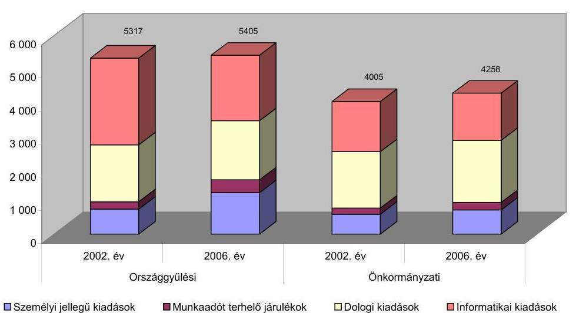
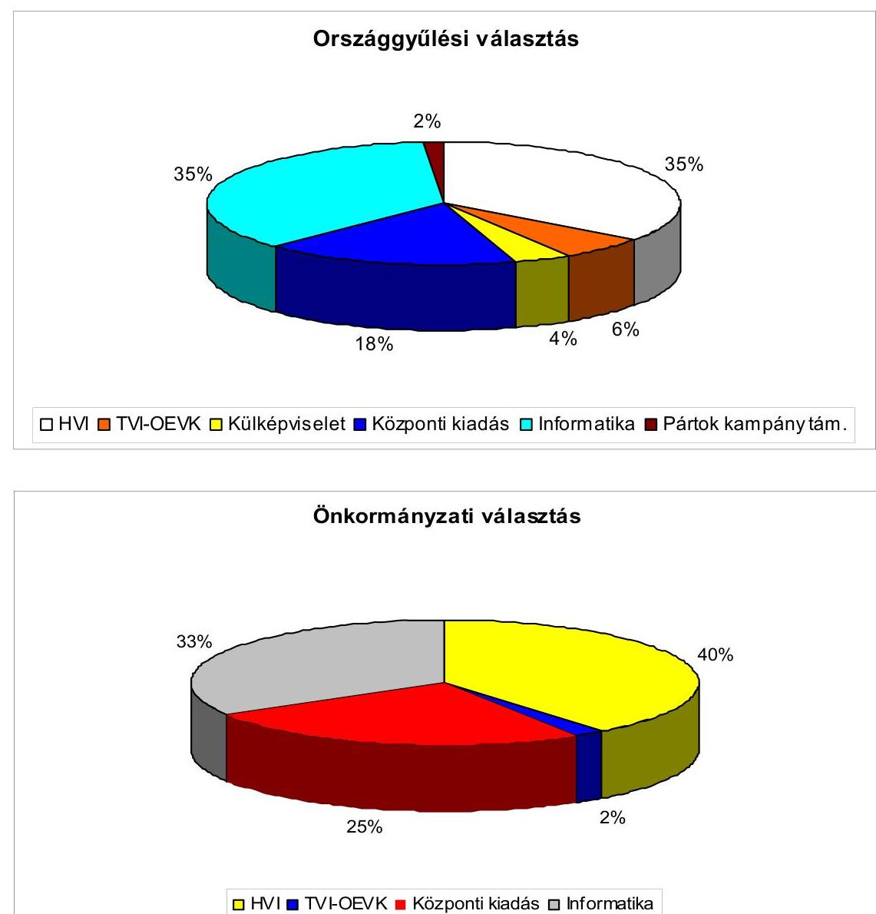
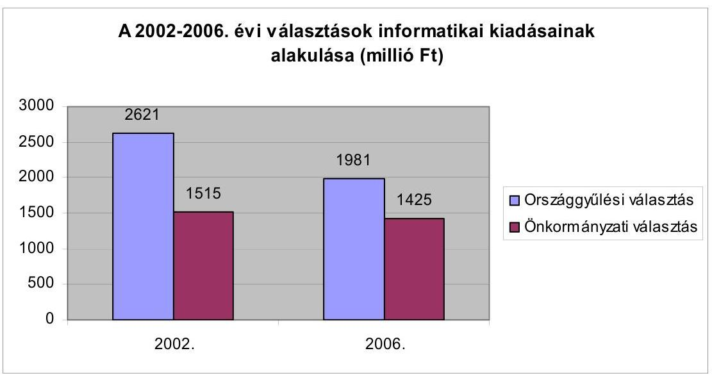
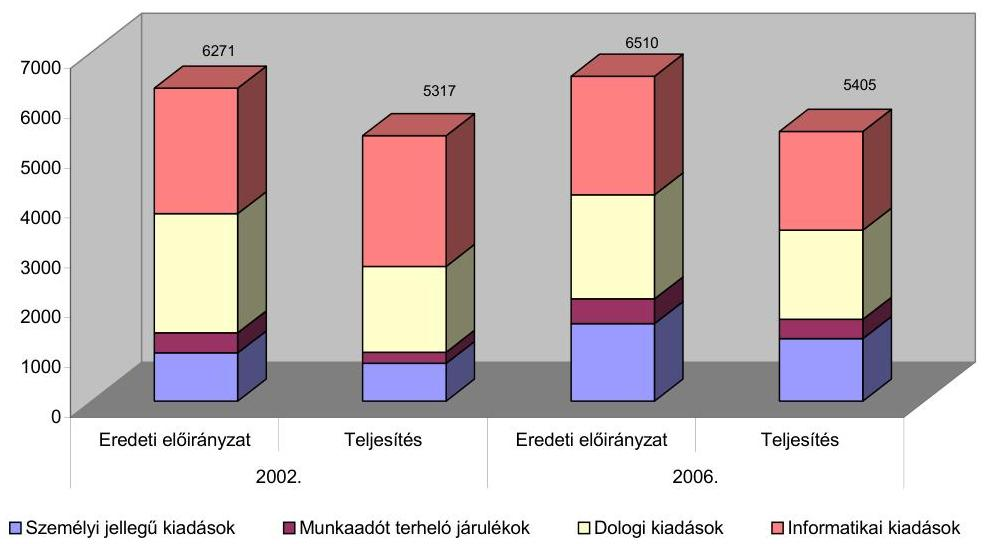
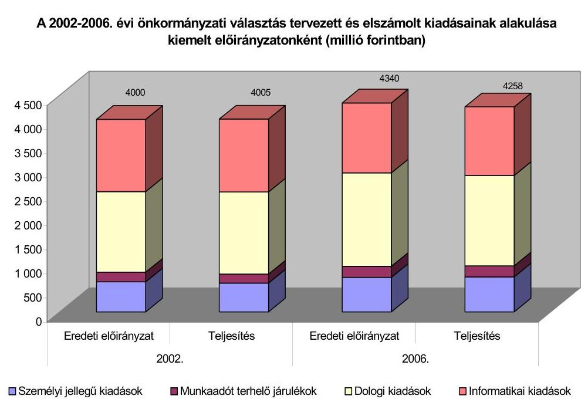
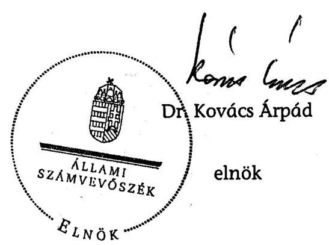
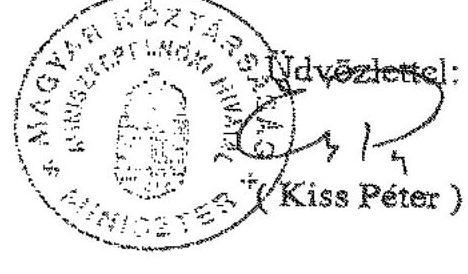
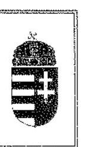
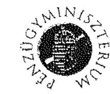
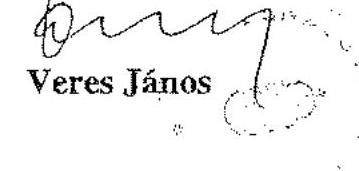

# JELENTÉS 

a 2006. évi országgyűlési, valamint önkormányzati és nemzeti, etnikai kisebbségi képviselőválasztások lebonyolításához felhasznált pénzeszközök ellenőrzéséről

---

# 3. Önkormányzati és Területi Ellenőrzési Igazgatóság 

3.3. Átfogó Ellenőrzések Főcsoport

Iktatószám: V-1005-123/2007.
Témaszám: 849
Vizsgálat-azonosító szám: V0335

## Az ellenőrzést felügyelte:

## dr. Lóránt Zoltán

főigazgató
Az ellenőrzés végrehajtásáért felelős:
dr. Sepsey Tamás
főigazgató-helyettes
Az ellenőrzést vezette:
Molnár Gyula Mihály
osztályvezető főtanácsos
Az összefoglaló jelentést készítették:
Dér Géza
számvevő
Klinga László
számvevő tanácsos

## Az ellenőrzést végezték:

Dér Géza
számvevő
Kalmár István
számvevő tanácsos
Kiss Rita
számvevő
Kopaczné Horváth
Zsuzsanna
számvevő tanácsos
Nyikon Zsigmondné
számvevő tanácsos

## Báté Imre

külső szakértő

## Eigner György Zoltán

számvevő
Kerezsi Pál
számvevő tanácsos
Klinga László
számvevő tanácsos
Köllődné Gátai Mária
számvevő
Vojcsekné Szabó
Ágnes
számvevő tanácsos

## Horváth Mária

számvevő
Kisapáti Angéla
számvevő
Kozma Gábor
számvevő tanácsos
Nagy Ervin Barnabás
számvevő
László Lídia
külső szakértő

---

# A témához kapcsolódó eddig készített számvevőszéki jelentések: 

## címe

Jelentés az 1990. évi országgyűlési képviselő választások előkészítésével és lebonyolításával kapcsolatos állami feladatok végrehajtására biztosított költségvetési pénzeszközök felhasználásának ellenőrzéséről (1991. évben elkészített jelentés)
Jelentés az 1994. évi országgyűlési, valamint a helyi és kisebbségi önkormányzati képviselő választások lebonyolítására felhasznált pénzeszközök ellenőrzéséről (1995. évben elkészített jelentés)
Jelentés az 1997. évi népszavazásra, továbbá az 1998. évi országgyűlési, valamint a helyi és kisebbségi önkormányzati képviselő választások lebonyolítására felhasznált pénzeszközök vizsgálatáról
Jelentés a 2002. évi országgyűlési, valamint a helyi és kisebbségi önkormányzati képviselőválasztásra felhasznált pénzeszközök ellenőrzéséről
Jelentés a 2003. április 12-én megtartott országos népszavazás lebonyolításához felhasznált pénzeszközök elszámolásának ellenőrzéséről
Jelentés a 2004. június 13-án megtartott, az Európai Parlament tagjai választás és a 2004. december 5-én megtartott országos ügydöntő népszavazás lebonyolításához felhasznált pénzeszközök elszámolásának ellenőrzéséről

---

# TARTALOMJEGYZÉK 

BEVEZETÉS ..... 5
I. ÖSSZEGZŐ MEGÁLLAPÍTÁSOK, KÖVETKEZTETÉSEK, JAVASLATOK ..... 8
II. RÉSZLETES MEGÁLLAPÍTÁSOK ..... 16

1. A választások pénzügyi fedezetének tervezése, az előirányzatok nyilvántartása és módosítása ..... 16
1.1. A központi költségvetési támogatás tervezett és jóváhagyott összege ..... 16
1.2. A választásokat lebonyolító szervezetek és közigazgatási hivatalok tervezési, előirányzat nyilvántartási tevékenysége ..... 19
2. A pénzügyi fedezet biztosítása ..... 22
2.1. A költségvetési támogatás rendelkezésre bocsátása ..... 22
2.2. A választásokhoz kapcsolódó egyéb feladatok finanszírozása ..... 23
3. A választási pénzeszközök felhasználásának szabályszerűsége ..... 24
3.1. A gazdálkodási és ellenőrzési jogkörök, továbbá a nyilvántartási rend szabályozottsága ..... 24
3.2. Az elkülönített számviteli nyilvántartási kötelezettség teljesítése ..... 26
3.3. Az országgyűlési választás kampányára biztosított támogatás felhasználása ..... 27
3.4. A választásokkal kapcsolatos kiadások célszerűsége és szabályszerűsége ..... 28
3.5. Dologi kiadások a választást lebonyolító szervezeteknél ..... 33
3.6. Személyi jellegű juttatások a választást lebonyolító szervezeteknél ..... 35
3.7. A közbeszerzési eljárás keretébe tartozó árubeszerzések és szolgáltatás vásárlások lebonyolítása, illetve eszközbeszerzések ..... 39
3.8. A választások informatikai feladatainak tervezése és végrehajtása ..... 41
4. A választási feladatokra felhasznált pénzeszközök elszámolása ..... 42
4.1. A KEKK Hivatalnál felhasznált pénzeszközök elszámolása ..... 42
4.2. A TVI-k, HVI-k, a KüM, a közigazgatási hivatalok és az egyéb szervezetek által felhasznált pénzeszközök elszámolása ..... 45
5. A választási pénzeszközök felhasználásának és elszámolásának ellenőrzése ..... 46
5.1. A KEKK Hivatal és az ÖTM Ellenőrzési Titkárság ellenőrzési tevékenysége ..... 46
5.2. A TVI és a HVI vezetők, a KüM, illetve a közigazgatási hivatalok ellenőrzési tevékenysége ..... 47

---

6. Az ÁSZ korábbi választásokkal összefüggő ellenőrzési javaslatai végrehajtásának hasznosulása

# MELLÉKLETEK 

1. számú Az ellenőrzött szervezetek jegyzéke (1 oldal)
2. számú A 2002. és a 2006. évi országgyűlési és önkormányzati választások kiadásai kiemelt előirányzatonként (1 oldal)
3. számú A 2006. évi választások lebonyolításához kapcsolódó közbeszerzési eljárások (2 oldal)
4. számú Az 1990 óta megrendezett országgyűlési és önkormányzati választások kiadásainak, a szavazáson megjelentek számának és az egy szavazóra jutó kiadásnak az alakulása (1 oldal)
5. számú Dr. Göncz Kinga külügyminiszter úrhölgy által adott észrevétel (1 oldal)
6. számú Kiss Péter Miniszterelnöki Hivatalt vezető miniszter úr által adott észrevétel (1 oldal)
7. számú Bajnai Gordon önkormányzati és területfejlesztési miniszter úr által adott észrevétel (1 oldal)
8. számú Veres János pénzügyminiszter úr által adott észrevétel (1 oldal)

---

# RÖVIDÍTÉSEK JEGYZÉKE 

## Törvények

Áht.
Kbt.
Számv. tv.
Ve.

## Rendeletek, határozatok

Ámr.
BM rendelet

ÖTM rendelet

Vhr.
a külügyminiszter 5/1997. (XII. 29.) számú rendelete
a külügyminiszter 13/2000. KüM utasítása
a külügyminiszter 16/2002. KüM utasítása
a külügyminiszter 6/2006. KüM utasítása

89/2005. (XII. 7.) OGY határozat
30/2006. (VII. 11.) OGY határozat

## Szórövidítések

ÁSZ
BM
BM BK Zrt.
BM Központi Hivatal

BM TÁSZ
az államháztartásról szóló 1992. évi XXXVIII. törvény
a közbeszerzésről szóló 2003. évi CXXIX. törvény
a számvitelről szóló 2000. évi C. törvény
a választási eljárásról szóló 1997. évi C. törvény

## az államháztartás működési rendjéről szóló 217/1998. (XII. 30.) Korm. rendelet

a 2006. évi országgyűlési képviselőválasztás költségeinek normatíváiról, tételeiről, elszámolási és belső ellenőrzési rendjéről szóló 8/2006. (II. 22.) BM rendelet
a helyi önkormányzati képviselők, és polgármesterek, valamint a kisebbségi önkormányzati képviselők választása költségeinek normatíváiról, tételeiről, elszámolási és belső ellenőrzési rendjéről szóló 4/2006. (VIII. 1.) ÖTM rendelet
az államháztartás szervezetei beszámolási és könyvvezetési kötelezettségének sajátosságairól szóló 249/2000. (XII. 24.) Korm. rendelet
az alapellátmányról, a valuta-költségtérítésről és egyes állomáshelyekhez kapcsolódó további ellátmánypótlékról szóló 5/1997. (XII. 29.) számú KüM rendelet
a Külügyminisztérium költségvetésének terhére megvalósuló kötelezettségvállalások és utalványozások rendjéről szóló 13/2000. külügyminiszteri utasítás
a Külügyminisztérium költségvetési előirányzatainak módosítási rendjéről szóló 16/2002. KüM utasítás
a Magyar Köztársaság külképviseletein lefolytatandó választások pénzügyi tervezésének, lebonyolításának, valamint elszámolásának rendjéről szóló 6/2006. KüM utasítás
a 2006. évi országgyűlési választások pénzügyi támogatásáról szóló 89/2005. (XII. 7.) OGY határozat
a 2006. évi önkormányzati és kisebbségi választások pénzügyi támogatásáról szóló 30/2006. (VII. 11.) OGY határozat

Állami Számvevőszék
Belügyminisztérium
BM Beruházási és Közbeszerzési Zártkörű Részvénytársaság
BM Központi Adatfeldolgozó, Nyilvántartó és Választási Hivatal (korábbi rövid neve: BM KÖNYV Hivatal, illetve 2006. júniustól rövid neve: Központi Hivatal)

BM Távközlési Szolgálat

---

| EU népszavazás | a 2003. április 12-én megtartott országos népszavazás az Európai Unióhoz történő csatlakozásról |
| :--: | :--: |
| HVI | Helyi Választási Iroda |
| KEKK Hivatal | Közigazgatási és Elektronikus Közszolgáltatások Központi Hivatal (a BM Központi Adatfeldolgozó, Nyilvántartó és Választási Hivatal jogutód szervezete, miután 2007. január 1-jétől a Központi Adatfeldolgozó, Nyilvántartó és Választási Hivatal, a BM Távközlési Szolgálat, valamint a Kormányzati Frekvenciagazdálkodási Hivatal egységes hivatalként folytatják munkájukat) |
| KüM | Külügyminisztérium |
| KüM Gazdálkodási Főosztály | Külügyminisztérium Gazdálkodási Főosztály |
| KüVI | Külképviseleti Választási Iroda |
| megállapodás | a BM Központi Hivatal és a KüM gazdasági és igazgatási helyettes államtitkára 2006. március 10-én kötött Megállapodása a 2006. évi országgyűlési képviselőválasztással kapcsolatos külképviseleti feladatok ellátásának megszervezésére és lebonyolítására |
| OVB | Országos Választási Bizottság |
| OEVK | Országgyűlési Egyéni Választókerület |
| OITH | Országos Igazságszolgáltatási Tanács Hivatala |
| OVI | Országos Választási Iroda |
| országgyűlési választás | a 2006. évi országgyűlési képviselőválasztás |
| önkormányzati választás | a 2006. évi önkormányzati és nemzeti, etnikai kisebbségi képviselőválasztás |
| ÖTM | Önkormányzati és Területfejlesztési Minisztérium |
| SzMSz | a BM Központi Hivatalának Szervezeti és Működési Szabályzata |
| SzSzB | Szavazatszámláló Bizottság |
| TVB | Területi Választási Bizottság |
| TVI | Területi Választási Iroda (amelybe beleértjük a Budapest Fővárosi Választási Irodát) |
| 2004. évi EP választás és népszavazás | a 2004. június 13-án megtartott, az Európai Parlament tagjai választás és a 2004. december 5-én megtartott országos ügydöntő népszavazás |
| 2006. évi választások | a 2006. évi országgyűlési képviselőválasztás, valamint a helyi önkormányzati képviselők, polgármesterek, valamint a kisebbségi önkormányzati képviselők választása |

---

# JELENTÉS 

## a 2006. évi országgyűlési, valamint önkormányzati és nemzeti, etnikai kisebbségi képviselőválasztások lebonyolításához felhasznált pénzeszközök ellenőrzéséről

## BEVEZETÉS

A választási eljárásról szóló 1997. évi C. törvény 5. § felhatalmazása, valamint az Állami Számvevőszékről szóló 1989. évi XXXVIII. törvény 2. § (1) és (3) bekezdéseiben foglaltak alapján vizsgáltuk a 2006. évi országgyűlési, valamint önkormányzati és nemzeti, etnikai kisebbségi képviselőválasztások, továbbá a területi és országos kisebbségi önkormányzati választások lebonyolítására fordított pénzeszközök szabályszerű és célszerű felhasználását.

Az Országgyűlés 2005. december 7-én a 89/2005. (XII. 7.) határozatában kifejezte egyetértését arról, hogy a 2006. évi országgyűlési képviselőválasztások lebonyolításának végrehajtására legfeljebb 6610 millió Ft kerüljön felhasználásra. Az országgyűlési választás I. és II. fordulóján belföldön 8703849 fő, külföldön 10948 fő jelent meg a szavazáson.

Az Országgyűlés 2006. július 11-én a 30/2006. (VII. 11.) határozatában egyetértett azzal, hogy az önkormányzati képviselők, továbbá a nemzeti és etnikai kisebbségek helyi önkormányzatainak 2006. évi, valamint területi és országos önkormányzataik 2007. évi megválasztásának szervezési és lebonyolítási feladatainak végrehajtására 4340 millió Ft-ot használjanak fel. Az önkormányzati választáson 4327132 fő jelent meg a szavazáson.

Az 1990 óta megrendezett országgyűlési és önkormányzati választások kiadásainak, a szavazáson megjelentek számának és az egy szavazóra jutó kiadásoknak az alakulását a 4. számú melléklet tartalmazza. Az adatok összehasonlíthatósága érdekében a Központi Statisztikai Hivatal által közölt fogyasztói árindexek alapján a 2006. év előtti választási kiadásokat 2006. évi árakon is feltüntettük. Az országgyűlési választások 2006. évi árszinten számított kiadásainak az 1990-94. évi azonos nagyságrendű összegéhez képest az 1998-2002. években 1,3-1,7 milliárd forintos emelkedés következett be alapvetően a választási informatikai rendszer kialakításának megnövekedett kiadásai miatt, majd az informatikai fejlesztés befejezése után a 2006. évre közel egy milliárd forinttal csökkent a kiadások összege. Az egy szavazóra jutó kiadások legalacsonyabb és legmagasabb összege közötti közel 40%-os eltérést a kiadások és a szavazáson megjelentek számának változása együttesen okozta. A 2006. évben először megtartott külképviseleti országgyűlési szavazás kiadásainak egy szavazóra jutó összege több mint harmincötszöröse a belföldön lebonyolított választás egy szavazóra jutó kiadásának. Az önkormányzati választások 2006. évi árszinten számított kiadásai az 1990. évben voltak a legmagasabbak a kétfordulós lebonyolítás miatt, az 1994. évi kiadásokhoz képest a 2002. évre több mint 27%-kal emelkedtek, míg a 2006. évben az előző választáshoz viszonyítva közel 12%-kal csökkentek. A szavazók számának változása ellenére az összehasonlítható (egyfordulós) 1994-2002. évi szavazásoknál az egy szavazóra jutó kiadás közel azonos szintet ért el, a 2006. évben mintegy 15%-kal csökkent annak összege az előző szavazáshoz képest.

Az országgyűlési választásokkal kapcsolatos kormányzati szintű szervezési és lebonyolítási feladatokat a Belügyminisztérium, az önkormányzati választások esetében 2006. június 9. napjától az Önkormányzati és Területfejlesztési Minisztérium látta el ${ }^{1}$.

A Kormány 276/2006. (XII. 23.) rendeletével létrehozta - a BM Központi Adatfeldolgozó, Nyilvántartó és Választási Hivatal szervezeti kereteinek a BM TÁSZ és a Kormányzati Frekvenciagazdálkodási Hivatal feladataival történő kibővítésével - a Közigazgatási és Elektronikus Közszolgáltatások Központi Hivatalt, mely szervezet 2007. január 1-től ellátja a választások lebonyolításával kapcsolatos feladatokat.

Az ellenőrzés célja annak megállapítása volt, hogy a központi szerveknél, a közigazgatási hivataloknál, valamint a megyei és a helyi önkormányzatoknál a választással kapcsolatos feladatok ellátása során:

- a kiadások tervezése megalapozottan történt-e;
- a pénzeszközöket célszerűen, a jogszabályi előírásoknak megfelelően használták-e fel;
- a pénzügyi elszámolásokat határidőben, a jogszabályban meghatározott módon teljesítették-e;
- megfelelően hasznosultak-e a korábbi számvevőszéki ellenőrzés megállapításai, valamint a szabályszerűségi és célszerűségi javaslatai a választások lebonyolítása során.

Helyszíni ellenőrzést folytattunk az ÖTM-nél, a KEKK Hivatalban, a KüM Gazdálkodási Főosztályánál, hat közigazgatási hivatalban, a Fővárosi Önkormányzatnál, két megyei, valamint 26 települési önkormányzatnál.
 A vizsgált szerveket az 1. számú mellékletben soroltuk fel. A választásokra biztosított központi támogatás 59%-át 38 választási szervezetnél a helyszínen ellenőriztük.

A jelentés megállapításainak, javaslatainak egyeztetése során a külügyminiszter, illetve az önkormányzati és területfejlesztési miniszter arról adott tájékoztatást, hogy az időközben megtett intézkedésekkel a javaslatok egy részét megvalósították, ezekben az esetekben a jelentés II. Részletes megállapítások fejezetében az adott témához kapcsolt lábjegyzetben a megtett intézkedést feltüntettük, és a kapcsolódó javaslatot elhagytuk.

[^0]
[^0]:    ${ }^{1}$ A Magyar Köztársaság minisztériumainak felsorolásáról szóló 2006. évi LV. törvény 2. § a) pont aa) alpontjában foglaltak alapján.

---

ben az adott témához kapcsolt lábjegyzetben a megtett intézkedést feltüntettük, és a kapcsolódó javaslatot elhagytuk.

A jelentést az ÁSZ-ról szóló 1989. évi XXXVIII. törvény 25. § (1) bekezdése alapján észrevétel közlése céljából megküldtük a külügyminiszternek, a Miniszterelnöki Hivatalt vezető miniszternek, az önkormányzati és területfejlesztési miniszternek, valamint a pénzügyminiszternek. A kapott észrevételeket a jelentés 5-8. számú mellékletei tartalmazzák.

---

# I. ÖSSZEGZŐ MEGÁLLAPÍTÁSOK, KÖVETKEZTETÉSEK, JAVASLATOK 

A 2006. évi választások kiadásainak tervezési munkálatai a 2004. év II. félévében megkezdődtek, finanszírozási keretként a tervezett előirányzatnál alacsonyabb összeg, 10000 millió Ft került egy összegben jóváhagyásra a BM Központi Hivatal 2006. évi költségvetésében. Az eredeti előirányzat három előirányzat-módosítás miatt változott, a BM Központi Hivatal 2005. évi költségvetésében jóváhagyott összeggel növekedett, a központi tartalékképzés és fejezeti átcsoportosítás miatt csökkent. Az országgyűlési választásra 6510 millió Ft, az önkormányzati választásra 4340 millió Ft előirányzat került a pénzügyi tervben részletes kidolgozásra a BM Központi Hivatalban az országgyűlési határozatok alapján. A tervezett kiadás a 2002. évi választások kiadásait az országgyűlési választásnál 4%-kal, az önkormányzati választásnál 9%-kal haladta meg, a tervezés során a 2006. évi választások biztonságos lebonyolítására fedezetet nyújtó előirányzatok kialakítására törekedtek. A kiadások túltervezését az alacsonyabb összegű teljesítés, az országgyűlési választásnál az 1250 millió Ft, az önkormányzati választásnál a 84 millió Ft összegű maradvány, valamint a választási nyomtatványoknál és szolgáltatásoknál a 234 millió Ft és a 152 millió Ft megrendelés elmaradás is alátámasztotta.

Az országgyűlési választás kiadásaiból a helyi kiadások 36%-ot, a központi kiadások 23%-ot, az informatikai kiadások 37%-ot képviseltek, a külképviseleti szavazás (új tételként) részaránya 4%-os volt. Az önkormányzati választás kiadásaiból a helyi kiadások 39%-os, a központi kiadások 27%-os, az informatikai kiadások 34%-os részarányt tettek ki. A 2002. évi választásokhoz képest a személyi juttatások növekedése az országgyűlési választásnál 61%-os, az önkormányzati választásnál 15%-os volt, ami az SzSzB tagok, a HVI tagok és a jegyzőkönyvvezetők díjának emeléséből alakult ki. A KüM Gazdálkodási Főosztály a külképviseleti választási feladatok végrehajtásához pénzügyi tervet készített, ebben saját forrás és egyéb támogatás nem szerepelt. A pénzügyi terv készítési kötelezettségnek eleget tévő önkormányzatok aránya a 2004. évi EP választás és népszavazáshoz viszonyítottan kedvező irányba változott. Az ellenőrzött önkormányzatok 97%-a, a közigazgatási hivatalok mindegyike rendelkezett a választások lebonyolításához szükséges, a BM és az ÖTM rendeletben előírt pénzügyi tervvel. A pénzügyi tervek a költségnormatívák figyelembevételével készültek, azokban az országgyűlési választásnál az önkormányzatok 31%-a, az önkormányzati választásnál 38%-a, a közigazgatási hivatalok egyharmada a 2006. évi választási kiadások között tervezett saját forrást is.

A BM Központi Hivatalban a jóváhagyott módosított előirányzatot az országgyűlési választáshoz kapcsolódóan hat esetben, az önkormányzati választás előirányzatát kettő esetben saját hatáskörben átcsoportosítással változtatták meg, amelyek a kiadási főösszeget nem növelték. A KüM-nél az előirányzat-módosításokat elvégezték, azokat megfelelően dokumentálták. A 2004. évi EP választás és népszavazással összehasonlítva az Ámr-ben előírt előirányzatmódosítási határidő betartása javult, arról az országgyűlési választásnál az önkormányzatok 86%-a, az önkormányzati választásnál 80%-a gondoskodott.

---

A központi költségvetésből a 2006. évi választásokhoz kapcsolódó többlet támogatás pénzügyi fedezetét havi finanszírozás keretében kapta meg a BM Központi Hivatal az előirányzat-felhasználási keretszámlájára. Az önkormányzati választásokra jóváhagyott központi támogatás felhasználását a BM fejezetben engedélyezte az Országgyűlés, az ÖTM miniszter nem gondoskodott a vonatkozó országgyűlési határozat végrehajtásáról, mivel az önkormányzati választásokra meghatározott fejezeti kezelésű előirányzat nyilvántartására és átcsoportosítására nem intézkedett. A BM Központi Hivatal a 2006. évi választások lebonyolítására biztosított fedezetet a BM és az ÖTM rendeletben meghatározott határidőn belül a TVI-k és a közigazgatási hivatalok, illetve a választások lebonyolításában közreműködő egyéb szervek részére a megkötött megállapodásokban rögzített határidőnek megfelelően utalta tovább előlegként. A BM Központi Hivatal a KüM részére a megállapodásban foglaltakat betartva folyósította a támogatást. A 2007. évi kisebbségi választások lebonyolítására a KEKK Hivatal 2007. február 5-én 60 millió Ft támogatást utalt ki előleg címén a helyi és megyei kiadásokra. A TVI vezetői a központi támogatásból előleget a BM és az ÖTM rendeletben előírt határidőn belül átutalták a polgármesteri hivatalok költségvetési elszámolási számlájára.

A gazdálkodási és ellenőrzési jogköröket a BM Központi Hivatal vezetője a választásokhoz kapcsolódóan a 2006. évben szabályozta, ebben a BM és az ÖTM rendelet utalványozásra vonatkozó előírásával ellentétesen utalványozási feladatra adott felhatalmazást. A BM és az ÖTM rendelet előírása szerint a BM Központi Hivatal vezetőjének kizárólagos joga az utalványozás, a jogkör átadására nem volt lehetőség. A 2004. évi EP választás és népszavazásról készült jelentésben szereplő adatokkal összehasonlítva ${ }^{2}$ a gazdálkodási (kötelezettségvállalás, utalványozás) jogkörök gyakorlási rendjének szabályozottsága javult, mivel HVI-k 96%-a, a TVI-k és a közigazgatási hivatalok mindegyike szabályozta a feladatokat. A HVI vezetők 8%-a nem adott felhatalmazást az ellenjegyzési jogkör gyakorlására az Ámr., a BM és az ÖTM rendeletben foglaltak ellenére. A választások bevételeivel és kiadásaival kapcsolatos ellenőrzési jogkörök (érvényesítés, szakmai teljesítésigazolás) gyakorlásának rendjére a belső szabályozásokban rögzített általános előírások voltak az irányadók.

A normatívában szereplő dologi kiadásokból - a feladatellátással összefüggésben - a BM és az ÖTM rendeletben előírtaknak megfelelően személyi jellegű juttatásokra történt átcsoportosítás, mellyel az országgyűlési választás I. fordulójánál a HVI-k háromnegyede, a TVI-k kétharmada, a II. fordulójánál a HVI-k 58%-a, a TVI-k egyharmada élt. Az önkormányzati választásnál a HVI-k 77%-a döntött az átcsoportosításról. A választási szakfeladatokon nem számolt el általános költséget a választási szervezetek 60%-a, figyelmen kívül hagyva az Ámr-ben, a BM és az ÖTM rendeletben előírtakat, így a dologi kiadásokra biztosított normatíva átcsoportosításával nem maradt fedezet az intézményüzemeltetési, fenntartási költségek arányos részére.

Az országgyűlési választások kampányára fordítható költségvetési támogatás összegét az Országgyűlés a 2005. évben 100 millió Ft-ban állapította meg, a felhasználást a BM fejezetén belül hagyta jóvá. Az OVB a Ve-ben előírt jogkör-

[^0]
[^0]:    ${ }^{2}$ Az ÁSZ 2005. évi 0560 számú jelentésének 9. oldalán található.

---

ben eljárva az egy jelöltre jutó támogatási összegről 2006. március 31-én határozott, a támogatások kiutalása - megsértve a Ve. előírását - hét nappal a megjelölt határidő után történt meg. A Ve. 30 napon belüli elszámolást ír elő a támogatottak számára, az elszámolás dokumentumai nem voltak megtalálhatók a támogatást folyósító ÖTM-nél. Az ÁSZ öt jelölőszervezetnél ellenőrizte ${ }^{3}$ a támogatás felhasználását és elszámolását, a Ve. előírása alapján, a kifizető hely felé az elszámolás megtörtént. A kifizető a felhasználás és a számadás ellenőrzési kötelezettségének elmulasztásával megsértette az Áht. előírását.

A választásokkal kapcsolatos kiadások előirányzatait és az elszámolt teljesítéseket a számviteli előírásoknak megfelelően nyilvántartották, a kiadásokon belül a dologi kiadások teljesítése az elszámolások alapján az országgyűlési választásnál 81%-os, az önkormányzati választásnál 86%-os volt. A megtakarítás a választások lebonyolításához biztosított központilag megrendelt nyomtatványok és szolgáltatások mennyiségének túltervezése miatt alakult ki. A szavazást megelőző nyomtatványok tervezett mennyisége nem került megrendelésre, a szavazásnapi nyomtatványok tervezett mennyisége az országgyűlési választásnál másfél-kétszerese, az önkormányzati választásnál kettő-négyszerese volt a szükségesnek.

A választási szervezetek és a közigazgatási hivatalok 97%-a gondoskodott a választási pénzeszközöknek a kijelölt szakfeladaton történő elkülönített számviteli nyilvántartásáról. A KüM-nél a BM rendeletben és a megállapodásban foglaltaknak megfelelően az előirányzat-felhasználást elkülönítetten tartották nyilván. A főkönyvi elszámolást a KüM Központi Igazgatás, valamint a KüM Külképviseletek Igazgatása alcímek számviteli nyilvántartás szerint elkülönítetten, a kijelölt szakfeladaton végezték, a főkönyvi könyvelésben elszámolt kiadások tervadatokkal való összehasonlíthatóságát biztosították.

A BM Központi Hivatalban a bizonylati fegyelem betartása 97%-os mértékben valósult meg, valamennyi gazdasági eseményről állítottak ki számviteli bizonylatot, de az Áht. előírását megsértve a kötelezettségvállalás írásba foglalása a gazdasági események 3%-ánál nem történt meg. Az ellenőrzési feladatait ezen gazdasági eseményeknél az utalvány ellenjegyzését, a szakmai teljesítésigazolást és az érvényesítést végző nem az Ámr. előírása szerint teljesítette, mivel nem észrevételezte a folyamatba épített ellenőrzés során a kötelezettségvállalás hiányát. A gazdálkodási és ellenőrzési jogkörök ellátása során a gazdasági eseményeket magukba foglaló bizonylatok - a 2004. évi EP választás és népszavazás vizsgálatánál tapasztaltakhoz hasonlóan - a kötelezettségvállalás, utalványozás, ellenjegyzés, érvényesítés, szakmai teljesítésigazolás elmaradásának következményeként nem feleltek meg a Számv. tv-ben előírt alaki és tartalmi követelményeknek a választási szervek közel felénél ${ }^{4}$.

[^0]
[^0]:    ${ }^{3}$ Az ÁSZ 848 témaszámú folyamatban lévő vizsgálata a 2006. évi országgyűlési képviselő választások kampányára fordított pénzeszközök elszámolásának ellenőrzése a jelölő szervezeteknél és a független jelölteknél.
    ${ }^{4}$ Az ÁSZ 2005. évi 0560 számú jelentésében rögzítette, hogy a gazdasági eseményeket magukba foglaló bizonylatok a kötelezettségvállalás, utalványozás, ellenjegyzés, érvényesítés, szakmai teljesítés igazolások elmaradása miatt nem feleltek meg az alaki és tartalmi követelményeknek, a választási szervezetek közel egynegyedénél.

---

A BM Központi Hivataltól az országgyűlési választást követően hét szervezetben (21 300 ezer Ft-ot, 142 fő), az önkormányzati választást követően öt szervezetben (9000 ezer Ft-ot, 62 fő) kaptak személyi juttatást. A kifizetések átlagosan 146-150 ezer Ft/fő összegben történtek (a kifizetés legkisebb összege 15 ezer Ft, a legnagyobb 1500 ezer Ft volt), melyet a belügyminiszter, illetve az önkormányzati és területfejlesztési miniszter hagyott jóvá. A KüM-ben a választások lebonyolításával kapcsolatos személyi jellegű kiadások kifizetése a BM rendelet mellékletében szereplő normatívák betartásával történt. A megállapodásban rögzített dologi kiadásokról személyi jellegű kiadásokra 16372 ezer Ft előirányzatot csoportosítottak át, amely a személyi jellegű kiadások és járulékok előirányzatának 30%-os növekedését eredményezte. A választási szervezetek és a közigazgatási hivatalok az országgyűlési és az önkormányzati választáskor a normatívában meghatározott személyi jellegű juttatásokat biztosították, ezeket az önkormányzatok és a közigazgatási hivatalok 1 ezer Ft-tól 13142 ezer Ft összegig saját forrásból is kiegészítették. A személyi jellegű juttatásokra a dologi kiadásokból és a saját forrásból átcsoportosított pénzeszközöket a választásban résztvevők normatíván felüli személyi juttatásának kiegészítésére, illetve a választási értesítők saját dolgozóval történő kézbesítési díjának kifizetésére használták fel. A 2006. évi választásoknál a városi önkormányzatok 10%-a, a községi önkormányzatok 6%-a fizetett ki az Ámr. rendelkezésével ellentétben saját dolgozónak megbízási díjat munkakörébe tartozó
 feladatra.

A normatívák összegeit saját forrás terhére a 2006. évi választásoknál a helyi önkormányzatok közel fele, a megyei önkormányzatok mindegyike, a közigazgatási hivatalok fele az országgyűlési, egyharmada az önkormányzati választásoknál kiegészítette, amit a normatívában meghatározott személyi jellegű juttatásokra használtak fel. A saját forrás terhére történő kiegészítések összege település típusonként változóan alakult, a legmagasabb összegben Budapest Főváros Önkormányzata (20, illetve 24 millió Ft-tal) egészítette ki a normatív támogatást.

A választásokat terhelő általános költséget a HVI-k háromnegyede, a TVI-k egynegyede a BM és az ÖTM rendelet előírása ellenére nem számolt el a választási szakfeladatokon, illetve nem végzett a megosztásra vonatkozó számításokat. Ezekben az esetekben a 2006. évi választásokra fordított összes kiadás nem volt számszerűsíthető, illetve a hiányzó adatok miatt nem állapítható meg, hogy a központilag biztosított támogatás milyen mértékben és arányban fedezte azokat. Az általános költséget elszámoló önkormányzatok és közigazgatási hivatalok becsléssel, vagy belső szabályzatban rögzített költségmegosztási módszerrel állapították meg annak összegét. A KüM-nél az egy szavazóra jutó elszámolt általános költség egyezer és 106 ezer Ft között szóródott. Az általános költségek elszámolásának alátámasztására a tényleges ráfordítások alapján a Számv. tv-ben előírtak ellenére belső bizonylatot nem készítettek. A futárszolgálatot teljesítő KüVI vezetők az Európán túli négy órai utazási időt meghaladó úticél esetén a turista osztálynál magasabb komfortfokozatú „business C osztályú" repülőjeggyel utaztak, melynek átlagára kettő-ötszöröse volt a turista osztályú repülőjegy átlagárának, növelve ezzel a választási kiadások összegét. A magasabb komfortfokozatú utazás biztosítása nem volt összhangban a választások idején hatályos kormányrendelet előírásaival, illetve a választási feladatok időponti kötöttsége és a szavazóurnák mielőbbi visszaszállítása ellenére sem volt indokolt. A külügyminiszter a magasabb komfortosztálynak megfelelő

---

árú repülőjegyre való jogosultságot a 2006. július 1-től hatályos kormányrendelet alapján kiterjesztette a KüVI vezető futárokra is.

A BM Központi Hivatal az országgyűlési és önkormányzati választás lebonyolításához kapcsolódó, a Kbt-ben előírt közbeszerzési eljárásokat lefolytatta. A BM Központi Hivatal a 2006. évi választások lebonyolítása érdekében kilenc közbeszerzési eljárást a BM BK Zrt. közreműködésével bonyolított le, az informatikai eszközöket és szolgáltatásokat központosított közbeszerzés keretében szerezte be. Az országgyűlési választáshoz kapcsolódó közbeszerzések szerződés szerinti összege 2390 millió Ft, az önkormányzati választáshoz kapcsolódók értéke 2106 millió Ft volt. A lefolytatott közbeszerzési eljárásokkal kapcsolatosan a Közbeszerzések Tanácsa Közbeszerzési Döntőbizottságnál - az ajánlatkérő BM Központi Hivatal ellen - eljárást nem kezdeményeztek. A BM Központi Hivatalban végzett eszközfejlesztések nyilvántartásba vétele a Számv. tv., a Vhr. és a belső szabályozásban foglaltak szerint történt, központi beszerzés keretében a közigazgatási hivatalok részére vásároltak 139 millió Ft értékben másoló és nyomtató berendezéseket, valamint meghajtó szoftvereket.

Az országgyűlési választáskor papír szavazóurnát a polgármesteri hivatalok kétharmada, az önkormányzati választáskor több mint fele igényelt és kapott az OVI-tól, a HVI-k a rendelkezésükre álló eszközökkel látták el a feladatot. A polgármesteri hivatalok szerződéses kapcsolat keretében a közigazgatási hivatalok és a BM Központi Hivatal közreműködését vették igénybe a választási értesítők és névjegyzék készítésére, valamint a Magyar Posta Zrt. szolgáltatását az értesítők választópolgárokhoz történő kézbesítésére. A helyi önkormányzatok 4%-a végzett gazdaságossági számítást az egyes feladatok költségtakarékosabb megoldása érdekében.

A 2006. évi választások lebonyolításához szükséges informatikai rendszerek, eszközbeszerzési és üzemeltetési költségeinek tervezésénél elsődlegesen a 2002. évi választások, valamint a 2004. évi EP választás és népszavazás informatikai teljesített kiadásait vették figyelembe. A választáshoz kapcsolódó informatikai feladatok tervezése során és végrehajtás alapján az országgyűlési választásnál 26%-ban túlbiztosítás volt, amit az 512 millió Ft összegű előirányzatmaradvány is alátámaszt. Az önkormányzati választásnál ezzel szemben a tervezett és a teljesített adatok alapján 30 millió Ft összegű maradvány keletkezett, ami 2,1%-os túlbiztosítást mutat. Az informatikai kiadások összege az országgyűlési választás teljes kiadásának 37%-át, 1981 millió Ft-ot, az önkormányzati választás kiadásainak 34%-át, 1425 millió Ft-ot tett ki.

A BM Központi Hivatal vezetője a 2006. évi választások esetében a BM és az ÖTM rendeletben előírt határidőben elkészítette és felterjesztette a belügyminiszter, illetve az önkormányzati és területfejlesztési miniszter részére az elszámolást. Az elkészített elszámolások a jóváhagyott pénzügyi tervvel azonos szerkezetben készültek, a módosított előirányzatokhoz viszonyítottan mutatták be a teljesítési adatokat. A feladatsoros elszámolások szerint az országgyűlési választásnál a módosított előirányzat összege 6657 millió Ft, a teljesített kiadások összege 5405 millió Ft (81%-os teljesítés), a maradvány 1252 millió Ft volt, ami az önkormányzati választás feladataira került felhasználásra. Az önkormányzati választás módosított előirányzat összege 4342 millió Ft, a teljesített kiadások összege 4258 millió Ft-ot (98%-ot) tett ki és 84 millió Ft maradvány

---

keletkezett. A 2006. évi választásokra jóváhagyott 10999 millió Ft módosított előirányzat 88%-ra, 9663 millió Ft-ra teljesült, a maradvány összege 1336 millió Ft volt. Az országgyűlési választásnál keletkezett 1252 millió Ft összegű maradványnak az önkormányzati választáshoz történő felhasználásával a BM Központi Hivatal 2006. évi költségvetésében megnyitott és a tartalékképzéssel csökkentett finanszírozási keretből 84 millió Ft pénzügyi maradvány alakult ki, ami megegyezik az önkormányzati választások módosított előirányzatával szembeni teljesítés utáni maradvánnyal.

Az OVB által hitelesített, összesített adatok alapján az országgyűlési választás I-II. fordulóján belföldön 8703849 fő, a külföldön megtartott szavazás két fordulóján 10948 fő, az önkormányzati választáson 4327132 fő jelent meg. Az elszámolt kiadások és a szavazásra megjelentek száma alapján a belföldi országgyűlési választás egy főre jutó kiadása 594 Ft, a külképviseleti szavazás egy főre jutó kiadásának összege 21355 Ft volt, ami a belföldön lebonyolított szavazás egy főre jutó kiadásának több mint harmincötszörösét tette ki, amit a külképviseleten történő szavazáshoz kapcsolódó utazási, szállítmányozási, napidíj többlet kiadások okoztak. Az önkormányzati választáson az egy választóra jutó kiadás összege 984 Ft volt.

A 2002. és a 2006. évi választások elszámolt kiadásainak alakulása kiemelt előirányzatonként (millió forintban)

Az országgyűlési választás 2006. évi összes elszámolt kiadása (88 millió Ft-tal) 1,6%-kal haladta meg a 2002. évi kiadásokat, a személyi juttatások növekedése 66% volt, az informatikai kiadások 24%-kal csökkentek. Az önkormányzati választás összes kiadása 6%-kal növekedett, az emelkedést a személyi juttatások 21%-os növekedése és az informatikai kiadások 6%-os csökkenése eredményezte. A választási kiadások emelkedése elmaradt a 2002-2006. évi fogyasztói áremelkedések $^{5}$ 20,4%-os mértékétől.

[^0]
[^0]:    $^{5}$ Forrás: KSH honlapja, mely szerint a fogyasztói árindex növekedése a 2003. évben 4,7%-os, a 2004. évben 6,8%-os, a 2005. évben 3,6%-os, a 2006. évben 3,9%-os volt.

---

A KüM közigazgatási államtitkára a BM rendeletben előírt összesítő és KüVIkénti elszámolást határidőre megküldte a BM Központi Hivatal vezetőjének. Az elszámolás alapján az átadott pénzeszközök 95%-át használták fel. A TVI-k felé a feladattípusú elszámolási kötelezettségüknek a HVI vezetők a BM és az ÖTM rendelet előírásainak megfelelően, határidőn belül eleget tettek. A TVI-k a feladat-típusú és összegző jellegű feladat-típusú elszámolást határidőn belül elkészítették. A TVI-k vezetői a többletfeladatok, illetve feladatelmaradások miatti pénzügyi felülvizsgálati kötelezettségüknek eleget tettek, az elszámolási különbözetek pénzügyi rendezéséről gondoskodtak.

Az országgyűlési választás pénzeszközeinek felhasználását a BM Központi Hivatal 36 választási szervezetnél vizsgálta, az önkormányzati választásnál az ÖTM Ellenőrzési Titkársága 10 szervezetnél végzett helyszíni ellenőrzést. A HVI vezető díjazásának kifizetése az országgyűlési választások után a községi önkormányzatok 12%-ánál, az önkormányzati választás után a községi önkormányzatok 8%-ánál a BM és az ÖTM rendeletben előírtak ellenére történt, mivel a HVI vezetője ellenőrzési kötelezettségét nem teljesítette. A TVI vezetője a HVI vezetőinek nyilatkozata alapján döntött a díjazás kifizetéséről, az ellenőrzés dokumentált teljesítését nem vizsgálta. A TVI-k vezetői a választási pénzeszközök elszámolási és ellenőrzési kötelezettségüknek a választási iroda egy tagjának megbízásával, határidőben eleget tettek.
A 2004. évi EP választásra és népszavazásra felhasznált pénzeszközök ellenőrzéséről készített ÁSZ jelentés hat javaslatot tartalmazott a belügyminiszter számára, melyeket intézkedési terv formájában végrehajtásra megkapott a BM Központi Hivatal. Az ÁSZ javaslatai hasznosultak, így a kötelezettségvállalási jogkör gyakorlására vonatkozó jogszabályok összhangjának megteremtésére, a dologi kiadások terhére elszámolt felhalmozási kiadások jogszerűtlen felhasználásának visszafizetésére, az OVI pénzügyi ellenőrzési feladatának kiterjesztése a KüM által felhasznált kiadások vizsgálatára, a felmerült többletköltségek HVI-k részére történő továbbutalási határidejének a meghatározására, a dologi kiadási előirányzatból a személyi jellegű juttatásokra történő átcsoportosítás mértékére és a HVI, illetve TVI vezetők részére kifizethető díjak ellenőrzésének igazolására terjedt ki. A külügyminiszter részére az ÁSZ jelentés kettő javaslatot tartalmazott, melyből a saját dolgozókkal kötött megbízási szerződésekre vonatkozót hasznosították, a külföldi kiküldetést teljesítők költségtérítéséről kiadott KüM utasítást viszont nem hozták összhangba az állami vezetői juttatások jogosultsági feltételeiről szóló kormányrendeletben előírtakkal, azonban 2006. június 26-án a kormányrendeletet hatályon kívül helyezték és így javaslatunk aktualitását vesztette. Az ellenőrzött önkormányzatoknál a 2002-2005. évek között a választási pénzeszközök felhasználásával összefüggésben négy esetben folytatott ellenőrzést az ÁSZ, a számvevői jelentések hét szabályszerűségi és kettő célszerűségi javaslatot tartalmaztak, melyek realizálása minden esetben megtörtént. A 2004. évi EP választás és népszavazásról készült 2005. évi ÁSZ jelentésben megfogalmazott javaslataink hasznosulásának eredményeként javult a választással kapcsolatos szabályozás és a feladatellátás.

---

A helyszíni ellenőrzés megállapításainak hasznosítása mellett javasoljuk:

# az önkormányzati és területfejlesztési miniszternek:

1. gondoskodjon arról, hogy a választás lebonyolításához jóváhagyott előirányzatok az országgyűlési határozatban rögzített módon kerüljenek nyilvántartásra és felhasználásra;
2. hívja fel a KEKK Hivatal vezetőjének a figyelmét, hogy a választási feladatok ellátása során a kötelezettségvállalás minden esetben írásban, az Áht. 98. § (2) bekezdésében előírtaknak megfelelően történjen;
3. gondoskodjon arról, hogy a KEKK Hivatal vezetője az ÖTM rendelet 1. § (5) bekezdés c) pontjában előírtaknak megfelelően gyakorolja az utalványozási jogát, annak átruházására ne kerüljön sor;
4. intézkedjen annak érdekében, hogy a választások lebonyolításához (a nyomtatványok, szolgáltatások) kapcsolódó megrendelésekre tett kötelezettségvállalások összege ne haladja meg a tervezett és a szükséges mértéket;
5. a következő választások előkészítése és végrehajtása során:
a) biztosítsa, hogy a választások kiadásainak tervezése során a pénzügyi tervekben csak a feltétlenül indokolt ráfordításokat vegyék figyelembe;
b) intézkedjen, hogy a HVI vezetők részére járó díjazás kifizetésére - a nyilatkozat mellett - csak az ellenőrzési kötelezettség dokumentált módon történő elvégzésének igazolása után kerüljön sor;

## a pénzügyminiszternek, illetve önkormányzati és területfejlesztési miniszternek:

kezdeményezzék, hogy az országgyűlési választás kampányára biztosított központi támogatás kiutalásának határideje a Ve. 91. § (3) bekezdésében úgy kerüljön megállapításra, hogy az betartható legyen.

---

# II. RÉSZLETES MEGÁLLAPÍTÁSOK

## 1. A VÁlasztÁsok, PÉnZüGYI FEDEZETÉNEK TERVEZÉSE, AZ ELŐiRÁNYZATOK NYILVÁNTARTÁSA ÉS MÓDOSÍTÁSA

### 1.1. A központi költségvetési támogatás tervezett és jóváhagyott összege

A 2006. évi választásokra készített előzetes számítások 12 048-13 498 millió Ft kiadási javaslatot tartalmaztak az országgyűlési választások két fordulójára és az önkormányzati választásra összesen.

A BM Központi Hivatal vezetője a 2005. évi
 költségvetésének tervezése során többletfeladatként - a 2006. évi választások közbeszerzési eljárásainak elindításához - 150 millió Ft többletigényt ${ }^{6}$ terjesztett a felügyeleti szervhez jóváhagyásra. Az OVI és a BM Központi Hivatal vezetőjének a tervezés során tett javaslatait követően a 2006. évi költségvetés pénzügyi lehetőségeinek figyelembevételével a BM Központi Hivatal 2006. évi költségvetésében a választások lebonyolítására (egy összegben) $\mathbf{1 0} \mathbf{0 0 0}$ millió Ft finanszírozási keretet hagyott jóvá a BM. Az előzetes tervezéskor kialakított előirányzatnál alacsonyabb összeg a 2002. évi választások összegét 5,6%-kal meghaladta, az előirányzat kialakításakor törekedtek a kockázati elemek csökkentésére, a túltervezést az alacsonyabb szinten teljesített kiadások alátámasztották. A Pénzügyminisztérium a 2006. évi költségvetési előirányzatokra 3%-os tartalékképzési kötelezettséget írt elő, amit a BM fejezet a 71-287/13/2005. szám alatti levelében érvényesített - 300 millió Ft összegben - a választásokra biztosított előirányzat csökkentésével.

Az Országgyűlés a 89/2005. (XII. 7.) OGY határozatában úgy rendelkezett, hogy az országgyűlési képviselő-választások kampányára 100 millió Ft fordítható a BM fejezeti kezelésű előirányzatán belül, a választások további feladatainak végrehajtására a BM Központi Hivatal címen 6510 millió Ft kerüljön felhasználásra. Az országgyűlési választások pénzügyi tervét a BM Központi Hivatal vezetője az OVI vezetőjének együttműködésével a meghatározott 6510 millió Ft keretösszeg betartásával elkészítette, amit a belügyminiszter 2005. december 21-én jóváhagyott.

A tervezett 6510 millió Ft-ból a helyi feladatok (HVI) költségei 2310,6 millió Ftot, a területi kiadások (OEVK és TVI) 402,6 millió Ft-ot, a külképviseleti szavazás 262,5 millió Ft-ot, a központi kiadások (közigazgatási hivatalok, BM Központi Hivatal) 1157,3 millió Ft-ot, az informatikai kiadások 2377,0 millió Ft-ot tettek ki. A 2006. évi országgyűlési választás tervezett kiadásai 239,0 millió Ft-

[^0]
[^0]:    ${ }^{6}$ Az előirányzat többlet kiemelt feladattal történő alátámasztása a 32-419/1/2005. számú tanúsítvány szerint került be a 2005. évi költségvetésbe.

---

tal, 3,8%-kal haladták meg a 2002. évi országgyűlési választás tervezett végösszegét.

Az országgyűlési választás pénzügyi tervében a 2002. évi mértékhez képest a helyi szinten tervezett kiadás-növekedés 698 millió Ft, azaz 43,3%-os mértékű volt, a külképviseleteken történő szavazás kiadása új tételként került tervezésre 262 millió Ft összeggel. A HVI-k kiadásai között a 2002. évi választás óta a személyi és a dologi normatívák (három választás, népszavazás és időközi választások során) megemelkedtek. A személyi juttatás normatívái az SzSzB tagok körében 100%-kal (5000-ről 10000 Ft/főre), a jegyzőkönyvvezető díja 150%-kal (4000-ről 10000 Ft-ra) és a HVI tagjainak díja 60%-kal (5000-ről 8000 Ft/főre) emelkedtek. A kialakított területi és központi szintű választási feladatok ellátásához kapcsolódó kiadásokat csökkentett összegben - a területi szinten 11 millió Ft (2,7%-kal) a központi szinten 573 millió Ft-tal (31,3%-kal), - tervezték. Az informatikai kiadások csökkenése a 2002. évi országgyűlési választáshoz viszonyítva 137 millió Ft (5,4%) összegű volt.

Az önkormányzati választások szervezése és lebonyolítása pénzügyi feltételeinek meghatározására az OVI vezetőjének előzetes számításai alapján a BM Központi Hivatal vezetőjének egyetértésével pénzügyi tervet készítettek, amelyben a kiadások tervezett összege 4340 millió Ft volt.

A tervezett 4340 millió Ft előirányzatból a helyi feladatok (HVI) kiadásai 1715 millió Ft-ot, a területi kiadások (TVI és OEVK) 85 millió Ft-ot, a központi kiadások (közigazgatási hivatalok, BM Központi Hivatal) 1087 millió Ft-ot, az informatikai kiadások 1453 millió Ft-ot képviseltek. A pénzügyi tervben meghatározott összes kiadási előirányzat 340 millió Ft-tal (8,5%-kal) volt magasabb a 2002. évi önkormányzati választások lebonyolítására tervezett összegnél, a növekedés a kisebbségi választás törvényi feltételeinek megváltozásából keletkezett. A kisebbségi önkormányzati képviselő választáshoz kapcsolódó - értesítési és tájékoztatási kötelezettség - többletfeladatokat már 2006. április-május hónapokban végrehajtották. A kiadási előirányzat növekedését a helyi választási feladatok 346 millió Ft-os (25,3%-os), a központi kiadások 140 millió Ft-os (14,8%-os) növekedése, a területi választási kiadások 98 millió Ft-os (53,6%-os), valamint az informatikai kiadások 48 millió Ft-os (3,2%) csökkenése eredményezte.

A 2006. évi választásokhoz kapcsolódó kiadások tervezésekor elkészített pénzügyi tervek figyelembevételével az országgyűlési határozatokban ${ }^{7}$ felhasználásra jóváhagyott előirányzati összeg (6610 millió Ft és 4340 millió Ft) 10950 millió Ft volt, amire a BM Központi Hivatal 2006. évi költségvetésében jóváhagyott 10000 millió Ft-os finanszírozási keret nem nyújtott fedezetet, az önkormányzati választás lebonyolítását az országgyűlési választás 1250 millió Ft-os pénzmaradványának felhasználásával finanszírozták.

[^0]
[^0]:    ${ }^{7}$ Az Országgyűlés 89/2005. (XII. 7.) számú és 30/2006. (VII. 11.) számú határozatai.

---

A központi kiadások, az informatikai fejlesztések és a működtetési kiadások tapasztalati adatok és a feladat sajátosságait (jogszabályváltozásokat) figyelembe véve kerültek kialakításra.

A választások tervezett kiadásainak megoszlása

A KüM Gazdálkodási Főosztály a működési és felhalmozási pénzeszközátadások igénylésének alátámasztására pénzügyi tervet készített. A tervszámok meghatározásánál a BM rendelet 2. számú mellékletében jóváhagyott tételeket és normatívákat, a nem normatív kiadások tervezésekor az érvényes szolgáltatási szerződéseket, megrendeléseket, valamint a 2004. évi EP választás és népszavazáshoz kapcsolódó választások tényadatait, mint bázisadatokat vették figyelembe. A pénzügyi tervben a KüM saját forrást és egyéb támogatást nem szerepeltetett. Az OVI vezetője 4-52/2006. számú, 2006. március 17-én kelt levelében tájékoztatta a KüM közigazgatási államtitkárát 11 külképviseletet érintően a külképviseleti névjegyzékben szereplő szavazók számának jelentős megnövekedéséről a tervezethez képest, valamint

---

az ebből adódó többletfeladatok ellátásának szükségességéről, amelyre a pénzügyi fedezet biztosított volt. A KüM a 2006. évi költségvetésében az országgyűlési választásokra eredeti előirányzatot nem tervezett. A BM rendelet 1. § (5) bekezdés d) pontja és a (6) bekezdésben foglaltak alapján a BM Központi Hivatal és a KüM között létrejött megállapodásnak megfelelően a KüM részére 245,5 millió Ft támogatást folyósítottak, melyet a megállapodás 2. számú mellékletében normatíva alapján (16,7 millió Ft) és átalány összegben a nem meghatározható (228,8 millió Ft) feladatokra biztosított támogatásra bontva határoztak meg.

A 2006. évi választások lebonyolítását megelőzően a pénzügyi terv készítési kötelezettségének az ellenőrzött főjegyzők és a jegyzők 96,6%-a eleget tett, betartva a BM és az ÖTM rendelet 1. § (2) bekezdés c) pontjának a tervezési kötelezettségre vonatkozó előírását. A pénzügyi terv készítési kötelezettség teljesítése javult, mivel arról a 2004. évi EP választás és népszavazás során az ellenőrzött önkormányzatok 81%-a gondoskodott. A pénzügyi tervet a HVI-k 80,8%-ánál a tervezésért felelős HVI vezetője, 11,5%-ánál a pénzügyi vezető hagyta jóvá, míg 7,7%-ánál annak jóváhagyása elmaradt. A pénzügyi tervet a TVI-k kétharmadánál a TVI vezetője, egyharmadánál annak helyettes vezetője hagyta jóvá.

Balatonkenese Nagyközség Önkormányzata a pénzügyi terv készítési kötelezettségét nem teljesítette. Esztár Község Önkormányzata pénzügyi tervet készített, de azt a HVI vezetője nem hagyta jóvá.

A pénzügyi tervekben a feladatellátás bevételeit forrásonként a BM és az ÖTM rendelet 1. és 2. számú mellékleteiben egyaránt rögzített költségnormatívák figyelembevételével, a kiadásokat kiemelt előirányzatonként, azon belül feladatonként mutatták ki, saját forrást az országgyűlési választásnál az önkormányzatok 31,0%-a, az önkormányzati választásnál 37,9%-a tervezett.

A közigazgatási hivatalok mindegyike eleget tett a pénzügyi terv készítési kötelezettségének, amit minden esetben a hivatalvezető hagyott jóvá. A költségnormatívák saját forrásból történő kiegészítését a 2006. évi választásoknál a közigazgatási hivatalok egyharmada tervezte.

# 1.2. A választásokat lebonyolító szervezetek és közigazgatási hivatalok tervezési, előirányzat nyilvántartási tevékenysége 

A BM Központi Hivatal 2005. évi ${ }^{8}$ és a 2006. évi költségvetésének ${ }^{9}$ kiemelt előirányzataiba beépítették - a Magyar Köztársaság 2005. évi költségvetéséről szóló 2004. évi CXXXV. törvény és a Magyar Köztársaság 2006. évi költségvetéséről szóló 2005. évi CLIII. törvény szerint - a 2006. évi választások előirányzatainak összegét. A jóváhagyott előirányzatokról külön analitikus

[^0]
[^0]:    ${ }^{8} 150$ millió Ft támogatás a beszerzések előkészítésére.
    ${ }^{9} 10000$ millió Ft támogatás a választások feladatainak kiadásaira.

---

nyilvántartást fektettek fel a belügyminiszter által jóváhagyott pénzügyi terv részletezettségének megfelelően.

A BM Központi Hivatal 2005. évi költségvetésében a 2006. évi választások előkészítésére biztosított 150 millió Ft kiemelt támogatást tartalékképzés miatt 3,4 millió Ft-tal csökkentették ${ }^{10}$, a módosított előirányzatból a 2005. évben 96,7 millió Ft felhasználás történt, ezért a 2006. évi választásokhoz kapcsolódó előirányzatot a maradvány összegével 49,9 millió Ft-tal módosították. A BM Központi Hivatal 2006. évi költségvetésében biztosított 10000 millió Ft előirányzat összegét 300 millió Ft-tal csökkentették tartalékképzés miatt. Az országgyűlési választás feladatainak végrehajtására összesen (a két évben) 6656,6 millió Ft módosított előirányzat állt rendelkezésre. A jóváhagyott módosított előirányzat összege nem változott, saját hatáskörbe tartozó kiemelt előirányzatok közötti átcsoportosításokról hat esetben döntöttek.

A 2005. évben a felhalmozási célú kiemelt előirányzatból 38,6 millió Ft-tal a működési célú előirányzatot növelték. A 2006. évben 69,8 millió Ft működési célú pénzeszközátadás előirányzatát három ${ }^{11}$ szervezetnél növelték a dologi kiadások terhére, a KüM Gazdálkodási Főosztálynak 21,0 millió Ft-tal növelték a felhalmozási célú pénzeszköz-átadás előirányzatát az intézményi beruházások azonos összegű csökkentése terhére. A köztisztviselők szakmai képzése dologi előirányzatát 13,1 millió Ft-tal csökkentették, a működési célú pénzeszköz átadások előirányzatát azonos összeggel növelték.

Az önkormányzati választások lebonyolítására a 4340 millió Ft forrását a 2006. évi költségvetésben finanszírozási keretként szereplő 10000 millió Ft biztosította. A 2006. évi választásokra nyilvántartásba vett eredeti előirányzatból a 3%-os tartalékképzéssel (300 millió Ft), az országgyűlési választásokra biztosított eredeti előirányzat összegével (6610 millió Ft-tal) csökkentett összeg, 3090 millió Ft állt rendelkezésre az önkormányzati választás feladatainak végrehajtására, ezt egészítették ki az országgyűlési választási feladatra biztosított támogatás várható maradványával, 1250 millió Ft-tal, így a határozatban jóváhagyott összeg, rendelkezésre állt. A BM Központi Hivatal az önkormányzati választás előirányzatát a kijelölt szakfeladaton tartotta nyilván, az előirányzat-módosításokat és átcsoportosításokat is lekönyvelték.

A belügyminiszter az országgyűlési választásról elkészített pénzügyi beszámolót 2006. július 28-án a 19-3/70-3/2006. számú ügyiratban elfogadta, a végleges maradvány 1252,0 millió Ft volt. A BM Központi Hivatal az önkormányzati választási feladatra biztosított eredeti előirányzatot 2,0 millió Ft-tal módosította saját hatáskörben, továbbá két előirányzat átcsoportosítást hajtott végre, a dologi kiadások előirányzatát 103 millió Ft-tal ${ }^{12}$ csökkentették, amivel a működési célú pénzeszköz átadások kiemelt előirányzatát növelték, továbbá 21,0 millió

[^0]
[^0]:    ${ }^{10}$ A csökkentésre a BM helyettes államtitkár a 14-526/2005. számú levélben intézkedett.
    ${ }^{11}$ A BM Duna Palota és Kiadó, OITH és BM TÁSZ szervezet.
    ${ }^{12}$ A TVI-k közül 10 a szavazólapok helyben történő gyártását vállalta, ezek: Baranya, Békés, Fejér, Hajdú-Bihar, Heves, Nógrád, Szabolcs-Szatmár-Bereg, Tolna, Vas és Veszprém megyék.

---

Ft-tal ${ }^{13}$ a dologi kiadások előirányzatát csökkentették, azonos összegű emelést hajtottak végre a működési célú
 pénzeszköz-átadások előirányzatán.

A 2006. évi választások feladataira biztosított előirányzat módosításainak és átcsoportosításainak dokumentálása megfelelő volt, a nyilvántartásokon az előirányzat-változtatásokat elkülönítetten, szabályszerűen átvezették.

A pénzügyi terv készítésekor az országgyűlési választásnál kétszer, az önkormányzati választásnál ötször több önkormányzat tervezte a központi normatívák saját forrásból történő kiegészítését, mint a 2006. évi önkormányzati költségvetés tervezésekor. A 2006. évi költségvetés tervezésének időszakában ${ }^{14}$ a választások időpontját a Magyar Köztársaság Elnöke már kitűzte, azonban a költségnormatívák összegei még nem voltak ismertek ${ }^{15}$. Ennek következménye, hogy a választásokkal összefüggő várható többletkiadások saját forrásból történő finanszírozására az országgyűlési választásnál az önkormányzatok 13,8%-a, az önkormányzati választásnál 6,9%-a tervezett a 2006. évi költségvetésben eredeti előirányzatot. A közigazgatási hivatalok 16,7%-a tervezett költségvetésében a választási feladatokra eredeti előirányzatot.

Az országgyűlési választásra eredeti előirányzatot Dóc Község Önkormányzata 105 ezer Ft, Budapest Főváros V. kerület Önkormányzata 7500 ezer Ft, Budapest Főváros XX. kerület Önkormányzata 10000 ezer Ft, a Veszprém Megyei Önkormányzat 3000 ezer Ft összegben, az önkormányzati választásra Budapest Főváros V. kerület Önkormányzata 7500 ezer Ft, Budapest Főváros XX. kerület Önkormányzata 6000 ezer Ft összegben tervezett eredeti előirányzatot a választás finanszírozásának kiegészítésére. A Dél-dunántúli Regionális Közigazgatási Hivatal Tolna megyei Kirendeltsége választásonként 2500 ezer Ft összegben tervezett a feladatra eredeti előirányzatot.

Az országgyűlési választásnál az önkormányzatok 13,8%-a, az önkormányzati választásnál 20,7%-a nem gondoskodott - az Ámr. 53. § (2) bekezdésében előírtak ellenére - a központilag biztosított előirányzatok határidőben történő módosításának végrehajtásáról.

A választásokra biztosított előirányzatok határidőben történő módosításáról Aparhant, Arló, Badacsonytördemic, Dóc, Kisbajcs községi önkormányzatok, Simontornya Város Önkormányzata nem döntöttek.

A választási pénzeszközök felhasználásánál a határidőben történő előirányzat-módosítási kötelezettség teljesítése javuló tendenciát mutatott, mivel az arról nem gondoskodó önkormányzatok aránya a 2004. évi EP választásnál 58,3%, a népszavazásnál 50% volt.

[^0]
[^0]:    ${ }^{13}$ A jegyzőkönyvvezetők díjazását 2500 Ft/fő összeggel megemelték a belügyminiszter ÖNV-65/4/2006. számú levele alapján.
    ${ }^{14}$ A költségvetési rendelettervezetet február 15-ig kell a képviselő-testület (közgyűlés) elé terjeszteni.
    ${ }^{15}$ A BM rendelet a Magyar Közlöny február 22-i számában, az ÖTM rendelet a Magyar Közlöny augusztus 1-jei számában jelent meg.

---

# 2. A PÉNZÜGYI FEDEZET BIZTOSÍTÁSA 

### 2.1. A költségvetési támogatás rendelkezésre bocsátása

A központi költségvetés a 2006. évi választásokkal kapcsolatos feladatok ellátásához a pénzügyi tervekben elfogadott támogatások előirányzatait a BM Központi Hivatal a 2005. évi és a 2006. évi költségvetéseiben 10000 millió Ft finanszírozási keretként biztosította. A támogatást a BM Központi Hivatal előirányzat-felhasználási keret számláján - egy kivételtől eltekintve - januártól decemberig a kincstári finanszírozás havi ütemezésben került megnyitásra.

Az országgyűlési képviselő-választások feladatainak ellátásához kapcsolódó eszközbeszerzések megrendelése miatt előrehozást kértek a felügyeleti szervtől ${ }^{16}$ 5000 millió Ft összegben, amelynek teljesítése 2006. március 6-án megtörtént.

Az önkormányzati választás feladataira a központi költségvetésből 4340 millió Ft előirányzat került jóváhagyásra, melynek az ÖTM fejezeti kezelésű előirányzatok címen belüli felhasználásával értett egyet az Országgyűlés. Az ÖTM miniszter nem gondoskodott az országgyűlési határozat végrehajtásáról, mivel az önkormányzati választásokra meghatározott 4340 millió Ft fejezeti kezelésű előirányzat ÖTM fejezetbe történő átcsoportosítására és nyilvántartására nem intézkedett. Ez a szervezeti átalakulás (a BM feladatait 2006. június 9-től az ÖTM látja el) miatt nem került átcsoportosításra fejezeti kezelésű előirányzatba, így nem volt összhang az országgyűlési határozatban előírtak és az előirányzat jóváhagyása (nyilvántartása és felhasználása) között.

Az ÖTM fejezetben került jóváhagyásra az előirányzat, a vonatkozó OGY határozatban a BM Központi Hivatal előirányzatát ennek végrehajtására csökkenteni kellett volna, az ÖTM javára és így szolgáltatásként kifizetni a megrendelés alapján. Az ÖTM rendeletben a BM Központi Hivatal vezetőjének az önkormányzati választásokhoz kapcsolódó feladatai úgy kerültek meghatározásra, mint a saját előirányzatokból végrehajtandó feladatok és nem úgy mint megrendelt szolgáltatás nyújtása, annak ellenére, hogy az ÖTM miniszter az 1-a-1165/2006. számú levelében és a 2006. augusztus 1-jei megállapodásban az önkormányzati választások előkészítése és lebonyolítása megbízásként került rögzítésre.

A BM Központi Hivatal vezetője a TVB-k és a TVI-k működési kiadásait, a HVI-ket megillető normatív összegeket és az OEVI-k költségeit, továbbá a közigazgatási hivatalok működési kiadásainak fedezetét a BM rendelet 3. § (4) bekezdésében és az ÖTM rendelet 3. § (3) bekezdésében meghatározott - a választás napját megelőző 20. munkanapig terjedő - határidőn belül ${ }^{17}$ átutalta a fővárosi és a megyei önkormányzatok költségvetési elszámolási számlájára, illetve a közigazgatási hivatalok előirányzat-felhasználási keretszámlájára.

A TVI vezetői a központi normatíva előlegeit a BM és az ÖTM rendelet 4. §-ában egyaránt rögzített - a választás napját megelőző 15. munkanapig

[^0]
[^0]:    ${ }^{16}$ Az előrehozást 32-51/2/2006. számon kérte a BM Központi hivatal vezetője.
    ${ }^{17}$ Az előleg folyósításának határideje az országgyűlési választás esetében 2006. március 13-a, az önkormányzati választás tekintetében 2006. szeptember 4-e volt.

---

terjedő - határidőn belül ${ }^{18}$ átutalták a polgármesteri hivatalok - körjegyzőség esetében - a körjegyzőség költségvetési elszámolási számlájára.

A 2006. évi választásokkal összefüggő kiadásokat az országgyűlési választásnál az önkormányzatok 55,2%-a, az önkormányzati választásnál 44,8%-a, a közigazgatási hivatalok fele megelőlegezte, ez a vizsgált szervek tájékoztatása szerint likviditási gondot nem okoztak a gazdálkodásban. A személyi jellegű juttatások közül az önkormányzatok az SzSzB póttagok díját és annak járulékait, a Ve. 21. § (4) bekezdése alapján járó átlagbért - ami utólagos igénylés alapján megtérítésre került -, továbbá a választási értesítők saját dolgozóval történő kézbesítésének előirányzatát előlegezték meg. A dologi kiadások között névjegyzékkészítés, útiköltség, telefonhasználat, postai kézbesítés díjának megelőlegezése történt.

Az Országgyűlés 30/2006. (VII. 11.) határozatában elfogadott fejezeti kezelésű előirányzat felhasználásának feladataként rögzítette a nemzeti és etnikai kisebbségek területi és országos önkormányzatainak a 2007. évi megválasztása (továbbiakban: 2007. évi kisebbségi választás) szervezését és lebonyolítását. Az önkormányzati és területfejlesztési miniszter a 14/2006. (XII. 26.) rendeletével módosította az ÖTM rendeletet, amiben meghatározta a 2007. évi kisebbségi választás kiadási tételeit és normatíváit. A 2007. március 4-i kisebbségi választás pénzügyi tervét a BM Központi Hivatal 190,6 millió Ft-ban határozta meg, amelyből a helyi kiadások 39,6 millió Ft, a megyei kiadások 20,9 millió Ft, a központi kiadások 16,8 millió Ft és az informatikai fejlesztés 113,3 millió Ft összeget képviseltek. A tervezett összegből a helyi kiadásokra 39,6 millió Ft, a megyei kiadásokra 20 millió Ft kiutalásra került 2007. február 5-én, amelynek forrása az önkormányzati választásra biztosított előirányzat 84,0 millió Ft-os maradványa volt.

# 2.2. A választásokhoz kapcsolódó egyéb feladatok finanszírozása 

A Ve. V. fejezetében nevesített választási szerveken és a közigazgatási hivatalokon kívül három szervezet kapott az országgyűlési választással összefüggő feladatra megállapodás alapján költségvetési támogatást:

- a BM TÁSZ az országgyűlési választáshoz kapcsolódó távközlési és adatátviteli szolgáltatások biztosítására 2006. március 31-én megállapodást kötött a BM Központi hivatallal 26,8 millió Ft költségvetési pénzeszköz átadására, a választás II. fordulójának napját követő 45 naptári napon belüli elszámolási kötelezettség mellett.
- a BM Duna Palota és Kiadó 2006. január 30-án a BM Központi Hivatallal megállapodást kötött az országgyűlési választás előkészítő, lebonyolító és a választást követő tevékenységek helyszínének biztosítására, választási központ működtetésére. A szolgáltatások, a feladatok ellátásához a BM Duna

[^0]
[^0]:    ${ }^{18}$ Az országgyűlési választás esetében 2006. március 20-a, az önkormányzati választás tekintetében 2006. szeptember 11-e volt az átutalás határideje.

---

Palota és Kiadó részére 30 millió Ft működési célú pénzeszközt adott át a BM Központi Hivatal utólagos elszámolással.

- a választási kampány teljes időszaka alatt, a választások napján és az azt követő időszakban a felmerülő jogviták rendezése érdekében a Legfelsőbb Bíróságnak és a megyei (fővárosi) bíróságoknak igazságszolgáltatási többletfeladatokat kellett végezni, az eljárásokban hozott határozatok nyilvánosságra hozatala az OITH közreműködésével történt. A többletfeladatok ellátásához a belügyminiszter 1-0-440/2006. számú ügyiratában 10 millió Ft támogatás (dologi kiadásokra) átadására intézkedett a Bírósági fejezet részére. Az OITH és a BM Központi Hivatal a BM rendelet 1. § (5) bekezdés e) pontjában foglaltak szerint megállapodtak a támogatás átutalásáról és elszámolásáról. Az OITH a megállapodásban vállalta, hogy a felhasználókat elszámoltatja és az összesítés elkészítése után elszámol a BM Központi Hivatal felé.

Az önkormányzati választással összefüggő feladatok teljesítésére a BM Központi Hivatal kettő szervezettel kötött megállapodást pénzeszköz-átadásra, amelyben meghatározták az elszámolás módját és határidejét:

- az önkormányzati választások távközlési és adatátviteli szolgáltatások rendelkezésre állásáról a BM TÁSZ a 2006. szeptember 18-án aláírt megállapodás alapján gondoskodott. A feladatra 14,8 millió Ft működési támogatást adott át a BM Központi Hivatal a BM TÁSZ részére, amelyről a támogatott a választást követő 45 naptári napon belüli elszámolást vállalt.
- a BM Duna Palota és Kiadó megállapodás alapján biztosította a választási központ működési feltételeit, előzetes számítások alapján a feladatra 22,0 millió Ft támogatást nyújtott a BM Központi Hivatal utólagos elszámolással.

A 2006. évben a választásokra átvett központi támogatás előirányzatából a Ve. V. fejezetben nevesített választási szervezeteken és három egyéb közreműködő szervezettel kötött megállapodásban rögzített összegeken kívül más szervezetnek ${ }^{19}$ a választásokkal összefüggő feladatra költségvetési pénzeszköz átadása nem történt.

# 3. A VÁLASZTÁSI PÉNZESZKÖZÖK FELHASZNÁLÁSÁNAK SZABÁLYSZERŰSÉGE 

### 3.1. A gazdálkodási és ellenőrzési jogkörök, továbbá a nyilvántartási rend szabályozottsága

A BM Központi Hivatal vezetője a BM és az ÖTM rendelet 1. § (5) bekezdés c) pontja szerint egyaránt gyakorolta a választás pénzeszközei feletti, a hatáskörébe tartozó kötelezettségvállalási és utalványozási jogot, az előírás ellenére a

[^0]
[^0]:    ${ }^{19}$ A BM Központi Hivatal számviteli nyilvántartásai és az ONV-18/2/2007. számú tanúsítvány alapján a 2006. évi választások előirányzatából más szervezet részére támogatás nem történt.

---

2006. évi választásokra biztosított források terhére történő utalványozási jog gyakorlására négy vezető munkatársának ${ }^{20}$ adott felhatalmazást. A BM Központi Hivatal vezetője a 3-370/2/2006. számú ügyiratban rögzítette, hogy a 2006. évi választásokra biztosított források terhére a kötelezettségvállalás jogát magának tartja fenn. Az ellenjegyzési, utalványozási, érvényesítési jogkörök gyakorlását a 6/2004. számú Hivatalvezetői intézkedésben ${ }^{21}$ szabályozta. A 2006. évi választások lebonyolítására biztosított előirányzatok felhasználására vonatkozó intézkedésekben a gazdálkodási és ellenőrzési jogköröket az Ámr. XII. fejezet előírásai és a helyi igények figyelembevételével határozták meg. A BM Központi Hivatal vezetőjének a BM és az ÖTM rendelet 1. § (5) bekezdés c) pontban foglaltak alapján egyaránt nem volt joga az utalványozási jogkör felhatalmazással történő átadására. A BM Központi Hivatal vezetőjének gazdálkodási és ellenőrzési jogkörök gyakorlására kiadott szabályozása az önkormányzati választásokra biztosított előirányzatokra is vonatkozott, mivel a BM Központi Hivatal 2006. évi költségvetése tartalmazta az önkormányzati választásokra jóváhagyott előirányzatokat. Az intézkedésekhez mellékelték a kötelezettségvállalás,
 a szakmai teljesítésigazolás és utalványozás bizonylat-mintáit, az érvényesítésre, utalványozásra és ellenjegyzésre jogosultak jegyzékét.

A külügyminiszter március 28-án kiadott 6/2006. KüM utasításában szabályozta a választások gazdálkodási és ellenőrzési jogköreinek gyakorlási rendjét, melyben az Ámr. 136. § (1) bekezdésében foglaltak ellenére továbbra is lehetőséget biztosított az utalványozási joggal felhatalmazott részére további utalványozásra való felhatalmazásra ${ }^{22}$.

A HVI-k 96%-a (a 2004. évi EP választásnál 81%-a, a népszavazásnál 85,3%-a), a TVI-k és a közigazgatási hivatalok mindegyike szabályozta a 2006. évi választások pénzeszközeinek felhasználásával összefüggésben a gazdálkodási (kötelezettségvállalás, utalványozás) jogkörök gyakorlásának rendjét, figyelembe véve az Ámr. 134. § (1) és (2) bekezdésében, illetve a BM és az ÖTM rendelet 1. § (2) bekezdés b) pontjában egyaránt előírtakat. A választási pénzeszközök feletti kötelezettségvállalási és utalványozási jogot - illetékességi területén belül - a helyi önkormányzatok 92%-ánál a HVI vezetője, a megyei önkormányzatok és a közigazgatási hivatalok mindegyikénél, a TVI vezetője, illetve a hivatalvezető gyakorolta. A HVI vezetők 8%-a az Ámr. 134. § (2) bekezdésében, valamint a BM és az ÖTM rendelet 1. § (2) bekezdés b) pontjában egyaránt előírtak ellenére nem adott felhatalmazást az ellenjegyzési jogkör gyakorlására.

[^0]
[^0]:    ${ }^{20}$ A hatósági hivatalvezető helyettesnek, közgazdasági főosztályvezetőnek, főosztályvezető helyettesnek és a pénzügyi osztályvezetőnek.
    ${ }^{21}$ A Hivatalvezetői Intézkedés 4. pontja rögzíti a négy vezető felhatalmazását az utalványozásra.
    ${ }^{22}$ A közbenső egyeztetés során a KüM államtitkára által adott észrevétel szerint „az utalványozási joggal kapcsolatos szabályzatmódosítás 2007. április 16-án megtörtént: „a 3/2007. Küm Utasítás a Külügyminisztérium gazdálkodásának egyes kérdéseiről"’ kiadott külügyminiszteri utasítás hatályba lépésével.

---

Mád Község Önkormányzat szabályzatában a kötelezettségvállalási és utalványozási jogkör gyakorlására a polgármester volt jogosult, az ellenjegyzést a jegyző végezhette. Esztár Község Önkormányzatánál kötelezettségvállalásra a polgármestert hatalmazták fel, az utalványozás ellenjegyzését a jegyző látta el.

Az ellenőrzési jogkörök közül az érvényesítést az Ámr. 135. § (2) bekezdésében, a szakmai teljesítésigazolást az Ámr. 135. § (3) bekezdésében előírtak figyelembevételével szabályozták.

# 3.2. Az elkülönített számviteli nyilvántartási kötelezettség teljesítése 

A választásokkal kapcsolatos előirányzatokat és az elszámolt teljesítéseket a BM Központi Hivatalban a kijelölt szakfeladatokon elkülönítve tartották nyilván. A főkönyvi nyilvántartás során a kiadásokat 75117-5 számú Országgyűlési képviselő választás, illetve 75118-6 számú Önkormányzati képviselő választás szakfeladaton könyvelték. A szakfeladatokról készített éves pénzforgalmi kivonat tartalmazta a választásokkal kapcsolatos teljes kiadást, melynek az analitikus nyilvántartásokban rögzített adatokkal való egyezősége fennállt. A választási pénzeszközök választásonkénti elkülönített számviteli nyilvántartását a választási szervezetek és a közigazgatási hivatalok 97,2%-a biztosította azzal, hogy a választással összefüggő bevételeket és kiadásokat, a BM és az ÖTM rendelet 6. § (1) bekezdésében foglaltaknak egyaránt megfelelően, az erre a célra kijelölt szakfeladatokon könyvelték.

A Dél-alföldi Regionális Közigazgatási Hivatal az önkormányzati választás bevételeit és kiadásait az országgyűlési választás szakfeladatán mutatta ki, nem az önkormányzati választás elszámolására kijelölt szakfeladaton.

Balatonkenese Nagyközség Önkormányzata a szakfeladatokon nem szerepeltette a választáshoz kapcsolódó összes kiadást.

Az országgyűlési választással kapcsolatos előirányzat-felhasználást, a főkönyvi elszámolást a KüM Központi Igazgatás, valamint a KüM Külképviseletek Igazgatása alcímek számviteli rendszereken belül elkülönítetten, fordulónként részletezve az országgyűlési választás szakfeladaton könyvelték.

A BM Központi Hivatalban az országgyűlési választáshoz kapcsolódó szakfeladaton a befektetett eszközök főkönyvi számláin összesen 447,9 millió Ft, az önkormányzati választáshoz kapcsolódóan 697,1 millió Ft felhalmozási kiadást könyveltek le a Számv. tv. 23. § (4) és 24. § (1) bekezdés előírásainak megfelelően értéknövekedésként. Az országgyűlési választásokhoz a befektetett eszközök főkönyvi számláin összesen 534 millió Ft összegű új beszerzést könyveltek le a 66 db egyedi nyilvántartó lapra, a bevételezett eszközökből 18 közigazgatási hivatal ${ }^{23}$ és egy megyei önkormányzat ${ }^{24}$ részére üzemeltetésre átadtak hivata-

[^0]
[^0]:    ${ }^{23}$ A Fővárosi Közigazgatási Hivatal és a Pest Megyei Közigazgatási Hivatal részére nem történt eszköz átadás, mivel a feladatot központi erőforrás igénybevételével teljesítették.
    ${ }^{24}$ Egy másoló és nyomtató, valamint egy meghajtó szoftver a Hajdú-Bihar megyei Önkormányzat kezelésébe került átadásra, mivel ott központi nyomdai feladatok ellátása történik.

---

lonként kettő db másoló és nyomtató berendezést, valamint egy meghajtó szoftvert összesen 139,4 millió Ft értékben. A BM Központi Hivatal ezt az összeget a 16. számlacsoportba utólag átvezette üzemeltetésre és kezelésre átadott eszközként, a Vhr. 20. §-ában előírtaknak megfelelően.

# 3.3. Az országgyűlési választás kampányára biztosított támogatás felhasználása 

Az országgyűlési választás kampányára fordítható 100 millió Ft összegű költségvetési támogatást a Magyar Köztársaság 2006. évi költségvetéséről szóló 2005. évi CLIII. törvény a Belügyminisztérium fejezetben előirányzati többletként került nyilvántartásba vételre az Ámr. 26. § (1) és (6) bekezdésében előírtaknak megfelelően, az előirányzat a Ve. 91. § (4) bekezdése szerint csak dologi kiadásra használható fel. A Belügyminisztérium fejezeti kezelésű - az országgyűlési képviselő-választás lebonyolításához kapcsolódó kampányfeladatokra biztosított - költségvetési támogatás előirányzatát nyilvántartásba vették.

Az OVB a Ve. 91. § (3) bekezdésében foglalt hatáskörében eljárva a jelölő szervezetek és a független jelöltek részére járó, a választásra fordítható költségvetési támogatás egy jelöltre jutó összegét 38226 Ft-ban állapította meg a 137/2006. (III. 31.) határozatában. Az OVB adatszolgáltatása alapján, a jelölő szervezetek és a független jelöltek 2006. április 3-án kaptak értesítést az OVI vezetőjétől a részükre járó költségvetési támogatás összegéről. Az OVB elnöke a pénzügyminisztertől 2006. április 4-én kérte a jelöltállítással arányos központi költségvetési támogatás kiutalását. A Pénzügyminisztériumból a 7430/2006. számú intézkedés a Belügyminisztérium Közgazdasági Főosztályához 2006. április 6-án a kiutalásra meghatározott határidő ${ }^{25}$ után érkezett meg, ezzel megsértették a Ve. 91. § (3) bekezdésében előírtakat. A támogatások kiutalására az előírt határidő után hét nappal 2006. április 11-én került sor.

A nyilvántartott (kampányra felhasználható) előirányzat kiutalását lekönyvelték, amelyről tételes analitikus nyilvántartás rendelkezésre állt.

Egy jelölőszervezet és egy független jelölt részére az átutalás nem történt meg, mert a jogosultak hiányosan közölték a pénzintézet adatait. A Belügyminisztérium Közgazdasági Főosztály vezetője a hiánypótlás után 2006. május 5-én átutalta a jelölő szervezet részére a 649842 Ft támogatást. A független jelölt részére a 38226 Ft összegű támogatás átutalása nem történt meg a hiányzó adat pótlásának elmulasztása miatt. A független jelölt részére ki nem utalt támogatása a Belügyminisztérium fejezeten belül nem használható fel, az előirányzat maradvány elszámolása a 2006. évi pénzmaradvány elszámolásakor kerül elvonásra.

Az országgyűlési képviselő-választás kampányára fordítható költségvetési támogatás a Ve. 91. § (4) bekezdésében előírtak alapján kizárólag dologi költségek fedezetére szolgál. A támogatás felhasználásáról a jelölő szervezeteknek és a független jelölteknek a választást követő 30 napon belül el kell szá-

[^0]
[^0]:    ${ }^{25}$ A választásra fordítható költségvetési támogatást az OVB döntése alapján az azt követő öt napon belül kell kiutalni.

---

molniuk a kifizető helyen. Az ÁSZ a 2007. évi 848. témaszámú „A 2006. évi országgyűlési képviselő választásra fordított pénzeszközök elszámolásának ellenőrzése a jelölő szervezeteknél és a független jelölteknél" című ellenőrzési programja alapján öt ${ }^{26}$ jelölő szervezetnél vizsgálta a költségvetési támogatás elszámolását. A vizsgált jelölő szervezetek a költségvetési támogatást - a Ve. 91. § (4) bekezdésében előírtaknak megfelelően - dologi kiadásokra fordították, az elszámolási kötelezettségnek számlamásolatok és összesítő jegyzék megküldésével eleget tettek a kifizetőhely (Belügyminisztérium) felé 2006. május 15-23-a között. Az ÖTM Pénzügyi Erőforrás-gazdálkodási Főosztályán az elszámolás és ellenőrzés teljesítést alátámasztó dokumentumok nem álltak rendelkezésre, ezzel az Áht. 13/A. § (2) bekezdésének előírását megsértették ${ }^{27}$, mivel a finanszírozó nem tett eleget a felhasználás és a számadás ellenőrzési kötelezettségének. Az elszámolásokra vonatkozó okmányok, a felhasználást igazoló bizonylatok és összesítések nem lelhetők fel ${ }^{28}$, erről az ÖTM Pénzügyi Erőforrás-gazdálkodási Főosztály vezetője nyilatkozott ${ }^{29}$. A kampány feladatokra biztosított költségvetési támogatás nyilvántartásának alapdokumentumait kezelő köztisztviselő jogviszonya megszűnt, az ügyiratok átvételét, az iratok irattározását nem végezték el.

# 3.4. A választásokkal kapcsolatos kiadások célszerűsége és szabályszerűsége 

A BM Központi Hivatalnál a Számv. tv. 165. § (1) bekezdésében előírtak szerint a gazdasági eseményekről a számviteli bizonylatokat kiállították. A 2006. évi választásokhoz kapcsolódó gazdasági eseményeknél a gazdálkodási jogkörök közül a kötelezettségvállalás, illetve az ellenőrzési jogkörök (ellenjegyzés, szakmai teljesítésigazolás érvényesítés) gyakorlása az Ámr. 134. § (1) bekezdése, az Ámr. 135. § (1) bekezdése ellenére a bizonylatok 3%-ánál 2249 ezer Ft összegben nem teljesült.

A KüM-nél az általános költségek elszámolását alátámasztó bizonylatok – megsértve a Számv. tv. 167. § (1) bekezdés a)-d), valamint h) és i) pontjainak előírását – nem feleltek meg az alaki és tartalmi követelményeknek, mert a kötelezettségvállalást tartalmazó bizonylatok 2,3%-nál felhatalmazással nem rendelkező személy gyakorolta a kötelezettségvállalás jogkörét az Ámr. 134. § (1) bekezdésében ${ }^{30}$ és a 6/2006. KüM utasításban foglaltak ellenére. A kötelezettségvállalást tartalmazó bizonylatok 15,6%-a nem tartalmazta a kötelezettségvállalás ellenjegyzőjének aláírását. A bizonylatok 7%-a nem tartalmazta az utalvány ellenjegyzőjének aláírását az Ámr. 137. § (1) bekezdésében foglaltak ellenére. Az általános költségek elszámolása az Ámr. 136. § (1) bekezdésében foglaltak ellenére utalványrendelet kiállítása, illetve utalványozás nélkül történt ${ }^{31}$.

Az önkormányzatok a választási pénzeszközök felhasználásánál, a gazdasági eseményeket magukba foglaló bizonylatok esetében a kötelezettségvállalás, utalványozás, ellenjegyzés, érvényesítés, szakmai teljesítésigazolás aláírásának hiánya miatt megsértették a Számv. tv. 167. § (1) bekezdés c) pontjában előírt alaki és tartalmi követelményekre vonatkozó előírását.

Az országgyűlési választás alkalmával a HVI-k 35%-a a kötelezettségvállalást, 54%-a a kötelezettségvállalás ellenjegyzését, 31%-a az utalványozást, 50%-a az utalványozás ellenjegyzését és a szakmai teljesítésigazolást, 38%-a az érvényesítést nem teljesítette.

Az önkormányzati választáskor a HVI-k 31%-a a kötelezettségvállalást, 58%-a a kötelezettségvállalás ellenjegyzését, 27%-a az utalványozást, 50%-a az utalványozás ellenjegyzését és a szakmai teljesítésigazolást, 38%-a az érvényesítést nem végezte el.

A TVI-k egyharmadánál a bizonylatok utalványozása és annak ellenjegyzése, továbbá az érvényesítés nem történt meg.

A közigazgatási hivataloknál a gazdálkodási és ellenőrzési jogkörök gyakorlása során
 betartották az Ámr. 134-138. §-aiban, a BM és az ÖTM rendelet 1. § (4) bekezdés b) pontjában egyaránt előírtakat.

A 2006. évi választások lebonyolításával kapcsolatban a BM Központi Hivatal működési kiadásai között merültek fel általános költségek, melyek megosztását az önköltségszámítási szabályzat ${ }^{32}$ IV. fejezet 2. pontja alapján a választások dologi kiadásai módosított előirányzatának intézményi költségvetésből képviselt megoszlási aránya szerint számolták ki ${ }^{33}$. A BM

[^0]
[^0]:    ${ }^{30}$ A közbenső egyeztetés során a KüM államtitkára által adott észrevétel szerint: „Az Ámr. 134. § (1) bekezdésében előírtaknak megfelelően az utasításban biztosítottuk a megbízási szerződések kötésénél a kötelezettségvállalás aláírására jogosult személyére vonatkozó előírásokat."
    ${ }^{31}$ A közbenső egyeztetés során a KüM államtitkára által adott észrevétel szerint: „A vizsgálat során az ellenőrzést tájékoztattuk, hogy általános költségek általány elszámolására csak külön számlák alapján nem számszerűsíthető kiadásokkal összefüggésben került sor (rezsiköltségek, távirati és kapcsolattartási költségek stb.). Az észrevételt figyelembe véve az általány költségek jövőbeni elszámolásának megoldásaként biztosítjuk a választásokhoz kapcsolódó, állomáshelyenként kiállítandó, belső elszámolási bizonylatok tartalmi és formai rendszerét."
    ${ }^{32}$ Ami 2003. január 1-től hatályos.
    ${ }^{33}$ A BM Központi Hivatalnál az összes dologi kiadásai módosított előirányzatának és a 2006. évi választások dologi előirányzatának arányát vették figyelembe a számításnál.

---

Központi Hivatalnál elvégzett számítás alapján a részben választási feladatokat ellátók általános költségei négyhavi kiadásának az országgyűlési választásnál 7,48%-át, 114,8 millió Ft-ot, az önkormányzati választásnál 5,99%-át, 69,5 millió Ft-ot számoltak el a választási szakfeladatokon általános költségként 2006. június 20-án, illetve 2006. december 5-én.

A külképviseleteken 59706 ezer Ft általános költséget számoltak el, amely az összes kiadás 25,5%-át jelentette. A KüM a választási helyeken elszámolható általános költségek mértékét a két legnagyobb szavazólétszámmal rendelkező külképviselet tervszámai alapján, a várható szavazólétszám figyelembe vételével határozta meg ${ }^{34}$ és költségtérítésként utalta át a KüVI-knek. Ezzel a számítási módszerrel az egy szavazóra jutó elszámolt általános költség egyezer és 106 ezer Ft között szóródott. Az általános költségek elszámolásának alátámasztására a megállapodás 1. pontjában foglaltak ellenére a tényleges ráfordítások alapján a Számv. tv. 165. § (1) bekezdésében előírtak ellenére belső bizonylatot nem készítettek.

A külügyminiszter 6/2006. KüM utasítása lehetővé tette a kiutazó, futárszolgálatot ellátó KüVI vezető részére a „business C osztályú repülőjeggyel" való utazás. A választás ideje alatt hatályos 131/1997. (VII. 24.) Korm. rendelet ${ }^{35}$ 19. § (1) bekezdés a) és b) pontjai az állami vezetői juttatások jogosultsági feltételeiről turista osztálynál magasabb komfort fokozatú jegyre való jogosultságot a kormány tagjai és államtitkár, helyettes államtitkár, az államtitkári, illetőleg helyettes államtitkári juttatásban részesülő személyek részére tette lehetővé. A miniszteri utasításban a kiutazó, futárszolgálatot ellátó KüVI vezetők részére a turista osztálynál magasabb komfort fokozatú jegyre való jogosultság engedélyezése ellentétben állt a hivatkozott kormányrendelettel. Az Európán túli, négy órai utazási időt meghaladó úti cél esetén a futárszolgálatot ellátó KüVI vezetők business C osztályú repülőjeggyel utaztak, amelyeknek átlagára kettő-ötszöröse volt a turista osztályú repülőjegy átlagárának. A magasabb komfortfokozatú utazás biztosítása a választási feladatok időponti kötöttsége és a szavazóurnák mielőbbi visszaszállítása ellenére sem indokolt. Az állami vezetők és az államigazgatási szervek köztisztviselői számára biztosított juttatásokról és azok feltételeiről szóló 136/2006. (VI. 26.) Korm. rendelet 8. § (4) bekezdésében foglaltak alapján a külügyminiszter meghatározta az ellátandó feladatok alapján a magasabb komfortosztálynak megfelelő árú repülőjegy igénybevételére jogosultak körét, ami a KüVI vezető futárokra is kiterjedt.

Az OVI vezetője a szavazókörök területi beosztásának felülvizsgálatáról és az ezzel összefüggő adattovábbítások rendjéről az országgyűlési választáshoz a 3/2005. (XI. 10.) számú, az önkormányzati választáshoz a 18/2006. (VI. 20.) számú intézkedést adta ki. Az intézkedésekben a szavazókörök területi beosztá-

[^0]
[^0]:    ${ }^{34}$ Az elszámolható általános költséget fordulónként a külképviseleteken 10 fő alatti szavazólétszám esetén 120 ezer Ft-ban, 11-30 fő között 240 ezer Ft-ban, 31-100 fő között 400 ezer Ft-ban, 101-300 fő között 610 ezer Ft-ban, 300 fő felett 800 ezer Ft-ban határozta meg.
    ${ }^{35}$ Az állami vezetők és az államigazgatási szervek köztisztviselői számára biztosított juttatásokról és azok feltételeiről szóló 136/2006. (VI. 26.) Korm. rendelet 15. § (2) bekezdése alapján 2006. július 1-től hatálytalan.

---

sának felülvizsgálatát rendelte el, amely alapján rögzítésre kerültek a körzetállományok, továbbá kialakították a kisebbségi szavazóköröket. A TVI vezetők a felülvizsgálatok utáni adatokat ellenőrizték a törvényi feltételek teljesítése szempontjából, a hitelesített dokumentumokat választási iratként megőrizték, ezek az adatok képezték a névjegyzék készítés alapját. Az összesített adatokat a TVI vezetők az OVI vezetője részére megküldték, a névjegyzék és értesítő nyomtatványok mennyiségének megállapítása érdekében. A tájékoztató jelentésekben a TVI vezetők azt is közölték, hogy a megyében mely települések készítik egyénileg, illetve mely települések készíttetik a közigazgatási hivatalokkal a névjegyzéket.

Az országgyűlési választásnál a központilag biztosított nyomtatványok mennyiségének meghatározásánál az igényfelmérésen túl, a lebonyolítás biztonságát tartották fő szempontnak. A szavazást megelőző nyomtatványok mennyiségét túltervezték három tételnél, a szavazásnapi nyomtatványok esetében a választás I. fordulójánál négyféle nyomtatvány mennyiségét, a választás II. fordulójánál kilencféle nyomtatvány mennyiségét a tényleges felhasználás többszörösében határozták meg a kötelezettségvállaláskor. Az Állami Nyomda Nyrt. a közbeszerzési eljárás alapján nyomtatványok, szavazástechnikai anyagok gyártására és szállítására vállalkozási szerződést kötött a BM Központi Hivatallal 685 millió Ft összegben. A szerződésben rögzített mennyiségek miatt ez az összeg is túltervezett volt, egyenlegében a teljesítés szerinti kifizetés 103,0 millió Ft-tal volt kevesebb a tervezett összegnél. Az elmaradt megrendelések mennyiségével számszerűsített tételek összege 234,2 millió Ft volt az alábbiak szerint:

A szavazást megelőző hirdetmény plakátból 46000 db-ot terveztek, tényleges megrendelés nem volt ez 2,5 millió Ft, az I. jelű szórólapból 8,5 millió db-ot vettek számításba, a megrendelés elmaradt, ami 44,9 millió Ft, a II. jelű szórólapból 4 millió db szerepelt a tervben, megrendelés nem történt, ez 25,4 millió Ft túltervezést jelentett.

A szavazásnapi nyomtatványok tervezett mennyisége a választás I. fordulójánál hat tétel esetében tartalmazott ténylegesen meg nem rendelt többleteket, az I. fordulónál 5 millió db A/3-as szavazólap 53,7 millió Ft, 1,7 millió db 210x840 mm-es szavazólap 26,1 millió Ft és 150 ezer db golyóstoll 3,3 millió Ft értékben nem került megrendelésre. A II. fordulónál 2 millió db A/3-as szavazólap 21,5 millió Ft és 3 millió db 210x840 mm-es szavazólap 46,1 millió Ft, 1,3 millió db boríték 1,8 millió Ft, 150 ezer golyóstoll 3,3 millió Ft, 25 ezer db jegyzőkönyv a területi listás szavazásról 1,9 millió Ft és 7 ezer db szállító doboz 1,6 millió Ft összegben nem volt szükséges a választás lebonyolításához. A tájékoztató kiadvány I-ből a tervezett 5 ezer db nem került megrendelésre, ennek értéke, 2,1 millió Ft kiadás nem teljesült.

Az önkormányzati választásnál a központilag biztosított nyomtatványok mennyiségének meghatározásakor 11 tétel túltervezése történt, egyenlegében a teljesítés szerinti kifizetés 152,1 millió Ft-tal elmaradt a tervezettől, melyet a jelölő szerveztek igényeinek teljes körű kielégítése és a szélesebb körű választói tájékoztatás biztosítására való törekvéssel indokoltak. A meg nem rendelt mennyiségek számszerűsített tételének összege 261,5 millió Ft-ot tett ki:

---

A szavazást megelőző nyomtatványok közül az I. jelű szórólapból 4,4 millió darabbal, 23,4 millió Ft-tal kisebb összegű megrendelés történt. A szavazásnapi nyomtatványok öt esetben 34,8%-93,6% közötti mennyiséggel túltervezett szinten kerültek meghatározásra. A kislistás szavazólap 3 millió darabbal, 116,6 millió Ft-tal, a megyei közgyűlés szavazólap 2,8 millió darabbal, 38,4 millió Ft-tal, a kisebbségi szavazólap 881 ezer darabbal, 31,1 millió Ft-tal, a polgármesteri szavazólap 3 millió darabbal, illetve a szavazólap gyártáshoz szükséges UV alnyomatos papír 1,4 millió darabbal kevesebb mennyiségben, 32,8 millió Ft-tal alacsonyabb összegben került megrendelésre. A tájékoztató kiadványok tételei közül három tétel nem került megrendelésre, kettő tételnél elmaradt a tervezett mennyiségtől a megrendelés. A tájékoztató kiadvány 10 ezer darabbal kevesebb példányszámban készült el, 8,8 millió Ft-tal kisebb összeggel, az 5 ezer db 4,9 millió Ft értékű választási kódex, az 5 ezer db, 2,1 millió Ft értékű I. jelű tájékoztató kiadvány és a 3 ezer db, 1,5 millió Ft értékű II. jelű tájékoztató kiadvány nem került megrendelésre. A jelöltek részére a megrendelt tájékoztató 2 ezer darabbal, 1,9 millió Ft-tal volt kevesebb a tervezettnél.

Az OVI és a BM Központi Hivatal a 2006. évi választások előkészítéséhez, lebonyolításához központi nyomtatványok és számítástechnikai anyagok szállítási kötelezettségének a BM és az ÖTM rendelet 1. § (1) bekezdésében egyaránt előírtak szerint eleget tett. A választásokhoz nem kapcsolódó dologi kiadás nem került elszámolásra.

A választásra biztosított normatívák összegét a saját forrás terhére az ellenőrzött HVI-k 46%-a, a TVI-k mindegyike a 2006. évi választásoknál, a közigazgatási hivatalok fele az országgyűlési, egyharmada az önkormányzati választások során kiegészítette, amit jellemző módon a normatíván felüli személyi jellegű juttatások finanszírozására használták fel.

Az országgyűlési választás lebonyolításakor a községi, nagyközségi önkormányzatok 1-149 ezer Ft, a városi önkormányzatok 42-1530 ezer Ft, a megyei önkormányzatok 313-779 ezer Ft, a Budapest főváros kerületi önkormányzatok 285813142 ezer Ft, a közigazgatási hivatalok 13-3879 ezer Ft közötti összegekkel egészítették ki a normatívák összegét.

Az önkormányzati választáskor a községi, nagyközségi önkormányzatok 11258 ezer Ft, a városi önkormányzatok 4-1306 ezer Ft, a megyei önkormányzatok 420-2222 ezer Ft, a Budapest főváros kerületi önkormányzatok 3437-9857 ezer Ft, a közigazgatási hivatalok 56-229 ezer Ft közötti összegeket biztosítottak saját forrásból.

Budapest Főváros Önkormányzata a választásokra biztosított normatívák összegét az országgyűlési választás során 19939 ezer Ft-tal, az önkormányzati választás esetében 24185 ezer Ft-tal egészítette ki.

A választásokhoz kapcsolódó közvetlenül elszámolható kiadásokat kiemelt előirányzatonként, a számlarendben meghatározott főkönyvi számlákon rögzítették, és ezáltal biztosították a pénzügyi tervvel való összehasonlíthatóságot.

A választások során felmerült általános költséget (közüzemi díjak, telefon, fénymásolás, gépjármű használat) a HVI-k 77%-a, a TVI-k egynegyede nem

---

számolt el ${ }^{36}$ a választási szakfeladatokon a BM és az ÖTM rendelet 5. § (2) bekezdés a) pontjában egyaránt előírtak ellenére, illetve azok felosztásához szükséges számításokat nem végeztek. A szavazóköri feladatokat ellátó intézmények a szavazás napján felmerült általános költségeket nem számlázták tovább az polgármesteri hivatalok felé, ezért annak összegeit a választásban résztvevő intézmények vagy polgármesteri hivatalok az igazgatási szakfeladaton könyvelték. Ezekben az esetekben a választásra fordított összes kiadás nem számszerűsíthető, illetve az, hogy a központilag biztosított támogatás milyen mértékben és arányban fedezte azokat, nem állapítható meg. Az ellenőrzött közigazgatási hivatalok mindegyike készített számításokat az általános költségek felosztásához, illetve azokat elszámolták a kijelölt szakfeladaton.

Az általános költséget kimutató HVI-k az országgyűlési választásnál 7,5-86
 ezer Ft, az önkormányzati választásnál 2,5–6,9 ezer Ft közötti összegeket, egy TVI az országgyűlési választásnál 534 ezer Ft, az önkormányzati választásnál 279 ezer Ft kiadást számolt el a választási szakfeladaton, amit a korábbi választásokat alapul véve becsléssel, illetve belső szabályzatban rögzített költségfelosztási módszerrel állapítottak meg.

A választási szervezeteknél és a közigazgatási hivataloknál a választáshoz kapcsolódó bizonylatok (kifizetési jegyzékek, megbízási szerződések, dologi kiadásokhoz kapcsolódó bizonylatok) rendelkezésre álltak, azok alátámasztották az elszámolt kiadások indokoltságát, a választáshoz nem kapcsolódó kiadást – egy esettől eltekintve – nem számoltak el.

Budapest Főváros V. kerületi Önkormányzata az önkormányzati választások kiadásai között 14 ezer Ft összegben, a választáshoz nem kapcsolható helyszíni közlekedési bírságot számolt el.

# 3.5. Dologi kiadások a választást lebonyolító szervezeteknél 

Az országgyűlési választás dologi kiadásainak eredeti előirányzata 902,0 millió Ft volt, az előirányzat átcsoportosítás során 919,6 millió Ft-ra emelkedett, a felhasználás 730,6 millió Ft-ra teljesült, amiből a szavazólapok és a szavazásnapi nyomtatványok (507,8 millió Ft) 69,5%-ot, a köztisztviselők képzése 6,4%-ot, valamint a választói névjegyzékek, értesítők és ajánlószelvények jogcímen elszámolt összegek 5,8%-ot tettek ki. A plakátok, választási füzetek készítése 4,3%-ot, tájékoztató anyagok, kiadványok, pártsemleges kampány kiadásai és az OVI működési kiadásai 0,2–4,6% közötti összeget képviseltek.

Az önkormányzati választás dologi kiadásainak eredeti előirányzata 960,6 millió Ft-ról 836,5 millió Ft-ra csökkent, a felhasználás 821,2 millió Ft volt, amelyen belül a meghatározó összeg 497,9 millió Ft (60,6%) a szavazásnapi nyomtatványok, szavazólapok értéke volt. A felhasználás jelentősebb tételét 24,5%-kal a névjegyzékek és értesítők kiadása képviselte, az OVI működési kiadásai 3,0%, az oktatás, képzés 1,2%, a választási központ működtetése 0,9%, a pártsemleges kampány és a tájékoztatók 4,3%, illetve a közbeszerzési eljárások lebonyolításának kiadásai 0,4%-nak megfelelő részarányt tettek ki a kiadások között.

A BM Központi Hivatal térítésmentesen biztosította a KüVI-k részére a választási névjegyzékeket, értesítőket és az egyéb szavazástechnikai eszközöket (szavazólapokat, szavazóköri plakátokat, szavazóurnákat) ezért számlázási, elszámolási feladat nem merült fel. A KüM a két fordulóban összesen 305 db kis és 57 db közepes méretű urnát kapott.

A helyi önkormányzatok szerződéses kapcsolat keretében a közigazgatási hivatalok és a BM Központi Hivatal közreműködését vették igénybe a választási értesítők és névjegyzék készítésére, valamint a Magyar Posta Zrt. szolgáltatását az értesítések választópolgárokhoz történő kézbesítésére.

A közigazgatási hivataloktól, illetve a BM Központi Hivataltól a választási névjegyzékek elkészítését az ellenőrzött helyi önkormányzatok – Hajdúhadház Város Önkormányzata és Arló Nagyközség Önkormányzata kivételével – igényelték, a szolgáltatás feltételeit, díjának mértékét megállapodásban rögzítették. A megrendelés alapján végzett szolgáltatás kiszámlázásra került az önkormányzatok felé, melynek költségét a dologi normatívák terhére teljesítették. A szolgáltatást egységesen 15 Ft/db áron végezték el, mely a BM és az ÖTM rendelet 1. számú mellékletében egyaránt meghatározott összeggel azonos volt.

A BM és az ÖTM rendelet 1. számú mellékleteiben egyaránt az értesítők, ajánlószelvények kiküldése, a jegyzők egymás közötti értesítése választópolgáronként, a névjegyzék és a választójoggal nem rendelkező személyek nyilvántartásának továbbvezetése, lakcímváltozások kezelése, igazolások kiadása jogcímen 50 Ft-ot biztosítottak választópolgáronként. A Magyar Posta Zrt. az értesítők választópolgárokhoz történő továbbítását 25 Ft/darab egységáron vállalta mindkét választás esetében, ami 27 Ft-tal volt kedvezőbb a 2006. évi postai levélküldemények (52 Ft) díját figyelembe véve. Az ajánlat elfogadása után – a választásoknál azonos arányban – a helyi önkormányzatok fele kötött szerződést a szolgáltatóval a feladat elvégzésére, míg a másik fele saját maga (megbízási szerződések keretében) gondoskodott a kézbesítésről, a munkavállalóknak nem volt a munkakörükben előírható a kézbesítés.

A névjegyzék és értesítők elkészítésében résztvevő közigazgatási hivatalok a szolgáltatás elvégzésére szerződést kötöttek, a teljesítés után számlát bocsátottak ki a polgármesteri hivatalok részére. A HVI-k tevékenységének támogatásához kapcsolódó szolgáltatások elszámolási rendje megfelelt az előírásoknak.

Az ellenőrzött helyi önkormányzatok 3,4%-a végzett gazdaságossági számítást az egyes feladatok (kopogtató cédulák kézbesítése, hirdetmény sokszorosítása és közzététele) költségtakarékosabb megoldása érdekében.

Csehimindszent Község Önkormányzata az előzetes kalkuláció elvégzése után a választási értesítők kézbesítését saját dolgozóval végeztette, így a normatívában biztosított támogatáshoz képest az országgyűlési választásnál 9,7 ezer Ft, az önkormányzati választásnál 12,7 ezer Ft megtakarítás keletkezett.

---

# 3.6. Személyi jellegű juttatások a választást lebonyolító szervezeteknél 

A 2006. évi választások központi feladatainak végrehajtását az OVI, a BM Központi Hivatal, a BM és az ÖTM szervezetei, a KüM, az ORFK, és a BM Duna Palota és Kiadó biztosította.

A központi szervek működési kiadásai között a személyi juttatások a következők voltak az országgyűlési és az önkormányzati választásoknál.

| Központi szervek megnevezése | Országgyűlési választás |  | Önkormányzati választás |  |
| :--: | :--: | :--: | :--: | :--: |
|  | Létszám   fő | Kifizetett személyi   juttatás átlaga   Ft/fő | Létszám   fő | Kifizetett személyi   juttatás átlaga   Ft/fő |
| OVI | 51 | 272745 | 47 | 167234 |
| BM Központi Hivatal | 57 | 70877 | 6 | 49167 |
| BM ill. ÖTM | 10 | 114000 | 5 | 96000 |
| KüM | 4 | 200000 | 0 | 0 |
| ORFK | 7 | 64286 | 3 | 100000 |
| BM TÁSZ | 7 | 71429 | 1 | 100000 |
| Duna Palota | 6 | 76667 | 0 | 0 |
| Összesen: | 142 | 150000 | 62 | 145726 |

A BM és az ÖTM rendelet 5. § (5) bekezdésében egyaránt foglalt vezetői díjak kifizetése az előírt elszámolási és ellenőrzési kötelezettségek teljesítésének elbírálása alapján történt. A TVI-k és a közigazgatási hivatalok vezetőinek díja a BM és az ÖTM rendelet 5. § (2) bekezdés a) pontjában egyaránt meghatározott személyi juttatás mértékének felelt meg. A kifizetett személyi juttatásokról (jutalmakról) a döntést a belügyminiszter, illetve az ÖTM miniszter hozta meg, a kifizetés elrendeléséről a BM Központi Hivatal vezetője intézkedett. Az elszámolás a jóváhagyott pénzügyi tervek 252. és a 256. sorain, az előirányzatok szintjéig történt meg jutalom jogcímen. Az országgyűlési választásnál ezen szervezeteknél összesen 21300 ezer Ft, az önkormányzati választásnál – a KüM és a Duna Palota és Kiadó szervezetek részére nem történt kifizetés – öt szervezet dolgozói részére 9000 ezer Ft személyi juttatást számfejtettek. Az országgyűlési választásnál a legkisebb összegű jutalom 30 ezer Ft, a legnagyobb összegű jutalom 1500 ezer Ft, míg az önkormányzati választásnál 15 ezer Ft, illetve 1300 ezer Ft volt.

---

A KüVI vezetők és tagok$^{37}$ díjazása a BM rendelet 2. számú mellékletében szereplő normatívákkal egyező összegben történt. Az országgyűlési választás I.–II. fordulójában a 91–91 fő választási irodavezető 20 ezer Ft-os, a 90–90 fő KüVI tag, valamint a 22, illetve 19 fő póttag 10 ezer Ft-os személyenkénti, összesen 5790 ezer Ft tiszteletdíjat kapott. A póttagok díjazása 410 ezer Ft többletköltséget jelentett. A KüM saját forrásból a személyi jellegű kifizetéseket nem egészítette ki. A megállapodásban rögzített dologi kiadások előirányzatának 8,6%-át, 16372 ezer Ft-ot csoportosítottak át a személyi jellegű kiadások és járulékaik előirányzatára, amely annak 30,2%-os növekedését eredményezte.

A futárszolgálatot teljesítő KüVI elnökök és tagok, a kiküldött KüVI póttagok, valamint a gépkocsivezetők részére az alapellátmányról, a valutaköltségtérítésről, és egyes állomáshelyekhez kapcsolódó ellátmányokról a külügyminiszter az 5/1997. (XII. 29.) rendelete alapján II., illetve IV. kategóriás napidíjat számoltak és fizettek ki 23610 ezer Ft összegben. A KüVI póttagok napidíjának jogcímen a két fordulóban összesen 5552 ezer Ft többletköltség merült fel. Jutalom címén 12010 ezer Ft-ot fizettek ki, amelynek fedezetét a megállapodásban az „általános költségek” címen rögzített dologi előirányzatból 13000 ezer Ft átcsoportosításával biztosították az előirányzati számlák megnyitásakor. A jutalom járulékvonzatának fedezetét a megállapodásban „a szavazástechnikai anyagok szállítási kiadása” dologi előirányzatból 3110 ezer Ft átcsoportosításával teremtették meg a munkaadót terhelő járulék előirányzati számla megnyitásakor.

A választási szervezetek és a közigazgatási hivatalok a személyi jellegű kifizetések biztosítására a BM és az ÖTM rendelet 5. § (2) bekezdés a) pontjában egyaránt előírt és a BM rendelet 1. számú mellékletében, illetve az ÖTM rendelet 1–2. számú mellékleteiben részletezett feladatok tekintetében az abban megállapított normatívákat az országgyűlési választás I. és II. fordulójánál és az önkormányzati választásnál biztosították$^{38}$.

A dologi kiadásokból történő átcsoportosításra lehetőséget biztosított, hogy a választási szakfeladatokon el nem számolt általános költségek miatt felszabadult pénzeszközöket, a személyi jellegű juttatásokra és azok járulékainak kifizetésére fordították. Ezekben az esetekben az átcsoportosításokat az Ámr. 57. § (13) bekezdésében, továbbá a BM és az ÖTM rendelet 5. § (2) bekezdése a) pontjában egyaránt előírtakkal ellentétben hajtották végre, mivel az átcsoportosításnál figyelmen kívül hagyták, hogy a dologi kiadásokra biztosított pénzeszközöknek (normatíva) a felmerült közvetlen költségek mellett – az átcsoportosítást követően – fedezetet kell nyújtani az intézményüzemeltetési, fenntartási költségek arányos részére is$^{39}$. Az országgyűlési választás I. fordulójánál az ellenőrzött HVI-k 77%-a, a TVI-k kétharmada, ahol a választás II. fordulójának a megrendezése is szükségessé vált a HVI-k 58,3%-a, a TVI-k egyharmada élt a dologi kiadások átcsoportosításával. Az önkormányzati választásnál a HVI-k 77%-a döntött az átcsoportosításról. Az átcsoportosítások összege a városi önkormányzatok között az országgyűlési választásnál 15 ezer Ft-tól 404 ezer Ft-ig, az önkormányzati választásnál 66 ezer Ft-tól 372 ezer Ft között, a községi és nagyközségi önkormányzatoknál, az országgyűlési választásnál 15 ezer Ft-tól 97 ezer Ft-ig, az önkormányzati választásnál 14 ezer Ft-tól 100 ezer Ft között változott$^{40}$. A Budapest Főváros XX. Kerület Önkormányzata az országgyűlési választásnál 1900 ezer Ft, az önkormányzati választásnál 2600 ezer Ft, Budapest Főváros Önkormányzata az országgyűlési választásnál 2000 ezer Ft átcsoportosításáról döntött. A közigazgatási hivatalok 16,7%-a élt az országgyűlési választásnál az
 átcsoportosítás lehetőségével.

A központi normatívákban meghatározott személyi jellegű juttatások biztosítása mellett, - annak kiegészítésére - saját forrásból többletkifizetést az országgyűlési választás I. fordulójánál a HVI-k 35%-a, TVI-k kétharmada, a közigazgatási hivatalok egyharmada, a II. fordulónál a HVI-k 19%-a teljesített. Az önkormányzati választásnál a HVI-k 38%-a, a TVI-k mindegyike, és a közigazgatási hivatalok 16,7%-a döntött a saját forrás terhére történő kiegészítésről. A dologi kiadásokat saját forrásból az önkormányzatok 10,3%-a egészítette ki 55 ezer Ft-1121 ezer Ft közötti összegben.

Az országgyűlési választás I. fordulójában négy községi, két nagyközségi önkormányzat 1 ezer Ft-171 ezer Ft között, egy városi önkormányzat 304 ezer Ft, egy megyei önkormányzat 779 ezer Ft, két Budapest főváros kerületi önkormányzat 150 ezer Ft-tól-12 842 ezer Ft-ig, és két közigazgatási hivatal 15 ezer Ft-2705 ezer Ft közötti összeget, a II. fordulóban két községi önkormányzat 23 ezer Ft-tól-99 ezer Ft-ig, két városi önkormányzat 206 ezer Ft-tól-336 ezer Ft-ig, egy Budapest főváros kerületi önkormányzat 148 ezer Ft közötti összeget biztosított a személyi jellegű juttatások kifizetésére saját forrásból.

Az önkormányzati választás esetében négy községi, két nagyközségi önkormányzat 4 ezer Ft-456 ezer Ft között, két városi önkormányzat 4 ezer Ft-tól 234 ezer Ft-ig, két megyei önkormányzat 864 ezer Ft-tól-2222 ezer Ft-ig, két Budapest főváros kerületi önkormányzat 982 ezer Ft-9853 ezer Ft közötti összeget, egy közigazgatási hivatal 1460 ezer Ft-ot biztosított saját forrásból.

[^0]
[^0]:    ${ }^{39}$ Az ÁSZ a 2005. évi 0560 számú jelentésében a belügyminiszternek címzett javaslata hasznosult, mivel a dologi kiadási előirányzatból a személyi jellegű juttatásokra történő átcsoportosítás mértékét meghatározta.
    ${ }^{40}$ Az ÁSZ a 2005. évi 0560 számú jelentésében megállapította, hogy a városi önkormányzatok között az átcsoportosítás összege az EP választásnál 78 ezer Ft-tól-178,9 ezer Ft-ig, a népszavazásnál 10 ezer Ft-308 ezer Ft között, a községi és nagyközségi önkormányzatoknál a 2004. évi EP választásnál 8 ezer Ft-tól-134,7 ezer Ft-ig, a népszavazásnál 20 ezer Ft-164 ezer Ft között szóródott. A megyei önkormányzatok az EP választásnál 69 ezer Ft-tól-395 ezer Ft-ig, a népszavazásnál 151 ezer Ft-345 ezer Ft közötti összeget csoportosítottak át.

---

Budapest Főváros Önkormányzata a választásokra biztosított személyi jellegű juttatások összegét saját forrásból az országgyűlési választás során 15105 ezer Ft-tal, az önkormányzati választás esetében 18495 ezer Ft-tal egészítette ki.

A személyi jellegű juttatásokat a saját forrás terhére a legnagyobb mértékben Budapest Főváros Önkormányzata és Budapest Főváros XX. Kerület Önkormányzata egészítette ki.

Budapest Főváros Önkormányzata a választások lebonyolítása során Budapest Főváros I-XXIII. kerületi HVI vezetői részére választásonként összesen 2,8 millió Ft, a Fővárosi Választási Bizottság tagjai részére összesen 1,3 millió Ft, az FVI tagjai részére az országgyűlési választásnál (143 fő) összesen 11 millió Ft-ot, az önkormányzati választásnál (147 fő) részére összesen 14,4 millió Ft kiegészítő díjazást, illetve jutalmat fizetett ki saját forrás terhére.

A Budapest Főváros XX. Kerület Önkormányzata az országgyűlési választás lebonyolítása során az SzSzB mellett működő jegyzőkönyvvezetők 10 ezer Ft-os díját a saját forrással történő kiegészítéssel összesen 52 ezer Ft-77 ezer Ft között (a normatíva 520-770%-ában), a HVI és az OEVI tagjainak 8 ezer Ft-os díját a saját forrással történő kiegészítéssel 33 ezer Ft-208 ezer Ft között (a normatíva 413%-ában, illetve huszonhatszorosában), állapította meg. Az önkormányzati választás lebonyolítása során az SzSzB mellett működő jegyzőkönyvvezetők 5 ezer Ft-os a normatíva saját forrással történő kiegészítésével összesen 30 ezer Ft-50 ezer Ft közötti összegben (a normatíva 600%-ában, illetve tízszeresében), a HVI tagjainak 4 ezer Ft-os díját a saját forrással történő kiegészítéssel 30 ezer Ft-250 ezer Ft közötti összegben (a normatíva 750%-ában, illetve közel hatvanháromszorosában) állapította meg. Az OEVI tagjainak 4 ezer Ft-os díját a saját forrással történő kiegészítéssel 30 ezer Ft-300 ezer Ft közötti összegben határozta meg. A helyi kisebbségi önkormányzati választás lebonyolítása során az SzSzB mellett működő jegyzőkönyvvezető 5 ezer Ft-os díját 52 ezer Ft-ra (a normatíva több mint tízszeresére) egészítették ki.

A személyi jellegű juttatásokra átcsoportosított dologi kiadások összegeit és a saját forrásból származó pénzeszközöket a választásban résztvevők normatíván felüli juttatásának kiegészítésére, illetve a választási értesítők saját dolgozóval történő kézbesítés - megbízási szerződésben rögzített - díjának kifizetésére használták fel.

Az országgyűlési választás I. fordulójánál és az önkormányzati választásnál kettő HVI fizetett ki megbízási díjat az Ámr. 59. § (9) bekezdésében meghatározottak ellenére, ami előírja, hogy saját dolgozónak megbízási díj, szerződéssel díjazás a dolgozó munkakörébe tartozó, munkaköri leírása szerint számára előírt feladatra nem fizethető.

Mindszent Város Önkormányzata választásonként három polgármesteri hivatali dolgozónak összesen 40 ezer Ft, Csehimindszent Község Önkormányzata két-két HVI tagnak 28 ezer Ft megbízási díjat fizetett ki munkakörébe tartozó feladatra.

---

# 3.7. A közbeszerzési eljárás keretébe tartozó árubeszerzések és szolgáltatásvásárlások lebonyolítása, illetve eszközbeszerzések 

A BM Központi Hivatal a választások lebonyolításához kapcsolódó kiadások ellenőrzése alapján a közbeszerzési eljárásokat lefolytatta, a 2006. évi választásokhoz összesen 11 közbeszerzési eljárásra került sor, a részletezést a 3. számú melléklet tartalmazza.

A BM Központi Hivatal a választásokkal kapcsolatos közbeszerzési eljárásoknál nyolc esetben a tárgyalásos eljárásra, egy esetben az egyszerű közbeszerzési eljárásra, 20 megrendelés esetében a központosított közbeszerzésekre vonatkozó a Kbt. előírásokat alkalmazta.

Az országgyűlési választáshoz kapcsolódó közbeszerzések szerződés szerinti összesített értéke 2389,6 millió Ft, az önkormányzati választáshoz kapcsolódókértéke 2106,0 millió Ft volt.

A közbeszerzési eljárás rendjét a BM Központi Hivatal SzMSz-e, Közbeszerzési szabályzata ${ }^{41}$, valamint vezetői intézkedései tartalmazták. A BM Központi Hivatal a Kbt. szerint kötelezően lefolytatandó közbeszerzési eljárásait a BM BK Zrt. útján bonyolította le, a központosított közbeszerzés keretében vásárolt informatikai eszközök beszerzése kivételével.

A BM Központi Hivatal a Kbt. előírásait a közbeszerzési eljárás keretébe tartozó árubeszerzések és szolgáltatásvásárlások esetében betartotta, úgy a közbeszerzési eljárások lefolytatása, mint a szerződések megkötése, illetve szükséges módosítása során. Az országgyűlési, valamint az önkormányzati választások lebonyolítását érintően két közös közbeszerzési eljárás került meghirdetésre, a becsült értéket tekintve a közösségi értékhatárt meghaladó összegű beszerzések esetében:

- az országgyűlési, illetve az önkormányzati választás előkészítéséhez és lebonyolításához kapcsolódó nyomdai szolgáltatások biztosítása tárgyában közbeszerzési eljárást indítottak. A Kbt. 124. § (2) bekezdés d) pontja alapján ${ }^{42}$ történt a közbeszerzési eljárás fajtájának kiválasztása. A hirdetmény közzétételével induló tárgyalásos közbeszerzési eljárásra vonatkozóan a „TED" közzététel ${ }^{43}$ szerinti részvételi felhívás időpontja 2005. december 9-e volt, a részvételi felhívás a Közbeszerzési Értesítőben 2005. december 14-én jelent meg. A nyertes ajánlattevővel a szerződéskötés időpontja 2006. február 24.

[^0]
[^0]:    ${ }^{41}$ A 9/2005. számú hivatalvezetői intézkedéssel hatályba léptetett, majd 2006. május 12-től a 6/2006. számú hivatalvezetői intézkedéssel hatályba léptetett Közbeszerzési szabályzat.
    ${ }^{42}$ Ennek alapján: indokolt ez az eljárási forma "szolgáltatás megrendelése esetében, ha a szolgáltatás természete miatt a szerződéses feltételek meghatározása nem lehetséges olyan pontossággal, amely lehetővé tenné a nyílt vagy a meghívásos eljárásban a legkedvezőbb ajánlat kiválasztását".
    ${ }^{43}$ A Kbt. szerint ezen az Európai Unió Hivatalos Lapjában és a hirdetmények elektronikus napilapjában (TED-adatbank) történő hirdetmény közzétételét kell érteni.

---

volt. A megkötött vállalkozási szerződés külön teljesítési keretösszeget tartalmazott az országgyűlési választásra (568,3 millió Ft), illetve önkormányzati választásra (700,3 millió Ft) vonatkozóan. A tényleges megrendelés elmaradt a szerződésben rögzített keretösszegtől, mert a szerződésben - tájékoztatásuk szerint a megvalósítás biztonsága érdekében - szerepeltek olyan tételek, melyekből csak a szükséges mennyiségek kerültek ténylegesen lehívásra;

- az emberi erőforrások és a speciálisan képzett szakértői kapacitások biztosítása, projektmenedzselés, minőségbiztosítás, rendszerbevezetés, és projektdokumentációs tevékenységek ellátása keretében az országgyűlési, önkormányzati választás lebonyolításával kapcsolatban közbeszerzési eljárás indult. A Kbt. 124. § (2) bekezdés d) pontja alapján történt a közbeszerzési eljárás fajtájának kiválasztása. A hirdetmény közzétételével induló tárgyalásos eljárásra a részvételi felhívás 2005. november 16-án jelent meg a Közbeszerzési Értesítőben. A benyújtott ajánlat érvényes volt, a nyertes ajánlattevővel a szerződést 2006. január 16-án megkötötték. A megkötött vállalkozási szerződés az országgyűlési, illetve az önkormányzati választásokra vonatkozóan külön-külön szerződésteljesítési időszakot, valamint teljesítési keretösszeget (264,7 millió Ft-ot, illetve 290,3 millió Ft-ot) tartalmazott.

A megkötött szerződések a tartalmi és a formai előírásoknak megfeleltek, minden esetben meghatározták a teljesítés átadásának-átvételének rendjét, és a teljesítés szakmai igazolásának módját. A közbeszerzési eljárások eredményeként megkötött szerződésekhez kapcsolódó számlák ellenőrzése alapján a pénzügyi teljesítés szabályosan történt. A 2006. évi választások lebonyolítására vonatkozóan lefolytatott közbeszerzési eljárásokkal kapcsolatosan az arra jogosultak az ajánlatkérő BM Központi Hivatal ellen eljárást nem kezdeményeztek és hivatalból sem indítottak.

A 2006. évi választásokhoz a BM Központi Hivatal 139,4 millió Ft értékben szerzett be 36 db másoló és nyomtató berendezést és az ezeket működtető 18 db meghajtó szoftvert a közigazgatási hivatalok részére, az eszközök üzemeltetésre és kezelésre átadott eszközként kerültek nyilvántartásba vételre. A BM Központi Hivatal a közigazgatási hivatalok részére (érték nélküli) számítógépet és két darab nyomtató-másológépet adott át térítésmentesen használatra. Az eszközöket 2006. januárjában leszállították, amit a közigazgatási hivatalok használatba vettek.

A külképviseleti névjegyzékek és a szavazólapok nyomtatásához szükséges eszközök (választási helyenként két speciális nyomtató) beszerzésére, üzembe helyezésére a KüM 21 millió Ft támogatás értékű felhalmozási pénzeszközt kapott. A megállapodásban szereplő nyomtatótípusok ${ }^{44}$ beszerzése a külképviseleteken a helyi szolgáltatótól, Magyarországon pedig a központosított közbeszerzésben résztvevő szállítótól történt.

[^0]
[^0]:    ${ }^{44}$ Az A/3-as méretű szavazólap nyomtatásához HP DeskJet 9800 típusú, az A/4-es szavazólap, valamint a névjegyzék nyomtatásához OKI 3200 típusú eszközök beszerzését írták elő.

---

Az önkormányzatoknál és közigazgatási hivataloknál a választási feladatok lebonyolításával összefüggésben kis értékű tárgyi eszközbeszerzések történtek (USB Pendrive, CD/DVD író, monitor, nyomtató, kávéfőző), melyeket a nyilvántartásba vétel után, a dologi kiadások között elszámoltak ${ }^{45}$.

A választások technikai lebonyolításához szükséges papír szavazóurnát az országgyűlési választásnál a polgármesteri hivatalok kétharmada, az önkormányzati választásnál több mint fele igényelt és kapott az OVI-tól. Mobil szavazófülkét választásonként egy, illetve két ellenőrzött önkormányzat igényelt és kapott. A szavazófülkét nem igénylő polgármesteri hivatalok a korábban kapott eszközöket használták, illetve a papír szavazófülkét saját kivitelezésben készítetttel helyettesítették, ennek kiadásait a választási szakfeladaton elszámolták.

Putnok Város Önkormányzata a korábbi években kapott papír szavazófülkét nem használta, annak helyettesítése érdekében a meglévő fülkék összeszereléséért az országgyűlési választás során 19,3 ezer Ft-ot, az önkormányzati során 30,2 ezer Ft-ot fizettek az Önkormányzat tulajdonában lévő Kht-nak, számla ellenében, amit a választási szakfeladaton könyveltek.

Hajdúhadház, Mindszent városi önkormányzatok, Bocskaikert Község Önkormányzata a korábbi választásokhoz saját kivitelezésben elkészített szavazófülkét használta.

# 3.8. A választások informatikai feladatainak tervezése és végrehajtása 

Az informatikai rendszerek költségeinek tervezésénél alapvetően a 2002. évi
 országgyűlési és az önkormányzati választások lebonyolításához felmerült informatikai kiadásokat tekintették meghatározónak, de figyelemmel voltak a 2004. évi EP választás és népszavazás informatikai ráfordítás szükségleteire is.

A 2006. évi választások informatikai szükségleteinek kialakításakor a már rendelkezésre álló és felhasználásra alkalmas eszközök figyelembevételével tervezték a szükséges informatikai költségeket. Lehetőség szerint alkalmazták a meglévő szoftver és hardver eszközöket, illetőleg bérelték azokat a szükséges berendezéseket, amelyeket csak a választásokhoz használtak.

A 2006. évi választások lebonyolítása során az informatikai kiadásokra ténylegesen felhasznált összegek az országgyűlési választás teljes kiadásának 36,6\%át, 1981 millió Ft-ot, az önkormányzati választások kiadásainak 33,5\%-át, 1425 millió Ft-ot tettek ki.

[^0]
[^0]:    ${ }^{45}$ A Vhr. 18. § (2) bekezdése értelmében a 100 ezer Ft bekerülési (beszerzési és előállítási) érték alatti (kis értékű) tárgyi eszköz bekerülési értéke - az államháztartás szervezete döntésétől függően - dologi kiadásként egy összegben elszámolható.

---

A 2002. évi informatikai kiadásokhoz viszonyítva az országgyűlési választásnál 24\%-kal, az önkormányzati választásnál 6\%-kal csökkentek a teljesített kiadások, mely a már rendelkezésre álló és felhasználásra alkalmas eszközök beszerzési és működtetési költségeinek csökkenéséből eredt.

A 2006. évi választásokhoz kapcsolódó informatikai feladatok tervezése és végrehajtása a választásokhoz kapcsolódó informatikai fejlesztések és rendszerek esetében - a tényleges működést és elszámolást követően számított előirányzat-maradványok a 2. számú mellékletben foglaltak alapján -, az országgyűlési választásnál 512 millió Ft összegű, $\mathbf{25,8\%}$-os, az önkormányzati választásnál 30 millió Ft összegű maradványt eredményeztek, ami 2,1\%-os túlbiztosítást mutat.

# 4. A VÁLASZTÁSI FELADATOKRA FELHASZNÁLT PÉNZESZKÖZÖK ELSZÁMOLÁSA 

### 4.1. A KEKK Hivatalnál felhasznált pénzeszközök elszámolása

A BM Központi Hivatal vezetője az országgyűlési választás költségvetési előirányzatainak felhasználásáról elkészített beszámolót a BM rendeletben megjelölt határidőn belül - 2006. június 28-án OGY-133/1/2006. számon, az önkormányzati választásokra vonatkozóan az ÖTM rendeletben megjelölt határidőn belül - 2006. december 8-án, ONV-114/1/2006. számon - az önkormányzati és területfejlesztési miniszterhez felterjesztette és az OVI vezetőjének tájékoztatásul megküldte. A miniszter a pénzügyi beszámolókat elfogadta és erről a BM Központi Hivatal vezetőjét értesítette.
A BM Központi Hivatal vezetője által összeállított beszámolókban az előirányzatok alakulását értékelték, a végrehajtott átcsoportosításokat részletezték és indokolták. A beszámolókhoz a választások esetében csatolták a jóváhagyott feladatsoros pénzügyi terveket, illetőleg a feladatsoros költség elszámolásokat.
A BM Központi Hivatal a közigazgatási hivatalokat, a TVI vezetőit, a KüM Gazdálkodási Főosztályt, az Országos Igazságszolgáltatási Tanács Hivatalát, a

---

BM TÁSZ-t, valamint a BM Duna Palota és Kiadót a választások lebonyolításához biztosított források felhasználásáról elszámoltatta. A feladattípusú elszámolások összesítése alapján az indokolt és elfogadott többletkiadások kiutalásra kerültek, illetve a feladatelmaradások miatt jelentkező többletforrások visszautalásáról gondoskodtak.

Az országgyűlési választás esetében a beszámoló szerint a lebonyolítására rendelkezésre álló 6510,0 millió Ft eredeti előirányzat 6656,6 millió Ft-ra módosult. A módosított előirányzatból a helyi és területi választási szerveket 3066,6 millió Ft illette meg, amelyből ténylegesen 2609,7 millió Ft-ot használtak fel a maradvány 456,9 millió Ft, a módosított előirányzat 14,9\%-a volt. A központi kiadások (informatikai célú kiadások nélküli) módosított előirányzatát 74,9\%-ban használták fel, így 280,4 millió Ft maradvány alakult ki, az informatikai kiadások maradványa 514,7 millió Ft-ot tett ki. Az országgyűlési választás lebonyolítására összesen 5404,6 millió Ft-ot használtak fel és 1252,0 millió Ft maradvány keletkezett a módosított előirányzathoz képest.

A 2002-2006. évi országgyűlési választás tervezett és elszámolt kiadásainak alakulása kiemelt előirányzatonként (millió forintban)

Az önkormányzati választásokra vonatkozóan a lebonyolítására biztosított 4340,0 millió Ft eredeti előirányzatot 4342,0 millió Ft-ra módosították. A központilag biztosított előirányzatból a választási szerveket 1941,7 millió Ft illette meg, a tényleges felhasználás 1941,2 millió Ft, így a maradvány 0,5 millió Ft volt. Az informatikai kiadások nélkül számított központi kiadási előirányzatot 94,3\%-os mértékben használták fel, a maradvány 53,4 millió Ft volt. Az informatikai kiadások módosított előirányzatát 1455,0 millió Ft-ban határozták meg, itt a maradvány 30,1 millió Ft volt. Az önkormányzati választások lebonyolítására 4258,0 millió Ft-ot fordítottak, a módosított előirányzathoz viszonyított maradvány összege 84,0 millió Ft-ban realizálódott.

---

A 2006. évi választásokra jóváhagyott 10999 millió Ft módosított előirányzat 88\%-ra 9663 millió Ft-ra teljesült, a maradvány összege 1336 millió Ft volt. Az országgyűlési választásnál keletkezett 1252 millió Ft összegű maradványnak az önkormányzati választáshoz történő felhasználásával a BM Központi Hivatal 2006. évi költségvetésében a megnyitott és a tartalékképzéssel csökkentett finanszírozási keretből 84 millió Ft pénzügyi maradvány alakult ki, ami megegyezik az önkormányzati választások módosított előirányzatával szembeni teljesítés utáni maradvánnyal.

A BM rendelet, illetve az ÖTM rendelet a többletköltségek elszámolására, felülvizsgálatára, valamint a feladatelmaradás esetén, a biztosított normatívák szerint elszámolt támogatás maradványának visszafizetésére vonatkozóan a HVIk és a TVI-k részére egyaránt előírásokat határozott meg. A BM Központi Hivatal ezen feladatok teljesítése alapján készítette el az összegző elszámolást a választások lebonyolításához felhasznált pénzeszközökről. A 2006. évi választások kiadásait kiemelt előirányzatonkénti bontásban a 2. számú melléklet tartalmazza.

Az országgyűlési választáson résztvevők összesített és hitelesített adatait az OVB a Magyar Közlöny 2006. május 15-i, az önkormányzati választáson résztvevők adatait 2006. november 29-i számában tette közzé. Az országgyűlési választás I. fordulóján 5450874 fő, a II. fordulóján 3253975 fő szavazásra jogosult jelent meg, a választásra belföldön felmerült kiadás egy megjelent szavazóra jutó összege 594 Ft volt. A külképviseleti szavazásra megjelentek száma az országgyűlési választás I. fordulóján 6679 fő, a II. fordulón 4269 fő volt, az egy főre jutó kiadás összege 21355 Ft összeg volt, ami a belföldön lebonyolított szavazás egy választóra jutó kiadásának ${ }^{46}$ harmincötszöröse, amit a külképviseleti szavazással kapcsolatosan felmerült többlet-utazási, szállítmányozási és a napi díj kiadások okoztak. Az önkormányzati választáson 4327132 fő jelentkezett szavazásra, az egy megjelent választóra jutó kiadás 984 Ft volt.

# 4.2. A TVI-k, HVI-k, a KüM, a közigazgatási hivatalok és az egyéb szervezetek által felhasznált pénzeszközök elszámolása 

A TVI-k felé történő feladattípusú elszámolási kötelezettségének - figyelembe véve a BM és az ÖTM rendelet 8. § (1) bekezdésében egyaránt előírtakat - a 2006. évi választásoknál a HVI vezetők határidőn belül ${ }^{47}$ eleget tettek.

Az ellenőrzött TVI-k vezetői az elrendelt többletfeladatok, illetve feladatelmaradások miatti pénzügyi felülvizsgálati kötelezettségüknek eleget tettek, az elszámolási különbözetek (kiegészítések, visszafizetések) pénzügyi rendezéséről határidőben ${ }^{48}$ gondoskodtak. A TVI-k a BM és az ÖTM rendelet 7. § (3) bekezdéseiben egyaránt meghatározott feladat-típusú és összegző jellegű feladat-típusú elszámolást a BM és az ÖTM rendelet 8. § (1) bekezdésében egyaránt rögzített - 45 napos - határidőn belül elkészítették.

A KüM közigazgatási államtitkára a BM rendelet 7. § (5) bekezdésében foglaltaknak megfelelően az 1. számú melléklet 4. és 5. számú függeléke szerinti adattartalommal KüVI-kénti, valamint összesítő elszámolást készített a rendelkezésre bocsátott támogatás felhasználásáról a BM Központi Hivatal vezetőjének. Az elszámolásnak a BM rendelet 8. § (1) bekezdésében előírt határidőt betartva ${ }^{49}$ 2006. június 6-án tettek eleget. A KüM részére folyósított 245,5 millió Ft összegű támogatás a választási kiadás 100\%-ára fedezetet biztosított. Az elszámolás szerint az átadott pénzeszközök 95,2\%-át, 233,8 millió Ft-ot használtak fel, a KüM-nek 11,7 millió Ft visszafizetési kötelezettsége keletkezett, amelynek eleget tett.

A közigazgatási hivatalok a feladattípusú elszámolási kötelezettségüknek a választások napját követő 10 naptári napon belül eleget tettek, melynek szabályszerűségi ellenőrzéséről - a Dél-dunántúli Regionális Közigazgatási Hivatal Tolna megyei Kirendeltsége kivételével, ahol az országgyűlési választás ellenőrzése elmaradt - a belső ellenőrzés útján gondoskodtak.

[^0]
[^0]:    ${ }^{46}$ Az országgyűlési választáskor felmerült összes kiadás összege 5404,6 millió Ft volt, melyből belföldön 5170,8 millió Ft, külképviseleti szavazás után 233,8 millió Ft került kifizetésre.
    ${ }^{47}$ A választások napját követő 10 naptári napon belül.
    ${ }^{48}$ Az ÁSZ a 2005. évi 0560 számú jelentésében a belügyminiszternek címzett javasolta hasznosult, mivel a felmerült és elfogadott többletköltségek HVI-k részére történő továbbutalás határidejét - 8 napban - meghatározta.
    ${ }^{49}$ A választás II. fordulójának napját követő 45 naptári napon belül.

---

Az országgyűlési választással összefüggően három szervezet, az önkormányzati választás esetében kettő szervezet látott el megállapodás alapján feladatot, az átadott költségvetési támogatással a következők szerint elszámoltak:

- az országgyűlési választásnál a BM TÁSZ elszámolásában 0,02 millió Ft értékű többletfeladatot teljesített, melyet 2006. június 28-án utaltak ki részére, az önkormányzati választásnál az elszámolás szerint 13,8 millió Ft került felhasználásra, a 0,9 millió Ft maradvány visszautalása megtörtént;
- az országgyűlési választásnál a BM Duna Palota és Kiadó szolgáltatásaira a teljesítés igazolás alapján a támogatásnál több, 35,4 millió Ft került felhasználásra, a többletköltség (5,4 millió Ft) kiutalásra került a BM Központi Hivatal részéről, az önkormányzati választásnál a támogatásból történő felhasználás elszámolását bizonylatokkal történő alátámasztással teljesítette, az igazolt kiadások összege 21,0 millió Ft volt, az 1,0 millió Ft támogatási többletet határidőn belül visszautalták;
- az OITH határidőn belül elszámolt a BM Központi Hivatal felé, a 8,8 millió Ft maradvány visszautalásra került.

# 5. A VÁLASZTÁSI PÉNZESZKÖZÖK FELHASZNÁLÁSÁNAK ÉS ELSZÁMOLÁSÁNAK ELLENŐRZÉSE 

### 5.1. A KEKK Hivatal és az ÖTM Ellenőrzési Titkárság ellenőrzési tevékenysége

Az országgyűlési választások pénzügyi ellenőrzését a BM Központi Hivatal az OGY-127/1/2006. számon kiadott ellenőrzési program alapján szervezte meg és hajtotta végre. A vizsgálati program szerint az ellenőrzés a mintavételben meghatározott 12 TVI-re, 12 OEVK-ra, nyolc HVI-re és négy közigazgatási hivatalra terjedt ki. A programban meghatározták az ellenőrzés témaköreit, az ellenőrzés végrehajtásának és írásba foglalásának határidejét. A vizsgálathoz ellenőrzési ütemterv készült, amely tartalmazta az ellenőrzésre kiválasztott szervezeteket, az ellenőrzést végző személyeket - akiket megbízólevéllel elláttak - és az ellenőrzés időtartamát. Az ellenőrzést a BM Központi Hivatal és a BM Ellenőrzési Főosztály munkatársai, valamint megbízott külső szakértők hajtották végre. Az ellenőrzés lefolytatása az ellenőrzési programban meghatározott szempontok alapján - a vizsgálati program részeként elkészített munkalapok segítségével - történt. A munkalapokon rögzítették a megállapításokat, azokat az ellenőrzést végzők és az ellenőrzött szerv képviselője aláírásukkal hitelesítették.

Az ellenőrzés szempontjaként a választáshoz kapcsolódó pénzeszközök feletti rendelkezési jogkörök gyakorlása szabályszerűségének, a TVI-k és a HVI-k ellenőrzési kötelezettsége teljesítésének, a belső ellenőrzési kötelezettségek szabályozásának, a felhasznált pénzeszközök elkülönített számviteli nyilvántartásának ellenőrzését határozták meg. Vizsgálták a választáshoz kapcsolódó kötelezettségvállalások és pénzeszköz felhasználások jogszerűségét, a támogatások időben történő utalását, a kifizetések célszerűségét, a személyi kifizetések szabályszerűségét, a feladattípusú elszámolások megfelelő elkészítését, valamint a választási nyomtatványok elosztási rendjét.

---

A feldolgozott munkalapok alapján a BM Központi Hivatalban 2006. június hóban az országgyűlési képviselő választás pénzügyi lebonyolításának ellenőrzési tapasztalatairól összefoglalót készítettek. Az OGY-117/6/2006. számon elkészített összegző anyagot tájékoztatásul az ÖTM részére, illetve az OVI vezetője részére megküldték.

Az összefoglalóban
 a vizsgálati jegyzőkönyvek megállapításaiból a jellemző tapasztalatokat választási szervenként csoportosítva mutatták be és elemezték. Megállapították, hogy az országgyűlési választáshoz a központi költségvetésből biztosított támogatások feladattípusú elszámolása hiánytalanul és az előírt határidőn belül megtörtént. Az ellenőrzések során - a részletes megállapítások alapján - intézkedés megtételére nem volt szükség.

Az önkormányzati választásokra vonatkozóan a felhasználás pénzügyi ellenőrzését az ÖTM Ellenőrzési Titkárság munkatársai végezték a 19/133/1/2006. számon kiadott ellenőrzési program alapján. A vizsgálati program szerint az ellenőrzés a BM Központi Hivatal, a BM TÁSZ, a BM Duna Palota és Kiadó szervezeteire, a Fővárosi és kettő megyei közigazgatási hivatalra, a Fővárosi és kettő megyei TVI-re terjedt ki, HVI-k ellenőrzésére nem került sor.

Az ellenőrzési programban az ellenőrzés tárgyaként a választás költségvetési támogatásának, kiadásainak pénzügyi és számviteli kezelését határozták meg. Az ellenőrzési programhoz ütemterv készült, amely tartalmazta a kiválasztott szervezeteket, az ellenőrzést végző személyeket - akiket megbízólevéllel szabályosan elláttak - és az ellenőrzés várható időtartamát. A helyszíni ellenőrzés 2007. április 15-én befejeződött, a jelentés tervezetben nyolc javaslatot tettek az ellenőrzöttek részére, amelyek a választásokra biztosított pénzeszközök jogszerű és célszerű felhasználásának biztosítására irányultak.

# 5.2. A TVI és a HVI vezetők, a KüM, illetve a közigazgatási hivatalok ellenőrzési tevékenysége 

A HVI és a TVI vezetői a BM és az ÖTM rendelet 9. § (3) bekezdésében egyaránt előírtak figyelembevételével a választások pénzügyi kiadásainak elszámolását és utóellenőrzését a választási iroda egy tagjának adott megbízás útján voltak kötelesek elvégezni. A TVI vezetője a BM és az ÖTM rendelet 5. § (4) bekezdésében egyaránt előírt elszámolási és ellenőrzési kötelezettség teljesítése után dönthetett ${ }^{50}$ a HVI vezető normatíva szerinti díjának kifizetéséről. A HVI vezetője az elszámolási kötelezettségének teljesítését a feladattípusú elszámolás elkészítésével igazolta, az ellenőrzési kötelezettség teljesítésének igazolására a TVI-k nyilatkozatot kértek a HVI vezetőjétől, ami a díjazás kifizetésének alapjául szolgált. A HVI vezetői az országgyűlési választás esetében 15%-ban, az önkormányzati választásnál 12%-ban az ÁSZ helyszíni ellenőrzése során nem bizonyították az ellenőrzés elvégzését, így díjazásra nem voltak

[^0]
[^0]:    ${ }^{50}$ Az ÁSZ a 2005. évi 0560 számú jelentésében a belügyminiszternek címzett javasolta hasznosult, mivel a HVI-k és a TVI-k vezetői részére kifizethető díjak folyósítására a felhasznált kiadások ellenőrzésének igazolása alapján kerülhet sor.

---

jogosultak, ennek ellenére a TVI vezetője annak kifizetéséről - a HVI vezetőinek nyilatkozata alapján - intézkedett, az ellenőrzési kötelezettség dokumentált teljesítését nem vizsgálta. Mindkét választásnál Agyagosszergény, Badacsonytördemic községi önkormányzatok és Balatonkenese Nagyközség Önkormányzata, az országgyűlési választásnál Esztár Község Önkormányzat HVI vezetője jogosulatlanul részesült díjazásban, a BM és az ÖTM rendelet 5. § (4) és a 9. § (3) bekezdéseiben egyaránt előírt az ellenőrzési kötelezettség elmulasztása miatt. Az önkormányzati választásnál Arló Nagyközség Önkormányzatánál a választás pénzeszközeinek felhasználásának ellenőrzésére a HVI vezető díjának kifizetése után került sor.

A TVI vezetők a választási pénzeszközök elszámolási és ellenőrzési kötelezettségüknek - a választási iroda egy tagjának megbízásával - határidőben eleget tettek.

Az önkormányzati választásnál a HVI-k 8%-ánál (Csorna, Simontornya, Szécsény városi önkormányzatok) a TVI-k, Budapest Főváros V. Kerület Önkormányzatánál a TVI végzett helyszíni ellenőrzést. Az ellenőrzött TVI-k közül a Nógrád Megyei Önkormányzatánál a 2006. évi választások, Budapest Főváros Önkormányzatánál az önkormányzati választás pénzeszközeinek felhasználását ellenőrizte a KEKK Hivatal, illetve az ÖTM Ellenőrzési Titkárság.

A KüM eleget tett a megállapodásban előírt belső ellenőrzési kötelezettségének, ami a KüM Központi Igazgatása alcím számviteli rendszerében elkülönített választási szakfeladaton elszámolt kiadások szabályszerűsége vizsgálatára terjedt ki. Az ellenőrzés a kiadások tervezését, a reptéri szállítást bonyolító taxi cég pályáztatási eljárását megalapozottnak, a személyi juttatások kifizetését bizonylatokkal alátámasztottnak, az elszámolásokat a hatályos jogszabályi és belső előírások szerint megfelelőnek minősítette. A KüM Gazdálkodási Főosztályon a BM Központi Hivatal - az elszámolást követően - ellenőrzést végzett, hiányosságot nem tárt fel, javaslatot nem tett.

# 6. Az ÁSZ KORÁBBI VÁLASZTÁSOKKAL ÖSSZEFÜGGŐ ELLENŐRZÉSI JAVASLATAI VÉGREHAJTÁSÁNAK HASZNOSULÁSA 

A 2004. évi EP választás és népszavazás lebonyolításához felhasznált pénzeszközök elszámolásának ellenőrzéséről készített 2005. évi ÁSZ jelentés három szabályszerűségi, valamint három célszerűségi javaslatot tartalmazott a belügyminiszter részére.

A jogszabályi előírások érvényesülését célzó javaslatok hasznosulása:
A) „Kezdeményezze az OVI vezetőjének a 60/2004. (X. 22.) BM rendelet 1. § (1) bekezdés b) pontja alapján a választás pénzeszközei feletti kötelezettségvállalásokkal kapcsolatos előzetes egyetértési jogkörének és a BM KÖNYV Hivatal vezetőjének az Áht. 98. § (1) bekezdése, illetve az Ámr. 134. § (1) bekezdése előírásain alapuló kötelezettségvállalási jogkörének gyakorlására vonatkozóan a törvény, a kormányrendelet és a BM rendelet közötti összhang biztosítását."

---

A javaslat hasznosult, a 2006. évi választásokra vonatkozó BM, illetve ÖTM rendelet erre vonatkozó előírásai összhangban voltak az Áht-ban és az Ámr-ben foglaltakkal.
B) „Rendelje el, hogy az OVI vezetője vizsgálja felül a Vhr. 9. számú melléklet 9. c) pontja szerint az EP választásokhoz nem kapcsolódó, a dologi kiadások terhére elszámolt felhalmozási kiadásokat, egyéb felhasználásokat és jogszerűtlen felhasználás esetén intézkedjen a visszafizetés iránt."

A javaslat realizálására a BM Központi Hivatal intézkedett, a dologi kiadások között tévesen kimutatott felhalmozási célú, választáshoz nem kapcsolódó kiadás esetében a helytelen számviteli elszámolást korrigálták, visszafizetésről nem kellett rendelkezni.
c) „Terjessze ki az OVI pénzügyi ellenőrzési feladatát a KüM Gazdálkodási Főosztály által a választásokra felhasznált kiadások pénzügyi ellenőrzésére, az Áht. 13/A. § (2) bekezdésében előírtak alapján."

A javaslat hasznosult, a BM rendelet 1. § (5) bekezdés d) pontja és 9. § (1) bekezdése ezt a feladatot tartalmazta.
A munka színvonalának javítása érdekében tett javaslatok hasznosulása:
A) „Határozza meg a felmerült és elfogadott többletköltségek HVI-k részére történő továbbutalásának határidejét."

A javaslat hasznosult, a BM rendelet 8. § (4) bekezdése ezt a határidőt tartalmazta.
B) „A BM rendeletekben határozza meg az Áht-ban és az Ámr-ben előírtak figyelembevételével a dologi kiadások előirányzatából a személyi juttatásra történő átcsoportosítás mértékét."

A javaslat hasznosult, a BM rendelet 5. § (2) bekezdés a) pontja ezt részletesen előírta.
C) „Rendelje el, hogy a HVI-k és a TVI-k vezetői részére kifizethető díjak folyósítására az elszámolás határidejéig a választásra felhasznált kiadások ellenőrzésének igazolása alapján kerülhessen sor."

A javaslat hasznosult, a BM rendelet 5. § (5) bekezdésében ezt részletesen szabályozták.
A 2004. évi EP választás és népszavazás lebonyolításához felhasznált pénzeszközök elszámolásának ellenőrzéséről készített 2005. évi ÁSZ jelentés kettő szabályszerűségi javaslatot tartalmazott a külügyminiszter részére. A szabályszerűségi javaslatok közül egy végrehajtásáról - a saját dolgozókkal kötött megbízási szerződésre vonatkozóan - gondoskodtak, egy javaslat nem hasznosult, mert a külföldi kiküldetést teljesítők költségtérítéséről kiadott 2/2001. KüM utasításnak a magasabb komfortosztályú utazásra jogosultak vonatkozásában meglévő rendelkezéseinek összhangját nem biztosították az állami vezetői juttatások jogosultsági feltételeiről szóló 131/1997. (VII. 24.) Korm. rendelet 19. § (1) bekezdés b) pontjában foglaltaknak megfelelően, azonban 2006. június 26-án a kormányrendeletet hatályon kívül helyezték és így javaslatunk aktualitását vesztette.

---

Az önkormányzatok közül Budapest Főváros Önkormányzatánál és a közigazgatási hivatalok felénél végzett a 2002-2005. évek között a választási pénzeszközök felhasználásával összefüggésben az ÁSZ vizsgálatot. Az ellenőrzésekről készült jelentések hét szabályszerűségi és két célszerűségi javaslatot tartalmaztak, melyek realizálása minden esetben megtörtént.

Budapest, 2007. július " 17 "

Melléklet: $\quad 8 \mathrm{db} \quad 9$ lap

---

# Az ellenőrzött szervek jegyzéke

|  sor-
szám | Megye | Megnevezés | Közigaz-
gatási
hivatal | Főváros/
Megye | Város | Nagy-
község | Község 1000 fő
lakosságszám |   |
| --- | --- | --- | --- | --- | --- | --- | felett | alatt  |
|   |  |  |  |  |  |  |  |  |
|  1 | Borsod | Észak-magyarországi Regionális
Közigazgatási Hivatal B-A-Z
megyei kirendeltsége | x |  |  |  |  |   |
|  2 |  | Putnok |  |  | x |  |  |   |
|  3 |  | Arló |  |  |  | x |  |   |
|  4 |  | Mád |  |  |  |  | x |   |
|  5 | Budapest | Fővárosi Önkormányzat |  | x |  |  |  |   |
|  6 |  | V. kerület |  |  | x |  |  |   |
|  7 |  | XX. kerület |  |  | x |  |  |   |
|  8 | Csongrád | Dél-alföldi Regionális
Közigazgatási Hivatal | x |  |  |  |  |   |
|  9 |  | Mindszent |  |  | x |  |  |   |
|  10 |  | Baks |  |  |  |  | x |   |
|  11 |  | Dóc |  |  |  |  |  | x  |
|  12 | Győr | Nyugat-dunántúli Regionális
Közigazgatási Hivatal | x |  |  |  |  |   |
|  13 |  | Csorna |  |  | x |  |  |   |
|  14 |  | Ágyagosszergény |  |  |  |  |  | x  |
|  15 |  | Kisbajcs |  |  |  |  |  | x  |
|  16 | Hajdú | Észak-alföldi Regionális
Közigazgatási Hivatal | x |  |  |  |  |   |
|  17 |  | Hajdúhadház |  |  | x |  |  |   |
|  18 |  | Bocskaikert |  |  |  |  | x |   |
|  19 |  | Esztár |  |  |  |  | x |   |
|  20 | Nógrád | Megyei Önkormányzat |  | x |  |  |  |   |
|  21 |  | Szécsény |  |  | x |  |  |   |
|  22 |  | Bánk |  |  |  |  |  | x  |
|  23
 |  | Cserbáthaláp |  |  |  |  |  | x  |
|  24 | Tolna | Dél-dunántúli Regionális Közigazgatási Hivatal Tolna megyei kirendeltsége | x |  |  |  |  |   |
|  25 |  | Simontornya |  |  | x |  |  |   |
|  26 |  | Apáca |  |  |  |  | x |   |
|  27 |  | Bogyiszló |  |  |  |  | x |   |
|  28 | Vas | Nyugat-dunántúli Regionális Közigazgatási Hivatal Vas megyei kirendeltsége | x |  |  |  |  |   |
|  29 |  | Répcelak |  |  | x |  |  |   |
|  30 |  | Csehimindszent |  |  |  |  |  | x  |
|  31 |  | Kétvölgy |  |  |  |  |  | x  |
|  32 | Veszprém | Megyei Önkormányzat |  | x |  |  |  |   |
|  33 |  | Herend |  |  | x |  |  |   |
|  34 |  | Badacsonytördemic |  |  |  |  |  | x  |
|  35 |  | Balatonkenese |  |  |  | x |  |   |
|   | összesen: |  | 6 | 3 | 10 | 2 | 6 | 8  |
|   |  | BM Központi Hivatal |  |  |  |  |  |   |
|   |  | Külügyminisztérium Gazdálkodási Főosztály |  |  |  |  |  |   |
|   |  | ÖTM |  |  |  |  |  |   |

---

# A 2002. év a 2006. évi országgyűlési és önkormányzati választások kiadásai kiemelt előirányzatonként

Országgyűlési képviselő választások kiadásai az elszámolások alapján (adatok: ezer Ft-ban)

|  Kiemelt előirányzatok | 2002. évi |  |  |  | 2006. évi |  |  |  | Változás %-ban 2006/2002. |  |   |
| --- | --- | --- | --- | --- | --- | --- | --- | --- | --- | --- | --- |
|   | Tervezett eredeti előirányzat | Módosított előirányzat | Tényleges kiadás | Eltérés (túllépés+; maradvány-) | Tervezett eredeti előirányzat | Módosított előirányzat | Tényleges kiadás | Eltérés (túllépés+; maradvány-) | Eredeti | Módosított | Tény  |
|  Személyi juttatás | 965026 | 950426 | 754447 | $-195979$ | 1551022 | 1544245 | 1250752 | $-293493$ | 160,7 | 162,5 | 165,8  |
|  Munkaadói járulékok | 401252 | 401252 | 221969 | $-179283$ | 496330 | 496330 | 387519 | $-108811$ | 123,7 | 123,7 | 174,6  |
|  Dologi kiadás | 2389946 | 2250980 | 1719756 | $-531224$ | 2085648 | 2123164 | 1785381 | $-337783$ | 87,3 | 94,3 | 103,8  |
|  Informatikai kiadás | 2514476 | 2621042 | 2621042 | 0 | 2377000 | 2492877 | 1980995 | $-511882$ | 94,5 | 95,1 | 75,6  |
|  Összesen*: | 6270700 | 6223700 | 5317214 | $-906486$ | 6510000 | 6656616 | 5404647 | $-1251969$ | 103,8 | 107,0 | 101,6  |

*az adatok nem tartalmazzák a pártok kampánytámogatásának összegét

Önkormányzati és kisebbségi képviselő választások kiadásai az elszámolások alapján (adatok: ezer Ft-ban)

|  Kiemelt előirányzatok | 2002. évi |  |  |  | 2006. évi |  |  |  | Változás %-ban 2006/2002. |  |   |
| --- | --- | --- | --- | --- | --- | --- | --- | --- | --- | --- | --- |
|   | Tervezett eredeti előirányzat | Módosított előirányzat | Tényleges kiadás | Eltérés (túllépés+; maradvány-) | Tervezett eredeti előirányzat | Módosított előirányzat | Tényleges kiadás | Eltérés (túllépés+; maradvány-) | Eredeti | Mód. | Tény  |
|  Személyi juttatás | 625114 | 606048 | 599658 | $-6390$ | 717004 | 748040 | 728073 | $-19967$ | 114,7 | 123,4 | 121,4  |
|  Munkaadói járulékok | 200037 | 186819 | 184775 | $-2044$ | 229441 | 239373 | 227460 | $-11913$ | 114,7 | 128,1 | 123,1  |
|  Dologi kiadás | 1673849 | 1705507 | 1705507 | 0 | 1940555 | 1899587 | 1877583 | $-22004$ | 115,9 | 111,4 | 110,1  |
|  Informatikai kiadás | 1501000 | 1515365 | 1515365 | 0 | 1453000 | 1454969 | 1424840 | $-30129$ | 96,8 | 96,0 | 94,0  |
|  Összesen: | 4000000 | 4013739 | 4005305 | $-8434$ | 4340000 | 4341969 | 4257956 | $-84013$ | 108,5 | 108,2 | 106,3  |

---

# A 2006. évi választások lebonyolításához kapcsolódó közbeszerzési eljárások 

Adatok: ezer Ft-ban

| Közbeszerzési eljárás tárgya | Közbeszerzési eljárás fajtája | Országgyúlési választás |  | Önkormányzati választás |  |
| :--: | :--: | :--: | :--: | :--: | :--: |
|  |  | Szerződés összege | Teljesítés összege | Szerződés összege | Teljesítés összege |
| A 2006. évi országgyűlési, helyi önkormányzati és kisebbségi önkormányzati választások előkészítéséhez és lebonyolításához szükséges szavazólapok, szavazástechnikai anyagok, nyomtatványok gyártása, csomagolása, expediálása, továbbá többféle tájékoztató kiadvány gyártása, csomagolása, expediálása, valamint szavazókörök részére szavazólapokat, nyomtatványokat és szavazástechnikai anyagokat tartalmazó dobozok összeállítása és gyors leszállítása, továbbá a választás lebonyolításához kapcsolódó egyéb nyomdai szolgáltatások biztosítása | Hirdetmény közzétételével induló tárgyalásos eljárás | 568334 | 448877 | 700319 | 543665 |
| Emberi erőforrások, speciálisan képzett szakértői kapacitások biztosítását a 2006. évi országgyűlési, valamint helyi és kisebbségi önkormányzati választások informatikai projektje menedzselési, minőségbiztosítási, rendszer bevezetési, biztonsági és projekt dokumentációs tevékenységének ellátására | Hirdetmény közzétételével induló tárgyalásos eljárás | 264744 | 264744 | 290292 | 276768 |
| A 2006. évi országgyűlési képviselő választás lebonyolításához kapcsolódó hálózati infrastruktúra műszaki tervének elkészítése, a műszaki tervnek megfelelő informatikai szolgáltatások, eszközbérlet és illetéktelen hozzáférés elleni védelmi szolgáltatás | Hirdetmény nélküli tárgyalásos közbeszerzési eljárás | 267000 | 267000 |  |  |
| A 2006. évi országgyűlési képviselő választás lebonyolításához szükséges alkalmazások rendszertervének elkészítése, a választási szakrendszerek módosítása, kifejlesztése, tesztelése, a meglévő hálózathoz és rendszerelemelhez való illesztése, és az alkalmazásokhoz közvetlenül kapcsolódó oktatási és üzemeltetési szolgáltatások nyújtása | Hirdetmény nélküli tárgyalásos közbeszerzési eljárás | 495000 | 495000 |  |  |
| A BM Központi Hivatal választási pénzügyi és logisztikai információs rendszerei - a 2006. évi országgyűlési választás pénzügyi, logisztikai feladatai előkészítéséhez, lebonyolításához szükséges - módosított változatának szállítása és kapcsolódó üzemeltetési szolgáltatás nyújtása | Hirdetmény nélküli tárgyalásos közbeszerzési eljárás | 93960 | 93960 |  |  |
| A 2006. évi, helyi önkormányzati képviselők és polgármesterek, valamint a települési kisebbségi önkormányzati képviselők választásának lebonyolításához kapcsolódó hálózati infrastruktúra műszaki tervének elkészítése, a műszaki tervnek megfelelő informatikai szolgáltatások, eszközbér-let és illetéktelen hozzáférés elleni védelmi szolgáltatás | Hirdetmény nélküli tárgyalásos közbeszerzési eljárás |  |  | 119400 | 119400 |

---

| Közbeszerzési eljárás tárgya | Közbeszerzési eljárás fajtája | Országgyúlési választás |  | Önkormányzati választás |  |
| :--: | :--: | :--: | :--: | :--: | :--: |
|  |  | Szerződés összege | Teljesítés összege | Szerződés összege | Teljesítés összege |
| A 2006. évi helyi önkormányzati képviselők és polgármesterek, valamint a kisebbségi önkormányzati képviselők választásának lebonyolításához szükséges alkalmazások rendszertervének elkészítése, a választási szakrendszerek módosítása, kifejlesztése, tesztelése, a meglévő hálózathoz és rendszerelemekhez való illesztése, és az alkalmazásokhoz közvetlenül kapcsolódó oktatási és üzemeltetési szolgáltatások nyújtása | Hirdetmény nélküli tárgyalásos közbeszerzési eljárás |  |  | 775200 | 711600 |
| A Központi Hivatal választási pénzügyi és logisztikai információs rendszerei - a 2006. évi, helyi önkormányzati képviselők és polgármesterek, valamint a kisebbségi önkormányzati képviselők választása pénzügyi, logisztikai feladatai előkészítéséhez, lebonyolításához szükséges - módosított változatának szállítása és kapcsolódó üzemeltetési szolgáltatás nyújtása | Hirdetmény nélküli tárgyalásos közbeszerzési eljárás |  |  | 96792 | 94116 |
| A KÖNYY Hivatal által kezelt egyes nyilvántartások és kapcsolódó alkalmazások fejlesztése, valamint az anyakönyvi hatáskörhöz kapcsolódó alkalmazás- és infrastruktúra-fejlesztési feladatok fővállalkozási konstrukcióban történő végrehajtása. | Hirdetmény közzétételével induló tárgyalásos eljárás | 31553 | 31553 | 29975 | 29975 |
| A KÖNYY Hivatal tulajdonát képező, az okmányirodák és az okmányirodai feladatok ellátásért felelős szervezetek tartós használatában lévő informatikai eszközök üzemeltetése, karbantartása, valamint bérleti konstrukcióban történő pótlása, bővítése, továbbá kapcsolódó informatikai szolgáltatások (helpdesk, eszköz-nyilvántartás) nyújtása. | Hirdetmény nélküli tárgyalásos közbeszerzési eljárás | 69120 | 69120 | 29940 | 29940 |
| A 2006. évi helyi önkormányzati képviselők és polgármesterek, valamint a kisebbségi önkormányzati képviselők választás pénzügyi, logisztikai feladatai előkészítéséhez, lebonyolításához szükséges a központi Hivatal választási pénzügyi információs rendszer (VPIR) módosított változatának szállítása és kapcsolódó szolgáltatások nyújtása tárgyában hirdetmény közzététele nélküli tárgyalásos közbeszerzési eljárást folytatott le. A szóban forgó fejlesztés minőségbiztosítására kért ajánlatot a Központi Hivatal. | Egyszerű közbeszerzési eljárás |  |  | 14004 | 14004 |
| ÖSSZESEN |  | 1789711 | 1670254 | 2055922 | 1819468 |
| 11 különféle tárgyú megrendelés | Központosított közbeszerzés | 599939 | 600091 |  |  |
| 9 különféle tárgyú megrendelés | Központosított közbeszerzés |  |  | 50039 | 49969 |
| MINDÖSSZESEN |  | 2389650 | 2270345 | 2105961 | 1869437 |

---

Az 1990 óta megrendezett országgyűlési választások kiadásainak, a szavazáson megjelentek számának és az egy szavazóra jutó kiadásnak az alakulása

|  Választások | Tényleges kiadás ezer Ft | 2006-os árakon**

 ezer Ft | Belföldön szavazók száma (fő)* | Külképviseleten szavazók száma (fő) | Egy szavazóra jutó kiadás*** (Ft/fő) belföld | külképviselet  |
| --- | --- | --- | --- | --- | --- | --- |
|  1990. évi választások | 544655 | 4714001 | 8553200 |  | 551 |   |
|  1994. évi választások | 1311181 | 4696122 | 9825434 |  | 478 |   |
|  1998. évi választások | 3634852 | 6076115 | 9106640 |  | 667 |   |
|  2002. évi választások | 5317214 | 6399962 | 10109461 |  | 633 |   |
|  2006. évi választások | 5404647 | 5404647 | 8703849 | 10948 | 594 | 21355  |

- Az országgyűlési választások I.-II. fordulóján megjelent szavazók száma. ** A számítást a Központi Statisztikai Hivatal honlapján, a STATADAT-2.1.6.21. a fogyasztói ár-index idősorairól közzétett adatok alapján végeztük. *** A 2006-os árakon számított kiadások és a szavazáson megjelentek számának figyelembe vételével. Az 1990 óta megrendezett önkormányzati választások kiadásainak, a szavazáson megjelentek számának és az egy szavazóra jutó kiadásnak az alakulása

|  Választások | Tényleges kiadás ezer Ft | 2006-os árakon** ezer Ft | Szavazók száma (fő) | Egy szavazóra jutó kiadás*** (Ft/fő)  |
| --- | --- | --- | --- | --- |
|  1990. évi választások | 611396 | 5291646 | 4586983* | 1154  |
|  1994. évi választások | 1057385 | 3787127 | 3494284 | 1084  |
|  1998. évi választások | 2475226 | 4137654 | 3711005 | 1115  |
|  2002. évi választások | 4005305 | 4820908 | 4153106 | 1161  |
|  2006. évi választások | 4257956 | 4257956 | 4327132 | 984  |

- Az 1990. évi önkormányzati választások I.-II. fordulóján megjelent szavazók száma. ** A számítást a Központi Statisztikai Hivatal honlapján, a STATADAT-2.1.6.21. a fogyasztói ár-index idősorairól közzétett adatok alapján végeztük. *** A 2006-os árakon számított kiadások és a szavazáson megjelentek számának figyelembe vételével.

---

5. számú melléklet a

V-1005/2007. számú jelentéshez

MAGYAR KÖZTÁRSASÁG
KÜLÜGYMINISZTÉRIUM

V-1005-118/2007

10822/1004. 2007

Dr. Kovács Árpád úr
Elnök

Állami Számvevőszék

Budapest

Tisztelt Elnök Úr!

A 2006. évi országgyűlési, valamint önkormányzati és nemzeti, etnikai kisebbségi
képviselőválasztások lebonyolításához felhasznált pénzeszközök ellenőrzéséről szóló jelentést
megkaptam, és ahhoz észrevételt nem teszünk.

A 2006. évi országgyűlési választásokkal összefüggésben a Külügyminisztérium szervezési és
elszámolási feladatait a 2004. évben lebonyolított külképviseleti választások tapasztalatait, és
az azzal kapcsolatosan tartott ÁSZ ellenőrzés szabályszerűségi javaslatait figyelembe véve
látta el.

A vizsgálat ajánlásait a jövőre nézve számításba vesszük.

Budapest, 2007. július 10.

Tisztelettel:

Dr. Göncz Kinga

---

MINISZTERELNÖKI HIVATAL VEZETŐ MINISZTER
$1484 / 2 / V \Pi / 2007$
Ügyintéző: dr. Varga Zoltán
Hiv.sz.: V-1005-118/2007.

Dr. Kovács Árpád úrnak, az Állami Számvevőszék
elnökének

# Budapest 

Tisztelt Elnök Úr!
Megköszönöm a 2006. évi országgyűlési, valamint önkormányzati és nemzeti, etnikai kisebbségi képviselőválasztások lebonyolításához felhasznált pénzeszközök ellenőrzéséről szóló jelentés megküldését.

A jelentésre nem teszek észrevételt.

Budapest, 2007. július 10.

---

7. számú melléklet a

V-1005/2007. számú jelentéshez

ÖNKORMÁNYZATI ÉS TERÜLETFEJLESZTÉSI MINISZTER

Ikt.szám: 4281-3/2007.

Dr. Kovács Árpád úr részére
elnök

Állami Számvevőszék

Budapest

Tisztelt Elnök Úr!

A tájékoztatás és észrevételezés céljából 2007. július 2-án megküldött, a 2006. évi országgyűlési, valamint önkormányzati és nemzeti, etnikai kisebbségi képviselőválasztások lebonyolításához használt pénzeszközök ellenőrzéséről szóló ÁSZ jelentést köszönettel megkaptam, amelyet áttanulmányoztam.

Az észrevételében leírt megállapításokkal és javaslataival egyetértek, azokhoz észrevételt fűzni nem kívánok.

Fontosnak tartom kiemelni, hogy az Állami Számvevőszék megállapításainak későbbiekben történő figyelembevétele hozzájárul a választások sikeres lebonyolításához, ezért a továbbiakban is szükségesnek és hasznosnak tartom a jó együttműködést.

Biztosítom Elnök Urat, hogy a rendelkezésemre álló valamennyi eszközzel elősegítem a javaslataiban foglaltak jövőbeni megvalósulását.

Budapest, 2007. július „66.."

Tisztelettel:

Bajnai Gordon

Budapest, V., József Attila u. 2-4. Postacím: 1903 Budapest, Pf. 514.

---

H-1051 BUDAPEST V. JÓZSEF NÁDOR TÉR 2-4. POSTACÍM: 1369 BUDAPEST, POSTAFIÓK 481.

TELEFON: (36-1) 327-2159, (36-1) 327-2141
FAX: (36-1) 318-0738

PÉNZÜGYMINISZTER

# 9731/2/2007. 13 

Hiv.sz: V-1005-118/2007.
Előadó: Lajtár Mónika
Tárgy: a 2006. évi országgyűlési, valamint önkormányzati és nemzeti, etnikai kisebbségi képviselő-választások lebonyolításához felhasznált pénzeszközök ellenőrzéséről szóló jelentés

Dr. Kovács Árpád úrnak, elnök

Állami Számvevőszék

## Budapest

Tisztelt Elnök Úr!

A fenti tárgyú jelentéshez észrevételt nem teszek.

Budapest, 2007. július „, M „.
Tisztelettel:

