# ÁLLAMI   SZÁMVEVŐSZÉK 

## JELENTÉS

az uniós támogatások hazai monitoring és ellenőrzési rendszere működésének ellenőrzéséről

---

2. Államháztartás Központi Szintjét Ellenőrző Igazgatóság
2.1. Teljesítmény Ellenőrzési Főcsoport
Iktatószám: V-22-168/2006-2007.
Témaszám: 836
Vizsgálat-azonosító szám: V-0308
Az ellenőrzést felügyelte:
Bihary Zsigmond
főigazgató
Az ellenőrzés végrehajtásáért felelős:
Kemény Emil
főcsoportfőnök
Az ellenőrzést vezette:
Dr. Zöldréti Attila
osztályvezető
Az ellenőrzést végezték:

| Bank Lajos főtanácsadó | Bartolák Márta számvevő tanácsos | Fekete Gábor számvevő tanácsos |
| :--: | :--: | :--: |
| György Mária számvevő tanácsos | Jankó Géza számvevő | Samu István számvevő |
| Szepes Béla számvevő | Tóth Árpád számvevő tanácsos | Tóthné Kiss Katalin tanácsadó |
| Tukacs Éva számvevő tanácsos | Vati László tanácsadó |  |

A témához kapcsolódó eddig készített számvevőszéki jelentések:
címe
sorszáma
Jelentés a nemzetközi segélyek monitoring rendszerének ellenőrzéséről 0018
Jelentés a nemzetközi támogatások monitoring rendszerének ellenőrzéséről 0247
Jelentés az ISPA támogatásból megvalósított környezetvédelmi 0469 programok ellenőrzéséről 
Jelentés az ISPA támogatásból megvalósított közlekedésfejlesztési programok ellenőrzéséről 0530
Jelentés a Magyar Köztársaság 2005. évi költségvetése végrehajtásának ellenőrzéséről 0628
Jelentés a Nemzeti Fejlesztési Terv végrehajtásának ellenőrzéséről 0636

---

# TARTALOMJEGYZÉK 

BEVEZETÉS ..... 13
I. ÖSSZEGZŐ MEGÁLLAPÍTÁSOK, KÖVETKEZTETÉSEK, JAVASLATOK ..... 17
II. RÉSZLETES MEGÁLLAPÍTÁSOK ..... 25

1. Az uniós támogatások felhasználásának hazai feltételrendszere ..... 25
1.1. A feltételrendszer cél és forrás elemeinek kialakítása ..... 25
1.2. A szabályozási és intézményi feltételek kialakítása és fenntartása ..... 30
1.3. Az uniós támogatások hazai monitoring és ellenőrzési rendszeréhez tartozó informatikai támogatás kialakítása és működtetése ..... 35
1.3.1. Az EMIR fejlesztése ..... 35
1.3.2. Az EMIR üzemeltetése ..... 36
1.3.3. Az EMIR adatkapcsolatai, egységessége ..... 38
1.3.4. Az uniós és a hazai jogszabályi követelmények teljesítése ..... 39
1.3.5. Az EMIR szervezeti háttere, létszámhelyzete ..... 39
2. Monitoring rendszer működése ..... 40
2.1. A támogatási célrendszer teljesülésének követése, a tendenciák előrejelzése ..... 40
2.2. A monitoring indikátorok alkalmazása ..... 47
2.3. A támogatások hatékonyságát és költségtakarékosságát célzó intézkedések és hasznosulásuk ..... 48
2.4. Az átláthatósági és megbízhatósági kritériumok teljesülése ..... 51
3. Ellenőrzési rendszer ..... 52
3.1.1. Folyamatba épített ellenőrzések ..... 53
3.1.2. Belső ellenőrzés ..... 57
3.1.3. Mintavételes ellenőrzések, rendszerellenőrzések, zárónyilatkozatok kiadása ..... 60
3.2. Szabálytalanságok kezelése ..... 63
3.3. Az ellenőrzési rendszer működésének eredményessége és hatékonysága ..... 64
4. A monitoring és az ellenőrzési rendszerek fejlesztése a 2007-2013-as programozási időszakra ..... 67
4.1. A monitoring rendszer változtatása ..... 67
4.2. Az ellenőrzési rendszer változtatása ..... 72

---

# MELLÉKLETEK 

1.a. sz. A pénzügyminiszter észrevétele
1.b. sz. Az önkormányzati és területfejlesztési miniszter észrevétele
1.c. sz. A földművelésügyi és vidékfejlesztési miniszter észrevétele
2. sz. EU-s és a hozzá kapcsolódó támogatások 2005-2007.
3. sz. Az EU-s forrásokat kezelő hazai intézményrendszer funkcionális változásai
4. sz. A 2006 évre vonatkozó 1. sz. tanúsítvány kiértékelése
5. sz. Kivonat az MVH NVT 2007. 2. heti jelentésből
6. sz. SAPARD támogatások jogcímek szerint
7. sz. Az NVT módosított keretösszegei a 2004-2006-os programozási időszakra a Bizottság 2006. 12. 29-i határozata szerint
8. sz. Munkalap kiértékelése az EU monitoring vizsgálat ellenőrzési dokumentációjának feldolgozásához ellenőrzési típusonként
9. sz. EU támogatási források közlekedés-fejlesztés célú felhasználásával kapcsolatos ellenőrzések ütemezése
10. sz. Közlekedési célú EU támogatások ellenőrzéseinek összefoglalása típusonként (MÁV-nál)

---

# RÖVIDÍTÉSEK JEGYZÉKE 

| ÁBPE rendszer | Államháztartási Belső Pénzügyi Ellenőrzési Rendszer |
| :--: | :--: |
| ÁBPE TB | Államháztartási Belső Pénzügyi Ellenőrzési Tárcaközi Bizottság |
| AIK | Agrárintervenciós Központ |
| AKG | Agrár-környezetgazdálkodási intézkedés |
| Amr | Az államháztartás működési rendjéről szóló 217/1998. (XII. 30.) Kormányrendelet |
| ÁSZ | Állami Számvevőszék |
| AVOP | Agrár- és Vidékfejlesztési Operatív Program |
| BEO | Belső Ellenőrzési Osztály |
| BM | Belügyminisztérium |
| ECA | Európai Unió Számvevőszéke |
| EDM | Europe Direct Magyarország, Európai Kommunikációs Hálózat |
| EGT | Európai Gazdasági Térség |
| EMIR | Egységes Monitoring Információs Rendszer |
| EMGA | Európai Mezőgazdasági Garancia Alap |
| EMOGA | Európai Mezőgazdasági Orientációs és Garancia Alap |
| EMOGA GRISZ | EMOGA Garancia Részleg Igazoló Szerve |
| EMVA | Európai Mezőgazdasági Vidékfejlesztési Alap |
| EQUAL NPI | EQUAL Nemzeti Programiroda |
| ERFA | Európai Regionális Fejlesztési Alap |
| ESZA | Európai Szociális Alap |
| EU | Európai Unió |
| FEUVE | Folyamatba épített, előzetes és utólagos vezetői ellenőrzés |
| FH | Foglalkoztatási Hivatal |
| FIT | Fejlesztéspolitikai Irányító Testület |
| FMM | Foglalkoztatási és Munkaügyi Minisztérium |
| FVM | Földművelésügyi és Vidékfejlesztési Minisztérium |
| GKM | Gazdasági és Közlekedési |
| GVOP | Gazdasági Versenyképesség Operatív Program |
| GVOP IH | Gazdasági Versenyképesség Operatív Program Irányító Hatóság |
| GVOP OP | Gazdasági Versenyképesség Operatív Program Dokumentuma |
| HEFOP | Humánerőforrás Fejlesztési Operatív Program |
| IBSZ | MVH Informatikai Biztonsági Szabályzata |
| IIER | Integrált Igazgatási és Ellenőrzési Rendszer |
| INTERREG | Interregionális Együttműködés |
| IRM | Igazságügyi és Rendészeti Minisztérium |
| ISPA | Az előcsatlakozási stratégia része a Csatlakozást Előkészítő Strukturális Politikai Eszköz (ISPA), amelynek feladata, hogy a belépésre jelentkező államokkal elfogadtassa a |

---

|  | közösségi infrastrukturális szabványokat, és pénzügyi hozzájárulást biztosítson a környezetvédelmi és közlekedési projektek megvalósításához |
| :--: | :--: |
| IT | Informatikai Technológia |
| IT Kht. | Információs Társadalom Közhasznú Társaság |
| KA EUPEO | Kohéziós Alap Projekt Ellenőrzési Osztály |
| KEHI | Kormányzati Ellenőrzési Hivatal |
| KIKSZ | Közlekedésfejlesztési Integrált Közreműködő Szervezet |
| KPI | Kutatás-fejlesztési Pályázati és Kutatáshasznosító Iroda |
| KPSZE | Központi Pénzügyi és Szerződéskötő Egység |
| KSZ | Közreműködő Szerv |
| KTI | MVH Közvetlen Támogatások Igazgatósága |
| KTK | Közösségi Támogatás Keret (2004-2006-ig terjedő időszak) |
| KTK IH | Közösségi Támogatás Keret Irányító Hatóság |
| KÜ | Kifizető Ügynökség |
| LT | Lebonyolító Testület |
| MAG Zrt. | A VTK Zrt.-nek a helyszíni vizsgálat végéig a cégbíróságon be nem jegyzett elnevezése |
| MÁK | Magyar Államkincstár |
| MB | Monitoring Bizottság |
| MEH | Miniszterelnöki Hivatal |
| MePAR | Mezőgazdasági Parcella Azonosító Rendszer |
| MFB Rt. | Magyar Fejlesztési Bank Részvénytársaság |
| MTRFH | Magyar Területfejlesztési Regionális Fejlesztési Hivatal (később OTH-vá alakult, majd megszűnt 2006. 07. hóban) |
| MUS | Statisztikai mintavételezési módszer (Monetary Unit Sampling) |
| MVf Kht. | Magyar Vállalkozásfejlesztési Közhasznú Társaság |
| MVH | Mezőgazdasági és Vidékfejlesztési Hivatal |
| MVH BEF | MVH Belső Ellenőrzési Főosztály |
| MVH IÜO | MVH Informatikai Üzemeltetési Osztály |
| MVH IÜSZ | MVH Informatikai Üzemeltetési és Változáskezelési Szabályzata |
| NA Zrt. | Nemzeti Autópálya Zrt. |
| NFH | Nemzeti Fejlesztési Hivatal |
| NFT I. | Első Nemzeti Fejlesztési Terv |
| NFÜ | Nemzeti Fejlesztési Ügynökség |
| NFÜ GVOP IH | Nemzeti Fejlesztési Ügynökség Gazdasági Versenyképesség Operatív Program Irányító Hatósága |
| NIF Zrt. | Nemzeti Infrastruktúra Fejlesztési Zrt. (NA Zrt. jogutódja) |
| NVT | Nemzeti Vidékfejlesztési Terv |
| OFA | Országos Foglalkoztatási Közalapítvány |
| OLAF | Európai Csalásellenes Iroda |
| OMAI | Oktatási Minisztérium Alapkezelő Igazgatósága (www.omai.hu) |

---

| OMMI | Országos Mezőgazdasági Minősítő Intézet |
| :--: | :--: |
| OP | Operatív Program |
| OTH | Országos Területfejlesztési Hivatal (az MTRFH-ból alakult, majd megszűnt 2006. júliusban) |
| OTMR | Országos Támogatási Monitoring Rendszer |
| PHARE | Közép- és Kelet-Európának nyújtott EU-támogatások programja. (A rövidítés pontos jelentése: Lengyelország és Magyarország Segítségnyújtás a Gazdasági Újjáépítéshez). Az 1990 évtől a programot kiterjesztették többi közép- és ke-let-európai országra |
| PkD | Program-kiegészítő Dokumentum (2004-2006. időszakban) |
| PM | Pénzügyminisztérium |
| PM ERF | Pénzügyminisztérium Ellenőrzésirendszer-fejlesztési főosztály |
| PMC | Program Monitoring Bizottság |
| ROP | Regionális Fejlesztési Operatív Program |
| RTK Kht. | Regionális Támogatásközvetítő Kht. |
| SA | Strukturális Alap |
| SAPARD | Közép- és Kelet-Európának a csatlakozást megelőzően nyújtott EU támogatás (előcsatlakozási alap) a mezőgazdasági szerkezetváltás támogatására |
| SAPS | Egyszerűsített Területalapú Támogatások (Single Area Payment Scheme |
| SH | Sapard Hivatal |
| STRAPI | Strukturális Alapok Programiroda, az Egészségügyi, Szociális és Családügyi Minisztérium szervezeti egysége |
| SWOT analízis | Az erősségek és gyengeségek felmérésére, helyzetértékelésre alkalmas módszer |
| SZMSZ | Szervezeti és Működési Szabályzat |
| TA | Technikai segítségnyújtás |
| TÁMOP | Társadalmi Megújulás Operatív Program |
| Top-up | A csatlakozási szerződésben meghatározott mezőgazdasági területalapú támogatást kiegészítő hazai támogatás, amelynek forrása a nemzeti költségvetés, mértéke évente változó |
| UKIG | Útgazdálkodási és Koordinációs Igazgatóság |
| ÚMFT | Új Magyarország Fejlesztési Terv |
| VÁTI Kht. | VÁTI Magyar Regionális Fejlesztési és Urbanisztikai Kht. |
| VPOP | Vám- és Pénzügyőrség Országos Parancsnoksága |
| VTK Zrt. | Vállalkozói támogatásközvetítő Zrt. (új neve: MAG Zrt. A helyszíni vizsgálat végéig a cégbíróságon ezt az új elnevezést még nem jegyezték be). |

---

.

---

# ÉRTELMEZŐ SZÓTÁR 

akkreditáció
bírálat
bizottsági döntés
döntéshozatal

Egységes Monitoring Informatikai Rendszer (EMIR)

EMOGA

Annak igazolása, hogy a Kifizető Ügynökség igazgatási, ellenőrzési és könyvviteli rendszere megfelelő garanciát nyújt az Európai Bizottság 1663/95/EK rendelete akkreditációs feltételeinek. Az Mezőgazdasági és Vidékfejlesztési Hivatal felkészültségének és működésének minősítése a Többéves Pénzügyi Megállapodásban foglalt feltételeknek való megfelelés érdekében. (Az Európai Uniós előcsatlakozási eszközök és az Átmeneti Támogatás felhasználásának pénzügyi tervezési, lebonyolítási, számviteli és ellenőrzési rendjéről 119/2004. (IV. 29.) Korm. rendelet 2. § 17.) pontja)
Az értékelésen alapuló, a pályázat, technikai segítségnyújtási projektjavaslat vagy központi programtervezet (a továbbiakban együtt pályázat) támogatására vagy elutasítására vonatkozó döntési javaslat megfogalmazása. (A strukturális alapok és a Kohéziós Alap felhasználásának általános eljárási szabályairól szóló 14/2004. (VIII. 13.) TNM-GKM-FMM-FVM-PM együttes rendelet 2. § (1) bek. a) pontja.)

Az Európai Bizottságnak a Kohéziós Alaphoz benyújtott támogatási kérelem elfogadásáról hozott határozata, amely tartalmazza a támogatás arányát, a pénzügyi tervet, valamint a végrehajtáshoz szükséges rendelkezéseket és feltételeket. (Az Európai Unió strukturális alapjaiból és Kohéziós Alapjából származó támogatások hazai felhasználásáért felelős intézményekről szóló 1/2004. (I. 5.) Korm. rendelet 2. § (1) bek. a) pontja)

A támogatás megítélésére vagy elutasítására vonatkozó döntés meghozatala. (A strukturális alapok és a Kohéziós Alap felhasználásának általános eljárási szabályairól szóló 14/2004. (VIII. 13.) TNMGKM-FMM-FVM-PM együttes rendelet 2. § (1) bek. b) pontja.)
Az Európai Unió által nyújtott egyes pénzügyi támogatások felhasználásával megvalósuló programok monitoring rendszerének kialakításáról szóló 124/2003. (VIII. 15.) Korm. rendelet 15. §-ában meghatározott, a nemzeti költségvetési, illetve nemzetközi támogatással megvalósuló programok figyelemmel kísérése céljából létrehozott egységes számítógépes rendszer, amely kizárólagosan jogosult a programok monitoring adatainak gyűjtésére és rendszerezésére. (az Európai Unió által nyújtott egyes pénzügyi támogatások felhasználásával megvalósuló, és egyes nemzetközi megállapodások alapján finanszírozott programok monitoring rendszerének kialakításáról és működéséről szóló 102/2006. (IV. 28.) Korm. Rendelet 18. §)
Európai Mezőgazdasági Orientációs és Garancia Alap (EMOGA) a közös agrárpolitika (KAP) finanszírozására szolgáló pénzügyi alap. Két részből áll: a Garancia Részleg (EMOGA GR) a KAP intervenciós politikájának; az Orientációs

 Részleg az ágazati struktúrapolitika, szerkezetátalakítás anyagi hátterének biztosítását szolgálja. Utóbbi az EU négy strukturális alapjának egyike. (Az Európai Unió Európai Mezőgazdasági Orientációs és Garancia Alap Garancia Részlegéből finanszírozott intézkedések pénzügyi, számviteli és ellenőrzési lebonyolítási rendjéről szóló 92/2004. (IV. 27.) Korm. Rendelet bevezető része)
értékelés
folyamatos elbírálás

Illetékes Hatóság (Competent Authority)
intézkedés
irányító hatóság
A strukturális és kohéziós alapokból történő támogatás igénylése céljából benyújtott pályázatnak az értékelési szempontrendszer alapján történő vizsgálata, a pályázatra vonatkozó részletes szakmai vélemény megfogalmazása. (A strukturális alapok és a Kohéziós Alap felhasználásának általános eljárási szabályairól szóló 14/2004. (VIII. 13.) TNM-GKM-FMM-FVM-PM együttes rendelet 2. § (1) bek. d) pontja.)
A pályázatok olyan eljárás szerinti elbírálása, amikor a bírálat és a döntéshozatal a beérkezés sorrendjében történik, amíg a rendelkezésre álló forrás ki nem merül. Folyamatos elbírálás esetén csak egy végső benyújtási határidő kerül meghatározásra, de a forrás kimerülése esetén a pályázatok benyújtásának lehetősége ezt megelőzően is lezárható. (A strukturális alapok és a Kohéziós Alap felhasználásának általános eljárási szabályairól szóló 14/2004. (VIII. 13.) TNM-GKM-FMM-FVM-PM együttes rendelet 2. § (1) bek. e) pontja.)

A tagállam minden kifizető ügynökség tekintetében tájékoztatja a Bizottságot az akkreditációt kiadó és visszavonó, valamint a szükséges kiigazítások 729/70/EGK rendelet 4. cikkének (4) bekezdése szerint megengedett időtartamát meghatározó hatóságokról (a továbbiakban: az illetékes hatóság). Az Illetékes Hatóság csak abban az esetben hagyja jóvá a Kifizető Ügynökség akkreditációját, ha az teljes mértékben megfelel a meghatározott akkreditációs követelményeknek, valamint az intézmény adminisztrációs és számviteli folyamatai megfelelnek az EU követelményeinek. (A 729/70/EGK tanácsi rendeletnek az EMOGA Garanciarészlege számla-elszámolási eljárása tekintetében történő alkalmazására vonatkozó részletes szabályok megállapításáról szóló a Bizottság 1995. július 7-i 1663/95 EK rendelete 1 cikk (2) bek.)

Olyan eszköz, amelynek segítségével egy prioritást többéves keretben megvalósítanak, és amely lehetővé teszi műveletek finanszírozását. Intézkedés a Szerződés 87. cikke szerinti bármely támogatási rendszer, valamint minden olyan támogatás, amelyet a tagállamok által kijelölt szervek nyújtanak, továbbá a támogatási rendszerek vagy előbb említett típusú támogatások bármely csoportja, és ezeknek bármely kombinációja, amelyek célja megegyezik. (A strukturális alapokra vonatkozó általános rendelkezések megállapításáról szóló a Tanács 1999. június 21-i 1260/1999/EK Rendelete 9. cikk h) pontja)
Az operatív program irányító hatóság, az EQUAL program irányító hatóság, a Közösségi Támogatási Keret (a továbbiakban: KTK) irányító hatóság és a Kohéziós Alap irányító hatóság. (A Nemzeti Fejlesztési Terv operatív programjai, az EQUAL Közösségi Kezdeményezés program és a Kohéziós Alap projektek támogatásainak fogadásához kapcsolódó pénzügyi lebonyolítási, számviteli és ellenőrzési rendszerek kialakításáról szóló 360/2004. (XII. 26.) Korm. rendelet 2. § (1) bek. 11. pontja, valamint az Európai Unió strukturális alapjaiból és Kohéziós Alapjából származó támogatások hazai felhasználásáért felelős intézményekről szóló 1/2004. (I. 5.) Korm. Rendelet melléklete)
A projektet, illetve a központi programot végrehajtó, a támogatási szerződést kedvezményezettként aláíró szervezet vagy magánszemély. (Az Európai Unió strukturális alapjaiból és Kohéziós Alapjából származó támogatások hazai felhasználásáért felelős intézményekről szóló 1/2004. (I. 5.) Korm. rendelet 2. § (1) bek. m) pontja)
o) kifizető hatóság: a tagállam által kijelölt egy vagy több, országos, regionális vagy helyi hatóság vagy szerv, amelynek feladata a kifizetés iránti kérelmek készítése és benyújtása, valamint a Bizottságtól érkező kifizetések fogadása. A tagállam meghatározza a kifizető hatósággal való kapcsolattartására, illetve az e szerv és a Bizottság közötti kapcsolattartásra vonatkozó részletes szabályokat. (A strukturális alapokra vonatkozó általános rendelkezések megállapításáról szóló a Tanács 1999. június 21-i 1260/1999/EK Rendelete 9. cikk o) pontja)
Az Európai Bizottság által jóváhagyott dokumentum, amely valamely közösségi kezdeményezés tagállami szintű végrehajtására vonatkozóan a több évre szóló prioritásokhoz kapcsolódó intézkedések egységes rendszerét tartalmazza. (Az Európai Unió strukturális alapjaiból és Kohéziós Alapjából származó támogatások hazai felhasználásáért felelős intézményekről szóló 1/2004. (I. 5.) Korm. rendelet 2. § (1) bek. n) pontja ,letölthető az NFÜ honlapjáról: www.nhu.gov.hu)
A Magyar Köztársaság által benyújtott Nemzeti Fejlesztési Terv alapján kidolgozott és az Európai Bizottság által jóváhagyott dokumentum, amely tartalmazza a strukturális alapok és a Magyar Köztársaság által megvalósítandó tervet és prioritásokat, azok céljait és a hazai, illetve európai uniós pénzügyi forrásait. (Az Európai Unió strukturális alapjaiból és Kohéziós Alapjából származó támogatások hazai felhasználásáért felelős intézményekről szóló 1/2004. (I. 5.) Korm. rendelet 2. § (1) bek. j) pontja ,letölthető az NFÜ honlapjáról: www.nhu.gov.hu)
Olyan program, amelynél a támogatott programok, illetve projektek kiválasztása pályáztatás nélkül, előre meghatározott feltételrendszer szerint történik. A feltételrendszer közzététele a program-kiegészítő dokumentumban megnevezett végső kedvezményezettek közvetlen megkeresésével valósul meg. (Az Európai Unió strukturális alapjaiból és Kohéziós Alapjából származó támogatások hazai felhasználásáért felelős intézményekről szóló 1/2004. (I. 5.) Korm. rendelet 2. § (1) bek. k) pontja)

közreműködő szerveze- A strukturális alapok és a Kohéziós Alap kezelése során eljáró tek szervezet, a strukturális alapok esetén az irányító hatóság által átruházott hatáskörben;
(az Európai Unió által nyújtott egyes pénzügyi támogatások felhasználásával megvalósuló, és egyes nemzetközi megállapodások alapján finanszírozott programok monitoring rendszerének kialakításáról és működéséről szóló 102/2006. (IV. 28.) Korm. Rendelet 2. § (1) bek. f) pontja)
monitoring A források felhasználásának (pénzügyi monitoring), az eredményeknek és a teljesítményeknek (szakmai monitoring) mindenre kiterjedő - többek között szabályossági, hatékonysági és célszerűségi - vizsgálata rendszeres jelleggel projekt, illetve program szinten (Az Európai Unió által nyújtott egyes pénzügyi támogatások felhasználásával megvalósuló, és egyes nemzetközi megállapodások alapján finanszírozott programok monitoring rendszerének kialakításáról és működéséről szóló 102/2006. (IV. 28.) Korm. rendelet 2. § (1) bek. g) pontja)
monitoring bizottság Monitoring tevékenységet végző, elsősorban a program megvalósításában részt vevő partnerek képviselőiből álló, önálló jogalanyisággal nem rendelkező testület (Az Európai Unió által nyújtott egyes pénzügyi támogatások felhasználásával megvalósuló, és egyes nemzetközi megállapodások alapján finanszírozott programok monitoring rendszerének kialakításáról és működéséről szóló 102/2006. (IV. 28.) Korm. rendelet 2. § (1) bek. h) pontja)
monitoring rendszer A monitoring tevékenység folytatása céljából létrehozott intézmények, szervezetek és eszközök, valamint ezek működtetése érdekében foganatosított intézkedések összessége. (Az Európai Unió által nyújtott egyes pénzügyi támogatások felhasználásával megvalósuló, és egyes nemzetközi megállapodások alapján finanszírozott programok monitoring rendszerének kialakításáról és működéséről szóló 102/2006. (IV. 28.) Korm. rendelet 2. § (1) bek. j) pontja)
„négy szem elve" az adott feladatot ellátó személy munkáját egy másik személy teljeskörűen felülvizsgálja. (A Nemzeti Fejlesztési Terv operatív programjai, az EQUAL Közösségi Kezdeményezés program és a Kohéziós Alap projektek támogatásainak fogadásához kapcsolódó pénzügyi lebonyolítási, számviteli és ellenőrzési rendszerek kialakításáról szóló 360/2004. (XII. 26.) Korm. rendelet 2. § (1) bek. 14. pontja)
Nemzeti Fejlesztési Terv

Helyzetelemzést, stratégiát a tervezett fejlesztési területek prioritásait, azok konkrét céljait és a hozzájuk kapcsolódó pénzügyi források megjelölését tartalmazó dokumentum, amelyet a Magyar Köztársaság készít az Európai Unió programozási irányelveinek, célkitűzéseinek megfelelően a fejlődésben lemaradó régiók fejlődésének és strukturális átalakulásának elősegítésére a kiemelt szükségletekre figyelemmel. (Az Európai Unió strukturális alapjaiból és Kohéziós Alapjából származó támogatások hazai felhasználásáért felelős intézményekről szóló 1/2004. (I. 5.) Korm. rendelet 2. § (1) bek. p) pontja ,letölthető az NFÜ honlapjáról: www.nhu.gov.hu)
a Magyar Köztársaság költségvetéséből finanszírozott, bármilyen formában nyújtott fejlesztési célú támogatás, kivéve a Kutatás-fejlesztési és Innovációs Alapból részben vagy egészben megvalósuló támogatásokat (Az Európai Unió által nyújtott egyes pénzügyi támogatások felhasználásával megvalósuló, és egyes nemzetközi megállapodások alapján finanszírozott programok monitoring rendszerének kialakításáról és működéséről szóló 102/2006. (IV. 28.) Korm. rendelet 2. §. (1) bek. n) pontja)
Az Európai Bizottság által jóváhagyott és a Közösségi Támogatási Keret végrehajtására vonatkozó, több évre szóló intézkedésekhez kapcsolódó prioritások egységes rendszerét tartalmazó dokumentum. (Az Európai Unió strukturális alapjaiból és Kohéziós Alapjából származó támogatások hazai felhasználásáért felelős intézményekről szóló 1/2004. (I. 5.) Korm. rendelet 2. § (1) bek. l) pontja ,letölthető az NFÜ honlapjáról: www.nhu.gov.hu)
A közösségi támogatási kerettervben vagy támogatásban elfogadott stratégia valamely prioritása; ehhez rendelik hozzá az alapokból és egyéb pénzügyi eszközökből, valamint a tagállam megfelelő pénzügyi forrásaiból származó hozzájárulást, továbbá a meghatározott célok összességét. (A strukturális alapokra vonatkozó általános rendelkezések megállapításáról szóló a Tanács 1999. június 21-i 1260/1999/EK Rendelete 9. cikk h) pontja)
Meghatározott célrendszer érdekében végrehajtandó feladatok és azok végrehajtására kidolgozott keretfeltételek egysége. (Az Európai Unió által nyújtott egyes pénzügyi támogatások felhasználásával megvalósuló, és egyes nemzetközi megállapodások alapján finanszírozott programok monitoring rendszerének kialakításáról és működéséről szóló 102/2006. (IV. 28.) Korm. rendelet 2. § (1) bek. s) pontja)

A tagállam vagy az irányító hatóság által kidolgozott és szükség szerint a 34. cikk (3) bekezdésével összhangban felülvizsgált, a támogatási stratégia és támogatási prioritások végrehajtásáról szóló dokumentum, amely intézkedésekre bontva tartalmazza a 18. cikk (3) bekezdésében meghatározott elemeket. A dokumentumot tájékoztatásul megküldik a Bizottságnak. (A strukturális alapokra vonatkozó általános rendelkezések megállapításáról szóló a Tanács 1999. június 21-i 1260/1999/EK Rendelete 9. cikk m) pontja)
A Phare irodák, a végrehajtó szervezetek, az irányító hatóságok és a lebonyolító szervezet, valamint a közreműködő szervezetek. (Az Európai Unió által nyújtott egyes pénzügyi támogatások felhasználásával megvalósuló, és egyes nemzetközi megállapodások alapján finanszírozott programok monitoring rendszerének kialakításáról és működéséről szóló 102/2006. (IV. 28.) Korm. rendelet 2. § (1) bek. t) pontja)

strukturális alapok

A Tanács strukturális alapokra vonatkozó általános rendelkezések megállapításáról szóló 1999. június 21-ei 1260/1999/EK rendeletében meghatározott alapok.
Európai Regionális Fejlesztési Alap (ERFA),
Európai Szociális Alap (ESZA),
Európai Mezőgazdasági Orientációs és Garanciaalap orientációs részlege (EMOGA),
Halászati Orientációs Pénzügyi Eszköz (HOPE)
(Az Európai Unió strukturális alapjaiból és Kohéziós Alapjából származó támogatások hazai felhasználásáért felelős intézményekről szóló 1/2004. (I. 5.) Korm. rendelet 2. § (1) bek. r) pontja)
technikai segítségnyújtás

Elkülönített keret, amelynek célja a Közösségi Támogatási Keret, az operatív program, valamint a Kohéziós Alap projekt szabályszerű, gazdaságos, hatékony és eredményes megvalósításának segítése. (A strukturális alapok és a Kohéziós Alap felhasználásának általános eljárási szabályairól szóló 14/2004. (VIII. 13.) TNM-GKM-FMM-FVM-PM együttes rendelet 2. § (1) bek. g) pontja.)
végső kedvezményezett

Olyan jogi személy, jogi személyiség nélküli gazdasági társaság, amely a projekt hasznosítója, és a projekt megvalósításának fizikai, műszaki vonatkozásaival foglalkozik. SAPARD esetében az a természetes vagy jogi személy, illetve jogi személyiség nélküli gazdasági társaság, egyéni vállalkozó, amely a projektek végrehajtásáért felelős. (Az Európai Uniós előcsatlakozási eszközök és az Átmeneti Támogatás felhasználásának pénzügyi tervezési, lebonyolítási, számviteli és ellenőrzési rendjéről 119/2004. (IV. 29.) Korm. rendelet 2. § 27. pontja)
zárónyilatkozat
a Kormányzati Ellenőrzési Hivatal által készített nyilatkozat, amely összegzi a korábbi években végzett ellenőrzések során tett megállapításokat, elbírálja a záró kifizetés iránti kérelem megalapozottságát, a kiadásokról szóló záró igazolás tárgyát képező ügyletek jogszerűségét és szabályszerűségét, az EU Bizottság és a pénzügyminiszter által kiadott módszertani útmutatások alapján. (A Nemzeti Fejlesztési Terv operatív
 programjai, az EQUAL Közösségi Kezdeményezés program és a Kohéziós Alap projektek támogatásainak fogadásához kapcsolódó pénzügyi lebonyolítási, számviteli és ellenőrzési rendszerek kialakításáról szóló 360/2004. (XII. 26.) Korm. rendelet 2. § (1) bek. 17. pontja)

---

# JELENTÉS 

## az uniós támogatások hazai monitoring és ellenőrzési rendszere működésének ellenőrzéséről

## BEVEZETÉS

Magyarország 2006-ban az uniós támogatások két nagy forráscsoportját vehette igénybe. Befejeződtek a csatlakozást megelőzően támogatást nyújtó előcsatlakozási alapokból megkezdett fejlesztések, továbbá 2004-től megnyíltak a teljes jogú tagállamokat megillető alapok támogatásai is.

Az uniós és a hozzájuk kapcsolódó központi költségvetési előirányzatok forrásait a Magyar Köztársaság 2006. évi költségvetéséről szóló törvény ${ }^{1}$ tartalmazta. A 2006. évre tervezett uniós támogatás meghaladja a 300 Mrd Ft-ot, az ehhez kapcsolódó központi költségvetési társfinanszírozás mintegy 130 Mrd Ft-ot tett ki. Költségvetésen kívüli tételként ezen kívül 170 Mrd Ft-ot meghaladó agrárpiaci és közvetlen termelői támogatás realizálásával számolt a törvény.

2007-től új, hétéves uniós pénzügyi keretterv lépett életbe. A közösségi pénzeszközök lehívásának előfeltétele a közösségi források magyarországi felhasználásáról szóló stratégiai dokumentumok - konvergencia programmal harmonizált - elkészítése és elfogadtatása az EU Bizottsággal. A tervezési feladatok mellett fel kellett készülni a szabályozási és az intézményrendszer módosításából bekövetkező feladatok ellátására is.

A 2007. évi költségvetési törvényben a tervezett teljes felhasználás meghaladta a 620 Mrd Ft-ot, amelyben a 470 Mrd Ft-ot meghaladó EU támogatást 150 Mrd Ft hazai költségvetési társfinanszírozás egészítette ki. Az agrárpiaci és közvetlen termelői támogatások - költségvetésen kívül megjelenő - tételeinél 190 Mrd Ft-ot meghaladó támogatás felhasználásával számolt a törvény.

Az uniós források éves felhasználási kereteinek folyamatos bővülése, valamint a szabad felhasználású hazai fejlesztési források szűkülése megkövetelte, hogy a rendelkezésre álló források célszerűen és hatékonyan épüljenek be a hazai gazdaság rendszerébe. A hatékony megvalósítás eszközrendszeréhez tartoznak - egyebek mellett - a monitoring és ellenőrzési tevékenységek, ezért működésük visszahat a támogatások felhasználására. A hazánkba érkező uniós támogatások tendenciájának alakulását mutatja az 1. sz. ábra. A források 2005-2007-es időszakra eső támogatásonkénti megoszlását foglalja össze a 2. sz. melléklet.

[^0]
[^0]:    ${ }^{1}$ 2005. évi CLIII. törvény a Magyar Köztársaság 2006. évi költségvetéséről.

---

# 1. sz. ábra 

## EU-támogatások 1990-2013

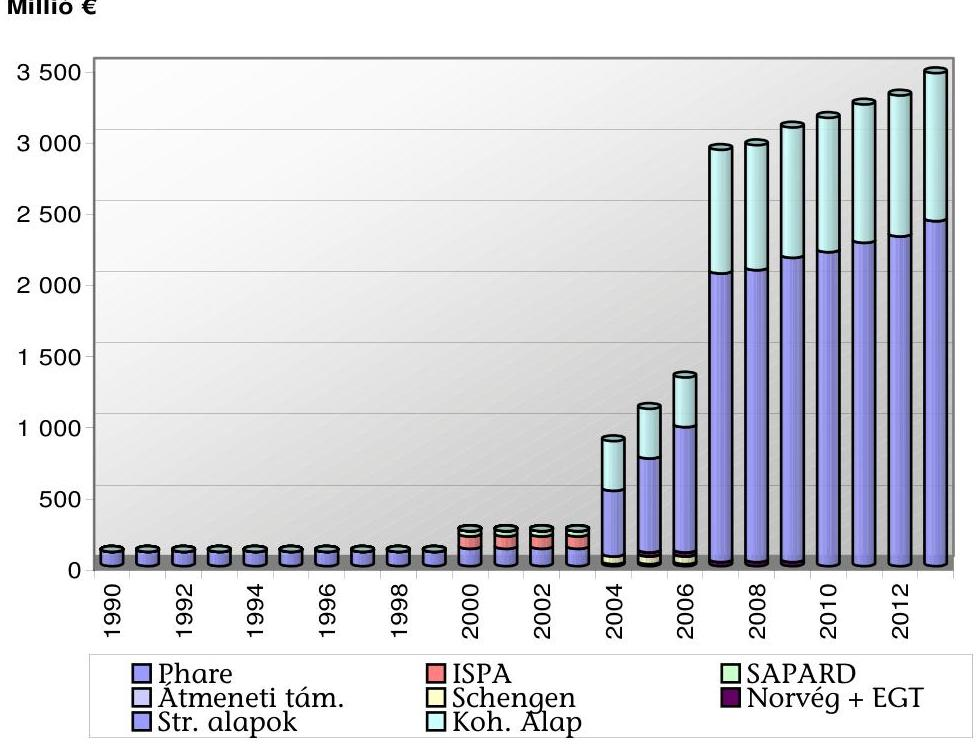

A Tanács és a Bizottság rendeleteiben foglaltak szerint az ellenőrizhetőség érdekében az EU költségvetésben foglalt minden tevékenységi ágra egyedi, mérhető, elérhető, szakszerű és időszerű kritériumokat, célkitűzéseket kell megadni, és felhasználásukat a gazdaságosság, a hatékonyság és az eredményesség elveivel összhangban teljesítménymutatókkal kell ellenőrizni.

A Bizottság a költségvetést centralizáltan, decentralizáltan, vagy nemzetközi szervezetekkel együttműködve hajthatja végre. Ezek a különböző végrehajtási módok más-más feladatokat rónak az érintett tagországokra. Minden tagállamnak kötelessége gondoskodni a rá vonatkozó ellenőrzési feladatok olyan ellátásáról, amellyel megvalósítja az alapelvek és ellenőrzési célok érvényesítését. A pénzügyi ellenőrzés szabályozásában az egyes alapokra vonatkozó speciális szabályozást egyre inkább felváltja a pénzügyi ellenőrzés általános, több alapra érvényes szabályozása.

Az uniós pénzügyi rendelet alapján a tagállamok viselik az elsődleges felelősséget a szabálytalanságok megelőzéséért, feltárásáért és a szükséges pénzügyi korrekciók végrehajtásáért.

Az Állami Számvevőszék (továbbiakban: ÁSZ) az előcsatlakozási támogatások monitoring rendszerét 2000-ben, illetve 2002-ben végzett ellenőrzéseiben vizsgálta ${ }^{2}$, de uniós belépésünket követően még nem értékelte a támogatások teljes körére kiterjedően a hazai monitoring és ellenőrzési rendszerek működését.

A jelenlegi ellenőrzés célja: annak értékelése volt, hogy az uniós támogatások hazai monitoring és ellenőrzési rendszereinek működése eredményesen és hatékonyan szolgálta-e a támogatási programok stratégiai céljainak elérését. Ennek során értékelni kellett, hogy:

- az uniós támogatások felhasználására kialakított hazai feltételrendszer és ezen belül az intézményrendszer kiépítettsége és felkészültsége lehetővé tette-e a monitoring- és ellenőrzési rendszercélok teljesítését;
- az alkalmazott monitoring tevékenység hozzájárult-e a Magyarországnak nyújtott támogatások átlátható, eredményes, hatékony és költségtakarékos felhasználásához;
- az uniós támogatások hazai ellenőrzési rendszere eredményesen és hatékonyan szolgálta-e a szabálytalanságok és csalások megelőzését, felderítését és esetleges következményeik felszámolását;
- a monitoring és ellenőrzési rendszerek a tervezett ütemnek megfelelően felkészültek-e a 2007-2013. programozási időszak rendszermódosításaira.

Az ellenőrzésünk célja nem az egyes támogatási programok eredményeinek részletes vizsgálata, hanem a hazai monitoring és ellenőrzési rendszerek arra gyakorolt hatásának értékelése volt. Az ellenőrzést a teljesítmény-ellenőrzés módszertanának alkalmazásával hajtottuk végre. Az ellenőrzöttek bevonásával meghatároztuk a gazdaságosság, a hatékonyság és az eredményesség ellenőrzésünkre érvényes fogalmait, valamint meghatároztuk a teljesítménykritériumokat.

A rendszeralapú mellett a közvetlen megközelítési mód érvényesítése érdekében a monitoring és ellenőrzési rendszer gyakorlati működésének értékeléséhez a támogatásközvetítő intézményrendszer által elvégzett ellenőrzésekből kockázati szempontok alapján rétegezett mintavétel módszerének alkalmazásával reprezentatív mintát választottunk ki helyszíni ellenőrzésre ${ }^{3}$. A tanúsítványok alapján a 2006-ban tervezett 443 db ellenőrzésből azok 10%-át, azaz 44 db-ot választottunk ki. A kiválasztás szempontrendszerében érvényesítettük, hogy a minta a támogatás és az ellenőrzési típusok teljes körére kiterjedjen. A mintában érintett projektekhez kapcsolódó monitoring tevékenységből a projektmonitoring tevékenységet értékeltük.

Az ellenőrzés során összevetettük az egyes uniós támogatások dokumentumrendszerében lefektetett stratégiai, valamint monitoring és ellenőrzési rendszer-

[^0]
[^0]:    ${ }^{2}$ Az ÁSZ 0018 és 0247 témaszámokon 2000 júliusában, ill. 2002 decemberében készített jelentést a nemzetközi segélyek, illetve támogatások monitoring rendszerének ellenőrzéséről.
    ${ }^{3}$ A helyszíni ellenőrzés 2007. I. 2 - 2007. II. 16-ig tartott.

---

célokat a ténylegesen elért eredményekkel. Az ellenőrzési szempontok szerint értékeltük a monitoring és ellenőrzési rendszerek működését és szerepüket az elért eredmények alakulásában.

Az ellenőrzés - az előzmények értékelésével - kiterjedt a Magyar Köztársaság 2006. évi költségvetéséről szóló 2005. évi CLIII. törvény mellékleteiben megjelenő és a költségvetésen kívüli uniós forrásokra, valamint a támogatásközvetítő intézményrendszerre, kitekintéssel a 2007-tel kezdődő időszakra.

Az ellenőrzés jogalapját az Állami Számvevőszékről szóló 1989. évi XXXVIII. törvény 2. § (5)-(6)-(9) és az államháztartásról szóló 1992. évi XXXVIII. törvény 120/A. § (1) bekezdései képezték.

A jelentést 8 napos egyeztetésre megküldtük a pénzügyminiszter, a fejlesztéspolitikáért felelős és a földművelési és vidékfejlesztési miniszter uraknak. Válaszleveleik másolatát az 1.a., 1.b. és 1.c. sz. mellékletek tartalmazzák.

---

# I. ÖSSZEGZŐ MEGÁLLAPÍTÁSOK, KÖVETKEZTETÉSEK, JAVASLATOK 

A Magyarországra 2006-ban érkező uniós támogatások hazai monitoring és ellenőrzési rendszereinek kialakítása és működtetése teljesítette az uniós források lehívásának és felhasználásának e rendszerekhez kapcsolódó feltételeit, de működésük eredményessége és hatékonysága támogatásonként eltérő képet mutatott.

A monitoring tevékenységben kimutatható eredményességi és hatékonysági eltérések és különbségek a monitoringra vonatkozó egységes működési standardok hiányából, a különböző támogatások lebonyolításához kapcsolódó problémákból és a tervtől való eltérések feltárási időszükségletének különbözőségeiből, valamint a beavatkozási döntések eltérő következményeiből származtak. Rontották a monitoring rendszer működésének eredményességét és hatékonyságát azok az esetek, ahol a feltárási késedelemből, vagy a beavatkozási döntések elodázásából adódóan már nem lehetett az eredeti célkitűzéseket realizálni (a Kohéziós Alapból, (továbbiakban: KA), finanszírozott vasúti projektek csúszása és költségtúllépése, valamint a normáknak megfelelő sebességcélok elmaradása).

Az ellenőrzési rendszerekben tapasztalt eltérések a módszertan gyakorlati alkalmazásának hiányosságaiból, a lebonyolító intézményrendszer ellenőrzési szerveinek instabilitásából és az intézményfejlesztés során az ellenőrzési tevékenység eredményességi és hatékonysági szempontjainak háttérbe szorulásából származtak.

A monitoring és ellenőrzési tevékenység feltételrendszere a támogatásközvetítő rendszer 2006-os átszervezésével együtt változott. A 2004-2006-os tevékenységre elvégzett belső ${ }^{4}$ és külső ${ }^{5}$ ellenőrzések és értékelések ${ }^{6}$ rámutattak a gyenge pontokra és a folyamatok hatékonysági problémáira, ezért a hatékonyságnövelő beavatkozási szándék indokolt volt. Mind a monitoring, mind az ellenőrzés terén változott a jogi szabályozási környezet és megindult a lebonyolító intézményrendszer átszervezése is, amely a helyszíni ellenőrzés befejezéséig nem zárult le. 2006 júliusától az intézményrendszer 57%-át átszervezték.

[^0]
[^0]:    ${ }^{4}$ A Kormányzati Ellenőrzési Hivatal (továbbiakban: KEHI) különböző típusú jelentései, a Nemzeti Fejlesztési Hivatal (továbbiakban: NFH) vizsgálatai az intézményrendszer működésére vonatkozóan, stb.
    ${ }^{5}$ Az ÁSZ 0636 ellenőrzési jelentése az NFT I. végrehajtásáról, az Európai Unió Számvevőszékének (továbbiakban: ECA) 2006/C 263/01 sz. jelentése az Unió 2005. évi költségvetésének végrehajtásáról.
    ${ }^{6}$ A Közösségi Támogatási Keret (továbbiakban: KTK) Irányító Hatósága (továbbiakban: IH) által készített, a KTK felhasználására vonatkozó közbenső értékelés, Phare közbenső értékelés stb.

---

Ez az intézményi változás azonban a strukturális alapok (továbbiakban: SA) és a KA forrásait közvetítő intézményrendszert még intenzívebben érintette és elérte a 73%-ot. Az átalakítás elhúzódása ${ }^{7}$ negatívan hatott az intézményi, azon belül a monitoring és ellenőrzés intézményi feltételeinek folyamatos fenntartására, ami növelte a folyamatba épített, előzetes és utólagos vezetői ellenőrzés (továbbiakban: FEUVE) érvényesítési kockázatát. Az intézményi változások összefoglalását tartalmazza a 3. sz. melléklet.

A változások érintették a monitoring és ellenőrzési területek humánkapacitását is. A humánkapacitások racionalizálása, az ésszerű összevonások (pl.: az NFH-ból átalakult Nemzeti Fejlesztési Ügynökségben (továbbiakban: NFÜ)) a belső ellenőrzési feladatok összevonása mellett olyan kapacitás összetételi sajátosságokat eredményeztek, amelyek negatívan hatottak a feladatok szakmai ellátására ${ }^{8}$. Megindult és egyre elterjedtebb alkalmazást nyert a monitoring és ellenőrzési feladatok külső vállalkozásba adása és a feladatok menedzselés szintű ellátása.

A 2004-2006-os időszakban az egyes támogatások rendelkeztek a monitoring célokat is kijelölő stratégiákkal, vagy éves tervekkel, de az EU források összehangolt felhasználására nem készült egységes nemzeti szintű stratégia ${ }^{9}$, így a hazai és uniós források összehangolásából eredő szinergikus hatások kevésbé érvényesültek. A tervezés során az uniós és hazai támogatási célokat, valamint a források felhasználását a környezetvédelem és a közlekedési infrastruktúrafejlesztés területén összehangolták, mivel ezekre a területekre már létezett elfogadott hazai stratégia, vagy koncepció. Az elfogadott tervekben nem alakították ki a pénzügyi és naturális tervezés egyensúlyát és a monitoring indikátorok projekt és program szintű mutatóinak egymásra épülését. A monitoring indikátorok kialakítási problémáit mutatta, hogy több esetben azok utólagos áttervezése vált szükségessé (Humánerőforrás Fejlesztési Operatív Program, (továbbiakban: HEFOP), Agrár- és Vidékfejlesztési Operatív Program, (továbbiakban: AVOP)). A projekt és program indikátorok egymásra épülésének hiányosságai

[^0]
[^0]:    ${ }^{7}$ A helyszíni ellenőrzés lezárásáig (2007. február 06.) nem jelöltek ki minden közreműködő szervezetet (továbbiakban: KSZ) és az IH-k és a KSZ-ek közötti együttműködési megállapodásokat nem kötötték meg. Az összevont KSZ-ek átadás - átvételi folyamatai sem fejeződtek be erre az időpontra.
    ${ }^{8}$ A KA és a Közlekedési és Infrastruktúra Operatív Program (továbbiakban: KIOP) közlekedési közreműködő szervezetei, ahol a projektmenedzseri és a szakmai monitoring feladatok ellátására egyetlen belső, saját alkalmazásban álló mérnököt sem alkalmaztak.
    ${ }^{9}$ Az egységes nemzeti szintű fejlesztési stratégia és abból fakadóan az ágazati célok hosszú távú összehangolási hiányára példa, hogy az NFT I. Humánerőforrás Operatív Programjából támogatott 11 Mrd Ft-ot meghaladó kardiovaszkuláris projekt monitoring mutatóinak teljesítési kockázatát növelte az egészségügyi reform projektet érintő ágyszám csökkentése. A stratégiák változása a támogatási szerződések és a vállalt teljesítménymutatók módosítását igényli, amelyek

 visszahatnak a programszintű célok teljesülésére. A jelentéstervezet egyeztetése során a HEFOP IH tájékoztatása szerint az egészségügyi tárca, és a kedvezményezett a célok elérését célzó intézkedések meghozataláról biztosította az IH-t.

---

a program szintű összteljesítmények értékelését tette nehézkessé, mert a program indikátorok teljesítésének mérése nem a projektindikátorok eredményeinek összesítésére, hanem különböző modellek szerinti értékelésre épült.

A programok lebonyolítását az uniós források késedelme nem hátráltatta. Rontotta az eredményes és hatékony monitoring feltételeit a Nemzeti Vidékfejlesztési Terv (továbbiakban: NVT) esetében, hogy hazai kezdeményezésre a felhasználható uniós forrásokat többször átcsoportosították ${ }^{10}$. Az átcsoportosítások késedelmet és bizonytalanságot eredményeztek a program végrehajtásában. A támogatások felhasználásának a hazai társfinanszírozáshoz kapcsolódó feltételei rendezettek voltak, így a támogatások hasznosulását hazai forráshiány nem befolyásolta.

A 2004-2006-os időszakra nem alakították ki a nyilvántartások és a monitoring tevékenység támogatásának egységes informatikai hátterét. Az Egységes Monitoring Információs Rendszer (továbbiakban: EMIR) alkalmazása nem volt teljes körű ${ }^{11}$. Az EMIR a projekt szintű pénzügyi nyilvántartások pozitív eredményei mellett - az egységes fejlesztési stratégia hiánya, valamint fejlesztési és alkalmazási késedelmek miatt - nem tudott a monitoring indikátorok ${ }^{12}$ terv-tény adatait nyomon követő és értékelő, valamint az ellenőrzési tevékenység hatékony támogatási eszközévé válni. Hiányzott az EMIR-t használó intézmények informatikai biztonsági, üzemeltetési szabályzata, valamint a működésfolytonossági terve, amely kockázatot jelentett az EMIR biztonságos működésében.

A hazai monitoring tevékenység a pénzügyi folyamatok nyomon követésével megfelelően segítette a támogatási célok teljesítését, de az egyes támogatások esetében a naturális célok teljesülésének monitorozása eltérő mértékben teljesült. Az eltérő eredményességet és hatékonyságot mutatta, hogy voltak a kereteket meghaladó mértékben kihasználó program (SAPARD) mellett olyan területek is, ahol az EU támogatást ugyan maradéktalanul felhasználták, de a végrehajtás során keletkezett költségtúllépések miatt lecsökkent az EU források támogatási aránya és a projektek befejezése - előre nem tervezett - költségvetési és önkormányzati többletráfordítást igényelt (KA vasúti és környezetvédelmi projektek).

Projekt-monitoring szinten nem alakítottak ki egységes módszertani megközelítést, hiányzott a minőségbiztosítás és nem alkalmazták a „legjobb gyakorlat" érvényesítésének elvét. A szakmai monitoring tevékenység háttérben maradt a pénzügyivel szemben. Ez megmutatkozott a pénzügyi célok teljesítési prioritásában és a jogosult költségek elszámolásában, amely különösen a nagy beruházási projektek esetében jelentett kockázatot. A támogatás odaítélési folyamat-

[^0]
[^0]:    ${ }^{10}$ Az NVT forrástervezésének problémáit az NVT Monitoring Bizottság dokumentumai is tartalmazzák.
    ${ }^{11}$ Például az EMIR mellett működött az INTERREG támogatást nyilvántartó IMIR.
    ${ }^{12}$ A monitoring indikátorok tervezésében és alkalmazásában mutatkozó - az EMIR és a monitoring tevékenység hatékony ellátását korlátozó - problémákat részletesen az ÁSZ 0636-os számú jelentése tartalmazta.

---

okban a projekt szintű jogosultsági és kiválasztási kritériumok mellett nem vizsgálták az egyes projektek hozzájárulását a program szintű célok teljesüléséhez, így a program-monitoring késedelme miatt a támogatási keretek odaítélését követően már nem lehetett a programcélokat teljesíteni (az NFT I. esetében a területi kiegyenlítődés elmaradása és a támogatott projektek kistérségek közötti megoszlásának aránytalansága).

A 2004-2006-os időszakra - az EU források felhasználására - nem alakították ki a támogatások hasznosulását nyomon követő egységes jelentési rendszert, amelyet ugyan jogszabály nem írt elő, ugyanakkor az segíthette volna az uniós forrásfelhasználások alakulásának egységes áttekinthetőségét. A magyar kormányzat felé az EU által kért támogatási alapcsoportonként készítettek jelentéseket, amelyeket nem szintetizáltak egységes jelentéssé ${ }^{13}$. A jelentésekben az adatbázisokból készített statisztikák alapján levont következtetés - a minőségkontroll hiánya miatt - nem minden esetben volt megalapozott. Erre példa a 2006 júniusában az EU felé a KTK felhasználásáról szóló éves jelentés, amelyben a létrehozott új munkahelyek indikátorra megadott 53 ezres tételt a KTK IH nem tudta támogatási szerződésekkel alátámasztott kimutatással reprodukálni. Hasonló tapasztalható KTK IH-nak a Fejlesztéspolitikai Irányító Testület (továbbiakban: FIT) részére 2007 februárjában az SA és KA felhasználásáról írt jelentésének a nemzetközi kitekintést tartalmazó fejezetében, amely elemzés kedvező helyre sorolta Magyarország „forrásfelhasználását" az új tagállamok körében. Az elemzés nem mutatta be, hogy a hazánkban alkalmazott előlegrendszer milyen szerepet töltött be az eredmények alakulásában, amely teljesítési kockázatot jelent a programok végső elszámolásánál.

Az elemző tevékenység erősödését mutatta, hogy a folyamatban levő támogatásoknál - a helyszíni ellenőrzés időpontjában - feltárták az uniós támogatások felhasználásának időkorlátjából fakadó teljesítési kockázatokat programonként és alaponként, és rámutattak arra, hogy a pénzügyi folyamatok mellett a projektek műszaki, fizikai megvalósítását is gyorsítani kell ${ }^{14}$.

Az uniós támogatások hazai ellenőrzési rendszere kiépült a 2004-2006-os időszakra az uniós és hazai szabályozás előírásait követve. Ugyanezen időszak alatt szintén kiépült a szabálytalanságok kezelésének és felszámolásának rendszere is.

[^0]
[^0]:    ${ }^{13} 2004$ óta a strukturális alapok és a Kohéziós Alap felhasználását bemutató jelentések rendszere folyamatosan fejlődött. Egyre nagyobb hangsúlyt fektetnek a tematikus problémák feltárására. Mindezek mellett azonban továbbra is kevés a programok eredményeit, hatásait bemutató rész a jelentésekben.
    ${ }^{14}$ Az ÁSZ 0636 sz. 2006. szeptemberi jelentése az NFT I. végrehajtásának ellenőrzéséről javasolta a forrásfelhasználás nyomon követésének szerződéses kötelezettségvállaláson alapuló egységes rendszere kialakítását, valamint a programok végrehajtásának gyorsítását. Az uniós források felhasználását korlátozó N+2 évi szabály és az NFT I. forrás felhasználási ütemtervének teljesítési kockázata tette ezt szükségessé. (2008-ra tervezték az összes kifizetés $50 \%$-át.)

---

A jogszabályban nevesített intézményben - az FVM kivételével - működtek a funkcionálisan független belső ellenőrzési részlegek. Feladataikat eltérő belső humánkapacitás mellett hajtották végre. A KA és KIOP közreműködő szervezeteinél 5 fő látta el a belső ellenőrzési feladatokat, így az egy főre jutó felügyelt beruházási összeg átlagosan elérte a 150 milliárd Ft-ot, ami nagysága miatt tekintve ellenőrzési kockázatot hordozott magában.

Az intézményrendszer által elvégzett ellenőrzéseknél a hatékonyság és eredményesség elvű ellenőrzések háttérbe szorultak ${ }^{15}$. A KTK IH 2006-ban külső szakértő bevonásával elvégeztette az intézményrendszer működési költségeinek felmérését. Az elkészített tanulmány - a működési költségek nyilvántartására kialakított rendszer hiányosságai miatt - nem a tényleges költségekre, hanem csak azok becslésére alapult. Az elvégzett ellenőrzések alacsony hatékonyságát támasztotta alá az a tény, hogy a vasúti projektek területén végzett vizsgálatokban ${ }^{16}$ foglalt megállapítások és javaslatok ellenére nem rendezték a vizsgálatok által feltárt problémákat. Az ellenőrző szervezeteknek közvetlenül nincs eszközük ezek kezelésére.

A 2006 júliusában megindult intézményi átszervezéseket követően nem aktualizálták a 2006. évi ellenőrzési terveket, ez is hozzájárult tervezett ellenőrzések elmaradásához (Gazdasági és Közlekedési Minisztérium (továbbiakban: GKM) Ellenőrzési Főosztály, Kutatásfejlesztési Pályázati és Kutatáshasznosítási Iroda (továbbiakban: KPI)).

Az NFT I. operatív programjai, az EQUAL Közösségi Kezdeményezés program és a KA felhasználásához az uniós és hazai jogi szabályozásban előírt irányítási és ellenőrzési rendszerek megváltoztak az intézményfejlesztés eredményeként. Az átalakulás alatt álló intézményrendszer új állapotnak megfelelő, aktualizált irányítási és ellenőrzési rendszerleírása elkészítésének határideje a helyszíni ellenőrzést követően járt le ${ }^{17}$.

A pénzügyi lebonyolítás során alkalmazták a kifizetéseket megelőző - kockázatelemzésen alapuló - folyamatba épített ellenőrzések rendszerét, de a Pénzügyminisztérium (továbbiakban: PM) által időben kibocsátott útmutatók ellenére még nem alakult ki a kockázatelemzés és mintavétel megalapozott, jól rekonstruálható gyakorlata. Az alkalmazott gyakorlatban nem vették figyelembe a nagyprojekt profil kiemelt kockázati sajátosságait. Az intézményi átalakításokból fakadó bizonytalanságok hatásaként nőtt a kifizetések időszükséglete, amely a HEFOP-nál - ahol változott a pénzügyi funkció ellátásának rendszere a közreműködő szervezetek között -, meghaladta a három hónapot. Hasonló helyzet alakult ki a GVOP esetében is.

[^0]
[^0]:    ${ }^{15}$ A bekért tanúsítványok kiértékelése alapján az intézmények közül 4 intézmény összesen 14 db teljesítmény-ellenőrzést végzett.
    ${ }^{16}$ Lásd 8. és 9. sz. mellékletek.
    ${ }^{17}$ Az új irányítási és ellenőrzési rendszerek IH szintű elkészítésének határideje 2007. április 30. volt. A jelentéstervezet egyeztetése alatt az NFÜ tájékoztatása szerint az IH szintű leírások határidőre elkészültek.

---

A KEHI a mintavételes-, a rendszerellenőrzéseit és a zárónyilatkozatok kiadását az uniós és hazai jogszabályi előírásokat követve látta el. Alkalmazott módszereit felülvizsgálta, fejlesztette, ami kiemelten fontos uniós előírás különösen a kockázatkezelés és mintavételezés gyakorlatában. Az Unióval való elszámolás keretében a kifizetések megfelelő igazolása érdekében a pénzügyi lebonyolítás tekintetében a Kifizető Hatóság - kialakított ütemtervének megfelelően - végezte el a támogatások teljes rendszerének ellenőrzését.

Kialakították és működtették az Európai Mezőgazdasági Orientációs és Garancia Alap (továbbiakban: EMOGA) Garancia Részlegéhez kapcsolódó ellenőrzési rendszereket ${ }^{18}$ is. Intézményi változást jelentett, hogy 2007-es pénzügyi évtől új szervezet látta el az Igazoló Szerv feladatait.

Az intézményrendszer által végzett ellenőrzések alapján tervezett intézkedések nyomon követési gyakorlatában hiányosság volt, hogy nem értékelték folyamatosan az intézkedések helytállóságát, eredményességét (például a vasúti projektek esetében), ezáltal a javaslatok hasznosulása nem volt hatékony.

A KEHI által elvégzett ellenőrzésekhez kapcsolódó intézkedési tervek nyomon követéséről az ellenőrzött szervezetek által adott tájékoztatás kevés információt tartalmazott, illetve nem adott információt a ténylegesen megtett intézkedések eredményességéről, esetleges pénzügyi kihatásáról, ezáltal a KEHI-nek kiegészítéseket kellett kérnie a már lezárult intézkedésekről, lefolytatott eljárásokról is (például a HEFOP ellenőrzésre kivett projektje esetében). Ez rontotta a nyomon követési tevékenység hatékonyságát és a fentiek miatt a nyomon követési gyakorlat nem felelt meg a PM által kiadott Belső Ellenőrzési Kézikönyvnek és a Belső Ellenőrzés Nemzetközi Szakmai Standardjának.

Az ellenőrzések összehangolására kialakított rendszert működtették, de az alkalmazott gyakorlatban fejlesztési tartalékok voltak. A korábbi szabályozás mellett az államháztartásért felelős miniszterhez (a pénzügyminiszter) tartozó központi harmonizációs egységben ismét nevesítették az uniós alapokból származó támogatások ellenőrzésének szabályozásáért, harmonizációjáért és koordinációjáért felelős intézményi egységet.

A vizsgálat befejezéséig nem alakították ki a támogatásközvetítő intézményrendszer ellenőrzési tevékenységének gazdaságosságra és hatékonyságra irányuló értékelési rendszerét. Kalkulációt az elvégzett ellenőrzések 13%-ában végeztek. A helyszíni ellenőrzés befejezéséig nem vált gyakorlattá az ellenőrzési eredmények hasznosulásának gazdasági elemzése.

# A monitoring és ellenőrzési rendszerek a 2007-2013-as évek felkészülési feltételeinek biztosítására megfelelő időben végrehajtották a hazai szabályozórendszer harmonizációját az új uniós szabályozáshoz. A program meg-

[^0]
[^0]:    ${ }^{18}$ Az ellenőrzési rendszerek működésével összefüggésben a Bizottság a 2005-ben felhasznált agrár- és vidékfejlesztési támogatások forrásainak elszámolását előbb elkülönítette, majd további eljárások után számolta el azokat.

---

indítása előtt kiadták a végrehajtáshoz szükséges kormányrendeleteket ${ }^{19}$. A helyszíni ellenőrzés befejezéséig a KSZ-ek kijelölése és az együttműködési szerződések megkötése nem fejeződött be ${ }^{20}$.

Az új szabályozásnak megfelelően az államháztartásért felelős miniszter hatáskörében létrejött és megkezdte felkészülését az Ellenőrzési Hatóság, amely a KEHI bázisára épült. Ugyancsak az államháztartásért felelős miniszter hatáskörében működött az Igazoló Hatóság, amely a gyakorlatban a korábbi Kifizető Hatóságból alakult meg.

A kormányzat benyújtotta az uniós támogatások felhasználására vonatkozó stratégiai terveket és a
 hozzájuk tartozó operatív programokat, valamint megindult az akciótervek készítése is. A különböző tervek brüsszeli egyeztetése nem fejeződött be a helyszíni ellenőrzés lezárásáig. 2007-ben sem az NFÜ, sem az FVM nem készített a felkészülési feladatok ellátására részletes ütemtervet. Ennek ${ }^{21}$ hiányában a feladatok végrehajtásának tervszerűsége nem számon kérhető és a pályázók sem tudják felkészülésüket tervezni.

Az intézményfejlesztés támogatására az NFÜ több tanulmányt készíttetett a gyenge pontok feltárására és a hatékonyság növelésére. Az IH és KSZ-ek közötti intézményi együttműködés területén a teljesítményalapú elszámolás bevezetését tervezték. A támogatásközvetítő folyamatok ésszerűsítése mellett kockázatot hordozott, hogy a szükséges intézményi kapacitásokat nem a várható feladatok mennyiségéből és azok ellátásának technológiai kapacitásigényéből vezették le. Nem tervezték meg az új intézményrendszer működési költségvetését olyan részletezésben (források, tevékenységek, költséghelyek), amely tényleges költségekre alapozva tenné lehetővé a költséghatékonyság mérhetőségét.

Az intézményi felkészülést és ezen belül a monitoring és ellenőrzési rendszerek kialakításának megfelelőségét a strukturális alapoknál és a Kohéziós Alapnál az Ellenőrzési Hatóság, az agrár- és vidékfejlesztési támogatások esetében pedig megbízott könyvvizsgáló cég, értékelési (akkreditációs) jelentésének kell igazolnia. Az ehhez szükséges felkészülés és ellenőrzés előkészítését mindkét területen megkezdték. A szabályozás meghatározta az erre rendelkezésre álló időkereteket, amelyek az elvégzendő feladatok ellátására a helyszíni ellenőrzés lezárásakor elégségesek voltak.

[^0]
[^0]:    ${ }^{19}$ A 2004-es időszakhoz viszonyított előrelépést mutatja, hogy az eljárási rendeletet akkor a program megindítását követően, nyolc hónap késedelemmel sikerült kiadni.
    ${ }^{20}$ Az NFÜ az egyes pályázati felhívások megindulását megelőzően tervezte ezek rendezését.
    ${ }^{21}$ A benyújtott tervek brüsszeli egyeztetése időkeretekkel tervezhető és ennek megfelelően a támogatások hazai megindítása is programozható. Az intézményfejlesztés pontos menetrendjének hiánya bizonytalanságot okoz.

---

A helyszíni ellenőrzés megállapításainak hasznosítása mellett javasoljuk:

# a Miniszterelnöki Hivatalt vezető miniszternek 

1. Dolgoztassa ki a 2007-2013-as időszak támogatásainak indításához tartozó feladatok (tervezési, szabályozási, intézményi, informatikai) részletes ütemtervét. Ellenőrizze a feladatok végrehajtását és a pályázók felkészülése érdekében gondoskodjon annak nyilvánosságáról.
2. Gondoskodjon a monitoring és ellenőrzési feladatok, valamint a humánerőforrás szakmai összetételének összhangjáról, a feladatellátás szakmai szempontjainak erősítése érdekében.
3. Fejlesztesse tovább a szakmai monitoring előrejelző, terv-tényadat és költséghatékonyság elemző funkcióit és gondoskodjon ezen funkciók ellátásának informatikai támogatásáról az eredményszemlélet erőteljesebb érvényesítése érdekében.
4. Elfogadott stratégia alapján készíttesse el az EMIR-t használó intézmények informatikai, biztonsági és informatikai üzemeltetési szabályzatait, valamint a működésfolytonossági terveket az EMIR biztonságos működése érdekében.
5. Dolgoztassa ki a nagyprojekt profil sajátosságait figyelembe vevő ellenőrzési eljárásokat és azok alkalmazási gyakorlatát, a kiemelt kockázatok kezelése érdekében.
6. Gondoskodjon arról, hogy az ellenőrzések alapján tervezett intézkedések nyomon követése és arról a KEHI-nek adott tájékoztatás megfeleljen a PM által kiadott Belső Ellenőrzési Kézikönyvnek (kövessék nyomon az intézkedések eredményességét, időszerűségét, helytállóságát és a szükség szerint végrehajtott pénzügyi korrekciókat) az ellenőrzések eredményessége, hasznosulása, és a tájékoztatás hatékonysága érdekében.
7. Gondoskodjon a támogatásközvetítő intézményrendszer minden egyes szervezeténél az uniós támogatásokkal összefüggő intézményi működési költségek elkülönített és megfelelő részletezettségű (források, költséghely, tevékenységek szerinti) vezetéséről, a költséghatékonyság mérhetősége érdekében.

## a földművelésügyi és vidékfejlesztési miniszternek

1. Dolgoztassa ki a 2007-2013-as időszak támogatásainak indítási ütemtervét és az ahhoz tartozó feladatok (tervezési, szabályozási, intézményi, informatikai) részletes ütemtervét. Ellenőrizze a feladatok végrehajtását és a pályázók felkészülése érdekében gondoskodjon annak nyilvánosságáról.
2. Gondoskodjon a támogatásközvetítő intézményrendszer minden egyes szervezeténél az uniós támogatásokkal összefüggő intézményi működési költségek elkülönített és megfelelő részletezettségű (források, költséghely, tevékenységek szerinti) vezetéséről, a költséghatékonyság mérhetősége érdekében.

---

# II. RÉSZLETES MEGÁLLAPÍTÁSOK 

## 1. Az UNIÓs TÁMOGATÁSOK FELHASZNÁLÁSÁNAK HAZAI FELTÉTELRENDSZERE

### 1.1. A feltételrendszer cél és forrás elemeinek kialakítása

Magyarország 2004. május 1-ével csatlakozott az Európai Unióhoz. Az Európai Unió a csatlakozást megelőzően az előcsatlakozási alapokon (PHARE, ISPA, SAPARD) keresztül támogatta Magyarországot és segítette az európai támogatási rendszer fogadására alkalmas intézményrendszer kialakítását. A Csatlakozási Szerződés alapján Magyarország jogosulttá vált az EU strukturális alapjai és a KA tagállamokat megillető támogatásai igénybevételére. A csatlakozást megelőzően elindított PHARE és SAPARD támogatások zárása 2006. évben elkezdődött. Az ISPA projektek befejezését a KA finanszírozta a belépést követően. Átmeneti támogatás néven a PHARE-hoz hasonló támogatás is indult 2004-2006-os időszakra. A belépéskor folyamatban lévő EU 2000-2006-os programozási időszak a 2006. év végén lezárult és 2007. évtől új 2007-2013. időszakra kiterjedő programozási ciklus kezdődött el, miközben az előző programozási időszakhoz kapcsolódó fejlesztések befejezésére és elszámolására 2008. év végéig van lehetőség. A KA esetében a véghatáridő 2010. december 31.

A Tanács az EU költségvetésére vonatkozó 1605/2002/EK pénzügyi rendeletében és annak a Bizottság által elfogadott 2342/2002/EK végrehajtási rendeletében foglaltak szerint az ellenőrizhetőség érdekében az EU költségvetésben foglalt minden programra és tevékenységre, egyedi, mérhető, szakszerű és időszerű kritériumokat, elérhető célokat kell megadni. E célkitűzések megvalósítását teljesítménymutatókkal kell ellenőrizni az egyes támogatások felhasználására vonatkozóan. A pénzügyi rendelet előírja, hogy az uniós költségvetési előirányzatokat a gazdaságosság, a hatékonyság és az eredményesség elveivel összhangban kell felhasználni. A tervezett felhasználás nyomon követéséhez tartozó monitoring a kitűzött célok elérésére irányuló tevékenységek és forrásainak folyamatos nyomon követésével, a tényállapot befolyásolásával segíti a kitűzött célok elérését.

A pénzügyi rendeletnek megfelelően az egyes támogatásokra vonatkozó uniós szabályozások előírják a felhasználás tervezése és a végrehajtása speciális szabályait is. A támogatások hatékony felhasználása érdekében szabályozzák a végrehajtás nyomon követését, monitoringját és értékelését, valamint az alkalmazandó ellenőrzések rendszerét is.

A 2004-2006-os időszakban az EU által nyújtott egyes pénzügyi támogatások felhasználásával megvalósuló, és egyes nemzetközi megállapodások alapján finanszírozott programok monitoring rendszerének kialakításáról és működéséről szóló 102/2006. (IV. 28.) Korm. rendeletben meghatározott támogatások felhasználásához léteztek a monitoring célokat is kijelölő stratégiák, vagy éves

---

tervek, de az EU források összehangolt felhasználására nem készült egységes nemzeti szintű stratégia.

A strukturális alapokból folyósított támogatások felhasználásának stratégiai terve a Nemzeti Fejlesztési Terv (továbbiakban: NFT I.), amely az EU Tanácsának a strukturális alapok általános szabályozásáról szóló 1260/1999/EK rendelete, valamint a strukturális alapok ${ }^{23}$ tervezéséhez és programozásához kiadott Útmutató figyelembevételével készült.

Az NFT I. céljainak megvalósítására a strukturális alapokból a 2004-2006. évekre 1995,7 millió euró (507,9 Mrd Ft) ${ }^{24}$ és a központi költségvetésből 700,3 millió euró (178,2 Mrd Ft) keret állt rendelkezésre. Az éves keretekkel a rendelkezésre állástól számított két éven belül kell elszámolni.

Az NFT I-ben az életminőség javítására vonatkozó hosszú távú cél mellett általános célkitűzésként határozták meg, hogy a hazai társadalmi-gazdasági fejlettség minél inkább megközelítse az EU szintjét. Az NFT I-ben négy specifikus cél került elfogadásra, amelyek a következők: a versenyképesebb gazdaság, a humán erőforrások jobb kihasználása, a jobb minőségű környezet és alapinfrastruktúra, valamint a kiegyensúlyozottabb regionális fejlődés elősegítése. A specifikus célokhoz igazodva határozták meg a támogatási prioritásokat. A célrendszer szerves részét képezték a horizontális célok, amelyek az NFT I. esetében a környezetvédelem és az esélyegyenlőség. Az NFT I-ben kidolgozott célrendszert és pénzügyi kereteket a Közösségi Támogatási Keretben (továbbiakban: KTK) igazolta vissza az EU.

Az NFT I-hez kapcsolódóan kidolgozott öt OP: az AVOP, a GVOP, a HEFOP, a KIOP és a ROP. Az OP-kat az EU Bizottság 2004 júniusa és novembere között fogadta el, de ez a késedelem nem hátráltatta a pályázatok meghirdetését, mert a kormányzat a hazai források terhére vállalta az elfogadásig viselt kockázatot. A teljesítmények nyomon követését gátolta, hogy nem alakították ki a pénzügyi és naturális tervezés egyensúlyát és a monitoring indikátorok projekt és program szintű mutatóinak egymásra épülését. Az egyes programokhoz kidolgozott stratégiák és tervek a pénzügyi célok mellett fizikai, naturális célokat is tartalmaztak, ám azok monitoring célú alkalmazása több OP esetében is korlátozott volt. ${ }^{25}$ A

[^0]
[^0]:    ${ }^{22}$ A Nemzeti Fejlesztési Terv, nevével ellentétben, nem Magyarország - egyetlen tervben összefoglalt - fejlesztési stratégiája, hanem az EU strukturális alapjaiból hazánkat megillető támogatások felhasználásának terve. A strukturális alapokon túl hazánkat megillető egyéb uniós támogatások, pl.: SAPARD, Kohéziós Alap stb. felhasználása önálló stratégiákra épül, amelyekkel az összhangot az NFT tervezése során figyelembe vették.
    ${ }^{23}$ Az Európai Regionális Fejlesztési Alap (ERFA) felhasználását az 1783/1999/EK, az Európai Szociális Alap (ESZA) felhasználását az 1784/1999/EK, az Európai Mezőgazdasági Orientációs és Garanciaalap (EMOGA) felhasználását az 1257/1999/EK, míg a Halászati és Orientációs Pénzügyi Eszköz (HOPE) felhasználását az 1263/1999/EK rendelet szabályozza.
    ${ }^{24}$ 254,5 Ft/euró átlag árfolyamon számítva, a 2005-2007. évi költségvetési tervezési körirat devizaárfolyam prognózisa alapján.
    ${ }^{25}$ Az ÁSZ 0636 sz. 2006. szeptemberi jelentése részletezte egyes monitoring indikátorok alkalmatlanságát.

---

monitoring indikátorok kialakítási problémáit mutatta, hogy több esetben azok utólagos áttervezése vált szükségessé (HEFOP, AVOP).

Az Európai Unió Közösségi Kezdeményezések címen elindított programjaiból a 2004-2006. években hazánkban az EQUAL és az INTERREG program indult el. A LEADER+ program pedig beépült az AVOP intézkedései közé. A közösségi kezdeményezések, a strukturális alapokhoz hasonlóan a gazdasági és társadalmi kohéziós célok érdekében működnek.

Az Interreg III Közösségi Kezdeményezés nyújt lehetőséget a határmenti régiók gazdasági és társadalmi kohéziójának erősítésére. A program 2004-2006. évi költségvetése 74,8 millió euró volt.

A programnak három pillére van: Interreg IIIA kifejezetten határmenti együttműködés (85%), Interreg IIIB transznacionális együttműködés az ún. Cadses országok ${ }^{26}$ között (9%) és az Interreg IIIC régiók közötti együttműködés (6%). Az Interreg program projektjeit az Európai Regionális Fejlesztési Alapból (ERFA) finanszírozták.

Az EQUAL (26,8 millió euró közösségi támogatás) Közösségi Kezdeményezés célja a munkaerőpiacon kialakult hátrányos helyzet és mindennemű egyenlőtlenség leküzdése. Az EQUAL program keretében támogatható témakörök az Európai Foglalkoztatási Stratégia alapján kerültek kidolgozásra, projektjeit az Európai Szociális Alapból (ESZA) finanszírozzák.

A Magyar Köztársaság KA keretstratégiái a közlekedés és a környezetvédelem fejlesztésére a 2004-2006. közötti tervezési időszakra 2003-ban elkészültek.

Ezek a dokumentumok az EU politikai és szabályozási keretében foglaltakra alapultak, például a páneurópai folyosók figyelembevételére, a nemzeti ágazatpolitikára és fenntartható fejlődés elvére. A közlekedési infrastruktúra fejlesztési célkitűzéseinek meghatározásakor az ISPA/KA, a strukturális alapokhoz tartozó KIOP és a transzeurópai közlekedési hálózatok terén a közös érdekű projektekre, nyújtandó TEN-T támogatás célrendszerét összehangolták és figyelemmel voltak az elkövetkező időszak prioritásaira. A vizsgálati tapasztalatok szerint az ERFA és a Kohéziós Alapból támogatandó intézkedések egymást kiegészítették ${ }^{27}$. A KA-ból, és az ERFA-ból támogatott KIOP, ROP intézkedések és projekt kiválasztási szempontok meghatározása ennek az elvnek a betartása mellett történt. A tervezés során az uniós és hazai támogatási célokat, valamint a források felhasználását a környezetvédelem és közlekedési infrastruktúrafejlesztés területein összehangolták, mivel ezekre a területekre már létezett elfogadott hazai stratégia, vagy koncepció. A tervezés során kialakított monitoring indikátorok a vasúti
 projektek esetében nem alkalmasak a költséghatékony végrehajtás nyomon követésére.

[^0]
[^0]:    ${ }^{26}$ Cadses országok (Central Adriatic Danubian South Eastern European Space): a 2004. május 1-én csatlakozott országok a Balti államok és Málta kivételével, valamint Németország keleti és Olaszország észak-keleti része és Görögország.
    ${ }^{27}$ A fő választóvonalat az OP-kból és a KA-ból történő finanszírozás között maga a Kohéziós Alap határozta meg, ami szerint csak olyan beruházások voltak finanszírozhatók ebből az Alapból, amelyek nagyságrendje meghaladta a 10 millió eurót és a TEN-T hálózathoz vagy annak becsatlakozásaihoz kapcsolódnak.

---

A KA eredeti költségvetése szerint a teljes elszámolható költség a 9 db közlekedési nagyprojektre, továbbá a technikai segítségnyújtásra 1148 millió euró összeget tett ki. A 24 db környezetvédelmi nagyprojektre, továbbá a technikai segítségnyújtásra a teljes elszámolható költség 1167 millió euró összegű volt. Az összesen 2315 millió eurós fejlesztési forrásokból az EU része 1483 millió euró-t tett ki, amely 64%-os részaránynak felel meg.

Az EMOGA Orientációs Részlege és a HOPE finanszírozta az NFT I-hez tartozó AVOP-ot. Az EMOGA Garancia Részlegéből az NVT, a kül- és belpiaci műveletek, az intervenció, valamint a közvetlen támogatások voltak támogathatóak.

Az NVT tervezési folyamata - az EU csatlakozás időpontját tekintve - későn, 2003. februárjában indult. Az EU Bizottság 2004. augusztus 26-i határozatával hagyta jóvá az NVT-t. A kötelezettség-vállalási keret-előirányzatok összege 2004-2006 között összesen 191 929,1 millió Ft volt, melyben az EU támogatás aránya 80%.

Az NVT általános célja egyrészt a jövedelemszint emelése és munkahelyek megőrzése a vidéki térségekben, másrészt a mezőgazdaság környezetbarát fejlesztésének, a földhasználat racionalizálásának biztosítása és a tájgondozás kialakításának elősegítése. A specifikus célok és az arra épülő intézkedések is az általános célokat szolgálják. Az NVT kidolgozása és végrehajtási mechanizmusai összhangban voltak az 1257/99/EK és a 817/2004/EK rendeletek követelményeivel.

Az előcsatlakozási eszközökhöz tartoznak a Phare, ISPA és SAPARD támogatások. A Phare-t (Poland Hungary Assistance for Reconstructing the Economy) 1989-ben a 3906/1989/EGK rendelettel hozták létre, azzal a céllal, hogy támogatassa Lengyelország és Magyarország gazdasági szerkezetátalakítását.

A PHARE programot 1996-ban a többi csatlakozásra váró országokra is kibővítették. Két másik előcsatlakozási program, az ISPA és a SAPARD megjelenése orientációváltást eredményezett a PHARE programban is, mivel összehangolták a programok támogatási célkitűzéseit. 2000-ben az EU Bizottság javasolta, hogy a Phare programot az EU-tagságra váró országok felkészítésére összpontosítsák, azon belül is az intézményfejlesztésre és a beruházások támogatására. Magyarország 2004. évi teljes jogú uniós tagsága óta új projekt már nem indult, 2006-ban a korábban indított projektek és a teljes program zárása zajlik. A Phare támogatások céljait a Pénzügyi Memorandumok tartalmazták.

Az Európai Unió az Átmeneti Támogatást (Transition Facility) a csatlakozó országok számára - 2004-2006 évekre - a csatlakozást közvetlenül követő időszak problémáinak elhárítása érdekében hozta létre.

Ez a támogatás - célkitűzései és eljárásrendje tekintetében - a Phare program intézményfejlesztési fejezete folytatásának tekinthető. Az Átmeneti Támogatás célja az adminisztratív és intézményi kapacitás megerősítése azokon a területeken, amelyek felkészültsége elmarad a régi tagállamokétól. A támogatások a Csatlakozási Okmányban meghatározott területeken használhatók fel, különös tekintettel azon hiányosságok gyors és célzott felszámolásához, amelyeket a 2003 novemberében az EU Bizottság által elkészített Átfogó Monitoring Jelentés tárt fel. Az Átmeneti Támogatás céljait az un. Tervezési Dokumentum tartalmazta.

A SAPARD támogatást a Tanács 1268/1999/EK rendeletével és annak végrehajtására vonatkozó 2759/1999/EK rendelettel hozták létre, hogy az egyes régi-

---

ókban megvalósuló mezőgazdasági, élelmiszeripari és élelmiszerminőségi, vidékfejlesztési valamint turisztikai projektekhez nyújtson támogatást.

Magyarország 2004. évi teljes jogú tagsága óta nem jogosult az előcsatlakozási alapok támogatásaira, így a SAPARD esetében is a még folyamatban lévő projektek befejezése és a program zárása történt helyszíni vizsgálatunk idején.

A Schengen Alap olyan támogatási eszköz, amely a 2004. május 1-jén az Európai Unióhoz csatlakozó új tagállamok beilleszkedését segíti elő a schengeni vívmányok alkalmazására történő felkészülésben, különös tekintettel a külső határok ellenőrzésére. A Schengen Alap stratégiai céljait Indikatív Program tartalmazza.

# Az EGT Finanszírozási Mechanizmus és a Norvég Finanszírozási Mechanizmus célja az Európai Gazdasági Térségen belüli gazdasági és társadalmi különbségek csökkentése. 

A Kormány 201/2005. (IX. 27.) rendeletében ${ }^{28}$ hirdette ki a finanszírozási mechanizmusokról szóló együttműködési megállapodásokat. Norvégia 567 millió euró hozzájárulást biztosít a Norvég Finanszírozási Mechanizmus támogatáshoz, évi 113,4 millió eurós részletekben a 2004. május 1-jétől 2009. április 30-ig tartó időszakban, ebből mindösszesen 74,277 millió eurót a Magyar Köztársaság részére. Az EGT Kibővítési Megállapodás értelmében, az EFTA Tagállamok 600 millió euró hozzájárulást biztosítanak az EGT Finanszírozási Mechanizmushoz, évenként 120 millió eurós részletekben a 2004. május 1-jétől 2009. április 30-ig tartó időszakban, melyből mindösszesen 60,78 millió eurót a Magyar Köztársaság részére.

A támogatások lebonyolításában érintett intézmények nem készítettek külön monitoring stratégiát, ezt nem jogszabály írta elő, hanem a folyamatok ellátását szabályozó Működési Kézikönyvekben határozták meg az egyes monitoring feladatokat, illetve szabályozták és szerződéseket kötöttek a projekt és program monitoring ellátásának módjára.

Az ellenőrző szervezetek időben megalkották ellenőrzési stratégiájukat a támogatások eredményes felhasználása érdekében.

[^0]
[^0]:    ${ }^{28}$ A Norvég Királyság Kormánya és a Magyar Köztársaság Kormánya között 2005. június 10-én létrejött, a Norvég Finanszírozási Mechanizmus 2004-2009 közötti végrehajtásáról szóló együttműködési megállapodás, valamint egyrészről az Izlandi Köztársaság Kormánya, a Liechtensteini Nagyhercegség Kormánya, a Norvég Királyság Kormánya, másrészről a Magyar Köztársaság Kormánya között 2005. július 7-én létrejött, az EGT Finanszírozási Mechanizmus 2004-2009 közötti végrehajtásáról szóló együttműködési megállapodás kihirdetéséről szóló 201/2005. (IX. 27.) Korm. rendelet.

---

A 360/2004. (XII.26.) Korm. rendelet ${ }^{29}$ 56. § (1) bekezdésének megfelelően a KEHI elkészítette a nemzeti ellenőrzési stratégiát az NFT I. Operatív Programjaira, az EQUAL Közösségi Kezdeményezés programra és a Kohéziós Alapra vonatkozóan. A nemzeti ellenőrzési stratégiáját a KEHI az NFT I. ciklusának kezdetéhez, 2004. május 1-jéhez képest időben, 2004 áprilisában állította össze és küldte meg az EU Bizottságnak. Az ellenőrzési rendszer célkitűzéseit a tervezett ütemnek megfelelően határozta meg az ellenőrzési stratégiába foglalva.

Az ellenőrzési stratégia célkitűzései - az elvégzendő ellenőrzések típusai, céljai, az ellenőrzések nyomon követése, az ellenőrzésekről szóló éves jelentés - az EU Bizottsági rendeletekkel ${ }^{30}$, illetve azokkal összhangban kialakított hazai szabályozás ${ }^{31}$ alapján kerültek meghatározásra.

Az irányító hatóságok és a KA közreműködő szervezetet működtető központi költségvetési szervek belső ellenőrzési egységei rendelkeztek éves ellenőrzési tervekkel, azokat megküldték a PM és a KEHI részére. A KEHI éves összesített ellenőrzési tervet és összefoglaló jelentést készített.

A Phare és Átmeneti Támogatás programokra és a Schengen Alapra ellenőrzési stratégia nem készült, a feladat a Nemzeti Ellenőrzési Stratégia 1/C humánerőforrás felmérés címú mellékletében jelent meg. A belső ellenőrzési egységek a KPSZE kivételével elkészítették a költségvetési szervek belső ellenőrzéséről szóló 193/2003. (XI.26.) Korm. rendeletnek megfelelő ellenőrzési stratégiájukat, de az nem a támogatási program, hanem az adott szervezet ellenőrzési stratégiáját tartalmazta. Az EMOGA támogatások intézményrendszeréhez tartozó belső ellenőrzési egységek is rendelkeztek ellenőrzési tervekkel.

A programok lebonyolítását uniós források késedelme nem hátráltatta. Rontotta az eredményes és hatékony monitoring feltételeit a Nemzeti Vidékfejlesztési Terv esetében, hogy hazai kezdeményezésre a felhasználható uniós forrásokat többször átcsoportosították. Az átcsoportosítások késedelmet és bizonytalanságot eredményeztek a program végrehajtásában. A támogatások felhasználásának a hazai társfinanszírozáshoz kapcsolódó feltételei rendezettek voltak, így a támogatások hasznosulását hazai forráshiány nem befolyásolta.

# 1.2. A szabályozási és intézményi feltételek kialakítása és fenntartása 

A 2004-2006-os időszakban, mind a monitoring, mind az ellenőrzési tevékenység szabályozott volt az uniós és a hazai szabályozás területén is. A hazai szabályozásban a monitoring rendszer kiépítését és működtetését a 124/2003.

[^0]
[^0]:    ${ }^{29}$ A Nemzeti Fejlesztési Terv operatív programjai, az EQUAL Közösségi Kezdeményezés program és a Kohéziós Alap projektek támogatásainak fogadásához kapcsolódó pénzügyi lebonyolítási, számviteli és ellenőrzési rendszerek kialakításáról szóló 360/2004. (XII. 26.) Korm. rendelet.
    ${ }^{30}$ 438/2001/EK Bizottsági rendelet és a 1386/2002/EK Bizottsági rendelet
    ${ }^{31}$ 360/2004. (XII. 26.) Korm. rendelet és a 359/2004. (XII. 26.) Korm. rendelet

---

(VIII. 15.) Korm. rendelet, majd a 102/2006. (IV. 28.) Korm. rendelet szabályozta. Ugyanezen időszakhoz kapcsolódóan az ellenőrzés területén a 233/2003. (XII. 16.) Korm. rendelet, majd a 360/2004. (XII. 26.) Korm. rendelet volt hatályban. A költségvetési szervek belső ellenőrzését a 193/2003. (XI. 26.) Korm. rendelet szabályozta.

A monitoring feladatok ellátásának intézményi feltételei biztosítottak voltak, a monitoring tevékenységért felelős szervezeti egységek működtek. Támogatások tényleges megindításához - egy kivétellel - a szükséges időben felállították és működtették a különböző szintű Monitoring Bizottságokat ${ }^{32}$.

A támogatásközvetítő rendszer 2006 júliusában megindult átszervezésével együtt változott a monitoring és ellenőrzési tevékenység feltételrendszere is. A 2004-2006-os tevékenység alatt a KEHI különböző típusú jelentései, az NFH által végeztetett vizsgálatok, valamint az ÁSZ és az ECA jelentései feltárták az intézményrendszer működésének gyenge pontjait és a folyamatok hatékony lebonyolításának problémáit. Az elvégzett félidős értékelések is hasonló megállapításokra jutottak.

Az intézményi változásokat bemutató 3. sz. melléklet kimutatása szerint intézményrendszer 57%-át átszervezték. Ez az intézményi változás azonban a SA és a KA forrásait közvetítő intézményrendszert még intenzívebben érintette és elérte a 73%-ot. Az átalakítás elhúzódása ${ }^{33}$ negatívan hatott az intézményi, azon belül a monitoring és ellenőrzés intézményi feltételeinek folyamatos fenntartására, ami növelte a folyamatba épített, előzetes és utólagos vezetői ellenőrzés (továbbiakban: FEUVE) érvényesítési kockázatát.

A változások érintették a monitoring és az ellenőrzési területek humánkapacitását is. A humánkapacitások racionalizálása, az ésszerű összevonások (az NFH-ból átalakult NFÜ) a belső ellenőrzési feladatok összevonása mellett olyan kapacitás-összetételi sajátosságokat eredményezett, amelyek negatívan hatottak a feladatok szakmai ellátására.

Megindult és egyre elterjedtebb alkalmazást nyert a monitoring és ellenőrzési feladatok külső vállalkozásba adása és a feladatok menedzselés szintű ellátása. Ez a folyamat nem szünteti meg a közintézmények monitoring és ellenőrzésre vonatkozó elsődleges felelősségét, ugyanakkor a gazdaságosság kérdése mellett felveti azt a problémát, hogy nem rendezettek egységesen e tevékenységek ellátására jelentkező külső vállalkozások kiválasztási szempontjai.

[^0]
[^0]:    ${ }^{32}$ Az EGT és a Norvég Finanszírozási Mechanizmus projektjei a helyszíni ellenőrzés időpontjában még nem indultak el, a Monitoring Bizottság működésére még nem volt szükség, a program előre haladásának helyzete miatt még nem voltak késedelemben.
    ${ }^{33}$ A helyszíni ellenőrzés lezárásáig nem jelöltek ki minden közreműködő szervezetet (továbbiakban: KSZ) és az IH-k és a KSZ-ek közötti együttműködési megállapodásokat nem kötötték meg. Az összevont KSZ-ek átadás-átvételi folyamatai sem fejeződtek be erre az időpontra.

---

A 2006. júliusában indult szervezeti változások a monitoring és ellenőrzési területekre is visszahatottak.

A GVOP intézményrendszerét átszervezték: a GVOP Irányító
 Hatóság a minisztériumból az NFÜ-be került, a GVOP KSZ-ei teljesen átalakultak. Először a 15/2004. (II.16) ${ }^{34}$ együttes rendeletet a 11/2006. (XI.3.) MeHVM-GKM együttes rendelettel ${ }^{35}$ úgy módosították, hogy az MFB Zrt. KSZ feladatait az ugyancsak MFB Zrt. tulajdonában megalakult Vállalkozói Támogatásközvetítői Zrt. (továbbiakban: VTK Zrt.) vette át, majd az 1/2007. (I. 9.) MeHVM-GKM együttes rendelet ${ }^{36}$ a 15/2004. (II. 16.) együttes rendeletet már úgy módosította, hogy a GVOP KSZ-e a strukturális alapok tekintetében a VTK Zrt.

A 2007 januárjában a korábbi GVOP KSZ-ek közül a KPI-től az új VTK Zrt-hez a feladat és a munkatársak átvétele folyamatban volt az EU támogatásokkal kapcsolatos feladatok és szakemberek tekintetében. Az RTK Kht. részéről a 2007. 01. 09-ét (az 1/2007. (I. 9.) MeHVM-GKM együttes rendelet megjelenésének napját) tekintették határnapnak, ekkor már biztosan tudták, hogy a továbbiakban kimaradnak az EU támogatások további közvetítéséből, de nem tudták az ügyek át-adás-átvételének pontos menetét, illetve a témával hosszabb ideje foglalkozó 17 szakember és infrastruktúra további sorsát.

A VTK Zrt. 2006. szeptember 13-án alakult meg a MFB Zrt. leányvállalataként. A helyszíni vizsgálat időpontjában (2007. január) már a MAG Zrt. (Magyar Gazdaságfejlesztési Központ) nevet is használták, de ez utóbbit a cégbíróságon még nem jegyezték be. A változások lassították a kifizetési folyamatokat.

A régi KSZ-ekkel (MVf Kht., IT Kht., KPI) az átadás-átvételi eljárás folyamatban volt. Az MVF Kht-t és az IT Kht-t az MFB Zrt. megvásárolta és a feladatot, az eszközöket és a munkatársakat átvették azzal, hogy formálisan a Kht-k még megmaradnak a végelszámolási eljárás végéig. A régi KSZ-ek átvételével az EU támogatású projekteken felül tisztán hazai finanszírozású fejlesztési célú projektek is átkerültek, arányuk kb. 2/3-1/3 az EU-s projektek javára. A VTK Zrt.-nél az alapító okirat, az SZMSZ a helyszíni vizsgálat idején rendelkezésre állt, azonban az EU projektek kezelésével kapcsolatos eljárásrendet tartalmazó egységes kézikönyvek (belső ellenőrzési kézikönyv, működési kézikönyv stb.) még nem készültek el, így a korábbi, a régi KSZ-eknél használt kézikönyvek, szabályzatok az irányadók.

A HEFOP lebonyolítására összetett intézményrendszer, feladat- és munkamegosztás jött létre. Az HEFOP Irányító Hatósága (HEFOP IH) 2006. június 8-ig a Foglalkoztatási és Munkaügyi Minisztérium (FMM), 2006. június 9. és 2006. június 30. között pedig a Szociális és Munkaügyi Minisztérium (a Foglalkoztatási és Munkaügyi Minisztérium jogutódja) keretében működött, 2006. július 1-jétől a Nemzeti Fejlesztési Ügynökség irányítása alá tartozott.
${ }^{34}$ A Gazdasági Versenyképesség Operatív Program végrehajtásában közreműködő szervezetek kijelöléséről szóló 15/2004. (II. 16.) GKM-IHM-OM-PM-TNM együttes rendelet.
${ }^{35}$ A Gazdasági Versenyképesség Operatív Program végrehajtásában közreműködő szervezetek kijelöléséről szóló 15/2004. (II. 16.) GKM-IHM-OM-PM-TNM együttes rendelet módosításáról szóló 11/2006. (XI.3.) MeHVM-GKM együttes rendelet.
${ }^{36}$ A Gazdasági Versenyképesség Operatív Program végrehajtásában közreműködő szervezetek kijelöléséről szóló 15/2004. (II. 16.) GKM-IHM-OM-PM-TNM együttes rendelet módosításáról szóló 1/2007. (I.9.) MeHVM-GKM együttes rendelet.

---

A HEFOP közreműködő szervezetek a szakminisztériumok háttér intézményei közül kerültek kijelölésre. A szakmai KSZ feladatait három szakterületért felelős tárcához tartozó háttérintézmény látta el. A közreműködők, az IH és a szakminisztériumok működésének szabályozását az EU és hazai jogszabályoknak megfelelően alakították ki. A Magyar Államkincstár (továbbiakban: MÁK) a 2004-2006 időszakban a szakmai KSZ-ek mellett mint pénzügyi közreműködő szervezet vett részt. A GVOP-hoz hasonlóan a HEFOP KSZ-eit is átszervezték és 2007. évtől a HEFOP 1.2 intézkedés pénzügyi lebonyolítása, illetve a Technikai Segítségnyújtás (továbbiakban: TS) maradt a MÁK feladata. A KSZ-ek felkészülése - a MÁK-tól átvett - pénzügyi ellenőrzési feladatok ellátására a kifizetési időszükséglet növekedését eredményezte, ami elérte a három hónapot.

A KIOP Irányító Hatóság - mely egyben KSZ - a GKM-ből bekerült az NFÜ-be. Az intézményi változás következtében nem maradt egyetlen mérnök sem a KSZ feladatokat ellátó IH állományában. Ennek következtében például az UKIG által benyújtott számlák teljesítés igazolásának felülvizsgálatát külső megbízás keretében végeztették, ami növelte az ellenőrzés kockázatát. A KSZ kapacitás hiányában nem tudott meggyőződni a helyszínen a fizikai teljesítések előrehaladásáról, az elszámolható költségek jogosságáról. A külső szakértő teljesítményének elismerése belső szakmai kontroll nélkül történt, ugyancsak a közlekedési szakterület koordinálására, felügyeletére alkalmas felkészülés hiányában. A KSZ-nek a KIKSZ-hez 2007-ben várható kiszervezése további késedelmet jelenthet a KSZ feladatainak és humán erőforrásainak összehangolása ügyében.

A Kohéziós Alap IH az NFÜ-ben működött, felelőssége kiterjedt arra, hogy a társfinanszírozást biztosítsa a nemzeti költségvetésből az érintett minisztériumokkal együttműködve. A közlekedési beruházásokhoz a GKM került kijelölésre, mint Közreműködő Szervezet, amely felelt a projektek végrehajtásáért. Főbb feladatai közé tartozott a projektek megvalósulásának folyamatos nyomon követése, a fizikai megvalósulás felügyelete, a fizikai és pénzügyi teljesítések igazolása, összességében a monitoring tevékenység végzése. A Lebonyolító Testületekre a KSZ feladatai egy részét átruházta támogatási szerződés keretében.

A KA KSZ és a MÁV Zrt. (mint Lebonyolítói Testület) között megkötött Támogatási Szerződések többsége 2006. december 31-én lejárt, melyet a Felek időben meghosszabbítottak. A KA intézményrendszer további módosításai folyamatban voltak, a tervek szerint 2007. májusáig elhúzódnak.

Az NFÜ a KA-val kapcsolatos rendszerellenőrzéseket külső megbízások keretében végeztette el.

A Phare és Átmeneti Támogatás intézményrendszere a vizsgált időszak alatt megfelelően működött. A Schengen Alap intézményrendszerét a Phare alapján alakították ki. A támogatási programok lebonyolításában költségvetési szervek és közhasznú társaságok vettek részt. A közhasznú társaságok humán erőforrás ellátottsága meghaladta a költségvetési szervezetek kapacitását, de létszámhiányról a költségvetési szervek sem tettek említést vizsgálatunk idején.

A támogatási programok megvalósítását nehezítették a szervezeti változások. A Phare Koordinációs Főosztály 2007. január 1-től Nemzetközi Együttműködési Programok Főosztálya elnevezéssel működött tovább.

A vizsgált időszakban a GKM-nél a megvalósítását végző Finanszírozási Programok Főosztályának három jogelődje volt (2005. 03. 16-ig Előcsatlakozásért és

---

Kohéziós Alapért Felelős Főosztály, 2005. 11. 16-ig Kohéziós Alap, TEN-T és Intézményfejlesztési EU Források Főosztály, 2006. 07. 24-ig KA Infrastrukturális Nagyprojektek Főosztály), majd a gazdasági és közlekedési miniszter 2007. január 1-jétől a Közlekedésfejlesztési Koordinációs Központ Közlekedésfejlesztési Integrált Közreműködő szervezetét jelölte ki a Schengen Alap Szakmai Közreműködő Szervezet feladatainak ellátására.

A Magyar Köztársaság minisztériumainak felsorolásáról szóló 2006. évi LV. törvény alapján a Belügyminisztériumnak az államhatár őrizetével és a határforgalom ellenőrzésével kapcsolatos feladatait az Igazságügyi és Rendészeti Minisztérium vette át (IRM), a Schengen Alap tekintetében a Szakmai Projektfelelős a rendészeti szakállamtitkár lett.

A Phare és Átmeneti Támogatás, a Schengen Alap vonatkozásában a támogatási programok monitoring és rendszercéljainak elérését biztosító szabályozási környezet megfelelő, azonban a szakmai értékelés és a nyomon követés rendszere előírás hiányában még nem alakult ki. A vonatkozó jogszabályok nem írták elő a projektek független szakmai testületek által való értékelését, minősítését, ami a projektek, illetve a programok hasznosulása szempontjából alapvető fontosságú. Emellett a kézikönyvek sem tartalmaztak egységes eljárásokat, módszereket a záró értékelésekre és a hatások figyelemmel kísérése. Különösen az 1990 óta működő Phare támogatásnál jelent ez nagy hiányosságot.

# Az EGT és Norvég Finanszírozási Mechanizmus Program vonatkozásában a kormányrendelet a Nemzeti Fejlesztési Hivatalt jelölte ki a Nemzeti Kapcsolattartó feladatainak ellátásával. 

Az NFH/NFÜ felelős az EGT és Norvég Finanszírozási Mechanizmus Program tevékenységeinek menedzsmentjéért (amely magában foglalja a pénzügyi ellenőrzést és auditálást, valamint a kapcsolattartással járó feladatokat), a projektek azonosításáért, azok tervezéséért, végrehajtásáért és monitoringjáért, valamint az EGT és Norvég Finanszírozási Mechanizmus Program támogatásainak felhasználásáért, illetve a szabálytalanságok kezelésének biztosításáért. A EGT és Norvég Finanszírozási Mechanizmus Program hatékony végrehajtása érdekében az NFÜ évente éves beszámolót készít, amelyben bemutatja a Finanszírozási Mechanizmusok általános célkitűzésének elérése érdekében tett lépéseket, a projektazonosítás előrehaladását, a végrehajtás alatt álló projekteket a felállított kritériumok tükrében, a szerződéskötésekre és lehívásokra vonatkozó pénzügyi előrehaladási jelentést.

A Kormányzati Ellenőrzési Hivatal (KEHI) mindkét pénzügyi forrás tekintetében független ellenőrzési tevékenység végzésére kijelölt szervezet.

A Norvég Finanszírozási Mechanizmus vonatkozásában a Norvég Külügyminisztérium és a Norvég Számvevőszék és képviselői, az EGT Finanszírozási Mechanizmus tekintetében a EGT Finanszírozási Mechanizmus Bizottság, az EFTA Könyvvizsgáló Bizottság és képviselői rendelkeznek azzal a joggal, hogy az általuk szükségesnek vélt esetekben szakmai vagy pénzügyi küldetést vagy vizsgálatot hajtsanak végre a projektek tervezését, végrehajtását, ellenőrzését, valamint az alapok felhasználását illetően.

Az Együttműködési Megállapodások „A" mellékletei a KPSZE-re vonatkozóan a közbeszerzési eljárásokkal, a szabálytalanságok nyilvántartásával, valamint pénzügyi elszámolási folyamatokkal kapcsolatos tevékenységeket határoztak meg, amelyek a projektek végrehajtása során merülnek fel.

---

A Megállapodásokban foglaltak alapján 2006. december 20-i hatállyal kiadásra került a végrehajtás rendjét meghatározó kormányrendelet ${ }^{37}$.

A EMOGA Garancia Részleg tekintetében a Tanács 1258/99/EK rendelet 4. cikk (4) bekezdése értelmében csak akkreditált kifizető ügynökség (továbbiakban: KÜ) által teljesített kifizetések képezhetik közösségi finanszírozás tárgyát. Az FVM minisztere illetékes hatóságként felelős volt az MVH KÜ-ként történő akkreditációjáért. ${ }^{38}$ Az Állami Számvevőszék végezte 2006. december 31-ig az FVM-mel kötött megállapodás alapján az akkreditációt megelőző vizsgálatot és állította össze az igazoló szerv éves Audit-jelentéseit. Az MVH a 2006. EMOGA GR pénzügyi év megkezdésekor - 2005. október 15-én - ugyan még provizórikus akkreditációval rendelkezett, de az FVM miniszter, mint IH 2005. december 15-én kiadta az MVH, mint az EMOGA GR Kifizető ügynöksége tekintetében a végleges akkreditációt.

A jogszabályban nevesített intézményben - az FVM kivételével - működtek a funkcionálisan független belső ellenőrzési részlegek.

Mind a monitoring, mind az ellenőrzés terén megfelelő volt az uniós kapcsolattartás. A hazai intézmények alkalmazkodási elve és gyakorlata érvényesült az uniós intézményekkel való együttműködésben.

# 1.3. Az uniós támogatások hazai monitoring és ellenőrzési rendszeréhez tartozó informatikai támogatás kialakítása és működtetése 

### 1.3.1. Az EMIR fejlesztése

A vizsgálat helyszíni időszakáig nem készült EMIR fejlesztési stratégia. A rendszer 2007-2009 közötti továbbfejlesztésére készült egy koncepció, azonban a koncepció alapján már nem készült el az NFÜ-re vonatkozó IT stratégia a vonatkozó jogszabálynak megfelelően ${ }^{39}$. Az IT stratégia elkészítését az is hátráltatja, hogy nem készült ágazati, illetve az NFÜ-re vonatkozó stratégia sem, amely alapját képezhette volna az IT stratégiának. A távlati célkitűzéseket a fejlesztővel kötött szerződések tartalmazták. A fejlesztési igények és a rendszerrel kapcsolatos problémák kezelése azonban helyszíni vizsgálatunk idején nehezen volt áttekinthető, nyomon követhető.

[^0]
[^0]:    ${ }^{37}$ 242/2006. (XII. 5) Korm. rendelet az EGT Finanszírozási Mechanizmus és a Norvég Finanszírozási Mechanizmus végrehajtási rendjéről.
    ${ }^{38} 2 / 2003$. (FVÉ23.) FVM utasítás melléklete
    ${ }^{39}$ A Kormányzati informatika koordinációjáról és a kapcsolódó eljárási rendről szóló 44/2005. (III. 11.) Korm. rendelet írja elő az informatikai stratégia-, éves informatikai terv- és informatikai beszerzési tervkészítési kötelezettséget, valamint meghatározza az informatikai stratégia fogalmát, a Kormány irányítása és felügyelete alatt álló központi közigazgatási szervekre vonatkozóan.

---

A fejlesztés 2003 második felében kezdődött el, és a helyszíni vizsgálat
 végéig folyamatos volt. Mivel a 2004. január 1-ével induló uniós pályázatok kezelésére használhatóvá kellett tenni az EMIR-t, 2003 végén az NFH átvette a fejlesztő cégtől a korábban adott specifikáció szerint elkészült rendszert. A vonatkozó szabályozás ${ }^{40}$ késedelmes bevezetése, azok beépítése az információs rendszerbe, valamint az EMIR-nek a strukturális és a kohéziós alapokon túlmenően más uniós keretekre (EQUAL, EGT, Schengen Alap, PHARE és Átmeneti támogatás) történő kiterjesztése, az EMIR további folyamatos fejlesztését tették szükségessé a 2004-2006-os években.

Az EMIR, Schengen Alap alrendszerének átvétele 2006. decemberében megtörtént és ezt követően a rendszer éles üzemmódban működött, azonban az adatok feltöltése a helyszíni ellenőrzés idején még folyamatban volt, ezáltal az EMIR csak késedelmesen tudja ellátni a Schengen Alaphoz kapcsolódó feladatát.

Az EMIR Schengen Alap alrendszer hiánya miatt a megvalósításban részt vevő szervezetek Excel programban tartották nyilván a támogatási eszköz adatait. Az ESZA Kht. a Phare projektek pénzügyi ellenőrzéséhez a Pályázati Információs Számla-nyilvántartási Rendszert (PIF) alkalmazta.

Az NFÜ a helyszíni vizsgálat ideje alatt újabb közbeszerzési eljárást indított az EMIR továbbfejlesztésére, hogy a rendszer meg tudjon felelni az NFÜ és a felhasználók által megfogalmazott további követelményeknek, valamint az Új Magyarország Fejlesztési Terv (a továbbiakban: ÚMFT) által támasztott feladatoknak.

# 1.3.2. Az EMIR üzemeltetése 

Az EMIR rendszerében kezelték a pályázatokat, szerződéseket és a kifizetéseket, a rendszer folyamatos fejlesztése részben eredményes volt, de a fejlesztés, üzemeltetés, oktatás és a biztonság területén még hiányosságok voltak, amelyek számos feladat elvégzését teszik szükségessé.

A rendszer üzemeltetésében meglévő biztonsági kockázati tényezők problémákat okozhatnak tekintettel arra, hogy a rendszer a tervek szerint az ÚMFT során mintegy 8 ezer Mrd Ft-ot fog kezelni várhatóan 6000 főre bővülő felhasználó a mostani, közel 3200 felhasználóval szemben.

Az informatikai biztonsági problémák kezelése érdekében - a helyszíni vizsgálat ideje után - tett jelentős lépésnek tartjuk az IBSZ elkészítését és oktatását. Az ellenőrzésben résztvevő számvevő meghívásukra jelen volt 2007. április 24-én délután az IBSZ oktatásán. Az IBSZ elkészítése és oktatása csak az első lépésnek tekinthető, hiszen túl azon hogy megtörténik az oktatás, a KSZ-eknek gyakor-

[^0]
[^0]:    ${ }^{40}$ A Strukturális és a Kohéziós Alap felhasználásának általános eljárási szabályairól szóló rendelet 2004. augusztus 16-án lépett hatályba. Az IH-ok és KSZ-ek eljárásrendjeinek kidolgozása, a szabályok beépítése az információs rendszerbe ezt követően fejeződhetett be.

---

latban is meg kell valósítaniuk azt a szervezeti rendszert, pl. biztonsági felügyelők kinevezése, ami biztosítja, hogy az IBSZ előírásai megvalósuljanak és ez hosszabb időt vesz igénybe.

Hiányosság mutatkozott egyrészt az EMIR-t használók informatikai felkészültségében és alapképzettségében (például ECDL vizsga hiánya) ${ }^{41}$, másrészt az üzemeltető NFH sem rendelkezett megfelelő hatáskörrel (2006 júliusáig). A felhasználókat oktatták a rendszer használatára, de a rendszer folyamatos továbbfejlesztését nem követte a dolgozók továbbképzése. A képzettség javítása érdekében az NFH azt tervezte, hogy az egyes modulok használatát vizsgákhoz köti. Ez hozzájárulna a kifejlesztett modulok teljes körű és megfelelő használatához és megteremtené annak az alapját, hogy az EMIR kikényszerítse a modulok teljes körű használatát. A Koordinációs Irányító Hatóság a felhasználók jobb támogatása érdekében interaktív elektronikus működési kézikönyvet készített.

Kockázati tényező volt helyszíni vizsgálatunk idején, hogy külső fejlesztőnek engedélyeztek hozzáférést az éles szoftverekhez és az adatokhoz, valamint az, hogy az adatkarbantartás munkaidőn kívül történt.

Az EMIR adatait kezelő Oracle adatbázis kezelő szoftver rögzítette a felhasználók és a fejlesztők által elvégzett adatmódosításokat, azonban a naplófájlok biztonságos üzemeltetésért felelős NFÜ nem végezte el az adatmódosítások rendszeres elemzését. Ezek elemzését esetenként a fejlesztő cég végezte el az NFÜ megbízásából.

Az NFÜ-nek az ellenőrzés időpontjában nem volt olyan szakembergárdája, aki átlátja az EMIR rendszerét (a relációs adatbázist, a táblái közötti adatkapcsolatokat) és képes azokból tetszőleges lekérdezéseket készíteni, továbbá a felhasználók és a fejlesztő által a rendszerben elvégzett módosítások hatásait monitorozni. Ezáltal a rendszer nem képes figyelni, és automatikusan jelezni az NFÜ-nek a szabálytalanságra utaló felhasználói, illetve fejlesztői magatartásokat.

Az EMIR-ben a felhasználói igények felmérése alapján a helyszíni vizsgálat idején voltak előre kialakított lekérdezések, ezek kialakítására azonban csak a fejlesztőnek volt lehetősége. Az NFÜ az EMIR adattartalmának nemzetbiztonsági vonatkozásait és kockázatait a helyszíni vizsgálat végéig nem tervezte.

Az EMIR-rel kapcsolatos biztonságpolitika nincs kialakítva. Nincs olyan kormányzati biztonságpolitika, ami meghatározná a kötelezően betartandó minimális biztonsági intézkedéseket, ezáltal is segítve a szervezeteket.

Folyamatban volt egy egységes Informatikai Biztonsági Szabályzat kidolgozása, illetve az informatikai eszközökön kezelt adatok és adatbázisok védelmi igényének meghatározása, biztonsági osztályokba sorolása. Ezek hiánya helyi biztonsági kockázatot jelentett a felhasználói oldalon.

A jelszó azonosítás nyújtotta védelmi lehetősége már kevéssé biztonságos. A rendszer védelmének nem része pl. a hardver azonosító használata, vagyis az

[^0]
[^0]:    ${ }^{41}$ A felhasználóknak az EMIR használatához szükséges informatikai felkészültségét kifogásolta a KÜRT 2005. januári és a KEHI 2006. januári jelentése is.

---

egyes fontosabb műveleteket (jóváhagyások, kifizetések) csak megfelelő azonosítás után lehessen megtenni az EMIR-ben.

Az EMIR nélkül a teljes intézményrendszer rendeltetésszerűen nem működtethető, ugyanakkor kockázati tényező, hogy az intézményrendszer nem rendelkezik üzletmenet-folytonossági tervvel, az EMIR bármely okból bekövetkező tartós kiesése esetére vonatkozóan nincs olyan terv, ami biztosítaná a „papír alapú" működtetését a rendszer helyreállításáig.
2007. január 1-től új, az IH-okra és az OP-okra egységes eljárásrendek váltják fel a korábbi 35 féle eljárásrendet, ami előrelépést és egyben kockázatot is jelent. Az új eljárásrendekre való átállás előkészítése egy évig tartott, azonban tekintettel a nagyszámú felhasználóra (80 szervezet és 3200 fő), az átállásnak oktatási igénye van, illetve alkalmazkodást kíván a szervezetektől.

# 1.3.3. Az EMIR adatkapcsolatai, egységessége 

Az Európai Unió által nyújtott támogatások monitoring rendszerének informatikai háttere nem egységes. Az EMIR mellett az IMIR (INTERREG) és a KPSZE rendszere is működött, a Garancia Alapból folyósított támogatásokat az IIR-ben követték nyomon. ${ }^{42}$

Az EMIR kapcsolódik a Magyar Államkincstár által üzemeltetett Országos Támogatási Monitoring Rendszerhez (OTMR). A MÁK a kincstári alapfeladatokon túl (pl. számlavezetés) Kifizető Szervezetként, valamint a köztartozások és a támogatások összehangolását felügyelő OTMR működtetésével is része volt a rendszernek. Az OTMR a projektenkénti támogatáshalmozódást és a pályázók köztartozás-mentességének vizsgálatát lehetővé tevő rendszer. Az EMIR elektronikus adatokat szolgáltatott az OTMR-be, és korábban adatokat kapott a pályázók köztartozás mentességére vonatkozóan az OTMR-ből. 2006 közepétől az EMIR elektronikus interface segítségével a teljes pályázói adatbázis tekintetében havonta, az új pályázók esetén heti frissítéssel megkapja a szükséges adatokat az APEH- és a VPOP-tól.

Az európai uniós és nemzetközi megállapodások, illetve a hazai költségvetésből finanszírozott programok monitoring rendszerének összehangolásáról szóló 2087/2006. (IV. 28.) Korm. határozat ${ }^{43}$ alapján az európai ügyekért felelős tárca nélküli miniszter és a pénzügyminiszter 2006. szeptember 30-ai határidővel azt a feladatot kapta, hogy az európai uniós szabályozás véglegesítését követően közösen készítsenek hatástanulmányt a hazai költségvetésből finanszírozott programok egységes monitoring rendszerének megvalósíthatósága tárgyában, a 2007-2013-as időszak tekintetében és a hatástanulmány alapján alakítsanak ki a monitoring tevékenységre vonatkozó egységes követelményrendszert.

[^0]
[^0]:    ${ }^{42}$ Az 1. számú tanúsítvány összefoglaló eredményeit a 4. sz. melléklet szemlélteti.
    ${ }^{43}$ Az európai uniós és nemzetközi megállapodások alapján, illetve a hazai költségvetésből finanszírozott programok monitoring rendszerének összehangolásáról 2087/2006. (IV. 28.) Korm. határozat

---

A kormányhatározat értelmében az NFÜ szakértői szinten megkezdte az egyeztetést a PM illetékes munkatársaival. Tekintettel azonban a kormányhatározat által is megjelölt célra, mely szerint a hatástanulmányt a következő, 2007-2013-as időszakra vonatkozó szabályozás véglegesítését követően, annak figyelembevételével kell elkészíteni, és a strukturális alapok EU-s végrehajtási rendelete 2006. december 27-én jelent meg (1828/2006/EK bizottsági rendelet), így a tanulmány elkészítésének objektív feltételei januártól teremtődtek meg. Újabb határidő azonban nem lett meghatározva a vizsgálat helyszíni szakaszának lezárásáig.

# 1.3.4. Az uniós és a hazai jogszabályi követelmények teljesítése 

Nincs egységes szabályozási háttér sem a közösségi, sem a hazai előírásokban az informatikai rendszerek fejlesztésével szemben. Az európai uniós jogszabályok általánosságban fogalmazzák meg az irányítási és ellenőrzési rendszerekre vonatkozó követelményeket.

Magyarország az Európai Unióhoz történő csatlakozás részleteiről folytatott tárgyalásai során vállalta, hogy a Strukturális Alapokról szóló 1260/1999/EK tanácsi rendelet, illetve az annak végrehajtását szabályozó 438/2001/EK bizottsági rendelet előírásainak megfelelően kiépíti azt az informatikai rendszert, amely a közösségi források felhasználásáról megbízható adatokat és információkat szolgáltat a Kormány, az intézményrendszer és az Európai Unió számára. Az EU felé a vállalt kötelezettséget az EMIR létrehozásával, majd működtetésével - a korábban részletezett korlátokkal - teljesítette.

### 1.3.5. Az EMIR szervezeti háttere, létszámhelyzete

Az informatikai biztonsági kontrollrendszer átfogó kialakításáért felelős, az NFÜ teljes információs rendszer fejlesztésének koordinálását és felügyeletét önállóan ellátó szervezeti egység nincs az NFÜ-ben, nincs Informatikai Főosztálya, a Gazdasági Ügyekért Felelős Elnökhelyettes koordinálja az intézmény működtetésével kapcsolatos informatikai feladatokat.

A Közösségi Támogatások Koordinálásáért Felelős Elnökhelyettes alá tartozó Koordinációs Irányító Hatóság gondoskodik az EMIR működtetéséről, folyamatos továbbfejlesztéséről, az EMIR rendszergazdai és adatgazdai feladatai ellátásáról, a rendszer használatával kapcsolatos képzésekhez szükséges útmutatók és képzési anyagok kidolgozásáról. A Koordinációs Irányító Hatóság jelenlegi EMIR üzemeltetést (jogosultságkezelés, helpdesk, üzemeltetés outsource koordináció, adatkapcsolatok felügyelete és üzemeltetése) ellátó létszáma 6 fő, az EMIR fejlesztést (fejlesztés outsource koordináció, fejlesztési, paraméterezési, adatjavítási igények koordinálása és végrehajtása,) felügyelő és irányító létszáma 3 fő, a szakmai eljárásrendi koordinációt 3 fő végzi. Az előzőek az EMIR feladatainak mennyiségi és összetettségi növekedését eredményezik (3200-ról 6000-re bővül a tervek szerint az EMIR felhasználók száma, illetve kb. 400-500 új alintézkedés/konstrukció megjelenése várható).

Az NFÜ-nek 2006 júniusáig csak koordinációs jogköre volt az IH-k felett, tehát az EMIR fejlesztésére vonatkozóan hiányzott az egységes működtetéshez szükséges irányító jogköre. Ennek következtében 35-féle eljárásrend alakult ki több

---

mint 80-féle adatbeviteli űrlapon. A KTK IH 2003-ban kiadott egységes eljárásrendre vonatkozóan ajánlást, azonban az egyes IH-k sajátos egyedi eljárásrendeket alakítottak ki. Az EMIR fejlesztését, és a pályázatkezelés átláthatóságát megnehezítette, hogy más szabályokat és eljárásrendeket alakítottak ki egyes KSZ-ek.

Az informatikai biztonság a jogosultságok rendszere tekintetében megerősítésre szorul, bonyolultsága miatt nehezen átlátható, így hibalehetőséget rejt magában. Nincsenek kialakítva az ún. „konténeres" jogosultságok, ami a pályázatkezelés folyamatában résztvevők szerepkörét és jogosultságát határozná meg a programban, és részletesen szabályozná, hogy melyek azok a jogosultságok, amelyeket egyszerre ugyanazon felhasználó nem kaphat meg. Az EMIR lehetőséget biztosít ilyen konténerek kialakítására, azonban hiányzik ezek szabályozása.

A KSZ-ek munkatársainak munkaköri leírásában nincsenek részletesen meghatározva az EMIR-ben végzendő feladatok - ki, mely feladat ellátására jogosult és kötelezett -, ami egy ilyen nagy rendszer esetében, ahol az egyes felhasználók munkája szorosan kapcsolódik egymáshoz kockázatot hordoz magában.

Az NFÜ-nek nincs Informatikai Biztonsági Szabályzata, és nincs biztonsági megbízott sem. A
 rendszerben nincs olyan eljárás, amely alapján a rendszerben rögzítetteket folyamatosan ellenőriznék.

Pl. mindig az utolsó jogosultsági kérésnek megfelelően kerültek kiosztásra a jogosultságok, azaz előfordulhatott, hogy a korábban adatfelviteli jogosultsággal rendelkező dolgozó saját adatainak jóváhagyója lett.

# 2. MONITORING RENDSZER MŰKÖDÉSE 

### 2.1. A támogatási célrendszer teljesülésének követése, a tendenciák előrejelzése

KTK IH irányításával készült Közösségi Támogatási Keret meghatározta az NFT I. végrehajtásának (átfogó, specifikus és operatív) célrendszerét, a hozzá kapcsolódó indikátor rendszert, megjelölve a kiinduló alapértéket, a 2008-ra elérendő célokat és az adatok forrását.

A monitoring rendszer működtetése során az abszorpciós előrehaladás, a források felhasználási képességének, valamint tervezett és tényleges alakulásának a követését biztosította. Ez elsősorban a pályázatok életútjának, a kötelezettségvállalások, a szerződéskötések és a kifizetések alakulásának nyomon követése révén valósult meg. Az OP-kre vonatkozó kötelezettségvállalások, szerződéskötések és kifizetések alakulását mutató, EMIR adatforráson alapuló 2. számú ábra átfogó képet ad az abszorpciós előrehaladásról és ezzel összefüggően mutatja azt, hogy évenként a monitoring súlyponti feladatai megváltoztak, különböző program, ill. projektciklusba kerültek.

---

# 2. ábra 

## Az Operatív Programok kötelezettségvállalásai, szerződéskötései, kifizetései és uniós lehívásai aránya a 2004-2006-os kerethez viszonyítva 2006. 12. 31-én

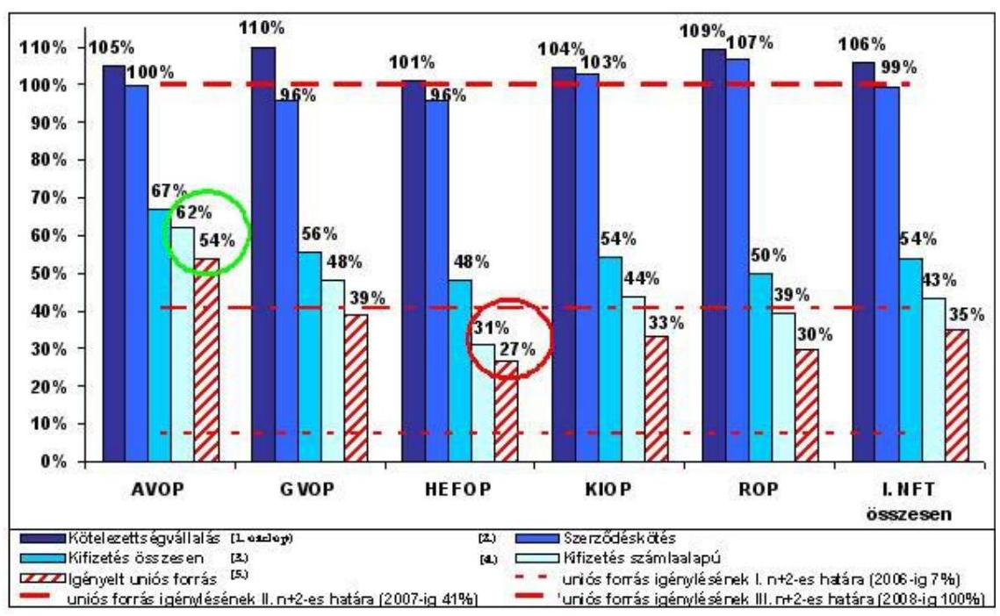

A projekt-, vállalkozói kiválasztási, szerződéskötési ciklusok 2005-ig tartottak és 2006-tól a fizikai megvalósításnak, illetve a kifizetéseknek a teljesítése és követése, a hátralékoknak a ledolgozása vált a monitoring rendszernek a legfőbb feladatává.

Az ábrán szereplő számlaalapú kifizetések aránya programonként változó volt (31% HEFOP és 62% AVOP), amely egyfelől az Operatív Programok különböző projekt összetételéből és a fizikai megvalósítás ütemezési különbségeiből, másfelől az eltérő teljesítményekből következett.

Az EU támogatási források felhasználását irányító intézményrendszer működtetése során a monitoring rendszer az integráló funkciót is betöltötte.

A 2007 évi FIT számára készült előterjesztés, továbbá az ÁSZ NFT I-re kiterjedő 2006 évi jelentése korábban jelezte, hogy valamennyi strukturális alapot tekintve az „n+2"-es határ ${ }^{44}$ 2008. évben válik igazán élessé. Az AVOP-HOPE és a ROP-ESZA kifizetési elmaradások miatt a 2007-es határ elérése kritikus lehet. A körülmények azt mutatták, hogy a nem megfelelő teljesítés kockázatai 2008 évben az előrejelzések alapján továbbra is magasak. Ennek legfőbb okai visz-

[^0]
[^0]:    ${ }^{44}$ Az uniós források felhasználhatósági szabálya értelmében („n+2-es szabály") a rendelkezésre álló teljes uniós keretet akkor tudja Magyarország felhasználni, ha az összeget a kedvezményezetteknek az elszámolt számlák alapján kifizették, és 2008 év végéig az összeget az uniótól Magyarország megigényelte illetve lehívta.

---

szavezethetők voltak a szakmai monitoring költség- és idő adatokkal kapcsolatos előrejelzési funkciójának hiányosságaira, mivel nem épült ki a projektmenedzsmentnek a költségirányítási és előrejelzési rendszere. Nem alkalmazták a kritikus úton lévő tevékenységek kezelésének szervezési módszereit a nagyprojekteknél. Az „n+2-es" terv és tényadatok összehasonlítási problémáit előbbieken kívül az EMIR-ben kezelt támogatási szerződések aktualizált és megfelelő pontosságú, időtávú adatfeltöltési hiányosságai is okozták. Az egyes SA támogatási források felhasználása során programonként a következők jellemezték az Operatív Programok célrendszerének teljesítését elsősorban az „n+2"-es határ szempontjából.

Az AVOP célok teljesülésének, egyben a monitoring és ellenőrzési tevékenység eredményességének egyik legátfogóbb mutatója az „n+2 szabály" szerinti kifizetések alakulása volt. Az AVOP már 2005. végéig 103%-ra teljesítette azt a kifizetési minimumot, amely alapja a 2006. 12. 31-ig benyújtandó igénylés teljes összegének ${ }^{45}$. A hasonló értéket 2006 végére 163%-ra, a 2007. évi „n+2-es" szintet pedig 132%-ra teljesítette. Ugyanakkor a teljesítésnek ez a szintje a 2008. év végéig lehívandó összegnek az 54%-a volt.

A GVOP: a 2007. 01. 04-i adatok szerint a hatályos szerződések összege elérte a 95%-ot, a kifizetett összeg 54%-os arányú volt. A számla alapú kifizetések aránya 48% volt, amely meghaladja az „n+2 szabály" alapján 2006. év végére tervezett 23%-os arányt.

A HEFOP-ban a számlaalapú kifizetések aránya 31% volt 2006. év végén, és ez a körülmény a kockázatok fennmaradását tükrözte az „n+2 szabály" szempontjából.

A KIOP IH 2006. december 31-i helyzetelemzése szerint a támogatási keret 107%-a volt kiviteli szerződésekkel lekötve. A támogatási keret 54%-át utalták át az elvégzett teljesítményekkel arányosan a kivitelezők részére. A számla alapú kifizetések aránya 44% volt.

A KA előrehaladásának helyzetelemzése szerint, amelyet a következő 3. számú ábra mutat, a meghirdetett tenderek értéke a várható összköltség EU támogatási részének 75%-át érte el; a támogatási keret 59%-a volt kiviteli szerződésekkel lekötve; és a támogatási keret 26%-át utalták át az elvégzett teljesítményekkel arányosan a kivitelezők részére.

A monitoring tevékenység nem követte nyomon a támogatott projektek hozzájárulását a program színtű célok teljesítéséhez. Ennek eredményeként, a 2007. február 1-én aktuális adatok alapján, a régiók közötti kiegyenlítődés nem következett be, mivel a legtöbb támogatás összegszerűen és szerződésszám szerint is az eddig is legfejlettebb Közép-Magyarországi Régióba áramlott. (1. sz. táblázat)
${ }^{45}$ Jelentés a Kormány részére a SA felhasználásáról, 2005. december 31. (2006. március).

---

# 1. sz. táblázat 

| Régió | Beérkezett   pályázat, db | IH által tá-   mogatott   pályázat, db | Hatályos   szerződés,   db | Kifizetések   száma, db | Kifizetett   összeg   M Ft |
| :-- | --: | --: | --: | --: | --: |
| Nincs megadva   régió | 1349 | 124 | 123 | 118 | 5759 |
| Dél-Alföld | 5854 | 2805 | 2447 | 1903 | 60776 |
| Dél-Dunántúl | 3935 | 1657 | 1477 | 1205 | 37049 |
| Észak-Alföld | 6136 | 2882 | 2523 | 1893 | 62437 |
| Észak-   Magyarország | 4883 | 1907 | 1654 | 1242 | 53412 |
| Közép-Dunántúl | 3490 | 1582 | 1317 | 965 | 31773 |
| Közép-   Magyarország | $\mathbf{11608}$ | $\mathbf{5856}$ | $\mathbf{4695}$ | $\mathbf{3296}$ | $\mathbf{84911}$ |
| Nyugat-Dunántúl | 3604 | 1651 | 1453 | 1146 | 30922 |
| Összesen | $\mathbf{40859}$ | $\mathbf{18464}$ | $\mathbf{15689}$ | $\mathbf{11768}$ | $\mathbf{367039}$ |

## 3. ábra

A KA környezetvédelmi és közlekedési projektjeinek előrehaladása hazai társfinanszírozás nélkül, 2000-2006 (M EUR)
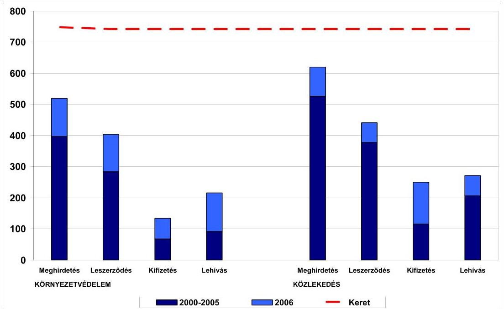

Adatforrás: EMIR
A KA stratégiában a magyar kormány deklarált célja az volt, hogy az egyes projektek - a költség-haszon elemzés alapján - maximális támogatási szintet

---

érjenek el. A KA támogatásaiból folytatódó - korábban megkezdett - ISPA projektek finanszírozása során az EU források és a magyar költségvetés aránya elsősorban a vasúti projekteknél -, a magyar költségvetés terheit növelve romlott a tervezett helyzethez képest a 2006. év végi pénzügyi mutatók szerint. A rendelkezésre álló dokumentumok szerint a támogatási arány romlása a magyar költségvetés terhére folytatódott, mivel a régi ISPA és új KA projektek egy részénél további költségtúllépések várhatóak. A tulajdonosi és szakmai felelősség érvényesítése és a vasúti projektek további költségtúllépésének kezelése érdekében a KA IH kezdeményezte a többletköltségek GKM fejezeten belüli biztosítását.

Az NVT előrehaladását a következő 4. sz. ábra és az 5. sz. melléklet mutatja az MVH a 2007. 2. heti - monitoring - jelentésének alapján.

# 4. sz. ábra   NVT keretek és kifizetések 2006.12.31-ig intézkedésenként 

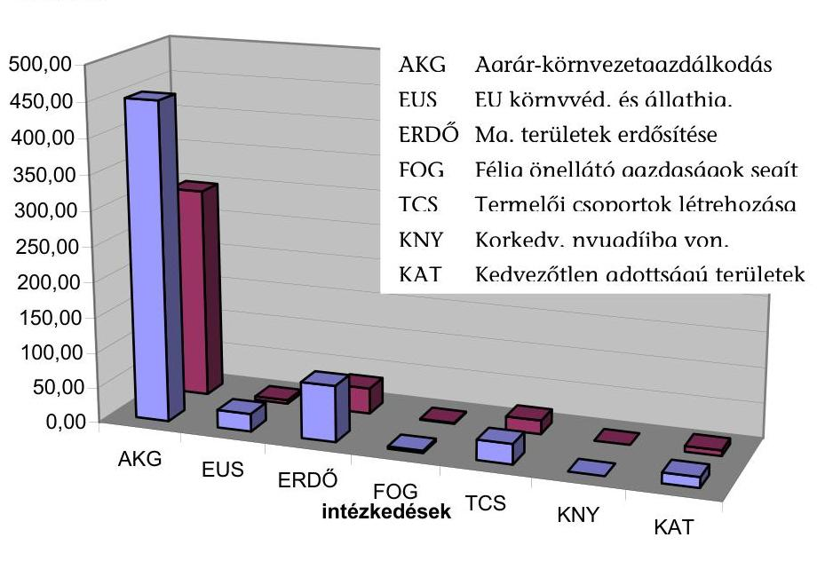

2004-2006 NVT keret
■ kifizetések 2006.12.31.-ig EU+Hazai

Phare és Átmeneti Támogatás, a Schengen Alap és az EDM esetében a tapasztaltak szerint a monitoring rendszer a források felhasználásának rendszeres vizsgálatára terjedt ki, projekt és program szinten egyaránt. A pénzügyi monitoring rendszer az előírásoknak megfelelően működött projekt és programszinten egyaránt, de nem mindegyik program esetében tudta teljes mértékben biztosítani, hogy az EU-s forrásokat magas kihasználtsággal vegyék igénybe a részt vevő szervezetek. Az EU által megjelölt 2006. december 31-ig a Schengen Alap 98,1%-át, 158,9 M eurót (PMC-vel együtt), a 2004. évi Átmeneti Támogatás 75,9%-át sikerült szerződéssel lekötni. Az utolsó, 2003. évi Phare támogatásnak a 2005. november 30-i határidőre a források 97,3%-át, 122,6 M eurót kötöttek le. Magyarország a Phare program keretében 1990-2003 között 1466,9 M€ támogatást használhatott fel, aminek a 95,1%-át, 1395,5 M eurót kötött le szerződéssel és

---

1310,0 M euró került kifizetésre, a rendelkezésre álló összeg mintegy 94,0%-a. A helyszíni ellenőrzés időszakában az NFÜ-ben nem tervezték a Phare program teljes életciklusa értékelésének elemzését.

A SAPARD támogatások indulásakor a monitoring és ellenőrzési célkitűzéseket rögzítették, és ütemezés szerint megvalósították, amelyek megfeleltek a támogatási céloknak. A SAPARD támogatások kötelezettségvállalási, kifizetési adatait a következő 5. sz. ábra és az 6. sz. melléklet tartalmazza. Az 5. sz. ábrából látható, hogy a kitűzött célok időarányosan összességében megvalósultak.

# 5. sz. ábra   SAPARD keretek és kifizetések 2006.12.31-ig intézkedésenként 

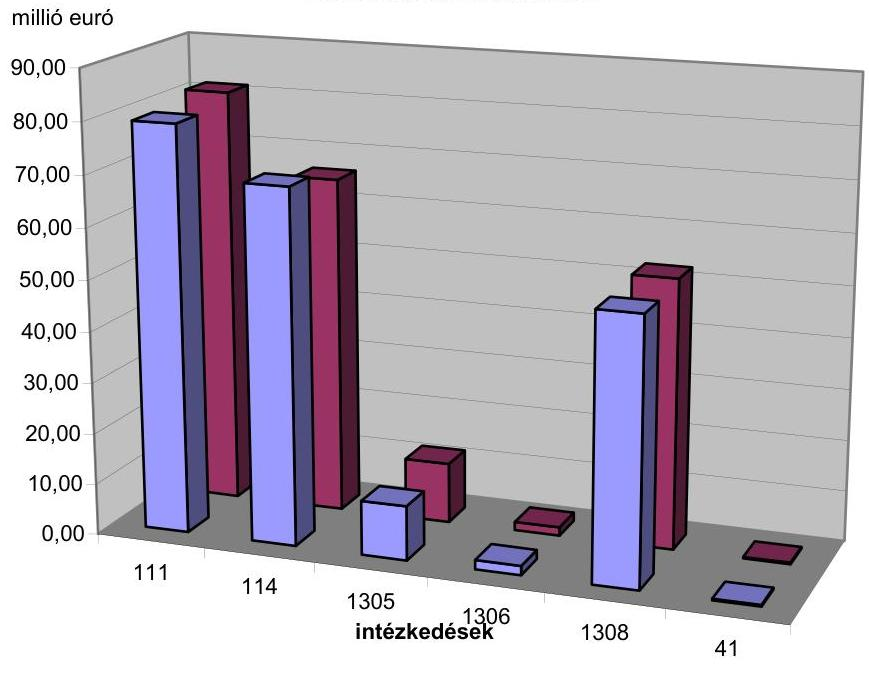

- Keretek ■Összes kifizetés

A Közösségi Kezdeményezések eredményeit követték és értékelték a 2007. februári FIT előterjesztésben foglaltak és a következő 6. ábra szerint. A monitoring elemzések szerint az EQUAL és az INTERREG programokban a 2007. évben, de különösen a 2008. évre vonatkozóan az „n+2"-es határ elérése terén a kockázatok magasak. A 10 milliárd forint támogatási kerettel rendelkező EQUAL programban a kifizetések felét az előlegek jelentették. A 2008-as forrásvesztés elkerülése a projektek gyorsabb megvalósítását igényli a számlaalapú kifizetések növelésével. A mintegy 19 milliárd forint támogatási kerettel gazdálkodó INTERREG program előrehaladása elmaradt a tervezettől. A számlaalapú kifizetések ütemének gyorsítása a fizikai megvalósítás gyorsítását tette szükségessé.

---

# 6. sz. ábra 

Kötelezettségvállalások, szerződéskötések, kifizetések és uniós igénylések aránya a hároméves kerethez viszonyítva a Közösségi Kezdeményezések esetén (%)
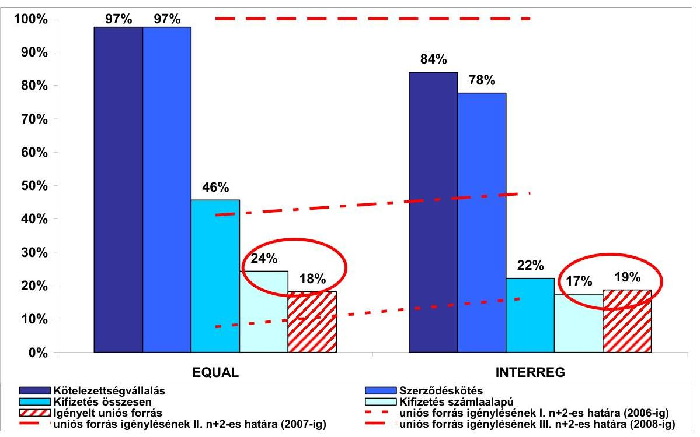

Adatforrás: EMIR és IMIR, 2006. december 31.
Előfordultak olyan esetek, amikor a SA tekintetében a projektcélok tartása mellett nem volt biztosított a programcélok elérése. Az eltérések tendenciáját a monitoring rendszer nem jelezte időben, mivel az eredmény és hatásmutatók alakulásának prognosztizálása nem volt teljes körű a projekt kiválasztási ciklusban.

A monitoring rendszer megkésetten és utólag mutatta ki azt, hogy az NFT I. önkormányzati projektjeinek kistérségek közötti megoszlása aránytalanságokat mutat, továbbá az egyes leghátrányosabb kistérségek aránytalanul kis támogatásban részesültek. Az MB-k szerepe az ilyen jellegű problémák kialakulásának megelőzésében nem volt hatékony, mivel nem volt országos stratégia a kistérségi forrásallokációra, a leghátrányosabb kistérségek pályázat előkészítésének támogatására.

A KIOP esetében a naturális közlekedési célok kijelölése (például a hálózatfejlesztési úthossz meghatározása) és a teljesítés vezérlése során a közlekedési szakmai monitoring tevékenység nem érzékelte időben a támogatásközvetítési folyamatok úttípustól (elkerülő út, útpálya-megerősítés, négynyomúsítás) függő költséghatékonysági és tervezési problémákat. Ugyanis a programcélok teljesítésének elemzése nem vált a pályázatok értékelési folyamatának részévé, az output-, az eredmény- és a hatásmutatókat, továbbá a költséghatékonyság jövőbeni
 alakulásának szempontjából. A KIOP támogatási stratégiájában lefektetett közlekedési

---

prioritásban kitűzött célok elérése érdekében a monitoring rendszer a támogatási szerződéskötéseket követően már nem tudott érdemi befolyást elérni.

A KA támogatási forrásainak felhasználása során, a támogatásközvetítő folyamatokban a költségtúllépési és késedelmes megvalósítási tendenciák időbeni felismeréséhez - a műszaki, gazdasági előkészítés hiányában - nem álltak rendelkezésre megbízható, megfelelő pontosságú költség, erőforrás és ütemezési tervadatok.

A több szintű monitoring rendszer működtetéséhez - a Lebonyolító Testületeknél és elsősorban a GKM KSZ-nél -, az eredményességet befolyásoló (költségre, ütemezésre vonatkozó) előrejelzések megbízhatóságának ellenőrzéséhez, értékeléséhez nem voltak biztosítottak a szükséges szakmai projektmenedzseri kapacitások.

# 2.2. A monitoring indikátorok alkalmazása 

A KTK IH-nál tapasztaltak szerint időben nem alakították ki a teljesítés méréséhez és az elemzésekhez szükséges indikátorok előállítását biztosító rendszert (az indikátor mutatók előállításának metodikáját, az adatszolgáltatásért felelős szervezeteket). Ugyanakkor a jelentéstételi rendszer pozitív fejleménye volt 2006-ban, hogy a jelentések a monitoring indikátorok előrehaladását is bemutatják, de nem teljes körűen.

Például a KIOP-nál pozitív fejlemény volt az ÁSZ legutóbbi ellenőrzése óta, hogy a KIOP KSZ-ek jelentései kitértek az indikátorok alakulásának értékelésére, valamint továbbfejlődött az „n+2" tervezési tevékenység. ROP-ban és a SAPARD-ban az alkalmazott monitoring indikátorok a megvalósítás folyamatában jól mutatták az eredményességet. A HEFOP esetében az indikátor célértékek teljesüléséről kizárólag az EMIR adataira támaszkodva nem lehet beszámolni. Az indikátorrendszert az IH kezdeményezésére 2006-ban felülvizsgálták, az intézkedési terv végrehajtása folyamatban volt. Az indikátor célok eléréséhez az Operatív Program hozzájárult, de teljesülésük nem csak az Operatív Program megvalósulásának függvénye. A KA indikátorai a vasúti projektek esetében alkalmatlanok voltak a nemzetgazdaságossági haszon és a költséghatékonyság mérésére, mivel például a tervezett és megépült használt és új sínfolyómétereket nem különböztették meg monitoring indikátorként, valamint az indikátorokat nem használták fel arra, hogy kövessék az EU normáknak megfelelő tervezési sebesség ( $160 \mathrm{~km} / \mathrm{h}$ ) alakulását a támogatásban részesült vasúti vonalszakaszok teljes hosszában. A Phare és Átmeneti Támogatás, a Schengen Alap és az EDM támogatási források felhasználása során az alkalmazott monitoring indikátorok projektszinten input, output és eredménymutatókat, egyes alprogramoknál hatásmutatókat is magukba foglaltak. Programszinten eredmény és hatásmutatókat nem alkalmaztak, ennek következményeként a támogatási program felhasználását teljesítmény-szemléletben nem értékelték. Az eredménymutatók hiányának oka egyrészt a nem megfelelő célkijelölés volt, másrészt az összetett, heterogén programok. Hatásmutatókat a Schengen Alap tekintetében a program rövid múltja miatt még nem alkalmaztak.

---

# 2.3. A támogatások hatékonyságát és költségtakarékosságát célzó intézkedések és hasznosulásuk 

A monitoring tevékenység 2006-ig elsősorban az abszorpciós előrehaladás biztosítására, ill. az uniós források fogadási képességének fejlesztésére irányult. 2007 évtől az eredményszemlélet nagyobb hangsúlyt kapott a programmenedzsmentben. Az uniós források felhasználása során elért célok teljesítésének bemutatása elsősorban a pénzügyi monitoring tevékenységen alapult. A MB-k ülésein és a jelentéstételi eljárásokban a szakmai monitoring hiányosságai miatt háttérbe szorult a költséghatékonyságot elemző tevékenység, különösen a nagyprojektek esetében. A monitoring tevékenységben az eredményszemléletet tekintve és gyakorlati szakmai monitoring alakulását értékelve a tapasztalatok azt mutatták, hogy nem alakították ki az egységes módszertani megközelítést, hiányzott a minőségirányítás és nem érvényesítették a „legjobb gyakorlat" alkalmazásának elvét. A projektszintű és programszintű célrendszer érvényesülését nem követték a pályázatértékelési folyamattól kezdődően. Nem vizsgálták teljes körűen az egyes projektek hozzájárulását a program szintű célok elérése szempontjából a pályázat kiválasztási fázisban. Nem alakították ki az összes program és projekt ciklusra kiterjedően a támogatások hasznosulását követő egységes jelentéstételi rendszert. Nem volt a 2004-2006-os időszakra egységes nemzeti stratégia az EU források felhasználására. Ehhez hozzájárult az, hogy az indikátorok nem voltak teljes összhangban a mérhetőség, a gazdaságosság és a költséghatékonyság szempontjaival. Az indikátorokat ezért többször áttervezték, továbbfejlesztették. A projekt, program indikátorok egymásra épülésének hiányosságai a program szintű összteljesítmények értékelését tette nehézkessé, mert a program indikátorok teljesítésének mérése nem a projektindikátorok eredményeinek összesítésére, hanem különböző modellek szerinti értékelésre épült. A több éves megvalósítású projektek hatásindikátorainak tényleges alakulása nagyrészt az utánkövetési időszakban lesz majd mérhető. Ugyanakkor a közreműködő szervezetek tervszinten sem rögzítették a mutatókat megfelelően az EMIR-ben.

A kötelezettségvállalás 51%-át fizették ki több, mint 11 ezer kedvezményezettnek. Ugyanakkor az EU-s forrásokat kezelő intézményrendszer 2007 márciusában 30 milliárd forinttal tartozott 2700 pályázónak, amelyek esetében 90 napnál volt régebbi a kedvezményezettek kifizetetlen számlája, a 60 napos határidőt meghaladóan. Az NFÜ elindított egy intézkedés csomagot a hátralékok ledolgozására, az ellenőrzések racionalizálására és ösztönzési rendszer alkalmazására. ${ }^{46}$

A KTK IH-nak feladata volt elsősorban az operatív programok irányító hatóságai tevékenységének a koordinálása, valamint a Közösségi Támogatási Keret megvalósításának a nyomon követése, alapvetően az EMIR segítségével. A monitoring eredmények alapján felmerülő és szükséges beavatkozásokra közvetett hatáskörrel rendelkezett. Az egyes operatív programok végrehajtásának nyomon követése érdekében az előrehaladásról a közreműködő szervezetek rendszeresen beszámoltak az irányító hatóságoknak. A KTK Irányító Hatóság szer-

[^0]
[^0]:    ${ }^{46}$ Az okok részletes feltárását a 2006 évi NFT I ÁSZ ellenőrzési jelentés tartalmazza.

---

vezésében havonta ülésezett a KTK Irányító Bizottság, amely üléseken az Irányító Hatóságok mellett a Kifizető Hatóság (továbbiakban: KH) és az ellenőrzésért felelős pénzügyminisztériumi egység is részt vett. A szükséges egyszerűsítési, gyorsítási lépéseket, az EMIR fejlesztések fő irányait az Irányító Bizottság megtárgyalta, az egyes intézkedések az intézményi szereplők egyetértésével történtek.

A HEFOP Monitoring Bizottsága működésének értékelése szerint az OP végrehajtás hatékonyságát és minőségét az IH folyamatosan figyelemmel kísérte. A helyszíni ellenőrzés keretében lefolytatott monitoring látogatásra - amely a projekt megvalósítás nyomon követésének, a megvalósítás ellenőrzésének a leghatékonyabb eszköze volt - a jövőben is nagy hangsúlyt kell fektetni.

Kohéziós Alap esetében a KA MB tevékenységében érvényesült a programcélok elérésének követése, elsősorban az előrehaladás és pénzfelhasználás mértékét értékelő és elemző tevékenység, a támogatási politikák pozitív irányú befolyásolása. Ugyanakkor a volt ISPA projektek esetében a fizikai megvalósítás szakaszában a műszaki-gazdasági előkészítési hiányosságok kisebb korrigálására volt csak mód.

Az NVT MB üléseinek emlékeztetői az NVT-előkészítés sorozatos hiányosságait jelezték. Az NVT 2004. évi módosítását a MB 2004.12.17-i ülésén megtárgyalta és jóváhagyta, amelyet a Bizottsághoz benyújtottak 2004.12.23-án. A módosítás a 2004. évi NVT források 25%-ának (56,6 millió euró) a kiegészítő nemzeti közvetlen kifizetések (top-up) társfinanszírozásra átcsoportosítását tartalmazta. Az eredetileg benyújtott kérelem módosítását tette szükségessé az NVT MB döntését vitató szakmai és társadalmi szervezetek Bizottsághoz benyújtott kifogása, továbbá 2005. márciusában megtartott gazda-demonstrációt lezáró Megállapodás is. ${ }^{47}$ Az NVT MB 2005. 10.28-án elfogadta az NVT újabb módosítását. Az előzetes egyeztetést meghatározta az a többségi vélemény, miszerint komolyabb megalapozó munkák és egyeztetések előzzék meg a módosítás benyújtását. A módosítási javaslat 2005. december 28-án benyújtásra került a Bizottsághoz, de a módosítás nem lépett hatályba 2005-ben, 2006-ban visszavonásra került. Célja elsődlegesen a top-up pénzügyi fedezetének növelése volt. A 2005. évi módosítási kérelem többek között pénzügyi átcsoportosítást kezdeményezett a top-up intézkedésre (105,3 millió euró) és AKG-ra (23,6 millió euró). A Bizottság 2006.12.29-i legutolsó határozatával életbe lépett indikatív pénzügyi táblát a 7. számú melléklet tartalmazza.

Phare és Átmeneti Támogatás, a Schengen Alap és az EDM támogatási programok felhasználásának tapasztalatai szerint a magas kockázati tényező a közbeszerzési eljárások sikertelenségéből adódott. A jelenlegi megvalósítási gyakorlat miatt nem állt rendelkezésre tartalékidő és erőforrás (idő, projekt) újabb közbeszerzési eljárás megtartására. Időben nem határozták meg az előkészítési kontroll pontokat és ezáltal nem volt lehetőség újabb eljárás megindítására.

A monitoring intézkedések hasznosulásának helyzetét csak közvetetten, például az abszorpciós (pénzügyi) előrehaladás mértékén keresztül és nem kellő gyakorisággal, elsősorban eseménykövető jelleggel értékelték. A jelentések nem tér-

[^0]
[^0]:    ${ }^{47}$ "Jelentés Magyarország NVT-nek a 2005. évi megvalósításáról" Bizottságnak benyújtva 2006.12.20.

---

tek ki a monitoring által kezdeményezett intézkedések (például a fizikai folyamatok gyorsítására) hasznosulásának mértékére. A monitoring intézkedések hasznosulása operatív programonként, szakterületenként és projektenként eltérően alakult. A monitoring rendszer működése szempontjából, különösen a nagyprojektek esetében az előkészítési szakasz nem esett az IH-k kompetenciájába, kedvezményezettek feladata volt és ez a körülmény korlátozta a későbbi fázisban hozott intézkedések eredményességét.

Az AVOP megvalósítása során monitoring és ellenőrzési visszajelzések helyességének és kezdetektől való kielégítő hasznosításának az eredménye volt, hogy a számla alapú kifizetések átfutási ideje csökkent. A 100%-os lehívás sikerességét vetítette előre az a monitoring információ, miszerint a fenti eredmények a pályázatok csökkenő darabszáma mellett valósultak meg. ${ }^{48}$

A KIOP esetében a korábbi - költséghatékonyságot érintő - NFT I ÁSZ ellenőrzési megállapítások hasznosítására korlátozott volt a lehetőség, mivel a támogatási forrásokat már lekötötték. A PkD-ban vállalt közúti hálózatfejlesztési cél elérésére - a megépítendő 260 km-es összes útpályahosszt tekintve - hiányoztak a műszaki és gazdasági feltételek.

A ROP-nál alkalmazott gyakorlat szerint a monitoring tevékenység keretében előre meghatározott eljárások és indikátorok kialakítását írásban rögzítették. Így azok alkalmazása hozzájárult a támogatások hatékony és költségtakarékos felhasználásához. A hatékonyság és eredményesség egyik mérőszáma volt a 2004-2006 évekre ütemezett kötelezettség-vállalások és azok teljesítésének összevetése. Ennek alapján eredményesen működtek a monitoring rendszerek, mivel a szerződéskötések üteme és a kifizetések aránya összességében megfelelt a célkitűzéseknek. A célkitűzésekben vállalt projektek megvalósultak, illetve megvalósításuk folyamatban van. Ellenőrzésük a szabályzatoknak megfelelően folyamatosan történt.

A KA, a volt ISPA vasúti projekteknél kialakult műszaki-gazdasági előkészítési hiányosságok a projektek későbbi fázisaiban menedzselési nehézségeket okoztak. Az előkészítési hiányosságokkal kapcsolatos korrekciós intézkedéseket fáziskésésekkel, időközben megváltozott felelősségi viszonyok mellett valósította meg, kontrollálta a KA KSZ és LT irányítási és ellenőrzési rendszere. A KA LT 2005 és 2006. évi teljesítménytípusú belső ellenőrzéseinek, a saját monitoring rendszerének előrevivő javaslatait, amelyek figyelembe vették az ÁSZ korábbi megállapításait, a programirányítás nem megfelelően hasznosította. A magyar költségvetés az eredeti terveket meghaladóan további társfinanszírozási forrásokkal egészítette ki a rendelkezésre álló hazai támogatási forrásokat a programcélok fenntarthatósága érdekében. Ugyanakkor nem sikerült elérni, hogy ezzel arányosan bővüljenek az EU támogatási források is az érintett projekteknél. Más közlekedési és környezetvédelmi projekteknél a KA monitoring rendszerének az eredményességét mutatta viszont az, hogy pénzügyi átcsoportosításokkal teljesen új beruházásokat indítottak el. Például az M0 keleti szektor építésén keletkezett megtakarítás terhére elindult az M31-es ún. Gödöllői átkötés megépítése. A megvalósulás alatt álló Budapest központi szennyvíztisztító beruházásában keletkező megtakarítások egy része az eredeti projektcélhoz kapcsolódó új műszaki tartalmak támo-

[^0]
[^0]:    ${ }^{48}$ Előterjesztés a Kormány részére a SA alapok és a KA felhasználásának helyzetéről a 2006.12.31-i állapot szerint (2007.01.30.)

---

gatását tette lehetővé, valamint tervezik más projektekre (Pécs további területének csatornázása, Üröm-Csókavár kármentesítő projekt) átcsoportosítani.

Phare és Átmeneti Támogatás, a Schengen Alap és az EDM támogatási források felhasználása során az eredmények és a teljesítmények mindenre kiterjedő
 szakmai monitoring tevékenysége részlegesen valósult meg. A projektek szakmai minősítésére, értékelésre nem került sor teljes körűen, a hatásokat nem összegezték. Ebből eredően a monitoring rendszer részben tudta betölteni a szerepét.

# 2.4. Az átláthatósági és megbízhatósági kritériumok teljesülése 

Az átláthatósági és megbízhatósági kritériumok teljesültek a pályázati és pénzügyi folyamatok adatkezelése során. Az Operatív Programok monitoring rendszerének áttekintése és az EMIR működtetési tapasztalatai alapján a heti, havi, negyedéves és éves monitoring jelentések átlátható, megbízható és valós képet adtak a célkitűzésekben vállalt projektek megvalósulásának pénzügyi üteméről. A nyilvánosság elvét is érvényre jutatták az EMIR fejlesztésénél és hozzáférési jogosultságok szabályozásánál.

A KA monitoring jelentéseinek rendszere a támogatások pénzügyi felhasználásáról megbízható és valós kép kialakítását tette lehetővé. ${ }^{49}$ A 2006 második félévében és 2007 januárjában alapvetően megváltozott intézményi keretek között is a monitoring rendszer működőképessége biztosított volt, mivel a KA IH, GKM KA KSZ, KIOP IH és KIOP KSZ Monitoring osztályok munkatársai felkészülten látták el feladataikat. Ugyanakkor a működő monitoring rendszer a korábbi években kialakult műszaki és gazdasági előkészítés során keletkezett költség és minőség cél közötti ellentmondásokat nem tudta időben megoldani.

Az output, eredményességi és hatékonysági mutatók előállítási és minőségbiztosítási rendszerét egységesen nem szabályozták. Előfordult olyan eset, hogy egy átfogó értékelés hiányos adatszolgáltatásokon alapult.

A KTK felhasználásáról az EU Bizottság részére évente beszámoló készült. A 2005. évi beszámoló - az indikátorok értékelésén keresztül - bemutatta a KTK céljainak teljesülését. Az ellenőrzésünk során áttekintettük a globális hatásmutatóként definiált „a KTK hatásának tulajdonítható további munkavállalók száma" indikátor meghatározásának módját és a jelentésben szereplő 53 ezer „új munkahely" tényadat megalapozottságát. A bemutatott adatot alátámasztó dokumentációt a beszámoló benyújtásért felelős NFÜ-től nem, csak közvetlenül az előállító szervezettől lehetett beszerezni. Az adatok elkészítésének eredeti célja nem monitoring hanem vezetői információs tevékenység volt. Mivel az adatlap a benyújtott és nem csak a támogatott pályázatok adatait tartalmazta, így a legyűjtés nem támasztotta alá az éves monitoring jelentésben megadott indikátor adatot. Jelen ellenőrzés keretében az ellenőrzött fél nem tudta reprodukálni és té-

[^0]
[^0]:    ${ }^{49}$ A monitoring tevékenységben a projektcélok részletes követése, a korrekciós lépések tervezése és ajánlása elsősorban operatív szinten a heti „follow up" üléseken, havi monitoring értekezleteken valósult meg.

---

nyekkel alátámasztani a 2005. évi jelentésben megadott „új munkahelyekre" vonatkozó adatokat. (Az adatszolgáltató tájékoztatása szerint az új munkahelyekre vonatkozó adatok az EMIR adatbázisban lévő, a benyújtott pályázatok adataiból származtak, a pályázati adatlapból került rögzítésre. Az adatok nem az előrejelzés indikátor tábla, hanem a pályázati adatlap adatait tartalmazták.)

# 3. Ellenőrzési Rendszer 

Az Európai Unióból érkező - hazai költségvetési és a kedvezményezettek saját forrásaival kiegészülő - támogatások ellenőrzései - az alábbiakban részletezett kevés eltéréssel - a jogszabályoknak megfelelőek, eredményesek voltak. Hatékonyságuk korlátozott volt egyrészt a rendszerben meglévő párhuzamosságok, másrészt az ellenőrzések költségeit figyelmen kívül hagyó menedzsment miatt. A támogatott projektek eredményes megvalósítását az ellenőrzések korlátozottan tudták segíteni az ellenőri humán erőforrások szűkössége miatt. (Kivételt képeztek az átfogó ellenőrző hatáskörrel rendelkező szervek - KEHI, NFH/NFÚ, valamint az agrártámogatásokat ellenőrző MVH.)

Az uniós támogatások ellenőrzéseinek megvalósítására támogatáscsoportonként eltérő jogszabályrendszer vonatkozott. ${ }^{50}$, amely a 2006. évi EU jogszabályoknak megfelelően folyamatosan változott. A támogatásközvetítő intézményrendszerben lévő szervezetek többsége költségvetési szerv, ezért alkalmazni kellett a rájuk vonatkozó kormányrendeletet ${ }^{51}$ is.
${ }^{50}$ A strukturális alapok keretében nyújtott támogatások irányítási és ellenőrzési rendszerei tekintetében az 1260/1999/EK tanácsi rendelet végrehajtása részletes szabályainak megállapításáról szóló, a Bizottság 2001. március 2-i 438/2001/EK rendelete, A Kohéziós Alapból nyújtott támogatások irányítási és ellenőrzési rendszere, valamint a pénzügyi korrekciós eljárás tekintetében az 1164/94/EK tanácsi rendelet végrehajtására vonatkozó részletes szabályok megállapításáról szóló, a BIZOTTSÁG 2002. július 29-i 1386/2002/EK rendelete Az Európai Unió Európai Mezőgazdasági Orientációs és Garancia Alap Garancia Részlegéből finanszírozott intézkedések pénzügyi, számviteli és ellenőrzési lebonyolítási rendjéről szóló 92/2004. (IV. 27.) Korm. rendelet, az európai uniós előcsatlakozási eszközök és az Átmeneti Támogatás felhasználásának pénzügyi tervezési, lebonyolítási, számviteli és ellenőrzési rendjéről szóló 119/2004. (IV. 29.) Korm. rendelet, a Schengen Alap felhasználásának pénzügyi tervezési, lebonyolítási és ellenőrzési rendjének kialakításáról szóló 179/2004. (V. 26.) Korm. rendelet, Az INTERREG III Közösségi Kezdeményezés programok végrehajtásának részletes szabályairól szóló 359/2004. (XII. 26.) Korm. rendelet, a Nemzeti Fejlesztési Terv operatív programjai, az EQUAL Közösségi Kezdeményezés program és a Kohéziós Alap projektek támogatásainak fogadásához kapcsolódó pénzügyi lebonyolítási, számviteli és ellenőrzési rendszerek kialakításáról szóló 360/2004. (XII. 26.) Korm. rendelet, az Európai Unió strukturális alapjaiból, valamint Kohéziós Alapjából származó támogatásokhoz kapcsolódó költségvetési előirányzatok felhasználásának részletes szabályairól szóló 6/2005. (III. 23.) TNM-FMM-FVM-GKM-KvVM-PM-TNM együttes rendelet, az EQUAL Közösségi Kezdeményezés fejezeti kezelésű előirányzat felhasználásával kapcsolatos szabályokról szóló 33/2004. (XII. 23.) FMM rendelet.
${ }^{51}$ A költségvetési szervek belső ellenőrzéséről szóló 193/2003. (XI. 26.) Korm. rendelet.

---

Az unióval való elszámolás keretében a kifizetések megfelelő igazolása érdekében a pénzügyi lebonyolító Kifizető Hatóság - kialakított ütemtervének megfelelően - végezte el a támogatások teljes rendszerének ellenőrzését.

# 3.1.1. Folyamatba épített ellenőrzések 

Minden támogatási forma esetében megfelelően szabályozták a FEUVE elemeit a kezdeti időszak gondjai után. Az eljárási szabályokat a kézikönyvek megfelelően szabályozták, mindegyikük tartalmazta a részletes eljárásrendet, az ellenőrzési pontokat. A szabályozások aktualizálása az intézményi változások miatt a helyszíni ellenőrzésünk idején folyamatban volt.

Az NFT I. operatív programjai, az EQUAL Közösségi Kezdeményezés program és a KA felhasználásához az uniós és hazai jogi szabályozásban előírt irányítási és ellenőrzési rendszerek megváltoztak az intézményfejlesztés eredményeként. Az átalakulás alatt álló intézményrendszer új állapotnak megfelelő, aktualizált irányítási és ellenőrzési rendszerleírása elkészítésének határideje a helyszíni ellenőrzést követően járt le ${ }^{52}$.

A folyamatok pénzügyi ellenőrzése minden támogatási forma esetében megfelelt az előírásoknak. A pénzügyi lebonyolítás során alkalmazták a kifizetéseket megelőző - kockázatelemzés alapján történő - folyamatba épített ellenőrzések rendszerét, de a Pénzügyminisztérium által időben kibocsátott útmutatók ellenére még nem alakult ki a kockázatelemzés és mintavételezés megalapozott, jól rekonstruálható, magas színvonalú gyakorlata. Nem vették figyelembe a nagyprojekt profil kiemelt kockázati sajátosságait. Az intézményi átalakításokból adódóan nőtt a kifizetések időszükséglete, amely a HEFOP és a GVOP esetében - ahol a pénzügyi funkció ellátásában változott a közreműködő szervezetek rendszere - elérte a három hónapot.

A GVOP közreműködő szervezetei közül az MFB Rt-nél - a banki gyakorlatot követve - egy projektnél négy esetben végeztek helyszíni ellenőrzést, így külön véletlenszerű kockázatalapú mintavételezési eljárást nem alakítottak ki. A GVOP többi közreműködő szervezeteinél kidolgozták a kockázatalapú mintavételezés szabályait, de a 2007-2013-ig terjedő programozási időszakban az új EU előírásoknak ${ }^{53}$ megfelelő véletlenszerű mintavételezési eljárás módszertanának kialakítása és alkalmazása vált szükségessé, amely kidolgozását a helyszíni vizsgálat végéig nem kezdték meg. A GVOP közreműködő szervezeteinek intézményi átalakítása - és így az ellenőrzési tevékenység szabályozása -helyszíni vizsgálatunk idején folyamatban volt, az ellenőrzési kézikönyvek, eljárásrendek még nem álltak rendelkezésre.

A MÁK, mint a HEFOP pénzügyi közreműködő szervezete 2006. december 31-ig valamennyi intézkedés tekintetében részletesen kidolgozott és aktualizált kocká-

[^0]
[^0]:    ${ }^{52}$ Az új irányítási és ellenőrzési rendszerek IH szintű elkészítésének határideje 2007. április 30. volt. A teljesítésről a jelentéstervezet egyeztetése alatt nem kaptunk tájékoztatást.
    ${ }^{53}$ EU Bizottság 1828/2006/EK Rendelete (2006. december 8.) 17. Cikk (1) bekezdés, valamint a IV. melléklet

---

zat elemzés alapján végezte a helyszíni ellenőrzésekhez a számlák kiválasztását. Tevékenysége során működtette a FEUVE rendszerét. A szakmai tevékenység FEUVE rendszerének működtetéséért a szakmai KSZ-ek voltak a felelősek.

A helyszíni ellenőrzés feladatait a Működési Kézikönyvekben rögzítették. Az OP eljárási rendje és intézményrendszere a 2006. évben változott, de elmaradt a Működési Kézikönyv aktualizálása a helyszíni ellenőrzés végéig. A feladatokat delegáló rendeletek hiányában az intézményrendszer megváltozásából adódó változások átvezetése a Működési Kézikönyvön nem történt meg, az IH a szabályozás eszközeként kötelező érvényű körleveleket, valamint egyedi esetekben állásfoglalásokat adott ki. Az IH 2005 augusztusában kiadott Működési Kézikönyve a hatályos jogszabályi előírásoknak megfelelően tartalmazta a szabálytalansági eljárás lefolytatását.

Az EQUAL Közösségi Kezdeményezés végrehajtásának szakmai ellenőrzését az Országos Foglalkoztatási Közalapítvány EQUAL Nemzeti Programiroda, a pénzügyi ellenőrzést a Magyar Államkincstár közreműködő szervezetekként látták el.

A KA támogatások körében a GKM KSZ megfelelő szakmai, elsősorban költségszakértői felkészültség hiányában a FEUVE keretében nem felügyelte a Lebonyolító Testület tevékenységét. A 2005. évi ÁSZ ellenőrzési jelentésben foglaltak teljesítésének helyzete, függetlenül attól, hogy annak realizálását jelentette a tárca az ÁSZ felé, nem tekinthető elfogadható mértékűnek. A Lebonyolító Testület belső ellenőrzése, ugyancsak fáziskésésben tárta fel az okokat 2006-ban.

A ROP támogatások ellenőrzési kézikönyvének a jogszabályok változásainak megfelelő aktualizálása a 2007. év elejétől folyamatban volt. Meghatározták az ellenőrzési nyomvonalakat. A kockázatelemzés szempontjai megfeleltek a támogatások nyomon követésére kidolgozott módszertanoknak, az ellenőrzési rendszer gyakorlati működése megalapozta a csalások és szabálytalanságok felderítését és kiszűrését.

A mezőgazdasági támogatások egységes FEUVE rendszerét, és azon belül a szabályzatokat a PM által megjelölt határidőig ${ }^{54}$ - illetve a határidőt követő több, mint másfél éven keresztül, a helyszíni ellenőrzés befejezéséig - nem alakították ki teljes körűen. Az FVM-ben az EU támogatásokat kezelő és ellenőrző egységek nem alakították ki a FEUVE - Ámr. 145/A-C §-ok által 2004. január 1-jétől előírt - eljárásrendjét és rendszerét, továbbá az annak részeként működtetett kockázatkezelési rendszert. Az SZMSZ-ben nem szerepelt az ellenőrzési nyomvonal, valamint a szabálytalanságok kezelését rögzítő eljárásrend.

A mezőgazdasági támogatások - EMOGA, AVOP, NVT SAPARD, és a Méhészeti támogatások - ellenőrzései az FVM és az MVH szervezeti keretében valósultak meg a vonatkozó kormányrendeletek alapján ${ }^{55}$. Az ellenőrzések szabályo-

[^0]
[^0]:    ${ }^{54}$ A módszertani útmutatók 2005. január 20-án jelentek meg a Pénzügyminisztérium honlapján, illetve az - ellenőrzési nyomvonal minták kivételével - 2005. január 31-én a Pénzügyi Közlönyben. A szabályzatok elkészítésének határideje az ettől számított 90. nap, azaz 2005. május 1-je volt.
    ${ }^{55}$ A földművelésügyi és vidékfejlesztési miniszter feladat- és hatásköréről szóló 162/2006. (VII. 28.) és 155/1998. (IX. 30.) Korm. rendeletek

---

zása eltérő volt a különféle EU források (strukturális alapok, EMOGA, SAPARD) eltérő szabályozásának megfelelően. Mindegyik támogatás közvetítése az FVM feladata volt, amelyet az MVH bevonásával látott el.

Az FVM ellenőrzési szervezetének tevékenységét - a hatályos rendeleteken túl - az FVM többször módosított Szervezeti és Működési Szabályzata, valamint az Ellenőrzési Szabályzat és a Belső Ellenőrzési Kézikönyv szabályozta, amely a jogszabályban előírt határidőhöz képest közel 1 hónapos késéssel készült el.

Az Ellenőrzési Kézikönyv nem tartalmazta a 360/2004. (XII. 26.) és a 193/2003. (XI. 26.) Korm. rendelet előírásainak megfelelő változásokat, valamint elmaradt
 a Közösségi Támogatások Ellenőrzési Osztálya kézikönyvének a 2006. évre tervezett aktualizálása. Az osztály 2006. július 1-i megszűnését követően a kézikönyv az FVM Ellenőrzési Kézikönyvének részévé vált.

Helyszíni vizsgálatunk idején az átszervezés miatt az AVOP ellenőrzésével 1 fő (az osztályvezető) foglalkozott. A „négy szem elve" csak a TS keretből foglalkoztatott munkaerő alkalmazásával volt érvényesíthető.

Az FVM 2005. évi ellenőrzései szerint az AVOP IH a korábbi vizsgálatok által megállapított hiányosságokat nem teljes körűen szüntette meg. Az AVOP Működési Kézikönyvét aktualizálták, de továbbra sem írta elő a szabálytalanságok kezelésénél a „négy szem elve" érvényesülését, nem volt eljárásrend a pályázati felhívások módosítására, az intézkedések felfüggesztése kapcsán a befogadások felfüggesztésére.

A jogcímek között adminisztratív ellenőrzés és automatikus keresztellenőrzés valósult meg. A helyszíni ellenőrzésre az összes jóváhagyó támogatási határozattal rendelkező kérelmek 5%-át választották ki ellenőrzésre, annak 80%-át kockázatelemzéssel, 20%-át véletlenszerűen vették ki. Az ellenőrzés kiértékeléséig a támogatást nem fizették ki.

Az EMOGA GR irányítási és ellenőrzési rendszere négy szinten működött, és - az EU 2006. évi jogszabályváltozásai szerint - a 2007-2013 közötti időszakban működni is fog, a jogszabályok az ellenőrzési rendszert nem módosították.

Az Európai Uniót létrehozó dokumentumok, az ún. Szerződések szerint a mezőgazdasági kiadásokkal kapcsolatos kifizetéseket megosztott irányítás keretében hajtják végre, vagyis a végső kedvezményezettek felé történő kifizetéseket a tagállamok által akkreditált kifizető ügynökségek végzik. A megosztott felelősségnek megfelelően a négyszintű ellenőrzési rendszer késedelmesen épült ki. A támogatások kifizetését, az elvégzendő ellenőrzéseket ez a késedelem nem befolyásolta.

Első szintet jelentő tagállami kifizető ügynökség tevékenysége végleges akkreditációjának késése a kifizetéseket, az ellenőrzéseket nem akadályozta.

Az ellenőrzések második szintjén a kifizető ügynökségek rendszerbe épített adminisztratív, valamint helyszíni ellenőrzései a szabályoknak megfelelően működtek. A piaci támogatások ellenőrzésére az MVH a helyszíni vizsgálatok idején rendelkezett elfogadott - az 1663/95/EK Bizottsági Rendelet mellékletének 3. (i) és 10. pontjai szerinti belső és helyszíni - ellenőrzési szabályzatokkal, kockázatelemzésekkel, mintavételi rendszerrel. A Bizottság 2005-2006. években az MVH tevékenységét hét különféle alkalommal vizsgálta, ajánlásaira az MVH intézkedési terveket dolgozott ki, azok utóellenőrzése folyamatos. Az ellenőrzéseket nem támogatta megfelelő ellenőrzési nyomvonal a 2004-2005-ös pénzügyi években.

---

(A GRISZ megállapítása a 2005. pénzügyi évről szóló jelentésében.) A 2006. évre elkészült a megfelelő ellenőrzési nyomvonal, a GRISZ azt megfelelőnek tartotta.

Éves tevékenységükről készített beszámolójuk megalapozottságát a helyszíni ellenőrzésünkre kiválasztott 3 db ellenőrzési jelentésük tételes vizsgálata megerősítette.

Harmadik szinten az utólagos ellenőrzéseket a VPOP megfelelően látta el.
A VPOP (indító és kiléptető vámhivatalok) export visszatérítésekkel kapcsolatos fizikai és kicseréléses ellenőrzést végzett ${ }^{56}$. Az utólagos vállalatellenőrzéseket a Vám- és Pénzügyőrség Központi Ellenőrzési Parancsnokságán működő Különleges Szolgálat, valamint a Vám- és Pénzügyőrség Regionális Parancsnokságain működő ellenőrzési osztályok a 4045/89/EGK rendelet szerint látták el.

Az export-visszatérítéshez kapcsolódó ellenőrzéseket a Vám- és Pénzügyőrség a 386/90/EGK tanácsi rendelet szerint végezte, a rendeletben előírt feltételek érvényesítése mellett.

A 2005-ben elvégzett helyszíni ellenőrzések kiértékelése a kérelmek szintjén a kifizetések előtt megtörtént, az így feltárt hiányosságok a következő kérelmezési időszakban már módosításra, kijavításra kerültek. Az ellenőrzések kiértékelése ugyanakkor nem volt olyan mélységű, hogy a következő év kockázati szempontjait és az ellenőrizendő mennyiségeket meghatározzák.

A negyedik szintet az éves pénzügyi elszámolások, azok bizottsági ellenőrzése jelenti. A Bizottság többéves megfelelőségi vizsgálata a kifizető ügynökség éves beszámolóját az igazoló szerv igazolásával együttesen értékeli.

Az EMOGA Garancia Alapból folyósított támogatásoknál elvégzett vizsgálatok során büntető-, szabálysértési, kártérítési, illetve fegyelmi eljárás megindítására okot adó cselekmények, mulasztások vagy hiányosságok feltárására nem került sor.

Az EMOGA Garancia Részlegből teljesített mezőgazdasági kiadásokat az EU Bizottság a 2004. pénzügyi év folyamán - a GRISZ igazolásának figyelembe vételével - költségként elszámolta. A 2005. pénzügyi évre elszámolható költségek tekintetében a Bizottság felkérte a GRISZ-t az ország egész területére kiterjedő ellenőrzések egyértelműbbé tételére, azon belül a mintaválasztás tisztázására. A Bizottság a 2006. április 28-án kelt 2006/322/EK számú határozatában 6 tagállam, köztük Magyarország Garancia Részlegének számláit további intézkedésig elkülönítette. Az NVT számláit két ország, köztük Magyarország esetében szintén elkülönítették. 2006 novemberében a Bizottság helyszíni ellenőrzést végzett hazánkban, amelynek célja a korábbi ajánlások utóellenőrzése, a GRISZ munkadokumentumainak áttekintése volt. Az ellenőrzés a Kifizető Ügynökség és a GRISZ munkájára terjedt ki. Az ellenőrzés megállapításai a helyszíni vizsgálat végéig nem érkeztek meg. ${ }^{57}$ A 2005. évi számlák elszámolása az

[^0]
[^0]:    ${ }^{56}$ A Tanács 1990. február 12-i 386/90/EGK rendelete a visszatérítésben vagy egyéb támogatásban részesülő mezőgazdasági termékek kivitele során végzett ellenőrzésről.
    ${ }^{57}$ Jelen teljesítmény-ellenőrzésünk nem terjedt ki a téma tételes ellenőrzésére.

---

AGRI/61046/2007-00, a 2006. évi számlák elszámolása az AGRI/61051/200700 számú EU bizottsági döntés szerint megtörtént.

A Phare és Átmeneti Támogatás, valamint a Schengen Alap ellenőrzési rendszere eredményesen, de a mintavételezési elvek korlátozott alkalmazása miatt korlátozott hatékonysággal működött.

Az EGT és Norvég Finanszírozási Mechanizmus pénzügyi irányítási és ellenőrzési rendszert szabályozó Kézikönyve nem került kiadásra. A Megállapodások és a végrehajtási rendelet teljes és hatékony ellenőrzési nyomvonal készítésének kötelezettségét írják elő valamennyi érintett intézményben, azonban ilyen dokumentumot az érintett intézmények nem készítették. Szabálytalanságok kezelésére vonatkozó szabályzatot nem adtak ki. A kézikönyv(ek) készítésének költségeit fedező Technikai Segítségnyújtás keret felhasználására vonatkozó 2007. január 5-ei jóváhagyását követően kerül sor a szükséges kézikönyvek elkészítésére. ${ }^{58}$

Az NFÜ az Együttműködési Megállapodások aláírása és 2006. március 31-e közötti időszakról az első éves beszámolót 2006. augusztusában elkészítette, a Finanszírozási Mechanizmus Iroda részére megküldte. Végrehajtás alatt álló projekt hiányában az MB-ot nem hozták létre. Az MB felállítása 2007-ben várható.

A Europe Direct esetében a közvetítő szervezet szerepét, így ellenőrző feladatát 2006. júniusáig a Miniszterelnöki Hivatal EU Kommunikációs Főosztálya látta el, kétfős létszámmal. Az új kormányzati struktúrában a közvetítői szervezeti státusza megszűnt. A KPSZE szándéknyilatkozatot tett a közvetítői szervezeti feladatok átvállalására, de a hivatalos kijelölés a helyszíni ellenőrzés befejezéséig nem történt meg. Így a 2007. évi pályázatokat az EU Bizottság Magyarországi Képviselete hirdette meg.

Az EU tanácskozásokra a kiutazási költségek egy részét az EU évente egy alkalommal rögzített összegben megtérítette.

Az utazási költségekkel kapcsolatos elszámolást 2006 II. negyedévétől a Külügyminisztérium végzi. Az utazási költségek felhasználásáról az EU Tanács Főtitkársága részére a beszámoló elkészült. Az elszámoláskor a fel nem használt, vagy megfelelő bizonylattal alá nem támasztott tételek a következő részletből levonásra kerültek. A felhasználás szabályszerűségét a Külügyminisztériummal való elszámolás előtt a tárcák ellenőrizték.

# 3.1.2. Belső ellenőrzés 

A támogatásközvetítő rendszer minden költségvetési szervezetében működött a 360/2004. (XII. 26.) Korm. rendelet 54. §-ával összhangban - független belső ellenőrzés, amely rendelkezett ellenőrzési tervekkel, működési kézikönyvekkel, munkáját azoknak megfelelően végezte. A 2006. év közepén a strukturális és

[^0]
[^0]:    ${ }^{58}$ Az NFÜ tájékoztatása szerint a munka megkezdéséhez szükséges szerződést júniusban fogják megkötni a donor szervezet képviselőjével.

---

kohéziós alapokat kezelő intézmények átszervezése a kialakult működést néhány szervezet esetében hátrányosan módosította (az FVM belső ellenőrzési egységének függetlensége, szakmai humánkapacitás korlátok).

A FVM Ellenőrzési Főosztálya a közigazgatási államtitkár irányítása alatt 2006. július 1-ig kettő, illetve előzőleg három osztályra tagolódva látta el feladatait. A korábban - a jogszabályok ${ }^{59}$ megfelelően - közigazgatási államtitkári felügyelet alatt működő ellenőrzési egység a 2006. augusztus 1-i szervezeti összevonást követően a kabinetfőnök, mint szakállamtitkár alárendeltségébe került az Igazgatási, Informatikai és Ellenőrzési Főosztály keretében. Az ellenőrzési szervezet kormányrendeletben előírt feladatköri és szervezeti függetlensége nem biztosítható, ami a jogszabályi előírással ellentétes.

A Pénzügyminisztérium 2006 szeptemberében felhívta a figyelmet az FVM-nél tapasztalt jogszabályba ütköző, valamint az uniós és nemzetközi előírásokkal ellentétes rendelkezésekre és gyakorlatra. Az FVM az elmarasztaló észrevételekkel szemben jogszabályi ellentmondásra hivatkozott, és jogszabály módosításra tett javaslatot.

A 360/2004. (XII. 26.) Korm. rendelet 54. § (1) bekezdése szerint az irányító hatóság, közreműködő szervezet, valamint lebonyolító testületet működtető szervezet belső ellenőrzését funkcionálisan független, kizárólag e feladatok végrehajtására kialakított belső ellenőrzési részleg végzi.

Az NFÜ Belső ellenőrzési egysége felelt szervezeti egységeinek belső ellenőrzéséért, valamint az uniós támogatások teljes intézményrendszerére vonatkozó rendszerellenőrzéseiért. Az ellenőrzéseit a 2004 júliusában kiadott, az Elnök által jóváhagyott és 2005 februárjában felülvizsgált Belső ellenőrzési kézikönyv alapján végezte. Az NFÜ megalakulása és az egyes OP-ok IH-ainak az NFÜ szervezetébe integrálódása után megkezdték az IH ellenőrzési feladatainak ellátására a felkészülést és a Kézikönyv frissítését, amelynek aktualizálása a helyszíni vizsgálat idején folyamatban volt.

A KA és KIOP támogatási források belső ellenőrzését végző szervezetek kialakítása, illetve a szükséges kapacitások biztosítása az NFÜ, a GKM Belső Ellenőrzési Főosztályán, a KvVM FI és a MÁV belső ellenőrzési osztályán eltérő módon és mértékben, időben változó intenzitással alakult. A belső ellenőrzést végző szervezetek rendelkeztek ellenőrzési stratégiával, éves ellenőrzési tervekkel, kockázati elvre épülő módszertannal, ellenőrzési tapasztalatokkal, amelyet a tanúsítványok, a mintavétellel kiválasztott 6 ellenőrzési dokumentáció ${ }^{60}$ igazolt. A KA ellenőrzést módszertan alapján iratminták, ellenőrzési listák, munkalapok, kockázati elemzések segítették.

A KA és KIOP belső ellenőrzési rendszerei a szakmai, illetve a tulajdonosi felügyeletért felelős intézményekben (GKM: közlekedési infrastruktúra, KvVM FI: környezetvédelmi infrastruktúra) egy-egy belső ellenőrzési osztályon belül működtek. A KIOP és KA fejlesztési források szabályos és hatékony felhasználásának ellenőrzé-

[^0]
[^0]:    ${ }^{59}$ 15/1999. (II. 5.) Korm. rendelet 2. §-ának (3) bekezdése, a 193/2003. (XI. 26.) Korm. rendelt 35. §-ának (3) bekezdése
    ${ }^{60}$ A helyszíni ellenőrzéseinkről készített munkalapok összesített eredményeit a 8. sz. melléklet tartalmazza.

---

sét a KSZ-ek szintjén - a független belső ellenőrzési rendszerben - összesen 5 fő végezte. Az egy főre jutó felügyelt beruházási összeg átlagosan 150 milliárd Ft-ra tehető a KSZ-ek szintjén. A szakmai monitoring területén az ellenőrzésre jellemző mutatóknál kedvezőtlenebb tendenciák alakultak ki. (Például a GKM KA KSZ és a GKM KIOP KSZ-nél.)

A ROP támogatások közül a helyszíni ellenőrzésünkre a kiválasztott mintába került főkedvezményezett szervezetnél végzett vizsgálat alapján a szabálytalanságok kivizsgálása az ellenőrzési kézikönyvben és egyéb dokumentumokban rögzített eljárás szerint történt. A kivizsgálás eredményeként szükséges intézkedéseket a főkedvezményezett megtette, és a megkötött szerződést felbontotta a műszaki ellenőrrel.

Az EMOGA GR Kifizető Ügynökségének belső ellenőrzési szervezetét és tevékenységét több jogszabály együttesen határozta meg ${ }^{61}$, amelyeknek megfelelően működött független belső ellenőrzési szervezet.

A SAPARD IH mintavételes ellenőrzési módszertana a belső ellenőrzés kézikönyvében jól kidolgozott, de elsősorban az intézményre, mint költségvetési szervre vonatkozóan alkalmazták. A támogatások ellenőrzésénél a belső ellenőrzés által alkalmazott véletlenszerű mintavétel nem elégítette ki a kézikönyvekben leírtakat. A SAPARD Hivatalnál a kézikönyvnek megfelelően történtek az ellenőrzések.

A belső ellenőrzés szakmai színvonala, humán erőforrás ellátottsága támogatásonként eltérő volt.

A GKM Belső Ellenőrzési Főosztály 2006. évi eredeti ellenőrzési tervéből KA és KIOP ellenőrzések maradtak
 el a létszámleépítés, valamint más feladatok előtérbe kerülése miatt.

Minőségi előrelépés volt a kockázatelemzési módszerek alkalmazása, bár a nagyprojektek kockázatelemzési módszertana nem volt megfelelő. Nem vették számításba a nagyprojekt profilt, a projektek teljes életciklusát, a projektmenedzsment hatékonyságával kapcsolatos kockázati elemeket.

A GVOP egyik közreműködő szervezeténél (KPI) - amely költségvetési szerv - a belső ellenőrzést két fő külső személlyel oldották meg. Megbízási szerződésük 2006. december 31-ével lejárt, így a VTK Zrt.-hez történő átadás-átvételig (az ÁSZ helyszíni vizsgálat végéig (2007. február 6.) még húzódott) a belső ellenőrzési funkció működtetéséről a KPI igazgatója nem gondoskodott. A KPI ellenőrzési tervében szereplő - jelen ellenőrzés által részletes vizsgálatra kiválasztott - ellenőrzések lefolytatására nem került sor.
${ }^{61}$ A költségvetési szervek belső ellenőrzéséről szóló 193/2003. (XI. 26.) Korm. rendelet, valamint az államháztartásról szóló 1992. évi XXXVIII. törvény szabályozza. Az európai uniós előcsatlakozási eszközök támogatásai felhasználásának pénzügyi tervezési, lebonyolítási és ellenőrzési rendjéről szóló 80/2003. (VI. 7.) Korm. rendelet, a SAPARD Többéves Pénzügyi Megállapodás kihirdetéséről szóló 117/2001. (VI. 30.) Korm. rendelet, továbbá az EMOGA Garancia Részlege elszámolásainak egyeztetéseire vonatkozó eljárásokat érintő 1663/19995/EK rendelet és az 1258/1999/EK rendelet.

---

A négy KSZ feladatainak összevonásával a helyszíni vizsgálat idején alakuló VTK Zrt. két fő belső ellenőri státuszt tervezett. Az elfogadás előtt álló belső ellenőrzési szabályzat lehetővé tette, külső szakértő bevonását. Mivel a VTK Zrt. több mint 9 ezer darab, 146 Mrd Ft összértékű támogatási szerződést kezelt, illetve új pályázatai is lesznek, nagyobb létszámú független belső ellenőrzési osztály létrehozása indokolt a 193/2003. (XI. 26.) Korm. rendelet 4. § (6) bekezdésében foglaltak alapján. A VTK Zrt. ellenőrzési stratégiai tervét, a belső ellenőrzési kézikönyvét és a 2007. évi belső ellenőrzési tervét, FEUVE szabályozását még nem készítette el.

Az MVH belső ellenőrzés vizsgálatunk idején - az egység vezetőjétől kapott információk szerint - nemzetközi összehasonlításban is elegendő létszámmal rendelkezett feladataik ellátásához. Munkatársai rendelkeztek a munkakörük betöltéséhez szükséges szakirányú végzettséggel és gyakorlati idővel. Ellenőrzési tevékenységük ellátásához - szükség esetén - külső szakértőket is igénybe vettek, egyrészt speciális szakmai felkészültség szükségessége esetén, illetve az időnkénti munkacsúcsok idején szükséges kapacitások biztosítására. A minőségellenőrzésre és a helyszíni ellenőrzésekhez kapcsolódó egyes részfeladatokra hatáskör átruházási és együttműködési megállapodásokat kötött a Kifizető Ügynökség. Az Ügynökség munkáját eszközellátási gondok nem nehezítették. Az MVH ellenőrzési feladatait a belső ellenőrzés és - elkülönülten - területi ellenőrzési egységek (központi és 19 megyei egység) látják el.

# 3.1.3. Mintavételes ellenőrzések, rendszerellenőrzések, zárónyilatkozatok kiadása 

A KEHI az EU támogatások (KA és a SA támogatások) ellenőrzésére való felkészülését, kapacitásainak kialakítását már az Unióhoz való csatlakozást megelőzően megkezdte és azt követően folyamatosan fejlesztette, alakította.

A 2006. évre tervezett ellenőrzései a jelen ellenőrzéshez kivett minta vizsgálatok esetében a tervezett kapacitás elosztással, a tervezett időben, maradéktalanul teljesültek. ${ }^{62}$

A KEHI által ellenőrzött szervezeteknek a 360/2004. (XII. 26.) Korm. rendelet 60. § (3) bekezdése szerinti tartalommal kellett eleget tenni tájékoztatási kötelezettségüknek, a KEHI ellenőrzések alapján készített intézkedési terveikben foglaltak időarányos teljesítéséről. A Belső Ellenőrök Nemzetközi Szervezete által kiadott „2500. A1 Nyomon követési eljárás"-ról szóló standard és azzal összhangban a PM által kiadott Belső Ellenőrzési Kézikönyv ${ }^{63}$ szerint a nyomon követésnek ki kell terjedni az intézkedések helytállóságára, hatékonyságára, eredményességére és időszerűségére is.
${ }^{62}$ A KEHI 2006. évi tevékenységéről szóló beszámoló összeállítása folyamatban volt, 2007. június 30-i határidővel, így a 2006. évi adatok még nem álltak rendelkezésre.
${ }^{63}$ A költségvetési szervek belső ellenőrzéséről szóló 193/2003. (XI. 26.) Korm. rendelet 33. § c) pontjában kapott felhatalmazás alapján a Pénzügyminisztérium elkészítette a belső ellenőrzési kézikönyv mintát a nemzetközi belső ellenőrzési standardokkal összhangban. A kézikönyv minta közzétételétől számított 60 napon belül valamennyi költségvetési szervnek kötelessége aktualizálni saját belső ellenőrzési kézikönyvét.

---

A jelenlegi ellenőrzéshez kivett - a KEHI által még feldolgozás alatt álló - minták szerint az ellenőrzött szervezetektől kapott tájékoztatás nem lehetett megállapítani az intézkedések megvalósításának adott időpontban fennálló helyzetét (HEFOP 3.4.2-P-2004-06-0035/2.0 számú, GVOP-4.3.1 alintézkedésbe sorolt ellenőrzésre kivett projektjei).

A HEFOP hivatkozott számú projektje esetében az IH tájékoztatta a KEHI-t a szabálytalansági eljárás lefolytatásának tényéről, azonban a tájékoztatásból nem derült ki, hogy mi lett a szabálytalansági eljárás eredménye, pénzügyi korrekciót végrehajtottak-e. A nyomon követésről adott tájékoztatás hiányossága miatt a KEHI-nek (az intézkedések aktualizálásán túlmenően) a már megtett intézkedésekről is kiegészítést kell kérnie, ami indokolatlan többletfeladatot jelentett ${ }^{64}$, amelyet a jogi szabályozás változásaként bevezetett negyedéves tájékoztatási kötelezettség 2007-től megoldott.

Az uniós és a hazai jogi szabályozásban nem volt biztosított az összhang az ellenőrzési standardok típusának használatára vonatkozóan. A 438/2001/EK Bizottsági rendelet angol változata valamennyi tagállamban teljes egészében kötelező és közvetlenül alkalmazandó szabályozásként a nemzetközileg elfogadott ellenőrzési standardok használatát, a Bizottsági rendelet magyar változata a nemzetközileg elfogadott könyvvizsgálati normák használatát írja elő a támogatás megszűnésekor kiállítandó nyilatkozat elkészítésére kijelölt szervnek (KEHI) ${ }^{65}$. A 360/2004. (XII. 26.) Korm. rendelet 64. §-a szerint a KEHI e feladatait az EU Bizottság által kiadott módszertan szerint, a nemzetközi számviteli standardok és a pénzügyminiszter módszertani iránymutatásai alapján végzi.

A KEHI különböző típusú ellenőrzései az uniós előírásoknak megfelelően ${ }^{66}$ betöltötték szerepüket. A Hivatal rendszerellenőrzései és szabályszerűségi ellenőrzései összehangoltak voltak és egymásra épültek, illetve egymást kiegészítették. A jogosult költségek elszámolásának, a kiadások közgazdasági megalapozottságának és a közbeszerzés érvényesítésének vizsgálatára kidolgozta és alkalmazta saját módszertanát, továbbá ajánlásokat fogalmazott meg az ellenőrzött szervezetek számára.

A KEHI pl. az 5%-os ellenőrzés keretében feltárta a HEFOP esetében az ellenőrzési nyomvonal részbeni pontatlanságát. A végrehajtásként született intézkedési terv alapján a nyomvonal kiegészítésre és még 2005. év folyamán a HEFOP Működési Kézikönyvébe beépítésre került.

Az ellenőrzött szervek tájékoztatása szerint, a KEHI ellenőrzései alapján tervezett intézkedések döntő többsége, időarányosan realizálódott.

[^0]
[^0]:    ${ }^{64}$ Az jelentéstervezet egyeztetése során 2007. év májusában a HEFOP IH tájékoztatást adott arról, hogy a 2007. áprilisában a KEHI-nek megküldött beszámolója már tartalmazza az említett szabálytalansági gyanú kapcsán tett konkrét intézkedéseket (a szabálytalansági eljárás lezárásáról szóló döntés intézkedés végett az érintett KSZ-nek időközben megküldésre került).
    ${ }^{65}$ A 438/2001/EK Bizottsági rendelet 15. cikke szerint.
    ${ }^{66}$ A Strukturális Alapok esetében a 1260/1999/EK Tanácsi rendelet, a 438/2001/EK Bizottsági rendelet és a 448/2001/EK Bizottsági rendelet. A Kohéziós Alap esetében a 1164/1994/EK Tanácsi rendelet és a 1386/2002/EK Bizottsági rendelet.

---

Az EU Bizottság a Strukturális Alapok rendszerellenőrzéséhez és mintavételes ellenőrzéséhez a végrehajtási rendeletben meghatározott minimum követelményeken túl, további végrehajtási szabályokat tartalmazó útmutatókat adott ki 2006 folyamán. Az éves jelentések összeállításához a Bizottság által 2006. márciusában kiadott útmutatót a KEHI figyelembe vette a 2005. évről szóló jelentések összeállítása során 2006. júniusában. A zárónyilatkozat elkészítésére vonatkozó 2006. novemberében kiadott bizottsági útmutatót beépíteni tervezi módszertanába a folyamatban lévő ellenőrzési kézikönyv módosítása során.

A KEHI 2006. évi ellenőrzési terve - módszertanának megfelelően - kockázatelemzésre és mintavételezésre alapozva készült.

A Strukturális Alapok esetében a kockázatelemzés és a mintavételezés alapvetően a PM által kiadott módszertani útmutatóban és az azzal megegyező, az EU Bizottság által kiadott Strukturális Alapok Kézikönyvének mellékletében szereplő Ír modellt vette alapul. Az Ír modelltől eltérés, sajátosság a projektek kockázati tényezőinek súlyozásában és a sokaság rétegezésében mutatkozott.

A KEHI a projektek ellenőrzése során a nagyszámú alapkokaság mintavételes ellenőrzése céljából statisztikai mintavételezés keretében az informatikai támogatottságú WINIDEA programot alkalmazta. A Hivatal Ellenőrzési Kézikönyvében rögzített mintavételi módszertan felülvizsgálata az ellenőrzési tapasztalatok figyelembevételével, valamint az EU Bizottság által a zárónyilatkozatok kibocsátásához közzétett útmutató alapján (megbízhatósági szint, várható hibaarány) a kézikönyv módosításával folyamatban van.

Az ellenőrzött projekteket „a kockázattal módosított pénzügyi érték" alapján választották ki, elsődleges szempont volt a projektek szabályos, a kitűzött céloknak megfelelő végrehajtását esetlegesen veszélyeztető tényezők, kockázatok csökkentése.

A KA rendszerellenőrzése és mintavételes ellenőrzése az EU Bizottsági előírásoknak ${ }^{67}$ megfelelő volt. Az eddig lezárult projektek zárónyilatkozatának kiadásához a költségtételeket teljes körűen ellenőrizték.

Az EU Bizottság képviselői, ellenőrei az eddigiek során nem fogalmaztak meg elvárásokat, hiányosságokat a Strukturális Alapok KEHI által alkalmazott kockázatkezelési és mintavételezési módszertanához, gyakorlatához a KEHI tájékoztatása szerint. A KA esetében a Bizottság az ellenőrzési tapasztalatok minél szélesebb körű figyelembe vételét javasolta egy alkalommal, a programozási periódus kezdetén, amely javaslatot a KEHI teljesített, amint rendelkezett megfelelő ellenőrzési tapasztalattal.

A KEHI mintavételezéséhez szükséges főbb lekérdezési funkciókat az EMIR-ben az NFÜ 2005. októberére kifejlesztette, a tapasztalatok alapján felmerülő további szempontokra a változtatási kérelmet a KEHI szükség szerint adja meg.

[^0]
[^0]:    ${ }^{67}$ 1164/1994/EK Tanácsi rendelet, 1386/2002/EK Bizottsági rendelet

---

Az NFH (később NFÜ) belső ellenőrzési egysége - a 360/2004. (XII. 26.) Korm. rendelet 54. § (1) bekezdésben kapott felhatalmazás alapján - a strukturális és kohéziós alapokra kiterjedő rendszerellenőrzési feladatokat ellátta.

Az NFH belső ellenőrzése munkáját éves ellenőrzési terv alapján végezte, amelyeket kockázatelemzéssel alapoztak meg. A vizsgált időszakban (2004-2006) valamennyi éves terv átdolgozásra került. Az egységes nyomon követést biztosító adatbázis létrehozására vonatkozó tárgyalások megkezdődtek.

# 3.2. Szabálytalanságok kezelése 

A 2004-2006-os időszakra az uniós támogatások hazai ellenőrzési rendszeréhez kapcsolódva az uniós és hazai szabályozás előírásait követve kiépült a szabálytalanságok megelőzésének és felszámolásának rendszere is. A strukturális alapok és KA területén, valamint az agrártámogatások területén szabályozott volt a feladatok ellátási rendje, működtették a jelentési rendszert és intézkedéseket tettek a feltárás, kivizsgálás és elhárítás területein is.

A közös agrárpolitika finanszírozása keretében történt szabálytalanságokról éves jelentését ${ }^{68}$ az értékelési szempontoknak megfelelően a VPOP OLAF Koordinációs Iroda összeállította a 2005. és a 2006. évről. A jelentések szerint az 595/91/EGK tanácsi rendeletben meghatározott jelentési kötelezettség alá tartozó (minimum 4000 Európa értékű) eset nem fordult elő.

A KEHI, az előzetes, még feldolgozás alatt álló adatai szerint, mindösszesen 599 db hibát, hiányosságot, csalás vagy szabálytalanság gyanúját tárta fel a 2006. évben az európai uniós támogatások ellenőrzése során. Az érintett összeg közel 4,5 Mrd Ft volt, a szabálytalanság gyanúja miatt az IH-ok vezetői felé kezdeményezett pénzügyi korrekciók összege 243 M Ft volt. ${ }^{69}$

A VPOP határidőre összeállította 2006. évre vonatkozó éves jelentését. A jelentéstételi kötelezettség alá eső szabálytalanságok száma 2006. évben 124 db. volt. Ez 72%-os növekedést mutat a 2004. május 1-től 2005. december 31-ig terjedő időszakhoz képest. ${ }^{70}$

A Strukturális Alapok közül a legtöbb jelentett szabálytalanságot (51 db-ot) az AVOP megvalósítása során észlelték, ugyanannyit, mint a 4 másik OP összesen. Az eltérést az agrártámogatások szigorúbb ellenőrzési előírása magyarázta. A szabálytalanságok jelentésére kialakított AFIS rendszer meghatározott moduljain keresztül
 kell küldeni a Strukturális Alapokra, a Kohéziós Alapra valamint az Európai Mezőgazdasági Orientációs és Garancia Alapra vonatkozó

[^0]
[^0]:    ${ }^{68}$ A 2090/2002/EK bizottsági rendelet 11. cikke
    ${ }^{69} 260$ Ft/EUR árfolyamon számítva
    ${ }^{70}$ A jelentés szerint a jelentett szabálytalanságok száma megfelel a hazánkkal egy időben csatlakozott tagállamok esetszámainak, az Előcsatlakozási Alapokból (PHARE, SAPARD) támogatott - szabálytalansággal érintett - beruházások összege (mintegy 27 millió €) megegyezik a három másik legnagyobb jogosult - Bulgária, Csehország és Lengyelország - által jelentett összeggel.

---

szabálytalansági jelentéseket. Az AFIS használatával a Szabálytalansági Jelentések továbbításának rendszere megfelel a Bizottság rendeleteiben ${ }^{71}$ előírt követelményeknek.

2006 novemberében módosításra került a 360/2004. (XII. 26.) Korm. rendelet, amelynek 47. § (3) bekezdése az Iroda feladataként határozta meg a szabálytalanságok kezelésére vonatkozó útmutató elkészítését és közzétételét. Ezen útmutató a PM Ellenőrzési és Rendszerfejlesztési Főosztályával együttműködve elkészült, a PM honlapján megjelent.

Az Uniós források felhasználásával foglalkozó szervezeteknél tapasztalható fluktuáció nehezítette a jelentés összeállítását, mivel a szabálytalanságok kezelésével foglalkozó Szabálytalansági Felelősök gyakran pontatlanul illetve hiányosan töltötték ki a Bizottság részére megküldendő Szabálytalansági Jelentéseket a VPOP éves jelentése szerint, ezért az OLAF Iroda a KTK IH és a PM NAO Iroda segítségével kidolgozta a Szabálytalansági Jelentések kitöltésére vonatkozó útmutatót.

Az EMOGA Garancia Részlege által finanszírozott műveletek esetében az eddig megbízhatatlannak minősített gazdálkodókról az 1469/95/EK Tanácsi rendelet (1) cikke és (3) cikke alapján az OLAF összeállított egy un. „Fekete Listát". Magyarországon az EMOGA Garancia Részlege által finanszírozott műveletek kapcsán az MVH rendelkezik intézkedési hatáskörrel és illetékességgel. Ugyanakkor az MVH vizsgálatunk lezárásáig nem rendelkezett AFIS végponttal, ami hátráltatta a „Fekete lista" alapján szükséges intézkedések meghozatalát.

Az éves jelentés szerint az 1469/95/EK Tanácsi rendeletben foglaltak végrehajtása érdekében a Vám és Pénzügyőrség Központi Ellenőrzési Parancsnokság EMOGA Különleges Szolgálata összeállította az aktualizált „Fekete Listát". VP KEP és az OLAF Koordinációs Iroda kidolgozta a Lista és a frissítő üzenetek továbbításának rendszerét, mely szerint az üzenetek a VP KEP-re érkeztek, azokat soron kívül továbbították az Iroda részére és az Iroda juttatta el ezen üzeneteket az MVH illetékes szervezeti egységéhez.

# 3.3. Az ellenőrzési rendszer működésének eredményessége és hatékonysága 

Az ellenőrzési rendszerek a rendelkezésre álló adatok szerint eredményesen működtek, hatékonyságuk támogatási forrásonként eltérő volt.

Az intézményi átalakításokból eredően - a 3.1.1 fejezetben részletezettek miatt - lassult a támogatások kifizetése.

[^0]
[^0]:    ${ }^{71}$ A Bizottság 2005. december 12-i 2035/2005/EK Rendeletével módosított, a strukturális politikák finanszírozása keretében történt szabálytalanságokról és tévesen kifizetett összegek behajtásáról, valamint egy információs rendszer e téren történő létrehozásáról szóló 1994. júliusi 11-i 1681/94/EK Rendelete, a Bizottság 2005. december 23-i 2168/2005/EK Rendeletével módosított 1994. július 26-i a Kohéziós Alap finanszírozása keretében történt szabálytalanságokról és tévesen kifizetett összegek behajtásáról, valamint egy információs rendszer e téren történő létrehozásáról szóló 1831/94/EK Rendelete

---

A vizsgálat befejezéséig nem alakították ki a támogatásközvetítő intézményrendszer ellenőrzési tevékenységének a gazdaságosságra és hatékonyságra irányuló értékelési rendszerét. Kalkulációt az elvégzett ellenőrzések 13%-ában végeztek. A helyszíni ellenőrzés befejezéséig nem vált gyakorlattá az ellenőrzési eredmények hasznosulásának gazdasági elemzése.

Gazdaságosság szempontjából az egy forint támogatás kifizetéséhez szükséges adminisztratív költségek és az átfutási idők számítása különösen a Leader+ támogatások esetén indokolt. A pályázatokat a gesztor szervezetek - Helyi Akciócsoportok - írták ki, előzetes döntésük alapján az MVH - helyszíni ellenőrzése után - hozta meg a végső döntést. A hatékonyság követelményét is sérti és az EU elvekkel sem harmonizál az, hogy nem határolták el a felelősségi- és jogköröket. Az eredménytelenség pedig különösen az n+2 szabály szempontjából járhat EU források elvesztésével. Az NVT és a méhészeti támogatások esetében az n+2 részteljesítésének értékelését nem végezte el a források kezelője (MVH).

A HEFOP ellenőrzési rendszerére a külső és belső ellenőrzések összehangoltságának hiánya volt jellemező, a különböző típusú, célú és tárgyú ellenőrzések egymásra épülése és egységes ellenőrzési rendszerként való funkcionálása nehezen volt áttekinthető. A közreműködők közötti munkamegosztás nem működött mindig megfelelően, előfordult, hogy egyszerre ellenőriztek egyazon projektet.

A KIOP támogatások ellenőrzési rendszerében a korábbi ellenőrzési javaslatok, megállapítások hasznosulásának nyomon követése nem volt teljes körű, mivel az csak évenként, az intézkedési tervek teljesítéséről a tájékoztatás részben az önkéntes évi beszámolók (például NFÜ-nél), részben a 193/2003. (XI. 26.) Korm. rendelet alapján kötelezettségként (például GKM) történt. A 2006. éves teljesítés helyzetéről még nem álltak rendelkezésre értékelések.

Itt sem kapott kellő prioritást a FEUVE és belső ellenőrzés egymásra épülése és összehangolása szempontjából az, hogy az ellenőrzések folyamán tapasztaltaknak megfelelően aktualizálják az ellenőrzési terveket.

A KA program és projektszintű teljesítmény típusú ellenőrzések aránya az építési nagy projektek jellemzőihez, értékéhez viszonyítva nem volt megfelelő. A MÁV támogatott projektekre vonatkozó gazdaságossági, hatékonysági és eredményességi szempontokra kiterjedő ellenőrzései a részprojektek szintjén korlátozott volt. A GKM belső ellenőrzés kapacitásait az intézményrendszer működtetésének ellenőrzése, kapcsolattartás a KEHI-vel és az ÁSZ-szal, továbbá más feladatok lekötötték és ennek következményeként az EU projektekre kiterjedő teljesítmény típusú ellenőrzések nem kaptak megfelelő prioritást. A GKM belső ellenőrzési feladatainak humánerőforrás gondjait az is mutatta, hogy az általa felügyelt szervezetek - az ÁSZ ellenőrzési javaslatai szerint elkészített - intézkedési tervekben foglaltak teljesítését a helyszínen nem ellenőrizte.

A MÁV szervezeteit érintő EU projektekre kiterjedő szabályossági és rendszerellenőrzések nagy számuk ellenére sem érték el a kívánt hatásokat.(9. sz. melléklet) Az alacsony számú rendszer és teljesítménytípusú ellenőrzések nem voltak megfelelően időzítettek és összehangoltak. Az ellenőrzések költség-hatékonysági szempontjainak hiányosságait jelezte a teljesítmény típusú ellenőrzések aránya (10. sz. melléklet). Például a vasúti projekteknél mindössze 7%, amelynek többségét külső ellenőrzés keretében - az ÁSZ végezte. A FEUVE működtetése is a szabályossági területekre koncentrált. A MÁV belső ellenőrzések érdemi megállapításainak hasznosulása a Lebonyolító Testület NA Zrt.-be történő átszervezése, a belső ellenőrzésben foglaltak üzleti titokká nyilvánítása miatt nem látszik biztosítottnak.

---

Az EMIR nem támogatta teljes körűen a program- és projektmenedzsment és az ellenőrzés operatív tevékenységeit (költség, idő- és minőség célok összhangja), a vezetési információs rendszer működtetéséhez szükséges adatszolgáltatást. Ebből eredően a támogatási forrásokat felhasználó szervezetek az EMIR-rel párhuzamosan Excel táblázatokban vezettek különböző nyilvántartásokat, amelyekre alapozva végezték el az elemzéseket, értékeléseket. A tapasztaltak szerint különösen a nagy projekteknél nem vették figyelembe az EMIR fejlesztésénél a költségirányítási és a hálótervezési módszerek alkalmazásának szükségességét.

Az EMIR, mint irányítást és ellenőrzést is támogatni hivatott rendszer, nem biztosított olyan lekérdezéseket, amelyekből megállapítható lenne a költségtúllépésekért, az eljárási határidők túllépéséért, a késedelmes teljesítésekért felelősök köre.

A fentiek alapján a költség-hatékonysági célok teljesülésének követése korlátozott volt. A monitoring és az ellenőrzési rendszerek működtetésében szinergia csak részlegesen alakult ki, részben az ellenőrzés független volta, részben azért, mert egyes ellenőrzések megállapításaira nem lehetett támaszkodni a jelentések üzleti (MÁV), vagy államtitokká minősítése (KEHI) miatt. A külső és belső vizsgálatok nagy száma mellett a különböző típusú, célú és tárgyú ellenőrzések egymásra épülése és egységes ellenőrzési rendszerként való funkcionálása korlátozottan valósult meg.

Az EMOGA GR támogatások ellenőrzésének költség-hatékony elvégzése nem volt az ellenőrzési rendszer célja. Az EU mintavételi előírásai szerint az ellenőrzött tételek között a mintákban kisebb és nagyobb értékű támogatásokat is ki kellett választani, nem lehetett az ellenőrzésekben a nagyobb támogatási összegű projektek ellenőrzését előnyben részesíteni.

Az ellenőrzések hazai koordinálása (átfedés-mentesség, időbeli koordináltság) a strukturális alapok és a KA esetében főként a munkatervek egyeztetésével valósult meg.

A nagy építési beruházásokra kiterjedő projektszintű ellenőrzések időbeni összehangolása nem volt megfelelő. Pl. a MÁV ISPA/KA projekteket 42 alkalommal ellenőrizték, az ÁSZ, a KEHI, a GKM BEO, a MÁV EU PI BEO és az NFH BEO. Volt olyan hónap, amikor egyszerre 4 vizsgálat folyt, lekötve ezzel az ellenőrzöttek erőforrásait.

A 2006. évben az MVH munkáját 7 különféle szervezet 16 témában ellenőrizte. Az ellenőrzést végző szervezetek időben nem hangolták össze tevékenységüket, így januárban 5 helyszíni ellenőrzés indult, februárban 3. Az év utolsó három hónapjára összesen egy ellenőrzés maradt. (A külső ellenőrzések összehangolására az ellenőrzötteknek nem volt módjuk.) Az egyes ellenőrzések kiterjedtek a rendszerműködésekre (EU Bizottság, GRISZ, MVH belső ellenőrzése), az egyes kifizetésekre (EU Bizottság, GRISZ, MVH belső ellenőrzése, helyszíni ellenőrzések), témavizsgálatokra (MVH belső ellenőrzése) és audit jellegű vizsgálatokra (az ÁSZ által a költségvetés ellenőrzése során).

Az EMOGA támogatások ellenőrzéseinek összehangolását, az ellenőrzött adatok összevetését akadályozta, hogy az ellenőrzések által vizsgált „éves adatok" eltérőek. Az uniós előírás szerint egy pénzügyi év október 16-án kezdődik, és a következő év október 15-ig tart, beszámolója, megállapításai is erről az időszakról szól-

---

tak ${ }^{72}$. A csalásokról összeállított beszámoló naptári évre vonatkozott, mint ahogy a költségvetési törvény végrehajtásához kapcsolódó audit jellegű vizsgálat is.

A magyar vámigazgatás a helyszíni vizsgálat idején nem rendelkezett a 386/90/EGK tanácsi rendelet 3. cikk (2) bekezdése szerinti a Bizottság felé bejelentett és általa elfogadott kockázatelemzési rendszerrel, amely lehetővé tenné a szükséges ellenőrzések számának csökkentését ${ }^{73}$, mert a jóváhagyáshoz több éves adatbázisra van szükség. A bizottsági jóváhagyás után az 5%-os minta aránya 2%-ra csökkenthető, ami csökkenti az ellenőrzés költségeit. A VPOP saját gyakorlatában kockázatelemzéssel választotta ki az ellenőrzendő tételeket, fenti rendelet szerinti kockázatelemzése beépítette az újonnan feltárt kockázati elemeket.

A korábbi szabályozás mellett a 255/2006. (XII. 8) Korm. rendelet 13 § (2) bekezdése az államháztartásért felelős miniszterhez (a pénzügyminiszter) tartozó központi harmonizációs egységben ismét nevesíti az uniós alapokból származó támogatások ellenőrzésének szabályozásáért, harmonizációjáért és koordinációjáért felelős intézményi egységet.

Az Uniós ellenőrzések koordinálása az EU Bizottság, a PM és a KEHI közötti nemzetközi szerződésben rögzítettek szerint történt (a Strukturális Alapok, továbbá a KA ellenőrzésében történő együttműködésre kötött, 2005. március 29én kelt szerződések). Ehhez a KEHI - jogszabályi előírás szerint - évente november 15-ig megküldte az EU Bizottság részére a nemzeti éves ellenőrzési tervet.

A Bizottság főigazgatóságai több IH-nál az irányítási és ellenőrzési rendszerek vonatkozásában elvégzett ellenőrzései - az AVOP kivételével - kedvező képet mutattak.

# 4. A MONITORING ÉS AZ ELLENŐRZÉSI RENDSZEREK FEJLESZTÉSE A 2007-2013-AS PROGRAMOZÁSI IDŐSZAKRA 

### 4.1. A monitoring rendszer változtatása

2007. január 1-ével megkezdődött Magyarország számára a 2. programozási időszak, amely 2013-ig közel 8000 Mrd Ft-nyi fejlesztési forrás szétosztását jelentheti az Új Magyarország Fejlesztési Terv (a továbbiakban: ÚMFT) keretében.

Az új programozási időszakban mind funkcionálisan mind hatáskörben a rendszerben már meglévő és valós jogosítványokkal rendelkező szerve(zete)k (Monitoring Bizottságok, Fejlesztéspolitikai Tárcaközi Bizottság és a szakmai in-

[^0]
[^0]:    ${ }^{72}$ A Bizottság 1996. február 16-i 296/96/EK a tagállamok által továbbítandó adatokról és az Európai Mezőgazdasági Orientációs és Garanciaalap
 (EMOGA) Garanciarészlege által finanszírozott kiadások havi könyveléséről, valamint a 2776/88/EGK rendelet hatályon kívül helyezéséről, 7. cikk.
    ${ }^{73}$ A Tanács 1990. február 12-i 386/90/EGK rendelete a visszatérítésben vagy egyéb támogatásban részesülő mezőgazdasági termékek kivitele során végzett ellenőrzésről.

---

tézmények) mellett létrehozták a Nemzeti Fejlesztési Tanácsot ${ }^{74}$ és a Fejlesztéspolitikai Irányító Testületet.

A Nemzeti Fejlesztési Tanács feladata, hogy értékelje a fejlesztéspolitikai célok megvalósulását, és nyomon kövesse az Országos Fejlesztési Koncepcióban valamint a NFT-ben rögzített célok teljesülését és az EU irányelvek érvényesülését és összhangját, javaslatot tegyen a fejlesztési tervek módosítására a kormánynak. A fejlesztéspolitika területét érintő kérdésekben döntés-előkésztő, javaslattevő, koordináló szervként a Kormány létrehozta a Fejlesztéspolitikai Irányító Testületet.

A 2007-2013-as programozási időszakra történő felkészülés tervezési és intézményfejlesztési hiányossága, hogy 2007-re sem az NFÜ, sem az FVM nem készített a felkészülési feladatok ellátására részletes ütemtervet. Az ellátandó feladatok részletes listáját tartalmazó ütemterv ${ }^{75}$ hiányában a feladatok tervezett ütemnek megfelelő, időbeni megvalósulása (előrehaladás, vagy elmaradás) nem volt ellenőrizhető. Az ütemterv és nyilvánosságának hiánya nehezíti a pályázók eredményes felkészülését.

Az új programozási időszakra való hazai felkészülés a vonatkozó kormányhatározatban foglaltak szerint ${ }^{76}$ zajlott az Európai Integráció Ügyekért Felelős Tárca Nélküli Miniszter (később a Fejlesztéspolitikai Kormánybiztos), intézményi szinten elsődlegesen a Nemzeti Fejlesztési Hivatal és jogutódja a Nemzeti Fejlesztési Ügynökség felelősségi körében az egyes szakterületekért felelős minisztériumok közreműködésével.

A kormányhatározatban rögzítetthez képest az ÚMFT késéssel került elfogadásra, ${ }^{77}$ és a Bizottság részére 2006. november 28-án benyújtásra. A Bizottság észrevételezési jogával 2007. január 30-i levelében élt. Az ÚMFT megvalósítását biztosító 15 operatív program a Bizottság részére 2006. december 20-án benyújtásra és a Bizottság által befogadásra került, ennek alapján hazánk jogosulttá vált az OP-ok támogatási keretének felhasználására.

Az ÚMFT-ben meghatározásra kerültek az átfogó (foglalkoztatás bővítése és tartós növekedés) és a specifikus célok, valamint a horizontális politikák elérésének mérésére hivatott indikátorok. A beavatkozások hatásának, eredményének értékelési kockázatát növeli, hogy az átfogó és specifikus célokra ható célterületek indikátor rendszere a Bizottság részére történő benyújtáskor nem volt része az ÚMFT dokumentumnak, az adatok előállítását biztosító rendszer kidolgozása és az indikátorok összhangjának megteremtése az ÚMFT és OP-ok

[^0]
[^0]:    ${ }^{74}$ 1064/2006. (VI. 29.) Korm. határozat Nemzeti Fejlesztési Tanács létrehozásáról
    ${ }^{75}$ A benyújtott tervek brüsszeli egyeztetése időkeretekkel tervezhető és ennek megfelelően a támogatások hazai megindítása is programozható. Az intézményfejlesztés pontos menetrendjének hiánya bizonytalanságot okoz.
    ${ }^{76}$ Az Európa Terv (2007 és 2013 közötti időszakra vonatkozó fejlesztési terv) kidolgozásának tartalmai és szervezeti kereteiről szóló 1076/2004. (VII.22.) Korm. határozat
    ${ }^{77}$ 1103/2006 (X.30.) Korm. határozat az Új Magyarország Fejlesztési Terv elfogadásáról

---

benyújtását követően történt, illetve az indikátorokhoz kiinduló és célértékeket nem határozták meg.

Pozitívan értékelhető, hogy a teljes ÚMFT-re vonatkozóan az indikátor rendszer kidolgozása - külső szakértő bevonásával - egységes rendben folyt. Valamennyi indikátorra adatlap készült, melyben meghatározták, hogy mely ÚMFT célkitűzéséhez járul hozzá, mely OP célhoz kapcsolódik, milyen módon kerül kiszámításra, milyen kockázati tényezők befolyásolják az indikátor pontosságát, illetve ki a felelős az adat előállításáért, tartalmáért és az indikátor előállításért.

A felkészülés keretében a helyszíni vizsgálat időpontjáig az intézményrendszer kialakítása részben megtörtént. Meghatározásra kerültek az IH-ok, melyek a NFÜ egy-egy (egységét) főosztályát alkották. A helyszíni ellenőrzés időpontjában a KSZ-eket kijelölő miniszteri rendeletek nem jelentek meg teljes körűen, így az IH és a KSZ-ek közötti szerződések megkötése nem történt meg. Az OP-ok elfogadásának hiányából fakadóan a helyszíni ellenőrzés lezárásáig a MB-ok nem alakultak meg. A fejlesztéspolitika megvalósításával összefüggő feladatokról szóló kormányhatározat ${ }^{78}$ alapján a felkészülés lépéseit a Tervezési Operatív Bizottság (továbbiakban: TOB), illetve OP szintű Tervezési Operatív Bizottságok felügyelték.

A rendelkezésre álló dokumentumok és az átadás-átvételi folyamatok üteme azt mutatta, hogy nem vizsgálták meg teljes körűen a KA és a KIOP tekintetében az intézmény átalakításnak a hatásait; az EU-val szemben fennálló kötelezettségek teljesítése és az EU támogatási rendszer stabilitása, valamint a tapasztalatok továbbadása szempontjából.

Például az új KA közreműködő szervezet kijelölésének feltétele az UKIG által végzett lebonyolítói feladatok átadása az NA Zrt. részére, mivel a lebonyolítói és közreműködői feladatok egyidejű ellátása a rendszer szintű szabálytalanságnak minősül. Ugyanakkor az átadás még nem történt meg. A Közlekedésfejlesztési Integrált Közreműködő Szervezet (KIKSZ) közreműködői feladatokra történő gyakorlati felkészülése késett. Nincs elfogadott szervezeti működési szabályzat, a munkatársak átvétele, felvétele folyamatban volt 2007 januárjában.

A SAPARD tekintetében az NFT II.-höz kapcsolódó intézményi átalakítás nem érinti az NFT I-ben meglévő intézményi struktúrát. A SAPARD kifizetések 2007 évi befejeződésével csak az eddig vállalt kötelezettségek megvalósulásának monitoringja, nyomon követése és számonkérés a feladat, amelyhez az intézmények rendelkezésre állnak.

Az ÁSZ korábbi ellenőrzése ${ }^{79}$ során javasoltuk a Miniszterelnöki Hivatalt vezető miniszternek, hogy „Végezze el a strukturális alapok intézményrendszerének költséghatékonysági elemzését, segítve ezzel az NFT II. intézményrendszerének tervezett kialakítását." A KTK IH 2006-ban külső szakértő bevonásával elvégeztette az intézményrendszer működési költségeinek felmérését. Az elkészített tanulmány a működési költségek nyilvántartására kialakított megfelelő (a költséghatékonyság elemzéshez elegendő mélységű) rendszer hiánya miatt - nem a tényleges költségeken, hanem csak azok becslésén alapult.

Az intézményfejlesztésre való felkészülés pozitív irányba mutató eleme volt, hogy az NFÜ több - külső szakértők bevonásával készült - tanulmányban igyekezett a gyenge pontokat feltárni és a hatékonyságnövelés elveit lefektetni, ugyanakkor az intézményfejlesztést nem a várható feladatok mennyiségéből és azok ellátásának technológiai kapacitásigényéből vezették le. Az intézményi kapacitásokat tehát nem a várható szükségletekre építve tervezték meg. Szabályozottsági és módszertani hiányosságot mutatott az, hogy az uniós támogatásokat kezelő szervezetek intézményi működési költségvetése, azoknál a szervezeteknél amelyek nem önállóan gazdálkodóak (így például a KvVM FI, a CFCU) nem álltak rendelkezésre elkülönítetten. Továbbá általános, hogy az intézményi működési költségvetések nem megfelelően részletezettek (források, tevékenységek, költséghelyek szerint) a költséghatékonyság elemzéséhez, valamint a teljesítményalapú finanszírozáshoz.

Az NFÜ a támogatások szabályszerű és hatékony és eredményes felhasználását biztosító jogi és belső szabályozást a helyszíni ellenőrzés időpontjáig részben biztosította a következők szerint.

Az uniós általános rendeletben ${ }^{80}$ megalkotásra előírt (intézményi, pénzügyi, és eljárásrendi szabályokat tartalmazó) jogszabályokat a kormány 2007. január 1-jét megelőzően elfogadta, a helyszíni ellenőrzés lezárásának időpontjáig azonban az egységes Működési Kézikönyv nem került kiadásra. Az új rendeletek fókuszpontjában az egyszerűsítés, a gyorsítás, átláthatóság növelése volt, amellyel kapcsolatos tapasztalatok még nem lehettek.

Az egyszerűsítés érdekében, egységesen a közreműködő szervezetekre delegálták a projekt szintű feladatokat, amely biztosítja, hogy csak szükséges esetekben legyen a folyamatokat lassító többlépcsős döntés. Az intézményi rendelet ${ }^{81}$ meghatározza a lehetséges projekt-kiválasztási eljárásokat: egyfordulós pályázat (ezen belül újdonság a normatív jellegű), kétfordulós pályázat, kiemelt projekt, nagyprojekt, támogatási alap, hitel, tőke, garancia eszköz. A projekt-kiválasztási szempontok differenciálása lehetővé teszi, hogy azok a projektek típusához, bonyolultságához illeszkedjenek.

[^0]
[^0]:    ${ }^{80}$ A Bizottság 1828/2006/EK rendelete az Európai Regionális Fejlesztési Alapra, az Európai Szociális Alapra és a Kohéziós Alapra vonatkozó általános rendelkezések megállapításáról szóló 1083/2006/EK tanácsi rendelet, valamint az Európai Regionális Fejlesztési Alapról szóló 1080/2006/EK európai parlamenti és a tanácsi rendelet végrehajtására vonatkozó szabályok meghatározásáról
    ${ }^{81}$ A 255/2006. (XII. 8.) Korm. rendelet a 2007-2013 programozási időszakban az Európai Regionális Fejlesztési Alapból, az Európai Szociális Alapból és a Kohéziós Alapból származó támogatások felhasználásának alapvető szabályairól és felelős intézményeiről

---

Az NFÜ a helyszíni vizsgálat ideje alatt elindította az EMIR továbbfejlesztését, hogy meg tudjon felelni az Új Magyarország Fejlesztési Terv, az NFÜ és a felhasználók által meghatározott további követelményeknek.

Az EMIR fejlesztési stratégia a helyszíni ellenőrzés időszakáig nem készült. A rendszer 2007-2009 közötti továbbfejlesztésére készült egy koncepció, azonban a koncepció alapján már nem készült el az NFÜ-re vonatkozó IT stratégia a vonatkozó jogszabálynak megfelelően ${ }^{82}$. Az IT stratégia elkészítését az is hátráltatja, hogy nem készült ágazati, illetve az NFÜ-re vonatkozó stratégia sem, amely alapját képezte volna az IT stratégiának.

Az új szabályozásnak megfelelően az államháztartásért felelős miniszter hatáskörében létrejött és megkezdte felkészülését az Ellenőrzési Hatóság, amely a KEHI bázisára épült. Ugyancsak az államháztartásért felelős miniszter hatáskörében működött az Igazoló Hatóság, amely a gyakorlatban a korábbi Kifizető Hatóságból alakult meg.

Az intézményi felkészülést és ezen belül a monitoring és ellenőrzési rendszerek kialakításának megfelelőségét a strukturális alapoknál és a Kohéziós Alapnál az Ellenőrzési Hatóság, az agrár- és vidékfejlesztési támogatások esetében pedig megbízott könyvvizsgáló cég, értékelési (akkreditációs) jelentésének kell igazolnia. Az ehhez szükséges felkészülés és ellenőrzés előkészítését mindkét területen megkezdték. A szabályozás meghatározta az erre rendelkezésre álló időkereteket, amelyek az elvégzendő feladatok ellátására a helyszíni ellenőrzés lezárásakor elégségesek voltak, de sikeres lebonyolítás igényli a részletes feladat és ütemtervek meglétét és azok ellenőrzött, következetes megvalósítását.

Az EU Bizottság új szabályozásának ${ }^{83}$ megfelelően az EMGA és az EMVA kifizető ügynökségeinek akkreditációja kiterjesztését a földművelésügyi és vidékfejlesztési miniszter illetékes Hatóságként adhatja meg, amelynek alapját a KPMG Hungária Kft. (Igazoló Szerv) munkája jelenti. Az igazoló szerv egyéb szervezeteknél is végezhet vizsgálatot, hogy működésük Kifizető Ügynökségükkel való összehangolását segítse. A feladatok ütemezése a helyszíni vizsgálatunk során (az FVM, az MVH és a KPMG által 2007. január 25-én aláírt, az EMVA akkreditációt megelőző vizsgálatának projektjéről szóló ún. Projekt Alapító Dokumentumban) megtörtént.

A 2007-2013 közötti években az AVOP, az NVT és az EMOGA Orientációs Részleg céljait továbbvivő intézkedés az EMVA, továbbá az EMOGA Garancia Részleg céljait továbbvivő intézkedések pedig az EMGA forrásaiból támogathatóak.

[^0]
[^0]:    ${ }^{82}$ A Kormányzati informatika koordinációjáról és a kapcsolódó eljárási rendről szóló 44/2005. (III. 11.) Korm. rendelet írja elő az informatikai stratégia-, éves informatikai terv- és informatikai beszerzési tervkészítési kötelezettséget, valamint meghatározza az informatikai stratégia fogalmát, a Kormány irányítása és felügyelete alatt álló központi közigazgatási szervekre vonatkozóan.
    ${ }^{83}$ A Bizottság 885/2006/EK rendelete, a Tanács 1290/2005/EK rendeletének a kifizető ügynökségek és más testületek akkreditációja és az EMGA, valamint az EMVA számláinak elszámolása tekintetében történő alkalmazására vonatkozó részletes szabályok megállapításáról.

---

2007-től az új finanszírozási alapok miatt az akkreditációt az MVH teljes szervezetére ki kell terjeszteni, mivel korábban az MVH, az Orientációs Alap és az AVOP kifizetéseiben közreműködő szervezetként vett részt, amelyhez nem kellett akkreditáció. Az MVH lesz mind az EMVA,
 mind az EMGA kifizető ügynöksége.

# 4.2. Az ellenőrzési rendszer változtatása 

A KEHI feladatai alapvetően a 2007-2013 közötti programozási időszak európai uniós támogatásainak ellenőrzéseivel, az ún. Ellenőrzési Hatósági feladatokkal$^{84}$ bővültek 2007-től. A Hivatalnak 2007 folyamán az irányítási és ellenőrzési rendszer „akkreditáció”-ját kell elvégezni, amely feladat végrehajtását - a vonatkozó jogszabályi előírást figyelembe véve - 2007. második félévére tervezték.

A két programozási periódus ellenőrzési feladatainak párhuzamosságából adódó átmeneti munkacsúcsok feladatainak végrehajtásához a KEHI-nek, mint Ellenőrzési Hatóságnak a Végrehajtási Operatív Programból lehetősége van további erőforrások igénybevételére.

Az unióval való elszámolás keretében a kifizetések megfelelő igazolása érdekében a pénzügyi lebonyolítás tekintetében a Kifizető Hatóság - kialakított ütemtervének megfelelően - végezte el a támogatások teljes rendszerének ellenőrzését.

Az agrár- és vidékfejlesztési támogatások lebonyolításának 2007-2013 időszakára való felkészülését keretében az ellenőrzési rendszerek kialakításának megfelelőségét megbízott könyvvizsgáló cég, értékelési (akkreditációs) jelentésének kell igazolnia. Az ehhez szükséges felkészülés és ellenőrzés előkészítését megkezdték.

A HEFOP IH és a közreműködő szerveknél még folyik a felkészülés az eljárásrendek, az ellenőrzési nyomvonal kialakítására, a Működési Kézikönyvek aktualizálására. Az IH feladatköre a 2007-2013 közötti programozási időszakra vonatkozóan változott, szerepe elsősorban a stratégiaalkotásra, a jogszabályi kötelezettségeiből adódó nem delegálható felelősségvállalásra, illetve a közreműködő szervek ellenőrzésére szűkült le.

A 2006. év folyamán végrehajtott szervezeti változások jegyében az egy intézkedés több KSZ helyett, az egy intézkedés egy KSZ elvét érvényesítették. Ennek keretében egy közreműködőhöz kerültek a kifizetési folyamatokhoz kapcsolódó eljárásrendi, szakmai és pénzügyi ellenőrzési funkciók.

A 2/2007. (I. 10.) MeHV-OKM-SZMM együttes rendelet a közreműködők szerepét módosította. Ennek alapján a felnőttképzés rendszerének fejlesztése intézkedés végrehajtása az OMAI-tól az ESZA Kht-hoz került át, a feladatokat a jog-

[^0]
[^0]:    $^{84}$ A Tanács 1083/2006/EK rendeletében meghatározott és a Kormányzati Ellenőrzési Hivatalról szóló 312/2006. (XII. 23.) Korm. rendeletben részletezett feladatok

---

előd IH és az ESZA Kht. között létrejött Együttműködési Megállapodás tartalmazza.

A KA és a KIOP esetében több nyitott kérdés volt tapasztalható a helyszíni vizsgálat során, amelyek a KIOP, TEN-T 2007 évi ellenőrzései feladatainak tervezhetőségével voltak kapcsolatosak. Bizonytalanságok voltak a belső ellenőrzést szakszerűen végző szervezet jövőjét illetően. A MÁV EU-PEO 2007. évre vonatkozóan ellenőrzési tervvel nem rendelkezett, a helyzet tisztázatlansága miatt. A GKM BEO rendelkezett 2007. évi ellenőrzési tervvel, de az intézményi átalakulást még nem követte le. A KIKSZ ellenőrzési egysége még nem alakult meg, a szervezeti felépítése folyamatban volt.

Az Energia Központ Kht-nek, mint a KIOP KSZ-nek a jogállása a KIOP továbbvitelében a helyszíni ellenőrzés befejezéséig nem tisztázódott. A Kormány 2118/2006. (VI. 30.) számú határozata, amely az államháztartás hatékony működését elősegítő szervezeti átalakításokról és az azokat megalapozó intézkedésekről szólt, érintette a KSZ-t. $^{85}$ A fenti kormányhatározatban megjelölt vizsgálat eredményéről és az esetleges eltérő javaslatról nem volt hivatalos tudomása az Energia Központ Kht-nak. $^{86}$

Az intézményrendszer kialakításának jelen fázisában nem kapott elegendő prioritást az ellenőrzési jelentésekben foglalt javaslatok hasznosulásának, valamint az ellenőrzési tapasztalatoknak átadás-átvétele. Még nem zajlott le az ellenőrzési tervek átadás-átvétele, és ahhoz a megfelelő kapacitások hozzárendelése, miközben az ellenőrzési rendszer az egyik alappillére az EU támogatások szabályos kifizethetőségének, vagy a visszafizetések megelőzésének, és legmegbízhatóbb segítője az irányítási rendszernek a költséghatékonysági elvek érvényre juttatásában.
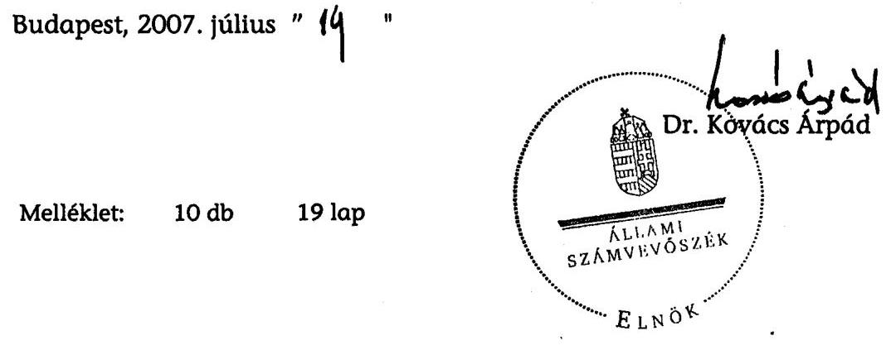

[^0]
[^0]:    $^{85}$ A Kormány az alábbi területeken szükségesnek tartja vizsgálat elvégzését és javaslat kidolgozását a hatékonyabb működés feltételeinek megteremtése érdekében: q) közhasznú és gazdasági társaságokat, alapítványokat és közalapítványokat érintően az alábbi irányokkal és határidőkkel: Energia Központ Kht. (GKM, KVVM-mel közös) megszüntetése végelszámolással, végrehajtás megkezdése: 2007. január 1.
    $^{86}$ Az 1015/2007.(III. 20.) Korm. határozat 5. pontja értelmében az Energia Központ Kht. feladatait megtartva a jelenlegi formában működik tovább.

---

MELLÉKLETEK

---

H-1051 BUDAPEST V., JÓZSEP NÁDOR TÉR 2-4. POSTACIM: 1369 BUDAPEST, POSTAFIOK 481.

TELEFON: (36-1) 327-2159, (36-1) 327-2141
FAX: (36-1) 318-0738
PÉNZÜGYMINISZTER

E-MAIL: janos.veres@pm.gov.hn
$1-22-165 / 2006-2007$
Iktatószám: 6101/4/2007
Hiv. szám: V-22-163/20062007.

Ügyintéző: dr. Balogh Emese Celeszta
Tárgy: Jelentés-tervezet az uniós támogatások hazai monitoring és ellenőrzési rendszere működésének ellenőrzéséről

# Dr. Kovács Árpád úr 

elnök

## Állami Számvevőszék

Budapest

Tisztelt Elnök Úr!
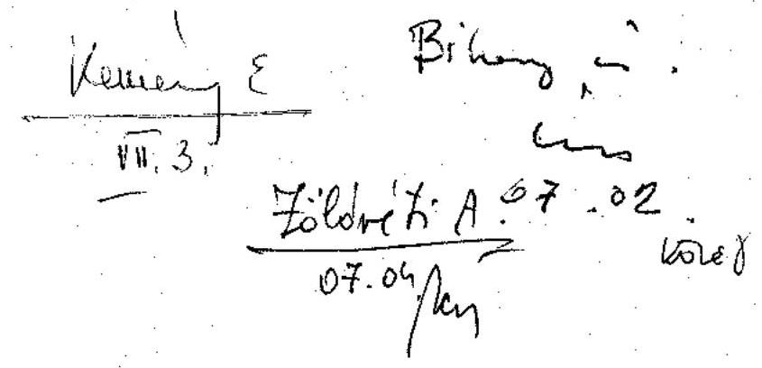

Köszönettel megkaptuk az uniós támogatások hazai monitoring és ellenőrzési rendszere működésének ellenőrzéséről készített jelentés-tervezetet.

Tájékoztatom, hogy a jelentés nem tartalmaz a pénzügyminiszter számára intézkedést, ezért további észrevételt nem teszünk.

Felelősségteljes munkájához további sikereket kívánok.

Budapest, 2007. június 25.
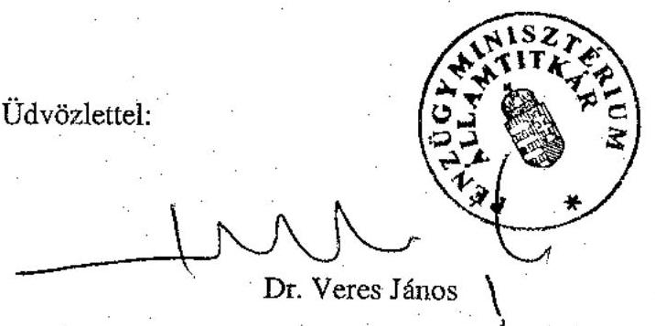

---

# 1.b. sz. melléklet   a V-22-168/2006-2007. jelentéshez 

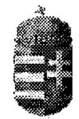

## 22-167/2006-2007. számú melléklet

ÖNKORMÁNYZATI ÉS TERÜLETFEJLESZTÉSI MINISZTER

Dr. Kovács Árpád úr
Elnök

Állami Számvevőszék

Budapest
Apáczai Csere János utca 10. 1052

Tisztelt Elnök Úr!
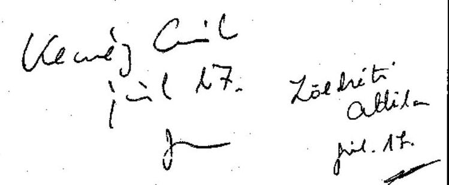

A V-22-163/2006-2007. hivatkozási számú „Az uniós támogatások hazai monitoring és ellenőrzési rendszere működésének ellenőrzéséről" készített jelentéssel kapcsolatban a következő észrevételt teszem:

A jelentés az ellenőrzés megállapításainak hasznosítása mellett javaslatokat fogalmaz meg a Miniszterelnöki Hivatalt vezető Miniszter számára.

A jelentés megküldését követően olyan szervezeti és személyi változások történtek, amelyek alapján a Miniszterelnöki Hivatalt vezető Miniszter feladat- és hatásköréből a fejlesztéspolitikáért való felelősség átkerült az Önkormányzati és Területfejlesztési Miniszter feladat- és hatáskörébe.

A 171/2007. (VI.29.) Korm. rendelet kiegészítette az önkormányzati és területfejlesztési miniszter feladat- és hatásköréről szóló 168/2006. (VII. 28.) Kormányrendeletet az 1. § m) ponttal, melynek alapján az önkormányzati és területfejlesztési miniszter a Kormány fejlesztéspolitikáért felelős tagja, továbbá módosult a 130/2006. (VI. 15.) Korm. rendelet 3. § (1) is, melynek értelmében a Nemzeti Fejlesztési Ügynökség az önkormányzati és területfejlesztési miniszter irányítása alatt működő központi hivatal.

A fentiekre tekintettel az intézkedési tervet az önkormányzati és területfejlesztési miniszter küldi meg az Állami Számvevőszék számára.

További munkájához sok sikert kívánok.
Budapest, 2007. július 11.
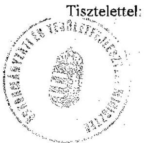

Bajnai Gordon

---

# 1.c. sz. melléklet 

a V-22-168/2006-2007. jelentéshez

$$
1200 / 07
$$

$U-22-166 / 2006-2007$
FÖLDMŰVELÉSÜGYI ÉS VIDÉKFEJLESZTÉSI MINISZTER
Ügyiratszám: 7342 / 1 / 2007

Dr. Kovács Árpád
elnök úr részére
Állami Számvevőszék

## Budapest

Apáczai Csere János utca 10.
1052
Tárgy: az uniós támogatások hazai monitoring és ellenőrzési rendszere működésének ellenőrzéséről szóló jelentés-tervezet észrevételezése

## Tisztelt Elnök Úr!

Köszönettel megkaptam 2007. június 19-én kelt V-22-163/2006-2007 ügyiratszámú levelét, melynek mellékleteként az Állami Számvevőszéknek az uniós támogatások hazai monitoring és ellenőrzési rendszere működésének ellenőrzéséről készült jelentés-tervezetét megküldte.

A munkatársaimmal lefolytatott előzetes egyeztetéseken és pontosításokon túlmenően a jelentés-tervezethez további észrevételt nem teszek.

Ezúton köszönöm Önnek és munkatársainak az ellenőrzés elvégzése során tanúsított nyitottságát, valamint a jelentés összeállítása folyamán a tárgy- és tényszerű megállapításokra való fókuszálást.

Budapest, 2007. július 64.

Üdvözlettel,
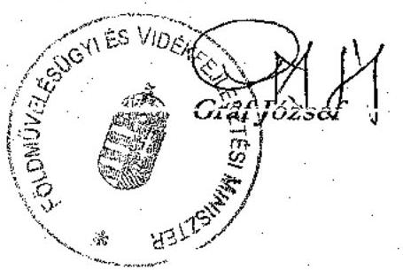

---

# 2. sz. melléklet a V-22-168/2006-2007. sz. jelentéshez

EU-s és a hozzá kapcsolódó támogatások 2005-2007. millió Ft-ban

|  Sor | Program | 2005. évi előirányzat |  |  | 2006. évi előirányzat |  |  | 2007. évi előirányzat |  |   |
| --- | --- | --- | --- | --- | --- | --- | --- | --- | --- | --- |
|  sz. | Megnevezés | Kiadás | Bevétel | Támogatás | Kiadás | Bevétel | Támogatás | Kiadás | Bevétel | Támogatás  |
|  1. | Regionális Operatív Program | 13798,5 | 9671,7 | 4126,8 | 36620,2 | 29415,7 | 7204,5 | 29939,0 | 25011,0 | 4928,0  |
|  2. | Agrár- és Vidékfejlesztési Operatív Program | 13241,4 | 9411,9 | 3829,5 | 40537,2 | 28849,6 | 11687,6 | 32096,0 | 24387,0 | 7709,0  |
|  3. | Gazdasági Versenyképesség Operatív Program | 22720,2 | 14916,4 | 7803,8 | 46074,0 | 33092,5 | 12981,5 | 50990,8 | 37146,0 | 13844,8  |
|  4. | Környezetvédelem és Infrastruktúra Operatív Program | 14234,7 | 10676,0 | 3558,7 | 36902,4 | 27676,7 | 9225,7 | 17969,2 | 13652,7 | 4316,5  |
|  5. | Humánerőforrás-fejlesztési Operatív Program | 36312,3 | 26125,1 | 10187,2 | 63073,9 | 47433,5 | 15640,4 | 10701,0 | 7631,0 | 3070,0  |
|  6. | KTK Technikai segítségnyújtás | 708,8 | 531,6 | 177,2 | 900,0 | 675,0 | 225,0 | 659,0 | 494,0 | 165,0  |
|  7. | OP-k Technikai segítségnyújtásai |  |  |  |  |  |  | 7913,3 | 5921,8 | 1637,9  |
|  8. | Államreform Operatív Program |  |  |  |  |  |  | 405,0 | 348,0 | 57,0  |
|  9. | Elektronikus Közigazgatás OP |  |  |  |  |  |  | 976,0 | 838,0 | 138,0  |
|  10. | Új Magyarország Ny-dunántúli OP |  |  |  |  |  |  | 1198,0 | 1029,0 | 169,0  |
|  11. | Új Magyarország Közép-dunántúli OP |  |  |  |  |  |  | 1310,0 | 1125,0 | 185,0  |
|  12. | Új Magyarország Dél-dunántúli OP |  |  |  |  |  |  | 1661,0 | 1426,0 | 235,0  |
|  13. | Új Magyarország Dél-alföld OP |  |  |  |  |  |  | 1915,0 | 1645,0 | 270,0  |
|  14. | Új Magyarország Észak-alföld OP |  |  |  |  |  |  | 2485,0 | 2134,0 | 351,0  |
|  15. | Új Magyarország Észak-magyarorsz.OP |  |  |  |  |  |  | 2305,0 | 1980,0 | 325,0  |
|  16. | Új Magyarország Közép-magyarorsz.OP |  |  |  |  |  |  | 4079,0 | 3503,0 | 576,0  |
|  17. | Európai Területi Együttműködés |  |  |  |  |  |  | 2050,9 | 1427,3 | 623,8  |
|  18. | Interreg 2007-2013 |  |  |  |  |  |  | 6,0 | 0,0 | 6,0  |
|  19. | Új Magyarország Közlekedési OP |  |  |  |  |  |  | 16160,0 | 13877,0 | 2283,0  |
|  20. | Új Magyarország Gazdaságfejl. OP |  |  |  |  |  |  | 6169,2 | 5297,6 | 871,6  |
|  21. | Új Magyarország Környezet és energiaOP |  |  |  |  |  |  | 9882,0 | 8486,0 | 1396,0  |
|  22. | Új Magyarország Végrehajtás OP |  |  |  | 
 |  |  | 37662,0 | 32340,0 | 5322,0  |
|  23. | Új Magyarország Társadalmi Megújülés OP |  |  |  |  |  |  | 31546,2 | 31546,2 | 0,0  |
|  24. | Új Magyarország Társadalmi Infrastruktúra OP |  |  |  |  |  |  | 4973,0 | 4271,0 | 702,0  |
|  25. | OP-k cél tartalékjai | 1316,9 | 0,0 | 1316,9 |  |  |  | 700,0 | 0,0 | 700,0  |
|  26. | Operatív programok mindösszesen: | 102332,8 | 71332,7 | 31000,1 | 224107,7 | 167143,0 | 56964,7 | 275751,6 | 225516,6 | 49881,4  |
|  27. | INTERREG | 2287,7 | 1577,1 | 710,6 | 8741,7 | 6091,0 | 2650,7 | 10143,3 | 8034,3 | 2109,0  |
|  28. | EQUAL összesen: | 2307,3 | 836,1 | 1471,2 | 5471,8 | 4134,9 | 1336,9 | 5771,0 | 4543,1 | 1227,9  |
|  29. | Strukturális Alapok összesen: | 106927,8 | 73745,9 | 33181,9 | 238321,2 | 177368,9 | 60952,3 | 291665,9 | 238094,0 | 53218,3  |
|  30. | Kohéziós Alap közlekedési projektjei | 24907,2 | 16407,2 | 8500,0 | 51512,6 | 28959,6 | 22553,0 | 91900,0 | 56400,0 | 35500,0  |
|  31. | Kohéziós Alap környezetvédelmi projektjei | 18676,1 | 7126,1 | 11550,0 | 36145,1 | 21907,1 | 14238,0 | 60364,0 | 34124,0 | 26240,0  |
|  32. | Kohéziós Alap összesen: | 43583,3 | 23533,3 | 20050,0 | 87657,7 | 50866,7 | 36791,0 | 152264,0 | 90524,0 | 61740,0  |
|  33. | Schengen Alap összesen: | 16942,7 | 13473,3 | 3469,4 | 16276,2 | 14689,6 | 1616,6 | 38111,2 | 32705,7 | 5405,5  |

---

|  34. | PHARE projektek: | 27892,5 | 16465,0 | 11427,5 | 16418,9 | 9345,5 | 7073,4 | 0,0 | 0,0 | 0,0  |
| --- | --- | --- | --- | --- | --- | --- | --- | --- | --- | --- |
|  35. | Átmeneti támogatások | 7138,3 | 4770,9 | 2685,5 | 4100,6 | 3309,0 | 791,6 | 7536,8 | 5620,1 | 1917,3  |
|  36. | PHARE és az átmeneti támogatások összesen: | 35030,8 | 21235,9 | 14113,0 | 20519,5 | 12654,5 | 7865,0 | 7536,8 | 5620,1 | 1917,3  |
|  37. | SAPARD programok | 20000,0 | 15000,0 | 5000,0 | 12000,0 | 9000,0 | 3000,0 | 1700,0 | 0,0 | 1700,0  |
|  38. | Nemzeti Vidékfejlesztési Terv |  |  |  | 60500,0 | 48400,0 | 12100,0 | 85210,0 | 68168,0 | 17042,0  |
|  39. | Új Magyarország Vidékfejlesztési Terv |  |  |  |  |  |  | 35756,5 | 26912,0 | 8844,5  |
|  40. | Europe Direct Magyarország |  |  |  | 72,0 | 72,0 | 0,0 |  |  |   |
|  41. | Méhészeti Nemzeti Program | 954,8 | 477,4 | 477,4 |  |  |  |  |  |   |
|  42. | CONNECT (MTS e-közlekedés) | 205,2 | 192,7 | 12,5 |  |  |  |  |  |   |
|  43. | Norvég Alap támogatásával megvalósuló projektek |  |  |  | 1667,5 | 0,0 | 1667,5 | 6416,2 | 5400,8 | 1002,4  |
|  44. | TEN-T pályázatok | 916,4 | 366,4 | 550,0 | 10274,8 | 3794,8 | 6480,0 | 4371,0 | 2486,6 | 1884,4  |
|  45. | Utazási költségtérítések | 301,4 | 301,4 | 0,0 | 400,0 | 400,0 | 0,0 | 320,0 | 320,0 | 0,0  |
|  46. | Egyéb EU támogatások összesen (EMOGA nélkül): | 22377,8 | 16337,9 | 6039,9 | 84914,3 | 61666,8 | 23247,5 | 133773,7 | 103287,4 | 29598,9  |
|  48. | UNIÓS TÁMOGATÁSOK MINDÖSSZESEN (EMOGA nélkül): | 224862,4 | 148326,3 | 76854,2 | 447688,9 | 317246,5 | 130472,4 | 623351,6 | 470231,2 | 151880,0  |

Forrás: a Magyar Köztársaság 2005. évi költségvetéséről szóló 2004. évi CXXXV. törvény 1. melléklete, a Magyar Köztársaság 2006. évi költségvetéséről szóló 2005. évi CLIII. törvény 1. melléklete, a Magyar Köztársaság 2007. évi költségvetéséről szóló 2006. évi CXXVII. törvény 1. melléklete,

---

Az EU-s forrásokat kezelő hazai intézményrendszer funkcionális változásai

|  A támogatási rendszerben betöltött szerep | A feladatot ellátó intézmény (személy) |  | Volt-e |   |
| --- | --- | --- | --- | --- |
|   | Eredeti (2006.06.30. előtti) állapot | az átalakítást követő állapot | Igen | Nem  |
|  Előcsatlakozási Alapok |  |  |  |   |
|  PHARE/Átmeneti támogatás |  |  |  |   |
|  Nemzeti Programengedélyező | Pénzügyminisztérium |  |  | 1  |
|  Nemzeti Alap | Pénzügyminisztérium, Nemzeti Programengedélyező Iroda |  |  | 1  |
|  Nemzeti PHARE Koordinátor | Kormány által kinevezett legalább szakállamtitkár beosztású személy |  |  | 1  |
|  Segélykoordinációs Intézőbizottság | A Nemzeti PHARE Koordinátor vezetésével működő testület |  |  | 1  |
|  Központi Pénzügyi és Szerződéskötő Egység | Nemzeti Fejlesztési Hivatal | Nemzeti Fejlesztési Ügynökség | 1 |   |
|  Programengedélyező | Lebonyolításért felelős minisztérium javaslata alapján a Nemzeti Programengedélyező nevezi ki |  |  | 1  |
|  Phare Végrehajtó Szervezetek | A Pénzügyi Megállapodásokban meghatározott szervezetek pl.: Váti Kht., ESZA Kht., KPSZE |  |  | 1  |
|  Szakmai programfelelősök (SPO-k) | A program lebonyolításáért felelős SPO-k pl.: IRM, GKM, ÖTM, EüM, PM, Szoc. és Munkaügyi M. |  |  | 1  |
|  Monitoring bizottságok | Monitoring Vegyes Bizottság, Szektor Monitoring Albizottság, Központi Monitoring Bizottság és a |  |  | 1  |
|  ISPA |  |  |  |   |
|  Az EU-ba történt belépést követően a Kohéziós Alap részévé vált. |  |  |  |   |
|  SAPARD |  |  |  |   |
|  Nemzeti Programengedélyező | Pénzügyminisztérium |  |  | 1  |
|  Nemzeti Alap | Pénzügyminisztérium, Nemzeti Programengedélyező Iroda |  |  | 1  |
|  Illetékes Hatóság | Pénzügyminisztérium |  |  | 1  |
|  Irányító Hatóság | Földművelésügyi és Vidékfejlesztési Minisztérium (FVM) |  |  | 1  |
|  Igazoló szerv | Állami Számvevőszék | NFÜ által kijelölt szervezet | 1 |   |
|  SAPARD Hivatal | Mezőgazdasági és Vidékfejlesztési Hivatal (MVH) |  |  | 1  |
|  Sapard Monitoring Bizottság | Az érintett szervezetek által delegált tagok, elnökét az FVM nevezi ki. |  |  | 1  |
|  Strukturális Alapok |  |  |  |   |
|  Általában |  |  |  |   |
|  KTK Irányító Hatóság | Nemzeti Fejlesztési Hivatal | Nemzeti Fejlesztési Ügynökség | 1 |   |
|  Kifizető Hatóság | Pénzügyminisztérium |  |  | 1  |
|  Igazoló Hatóság |  | Pénzügyminisztérium |  |   |
|  Monitoring bizottságok | Központi Monitoring Bizottság, Közösségi Támogatási Keret Monitoring Bizottság, Operatív programok monitoring bizottságai, monitoring egységek az érintett szervezetek bevonásával |  |  | 1  |
|  AVOP |  |  |  |   |
|  Irányító Hatóság | Földművelési és Vidékfejlesztési Minisztérium |  |  | 1  |
|  Kifizető Hatóság | Pénzügyminisztérium |  |  | 1  |
|  Igazoló Hatóság |  | Pénzügyminisztérium |  |   |
|  Közreműködő szervezetek | Mezőgazdasági és Vidékfejlesztési Hivatal (MVH) |  |  | 1  |

---

|  5%-os ellenőrzést, rendszerellenőrzést, zárónyilatkozat kiadását végző szervezet | KEHI | Ellenőrzési Hatóság | 1 |   |
| --- | --- | --- | --- | --- |
|  GVOP |  |  |  |   |
|  Irányító Hatóság | GKM | Nemzeti Fejlesztési Ügynökség | 1 |   |
|  Kifizető Hatóság | Pénzügyminisztérium |  | 1 |   |
|  Igazoló Hatóság |  | Pénzügyminisztérium |  |   |
|   | Magyar Fejlesztési Bank Rt. |  | 1 |   |
|   | Magyar Vállalkozásfejlesztési Kht. |  | 1 |   |
|   |  | Kutatásfejlesztési Pályázati és Kutatáshasznosítási Iroda | 1 |   |
|   |  | IT Információs Társadalom Kht. | 1 |   |
|   |  | Regionális Támogatás Közvetítő Kht. | (megszünt, feladat a MAG Zrt-nek átadva) | 1  |
|  5%-os ellenőrzést, rendszerellenőrzést, zárónyilatkozat kiadását végző szervezet | KEHI | Ellenőrzési Hatóság | 1 |   |
|  HEFOP |  |  |  |   |
|  Irányító Hatóság | FMM | Nemzeti Fejlesztési Ügynökség | 1 |   |
|  Kifizető Hatóság | Pénzügyminisztérium |  | 1 |   |
|  Igazoló Hatóság |  | Pénzügyminisztérium |  |   |
|   |  | OKM TI (korábban OMAI) |  | 1  |
|  Szakmai közreműködő szervezetek | Foglalkoztatási Hivatal (HEFOP 1.1.) | ESZA Kht | 1 |   |
|   | Egészségügyi Stratégiai Kutatóintézet Strukturális Alapok Programiroda

 (ESKI STRAPI) (korábban EüM STRAPI) |  | 1 |   |
|   |  | ESZA Kht. |  | 1  |
|  Pénzügyi közreműködő szervezet | Magyar Államkincstár | Szakmai közreműködő szervezetek, TA projektek és 1.2 intézkedés esetében a Magyar Államkincstár | 1 |   |
|  Eljárásrendi közreműködő szervezet | Foglalkoztatási Hivatal (ESZA-ból finanszírozott projektek) Szakmai közreműködő szervezetek (ERFA-ból finanszírozott projektek) | Szakmai közreműködő szervezetek | 1 |   |
|  5%-os ellenőrzést, rendszerellenőrzést, zárónyilatkozat kiadását végző szervezet | KEHI | Ellenőrzési Hatóság | 1 |   |

---

|  KIOP |  |  |  |  |   |
| --- | --- | --- | --- | --- | --- |
|  Irányító Hatóság | GKM | Nemzeti Fejlesztési Ügynökség | 1 |  |   |
|  Kifizető Hatóság | Pénzügyminisztérium |  | 1 |  |   |
|  Igazoló Hatóság |  | Pénzügyminisztérium |  |  |   |
|  Közreműködő szervezetek | GKM | Nemzeti Fejlesztési Ügynökség | 1 |  |   |
|   | KvVM Fejlesztési Igazgatóság |  | 1 |  |   |
|   | Energiaközpont Kht |  | 1 |  |   |
|  5%-os ellenőrzést, rendszerellenőrzést, zárónyilatkozat kiadását végző szervezet | KEHI | Ellenőrzési Hatóság | 1 |  |   |
|  ROP |  |  |  |  |   |
|  Irányító Hatóság | OTH (MTRFH) | Nemzeti Fejlesztési Ügynökség | 1 |  |   |
|  Kifizető Hatóság | Pénzügyminisztérium |  | 1 |  |   |
|  Igazoló Hatóság |  | Pénzügyminisztérium |  |  |   |
|  Közreműködő szervezetek |  | Váti Kht., RFÜ-k |  |  | 1  |
|  5%-os ellenőrzést, rendszerellenőrzést, zárónyilatkozat kiadását végző szervezet | KEHI | Ellenőrzési Hatóság | 1 |  |   |
|  INTERREG |  |  |  |  |   |
|  Irányító Hatóság | OTH (MTRFH) | Nemzeti Fejlesztési Ügynökség | 1 |  |   |
|  Kifizető Hatóság | Pénzügyminisztérium |  | 1 |  |   |
|  Igazoló Hatóság |  | Pénzügyminisztérium |  |  |   |
|  Nemzeti Hatóság | OTH (MTRFH) | Nemzeti Fejlesztési Ügynökség | 1 |  |   |
|  Közreműködő szervezetek |  | Váti Kht. |  |  | 1  |
|  Al-kifizető Hatóság |  | Váti Kht. |  |  | 1  |
|  5%-os ellenőrzést, rendszerellenőrzést, zárónyilatkozat kiadását végző szervezet | KEHI | Ellenőrzési Hatóság | 1 |  |   |
|  EQUAL Közösségi Kezdeményezés |  |  |  |  |   |
|  Irányító Hatóság | FMM | Nemzeti Fejlesztési Ügynökség | 1 |  |   |
|  Kifizető Hatóság | Pénzügyminisztérium |  | 1 |  |   |
|  Igazoló Hatóság |  | Pénzügyminisztérium |  |  |   |
|  Közreműködő szervezetek |  | Magyar Államkincstár |  |  | 1  |
|   | Országos Foglalkoztatási Közalapítvány |  |  |  | 1  |
|  5%-os ellenőrzést, rendszerellenőrzést, zárónyilatkozat kiadását végző szervezet | KEHI | Ellenőrzési Hatóság | 1 |  |   |
|  Kohéziós Alap |  |  |  |  |   |
|  Irányító Hatóság | Nemzeti Fejlesztési Hivatal | Nemzeti Fejlesztési Ügynökség | 1 |  |   |
|  Kifizető Hatóság | Pénzügyminisztérium |  | 1 |  |   |
|  Igazoló Hatóság |  | Pénzügyminisztérium |  |  |   |
|   | KvVM Fejlesztési Igazgatóság |  |  |  | 1  |

---

|   | Közreműködő szervezetek | GKM | Közlekedésfejlesztési Koordinációs Központ (KKK- a korábbi UKIG) | 1 |   |
| --- | --- | --- | --- | --- | --- |
|   |  | MÁV Zrt. |  | 1 |   |
|   | Lebonyolító testületek | NA Rt. | Nemzeti Infrastruktúra Fejlesztési Zrt. (NIF Zrt.- korábbi NA Rt.) | 1 |   |
|   |  | UKIG |  | 1 |   |
|   |  |  | HungaroControl Magyar Légiforgalmi Szolgálat |  | 1  |
|   | 15%-os ellenőrzést, rendszerellenőrzést, zárónyilatkozat kiadását végző szervezet | KEHI | Ellenőrzési Hatóság | 1 |   |
|   | Monitoring bizottságok | Kohéziós Alap Monitoring Bizottság (KAMB) |  |  | 1  |
|  Nemzeti Vidékfejlesztési Terv |  |  |  |  |   |
|   | Illetékes Hatóság | FVM Akkreditációs Osztálya |  |  | 1  |
|   | Program Menedzsment Egység | FVM Irányító Hatóság Főosztálya |  |  | 1  |
|   | Végrehajtásért felelős intézmény | Mezőgazdasági és Vidékfejlesztési Hivatal (MVH) |  |  | 1  |
|   | EMOGA Kifizető Ügynökség |  |  |  |   |
|  Schengen Alap |  |  |  |  |   |
|   | Felelős Hatóság | Nemzeti Fejlesztési Hivatal | Nemzeti Fejlesztési Ügynökség | 1 |   |
|   | Schengen Alap Tárcaközi Bizottság | Belügyminisztérium | IRM | 1 |   |
|   | Szakmai közreműködő szerveztek | BM, VPOP, GKM | IRM, VPOP, Közlekedésfejlesztési Koordinációs Központ | 1 |   |
|   | Központi Pénzügyi és Szerződéskötő Egység | Nemzeti Fejlesztési Hivatal | Nemzeti Fejlesztési Ügynökség | 1 |   |
|   | 10%-os ellenőrzés, végső költségigazolás | KEHI | Ellenőrzési Hatóság | 1 |   |
|  EGT és Norvég Alap |  |  |  |  |   |
|   | Nemzeti Kapcsolattartó | Nemzeti Fejlesztési Hivatal | Nemzeti Fejlesztési Ügynökség | 1 |   |
|   | EGT Finanszírozási Mechanizmus és Norvég Alap Iroda | Független szervezet |  |  | 1  |
|   | Ellenőrző (audit) szerv | KEHI | Ellenőrzési Hatóság | 1 |   |
|   | Központi Pénzügyi és Szerződéskötő Egység | NFH | NFÜ | 1 |   |
|   | Kifizető Hatóság | Pénzügyminisztérium |  | 1 |   |
|   | Igazoló Hatóság |  | Pénzügyminisztérium |  |   |
|   | Monitoring bizottság | NFÜ, PM NAO Iroda, érintett minisztériumok, önkormányzatok |  |  | 1  |
|  Agrártámogatások (EMGA EMVA) |  |  |  |  |   |
|   | Illetékes Hatóság | Földművelésügyi és Vidékfejlesztési Minisztérium (FVM) |  |  | 1  |

---

|  Kifizető Ügynökség |  | Mezőgazdasági és Vidékfejlesztési Hivatal (MVH) |  | 1  |
| --- | --- | --- | --- | --- |
|  Együttműködő szervezetek |  | Állategészségügyi és Élelmiszerellenőrző Állomások, FVM Mezőgazdasági Gépesítési Intézet, Magyar Tejgazdasági Kísérleti Intézet Kft., Növény- és Talajvédelmi Szolgálat, Állattenyésztési Teljesítményvizsgáló Kft., Környezetvédelmi és Vízügyi Minisztérium Természetvédelmi Hivatala, Magyar Tejgazdasági Kísérleti Intézet, Országos Mezőgazdasági Minősítő Intézet, Hegyközségek Nemzeti Tanácsa, Magyar Agrárkamara, GAFTA laboratóriumok, APEH, VPOP |  | 1  |
|  Delegált feladatokat ellátó szervezetek |  | Országos Mezőgazdasági Minősítő Intézet, Állami Erdészeti Szolgálat, Országos Borminősítő Intézet, Földmérési és Távérzékelési Intézet |  |   |
|  Együttműködő és delegált feladatokat ellátó szervezetek |  |  | Mezőgazdasági Szakigazgatási Hivatal, FVM Mezőgazdasági Gépesítési Intézet, Magyar Tejgazdasági Kísérleti Intézet Kft., Állattenyésztési Teljesítményvizsgáló Kft., Környezetvédelmi és Vízügyi Minisztérium Természetvédelmi Hivatala, Hegyközségek Nemzeti Tanácsa, Magyar Agrárkamara, GAFTA laboratóriumok, APEH, VPOP, Földmérési és Távérzékelési Intézet |   |
|  Igazoló szerv |  | Állami Számvevőszék | KPMG Kft. | 1  |
|  Export visszatérítésekkel kapcsolatos fizikai és kicseréléses ellenőrzést végző szerv (386/90/EK rendelet) |  | Vám- és Pénzügyőrség Országos Parancsnoksága |  | 1  |
|  A 4045/89/EGK rendelet szerinti Utólagos vállalatellenőrzéseket végző szerv |  | Vám- és Pénzügyőrség Központi Ellenőrzési Parancsnokságán működő Különleges Szolgálat |  | 1  |

---

|  OLAF Koordinációs Iroda (Európai Unió Csalás Elleni Hivatala) | Vám- és Pénzügyőrség Országos Parancsnoksága |  | 1  |
| --- | --- | --- | --- |
|   | Összesítések: | 53 |   |
|   |  | nem változott: | 39  |
|   |  | A változás aránya %-ban: | $58 \%$  |
|   | Ebből:strukturális és Kohéziós alapok | 40 | 15  |
|   | A változás aránya SA, KA-nál %-ban: | $73 \%$ |   |

---

# A 2006. évre vonatkozó 1. sz. tanúsítvány kiértékelése 

|  | Kérdés | A 2006. évre vonatkozó 1.sz. tanúsítvány szöveges kiértékelése 39 szervezet 78 támogatásra vonatkozó válaszai alapján |
| :--: | :--: | :--: |
| 1. | Az EMIR-t használják-e monitoring információs rendszerként? (Nemleges esetén 7. sz. tanúsítványt is.) | Nem használnak EMIR-t: Schengen, TEN-T, Interreg, Norvég Alap esetében, az előző évihez képest viszont a PHARE-nál van aki igenlő választ adott (ezek szerint 2006-ban kezdték csak feltölteni) |
| 2. | Elégségesek-e az EMIR-ben rögzített adatok a rendszeres beszámolók (adatszolgáltatások) elkészítéséhez | A 34 EMIR-t használó közül 16 nyilatkozott úgy, hogy elégségesek a
 rögzített adatok a rendszeres beszámolók elkészítéséhez |
| 3. | Feltöltötték-e az EMIR rendszerben a pályázatok alapadatait? | A 34 EMIR-t használó közül 5-en csak részben töltötték fel a pályázatok alapadatait, 3-an üresen hagyták, nemleges válasz nem volt |
| 4. | Feltöltötték-e az EMIR rendszerben a támogatott projektek fizikai előrehaladás mérésére szolgáló indikátorok alapadatait? | A 34 EMIR-t használó közül 11-en töltötték fel a fizikai előrehaladás mérésére szolgáló indikátorok alapadatait, 13-an részben, 1 pedig nem. |
| 5. | Vezetik-e az EMIR rendszerben a fizikai előrehaladás mérésére szolgáló indikátorok aktuális adatait? | A 34 EMIR-t használó közül 8-an töltik a fizikai előrehaladás mérésére szolgáló indikátorok aktuális adatait, 12-an részben, 3-an pedig nem. |
| 6. | Használnak-e az EMIR-en kívül más monitoring információs rendszert? | A 34 EMIR-t használó közül 4-en vezetnek más nyilvántartást is. |
| 7. | Ha az EMIR-en kívül más nyilvántartási rendszert vezetnek, a rendszer megnevezése: | A Norvég Alap esetében sem EMIR-t, sem más nyilvántartást nem vezetnek, bár még nem volt kifizetés. A Schengen-nél a GVOP-nál van egy EMIR-től független nyilvántartás, de az NFÜ nem írt be semmit erre vonatkozóan. A PHARE-nál nagyon vegyes a kép: 10-en 4 féle nyilvántartást vezetnek és van aki az EMIR-t használja. Az Interreg nyilvántartási rendszere az IMIR. |
| 9. | Tudják-e rögzíteni a monitoring rendszerben az ellenőrzéseket és azok eredményeit? (EMIR-re is vonatkozik) | Az EMIR-ben 7 esetben tudják, 10 esetben részben tudják, 9-nél nem tudják, 5-en pedig nem töltötték ki. A nem EMIR-eseknél az Interregnél tudják rögzíteni. |
| 10. | Nyomon tudják-e követni a nyilvántartási rendszerben az ellenőrzések eredményeként készített intézkedési tervek végrehajtását? | Az EMIR-ben nem tudják (csak 1 helyen van igen), a nem EMIR-ben a GKM-nél tudják nyomon követni. |
| 14b | Helyszíni ellenőrzéssel alátámasztott kifizetések száma | Az EMIR-eseknél egyedül az Orsz. Fogl. Közalapítványnál volt számottevő helyszíni vizsgálat, a többinél a helyszíni vizsgálatok száma kevés. A Nem EMIR-eseknél is vannak olyan helyek ahol nem végeznek helyszíni vizsgálatot, vagy nem töltötték ki. |
| 19. | A belső ellenőrzést végző szervezeti egység átlagos állományi létszáma: Elnevezése: | Az átlagos állományi létszám 1-10 fő között van. |
| 19a | Az általuk vizsgált projektek száma (db) | 309 vizsgálat közül 4 intézménynél 14 db volt teljesítményellenőrzés. |
| 19b | ebből teljesítményellenőrzés (db) |  |

---

# Kivonat az MVH NVT 2007. 2. heti jelentésből

|   |  | Beérkezett / iktatott kérelmek (db) | Kifizetés jóváhagyott (db) | Kifizetett kérelmek (db) | Kifizetett összeg (millió Ft)  |
| --- | --- | --- | --- | --- | --- |
|  Agrár-környezetgazdálkodás | 2004. támogatási kérelem | 32685 |  | 23567 | 43243  |
|   | 2006. kifizetési kérelem | 23681 | 20718 | 20836 | 34922  |
|  EU standardok (EU normákhoz való felzárkózás) | 2005. évi támogatási kérelmek | 1021 |  | 324 | 382  |
|   | 2005. évi kifizetési kérelmek | 728 |  | 578 | 1003  |
|   | 2006. évi támogatási kérelmek | 1036 |  |  | 0  |
|  Mg-i területek erdősítése | 2005. kifizetési kérelmek | 855 |  | 773 | 3019  |
|   | 2006. kifizetési kérelmek | 2562 |  | 2228 | 7056  |
|   | 2006. támogatási kérelem | 1987 |  |  | 0  |
|  Félig önellátó gazdaságok | 2004. támogatási kérelmek | 1032 | 718 | 718 | 0  |
|   | 2005. kifizetési kérelmek | 727 | 505 | 505 | 128  |
|   | 2005. támogatási kérelmek | 408 | 166 | 166 | 42  |
|   | 2006. támogatási kérelem | 488 | 0 | 0 | 0  |
|   | 2006. kifizetési kérelem | 739 | 0 | 0 | 0  |
|  Termelői csoportok | 2004. támogatási kérelmek | 9 | 0 | 7 | 109  |
|   | 2005. kifizetési kérelmek | 14 | 0 | 6 | 120  |
|   | 2005. támogatási kérelmek | 155 | 0 | 144 | 2153  |
|   | 2006. kifizetési kérelmek | 151 | 0 | 148 | 2355  |
|   | 2006. támogatási kérelmek | 59 | 0 | 33 | 534  |
|  Kedvezőtlen adottságú területek | 2004. támogatási kérelem | 5762 |  | 4987 | 2021  |
|   | 2005. támogatási kérelem | 793 |  |  | 0  |
|   | 2006. támogatási kérelem | 1150 |  |  | 0  |

---

# SAPARD támogatások jogcímek szerint

|  Intézkedések | Kötelezettségvállalás | 2003 | 2004 | 2005 | 2006 | Kifizetésösszesen | Kifizetésiarány  |
| --- | --- | --- | --- | --- | --- | --- | --- |
|  111 Mezőgazdasági vállalkozások fejlesztése | 24238 | 424 | 6454 | 13363 | 2807 | 23048 | $95 \%$  |
|  114 Mg. és halászati termékek feldolgozásának és marketingjének fejlesztése | 17911 | 358 | 4559 | 8109 | 3670 | 16696 | $93 \%$  |
|  1305 Falufejlesztés és felújítás, a vidék tárgyi és szellemi örökségének védelme és megőrzése | 5739 | 0 | 0 | 2600 | 2822 | 5422 | $94 \%$  |
|  1306 A tevékenységek diverzifikálása, alternatív jövedelemszerzést biztosító gazdasági tevékenységek fejlesztése | 463 | 0 | 0 | 319 | 99 | 418 | $90 \%$  |
|  1308 Vidéki infrastruktúra fejlesztés | 13988 | 694 | 3341 | 5806 | 3558 | 13399 | $96 \%$  |
|  41 Technikai segítségnyújtás | 77 | 1 | 53 | 0 | 80 | 134 | $174 \%$  |
|  Kifizetett támogatások összesen | 62416 | 1477 | 14407 | 30197 | 13036 | 59117 | $95 \%$  |

---

# Az NVT módosított keretösszegei a 2004-2006-os programozási időszakra a Bizottság 2006.12.29-i határozata szerint

Éves programozás (EU hozzájárulás euróban)

|   | 2004 | 2005 | 2006  |
| --- | --- | --- | --- |
|  Összesen | 181200000,00 | 201900000,00 | 219200000,00  |

Indikatív pénzügyi tábla (euróban)

|   | Programozási időszak: 2004-2006 |  |   |
| --- | --- | --- | --- |
|   | Közkiadás | Közösségi hozzájárulás ${ }^{4}$ | Magánforrás  |
|  A Prioritás: A környezeti feltételek megóvása és javítása |  |  |   |
|  Intézkedés Agrárkörnyezet-védelem | 451126289,00 | 366898000,00 | 0,00  |
|  Intézkedés Az európai normálthoz való felzárkózás | 25170000,00 | 20136000,00 | 0,00  |
|  Az A Prioritás teljes összege | 476296289,00 | 381034000,00 | 0,00  |
|  B Prioritás: A termelői struktúra átalakítása a piaci és ékológiai feltételeknek való jobb megfelelés érdekében |  |  |   |
|  Intézkedés Mezőgazdasági területek erdősítése | 79675000,00 | 63740000,00 | 0,00  |
|  C Prioritás: A termelők gazdasági életképességének, pénzügyi helyzetének és piaci pozíciójának javítása |  |  |   |
|  Intézkedés Félig önellátó gazdaságok | 3460000,00 | 2758000,00 | 0,00  |
|  Intézkedés Termelői csoportok támogatása | 28375000,00 | 22700000,00 | 0,00  |
|  Intézkedés Korai nyugdíj | 0,00 | 0,00 | 0,00  |
|  Intézkedés Közvetlen kifizetések kiegészítése | 94012500,00 | 75210000,00 | 0,00  |
|  C Prioritás összesen | 125847500,00 | 100678000,00 | 0,00  |
|  D Prioritás: A mezőgazdasági tevékenység fenntartása és fejlesztése a gyengébb termőképességű területeken jövedelem-kiegészítés és munkalehetőségek biztosításával. |  |  |   |
|  Intézkedés Kedvezőtlen adottságú területek | 14810000,00 | 11848000,00 | 0,00  |
|  Egyéb tevékenységek |  |  |   |
|  Technikai segítségnyújtás | 37500000,00 | 30000000,00 | 0,00  |
|  Az 1268/1999/EK Rendelet értelmében jóváhagyott támogatások | 20011211,00 | 15000000,00 | 0,00  |
|  Az egyéb tevékenységek teljes összege | 57511211,00 | 45000000,00 | 0,00  |
|  A terv teljes összege | 754140000,00 | 602300000,00 | 0,00  |

[^0] [^0]: 4 A közösségi hozzájárulás mértéke a támogatható közkiadás 50 %-a minden intézkedés esetében, kivéve azokat a projekteket, melyeket az 1268/1999/EK rendelet alapján hagyjuk jóvá, amelyek esetében a közösségi hozzájárulás mértéke a támogatható közkiadás 75 %-a.

---

## **Munkalap kiértékelés**

az EU monitoring vizsgálat ellenőrzési dokumentációjának feldolgozásához ellenőrzési típusonként

|   | A vizsgálat típusa | Rendszervizsgálatok |  |  | FEUVE vizsgálatok |  |  | 5-10-15 %-os vizsgálatok |  |  | Szabálytalansági vizsgálatok |  |  | KH által végzett vizsgálatok |  |  | Összesítés |  |   |
| --- | --- | --- | --- | --- | --- | --- | --- | --- | --- | --- | --- | --- | --- | --- | --- | --- | --- | --- | --- |
|   | A vizsgálatokra adott válaszok (értékelés) | Összes | Ebből. Igen | Összes | Ebből. Igen | Összes | Ebből. Igen | Összes | Ebből. Igen | Összes | Ebből. Igen | Összes | Ebből. Igen | Összes | Ebből. Igen | Összes | Ebből. Igen | Összes | Ebből. Igen  |
|   | Mértékegység | DB | DB | % | DB | DB | % | DB | DB | % | DB | DB | % | DB | DB | % | DB | DB | %  |
|   | Válaszként értelmezhető kódok: 1= igenlő válasz, 0= nemleges válasz, R= részben, E= nem értelmezhető, vagy a négyzetet üresen lehet hagyni. |  |  |  |

  |  |  |  |  |  |  |  |  |  |  |  |  |  |   |
|  1. | Fellelhető-e a nyilvántartásban szereplő ellenőrzés dokumentációja? | 23 | 22 | 95,65% | 2 | 2 | 100,00% | 5 | 3 | 60,00% | 4 | 3 | 75,00% | 2 | 2 | 100,00% | 36 | 32 | 88,89%  |
|  2. | Szerepelt-e az ellenőrzés az ellenőrzést végző intézmény valamilyen szintű munkatervében? | 23 | 20 | 86,96% | 3 | 3 | 100,00% | 3 | 3 | 100,00% | 4 | 1 | 25,00% | 2 | 2 | 100,00% | 35 | 29 | 82,86%  |
|  3. | Az ellenőrzés a kockázati szempontok érvényesítésével választották-e ki? | 23 | 18 | 78,26% | 3 | 2 | 66,67% | 3 | 3 | 100,00% | 4 | 1 | 25,00% | 2 | 2 | 100,00% | 35 | 26 | 74,29%  |
|  4. | Az ellenőrzést a munkatervben meghatározott időben végezték-e el? | 23 | 18 | 78,26% | 3 | 3 | 100,00% | 3 | 3 | 100,00% | 4 | 1 | 25,00% | 2 | 2 | 100,00% | 35 | 27 | 77,14%  |
|  5. | Az ellenőrzést a munkatervben meghatározott kapacitással végezték-e el? | 21 | 18 | 85,71% | 3 | 3 | 100,00% | 3 | 3 | 100,00% | 4 | 1 | 25,00% | 2 | 2 | 100,00% | 33 | 27 | 81,82%  |
|  6. | Az ellenőrzési munkatervet előzetesen egyeztették-e a támogatásközvetítő rendszerben tevékenykedő egyéb intézményekkel? | 21 | 14 | 66,67% | 3 | 2 | 66,67% | 3 | 3 | 100,00% | 4 | 1 | 25,00% | 2 | 2 | 100,00% | 33 | 22 | 66,67%  |
|  7. | Az elvégzett ellenőrzés dokumentációja formai szempontból megfelel-e az intézmény ellenőrzési szabályzatában erre az ellenőrzési típusra előírt követelményeknek? | 23 | 21 | 91,30% | 3 | 3 | 100,00% | 3 | 3 | 100,00% | 4 | 3 | 75,00% | 2 | 2 | 100,00% | 35 | 32 | 91,43%  |
|  8. | Az elvégzett ellenőrzés dokumentációja tartalmi szempontból megfelel-e az intézmény ellenőrzési szabályzatában erre az ellenőrzési típusra előírt követelményeknek? | 22 | 21 | 95,45% | 3 | 2 | 66,67% | 3 | 3 | 100,00% | 4 | 3 | 75,00% | 2 | 2 | 100,00% | 34 | 31 | 91,18%  |
|  9. | Az ellenőrzés megállapításait alátámasztják-e a jelentéshez csatolt ellenőrzési bizonylatok, ill. munkadokumentumok? | 22 | 17 | 77,27% | 2 | 1 | 50,00% | 3 | 3 | 100,00% | 4 | 3 | 75,00% | 2 | 2 | 100,00% | 33 | 26 | 78,79%  |
|  10. | Az elvégzett ellenőrzés típusa irányul-e a támogatás jogosultság vizsgálatára? Ha igen, elvégezték-e azt (megjegyzés rovatba kérjük beírni). | 23 | 9 | 39,13% | 2 | 1 | 50,00% | 3 | 3 | 100,00% | 4 | 2 | 50,00% | 2 | 0 | 0,00% | 34 | 15 | 44,12%  |

---

|  11. | Az elvégzett ellenőrzés típusa irányul-e a támogatás mértékének ellenőrzésére? Ha igen, elvégezték-e azt (megjegyzés rovatba kérjük beírni). | 23 | 8 | 34,78% | 2 | 1 | 50,00% | 3 | 3 | 100,00% | 4 | 1 | 25,00% | 27 | 0 | 0,00% | 59 | 13 | 22,03%  |
| --- | --- | --- | --- | --- | --- | --- | --- | --- | --- | --- | --- | --- | --- | --- | --- | --- | --- | --- | --- |
|  12. | Az elvégzett ellenőrzés típusa irányul-e a megbízható pénzügyi gazdálkodás szempontjai érvényesítésének ellenőrzésére? | 23 | 4 | 17,39% | 2 | 2 | 100,00% | 3 | 3 | 100,00% | 4 | 2 | 50,00% | 2 | 1 | 50,00% | 34 | 12 | 35,29%  |
|  13. | Ha az előző kérdésre igen a válasz, akkor vizsgálták-e: | 3 | 2 | 66,67% | 5,7 | 1 | 17,65% | 2 | 2 | 100,00% | 2 | 2 | 100,00% | 3 | 0 |  | 15,67 | 7 | 44,68%  |
|  14. | - a jogosult költségek elszámolását | 5 | 4 | 80,00% | 9,8 | 1 | 10,20% | 10,9 | 3 | 27,52% | 14,3 | 2 | 14,01% | 2,14 | 1 | 46,73% | 42,12 | 11 | 26,12%  |
|  15. | - a kiadások közgazdasági megalapozottságát | 3 | 2 | 66,67% | 5,7 | 1 | 17,65% | 6,84 | 3 | 43,84% | 10,5 | 1 | 9,56% | 1,1 | 0 |  | 27,06 | 7 | 25,87%  |
|  16. | - a közbeszerzés érvényesítését | 3 | 2 | 66,67% | 1 | 1 | 100,00% | 3 | 3 | 100,00% | 1 | 1 | 100,00% | 0 | 0 |  | 8 | 7 | 87,50%  |
|  17. | Az elvégzett ellenőrzés típusa irányul-e a támogatási szerződési feltételek ellenőrzésére? | 21 | 6 | 28,57% | 1 | 1 | 100,00% | 3 | 3 | 100,00% | 4 | 3 | 75,00% | 2 | 0 | 0,00% | 31 | 13 | 41,94%  |
|  18. | Ha a előző kérdésre igenlő a válasz: Elvégezték-e azt? | 11 | 7 | 63,64% | 19 | 0 |  | 3 | 3 | 100,00% | 4 | 3 | 75,00% | 3,75 | 0 |  | 40,39 | 13 | 32,19%  |
|  19. | Az elvégzett ellenőrzés típusa irányul-e annak ellenőrzésére, hogy a pályázatban vállalt kötelezettségek rögzítették-e a szerződéses feltétel között? | 20 | 4 | 20,00% | 1 | 1 | 100,00% | 3 | 3 | 100,00% | 3 | 3 | 100,00% | 2 | 0 | 0,00% | 29 | 11 | 37,93%  |
|  20. | Ha a előző kérdésre igenlő a válasz: Elvégezték-e azt? | 9 | 4 | 44,44% | 13 | 1 | 7,44% | 14,5 | 2 | 13,78% | 2 | 2 | 100,00% | 0 | 0 |  | 38,96 | 9 | 23,10%  |
|  21. | 15. Az elvégzett ellenőrzés típusa irányul-e a szerződés biztosítékainak ellenőrzésére? | 22 | 3 | 13,64% | 1 | 1 | 100,00% | 3 | 2 | 66,67% | 4 | 4 | 100,00% | 2 | 0 | 0,00% | 32 | 10 | 31,25%  |
|  22. | Ha a előző kérdésre igenlő a válasz: Elvégezték-e azt? | 9 | 4 | 44,44% | 13 | 1 | 7,44% | 14,5 | 3 | 20,66% | 3 | 3 | 100,00% | 4 | 0 |  | 43,96 | 11 | 25,02%  |
|  23. | 16. Az elvégzett ellenőrzés típusa irányul-e a benyújtott számlák ellenőrzésére? | 22 | 5 | 22,73% | 1 | 1 | 100,00% | 3 | 3 | 100,00% | 4 | 1 | 25,00% | 2 | 2 | 100,00% | 32 | 12 | 37,50%  |
|  24. | Ha a előző kérdésre igenlő a válasz: Elvégezték-e azt? | 9 | 4 | 44,44% | 1 | 1 | 100,00% | 3 | 3 | 100,00% | 2 | 1 | 50,00% | 2 | 2 | 100,00% | 17 | 11 | 64,71%  |
|  25. | Ha igen, elvégezték-e a számla mögötti műszaki tartalom szerződéses feltételeknek való megfelelőségének ellenőrzését? | 17 | 4 | 23,53% | 1 | 1 | 100,00% | 3 | 3 | 100,00% | 3 | 1 | 33,33% | 2 | 0 | 0,00% | 26 | 9 | 34,62%  |
|  26. | Ha igen, a műszaki tartalom megfelelőségét a helyszínen is ellenőrizték? | 14 | 3 | 21,43% | 1 | 0 | 0,00% | 3 | 3 | 100,00% | 2 | 1 | 50,00% | 2 | 0 | 0,00% | 22 | 7 | 31,82%  |
|  27. | Az ellenőrzésben érvényesül-e a rendszerszemléletű megközelítés? | 22 | 20 | 90,91% | 3 | 3 | 100,00% | 3 | 0 | 0,00% | 4 | 3 | 75,00% | 2 | 2 | 100,00% | 34 | 28 | 82,35%  |
|  28. | 18. Készült-e intézkedési terv az ellenőrzés megállapítása alapján? | 22 | 19 | 86,36% | 3 | 3 | 100,00% | 3 | 3 | 100,00% | 4 | 4 | 100,00% | 2 | 0 | 0,00% | 34 | 29 | 85,29%  |
|  29. | Nyomon követték-e az intézkedési terv realizálását? | 21 | 12 | 57,14% | 3 | 0 | 0,00% | 3 | 3 | 100,00% | 4 | 2 | 50,00% | 2 | 0 | 0,00% | 33 | 17 | 51,52%  |
|  30. | Hasznosultak-e az ellenőrzés megállapításai? | 21 | 13 | 61,90% | 3 | 0 | 0,00% | 3 | 2 | 66,67% | 4 | 2 | 50,00% | 2 | 0 | 0,00% | 33 | 17 | 51,52%  |
|  31. | Elvégezték-e
 az ellenőrzés elő-, illetve utókalkulációját? | 23 | 7 | 30,43% | 3 | 1 | 33,33% | 3 | 3 | 100,00% | 4 | 1 | 25,00% | 2 | 0 | 0,00% | 35 | 12 | 34,29%  |

Szöveges értékelés a vizsgált 44 db ellenőrzésre vonatkozóan:

1. Egy esetben nem hajtották végre az előre eltervezett ellenőrzést.
2. Két esetben egy vizsgálat kétszer szerepelt, ami lehet a lekérdezés hibája, vagy a kitöltők másként jelölték ugyanazt a vizsgálatot.
3. Volt egy eset, amely nem volt ellenőrzés, de a kitöltők ellenőrzésként élték meg.
4. A kérdőív kérdéseire a válaszadók az utolsó oszlop szerinti százalékban adtak igenlő választ.

Bp, 2007.02.28.

---

|  Ellenőrzött szervezet v. projekt | Vizsgálatot végezte | Tipusa |  |  |  |  |  |  |  |  |  |  |  |  |  |  |  |  |  |  |  |  |  |  |  |  |  |  |  |  |  |  |  |  |  |  |  |  |  |  |  |  |  |  |  |  |  |  |  |  |  |  |  |  |  |  |  |  |  |  |  |  |  |  |  |  |  |  |  |  |  |  |  |  |  |  |  |  |  |  |  |  |  |  |  |  |  |  |  |  |  |  |  |  |  |  |  |  |  |  |  |  |  |  | 

---

# Közlekedés-fejlesztés célú EU támogatások ellenőrzéseinek összefoglalása típusonként

|  Vizsgálatot végezte | Ellenőrzés típusa | Ellenőrzési időszak (kezdés szerint) |  |  |  | Összesen  |
| --- | --- | --- | --- | --- | --- | --- |
|   |  | 2004 | 2005 | 2006 | 2007 |   |
|  MÁV EU PEO | Szabályszerűségi | 3 | 4 | 3 |  | 10  |
|   | Rendszerellenőrzés | 2 | 1 |  |  | 3  |
|   | Teljesítmény-ellenőrzés |  |  |  |  |   |
|  GKM BEF | Szabályszerűségi | 2 |  | 2 |  | 4  |
|   | Rendszerellenőrzés | 2 | 3 |  |  | 5  |
|   | Teljesítmény-ellenőrzés |  |  |  |  |   |
|  NFH | Szabályszerűségi |  | 1 |  |  | 1  |
|   | Rendszerellenőrzés |  | 3 | 2 |  | 5  |
|   | Teljesítmény-ellenőrzés |  |  |  |  |   |
|  KEHI | Szabályszerűségi | 3 | 2 | 5 |  | 10  |
|   | Rendszerellenőrzés |  | 1 | 1 |  | 2  |
|   | Teljesítmény-ellenőrzés |  |  |  |  |   |
|  ÁSZ | Szabályszerűségi |  | 1 | 1 |  | 2  |
|   | Rendszerellenőrzés |  |  |  |  |   |
|   | Teljesítmény-ellenőrzés | 1 |  |  | 1 | 2  |
|  DG REGIO | Szabályszerűségi | 2 |  |  |  | 2  |
|   | Rendszerellenőrzés |  | 2 |  |  | 2  |
|   | Teljesítmény-ellenőrzés |  |  |  |  |   |
|  Összesen típusonként | Szabályszerűségi | 10 | 8 | 11 | 0 | 29  |
|   | Rendszerellenőrzés | 4 | 10 | 3 | 0 | 17  |
|   | Teljesítmény-ellenőrzés | 1 | 0 | 0 | 1 | 2  |
|  Összesen |  | 15 | 18 | 14 | 1 | 48  |

