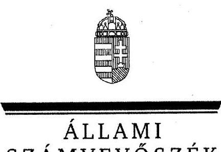
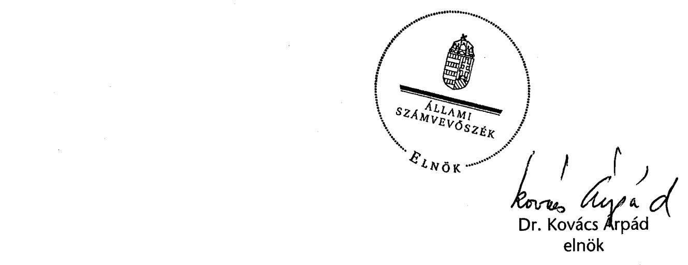
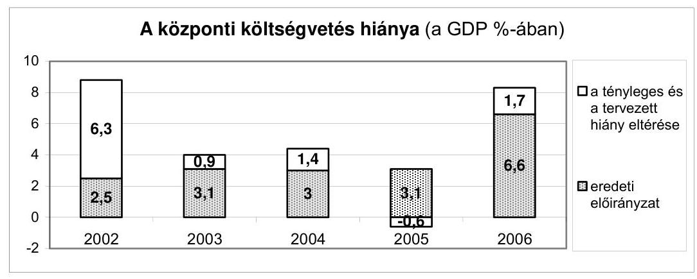
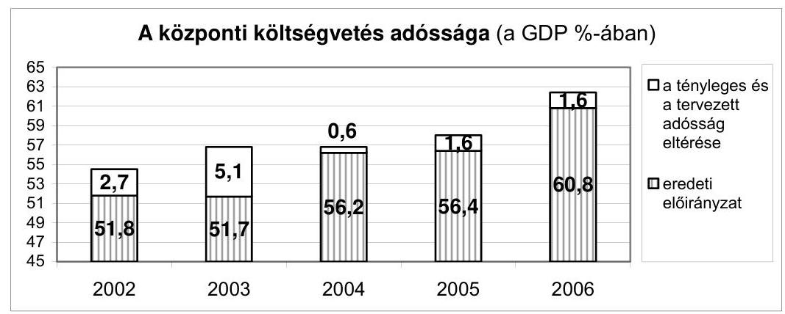
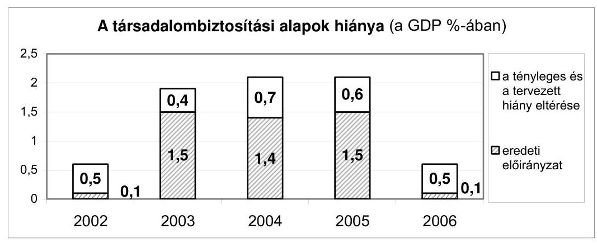
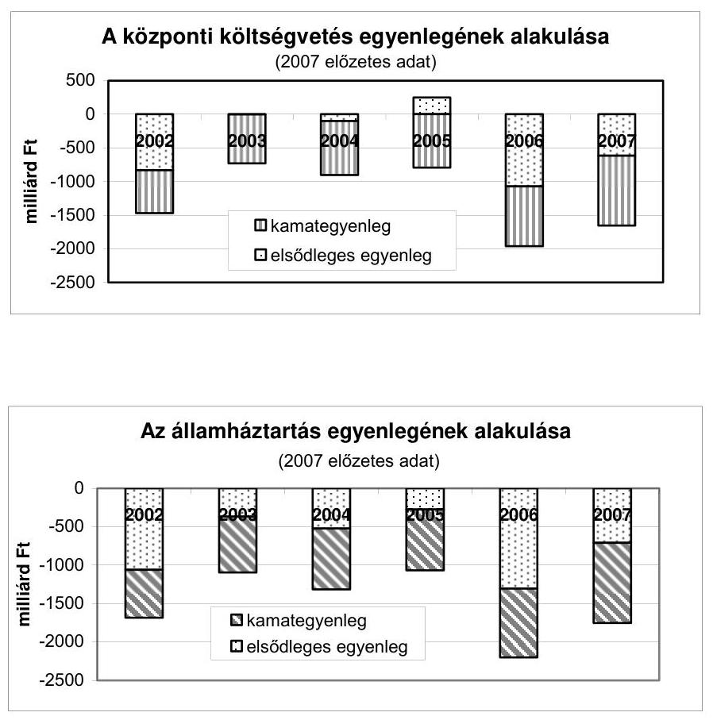
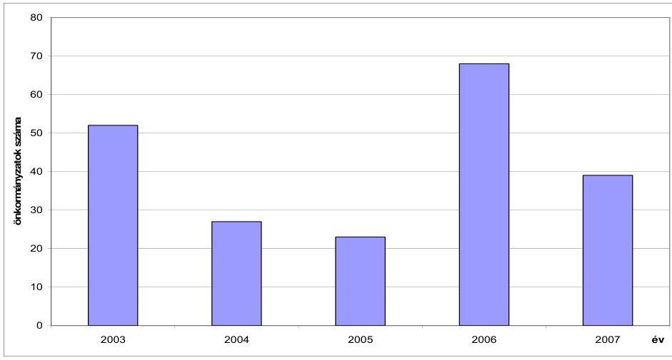

ÁLLAMI
SZÁMVEVŐSZÉK

# JELENTÉS 

a Magyar Köztársaság 2006. évi költségvetése végrehajtásának ellenőrzéséről

---

# 1. Szervezetirányítási és Működtetési Igazgatóság 

Vizsgálat-azonosító szám: V0293

## Az ellenőrzést felügyelte:

Dr. Csapodi Pál
főtitkár

## Az ellenőrzés végrehajtásáért felelős:

Dr. Kékesi László
főtitkárhelyettes

## Az ellenőrzést vezette:

Horváthné Menyhárt Erika
főcsoportfőnök-helyettes

## Az ellenőrzést végezték:

| Bojtos Rozália | Göller Géza | Nagyné Lakhézi Éva |
| :-- | :-- | :-- |
| tanácsadó | főtanácsadó | számvevő tanácsos |
| Dr. Somorjai Zsoltné | Bálint Józsefné |  |
| számvevő tanácsos | címzetes főmunkatárs |  |

## 2. Államháztartás Központi Szintjét Ellenőrző Igazgatóság

## Az ellenőrzést felügyelte:

Bihary Zsigmond
főigazgató

## Az ellenőrzés végrehajtásáért felelős:

Simon Ákosné
főigazgató-helyettes

## Az ellenőrzést vezette:

Horváth Sándor
főcsoportfőnök-helyettes
Holé Sándorné Dr.
igazgatóhelyettes
Szabóné Farkas Katalin
osztályvezető főtanácsos

## Az összefoglaló jelentést készítették:

Balázs Melinda
számvevő tanácsos
Dormán István Zoltán
számvevő
Fogarasi Miklós
főtanácsadó
Jagicza Istvánné
számvevő
Kádár Kriszta
számvevő
Magyar Sára
számvevő
Niklai Heléna
számvevő
Dr. Pósch Gábor
főtanácsadó

## Bamberger Mária

tanácsadó
Farkas László
főtanácsadó
Görgényi Gábor
számvevő
Jenei Zoltán Béláné
számvevő
Krémó Márkné
számvevő tanácsos
Dr. Mészáros Leila
számvevő
Papp Julianna
számvevő tanácsos
Séra Andrásné
főtanácsadó

Hámoriné Maróti Györgyi osztályvezető főtanácsos
Pongrácz Éva osztályvezető főtanácsos

Deli Gáborné
számvevő
Ferencz Katalin
számvevő tanácsos
Gyarmati István
tanácsadó
Karsai Lászlóné
főtanácsadó
Knoppné Szabó Ildikó
számvevő tanácsos
Morvay András
tanácsadó
Pető Krisztina
számvevő
Szabóné Simai Mária
számvevő

---

Dr. Szima Mária
tanácsadó
Zaroba Szilvia
számvevő

## Az ellenőrzést végezték:

Dr. Ackermann János külső munkatárs

Dr. Baji László számvevő
Balázs Melinda számvevő tanácsos

Bamberger Mária tanácsadó

Dr. Bartos László számvevő

Bodor Alfréd
külső munkatárs
Csuhai Miklósné
külső munkatárs
Dede Katalin
számvevő tanácsos
Dombovári Nóra számvevő

Éva Katalin
főtanácsadó
Farkas Sándor
külső munkatárs
Fekete Győr László számvevő
Félegyházi-Törökné
Somogyi Éva
külső munkatárs
Gaál Attila
külső munkatárs
Görgényi Gábor számvevő

Győrffi György
külső munkatárs
Hajduné Sipos Erika számvevő tanácsos

Hegedűsné Erdélyi Piroska tanácsadó

Holló András számvevő

Dr. Hódos Ágnes külső munkatárs

Jagicza Istvánné számvevő

Jenei Zoltán Béláné számvevő

Vas Lajos
főtanácsadó

Ács László
külső munkatárs
Baki István
számvevő
Dr. Balázs Péter
külső munkatárs
Bánlaki Lívia
külső munkatárs
Bedécs Erzsébet számvevő

Böröczné Kőszegi Zsuzsanna külső munkatárs

Csutora Erzsébet
külső munkatárs
Deli Gáborné számvevő

Dr. Domján Eszter számvevő tanácsos

Ézsiás László
külső munkatárs
Farkas Timea
külső munkatárs
Fekete Tibor
külső munkatárs
Fogarasi Miklós
főtanácsadó
Galuska Józsefné
külső munkatárs
Gyarmati István tanácsadó

Haáz Andorné
külső munkatárs
Haklik Józsefné
külső munkatárs
Hegedűsné Csongor Mária külső munkatárs

Horcsin Attila számvevő

Huszár József számvevő
Dr. Jakab Kornél számvevő

Jeszenkovits Tamás számvevő tanácsos

Winter Zsuzsa
számvevő tanácsos

Antal Zoltán
külső munkatárs
Balla Zoltán
külső munkatárs
Dr. Baloghné Sebestyén Éva számvevő

Bartha Gyula
külső munkatárs
Beszeda István
külső munkatárs
Burenzsargal Narantuja számvevő

Dancsóné Kuron Ildikó számvevő

Dr. Deli Lajosné
külső munkatárs
Dormán István Zoltán számvevő

Farkas László
főtanácsadó
Fehérné Jagasich Mariann számvevő tanácsos

Ferencz Katalin számvevő tanácsos

Franczen Lajos számvevő gyakornok

Gömöri József számvevő tanácsos

Győrffi Dezső
külső munkatárs
Hajdu Károlyné számvevő tanácsos

Halcsák József
külső munkatárs
Hegedűs Miklós
külső munkatárs
Horváth József
tanácsadó
Huszárné Borbás Melinda számvevő

Jäger Lajos számvevő

Kaiser Ilona
külső munkatárs

---

Kádár Kriszta számvevő

Kincses Erzsébet Eszter számvevő

Kocsis Ferencné számvevő

Dr. Knapp József külső munkatárs

Kőhalminé Major Judit külső munkatárs

Dr. Lengyel Attila tanácsadó

Major Lászlóné számvevő tanácsos

Mátrai Katalin külső munkatárs

Dr. Mészáros Leila számvevő

Molnár Imre tanácsadó

Nagy Zoltánné külső munkatárs

Niklai Heléna számvevő

Papp József számvevő tanácsos

Pető Krisztina számvevő

Dr. Pósch Gábor főtanácsadó

Reszler György külső munkatárs

Dr. Rónai Éva külső munkatárs

Dr. Sipos Dóra számvevő tanácsos

Sükösd István külső munkatárs

Szakál Pálné külső munkatárs

Dr. Szávai Tamás főtanácsadó

Szilágyi Zsuzsanna tanácsadó

Ifj. Szita László külső munkatárs

Szőke Gábor külső munkatárs

Tasner Mária külső munkatárs

Vacsora Erika számvevő tanácsos

Dr. Kálmán Zoltán külső munkatárs

Kiss Istváné főtanácsadó

Konorót Zsuzsanna számvevő tanácsos

Knoppné Szabó Ildikó számvevő tanácsos

Krémó Márkné számvevő tanácsos

Maczekó Károly külső munkatárs

Marozsán Katalin külső munkatárs

Mátyási József számvevő

Dr. Mohácsi Istvánné tanácsadó

Morvay András tanácsadó

Nedeljkovic Diána külső munkatárs

Nitaisz Jánosné külső munkatárs

Papp Julianna számvevő tanácsos

Petrovszky Pál külső munkatárs

Remeczki László külső munkatárs

Dr. Ritter Gábor külső munkatárs

Séra Andrásné főtanácsadó

Somjay István külső munkatárs

Szabó Erzsébet számvevő tanácsos

Szatainé Kováts Erna számvevő

Szentesiné Tuka Margit külső munkatárs

Dr. Szima Mária tanácsadó

Szöllősiné Hrabóczki Etelka főtanácsadó

Takács Andrea külső munkatárs

Tolnai Józsefné külső munkatárs

Varga Józsefné külső munkatárs

Karsai Lászlóné főtanácsadó

Kiss Józsefné külső munkatárs

Koska János külső munkatárs

Kovács Judit külső munkatárs

Krüzselyi Attila számvevő

Magyar Sára számvevő

Mátrai Istvánné külső munkatárs

Mesterné Berta Ildikó külső munkatárs

Molnár Bálint számvevő

Nagy József főtanácsadó

Némethné Nagy Mária számvevő

Papp Ferencné külső munkatárs

Patai Tamás számvevő tanácsos

Polyák Ferenc számvevő

Dr. Remport Katalin tanácsadó

Dr. Ritter Gáborné külső munkatárs

Sidlovics Sándor külső munkatárs

Stamler Jánosné külső munkatárs

Szabóné Simai Mária számvevő

Szatmári Andrea külső munkatárs

Szilágyi Gyöngyi főtanácsadó

Szita László külső munkatárs

Dr. Szöllősi Zoltán külső munkatárs

Takács Béla külső munkatárs

Unger Ferenc külső munkatárs

Váriné Kádár Margit külső munkatárs

---

| Varsányiné Dudás Eleonóra | Vas Lajos |
| :-- | :-- |
| számvevő gyakornok | főtanácsadó |
| Dr. Vass Gábor | Verő Tünde |
| számvevő tanácsos | számvevő |
| Vörös Lászlóné | Vida Ildikó |
| külső munkatárs | külső munkatárs |
| Winter Zsuzsa | Zagyva Béla |
| számvevő tanácsos | külső munkatárs |

Zaroba Szilvia számvevő

## 3. Önkormányzati és Területi Ellenőrzési Igazgatóság

## Az ellenőrzést felügyelte:

Dr. Lóránt Zoltán
főigazgató

## Az ellenőrzés végrehajtásáért felelős:

Dr. Sepsey Tamás
főigazgató helyettes
Németh Péterné
főcsoportfőnök

## Az ellenőrzést vezette:

Holman Magdolna osztályvezető

Németh Gábor igazgató helyettes

Turnheimné Lakos Zsuzsa
főcsoportfőnök helyettes

## Az összefoglaló jelentést készítették:

| Ambrus Lajos főtanácsadó | Czifra Erzsébet tanácsadó | Dr. Ernst László főtanácsadó |
| :--: | :--: | :--: |
| Gelencsér Zoltán számvevő | Kersmájer Ágota számvevő tanácsos | Dr. Kiss Károly számvevő tanácsos |
| Korsósné Vígh Andrea számvevő tanácsos | Preller Zsuzsanna tanácsadó | Tóthné Salamon Ildikó tanácsadó |
| Varga József főtanácsadó | dr.Vasváriné dr. Rózsa Anikó főtanácsadó |  |
| Az ellenőrzést végezték: |  |  |
| Alexovics Ágota számvevő tanácsos | Ambrus Lajos főtanácsadó | Baloghné Dakó Eszter számvevő tanácsos |
| Batkiné Vas Anna számvevő | Bencsik Árpád számvevő | Benkéné dr. Lavner Klára számvevő tanácsos |
| Bíró Zsolt számvevő | Dr. Boda Sándor számvevő tanácsos | Buús Zoltánné Hütter Erzsébet számvevő |
| Czifra Erzsébet tanácsadó | Csényi István számvevő | Csepreginé Tancsik Erzsébet számvevő tanácsos |
| Csuti Lajos számvevő tanácsos | Dér Lívia számvevő tanácsos | Eigner György Zoltán számvevő |
| Dr. Ernst László főtanácsadó | Dr. Fátrainé Zsebedics Katalin tanácsadó | Fercsik Gyula főtanácsadó |
| Gaál László számvevő | Gelencsér Zoltán számvevő | Groholy Andrásné Hangyál Márta számvevő |
| György Árpád számvevő tanácsos | Hadházy Sándor számvevő tanácsos | Dr. Hegedüs György főtanácsadó |

---

| Dr. Horváth Klára számvevő | Horváth Mária számvevő | Humli Tamásné számvevő |
| :--: | :--: | :--: |
| Iszakné Dóczé Katalin számvevő | Jakubcsák Jenő számvevő tanácsos | Kalmár István számvevő tanácsos |
| Kányáné Murva Tünde számvevő | Kenéz Sándor főtanácsadó | Kerezsi Pál számvevő tanácsos |
| Kersmájer Ágota számvevő tanácsos | Keszthelyi Zoltán számvevő tanácsos | Kispálné Wiedemann Györgyi tanácsadó |
| Dr. Kiss Károly számvevő tanácsos | Kiss Rita Teréz számvevő | Koczor László számvevő |
| Komlósiné Bogár Éva számvevő tanácsos | Kopaczné Horváth Zsuzsanna számvevő tanácsos | Korsósné Vígh Andrea számvevő tanácsos |
| Kozma Gábor számvevő tanácsos | Köllődné Gátai Mária számvevő | Lingné Rajz Borbála számvevő tanácsos |
| Maróti Sándor számvevő tanácsos | Mokánszkiné Mengyi Andrea számvevő | Molnár Istvánné számvevő |
| Nagy Attila számvevő tanácsos | Nagy Ervin Barnabás számvevő | Nyikon Zsigmondné számvevő tanácsos |
| Pálfiné Pusztai Magdolna számvevő | Pappné dr. Szamosi Éva számvevő tanácsos | Péntek László   főtanácsadó |
| Preller Zsuzsanna tanácsadó | Puskás Balázs számvevő | Reichert Margit számvevő |
| Renkó Zsuzsanna számvevő tanácsos | Ritecz Tibor számvevő | Szabó Leonóra Ildikó számvevő |
| Szabó Zoltán számvevő tanácsos | Szalontai Miklós számvevő tanácsos | Szarvas Szilárd számvevő |
| Dr. Szikszai Bertalan számvevő tanácsos | Szikszainé Király Mária tanácsadó | Dr. Telkes Imre számvevő tanácsos |
| Tormáné Ivánfi Irén számvevő tanácsos | Tótfalusi Zoltán számvevő | Tóth László számvevő |
| Tóth Pál számvevő tanácsos | Tóth Péter számvevő | Tóth Tamás számvevő |
| Tóthné Salamon Ildikó tanácsadó | Varga József   főtanácsadó | Dr. Vasváriné dr. Rózsa Anikó főtanácsadó |
| Veres Jánosné számvevő | Vojcsekné Szabó Ágnes számvevő tanácsos |  |

# A témához kapcsolódó eddig készített számvevőszéki jelentések: 

## címe

Jelentés a Magyar Köztársaság 2003. évi költségvetése végrehajtásának ellenőrzéséről
Jelentés a Magyar Köztársaság 2004. évi költségvetése végrehajtásának ellenőrzéséről
Jelentés a Magyar Köztársaság 2005. évi költségvetése végrehajtásának ellenőrzéséről
sorszáma
0443
0540

---

# TARTALOMJEGYZÉK 

BEVEZETŐ ..... 7
I. ÖSSZEGZŐ MEGÁLLAPÍTÁSOK, KÖVETKEZTETÉSEK, JAVASLATOK ..... 10
II. RÉSZLETES MEGÁLLAPÍTÁSOK ..... 53
A) A ZÁRSZÁMADÁSI DOKUMENTUM TÖRVÉNYESSÉGI ÉS SZÁMSZAKI ELLENŐRZÉSE ..... 55

1. A zárszámadási dokumentum tartalma, szerkezete ..... 57
2. Egyes törvényi előírások és felhatalmazások teljesítése ..... 58
2.1. A dokumentumra vonatkozó Áht.-előírások teljesítése ..... 58
2.2. A költségvetési törvényben kapott felhatalmazások teljesítése ..... 62
3. A zárszámadási dokumentum külső és belső egyezősége, átláthatósága ..... 65
4. Fejezeti indokolások ..... 67
B) HELYSZÍNI ELLENŐRZÉS ..... 69
B1. AZ ÁLLAMHÁZTARTÁS KÖZPONTI SZINTJE ..... 71
B.1.1. A KÖZPONTI KÖLTSÉGVETÉS ..... 71
5. A központi költségvetés 2006. évi törvényi előirányzatainak teljesítése, a hiány alakulása ..... 71
6. A központi költségvetés finanszírozása és a kincstári egységes számla likviditása ..... 73
2.1. A központi költségvetés finanszírozási igénye ..... 73
2.2. A központi költségvetés tényleges finanszírozása ..... 77
7. A központi költségvetés közvetlen előirányzatai ..... 82
3.1. A központi költségvetés közvetlen bevételei ..... 82
3.1.1. Vállalkozások költségvetési befizetései ..... 83
3.1.2. Fogyasztáshoz kapcsolt adók ..... 87
3.1.3. A lakosság befizetései ..... 90
3.1.4. Egyéb költségvetési bevételek ..... 93
3.1.5. Állami vagyonnal kapcsolatos bevételek ..... 93
3.1.5.1. Osztalékbevételek ..... 93

---

3.1.5.2. Koncessziós bevételek ..... 94
3.1.5.3. Kincstári vagyonkezeléssel és -hasznosítással kapcsolatos központi költségvetést megillető bevétel ..... 95
3.1.6. Uniós elszámolások ..... 96
3.1.7. Vám- és egyes adónemek visszatérítése ..... 97
3.2. A központi költségvetés közvetlen bevételei elszámolásainak megbízhatósága ..... 98
3.2.1. A belső kontrollok működése az APEH-nél és a VP-nél ..... 98
3.2.2. Az APEH és a VP főkönyvi és analitikus nyilvántartásának egyezősége ..... 99
3.3. A köztartozások behajtására tett intézkedések ..... 105
3.3.1. Az adóhátralékok behajtására tett intézkedések ..... 105
3.3.2. Végrehajtói letéti rendszer ..... 109
3.3.3. Fizetési könnyítés, méltányossági jogok gyakorlása az APEH-nél ..... 110
3.3.4. A vámhatóság által kezelt vám- és adótartozások behajtására tett intézkedések ..... 111
3.3.5. A központi költségvetési szervek tartozásállománya, köztartozásai ..... 112
3.4. A központi költségvetés közvetlen kiadásai ..... 114
3.4.1. Az előirányzatok felhasználása ..... 114
3.4.2. A központi költségvetés kamatelszámolásai, tőkevisszatérülései, adósság- és követeléskezelés költségei ..... 120
3.4.3. A központi költségvetés terhére vállalt kezesség ..... 128
3.4.4. Általános tartalék és céltartalék ..... 136
3.5. A központi költségvetés közvetlen kiadásai elszámolásainak megbízhatósága ..... 143
4. A közvetlen bevételek és kiadások elszámolásában érintett szervezetek informatikai rendszereinek értékelése ..... 152
5. A fejezetek költségvetésének végrehajtása ..... 160
5.1. A fejezetek bevételi és kiadási előirányzatainak teljesítése, az előirányzat-maradványok alakulása, az intézmények finanszírozása ..... 164
5.1.1. A bevételi előirányzatok teljesítése ..... 164
5.1.2. A kiadási előirányzatok teljesítése ..... 165
5.1.3. Az előirányzat-maradványok alakulása ..... 165
5.1.4. A költségvetési intézmények finanszírozása ..... 167
5.1.4.1. Az előirányzat-felhasználási keret megnyitása, felhasználása ..... 167
5.2. A beszámolók megbízhatósága ..... 168
5.2.1. Az ún. alkotmányos, illetve egyintézményes fejezetek, fejezeti jogosítványú költségvetési címek beszámolóinak megbízhatósága ..... 168
5.2.2. A kijelölt fejezetek teljes intézményi körét érintő beszámoló megbízhatósága ..... 169

---

5.2.3. Az igazgatási címek, alcímek elemi beszámoló jelentéseinek megbízhatósága ..... 172
5.2.4. A fejezeti kezelésű előirányzatok elszámolásainak megbízhatósága ..... 173
5.2.5. EU Integráció fejezet és a fejezeteknél megjelenített EU Integráció fejezeti kezelésű előirányzatok beszámolóinak megbízhatósága ..... 173
5.2.6. A fejezetek által ellenőrzött elemi beszámolók megbízhatósága ..... 175
6. Az EU-támogatások és az uniós tagsággal összefüggő hazai befizetések ..... 176
7. Letéti számlák ..... 186
7.1. A központi letéti számla

 ..... 186
7.2. Fejezeti letéti számlák ..... 187
8. A korábbi ÁSZ ellenőrzések megállapításaival kapcsolatban tett intézkedések ..... 189
B.1.2. ELKÜLÖNÍTETT ÁLLAMI PÉNZALAPOK ..... 194

1. Munkaerőpiaci Alap ..... 194
1.1. Az MPA költségvetési beszámolója ..... 194
1.2. Az MPA pénzügyi helyzete ..... 195
1.3. Az Alap bevételeinek teljesülése ..... 195
1.4. Az MPA 2006. évi kiadásai ..... 196
2. Központi Nukleáris Pénzügyi Alap ..... 198
2.1. Az Alap 2006. évi költségvetésének végrehajtása ..... 198
2.1.1. Az Alap bevételei ..... 198
2.1.2. Az Alap kiadásai ..... 198
3. Wesselényi Miklós Ár- és Belvízvédelmi Kártalanítási Alap ..... 199
4. Kutatási és Technológiai Innovációs Alap ..... 200
4.1. Az Alap 2006. évi költségvetési beszámolója ..... 201
4.2. Az Alap 2006. évi költségvetésének teljesülése ..... 202
4.2.1. A bevételek alakulása ..... 202
4.2.2. A kiadások alakulása ..... 203
4.2.3. Az Alap előirányzat-maradványa ..... 203
4.2.4. Az Alap ellenőrzési rendszere ..... 204
4.3. Utóvizsgálat ..... 205
5. Szülőföld Alap ..... 205
5.1. A Szülőföld Alap létrehozása, működtetése ..... 205
5.2. A Szülőföld Alap 2006. évi költségvetésének végrehajtása ..... 206
5.3. A pályázatok ellenőrzésének tapasztalatai ..... 207

---

5.4. A határon túli magyarok támogatására szolgáló előirányzatok és a Szülőföld Alap kapcsolata ..... 208
5.5. Utóvizsgálat ..... 208
6. Nemzeti Kulturális Alap ..... 209
6.1. A Nemzeti Kulturális Alap létrehozása, működtetése ..... 209
6.2. A Nemzeti Kulturális Alap 2006. évi költségvetésének végrehajtása ..... 210
B.1.3. A TÁRSADALOMBIZTOSÍTÁS PÉNZÜGYI ALAPJAI ..... 212

1. Nyugdíjbiztosítási Alap ..... 212
1.1. A Nyugdíjbiztosítási Alap költségvetési beszámolóinak minősítése ..... 212
1.2. A költségvetési beszámoló tartalma ..... 212
1.2.1. Az Ny. Alap pénzügyi helyzetének értékelése ..... 212
1.2.2. Nyugdíjbiztosítási Alap pénzforgalma és likviditása ..... 213
1.2.3. A Ny. Alap mérlegeinek értékelése ..... 214
1.3. Az alapkezelő feladatellátása ..... 214
1.4. Az Ny. Alap 2006. évi bevételeinek alakulása ..... 215
1.4.1. Az Ny. Alap költségvetési bevételeinek teljesülése ..... 215
1.4.2. Az APEH adatszolgáltatási kötelezettségének teljesítése, az adatok megbízhatósága ..... 215
1.5. Az Ny. Alap kiadásainak alakulása ..... 218
1.5.1. Az Ny. Alap ellátási kiadásai ..... 218
1.5.2. Az Ny. Alap vagyongazdálkodási kiadásai ..... 221
1.6. A működési kiadások alakulása ..... 221
2. Egészségbiztosítási Alap ..... 222
2.1. Az E. Alap költségvetési beszámolóinak minősítése ..... 222
2.2. A költségvetési beszámoló tartalma ..... 223
2.2.1. Az E. Alap pénzügyi helyzetének értékelése ..... 223
2.2.2. Az E. Alap pénzforgalmának és likviditásának alakulása ..... 224
2.2.3. Az E. Alap mérlegeinek értékelése ..... 224
2.3. Az alapkezelő feladatainak ellátása ..... 224
2.4. Az E. Alap 2006. évi bevételeinek alakulása ..... 225
2.4.1. Az APEH adatszolgáltatási tevékenységének értékelése ..... 225
2.5. Az Egészségbiztosítási Alap 2006. évi ellátási kiadásai ..... 227
2.5.1. Rokkantsági nyugellátások kiadásai ..... 227
2.5.2. Egészségbiztosítás pénzbeli ellátásaira fordított kiadások alakulása ..... 228
2.5.3. A gyógyító-megelőző egészségügyi ellátás kiadásai ..... 229
2.5.4. Irányított Betegellátási Rendszer ..... 232
2.5.5. A gyógyszer-támogatási kiadások alakulása ..... 235
2.5.6. Gyógyászati segédeszközök támogatása ..... 236
2.5.7. Természetbeni ellátások méltányossági kiadása ..... 237

---

2.5.8. Egyéb természetbeni ellátások ..... 237
2.6. A működési kiadások alakulása ..... 238
2.7. Az Országos Orvosszakértői Intézet átadása ..... 239
B.2. AZ ÁLLAMHÁZTARTÁS HELYI SZINTJE, A HELYI ÖNKORMÁNYZATOK ..... 240

1. A Költségvetési tv. mellékleteiben meghatározott központi támogatások elszámolásának szabályszerűsége ..... 240
1.1. Előirányzatok nyilvántartása ..... 240
1.1.1. Az eredeti előirányzatok jogcímenkénti megfelelősége a Költségvetési tv.-ben és a PM-BM együttes rendeletben ..... 240
1.1.2. Az előirányzat-módosítások szabályszerűsége ..... 242
1.2. A helyi önkormányzatok támogatásainak és hozzájárulásainak jogcímenkénti alakulása ..... 244
1.2.1. A helyi önkormányzatok normatív hozzájárulásai ..... 244
1.2.2. A helyi önkormányzatok személyi jövedelemadó részesedése ..... 247
1.2.3. A helyi önkormányzatok által felhasználható központosított előirányzatok ..... 249
1.2.4. A helyi önkormányzatok működőképességének megőrzését szolgáló kiegészítő támogatások ..... 259
1.2.4.1. Az önhibájukon kívül hátrányos helyzetben lévő helyi önkormányzatok támogatása ..... 260
1.2.4.2. A tartósan fizetésképtelen helyzetbe került helyi önkormányzatok támogatása ..... 261
1.2.4.3. A működésképtelen önkormányzatok egyéb támogatása ..... 262
1.2.5. A helyi önkormányzatok színházi támogatása ..... 264
1.2.5.1. A kőszínházak és a bábszínházak működtetési hozzájárulása ..... 264
1.2.5.2. Színházak pályázati támogatása ..... 265
1.2.6. A normatív kötött felhasználású támogatások ..... 266
1.2.7. Felhalmozási célú támogatások ..... 269
1.2.7.1. Címzett és céltámogatások ..... 270
1.2.7.2. A helyi önkormányzatok fejlesztési és vis maior feladatainak támogatása ..... 277
1.2.7.3. Vis maior tartalék ..... 278
1.2.7.4. A leghátrányosabb helyzetű kistérségek felzárkóztatásának támogatása ..... 279
1.2.8. Budapest 4-es - Kelenföldi pályaudvar-Bosnyák tér közötti metróvonal első szakasz építése támogatási rendszerének ellenőrzése ..... 280
1.2.9. Szociális nyári gyermekétkeztetés ..... 285
1.2.10. Támogatás rendkívüli időjárás miatt keletkezett lakossági károk enyhítésére ..... 285

---

2. A helyi önkormányzatok előző évi elszámolása és ellenőrzése során megállapított eltérések rendezésének szabályszerűsége ..... 286
3. A könyvvizsgálati kötelezettség teljesítésének országos tapasztalatai a 2007. évben ..... 288
RÖVIDÍTÉSEK JEGYZÉKE ..... 293

---

# BEVEZETŐ 

Az Országgyűlés a Magyar Köztársaság 2006. évi költségvetését a 2005. évi CLIII. törvényben (Költségvetési tv.) hagyta jóvá, amely magában foglalta a központi költségvetés, a társadalombiztosítás pénzügyi alapjai, az elkülönített állami pénzalapok, valamint a helyi önkormányzatokat megillető támogatások és hozzájárulások előirányzatait. A Kormány a végrehajtásról készített törvényjavaslatot és a döntéshozatalhoz szükséges információkat az éves zárszámadási dokumentumban terjeszti az Országgyűlés elé, amit az együtt tárgyal a zárszámadás ellenőrzéséről készített számvevőszéki jelentéssel.

Az ellenőrzés lefolytatásának jogi alapját az Állami Számvevőszékről szóló 1989. évi XXXVIII. tv. 1. § (2), a 2. § (1), valamint ezen jogszabályi előírásokra figyelemmel a 2. § (3), (5)-(6) és (9) bekezdései, a 17. § (1), a 18. § (2) bekezdései, továbbá az államháztartásról szóló 1992. évi XXXVIII. tv. 104. § (3) és a 120/A. § (1) bekezdései együttesen képezik.

Az ellenőrzés célja annak értékelése volt, hogy

- a Magyar Köztársaság 2006. évi költségvetése teljesítését bemutató törvényjavaslat valósághűen tükrözi-e a 2006. évi pénzügyi folyamatokat és a költségvetés végrehajtásában jog-, és hatáskörrel rendelkezők a törvényekben kapott felhatalmazásuk keretei között tettek-e eleget kötelezettségeiknek;
- a 2006. évi költségvetés végrehajtása során érvényesültek-e az államháztartási törvény, a Költségvetési tv., illetve az egyéb vonatkozó jogszabályok és az állami irányítás egyéb jogi eszközei előírásai;
- a helyi önkormányzatokat megillető hozzájárulások, támogatások előirányzatainak módosítását szabályszerűen végezték-e, azok folyósítása a jogszabályi előírások szerint történt-e;
- a helyszíni vizsgálatba vont önkormányzatok a jogszabályoknak megfelelően igényelték, használták fel és számolták-e el a hozzájárulásokat és a támogatásokat;
- a támogatások igénylésére vonatkozó pályázati kiírások tartalma és a pályázatokról hozott döntés összhangban van-e a tárgyévre vonatkozó költségvetési törvénnyel és a kapcsolódó ágazati jogszabályokkal;
- a zárszámadási dokumentum előterjesztése megfelel-e a vonatkozó törvényi előírásoknak, adattartalma segíti-e a költségvetési év lezárásához szükséges döntések meghozatalát.

---

A jelentésben az államháztartásban használatos mutatók segítségével, az államháztartás szerkezeti rendjéhez igazodva mutatjuk be a hiány tervezettel szembeni alakulását.

A 2006. évi költségvetés végrehajtásának ellenőrzése során az EU-ban széles körben alkalmazott, az ÁSZ által a hazai sajátosságok figyelembevételével kidolgozott, financial audit módszerével minősítettük a zárszámadás adatainak megbízhatóságát:

- az alkotmányos és az egyintézményes fejezeteknél,
- a PM, az ÖTM, az IRM, a KvVM, az EU integráció és a KSH fejezeteknél,
- a fejezeti jogosítványú költségvetési címeknél,
- a fennmaradó fejezetek igazgatási címeinél, illetve azok fejezeti kezelésű előirányzatainál, valamint
- a központi költségvetés közvetlen bevételeit és kiadásait érintően.

Az adatok megbízhatóságának ellenőrzésével egyidejűleg az elszámolásokhoz kapcsolódó pénzügyi-gazdasági folyamatok szabályszerűségét is vizsgáltuk, és ezek eredményei együttesen határozták meg a beszámolók, elszámolások megbízhatóságáról alkotott véleményünket.

A fejezetek felügyeletét ellátó szervek az általuk ellenőrzött intézményi körben (a kiadási főösszeg 3\%-a) szintén az ÁSZ módszertana szerint minősítették a beszámoló jelentések megbízhatóságát. A feladat végrehajtása - az ÁSZ és a fejezeti belső ellenőrök - szoros szakmai együttműködése mellett valósult meg. Ennek eredményeként a központi költségvetés kiadási főösszege 83\%-át fedték le a megbízhatósági ellenőrzések. Ezzel reálissá vált az a cél, hogy az Országgyűlés korábbi határozatainak, illetve a 193/2003. (XI. 26.) kormányrendeletben foglaltaknak megfelelően 2010-re teljes körűvé váljanak a megbízhatósági ellenőrzések a központi költségvetés területén. Ehhez azonban arra van szükség, hogy a fejezetek felügyeleti szervei maradéktalanul teljesítsék ellenőrzési kötelezettségüket. (Bíztató, hogy több tárca - pl. GKM, OKM, SZMM, FVM - jelezte ez irányú szándékát.)

Az alapok zárszámadásának ellenőrzésénél az Áht. 57. és a 86/A. §-ára figyelemmel egyéb szabályszerűségi ellenőrzést végeztünk, amelynek során hasznosítottuk a könyvvizsgálat értékelését.

A nemzetgazdasági elszámolások esetén - a jelentős nagyságrendet képviselő előirányzatoknál - az érintett szervezetek (APEH, VP, ÁKK Zrt., Magyar Államkincstár) informatikai rendszereit is ellenőriztük. Az Európai Unióval kapcsolatos elszámolásokat (támogatások és befizetések) külön is értékeltük. A Költségvetési tv.-ben szereplő, a területhez tartozó előirányzatok teljesítését összesítve és részletesen is ellenőriztük.

---

A helyszíni ellenőrzés során áttekintettük a Magyar Köztársaság 2005. évi költségvetése végrehajtásának ellenőrzéséről készített számvevőszéki jelentésben (számvevői jelentésekben) rögzített hiányosságok felszámolására tett intézkedéseket is.

A 2006. évi zárszámadáshoz kapcsolódóan az önkormányzati alrendszer vonatkozásában 815,6 Mrd Ft központi költségvetésből nyújtott hozzájárulás és támogatás, valamint 473,7 Mrd Ft átengedett személyi jövedelemadó igénylését, felhasználását és elszámolását ellenőriztük szabályszerűségi szempontból. A címzett és céltámogatással megvalósított befejezett, illetve üzembe helyezett beruházások esetében a teljesítmény-ellenőrzés módszerével vizsgáltuk a beruházások célszerűségét, eredményességét.

A normatív hozzájárulás elszámolását 72 önkormányzatnál, a kötött felhasználású támogatásokat 44 önkormányzatnál és 4 regionális fejlesztési tanácsnál, valamint 4 minisztériumnál, továbbá a felhalmozási célú támogatásokat 33 önkormányzatnál ellenőriztük.

Zárszámadási ellenőrzésünk alapján 105 javaslatot tettünk, melyekkel erősíteni kívánjuk a zárszámadás adatainak megbízhatóságát, a pénzfelhasználások átláthatóságát, illetve a feltárt hibák jövőbeni elkerülését.

A legfontosabb, átfogó szemléletű, illetve minden fejezetet érintő javaslatainkat az összefoglaló megállapítások mögé szerkesztettük, míg a tárcáknak tett, szabályszerűségre vonatkozó javaslatokat a jelentés függelékében, az adott tárcánál a részletes megállapítások után szerepeltetjük.

A jelentés két kötetből áll. Az első kötet az ellenőrzés legfontosabb megállapításait és javaslatait, valamint a zárszámadási dokumentum törvényességi és számszaki ellenőrzésére és az államháztartás alrendszereire vonatkozó részletes ellenőrzési megállapításokat tartalmazza. A második kötet (Függelék) a költségvetési fejezetekre, az EU-támogatásokkal és az uniós tagsággal összefüggő hazai befizetésekre, az elkülönített állami pénzalapokra, a társadalombiztosítási alapokra és a helyi önkormányzatok költségvetési kapcsolataira vonatkozó részletes megállapításokat és javaslatokat foglalja magában.

---

# I. ÖSSZEGZŐ MEGÁLLAPÍTÁSOK, KÖVETKEZTETÉSEK, JAVASLATOK 

Az államháztartás alrendszereinek 2006. évi bevételi előirányzata 12 703,2 Mrd Ft, kiadási előirányzata 14 283,8 Mrd Ft, a tervezett hiány 1580,6 Mrd Ft volt.

A Költségvetési tv.-t az Országgyűlés két alkalommal módosította, amely érintette a központi költségvetés, a társadalombiztosítás pénzügyi alapjainak főösszegeit és hiányát, illetve az elkülönített állami pénzalapok bevételi főösszegét és egyenlegét. Az államháztartás hiánya 618,4 Mrd Ft-tal 2199,0 Mrd Ft-ra nőtt a tervezettel szemben, így a GDP-arányos 6,8\%-os hiány 9,3\%-ra emelkedett. A kormányzati szektor uniós statisztikai egyenlege 9,2\%-ra nőtt, szemben a 2006. évre prognosztizált 6,1\%-kal¹.

Az államháztartás jellemző hiányai

|  |  |  | Mrd Ft |
| :--: | :--: | :--: | :--: |
|  | 2006. évi eredeti-  leg' tervezett (1) | 2006. évi tény   (2) | Index\%   $(=2 / 1)$ |
| Az államháztartás egésze |

 1580,6 | 2199,0 | 139,1 |
| Az államháztartás központi szintje ${ }^{a}$ | 1545,8 | 2042,5 | 132,1 |
| ebből a központi költségvetés | 1531,0 | 1961,6 | 128,1 |
| Az államháztartás helyi szintje ${ }^{b}$ | 34,8 | 156,5 | 449,7 |

${ }^{a}$ központi költségvetés, elkülönített állami pénzalapok és a társadalombiztosítási alapok együttesen
${ }^{b}$ helyi önkormányzatok
${ }^{c}$ Megjegyzés: a törvényt az Országgyűlés a 2005. december 19-i ülésnapján fogadta el.
A módosított előirányzatokhoz történő viszonyításokat a jelentésünk részletesen tartalmazza.
Az államháztartás eredetileg tervezett hiányához képest a hiány növekedése 39,1% volt. Ennek mintegy kétharmada a központi költségvetés nem tervezett kiadásnövekedésével volt összefüggésben (adósságszolgálat, a TB alapoknak átadott pénzeszközök, a világpiaci gázárnövekedés miatti kompenzáció, valamint az előirányzat-módosítás nélkül túlléphető kiadások). A TB alapok együttes hiánya 99 Mrd Ft-tal, a helyi önkormányzatoké 121,7 Mrd Ft-tal haladta meg az eredeti hiánycélt. Az elkülönített állami pénzalapok egyenlege 32,9 Mrd Ft-tal javította az államháztartás pozícióját.

Az államháztartás nagy ellátórendszereire fordított kiadások a 2006. évben is emelkedtek annak ellenére, hogy 2006. év második felében az államháztartás egyensúlyi helyzetét javító (bevételnövelő és kiadást mérséklő) intézkedések tör-

[^0]
[^0]:    ${ }^{1}$ A korábbi években és a 2006. évi költségvetési törvényjavaslat véleményezésénél is jeleztük, hogy az államháztartási hiány és a bruttó államadósság GDP-hez viszonyított aránya kockázatot hordoz.

---

téntek ${ }^{2}$. Az NY. Alapnál a nyugdíjkiadások tartós növekedése olyan adottság, amellyel rövid és hosszú távon egyaránt számolni kell.

A központi költségvetés kiadási oldalának szerkezete és szabályozása lényegében az előző évek tendenciáját követte. Nem erősödött a közpénzek előre meghatározott célok szerinti elosztásának aránya. Nem szolgálták a közpénzek felhasználásának nyomon követhetőségét és átláthatóságát, valamint az évek közötti összehasonlíthatóságot a kétévenként ismétlődő évközi kormányzati struktúraváltásból eredő, a költségvetés szerkezetét is jelentősen érintő módosítások.

A kormányzati struktúraváltás és a szervezet-átalakítások nem kidolgozott koncepció mentén valósultak meg. A fejezetek közötti feladatátrendezések jellemzően 2006. év végéig sem fejeződtek be. Ennek következtében nem minden tárcánál sikerült teljes körűen az új tárca feladatainak megfelelően összehangolni a szabályozást.

Az érintett tárcák beszámolói az Áhsz. 10. §-ában meghatározott határidőre nem készültek el. Nem volt megoldott a megszűnő intézmények bizonylatainak szabályszerű kezelése sem. A közpénzek felhasználásának átláthatóságát kedvezőtlenül érinti, hogy pl. a turisztikai, a sport, a határon túli magyarokkal kapcsolatos feladatok követhetetlen módon, többféle jogosítvánnyal, több helyen, mindig más irányítási rendben jelennek meg.

A nagyságrendjüket illetően meghatározó jelentőségű EU-forrásokat és hazai társfinanszírozással megvalósuló fejezeti kezelésű előirányzatokat a fejezetektől az irányító hatósági feladatokkal együtt áthelyezték az EU Integráció fejezethez. A zárszámadási törvényjavaslatban a tárcák szintjén jelenik meg a pénzeszközök felhasználásáról készült beszámolás, annak ellenére, hogy az érintett tárcáknak a pénzügyi folyamatokkal kapcsolatban a jogosítványuk megszűnt.

Az elszámolások és a beszámolók megbízhatóságának kockázatát növeli, hogy a fejezeti belső kontroll rendszer oly mértékben leépült 2006-ban, hogy nincs meg a feltételrendszere a közpénzekkel való gazdálkodás törvényességi és hatékonysági kontrolljának.

A költségvetési törvény és végrehajtásának jelenlegi, illetve sok éves múltra visszatekintő szabályozása nagy szabadságot biztosít a mindenkori kormányok (fejezetek, intézmények) számára az előirányzat-átcsoportosítások, illetve egyes előirányzatok előirányzat-módosítás nélküli túlteljesítése tekintetében. Ezeken túl a költségvetési törvény bevételi és kiadási főösszegének, és ezáltal a hiány összegének jelentős, a költségvetési év végéhez közeli módosítása a tervezés lényegével ellentétesen a tervet igazítja a tényleges pénzügyi folyamatokhoz. A költségvetési törvény betartásához nincsenek szankciók rendelve, az éves zárszámadási törvényjavaslat elfogadásával az Országgyűlés tudomásul veszi az eltéréseket.

[^0]
[^0]:    ${ }^{2}$ A 2006. évi költségvetési törvényjavaslat véleményezése kapcsán szintén jeleztük a társadalombiztosítás pénzügyi alapjai tekintetében, hogy az NY. Alap költségvetési egyensúlya nem valósítható meg, az E. Alap tervezett hiánya pedig nem tartható.

---

A 2006. évi folyamatok minden tekintetben a korábbi gyakorlat folytatásának tekinthetők, ezért helytálló az ÁSZ által 2007 áprilisában „A közpénzügyek szabályozásának tézisei" c. tanulmányban megfogalmazott figyelemfelhívás arról, hogy a „szabályalapú" költségvetésre való áttérés tovább nem halasztható.

# A ZÁRSZÁMADÁSI DOKUMENTUM 

A költségvetési törvények normaszövege számos, a költségvetés különféle területeire vonatkozó rendelkezést, felhatalmazást tartalmaz. A zárszámadási törvényjavaslat előterjesztésére vonatkozóan teljes körű tartalmi, szerkezeti szabályozás nincs, a költségvetési törvény normaszövegében szereplő rendelkezések teljesítését a zárszámadási törvényjavaslat különféle részeiben jeleníti meg: a zárszámadási törvényjavaslat normaszövegében, törvényi mellékleteiben, általános indokolásában, illetve fejezeti köteteiben. A zárszámadási törvényjavaslat elfogadásával az Országgyűlés nem emeli törvényi szintre az általános és fejezeti indokoló részt, az ott szereplő elszámolásokat, kimutatásokat és mérlegeket. Ennek megfelelően jelen formájában a költségvetési törvény végrehajtásáról való beszámolás nem következetes.

Az Áht. több paragrafusa tartalmaz - nem teljes körűen - előírást a zárszámadással, illetve a zárszámadási törvényjavaslat prezentációjával kapcsolatosan. A 2006. évi CXXI. tv. az Országgyűlés részére átláthatóbb, rendszerezettebb összeállítások készítésének támogatására módosította - többek között - az Áht. zárszámadással kapcsolatos paragrafusait. Mindezek ellenére a vonatkozó törvényi előírások továbbra sem egyértelműek és teljes körűek, jelen dokumentumon kevéssé érzékelhető a szándékolt változás. Így az ÁSZ - bár a törvényjavaslat jellemzően teljesíti a törvényi előírásokat - ismételten a korábbi években jelzett hiányosságokat állapítja meg (pl. hosszú távú kötelezettségvállalások állománya, közvetett támogatások bemutatása).

A törvényjavaslat normaszövege, törvényi mellékletei és általános indokolásának alapvetően jellemző tartalmi összhangja mellett továbbra is - a korábbi évekével egyező vagy azokhoz hasonló - hiányosságok tapasztalhatók a zárszámadási dokumentum átláthatósága, döntéselőkészítést támogató jellege tekintetében.

A zárszámadási dokumentumra vonatkozó megállapítások részletes kifejtése a jelentés első kötetének II. Részletes megállapítások fejezet A) A zárszámadási dokumentum törvényességi és számszaki ellenőrzése c. pontjában található meg.

## A KÖZPONTI KÖLTSÉGVETÉS

Az államháztartás központi szintjének 2006. évi tervezett bevételi főösszege 9836,7 Mrd Ft, kiadási főösszege 11 382,5 Mrd Ft, hiánya 1545,8 Mrd Ft volt. A két alkalommal történt törvényi módosítás következtében a hiány

---

2055,5 Mrd Ft-ra nőtt. A 2006. évi tényleges hiány 2042,5 Mrd Ft volt, amely 13,0 Mrd Ft-tal, 0,6%-kal kevesebb a törvényben rögzítettnél.

A központi költségvetés hiánya (1961,6 Mrd Ft) 28,1%-kal haladta meg az eredetileg tervezettet, amely az adósságszolgálat kamatterhének növekedésével (134,3 Mrd Ft), a gázártámogatással (74 Mrd Ft), az MTV Zrt. hiteléhez vállalt állami készfizető kezesség beváltásával ( $4,1 \mathrm{Mrd} \mathrm{Ft}$ ), valamint a társadalombiztosítás pénzügyi alapjai többletkiadásával ( $112,7 \mathrm{Mrd}$ Ft) volt összefüggésben. A központi költségvetés 8,3%-os GDP arányos költségvetési hiánya úgy alakult ki, hogy a döntő súlyú adóbevételi (áfa, tao, szja, jövedéki adó) előirányzatok nemcsak teljesültek, de a tervezett összegeket is valamivel meghaladták. Az adóbevételi előirányzatok teljesítésében szerepet játszottak a 2006. szeptember 1-jével hatályba lépett törvényi változások, amelyek hatásaként mintegy 150 Mrd Ft bevételi többlet realizálódott.

Forrás: költségvetési és zárszámadási törvényjavaslatok
A költségvetés egyensúlya szempontjából meghatározó jelentőségű, automatikusan túlléphető kiadási előirányzatok és azok teljesítése az előző évekhez képest kisebb mértékben (adósságszolgálat, kamattérítés 13,8 Mrd Ft, egyéb kiadások 37,6 Mrd Ft, egyedi és normatív támogatások 28,8 Mrd Ft) terhelte meg a költségvetést.

Egyes - a nemzetgazdasági elszámolások körébe tartozó - előirányzatok módosítása, illetve teljesítése azonban rámutat a tervezés megalapozottságának problémájára.

Az állami vagyonnal kapcsolatos bevételeken belül a Kincstári vagyonkezeléssel és -hasznosítással kapcsolatos bevételek alcím előirányzata és a tényleges teljesítés között lényeges eltérés mutatkozik, amely azzal függ össze, hogy az előirányzat tervezése évek óta nem szolgál a teljesítés alapjául. A PM indokolásában az előirányzat-módosítás okaként elsősorban a Budapest Airport Zrt. vagyonkezelői joga 2005. évi eladásának a 2006. évi előirányzatra gyakorolt hatását emeli ki. Az előirányzat további, 38836 M Ft összegű csökkentését az indokolás nem tartalmazza. Az indokolás az üvegházhatású gázok kibocsátási egységeinek értékesítését és a bevétel mintegy felének fejezeti átcsoportosításait taglalja, azonban az értékesítés lebonyolításának módját, és az elért bevétel nagyságát a 2006. évi lehetőségekkel összehasonlítva nem értékeli.

---

A vasúti személyszállítások alapellátásához, valamint a kedvezményes utazások költségtérítéséhez való hozzájárulás összege 50%-kal haladta meg az előirányzatot. A garancia és hozzájárulás a társadalombiztosítási ellátásokhoz 777,4 Mrd Ft összegű előirányzatát további 113,2 Mrd Ft-tal módosították az évközi folyamatok következtében. A központi költségvetés céltartaléka kiadási előirányzatának (5 Mrd Ft) több mint háromszorosát meghaladó kifizetés azt jelzi, hogy a költségvetési tervezés időszakában nem került megfelelően átgondolásra a 2006-ban végrehajtott létszámcsökkentés és annak forrásigénye.

A bevételi és kiadási előirányzatok többsége a módosított Költségvetési tv.-ben rögzítettekkel közel azonos összegben teljesült. Ez azonban nem a költségvetési törvényben meghatározott hiányösszeg betartását szem előtt tartó kiegyensúlyozott tervezés, fegyelmezett költségvetési gazdálkodás eredménye. A központi költségvetés hiányát 390,3 Mrd Ft-tal növelő módosítás 2006. december 22-én lépett hatályba. Ez azt jelenti, hogy a költségvetési folyamatok évközi alakulásának következményeit a törvénymódosítás legalizálta. Alátámasztja ezt az is, hogy a Pénzügyminisztérium decemberi államháztartási tájékoztatója szerint a központi költségvetés első 11 hónapi hiánya elérte az 1465,8 Mrd Ft-ot, amely az eredeti előirányzattól (1531,0 Mrd Ft) alig maradt el, a várható éves hiányt pedig 1956,8 Mrd Ft összegben prognosztizálta.

Az EUROSTAT jelzése alapján már 2005. évben sem lehetett költségvetésen kívül kezelni az autópálya építéssel összefüggő állami kiadásokat. A költségvetés 2005. évben 177,8 Mrd Ft NA Zrt. által felvett hitelt vállalt át és fizetett ki. A Költségvetési tv. 109. §-a további 415,9 Mrd Ft összegű adósságátvállalásra adott felhatalmazást a Kormánynak az NA Zrt. autópálya építéssel összefüggő hitelfelvételével kapcsolatban, holott a jelzett kiadásokat a 2006. évi költségvetésben meg kellett volna tervezni. A 2007. évi költségvetési törvény 210 Mrd Ft-ot tartalmaz gyorsforgalmi úthálózat fejlesztése címén.

A költségvetés „kézbentartásának" hiányosságára utal, hogy az államháztartás fizetőképességének biztosítását szolgáló finanszírozási tervet a pénzügyminiszter öt alkalommal módosította. A módosítások szükségességét indokolta, hogy a Pénzügyminisztérium előrejelzései alapján a teljes nettó finanszírozási igény ${ }^{3}$ és annak időbeli lefutása jelentősen eltért a finanszírozási tervtől.

Figyelemre méltó, hogy az elmúlt három évben nem került sor a finanszírozási terv ilyen gyakori és jelentős mértékű módosítására. Az államháztartás központi szintje hiányának időbeli lefutása változásán túl ennek az oka az, hogy a 2006. évi költségvetési törvény módosítása 25,5%-kal ${ }^{4}$ nagyobb összegű hiányt tartalmazott az Országgyűlés által eredetileg elfogadott törvényben rögzítettől.

[^0]
[^0]:    ${ }^{3}$ A központi költségvetés hiánya, a TB finanszírozási szükséglete, az elkülönített állami pénzalapok finanszírozási szükséglete, az MNB tartalékfeltöltésének, a privatizációs bevételek és tőkeműveletek, valamint az európai uniós mezőgazdasági támogatások előfinanszírozása és visszatérítése egyenlegének összege, amely nem tartalmazza az adósságátvállalásokat.
    ${ }^{4}$ A tényleges hiány ezt 2,6%-ponttal meghaladta.

---

A költségvetési törvény módosításai a tervezés problémáira hívják fel a figyelmet. A kiadási főösszeg és a hiány egyaránt igen nagy összegű, a 2002. évi kiugró hiányt is 492 Mrd Ft-tal meghaladja. A Költségvetési tv.-ben vállalt elkötelezettségek (pl. garancia és
 hozzájárulás a társadalombiztosítási ellátásokhoz 890,6 Mrd Ft, adósságszolgálattal kapcsolatos kiadások 983,3 Mrd Ft, adósságátvállalás $420,0 \mathrm{Mrd} \mathrm{Ft}$ ) hozzájárultak a hiány mértékének alakulásához, és ily módon az adósságállomány elmúlt években tapasztalt gyorsuló növekedéséhez is. Továbbá jelzik a költségvetési politika igen szűk mozgásterét is, rámutatva egyúttal az elsődleges egyenleg nullszaldós megvalósítását korlátozó tényezőkre.

Az államháztartás finanszírozási igénye ${ }^{5}$ 2006-ban az eredeti finanszírozási tervben ${ }^{6}$ szereplő összegekhez képest kedvezőtlenebbül, míg az utolsó három módosított tervhez képest kedvezőbben alakult. Az eredeti finanszírozási tervtől való eltérés oka a központi költségvetés és a társadalombiztosítás pénzügyi alapjai hiányának a tervezetthez képest történt jelentős emelkedéséből, illetve az uniós kifizetések/visszatérítések egyenlegének kedvezőtlen alakulásából származott. A finanszírozási igényt mérsékelte a privatizációs bevételek tervhez viszonyított többlete.

A 2006. évi nettó finanszírozási igény 1617,1 Mrd Ft volt, amely 271,8 Mrd Ft-tal magasabb az eredeti finanszírozási tervben szereplő összegnél. A központi költségvetés, a társadalombiztosítás pénzügyi alapjai és az elkülönített állami pénzalapok finanszírozása a 2006. évben biztosított volt. Az államháztartás központi szintjének forrásszükségletét a tervezettnél 514,3 Mrd Ft-tal magasabb összegű, 1973,5 Mrd Ft-os teljes nettó kibocsátás finanszírozta.

A KESZ átlagos állománya (megelőlegezés nélkül) 438,9 Mrd Ft volt, ami $16,4 \%$-kal haladta meg az eredeti finanszírozási tervben szereplő összeget.

A központi költségvetés bruttó adóssága a 2006. év végén - a tervezett 14 269,0 Mrd Ft-hoz képest 436,7 Mrd Ft-tal magasabb - 14 705,7 Mrd Ft volt, ami a 2005. évi összeget $15,2 \%$-kal haladta meg. Az adósságállomány 2002-től tartó jelentős mértékű növekedése 2006-ban is folytatódott. (Az előző évhez viszonyított növekedési ütem 2002-ben 19,5%, 2003-ban 14,8%, 2004-ben 9,5%, 2005-ben 10,1%.) Az adósságállomány a GDP arányában 62,4%-ot tett ki, amely $4,4 \%$-ponttal magasabb az előző évi értéknél. Összetételében nem változott az egy évvel korábbihoz képest. A devizában fennálló adósság aránya - az

[^0]
[^0]:    ${ }^{5}$ Az éves finanszírozási szükségletet a lejáró adósság megújítási igénye, valamint a központi költségvetés, a TB alapok, az elkülönített állami pénzalapok mindenkori hiánya határozza meg. Ezen túl a finanszírozási igényt módosíthatja a KESZ egyenlegének és az MNB kiegyenlítési tartalékának változása, az Áht.-ban nevesített megelőlegezési, illetve likviditási hitelek nyújtása, az uniós kifizetésekkel kapcsolatos megelőlegezések és privatizációs bevételek költségvetést érintő hányada.
    ${ }^{6}$ A finanszírozási terv magába foglalja a nettó finanszírozási igényt, valamint az adósság finanszírozását. Az adósságkezelési műveletek közé a hitelfelvételek és törlesztések, az állampapír visszafizetések és kibocsátások, valamint a hitelátvállalások miatti kifizetések tartoznak.

---

elfogadott stratégiának megfelelően - 28%-ot tett ki. (Ez az arány 2002-ben $24,5 \%, 2003$-ban $24,3 \%, 2004$-ben $25,7 \%, 2005$-ben $28,2 \%$ volt.)

Forrás: költségvetési és zárszámadási törvényjavaslatok
A központi költségvetés bevételeinek 72,6%-át az APEH és a VP felelősségi körébe tartozó adónemek adták. A kiemelt adónemek (áfa, szja, jövedéki adó, társasági és osztalékadó) teljesítése kismértékben ( 63 Mrd Ft-tal) meghaladta az előirányzatot. A teljesítések az adónemek többségében az ÁSZ - eredeti előirányzatokról alkotott - véleményét igazolták. A 2006. szeptember 1-jén bevezetett intézkedések a jelzett kockázatokat mérsékelték, de nem szüntették meg. Az egyszerűsített vállalkozói adó és a környezetterhelési díj bevétele elmaradt az előirányzattól.

A módosított adóbevételi előirányzatok teljesítése elsősorban a tervezés alapjául szolgáló számítások megalapozottságával függ össze. Erre egyfelől lehetőséget adott a 2006. I-IX. havi tényadatok ismerete, másfelől rendelkezésre álltak a 2006. júliusi törvénymódosítást előkészítő anyagok, továbbá a szeptember 1-jén az Európai Bizottsághoz benyújtott Konvergencia Programban foglaltak.

Az egyszerűsített vállalkozói adóból a 2006. évben 143,1 Mrd Ft folyt be a költségvetésbe, ami a módosított előirányzatnál 7,3%-kal kevesebb. Az elmaradás annak következménye, hogy a 2006. október 1-jén hatályba lépett jogszabályváltozások a számítottnál nagyobb bevételkiesést okoztak. A jogszabály módosítással az adómérték 2/3-ával növekedett és emiatt az adóalanyok 5,1%-a jelentette be, hogy a továbbiakban nem kívánja ebben az adózási formában teljesíteni adózási kötelezettségét. Az eredeti előirányzat - 2006. évi várható teljesítéssel azonos szintre - emelésénél az adózói magatartás ilyen mértékű változásával a tervezés során nem számolhattak.

A környezetterhelési díjból 5,6 Mrd Ft folyt be a 2006. év folyamán, ami az előirányzatnál 37,8%-kal alacsonyabb. Az előirányzatot már a 2005. évre vonatkozóan is túltervezték, amelyre az ÁSZ a 2005. évi zárszámadásról szóló jelentésben felhívta a figyelmet.

A társasági és osztalékadó előirányzatának teljesítésére vonatkozó általános és fejezeti indokolás helytálló, de nem teljes. Az indokolások egyrészt nem mutatnak rá az adóalapot befolyásoló tényezőkre, másrészt a 2006. évről benyújtott bevallások összesítései még nem állnak rendelkezésre (amelyek alap-

---

ján az év végi adóelőleg kiegészítés összegei megközelítő pontossággal megállapíthatók lennének). A zárszámadási törvényjavaslat indokolása szerint - az ellenőrzés véleményével megegyezően - az előirányzatot meghaladó adóbevétel az adózás előtti nyereség és az adóalap tervezettnél magasabb összegével van összefüggésben. Az adóalap alakulását befolyásoló elemek, így az adózás előtti eredményt csökkentő, illetve növelő tényezők - az ÁSZ évről évre ismétlődő megállapításai ellenére - hiányoznak az indokolásokból.

A társasági és osztalékadó, szja, áfa, eva, jövedéki adó, regisztrációs adó, energiaadó, uniós vám adónemek esetében az APEH és a VP valamennyi lényeges adóztatási, vámigazgatási tevékenységét törvényesen és a saját belső előírásai szerint látta el. A beszedő szervek belső szabályozása és eljárási rendje megfelelően töltötte be funkcióját.

Az adózók központi költségvetéssel szemben fennálló tartozása az APEH kimutatása szerint 216,8 Mrd Ft-tal ( 949,4 Mrd Ft-ra) növekedett. A kimutatott hátralékállomány azonban nem valós, mert döntő mértékben olyan növekményt tartalmaz, amely a hibásan kitöltött és hibajavítás nélkül könyvelt éves bevallások adataiból származik. A VP által nyilvántartott kintlévőségi állomány 51,6 Mrd Ft volt, 2,3 Mrd Ft-tal kevesebb, mint az előző évben.

Az adóra vonatkozó hátralékállomány - az előző évekhez hasonlóan - a járulékhoz kapcsolódó késedelmi pótlékot és a bírságokat is teljes összegben adótartozásként mutatja ki.

A kintlévőségek összetétele - a nem rendezett személyi jövedelemadó hátralékokat figyelmen kívül hagyva - a behajthatóság szempontjából az előző évhez viszonyítva kedvezően alakult.

Az APEH a kintlévőségi állományból a felszámolás alá került szervezetekkel szembeni követeléseit az utóbbi években - döntő mértékben - az MKK Rt.-re ruházta át. A követelés engedményezés jelenlegi gyakorlatának fenntartása - a költségvetési érdekek szempontjából - nem indokolt, mivel az APEH a behajtási tevékenységének eredményeként a felszámolással érintett gazdálkodók hátralékából az engedményezésnél nagyobb bevételt realizál.

A költségvetési érdekek szempontjából az sem hagyható figyelmen kívül, hogy az engedményezés esetén az APEH nem élhet a csődeljárásról és a felszámolási eljárásról szóló 1991. évi XLIX. tv. 36. § (1) bekezdésében foglalt beszámítási lehetőséggel.

A követelés-engedményezés elszámolásának gyakorlata nem megfelelő, mivel az adós folyószámláján az engedményezést követően tartozást mutatnak ki, ez ellentétes a Ptk. 329. §-ával.

Az állami adóhatóság és a vámhatóság ellenőrzési tevékenységének mielőbbi átgondolását teszi szükségessé, hogy a kiutalás előtti ellenőrzések száma és aránya az APEH-nél és a VP-nél is évről évre csökkent, ami a beszedhetőség és a hatósági jelenlét fenntartása szempontjából nem kedvező.

A központi költségvetési szervek tartozásállománya, köztartozásai tekintetében az elmúlt évben tapasztalt kedvezőtlen jelenségek (az adósságál-

---

lomány növekedése, a tartozások emelkedő összegű átütemezése, az adóssággal érintett intézmények számának növekedése) 2006-ban is folytatódtak.

A tartozásállomány alakulását a központi költségvetési szervek likviditási problémái határozták meg. Ezek csak részben függnek össze a tartalékolási és maradványképzési kötelezettség teljesítésével, ebben - az előző években tapasztaltakkal egyezően - az intézmények gazdálkodási hiányosságai is szerepet játszottak.

Az éves átlagokat tekintve egyértelmű az adósság növekedése: az összes tartozásállomány meghaladja a 23 Mrd Ft-ot, ami közel kétszerese az előző évi átlagnak. Ezen belül a minősített állomány mértéke 773 M Ft, ami a 2005. évi adatot 72%-kal haladta meg. Az adósság lejárat szerinti összetételében - a 2005. év átlagához viszonyítva - a rövidebb futamidejú tartozásállomány arányának csökkenése, illetve az átütemezett adósság növekedése figyelhető meg, ami igen kedvezőtlen és a 2007. évet is érinti.

A meghatározó mértékű szállítói tartozás mellett - a megtett intézkedések és az állami adóhatósággal közös tartozásfigyelő rendszer működése ellenére - jelentősen nőtt az intézmények köztartozása.

Jelzés értékű, hogy a kissé növekvő adós intézményszám és a jelentősen emelkedő tartozás miatt az egy adós intézményre jutó átlagos tartozás a 2005. évi 77 M Ft-ról közel kétszeresére nőtt.

A 2006. évben jelentősen bővült a fejezeti szintű pénzügyi szabályszerűségi ellenőrzések köre és ennek eredményeként a központi költségvetés 2006. évi kiadási főösszegének 83%-áról mondtunk megbízhatósági szempontból véleményt. Az alkotmányos, az egyintézményes fejezetek, a fejezeti jogosítványú költségvetési címek mellett elvégeztük az ÖTM, IRM, KvVM, Eu Integráció, PM és KSH fejezetek megbízhatósági ellenőrzését.

A jelzett ellenőrzési lefedettség alapján nagy biztonsággal levonható az a következtetés, hogy a központi költségvetés vonatkozásában a zárszámadási törvényjavaslatban szereplő pénzforgalmi adatok összességében megbízhatóak. ${ }^{7}$

A zárszámadási törvényjavaslatban a központi költségvetés kimutatott közvetlen bevételei egészében és bevételi nemenként is megegyeztek a pénzforgalomban realizált összegekkel.

A zárszámadási törvényjavaslatban a központi költségvetést megillető - az APEH felelősségi körébe tartozó - adóbevételek összege valamennyi adónemnél megegyezett a nemzetgazdasági számlákon teljesített 2006. évi pénzforgalom év végi záró egyenlegeként kimutatott adatokkal.

[^0]
[^0]:    ${ }^{7}$ A fennmaradó 17%-ot a GKM, az OKM, az SZMM, az FVM és az EüM fejezetekhez tartozó intézményi kör teszi ki. Az ÁSZ és a fejezetek belső ellenőrei által 2006. évben végzett pénzügy-szabályszerűségi ellenőrzések tapasztalatai azt mutatják, hogy a jelzett intézményi kör statisztikailag nem jelenthet olyan kockázatot, ami a központi költségvetés főösszegének megbízhatóságát befolyásolhatná.

---

Az APEH által kezelt bevételekről vezetett analitikus nyilvántartás adatai - a nem azonosított $381,4 \mathrm{M} \mathrm{Ft}$ (2891 tétel) figyelembevételével - megegyeztek a Kincstár adónemenként vezetett főkönyvi számláinak egyenlegével és a zárszámadási törvényjavaslatban kimutatott bevételek adataival.

A VP illetékességi körébe tartozó vám-, adó-, illeték-, pótlék bevételi számlák 2006. évi záró egyenlege megegyezett a Kincstár - azonos megnevezésű - számláinak záró kivonatával.

A 2006. évben az államháztartási számlákon kimutatott bevételeket az analitikus ügyfél folyószámlákon és a függő bevételi számlákon lévő befizetések alátámasztották, ezáltal biztosítva a kincstári főkönyvi számlák valódiságát, teljes körűségét és megbízhatóságát.

A VP az Európai Uniót megillető vámösszegek és azok elszámolásáról, valamint az áfa alapú hozzájárulás meghatározásáról utasításokkal rendelkezett és szabályozta a vámbevételek beszedési kötelezettségét, az átvezetést a számlák között, a jelentési kötelezettségeket és az ellenőrzést.

A vámhatóság a számára előírt jelentések elkészítésénél használt adatállományok feldolgozását nem zárt informatikai rendszerben végezte, ami az adatok megbízhatósága szempontjából kockázatot hordoz. Ezt a kockázatot a manuális feldolgozási folyamatba beépített ellenőrzési pontokkal csökkentették.

# A központi költségvetés közvetlen kiadásainak adatai - a korlátozottan megbízható Lakástámogatások és K-600 hírrendszer elszámolásai kivételével - teljes körűek és megbízhatóak.

A lakástámogatások előirányzata terhére
 úgy történt 21 Mrd Ft kifizetése egyes hitelintézetek részére, hogy ezek a támogatás folyósítására vonatkozó új (módosított) szerződést nem írták alá. (Ezt az ÁSZ a 2005. évi zárszámadás ellenőrzése során is kifogásolta.)

A K-600 hírrendszer működtetésére biztosított előirányzat terhére történt kifizetések ( $0,4 \mathrm{Mrd}$ Ft) belső eljárási rend nélkül történtek.

Az elmúlt két évben tapasztaltakkal egyezően az általános tartalék felhasználása - az átcsoportosítások felénél - 2006-ban is eltért a jogszabályi előírásoktól. Az általános tartalék felhasználásánál ismételten megállapítható volt, hogy a Kormány valójában az általános tartalékból - az általános tartalék Áht.-ban meghatározott céljától eltérően - a fejezetek, illetve az önkormányzatok működési költségeit finanszírozta, csakúgy, mint 2005-ben, amit az ÁSZ már akkor kiemelt jelentésében.

Az ún. alkotmányos és egyintézményes fejezetek és fejezeti jogosítványú költségvetési szervek törvényjavaslatban szereplő adatai megbízható és valós képet nyújtanak, azonban fel kellett hívni az OBH, BIR, PSZAF vezetésének a figyelmét pl. a belső szabályzatok elkészítésére, illetve aktualizálására.

---

A PM, IRM, KvVM ${ }^{8}$, KSH fejezetek törvényjavaslatban szereplő adatai összességében megbízható valós képet nyújtanak. Ezen belül azonban a PM fejezethez tartozó VPOP beszámolóját korlátozásokkal fogadtuk el, míg a KvVM fejezeten belül az Igazgatási cím beszámolóját elutasító véleménnyel láttuk el.

Az NKTH fejezet KPI intézményének beszámolójelentését korlátozó véleménnyel láttuk el.

A ME, a HM, a KÜM, az OKM és az MTA fejezetek igazgatási címéről és a fejezeti kezelésű előirányzatairól készült beszámolójelentések megbízható valós képet mutatnak. A GKM fejezeti kezelésű előirányzatainak elszámolásai - az előző két évben tapasztaltakkal szemben - ugyancsak megbízhatóak és valósak ${ }^{9}$.

Az FVM és az EüM fejezetek igazgatási címeinek beszámolóit korlátozó, a GKM igazgatási címének beszámolóját pedig elutasító véleménnyel láttuk el.

Az SZMM és az EüM tárcák fejezeti kezelésű előirányzatairól szóló beszámolójelentéseket korlátozó véleménnyel láttuk el.

Az ÖTM és az EU Integráció fejezetek által készített fejezeti beszámolók összességében nem feleltek meg a megbízhatóság és valódiság követelményének. Ezen fejezeteknél ugyanis a közpénzek felhasználásával keletkezett állami vagyon (immateriális javak, tárgyi eszközök), a központi költségvetésből kiutalt, illetve vegyes finanszírozásban (központi költségvetés és EU forrás) folyósított és el nem számolt támogatási előlegek mérlegben történő téves, illetve elmaradt bemutatása, valamint a fejezeti kezelésű előirányzatok felhasználásával összefüggő elszámoltatás elmaradása vezetett oda, hogy beszámoló jelentésüket elutasító véleménnyel láttuk el.

A kormányzati struktúraváltással érintett tárcák közül (ÖTM, GKM, EU Integráció) az állami vagyonnal való felelős gazdálkodás és vagyonkezelés nem volt biztosított. Gyakorlattá vált a leltárhiányok tisztázás és kivizsgálás helyett a könyvekből való leírása. A vagyonátadás-átvétel folyamata elnagyoltan, kellő felelősségvállalás nélkül csak formális keretek között bonyolódott le. A megszűnő tárcák pénzügyi-vagyoni elszámolásainak megbízhatóságát biztosítani hivatott vezetők, illetve dolgozók egy része munkaviszonyának megszüntetését az átszervezett, vagy megszűnő tárcáknál már kezdeményezték, illetve a jogutód tárcáknál az átszervezést megelőzően a feladat végrehajtása előtt megszüntették. Jellemzően nem készültek el a tárcáknál a záró mérlegek, eltértek a főkönyv és az analitika adatai.

Az Európai Uniótól érkező források és a hazai befizetési kötelezettség egyenlege 2006. évben pozitív szaldójú volt.

[^0]
[^0]:    ${ }^{8}$ A KvVM fejezetnél a fejezeti kezelésű előirányzatként megjelenített, de az NFÜ által a Kohéziós Alapról készített beszámoló nem nyújtott megbízható és valós képet.
    ${ }^{9}$ A GKM fejezetnél a fejezeti kezelésű előirányzatként megjelenített, de az NFÜ által a Kohéziós Alapról készített beszámoló nem nyújtott megbízható és valós képet.

---

A költségvetésben megjelenő uniós források felhasználása 2,1\%-kal elmaradt a tervezettől ( $316,6 \mathrm{Mrd} \mathrm{Ft}$ ), ugyanakkor a központi költségvetési eszközök felhasználása 20\%-kal haladta meg az előirányzottat (140,1 Mrd Ft). Így az uniós forrásokat is tartalmazó előirányzatok teljesülése összesen 4,7\%-kal magasabb volt a tervezett összegnél ( $456,8 \mathrm{Mrd} \mathrm{Ft}$ ). Az uniós források és a hazai társfinanszírozás tényleges felhasználásának a tervezettel szembeni, egymástól eltérő tendenciáját az egyes támogatási csoportoknál eltérő indokok magyarázzák.

A legkiegyenlítettebb megvalósulás (az uniós és hazai társfinanszírozás egyaránt arányosan haladta meg a tervezett összeget) a PHARE programoknál volt, ami a programok lezárulásának tudható be. Ehhez hasonlóan arányos növekedés volt tapasztalható az operatív programok és az NVT végrehajtásában. Ugyancsak arányos, bár tendenciájában ellentétes változást mutattak a SAPARD programok és az egyéb uniós támogatások, ahol az egyes programok megvalósulásának elmaradása okozta a forrásfelhasználás csökkenését. A Közösségi Kezdeményezések és az SA támogatásainak felhasználásában a programok lassú megvalósulása okozta az uniós források nagyobb mértékű csökkenését. A Kohéziós Alapnál volt a legszembetűnőbb a változás a tervezetthez képest: míg az uniós források felhasználása csaknem 4 Mrd Ft-tal csökkent, addig a hazai társfinanszírozás teljesülése több, mint 16 Mrd Ft-tal haladta meg a tervezettet. Ezt egyrészt a projektek lassú megvalósulása, másrészt egyes projektek költségtúllépése okozta.

A visszatérítés (tervezett előirányzat 7965,7 M Ft) és az uniós befizetés (tervezett előirányzat: 217 Mrd Ft ) teljesülés szerinti alakulását a forint árfolyam alakulása, valamint a tagországok számára meghatározott befizetési kötelezettség módosítása okozta.

A költségvetésen kívüli kiadások finanszírozása a KESZ-ről történik. Ilyen típusú támogatási formának minősülnek a közvetlen termelői támogatások (egységes terület alapú támogatás), az agrárpiaci támogatások körébe tartozó exporttámogatások, belpiaci támogatások, és az intervenciós felvásárlások, amelyeket a Kifizető Ügynökség a KESZ-ről megelőlegez, és az Unió utólag téríti meg az államháztartás számára.

A közvetlen termelői támogatások címén feltüntetett 93 405,7 M Ft tartalmazza a 2004. évi jogalap után a 2006. évben kifizetett (de az EU által kerettúllépés miatt nem finanszírozott) 233,6 M Ft-ot, a 2005. évi jogalap után 2006-ban kifizetett 12 143,9 M Ft-ot, valamint a 2006. évi jogalap után a 2006-ban kifizetett 81 338,5 M Ft-ot. Az agrárpiaci támogatások tartalmazzák az exporttámogatásokra kifizetett 5552,4 M Ft-ot, a belpiaci támogatások címén folyósított 13 767,9 M Ft-ot, és az egyéb agrárpiaci támogatásokra kifizetett 516,6 M Ft-ot. Ezek a KESZ által megelőlegezett összegek az EU-val történő elszámolást követően 2 hónap után térülnek vissza.

Az intervenciós felvásárlás esetében, a Kifizető Ügynökség a KESZ útján megelőlegezi és kifizeti a termelők számára a felvásárolt gabona értékét. Ezt az összeget az Európai Unió a költségek vonatkozásában utólag megtéríti, míg az értékesített gabona ellenértéke a vevőtől térül meg a KESZ javára.

---

A 2006. évben 191,8 Mrd Ft-ot fordítottak a felvásárlás és az értékesítéshez kapcsolódó költségek megelőlegezésére. Ezzel szemben a gabona, cukor és alkohol értékesítéséből, és a költségek megtérítéseként befolyt összeg csupán 129,8 Mrd Ft, a fennmaradt 62,0 Mrd Ft visszatérülésének időpontja bizonytalan. Ez az összeg növelte az államháztartás forrásszükségletét. (Ez az összeg jelentősen kisebb az egy évvel korábbi zárszámadáskor ilyen címen jelentkezett 117,3 Mrd Ft-nál.)

Az Uniótól érkező támogatások, a Bizottság rendelkezése alapján a Magyar Nemzeti Bankon keresztül, a Kincstárnál vezetett megfelelő számlákon kerülnek jóváírásra. A Kincstár az Irányító Hatóságok/Kifizető Hatóságok ${ }^{10}$ rendelkezése alapján teljesít átutalást a vonatkozó fejezet előirányzat felhasználási keret-számlájára.

A 2006. év végén a Kincstár számláinak egyenlege az Uniótól már beérkezett, de a fejezetekhez még át nem utalt támogatásokat mutatta. Ennek összege 27,3 Mrd Ft volt. Ez az összeg a fejezetek 2006. évre vonatkozó pénzügyi beszámolóiban bevételként még nem jelenik meg, mert felhasználásukra vonatkozóan az adott fejezetek még nem intézkedtek, ezért átutalásukra sem került sor. Ez az egyenleg 9,2 Mrd Ft csökkenést mutat az egy évvel korábbihoz képest, ami azt jelenti, hogy javult a felhasznált uniós források aránya.

A KESZ által finanszírozott, és a fentiekben részletezett összegek következtében a KESZ 2006. évi forrásszükséglete 34,7 Mrd Ft volt, ami az előző évhez képest csökkenő tendenciát mutat.

A központi költségvetésre vonatkozó megállapítások részletes kifejtése a jelentés első kötetének II. Részletes megállapítások fejezet B) Helyszíni ellenőrzés B.1.1. A központi költségvetés c. pontjában, illetve a Függelék c. második kötet „A" részében található meg.

# AZ ELKÜLÖNÍTETT ÁLLAMI PÉNZALAPOK 

Az államháztartás ezen alrendszerét a 2006. évben hat elkülönített állami pénzalap alkotta: a Munkaerőpiaci Alap (MPA), a Központi Nukleáris Pénzügyi Alap (KNPA), a Wesselényi Miklós Ár-és Belvízvédelmi Kártalanítási Alap (WMA), a Kutatási és Technológiai Innovációs Alap (KTIA), a Szülőföld Alap (SZA), valamint a Nemzeti Kulturális Alap (NKA).

Az Áht. 57. §-a szerint az elkülönített állami pénzalapok gazdálkodásáról éves beszámolót kell készíteni, amelyet könyvvizsgálóval kell hitelesíttetni. Az alapok könyvvizsgálata minden esetben hitelesítő záradékot kapott, ami az MPAnál figyelemfelhívó megjegyzéssel egészült ki (az adósok és a rövid lejáratú kötelezettségek mérlegadatának megbízhatóságával kapcsolatos problémák miatt).

[^0]
[^0]:    ${ }^{10}$ Az Irányító Hatóságok alatt értjük a különböző elnevezésű, az uniós források felhasználásának folyamatában döntési jogkörrel rendelkező szervezeteket.

---

Az alapok pénzügyi helyzete a 2006. évben alaponként és összességében is kiegyensúlyozott volt. Alrendszeri szinten a bevételek a vártnál kedvezőbben alakultak, a kiadások a tervezettől elmaradtak. A 17 Mrd Ft-os tervezett többlettel szemben az összesített szufficit megközelítette az 50 Mrd Ft-ot, ami - a központi költségvetésből biztosított támogatás nélkül - 30,7 Mrd Ft-tal javította az államháztartás egészének egyensúlyi helyzetét.

Az MPA tárgyévi bevételi többlete 21935,6 M Ft, ezzel együtt a tartaléka 37 921,9 M Ft-ra növekedett, amely meghaladja a 2007. évi likviditási tartalékot (23 858,2 M Ft).

Az Flt. 39/D. § értelmében, amennyiben a tárgyévi likviditási szintet meghaladja a maradvány, akkor az e feletti rész - a kormány előzetes jóváhagyását követően - a tárgyévben felhasználható. Az Alap maradványát a zárszámadási törvény melléklete rögzíti.

Az MPA bevételi főösszege előirányzat feletti teljesülését (311 544,5 M Ft) a munkavállalói járulék emelése mellett a tervezettnél magasabb bérkiáramlás okozta.

A kiadások 289 545,7 M Ft-os összege 6033,7 M Ft-tal maradt el a Költségvetési tv. szerinti kiadási főösszegtől.

A kiadások belső szerkezetében bekövetkezett változások egy része kedvezőtlen tendenciát mutat (erre a korábbi évek zárszámadási jelentéseiben is rámutattunk). Egyre nagyobb hányadot tesznek ki (2006-ban 41,5\%-ot) az Alap által a költségvetési törvényben meghatározott pénzeszköz átadások.

Az aktív foglalkoztatáspolitikai célok megvalósítását szolgáló támogatások összege ( 53405,6 M Ft) ugyan meghaladta a tervezettet, de ennek az összkiadásokhoz viszonyított aránya 2006-ban 25\% volt, szemben a 2003. évi 31,3\%-os szinttel. A foglalkoztatáspolitika aktív eszközeinél a pénzeszközök felhasználása egyre átláthatatlanabbá vált, az aktív eszközök foglalkoztatási hatása nehezen követhető.

A foglalkoztatáspolitika passzív eszközrendszerébe tartozó (az álláskeresők részére nyújtott pénzbeli ellátási, támogatások) kiadások nem haladták meg a tervezett mértéket. A munkanélküli ellátások céljára 2006. évben az MPA forrásaiból 85 504,0 M Ft-ot fordítottak.

Az MPA Flt.-ben nevesített forrásai (alaprészei) és a Költségvetési tv. 9 sz. mellékletében szereplő kiadási jogcímei között nincs összhang, az alaprészekhez köthető közvetlen kiadások mellett mind jelentősebb szerepet játszanak az alaprészekhez nem köthető kiadások. Az MPA tervezési rendszerének,
 költségvetési kapcsolatainak, jogszabályi hátterének felülvizsgálatát célzó javaslataink eddig nem találtak kedvező fogadtatásra.

Az Alapból mind többet fordítanak (közvetlenül, illetve közvetett módon az Alap feladatait lebonyolító, pénzeszközeinek elosztásában közreműködő) az MPA-hoz kötődő szervezetek működési kiadásainak finanszírozására. A működési alaprészt terhelő kifizetések tárgyévi összege 24849,1 M Ft, de az összes működési és felhalmozási célú kiadások teljes összege 31 148,5 M Ft-ot tett ki.

---

A Költségvetési tv. a KNPA 2006. évi bevételeinek előirányzatát 28 109,3 M Ft-ban, a kiadási előirányzatát 11 110,6 M Ft-ban, a betétállomány növekedését 16 998,7 M Ft-ban határozta meg. Az évközi módosítások után a 2006. évi bevételek 28 445,9 M Ft-ra, a kiadások 14 680,4 M Ft-ra teljesültek. Az Alap 2006. évi pénzforgalma 13 765,5 M Ft-os többlettel zárt, így a kincstári elkülönített számláján felhalmozott „megtakarítás” 98 351,5 M Ft-ra nőtt.

Az Alap kiadási főösszegének 77,3%-a (11 348,9 M Ft) a felhalmozási célú kiadások támogatását szolgálta. A Kis- és közepes aktivitású hulladéktároló létesítéséhez előirányzaton (4151,9 M Ft) túl további 3302,0 M Ft-os forrásra volt szükség. A pótlólagos forrást a Költségvetési tv. 118. §-a alapján a Kormány 2084/2006. (IV. 18.) Korm. határozattal engedélyezte. A projektet év végén a Kormány - a 257/2006. (XII. 15.) Korm. rendelettel - kiemelt jelentőségű üggyé nyilvánította.

A működési és felhalmozási kiadások aránya kedvezőbb, mint 2005-ben.
A WMA 2006. évre jóváhagyott költségvetés főösszege 90,0 M Ft volt. Az Alap költségvetési támogatás előirányzatát a 2179/2006. (X. 25.) Korm. határozat alapján 15,0 M Ft-tal megemelték, és a rendszeres befizetés előirányzatát 4,5 M Ft-tal csökkentették. A bevételek összege 100,7 M Ft-ra, a kiadások összege 74,4 M Ft-ra teljesült. A tárgyévi bevételi többlettel együtt az Alap költségvetési tartaléka 229,7 M Ft.

A bevételek meghatározó része 98,5 M Ft költségvetési támogatás, mindössze 2,2 M Ft származik a szerződő felek befizetéséből. Ezzel kapcsolatban fenntartjuk azt a korábbiakban már megfogalmazott állításunkat, miszerint ez csak formálisan elégíti ki az Áht. 54. §-ában foglalt feltételt, miután az államháztartáson kívüli forrás aránytalanul alacsony összegben képződik.

A 2006. évben emelkedés következett be az Alappal kötött szerződések számában (136-ról 505 db-ra), de ez is messze elmarad az Alap létrehozásakor várt (tízezres nagyságrendű) szerződésszámtól.

A KTIA 2006. évi bevételi és kiadási előirányzatát a Költségvetési tv. 36 655,7 M Ft-ban határozta meg, „0” egyenleg mellett. A bevételek teljesítése 37651,0 M Ft, a kiadások teljesítése 26484,2 M Ft-ot tett ki, így az Alap 11 166,8 M Ft egyenleggel zárt.

A vállalkozások részére történt közvetlen pályázati kifizetések aránya 2006-ban a bázishoz képest 26,7%-ról 33,3%-ra nőtt, a költségvetési intézményeknek nyújtott támogatások részaránya pedig 61,9%-ról 52,2%-ra csökkent.

A támogatások kifizetésének ciklikus alakulása az előző évekkel azonos tendenciát mutatott. Év közben a havi kifizetések átlagosan 1654,1 M Ft-ot mutattak, majd december hónapban 8288,7 M Ft (éves összeg 31%-a) került teljesítésre.

A pályázaton kívüli támogatások nyújtásáról 2006-ban a Kutatási és Technológiai Innovációs Alapról szóló 2003. évi XC. tv. 8. § (3) bekezdésében előírt 3%-os korlát betartásával döntöttek.

---

Az Alap „tartaléka” 19 427,2 M Ft volt, ami a tárgyévben keletkezett maradvánnyal 30700,1 M Ft-ra nőtt. Ez az összeg jelenleg a költségvetési hiányt finanszírozza és az Alap eredeti céljának megfelelően nem használható fel. A Költségvetési tv. előírása korlátozza az alapszerű működést, melynek következtében évről-évre kevesebb összeg fordítható új pályázati programok beindítására.

A Szülőföld Alap részére 2006. évre a Költségvetési tv. 608,3 M Ft kiadási, 0,1 M Ft bevételi előirányzatot és 608,2 M Ft költségvetési támogatást hagyott jóvá. A beszámolási időszakban a kiadási előirányzat 1000,1 M Ft-ra, a bevételi előirányzat (a pénzforgalom nélküli bevételekkel együtt) 2,3 M Ft-ra, a támogatási előirányzat 997,8 M Ft-ra módosult. A teljesítés a kiadásoknál 897,5 M Ft, a bevételeknél (a pénzforgalom nélküli bevételekkel együtt) 2,2 M Ft, a támogatásoknál 997,8 M Ft volt.

Az Alapkezelő működési költségeire 50,0 M Ft került átutalásra, mely 100%-ban felhasználásra került. A 105/2005. (VI. 16.) Korm. rendelet 25. § (2) bekezdése alapján az Alap kezelésével kapcsolatosan átadott előirányzat 50,0 M Ft összege nem haladta meg a tárgyévben teljesített bevétel 5%-át.

Az Alap előirányzat-maradványának összege 103,9 M Ft, ebből a 2005. évi maradvány összege 1,4 M Ft, a 2006. évi maradvány 102,5 M Ft volt.

A megkötött támogatási szerződések alapján 2006. december 31-ig 847,5 M Ft támogatás folyósítása történt meg.

Az NKA-t az 1993. évi XXIII. törvénnyel hozták létre, a nemzeti és az egyetemes értékek létrehozásának, megőrzésének, valamint a hazai és határon túli terjesztésének támogatása érdekében. Az NKA elkülönített állami pénzalapként 1999. január 1-jéig működött, illetve 2006. január 1-jétől ismételten önálló alapként funkcionál (2005. évi CL. tv.).

Az Alap részére 2006. évre a Költségvetési tv. 10 215,0 M Ft kiadási és bevételi előirányzatot hagyott jóvá. A beszámolási időszakban a kiadási és bevételi előirányzat 13 252,0 M Ft-ra módosult. A teljesítés a kiadásoknál 10 325,5 M Ft, a bevételeknél (a pénzforgalom nélküli bevételekkel együtt) 13 253,9 M Ft.

Az Alap bevételének legjelentősebb forrása 2006-ban a kulturális járulék volt (8245,3 M Ft).

Az Alap összes kifizetéséből a gazdálkodási forma szerint legnagyobb részarányt (22,7%) képvisel a költségvetési szervek részére utalt 2345,6 M Ft (benne az NKA Igazgatóságának működési kiadása is). Az önkormányzatok és intézményeinek juttatott forrás 1594,7 M Ft-os összege 15,4%-nak felel meg, amelyeket a sorban a gazdasági társaságok, az alapítványok és az egyesületek követnek. A magánszemélyek támogatási összege 3,6%-os részarányt jelent, míg az egyházak és külföld felé kifizetett támogatási összeg közel azonos súlyú (2,6%, 2,5%).

A Nemzeti Kulturális Alapprogram 2005. évi maradványa (4647,3 M Ft) teljes egészében az Alapot illette. A jóváhagyására és a hozzákapcsolódó előirányzat módosításra 2006. januárjában került sor. Az Alap 2006. évi előirányzat ma-

---

radványa 2928,4 M Ft, amiben a kiadási elmaradásnak volt meghatározó szerepe, és mindössze 1,9 M Ft-ot tett ki a módosított előirányzathoz viszonyított bevételi többlet.

Az elkülönített állami pénzalapokra vonatkozó megállapítások részletes kifejtése a jelentés első kötetének II. Részletes megállapítások fejezet B) Helyszíni ellenőrzés B.1.2.) Az elkülönített állami pénzalapok c. pontjában, illetve a második Függelék c. kötet „B” részében található.

# A TÁRSADALOMBIZTOSÍTÁS PÉNZÜGYI ALAPJAI 

Az államháztartás társadalombiztosítási alrendszerének 2006. évi bevételi főösszege 3661,0 Mrd Ft, a kiadások összege 3791,8 Mrd Ft, az alapok összevont hiánya 130,8 Mrd Ft. A hiányfinanszírozás, valamint az a tény, hogy a két biztosítási alap bevételeit a központi költségvetés - különféle jogcímeken 964,1 Mrd Ft-tal egészíti ki, azt jelenti, hogy az államháztartás hiányának kialakulásához a társadalombiztosítás 1094,9 Mrd Ft-tal járult hozzá. Ilyen megközelítésben az alapok pénzügyi helyzetét továbbra is kedvezőtlennek látjuk.

Forrás: költségvetési és zárszámadási törvényjavaslatok
Az alapok költségvetési beszámolóinak könyvvizsgálói minősítése megtörtént. Az Ny. Alap esetében a könyvvizsgáló korlátozott záradékot adott, azzal az indoklással, hogy: „az adósok teljességének és létezésének, az egyéb kötelezettségek létezésének, valamint a járulékbevételek gazdálkodási formánként felosztásának pontosságáról nem tudott meggyőződni”. Az E. Alap ellátási szektora költségvetési beszámolójának záradékában a könyvvizsgáló korlátozás nélküli figyelemfelhívást fogalmazott meg az APEH járulék- és hozzájárulás kintlévőségeinek tartalmával összefüggésben.

Az APEH-nak évenként és alaponként (járulék-nemenként) kell adatot szolgáltatnia - az analitikus nyilvántartásokkal megegyezően - a tárgyévi járulékbevallások és a teljesített befizetések/túlfizetések teljes körű éves feldolgozása alapján.

A 2006. évben a bevallások teljesítésének megváltozott jogszabályi környezete és az APEH bevallási rendszerének változása nem tette lehetővé, hogy az adó-

---

hatóság az alapok költségvetési beszámolója elkészítéséhez olyan adatokat szolgáltasson, amelyek biztosítják a bevételek elszámolásainak teljes körű megbízhatóságát. Miután a járulék-nemenkénti bevételek adata csak az APEH bevallás-feldolgozási rendszeréből állítható elő, az egy számlára történő befizetések, illetőleg a hibák sokasága miatt olyan helyzet alakult ki, hogy a bevételek összegét a jogszabályi előírásoknak és a valóságnak megfelelően nem lehetett előállítani. Ugyanez vonatkozik a kintlévőségek/túlfizetések, az elszámolt értékvesztés adatainak megbízhatóságára is. Az APEH jelenlegi informatikai rendszere egyedi értékeléssel nem képes az adósokat minősíteni.

Az Ny. Alap 2006. évi hiánya az előző évinél kisebb, 19,5 Mrd Ft. Az alacsonyabb hiány a központi költségvetés magasabb közvetlen támogatásának az eredménye. A hiány oka - évek óta változatlanul - mind bevételi, mind kiadási oldalon alapvetően a gazdasági folyamatok tervezettől eltérő alakulására, ennek következtében kiegészítő nyugdíjemelés megvalósítására és a nyugdíjkiadás növekedését meghatározó automatizmusok (létszámváltozás, összetételváltozás, cserélődés) vártnál nagyobb hatására vezethető vissza. Már negyedik éve negatív előjelű az Ny. Alap saját tőke értéke, ami a járulék-kintlévőség értékvesztésének következménye.

Az Alap napi likviditását, az ellátási kiadások teljesítésének zavartalanságát a Költségvetési tv. 24. §-a alapján a KESZ-ről igénybevett kamatmentes hitel biztosítja. Az év folyamán minden naptári napon volt az Ny. Alapnak hitelállománya. A hitelfelvételek alapvetően a likviditási terv szerint alakultak, ettől érdemi eltérés csak három hónapban jelentkezett a járulékbevételek tervezettől eltérő alakulása miatt.

Az Ny. Alap 2006. évi bevételének eredeti előirányzata 1995,7 Mrd Ft. A 2006. december 14-én kihirdetett törvénymódosítás a bevételi főösszeg előirányzatát 2108,4 Mrd Ft-ra változtatta, úgy, hogy a központi költségvetésben tervezett pénzeszköz-átadás jogcímcsoport bevételi előirányzatát 112,7 Mrd Ft-tal növelte.

A bevételi előirányzat teljesítésének összege 2093,6 Mrd Ft, amely a módosított előirányzatnál 0,7%-kal, 14,8 Mrd Ft-tal kevesebb, a 2005. évi teljesítéshez (1822,5 Mrd Ft) viszonyítva 14,9%-os növekedést mutat. A teljesítésen belül meghatározó (az összes bevétel 71,5%-a) a járulékbevételek és hozzájárulások 1496,8 Mrd Ft-os összege, az előirányzott értéknél 1,1%-kal alacsonyabb, a 2005. évi ténynél 7,6%-kal magasabb.

A központi költségvetési hozzájárulás 586,1 Mrd Ft-os előirányzata 100%-on teljesült.

Az Ny. Alappal szembeni járulék tartozás az APEH adatközlése szerint 2006. évben bruttó 213,7 Mrd Ft, amely a 2005. évi 110,8 Mrd Ft-ot 102,9 Mrd Ft-tal, 92,8%-kal haladja meg.

A 213,7 Mrd Ft-os járuléktartozásból év végén - az értékvesztés elszámolásra vonatkozó, a zárszámadási jelentésekben évek óta kifogásolt Áhsz. szabályai szerint - 101,0 Mrd Ft értékvesztést (ez a járuléktartozás 47,3%-a) számoltak el.

---

Ezen elszámolási szabályok, valamint a bevallások feldolgozatlansága olyan értékeket keletkeztettek, amelyekre nem lehet közgazdasági értékelést adni.

Az Alap 2006. évi kiadási főösszege 2113,1 Mrd Ft, ami a törvényi módosított előirányzatot 4,7 Mrd Ft-tal haladta meg. A működési kiadásokat nem tartalmazó összeg 2088,7 Mrd Ft. Itt az eltérés 3,1 Mrd Ft.

Az ellátási kiadások a törvényi módosított előirányzata 2085,6 Mrd Ft volt, ami 2088,7 Mrd Ft-ra teljesült. Az előirányzat alakulását döntően a nyugdíjkiadások határozzák meg, a nyugellátási kiadások az ellátási kiadások 99,8%-a.

Az Ny. Alapot terhelő nyugellátások eredeti kiadási előirányzata 1968,2 Mrd Ft volt, a Költségvetési tv. módosításával - az éves várható kiadások figyelembevételével, valamint a novemberi nyugdíjemelési kötelezettséggel összefüggésben
 - azt 2080,9 Mrd Ft-ra emelték, ami 2084,2 Mrd Ft-ra teljesült. Az eltérés minimális, 0,2%, az eredeti előirányzathoz viszonyított eltérés ugyanakkor jelentős, 5,9%, ami a nyugdíjkiadások alultervezését igazolta. (Az ÁSZ ezt a költségvetési törvényjavaslatról készített véleményében jelezte.)

A nyugellátásokat 2006. évben - minden 2006. év előtt nyugdíjba vonult személyre kiterjedően - két alkalommal emelték.

Az E. Alap pénzügyi helyzete évek óta nincs egyensúlyban, ami a 2006. évben sem állt helyre. A hiány összege (111,3 Mrd Ft) már alacsonyabb lett a módosított hiány összegénél.

A korábbi évekénél alacsonyabb hiány a 2006. január 1-jétől bevezetett új költségvetési hozzájárulás, a nemzeti kockázatközösség címen szereplő 304,0 Mrd Ft összege miatt keletkezett. A központi költségvetés a járulékfizetésre nem kötelezettek, vagy nem kötelezhetők után járulékot fizet az E. Alapnak.

A Költségvetési tv. az E. Alap részére, 2006. évre 1504,0 Mrd Ft bevételi, 1535,9 Mrd Ft kiadási főösszeg mellett 31,8 Mrd Ft hiányt hagyott jóvá.

Az E. Alap költségvetési hiányának fokozatos emelkedése, a hitelszükséglet állandósulása és növekedése a pénzügyi helyzet folyamatos romlását jelentette. Az elmúlt hat évben a tényleges hiány minden esetben meghaladta a költségvetési törvényben meghatározott eredeti előirányzatot. A 2006. évi bevételnövelő (az egyéni egészségbiztosítási járulék 2 százalékpontos emelése, a járulékalap szélesítése, a minimum-járulékalap bevezetése, a nem biztosítottak járulékfizetésének szigorítása) és a kiadások növekedésének mérséklését célzó intézkedések ellenére a hiány összege meghaladta az eredetileg tervezettet.

Az E. Alap napi likviditását, az ellátási kiadások teljesítésének zavartalanságát a Kincstár a Költségvetési tv. 24. §-a alapján a kamatmentes hitel nyújtásával biztosította. A 2005. évi hiánnyal korrigált számlaforgalom tekintetében is minden naptári napon szükség volt hitelre. A hitelfelvételek alapvetően a likviditási terv szerint alakultak, az eltérés a 3 százalékpontot nem haladta meg.

Az E. Alap 2006. évi bevételének eredeti előirányzata 1504,0 Mrd Ft. Az előirányzatok évközi törvényi szintű módosítása eredményeként - az évközi járulék és egészségügyi hozzájárulás emelő intézkedések hatására - a bevételi elő-

---

irányzatot 29,2 Mrd Ft-tal emelték. Ezen kívül fejezeti hatáskörű módosítással 562,8 M Ft, intézményi hatáskörű módosítással további 65,7 M Ft előirányzatemelést hajtottak végre. A módosított előirányzat 1533,9 Mrd Ft volt.

A bevételi előirányzat teljesítésének összege 1567,4 Mrd Ft, amely az eredeti előirányzat összegét 63,3 Mrd Ft-tal, 4,2%-kal, a módosított előirányzatot 33,5 Mrd Ft-tal, 2,1%-kal haladta meg. Az előző évi 1204,6 Mrd Ft bevételhez képest a 2006. évben realizált bevétel 130,1%-os teljesítést mutat. A jelentős emelkedést a 2006. évben bevezetett „nemzeti kockázatközösség" címen juttatott központi költségvetési hozzájárulás okozta. E nélkül a bevételi oldal növekedése csak 4,9%-os.

A korhatár alatti III. csoportos rokkantsági, baleseti rokkantsági, hozzátartozói nyugellátások és a 13. havi nyugdíj együttes kiadása 273,9 Mrd Ft volt. A teljesítés 94,3 M Ft-tal kevesebb, mint a Költségvetési tv.-ben előirányzott összeg. A költségvetési előirányzat megtartását az eredményezte, hogy az E. Alapnál a kiegészítő nyugdíjemelés hatását az igénybevevők létszámának csökkenése „ellentételezte".

A pénzbeli ellátások 2006. évi kiadásai 209,2 Mrd Ft-ra teljesültek, az előirányzott összeg 196,8 Mrd Ft volt. A 2005. évhez képest a pénzbeli ellátások tekintetében a költségvetés rosszabb eredménnyel zárult, mert akkor az előirányzat elégségesnek bizonyult, most azonban 12,4 Mrd Ft-os hiányt okozott az Alapban.

A 2006. évi költségvetés tervezésekor egyes előirányzatoknál (terhességigyermekágyi segély, gyermekgondozási díj, táppénz) már előre látható volt, hogy az előirányzat nem lesz elegendő. A Thgys kiadások 1992,7 M Ft-tal, a GYED kiadások 5890,5 M Ft-tal haladták meg az előirányzat összegét.

A Költségvetési tv. a gyógyító-megelőző egészségügyi ellátás jogcímcsoport 2006. évi kiadási előirányzatát 660,9 Mrd Ft-ban állapította meg, ami 33,6 Mrd Ft-tal volt kevesebb a 2005. évi kiadási összegnél. Ezt az összeget tovább csökkentette a külön jogszabályban foglalt „gyógyszerrendelés érdekeltségi rendszere" megvalósításának elmaradása miatt a gyógyszertámogatások javára átcsoportosított 8450 M Ft. A gyógyító ellátás kiadásai 714,0 Mrd Ft-ra teljesültek. A kiadási túllépés fő okaként a 2005. évhez viszonyított jelentős forráskivonás, a kórházi kapacitás változatlansága, a struktúra átalakításához kapcsolódó lépések késedelme jelölhető meg. Az E. Alapból teljesített egészségügyi kiadások növekedése az elmúlt években nem tekinthető túlzottnak. A 2003. és a 2006. évek között a kiadások összesen 14,6%-kal növekedtek.

A 2006. évi költségvetésről szóló számvevőszéki vélemény megfogalmazásakor az előirányzatot a tervezés időszakában ismert, illetőleg (a kormányprogramban) elhatározott intézkedések tükrében is kockázatosnak tartottuk.

A működőképesség fenntartása érdekében már január 1-jén belső átcsoportosításra került sor, de e mellett is nyilvánvaló volt, hogy 2006. évi keretösszeg nem lesz elegendő. A hiány legerősebben az összevont szakellátás és a krónikus fekvőbeteg ellátás kiadásain jelentkezett. Júliustól kezdődően - a Költségvetési tv. 77. §-a szerint - a finanszírozás havi összegeit kormányhatározatokban rögzí-

---

tették. Elkerülhetetlen volt a Költségvetési tv. módosítása, mely a gyógyító-megelőző ellátás jogcímcsoport eredeti előirányzatát 53,1 Mrd Ft-tal, összességében 714,0 Mrd Ft-ra növelte. A teljesítés ezzel közel azonos volt.

A gyógyszer-támogatási jogcímcsoport 2006. évi eredeti előirányzata 298,0 Mrd Ft volt. Az általános gyógyszer-támogatási jogcím kiáramlása miatt törvényi módosítással 96,5 Mrd Ft-tal meg kellett emelni az érintett előirányzatot. További átcsoportosítással 8450 M Ft-tal emelték a jogcímet, ami a háziorvosi gyógyszerrendelés érdekeltségi rendszer megvalósításának elmaradása miatt került itt felhasználásra. Az év végén 403,0 Mrd Ft-ra módosított előirányzat 388,7 Mrd Ft-ban teljesült.

A támogatott gyógyszerkörben a magasabb árú és támogatású készítmények felé tolódott el a fogyasztás, a forgalom alig emelkedett (a kiváltott vények száma 4%-kal nőtt). A támogatás-kiáramlás a legnagyobb mértékben az indikációhoz kötött (26%-os) és a fixesített körbe sorolt (13%-os) termékeknél mutatkozott meg leginkább. Utóbbi csoport növekedését nem a termékek fogyasztásának átlag feletti emelkedése okozta, hanem az, hogy a normatívan támogatott készítmények közül számosat átsoroltak fix csoportba.

A társadalombiztosítási kiadások visszafogására vonatkozó új, és hatásában jelentős szabályozás 2006 végére született meg, az év folyamán tett intézkedések (delistázás, indikációhoz kötött felírás minisztérium általi részbeni revíziója, fixesítés, közgyógyellátási igazolványok cseréje) a racionalizálást és a szükségtelen költekezés megakadályozását szolgálták, a jogcím növekedési ütemét mérsékelték, de nem voltak alkalmasak a 2006-os kiadások jelentős mérvű csökkentésére.

A gyógyászati segédeszközök 2006. évi összes támogatási előirányzata 42,6 Mrd Ft volt. Ezt az ÁSZ a 2005. évi 44,1 Mrd Ft-os teljesítés miatt alultervezettnek minősítette. A 2006. évi teljesítés az előző évi tényt 10%-kal haladta meg, így 48,5 Mrd Ft lett.

A forráshiányos előirányzat maga után vonta a folyamatos intézkedési kényszert, az átcsoportosításokat (2181/2006. (X. 25.) és a 2198/2006. (XI. 22.) Korm. határozat), és végül a törvényi módosítást.

A társadalombiztosítási alapokra vonatkozó megállapítások részletes kifejtése a jelentés első kötetének II. Részletes megállapítások fejezet B) Helyszíni ellenőrzés B.1.3.) A társadalombiztosítási alapok c. pontjában, illetve a második, Függelék c. kötet „C" részében található.

# A HELYI ÖNKORMÁNYZATOK KÖLTSÉGVETÉSI KAPCSOLATAI 

A helyi önkormányzatokat megillető támogatások és hozzájárulások előirányzatait a Költségvetési tv. 1. számú mellékletében a IX. Helyi önkormányzatok támogatásai fejezet, valamint a 4. számú melléklet (személyi jövedelemadó átengedett része) tartalmazta. Ennek alapján az önkormányzatokat a 2006. évben 815,6 Mrd Ft állami támogatás és hozzájárulás, valamint 473,7 Mrd Ft

---

személyi jövedelemadó részesedés, összesen 1289,3 Mrd Ft illette meg, ami a 2005. évinél 4,5%-kal alacsonyabb.

Az előirányzat-módosítások Kormány és fejezeti hatáskörben az Áht.-ban és a Költségvetési tv.-ben meghatározott szabályoknak megfelelően történtek. Év végére az előirányzat 1339,0 Mrd Ft-ra változott. A helyi önkormányzatok támogatásának módosított előirányzata 49,7 Mrd Ft-tal, azaz 6,1%-kal haladta meg az eredeti előirányzatot. A pénzügyi teljesítés 1327,9 Mrd Ft, ami az eredeti előirányzatnál 3,0%-kal magasabb, a módosítottnak 99,0%-a és a 2005. évivel közel azonos.

A Költségvetési tv. a helyi önkormányzatok számára államháztartási tartalékképzési kötelezettséget írt elő, amelyből felhasználást a Kormány a 2006. évben nem engedélyezett.

Az eredeti előirányzatok az évközi lemondások és pótigénylések, valamint az intézményátadás és -átvétel következtében csökkentek.

A normatív hozzájárulásra vonatkozó szabályozás a 2006. évre vonatkozóan nem vált egyszerűbbé és átláthatóbbá. A jogcímek száma ugyan nem emelkedett, de egy-egy jogcímen belül a feladatok részletezettebbé váltak (pl. szociális és gyermekjóléti feladatok) és külön fajlagos hozzájárulást rendeltek hozzájuk, így az elszámolást összesen 156 kódszámon kellett elkészíteni. A közigazgatási szolgáltatások korszerűsítési programjáról szóló kormányhatározat ${ }^{11}$ rendelkezései nem érvényesültek, a szabályozás részletezőbbé vált, a normatív hozzájárulások elszámolása és annak ellenőrzése a feladatellátásra vonatkozó szakmai jogszabályok egyre szélesebb körének az alapos ismeretét igényli.

Az ellenőrzés alapján a helyi önkormányzatok 375,0 M Ft normatív hozzájárulást jogtalanul vettek igénybe és számoltak el, 27,1 M Ft pedig pótlólagosan jár részükre a feladatellátás alapján. Az ellenőrzésbe bevont önkormányzatoknál feltárt eltérések egyenlege -347,9 M Ft, ami az önkormányzatok által elszámolt és általunk ellenőrzött normatív hozzájárulások 0,79%-a, ez az előző években 0,34%, illetve 0,54% volt.

A normatív hozzájárulás ellenőrzésébe bevont 72 önkormányzat közül 5 (az előző évben 70-ből 5) nyújtott be hibátlan elszámolást. A 2% feletti hibát tartalmazó beszámolók száma 11 volt, ami az ellenőrzött önkormányzatok 15,3%-a. Ez az arány 2005. évben 3%, 2006. évben 9% volt. Mind a 2%-ot meghaladó hibát tartalmazó elszámolások, mind az elszámolásokban megállapított hiba arányának az utóbbi években tapasztalt növekedése jelzi, hogy romlik az elszámolások szabályszerűsége és megbízhatósága.

[^0]
[^0]:    ${ }^{11}$ 1113/2003. (XI. 11.) Korm. határozat a közigazgatási szolgáltatások korszerűsítési programjáról IV. Az önkormányzati rendszer korszerűsítése 2. pont:"A közigazgatási rendszer korszerüsitési programjában foglaltaknak megfelelően át kell alakítani az önkormányzatok finanszírozására, a gazdálkodásra, továbbá a gazdálkodás ellenőrzésére vonatkozó szabályokat. Ezen belül kiemelten áttekinthetővé kell tenni a helyi önkormányzatokat megillető normatív állami hozzájárulások („normatívák") rendszerét; kiszámíthatóvá kell válnia az önkormányzatokat megillető központi költségvetési kapcsolatokból származó bevételek alakulásának; valamint biztosítani szükséges a kormányzati források koordinációját."

---

A Közokt. tv. a 2006/2007. tanévtől bővítette az óvodai csoportok, iskolai osztályok és csoportok maximális létszám túllépésének fenntartói hatáskörben történő engedélyezésének lehetőségét. Ennek ellenére a legtöbb jogtalan igénybevételt azért állapítottuk meg, mert a csoportok, osztályok maximális létszámát nem a Közokt. tv.-ben meghatározott esetekben és mértékben lépték túl. A fenntartói hatáskörű engedélyezés lehetőségének kimerülése esetében a Közokt. tv. rendelkezése szerint az Oktatási Hivatal (2006. december 31-ig az OKÉV) is engedélyezheti a törvényben meghatározott esetekben és mértékben a maximális létszámhatár túllépését oktatás-szervezési okból. Jogszabály azonban nem határozza meg, hogy mi tekinthető az engedélyezés alapját képező oktatásszervezési oknak. Ugyancsak nincs rögzítve az engedélyezés kérelmezésének a jogvesztő határideje. Az Oktatási Hivatal a tanév vége előtt is adott ki a tanévre vonatkozó engedélyt, pedig a Közokt. tv. rendelkezése szerint ${ }^{12}$ az adott esetben szabálysértési eljárást kellett volna lefolytatnia a létszámhatár törvénysértő túllépés miatt.

A Költségvetési tv. 15. § (1)
 bekezdése a) pontjában az Országgyűlés felhasználási kötöttséggel járó állami támogatást állapított meg központosított előirányzatként a helyi önkormányzatok részére az 5. számú mellékletben felsorolt, ellátandó feladatokra. Az előző évek támogatási összegeinek növekedésével szemben a 2006. évben a központosított előirányzatok eredeti előirányzata mindössze 67,7%-át teszi ki a 2005. évi előirányzatnak. A csökkenés fele technikai jellegű, mivel a többcélú kistérségi társulások támogatását 2006-ban a Költségvetési tv. a normatív, kötött felhasználású támogatások között tartalmazta.

A központosított előirányzatok 28 alcímének összesített eredeti előirányzata 63 954,1 M Ft volt. A 2006. év során 1 új alcímmel - 29. Többcélú kistérségi társulások közösségi busz beszerzésének 2006. évi támogatása - bővült a központosított előirányzatok köre. A központosított előirányzatok főösszege - az előző évi keretmaradványok növelő, valamint a vis maior tartalékba és a működésképtelen önkormányzatok támogatás-előirányzatába történt átcsoportosítások csökkentő hatásának egyenlegeként - 3520,6 M Ft-tal növekedett.

A 67 474,7 M Ft módosított előirányzattal szemben 87 274,2 M Ft a teljesítés, ami az eredeti előirányzatnál 36,5%-kal, a módosított előirányzatnál 29,3%-kal magasabb. Tíz alcímnél a felhasználás megegyezett az előirányzat összegével, 14 esetben keletkezett előirányzat maradvány és négy esetben történt előirányzat túllépés.

A 217/1998. (XII. 30.) Korm. rendelet 121. §-ának megfelelően az ÖTM utalványozta a központosított előirányzatok terhére megállapított támogatásokat, amelyeket a Kincstár ellenjegyzését követően jóváírtak az önkormányzatok számláján. A Kincstár a megítélt támogatásokat hat alcím esetében a Költség-

[^0]
[^0]:    ${ }^{12}$ A Közokt. tv. 95/A. § (4) bekezdése szerint a közoktatási feladatkörében eljáró oktatási hivatal hatósági ellenőrzés keretében vizsgálja többek között a maximális osztály- és csoportlétszámra vonatkozó rendelkezésekben foglaltak megtartását, továbbá jogszabályban meghatározott körben gyakorolja a szabálysértési hatósági jogköröket.

---

vetési tv. 23. §-ának (2) bekezdése alapján - az Áht. 101. §-ának (7) bekezdésében foglaltaknak megfelelően - a nettó finanszírozás keretében folyósította.

A Költségvetési tv. 5. számú melléklete 19 jogcímnél megnevezte az igénybevétel részletes feltételének, döntési rendjének, folyósításának, felhasználásának, elszámolásának részletes szabályairól szóló rendelet kiadásáért felelős minisztert. A rendeletalkotásra vonatkozó határidőt 12 jogcím esetében nem tartották be a miniszterek, ami kedvezőtlenül befolyásolta a támogatások tárgyévi felhasználását. Az SZMM esetében - a gyermek- és ifjúsági feladatok támogatásának szabályozását érintően - az előírt határidőhöz képest nyolc hónapos késedelem történt. A gyermek- és ifjúsági feladatok, illetve a közösségi busz beszerzése alcímek esetében a támogatás kiutalására a 2006. év decemberében került sor, így a kötelezettségvállalás sem volt biztosítható a tárgyévben. A gyermek- és ifjúsági feladatok alcímről folyósított teljes kifizetés jogtalanul történt, mivel nem támasztotta alá érvényes támogatási szerződés.

A központosított előirányzatok négy alcíménél pályázat és igénylés nélkül, központi információk alapján biztosították a támogatást az önkormányzatok részére. A központi információk alapján folyósított támogatások 12,2%-os arányt képviseltek a központosított előirányzatok 2006. évi teljesített összegéből. Az ide tartozó jogcímeknél - a belterületi utak szilárd burkolattal való ellátásának támogatását kivéve - a szabályozást érintő megállapításunk nem volt.

A belterületi utak szilárd burkolattal való ellátásának támogatási rendszerében a fővárosi kerületeket érintő támogatás szétosztásánál elegendő a burkolatlan útállomány területének együttes figyelembevétele, mivel a támogatás-felosztásnál figyelembe vett kétféle - elválasztó, illetve egyesített rendszerű - csapadékvíz-elvezetésű útállományt tartalmazó statisztikai adatoktól már eltérnek a megvalósításnál figyelembe veendő útállapotok.

A központosított előirányzatok hét alcíméhez - melyek 10,4%-kal részesedtek a központosított előirányzatok 2006. évi teljesítési összegéből - igénylés alapján nyújtott támogatást a Költségvetési tv. A támogatás igénybevételének szabályozásával, illetve annak felhasználásával és elszámolásával kapcsolatban az alábbi három jogcím esetében tapasztaltunk hiányosságokat, illetve elszámolási eltérést.

A 2006. évi lakossági közműfejlesztés támogatás kétféle támogatásmértéken és - a közműfejlesztési hozzájárulás megállapítási időpontjától függően - háromféle feltételrendszeren alapult. A támogatás kifizetésére meghatározott 15 napon belüli határidő a támogatott személy huzamosabb távolléte esetén a gyakorlatban kevésnek bizonyult. Nem tér ki a szabályozás a fel nem vett támogatások kezelésére, a helyi - 15 és 25%-os - támogatásigények feltételenként, támogatási mértékenként és közmű fajtánként való országos összesítésére. A támogatási rendszer működésének zavarai a jogszabályváltozások és ellenőrzéseink hatására csökkentek. A 2004. évi szabályozás hiányosságai, pontatlanságai a 2007. évi rendeletmódosítással már megoldódtak.

---

A helyi önkormányzati hivatásos önkormányzati tűzoltóságok kiegészítő támogatása igénylésének, folyósításának részletes feltételeit tartalmazó végrehajtási rendeletben a támogatás részletszabályai a Költségvetési tv.-ben rögzített keretfeltételektől eltértek. A Költségvetési tv. előírása szerint az első félévre ténylegesen kifizetett túlórák arányában az egész évre jóváhagyott támogatási keretet kellett volna felosztani. Ezzel szemben az utólagos felméréssel csak a ténylegesen felmerült első félévi túlórák fedezetét kapták meg az önkormányzatok, illetve tűzoltóságaik. A támogatás eredeti előirányzatának csak 36,8%-át utalták ki, 19,7%-át más célra csoportosították át, a különbözet pedig megmaradt, ugyanakkor a második félévi túlszolgálati díj fedezetét csak 2007 márciusában biztosították. Nem fogadható el az ÖTM véleménye, hogy munkáltatóknak a tárgyhónapot követő második hónapban mindenképpen ki kellett volna fizetnie a túlszolgálat járandóságát, mivel támogatási előleg és más átmeneti forrás nem állt rendelkezésre. Saját forrás hiányában pedig a tűzoltók a túlórák ellenértékét a törvényi előírásokhoz viszonyítva többhónapos késéssel kapták, illetve kapják meg a félévenkénti utólagos felmérést követő harmadik hónapban.

A szakmai és informatikai fejlesztések támogatása jogcím ágazati szabályozása négy - egymással össze nem vonható - támogatási célt, illetve támogatásrészt határozott meg, amelyekkel külön-külön kellett elszámolni. Közöttük átcsoportosításra nem volt lehetőség, így nem valósulhatott meg a szükségleteket is figyelembe vevő, ahhoz igazodó támogatás-felhasználás. E bonyolult igénylési és elszámolási rendszer maga után vonta azt is, hogy a kapott támogatásból az egyes támogatásrészeknél visszafizetendő összegek keletkeztek, míg más támogatásrészeknél önkormányzati saját forrás bevonására volt szükség a központi támogatás elégtelensége miatt. A támogatásigénylést a gyógypedagógiai nevelésben részesülők pontatlan létszámhivatkozása bizonytalanná tette. A hardver eszközök minimális műszaki követelményeit, valamint az akkreditált szoftverek jegyzékét az ágazati minisztérium viszonylag későn tette közzé, ez késleltette az önkormányzatok és intézményeik beszerzéseit.

# A központosított előirányzatok 17 alcíménél pályázati úton ítélték 

oda a támogatást. A pályáztatás eredményeként folyósított támogatások 77,4%-os arányt képviseltek a központosított előirányzatok teljesített összegéből.

A pályázatok szabályszerűségi ellenőrzéséhez az Igazgatóságok számára rendelkezésre állt a Kincstár és az érintett fejezetek által közösen kidolgozott egységes útmutató. Ennek ellenére előfordult, hogy a fejezetek - a szakmai ellenőrzés során - további hiánypótlást, pontosítást kértek az önkormányzatoktól. A benyújtott pályázatokat szakmai, pénzügyi szempontból a minisztériumok, illetve a regionális fejlesztési tanácsok felülvizsgálták. Ehhez esetenként külső szakértőket is igénybe vettek. Egyes jogcímekkel kapcsolatban a minisztériumok, illetve a regionális fejlesztési tanácsok pályázatonkénti egyedi szakmai és pénzügyi elszámolást is kértek a költségvetési beszámolóban való (cél szerinti felhasználás, következő évre feladattal terhelten átvitt és a visszafizetendő támogatás) elszámolás mellett. Az önkormányzatoknál ellenőrzött támogatási jogcímek esetében az Igazgatóságok, minisztériumok, illetve regionális fejlesz-

---

tési tanácsok a pályázatos és egyéb támogatásigények felülvizsgálatát - a kifogásolt eseteket kivéve - megfelelően végezték el.

A pályázati úton odaítélt támogatások egyenkénti utólagos elszámolásának felülvizsgálata egyes támogatási jogcímeknél - elsősorban szabályozási hiányosságok miatt - nem, vagy csak részben felelt meg a követelményeknek. Az egyes támogatások igénybevételi feltételeit meghatározó rendeletek az elszámolás időszakát, adatlapját, csatolandó dokumentumait és részletkérdéseit nem, vagy késedelmesen, illetve pontatlanul határozták meg, ami végrehajtási, számonkérési és ellenőrzési problémákat okozott.

A vizsgált önkormányzatok 75%-a a FEUVE rendszer keretében nem alakította ki a támogatási folyamatok kontrollrendszerét, a kötött felhasználású támogatások igénybevételét, célszerinti felhasználását és elszámolását nem ellenőrizte. A függetlenített belső ellenőrzés a 2006. évi kötött felhasználású támogatásokat érintően az önkormányzatok 9%-a végzett dokumentáltan vizsgálatot.

Az önkormányzati helyszíneken is ellenőrzött hét pályázatos jogcímmel kapcsolatban az alábbiakat tapasztaltuk:

A lakossági víz- és csatornaszolgáltatás támogatásának szabályozása nem határozta meg pontosan a lakossági szolgáltatás fogalmát, továbbra sem ösztönzött takarékos költséggazdálkodásra, nem határozta meg a támogatható fajlagos költségszint felső határát. A támogatás szabályozását tartalmazó rendelet előírta ugyan az önkormányzatok támogatással való elszámolási kötelezettségét, de nem határozta meg pontosan a támogatás-visszafizetés eseteit, kiszámítási módját, a szolgáltatók és a gesztor önkormányzatok elszámolási kötelezettségét, a támogatással való elszámolás határidejét. Nem fogadható el, hogy nem tény-, hanem prognosztizált adatokon alapul a támogatáselszámolás. A támogatási rendszer megfelelő működését az elszámolást érintő szabályozási hiányosságok akadályozzák.

A nemzetiségi nevelési, oktatási feladatok támogatásához a Költségvetési tv.-ben jóváhagyott előirányzat - amely az előző évinek több mint háromszorosa volt - négy feladat megvalósításához biztosított támogatást. A támogatási előirányzatot a szabályozás során a négy támogatott feladat között nem osztották fel, a támogatási részeket előzetes becslések, illetve a beérkezett igények alapján különítették el. Az OM rendelet a támogatás felhasználásának elszámolási kötelezettségére pontos határidőt nem határozott meg, az elszámolási kötelezettség elmulasztásának esetére szankciót nem fogalmazott meg. Országosan a támogatott önkormányzatok közel negyede a dokumentumokkal alátámasztott elszámolási kötelezettségét a helyszíni vizsgálat időpontjáig nem teljesítette. A benyújtott elszámolásokat az OM Alapkezelő dokumentált formában nem vizsgálta felül.

A helyi önkormányzatok hivatásos zenekari és énekkari támogatásából - a korábbi évektől eltérően - az önkormányzati hozzájárulás arányában felosztandó támogatásrészt nem különítették el. A támogatás összegét egyedi mérlegelés alapján határozták meg, a jóváhagyott támogatás összege és az önkormányzati hozzájárulás nagysága között összefüggés nem volt megállapítható.

---

A helyi szervezési intézkedésekhez kapcsolódó többletkiadások támogatásának felülről nyitott eredeti előirányzatát - fejezeti hatáskörben történő átcsoportosítással - év közben 2000 M Ft-tal csökkentették, amit sem az előző évi, sem a tárgyévi teljesítési adatok nem tettek indokolttá. Az előirányzatból finanszírozott feladatok köre az előző évihez képest bővült, mivel az önkormányzati intézmények létszámcsökkentésével kapcsolatos egyes kiadásokon kívül az előirányzat biztosított fedezetet a polgármesterek öregségi nyugdíjkorhatár elérése előtt folyósított öregségi nyugdíjára, valamint közszolgálati járadékára is. A 2006. évben a 2005. évben bevezetett szigorításokat feloldották, a létszámleépítéssel kapcsolatos - jogszabályok által előírt - kiadások teljes körét megtérítették az önkormányzatoknak. Erre is visszavezethető okból országosan az egy főre jutó támogatási összeg több mint másfélszeresére emelkedett, miközben a támogatott személyek száma egynegyedével csökkent. Országosan az elmúlt hat év adatai alapján az önkormányzati körben ténylegesen bekövetkezett létszámcsökkenés - a főállású foglalkoztatottak körében - kisebb volt, mint a központi költségvetésből támogatott önkormányzati létszámleépítés.

Az önkormányzatok európai uniós fejlesztési pályázatai saját forrás kiegészítéséhez a támogatás igénybevételének rendeleti szabályozása - hitel felvételének közbeiktatásával - megteremtette a támogatás lehetőségét azokra a fejlesztésekre is, ahol az európai uniós pályázati kiírás értelmében a saját forráshoz egyéb állami támogatás nem volt igénybe vehető.

A helyi közforgalmú közlekedés normatív támogatási rendszerének működése a 2006. évben több szempontból is kifogásolható volt. A környezetvédelmi súlyszámok alkalmazása, a minimális saját forrás elvárás mértékének csökkentése, az alaptámogatáson felüli többlettámogatás egyaránt a Főváros kiemelt támogatását célozta, a rendszer elvesztette normatív jellegét, teljesítményarányosságát. Az egyes szolgáltatók egységes elveket nélkülöző
 támogatása nem fér össze a pályázati rendszerrel. A támogatás nem veszteségtérítésen alapul, így az még nem felel meg az EU követelményeinek, amelyet legkésőbb a 2008. évben már kötelező bevezetni, s amire fel kell készíteni az önkormányzatokat is. Nem volt előírás a szolgáltatóval kötendő támogatási szerződések tartalmára, a támogatás elszámoltatásával kapcsolatos kérdésekre, az elszámolás alátámasztásához szükséges okmányok és nyilatkozatok csatolására.

A települési önkormányzati szilárd burkolatú belterületi közutak burkolat-felújításának támogatása jogcím szabályozása az utófinanszírozás és a döntéseknek a következő évre való kihatása miatt rendhagyó volt, nem illett bele a központosított előirányzatok rendszerébe. A Költségvetési tv. 5. és a 21. számú mellékletének végösszege nem volt egymással szinkronban, mivel az utóbbi már tartalmazta a 30%-os előirányzat-túllépési lehetőséget is. Az előző évben le nem hívott, de szerződéssel lekötött támogatásokkal is túlléphető volt az előirányzat, továbbá a tárgyévi alap-előirányzat 50%-áig a következő évi támogatás terhére is lehetett kötelezettséget vállalni. Az odaítélt támogatási keretek változásának, valamint a pénzügyi teljesítések alakulásának nyomon követése kétféle nyilvántartási rendszert és megfigyelést igényelt. Az igen rövid átfutási idejű útfelújításokat indokolatlan volt két évre ütemezni, mert a kivitelezés az egybefüggő útszakaszokon egy ütemben valósult meg. Ebből adódóan a következő év támogatási keretének terhére való kötelezettségvállalást sem támasztotta alá szakmai indok. A felújítással egyidejűleg megvalósítandó nem

---

támogatott műszaki tartalom elkülönített bemutatását a szabályozás nem írta elő, nem tette egyértelművé az útburkolat felújítással együtt szükségszerűen elvégzendő padkaemelés támogathatóságát, mivel a nem támogatható műszaki tartalom körében nem sorolta fel, de fajlagos költséget sem rendelt hozzá. A regionális fejlesztési tanácsok, illetve ügynökségeik tapasztalata szerint a közzétett fajlagos költségek közül a közműaknák felemeléséé, valamint a szegélypótlás-javításé a szükségesnél jóval alacsonyabb volt. A kivitelezési számlák benyújtását követően, valamint a támogatási szerződésmódosítások hosszadalmas ügyintézése következtében a támogatás-kiutalás átfutási ideje több hónapot vett igénybe. A 2007. évi szabályozás megszüntette a költségvetési törvényen belüli kétféle előirányzati összeget, a következő évre vállalható determinációt, összevonásokkal csökkentette az alkalmazandó fajlagos költségek számát.

A vizsgálattal érintett önkormányzatok saját elszámolásához képest ellenőrzésünk 34,3 M Ft központosított előirányzatú támogatás visszafizetésére tesz javaslatot, ami az ellenőrzött támogatás 3,5%-át teszi ki.

A helyi önkormányzatok működőképességének megőrzését szolgáló kiegészítő támogatások az önhibájukon kívül hátrányos helyzetben lévő önkormányzatok támogatását, a tartósan fizetésképtelen helyzetbe került helyi önkormányzatok támogatását, és a működésképtelen önkormányzatok egyéb támogatását tartalmazta.

Az önhibájukon kívül hátrányos helyzetben lévő helyi önkormányzatok támogatása igénylésének, feldolgozásának, döntésének és elszámolásának rendjét a Költségvetési tv.-ben, valamint a pénzügyminiszter által kiadott Útmutatóban szabályozták. Az önkormányzatok az igénylést - amely tartalmazta a szöveges indokolást és a Költségvetési tv.-ben előírt dokumentumokat - az Igazgatóságokon keresztül a PM-be nyújthatták be. Az Igazgatóságok ellenőrzését követően az igénylések további felülvizsgálatát a PM végezte. A Költségvetési tv. alapján az első és második ütemben javasolt támogatásokról a pénzügyminiszter döntött. A támogatások igénylése és az igénylések jogosságának megítélése összetett és időigényes folyamat. Számos paraméter együttes figyelembe vételére van szükség az egyes önkormányzatnak jogszabály szerint járó támogatási összegének meghatározásához. A jobb átláthatóság és ellenőrizhetőség érdekében szükség van a folyamat egyszerűsítésére, megőrizve a normativitást és a szakmai tartalmi megítélés lehetőségét.

A tartósan fizetésképtelen helyzetbe került helyi önkormányzatok támogatásánál a pénzügyminiszter és az önkormányzati és területfejlesztési miniszter jóváhagyta az Igazgatóság és a PM által javasolt támogatási összeg mértékét, amelynek fedezetéül a BM/ÖTM elkészítette az utalványt a Kincstár felé. A PM és az BM/ÖTM a támogatások odaítélését és utalványozását illetően a vonatkozó jogszabályi előírásoknak megfelelően járt el. A támogatások az elismert forráshiány összegével egyezően kerültek utalásra az önkormányzatok részére.

A működésképtelen önkormányzatok egyéb támogatása igénybevételi feltételeit a Költségvetési tv., a BM utasítás és az önkormányzati és területfejlesztési miniszteri útmutató tartalmazta. Az utasítás és az útmutató értelmében

---

támogatás ugyanazon helyi önkormányzat részére adott költségvetési éven belül csak egyszeri alkalommal javasolható, kivéve, ha különösen méltánylást érdemlő körülmény áll fenn. Ezzel szemben a 2006. évben támogatott önkormányzatok között 171 olyan van, amelyik az év során egynél többször kapott támogatást. A méltánylást érdemlő körülmény lehetséges eseteit - a szabályozás és a gyakorlat jelentős eltérésére való tekintettel - szükséges egyértelműbben szabályozni.

A Költségvetési tv. 14. § (2) bekezdése szerint az Országgyűlés felhasználási kötelezettséggel járó normatív állami támogatást állapított meg a helyi önkormányzatoknak a törvény 8. számú mellékletében meghatározott feltételek szerint. A Helyi önkormányzatok támogatásai fejezet 5. címén megjelent normatív kötött felhasználású támogatások eredeti előirányzata 107 328,1 M Ft volt, amely a 33567,0 M Ft összegű normatív részesedésű átengedett személyi jövedelemadó kiegészítéssel együtt 140 895,1 M Ft-ot tett ki. A normatív kötött felhasználású támogatások alapja valamennyi jogcím esetén az önkormányzatok által benyújtott igénylés volt.

Év végére az előirányzat (az állami támogatás 106 601,5 M Ft-ra, a személyi jövedelemadó 33551,3 M Ft-ra) összesen 140 152,8 M Ft-ra változott. A módosított előirányzat 742,3 M Ft-tal maradt el az eredeti előirányzattól.

A normatív kötött felhasználású támogatásoknál a felhasználás 3,9%-kal, azaz 5408,1 M Ft-tal maradt el a módosított előirányzattól. A Költségvetési tv. 46. § (1) bekezdés 7. pontja szerint a teljesülés módosítás nélkül is eltérhetett az előirányzattól.

A normatív, kötött felhasználású támogatási előirányzatok közül a helyi önkormányzatok közoktatási, egyes szociális és a hivatásos tűzoltóság fenntartási feladataihoz biztosított - csak az adott célra felhasználható - forrásokat ellenőriztük. Az önkormányzati helyszíni ellenőrzés tapasztalatai alapján a következő főbb megállapításokat és szabályozási problémákat emeljük ki:

A pedagógus szakvizsga, továbbképzés, emelt szintű érettségi vizsgáztatásra való felkészülés fajlagos támogatási összege az előző évhez viszonyítva 22%-kal csökkent, a támogatás felhasználásának feltételei a korábbi évekhez képest nem változtak. Az ellenőrzött önkormányzatok több mint negyedénél volt olyan intézmény, amely határidőre nem vagy egyáltalán nem készítette el beiskolázási tervét. Az intézmények több mint felénél a beiskolázási tervek teljes körűen nem tartalmazták a kormányrendeletben előírt információkat. A 2006. szeptember 1-jéig esedékessé vált hétévenkénti továbbképzésnek a kötelezettek 3,6%-a nem tett eleget. A munkáltatók ezen munkavállalókkal szemben - a közoktatási törvény adta lehetőség ellenére - szankciót nem alkalmaztak. A támogatás fajlagos összegének csökkenése a feladatellátásban az állami szerepvállalás gyengülését eredményezi és az önkormányzati saját források egyre nagyobb mértékű bevonását teszi szükségessé.

A pedagógiai szakszolgálatok támogatásának összege a feladatot ellátó pedagógusok, szakmai munkát segítő közalkalmazottak bérére és járulékaira sem nyújt teljes körűen fedezetet.

---

A szociális továbbképzés és szakvizsga támogatás felhasználásának a feltételei több év óta változatlanok, fajlagos összegét azonban a 2005. évihez képest 59%-kal csökkentették. A fajlagos támogatási összeg jelentős csökkenése miatt a továbbképzést teljesítők részére kötelezően előírt egyhavi jutalomra fordított összeg a támogatás meghatározó hányadát jelenti.

A helyi önkormányzati hivatásos tűzoltóságok működési támogatásának kiszámítására alkalmazott normatíva-rendszer a korábbi évi javaslatunknak megfelelő összevonásokkal a 2006. évben az előző évi tíz elemről nyolcra csökkent. A kiegészítő vagy vállalkozási tevékenységként végzett térítéses munkákhoz kapcsolódó kilométerek elkülönített nyilvántartására is intézkedés történt. A támogatás mutatószámai tényszámokon alapultak, ezért csupán helytelen adatszolgáltatás okozhatott elszámoláskor mutatószám- és az önkormányzatot megillető támogatás-eltérést. A központi szabályozás a kötelező tűzoltósági feladatellátáshoz szükséges - a támogatás alapját képező - fűtéssel és világítással ellátott alapterület meghatározásának módszerére nem adott pontos útmutatást, ezért nem ösztönözte a kihasználatlan területek hasznosítását, ugyanakkor a szabadtéri területek megvilágításához részleges támogatást sem biztosít a központi költségvetés. A tűzoltósági feladatok ellátását elsősorban a legkisebb létszám elégtelensége nehezíti. A tartaléklétszám hiánya vagy elégtelensége, nem egységes elveken nyugvó megállapítása az érintett tűzoltóságoknak több éve problémát okoz, nemcsak a kényszerű túlórák, hanem a finanszírozás tekintetében is. Ezen kívül a heti munkaidő csökkentése, valamint a nyugdíjba-vonulások, s az ezek miatt szükséges létszámfeltöltés és kiképzés késedelmei következtében a túlórák állandósultak.

A szociális feladatokhoz országosan biztosított normatív kötött felhasználású támogatások 82%-a gyermekvédelmi és szociális, 18%-a pedig az önkormányzatok által szervezett közfoglalkoztatáshoz kapcsolódott, mely aránnyal a vizsgált kör adatai megegyeztek.

Az egyes jövedelempótló támogatások kiegészítése gyűjtő jogcím - az előző évekhez hasonlóan - a gyermekvédelmi és hat szociális ellátás támogatásának előirányzatát tartalmazta. A családtámogatási rendszer törvényi átalakításával a rendszeres gyermekvédelmi támogatást legfeljebb 2006. augusztus 31-ig lehetett folyósítani. A támogatás megszüntetésével, illetve továbbfolyósításával, továbbá az állami támogatás igénylésével kapcsolatosan rendszerbeli hiányosságokat nem tapasztaltunk.

A 2006. évben alapvetően megváltozott a rendszeres szociális segélyezés, mivel július 1-jétől az egyénit a családi segélyezés váltotta fel, amely figyelembe veszi a családi körülményeket, az eltartási kötelezettségeket és a jövedelmi viszonyokat. A segélyezési rendszer átalakításának másik célja a segélyből élők munkavállalásra való ösztönzése volt, ami a helyszíni ellenőrzéssel érintett önkormányzatoktól kapott tájékoztatás szerint nem érvényesült. Bizonyos esetekben épp a családi körülmények fokozottabb figyelembevétele hatott kedvezőtlenül a munkára való ösztönzésre. Az ellenőrzött önkormányzatok a családi segélyezés bevezetéséből adódó kötelezettségeiknek határidőre eleget tudtak tenni a korábbi években is tapasztalt eseti hibákat kivéve, rendszerbeli hiányosságokat nem állapítottunk meg.

---

Az állami támogatás igénylésével kapcsolatos szabálytalanságok egy része helytelen jogszabály értelmezésből, a másik része pedig a szociális és igazgatási feladatok széttagoltságából, a munkafolyamatok szabályozatlanságából, valamint a munkafolyamatba épített ellenőrzés és a belső ellenőrzés hiányosságaiból adódott.

A Költségvetési tv. az önkormányzatok által szervezett közfoglalkoztatás támogatására a közcélú foglalkoztatásra biztosított előző évi előirányzattal azonos összegű előirányzatot állapított meg, mely a közcélú munka támogatásán felül magában foglalta a Kormány 100 lépés programjának keretében meghirdetett közmunkaprogramban való részvétel (önrész) támogatását is. A vizsgált támogatotti körben a közmunkaprogram tényleges költsége alacsonyabb volt a tervezettnél, ezért a még a program elején egy összegben kiutalt normatív, kötött felhasználású támogatásból túlfinanszírozás történt, az SzMM által - teljesítésarányosan - finanszírozott támogatásrészből pedig maradvány képződött. A támogatási arányok helyreállítása érdekében az SzMM - a program zárását követően - a közmunka program támogatási maradványát átutalta a támogatottak részére, azonban annak ÖTM felé történő továbbutalási kötelezettségéről nem tájékoztatta őket. E miatt a vizsgált önkormányzatokat érintően a normatív, kötött felhasználású támogatásból túlfinanszírozás történt, aminek a rendezését országosan, az összes érintett önkormányzatra vonatkozóan kezdeményezzük.

A vizsgálattal érintett önkormányzatok saját elszámolásához képest ellenőrzésünk 6,6 M Ft normatív, kötött felhasználású támogatás visszafizetésére tesz javaslatot, ami az ellenőrzött támogatás 0,2%-át teszi ki.

A 2006. évben címzett támogatásból 75 beruházás megvalósításáról döntött az Országgyűlés. Ezen támogatásokkal kapcsolatban összesen 64271,5 M Ft összegű beruházás valósul meg, amelyből 50169,8 M Ft a címzett támogatás mértéke.

A céltámogatásokról történt 2006. évi első döntés során 50 induló beruházás kapott összesen 3015,9 M Ft támogatást. A támogatási összegből 2500,0 M Ft a 2006. évi előirányzat, 515,9 M Ft a 2005. évi lemondásokból eredő kiegészítés volt.

A 2006. évi második döntés során - a Regionális Fejlesztési
 Tanácsok által közzétett kiegészítő jegyzéknek megfelelően - 18 beruházás kapott összesen 1161,3 M Ft támogatást.

A 2006. évben céltámogatás keretében indult új beruházások száma 68, a 2006. évi céltámogatás összege 4177,2 M Ft. A címzett és céltámogatások finanszírozásának rendje megfelelt a vonatkozó jogszabályi és kincstári belső utasítások előírásainak.

A címzett és céltámogatás 2006. évi 92 464,0 millió Ft-os előirányzatából az ellenőrzött önkormányzatoknak 2433,8 millió Ft állt rendelkezésükre, a támogatásokról a 2006. évet megelőzően döntöttek. Az önkormányzatok a jogszabályokban szereplő célokra, feladatokra nyújtották be címzett, illetve céltámogatási igénybejelentéseiket, melyek közül egy igénybejelentés nem támogatható

---

célt is tartalmazott. A címzett és céltámogatási döntések megalapozása érdekében az igénybejelentéseket megelőzően elkészítették a megvalósíthatósági tanulmányokat és - a címzett támogatások esetében - benyújtották a beruházási koncepciókat. Az elvégzett hiánypótlásokat követően a címzett és céltámogatási igénybejelentések 83,3%-a megfelelt a jogszabályokban előírt tartalmi és formai követelményeknek.

A szakmai-műszaki előkészítés a beruházások mindössze 56%-ánál volt megfelelő. A hiányosságok a műszaki dokumentációk, tervek, építésre jogosító engedélyek hiányosságaiból, a műszaki tervezői tevékenység hibáiból, illetve a műszaki dokumentációk késedelmes, a beruházások pénzügyi előkészítését vagy megvalósítását késleltető rendelkezésre állásából adódtak. A beruházások 61%-ánál a megvalósítás során különböző pótmunkák végzésére és elszámolására került sor, amelyek átlagosan 8,6%-kal növelték meg az érintett beruházások bekerülési költségét. A pótmunkákra kötött szerződésekben a beruházásokkal csak közvetetten összefüggő, az igénybejelentésekben nem szereplő, a beruházás folyamatában módosított műszaki tartalom miatti feladatokat, illetve a kivitelezésre kötött alapszerződésekből kimaradt munkákat is szerepeltettek.

A beruházások 36%-ának volt megfelelő a pénzügyi előkészítése, csak az előre nem látható körülmények miatt módosult az eredetileg tervezett forrásösszetétel. Az önkormányzatok a fejlesztések 47%-ánál nem rendelkeztek időben az egyéb pénzforrásokkal, ami hét esetben hátráltatta a megvalósítás folyamatát. A beruházások háromnegyedénél megváltozott az igénybejelentésekben tervezett pénzügyi forrásösszetétel. Ez az esetek több mint felénél azzal volt összefüggésben, hogy az ellenőrzött címzett és céltámogatások igénybejelentéseinél, továbbá a hozzá kapcsolódó egyéb állami támogatások pályázati rendszerében nem érvényesült a források összehangolásának az Ámr.-ben előírt követelménye, az állami forrásokra külön-külön benyújtott pályázatok döntési folyamata tartalmilag és időben egymással nem volt egyeztetett.

A címzett és céltámogatások felhasználásával megvalósuló beruházások szolgáltatóinak kiválasztásában az önkormányzatok 76%-a alkalmazta a közbeszerzési törvény előírásait. A közbeszerzések tárgyára vonatkozó részletes műszaki leírásokban a beruházások 89%-ánál nem tértek el a központi támogatás alapját képező jogerős, érvényes, építésre jogosító engedélytől és a hozzá tartozó tervdokumentáció tartalmától. A közbeszerzési eljárások eredményeként megkötött szerződések 45%-át módosították. Összességében - a vizsgált összes szempontra tekintettel -mindössze az önkormányzatok 30%-ánál tartották be a közbeszerzési törvény előírásait.

A 2006. évben benyújtott számlák 91%-ban megfeleltek a jogszabályok által előírt általános és speciális tartalmi és formai követelményeknek. A kiegyenlített számlák esetében a műszaki és a pénzügyi teljesítés összhangban volt. A címzett és céltámogatások felhasználása az esetek 78%-ában a támogatások elnyerésére vonatkozó igénybejelentésekben meghatározott célokra, feladatokra és műszaki tartalomra, a jogszabályoknak megfelelően történt. A vizsgálat két címzett és hat céltámogatás igénybevételénél és felhasználásánál jogtalan támogatás igénybevételt és felhasználás miatt összesen 78780 ezer Ft támogatás visszafizetését javasolta az érintett önkormányzatoknak. A címzett és céltámogatásokkal megvalósuló beruházások ellenőrzé-

---

se és értékelése során két önkormányzat esetében 2304 ezer Ft jogtalanul igénybevett egyéb állami támogatást is feltárt az ellenőrzés, amelyek mindegyike a kivitelezést végző szervezettel kötött szerződés alapján az önkormányzatokhoz befolyt bevételek miatt keletkezett.

A beruházások 72%-a a címzett és céltámogatási igénybejelentésben feltüntetett műszaki tartalommal valósult meg. A beruházások 42%-ánál - a műszaki tartalom módosulása, valamint a kivitelezés során felmerült pótmunkák és műszaki tartalom bővülésének többletköltségei miatt - a tényleges beruházási összköltség meghaladta a tervezett összköltséget. A tervezettnél alacsonyabb összköltséggel a beruházások 58%-a készült el. Az önkormányzatok a beruházásokkal kapcsolatos kiadásokat - egy kivétellel - számviteli nyilvántartásaikban szerepeltették és az esetek 69%-ában a jogszabályokban és a számlarendjükben foglaltaknak megfelelően számolták el. A címzett és céltámogatás felhasználásával megvalósuló beruházásokat - három létesítmény kivételével - üzembe helyezték, rendeltetésszerű használatba vették. A vízgazdálkodási célú létesítmények 88%-ának az üzemeltetését a helyi önkormányzatok többségi részesedésével működő gazdálkodó szervezetek végzik, három esetben az önkormányzatok koncessziós szerződést kötöttek az üzemeltetésre.

A céltámogatások odaítélése során a vonatkozó törvény nevesíti a Regionális Egészségügyi Tanácsot, illetve a Területi Vízgazdálkodási Tanácsot, amelyek szakmai szervezetként javaslatot tesznek a támogatásra, azonban nincs jogszabályban előírt kötelezettségük a támogatás felhasználásának ellenőrzésére. A támogatás igénybevétele érdekében benyújtott számlák alapján az Igazgatóság ellenőrzi a számlán jelzett szolgáltatás, elvégzett munka tényleges kapcsolódását a beruházáshoz és a támogatási cél megvalósulásához.

A megvalósítást követő ellenőrzés során a BM/ÖTM és - a BM/ÖTM koordinálásával - a szakminisztériumok a támogatás rendeltetésszerű felhasználását ellenőrizhetik. Az BM/ÖTM és a szakminisztériumok nem éltek a címzett és céltámogatások felhasználása szabályszerűsége ellenőrzésének lehetőségével. Annak érdekében, hogy a beruházások eredeti támogatási cél szerinti felhasználása biztosított legyen a szakminisztériumok és a szakmai szervezetek ellenőrzésbe való fokozottabb bevonására van szükség.

# A Budapest 4-es - Budapest Kelenföldi pályaudvar-Bosnyák tér kö- 

zötti - metróvonal megépítésének állami támogatására vonatkozó szabályozás alapján a 4-es metróprojekt beruházója a Főváros 100%-os tulajdonában lévő Budapest Közlekedési Zrt. (BKV Zrt.). A projektköltség 21%-át a Főváros finanszírozza, a fennmaradó 79%-ra a központi költségvetés kiegészítő támogatást nyújt.

A Költségvetési tv. a Budapest 4-es metróvonal első szakaszának építésére 15800,0 M Ft eredeti előirányzatot biztosított, a teljesítés 20615,3 M Ft volt, ami az eredeti előirányzatot 30,5%-kal haladja meg. A Kincstár nyilvántartásában (20 615,3 M Ft) és a BM/ÖTM beszámolójában (20 631,5 M Ft) szereplő teljesítési adat eltér egymástól. Az eltérés oka az, hogy a devizában kifizetett összegek esetében a BM/ÖTM általi utalványozás időpontjában és a Kincstár általi tényleges kifizetés időpontjában eltérő volt az árfolyam.

---

A BM/ÖTM utalványozása formális volt, nem felelt meg az Ámr. vonatkozó szakaszában foglaltaknak. A fejezetnek az utalvány elkészítésekor szakmai vagy pénzügyi szempontból ellenőrzési lehetősége nem volt. A BM/ÖTM nem tett eleget továbbá a Költségvetési tv. meghatározott ellenőrzési kötelezettségének sem, mivel nem érvényesítette utalványozási felelősségét. A finanszírozási folyamatra sem rálátása, sem befolyása nem volt. A fejezet által készített utalványok sem tartalmilag, sem formailag nem feleltek meg az Ámr.-ben foglaltaknak.

Nem megfelelő továbbá a Kincstár általi kifizetések, illetve elszámolások analitikával való alátámasztottsága. A folyamatba épített ellenőrzés a Kincstárnál nem biztosított, és belső ellenőrzésre sem került sor 2006-ban és a korábbi években sem.

A Kincstár által vezetett analitika több számviteli alapelvnek nem felel meg. A nyilvántartásbeli adatok keletkezése nem nyomonkövethető, ami ellent mond a világosság elvének. Az utalványok összegeinek meghatározásához és a kifizetéshez alkalmazott árfolyamok a Kincstári nyilvántartásból nem állapíthatók meg, ezáltal az sem, hogy azok az előírt, megfelelő napi MNB árfolyamok-e. Az alkalmazott gyakorlat ellentétes a valódiság és a következetesség elvével.

A Kincstárban a metróberuházás finanszírozására használt szoftver - devizában történt kifizetés esetén - nem alkalmas a fizetendő összeg meghatározására. Annak kiszámítása manuálisan történik, ami kockázatot hordoz.

A Kincstár - a BKV-val kötött szerződés alapján - valamennyi szerződést, számlát, az ahhoz tartozó teljesítésigazolást, a forrásrészletezést minden lehívás kezdeményezésekor megkapta a beruházótól. A Kincstár ellenőrizte a beküldött dokumentumok szabályszerűségét, a forrásmegosztás arányát, továbbá a szerződésnek megfelelően értesítette a számlatulajdonost. A Kincstár által teljesített kifizetések szerződésekkel, számlákkal alátámasztottak voltak. E tekintetben a Kincstár eleget tett a szerződésben foglaltaknak. A kifizetések összegszerűségének helyessége azonban nem állapítható meg.

A 4-es metróprojekt komplex műszaki ellenőrzését a BKV Zrt. által kiválasztott EUROMETRO Kft. végzi. A Főváros által végzett utalványozás és ellenjegyzés alapját az EUROMETRO Kft. műszaki ellenőre, pénzügyi vezetője és műszaki vezetője, valamint a DBR Metró Projektvezetője által aláírt teljesítésigazolás képezi. A Fővárosnak a vizsgálat időpontjában a 4-es metróprojekt feladataival megbízott, kinevezett projekt-koordinátora nem volt.

Az ellenőrzés érdekében - a Főváros és a BKV Zrt. közötti szerződés értelmében - a BKV köteles a beruházás során hozott beruházói döntések és a beruházás megvalósításának ellenőrzésére Független Ellenőrzési Mérnököt megbízni. A feladatra eddig két sikertelen pályázat került kiírásra. A harmadik pályázat kiírása az ellenőrzés lezárásakor még folyamatban volt.

Az ÁSZ ellenőrzés indokolatlannak tartja egy új, független, ismételten a BKV Zrt. által megbízott és finanszírozott Független Ellenőrzési Mérnök feladatát ellátó szervezet kiválasztását, mivel ez a beruházás finanszírozásának költségeit növelné. A függetlenség biztosítása érdekében a kivitelezés ellenőrzésének szint-

---

jét a Főváros vagy az Állam, mint finanszírozók hatáskörébe indokolt utalni. A számvevőszéki helyszíni vizsgálat lezárásáig a kivitelezést finanszírozó szervezetek közvetlenül a kivitelezés folyamatát nem ellenőrizték.

A Magyar Állam képviselője a jogszabályban és a finanszírozási szerződésben foglaltak szerint járt el a vizsgált időszakban. A beruházásra fordítandó összeg nagysága az eddiginél fokozottabb ellenőrzési tevékenységet indokol a Magyar Állam részéről. A fokozottabb ellenőrzésnek az eddiginél jelentősebb szakmai kontrollt kell biztosítania. Az erőteljesebb szakmai ellenőrzésnek - a Kormány tájékoztatásán túlmenően - a megvalósítás folyamatának közvetlen vizsgálatát is magában kell foglalnia.

A kontrollpozíció gyakorlását segítő szakértői szolgáltatás igénybevételére - jogszabály által biztosítottan - az Állam az állami támogatásból évente legfeljebb 50 M Ft összeget felhasználhat, amelyből felhasználás a 2006. évben nem történt. A szakértő alkalmazásához szükséges közbeszerzési eljárás előkészítése azonban megtörtént.

A Magyar Állam és a Főváros közötti módosított szerződésben a Főváros kötelezettséget vállalt arra, hogy a BKV Zrt. a közbeszerzési eljárás előkészítésének megkezdése előtt írásban megküldi az Állam részére a tervezett beszerzés tárgyának meghatározását. A Főváros kötelezettséget vállalt arra is, hogy a BKV Zrt. a közbeszerzési eljárás eredményeként megkötött szerződést megküldi az Állam részére. A BKV Zrt. a 2006. évben tervezett beszerzések dokumentációját, illetve a megkötött szerződéseket megküldte az Állam részére, melyekkel kapcsolatban az Állam kifogást nem emelt. A szerződés szerint lényegében megegyezőnek minősül a beszerzés tárgya különösen abban az esetben, ha az eltérés csupán az, hogy a mennyisége kisebb vagy meghatározása részlegesebb. „Amennyiben az Állam jogosulatlanul emel kifogást, az szerződésszegésnek minősül és következményeiért felel." A szerződés módosítása ugyan a korábbinál nagyobb lehetőséget ad az állami kontroll érvényesülésére, de az Államnak továbbra sincs reális lehetősége kifogást emelni a beszerzéseket illetően.

A helyi önkormányzatokra vonatkozó megállapítások részletes kifejtése a jelentés első kötetének II. Részletes megállapítások fejezet B) Helyszíni ellenőrzés B.2.) A helyi önkormányzatok c. pontjában, illetve a második, Függelék c. kötet „D" részében található.

---

# JAVASLATOK 

A helyszíni ellenőrzés megállapításainak hasznosítása mellett javasoljuk:

## a Kormánynak

1. Követelje meg a kormányzati struktúraváltozásokkal összefüggő feladatok szabályszerű végrehajtását, a személyi feltételek biztosítását és az érintett tárcák vezetőit számoltassa be ezek végrehajtásáról.
2. Számoltassa be az egészségügyi minisztert az egészségügyi intézmények finanszírozásának, a teljesítményvolumen korlát alkalmazásának tapasztalatairól, az egészségügyi kapacitások alakulásáról, a struktúra átalakítás
 végrehajtásáról.
3. Tekintse át az elkülönített állami pénzalapok működtetésének általános gyakorlatát, különös tekintettel az előirányzat-maradványok felhasználására és az alapok cél- és eszközrendszere összhangjának megteremtésére. Új alap létrehozására csak akkor kerüljön sor, ha a feladatellátás, a finanszírozás és a pénzfelhasználás oldaláról egyaránt a céloknak megfelelő, hatékonyabb működési rend alakítható ki.
4. Intézkedjen, hogy a pénzügyminiszter kezdeményezze az Áht. 26. § (4) bekezdésében foglaltak módosítását úgy, hogy valamennyi, az általános tartalékból nyújtott támogatás a felhasználást követő 60 napon belüli elszámolási és - az igényelt célra fel nem használt része tekintetében, illetve nem az igényelt célra történő felhasználás esetén - egyidejű visszatérítési kötelezettséggel kerüljön a fejezetekhez átcsoportosításra.
5. Vizsgálja meg a központi költségvetés céltartalékának felhasználásával kapcsolatos /Költségvetési tv. 4. § (1) bekezdés b) és c) pontjai/ KEHI ellenőrzések kiterjesztési lehetőségeit és intézkedjen annak megvalósítása érdekében.
6. Gondoskodjon a Budapest 4-es metró beruházásával kapcsolatos szakmai és pénzügyi kontrolljának kiépítéséről, figyelemmel az EU-források meghatározó mértékű várható igénybevételére.
7. Intézkedjen a megváltozott munkaképességű munkavállalókat foglalkoztató munkáltatók akkreditációjának, továbbá az akkreditált munkáltatók ellenőrzésének szabályairól szóló 176/2005. (IX. 2.) Korm. rendelet kiegészítéséről úgy, hogy az APEH értesítse a Foglalkoztatási és Szociális Hivatalt a lejárt esedékességű, az adatszolgáltatást megelőző hónap utolsó napján fennálló adótartozásról.
8. Biztosítsa, hogy a települési önkormányzatok szilárd burkolatú belterületi közutak burkolat-felújítására szolgáló támogatás kiutalásának időtartama lerövidüljön, és a szabályozás egyértelműbbé tétele érdekében határozza meg a decentralizált helyi önkormányzati fejlesztési támogatási programok előirányzatai, valamint a vis maior tartalék felhasználásának részletes szabályairól szóló 12/2007. (II. 6.) Korm. rendelet mellékletében az egységes pályázati és elszámolási űrlapokat, írja elő a nem támogatott műszaki tartalomba tartozó felújítási munkák költségeinek elkülönített kezelését.

---

# a pénzügyminiszternek 

9. Kezdeményezze az Áht. 49. § o) pontjának módosítását annak érdekében, hogy a jogszabály egyértelműen határozza meg a fejezeti kezelésű előirányzatok évközi változása esetén - az államháztartásért felelős miniszterrel egyetértésben - a szabályzat módosításának kötelezettségét, továbbá a jogszabály pontosítását annak érdekében, hogy előleg csak azoknál a fejezeti kezelésű előirányzatoknál legyen folyósítható, ahol ezt a hatályos belső szabályzat egyértelműen tartalmazza.
10. Kezdeményezze az Áht. 117. és 118/A. §-ai előírásainak összehangolását a költségvetés, illetve zárszámadás tárgyalásakor tájékoztatásul bemutatandó mérlegeket, kimutatásokat felsoroló 116. §-sal.
11. Tegyen intézkedéseket - a felszámolási, illetve a végelszámolás alatt álló szervezetekkel szemben fennálló, a központi költségvetést, az elkülönített állami pénzalapokat, a Nyugdíjbiztosítási és az Egészségbiztosítási Alapokat megillető követelések megvásárlására vonatkozó, az állam számára előnytelen engedményezési eljárások megszüntetésére - az állami követelések értékesítésének APEH hatáskörébe történő visszahelyezésére, és kezdeményezze az Art. 177/A. §-ának ezirányú módosítását.
12. Gondoskodjon a Magyar Állam adósság-átvállalásra vonatkozó szabályozásának felülvizsgálatáról és esetleges módosításáról annak érdekében, hogy az átvállalt adósság egyes elemeinek, illetve tételeinek a számbavétele egyértelművé váljon.
13. Gondoskodjon a kincstári vagyonkezeléssel és -hasznosítással kapcsolatos központi költségvetést megillető bevételek esetében az előirányzat megalapozottságáról, továbbá az előirányzat és a teljesítés összhangjának megteremtéséről.
14. Gondoskodjon arról, hogy a 2008. évi költségvetésben valamennyi európai uniós integrációs előirányzat a XIX. EU integráció fejezet előirányzatai között szerepeljen.
15. Számoltassa be az APEH elnökét a beszedett járulék és hozzájárulás bevételi adatok, az alapok költségvetési beszámolóinak követelés- és kötelezettség adatainak pontossá tétele, a teljes körű feldolgozás érdekében tett intézkedéseiről.
16. Kezdeményezze, hogy az Országgyűlés hagyja jóvá a Magyar Köztársaság 2006. évi költségvetésének végrehajtásáról szóló törvény elfogadása során
a) az önkormányzatok által jogtalanul igénybe vett 375 007 365 Ft normatív hozzájárulás központi költségvetésbe való visszafizetését, illetve az önkormányzatoknak 27 105 825 Ft pótlólagos kiutalását;
b) a megyei önkormányzatok által fenntartott intézményekben ellátottak után jogtalanul elszámolt 3 252 172 Ft személyi jövedelemadó visszafizetését;
c) az önkormányzatok jövedelem-differenciálódás mérséklésének elszámolásában szereplő jogtalanul igénybe vett 17 012 452 Ft személyi jövedelemadó visszafizetését, illetve 3 691 033 Ft pótlólagos kiutalását;
d) az önkormányzatok jövedelem-differenciálódás mérséklés elszámolásában megállapított eltérések következményeként a beruházásuk után jogtalanul visszaigé-

---

nyelt 46 361 Ft személyi jövedelemadó visszafizetését, illetve a még jogszerűen járó 14 600 Ft kiutalását;
e) a helyszíni vizsgálat által feltárt, az éves költségvetési beszámolókban jogtalanul elszámolt kötött felhasználású támogatások - a központosított előirányzatok és egyéb kötött felhasználású támogatások jogcímen 41 277 ezer Ft visszafizetendő, a normatív kötött felhasználású támogatások jogcímen 169 957 Ft visszafizetendő és 587 140 Ft kiutalandó, az előző évi kötelezettségvállalással terhelt normatív, kötött felhasználású támogatás jogcímen 83 197 Ft visszafizetendő támogatás - pénzügyi rendezését;
f) az önkormányzatok által jogtalanul igénybe vett 14 410 ezer Ft címzett támogatás és 64 370 ezer Ft céltámogatás visszafizettetését, figyelemmel az önkormányzatok által időközben visszafizetett címzett és céltámogatásokra.
17. Kezdeményezze a jövedelem-differenciálódás szabályozásának módosítását annak érdekében, hogy az elősegítse a települési önkormányzatok nem kötelező térségi feladatellátásának többcélú kistérségi társulás keretében való teljesítését.
18. Kezdeményezze az Áht. módosítását, hogy a Kincstár elnökének jóváhagyásával indokolt esetben devizaszámla nyitható legyen a növekvő számú és összegű deviza alapú kifizetések devizában történő teljesíthetősége érdekében.
19. Kezdeményezze az előirányzatok kezelőinél az önkormányzatok által jogtalanul igénybe vett 412 ezer Ft VICE támogatás, 547 ezer Ft Kövice támogatás, 1224 ezer Ft CÉDE támogatás és 121 ezer Ft BFT támogatás visszafizettetését.
20. Kezdeményezze a Magyar Államkincstár elnökénél:
a) a jogosulatlanul igénybe vett családi és szociális támogatásoknál a követelésállomány csökkentését, valamint a folyamatba épített ellenőrzés hatékonyabbá tételét;
b) a Budapest 4-es - Budapest Kelenföldi pályaudvar-Bosnyák tér közötti - metróvonal építése finanszírozásánál tapasztalt hiányosságok megszüntetését.
21. Kezdeményezze az APEH elnökénél, hogy:
a) alakítson ki egységes eljárást a kezességérvényesítés jogosságának és összegszerűsége helyességének megállapításánál, különös tekintettel az óvadéki szerződéssel biztosított hitelszerződések alapján történő kezességbeváltási kérelmek vizsgálatára;
b) vizsgálja felül az APEH bevallás feldolgozás rendszerének működését, az elkülönített állami pénzalapok és a társadalombiztosítási alapok felé teljesített éves adatszolgáltatási kötelezettség megbízhatóságát, valódiságát, az adósságállomány értékvesztése megállapításának jelenleg alkalmazott módszerét. Biztosítsa a feldolgozási hibák minimalizálását, illetve változatlanul tartsa fenn az önálló számlákra történő befizetést;
c) vizsgálja felül és módosítsa az engedményezett követelések és azok pénzügyi teljesítésének nyilvántartási rendszerét, valamint a vonatkozó belső szabályozást;

---

d) gondoskodjon az állam által vállalt kezesség és viszontgarancia érvényesítésével kapcsolatos adóhatósági feladatokról rendelkező belső utasítás aktualizálásáról a hatályos, vonatkozó kormányrendelet alapján;
e) biztosítsa az egységes eljárást a kezességérvényesítés jogosságának és összegszerűsége helyességének megállapításánál, különös tekintettel az óvadéki szerződéssel biztosított hitelszerződések alapján történő kezességbeváltási kérelmek vizsgálatára.

# a Miniszterelnöki Hivatalt vezető miniszternek 

22. Gondoskodjon a fejezetek közötti feladatváltozásokhoz kötődő létszám átadásátvételek költségvetési engedélyezett létszámban való átvezetéséről az Ámr. 59. § (8) bekezdésének betartása érdekében.

## az önkormányzati és területfejlesztési miniszternek

23. Intézkedjen a lakástámogatásoknál jogtalanul igénybe vett költségtérítések és a támogatások kamatai mielőbbi visszafizetéséről, továbbá arról, hogy a hitelintézeteknél ne kerülhessen sor új szerződés nélkül a költségvetési támogatás folyósítására.
24. Gondoskodjon arról, hogy - a teljesség és zártság biztosítása érdekében - a IX. Helyi önkormányzatok támogatásai fejezet előirányzatainak, teljesítési adatainak nyilvántartását egységes informatikai rendszer kezelje.
25. A működésképtelen önkormányzatok egyéb támogatásaira vonatkozóan:
a) intézkedjen az utasításában és az ahhoz kiadott Útmutatóban meghatározott szempontok érvényesítésének szabályozásáról annak érdekében, hogy a támogatási összeg kialakítása egységes és szakmailag megalapozott legyen;
b) intézkedjen a méltánylást érdemlő körülmények egyértelmű szabályozásáról az utasítással ellentétes gyakorlat megszűntetése érdekében.
26. Kezdeményezze a szabályozórendszer-változás hatásának nyomon követhetősége érdekében a lakossági közműfejlesztési támogatás-igénylések - feltételenként, közmű fajtánként és támogatási mértékenként elkülönített - országos összesítése szabályozási feltételeinek kialakítását.
27. Alakítsa ki - az egyértelmű törvényi szabályozáshoz - egységes elvek szerint, komplex módon a hivatásos önkormányzati tűzoltóságok működésének támogatási rendszerét:
a) úgy határozza meg a hivatásos önkormányzati tűzoltóságok legkisebb létszámát, hogy az álljon arányban az ellátandó feladatokkal, lehetővé váljon a szabadságok, szabadnapok kiadása, a rendszeres túlórák elkerülése;
b) biztosítsa kiegészítő támogatással a nagyarányú nyugdíjba vonulások és a további munkaidő csökkentés miatt szükséges létszámok kiképzését, az emiatt keletke-

---

ző túlórák, valamint a nyugdíjazások miatt soron kívül kifizetendő jubileumi jutalmak normatívával nem fedezett részét;
c) gondoskodjon - a Költségvetési tv. módosításának kezdeményezésével, illetve a hivatásos önkormányzati tűzoltóságok kiegészítő támogatásának igénylési, folyósítási és elszámolási rendjéről szóló 3/2007. (II. 13.) ÖTM rendelet módosításával - arról, hogy a túlórák ellenértékének törvényes határidőn belüli kifizetéséhez szükséges fedezetet az önkormányzatok, illetve tűzoltóságaik időben megkapják;
d) határozza meg tűzoltóságonként a feladatellátáshoz szükséges, fűtéssel és világítással ellátott, valamint az egyéb elismerhető tűzoltószertár-területeket.
28. Kezelje egységesen a csapadékvíz-elvezetés módjától függetlenül a fővárosi kerületek burkolatlan útállományát a szilárd burkolattal való ellátás támogatási feltételeinek meghatározásánál és a rendelkezésre álló támogatási keret szétosztásánál.
29. Gondoskodjon - a szociális és munkaügyi miniszterrel együttműködve - a kormányzati 100 lépés közfoglalkoztatási program támogatási előirányzat maradványával, a támogatási szerződésben vállalt társfinanszírozási arány helyreállítása érdekében a pályázók részére közvetlenül kiutalt összeggel való elszámolás rendezéséről.
30. Fordítson figyelmet arra, hogy az önkormányzatok eleget tegyenek a támogatási szerződésben előírt elszámolási kötelezettségüknek.
31. Tegye meg a szükséges intézkedéseket a fejezet beszámoló-jelentésében feltárt hibák, hiányosságok rendezése, illetve a felelősség megállapítása érdekében.

# az igazságügyi és rendészeti miniszternek 

32. Kezdeményezze a fejezet alaptevékenységgel összefüggő egyéb bevételei közül a mérleg közzétételi díjaknak a költségvetés központosított bevételként történő elszámolását és költségvetési támogatással való kiváltását.

## a gazdasági és közlekedési miniszternek

33. Tegye meg a szükséges intézkedéseket - a számvevői jelentésben foglalt megállapítások alapján - az IHM-től történt átadás-átvétel során feltárt hibák és egyéb elszámolási hiányosságok jogszabályban foglaltaknak megfelelő rendezése, illetve a felelősség megállapítása érdekében.
34. Alakítsa át a helyi közösségi közlekedés támogatási feltételeit az EU követelményrendszerének való megfelelés érdekében:
a) rendelkezzen egységesen, normatív módon a veszteségalapú támogatás mértékéről, a központi és a helyi teherviselésről, illetve forrásbiztosításról (több szolgáltató esetére is), határozza meg normatív módon a tervezhető, illetve elismerhető veszteségek számítási módját, az ehhez kapcsolódó kalkulációs irányelveket;

---

b) rendelkezzen a szolgáltatóval kötendő támogatási szerződés tartalmáról, ezen belül a támogatás elszámoltatásával kapcsolatos kérdésekről, az elszámolás alátámasztásához szükséges okmányokról és nyilatkozatokról.

# a környezetvédelmi és vízügyi miniszternek 

35. Tegye meg a szükséges intézkedéseket - a számvevői jelentésben foglalt megállapítások alapján - a feltárt hibák, hiányosságok jogszabályban foglaltaknak megfelelő rendezése, illetve a felelősség megállapítása érdekében.
36. Alakítsa át a lakossági víz- és csatornaszolgáltatás támogatási rendszerét annak érdekében, hogy az ösztönözze a szolgáltatókat a költségtakarékosságra.
37. Egészítse ki a 2007. évi lakossági víz- és csatornaszolgáltatás támogatás igénylésének és elbírálásának részletes feltételeiről, valamint az egészséges ivóvízzel való ellátás ideiglenes módozatainak ellentételezéséről szóló 6/2007. (II. 28.) KvVM rendeletet elszámolási adatlappal és az elszámolás részletes szabályaival annak érdekében, hogy a 2007. évről már a tényleges mennyiségi és fajlagos költség adatokat szolgáltassák a támogatottak.
38. Tegye egyértelművé a támogatott szolgáltatás tartalmát, a szolgáltatónak a gesztor önkormányzat felé történő elszámolásához biztosítandó dokumentálási, visszafizetési, elszámolási szabályokat és határidőket annak érdekében, hogy az önkormányzat a támogatás felhasználásáról a tényadatok alapján elszámolhasson.

## az oktatási és kulturális miniszternek

39. Kezdeményezze a Közokt. tv. 95/A. § (9) bekezdés szerinti engedély kérelmezése jogvesztő
 határidejének, illetve az engedély megadásánál figyelembe vehető oktatásszervezési okok jogszabályban való előírását.
40. Egyszerűsítse a közoktatási intézmények szakmai és informatikai fejlesztésének támogatási feltételeit, a létszámokat egyértelműen, pontosan határozza meg, tegye lehetővé a szükségletekhez igazodó felhasználást, ennek érdekében az éven belüli támogatás-felhasználást lehetővé tévő időpontig tegye közzé a műszaki követelményeket.
41. Biztosítsa, hogy a nemzetiségi nevelési, oktatási feladatok kiegészítő támogatási jogcímnél a felhasználás határidejét pontosan határozzák meg, továbbá, hogy a beérkezett pályázatok pénzügyi és szakmai felülvizsgálatát végezzék el.

## a szociális és munkaügyi miniszternek

42. Módosítsa az 1/2000. (I. 7.) SzCsM rendelet 10. számú mellékletét képező látogatási és eseménynaplót, a gondozásban részesülők naponkénti névszerinti nyilvántartása céljából.
43. Tegye közzé az előírt határidőig a gyermek- és ifjúsági feladatok támogatására vonatkozó végrehajtási rendeletet, abban a pályáztatásról, szerződéskötésről és támogatás kiutalásról olyan határidőket határozzon meg, hogy a támogatás tárgyévi felhasználása - de legalább a pénzügyi kötelezettségvállalás - az év végéig lehetővé váljon, elkerülhető legyen a szabálytalan támogatás-kiutalás.

# a fejezetek, fejezeti jogosultságú költségvetési szervek felügyeletét ellátó szervek vezetőinek 

44. Tegyék meg a szükséges intézkedéseket az ÁSZ ellenőrzések megállapításai alapján, különös tekintettel a minősített véleménnyel ellátott jelentésekre, annak érdekében, hogy a hibák, szabálytalanságok ne ismétlődjenek meg.
45. Intézkedjenek a felügyeletük alá tartozó költségvetési szerveknél a működés (SzMSz, ügyrend, munkaköri leírások stb.), a gazdálkodás (számviteli politika, számlarend, leltározás, értékelés, önköltség-számítás, kötelezettségvállalás stb.) szabályozásának aktualizálására, a beszámolás (számszaki, szöveges beszámoló, kiegészítő melléklet) jogszabályok által meghatározott időben és tartalommal való elkészítésére.
46. Gondoskodjanak - a működés, gazdálkodás és elszámolás során bekövetkezett hibák kiszűrése, a feltárt hiányosságok időben való kijavítása érdekében - a belső ellenőrzés jogszabályi előírásoknak megfelelő működéséről. Intézkedjenek, hogy a belső ellenőrzés munkatervébe valamennyi gazdálkodási terület kontrolljainak ellenőrzése felvételre kerüljön és a vizsgálatok megállapításai alapján a realizálások időben, és maradéktalanul megvalósuljanak.
47. Növeljék a folyamatba épített, előzetes és utólagos vezetői ellenőrzések hatékonyságát, valamint fejezeti kezelésű előirányzatok ellenőrzését.
48. Vizsgáltassák felül a megbízási szerződéssel foglalkoztatott külső munkatársak szerződéseit a jogszabályoknak megfelelő foglalkoztatás érdekében.
49. Gondoskodjanak a teljesítményhez kötött jutalmazás jogcímén kifizetett összegek jogszabálynak megfelelő alátámasztásáról.
50. Kezdeményezzék a KIR rendszer hibájának mielőbbi megszüntetését, az adó és járulék bevallási fizetési kötelezettség egyezőségének megteremtése érdekében.
51. Kezdeményezzék a gazdasági társaságoknál, - amelyekben tulajdoni részesedéssel rendelkeznek - olyan beszámolási határidő megállapítását, és olyan adatszolgáltatási rend kialakítását, amely lehetővé teszi a minisztériumnak, mint tulajdonosnak, a részesedések valós értékén való megjelenítését a mérlegben.
52. Gondoskodjanak a belső ellenőrzés szervezeti függetlenségének az Áht. 121/A. § (3) bekezdése valamint a költségvetési szervek belső ellenőrzéséről szóló 193/2003. (XI. 26.) Korm. rendelet 6. §-ban foglaltak szerinti megteremtéséről.
53. Tekintsék át a fejezeti kezelésű előirányzatok követelés állományának belső szabályozását és tegyék meg a szükséges intézkedéseket, annak érdekében, hogy a követelések értékelése a jogszabályi előírásoknak megfeleljen.

---

.

---

# II. RÉSZLETES MEGÁLLAPÍTÁSOK

---

.

---

A) A ZÁRSZÁMADÁSI DOKUMENTUM TÖRVÉNYESSÉGI ÉS SZÁMSZAKI ELLENŐRZÉSE

---

.

---

# 1. A ZÁRSZÁMADÁSI DOKUMENTUM TARTALMA, SZERKEZETE 

Az ÁSZ évek óta megtett azonos tartalmú észrevételei, valamint az Áht. ez irányú módosításai (2006. évi CXXI. törvény) ellenére a zárszámadási dokumentum tartalma és szerkezete változatlanul nehezen áttekinthető. Az erre vonatkozó törvényi előírások továbbra sem egyértelműek és teljes körűek. Az Áht. 2007. január 1-jétől hatályba lépett módosításai csak az Országgyűlés részére bemutatandó mérlegek, kimutatások pontosítására vonatkoznak, a zárszámadási dokumentum elemeinek tartalmi, szerkezeti szabályozására nem irányultak.

A törvényi rendelkezésekről való döntéshozatalt az általános indokolás hivatott elősegíteni. Tartalmi szabályozás a törvényjavaslat indokolására vonatkozóan nincs, így az előterjesztő megítélése és a rendelkezésre álló információk határozzák meg annak részletezettségét, mélységét.

A 2006. évi zárszámadási dokumentum tartalma és szerkezete továbbra is az évek óta kialakult gyakorlatot követi. Mivel az Áht. zárszámadásra vonatkozó megfogalmazásai a „zárszámadási törvényjavaslat benyújtásakor a Kormány tájékoztatni köteles az Országgyűlést", „a Kormány a zárszámadási törvényjavaslatban köteles beszámolni az Országgyűlésnek", „az Országgyűlést a zárszámadás keretében évente kell tájékoztatni" kifejezésekre korlátozódnak, nem egyértelmű, hogy mit kell törvényi normaszövegben, annak mellékleteként, illetve mit kell az általános indokolás tájékoztató kimutatásaként, mellékleteként, vagy a fejezeti indokolások között bemutatni.

A mellékletek, információs táblák többségének megjelenítése az évek során azonos, azonban az éves előterjesztések mindig tartalmaznak különböző szerkezetben, eltérő tartalommal, illetve esetlegesen bemutatott mellékleteket. A változások okáról a dokumentumokban nincs információ.

A 2006-os zárszámadási dokumentum törvényi mellékletei között - az előző évek gyakorlatától eltérően - nem szerepel a Helyi önkormányzati hivatásos tűzoltóságok költségvetési kapcsolatokból származó támogatása c. melléklet, mely eddig településenként mutatta be a helyi önkormányzati hivatásos tűzoltóságok támogatásának felhasználását.

Új törvényi mellékletként jelenik meg a 4/b. sz. melléklet, „Egyes központosított előirányzatok 2006. évi felhasználásának levezetése, továbbá korábbi évek maradványának megállapítása" címmel, a 9. sz. melléklet „A helyi önkormányzatok többcélú kistérségi társulásai normatív, kötött felhasználású támogatásának alakulása" címmel, a 12. sz. melléklet „Az elkülönített állami pénzalapok összevont mérlege" címmel (amely a 11. sz. melléklet összefoglalása, többletinformációt az alapokról nem tartalmaz), valamint a 22. sz. melléklet „A norvég Finanszírozási Mechanizmus és az EGT Finanszírozási Mechanizmus forrásaiból rendelkezésre álló kötelezettségvállalási keret-előirányzatok alakulása" címmel.

Az általános indokolás mellékletei között az előző években megtalálható „Főbb életszínvonal mutatók" c. táblázat nem szerepel a dokumentumban.

A központi költségvetési szervek bevételeinek a tervezetthez és az előző évi teljesítéshez viszonyított alakulását a korábbi években (2001-2004) a törvényjavaslat általános indokolásában táblázatos összeállításban, 2005-ben a II. kötetben mellékletként mutatta be az előterjesztő, 2006-ban ez a kimutatás az előterjesztésben nem szerepel.

Továbbra is megjelennek az általános indokolásban önálló alcímmel olyan indokoló részek, amelyek jórészt a vonatkozó mellékletben bemutatott számadatok, százalékos viszonyszámok szövegszerű bemutatására korlátozódnak, a megvalósult tevékenységekről, teljesült célokról többlet információt nem, vagy kevéssé nyújtanak.

Ilyen a „III. Az állami feladatellátás funkcionális bemutatása, változásának jellemzői" c. rész, amely az államháztartás konszolidált funkcionális mérlege melléklet adatait írja le szövegesen.

A zárszámadási dokumentum továbbra is nehezen átlátható, kezelhető. Tartalomjegyzék hiányában az egyes témakörök és a hozzájuk kapcsolódó táblázatok fellelhetősége nehézkes. Az általános indokolás nem tartalmaz egyértelmű hivatkozásokat, figyelemfelhívásokat az elemzések alapjául szolgáló, az általános indokolás mellékletei között található mérlegekre, táblázatokra.

Az általános indokolás mellékletei között megtalálhatók pl. a „Tájékoztató a céltartalékok között megtervezett különféle személyi kifizetések alakulásáról", valamint a „Tájékoztató a fejezeti államháztartási tartalék alakulásáról" c. táblázatok. Ezek létére azonban az általános indokolás vonatkozó részeinél utalás sem található.

# 2. EGYES TÖRVÉNYI ELŐÍRÁSOK ÉS FELHATALMAZÁSOK TELJESÍTÉSE 

### 2.1. A dokumentumra vonatkozó Áht.-előírások teljesítése

Az Áht. zárszámadási törvény tartalmi elemeire vonatkozó előírásai éveken át nem változtak. Az Áht. 2007. január 1-jétől hatályos módosításának egyik eleme a törvény 116. §-a előírásának újrafogalmazása, amelyben az állami költségvetés, illetve zárszámadás tárgyalásakor az Országgyűlés részére tájékoztatásul bemutatandó mérlegek, kimutatások szerepelnek. Ezek közül az új törvényi rendelkezés 2007-től már nem írja elő az államháztartás alrendszereinek vagyonkimutatását, és a többéves kihatással járó döntések számszerűsítése is kikerült a 116. §-ból. Ez utóbbit a módosítás az Áht. 12/C. § (7) bekezdése új elemeként megjeleníti, azaz a költségvetési törvényjavaslat illetve a zárszámadási törvényjavaslat benyújtásakor a Kormány tájékoztatni köteles az Országgyűlést a hosszú távú kötelezettségvállalások állományáról fejezetek és várható kifizetések évek szerinti bontásban.

Az Áht. 116. §-ának változásai, valamint a már megjelent, vonatkozó kormányrendelet ellenére továbbra sem egyértelmű, hogy zárszámadáskor pontosan milyen tartalmú mérlegeket kell tájékoztatásul bemutatni.

Az Áht. zárszámadás alkalmával teljesítendő hatályos előírásainak a törvényjavaslat jellemzően megfelel, néhány rendelkezés teljesítésében azonban évről-évre, így a jelen előterjesztésben is - az újraszabályozás ellenére - a korábbiakhoz hasonló hiányosságokat tapasztal az ÁSZ.

Az Áht. 12/C. § (7) bekezdése előírja, hogy a zárszámadási törvényjavaslat benyújtásakor a Kormány tájékoztatni köteles az Országgyűlést a hosszú távú kötelezettségvállalások állományáról a fejezetek és a várható kifizetések éve szerinti bontásban. Sem a törvényjavaslat, sem az indokolások nem tartalmaznak információt a hosszú távú kötelezettségvállalások állományáról.

Az Áht. 12/C. § (1) bekezdése alapján a Kincstár negyedévente ugyanezen kimutatások elkészítésére kötelezett, melyet 60 napon belül a honlapján nyilvánosságra kell hoznia. A Kincstár internetes honlapján már található ilyen kimutatás.

Az előző évhez hasonlóan a PPP-projektek megvalósítási folyamatairól, eredményeiről, illetve ezen programok következő évekre való számszerű kihatásairól sem tartalmaz tájékoztatást a zárszámadási törvényjavaslat. Az egyes projektekre néhány mondatos utalás található az általános indokolásban, illetve a fejezeti kötetekben.

Az Áht. 108/A. § előírja, hogy a külföldi követelésekkel való gazdálkodásról az Országgyűlést a zárszámadás keretében évente kell tájékoztatni. Ennek során be kell mutatni a külföldi követelések alakulását országonként, követeléstípusonként, lejárat szerint, ezeken belül külön a lejárt és a kétesessé vált állományt. A korábbi évekhez hasonlóan a törvényjavaslat az általános indokolás mellékleteiben bemutatja a külfölddel szemben fennálló követelések állományát országonként, volt rubel és dollár elszámolású bontásban és a lejárt állományt.

Az Áht. 115. §-ának előírása szerint a mérlegeknek a zárszámadáskor a vonatkozó év terv- és tény-, illetve az előző év tényadatait kell tartalmazniuk. A dokumentumban bemutatott mérlegek közül nem mindegyik felel meg ezen előírásnak. Az általános indokolás mellékleteiként az államháztartás alrendszereire vonatkozó, funkcionális és közgazdasági osztályozás szerint bemutatott mérlegek teljesítik a törvényi rendelkezést. A 2. sz. (mérleg) melléklet a törvényjavaslat II. kötetében a „központi költségvetés egyéb adatai" kimutatások között kibővített formában megjelenik, de az előző évtől eltérően hiányozik a 2005. évi teljesítési adatokat bemutató oszlop. Nem szerepelnek a 2005. évi tényadatok az elkülönített állami pénzalapok és a társadalombiztosítási alapok mérlegében sem.

Az Áht. 116. § (2) bekezdésének 2. pontja alapján zárszámadáskor be kell mutatni az államháztartás alrendszerei költségvetési egyenlegének (többletének vagy hiányának) összefüggését és kapcsolatát a kormányzati szektor hiányával (maastrichti deficitmutató), illetve az ugyanott meghatározott kamatkiadásokat figyelmen kívül hagyó elsődleges egyenlegmutatóval (maastrichti elsődleges egyenlegmutató). Az általános indokolás önálló fejezetben foglalkozik a kormányzati szektor hiányának az európai unió módszertana szerinti bemutatásával, valamint az általános indokolás mellékletei között is megtalálhatók a kormányzati szektor uniós módszertan szerinti adatai. Az előző évhez viszonyítva változás, hogy a kimutatási kötelezettség kibővült a maastrichti elsődleges egyenleg mutató bemutatásával ${ }^{13}$.

Az elsődleges egyenleg szerepe az 2007. január 1-jétől hatályos Áht.módosítással felértékelődött, mivel az Áht. 35. § (2) bekezdése alapján a Kormány olyan éves költségvetési törvényjavaslatot köteles az Országgyűlés elé terjeszteni, amely a 116. § (1) bekezdésének 2. pontjában meghatározott maastrichti elsődleges egyenleg tekintetében többletet biztosít. Az általános indokolás az elsődleges egyenleg 2006. évi alakulását nem elemzi, a maastrichti elsődleges egyenleg adata csak az általános indokolás mellékleteinek egy táblázatában szerepel.

A központi költségvetés elsődleges egyenlege pénzforgalmi szemléletben 2006-ban -1072,2 Mrd Ft, ami az eredeti előirányzatnál 41,4\%-kal, a módosított előirányzatnál 5,7\%-kal magasabb.

Hasonlóképpen az államháztartás elsődleges egyenlege pénzforgalmi szemléletben 2006-ban -1305,1 Mrd Ft, ami az eredeti előirányzatnál 60\%-kal, a módosított előirányzatnál 9,6\%-kal magasabb.

A kormányzati szektor 2006.
 évi elsődleges egyenlege az általános indokolás táblázata szerint -1246,9 Mrd Ft.

[^0]
[^0]:    ${ }^{13}$ Az elsődleges egyenleg mutató a folyó gazdálkodás eredményét fejezi ki, a múltban felhalmozott adósság kamatterhe nélkül veszi figyelembe a kiadásokat.

---

Az Áht. 116. § (2) bekezdése előírja, hogy zárszámadáskor az Országgyűlés részére tájékoztatásul be kell mutatni az államháztartás adósságát instrumentumok, valamint bel- és külföldi hitelezők szerinti bontásban összevontan és alrendszerenként (6. pont); a központi költségvetés adósságát instrumentumok, bel- és külföldi hitelezők, forint és deviza, valamint éven belüli és éven túli lejárat szerinti bontásban (7. pont); továbbá az Áht. 110. §-ában meghatározott adósság-kategóriákat összefüggéseikkel együtt (8. pont). A törvényjavaslat az államháztartás adósságára vonatkozó, az Áht. 116. § (2) bekezdés 6. pontjának megfelelő - alrendszerenkénti - kimutatást nem tartalmaz, valamint a bekezdés 8. pontjának előírását részben teljesíti. Az alrendszerek adósságának instrumentumok, valamint bel- és külföldi hitelezők szerinti bontásának bemutatása nem található meg a törvényjavaslatban. A törvényjavaslat - az előző évekhez hasonlóan - csak a központi költségvetés bruttó adósságának alakulását mutatja be. Az általános indokolás önálló fejezetben mutatja be a kormányzati szektor uniós módszertan szerinti adósságát. A dokumentumban az alrendszerekre bontott államadósságnak egyedül itt található egyfajta (uniós módszertan szerinti), de az Áht. részletező előírásának nem megfelelő bemutatása.

Az Áht. 116. § (2) bekezdés 3. pontja előírja, hogy zárszámadáskor az Országgyűlés részére tájékoztatásul be kell mutatni a központi költségvetés adóbevételeiben érvényesülő közvetett támogatásokat (pl. adóelengedéseket, adókedvezményeket) tartalmazó kimutatást adónemenként. A közvetett támogatásokról teljes körű tájékoztató kimutatást a törvényjavaslat, illetve annak indokolásai, mellékletei nem tartalmaznak.

Az Áht. 116. § (2) bekezdésének 9. pontja alapján a központi költségvetés által nyújtott hitelek állományát instrumentumok, bel- és külföldi hitelfelvevők, lejárat szerinti bontásban zárszámadáskor be kell mutatni. Ez az általános indokolás „A központi költségvetés hitel, kölcsön- és betéti ügyleteiből származó követelései 2006. XII. 31-én" c. táblázatában szerepel.

Az Áht. 116. § (2) bekezdés 5. pontja szerint zárszámadáskor be kell mutatni az állami költségvetés finanszírozását bemutató pénzforgalmi kimutatást. A törvényjavaslatban ez szerepel az általános indokolás mellékletei között.

Az Áht. 23. §-ának (1)-(2) bekezdése értelmében a központi beruházások megvalósítására szolgáló pénzeszközöket „Beruházás" alcímen kell megtervezni és teljesítésüket bemutatni. Az 1000 M Ft összköltség feletti beruházásokat tételesen, az értékhatár alattiakat összevontan kell megjeleníteni. Ezen beruházások megjelenítése évek óta nem egységes. A törvényjavaslat általános indokolása felsorolja a 2006-ban regisztrált 1000 M Ft összköltség feletti 6 db beruházást. A beruházások egy része a törvényi előírás szerint, tételesen szerepel az 1. sz. mellékletben, míg az Igazságszolgáltatási Tanács 1,5 Mrd Ft-os épület felújítása és a Magyar Természettudományi Múzeum 1,3 Mrd Ft-os átalakítása nem található azonosíthatóan a dokumentumban.

A 2006. évi CXXI. tv. módosította - többek között - az Áht. zárszámadási prezentációra vonatkozó paragrafusát, de nem hangolta össze egyes paragrafusok hivatkozási előírásait a változtatásokkal.

---

Az Áht. 117. §-a meghatározza az elkülönített állami pénzalapok zárszámadáskor bemutatásra kerülő mérlegeit. Az Áht. 2007. január 1-jétől hatályos módosítása során e paragrafus hivatkozása változatlan maradt (utalás az Áht. 116. § 3., 4., 5., 8., 9., 10. pontjaira), míg a 116. § 10. pontja megszűnt.

Az előbbiekhez hasonlóan az Áht. 118/A. §-a a társadalombiztosítás pénzügyi alapjai zárszámadáskor bemutatandó mérlegeit is meghatározza. Az Áht. 118/A. §-ában hivatkozott pontok (utalás az Áht. 116. § 2., 7., 8., és 9. pontjaira) felsorolása az Áht. 2007. január 1-jétől hatályos módosítása során változatlan maradt, míg a 116. § számozása és tartalma módosult.

Az Áht. 33/A. § (10) bekezdése alapján a Kormány a zárszámadási törvényjavaslatban köteles beszámolni az Országgyűlésnek az Áht. 33/D. §-ának megfelelő állami kötelezettségvállalásokról (különféle állami kezességek, garanciák és viszontgaranciák), az azok alapján teljesített kifizetésekről és az azokból származó megtérülésekről. A törvényjavaslat általános indokolása felsorolja a Kormány 2006. évi kezességvállalásait, illetve az azokra vonatkozó kormányhatározatokat, valamint a Költségvetési tv. kezességekről rendelkező szakaszainak megfelelő sorrendben számol be a kezességek és viszontgaranciák érvényesítéséről, illetve azok állományi összegéről. Az indokolás mellékleteiben ez utóbbi állományok összefoglaló táblázatos formában is szerepelnek.

Az általános tartalék felhasználásáról a törvényjavaslat általános indokolása szöveges értékelést ad, felsorolásra kerülnek a jelentősebb jogcímen történt kifizetések, továbbá a mellékletek között táblázatos formában is szerepel (minisztériumonkénti bontásban) a felhasználás. Az általános tartalék felhasználásánál érvényesült az Áht. 26. § (2) bekezdése, miszerint az első félévben a tartalék 40%-a használható fel. Az ÁSZ több éve jelzi, hogy az általános tartalék felhasználási jogcímei között olyan kiadások is előfordulnak, amelyek körültekintőbb tervezéssel beépíthetők lennének az előirányzatok közé.

A Céltartalék eredeti előirányzata 5 Mrd Ft volt, amelyet a Költségvetési tv. 46. § (1) bekezdés 9. pontja az előirányzat-módosítási kötelezettség nélkül teljesülő kiadások közé sorolt. A teljesítés 223%-kal (11,2 Mrd Ft-tal) haladta meg az eredeti előirányzatot (2005-ben a túllépés 45% volt). A törvényjavaslat általános indokolása táblázatos formában beszámol a céltartalék felosztásáról, azonban a háromszoros mértékű felhasználás okait szövegesen nem elemzi.

A törvényjavaslat indokolásának XII. fejezet 2.3. pontja számol be az államháztartási tartalék képzéséről. A törvényjavaslat mellékletei között táblázatos formában, havi bontásban mutatja be azokat a kormányhatározatokat, amelyek alapján történt a felhasználás.

# 2.2. A költségvetési törvényben kapott felhatalmazások teljesítése 

A 2006-os zárszámadási törvényjavaslat - az előző évekhez hasonlóan - nem követi a Költségvetési tv.-szerkezetét. A Költségvetési tv.-ben kapott felhatalmazá-

---

sokról a törvényjavaslat különféle részeiben - normaszöveg, törvényi melléklet, általános indokolás stb. - található információ, ezért az indokolások évek óta önálló pontban (XIII. Felhatalmazások) mutatják be az ezekről szóló teljesítések dokumentumon belüli fellelhetőségét. E fejezeten túl a törvényjavaslatban szerepelnek olyan információk, melyekre az indokolás önálló része nem tartalmaz utalást.

Pl. a Költségvetési tv.: 68. §-ának (6) bekezdésében kapott felhatalmazásról az 1.8. Állami, kincstári vagyonnal kapcsolatos befizetések rész; 50. §-ának (4) bekezdésében kapott felhatalmazásról a 2.13. Kormányzati rendkívüli és egyéb kiadások rész tartalmaz információt; 50. §-ának (2) bekezdésében kapott felhatalmazásról az 1.2. Előirányzat-átcsoportosítás Kormány hatáskörben részben találunk információt; 116. §-ában kapott felhatalmazásról pedig a vonatkozó fejezeti kötetben található beszámolás.

A Költségvetési tv. egyes rendelkezéseiről pedig nem tesz említést a dokumentum.

Pl. a Költségvetési tv.: 32. §-a (2), (5) bekezdéseiről (annak ellenére, hogy a felhatalmazás alapján kormányhatározat került kiadásra), 50. §-a (11), (12) bekezdéseiről, 103. §-a (b),(e), és (f) bekezdéseiről.

A felhatalmazások teljesítésének nyomon követése továbbra is nehézkes.

# A központi költségvetés előirányzat-módosítás nélkül teljesülő kiadásai 

Az előirányzat-módosítás nélkül teljesülő előirányzatok körét az éves költségvetési törvények határozzák meg. Az előző évhez képest 2006-ban ezen előirányzatok köre nem bővült, a központi költségvetés kiadási főösszegén belüli súlyuk (37,5%) csökkenő tendenciát mutat. A törvényjavaslat alapján az eredeti előirányzathoz képest összességükben 8,4%-kal teljesültek túl ezen előirányzatok.

## Az ÁPV Zrt. költségvetési előirányzatainak teljesítése

A törvényjavaslat 9. §-a a 16. sz. melléklet szerint javasolja jóváhagyni az Országgyűlésnek az ÁPV Zrt. privatizációval és vagyonkezeléssel összefüggő ráfordításait, valamint tartalékfeltöltési előirányzatainak teljesítését. A Költségvetési tv. 5. § előírásából következően az ÁPV Zrt. 268,7 Mrd Ft-ot fizetett be a költségvetésbe.

Az előző évekhez hasonlóan, míg a Költségvetési tv. normaszövege részletesen meghatározta az ÁPV Zrt. gazdálkodására vonatkozó előírásokat, keretszabályokat, a zárszámadási törvényjavaslat ezen előírások és felhatalmazások teljesítéséről csak az általános indokolásban számol be.

Az ÁSZ - zárszámadási jelentésével egyidejűleg - önálló jelentésben számol be a privatizációs szervezet 2006. évi működése és a központi költségvetés végrehajtásához kapcsolódó tevékenysége ellenőrzéséről.

---

# Elkülönített állami pénzalapok 

Az Áht. 57. §-ának (3) és (4) bekezdése szerint az alappal rendelkező miniszter éves költségvetési beszámolót és mérleget készít, amelyet könyvvizsgálóval hitelesíttet és megküld az ÁSZ részére, majd a Kormány a zárszámadás keretében tájékoztatja az Országgyűlést a könyvvizsgálatok eredményéről. Az elmúlt évekhez hasonlóan 2006-ban is, a könyvvizsgálók megállapítása szerint, az alapok mindegyikének beszámolója a vagyoni, pénzügyi és jövedelmi helyzetükről megbízható és valós képet ad (a Munkaerőpiaci Alap esetében figyelemfelhívó észrevétel mellett). Az egyes alapokról kiadott könyvvizsgálói záradékok a fejezeti indokolások mellékleteiben szerepelnek.

Az elkülönített állami pénzalapok 2006. évi prezentációja, a korábbiakhoz képest új, 12. sz. törvényi melléklettel bővült, amely alaponként és együttesen tartalmazza a kiadási, bevételi, támogatási főösszegeket és egyenlegeket. A melléklet eltér a törvényi mellékletek között bemutatott összevont mérlegektől (2. sz. melléklet - központi költségvetés, 15. sz. melléklet - társadalombiztosítási alapok): egyrészt csak a kiadási és bevételi főösszegeket gyűjti egybe, másrészt a módosított törvényi előirányzatokat nem tartalmazza, így a másik két alrendszer mérlegéhez képest kevesebb információt jelenít meg.

## TB alapokra vonatkozó előírások

Az Áht. 86/A. § (3) bekezdése szerint a Kormány a társadalombiztosítási alapok hitelesített mérlegét is tartalmazó beszámolót megküldi az ÁSZ-nak, és a könyvvizsgálat eredményéről a zárszámadás keretében tájékoztatja az Országgyűlést.

A könyvvizsgálók szerint a Ny. Alap beszámolóját „....az adósok teljességének és létezésének, az egyéb kötelezettségek létezésének, valamint a járulékbevételek... felosztásának pontosságának kivételével... a Magyarországon elfogadott általános számviteli elvek szerint készítették el." A beszámoló a megállapított korlátozással az alap vagyoni, pénzügyi és jövedelmi helyzetéről megbízható, valós képet ad. Az E. Alap beszámolóját korlátozás nélkül, megbízhatónak és valósnak ítélte a könyvvizsgáló.

Míg az elkülönített állami pénzalapok könyvvizsgálatának eredményéről az általános indokolás felsorolást ad, a társadalombiztosítási alapok könyvvizsgálói záradékait az általános indokolás nem említi, azok csak az alapok fejezeti indokolásainak mellékleteiben szerepelnek.

Az Áht. 86. § (10) bekezdése szerint az alapok hiányának a központi költségvetés terhére történő elszámolását zárszámadáskor kell rendezni. A 2006. évi törvényjavaslat 17. §-a rendelkezik az alapok hiányának rendezéséről: a korábbi évek gyakorlatának megfelelően mindkét alap tartozását a tárgyévet követő év december 31-i hatállyal elengedi.

---

A TB alapok hiányának alakulása (Mrd Ft)

|  | $\mathbf{2 0 0 1}$ | $\mathbf{2 0 0 2}$ | $\mathbf{2 0 0 3}$ | $\mathbf{2 0 0 4}$ | $\mathbf{2 0 0 5}$ | $\mathbf{2 0 0 6}$ |
| :--: | :--: | :--: | :--: | :--: | :--: | :--: |
| a hiány: | $\mathbf{28,8}$ | $\mathbf{100,9}$ | $\mathbf{349,0}$ | $\mathbf{423,9}$ | $\mathbf{468,8}$ | $\mathbf{130,8}$ |

Garancia és hozzájárulás a tb-i ellátásokhoz (Mrd Ft)

|  | $\mathbf{2 0 0 1}$ | $\mathbf{2 0 0 2}$ | $\mathbf{2 0 0 3}$ | $\mathbf{2 0 0 4}$ | $\mathbf{2 0 0 5}$ | $\mathbf{2 0 0 6}$ |
| :--: | :--: | :--: | :--: | :--: | :--: | :--: |
| Ny. Alap | 149,9 | 273,8 | 265,8 | 334,1 | 422,0 | 586,4 |
| E. Alap |  |  |  |  |  |  |

 | 70,6 | 69,7 | 36,0 | 1,8 | 0,4 | 304,2 |
| Összesen: | $\mathbf{2 2 0 , 5}$ | $\mathbf{3 4 3 , 5}$ | $\mathbf{3 0 1 , 9}$ | $\mathbf{3 3 5 , 9}$ | $\mathbf{4 2 2 , 4}$ | $\mathbf{8 9 0 , 6}$ |

Az előirányzat-módosítás nélkül túlteljesíthető előirányzatok aránya az E. Alap esetében 52%, az Ny. Alapnál 99%. Ezen előirányzatok 1,2%-kal (2004-ben 98,2%-ra, 2005-ben 108,5-ra teljesültek), illetve 0,1%-kal (2004-ben 2,2%-kal, 2005-ben 3,3%-kal) teljesültek túl 2006-ban az alapoknál.

# A helyi önkormányzatok 

A helyi önkormányzatok 2006. évi költségvetésének végrehajtásáról, illetve az ennek kapcsán keletkezett költségvetési kiegészítési igényekről, valamint visszafizetési kötelezettségekről a törvényjavaslat normaszövegének 7-8. §-ai számolnak be.

A 7. § (9)-(12) bekezdéseibe illesztendő - az ÁSZ ellenőrzések megállapítása szerinti - összegek a korábbi évek gyakorlatának megfelelően az Országgyűlés Költségvetési, pénzügyi és számvevőszéki bizottsága által kidolgozott módosító indítványoknak megfelelően kerülnek a törvénybe.

A 2006-os zárszámadási dokumentumban a törvényi mellékletek között két új melléklet jelent meg, illetve egy melléklet maradt el. A törvényi mellékletek változásának okait, sem az általános, sem a részletes indokolás nem említi.

## 3. A Zárszámadási DOKUMENTUM KÜLSŐ ÉS BELSŐ EGYEZŐSÉGE, ÁTLÁTHATÓSÁGA

A törvényjavaslat normaszövege és a törvényi mellékletek összhangban állnak. Az általános indokolás és annak mellékletei tekintetében az alapvetően jellemző tartalmi összhang mellett azonban továbbra is - a korábbi évekével egyező vagy azokhoz hasonló - hiányosságok tapasztalhatók.

---

A zárszámadási dokumentum átláthatósága tekintetében nem tapasztalható előrelépés. Általánosságban jellemző, hogy az általános indokolás egyes témaköröket elemző, értékelő része nem nyújt teljes körű, döntést elősegítő tájékoztatást a kitűzött célok végrehajtásáról, a súlyponti feladatok teljesítéséről.

Pl. az előterjesztés a költségvetési szervek gazdálkodásáról, a bevezetett változások hatásairól, a 2006. évi költségvetésben kitűzött „állami terhek csökkenését elősegítő szervezeti átalakításokról" összefoglaló értékelést nem tartalmaz.

Az általános indokolás az előző évekhez hasonlóan az érintett fejezetek megjelölésével bemutatja a maradvány megoszlását, de a maradvány keletkezésének okaira, az egyes feladatoknál jellemző befolyásoló tényezőkre nem tér ki.

Az általános indokolás szöveges, értékelő részében többségében nem történik egyértelmű hivatkozás, figyelemfelhívás az elemzések alapjául szolgáló mérlegekre, mellékletekre.

Az általános indokolás 2.6.7. fejezete értékeli a bevételek és kiadások kormányzati funkciónkénti alakulását. A bevezető részben a négy fő funkció kiadásainak előző évhez viszonyított bemutatása nem egyeztethető közvetlenül a törvényjavaslat egyik mellékletével sem. A további részben - a „Költségvetési szervi, szakmai fejezeti kezelésű előirányzatok" c. kimutatás alapján - a funkciók értékelése tartalmilag hiányos, mivel egyes jelentős nagyságrendű kiadásokról, úgymint az összes kiadás 13%-át kitevő egészségügyi feladatokról és társadalombiztosítási és jóléti szolgáltatásokról az előző évhez hasonlóan említés sem történik.

Az egyes tematikusan összefüggő részek bemutatása több helyen történik, de az előterjesztés azok fellelhetőségét konkrét hivatkozásokkal nem segíti.

Pl.: A központi költségvetés céltartalék előirányzata és felhasználásának összege egy mondatban kerül bemutatásra az előterjesztés XII. fejezet 1.2. pontjában a Kormány hatáskörében történt előirányzat-módosítások között azzal, hogy „erről részletesebben a céltartalékról szóló fejezet számol be." Ugyanezen fejezet 2.2. pontjában "A céltartalék felhasználása" cím alatt a céltartalék költségvetési törvény szerinti összege és a tervezett célok felsorolása szerepel, felhasználásról nem esik szó. A törvényjavaslat II. kötetében szereplő „2006. évi céltartalék felhasználása jogcímeként" elnevezésű táblázatban a jogcímenkénti felhasználás és a költségkíhatás összesen adata szerepel, bemutatva az 5000 M Ft forráshoz viszonyított 11 166,8 M Ft túllépést. Egy további melléklet részletes kimutatást tartalmaz a céltartalékok között megtervezett különféle személyi kifizetések alakulásáról a vonatkozó kormányhatározatok és az érintett fejezetek felsorolásával. A több mint háromszoros céltartalék felhasználás okait azonban az előterjesztő összefoglalóan egyik részben sem indokolja.

Az Operatív programok előirányzatait és azok teljesítését az általános indokolás csak összefoglalóan értékeli, holott a Nemzeti Fejlesztési Terv öt - különböző fejezetnél megtervezett - fejlesztési programjának teljesítése eltérő mértékű. A feladatonkénti részletezést az előző évi zárszámadási és a 2006. évi költségvetési előterjesztés is tartalmazta.

Az általános indokolás 2.9 pontjában, a helyi önkormányzatok támogatása központosított előirányzatai teljesítésének elemzése nem egyértelmű, az eltérések százalékos számításánál néha a 2006. évi eredeti, máskor a 2006. évi módosított előirányzatot használja az elemző. Ugyanitt a központosított előirány-

---

zatok teljesítésével kapcsolatban az szerepel, hogy: „néhány előirányzat kivételével a terv szerint alakult a teljesítés", felsorolva a jelentősebb eltérést mutató előirányzatokat. Az általános indokolás a későbbiekben is foglalkozik a központosított előirányzatokkal, s a túlteljesülés okaként már más előirányzatjogcímeket említ.

Az általános indokolás és az általános indokolás mellékletei között teljesen megegyező táblázatok is találhatóak (pl. Önkormányzati vagyonmérleg, Az önkormányzatok funkcionális főcsoportjainak mérlege).

A dokumentumban szereplő adatok és az intézményi beszámolók összesített adatai közötti egyezőség tekintetében minimális számszaki eltérés tapasztalható.

A korábbi évek tapasztalataihoz hasonlóan a törvényjavaslat 1. sz. melléklete önkormányzati támogatások teljesítésére vonatkozó adatai eltérést mutatnak az önkormányzatok beszámolóinak összesített adataihoz képest, az előző évekhez képest alacsonyabb összegekben. Az eltérések 298 M Ft és 3 M Ft között mozognak, legnagyobb eltérés a cél- és címzett támogatásoknál található.

# 4. FEJEZETI INDOKOLÁSOK 

A fejezeti indokolások összeállításához a Pénzügyminisztérium a zárszámadási köriratban fogalmazott meg szempontrendszereket, melyek irányt mutatnak a fejezeti indokolások fejezeti, intézményi és fejezeti kezelésű előirányzat szintű beszámolójának elkészítéséhez. A beszámolásra kötelezettek eltérő színvonalon teljesítették a köriratban megfogalmazottakat, kimagasló, és minden szempontra részletesen kitérő beszámolót a XIII. HM és a XXI. EüM készített. A fejezeti indokolások esetenként többszáz oldalas terjedelműek, az eligazodást két fejezet könnyítette meg tartalomjegyzék mellékelésével (XXI. EüM, XXVI. SzMM).

A fejezet általános ismertetését, küldetését az indokolások nagy része - változó terjedelemben és részletezettséggel - bemutatja, egyes fejezeteknél csak jogszabályra való hivatkozással. A fejezet felügyeletét ellátó szerv és a fejezethez tartozó intézmények nevének, internet címének és törzskönyvi azonosítójának bemutatása 2006-ra szinte általánossá vált (a XII. FVM kivételével).

A megvalósult feladatokat, az év során hatályba lépő szabályozás hatását a gazdálkodásra az indokolások nagy része bemutatja, kitér a megvalósult létszámcsökkentésekre (melyek megtakarítási hatása 2006-ban még nem mindenhol jelentkezett), beszámol a dologi kiadások terén tett takarékossági intézkedésekről is.

A vagyonváltozás bemutatása fejezetre összesítve az indokolások felében található meg, a követelések alakulásának bemutatása is hasonló arányú. Az érintett tárcák beszámolnak a letéti számlák egyenlegének, forgalmának alakulásáról, a vállalkozási tevékenységek bevételeiről, a gazdasági társaságokban való részvétel nagyságának, indokának bemutatása az előző évekhez képest részletesebb. A kincstári finanszírozás továbbfejlesztéséről, a kincstári információszolgáltatás tapasztalatairól, valamint a KESZ-en kívül lebonyolított pénzforgalomról csak néhány fejezet számolt be.

---

A fejezeti beszámolók az előző évekhez hasonlóan tartalmazzák a feladatok, tevékenységek, az intézményi működőképesség, az előirányzat-módosító intézkedések hatásának, a főbb bevételi és kiadási tételek, a személyi juttatások, a dolgozók lakásépítési támogatására fordított pénzeszközök, a munkaerőre vonatkozó adatok bemutatását. Az előirányzat-módosítások alakulásáról, az előirányzat-maradványokról való beszámolás teljes körűnek tekinthető. A fejezeti indokolások az államháztartási tartalék képzéséről és felhasználásáról, valamint a maradványképzési kötelezettség teljesítéséről jellemzően beszámolnak.

Az intézményi indokolások kiszervezett tevékenységekről általában nem számolnak be, a tevékenységi körre, feladatokra vonatkozó információkat, a legfontosabb bevételi és kiadási tételeket, az előirányzat-maradványt tartalmazzák.

A zárszámadási törvényjavaslathoz kiadott pénzügyminisztériumi körirat a fejezeti kezelésű előirányzatok alakulásának bemutatása érdekében több tájékoztató kimutatást, számszaki levezetést írt elő. A fejezeti kezelésű előirányzatok és azok pénzügyi teljesítésének bemutatásán túlmenően a fejezeti indokolásokban be kell mutatni az előirányzatból megvalósított programokat, feladatokat, azok jogszabályi alapját, szakmailag és gazdaságilag is értékelni kell a teljesített feladatokat.

A fejezeti beszámolók többségében az előírt kötelezettségeket teljesítik. A fejezeti kezelésű előirányzatok módosításainak és felhasználásának jogcímenkénti bemutatása a fejezeti beszámolók indokolásában szereplő táblázatokban megvalósul. A fejezeti beszámolókban a szakmai tevékenységet reprezentáló mutatókat is tartalmazó szöveges értékelések számot adnak a megvalósult feladatokról, az egyes fejezeti kezelésű előirányzatok teljesítéséről. Az előirányzatok teljesítésének áttekintését, értékelését nehezíti, hogy az egyes ágazati, illetve célelőirányzatok teljesítése előirányzat-átcsoportosítással történő felhasználás esetén az előirányzat-módosítással érintett címen jelenik meg.

---

B) HELYSZÍNI ELLENŐRZÉS

---

.

---

# B1. AZ ÁLLAMHÁZTARTÁS KÖZPONTI SZINTJE 

## B.1.1. A KÖZPONTI KÖLTSÉGVETÉS

## 1. A KÖZPONTI KÖLTSÉGVETÉS 2006. ÉVI TÖRVÉNYI ELŐIRÁNYZATAINAK TELJESÍTÉSE, A HIÁNY ALAKULÁSA

A Magyar Köztársaság 2006. évi költségvetéséről szóló 2005. évi CLIII. tv. a 2006. évi központi költségvetés kiadási főösszegét 7496 676,1 M Ft-ban, bevételi főösszegét 5965 675,9 M Ft-ban, hiányát 1531 000,2 M Ft-ban határozta meg. A társadalombiztosítás pénzügyi alapjai a törvény 3531 558,4 M Ft kiadási főösszeggel, 3499 721,4 M Ft bevételi főösszeggel és 31 837,0 M Ft összegű hiánnyal tartalmazza. Az elkülönített állami pénzalapok kiadási főösszege 354 259,0 M Ft, bevételi főösszege 371 257,7 M Ft, egyenlege 16 998,7 M Ft volt.

A Magyar Köztársaság 2006. évi költségvetéséről szóló 2005. évi CLIII. tv. módosításáról (2006. december 22-ei hatállyal) szóló 2006. évi CXI. tv. a központi költségvetés, a társadalombiztosítás pénzügyi alapjai főösszegeit és hiányát, illetve az elkülönített állami pénzalapok bevételi főösszegét és egyenlegét az alábbiak szerint módosította:

- a központi költségvetés kiadási főösszege 7844 852,8 M Ft, bevételi főösszege 5923 539,9 M Ft, a hiány 1921 312,9 M Ft,
- a társadalombiztosítás pénzügyi alapjai kiadási főösszege 3799 872,6 M Ft, bevételi főösszege 3641 664,1 M Ft, a hiány 158 208,5 M Ft,
- az elkülönített állami pénzalapok kiadási főösszege változatlanul 354 259,0 M Ft, a bevételi főösszege 378 253,7 M Ft, az egyenlege 23 994,7 M Ft.

A Pénzügyminisztérium decemberi államháztartási tájékoztatója alapján a központi költségvetés első 11 hónapi hiánya elérte az 1465,8 Mrd Ft-ot, amely az eredeti előirányzattól (1531,0 Mrd Ft) 4,3%-kal maradt el, a várható éves hiányt pedig 1956,8 Mrd Ft összegben prognosztizálta.

A Magyar Köztársaság 2005. évi költségvetéséről szóló 2006. évi XCIX. tv. 10. § (3) bekezdése a központi költségvetés kiadási főösszegét és egyenlegét az alábbiak szerint módosította:

- a központi költségvetés kiadási főösszege 7844 822,6 M Ft, bevételi főösszege változatlanul 5923 539,9 M Ft, a hiány 1921 282,7 M Ft.

---

A módosítások következtében az államháztartás központi szintjének ${ }^{14}$ Költségvetési tv.-ben rögzített hiánya 2055 496,5 M Ft-ra (509 658,0 M Ft-tal) nőtt. A 2006. évi tényleges hiány 2042 499,3 M Ft volt, amely 12 997,2 M Ft-tal, 0,6%-kal kevesebb a törvényben rögzítettnél.

A zárszámadási törvényjavaslat számozott mellékletét képező, a központi költségvetés 2006. évi végrehajtását tartalmazó mérleg főösszegei jelentős összegekkel térnek el a módosított összegektől. A kiadási főösszeg (8510 829,5 M Ft) 666 006,9 M Ft-tal, a bevételi főösszeg (6549 197,8 M Ft) 625 657,9 M Ft-tal, míg a hiány (1 961 631,7 M Ft) 40 349,0 M Ft-tal magasabb a módosított törvényben meghatározott összegnél.

Az elmúlt évektől eltérően a központi költségvetés hiánya csak kis mértékben tér el (2,1%-kal magasabb) a törvényben módosított összegtől.

A központi költségvetés hiánya 2002-ben 251,6 Mrd Ft-tal (20,7%-kal), 2003-ban 163,4 Mrd Ft-tal (
 $28,7 \%$-kal), 2004-ben 218,2 Mrd Ft-tal ( $32,6 \%$-kal) haladta meg, míg 2005-ben 265,4 Mrd Ft-tal ( $32,6 \%$-kal) maradt el a törvényben módosított összegtől.

A hiány megítélésénél indokolt figyelembe venni azt, hogy egyes, a költségvetés egyensúlya szempontjából meghatározó jelentőségű előirányzatok és azok teljesítése nagyobb, vagy kisebb mértékben eltér egymástól.

A bevételek közül az egyszerüsített vállalkozói adóból 11,3 Mrd Ft-tal, a környezetterhelési díjból 3,4 Mrd Ft-tal, illetve a hitelintézetek és pénzügyi vállalkozások különadójából 0,8 Mrd Ft-tal kevesebb realizálódott a tervezettnél. Az adósságszolgálattal kapcsolatos bevételekből 32,5 Mrd Ft-tal, az egyéb bevételekből 16,5 Mrd Ft-tal, az állami, kincstári vagyonnal kapcsolatos befizetésekből 8,2 Mrd Ft-tal, az egyéb központosított bevételekből 35,3 Mrd Ft-tal, a társasági adóból 12,8 Mrd Ft-tal, az egyéb befizetésekből 11,2 Mrd Ft-tal, a társas vállalkozások különadójából 10,9 Mrd Ft-tal, a fogyasztáshoz kapcsolt adókból összesen 35,1 Mrd Ft-tal, míg a lakosság befizetéseiből összesen 36,5 Mrd Ft-tal több bevétele származott a költségvetésnek az előirányzottnál. A bevételek növekedéséhez hozzájárult, hogy a költségvetési szervek és a fejezeti kezelésű előirányzatok bevételei 333,8 Mrd Ft-tal, illetve az államháztartás alrendszereinek befizetései 100,7 Mrd Ft-tal meghaladták a módosított előirányzatot.

Az egyes kiadási tételeknél a költségvetési szervek és fejezeti kezelésű előirányzatok 615,2 Mrd Ft-tal, az adósságszolgálat és kamattérítés 13,8 Mrd Ft-tal, az egyéb kiadások 37,6 Mrd Ft-tal, az egyedi és normatív támogatások 28,8 Mrd Ft-tal, a céltartalék 11,2 Mrd Ft-tal haladták meg az eredeti, illetve a módosított előirányzatot.

[^0]
[^0]:    ${ }^{14}$ A központi költségvetés, a társadalombiztosítás pénzügyi alapjainak és az elkülönített állami pénzalapok egyenlegei együttesen.

---

# 2. A KÖZPONTI KÖLTSÉGVEtÉS FINANSZÍROZÁSA ÉS A KINCSTÁRI EGYSÉGES SZÁMLA LIKVIDITÁSA 

### 2.1. A központi költségvetés finanszírozási igénye

A 2006. évi költségvetésről szóló 2005. évi CLIII. tv. 3. §-ában az Országgyűlés felhatalmazta a pénzügyminisztert, hogy a központi költségvetés 2006. évi hiányát finanszírozza, valamint a KESZ folyamatos likviditását biztosítsa és a központi költségvetés adósságát, valamint a Magyar Államkincstár által kezelt követeléseit kezelje.

A 2006. évi költségvetés tervezése során figyelembe vett, a költségvetés kamatelőirányzatait megalapozó előzetes finanszírozási tervet az ÁKK Rt. Igazgatósága 2005 szeptemberében fogadta el. Ezt követően 2005. november végén került előterjesztésre - két változatban - a 2006. évi finanszírozási terv, amely a 2005 szeptemberében prognosztizált helyzethez képest a finanszírozási igény éven belüli lefutásának jelentős változásával, illetve az államadósságot közvetlenül érintő, az NA Zrt. 238,0 Mrd Ft összegű hitelének átvállalásával számolt.

Az ÁKK Rt. mindkét - 2005 novemberében készült - finanszírozási tervben eltért a költségvetési törvényjavaslatban szereplő nettó kamatkiadás összegétől (762,1 Mrd Ft). Az egyik változatban 799,9 Mrd Ft-ot, a másik változatban 808,0 Mrd Ft-ot vettek figyelembe. A kincstári kör finanszírozási igénye majdnem azonos a két változatnál (1337,2 Mrd Ft, illetve 1345,3 Mrd Ft). Az MNB kiegyenlítési tartalékának feltöltésével (0 Mrd Ft), a privatizációs bevétellel (150,0 Mrd Ft) és az uniós transzferekkel ( $17,3 \mathrm{Mrd} \mathrm{Ft}$ ) együtt a teljes éves nettó finanszírozási igény 1169,9 Mrd Ft, illetve 1178,0 Mrd Ft volt. Az első változatban 3 Mrd euró összegű devizakötvény kibocsátása szerepelt, amely egyben fedezetet nyújtott volna a 2006-ban 238,0 Mrd Ft (közel 1,0 Mrd EUR) összegben átvállalt hitel törlesztésére. Az elfogadott tervváltozatban a finanszírozási igény összege és ütemezése, valamint a forintpiaci kibocsátások összege azonos mértékű, azonban a devizakötvény kibocsátás 2,0 Mrd EUR-ra csökkent. Ennek oka, hogy az elfogadott tervváltozat nem számolt az átvállalásra kerülő 238,0 Mrd Ft hitel 2006. évi törlesztésével.

Az ÁKK Rt. Igazgatósága által 2005. novemberben megtárgyalt finanszírozási tervek közül a pénzügyminiszter az alacsonyabb deviza kibocsátást tartalmazó változatot hagyta jóvá.

A költségvetés 2006. évi alakulását és a 2005. évi finanszírozási tervet az ÁKK Zrt. Igazgatósága - július kivételével - havi rendszerességgel tárgyalta. A PM megküldte az ÁKK Zrt. részére a 2006. évi költségvetési törvény teljesülésére vonatkozó prognózisát (a központi költségvetés, a társadalombiztosítási alapok, az elkülönített állami pénzalapok havi egyenlegét, a központi kormányzat elsődleges egyenlegét, a várható kamategyenleget, a központi kormányzat teljes egyenlegét, továbbá a privatizációs befizetéseket, az MNB és a költségvetés közötti finanszírozási jellegű átutalásokat, a KESZ-ről megelőlegezendő uniós mezőgazdasági támogatások nettó előfinanszírozását, illetve az ÁPV Zrt. várható hó végi számlaállományát). A finanszírozási tervek módosításánál ezen adatokat az ÁKK Zrt. figyelembe vette.

---

A pénzügyminiszter a 2006. évi finanszírozási tervet a 2005. novemberi jóváhagyása után, alapítói határozattal, öt alkalommal (márciusban, májusban, júniusban, augusztusban és novemberben) módosította. A módosítások szükségességét indokolta, hogy a Pénzügyminisztérium előrejelzései alapján a teljes nettó finanszírozási igény ${ }^{15}$ és annak időbeli lefutása jelentősen eltért a finanszírozási tervtől.

Figyelemre méltó, hogy az elmúlt három évben nem került sor a finanszírozási terv ilyen gyakori és jelentős mértékű alapító általi módosítására. Az államháztartás hiánya időbeli lefutásának változásán túl ennek az az oka, hogy a 2006. évi költségvetési törvény módosítása 390,3 Mrd Ft-tal ( $25,5 \%$-kal) nagyobb összegű hiányt tartalmazott az Országgyűlés által eredetileg elfogadott törvényben rögzítettől.

- A 2005 novemberében jóváhagyott finanszírozási terv a kincstári kör ${ }^{16}$ nettó finanszírozási igényét 1345,3 Mrd Ft-ban határozta meg. Ennek alapját képezte, hogy a 2006. évi költségvetési törvényjavaslat szerint a központi költségvetés pénzforgalmi hiánya 1330,5 Mrd Ft, a társadalombiztosítás pénzügyi alapjainak hiánya 31,8 Mrd Ft, az elkülönített állami pénzalapok többlete pedig $17,0 \mathrm{Mrd}$ Ft. A teljes nettó finanszírozási igényt a terv 1178,0 Mrd Ft, hitelátvállalásokkal (238,0 Mrd Ft) együtt 1416,0 Mrd Ft összegben tartalmazta, tekintettel a privatizációs bevételre ( $150,0 \mathrm{Mrd} \mathrm{Ft}$ ), valamint a közvetlen uniós kifizetések előfinanszírozásának és ezek visszatérítésének egyenlegére ( $17,3 \mathrm{Mrd}$ Ft), illetve az MNB kiegyenlítési tartalékának 0 Mrd Ft feltöltésére. A KESZ-t érintő nettó piaci kibocsátást (átvállalásokkal együtt) 1459,2 Mrd Ft-ban tartalmazta a terv. Az ÁPV Zrt. számlaállományát 50,0 Mrd Ft és 241,7 Mrd Ft-os szint között, míg az év végi megelőlegezések összegét 120,0 Mrd Ft-ban irányozta elő.
- A finanszírozási terv 2006 márciusában kidolgozott és az alapító által jóváhagyott módosítását az indokolta, hogy jelentős mértékben megnőtt a teljes nettó finanszírozási igény és nagymértékben változott annak éven belüli lefutása. A márciusi tervmódosításban a központi költségvetés, a társadalombiztosítás pénzügyi alapjai és az elkülönített állami pénzalapok hiánya 1382,1 Mrd Ft volt. A teljes nettó finanszírozási igény 1325,6 Mrd Ft, tekintettel az MNB kiegyenlítési tartalékának 14,8 Mrd Ft-os feltöltésére, a közvetlen uniós kifizetések előfinanszírozásának és ezek visszatérítésének 131,7 Mrd Ft-os kiadására és a privatizációs bevételek 203,0 Mrd Ft összegére. A teljes nettó kibocsátást - a hitelátvállalásokat figyelembe véve - a márciusban módosított terv 262,9 Mrd Ft-tal magasabb összegben (1722,1 Mrd Ft-ban) tartalmazta, mint a 2005 novemberében jóváhagyott terv, míg az év végi megelőlegezések változatlanul 120,0 Mrd Ft-ot tettek ki. Az ÁPV Zrt. számlaállományát jelentősen magasabb, 92,7 Mrd Ft és 322,0 Mrd Ft szint között (szemben az 50,0-241,7 Mrd Ft-tal) vette figyelembe a márciusi tervmódosítás.

[^0]
[^0]:    ${ }^{15}$ A központi költségvetés hiánya, a TB finanszírozási szükséglete, az elkülönített állami pénzalapok finanszírozási szükséglete, az MNB tartalékfeltöltésének, a privatizációs bevételek és tőkeműveletek, valamint az európai uniós mezőgazdasági támogatások előfinanszírozása és visszatérítése egyenlegének összege, amely nem tartalmazza az adósságátvállalásokat.
    ${ }^{16}$ A központi költségvetés, a társadalombiztosítás pénzügyi alapjainak és az elkülönített állami pénzalapok egyenlegei együttesen. Korábban az államháztartás központi szintje.

---

- A PM márciusi prognózisa alapján a privatizációs bevétel 200,0 Mrd Ft-os teljesülése augusztusra, míg a 3,0 Mrd Ft decemberre várható, szemben a 2005 novemberi tervben prognosztizált, összesen 150,0 Mrd Ft decemberi teljesülésével.
- A finanszírozási terv májusi módosítását az tette szükségessé, hogy a Pénzügyminisztériumtól kapott májusi prognózis szerint nem kerül sor az NA Zrt. 238,0 Mrd Ft-os hitelátvállalására, illetve a privatizációs bevétel nagyobb része (190,0 Mrd Ft) már korábban, májusban realizálódik, szemben a márciusban jóváhagyott tervmódosítás augusztusra prognosztizált 200,0 Mrd Ft bevétellel.
- A finanszírozási terv a központi költségvetés, a társadalombiztosítás pénzügyi alapjai és az elkülönített állami pénzalapok hiányaként 1380,7 Mrd Ft-ot tartalmazott. A teljes nettó finanszírozási igény 1319,1 Mrd Ft, tekintettel a 219,0 Mrd Ft privatizációs bevételre, az MNB kiegyenlítési tartalékának 14,8 Mrd Ft összegű feltöltésére, valamint a közvetlen uniós kifizetések előfinanszírozásának és ezek visszatérítésének 142,6 Mrd Ft-os kiadására. E terv a teljes nettó kibocsátást 1496,7 Mrd Ft-ban, az év végi megelőlegezéseket változatlan (120,0 Mrd Ft) összegben tartalmazta. Az ÁPV Zrt. számlaállományát jelentősen alacsonyabb és szűkebb sávban, 111,6 Mrd Ft és 165,5 Mrd Ft szint között (szemben az 50,0-241,7 Mrd Ft-tal) vette figyelembe a májusi tervmódosítás.
- A finanszírozási terv 2006 júniusában kidolgozott és az alapító által jóváhagyott módosítását az indokolta, hogy a PM júniusi prognózisa szerint a kincstári kör (nettó kamatkiadást tartalmazó) elsődleges hiánya (1768,6 Mrd Ft) 387,9 Mrd Ft-tal, a teljes nettó finanszírozási igény 450,6 Mrd Ft-tal haladja meg a májusi finanszírozási tervben szereplő összeget. (Ez a PM májusban prognosztizált hiányát 463,1 Mrd Ft-tal, a teljes nettó finanszírozási igényét 536,6 Mrd Ft-tal haladta meg.) A finanszírozási igényt erőteljesen növelte a központi költségvetés és a társadalombiztosítás hiányának 370,9 Mrd Ft-os emelkedése, a privatizációs bevételek várható 73,0 Mrd Ft-os elmaradása, valamint a közvetlen uniós kifizetések előfinanszírozásának és visszatérítésének 132,4 Mrd Ft-os negatív egyenlege.
- A finanszírozási tervben a központi költségvetés, a társadalombiztosítás pénzügyi alapjai és az elkülönített állami pénzalapok hiánya 1751,1 Mrd Ft. A teljes nettó finanszírozási igény 1752,3 Mrd Ft, tekintettel az MNB kiegyenlítési tartalékának 14,8 Mrd Ft-os feltöltésére, a közvetlen uniós kifizetések előfinanszírozásának és visszatérítésének 132,4 Mrd Ft-os egyenlegére és a privatizációs bevételek 146,0 Mrd Ft összegére. A teljes nettó kibocsátást a júniusi módosított terv 316,3 Mrd Ft-tal magasabb összegben, 1813,0 Mrd Ft-ban, az év végi megelőlegezéseket változatlanul, 120,0 Mrd Ft-ban tartalmazta, mint a májusban jóváhagyott terv. Az ÁPV Zrt. számlaállományát szinte változatlanul, 119,6 Mrd Ft és 170,5 Mrd Ft szint között (a májusban jóváhagyott finanszírozási tervben 111,6 Mrd Ft és 165,5 Mrd Ft szint között) vette figyelembe a júniusi tervmódosítás.

---

- A finanszírozási terv 2006 augusztusában kidolgozott és az alapító által jóváhagyott módosítását az indokolta, hogy az ÁKK Zrt. július elején felülvizsgálta a tervezéshez használt hozampályát. Ennek következtében a nettó pénzforgalmi kamatkiadás 874,8 Mrd Ft-ra emelkedett, ez a 2005. novemberi finanszírozási tervben szereplő összeget 66,8 Mrd Ft-tal, a júniusi finanszírozási tervben szereplő összeget 43,3 Mrd Ft-tal haladta meg. A finanszírozási tervbe bekerült egy 70,0 Mrd Ft-os hitel szeptemberi
 átvállalása. A finanszírozási igényt csökkentette a privatizációs bevételek várható (júniusi tervhez viszonyított) 114,7 Mrd Ft-os többlete, valamint a közvetlen uniós kifizetések előfinanszírozásának és visszatérítésének 36,8 Mrd Ft-os egyenleg csökkenése.
- A finanszírozási tervben a központi költségvetés, a társadalombiztosítás pénzügyi alapjai és az elkülönített állami pénzalapok hiánya 1778,5 Mrd Ft, alig tért el a júniusban tervezett (1751,1 Mrd Ft) összegtől. A teljes nettó finanszírozási igény 1628,3 Mrd Ft-ra, 124,0 Mrd Ft-tal csökkent a júniusi tervhez képest, tekintettel az MNB kiegyenlítési tartalékának 14,8 Mrd Ft-os feltöltésére, a közvetlen uniós kifizetések előfinanszírozásának és visszatérítésének 95,6 Mrd Ft-os kiadására és a privatizációs bevételek 260,7 Mrd Ft összegére. A teljes nettó kibocsátást - a 70,0 Mrd Ft összegű hitel átvállalásával - a módosított terv 77,7 Mrd Ft-tal alacsonyabb összegben, 1735,3 Mrd Ft-ban, az év végi megelőlegezéseket változatlanul, 120,0 Mrd Ft-ban tartalmazta, mint a júniusban jóváhagyott terv. Az ÁPV Zrt. számlaállományát jelentősen alacsonyabb, 9,2 Mrd Ft és 170,5 Mrd Ft szint között (szemben a 2005. novemberi 50,0 Mrd Ft és 241,7 Mrd Ft, illetve a júniusi 119,6 Mrd Ft és 170,5 Mrd Ft-tal) vette figyelembe az augusztusi tervmódosítás.
- A finanszírozási terv 2006 novemberében kidolgozott és az alapító által jóváhagyott módosítását az indokolta, hogy a PM döntése alapján a finanszírozási tervbe bekerült összesen 352,0 Mrd Ft összegű hitelátvállalás. Az augusztusban jóváhagyott finanszírozási tervhez képest a teljes nettó finanszírozási igényt csökkentette a kincstári kör finanszírozási igényének 75,7 Mrd Ft-os, valamint a közvetlen uniós kifizetések előfinanszírozásának és visszatérítésének 22,0 Mrd Ft-os egyenleg javulása. A kincstári kör egyenlegének javulását elsősorban a társadalombiztosítás hiányának 99,3 Mrd Ft összegű csökkenése okozta.

A novemberben módosított finanszírozási tervben a központi költségvetés, a társadalombiztosítás pénzügyi alapjai és az elkülönített állami pénzalapok hiánya 1702,8 Mrd Ft. A teljes nettó finanszírozási igény 1533,9 Mrd Ft-ra, 94,4 Mrd Ft-tal csökkent az augusztusi tervhez képest, tekintettel az MNB kiegyenlítési tartalékának 14,8 Mrd Ft-os feltöltésére, a közvetlen uniós kifizetések előfinanszírozásának és visszatérítésének 73,6 Mrd Ft-os kiadására és a privatizációs bevételek 257,3 Mrd Ft összegére. E terv a teljes nettó kibocsátást - a 352,0 Mrd Ft összegű hitelátvállalásokkal - 196,8 Mrd Ft-tal magasabb összegben, 1932,0 Mrd Ft-ban, az év végi megelőlegezéseket változatlanul, 120,0 Mrd Ft-ban tartalmazta, mint a korábban jóváhagyott terv. Az ÁPV Zrt. számlaállománya nem változott, 8,0 Mrd Ft és 170,5 Mrd Ft szint között (az augusztusi 9,2 és 170,5 Ft-tal) vette figyelembe.

---

# 2.2. A központi költségvetés tényleges finanszírozása 

Az államháztartás finanszírozási igénye az eredeti (2005 novemberi) finanszírozási tervben szereplő összegekhez képest 2006-ban kedvezőtlenebbül, míg az utolsó három (júniusi, augusztusi és novemberi) módosított finanszírozási tervhez képest kedvezőbben alakult. Az eredeti (2005 novemberi) finanszírozási tervtől való eltérés oka a központi költségvetés és a társadalombiztosítás pénzügyi alapjai hiányának a tervezetthez képest történt jelentős ( $305,7 \mathrm{Mrd} \mathrm{Ft}$ ) emelkedéséből, és az elkülönített állami pénzalapok ( $33,1 \mathrm{Mrd}$ Ft) többletéből ( $272,6 \mathrm{Mrd}$ Ft), illetve az uniós kifizetések/visszatérítések egyenlegének kedvezőtlen ( $-53,1 \mathrm{Mrd}$ Ft) alakulásából származik. A finanszírozási igényt mérsékelte a privatizációs bevételek 2005 novemberi finanszírozási tervtől (150,0 Mrd Ft) eltérő 118,7 Mrd Ft többlete.

A központi költségvetés - hitelátvállalások és tartozás elengedések nélküli pénzforgalmi hiánya 1542,5 Mrd Ft, a társadalombiztosítás pénzügyi alapjainak hiánya 124,7 Mrd Ft, az elkülönített állami pénzalapok többlete pedig 50,1 Mrd Ft volt 2006-ban.

Az ÁKK Zrt. észrevételében jelezte, hogy a központi költségvetés pénzforgalmi hiánya 1543,3 Mrd Ft. Az eltérés 0,8 Mrd Ft, amely abból adódik, hogy az 1543,3 Mrd Ft összeg a PM által meghatározott kincstári körön kívüli tételeket nem tartalmaz, mert ezt a kincstári kör finanszírozásánál nem lehet figyelembe venni.

A törvényjavaslat általános indokolásának 51. oldalán 1542,5 Mrd Ft szerepel, mint a központi költségvetés hitelátvállalások nélküli pénzforgalmi hiánya, ezzel szemben ugyanezen dokumentum 54. oldalán a központi költségvetés finanszírozandó hiányaként 1543,3 Mrd Ft szerepel.

A kincstári kör nettó finanszírozási igénye ${ }^{17} 1617,1$ Mrd Ft volt, amely 271,8 Mrd Ft-tal magasabb a 2005 novemberében jóváhagyott (1345,3 Mrd Ft) finanszírozási tervben szereplő összegnél.

Ennek oka, hogy a központi költségvetés hiánya 212,0 Mrd Ft-tal, a társadalombiztosítás hiánya 92,9 Mrd Ft-tal nőtt, míg az elkülönített állami pénzalapok egyenlege 33,1 Mrd Ft-tal lett kedvezőbb volt a 2005 novemberi tervhez képest.

A 2006. évi teljes nettó finanszírozási igény 1403,4 Mrd Ft volt, amely 225,4 Mrd Ft-tal haladta meg a tervezett 1178,0 Mrd Ft összeget.

A zárszámadási törvényjavaslat szerint az EU EMOGA Garancia Alapból finanszírozott agrártámogatások nettó előfinanszírozása 40,2 Mrd Ft volt. Ez azt jelenti, hogy az Unió és a Magyar Köztársaság közötti költségvetésen kívüli (EMOGA) pénzügyi kapcsolatok 40,2 Mrd Ft-tal növelték a teljes nettó finanszírozási igényt.

A Kincstár adatai szerint a 2006. évben az EMOGA támogatások KESZ-ről történő megelőlegezése 286,1 Mrd Ft, az Unió által visszatérített összeg 250,3 Mrd Ft volt és

[^0]
[^0]:    ${ }^{17}$ A központi költségvetés hitelátvállalás nélküli, a társadalombiztosítás pénzügyi alapjainak és az elkülönített állami pénzalapok egyenlegei együttesen.

---

így a megelőlegezés egyenlege negatív ( $-35,8 \mathrm{Mrd} \mathrm{Ft}$ ), szemben a finanszírozási tervben szereplő 17,3 Mrd Ft-os többlettel.

A Kincstár adatai szerint az EMOGA támogatások KESZ-ről történő megelőlegezésének és visszatérítésének egyenlege a 2005. évben -173,4 Mrd Ft lett, szemben a finanszírozási tervben szereplő 48,3 Mrd Ft-os többlettel. A 2004. évben az EMOGA támogatások KESZ-ről történő megelőlegezésének és visszatérítésének egyenlege $-12,8 \mathrm{Mrd}$ Ft volt, szemben a finanszírozási tervben szereplő 17,2 Mrd Ft-os hiánnyal.

Az MNB kiegyenlítési tartalékának feltöltési igénye 14,8 Mrd Ft volt, mely összeget a 2005. novemberi finanszírozási terv nem tartalmazta. A 2006. évben 268,7 Mrd Ft privatizációs bevétel teljesült, amely 118,7 Mrd Ft-tal haladta meg a 2005 novemberében tervezett 150,0 Mrd Ft összeget.

A 2006. évi adósságátvállalások összege 415,9 Mrd Ft volt, ami egyaránt eltért a 2005 novemberi (238,0 Mrd Ft), valamint a márciusi (238,0 Mrd Ft), az augusztusi (70,0 Mrd Ft) és a novemberi (352,0 Mrd Ft) módosított finanszírozási tervekben foglalt összegektől.

A központi költségvetés, a társadalombiztosítás pénzügyi alapjai és az elkülönített állami pénzalapok finanszírozása 2006-ban is biztosított volt.

Az államháztartás központi szintjének forrásszükségletét 1973,5 Mrd Ft - a tervezett 1459,2 Mrd Ft-nál 514,3 Mrd Ft-tal magasabb - összegű teljes nettó kibocsátás ${ }^{18}$ finanszírozta.

A 2006. évi kibocsátásokat az alábbiak jellemezték:
A kötvények esetében a nettó kibocsátás 734,8 Mrd Ft-ot tett ki, amely 135,4 Mrd Ft-tal haladja meg a tervezett 599,4 Mrd Ft-ot.

A diszkont kincstárjegyek nettó piaci értékesítése 248,6 Mrd Ft volt, amely 18,3 Mrd Ft-tal haladja meg a tervezett 230,3 Mrd Ft-ot.

A lakossági nettó piaci értékesítés összege 78,5 Mrd Ft volt, amely lényegesen, 76,1 Mrd Ft-tal magasabb a novemberi tervben szereplő 2,4 Mrd Ft-nál. A lakossági állampapírokon belül a kincstári takarékjegyek nettó értékesítése 8,0 Mrd Ft-tal elmaradt, míg a kamatozó kincstárjegy nettó értékesítése 84,1 Mrd Ft-tal meghaladta a tervet.

A forint hitelek év végi állománya 356,4 Mrd Ft volt, amely a 2005 novemberi tervezett 237,7 Mrd Ft-nál 118,7 Mrd Ft-tal több volt. Ennek oka, hogy a 2006. évben a központi költségvetés 415,9 Mrd Ft hitelt vállalt át és 60,0 Mrd Ft összegben előtörlesztett, ezzel szemben a 2005 novemberi finanszírozási terv 238,0 Mrd Ft összegű hitelátvállalást tartalmazott, illetve a terv nem számolt a 2006. évi törlesztéssel.

A nettó deviza kibocsátás - a devizabetét műveletekkel együtt - 556,1 Mrd Ft-ot tett ki, amely 166,7 Mrd Ft-tal magasabb a 2005 novemberében tervezett

[^0]
[^0]:    ${ }^{18}$ A forint és deviza kibocsátások, hitelfelvételek és törlesztések, illetve a deviza betét műveletek egyenlegei összesen.

---

389,4 Mrd Ft-nál. A nettó kibocsátást növelték a piaci devizakibocsátás és a nemzetközi szervezetek által nyújtott projektfinanszírozó devizahitel lehívások.

A KESZ átlagos állománya (megelőlegezés nélkül) 438,9 Mrd Ft volt, amely 16,4\%-kal haladta meg a 2005. novemberi finanszírozási tervben szereplő 376,9 Mrd Ft összeget.

A KESZ átlagos állománya 2004-ben a tervezett 281,0 Mrd Ft-tal szemben 401,2 Mrd Ft volt (142,8\%), 2005-ben a tervezett 330,0 Mrd Ft-tal szemben 435,0 Mrd Ft volt (131,8\%).

Az ÁKK Zrt. észrevételében jelezte, hogy a KESZ jelentésben szereplő átlagos állomány a finanszírozási terv hó végi állományainak súlyozott átlagából került kiszámításra. Az ÁKK Zrt. által a KESZ napi állományai alapján számított - a helyszíni ellenőrzéskor nem vizsgált - átlag 2004-ben 342,4 Mrd Ft, 2005-ben 392,4 Mrd Ft, 2006-ban 383,5 Mrd Ft volt.

A KESZ optimális szintje és a finanszírozási folyamatokkal, azoknak a KESZ napi - ÁPV Zrt. számlaállományát is tartalmazó - egyenlegével való összevetése az előző évben tapasztaltaknál valamivel kedvezőbb képet mutat. A 2006. évben csak 16 nap egyenlege (ÁPV Zrt. számlaállományával együtt) nem érte el az optimális szinthez tartozó sáv alsó határát. Ez a 2005. évhez képest is kedvezően értékelhető, mert a múlt évben 19 volt ezen napok száma.

A KESZ optimálisként meghatározott sávján belüli napi egyenlegek mindössze - a 2005. évi 88 nappal ellentétben - 102 nap (40,5\%) esetében fordultak elő, míg 134 nap során (53,2\%) a sáv felső határát lényegesen meghaladó értékek voltak. A sáv szélessége (az optimális állománytól számított $\pm 15,6 \%$ ) ellenére a napi záró egyenlegek 59,5\%-a sávon kívüli érték volt.

Az ÁKK Zrt. likviditáskezelési tevékenysége elsődleges célkitűzésének, a KESZ nap végi állományának az optimális szint körüli sávba igazításának az eszköze a likviditási diszkont kincstárjegy és a repózás. A 2006. évben is - a korábbi évhez hasonlóan - jelentős szerepe volt a likviditási diszkont kincstárjegyeknek a napi egyenlegek alakulásában. A kibocsátás révén a KESZ szórása 8\%-kal, 148,0 Mrd Ft-ról 136,0 Mrd Ft-ra csökkent. Az ÁKK Zrt. a repózás segítségével 56 munkanapon helyezte sávba a KESZ-t, 65 napon a sáv felé tolta, 10 napon eltávolította a sávtól, ebből 4 alkalommal kitolta a sávból. A 2006. évben 209 értéknapon került sor repózásra (2005-ben ez a szám 197 volt), amely az aktivitás növekedését mutatja. A 2006. évben a megkötött repó tranzakciók összege $40 \%$-kal emelkedett az elmúlt évhez képest.

Az Áht. alapján az ÁKK Zrt. feladatai közé tartozik az állami költségvetés fizetőképességének fenntartása és az állam átmenetileg szabad pénzeszközeinek kezelése. Ezen feladat ellátása keretében a 2004. évtől az ÁKK Zrt. aktívan kezeli a KESZ állományát. Ez egy bizonyos szintnél magasabb KESZ állomány esetén aktív repó ügyletek útján történő forráskihelyezést, illetve túl alacsony KESZ szint esetén rövid futamidejú forrásbevonást jelent a piacról. Ezek figyelembevételével az
 ÁKK Zrt. meghatározza azt az optimális KESZ állományt, amely biztosítja a költségvetés likviditását és biztonságos finanszírozását.

---

Az ÁKK Zrt. – repózás hatásával együtt – likviditáskezelő tevékenysége összesen 40%-kal, 88,0 Mrd Ft-ra csökkentette a KESZ ingadozását (szórását), amely javulást mutat a 2005. évi 91,0 Mrd Ft-hoz képest.

A KESZ célsávba helyezésének az eredményességét alapvetően befolyásolja a KESZ alakulására vonatkozó kincstári prognózis. Az ÁKK Zrt.-nek nem az aktuális KESZ állomány, hanem az arra vonatkozó több napos prognózis alapján kell döntenie a likviditáskezelési műveletekről. A prognózisok pontatlanságából adódóan csökken az optimális döntéshozatal lehetősége, amely hátrányosan befolyásolja a likviditáskezelés hatékonyságát. Ugyanis nincs olyan jogszabályi előírás, amely előírná a költségvetési szervek részére a KESZ-en keresztül történő kifizetések Kincstár részére történő előrejelzését, bejelentési kötelezettségét. Emiatt a Kincstár által az ÁKK Zrt. részére hetente átadott prognózisok – a prognózisok idejére eső, de előre nem ismert tranzakciók miatt – nem a várható fizetési kötelezettségeket tartalmazzák.

A fentieken túlmenően a KESZ átlagos állományának és optimális szintjének a tervezettől való eltérését – a korábbi évekhez hasonlóan – nagymértékben befolyásolta a kincstári kör (az államháztartás központi szintjének) hiányára és annak időbeli lefutására vonatkozó PM prognózis és annak megvalósulása közötti különbség.

A PM által készített havi prognózisok csak kevéssé bizonyultak helytállónak.
A tervezett hiány 7 hónap esetében 70%-nál (köztük 3 hónap esetében 100%-nál) nagyobb mértékben tért el a tényadattól, 4 hónap során az eltérés 20-70%-os mértékű volt és csak 1 hónap esetében volt 10% körüli érték.

A nagyságrendet tekintve az állapítható meg, hogy az eltérés 2 hónap esetében meghaladta a 70 Mrd Ft-ot, 6 hónap tekintetében 30-70 Mrd Ft közötti összeget jelentett, míg 4 hónap esetében nem haladta meg a 30 Mrd Ft-ot.

Ezen eltérések arra is rámutatnak, hogy a havi tervezett és tényleges hiány eltérése lényegesen alacsonyabb a KESZ optimális állományának kialakítása során – a terv- és tényadatok eltéréseként – számításba vett összegnél.

A havi prognózis és tényadatok eltérése 10 hónap esetében az optimális állomány 50%-át sem éri el és csak 1-1 hónap esetében fordult elő, hogy ezen érték 72%, illetve 86% volt.

A 2005. évi zárszámadás helyszíni ellenőrzése az előzőekben foglaltakkal azonos megállapítást tett.

2005-ben az eltérések 8 hónap esetében nem érték el ezen összeg felét (ezen belül csak 3 hónap során töredékét), 2 hónapban pedig ¾-ét, továbbá 1 hónapban 90%-át, míg 1 hónapban haladta meg jelentősen (27,6%-kal) a figyelembe vett összeget.

A PM által készített prognózis és a tényadatok alakulása és ennek a KESZ optimális állománya ezen tényezőjével való összevetése szükségessé teszi az állomány e része meghatározásának felülvizsgálatát a sáv szélességére és a sáv középpontjára vonatkozóan egyaránt.

---

Az ÁKK Zrt. észrevételében jelezte, hogy 2006 novemberében az Igazgatóság felülvizsgálta az állományt és „megállapította, hogy a meglévő tervezési bizonytalanság miatt nem lehetséges a sáv szűkítése”, mivel az a sávtartási sikerességi arány romlását okozná.

A 2006. év végi KESZ állomány 279,8 Mrd Ft volt, amely jelentős mértékben, 132,7 Mrd Ft-tal meghaladta az eredeti finanszírozási tervben szereplő összeget (147,1 Mrd Ft).

Az év végi megelőlegezés 103,3 Mrd Ft összeget tett ki, amely 16,7 Mrd Ft-tal kevesebb, mint a 2005 novemberi finanszírozási tervben szereplő (120,0 Mrd Ft) összeg. Az államháztartás alrendszerei részére biztosított megelőlegezések (az önkormányzatok támogatásának megelőlegezése 59,0 Mrd Ft, a TB ellátás megelőlegezése 14,4 Mrd Ft, a munkabér megelőlegezése 29,9 Mrd Ft) 2007 januárjában visszafizetésre kerültek. (Ezen összegek a 2005. év végi megelőlegezésekkel közel azonosak, azonban a munkabér megelőlegezése 4,9 Mrd Ft-tal alacsonyabb.)

A társadalombiztosítás pénzügyi alapjai (a Nyugdíjbiztosítási Alap és az Egészségbiztosítási Alap) az Áht. 18/B. § (1) bekezdésének d) pontja, valamint a Költségvetési tv. 24. § (1) bekezdése alapján a Nyugdíjbiztosítási Alapot és az Egészségbiztosítási Alapot terhelő ellátások, valamint az alapokat nem terhelő ellátások folyamatos teljesítése érdekében a bevételek és a kiadások időbeli eltéréséből adódó átmeneti pénzügyi hiányok fedezetére a központi költségvetésből a Kincstár útján, a KESZ-hez kapcsolódó megelőlegezési számlákról rendszeresen vettek igénybe kamatmentes hitelt. A hitel igénybevételéhez az Alapok a jogszabályi előírásoknak megfelelően készítettek finanszírozási tervet.

A Nyugdíjbiztosítási Alap és az Egészségbiztosítási Alap a 2006. év minden napján igénybe vett megelőlegezési hitelt, amelyet az Ámr. 116. §-ának, valamint a Költségvetési tv. 24. § (3) bekezdésének megfelelően törlesztették.

Az ÁPV Zrt. számlaállománya az év végén 9,3 Mrd Ft volt, amely jelentősen, 40,7 Mrd Ft-tal maradt el a finanszírozási tervben szereplő (50,0 Mrd Ft) összegtől.

A központi költségvetés adóssága a 2006. év végén – a tervezett 14 269,0 Mrd Ft-hoz képest 437,0 Mrd Ft-tal magasabb – 14 705,7 Mrd Ft volt. A 2005. évi összeget (12 765,6 Mrd Ft) 15,2%-kal, 1940,1 Mrd Ft-tal haladta meg. Az adósságállomány 2002-től tartó jelentős mértékű növekedése 2006-ban is folytatódott. (Az előző évhez viszonyítottan a növekedési ütem 2002-ben 19,5%, 2003-ban 14,8%, 2004-ben 9,5%, 2005-ben 10,1%.) Az adósságállomány a GDP arányában 61,9%-ot tett ki, amely 4,0%-ponttal magasabb az előző évi értéknél.

A központi költségvetés forintban fennálló adósság állománya 2006. december 31-én 10 552,3 Mrd Ft volt, amely 1398,8 Mrd Ft-tal (15,3%-kal) haladta meg a 2005. évit.

---

A központi költségvetés devizában fennálló adósság állománya 4124,4 Mrd Ft-ot tett ki, amely 533,7 Mrd Ft összegű (14,9%-os) emelkedést jelent a 2005. évihez képest.

Az adósságállomány összetételében nem változott az egy évvel korábbihoz képest. A devizában fennálló adósság aránya – az elfogadott stratégiának megfelelően – nem változott, 28,0%-ot tett ki. (Ez az arány 2002-ben 24,5%, 2003-ban 24,3%, 2004-ben 25,7%, 2005-ben 28,2% volt.)

A KESZ forintállománya után az MNB által fizetett kamat előirányzata (a 2005. évi CLIII. tv., XLI. A központi költségvetés kamatelszámolásai, tőkevisszatérülései, az adósság- és követeléskezelés költségei fejezet 2/4. Kincstári egységes számla forint-betét kamatelszámolásai alcímen) 21432,9 M Ft. A teljesítés 25821,5 M Ft volt, amely 4388,6 M Ft-tal (20,5%-kal) haladta meg az előirányzatot. Ennek oka, hogy a KESZ átlagos állománya az előirányzatot megalapozó finanszírozási tervben foglalt összegnél 62,0 Mrd Ft-tal magasabban alakult. A KESZ egyenlege után a központi költségvetésbe befolyt kamat a magasabb állomány miatt 2,6 Mrd Ft-tal, a tervezett kamatszint kedvezőbb alakulása miatt 1,8 Mrd Ft-tal volt magasabb.

A Kincstári egységes számla forint-betét kamatelszámolásai alcímen az előirányzott összeghez képest a teljesítés 2002-ben 7816,0 M Ft-tal (40,4%-kal) volt magasabb, 2003-ban 7992,4 M Ft-tal (23,8%-kal) volt alacsonyabb, míg 2004-ben 19 372,5 M Ft-tal (95,4%-kal) és 2005-ben 15005,0 M Ft-tal (108,1%-kal) volt magasabb.

A KESZ forintbetét kamatából származó bevétel egyeztetése és elszámolása a Kincstár és az ÁKK Zrt. között megtörtént.

# 3. A KÖZPONTI KÖLTSÉGVETÉS KÖZVETLEN ELŐIRÁNYZATAI 

### 3.1. A központi költségvetés közvetlen bevételei

Az APEH és a VP a 2006. évben 4782,6 Mrd Ft bevételt realizált, 530,8 Mrd Ft-tal – 12,2%-kal – többet, mint az előző évben. Az adó- és vámbevételek aránya a központi költségvetés bevételeinek főösszegén belül 72,8% volt, amely az előző évi (az állami vagyon értékesítéséből származó egyszeri bevételek nélkül számított) aránnyal (72,4%) közel azonos.

Az APEH illetékességi körébe tartozó adónemekből a központi költségvetésnek a 2006. évben 3606,6 Mrd Ft bevétele származott. A kiemelt adónemek bevételei kismértékben meghaladták az előirányzatokat.

A VP a 2006. évben 1176,0 Mrd Ft bevételt szedett be, 227,2 Mrd Ft-tal többet, mint az előző évben. Ennek oka, hogy az illetékesség váltásból következően a VP 229,4 Mrd Ft import áfa bevételt realizált. A VP bevételek 97,1%-a az import termékek és dohánygyártmányok áfájából (292,8 Mrd Ft), a jövedéki adóból (760,8 Mrd Ft) és a regisztrációs adóból (88,4 Mrd Ft) származik. A jövedéki és a regisztrációs adóbevételek 3,5%-kal, illetve 9%-kal haladták meg az előirányzatot.

---

Az egyéb költségvetési bevételek címen 20,7 Mrd Ft bevétel realizálódott. Az állami vagyonnal kapcsolatos bevételek 33,0 Mrd Ft összegben teljesültek.

# 3.1.1. Vállalkozások költségvetési befizetései 

A társasági és osztalékadó bevétel a 2006. évben 468,7 Mrd Ft volt. A teljesítés az előirányzatot (455,9 Mrd Ft) 2,8%-kal, a 2005. évi adatot (430,1 Mrd Ft) 9,0%-kal haladta meg.

Az ÁSZ a 2006. évi költségvetési törvényjavaslatról szóló Véleményében az előirányzat teljesíthetőségét alacsony kockázatúnak értékelte, amelyet a teljesítés igazolt.

Az előirányzat teljesítésére vonatkozó általános és fejezeti indokolás helytálló, de nem teljes. Az indokolások egyrészt nem mutatnak rá az adóalapot befolyásoló tényezőkre, másrészt a 2006. évről benyújtott bevallások összesítései még nem állnak rendelkezésre (amelyek alapján az év végi adóelőleg kiegészítés összegei megközelítő pontossággal megállapíthatók). A zárszámadási törvényjavaslat indokolása szerint – az ellenőrzés véleményével megegyezően – az előirányzatot meghaladó adóbevétel az adózás előtti nyereség és az adóalap tervezettnél magasabb összegével van összefüggésben.

Az adóalap alakulását befolyásoló elemek, így az adózás előtti eredményt csökkentő, illetve növelő tényezők – az ÁSZ évről évre ismétlődő megállapításai ellenére – hiányoznak az indokolásokból. Ugyanakkor az indokolások részletesen kitérnek a fizetendő adót kisebb mértékben befolyásoló adókedvezmények alakulására.

Az adózás előtti eredményt csökkentő tételek közül kiemelést érdemel az előző évek elhatárolt veszteségéből a következő évre átvitt összeg közel 486,0 Mrd Ft-os növekménye (951,0 Mrd Ft-ról 1437,0 Mrd Ft-ra), vagy az adótörvény szerinti értékcsökkenési leírás 122,0 Mrd Ft-os (2 409,0 Mrd Ft-ról 2 531,0 Mrd Ft-ra) emelkedése.

Az indokolások megfelelően tartalmazzák, hogy a fizetendő adó alakulásában a versenyképesség javítását, a kisvállalkozások adóterheinek mérséklését célzó törvényi változások is szerepet játszottak. Így a 16%-os normál adókulcs mellett bevezetésre került a 10%-os kedvezményes kulcs is az 5,0 M Ft-ot meg nem haladó adóalap esetén, a helyi iparűzési adó teljes összege csökkenti az adóalapot, illetve beszerzéskor az egyösszegben költségként elszámolható eszközök értékhatára kétszeresére emelkedett.

A társas vállalkozások 2006. szeptember 1-jével bevezetett külön adójából 50,9 Mrd Ft folyt be, ami 27,4%-kal haladta meg a 40,0 Mrd Ft összegű előirányzatot.

Az általános indokolás – a helyszíni ellenőrzés megállapításával egyezően – a 10,9 Mrd Ft növekményt a tervezettet meghaladó adóalap összegével hozza összefüggésbe.

---

A hitelintézetek és pénzügyi vállalkozások különadójából 35,3 Mrd Ft összegű bevétel származott, ami a 36,1 Mrd Ft előirányzat 97,8%-a. A bevétel kismértékben elmaradt a 2005. évi teljesítéstől (35,6 Mrd Ft) is.

Az különadót a pénzügyi vállalkozásoknak két évig (2005. és a 2006. évben) kellett fizetniük a 6%-os mértékű kamatkülönbözet, vagy – választásuk szerint – az adózás előtti eredmény 8%-a után.

Az ÁSZ a 2006. évi költségvetési törvényjavaslatról szóló Véleményében az előirányzat teljesíthetőségét alacsony kockázatúnak minősítette, amit a teljesítés igazolt.

A bányajáradékból származó
 bevételek 2006. évi 28,7 Mrd Ft összegű előirányzatát a 33,6 Mrd Ft teljesítés 17,1%-kal haladta meg, ami 4,9 Mrd Ft túlteljesítést jelent. A többletkiadások oka alapvetően a kőolaj világpiaci árának emelkedésével függ össze.

A bányajáradék bevételek 90%-a továbbra is a szénhidrogének kitermeléséből származik és ezek határozzák meg az éves bevételek közötti változás mértékét is, ami e nyersanyag fajta esetében a 2005. évhez képest 41%-kal volt magasabb 2006-ban. A járadékbevételek közel 5%-át képezik az építőipari nyersanyagok, amelyek 1,5 Mrd Ft nagyságrendű bevétele, a kitermelés 6,3%-os visszaesése következtében, 1,8%-kal csökkent 2006-ban.

A bányajáradék bevételek köre a 2006. évben egy új tétellel, a bányatelek utáni térítési díjjal bővült ki. Az ebből származó bevétel a 2006. évben 918,3 M Ft volt.

A bányászatról szóló törvény lehetőséget biztosít arra, hogy az ásványvagyongazdálkodási, vagy egyéb közérdekből a gazdasági miniszter - a pénzügyminiszterrel egyetértésben - a bányajáradék mértékét csökkentse. Az intézkedéssel kapcsolatos bevétel kiesés összege a 2005. évi 16,3 M Ft-tal szemben a 2006. évben mindössze 2,0 M Ft volt.

A játékadó bevétel 2006. évi 70,7 Mrd Ft előirányzata 71,5 Mrd Ft-ra teljesült. A 101,1%-os teljesítés 0,8 Mrd Ft-tal több költségvetési bevételt eredményezett és ez a tervezés megalapozottságát igazolja. A 2006. évi játékadó bevétel a 2005. évhez képest 7,7%-kal magasabb lett, de a növekedés üteme 2,2%-ponttal elmaradt az előző évitől.

A központi költségvetés játékadó bevételének 73,3%-a az ötös lottó és a pénznyerő automaták játékbevételéből származik. Míg az ötös lottó után fizetett játékadó összege a 2005. évhez képest 9,7%-kal csökkent, addig a pénznyerő automaták után fizetett adó 12,9%-kal emelkedett.

A játékadó bevétel növekedésében egyaránt érvényesült a jogszabályi változások és a játékbevételek növekedésének hatása.

A törvénymódosítás a bukmékeri fogadások adóját - a környező országokkal való versenyképesség javítása céljából - 30%-ról 20%-ra mérsékelte a 2006. év elejétől. A pénznyerő automaták száma után fizetendő játékadó mértéke 2006. augusztus 1-jétől differenciálttá vált azzal, hogy az elektronikus kaszinókban üzemeltetett pénznyerő automaták adója havi 120 ezer Ft-ra emelkedett. Ennek hatására a pénznyerő automaták után fizetett 2006. évi adó 4,7 Mrd Ft összegű növekménye az adóemelésből származik. További változás, hogy a játékkaszinók

---

adóalapot képező havi tiszta játékbevétele után egységesen fizetendő 30% mértékű adó helyett bevezették a - nagyobb bevételre ösztönző - játékbevétel nagysága szerinti sávos adózást 30-25-10%-os mértékek alkalmazásával.

A kaszinók esetében a sávos adózás 2006. évi bevezetésének szükségességét a tényadatok nem igazolták vissza. A Magyarországon üzemelő hat kaszinó mindegyike az éves játékbevételnek a 0-tól az 5 Mrd Ft-ig terjedő legalacsonyabb adósávja szerinti 30%-os adómértékkel adózott, egyezően a korábbi szabályozással.

Az ÁSZ, a Magyar Köztársaság 2006. évi költségvetéséről szóló Véleményében a játékadó-bevétel teljesülését alacsony kockázatúnak ítélte meg, ami a tényadatok ismeretében helytállónak bizonyult.

A PM a 2006. évi játékadó-bevétel alakulására ható tényezőket, a részletes indokolásban, szerencsejáték típusok szerint mutatja be, ugyanakkor a 2006. évi játékadó mértékének jogszabályi változásával érintett szerencsejátékok esetében azok hatását nem értékeli.

Az egyszerüsített vállalkozói adó (eva) eredeti költségvetési előirányzata 106,9 Mrd Ft volt, amit - az adózási jogszabályok evát érintő 2006. októberi változásának figyelembevételével - a 2006. évi CXI. tv. 154,4 Mrd Ft-ra módosított. Az előirányzat teljesítése 143,1 Mrd Ft, ami a módosított előirányzathoz képest 11,3 Mrd Ft-tal, 7,3%-kal kevesebb, míg az előző évi adóbefizetést 51,7 Mrd Ft-tal haladja meg.

A PM indokolása szerint a módosított előirányzattól való elmaradás oka egyrészt a tervezettnél kisebb 2006. évi adóalap, másrészt az adózási szabályok évközi változását követő adózói magatartás.

Az APEH adatai szerint 1931 adózó jelentette be, hogy 2006. október 1-jétől már nem az eva alanyokra vonatkozó rendelkezések szerint kívánja teljesíteni adókötelezettségeit.

Az adózói magatartást jól tükrözi, hogy az adóteher növekedése miatt 2007. február 28-án 5486 vállalkozással kevesebb eva adóalanyt regisztrált az APEH, mint az egy évvel korábbi időpontban. Ennek hatása a 2007. évi adóbevételek realizálása során jelentkezik.

Az ÁSZ a 2006. évi költségvetésről szóló törvényjavaslathoz adott Véleményében a 2006. évi eva előirányzat realizálását közepes kockázatúnak ítélte meg. (A módosított előirányzat a jogszabály változás költségvetési kihatásait is tartalmazza.)

A 2006. évben az energiaadóból beszedett bevétel 12,5 Mrd Ft-ot tett ki, ez az éves előirányzatot 0,5 Mrd Ft-tal (4,2%-kal) haladta meg, míg a bázis évinél 0,2 Mrd Ft-tal volt alacsonyabb.

A PM indokolása szerint a 2006. évben az energiaadót érintő szabályozó változás nem történt. A bevétel alakulását a változatlan adótétel és az energiatakarékosabb technológiák számítottnál gyorsabb elterjedése határozta meg.

---

A számvevőszéki ellenőrzés a 2006. évi előirányzat-tervezetet alacsony kockázatúnak minősítette, amelyet a teljesítés igazolt.

A környezetterhelési díj 2006. évi 9,0 Mrd Ft (az előző évivel azonos) előirányzatának 5,6 Mrd Ft összegű bevételi teljesülése, a 2005. évi 64,4%-os elmaradással szemben 37,8%-ra mérséklődött.

A környezetterhelési díj rendszere a 2003. évi LXXXIX. tv.-en alapul, amely a levegő- és a vízterhelési díj esetében öt, míg a talajterhelési díj vonatkozásában hat évben határozza meg a környezetterhelési díj fokozatos bevezetésének időtartamát. A 2006. évben a megállapított levegőterhelési díj 75%-át, míg a víz- és a talajterhelési díj 50%-át kellett megfizetni.

A 2006. évben a központi költségvetés környezetterhelési díjból származó bevételének mintegy 51%-a kilenc nagyvállalat befizetéséből származott, amelyek között erőművek, vasmű, cementmű és csatornázási művek szerepelnek.

A számvevőszéki ellenőrzés a 2005. évi zárszámadási jelentésében hangsúlyozta az előirányzat túltervezettségét. Az ÁSZ, a 2006. évi költségvetésről szóló törvényjavaslathoz adott Véleményében a környezetterhelési dí előirányzatát még a költségvetési törvény beterjesztésének időpontjában sem értékelhette, mivel a véleményezéshez szükséges információk (számítási anyagok, 2005. évi várható adat) nem álltak rendelkezésre.

Az egyéb befizetések (késedelmi pótlék és bírságok) jogcímen az APEH és a VP a központi költségvetés és a TB alapok részére 43,2 Mrd Ft-ot szedett be. A TB alapok részére átengedett hányadot az APEH az előírások szerint, határidőben bocsátotta rendelkezésre.

A realizált bevételből a központi költségvetést megillető összeg 35,2 Mrd Ft volt, amely az előirányzatot 11,2 Mrd Ft-tal haladta meg.

A központi költségvetés bevételéből 9,2 Mrd Ft az olyan önkéntesen feltárt adókülönbözet utáni befizetés (nem szankció jellegű bevétel), amelynek az érintett adónemre történő felosztásáról - év utolsó napjaiban történő befizetése miatt már nem intézkedhettek. Az önrevíziók után befizetett, fel nem osztott összegek Egyéb befizetések közötti átfutó tételenkénti elszámolását az egyes pénzügyi tárgyú törvények módosításáról szóló 2006. évi LXI. tv. 240. §-a tette lehetővé. A folyószámlák logikai zárásának időpontjáig - 2007. április 27-éig - az adónemekre történt felosztás megtörtént, így az Egyéb befizetésekből származó bevétel is a normál szintre mérséklődött. A tárgyévben fel nem osztott 9,2 Mrd Ft-ból 6,9 Mrd Ft az áfa, 0,6 Mrd Ft az szja, 0,2 Mrd Ft a tao 2006. évben elszámolható összegét csökkentette.

Az ÁSZ, a 2006. évi előirányzat - központi költségvetésre vonatkozó - teljesíthetőségét alacsony kockázatúnak értékelte, amit a teljesítés igazolt.

Az egyéb befizetések kedvező alakulásában döntő szerepet játszott, hogy az APEH-nek mindössze 0,6 Mrd Ft-ot kellett késedelmi kamatként az adózók részére visszafizetnie és ebből is közel 0,2 Mrd Ft-ot tett ki az agrártámogatási számlák fedezethiánya miatti visszautalás.

---

Az állami adóhatóságnak a 2005. évben 10,0 Mrd Ft-ot meghaladó késedelmi kamatot kellett kifizetnie, amelyből több mint 9,0 Mrd Ft az áfához kapcsolódó késedelmi kamat volt, és döntő részét az EU-s adószámmal rendelkező adóalanyok áfa kiutalásának visszatartása képezte.

# 3.1.2. Fogyasztáshoz kapcsolt adók 

Általános forgalmi adóból a 2006. évben 1832,0 Mrd Ft folyt be a költségvetésbe, ami az eredeti előirányzatot (1791,0 Mrd Ft) 2,3%-kal, a módosított előirányzatot (1830,0 Mrd Ft) 0,1%-kal, a 2005. évi teljesítést (1785,3 Mrd Ft) 2,6%-kal haladta meg.

Az előirányzat-módosítás oka a jogszabály változása volt, amelynek a legnagyobb hatású eleme a kedvezményes, 15%-os kulcs 20%-ra történő emelése volt.

A módosított előirányzat teljesítésében meghatározó szerepet játszott, hogy a jövedelem típusú adók, illetve a járulékok 2007. év elején történt változásainak okán a versenyszférában az elmúlt év végén az előrehozott egyszeri kifizetések miatt erőteljesebb volt a jövedelemkiáramlás, amelyet a lakosság főként fogyasztásra, vásárlásra fordított. Az áfa bevételek emelkedéséhez hozzájárult még a fogyasztási hitelek nagyarányú növekedése is.

Az ÁSZ, a 2006. évi előirányzat teljesülését közepes kockázatúnak értékelte többek között - a pénzforgalmi áthúzódások nagyságrendjének bizonytalansága miatt. E vélemény óvatosnak bizonyult, miután az eredeti előirányzat a 2006. szeptember 1-jén bevezetett intézkedések nélkül is teljesült volna, tekintettel a 2006. I-X. havi tényadatokra (1537,7 Mrd Ft).

A pénzforgalmi áthúzódásokból eredő kockázatot az áfa törvény többszöri módosítása mérsékelte, de nem szüntette meg. Az áthúzódás tervezett és tényleges adatai között 86,2%, illetve 40% volt az eltérés.

A költségvetési törvényjavaslat Általános indokolásának 2.2. pontja „A hiánymutató módszertana és alakulása" címszó alatt az 1787,0 Mrd Ft pénzforgalmi előirányzat áfaelszámolásának levezetésénél a 2005. évről a 2006. évre mínusz 110,0 Mrd Ft áthúzódással számol, ezzel szemben mindössze mínusz 15,2 Mrd Ft volt a tényleges áthúzódás. Ugyanitt a 2006. évről a 2007. évre történő áthúzódás 90,0 Mrd Ft, ami már jobban közelíti a Költségvetési tv.-ben tervezett 69,3 Mrd Ft-ot, illetve a módosított előirányzat során kalkulált 78,1 Mrd Ft-ot, de a tényleges 46,8 Mrd Ft összegű áthúzódástól eltér.

A 2006. évről 2007-re történő áthúzódások tervezett és tényleges adatai közötti eltérés egyrészt a 15%-os kedvezményes kulcs megszüntetésének áthúzódó hatásával, másrészt a kulcsváltozásnak a befizetésekben a számítottnál erőteljesebb, míg a kiutalásoknál a vártnál kisebb hatásával magyarázható. A 2006. évi költségvetési tervezés időszakában a kedvezményes kulcs megszüntetése még nem volt ismert, és a piaci szereplők magatartásának ilyen mértékű változása sem tervezhető előre.

A fejezeti indokolás szerint - a helyszíni ellenőrzés megítélésével egyezően - az áfabevétel 2006. évi mérsékelt ütemű emelkedését a makrogazdasági folyamatok, az államháztartás konszolidációja és az áfaszabályozás változásai tették lehetővé.

---

Az áfaszabályozás változásai (a 2006. január 1-jei kizárólag bevételcsökkentő és a 2006. szeptember 1-jei döntően bevételnövelő hatásai) mellett a fejezeti indokolás - helyesen - kitér az import áfa beszedési módjában bekövetkezett 2005. július 1-jei változásra is, melynek eredményeként a VP által a 2006. évben beszedett áfa kétszerese volt a 2005. évinek (a 2005. évben 114,7 Mrd Ft, a 2006. évben 229,4 Mrd Ft).

A költségvetésnek a jövedéki adóbevételekből a 2006. évben 760,8 Mrd Ft bevétele származott, amely a 687,0 Mrd Ft eredeti előirányzatot 10,7%-kal (73,8 Mrd Ft-tal), a 735,0 Mrd Ft módosított előirányzatot 3,5%-kal (25,8 Mrd Ft-tal) haladta meg. A VP a jövedéki adóbevételekből a 2005. évihez viszonyítva 90,1 Mrd Ft-tal, 13,4%-kal több bevételt realizált. Az üzemanyagok termékcsoportjában
 462,7 Mrd Ft (a bevétel 60,8%-a), a dohányipari termékek után 213,0 Mrd Ft (a bevétel 28%-a), míg az egyéb termékek után 84,8 Mrd Ft (a bevétel 11,1%-a) adóbefizetés történt. (A szőlőbor jövedéki adóbevétele 0,3 Mrd Ft volt.)

A 2006. évben a jövedéki adó hatálya alá tartozó termékcsoportokban az adóbevételek kedvezően alakultak. A dohánytermékek, valamint az egyéb jövedéki adótermékek (szeszesitalok) esetében a bevételek alakulását a 2006. januári (az 5%-pontos áfakulcs csökkentés kompenzálása miatt) és szeptemberi (a jogharmonizációs kötelezettségből eredő) adóemelések jelentősen befolyásolták. A VP hatékony, összehangolt intézkedéseinek is jelentős szerepe volt a bevételi többlet elérésében (az illegális kereskedelem felderítésében, illetve a forgalom legális csatornákba terelésében).

A PM részletes indokolásában termékcsoportonként értékelte a jövedéki adóbevételek 2006. évi alakulását. Az üzemanyagok 462,7 Mrd Ft összegű jövedéki adóbevétele 35,5 Mrd Ft-tal, 8,3%-kal volt magasabb az előző évinél, e jelentős növekedést a VP intézkedései mellett a forgalom élénkülése eredményezte. A dohánytermékek után befizetett jövedéki adóbevétel 213,0 Mrd Ft, 23,0%-kal magasabb a 2005. évinél, az évek óta tartó volumencsökkenés megállt, a bázisidőszakéhoz viszonyítva 12,0%-os volt a növekedés. Az egyéb termékek jövedéki adóbevétele 84,8 Mrd Ft-ot tett ki, ez 15,9 Mrd Ft-tal, 23,0%-kal több az előző évinél (az áremelések és a forgalom élénkülés eredményeként). A törvényjavaslat indokolásában foglaltakkal a számvevőszéki ellenőrzés egyetért.

A számvevőszéki ellenőrzés a 2006. évi költségvetési törvényjavaslat véleményezésekor a teljesülést közepes kockázatúnak minősítette, miután bizonytalannak ítélte meg az üzemanyagok jövedéki adójának prognosztizált növekedését, az adó- és áremelések hatását, valamint a VP ellenőrzési kapacitásának nagyságrendjét az illegális kereskedelem felderítésében. A teljesítés azonban nem támasztotta alá ezt a véleményt.

A jövedéki adó visszautalások összege a 2006. évben 32 177,0 M Ft volt, az előző évinél (27 712,0 M Ft) 16%-kal magasabb. (A visszautalások összege a jövedéki adó bevétel 4%-ának felelt meg a 2005. és a 2006. években is.)

A visszautalásokból 27 985,0 M Ft-ot (87%-ot) tett ki az üzemanyag jövedéki adó visszautalása, amely a mezőgazdaságban felhasznált gázolaj utáni, valamint a vasúti-, hajózási- és légiforgalmi társaságok részére történő visszafizetéseket tartalmazta.

---

A vámhatóság a 2006. évben a visszaigénylések jogszerűségének vizsgálatánál a bevallások utólagos ellenőrzésére helyezte a hangsúlyt, ugyanakkor a kiutalás előtti és a kiutalás utáni ellenőrzések száma jelentősen csökkent. A 2006. évben 475 utólagos ellenőrzést végeztek, az előző évinél (312 db) 52,2%-kal többet.

A mezőgazdasági visszatérítések esetében a 2005. évi 90 db esettel szemben 67%-kal több, 150 esetben tártak fel jogosulatlan visszaigénylést. A jogosulatlan visszaigénylések összege a 2005. évi 19,4 M Ft-nak közel hatszorosa, 110,6 M Ft volt.

A kiutalás előtti ellenőrzés esetszáma 3913 db volt, az előző évhez képest 20,1%-kal kevesebb. Az ellenőrzéssel érintett összeg 9428,0 M Ft volt, az előző évinél (10 873,1 M Ft) 13,3%-kal kevesebb. Az ellenőrzöttségi szint csökkenése ellenére a feltárások növekedtek.

Az elutasított igények száma 311 volt, az előző éviének közel 4-szerese. Az elutasított igények összege 35,0 M Ft, az előző évinél 54,2%-kal magasabb.

A kiutalás előtti ellenőrzések döntő része (94,2%) a mezőgazdasági visszatérítésekhez kapcsolódik, hasonlóan a korábbi évekhez. Az összes elutasított igény 99,4%-a, összegének 99,6%-a a mezőgazdasági visszatérítésekre vonatkozott. A mezőgazdasági visszatérítések elutasított igényeinek összege az előző évhez képest 3,5-szeresére, esetszáma pedig 4-szeresére nőtt.

Az előbbi adatok alapján megállapítható, hogy a kiutalás előtti ellenőrzések csökkenése - a mezőgazdasági visszatérítéseknél - nem volt indokolt, mivel ezen a területen nőtt az elutasított igények száma, aránya és összege is. A kiutalás előtti ellenőrzések csökkenésének megállítását, illetve az ellenőrzések fokozását - a szabályszerűség biztosítása érdekében - a korábbi évek vizsgálatai során már javasolta a számvevőszéki ellenőrzés. Intézkedés azonban nem történt.

A VP a 2006. évben olyan intézkedéseket vezetett be - pl. az üzemanyagturizmus és cigaretta-csempészet visszaszorítása érdekében szigorított ellenőrzések a határon, állandó felügyelet ellátása egyes jövedéki termékeket ellátó adóraktáraknál -, amelyek változatlan humánerőforrás mellett többlet feladatokat jelentettek és jelentős bevételhez is juttatták a költségvetést. Az erőforrások átcsoportosítása miatt a kiutalás előtti ellenőrzéseket csökkentették. Az évi mintegy 32 Mrd Ft-os adóvisszautalás megfelelő ellenőrzöttségi szintjének fenntartása azonban továbbra is fontos követelmény, amelytől a számvevőszéki ellenőrzés megítélése szerint nem lehet eltekinteni.

A kiutalás utáni ellenőrzések száma évek óta csökken. Az ellenőrzések 2006. évi száma 173 db volt, az előző évinél (373 db) 53,6%-kal alacsonyabb, az ellenőrzéssel érintett összeg 892,6 M Ft volt, az előző évinek a 3,4-szerese.

Az ellenőrzések során megállapított jogosulatlan igények száma (89 db) magas volt, az összes ellenőrzés 51,4%-a a 2005. évi 10,2%-kal szemben. A jogosulatlan igények összege 61,5 M Ft volt.

Az ellenőrzések döntő többsége, azaz az esetszám 94,8%-a és az érintett összeg 90,7%-a ennél az ellenőrzési formánál is a mezőgazdasági kiutalásokra vonatkozott. A jogosulatlan igénybevétel döntő többségét, az esetszám 97,8%-át, az összeg 99%-át is itt tárták fel.

---

Az ellenőrzéssel érintett összeg növekedése arra utal, hogy a magasabb összegű mezőgazdasági visszatérítések kerültek ellenőrzésre. A jogosulatlan igények feltárásának magas aránya jelzi a kockázatelemzési módszer alkalmazásának eredményességét. A kiutalás utáni ellenőrzések folyamatos csökkenése (a 2005. évre 36,5%-kal, a 2006. évre 53,6%-kal) az ellenőrzöttségi szint csökkenését vonja maga után. A hatósági jelenlét ilyen mértékű visszaesése kedvezőtlen folyamatokat okozhat. Mindezt a korábbi évek számvevőszéki ellenőrzései is jelezték. Intézkedés azonban nem történt.

A regisztrációs adóbevételekből a költségvetésnek a 2006. évben 88,4 Mrd Ft bevétele származott, amely az előirányzatot (81,1 Mrd Ft) 7,3 Mrd Ft-tal, 9%-kal haladta meg.

A regisztrációs adó 2006. évi szabályozó változásának fő elemei az áfakulcs csökkentés és a regisztrációs adó áfaalapból való kikerülésének kompenzálása, az adótábla három sávossá válása, valamint az avultatás rendszerének bevezetése volt.

A PM részletes indokolása szerint a regisztrációs adóbevételek 2006. évi előirányzatának túlteljesítését az 5%-pontos áfakulcs-csökkentés ellentételezésén felül a regisztrációs adó áfaalapból való kikerülése miatti további adóemelés befolyásolta. Az adóbevételi előirányzat realizálására ugyanakkor negatív hatást gyakorolt a gépjárművek értékesítésének visszaesése. Az év első félévében kedvezően alakult az értékesítés, később azonban a gépkocsipiac telítődött, valamint a költségvetési szigorítások negatív hatást gyakoroltak a vásárlóerő, illetve a kereslet alakulására. A számvevőszéki ellenőrzés a törvényjavaslat indokolásában foglaltakkal egyetért, azonban megjegyzi, hogy a PM a 2006. évi költségvetés tervezésekor a regisztrációs adótételek valorizálását nem tervezte, mivel ez további adóemeléssel és volumencsökkenéssel járt volna.

A számvevőszéki ellenőrzés a 2006. évi költségvetés tervezésének véleményezésekor az előirányzat teljesülését közepes kockázatúnak minősítette, tekintve, hogy a bevételek realizálásának valószínűsége mind a szabályozás hatása, mind pedig a tervezett mennyiségű gépjárművek forgalomba helyezése miatt csak nagy hiba százalékkal volt becsülhető. A teljesítés azonban (az előirányzat kialakítása során nem tervezett adóemelések miatt) kedvezőbben alakult.

# 3.1.3. A lakosság befizetései 

A központi költségvetés személyi jövedelemadóból származó 2006. évi bevételi előirányzata 1095,4 Mrd Ft volt, amely a 2005. évhez képest 8,3%-kal magasabb bevételi célkitűzést jelentett. A teljesítés 1119,1 Mrd Ft volt. A központi költségvetés személyi jövedelemadó bevétele 2,2%-kal haladta meg a 2006. évi előirányzatot és 12,2%-kal magasabb volt a 2005. évben ténylegesen befolyt összegnél.

Az ÁSZ, a 2006. évi költségvetésről adott véleményében a személyi jövedelemadó előirányzat teljesülését alacsony kockázatúnak minősítette, mivel az előirányzat kialakításánál minden olyan körülmény számításbavételre került, amely hatással lehetett a bevételek alakulására. Az előirányzat teljesítésének kockázati besorolása a tényadatok alapján helytállónak bizonyult, azzal a ki-

---

egészítéssel, hogy a 2006. szeptember 1-jétől hatályos jogszabályi változások is hozzájárultak az előirányzat teljesüléséhez.

Az előirányzatot kismértékben meghaladó teljesítés - a számvevőszéki ellenőrzés véleménye és a PM zárszámadási indokolása szerint is - a tervezettnél magasabb lakossági bér- és keresettömeg növekedéssel, valamint a kamatjövedelem utáni (2006. szeptember 1-jei hatállyal) adóbefizetéssel kapcsolatos.

A személyi jövedelemadó bevételt meghatározó tényezők - az összevont adóalap és a számított adó tényleges alakulása - 2%-kal haladták meg a tervezettet.

A személyi jövedelemadó bevétel tervezésében és tényleges alakulásában jelentős tételt képeznek az adókedvezmények, amelynek 356,7 Mrd Ft-os 2006. évi tervezett összege a PM előzetes számításai szerint 358,1 Mrd Ft-ra teljesült. Az előzetes számítások szerint a 2006. évben ténylegesen érvényesített adókedvezmények összege a 2005. évhez képest 12%-kal kisebb, ami 47,2 Mrd Ft-tal járult hozzá a jövedelemadó bevétel növekedéséhez. A bevételi többlet meghatározóan a családi adókedvezménynek a 2005. évi 77,4 Mrd Ft-ról - az előzetes számítások szerinti - 12,9 Mrd Ft-ra csökkenéséből képződött.

A családi adókedvezménynek a 2005. évi tényadata alapján számított 64,5 Mrd Ft összegű csökkenése megváltoztatta az adókedvezmények körének belső arányait. Az adójóváírás aránya eddig is meghatározó volt, ami a 2005. évi 57%-os arányról 73%-ra változott a 2006. évben. Az adókedvezmények arányai tekintetében további három tétel (az adóterhet nem viselő járandóságok adója, a biztosítási kedvezmény, a lakáscélú hiteltörlesztés adókedvezménye) tekinthető kiemelkedőnek a 6-6,5% közötti egyenkénti arányuk alapján. A számítástechnikai eszközök beszerzése utáni kedvezmény korábbi években jelentős összege a 2005. évi 9 Mrd Ft-ról a 2006. évben - a PM előzetes számításai szerint - 4 Mrd Ft-ra csökkent.

Az elkülönülten adózó jövedelmek adója címen - a PM előzetes számításai szerint - 142,7 Mrd Ft folyt be, ami a tervezettet 0,6%-kal, míg a 2005. évi tényleges teljesülést 13,8%-kal haladja meg. A 2005. évhez viszonyított növekedésre hatottak a 2006. szeptember 1-jén hatályba lépett új adózási jogszabályok, amelyek részeként többek között bevezetésre került a kamatadó és a tőzsdei ügyletek jövedelme utáni adózás.

A központi költségvetés 2006. évi személyi jövedelemadó bevételének 1,7%-a, 19,4 Mrd Ft az önadózáson kívüli bevételekből (behajtásból) származik. E bevételek az elmúlt két évben azonos összegben (1,2 Mrd Ft) csökkentek.

A pénzforgalmi szja bevétel GDP-hez viszonyított aránya az államháztartás egészét tekintve 6,7%-ot ért el, ami a 2005. évi 0,1%-pontos mérséklődést követően a 2006. évben 0,2%-ponttal emelkedett. Ezt meghaladóan növekedett (0,6%-ponttal) az összevont adóalapra jutó átlagos (20,1%) adóterhelés, amely összefüggésben áll az adózási jogszabályok 2006. évi változásával.

A vagyongyarapodási vizsgálatok terén az APEH a korábbi éveket meghaladó adóhatósági munkát végzett. A 2006. évi ellenőrzési irányelvek ezen ellenőrzéseket kiemelten kockázatos vizsgálati irányként határozták meg.

---

A 2006. évben lezárult vagyongyarapodási vizsgálatok alapján 832 db elsőfokú határozatot hozott az adóhatóság 4,5 Mrd Ft nettó adókülönbözetre kiterjedően. A jogerőssé vált határozatok száma 605 db volt, de ezek 962,8 M Ft nettó adókülönbözetre vonatkoztak. Az összegek változása is tükrözi, hogy a fajsúlyosabb ügyek a II. fokú szakaszba kerültek, ahol 212 db határozat került kiadásra 4,1 Mrd Ft nettó adókülönbözetre. A másodfokú határozatok 98%-a (208 db) vált jogerőssé, ami a nettó adókülönbözet 92,7%-ának (3,8
 Mrd Ft-nak) a megfizetését tette kötelező érvényűvé.

A vagyongyarapodási vizsgálatokhoz kapcsolódó felügyeleti intézkedés keretében az APEH elnöke négy, a pénzügyminiszter egy megsemmisítő határozatot adott ki, amelyekben új másodfokú adóhatósági eljárást rendeltek el. A pénzügyminiszter a felügyeleti intézkedés keretében további két határozatot adott ki, amelyekben az elsőfokú határozatokba foglalt megállapítások vonatkozásában a végrehajtáshoz való jogot szüntette meg.

A megnyert bírósági perek 65,5%-os (40 db) és a perérték 57,1%-os (1248 M Ft) aránya - a megelőző hatósági szinteken is vitatott - vagyongyarapodási vizsgálatok megalapozottságát fejezi ki.

A 2006. évben zárult vagyongyarapodási vizsgálatokhoz kapcsolódóan 61 db bírósági ítélet meghozatalára került sor, összesen 2,1 Mrd Ft perértékre.

A 20 db elvesztett per perértéke 870,0 M Ft volt. Egy megváltoztató döntést hoztak 2,6 M Ft-ra vonatkozóan.

Az adóhatósági adómegállapítás választására először a 2005. évben - a 2004. évi jövedelem tekintetében - adott lehetőséget a személyi jövedelemadóról szóló törvény. A jövedelemadózásnak ezt a módját a 2005. évben 9900, 2006-ban 9997 adózó választotta, és ez mindkét évben az adóhatósághoz beérkezett és nyilvántartásba vett bevallások számának mindössze 0,4%-át jelenti.

Az adóhatósági adómegállapítás feladatának ellátásához szükséges munkafolyamatok megszervezése az igazgatóságokon megtörtént. Az e célra létrehozott kapacitások azonban igen egyenlőtlenül kerültek kihasználásra.

Tizenhárom igazgatóság esetében 300-nál is kevesebb volt az adóhatósági adómegállapításra beadott nyilatkozatok száma. A Kelet- és a Dél-budapesti igazgatósághoz érkezett a legtöbb nyilatkozat 1121, illetve 1120 db. A megyék közül Baranya és Pest megyébe érkezett be 791, illetve 962 db nyilatkozat.

Az ellenőrzési feladatok 2006. évi ellátásához kiadott irányelvek - az ADAM alkalmazásával összefüggésben - hangsúlyozták az adatszolgáltatások szabályszerűségének vizsgálatát és a jogkövető magatartás szankciókkal történő kikényszerítését.

Az APEH a magánszemély jövedelme és az azt terhelő adó megállapítása során eleget tett - az adóhatósági adómegállapítást kizáró törvényi feltételek meglétének ellenőrzéséből adódó - kötelezettségének.

Az APEH - a törvényi feltételekkel összhangban - húsz adóhatósági adómegállapítást kizáró okot határozott meg az adatszolgáltatásokból származó adatok alapján. A törzsnyilvántartás adatainak alapulvételével pedig azokat az adózó-

---

kat zárták ki, akik a 2005. évben egyéni vállalkozók voltak, vagy a tételes átalányadózást választották.

Új szempont volt 2006-ban, hogy az áthúzódó végkielégítéssel rendelkező adózók nem választhatták az adóhatósági adómegállapítást. Ennek érdekében a 2004. adóévre visszamenőleg is vizsgálnia kellett az adóhatóságnak, hogy az adózóra vonatkozóan nincs-e olyan adat, amely szerint áthúzódó végkielégítést kapott, és ezt figyelembe véve rendelkezett-e nyilatkozatában arról, hogy a 2006. adóévre áthúzódó végkielégítése után 2005-ben kíván adózni.

Szakmai és gazdaságossági szempontok nem indokolják ezen bevallási mód további alkalmazását, mivel az adóbevallások rendkívül alacsony száma miatt indokolatlanul köt le kapacitást.

Az egyéb lakossági adóbefizetésekből (bérfőzési szeszadó, lakossági adóbefizetések, csatlakozás előtti vám, vámpótlék) a 2006. évben a VP 7,3 Mrd Ft bevételt realizált. Az egyéb lakossági adóbefizetések előirányzata (3500,0 M Ft) a bérfőzési szeszadó prognózisaira épült. Az adóbevételek döntő részét kitevő 6,5 Mrd Ft bérfőzési szeszadón kívül még 0,8 Mrd Ft egyéb lakossági adóbevétel is képződött.

# 3.1.4. Egyéb költségvetési bevételek 

A Költségvetési tv. az egyéb költségvetési bevételek cím előirányzatát 4261,5 M Ft összegben állapította meg, amelyben a vegyes bevételek alcím és az egyéb vegyes bevételek jogcímcsoport előirányzata 2780,0 M Ft, a teljesítése 15110,0 M Ft. A több mint 5-szörös teljesítést meghatározóan a Gazdasági Versenyhivatal 8295,7 M Ft összegű verseny-felügyeleti bírság befizetése és a Honvédelmi Minisztérium Ingatlankezelési Hivatalának 3000,0 M Ft összegű visszapótlási kötelezettsége adja. A teljesítésben az önkormányzatok kamattérítése 1208,1 M Ft, a lakás és nem lakás céljára igénybe vett állami támogatások és kedvezmények visszafizetése 1610,7 M Ft volt.

### 3.1.5. Állami vagyonnal kapcsolatos bevételek

### 3.1.5.1. Osztalékbevételek

A Költségvetési tv. az osztalékbevételek alcím előirányzatát az ÁPV Zrt. által fizetett osztalék és az egyéb osztalékbevétel előirányzatok összegeként 16 950,0 M Ft-ban állapította meg. A teljesítés 22 857,4 M Ft (134,9%), ami 5907,4 M Ft-tal haladta meg az előirányzatot. Az előirányzat és a teljesítés eltérését meghatározóan az ÁPV Zrt. előirányzatot jelentősen meghaladó mértékű teljesítése, valamint a GKM osztalékfizetése adta.

A Költségvetési tv. az ÁPV Zrt. osztalékfizetési kötelezettségét - a részvénytársaság PM-nek benyújtott javaslata alapján - 8950,0 M Ft összegben állapította meg. A teljesítés 14 748,5 M Ft, ami 64,8%-kal haladta meg az előirányzatot. Az eltérést a gazdálkodók eredményességének javulása okozta.

Az ÁPV Zrt. az üzleti tervét 2006. szeptember 6-án módosította, mely szerint az osztalékfizetés tervezett összege növekedett és az összegében megegyezett a 2006.

---

évi teljesítéssel (14 748,5 M Ft). A módosított üzleti tervet a pénzügyminiszter elfogadta, de a 2006. évi előirányzat már nem került módosításra.

Az ÁPV Zrt. 2006. évi bevételének a nagyobb hányadát kisebbségi állami részesedésű társaságok adták. Ezek a társaságok adták az előirányzatot meghaladó növekménynek a 66,4%-át.

A társaságoktól a tervezett összegben, vagy a tervezett összegen felül volt lehetőség osztalék elvonásra. A többségi állami tulajdonú gazdálkodóknál az adózott eredményük közel fele maradt, a kisebbségi állami tulajdonú társaságoknál ez az arány magasabb, mivel adózott eredményük kevesebb, mint 1%-át fizették ki osztalékként.

A PM az indokolásában ismerteti az előirányzat és a teljesítés adatait és értékelésében megállapítja, hogy a többletbevételt a vállalatok javuló eredményessége tette lehetővé. Kitér az indokolás arra is, hogy a kisebbségi állami tulajdonlás eseteiben az ÁPV Zrt.-nek az osztalék nagyságára nem volt ráhatása. A PM a Budapest Airport Zrt. 2006. évi osztalékfizetését (a 2005. évben kifizetett osztalékelőleg miatt) nem tervezett bevételnek minősíti.

A Költségvetési tv. az egyéb osztalék bevételek előirányzatát 8000,0 M Ft összegben állapította meg. A teljesítés 8108,9 M Ft, ami 108,9 M Ft-tal, 1,4%-kal haladja meg az előirányzatot. A 2006. évi teljesítés a 2005. évinek 2,7-szerese. A befizetést az MFB Rt. és a GKM teljesítette. Az előirányzat túlteljesítése a GKM osztalék-befizetéséből származik.

Az MFB Rt. 2005. évi adózott eredménye 18 975,0 M Ft volt. A PM 11 000,0 M Ft osztalék elvonására tett javaslatot. Az osztalékfizetés teljesítése két részletben valósult meg. A gazdasági és közlekedési miniszter a 31/2005. (IX. 21.) számú alapítói határozatában, az MFB Rt. 2005. első félévi mérlegében kimutatott 4658,0 M Ft adózott eredménye terhére, 3000,0 M Ft osztalékelőleg költségvetési befizetését rendelte el 2005. szeptember 30-ai teljesítéssel, melyet a bank 2005. szeptember 29-én átutalt. A fennmaradó 8000,0 M Ft osztalék teljesítéséről a gazdasági és közlekedési miniszter 2006. március 22-én, a 13/2006. számú alapítói határozatában döntött. Az osztalék befizetésének határidejét 2006. március 28-ában állapította meg. Az MFB Rt. a kötelezettségét 2006. március 27-én teljesítette.

A GKM a 2006. évben két részletben, összesen 108,9 M Ft osztalékot fizetett be a költségvetésbe. A teljesített befizetésből 100,5 M Ft a GKM tulajdonosi felügyelete alá tartozó, tartós állami tulajdonú gazdasági társaságok 2004. évi osztalékainak összege, amelynek a 2005. év végi kincstári befizetését a Kincstár - a kötelezettségvállalás bejelentésének hiányára hivatkozva - az Ámr. 18. § (7) bekezdése alapján elutasította. Ezért a 2005. évben realizált osztalékbevétel költségvetési befizetése áthúzódott a 2006. év elejére. A további 8,4 M Ft a 2005. évi osztalék és a 2006. évi osztalékelőlegek összege.

# 3.1.5.2. Koncessziós bevételek 

A Költségvetési tv. a koncessziós bevételek előirányzatát 7867,4 M Ft-ban határozta meg. A teljesítés 7917,6 M Ft (100,6%), ami az előirányzatot 50,2 M Ft-tal haladja meg. Az eltérést a koncessziós díjak számításánál figyelembe vett korrekciós tényezők tervezéskori és tényértékeinek az eltérései okozták.

---

A Költségvetési tv. a szerencsejátékkal kapcsolatos koncessziós dí előirányzatát 1675,0 M Ft összegben állapította meg. A teljesítés 1671,5 M Ft (99,8%). Az eltérést az éves koncessziós díj számításakor figyelembe veendő fogyasztói árindex eltérése okozta.

Az előirányzat és teljesítése az 1999 és 2002 között a PM, és a játékkaszinókat működtető gazdasági társaságok között létrejött és meghosszabbított koncessziós szerződéseken alapul. A 2006. évi bevételt továbbra is négy, kaszinókat működtető gazdasági társaság - a PANNON-Partner Kft. (159,9 M Ft), a Várkert Kaszinó Kft. (341,6 M Ft), a Las Vegas Casino S. A. (585,0 M Ft) és a Belvárosi Kaszinó Szerencsejáték Szervező Kft. (585,0 M Ft) - befizetései adták.

A Költségvetési tv. az infrastruktúrával kapcsolatos koncessziós és árverési díjak előirányzatát 6192,4 M Ft-ban állapította meg. A törvény az előirányzatot koncessziós- és árverési díjra nem osztotta meg. A teljesítés 6246,1 M Ft (100,9%). A különbséget a koncessziós díjak számításánál figyelembe veendő korrekciós tényező (az USA fogyasztói árindexe) és a dollár-forint árfolyamának tervezéskori és tényértékeinek az eltérései okozták.

Az előirányzatot és annak teljesítését a Magyar Állam és három mobiltelefon szolgáltató, a Pannon GSM Távközlési Zrt., a Magyar Telekom Nyrt. és a Vodafone Magyarország Zrt. között a '90-es években, az integrált GSM 900/1800 rendszerű mobil rádiótelefon szolgáltatásra kötött koncessziós szerződések, és a 2004. évben ugyanezen szolgáltatók által pályázat útján az IMT 2000/UMTS rendszerre elnyert harmadik generációs mobil rádiótelefon szolgáltatás nyújtására, a Nemzeti Hírközlési Hatóság (NHH) által hozott határozatok képezik.

A PM az indokolásában rögzíti a 2006. évi teljesítés összegét és az előirányzattól való eltérés okát. Megállapítja, hogy a tervezet és a teljesítés a 2006. évben alapvetően megegyezett.

# 3.1.5.3. Kincstári vagyonkezeléssel és -hasznosítással kapcsolatos központi költségvetést megillető bevétel 

A Költségvetési tv. a kincstári vagyonkezeléssel és -hasznosítással kapcsolatos központi költségvetést megillető bevételek előirányzatát 216 647,5 M Ft-ban állapította meg, amit 2006. december 14-én a Magyar Köztársaság 2006. évi költségvetéséről szóló 2005. évi CLIII. tv. módosításáról rendelkező 2006. évi CXI. tv. 7. § d) pontja - indokolás nélkül - 11,5 M Ft-ra módosított.

A módosításból eredő bevétel különbözet 216 636,0 M Ft, amiből 177 800,0 M Ft a Budapest Airport Zrt. hasznosítási jogának 2005. évi eladásakor a vételár pénzügyi teljesítéséből keletkezett, a 2006. évi előirányzatban tervezett áthúzódó vételár összege. A fennmaradó 38 836,0 M Ft a PM és a KVI kalkulációja szerint további kincstári ingatlanok hasznosításából származó bevétel.

A 2006. évi teljesítés 2258,1 M Ft, ami 2246,6 M Ft-tal több, mint a módosított előirányzat. Az ellenőrzés megállapította, hogy a 2006. évi előirányzat és a teljesítés között összefüggés nem állapítható meg. A módosított előirányzat és a teljesítés eltérését az üvegházhatású gázok kibocsátási egységeinek értékesítése adta. Emellett a 2004. és a 2005. években értékesítésre került két ingatlan, s egy állami üzletrész, amelyeknek 11,4 M Ft összegű bevétele csak a 2006. évben került a költségvetésbe befizetésre.

---

Az ingatlanok vételárának befizetését a tulajdonosok - késve és helytelenül - a KVI számlájára teljesítették. A költségvetésbe a KVI utalta tovább a befizetéseket. Az állami üzletrész esetében a vagyonkezelőnek a bevételeiből 2005. december
 31-éig tartalékképzési kötelezettsége volt.

Az üvegházhatású gázok kibocsátási egységeinek az értékesítése - a jogszabályalkotás késedelme (a kibocsátási egység, mint új, speciális kincstári vagyon meghatározása, a létező kategóriákba való beillesztése, a reá vonatkozó jogszabályok meghozatala) miatt - nem kedvező időszakban történt.

A kibocsátási egységek ára a 2006. év elejétől április közepéig fokozatosan nőtt és április közepén érte el a legmagasabb 31,5 EUR/kibocsátási egységet. Ezt követően az ár a 10-20 EUR közötti sávban ingadozott, majd az év végére 6,55 EUR-ra csökkent. A meghirdetett aukció (2006. december 11., illetve 18.) során kialakult 7,42 EUR-s ár az év nagyobb részében uralkodó árakhoz képest elmaradást jelent.

A kibocsátási egységek esetleg kedvezőbb, tőzsdei úton történő értékesítésére a jogszabály (109/2006. (V. 5.) Korm. rendelet) módosítása és az értékesítés módszertanának hiánya miatt -, valamint a közvetítői tevékenység közbeszerzési eljárására a 2006. év végén már nem kerülhetett sor. A PM elemzések szerint az aukciós módszer nem képes a piaci viszonyokhoz rugalmasan alkalmazkodni. Az aukció napján érvényes euró/forint árfolyam fokozott kockázatot jelent, ugyanis az aukció napját 15 nappal korábban nyilvánosságra kell hozni. A módszer és az időzítés együttesen rontották a 2006. évi értékesítés lehetőségeit.

A 2006. évi teljesítésben 2246,7 M Ft volt az üvegházhatást okozó gázok kibocsátási egységeinek az értékesítése. Az üvegházhatást okozó gázok kibocsátási egységeinek az Európai Unión belüli kereskedelmi rendszere létrehozásáról szóló 2003/87/EK irányelv az első kereskedelmi időszakban, a 2005-2007. években a tagországoknak lehetővé tette, hogy az évi teljes kibocsátási-egység mennyiségeik - Magyarország: 31660907 tonna $\mathrm{CO}_{2} / \mathrm{év}$- 5%-át térítés ellenében hasznosíthassák. Az aukció 2006. december 11-én megtörtént, amelyen 1,197 millió kibocsátási egység került értékesítésre, ami 99,785%-a a felkínált mennyiségnek.

A PM indokolásában az előirányzat-módosítás okaként elsősorban a Budapest Airport Zrt. vagyonkezelői joga 2005. évi eladásának a 2006. évi előirányzatra gyakorolt hatását emeli ki. Az előirányzat további, 38 836,0 M Ft összegű csökkentését az indokolás nem tartalmazza. Az indokolás az üvegházhatású gázok értékesítését és a bevétel mintegy felének fejezeti átcsoportosításait taglalja, azonban az értékesítés lebonyolításának módját, és az elért bevétel nagyságát a 2006. évi lehetőségekkel összehasonlítva nem értékeli.

# 3.1.6. Uniós elszámolások 

A vámbeszedési költség megtérítését (a vám- és importbefizetésekből a nemzeti költségvetést megillető 25%-ot) a Költségvetési tv. 7,0 Mrd Ft-ban határozta meg. A teljesítés 8,9 Mrd Ft, az előirányzatnál 1,9 Mrd Ft-tal, 27,1%-kal több. (A PM belső munkaanyagaiban a nem tagállami kereskedelem vámeljárása során a 2006. évre kiszabott vámok uniós bevételeit, ún. saját forrásait 29,0 Mrd Ft-ra tervezte, a VP által realizált összes vám- és importbefizetések 36,4 Mrd Ft-ban realizálódtak.)

---

A 2006. évben a közösségi vámjogszabályok tekintetében a bevételeket érdemben érintő szabályozóváltozás nem történt, a kedvezményes vámtételek köre folyamatosan bővült. A vámjogi szabályokat a Közösségi Vámkódex határozta meg, amelyet a nemzeti hatáskörbe adott jogszabályokkal egészítettek ki. Ezek együttesen biztosították az EU közös költségvetésébe befizetendő vámok beszedésének szabályait. Az egységes tarifák alapján kiszámított vámösszegek 75%-a az EU közös költségvetésének forrását, míg a 25%-a a nemzeti költségvetés forrását képezte.

A PM fejezeti indokolása szerint, amellyel a számvevőszéki ellenőrzés egyetért, a vámbeszedési költségtérítés növekedésének oka, hogy a vámköteles import több mint 10%-kal emelkedett, amelyben az árfolyamváltozás hatása is szerepet játszott (az átlagárfolyam növekedése az előző évhez viszonyítva 6,6%-os). A magasabb forgalomra kiszabott összes vám is nőtt, azonban ez elmaradt a forgalom emelkedésétől. Ennek oka, hogy az alapvámtételek forgalmi aránya mérséklődött, a vámkedvezmények mértéke tovább szélesedett. (Az átlagvám az előző évi 0,59%-ról 0,52%-ra mérséklődött, ami jelentősen elmaradt a közösség egészére érvényes 1,54%-os átlagvámtól.) A PM szerint a közösség vámpreferenciális rendszerét jelentősen befolyásolták még az EU aktuális politikai és gazdaságpolitikai szempontjai, amelyek hatása nem tervezhető.

A számvevőszéki ellenőrzés a 2006. évi költségvetési törvényjavaslat véleményezésekor a 7,0 Mrd Ft előirányzat teljesülését alacsony kockázatúnak minősítette, amelyet a teljesítés alátámaszt.

# 3.1.7. Vám- és egyes adónemek visszatérítése 

A VP a vám és az ezzel együtt fizetett adónemek (áfa, statisztikai illeték, fogyasztási adó, vámpótlék, regisztrációs adó, környezetvédelmi termékdíj) és az uniós vámszámláról összesen 7474,9 M Ft-ot térített vissza, a 2005. évinél 34,7%-kal többet. A visszautalások 85,1%-a 1 M Ft alatti volt, az 1-3 M Ft közötti tétel 9,6%-os, a 3 M Ft feletti tétel 5,3%-os arányt jelentett.

A visszatérítési eljárásokat minden évben pénzügyi- és szakmai felülvizsgálat alá vonják. A felülvizsgálatok 4278,2 M Ft összeg visszatérítéséről szóló határozatot érintettek, melyek közül 4 határozat (48,0 M Ft) került visszavonásra.

A 7 regionális parancsnokság, valamint a Központi Repülőtéri Parancsnokság 1824 esetben vizsgálta felül a 3,0 M Ft alatti visszatérítésről rendelkező határozatokat. A vizsgálatok 749,7 M Ft-ra terjedtek ki. A felülvizsgálatok jogsértő határozatot nem találtak.

A 3 M Ft feletti visszatérítésekről rendelkező határozatok közül 299 esetben, 3529,2 M Ft értékre kiterjedően történt felülvizsgálat. A vámhatóság felügyeleti jogkörénél fogva a jogsértőnek talált 4 határozatnál 48,0 M Ft megalapozatlan visszatérítést az államháztartásba ismételten bevételezett.

A régiós felülvizsgálatok a korábbi évekhez hasonlóan több eseti hiányosságot és több típushibát tártak fel, amelyekről a jelentéseikben a felügyeleti szerv részére beszámoltak. A típushibák között ismételten kisebb szabálytalanságok, a határozatokkal kapcsolatos formai hiányosságok, az ügyintézési határidő túllépése, az ügyfél által a kérelem határidőn túli benyújtása, a kérelmező által felterjesztett iratanyag hiányosságai stb. szerepeltek. A felterjesztések szerint a

---

parancsnokságok a hiányosságok megszüntetésére a vámhivatalok felé a szükséges intézkedéseket megtették.

# 3.2. A központi költségvetés közvetlen bevételei elszámolásainak megbízhatósága 

### 3.2.1. A belső kontrollok működése az APEH-nél és a VP-nél

Az APEH belső kontrolljai az adóztatási feladatok valamennyi területén - az ellenőrzési tapasztalatok szerint - a 2006. év folyamán általában alacsony kockázattal működtek. Az adóügyi, az ellenőrzési, a behajtási feladatok végrehajtását döntően folyamatba épített többszörös kontrollok előzik meg.

A bevallások ellenőrzése területén azonban a belső kontrollok működését az ellenőrzés nem ítéli megbízhatónak. E területen a belső kontrollok nem akadályozták meg, hogy a hibásan kitöltött, „Bevallás a 2006. évi kötelezettségekről az évente egyszeri bevallás benyújtására kötelezett adózók részére" tárgyú bevallás egy részét kijavítás nélkül könyveljék az adózók folyószámlájára. Ez aztokozta, hogy az APEH hátralék állománya a 2006. év végén nem a valós állapotot tükrözte.

A 2006. évi ellenőrzési irányelvek és az ennek részeként készített háttéranyagok a kockázatkezeléshez nyújtanak segítséget. Ez utóbbiak a kockázati területekre bontott kiválasztási szempontok kombinációit tartalmazzák, megteremtve ezzel az ellenőrzés eredményesebbé tételének lehetőségét.

Az APEH az 55/2006. Elnökhelyettesi utasításban (áfát érintően) előírta az ellenőrzések során tett megállapítások gyűjtését, rendszerezését - és a Revizori rendszer kiegészítéseként bevezetett - ún. R+ rendszerben való feldolgozását. Ez által lehetővé vált a legkockázatosabb adónemre vonatkozó jegyzőkönyvi megállapítások szakmai tartalmát bemutató elemzések készítése. Az így nyert információk a rendszerből lekérdezhetők és a kockázati modellek kialakításához alkalmazhatók.

Az ellenőrzési rendszert támogató információs rendszer fejlesztése szintén a kockázatok elkerülését, illetve a kockázatok maximális csökkenését célozza. Erre szolgál a vagyonosodási vizsgálatra való kiválasztást támogató információs rendszer, amely már adattárház alapon készült.

Az ellenőrzési feladatok kontroll rendszerének továbbfejlesztését segíti a 2005. év végén indult Ellenőrzés Korszerűsítési Projekt, amelyben az ellenőrzést szolgáló minden fejlesztés, szervezés összehangoltan, egy egységes stratégiához igazítottan, annak keretében valósul meg. E projektben történik az - ÁSZ helyszíni vizsgálata során kifogásolt - ellenőrzésre alkalmazott kiválasztási rendszer működésének teljes korszerűsítése és új alapokra helyezése is.

A Vám- és Pénzügyőrségnél a bevételek megbízhatóságát alátámasztó szakmai ellenőrzést a 2006. évben - a jogszabályi előírásoknak és a VP által kiadott belső szabályzatoknak megfelelően - a VPOP Ellenőrzési Igazgatósága mellett a testület szakmai igazgatóságai, középfokú szervei, valamint a vámhivatalok is végezték.

---

A költségvetési szervek belső ellenőrzéséről szóló 193/2003. (XI. 26.) Korm. rendelet részletesen szabályozta a költségvetési szervekre háruló belső ellenőrzési feladatokat, amelyeket a VP-nél a VPOP Ellenőrzési Igazgatósága közvetlenül az országos parancsnok irányításával (a hatályos SzMSz szerint) hajt végre.

A funkcionálisan függetlenített belső ellenőrzés a 2006. évi tevékenységét a vonatkozó előírások, így különösen a költségvetési szervek belső ellenőrzéséről szóló kormányrendelet, a VP Belső Ellenőrzési Kézikönyve, valamint a VP belső ellenőrzési tevékenységének egyes szabályairól szóló 32/2006. VPOP utasítás alapján látta el.

A szervezeti egység a 2006. évben folytatta a VP működésének teljes körű átvilágítását, ennek keretében az egyes szakmai és pénzügyi-gazdasági folyamatok átfogó, komplex értékelését. A 2006. év során nagy hangsúlyt helyeztek a rendszerellenőrzésekre, a kontrolltevékenységre, amelynek során fokozott figyelmet fordítottak a vizsgált területek kockázatainak feltárására. A kiemelt célok között szerepelt az elfogadott megállapítások és a kidolgozott javaslatok alapján tett intézkedések nyomon követése. A rendszerellenőrzéseken kívül szabályszerűségi-, pénzügyi-, teljesítmény-, valamint utóellenőrzéseket végeztek.

A VP feladatkörébe utalt államháztartási bevételi számlák kezelésével kapcsolatos beszámolási és könyvvezetési kötelezettség szabályairól szóló 21/2007. (04. 16.) VPOP utasítás a korábbi hiányosságokat csak részben szüntetette meg (a számviteli elszámolás szempontjából lényeges és jelentős hibák, valamint a bizonylati rend és okmányfegyelem meghatározása sem történt meg, beleértve a tartalmi és alaki követelmények meghatározását is) ugyanis a bizonylati rend és az okmányfegyelem szabályozása továbbra sem megoldott.

A számvevőszéki ellenőrzés által vizsgált Vám- és Jövedéki Igazgatóság, valamint a Számlavezető Parancsnokság a 2006. évi ellenőrzéseik keretében átfogó-, téma és célvizsgálatokat végeztek. A VPOP szakmai igazgatóságai (Vám- és Jövedéki) a Számlavezető Parancsnokság munkáját folyamatosan ellenőrizték. A VPOP ellenőrzési terve tartalmazta az igazgatóságok tervezett ellenőrzéseit, az ellenőrzés tárgyát, tervezett időpontját, az ellenőrizendő szervezeti egységet is. Az ellenőrzésekről jelentések készültek, amelyekben megállapításokat, javaslatokat tettek, feladatokat határoztak meg, ezek végrehajtását figyelemmel kísérték.

# 3.2.2. Az APEH és a VP főkönyvi és analitikus nyilvántartásának egyezősége 

A zárszámadási törvényjavaslatban a központi költségvetést megillető - az APEH felelősségi körébe tartozó - adóbevételek összege valamennyi adónemnél megegyezett a nemzetgazdasági számlákon teljesített 2006. évi pénzforgalom év végi záró egyenlegeként kimutatott adatokkal.

A Kincstár a 2006. évben is a hibás tételeket teljes körűen tisztázta és a tételek helyesbítését az előírásoknak megfelelően dokumentálta.

Az APEH által kezelt bevételekről vezetett analitikus nyilvántartás adatai - a nem azonosított 381,4 M Ft (2891 tétel) figyelembevételével - megegyeztek a

---

Kincstár adónemenként vezetett főkönyvi számláinak egyenlegével és a zárszámadási törvényjavaslatban kimutatott bevételek adataival.

A 2005. évben a nem azonosított tételek száma 2341, összege 324,6 M Ft volt. A folyószámlák (2007. április 27-ei) logikai zárásakor (a 2005. évben 19,0 M Ft) a nem azonosított állomány 45,9 M Ft volt és a tételszám az előző évi 221-ről 385-re emelkedett.

Az azonosítatlan állomány növekedése - az APEH kimutatása szerint - elsősorban a külföldi szja átutalások bázishoz viszonyított növekvő számával és összegével van összefüggésben.

A Vám- és Pénzügyőrség államháztartási bevételi számláit kezelő vámszerve a Vám- és
 Pénzügyőrség Számlavezető Parancsnoksága (a továbbiakban VPSZP). A VPSZP az államháztartási bevételi számlákra vonatkozó szintetikus és analitikus könyvelést végezte, illetve a kettő egyezőségét biztosította.

# A VP illetékességi körébe tartozó vám-, adó-, illeték-, pótlékbevételi számlái 2006. évi záró egyenlege megegyezett a Magyar Államkincstár - azonos megnevezésű - számláinak záró kivonatával. 

A 2006. évben az államháztartási számlákon kimutatott bevételeket az analitikus ügyfél folyószámlákon és a függő bevételi számlákon lévő befizetések alátámasztották, ezáltal biztosítva a kincstári főkönyvi számlák valódiságát, teljes körűségét és megbízhatóságát. A VP államháztartási bevételi számlák kezelésével kapcsolatos tevékenységét belső utasítások szabályozták.

A VP az Európai Uniót megillető vámösszegek könyveléséről és elszámolásáról, valamint az áfa alapú hozzájárulás meghatározásáról a 81/2004. (V. 21.), a 116/2005. (IX. 30) VPOP, majd a 66/2006 (VII. 10.) VPOP utasításokkal rendelkezett és szabályozta a vámbevételek A és B számlára könyvelését, a beszedési kötelezettségeket, az átvezetést a számlák között, a jelentési kötelezettségeket, az ellenőrzést stb.

A VP-nél a vámeljárást végző vámhivatalok a folyószámla előírást CDPS rendszerben (vám-áru nyilatkozat feldolgozó rendszer) a vámösszeg kiszámítása után elvégezték, a tételek A vagy B számlára minősítését manuálisan rögzítették a vámáru nyilatkozatra, illetve a határozatra, ami kockázatot hordoz. Az AB számlarendszer informatikai továbbfejlesztését a 2006. évben is folyamatosan végezték.

Az A számlára kell könyvelni a megfizetett vámösszegeket, a biztosított és nem vitatott vámösszegeket, a B számlára könyvelt és a későbbi időpontban megfizetett vámösszegeket. A B számlára kell könyvelni a biztosítékkal nem fedezett, vitatott, meg nem fizetett, részletfizetésben, fizetési halasztásban részesített vámösszegeket. A CDPS rendszerben történik meg a vámfizetési kötelezettségek megállapítása és a tételek „A" vagy „B" minősítése. Az adatok tovább kerülnek az AB számla és a folyószámla rendszerbe.

A Vám- és Pénzügyőrség Számlavezető Parancsnokságán (VPSZP) az AB számla rendszer üzemeltetése, illetve az azzal kapcsolatos feladatok ellátása továbbra is kiemelt feladat volt.

---

A 2006. évben a VPSZP a vámhivatalok által „A"-ra vagy „B"-re minősített előírások adatait folyamatosan vizsgálta, a befizetéseket ellenőrizte, a hibás minősítések javítására az intézkedéseket megtette.

A VPSZP elvégezte az uniós vámbevételek lebonyolítási számlán nyilvántartott vámösszeg 25%-ának utalványozását a nemzeti költségvetés felé. Az „A" számlakimutatáson előírt vámösszeget, valamint a „B" minősítésű tételek esetén a beszedett vámbevételek 75%-át pedig átutalta/utalványozta (EU-t megillető vámösszegek) az MNB-nél megnyitott EU saját források számlára.

A vámhatóság a számára előírt jelentések elkészítésénél használt adatállományok feldolgozását nem zárt informatikai rendszerben, hanem Excel és Access táblázatok alkalmazásával végezte, ami az adatok megbízhatósága szempontjából kockázatot hordoz. Ezt a kockázatot a VPSZP a manuális feldolgozási folyamatba beépített ellenőrzési pontokkal (pl. dupla vizsgálat, teljes körűség vizsgálata, „B" számlás előírások befizetésének ellenőrzése stb.) csökkentette.

Az APEH a társasági adó bevétel realizálása során 2006-ban is a lényeges adózási, adóztatási területekre vonatkozóan törvényesen és a saját belső előírásai szerint járt el.

# Az APEH elszámolási és ellenőrzési rendszere biztosította, hogy az előírások és jóváírások, valamint az ezen adónem terhére kiutalt visszatérítések, illetve az egyes adónemek közötti átvezetések határidőre megtörténjenek. 

A visszatérítések és az átvezetések végrehajtását a folyamatba épített többszörös kontrollok előzik meg. Az APEH ellenőrzésre alkalmazott kiválasztási mechanizmusa ugyanakkor nem minden esetben tölti be funkcióját. Az adóhatóság az ellenőrzésre kijelölt tételek töredékén hajt végre ellenőrzést, mert a revízió különböző vitatható „elengedési jogcímen" eltekint az adóellenőrzéstől. Az alkalmazott elengedési indok nem volt szakmailag megalapozott a következő esetekben.

A számvevőszéki vizsgálatra kiválasztott - kötelezettséget tartalmazó - tranzakciók 24,5%-át az APEH kiválasztási rendszere kijelölte ellenőrzésre, de revízió egyetlen esetben sem történt. Az elengedés okai a következők voltak: „stabil, folyamatos, ismert működés" miatt maradt el a revízió, pedig az egyik adózó végelszámolás alatt állt; nem volt ellenőrzés, mert az adózó „nem kezdő vállalkozás"; „a folyószámla általában túlfizetéses" jogcímen mentesült az adózó az ellenőrzés alól; „egyéb" megjelöléssel engedte el a kiutalási (illetve az átvezetési) kérelmet az adóhatóság.

A visszaigénylést tartalmazó bevallások alacsony ellenőrzöttségi szintje kedvezőtlen folyamatot indukálhat, még akkor is, ha ellenőrzési szempont a rendelkezésre álló revizori kapacitás olyan adónemre való irányítása, amelynél a feltárt adókülönbözet tekintetében az ellenőrzés eredményesebb lehet, mint a társasági adónál.

A visszaigénylést tartalmazó bevallások növekedése ellenére a 2004. évben a bevallások 5,1%-át, a 2005. évben 0,9%-át, a 2006. évben mindössze 0,8%-át vonták vizsgálat alá.

---

Az egyszerűsített vállalkozói adó bevételi számla kiválasztott tranzakcióihoz kapcsolódó dokumentumok alapján megállapítható, hogy az adózók által benyújtott bizonylatok - bevallások, átvezetési és kiutalási kérelmek - feldolgozása a vonatkozó belső utasítások szerint történt, biztosítva ezáltal adatfeldolgozás kontrolljainak szabályszerű működését.

Az eva alanyiság összetett törvényi feltételeinek (bevételi értékhatár betartása, jövedéki-, és vámjogszabályok hatálya alá tartozó kizárt tevékenységek stb.) ellenőrzését a vonatkozó - évente aktualizált - belső utasításban szabályozott ellenőrzési szempontok alapján a feldolgozó rendszer biztosította. A vizsgált tételeknél az ÁSZ ellenőrzés hiányosságot nem tárt fel.

A személyi jövedelemadó bevallások feldolgozását, ellenőrzését az APEH a személyi jövedelemadóról szóló 1995. évi CXVII. és az adózás rendjéről szóló 2003. évi XCII. tv., valamint a bevallások fogadásának és feldolgozásának évenként aktualizált általános és speciális ügyviteli utasítása alapján folytatta le.

A feldolgozást támogató információs rendszer azonban nem minden területen biztosította a jogszabályon alapuló adózási összefüggések és a számszaki egyezőségek kontrollját. Az évente egyszeri (06084 számú) bevallás benyújtására kötelezett adózók esetében ugyanis az ezer forint helyett forintban kitöltött bevallásokat - mintegy 90%-ában - ellenőrzés nélkül könyvelték az adózók folyószámlájára.

A személyi jövedelemadóról szóló (0653 számú) bevallásoknál a feldolgozó informatikai rendszer a beérkezett bevallások 47,9%-át, mintegy 1166 ezer db bevallást talált hibásnak, ami 1,5%-pontos csökkenést jelent a 2005. évihez képest. A hibás bevallások 85,7%-át az adóhatóság javította ki, míg mintegy 167 ezer db bevallás esetében az adózók bevonásával korrigálták a hibákat. A vizsgált esetekben az adóhatóság az Art. előírása szerint, értesítő levélben szólította fel az adózókat a hivatalnál történő hibajavítás szükségességére és az adatok dokumentálására.

A feldolgozási folyamat részeként a kiutalás előtti ellenőrzésre történő kiválasztás informatikai rendszerét a vonatkozó belső utasítás szerint működtették.

A kiutalás előtti ellenőrzésre történő kiválasztás rendszere a bevallások egyedi bárkódja szerint lekérdezési és dokumentálási lehetőséget biztosít a szűrési folyamatra és a beállított szűrő paraméterekre vonatkozóan.

A kiutalás előtti felülvizsgálat során feltárt adótartozások, illetve adók módjára behajtandó köztartozások esetében az adóhatóság élt az Art. 151. §-a szerinti visszatartási jogával. Ennek eredményeként a jogerősen visszatartott összeg a 2005. évi 270,9 M Ft-ról 45,2%-os növekedéssel 393,3 M Ft-ra emelkedett a 2006. évben. A visszatartásokról határozatot hoztak és a kapcsolódó pénzforgalom lebonyolításához alkalmazták a belső utasítások által előírt bizonylatokat.

A vizsgált dokumentumok alapján az APEH a lakásszerzési kedvezmények érvényesítésére irányuló kérelmek esetében - a személyi jövedelemadóról szóló 1995. évi CXVII. tv. 63. §-ában foglaltak figyelembevételével és az Art. 120. §

---

(1) bekezdésének b) pontja, valamint a (2) bekezdése alapján - szabályszerűen járt el és hozott határozatokat.

Kedvezőtlen változásként értékeli a számvevőszéki ellenőrzés, hogy a személyi jövedelemadót érintő APEH ellenőrzések száma a 2005. évhez képest összességében csökkent.

A kiutalás előtti ellenőrzések száma közel 1%-kal csökkent, miközben a visszaigénylést tartalmazó bevallások száma mintegy 0,5%-kal emelkedett. Az utólagos átfogó- és szja adónem ellenőrzések száma a 2005. évi 15008 darabról 13820 darabra csökkent a 2006. évben. A csökkenés mértéke 7,9%-os volt.

A legnagyobb mértékű ellenőrzés szám csökkenés az adózó bevonása nélküli egyszerűsített ellenőrzések esetében mutatható ki. Az APEH indokolása szerint a csökkenés oka, hogy 2005 II. félévében kapacitás átcsoportosításra került sor az adókikerülés szempontjából veszélyeztetett áfa adónemet érintő vizsgálatok javára.

Az APEH adatai alapján az egyszerűsített ellenőrzések száma a 2004. évben 89561 db, 2005-ben 61935 db és 2006-ban mindössze 9973 db volt. A 2006. évi visszaesés mértéke a 2005. évhez viszonyítva 83,9%.

Az általános forgalmi adónál az adatfeldolgozás szabályozottsága és teljes körűsége biztosított volt. A belső kontrollok megfelelően működtek.

A visszatérítések és az adónemek közötti átvezetések végrehajtásának szabályszerűségét és az elszámolások megbízhatóságát a folyamatba épített többszörös kontrollok biztosították. A követeléseket tartalmazó - a kiutalások bevallás ellenőrzés nélküli - tranzakcióknál minden esetben folyószámla felülvizsgálat történt. Az 500,0 M Ft feletti visszautalások, illetve átvezetések a belső utasítás szerinti engedélyek alapján történtek. Az import termékek után elszámolandó áfa önadózással történő teljesítésére vonatkozó engedéllyel rendelkező adózóknál a VPOP jóváhagyása rendelkezésre állt.

# A kiutalás előtti ellenőrzések tekintetében az adóhatóság nem volt kellően következetes, tekintve, hogy az önellenőrzések döntő részét 

nem ellenőrizte. Az ellenőrzési rendszer olyan eseteket sem volt képes maradéktalanul kiszűrni, hogy a kiutalt összeg jóváírása után 1 nappal az adott hónap bevallásának utólagos ellenőrzésre ne kerüljön sor.

A számvevőszéki ellenőrzés által vizsgált egyes tranzakciók esetében az adóhatósági ellenőrzés kockázatosnak ítélte a pótlékmentes önrevíziót tartalmazó bevallások 55%-át, melyek mindössze 3%-át vonták vizsgálat alá. Több esetben azért nem folytatták le az ellenőrzést, mert az „összeg nagysága" elengedési okkóddal - ami egy tételnél 8,8 M Ft, egy másik tranzakciónál 12,8 M Ft volt - mentesült az adózó a vizsgálat alól.

A lefolytatott ellenőrzések az előírások szerint történtek, az adóhatósági határozatok az Art.-ban és a Ket.-ben foglaltaknak megfeleltek. Az adóbírságok megállapításánál az APEH az Art. 171. § (1) bekezdése szerinti méltányos elbírálás szerint járt el.

---

Az uniós vámbevételek lebonyolítási számlához kapcsolódóan - a nem tagállami kereskedelem vámeljárása során - a 2006. évi vámok az EU bevételeit, ún. saját forrásait képezték, ebből a nemzeti költségvetés vámbeszedési költségtérítés címén 25%-ot tartott vissza. Az ellenőrzött dokumentumok a tartalmi- és formai követelményeknek megfeleltek.

A gazdálkodók a 2006. évben a vámteher megfizetését - a 2913/92 EGK rendeletének 222-229. cikkei szerint a vámösszeg közlését követően - az Uniós vámbevételek lebonyolítási számlára azonnali, vagy halasztott fizetési módon teljesítették.

A regisztrációs adóbevételeknél a 2006. évi befizetések a határozatokban előírt összegeknek megfelelően, határidőben megtörténtek. Az ellenőrzött dokumentumok a tartalmi és formai követelményeknek megfeleltek.

A VP illetékességi körébe tartozó import áfa 2006. évi bevételek befizetései határozat alapján azonnali, vagy halasztott fizetési móddal, határidőre megtörténtek. A bizonylatok a tartalmi- és a formai követelményeknek megfeleltek.

A dohánygyártmány áfa befizetések a határozatok alapján azonnali, vagy halasztott fizetési móddal, határidőben megtörténtek. A határozatok és mellékleteik (adójegy átvételekor megállapított fizetési kötelezettség részletezése, adójegy kiadási okmány) szabályosan álltak rendelkezésre.

Az energiaadó befizetések, illetve visszatérítések a bevallások és a határozatok alapján határidőben megtörténtek.

A regionális jövedéki központok az energiaadó visszaigénylések jogosságát minden esetben ellenőrizték. A befizetési és előírás bizonylatok az alaki követelményeknek megfeleltek, de a tartalmi követelményeknek nem.

Az előírás bizonylaton a vámkezelés jellegeként az „energiaadó bevallás" helyett helytelenül a „jövedéki adóbevallás" megnevezést jelölték meg, amit a számvevőszéki ellenőrzés már
 A 2004. évi zárszámadás ellenőrzése óta jelez.

Az üzemanyagok jövedéki adójának befizetései a határozatok alapján, azonnali fizetési móddal, az esetek 85,0%-ában határidőben megtörténtek. A késedelmes befizetéseknél minden esetben megtörtént a késedelmi kamat kiszabása. Az adóvisszatérítés jogosságát a regionális jövedéki központok ellenőrizték. Határidőn túli visszautalás nem fordult elő. A bizonylatok hitelesítése megtörtént. Az adóraktárak adóbevallásának elfogadásáról szóló VP határozatok formai hiányossága, hogy az aláírás nem beazonosítható (nem szerepel név, beosztás és a határozatot hozó egység pecsétje).

A dohánygyártmány jövedéki adója 2006. évi befizetéseinél a határozat alapján előírt összegeket azonnali, vagy halasztott fizetési móddal, határidőre teljesítették. Az alapbizonylatok a tartalmi- és a formai követelményeknek megfeleltek.

Az egyéb termékek jövedéki adója 2006. évi befizetéseinél a gazdálkodók adófizetési kötelezettségüket határidőben, szabályosan teljesítették. A befizetések bevallás alapján, azonnali fizetési móddal megtörténtek.

---

Az állami vagyonnal kapcsolatos bevételek teljesítési adatait a központi költségvetés 2006. évi mérlege megbízhatóan tartalmazza.

# 3.3. A köztartozások behajtására tett intézkedések 

### 3.3.1. Az adóhátralékok behajtására tett intézkedések

A hátralékállomány 2006. évi változásáról és az év végi állományáról az APEH nem rendelkezik megbízható adatokkal. A kimutatott hátralékállomány ugyanis nem valós, mert a bázisadatokhoz képest - döntő mértékben - olyan növekményt tartalmaz, amely a hibásan kitöltött és javítás nélkül könyvelt éves bevallások adataiból származik. Ezekben az esetekben az APEH nem tett eleget az Art. - adóbevallás kijavítására vonatkozó - 34. § (1) bekezdésében foglalt előírásainak.

Az adózók központi költségvetéssel szemben fennálló tartozása - az APEH folyószámla állományának adónemekre egyenlegezett 2006. évi végi adatai szerint 2006. december 31-én 949,4 Mrd Ft volt, 216,8 Mrd Ft-tal (29,6%-kal) több, mint a 2005. évi záróállomány.

A „Bevallás a 2006. évi kötelezettségekről az évente egyszeri bevallás benyújtására kötelezett adózók részére" tárgyú bevallásban a személyi jövedelemadó adatait ezer forint helyett forintban töltötték ki és az esetek többségében a bevallások ellenőrzése nélkül könyvelték az adózók folyószámlájára. Ennek következtében a személyi jövedelemadó hátralék állománya a 2006. év végén 201,2 Mrd Ft-ra emelkedett, 138,7 Mrd Ft-tal meghaladva a 62,5 Mrd Ft-os nyitóállományt. Az APEH tájékoztatása szerint a 2007. évben benyújtott, a 2006. évi bevallás helyesbítésére vonatkozó önellenőrzések csak a 2007. évi folyószámla könyvelés során valósulhatnak meg.

Az adóra vonatkozó hátralékállomány - az előző évekhez hasonlóan - a járulékhoz kapcsolódó késedelmi pótlékot és a bírságokat is teljes összegben adótartozásként mutatja ki.

Az APEH által kimutatott, az adókra vonatkozó 949,4 Mrd Ft kintlévőségi állományból 356,6 Mrd Ft a késedelmi pótlék és a bírságok együttes összege, amelyből mintegy 1/3 rész a járulékokat érinti. A beszedett szankciók elszámolása a társadalombiztosítás pénzügyi alapjairól szóló 1992. évi LXXXIV. tv. 13. sz. mellékletében meghatározott módon, az adóbevételi előirányzat és a Tb. alapok bevételi előirányzatának arányában történt.

Az APEH a 2006. évi feladattervében meghatározott összevont (adó+járulék) 184,0 Mrd Ft összegű behajtási előirányzatát 117,1%-ra teljesítette.

Az APEH 243446 végrehajtási ügyet indított, 6,7%-kal többet, mint a 2005. évben. A tárgyévben 463,4 Mrd Ft adó- és járuléktartozást vontak végrehajtás alá, ezáltal 11,7%-kal meghaladva az előző évi adatokat.

A beszedési tevékenység hatékonyságának növelését a Végrehajtási Információs Rendszer (VHR) és annak folyamatos fejlesztése segíti, amellyel az adóhatóságnak a hátráltató tényezők hatását (elektronikus bevallások késedelmes könyvelése) is sikerült minimalizálnia.

---

A behajtási bevételek - végrehajtási cselekmények szerinti legfontosabb jogcímeinek - adó- és járulékadatokra bontott nyilvántartását a végrehajtás statisztikai rendszere a 2006. évben sem biztosította, így azok csak együtt értelmezhetők.

Az adó- és járulékbehajtásból a 2006. évben 215,4 Mrd Ft származott, 3,7%-kal több mint az előző évben. A behajtási tevékenység legfontosabb jogcímei (azonnali inkasszó és a végrehajtási cselekmények hatására teljesített befizetés) közötti arányeltolódás a VHR elektronikus inkasszó modul bevezetése (2004. év) óta tovább folytatódott.

- a kibocsátott azonnali beszedési megbízásból 99,0 Mrd Ft folyt be, a megtérülés 11,3% volt (2005. évben 91,4 Mrd Ft realizálódott);
- a végrehajtási cselekmény hatására teljesített befizetés 114,0 Mrd Ft volt, 0,3 Mrd Ft-tal több mint az előző évben.

Az APEH behajtási irányelveiben történt változásnak köszönhető, hogy követelésfoglalásból és a munkabér letiltásból tovább javult az eredményesség. A 2006. évben 4,8 Mrd Ft behajtásából származó bevétel realizálódott, 0,9 Mrd Ft-tal meghaladva a 2005. évi adatokat.

Az ingó- és ingatlanértékesítésből származó együttes bevétel összege 1,2 Mrd Ft volt, 0,2 Mrd Ft-tal több, mint az előző évben.

A kintlévőségek összetétele - a nem rendezett személyi jövedelemadó hátralékokat figyelmen kívül hagyva - a behajthatóság szempontjából az előző évhez viszonyítva kedvezően alakult.

A működő vállalkozások adóhátraléka az összes kintlévőségeken belül a 2006. évben 49% (a 2005. évben 42%) volt.

A felszámolással érintett gazdálkodók tartozása - a nagy összegű követelés engedményezések miatti törlések ellenére - tovább emelkedett.

A felszámolási eljárás alatt álló gazdálkodók hátralékállománya 370,7 Mrd Ft volt, 7,4%-kal több mint a 2005. évben. Az engedményezés után törölt összeg 209,7 Mrd Ft volt.

Az APEH a hátralékállományból a felszámolás, illetve végelszámolás alá került szervezetekkel szembeni, behajthatatlannak minősített és így kifejezetten bizonytalan követeléseit két (1999-ben és 2005-ben kötött) engedményezési keretszerződéssel az MKK Rt.-re (a továbbiakban MKK Rt.) ruházta át. (A helyszíni ellenőrzés lezárásakor még folyamatban volt az engedményezési szerződés előkészítése.)

A követelés-engedményezés jelenlegi gyakorlatának fenntartása - az engedményezésből származó ellenérték minimális összege miatt - nem indokolt, tekintve, hogy az APEH behajtási tevékenységének eredményeként a felszámolás alatt álló gazdálkodók hátralékából az engedményezést meghaladó bevétel származik.

Az MKK Rt.-vel 1999-ben kötött szerződés szerint az APEH által nyilvántartott, engedményezett követelés ellenértéke a felszámolás keretében bejelentett tőkekö-

---

vetelés 4%-ának, illetve 2001-től 3%-ának, 2002-től pedig 2%-ának megfelelő összeg. Az MKK Rt. 2001-ben 0,8 Mrd Ft, 2002-ben 1,2 Mrd Ft igazolt költségelszámolást érvényesített.

A második engedményezési keretszerződés 2005. október 19-én lépett hatályba. Ez alapján a 2003-tól felszámolás alá kerülő szervezetekkel szembeni, kétes minősítésű és így az APEH által kifejezetten bizonytalannak tartott követelések kerültek, illetve kerülnek átruházásra az MKK Rt.-re. Az engedményezés ellenértéke itt már csak a tőke 2, 1,5, illetve 1%-a, attól függően, hogy az adott szervezettel szemben a felszámolási eljárás 2003-ban, 2004-ben, illetve 2005-ben került közzétételre.

A követelés-engedményezésből származó megtérülés a 2006. évben az előző évek adataihoz képest a legalacsonyabb volt. A felszámolás alatt álló vállalkozásokkal szembeni hitelezői követelések kizárólagos engedményese - a Magyar Követeléskezelő Rt. - mindössze 866,1 M Ft-ot fizetett a 145,3 Mrd Ft összegű átadott követelésekért. A megtérülés a tőkére vetítve 1% (a pótlékokkal és bírságokkal együtt 0,6%), amely a jelenleg érvényes 2005. október 19-én hatályba lépett Engedményezési Keretszerződésben meghatározott arány.

Ezzel szemben 2006-ban a felszámolási eljárás alatt lévő gazdálkodókkal szembeni nem engedményezett követelések APEH általi behajtása 2,5%-os megtérülési arányt eredményezett.

A költségvetési érdekek szempontjából az sem hagyható figyelmen kívül, hogy az engedményezés esetén az APEH nem élhet a csődeljárásról és a felszámolási eljárásról szóló 1991. évi XLIX. tv. 36. § (1) bekezdésében foglalt beszámítási lehetőséggel.

Engedményezésnél, amennyiben az adós az adott adónemben visszaigénylési pozícióban van, az adót vissza kell utalni. A Cstv. 36. § (1) bekezdését alkalmazó bírósági gyakorlat szerint „Az adóhatóság jogosult a felszámoló által nyilvántartott követelésébe az adós visszatérítési igényét beszámítani, amennyiben a felszámolás kezdő időpontját követően nem kerül sor követelés engedményezésre."

Az 1999. évi engedményezési szerződéssel kapcsolatos helyszíni ellenőrzési tapasztalatok (alacsony, évről évre csökkenő megtérülési arány és az MKK Rt. sorozatos fizetési késedelme) alapján az ÁSZ a 2001. évi zárszámadási Jelentésében javasolta az MKK Rt. és az APEH közötti engedményezési megállapodás felülvizsgálatát és a felszámolási követelések kedvezőbb megtérülését eredményező megoldások (pályáztatás, saját szervezeten belüli feladatellátás) kidolgozását.

A javaslat alapján az APEH-ről szóló, 2003. január 1-jével módosított 2002. évi LXV. tv. 2. § (8) bekezdésében előírta az APEH számára a felszámolás alatt álló szervezetekkel szemben fennálló állami követelés engedményezési jogának pályáztatás útján történő gyakorlását. Az 1044/B/2003. APEH utasítás a hitelezői követelések engedményezésének gyakorlati végrehajtásáról rendelkezett. (Az utasítást csak 2006. február 27-ével hatálytalanították.)

A 2003., illetve a 2004. évi pályáztatások során nyertes szervezetek által fizetett ellenérték arányaiban nem változott. A 2005. évben meghirdetett pályáztatásra már nem volt jelentkező.

---

Az APEH-ről szóló, 2005. július 8-án módosított 2002. évi LXV. tv. 2. § (9) bekezdésében foglaltak alapján ismét az MKK Rt. lett a felszámolási követelések kizárólagos engedményese.

A követelés-engedményezés elszámolásának gyakorlata nem megfelelő, mivel az adós folyószámláján az engedményezést követően tartozást mutatnak ki. Ez ellentétes a Ptk. 329. §-ával, miután az engedményezési szerződés megkötésével - az engedményezett követelés tekintetében - a követelés átszáll az engedményesre és így az APEH és az adózó közötti ezen jogviszony megszűnik.

Az 1041/B/1999. sz. APEH Elnöki utasítás mellékletét képező ügyviteli iránymutatás értelmében az engedményezett követelésből - a továbbra is a felszámolás alá került adózó folyószámláján nyilvántartott tőke követelésből - az engedményezési szerződés alapján átadott hitelezői igény 96%-a az engedményezéssel egyidejűleg törlésre kerül, a többi pedig a tényleges pénzügyi rendezéskor kerül kivezetésre. Az Utasítás egyébként nem került módosításra, aktualizálásra a 2005. évi engedményezési keretszerződésben foglalt és megváltozott engedményezési ellenértékeknek és fizetési határidőnek megfelelően.

Az APEH észrevételében jelezte, hogy „a gyakorlatban azonban minden esetben az engedményezési szerződésnek megfelelően történt meg az engedményezett összeg törlése."

Az MKK Rt. által visszaigazolt követelés után az engedményezett összeg ugyan az adózó folyószámláján 100%-ban törlésre, de egyidejűleg az engedményes részéről fizetendő ellenérték meghatározott adónemekre (pótlékok, bírságok nélkül) előírásra kerül. (Ennek rendezése - a végrehajtói letéti számla közbeiktatásával - 8 napon belül történik. A meghatározott adónemekre történő átutalás után a folyószámlák egyenleget nem mutatnak.)

Az iránymutatás alapján az engedményes által visszaigazolt követelésnél - a 2005. október 18-án kelt Engedményezési Keretszerződés aláírása előtti követelés átadások tételeinél - egyes igazgatóságokon, a hitelezői igény megtérüléssel csökkentett összegét törölték az adózó folyószámlájáról (a csökkentés az adott évre vonatkozó szerződés szerint lehetett-e 4, 2, vagy 1%).

A számvevőszéki álláspont szerint - figyelemmel a Ptk. 328. és 329. §-ában foglaltakra - két engedményezési keretszerződés alapján, a gazdálkodó szervezetenként engedményezett követeléseket az engedményezés napjával, teljes összegben törölni kellett volna a felszámolás alá került adózó folyószámlájáról.

Az APEH egy kft.-vel szemben fennálló, a felszámolási eljárás keretében bejelentett igényét 2006. december 10-én engedményezte. Ez alapján az agrárgazdasági kezességbeváltás (47411400,0 Ft) miatt - az adózó folyószámláján mutatkozó túlfizetések (4 741 761,0 Ft) alapján 2006. január 12-én történt átvezetések után a fennmaradó - 42669 639,0 Ft-os követelés 2007. január 15-ével teljes egészében törlésre került az adózó folyószámlájáról. Az APEH az engedményezési nyilatkozatot 2006. december 10-én adta ki a felszámoló részére, azonban az engedményezés ellenértéke nem került megtérítésre a
 2007. március 1-jei folyószámla tanúsága szerint.

Az APEH észrevételében jelezte, hogy az engedményezés ellenértéke megtérítésre került az áfa adónemen.

---

Egy felszámolás alá került szövetkezettel szemben - a különböző adónemeken fennálló követeléseit az APEH 2006. február 15-ével az MKK Rt.-re engedményezte. A kezességbeváltással összefüggésben 2006. július 29-én emelkedett jogerőre a kötelezés, így az erre vonatkozó 6000000,0 Ft-os hitelezői igény ezt követően (2006. augusztus 16-án) került bejelentésre a felszámolónál. Az APEH azonban nem terjesztette ki az engedményezést a felszámolónál - a szükséges nyilatkozat megtételével - az engedményezési keretszerződés 7. pontjában foglaltaknak megfelelően, így ez a követelés az eredeti adóssal szemben áll fenn.

Az APEH-nak még 2006-ban is volt az MKK Rt. által meg nem fizetett követelése, melyet az eredeti adóson (azaz a felszámolás alá került adózón) tartott nyilván egy 1999-ben kötött engedményezési keretszerződés alapján 2000-ben történt engedményezésből. Az APEH egy felszámolás alá került kft.-vel szemben fennálló követelését 2000. március 22. napján engedményezte az MKK Rt.-re. Az engedményezett követelésből 15795364 Ft volt az Agrárgazdasági kezességbeváltás címen nyilvántartott és a felszámolóhoz bejelentett követelés. Az engedményezett követelés ellenértékét képező, 4%-ot kitevő 631815 Ft-ból az MKK Rt. 2005. december 20-án megfizetett 471588 Ft-ot, míg a fennmaradó rész, azaz 160227 Ft még 2007-ben, a számvevőszéki helyszíni ellenőrzés megkezdéséig (2007. február 27.) sem került kiegyenlítésre. Előfordult az is, hogy az APEH egy, a 2006. év során felszámolási eljárás keretében megszűnt cég adófolyószámláján 2006. december 31-ével még egy MKK Rt.-re engedményezett követelést tartott nyilván, ahelyett, hogy a Cégbíróság végzése alapján a cég folyószámláját megszüntette volna.

Az illetékes bíróság végzése értelmében az adott Kft. elleni felszámolási eljárás, a 2006. július 18. napján kelt és 2006. augusztus 18. napján jogerőre emelkedett végzés alapján befejeződött. Az év közben megszűnt gazdálkodó szervezet folyószámláján az APEH 2006. december 31-én az MKK Rt.-re engedményezett követelésből fennálló 160227 Ft-os követelést tartott nyilván.

Az APEH észrevételében jelezte, hogy „Az APEH 2006-ra - egy ügy kivételével - minden 1999-ben kötött engedményezési keretszerződés alapján 2000-ben történt engedményezésből származó követelést elszámolt az MKK Rt-vel."

# 3.3.2. Végrehajtói letéti rendszer 

Az APEH igazgatóságok letéti számláinak 2006. évi záró egyenlege - a letéti számlák forgalmának emelkedését meghaladóan - a 2005. évi záró egyenleghez képest 854,4 M Ft-tal (23,7%-kal) növekedett.

A végrehajtói letéti számlák 2006. december 31-ei záró állománya 4487,2 M Ft, a 2005. december 31-ei állománya 3628,8 M Ft volt. A letéti számlák követel forgalma a tárgyévben 185 653,7 M Ft, 2005. évben 178 517,2 M Ft volt.

A végrehajtói letéti számlák növekedésében alapvetően az engedményes MKK Rt. részéről 2006. december 29-én átutalt 308,0 M Ft, valamint a végrehajtási költségek utólagos elszámolására fizetett átalányelőleg növekménye (a 2006. évben közel 300,0 M Ft) játszott szerepet.

A letéti számlák év végi egyenlege - a növekedés ellenére - a 2006. évben sem éri el az APEH által realizált bevételek egy ezrelékét sem, így érdemben nincs hatással az egyes bevételek éves összegére.

---

Az igazgatóságok év végi letéti számláin lévő összeg 99,6%-át a folyószámlák logikai zárásának időpontjáig, 2007. április 27-ig a megfelelő adó- és járulékszámlákra átutalták. A fennmaradó 0,4%-ot a jelzett időpontig nem rendezték.

# 3.3.3. Fizetési könnyítés, méltányossági jogok gyakorlása az APEH-nél 

A fizetési kedvezményekre irányuló kérelmek száma a 2005. évi 18,8%-os csökkenést követően 2006-ban további 11,7%-kal csökkent.

A 2006. évben 135271 db fizetési kedvezményre irányuló kérelem érkezett az igazgatóságokhoz, ami az előző évinél 17848 db-bal (11,7%-kal) kevesebb. A kérelmekből 58139 db fizetési könnyítésre, 26395 db mérséklésre irányult, valamint 26083 db vegyes (fizetési könnyítésre és mérséklésre is), illetve 24654 db hiányos volt.

A fizetési kedvezményekre irányuló kérelmek számának csökkenése mellett a 2006. évben - mérlegelési jogkör gyakorlásán alapuló - határozat-előkészítő munka is megalapozottabbá vált.

Ennek eredményeként a 2005. évihez képest az elsőfokú határozatokon belül a kérelemnek helyt adó határozatok aránya 37,7%-ról 26,7%-ra csökkent, míg a kérelmet elutasító határozatok aránya 26,4%-ról 33,8%-ra emelkedett a 2006. évben. A kérelemnek részben helyt adó határozatok, illetve az eljárás megszüntetésével zárult ügyek (például az adózó visszavonta a kérelmét) aránya alig változott.

A fizetési kedvezményeket engedélyező jogerős határozatok száma 2006-ban 39,1%-kal csökkent, az általuk kedvezményezett összegek 158,6 Mrd Ft tettek ki, ami a 2005. évhez képest 16,5%-os növekedést jelent.

A fenti összegből a fizetési könnyítéseket tartalmazó elsőfokú határozatokban összesen 150,0 Mrd Ft hátralék átütemezését engedélyezték, melyből az adó összege a 2005. évinél 22,6 Mrd Ft-tal magasabb, 103,2 Mrd Ft volt.

Az adómérséklésre irányuló méltányossági jogok gyakorlása során az APEH 2006. évi hatósági tevékenységét - a törölt összegek nagyságát és arányát illetően - az előző évhez képest szigorúbb elbírálás jellemezte.

A jogerős elsőfokú határozatokban méltányosságból törölt összegek a 2005. évi 10,7 Mrd Ft-ról 8,6 Mrd Ft-ra (19,6%) csökkentek 2006-ban, ami a kérelmezett összeghez viszonyított arányuknak a 39,4%-ról a 31,6%-ra mérséklődését is jelenti.

A számvevőszéki ellenőrzés a 2005. évi zárszámadási jelentésében is kedvezően értékelte, hogy a méltányosságból törölt tőke aránya alacsony. Ez tovább javult a 2006. évben, miután a 8,6 Mrd Ft törlésből a tőke aránya 7,3%-ot tett ki a 2005. évi 9,2%-kal szemben. (Tőketartozás csak magánszemély esetében engedhető el. A jogi személyek esetében csak a szankciók mérséklésére nyújt lehetőséget a jogszabály.)

A fizetési kedvezményeket tartalmazó elsőfokú határozatok - az elmúlt évhez hasonlóan - 90%-a vált jogerőssé.

---

A fizetési kedvezményekre irányuló kérelmek alapján hozott elsőfokú határozatok megalapozottságát jelzi, hogy a másodfokú hatósági szakaszba került ügyek esetében a megváltoztatott alaphatározatok száma a 2005. évihez képest csökkent.

A másodfokú hatósági szakaszba került elsőfokú határozatok száma a 2005. évben nyilvántartott 1448 darabról a 2006. évben 1875 darabra emelkedett, ami 29,5%-os növekedést jelent. A másodfokú eljárás során az alaphatározatok számának növekedése ellenére a helyben hagyott határozatok számaránya nem változott, a megváltoztatott 2006. évi elsőfokú határozatok száma a 2005. évihez képest 112 darabról 83 darabra csökkent, ebből 46 ügyben az adózó javára született döntés.

# 3.3.4. A vámhatóság által kezelt vám- és adótartozások behajtására tett intézkedések 

A Magyar Államkincstár által kimutatott - tartozásokra vonatkozó - főkönyvi adat 2006. december 31-én 79 758,9 M Ft, amely tartalmazza az értékvesztést is. A VP által a folyószámlákon 2006. december 31-i fordulónapon nyilvántartott tartozásállomány 51 665,9 M Ft.

A VP által kimutatott tartozásokon belül a tőke összege 27 333,9 M Ft, a kamat, bírság összege 24 332,0 M Ft volt.

A tartozásállomány csökkenésének fő okai a befizetések, a folyószámla rendezések, az elévülés miatti törlések, az elszámolatlan vámbiztosíték-rendezések végrehajtása voltak.

A tartozásállomány összetétele a beszedhetőség szempontjából kedvező irányba változott, mivel a működő vállalkozások és a folyamatban lévő végrehajtási eljárás alatt álló vállalkozások hátralékának az összes tartozáson belüli aránya 12,7%-kal magasabb volt, mint az előző évben.

A hátralékállomány 51 665,9 M Ft-os összegéből a folyamatban lévő csőd-, fel-számolási- és végelszámolási eljárással érintett tartozás az összes tartozás 29,9%-a, míg a működő szervezetek, valamint a folyamatban lévő végrehajtási eljárás alatt állók hátraléka az összes tartozás 66,3%-a volt. A hátralék 3,8%-a a törölt és a jogutóddal megszűnt szervezetek tartozása.

Az elévült tételek törlésének eredményeként az 1996 előtti (AS-400) folyószámlarendszerben nyilvántartott tartozások összege jelentősen csökkent, a 2005. évi 14 395,2 M Ft-ról 4250,3 M Ft-ra.

A behajtási tevékenységből származó összes bevétel az előző évhez viszonyítva csökkent. E bevétel a 2006. évben 587,3 M Ft volt, az előző évinél 32,3%-kal alacsonyabb. A csökkenés oka az azonnali beszedési megbízások teljesüléséből befolyt összeg nagyarányú (57%-os) csökkenése.

A bevétel 47%-a (276,0 M Ft) az azonnali beszedési megbízás teljesüléséből folyt be. (A megtérülés mértéke 5,4%). A csőd- és felszámolási eljárásokból 29,3 M Ft folyt be, az APEH a végrehajtói letéti számlára 282,0 M Ft-ot utalt, az előző évinél (200,8 M Ft) 40,4%-kal többet.

---

A csődtörvény hatálya alá tartozó szervezeteknél az eljárás lezárása után a megtérülés átlagosan 2% volt, az előző évi 1%-kal szemben.

A jövedéki szakterületen - a regionális parancsnokságok adatszolgáltatása alapján - a 2006. évben az APEH részére 3589 végrehajtási ügyet adtak át, a behajtani kért összeg 7863,2 M Ft volt. Az 1999-2006. években átadott ügyekből 3297 db eredménytelen behajtású visszajelzés érkezett, az eredményes esetek száma 947 db volt, a behajtott összeg 96,9 M Ft (a 2005. évben 61,5 M Ft).

A vámigazgatási eljáráshoz kapcsolódóan a regionális parancsnokságok adatszolgáltatása alapján a 2006. évben az APEH részére 1467 végrehajtási ügyet adtak át, a behajtani kért összeg 14452,6 M Ft volt. Az átadott ügyekből az eredményes esetek száma 350 db volt, a befolyt összeg 220,4 M Ft (a 2005. évben 55,6 M Ft).

# 3.3.5. A központi költségvetési szervek tartozásállománya, köztartozásai 

Az elmúlt évben tapasztalt kedvezőtlen jelenségek (az adósságállomány növekedése, a tartozások emelkedő összegű átütemezése, az adóssággal érintett intézmények számának növekedése) 2006-ban is folytatódtak. Ezek csak részben függnek össze a tartalékolási- és maradványképzési kötelezettség teljesítésével, ebben az intézmények gazdálkodási hiányosságai is - az előző években tapasztaltakkal egyezően - szerepet játszottak.

A 2006. év első két hónapjában az előző évi előirányzat-maradvány, illetve pénzmaradvány terhére fokozatosan csökkent az adósság, az intézmények a korábban átütemezett tartozásokat folyamatosan törlesztették. A második negyedévtől azonban dinamikusan nőtt az adósság, nagysága kiugróan magas volt az előző évekhez képest. (A költségvetési előirányzatokhoz viszonyított mértéke 1,26%, szemben az előző évi 0,5%-os értékkel.) Ennek ellenére elmondható, hogy az adósság kincstári és ezen belül biztosi eszközökkel kezelhető mértékű maradt.

A tartozás záróállománya december 31-én 17160,0 M Ft volt (az előző évi záróállomány 78%-a). Ez a viszonylag alacsony érték az év végi kormányzati intézkedések hatására alakult ki, miután november 15-én az összes adósság még 36518,0 M Ft volt. A kapott pótlólagos forrásokat az intézmények elsősorban az év közben átütemezett köztartozásaik visszafizetésére fordították. A minősített (az eredeti költségvetési előirányzat 3,5%-át, illetve az 50,0 M Ft-ot meghaladó) tartozás állománya szintén csökkent a novemberi adatokhoz képest, de a december végi 1280,0 M Ft-os összege még így is közel kétszerese az előző évinek.

Az éves átlagokat tekintve egyértelmű az adósság növekedése: az összes tartozásállomány 23 470,0 M Ft, ami közel 2-szerese az előző évi átlagnak. Ezen belül a minősített állomány mértéke 773,0 M Ft, ami a 2005. évi adatot 72%-kal haladta meg.

---

Az adósság lejárat szerinti összetételében - a 2005. év átlagához viszonyítottan - a rövidebb futamidejú tartozásállomány arányának csökkenése, illetve az átütemezett adósság növekedése figyelhető meg.

A 30 nap alatti állomány az összes tartozás 46%-át
 tette ki. A 30-60 nap közötti állomány 17%-ot, a 60 napon túli az 5%-ot, az átütemezett adósság 32%-ot tett ki (ugyanezen adatok 2005-ben a következők voltak: 61%, 17%, 6%, 16%). Az átütemezett tartozás egy része köztartozás, elsősorban a Társadalombiztosítási Alapokkal szembeni járuléktartozás, amit az APEH a törvényi előírásoknak megfelelően ütemezett át.

Figyelemreméltó, hogy a meghatározó mértékű szállítói tartozás mellett - a megtett intézkedések és az állami adóhatósággal közös tartozásfigyelő rendszer működése ellenére - jelentősen nőtt az intézmények köztartozása.

Az egyéb (szállítókkal, szolgáltatókkal szembeni) tartozásállomány mértéke éves átlagban 16812,0 M Ft, aránya az össztartozás 71%-a. Az adótartozás az összes adósság 7%-át, a járuléktartozás a 22%-át tette ki (ugyanezek az adatok 2005-ben a következők voltak: 79%, 5%, 16%).

E kedvezőtlen jelenség is szerepet játszott abban, hogy a Kincstár kezdeményezte - a vonatkozó jogszabály módosításával - a központi költségvetési szervek nettó finanszírozásának bevezetését.

Az adós költségvetési szervek száma 2006-ban 130-200 között alakult, amely azt jelenti, hogy adatszolgáltatást teljesítő intézmények 21-33%-ánál (2005-ben 25-28%) keletkezett hosszabb-rövidebb ideig fennálló tartozásállomány. Ezen belül mintegy 87 intézménynek csak 30 nap alatti, átlagosan 1-5 M Ft-os tartozása volt, viszont 37 intézmény minden lejárati időre jelzett tartozást.

Jelzésértékű változás, hogy a kissé növekvő adós intézményszám és a jelentősen növekvő tartozás miatt az egy adós intézményre jutó átlagos tartozás a 2005. évi 77,0 M Ft-ról 137,0 M Ft-ra nőtt.

A Magyar Államkincstár Kincstári Biztosi Irodája szervezi a kincstári biztosi rendszer működésének folyamatát. 2006-ban 5 intézmény esetében vált szükségessé az adósság kincstári biztosi eszközökkel történő kezelése, ennek keretében összesen 9 kincstári biztos, illetve biztosi szakértő kirendelésére került sor.

Az előző évről áthúzódóan folytatódott a kincstári biztosi tevékenység - az adósság felszámolása érdekében - a Pécsi Tudományegyetemen. A kincstári biztos és szakértőinek tevékenysége az év első felében jelentős eredményeket hozott a tartozásállomány csökkentésében, a minősített adósság felszámolásra került. A biztosi kirendelés befejezése után néhány hónappal a tartozásállomány újra növekedni kezdett és az év utolsó negyedévében már minősített lett. Ez nagy részben a teljesítményvolumen-korlát hatásával összefüggő okokra vezethető vissza.

Kiemelendő az Országos Gyógyintézeti Központnál elért eredmény, ahol a kirendelt kincstári biztos közreműködésével a 2005 decemberében még 1 Mrd Ft-ot meghaladó mértékű átütemezett szállítói tartozásállomány 2006 júniusára teljes egészében felszámolásra került.

A kecskeméti Szőlészeti és Borászati Kutatóintézetnél 2006-ban hat hónapos időtartamban tevékenykedett kincstári biztos. Közreműködésével sikerült megállítani a tartozásállomány növekedését. Az adósság teljes felszámolására nem kerülhetett sor, mert a szőlészeti kutatóintézetek kormányhatározat szerinti átalakítása miatt a biztos által javasolt intézkedések maradéktalanul nem valósulhattak meg.

A BM-től év közben a Miniszterelnöki Hivatal felügyelete alá került két szervezet, a Távközlési Szolgálat és a Központi Adatfeldolgozó, Nyilvántartó és Választási Hivatal jelentős tartozásállományt halmozott fel és vitt át az új fejezethez. Az év utolsó két hónapjában kincstári biztos, illetve biztosi szakértő tárta fel az eladósodás okait és megfogalmazták javaslataikat a felszámolás módjára és ütemére vonatkozóan.

A zárolás intézményével a Kincstári Biztosi Irodának 2006-ban nem kellett élnie.

Összefoglalva megállapítható, hogy a kincstári biztosi rendszer 2006-ban az adósság növekedése ellenére betöltötte szerepét, hiszen mérsékelte a tartozásnövekedés mértékét és ütemét. A maradványképzési és tartalékolási kötelezettséget figyelembe véve a rendszer kiemelten kezelte a köztartozásokat és ezen belül az átütemezett tartozások ütemezett megfizetését.

# 3.4. A központi költségvetés közvetlen kiadásai 

### 3.4.1. Az előirányzatok felhasználása

A Magyar Köztársaság 2006. évi költségvetéséről szóló 2005. évi CLIII. tv. 46. § (1) bekezdésében meghatározott előirányzat-módosítási kötelezettség nélkül teljesülő kiadások előirányzatainak túllépése jogszerűen történt.

A 7. Lakástámogatások cím a 2006. évben a XVII. Területfejlesztés fejezettől a XI. Önkormányzati és Területfejlesztési Minisztériumhoz (ÖTM) a 14. Lakástámogatások cím a 14/1. Egyéb lakástámogatások alcímébe került. Az Egyéb lakástámogatás alcímébe - OLÉH és az ÖTM Lakásügyi titkársága az előirányzat terhére teljesítendő, az ellátandó feladathoz igazodó speciális jogcímcsoportokat a lakáscélú állami támogatásokról szóló 12/2001. (I. 31.) Korm. rendelet alapján alakította ki. Az alcím évek óta egy összegben jelenik meg a költségvetési és a zárszámadási törvényekben egyaránt. A speciális jogcímek kiadási csoportonként megjelenítve teljesítenék az átláthatóság és az összehasonlíthatóság követelményét. Az ÖTM Lakásügyi titkársága a 2007. május 15-én írt 4114/2007. számú levelében jelezte, hogy az ÖTM nem tartja indokoltnak a speciális jogcímcsoportok önálló megjelenítését.

A 2007. évi költségvetés véleményezéséről szóló számvevőszéki jelentés észrevételezése során az ÖTM nem jelezte ezen véleményét, sőt javaslatot tett ezen speciális jogcímcsoportok összevont jogcímcsoportok szerinti bontására és megjelenítésére.

Az egyéb lakástámogatások előirányzata a 2006. évben 216000,0 M Ft, a teljesítése 223538,8 M Ft (103,5%) volt, ami az előirányzatot a korábbi évekénél jóval kisebb (3,5%-os) mértékben haladta meg.

A teljesítés 2003-ban 68,2%-kal, 2004-ben 59,8%-kal volt magasabb a módosított, illetve 2005-ben 8,1%-kal az eredeti előirányzatnál.

A lakástámogatások 2006. évi előirányzatát az OLÉH és az Országos Területfejlesztési Hivatal (OTH) tervezte meg.

Az előirányzatot az OLÉH és az OTH a 2005. évi várható kiadásokhoz igazítva, az I-XII. hónap várható tényadatainak figyelembe vételével alakította ki és számolt a kifutó speciális jogcímcsoportok miatti hitelállomány csökkenésével.

A regionális fejlesztésért és felzárkóztatásért felelős tárca nélküli miniszter és a pénzügyminiszter 2005. szeptember 30-án megállapodást kötött három hitelintézettel, amely szerint ezen hitelintézetekkel szembeni egyes fizetési kötelezettségek halasztottan kerülnek kifizetésre. A megállapodás a 2005. és a 2006. évet egyaránt érintette.

A halasztott kifizetések 2006. június 23-án végleg lezáródtak. A 2006. évi előirányzat terhére a megállapodás szerint 32246,8 M Ft került halasztottan kifizetésre, ami az alcím teljesítési összegének 14,4%-a. Ennek következtében a költségvetésnek 609,7 M Ft összegű kamatkiadása keletkezett 2006-ban.

A XX. OKM fejezet 15. Kormányzati rendkívüli kiadások címében a Volt egyházi ingatlanok tulajdoni helyzetének rendezése jogcímcsoport 3556,0 M Ft-os előirányzata és teljesítése megegyezett.

A „K-600 hírrendszer működtetésére” jogcímcsoport 2006. január 1-jétől a Költségvetési tv. alapján a XXII. PM fejezet 17. Egyéb költségvetési kiadások címéről átkerült a XXV. IHM fejezetbe 8. címként. A Magyar Köztársaság minisztériumainak felsorolásáról szóló 2006. évi LV. tv. és a 2112/2006. (VI. 28.) Korm. határozat alapján 2006-ban az IHM megszűnt és június 30-ai fordulónappal összevonásra került a GKM. Így a megszűnt XXV. IHM fejezet 8. K-600 hírrendszer működtetésére cím átkerült a GKM fejezetbe 29. címként.

A „K-600 hírrendszer működtetésére” cím 2007. január 1-jétől a Miniszterelnökség fejezetben szerepel 13. címként a Magyar Köztársaság 2007. évi költségvetéséről szóló 2006. évi CXXVII. tv. 1. sz. mellékletében.

A cím előirányzata az ország biztonságát és védelmi felkészítését szolgáló K-600 távközlési- és informatikai rendszer meghatározott követelmények szerinti működtetésének, karbantartásának és fejlesztésének pénzügyi forrását biztosítja. Az előirányzat a Költségvetési tv. alapján nem léphető túl.

A K-600 hírrendszer működtetésére szolgáló 2006. évi előirányzat 400,0 M Ft, a teljesítés 389,1 M Ft (97,3%) volt.

A teljesítésből 150,2 M Ft (38,6%) az IHM-nél, 238,9 M Ft (61,4%) a GKM-nél valósult meg.

A Vállalkozások folyó támogatását - 2005. január 1-je óta - két fejezet (GKM és PM) tartalmazza. A vállalkozások folyó támogatására a 2006. évi költségvetés 57,3 Mrd Ft előirányzatot biztosított, amelyből a XV. GKM fejezet 54,0 Mrd Ft-tal, a XXII. PM fejezet 3,3 Mrd Ft-tal részesedett. A teljesítés 81,6 Mrd Ft volt, amelyből a GKM-nél 78,4 Mrd Ft, a PM-nél 3,2 Mrd Ft szerepelt. A támogatás az előirányzatok szerinti jogcímeken és összegekben teljesült.

A Vállalkozások folyó támogatásánál az Egyéb megszűnt jogcímek miatt járó támogatások összegét - túltervezés miatt - nem használták fel. A felszámolt vagyon értékesítésére előirányzott Kamattámogatás közel 2/3-ad részét sem vették igénybe, ami szintén az előirányzat túltervezésével függ össze. A 2006. évi zárszámadási törvényjavaslat általános és fejezeti indokolása az előirányzat-felhasználás elmaradásának okaira nem tért ki.

A GKM fejezet címrendjében a 27. Vállalkozások folyó támogatása cím Egyedi támogatások alcímének előirányzata (54,0 Mrd Ft) a Költségtérítés a vasúttársaságok személyszállítási közszolgáltatásaihoz (53,0 Mrd Ft) és a Bányabezárás jogcímeket (1,0 Mrd Ft) tartalmazza. A teljesítés 78,4 Mrd Ft (145,2%).

A vasúti személyszállítások alapellátásához, valamint az egyéb, Kormány által biztosított kedvezményes utazások költségtérítéséhez való hozzájárulás 77,4 Mrd Ft volt (az előirányzat 50,0 Mrd Ft), amelyből a MÁV Zrt. részére kifizetett összeg 74,5 Mrd Ft-ot tett ki, a GySEV felhasználása az előirányzattal megegyezően 2,9 Mrd Ft volt.

A MÁV Zrt. részére kifizetett - 50,0 Mrd Ft feletti - 24,5 Mrd Ft többlettámogatás kiutalását a gazdálkodó szervezetek 2006. évi egyedi támogatásáról szóló 26/2006. (II. 7.) Korm. rendelet módosításáról szóló 293/2006. (XII. 23.) Korm. rendelet tette lehetővé.

A Bányabezárás jogcímen 1,0 Mrd Ft-ot terveztek. A bányászati ágazat támogatására fordítható előirányzatot teljes összegben igénybe vették.

A PM címrendjében a 14. Vállalkozások folyó támogatása cím Egyedi támogatások alcímének előirányzata (3,3 Mrd Ft) az Eximbank Rt. kamatkiegyenlítése (3,0 Mrd Ft) és a felszámolt vagyon értékesítésének elősegítését szolgáló Kamattámogatás jogcímcsoportokat, továbbá az Egyéb vállalati támogatások alcím a Termelési támogatások jogcímcsoportot (280,0 M Ft) tartalmazza. Az alcím teljesítése 3,2 Mrd Ft (97%).

Az Eximbank Rt. kamatkiegyenlítésének rendszere a 85/1998. (V. 6.) Korm. rendelet előírásainak megfelelően működött. A támogatás - rendeltetésének megfelelően - a költségvetés exportösztönzését segítette elő.

A felszámolt vagyon értékesítéséhez adott kamattámogatás - amely egyaránt segíti a felszámolások mielőbbi befejezését és a hitelezői igények gyorsabb kielégítését - a tervezettnél (15,0 M Ft) jóval kisebb összegben került felhasználásra (5,2 M Ft).

A Termelési támogatás jogcímcsoport legjelentősebb tétele a Mecseki uránbányászok baleseti járulékainak és az egyéb kártérítési kötelezettségeinek átvállalása. A jogcím előirányzatának (230,0 M Ft) 90,3%-át (207,8 M Ft) vették igénybe. Az Egyéb megszűnt jogcímek miatt járó támogatás 49,5 M Ft összegű előirányzatát nem használták fel. A mecseki bányászatban foglalkoztatottak keresetkiegészítése előirányzatának (0,5 M Ft) 40,0%-át vették igénybe.

A PM fejezet 15. Fogyasztói árkiegészítés címéből a 2006. évben 117,9 Mrd Ft-ot használtak fel, ami az előirányzat (126,4 Mrd Ft) 93,3%-a. A 2005. évben igénybe vett támogatás 117,7 Mrd Ft volt.

Az előirányzattól 6,7%-kal - 8,5 Mrd Ft-tal - elmaradó felhasználás okait az általános és a fejezeti indokolás megfelelő részletességgel tartalmazza.

A 2005. évi kifizetéssel közel azonos összegű 2006. évi teljesítés a távolsági tömegközlekedésben a fix összegű támogatások bevezetésével, valamint a magas tarifaemelések miatt a számítottnál nagyobb mértékű forgalomcsökkenéssel van összefüggésben.

A fejezeti indokolás mellékletét képező „a fogyasztói árkiegészítés 2006. évi alakulása” tárgyú kimutatás adatai szerint a vasúti közlekedésben, valamint a helyi és egyéb közlekedésben a kedvezményes utazások igénybe vett támogatásának tervezetthez viszonyított csökkenése, valamint a 2007. évre kalkulált és a tényleges áthúzódás közötti
 (4,8 Mrd Ft) különbség is befolyásolta az előirányzattól elmaradó teljesítést.

A PM fejezet 16. Normatív támogatás címének 2006. évi 38,0 Mrd Ft-os előirányzatát a 42,4 Mrd Ft összegű teljesítés 11,6%-kal haladta meg. A 2005. évben folyósított 55,0 Mrd Ft normatív támogatásnál a 2006. évi teljesítés 12,6 Mrd Ft-tal kisebb, ami 22,8%-os csökkenést jelent.

A normatív támogatás 2005. évhez viszonyított 2006. évi csökkenésében az új támogatási rendszert bevezető és a régi, a normatív támogatás számítását módosító jogszabályoknak és a változásokhoz igazodó célszervezeteknek van meghatározó szerepe.

A célszervezeti gazdálkodói körben a megváltozott munkaképességűek 2006. évi átlaglétszáma a 2005. évi 31686 főhöz képest 30%-kal csökkent. Ennek megfelelő mértékben csökkent az igénybe vett normatív támogatások összege is.

A PM fejezet 17. Egyéb költségvetési kiadások cím, 17/1. Vegyes kiadások alcímének 2006. évi eredeti előirányzata 17427,0 M Ft, a módosított előirányzata 15200,7 M Ft és a teljesítés 52836,3 M Ft, 3,5-szeres volt.

A pénzügyminiszter, illetve az informatikai és hírközlési miniszter megállapodása alapján a PM fejezetből a Magán- és egyéb jogi személyek kártérítése jogcímcsoportból 552,3 M Ft előirányzat került átcsoportosításra az IHM, illetve annak a jogutódja, a GKM fejezet Nemzetközi választott bírósági perben képviselet ellátása jogcímcsoportra.

A PM fejezetből a védelmi felkészítéssel kapcsolatos egyes költségvetési előirányzatok fejezetek közötti 1197,0 M Ft összegű átcsoportosítása kormányhatározat alapján történt.

A cím módosított előirányzathoz viszonyított jelentős túlteljesítése elsősorban a magán- és egyéb jogi személyek kártérítésének közel 30-szoros túlteljesítésével függ össze.

A Magán- és egyéb jogi személyek kártérítésének 2006. évi előirányzata 1500,0 M Ft, ebből az átcsoportosított előirányzat 552,3 M Ft, a teljesítés 29 793,2 M Ft volt. Ezen belül a 2006. évi jelentős túlteljesítéshez három tétel járult hozzá. A Postabank kisrészvényeseinek kártérítése (3509,5 M Ft), a Budapesti Vegyimúvek Rt. és a KvVM elleni kártérítési perben a peren kívüli megállapodás fedezetének biztosítása (7697,0 M Ft) és a Ferihegy repülőtér üzemeltetésével kapcsolatban megkötött szerződés felmondásával kapcsolatban a Magyar Állam pervesztése (17 188,0 M Ft).

A Költségvetési tv. a vámbiztosíték visszautalására és egyéb vámvisszatérítésre fedezetül szolgáló előirányzatot 1500,0 M Ft-ban határozta meg.

A 2005. év végén a vámbiztosíték maradvány 6,1 Mrd Ft volt, amelyből a 2006. évben 1,3 Mrd Ft került elszámolásra. Az elszámolás során 195,0 M Ft került az ügyfelek kérelme alapján visszautalásra.

A PM fejezet 24. Kormányzati rendkívüli kiadások cím pénzbeli kárpótlás alcíme alatt három jogcímcsoport előirányzata és teljesítése szerepel. A pénzbeli kárpótlás előirányzata 4520,0 M Ft, teljesítése 4214,6 M Ft (93,2%) volt. Az 1947-es Párizsi Békeszerződésből eredő kárpótlás 2380,0 M Ft-os előirányzata 2363,5 M Ft összegben (99,3%) teljesült. Az eltérés mindkét jogcímcsoport esetében a kárpótlást igénylők számának tervezettnél gyorsabb csökkenésével függ össze. A pénzbeli kárpótlás folyósítási költségeinek 126,0 M Ft összegű előirányzata és teljesítése megegyezett. Az Egységes adószámla bevezetésével kapcsolatos kiadások eredeti előirányzata 8000,0 M Ft, módosított előirányzata 3401,0 M Ft, teljesítése 3145,8 M Ft (92,5%) volt.

A 2006. év folyamán az egységes adószámla bevezetésével kapcsolatos kiadások előirányzatából 4599,0 M Ft átcsoportosítására került sor. Ebből a PM fejezeten belül az APEH részére 3060,0 M Ft, a PM fejezetből a BM KANYU részére 225,0 M Ft, a MeH-EKK számára 1167,3 M Ft és a PM fejezeten belül a Kincstár részére 146,7 M Ft összegű átcsoportosítás történt. Az átcsoportosításokra a Költségvetési tv. 50. § (4) bekezdése alapján került sor, amely felhatalmazta a pénzügyminisztert, hogy a feladatmegosztásnak megfelelően fejezetek közötti átcsoportosítást hajtson végre.

A PM fejezet 26. Garancia és hozzájárulás a társadalombiztosítási ellátásokhoz cím kiadásainak eredeti előirányzata 777400,9 M Ft, módosított előirányzata 890582,6 M Ft volt, amely a teljesítéssel egyező.

Az előirányzat-módosítás döntő részét (99,6%-át) a Nyugdíjbiztosítási Alap kiadásainak támogatása jogcímcsoport előirányzatának 112 707,1 M Ft-os emelése jelentette. A további módosítást (474,6 M Ft) a központi költségvetés céltartalékából történt átcsoportosítás eredményezte, amelynek során új költségvetési jogcímcsoportokat hoztak létre.

A Nyugdíjbiztosítási Alap támogatása alcímen belül a Létszámcsökkentéssel kapcsolatos kiadások jogcímcsoport előirányzataként 236,7 M Ft került átcsoportosításra a Miniszterelnökség fejezet Céltartalék alcímének személyi kifizetések jogcímcsoportja előirányzatából, továbbá 2,5 M Ft összegű átcsoportosítással az Ösztöndíjasok foglalkoztatásának támogatása jogcímcsoport került kialakításra.

Az Egészségbiztosítási Alap alcímen belül 223,7 M Ft összegű - céltartalékból történt - átcsoportosítással új jogcímcsoport jött létre a létszámcsökkentéssel kapcsolatos kiadások előirányzataként. 11,7 M Ft összegű előirányzat átcsoportosítással (szintén a céltartalékból) létrejött a Főtisztviselői kar illetményének finanszírozására szolgáló jogcímcsoport.

A Nemzetközi elszámolások kiadásai cím előirányzata 7809,6 M Ft volt, a teljesítés 8022,1 M Ft-ot (102,7%) tett ki.

Az eltérést az okozza, hogy a forint árfolyamváltozása miatt a devizában előírt kötelezettségek teljesítése forintra átszámítva eltért a tervezettől. Az IMF HIPC segélyprogramban való részvétel kamattámogatásánál az előirányzat 33,1%-os túlteljesítése azzal függ össze, hogy az előirányzat az előző évek teljesítése alapján került kialakításra - tervezéskor sem a kamatláb, sem az árfolyam nem volt ismert - ugyanakkor a kamat, a kamattámogatás elszámolásakor közel 1 százalékponttal volt magasabb, mint az előző évi elszámoláskor. A figyelembe vett árfolyam is magasabb volt a tervezéskor alkalmazottnál. Az egyéb kiadások 36,0%-on való megvalósulása annak az eredménye, hogy az előirányzat előre nem látható eseményekre való tartalékolást is tartalmazott, amelyek azonban nem következtek be.

A XXIV. ICSSZEM fejezet költségvetési címrendjében megjelenő 10. Családi támogatások, valamint a 11. Egyéb szociális ellátások és költségtérítések címek a Magyar Köztársaság minisztériumainak felsorolásáról szóló 2006. évi LV. tv. és a 2112/2006. (VI. 28.) Korm. határozat alapján átkerültek a XXVI. SZMM fejezet 19., illetve 20. címébe.

A XXVI. SZMM fejezet 19. Családi támogatások címének előirányzata 476 189,0 M Ft volt, amely 470 962,5 M Ft-ra (98,9%) teljesült.

A 19. költségvetési cím nyolc alcímet foglalt magába: 19/1. családi pótlék, 19/2. anyasági támogatás, 19/3. gyermekgondozási segély, 19/4. gyermekgondozási díj, 19/5. gyermeknevelési támogatás, 19/6. apákat megillető munkaidő-kedvezmény távolléti díjának megtérítése, 19/7. pénzbeli gyermekvédelmi támogatások és a 19/8. életkezdési támogatás.

A Családi pótlék alcím előirányzata 318 200,0 M Ft, a Kincstár által kiutalt ellátmány 318 213,0 M Ft (100,0%) volt.

Az Anyasági támogatás előirányzata 5528,0 M Ft, a Kincstár által teljesített kiutalás 5546,8 M Ft (100,3%).

A Gyermekgondozási segély előirányzata 61 472,0 M Ft, a Kincstár által kiutalt ellátmány 54 172,5 M Ft (88,1%). Az előirányzathoz viszonyított alacsonyabb összegű teljesítés oka, hogy a tervezettnél kevesebb szülő élt a gyes melletti 8 órás munkavégzés lehetőségével.

A Gyermekgondozási díj előirányzata 63 071,0 M Ft, a Kincstár által kiutalt ellátmány 69 134,0 M Ft (109,6%). Az előirányzathoz viszonyított többlet teljesítés oka, hogy a 2006. évben is tovább folytatódott a gyesen és gyeden lévők átstrukturálódása a gyedet igénybevevők javára.

A Gyermeknevelési támogatás előirányzata 15 228,0 M Ft, a Kincstár által teljesített kiutalás 14 339,0 M Ft (94,2%) volt. Az előirányzat alulteljesülésének oka, hogy az ellátást igénylők, azaz a „főállású anyák” létszáma fokozatosan csökken, illetve stagnál.

Az Apákat megillető munkaidő-kedvezmény távolléti díjának megtérítése alcím előirányzata 1390,0 M Ft, a Kincstár által kiutalt ellátmány 1374,3 M Ft (98,9%). Az előirányzattól 1,1%-kal elmaradó felhasználás oka, hogy az igénybevevők átlagkeresete alacsonyabb volt, mint a korábbi években.

A Pénzbeli gyermekvédelmi támogatások alcím kiadási előirányzata 7500,0 M Ft, a Kincstár által kiutalt ellátmány 4564,7 M Ft (60,9%). Az előirányzat alulteljesülésének egyik oka a családi pótlék rendszer átalakításával függ össze. A családi pótlék összegének 2006. január 1-jével történt emelésével összefüggésben a családok egy részében az egy főre jutó havi jövedelem összege meghaladta a Gyvt. 19. § (2) bekezdésben meghatározott összeget, így ezek a családok már nem voltak jogosultak a támogatás igénybevételére. A másik ok, hogy a támogatások igénybevételéhez a kérelmet a települési önkormányzat polgármesteri hivatalához kell benyújtani - nem jár alanyi jogon - emiatt kevesebben éltek a törvény adta lehetőséggel.

Az életkezdési támogatás alcím kiadási előirányzata 3800,0 M Ft, a Kincstár által kiutalt ellátmány 3618,2 M Ft (95,2%). Az eltérés azzal függ össze, hogy ilyen jogcímen korábban előirányzatot nem terveztek, így tapasztalati adatok a tervezéskor nem álltak rendelkezésére.

A XXVI. SZMM fejezet 20. Egyéb szociális ellátások és költségtérítések címének 2006. évi eredeti kiadási előirányzata 172 209,0 M Ft volt, módosított előirányzata 172 519,0 M Ft, amely 174 432,0 M Ft-ra (101,1%) teljesült.

A 20. költségvetési cím négy alcímet foglalt magába. A 20/2. alcím Jövedelempótló és jövedelemkiegészítő szociális támogatások eredeti kiadási előirányzata 146 959,0 M Ft, módosított előirányzata 147 269,0 M Ft volt, amely 147 027,7 M Ft-ra (99,8%) teljesült. A 20/3 alcím a Különféle jogcímen adott térítések 23 900,0 M Ft előirányzata 108,8%-ban (26 010,1 M Ft) teljesült, amelyet a közgyógyellátás jogcímcsoporton bekövetkezett többletkifizetés okozott. A 20/4 alcím a Folyósított ellátások utáni térítés 1300,0 M Ft előirányzata 103,4%-ban (1344,2 M Ft) teljesült. A 20/5 alcím a nyugdíjasok távfütési díj támogatásával kapcsolatos feladatokhoz hozzájárulás 50,0 M Ft előirányzata 100,0%-ra teljesült.

# 3.4.2. A központi költségvetés kamatelszámolásai, tőkevisszatérülései, adósság- és követeléskezelés költségei 

A 2006. évi CXI. tv. (hatályos 2006. (XII. 22.) módosította a Magyar Köztársaság 2006. évi költségvetéséről szóló 2005. évi CLIII. törvényt. A módosítás következtében a központi költségvetés bevételi főösszege 42 136,0 M Ft-tal csökkent, a kiadások főösszege pedig 348 146,5 M Ft-tal növekedett. A kiadási főösszeg növekedésének 38,6%-át, 134 274,1 M Ft-ot a XLI. A központi költségvetés kamatelszámolásai, tőkevisszatérülései, az adósság- és követeléskezelés költségei fejezet előirányzatai képviselték, ami 16%-os növekedést jelent az eredeti előirányzathoz viszonyítva. Az előirányzatok módosítása figyelembe vette a változtatás idejéig végbement finanszírozási folyamatokat és az ennek következtében kialakult magasabb finanszírozási igényt.

Az eredeti előirányzatokhoz viszonyított növekedés 5,5%-át (7337,9 M Ft) a devizában fennálló adósság előirányzatainak kamatkiadásai és 94,5%-át (126 936,2 M Ft) a forintban fennálló adósság előirányzatainak kamatelszámolásai képezték. Az előirányzatok módosítása növelte az EBB hitelek kamatelszámolásainak előirányzatát 2737,2 M Ft-tal, az 1999-től felvett devizahitelek kamatkiadásainak előirányzatát 1672,9 M Ft-tal és az 1999-től kibocsátott devizakötvények kamatelszámolásainak előirányzatát 15 600,0 M Ft-tal. Ezzel szemben a módosítás csökkentette 12 672,2 M Ft-tal az 1997-ben átvállalt devizaadósság kamatelszámolásainak előirányzatát. A kamatkiadások előirányzatainak változtatása növelte az NA Zrt.-től 2006-ban átvállalt forinthitelek kamatelszámolásainak előirányzatát 1885,1 M Ft-tal, a hiányt finanszírozó és adósságmegújító államkötvények kamatkiadásainak előirányzatát 106 732,8 M Ft-tal és a diszkont kincstárjegyek kamatkiadásainak előirányzatát 18 318,3 M Ft-tal.

A technikai fejezettel kapcsolatos összes kiadás 969 536,0 M Ft-os módosított előirányzata (az eredeti előirányzat 835 261,9 M Ft) 983 289,1 M Ft-ra, 101,4%-ban teljesült, ami a tervezett értékhez képest 13 753,1 M Ft-os többletkiadást jelent.
 Az adósságszolgálati folyó kiadások növekedése a kamatkiadások 13 402,4 M Ft-tal magasabb és az egyéb költségek 350,7 M Ft-tal alacsonyabb kiadásaiból származott. A kiadásokat döntően (98,7%-ban) a kamatteher összege (970 043,3 M Ft) határozta meg. Az előirányzottnál magasabb kamatkiadás a forintban fennálló adósság kamatának 13 546,5 M Ft-os és a devizában fennálló adósság után fizetett összeg 144,1 M Ft-os többletkiadásából származott.

Az előirányzatok teljesülésének, illetve eltéréseinek okai két részre oszthatók. A módosított előirányzattól való eltéréseket nagyrészt a 2006. év végi pénzügyi folyamatok határozták meg. Az év végi kedvező kamat és árfolyam csökkentette a kamatterhet, míg az NA Zrt.-től 2006-ban átvállalt forinthitelek (nem tervezett) felhalmozott kamatainak a többlete (22 967,9 M Ft) növelte a kamatkiadások összegét.

A forinthitelek átvállalása - annak járulékaival együtt - a Magyar Köztársaság 2006. évi költségvetéséről szóló 2005. évi CLIII. tv. 109. § (1) bekezdése alapján történt.

A nem módosított előirányzatok esetében - a tervezett értékektől való eltérést a 2005. év végén és a 2006. év folyamán bekövetkezett és a prognózisoktól eltérően alakuló folyamatok határozták meg. A forintban fennálló adósság kamatkiadásainak alakulását befolyásolta a tervezettnél magasabb hozam (a jegybanki alapkamatláb 6%-ról 8%-ra növekedett a 2006. évben), a 2005. évi adósságállomány és a 2006. évi hiány miatti adósságnövekedés, valamint az előtörlesztések és hitelátvállalások előirányzott összegtől való eltérése. A devizaadósság kamatkiadásait befolyásolta a devizaárfolyamok alakulása. Az átlagos Ft/EUR árfolyam a költségvetési tervezésnél meghatározott 252,5 helyett 264,3 volt.

A devizában fennálló adósság kamatkiadásainak 152 458,3 M Ft-os módosított előirányzata 99,9%-ra teljesült (152 314,2 M Ft). A devizaadósság után fizetett kamat a fejezet összes kiadásának 15,7%-a volt. A 144,1 M Ft-os megtakarításból 67,9 M Ft a devizahitelek után fizetett kamat és 76,2 M Ft a devizakötvények után fizetett kamatkiadás csökkenéséből származott.

A devizahitelek kamatelszámolásainak 30 772,5 M Ft-os módosított előirányzata 99,8%-ra teljesült (30 704,6 M Ft). A devizában fennálló adósság kamatkiadásainak 20,2%-át a devizahitelek kamatkiadásai képezték. A devizahitelek után elszámolt kevesebb kamatkiadás (67,9 M Ft) a nemzetközi pénzügyi szervezetektől felvett hitelek után fizetett kamatok 304,5 M Ft-os, az 1999-től felvett

---

devizahitelek kamatterhének 205,8 M Ft-os többletkamatából és a belföldi devizahitelek kamatának 1897,0 M Ft-os elmaradásából származott.

A nemzetközi pénzügyi szervezetektől és külföldi pénzintézetektől (Világbank, EBB, EBRD, KfW, ET Fejlesztési Bank) felvett devizahitelek, valamint az átvállalt (MÁV Rt.-től, GySEV Rt.-től, ÁAK Rt.-től) hitelek utáni kamatkiadás 20 538,8 M Ft-os módosított előirányzata 101,5%-ban (20 843,3 M Ft) teljesült. A kiadások növekedését (304,5 M Ft) nagyrészt az előirányzottnál magasabb árfolyam befolyásolta.

Az EBB és az ET Fejlesztési Banktól származó hiteleknél az előirányzatok a szerződésekbe foglalt összegeket tartalmazzák, de a programok megkezdése, lebonyolítása csak fokozatosan kezdődhet meg, és emiatt időbeni eltolódások keletkeznek. A 2006. év folyamán az állam 111 825,7 M Ft összegben hitelt vett fel a két banktól. A MÁV-tól 2000-ben átvállalt hitelek kamatelszámolásának előirányzata (12,6 M Ft) nem teljesült, mivel a hitel állományát az adósságkezelő 2005-ben törlesztette.

Az 1999-től felvett devizahitelek 4633,2 M Ft-os módosított előirányzata 104,4%-ban valósult meg (4839,0 M Ft). Az alcímszámhoz a szindikált, a készenléti hitelek és a mark-to-market betétek után fizetett kamatkiadások tartoznak. A 205,8 M Ft többlet kamatkiadás a készenléti hitel és a mark-to-market betétek kevésbé pontos tervezhetőségéből adódott. A készenléti hitel tényleges igénybevétele az adott időszak likviditási helyzetétől függ. A mark-to-market betét összegét pedig a piaci árfolyamok melletti kiértékelés határozza meg.

Amennyiben nem euróban, hanem más devizában (elsősorban USD, JPY, GPB) von be forrást az állam, akkor azokat az ÁKK Zrt. devizacsereügyletek (swapok: egy devizában esedékes kifizetést cserélnek el egy másik devizában esedékes kifizetésre) segítségével átalakítja euró alapú kötelezettségekre. Az ilyen fedezeti ügyletekhez kapcsolódóan az ÁKK Zrt. és a vele szerződésben álló külföldi partnerek partnerkockázatot csökkentő eljárást (ún. mark-to-market: pozíció pillanatnyi piaci árfolyamok melletti kiértékelése) alkalmaznak, mely megállapodások keretében a felek rendszeresen (3 vagy 6 havonta) meghatározzák az egymással kötött swap ügyletek piaci értékét. Az a fél, akinek oldaláról a swap piaci értéke negatív és az a kiértékelési küszöbértéket meghaladja, ezen piaci értékkel megegyező összegű betétet helyez el a másik félnél.

Az Állami Számvevőszékről szóló 1989. évi XXXVIII. tv. 2. § (2) bekezdése alapján az Állami Számvevőszék elnöke ellenjegyezte a szindikált hitel és a készenléti hitelkeret szerződést. A szindikált hitel a kedvezőtlen kamatozású átvállalt devizahitelek előtörlesztését biztosította. A készenléti hitelkeret likviditási hiányt finanszíroz és lehetőséget ad arra, hogy a pénzügyi folyamatok kedvezőbb alakulása esetén az ügyfél a hitelt visszafizesse, majd újból felvehesse azt.

A Magyar Köztársaság 2003. november 28-án egy 500 millió EUR összegű készenléti hitelkeretet írt alá bankok egy csoportjával az ÁSZ elnökének ellenjegyzése mellett. A 2004. évben az ÁKK Rt. - a keretszerződés egyes pénzügyi feltételeinek módosítása mellett - meghosszabbította a készenléti hitelkeretre vonatkozó szerződést. A 2005. évben került sor a keretszerződés másodszori meghosszabbítására, amely a 2004. évi pénzügyi feltételek alapján történt. A 2006. évben az ÁKK Zrt. újabb készenléti hitelkeret szerződést kötött, az előbbivel azonos pénzügyi feltételek mellett, 450 millió EUR összegben. A szerződéseket az ÁSZ elnöke minden alkalommal ellenjegyezte. Az év folyamán a keretből három alkalommal történt lehívás, amelynek visszatörlesztése a 2006. évben megtörtént.

A belföldi devizahitelek kamatelszámolásainak 5600,5 M Ft-os módosított előirányzata 89,7%-ban teljesült (5022,3 M Ft), ami a tervhez képest 578,2 M Ft-tal kevesebb kiadást jelentett. A kamatkiadások csökkenését egyes hitelelemek előtörlesztése és az árfolyam kedvezőbb alakulása eredményezte. Az 1997-ben átváltott devizaadósság kamatkiadásainak 4841,9 M Ft-os módosított előirányzata 98,8%-ban teljesült (4786,3 M Ft), ami a tervhez képest 55,6 M Ft-tal kevesebb kiadást jelent. Az eltérés oka az, hogy 2006. év végén a devizaárfolyam kedvezőbben alakult az előirányzott értékhez képest. A MÁV Rt.-től 2002-ben átvállalt devizahitelek kamatkiadásainak 427,2 M Ft-os előirányzata 55,3%-ban teljesült (236,1 M Ft), ami a tervhez képest 191,1 M Ft-tal kevesebb kiadást jelent. A kamatkiadás csökkenését egyes hitelelemek (nem tervezett) 2005. év végi előtörlesztése okozta. A Rendezvénycsarnok Ingatlanfejlesztő és Kezelő Rt. 2004-ben átvállalt devizahiteleinek előirányzott kamatkiadásainál kifizetés nem történt, mivel az adósságkezelő 2005-ben előtörlesztett 14 962,6 M Ft-ot, az átvállalt hitel még fennmaradt állományát.

Az 1999-től kibocsátott devizakötvények után fizetendő kamat módosított előirányzata 121 682,8 M Ft 99,9%-ban teljesült (121 606,6 M Ft).

A bruttó devizaadósság részaránya a 2006. év végén a központi költségvetés adósságán belül 28,2%-ról 28,1%-ra csökkent. Az év végi devizaadósság az előirányzott 25-32%-os benchmark (az államadósság devizaaránya) közepén helyezkedett el. A devizakötvények állománya 3320,6 Mrd Ft volt az év végén, a devizaadósságon belüli súlyuk pedig elérte a 80,5%-ot. Az eredeti éves devizaforrásbevonási terv három devizakötvény kibocsátásával számolt. 2006 júniusában a teljes nettó finanszírozási igény 433,0 Mrd Ft-tal magasabb volt a korábban elfogadott finanszírozási tervhez képest. A megemelkedett finanszírozási igény miatt szükség volt a kibocsátási előirányzatok emelésére. Az ÁKK Zrt. Igazgatósága 2006 augusztusi ülésén jóváhagyta - a módosított devizafinanszírozási terv keretében - egy további devizakötvény kibocsátását. 2006-ban 674,7 Mrd Ft értékű deviza forrásbevonás valósult meg. Ennek összetétele a következő:

- egy 10 éves futamidejú, fix kamatozású, 1000 millió EUR értékű, kötvénykibocsátás (250,4 Mrd Ft);
- egy 7 éves futamidejú, fix kamatozású 50 milliárd japán jen (355,7 EUR) értékű kötvénykibocsátás, ami 93,8 Mrd Ft-nak felel meg;
- egy 10 éves futamidejú, fix kamatozású 500 millió angol font (725,2 millió EUR) értékű kötvénykibocsátás, ami 192,9 Mrd Ft-nak felel meg;
- a 2005-ben kibocsátott 500 millió EUR 7 éves futamidejú, változó kamatozású kötvény 500,0 millió EUR-ral került megemelésre, ami 137,6 Mrd Ft-nak felel meg.

Az angol és amerikai kötvények után 2006-ban kifizetett kamat összege 3,0 M Ft volt, amely megfelelt az előirányzott (3,0 M Ft) összegnek.

A forintadóssággal kapcsolatos folyó kamatkiadások 804 182,6 M Ft-os módosított előirányzata 101,7%-ban teljesült (817 729,1 M Ft) és ennek következtében 13 546,5 M Ft-tal haladta meg az előirányzott összeget. A fejezet összes kiadásának 84,3%-át a forintban fennálló adósság után fizetett kamat

---

képezte. Az előirányzottnál magasabb kamatkiadás a forinthitelekben fennálló adósság kamatának 23 413,7 M Ft-os többletkiadásából, az államkötvényekben fennálló adósság után fizetett összeg 5734,9 M Ft-os és a kincstárjegyek 4132,3 M Ft-os megtakarításából származott.

A forinthitelek kamatkiadásainak 6568,2 M Ft-os módosított előirányzata 4,5-szeresére teljesült (29 981,9 M Ft). A nagyfokú növekedést az NA Zrt.-től 2006-ban átvállalt forinthitelek kamatkiadásai határozták meg.

A Magyar Köztársaság 2006. évi költségvetéséről szóló 2005. évi CLIII. tv. 109. § (1) bekezdése előírta, hogy a Magyar Állam a központi költségvetés terhére az NA Zrt.-nek az MFB Rt.-vel, valamint kereskedelmi bankokkal szemben fennálló, együttesen legfeljebb 415 900,0 M Ft összegű hiteltartozását - annak járulékaival együtt - legkésőbb 2006. december 31-ei hatállyal átvállalja.

A hitelek tőketartozása mellett az ÁKK Zrt. átvállalta a felhalmozott és ki nem fizetett 22 967,9 M Ft-os kamattartozást is. A PM sem a Költségvetési tv.-ben, sem az azt módosító 2006. évi CXI. tv.-ben nem a 22 967,9 M Ft nagyságrendű kamatkiadással számolt az előirányzat kialakítása, illetve módosítása során. Ilyen összegű előirányzatot nem alakítottak ki. A Költségvetési tv.-ben az NA Rt.-től 2006-ban átvállalt forinthitelek kamatelszámolásának előirányzatánál 4614,9 M Ft-ot, a módosításkor 6500,0 M Ft-ot határoztak meg.

Az Áht. 14. §-ának (1) bekezdése előírja „...bármely más módon adósságot növelő újabb kötelezettséget vállalni kizárólag az adott alrendszer költségvetése útján, előirányzattal megtervezve lehet." Mivel az átvállaláshoz ezen a költségvetési soron került elszámolásra a kamatkiadás, így a 22 967,9 M Ft-ot előirányzatként kellett volna megjeleníteni, legalább a módosítás során.

A forint államkötvényekkel kapcsolatos kamatelszámolások 629 675,6 M Ft-os módosított előirányzata 99,1%-ra teljesült (623 940,7 M Ft), ami a tervezetthez képest 5734,9 M Ft-os megtakarítást jelent. A piaci értékesítésű államkötvényeknél 7369,5 M Ft-os elmaradás, míg a nem piaci értékesítésű kötvényeknél 1634,6 M Ft-os többletkiadás jelentkezett.

A piaci értékesítésű, hiányt finanszírozó államkötvények kamatkiadásának 577 281,9 M Ft-os módosított előirányzata 98,7%-ra teljesült (569 912,4 M Ft), ami az előirányzathoz képest 7369,5 M Ft-os csökkenést jelent. A kamatkiadások előirányzatának módosításakor a hozamok esetében az elmúlt időszak tendenciáit vették figyelembe, amely növekedést mutatott. A módosítástól az év végéig eltelt időszakban viszont alacsonyabb hozamok alakultak ki és így kamatkiadás megtakarítás következett be.

A nem piaci értékesítésű államkötvények 52 393,7 M Ft-os előirányzata 103,1%-ra teljesült (54 028,3 M Ft), így 1634,6 M Ft-os többletkiadás jelentkezett. A lakással,
 konszolidációval kapcsolatos államkötvények, a kamatmentes adósság kötvényesítésével kapcsolatos államkötvények és egyes a Postabank Rt.-nek átadott államkötvények változó kamatozásúak. Az évközi magasabb hozamok 1946,5 M Ft-tal növelték (a tervezett értékhez képest) a kötvények kamatkiadásait. A rubelkövetelések megvásárlását fedező államkötvények kamatkiadásainak 1607,1 M Ft-os előirányzata 79,1%-ra teljesült (1271,1 M Ft), ami 336,0 M Ft-os megtakarítást jelentett. Az eltérést a kamatok évek közötti elszámolása okozta. Az ÁPV Rt. gázközművek miatti tartalékfeltöltést fedező kötvényei utáni kamatkiadás 811,0 M Ft-os előirányzata 103,0%-ban (835,1 M Ft) teljesült. A kis mértékű többletkiadást a magasabb hozamok és a tényleges visszavásárlások összegének előirányzattól való elmaradása okozta. Az MFB Rt.-nek átadott államkötvények 3195,4 M Ft-os előirányzata 100%-ban teljesült. Az átadott államkötvények fix kamatozásúak és ennek következtében a hozamok változása nem befolyásolta a kamatkiadást.

A kincstárjegyek kamatkiadásának 167 938,8 M Ft-os módosított előirányzata 97,5%-ra teljesült (163 806,6 M Ft). A diszkont kincstárjegyek kamatkiadása kicsivel több, míg a lakossági kincstárjegyek kamatterhe kevesebb volt az előirányzottnál. A kincstárjegyek kamatkiadásainak 75,1%-át a diszkont kincstárjegyek kamatkiadása képviselte.

A diszkont kincstárjegyek 122 931,7 M Ft-os módosított előirányzata 100,1%-ra teljesült (123 021,2 M Ft). A diszkont kincstárjegyek értékesítése a lejáratok megújítását és a Kincstári Egységes Számla likviditásának biztosítását szolgálta.

A lakossági kincstárjegyek 45 007,1 M Ft-os előirányzott kamatkiadása 90,6%-ra (40 785,3 M Ft) teljesült. A 4221,8 M Ft eltérést több tényező befolyásolta. A lakossági állampapírok nettó értékesítése 1,6 Mrd Ft-tal magasabb lett az előirányzott értéknél (volumenhatás) és ez 1137,1 M Ft-tal növelte a kamatkiadásokat. Ellentétes hatása volt a hozamok, a struktúra és az átlagos tartási idő alakulásának. Ennek következtében 5358,9 M Ft-tal csökkent a kamatkiadás.

# Az adósságkezelés és követeléskezelés egyéb kiadásainak 

12 895,1 M Ft-os előirányzott összege 102,7%-ra (13 245,8 M Ft) teljesült, amely 350,7 M Ft többletkiadást jelentett az előirányzathoz képest.

A deviza elszámolások 2047,4 M Ft-os előirányzata 88,4%-on (1809,2 M Ft) teljesült. A megtakarítást két tényező befolyásolta. A devizakötvény kibocsátására előirányzott jutalék mértéke magasabb volt a tényleges összegnél, másrészt a 2005. év végén - a tervekkel ellentétben - több MNB-vel szemben fennálló devizahitel került előtörlesztésre, amely szintén csökkentette a 2006. évi jutalék összegét. A forint elszámolások 9250,4 M Ft-os előirányzata 10 050,4 M Ft-ban (108,6%) teljesült. A forintjutalékok növekedését a lakossági állampapírok értékesítésének vártnál magasabb forgalma okozta. Augusztusban - a kamatadó bevezetését megelőzően - jelentősen nőtt a kereslet a két éves futamidejű kincstári takarékjegyek iránt.

Az állampapírok lakossági értékesítését támogató kiadásokra előirányzott 800,0 M Ft 75,0%-ra teljesült (600,0 M Ft). Az állampapírok lakossági értékesítését támogató kiadásokra előirányzott összegből 522,8 M Ft-ot termékkommunikációra, 49,2 M Ft-ot jogszabályi kötelezettségek teljesítésére, 28,0 M Ft-ot internetes és PR kommunikációra használt fel az ÁKK Zrt.

Az adósságkezelő költségeinek 785,3 M Ft-os előirányzata 100%-ra teljesült.
A követelés-kezelés költségeinek 12,0 M Ft-os előirányzata 0,9 M Ft-ra (7,5%) teljesült. A belföldi követelések kezelésére rendelkezésre álló 2,0 M Ft-os előirányzatból felhasználás nem történt. A külföldi követelések lebontásához kapcsolódó költségekre előirányzott 10,0 M Ft-ból 0,9 M Ft kifizetés történt.

A központi költségvetés követeléseivel kapcsolatos tőke- és kamatbevételek eredeti előirányzata $54736,5 \mathrm{M}$ Ft, módosított előirányzata $54761,7 \mathrm{M}$ Ft volt. A bevétel $87210,9 \mathrm{M}$ Ft, amely a módosított előirányzathoz képest 159,3%-on teljesült. A bevételek 32 449,2 M Ft-tal magasabbak voltak az előirányzottnál.

A különbség a KESZ, az államkötvények felhalmozott kamatbevételének, az intervenciós felvásárlás előfinanszírozási költsége megtérítésének és a kormányhitelek visszatérülésének többletbevételéből adódott.

A devizában fennálló követelések bevételeire (Világbanki hitelek kamatbevétele) előirányzott 117,9 M Ft 127,6 M Ft-ra (108,2%) teljesült. A többletbevételt a kamatlábak tervezettnél kedvezőbb alakulása okozta.

A forintban fennálló adósság kamatbevételeinek 49 586,1 M Ft-os előirányzata 77 507,6 M Ft-ban (156,3%) teljesült. A tervezett bevételek túllépése elsősorban az államkötvények felhalmozott kamatbevételének 17 364,3 M Ft-os és a KESZ kamatbevételének 4388,6 M Ft-os és az intervenciós felvásárlás előfinanszírozási költsége megtérítésének 6100,4 M Ft-os többletéből adódott.

Az MVH önellenőrzési eljárás során feltárta, hogy a július havi kamattérítés címen továbutalt összeg nagysága hibás. 2006. szeptember 11-ei értéknappal 911 865,1 M Ft összeg folyt be az MVH EMOGA megelőlegezési számláról a 820 122,2 M Ft összeggel szemben. Az eltérés 91,7 M Ft, amely összeg tévesen szerepel a XLI. fejezet 2./5. Intervenciós felvásárlás előfinanszírozási költségének megtérítése alcímen. Az alcím - az analitikus nyilvántartás alapján - teljesült előirányzata helyesen 7308,6 M Ft.

A tőke követelések visszatérülésével kapcsolatos bevételek eredeti előirányzata 5032,5 M Ft volt. A cím 5057,7 M Ft módosított előirányzata 9057,5 M Ft-ban (179,1%) teljesült. A tervezettől való eltérés a kormányhitelek lebontásából származó bevételek 4036,9 M Ft-os többlete, a nemzetközi pénzügyi szervezetek által nyújtott és belföldre kihelyezett hitelek törlesztésének 38,4 M Ft-os elmaradása, illetve az állami alapjuttatásban részesült társaságok törlesztéseinek 1,3 M Ft-tal magasabb befizetései egyenlegeként alakult ki.

A kormányhitelek visszatérüléséből származó bevételek eredeti előirányzata 3255,6 M Ft volt. A 3280,8 M Ft-os módosított előirányzat 7317,7 M Ft-ban (223,0%) valósult meg. A volt rubel elszámolású országoknak korábban nyújtott kormányhitelek visszatérüléséből 7289,9 M Ft, míg a volt dollár elszámolású országoknak korábban nyújtott kormányhitelek visszatérüléséből 27,8 M Ft bevétele származott a központi költségvetésnek. Az előirányzatok - a korábbi évekhez hasonlóan - növekvő bizonytalansággal voltak előre tervezhetőek. A fizetőképesebb relációkban már sikerült megszüntetni a kormányzati követelések jelentős részét. A fennálló követelések nagyobb hányada a nem, vagy csak késve és hiányosan törlesztő államokkal szemben áll fenn.

A volt rubel elszámolású országoknak korábban nyújtott kormányhitelek visszatérülésére 3228,4 M Ft előirányzatot terveztek, amelyből 7289,9 M Ft (több mint 2-szeres) bevétel teljesült. A bevételek Oroszországgal (877,1 M Ft), Albániával (412,8 M Ft) és a Kazah Köztársasággal (6000,0 M Ft) szemben fennálló - utóbbi nem tervezett - követelések visszatérüléséből származtak.

A Kormány a 2110/2005. (VI. 16.) Korm. határozat alapján és a pénzügyminiszter által jóváhagyott feltételek szerint a Kincstár 2005. július 13-án nyílt pályázatot írt ki Magyarország Jamburgi Egyezményből fakadó, a Kazah Köztársaság által hivatalosan el nem ismert gázkövetelésének értékesítésére, vagy engedményezésére. A pályázati csomagot 7 cég vásárolta meg és egy cég nyújtotta be ajánlatát a megadott határidőig. A PM külön előterjesztésben tájékoztatta a Kormányt a beérkezett ajánlatról, amelynek alapján megszületett a nyílt pályázatot eredménytelennek minősítő 2191/2005. (XI. 21.) Korm. határozat. A Kormány - az előbb említett határozat 2. pontja alapján - megbízta a pénzügyminisztert, hogy a követelés mielőbbi, hatékony megtérülésének hazai és nemzetközi lehetőségeit ismételten tekintse át, és a szükségesnek tartott feltételek megléte esetén gondoskodjon a kazah gázkövetelés értékesítését célzó új, nyílt pályázat kiírásáról.

Az Áht. 108/A. § (5) bekezdésének értelmében 100 M USA dollárnál nagyobb összegű külföldi követelések értékesítéséhez, átütemezéséhez a Kormány adhat felhatalmazást.

A Kormány a 2191/2005. (XI. 21.) Korm. határozatban foglalt meghatalmazása, valamint a pénzügyminiszter feltételei alapján a Kincstár 2006. január 30-án nyílt pályázatot írt ki a követelés értékesítésére. A pályázati csomagot 9 cég vásárolta meg és egy cég nyújtotta be ajánlatát a megadott határidőig. A PM külön előterjesztésben tájékoztatta a Kormányt a beérkezett ajánlatról, amelynek alapján megszületett a nyílt pályázatot eredményesnek minősítő 2032/2006. (III. 7.) Korm. határozat. Erre és a pénzügyminiszter 2006. március 2-i levelében foglaltakra tekintettel a Kincstár 2006. március 14-én megkötötte a követelés átruházásáról szóló szerződést az „Arte legis" Tanácsadó és Szolgáltató Kft.-vel, mint vevővel. A követelés harmadik fél részére történő értékesítésével összefüggésben a központi költségvetésnek összesen - a Kormány által elfogadott ajánlattal összhangban - 6000,0 M Ft bevétele származott. 2006. március 13-ai értéknappal 500,0 M Ft, 2006. március 29-ei értéknappal 5500,0 M Ft folyt be a Kincstár által meghatározott nemzetgazdasági számlára. A követelés tulajdonjoga 2006. március 29-én átszállt az „Arte legis" Tanácsadó és Szolgáltató Kft.-re.

A Magyar Államnak az értékesített gázköveteléssel kapcsolatban semmilyen további kötelezettsége nincsen. Kazahsztánnal szemben fennálló - el nem ismert gázkövetelés 1,39 Mrd m${ }^{3}$ földgáz, amely 72,13 M EEE-nek (egyezményes elszámolási egység) felel meg. A külföldi követelések állományáról forintban vezetett nemzetgazdasági nyilvántartás a Kazahsztánnal szembeni követelés értékeként 1983,6 M Ft-ot mutatott ki, figyelemmel arra, hogy az 1 EEE 27,5 Ft-nak felelt meg. A magyar követelést megtestesítő földgáz világpiaci ára jelentősen megnőtt az utóbbi években, így a 6000,0 M Ft bevétel 8,1%-os megtérülésnek felel meg. A megtérülés alacsonynak minősíthető, de tekintettel arra a körülményre, hogy a Kazah Állam nem ismerte el a Magyar Állam követelését, elfogadható, hogy a Kormány a követelés engedményezése mellett döntött.

A volt dollár elszámolású országoknak korábban nyújtott kormányhitelek visszatérülése 27,8 M Ft volt. A bevétel a Nicaraguával szemben fennálló, tervezett követelés visszatérüléséből származott.

A Nemzetközi pénzügyi szervezetek és külföldi pénzintézetek belföldre kihelyezett hiteleinek tőke-visszatérülési előirányzata (1276,9 M Ft) 1238,5 M Ft-ra (97,0%) teljesült.

A világbanki hitelek esetében a tervezett 1046,4 M Ft-tal szemben 1070,1 M Ft (102,3%) folyt be a költségvetésbe.

Az OECF hitel tőketörlesztésére előirányzott 230,5 M Ft-tal szemben a teljesítés 168,4 M Ft (73,1%) volt. A 62,1 M Ft-os bevétel elmaradásának oka, hogy a tervezés időpontjában még nem volt ismert, hogy az Országgyűlés elengedi a májusban esedékes kölcsöntartozások 50%-át, másrészt az, hogy az egyik önkormányzat a 2005. évben előtörlesztett.

Az állami alapjuttatás járadéka 500,0 M Ft-os előirányzata 501,3 M Ft-on (100,3%) teljesült.

A hitelkonszolidációs bevételek címen előirányzatot nem terveztek, de 518,2 M Ft bevétele származott a központi költségvetésnek.

A Magyar Állam követelése az 1985. évben lezajlott bankkonszolidáció keretében egy hitelintézet részére nyújtott forrásból ered, amely hitelintézet a követelést továbbkölcsönözte egy angol cégnek. A Magyar Állam 1994-ben a követelést a hitelintézettől visszavásárolta. 1998-ban az angol cég ellen, amelytől a követelés visszatérülése várható lett volna, hitelezői felszámolási eljárást kezdeményeztek. A 2005. évig elhúzódó felszámolási eljárás eredményeként sikerült a követelést elismertetni, de az angol cég anyagi helyzetére tekintettel minimális megtérüléssel lehetett volna számolni, így a pénzügyminiszter - az Áht. 108/A. § (3) bekezdésével összhangban - a külügyminiszter és a gazdasági és közlekedési miniszter egyetértésével és felhatalmazásával engedélyt adott a követelés értékesítésére.

A követelést 2006 márciusában 2500000,0 USD összegért értékesítették egy magyar cégnek, amely összegből levonásra került egy angol tanácsadói cég 64 455,78 USD összegnek megfelelő munkadíja, amely Londonban a képviseletet ellátta.

# 3.4.3. A központi költségvetés terhére vállalt kezesség 

A Költségvetési tv. a XXII. PM fejezet 18. az Állam által vállalt kezesség és viszontgarancia érvényesítése címén (7 alcímen) a 2006. évre 6992,0 M Ft-ot irányzott elő. E költségvetési előirányzatok terhére 2006-ban (8 alcímen) összesen 10754,8 M Ft
 került felhasználásra.

A címen előirányzat-módosítási kötelezettség nélkül teljesülő kiadásra az egyedi és jogszabályi kezesség jogcímen a Költségvetési tv. 43. §-a és a 46. § (1) bekezdésének 26. pontja ad felhatalmazást. Ennek alapján a 15. MFB Rt. által nyújtott hitelekből és vállalt garanciaügyletekből eredő fizetési kötelezettség alcímen volt kiadás 2006-ban előirányzat-módosítás nélkül.

Az előirányzatot jelentősen meghaladó összegű ($3762,8 \mathrm{M} \mathrm{Ft}$) és mértékű (153,8%) kifizetés okai a következők:

- A költségvetés a jogszabályi és a Kormány által vállalt egyedi kezességek érvényesítéséből eredő fizetési kötelezettségekre előirányzatot nem tartalmazott. A Magyar Televízió Zrt. hiteléhez kapcsolódó egyedi kezesség beváltásra került és a költségvetés 4059,0 M Ft összegű kifizetést teljesített.
- Az EXIMBANK Zrt. által vállalt garancia ügyletekből eredő fizetési kötelezettség fedezetéül szolgáló előirányzat (500,0 M Ft) terhére 1065,6 M Ft kifizetés történt. (Ezen összegből még a 2006. évben 515,5 M Ft megtérült.)
- A MEHIB Zrt. általi biztosítási tevékenységből eredő fizetési kötelezettség 40,0 M Ft kiadást tett ki, amely az előirányzatnak (462,0 M Ft) csak 8,7%-a. Ennek oka az, hogy a kárfizetési türelmi időszak alatt a követelések befolytak.
- A Hitelgarancia Zrt. garanciaügyleteiből eredő fizetési kötelezettség 4000,0 M Ft összegű előirányzatát 832,1 M Ft-tal meghaladó kifizetés történt,

---

miután a Széchenyi Kártya beváltások a prognózist lényegesen meghaladták. Az előirányzat túllépése jogszerűen történt, tekintettel a Költségvetési tv. 46. § (1) bekezdés 26. pontjára.

- Az Agrár-Vállalkozási Hitelgarancia Alapítvány garanciaügyleteiből eredő fizetési kötelezettség 750,0 M Ft összegű előirányzata terhére 467,8 M Ft összegű kifizetés történt. Az előirányzattól jelentősen (282,2 M Ft-tal) elmaradó kiadás annak következménye, hogy az Európa Terv agrárhiteleihez kapcsolódó garanciák érvényesítése az állomány tervezett, 1%-os beváltási arányától kisebb mértékben valósult meg.
- A közszférában dolgozók lakáshiteleihez vállalt kezességből eredő fizetési kötelezettség 200,0 M Ft összegű előirányzata terhére 18,4 M Ft kifizetés történt, míg az ún. „fészekrakó" programhoz vállalt kezességből eredő fizetési kötelezettség 80,0 M Ft-os előirányzatával szemben kezességérvényesítés nem volt.
- Az agrárhitelekhez vállalt kezességekből eredő fizetési kötelezettség jogcímen az előirányzattól (1000,0 M Ft) lényegesen kisebb (167,3 M Ft) kiadás került elszámolásra, miután az állományhoz viszonyított beváltási arány (2%) prognózisa túlzott óvatossággal került meghatározásra.
- Az MFB Rt. által nyújtott hitelekből és vállalt garanciaügyletekből eredő fizetési kötelezettségre a Költségvetési tv. előirányzatot nem tartalmazott. Az Európa terv Agrár-hitel program keretében történt hitelfelvételhez kapcsolódó kezesség 2006. évi beváltása miatt 104,5 M Ft kifizetés történt.

A 2006. évi költségvetés megalapozottságának véleményezése során az Állami Számvevőszék - az agrárhitelekhez vállalt kezességek érvényesítéséből eredő fizetési kötelezettségek kivételével - az állami kezességekkel és garanciákkal kapcsolatos kiadási és bevételi előirányzatokat megalapozottnak és így alacsony kockázatúnak minősítette.

E minősítés helytállónak bizonyult annak ellenére, hogy az egyes előirányzatok 2006. évi teljesítése a törvényben rögzítettől eltérően alakult. A költségvetés e jogcímen teljesített 2006. évi kiadásainak és bevételeinek egyenlege $5144,8 \mathrm{M} \mathrm{Ft}$, amely csak kis mértékben (6,6%, 365,2 M Ft) tér el a tervezett összegtől (5510,0 M Ft).

A korábbi évek kezesség- és viszontgarancia érvényesítésének megtérüléséből származó költségvetési bevétel a 2006. évben 5610,1 M Ft volt, mely összeg jelentős mértékben (278,7%-kal, 4128,6 M Ft összegben) meghaladta az 1481,5 M Ft költségvetési előirányzatot.

A 2006. évi költségvetés megalapozottságának véleményezése során az Állami Számvevőszék a rendelkezésére álló munkaanyagok alapján a korábban beváltott kezességek megtérüléseként 1481,5 M Ft költségvetési bevétel várható teljesülését reálisnak tartotta, egyezően a XLII. A központi költségvetés fő bevételei fejezet előirányzatában szereplő összeggel.

A költségvetés terhére korábban kifizetett egyedi, jogszabályi kezesség és viszontgarancia megtérüléséből származó bevételekből:

- 176,3 M Ft-ot a Postabank Rt. részvényesei fizettek vissza,

---

- az MTV Zrt.-nek a Magyar Állammal szemben fennálló, kezesség érvényesítéséből keletkezett 4059,02 M Ft tartozását az Országgyűlés elengedte a Költségvetési törvény 2006. december 14-én hatályba lépő módosítása során (2006. évi CXI. tv. 5. § (5) bekezdés). A Kincstár az APEH részére ezen összeget átutalta;
- az EXIMBANK Zrt. 2006. évi kezességbeváltásából 515,5 M Ft térült meg;
- a MEHIB Zrt. kárkinnlevőségéből 19,1 M Ft költségvetési bevétel származott;
- a Hitelgarancia Zrt. és az Agrár-Vállalkozási Hitelgarancia Alapítvány által behajtott összeg 769,2 M Ft volt;
- az agrárgazdasági kezességek korábbi érvényesítéséből származó megtérülések 66,1 M Ft-ot tettek ki;
- az MFB Rt. 2006. évi kezességbeváltásából 3,8 M Ft térült meg;
- a közszféra lakáshiteleihez vállalt és beváltott kezességekből 1,1 M Ft visszatérülés volt.

A Kormány által vállalt egyedi kezesség beváltása címén kifizetett összeg 2006-ban 4059,02 M Ft volt. A Kormány a 1121/2004. (XI. 13.) Korm. határozatban kezességet vállalt a Magyar Televízió Zrt.-nek az Országos Takarékpénztár és Kereskedelmi Bank Nyrt.-től felvett 4,0 Mrd Ft összegű hitelére és annak járulékaira, amit a hiteladós nem fizetett meg. Emiatt került sor a kezesség beváltására.

A közszférában foglalkoztatottak lakáshiteleihez vállalt állami kezességekből eredő fizetési kötelezettségekre a Költségvetési tv. 200,0 M Ft összeget irányzott elő. Ezen előirányzat terhére 18,4 M Ft kifizetés történt.

A helyszíni ellenőrzés - a 2005. évivel azonosan - azt állapította meg, hogy a vonatkozó törvények (1992. évi XXIII. tv., 1992. évi XXXIII. tv., 1994. évi LXXX. tv., 1996. évi XLIII. tv., 1997. évi LXVII. és LXVIII. tv., 2001. évi XCV. tv.), valamint a lakáscélú állami támogatásról szóló 12/2001. (I. 31.) Korm. rendelet és az érintett hitelintézetekkel kötött kezesi megállapodás nem tartalmaz rendelkezést az állami kezességgel biztosított kölcsönösszeg fedezetéről. Ennek a következménye, hogy a kezesség érvényesítését követően az adóssal, mint kötelezettel szembeni állami követelés megtérülése (részben, egészben) nem biztosított.

Az ún. „fészekrakó" programhoz vállalt kezességekből eredő fizetési kötelezettségek előirányzata 80,0 M Ft volt. E jogcímen a 2006. évben kiadás nem merült fel.

A Költségvetési tv. az EXIMBANK Zrt. által forrásszerzés céljából felvett hitelek és hitelintézetektől elfogadott betétek, valamint a kibocsátott kötvények együttes állományának 2006. évi felső határát 220,0 Mrd Ft-ban határozta meg. A Bank hitelintézetekkel szemben fennálló kötelezettségei 2006. december 31-én 98,4 Mrd Ft-ot (44,7%) tettek ki.

---

A Költségvetési tv. az EXIMBANK Zrt. számára a központi költségvetés terhére vállalt exportcélú garanciaügyletek 2006. december 31-én fennálló állományát legfeljebb 80,0 Mrd Ft összegben írta elő. A Bank ezen előírást betartotta, miután a kibocsátott garanciaállomány az év végén 38,5 Mrd Ft-ot (42,1%) tett ki. Ez az állomány az előző évihez viszonyítva (7,5 Mrd Ft összegű) csökkenést jelent.

A Költségvetési tv. az EXIMBANK Zrt. által - az állam készfizető kezességvállalása mellett - kibocsátott garanciákból eredő fizetési kötelezettséget 500,0 M Ft összegben határozta meg. Ezen előirányzat terhére 1065,6 M Ft jogszerű kifizetés történt a Ganz Transelektro Villamossági Zrt. 410,7 M Ft hitelfedezeti és a Ganz Transelektro Közlekedési Zrt. 654,9 M Ft jóteljesítési garancia beváltása miatt.

A MEHIB Zrt. által vállalható nem piacképes kockázatok elleni biztosítási kötelezettség keretösszegét a Költségvetési tv. 250,0 Mrd Ft-ban határozta meg. A keret kihasználása a 2006. december 31-i állomány alapján 43,8% (109,4 Mrd Ft) volt, amely jelentősen (45,9 Mrd Ft-tal, 72,2%-kal) meghaladta az előző évi állományt.

A költségvetési hátterű, nem-piacképes kockázatú biztosítási tevékenységgel kapcsolatos kárfizetésekre a 2006. évi költségvetés 462,0 M Ft kiadási előirányzatot tartalmazott. A tárgyidőszakban a költségvetésből mindössze 2,3 M Ft összegű kárfizetés történt. Ezen előirányzat terhére további 37,7 M Ft kiadás volt, amely a jogelőd biztosító iraki követelése 2005. évi értékesítéséből befolyt összeg a Kincstár és a MEHIB Zrt., illetve az érintett magyar vállalatok közötti elszámolás véglegesítésének következménye.

A kedvezőbb kárfizetési adatok annak köszönhetőek, hogy a tervezéskor kárveszélyesnek minősített ügyletek esetében a törlesztések - némi késéssel ugyan, de - megtörténtek, illetve a biztosítási portfolióban meghatározó súlyt képviselő oroszországi vállalkozások, illetve az önkormányzatok gazdasági helyzete kedvezően alakult.

A Magyar Fejlesztési Bank Rt. (MFB Rt.) ügyleteiért három módon vállalhatott a Kormány kezességet, illetve garanciát. Forrásszerzési hiteleiért és kötvénykibocsátásaiért 1200,0 Mrd Ft, harmadik fél javára vállalt készfizető kezességeiért, illetve hitelnyújtásaiért 400,0 Mrd Ft és az általa finanszírozott ügyletekhez kapcsolódó hosszú lejáratú külföldi hitelek árfolyamkockázatára 1000,0 Mrd Ft összegben.

A Költségvetési tv.-ben foglaltakat az MFB Rt. betartotta, miután forrásbevonásra 892,1 Mrd Ft (74%), készfizető kezessége, illetve hitelnyújtása 91,7 Mrd Ft (30%), árfolyamgarancia vállalása 860,7 Mrd Ft (86,7%) volt a 2006. év végén.

A 2006. évben kezességbeváltás egy ügylet esetében történt (Európa terv Agrárhitel program), melynek összege 104,5 M Ft volt. A beváltás jogszerű volt, a vonatkozó jogszabályoknak és a belső szabályzatokban foglaltaknak megfelelően történt.

A Költségvetési tv. előírása szerint a Hitelgarancia Zrt. (HG Zrt.) által vállalt készfizető kezesség állománya 2006. december 31-én a 300,0 Mrd Ft-ot nem haladhatta meg. A kezességállomány ezen időpontban 257,6 Mrd Ft volt, mely összeg 85,9%-os keretkihasználást jelentett.

A Hitelgarancia Zrt. 2006-ban 24205 db garanciaszerződésben 228,5 Mrd Ft új kötelezettséget vállalt.

A legnagyobb mértékű állománynövekedés a hagyományos ügyleteknél történt. A kezességvállalás összege 121,7 Mrd Ft volt, szemben a 2005. évi 86,8 Mrd Ft-tal. A növekedés 40,2%-os volt.

A hagyományos (Széchenyi Kártyán kívüli) ügyletekre történt kezességvállalások a tervezettet több mint 100%-kal meghaladó (a 2006. évi terv 60,0 Mrd Ft volt) növekedése döntően az egyedi bírálatot igénylő, nagyobb összegű hitelek garantálásának eredménye.

A Széchenyi-kártyahiteleknél 2006-ban 103,2 Mrd Ft összegű kezességvállalás történt. A növekedés 20,8%-os a 2005. évi 85,4 Mrd Ft összegű kezességvállaláshoz viszonyítva.

A Költségvetési tv. a társaság részére viszontgarancia érvényesítés jogcímen 4000,0 M Ft-ot irányzott elő. A költségvetés ezen a jogcímen ennél lényegesen nagyobb összegű (4832,1 M Ft) kifizetést teljesített.

A Hitelgarancia Zrt. 1688 ügylet esetében állt helyt 8419,8 M Ft összegben (a 2005. évit 90,1%-kal meghaladóan) készfizető kezesként.

A Széchenyi-kártyahitel konstrukció harmadik teljes üzleti évében igen magasnak ítélhető meg a beváltások száma és összege, mivel a beváltások 89%-a a Széchenyi Kártyához kapcsolódik 5384,0 M Ft-os kifizetett garanciával, ami az összes beváltás (8419,8 M Ft) 63,9%-át jelenti.

A 2004. évben az összes beváltásból (343 db) 47%-os, a beváltott garancia összegéből (3355 M Ft) 12%-os volt a Széchenyi Kártya részaránya, 2005-ben ezen arányok már 84%-ot, illetve 49,7%-ot jelentettek.

A 2006-ban kialakult helyzetet jellemzi az is, hogy a garanciaállomány 51%-át kitevő Széchenyi Kártya állomány beváltási aránya ezt jóval (13,9 százalékponttal) meghaladta.

A 2006-ban befejezett behajtásokból összesen 979,9 M Ft folyt be (normál ügyek 15,9 M Ft, Széchenyi kártyahitel 964,0 M Ft). A befejezett behajtások átlagos megtérülési aránya 19,6%-os volt (Normál ügyek 35,5%, Széchenyi kártyahitel 19,5%), ami az előző évihez viszonyítva 13,5%-pontos csökkenést jelent.

A Széchenyi Kártya beváltásából származó követelések engedményezésére kiírt pályázat során a legmagasabb, s így nyertes ajánlat 19,5% volt. A költségvetés érintettségét illetően szembetűnő az
 ellentmondás a 80%-os állami kezesség és az ennek töredékét jelentő (a költségvetést megillető 13,65%) megtérülés között.

Mindez a Széchenyi Kártya konstrukciójának a következménye, miután a magas (25 M Ft-ot el nem érő) hitelösszegek is fedezet nélkül kerülnek folyósításra, továbbá a Hitelgarancia Zrt.-nek nincs lehetősége érdemi garancia bírálatra.

---

Figyelemreméltó az is, hogy a Hitelgarancia Zrt. 61 kérelmet függesztett fel 321,5 M Ft összegben és kérte a hitelező bankot büntető feljelentés megtételére hitelezési csalás gyanúja miatt.

Az Agrár-Vállalkozási Hitelgarancia Alapítvány készfizető kezességállományának felső határát a Költségvetési tv. 120,0 Mrd Ft-ban határozta meg. A 2006. december 31-én fennálló állomány 50,8 Mrd Ft volt, amely 42,3%-os keretkihasználást jelent.

Az Alapítvány költségvetést érintő kezesi helytállása 467,8 M Ft-ot tett ki, ami a költségvetési előirányzat (750,0 M Ft) 62,4%-a.

Az Alapítvány 2006-ban összesen 692,5 M Ft viszontgaranciát igényelt, ebből azonban 227,4 M Ft 2007-ben került utalásra.

A korábbiakban beváltott garanciákból 252,9 M Ft térült meg, amelyből az Alapítvány 187,5 M Ft-ot átutalt a költségvetésnek. Kiemelkedően magas (49,1%) a végelszámolással lezárt garancia megtérülések aránya. (A 2000. évben 38,2%, 2001-ben 43,6%, 2002-ben 41,6%, 2003-ban 37,6%, 2004-ben 37,7%, 2005-ben 43,1%.)

Az évről-évre magas megtérülési arány azt mutatja, hogy az Alapítvány súlyt helyez arra, hogy a garanciabeváltások minél nagyobb összegben térüljenek meg és kerüljenek befizetésre a költségvetésbe.

Az agrárgazdasági kezességek jogcímen 2006-ban a költségvetés terhére 167,3 M Ft kifizetés történt, ami az előirányzatnak (1000,0 M Ft) 16,7%-a és csak töredéke (22,1%) a 2005. évi kifizetésnek (756,4 M Ft).

Az agrárkezességek vonatkozásában - az indokolatlanul óvatos tervezésen túlmenően - az alacsony beváltási arány az alábbiak következménye:

- a termelők 2006-ban több mint 100 Mrd Ft hitelt fizettek vissza,
- 2006-ban még érzékelhető volt az aszályhitelek 2005-2006. években megvalósított technikai meghosszabbításának hatása,
- az aszályhitelek futamidő-növelési lehetőségének megteremtése a 32/2006. (V. 2.) FVM rendelettel.

A számvevőszéki ellenőrzés indokoltnak tartja kiemelni, hogy e szervezetek eredményes tevékenységet végeznek annak érdekében, hogy a garanciavállalás során a költségvetés ez irányú kockázati kitettsége alacsony szintű legyen, a garanciabeváltások ellenőrzése révén a költségvetési kiadások mérséklődjenek.

A Hitelgarancia Zrt. a 2006. évben 178 db, összesen 15,1 Mrd Ft összegű hitel garanciavállalási kérelmet utasított el, továbbá 130 esetben 12,5 Mrd Ft hitelhez kért garancia kérelmet módosított. Az elutasítás, illetve módosítás okait alapvetően a vonatkozó jogszabályi előírásoknak, illetve a belső szabályzatoknak való meg nem felelés, a korábbi évek kevésbé eredményes gazdálkodása, az üzleti tervek megalapozatlansága képezték.

A gazdasági társaság 1,04 Mrd Ft összegű kérelem beváltását tagadta meg, elsősorban a fedezeti háttér hozzájárulás nélküli változtatása, határidő elmulasztása,

---

a hitellel kapcsolatos eseményről történő banki tájékoztatás elmaradása miatt, valamint a beváltás kapcsán végzett ellenőrzés szerint a garanciavállaláshoz nem álltak fenn a kezességvállalás feltételei. Figyelemre méltó, hogy a megtagadott beváltási kérelmek 97%-a a Széchenyi Kártyával kapcsolatos.

A Hitelgarancia Zrt. 121 db, 2,02 Mrd Ft összegű beváltási kérelmet függesztett fel, döntően hitelezési csalás gyanúja, kisebb részben a hitelintézet kérése miatt. Ezen ügyek valamivel több, mint felét (1,21 Mrd Ft) az MKB Bank Nyrt. által kezelt, korábban a Konzumbank Rt. által folyósított hitelek jelentik, amelyekkel kapcsolatban büntetőeljárás van folyamatban.

Az Agrár-Vállalkozási Hitelgarancia Alapítvány a 2006. évben 8 esetben, 311,0 M Ft összegű garancia kérelmet utasított el, miután az ezekben foglaltak nem feleltek meg az üzletszabályzat előírásainak (hitelképtelen vállalkozás, hiánypótlás késedelme, deviza belföldi természetes személyek többségének hiánya, az Alapítvány által vállalható összeghatárt meghaladó kérelem). Az Alapítvány 17 vállalkozás 248,0 M Ft összegű garancia beváltását utasította el határidő elmulasztása, folyósítási feltételek nem teljesítése, fedezeti problémák, APEH, illetve VPOP igazolások hiánya, hitelkiváltás miatt.

Az MFB Rt., az EXIMBANK Zrt. és a MEHIB Zrt. garanciavállalásaival kapcsolatos beváltási kérelmek mind a jogszabályi előírásoknak, mind a belső szabályzatokban foglaltaknak megfeleltek, így ezek elutasítására nem kerülhetett sor.

Az agrárgazdasági kezességbeváltások esetén az APEH igazgatóságok minden esetben meghozták a kötelezettséget előíró határozatot.

A kezességérvényesítést követő kifizetés és a határozathozatal közötti időszak az előző évhez képest nőtt.

2006-ban 3 esetben (3,3%) fordult elő 60 napot meghaladó időszak, míg 2005-ben 2 esetben (2,6%). A határozathozatal a kifizetések 66,6%-ánál 30 napon belül, 30,1%-nál 30 és 60 nap között történt meg. (2005-ben ezen arányok 87,0%-ot és 10,4%-ot tettek ki.)

Az APEH igazgatóságok 2006-ban - csakúgy, mint 2005-ben - gondot fordítottak a jogerős határozatokat követő végrehajtási intézkedések megtételére, illetve a hitelezői igénybejelentésre. A végrehajtási intézkedések során az illetékes igazgatóság két esetben büntetőfeljelentést tett közokirat hamisítása és jogosulatlan gazdasági előny megszerzése bűntett gyanúja miatt.

A jogerős határozatot követően a végrehajtásra átadott 30 ügy 43,3%-ánál 10 napon belül megtörtént a szükséges intézkedés, 13,4%-ánál pedig intézkedés nélkül megtörtént - részben, vagy egészben - a fizetés. A 30 napon túli intézkedések részaránya 20,0%, míg 23,3%-ban a jogerős határozatot 10-30 nap között követte végrehajtási intézkedés. (Ezen arányok 2005-ben 41,0%, illetve 27,4% voltak.)

A költségvetés ezen jogcímen történt kiadásai mérsékléséhez érdemben hozzájárult az APEH magas színvonalú hatósági tevékenysége.

A korábbi évek kezességbeváltásaihoz kapcsolódó minden egyes (4) polgári peres eljárásban a Legfelsőbb Bíróság ítéleteiben helyben hagyta a jogerős adóhatósági határozatban foglaltakat. Ezen ítéletek 128,5 M Ft összegű kezességbeváltási kérelem jogszerű elutasítását tanúsítják.

---

Az APEH nyilvántartásai szerint 2006. december 31-én az egyedi, jogszabályon alapuló és agrárgazdasági kezesség beváltással érintett gazdálkodó szervezetek és magánszemélyek 12,2 Mrd Ft hátralékkal rendelkeztek (2005. december 31-én a fennálló hátralékállomány 19,8 Mrd Ft volt). Az egyedi, illetve jogszabályon alapuló kezesség beváltás miatti hátralék 10,2 Mrd Ft, az agrárgazdasági kezesség beváltással érintettek hátraléka 2,0 Mrd Ft volt.

A hátralékállományt a következők jellemzik:

- az egyedi és jogszabályi kezességek hátralékállománya a 2005. év végihez képest közel felére csökkent, miután a Casa Vagyonkezelő Kft. felszámolási eljárásának befejezését követően 7,8 Mrd Ft a hátralékos állományból törlésre került;
- az agrárgazdasági kezességbeváltás miatti hátralék összege változatlan;
- a 2006. év végi hátralékállomány összetétele a további megtérülések szempontjából kedvezőtlen, mivel a hátraléknak mindössze 4,7%-a (571,6 M Ft) kapcsolódik működő gazdálkodókhoz.

A Kormány 150,0 Mrd Ft összegű keret mértékéig vállalhatott egyedi kezességet 2006-ban. A Kormány két határozatában (a Ganz Transelektro Villamossági Zrt. hitelfelvételéhez 2,4 Mrd Ft, a MÁV Zrt. hitelfelvételéhez pedig 55,0 Mrd Ft, összesen 57,4 Mrd Ft készfizető kezességet vállalt.

Az Áht. 33. § (3) bekezdésében foglaltak szerint a Kormány csak kivételesen indokolt esetben vállalhat készfizető kezességet. Ennek ellenére a Kormány mindkét határozatában készfizető kezességet határozott meg. A Kormány 2003-ban, 2004-ben és 2005-ben sem tartotta be ezen előírást, miután készfizető kezességei a vállalt összeg 77,4%-át, 100,0%-át, illetve 83,4%-át tették ki az elmúlt három évben.

A Kormány - betartva az Áht. 42. § (1) bekezdésében, valamint a 2006. május 24-ig hatályos 151/1996. (X. 1.) Korm. rendelet 3. § (1) bekezdésében és az ezt hatálytalanító, 2006. május 25-étől hatályos 110/2006. (V. 5.) Korm. rendelet 3. § (1) bekezdésében foglaltakat - az egyedi kezességvállalásáról nyilvános határozatokban döntött és ezeket a Magyar Közlönyben közzétette.

A Kormány a Költségvetési tv.-ben meghatározott, nemzetközi fejlesztési intézményektől felvehető hitelekkel kapcsolatosan 2006-ban nem vállalt kezességet.

A pénzügyminiszter 160,0 Mrd Ft összegű állomány mértékéig vállalhatott - a Nemzeti Kulturális Örökség Minisztériumának minisztere javaslatára - 2006-ban kiállítási garanciát és viszontgaranciát. E felhatalmazás alapján 10 kiállításhoz kapcsolódva történt 192,1 Mrd Ft-nak megfelelő devizaösszegben garanciavállalás. A 10 kiállításból 9 befejeződött a 2006. év során, így ezek nem terhelték tovább a 160,0 Mrd Ft-os állományi keretet. A kiállítási garanciák együttes állománya az év egyetlen napján sem haladta meg a költségvetési törvényben meghatározott 160,0 Mrd Ft-ot. Kiállítási garancia érvényesítésére 2006-ban nem került sor.

A Költségvetési tv. szerint állami kezesség áll fenn a Diákhitel Központ Zrt.nek a diákhitelezési rendszer finanszírozására felvett hitelei, illetve kibocsátott kötvényeiből eredő fizetési kötelezettségei mögött.

---

A DK Zrt. 2006. első félévében a forrásbevonást a 2004-2006. tanulmányi évekre vonatkozó, a pénzügyminiszter által jóváhagyott finanszírozási terv alapján végezte. A DK Zrt. 2006. szeptember-2007. augusztus közötti időszakra vonatkozó finanszírozási tervét a pénzügyminiszter 2006. április 21-én hagyta jóvá. A finanszírozási terv alapján a társaság új, 30,0 Mrd Ft keretösszegű kötvényprogramot indított.

A diákhitelek finanszírozását szolgáló nyilvántartott kötelezettségek teljes összege 2006. december 31-én 126,2 Mrd Ft volt, amely összeg 15,5 Mrd Ft-tal haladja meg az előző év végi állományt. Kezesség beváltására a Diákhitel Központ Zrt. forrásbevonásai kapcsán 2006-ban nem került sor.

Az állami kezességvállalások és nyújtott hitelek állománya a Kincstár nyilvántartása szerint 2006. december 31-én 2269,5 Mrd Ft volt, ami 468,4 Mrd Ft-tal (26%-kal) haladta meg az előző év végén meglévő állományt. A jelzett összegű növekmény jelentős részét (307,6 Mrd Ft) az MFB Rt. által felvett hitelekhez vállalt jogszabályi kezességek és az egyedi kezességvállalások állomány növekedése (106,3 Mrd Ft) teszi ki. A Diákhitel Központ hiteleire vállalt forrásoldali kezesség (15,5 Mrd Ft-tal) nőtt, az állami kezességgel biztosított lakáscélú hitelek állománya pedig 42,4 Mrd Ft-tal 123,1 Mrd Ft-ra emelkedett. Jelentősen nőttek a MEHIB Zrt. (32,2 Mrd Ft-tal) és a Hitelgarancia Zrt. (46,0 Mrd Ft-tal) kötelezettségei is.

Az NA Rt. hiteleinek (69,9 Mrd Ft) átvállalásával az ún. százalékos keretet nem terhelő egyedi kezességvállalások állománya megszűnt.

Az állam által vállalt kezességek és nyújtott hitelek állományáról - az adatszolgáltatások alapján - a Kincstár teljes körű és az érintett szervezetekkel egyező nyilvántartással rendelkezik.

# 3.4.4. Általános tartalék és céltartalék 

A központi költségvetés általános tartalékának 2006. évi eredeti előirányzata 37 890,4 M Ft volt. Bevétel elmaradás miatt az általános tartalék zárolására, illetve törlésére a 2006. évben nem került sor.

A HM részére előírt 3000,0 M Ft-os visszapótlási kötelezettség teljesítését követően a Kormány - az Áht. 26. § (4) bekezdésében kapott felhatalmazás alapján eljárva - 2006. december 15-ei határozatával 3000,0 M Ft-tal megemelte a Költségvetés általános tartalékának előirányzatát.

A Kormány az Áht. 38. §-ának (1) bekezdésében biztosított jogkörében eljárva a központi költségvetés általános tartalékának kormányhatározattal 40 890,4 M Ft-ra módosított előirányzatából - a pénzügyminiszter, illetve a fejezet felügyeletét ellátó szerv vezetője által benyújtott előterjesztések alapján - 2006-ban 31 határozattal összesen 40 741,1 M Ft felhasználását (fejezetekhez történő átcsoportosítását) rendelte el.

A központi költségvetés általános tartalékának év végi fel nem használt összege 149,3 M Ft volt.

---

A központi költségvetés általános tartalék előirányzatának képzése az Áht. 26. § (1) bekezdésében előírt mérték (kiadási főösszeg 0,5%-a és 2%-a között) alsó határán történt.

A Költségvetési tv. szerinti általános tartalék előirányzat 37 890,4 M Ft-os összege a központi költségvetés kiadási főösszegének (7 496 676,1 M Ft) 0,5%-át teszi ki.

Az
 általános tartalék felhasználásánál a Kormány betartotta az első félévi kötelezettségvállalás Áht. 26. § (2) bekezdése szerinti (40%) mértéket.

Az első félévben kiadott kormányhatározatokban történt 14 886,3 M Ft kötelezettségvállalás az általános tartalék 2006. június 30-án érvényben lévő 37 890,4 M Ft-os előirányzatának 39,3%-át tette ki.

A tárgyidőszakot megelőző kötelezettségvállalás az általános tartalék terhére nem történt.

A Kormány valamennyi előirányzat-átcsoportosításról nyilvános (1000-es, 2000-es) határozatban döntött az Áht. 39. § (4) bekezdése szerint.

Az általános tartalékból a Kormány 20 fejezethez csoportosított át előirányzatot, amelyből 30,0% feletti arányban, összesen 32,6%-kal egy fejezet (KvVM), 10-20% közötti arányban, összesen 23,5%-kal két fejezet (FVM, HM), 5-10% közötti arányban, összesen 26,7%-kal négy fejezet [HÖT, IRM (volt IM), EüM, SzMM], 5% alatti arányban, összesen 17,3%-kal 13 fejezet [OGY, KE, ME, ÖTM (volt BM), KüM, EU Integráció, OKM, PM, NKÖM, ICsSzM, GVH, MTA, NKTH] részesült.

A központi költségvetés általános tartaléka 40741,1 M Ft-os előirányzat-átcsoportosításának jogcímek szerint 40,5%-át (16 495,0 M Ft) az árvíz és belvízvédekezés közvetlen- és kapcsolódó költségeinek támogatása, 11,8%-át (4817,7 M Ft) a madárinfluenza miatt felmerülő többletkiadások támogatása, 7,4%-át (3000,0 M Ft) a Központi Honvéd kórháznak visszatérítési kötelezettséggel adott támogatása, 6,7%-át (2733,0 M Ft) a szeptemberi és októberi események miatt felmerült védelmi kiadások és károkozások ellentételezésének támogatása, a fennmaradó 33,6%-ot (13 695,4 M Ft) pedig számos tevékenység egyenként kisebb összegű és arányú (többségében 5% alatti) támogatása tette ki.

A fejezetek többletforrás-igénye egyes feladatok esetében nem minősült előre nem valószínűsíthetőnek, nem tervezhetőnek, illetve előirányzott, de elháríthatatlan ok miatt elmaradó bevétel miatt pótolandónak (Áht. 25. § (1) bekezdés). A szükséges előirányzat az adott fejezeteknél átgondoltabb költségvetés-készítéssel, illetve forrásbiztosítással, valamint mérsékeltebb évközi forrásmegvonással (3%-os fejezeti államháztartási tartalék-képzés, valamint a 2005. évivel megegyező maradványképzési kötelezettség) tervezhető lett volna.

Az EüM-hez 800,0 M Ft került átcsoportosításra a 2014/2006. (I. 31.) Korm. határozattal a madárinfluenza elleni védekezéshez szükséges gyógyszerkészítmények beszerzéséhez. A szükséges fedezet összesen 1500,0 M Ft volt, amelyből 700,0 M Ft támogatást 2005-ben megkapott az EüM az általános tartalékból a 2167/2005.

---

(VIII. 2.) Korm. határozat alapján. 2005 II. félévében indokolt volt az általános tartalékból történő támogatásnyújtás, 2006-ban azonban az előzmények ismeretében nem, mivel a tervezés időszakában a feladat, és annak 2006. évi pénzügyi igénye ismert volt és így az adott tárcánál tervezhető lett volna.

A 2020/2006. (II. 13.) Korm. határozattal több fejezethez került előirányzat átcsoportosításra, melyek egyikénél sem volt indokolt az általános tartalék terhére történő finanszírozás.

- A Kormány intézkedése következtében 2005-ben bővült a MeH feladatköre, amelyhez a MeH 2006. évi költségvetésében nem volt meg minden esetben a szükséges fedezet. Az előterjesztés szerint a 2006. évi költségvetés során nem volt mód ezen igények érvényesítésére, emiatt került 100,0 M Ft átcsoportosításra. A feladat tehát ismert volt a tervezés időszakában, csak a tárcánál a szükséges előirányzat nem került jóváhagyásra.
- Az EU Integráció fejezethez 355,0 M Ft került átcsoportosításra a Phare programmal összefüggő európai uniós követelés következtében kialakult, a 2001. évi Phare országprogram visszafizetési kötelezettségének azonnali rendezése érdekében. Az egyeztetések a 2004. év óta folytak a Kormány és a Bizottság között és ismert volt, hogy a program pénzügyi zárásának dokumentációját 2006. január 31-éig össze kell állítani és a szabályos programzáráshoz 2006. február 15-éig 2986850 EUR összeget vissza kell pótolni a Bizottság felé történő átutalással. Ennek egy részét képezi az átcsoportosított előirányzat, míg a fennmaradó összeg Ft-ban számított különbözete az EU Integráció előirányzatából került biztosításra.
- A Károly Róbert Főiskola 2005-ben tévesen megállapított normatív költségvetési támogatásának ellentételezéseként 100,0 M Ft egyszeri működési támogatás került biztosításra az általános tartalék előirányzatából, ahelyett, hogy 2005-ben - a tévedés feltárását követően - sor került volna a pénzügyi rendezésre.
- A Kárpát-medencei magyarok kulturális támogatása címén 100,0 M Ft-tal került megemelésre az általános tartalék terhére a 45,0 M Ft 2006. évi előirányzat. A célok és támogatási igények itt is ismertek voltak a tervezéskor.

Az NKÖM-höz 250,0 M Ft került átcsoportosításra a Magyar Állami Operaház modernizációs programjának 2006. évi finanszírozására a 2065/2006. (IV. 3.) Korm. határozattal. Az előterjesztésből kitűnik, az Operaház 2005 júliusában hivatalba lépett új vezetése már a pályázatban megfogalmazta elképzeléseit, amelyek alapján korszerűsíteni szándékozik az intézmény működését a kulturális tárcával együttműködve. A modernizáció megvalósítását két ütemben tervezik végrehajtani 2006-2008., illetve 2008-2010. között. A racionálisabb működéshez szükséges szervezeti- és működési korszerűsítés igénye és koncepciója egyébként már több évvel ezelőtt megfogalmazódott az Operaháznál és a szervezeti egységeként működő Erkel Színháznál a kulturális tárcával egyetértésben. Így nem volt indokolt a több éven át tartó és átgondolt tervezést, előkészítést igénylő feladatsor évközi megkezdése a 2006. évi központi költségvetés általános tartaléka terhére.

Az 1956-os, ötvenedik évfordulós megemlékezéshez a 2126/2006. (VII. 19.) Korm. határozattal többek között 700,0 M Ft az állami ünnepségek és az azokhoz kapcsolódó médiakampány finanszírozására került átcsoportosításra az általános tartalékból. Tekintettel arra, hogy az Emlékév programról 2005 októberében döntött a Kormány a várható pénzügyi szükséglet egyidejű meghatározásával, nem volt indokolt az általános tartalék terhére történő részbeni finanszírozás.

---

A 2129/2006. (VII. 24.) Korm. határozattal 150,0 M Ft került átcsoportosításra az ÖTM-hez a vidékfejlesztési menedzserek kistérségben történő foglalkoztatása pénzügyi feltételeinek 2006. évi folyamatos biztosításához. Eredetileg a ME fejezetben került ehhez a feladathoz 300,0 M Ft elkülönítésre, ami nem bizonyult elégségesnek.

A 2143/2006. (VIII. 23.) Korm. határozattal 450,0 M Ft került átcsoportosításra az OKM-hez 21 kulturális feladatot ellátó közhasznú társaság megváltozott feltételek közötti működtetéséhez - a harmadik és negyedik negyedévben szükséges kiegészítő támogatás címén - a minisztériumnál jelentkező forráshiány miatt. A feladatok itt is ismertek voltak már a tervezéskor, csak nem volt elég pénzügyi fedezet a tárcánál azok egész éves megvalósításához.

Az előirányzat-átcsoportosítási kérelmek egy részére a fejezeti, illetve helyi önkormányzati kötelező államháztartási tartalék-képzés, valamint a kötelező maradványképzés miatt került sor. A tartalék- és maradványképzés együtt olyan terhet ró a fejezetekre és az önkormányzatokra, amely egyes esetekben már veszélyezteti a feladatok ellátását, és emiatt van szükség a támogatás más forrásból való biztosítására. Az ilyen kérelem alapján hozott előirányzat-átcsoportosítási döntéssel a Kormány valójában az általános tartalékból - az általános tartalék Áht.-ban meghatározott céljától eltérően - a fejezetek, illetve az önkormányzatok működési költségeit finanszírozta csakúgy, mint 2005-ben, amit az ÁSZ már akkor kifogásolt a jelentésében.

A 2006. évben két esetben az általános tartalék előirányzatának átcsoportosítására teljes összegében visszatérítési kötelezettséggel, míg két esetben az átcsoportosított előirányzat felhasználásáról való elszámolási és a fel nem használt rész tekintetében visszatérítési kötelezettséggel került sor.

A HM részére 3000,0 M Ft támogatás került biztosításra a Központi Honvédkórház beruházásának folytatására és befejezésére - 2006. november 30-áig történő visszatérítési kötelezettséggel - a 2030/2006. (III. 1.) Korm. határozat alapján. A HM az előírt határidőre maradéktalanul eleget tett a visszapótlási kötelezettségének.

A KvVM részére 400,0 M Ft támogatás került biztosításra 2006. szeptember 30-áig történő visszapótlási kötelezettséggel a 2077/2006. (IV. 4.) Korm. határozattal. Később a Kormány a 2236/2006. (XII. 23.) Korm. határozatban eltekintett ezen visszatérítési kötelezettség teljesítésétől.

A Kormány a 2004/2006. (I. 8.) Korm. határozattal 2000,0 M Ft támogatást nyújtott több fejezetnek (BM, FVM, KvVM, HÖT) ár- és belvízvédekezésre. Az elszámolásra és a visszafizetésre előírt határidő 2006. július 15-e volt. Az elszámolásra 2006 augusztusában került sor a rendkívüli árvízvédekezési készültség megszüntetését követően. A KvVM - valamennyi árvízvédekezésre biztosított költségvetési forrás figyelembevételével - összefoglaló jelentést készített a Kormány részére. E szerint az általános tartalékból átcsoportosított összegek mind felhasználásra kerültek.

Az MTV Zrt. székházában, biztonsági berendezéseiben, informatikai felszereléseiben, gépjárműveiben és archívumában keletkezett károk rendezésére az Országgyűlés fejezet 150,0 M Ft-ot kapott a 2166/2006. (X. 5.) Korm. határozat alapján, 2006. december 15-ei elszámolási és a fel nem használt rész tekintetében vissza-

---

pótlási kötelezettséggel. A PM-től - a számvevőszéki helyszíni vizsgálat (2007. június) során - kapott írásbeli tájékoztatás szerint a közelmúltban fejeződtek be az utolsó munkálatok a helyreállítással kapcsolatosan, így az elszámolásra és az esetleges visszafizetésre ezt követően kerül majd sor.

Az Áht. és az Ámr. nem rendelkezik az elszámolási és visszatérítési kötelezettség teljesítésének figyelemmel kíséréséért felelős személyről. A vonatkozó kormányhatározatokban a pénzügyminiszter és az érintett fejezetek felügyeletét ellátó szervek vezetői (2004/2006. (I. 18.) Korm. határozat), illetve a pénzügyminiszter (2166/2006. (X. 5.) Korm. határozat) kerültek felelősként megnevezésre.

A 2006. évi általános tartalék terhére megemelt fejezeti előirányzatok tényleges felhasználására, esetleges maradványára vonatkozó információval a PM a többi esetben - ahol elszámolási, illetve visszapótlási kötelezettséget nem írt elő a kormányhatározat - sem rendelkezik.

A Kormány döntéseinél a kedvezményezettek részére nem fogalmazott meg az általános tartalékból juttatott forrás felhasználására vonatkozó, a PM felé teljesítendő célszerűségi, eredményességi és egyéb beszámolási kötelezettséget, az - kiemelés nélkül - a fejezet beszámolójában szerepel.

Az általános indokolásban a visszatérítési kötelezettséggel, illetve elszámolási és a fel nem használt rész tekintetében visszatérítési kötelezettséggel átcsoportosított előirányzatok felhasználásának elszámolása, illetve annak hiánya tételesen ismertetésre került.

A központi költségvetés céltartalékainak 2006. évi kiadási előirányzata 5000,0 M Ft, a teljesítés 16 166,8 M Ft (több mint 3-szorosa az előirányzatnak) volt. A Költségvetési tv. 4. §-a szerinti célokat szolgáló előirányzat - módosítás nélkül - 11 166,8 M Ft-os túlteljesítését a Költségvetési tv. 46. § (1) bekezdés 9. pontja tette lehetővé. Elszámolása jogszerű volt. A korábbi évekhez képest - a túlteljesítés tükrében - figyelemre méltó az előirányzat alultervezettsége.

A céltartalék előirányzatának - felmérés alapján történő - átcsoportosítására a pénzügyminiszter kapott felhatalmazást (Költségvetési tv. 50. § (2) bekezdés). A céltartalék előirányzata teljes egészében a központi költségvetési szervekhez, illetve a XXII. fejezet 26. Garancia és hozzájárulás a társadalombiztosítási ellátásokhoz címre került.

A Költségvetési tv. 4. §-a 8 címen biztosított lehetőséget a központi költségvetés céltartalékainak felhasználására a vonatkozó jogszabályokban előírt feltételek teljesülése esetén. Ezekből 2006-ban összesen 5 címen történt felhasználás.

A központi költségvetés céltartalékainak a Költségvetési tv. 4. §-a szerinti célokat szolgáló előirányzatából támogatás - a vonatkozó jogszabályokban meghatározott támogatásigénylési feltételeket és szempontokat érvényesítő - felmérés keretében igényelhető.

A költségvetési szerv a támogatási igényét a felmérés szerinti adatlapon a fejezet felügyeletét ellátó szervnek nyújtja be. E szerv a vonatkozó jogszabályban foglalt igénylési feltételeknek való megfelelés vizsgálatát és a számszaki ellenőrzést követően a fejezet összesített igényét megküldi a PM-nek.

---

A jogszabályi előírások értelmében a pénzügyminiszter a beérkezett támogatásigénylések felülvizsgálatát követően, a feltételek megléte esetén intézkedik az igényelt összeg átcsoportosításáról. Kivétel ez alól a Prémiumévek program, ahol a PM-nek nincs az előirányzat átcsoportosítását megelőzően ellenőrzési kötelezettsége.

A felhasználás jogszerűségének
 utólagos vizsgálata a KEHI hatáskörébe tartozik a 193/2003. (XI. 26.) Korm. rendelet, valamint a 70/2004. (IV. 15.) Korm. rendelet értelmében.

A Költségvetési tv. 4. § (1) bekezdésének a) pontja alapján, a 11532/2006. PM intézkedéssel és kiadott Útmutatóval, a központi költségvetési szerveknél a 2006. évben megvalósuló létszámcsökkentések többletkiadásainak finanszírozására kiadott 140/2006. (VI. 29.) Korm. rendeletben szabályozott módon, a tárgyévben megvalósuló létszámcsökkentések 2006. évi egyszeri többletkiadásainak fedezetére - a fejezetek előirányzat-igénylése alapján - a céltartalék előirányzatából 14 367,9 M Ft átcsoportosítás történt, melyből 18 fejezet részesült. A PM-nek az átcsoportosítást megelőzően a rendelet értelmében vizsgálnia kellett a beküldött kérelmekben foglaltak igénylési feltételeknek való megfelelését. Erre azonban a beküldött anyagokban szereplő adatok alapján érdemben nem kerülhetett sor.

A támogatásra való jogosultságról és annak felhasználásáról a fejezeteket elszámolási kötelezettség terheli. A céltartalékból létszámcsökkentés címén igényelt támogatás fel nem használt részét - az előirányzat-maradványelszámolás keretében - vissza kell fizetni, abból tárgyévi kifizetés nem teljesíthető és nem vehető figyelembe a tárgyévi igénylésnél. A KEHI a lefolytatott ellenőrzés során több jogosulatlan igénybevételt állapított meg.

A Költségvetési tv. 4. § (1) bekezdésének b) pontja alapján, a 12315/2006. PM intézkedéssel az EU intézményeiben foglalkoztatott állományú nemzeti szakértők számára a 146/2005. (VII. 27.) Korm. rendeletben meghatározott kiadások fedezetére 12 fejezet 123,8 M Ft-tal részesült a céltartalék előirányzatából. A PM a benyújtott igénylőlapok alapján csak számszaki ellenőrzést tudott végezni. A KEHI nem vizsgálta a témát sem 2005-ben, sem 2006-ban.

A Költségvetési tv. 4. § (1) bekezdésének c) pontja alapján, a 2422/2006. PM intézkedéssel, az ösztöndíjas foglalkoztatásról szóló 2004. évi CXXIII. tv.-ben meghatározott kiadások fedezetére a 20/2005. (II. 11.) Korm. rendeletben szabályozott előirányzat-igényléssel 15 fejezet 185,3 M Ft-ban részesült a céltartalékból. A PM alapadatok hiányában érdemi ellenőrzést nem folytatott. Többnyire a minisztériumok által nem ellenőrzött támogatás-igények kerültek a PM-hez benyújtásra. A PM az előzőek miatt a jogszerűséget nem tudta ellenőrizni és így a kormányrendelet erre vonatkozó előírásának nem lehetett érvényt szerezni. A KEHI 2006-ban nem folytatott a témában vizsgálatot.

A Költségvetési tv. 4. § (1) bekezdésének d) pontja alapján, a 11145/2006. PM intézkedéssel a főtisztviselők és a központi tisztek illetménykülönbözeteinek megtérítésére 870,8 M Ft került a céltartalékból átcsoportosításra 19 fejezet részére a 145/2005. (VII. 27.) Korm. rendelet szerint történt igénylés alapján. A PM részéről a számszaki és létszám adat ellenőrzése történt meg. A KEHI által végzett vizsgálat megállapítása szerint „A többlettámogatások döntő részét az érintett szervezetek a Kormányrendeletben foglalt célnak megfelelően igényelték és használták fel." A KEHI - csakúgy mint a 2005-ben lefolytatott vizsgálata során - most is megállapította, hogy „a jogszabály félreérthető meghatározásaiból fakadó eltérő értelmezések nem biztosították a főtisztviselői kar illetményének részbeni fedeze-

---

téül szolgáló illetmény-különbözet jogszerűségének ellenőrzését." Megállapította továbbá azt is, hogy „a felügyeleti szervek többsége ellenőrzési kötelezettségének csak részben tett eleget, a PM-hez ezért többnyire ellenőrizetlen támogatásigények kerültek benyújtásra és kielégítésre."

A Költségvetési tv. 4. § (1) bekezdésének e) pontja alapján a PM negyedévenkénti, összesen négy intézkedésével a prémiumévek programmal és a különleges foglalkoztatási állománnyal kapcsolatos egyes munkáltatói kiadások költségvetési megtérítésére - a 2004. évi CXXII. tv. alapján kiadott 8/2005. (II. 8.) PM rendelettel szabályozott módon - 619,0 M Ft került átcsoportosításra a céltartalékból. A rendelet alapján a PM-nek ellenőrzési kötelezettsége a beérkezett igényekkel kapcsolatban nem volt. A KEHI részéről a témával kapcsolatban sem 2005-ben, sem 2006-ban nem került sor ellenőrzésre. A program 2005-ben kezdődött, 2006. december 31-éig történő belépési lehetőséggel és a legfeljebb 3 éven belül előrehozott öregségi nyugdíjat figyelembe véve, 2009-es befejezéssel. Időközben a törvény módosításával 5 évre emelkedett a figyelembe vehető előrehozatal, amellyel két évvel kitolódott a programban való részvétel lehetősége. A program vége 2006-ban került meghosszabbításra - a legkésőbb 2008. december 31-éig történő belépéshez igazodóan - 2013. december 31-ig. Konkrét forrásmegjelölésre a rendelet módosítása során nem került sor. A rendelet „a 2006-2013. évekre vonatkozóan az éves költségvetési törvényben meghatározott forrás"-t jelöli meg a program fedezetéül. Ez 2006-ban és 2005-ben egyaránt a központi költségvetés céltartaléka volt.

A központi költségvetés céltartalékának PM által vezetett előirányzatmódosítási nyilvántartása teljes körű. A pótigények, illetve a különböző időpontokban benyújtott fejezeti igények alapján végrehajtott előirányzatátcsoportosításokat a nyilvántartás minden esetben tartalmazza a megfelelő címen. A Kincstár értesítése - az előirányzat módosításáról a PM ügyirat megküldésével - minden alkalommal határidőben megtörtént.

A központi költségvetés 2006. évi céltartalékának felhasználásáról a zárszámadási törvényjavaslat tervezetében a fejezetek teljesítési adatai között, valamint az általános indokolásban - a kincstári nyilvántartással egyezően - számolt be a PM.

A központi költségvetés tartalék előirányzatainak tervezésére, módosítására, nyilvántartására, valamint várható teljesítésének adatszolgáltatási és nyilvántartási rendjére vonatkozó előírásokat - a hatályos Áht. és Ámr. vonatkozó rendelkezésein túl - a PM részéről kiadott 8001/1997. (PK. 3.) PM tájékoztató tartalmazza. A tájékoztatót - mint az már a 2004. évi és 2005. évi állami költségvetés végrehajtásának számvevőszéki ellenőrzése során is megállapításra került - a kiadása óta nem módosította a PM, így az az Ámr. vonatkozó hatályos rendelkezései helyett több, 1999. óta már hatályon kívül helyezett jogszabályra történő hivatkozást és jogszabályhely idézetet tartalmaz.

A 8001/1997. (PK. 3.) PM tájékoztató 1997. II. 10. óta módosítás nélkül van érvényben. A Tájékoztatóban hivatkozás történik a 156/1995 (XII. 26.) és a 158/1995. (XII. 26.) Korm. rendeletekre, amelyeket 1999. január 1-jétől hatályon kívül helyezett az Ámr., valamint a 42/1996. (XII. 28.) PM rendeletre, amelyet 2000. január 1-jétől hatályon kívül helyezett a 36/1999. (XII. 27.) PM rendelet.

---

A PM észrevételében jelezte, hogy elkészült a módosított tájékoztató, amely azonban a 2007. évben sem került bevezetésre, várhatóan 2008-tól kerül alkalmazásra. A módosított változat már nem tartalmazza a fentiekben jelzett jogszabályokat.

A 8001/1997. (PK) PM tájékoztató alapján vezetett - a kormányhatározattal előírt előirányzat-módosításokat kóddal ellátó és regisztráló, ügyiratszámot is tartalmazó - számítógépes nyilvántartás (amely valamennyi, a Költségvetési tv.-ben jóváhagyott központi költségvetési előirányzatot - így az általános- és a céltartalék előirányzatát is - és azok módosításait tartalmazza) az előirányzatmódosítások összegét nem áttekinthető formában, külön kimutatva szerepelteti, hanem az előirányzat-módosítás jogcíménél. Így nincs előirányzatfajtánkénti összesítés sem, ezáltal a nyilvántartás nem biztosítja az előirányzatok felhasználásának átláthatóságát, amit a számvevőszéki ellenőrzés már 2004-ben és 2005-ben is megállapított. Az ellenőrzés megítélése szerint a nyilvántartás módosítása szükséges oly módon, hogy az előirányzatból történt felhasználások összesítésével a még rendelkezésre álló szabad előirányzat naprakészen kimutatásra kerüljön. Ezzel lehetővé válna, hogy a pénzügyminiszter ezen nyilvántartással tegyen eleget annak a kötelezettségének, amely szerint a Kormányt az előterjesztéssel egyidejűleg tájékoztatnia kell az általános tartalék igénybevételének naprakész helyzetéről (Áht. 47. § (2) bekezdés), azaz az évközi előirányzat-módosítások alapján érvényben lévő előirányzatból az adott napig történt felhasználások figyelembevételével rendelkezésre álló, átcsoportosítható előirányzatról.

A PM észrevételében jelezte, hogy nem ért egyet az ÁSZ véleményével „mert a nyilvántartásnak nem az a lényege, hogy az egyes, módosítással érintett előirányzatok aktuális forint összegét, és a még szabad keretet mutassa, hanem nagyobb halmazokat készít, és hatáskörök szerinti bontásban (Országgyűlés, Kormány, fejezet, intézmény) sorolja fel nem csak az előirányzatokat és az átcsoportosított összeget, hanem az arról rendelkező Kormány határozatot, törvényt, egyéb rendelkezést, ügyirat számot, ügyintézőt. A Kincstár ez alapján el tudja végezni a lekérdezéseket. A kiemelésre érdemes, az év folyamán módosítással többször érintett előirányzatokat - általános tartalék, céltartalék - egyedi kóddal látja el a rendszer, melyek aktuális helyzetét egy jóval részletesebb, más szempont szerint kialakított táblázat szemlélteti. Ez a kimutatás inkább szolgálja azt az igényt, mi szerint a Kormányt az előterjesztéssel egyidejűleg tájékoztatni kell az általános tartalék naprakész állapotáról (jelenleg is ez az előterjesztések melléklete)".

# 3.5. A központi költségvetés közvetlen kiadásai elszámolásainak megbízhatósága 

A zárszámadási törvényjavaslatban a központi költségvetés 2006. évi közvetlen kiadásai teljes körűek, megbízható és valós képet mutatnak az elszámolásokról. Ez alól kivételt képeznek a K-600 hírrendszer működtetésére szolgáló kiadások, amelyek kezelésére nem készült belső szabályzat, valamint a Lakástámogatások kiadásai, amelyeknek 9,3%-a, 20,9 Mrd Ft aláírt szerződés nélkül került folyósításra.

A lakástámogatások számvevőszéki helyszíni ellenőrzése - már a 2005. évi szerződéseket illetően - megállapította, hogy 26 hitelintézet közül 6 hitelintézet nem írta alá a támogatások folyósítására vonatkozóan a regionális fejlesztésért

---

és felzárkóztatásért felelős tárca nélküli miniszterrel a szerződést. A 2006. évben ugyanez a 6 hitelintézet továbbra sem rendelkezett új aláírt szerződéssel. Az elszámolt összeg 9,3%-a, 20 896,6 M Ft került kifizetésre a szerződés aláírása nélkül. Ezen hitelintézetek 2005-ben és 2006-ban sem tettek eleget a 12/2001. (I. 31.) Korm. rendelet 24. § (15) bekezdésében foglaltaknak. Az OLÉH és az ÖTM ennek ellenére mindkét évben folyósította a 6 hitelintézet részére a támogatásokat. Az előirányzatot kezelő szervezetek felelősek a szerződés aláírását elmulasztó hitelintézetek részére új - a regionális fejlesztésért és felzárkóztatásért felelős tárca nélküli miniszterrel alá nem írt - szerződések hiányában történt folyósításért.

A tájékoztatási költségek speciális jogcímcsoport terhére a jogcímcsoport teljesítési összegének 7,7%-a, 17,9 M Ft kifizetése nem a jogszabályi előírásoknak megfelelően történt, illetőleg lemaradt a támogatás elszámolása.

A 2006. évben 0,7 M Ft-ot szabálytalanul, nem a jogcímcsoportba tartozó költségek kiegyenlítésére fizettek ki. A 12/2001. (I. 31.) Korm. rendelet 25/A. §-a szerint a lakáspolitikát megalapozó kutatásokkal, tanulmányokkal és a lakáscélú támogatások megismertetésével kapcsolatos kiadásokat lehet tájékoztatási költségként elszámolni. Ennek ellenére a speciális jogcímcsoportról került kiegyenlítésre vezetői kommunikációs tréning szervezése és lebonyolítása az OLÉH vezetői számára (0,6 M Ft), az OLÉH debreceni ügyfélirodájának üzemeltetési költsége, portáltakarítása (41,8 E Ft) és telefon költség (26,9 E Ft).

A tájékoztatási költségek speciális jogcímcsoportról egy egyéni vállalkozó (0,5 M Ft), egy gazdasági társaság (2,4 M Ft) és egy Kft. (13,1 M Ft) kapott támogatást a „Panel+Metró Kupa" lebonyolításának megszervezése a Panel program és a Panel Plusz program népszerűsítése céljából, a „Fészekrakó családi sportnap megszervezése, kommunikációja és a fészekrakó program" népszerűsítése céljából, illetve az „Interaktív együttműködés megszervezésére", amelyeknek révén az OLÉH tájékoztathatta mind a lakosságot, mind a szakmát az őket érintő kérdésekről, pályázati lehetőségekről, a már lefutott pályázatok sikerességéről, továbbá lehetősége nyílt az érdeklődők kérdéseire válaszolni. Az egyéni vállalkozótól, illetve a két szervezettől az OLÉH a megkötött támogatási szerződés alapján szakmai beszámolót kért, amelyet sem az egyéni vállalkozó, sem a szervezetek nem készítettek el és nem küldtek meg az OLÉH részére.

Az OLÉH 2006. május 14-én támogatási szerződést kötött egy kft.-vel a Magyar Televízió Zrt.-vel együttműködve, az MTV internetes oldalán közszolgálati szemléletű ingatlanrovat
 indítására. A szerződés 3,3 M Ft-ról szólt, amelyet teljes egészében kifizettek, de az ellenőrzés részére 1,2 M Ft-ról nem tudtak számlát bemutatni, illetve a szerződésben foglaltaktól eltérően szakmai beszámoló sem készült.

A jogszerűtlen és elszámolatlan kifizetések a belső kontrollok nem megfelelő működésével függenek össze.

A K-600 hírrendszer működtetésére biztosított előirányzata terhére történt 2006. évi kifizetések szabályszerűsége nem ítélhető meg, mivel jóváhagyott belső szabályzattal a K-600 hírrendszer működtetésére szolgáló előirányzat esetében egyik szervezet (IHM, GKM) sem rendelkezett.

A szervezetek nem tettek eleget az Ámr. 135. §-ában foglaltaknak, mivel nem szabályozták írásban a kötelezettségvállalást, az utalványozást és az érvényesítést.

---

A GKM egy 20,8 M Ft összegű kiadást szabálytalanul tartott nyilván a mérlegében, ezzel figyelmen kívül hagyta az Áhsz. 17. § (1) bekezdésében foglaltakat.

A jelzett beszerzést a szellemi termékeknél kellett volna nyilvántartani, ehelyett a mérlegben a gépek, berendezések, felszerelések mérlegsoron szerepeltette a GKM.

Az IHM az Áhsz. 13/A. § (1) bekezdésében foglaltak szerint 2006. június 30-án elkészítette beszámolóját és ezzel egyidejűleg a K-600 hírrendszer működtetésére szolgáló előirányzatot is átadta a GKM-nek. A 2005. december 31-éig beszerzett eszközöket azonban helytelen értékben (111,5 M Ft) szerepeltette az IHM a mérlegében és így a jogutód GKM 2006. december 31-ei mérlegében megjelenő 295,1 M Ft-os összeg 38%-a is helytelen volt.

A 2005. évi összesített értéknél az IHM a beszerzéskori értéket vette figyelembe, ami nem felel meg az Áhsz. 32. § (4) bekezdésében foglaltaknak, mivel a többletként fellelt eszközöket az állományba vétel időpontja szerinti piaci, forgalmi értéken kell a könyvekbe felvenni. Emiatt az IHM jogutódjának, a GKM-nek az eszköznyilvántartásában az IHM-től átvett eszközök értékei és ez alapján a mérlegében szereplő nettó érték, valamint ebből következően a 2006. év második félévében elszámolt amortizáció is helytelen összegű ezen eszközökre vonatkozóan.

A központi költségvetés céltartalékának számvevőszéki helyszíni ellenőrzése a vonatkozó kormányrendeletekben a PM részére előírt ellenőrzési kötelezettséggel (a támogatási igény jogosultságának teljesítés előtti vizsgálata) kapcsolatban megállapította - csakúgy, mint 2005-ben -, hogy a PM nem tudott e kötelezettségének eleget tenni. Ennek okát alapvetően a többnyire nem egyértelmű kormányrendeletek alapján készített igénylések képezik.

A kormányrendeletek vonatkozó rendelkezése értelmében a jogosulatlanul benyújtott támogatás iránti igény teljesítését a PM-nek meg kell tagadnia. A nem minden esetben megfelelő jogi szabályozás alapján beküldésre kerülő adatszolgáltatások miatt azonban ennek megállapítására nincsen módja. A fejezetek részéről többnyire ellenőrizetlen támogatási igények érkeztek be a PM-hez.

A KEHI jelentésekben foglalt megállapítások szerint a kormányrendeletek nem adnak egyértelmű útmutatást az igénylések szabályszerű összeállításához és későbbi ellenőrzéséhez.

A KEHI vizsgálat tapasztalatai szerint például:

- A 140/2006. (VI. 29.) Korm. rendelet alapján a céltartalék előirányzata terhére „a központi költségvetési szerveknél végrehajtott létszámcsökkentéseknél gondot okozott, hogy sem a kormányrendelet, sem a PM kitöltési útmutatója nem határozta meg egyértelműen, hogy a támogatásigénylésbe mely összegeket kell beállítani. ... „A támogatási igényt csökkentő tételek kiszámítása során a vizsgált intézmények eltérő gyakorlatot folytattak. ... A fejezet felügyeletét ellátó szervek a Korm. rendelet 5. § (1) bekezdésében foglalt felülvizsgálati és számszaki ellenőrzési kötelezettségüknek csak részben tettek eleget."
- A 145/2005. (VII. 7.) Korm. rendelet alapján a főtisztviselői kar illetményének részbeni fedezetéül szolgáló többlettámogatások igénylésénél „a Kormányrendelet 2. § b) pontja a különbözet számításának rendjét nem a különbözet számításába számba vehető illetményelemek tételes felsorolásával, hanem a

---

megfelelő törvényi helyekre való hivatkozással határozta meg, amely számos félreértelmezést eredményezett az igénylő szervek részéről. ... A Kormányrendelet arról sem fogalmaz egyértelműen, hogy a felügyeleti szerv (a rendelkezésre álló adatok alapján) miként köteles ellenőrizni az igénylés jogszerűségét a PM-nek történő felterjesztést megelőzően. Ugyanakkor azt sem határozza meg, hogy a PM az igénylést milyen adatok birtokában tudja jogosulatlannak minősíteni."

A központi költségvetés általános tartalékából a Kormány 20 fejezethez csoportosított át összesen 40 741,1 M Ft-ot az előirányzat terhére. A forrásigények alapján készített kormány-előterjesztések tartalmi-formai kidolgozása és dokumentáltsága, valamint az előirányzat-átcsoportosításhoz kapcsolódó további eljárás a 2004. és 2005. évi zárszámadások ellenőrzése során tapasztaltakkal egyezően az esetek jelentős hányadánál (31 előterjesztésből - illetve az azok alapján jóváhagyott kormányhatározatból - 16-nál, azaz 51%-ban) eltér a jogszabályban előírtaktól. Az ÁSZ mindkét évben jelezte ezt, javasolva, hogy csak a pénzügyminiszter nyújthasson be a Kormánynak előterjesztést a fejezet felügyeletét ellátó szerv kezdeményezése alapján. Ugyanakkor arányát tekintve az eltérések mértéke lényegesen kisebb, mint az előző években (2005-ben 30-ból 25-nél, azaz 83%-ban, 2004-ben 37-ből 28-nál, azaz 76%-ban).

4 esetben egyáltalán nem, 2 esetben részlegesen, az átcsoportosított előirányzat összesen 4,5%-át kitevő összegre (1818,3 M Ft) nem készült írásos előterjesztés, a forrásigény a kormányülésen a különféle egyéb témák között, szóbeli előterjesztés formájában került bejelentésre és jóváhagyásra. Így ezek jogszabályi előírásokkal való összhangjának vizsgálatára érdemben nem kerülhetett sor (Ámr. 47. § (1) bekezdés) a számvevőszéki ellenőrzés során.

3 esetben (az ME fejezetben az Államreform Bizottság működésével összefüggő feladatokra 50,0 M Ft, illetve 10,0 M Ft, az OKM részére a IX. Európai Ifjúsági Zenei Fesztivál támogatására 10,0 M Ft összegben) az előterjesztésben nem szerepel indokolás az általános tartalék előirányzatának terhére történő támogatási javaslat mellett, így nem állapítható meg, hogy az átcsoportosítás megfelelt-e az Áht. 25. § (1) bekezdésében előírtaknak.

9 esetben, az átcsoportosított előirányzat 7,4%-át kitevő összegben (3005,0 M Ft) az általános tartalék előirányzatának átcsoportosítása nem volt indokolt, mivel az igénylés nem felelt meg az Áht. 25. § (1) bekezdésében előírtaknak.

# A kormány-előterjesztések részbeni hiánya, illetve a jogszabályi előírásoknak nem mindig megfelelő, hiányos kidolgozása jellemzi az elmúlt évek kormányhatározat előkészítési munkálatait.

A fogyasztói árkiegészítésből azok a közlekedési szolgáltató társaságok részesültek a 2006. évben, amelyeket az a FAT szerint megillet.

Az APEH belső kontrolljai jól működtek, azonban az APEH által alkalmazott, a 2005. évben is alacsonynak tekinthető 3,1%-os ellenőrzöttségi szint a 2006. évben 1,2%-ra esett vissza. Az ellenőrzésre kiválasztott tranzakcióknak csak minimális részét ellenőrizték. Az alkalmazott ún. „elengedési" jogcímek nem voltak szakmailag megalapozottak.

A számvevőszéki vizsgálatra átadott tételek 2/3-át jelölték ki ellenőrzésre, melyből 38% már a szűrés során kiesett. Az igazgatóság által összeállított paramé-

---

terek szerint nem volt szükség ellenőrzésre, pedig volt olyan társaság, amely 520,0 M Ft adóhátralékot halmozott fel, többet, mint a fogyasztói árkiegészítés teljes hátralékállományának 1/3-a.

A szűrés után a revízió részére átadott tételekből pl. „stabil, folyamatos, ismert működés" okkóddal engedték el egy olyan társaság kiutalási igényét, ahol a revízió a 2004. évben 12,0 M Ft adóhiányt állapított meg. A „tevékenységből kifolyólag visszaigénylő" okkód jogcímen több társaság is mentesült az ellenőrzés alól.

A normatív termelési támogatások igénylése és bevallása a hatályos jogszabályok alapján történt. Ugyanezen támogatások hátralékos állományával kapcsolatban azonban megállapítható, hogy a 2006. évi állomány összetétele a 2005. évi állományénál kedvezőtlenebb, mivel a 100,0 M Ft és az 1,0 Mrd Ft közötti hátralékos adózók száma növekedett.

A 2006. évi hátralékos állomány adózónkénti összetételében jelentős (13,3%-os) részaránnyal szerepel egy kiemelt akkreditációs tanúsítvánnyal védett foglalkoztatói minősítéssel rendelkező gazdasági társaság. E társaság akkreditációs tanúsítványát vissza kellett volna vonni, a megváltozott munkaképességű munkavállalókat foglalkoztató munkáltatók akkreditációjáról szóló 176/2005. (IX. 2.) Korm. rendelet 11. § (1) bekezdés fa) pontja alapján, ami azonban nem következett be. Az akkreditált gazdasági társaság hátralékának esete kapcsán a számvevőszéki ellenőrzés a hivatkozott feltétel belső kontrollját biztosító jogi szabályozás hiányát tapasztalta.

A normatív támogatásból származó - a bírósági felfüggesztés miatt nem végrehajtható - hátraléka (adóbírsággal és késedelmi pótlékkal együtt) 660,2 M Ft volt a számvevőszéki ellenőrzés időszakában. A hátralékról az akkreditációs ügyekben eljáró Foglalkoztatási és Szociális Hivatalnak nincs tudomása, mivel - a jogi szabályozás hiánya miatt - az adóhatósággal nincs információs kapcsolata.

Az akkreditációs tanúsítvánnyal rendelkező, megváltozott munkaképességű munkavállalókat foglalkoztató vállalkozások a 177/2005. (IX. 2.) Korm. rendelet előírásai szerint vissza nem térítendő támogatásokat - bértámogatást, költségkompenzációs támogatást és rehabilitációs költségtámogatást - vehetnek igénybe. Az akkreditációs tanúsítvány visszavonásával járó jogszabályi feltételek bármelyikének bekövetkeztével megszűnik a támogatás igénybevételére való jogosultság alapfeltétele is.

A PM fejezet 17. Egyéb költségvetési kiadások cím, vegyes kiadások alcímnek vizsgálata az alábbi szabálytalanságokat tárta fel:

A Rendkívüli beruházási tartalék jogcímcsoport előirányzatából átcsoportosításként a központi költségvetési szervek, valamint a központi költségvetésen kívüli, állami feladatot is ellátó szervezetek és intézmények igényelhettek forrásokat. A bakonyai Árpád-kori templom rekonstrukciójára benyújtott kezdeményezés nem felelt meg a 33/2005. (X. 25.) PM rendelet 2. § (2) bekezdésének, mert a benyújtott igény nem tartalmazott a pénzügyminiszterhez, illetve a feladat szerint illetékes tárcához írt kérelmet. A kezdeményező 2,2 M Ft-os igényt nyújtott be, ebből a pénzügyminiszter 2,0 M Ft-ról hozott döntést.

Egy gyülekezet a hodászi keresztény kisebbségi gyülekezet tagjai számára új kulturális foglalkoztató épület építéséhez 11,9 M Ft összegű igénylést nyújtott

---

be a pénzügyminiszterhez, döntés 10,0 M Ft-ról született. Az igénylés elbírálása nem felelt meg a 9/2006. (III. 23.) PM rendelet 6. § (4) bekezdésében foglaltaknak, de ennek ellenére nem utasították el a kezdeményezést.

A PM fejezet 24. Kormányzati rendkívüli kiadások teljesítési adatai megbízható és valós képet mutatnak, azonban az egységes adószámla bevezetésével kapcsolatos kiadásoknál az ÁSZ ellenőrzés kifogásolta a nyertes pályázó kiválasztásának körülményeit.

Az előirányzat felhasználására vonatkozóan a PM köt szerződést a szükséges beszerzésekre, de a beszerzéssel kapcsolatos valamennyi operatív teendőt a MeHEKK végzi. A MeH-EKK Ajánlattételi Felhívást tett a Magyar Telekom Távközlési Zrt. számára. A beszerzési eljárást, az államtitkot, vagy szolgálati titkot, illetőleg alapvető biztonsági, nemzetbiztonsági érdeket érintő, vagy különleges biztonsági intézkedést igénylő beszerzések sajátos szabályairól szóló 143/2004. (IV. 29.) Korm. rendelet alapján folytatták le. Az Ajánlattételi Felhívás 2. pontja tartalmazza az alkalmazott eljárás indokolását. A kormányrendelet 14. § (3) bekezdés e) pontja szerint „az ellenszolgáltatás, vagy egyéb szerződéses feltételek meghatározása nem lehetséges olyan pontossággal, illetve egyértelműséggel, mely lehetővé teszi a kétlépcsős eljárásban a legkedvezőbb ajánlat kiválasztását".

Az informatikai beruházások esetében - a jellegükből adódó speciális szakismeret igénye miatt - indokolt lett volna több pályázó számára megküldeni az Ajánlattételi Felhívást.

A PM fejezet 26. Garancia és hozzájárulás a társadalombiztosítási ellátásokhoz cím teljesítési adatai megbízható és valós képet mutatnak a felhasznált forrásokról.

A viszontgaranciával érintett szervezetek (MFB Rt., EXIMBANK Zrt., MEHIB Zrt., Hitelgarancia Zrt., Agrár-Vállalkozási Hitelgarancia Alapítvány) szerződésállományának, a garanciabeváltás és -megtérülés dokumentumainak helyszíni ellenőrzése során megállapítható volt, hogy ezen szervezetek a vonatkozó jogszabályok előírásait betartották. Ezen túlmenően az ellenőrzés indokoltnak tartja kiemelni, hogy e szervezetek eredményes tevékenységet végeztek annak érdekében, hogy a garanciavállalás során a költségvetés ez irányú kockázati kitettsége alacsony szintű legyen, a garanciabeváltások ellenőrzése révén a költségvetési kiadások mérséklődjenek.

Az APEH az agrárgazdasági kezességérvényesítés és a lakáshitelekhez vállalt
 állami kezesség érvényesítésének elbírálása során jogszerűen járt el, betartotta a vonatkozó kormány- és FVM rendeletek előírásait.

A helyszíni ellenőrzés tételesen vizsgálta az agrárgazdasági kezességek jogcímen teljesített kifizetések összegének 91,8%-át, a visszafizetések 93,9%-át.

Az APEH - a korábbi években tapasztaltakkal egyezően - fokozott gondossággal járt el az agrárgazdasági kezességérvényesítési kérelmek elbírálása során, kivéve az óvadékkal biztosított hitelszerződések alapján történő beváltások egy részét.

---

Az érintett igazgatóságok 585,2 M Ft összeget jelentő agrárgazdasági kezességbeváltási kérelemnél az igényelt összeget részben vagy egészben jogszerűtlennek ítélték meg és ezzel 386,6 M Ft-tal mérsékelték a költségvetés kiadásait.

A közszféra lakáshiteleihez vállalt állami kezesség beváltási kérelmei közül minden esetben helyszíni ellenőrzésre került sor. A beváltani kért összegeket a számvevőszéki ellenőrzés jogszerűnek ítélte meg.

Az egyes megyei igazgatóságokon a kezességérvényesítési kérelmek jogszerűségének és összegszerűségének adóhatósági ellenőrzése nem megfelelő színvonalú.

Három megyei igazgatóságon az ellenőrzési jegyzőkönyvek hiányosak voltak. Nem tartalmaztak arra vonatkozó utalást, hogy a revizorok a vizsgálati programban foglaltakat végrehajtották, valamint részletes levezetést arra vonatkozóan, hogy a kérelemben igényelt összeg jogalapjában és számszerűségében helytálló.

Ezen megyei igazgatóságok úgy hoztak 5,3 M Ft összegben kiutalási határozatot, hogy az adóhatósági ellenőrzés jegyzőkönyvei ennek sem jogszerűségét, sem összegszerűségének helyességét nem támasztották alá.

Az óvadékkal biztosított hitelszerződések alapján történő kezességbeváltás ellenőrzésének gyakorlata a 2006. évben sem volt egységes az APEH-on belül.

Az ellenőrzés által vizsgált 10 kezességbeváltási kérelem közül összesen egynél került az óvadék bizonyítottan a hitel folyósítását megelőzően más forrásból biztosításra, a többi 6 beváltott, illetve 3 beváltani kért, de elutasított kérelemnél az óvadék a hitelszerződésben rögzítetten a folyósítandó hitel összegéből került visszatartásra és elkülönítésre. Az óvadék felhasználása - a hitel- és óvadéki szerződésekben foglaltak szerint - az ügyletek többségénél (7 esetben) az alapügylethez kapcsolódó banki kamat és késedelmi kamat tartozás megtérülésének biztosítékául szolgált.

A kezességbeváltási kérelmet elutasító határozatok ellen a hitelintézetek fellebbeztek. Az adóhatóság azonban mindhárom esetben helybenhagyta az első fokú határozatban hozott elutasító döntést.

A számvevőszéki ellenőrzés az óvadékkal biztosított és állami garanciával folyósított hitelek beváltását a Hitelgarancia Zrt.-nél és az Agrár-Vállalkozási Hitelgarancia Alapítványnál is vizsgálta. E garantőrök mind a kezességvállalási, mind a kezesség beváltás iránti kérelmek elbírálása során (jelentős munka- és költségráfordítással) feltárták az óvadéki háttérszerződéseket és beváltás esetén az óvadék összegével csökkentették a kifizetéseket.

Az APEH elnökének 2005. augusztus 25-étől hatályban lévő 1063/B/2005. (08. 18.) számú és november 1-jétől azt módosító 1077/B/2005. (10. 24.) számú utasításai rendelkezével az agrárhitelekhez kapcsolódó állami kezességérvényesítéssel kapcsolatos adóhatósági feladatokról. Ezek a belső utasítások a 151/1996. (X. 1.) Korm. rendeletben foglaltak alapján kerültek kiadásra és a módosításuk a 2006. május 25-én ezen jogszabály helyett hatályba lépő 110/2006. (V. 5.) Korm. rendelet alapján a helyszíni ellenőrzés lezárásakor még folyamatban volt.

---

A számvevőszéki helyszíni ellenőrzés számára adott APEH tájékoztatás szerint egy új ellenőrzési módszertani útmutató kidolgozása is folyamatban van.

Az egyedi, illetve jogszabályon alapuló állami kezességvállalással kapcsolatos pénzügyi tranzakciókat az APEH egyeztette és ennek eredményeként a vonatkozó nemzetgazdasági számlák és az APEH kimutatásai közötti egyezőség fennáll.

Az állam által vállalt kezességek és nyújtott hitelek állományáról - az adatszolgáltatások alapján - a Kincstár teljes körű és az érintett szervezetekkel egyező nyilvántartással rendelkezik.

A PM fejezet 28. Nemzetközi elszámolások cím teljesítési adatait a vonatkozó jogszabályok, valamint belső utasítások előírásai szerint állították össze, az elszámolások megbízhatóak.

Az SzMM fejezet 19. Családi támogatások és 20. Egyéb szociális ellátások és költségtérítések pénzügyi szabályszerűségi vizsgálata alapján megállapítható, hogy a támogatások 2006. évi költségvetésből való kiutalása, illetve pénzforgalmi elszámolása szabályosan történt.

A jogosulatlanul igénybe vett családi- és szociális támogatások miatti követelés-állomány azonban évek óta növekszik. A követelés-állomány 2006. december 31-ei záró állománya 897,5 M Ft, amely a 2005. évi 699,4 M Ft záró állományához viszonyítva 198,2 M Ft (28,3%-os) összegű növekedést mutat.

A Területi Igazgatóságok nyilvántartásaiban szereplő jogalap nélküli ellátás, döntően az ellátásban részesülő kedvezményezettnek felróható okok miatt keletkezik. Ebből következően a kincstári Igazgatóságok utólagos ellenőrzéseik során tárják fel a jogosulatlan igénybevételt. A jogerős határozatok alapján visszakövetelt családtámogatási ellátások összege - a CSJEO tájékoztatása alapján - 1 évnél hosszabb idő után kerül csak vissza a központi költségvetésbe.

A központi költségvetés 2006. évi mérlege az adósságszolgálat kamattérítés kiadásait, valamint az adósságszolgálattal kapcsolatos bevételeket egy 22 968,0 M Ft összeg - amely nem a megfelelő költségvetési soron jelent meg - megbízhatóan tartalmazza.

Az adósságszolgálat kamattérítés-kiadásai teljesítését érvényes szerződések támasztják alá. A kifizetések minden esetben tartalmi- és formai szempontból megfelelő, az ÁKK Zrt. részéről igazolt, utalványozott bizonylatok, számlák alapján történtek. Az adósságszolgálattal összefüggő adatok integrált adósságkezelő és elszámoló rendszerbeli elektronikus nyilvántartása és a kibocsátási dokumentumok adatai azonosak. A fizetési megbízáson szereplő kamatkifizetés és jutalék összege megegyezik a kontrollszámítások összegével.

Az NA Rt.-től átvállalt hitelek kamatkiadásával összefüggő 22 968,0 M Ft összegű tétellel kapcsolatos elszámolásbeli hiányosság a központi költségvetés 2006. évi hiányának alakulására nem gyakorol hatást, mivel nem növeli, és nem is csökkenti azt.

---

A Magyar Állam 2006. december 27-én vállalta át az NA Rt. adósságát, amelynek tőkeösszege 355 900,0 M Ft, az NA Rt. által 2006-ban ki nem fizetett, felhalmozott kamat összege 22 968,0 M Ft volt. Az év végéig hátralévő idő rövidsége, továbbá a jogszabályi környezet hiányosságai miatt a kamat összege a kamatkiadásokat tartalmazó adósságszolgálat, kamattérítés költségvetési soron jelenik meg, az adósságátvállalás és tartozás-elengedés költségvetési sor helyett.

A 2006. év végén bekövetkezett elszámolásbeli probléma felhívja a figyelmet a kapcsolódó jogszabályok felülvizsgálatának, azt követő pontosításának, illetve esetleges módosításának szükségességére.

Az ÁKK Zrt. a működését meghatározó jogszabályoknak, belső szabályzatoknak megfelelően látja el tevékenységét.

Három vizsgált, marketingkommunikációra és egyéb szolgáltatásokra vonatkozó szerződés esetében a szerződés rendelkezéseinek alkalmazása megelőzte a szerződés aláírását. Az Ámr. 134. § (3) és (8) bekezdése előírja, hogy az 50 E Ft-ot elérő kifizetések esetében a kötelezettségvállalásnak írásban kell történnie. Az ÁKK Zrt. hatályos belső utasítása szerint is a projekt megvalósítása előtt a teljesítést meghatározó projektszerződést kell kötni.

Az ÁKK Zrt. szakértőinek indokolása szerint az egyes konkrét projektek vonatkozásában a részletes feladat-meghatározást követően a reklámügynökség tételes ajánlatot ad, amely tartalmazza az árajánlatot, a feladatok megvalósításának módszertanát, az időzítést és más lényeges elemeket. Ezt az ajánlatot mindkét fél aláírja, és az általános piaci gyakorlat szerint ez az ajánlat képezi a megvalósítás jogalapját, külön projektszerződést már nem kötnek a felek. A szakértők kiemelték, hogy - jóllehet, két vállalkozással késedelmesen írták alá a projektszerződést - a megvalósítást megelőzően a felek aláírták a tételes árajánlatot, amely írásos kötelezettségvállalásnak tekinthető, így az megfelel az Ámr. vonatkozó előírásainak.

Az ÁKK Zrt. 2006. évi leltára a hatályos leltározási szabályzat alapján készült, az Inforex, és az egyéb nyilvántartások, számlakivonatok, bankkivonatok és a partnerek által szolgáltatott adatok egyeztetésével.

A Magyar Posta Zrt. és a Kincstár adatait egyeztették, a 2006 évi nyilvántartások adatai megegyeznek. Az ÁKK Zrt. elszámolásaiba a Számviteli irányelvekben meghatározott kamatkiadási körhöz, valamint a forint- és devizaállamadóssághoz kapcsolódó jutalékok és egyéb költségek köréhez ténylegesen kapcsolódó kiadások kerültek.

A kamatbevételek és tőke-visszatérülések tételeit - a 2./5. Intervenciós felvásárlás előfinanszírozási költségének megtérítése alcím és a 4./2./3. OECF hitelek tőke visszatérülése jogcímcsoport kivételével - a szerződésekben és megállapodásokban foglaltaknak megfelelően számolták el, a nyilvántartások egyezőek, a jogszabályi előírásokat és a belső szabályozásokban foglaltakat betartották.

A tranzakciók tételes ellenőrzése során az ellenőrzés a vonatkozó költségvetési címek, illetve alcímek teljesítési összegéhez viszonyított kis arányú hiányosságot tapasztalt.

---

Az Intervenciós felvásárlás előfinanszírozási költségének megtérítése alcímbe tartozó követeléselemnél a Mezőgazdasági és Vidékfejlesztési Hivatal önellenőrzési eljárás során 2007 májusában feltárta, hogy a 2006. július havi kamattérítés címen átutalt összeg nagysága hibás. 2006. szeptember 11-i értéknappal 911865 143,0 Ft összeg folyt be az MVH EMOGA megelőlegezési számláról a 820122 187,0 Ft összeggel szemben. Az eltérés 91742 956,0 Ft, amely összeg tévesen szerepel a XLI. fejezet 2./5. Intervenciós felvásárlás előfinanszírozási költségének megtérítése alcímen. Az alcím - az analitikus nyilvántartás alapján - teljesült előirányzata helyesen 7308,6 M Ft. A tévesen jóváírt 91742 956,0 Ft összegű kamattérítés az alcím - a törvényben szereplő - teljesült előirányzatának ( $7400,3 \mathrm{M} \mathrm{Ft}$ ) 0,0124%-át jelenti.

# 4. A KÖZVETLEN BEVÉTELEK ÉS KIADÁSOK ELSZÁMOLÁSÁBAN ÉRINTETT SZERVEZETEK INFORMATIKAI RENDSZEREINEK ÉRTÉKELÉSE 

Az APEH adóigazgatási feladatainak teljes körét információs rendszerek támogatják, amelyek szerves részét képezik a szervezet elszámolási és adattovábbítási folyamatainak, valamint adatnyilvántartásainak.

A szervezet munkavégzésének szabályozási feltételei biztosítottak. A jelenlegi szervezeti és ügyviteli szabályzatok alapján az informatikai feladatellátásban a feladat- és felelősségi körök egyértelműen elhatároltak. A testületnél az APEHSZTADI igazgatója felelős a Hivatal központját és igazgatóságait átfogó informatikai stratégia kialakításáért és az APEH informatikai működésért. Az intézet felügyeletét az APEH elnöke látja el.

Az APEH az informatikai biztonságra vonatkozó magas szintű szabályozást kialakította. Az APEH Informatikai Stratégiájában rögzített célja, hogy a szervezeti és az információtechnológiai szempontokat összeegyeztesse az elérendő célokkal, a fejlesztési prioritásokkal és a fejlesztések megszervezésének módjával.

Az APEH Informatikai Biztonsági Szabályzatának célja az APEH információs rendszereinek biztonságát szavatoló megoldások, szabályok és eljárások egységes keretbe foglalása, valamint azok központosított szabályozása. Az IBSZ nem önmagában álló szabályozás, hanem szervesen beleilleszkedik az őt körülvevő szabályzati rendszerbe. Tartalmát tekintve eredeztethető a megfelelő jogszabályokból, szabványokból és nemzetközi ajánlásokból. Kiegészíti az APEH Adatvédelmi és Adatbiztonsági Szabályzatát és megteremti az alapot az üzembiztonság egyes aspektusaival foglalkozó szabályzatok létrehozására.

A vírusvédelem, a mentések és az adathordozók kezelésének szabályozása megoldott és végrehajtásuk a szabályzatoknak megfelelő.

Az informatikai rendszer hozzáférési megoldásainak kidolgozása és megvalósításának irányítása, az egyes szervezeti egységekhez tartozó rendszergazdák felelősségi és hatáskörének szabályozása az SZMSZ-ben egyértelműen meghatározásra került. Ezt a tevékenységet a Biztonsági Főosztály vezetője információbiztonsági szempontból ellenőrzi.

A számítógépes hálózat stratégiai elemei megfelelő fizikai védelemmel ellátott helyiségekben kerültek elhelyezésre. A helyiségek szünetmentes áramellátása,

---

hőmérsékletszabályozása biztosított. A központi géptermek túláram-, antisztatikus-, illetve sugárzott és vezetett zavarvédelme megoldott. A hálózati kábelezés védett a jogosulatlan lehallgatástól vagy károsodástól.

A SZTADI-nál a biztonság és az adatvédelem követelményei szabályozottak, ellenőrzésük többszintű. A biztonságpolitika APEH-szintű, hatásköre túlnyúlik az informatikán, létrehozása, és a hatályos jogszabályokkal, valamint az APEH rendelkezéseivel való összhangjának biztosítása a Biztonsági Főosztály feladata. A biztonságvédelmi feladatokat független szervezeti egységként, a közvetlen elnöki irányítás alá tartozó Biztonsági Főosztály látja el, szervezi és ellenőrzi. Tevékenysége kiterjed a komplex módon értelmezett biztonság (objektumvédelem, informatikai rendszer védelme, humán védelem, biztonsági krízis kezelése) minden elemére, így ezen korszerű elvekre épülő biztonsági szervezet hatékonyan képes hozzájárulni a biztonságos működés fenntartásához.

Azokban az esetekben, amikor a védendő információt tartalmazó adathordozó, vagy maga az adat kikerül az APEH védett környezetéből (pl.: laptopok, palmtopok épületen kívüli használata, bérelt vonalon
 folytatott adattovábbítás), az APEH kriptográfiai módszereket alkalmaz, a védelem több szintű, megfelelően szabályozott.

Az APEH-nél a hálózatok, illetve az egyéb telekommunikációs rendszerek megfelelő szintű védelme biztosított. A bérelt vonali adatátvitel az ügyfélszolgálati irodák irányába azonban még nem titkosított.

A biztonságos adatátvitel teljes körű bevezetését célzó fejlesztéshez szükséges anyagi erőforrások az APEH részére a 2007-es költségvetési évben sem állnak rendelkezésre.

A feldolgozási programok szoftver védelme biztosított, a programokban ellenőrizhetetlenül módosítások nem hajthatók végre.

A VP szervezetében a munkavégzés alapvető szabályozási feltételei biztosítottak. Az ellenőrzésben érintett szervezeti egységek feladatainak és hatásköreinek meghatározását a 2006. évi SzMSz tartalmazza. Az SzMSz megteremti a lehetőséget a testületi feladatok informatikai támogatásának központi szervezésére, irányítására, továbbá rögzíti az informatikai feladatellátás felügyeletét és képviseletét a testület felső vezetésében.

Az informatikai szervezet felügyeletét a bevételi főigazgató látja el, ezáltal biztosított az informatikai szervezetnek a felső vezetésben való képviselete, valamint a fejlesztési és üzemeltetési feladatok eredményes végrehajtásának támogatása.

A VP-nél az informatikai biztonság független felügyeletének és ellenőrzésének szervezeti feltételei biztosítottak. Az informatikai biztonsági intézkedések, és azok betartásának rendszeres belső ellenőrzése a vizsgált időszakban megoldott és dokumentált volt. Az informatikai ellenőrzést végző dolgozók - 2 fő - rendelkeztek informatikai végzettséggel és gyakorlattal.

A VP a vizsgált időszakban rendelkezett informatikai biztonsági politikával, valamint egységes vírusvédelmi-, informatikai-, adatbiztonsági- és adatvédelmi

---

szabályozással. A vírusvédelem, a mentések és az adathordozók kezelésének szabályozása megoldott és végrehajtásuk a szabályzatoknak megfelelő.

A VP nem rendelkezik az informatikai eszközökön (beleértve a szervereket és a munkaállomásokat is) kezelt adatok és adatbázisok teljes körű és naprakész nyilvántartásával, valamint csak részben rendelkezik a szoftverek (beleértve a munkaállomásokon futókat is) teljes körű és naprakész nyilvántartásával.

A VP a vizsgált időszakban nem rendelkezett átfogó működésfolytonossági- és katasztrófatervvel. Ezt a hiányosságot az ÁSZ a korábbi években jelentéseiben folyamatosan jelezte.

A 87/2006. (IX. 25.) VPOP utasítás rendelkezik a Vám- és Pénzügyőrség Működésfolytonossági és Katasztrófaelhárítási tervezési Szabályzatának kiadásáról, illetve ennek a módosítására kiadott 31/2007. (V. 18.) VPOP utasítás rögzíti, hogy a testületi szintű Működésfolytonossági tervet 2007. december 15-éig kell elkészíteni.

A hiányos szabályozás miatt az informatikai rendszerek zárt, teljes körű, folyamatos és kockázatokkal arányos védelme nem biztosított. Az ÁSZ által korábban kifogásolt hiányosságok, az átfogó biztonsági rendszer kialakításához nélkülözhetetlen alapok, azaz az adatvagyon, az infrastruktúra és a számítógéppel támogatott folyamatok felmérése, kockázat- és fenyegetettség elemzése, valamint a védelmi igények részletes meghatározása ugyan elkezdődött, de a vizsgált időszakban ezeket a feladatokat csak részben végezték el. Csak részben dokumentálták az informatikai eszközökön kezelt adatok és adatbázisok védelmi igényének meghatározását, biztonsági osztályba sorolását. Az informatikai eszközökön kezelt adatokhoz és adatbázisokhoz az adatgazdák hozzárendelése csak részben történt meg.

A hiányosságok ellenére is az állapítható meg, hogy a VP-nél az informatikai biztonság kezelésének javulása az elmúlt évben is tovább folytatódott, a szabályozó rendszer és a szervezet fejlesztése nagymértékben hozzájárult a VP informatikai rendszereiben tárolt adatok sértetlenségének biztosításához.

Az eredmények mellett azonban néhány problémával is szembesülnie kell a szakterületeknek, így például az informatikai biztonsági szabályzók, utasítások kialakítása csak részlegesen valósult meg, továbbá az informatikai fejlesztéseknél a határidőhöz képesti késésekkel.

A VP hozzáférési jogosultságainak kialakítása mind fizikai, mind logikai szinten megfelelően szabályozott.

A vizsgált időszakban a központi szervertermek felújítására, kibővítésére és fizikai védelmének kiterjesztésére is sor került. A szünetmentes tápellátás mindenütt megoldott. Azonban csak részben biztosított az érzékeny és kritikus informatikai eszközök túlfeszültség-, túláram-, valamint antisztatikus védelemmel való ellátása. Az érzékeny és kritikus informatikai eszközök másodlagos villámvédelemmel rendelkeznek, de sugárzott zavarvédelemmel nem.

A számítógépes hálózat stratégiai elemei (szerverek, aktív eszközök, rendezőmezők) megfelelő fizikai védelemmel ellátott helyiségekben kerültek elhelyezés-

---

re. A helyiségek tűzvédelme, szünetmentes áramellátása, hőmérséklet és páratartalom szabályozása biztosított.

A VP rendelkezik dokumentált eljárásrenddel a hozzáférési jogosultságok megállapításáról, kiosztásáról, módosításáról és visszavonásáról. A jogosultságok igénylése és bármely módosítása, és ezek engedélyezése írásban, igénylő adatlap kitöltésével történik.

Kockázatot jelent, hogy a vizsgált időszakban a szervezet nem rendelkezett teljes körű, naprakész és dokumentált nyilvántartással arról, hogy mely dolgozó, milyen hozzáférési jogosultságokkal rendelkezett a szervezet hálózati rendszeréhez, operációs rendszereihez, felhasználói alkalmazásaihoz, adatbázisaihoz.

A VP központi rendszereinél a külső és belső szabályozásnak megfelelően kialakított ügyviteli és adminisztrációs rendszer megteremti a lehetőséget a feladatoknak a jogszabályokban meghatározott feltételek szerinti elvégzésére, a folyamatos és biztonságos üzemeltetés feltételei kialakítottak.

A VPOP csak a hálózati rendszeréhez rendelkezik naprakész üzemeltetési dokumentációval, az operációs rendszereihez és az adatbázis kezelőihez azonban már nem állnak rendelkezésre naprakész dokumentációk.

A VPOP felhasználói alkalmazásai közül csak az Inter-Operabilitási Projekt rendszereihez és a Nemzeti Jövedéki rendszer esetében - az államháztartási bevételek szempontjából a releváns rendszerek - történik meg az üzemeltetési dokumentáció rendszeres aktualizálása.

A hardver oldalon nem, csak a szoftver oldalon biztosított, hogy a rendszerváltozások azonnal tükröződjenek az üzemeltetési leírásokban.

A szervezet Internet kapcsolattal rendelkezik, amely az engedélyezett állomány számára a felhasználói munkaállomásaikról elérhető. A szervezet rendelkezik tűzfalas védelemmel, de behatolás-detektáló rendszerrel nem. A szervezet a kirendeltségekkel, telephelyekkel való kapcsolattartás során az Egységes Kormányzati Gerinchálót használja, amelyen vonali titkosítást alkalmaz a távadatátviteli forgalmazások során.

Az ÁKK Zrt.-nél a szervezet munkavégzésének szabályozási feltételei biztosítottak. A szervezeti egységek feladatainak és hatásköreinek meghatározását a vizsgált időszakban a 2004. évi SzMSz (2/2004. sz. vezérigazgatói utasítás), illetve annak 2005. január 1-jével életbe lépett 4/2005. sz. vezérigazgatói utasítással történt módosítása tartalmazza. Az SzMSz megteremti a lehetőséget a testületi feladatok informatikai támogatásának központi szervezésére, irányítására, illetve a függetlenített informatikai belső ellenőrzésre.

Az ÁKK Zrt.-ben az informatikai - üzemeltetési és fejlesztési - feladatokat a vezérigazgató közvetlen felügyelete alatt álló Informatikai Főosztály látja el, egyes nagy volumenű fejlesztések, illetve speciális szakismeretet igénylő feladatok esetén külső vállalkozások bevonásával. Az Informatikai Főosztály felelőssége az informatikai stratégia kialakítása és karbantartása. A Főosztály gondoskodik a stratégia közzétételéről és megismertetéséről.

---

Az ÁKK Zrt.-ben 2004-ben globális biztonságfejlesztési „projektet" indított, bár a fejlesztés nem projekt keretek között zajlik, jelentős előrelépést jelent az ÁKK informatikai biztonságának kezelése terén. Ennek keretében az elmúlt évek során az informatikai biztonsági szabályozás elemeit alkotó stratégiák, politikák és részletes szabályok folyamatosan elkészültek.

Az ÁSZ javaslatának megfelelően 2005. január 1-jével az SzMSz módosításával az ÁKK szervezetén belül létrejött az Informatikai főosztálytól független, a vezérigazgatónak alárendelt informatikai biztonsági ellenőri státusz.

Az ÁKK Zrt. pályázat útján az Ernst & Young Tanácsadó Kft.-vel auditáltatta az informatikai szabályozását. A kialakított informatikai biztonság szabályozása megfelel „Az informatikai biztonság menedzselésének eljárásrendjéről" szóló MSZ ISO/IEC 17799. sz. szabványnak.

A 2006. év során az auditor és az ÁSZ által tett javaslatok megvalósítása is döntő többségben megtörtént. Ennek keretében az ÁKK Zrt. pótolta szabályozásának azon hiányosságait, hogy nem rendelkezett adatbiztonsági szabályzattal és részletes katasztrófatervvel sem. A szervertermeknél különösen kockázatos fizikai védelmi hiányosságok is megszüntetésre kerültek.

Az ÁKK Zrt. Kincstár közötti megállapodás révén a háttér infrastruktúrát a Kincstár tatabányai kirendeltségének a számítógépközpontjában alakították ki. Az itt elhelyezett szerverek az ÁKK Zrt. legfontosabb rendszereit támogatják (Inforex adósságkezelési rendszer, tervezési rendszer, hálózati file rendszer). A katasztrófa terv, évenkénti tesztelése a 2006. év folyamán is megtörtént.

Az ÁKK Zrt. rendelkezik IBSz-szel. Az IBSz az informatikai rendszerekre (eszközökre) vonatkozó biztonsági, védelmi intézkedéseket fogalmazza meg. Az IBSZ tartalmazza a védelmi intézkedéseket, a karbantartási előírásokat, a módosítások és elfogadások után szükségszerű tájékoztatásokat, illetve az azzal kapcsolatos szabályozásokat. Összhangban van az informatikai infrastruktúrára vonatkozó és az ahhoz kapcsolódó, hatályban lévő jogszabályokkal és más belső szabályozásokkal. Az IBSZ olyan szabályozást fogalmaz meg, amely - következetes végrehajtása esetén - biztosítja az informatikai rendszer zárt, teljes körű, folyamatos és a kockázatokkal arányos védelmét. Az informatikai biztonság szabályozása megfelel Az informatikai biztonság menedzselésének eljárásrendjéről szóló MSZ ISO/IEC 17799. sz. szabványnak (a továbbiakban Szabvány). Az ÁKK Zrt. teljes körű biztonságvédelmének feltételei biztosítottak.

Az ÁKK Zrt. a biztonsági rendszerének felülvizsgálatát és továbbfejlesztését folyamatosan végzi.

A feldolgozási programok szoftvervédelme biztosított, a programokban ellenőrizhetetlenül módosítások nem hajthatók végre. A jelenlegi szervezeti- és ügyviteli szabályzatok alapján (18/2005. sz. Vezérigazgatói Utasítás) az Inforex működtetésében a feladat- és felelősségi körök egyértelműen elhatároltak.

Létezik éles rendszer és az új funkciók tesztelését szolgáló teszt adatbázis, így a fejlesztés és az éles üzem elválasztása részben megvalósult. A fejlesztő- és a tesztkörnyezet fizikailag és logikailag is elkülönül az éles rendszertől. Az egyik tesztkörnyezet fizikailag külön szerveren működik, és a mentések visszaállítása

---

után backup-szerverként szolgálhat. Az új verziók éles üzembe állítása előtt többfokozatú tesztet végeznek a felhasználók. A változáskezelés jól dokumentált. Kockázatot jelent azonban, hogy a teszt adatbázisok ugyanazon az MS SQL 2000 szerveren vannak, mint az éles adatbázis, csak külön adatbázisban. Az MS SQL 2000 szerver audit funkciójának a bekapcsolása megtörtént, amelyet a informatikai biztonsági ellenőr folyamatosan használ is.

A külső- és belső informatikai hálózatok üzemeltetése teljes körűen szabályozott, a szabályozás biztosítja azok folyamatos és kockázatokkal arányos védelmét.

A Kincstár feladatainak teljes körét információs rendszerek támogatják, amelyek szerves részét képezik a szervezet elszámolási és adattovábbítási folyamatainak, valamint adatnyilvántartásainak. A Kincstár adatvagyonának és elektronikus infrastruktúrájának megfelelő szintű védelme elengedhetetlen az államháztartás pénzügyi rendszerének és ezen belül a pénzügyi ellenőrzési rendszerének zavartalan működése érdekében.

A Magyar Államkincstárnál a szervezet munkavégzésének alapvető szabályozási feltételei biztosítottak. A Kincstár Szervezeti és Működési Szabályzata (69/2003. sz. Elnöki utasítás) tartalmazza a szervezeti egységek feladatainak és hatásköreinek meghatározását. A Kincstárnál a biztonságvédelmi feladatokat az elnök közvetlen felügyelete alatt működő Biztonsági és Építési Beruházási Főosztály látja el, szervezi és ellenőrzi e tevékenységet.

Az informatikai biztonsági intézkedések és azok betartásának rendszeres ellenőrzése csak részlegesen megoldott - annak ellenére, hogy az informatikai és a biztonsági szakterület is végez folyamatba épített ellenőrzést -, mivel az informatikai terület függetlenített belső ellenőrzése megfelelő szakképzettségű munkatárs hiányában nem megoldott. Ennek következtében informatikai rendszerellenőrzés a 2006. évben nem történt, így a Kincstár működésében kritikus szerepet betöltő informatikai rendszerek belső ellenőrzése a vizsgált időszakban megoldatlan volt.

A Kincstár a 2006. év folyamán két alkalommal is közbeszerzési eljárást írt ki a Kincstár rendszereinek külső szervezetek általi auditjára, de ez mind a két esetben sikertelenül zárult. Az első esetben a Clavis értékpapírforgalmazó auditjára írtak ki pályázatot, amelyre nem állt rendelkezésre elegendő pénzügyi forrás, így sikertelenül zárult. Ebben az esetben a pályázók által beadott árajánlatok összege a Kincstár számára túl nagy kiadást jelentett volna. A második esetben, amely az Ugiro rendszer auditjára vonatkozott, a pályázók szakmai alkalmasságának hiányai miatt hiúsult meg.

Az ellenőrzött időszakban érvényes szervezeti- és ügyviteli szabályzatok alapján az informatikai feladatellátásban nem határolhatók el egyértelműen a feladat- és felelősségi körök. Az összeférhetetlen tevékenységek halmozódása az adatok valódisága, naprakészsége és rendelkezésre állása szempontjából magas
 kockázatot jelent.

Az SzMSz és az e tekintetben vele összhangban álló IBSz (48/2004. sz. Elnöki utasítás) az ITB. 12. sz. ajánlásának megfelelően rögzíti, hogy az egyes feladatkörök felelősségi köröket egyértelműen el kell határolni egymástól, a fejlesztőknek

---

nem lehet jogosultságuk az éles rendszerekhez való hozzáféréshez, így a fejlesztési és az üzemeltetési feladatköröket élesen el kell különíteni egymástól. Ez a felfogás azonban a gyakorlatban, illetve a munkaköri leírások szintjén nem minden esetben jelenik meg.

Magas kockázatot jelent az, hogy a Területi Igazgatóságok (a továbbiakban TIG) informatikai tevékenységét ellátó Informatikai Iroda tevékenységei közül a fejlesztő megyék alkalmazottai informatikai fejlesztést végeznek, és részt vesznek az általuk fejlesztett rendszer üzemeltetésében, valamint kezelik az adatbázisokat.

Az informatikai biztonságra vonatkozó magas szintű szabályozások jelentős részét a Kincstár kialakította. A vizsgált időszak elején megkezdődött a hiányzó szabályzatok kidolgozása, amelyek közül több is elkészült a vizsgált időszakban, de azokat a PM, a helyszíni ellenőrzés lezárásáig nem hagyta jóvá. Ugyanakkor a már meglévő biztonsági szabályzatok folyamatos aktualizálása, évenkénti felülvizsgálata nem történt meg.

A Kincstár a vizsgált időszakban nem rendelkezett informatikai biztonsági politikával, átfogó működésfolytonossági- és katasztrófatervvel, informatikai stratégiával.

A Kincstár informatikai stratégiája a 2006. év elején elkészült, de az ellenőrzés lezárásáig a PM által jóváhagyása nem történt meg.

A Kincstár csak a pénzforgalmi szolgáltatások támogatását biztosító számítógépes rendszer üzemzavara esetére rendelkezik üzletmenet-folytonossági tervvel, egyéb folyamataira vonatkozóan nem.

A Kincstárnál a vírusvédelem, a mentések és az adathordozók kezelésének szabályozása, valamint a tűzvédelem megoldott. A Kincstár rendszergazdák munkájára vonatkozó szabályozása hiányos, tevékenységük nem megfelelően ellenőrzött, elszámoltatása megoldott.

A Kincstár nem rendelkezik olyan szabályzattal, amely egyértelműen meghatározza a számítástechnikai eszközök és dokumentációk kezelését, nyilvántartását, a változáskezelés folyamatát és dokumentáltságát.

A Kincstár a vizsgált időszakban nem rendelkezett projektvezetési és minőségbiztosítási módszertannal és eljárásrenddel sem, emiatt az informatikai rendszerek fejlesztésének és dokumentálásának a folyamata nem szabályozott. Azon fejlesztési projekteknél, amelyek külső szervezetek bevonásával történik, ott a projektek egységes, szabályozott kezelése a szállítók standardjai alapján valósulnak meg.

A minőségbiztosítási módszertan a 2006. év folyamán az Informatikai Stratégia mellékleteként elkészült, amely a PM általi jóváhagyása az ellenőrzés lezárásáig nem történt meg.

Egy szervezetnek, amely a Kincstárhoz hasonló nemzetgazdasági jelentősséggel bír, folyamatosan biztosítania kell a szabályozó rendszerének folyamatos hatályosítását, a jogszabályok követését. A szabályozórendszer további hiányossága, hogy aktualizálása a kialakítása óta elmaradt, illetve a szervezeti változások a kapcsolódó szabályzatokban nem kerültek átvezetésre.

---

A központi szervereket befogadó helyiségek fizikai hozzáférésének védelme megfelel az ITB. 12. sz. ajánlásában rögzített fokozott biztonsági szintnek.

A jogosultságok kezelése szabályozott, az üzemeltetés végzi, de nincs elkülönített szervezeti egység kijelölve a fizikai megvalósításra. A Kincstár az általa elfogadott biztonsági irányelvekkel ellentétes gyakorlatot folytat azáltal, hogy központilag egyes felhasználói jelszavak visszakereshetők.

Ugyancsak ellentétes az elfogadott biztonsági irányelvekkel, és a kockázatokat nagymértékben növeli, hogy a jelszó megváltoztatását nem mindegyik rendszer kényszeríti ki, sőt az UNIX rendszerbe való bejelentkezéshez használt jelszó megváltoztatása kimondottan tiltott. Az ezzel kapcsolatos kockázatot csökkenti, hogy ez a hálózatra történő bejelentkezéshez használt jelszótól eltérő. A különböző alkalmazások indításához más, akár több felhasználói azonosító és jelszó is szükséges.

Az IBSZ-ben megfogalmazott biztonsági szabályozások alapvető hiányossága, hogy az alkalmazásokra nézve nem határoz meg sem naplózási, sem felügyeleti előírásokat, azaz, hogy mit és milyen tartalommal kell naplózniuk a szoftvereknek, ki a felelős a felülvizsgálati szempontok meghatározásáért és a rendszeres felülvizsgálat végrehajtásáért.

A Kincstárban csak részben naplózzák az érzékeny, vagy kritikus fontosságú központi rendszerekhez, alkalmazói szoftverekhez, adatbázisokhoz való hozzáféréssel, vagy módosítással járó tevékenységeket. Az alkalmazások közül csak a Clavis rendszer naplózása elégíti ki az általános biztonsági elvárásokat, azaz minden tranzakció esetében utólag is nyomon követhető, hogy ki, mikor, mit hajtott végre a rendszerben, illetve lehetőség van különböző szempontú szűrések (riportok) végrehajtására.

A külső- és belső informatikai hálózatok, illetve telekommunikációs rendszerek kapcsolódása, üzemeltetése teljes körűen szabályozott, a szabályozás biztosítja azok folyamatos és kockázatokkal arányos védelmét.

A Kincstár mai informatikai rendszerei magukon viselik az elődszervezetek fejlesztési szokásait, valamint azt, hogy megyénként önálló szervezetként működve egy-egy szoftver fejlesztése más-más megyei fejlesztő csoport feladata volt. A régi fejlesztő megyék ma is követik a fejlesztéseiket. Így a Kincstár összességében mind hardver, mind szoftver eszközellátottság tekintetében heterogén képet mutat.

A 2006. évben elkezdett, a korábbi éveknél nagyobb volumenű informatikai beszerzések lehetővé teszik több, de nem az összes elavult informatikai rendszer lecserélését. Az így létrejövő rendszer támogatja a korszerű feladatmegoldások bevezetését és a létrejövő adatok fokozottabb védelmét is.

A 2006. év folyamán a Kincstár informatikai rendszerében és szabályozásában pozitív irányú elmozdulás állapítható meg, azonban ezen intézkedések pozitív hatása csak a 2007. évben realizálható. A Kincstár szabályozó rendszerének kidolgozását folyamatosan, de nem projektszerűen hajtja végre.

---

# 5. A FEJEZETEK KÖLTSÉGVETÉSÉNEK VÉGREHAJTÁSA 

A kormányzati struktúrában a 2006. évben bekövetkezett változások - az előző évi néhány súlyponti területen történt változástól eltérően - a kormányzati működés kereteit alapvetően átalakították, a fejezetek jelentős részét valamilyen módon érintették. Az átalakítások - a Kormány szándékai szerint - a kormányzati munka hatékonyságának növelése, a költségek csökkentése érdekében történtek.

Megszűntek az IHM, a TF, az NKÖM, az ICsSzEM minisztériumok, jelentős feladatváltozások következtek be az előbbiek feladatát részben, vagy egészben átvevő GKM, ÖTM (volt BM), IRM (volt IM), OKM (volt OM), SZMM (volt FMM) szervezetében, tevékenységében.

A Magyar Köztársaság minisztériumainak felsorolásáról szóló 2006. évi LV. tv. meghatározta a 2006. évi általános választás után megalakult Országgyűlés által megválasztott Kormány működését meghatározó minisztériumi struktúrát, valamint a korábbi és az új szerkezet közötti megfeleltetést. A törvény által meghatározott feladatok végrehajtására több kormányhatározat született.

A Magyar Köztársaság minisztériumainak felsorolásáról szóló 2006. évi LV. tv. 3. §-ából eredő egyes feladatok végrehajtásáról szóló 2112/2006. (VI. 28.) Korm. határozat írja elő a szervezeti változással érintett minisztériumok (ÖTM, IRM, GKM, OKM, KüM, EU Integráció, ME stb.) feladatait a szervezeti átalakítás végrehajtásával kapcsolatban.

A Miniszterelnöki Hivatalban, a minisztériumokban, az igazgatási és az igazgatás jellegű tevékenységet ellátó központi költségvetési szerveknél foglalkoztatottak létszámáról szóló 2117/2006. (VI. 30.) Korm. határozat a foglalkoztatottak létszámának felső határát, valamint a kitűzött feladatok elérését célzó intézkedésekért felelősök meghatározását tartalmazza. A Kormány az igazgatási és igazgatás jellegű tevékenységet ellátó központi költségvetési szerveknél foglalkoztatottak létszámáról szóló 2131/2006. (VII. 26.) Korm. határozatban a foglalkoztatottak összlétszámát (engedélyezett létszámkeret) állapította meg részletesen.

Az államháztartás hatékony működését elősegítő szervezeti átalakításokról és az azokat megalapozó intézkedésekről szóló 2118/2006. (VI. 30.) Korm. határozat a Kormány által kiemelten fontosnak ítélt területeken végrehajtandó szervezeti átalakításokat és azok határidejét, valamint a végrehajtásért felelősöket jelölte ki.

A megalkotott jogszabályok és az állami irányítás egyéb jogi eszközei azonban nem tértek ki a végrehajtás minden lényeges részletére, az abban résztvevők konkrét feladat-, jog- és hatáskörének meghatározására. Az átszervezés feladatainak végrehajtásához a PM által kiadott tájékoztató a legtöbb kérdésben (a Költségvetési tv. módosítása, az átcsoportosítások technikai lebonyolítása, a kincstári- és számviteli eljárási rend) eligazítást nyújtott, azonban a tájékoztatóban foglaltak nem tartalmaztak kötelező előírásokat bizonyos feladatok megvalósításához (II. 5. pont pl. a feladat- és hatáskör megváltozásával együtt járó vagyontárgyak, vagyoni értékű jogok, folyamatban lévő beruházások átadására vonatkozóan). Ezekben a kérdésekben az érintettek megállapodására bízta a megoldást, és megállapodás hiányában Kormánydöntés kérését kötötte ki. Az alkalmazott gyakorlat, és az ennek következtében kialakult helyzet jelentősen eltért a különböző érintett szervezeteknél.

---

Az ÖTM fejezet esetében a 2112/2006. (VI. 28.) Korm. határozat - a többi érintett fejezettől eltérően - az átvett szervezetek közül az OTH, az MTH az OLÉH tekintetében a megszüntetésre vonatkozó intézkedés jogát az ÖTM-nek, mint fejezetgazdának adta meg.

A GKM fejezet esetében problémát okozott a megszűnt IHM eszközeinek átvétele, mivel az IHM nem tett teljes mértékben eleget a jogszabályokban foglalt kötelezettségének. Az átalakítás lebonyolítására vonatkozó jogszabályok nem adtak egyértelmű eligazítást arra vonatkozóan, hogy ilyen esetben a jogutód milyen hatás- és jogkörrel rendelkezik.

Az SZMM az FMM bázisán jött létre. Az ICsSzEM megszűnésével kapcsolatosan átvett feladatokat - a határidő be nem tartásán kívül - a jogszabályi előírásoknak megfelelően hajtották végre.

Az IRM esetében nem szervezetek átadása, átvétele, hanem - a Magyar Köztársaság minisztériumainak felsorolásáról szóló 2006. évi LV. tv. 2. § a) pont ab) alpontjában meghatározott - feladatok átvétele valósult meg, úgy, hogy ezen feladatok esetében az IRM a megszűnt BM jogutódja. A feladathoz tartozó létszám és kapcsolódó eszközök, valamint az előirányzatok átadásának meghatározása nem volt egyértelmű. Az IRM 224 státuszt és 21 fő létszám feletti (munkajogi) létszámot vett át az ÖTM-től. Az IRM - ÖTM költségvetés megosztásáról szóló Megállapodásban rögzítettek alapján a 2006. évre nem volt teljes mértékben biztosítva az átvett dolgozók személyi juttatásának fedezete, a forráshiány 108,0 M Ft volt.

A kormányzati struktúraváltással érintett fejezetek - ÖTM, GKM, OKM, SZMM - az átadás-átvételek különböző módon történt megvalósítása után is sajátos helyzetben működtek. Az ellenőrzött év sem a működés, sem a gazdálkodás szempontjából nem volt szokványosnak tekinthető. A minisztériumok összeolvadásával teljesen új hivatali szervezetet kellett létrehozni, amely általában jelentős mértékű személyi változással, létszámcsökkentéssel járt. A helyzetet tovább bonyolította minden érintett fejezet esetében a közigazgatási államtitkári poszt megszüntetése nyomán a Hivatali szervezet átszervezése, a 2118/2006. (VI. 30.) Korm. határozat szerinti feladat- és szervezet átadások előkészítése és lebonyolítása, valamint a fejezetek szervezetén belüli egyéb, szervezeteket érintő módosítások irányítása. Mindezen feladatokkal egy időben kellett megoldani a gazdálkodási folyamatok és a szabályozások egységesítését is.

Az OKM-nek az NKÖM átvétele mellett meg kellett oldania a szakképzéssel kapcsolatos feladatoknak az SZMM-hez történő átadását, a Magyar UNESCO Bizottság évközi integrálását az Igazgatás szervezetébe, a Felsőoktatási Regisztrációs Központ és a Nemzeti Filmiroda megszüntetését, valamint az OMSZI átalakítását is.

A GKM a megszűnt IHM feladatait - a kormányzati informatikai feladatok kivételével - átvette, majd a hatályos jogszabályoknak megfelelően az űrkutatással összefüggő feladatokat a KvVM részére (megállapodás alapján) átadta. Az év folyamán a fejezethez tartozó intézmények körében is jelentős változás következett be, amelyekből kiemelésre érdemes: a KF és a Polgári Légiközlekedési Hatóság megszüntetése, és ezzel párhuzamosan a Nemzeti Közlekedési Hatóság megalapítása, a Magyar Geológiai Szolgálat, valamint a Szénbányászati Szerkezetátalakítási Központ megszüntetése és jogutódként a Magyar Bányászati és Földtani Hi-

---

vatal létrehozása, a Magyar Műszaki Biztonsági Hivatal és a Nemesfémvizsgáló és Hitelesítő Intézet megszüntetése és a Magyar Kereskedelmi Engedélyezési Hivatalnak, mint jogutódnak az alapítása.

Az ÖTM a belügyminiszter fő feladatkörei közül a közbiztonság védelmével kapcsolatos feladatokat nem folytatta, ugyanakkor új feladatként látta el a korábban a területfejlesztési miniszter feladatkörébe sorolt egyes feladatokat. A 2006. évben a korábbi kiterjedt intézményhálózathoz képest az intézmények száma jelentősen csökkent, amelyben
 szerepet játszott az új tárca racionalizálási törekvése is.

A 2006. évi LV. tv. 3. §-ából eredő egyes feladatok végrehajtásáról szóló 2112/2006. (VI. 28.) Korm. határozat alapján a korábban önállóan működő hivatalok (OTH, OLÉH, NSH, MTH) megszűntek, beolvadtak az ÖTM-be, majd a sportszakterülethez kapcsolódó intézmények (NSK, NUPI, TSM) összeolvadásával 2007. január 1-jétől létrejött a sportszakmai feladatokat egységesen ellátó Nemzeti Utánpótlás-nevelési és Sportszolgáltató Intézet.

A fejezet felügyelete alá tartozó intézményhálózatot érintő jelentős változás a közigazgatási hivatalok, valamint a megyei katasztrófavédelmi igazgatóságok korábban már megkezdett regionális átszervezése, továbbá a területi főépítészi irodák közigazgatási hivatalokba történő integrálása, amely a kiszolgáló, illetve a gazdasági tevékenység racionalizálását alapozza meg.

Az SZMM-nél 2006. december 31-ei fordulónappal megszüntetésre került 15 intézmény. A fővárosi és megyei munkaügyi központok regionális átszervezése keretében 13 munkaügyi központ megszűnt, 7 munkaügyi központ átszervezésre került. Megszűnt a Mobilitás intézmény, feladatai kiszervezésre kerültek három szervezethez. Összevonással megszűnt a Nemzeti Felnőttképzési Intézet, a Nemzeti Szakképzési Intézet bázisán 2007. január 1-jével létrejött a Nemzeti Szakképzési és Felnőttképzési Intézet.

Az IRM a volt BM fő feladatai közül a közbiztonság védelmével, valamint az élet- és vagyonbiztonság védelmével, az államhatár őrizetével és a határforgalom ellenőrzésével, a magyar állampolgársággal, az anyakönyvvel, a külföldiek beutazásával és tartózkodásával, a menedékjoggal, továbbá a személyi adat- és lakcímnyilvántartással kapcsolatos feladatokat új feladatként látta el. Átvételre kerültek azok a fejezeti kezelésű előirányzatok, amelyek az átvett – jellemzően rendészeti – feladatokhoz kapcsolódtak. A 2006. évben a korábbi intézményhálózathoz képest az intézmények száma jelentősen megnőtt. 2006. június 1-jétől a volt BM-től az IRM fejezet irányítása alá került költségvetési szervek a Rendvédelmi Szervek Védelmi Szolgálata, BM Bevándorlási és Állampolgársági Hivatal, Rendőrség, Határőrség, Rendőrtiszti Főiskola, BM Központi Kórház és Intézményei, Központi Gazdasági Főigazgatóság, Szervezett Bűnözés Elleni Koordinációs Központ, BM Oktatási Főigazgatóság.

Az EU-s fejezeti kezelési előirányzatok kezelésével kapcsolatos változások szervezeti változásokat indukáltak az előirányzatokat felhasználó fejezetek, valamint az EU Integráció fejezeten belül.

Az EU Integráció a szervezetén belül – az Agrár- és Vidékfejlesztési Operatív Program (AVOP) kivételével – létrehozta és működteti az operatív programok irányító hatóságait, szervezi az operatív programok végrehajtását és azok monitoring rendszerét, koordinálja a feladathoz kapcsolódó uniós és hazai költségvetési források felhasználását. Az Ügynökség keretein belül folytatja tevékenységét a GKM-től átvett KIOP és GVOP Irányító Hatóság, az SZMM-től átvett HEFOP

---

Irányító Hatóság, valamint az OTH-tól (ÖTM) átvett ROP Irányító Hatóság, továbbá az EU Pályázati Információs Központ és a Strukturális Alap Képző Központ.

Az intézmények 2006. évben az adó- és járulékfizetési, valamint elektronikus bevallási kötelezettségüknek a KIR rendszer által előállított havi összesítő listák, illetve bevallások alapján tettek eleget. A KIR rendszer programhibája miatt (az elért javulás ellenére) a havi bevallások adatai a fizetési kötelezettség adataival nem egyeztek meg, ezért az intézmények – tőlük független okok miatt – előírt adóbevallási kötelezettségüknek szabályszerűen nem tudtak eleget tenni.

A MeH a havi adó- és járulékfizetési kötelezettségének a KIR adatbázisából készült – a munkavállalók részére számfejtett levonásokat és közterheket tartalmazó – összesítő alapján rendszeresen eleget tett. A 2006. évi adóbevallását határidőre teljesítette, de a KIR által előállított havi bevallások adatai az összesítő alapján befizetett járulékokkal egy hónapban sem egyeztek meg. A MeH, a Kincstár és az APEH között folyamatos egyeztetés folyt a probléma megoldására, de a Kincstár a hibát a többszöri programmódosítás ellenére sem tudta kijavítani. A problémát a MeHVM felé folyamatosan jelezték.

Az IRM-nél a KIR rendszer által a magánszemélyek egyéni elszámolásából előállított bérfeladásból készült az Adó és járulék bevallás. A fizetési kötelezettségnek a KIR rendszer által elkészített Finanszírozási lista alapján tettek eleget. A Bevallás és a befizetett összegek nem egyeztek meg. Az eltérést a KIR rendszerbeli hibája okozta.

A PM-nél a munkaadókat terhelő járulékok elszámolása a KIR rendszerrel történt, amely még 2006-ban sem tudta elfogadhatóan kezelni az intézmények benyújtott bevallásait. A KIR programhibáit folyamatosan javították, a bevallások így is több hónapos, féléves késéssel váltak feldolgozhatóvá.

Az EüM-nél az adó-és járulékbevallásokat a Kincstár készítette el, amely nem egyezett meg az intézmény bérfeladásával és a Kincstár által küldött papíralapú listákkal. Emiatt az APEH felé benyújtott bevallások és a tényleges adó és járulékbefizetések eltérnek egymástól.

A teljesítményhez kötött jutalom tartalmát és a kifizetés feltételeit a jogszabályok nem határozták meg egyértelműen, ezért a gyakorlatban az Ámr. 59 § (2) bekezdésében foglalt teljesítményhez kötött jutalom elszámolására vonatkozó követelmények – az előző évekhez hasonlóan – eltérő módon valósultak meg.

A KSZF-nél a 43,9 M Ft teljesítményhez kötött jutalom kifizetés alátámasztása nem történt meg, amely nem felel meg az Ámr. 59. § (2) bekezdésében foglaltaknak.

Az MTA-nál a teljesítményhez kötött jutalmak kifizetését elrendelő bizonylatokhoz nem álltak rendelkezésre a feladatok kitűzését, és az elvégzett munkák értékelését tartalmazó dokumentumok.

---

# 5.1. A fejezetek bevételi és kiadási előirányzatainak teljesítése, az előirányzat-maradványok alakulása, az intézmények finanszírozása 

### 5.1.1. A bevételi előirányzatok teljesítése

Az ellenőrzött körben – a nemzetgazdasági elszámolások, illetve a központi előirányzatok részét képező bevételekkel nem számolva, de ide számítva az ÁSZ adatait – a Költségvetési tv. 934 012,0 M Ft bevételi előirányzatot hagyott jóvá. Az Országgyűlés a 2006. évi LV. tv.-ben rendelkezett a Magyar Köztársaság minisztériumainak felsorolásáról. A tv. 3. §-ából eredő feladatok végrehajtására kiadott 2112/2006. (VI. 28.) Korm. határozat alapján végrehajtott módosítások hatására a Költségvetési tv.-ben jóváhagyott eredeti bevételi előirányzat 894 022,4 M Ft-ra változott. A módosított bevételi előirányzat (a pénzforgalom nélküli bevételek nélkül) $1396922,5 \mathrm{M}$ Ft volt, amely $90,8 \%$-ra (1 267 848,2 M Ft) teljesült.

A 2112/2006. (VI. 28.) Korm. határozat szerinti módosított bevételi előirányzatot (törvényi módosított bevételi előirányzatot) valamennyi fejezet és fejezeti jogosítványú költségvetési szerv – a KüM és az EU Integráció fejezetek kivételével – túlteljesítette. A teljesítés mértéke eltérő volt. Az MKÜ, a KEHI, a PNSZ és a HM több, mint 300% felett, a KT, az ALB és a KvVM 201-300% között, míg az OGY, a BIR, az ME, az ÖTM, az FVM, az IRM, a GKM, a MEH, az NHH, az OKM, az EüM, a PM, a PSZÁF, az SZMM, a KSH, az MTA, az NKTH 101-200% között realizálta bevételeit.

A tárgyidőszakban a módosított bevételi előirányzatot (a pénzforgalom nélküli bevételek nélkül) az ellenőrzött fejezetek, fejezeti jogosítványú szervezetek különböző mértékben teljesítették. A fejezetek és fejezeti jogosítványú költségvetési szervek közül 100,1-105,3% között realizálta módosított bevételi előirányzatát (a pénzforgalom nélküli bevételek nélkül) az OGY, a KT, az ALB, a PNSZ, a HM, a MEH, 100%-ra a KE, az OBH és a GVH. A módosított bevételi előirányzatához viszonyítva 1-10%-os bevételi lemaradása a BIR, az MKÜ, a KEHI, az FVM, az NHH, az OKM, az EüM, a PSZÁF, az SZMM, az MTA és az NKTH, 11% feletti bevételi lemaradása az ME, az ÖTM, az IRM, a GKM, a KvVM, a KüM, az EU Integráció, a PM és a KSH fejezeteknél és fejezeti jogosítványú költségvetési szerveknél volt.

A Költségvetési tv.-ben foglaltaknak megfelelően kiadásaikat saját bevételből fedezték a MEH, az NHH és a PSZÁF fejezeti jogosítványú költségvetési szervek.

A MEH bevételei jelentős mértékben hatósági díjtételeken alapulnak (2401,0 M Ft). Az NHH-nál a frekvencia díj kintlévőség nem teljes mértékben folyt be. A PSZÁF bevételének 98%-a (11 874,0 M Ft) hatósági jogkörhöz kapcsolódó működési bevétel, míg 103,3 M Ft bírságból folyt be.

A működési bevétel a szervezetek eltérő feladataiból adódóan különböző jogcímen keletkeztek, pl.: a KT-nál a Közbeszerzési Döntőbizottsághoz benyújtott jogorvoslati kérelmek indítására befizetett igazgatási szolgáltatási díj, a BIR

---

fejezetnél a bírói határozaton alapuló fizetési kötelezettség, az MKÜ-nél kártérítés, a GVH-nál verseny-felügyeleti eljárás és bírság.

A felhalmozási és tőkejellegű bevételek jellemzően tárgyi eszközök értékesítéséhez kapcsolódnak, pl.: gépjármű értékesítéséből az ALB, az OBH, az MKÜ, az ÖTM és a GVH fejezeteknél.

# 5.1.2. A kiadási előirányzatok teljesítése 

A kiadási előirányzatok teljesítése a fejezetek közel felénél kis mértékben meghaladta az eredeti kiadási előirányzatokat. A teljesítés az eredeti kiadási előirányzatokhoz viszonyítva 110% vagy az alatti az OBH, a BIR, az MKÜ, a HM, a KüM, az OKM és az MTA fejezeteknél, illetve a KEHI és a PNSZ fejezeti jogosítványú költségvetési szerveknél. 110% és 140% közötti a ME, az FVM, az IRM, a GKM, az EU Integráció, az EüM, a PM, az SZMM, a GVH fejezeteknél és az NHH, a MEH és a PSZÁF fejezeti jogosítványú költségvetési szerveknél. 140%-ot meghaladó az ÖTM fejezetnél, 176%-os mértékű a KBT fejezeti jogosítványú költségvetési szervnél, és 209%-os a KvVM fejezetnél.

A Költségvetési tv.-ben jóváhagyott eredeti kiadási előirányzat tárgyévi teljesítése 100% alatti volt az OGY, a KE, az ALB, a KSH, az NKTH fejezeteknél.

A módosított kiadási előirányzatokhoz képest a kiadási előirányzatok teljesülése jellemzően elmaradt a 100%-os mértéktől. A legnagyobb, 35%-os megtakarítás a PSZÁF fejezeti jogosítványú költségvetési szervnél, 27%-os megtakarítás az EU Integráció fejezetnél, több mint 10%-os a megtakarítás az ÖTM, a GKM, a KüM, az SZMM, a KSH, az MTA és az NKTH fejezeteknél, valamint a KBT és a MEH fejezeti jogosítványú költségvetési szerveknél. 10%-on belüli volt a megtakarítás az OGY, a KE, az ALB, az OBH, a BIR, az MKÜ, a ME, az FVM, a HM, az IRM, a KvVM, az OKM, az EüM, és a GVH fejezeteknél, illetve a KEHI, a PNSZ és az NHH fejezeti jogosítványú költségvetési szerveknél. Kis mértékben lépte túl a kiadási előirányzatot a PM fejezet.

### 5.1.3. Az előirányzat-maradványok alakulása

A fejezetek 2005. évi előirányzat-maradványának felülvizsgálata és jóváhagyása a PM által a jogszabályokban rögzített határidő után, augusztusban és novemberben történt meg.

Az Ámr. 66. § (1) és (3) bekezdése szerint a pénzügyminiszter a kötelezettségvállalással nem terhelt maradványokat a tárgyévet követő év május 15-éig, majd az előirányzat-maradványt szeptember 15-éig hagyja jóvá.

A fejezeteknél 2006-ban összesen 420,0 Mrd Ft maradvány keletkezett, ami a 2005. évi összegnél (551,0 Mrd Ft) 24%-kal kevesebb. A 2006. évi maradvány 11%-a (46,0 Mrd Ft) az előző évek felhasználatlan előirányzat maradványa. A 2006. évi maradvány 62,1%-a (261,0 Mrd Ft) a fejezeti kezelésű előirányzatokhoz, 37,9%-a (159,0 Mrd Ft) az intézményi gazdálkodáshoz kapcsolódott. Az előirányzat-maradvány döntő része (362,0 Mrd Ft) kötelezettségvállalással terhelt.

---

Fejezeti szinten jelentősebb – 30,0 Mrd Ft-ot meghaladó – összegű előirányzatmaradvány az ÖTM, a GKM, az EU Integráció, az OKM és az SZMM fejezeteknél keletkezett.

# Maradványképzési kötelezettség 

A Költségvetési tv. 51. § (3) bekezdése elrendelte, hogy a 2006. évben a
 központi költségvetési szerveknél - ideértve a társadalombiztosítási költségvetési szerveket is - és a fejezeti kezelésű előirányzatoknál a 2005. évivel azonos összegű előirányzat-maradvány képződését kell elérni. A maradvány megállapításának módjára, összegének mérséklésére, fejezetenkénti meghatározására a Kormány kapott felhatalmazást.

A 2239/2006. (XII. 23.) Korm. határozatban előírt maradványképzési kötelezettség szerint a fejezeteknek - az ún. alkotmányos fejezetekkel együtt - 2006-ban 311 495,9 M Ft előirányzat-maradványt kellett teljesíteni, amely összességében nem érte el az előző évi maradványkövetelményt (490 212,0 M Ft). A tartalékképzési kötelezettségnek a fejezetek - a KEHI fejezeti jogosítványú költségvetési intézmény, az EU Integráció, az OKM és az NKTH fejezetek kivételével - eleget tettek.

A KEHI a Korm. határozat hatálybalépésekor, illetve megjelenésekor szabad előirányzatait már felhasználta, továbbá a maradványra vonatkozó kötelezettségvállalások megtörténtek.

Az OKM fejezet mintegy 5%-kal elmaradt az előírt maradványképzés összegétől, melyben szerepet játszott az a formai hiba, hogy az Innovációs Alapból kiutalt 507,4 M Ft kutatási támogatás jóváírása két felsőoktatási intézménynél az év végéig nem történt meg.

A kormány által elrendelt kötelező maradványképzés végrehajtása a fejezeteknél - a GKM, a KüM, az OKM, az MTA fejezetek - a működésben, gazdálkodásban nem okozott jelentős problémákat.

A GKM fejezetnél az Igazgatás címnél nyilvántartott magas összegű szállítói kötelezettséget a Költségvetési tv. 51. § (3) bekezdésében előírtakkal indokolták.

A KüM fejezet Igazgatás címnél a szállítói állomány a maradványképzési kötelezettség miatt 58,6%-kal meghaladja a 2005. évi szintet.

Az OKM fejezetnél a Kormány takarékossági intézkedései alapján elrendelt kötelező maradványképzési előírások után jelentkeztek elsősorban intézményi körben finanszírozási problémák. A gazdálkodásban jelentkező feszültségek feloldására többlettámogatást biztosítottak.

Az alapítványok, társaságok, szövetségek, egyesületek támogatása során a támogatási összeg utolsó részletét (vagy annak egy részét) a maradványképzési kötelezettség miatt 2007-ben utalták úgy, hogy a szerződéseket nem módosították.

Az MTA fejezetnél a fejezeti kezelésű előirányzatokon a kötelező maradványképzés 2006-ban is finanszírozási nehézségeket okozott. A kutatási témák egy részénél a támogatási keret 50%-ának visszatartásával, a beruházásoknál azok elhalasztásával, illetve a pénzügyi teljesítések átütemezésével tudták teljesíteni az előírást.

---

Az előírtat jelentősen (több mint 30%-kal) meghaladó tényleges maradvánnyal rendelkezett az ME, a GKM, a KvVM, az EüM, a PM, a PSZÁF, az SZMM és az MTA fejezet.

# 5.1.4. A költségvetési intézmények finanszírozása 

### 5.1.4.1. Az előirányzat-felhasználási keret megnyitása, felhasználása

A központi költségvetési szervek havi előirányzat-felhasználási keretét az Áht. 102. § (1) és az Ámr. 109. § (1) bekezdése előírásainak figyelembevételével a Kincstár - a fejezetek döntő többségénél - automatikusan állapította meg és utalta át a fejezeti elosztási számlán keresztül a költségvetési szervek előirányzat-felhasználási keret számlájára.

Amennyiben a megállapított havi előirányzat-felhasználási keret nem nyújtott fedezetet a kiadásokra, az Áht. 102. § (2) és az Ámr. 109. § (7) bekezdése alapján lehetőség volt keret-előrehozásra.

A Kincstár által megállapított időarányos költségvetési előirányzatfelhasználási kerettől eltérő, előrehozott keret lekérése és a Kincstár általi teljesítése a KE, a BIR, az MKÜ, az ME, az EU Integráció, az OKM, az EüM, a PM, a GVH, a KSH fejezeteknél, valamint az NKTH fejezet KPI intézménye esetében fordult elő. A keret-előrehozások dokumentáltak és indokoltak voltak.

A KE fejezetnél előirányzat-felhasználási keret előrehozására került sor a március 15-ei Kossuth és Széchenyi díj átadásához szükséges fedezet biztosítása miatt.

A BIR fejezetnél előfinanszírozás 12 alkalommal történt (4004,6 M Ft). A 13. havi illetményre és járulékaira ( $3652,4 \mathrm{M} \mathrm{Ft}$ ), ruházati költségtérítésre ( $150,1 \mathrm{M}$ Ft), valamint első és második félévben likviditási probléma miatt (202,1 M Ft) valósult meg.

Az MKÜ fejezet esetében a Kincstár által biztosított időarányos előirányzatfelhasználási keret elegendő volt a folyamatos kiadások fedezetére, azonban a 13. havi illetmény kifizetéséhez előfinanszírozásra került sor. A Kincstár a 2006. január 6-án benyújtott igénynek megfelelően teljesítette az átutalást.

Az EU Integráció fejezet költségvetésében a likviditási problémák elkerülése érdekében két alkalommal került sor keret-előrehozási kérelem benyújtására. A fejezeti kezelésű előirányzatok esetében 2006. december hó folyamán az Irányító Hatóságok a Közreműködő Szervezetek által megküldött IV. negyedévi kifizetések előrejelzése alapján likviditási problémát jeleztek az Operatív Programok előirányzatai tekintetében. Az NFÚ kérelme nyomán, a PM a 2005. évi CLIII. tv. 46. § (1) bekezdése alapján, a túllépés lehetőségét engedélyezte.

Az OKM fejezet Igazgatásánál egy esetben fordult elő likviditási probléma, a havi ütemezéstől eltérő pénzügyi teljesítések miatt, amelyet támogatási keretelőrehozással oldottak meg.

Az EüM fejezetnél az időarányostól eltérő keret-előrehozásra egy esetben - a létszámcsökkentés fedezetéhez kapcsolódóan - került sor.

---

A PM fejezethez tartozó APEH likviditási problémák miatt hat alkalommal kért keret-előrehozást ( $3336,0 \mathrm{M} \mathrm{Ft}$ ). Az APEH likviditási helyzetét jelentősen befolyásolta a 2006. április 1-jétől megvalósuló illetményfejlesztés, amely a járulékokkal havi 170,7 M Ft többletkiadást jelentett.

A GVH esetében egy alkalommal került sor előirányzat-felhasználási keret előrehozatalára, amelyet a 2006. évi létszámcsökkentéssel kapcsolatos többletkiadás indokolt.

A KSH támogatás előrehozási kérelmet időarányos havi visszapótlással év elején a 13. havi illetmény nettó összegének, majd járulékainak kifizetéséhez nyújtott be.

Likviditási problémák jelentkeztek az ME és a KvVM fejezeteknél.
Az ME fejezet esetében likviditási problémák a KANYVH-nál és a TÁSZ-nál jelentkeztek. A Kormány a 2236/2006. (XII. 23.) Korm. határozatával, az előző években kialakult és a 2006. évben jelentkező hiány megszüntetésére, a felhalmozódott adósságállomány rendezésére - a fejezeti államháztartási tartalék terhére - a KANYVH-nak 10 642,0 M Ft, míg a TÁSZ-nak 452,0 M Ft egyszeri támogatást biztosított.

A KvVM fejezet Igazgatásának, adatszolgáltatása alapján - két hónap kivételével - minden hónapban az Intézmény eredeti kiadási előirányzatának 3,5%-át meghaladó tartozásállománya volt.

A KvVM fejezethez tartozó környezetvédelmi, természetvédelmi és vízügyi területi szervek esetében az időarányos költségvetési előirányzat-felhasználási keret nem volt elegendő az intézmények feladatainak finanszírozására. A vis-major helyzetekből, valamint a finanszírozási rendből származó likviditási problémát a fejezet a zárolt előirányzatok feloldásával és a költségvetési előirányzatok belső átcsoportosításaival segítette. Előfinanszírozásra 40 alkalommal, összesen 9989,1 M Ft értékben volt szükség. (13. havi illetmény és járulékai 1282,6 M Ft, vízkár elhárítás 2632,2 M Ft, likviditási probléma miatti keret-előrehozás 208,9 M Ft, veszélyes hulladék ártalmatlanítás 44,9 M Ft, a 2077/2006. (IV. 4.) Korm. határozat alapján 400,0 M Ft, a 2120/2006. (VII. 11.) Korm. határozat alapján 5236,0 M Ft, „prémium évek program" 184,5 M Ft.)

# 5.2. A beszámolók megbízhatósága 

### 5.2.1. Az ún. alkotmányos, illetve egyintézményes fejezetek, fejezeti jogosítványú költségvetési címek beszámolóinak megbízhatósága

A Magyar Köztársaság 2006. évi költségvetése végrehajtásának vizsgálata keretében végzett pénzügyi-szabályszerűségi ellenőrzés során az ún. alkotmányos fejezetek (az OGY, a KE, az ALB, a BIR, az OBH, az MKÜ), az egyintézményes (GVH) fejezetek, és az NKTH fejezet, valamint a KT, a KEHI, a PNSZ, a MEH, az NHH és a PSZÁF fejezeti jogosítvánnyal felruházott költségvetési címek éves beszámolójának megbízhatóságát és az Szt.-ben foglalt alapelveknek való megfelelését ellenőriztük.

---

A lényegesség számviteli alapelv teljesülésére való figyelemmel a költségvetési beszámoló, az elkészítésének alapjául szolgáló belső szabályzatok, utasítások, nyilvántartások, dokumentumok és bizonylatok alapján megállapítottuk, hogy az ellenőrzött fejezetek, fejezeti jogosítvánnyal rendelkező költségvetési szervek a beszámolókat az Szt.-ben foglaltak és az Szt. végrehajtására kiadott 249/2000. (XII. 24.) Korm. rendelet előírásainak megfelelően elkészítették. A beszámolók és azok szöveges indoklása eleget tett a törvényi előírásoknak, a PM köriratban foglalt követelményeknek és a vonatkozó egyéb rendelkezéseknek.

A fejezet, a fejezeti jogosítvánnyal rendelkező költségvetési szerv vagyoni, pénzügyi helyzetéről megbízható és valós képet adott a KE, az MKÜ, a GVH fejezetek, valamint a KT, a KEHI, a PNSZ és az NHH fejezeti jogosítványú költségvetési szervek 2006. évi beszámolója.

A 2006. évi éves beszámolók megfeleltek a törvényi előírásoknak, vagyoni, pénzügyi helyzetéről megbízható és valós képet adtak, azonban az OGY fejezet ÁSZTL intézményének, az ALB, az OBH, a BIR, a MEH és a PSZÁF vezetésének figyelmét fel kellett hívni néhány hiányosság megszüntetésére, pl.: belső szabályzatok elkészítésére, aktualizálására.

Az NKTH fejezet KPI intézményének beszámolója az intézmény vagyoni, pénzügyi helyzetét csak korlátozott módon mutatta, az abban feltüntetett adatok megbízhatóságát több tényező befolyásolta. (Megállapításaink részletes kifejtését a Függelék tartalmazza.)

# 5.2.2. A kijelölt fejezetek teljes intézményi körét érintő beszámoló megbízhatósága 

A Magyar Köztársaság 2006. évi költségvetési végrehajtásának vizsgálata keretében az ÖTM, az IRM, a KvVM, a PM és a KSH fejezeteknél teljes körűen - a fejezetek minden intézményére kiterjedően - minősítettük a beszámoló jelentések megbízhatóságát, valamint az Szt.-ben foglalt alapelveknek való megfelelést. A PM KVI intézmény 1., 2. és 3. alcímének pénzügyi szabályszerűségi ellenőrzését a PM Ellenőrzési Főosztálya végezte el.

A pénzügyi-szabályszerűségi ellenőrzés az ellenőrzött szervezet szempontjából lényegesnek ítélt tranzakcióknál tételes, a beszámoló további területeinél mintavételes eljáráson alapuló számszaki és szabályszerűségi vizsgálatára irányult. Az egyes tételek tartalmi és formai ellenőrzése kiterjedt a kincstári tranzakciók teljes folyamatára, a kötelezettségvállalástól az elszámolásig és a pénzügyi teljesítésig.

A költségvetési beszámoló, a beszámoló összeállításának alapjául szolgáló bizonylatok, dokumentumok, nyilvántartások és belső szabályzatok ellenőrzése során - tekintettel a lényegesség elvére is - megállapítottuk, hogy a költségvetési szervek az intézményi beszámolókat az Szt. és a végrehajtására kiadott 249/2000. (XII. 24.) Korm. rendelet előírásai szerint készítették el.

Az ÖTM Igazgatás intézményi beszámolója a költségvetési szerv vagyoni, pénzügyi helyzetét korlátozott módon mutatta be. A beszámoló megbízhatóságát a tárgyi eszközök nem teljes körű leltározása, illetve a leltárhiány jogsza-

---

bályokban foglaltak szerinti rendezésének elmaradása és a jogosulatlan kötelezettségvállalás elszámolása befolyásolta.

A gépek, berendezések eszköz soron a tárgyi eszközök leltárral való alátámasztása nem teljes körűen biztosított, mivel a leltárhiány jogszabályokban foglaltak szerinti rendezése elmaradt. Ezzel sérült az Áhsz. 37. § (2) bekezdésének előírása. Az intézmény - a 2006. évi mérleget alátámasztó tételes leltárfelvétel hiányosságai miatt - nem végezte el a leltár eltérések okainak teljes körű feltárását a gépek, berendezések leltározása esetében.

A 2006. évi kötelezettségvállalással terhelt maradvány elszámolásának analitikus kimutatása 22,0 MFt értékben szerepeltetett jogosulatlan, továbbá nem a költségvetési évet terhelő kötelezettségeket, amely sérti az Ámr. 57/A. §-ában előírtakat, továbbá az Szt. 15. § (7) bekezdésében megfogalmazott összemérés elvét is.

Az ÖTM fejezet felügyelete alá tartozó intézményi beszámolók közül a Területi Főépítészi Irodák és a Duna Palota és Kiadó cím vagyoni és pénzügyi helyzetéről megbízható, valós képet adott.

A költségvetési beszámoló a vagyoni és pénzügyi helyzetről ugyan megbízható és valós képet nyújtott a Fővárosi és megyei közigazgatási hivatalok, a Területpolitikai Kormányzati Hivatal, az Országos Katasztrófavédelmi Főigazgatóság címeknél, azonban indokolt volt felhívni az intézmények vezetőinek figyelmét a feltárt szabályszerűségi hiányosságok megszüntetésére.

Az NSI cím költségvetési beszámolóját korlátozott véleménnyel láttuk el, a beszámolóban feltárt hibák a lényegességi szintet nem érték el, a szabálytalanságok a beszámoló elutasítását nem indokolják. (Megállapításaink részletes kifejtését a Függelék tartalmazza.)

Az ÖTM fejezet fejezeti kezelésű előirányzatainak felhasználásáról készített
 beszámolója a lényegességi szintet meghaladó hibát tartalmaz, ezért az abban szereplő adatok a fejezeti kezelésű előirányzatok pénzügyi és vagyoni helyzetéről nem nyújtanak megbízható és valós képet. (Részletes megállapításokat a Függelék tartalmazza.)

Az IRM fejezet felügyelete alá tartozó intézményi beszámolók a címek vagyoni és pénzügyi helyzetéről megbízható, valós képet adtak az IRM Igazgatás, az Országos Atomenergia Hivatal, a Büntetés-végrehajtás és a Rendőrség, a Határőrség, a BM Bevándorlási és Állampolgársági Hivatal, a Rendőrtiszti Főiskola, a Szervezett Bűnözés Elleni Koordinációs Központ és az Oktatási Igazgatóság esetében.

A Büntetés-végrehajtás szervezete az Igazságügyi és Rendészeti Minisztérium felügyelete alá tartozik. A büntetés-végrehajtási intézetek száma 33, az intézményeké 6. A szervezetet a Büntetés-végrehajtás Országos Parancsnoksága, mint középirányító szerv vezeti.

Az intézetek egy kivételével elfogadó véleményt kaptak. Ezek közül 13 intézet kapott elfogadó minősítést figyelemfelhívó megjegyzéssel. Egy intézet, a Borsod-

---

Abaúj-Zemplén megyei Fiatalkorúak Regionális Büntetés-végrehajtási Intézete, amely részben önálló költségvetési intézmény, korlátozott minősítést kapott. A pénzügyi-gazdasági feladatokat ellátó Borsod-Abaúj-Zemplén Megyei Büntetés-végrehajtási Intézet a két intézmény adatait együtt kezeli, az üzemkódok alapján leválogatott számlalapokból azonban a rendszer főkönyvi kivonatot előállítani nem tud.

A Rendőrség cím alá 2006-ban 23 önállóan gazdálkodó, az előirányzatok felett teljes jogkörrel rendelkező központi költségvetési szerv tartozott.

A Rendőrség címnél 23 intézményi beszámoló megbízhatóságáról adtunk ki véleményt. Elfogadó minősítést 17, figyelemfelhívó megjegyzéssel adott elfogadó minősítést 5, korlátozott minősítést 1 intézmény kapott (Baranya megyei RFK). Összességében a cím 2006. évi beszámolóját elfogadónak minősítettük.

A költségvetési szerv vagyoni, pénzügyi helyzetéről ugyan megbízható és valós képet adtak a Rendvédelmi Szervek Védelmi Szolgálata, az Igazságügyi Hivatal, a Szakértői Intézetek, a BM Központi Kórház és intézményei, a Központi Gazdasági Főigazgatóság beszámolói, azonban indokolt volt felhívni az intézmények vezetőinek a figyelmét a gazdálkodás szabályozásának teljes körű kialakítására, illetve aktualizálására, továbbá a feltárt szabályszerűségi hiányosságok megszüntetésére.

A KvVM Igazgatás beszámolója a költségvetési szerv vagyoni, pénzügyi helyzetét nem megbízható módon mutatta ki, az abban feltüntetett adatok nem a valós képet mutatták. A beszámoló megbízhatóságát a leltározási tevékenység hiányosságai, a nem teljes körű leltározás befolyásolta. Sérült a Szt. valódiság elve. (Megállapításaink részletes kifejtését a Függelék tartalmazza.)

Az OMSZ cím beszámolója a költségvetési szerv vagyoni és pénzügyi helyzetéről megbízható, valós képet adott.

A költségvetési beszámoló a vagyoni és pénzügyi helyzetről ugyan megbízható és valós képet nyújtott az Igazgatási és háttérintézmények, a Környezetvédelmi, természetvédelmi és vízügyi területi szervek címeknél, azonban indokolt volt felhívni az intézmények vezetőinek figyelmét a feltárt szabályszerűségi hiányosságok megszüntetésére.

A fejezeti kezelésű előirányzatokkal való gazdálkodásról készített beszámoló a KvVM fejezet esetében megfelel a jogszabályi előírásoknak és egyéb rendelkezéseknek, a vagyoni, pénzügyi helyzetről megbízható és valós képet ad, azonban véleményünket figyelemfelhívó megjegyzéssel egészítettük ki. (Részletes megállapításokat a Függelék tartalmazza.)

A PM fejezethez tartozó Szerencsejáték Felügyelet intézményi beszámolója a vagyoni, pénzügyi helyzetről megbízható, valós képet adott.

A költségvetési szerv vagyoni, pénzügyi helyzetéről ugyan megbízható és valós képet adott a PM Igazgatása cím, az APEH, a KVI 1. és 3. alcím, a Magyar Államkincstár és a fejezeti kezelésű előirányzatok beszámolója, azonban indokolt volt felhívni az intézmények vezetőinek figyelmét a gazdálkodás

---

szabályozásának teljes körű kialakítására, illetve aktualizálására, továbbá a feltárt hiányosságok megszüntetésére.

A VP és a KVI 2. alcím intézményi beszámolóját korlátozott véleménnyel láttuk el. A beszámolóban feltárt hibák a lényegességi szintet nem érték el, a tapasztalt szabálytalanságok az intézményi beszámoló elutasítását nem indokolták. (Megállapításunk részletes kifejtését a Függelék tartalmazza.)

A KSH fejezet felügyelete alá tartozó intézményi címek, alcímek (KSH Igazgatása, KSH Könyvtár és Dokumentációs Szolgálat, KSH Népességtudományi Kutató Intézet, ECOSTAT KSH Gazdaságelemző és Informatikai Intézet) és a fejezeti kezelésű előirányzatok beszámolói a vagyoni és pénzügyi helyzetéről megbízható, valós képet adtak.

# 5.2.3. Az igazgatási címek, alcímek elemi beszámoló jelentéseinek megbízhatósága 

A ME fejezet két intézménye (MeHIg, KSZF), az FVM központi igazgatása, a HM igazgatása alcím, a GKM fejezet két intézménye (GKM intézmény, GKM GI), a KüM központi igazgatása alcím, az EU Integráció igazgatása, az NFÜ, az OKM fejezet igazgatási intézményei (OKM Igazgatása és a hozzá kapcsolódó OKM GF, FRKP és NF, valamint az OMSZI, MUB,), az EüM Központi Igazgatás alcíme, az SZMM igazgatása, és az MTA Titkársága elemi beszámolójelentéseinek megbízhatóságát ellenőriztük.

A pénzügyi-szabályszerűségi ellenőrzés az ellenőrzött szervezet szempontjából lényegesnek, illetve érzékenynek ítélt, valamint a beszámoló további területeinek mintavételes eljáráson alapuló számszaki és szabályszerűségi vizsgálatára irányult. Az egyes tételek tartalmi és formai ellenőrzése kiterjedt a gazdasági esemény teljes folyamatára, a kötelezettségvállalástól a pénzügyi teljesítésig.

A költségvetési beszámolók, a beszámolók összeállításának alapjául szolgáló bizonylatok, dokumentumok, nyilvántartások és belső szabályzatok ellenőrzése során - tekintettel a lényegesség elvére is - megállapítottuk, hogy a költségvetési szervek az intézményi beszámolókat többnyire a Szt. és a végrehajtására kiadott 249/2000. (XII. 24.) Korm. rendelet előírásai szerint készítették el.

Az intézményi beszámolók az Igazgatás címek, illetve alcímek vagyoni, pénzügyi helyzetéről megbízható és valós képet adtak a ME két intézménye (MeHIg, KSZF), a HM Igazgatása alcím, a KüM központi igazgatása alcím, az OKM Igazgatásához tartozó három intézmény (NF, OKM GF, FRKP) és az OMSZI esetében.

A költségvetési szerv vagyoni, pénzügyi helyzetéről ugyan megbízható és valós képet adott a GKM GI, az SZMM igazgatása, az MTA Titkársága, az NFÜ, az OKM két intézményének (Igazgatás, MUB) beszámolója, azonban az intézmények vezetésének figyelmét indokolt volt felhívni a gazdálkodás szabályozásának teljes körű kialakítására, illetve aktualizálására, továbbá a feltárt, szabályszerűségi hiányosságok megszüntetésére.

---

Az FVM központi igazgatása, az EüM Központi Igazgatás alcím beszámolóját korlátozó véleménnyel láttuk el. A beszámolóban feltárt hibák a lényegességi szintet nem érték el, a tapasztalt szabálytalanságok az intézményi beszámoló elutasítását nem indokolták. (Megállapításaink részletes kifejtését a Függelék tartalmazza.)

A GKM intézmény beszámolója a költségvetési szerv vagyoni helyzetét nem megbízható módon mutatta, az abban feltüntetett adatok nem a valós képet tükrözték. (Megállapításaink részletes kifejtését a Függelék tartalmazza.)

# 5.2.4. A fejezeti kezelésű előirányzatok elszámolásainak megbízhatósága 

A 2006. évi zárszámadás keretében a fejezetek fejezeti kezelésű előirányzatairól összeállított 2006. évi költségvetési beszámolót, annak részeit és tételeit, azok könyvelési és bizonylati alátámasztását a financial audit módszertanban foglaltak szerint felülvizsgáltuk és ennek alapján elegendő és megfelelő bizonyosságot szereztünk arról, hogy a fejezeti kezelésű előirányzatokkal történő gazdálkodásról készült 2006. évi pénzügyi kimutatásokat és az azokból összeállított költségvetési beszámolót az Szt.-ben foglaltak és a végrehajtására kiadott 249/2000. (XII. 24.) Korm. rendelet előírásai szerint készítették el.

A költségvetési beszámoló megfelel a törvényi előírásoknak és a vonatkozó egyéb rendelkezéseknek, a vagyoni, pénzügyi helyzetről megbízható és valós képet ad az ME, a GKM és a KüM fejezeteknél.

A 2006. évi fejezeti kezelésű előirányzatokról készített éves költségvetési beszámolók a vagyoni, pénzügyi helyzetről megbízható és valós képet adnak az FVM, a HM, az OKM, és az MTA fejezeteknél, azonban a véleményünket figyelemfelhívó megjegyzéssel egészítettük ki.

Az EU Integráció, az EüM, és az SZMM fejezetek fejezeti kezelésű előirányzatairól készült beszámolók az Szt. és a végrehajtására kiadott 249/2000. (XII. 24.) Korm. rendelet előírásainak eleget tesznek, de a feltárt hibák, hiányosságok befolyásolják a fejezeti kezelésű előirányzatokkal való gazdálkodásról kialakított képet, emiatt a beszámolójelentéseket korlátozott minősítéssel láttuk el. (Részletes megállapításainkat a Függelék tartalmazza.)

Az ÖTM, az IRM, a KvVM, az EU Integráció, a PM és a KSH fejezetek fejezeti kezelésű előirányzatokról összeállított beszámoló jelentések megbízhatóságát a Jelentés 5.2.2. A kijelölt fejezetek teljes intézményi körét érintő beszámoló megbízhatósága címú pont tartalmazza.

### 5.2.5. EU Integráció fejezet és a fejezeteknél megjelenített EU Integráció fejezeti kezelésű előirányzatok beszámolóinak megbízhatósága

A Magyar Köztársaság 2006. évi költségvetéséről szóló törvény (Költségvetési tv.) értelmében a 2005. évben az EU Integráció fejezetben szereplő EU integráció előirányzatok közül a Kohéziós Alap előirányzatai és a strukturális alapok közül a GVOP, a KIOP, a HEFOP előirányzatai 2006. évben „átcsoportosításra” kerültek az egyes szakmai fejezetek költségvetésébe. A Költségvetési tv. 53. § (6) bekezdése értelmében azonban ezen EU integráció előirányzatokra az adott szakmai fejezet felügyeletét ellátó szerv vezetőjének tervezési, előirányzatmódosítási, felhasználási, beszámolási, információszolgáltatási, ellenőrzési kötelezettsége és joga nem terjedt ki, ezeket a jogokat és kötelezettségeket az európai ügyekért felelős tárca nélküli miniszter, illetve az NFÜ létrehozását követően a MeHVM gyakorolta.

A kormányzati struktúra 2006. év közben történt átalakítása keretében az EU integráció támogatásokat kezelő intézményrendszer is jelentős változásokon ment keresztül, ami nem indokolta az EU Integráció előirányzatok különböző fejezetekben történő tervezését és kezelését. A Kormány a hosszú és középtávú fejlesztési tervezési feladatok ellátására, az Európai Unió pénzügyi támogatásainak igénybevételéhez szükséges tervek elkészítésére, a támogatások felhasználásához szükséges tevékenységek végzésére és irányítására a NFH jogutódjaként 2006. július 1-jétől létrehozta az NFÜ-t. Az egységes irányítás érdekében az NFÜ szervezetébe integrálta a Közösségi Támogatási Keret Irányító Hatóság és a Kohéziós Alap Irányító Hatóság mellett a strukturális alapok operatív programjainak - korábban más fejezetek irányítása alá tartozó - irányító hatóságait (az AVOP IH kivételével) is. A 2007. évi tervező munkában azonban ennek következményeit nem érvényesítette.

A szóban forgó előirányzatoknál a felhasználás szakmai és a pénzügyi felügyelete is az NFÜ feladata és felelőssége, ezért nem látszik indokoltnak, hogy ezek az előirányzatok más fejezetek részeként kerüljenek megtervezésre. Azoknak a fejezeteknek (GKM, KvVM, SZMM, OKM, EüM), melyeknek előirányzatai között az EU integráció előirányzatok szerepelnek, sem az előirányzatok költségvetési tervezésében, sem azok évközi kezelésében, sem a felhasználás nyilvántartásában, könyvelésében és beszámoló-készítésében nincsenek jogszabályban előírt feladataik, csak tárcaközi egyeztetés keretében működnek közre egyes területeken. A kialakult helyzet feleslegesen sokszorozza meg az elkészítendő beszámolók számát, és a költségvetési elszámolások pontosságát, egységességét illetően is kockázatot jelent.

Nem tartjuk indokoltnak, hogy az előirányzatok különféle szakmai fejezeteknél kerüljenek megtervezésre, mert a szaktárcáknak a támogatások kezelésével kapcsolatosan nincsenek jogszabályban előírt feladataik. Az EU Integráció fejezeti kezelésű előirányzatok NFÜ által felügyelt EU Integráció fejezetben történő megtervezése jelentősen segítené az előirányzatok egységes kezelését, megjelenítését, az adatok pontosságának biztosítását, a beszámolók formai és tartalmi áttekinthetőségét. A jelenlegi gyakorlat (a 2006. évi zárszámadáshoz a 8 fejezetet érintően készített 30 költségvetési beszámoló) ezt nem segíti elő, ezért javasoljuk, hogy már a 2008. évi költségvetés tervezésénél célszerű lenne visszatérni a korábbi gyakorlatra, és valamennyi EU integráció fejezeti kezelésű előirányzatot az EU Integráció fejezeten megjeleníteni.

A 2006. évben a beszámolók ellenőrzését, értékelését megnehezítette a beszámolási folyamathoz kapcsolódó feladatok, felelősségi körök széttagoltsága, a fejezeti kezelésű előirányzatok felhasználása részletes belső szabályainak hiánya, egyes

---

Operatív Programok esetében a Közreműködő Szervezeteknél az EMIR rendszerből előállított eredményszemléletű analitikus nyilvántartások, valamint az NFÜ KPF által készített államháztartási szemléletű beszámoló alátámasztó adatai közötti eltérések, illetve az EMIR rendszer lekérdezési funkcióinak jelenlegi fejlettségi
 szintje.

Hiányosságok mutatkoztak a Közreműködő Szervezetek részéről az NFÜ KPF felé történő adatszolgáltatás folyamatának szabályozottságában, átláthatóságában, a Strukturális Alapok Operatív Programjai, illetve a Kohéziós Alap egyes előirányzatairól az NFÜ KPF által készített 1092-es költségvetési beszámolók egységessége tekintetében, az előirányzatok kezelését, a mérlegtételek értékelését érintően (Strukturális Alapok, illetve Kohéziós Alap). Továbbá, mivel az NFÜ által a XIX. EU Integráció fejezethez készített átfogó szöveges beszámoló és összefoglaló értékelés az egyes költségvetési beszámolókhoz nem kapcsolódott, nem volt lehetőség a költségvetési beszámolók és a szöveges értékelés összhangjának vizsgálatára.

A Magyar Köztársaság 2006. évi költségvetése végrehajtásának ellenőrzése során pénzügyi-szabályszerűségi ellenőrzés keretében minősítettük az EU integráció fejezetnél az NFÜ és a fejezeti kezelésű előirányzatok, valamint a költségvetésben a szakmai fejezeteknél külön címen megjelenő EU Integráció fejezeti kezelésű előirányzatok 2006. évi beszámolóinak megbízhatóságát és az Szt.-ben foglaltaknak való megfelelését.

A költségvetési beszámoló megfelel a törvényi előírásoknak és a vonatkozó egyéb rendelkezéseknek, a vagyoni, pénzügyi helyzetről megbízható és valós képet ad a GKM-GVOP, az NKTH, a GVOP, a GKM-KIOP és a KvVM-KIOP EU Integráció fejezeti kezelésű előirányzatok esetében.

Az NFÜ intézményi beszámolóját, a fejezeti kezelésű, valamint az FVM AVOP, az OKM, az EüM, az SZMM EU integráció fejezeti kezelésű előirányzatokról készült beszámolókat korlátozott véleménnyel láttuk el. (Az EU integráció fejezeti kezelésű előirányzatokhoz kapcsolódó beszámolókat az NFÜ, mint forrásgazda készítette el). A beszámolókban feltárt hibák és hiányosságok befolyásolják az NFÜ intézmény és az EU integráció fejezeti kezelésű előirányzatokkal való gazdálkodásról kialakított képet (Részletes megállapításainkat a Függelék tartalmazza).

A GKM Kohéziós Alap és a KvVM Kohéziós Alap előirányzatról készült beszámolók a lényegességi szintet meghaladó hibát tartalmaznak, ezért a beszámoló jelentésben szereplő adatok az EU integráció előirányzatok pénzügyi és vagyoni helyzetéről nem nyújtanak megbízható és valós képet (Részletes megállapításainkat a Függelék tartalmazza).

# 5.2.6. A fejezetek által ellenőrzött elemi beszámolók megbízhatósága 

A 2006. évben, a korábbi gyakorlattól eltérően, az Állami Számvevőszék elvállalta öt fejezet - az ÖTM, az IRM, a KvVM, a PM és a KSH fejezetek - teljes körű fejezeti pénzügyi szabályszerűségi ellenőrzését. A felsorolt fejezetek esetében - a PM fejezet KVI intézménye kivételével - a minisztériumok fejezeti ellenőrzései megbízhatósági ellenőrzést nem végeztek.

---

A további fejezetek közül az FVM, a HM, a GKM, az EüM, az SZMM végezte el intézményei egy része elemi beszámolójának megbízhatósági ellenőrzését a felügyeleti ellenőrzés keretében, az ÁSZ financial audit módszertana felhasználásával. A 2006. évi beszámoló vonatkozásában összesen 35 megbízhatósági ellenőrzés készült el, továbbá az OKM hét intézmény esetében végzett pénzügyi szabályszerűségi ellenőrzést a 2005. évi beszámoló vonatkozásában.

A 2006. évre vonatkozó ellenőrzések több mint 82,9%-a (összesen 29 vizsgálat) elfogadó minősítéssel zárult. Ezek közül kilenc esetben az ellenőrzés indokoltnak találta felhívni az intézmények vezetőinek figyelmét a feltárt hibák, hiányosságok megszüntetésére. Öt intézményt korlátozottan megbízhatónak minősítettek, egy ellenőrzött szervezet beszámolójánál a lényegességi határértéket meghaladó hiba miatt nem megbízható minősítést adtak a fejezeti megbízhatósági ellenőrzés keretében.

# 6. AZ EU-TÁMOGATÁSOK ÉS AZ UNIÓS TAGSÁGGAL ÖSSZEFÜGGŐ HAZAI BEFIZETÉSEK 

A Magyar Köztársaság 2006. évi költségvetéséről szóló 2005. évi CLIII. tv. szerint azoknak az előirányzatoknak, amelyek európai uniós támogatásokat (uniós befizetést) és a hozzájuk kapcsolódó hazai társfinanszírozást egyaránt tartalmaztak, az eredeti kiadási előirányzata 449 222,1 M Ft, eredeti bevételi előirányzata 317 246,5 M Ft, eredeti támogatási előirányzata 131 975,6 M Ft volt. Az év során végrehajtott előirányzat-módosítások, átcsoportosítások eredményeként a módosított kiadási előirányzat 617 679,0 M Ft, a módosított bevételi előirányzat 397 488,0 M Ft, a módosított támogatási előirányzat 220 191,0 M Ft lett. A teljesült kiadás 470 492,0 M Ft, a teljesült bevétel 302 302,4 M Ft, a teljesült támogatás 168 189,6 M Ft volt.

Az Európai Uniótól származó támogatások, illetve az Európai Uniós integrációval kapcsolatos kiadások a 2006. évi központi költségvetés 17 fejezetében, 193 előirányzaton kerültek az Országgyűlés által megállapításra.

A költségvetésben megjelenő uniós források 2,1%-kal elmaradtak a tervezettől (316 648,2 M Ft), ugyanakkor a központi költségvetési eszközök felhasználása 20,0%-kal haladta meg az előirányzottat (140 119,5 M Ft). Így az uniós forrásokat is tartalmazó előirányzatok teljesülése összesen 4,7%-kal magasabb volt a tervezett összegnél (456 767,7 M Ft).

Az uniós források és a hazai társfinanszírozás tényleges felhasználásának a tervezettel szembeni, egymástól eltérő tendenciáját az egyes támogatási csoportoknál eltérő indokok magyarázzák. A legkiegyenlítettebb megvalósulás (az uniós és hazai társfinanszírozás egyaránt arányosan haladta meg a tervezett összeget) a PHARE programoknál volt tapasztalható, ami a programok lezárulásának tudható be. Ehhez hasonlóan arányos növekedés volt tapasztalható az OP-ok és az NVT végrehajtásában. Ugyancsak arányos, bár tendenciájában ellentétes változást mutattak a SAPARD programok és az egyéb uniós támogatások, ahol az egyes programok megvalósulásának elmaradása okozta a forrásfelhasználás csökkenését. A Közösségi Kezdeményezések és az SA támogatásainak felhasználásában a programok lassú megvalósulása okozta az uniós források nagyobb mértékű csökkenését. A Kohéziós Alapnál volt a legszembe-

---

tűnőbb a változás a tervezetthez képest: míg az uniós források felhasználása csaknem 4 Mrd Ft-tal csökkent, addig a hazai társfinanszírozás teljesülése több, mint 16 Mrd Ft-tal haladta meg a tervezettet. E kettős hatás több tényező eredőjeként érvényesült: egyrészt a projektek lassú megvalósulása, másrészt egyes projektek költségtúllépése okozta.

A 2006. évi költségvetési előirányzat 217 000,0 M Ft-ban határozta meg a hozzájárulás összegét. A 2006-ban teljesített nemzeti hozzájárulás összege 185 611,9 M Ft volt. Az előirányzat és a teljesítés közötti eltérés a következő okokra vezethetők vissza. Az Európai Uniónak a 2005. évben keletkezett költségvetési többletét a 2006. évben elosztották a tagállamok között. Ezzel az összeggel csökkent az ország befizetési kötelezettsége. A befizetés alacsony voltának másik oka a közösségi költségvetés megállapításánál figyelembe vett alapadatok (pl. a tagállami bruttó nemzeti jövedelem szintje) év közbeni felülvizsgálata volt. Ennek következtében Magyarországnak kisebb mértékben kellett hozzájárulnia a közösségi költségvetéshez.

A csatlakozást követően Magyarországnak az unión kívüli országokkal folytatott kereskedelméből származó vámbevételek, valamint a Magyarország területén beszedett cukorilletékek az uniót tradicionális saját forrás címen illetik meg. Ugyanakkor Magyarország jogosult a vámbevételek valamint a cukorilletékek 25%-ának a beszedési költségek fedezése címén való visszatartására. A tradicionális saját források összege a 2006. évben 27 513,8 M Ft volt.

A visszatérítés (tervezett előirányzat 7965,7 M Ft) és az uniós befizetés (tervezett előirányzat: 217 000,0 M Ft) a teljesülés szerinti alakulását részben a forint árfolyam alakulása, valamint a tagországok számára meghatározott befizetési kötelezettség módosítása okozta.

Az elszámolásokról a törvényjavaslat mellékletében szereplő kimutatás nem tartalmazza a Top-up címén 2006-ban kifizetett 89 912,0 M Ft-ot, annak ellenére, hogy annak forrása a központi költségvetés volt.

A költségvetésen kívüli kiadások finanszírozása a KESZ-ről történik. Ilyen típusú támogatási formának minősül az agrárpiaci támogatások körébe tartozó exporttámogatások, belpiaci támogatások és intervenciós felvásárlások valamint a közvetlen termelői támogatások (egységes terület alapú támogatás), amelyeket a kifizető ügynökség a KESZ-ről megelőlegez, és az Unió utólag téríti meg az államháztartás számára.

A közvetlen termelői támogatások címén feltüntetett 93 405,7 M Ft tartalmazza a 2004. évi jogalap után a 2006. évben kifizetett (de az EU által keret túllépés miatt nem finanszírozott) 233,6 M Ft-ot, a 2005. évi jogalap után 2006-ban kifizetett 12 143,9 M Ft-ot, valamint a 2006. évi jogalap után a 2006-ban kifizetett 81 038,5 M Ft-ot. Az agrárpiaci támogatások tartalmazzák az exporttámogatásokra kifizetett 5552,4 M Ft-ot, a belpiaci támogatások címén folyósított 13 767,9 M Ft-ot, és az egyéb agrárpiaci támogatásokra kifizetett 516,6 M Ft-ot. Ezek a KESZ által megelőlegezett összegek az EU-val történő elszámolást követően 2 hónap után térülnek vissza.

---

Az intervenciós felvásárlás esetében, a Kifizető Ügynökség a KESZ útján megelőlegezi és kifizeti a termelők számára a felvásárolt gabona értékét. Ezt az összeget az Európai Unió a költségek vonatkozásában utólag megtéríti, míg az értékesített gabona ellenértéke a vevőtől térül meg a KESZ javára. A 2006. évben 191 810,6 M Ft-ot fordítottak a felvásárlás és az értékesítéshez kapcsolódó költségek megelőlegezésére. Ezzel szemben a gabona, cukor és alkohol értékesítéséből, és a költségek megtérítéseként befolyt összeg csupán 129 844,3 M Ft, a fennmaradt, 61 966,3 M Ft visszatérülésének időpontja bizonytalan. Ez az összeg növelte az államháztartás forrásszükségletét, illetve az emiatti kamatkülönbözet által annak hiányát. (Ez az összeg jelentősen kisebb az egy évvel korábbi zárszámadáskor ilyen címen jelentkezett 117 316,9 M Ft-nál.) Összességében megállapítható, hogy az intervenciós felvásárlás megelőlegezése évről évre visszatérő pótlólagos finanszírozási terhet jelent az államháztartás számára, amely egyúttal a hiány növekedésével járhat.

Az Uniótól érkező támogatások, a Bizottság rendelkezése alapján az MNB-n keresztül, a Magyar Államkincstárnál vezetett megfelelő számlákon kerülnek jóváírásra. A Kincstár az Irányító Hatóságok/Kifizető Hatóságok rendelkezése alapján teljesít átutalást a vonatkozó fejezet előirányzat felhasználási keretszámlájára. (Az Irányító Hatóságok alatt értjük a különböző elnevezésű, az uniós források felhasználásának folyamatában döntési jogkörrel rendelkező szervezeteket.) A 2006. év végén a Kincstár számláinak egyenlege az Uniótól már beérkezett, de a fejezetekhez még át nem utalt támogatásokat mutatta. Ennek összege 27 253,2 M Ft volt. Ez az összeg a fejezetek 2006. évre vonatkozó pénzügyi beszámolóiban bevételként még nem jelenik meg, mert felhasználásukra vonatkozóan az adott fejezetek még nem intézkedtek, ezért átutalásukra sem került sor. Ez az egyenleg 9 212,0 M Ft csökkenést mutat az egy évvel korábbihoz képest, ami azt jelenti, hogy javult a még fel nem használt uniós források aránya a felhasználtakhoz képest.

A KESZ által finanszírozott, és a fentiekben részletezett összegek következtében a KESZ 2006. évi forrásszükséglete 34 713,1 M Ft volt, ami a tavalyi évhez képest csökkenő tendenciát mutat.

A támogatások felhasználását különböző szervezetek végezték. A pályázatok útján megítélt támogatások - az operatív programok, a közösségi kezdeményezések, és a kormány, illetve az EU Bizottságának döntése alapján a Kohéziós Alap támogatásai esetében - az egyes irányító hatóságok rendelkezése alapján kerülhettek a kedvezményezettekhez. Az irányító hatóságokat az Európai Unió strukturális alapjaiból és Kohéziós Alapjából származó támogatások hazai felhasználásáért felelős intézményekről szóló 1/2004. (I. 5.) Korm. rendelet melléklete szerinti minisztériumok szervezetén belül alakították ki. A folyamat lebonyolításában az irányító hatóságok munkáját közreműködő szervezetek és (a Kohéziós Alap vonatkozásában) lebonyolító testületek segítették. Ez utóbbiakat azok a közhasznú szervezetek és gazdasági társaságok alkották, amelyek az adott minisztérium tevékenységéhez kapcsolódóan a megfelelő szakmai kapacitás birtokában a projektek adminisztrációját, valamint a támogatások pénzügyi lebonyolítását végezték. A pályázatokról való érdemi döntések a strukturális alapokból igénybe vehető támogatások esetében az irányító hatóságoknál, a Kohéziós Alap által támogatott projekteknél az Európai Bizottságnál születtek.

---

A PM szervezetében kialakított Nemzeti Programengedélyező Iroda
 látta el a Kifizető Hatóság feladatait a strukturális alapok és a Kohéziós Alap támogatásainak folyósításakor, valamint a Nemzeti Alap feladatait az előcsatlakozási támogatásoknál (PHARE, SAPARD).

A Schengen Alapból érkező támogatásoknak az egyes fejezetekhez történő eljuttatásáért a Központi Pénzügyi és Szerződéskötő Egység volt a felelős, amely szervezet az NFH felügyelete alatt működött.

Az uniós agrártámogatások lebonyolítását az FVM, mint IH és az MVH, mint Kifizető Ügynökség és közreműködő szervezet látta el.
2006. július 1-jével megszűnt a Nemzeti Fejlesztési Hivatal és a Nemzeti Fejlesztési Ügynökségről szóló 130/2006. (VI. 15.) Korm. rendelet alapján az NFH általános jogutódjaként új kormányszerv jött létre.

A szervezeti változtatás mögött az a kormányzati szándék húzódott meg, hogy az uniós támogatások felhasználása hatékonyabban valósulhasson meg. Az NFÜ szervezetének kialakításakor már a 2007-2013. közötti tervezési időszak igényei is szerepet játszottak, de tekintettel a folyamatban levő programok támogatásaira azt alkalmassá kellett tenni ezeknek a kezelésére is.

A MÁK a pénzügyminiszter törvényességi felügyelete alatt működő önálló jogi személyiséggel rendelkező országos hatáskörű költségvetési szervezet. Fő feladata a költségvetés pénzügyi végrehajtása és többek között a pályázatos támogatásokkal kapcsolatos feladatok végzése, meghatározott pénzügyi szolgáltatások nyújtása, így az Európai Uniótól érkező támogatások kezelésére jogosult szervezetek számára való folyószámla vezetés.

A PM NAO Iroda alaptevékenysége kiterjedt az Unió strukturális és kohéziós politikájához kapcsolódóan a pénzügyi lebonyolítási feladatok rendszerének kialakítására, irányításának előkészítésére, valamint az azokkal kapcsolatos szabályozási tevékenység koordinációjára. Ennek keretében ellátta a kifizető hatóság számára a jogszabályokban előírt feladatokat, különösen a strukturális alapok - beleértve az INTERREG és az EQUAL közösségi kezdeményezések programjait is - és a Kohéziós Alap támogatásainak igénybevételéhez szükséges átutalás igénylési dokumentáció továbbítását az Európai Bizottság részére, az uniós támogatások fogadását és egyidejű, illetve utólagos átutalását a Magyar Államkincstár rendszerén keresztül a lebonyolító szervezetek számláira.

Az MVH feladatai közé tartozott az egyes közösségi termékpálya rendtartások szabályozási eszközeinek működtetése. A hivatal működtette a külön jogszabályban meghatározott ügyfélregisztert; a MePAR-t, amely az EMOGA területalapú kifizetések kizárólagos hivatkozási alapja, valamint az EMOGA Orientációs Részlege tekintetében - az AVOP Irányító Hatósággal kötött megállapodás alapján - ellátta a vidékfejlesztési intézkedések bonyolításával összefüggő feladatokat. A SAPARD támogatási rendszer működtetésével összefüggő végrehajtó és kifizető feladatokat is az MVH intézte.

A kormányzat a 2006. évben több területen megváltoztatta az uniós támogatások elszámolásának szabályait. Az új, illetve módosult jogszabályok egyrészt a szervezeti változásokhoz kapcsolódtak, másrészt változtak a strukturális alapok

---

és a Kohéziós Alap felhasználásának szabályai, valamint a monitoring rendszer kialakításának és működtetésének, illetve az ezt kiszolgáló informatikai rendszer előírásai. Módosulás következett be a Schengen Alap felhasználására és az agrártámogatások igénybevételére vonatkozó előírásokban is.

Az informatikai rendszer (EMIR) működtetése során számos alkalmazásbeli nehézség adódott, amit az ebben résztvevő szervezetek (irányító hatóságok, közreműködő szervezetek, más információrendszereket működtető hatóságok), illetve az erről szóló vizsgálati jelentések eltérő okoknak tudtak be. Ennek ellenére megállapítható, hogy az EMIR 2006-ban tovább fejlődött, szolgáltatásai bővültek, az üzemeltetés biztonsága nőtt. Ugyanakkor a szolgáltatások színvonalának további emelésére van szükség, a rendszer megbízhatóságát fokozni kell.

Az EMIR és az OTMR közötti elektronikus adatcsere technikailag 2006-ban nem ütközött akadályba, de az adatok megbízhatósága nem nőtt. Arra vonatkozóan a Kincstár nem rendelkezett értesüléssel, hogy az OTMR által az EMIR-nek átadott adatoknak az éles feldolgozása az NFÜ-ben megtörtént-e. A Kincstárnak a vizsgálat idején nem volt tudomása az adatkapcsolat fenntartásáért felelős NFÜ-munkatárs kijelöléséről, holott azt korábban az NFÜ-átszervezés után kérte. Ez a körülmény hátráltatta az OTMR működtetését végző Kincstár azon törekvését, hogy a rendszerek adattartalmának szinkronizálását és a valóságnak meg nem felelő adatok törlését az EMIR üzemeltetőjével közösen végrehajthassa.

Az eredményszemléletű számviteli nyilvántartási rendszert az érintett szervezeteknek az EMIR keretében kell alkalmazniuk. A Kifizető Hatóságtól származó információk szerint a számviteli nyilvántartási rendszer 2006 végén még nem tudta biztosítani a számvitel zárt rendszerétől elvárható követelményeket (pl. az analitikus nyilvántartások egyeztethetősége a főkönyvi nyilvántartásokkal az EMIR finanszírozási modulja és a számviteli modulja közötti egyeztethetőség). Egyes közreműködő szervezetek - többek között emiatt is - az EMIR-től független nyilvántartás vezetésére kényszerültek annak érdekében, hogy adatszolgáltatási kötelezettségeiknek eleget tegyenek.

Az év során az EMIR-adatok szerint a strukturális alapok támogatásait lebonyolító öt IH-hoz összesen több mint 10000 pályázat érkezett be. A programok meghirdetése óta összegyűlt mintegy 40 ezer pályázat közül több mint 17 ezer projekt támogatására került sor. A támogatott programok 90%-a esetében a támogatási szerződéseket is megkötötték. A strukturális alapok támogatásainak kezelését végző intézményrendszer hatékony működését 2006-ban - ellentétben a korábbiakkal - már nem annyira a pályázatok lassú feldolgozási üteme befolyásolta kedvezőtlenül, hanem az a tény, hogy a benyújtott számlákra történt kifizetések még nem mindegyik operatív programnál valósultak meg a jogszabály által előírt két hónapos határidőn belül.

A számlaalapú kifizetések határidejének csökkentése elengedhetetlen követelménye az operatív programok sikeres működtetésének, különös tekintettel az „n+2" szabálynak a következő években történő 100%-os betartására.

A Kohéziós Alap egyes közlekedési projektjeinek előrehaladása és ehhez kapcsolódóan a kifizetések eltérő ütemben valósultak meg 2006-ban. A közremű-

---

ködő szervezet által végzett vizsgálatok adatai szerint az eredeti ütemtől történt elmaradások legtöbbször a műszaki tartalom megváltozásával, a tenderek kiírásának adminisztratív okokból való elhúzódásával, illetve az elbírált tenderek jogorvoslati eljárásai által előidézett késedelemmel függtek össze.

A környezetvédelmi projektek közreműködő szervezeténél nagy volt a létszámváltozás a gyakorlott projektmenedzserek körében, ami kedvezőtlen hatással volt a végrehajtásra. Nagy igény mutatkozott a kellő tapasztalattal rendelkező munkatársak felvételére. Az uniós támogatások felhasználásának megbízhatóságát csökkentette a KSZ által a kedvezményezetteknél tapasztalt gyakorlat, miszerint azok a jogszabályokban, illetve a támogatási szerződésben foglalt kötelezettségeiket maradéktalanul nem teljesítették. Ilyen esetekre a KSZ a támogatási szerződésbe szankciók (kifizetések felfüggesztése) beépítését tartotta szükségesnek.

A Schengen Alap 2006. évi eredeti kiadási előirányzata 16276,2 M Ft volt, amelyből 14689,6 M Ft volt az uniós forrás és 1586,6 M Ft a költségvetési támogatás. A 2006. évi teljesítés 9678,7 M Ft-ot ért el, melyből 7906,9 M Ft-ot tett ki az uniós forrás.

A program teljesíthetősége érdekében a 2136/2006. (VIII. 4.) Korm. határozat szoros határidőket tűzött ki a program lebonyolításával kapcsolatban, melyek teljesüléséről a kormányhatározat rendelkezése szerint folyamatosan, havi rendszerességgel tájékoztatni kell a Miniszterelnöki Hivatal vezető minisztert.

A Schengen Alap projektjeinek időbeli határait az Európai Unió által kijelölt 2006. december 31-i szerződéskötési, 2007. szeptember végi megvalósítási és a 2007. december végi kifizetési határidők képezik. A 2006. év végére a rendelkezésre álló forrásokat teljes egészében sikerült szerződésekkel lekötni.

A PHARE program és az Átmeneti Támogatás 2006. évi eredeti kiadási előirányzata 20519,5 M Ft volt, amelyből 12654,5 M Ft volt az uniós forrás és 7865,0 M Ft a költségvetési támogatás. A 2006. évi teljesítés 39937,4 M Ft-ot ért el, melyből 21770,1 M Ft-ot tett ki az uniós forrás.

Az eredeti előirányzathoz mérten magasabb teljesülés annak tudható be, hogy a PHARE források kifizetésének határideje 2006. november 30-a volt. Ennek megfelelően a felhalmozódott források és maradványok kifizetésére a 2006. évben került sor.

Magyarország 1990-2003. között a PHARE támogatásokra összesen 1487 136 000,0 EUR (mintegy 369 256,0 M Ft) értékben írt alá pénzügyi megállapodást. 2005. november 30-ig (az utolsó szerződéskötési határidőig) ebből 1418288 414,0 EUR-ra (352 161,0 M Ft) írtak alá szerződést.

A rendelkezésre álló keret teljes egészében történő felhasználásának elmaradása az alábbi okokra vezethető vissza. A csatlakozást követően a PHARE keretében történő beszerzésekre - az addigi speciális szabályok helyett - a magyar közbeszerzési törvény rendelkezéseit kellett alkalmazni. Mindez szükségessé tette a vonatkozó dokumentumok átalakítását, valamint többlet feladatokat jelentett a nemzeti hatóságok számára.

---

Ezen okok miatt több esetben meg kellett hosszabbítani a szerződéskötési határidőt, amely magával vonta a kifizetési határidők hosszabbítását, és a tényleges kifizetések eltolódását. Továbbá bizonyos projektek esetében nem sikerült teljes egészében leszerződni az előirányzott összeget, és az így megmaradt összegre újabb pályázatot kellett kiírni, valamint egyes esetekben szükségessé vált a tervezési dokumentum módosítása is.

Az Átmeneti Támogatás a Phare programozás befejezése után nyújt támogatást az új tagállamok számára a még meglévő adminisztratív és intézményes kapacitások megerősítésére, a hiányosságok felszámolására az acquis teljes körű átvétele érdekében. Az ideiglenes pénzügyi támogatásban Magyarország a csatlakozás időpontja és 2006. december 31-e között részesül.

Az ÁT programozásának, döntéshozatalának és végrehajtásának intézményrendszere a Phare program intézményi keretein és eljárásrendjén (EDIS Kézikönyv) alapul.

Eddig a 2004-es programok kifizetései kezdődtek meg. 2006. december 31-éig mindösszesen 2,233 M EUR került kifizetésre, amely a 2004-re allokált összegnek (18,4 M EUR) mindössze 28,4%-át jelenti. A 2004. évre rendelkezésre álló összegnek csupán a 76%-át sikerült leszerződni, amelyet a Felelős Hatóság a potenciális pályázók részéről mutatkozó érdektelenséggel, illetve a közbeszerzési eljárások elhúzódásával és ennek következtében a határidőből történő kicsúszással magyarázott.

A 2004. május 1-jén hatályba lépett EU-Európai Gazdasági Térség szerződés értelmében az EGT nem EU-tag országai (Norvégia, Liechtenstein és Izland) díjat fizetnek a belső piaci részvételért. Ez a hozzájárulás képezi az EGT Finanszírozási Mechanizmus elnevezésű, új támogatási forma alapját. Az EGT FM mellett, a tíz újonnan csatlakozott ország részére Norvégia kétoldalú szerződésekkel létrehozta a Norvég Finanszírozási Mechanizmust.

Az EGT FM és Norvég FM keretein belül Magyarország együttesen összesen bruttó 135,0 M EUR támogatásban részesülhet a 2004-2009 közötti időszakban, EGT FM-ből 74,2 M EUR, Norvég FM-ből 60,7 M EUR támogatási összegig.
2006. január 25-én az NFH 102042808 EUR értékre 2008. március 31-ei zárónappal folyamatos pályázati felhívást tett közzé az EGT és Norvég FM keretében mind önálló projektekre, mind pályázati alapokra.

A 2006. évben 2900,8 M Ft kifizetést terveztek, amely összeg 1667,5 M Ft-ra teljesült. A Finanszírozási Mechanizmusok jellegének (utófinanszírozás) tudható be, hogy az összeg teljes mértékben hazai forrást jelentett, ugyanis nem volt garantált, hogy a 2006. évben sor kerül kifizetésre a rendelkezésre álló forrásokból. Az ellenőrzött időszakban Magyarországon nem történt kifizetés sem az EGT FM, sem a Norvég FM terhére.

Az agrár fejezet fejezeti kezelésű támogatási előirányzatainak 71,6%-át 2006-ban az MVH bonyolította le, ez 167 113,5 M Ft nagyságrendet jelent. Ez az arány a 2005. évihez képest jelentősen eltolódott, ugyanis a támogatások MVH általi lebonyolításának részaránya a 2005. évi 46,9%-ról, 2006-ra 71,6%-ra

---

emelkedett, miközben az APEH és Kincstár lebonyolításának részaránya erőteljesen visszaesett.

Ezen kívül az MVH bonyolította le azokat a támogatásokat is, amelyek nem szerepelnek az agárfejezet költségvetésében, a Kincstár a kifizetést megelőlegezi, és azt az EU utólag megtéríti. Az ezen a címen kifizetett támogatások 305042,8 M Ft nagyságrendet képviselnek, így 2006. évben összesen 472 156,3 M Ft (305 042,8 M Ft+167 113,5 M Ft) agrártámogatás lebonyolítását
 végezte az MVH.

2006-ban az MVH-nál a Belső Ellenőrzési Főosztálynak 50 ellenőrzése irányult a mezőgazdasági támogatásokra, a munkafolyamatok keretében pedig 40056 ellenőrzést végeztek a közreműködő szervezetekkel együtt. A közreműködő szervezetek 12455 ellenőrzést végeztek, melyből 12124 távérzékeléses vizsgálatot a Földmérési és Távérzékelési Intézet (FÖMI) teljesített, 130-at az ÁESZ (Állami Erdészeti Szolgálat) és 201-et pedig az Országos Mezőgazdasági Minősítő Intézet (OMMI) látott el.

A kirendeltségek által végzett ellenőrzések 29%-a területalapú támogatásokra, 23%-a a gabona intervenciós felvásárlásokra, 14%-a vidékfejlesztési támogatásokra, 11%-a nemzeti vidékfejlesztés kísérő intézkedéseire irányult, a többi ellenőrzés pedig megoszlott a közvetlen állattenyésztési, zöldség-gyümölcs, nemzeti stb. támogatások között.

A 2006. december 31-ei állapot szerint a követelés állomány 1304,9 M Ft volt, ebből az EU-s forráshoz kapcsolódó összeg 816,4 M Ft és a hazai forráshoz tartozó rész 488,5 M Ft volt. A követelésekre befolyt összegekről az MVH az FVM-et nem tájékoztatta, arról feladást nem készített. Ennek hiányában a minisztérium az érintett fejezeti kezelésű előirányzatain a követelésekre befolyt bevételeket és kiadásokat átvezetni nem tudta.

A támogatások kifizetéséről az MVH analitikus nyilvántartást vezet és azokról havonta könyvelési feladást készít az FVM részére. Ennek alapján a teljesített kiadást a minisztérium a megfelelő kiadási tételére könyveli. 2006. év végén a korábbi évhez hasonlóan - még mindig tapasztalható volt számszaki eltérés a kiadások fedezetére az FVM-től lekért és az MVH által elkészített könyvelési feladásban elszámolt összegek között.

Nem fogadható el az a gyakorlat, hogy az MVH bizonyos elszámolási kötelezettségeinek késedelmesen, többszöri sürgetésre tesz eleget, erre a számvevőszéki ellenőrzés már az elmúlt évben is felhívta az MVH elnökének a figyelmét.

Az NVT intézkedésekhez kapcsolódó támogatások forrása 80%-ban az Európai Uniótól igényelhető közösségi forrás és 20%-a pedig hazai társfinanszírozás.

A 2006. évi eredeti kiadási előirányzat 60500,0 M Ft, amelyből 48400,0 M Ft Uniós támogatás és 12100,0 M Ft nemzeti társfinanszírozás. Az évközi változások következtében az előirányzat 68 402,1 M Ft-ra módosult és 65 938,5 M Ft-ra teljesült.

Az NVT teljes 3 éves kerete 754,14 M EUR, mintegy 190,0 Mrd Ft. Az NVT 2006. évi keret módosítása kapcsán 151,65 M EUR forrás átcsoportosítás történt az

---

agrár környezetgazdálkodási intézkedésre, olyan intézkedésekről, amelyek felvevőképessége a vártnál alacsonyabb volt (az EU környezetvédelmi, állatjóléti és higiéniai követelményeknek való megfelelés, a Félig önellátó gazdaságok támogatása, a Kedvezőtlen adottságú területek támogatása).

A hároméves kötelezettség-vállalási keret együttesen 190 420,4 M Ft, amely 2006. december 31-ei állapot szerint 335 514,7 M Ft-ra teljesült. A többletvállalás az 1698/2005/EK tanácsi rendeletben előírt vidékfejlesztési támogatásra történő átmenet szabályainak megállapításáról szóló Bizottság 1320/2006/EK rendelet alapján, az Európai Mezőgazdasági Vidékfejlesztési Alap (EMVA) kötelezettség-vállalási keretét terheli.

A SAPARD intézkedéseinek 2006. évi eredeti kiadási előirányzata 12 000,0 M Ft volt, melyből 9000,0 M Ft az uniós és 3000,0 M Ft a hazai forrás. Az évközi előirányzat változások következtében a módosított előirányzat 10475,5 M Ft-ra csökkent, amely 9196,3 M Ft-ra teljesült.

A SAPARD program pályáztatási szakasza 2004-ben lezárult, 2005. év a támogatott fejlesztések megvalósulásának és elszámolásának fő időszaka volt. 2006-ban a kifizetések lezárultak, néhány kisebb tétel áthúzódott 2007-re.

A 2002-2006. közötti teljes időszakra rendelkezésre álló keret 59 400,0 M Ft volt, melynek részét képezte az NVT intézkedései európai uniós forrásából a SAPARD céljaira felhasználható 15,0 M EUR-nak megfelelő összeg 3825 Mrd Ft hazai társfinanszírozási forrásszükségletének (5 M EUR-nak megfelelő 1275 Mrd Ft) SAPARD célokra történő átcsoportosítása.

Az Európai Unióval kötött többéves pénzügyi megállapodás szerint megnövelt SAPARD támogatási kerettel, a tényleges felhasználáshoz szükséges intézkedésekről szóló 2212/2004. (VIII. 27.) Korm. határozatban engedélyezett 10%-os túllépéssel 65000 M Ft-ra módosult.

Az engedélyezett keretből 2006. december 31-ei állapot szerint lekötöttek 62 413,0 M Ft-ot, melyből:

- Mezőgazdasági vállalkozások fejlesztése 24 238,0 M Ft-ot,
- Mezőgazdasági és halászati termékek feldolgozásának, marketingjének fejlesztése 17 911,0 M Ft-ot,
- Falufejlesztés és felújítás, a vidék tárgyi és szellemi örökségének védelme és megőrzése 5739,0 M Ft-ot,
- Tevékenységek diverzifikálása, alternatív jövedelemszerzést biztosító gazdasági tevékenységek fejlesztése, 463,0 M Ft-ot,
- Vidéki infrastruktúra fejlesztése 13 988,0 M Ft-ot,
- Technikai segítségnyújtás 74,0 M Ft-ot
képviselt.

---

A projektekből 2003-ban megvalósult 67, 2004-ben 737, 2005-ben 1382 és 2006-ban 389, összesen: 2575 projekt. Legnépszerűbb intézkedés a mezőgazdasági vállalkozások beruházásainak támogatása, kevésbé népszerűek a falufejlesztés és felújítás, a vidék tárgyi és szellemi örökségének védelme és megőrzése intézkedései voltak.

Az AVOP 2006. évi eredeti előirányzata 40 537,2 M Ft volt, év közben a módosításokkal 54 048,5 M Ft-ra növekedett és 51 792,4 M Ft-ra teljesült.

Az AVOP az egyik legsikeresebb operatív program, különösen népszerűnek bizonyult a mezőgazdasági beruházások támogatása. 2004. május 1-jétől 2006. december 31-ig az AVOP intézkedéseire 10776 pályázat érkezett az MVH-hoz 194 725,6 M Ft igénnyel, melyből az IH elfogadott 4254 pályázatot, ennek támogatási igénye 113 794,9 M Ft és kifizettek 3390 pályázatra 70 317,3 M Ft összeget.

A kifizetett összeg kiemelkedően magas, 65,8%-os arányban a mezőgazdasági beruházások 12,1%-os részarányban a mezőgazdasági termékek feldolgozásának és értékesítésének fejlesztése és 9,5%-os arányban a mezőgazdasághoz kötődő infrastruktúra fejlesztésének támogatása részesültek. A maradék 12,6%-os arányon a többi támogatási jogcím osztozott.

A területalapú támogatás rendszerének keretében az Európai Unió által finanszírozott SAPS- és a nemzeti támogatás (TOP-up) támogatás tartozik. A SAPS nagyságrendje a 2006/2007. támogatási évre az „EU-15-ök" farmereit megillető ilyen célú támogatási szintje 35 százalékának megfelelő összeg. A területalapú támogatásnak kiemelkedő szerepe van az agrártámogatási rendszerben, könnyen kezelhető, átlátható, ellenőrizhető. E támogatási formának jövedelemkiegészítő funkciója van.

A 2006. évben a SAPS támogatásra 202299 kérelem érkezett az MVH-hoz és ebből 197712 db-ot fogadott el a hivatal. A SAPS kérelmek feldolgozása után a támogatás alapját képező terület nagysága: 4987874 ha. Az Uniós bázisterület 4355000 ha, így a visszaosztási mechanizmussal csökkentett támogatás fajlagos összege: 24421,0 Ft/ha.

2006-ban a ténylegesen kifizetett összeg: 93 716,0 M Ft volt, melyből a 2006. évi jogalapra kifizetett összeg: 81338,5 M Ft, a 2005. évi jogalapra kifizetett összeg 12143,9 M Ft és a 2007. évi jogalapra kifizetett összeg 233,6 M Ft volt. A kifizetett összegekből az EU nem finanszírozott 310,3 M Ft-ot, így az EMOGAból finanszírozott terület alapú támogatás 93405,7 M Ft volt.

Azon gazdálkodók, akik olyan növénykultúrákat termesztenek, amelyek az „EU-15-ök" esetében is támogatásban részesülnek, kiegészítő (TOP-up) támogatást is igényelhetnek. Ennek forrása a nemzeti költségvetés, amellyel a SAPS 30 százalékponttal növelhető.

A 2006. évi központi költségvetésben az FVM fejezet Folyó kiadások és jövedelemtámogatások törvényi soron 110 469,9 M Ft eredeti előirányzatot tervezett, amely az előirányzat módosítások után 125 563,1 M Ft-ra növekedett és 125 417,9 M Ft-ra teljesült. Az előirányzaton rendelkezésre álló forrásból a TOP-up mellett még 22-féle agrártámogatást finanszíroz a fejezet. A TOP-up elő-

---

irányzatot külön törvényi soron nem tervezte meg a tárca, annak ellenére, hogy az Állami Számvevőszék az előző évi jelentésében is azt javasolta. Így az átláthatóság ezúttal sem biztosított.

A Top-upra 2006-ban 157798 támogatási kérelem érkezett, amelyből 157 424-et az MVH elfogadott és 89 912,0 M Ft-ot fizetett ki, melyből 73 643,7 M Ft-ot a területalapú támogatásra és 16 268,3 M Ft-ot az állatszám alapú támogatásra.

A 2006-ban kifizetett összeg a 2005. évi TOP-up jogalapra történt, 2006. évi jogalapra a kifizetés 2007-ben fog teljesülni az EMOGA Garancia részlegéből fizetendő 2006. évi közvetlen termelői támogatáshoz (SAPS) nyújtandó kiegészítő támogatásról (Top-up) szóló 2109/2006. (VI. 26.) Korm. határozatban rögzített 78,0 Mrd Ft összeghatárig.

A termelők 2006-ban az MVH-nak 6,1 millió tonna gabonát ajánlottak fel értékesítésre, amelyből 4,2 millió tonna gabona felvásárlása valósult meg. A felvásárolt gabonának az értékesítésig történő tárolásához - az MVH a 2006. december 31-ei állapotnak megfelelően - 8,9 millió tonna gabona tárolására elegendő raktár-kapacitással rendelkezett, kizárólag bérelt raktárakban. A raktárkapacitás 6,6%-a rövid távú, féléves vagy annál rövidebb futam idejű tárolást tesz lehetővé.

A gabona felvásárlásához kapcsolódóan 19 tételben, 18 ügyfélnek összesen 10,4 M Ft késedelmi kamatot fizetett ki az MVH a számlák határidőn túli teljesítés miatt.

Az elmúlt években a jó termés és az intervenciós gabona, kedvező felvásárlási árai következtében a felvásárolt mennyiség meghaladta az eladott mennyiséget, emiatt jelentős készlet halmozódott fel az MVH raktáraiban. A raktár készlet az államháztartás forrásait terheli, mivel a felvásárlási ár az országnak csak a gabona értékesítése után térül vissza. A 2006. december 31-ei gabonakészlet 127 844,0 M Ft értéken szerepel az MVH könyvviteli mérlegében, mint állami készlet.

Az MVH 2004-2006 között 8115 ezer tonna gabonát vásárolt fel és 2882 ezer tonna gabonát értékesített.

Az intervenciós intézkedésekkel foglalkozók erőfeszítésének köszönhetően a 2006. év második felében a gabonaértékesítés felgyorsult, ez a folyamat jelenleg is tart. 2007. május 13-ai állapot szerint az összes gabonakészlet 3210590 tonnára lecsökkent, ezen belül a kukorica raktármennyisége 3010526 tonnára mérséklődött. Az EU további gabonaértékesítést helyezett kilátásba, így várhatóan az intervenciós raktárkészlet az év folyamán tovább fog csökkenni.

# 7. LETÉTI SZÁMLÁK 

### 7.1. A központi letéti számla

A központi költségvetés tevékenységi körén kívül eső, nem állami feladatellátást finanszírozó pénzeszközkezelés letéti számlán történik. A központi költség-

---

vetés 2006-ban egy központi letéti számlával rendelkezett, amelynek nyitó egyenlege 2,9 M Ft volt a megszűnt társadalmi szervezetek vagyonának 2005. évi értékesítéséből származóan. A számlára 2006-ban összesen 3,3 M Ft utalás történt, amelyből 1,5 M Ft 14 megszűnt társadalmi szervezet vagyonának értékesítéséből származott. Ezzel a 2006. évben közérdekű célra fordítható pénzösszeg összesen 4,4 M Ft volt, melynek a döntési jogosultság betartásával közérdekű célra történő utalására (1989. évi II. tv. 21. § (2) bekezdés) a PM intézkedése alapján, december 22-én került sor. A teljes összeget a Gyermekélelmezési Alapítvány kapta.

Egyéb jogcímen összesen 1,8 M Ft utalása történt a számlára, amelyet a jogosult részére továbbutaltak került a 2006. év folyamán. Elszámolása a központi letéti számlán jogszerű volt.

Egy magyar állampolgár részére, az EU Közösségen belül különélő nem magyar állampolgárságú házastársa után családi pótlék került megállapításra, melynek pénzforgalmi elszámolása (utalása és továbbutalása a felmerült banki és postaköltségek levonása után) a központi költségvetés fenti számú letéti számláján történt a Magyar Államkincstár 2006. március 22-én hozott végzése alapján, az abban foglaltak szerint.

A központi letéti számlának 2006. december 31-én nem volt egyenlege. A központi letéti számla kezelése és analitikájának vezetése a pénzügyi-, számviteli előírásokkal összhangban történt.

# 7.2. Fejezeti letéti számlák 

A központi költségvetési szervek számára a letéti számlák nyitásának, a számlák vezetésének szabályait, a letéti pénzkezelést és az arról való beszámolást az Áht. 12/A. § (4) bekezdése, az Ámr. 108. §-a, valamint az államháztartás szervezeteinek beszámolási és könyvvezetési kötelezettségének
 sajátosságairól szóló 249/2000. (XII. 24.) Korm. rendelet 44. § (4) bekezdése szabályozza.

A letéti pénzkezelés és a letéti számlák szükségességének korábbi – az Áht. módosítását követően a fejezetek felügyeleti szervei által elvégzett – felülvizsgálata következtében az ellenőrzött szervezetek közül a KE, az ALB, az OBH, az ÖTM, az EU Integráció, a PM, az SZMM, a GVH, a KSH, az MTA és az NKTH fejezetek, a KT, a KEHI, a PNSZ, a MEH, az NHH és a PSZÁF fejezeti jogosítványú költségvetési szervek 2006-ban nem rendelkeztek fejezeti letéti számlával.

Az OGY, az ME, a GKM, a KvVM és az OKM fejezetek ugyan rendelkeztek 2006-ban fejezeti letéti számlával, de azokon – a korábbi évekhez hasonlóan – forgalom nem volt.

A 2006. év során egy fejezetnél került sor az előző évben nyitott letéti számla megszüntetésére.

A KüM fejezetnél 2005 decemberében – a PM engedélyével – letéti számlát nyitottak a Magyar-Román Gozsdu Közalapítvány létrehozásáról szóló Megállapodás kihirdetéséről szóló 2005. évi CXXIX. tv. végrehajtására, mivel a román fél a Közalapítvány megalapítása előtt a saját hozzájárulását a magyar fél javára át

kívánta utalni. A számla javára 125,9 M Ft-ot utaltak át, ez volt a letéti számla 2005. év végi záróállománya.

A Magyar-Román Gozsdu Közalapítvány Megállapodás szövegét a román fél nem ratifikálta. A román fél által átutalt és letéti számlán kezelt 125,9 M Ft-ot a Külügyminisztérium 2006-ban visszautalta a Román Külügyminisztérium számlájára. A letéti számlát a fejezet megszüntette.

A kormányzati struktúraváltással összefüggésben változott a fejezeteknél, illetve a fejezetekhez tartozó szervezeteknél vezetett letéti számlák szerkezete, illetve száma is.

Az ÖTM fejezetnél – mivel letéti számlákkal a jogelőd BM fejezethez tartozó Rendőrség és a Határőrség címek rendelkeztek – letéti számlával nem rendelkeznek. Az érintett címek – a kormányzati szerkezetátalakítás következtében – átkerültek az Igazságügyi és Rendészeti Minisztériumhoz, így az IRM fejezetnél négy szervezetnél vezetnek letéti számlát.

Az OKM fejezetnél átvették a jogelőd fejezetek két intézményének – az OM Igazgatása és az NKÖM Hivatala – letéti számláinak vezetését.

Két fejezetnél tapasztaltuk, hogy a letéti számlán kezelt összeg bírósági eljárás miatt szerepel hosszabb ideje elkülönítetten.

A GKM fejezet letéti számlájának 2,8 M Ft-os egyenlege az 1999. december 30-án megszüntetett Észak-kelet Magyarországi Regionális Idegenforgalmi Bizottság Titkársága költségvetési szerv székhelyét képező ingatlan értékesítéséből befolyt és a 2001. évben a letéti számlára átvezetett bevételből származott. Az ingatlant a megszüntetett költségvetési szerv vezetője az Áht. 109/C. § (2) és 109/K. §. (1) bekezdésében foglaltakat megsértő módon értékesítette. Az ingatlan értékesítésével kapcsolatban büntető eljárás, valamint polgári peres eljárás folyamatban van, melyekben 2006. év végéig ítélet nem született.

A Minisztérium a jogszabályok megsértésével kötött adásvételi szerződésből eredő 2,8 M Ft vételárat a bírósági eljárás befejezéséig, az elkülönített kezelés biztosítása érdekében, továbbra is a letéti számlán tartja.

Az OKM Igazgatásánál a jogelőd OM Igazgatása letéti számlára 2004. január 23-án átutalt 6,5 M Ft szerepel. Ez az összeg a minisztérium volt munkavállalójának járandósága, akinek büntető ügye a Fővárosi Bíróságon folyamatban van, a büntetőeljárás jogerős lezárásáig a járandóság nem fizethető ki, mivel a két peres fél erről megállapodást kötött.

Egy fejezetnél módosult a fejezeti letéti számla forrásának szabályozása.
Az EüM fejezetnél az egészségvédelmi bírságot – a nemdohányzók védelméről és a dohánytermékek fogyasztásának, forgalmazásának egyes szabályairól szóló 1999. évi XLII. tv. alapján – a bírság összegének 50%-át az EüM fejezeti letéti számlára kellett befizetni. Az egészségügyi törvények módosításáról szóló 2005. CLXXXI. tv. (40.§) módosította a befizetési eljárást, így 2006. szeptember 1-jétől a bírság összegét az ÁNTSZ számára nyitott számlára kell befizetni, amelyből 30%-ot köteles az EüM fejezethez átutalni.

A BIR, az MKÜ, az FVM, a HM, az IRM, a GKM, a PM és az SZMM fejezeteknél az intézményeknél vezetett letéti számláknál azok vezetése, a letéti

pénzkezelés és a letéti pénzforgalomról való elszámolás a hatályos jogszabályokkal összhangban valósult meg.

# 8. A korábbi ÁSZ ellenőrzések megállapításaival kapcsolatban tett intézkedések 

A 2006. évi költségvetés végrehajtásának ellenőrzése keretében külön vizsgáltuk a fejezeteknél a 2005. évi zárszámadásról készült számvevőszéki jelentésben, illetve a számvevői jelentésekben rögzített hiányosságok felszámolására tett intézkedéseket, a javaslatok hasznosulását.

A vizsgált fejezeteknél 30 esetben tettünk javaslatot a gazdálkodás szabályszerű lebonyolításának, a pénzügyi folyamatok zártságának, illetve a számviteli és egyéb jogi szabályozás naprakészségének megteremtésére.

A helyszíni ellenőrzés tapasztalatai szerint 4 fejezetnél (KE, OGY, HM, KSH), illetve a KEHI fejezeti jogosítványú költségvetési szervnél nem voltak az előző vizsgálat során olyan megállapítások, amelyekre intézkedéseket kellett volna tenni.

A beszámolási időszakra vonatkozó vizsgálatunk szerint a javaslatok maradéktalan végrehajtása 3 fejezetnél (KüM, SZMM, GVH) és 2 fejezeti jogosítványnyal rendelkező költségvetési címnél (PNSZ, KT) történt meg.

A javaslatokat részben teljesítették (OBH, BIR, MKÜ, MEH, FVM, IRM, GKM, KvVM, OKM, EüM, PM, PSZÁF, MTA, NKTH), illetve a végrehajtás folyamatban van (ALB, ÖTM).

A kincstári vagyonkezeléssel és -hasznosítással kapcsolatos, költségvetést megillető 2006. évi bevételek ellenőrzésekor a 2005. évben megállapított nyilvántartásbeli hiányosságokat nem tapasztalta a számvevőszéki ellenőrzés.

A központi költségvetés általános tartalékával összefüggésben – a 2005. évi zárszámadás ellenőrzésekor – tett javaslatokból nem került alkalmazásra az Áht. és az Ámr. előírása alapján készített belső szabályzat aktualizálása, továbbá nem került módosításra az Ámr. 47. §-ának (1) bekezdése sem.

Az ÁSZ által a 2005. évi zárszámadás ellenőrzésekor javasolt, több évet visszamenőleg érintő, célirányos ellenőrzést a hitelintézeteknél – a lakástámogatások folyósítási költségei speciális jogcímcsoportját illetően – az APEH a 2006. évben nem végzett. Az APEH 3302353494 iktatószámú levelében jelezte, hogy az APEH irányelv I/2. pontja kiemelt vizsgálati célként jelöli meg a 2007. évben a lakástámogatások folyósítási költségének hitelintézeteknél történő vizsgálatát a teljes elévülési időn belül.

A folyósítási költségek speciális jogcímcsoport ellenőrizhetőségét az ÖTM Lakásügyi titkársága megteremtette, és intézkedett a jogtalanul igénybe vett támogatások, költségtérítések és azok kamatainak mielőbbi visszafizetésére vonatkozóan.

Az ÖTM Lakásügyi titkársága 2006. augusztus 10-ei levelében felkérte az érintett hitelintézeteket – az ÁSZ 2005. évi vizsgálatával összefüggésben – hogy vizsgálják felül a 2005. január 1. és 2006. I. féléve közötti időszakra vonatkozóan folyósítási költségük elszámolását. A felülvizsgálat következményeként visszafizetett összeg 148,1 M Ft volt. Az ÖTM Lakásügyi titkársága – a külön szerződéssel rendelkező hitelintézetektől, amelyek halasztottan kapták a támogatást – utólag megkérte továbbá a 2005. márciustól 2006. június 23-ig tartó időszakra vonatkozó jogtalan folyósítási költség és az arra jutó kamat elszámolását. Az elszámolt jogtalan folyósítási költség összege 13,9 M Ft és az arra jutó kamatköltség 0,3 M Ft volt. A helyszíni ellenőrzés lezárásáig 12,8 M Ft-ot fizettek vissza a hitelintézetek.

A 2005. évi zárszámadás ÁSZ ellenőrzésekor megállapított szabálytalanság aláírt szerződés nélküli lakástámogatás-folyósítás – a 2006. évben is ugyanazon 6 hitelintézet esetében állt fenn.

Az egyéb lakástámogatások alcímen belüli összevont jogcím csoportonkénti megjelenítésre vonatkozóan az ÖTM Lakásügyi titkársága 4114/2007. számú levelében jelezte, hogy nem tartja indokoltnak a jogcím csoportonkénti megjelenítést. Az igényelhető támogatások véleményük szerint nem tekinthetők önálló előirányzatnak, legfeljebb technikai jogcímcsoportoknak.

A K-600 hírrendszer működtetésére biztosított előirányzatból beszerzett eszközök mennyiségi leltárfelvétele megtörtént, és az érintett fejezet beszámolójában szerepel, de nem a megfelelő értéken.

A 2006. évben – több mint 3 évvel az esedékessége után – módosításra került a viszontgarancia érvényesítésére vonatkozó, a Támogatásokat és Járadékokat Kezelő Szervezet (TJKSZ) és a Hitelgarancia Zrt. között érvényben lévő, 2001. június 1-jén megkötött „Viszontgarancia szerződés” és a 2002. július 10-én megkötött „Széchenyi vállalkozói kártyahitelekhez kapcsolódó viszontgarancia szerződés”. A jogszabályi háttér változása miatt a HG Zrt. kezdeményezte a szerződések módosítását a TJKSZ-nél 2003. január 27-ei levelével, annak mellékleteként a szerződés-módosítások tervezetének egyidejű megküldésével. A TJKSZ részéről azonban – többszöri sürgetés és az ÁSZ megállapítása ellenére – csak 2006-ban kerültek a szerződés-módosítások aláírásra és visszaküldésre.

A költségvetési viszontgarancia vállalásának és érvényesítésének részletes szabályait a 48/2002. (XII. 28.) PM rendelet szabályozza 2003. január 1-jétől. Hatályba lépésével egyidejűleg a 48/1997. (XII. 31.) PM rendelet, amelyre a HG Zrt. és a TJKSZ között 2006-ig érvényben levő szerződésben több helyen hivatkozás történik, hatályát vesztette.

Az APEH a 2005. évi költségvetés zárszámadásának ÁSZ vizsgálati megállapításaira vonatkozó intézkedési tervében foglaltaknak megfelelően megvizsgálta a nem teljesített fizetéskönnyítési kedvezmények automatikus visszarendezésének lehetőségeit. Ez alapján folyamatban van egy olyan informatikai rendszer létrehozása, amely alkalmas az azonnali és automatikus visszarendezésre, ha a fizetési könnyítésben részesített adóalany a részletfizetési kötelezettségének nem tesz eleget.

A 2005. évi zárszámadási vizsgálat megállapította, hogy a fizetési könnyítési kedvezményeknél előfordult, hogy nem kerültek teljesítésre az adott határidőre. Ezen esetekben nem történt meg a kedvezmény megvonása – az Art. 133. § (9) bekezdésében foglaltak szerint – és visszarendezése a vonatkozó adóhatósági határozatokban foglaltaknak megfelelően.

Az új program várhatóan 2007-ben készül el. Beüzemelése után megkönnyíti majd a hátralékos, illetve részletfizetési kedvezményben részesített adósok időre történő teljesítésének a figyelését és ez alapján a lejárt tartozások behajtására a szükséges intézkedések megtételét. 2006-ban még ez a tevékenység manuálisan történt. Ennek ellenére jelentős pozitív változás állt be a korábbi évekhez képest, miután a lejárttá vált tartozások figyelése alapján időben megtörtént az adósok felszólítása a tartozás rendezésére, ahol pedig ez elmaradt, ott a szükséges további intézkedések megtételére.

A 2002., a 2003., a 2004. és a 2005. évi költségvetés végrehajtásának ellenőrzése során tapasztaltak – melyeket a jelen ellenőrzés megállapításai is megerősítenek – alapján az ÁSZ javasolta az állami kezességgel biztosított hiteleknél az óvadékkal való visszaélés lehetőségének megszüntetését, egyúttal a költségvetés érdekeinek fokozott védelmét. A javaslatban foglaltakat a 151/1996. (X. 1.) Korm. rendeletet 2006. május 25-ével hatályon kívül helyező, 110/2006. (V. 5.) Korm. rendelet vonatkozó rendelkezései tartalmazzák.

A 110/2006. (V. 5.) Korm. rendelet tartalmazza az állami kezességgel biztosított hitel összege, illetve annak egy része óvadékként történő minősítésének tilalmát. Ezzel megszűnik annak a több éves helytelen gyakorlatnak a folytatása, hogy a hitelező pénzintézetek a megítélt hitel egy részét (az eddigi tapasztalat szerint 10-30%-át) óvadékként visszatartják, megfosztva ezzel a hiteladóst a hitelcélnak megfelelő felhasználás lehetőségétől az óvadék összegének erejéig, veszélyeztetve ezzel a hitelcél megvalósulását.

Az ÁKK Zrt. rendezte az SBB Solution Zrt.-vel a Lakossági Kincstárjegyek értékpapír alapú elszámoltatását, a bizonylatokat és a feladatokat a 2007. év elején átvette.

2007 januárjában, a Magyar Köztársaság 2007. évi költségvetéséről szóló 2006. évi CXXVII. 89. §-a alapján született új Megállapodás a Magyar Állam, a PM, az SBB Zrt. és az ÁKK Zrt. közt, amely úgy rendelkezik, hogy a Kincstárjegy Szerződéseket közös megegyezéssel megszüntetik, majd az SBB Zrt. a feladatokat, beváltási kötelezettséget 2007. február 15-én átadja az ÁKK Zrt.-nek. A beváltatlan kincstárjegyek össznévértéke 2006. december 31-én 57,5 M Ft volt.
 Az átadásátvétel a fenti időpontban megtörtént, ezt az ÁKK Zrt. képviselői jegyzőkönyvvel igazolták. Az átadás-átvétel során az ÁKK Zrt. képviselői szúrópróbaszerűen ellenőrizték az átadott dobozok tartalmát, eltérést nem találtak.

Az OTP Bank Nyrt. elszámoltatása (19 értékpapír sorozatra) 2005-ben nem zárulhatott le, mivel az elszámoltatás csak a mintegy 860 ezer darab visszaváltott értékpapír hivatalos megsemmisítése után valósulhat meg. A helyzet 2006-ban sem változott: ennek oka, hogy az ÁKK Zrt.-nek közbeszerzési eljárást kellett lefolytatnia az értékpapírok megsemmisítéséhez, amely elhúzódott. (Korábban a KELER Zrt. végezte ezt a feladatot). A kiválasztott társaság a Codex Zrt. lett, a megsemmisítés a 2007. év elején elkezdődött.

---

A pénzügyminiszternek, illetve az önkormányzati és területfejlesztési miniszternek - a 2005. évi zárszámadási ellenőrzésekor - tett javaslatokban az ÁSZ kezdeményezte a felelősség kérdésének vizsgálatát a kincstári vagyonkezeléssel és -hasznosítással kapcsolatos, költségvetést megillető bevételek 2005. évi nyilvántartási rendezetlensége, illetve a lakástámogatások - 6 hitelintézet részére történt - aláírt szerződés nélküli 2005. évi folyósítása miatt. E tekintetben intézkedés nem történt.

Az ÁKK Zrt. a 2004. október 15. és a 2005. december 30. közötti időszakra vonatkozó auditori véleményben megfogalmazott hiányosságokat az informatikai szabályozó rendszerében kijavította, a szabályzatokat átdolgozta.

Megtörtént a szabályok és az elvek különválasztása, és a szabályzatok szerinti átdolgozása. A szabályzatokban alkalmazott elvek a biztonsági politikában, a szabályok a belső szabályzatokban kerültek rögzítésre.

A Kincstár biztonsági szabályozó rendszerének kidolgozása a 2006. évben megkezdődött, amelyet folyamatosan, de nem projektszerűen hajt végre. Az új szabályzatrendszer kidolgozása, illetve az átfogó biztonsági rendszer kialakítása, valamint az adatvagyon, az infrastruktúra és a számítógéppel támogatott folyamatok részletes felmérése, a fenyegetettségek felmérése és kockázatelemzése, valamint a védelmi igények meghatározása szintén megkezdődött a vizsgált időszakban.

A Kincstár nem alakította ki a vizsgált időszakban informatikai működésfolytonossági szabályozását. Az informatikai rendszer üzemzavara esetén felmerülő rendkívüli helyzetben történő pénzforgalmi szolgáltatások teljesítése szabályozott, de a Kincstár nem rendelkezik az összes rendszerére vonatkozó működésfolytonossági tervvel.

A VP-nél elkezdődött ugyan az adatvagyon, az infrastruktúra és a számítógéppel támogatott folyamatok felmérése, kockázat- és fenyegetettség elemzése, valamint a védelmi igények részletes meghatározása, de a vizsgált időszakban ezeket a feladatokat csak részben végezték el. Csak részben dokumentálták az informatikai eszközökön kezelt adatok és adatbázisok védelmi igényének meghatározását, biztonsági osztályba sorolását. Az informatikai eszközökön kezelt adatokhoz és adatbázisokhoz az adatgazdák hozzárendelése is csak részben történt meg. A védelmiigény-meghatározások és az adattulajdonosi rendszer karbantartásának nincs kinevezett felelőse. A vizsgált időszakban sor került a központi szervertermek felújítására, kibővítésére és fizikai védelmének kiterjesztésére. A Vám- és Pénzügyőrség informatikai fejlesztéseinek és szoftver beszerzéseinek minőségbiztosítási szabályzata a vizsgált időszakban elkészült és kihirdetésre került.

A 2005. évi költségvetés végrehajtásának ellenőrzéséről készített ÁSZ jelentésben tett javaslatok végrehajtására a VP-nél intézkedések megtételére került sor. A Vámigazgatóság, a Jövedéki Igazgatóság és az Informatikai Főosztály a 2006. év folyamán összesen kilenc - a VPSZP-t érintő - helyszíni ellenőrzést végzett. A VP függetlenített belső ellenőrzési szervezeti egysége, az Ellenőrzési Igazgatóság rendszerellenőrzést végzett és további két belső ellenőrzés is érintette a VPSZP tevékenységét. Ezen kívül a beszámoltatáson alapuló ellenőrzés keretében a VPSZP-nek tizenöt témakörben rendszeres (napi, heti, havi, negyed-

---

éves) jelentési kötelezettsége volt a Vámigazgatóság felé. A VPSZP vezetője által elrendelt ellenőrzések során feltárt hibák, hiányosságok megszüntetése, illetve elkerülése érdekében a 2006. évtől megtörtént a VPSZP által kiadott belső utasítások teljes körű deregulációja; az ellenőrzések megállapításainak figyelembevételével minden esetben intézkedési tervkészítési kötelezettség terheli az ellenőrzött szervezeti egység vezetőjét stb.

A számvevőszéki ellenőrzés már a 2004. és a 2005. évek zárszámadásának ellenőrzésekor is jelezte, hogy a VPSZP által az ellenőrzés rendelkezésére bocsátott előírás és befizetés dokumentumokat a VP nem szigorú számadásúként kezeli, annak ellenére, hogy azt a Szt. 168. § (1) bekezdése szerint annak kellene minősíteni. A VPSZP-nél a 9/2007. (06. 13.) utasítással elrendelték a korrekciós bizonylatok és az érvényesítő betétlapok szigorú számadás alá vonását.

---

# B.1.2. ELKÜLÖNÍTETT ÁLLAMI PÉNZALAPOK 

## 1. Munkaerőpiaci Alap

A Munkaerőpiaci Alap (MPA) költségvetésére vonatkozó sajátos szabályokat a Költségvetési tv. 70. §-a, a költségvetési előirányzatokat a törvény 9. számú melléklete tartalmazza. A Magyar Köztársaság 2006. évi költségvetésének módosításáról szóló CXI. tv. 10. §-a - az évközi folyamatok és a járulékmérték szeptemberi megemelése miatt - módosította az MPA munkavállalói járulék cím bevételi előirányzatát. Ennek következtében az Alap egyenlege („0"-ról) 6996,0 M Ft-ra változott.

### 1.1. Az MPA költségvetési beszámolója

A Pénzügyminisztérium előírta az MPA előzetes költségvetési beszámolójának 2007. május 2-áig történő elkészítését és benyújtását. Az auditált beszámoló határideje május 31-e volt. Az Alap kezelője határidőre eleget tett kötelezettségének, a beszámolót az ÁSZ-nak is megküldte. Az MPA kötelező könyvvizsgálata május 23-ára zárult le, a könyvvizsgáló a beszámolót hitelesítő záradékkal látta el.

A könyvvizsgáló szerint az éves költségvetési beszámoló az MPA vagyoni, pénzügyi és jövedelmi helyzetéről megbízható és valós képet ad. A könyvvizsgáló, a hitelesítő záradék mellett jelentésében figyelemfelhívó megjegyzést tett az éves költségvetési beszámoló mérlegében szereplő követelések és kötelezettségek (az adósok és a rövid lejáratú kötelezettségek) könyvviteli adatának megbízhatóságát illetően, mivel az APEH által szolgáltatott adatok azonosítása nem lehetséges.

Megfogalmazása szerint: az APEH folyószámlák Art. szabályai szerinti tartalma és zárása, feldolgozása, valamint az MPA követelés- és kötelezettségállományának számviteli szabályok szerinti nyilvántartása korrekciók eredményeképpen sem fogja azt az állományt mutatni, ami a szabályozók eredeti célja volt. A könyvvizsgálat felhívta az Alapkezelőt, kezdeményezzen jogszabály-módosítást az Állami Számvevőszéknél és a Pénzügyminisztériumnál, hogy az APEH adatszolgáltatásában közölt adatok csak az MPA éves beszámolójának kiegészítő mellékletében, tájékoztató adatként jelenjenek meg, vagy a PM közvetlenül terjessze be tájékoztató adatként az APEH alapokhoz kapcsolódó folyószámla elszámolásait az éves zárszámadásban.

A könyvvizsgáló figyelemfelhívó megjegyzése lényegi ellentmondásra mutat rá, de javaslata csak formai megoldásra törekszik, az ügy tartalmi vonatkozásait nem érinti, ezért azzal nem tudunk egyetérteni. Szakmai álláspontunk részletes kifejtését a jelentés Nyugdíj-, és Egészségbiztosítási Alapról szóló részének 1.4.2., illetve 2.4.2. pontja tartalmazza.

A könyvviteli mérleg főösszege a 2005. évi 61 140,1 M Ft-ról 100 814,2 M Ft-ra (64,9%-kal) növekedett.

---

A kintlévőség adóhatóság által nyilvántartott bruttó állománya a tárgyidőszak végén 37639,9 M Ft, amiből az APEH adatközlése alapján 19 156,0 M Ft összegű értékvesztést számoltak el.

Forrás oldalon a saját tőke állománya kismértékben emelkedett, 34518,8 M Ft-ot tett ki. A tartalékok állománya az előző évi 15 986,3 M Ft-hoz viszonyítva 37 921,9 M Ft-ra, több mint kétszeresére nőtt. A rövidlejáratú kötelezettségállomány 27862,5 M Ft, amelyből 27727,9 M Ft a mérlegben kimutatott, az adózók által teljesített túlfizetésből adódó kötelezettségállomány.

# 1.2. Az MPA pénzügyi helyzete 

A Költségvetési tv. az MPA bevételi és kiadási főösszegét azonosan, 295 579,4 M Ft-ban állapította meg. A Költségvetési tv. módosítása a bevételi főösszeget 302 575,4 M Ft-ra változtatta. A kiadások elmaradása és a bevételi többlet eredményeképpen GFS egyenleg 6996,0 M Ft helyett 21 935,6 M Ft lett.

Az MPA pénzügyi helyzete 2006. évben is kiegyensúlyozott volt. A KESZ igénybevételét az Alap likviditási helyzete nem tette szükségessé.

Az MPA tartaléka 37 921,9 M Ft, amely meghaladja a 2007. évi likviditási tartalékot (23 858,2 M Ft). Az Flt. 39/D. § értelmében, amennyiben a tárgyévi likviditási szintet meghaladja a maradvány, akkor az e feletti rész - a kormány előzetes jóváhagyását követően - a tárgyévben felhasználható. Ilyen intézkedés előkészítéséről nincs ismeretünk. Az Alap maradványát zárszámadási törvény melléklete rögzíti, de annak felhasználásáról - előírás hiányában - a zárszámadási törvény nem rendelkezik. A pénzügyi alap önállóságát, szakmai céljai megvalósításának érdekeit szolgálná a maradvány - likviditási tartalékot meghaladó részének - törvényben való engedélyezése.

### 1.3. Az Alap bevételeinek teljesülése

Az Alap tárgyévi bevétele 311 544,5 M Ft, a módosított előirányzatot 1,2%-kal (a 2005. évi 275 885,1 M Ft teljesítést 12,9%-kal) haladta meg. A bevételek 83,4%-a járulék befizetésből származott (munkaadói járulék, munkavállalói járulék, vállalkozói járulék).

Az Flt. 41. §-a 2006. szeptember 1-jétől a munkavállalói járulék mértékét 0,5%-kal megemelte, ami mintegy 7,0 Mrd Ft többletbevételt eredményezett. A vállalkozói járulék 16 080,0 M Ft-os előirányzata 11 185,5 M Ft-ra teljesült. A szakképzési hozzájárulás 30745,8 M Ft-ot, a rehabilitációs hozzájárulás pedig 12 488,4 M Ft-ot tett ki.

A jelentős összegű, 4894,5 M Ft-os vállalkozói járulék elmaradás oka a bevételek túltervezése mellett a vállalkozói kör fizetőképességének hiányából adódik. A vállalkozói járulék az összes bevétel 3,6%-a.

A bevételi főösszeg túlteljesülését a munkavállalói járulék emelése mellett a tervezettnél magasabb bérkiáramlás okozta.

---

# 1.4. Az MPA 2006. évi kiadásai 

A kiadások 289 545,7 M Ft-os összege 6033,7 M Ft-tal maradt el a Költségvetési tv.-ben meghatározott kiadási főösszegtől, és a 2005. évi teljesítést 6,6%-kal haladta meg.

A 2003-2005. évi zárszámadások ellenőrzésekor már jeleztük, hogy a kiadások belső szerkezetében bekövetkezett változások egy része kedvezőtlen tendenciát mutat. Az Alap által a költségvetési törvényben meghatározott pénzeszköz átadások - költségvetési befizetések, működésre átadott pénzeszközök, EU társfinanszírozás, TB alapnak átadás, közmunka céljára átadás - egyre nagyobb hányadot tesznek ki (41,5%).

Az MPA a központi költségvetésbe a megváltozott munkaképességűek támogatására 52000,0 M Ft-ot, a munkanélküli ellátórendszer változásával összefüggő költségvetési befizetésekre 30000,0 M Ft-ot ad át. A Humánerőforrás-fejlesztési Operatív Program hazai társfinanszírozásaként az MPA összesen 8564,0 M Ft-ot teljesít. Az átadott pénzeszközök felhasználásáról az Alapnak nincs információja.

A foglalkoztatáspolitika eszközrendszerét, a munkanélküliség kezelésére szolgáló aktív- és passzív eszközök működésének alapjait az Flt. határozza meg.

Az elmúlt években jelentős változás ment végbe az aktív eszközök forrását tekintve. A Foglalkoztatási Alaprésznél rendelkezésre álló források jelentősen átrendeződtek. Új elemként megjelentek az EU források, melyekhez az MPA Foglalkoztatási, valamint Képzési Alaprészéből biztosítják a hazai társfinanszírozást.

A költségvetési törvény az MPA-nál pénzeszközátadást ír elő az államháztartás más alrendszerei részére. Az aktív foglalkoztatáspolitikai célok megvalósítását szolgáló támogatások összege és aránya 2006-ban a megelőző évekhez képest kedvezőbben alakult (25%), de még így is elmarad a 2003. évi szinttől (31,3%). A foglalkoztatáspolitika aktív eszközeinél, a pénzeszközök felhasználása egyre átláthatatlanabbá vált, nehezen lehet követni az aktív eszközök foglalkoztatási hatását.

A foglalkoztatáspolitika passzív eszközrendszere az álláskeresők részére nyújtott pénzbeli ellátási, támogatási rendszert jelenti. A 2005. év végén bevezetett új rendszer eddigi tapasztalatai azt mutatják, hogy a passzív kiadások a tervezett mértéket nem haladták meg. Az ellátottak átlagos létszáma 5%-kal csökkent, míg az egy főre jutó ellátás csak 2,4%-kal nőtt, ami lényegesen elmaradt a korábbi bérnövekedés mértékétől. Az összes ellátotthoz viszonyítva a járadékosok aránya csökkent. A járadékból lejárat miatt kikerültek aránya mérséklődött, azaz a járadékosok gyorsabban helyezkedtek el. A munkanélküli ellátások céljára 2006. évben az MPA forrásaiból összesen 85 504,0 M Ft-ot fordítottak.

A
 munkanélkülivé vált vállalkozók a vállalkozói járadékra a 2006. évtől jogosultak. Az Alap költségvetésében a vállalkozók pénzügyi ellátására és támogatására 1900,0 M Ft állt rendelkezésre, melyből 437,5 M Ft kifizetés történt.

---

A 2005. évi zárszámadási jelentésben is jeleztük, hogy az MPA Flt.-ben nevesített forrásai (alaprészei) Költségvetési tv. 9. sz. mellékletében szereplő kiadási jogcímei között nincs összhang, az alaprészekhez köthető közvetlen kiadások mellett mind jelentősebb szerepet játszanak az alaprészekhez közvetlenül nem köthető kiadások. A tendencia folytatódik. Az MPA tervezési rendszerének, költségvetési kapcsolatainak, jogszabályi hátterének felülvizsgálatát célzó javaslataink eddig nem találtak kedvező fogadtatásra.

Az Alapból mind többet fordítanak (közvetlenül, illetve közvetett módon) az MPA-hoz kötődő (az Alap feladatait lebonyolító, pénzeszközeinek elosztásában közreműködő) szervezetek működési kiadásainak finanszírozására. A működési alaprészből 1,1%-kal nőtt a 2006. évi kifizetés (24 849,1 M Ft, az Alap kiadásainak 8,6%-a), amit közvetlenül kap meg az Alapkezelő, az ÁFSZ és az OMMF. A szakképzési alaprész kezelését 2006. június 2-áig végző OM az alaprész működési kiadásait a szakképzési alaprészből képezte, és az OM Alapkezelő Igazgatóság szervezetének működési kiadásainak egy részét annak saját bevételként tervezte és számolt be róla. Számításunk szerint az Alapból finanszírozott működési és felhalmozási célú pénzeszközök 31 148,5 M Ft-ot tettek ki. Ez évben is 5 Mrd Ft-ot meghaladó az az összeg, ami valójában működési célt szolgál, ám az MPA zárszámadásában külön jogcímen nem jelenik meg. Az SZMM-hez tartozó költségvetési szervek éves beszámolói tartalmaznak működési és felhasználási célú, az Alaptól átvett pénzeszközöket. (A működési kiadások felmerülési helyén a költségvetési szervek saját bevétel felhasználásaként számolnak be róla.) A működésre fordított kiadásokat tovább növeli az államháztartáson kívülre juttatott támogatások 5-10%-át kitevő összegének működési célú felhasználási lehetősége.

Az Flt. 39. § (3) bekezdése alapján az MPA-nak kell finanszíroznia a nyugdíjbiztosítási igazgatási szervek által megállapított és folyósított korengedményes nyugdíjak fedezetére befizetett összegek és folyó évi kiadások különbözetét. A 2005. évi költségvetés végrehajtásáról szóló törvény rendelkezett a különbözet megtérítéséről, amelynek végrehajtása megtörtént. A 2006. évi különbözet a 2005. évi mértékhez hasonló összeget mutat; az elmúlt évben 1136,8 M Ft, ez évben 1038,9 M Ft volt.

A jelenlegi szabályozás alapján a munkáltató által meg nem térített összeget (pontosabban a befizetések és a tényleges kiadások különbözetét) az MPA szolidaritási alaprésze finanszírozza. A munkáltatók helyett az MPA téríti a mindenkori nyugdíj-emelések és a 13. havi nyugdíj értékét. AZ MPA a megállapodásnak nem szereplője és kérdéses az is, hogy a korhatár előtti nyugdíjazás munkaerő piaci feszültség oldása, vagy egyéb munkaadói érdekek miatt jön létre. A szabályozás több tekintetben vitatható.

Az MPA zárszámadásával kapcsolatos részletes megállapításokat a Függelék tartalmazza.

---

# 2. Központi Nukleáris Pénzügyi Alap 

### 2.1. Az Alap 2006. évi költségvetésének végrehajtása

A költségvetési törvény az Alap 2006. évi bevételeinek előirányzatát 28 109,3 M Ft-ban, a kiadási előirányzatát 11 110,6 M Ft-ban és a betétállomány növekedését 16 998,7 M Ft-ban határozta meg. Év közben a módosítások eredményeképpen - amelyeket szabályosan hajtottak végre - a bevételi oldal 28 407,3 M Ft-ra, a kiadási oldal 14 710,6 M Ft-ra emelkedett, az egyenleg 13 696,7 M Ft-ra lecsökkent.

## Az Alap költségvetési beszámolójára könyvvizsgáló hitelesítő záradékot adott.

Az Alap 2006. évi bevétele 28 445,9 M Ft-ra, kiadása 14 680,4 M Ft-ra teljesült. Az Alap 2006. évi pénzforgalma 13 765,5 M Ft-os többlettel zárt, így a kincstári elkülönített számláján felhalmozott „megtakarítás" 98 351,5 M Ft-ra nőtt.

A felhalmozás célja Az atomenergiáról szóló 1996. évi CXVI. tv. alapelve alapján az, hogy a radioaktív hulladékok biztonságos elhelyezésével kapcsolatosan az elfogadhatónál súlyosabb terhet ne hárítsunk a jövő generációira. Miután az Alap megtakarítása az államháztartás hiányát finanszírozza, ez a feltétel csak formailag teljesül.

### 2.1.1. Az Alap bevételei

A Paksi Atomerőmű Zrt. a Költségvetési tv. 67. §-nak megfelelően 22 827,5 M Ft befizetést teljesített.

Az Alap felhalmozott pénzeszközének értékállóságát a központi költségvetés biztosította. A Magyar Államkincstár által megállapított támogatás 2006. évi összege 5594,2 M Ft, amely a költségvetésben előirányzott eredeti 5274,3 M Ft összegű előirányzatnál 319,9 M Ft-tal, a módosított előirányzatnál (5572,3 M Ft), 21,9 M Ft-tal több.

A radioaktív hulladékok elhelyezései kapcsán teljesített befizetések 2006. évi összege 4,4 M Ft.

Az Alapnak 19,8 M Ft egyéb bevétele származott a Bátaapáti tároló bányászati tevékenysége (vágat készítése) kapcsán kitermelt gránit értékesítéséből.

### 2.1.2. Az Alap kiadásai

Az Alap kiadási előirányzatainak felhasználására éves munkaprogram készült, amelyet a KNPA Szakbizottság megtárgyalt és az Alap felett rendelkező igazságügyi és rendészeti miniszter jóváhagyott.

Az Alap kiadási főösszegének 77,3%-a (11 348,9 M Ft) a felhalmozási célú kiadások támogatását szolgálta. A Kis- és közepes aktivitású hulladéktároló létesítéséhez előirányzat (4151,9 M Ft) túl további 3302,0 M Ft-os forrásra volt

---

szükség. A pótlólagos forrást a Költségvetési tv. 118. §-a alapján a Kormány 2084/2006. (IV. 18.) Korm. határozattal engedélyezte. A projektet év végén a Kormány - 257/2006. (XII. 15.) Korm. rendelettel - kiemelt jelentőségű üggyé nyilvánította.

Nagyaktivitású hulladéktároló előkészítésére 245,4 M Ft-ot, a módosított előirányzat 98,2%-át használták fel. A kutatási program végrehajtása jelentős késést szenved, mivel az ütemezett feladatokhoz a szükséges forrást a költségvetés nem biztosítja (a 2006. évi keret 3,8 Mrd Ft-tal volt kevesebb a szakmai igénynél). A KKÁT bővítésének kiadása 2963,1 M Ft. A szakmai rangsorban a KKÁT bővítése élvezi az elsőbbséget, ennek megfelelően az újabb kamramodulok (a kiégett fűtőelemek tárolója) határidőre elkészülnek. A felhalmozási célú kiadások módosított előirányzata 99,7%-ban felhasználásra került.

A működési és felhalmozási kiadások egymáshoz viszonyított aránya kedvezőbb, mint 2005-ben. Az Alap 2006-ban a kiadásának 22,7%-át, 2005-ben 26,5%-át fordította működési kiadásokra. Ez annak köszönhető, hogy év közben a 40,9%-os (3,3 Mrd Ft-os) felhalmozási kiadásnövekedés mellett, a működési kiadás (298,0 M Ft) mindössze 9,8%-kal emelkedett. Az RHK Kht. és az Alapkezelő működési költségvetése nem változott. Esetükben a költségek nagy része fix, az nem a felhalmozáshoz kapcsolódó (kutatások, beruházások) kiadások volumenétől függ. A hulladéktárolók és az RHK Kht. üzemeltetési kiadása 2344,5 M Ft volt. Az előző évhez képest a kiadás - felügyeleti díjfizetés nélkül - 8,3%-kal növekedett. A Kht. a működése során betartotta az Üzleti tervben kialakított költségszintet, éves beszámolóját a független könyvvizsgáló hitelesítő záradékkal látta el.

Az OAH az alapkezelői tevékenységgel kapcsolatosan az előirányzott összeget (89,0 M Ft-ot) használta fel. A társadalmi ellenőrzési és információs társulások támogatásának 2006. évi kiadása az előirányzott összeggel azonos, 898,0 M Ft. A támogatáshoz négy társulás és azon keresztül 37 önkormányzat jutott. Az At. alapján 2006-ban a tájékoztató tevékenységen kívül a működési, terület- és településfejlesztés is támogatható volt. A támogatás szabályait a Kormánynak rendeletben kellett rögzítenie, ez azonban a helyszíni ellenőrzés lezárásáig nem készült el. A támogatásokkal kapcsolatosan az Alapkezelő év közben folyamatosan, minden szerződésre kiterjedően ellenőrizte az elszámolások és a szerződésben foglalt kötelezettségek egyezőségét és az RHK Kht. ellenőrzési tevékenységének meglétét.

Az Alapból a felhalmozási célú és a működési célú támogatások elszámolása, ellenőrzése megtörtént, az Áht. 13/A. § (2) bekezdésében foglaltaknak megfelelt az Alapkezelő.

# 3. Wesselényi Miklós Ár- és Belvízvédelmi Kártalanítási Alap 

A 2006. évre jóváhagyott költségvetés főösszege 90,0 M Ft volt. Az Alap költségvetési támogatás előirányzatát a 2179/2006. (X. 25.) Korm. határozat alapján 15,0 M Ft-tal megemelték, és a rendszeres befizetés előirányzatát 4,5 M Ft-tal csökkentették. A bevételek módosított előirányzata

---

100,5 M Ft lett. Az intézkedésre a tárgyévben felmerült kártalanítások kifizetése miatt volt szükség.

A bevételek előirányzata 100,7 M Ft-ra, a kiadások előirányzata 74,4 M Ft-ra teljesült.
A tárgyévi 26,3 M Ft bevételi többlettel együtt az Alap eddigi maradványa (költségvetési tartaléka) 229,7 M Ft-ra emelkedett.

A bevételek meghatározó része 98,5 M Ft költségvetési támogatás, mindössze 2,2 M Ft származik a szerződő felek befizetéséből. Ez csak formálisan elégíti ki az Áht. 54. §-ában foglalt feltételt, miután az államháztartáson kívüli forrás aránytalanul alacsony összegben képződik.

Az év folyamán az Alap felállása óta először nyújtottak be tömegesen kártalanítási igényt, melyek zöme jogos volt. 90 bejelentésből 80 kárigény volt - a kárszakértő véleménye szerint - megalapozott, ami 46 ingatlanra vonatkozott. A kifizetésre a megelőző évhez hasonlóan év közben új előirányzatot nyitottak.

A „káreseménnyel összefüggő kártalanítás" jogcímre 50,0 M Ft-ot irányoztak elő. Ebből 35,0 M Ft az eredeti működési kiadások előirányzatról került átcsoportosításra, a fennmaradó 15,0 M Ft a kormányzati hatáskörű előirányzat átcsoportosításból származott. A működési kiadások módosított előirányzatának összege 50,5 M Ft lett, amely 29,0 M Ft-ra teljesült. A káreseménnyel összefüggő kártalanítás teljesítése 45,3 M Ft, az egyéb kiadás előirányzat teljesítése 0,1 M Ft volt.

A működési kiadások ilyen alakulása arra a problematikus kérdésre utal, hogy a jelenlegi szabályozási környezetben az Alapkezelő nem kockáztathatja meg, forrásainak alulbecslését. Ebben az esetben ugyanis, ha az adott év kiadásai meghaladnák a bevételeit, fel kellene függesztenie működését pótlólagos források engedélyezéséig. Ennek elkerülésére való törekvés a forrásszükséglet túlbecsléséhez, és a maradvány növekedéséhez vezet.

A 2006. évben emelkedés következett be a szerződések számában, az év első napján érvényben lévő 130 db szerződés év végére 505 db-ra növekedett. Ennek két oka volt. A tavaszi árvízkárok nyomán megkezdődött a kártalanítás, ami több ingatlantulajdonost szerződés megkötésére ösztönzött. A másik, nyomósabb indok a 155/2006. (VII. 26.) Korm. rendelet előírása, miszerint a károsultaknak a kárból 30%-kal többet térít meg az állam, ha rendelkeznek lakásbiztosítással, vagy az Alappal megkötött szerződéssel.

Az Alapnak a jelenlegi megemelkedett szerződésszám mellett sem elegendő a saját bevétele sem a működési költségre, sem pedig a kártalanítások kifizetésére.

# 4. Kutatási és Technológiai Innovációs Alap 

Magyarország gazdasági versenyképességének javítása érdekében - a kutatásfejlesztésre fordítható források növelésével - az Országgyűlés létrehozta a Kutatási és Technológiai Innovációs Alapot (a továbbiakban: Alap).

---

Az Alap egységes számviteli rendjét az NKTH egyetértésével a NKTH-KPI alakította ki. Az Alap jól szabályozott, a szabályzatok aktualizálása megtörtént, a gazdálkodást érintő szabályzatok megfelelnek a jogszabályi előírásoknak.

A pályázati rendszer működése nem minden esetben felelt meg a jogszabályi előírásoknak és a saját belső szabályozásnak, mely a vezetői- és a munkafolyamatba épített ellenőrzés hiányát mutatja.

A 133/2004. (IV. 29.) Korm. rendelet 8. § (1) bekezdésében előírtak ellenére az NKTH elnöke a Hivatalon belül nem alakított ki szervezetet az Alap működtetésének, pénzforgalmának és felhasználásának belső ellenőrzésére és nem határozott meg ellenőrzési módszereket.

# 4.1. Az Alap 2006. évi költségvetési beszámolója 

A NKTH-KPI határidőre elkészítette az Alap 2006. évi költségvetése végrehajtásáról szóló beszámolóját. A költségvetési beszámoló és a kincstári beszámoló egyezőségének felülvizsgálata megtörtént, az eltérések a Kincstári tranzakciós kódok határidőn túli rendezéséből
 adódtak.

A mérleg föösszege 56 604,4 M Ft, mely az előző évhez (45 912,4 M Ft) képest 10 692,0 M Ft-tal, 23%-kal nőtt. A befektetett eszközök 462,5 M Ft-tal csökkentek, a forgóeszközök 11 154,5 M Ft-tal nőttek. A befektetett pénzügyi eszközök 430,3 M Ft-ot képviselnek, mely 427,8 M Ft tartósan adott kölcsönből és 2,5 M Ft egyéb hosszú lejáratú kölcsönből áll. Az adósok mérlegsorban az Alap 307,6 M Ft követelést mutatott ki, melyből 255,1 M Ft-ot az APEH által megküldött adatszolgáltatás támaszt alá. Az APEH a kimutatott 627,2 M Ft követeléssel szemben 372,1 M Ft értékvesztést számolt el. Az egyéb követelések között 24 552,1 M Ft-ot képvisel a támogatási szerződések alapján - egy éven belüli elszámolási kötelezettséggel - adott előlegek összege. Az analitikus nyilvántartás szerint az előlegek összege 2006. december 31-én 26 903,4 M Ft volt, melyből a határidőn túli, el nem számolt előlegek összege 16 771,5 M Ft. Az elszámolatlan előlegekből eredő követelések után 2342,0 M Ft értékvesztést számoltak el, mely megalapozatlan, mivel az adósok minősítése nem a fizetőképesség, hanem a támogatási előleg elszámolási határidejének lejártától az értékelés időpontjáig eltelt idő szerint történt. A kivezetett és vagyoncsökkenésként kimutatott 218,0 M Ft el nem ismert követelésből, a beszámoló elkészítési határidejéig beérkezett és a követelést elismerő egyenlegközlők tanúsága szerint 110,5 M Ft kivezetése a vagyonból jogtalan volt. A pénzeszközök nyitó állománya 19 427,2 M Ft, záró állománya 30700,2 M Ft, a változás 11273,0 M Ft volt.

A saját tőke állománya 20 160,2 M Ft, a költségvetési tartalék 30 558,2 M Ft melyből a tárgyévi kiadási megtakarítás 10171,5 M Ft, a bevételi többlet 995,4 M Ft, az előző évek előirányzat maradványa 19 391,3 M Ft volt. A rövid lejáratú kötelezettségek 5744,1 M Ft összege az APEH által megadott innovációs járulék túlfizetésre vonatkozó adatát tartalmazza. Ez az adat nem a tényleges 2006. évi túlfizetést mutatja, mivel a vállalkozók az adóévet megelőző adóév adatai alapján fizetik meg a járulékelőleget, de a tényleges kötelezettségükről csak a tárgyévet követő május 31-ig nyújtanak be adóbevallást. A költségvetési passzív függő elszámolások számla egyenleg 142,0 M Ft, mely a támogatottaktól beérkezett, de nem azonosított, az évzárlatig el nem számolt összegeket mutatja.

Az Alap kötelezettségvállalási nyilvántartásában 36 624,1 M Ft szerepel, mely kevesebb, mint a döntések alapján mutatkozó tényleges kötelezettség, mivel kizárólag azon kötelezettségeket tartalmazza, melyekre a szerződéskötés már megtörtént.

# Az Alap beszámolóját könyvvizsgáló ellenőrizte és „hitelesítő könyvvizsgálói záradékkal" látta el. 

Vizsgálati tapasztalatai:

- a több mint egy évet meghaladóan lejárt határidejú elszámolatlan előlegek állománya sokat javult, de még mindig magas;
- a támogatottak nem azonosítható, illetve nem tisztázott befizetései, az elszámolások ellenőrzésének elhúzódása miatt jelentősen megnőtt a függő bevételek állománya;
- a követelések elismertségének kezelésében következetlenségeket tapasztalt.

### 4.2. Az Alap 2006. évi költségvetésének teljesülése

Az Alap 2006. évi bevételi és kiadási előirányzatát a Költségvetési tv. 36 655,7 M Ft-ban határozta meg, 0 GFS egyenleg mellett. A teljesített kiadások 26 484,2 M Ft-ot tettek ki, így az Alap 11 166,8 M Ft GFS egyenleggel zárt.

### 4.2.1. A bevételek alakulása

A bevételi előirányzatot a kimutatott 37 651,0 M Ft összegű teljesített bevételek 3%-kal haladták meg, mely 995,3 M Ft többletbevételt jelent.

Az Alap előző év tényszámaihoz ( $34159,9 \mathrm{M}$ Ft) viszonyítva a 2006. évi realizált bevétele ( $37757,1 \mathrm{M}$ Ft) 10%-os növekedést mutat. A források szerkezetében jelentős változás nem következett be.

A vállalkozók innovációs járulékfizetési kötelezettségének teljesítése alapján az Alapba összesen 23 060,2 M Ft innovációs járulék folyt be. Ez az eredeti 23 383,2 M Ft előirányzathoz képest csekély elmaradást jelent.

A 2006. évi költségvetési támogatás előirányzati összegét a bázis évtől 100,0 M Ft-tal magasabban 12 296,9 M Ft-ban határozták meg, ami azonos összegben teljesült.

A 2002. előtt meghirdetett KMÜFA pályázatok visszterhes támogatások törlesztéseinek összege 806,4 M Ft-ban realizálódott, mely késedelmi kamatok összegét is tartalmazza.

Az egyéb bevételek eredeti előirányzata 225,0 M Ft volt, mely több mint hatszoros összegben, 1487,5 M Ft-ban teljesült. Ebből közös finanszírozású pályázatokra kapott pénzeszköz $325,0 \mathrm{M}$ Ft, a tárgyévet megelőzően az Alapból nyújtott támogatási előlegek fel nem használt pénzeszközei 1143,6 M Ft összegben kerültek visszautalásra, valamint az Alapot érintő $18,9 \mathrm{M}$ Ft kincstári számlavezetési díjat az alapkezelő KPI megtérítette.

# 4.2.2. A kiadások alakulása 

Az Alap eredeti kiadási előirányzata 36655,7 M Ft volt, mely 26 484,2 M Ft összegben teljesült. Az elmaradás 28%-os.

Közvetlenül a vállalkozások részére történt pályázati kifizetések aránya 2006-ban a bázishoz képest 26,7%-ról 33,3%-ra nőtt, a költségvetési intézményeknek nyújtott támogatások részaránya pedig 61,9%-ról 52,2%-ra csökkent. A vállalkozások részére történt kifizetések 25%-kal magasabbak a bázisnál, de nem érték el a kitűzött 45%-os célt.

A támogatások kedvezményezettjei:

- a non-profit szervezetek támogatása
$3825,4 \mathrm{M} \mathrm{Ft}$,
- a vállalkozásoknak nyújtott támogatás
$8826,4 \mathrm{M} \mathrm{Ft}$,
- a költségvetési intézmények támogatása
$13832,4 \mathrm{M} \mathrm{Ft}$.

A támogatások kifizetésének ciklikus alakulása az előző évekkel azonos tendenciát mutatott. Év közben a havi kifizetések átlagosan 1654,1 M Ft-ot mutattak, majd december hónapban 8288,7 M Ft (éves összeg 31%-a) került teljesítésre.

Az Alapból nyújtott támogatások regionális megoszlásában a Budapestet is magában foglaló Közép-Magyarország részesedése a meghatározó (66%), mivel Magyarországon a kutatás-fejlesztési tevékenység Budapestre koncentrálódik. (A jogcímenkénti kiadásokat a Függelék részletesen tartalmazza.)

A pályázaton kívüli támogatások nyújtásáról 2006-ban a Kutatási és Technológiai Innovációs Alapról szóló 2003. évi XC. tv. 8. § (3) bekezdésében előírt 3%-os korlát betartásával döntöttek. A pályázaton kívüli felhasználás jóváhagyott kötelezettség állománya 890,6 M Ft volt, melyből nemzetközi jogszabályokon alapuló együttműködés céljára 62,7 M Ft kötelezettséget vállaltak. Az éven túli kötelezettségvállalás 457,4 M Ft volt.

### 4.2.3. Az Alap előirányzat maradványa

Az Alap előző évekből származó maradványa 19 427,2 M Ft volt. A tárgyévben keletkezett 10171,4 M Ft kiadási megtakarítás, 995,4 M Ft bevételi többlet és 106,1 M Ft függő bevétel figyelembevételével a maradvány 2006. december 31-ére 30 588,1 M Ft-ra nőtt. Ez az összeg az Alap 2006. évi teljes költségvetése 84%-ának felel meg, mely a jelenleg a költségvetési hiányt finanszírozza és az Alap eredeti céljának megfelelően nem használható fel.

# 4.2.4. Az Alap ellenőrzési rendszere 

A 133/2004. (IV. 29.) Korm. rendelet 8. § (1) bekezdése szerint az Alap működtetésének, pénzforgalmának és felhasználásának belső ellenőrzése a Hivatal feladatát képezi. A Hivatal elnöke erre a feladatra külön ellenőrzési szervezetet nem hozott létre. Az NKTH-nál a 2006. évben egy fő belső ellenőri létszám volt. Az ellenőrzési tervben szerepelt a „Pályázatkezelési rendszer folyamatának átvilágítása", de a vizsgálat 2006. évben csak elkezdődött, nem fejeződött be, jelentés nem készült.

A KPI létrehozta a Támogatások Ellenőrzési Osztályt (TEO), amelynek feladatát képezi az Alap pénzforgalmával és kezelésével kapcsolatos tevékenységek ellenőrzésére a kedvezményezetteknél.

Az osztály ellenőrzési tervét az NKTH-KPI főigazgatója hagyta jóvá, mely 2006. évre 3 fő pályázati ellenőr közreműködésével 27 db KMÜFA és 7 db NKFP összesen 34 db projekt helyszíni vizsgálatát irányozta elő. A tényleges teljesítés 21 db vizsgálat volt, az ellenőri létszám csökkenése miatt.

A vizsgálatok 114 db támogatási szerződésre terjedtek ki, mely 12 886,4 M Ft támogatással érintett 17 619,6 M Ft összköltségű projekt helyszíni ellenőrzését jelentették.

A vizsgált projektek döntő hányadánál a kedvezményezettek a nyilatkozattal történő elszámolási módot választották. Az ellenőrzés tapasztalatai szerint a benyújtott nyilatkozatban közölt adatok az esetek döntő többségében nem egyeztek meg a számvitelileg elkülönített nyilvántartással.

A 21 db vizsgálatból csak 4 esetben rögzítették az ellenőrök a költségek szabályszerű elszámolását.

## A vizsgálatok főbb megállapításai:

- az elszámolt költségek eredeti számláját nem tudták bemutatni,
- az elszámolás olyan költségeket tartalmazott, melyek az utolsó elszámolási határidő után merültek fel,
- a konzorcium a szerződésben vállalt saját forrás felhasználását igazoló elszámolási kötelezettségének többszöri felszólítás ellenére sem tett eleget,
- a vizsgált pályázat költségeinek terhére egy másik pályázat elkészítéséhez kifizetett megbízási díjat számoltak el,
- a kedvezményezett nem tudta igazolni, hogy a kifizetés mögött valós teljesítmény volt,
- az elszámolt rezsi költségek meghaladták a pályázati kiírásban meghatározott - támogatási összeg maximum 10%-a - mértéket,
- előfordult párhuzamos finanszírozás és a kedvezményezett által hamis adatközlés,
- ugyanazon tevékenységet kétszeresen számolták el,
- az elszámolt költségek nem a támogatott célt szolgálták,
- a könyvelés szerint elkülönített nyilvántartás adatai eltértek a nyilatkozatban közölt adatoktól.

Az ellenőrzések negatív tapasztalatai azt igazolják, hogy a közpénzek szabályszerű felhasználásának biztosításához nem elegendő a nyilatkozattal történő elszámolás.

# 4.3. Utóvizsgálat 

Az Alap 2005. évi költségvetése végrehajtásának ellenőrzéséről készült számvevőszéki jelentésben feltárt hiányosságok megszüntetésére az NKTH elnöke a 7/2006. sz. elnöki utasítással 2006. szeptember 12-én Intézkedési tervet adott ki. Az intézkedési tervben foglalt feladatok döntő többsége végrehajtásra került. Az NKTH-KPI közötti megállapodás felülvizsgálata és aktualizálása az átszervezés függvénye. A többszöri koncepcióváltás következtében a megállapodás tervezet folyamatosan változott.

## 5. Szülőföld Alap

### 5.1. A Szülőföld Alap létrehozása, működtetése

A Szülőföld Alap célja, hogy a határon túli magyarságnak támogatást nyújtson a szülőföldjén való egyéni és közösségi boldogulására, anyagi és szellemi gyarapodására, nyelvének, kultúrájának megőrzésére és továbbfejlesztésére, az anyaországgal való és egymás közötti sokoldalú kapcsolatának fenntartására és erősítésére.

Az Alap felügyeletét 2006. június 30-ig a Külügyminiszter, ezt követően a 2006. évi LV. tv. alapján a felügyeleti szerv megváltozása miatt a MeHVM látja el.

Az Alap kezelője 2006. évben a HTMH volt. A HTMH mint önálló költségvetésű szerv a 364/2006. (XII. 28.) Korm. rendelet alapján 2006. december 31. napjával jogutódlással megszűnt, ezt követően az alapkezelői feladatokat 2007. január 1-től a Szülőföld Alap Iroda látja el.

A Szülőföld Alap elvi irányító testülete a 15 fős Tanács, működésének részletes szabályait Ügyrend határozza meg.

A Szatv. 3. §-ában meghatározott támogatási célok alapján megszervezett, támogatások odaítéléséről döntést hozó szakmai testületek a Kollégiumok. Támogatási célcsoportonként 2006-ban létrejött kollégiumok:

- Oktatási, Kulturális, Szociális, Egyházügyi és Média Kollégium,
- a Regionális és Önkormányzati Együttműködési Kollégium,
- a Gazdasági és Területfejlesztési Kollégium.

# 5.2. A Szülőföld Alap 2006. évi költségvetésének végrehajtása 

A 2005. évi II. törvénnyel létrehozott Szülőföld Alap részére 2006. évre a Költségvetési tv. 608,3 M Ft kiadási, $0,1 \mathrm{M}$ Ft bevételi előirányzatot és 608,2 M Ft költségvetési támogatást hagyott jóvá. A beszámolási időszakban a kiadási előirányzat 1000,1 M Ft-ra, a bevételi előirányzat (a pénzforgalom nélküli bevételekkel együtt) 2,3 M Ft-ra, a támogatási előirányzat 997,8 M Ft-ra módosult. A teljesítés a kiadásoknál 897,5 M Ft, a bevételeknél (a pénzforgalom nélküli bevételekkel együtt) 2,2 M Ft, a támogatásoknál 997,8 M Ft volt.

A Szülőföld Alap auditált 2006. évi költségvetési beszámolója 2007. május 18-án elkészült.
 Az Alap beszámolója és a kincstári költségvetési beszámoló kiadási és bevételi előirányzatai és annak teljesülési adatai megegyeztek.

A könyvvizsgálat minősítése szerint az éves költségvetési beszámoló a Szülőföld Alap vagyoni, pénzügyi és jövedelmi helyzetéről megbízható és valós képet ad. Az Alap bevételi, kiadási előirányzatainak és azok teljesítésének az ellenőrzését a beszámoló adattartalma, illetve az alapkezelő nyilvántartási rendszerei megfelelően szolgálták.

Az Alapkezelő működési költségeire 50,0 M Ft került átutalásra, mely 100%-ban felhasználásra került. A 105/2005. (VI. 16.) Korm. rendelet 25. § (2) bekezdése alapján az Alap kezelésével kapcsolatosan átadott előirányzat 50,0 M Ft összege nem haladta meg a tárgyévben teljesített bevétel 5%-át.

Az Alap előirányzat-maradványának összege 103,9 M Ft, ebből a 2005. évi maradvány összege 1,4 M Ft, a 2006. évi maradvány 102,5 M Ft volt. A kötelezettségvállalással terhelt maradvány $49,0 \mathrm{M} \mathrm{Ft}$, a szabad előirányzat-maradvány $54,9 \mathrm{M} \mathrm{Ft}$.

A Tanács elfogadta 2006. évre vonatkozóan a régiókat érintő általános prioritásokat, meghatározta a pályázatok elbírálására és értékelésére vonatkozó irányelveket és határozatával döntött a 2006. évi 950,0 M Ft-os keret forrásfelosztásáról. Az Oktatási, Kulturális, Szociális, Egyházügyi és Média Kollégium 600,0 M Ft-tal, a Regionális Területfejlesztési és Önkormányzati Együttműködési Kollégium 175,0 M Ft-tal, a Gazdasági és Informatikai Kollégium 175,0 M Ft-tal részesült az éves keretből. A Tanács meghatározta továbbá a kollégiumok számára az országonkénti elosztási arányt is, mely minden kollégiumnál azonos volt: Románia 45%, Szlovákia 15%, Szerbia és Montenegró 22%, Ukrajna 12%, Horvátország 3%, Szlovénia 2%, Ausztria 1%.

A 2006. évi pályázati stratégia fontos elemét tükrözte továbbá az a tanácsi határozat, mely szerint a 2005. és 2006. évekre a támogatások 100%-át nyilvános pályázat keretében kívánják odaítélni. A 2006. évben a támogatások odaítélése 100%-ban nyilvános pályázat alapján történt, a megítélt támogatások formája vissza nem térítendő volt.

A megkötött támogatási szerződések alapján 2006. december 31-ig 847,5 M Ft támogatás folyósítása történt meg.

---

# 5.3. A pályázatok ellenőrzésének tapasztalatai 

A Szülőföld Alapból 2006. évben nyújtott támogatások felhasználásának ellenőrzése szakmai kollégiumonként történt, a pályázatokhoz kapcsolódó vissza nem térítendő támogatási szerződések alapján. A 2006. évi pályázatok 5%-ának (összesen 20 pályázat) vizsgálatát végeztük el.

A pályázatok elbírálása során érvényesülő döntéshozatali, értesítési eljárások a 105/2005. (VI. 16.) Korm. rendelet előírásainak, valamint a Szülőföld Alap 2006. évi kollégiumi pályázati szabályzatának megfeleltek.

A HTMH - a miniszterek által jóváhagyott támogatási döntéseket követően - a Vhr. 17. § (1) bekezdése alapján saját nevében, az ajánlat elfogadását követően kötötte meg a szerződéseket a kedvezményezettekkel. A támogatási szerződések a kötelezően előírt tartalmi elemeket, a támogatás felhasználásának határidejét kivéve, tartalmazták.

A támogatási szerződések nem határozták meg a támogatás felhasználásának időtartamát, ezért a támogatottak eltérő módon értelmezték a támogatási cél megvalósításának időszakát. A kedvezményezettek a Kollégiumok pályázataiban kiírt projekt megvalósulási határidőn túl, 2007. évben is kötöttek még szerződéseket, ezekhez nyújtottak be számlákat és bizonylatokat - a vizsgált esetekből kettő szerződésnél - a jóváhagyott projekt megvalósítása érdekében.

A támogatások folyósításának és teljesítésének vizsgálata megállapította, hogy a támogatások kiutalásánál az érvényesítést, ellenjegyzést és utalványozást az arra felhatalmazott személyek írták alá, az megfelelt az Ámr. rendelkezéseinek és a HTMH szabályzatának. Ugyanakkor az Elszámolási Szabályzat 8. pontjának ellentmondva a kötelezettségvállaló aláírását megelőzően, a szerződés létrejötte előtt húsz szerződésből három esetben az átutalás időpontja megelőzte a szerződés aláírásának időpontját. A Szülőföld Alap Iroda által a HTMH Gazdasági Főosztályának írt feljegyzései, melyek a kedvezményezettek részére történő utalásról intézkedtek - a vizsgált húsz szerződésből tizenhét esetben - megelőzték a szerződések aláírásának dátumait. A Szülőföld Alap Iroda indokolása szerint a hiányosságok felmerülésének oka egyrészt a 2006. évben a HTMH-t vezető elnök személyében történt változások, illetve a Hivatalnál történt 80%-os létszámcsökkentés, másrészt a Szülőföld Alap kezelésével kapcsolatos adminisztratív feladatokat a HTMH és azon belül működő Szülőföld Alap Iroda párhuzamosan látta el.

A kedvezményezettek elszámolásainak ellenőrzése alapján megállapítható volt, hogy 20 szerződésből egy az Elszámolási Szabályzatnak nem felelt meg, mert a támogatott 10,0 M Ft vissza nem térítendő támogatás elszámolását telefaxon küldte meg, elszámolási összesítő nem készült, a megküldött számlák, bizonylatok magyar nyelvű fordítása hiányzott, hitelesítésük nem történt meg, az elszámoláson cégszerű aláírás nem volt. Nem felelt meg a Szabályzatnak három szerződéshez megküldött elszámolási összesítő sem, mert a kiutalt támogatás összegét a működési és felhalmozási felhasználásokat csak helyi pénznemben, vagy euróban tartalmazta, forint összegben azonban nem.

---

Az elszámolások ellenőrzése során megállapításra került, hogy a támogató a kedvezményezettek kérelmei alapján engedélyezte az elszámolási határidők módosítását, mely minden esetben szerződés-módosítással történt - a 20 szerződés közül 10 esetben -, ez azonban a támogatás cél felhasználásának időtartamát nem módosította. Az elszámolási határidő meghosszabbítását követően egy támogatott 19,0 M Ft támogatási összeggel nem számolt el, így ebben az esetben a támogatás cél szerinti megvalósulása nem volt ellenőrizhető. A Szülőföld Alap Iroda az elszámolási határidőt megelőzően felhívta a támogatott figyelmét az elszámolási kötelezettség teljesítésére.

A vizsgált szerződések közül egy esetben 6,0 M Ft támogatásról készített elszámolás nem megfelelően tartalmazta a támogatási cél megvalósítását igazoló iratokat és okmányokat.

A Szülőföld Alap Iroda az elszámolások felülvizsgálatával kapcsolatos kötelezettségeinek a 2007. évben beérkezett és megvizsgált szerződésekből kettő esetén nem tett eleget, az elszámolás felülvizsgálatára vonatkozó teljesítésigazolások nem készültek el, a záradékok kiadására nem került sor.

# 5.4. A határon túli magyarok támogatására szolgáló előirányzatok és a Szülőföld Alap kapcsolata 

A határon túli magyarságot támogató pénzügyi forrás, a „Szülőföld Alap" létrehozásának kezdeményezéséről szóló 1127/2004. (XI. 24.) Korm. határozat 2.2. pontja előírja, hogy a Miniszterelnöki Hivatalt vezető miniszter vizsgálja meg a határon túli magyarok támogatására szolgáló előirányzatok Alapba történő átcsoportosításának lehetőségét és módját. Határidő a Szatv. elfogadásának ideje volt.

2006-ban a KüM fejezetén kívül még több fejezet (OGY, OM, NKÖM, ICsSzEM, SzMM, MTA) előirányzatai között is szerepelt a fenti célokra forrás összesen 8229,6 M Ft összegben. A 2005. évhez viszonyítva a 2006. évi költségvetési törvény szerint sem történt változás, a támogatási összegek ugyanazokon a csatornákon keresztül jutnak el az érintettekhez. A Költségvetési törvényben a határon túli magyarok címzett támogatása 9229,7 M Ft, ebből az Alap révén nyújtható támogatás 1000,0 M Ft volt. Nem világos, hogy mi indokolta az Alap létrehozását, ha nem valósul meg a szándék, hogy a hasonló célú forrásokat egy keretbe koncentrálják. A kormányhatározatban megfogalmazott szándék a 2006. évre vonatkozó költségvetési adatok szerint sem valósult meg.

### 5.5. Utóvizsgálat

A határon túli támogatásokat nyújtó közalapítványok felülvizsgálata 2006. évben megtörtént. A Kormány a határon túli magyarság nyelvi és kulturális önazonosságának megőrzését szolgáló támogatási rendszer hatékonyabbá tételéről szóló 2118/2006. (XII. 12.) Korm. határozat az Illyés Közalapítvány, az Új Kézfogás Közalapítvány, valamint a Határon Túli Magyar Oktatásért Apáczai Közalapítvány megszüntetéséről döntött.

---

Az Új Kézfogás Közalapítvány közfeladatait a Corvinus Nemzetközi Befektetési Zrt., a Határon Túli Magyar Oktatásért Apáczai Közalapítvány közfeladatait az Oktatásért Közalapítvány látja majd el.

Az Illyés Közalapítvány jogutóddal szűnt meg, közfeladatait a Szülőföld Alap látja el, vagyona az Alapnak átadásra kerül. A MeHVM az alapító nevében a Fővárosi Bíróságnál intézkedett a Közalapítvány megszűntetéséről, a Bíróság 13. Pk. 62.358/1990/57. sz. végzése alapján az Illyés Közalapítványt megszüntette. A Közalapítvány megszüntetése érdekében intézkedési program alapján - a 2218/2006. (XII. 12.) Korm. határozat szerint jogutódként - a Szülőföld Alap Iroda jár el. Az intézkedési program végrehajtása a helyszíni vizsgálat időszaka alatt még folyamatban volt.

# 6. Nemzeti Kulturális Alap 

### 6.1. A Nemzeti Kulturális Alap létrehozása, működtetése

A Nemzeti Kulturális Alapot (NKA) az 1993. évi XXIII. törvénnyel hozták létre, a nemzeti és az egyetemes értékek létrehozásának, megőrzésének, valamint a hazai és határon túli terjesztésének támogatása érdekében. Az NKA elkülönített állami pénzalapként 1999. január 1-jéig működött, illetve 2006. január 1-jétől ismételten önálló alapként funkcionál (2005. évi CL. tv.). A két dátum közötti időben az Alapprogram fejezeti kezelésű előirányzatként tartozott a nemzeti kulturális miniszter közvetlen felügyelete alá. Az Alapot a Nemzeti Kulturális Alap Igazgatósága kezeli.

Az Alap feletti rendelkezési jogot - ágazati stratégiai döntéseivel összhangban - a kultúráért felelős miniszter gyakorolja, és felel az Alap forrásainak felhasználásáért.

Az Alap céljainak megvalósítását, az elvi, irányító és koordináló döntések meghozatalával a Nemzeti Kulturális Alap Bizottsága segítette.

Az Alap pénzeszközeinek pályázatos rendszerben történő felhasználásáról állandó és ideiglenes szakmai kollégiumok döntöttek. Feladatkörükbe tartozott a miniszteri keret kivételével (éves előirányzat 25%-a), a támogatási célok rögzítése - a Bizottság elnökének egyetértésével - és a beadott pályázatok elbírálása.

A törvény rendelkezett arról is, hogy az Alap közvetlen bevételi forrását képezi a befizetett kulturális járulék összege. A mellékletében rögzítették azoknak a termékeknek és szolgáltatásoknak a körét, amelyek ÁFA nélküli árbevétele után a 2000. január 1-jén hatályos Kereskedelmi Vámtarifa alapját képező Kombinált Nómenklatúra, valamint a Szolgáltatások Jegyzéke és az Építményjegyzék alapján az APEH beszedési számlájára kulturális járulék fizetendő. Meghatározta a törvény a járulékfizetési kötelezettség mértékét is.

A „visszakapott" függetlenség legfőbb eredményeként a törvényjavaslat az Alap működésének biztonságát, tervezhetőségét és kiszámíthatóságát, a költségvetési önállóságát, valamint az eredményesség és a hatékonyság növelésének lehetőségét fogalmazta meg. A törvény egyértelművé tette az Alapból történő támogatási módnál a pályázati eljárás primátusát, a miniszteri keret és

---

jogosultságok terjedelmét. Rögzítette továbbá, hogy egyedi elbírálás csak a miniszteri keret esetén, illetve a kollégiumok kapcsán kivételesen indokolt (pl. vis major, előre nem tervezhető kulturális kiadás) esetben lehetséges.

# 6.2. A Nemzeti Kulturális Alap 2006. évi költségvetésének végrehajtása 

A Nemzeti Kulturális Alap részére 2006. évre a Költségvetési tv. 10215,0 M Ft kiadási és bevételi előirányzatot hagyott jóvá. A beszámolási időszakban a kiadási és bevételi előirányzat 13252,0 M Ft-ra módosult. A teljesítés a kiadásoknál 10325,5 M Ft, a bevételeknél (a pénzforgalom nélküli bevételekkel együtt) 13253,9 M Ft.

Az év végi beszámoló összeállításánál a költségvetési beszámoló űrlapjai között az egyezőség fennállt. Egyeztek az előirányzati és teljesítési adatok a kincstári adatbázissal is.

Az Alapnál 2006-ban nyolc alkalommal hajtottak végre előirányzat-módosítást és átcsoportosítást. Ezekre az előző évek fejezeti kezelésű előirányzat-maradványa, többletbevétel, és kiemelt kiadási előirányzatok közötti átcsoportosítás miatt került sor. A jogosultság szerinti aláírt előirányzat-módosítások kincstári bejelentése a 36/1999. (XII. 27.) PM rendelet 5/c. számú melléklete szerint történt.

Az Alap bevételének legjelentősebb forrása a kulturális járulék volt 2006-ban (8245,3 M Ft). Az APEH megbízásából a Kincstár a befolyt kulturális járulék összegét naponta átutalja az Alap számlájára (Tv. 6. §). Az Egyéb bevételi jogcímen az
 NKA 2006-ban 5008,6 M Ft-ot realizált. Ebből 4647,3 M Ft volt az Alapprogram előző évről jóváhagyott előirányzat maradványa. A támogatottak által visszafizetett pályázati pénzekből 240,0 M Ft, a nevezési díjakból 26,7 M Ft, bírságokból, kötbérekből 4,6 M Ft, az egyedi pénzeszköz átadásátvételről 65,0 M Ft és 25,0 M Ft származott. A helyszíni ellenőrzés valamennyi esetben a jogszabályi előírásokkal és a belső szabályzatokkal is összhangban lévőnek találta a bevételek dokumentumokkal való alátámasztását.

Az Alap pénzeszközeinek 2006. évi tervezett felhasználása 10 kiadási címéből legnagyobb volument a nemzeti és egyetemes értékek létrehozásának, megőrzésének, terjesztésének támogatása jelentette (3362,6 M Ft), ennél volt a legnagyobb az előirányzattól való elmaradás is, amit a Nemzetközi fesztiválok, rendezvények, az Évfordulók, hazai fesztiválok és rendezvények, valamint azokon való részvétel támogatása követett.

Az Alap összes kifizetéséből a gazdálkodási forma szerint legnagyobb részarányt (22,7%) képvisel a költségvetési szervek részére utalt 2345,6 M Ft (benne az NKA Igazgatóságának működési kiadása is). Az önkormányzatok és intézményeinek juttatott forrás 1594,7 M Ft-os összege 15,4%-nak felel meg, amelyeket a sorban a gazdasági társaságok, az alapítványok és az egyesületek követnek. A magánszemélyek támogatási összege 3,6%-os részarányt jelent, míg az egyházak és külföld felé kifizetett támogatási összeg közel azonos súlyú (2,6%, 2,5%).

---

A Nemzeti Kulturális Alapprogram 2005. évi maradványa teljes egészében az Alapot illette (1993. évi XXIII. tv. 7. § (4) bekezdés). A 4647,3 M Ft jóváhagyására és a hozzákapcsolódó előirányzat módosításra 2006. januárjában került sor. Az Alap 2006. évi előirányzat maradványa 2928,4 M Ft, amiben a kiadási elmaradásnak volt meghatározó szerepe, és mindössze 1,9 M Ft-ot tett ki a módosított előirányzathoz viszonyított bevételi többlet.

A Nemzeti Kulturális Alap klasszikus vagyont megtestesítő eszközállomány közül a 2006. december 31-ei mérlegben szinte csak pénzeszközzel rendelkezett. Tárgyi eszközökkel, befektetésekkel az Alapkezelő rendelkezik. Az eszközök mérleg főösszege 3094,6 M Ft-tal, a nyitó állomány közel 30 szorosára (2949,0%) emelkedett. Ennek 91,5%-a az Elszámolási számlák záró egyenlege.

Az év végi tartozások között a rövid lejáratú kötelezettségek (2928,4 M Ft) és az adózók által túlfizetett kulturális járulék 1177,9 M Ft-os összege szerepel. Előbbi tételből a szakmai kollégiumok 2006. évi keretmaradványához (630,2 M Ft) és az Alapról szóló törvény alapján el nem vonható 304,1 M Ft-hoz nem állt rendelkezésre írásos kötelezettségvállalási dokumentum (Ámr. 2. § 67. pont). A kulturális járulékok adóstúlfizetésének mérlegbe állítása APEH adatközlésen alapult - a mérlegben formális eladósodottságot mutat, pénzügyi rendezésük szabályozottan 2007-ben, az esedékes befizetések csökkentésével valósul meg.

A tárgyévi kötelezettségek a pályázatok támogató döntéseinek pénzügyileg rendezetlen tételeit (1994,1 M Ft), a szakmai kollégiumok felhasználatlan keret maradványát (630,2 M Ft), valamint az Alapról szóló törvény alapján el nem vonható 304,1 M Ft-ot tartalmazza. Utóbbiakhoz a kötelezettségvállalás írásos dokumentuma nem állt rendelkezésre (Ámr. 2. § 67. pont), mérlegbe állításuk az eszközök és források értékelési szabályzata (III. 2.8.1. pontja) alapján történt.

---

# B.1.3. A TÁRSADALOMBIZTOSÍTÁS PÉNZÜGYI ALAPJAI 

## 1. Nyugdíjbiztosítási Alap

### 1.1. A Nyugdíjbiztosítási Alap költségvetési beszámolóinak minősítése

Az Ny. Alap beszámolóinak (a működési „A" jelű, az ellátási „D" jelű és a kettőből konszolidált „G" jelű) kötelező könyvvizsgálata megtörtént. A könyvvizsgáló - a „D", illetve „G" jelű beszámolóhoz - korlátozott záradékot adott, miután „az adósok teljességének és létezésének, az egyéb kötelezettségek létezésének, valamint a járulékbevételek gazdálkodási formánkénti felosztásának pontosságáról nem tudott meggyőződni". Egyebekben a vélemény szerint a beszámolók a 2006. év december 31-én fennálló vagyoni, pénzügyi és jövedelmi helyzetről megbízható és valós képet adtak.

A könyvvizsgálat megállapításához hasonló következtetésre jutott a Magyar Köztársaság 2006. évi költségvetése végrehajtásának ellenőrzéséről lefolytatott ellenőrzésünk is.

A 2006. évi beszámolók esetében az analitikus nyilvántartásban, a főkönyvi kivonatban és a beszámolóban szereplő adatok közötti egyezőség a működési és az ellátási szektor esetében is fennállt. A kincstári beszámolótól való - döntően az eltérő zárási időszakok miatti - eltérések indoklását az előírt határidőre az ONYF megküldte a Magyar Államkincstárnak.

### 1.2. A költségvetési beszámoló tartalma

### 1.2.1. Az Ny. Alap pénzügyi helyzetének értékelése

Az Ny. Alap 2006. évi hiánya az előző évi hiányánál kisebb, 19 498,9 M Ft. Az alacsonyabb hiány a központi költségvetés magasabb közvetlen támogatásának az eredménye. A hiány oka - évek óta változatlanul mind bevételi, mind kiadási oldalon alapvetően a gazdasági folyamatok tervezettől eltérő alakulására, ennek következtében kiegészítő nyugdíjemelés megvalósítására és a nyugdíjkiadás növekedését meghatározó automatizmusok (létszámváltozás, összetétel-változás, cserélődés) vártnál nagyobb hatására vezethető vissza. Már negyedik éve negatív előjelű az Ny. Alap saját tőke értéke, ami a járulék-kintlévőség értékvesztésének következménye.

A Költségvetési tv. szerint az Alap bevételi és kiadási előirányzata nulla egyenleg mellett 1 995 693,9 M Ft volt. A tervezett bevételek elmaradása és a kiadások túlteljesülése miatt az egyensúly nem valósult meg annak ellenére, hogy 2006. decemberében a Költségvetési tv.-t módosították, a főösszeget - a nyugdíjkiadások törvényben meghatározott növelése miatt -

---

2 108 401,0 M Ft-ra emelték. A költségvetési törvény módosítása az Ny. Alapot érintően a bevételi oldal miatt volt indokolt, amennyiben a központi költségvetésben tervezett pénzeszköz-átadás jogcím előirányzatát megemelték. A nyugellátások kiadási előirányzata ugyanis túlléphető.

A bevételek a módosított tervnél 14 804,6 M Ft-tal alacsonyabb (2 093 596,4 M Ft), a kiadások pedig ennél 4694,3 M Ft-tal magasabb (2 113 095,3 M Ft) értékben teljesültek. Ez a tervezett bevételi, ill. kiadási főösszeg -0,7%-át, illetve +0,2%-át jelenti. Az Alap hiánya az előző évi hiánynál lényegesen (74 034,2 M Ft-tal) kisebb lett. A bevételeken belül a járulékbevételeknél jelentkezik az elmaradás, aminek döntő oka, hogy a 2006. évi járulékbevételek tervezésnél figyelembe vett 2005. évi várható értéknél lényegesen kevesebb lett a 2005. évi járulékbevétel. A korábbi évekhez hasonlóan - a makrogazdasági mutatóknak a tervezettől eltérő alakulása 2006. novemberében is kiegészítő nyugdíjemelést indukált. Ennek tervezett értékével, továbbá egyéb okokból (pl. a 2005. évi tényadatok és a tervezési bázisul használt 2005. évi várható adatok eltéréseire tekintettel) a kiadási előirányzatot megnövelték és megemelték a központi költségvetés támogatási összegét. Ugyanakkor a járulékbevételek nem érték el a tervezett szintet és nem várt mértékben folytatódott tovább a nyugdíjuk megállapítását és folyósítását kérők számának a növekedése. A kialakult éves hiány rendezésére a zárszámadási törvényjavaslat tartalmaz intézkedést.

# Az Ny. Alap kiadása, hiánya és közvetlen költségvetési támogatása 2001-2006. között: 

adatok: Mrd Ft-ban

|  | Hiánymegtérités | központi költségvetésben tervezett pénzátadás | Összesen | Nyugdíjbiztosítási Alap kiadási főösszege | 4,25,% |
| :--: | :--: | :--: | :--: | :--: | :--: |
| 1. | 2. | 3. | 4. | 5. | 6. |
| 2001 | +1,5 | 51,8 | 50,3 | 1175,1 | 4,3% |
| 2002 | -14,2 | 185,2 | 199,4 | 1405,8 | 14,2% |
| 2003 | -39,0 | 115,9 | 154,9 | 1540,1 | 10,1% |
| 2004 | -80,2 | 144,3 | 224,5 | 1707,0 | 13,2% |
| 2005 | -93,5 | 187,3 | 280,8 | 1916,0 | 14,7% |
| 2006 | -19,5 | 321,0 | 340,5 | 2113,1 | 16,1% |

### 1.2.2. Nyugdíjbiztosítási Alap pénzforgalma és likviditása

Az Alap napi likviditását, az ellátási kiadások teljesítésének zavartalanságát a Költségvetési tv. 24. §-a alapján a KESZ-ről igénybevett kamatmentes hitel biztosítja. Az év folyamán minden naptári napon volt az Ny. Alapnak hitelállománya. A hitelfelvételek alapvetően a likvidítási terv szerint alakultak, ettől érdemi eltérés csak három hónapban jelentkezett a járulékbevételek tervezettől eltérő alakulása miatt.

---

# 1.2.3. A Ny. Alap mérlegeinek értékelése 

Az ONYF ellátási szektor mérlegében az eszközök év végi állománya 126 145,9 M Ft. Az előző évhez mérten több mint kétszeres a növekedés, döntően a követelésállomány növekedése miatt. A mérlegben kimutatott eszközök, forgóeszközök.

Forrás oldalon a növekedés a saját tőke és a költségvetési tartalék negatív értékének csökkenése és a túlfizetések ötszörös növekedésének következménye.

A követelés és kötelezettségállomány adatának bizonytalansága miatt az eszközök és források értéke nem tekinthető valósnak.

Az ONYF működési szektor mérlegében az eszközök év végi állománya 19 182,3 M Ft, ami az előző évhez mérten 4,2%-os csökkenést mutat. Az eszközök legnagyobb hányadát (91,4%) a befektetett eszközök képezik 17 533,0 M Ft-tal.

A források legnagyobb hányadát 88,4%-át a saját tőke képviseli, a tartalékok 6,5%-ot, a kötelezettségek 5,1%-ot jelentenek.

### 1.3. Az alapkezelő feladatellátása

Az ONYF 2006. évi munkatervi feladatait teljesítette és arról beszámolt a felügyeletet ellátó szociális és munkaügyi miniszternek.

Szervezeti és Működési Szabályzata 2006. augusztus 31-én módosult. Az ONYF szervezeti felépítésében változás következett be. A főigazgató közvetlen irányítása alatt lévő két főosztályt összevonták, a pénzügyi gazdasági főigazgató-helyettes irányítása alatt lévő főosztályok száma négyről háromra csökkent, az informatikai és rendszerfejlesztési főigazgató-helyettes vezetése alatt lévő három főosztályból és hat osztályból összevonás után két főosztály és négy osztály lett. Az igazgatási szervek a régi szervezeti formában működtek, de elő kellett készíteni a régiós átalakítást, ami többletfeladatot jelentett.

A gazdálkodás szabályozottságát az ONYF vonatkozásában a financial audit módszernél alkalmazott táblázatok segítségével minősítettük. Megállapítottuk, hogy az előírt szabályzatokat elkészítették, és azok tartalma megfelelő. A belső kontroll mechanizmus minősítése alapján az ONYF ebben az évben is alacsony kockázatúnak minősült.

Az ONYF teljes körű (belső ellenőrzés, szakellenőrzés) ellenőrzési rendszerét jó színvonalúan működteti. (A részletes megállapításokat a függelék tartalmazza.) A főigazgató az éves költségvetési beszámoló keretében beszámolt a folyamatba épített, előzetes és utólagos vezetői ellenőrzésről és a belső ellenőrzésről is.

Az Áht. 97.§ (2) bekezdése szerint „az éves költségvetési beszámoló keretében" számol be a költségvetési szerv vezetője „a folyamatba épített, előzetes és utólagos vezetői ellenőrzésének, valamint belső ellenőrzésének működtetéséről".

---

Az Ámr. 149. § (2) c) pontja előírja, hogy költségvetési szerv vezetője a 23. sz. melléklet szerint értékelje és azt „az éves költségvetési beszámolóval együttesen küldje meg a felügyeleti szervnek". Jelenleg a nyilatkozat önálló dokumentumként kerül csak a felügyeleti szervhez.

# 1.4. Az Ny. Alap 2006. évi bevételeinek alakulása 

### 1.4.1. Az Ny. Alap költségvetési bevételeinek teljesülése

Az Ny. Alap 2006. évi bevételének eredeti előirányzata 1 995 693,9 M Ft. A 2006. december 14-én kihirdetett törvénymódosítás a bevételi főösszeg előirányzatát 2 108 401,0 M Ft-ra változtatta, úgy, hogy a központi költségvetésben tervezett pénzeszköz-átadás jogcímcsoport bevételi előirányzatát 112 707,1 M Ft-tal növelte.

A bevételi előirányzat teljesítésének összege 2 093 596,4 M Ft, amely a módosított előirányzatnál 0,7%-kal, 14 804,6 M Ft-tal kevesebb és a 2005. évi teljesítéshez (1 822 488,8 M Ft) viszonyítva 14,9%-os növekedést mutat. A
 teljesítésen belül meghatározó (az összes bevétel 71,5%-a) a járulékbevételek és hozzájárulások 1496 828,9 M Ft-os összege, az előirányzott értéknél 1,1%-kal alacsonyabb, a 2005. évi ténynél 7,6%-kal magasabb.

A központi költségvetési hozzájárulás 586 116,0 M Ft-os előirányzata 100%-on teljesült. A nyugdíjbiztosítási tevékenységgel kapcsolatos egyéb bevételek 8389,5 M Ft-os teljesülése 19,9%-os növekedést jelentett az előirányzathoz képest és 14,7%-kal volt magasabb az előző évi értéknél. A vagyongazdálkodás bevétele 12,0 M Ft, amely az előirányzat 92,3%-a, az elmúlt évi tény 56,3%-a. A működési célú bevételek teljesülése 2250,0 M Ft, az előirányzatnál 36,4%-kal több, de az elmúlt évi bevételnél 9,4%-kal kevesebb.

A bevételi jogcímek részletezését a függelék tartalmazza.

### 1.4.2. Az APEH adatszolgáltatási kötelezettségének teljesítése, az adatok megbízhatósága

Az Ámr. 114. §-a (az éves beszámoló elkészítéséhez) az APEH-re - május 5-ei és május 15-i határidejű - adatszolgáltatási kötelezettséget ír elő. Évenként és alaponként kell adatot szolgáltatnia - az analitikus nyilvántartásokkal megegyezően - a tárgyévben esedékes járulékbevallások és a teljesített befizetések/visszafizetések teljes körű éves feldolgozása alapján. Az adatszolgáltatás kiterjed a tárgyévben esedékes összes bevallások jogcímenkénti bontására, a kötelezettségek összegére, az értékvesztés összegére, a tárgyévben és a megelőző időszakban keletkezett tartozások és túlfizetések nyitó és záró állományára (éves leltár), továbbá a behajtásból származó bevételek december 31-éig teljesített befizetések összegére.

A kormányrendelet rögzíti azt is, hogy a szolgáltatott adatok valódiságáért az APEH tartozik felelősséggel.

---

A 2006. évre vonatkozó adatszolgáltatást az APEH teljesítette. A 2007. május 8-án teljesített adatszolgáltatásban a 2007. május 1-jéig feldolgozott bevallások szerepeltek, összegük 1304987 M Ft volt. A kísérő levélben az APEH jelezte a „hiba ágon" lévő fel nem dolgozott bevallások adatait is, valamint tájékoztatást adott arról, hogy a leltár-táblák és a bevallások bizonylatsoros táblái közötti eltérések indoklását egy hét múlva tudja rendelkezésre bocsátani.

Az APEH 2007. május 11-ei levele mellékleteként megküldte az ONYF-nek az adósok, a túlfizetések és az értékvesztés adattábláit, melyeken az egyenlegezés időpontja 2007. május 1. Ugyanezen napon egy másik levélben közölte az APEH az ONYF-fel: a „2006. év speciális kezelése miatt szükségessé vált, hogy a Pénzügyminisztérium részvételével tartandó megbeszélésen az alapok kezelőivel ismertessük annak (mármint az adatszolgáltatásnak) tartalmát". A megbeszélésről készített emlékeztető szerint az APEH-nak az volt a véleménye, hogy a folyószámlákról készített április 30-i kigyűjtések a valós adatokat mutatják, de a levélben felsorolt okok miatt a kimutatott hátralékok és túlfizetések az előző évhez viszonyítva irreálisan magasak. Tájékoztatták a megbeszélés résztvevőit, hogy a bevallások feldolgozását - a KIR körbetartozók május 5-éig beérkezett bevallásainak feldolgozása után - megismételték és a „bizonylatsorosan" feldolgozott bevallás adatokat a jelenlévőknek átadták. A bevallások összértéke 1486,9 Mrd Ft, a május 8-i adatszolgáltatás értékénél 181,9 Mrd Ft-tal több. Ezzel szemben a követelések és kötelezettségek táblái a korábbi bevallás feldolgozás alapján készültek, amikor a feldolgozott bevallások összértéke 181,9 Mrd Ft-tal alacsonyabb volt. Az előírásoknak megfelelően e feldolgozások adatait, illetve ezen adatokból a felosztási szabályok szerint képzett adatokat szerepeltetett az alapkezelő a 2006. évi beszámolójában illetve a fejezeti indoklás mellékleteként elkészített III.2/A táblázatban, ami a későbbiekben a zárszámadási törvény melléklete lesz. A bevételek járuléknemek között felosztása nem tükrözi a járuléknemenkénti valós bevételeket. A korábban leírtakon túl ezt szemlélteti az alábbi példa is:

A biztosítotti nyugdíjjárulékon belül új járulék-nem a START kártyával rendelkező biztosítottak nyugdíjbiztosítási járuléka. Ezt külön számlára fizetik a munkáltatók, és a MÁK osztja szét a járulék-nemben érintett 3 alap között. Az Ny. Alapnak a MÁK 2006. évben ezen a jogcímen 1280,5 M Ft-ot utalt. Ezzel szemben a Fejezeti indoklás mellékleteként benyújtott III.2/A táblázatban ill. a „D" jelű beszámoló 62. űrlap 1.1.8. alcíme alatt - amelynek járuléknemenkénti megosztását a felosztási szabályok szerint az APEH adatszolgáltatása alapján az alapkezelő helyesen végezte és a későbbiekben a zárszámadási törvény melléklete lesz - 3031,2 M Ft érték szerepel.

Az Ny. Alappal szembeni járulék tartozás az APEH adatközlése szerint 2006. évben bruttó 213 683,4 M Ft, amely a 2005. évi 110 812,9 M Ft-ot 102 870,5 M Ft-tal, 92,8%-kal haladja meg.

A 213 683,4 M Ft-os járuléktartozásából év végén - az értékvesztés elszámolásra vonatkozó, a zárszámadási jelentésekben évek óta kifogásolt Áhsz. szabályai szerint - 100 988,9 M Ft értékvesztést (ez a járuléktartozás 47,3%-a) számoltak el. Ezen elszámolási szabályok, valamint a bevallások feldolgozatlansága olyan értékeket keletkeztettek, amelyekre nem lehet közgazdasági értékelést adni.

---

# Az APEH adatszolgáltatása alapján a kintlévőségek, a túlfizetések és az értékvesztés alakulása: 

| Gazdálkodási forma | 2005.   XII. 31-i tartozás   M Ft | 2006.   XII. 31-ei tartozás   M Ft | Eltérés 2006/2005   % | Elszámolt értékvesztés   M Ft | Túlfizetés   M Ft |
| :--: | :--: | :--: | :--: | :--: | :--: |
| Közp.ktsgv.szervek | 385,6 | 1804,1 | 467,9 | 569,9 | 45124,2 |
| Önkorm.ktsgv. szervek | 8,6 | 6340,7 | 73729,1 | 1277,9 | 21299,5 |
| Társad.bizt.szerv. | 0,1 | 329,9 | 329900,0 | 89,4 | 871,6 |
| Munkaügyi központok | 0,9 | 292,5 | 32500,0 | 238,6 | 1693,7 |
| Költségvetési szervek összesen | 395,3 | 8767,2 | 2217,9 | 2175,8 | 68989,0 |
| Vállalkozások | 82811,7 | 118309,9 | 142,9 | 62921,1 | 25963,1 |
| Non-profit szervezetek | 2102,1 | 30255,6 | 1439,3 | 10588,7 | 3373,3 |
| Egyéni vállalkozások | 14434,7 | 42036,1 | 291,2 | 15867,1 | 4805,2 |
| Magánszemélyek | 11069,2 | 14314,6 | 129,3 | 9436,2 | 2182,7 |
| Mindösszesen: | 110812,9 | 213683,4 | 192,8 | 100988,9 | 105313,3 |
| Számított értékvesztés | 68378,7 | 100988,9 | 147,7 | - | - |
| Értékvesztéssel csökkentett kintlévőség | 42434,2 | 112694,5 | 265,6 | - | - |

Mint a táblázat adataiból látható a költségvetési szerveknél, valamint az egyéni vállalkozásoknál irreális tartozásnövekedés mutatkozik. Hasonló eltérés mutatkozik a túlfizetések esetében is. A 105 313,3 M Ft-os túlfizetésből 68 989,0 M Ft-ot, a költségvetési szervek túlfizetéseként mutat be az adatszolgáltatás. Ekkora túlfizetés a valóságban lehetetlen. A társadalombiztosítási szervezetek és munkaügyi központok kintlévőségei és tartozásai olyan nagyságot mutatnak, ami értelmezhetetlen. A nyugdíjbiztosítási költségvetési szerveknek ugyanis - ellenőrzötten, a beszámoló szerint - nincs tartozása. A tartozásnövekedéssel szemben megjelenő túlfizetés növekedés arra utal, hogy a tartozás nagyrészt nem valós, ennek megfelelően a teljes tartozásállományra elszámolt értékvesztés sem jelenthet valóságos vagyonvesztést.

A korábbi évi megállapításunk alapján sem változott a helyzet, a végelszámolás alatti cégek tartozása után továbbra is értékvesztést mutatnak ki, miközben az meg kell hogy térüljön, miután az érvényes szabályok (1991. évi XLIX. tv, majd a 2006. évi V. tv.) szerint végelszámolással csak az a cég szüntethető meg, amely az összes tartozását ki tudja fizetni.

A hibák az APEH-nál a bevallási és annak feldolgozási rendszerének változásaira, az adózók elektronikus bevallási gyakorlatlanságának hiányára, a KIR nem megfelelő működésére vezethetők vissza.

A KIR számfejtést alkalmazó adózók teljes, 2006. év közben könyvelt folyószámláit az éves bevallás alapján újra kellett könyvelni, a záró túlfizetések és kötelezettségek adatai pontatlanok, miután az elektronikus bevallások egy része még olyan hibával rendelkezik, amely akadályozza a folyószámla könyvelést.

---

Mindezek miatt a beszámolóban szereplő adatok eltérnek a valóságtól. Az APEH által ismert - de kijavítani nem tudott - bevallás feldolgozások hibalistáján szereplő adatokat nem tartalmazza a beszámoló. Ezek nagyságrendje olyan magas, hogy lényegesen befolyásolhatják az adat minőségét. Hibának tekintjük azt is, hogy ugyanazon időszakra vonatkozó adatszolgáltatás táblázatait más-más időpontú bevallás feldolgozási adatok alapján készítettek. Mindezek alapján megállapításunk szerint az APEH nem tett eleget az Ámr. 114. § (5) c) pontjában megfogalmazott teljes körű éves feldolgozás követelményének, és kérdéses, hogy arra a külső feltételek változatlansága mellett hogyan válhat alkalmassá. Ismereteink szerint a 2007. I.-IV. havi adatszolgáltatás adatai sem mutatnak közelítést a valósághoz.

Az APEH közlése szerint 2006. évben a behajtásból befolyt összegből az Ny. Alapot 41073,2 M Ft illette meg, mely a 2005. december 31-ai állományra vetítve 37%-os megtérülést jelent.

Fenti probléma megoldását a munkáltatói és a biztosítotti járulékok különkülön számlára történő befizetése jelenthetné, amit az ONYF főigazgatója 2006. év végén javasolt az APEH-nek. Eddig ezt a Pénzügyminisztérium egyetértésével az APEH nem tartotta indokoltnak. Az ellenérveket megismerve javaslatunkat annak ellenére fenntartjuk, hogy a koalíciós megállapodás is vállalkozói adminisztratív költségcsökkentésre hivatkozva szerepelteti, hogy minden, a társadalombiztosítási alrendszert megillető bevételt egy számlára kell majd befizetni a jövőben. Éppen a járulékbevételek megosztásának ellehetetlenülése mutatja az elképzelés várható következményeit; az adminisztrációs költségteher növekedés a közszférában többszörösére nő és nem csak az alap bevételszámolásai lesznek bizonytalanok, hanem a járulékfizetők által a szolgáltatások ellenértékeként befizetett járulékbevétel alaphoz kerülése is hosszadalmas, költséges utólagos elszámolási adminisztrációt követelne, ami a valós bevételek bemutatására nem alkalmas.

# 1.5. Az Ny. Alap kiadásainak alakulása 

Az Alap 2006. évi kiadási főösszege 2113 095,3 M Ft-ra teljesült, ami a törvényi (módosított) előirányzatot 4694,3 M Ft-tal haladta meg. A működési kiadásokat nem tartalmazó összeg 2088 670,6 M Ft. Itt az eltérés 3056,4 M Ft.

A nyugdíjkiadásokkal kapcsolatos kiadási többlet a törvény értelmében előirányzat módosítási kötelezettség nélkül túlléphető. A működési kiadások tervezettől eltérő többlete az előző évi jóváhagyott előirányzat-maradvány felhasználásából, többletbevételből, ill. engedélyezett túllépési lehetőségből adódott.

### 1.5.1. Az Ny. Alap ellátási kiadásai

Az ellátási kiadások törvényi (módosított) előirányzata 2085 584,2 M Ft volt, ami 2088 666,0 M Ft-ra teljesült. Az előirányzat alakulását döntően a nyugdíjkiadások határozzák meg, a nyugellátási kiadások az ellátási kiadások 99,8%-a.

Az Ny. Alapot terhelő nyugellátások eredeti kiadási előirányzata 1968 201,9 M Ft volt, a költségvetési törvény módosításával - az éves várható kiadások figyelembevételével, valamint a novemberi nyugdíjemelési kötelezettséggel összefüggésben - azt 2080 909,0 M Ft-ra emelték, ami 2084 238,5 M Ft-ra teljesült. Az eltérés minimális, 0,2%. Az eredeti előirányzathoz viszonyított eltérés ugyanakkor jelentős, 5,9%, ami a nyugdíjkiadások alultervezését igazolta. (Az ÁSZ ezt jelezte a tervezéskor készített jelentésében, illetve a törvényjavaslathoz adott véleményében.)

A nyugdíjkiadások 2005. évi összege 1888 077,7 M Ft volt, amit a 2006. évi kiadások 196 160,8 M Ft-tal, 10,4%-kal haladtak meg. Ebből a nyugellátások emelése 5,5%-ot, a szerkezeti változások (a 13. havi nyugdíj és az özvegyi nyugdíjak korrekciós célú emelése) 2,6%-ot, az automatizmusok (létszámváltozás, összetétel változás, kiegészítő ellátások számának változása, a cserélődés) 2,2%-ot tettek ki.

A nyugdíjkiadásokon belül öregségi nyugdíjakra 1350,5 Mrd Ft-ot, rokkantsági nyugellátásokra 302,6
 Mrd Ft-ot, hozzátartozói ellátásokra 276,1 Mrd Ft-ot fordítottak. A 13. havi nyugdíj teljes összege 154,9 Mrd Ft volt. A méltányossági alapon egyszeri segélyt $0,1 \mathrm{Mrd}$ Ft értékben folyósítottak.

Az öregségi nyugdíjak havi átlagos értéke 2006-ban 67608 Ft volt. Az átlagnál jóval magasabb az előrehozott öregségi nyugdíjban részesülők, valamint a korkedvezményes nyugdíjasok ellátása (havi 90552 Ft, illetve 110444 Ft). A rokkantsági nyugdíj átlaga 2006. évben 58979 forint volt, a hozzátartozói főellátások átlaga 38806 Ft. A hozzátartozói kiegészítő ellátások pedig 19974 Ft és 46183 Ft között szóródtak. Az Ny. Alapból finanszírozott elláttak átlagos létszáma 2006. évben 2354 ezer fő volt.

A költségvetési előirányzat elkülönítetten tartalmazta a méltányossági nyugdíjintézkedések 950 (200+600+150) M Ft-os keret összegét. Ennek módosításáról és felhasználásáról a függelékben szólunk. A méltányossági nyugdíjemelések és megállapítások kiadásait a zárszámadásban a megfelelő nyugellátási kiadások adatai tartalmazzák.

A nyugellátásokat 2006. évben - minden 2006. év előtt nyugdíjba vonult személyre kiterjedően - két alkalommal emelték. 2006. január 1-jétől a Költségvetési tv.-ben rögzített 6,4%-os nettó keresetnövekedés és 2,1%-os áremelkedés alapul vételével 4,3%-os nyugdíjemelés valósult meg. Erről a nyugellátások és a baleseti járadékok emeléséről szóló 291/2005. (XII. 23.) Korm. rendelet intézkedett. A rendelet rögzítette a nyugellátások 2006. évi legkisebb összegeit is. Az öregségi nyugdíjminimum havi 24700 Ft-ról 25800 Ft-ra emelkedett.

A nettó átlagkereset és a nyugdíjasokat érintő árindex tervezettet meghaladó várható növekedése miatt a 198/2006. (X. 2.) Korm. rendelet november 1-jétől, visszamenőleges hatállyal 1,2%-os kiegészítő nyugdíjemelésről intézkedett. Ennek végrehajtása után az egyéni ellátások 2006. évi emelése 5,6%-os mértékű volt.

A kiegészítő nyugdíjemelést meghatározó paraméterek a kormány által - a döntés meghozatalakor - várt mértéknél magasabban alakultak az év átlagában. (Az ONYF által számított várt érték minimuma 1,3%, maximuma 1,7% volt.) A nettó keresetek 2006 évben 7,5%-kal, a nyugdíjasokat érintő árak 5,0%-kal nőttek. Ez 6,3%-os nyugdíjemelési mértéket eredményezett volna. A megvalósult

---

nyugdíjemelés 0,7% ponttal kisebb volt ennél. A nyugdíjak nettó keresetekhez mért relatív pozíciója romlott.

# A nyugdíjak reálértékének és relatív pozíciójának változása 

| adatok: százalékban |  |  |  |
| :-- | :--: | :--: | :--: |
| Évek | nyugdíjak növekedése* | nyugdíjak vásárlóérték   változása | nyugdíjak relatív pozí-   ció változása |
| 2002 | 15,8 | 10,0 | $-3,1$ |
| 2003 | 13,6 | 8,6 | $-0,5$ |
| 2004 | 10,8 | 3,3 | 4,3 |
| 2005 | 10,4 | 6,3 | 0,0 |
| 2006 | 8,2 | 3,0 | $-0,4$ |

*az éves nyugdíjemelések mellett a 13. havi nyugdíj bevezetésének és a nyugdíjasok meghatározott csoportjaira kiterjedő nyugdíjemeléseknek hatásával együtt

A korábbi évek zárszámadás ellenőrzéséről szóló jelentésünkben kitértünk a kötelező állami társadalombiztosítási nyugdíjrendszert érintő egyes intézkedésekre. A 2006. évi eseményeket áttekintve megállapítottuk, hogy a 78/2003. (VI. 24.) OGY. határozat végrehajtása - a nyugdíjak korrekciós célú emeléséről szóló 2005. évi CLXXIII. tv. előírásai alapján - 2006. január 1-jén megkezdődött.

A 2006. január 1-jei hatállyal végrehajtott első intézkedés az özvegyi nyugdíjakat érintette. Az 50%-os mérték 55%-ra történő emelése 237 ezer főt érintett az Ny. Alapból finanszírozott ellátásoknál és mindösszesen 10,9 Mrd Ft kiadással járt. Az emelések átlagos értéke 3600 Ft volt.

A nyugdíjbiztosítás ellátásaihoz kapcsolódó egyéb kiadások előirányzata 4675,2 M Ft volt, ami 4427,5 M Ft-ra teljesült. Ebből NYUFIG-é a teljes előirányzat, a teljesítés csak részben: 3912,2 M Ft. A korábbi évekhez viszonyított arányeltolódás indokolttá teszi a jövőben az előirányzatnak az elemi költségvetésben való megbontását.

Az ellátásokat terhelő postaköltség összege 4067,0 M Ft, ami 208,2 M Ft-tal kevesebb a tervezetnél és 271,9 M Ft-tal magasabb az előző évi tényhez viszonyítva. A NYUFIG-nál felmerült kiadás 3808,1 M Ft a korábbi évi 3590,2 M Ft-tal szemben. Az előirányzathoz mért megtakarítás postai szolgáltatások árának emelkedése mellett következett be.

Az egyéb ellátási kiadások összege 360,5 M Ft. A tervezett előirányzatot (400 M Ft) a teljesítés nem érte el és a 2005. évi teljesítés alatt maradt 22,6 M Ft-tal. A teljes előirányzat itt is a NYUFIG-nál volt.

---

# 1.5.2. Az Ny. Alap vagyongazdálkodási kiadásai 

A vagyongazdálkodás kiadásainak összege 4,6 M Ft volt a tervezett 30,0 M Ft-os előirányzattal szemben. A kiadások döntő hányada a járuléktartozás fejében átvett vagyonelemekkel kapcsolatosak, a KVI számláinak ellenértéke, illetve azok áfa tartalma ($0,6 \mathrm{MFt}$). Az ingyenes vagyonjuttatás keretében kapott vagyon utolsó elemével - a Szegedi Ruhagyár részvényeivel - kapcsolatban 2006. év januárjában 193318 Ft költséget számoltak el, ami döntően a CODEX-nél őrzött részvények kiadásának a költsége (185400 Ft). A 103 M Ft névértékű részvénycsomag tényleges értéke 2000. óta 0 Ft-on szerepelt az ONYF könyveiben. A részvények őrzését 2006. januárban megszüntették, a felszámolási eljárás 2006. nyarán fejeződött be. Ugyanakkor a közel 10 év alatt kifizetett őrzési és részvénykiadási költségeket korábban is mérsékelhették volna, ha az általános díjtételektől való eltérést kezdeményezik. A papír alapú részvényeket a helyszíni vizsgálat idején az ONYF házi pénztárában őrzik. (Az értéktelen papírok közjegyző előtti megsemmisítése felesleges további költségeket indukál.)

### 1.6. A működési kiadások alakulása

Az Ny. Alap működési kiadásai az alkalmazottak keresetének reálérték szinten tartását biztosították csak. A dologi és a felhalmozási kiadások továbbra is szűkösen álltak rendelkezésre.

A nyugdíj ágazat 2006. évi működési kiadása $24424,7 \mathrm{M}$ Ft, ez mind az összes bevételek, mind a kiadások 1,2%-a. Ez az arány igen alacsony. (A magánnyugdíjpénztárak esetében a PSZÁF adatai szerint 2006. évben 5%-os a bevételekhez viszonyított arány). Több éve jelezzük, hogy az ágazat hosszú-távú működésének biztosítása érdekében a jogszabályban előírt feladatok elvégzéséhez a megfelelő források nem állnak rendelkezésre. Megítélésünk szerint 2006. évben a feszültség tovább fokozódott. A csökkenő létszám mellett a jogszabályok növekvő feladatokat róttak az ágazatra, az áremelések ellentételezésére, az amortizáció pótlására szükséges források továbbra sem biztosítottak, ezért a nyugdíj ágazat feladatai és azok finanszírozása közötti összhang romlott.

Az Országgyűlés az Ny. Alap 2006. évi működési kiadásaira 22 152,7 M Ft-ot hagyott jóvá. Ebből a központi hivatali szerv folyamatos működési kiadására 5 721,9 M Ft-ot, az igazgatási szervek működésére 16 430,8 M Ft-ot állapított meg.

A 2006. évi működési kiadások teljesítése $24424,7 \mathrm{M}$ Ft, ami a 2005. évit 3,3%-kal haladja meg. A teljesítés a központi hivatalnál 6646,9 M Ft, az igazgatási szerveknél 17777,8 M Ft volt. Az eredeti előirányzatnál magasabb teljesülési adat összetevői: 2127,2 M Ft az előző évi előirányzat maradvány felhasználása, 476,0 M Ft túlteljesülési lehetőségből adódott, létszámleépítés miatti költségvetési térítés 230,9 M Ft, a saját bevételi többlet felhasználás $369,0 \mathrm{MFt}$, képződött maradvány $931,2 \mathrm{M}$ Ft volt.

A költségvetési előirányzat 2006. évi átcsoportosításai megfeleltek a hatásköri előírásoknak, a kiemelt előirányzatokra vonatkozó szabályoknak. Az átcsopor-

---

tosítások a zavartalan működés biztosítása érdekében történtek, és indokoltak voltak.

A 2005. évben képződött, 2433,6 M Ft előirányzat-maradványból a kötelezettségvállalással nem terhelt rész 20,1 M Ft volt. Ebből 9,1 M Ft-ot egy perveszteség után fizetendő kamat fedezetére, 11,0 M Ft-ot a járulék-folyószámla iratok tárolásával, selejtezésével kapcsolatos többletkiadások fedezetére hagyott jóvá a pénzügyminiszter a szociális és munkaügyi miniszter javaslatára. A 2005. évi előirányzat-maradványból 2006. évben csak 2127,2 M Ft-ot használtak fel, 306,3 M Ft a továbbiakban felhasználható keret.

A 2006. év végi kötelező előirányzat-maradvány összege a 2005. évi CLIII. tv. 51. § (3) bekezdése alapján 2433,6 M Ft volt, amit a Kormány az ONYF javaslatára 900,0 M Ft-ra csökkentett. A csökkentés a 2003-2004. évi bázis maradvány magas beruházás tartalma (Fiumei úti székház beruházása), a 2006. évi alacsony (424,4 M Ft-os) felhalmozási előirányzat, és a 2006. évben végrehajtott béremelés fedezetének hiánya alapján indokolt volt. Az előirányzatmaradvány $931,2 \mathrm{M} \mathrm{Ft}$.

A főbb kiadások részletezését a függelék tartalmazza.

# 2. Egészségbiztosítási Alap 

### 2.1. Az E. Alap költségvetési beszámolóinak minősítése

Az E. Alap beszámolóinak kötelező könyvvizsgálatát 2006. évben ismét újonnan választott könyvvizsgáló végezte el. Az "A" jelű, a "D" jelű és a "G" jelű beszámoló könyvvizsgálói jelentései rögzítették, hogy az éves költségvetési beszámolók a 2006. évi költségvetés teljesítéséről, a 2006. december 31-én fennálló vagyoni, pénzügyi és jövedelmi helyzetről, valamint a működés eredményéről megbízható és valós képet adnak. Az E. Alap ellátási szektorának záradékában az auditor korlátozás nélküli figyelemfelhívást fogalmazott meg az APEH járulék-kintlévőségeinek tartalmával összefüggésben.

Az ÁSZ véleménye szerint a 2006. évet illetően az APEH adatszolgáltatása csak a járulék és hozzájárulás bevételének főösszege tekintetében pontos. A bevallások teljes körű feldolgozásának hiányában az APEH adatszolgáltatása mind a kintlévőség/túl fizetés összege, a gazdálkodási formák szerinti megoszlása, mind az értékvesztés számított értéke tekintetében csak az adott feldolgozási időpontnak megfelelő helyzetet tükrözi. A zárszámadási törvénytervezetben szereplő adatok ezért pontatlanok, elemzésre alkalmatlanok. E pontatlanságért a beszámolót készítő OEP felelősséggel nem tartozik, a törvény értelmében a szolgáltatott adatok valódiságáért az APEH felelős.

---

# 2.2. A költségvetési beszámoló tartalma 

### 2.2.1. Az E. Alap pénzügyi helyzetének értékelése

Az E. Alap pénzügyi helyzete évek óta nincs egyensúlyban. Az egyensúly 2006. évben sem állt helyre, de annak összege (111 293,8 M Ft) már alacsonyabb lett a költségvetési hiány módosított előirányzatánál.

Az E. Alap költségvetési hiánya az elmúlt hat évben az alábbiak szerint alakult

| Év | Előir. (Mrd Ft) | Mód.előir. (Mrd Ft) | Tény (Mrd Ft) |
| :--: | :--: | :--: | :--: |
| 2001. | $-10,1$ | $-12,1$ | $-30,3$ |
| 2002. | $-17,2$ | $-32,6$ | $-86,7$ |
| 2003. | $-277,1$ | $-279,4$ | $-310,0$ |
| 2004. | $-286,8$ | $-320,0$ | $-343,7$ |
| 2005. | $-341,3$ | $-342,8$ | $-375,2$ |
| 2006. | $-31,8$ | $-159,9$ | $-111,3$ |

A korábbi éveknél alacsonyabb hiány a 2006. január 1-jétől bevezetett új költségvetési hozzájárulás, nemzeti kockázatközösség címen szereplő 303 992,0 M Ft összege miatt keletkezett. A központi költségvetés a törvényben meghatározott személyek után egészségbiztosítási járulékfizetést teljesít.

A Költségvetési tv. az E. Alap részére, 2006. évre 1504 027,5 M Ft bevételi, 1535 864,5 M Ft kiadási főösszeg mellett 31837,0 M Ft hiányt hagyott jóvá. A törvény ez összegeken belül 20677,2 M Ft fejezeti államháztartási tartalékot is meghatározott, melyből a Kormány 10000,0 M Ft felhasználására adott engedélyt. A Költségvetési tv. 2006. decemberi módosítása két bevételi és három kiadási jogcímet érintett, összességében a bevételeket 1533 263,1 M Ft-ra, a kiadást 1691 471,6 M Ft-ra, a hiányt 158 208,5 M Ft-ra változtatta.

A teljesítés a bevételeknél 1567 364,2 M Ft, a kiadásoknál 1678 658,0 M Ft, és a hiány 111 293,8 M Ft.
 Ft.

Az E. Alap költségvetési hiányának fokozatos emelkedése, a hitelszükséglet állandósulása és növekedése a pénzügyi helyzet folyamatos romlását jelentette. Az elmúlt hat évben a tényleges hiány minden esetben meghaladta a költségvetési törvényben meghatározott eredeti előirányzatot. Az évközi kiadáscsökkentő (gyógyító ellátás finanszírozásának szigorítása) és a 2006. szeptember 1-jei bevételnövelő intézkedések (az egyéni egészségbiztosítási járulék 2 százalékpontos emelése, a járulékalap szélesítése, a minimum-járulékalap bevezetése, a nem biztosítottak járulékfizetésének szigorítása) ellenére a hiány összege meghaladta az eredetileg tervezettet.

A hiány rendezéséről a 2006. évi zárszámadási törvény intézkedik. Az adott évi hiányból a likviditási hitellel finanszírozott rész - az Áht. 14. § (1) bekezdése alapján - a központi költségvetés adósságát növeli.

---

# 2.2.2. Az E. Alap pénzforgalmának és likviditásának alakulása 

Az E. Alap napi likviditását, az ellátási kiadások teljesítésének zavartalanságát a Kincstár a Költségvetési tv. 24. §-a alapján a kamatmentes hitel nyújtásával biztosította. A 2005. évi hiánnyal korrigált számlaforgalom tekintetében is minden naptári napon szükség volt hitelre. A hitelfelvételek alapvetően a likviditási terv szerint alakultak, az eltérés 3 százalékpontot nem haladta meg.

### 2.2.3. Az E. Alap mérlegeinek értékelése

Az E. Alap ellátási szektor mérlegében az eszközök év végi állománya 101 870,9 M Ft. Az előző évihez mérten közel két és félszeres emelkedés az APEH-hez befolyó egészségbiztosítási járulék és -hozzájárulás tartozások állományának több mint két és félszeres emelkedésének következménye. A mérlegben csak forgóeszközök szerepelnek.

A forrás oldalon a növekedés a saját tőke negatív értékének csökkenése, a rövidlejáratú kötelezettségek állományának csökkenése, és a költségvetési tartalék hiányának növekedése mellett következett be. A rövidlejáratú kötelezettségek között a túlfizetések növekedése közel négyszeres.

A követelés és kötelezettségállomány adatának bizonytalansága miatt az eszközök és források értéke nem tekinthető valósnak.

Az E. Alap működési szektor mérlegében az eszközök év végi állománya 13 002,6 M Ft, ami az előző évhez mérten 10,0%-os növekedést mutat az immateriális javak és tárgyi eszközök állományának bővülése következtében. Az eszközök legnagyobb hányadát (82,6%) a befektetett eszközök képezik 10 744,5 M Ft-tal.

A források legnagyobb hányadát (72,8%) a saját tőke képviselte. A tartalékok 14,5%-ot, a kötelezettségek 12,7%-ot jelentenek.

### 2.3. Az alapkezelő feladatainak ellátása

Az OEP szervezeti és működési szabályzatát 2006. évben a 4/2006. (Eb.K. 1.) sz. főigazgatói utasítás határozta meg, az OEP szervezeti egységei ügyrendet készítettek. Valamennyi igazgatási szerv SZMSZ-ét 2006. év folyamán korszerűsítették. Az alapkezelő szervezetének szabályozottsága a vizsgált 2006. évben forma, tartalom és naprakészség tekintetében megfelelt a vonatkozó előírásoknak.

A 2118/2006. (VI. 30.) Korm. határozat az államháztartás hatékony működését elősegítő szervezeti átalakítást rendelt el. Ennek értelmében 2007. január 1. határidővel a Fővárosi és megyei egészségbiztosítási pénztárakat városi kirendeltséggé kell alakítani, és a 2008. évtől az egészségügyi reformtól függően területi ügyfélszolgálati irodákat kell szervezni. A szervezés elkezdődött, változatok készültek, de a 2006. évet érintő döntés nem született.

Az OEP gazdálkodásának szabályozottsága, számviteli politikája, számlarendje az előző évekhez hasonlóan naprakész összhangban volt Áksz. előírásaival. Az

---

OEP Központi hivatali szerv belső kontroll rendszerének működése a vizsgált 2006. évben is alacsony kockázatúnak minősült.

Az OEP kialakította teljes körű (belső ellenőrzés, szakellenőrzés) ellenőrzési rendszerét. Feladatelmaradás a II. félévi szakellenőrzési terv teljesítésénél mutatkozott, ugyanis az ellenőrző tevékenységet csak a sürgős, egyedi ellenőrzésekre szűkítették. A kapacitást a közgyógyellátottak új igazolvány kiállítási feladatra történő, magasan kvalifikált orvos, gyógyszerész végzettséget igénylő létszám átcsoportosítás kötötte le.

# 2.4. Az E. Alap 2006. évi bevételeinek alakulása 

Az E. Alap 2006. évi bevételének eredeti előirányzata 1504 027,5 M Ft. Az előirányzatok évközi törvényi szintű módosítása eredményeként, - az évközi járulék és egészségügyi hozzájárulás emelő intézkedések hatására - a bevételi előirányzatot 29 235,6 M Ft-tal emelték. Ezen kívül fejezeti hatáskörű módosítással 562,8 M Ft, intézményi hatáskörű módosítással további 65,7 M Ft előirányzatemelést hajtottak végre. A módosított előirányzat 1533 891,6 M Ft volt.

A bevételi előirányzat teljesítésének összege 1567 364,2 M Ft, amely az eredeti előirányzat összegét 63 336,7 M Ft-tal, 4,2%-kal haladta meg. Az előző évi 1204 597,2 M Ft bevételhez képest a 2006. évben realizált bevétel 130,1%-os teljesítést mutat. A jelentős emelkedést a 2006. évben bevezetett „nemzeti kockázatközösség” címen juttatott központi költségvetési hozzájárulás okozta. E nélkül a bevételi oldal növekedése csak 4,9%-os.

A teljesítésen belül meghatározó (az összes bevétel 73,5%-a) a járulékbevételek és hozzájárulások 1158 236,6 M Ft-os összege, az előirányzott értéknél alig kevesebb, a 2005. évi tényt 4,9%-kal haladja meg. A központi költségvetési hozzájárulás 371 963,0 M Ft-os előirányzata 101,6%-on teljesült. Az egészségbiztosítási tevékenységgel kapcsolatos egyéb bevételek 28 463,15 M Ft-os teljesülése több mint négyszerese az előirányzatnak, de az előző évi érték 91%-a. A vagyongazdálkodás bevétele 188,5 M Ft, amely az előirányzatot 24,4%-kal meghaladja és az elmúlt évi tény 91,1%-a. A működési célú bevételek teljesülése 2450,0 M Ft, az eredeti előirányzatnál 35,7%-kal több, de az elmúlt évi bevételnél 10,6%-kal kevesebb.

A bevételi jogcímek részletezését a függelék tartalmazza.

### 2.4.1. Az APEH adatszolgáltatási tevékenységének értékelése

Az államháztartás működési rendjéről szóló 217/1998. (XII. 30.) Korm. rendelet 114. §-a szerint az APEH-által elkülönítetten vezetett járulék, egészségügyi hozzájárulás, valamint munkáltatói táppénz-hozzájárulás bevételeket a Kincstár naponta utalja az OEP Elszámolási számlájára. Az APEH-et a tárgyévet követő május 5. és 15. határidővel adatszolgáltatási kötelezettség terheli. Ekkorra a tárgyévben esedékes bevallások és december 31-éig teljesített befizetések/visszafizetések teljes körű feldolgozása alapján - az analitikus nyilvántartásokkal egyezően - a kötelezettségek és/visszafizetések összegéről, a bevallások jogcímenkénti bontásáról, valamint a behajtásból származó bevételek december 31-éig teljesített befizetés összegéről alaponként kell számot adni. A

---

(7) bekezdésében foglaltak szerint az APEH havi és éves adatszolgáltatása alapján az E. Alap részére átutalt bevételeket az OEP havonta - az egyes járulékelemek között a mindenkori bevallott kötelezettségek arányában - megosztja. Az így elszámolt összegeket az éves járulék elszámolás keretében a halmozott tárgyévi bevallás arányában kell korrigálni. Az APEH adatszolgáltatási kötelezettségét teljesítette.

A 2007. május 8-án átadott anyaggal kapcsolatban jelezte, hogy a 2007. április 27-ei számlazárás adatai alapján készített adatszolgáltatásában bevallási, feldolgozási, hibajavítási problémák miatt a 2006. évi leltár táblák és a bevallások bizonylatsoros táblái eltérést mutatnak. A két kimutatás közötti eltérések, mind az egyes táblákon belüli ellentmondások számszerű kimutatása és elemzése eredményét egy hét múlva közli, miután az elektronikus bevallások egy része még hibaágon van.

Május 15-én átadott bevallási adatok táblái már a 2007. május 5-éig feldolgozott bevallások alapján készültek. A kötelezettségek adatait ez nem érintette. A hátralékok vizsgálatának eredményeként megállapították, hogy az adózók egyes csoportjai, mint a non-profit szervezetek és az egyéni vállalkozók 2006. évre vonatkozó kötelezettségei azért csökkentek, mert a bevallásokban ezer forint helyett forintban közölték adataikat. Az önellenőrzéssel időben nem javított bevallások adatait ezért csak a 2007. évi adatok között vehetik figyelembe. További eltérést okozott, hogy egyes adózók elektronikus bevallása ugyanarra az időszakra többször is szerepel az adatbázisban. A túlfizetések felülvizsgálatának eredményeként megállapították, hogy a KIR körbe tartozó költségvetési szervek és önkormányzati költségvetési szervek 2006. évre vonatkozó bevallásaikat nem nyújtották be teljes körűen, így azok megjelenítése már csak a 2007. évi leltár tábla nyitó tételén korrekciós tételként lehetséges.

Az APEH adatszolgáltatás további hibájára utal, hogy az E. és NY Alap kezelő szervezetei Egészségbiztosítási Alapot megillető bevételek soron 553,4 M Ft túlfizetést, 211,1 M Ft hátralékot, és ez után 55,9 M Ft értékvesztést mutattak ki. Ezen intézményeknél ilyen mértékű túlfizetés, illetőleg az értékvesztés számítási alapját képező legalább 90 napos befizetési hátralék kialakulása 2006. december 31-én lehetetlen. E tény megkérdőjelezi az E. Alap éves beszámolójában az APEH által az érvényes jogszabályok alapján számított és az OEP által figyelembe vett értékvesztés valóságtartalmát.

A többszörös adatszolgáltatás miatt az OEP kikérte az APEH elnökének állásfoglalását, mely értelmében az E. Alap 2006. évi beszámolójában a követeléseket, kötelezettségeket és az értékvesztést az APEH által május 8-ai „leltár” és a május 14-ei „mérleg és értékvesztés” adatok alapján könyvelték. Az éves járulék elszámolás alapján beérkezett bevételek felosztását a május 15-én átadott kimutatás szerint végezték.

Azáltal, hogy az előírt adatszolgáltatási határidőre az APEH a bevallások egy részét nem tudta feldolgozni, az E. Alap 2006. évi, a költségvetési törvény szerinti bontásban részletezett, járulék és hozzájárulás bevételek szétosztása az adott feldolgozási időpontnak megfelelő helyzetet tükrözi. E számok elemzéséből érdemi következtetés nem vonható le.

---

Az APEH adatszolgáltatása alapján az egyszerűsített értékelési eljárás alá vont követelések összege 2005. év végén 96675,2 M Ft, 2006. év végén 177 143,4 M Ft volt. A kintlévőségekre az APEH által számított értékvesztés 2005. évben 61 172,4 M Ft, (63,3%), 2006. évben 87 356,8 M Ft, (49,3%) volt. Az APEH-al szemben kimutatott túlfizetés összege a 2005. évi 26 664,3 M Ft-tal szemben 99 411,6 M Ft volt, mely 3,8-szeres növekedést mutat.

Az APEH adatszolgáltatása alapján a kintlévőségek alakulása:

| Gazdálkodási forma | 2005. 12.   31-ei   tartozás   M Ft | 2006. 12.   31-ei   tartozás   M Ft | Teljesítés   % | Elszámolt   értékvesztés   M Ft | Túlfizetés   M Ft |
| :-- | :--: | :--: | :--: | :--: | :--: |
| Közp.ktsgv.szervek | 230,5 | 1351,9 | 586,5 | 427,2 | 34075,5 |
| Önkorm.ktsgv. szervek | 7,2 | 4493,9 | 62415,3 | 922,3 | 14390,7 |
| Társad.bizt.szerv. | 0,0 | 221,7 |  | 59,9 | 588,9 |
| Munkaügyi központok | 2,8 | 229,8 | 8207,1 | 181,8 | 1320,2 |
| Ktsgv. szervek ösz-   szesen | $\mathbf{2 4 0 , 5}$ | $\mathbf{6 2 9 7 , 3}$ | $\mathbf{2 6 1 8 , 4}$ | $\mathbf{1 5 9 1 , 2}$ | $\mathbf{5 0 3 7 5 , 3}$ |
| Vállalkozások | 70517,2 | 99915,3 | 141,7 | 54770,1 | 36378,3 |
| Non-profit szervezetek | 1782,3 | 19324,7 | 1084,2 | 6801,9 | 2963,0 |
| Egyéni vállalkozások | 12765,1 | 37699,2 | 295,3 | 14791,1 | 5805,2 |
| Magánszemélyek | 11370,1 | 13906,9 | 122,3 | 9402,5 | 3889,9 |
| Mindösszesen: | $\mathbf{9 6 6 7 5 , 2}$ | $\mathbf{1 7 7 1 4 3 , 4}$ | $\mathbf{1 8 3 , 2}$ | $\mathbf{8 7 3 5 6 , 8}$ | $\mathbf{9 9 4 1 1 , 7}$ |
| Számított értékvesztés | 61172,4 | 87356,8 | 142,8 | - | - |
| Értékvesztéssel   csökk. Kintlév. | $\mathbf{3 5 5 0 2 , 8}$
 | $\mathbf{8 9 7 8 6 , 6}$ | $\mathbf{2 5 2 , 9}$ | - | - |

Az E. Alappal szembeni tartozások összege 2006. évben az előző évhez képest 80 468,2 M Ft-tal, 83,2\%-kal növekedett. A növekedés minden gazdálkodási formánál tapasztalható. Ezen belül a költségvetési szerveknél, valamint a nonprofit szervezeteknél irreális növekedés mutatkozott. Miután az APEH e jelzett kör bevallásainak feldolgozását nem tudta határidőre elvégezni, nem tudott eleget tenni az Amr. 114. § (5) c) pontjában megfogalmazott teljes körű éves feldolgozás követelményének. Teljes körű feldolgozás hiányában - mint azt a bemutatott adatok is jelzik - az APEH adatszolgáltatása mind a kintlévőség összege, a gazdálkodási formák szerinti megoszlása, az értékvesztés számított értéke tekintetében hibásak, további elemzésre alkalmatlanok.

# 2.5. Az Egészségbiztosítási Alap 2006. évi ellátási kiadásai 

### 2.5.1. Rokkantsági nyugellátások kiadásai

A korhatár alatti III. csoportos rokkantsági, baleseti rokkantsági, hozzátartozói nyugellátások és a 13. havi nyugdíj együttes kiadása 273942,7 M Ft volt. A teljesítés 94,3 M Ft-tal kevesebb, mint a Költségvetési tv.-ben előirányzott összeg. A költségvetési előirányzat megtartását az eredményezte, hogy az

---

E. Alapnál a kiegészítő nyugdíjemelés hatását az igénybevevők létszámának csökkenése „ellentételezte".

A nyugellátási címhez tartozó előirányzatok közül megtakarítás csak a 13. havi nyugdíj előirányzatnál következett be( $408,0 \mathrm{M} \mathrm{Ft}$ ). Ennek oka, hogy a tervezés során a 2005. évi várható teljesítést 6,8\%-kal többre prognosztizálták, mint amennyire ténylegesen teljesült.

A 2006. évi kiadás 16 593,2 M Ft-tal, 6,4\%-kal haladta meg a 2005. évi teljesítést. A nyugdíjemelés feletti növekedést a 13. havi nyugdíj egy heti bővítése okozta. A 13. havi nyugdíj előirányzat kiadása $39,8 \%$-kal több mint 2005-ben.

Az előző évhez hasonlóan most is csökkent a korhatár alatti III. csoportos rokkantsági és baleseti rokkantsági nyugellátásban részesülők létszáma. A nyugellátásban részesülők $91 \%$-át alkotó korhatár alatti III. csoportos rokkantak átlagos havi létszáma 1,6\%-kal kevesebb.

Az Egészségbiztosítási Alap 2006. évi ellátási kiadásai között szerepeltek utoljára nyugellátások, az ellátási kiadásokat az Ny. Alaphoz csoportosították át. 2007-től megkezdődött a rokkant nyugdíj rendszer komplex átalakítása (véleményezés, ellátás, rehabilitáció). Az átalakításhoz kapcsolódóan a megváltozott munkaképesség véleményezését végző Országos Orvosszakértői Intézet is kikerült az OEP szervezeti köréből, megváltoztatva az alapkezelő eddigi szervezeti struktúráját.

# 2.5.2. Egészségbiztosítás pénzbeli ellátásaira fordított kiadások alakulása 

A pénzbeli ellátások 2006. évi kiadásai 209 183,4 M Ft-ra teljesültek, az előirányzott összeg 196 752,6 M Ft volt. A 2005. évhez képest a pénzbeli ellátások tekintetében a költségvetés rosszabb eredménnyel zárult, mert akkor az előirányzat elégségesnek bizonyult, most azonban 12 430,8 M Ft-os hiányt okozott az Alapban.

A 2006. évi költségvetés tervezésekor egyes előirányzatoknál (terhes-ségi-gyermekágyi segély, gyermekgondozási díj, táppénz) már előre látható volt, hogy az előirányzat nem lesz elegendő. A Thgys kiadások 1992,7 M Ft-tal, a GYED kiadások 5890,5 M Ft-tal haladták meg az előirányzat összegét.

A Költségvetési tv. (94. §-ban) módosította a GYED felső korlátjának megállapítását is szabályozó Eb.tv-t [42/D. § (1)]. Az új szabály a felső plafont a mindenkori minimálbér kétszeresének 70\%-ához kötötte, amellyel a maximális GYED 5,4\%-kal megemelkedett.

A 2006. évi táppénz jogcímcsoport kiadása 99 954,3 M Ft-ra teljesült. Az előirányzott összeghez képest 3 954,3 M Ft-tal (4,1\%-kal) többre. A táppénz jogcím csoporton belül a táppénz és a baleseti táppénz kiadása haladta meg az előirányzott összeget a (saját jogú) táppénz esetén 4492,2 M Ft-tal, a baleseti táppénz esetén minimális mértékben 72,2 M Ft-tal. A gyermekápolási táppénz kiadása előirányzaton (3744,0 M Ft) belül teljesült 610,1 M Ft-tal. A 2005. évhez

---

hasonlóan 2006-ban is az előző évhez képest a kiadás növekedését az egy napra jutó átlagos táppénz növekedése okozta.

# 2.5.3. A gyógyító-megelőző egészségügyi ellátás kiadásai 

## A költségvetési előirányzat teljesülése

A Költségvetési tv. a jogcímcsoport 2006. évi kiadási előirányzatát 660 892,9 M Ft-ban állapította meg, ami 33 559,2 M Ft-tal volt kevesebb a 2005. évi kiadási összegnél. Ezt az összeget tovább csökkentette a külön jogszabályban foglalt „gyógyszerrendelés érdekeltségi rendszere" megvalósításának elmaradása miatt a gyógyszertámogatások javára átcsoportosított 8450 M Ft. A gyógyító ellátás kiadásai végül is 713 953,5 M Ft-ra teljesültek. A kiadási túllépés fő okaként a 2005. évhez viszonyított jelentős forráskivonás, kórházi kapacitás változatlansága, a struktúra átalakításához kapcsolódó lépések késedelme jelölhető meg. Az E. Alapból teljesített egészségügyi kiadások növekedése az elmúlt években nem tekinthető túlzottnak. A 2003. és a 2006. évek között a kiadások összesen 14,6\%-kal növekedtek.

A 2006. évi költségvetésről szóló számvevőszéki vélemény megfogalmazásakor az előirányzatot a tervezés időszakában ismert, illetőleg (a kormányprogramban) elhatározott intézkedések tükrében is kockázatosnak tartottuk.

A működőképesség fenntartása érdekében már január 1-jén belső átcsoportosításra került sor, de e mellett is nyilvánvaló volt, hogy 2006. évi keretösszeg nem lesz elegendő. A hiány legerősebben az összevont szakellátás és a krónikus fekvőbeteg ellátás kiadásain jelentkezett. Júliustól kezdődően - a Költségvetési tv. 77. §-a szerint - a finanszírozás havi összegeit kormányhatározatokban rögzítették. Elkerülhetetlen volt a Költségvetési tv. (2006. évi CXI. tv.) módosítása, mely a gyógyító-megelőző ellátás jogcímcsoport eredeti előirányzatát 53 107,1 M Ft-tal, összességében 714 000,0 M Ft-ra növelte. A teljesítés ezzel közel azonos, 713 953,5 M Ft volt. Az előirányzat törvényi megemelése indokolt és szükségszerű volt. A Költségvetési tv. (74. § a) bekezdése szerint a gyógyító előirányzat (valamint a gyógyászati segédeszköz támogatás) - módosítás nélkül - nem léphető túl. A kiadások ugyanakkor már november hónapban meghaladták a teljes éves előirányzat összegét. Az állam „helytállási kötelezettsége" (Ebtv. 4. §) alapján az egészségbiztosítási ellátások teljesítését akkor is biztosítani kell, ha a kiadások fedezete az E. Alapban nem biztosított.

## Előirányzat-módosítások, átcsoportosítások

Az évközi előirányzat-módosítások, átcsoportosítások során az E. Alap költségvetésében jóváhagyott tartalék azon részét is teljes egészében felhasználták, amit a tervezéskor a gyógyító-megelőző ellátás „bruttó keretösszegéből" különítettek el. (Ennek egy része utólag visszapótlásra került.) Ez az összeg 19 969,9 M Ft volt. (Az összes fejezeti államháztartási tartalék 20677,2 M Ft, mely a működési költségvetéshez kapcsolható összeget is tartalmazza.) Ennek figyelembevételével a módosítások, átcsoportosítások az alábbiak voltak:

---

- Az összevont szakellátás terhére 2006. január 1-jén átcsoportosított 5245,2 M Ft nélkül - egyes ellátások esetében - elkerülhetetlen lett volna az érvényes díjtételek csökkentése.
- A célelőirányzatok között szereplő „alapellátási vállalkozás támogatás átalánydíja" 1431,4 M Ft-os előirányzatát 3300 M Ft-tal meg kellett emelni, ugyanis az innen folyósított eszköz- és ingatlantámogatások összege nem csökkent a 2005. évi 4465,0 M Ft-hoz képest, mivel a folyamatban lévő szerződések finanszírozását a 229/2001. (XII. 5.) Korm. rendelet nem szüntette meg. Az érintett előirányzat teljesítési adata 4522,8 M Ft lett.
- Az egészségügyi miniszter tájékoztatása szerint a gyógyszerrendelés ösztönzésére biztosított összeg ( $8450,0 \mathrm{M}$ Ft) az érdekeltségi rendszert szabályozó külön jogszabály megalkotásának elmaradása miatt - az érvényes szabályozás értelmében - csökkentette a gyógyító-megelőző ellátás eredeti előirányzatát (azon belül is a háziorvosi és az összevont szakellátási kasszát) és megnövelte a gyógyszer támogatás keretösszegét.
- Az irányított betegellátáshoz (IBR) kapcsolódó szervezési és prevenciós díj kifizetése 2006-tól megszűnt, de a 2005. évi kötelezettségek teljesítése 414,2 M Ft kifizetését vonta maga után. Az IBR eredeti előirányzattal nem rendelkezett, a szükséges forrásátcsoportosítást a gyógyító jogcímcsoporton belül érintett előirányzatokat - arányosan - terhelte.
- A tartalékot érintő első intézkedés a 2164/2006. (IX. 20.) Korm. határozat alapján a gyógyító előirányzatra átcsoportosított 10000,0 M Ft volt.
- Az összegből 3500,0 M Ft az átmeneti kiegészítő díjazás folyósítását szolgálta. Az egészségügyi és a pénzügyminiszter által kiírt közös közleményben megfogalmazott feltételeknek megfelelt egyes aktív fekvőbeteg ellátást nyújtó szolgáltatók kiegészítő napi fix díjban részesültek, más járóbeteg-szakellátást nyújtó intézmények pedig teljesítmény volumen korlát többletet kaptak 2006. július, augusztus és szeptember hónapokra.
- A fenti kormányhatározat alapján 6500,0 M Ft az intézményi átalakítások és kapacitáscsökkentések támogatását szolgálta, melyet az Eü. Közlöny október 9-ei számában megjelentetett pályázati felhívás útján lehetett elnyerni. A bíráló bizottság a 6,5 Mrd Ft-ot 139 nyertes pályázó között osztotta el, amiből 4,5 Mrd Ft ágyszámhoz/kapacitáshoz kapcsolódott, mintegy 2,0 Mrd Ft pedig az ún. egyéb célok megvalósításához. A kapacitáshoz kapcsolódó felhasználás ellenőrzéséhez az OEP nyilvántartási adatai elegendő információt nyújtanak. Az egyéb célok tekintetében a teljes körű ellenőrzést kivitelezhetetlennek tartjuk, a pályázatban vállalt kötelezettségek teljesítéséről ezért nem lehet megbizonyosodni.
- A fejezeti államháztartási tartalék fennmaradó részét (9969,9 M Ft-ot) a 2181/2006. (X. 25.) Korm. határozat csoportosította át több ellátási kiadási előirányzatra, majd a 2198/2006. (XI. 22.) Korm. határozat módosította az előbb említett határozatot, miszerint az átcsoportosított összeg a megjelölt kiadási címek fedezetéül a költségvetési törvény módosításáig szolgál, ezt

---

követően az érintett tartalék-előirányzatokat vissza kell csoportosítani. Az E. Alap (előző pontban ismertetett 10000,0 M Ft-tal csökkentett) tartalék előirányzatának - 10677,2 M Ft - végső felhasználására így nem került sor.

- Az E. Alap költségvetésében jóváhagyott államháztartási tartalék felhasználásának vizsgálatával kapcsolatos ellenőrzési tapasztalatainkat a Függelék részletesen ismerteti.
A kasszánkénti előirányzatok alakulása, a 2006-ban végrehajtott főbb finanszírozási változások

A gyógyító-megelőző ellátás egyes előirányzatai és azok teljesülése
adatok: M Ft-ban

|  | Eredeti előirányzat | Felhasználás |
| :-- | --: | --: |
| Háziorvosi ellátás | $64554,4$ | $63354,6$ |
| védőnő, anya-, gyermek- és ifjúságvédelem | 17994,2 | 18494,1 |
| fogászati ellátás | 20698,2 | 21665,3 |
| Gond. int. g. | 9404,7 | 9411,4 |
| betegszállítás | 6046,5 | 6275,9 |
| Művesekezelés | 16646,2 | 17139,7 |
| Krónikus fb.ell. | $\mathbf{3 6 8 0 5 , 6}$ | $\mathbf{4 1 7 8 0 , 5}$ |
| otthoni szakápolás | 3271,2 | 3102,8 |
| működési költségek | 350,8 | 0 |
| Célelőirányzatok | $\mathbf{2 0 9 0 , 0}$ | $\mathbf{1 1 9 9 7 , 8}$ |
| Mentés | 18296,5 | 18851,5 |
| labor. ell. | 20406,2 | 20811,0 |
| összevont szakellátás | $\mathbf{4 4 4 3 2 8 , 4}$ | $\mathbf{4 8 1 0 6 8 , 9}$ |
| Összesen | $\mathbf{6 6 0 8 9 2 , 9}$ | $\mathbf{7 1 3 9 5 3 , 5}$ |

Megjegyzés: a Költségvetési tv. decemberi módosítása az összevont szakellátás jogcím kiadási előirányzatát 492 435,5 M Ft-ra, a krónikus fekvőbeteg ellátás kiadási előirányzatát 41 805,6 M Ft-ra emelte.

Az összevont szakellátási kasszát érintően a 2006. évben a súlyszámokhoz kapcsolódó alapdíjak, a pontszámokhoz tartozó forintértékek alig változtak. A járóbeteg szakellátást területén a teljesítményegységek forintértéke a 2005. októberi $1,34 \mathrm{Ft} /$ pontról a 2006. májusi kifizetésektől 1,36 Ft/pontra, az aktív fekvőbeteg szakellátás alapdíja 134,0 E Ft-ról 136,0 E Ft-ra emelkedett és
 az év folyamán már változatlan maradt. (2007-ben a díjak júliustól emelkednek, 1,46 Ft/pontra, illetve 146,0 E Ft-ra.)

---

E területeken fennmaradt a 2004-ben bevezetett teljesítmény-volumen korláton (TVK) alapuló finanszírozási rendszer, aminek szabályai a 2006. év során két alkalommal is módosultak, jelentősen szigorodtak. Az egészségügyi szolgáltatások Egészségbiztosítási Alapból történő finanszírozásának szabályairól szóló 43/1999. (III. 3.) Korm. rendelet 27. §-ának módosításával januártól a TVK mennyisége nem haladhatta meg a 2005. évben degresszió nélkül elszámolt teljesítményt. A július havi teljesítmények elszámolásától kezdődően - az előbbit 100%-nak tekintve - a TVK-t 95%-ra mérsékelték és teljesen megszűnt a degressziós teljesítmények elszámolási lehetősége.

Az intézkedések a CT-MRI teljesítményeket is korlátozták. A volumen meghatározásának alapja a 2004. április 1-jét követő egy év teljesítményének 80%-a helyett, 76%-ra mérséklődött és további szempontokkal egészültek ki az ún. korrekciós szabályok is.

A TVK hatásai 2006-ban még kevéssé mutatkoztak meg. A szigorított szabályozás lényegében csak a negyedik negyedévi finanszírozásban érvényesült. Az „igazi hatás" csak 2007-ben lesz értékelhető, a struktúraátalakítással kapcsolatosan, a 2006. év végén hozott intézkedések hatásaival együttesen. A finanszírozási szabályok kényszerítik és egyben ösztönzik is a szolgáltatókat, hogy feltárják belső tartalékaikat, racionalizálják gazdálkodásukat. Ezt központi ösztönzők is segíthetik. E mellett nem kívánatos hatásokkal is számolni kell (eladósodás, várólisták kialakulása, az ellátáshoz való hozzájutás időigényének növekedése, az ellátás színvonalának visszaesése).

A krónikus szakellátás napidíját 4050 Ft/napról az általános finanszírozás szerint 4900 Ft/napra, a kiemelt krónikus ellátások esetében pedig 5300 Ft/napra növelték. Az év közepén a krónikus szakellátás területén is jelentős finanszírozási változásokat hajtottak végre. Két alapdíjat vezettek be, a jelentősebb költségigényű (kiemelt) ellátásoknál magasabb lett a napidíj. Megszűnt a 10 ágynál kisebb osztályok finanszírozási lehetősége és e területen is korlátozták a többletteljesítmények elszámolhatóságát.

Az összevont szakellátási kasszát formálisan már 2005-ben létrehozták, de bevezetésére csak 2006-ban került sor. A cél az alacsonyabb költségigényű járóbeteg szakellátás nagyobb szerepének megnövelése volt, ezt szolgálta a díjharmonizáció is. A 2006. évi tapasztalatok ezen a téren még nem mutattak jelentős változásokat, bár a járóbeteg szakellátás egyes finanszírozási paraméterei (pl. esetszám, pontszám, stb.) emelkedtek.

# 2.5.4. Irányított Betegellátási Rendszer 

Az irányított betegellátás kísérletként való lezárását és rendszerként való működését a 2006. január 1-jétől hatályos - egyes egészségügyi tárgyú törvényeket módosító - 2005. évi CLXXXII. tv. 19. § (3) bekezdése mondta ki. Ez volt a válasz arra a szakmai sürgetésre, miszerint a modellkísérlet sorsáról dönteni kell. Törvényi szinten a 2003. évi költségvetés végrehajtásáról szóló 2004. évi C. tv. 28. § (16) bekezdése is kifejezésre juttatta, hogy egészségügyi miniszteri rendeletben kell meghatározni a modellkísérlet értékelésének módját és szak-

---

mai szempontjait. Ez a rendelet nem született meg. A Modellkísérletet kiértékelő anyaggal szemben nem volt kiemelt követelményrendszer.

Az Ebtv. módosításával beiktatták a 38/C.-38/D. §-okat, melyek az IBR célját, tartalmát továbbra sem deklarálták, csak utalnak rá, hogy a szabályozás milyen prioritások érdekében történik (javuljon a biztosítottak egészségügyi állapota, az egészségügyi szolgáltatás hatékonysága, minősége, az ellátás szervezettsége, és a forrásokat célszerűen használják fel).

Az Ebtv. végrehajtására kihirdették a 331/2005. (XII. 29.) Korm. rendeletet az irányított betegellátási rendszerről, ami a pénzügyi szakmai ellenőrzési rendszerre vonatkozó kritériumokat tartalmazott. A megtakarítások kiosztásának új szabályai alapján egyértelművé vált, hogy mit ösztönöz a rendszer, a megtakarítási keretösszeg egyenlő arányban az alábbi eredményeket jutalmazza: a pozitív számlaegyenleget elért szervezőket, a megelőző évhez képest történt pozitív elmozdulást a számlaegyenlegben, az érintett biztosítottak éves átlagos létszámát és a rájuk vonatkozó adatok célszerű feldolgozását, az ellátásszervezőkkel kötött szerződésekben lefektetett minőségi indikátorrendszernek való megfelelést, és ezzel összefüggésben a megfelelő és hatékony prevenciós rendszer működtetését.

Az új jogszabálycsomag az addig működő modellkísérlet struktúráját veszi át, a részletszabályokkal próbálnak meg szorosabb célkövetést elérni. Az alapvető koncepció azonban továbbra is az ellátásszervezőkre bízza, hogyan érik el a kívánt hatást, nincs követendő minta, a Rendszer az eredményekre fizet. Mivel az IBR-ben is évente kötnek szerződést, a rövid időtáv további kockázatot jelent az ellátásszervezők hosszú távú feladataira.

A Költségvetési tv. 81. §-a 2,3 M főben határozta meg az IBR-be bevonható lakosságszámot. 2005. októbere óta mind az IBR keretében ellátott lakosság száma, mind a szervezők száma, mind a praxisok száma csökkent, a következő táblázatban foglaltak szerint:

|  | 2005. okt. | 2006. jan. | 2006. szept. | 2006. dec. |
| :-- | --: | --: | --: | --: |
| Szervezők száma | 16 | 12 | 12 | 12 |
| Praxisok száma | 1496 | 1091 | 1090 | 1088 |
| Biztosítottak száma (fő) | 2286007 | 1680487 | 1689927 | 1684606 |

Az ellátásszervezők számának csökkenése maga után vonta az ellátott lakosságszám csökkenését is. A szervezők száma különböző okoknál fogva lett kevesebb. Egyikük ellátott lakosságszáma 2005 novemberében a törvényi minimum alá csökkent, így szerződése megszűnt. Ugyanezen oknál fogva egy új jelentkező nem léphetett be a Rendszerbe.

A 2006-ban életbelépett új jogszabályi feltételek miatt - amely csak a területi ellátási kötelezettséggel rendelkező háziorvosokat engedte a rendszerben maradni - a Budai MÁV Kórház, mint szervező nem tudott a Rendszerbe bekerül-

---

ni. A modellkísérlet alapítójának tekinthető Misszió Eü. Központ Kht., Veresegyház az új finanszírozási szabályok életbeléptetésével nem írta alá az OEP-pel a szerződést, mert nem fogadta el a 2005-ös modellévre vonatkozó elszámolást.

A 2005. évre vonatkozó 2006. évi kifizetéseket az új jogszabályoknak megfelelően számították ki. A kifizethető keretösszeg 2356,5 M Ft volt, amit az új ösztönzési rendszer szerint négyféle címen oszthattak ki. A tényleges kifizetés összege - a háziorvosi tételes betegforgalmi adatokkal kapcsolatos hiányosságok, valamint a bevételi többletek negatív irányú adatváltozása miatt - ennél kisebb összegű volt, összesen 1688,9 M Ft-ot tett ki. Az összes IBR kifizetés 2006-ban az alábbiak szerint alakult.
adatok: M Ft-ban

| Szervezési díj | 104,4 |
| :-- | --: |
| Prevenciós díj | 311,8 |
| Megtakarítás kifizetés | 1688,9 |
| Összesen | $\mathbf{2105,1}$ |

A prevenciós és a szervezési díj 2006-tól megszűnt, a kifizetésekre a 2005. IV. negyedév után voltak jogosultak a szervezők.

A Rendszer működésében több feszültségpont érzékelhető. Az egyik ilyen a betegút követés, mint a kifizetések alapjául szolgáló ellátás-szervezési tevékenység ellehetetlenülése. A betegút követés az OEP adatszolgáltatása alapján valósítható meg. A vonatkozó adatszolgáltatás megküldése a szervezők részére akkor jogszerű, ha a biztosítottakat az 1997. évi XLVII. tv. 22/B. §-a alapján a szervezők értesítik adataik kezeléséről, lehetőséget teremtenek számukra formanyomtatványon adataik kezelésének megtiltására, és a biztosítottak nem tiltakoznak az adatszolgáltatás ellen. Ennek elmaradása miatt a finanszírozásban megmutatkozó következmények várhatóak.

A 2006-ban felmerülő másik probléma a szerződések megkötésének elhúzódása volt. A szervezők nem akarták elfogadni a 2004-2005-ös modellév elvi számla elszámolását, ami a szerződés részét képezte. Beillesztését az E. Alap védelme, továbbá az a körülmény indokolta, hogy a Modellkísérletet pénzügyijogi értelemben is le kellett zárni.

Az IBR 2006. évi ellenőrzéséről az összefoglaló jelentés elkészült. Az ellenőrzés fő célja a szervezési és prevenciós díjak jogszerű felhasználása, a prevenciós tevékenység ellátása, és az elvi számla bevételi többlet folyósításával kapcsolatos pénzügyi elszámolások vizsgálata volt. Az ellenőrzés végrehajtását két tényező jelentősen akadályozta: az adatszolgáltatás hiánya és a szerződéskötések hiánya. Az ellátásszervezők negyedéves jelentései adattartalmának realitását vizsgálni nem lehetett, mert a szervezők - a fenti jogszabály alapján - nem rendelkeztek tételes betegforgalmi adatokkal. A pénzügyi ellenőrzés szabálytalanságot nem tárt fel, visszavonási javaslatra nem került sor.

---

# 2.5.5. A gyógyszer-támogatási kiadások alakulása 

A gyógyszer-támogatási jogcímcsoport 2006. évi eredeti előirányzata 298000,0 M Ft volt. Az általános gyógyszer-támogatási jogcím kiáramlása miatt törvényi módosítással 96500,0 M Ft-tal meg kellett emelni az érintett előirányzatot. További átcsoportosítással 8450,0 M Ft-tal emelték a jogcímet, ami a háziorvosi gyógyszerrendelés érdekeltségi rendszer megvalósításának elmaradása miatt került itt felhasználásra. Az év végén 402950,0 M Ft-ra módosított előirányzat 388710,8 M Ft-ban teljesült.

A gyógyszertámogatás jogcímcsoporton belül a teljesítés az alábbiak szerint alakult:

- A nyitott kassza, a gyógyszer-támogatás kiadás eredeti előirányzata 278 570,0 M Ft volt, a módosított előirányzat (a fenti törvényi módosítás és a költségvetési törvény 78. §-án alapuló fejezeten belüli átcsoportosítás után) 383 520,0 M Ft, a teljesítés 372 027,4 M Ft. A megelőző évhez képest a kiadások 14,8%-kal növekedtek.
- A speciális beszerzésű gyógyszerkiadások összege 15 875,4 M Ft, az előirányzaton (18 330,0 M Ft) belül maradt.
- A vénykezelési díj és a gyógyszertárak ellátási érdekből való támogatása 808,0 M Ft, ami szintén nem lépte túl a tervezett összeget (1100,0 M Ft-ot).

A támogatott gyógyszerkörben a magasabb árú és támogatású készítmények felé tolódott el a fogyasztás, a forgalom alig emelkedett (a kiváltott vények száma 4%-kal nőtt). A támogatás-kiáramlás a legnagyobb mértékben az indikációhoz kötött (26%-os) és a fixesített körbe sorolt (13%-os) termékeknél mutatkozott meg leginkább. Utóbbi csoport növekedését nem a termékek fogyasztásának átlag feletti emelkedése okozta, hanem az, hogy a normatívan támogatott készítmények közül számosat átsoroltak fix csoportba.

Statisztikai adatok szerint a támogatott forgalom növekedésének aránya (13,7%) kisebb mértékű volt, mint a TB támogatás növekedése (15,5%). A támogatottsági szint alig változott: 74,9%-ról 75,1%-ra emelkedett.

A társadalombiztosítási kiadások visszafogására vonatkozó új és hatásában jelentős szabályozás 2006. végére született meg. Az év folyamán tett intézkedések (delistázás, indikációhoz kötött felírás minisztérium általi részbeni revíziója, fixesítés, közgyógyellátási igazolványok cseréje) a racionalizálást és a költségek csökkentését célozták, a jogcím növekedési ütemét mérsékelték, de nem voltak alkalmasak a 2006-os kiadások jelentős mérvű csökkentésére.

Az Állam és a gyártók között kötött szerződés nem volt hatékony eszköz a kiadások kompenzálására. Az ezen a címen megállapítható követelés a 2006. évre a végelszámolásban 17 597,8 M Ft volt, amiből a tárgyévben 17 491,2 M Ft előleg-befizetés teljesült.

A 2006. év végén elfogadott jogszabályokkal útjára indított reform jelentősen átrendezi a gyógyszerkiadásokhoz kapcsolódó bevételeket-kiadásokat. Új bevételi források megteremtése mellett a támogatások szűkítésével (nagyobb rész-

---

ben a támogatási arány betegek terhére történő növelésével, kisebb részben a támogatotti kört felülvizsgálva, gazdaságosabb felhasználást ösztönözve) célozza meg az egyensúlyt.

# 2.5.6. Gyógyászati segédeszközök támogatása 

A gyógyászati segédeszközök 2006. évi összes támogatási előirányzata 42 640,0 M Ft volt. Ezt az ÁSZ a 2005. évi 44 131,7 M Ft-os teljesítés miatt alultervezettnek minősítette. A 2006. évi teljesítés az előző évi tényt 10%-kal haladta meg, így 48 527,3 M Ft lett.

A forráshiányos előirányzat maga után vonta a folyamatos intézkedési kényszert, az átcsoportosításokat (2181/2006. (X. 25) és a 2198/2006. (XI. 22.) Korm. határozat),
 és végül a törvényi módosítást. Ezek részletezésétől eltekintve az egyes kiadások az alábbiak szerint alakultak:
adatok: M Ft-ban

| Megnevezés | Előirányzat | Mód. előirányzat | Teljesítés |
| :-- | --: | --: | --: |
| Kötszertámogatás | 4100,0 | 6680,0 | 6568,3 |
| kölcsönzési r. | 800,0 | 139,0 | 138,2 |
| Gyógyszer támogatás | 37740,0 | 41821,0 | 41820,8 |
| Összesen | 42640,0 | 48640,0 | 48527,3 |

A kötszertámogatás az előző évihez képest 30,1%-kal növekedett. Ennek oka egyrészt a promóció tilalmának felszámolása, melynek hatására állandósult a 25%-os túllépés az előző évi azonos időszaki kiadáshoz képest, másrészt a kötszerek rendelésére vonatkozó korlátozások bevezetésének késlekedése, év végére tolódása volt.

Kölcsönzés jogcímen a vizsgált időszakban jelentkezik először felhasználás. A jogcím elnevezése kölcsönzési rendszer bevezetésének támogatásáról kölcsönzési rendszer támogatására változott, így itt számolták el az oxigénkoncentrátorok - eddig egyéb gyógyászati segédeszközök jogcímen kifizetett - kölcsönzésére adható támogatást. Újabb eszközzel a lista nem bővült.

Az egyéb gyógyászati segédeszköz jogcímet nem érintette változás, ezért a tavalyi problémák megismétlődtek. A 7%-os kiadásnövekedésben majdnem kizárólag az 5%-os áfa emelés hatása mutatkozik meg.

A kiadások növekedésének visszafogását az OEP részben a gyógyászati segédeszközök teljes körére kiírt árcsökkentésre irányuló ártárgyalásokkal, részben a transzparens befogadási rendszer bevezetése kapcsán a támogatás mértékének és feltételeinek hivatalból történő felülvizsgálatával kívánta megoldani. Az ártárgyalások lefolytatását az egészségügyi miniszter, bár ahhoz korábban hozzájárult, végül nem engedélyezte. Az OEP-nek az ártárgyalási felhívást vissza kellett vonnia. A transzparens befogadási rendszer módot teremtett volna a

---

támogatás mértékének és feltételeinek hivatalból történő felülvizsgálatára. A bevezetés a jogszabálytervezet hiányosságai miatt késett, a jogszabályt csak 2007. március végén hirdették ki.

Az ágazati vezetés figyelme teljes egészében a reform előkészítésére irányult, mely 2007-től a gyógyászati segédeszközök vonatkozásában is a gyógyszerkiadásokhoz hasonló jelentős változásokat eredményezett.

# 2.5.7. Természetbeni ellátások méltányossági kiadása 

A Költségvetési tv. 82. § (2) bekezdése a gyógyszertámogatás előirányzaton belül a méltányos esetekre 4200,0 M Ft felhasználható keretet állapított meg - ez a gyógyszertámogatás eredeti előirányzatnak az 1,4%-a -. A méltányossági támogatás kiadása a Költségvetési tv.-ben kialakított zárt keretet meghaladta. Az éves felhasználás 4532,8 M Ft, ez 332,8 M Ft-tal (7,9%-kal) több mint amennyit a törvény rögzített. A keret túllépése azért következett be, mert a méltányosságnál az egyenlő elbírálási elvet alkalmazták, azaz mindenki kapott támogatást, aki a feltételeknek megfelelt.

A Költségvetési tv. - 2005. évhez hasonlóan - 1000,0 M Ft-os keretet biztosított a gyógyászati segédeszközök méltányossági alapú támogatásához. A 2006. évi támogatás 1304,4 M Ft. A teljesítést tekintve a kiadások összege a 2006. évben is a 2005. évi szinten maradt.

### 2.5.8. Egyéb természetbeni ellátások

- A gyógyfürdő és egyéb gyógyászati ellátások támogatására fordított kiadás 5163,0 M Ft volt, ami 54,6 M Ft-tal haladta meg a jóváhagyott előirányzatot. Az OEP 2006. május 4-5-én a jogszabályi előírásoknak megfelelően lefolytatta az ártárgyalásokat. Az új árak a forgalommal súlyozottan 17,2%-os többlet támogatás-kiáramlást jelentettek volna, de ez nem volt hatással az előirányzat alakulására. Az új, társadalombiztosítás által elfogadott árak és támogatási mértékek tekintetében a jogszabálytervezet ismételt átdolgozása után hirdették ki a 23/2007.(V. 18.) EüM rendeletet.
- Az anyatej ellátás 217,4 M Ft-ot tett ki, ami mindössze az előirányzat 57,9%-a volt. A teljesítés elmaradása az anyatej átvételi árának és mennyiségének módosítására irányuló központi intézkedés elmaradásával függ össze.
- Utazási költségtérítésre a költségvetési törvény 6200,0 M Ft-ot tartalmazott, a kiadás 6261,4 M Ft-ra teljesült. Az évek óta tartó jelentős (10% feletti) kiadásnövekedés 3,4%-ra csökkent, melyet a hitelezett utazási utalvány alapján történő kifizetések okoztak.
- A nemzetközi egyezményekből eredő és külföldön történő ellátások kiadásain belül az EU tagállamokkal kapcsolatos elszámolásokra 1848,0 M Ft, a nem EU tagállamokkal kapcsolatos elszámolásokra 671,4 M Ft, a külföldi sürgősségi gyógykezelésre 250,0 M Ft kiadás jelentkezett.

---

# 2.6. A működési kiadások alakulása 

A Költségvetési tv. az E. Alap 2006. évi működési kiadásaira 24 677,9 M Ft-ot hagyott jóvá. Ebből az OEP központi hivatali szerv folyamatos működési kiadására a jóváhagyott projektekkel együtt 19 359,1 M Ft-ot, az igazgatási szervek működésére 5318,8 M Ft-ot állapított meg. A módosított kiadási előirányzat 27027,9 M Ft, a teljesítés 25289,3 M Ft volt. Az OEP központi hivatali szervénél a teljesítés 19341,2 M Ft, az igazgatási szerveknél 5948,1 M Ft volt. Az alapkezelő nem rendelkezett elegendő pénzügyi forrással, növekvő feladatának ellátásához.

Az alapkezelő a feladatok fontossága szerinti folyamatos belső létszám átcsoportosítás, és egyéb szervezési intézkedések mellett 2006. I. félév végéig meg tudta őrizni a működőképességét. A feladatok és a rendelkezésre álló források összhangja 2006. július 1-jétől felbomlott.

Az új közgyógyellátotti igazolványok kiállításához már nem rendelkeztek megfelelő létszámtartalékkal. Ez időszakban részben a természetbeni ellátások, részben az ártámogatással nyújtott egészségügyi szolgáltatások költségvetési előirányzatainak felhasználása feletti egészségbiztosítói kontroll, mint biztosítói alapfeladat nem teljesült. Nem érvényesülhetett a szolgáltatók elszámolásaiban az a visszatartó erő, amit a bármikor várható biztosítói ellenőrzések jelentettek.

Az E. Alap működési költségeinek aránya 2006. évben az előző évhez hasonlóan az összes kiadás 1,5%-át tette ki, miközben számos nem biztosítási jellegű feladatot is végzett, és az egészségügy ellátásához, finanszírozásához, ellenőrzéséhez szükséges hatalmas információs rendszert is működtette.

A költségvetési előirányzat 2006. évi átcsoportosításai megfeleltek a hatásköri előírásoknak, a kiemelt előirányzatokra vonatkozó szabályoknak. Az átcsoportosítások a zavartalan működés biztosítása érdekében történtek, és indokoltak voltak.

A 2005. évi kötelezettségvállalással terhelt maradvány összegét a Pénzügyminisztérium 1773,2 M Ft-ban állapította meg. A kötelezettséggel nem terhelt rész 33,3 M Ft-os összegét befizették az E. Alapba. A beszámolási időszakot követően további 22,2 M Ft szabad előirányzat maradvány keletkezett, melyet a Pénzügyminisztérium engedélyező levél értelmében a Komáromi MEP tatabányai épülete felújítási munkálatainak fedezeteként csoportosíthattak át. A 2005. évi maradvány tárgyévi tényleges felhasználása a 1770,2 M Ft, a lekötött de még fel nem használt 3,1 M Ft, a lekötetlen, befizetési kötelezettséggel terhelt 33,3 M Ft volt.

A 2006. év végi maradványképzési kötelezettség mértékét a Költségvetési tv. 51. §. (3) bekezdése, valamint a 2239/2006. (XII. 23.) Korm. határozat 1806,6 M Ft-ban jelölte meg, mely megegyezett a 2005. évi képződött előirányzat maradvány összegével. A 2006. évi ténylegesen képződött 1886,4 M Ft működési és felhalmozási előirányzat-maradványból a tárgyévi előirányzatmaradvány 1883,3 M Ft, amely az 1738,5 M Ft kiadási megtakarításból és a 144,8 M Ft-os bevételi többletből tevődött össze.

---

A képzett 1886,4 M Ft maradvány 79,8 M Ft-tal, 4,4%-kal haladta meg az előírt mértéket. A pénzmaradványból 1808,4 M Ft volt kötelezettségvállalással terhelt. Az E. Alap kötelezettségvállalással nem terhelt 2006. évi maradványa 78,0 M Ft volt, melyből jóváhagyás esetén, az eredeti szándék értelmében 50 M Ft az OOSZI új feladatainak végrehajtását hivatott segíteni. A 2006. évi kötelezettségvállalással terhelt maradványából az OOSZI-nál 118,2 M Ft képződött, ezért az OEP részére 2007. évben felhasználható maradvány összege 1690,2 M Ft volt. Az OEP szintű kötelezettségvállalással terhelt maradványból 127,6 M Ft személyi-, 10,9 M Ft járulék jellegű, 740,8 M Ft dologi, 909,4 M Ft felhalmozási, és 19,7 M Ft maradványátadás jellegű.

A főbb kiadások részletezését a függelék tartalmazza.

# 2.7. Az Országos Orvosszakértői Intézet átadása 

Az Országos Orvosszakértői Intézet (továbbiakban: OOSZI) 2007. évtől, az OEP felügyelete alól a Szociális és Munkaügyi Minisztérium felügyelete alá került. Az OOSZI 2006. december 31-ei fordulónappal, 2007. január 1-jétől történő felügyeleti áthelyezéséről szóló, 2006. december 19-én kelt megállapodást az OEP főigazgatója és a szociális és munkaügyi miniszter jegyezte. A megállapodás szerint az átadás-átvétel alapját az OOSZI 2006. évi költségvetési beszámolója képezi. Az OOSZI elkészítette a 2006. évi beszámolóját, amit szabályos módon végrehajtott leltárral támasztott alá. Az OEP vezetése az E. Alap könyvvizsgálatát végző vállalkozástól nem igényelte, hogy a mintavételi eljárás során az OOSZI beszámolóit is ellenőrizze.

A helyszíni ellenőrzés időpontjában még nem fejeződött be az eszközök és források mérleg szerinti átadása és a vagyonátadási jelentés sem készült el.

---

# B.2. AZ ÁLLAMHÁZTARTÁS HELYI SZINTJE, A HELYI ÖNKORMÁNYZATOK 

## 1. A Költségvetési tv. MELLÉKLETEIBEN MEGHATÁROZOTT KÖZPONTI TÁMOGATÁSOK ELSZÁMOLÁSÁNAK SZABÁLYSZERŰSÉGE

A Magyar Köztársaság minisztériumainak felsorolásáról szóló 2006. évi LV. törvény és a 2112/2006. (VI.28.) Korm. határozat alapján 2006. június 30-tól az Önkormányzati és Területfejlesztési Minisztérium (ÖTM) a Belügyminisztérium fejezet bázisán jött létre. A Költségvetési tv. 53. § (4) bekezdése értelmében a IX. Helyi önkormányzatok támogatásai fejezettel összefüggő tervezési, előirányzatmódosítási, felhasználási, beszámolási, ellenőrzési jogokat és kötelezettségeket a belügyminiszter gyakorolja.

A Magyar Köztársaság minisztériumainak felsorolásáról szóló 2006. évi LV. törvény 2. §-ának a) pontja alapján, ahol ezen törvény hatálybalépését megelőzően kiadott törvény vagy rendelet Belügyminisztériumot, valamint belügyminisztert említ, ott az önkormányzatokkal kapcsolatos feladatok tekintetében Önkormányzati és Területfejlesztési Minisztériumot, valamint önkormányzati és területfejlesztési minisztert kell érteni.

A helyi önkormányzatok és a központi költségvetés kapcsolatrendszerét a Költségvetési tv. harmadik fejezetének A) pontja határozza meg. A központi költségvetési kapcsolatokból származó forrásokat a Költségvetési tv. 14-18. §-ai tartalmazzák.

A helyi önkormányzatok számára a központi költségvetésből nyújtott támogatások eredeti előirányzata a Költségvetési tv. 1. számú mellékletében 815 600,7 M Ft, a 4. számú mellékletben az önkormányzatokat megillető átengedett személyi jövedelemadó 473653,8 M Ft. Így az előirányzat összesen 1289 254,5 M Ft volt. A módosított előirányzat az év végén 865 341,2 M Ft-ra nőtt, illetve 473 653,8 M Ft maradt, így összesen 1338 995,0 M Ft volt. A helyi önkormányzatok támogatásának módosított előirányzata 49740,5 M Ft-tal, vagyis 6,1%-kal haladta meg az eredeti előirányzatot. A pénzügyi teljesítés 1327 867,1 M Ft, ami az eredeti előirányzatnál 3,0%-kal magasabb, a módosított előirányzatnak 99,0%-a.

### 1.1. Előirányzatok nyilvántartása

### 1.1.1. Az eredeti előirányzatok jogcímenkénti megfelelősége a Költségvetési tv.-ben és a PM-BM együttes rendeletben

Az Országgyűlés a helyi önkormányzatok, valamint a helyi kisebbségi önkormányzatok és a többcélú kistérségi társulások normatív állami hozzájárulásának és a normatív részesedésű átengedett személyi jövedelemadójának jogcímét és fajlagos összegét a Költségvetési tv. 3. számú mellékletében, a felhasználá-

---

si kötöttséggel járó normatív állami támogatását pedig a Költségvetési tv. 8. számú mellékletében foglaltak szerint állapította meg.

A Költségvetési tv. 18. § (1) bekezdése alapján a helyi önkormányzatokat együttesen az állandó lakóhely szerint az adózók által 2004. évre bevallott - az APEH által településenként kimutatott - személyi jövedelemadó 40%-a illette meg a Költségvetési tv. 4. számú mellékletében foglaltak szerint.

A helyi önkormányzatokat és többcélú kistérségi társulásokat a 2006. évben egyes központi költségvetési kapcsolatokból megillető forrásokról szóló 4/2006. (I. 26.) PM-BM együttes rendelet megalkotásával a pénzügyminiszter és a belügyminiszter eleget tett a Költségvetési tv. fenti előírásának. Az Áht. 64.
 § (3) bekezdése, illetve az Áht. 71. § (1) bekezdése által adott határidőt a rendelet megalkotása során betartották, a rendelet hatályba lépésének ideje 2006. január 26.

A PM-BM együttes rendeletben megjelent önkormányzatonkénti, valamint többcélú kistérségi társulásonkénti támogatások és hozzájárulások összege és a Költségvetési tv. 1. és 4. számú mellékletében szereplő előirányzatok 4 alcímnél összesen 9593,1 millió Ft-tal eltérnek.

- Az eltérésből 8074,9 millió Ft a szociális és gyermekjóléti alapszolgáltatások általános feladataihoz, valamint az emelt színvonalú bentlakásos ellátáshoz kapcsolódó hozzájárulás igénylési feltételeinek a költségvetési törvényjavaslat országgyűlési tárgyalása során történt módosításával függ össze. A Költségvetési tv. 14. § (3) bekezdése szerint ezek összegét kiegészítő igénylés alapján külön rendeletben kellett kihirdetni. A kiegészítő felmérés alapján ez megtörtént ${ }^{19}$.
- A Költségvetési tv. 8. számú melléklet II. 2) pontjában szereplő 15120 millió Ft előirányzatból, a melléklet előírása szerint 511,6 millió Ft tartalékot kellett képezni, amit a közmunka program 2006. május 31-ét követő időszakban felmerülő kiadásai finanszírozására kellett tartalékolni.
- Az eltérésből 6,6 millió Ft a körzeti igazgatási feladatokhoz kapcsolódott.

A PM-BM együttes rendelet a Költségvetési tv. 52. § (3) bekezdésében foglaltaknak megfelelően tartalmazza az államháztartási tartalék önkormányzatonkénti összegét.

A Költségvetési tv. 52. § (1) bekezdése értelmében az önkormányzati alrendszerben - országos átlagban - a működési célú központi költségvetési támogatások, hozzájárulások és az átengedett személyi jövedelemadó 0,74%-át kitevő államháztartási tartalékot kell képezni. A helyi önkormányzatoknak az államháztartási tartalék összegét céltartalékként kell előirányozni.

A 2006. évben a Kormány nem engedélyezte az államháztartási tartalék felhasználását.

[^0]
[^0]:    ${ }^{19}$ 14/2006. (IV. 28.) PM-BM. együttes rendelet: a helyi önkormányzatokat és a többcélú kistérségi társulásokat 2006. évben egyes központi költségvetési kapcsolatokból megillető forrásokról szóló 4/2006. (I. 26.) PM-BM együttes rendelet módosításáról.

---

A Költségvetési tv. 52. § (4) bekezdése értelmében a helyi önkormányzatoknak az Áht. 63. §-ának (3) bekezdése szerinti pénzellátása a PM-BM együttes rendeletben meghatározottak szerint csökkentett összeg figyelembe vételével történt. A Költségvetési tv. 52. § (5) bekezdésben az Országgyűlés felhatalmazza a Kormányt, hogy a gazdasági növekedés ismeretében és az államháztartás bevételi előirányzatainak függvényében, azok kedvező alakulása esetén, a helyi önkormányzatok részére az államháztartási tartalék felhasználását, valamint pótlólagos támogatást engedélyezzen.

A Költségvetési tv. 18. § (1) bekezdése alapján a helyi önkormányzatokat együttesen az állandó lakóhely szerint az adózók által 2004. évre bevallott - az APEH által településenként kimutatott - személyi jövedelemadó 40%-a illeti meg. A korábbi évek számvevőszéki jelentései már jelezték, hogy ezen törvényi előírásnak ellentmond a helyi önkormányzatok államháztartási tartalékkal csökkentett mértékű finanszírozása. 2006-ban a 2004. évre bevallott személyi jövedelemadó előírt arányának a 97,0%-át kapták meg az önkormányzatok. A számukra ki nem utalt támogatás mértéke 12 905,5 M Ft. Ebből 7348,0 M Ft az államháztartási tartalék összege. A személyi jövedelemadóval összefüggő forrásokról való lemondás, pótigénylés, illetve intézményátadás, átvétel egyenlege 5557,5 M Ft.

# 1.1.2. Az előirányzat módosítások szabályszerűsége 

Az előirányzat módosítások hatáskör szerinti alakulása a következő volt:

|  | Támogatások, hozzájárulások | Átengedett személyi   jövedelemadó |
| :-- | --: | --: |
| Kormány hatáskörben | 8385,6 |  |
| Fejezeti hatáskörben | 38514,0 | 2840,9 |
| Előirányzat módosítás összesen | 46899,6 | 2840,9 |

A Kormány 10 esetben rendelkezett a Költségvetési tv.-ben tervezett előirányzatok módosításáról.

- Az önkormányzati kört érintően a módosítások közül 5 érintette az állami támogatások, hozzájárulások összegét.

A települési önkormányzat részére szociális nyári gyermekétkeztetés céljából nyújtott támogatás igénylésének, folyósításának és elszámolásának részletes szabályairól szóló 135/2006. (VI. 22.) Korm. rendelet a központi költségvetés 2006. évi általános tartalékának terhére 1200,0 M Ft átcsoportosításáról rendelkezik a IX. Helyi önkormányzatok támogatásai fejezet javára. A Korm. rendeletnek megfelelően a fejezeten belül új, 11. Szociális nyári gyermekétkeztetés cím jött létre.

A Magyarország folyóin 2006 tavaszán kialakult rendkívüli árvíz, valamint az ország egyes területein ezen év hónapjaiban bekövetkezett jelentős belvíz miatt keletkezett károk enyhítéséhez biztosítandó támogatásokról szóló 2132/2006. (VII. 26.) Korm. határozat az Önkormányzati és Területfejlesztési Minisztérium Fejezeti államháztartási tartalékának terhére 3100,0 M Ft átcsoportosításáról rendelkezik. A Korm. rendeletnek megfelelően a IX. Helyi önkormányzatok támogatásai fejezeten belül új, 12. Támogatás rendkívüli időjárás miatt keletkezett lakossági károk enyhítésére cím jött létre.

---

Két esetben az előirányzat növelésének forrása a központi költségvetés általános tartaléka volt, együttesen 1085,6 M Ft összegben.

Egy esetben a BM/ÖTM Fejezeti államháztartási tartaléka volt a forrás 3000,0 M Ft összegben.

- További 5 előirányzat átcsoportosítás a Költségvetési tv.-ben eredeti előirányzattal rendelkező sorokat érintett.

A többcélú kistérségi társulások közösségi busz beszerzésének 2006. évi támogatásáról szóló 2211/2006. (XII. 7.) Korm. határozat 400,0 M Ft fejezeten belüli átcsoportosításról rendelkezik. Így a központosított előirányzatokon belül új, 29. Többcélú kistérségi társulások közösségi busz beszerzésének 2006. évi támogatása alcím jött létre.

Négy alkalommal fejezeten belül történt előirányzat módosítás, mellyel új költségvetési sor nem jött létre.

# A fejezeti hatáskörben 

- az intézményátadásból és átvételből eredő átcsoportosítások együttesen 37,6 M Ft-tal csökkentették a IX. fejezet támogatási előirányzatát;
- a felhalmozási célú támogatások előirányzatának az igénybevétellel, illetve a visszafizetéssel, valamint a maradvány felhasználásával összefüggő módosításai 39 835,6 M Ft előirányzat növekedést eredményeztek;
- a Költségvetési tv. 15. § (2) bekezdésének megfelelően a normatív hozzájárulások és támogatások lemondásából felszabaduló összegekkel megnövekedett a 3/1. Önhibájukon kívül hátrányos helyzetben lévő helyi önkormányzatok támogatása alcím előirányzata. A lemondások következtében az átengedett személyi jövedelemadó 2840,9 M Ft-tal növelte meg az előirányzatot;
- az Áht. 101. § (5) bekezdése értelmében - az EU-s támogatásokhoz kapcsolódó hazai források egy csatornán való biztosítása érdekében - 1284,0 M Ft előirányzat átcsoportosítás történt a XVI. Környezetvédelmi és Vízügyi Minisztérium fejezet javára.

A Költségvetési tv. 50. § (5) bekezdésében foglaltaknak megfelelően valamennyi átcsoportosítás a belügyminiszter, a pénzügyminiszter és a támogatás jellege szerint illetékes miniszter egyetértésével történt. A 2. cím 16. a 2005. évi jövedelemdifferenciálódás mérséklésénél beszámítással érintett önkormányzatok támogatása alcím - amely a Költségvetési tv. 46. § (1) bekezdés 3. c) pontja értelmében előirányzat-módosítási kötelezettség nélkül teljesül - csak akkor léphető túl, ha a Költségvetési tv. 50. § (4) bekezdésében foglalt átcsoportosítási lehetőségek már kimerültek.

A jelzett alcímen 2006 májusában az előirányzatot meghaladó teljesítés történt anélkül, hogy a fentiekben leírt átcsoportosítás megtörtént volna, azaz az átcsoportosítható keretet „kimerítették" volna. Erről a Kincstár levélben tájékoztatta a BM/ÖTM-et és intézkedését kérte. A BM/ÖTM azonban - a Költségvetési tv. 50. § (4) bekezdésében foglaltakkal ellentétben - előirányzat átcsoportosítást

---

nem hajtott végre. Így az adott soron túlteljesülés történt, míg az átcsoportosítandó költségvetési soron előirányzat maradvány keletkezett.

A előirányzatok 2006. évi átcsoportosításai és módosításai megfeleltek az Áht. 38. § (1) és 39. § (2) bekezdésében és a Költségvetési tv. 51. § (1) bekezdésében előírtaknak.

# 1.2. A helyi önkormányzatok támogatásainak és hozzájárulásainak jogcímenkénti alakulása 

### 1.2.1. A helyi önkormányzatok normatív hozzájárulásai

A Költségvetési tv. 14. § (1) bekezdésében az Országgyűlés a helyi önkormányzatok, valamint a helyi kisebbségi önkormányzatok és a többcélú kistérségi társulások számára normatív állami hozzájárulást és normatív részesedésű átengedett személyi jövedelemadót állapít meg. A hozzájárulások jogcímeit és fajlagos összegeit a Költségvetési tv. 3. sz. melléklete tartalmazza. A Helyi önkormányzatok támogatásai fejezet 1. címén megjelent normatív hozzájárulások eredeti előirányzata 520298,5 M Ft volt, amely a 199 435,8 M Ft normatív részesedésű átengedett személyi jövedelemadó kiegészítéssel együtt 719734,3 M Ft-ot tett ki. A normatív állami hozzájárulások és a normatív részesedésű átengedett személyi jövedelemadó helyi önkormányzatokat megillető összegeit jogcímenként az Áht. 64. § (3) bekezdésében előírtaknak megfelelően a pénzügyminiszter és a belügyminiszter/önkormányzati és területfejlesztési miniszter együttes rendeletben tették közzé. A rendeletalkotás során betartották az Áht. 64. §-ának (3) bekezdésében rögzített határidőt.

A helyi önkormányzatok - az Áht 64. § (1) bekezdésében foglaltaknak megfelelően - a feladatmutatók szerint járó normatív hozzájárulásokat az Igazgatóságok útján igényelték a központi költségvetésből.

A 2006. év végére a normatív hozzájárulások cím módosított előirányzata 516922,8 M Ft volt, amely a 199 435,8 M Ft normatív részesedésű átengedett személyi jövedelemadó kiegészítéssel együtt 716 358,6 M Ft.

Az előirányzat csökkenése a Költségvetési tv. 15. § (2), (3) és (4) bekezdésének megfelelően történt.

A csökkenése a normatív támogatásokról való 3336,8 M Ft összegű lemondásból, amely teljes egészében átcsoportosításra került az önhibájukon kívül hátrányos helyzetben lévő helyi önkormányzatok támogatása alcímre, továbbá az intézményátadás és átvétel miatti, 38,9 M Ft összegű, fejezeten kívülre történt átcsoportosításból származott.

A normatív hozzájárulások teljesítése 516 167,6 M Ft, amely a 197 615,8 M Ft normatív részesedésű átengedett személyi jövedelemadó kiegészítéssel együtt 713 783,4 M Ft-ot tett ki.

A helyi önkormányzatokat megillető normatív hozzájárulások finanszírozása során a megállapított nettó finanszírozási összeget - az Ámr. 119. § (2) bekez-

---

désének előírásai szerint - a BM utalványozta az Ámr. 119. § (1) bekezdésében rögzített tárgyhó 18-ig.

Az ellenőrzésbe bevont 72 önkormányzat összesen 58622,7 millió Ft normatív hozzájárulást számolt el, amelyből tételesen 44148 millió Ft elszámolásának szabályszerűségét ellenőriztük.

Az ellenőrzés alapján a helyi önkormányzatok 375007365 Ft normatív hozzájárulást jogtalanul vették igénybe és számoltak el, 27105825 Ft pedig pótlólagosan jár részükre a feladatellátás alapján. Az ellenőrzésbe bevont önkormányzatoknál feltárt eltérések egyenlege -347901540 Ft, ami az önkormányzatok által elszámolt és általunk ellenőrzött normatív hozzájárulások 0,79%-a, ez a 2005. évi elszámoláskor 0,34%, a 2006. évinél 0,54% volt.

A 72 önkormányzat közül öt (az előző évben 70-ből öt) nyújtott be hibátlan elszámolást. A 2% feletti hibát tartalmazó beszámolók száma 11 volt, ez az ellenőrzött önkormányzatok 15,3%-a, ez az arány 2005. évben 3%, 2006. évben 9% volt. Mind a 2%-ot meghaladó hibát tartalmazó elszámolások, mind az elszámolásokban megállapított hiba arányának az utóbbi években tapasztalt növekedése jelzi, hogy romlik az elszámolások szabályszerűsége és megbízhatósága.

Az ezt előidéző okok közül a legfontosabb az, hogy az igénybevételi feltételek, a mutatószámok képzési módja évről évre módosul. A tárgyévben harmadik életévüket október 1. és december 31. között betöltő gyermekeket, akiknek még december 31. előtt megkezdik az óvodai nevelését, az elmúlt három évben háromféle módon kellett figyelembe venni a mutatószám képzésnél. Ugyanez vonatkozik a szociális és gyermekjóléti alapszolgáltatási feladatok között a házi segítségnyújtásra. Változtak a szociális és gyermekjóléti alapszolgáltatások általános feladatai jogcímű hozzájárulás igénybevételi feltételei. Míg a 2005. évben alanyi jogon alap-hozzájárulást kaptak az önkormányzatok és a családsegítő és gyermekjóléti szolgálat működési engedéllyel történő ellátása alapján kiegészítő támogatást, a 2006. évben alaphozzájárulás nem volt, a családsegítő és gyermekjóléti szolgálat működtetése alapján járó hozzájárulás fajlagos összege pedig attól függően változott, hogy a szolgálatok 2000 főnél kisebb lakosságszámú településen
 működési engedéllyel, vagy anélkül látták el feladataikat, illetve a lakosságszám 2000 és 70000, 70000 és 110000 közötti, illetve 110000 fölötti volt.

A gyermekvédelmi szakellátás beépült a szociális és gyermekvédelmi bentlakásos átmeneti elhelyezés jogcímű normatívába. E jogcímen belül első alkalommal volt igénybevehető külön fajlagos összegű hozzájárulás a demens betegek bentlakásos intézményi ellátása alapján. A bentlakásos intézményi ellátás fajlagos összegű normatív hozzájárulása az ellátás színvonala és az emelt színvonalú bentlakásos ellátás után fizetett személyi térítési díj összegétől függően változott.

A különleges gondozás keretében nyújtott ellátás jogcímű normatíván belül a gyógypedagógiai nevelés, oktatás az óvodában és az iskolában feladat után járó hozzájárulás elszámolása - a visszahelyezett tanulók kivételével - a 2006. év 1-8. hónapjaira és 9-12. hónapjaira különböző volt. Míg a költségvetési év első nyolc hónapjára valamennyi sajátos nevelési igényű tanuló után egységesen a fajlagos összeg 100%-át vehették igénybe az önkormányzatok, addig a költségvetési év utolsó négy hónapjára differenciált összegű volt a hozzájárulás a fogyatékosság fajtájától, mértékétől és a képzés típusától (integrált, vagy külön szervezett csoport/osztály) függően.

E szerint a fajlagos összeg 130%-a volt igénybe vehető a testi, érzékszervi és középsúlyos értelmi fogyatékos, továbbá az autista gyermekek, tanulók után, függetlenül attól, hogy a gyermeket/tanulót integráltan a többi gyermekkel együtt, vagy külön szervezett osztályban, csoportban nevelik, oktatják. A beszéd- és enyhe értelmi fogyatékos, a pszichés fejlődés zavara miatt a tanulási folyamatban tartósan akadályozott gyermek, tanuló után a fajlagos összeg 90%-át igényelhette az önkormányzat, ha a nevelés/oktatás integráltan, a többi gyermekkel/tanulóval együtt történt, és 80%-át, ha azt külön szervezett csoportban/osztályban végezték.

A normatív hozzájárulásra vonatkozó szabályozás a 2006. évre vonatkozóan nem vált egyszerűbbé és átláthatóbbá. A jogcímek száma ugyan nem emelkedett, de egy-egy jogcímen belül a feladatok részletezettebbé váltak és külön fajlagos hozzájárulást rendeltek hozzájuk, így az elszámolást összesen 156 kódszámon kellett elkészíteni. A közigazgatási szolgáltatások korszerűsítési programjáról szóló kormányhatározat $^{20}$ rendelkezései nem érvényesültek, a szabályozás részletezőbbé vált, a normatív hozzájárulások elszámolása és annak ellenőrzése a feladatellátásra vonatkozó szakmai jogszabályok egyre szélesebb körének az alapos ismeretét igényli.

A Közokt. tv. a 2006/2007. tanévtől bővítette az óvodai csoportok, iskolai osztályok és csoportok maximális létszám túllépésének fenntartói hatáskörben történő engedélyezésének lehetőségét. Ennek ellenére a legtöbb jogtalan igénybevételt azért állapítottuk meg, mert a csoportok, osztályok maximális létszámát nem a Közokt. tv-ben meghatározott esetekben és mértékben lépték túl. A fenntartói hatáskörű engedélyezés lehetőségének kimerülése esetében a Közokt. tv. rendelkezése szerint az Oktatási Hivatal (2006. december 31-ig az OKÉV) is engedélyezheti a törvényben meghatározott esetekben és mértékben a maximális létszámhatár túllépését oktatás-szervezési okból. Jogszabály azonban nem határozza meg, hogy mi tekinthető az engedélyezés alapját képező oktatásszervezési oknak. Ugyancsak nincs rögzítve az engedélyezés kérelmezésének a jogvesztő határideje. Az Oktatási Hivatal a tanév vége előtt is adott ki a tanévre vonatkozó engedélyt, pedig a Közokt. tv. rendelkezése szerint $^{21}$ az adott esetben szabálysértési eljárást kellett volna végeznie a létszámhatár törvénysértő túllépés miatt.

A nappali intézményi ellátásban (időskorúak, pszichiátriai és szenvedélybetegek, hajléktalanok, illetve fogyatékos személyek) részesülők nyilvántartására kötelezően vezetendő látogatási és eseménynapló tartalma nem alkalmas a folyamatosan 30 napnál hosszabb ideig távolmaradók kiszűrésére. Ehhez az ellátottakról külön névszerinti nyilvántartást kell vezetni, ezt azonban jogszabály nem írja elő.

# 1.2.2. A helyi önkormányzatok személyi jövedelemadó részesedése 

A Költségvetési tv. 18. § (1) bekezdése szerint a helyi önkormányzatokat együttesen az állandó lakóhely szerint adózók által 2004. évre bevallott - az APEH által településenként kimutatott - személyi jövedelemadó 10%-a illeti meg. A helyi önkormányzatokat megillető személyi jövedelemadó megosztásának részletes szabályait a Költségvetési tv. 4. számú melléklete tartalmazza.

A településekre kimutatott személyi jövedelemadó 10%-a az önkormányzatokat közvetlenül illette meg, melynek a Költségvetési tv.-ben meghatározott összege 118413,5 M Ft volt.

A Költségvetési tv. 51. § (1) bekezdésben meghatározott államháztartási tartalék felhasználását a Kormány nem engedélyezte.

A településre kimutatott személyi jövedelemadó 30%-ából 233002,8 M Ft a Költségvetési tv. 3. és 8. számú mellékleteiben meghatározott jogcímeket érintette. Ezek elszámolásának szabályszerűségét a normatív hozzájárulások és támogatások ellenőrzésének keretében vizsgáltuk.

A megyei önkormányzatok a személyi jövedelemadó bevételből a Költségvetési tv. 4. számú mellékletének B) II. pontja alapján három jogcímen részesedtek:

- egységesen, 593 millió Ft/ önkormányzat,
- a megye 2005. január 1-jei lakosságszáma alapján (208 Ft/fő),
- a megyei fenntartású intézményekben ellátottak után (42 236 Ft/ ellátott).

A kapott személyi jövedelemadó részesedéssel a megyei intézményekben ellátottak létszámának tényleges alakulása szerint kellett elszámolni a megyei önkormányzatoknak az éves költségvetési beszámoló készítése során. Az elszámolás módját a Pénzügyminisztérium az államháztartás szervezetei 2006. évi éves költségvetési beszámolójának összeállítására szolgáló Tájékoztatóban szabályozta.

A vizsgálatban két megyei önkormányzat (Vas és Baranya Megyei Önkormányzat) került ellenőrzésre. Mindkét önkormányzat a normatív állami hozzájárulásokkal egyidejűleg, az ott elszámolt ellátotti létszámnak megfelelően eleget tett a személyi jövedelemadó részesedéssel történő elszámolási kötelezettségének is.

A számvevőszéki vizsgálat a normatív állami hozzájárulások mutatószámainak felülvizsgálata alapján a két megyei önkormányzatnál összesen 77 fő létszámcsökkenést állapított meg a megyei intézmények ellátotti létszámában. Ennek megfelelően 3252172 ezer Ft visszafizetési kötelezettsége keletkezett az önkormányzatoknak a személyi jövedelemadóból.

A megállapított hiba 0,62%-a az ellenőrzött normatív részesedésű személyi jövedelemadónak.

Az ellenőrzött két megyei önkormányzat az általuk fenntartott intézményekben ellátottak számának az ellenőrzés szerinti csökkenése következményeként 3252172 Ft normatív részesedésű személyi jövedelemadót jogtalanul számolt el.

A települési önkormányzatok jövedelemdifferenciálódásának mérséklése eredeti előirányzata 100159,8 M Ft volt.

A települési önkormányzatok az éves költségvetési beszámoló 50. űrlapján voltak kötelesek elszámolni a jövedelemkülönbség mérséklésével és a normatív állami hozzájárulásoknak a jövedelemkülönbség mérséklésére gyakorolt hatásával az államháztartás szervezetei 2006. évi éves költségvetési beszámolójának összeállítására szolgáló Tájékoztató előírásainak megfelelően.

Az elszámolás során a jövedelemkülönbség mérséklésének összegét alapvetően az iparűzési adóalap tényleges alakulása és a nem kötelező térségi feladatokat is ellátó önkormányzatok esetében az e feladatokat finanszírozó normatívák tényleges mutatószámainak alakulása határozza meg.

A többcélú kistérségi társulások az átengedett személyi jövedelemadóból jövedelem-differenciálódás címén nem kaptak jövedelem kiegészítést. Ezért a települési önkormányzat számára kedvezőbb a nem kötelező térségi feladatot magának ellátnia, mint a többcélú kistérségi társulás által fenntartott intézményben, mert a települési önkormányzat a többcélú kistérségi társulással szemben e feladatok után kaphat jövedelem kiegészítést. Ez a negatív ösztönzés már az önkormányzatok társulása által történő feladatellátás esetében is érvényesül, ha a többcélú intézmény térségi feladatot ellátó tagintézménye nem az intézmény székhely településen működik.

Az ellenőrzött települési önkormányzatok a jövedelem-differenciálódás mérséklése jogcímen 8809,8 millió Ft abszolút összegű kiegészítéssel, illetve csökkentéssel számoltak el. Az ellenőrzés alapján az önkormányzatok ezen a jogcímen 17012452 Ft átengedett személyi jövedelemadót jogtalanul vették igénybe, illetve 3691033 Ft kiegészítés jár részükre. Az eltérések a térségi feladatok mutatószámában megállapított hibák következményei. A jövedelemdifferenciálódás mérséklés Költségvetési tv-ben szabályozott elszámolási módja arra ösztönzi az önkormányzatokat, hogy a térségi feladatokat ne többcélú kistérségi társulás keretében lássák el, mert akkor e feladatellátást nem lehet figyelembe venni.

A jövedelem-differenciálódás elszámolásában a beszámítással érintett önkormányzatok esetében megállapított eltérés kihat a beruházások után visszaigényelhető összegre is. Ennek alapján 46361 Ft-ot jogtalanul vették igénybe és 14600 Ft jár részükre.

# 1.2.3. A helyi önkormányzatok által felhasználható központosított előirányzatok 

A Költségvetési tv. 15. § (1) bekezdése a) pontjában az Országgyűlés felhasználási kötöttséggel járó állami támogatást állapított meg központosított előirányzatként a helyi önkormányzatok részére az 5. számú mellékletben felsorolt, ellátandó feladatokra.

A központosított előirányzat formájában biztosított támogatás az önkormányzatok sajátos feladataihoz járul hozzá, kiegészíti a normatív alapú támogatási rendszert. Az előző évek támogatási összegeinek növekedésével szemben a 2006. évben a központosított előirányzatok eredeti előirányzata mindössze 67,7%-a a 2005. évi előirányzatnak. A csökkenés fele technikai jellegű, mivel a többcélú kistérségi társulások támogatását 2006-ban a Költségvetési tv. a normatív, kötött felhasználású támogatások között tartalmazta.

A 2003. évben a Költségvetési tv. eredeti előirányzatként 19 alcímen 20013,5 M Ft-ot, a 2004. évben 24 alcímen 53789,4 M Ft-ot, a 2005. évben 27 alcímen 94450,3 M Ft-ot, a 2006. évben 28 alcímen 63 954,1 M Ft-ot tartalmazott.

A Költségvetési tv.-ben a 2. Központosított előirányzatok cím 28 alcímének összesített eredeti előirányzata 63 954,1 M Ft volt. A 2006. év során 1 új alcímmel - 29. Többcélú kistérségi társulások közösségi busz beszerzésének 2006. évi támogatása - bővült a központosított előirányzatok köre. A központosított előirányzatok főösszege - az előző évi keretmaradványok növelő, valamint a vis maior tartalékba és a működésképtelen önkormányzatok támogatási előirányzatába történt átcsoportosítások csökkentő hatásának egyenlegeként - 3520,6 M Ft-tal növekedett. Az 5,5%-os előirányzatnövekedés a következő okok együttes hatására következett be:

- a Kormány a kistelepülések életmentő készülékkel való ellátására biztosított, de fel nem használt 200 M Ft-ot elvonta, a szakmai és informatikai fejlesztések előirányzatát 200 M Ft-tal csökkentette, ezekből biztosította a többcélú kistérségi társulások közösségi busz beszerzésének 400 M Ft-os támogatását;
- a belügyminiszter/önkormányzati és területfejlesztési miniszter a Költségvetési tv. 50. § (8) bekezdésében biztosított jogkörében a szakmai és informatikai fejlesztések támogatásának előirányzatából további 31 M Ft-ot csoportosított át a helyi kisebbségi önkormányzatok támogatására; a helyi szervezési intézkedésekhez kapcsolódó többletkiadások előirányzatából elvont 2000,0 M Ft, valamint a helyi önkormányzati hivatásos önkormányzati tűzoltóságok kiegészítő támogatásából elvont 70,0 M Ft a vis maior tartalékba került át; az önkormányzatok európai uniós fejlesztési támogatásából elvont 600,0 M Ft, valamint a lakossági közműfejlesztés támogatása előirányzatból elvont 50,0 M Ft a működésképtelen önkormányzatok támogatási előirányzatát növelte;

- a regionális fejlesztési tanácsok hatáskörébe tartozó alcímeknél a 295/2005. (XII. 23.) Korm. rendelet 5. § (14) bekezdésének értelmében az előző évi keretmaradványokból 6240,6 M Ft előirányzatnövelésre került sor, amelyből a települési önkormányzatok szilárd burkolatú belterületi közutak burkolatfelújításának támogatását 5573,5 M Ft, a települési hulladék közszolgáltatás fejlesztéseinek támogatását 667,1 M Ft érintette.

A 67474,7 M Ft módosított előirányzattal szemben 87274,2 M Ft a
 teljesítés, ami az eredeti előirányzatnál 36,5%-kal, a módosított előirányzatnál 29,3%-kal magasabb.

Tíz alcím esetében a felhasználás megegyezett az előirányzat összegével. Előirányzat-maradvány 14 jogcímnél 5485,7 M Ft összegben keletkezett, négy alcím esetében az előirányzat-túllépés 25 285,2 M Ft.

Három alcímen (lakossági közműfejlesztés támogatása, önkormányzatok európai uniós fejlesztési pályázatai saját forrás kiegészítésének támogatása és a települési önkormányzati szilárd burkolatú belterületi közutak burkolat-felújításának támogatása) az előirányzat-maradvány meghaladta az 1000,0 M Ft-ot.

A legnagyobb összegű előirányzat-túllépés a 20. Helyi közforgalmú közlekedés normatív támogatása alcímen képződött. A helyi forgalmú közlekedés normatív támogatásáról szóló 10/2006. (II. 28.) GKM-BM együttes rendelet 3. § (2) bekezdése értelmében a fővárost az alaptámogatáson túl - a többi önkormányzattól eltérően - az alaptámogatás 170%-át kitevő többlet-támogatás is megillette, ami 20229,7 M Ft előirányzat-túllépést okozott. Ezen alcímről a Költségvetési tv. 46. § (1) bekezdésének 4. pontja értelmében előirányzat-módosítási kötelezettség nélkül volt teljesíthető a kiadás.

A 217/1998. (XII. 30.) Korm. rendelet 121. §-ának megfelelően az ÖTM utalványozta, a központosított előirányzatok terhére megállapított támogatásokat, amelyeket a Kincstár ellenjegyzését követően jóváírtak az önkormányzatok számláján. A Kincstár a megítélt támogatásokat hat alcím esetében a Költségvetési tv. 23. § (2) bekezdése alapján - az Áht. 101. §-ának (7) bekezdésében foglaltaknak megfelelően - a nettó finanszírozás keretében folyósította.

A Költségvetési tv. 5. számú mellékletében megnevezte az igénybevétel részletes feltételeinek, döntési rendjének, folyósításának, felhasználásának, elszámolásának részletes szabályairól szóló rendelet kiadásáért felelős minisztert. A központosított előirányzatok vonatkozásában 19 rendelet megalkotását írta elő a Költségvetési tv.

A BM-hez öt, a KvVM-hez egy, a GKM-hez kettő, az SZMM-hez egy, az OM-hez öt, a NKÖM-höz öt alcím szabályozási feladatai tartoztak. A területfejlesztéshez kapcsolódó alcímek esetében az Országgyűlés felhatalmazta a Kormányt a felhasználás általános és sajátos szabályainak rendeleti úton történő megállapítására.

Az év közben kialakított új alcím esetében a Kormány alkotott rendeletet a támogatás igénylésének, felhasználásának szabályairól.

A rendeletalkotásra vonatkozó határidőt, amelyet a Költségvetési tv. határozott meg, 12 rendelet esetében nem tartották be a miniszterek. Az előírt határidőhöz képest nyolc hónapos késedelem történt az SZMM esetében. A rendeletek kése-

---

delmes megalkotása kedvezőtlenül befolyásolta a támogatások tárgyévi felhasználását. Egyes jogcímek esetében a támogatások felhasználását a 2007. évre határozták meg (pl. közösségi busz beszerzése). A gyermek- és ifjúsági feladatok, illetve a közösségi busz beszerzése alcímek esetében a támogatás kiutalására 2006. év decemberében került sor, így a kötelezettségvállalás sem volt biztosítható a tárgyévben.

A Gyermek- és ifjúsági feladatok alcím esetében a Költségvetési tv. 5. számú mellékletének 6. pontjában meghatározott 2006. február 15. határidő helyett - a korábbi évek helytelen gyakorlatát követve - 2006. október 13-án alkotta meg a szociális és munkaügyi miniszter az 5/2006. (X. 13.) SZMM rendeletet. A jogszabályalkotás késedelme miatt - mint azt a 2006. évben kialakult helyzet is alátámasztja - a támogatás tárgyévi felhasználására nem volt lehetőség.

Az SZMM - a támogatási szerződések hiányát figyelmen kívül hagyva - a támogatási összegek folyósításáról való rendelkezést kérte a BM/ÖTM-től. Az alcímről folyósított teljes kifizetés jogtalanul történt, mivel nem támasztotta alá érvényes támogatási szerződés.

A vizsgált támogatási szerződések között 50% volt azoknak az aránya, amelyeket a tárgyévet követő évben, vagyis 2007-ben írtak alá. Az SZMM rendelet szerint ezen önkormányzatok vonatkozásában a támogatási döntés a szerződés aláirásának időpontjában már érvényét vesztette.

Az önkormányzatok a központosított előirányzatokhoz pályázat és igénylés nélkül, illetve igénylés alapján, valamint pályázati úton juthattak hozzá. A központosított előirányzatok négy alcíménél - belterületi utak szilárd burkolattal való ellátása; határátkelőhelyek fenntartásának támogatása, a helyi kisebbségi önkormányzatok működésének általános támogatása, a 2005. évi jövedelemdifferenciálódás mérséklésénél beszámítással érintett önkormányzatok támogatása - pályázat és igénylés nélkül, a központilag rendelkezésre álló információk alapján biztosították a támogatást az önkormányzatok részére. A központilag rendelkezésre álló információk alapján folyósított támogatások 12,2%-os arányt képviseltek a központosított előirányzatok 2006. évi teljesített összegéből.

Helyszíni ellenőrzési tapasztalatunk szerint a belterületi utak szilárd burkolattal való ellátásának támogatási rendszere továbbra is megfelelően működött, a 2006. évben már nem csak a fővárosi kerületekben, hanem a leghátrányosabb helyzetű kistérségekben levő városokban is elősegítette a burkolatlan belterületi utak szilárd burkolattal való ellátását. A kétféle csapadékvíz-elvezetésű útállomány alapján kapott támogatásrészek átcsoportosított felhasználását a Költségvetési tv. nem tiltotta, ez okból támogatás-elvonásra nem tettünk javaslatot. Véleményünk szerint - mivel a támogatás-felosztásnál figyelembe vett kétféle csapadékvíz-elvezetésű útállományt tartalmazó statisztikai adatoktól már eltérnek a megvalósításnál figyelembe veendő útállapotok - a fővárosi kerületeket érintő támogatás szétosztásánál elegendő a burkolatlan útállomány területének együttes figyelembevétele. Az ellenőrzött helyeken a közbeszerzési törvényben előírt értékhatárok elérése esetén a közbeszerzési eljárást lefolytatták, a szilárd útburkolattal való ellátás a már csatornázott helyeken az utak területének növekedése nélkül valósult meg, a támogatás terhére nem végeztek csapadékvíz-elvezető csatornaépítést. Az önkormányzatok elszámolásához képest a helyszíni ellenőrzés visszafizetendő támogatást nem állapított meg e jogcímen.

A Költségvetési tv. központilag rendelkezésre álló információk alapján biztosított támogatást a határátkelőhelyek fenntartásához, a helyi kisebbségi önkormányzatok működéséhez, továbbá a 2005. évi jövedelemdifferenciálódás mérséklésénél beszámítással érintett önkormányzatoknak. A támogatás mértékének megállapítására és folyósítására a Költségvetési tv. előírásainak megfelelően került sor.

A központosított előirányzatok hét alcíménél - melyek közül a helyszínen hármat ellenőriztünk - igénylés alapján nyújtottak támogatást. Ezen alcímek 10,4%-kal részesedtek a központosított előirányzatok 2006. évi teljesítési összegéből.

A 2006. évi lakossági közműfejlesztés támogatás kétféle támogatásmértéken és - a közműfejlesztési hozzájárulás megállapítási időpontjától függően - háromféle feltételrendszeren alapult, melyeket az önkormányzatoknak egyszerre kellett figyelembe vennie és alkalmaznia a támogatásigénylések befogadásakor és a központi támogatás igénylésekor. A jegyző ez irányú feladatára, illetve a támogatást igénylő nyilatkozatának tartalmára vonatkozó előírás hiányában az önkormányzatok 32%-a továbbra sem kért írásos nyilatkozatot a támogatás igénybevételét kizáró feltételek nem-létességéről. A támogatás kifizetésére meghatározott 15 napon belüli határidő a támogatott személy huzamosabb távolléte esetén a gyakorlatban kevés volt. Nem tér ki a szabályozás a fel nem vett támogatások kezelésére, a helyi - 15 és 25%-os - támogatás-igények feltételenként, támogatási mértékenként és közműfajtánként való országos összesítésére sem. A támogatási rendszer működésének zavarai a jogszabályváltozások és ellenőrzéseink hatására csökkentek. A 2004. évi szabályozás hiányosságai, pontatlanságai a 2007. évi rendeletmódosítással már megoldódtak. A helyszíni ellenőrzés a 2006. évi támogatást érintően 28915 ezer Ft támogatás jogtalan igénybevételét állapította meg öt önkormányzatnál.

# A helyi önkormányzati hivatásos önkormányzati tűzoltóságok kiegészítő 

támogatása igénylésének, folyósításának részletes feltételeit tartalmazó végrehajtási rendelet a Költségvetési tv-ben meghatározott határidő lejárta után jelent meg, abban a végrehajtás részletkérdései és a támogatás biztosítása a költségvetési törvényben rögzített keretfeltételektől eltért. A Költségvetési tv. előírása szerint az első félévre ténylegesen kifizetett túlórák arányában az egész évre jóváhagyott támogatási keretet kellett volna felosztani. Ezzel szemben az utólagos felméréssel csak a ténylegesen felmerült első félévi túlórák fedezetét kapták meg az önkormányzatok, illetve tűzoltóságaik. A támogatás eredeti előirányzatának csak 36,8%-a került kiutalásra, 19,7%-a más célra került átcsoportosításra, a különbözet pedig megmaradt, ugyanakkor a második félévi túlszolgálati díj fedezetét csak 2007 márciusában biztosították. Nem fogadható el az ÖTM véleménye, hogy a munkáltatóknak a tárgyhónapot követő második hónapban mindenképpen ki kellett volna fizetnie a túlszolgálat járandóságát, mivel támogatási előleg és más átmeneti forrás nem állt rendelkezésükre. Saját forrás hiányában pedig a tűzoltók a túlórák ellenértékét a törvényi előírásokhoz viszonyítva többhónapos késéssel kapták, illetve kapják meg a félévenkénti utólagos felmérést követő harmadik hónapban. A helyszíni ellenőrzés alapján az érintettek a támogatást jogszerűen vették igénybe, célszerű felhasználását biztosították.

---

A szakmai és informatikai fejlesztések támogatása a közoktatási intézményeknél a meglevő berendezések, felszerelések korszerűsítésére, informatikai fejlesztésekre, működtetéssel összefüggő beszerzésére adott lehetőséget. A támogatási jogcím a normatív, kötött felhasználású támogatások közül átkerült a központosított előirányzatok közé annak érdekében, hogy a közel 30%-kal lecsökkentett támogatási keretből az egyes önkormányzatok csak azokat a támogatásrészeket igényeljék intézményeik részére, amelyekre valóban szükségük van feladataik ellátásához. A támogatás igénylésének, döntési rendszerének, folyósításának és elszámolásának részletes szabályait oktatási miniszteri rendelet határozta meg, amely a jogcímen belül négy - egymással össze nem vonható - támogatási célt, illetve támogatásrészt, ehhez különböző fajlagos összegeket rendelt. Az egyes támogatásrészekkel külön-külön kellett elszámolni, ezért ezek közötti átcsoportosításra nem volt lehetőség, nem valósulhatott meg a szükségleteket is figyelembe vevő, ahhoz igazodó támogatás-felhasználás. E bonyolult igénylési és elszámolási rendszer maga után vonta azt is, hogy a kapott támogatásból az egyes támogatásrészeknél visszafizetendő összegek keletkeztek, míg más támogatásrészeknél önkormányzati saját forrás bevonására volt szükség a központi támogatás elégtelensége miatt. A támogatásigénylést a gyógypedagógiai nevelésben részesülők pontatlan létszám-hivatkozása bizonytalanná tette. A hardver eszközök minimális műszaki követelményeit, valamint az akkreditált szoftverek jegyzékét az ágazati minisztérium viszonylag későn (június elejétől november közepéig) tette közzé, ez késleltette az önkormányzatok és intézményeik beszerzéseit. A helyszíni ellenőrzés a tárgyévi támogatásból 11 önkormányzatnál, egyenlegében 2090 ezer Ft központi költségvetésbe visszajáró összeget állapított meg. Az előző évről áthozott támogatásból hat önkormányzatnál állapítottunk meg eltérést, ami egyenlegében 337 ezer Ft pótlólag kiutalandó összeg.

Az ózdi martinsalak felhasználása miatt kárt szenvedett lakóépületek tulajdonosai a 2003. évi rendeleti szabályozás alapján kaphattak támogatást a település jegyzőjének határozata alapján. Az OKF a támogatási igények jogszerűségét a vonatkozó jogszabályi előírásoknak megfelelően felülvizsgálta.

Az ECDL számítógép-kezelői vizsga díja visszatérítésének, az érettségi és szakmai vizsgák lebonyolításának és a szakiskola és szakközépiskola 9. évfolyamán a gyakorlati oktatásának a támogatási feltételeit az oktatási miniszter a Költségvetési tv.-ben előírt határidőt követően szabályozta rendeleti formában. Az önkormányzatok által igényelt támogatás folyósítása a jogszabályi előírásoknak megfelelően, a nettó finanszírozás keretében történt.

# A központosított előirányzatok 17 alcíménél pályázati úton ítélték 

oda a támogatást. A pályáztatás eredményeként folyósított támogatások 77,4%-os arányt képviseltek a központosított előirányzatok teljesített összegéből.

A pályázati úton elnyerhető központosított előirányzatok alcímeinek száma néggyel csökkent, míg a folyósított támogatások részesedése a teljesített kiadásokból 23,4%-kal nőtt az előző évhez képest.

Az önkormányzatok az Áht. 64/B. § (3) bekezdésében foglaltaknak megfelelően támogatási igényüket az Igazgatóságokon keresztül juttatták el a támogatást elbíráló minisztériumhoz.

---

A pályázatokat az Igazgatóságok az Áht. 64/B. § (3) bekezdése alapján szabályszerűségi szempontból megvizsgálták. Az Igazgatóságok számára rendelkezésre állt a Kincstár és az érintett fejezetek által közösen kidolgozott egységes útmutató a központosított előirányzatokkal összefüggő pályázatok előzetes szabályszerűségi ellenőrzéséhez. Ennek ellenére előfordult, hogy a fejezetek - a szakmai ellenőrzés során - további hiánypótlást, pontosítást kértek az önkormányzatoktól.

Az Áht. 2006. évben hatályos 64/B. § (3) bekezdése értelmében az Igazgatóság - a támogatásról szóló jogszabály, illetve tájékoztató alapulvételével - a rendelkezésre álló iratok, saját nyilvántartása, illetve helyszíni vizsgálat alapján szabályszerűségi
 szempontból megvizsgálja a támogatási igényt, és szükség esetén, a jogszabályban meghatározott rövid határidő kitűzésével hiánypótlásra, módosításra hívja fel az önkormányzatot. Amennyiben az önkormányzat a felhívásnak nem tesz eleget, az Igazgatóság a támogatási igényt - véleményével együtt - továbbítja a Költségvetési tv.-ben, illetve az ágazati jogszabályokban meghatározott fejezethez vagy intézményhez. A 64/D. § (1) bekezdése alapján a helyi önkormányzatok központi költségvetésből származó, a Helyi önkormányzatok támogatásai fejezetben szereplő támogatásait, hozzájárulásait és év végi elszámolásának szabályszerűségét a Kincstár a tárgyévet követő év végéig felülvizsgálja.

Az Áht. 2007. január 1-től hatályos 64/D. § (3) bekezdése értelmében, amennyiben az önkormányzat a hiánypótlásra való felhívásnak nem tesz eleget, vagy nem megfelelően teljesíti azt, az Igazgatóság a támogatási igényt nem továbbítja az elbírálásra jogosult szervnek és erről értesíti az önkormányzatot.

A benyújtott pályázatokat szakmai, pénzügyi szempontból a minisztériumok, illetve a regionális fejlesztési tanácsok felülvizsgálták. Ehhez esetenként külső szakértőket is igénybe vettek. Az egyes jogcímek esetében az igen terjedelmes pályázatok felülvizsgálata, a döntés előkészítésével kapcsolatos feladatok elvégzése a minisztériumok apparátusainak, a szabályszerűségi felülvizsgálat, hiánypótoltatás az Igazgatóságoknak jelentős feladatot adott. Az önkormányzatoknál az egyes támogatási jogcímek igénybevételi feltételei közzétételének figyelemmel kísérése, a pályázati dokumentáció elkészítése, az ahhoz szükséges mellékletek beszerzése, különösen a kisebb önkormányzatok esetében okozott gondot, ahol az ehhez szükséges szakmai apparátus nem állt rendelkezésre.

Az önkormányzatoknál ellenőrzött támogatási jogcímek esetében az Igazgatóságok, minisztériumok, illetve regionális fejlesztési tanácsok a pályázatos és egyéb támogatásigények felülvizsgálatát - a kifogásolt eseteket kivéve - megfelelően végezték el.

A pályázati úton odaítélt támogatások egyenkénti utólagos elszámolásának felülvizsgálata egyes támogatási jogcímeknél - elsősorban szabályozási hiányosságok miatt - nem, vagy csak részben felelt meg a követelményeknek. Az egyes támogatások feltételeit meghatározó rendeletek az elszámolás időszakát, adatlapját, csatolandó dokumentumait és részletkérdéseit nem, vagy késedelmesen, illetve pontatlanul határozták meg, ami végrehajtási, számonkérés és ellenőrzési problémákat okozott.

A vizsgált önkormányzatok 75%-a a FEUVE rendszer keretében nem alakította ki a támogatási folyamatok kontrollrendszerét, a kötött felhasználású támogatások igénybevételét, célszerű felhasználását és elszámolását nem ellenőrizte. A füg-

---

getlenített belső ellenőrzés a 2006. évi kötött felhasználású támogatásokat érintően az önkormányzatok 9%-a végzett dokumentáltan vizsgálatot.

A központosított támogatásokkal kapcsolatos döntéshozatal, a támogatási szerződések megkötése, az elszámoltatás gyakorlata nem volt egységes. Egyes jogcímekkel kapcsolatban a minisztériumok, illetve a regionális fejlesztési tanácsok pályázatonkénti egyedi szakmai és pénzügyi elszámolást is kértek a költségvetési beszámolóban való (cél szerinti felhasználás, következő évre feladattal terhelten átvitt és a visszafizetendő támogatás) elszámolás mellett.

Az önkormányzati helyszíneken is ellenőrzött hét pályázatos jogcím ellenőrzési tapasztalatai a következők:

A lakossági víz- és csatornaszolgáltatás támogatásának szabályozása nem határozta meg pontosan a lakossági szolgáltatás fogalmát, - a PM véleményével ellentétben - továbbra sem ösztönzött takarékos költséggazdálkodásra, nem határozta meg a támogatható fajlagos költségszint felső határát. A támogatás szabályozását tartalmazó rendelet előírta ugyan az önkormányzatok támogatással való elszámolási kötelezettségét, de nem határozta meg pontosan a támogatás-visszafizetés eseteit, kiszámítási módját, a szolgáltatók és a gesztor önkormányzatok elszámolási kötelezettségét, a támogatással való elszámolás határidejét. Nem fogadható el, hogy nem tény-, hanem prognosztizált adatokon alapul a támogatás-elszámolás. A támogatási rendszer megfelelő működését az elszámolást érintő szabályozási hiányosságok akadályozzák. A helyszíni ellenőrzés egy önkormányzatot érintően összesen 3162 ezer Ft visszafizetendő támogatást állapított meg a jogszabályi előírások be nem tartása miatt.

A nemzetiségi nevelési, oktatási feladatok támogatásához a Költségvetési tv-ben jóváhagyott előirányzat - amely az előző évinek több, mint háromszorosa volt - négy feladat megvalósításához biztosított támogatást, melyek közül három új, eddig nem támogatott volt. A támogatási előirányzatot a szabályozás során a négy támogatott feladat között nem osztották fel, a támogatási részeket előzetes becslések, illetve a beérkezett igények alapján különítették el. Az OM rendelet a támogatás felhasználásának elszámolási kötelezettségére pontos határidőt nem határozott meg, az elszámolási kötelezettség elmulasztásának esetére szankciót nem fogalmazott meg. Országosan a támogatott önkormányzatok az éves beszámolóban elszámoltak az igénybevett támogatás felhasználásáról, azonban közel negyedrészük a dokumentumokkal alátámasztott elszámolási kötelezettségét a helyszíni vizsgálat időpontjáig nem teljesítette. A benyújtott elszámolásokat az OM Alapkezelő dokumentált formában nem vizsgálta felül. A helyszínen vizsgált önkormányzatok a nemzetiségi nevelési, oktatási feladatok ellátásához a támogatást jogszerűen vették igénybe, célszerű felhasználását biztosították.

A helyi önkormányzatok hivatásos zenekari és énekkari támogatásának teljes előirányzata működési célokat szolgált. A korábbi évektől eltérően az előirányzatból az önkormányzati hozzájárulás arányában felosztandó támogatás részt nem különítették el. A támogatás összegét egyedi mérlegelés alapján határozták meg, a jóváhagyott támogatás összege és az önkormányza-

---

ti hozzájárulás nagysága között összefüggés nem volt megállapítható. A helyszíni ellenőrzés a támogatás igénybevételével és célszerű felhasználásával kapcsolatban szabálytalanságot, eltérést nem állapított meg.

A helyi szervezési intézkedésekhez kapcsolódó többletkiadások támogatásának felülről nyitott eredeti előirányzatát - fejezeti hatáskörben történő átcsoportosítással - év közben 2000,0 millió Ft-tal csökkentették, amit sem az előző évi, sem a tárgyévi teljesítési adatok nem tettek indokolttá. Az előirányzatból finanszírozott feladatok köre az előző évihez képest bővült, mivel az önkormányzati intézmények létszámcsökkentésével kapcsolatos egyes kiadásokon kívül az előirányzat biztosított fedezetet a polgármesterek öregségi nyugdíjkorhatár elérése előtt folyósított öregségi nyugdíjára, valamint közszolgálati járadékára is. A 2006. évben - az előző évhez képest - a költségvetési hozzájárulás igénybevételi feltételei változtak, az öregségi és az előrehozott teljes összegű nyugdíjjogosultság esetén a 2005. évben bevezetett szigorításokat feloldották, a létszámleépítéssel kapcsolatos - jogszabályok által előírt - kiadások teljes körét megtérítették az önkormányzatoknak. Erre is visszavezethető okból országosan az egy főre jutó támogatási összeg több mint másfélszeresére emelkedett, miközben a támogatott személyek száma egynegyedével csökkent. A prémiumévek programban részt vevő munkavállalók számának növekedése miatt az előirányzat ezen feladatra felhasznált része az előző évihez viszonyítva több mint hatszorosára növekedett. Országosan az elmúlt hat év adatai alapján az önkormányzati körben ténylegesen bekövetkezett létszámcsökkenés - a főállású foglalkoztatottak körében - kisebb volt, mint a központi költségvetésből támogatott önkormányzati létszámleépítés. A helyszíni ellenőrzéssel érintett önkormányzatok - egy kivételtől eltekintve - a támogatás igénylésére, a felmentésre, a végkielégítésre és a tartalékállományba helyezésre vonatkozó jogszabályi előírásokat betartották. A támogatás igénybevétele a jogszabályi előírásoknak megfelelően történt. A helyszíni vizsgálat egy önkormányzatnál állapított meg a tényleges kifizetés eltéréséből adódó visszafizetési kötelezettséget.

# Az önkormányzatok európai uniós fejlesztési pályázatai saját forrás 

kiegészítéséhez a Költségvetési tv. az előző évivel azonos összegű előirányzatot biztosított. A támogatási rendszer főbb elemei a korábbi évekhez képest nem változtak. A támogatás igénybevételének rendeleti szabályozása - hitel felvételének közbeiktatásával - megteremtette a támogatás lehetőségét azokra a fejlesztésekre is, ahol az európai uniós pályázati kiírás értelmében a saját forráshoz egyéb állami támogatás nem volt igénybe vehető. A helyszíni vizsgálati tapasztalatok alapján a fejlesztési célúnak minősített pályázatokon belül olyan feladatokat is megvalósítottak az önkormányzatok, amelyek a BM rendeletben megfogalmazott fejlesztési célnak nem feleltek meg. A támogatás folyósítása néhány kivételtől eltekintve - az uniós támogatások folyósításához igazodva, a közreműködő szervezetek által kiállított nem egységes igazolások alapján, utólag történt. A támogatásból minden esetben a támogatási igényben megjelölt feladat valósult meg.

## A helyi közforgalmú közlekedés normatív támogatási rendszerének

2006. évi működése több szempontból is kifogásolható volt. A környezetvédelmi súlyszámok alkalmazása, a minimális saját forrás elvárás mértékének csökkentése, az alaptámogatáson felüli többlettámogatás egyaránt a Főváros kiemelt támogatását célozta, a rendszer elvesztette normatív jellegét, teljesítményarányosságát. Az egyes szolgáltatók egységes elveket nélkülöző támogatása nem fér össze a pályázati rendszerrel. Mivel a támogatás nem veszteségtérítésen alapul, nem felel meg az EU követelményeinek sem. A veszteség alapú támogatás feltételeit és módszertanát az ágazati minisztérium a helyszíni vizsgálatunk lezárásáig még nem alakította ki. Az új támogatási rendszert legkésőbb a 2008. évben már kötelező bevezetni, amire fel kell készíteni az önkormányzatokat is. Nem volt előírás a szolgáltatóval kötendő támogatási szerződések tartalmára, a támogatás elszámoltatásával kapcsolatos kérdésekre, az elszámolás alátámasztásához szükséges okmányok és nyilatkozatok csatolására. A helyszínen vizsgált önkormányzatok a támogatást jogszerűen vették igénybe, célszerű felhasználását biztosították.

A települési önkormányzati szilárd burkolatú belterületi közutak burkolat-felújításának támogatása jogcím szabályozása az utófinanszírozás és a döntéseknek a következő évre való kihatása miatt rendhagyó volt, nem illett bele a központosított előirányzatok rendszerébe. A Költségvetési tv. 5. és a 21. számú mellékletének végösszege nem volt egymással szinkronban, mivel az utóbbi már tartalmazta a 30%-os előirányzat-túllépési lehetőséget is. Az előző évben le nem hívott, de szerződéssel lekötött támogatásokkal is túlléphető volt az előirányzat, továbbá a tárgyévi alap-előirányzat 50%-áig a következő évi támogatás terhére is lehetett kötelezettséget vállalni. Az odaítélt támogatási keretek változásának, valamint a pénzügyi teljesítések alakulásának nyomon követése kétféle nyilvántartási rendszert és megfigyelést igényelt. Az igen rövid átfutási idejű útfelújításokat indokolatlan volt két évre ütemezni, mert a kivitelezés az egybefüggő útszakaszokon egy ütemben valósult meg. Ebből adódóan a következő év támogatási keretének terhére való kötelezettségvállalást sem támasztotta alá szakmai indok. A pályázatok csak a támogatható munkákra vonatkoztak, az elszámolások is csak ezekre tértek ki. A felújítással egyidejűleg megvalósítandó nem támogatott műszaki tartalom elkülönített bemutatását a szabályozás nem írta elő, nem tette egyértelművé az útburkolat felújítással együtt szükségszerűen elvégzendő padkaemelés támogathatóságát, mivel a nem támogatható műszaki tartalom körében nem sorolta fel, de fajlagos költséget sem rendelt hozzá. A regionális fejlesztési tanácsok, illetve ügynökségeik tapasztalata szerint a közzétett fajlagos költségek közül a közműaknák felemeléséé, valamint a szegélypótlás-javításé a szükségesnél jóval alacsonyabb volt. A kivitelezési számlák benyújtását követően, valamint a támogatási szerződésmódosítások hosszadalmas ügyintézése következtében a támogatás-kiutalás átfutási ideje több hónapot vett igénybe. A 2007. évi szabályozás megszüntette a költségvetési törvényen belüli kétféle előirányzati összeget, a következő évre vállalható determinációt, összevonásokkal csökkentette az alkalmazandó fajlagos költségek számát. A helyszíni ellenőrzés 68 ezer Ft visszafizetési kötelezettséget állapított meg nem támogatott felújítás helytelen elszámolása miatt.

Az önkormányzatoknál nem, csak a minisztériumoknál végzett ellenőrzés megállapításai a következők:

A kompok, révek fenntartásának, felújításának támogatása előirányzat az előző évinek 75%-ára csökkent, így a támogatásigények kielégítése során a korábbinál nagyobb szelektálásra, rangsorolásra, prioritások meghatározására volt szükség. A támogatás feltételei lényegesen nem változtak, az előző években tett javaslatainkat részben figyelembe vették, viszont az elszámolás és az elszámolta-

---

tás részletkérdéseit csak a 2007. évi szabályozásban rendezték. A bevétellel nem fedezett működési költségek veszteségtérítő támogatással való ellentételezésére továbbra is lehetőség volt, szükségességét a támogatásigények alátámasztották. A támogatási célok között első helyen szerepelt a vízi jármű biztonságos közlekedéséhez szükséges felújítás, ezt követte az átkelés működőképességét biztosító veszteségtérítés, majd a kultúrált szolgáltatást biztosító parti létesítmények felújítása, korszerűsítése.

A gyermek- és ifjúsági feladatok ellátását a Költségvetési tv. az előző évivel
 azonos összeggel támogatta. A támogatás igénybevételi, felhasználási szabályait az ágazati minisztérium - a korábbi évek helytelen gyakorlatát követve - a 2006. évben is a Költségvetési tv. előírásához képest jelentős késedelemmel határozta meg. A jogszabályalkotás késedelme miatt a támogatás tárgyévi felhasználhatósága nem volt biztosítható. A támogatásról szóló döntést - az ágazati szabályozásban meghatározott határidőt követően - 2006. decemberében hozta meg a miniszter. Így a támogatási szerződés tárgyévi megkötésére nem volt lehetőség, a támogatás összegének önkormányzati kiutalására ennek hiányában, jogszabálysértően került sor.

A könyvtári és közművelődési érdekeltségnövelő támogatás tárgyévi előirányzata - az előző évhez képest - egyharmadával csökkent. Mind a könyvtári, mind a közművelődési támogatás esetében a döntési javaslatok előkészítése, a támogatási összegek meghatározása a jogszabályi előírásoknak megfelelően történt. A döntéshozás során a szakmai szempontok kevésbé érvényesültek, mivel a rendelet előírásainak megfelelően - a támogatás összegét a helyi ráfordítások arányában határozták meg.

Települési hulladék közszolgáltatás fejlesztésének támogatása jogcímen biztosított előirányzat már csak az előző évinek fele volt, amely az igények nagyobb részének korábbi években történt kielégítésével magyarázható. A támogatás feltételei nem változtak. Az utólagos támogatásbiztosítás miatt az előző évi kötelezettségvállalással terhelt keretmaradvány önkormányzatok általi tárgyévi lehívása alapján az előirányzat 30,5%-kal növekedett. A kiutalás a tárgyévi kötelezettségvállalással terhelt, de le nem hívott támogatás miatt a módosított előirányzatnál 30,9%-kal alacsonyabb szinten teljesült.

Az „ART" mozihálózat fejlesztéséhez a Költségvetési tv. a 2006. évre az előző évi előirányzat felét biztosította. A támogatás igénybevételét szabályozó rendelet egy hónapos késéssel jelent meg. Az előirányzat felhasználása megfelelt az ágazati rendeletben előírtaknak.

A helyi önkormányzatok állatkerti támogatását az előző évi előirányzathoz képest közel 30%-kal csökkentette a Költségvetési tv. Az ágazati szabályozásnak megfelelően az állatkertek fenntartásának támogatását normatív támogatásként, a biztosított saját forrás arányában kapták az önkormányzatok. A felújítási és beruházási feladatok támogatásához pályázat útján juthattak az önkormányzatok. A pályázati rendszer működtetése megfelelt a jogszabályi előírásoknak.

A pincerendszerek, természetes partfalak és földcsuszamlások veszélyelhárítási munkáira a Költségvetési tv. közel 20%-kal kevesebb előirányzatot biztosított, mint az előző évben. A jogos támogatási igények többszörösen meghaladták a Költségvetési tv.-ben jóváhagyott eredeti előirányzatot, ezért a 3000 fő lakosságszám alatti települések igényeit részesítették a döntéshozás során előnyben. Továbbá - a rendeleti szabályozásnak megfelelően - előnyt élveztek a döntéshozáskor a társadalmi, gazdasági és infrastrukturális szempontból elmaradott települések.

A Költségvetési tv. a múzeumok szakmai támogatásának előirányzatát 10%-kal csökkentette az előző évhez képest. A támogatás igénylését, folyósítását és elszámolását szabályozó ágazati rendeletben nem határozták meg egyértelműen a támogatás igénybevételéhez szükséges önerő számításának módját. A támogatási szerződések megkötésére a támogatottak közel 40%-ánál késedelmesen került sor, így ezen önkormányzatok az ágazati rendeletben meghatározott határidőt követően kapták meg a támogatás összegét a nettó finanszírozás keretében. A múzeumok szakmai támogatásának pályázati rendszere, döntési mechanizmusa megfelelt a jogszabályi előírásoknak.

A többcélú kistérségi társulásban résztvevő önkormányzatok támogatást igényelhettek a sportpályáik felújításához. A belügyminiszter valamennyi támogatott társulással határidőben megkötötte a támogatási megállapodást, amelyben rögzítették a támogatás ütemezését, a felhasználás és az elszámolás módját.

A többcélú kistérségi társulások közösségi busz beszerzésének támogatása a 2006. évben is pótlólagosan, év közben került be a támogatott feladatok közé. A pályázatok elkészítésére a társulásoknak nagyon kevés idő állt rendelkezésre, ami nem tette lehetővé a megalapozott szakmai munkát sem a pályázatok elkészítésénél, sem azok ellenőrzésénél, sem a döntési javaslat kidolgozásánál. A közbeszerzési eljárások lefolytatásának kötelezettsége miatt a támogatás tárgyévi felhasználására nem volt lehetőség, annak végső határidejét 2007. december 31-én határozták meg.

Az önkormányzatok saját elszámolásuk alapján a költségvetési beszámolók összesített adata szerint - az évközi visszautalások figyelembevételével - összesen 87 263,0 M Ft-ot kaptak a központosított előirányzatokból, amelynek 95,6%-át felhasználták, 4,1%-át feladattal terhelten vitték át a 2007. évre, 264,5 M Ft pedig visszafizetendővé vált.

A vizsgálattal érintett önkormányzatok saját elszámolásuk szerint a 2006. évre kapott 983,2 M Ft központosított előirányzat 90,8%-át éven belül felhasználták, 8,8%-át feladattal terhelten vitték át a 2007. évre, 4,1 M Ft-ot, a támogatás 0,4%-át visszafizetési kötelezettségként mutatták ki. Az ellenőrzött 44 önkormányzat felülvizsgálatunk alapján egyenlegében a tárgyévi központosított előirányzatokból 34,3 M Ft támogatást számolt el jogtalanul, ami az ellenőrzött támogatás 3,5%-át teszi ki.

# 1.2.4. A helyi önkormányzatok működőképességének megőrzését szolgáló kiegészítő támogatások 

Az Országgyűlés a Költségvetési tv. 16. § (1) bekezdésében működőképességük megőrzése érdekében kiegészítő támogatást hagyott jóvá a törvény 6. számú mellékletében foglalt feltételeknek megfelelő helyi önkormányzatok számára 13 500,0 M Ft összegben. A módosított előirányzat 20 855,6 M Ft volt. Az előirányzat 7355,6 M Ft-tal növekedett a Költségvetési tv. 15. § (2) bekezdésének előírásait betartva.

Az előirányzat növekedés okai: a Kormány a Költségvetés általános tartalékának terhére döntött 300,0 M Ft átcsoportosításáról, illetve két esetben a központosított

előirányzatok 1. és 17. alcímei terhére 50,0 M Ft, illetve 600,0 M Ft átcsoportosításáról; a belügyminiszter/önkormányzati és területfejlesztési miniszter a Költségvetési tv. 15. § (2) bekezdésének megfelelően öt esetben rendelkezett a normatív hozzájárulások és támogatások lemondásából felszabaduló előirányzatok együttesen 6405,6 M Ft összegű átcsoportosításáról.

# 1.2.4.1. Az önhibájukon kívül hátrányos helyzetben lévő helyi önkormányzatok támogatása 

A Költségvetési tv. 1. számú mellékletében a Helyi önkormányzatok támogatásai fejezet 3. címén belül az 1. alcím tartalmazta az önhibájukon kívül hátrányos helyzetben lévő helyi önkormányzatok támogatásának előirányzatát.

Az önhibájukon kívül hátrányos helyzetben lévő helyi önkormányzatok támogatásának 2006. évi eredeti előirányzata 12000,0 M Ft, a módosított előirányzata 17805,6 M Ft volt. A fejezeti hatáskörű előirányzat módosítás keretében 5805,6 M Ft-ot csoportosítottak át a normatív hozzájárulások és támogatások lemondásából felszabaduló előirányzatokból. A teljesítési adat 28957,2 M Ft volt.

A Költségvetési tv. alapján ÖNHIKI támogatást a működési forráshiányból és az önkormányzati kötelező feladatok alacsony szintű ellátási képességéből eredően az önhibájukon kívül hátrányos helyzetben levő helyi önkormányzatok igényelhetnek. E támogatást csak azok a helyi önkormányzatok igényelhetik, amelyek a normatívan képződő forrásokon túl a saját források maximális feltárására és a kiadások lehetséges csökkentésére tett intézkedések mellett sem képesek a kötelező önkormányzati feladatok ellátására, valamint az 1990. december 31-e előtti hitel és kötvénykötelezettség, illetve azok tárgyévben esedékes kamatai teljesítésére.

A Költségvetési tv. alapján az önkormányzatoknak lehetőségük volt a tárgyévi kiegészítő támogatás terhére 2006. február 3-áig, illetve március 3-áig előleget igénybe venni. Az igénybe vett előlegről az önkormányzatok 2006. május 31-éig mondhattak le.

Az önkormányzat által igényelt előleg összege nem haladhatta meg az önkormányzat részére 2005. évben folyósított kiegészítő támogatás összegének 70%-át. Azon önkormányzatok esetében, amelyek a 2005. évben nem igényeltek támogatást, az előleg az önkormányzat költségvetési rendeletében meghatározott működési célú hitel összegének legfeljebb 60%-a.

Az előleg folyósításától a lemondás időpontjáig igénybe vett előleget kamattal növelten a nettó finanszírozás keretében kell elszámolni. Mind az igénybevételi, mind a lemondási szándékot az Igazgatóságok útján az BM/ÖTM felé kellett jelezni.

A Költségvetési tv. 2006. február 10-ei határidővel Módszertani útmutató elkészítését írta elő a pénzügyminiszter számára az önkormányzattól elvárható bevételek és az elismerhető kiadások számításához. Az Útmutató részletesen tartalmazta az igénylés összeállításának, benyújtásának feltételeit. Az önkormányzatok tárgyév április 20-ig, illetve szeptember 30-ig nyújthatták be az igénylést az Igazgatóságokon keresztül a Pénzügyminisztériumba. Az igényléshez szöveges indokolást és a Költségvetési tv.-ben előírt dokumentumokat kellett csatolni. A második ütemben - főszabályként - az az önkormányzat igényelhetett támogatást, aki az első ütemben ezt nem tette meg.

Az Igazgatóságok ellenőrzését követően az igénylések további felülvizsgálatát a PM végezte. Ennek keretében a PM ellenőrizte az igénylések törvényi előírásoknak való megfelelését, a kizáró feltételek figyelembe vételét, illetve a csatolt mellékletek meglétét, az adatok egyezőségét.

A Költségvetési tv. alapján a támogatásról a pénzügyminiszter döntött. Az első és második ütemben megítélt támogatások önkormányzatonkénti összege a Költségvetési tv. 6. számú melléklete 1. pontjának 1.6. alpontja alapján a Magyar Közlönyben jelent meg.

A támogatások igénylése és az igénylések jogosságának megítélése összetett és időigényes folyamat. Számos paraméter együttes figyelembe vételére van szükség az egyes önkormányzatnak jogszabály szerint járó támogatási összegének meghatározásához. A jobb átláthatóság és ellenőrizhetőség érdekében a számvevőszéki vizsgálat véleménye szerint szükséges a folyamat egyszerűsítése, megőrizve a normativitást és a szakmai tartalmi megítélés lehetőségét.

A 2006. évben támogatásban részesült 1323 önkormányzat közül mindössze 63 esetben egyezik meg az önkormányzat által jelzett igény és a pénzügyminiszter által jóváhagyott támogatás mértéke. Ez a támogatott önkormányzatok 4,8%-a.

# 1.2.4.2. A tartósan fizetésképtelen helyzetbe került helyi önkormányzatok támogatása 

A Költségvetési tv. 1. számú mellékletében a Helyi önkormányzatok támogatásai fejezet 3. címén belül az 1. alcím tartalmazta a tartósan fizetésképtelen helyzetbe került helyi önkormányzatok támogatásának előirányzatát.

A tartósan fizetésképtelen helyzetbe került helyi önkormányzatok támogatásának 2006. évi eredeti előirányzata 300,0 M Ft, a módosított előirányzata 100,0 M Ft volt. Kormány hatáskörben történt előirányzat módosítás keretében 200,0 M Ft-ot a működésképtelen önkormányzatok egyéb támogatása alcímre csoportosítottak át. Az előirányzat módosítást az Áht. 39. § (2) bekezdésében foglaltaknak megfelelően hajtották végre. A Költségvetési tv. 6. számú mellékletének 2. pontjában rögzített jogcímcsoporton a 2006. évi teljesítés 22,6 M Ft volt.

A tartósan fizetésképtelen helyzetbe került helyi önkormányzatok támogatására a 2006. évben két igénybejelentés érkezett a BM/ÖTM-be, amelyeknek felülvizsgálatát követően Dunafalva 2,5 M Ft, Felsőmocsolád 20,1 M Ft támogatásban részesült.

A Bács-Kiskun Megyei Bíróság - Dunafalva önkormányzatának kérelmére adósságrendezési eljárás megindítását rendelte el, melynek végzésével pénzügyi gondnokot jelölt ki. A Bíróság végzésében a pénzügyi gondnok díját 2,5 M Ft-ban állapította meg, mely végzés 2006. január 2-án emelkedett jogerőre. A jogerős végzés alapján a BM/ÖTM a vonatkozó jogszabályoknak megfelelően intézkedett a pénzügyi gondnok díjának önkormányzat részére való átutalásáról.

Felsőmocsolád Önkormányzata ellen a Somogy Megyei Bíróság adósságrendezési eljárást indított 2005. augusztus 11-én. Az adósságrendezési eljárás időtartama alatt forráshiányból eredő, jelentős ellátóképesség-csökkenés ellensúlyozására szolgáló támogatási igényt nyújtott be az önkormányzat. A belügyminiszternek írt levelében a település polgármestere jelezte, hogy az Adósság-rendezési Bizottság és a képviselő-testület 2006. február 8-án elfogadta az önkormányzat 2006. évi válság-költségvetését, amelyben 2006-ra vonatkozóan 20,0 M Ft forráshiány volt kimutatható.

Az ÁSZ a 2005. évben szabályszerűségi vizsgálatot folytatott a felsőmocsoládi önkormányzatnál, amely vizsgálat megállapította a polgármester felelősségét, és ellene büntető feljelentés megtételéről határozott.

A polgármester valótlan tartalmú nyilatkozatai alapján a Felsőmocsoládi Sportegyesület részére nyújtott 1,2 M Ft támogatás helytelenül - a dologi költségek között - került elszámolásra. Az összeg valós elszámolása esetén az önkormányzat működési kiadásainak összege olyan mértékben csökkent volna, aminek következtében az önkormányzat nem lett volna jogosult az ÖNHIKI támogatásra.

Az BM/ÖTM az ÁSZ vizsgálat megállapításaira való tekintettel felkérte a Kincstár Somogy Megyei Igazgatóságát az önkormányzat által benyújtott támogatási igény
 felülvizsgálatára, mivel az ÁSZ által feltárt szabálytalanság érinthette azt. A nyomtatványokon esetleg szerepelhettek a helytelen könyvelési gyakorlat alapján előállt nem valós adatok.

Az Igazgatóság a kért felülvizsgálatot elvégezte, amelyről levélben adott tájékoztatást az BM/ÖTM-nek. A levélben feltüntette a 20057,0 M Ft összegű tervezett forráshiányt, amit nem haladhat meg az önkormányzat támogatása.

Az önkormányzat a 2006. évi eredeti költségvetése alapján - az ÖNHIKI kiszámításánál - a hitelkorlátos kategóriába tartozott. Ebből adódóan - az ÖNHIKI-re vonatkozó jogszabályi előírásoknak megfelelően - a tervezett forráshiánynál magasabb összegű támogatásra nem volt jogosult az önkormányzat.

A pénzügyminiszter és az önkormányzati és területfejlesztési miniszter jóváhagyta az Igazgatóság és a PM által javasolt támogatási összeg mértékét, amelynek fedezetéül az BM/ÖTM elkészítette az utalványt a Kincstár felé.

A PM és az BM/ÖTM a támogatások odaítélését és utalványozását illetően a vonatkozó jogszabályi előírásoknak megfelelően járt el. Mindkét támogatás az elismert forráshiány összegével egyezően került utalásra az önkormányzatok részére.

# 1.2.4.3. A működésképtelen önkormányzatok egyéb támogatása 

A Költségvetési tv. 1. számú mellékletében a Helyi önkormányzatok támogatásai fejezet 3. címén belül az 1. alcím tartalmazta a működésképtelen önkormányzatok egyéb támogatásának előirányzatát.

A működésképtelen önkormányzatok egyéb támogatásának 2006. évi eredeti előirányzata 1200,0 M Ft, a módosított előirányzata 2950,0 M Ft volt. Kormány hatáskörben 1150,0 M Ft-ot csoportosítottak át, amelyből 300,0 M Ft forrása a Költségvetés általános tartaléka, 650,0 M Ft forrása a központosított előirány-

---

zatok, 200,0 M Ft forrása a tartósan fizetésképtelen helyzetbe került helyi önkormányzatok támogatásának előirányzata volt. 600,0 M Ft a normatív állami hozzájárulások lemondásából származott. A 2006. évi teljesítés 2921,4 M Ft volt.

Az önkormányzati és területfejlesztési miniszter számára a támogatás igényléséhez és felhasználásához Útmutató elkészítését írja elő a Költségvetési tv. 2006. február 28-i határidővel, amely az előírt határidőben aláírásra került.

A működésképtelen helyi önkormányzatok egyéb támogatásával kapcsolatos döntés-előkészítési feladatokról szóló 9/2006. (BK 5.) BM utasítás tartalmazta az igénylés kötelező mellékleteként beküldendő adatlapokat. Az útmutató pedig kellő részletességgel tartalmazta a kitöltésükhöz szükséges információkat.

A 1037/2006. (IV. 6.) Korm. határozat alapján a 9/2006.(BK 5.) BM utasítás módosításra került. Így megfelelően szabályozza az árvízi gyorssegély igénylésének, az arról való döntésnek, a felhasználásnak, illetve az elszámolásnak a folyamatát.

Az utasítás és az útmutató értelmében támogatás ugyanazon helyi önkormányzat részére adott költségvetési éven belül csak egyszeri alkalommal javasolható, kivéve, ha különösen méltánylást érdemlő körülmény áll fenn. Ezzel szemben a 2006. évben támogatott önkormányzatok között 171 olyan van, amelyik az év során egynél többször kapott támogatást. A méltánylást érdemlő körülmény lehetséges eseteit - a szabályozás és a gyakorlat jelentős eltérésére való tekintettel - szükséges egyértelműbben szabályozni.

135 önkormányzat kétszer, 33 önkormányzat háromszor, 3 önkormányzat négyszer kapott támogatást a 2006. év folyamán.

Mind az utasítás, mind az útmutató felsorolja azokat a tényezőket, melyekre kiemelt figyelmet kell fordítani a döntés előkészítése során. Arra vonatkozóan azonban nem tartalmaz előírást az utasítás, hogy ezen tényezők fennállását, vagy mértékét hogyan kell számba venni, milyen mértékben kell érvényesíteni. Ezen hiányosságot az ÁSZ a korábbi évek zárszámadási jelentéseiben is jelezte. Továbbra sem megítélhető az egyes szempontok támogatási összegre gyakorolt hatása.

A BM/ÖTM - a Korm. határozatnak megfelelően - elkülönítetten tartotta nyilván az önkormányzatok egyéb támogatásának, illetve az árvízi támogatásának előirányzatát, felhasználását.

Az 1037/2006. (IV. 6.) Korm. határozat 2006. szeptember 8-tól hatályos módosítása tette lehetővé az árvízi gyorssegélyezésre elkülönített támogatás önkormányzatok számára oda nem ítélt részének felhasználását a működési problémákkal küzdő önkormányzatok támogatására.

A támogatási kérelmek benyújtása év közben - az Igazgatóságokon keresztül - folyamatos volt. Az Igazgatóságok a szabályszerűségi vizsgálatot követően továbbítják az igényléseket a BM/ÖTM felé. A kérelmek BM/ÖTM-be való beérkezésének utolsó határideje 2006. december 15-e volt a jóváhagyott támogatások tárgyévi felhasználhatósága érdekében.

---

Az utasításnak megfelelően a támogatás összegéről az önkormányzati és területfejlesztési miniszter döntött a BM/ÖTM Önkormányzati Gazdasági Főosztályának feljegyzése alapján.

A 2006. évben a működésképtelen önkormányzatok egyéb támogatása alcímre 1068 önkormányzat igényelt támogatást, közülük 748 részesült támogatásban.

# 1.2.5. A helyi önkormányzatok színházi támogatása 

A Költségvetési tv. 15. § (1) bekezdésének b) pontja alapján az Országgyűlés felhasználási kötöttséggel járó állami támogatást állapított meg az önálló színházat fenntartó, illetve színházat vagy színházi produkciót támogató helyi önkormányzatok részére $10810,0 \mathrm{M}$ Ft összegben. A támogatás összege az előző évi eredeti előirányzathoz viszonyítva 522,7 M Ft-tal (4,6 %) csökkent, az előirányzat év közben nem változott, a teljes összegben felhasználásra került. A támogatás önkormányzatok részére való folyósítása - a Költségvetési tv. 23. § (2) bekezdésének megfelelően - a nettó finanszírozás keretében történt. A helyszíni vizsgálat alapján megállapítható, hogy a támogatások igénylésének, odaítélésének és folyósításának rendje megfelelt a jogszabályi előírásoknak.

A támogatás jogcímek szerinti megoszlását az alábbi táblázat mutatja be:
M Ft

| Alcím | Előirányzat |
| :-- | --: |
| Kőszínházak működtetési hozzájárulása | 9479,7 |
| Bábszínházak működtetési hozzájárulása | 387,3 |
| Színházak pályázati támogatása | 943,0 |
| Összesen: | $\mathbf{1 0 8 1 0 , 0}$ |

A Költségvetési tv. a 7. számú mellékletének c) pontjában nevesített támogatás igénybevételi rendjére rendeletalkotási kötelezettséget írt elő a NKÖM részére. A minisztérium megalkotta a helyi önkormányzatok színházi pályázati támogatásáról szóló 3/2006. (II. 2.) NKÖM rendeletet. A rendeletben, illetve az az alapján készült pályázati felhívásban meghatározták a színházak kiadásaihoz való hozzájárulás igénylésének feltételeit, a folyósításra, felhasználására, elszámolásra vonatkozó előírásokat.

### 1.2.5.1. A kőszínházak és a bábszínházak működtetési hozzájárulása

A támogatásban a költségvetési szervként, vagy közhasznú társasági formában, állandó vagy alkalmi társulattal új produkciókat létrehozó, folyamatosan játszó kőszínházat, illetve bábszínházat fenntartó helyi önkormányzatok része-

---

sültek, ami 24 önkormányzaton keresztül 35 színházat és 11 bábszínházat érintett. Az előző évhez képest a támogatottak köre egy színházzal csökkent.

A Költségvetési tv. a színházak működtetési hozzájárulására 9479,7 M Ft-ot, a bábszínházak működtetési hozzájárulására 387,3 M Ft-ot biztosított. A támogatások elosztása már a költségvetés tervezésekor megtörtént, annak összege önkormányzatonként a Költségvetési tv. elfogadásakor ismert volt.

# 1.2.5.2. Színházak pályázati támogatása 

A színházak pályázati támogatásának eredeti előirányzata $943,0 \mathrm{M}$ Ft volt, a teljesítés megegyezett az előirányzattal.
E támogatást a NKÖM pályázati felhívása alapján a helyi önkormányzatok által fenntartott - a Kőszínházak működtetési hozzájárulásában nem szereplő -, illetve az általuk támogatott szabadtéri színházak, nemzetiségi színházak, színházi vállalkozások, alternatív színházi műhelyek, kiemelt alternatív színházi műhelyek, alternatív tánc- és mozgásszínházi műhelyek, valamint kiemelt alternatív tánc- és mozgásszínházi műhelyek igényelhették.
A NKÖM a Költségvetési tv. előírásának megfelelően a támogatás igényléséhez pályázati felhívást tett közzé, amelyben meghatározták a támogathatók körét, a pályázat feltételeit, beadási határidejét, valamint a kitöltendő űrlapot.

A NKÖM minisztere a 3/2006. (II. 2.) NKÖM rendeletnek megfelelően létrehozta a szakértőkből álló kuratóriumokat, amelyek felosztották a támogatási keretet, illetve meghatározták a kiemelt műhelyek körét. A kuratórium a támogatás mértékét a pályázatban szolgáltatott adatok, valamint az előző év szakmai beszámolója és a tárgyév szakmai programjának ismeretében állapította meg.

A szabadtéri színházak pályázati támogatására 300,0 M Ft állt rendelkezésre, amelyet a kuratórium 15 önkormányzat között osztott fel. A nemzetiségi színházak 111,0 M Ft sürgős előirányzatából 4 önkormányzat részesült.

A színházi vállalkozások, alternatív színházi műhelyek előirányzata 145,0 M Ft volt, ebből 22 önkormányzat kapott támogatást. A kiemelt alternatív színházi műhelyek előirányzata 200,0 M Ft volt, a támogatott önkormányzatok száma 6.

Az alternatív tánc- és mozgásszínházi műhelyek támogatási kerete 67,0 M Ft volt, amelyből 3 önkormányzat kapott támogatást. A kiemelt alternatív tánc- és mozgásszínházi műhelyek előirányzata 120,0 M Ft volt, amelyből 2 önkormányzat részesült.

A pályázat kedvező elbírálásának feltétele volt, hogy az önkormányzatok az előző évi támogatás felhasználásával elszámoljanak és beszámoljanak az előző évi művészi program megvalósításáról. Valamennyi támogatott színház csatolta a pályázatához a tárgyévre tervezett művészeti elképzeléseket és a megvalósításhoz szükséges részletes költségvetési tervezetet.

---

# 1.2.6. A normatív kötött felhasználású támogatások 

A normatív, kötött felhasználású támogatási előirányzatok közül a helyi önkormányzatok közoktatási, egyes szociális és a hivatásos tűzoltóság fenntartási feladataihoz biztosított - csak az adott célra felhasználható - forrásokat ellenőriztük.

A Költségvetési tv. 14. § (2) bekezdése szerint az Országgyűlés felhasználási kötelezettséggel járó normatív állami támogatást állapított meg a helyi önkormányzatoknak a törvény 8. számú mellékletében meghatározott feltételek szerint. A Helyi önkormányzatok támogatásai fejezet 5. címén megjelent normatív kötött felhasználású támogatások eredeti előirányzata 107328,1 M Ft volt, amely a 33567,0 M Ft összegű normatív részesedésű átengedett személyi jövedelemadó kiegészítéssel együtt 140895,1 M Ft-ot tett ki.

Ebből a mutatószámok alapján tervezett támogatások összegét 55 834,4 millió Ft-ban, az egyes szociális feladatok kiegészítő támogatásának összegét pedig 85 060,7 millió Ft-ban határozta meg a Költségvetési tv. Az eredeti előirányzat az előző évi 93,7%-a. A csökkenést elsősorban szerkezeti változások (rendszeres gyermekvédelmi támogatás megszűnése, a központosított előirányzatokba és onnan történt átcsoportosítások: szakmai és informatikai fejlesztési feladatok támogatása, illetve többcélú kistérségi társulások támogatása) okozták.

A támogatásokat - az Áht. 64. § (1) bekezdésében meghatározott önkormányzati adatszolgáltatás szerinti feladatmutatók alapján - önkormányzatonként és jogcímenként a pénzügyminiszter és a belügyminiszter együttes rendeletben tette közzé. A normatív kötött felhasználású támogatások alapja valamennyi jogcím esetén az önkormányzatok által benyújtott igénylés volt.

Év végére az előirányzat (az állami támogatás 106 601,5 M Ft-ra, a személyi jövedelemadó 33551,3 M Ft-ra) összesen 140 152,8 M Ft-ra változott. A módosított előirányzat 742,3 M Ft-tal maradt el az eredeti előirányzattól.

Az előirányzat csökkenésből

- az április 30-ig, illetve október 15-ig történt lemondások miatt 722,3 M Ft állami támogatás és $15,7 \mathrm{M} \mathrm{Ft}$ személyi jövedelemadó címen belüli átcsoportosítása történt a Költségvetési tv. 15. § (2) bekezdése alapján, az önhibájukon kívül hátrányos helyzetben lévő helyi önkormányzatok támogatási előirányzatára,
- intézményátadás és átvétel miatt 4,3 M Ft állami támogatás átcsoportosítása történt fejezeten kívülre a Költségvetési tv. 15. § (4) bekezdésének megfelelően.

A normatív kötött felhasználású támogatásoknál a felhasználás 3,9%-kal, azaz 5408,1 M Ft-tal maradt el a módosított előirányzattól. A Költségvetési tv. 46. § (1) bekezdés 7. pontja szerint a teljesülés módosítás nélkül is eltérhetett az előirányzattól.

Az önkormányzatoknál végzett helyszíni ellenőrzés tapasztalatai alapján a következő főbb megállapításokat és szabályozási problémákat emeljük ki:

---

A pedagógus szakvizsga, továbbképzés, emelt szintű érettségi vizsgáztatásra való felkészülés fajlagos támogatási összege az előző évhez viszonyítva 22%-kal csökkent, annak ellenére, hogy ebben az évben már ez az előirányzat biztosított fedezetet az emelt szintű érettségi vizsgáztatásra történő felkészülésre is. A támogatás felhasználásának feltételei a korábbi évekhez képest nem változtak. Az ellenőrzött önkormányzatok több mint negyedénél volt olyan intézmény, amely határidőre nem vagy egyáltalán nem készítette el beiskolázási tervét. Az intézmények több mint felénél a beiskolázási tervek teljes körűen nem tartalmazták a kormányrendeletben előírt információkat.
 Az önkormányzatok több mint 20%-ánál az év végi beszámoló adatai hibásak voltak, a helyszíni vizsgálat egyenlegében 176 ezer Ft pótlólagos járandóságot állapított meg az ellenőrzötteknek. A 2006. szeptember 1-jéig esedékessé vált hétévenkénti továbbképzésnek a kötelezettek 3,6%-a nem tett eleget. A munkáltatók ezen munkavállalókkal szemben - a közoktatási törvény adta lehetőség ellenére - szankciót nem alkalmaztak. A támogatás fajlagos összegének csökkenése a feladatellátásban az állami szerepvállalás gyengülését eredményezi és az önkormányzati saját források egyre nagyobb mértékű bevonását teszi szükségessé.

A pedagógiai szakszolgálatok működtetését az előző évivel azonos fajlagos összeggel támogatta a Költségvetési tv. A támogatás igénybevételére és felhasználására vonatkozó jogszabályi előírások a korábbi évekhez képest nem változtak. A támogatás összege a feladatot ellátó pedagógusok, szakmai munkát segítő közalkalmazottak bérére és járulékaira sem nyújt teljes körűen fedezetet.

A szociális továbbképzés és szakvizsga támogatás felhasználásának a feltételei több év óta változatlanok, fajlagos összegét azonban a 2005. évihez képest 59%-kal csökkentették. A fajlagos támogatási összeg jelentős csökkenése miatt a továbbképzést teljesítők részére kötelezően előírt egyhavi jutalomra fordított összeg a támogatás meghatározó hányadát jelenti. Az ellenőrzött önkormányzatok körében saját elszámolásukhoz képest 307,8 ezer Ft pótlólagos támogatást, míg a 2005. évről áthozott támogatásból 206,3 ezer Ft jogosulatlan felhasználást állapítottunk meg.

A helyi önkormányzati hivatásos tűzoltóságok működési támogatásának kiszámítására alkalmazott normatíva-rendszer a korábbi évi javaslatunknak megfelelő összevonásokkal a 2006. évben az előző évi tíz elemről nyolcra csökkent. A kiegészítő vagy vállalkozási tevékenységként végzett térítéses munkákhoz kapcsolódó kilométerek elkülönített nyilvántartására is intézkedés történt. A támogatás mutatószámai tényszámokon alapultak, ezért csupán helytelen adatszolgáltatás okozhatott elszámoláskor mutatószám- és az önkormányzatot megillető támogatás-eltérést. A központi szabályozás a kötelező tűzoltósági feladatellátáshoz szükséges - a támogatás alapját képező - fűtéssel és világítással ellátott alapterület meghatározásának módszerére nem adott pontos útmutatást, ezért nem ösztönözte a kihasználatlan területek hasznosítását, ugyanakkor a szabadtéri területek megvilágításához részleges támogatást sem biztosít a központi költségvetés. A tűzoltósági feladatok ellátását elsősorban a legkisebb létszám elégtelensége nehezíti. A tartaléklétszám hiánya vagy elégtelensége, nem egységes elveken nyugvó megállapítása az érintett tűzoltóságoknak több éve problémát okoz, nemcsak a kényszerű túlórák, hanem a finanszírozás tekintetében is. Ezen kívül a heti munkaidő csökkentése, valamint a nyugdíjba vonulások, s az ezek miatt szükséges létszámfeltöltés és kiképzés késedelmei következtében a túlórák állandósultak. A helyszíni ellenőrzés két önkormányzatnál 67 ezer Ft központi költségvetésbe visszajáró összeget állapított meg a mutatószám helytelen megállapítása miatt.

A szociális feladatokhoz országosan biztosított normatív kötött felhasználású támogatások 82,2%-a gyermekvédelmi és szociális, 17,8%-a pedig az önkormányzatok által szervezett közfoglalkoztatáshoz kapcsolódott, mely aránnyal a vizsgált kör adatai megegyeztek.

Az egyes jövedelempótló támogatások kiegészítése gyűjtő jogcím - az előző évekhez hasonlóan - a gyermekvédelmi és hat szociális ellátás (rendszeres szociális segély, időskorúak járadéka, ápolási díj, normatív lakásfenntartási támogatás, adósságcsökkentési támogatás, személyes szabadságukban korlátozottak kárpótlása) támogatásának előirányzatát tartalmazta. A családtámogatási rendszer törvényi átalakításával - 2006. január 1-jétől - új jogosult részére már nem lehetett megállapítani a rendszeres gyermekvédelmi támogatást, de bizonyos ellátotti körben legkésőbb 2006. március 31-ig, illetve augusztus 31-ig tovább lehetett folyósítani. A támogatás megszüntetésével, illetve továbbfolyósításával, továbbá az állami támogatás igénylésével kapcsolatosan rendszerbeli hiányosságokat nem tapasztaltunk.

A 2006. évben alapvetően megváltozott a rendszeres szociális segélyezés, mivel július 1-jétől a Kormány 100 lépés programjának megfelelően az egyénit a családi segélyezés váltotta fel, amely figyelembe veszi a családi körülményeket, az eltartási kötelezettségeket és a jövedelmi viszonyokat. A segélyezési rendszer átalakításának másik célja a segélyből élők munkavállalásra való ösztönzése volt, ami a helyszíni ellenőrzéssel érintett önkormányzatoktól kapott tájékoztatás szerint nem érvényesült. Bizonyos esetekben épp a családi körülmények fokozottabb figyelembevétele hatott kedvezőtlenül a munkára való ösztönzésre.

Az ellenőrzött önkormányzatok a családi segélyezés bevezetéséből adódó kötelezettségeiknek határidőre eleget tudtak tenni a korábbi években is tapasztalt eseti hibákat kivéve, rendszerbeli hiányosságokat nem állapítottunk meg. Az állami támogatás igénylésével kapcsolatos szabálytalanságok egy része helytelen jogszabály értelmezésből, a másik része pedig a szociális és igazgatási feladatok széttagoltságából, a munkafolyamatok szabályozatlanságából, valamint a munkafolyamatba épített ellenőrzés és a belső ellenőrzés hiányosságaiból adódott. Az ellenőrzés a központi előírások figyelmen kívül hagyása miatt 2,2 millió Ft elvonására tesz javaslatot az egyes jövedelempótló támogatásokat érintően.

A Költségvetési tv. az önkormányzatok által szervezett közfoglalkoztatás támogatására a közcélú foglalkoztatásra biztosított előző évi előirányzattal azonos összegű előirányzatot állapított meg, mely a közcélú munka támogatásán felül magában foglalta a Kormány 100 lépés programjának keretében meghirdetett közmunkaprogramban való részvétel (önrész) támogatását is. Az előirányzat 97,5%-a került felhasználásra. A helyszíni ellenőrzés megállapításai szerint a közmunkaprogramban részt vett önkormányzatok az igényelt támogatást és a kötelezően előírt önrészt a támogatási szerződésben foglaltaknak megfelelően használták fel. A vizsgált támogatotti körben a közmunkaprogram tényleges költsége alacsonyabb volt a tervezettnél, ezért a még a program elején egy összegben kiutalt normatív, kötött felhasználású támogatásból túlfinanszírozás történt, az SzMM által - teljesítésarányosan - finanszírozott támogatásrészből pedig maradvány képződött. A támogatási arányok helyreállítása érdekében az SzMM - a program zárását követően - a közmunka program támogatási maradványát átutalta a támogatottak részére, azonban annak ÖTM felé történő továbbutalási kötelezettségéről nem tájékoztatta őket. E miatt a vizsgált önkormányzatokat érintően a normatív, kötött felhasználású támogatásból 1,3 millió Ft túlfinanszírozás történt, aminek a rendezését országosan, az összes érintett önkormányzatra vonatkozóan kezdeményezzük. A közcélú foglalkoztatásra történő alkalmazás feltételei, az állami támogatás mértéke, annak igénybevételi és felhasználási szabályai az előző évhez képest nem változtak. Ennek ellenére az önkormányzatok több mint egyötöde - igénylési hibából adódóan - jogszerűtlenül vett igénybe állami támogatást, egytizedénél pedig a cél szerinti felhasználás nem felelt meg a Költségvetési tv-ben előírtaknak. Az ellenőrzés e jogcímen 4,8 millió Ft elvonására tesz javaslatot.

Az önkormányzatok saját elszámolásuk alapján a költségvetési beszámolók országos szinten összesített adata szerint - az évközi visszautalások figyelembevételével - összesen 134745,1 M Ft-ot kaptak a normatív, kötött felhasználású támogatásokból, amelynek 98,3%-át felhasználták, 1,3%-át feladattal terhelten vitték át a 2007. évre, 510,8 M Ft pedig visszafizetendővé vált.

# A vizsgálattal érintett önkormányzatok saját elszámolásuk szerint 

az ellenőrzött jogcímeken - az évközi visszautalások figyelembevételével - a 2006. évben 2931 M Ft normatív, kötött felhasználású támogatást kaptak, a tényleges mutatószámok alapján 2939,5 M Ft illette meg őket. E jogcímeken 2934,5 M Ft felhasználást, 1,6 M Ft feladattal terhelten 2007. évre átvitt támogatást, és egyenlegében 5,1 M Ft pótlólagos támogatási igényt mutattak ki. Az ellenőrzött 44 önkormányzat felülvizsgálatunk alapján egyenlegében a tárgyévi normatív, kötött előirányzatokból 6,6 M Ft támogatást számolt el jogtalanul, ami az ellenőrzött támogatás 0,2%-át teszi ki.

### 1.2.7. Felhalmozási célú támogatások

A Költségvetési tv. szerint a címzett- és céltámogatások, a helyi önkormányzatok fejlesztési és vis maior feladatainak támogatása és a leghátrányosabb helyzetű kistérségek felzárkóztatásának támogatása címek felett a regionális fejlesztésért és felzárkóztatásért felelős tárca nélküli miniszter gyakorolta a tervezéssel, előirányzat módosítással, felhasználással, beszámolással és információszolgáltatással kapcsolatos kötelezettségeket és jogokat.

A Magyar Köztársaság minisztériumainak felsorolásáról szóló 2006. évi LV. törvény 2. §-ának h) pontja alapján, ahol ezen törvény hatálybalépését megelőzően kiadott törvény vagy rendelet területfejlesztésért felelős minisztériumot, valamint minisztert említ, ott Önkormányzati és Területfejlesztési Minisztériumot, valamint önkormányzati és területfejlesztési minisztert kell érteni.

# 1.2.7.1. Címzett és céltámogatások 

Az Országgyűlés a Költségvetési tv. 15. § (1) bekezdésének c) pontjában felhasználási kötöttséggel járó támogatást állapított meg a helyi önkormányzatok kiemelt fontosságú beruházási feladataira. A helyi önkormányzatok támogatásai fejezet 6. címén megjelent 63800,0 M Ft előirányzat az év végére 92 464,0 M Ft-ra módosult, amely 28664,0 M Ft-tal, azaz 45,0%-kal haladta meg az eredeti előirányzatot.

Az Áht. 101. § (5) bekezdésében foglaltaknak megfelelően 29 948,0 M Ft került a maradványból előirányzatosításra, míg ugyanezen bekezdés értelmében - az EU-s támogatásokhoz kapcsolódó hazai források egy csatornán való biztosítása érdekében - 1284,0 M Ft előirányzat átcsoportosítás történt a XVI. Környezetvédelmi és Vízügyi Minisztérium fejezet javára.

A jóváhagyott előirányzatból az év végéig 68 939,1 M Ft-ot használtak fel az önkormányzatok.

A Cct. alapján az önkormányzatok a 2006. évben címzett támogatást igényelhettek a céltámogatási körben nem támogatható vízgazdálkodási, egészségügyi fekvő- és járóbeteg-szakellátási célú, szociális, közoktatási és kulturális önkormányzati térségi, vagy jogszabály által elfogadott országos, illetve törvényben meghatározott fővárosi, megyei szakmai fejlesztési programba foglalt önkormányzati feladatok ellátását szolgáló, kiemelt fontosságú, 250 M Ft feletti beruházási összköltségű önkormányzati beruházások megvalósítására. Emellett a szennyvízelvezetést és -tisztítást szolgáló, 1 Mrd Ft feletti összköltségű beruházások megvalósítására.

A támogatott, illetve elutasított beruházások listáját - az Országgyűlés döntését követően - a helyi önkormányzatok 2006. évi új címzett támogatásáról, az egyes címzett támogatással folyamatban lévő beruházások eredeti döntésének módosításáról, valamint a helyi önkormányzatok címzett és céltámogatási rendszeréről szóló 1992. évi LXXXIX. törvény módosításáról szóló 2006. évi XXIV. törvény 1. és 2. számú melléklete tartalmazza. Ezen törvény a jogszabályi előírásoknak megfelelően jeleníti meg az igényelt támogatások éves ütemezését.

A 2006. évben címzett támogatásból 75 beruházás megvalósításáról döntött az Országgyűlés. Ezen támogatásokkal összesen 64 271,5 M Ft összegű beruházás valósul meg, amelyből 50 169,8 M Ft-ra a címzett támogatás nyújt fedezetet.

A beruházások közül 14 a vízgazdálkodási, 13 az egészségügyi ellátási, 6 a szociális ellátási, 30 az oktatási, 12 a kulturális ágazatot érinti.

A Magyar Köztársaság 2007. évi költségvetését megalapozó egyes törvények módosításáról szóló 2006. évi CXXI. törvény 36. §-a módosította a 2006. évi címzett támogatásokról szóló törvényt, így összesen 64 438,1 M Ft összegű beruházás valósul meg, amelyből 50 319,8 M Ft a címzett támogatás összege.

A Cct. 6. számú melléklete alapján céltámogatást - a 2005-2007. évekre szennyvízelvezetés és -tisztításra, valamint működő kórházak és szakrendelők gép-műszer beszerzéseire lehet igényelni. A Cct. 4. § (1) bekezdése értelmében céltámogatás 1 Mrd Ft, illetve az 1 Mrd Ft alatti beruházási összköltségvetésű önkormányzati beruházások megvalósításához nyújthatók, amelyekről a Cct. 4/A. § (1) bekezdésében meghatározott hatáskörük alapján a regionális fejlesztési tanácsok döntenek. A regionális fejlesztési tanácsok céltámogatási döntéseik előkészítése során - két tanács kivételével - az ágazati minisztériumokkal való szakmai egyeztetést dokumentáltan nem végezték el, a céltámogatási igények Cct. mellékletében található rangsorától egy esetben sem tértek el, ezáltal figyelembe vették a Cct-ben foglalt előírásokkal harmonizáló, az adott régióra vonatkozó ágazati fejlesztési koncepciókat is. A rendelkezésre álló források hatékonyabb felhasználása érdekében a tanácsok által kezdeményezett pénzügyi átütemezést a támogatást igénylő önkormányzatok elfogadták. A regionális fejlesztési tanácsok az igényelt támogatások 29%-át hagyták jóvá a 2006. évben. A támogatásban részesülő önkormányzatok jegyzékét a regionális fejlesztési tanácsok a Cct.-ben előírt
 május 31-i határidő után hozták nyilvánosságra, a céltámogatási döntéseikkel összefüggő, kötelezően lefolytatandó egyeztetések elhúzódása miatt.

A céltámogatásokról történt 2006. évi első döntés után 50 induló beruházás kapott összesen 3015,9 M Ft támogatást. A támogatási összegből 2500,0 M Ft a 2006. évi előirányzat, 515,9 M Ft a 2005. évi lemondásokból eredő kiegészítés. A 2006. évi második döntés után - a regionális fejlesztési tanácsok által közzétett kiegészítő jegyzéknek megfelelően - 18 beruházás kapott összesen 1161,3 M Ft támogatást. A 2006. évben céltámogatás keretében indult új beruházások száma 68, a 2006. évi céltámogatás összege 4177,2 M Ft volt. A szennyvízelvezetési és -tisztítási alágazat fejlesztéseinek részaránya a céltámogatáson belül meghaladta a 90%-ot. A nyertes pályázatokra vonatkozó céltámogatási döntések megfeleltek a jogszabályi előírásoknak. A támogatási szerződéseket az érintett önkormányzatokkal minden esetben megkötötték. Az önkormányzatok beruházási feladatainak megvalósításában a jóváhagyott céltámogatások meghatározó jelentőségűek voltak.

A címzett és céltámogatás 2006. évi 92 464,0 millió Ft-os előirányzatából az ellenőrzött önkormányzatoknak a 2433,8 millió Ft állt rendelkezésükre. A vizsgált önkormányzatok részére megítélt címzett- és céltámogatásokról a 2006. évet megelőzően döntöttek, azonban a támogatás utolsó üteme a 2006. év volt, vagy a 2006. évre a korábbi évekről előirányzat-maradvánnyal rendelkeztek.

Az önkormányzatok a jogszabályokban szereplő célokra, feladatokra nyújtották be címzett, illetve céltámogatási igénybejelentéseiket, melyek közül egy igénybejelentés nem támogatható célt is tartalmazott. A címzett és céltámogatási döntések megalapozása érdekében az igénybejelentéseket megelőzően elkészítették a megvalósíthatósági tanulmányokat és - a címzett támogatások esetében - benyújtották a beruházási koncepciókat. Az Igazgatóságok a beruházási koncepciókat, a címzett és céltámogatási igénybejelentéseket felülvizsgálták, a céltámogatási igénybejelentésekhez kapcsolódó megvalósíthatósági tanulmányok felülvizsgálati rendje azonban nem szabályozott. A megvalósíthatósági tanulmányok tartalma a beruházások 11,1%-ánál nem volt összhangban a jogszabályi előírásokkal. Az elvégzett hiánypótlásokat követően a címzett és céltámogatási igénybejelentések 83,3%-a megfelelt a jogszabályokban előírt tartalmi és formai követelményeknek.

---

A szakmai-műszaki előkészítés a beruházások mindössze 55,6%-ánál volt megfelelő. A hiányosságok a műszaki dokumentációk, tervek, építésre jogosító engedélyek hiányosságaiból, a műszaki tervezői tevékenység hibáiból, illetve a műszaki dokumentációk késedelmes, a beruházások pénzügyi előkészítését vagy megvalósítását késleltető rendelkezésre állásából adódtak. Nem megfelelő szakmai-műszaki előkészítés miatt a beruházások 27,7%-ánál a megvalósítás folyamatában módosították a műszaki tartalmat. A beruházások 61,1%-ánál a megvalósítás során különböző pótmunkák végzésére és elszámolására került sor, amelyek átlagosan 8,6%-kal növelték meg az érintett beruházások bekerülési költségét. A Cct. és a végrehajtására kiadott kormányrendeletek nem határozták meg, nem korlátozták a címzett és céltámogatások szempontjából elszámolható pótmunkák feltételeit, mértékét. A pótmunkákat a szakmai-műszaki előkészítés hiányosságaival, vagy a kivitelezés során felmerült műszaki szükségszerűséggel indokolták az önkormányzatok, melyek azonban a rendelkezésükre álló támogatási előirányzatok teljesebb kihasználására történő törekvésüket is takarták. A pótmunkákra kötött szerződésekben a beruházásokkal csak közvetetten összefüggő, az igénybejelentésekben nem szereplő, a beruházás folyamatában módosított műszaki tartalom miatti feladatokat, illetve a kivitelezésre kötött alapszerződésekből kimaradt munkákat is szerepeltettek. Az ezek elvégzésére kötött vállalkozói szerződésekben, szerződés-módosításokban az elvégzendő feladatok műszaki tartalmának részletezése pontosan nem történt meg. A pótmunkákat részben szükségessé tevő hiányosságok miatt a beruházások lebonyolítását végző vállalkozók, műszaki ellenőrök felelősségének érvényesítését az önkormányzatok nem kezdeményezték. Az ellenőrzés során az elszámolt pótmunkák, valamint az igénybejelentés műszaki tartalmának összhangját vizsgáltuk, visszafizetési, illetve elvonási javaslatot - két önkormányzatnál - a támogatott cél szerinti alapfunkciótól eltérő teljesítés esetén tettünk.

Az önkormányzatok megkötötték a támogatási szerződést az illetékes regionális fejlesztési tanácsokkal, továbbá a finanszírozási szerződést a MÁK-kal, illetve a számlavezető pénzintézetükkel. A beruházások 36,1%-ának volt megfelelő a pénzügyi előkészítése, csak az előre nem látható körülmények miatt módosult az eredetileg tervezett forrásösszetétel. Az önkormányzatok a fejlesztések 47,2%-ánál nem rendelkeztek időben az egyéb pénzforrásokkal, ami hét esetben hátráltatta a megvalósítás folyamatát. Hat fejlesztésnél (16,7%) a fizetési problémákat likviditási hitelek, illetve kivitelezőtől származó pénzeszközök bevonásával kezelték. A beruházások háromnegyedénél megváltozott az igénybejelentésekben tervezett pénzügyi forrásösszetétel. Ez az esetek több mint felénél azzal volt összefüggésben, hogy az ellenőrzött címzett és céltámogatások igénybejelentéseinél, továbbá a hozzá kapcsolódó egyéb állami támogatások pályázati rendszerében nem érvényesült a források összehangolásának az Ámr.-ben előírt követelménye, az állami forrásokra külön-külön benyújtott pályázatok döntési folyamata tartalmilag és időben egymással nem volt egyeztetett. A központi és egyéb állami támogatások részaránya a beruházások finanszírozásában a tervezett 65,4%-ról a megvalósítás során 74,8%-ra nőtt, az önkormányzati saját bevételek aránya 7,8%-ról 4,8%-ra, a lakossági hozzájárulásoké 22,8%-ról 13,9%-ra csökkent. A fejlesztési hiteleknek csak kisebb szerepe volt a beruházások finanszírozásaiban, de a tervezett 0,5%-os arányuk 2,3%-ra emelkedett. A címzett és céltámogatásokkal megvalósuló beruházásokhoz 16 esetben kapcsolódott lakás-takarékpénztári megtakarítási konstrukció, mely

---

megtakarításokhoz három esetben önkormányzati közpénzekből és alapítványi forrásokból is teljesítettek befizetéseket.

A címzett és céltámogatások felhasználásával megvalósuló beruházások szolgáltatóinak kiválasztásában az önkormányzatok 76%-a alkalmazta a közbeszerzési törvény előírásait, nyolc önkormányzat 14 indokolt esetben nem folytatta le a közbeszerzési eljárást. A lefolytatott közbeszerzési eljárásoknál az egyes eljárási fajtákat a törvényi feltételeknek megfelelően választották meg. A közbeszerzések tárgyára vonatkozó részletes műszaki leírásokban a beruházások 89%-ánál nem tértek el a központi támogatás alapját képező jogerős, érvényes, építésre jogosító engedélytől és a hozzá tartozó tervdokumentáció tartalmától. A közbeszerzési eljárásban az önkormányzatok 82%-a betartotta az ajánlatok elbírálásával és az eljárás eredményének kihirdetésével és közzétételével kapcsolatos törvényi előírásokat. A beruházásokkal kapcsolatos szerződéseket a beruházások 88%-ánál az ajánlati felhívások, a dokumentációk és az ajánlatok tartalmával egyezően kötötték meg. A közbeszerzési eljárások eredményeként megkötött szerződések 45%-át, 41 esetben módosították. A szerződés-módosítások közbeszerzési törvényben foglalt feltételei hét szerződésmódosítás esetében nem teljesültek. A vizsgált beruházások közbeszerzési eljárásainak 23%-ánál, 19 esetben kezdeményeztek jogorvoslati eljárást, mely 13 esetben az ajánlattevők részéről történt, hat esetben pedig hivatalból indult. A jogorvoslati eljárások hat beruházás esetében késleltették azok megkezdését, azonban a támogatások felhasználását érdemben nem befolyásolták. A vizsgálat során a közbeszerzésekkel kapcsolatban jogorvoslat kezdeményezésére az ÁSZ részéről egy esetben került sor, mivel a feltárt többi szabálytalanság esetén a közbeszerzési törvényben meghatározott, a jogorvoslati eljárások kezdeményezésére nyitva álló határidő letelt. A közbeszerzési eljárások során az önkormányzatok - két önkormányzat kivételével - szabályszerűen jártak el az összeférhetetlenségi előírások érvényesítésében. Az önkormányzatok 52%-a szabályozta a közbeszerzési eljárását, 16 önkormányzat nem rendelkezett szabályzattal, illetőleg a közbeszerzési eljárása előkészítése során sem végezte el a közbeszerzési törvényben foglalt szabályozási teendőket. Az önkormányzatok a közbeszerzési eljárások belső ellenőrzésének felelősségi rendjét - egy kivételével - meghatározták. Összességében - a vizsgált összes szempontra tekintettel - mindössze az önkormányzatok 30%-ánál, 12 beruházás esetében tartották be a közbeszerzési törvény előírásait.

A 2006. évben az ellenőrzött önkormányzatok közül 22 vett igénybe címzett és céltámogatást a beruházások megvalósítása érdekében. A 2006. évben benyújtott számlák 91%-ban megfeleltek a jogszabályok által előírt általános és speciális tartalmi és formai követelményeknek. A kiegyenlített számlák esetében a műszaki és a pénzügyi teljesítés összhangban volt.

A címzett és céltámogatások felhasználása az esetek 78%-ában a támogatások elnyerésére vonatkozó igénybejelentésekben meghatározott célokra, feladatokra és műszaki tartalomra, a jogszabályoknak megfelelően történt. A vizsgálat két címzett és hat céltámogatás igénybevételénél és felhasználásánál jogtalan támogatás igénybevételt és felhasználást miatt összesen 78 780 ezer Ft támogatás visszafizetését javasolta az érintett önkormányzatoknak, mely a 2006. évben rendelkezésre álló előirányzat 3,2%-a. A helyszíni ellenőrzést követően az érintett önkormányzatok - a számvevői jelentésben

---

szereplő javaslatokra figyelemmel - 4733 ezer Ft jogtalanul igénybe vett céltámogatást visszafizettek a központi költségvetésbe. A címzett és céltámogatásokkal megvalósuló beruházások ellenőrzése és értékelése során két önkormányzat esetében 2304 ezer Ft jogtalanul igénybevett egyéb állami támogatást (VICE-, Kövice-, CÉDE- és BFT támogatást) is feltárt az ellenőrzés, amelyek mindegyike a kivitelezést végző szervezettel kötött szerződés alapján az önkormányzatokhoz befolyt bevételek miatt keletkezett, és az ezek visszafizetésére vonatkozó javaslatainknak az érintett önkormányzatok nem tettek eleget.

Az ellenőrzött 36 címzett és céltámogatás közül 25-nél (69,4%) keletkezett előirányzatról való lemondási kötelezettség. Az önkormányzatok a 2005. év végéig 96 788 ezer Ft támogatási előirányzatról mondtak le, amely teljes egészében a szennyvízközmű ágazatot érintette és az előirányzat 0,8%-ának felelt meg. A 2006. évben 311 758 ezer Ft, az előirányzat 2,7%-ának a lemondására került sor. Az előirányzat lemondási kötelezettségek azért keletkeztek, mert a beruházásokat az önkormányzatok a címzett és céltámogatási igénybejelentésben szereplő tervezett összköltségnél alacsonyabb költségen meg tudták valósítani, azonban az előirányzatoknak mindössze 3,5%-áról mondtak le a 2006. év végéig. A 2007. évi lemondásokat is figyelembe véve a jóváhagyott címzett és céltámogatási előirányzatok 8%-áról mondtak le az önkormányzatok.

Az önkormányzatok 57,6%-a szabályozta a beruházásokkal kapcsolatos analitikus nyilvántartások formáját, tartalmát és azok vezetésének módját. A hiányos szabályozás ellenére a beruházások 72,2%-áról vezettek analitikus nyilvántartást, amelyek - egy eset kivételével - megegyeztek a főkönyvi elszámolások adataival. Az önkormányzatok a beruházásokkal kapcsolatos kiadásokat egy kivétellel - számviteli nyilvántartásaikban szerepeltették és az esetek 69,4%-ában a jogszabályokban és a számlarendjükben foglaltaknak megfelelően számolták el. Az üzembe helyezés és a rendeltetésszerű használatba vétel ellenére három önkormányzatnál nem történt meg a beruházások aktiválásának számviteli elszámolása. A szennyvízközmű beruházások aktiválásánál késedelmet okozott a vízügyi hatóság által előírt próbaüzem elhúzódása, továbbá a vízjogi üzemeltetési engedélyek - próbaüzem lezárását követő - beszerzésének időszükséglete. Az önkormányzatok nem szabályozták a beszerzett, illetve előállított immateriális jószág, tárgyi eszköz üzembe helyezése dokumentálásának helyi szabályait, illetve azokban nem tértek ki a vízgazdálkodási célú beruházások sajátosságaira. Konkrét jogszabályi előírás és a Vhr-ben előírt belső szabályozás elkészítésének hiányában bizonytalanságot okozott az önkormányzatok számára az aktiválás időpontjának meghatározása. A beruházások eredményeként létrehozott vagyonnövekményt az önkormányzatok - egy kivételével - könyvviteli mérlegükben kimutatták. A nyilvántartott vagyon és az eszközök bekerülési értékének jelentősebb eltérését három önkormányzatnál állapítottuk meg. Hat beruházásnál problémát okozott a - több önkormányzat által közösen megvalósított - létesítmény aktiválást követő nyilvántartása, nem történt meg a tulajdonostársak között a vagyon értékének a megosztása. Az üzembe helyezett, aktivált vagyontárgyak 80,6%-át az ingatlanvagyonkataszterben a számviteli elszámolásokkal egyezően nyilvántartották.

Az önkormányzatok költségvetési beszámolóik kiegészítő mellékletében elszámoltak a címzett és céltámogatások felhasználásáról. Az elszámolások 2006. évi adatai megegyeztek az igénybe vett címzett és céltámogatások összegével,

---

hibákat a beruházási ráfordítások és az előző időszak elszámolása adataival kapcsolatban állapítottunk meg a beruházások 19,4%-át érintően. Az önkormányzatok a beruházások megvalósításának folyamatában pénzügyi szempontból elszámoltak a központi támogatásokkal. A beruházások befejezéséről három önkormányzat kivételével - értesítették az Igazgatóságokat. A beruházások teljes - műszaki és pénzügyi szempontból történt - befejezését követően elszámoltak a címzett és céltámogatási előirányzat felhasználásáról, az
 elszámolást azonban az esetek 34,4%-ában az előírt hat hónapon túl végezték el.

A címzett és céltámogatás felhasználásával megvalósuló beruházásokat - három létesítmény kivételével - üzembe helyezték, rendeltetésszerű használatba vették. A vízgazdálkodási célú létesítmények 88%-ának az üzemeltetését a helyi önkormányzatok többségi részesedésével működő gazdálkodó szervezetek végzik, három esetben az önkormányzatok koncessziós szerződést kötöttek az üzemeltetésre. Az üzemeltető gazdasági társaságok kiválasztása során három esetben nem teljesítették a koncesszióról szóló törvényben előírt nyilvános koncessziós pályázat kiírási kötelezettséget. Az üzemeltetési, koncessziós szerződések rendelkezésre álltak, azonban három szerződésben nem rögzítették az üzemeltetésre átadott vagyon nyilvántartásának, leltározásának kötelezettségét és módját. A szennyvízközmű létesítmények 46%-ánál nem állt rendelkezésre a vízjogi üzemeltetési engedély. Az önkormányzati, intézményi szervezeti keretekben működtetett létesítmények működtetésének forrásait az önkormányzatok a költségvetésükben biztosították.

Az önkormányzatok 76%-a rendelkezett a fejlesztési stratégiáját és fejlesztési céljait tartalmazó, képviselő-testületek által jóváhagyott fejlesztési tervekkel. A fejlesztési tervekben szereplő helyi beruházási célok összhangban voltak a térségi (kistérségi és megyei) területfejlesztési célokkal. A beruházási döntések valós közösségi szükségleten alapultak. Az önkormányzatok - egy önkormányzat kivételével - a megvalósíthatósági tanulmány keretében elkészítették a beruházás gazdaságossági számításait. Az önkormányzatok 85%-a felmérte a beruházás megvalósításának és működtetésének számításba vehető pénzügyi forrásait, 73%-a elvégezte az önkormányzat jövedelmi, működtetési gazdálkodási feltételei beruházás miatti változásának vizsgálatát. A beruházások 58%-a valósult meg a tervezett határidőre. A beruházások tervezett befejezési határidejének túllépését a kivitelezői késedelmek, a közbeszerzésekkel kapcsolatos jogorvoslati eljárások időigényei, a pénzügyi források tervezettnél későbbi realizálódása, műszaki tartalom módosulása miatti késedelmek okozták. A beruházások 72%-a a címzett és céltámogatási igénybejelentésben feltüntetett műszaki tartalommal valósult meg. A beruházások 42%-ánál - a műszaki tartalom módosulása, valamint a kivitelezés során felmerült pótmunkák és műszaki tartalom bővülésének többletköltségei miatt - a tényleges beruházási összköltség meghaladta a tervezett összköltséget. A tervezettnél alacsonyabb összköltséggel a beruházások 58%-a készült el. A költségek tervezettől eltérő alakulását egy esetben a műszaki tartalom csökkentése, a többi esetben a közbeszerzési eljárás költségcsökkentő hatása okozta.

A vizsgált beruházásokkal megvalósult, üzembe helyezett létesítményeket az önkormányzatok a támogatott célnak megfelelően használják. A beruházásokkal létrejött kapacitások optimálisnak tekinthető kihasználását az üzemelő létesítmények 80%-ánál biztosították az önkormányzatok. Alacsony kihasz-

---

náltsággal működik öt szennyvízközmű létesítmény, valamint egy szakiskolai kollégium. A beruházások eredményeként a szennyvízközművel eddig ellátatlan 43 településen vált teljes körűen kiépítetté a szennyvízcsatorna hálózat, míg a hálózatbővítő beruházások hatásaként öt településen teljes körűen kiépítésre került, tíz településen pedig bővült a csatornahálózat. A beruházásokkal $940 \mathrm{~m}^{3} /$ nap többlet szennyvíztisztító kapacitást hoztak létre. A kórházak, oktatási és kulturális intézmények rekonstrukciója az épületek felújítására, a működés komfortosítására és a műszaki felszereltség, a gép- és műszerállomány korszerűsítésére, bővítésére irányult. A rekonstrukciók és eszközbeszerzések javították az intézmények működési feltételeit.

Összességében a helyi önkormányzatok részére céltámogatás keretében pályázatok útján nyújtott támogatások döntéshozatalánál érvényesült a törvényesség, a szabályszerűség és a célszerűség. A címzett és céltámogatások felhasználása a vizsgált beruházásoknál eredményes volt, mert a beruházási célok megvalósultak és a létesítményeket a támogatott célnak megfelelően használják. A beruházások az érintett települések, térségek közmű, valamint egészségügyi, oktatási, kulturális infrastruktúra ellátottságának bővülését és színvonal javulását eredményezték. A beruházások 78%-ánál a címzett és céltámogatásokat célszerűen, az előzetes forrás- és költségszámításokkal megalapozott beruházási és támogatási célnak megfelelően használták fel.

Az ellenőrzött beruházásoknál a jogszabályok be nem tartására, a központi szabályozási hiányosságokra visszavezethetően tapasztalt hiányosságok hátrányosan befolyásolták a közpénzek takarékos, nyilvános és átlátható felhasználását. A jogi normáktól való eltérés korrupciós ${ }^{22}$ kockázatokat hordoz, mert előnyökhöz juttat önkormányzatokat, beruházás megvalósításában, működtetésében résztvevő közreműködőket. A szerződéses partnerek versenyeztetés alkalmazása nélküli kiválasztásával megsértették a közbeszerzési törvény alapelveit és nem biztosították a nyilvános és ellenőrzött döntéshozatalt, a kiválasztás egyéb módszerei pedig nem, illetve nem minden esetben adtak garanciákat az objektivitásra, a függetlenségre, szakmai felkészültségre. A szerződések módosításával, gyakran a közbeszerzés bírálati szempontjainak is részét képező szerződéses feltételek megváltoztatásával sérült a verseny tisztaságának követelménye. A szerződések módosítása során az önkormányzatok pótmunkákra hivatkozva magasabb szerződéses árat, hosszabb kivitelezési határidőt, illetve a kivitelezők számára kedvezőbb szerződéses mellékkötelezettségeket határoztak meg, ezzel párhuzamosan a vállalkozók egyéb szolgáltatásokat nyújtottak, különböző vállalásokat tettek, mellyel kölcsönös érdekviszonyokon alapuló kapcsolat jött létre a szerződő felek között. A beruházások átmeneti forráshiányának megoldásában a kivitelezők kamatmentes kölcsönnel, ideiglenes felhalmozási célú pénzeszközátadással, pénzben nyújtott teljesítési, illetve

[^0]
[^0]:    ${ }^{22}$ Az Európa Tanács Strasbourgban, 1999. november 4-én kelt Korrupcióról szóló Polgári Jogi Egyezményének kihirdetéséről szóló 2004. évi L. törvény 2. Cikk szerint: „A „korrupció" megvesztegetés, egyéb jogtalan előny, illetve kilátásba helyezett megvesztegetés, egyéb jogtalan előny közvetlen vagy közvetett kérése, felajánlása, adása vagy elfogadása, amely a megvesztegetés, egyéb jogtalan előny, illetve kilátásba helyezett megvesztegetés, egyéb jogtalan előny elfogadójától elvárt kötelesség vagy magatartás megfelelő teljesítését akadályozza".

---

jóteljesítési garancia (biztosíték) átmeneti, beruházás-finanszírozási célra való felhasználásával is segítették az önkormányzatokat. A garanciavállalás pénzben nyújtott formájának elterjedésével fennáll a veszélye, hogy ez a kivitelezőtől származó bevételek végleges megszerzésének közvetett módja lesz, amennyiben e pénzeszközöket a pénzügyi tartalmú követelések ötéves elévülési idején túl sem utalják vissza a kivitelezőknek. Ezzel kikerülik a realizált bevételekre jutó arányos központi támogatások Áht-ban előírt visszafizetési kötelezettségét.

A címzett és céltámogatások, illetve a felhasználásukkal megvalósított projektek monitoringjának keretében az Igazgatóságok a jogszabályi előírásoknak megfelelően felülvizsgálták az ellenőrzött címzett és céltámogatások igénylésének szabályszerűségét és hiányosság észlelése esetén az érintett önkormányzatokat hiánypótlásra szólították fel. Az önkormányzatok belső ellenőrzés keretében - két önkormányzat kivételével - nem ellenőrizték a címzett- és céltámogatással megvalósult beruházásaikat. Az elvégzett vizsgálatok nem tértek ki a beruházással összefüggő közbeszerzések ellenőrzésére. Az önkormányzatok a beruházások mindössze 14%-ára vonatkozóan végezték el a beruházások értékelését. Az értékelések eredményéről - egy önkormányzat kivételével - tájékoztatták az önkormányzati képviselő-testületeket.

A támogatások odaítélése során a Cct. 1. § (3) és 4/A. § (2) bekezdései nevesítik a Regionális Egészségügyi Tanácsot, illetve a Területi Vízgazdálkodási Tanácsot, amelyek szakmai szervezetként javaslatot tesznek a támogatásra, azonban nincs jogszabályban előírt kötelezettségük a támogatás felhasználásának ellenőrzésére. A támogatás igénybevétele érdekében benyújtott számlák alapján az Igazgatóság ellenőrzi a számlán jelzett szolgáltatás, elvégzett munka tényleges kapcsolódását a beruházáshoz és a támogatási cél megvalósulásához. Az Igazgatóság ellenőrzi továbbá a benyújtott számla szabályosságát. A helyi önkormányzatok címzett és céltámogatása felhasználásának részletes szabályairól szóló 19/2005. (II. 11.) Korm. rendelet 14. § (9) bekezdése úgy rendelkezik, hogy - a BM/ÖTM koordinálásával - a szakminisztériumok a támogatás rendeltetésszerű felhasználását ellenőrizhetik. Az BM/ÖTM és a szakminisztériumok nem éltek a címzett és céltámogatások felhasználása szabályszerűségének - a Cct. végrehajtására kiadott kormányrendeletekben biztosított ellenőrzési lehetőségével. Annak érdekében, hogy a beruházások eredeti támogatási cél szerinti felhasználása biztosított legyen a szakminisztériumok és a szakmai szervezetek ellenőrzésbe való fokozottabb bevonására van szükség.

# 1.2.7.2. A helyi önkormányzatok fejlesztési és vis maior feladatainak támogatása 

Az Országgyűlés a Költségvetési tv. 15. §. (1) bekezdésének d) pontjában felhasználási kötöttséggel járó támogatást állapított meg a helyi önkormányzatok fejlesztési és vis maior feladataira, amely a helyi önkormányzatok támogatásai fejezet 7. címén jelent meg 10870,0 M Ft előirányzattal. Az előirányzat a megyei területfejlesztési tanácsokat és a Fővárosi Önkormányzatot illeti meg. A helyi önkormányzatok fejlesztési és vis maior feladataira rendelkezésre álló 10870,0 M Ft régiónkénti felosztását a Költségvetési tv. 21. számú mellékletében határozták meg. Az előirányzat 63%-a (6848,1 M Ft) a területi kiegyenlítést szolgáló beruházások támogatására szolgált, a 37%-ának a 80%-a

---

(3246,1 M Ft) a területi kötöttség nélküli fejlesztési és 20%-a (775,8 M Ft) a vis maior támogatás. A felosztás megfelel a Költségvetési tv. 15. § (1) bekezdésének d) pontjában meghatározott előírásnak.

Az előirányzat az év végére 14517,0 M Ft-ra nőtt, így a módosított előirányzat 3647,0 M Ft-tal (33,5%-kal) haladta meg az eredeti előirányzatot. Az előirányzat növekedésből 3628,4 M Ft a támogatási maradvány előirányzatosításának, illetve 18,6 M Ft a döntéssel le nem kötött előirányzat módosításának együttes hatása az Áht. 101. § (5) bekezdésének megfelelően.

A megyei területfejlesztési tanácsok rendelkezésére álló TERKI felosztható előirányzata a 2006. évben a 2005. évinek 40%-a, a CÉDE felosztható előirányzata pedig 33%-a volt. A csökkenéshez hozzájárult a LEKI támogatás belépése miatti eredetielőirányzat-csökkenés és a korábbi évek döntései miatti determináció. A megyei területfejlesztési tanácsok által a TERKI és a CÉDE támogatásra kialakított pályázati rendszer összhangban volt a jogszabályi előírásokkal. A pályázati célok és a pályázatok bírálati szempontrendszere tükrözte a megyei területfejlesztési koncepciókban és programokban foglalt fejlesztési célokat, melyek között meghatározóak voltak az önkormányzati intézmények beruházásaihoz, a termelő infrastruktúra, valamint a humán erőforrások fejlesztéséhez kapcsolódó pályázati célok. A megyei területfejlesztési tanácsok TERKI és CÉDE támogatásokra vonatkozó döntései - egy tanács döntései kivételével - összhangban voltak a pályázatokban kiírt feltételekkel, célokkal. A 2005. évről a 2006. évre a nyertes TERKI és CÉDE pályázatok támogatási összegei átlagosan 32%, illetve 5%-kal csökkentek. A megítélt támogatások a területi felzárkóztatásban előrelépést jelentettek ugyan, azonban nem gyakoroltak hatást a területfejlesztés irányaira, azok az önkormányzatok elmaradt felújításainak pótlására és kisebb fejlesztéseire biztosítottak csak lehetőséget. A támogatási döntéseknél elsőbbséget biztosítottak az elmaradott kistérségek támogatásának. A területfejlesztés alapegységeinek számító kistérségi társulásoknak - a támogatások döntés-előkészítésével - meghatározó szerepük volt a támogatások odaítélésében.

A fejlesztési és vis maior támogatások teljesítése a 14 517,0 M Ft módosított előirányzattal szemben 13057,8 M Ft volt. A teljesítés a területi kiegyenlítést szolgáló támogatással összefüggésben 7986,4 M Ft, a területi kötöttség nélküli támogatással összefüggésben 4297,5 M Ft, a vis maior támogatással összefüggésben 773,9 M Ft volt.

A megyei területfejlesztési tanácsok a beruházások megvalósításának folyamatában a támogatások felhasználását nem ellenőrizték, a kedvezményezettek elszámolását követően az előírásoknak megfelelően a támogatási célok megvalósítását - egy kivételével - a helyszínen ellenőrizték, melyről az Igazgatóságokat tájékoztatták. A megyei területfejlesztési tanácsok a hatáskörükbe tartozó támogatásokkal kapcsolatban előírt elemzéseket és beszámolókat elkészítették.

# 1.2.7.3. Vis maior tartalék 

Vis maior tartalékra a Cct. 1/A. §-a (3) bekezdésének b) pontja szerinti felhasználási kötöttséggel a Költségvetési tv. 15. § (1) bekezdésének e) pontja határozott meg támogatást. A helyi önkormányzatok támogatásai fejezet 8. címén

---

megjelent támogatás eredeti előirányzata 240,0 M Ft, a módosított előirányzat 6595,6 M Ft volt.

A 6355,6 M Ft előirányzat növekedés okai: a Kormány két esetben növelte a 8. cím előirányzatát. A költségvetés általános tartaléka terhére 785,6 M Ft-tal, az Önkormányzati és Területfejlesztési Minisztérium fejezeti államháztartási tartaléka terhére 3000,0 M Ft-tal; fejezeti hatáskörben nyolc alkalommal nőtt az előirányzat. Hét esetben a központosított
 előirányzatok terhére történt összesen 2070,0 M Ft átcsoportosítás. Egy esetben a normatív hozzájárulások és támogatások lemondásából felszabaduló előirányzatok 500,0 M Ft-os átcsoportosítása történt.

A vis maior tartalék előirányzatból 6585,7 M Ft-ot használtak fel, ami az eredeti előirányzat több mint 27-szerese, a módosított előirányzattal közel egyező.

# 1.2.7.4. A leghátrányosabb helyzetű kistérségek felzárkóztatásának támogatása 

A helyi önkormányzatok támogatásai fejezet 10. címén megjelent 9000,0 M Ft előirányzat év közben nem módosult. Az előirányzatból 6798,7 M Ft-ot használtak fel az önkormányzatok

A decentralizált helyi önkormányzati fejlesztési támogatási programok előirányzatai, valamint a vis maior tartalék felhasználásának részletes szabályairól szóló 295/2005. (XII. 23.) Korm. rendelet értelmében az előirányzat rendeltetése a meglévő egyenlőtlenségek mérséklése. Támogatást igényelhetnek azok a települési önkormányzatok, illetve többcélú kistérségi társulások, amelyek a területfejlesztés kedvezményezett térségeinek jegyzékéről szóló 64/2004. (IV. 15.) Korm. rendeletben meghatározott, a területfejlesztés szempontjából leghátrányosabb helyzetű kistérségeken belül vannak, valamint azok a megyei önkormányzatok, illetve önkormányzati társulások, amelyek fejlesztéseiket ezen kistérségeken belül akarják megvalósítani.

A Költségvetési tv. 21. számú melléklete meghatározza a decentralizált fejlesztési programok támogatási kereteinek régiónkénti összegét. A Költségvetési tv. 68. § (4) bekezdésében felhatalmazást kapott a Kormány, hogy az ezen mellékletben szereplő decentralizált fejlesztési programok általános és programspecifikus támogatási feltételeit rendeletben szabályozza. A Kormány a felhatalmazásnak eleget téve megalkotta a 295/2005. (XII. 23.) Korm. rendeletet, amelynek értelmében pályázat keretében a leghátrányosabb helyzetű kistérségek felzárkóztatásának támogatására rendelkezésére álló keret felhasználásáról a megyei területfejlesztési tanácsok döntenek. A pénzügyi lebonyolítással (különösen az utalványozással, az előirányzat átadással, a nyilvántartással, a féléves és éves beszámolással) kapcsolatos feladatokat az OTH/ÖTM látja el.

A 2006. évben 835 db pályázat támogatásáról döntöttek a Tanácsok. A pályázatok együttesen 8999,5 M Ft támogatást kaptak. A 2006. évi teljesítés 6798,7 M Ft volt. A 295/2005. (XII. 23.) Korm. rendelet 5. § (14) bekezdése lehetővé teszi a rendelkezésre álló előirányzatok tárgyévi, kötelezettséggel terhelt maradványának a következő év június 30-ig való felhasználását.

---

# 1.2.8. Budapest 4-es - Kelenföldi pályaudvar-Bosnyák tér közötti metróvonal első szakasz építése támogatási rendszerének ellenőrzése 

A budapesti 4-es - Budapest Kelenföldi pályaudvar-Bosnyák tér közötti - metróvonal megépítésének állami támogatásáról szóló 2005. évi LXVII. törvény 2. § (1) bekezdése az Állam által a Főváros részére a budapesti 4-es metróvonal megépítéséhez nyújtott támogatás maximális összegét 2002. évi áron, általános forgalmi adó nélkül összesen 208 869,6 M Ft-ban határozta meg. A 4. § alapján az Állam által vállalt támogatási kötelezettség folyóáras összegét, valamint az állami támogatás felhasználásának állami kontrolljára fordítandó összeget a 2006-2010. évekre vonatkozó éves költségvetési kiadásként elő kell irányozni a Helyi önkormányzatok támogatása fejezetben.

A budapesti 4-es - Budapest Kelenföldi pályaudvar-Bosnyák tér közötti - metróvonal megépítésének állami támogatásáról szóló 1059/2005. (VI. 4.) Korm. határozat értelmében a 4-es metróprojekt beruházója a Főváros 100%-os tulajdonában lévő Budapest Közlekedési Zrt. (BKV Zrt.). A Korm. határozat alapján a projektköltség 21,02197%-át a Főváros finanszírozza, a fennmaradó 78,97821%-ra a központi költségvetés kiegészítő támogatást nyújt.

A Költségvetési tv. a Budapest 4-es metróvonal első szakaszának építésére 15 800,0 M Ft eredeti előirányzatot biztosít, a teljesítés $20615,3 \mathrm{M}$ Ft volt, ami az eredeti előirányzatot 30,5%-kal haladja meg. Erről a költségvetési sorról a Költségvetési tv. 46. § (1) bekezdés 8. pontja értelmében előirányzat módosítási kötelezettség nélkül teljesíthető kiadás. Ez a teljesítési adat jelenik meg a Kincstár nyilvántartásában. Ezzel szemben a BM/ÖTM beszámolójában 20631,5 M Ft szerepel. A teljesítési adatok közötti eltérés 16,2 M Ft. Az eltérés oka az, hogy a devizás kifizetésekkel összefüggésben a BM/ÖTM általi utalványozás időpontjában és a Kincstár általi tényleges kifizetés időpontjában eltérő volt az árfolyam.

A Kincstár által gyakorolt forrásbiztosítási eljárás során a Kincstár a beérkezett és formailag ellenőrzött számlák tényleges kifizetését néhány nappal megelőzően az adott napi árfolyamot figyelembe véve - forrás biztosítására kéri fel az BM/ÖTM-et. Ebben az időpontban a tényleges kifizetéskor érvényes hivatalos árfolyam nem ismert. A kifizetéskor az aznapra érvényes árfolyamon történik a számla kiegyenlítése. A forintárfolyam javulása/romlása alacsonyabb/magasabb összeg kifizetését eredményezi, mint ami az utalványon megjelölt összeg.

A 2006. év folyamán valamennyi devizás kifizetés esetén eltér a BM/ÖTM által kiadott utalványon szereplő összeg és a Kincstár által ténylegesen teljesített kifizetés összege. Ez alapján megállapítható, hogy a BM/ÖTM utalványozása formálissá vált, így nem felel meg a 217/1998. (XII. 30.) Korm. rendelet 136. § (4) bekezdésében foglaltaknak, mely szerint az utalvány a kifizetés alapdokumentuma, anélkül, vagy attól eltérő összegben kifizetés nem történhet. A BM/ÖTM-nek az utalvány elkészítésekor szakmai vagy pénzügyi szempontból ellenőrzési lehetősége nem volt. A helyzetből adódóan a BM/ÖTM nem tett eleget a Költségvetési tv. 53. § (4) bekezdésében meghatározott ellenőrzési kötelezettségének, amelyet a jogszabály a IX. Helyi önkormányzatok támogatásai fejezet vonatkozásában számára előír. Továbbá nem érvényesítette a Korm. ren-

---

deletben meghatározott utalványozási felelősségét, mivel a finanszírozási folyamatra sem rálátása, sem befolyása nem volt.

A BM/ÖTM által készített utalványok sem tartalmilag, sem formailag nem tesznek eleget a 217/1998. (XII. 30.) Korm. rendelet 136. § (4) bekezdésében foglaltaknak.

Az utalvány nem tartalmazta a kedvezményezett megnevezését, címét, bankszámlájának a számát, sem a fizetés időpontját, illetve módját.

A kincstári kifizetések, illetve elszámolások analitikával való alátámasztottsága nem teljes körű. Ebből az állapítható meg, hogy a folyamatba épített ellenőrzés - a számvevőszéki ellenőrzés rendelkezésére bocsátott dokumentáció alapján - a Kincstárnál nem biztosított. Ezen költségvetési sorra vonatkozó kincstári belső ellenőrzésre sem 2006-ban, sem a korábbi években nem került sor.

A Kincstár Támogatásokat Közvetítő Főosztály Feladatfinanszírozási Osztálya által vezetett analitika a számvitelről szóló 2000. évi C. törvény által előírt több számviteli alapelvnek nem felel meg. A nyilvántartásbeli adatok keletkezése nem nyomonkövethető, ami ellent mond a világosság elvének. Az utalványok összegeinek meghatározásához és a kifizetéshez alkalmazott árfolyamok a nyilvántartásból nem állapíthatók meg, mely gyakorlat ellentétes a valódiság és a következetesség elvével.

A devizás kifizetések esetében az utalvány összegének meghatározásához alkalmazott árfolyam egyetlen helyen sem jelenik meg a kimutatásban. Ily módon nem állapítható meg, hogy a Kincstár eleget tett-e a Magyar Államkincstár, Budapest Főváros Önkormányzata és a Budapesti Közlekedési Zrt. közötti - a budapesti 4-es metróvonal Budapest Kelenföldi pályaudvar és Budapest Keleti pályaudvar közötti szakasza kincstári finanszírozása lebonyolítására 2004. január 19-én megkötött, 2005. július 18-án módosított - Kincstári Szerződés 7.2. pontjában foglaltaknak. E pont értelmében a Kincstár deviza átutalás esetén az MNB által a teljesítés napjára közzétett árfolyamon terheli meg a Számlatulajdonos számláját. Ebből következően a BM/ÖTM általi utalványozás összegének meghatározásakor szintén az MNB megfelelő napi árfolyamát kellett volna alkalmazni. Nem szerepel a nyilvántartásban adat a tényleges kifizetésnél alkalmazott árfolyamra vonatkozóan sem.

A bruttó-nettó elszámolásból adódó többletlehívásként feltüntetett összeggel kapcsolatban a nyilvántartásban nincs hivatkozás az eltéréssel összefüggésben lévő tranzakciókra (96/2006-os adatlap).

A nyilvántartás szerint kétszeres lehívás történt 13,0 M Ft értékben. Nem derül ki azonban, hogy mely tételek kapcsán került sor a kétszeres lehívásra.

Kevesebb összegben történt lehívás összeadási hiba miatt. Nem található azonban hivatkozás arra, hogy a számítási hiba mely tételekkel összefüggésben és milyen összegekben merült fel.

A Kincstárban a metróberuházás finanszírozására használt szoftver - devizás kifizetés esetén - nem alkalmas a fizetendő összeg meghatározására. Annak kiszámítása manuálisan történik, ami kockázatot hordoz.

---

A Kincstár - a BKV-val kötött szerződés alapján - valamennyi szerződést, számlát, az ahhoz tartozó teljesítésigazolást, a forrásrészletezést minden lehívás kezdeményezésekor megkapott a beruházótól. Ezek alapján - a Kincstárban rendelkezésre álló dokumentáció alapján - a Kincstár minden esetben ellenőrizte a beküldött dokumentumok szabályszerűségét, a forrásmegosztás arányát. Ezután kérte a BM/ÖTM-től a forrás biztosítását. A szerződésnek megfelelően a Kincstár a számlatulajdonost összevont és tételes számlakivonattal értesítette minden olyan napon, amikor a számlán pénzforgalmi tranzakció történt, illetve minden hónap 10-ig az előző hónap összevont kimutatásával. A 2006. évben a Kincstár valamennyi beérkezett lehívásnál - a beérkező szerződések, számlák ellenőrzése, illetve a számlatulajdonos tájékoztatása vonatkozásában - a szerződésben leírtak alapján járt el. A számvevőszéki vizsgálat alapján megállapítható, hogy a Kincstár által teljesített kifizetések szerződésekkel, számlákkal alátámasztottak voltak. E tekintetben a Kincstár eleget tett a szerződésben foglaltaknak. A kifizetések megbízhatósága azonban - a korábban említett helytelen gyakorlat következtében - nem állapítható meg.

A budapesti 4-es - Budapest Kelenföldi pályaudvar-Bosnyák tér közötti - metróvonal megépítésének állami támogatásáról szóló 1059/2005. (VI. 4.) Korm. határozat 9. pontjában a Kormány megbízza a Kormányzati Ellenőrzési Hivatal elnökét, hogy a beruházás megvalósítását ellenőrizze és évente egy alkalommal jelentést tegyen a Kormány részére. A 10. pontban felhívja a pénzügyminisztert, a gazdasági és közlekedési minisztert és felkéri a fővárosi polgármestert, hogy félévente adjanak tájékoztatást a Kormány részére a budapesti 4-es metró-projekt előrehaladásáról. A 2006. évben valamennyi érintett szerv a jogszabályi előírásoknak megfelelően eleget tett a jelentési, illetve tájékoztatási megbízásnak.

A Főváros és a BKV Zrt. között 2004. január 19-én létrejött és 2005. augusztus 17-én módosított szerződés értelmében a beruházás megvalósításának megszervezésével és irányításával kapcsolatos feladatokat a Projekt Igazgató vezetésével működő Projekt Igazgatóság látja el. A Projekt Igazgatóságot a beruházás befejezéséig a BKV Zrt. elkülönített szervezeti egységként működteti. A szerződés alapján a Projekt Igazgatóság feladata egyebek mellett az ajánlatkérési eljárások, illetve a kivitelezői, szolgáltatási, szállítási szerződések előkészítése, a beruházás szerződés szerinti megvalósulásának felügyelete.

A Főváros a szerződés előírásainak megfelelően létrehozta a DBR Metró Projekt Igazgatóságot, mely a BKV Zrt. önálló szervezeti egységeként látja el a szerződésben foglalt feladatait. A beruházás különböző részei a DBR Metró Projekt Igazgatóságon belül különböző projektvezetőkhöz tartoznak, akik az adott részszel összefüggő szerződések kialakításáért, illetve az azokban foglaltak megvalósításának ellenőrzéséért felelősek.
2006. június 27-én a BKV Zrt. és a közbeszerzési eljárás útján kiválasztott EUROMETRO Kft. szerződést kötött. A szerződés 2006. július 1-én lépett hatályba és részletesen tartalmazza a kft. feladatait, amelyek a kivitelező kiválasztásától az átadásig terjednek, továbbá ellenőrzési feladatokat is tartalmaznak.

A DBR Metró Projekt Igazgatóság és az EUROMETRO Kft. közötti szerződés értelmében az egyes számlák kiállítását megelőzően a kivitelező teljesítési jelentést készít, melyet az EUROMETRO Kft. felé megküld. Az EUROMETRO Kft. szakemberei a helyszínen ellenőrzik a tényleges teljesítést, és azt igazolják. A DBR Metró Projekt Igazgatósághoz az EUROMETRO Kft. által kollégált számla, illetve a számlát alátámasztó teljesítésigazolás érkezik.

A DBR Metró Projekt Igazgatóság érintett projektvezetője a beérkező számlákat a szerződések alapján ellenőrzi. Ezen ellenőrzés, illetve az EUROMETRO Kft. által kiállított teljesítésigazolás alapján a DBR Metró Projekt Igazgatóság számlaadatlapon igazolja a teljesítést. Ezt követően kerülnek a számlák és teljesítésigazolások, valamint a számla-adatlap (mely a nettó összeg finanszírozók szerinti
 megbontását tartalmazza) a Fővároshoz utalványozásra és annak ellenjegyzésére.

A Magyar Államkincstár, Budapest Főváros Önkormányzata és a Budapesti Közlekedési Rt. közötti - a budapesti 4-es metróvonal Budapest Kelenföldi pályaudvar és Budapest Keleti pályaudvar közötti szakasza kincstári finanszírozása lebonyolítására 2004. január 19-én megkötött, 2005. július 18-án módosított - Kincstári Szerződés értelmében a Főváros utalványozása és ellenjegyzése szükséges a kifizetések teljesítéséhez. A számvevőszéki ellenőrzés tapasztalatai, illetve a Fővárosi Önkormányzat Közlekedési Ügyosztályának szakembereitől kapott szóbeli tájékoztatás alapján a Főváros által végzett utalványozás és ellenjegyzés alapját az EUROMETRO Kft. műszaki ellenőre, pénzügyi vezetője és műszaki vezetője, valamint a DBR Metró Projektvezetője által aláírt teljesítésigazolás képezi. A Fővárosnak a vizsgálat időpontjában a 4-es metróprojekt feladatainak ellenőrzésére megbízott, kinevezett műszaki ellenőre nem volt. A Közlekedési Ügyosztály műszaki szakemberei időszakonként koordinációs értekezleteken meghívottként vesznek részt.

Az ellenőrzés érdekében a Budapest Főváros Önkormányzata és a BKV Zrt. közötti - a budapesti 4-es metróvonal Budapest Kelenföldi pályaudvar és Budapest Keleti pályaudvar közötti szakasza beruházói feladatainak ellátására 2004. január 19-én megkötött és 2005. augusztus 17-én módosított - szerződés értelmében a BKV köteles a beruházás során hozott beruházói döntések és a beruházás megvalósítása ellenőrzésére Független Ellenőrzési Mérnököt megbízni. A Független Ellenőrzési Mérnök a BKV által - a Főváros egyetértésével - meghatározott feltételek szerint végzi feladatát. A Független Ellenőrzési Mérnök feladatra eddig két sikertelen pályázat került kiírásra. A harmadik pályázat kiírása az ellenőrzés időpontjában folyamatban volt.

Az ellenőrzés alapján megállapítható, hogy a 4-es metróprojekt komplex műszaki ellenőrzését a BKV Zrt. által kiválasztott EUROMETRO Kft. végzi. Ezek alapján indokolatlan egy új, független, ismételten a BKV Zrt. által megbízott és finanszírozott Független Ellenőrzési Mérnök feladatát ellátó szervezet kiválasztása. Ez a beruházás finanszírozásának költségeit növelné.

A függetlenség biztosítása érdekében a kivitelezés ellenőrzésének szintjét a Főváros vagy az Állam, mint finanszírozók hatáskörébe indokolt utalni. A vizsgálat időpontjában a kivitelezést finanszírozó szervezetek közvetlenül a kivitelezés folyamatát nem ellenőrizték.

---

Megállapítható, hogy a beruházás külső szabályozottsága, illetve ellenőrzése sem tekinthető teljes körűnek.

A számvevőszéki ellenőrzés tapasztalatai alapján a beruházásra fordítandó összeg nagysága az eddiginél fokozottabb ellenőrzési tevékenységet indokol a Magyar Állam képviseletével megbízott PM részéről. A fokozottabb ellenőrzésnek az eddiginél jelentősebb szakmai kontrollt kell biztosítania. Az erőteljesebb szakmai ellenőrzésnek - a Kormány tájékoztatásán túlmenően - a megvalósítás folyamatának közvetlen vizsgálatát is magában kell foglalnia.

A 2005. évi LXVII. törvény 2. § (2) bekezdése értelmében a kontrollpozíció gyakorlását segítő szakértői szolgáltatás igénybevételére az Állam az állami támogatásból évente legfeljebb 50,0 M Ft összeget felhasználhat. Ebből a keretből nem történt felhasználás a 2006. évben. A szakértő alkalmazásához szükséges közbeszerzési eljárás előkészítése azonban megtörtént.

Az állami kontrollpozíció kapcsán említésre méltó, hogy a projekt finanszírozása várhatóan uniós forrásból történik, így a pénzügyi ellenőrzés minősége és mélysége, illetve a projekt megvalósításának ellenőrzése szigorúbb lesz az uniós rendszer szabályai szerint, mint azt a jelenlegi finanszírozási struktúra lehetővé teszi. Ezzel összefüggésben a pénzügyi lebonyolítási rendszer is változni fog (a részletek kidolgozása jelenleg is folyamatban van).

A Magyar Állam és Budapest Főváros Önkormányzata között a budapesti 4-es metróvonal Budapest Kelenföldi pályaudvar és Budapest Bosnyák tér közötti szakasza közös finanszírozásáról 2005. július 18-án módosított Szerződés 9.2 pontjában a Főváros kötelezettséget vállalt arra, hogy a BKV Zrt. a közbeszerzési eljárás előkészítésének megkezdése előtt írásban megküldi az Állam részére a tervezett beszerzés tárgyának meghatározását. A Főváros kötelezettséget vállalt arra is, hogy a BKV Zrt. a közbeszerzési eljárás eredményeként megkötött szerződést megküldi az Állam részére. Az Állam és Főváros közötti szerződésben foglaltaknak megfelelően a BKV Zrt. a 2006. évben tervezett beszerzések dokumentációját, illetve a megkötött szerződéseket megküldte az Állam részére, melyekkel kapcsolatban az Állam kifogást nem emelt.

A Szerződés ezen módosítása a korábbinál nagyobb lehetőséget ad ugyan az állami kontroll érvényesülésére, de a Szerződés 9.3 pontja értelmében az Állam nem emelhet kifogást a 9.2 pont szerint megküldött szerződésnek a beszerzés tárgyának meghatározásával kapcsolatos rendelkezésével szemben, ha az lényegében megegyezik a tervezett beszerzés tárgyával. A Szerződés szerint lényegében megegyezőnek minősül a beszerzés tárgya különösen abban az esetben, ha az eltérés csupán az, hogy a mennyisége kisebb, vagy meghatározása részletesebb.

A Szerződés szerint „amennyiben az Állam jogosulatlanul emel kifogást, az szerződésszegésnek minősül, és következményeiért felel. Ennek keretében különösen:

- a Főváros által az Állami Támogatás helyett a Projektköltségnek minősülő kifizetés teljesítésére folyósított támogatást köteles a Főváros részére megfizetni, és az esedékességkor meg nem fizetett Állami Támogatás után a teljesítése időpontjáig terjedő időre a Polgári Törvénykönyvben meghatározott mértékű késedelmi kamatot köteles a Főváros részére megfizetni;

- a jogosulatlanul emelt kifogás miatt a BKV-nál és/vagy a Fővárosnál felmerült kárt - ideértve a Projektköltség késedelem miatt megnövekedett összegét is - köteles megtéríteni."

A számvevőszéki ellenőrzés megítélése szerint - a szerződés a módosítás ellenére - továbbra is olyan tág lehetőséget biztosít a tervezettől való eltérésre, ami alapján az Államnak nincs reális lehetősége kifogást emelni a beszerzéseket illetően.

# 1.2.9. Szociális nyári gyermekétkeztetés 

A Szociális nyári gyermekétkeztetés címet a Kormány az 1055/2006. (VI. 7.) Korm. határozatával hozta létre. A Helyi önkormányzatok támogatásai fejezet 11. címeként létrehozott támogatás fedezetét a költségvetés általános tartaléka terhére történt átcsoportosítással - az Áht. 38. § (1) bekezdése felhatalmazása alapján - teremtették meg.

A cím előirányzata 1200,0 M Ft, ami 868,4 M Ft-ra (72,4%) teljesült.
A támogatás felhasználását a települési önkormányzat részére szociális nyári gyermekétkeztetés céljából nyújtott támogatás igénylésének, folyósításának és elszámolásának részletes szabályairól szóló 135/2006 (VI. 22.) Korm. rendelet szabályozza.

A rendelet értelmében a települési önkormányzatot, a fővárosban a kerületi önkormányzatot a 2006. július 17-től 2006. augusztus 31-ig terjedő időszakra a gyermekek szociális étkeztetése céljából kötött felhasználású állami támogatás illeti meg. A támogatás célja, hogy a gyermeki jogokkal összhangban segítse a gyermekek nyári étkeztetését biztosító települési önkormányzatok feladatellátását.

A gyámhivatalok az általuk meghatározott támogatási összegekről településenként tájékoztatták a Kincstári Igazgatóságokat. A 135/2006. (VI. 22.) Korm. rendelet 4. § (5) bekezdése alapján az önkormányzatok által igényelt összesített támogatási igényeket a BM/ÖTM továbbítja a Szociális és Munkaügyi Minisztérium részére. A BM/ÖTM utalványozása alapján a Kincstár folyósította a támogatást az önkormányzatok részére.

A 2006. évi támogatás igénylésének, a támogatási összeg meghatározásának, illetve a Kincstár általi folyósításnak a rendszere megfelelt a vonatkozó jogszabályi előírásoknak.

### 1.2.10. Támogatás rendkívüli időjárás miatt keletkezett lakossági károk enyhítésére

A Magyarország folyóin 2006 tavaszán kialakult rendkívüli árvíz, valamint az ország egyes területein ezen év első hónapjaiban bekövetkezett jelentős belvíz miatt keletkezett károk enyhítéséről szóló 155/2006. (VII. 26.) Korm. rendelet alapján jött létre a IX. Helyi önkormányzatok támogatásai fejezeten belül a 12.

---

cím, amely eredeti előirányzattal nem rendelkezett. Módosított előirányzata 3100,0 M Ft. A 2006. évi teljesítés 2921,6 M Ft volt, ami az előirányzat 94,2%-a.

Az előirányzat átcsoportosításról a Magyarország folyóin 2006 tavaszán kialakult rendkívüli árvíz, valamint az ország egyes területein ezen év első hónapjaiban bekövetkezett jelentős belvíz miatt keletkezett károk enyhítéséhez biztosítandó támogatásról szóló 2132/2006. (VII. 26.) Korm. határozat rendelkezett a XI. Önkormányzati és Területfejlesztési Minisztérium fejezet 12. Fejezeti kezelésű előirányzatok cím 31. Fejezeti tartalék alcím 1. Fejezeti államháztartási tartalék jogcímcsoport terhére. Az előirányzat módosítás az Áht. 39. § (2) bekezdésének megfelelően történt.

A Korm. rendelet értelmében a támogatás célja az ár-, illetve belvíz miatt károsodott (2006. június 14-ig felmért) lakóingatlanokban a káresemény időpontjában életvitelszerűen lakó, arra rászoruló károsult tulajdonos vagy haszonélvező lakhatási feltételeinek biztosítása.

A támogatás vissza nem térítendő állami támogatás, amelynek károsultak számára való folyósítása az önkormányzat útján történik.

A rendelet értelmében az önkormányzati és területfejlesztési miniszter - a megyei újjáépítési bizottságok javaslata alapján - 2006. szeptember 15-ig dönt a települési keretösszegről, majd gondoskodik a támogatások utalványozásáról, Kincstáron keresztüli utalásáról.

A miniszter a 2006. évi támogatásokról való döntést - a rendelet szabta határidő betartásával - 2006. szeptember 13-án hozta meg, amely alapján 266 önkormányzat részesült támogatásban. A döntést követően a BM/ÖTM elkészítette az utalványt a Kincstár részére. A támogatás önkormányzatok részére való folyósítása a vonatkozó jogszabályi előírásoknak megfelelően történt.

# 2. A HELYI ÖNKORMÁNYZATOK ELŐZŐ ÉVI ELSZÁMOLÁSA ÉS ELLENŐRZÉSE SORÁN MEGÁLLAPÍTOTT ELTÉRÉSEK RENDEZÉSÉNEK SZABÁLYSZERŰSÉGE 

A helyi önkormányzatok befizetési kötelezettségét a Költségvetési tv. 1. számú melléklet XLII. A központi költségvetési fő bevételei fejezet 5. Költségvetési befizetések cím 2. alcíme tartalmazza 6500,0 M Ft-os előirányzattal.

A helyi önkormányzatok befizetési kötelezettsége a 2004. és a 2005. évi költségvetési kapcsolatokból származó visszafizetési kötelezettségeiből és a 2005. évi lemondásokból keletkezett. A helyi önkormányzatok e jogcímre 2006. évben összesen 15 593,3 M Ft-ot fizettek be, amely az előirányzatnak közel 2,5-szerese.

A Magyar Köztársaság 2005. évi költségvetésének végrehajtásáról szóló 2006. évi XCIX. törvény 7. §-ának (3)-(10) bekezdéseiben határozta meg az Országgyűlés a helyi önkormányzatok 2005. évi költségvetési kapcsolataiból származó visszafizetési kötelezettségeit. Ennek értelmében az önkormányzatok saját el-

---

számolása szerint 9802,6 M Ft, az ÁSZ megállapítása alapján 676,0 M Ft, összesen 10 478,6 M Ft visszafizetési kötelezettség keletkezett 10 jogcímen.

A 2005. évihez képest a helyi önkormányzatok 2006. évi visszafizetési kötelezettsége 10%-kal marad el. A csökkenés elsősorban két tételre vezethető vissza.

A normatív hozzájárulások és a normatív, kötött felhasználású támogatások, valamint a megyei önkormányzatokat az általuk fenntartott intézményekben ellátottak után megillető személyijövedelemadó-részesedés előirányzatainak helyi önkormányzatokat a tényleges mutatószámok alapján megillető és a költségvetési évben folyósított összegek különbözetéből adódó a visszafizetési kötelezettség és a központi költségvetést terhelő kiegészítés egyenlegeként a helyi önkormányzatok 2005. év után előírt tartozása 605,1 M Ft, szemben a 2004. év utáni 2015,1 M Ft önkormányzati tartozással. A központosított előirányzat jogcímen a 2005. év utáni önkormányzati visszafizetési kötelezettség 549,0 M Ft, míg a 2004. évre vonatkozóan az ugyanezen jogcímen keletkezett visszafizetési kötelezettség 1325,5 M Ft volt.

A 2005. évről szóló zárszámadási tv. 7. § (1) bekezdése előírta a PM és a BM/ÖTM számára a zárszámadási tv. hatályba lépését követő 30 napon belül együttes rendelet megalkotását a helyi önkormányzatok költségvetési kapcsolatokból adódó önkormányzatonként és jogcímenként részletezett elszámolását. A 31/2006. (XII. 13.) PM-ÖTM együttes rendelet megjelentetésére a jogszabályban megjelölt határidőn belül, 2006. december 13-án került sor.

A 2005. évről szóló zárszámadási tv. 7. § (13) bekezdése értelmében az Ámr. 126. §-a (1) bekezdésének a) pontja alapján az éves beszámoló szerinti helyi önkormányzati visszafizetési kötelezettségek teljesítésének határideje 2006. március 27. A visszafizetési kötelezettséghez kapcsolódó késedelmi kamatfizetési kötelezettség 2006. március 28. napjától keletkezett. A zárszámadási tv. 7. § (15) bekezdése kimondja, hogy amennyiben ezen határidőt követő 90 napon belül a befizetések nem érkeznek meg a
 Kincstár megfelelő számlájára, a Kincstár az Áht. 64/A. §-ának (6) bekezdése alapján intézkedik a központi költségvetést megillető követelés érvényesítéséről.

A Kincstár 2006. október 25-én 525 önkormányzat ellen nyújtott be azonnali beszedési megbízást 682,6 M Ft összegben. A késedelmi kamat elszámolása az ellenőrzés ideje alatt folyamatban volt. A saját elszámolásból eredő visszafizetési kötelezettséget rendezték az önkormányzatok, adósságrendezési eljárás nem indult.

Az önkormányzatok saját elszámolásai alapján a normatív állami hozzájárulásokat és a normatív, kötött felhasználású támogatásokat, a központosított támogatásokat, valamint a jövedelemkülönbség-mérséklés elszámolásából a helyi önkormányzatokat megillető pótlólagos támogatásokat - 4870,6 M Ft összegben - a PM 2006. május 2-án utalványozta. A Kincstár az érintett önkormányzatok számlájára utalta a támogatást.

A PM 2006. június 27-én utalványozta az érintett önkormányzatok részére a Költségvetési tv. 4. számú mellékletének B) III/8. pontjában leírt módszer alapján kiszámított 6738,2 M Ft-ot.

---

A PM által utalványozott összegek és a zárszámadási tv. 7. § (16) és (17) bekezdésében szereplő összegek megegyeznek.

# 3. A KÖNYVVIZSGÁLATI KÖTELEZETTSÉG TELJESÍTÉSÉNEK ORSZÁGOS TAPASZTALATAI A 2007. ÉVBEN 

A helyi önkormányzatokról szóló 1990. évi LXV. törvény 92/A § (1)-(2) bekezdései szerint a megyei, megyei jogú városi, fővárosi, fővárosi kerületi önkormányzatok, valamint azon helyi önkormányzatok, amelyek előző évben teljesített kiadásainak összege meghaladja a 300 millió forintot és hitelállománnyal rendelkeznek, vagy hitelt vesznek fel, kötelesek egyszerűsített tartalmú - a helyi önkormányzat és intézményei adatait összevontan tartalmazó - éves beszámolójukat könyvvizsgálóval felülvizsgáltatni és közzétenni a hitelfelvétel évétől a hiteltörlesztés utolsó évéig bezárólag.

A könyvvizsgálati jelentések, valamint a könyvvizsgálói záradékkal ellátott egyszerűsített beszámolók (egyszerűsített mérleg, egyszerűsített pénzforgalmi jelentés, egyszerűsített pénzmaradvány- és eredmény-kimutatás) képviselőtestület elé terjesztését, majd az elfogadott egyszerűsített beszámolók és jelentések Állami Számvevőszékhez való megküldését az Áht. 82. §-a, valamint az államháztartás szervezetei beszámolási és könyvvezetési kötelezettségeinek sajátosságairól szóló 249/2000. (XII. 24.) Kormányrendelet 10. § (7) írja elő.

A könyvvizsgálatra kötelezett önkormányzatok száma a Magyar Államkincstár adatszolgáltatása alapján a 2007. évben 761 volt, a 2006. évihez viszonyítva 24-el nőtt. Folyamatos könyvvizsgálatot a 2007. évben az előző évhez hasonlóan 65 önkormányzat végeztetett, az eseti könyvvizsgálatra kötelezett száma az előző évihez képest 5%-al, 24-el nőtt, alapvetően a hitelfelvételek miatt.

A könyvvizsgálatra kötelezett önkormányzatok 95%-a - közülük 40 csak külön felszólításra - eleget tett az elfogadott egyszerűsített beszámolók és jelentések Állami Számvevőszékhez való megküldésére irányuló kötelezettségének, ez az előző évi 91%-hoz viszonyítva némi javulást mutat. Az auditálást, illetve az ÁSZ-hoz történő beküldést összesen 39 önkormányzat mulasztotta el, a legnagyobb számban Hajdú-Bihar (10), és Szabolcs-Szatmár-Bereg (6) megyében.

Az auditálási kötelezettség elmulasztásának okai hasonlóak az előző évekhez, elsősorban a jogszabályok téves értelmezése volt a fő indok. A Belügyminisztérium esetenkénti állásfoglalása a hitelállományt illetően - mely szerint az átmeneti finanszírozási problémák pénzügyi kezelésére szolgáló likvid hitelek nem testesítenek meg rövid lejáratú kötelezettséget - nem tekinthető jogszabályértékűnek. Az érintett önkormányzatok vitatják, illetve nem ismerik el a könyvvizsgálati kötelezettség fennállását a nem pénzintézettől felvett pénzkölcsön esetében sem. ${ }^{23}$

[^0]
[^0]:    ${ }^{23}$ Forrás: Önkormányzati és Területi Ellenőrzési Igazgatóság megyei irodáinak összefoglalói, önkormányzati átfogó vizsgálati jelentések tapasztalatai.

---

A mulasztásos törvénysértést elkövető önkormányzatok számának növekedéséhez valószínűleg hozzájárult a könyvvizsgálati kötelezettség központi költségvetési támogatásának 2006. évben történt megszüntetése, a növekvő forráshiány.

# Az auditálási és letétbe helyezési kötelezettséget elmulasztó önkormányzatok száma 

Az auditálásra nem kötelezett önkormányzatok közül 94 küldte meg az ÁSZ-nak a könyvvizsgálati dokumentumokat, a feldolgozás így összességében 808 önkormányzatra vonatkozik.

Az ÁSZ-nál letétbe helyezett 808 jelentés alapján 778 önkormányzatnál (96%) látták el a könyvvizsgálók hitelesítő záradékkal az egyszerűsített beszámolót, ez az arány nem változott az előző évi adatokhoz képest.

A könyvvizsgálók kevés esetben állapítottak meg a valódiságot befolyásoló, téves állítást, véleményük szerint a beszámolók megfeleltek a számviteli alapelveknek és a vonatkozó jogszabályi előírásokban foglaltaknak. A 2007-ben megküldött, letétbe helyezett könyvvizsgálati jelentések közül mindössze egy tartalmazott elutasító záradékot.

Egy községi önkormányzatnál a könyvvizsgálat azt állapította meg, hogy a beszámolót nem a számviteli törvényben foglaltaknak megfelelően készítették el. A mérleg alátámasztására a leltározást nem végezték el, a bizonylati rend és okmányfegyelem, a gazdálkodás szabályozottsága nem volt biztosítva.

A korlátozott záradékkal ellátott beszámolók száma az előző évi 32-ről kis mértékben 29-re csökkent, ezek között 22 községi, 2 nagyközségi, 4 városi és egy megyei önkormányzat volt. (A múlt évhez viszonyítva a községek száma csökkent hárommal.)

---

# A könyvvizsgálati záradék megoszlásának alakulása 2002-2007 között, %-ban kifejezve 

| Záradék/év | $\mathbf{2 0 0 2}$. év | $\mathbf{2 0 0 3}$. év | $\mathbf{2 0 0 4}$. év | $\mathbf{2 0 0 5}$. év | $\mathbf{2 0 0 6}$. év | $\mathbf{2 0 0 7}$. év |
| :-- | --: | --: | --: | --: | --: | --: |
| Hitelesítő | 92,0 | 90,0 | 91,0 | 94,0 | 95,9 | 96,1 |
| Korlátozott | 7,3 | 9,4 | 8,8 | 6,0 | 4,1 | 3,8 |
| Elutasító | 0,7 | 0,6 | 0,2 | 0,0 | 0,0 | 0,1 |
| Összesen | 100,0 | 100,0 | 100,0 | 100,0 | 100,0 | 100,0 |

A korlátozott záradék indokai (előfordulásuk számosságának megfelelő sorrendben) a következők voltak:

- Hiányos vagyonkataszteri nyilvántartás, a vagyonkataszter, a főkönyvi könyvelés, valamint az analitikus nyilvántartásokban feltüntetett értékadatok eltérései (9 önkormányzat).
- Befektetett eszközök állománya nyilvántartási, aktiválási, értékcsökkenési számítás pontatlansága (5 önkormányzat).
- A követelések és befektetések értékelésének elmaradása, az értékvesztés elszámolásának hiányosságai (5 önkormányzat).
- Az adósságszolgálati korlátot meghaladó mértékű kötelezettségvállalás, a kötelezettségek pontatlan bemutatása (5 önkormányzat).
- A számviteli alapelvek (bruttó elszámolás, óvatosság, világosság, teljesség) megsértése (4 önkormányzat).
- Hibás pénzforgalmi jelentés, pénzmaradvány elszámolás (4 önkormányzat).
- Aktív és passzív pénzügyi elszámolások átvezetésének mulasztásai, pénztárhiány (3 önkormányzat).
- Az önkormányzat költségvetési rendeletének módosítása nélküli előirányzat-változtatás (1 önkormányzat).

A beküldött jelentések többsége a Magyar Könyvvizsgálói Kamara által javasolt rövidített tartalmú független könyvvizsgálói jelentés volt, amelynek alkalmazására 2005. január 1-től van lehetőség. E jelentések megfeleltek a számviteli törvény 156. § (5) bekezdésében foglalt független könyvvizsgálói jelentés tartalmi követelményeinek, de kevés volt bennük az önkormányzatok gazdálkodására, pénzügyi számviteli rendjére vonatkozó érdemi megállapítás, javaslat. Jellemző volt, hogy egyes könyvvizsgálati jelentések auditálási eltérés megállapítása esetén sem tartalmaztak figyelemfelhívó megjegyzést.

A 2007. évben a korábbi csökkenést követően (2005. évben 259 jelentés, 2006. évben 208 jelentés) kis mértékben, 219-re nőtt azon könyvvizsgálati jelentések száma, amelyek javaslatot, vagy figyelemfelhívást tartalmaztak, arányuk 27% volt az összes jelentéshez viszonyítva. A javaslatok jellemzően a következő témaköröket érintették:

---

- 2006-hoz viszonyítva tovább nőtt a számviteli rendszer fejlesztésével, a források, a hitelek és részesedések kimutatásának hiányosságaival kapcsolatos javaslatok aránya.
- Nőtt az elmúlt évihez képest az önkormányzat és intézményei ellenőrzési rendszerével kapcsolatos javaslatok száma.
- Állandósult a tárgyi eszközök, készletek értékelési és nyilvántartási rendjével, az auditálási különbözet elszámolásával, valamint a kötelezettségvállalások előírt nyilvántartásának hiányával összefüggő javaslatok aránya.
- Megnőtt a szabályzatok aktualizálására, az eladósodás növekedésének jelzésére a határidőn kívüli követelések rendezésével kapcsolatos javaslatok száma.
- Ugyancsak jellemző az eladósodás növekedésének jelzése, a likviditási helyzet javítása, a követelések értékelése és elszámolása, az aktív és passzív pénzügyi elszámolások rendezése, valamint az ingatlanvagyon-kataszter vezetése.
- Új elemként jelentkeztek az adatvédelmi és más informatikai rendszerek megbízhatóságával kapcsolatos javaslatok.

Budapest, 2007. augusztus 27.

Függelék: $\quad 1 \mathrm{db}$

---

.

---

# RÖVIDÍTÉSEK JEGYZÉKE 

| áfa | általános forgalmi adó |
| :--: | :--: |
| ACEEEO | Közép- és Kelet-Európai Választási Szakértők Egyesülete |
| ÁESZ | Állami Erdészeti Szolgálat |
| Áfa tv. | 1992. évi LXXIV. tv. az általános forgalmi adóról |
| ÁFSz | Állami Foglalkoztatási Szolgálat |
| ÁHH | Államháztartási Hivatal |
| Áhsz. | 249/2000. (XII. 24.) Korm. rendelet |
| Áht. | Az államháztartásról szóló 1992. évi XXXVIII. tv. |
| AIK | Agrárintervenciós Központ |
| ÁAK Rt. | Állami Autópálya Kezelő Rt. |
| ÁAK Zrt. | Állami Autópálya Kezelő Zrt. |
| AKA Rt. | AKA Alföld Koncessziós Autópálya Rt. |
| AKA Zrt. | AKA Alföld Koncessziós Autópálya Zrt. |
| Ak. tv. | 1994. évi XL. tv. a Magyar Tudományos Akadémiáról |
| ÁKK Rt. | Államadósság Kezelő Központ Rt. |
| ÁKK Zrt. | Államadósság Kezelő Központ Zrt. |
| ALB | Alkotmánybíróság |
| Ap.tv. | A Magyar Köztársaság gyorsforgalmi közúthálózatának közérdekűségéről és fejlesztéséről szóló 2003. évi CXXVIII. tv. |
| Ámr. | Az államháztartás működési rendjéről szóló 217/1998. (XII. 30.) Korm. rendelet |
| APEH | Adó- és Pénzügyi Ellenőrzési Hivatal |
| APEH-SZTADI | Adó- és Pénzügyi Ellenőrzési Hivatal Számítástechnikai és Adatfeldolgozó Intézet |
| Art. | Az adózás rendjéről szóló 2003. évi XCII. tv. |
| At. | Az atomenergiáról szóló 1996. évi CXVI. tv. |
| Atv. | A Kutatási és Technológiai Innovációs Alapról szóló 2003. évi XC. tv. |
| AVOP | Agrár- és Vidékfejlesztési Operatív Program |
| Avtv. | A személyes adatok védelméről és a közérdekű adatok védelméről szóló 1992. évi LXIII. tv. |
| ÁNTSZ | Állami Népegészségügyi és Tisztiorvosi Szolgálat |
| ÁPV Rt. | Állami Privatizációs és Vagyonkezelő Rt. |
| ÁPV Zrt. | Állami Privatizációs és Vagyonkezelési Zrt. |
| ÁSZ | Állami Számvevőszék |
| ÁSZ-FEMI | Állami Számvevőszék Fejlesztési és Módszertani Intézet |
| ÁSZTL | Állambiztonsági Szolgálatok Történeti Levéltára |
| ÁSZ tv. | Az Állami Számvevőszékről szóló 1989. évi XXXVIII. tv. |
| ÁT | Átmeneti Támogatás programjai |
| ÁTBP | Állami Támogatású Bérlakás Program |
| BC | Beruházásösztönzési Célelőirányzat |

---

| Ber. | A költségvetési szervek belső ellenőrzéséről szóló 193/2003. (XI. 26.) Korm. rendelet |
| :--: | :--: |
| BÉT | Budapesti Értéktőzsde Zrt. |
| BFT támogatás | Balatoni Fejlesztési Tanács Támogatása |
| BIR | Bíróságok |
| Bjt. | Bírák jogállásáról és javadalmazásáról szóló 1997. évi LXVII. tv. |
| BKIK | Budapesti Kereskedelmi és Iparkamara |
| BKSZ | Budapesti Közlekedési Szövetség |
| BKV Rt. | Budapesti Közlekedési Vállalat Rt. |
| BKV Zrt. | Budapesti Közlekedési Vállalat Zrt. |
| BM | Belügyminisztérium |
| BM KGF | Belügyminisztérium Központi Gazdasági Főigazgatóság |
| Bszi. | A bíróságok szervezetéről és igazgatásáról szóló 1997. évi LXVI. tv. |
| BVOP | Büntetés-végrehajtás Országos Parancsnoksága |
| Cct | A helyi önkormányzatok címzett és céltámogatási rendszeréről szóló 1992. évi LXXXIX. tv. |
| Cct. Vhr. | 9/1998. (I. 23.) Korm. rendelet a helyi önkormányzatok címzett és céltámogatásának, a céljellegű decentralizált támogatásának igénybejelentési, döntéselőkészítési és elszámolási rendjéről, valamint a Magyar Államkincstár finanszírozási, elszámolási és ellenőrzési feladatairól, továbbá a Magyar Államkincstár Területi Igazgatóságai feladatairól |

 |
| CEB | Európa Tanács Fejlesztési Bank |
| CEDEFOP | Európai Szakképzés-fejlesztési Központ |
| CERL | Európai Tudományos Könyvtárak Társulása (Consortium of European Research Libraries) |
| CÉDE | Céljellegű decentralizált támogatás |
| CFCU | Központi Pénzügyi és Szerződéskötő Egység |
| CONNECT | Coordination and stimulation of innovative ITS activities in Central and Eastern European Countries |
| CISZOK | Civil Szolgálatok Központjai |
| DIS | Decentralised Implementation System (decentralizált végrehajtási rendszer) |
| DK Zrt. | Diákhitel Központ Zrt. |
| E. Alap | Egészségbiztosítási Alap |
| EBB | Európai Beruházási Bank |
| EBRD | Európai Újjáépítési és Fejlesztési Bank |
| ECOSTAT | Ecostat Gazdaságelemző és Informatikai Intézet |
| EDIS | Extended Decentralisation Implementation System (kiterjesztett decentralizációs végrehajtási rendszer) |
| EDR | Egységes digitális rádiótávközlő rendszer |
| EGT | Európai Gazdasági Térség |
| EGT FM | Európai Gazdasági Térség Finanszírozási Mechanizmus |

---

| EGC | Energiagazdálkodási célelőirányzat |
| :--: | :--: |
| EHJC | Energiahasznosítás javítása célelőirányzat |
| EIB | Európai Beruházási Bank |
| EK | Európai Közösség |
| ELTE | Eötvös Loránd Tudományegyetem |
| EMIR | Egységes Monitoring Információs Rendszer |
| EMMA | Egységes Magyar Munkaügyi Alapnyilvántartás |
| EMOGA | Európai Mezőgazdasági Orientációs és Garancia Alap |
| EMU | Európai Monetáris Unió |
| EMVA | Európai Mezőgazdasági Vidékfejlesztési Alap |
| EP | Európa Parlament |
| ERFA | Európai Regionális Fejlesztési Alap |
| ESA | Európa Statisztikai Adattár |
| ESKI | Egészségügyi Stratégiai Kutató Intézet |
| ESZA | Európai Szociális Alap |
| ESZA Kht. | Európai Szociális Alap Nemzeti Programirányító Iroda, Társadalmi Szolgáltató Kht. |
| ESZK | Egészségügyi Szakdolgozói Kamara |
| ET | Európa Tanács |
| ETT | Egészségügyi Tudományos Tanács |
| ETI | Egészségügyi Szak- és Továbbképző Intézet |
| Etv. | Az egyes fontos tisztségeket betöltő személyek ellenőrzéséről szóló 1994. évi XXIII. törvény |
| EU | Európai Unió |
| EU Integráció | EU Integráció (fejezet) |
| EUPM | Európai Unió Rendőri Missziója |
| EUR | Európai Unió Rendőri Missziója |
| EU SAVE | Európai uniós támogatásból megvalósuló programok |
| EüM | Egészségügyi Minisztérium |
| eva | egyszerűsített vállalkozói adó |
| EXIMBANK Rt. | Magyar Export-Import Bank Rt. |
| ÉDUKÖVIZIG | Észak-Dunántúli Környezetvédelmi és Vízügyi Igazgatóság |
| FA | MPA Foglalkoztatási Alaprész |
| FAT | 2003. évi LXXXVII. törvény a fogyasztói árkiegészítésről |
| Feot. | A felsőoktatásról szóló 2005. évi CXXXIX. tv. |
| FM | Finanszírozási Mechanizmus |
| FEUVE | folyamatba épített előzetes és utólagos vezetői ellenőrzés |
| FH | Foglalkoztatási Hivatal |
| FIFA | Felzárkóztatási Infrastrukturális Fejlesztési Alapprogram |
| FKA | Munkaerőpiaci Alap Fejlesztési és Képzési Alaprésze |
| FKI | Földművelésügyi Költségvetési Iroda |
| Flt. | A foglalkoztatás elősegítéséről és a munkanélküliek ellátásáról szóló 1991. évi IV. tv. |

---

| FÖMI | Földmérési és Távérzékelési Intézet |
| :--: | :--: |
| FM hivatalok | Földművelésügyi Hivatalok |
| FMM | Foglalkoztatáspolitikai és Munkaügyi Minisztérium |
| FPMNYI | Fővárosi és Pest Megyei Nyugdíjbiztosítási Igazgatóság |
| FRKP | Felsőoktatási Regisztrációs Központ |
| FTT | Felsőoktatási és Tudományos Tanács |
| FVM | Földművelésügyi és Vidékfejlesztési Minisztérium |
| FVMMI GM Kkt. | FVM Műszaki Intézet Gépminősítő Kkt. |
| GDP | Bruttó nemzeti termék |
| Get. | A gázellátásról szóló 2003. évi XLII. tv. |
| GFC | Gazdaságfejlesztési célelőirányzat |
| GIIR | Gazdálkodási Integrált Informatikai Rendszer |
| GFS | Government Financial Statistics |
| GKI | Gazdaságkutató Intézet |
| GKM | Gazdasági és Közlekedési Minisztérium |
| GKM GI | GKM Gazdasági Igazgatóság |
| GM | Gazdasági Minisztérium |
| GNI | Gross National Income (Bruttó Nemzeti Jövedelem) |
| Gt. | A Gazdasági társaságokról szóló 1997. évi CXLIV. tv. |
| GVH | Gazdasági Versenyhivatal |
| GVOP | Gazdasági Versenyképesség Operatív Program |
| GVOP-IH | Gazdasági Versenyképesség Operatív Program Irányító Hatóság |
| GYED | Gyermekgondozási díj |
| GYES | Gyermekgondozási segély |
| GYET | Gyermeknevelési támogatás |
| GYFA | Gyártmányfejlesztési Forgóalap |
| GyISM | Gyermek-, Ifjúsági és Sportminisztérium |
| GySEV Rt. | Győr-Sopron-Ebenfurthi Vasút Rt. |
| GySEV Zrt. | Győr-Sopron-Ebenfurthi Vasút Zrt. |
| Gyvt. | A gyermekek védelméről és a gyámügyi igazgatásról szóló 1997. évi XXXI. tv. |
| ha | Hektár |
| HEFOP | Humánerőforrás-fejlesztési Operatív Program |
| HC | Hungaro Control Magyar Légiforgalmi Szolgálat |
| HCCP | Ételkészítéshez korszerű műszaki eszközök, berendezések és higiéniás eljárások rendszere |
| HG Rt. | Hitelgarancia Rt. |
| HG Zrt. | Hitelgarancia Zrt. |
| HIPC | Súlyosan Eladósodott Szegény Országok adósságkönnyítő program |
| HM | Honvédelmi Minisztérium |
| HM IKH | Honvédelmi Minisztérium Ingatlankezelési Hivatal |
| HM KEHH | HM Költségvetési Ellenőrzési és Hatósági Hivatal |

---

| HM KPSZH | Honvédelmi Minisztérium Központi Pénzügyi és Számviteli Hivatal |
| :--: | :--: |
| HM PSZNYI | HM Pénzügyi, Számító és Nyugdíjmegállapító Igazgatóság |
| HM PSZSZ | HM Számviteli Szolgálat |
| HM SZÁT | HM Szakállamtitkár |
| HM TKF | HM Tervezési és Koordinációs Főosztály |
| HM TPSZI | HM Területi Pénzügyi és Számviteli Igazgatóság |
| HOPE | Halászati Orientációs Pénzügyi Eszköz |
| HÖT | Helyi önkormányzatok támogatása |
| Hrsz. | Helyrajzi szám |
| Hszt. | A fegyveres szervek hivatásos állományú tagjainak szolgálati viszonyáról szóló 1996. évi XLIII. tv. |
| HTMH | Határon Túli Magyarok Hivatala |
| HVK | Honvéd Vezérkar Főnökség |
| HVKF | Honvéd Vezérkar Főnök |
| HVR | Hátralékkezelési és Végrehajtási Információs Rendszer |
| Iasz. | Az igazságügyi alkalmazottak szolgálati jogviszonyáról szóló 1997. évi LXVIII. törvény |
| IBR | Irányított Betegellátás Rendszere |
| IBRD | Nemzetközi Újjáépítési és Fejlesztési Bank |
| IBSZ | Informatikai Biztonsági Szabályzat |
| ICsSzEM | Ifjúsági, Családügyi, Szociális és Esélyegyenlőségi Minisztérium |
| IH | Irányító Hatóság |
| IHM | Informatikai és Hírközlési Minisztérium |
| IIER | Integrált Igazgatási és Ellenőrzési Rendszer |
| Igazgatóságok | Magyar Államkincstár Területi Igazgatóságai |
| IIT | Izotópos Információs Társulás |
| ILO | Nemzetközi Munkaügyi Szervezet |
| IM | Igazságügyi Minisztérium |
| IM-BV | Igazságügyi Minisztérium Büntetésvégrehajtási Szervezet |
| IMF | Nemzetközi Valutaalap |
| IP | Indikatív Program |
| IRM | Igazságügyi és Rendészeti Minisztérium |
| ISPA | Instrument for Structural Policies for Pre-Accession (Strukturális Politikák Csatlakozás Előtti Eszköze) |
| ISK | Ifjúsági és Sportkommunikációs Szolgáltató Kft. |
| ISZIH | Igazságügyi Szakértői Intézetek Hivatala |
| IT Kht. | Információs Társadalom Kht. |
| ITB | Informatikai Tárcaközi Bizottság |
| ITD-H Kht. | Magyar Befektetési és Kereskedelemfejlesztési Kht. |
| Jöt. | A jövedéki adóról és a jövedéki termékek forgalmazásának különös szabályairól szóló 2003. évi CXXVII. tv. |
| KA | Kohéziós Alap |

---

| KAC | Környezetvédelmi Alap Célelőirányzat |
| :--: | :--: |
| KAIG | Kiemelt Adózók Igazgatósága (APEH) |
| KANYVH | Központi Adatfeldolgozó, Nyilvántartó és Választási Hivatal |
| Kbt. 1 | A közbeszerzésekről szóló 1995. évi XL. törvény |
| Kbt. (Kbt.2) | A közbeszerzésekről szóló 2003. évi CXXIX. tv. |
| KE | Köztársasági Elnökség |
| KEH | Köztársasági Elnöki Hivatal |
| KEHI | Kormányzati Ellenőrzési Hivatal |
| KELER Rt. | Központi Elszámolóház és Értéktár Rt. |
| KELER Zrt. | Központi Elszámolóház és Értéktár Zrt. |
| KEP | Köztársasági Esélyegyenlőségi Program |
| KESZ | Kincstári Egységes Számla |
| Ket. | A közigazgatási hatósági eljárás és szolgáltatás általános szabályairól szóló 2004. évi CXL. tv. |
| KF | Közlekedési Felügyeletek |
| KFGH | Kormányzati és Frekvenciagazdálkodási Hivatal |
| Kft. | Korlátolt felelősségű társaság |
| KfW | Kreditanstalt für Wiederaufbau (Újjáépítési és Hitelbank) |
| KGI | Környezetgazdálkodási Intézet |
| Khsz. | A közhasznú szervezetekről szóló 1997. évi CLVI. Tv. |
| Kht. | Közhasznú társaság |
| KHVM | Környezetvédelmi, Hírközlési és Vízügyi Minisztérium |
| Kincstár | Magyar Államkincstár |
| KIOP | Környezetvédelmi és Infrastruktúra Operatív Program |
| KIR | Központi Illetményszámfejtő Rendszer |
| KITA | Kistérségi támogatási alap célelőirányzat |
| Kjt. | A közalkalmazottak jogállásáról szóló 1992. évi XXXIII. tv. |
| KKÁT | Kiégett fűtőelemek átmeneti tárolója |
| KKC | Kis- és középvállalkozási célelőirányzat |
| KKI | Központi Kárrendezési Iroda |
| KMÜFA | Kutatási és Műszaki Fejlesztési Alap |
| KNPA | Központi Nukleáris Pénzügyi Alap |
| KOMT | Közalkalmazottak Országos Munkaügyi Tanácsa |
| Korm. | Kormány |
| Költségvetési tv. | A Magyar Köztársaság 2006. évi költségvetéséről szóló 2005. évi CLIII. tv. |
| 2005. évi költségvetési törvény | A Magyar Köztársaság 2005. évi költségvetéséről és az államháztartás három éves kereteiről szóló 2004. évi CXXXV. törvény |
| Kövice | Környezetvédelmi és vízügyi célelőirányzat |
| Közokt. tv. | A közoktatásról szóló 1993. évi LXV. törvény |
| Kp | Központ |

---

| Kp-i | Központi |
| :--: | :--: |
| KPSZE | Központi Pénzügyi Szerződéskötő Egység |
| KSH | Központi Statisztikai Hivatal |
| KSZ | Közreműködő Szervezet |
| KSZF | Miniszterelnökség Központi Szolgáltatási Főigazgatóság |
| KSZI | Kutatásszervezési Intézet |
| KSZK | Kormányzati Személyügyi Központ |
| KT | Közbeszerzések Tanácsa |
| Kt. | A közoktatásról szóló 1993. évi LXXIX. tv. |
| Kttv. | A kockázati tőkebefektetésekről, a kockázati tőketársaságokról, valamint a kockázati tőkealapokról szóló 1998. évi XXXIV. Tv. |
| KTIA | Kutatási és Technológiai Innovációs Alap |
| KTK | Kincstári Tranzakciós Kód |
| KTNYR | Központi Támogatás Nyilvántartó Rendszer |
| Ktv. | A köztisztviselők jogállásáról szóló 1992. évi XXIII. tv. |
| KüM | Külügyminisztérium |
| KVI | Kincstári Vagyoni Igazgatóság |
| Kvtv. | A Magyar Köztársaság 2004. évi költségvetéséről és az államháztartás hároméves kereteiről szóló 2003. évi CXVI. tv. |
| KvVM | Környezetvédelmi és Vízügyi Minisztérium |
| KvVM FI | Környezetvédelmi és Vízügyi Minisztérium Fejlesztési Igazgatósága |
| LEKI támogatás | leghátrányosabb helyzetű kistérségek felzárkóztatásának támogatása |
| LEP | Lakóépületek Energiamegtakarítási Program |
| LRI | Légiforgalmi és Repülőtéri Igazgatóság |
| M | Millió |
| MAB | Magyar Akkreditációs Bizottság |
| MACIKA | Magyarországi Cigányokért Közalapítvány |
| MAHART | Magyar Hajózási Rt. |
| MAHART | Magyar Hajózási Zrt. |
| MÁK | Magyar Államkincstár |
| MALÉV | Magyar Légiközlekedési Rt. |
| MALÉV | Magyar Légiközlekedési Zrt. |
| MAT | Munkaerőpiaci Alap Irányító Testülete |
| MÁV Rt. | Magyar Államvasutak Rt. |
| MÁV Zrt. | Magyar Államvasutak Zrt. |
| MBH | Magyar Bányászati Hivatal |
| ME | Miniszterelnökség |
| ME-EK | Miniszterelnökség Esélyegyenlőségi Kormányhivatal |
| MeH

 | Miniszterelnöki Hivatal |
| MEH | Magyar Energia Hivatal |
| MeH-EKK | MeH Elektronikus Kormányzati Központ |

---

| MEHIB Rt. | Magyar Exporthitel Biztosító Rt. |
| :--: | :--: |
| MeHIG | Miniszterelnöki Hivatal Igazgatása |
| MEH IKB | Miniszterelnökség Informatikai Kormánybiztosság |
| MEH KÁ | Miniszterelnöki Hivatal Közigazgatási Államtitkár |
| MEKÜF | Miniszterelnökség Központi Üdülési és Oktatási Főigazgatósága |
| MeHVM | Miniszterelnöki Hivatalt Vezető Miniszter |
| MEP | Megyei Egészségbiztosítási Pénztár |
| MePAR | Mezőgazdasági Parcella Azonosító Rendszer |
| METESZ | Műszaki és Természettudományi Egyesületek Szövetsége |
| M Ft | millió Ft |
| MFB Rt. | Magyar Fejlesztési Bank Rt. |
| MGYK | Magyar Gyógyszerész Kamara |
| MH | Magyar Honvédség |
| MH KHK | Magyar Honvédség Központi Honvédkórház |
| MH ÖLTP | Magyar Honvédség Összhaderőnemi Logisztikai Támogató Parancsnokság |
| MK | Munkaügyi Központ |
| MKEH | Magyar Kereskedelmi Engedélyezési Hivatal |
| MKK | Működési Kézikönyv |
| MKK Zrt. | Magyar Követeléskezelő Zrt. |
| MKI | Magyar Közigazgatási Intézet |
| MKIK | Magyar Kereskedelmi és Iparkamara |
| MKÜ | Magyar Köztársaság Ügyészsége |
| MLI Kht. | Magyar Lakás-innovációs Kht. |
| MNB | Magyar Nemzeti Bank |
| MNYP | Magánnyugdíjpénztár |
| MOB | Magyar Olimpiai Bizottság |
| MOL Rt. | Magyar Olaj- és Gázipari Rt. |
| MOK | Magyar Orvosi Kamara |
| MOTESZ | Magyar Orvostársaságok és Egyesületek Szövetsége |
| MPA | Munkaerőpiaci Alap |
| Mrd | Milliárd |
| MSH | Magyar Sportok Háza |
| MSzH | Mezőgazdasági Szakigazgatási Hivatal |
| MSZH | Magyar Szabadalmi Hivatal |
| Mt. | A Munka törvénykönyvéről szóló 1992. évi XXII. tv. |
| MTA | Magyar Tudományos Akadémia |
| MTH | Magyar Turisztikai Hivatal |
| MTRFH | Magyar Terület- és Regionális Fejlesztési Hivatal (2005. szeptember 1-jétől OTH) |
| MTV Rt. | Magyar Televízió Rt. |
| MTV Zrt. | Magyar Televízió Zrt. |
| MUB | Magyar UNESCO Bizottság |
| MÜI | Magyar Űrkutatási Iroda |

---

| MVf Kht. | Magyar Vállalkozásfejlesztési Kht. |
| :--: | :--: |
| MVH | Mezőgazdasági és Vidékfejlesztési Hivatal |
| NA Rt. | Nemzeti Autópálya Rt. |
| NA Zrt. | Nemzeti Autópálya Zrt. |
| NATO | Észak-Atlanti Szerződés Szervezete (North Atlantic Treaty Organization) |
| NBC | Nemzeti beruházás-ösztönzési célelőirányzat |
| NBH | Nemzetbiztonsági Hivatal |
| NBSZ | Nemzetbiztonsági Szakszolgálat |
| NCA | Nemzeti Civil Alapprogram |
| NCSSZI | Nemzeti Család- és Szociálpolitikai Intézet |
| NEKH | Nemzeti, Etnikai és Kisebbségi Hivatal |
| NEP | Nemzeti Energiatakarékossági Program |
| NF | Nemzeti Filmiroda |
| NFA | Nemzeti Földalap Program |
| NFH | Nemzeti Fejlesztési Hivatal |
| NFI | Nemzetközi Fejlesztési Intézet |
| NFT | Nemzeti Fejlesztési Terv |
| NFÜ | Nemzeti Fejlesztési Ügynökség (a Nemzeti Fejlesztési Hivatal jogutódja) |
| NHH | Nemzeti Hírközlési Hatóság |
| NKA | Nemzeti Kulturális Alap |
| NHIT | Nemzeti Hírközlési és Informatikai Tanács |
| NIIF | Nemzeti Információs és Infrastruktúra Fejlesztési Program Iroda |
| NKÖM | Nemzeti Kulturális Örökség Minisztériuma |
| NKR | Nemzeti Kutatás-nyilvántartási Rendszer |
| NKTH | Nemzeti Kutatási és Technológiai Hivatal |
| NKTH-KPI | Nemzeti Kutatási és Technológiai Hivatal Kutatásfejlesztési Pályázati és Kutatáshasznosítási Iroda |
| Norvég FM | Norvég Finanszírozási Mechanizmus |
| NSI | Nemzeti Sporthivatal Intézményei |
| NSK | Nemzeti Sportközpontok |
| NSH | Nemzeti Sporthivatal |
| NSZI | Nemzeti Szakképzési Intézet |
| NUPI | Nemzeti Utánpótlás-nevelési Intézet |
| NVT | Nemzeti Vidékfejlesztési Terv |
| NVT I. | Nemzeti Vidékfejlesztési Terv I. |
| NVT II. | Nemzeti Vidékfejlesztési Terv II. |
| ÚMVP | Nemzeti Vidékfejlesztési Terv II., vagy Új Magyarország Vidékfejlesztési Program |
| Ny. Alap | Nyugdíjbiztosítási Alap |
| NYUFIG | Nyugdíjfolyósító Igazgatóság |
| OAH | Országos Atomenergia Hivatal |
| OÁI | Országos Állategészségügyi Intézet |

---

| OALI | Országos Alapellátási Intézet |
| :--: | :--: |
| OBH | Országgyűlési Biztosok Hivatala |
| OBI | Országos Borminősítő Intézet |
| ObmT | Országos Bűnmegelőzési Tanács |
| OECD | Gazdasági Együttműködési és Fejlesztési Szervezet   (Organisation for Economic Cooperation and   Development) |
| OECF | Japan's Overseas Economic Cooperation Fund |
| OÉI | Országos Élelmiszervizsgáló Intézet |
| OEP | Országos Egészségbiztosítási Pénztár |
| OFA | Országos Foglalkoztatási Közalapítvány |
| OFI | Országos Felsőoktatási Felvételi Iroda |
| OGY | Országgyűlés |
| OGYH | Országgyűlés Hivatala |
| OGYI | Országos Gyógyszerészeti Intézet |
| OIK | Országos Idegennyelvű Könyvtár |
| OIT | Országos Igazságszolgáltatási Tanács |
| OJA | Országos Játékalap |
| OKÉT | Országos Közszolgálati Érdekegyeztető Tanács |
| OKÉV | Országos Közoktatási Értékelési és Vizsgaközpont |
| OKF | Országos Katasztrófavédelmi Főigazgatóság |
| OKK | Fodor József Országos Közegészségügyi Központ |
| OKM | Oktatási és Kulturális Minisztérium |
| OKM GF | Oktatási és Kulturális Minisztérium Gazdasági Főigazgatóság |
| OKRI | Országos Kriminológiai Intézet |
| OKTVF | Országos Környezetvédelmi, Természetvédelmi és Vízügyi Főigazgatóság |
| OLAF | Office Européen de Lutte Anti-Fraude (Európai Csalásellenes Hivatal) |
| OLÉH | Országos Lakás- és Építésügyi Hivatal |
| OM | Oktatási Minisztérium |
| OMAI | Oktatási Minisztérium Alapkezelő Igazgatósága |
| OMH | Országos Mérésügyi Hivatal |
| OMMI | Országos Mezőgazdasági Minősítő Intézet |
| OMSZ | Országos Mentőszolgálat |
| OMSZI | Oktatási Minisztérium Szolgáltató Intézménye |
| OMMF | Országos Munkabiztonsági és Munkaügyi Főfelügyelőség |
| ONYF | Országos Nyugdíjbiztosítási Főigazgatóság |
| OP | Operatív Programok |
| OPKM | Országos Pedagógiai Könyvtár és Múzeum |
| OOSZI | Országos Orvosi Szakértői Intézet |
| ORFK | Országos Rendőr Főkapitányság |
| ORKI | Orvos- és Kórháztechnikai Intézet |
| OSEI | Országos Sportegészségügyi Intézet |

---

| OSZT | Országos Szakképzési Tanács |
| :--: | :--: |
| OTH | Országos Területfejlesztési Hivatal |
| OTIVA | Országos Takarékszövetkezeti Intézmény Védelmi Alap |
| OTKA | Országos Tudományos Kutatási Alapprogram |
| OTKA tv. | Az Országos Tudományos Kutatási Alapprogramról szóló 1997. évi CXXXVI. tv. |
| OTMR | Országos Támogatási Monitoring Rendszer |
| OVSZ | Országos Vérellátó Szolgálat |
| Önhiki | Önhibáján kívül hátrányos helyzetű önkormányzatok támogatása |
| ÖNYP | Önkéntes Nyugdíjpénztár |
| ÖTM | Önkormányzati és Területfejlesztési Minisztérium |
| Ötv. | A helyi önkormányzatokról szóló 1990. évi LXV. törvény |
| PA Zrt. | Paksi Atomerőmű Zrt. |
| PHARE | Poland-Hungary Assistance for the Restructuring of the Economy |
| PIR | Pályázati Információs Rendszer |
| PKD | Program-kiegészítő Dokumentum |
| PKN | Pénztárak Központi Nyilvántartása |
| PM | Pénzügyminisztérium |
| PNSZ | Polgári Nemzetbiztonsági Szolgálatok |
| PNSZ IH | PNSZ Információs Hivatal |
| PM-BM együttes rendelet | a helyi önkormányzatokat a 2005. évben megillető normatív állami hozzájárulásokról, normatív kötött felhasználású támogatásokról, személyi jövedelemadóról, valamint a helyi önkormányzatok bevételeinek aránytalanságát mérséklő kiegészítésről, illetve beszámításról, valamint az államháztartási tartalékról szóló 4/2005. (I. 28.) PM-BM együttes rendelet |
| PM NAO Iroda | Pénzügyminisztérium Nemzeti Programengedélyező Iroda |
| POLEBISZ | Polgári Légiközlekedés Biztonsági Szervezet |
| PPP | Public Private Partnership |
| Priv. tv. | Az állam tulajdonában lévő vállalkozói vagyon értékesítéséről szóló 1995. évi XXXIX. tv. |
| PROMEI Kht. | Modernizációs és Euroatlanti Integrációs Projekt Iroda Közhasznú Társaság |
| PSZÁF | Pénzügyi Szervezetek Állami Felügyelete |
| Psztv. | a Pénzügyi Szervezetek Állami Felügyeletéről szóló 1999. évi CXXIV. tv. |
| Ptk. | A Polgári Törvénykönyvről szóló 1959. évi IV. tv. |
| RA | MPA Rehabilitációs Alaprész |
| REFT | Regionális Egészségügyi Fejlesztési Terv |
| RFT | Regionális Fejlesztési Tanács |
| RET | Regionális Egészségügyi Tanács |
| RHK Kht. | Radioaktív Hulladékokat Kezelő Kht. |

---

| RHFT | Radioaktív Hulladék Feldolgozó és Tároló |
| :--: | :--: |
| RFÜ | Regionális Fejlesztési Ügynökség |
| ROP | Regionális Fejlesztés Operatív Program |
| Rt. | Részvénytársaság |
| SA | Schengen Alap |
| SAPARD | EU Mezőgazdasági és Vidékfejlesztési Előcsatlakozási Program |
| SAPS | Egységes Területalapú Támogatás |
| Szatv. | a Szülőföld Alapról szóló 2005. évi II. tv. |
| SZÉSZEK | Szénbányászati és Szerkezet-átalakítási Központ |
| SZF | Szerencsejáték Felügyelet |
| Szht. | A szakképzési hozzájárulásról és a képzés fejlesztésének támogatásáról szóló 2003. évi LXXXVI. tv. |
| SzJ | Szolgáltatások Jegyzéke |
| szja | személyi jövedelemadó |
| SzMSz | Szervezeti és Működési Szabályzat |
| Szoc. tv. | A szociális igazgatásról és szociális ellátásról szóló 1993. évi III. tv. |
| SMART Hungary | Nemzeti Beruházás-ösztönzési Program keretében meghirdetett pályázat |
| SZMM | Szociális és Munkaügyi Minisztérium |
| Szt. (Számv. tv.) | A számvitelről szóló 2000. évi C. tv. |
| SZT-TU | Széchenyi Terv Turisztikai Pályázatok |
| tao | Társasági adó |
| TÁSZ | Távközlési Szolgálat |
| TB alapok | Társadalombiztosítás pénzügyi alapjai |
| TC | Turisztikai célelöirányzat |
| TF | Területfejlesztés (fejezet) |
| TEHU | Települési hulladék közszolgáltatási fejlesztési támogatás |
| TEN-T | Transzeurópai Közlekedési Hálózat |
| TESZ | Térségi Egészségszervezési Szolgálat |
| TERKI támogatás | Területi kiegyenlítést szolgáló fejlesztési támogatás |
| területfejlesztési törvény | A területfejlesztésről és területrendezésről szóló 1996. évi XXI. törvény |
| TEÚT | Települési önkormányzatok szilárd burkolatú belterületi közutak burkolat-felújítási támogatása |
| TJKSZ | Támogatásokat és Járadékokat Kezelő Szervezet |
| TkB | Tárcaközi Bizottság |
| TKH | Területpolitikai Kormányzati Hivatal |
| TKI | Támogatott Kutatóhelyek Irodája |
| TNM | Tárca Nélküli Miniszter |
| TOP-up | Kiegészítő Nemzeti Támogatás |
| TRFC | terület és régiófejlesztési célelöirányzat |
| TS | Technikai Segítségnyújtás |
| TSM | Testnevelési és Sportmúzeum |

---

| TTFC | térség- és település felzárkóztatási célelőirányzat |
| :--: | :--: |
| UFCE | Útfenntartási és fejlesztési célelőirányzat |
| UKIG | Útgazdálkodási és Koordinációs Igazgatóság |
| ÚMFT | Új Magyarország Fejlesztési Terv |
| UVATERV | Út-, Vasúttervező Részvénytársaság |
| UVATERV | Út-, Vasúttervező Zrt. |
| Vg. tv. | A vízgazdálkodásról szóló 1995. évi LVII. törvény |
| VÁTI Kht. | Magyar Regionális Fejlesztési és Urbanisztikai Kht. |
| VICE | Vízügyi Célelőirányzat |
| VP | Vám- és Pénzügyőrség |
| VPOP | Vám- és Pénzügyőrség Országos Parancsnoksága |
| VPOP JIG | VPOP Jövedéki Igazgatósága |
| VPSZP | Vám- és Pénzügyőrség Számlavezető Parancsnoksága |
| WMA | Wesselényi Miklós Ár- és Belvízvédelmi Kártalanítási Alap |
| ZMNE | Zrínyi Miklós Nemzetvédelmi Egyetem |
| zárszámadási tv. | a Magyar Köztársaság 2004. évi költségvetéséről és az államháztartás hároméves kereteiről szóló törvény végrehajtásáról szóló
 2005. évi CXVIII. tv. |
| Zrt. | Zártkörűen működő részvénytársaság |
| 11/1994. (VI. 8.) | A nevelési-oktatási intézmények működéséről szóló |
| MKM rendelet | 11/1994. (VI. 8.) MKM rendelet |
| 14/1994. (VI. 24.) | A képzési kötelezettségről és a pedagógiai szakszolgálatokról szóló 14/1994. (VI. 24.) MKM rendelet |
| MKM rendelet | A helyi önkormányzatok címzett és céltámogatásának, a |
| Cct. Vhr. 1 | céljellegű decentralizált támogatásának igénybejelentési, döntéselőkészítési és elszámolási rendjéről, valamint a Magyar Államkincstár finanszírozási, elszámolási és ellenőrzési feladatairól, továbbá a Magyar Államkincstár Területi Igazgatóságai feladatairól szóló 9/1998. (I. 23.) Korm. rendelet |
| 104/1998. (V. 22.) | A helyi önkormányzatok címzett és céltámogatási |
| Korm. rendelet | igénybejelentéséhez kapcsolódó megvalósíthatósági tanulmány tartalmáról és értékelésének rendjéről szóló 104/1998. (V. 22.) Korm. rendelet |
| Ámr. | Az államháztartás működési rendjéről szóló 217/1998. (XII. 30.) Korm. rendelet |
| 1/2000. (I. 7.) | A személyes gondoskodást nyújtó szociális intézmények |
| SzCsM | szakmai feladatairól és működésük feltételeiről szóló 1/2000. (I. 7.) SzCsM rendelet |
| Vhr. | Az államháztartás szervezetei beszámolási és könyvvezetési kötelezettségének sajátosságairól szóló 249/2000. (XII. 24.) Korm. rendelet |
| 7/2003. (I. 14.) | A társadalmi-gazdasági és infrastrukturális szempontból |
| Korm. rendelet | elmaradott, illetve az országos átlagot jelentősen meghaladó munkanélküliséggel sújtott települések jegyzékéről szóló 7/2003. (I. 14.) Korm. rendelet |

---

64/2004. (IV. 15.) Korm. rendelet 90/2004. (IV. 25.) Korm. rendelet

Cct. Vhr. 2

27/2005. (II. 14.) Korm. rendelet

295/2005. (XII. 23.) Korm. rendelet

4/2006. (I. 26.) PMBM rendelet

EU-önerő rendelet

A területfejlesztés kedvezményezett térségeinek jegyzékéről szóló 64/2004. (IV. 15.) Korm. rendelet
A terület- és régiófejlesztési célelőirányzat felhasználásának részletes szabályairól szóló 90/2004. (IV. 25.) Korm. rendelet
A helyi önkormányzatok címzett és céltámogatása felhasználásának részletes szabályairól szóló 19/2005. (II. 11.) Korm. rendelet

A decentralizált helyi önkormányzati fejlesztési támogatási programok előirányzatai, valamint a vis maior tartalék felhasználásának részletes szabályairól szóló 27/2005. (II. 14.) Korm. rendelet
A decentralizált helyi önkormányzati fejlesztési támogatási programok előirányzatai, valamint a vis maior tartalék felhasználásának részletes szabályairól szóló 295/2005. (XII. 23.) Korm. rendelet
A helyi önkormányzatokat és a többcélú kistérségi társulásokat 2006. évben egyes központi költségvetési kapcsolatokból megillető forrásokról
A helyi önkormányzatok európai uniós fejlesztési pályázataihoz szükséges önkormányzati saját forrás kiegészítése 2006. évi támogatásának rendjéről szóló 15/2006. (III. 14.) BM rendelet

