# JELENTÉS 

az Állami Privatizációs és Vagyonkezelő Rt. 2006. évi múködésének és a központi költségvetés végrehajtásához kapcsolódó tevékenységének ellenőrzéséről

---

2. Államháztartás Központi Szintjét Ellenőrző Igazgatóság
2.3. Átfogó Ellenőrzési Főcsoport

Iktatószám: V-01-43/2007.
Témaszám: 843
Vizsgálat-azonosító szám: V0339

# Az ellenőrzést felügyelte: 

Bihary Zsigmond
föigazgató
Az ellenőrzés végrehajtásáért felelős:
Hegedúsné dr. Müllern Veronika
főcsoportfőnök
Simon Ákosné
főigazgató-helyettes (a központi költségvetés végrehajtásához kapcsolódó tevékenységet érintően)
Az ellenőrzést vezette:
dr. Podonyi László
igazgatóhelyettes
A számvevői jelentések feldolgozásában és a jelentés összeállításában közremüködtek:

Bátory Béláné
számvevő tanácsos, tanácsadó
Biró Endre
számvevő tanácsos, tanácsadó
Az ellenőrzést végezték:

Bátory Béláné
számvevő tanácsos, tanácsadó

György Mária
számvevő tanácsos
Lucza Anikó
számvevő

## Biró Endre

számvevő tanácsos, tanácsadó
dr. Kemenczei Rezső
számvevő tanácsos
Vati László
számvevő tanácsos, tanácsadó

## Gálné Izsó Éva

számvevő tanácsos

## Kun Eszter

számvevő tanácsos

## A témához kapcsolódó eddig készített számvevőszéki jelentések:

## címe

Jelentés az Állami Vagyonügynökség 1991. évi tevékenységéről 113
Jelentés az Állami Vagyonkezelő Rt. tevékenységének ellenőrzéséről 157
Jelentés az Állami Vagyonügynökség 1992. évi tevékenységének 158 ellenőrzéséről

---

Jelentés az Állami Vagyonügynökség 1993. évi tevékenységének 214 ellenőrzéséről
Jelentés az Állami Vagyonkezelő Rt. 1993. évi tevékenységének 224 ellenőrzéséről
Jelentés az Állami Vagyonügynökség költségvetési cím pénzügyigazdasági ellenőrzéséről
Jelentés az Állami Vagyonkezelő Rt. által a Budapest Bank Rt.-nek juttatott tőketartalék-átadás ellenőrzéséről
Jelentés az Állami Vagyonügynökség és az Állami Vagyonkezelő 285
Rt. 1994. évi tevékenységének, valamint a jogutód szervezet megalakulási költségeinek az Állami Privatizációs és Vagyonkezelő Rt.nél végzett ellenőrzésről
Jelentés az Állami Privatizációs és Vagyonkezelő Rt. 1995. évi tevékenységéről
Jelentés az Állami Privatizációs és Vagyonkezelő Rt. 1996. évi tevékenységének ellenőrzéséről
Jelentés az Állami Privatizációs és Vagyonkezelő Rt. hozzárendelt 9830 vagyonnal kapcsolatos 1997. évi tevékenységének ellenőrzéséről
Jelentés az Állami Privatizációs és Vagyonkezelő Rt. Rt. 1998. évi 9926
működésének és a központi költségvetés végrehajtásához kapcsolódó tevékenységének ellenőrzéséről
Jelentés az Állami Privatizációs és Vagyonkezelő Rt. tevékenységé- 0031
nek ellenőrzéséről, a hozzárendelt vagyon alakulásának, privatizációjának és múködésének ellenőrzéséről
Jelentés az Állami Privatizációs és Vagyonkezelő Rt. 2000. évi múködésének és a központi költségvetés végrehajtásához kapcsolódó tevékenységének ellenőrzéséről
Jelentés az Állami Privatizációs és Vagyonkezelő Rt. 2001. évi múködésének és a központi költségvetés végrehajtásához kapcsolódó tevékenységének ellenőrzéséről
Jelentés az Állami Privatizációs és Vagyonkezelő Rt. 2002. évi múködésének és a központi költségvetés végrehajtásához kapcsolódó tevékenységének ellenőrzéséről
Jelentés az Állami Privatizációs és Vagyonkezelő Rt. 2003. évi múködésének és a központi költségvetés végrehajtásához kapcsolódó tevékenységének ellenőrzéséről
Jelentés az Állami Privatizációs és Vagyonkezelő Rt. 2004. évi múködésének és a központi költségvetés végrehajtásához kapcsolódó tevékenységének ellenőrzéséről
Jelentés az Állami Privatizációs és Vagyonkezelő Rt. 2005. évi múködésének és a központi költségvetés végrehajtásához kapcsolódó tevékenységének ellenőrzéséről

---

# TARTALOMJEGYZÉK 

BEVEZETÉS ..... 5
I. ÖSSZEGZŐ MEGÁLLAPÍTÁSOK, KÖVETKEZTETÉSEK, JAVASLATOK ..... 8
II. RÉSZLETES MEGÁLLAPÍTÁSOK ..... 16

1. A Társaság múködésének szabályozottsága ..... 16
1.1. A Társaság szervezeti és múködési rendjét meghatározó szabályozás ..... 16
1.2. A hozzárendelt vagyont érintő beszámolási rendszer ..... 18
2. A központi költségvetés végrehajtásához kapcsolódó tevékenység ..... 19
2.1. Az ÁPV Zrt. 2006. évi üzleti tervének teljesítése ..... 19
2.2. A szerződésmenedzselés és a végelszámolási eljárások eredményessége ..... 21
2.3. Az értékesítési és vagyonkezelési tevékenység ..... 22
2.3.1. A MOL Nyrt. részvények értékesítése ..... 22
2.3.2. A Vértesi Erőmú Zrt. privatizációjának folyamata, a kedvezményes munkavállalói tulajdonszerzés lebonyolítása ..... 26
2.3.3. A kisebbségi portfólió - ezen belül a Forrás Rt. - privatizációja ..... 27
2.3.4. A Budapesti Szabadkikötő Logisztikai Zrt. privatizációja ..... 31
2.3.5. A MALÉV Rt. privatizációjának előkészítése ..... 32
2.3.6. A Bábolna Rt. vagyonkezelése ..... 34
2.4. A hozzárendelt vagyon változása ..... 38
2.5. A kormányzati szektor hiányát érintő ráfordítások ..... 40
2.6. A kormányzati szektor hiányát nem érintő ráfordítások ..... 44
2.7. A privatizációs tartalék képzése és felhasználása ..... 45
3. A Társaság saját vagyonának múködtetése ..... 48
3.1. A saját vagyon és az eszközállomány változása ..... 48
3.2. Az ÁPV Zrt. 2006. évi üzleti terve és múködési kiadásai ..... 49
4. A társaság ellenőrzési rendszere, az ÁSZ javaslatok realizálása ..... 52

---

# MELLÉKLETEK 

1. sz. melléklet A jelentésre és a jelentéstervezetre tett észrevételek és az arra adott válasz
2. sz. melléklet Az ÁPV Rt. 2006. évi bevételi tervének teljesítése
3. sz. melléklet A hozzárendelt vagyonba tartozó erdészeti társaságok támogatása 2006. évben
4. sz. melléklet Az ÁPV Zrt. 2006. évi forrásallokációja felhasználási forma szerint
5. sz. melléklet A SZÖVÜR Kft. üzletrészének kormányhatározat szerinti átvétele és elszámolása
6. sz. melléklet Tanúsítványok

---

# RÖVIDÍTÉSEK JEGYZÉKE 

| áfa | általános forgalmi adó |
| :--: | :--: |
| Áht. | Az államháztartásról szóló 1992. évi XXXVIII. tv. |
| ÁPV Zrt. | Állami Privatizációs és Vagyonkezelő Zártkörűen múködő Részvénytársaság |
| ÁSZ | Állami Számvevőszék |
| átalakulási törvény | A gazdálkodó szervezetek és a gazdasági társaságok átalakulásáról szóló 1989. évi XIII. törvény |
| BA Rt. | Budapesti Airport Zrt. |
| BEI | Belső Ellenőrzési Igazgatóság |
| BÉT | Budapesti Értéktőzsde |
| CÉGINFO | Complex Céghírek |
| ELMÚ | Elektromos Múvek Rt. |
| EU | Európai Unió |
| ESA'95 | EU statisztikai módszertan szabálya |
| EXIM | Magyar Export-Import Bank Zrt. |
| FB | Felügyelő Bizottság |
| ÉMÁSZ | Észak Magyarországi Áramszolgáltató Rt. |
| FHB Rt. | Földhitel és Jelzálogbank Rt. |
| GKM | Gazdasági és Közlekedési Minisztérium |
| Gt. (régi) | A gazdasági társaságokról szóló1997. évi CXLIV. tv. |
| Gt. (új) | A gazdasági társaságokról szóló 2006. évi VI. tv. |
| HM | Honvédelmi Minisztérium |
| IG | Igazgatóság |
| KVI | Kincstári Vagyoni Igazgatóság |
| Költségvetési tv. | A Magyar Köztársaság 2006. évi költségvetéséről szóló 2005. évi CLIII. törvény |
| MAHART | Magyar Hajózási Rt. |
| MAFILM | Magyar Film Részvénytársaság |
| MALÉV | Magyar Légiközlekedési Vállalat Rt. |
| MeH | Miniszterelnöki Hivatal |
| MEHIB | Magyar Exporthitel Biztosító Zrt. |
| MFB | Magyar Fejlesztési Bank |
| MMK | Magyar Mozgókép Közalapítvány |
| MOL | Magyar Olaj és Gázipari Nyilvános Részvénytársaság |
| MVM | Magyar Villamos Múvek Rt. |
| NFA | Nemzeti Földalap |
| OGY | Országgyúlés |
| PEH | privatizációs ellenérték hányad |
| PIR | privatizációs információs rendszer |
| PM | Pénzügyminisztérium |
| Priv. tv. | Az állam tulajdonában lévő vállalkozói vagyon értékesítéséről szóló 1995. évi XXXIX. tv. |

---

| RJGY | Részvényesi Jogok Gyakorlója |
| :-- | :-- |
| SZMSZ | Szervezeti és Múködési Szabályzat |
| SZP | Számviteli Politika |
| Sztv. | A számvitelről szóló 2000. évi C. tv. |
| "va" | végelszámolás alatt |
| Társaság | ÁPV Zrt. |
| Vig. | vezérigazgatói |
| VIR | Vagyonkezelési Információs Rendszer |

---

# JELENTÉS 

## az Állami Privatizációs és Vagyonkezelő Rt. 2006. évi múködésének és a központi költségvetés végrehajtásához kapcsolódó tevékenységének ellenőrzéséről

## BEVEZETÉS

Az ÁPV Zrt. egyszemélyes részvénytársaság elnevezése 2006. februárról változott Rt.-ről zártkörű részvénytársaságra. A részvényesi jogok gyakorlója (RJGY) 2002. májustól a pénzügyminiszter, kivéve azokat a jogokat, amelyeket az 1995. évi XXXIX. tv. (Priv. tv.) a Kormány - mint testület - hatáskörébe utalt. A Társaság múködésére a privatizációs törvényben nem szabályozott kérdésekben a gazdasági társaságokról szóló törvény előírásai vonatkoznak.

A 2002-ben kidolgozott vagyonpolitikai irányelvek 2006. év vonatkozásában az intézményi privatizációt lezártnak tekintették. Ennek megfelelően 2006-ban az ÁPV Zrt. csak azokkal a tranzakciókkal számolt, amelyek előkészítése 2005. évben megkezdődött.
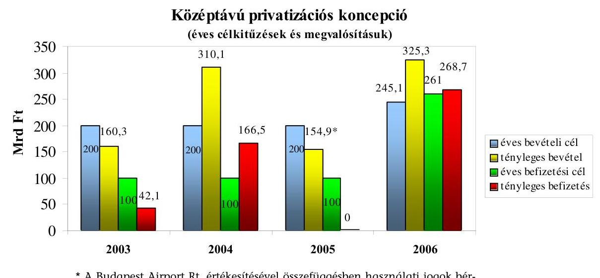

* A Budapest Airport Rt. értékesítésével összefüggésben használati jogok bérbeadásából származó, KVI-hez befolyt bevétel nélkül.
A Társaság 2006-ban az eredeti üzleti terv szerint összesen 245,1 Mrd Ft privatizációs és egyéb bevételre, valamint a költségvetés javára 261 Mrd Ft befizetéssel számolt. Az év közben módosított terv alapján az összes bevétel 325,3 Mrd Ft-ra növekedett, a központi költségvetésbe - osztalékbevételek nélkül - 268,7 Mrd Ftot fizetett be a Társaság. A 2006. évi költségvetési előirányzat által elvárt 8,95 Mrd Ft osztalékbevétellel szemben 14,7 Mrd Ft osztalékot fizetett be a költségvetésbe.

---

A Társaság hozzárendelt állami vagyonának 2006. évi nyitó értéke 760,7 Mrd Ft, év végi záró összege 825,2 Mrd Ft volt. A Társaság saját vagyona 12,7 Mrd Ft-ról 12,8 Mrd Ft-ra változott. A hozzárendelt vagyonba tartozó társaságok száma az év elején 245 volt, amelyből 178 gazdasági társaság, 67 állami vállalat. Az év végére a társaságok száma 221-re csökkent.

A Társaság tulajdonrészére jutó adózás előtti eredménye az előző évi 55,2 Mrd Ft-tal szemben 2006-ban 10,3 Mrd Ft volt. A hozzárendelt vagyon részeként az év végén 7,7 Mrd Ft követelést és 1114,2 Mrd Ft kötelezettséget tartott nyilván. A készpénzes tartalékfeltöltés következtében a tartalékszámla záróegyenlege 82,3 Mrd Ft volt. A Társaság átlagos állományi létszáma 2006-ban az előző évi 200-ról 184 főre csökkent.

A Társaság hozzárendelt vagyonának nyilvántartási, elszámolási és beszámolási rendszerét a 2000. évi C. törvényben - a hozzárendelt vagyonnak a számviteli törvénytől eltérő kezelési sajátosságait - a pénzügyminiszter által kiadott 11/2006. (V. 17.) sz. 2006. január 1-jétől alkalmazandó RJGY határozatban foglaltak szerinti számviteli politika (SZP) szabályozza.

A Priv. tv. alapján minden évben ellenőrizzük a Társaság tevékenységét. A 2005. évről készült jelentésünk alapján a helyszíni ellenőrzés megállapításainak hasznosítása mellett a Kormánynak többek között az egységes vagyontörvény megalkotásával, az állami tulajdonnal rendelkező társaságok múködési koncepciójának meghatározásával, a pénzügyminiszternek az állam vállalkozói és kincstári vagyona nyilvántartása és elszámolása egységesítésével, a felszámolási és végelszámolási eljárások szabályozásával kapcsolatban fogalmaztunk meg javaslatot.

A jelenlegi ellenőrzés célja annak értékelése volt, hogy:

- a Társaság szervezeti és múködési rendszere összhangban volt-e a feladatokkal, hogyan biztosította a kitűzött célok eredményes ellátását;
- az éves költségvetési törvény előírásainak megfelelően teljesültek-e a Társaság tevékenységét érintő előirányzatok, kötelezettségek, garanciavállalások, célszerű és eredményes volt-e a Társaság hozzárendelt vagyonának változása és az egyes portfoliók kezelése;
- a Társaság üzleti tervének megfelelően teljesültek-e a múködés bevételei és ráfordításai, érvényesültek-e a szabályszerűségi és takarékossági szempontok a gazdálkodásában;
- a 2006-ban végrehajtott ÁSZ ellenőrzések ${ }^{1}$ megállapításai hogyan hasznosultak, a Társaság ellenőrzési rendszere összehangoltan múködött-e a kor-mányzati-felügyeleti ellenőrzéssel, illetve a Társaság Igazgatóságával.

[^0]
[^0]:    ${ }^{1} 0611$ Jelentés a tartósan veszteségesen múködő állami tulajdonú gazdasági társaságok gazdálkodásának ellenőrzéséről, és a 0629 Jelentés az Állami Privatizációs és Vagyonkezelő Rt. 2006. évi múködésének és a központi költségvetés végrehajtásához kapcsolódó tevékenységének ellenőrzéséről.

---

Jelen ellenőrzésünk társasági szintű átfogó vizsgálat volt, amely az ÁPV Zrt. múködésére, valamint a saját- és a hozzárendelt vagyonnal történő 2006. évi gazdálkodásra terjedt ki. A korábbi évek megállapításai alapján vizsgáltuk a Bábolna Zrt. végelszámolási folyamatát. A helyszíni tapasztalatok alapján vizsgáltuk az ellenőrzés befejezéséig terjedő időszak pénzügyi eseményeit is. Ellenőriztük a jogszabályokban és a részvényesi jogok gyakorlója által elfogadott üzleti tervben meghatározott kötelezettségek, előirányzatok teljesítését, a privatizációs és vagyonkezelési tevékenységet, a múködés szabályozottságát, a saját vagyonnal való gazdálkodást.

A Társaságnál végzett helyszíni ellenőrzést dokumentális vizsgálattal, elemzéssel, a központi költségvetés végrehajtásához kapcsolódó tevékenység ellenőrzését statisztikai mintavételen alapuló módszerrel hajtottuk végre. A helyszíni ellenőrzés befejezésekor még nem készült el az ÁPV Zrt. jelentése az RJGY számára, amely alapján a Kormány beterjeszti az OGY részére az éves gazdálkodásáról szóló jelentést, ezért az ÁSZ számára készített beszámoló alapján végzett helyszíni ellenőrzésünkkel teszünk eleget jelentési kötelezettségünknek.

Az ellenőrzés jogszabályi alapját az Állami Számvevőszékről szóló 1989. évi XXXVIII. törvény 2. § (1) és (6) bekezdései, az ellenőrzés szempontjait, szabályait a 16. § (1) bekezdése, valamint a 17. § (1) és az (5) bekezdései, továbbá az állam tulajdonában lévő vállalkozói vagyon értékesítéséről szóló 1995. évi XXXIX. törvény (Priv. tv.) 25. § (1) bekezdésében foglaltak képezik.

A jelentéshez csatolt mellékletek részletes megállapításokat és kiegészítő információkat tartalmaznak a Társaság bevételi tervének teljesítéséről, az erdészeti társaságok támogatásáról, a forrásallokáció felhasználásáról, a SZÖVÜR Kft. üzletrészének elszámolásáról.

A jelentést véglegezés előtt egyeztettük a pénzügyminiszterrel, a Miniszterelnöki Hivatal államtitkárával, az ÁPV Zrt. Felügyelő Bizottságának elnökével, a Társaság vezérigazgatójával ${ }^{2}$. Az észrevételeket és az arra adott választ az 1. sz. melléklet tartalmazza.

[^0]
[^0]:    ${ }^{2}$ Az ÁPV Zrt. igazgatóságával nem tudtunk egyeztetni, mivel a régi mandátuma lejárt, az új pedig nem kezdte meg tevékenységét a jelentés lezárásáig.

---

# I. ÖSSZEGZŐ MEGÁLLAPÍTÁSOK, KÖVETKEZTETÉSEK, JAVASLATOK 

A Társaság az aktuális vagyonpolitikai irányelvekben megfogalmazott követelmények szerint látta el a hozzárendelt vagyonnal kapcsolatos tevékenységét. A vagyonpolitikai irányelv 2006. évre vonatkozóan az intézményi privatizációt lezártnak tekintette. ${ }^{3}$ Az ÁPV Zrt.-nél a vagyonelemek számszerú csökkenése miatt előtérbe kerültek a vagyongazdálkodási feladatok. Ennek megfelelően 2006-ban a Társaság csak azokkal a tranzakciókkal számolt, amelyek előkészítése 2005-ben megkezdődött. Az ÁPV Zrt. saját döntése alapján az új vagyonkezelési feladatok befogadására készült fel a tulajdonosi jogok gyakorlójának felhatalmazása nélkül, döntése utólag megalapozatlannak bizonyult, miután az Országgyúlésnek benyújtott és megtárgyalt törvényjavaslat szerint új vagyonkezelő szervezetet kell létrehozni. Az ÁPV Zrt. Felügyelő Bizottsága szerint a Társaságnál 2006-tól a dolgozói létszám mérséklése már nem követte a feladatok csökkenését. A szervezet és az infrastruktúra még a tömeges privatizáció időszakának felelt meg.

A Társaság a hozzárendelt vagyonnal kapcsolatos bevételi tervét és a tartalékfeltöltést az előírt kötelezettségeknek megfelelően teljesítette. Az osztalék beszedése és befizetése a költségvetési terv előirányzatát meghaladta.

Az ÁPV Zrt. tevékenysége igazodott a törvényekben és szabályzatokban előírtakhoz, egyes esetekben azonban kifogásolható módon járt el. A MOL Nyrt. részvényeinek értékesítésénél az önkötések kizárásának hiánya miatt több mint 5 Mrd Ft bevételkiesés keletkezett. A kárpótlási jegyek bevonására létrehozott Forrás Rt.-nél mintegy 4 Mrd Ft-tal kisebb volt a megtérülés a befektetett vagyonhoz képest, miközben a veszteség nem az alanyi kárpótlási jegyekkel rendelkezőknél jelentkezett. A MAHART Szabadkikötő Zrt. tulajdonában lévő csepeli szabadkikötő működtetés privatizációja valósult meg, a kikötő területének tisztább jogi környezetet, egyértelmúbb feltételeket jelentő koncesszióba adása helyett. A MALÉV Zrt. privatizációjánál a közbeszerzési törvénytől eltérően alkalmaztak szakértőt. A Bábolna csoporttal kapcsolatos eredménytelen reorganizáció, az ellentmondásos döntések, a számonkérés és folyamatkövetés hiánya növelte az állami veszteségeket, melyek csökkentése érdekében a döntéseket a Kormány utólag jóváhagyta. Az ÁPV Zrt. a felelősség megosztására a saját hatáskörébe tartozó ügyeket is elfogadtatta a Kormánnyal. A megszüntetett végelszámolás utáni újabb megalapozatlan, kockázatos elemeket tartalmazó privatizációs stratégia tovább növeli az állami veszteségeket.

A privatizációs tartalék felhasználása az előirányzatnak megfelelően történt, azonban hiányosságok voltak a belterületi föld ellenértéke és a kezességátválla-

[^0]
[^0]:    ${ }^{3}$ 1998-tól többször deklarálták, hogy a privatizációra szánt vagyon elfogyott és a hangsúlyt a vagyonkezelésre kell helyezni, de a költségvetés helyzete eddig a privatizáció folytatása irányába hatott.

---

lás elszámolásánál, illetve indokolatlan volt egy költség kifizetése és egy szerződéses kapcsolaton alapuló tartozáskiegyenlítés.

A Társaság múködését és szervezetét érintő törvényi szabályozás 2006. évben lényegében nem változott. A Priv. tv.-ben a vagyonváltozások elkülönítését és a bevételeket az OGY pontosította. A 2006-ban befejezett ellenőrzés óta a még ki nem hirdetett új Vagyontörvény ${ }^{4}$ szabályozza az állami vagyon egységes kezelését.

Az ÁPV Zrt. hozzárendelt vagyonának sajátos nyilvántartási és beszámolási rendszere a Számviteli törvénytől eltérő számviteli politikája és gyakorlata nincs kodifikált jogszabályban szabályozva, hanem csak egy keretjellegű RJGY határozatban, mely szabályozást kormányrendelet utalja RJGY határozati hatáskörbe.

A 2006. évi módosított költségvetési előirányzatok és az ÁPV Zrt. üzleti terve közötti összhang a tényleges folyamatokat követő előirányzat-módosítások eredménye. A Társaság 2006. évi módosított üzleti tervének bevételei az RJGY határozatokban kerültek meghatározásra, először 245,1 Mrd Ft-ban, végül 320,6 Mrd Ft-ban. Az ÁPV Zrt. 325,4 Mrd Ft bevételt realizált. A Társaságnak a hozzárendelt vagyon bevételek és kiadások egyenlege terhére - a privatizációs tartalékfeltöltés és a hozzárendelt vagyon záró pénzkészlete meghatározását követően - történő költségvetési befizetési kötelezettsége 268,7 Mrd Ft volt. Az előírt kötelezettségeket teljesítette. Az osztalék-befizetési kötelezettsége a ténylegesen beszedett osztalék alapján 14,7 Mrd Ft volt, meghaladva a Költségvetési tv. 9 Mrd Ft előirányzatát. Befizetési kötelezettségét a beszedéssel azonos értékben teljesítette.

A legnagyobb privatizációs tranzakció a MOL Nyrt. részvényeinek értékesítése volt 277,1 Mrd Ft értékben, jelentős volt még a kisebbségi portfólió, 2,8 Mrd Ft (ezen belül a Forrás Rt. 2,4 Mrd Ft), a Budapesti Szabadkikötő Logisztikai Rt., 5 Mrd Ft, valamint a MALÉV Zrt. privatizációjának előkészítése, majd 2007-re áthúzódó értékesítése ( 200 M Ft ).

Az ÁPV Zrt. a MOL Nyrt. részvényeinek 2006. évi értékesítésénél sem járt el körültekintően ${ }^{5}$, a részvény adás-vételi szerződésben az adásvétel alapjául szolgáló BÉT átlagárból az önkötések figyelembe vételét nem zárta ki. Korm. határozat írta elő az értékesítéshez a Budapesti Értéktőzsde (BÉT) átlagárat, ez azonban az ÁPV Zrt.-t nem menti fel, mivel annak előkészítésében aktívan közremúködött. Az önkötések kizárásának hiánya miatt több mint 5 Mrd Ft bevételkiesés keletkezett.

[^0]
[^0]:    ${ }^{4}$ A Kormány az állami vagyonról szóló új törvényjavaslatot 2007 júniusában nyújtotta be az Országgyúlésnek, ahol elfogadták az új vagyontörvényt, azt azonban a Köztársasági elnök 2007. július 3-án megfontolásra visszaküldte.
    ${ }^{5}$ Az ÁSZ ÁPV Rt. éves tevékenységéről készített 1995. évi 350. sz., 2000. évi 0031. sz., 2005. évi 0541. sz. és 2006. évi 0629. sz. jelentéseiben a MOL-lal kapcsolatos korábbi tranzakciókat elsősorban az ármegállapítás miatt kifogásolta.

---

A részvények átlagárára a BÉT $21760,4 \mathrm{Ft} / \mathrm{db}$ értéket közölt. Az átlagárat jelentősen befolyásolta, hogy 2005. december 29-én a MOL Nyrt. 146,4 Mrd Ft értékű önkötést hajtott végre. E nélkül az átlagár a BÉT igazolása alapján 22 239,9 $\mathrm{Ft} / \mathrm{db}$ lett volna. Az opciós szerződésben nem rendelkeztek arról, hogy az önkötést az ár megállapításánál figyelmen kívül kell hagyni. Az átlagárszámításnál a BÉT Kereskedelmi Kódexe szerint csak a fix- és aukciós ügyleteket kell figyelmen kívül hagyni, az önkötést nem, így eltérő jogszabályi, illetve szerződéses rendelkezés hiányában a felek a BÉT által közölt 21 760,4058 Ft/részvényárat fogadták el. Az ármeghatározási mód az eladási árat csökkentette, az önkötés kizárása magasabb bevételt eredményezett volna a Társaságnak. Az önkötés előre látható volt, hiszen a MOL rendelkezett saját részvényekkel már a tárgyi opciós vételt megelőzően is, amely körülmény a tulajdonos ÁPV Zrt. előtt ismert volt. A Gt. előírásai szerint viszont egy társaság saját részvényei névértékének összege nem haladhatja meg az alaptőke 10\%-át (a saját részvények aránya $6,8 \%$ volt). Az ÁPV Zrt. a korábbi megállapodás céljára hivatkozva a bevételkiesést eredményező hibát utólag, sikertelenül próbálta korrigálni.

A Forrás Rt. ${ }^{6}$ több lépcsőben történt feltőkésítése és privatizációja speciálisan teljesült. ${ }^{7}$ A tranzakció vagyonvesztéssel járt. A részvényértékesítésekből összesen 11,2 Mrd Ft folyt be a kárpótlási jegy bevonást és a készpénzes értékesítést együttesen figyelembe véve az ÁPV Zrt. által invesztált 15 Mrd Ft értékű vagyonnal szemben. A vagyonvesztés nem az alanyi kárpótlási jeggyel rendelkezőknél jelentkezett. A döntően alanyi kárpótlási jeggyel vásárlók esetében az ÁPV Zrt.-nél elszámolt bevétel az értékesített saját tőkével egyenértékű. Az ARAGO $^{8}$ holding vásárlásánál a bevétel 1,5-szeresét, a Buda „C" Kft. vásárlásánál (mind a kárpótlási jegyek, mind készpénzes vásárlás esetében) pedig 2,8szorosát kapta a vevő saját tőkében, vagyis az ÁPV Zrt. befektetett vagyonának első esetben a $100 \%$-a, második esetben a $67 \%$-a, harmadik esetben a $37 \%$-a térült meg.

A MAHART Szabadkikötő Zrt. tulajdonába tartozó csepeli szabadkikötő területének közvetlen állami tulajdonba maradása esetén lehetőség lett volna a tisztább jogi környezetet, egyértelmúbb feltételeket jelentő koncesszióba adásra. Az ÁPV Zrt. a kikötői múködtetés privatizációját hajtotta végre.

Az ÁPV Zrt. vezérigazgatói engedéllyel - a közbeszerzési törvénytől eltérően - a MALÉV Zrt. privatizációjához nem csak jogi tevékenység végzésére kért ajánlatot, illetve kötött szerződést a korábbi sikertelen privatizációs folyamatokban is részt vevő jogi irodával. Az ÁPV Zrt. a privatizációs tranzakció bonyolultságának és jogi sokrétúségének figyelembevételével szükségesnek tartotta, hogy

[^0]
[^0]:    ${ }^{6}$ A Forrás Rt.-t az ÁPV Zrt. abból a célból alapította, hogy kínálatot teremtsen a forgalomban lévő kárpótlási jegyek bevonására.
    ${ }^{7}$ Az ÁSZ az ÁPV Zrt. éves tevékenységéről szóló 2004. évi 0444 sz. és a 2005. évi 0541 sz. jelentéseiben korábban is foglalkozott a Forrás Rt.-vel.
    ${ }^{8}$ Az ARAGO Befektetési Holding Rt. 2004. december 1-jén értékpapír-adásvétel útján közvetlen irányítást biztosító befolyást szerzett a FORRÁS Vagyonkezelési és Befektetési Részvénytársaságban, ez alapján a szavazatok $87,96 \%$-ával rendelkezik a CÉGINFO adatai szerint.

---

jogi tanácsadó szolgáltatásainak igénybevételével történjen az értékesítés. Az elmúlt években az értékesítésre három kísérlet történt, és újabb körülmények nem következtek be a privatizációs stratégiában. A MALÉV Zrt. értékesítésére kiírt pályázatra beérkezett ajánlatok közül egyetlen pályázó ajánlata sem rendelkezett olyan banki garanciákkal, amely megfelelt volna a pályázati kiírásban foglaltaknak. A hiánypótlásokat követően az AirBridge Zrt.-vel indultak meg a végső adásvételi tárgyalások, mivel az eljárásban részt vevő többi ajánlattevő a tárgyalásos szakaszban nem tudta az ajánlatát megfelelő banki biztosítékokkal alátámasztani. Az AirBridge Zrt. a versenyfeltételek között az eredetihez képest javította ajánlatát, amelynek eredményeként 2007-ben sikerült részükre értékesíteni a MALÉV Zrt.-t.

A vagyonkezelések aránya a privatizációhoz viszonyítva előtérbe került, mivel az értékesítések száma jelentősen lecsökkent. A működő társaságok eredményei az előző évhez képest jelentős visszaesést hoztak (55,2 Mrd Ft-ról 10,3 Mrd Ft-ra), amelynek legfőbb oka az, hogy a privatizáció hatására több nyereséges társaságban csökkent az ÁPV Zrt. részesedése, elsősorban a MOL Nyrt.ben. A nyereséges társaságok számának és eredményének csökkenésén kívül a visszaeséshez jelentősen hozzájárultak a veszteséges társaságok, pl. a Bábolna csoport.

A Bábolna Rt. végelszámolásának 2004. évi elindítása és 2006. évi megszüntetése újabb indokolatlan, elkerülhető költségeket eredményezett (pl. REORG Zrt. 60 M Ft-os végelszámolói díj). Az ellentétes irányú döntések gyakorlata tovább folytatódott. A gondos előkészítés- és folyamatkövetés hiánya a számonkérés következetlenségei is okozói a végelszámoláshoz kapcsolódó anyagi veszteségeknek. A Bábolna Rt. IG tagok a végelszámolás megindítását követően 2005. januártól 2006. január végéig nem vettek részt IG tagi minőségükben a társaság múködtetésében, ugyanakkor a havi (egyharmadára csökkentett) megbízási díjat rendszeresen, indokolatlanul felvették a társaság javadalmazási szabályzatának megfelelően.

A végelszámolás megszüntetése utáni újabb privatizációs stratégia megalapozatlan, kockázatos elemeket tartalmaz, amelyek tovább növelik az állami veszteségeket. A „HYFERP" beruházási hitel (tőke és kamat együtt ( 836 M Ft ), a jogosulatlanul igénybe vett adósságrendezési támogatás ( 421 M Ft ), az agrárfinanszírozási támogatás ( 597 M Ft ) és az Agrárgazdasági Vagyonkezelő Kft. követelésének ( 6 Mrd Ft ) elengedése az állami vagyont csökkenti, még akkor is, ha ezek az összegek nem jelennek meg közvetlenül az ÁPV Zrt. könyvelésében, mivel technikai társaságokon keresztül különböző tranzakciókkal a veszteségek nem válnak láthatóvá. Az ÁPV Zrt. a felelősség megosztására a saját hatáskörébe tartozó ügyeket is elfogadtatta a Kormánnyal.

A Bábolna csoporttal kapcsolatos, 2006-ban hozott igazgatósági határozatok nem oldották meg a korábban felmerült gazdálkodási és vezetési problémákat. A felelős és megalapozott döntések elmulasztása egyre nagyobb terheket ró a tulajdonosra és azon keresztül az államháztartásra. A vállalatcsoport vagyoni és erkölcsi értékének zuhanása következtében az eddig befektetett támogatások megtérülése nem biztosított. A vagyonvesztés okai a piaci folyamatokon túl a vezetési és gazdálkodási mulasztások. Felelősségre vonás kezdeményezése sem a vállalatcsoporton belül, sem a tulajdonosi körben nem történt 2006-ban sem,

---

de személyi változások voltak mindkét területen. Az 1997-től indult reorganizációs folyamat eredménytelen volt, a veszteségek csökkentése érdekében hozott döntéseket a Kormány utólag jóváhagyta. ${ }^{9}$

Az ÁPV Zrt. igazgatóságának hozzájárulásával, a végelszámolással megbízott Reorg Zrt. leányvállalatának értékesítették a Bábolna Zrt. 1,2 Mrd Ft-os lejárt kétes követelését 165 M Ft-ért, és egyben újabb 178 M Ft támogatást adtak a Bábolna Zrt.-nek, amelynek megtérülésére nem lehet számítani. Az intézkedés alkalmas arra, hogy a juttatott, és vissza nem térülő támogatások átláthatósága csökkenjen, valamint a veszteség ne az ÁPV Zrt. könyveiben jelenjen meg. Ezzel a Magyar Államnak közvetve ismét veszteséget okoztak.

A tulajdonos vezető testületei éveken keresztül úgy intézkedtek és hoztak döntéseket a Bábolna csoporthoz tartozó társaságokkal kapcsolatban, hogy nem volt valós képük a csoport egymás közötti gazdasági összefüggéseiről. Sem a végelszámolás megindítása előtt, sem annak felfüggesztésekor, sem utána nem tartották szükségesnek, hogy a teljes átláthatóságot figyelembe véve összevont (konszolidált) beszámolót készíttessenek a vállalatcsoporttal.

Az ÁPV Zrt. kiadási előirányzatát a 2006. évi költségvetésről szóló tv. 52 Mrd Ft-ban határozta meg. Az év során történt két módosítás alkalmával az előirányzat először 147,6 Mrd Ft-ra emelkedett, majd 78,6 Mrd Ft-ban került véglegesítésre, amelyből 66,2 Mrd Ft kifizetést teljesített.

Az ÁPV Zrt. a kormányzati szektor hiányát érintő ráfordítások elszámolása során 31,5 Mrd Ft módosított költségvetési előirányzatot hagyott jóvá. A hozzárendelt vagyon értékesítésének költségein belül a szakértői, tanácsadói díjakban jelentős nagyságrendet képviseltek a Budapest Airport Rt., a Szabadkikötő Logisztikai Rt., és a MOL Nyrt. privatizációjának, illetve tőzsdei tranzakciójának lebonyolításáért kifizetett díjak. Az ÁPV Zrt. a közbeszerzési folyamatban kiválasztott tanácsadók szerződését néhány esetben közös megegyezéssel utólag módosította (a megnövekedett és új részfeladatok, az ismételt privatizációs kiírás, a potenciális pályázók felkutatása, stb. okok miatt), az eredeti szerződésben nem rögzített - előre nem látható - további közreműködői feladatok felmerülése miatt). Ennek következtében az eredeti megbízási díj 30-$40 \%$-kal megnövekedett. Ez a gyakorlat a közbeszerzés előírásaival nincs összhangban. ${ }^{10}$

A hozzárendelt vagyonba tartozó társaságok informatikai és turisztikai fejlesztésére adott 783 M Ft , illetve 330 M Ft értékű támogatása nem reorganizációs célokat szolgált, ezért az indokolatlan volt.

[^0]
[^0]:    ${ }^{9}$ A Kormány 2295/2005. (XII. 23.) Korm. hat. szerint utólag vette tudomásul a Bábolna Zrt. végelszámolásáról szóló beszámolót, és a szükséges veszteségmérséklés részeként tudomásul vette, hogy a társaságnak nyújtott 6500 M Ft kölcsön fejében a közbeiktatott technikai cég (opciós jogával élve) megvásárolta a Bábolna Takarmányipari Kft. üzletrészét. A kormányhatározat az FVM minisztert bízta meg a földhasználati jog rendezésével.
    ${ }^{10}$ Például a MALÉV Zrt. tanácsadói tevékenysége esetében.

---

Az ÁPV Zrt.-nek a 2004-2006. években a tőkeemelés jóváhagyásával kapcsolatosan alkalmazott gyakorlata nem egységes (2004., 2005. években kért kormánydöntést). 2006-ban az ÁPV Zrt. a 23 volántársaságnál összesen 5 Mrd Ft, 18 erdészeti társaságnál összesen 2,5 Mrd Ft értékben tőkeemelést hajtott végre. A Kormány mozgásterét csökkenti, ha a portfólión belül azonos témában született döntést technikailag az ÁPV Zrt. 1 Mrd Ft alatti tételekre bontja fel. Az ÁPV Zrt. a SZÖVÜR Kft.-től megvásárolt szövetkezeti üzletrészek 14,3 Mrd Ft-os vételára esetében elmulasztotta beszerezni a pénzügyi rendezéshez szükséges kormányjóváhagyást.

A privatizációs tartalékban rendelkezésre álló pénzösszeg 2006. évi záró állománya 98 Mrd Ft-ról 82,3 Mrd Ft-ra csökkent. A privatizációs tartalékot (amely a korábbi privatizációkból fakadó helytállási kötelezettségek anyagi fedezetét jelenti) a Költségvetési tv.-ben rögzített összeg figyelembevételével, az erre a célra megnyitott bankszámlán történő elkülönítéssel képezik, de a tartalék alátámasztására nem készül részletező analitika. A várható kockázatokra a kockázatok beváltási valószínűséggel súlyozott átlaga arányában ugyanakkor - függő kötelezettségek címen céltartalékot képez az ÁPV Zrt. A céltartalék aktuális összege részét képezi a privatizációs tartalék költségvetési törvényjavaslatban előirányzott összegének. A privatizációs tartalékból történt kifizetések összességében megfeleltek az előírásoknak, néhány esetben azonban hiányosságok is előfordultak. (Utólagos szerződésmódosítás alapján 5 M Ft +áfa a sikerdíjból fizetendő - költségtérítése egy irodának; 15,2 Mrd Ft kezességvállalás megtérülését korlátozó RJGY határozat; szerződés nélkül fizettek ki 25,7 M Ft-ot egy sportingatlannál; egy bírósági ítéletet alapján 336,6 M Ft késedelmi pótlék kifizetése egy önkormányzatnak.)

Az ÁPV Zrt. saját vagyonának mérleg főösszege 2006 végén 12,8 Mrd Ft volt, a 2005. év végi 12,7 Mrd Ft-hoz viszonyítva 1,12\%-kal emelkedett. A mérleg szerinti eredmény $156,8 \mathrm{M}$ Ft-ot tett ki, amely az előző évhez viszonyítva 67,4\%-kal mérséklődött. A beruházásoknál a tervezett gépjármúállomány cseréjének elmaradása miatt 68,1 M Ft költségmegtakarítás jelentkezett. Az ÁPV Zrt. saját tőkéje 2005. év végén 11,8 Mrd Ft volt, 2006. év végén 11,9 Mrd Ft-ra emelkedett, a jegyzett tőke és a tőketartalék összegei nem változtak, az eredménytartalék a mérleg szerinti eredménnyel növekedett.

A 2006. évi saját vagyon üzleti terve kialakításakor a feladatok ellátásához, illetve a tevékenység változatlan keretek közötti folytatásához szükséges személyi és anyagjellegú ráfordításokat vették figyelembe. A Társaság 2006. évi gazdálkodása során a saját vagyon múködési költségeire a Költségvetési tv.ben meghatározott, és a hozzárendelt vagyon privatizációs bevételéből átutalt 5,4 Mrd Ft forrás, valamint a saját vagyonba tartozó eszközök értékesítéséből, hasznosításából, bérbeadásából, és az egyéb szolgáltatásból származó bevételek nyújtottak fedezetet. Az összes bevétel 5,9 Mrd Ft volt. A 2006. évi költségvetési tv. ${ }^{11}$ az ÁPV Zrt. múködési költségei összegét 5,4 Mrd Ft-ban határozta meg, amelynek összegét az év során végrehajtott törvénymódosítások nem érintették. A felhasználás 5,8 Mrd Ft volt. Az ellenőrzött tételek kifizetése összességében

[^0]
[^0]:    ${ }^{11}$ 2005. évi CLIII. törvény a Magyar Köztársaság 2006. évi költségvetéséről 14. sz. melléklete I. d) pont

---

dokumentumokkal alátámasztott volt. A múködési költség terhére egy magánszemélynek (külső társaság tisztségviselőjének) egyéb díjként kifizetett 5 M Ft folyósítása indokolatlan volt, mert nem az ÁPV Zrt. számára végzett tevékenységet.

Az RJGY a Felügyelő Bizottság útján látja el az ÁPV Zrt. tevékenységének ellenőrzését. Az FB tájékoztatja az éves munkatervéről az RJGY-t, aki azt tudomásul veszi. A vizsgált időszakban 2006. augusztus 31 -én egy esetben került sor visszahívásra és kinevezésre az FB tagok közül. A 11 felügyelő bizottsági tag mandátuma 2007-ben jár le.

Az FB rendszeresen, havonta tájékozódik az Igazgatóság, az ügyvezetés különböző szintjeinek határozatairól. Az Igazgatóság rendszeresen beszámol az FB előtt. A Belső Ellenőrzési Igazgatóság az FB szakmai irányítása alá tartozik. Az FB és a BEI munkakapcsolata a jogszabályoknak megfelelően múködik. A belső ellenőrzések összhangban vannak az éves tervfeladatokkal. Vizsgálatai között privatizációs tranzakciók és vagyonkezelési tevékenység is szerepeltek. Az ellenőrzési rendszerhez tartozott 2006-ban a Könyvszakértő és Ellenőrzési Igazgatóság, majd 2007-től ennek feladatát egy személyben látja el a vezetői ellenőr.

Az Állami Számvevőszék 2006-ban az ÁPV Zrt. helyszíni ellenőrzése során tett megállapításai mellett a Kormány és a pénzügyminiszter részére ajánlásokat fogalmazott meg ${ }^{12}$. A Kormány részére tett javaslatok többsége az új Vagyontörvény tartalmától függően teljesülhet. A Kormány határozatban intézkedett a lóversenyágazat eredményessé tétele érdekében.

A pénzügyminiszter a veszteségforrások felszámolásáról intézkedett. A 2008. évi költségvetési Tervezési Köriratban a PM külön pontot iktatott be a közfeladatot ellátó, állami alapítású, illetve részesedésű szervezetekkel kapcsolatos tervezési feladatokról. A pénzügyminiszter utasítására az FB több vizsgálatot folytatott a Bábolna Rt.-nél, de személyi felelősség megállapítására eddig nem került sor. A pénzügyminiszter nem tartotta indokoltnak külön intézkedéseket foganatosítani a felszámolási és végelszámolási eljárások elhúzódásának megakadályozása érdekében.

A KVI 2006-ban sem élt a Hajógyári Sziget Vagyonkezelő (HSZV) Kft.-ben lévő múemlékingatlan állami tulajdonba vétele érdekében kötött opciós adásvételi szerződésben rögzített visszavásárlási jogával. ${ }^{13}$

[^0]
[^0]:    ${ }^{12} 0611$ Jelentés a tartósan veszteségesen múködő állami tulajdonú gazdasági társaságok gazdálkodásának ellenőrzéséről, a 0629 Jelentés az Állami Privatizációs és Vagyonkezelő Rt. 2005. évi múködésének és a központi költségvetés végrehajtásához kapcsolódó tevékenységének ellenőrzéséről
    ${ }^{13}$ Az intézkedést az Állami Számvevőszék korábban a pénzügyminiszternek javasolta, Az ingatlanra 2003-ban kötött opciós adásvételi szerződésben rögzített visszavásárlási jog határideje 2008-ban lejár, melyre a forrást 2007-ben a költségvetés tervezésekor figyelembe kell venni.

---

A helyszíni ellenőrzés megállapításainak hasznosítása mellett javasoljuk:

# a pénzügyminiszternek 

1. vizsgáltassa ki az ellenőrzés során feltárt a MOL részvényeinek értékesítésénél elkövetett hibából keletkezett 5,4 Mrd Ft bevételkiesés körülményeit;
2. tárja fel a Forrás Rt. feltőkésítéséből és privatizációjából keletkezett 3,8 Mrd Ft vagyonvesztés indokoltságát, figyelemmel arra, hogy a vagyonvesztés nem az alanyi kárpótlási jeggyel rendelkezőknél jelentkezett;
3. kezdeményezze a Bábolna Rt. szükségtelen végelszámolása miatti veszteségek (Reorg Rt.-nek kifizetett díj) okozóinak személyes felelősségre vonását, tárja fel a végelszámolás alatt érdemi munkát nem végző igazgatóság tagjainak indokolatlanul kifizetett megbízási díjak okait, a végelszámolás alatt felhalmozott 1,2 Mrd Ft-os lejárt kétes követelés felhalmozásának és a végelszámolást végző társaság leányvállalatának 175 M Ft értékű eladása körülményeit;
4. kezdeményezze a szükséges felelősségre vonást a privatizációs tartalék (költség 5 M Ft, sportingatlan $25,7 \mathrm{M} \mathrm{Ft}$ ) és saját vagyon terhére (egyéb díj 5 M Ft ) indokolatlanul kifizetett mintegy $35,7 \mathrm{M}$ Ft esetében;
5. vizsgáltassa meg a közbeszerzési szabályok figyelmen kívül hagyásával történt szerződéskötéseket és a szerződések megkötése utáni költségek növekedésének indokait;
6. intézkedjen a Hajógyári Sziget Vagyonkezelő (HSZV) Kft.-ben lévő műemlékingatlan állami tulajdonba vétele érdekében.

---

# II. RÉSZLETES MEGÁLLAPÍTÁSOK 

## 1. A TÁRSASÁG MÚKÖDÉSÉNEK SZABÁLYOZOTTSÁGA

### 1.1. A Társaság szervezeti és múködési rendjét meghatározó szabályozás

Az Állami Privatizációs és Vagyonkezelő Részvénytársaság a privatizációról szóló 1995. évi XXXIX. törvény alapján múködő egyszemélyes részvénytársaság.

Az ÁPV Zrt. alapítására és múködésére a Priv. tv. eltérő rendelkezéseinek kivételével az új Gt. szabályai vonatkoznak. Múködését - a mindenkor hatályos az ÁPV Zrt. Szervezeti és Múködési Szabályzatát (SZMSZ) jóváhagyó kormányhatározat szabályozza.

A privatizációs tv. 2006. évi változása alapján elkülönítésre került az ÁPV Zrt. saját vagyonával való gazdálkodás, a hozzárendelt vagyon, az értékesítésre, kezelésre átvett vagyon és az e vagyonelemek értékesítésével és hasznosításával összefüggő bevételek és kiadások elszámolása.

A Priv. tv. 1. § (9) és (10) bekezdése, valamint a 7. § (4) bekezdése szerinti a vagyon nyilvántartásának elkülönítését, valamint az e vagyonelemek értékesítésével és hasznosításával összefüggő bevételek és kiadások elszámolását a kincstári vagyonra vonatkozó előírások szerint kell végrehajtani.

A törvény módosításával az értékesítésre és az értékesítésig történő kezelésre átvett vagyonból befolyó bevételeket a szervezet elsősorban az átvett vagyon értékesítésével, valamint az értékesítése előkészítésével kapcsolatos kiadásokra, ráfordításokra, beszerzésekre fordíthatja.

Az államháztartás hatékony múködését elősegítő szervezeti átalakításokról és az azokat megalapozó intézkedésekről szóló 2118/2006. (VI. 30.) Korm. határozat 7. h ) pontja felkérte a pénzügyminisztert, hogy legkésőbb 2007. január 30áig készítsen javaslatot az állami vagyonnal való gazdálkodás új szabályozása keretében a Kincstári Vagyoni Igazgatóság egységes vagyonkezelő szervezetté alakítására, ennek keretében kerüljön sor a Nemzeti Földalap Kezelő Szervezet bevonásának vizsgálatára. A pénzügyminiszter 2006-ban felkérte az ÁPV Zrt. Felügyelő Bizottságát, hogy vizsgálja meg a Társaság szervezeti felépítésének összhangját a feladatokkal. Az FB 73/2006. (X. 25.) sz. határozatával elfogadta „az ÁPV Zrt. szervezeti felépítésének elemző vizsgálata a csökkenő privatizációs feladatoknak és a növekvő állami vagyonkezelési követelményeknek való megfelelés céljából" c. ellenőrzési jelentést.

Az ÁPV Zrt.-nél a vagyonelemek számszerú csökkenése miatt 2005-2006. években előtérbe kerültek a vagyongazdálkodási feladatok. Az FB jelentése a 2006. augusztusi létszámadatok, és a kezelendő társaságok változásának ismeretében megállapította, hogy 2006. január 1-jétől a dolgozói létszám már nem követte a

---

feladatok csökkenését. A vizsgálat megállapította, hogy a szervezet és az infrastruktúra még a tömeges privatizáció időszakának felelt meg.

Az ÁPV Zrt. Igazgatósága 2007. január 18-i ülésén tárgyalta a „Döntés az ÁPV Zrt. Szervezeti és Müködési Szabályzata módosítását kezdeményező kormányelőterjesztésről, a szervezeti felépítés módosításáról" című előterjesztést, amely nem tartalmaz információt arra nézve, hogy a jelenlegi feladatok ellátásához szükséges létszámot és annak szerkezeti összetételét felmérték volna.

Az ÁPV Zrt.-t a vizsgált időszakban nem bízták meg azzal, hogy a munkaszervezetét az egységes állami vagyongazdálkodás feladataiban való részvételre készítse fel, hanem az aktuális feladatok létszám és szakképzettségi igényét kellett volna felmérnie.

Az ÁPV Zrt. olyan szervezeti struktúrát kívánt kialakítani, amely - figyelembe véve az ÁPV Zrt. 2007. évi ismert feladatait is -az egységes állami vagyongazdálkodás törvényi előfeltételének megteremtése esetén rugalmas, bármely vagyonelem kezelésére alkalmas legyen. A szervezet-átalakítás további célja volt - az ÁPV Zrt. Felügyelő Bizottságának az ÁPV Zrt. szervezeti felépítésének elemző vizsgálata alapján tett javaslatainak figyelembe vételével - egy alacsonyabb működési költségigényű szervezet kialakítása, összhangban az állami szférában elvárt létszám leépítési és költségtakarékossági követelményekkel.

A szervezet racionalizálására több lépcsőben került sor. A 2004-es záró létszám 219 fő volt, 2005 évben 189 fő, 2006. év végi 170 fő, jelenleg az új szervezeti felállásban 149 fő a Társaság állományi létszáma.

A szervezeti felépítés módosításához és az SZMSZ változásához kapcsolódóan 2007-ben a teljes körű szabályzat aktualizálása befejeződött.

Az SZMSZ-t és a Versenyeztetési szabályzatot kormányhatározattal módosították ${ }^{14}$. Az ÁPV Zrt. a 262/2007. (VI. 14.) IG sz. határozattal jóváhagyta a saját és hozzárendelt vagyonára vonatkozó „Számviteli politika, Számlarend és Számlatükör" című szabályzatokat.

A nemzetgazdaság működőképessége szempontjából jelentős gazdasági társaságok körének az 1995. évi XXXIX. törvény alapján történő meghatározásáról szóló 62/1996. (VII. 9.) számú OGY határozatban szereplő társaságok privatizációs koncepcióját érintő ügyekben szintén a Kormány az illetékes döntéshozó.

Az OGY hat. alapján 2006-ban érintett cégek a MOL Nyrt., MALÉV Rt., Bábolna Mezőgazdasági Termelő Fejlesztő és Kereskedelmi Rt., Martonseed Martonvásári Mezőgazdasági Kísérleti Gazdaság Rt., Magyar Villamos Művek Rt., valamint a Volán társaságok. Ezen cégek privatizációs koncepcióihoz az előző években készültek kormány-előterjesztések.

[^0]
[^0]:    ${ }^{14}$ Az ÁPV Rt. Versenyeztetési Szabályzatának jóváhagyásáról szóló 1057/1996. (V. 30.) Korm. Határozat módosítása 2006. XI. 30-tól hatályos, és kiegészült a koncessziós pályáztatásra vonatkozó részekkel.

---

# 1.2. A hozzárendelt vagyont érintő beszámolási rendszer 

Az ÁPV Zrt. kezelésében lévő az állam tulajdonát képező hozzárendelt vagyon elszámolásának és nyilvántartásának legfontosabb sajátosságait 2006. évre a 11/2006. (V. 17.) sz. RJGY határozat rögzíti. A hozzárendelt vagyonnal kapcsolatos sajátosságok számviteli elszámolása - figyelembe véve az érvényben lévő, ÁPV Zrt. az éves beszámoló készítési és könyvvezetési kötelezettségének sajátosságairól szóló 219/2000. (XII. 11.) Kormányrendelet és a Priv. törvény előírásait - nem tekinthető teljes körűen szabályozottnak. Az ÁSZ korábbi évek ellenőrzésein alapuló álláspontja szerint RJGY határozat az állami irányítás egyéb jogi eszközeként nem minősül jogszabálynak, ezért nem szabályozhat a Számviteli törvény illetékessége körébe tartozó gazdasági eseményeket, nem lehet azzal ellentétes sem. A 2006. évi vizsgálatunk megállapításai alapján a pénzügyminiszter felszólította az ÁPV Zrt. Igazgatóságát a számviteli elszámolások és az alkalmazott eljárások tekintetében a Sztv. elvi és tételes előírásaihoz történő közelítésre, amelyet a 2006. évi számviteli elszámolások során sem oldottak meg maradéktalanul.

Az RJGY határozat a tartalmát és a szerkesztés módját illetően nem tekinthető teljes értékű számviteli szabályozásnak. Nem halogatható az állami vagyon kezelésével és értékesítésével kapcsolatos számviteli sajátosságoknak megfelelő normák megalkotása, a Számviteli törvénytől való eltérések kormányrendeletben történő rögzítése.

Az ÁPV Zrt. számviteli politikájának 2006. évi változása során - az ÁSZ előző évi vizsgálatainak javaslatára -a hozzárendelt vagyont vagyonelemenként eltérően értékeli. A nyilvántartás a hosszú, ill. rövid lejáratú állammal szembeni kötelezettségek között tartalmazza a vagyont.

A kötelezettségként történő nyilvántartás miatt a hozzárendelt vagyon értékváltozása a mérlegben az ÁPV Zrt.-nél nem került bemutatásra, ami az átláthatóságot rontja. A vagyonváltozás a Kiegészítő Mellékletben kerül levezetésre (a mérleg mellékleteket kiegészítették a $4 / \mathrm{b}$ számú melléklettel).

A tartósan állami tulajdonban maradó vagyont jegyzett tőke arányos saját vagyon értéken, a tőzsdén jegyzett társaságokat - korábbi ÁSZ vizsgálat javaslatára - tőzsdei súlyozott átlagáron mutatják ki. A rövid lejáratú privatizálandó vagyont a forgóeszközök között az állami részesedés nagyságának megfelelő csoportosításban, 2006. évtől - a korábbi beszerzési ár helyett - jegyzett tőke arányos saját tőkeértéken, a tőzsdén jegyzett társaságok részvényeit, szintén a mérlegkészítést megelőző 180 naptári nap súlyozott tőzsdei átlagárán tartják nyilván. A nyilvántartás a változást követően jobban közelíti a valós értéket.

A Társaság a 2006-ban a Gt. és a Priv. tv. alapján különleges tulajdonosi jogokat biztosító szavazatelsőbbségi részvényekkel rendelkezett. Az államnak többletjogokat biztosító részvényeket túlnyomórészt 1000 Ft-os névértéken tartották nyilván, ezeknek a részvényeknek a hozzájuk fűződő többlet jogok miatti magasabb értékét nem biztosították. A társaságok privatizációjánál ezek megléte a vevőknek diszkont árat biztosított, ennek alapján reális értékük az állami beleszólási jog miatti privatizációs forgalmi értékcsökkenéssel volt egyenértékű. A közösségi joghoz alkalmazkodás érdekében az aranyrészvények egyedi jogosítványainak eltörlése miatti várható jogszabály változtatási kényszer azt indo-

---

kolta volna, hogy az aranyrészvények értékesítési lehetőségét jogszabály módosítással biztosítsák.

Az államot megillető szavazatelsőbbségi részvény jogintézményének megszüntetéséről és egyes törvényeknek a megszüntetéssel összefüggő módosításáról szóló 2007. évi XXVI. tv. előírásai (1. § (1)) szerint a szavazatelsőbbségi részvényekhez fűződő jogokat az érintett társaság közgyűlése köteles megszüntetni.

Az állam tulajdonában lévő ÁPV Zrt.-hez rendelt vagyon értékelésére és elszámolására vonatkozó legfontosabb számviteli alapelveket a Számviteli Politika az előző évekhez hasonlóan a számviteli törvény előírásaitól részben eltérően határozza meg.

A befektetett eszközök között mutatják ki a tartós állami tulajdont képező részvények, üzletrészek értékét. A tartós és privatizálandó eszközöket a társaságok közgyűlése, taggyűlése által elfogadott mérlegben kimutatott saját tőke tulajdonarányos értéken mutatják ki. Ennek alapján a negatív saját tőkével rendelkező társaságok nyilvántartási értéke nulla. A felszámolás alatt lévő társaságok kivételével célszerű a társaságokat (a végelszámolás alatt állókat is beleértve) legalább a tulajdonarányos jegyzett tőkeértéken nyilvántartani, tekintettel a várható megtérülésekre.

A tőkeemelések jegyzett tőkeemelés feletti értéke a tőketartalékot növeli, forrása a hozzárendelt vagyon. A jegyzett tőke feletti tőkeemelések ténye nem fogadható el, csak a 100\%-ban állami tulajdonú társaságoknál, tekintettel arra, hogy az ázsió nem jelenik meg a hozzárendelt vagyon növekedéseként, illetve a részbeni privatizáció után a tulajdonostárs támogatását jelentheti.

# 2. A KÖZPONTI KÖLTSÉGVEtÉS VÉGREHAJTÁsÁHoz KAPCSOLÓDÓ TEVÉKENYSÉG 

A Kormány a 2003-ban (zárszámadási törvény indokolásában) mutatta be az Országgyűlésnek a középtávú privatizációs és vagyonkezelési koncepciót, amely az intézményi privatizációt lezártnak tekintette. Ennek megfelelően 2006-ban az ÁPV Zrt. csak azokkal a tranzakciókkal számolt, amelyek előkészítése 2005-ben megkezdődött.

### 2.1. Az ÁPV Zrt. 2006. évi üzleti tervének teljesítése

A 2005. évi CLIII. (költségvetési) tv. Társaságra vonatkozó rendelkezései évközben módosultak. Törvénymódosítás alapján az ÁPV Zrt. a SZÖVÜR Kft.-től opciós szerződés alapján megvásárolt szövetkezeti üzletrészek vételárát a törvény 14. számú melléklet II/2. pontja szerinti előirányzat terhére számolhatja el, valamint hatályon kívül helyezték azt az előírást, hogy a privatizációs tartalék felhasználásához kapcsolódó visszatérüléseket a privatizációs tartalék feltöltésére kell fordítani.

A privatizációért felelős miniszter a Költségvetési tv. 5. § (7) bekezdésének felhatalmazása alapján két alkalommal hajtott végre átcsoportosítást.

---

A Társaság bevételeit a hivatkozott Költségvetési tv. előirányzatként nem határozta meg. Ezért a bevételeket az üzleti tervet elfogadó RJGY határozat rögzítette. Az osztalék befizetés összege magasabb az előirányzatnál, azonban ebben az esetben a túllépést a törvény megengedi. A 2006. évi tényleges ráfordítások a többször módosított költségvetési tv.-ben meghatározott keretértékeken belül teljesültek. A 2006. évi módosított költségvetési előirányzatok és az ÁPV Zrt. üzleti terve közötti összhang a tényleges folyamatokat követő előirányzat módosítások eredménye.

A Társaság 2006. évi módosított üzleti tervének bevételei (2. sz. melléklet) RJGY határozatokban kerültek meghatározásra, először 245125 M Ft-ban, végül 320604 M Ft-ban. Az ÁPV Zrt. kiadási előirányzatát a 2006. évi költségvetésről szóló 2005. CLIII. tv. 51985 M Ft-ban határozta meg. Az év során történt két módosítás során az előirányzat először 147577 M Ft-ra emelkedett, majd 78548 M Ft-ban került véglegesítésre.

Az ÁPV Zrt. 325352 M Ft tényleges bevételt realizált és 66154 M Ft tényleges kifizetést teljesített. A Társaságnak a hozzárendelt vagyon bevételek és kiadások egyenlege terhére - a privatizációs tartalékfeltöltés és a hozzárendelt vagyon záró pénzkészlete meghatározását követően - történő költségvetési befizetési kötelezettsége 268696 M Ft volt. Az ÁPV Zrt. az előírt kötelezettségeket teljesítette.

Az ÁPV Zrt. osztalék-befizetési kötelezettsége a ténylegesen beszedett osztalék alapján 14748 M Ft volt, meghaladva a Költségvetési tv. 8950 M Ft-os előirányzatát. Az ÁPV Zrt. a befizetési kötelezettségét a beszedéssel azonos értékben teljesítette. A záró pénzkészlet 25000 M Ft volt, amely megegyezik a Költségvetési tv.-ben meghatározott minimum értékkel, és azonos a 2/2006. (02. 28.) sz. RJGY, valamint a 17/2006. (IX. 6.) sz. RJGY határozatokban előírtakkal. A tényleges bevételek és kiadások összhangban voltak a módosított üzleti tervben foglaltakkal.

A Társaság is része a kormányzati szektornak. Ezért a kiadási előirányzatait tartalmazó Költségvetési tv. 14. sz. mellékletének szerkezete az EU statisztikai módszertan (ESA'95) szabályaira épült. Az ÁPV Zrt. üzleti tervének módosítása - mely a törvénymódosításhoz kapcsolódott - a kormányzati szektoron belüli konszolidált egyenleg vonatkozásában 4,4 Mrd Ft hiánycsökkentést tartalmazott. A tényleges teljesítés -19,7 Mrd Ft, amely kedvezőbb volt a tervezettnél.

A 2006. évi költségvetési törvény írta elő az osztalék bevétel nagyságát az ÁPV Zrt. részére. Az osztalékok portfóliónként, vagy egyedileg kerültek megállapításra az ÁPV Zrt. által kidolgozott és az RJGY által jóváhagyott tervezési irányelvek szerint. Az ÁPV Zrt. véglegesen a társaságok éves beszámolóinak elfogadása során döntött az osztalék elvonásokról.

A Társaság a féléves tényadatok alapján elvégezte az üzleti tervének felülvizsgálatát. A tervfelülvizsgálat időpontjában a megállapított osztalék bevételek az ÁPV Zrt. részére már csaknem teljes mértékben megfizetésre kerültek. A módosított terv 14748 M Ft-ban már ezt tartalmazta, és ugyanezt fogadták el az éves költségvetési törvény módosításakor is.

---

A Társaság az osztalék befizetési kötelezettségét teljesítette. A tényadatok azt támasztották alá, hogy az ÁPV Zrt. portfóliójában lévő cégek osztalékbevételei korlátok között tervezhetők. Az ÁPV Zrt. a tervezett osztalékkal megegyező öszszegű befizetést teljesít a központi költségvetésbe.

Az osztalék-befizetés az alábbi társaságok után kapott osztalékokból teljesült:

|  | M Ft |
| :-- | --: |
| Társaság megnevezése | Kapott osztalék |
| FHB Nyrt. | 1000 |
| Magyar Posta Zrt. | 3000 |
| MOL Nyrt. | 4108 |
| Richter Rt. | 2796 |
| Szerencsejáték Zrt. | 2000 |
| Budapest Airport Rt. | 822 |
| Autóbusz-Invest Kft. | 500 |
| Nemzeti Tankönyvkiadó Zrt. | 229 |
| Egyéb | 293 |
| Összesen | $\mathbf{1 4} \mathbf{7 4 8}$ |

A követelések kezelése az ÁPV Zrt. pénzügyi- számviteli rendszerében nyilvántartott követelések kezelésének szabályzata (1/2003. sz. vezérigazgatói utasítás) szerint történt. Az összes bruttó követelés a 2006. évi 40223 M Ft nyitó állományról a záró állományban 30718 M Ft-ra csökkent. A képzett értékvesztés a nyitó állományban 23686 M Ft , a záró állományban pedig 22899 M Ft volt.

Az értékvesztések elszámolásának indokait az engedélyező igazgatóság az RJGY határozatokkal együtt tartalmazza a le nem járt követelések főbb tételeinek összetevőivel együtt. A lejáraton túl ki nem egyenlített követelések közül legjelentősebb a 10233 M Ft végelszámolás, felszámolás és egyéb követelések tétele, amelyre az elszámolt értékvesztés 10153 M Ft . A követelések behajtása érdekében szükséges intézkedéseket az ÁPV Zrt. egységes vagyon-nyilvántartási rendszerének működtetéséről és ellenőrzéséről szóló 1/2003. sz. Vig utasítás tartalmazza.

Az ÁPV Zrt. kötelezettség állománya csökkent. A 2006. évi záró állomány a nyitó állomány $88,1 \%$-a. Ezen belül a normatív kötelezettségeknél minden tételben csökkenés mutatkozik. A függő kötelezettségek állománya is minden tételnél csökken, kivétel az önkormányzati járandóság, mert itt 2 Mrd Ft növekedés mutatkozik. A céltartalékok a nyitó állományhoz viszonyítva 22,6 Mrd Fttal csökkentek. Ezen belül a normatív kötelezettségek kamata 0,6 Mrd Ft-tal, a függő kötelezettségek alapja és annak kamata 22 Mrd Ft-tal csökkent.

# 2.2. A szerződésmenedzselés és a végelszámolási eljárások eredményessége 

A szakterület tevékenységét az ÁPV Zrt. és jogelődei által kötött szerződések menedzseléséről és a szerződéstár működéséről szóló 24/2003. sz. Vig. utasítás szabályozta. Az utasítás szerint 2005. december 31-éig minden olyan menedzselésre kötelezett szerződést le kellett zárni, amelynél a szerződésben foglalt

---

valamennyi kötelezettség és követelés ellenőrzése megtörtént. Ennek megfelelően 2005. évben 1732 db szerződés ellenőrzése fejeződött be.

A 2006. évben elsődleges céllá vált a szerződő felek kötelezettségeinél a teljesülés elősegítése. A 2006. december 31-ig megkötött 3466 db privatizációs szerződés közül 156 db szerződésnél került sor a kötelezettség nem teljesítése miatti összesen 8,4 Mrd Ft követelés bejelentésére. Az év végén még összesen 3,7 Mrd Ft értékben állt fenn követelés. Az ÁPV Zrt. a szerződésekben foglalt kötelezettségeit teljesítette. A térítésmentesen átadott ingatlanok szerződéseiben az előírt felhasználási célok betartatására nincs meghatározva határidő és nincs megjelölve szankció sem. Így a jövőre vonatkozóan a térítésmentes átadások céljának teljesülése nem biztosított.

Az ÁPV Zrt. kötelezettségvállalásainak maximális összegét, valamint a beváltási valószínűség szerinti összegét a 27/2004. sz. Vig. utasítás szerint kell a szakterületnek meghatározni. Erre a jogcímre céltartalékot kell képezni. Az általános jog- és kellékszavatossági kötelezettség maximuma 2006. december 31-én 517,5 Mrd Ft. A kötelezettségek beváltási valószínűsége 2006-ben 0,5\%-ban alakult.

Az ÁPV Zrt. a kisebbségi tulajdonú cégek végelszámolásánál (ahol hitelezőként van csak jelen) nincs döntéshozói helyzetben. A többségi tulajdonú cégek esetében viszont döntéseivel irányíthatja a végelszámolást. A hosszabb, több éven keresztül tartó, problémás ügymenetek egyedi vizsgálatánál az ÁPV Zrt. csak két esetben élt olyan intézkedési lehetőségekkel, mint a végelszámoló szerződéses kötelezettségeinek felülvizsgálata, jogszerű megváltoztatása, vagy esetenként az indokolt szerződésbontás.

A végelszámolási eljárások eredményessége érdekében a többségi tulajdonban lévő társaságok végelszámolói negyedévente kötelesek beszámolni a tevékenységükről. Végelszámolás alatt az ÁPV Zrt. portfóliójában 2006. január 1-jén 13 cég volt. A végelszámolás alatt álló cégek záró állománya 20.

# 2.3. Az értékesítési és vagyonkezelési tevékenység 

### 2.3.1. A MOL Nyrt. részvények értékesítése ${ }^{15}$

A korábbi évek részvényértékesítéseit követően az ÁPV Zrt. tulajdonában a MOL Nyrt. „A" sorozatú részvényeinek 12\%-a (12 792002 részvény) és 1 db aranyrészvény maradt, mely a jegyzett tőke $0,00000092 \%$-át képviseli.

A Magyar Olaj és Gázipari Részvénytársaság ÁPV Zrt. tulajdonában maradt részvénycsomagjának értékesítéséről szóló 2272/2005. (XII. 6.) Korm. határozat az RJGY-n keresztül előírta az ÁPV Rt.-nek, hogy a még tulajdonában álló „A"

[^0]
[^0]:    ${ }^{15}$ A korábbi évek részvényértékesítéseivel foglalkozott az ÁSZ ÁPV Rt. éves tevékenységéről készített 1995. évi 350., a 2000. évi 0031, a 2005. évi 0541 és a 2006. évi 0629 jelentés. A jelentések kifogásokat tartalmaztak többek között az alkalmazott lebonyolítói díjak nagyságával, a részvényallokáció módja, a privatizáció időpontjának bevétel szempontjából nem optimális megválasztásával, a privatizációs folyamat utólagos dokumentáltságával kapcsolatban.

---

sorozatú részvényeket értékesítse. A kormányhatározat a társaság függetlenségének megőrzése és regionális pozíciójának megerősítése, esetleges ellenséges felvásárlások esélyének csökkentése érdekében annak a lehetőségét biztosította, hogy a társaság saját maga vásárolja meg a részvényeket. A MOL Nyrt.-nek kötelezettséget kellett vállalnia arra, hogy az opciós tranzakció(k) során megvásárolt részvényeket 2015. december 31-éig csak a Magyar Állam hozzájárulásával ruházhatja át (az opciós megállapodásban rögzített esetek kivételével). A hivatkozott kormányhatározat előírásainak megfelelően kötött opciós megállapodást vételi jogra az ÁPV Zrt. a MOL Nyrt.-vel.

Az értékesítéssel foglalkozó FB jelentés megállapította, hogy „A vizsgálat során megállapítást nyert, hogy az ÁPV Rt. Igazgatóságának a MOL Nyrt. részvények átruházásával kapcsolatban hozott határozatai összhangban voltak a vonatkozó kormányhatározatban és annak végrehajtására kiadott RJGY határozatban foglaltakkal. A 2005. december 1-jén aláírásra került Opciós Megállapodás, valamint a Letéti Szerződés az RJGY határozatban foglalt paramétereknek megfelelő rendelkezéseket tartalmazta."

Az első opciós időszakban a vételi jog gyakorlására nem került sor. A bonyolító ING Bank 2006. május 8-án tájékoztatta az ÁPV Zrt.-t a MOL Nyrt. bejelentett vételi szándékáról.

A már hivatkozott kormányhatározat az árra vonatkozóan BÉT átlagár alkalmazását írta elő. Az átlagárra a BÉT $21760,4 \mathrm{Ft} / \mathrm{db}$ értéket közölt, amely később az elszámolás alapját képezte. Az átlagárat jelentősen csökkentette, hogy 2005. december 29-én a MOL Nyrt. 146,4 Mrd Ft értékű önkötést (részvényértékesítést) hajtott végre. E nélkül a tétel nélkül az átlagár a BÉT igazolása alapján $22239,9 \mathrm{Ft} / \mathrm{db}$ lett volna.

Az opciós szerződésben az ÁPV Zrt. a lehetőség ellenére nem rendelkezett arról, hogy az önkötést az ár megállapításánál figyelmen kívül kell hagyni. Erről az ügyletet tárgyaló előterjesztések és IG határozatok nem tettek említést.

Az, hogy az elszámolás alapjául a már hivatkozott 2272/2005. (XII. 6.) Korm. határozatnak megfelelő árat (BÉT átlagár, amelynek megállapításánál az önkötést nem veszik ki az átlagképzésből) alkalmazták, nem menti fel az ÁPV Zrt.-t, tekintettel arra, hogy a Társaságra vonatkozó kormányhatározatok kidolgozásában a Társaság tevékenyen részt vesz. ${ }^{16}$ Ezt támasztja alá többek között az is, hogy 2005. december 1-jén - már a kormányhatározat megjelenését megelőzően - aláírt, vételi jogról szóló letéti szerződések jóváhagyását az ÁPV Zrt. tranzakciós igazgatósága 2005. december 5-én, szintén a kormányhatározat megjelenése előtt kérte az Igazgatóságtól.

Az ÁPV Zrt. a 2272/2005. (XII. 6.) Korm. határozat megjelenése előtt megkötötte az opciós szerződést és ezt megelőzően még elő is készítette.

A korábbiakban elkövetett, több, mint 5 Mrd Ft-tal kevesebb bevételt eredményező hibát az ÁPV Zrt. - a Korm. határozat előírásai mellett is - megkísérelte korrigálni, amikor utólag, az opció lehívását követően, 2006. május 10-én kez-

[^0]
[^0]:    ${ }^{16}$ Erre bizonyíték pl. a jelen jelentés Bábolna Zrt.-vel foglalkozó fejezetében foglalt, IG ülés jegyzőkönyvéből származó idézet.

---

deményezte a MOL-nál az önkötés figyelmen kívül hagyását. Az ÁPV Zrt. vezérigazgatójának a MOL Nyrt.-hez e tárgyban írt levele szerint „Az önkötés figyelmen kívül hagyását indokolja továbbá az is, hogy annak esetleges figyelembe vétele ellentétes a MOL Rt. és az ÁPV Zrt. között 2005. december 1-én létrejött vételi jog alapításáról szóló megállapodás céljaival."

Az önkötés előre látható volt, hiszen a MOL rendelkezett a jelenleg tárgyalt opciós vételt megelőzően is saját részvényekkel - amely körülmény a tulajdonos ÁPV Zrt. előtt ismert kellett legyen - ,a Gt. előírásai (régi Gt. 226/A § (5), új Gt. 223. § (2)) szerint viszont egy társaság nem rendelkezhet a saját részvényei névértékének az alaptőke 10\%-át meghaladó mennyiséggel. A társaság mérlege is tartalmazta a saját részvények mennyiségét a jegyzett tőkén belül, ami 2005. december 31-ei mérleg szerint $6,8 \%$ volt. (Így a MOL az opció szerinti $10 \%$ részvénymennyiséget csak azt követően vehet meg, ha a birtokában lévő mennyiséget eladja.)

Az ÁPV Zrt. ármeghatározási módja az árat csökkentette. Az önkötés kizárása több mint 5 Mrd Ft-tal magasabb bevételt eredményezett volna. A 237156327000 Ft vételár az ÁPV Zrt. számláján 2006. május 30-án jóváírásra, a részvények a MOL Nyrt. részére átruházásra került.

A 10898525 db „A" sorozatú részvény értéke a különféle módokon megállapított részvényár esetén az alábbiak szerint alakul:

| Megnevezés | Részvény db szám | Egységár Ft/db | Összeg M Ft |
| :-- | :--: | :--: | :--: |
| Megegyezett vételár szerint | 10898525 | 21760,4058 | 237156 |
| Az önkötés figyelmen kívül   hagyása esetén |  | 22239,9774 | 242383 |
| Az önkötés napjának (2005.   dec. 29.) átlagárán |  | 19750,3164 | 215249 |
| Előző napi átlagár szerint |  | 25853,0000 | 281760 |
| Előző napi záróár szerint |  | 26200,0000 | 285541 |

Mint a táblázat is mutatja, ha az adásvételt nem az opciós szerződésben kikötött 90 napos átlagáron, hanem az előző napi, - 2006. május 5-ei - átlagáron valósítják meg, akkor 25853 Ft/részvény lett volna az ár. (A BÉT szabályzata szerint, pl. aukció esetén az előző napi záróár, azaz 26200 Ft lett volna az irányadó.) Az ármeghatározási mód (az önkötés figyelembe vétele) a piaci árat csökkentette, ahogy az előző táblázat adatai mutatják, az önkötés kizárása több mint 5 Mrd Ft-tal magasabb bevételt eredményezett volna a Társaságnak.

Az ÁPV Zrt. és a MOL Nyrt. 2006. május 29-i közös levélben utasította az ING Bankot, hogy az ügylet fix tőzsdei ajánlat formájában történjen. (BÉT Kereskedelmi Kódex II. rész 7. fejezet 18. pont.) Az üggyel kapcsolatban felmerült opciós díjat, az átlagár 0,003 szorosát, azaz összesen 691,5 M Ft-ot az eladó ÁPV Zrt. számlájára a MOL Nyrt. átutalta. Szintén a vevő kötelezettsége volt az ING Bankot illető bizományosi díj kifizetése is. A 2005. üzleti év után járó részvényenkénti 321,14 Ft, összesen 4,1 Mrd Ft osztalékot az ÁPV Zrt. 2006. május 18án megkapta. A 237,2 Mrd Ft vételár az ÁPV Zrt. számláján 2006. május 30-án jóváírásra került.

---

A vételi opció alapján értékesített, a jegyzett tőke 10\%-át megtestesítő „A" sorozatú részvény 2006. május 30-i a MOL Nyrt. részére történt átruházást követően az ÁPV Zrt. hozzárendelt vagyonában 1893476 db „A" (osztalékelsőbbségi) és 1 db "B" sorozatú (szavazatelsőbbségi) részvény maradt. A 2272/2005. (XII. 6.) Korm. határozat rendelkezett arról, hogy a fenti darabszámú „A" sorozatú részvényt érintően az ÁPV Zrt. saját hatáskörben intézkedjen az egy vagy több részletben történő belföldi nyilvános értékesítésről, a kisrészvényesek tulajdon növelése érdekében.

Az „A" sorozatú, törzsrészvények értékesítésének lebonyolítására az ÁPV Zrt. az Igazgatóság 279/2006. (VI. 15.) döntése alapján zártkörű pályázatot írt ki. A feladat elvégzésére a HVB Bank kapott megbízást.

A 406/2006. (X. 5.) IG határozat rendelkezett az értékesítés alapfeltételeiről. Eszerint a teljes pakett belföldi magánszemélyek részére nyilvános értékesítés keretében kerül felajánlásra és az általuk (esetlegesen) meg nem vásárolt részvények belföldi nyilvános tőzsdei aukció keretében kerülnek értékesítésre. Meghatározták azt is, hogy 260000 db -ig $25 \%$ minimális készpénz hányad mellett kárpótlási jegy beszámításával személyenként korlátlan mértékben, kedvezményesen 75 db részvény nagyságig, teljes vételár megfizetésével 200 db részvény erejéig volt lehetőség kisbefektetői részvényjegyzésre.

Az allokáció szerint első helyen a kárpótlási jeggyel fizetők, második helyen az árkedvezményt ( $2000 \mathrm{Ft} / \mathrm{db})^{17}$ igénybevevők, ezt követően a teljes vételárat (maximum ár: $25500 \mathrm{Ft} / \mathrm{db})^{18}$ megfizető lakosság, majd az esetlegesen megmaradó részvényeket intézményi befektetők jegyezhetik le. Az allokációs szempontok meghirdetésre kerültek.

A 2006. december 1-jén zárult jegyzéssel nem kelt el az 1893476 db felajánlott részvénycsomag, ezért 2006. december 6-án aukciós értékesítés keretében került sor a megmaradt 1733566 db részvény értékesítésére.

A tranzakciós bizottság az aukciós értékesítésre felajánlott részvények árát 21592 Ft-ban állapította meg. Ezen az áron a nyilvános részvényértékesítés (aukció) keretében a felajánlott részvényeket közel háromszorosan túljegyezték.

A tranzakció 2007. január 4-i lezárását követően az ÁPV Zrt. 40 Mrd Ft-ot meghaladó pénzbevételhez és 363 M Ft összcímletértékű kárpótlási jegy bevételhez jutott, a MOL Nyrt.-ben pedig az állami tulajdon 1 db „A" (osztalékelsőbbségi) és 1 db „B" sorozatú, szavazatelsőbbségi részvényre korlátozódott ${ }^{19}$.

[^0]
[^0]:    ${ }^{17}$ MOL V. Tranzakciós Bizottság 2006. nov. 16. jkv.
    ${ }^{18}$ MOL V. Tranzakciós Bizottság 2006. nov. 16. jkv
    ${ }^{19} \mathrm{Az} 1 \mathrm{db}$ „A" sorozatú részvény megtartását az indokolta, hogy az alapszabály szerint a „B" sorozatú részvényhez kapcsolódó előjogok minimum 1 db „A" sorozatú részvény tulajdonlása esetén gyakorolhatók.

---

# 2.3.2. A Vértesi Erőmú Zrt. privatizációjának folyamata, a kedvezményes munkavállalói tulajdonszerzés lebonyolítása 

Az ÁPV Zrt. a Priv. tv. 28. § (2) i) pontja értelmében a vagyont versenyeztetés nélkül közvetlen tárgyalásos eljárás útján is értékesíthette, azt követően, hogy 1995-ben és 1997-ben már történt nyilvános versenyeztetési eljárás, amelyek eredménytelenek maradtak. A Társaság ezeket követően 2003-ban tárgyalásos eljárásban szintén eredménytelenül kísérelte meg a Vértesi Erőmű Zrt. 29,96\%os részvénycsomagjának értékesítését. Ilyen előzmények után az ÁPV Zrt. Igazgatósága 411/2005. (VIII. 26.) IG. sz. határozatában úgy döntött, hogy az MVM Zrt. számára megvételre ajánlja fel a Vértesi Erőmú Zrt. állami tulajdonú részvényeit. A szándékhoz a Kincstári Vagyoni Igazgatóság előzetesen hozzájárult.

A részvények vételára vagyonértékelésen alapult, amelyet elfogadott a Vértesi Erőmű Zrt. és az ÁPV Zrt. Igazgatósága is. Az értékesítés a jogszabályi előírásoknak megfelelően történt.

Az értékesítést befolyásoló, a Vértesi Erőmú Zrt. múködtetésére vonatkozó főbb célkitűzések (tervek) az alábbiak voltak: A Vértesi Erőmú Zrt. Márkushegyi bányájának „szénfillérrel" történő támogatását az Európai Unió Bizottsága elfogadta, amelynek köszönhetően a Vértesi Erőmú Zrt. középtávú önfinanszírozó, nullszaldós múködtetése megoldódhat. Ezt a célt úgy kell elérni, hogy az ne igényeljen a rendelkezésre álló forrásokat meghaladó fejlesztéseket, és kezelje az oroszlányi térség foglalkoztatási problémáit. A Vértesi Erőmú Zrt. veszteségmentes múködtetésének elérését segíti, ha az MVM társaság csoporthoz kötődik, a belső szinergiák jobb kihasználásával az eredményesebb múködtetés már üzemi szinten is jelentkezhet. Az MVM Zrt. stratégiai terve az MVM csoport termelési portfoliójának, elsősorban kereskedelmi célú bővítését tartalmazta az erőművek teljes, illetve részbeni megvásárlásával.

Az ÁPV Zrt. a 29,96\%-os részvénycsomagjából lehetőséget adott kedvezményes munkavállalói tulajdonszerzésre a Priv. törvény 56. §-ában rögzített maximális mértékig, azaz a jegyzett tőke $15 \%$-áig ( 419513 db törzsrészvény). A részvények vételára független vagyonértékelő felmérése alapján megállapított ár, $946,4 \mathrm{Ft}$ volt részvényenként. A kedvezménnyel csökkentett vételárat kárpótlási jeggyel és/vagy készpénzzel fizethették ki a munkavállalók. A kedvezményes munkavállalói tulajdonszerzés zárása 2006. május 8-án történt meg. Az ÁPV Zrt.-nél a kedvezményes munkavállalói tulajdonszerzésből megmaradt 5700 db Vértesi Erőmű Zrt. részvényt az MVM Zrt. vette át a részvény adásvételi megállapodásnak megfelelően.

Az ÁPV Zrt. és az MVM Zrt. által kijelölt közös bizottság a fenti árat fogadta el vételárként az adásvételi ügyletben. A vételár a $6500 \mathrm{Ft} / \mathrm{db}$ névérték $14,56 \%$-a, tekintettel a veszteséges gazdálkodásra. Az értékesítés a jogszabályi előírásoknak megfelelően történt.

Az értékesítésből származó ÁPV Zrt. bevétel 597,2 M Ft, ebből a kedvezményes munkavállalói részvényértékesítési bevétel $195,8 \mathrm{M}$ Ft volt.

A Kincstári Vagyoni Igazgatóság bevétele 298,8 M Ft volt.
A részvény adásvételi ügylet zárása 2006. március 1-jén megtörtént, a vételár a tulajdonosoknak befolyt.

---

# 2.3.3. A kisebbségi portfólió - ezen belül a Forrás Rt. - privatizációja 

Az ÁPV Zrt. a 404/2005. (VII. 28.) IG sz. határozatával döntött a 25\%-ot el nem érő, kisebbségi részesedések versenyeztetés nélkül történő értékesítéséről a Priv. tv. alapján. Ez a határozat rendelkezett arról is, hogy a Forrás Rt. 37,86\%-os szavazati hányadot megtestesítő csomagja egyedileg kerüljön kezelésre.

A határozatot később megváltoztatták. A 23/2006 (I. 26.) IG határozat szerint a Forrás Rt. 37,86\% értékű pakettje mellett a Hungaroring Rt. 2,33\%, a Rézkakas Kereskedelmi Vendéglátó és Szolgáltató Kft. 5,66\%, az Alföldinvest Kft. 4,095\%, a Szikra Lapnyomda 15,27\%, a Dunaferr Vámügynökség Kft. 50,4\%, a Pécsi Geodéziai és Térképészeti Kft. 36,4\%-át megtestesítő üzletrészeit egy csomagban kell értékesíteni. Szintén ebbe a csomagba került az ELMÚ 0,1\%-os, az ÉMÁSZ $0,00003 \%$-os részesedése is.

A pályázaton való részvételt nem korlátozták, azon minden belföldi és külföldi jogi és természetes személy részt vehetett. A vételár legfeljebb 10\%-ára a pályázó kárpótlási jegyben tehetett ajánlatot, amelyet a névérték 174,2\%-án vettek figyelembe.

A pályázatok értékeléséhez az ÁPV Zrt. bizottságot hozott létre, amelynek javaslata alapján a pályázat eredményéről az igazgatóság döntött. Az értékelés egyetlen szempontja az árajánlat nagysága volt.

A részvénycsomagok piaci értékét az ÁPV Zrt. ad-hoc bizottsága állapította meg 180 napos BÉT árfolyam átlagnak megfelelő áron. Minimál árat részvénycsomagonként határozták meg.

A részvény adás-vételi szerződés 2006. március 17-én lépett hatályba. Az egyetlen pályázatot benyújtó „BUDA C" Befektetési Holding Kft. ${ }^{20}$ volt a vevő. A megajánlott vételár a nyilvántartott vagyonérték 94,4\%-a, 3087 M Ft volt. A vevő a vételár kárpótlási jegyben fizetendő részét március 23-án, a készpénzben fizetendőt pedig március 29-én teljesítette. A pakettel értékesített részvények átforgatása 2006. május hónapban megtörtént.

A Forrás Rt.-nek a csomagban szerepelt 37,86\% részvényei szavazati jogot nem biztosító, osztalékelsőbbségi részvények voltak. A szavazó részvényeket az ÁPV Zrt. a korábbi privatizációk során már értékesítette. A korábbi privatizációkkal kapcsolatban az ÁSZ 2004. évi 0444 sz. és a 2005. évi 0541. sz. jelentése fogalmazott meg kritikát, elsődlegesen a Forrás Rt. feltőkésítéseit érintően.

A Forrás Rt.-t az ÁPV Zrt. abból a célból alapította, hogy kínálatot teremtsen a forgalomban lévő kárpótlási jegyek bevonására az 1176/2002. (X. 10.) Korm. határozat alapján.

[^0]
[^0]:    ${ }^{20}$ A cég új neve, a 2006. május 9-ei bejegyzés szerint Berito Befektetési Kft.

---

A Forrás Rt. több lépcsőben történt feltőkésítése az alábbiak szerint történt.

| Dátum | Saját tőke Mrd Ft | Jegyzett tőke Mrd Ft |
| :-- | :--: | :--: |
| 2002. 12.31 | 2937 | 2145 |
| 2003. 12.31 | 15842 | 9000 |
| 2004. 12.31 | 17775 | 9000 |
| 2005. 12.31 | 18953 | 9000 |

A Forrás Rt.-nél a feltőkésítéseket és apportot úgy hajtotta végre a korábbiakban az ÁPV Zrt., hogy a saját tőke és jegyzett tőkearány megfeleljen a kárpótlási jegyek nominál értéke és beválthatósági ára közötti 174,2\%-os aránynak.

A korábbi évek privatizációját és a 2003. évi tőzsdére történő bevezetést követően az ÁPV Rt. tulajdonosi, illetve szavazati hányada a Forrás Rt.-ben az alábbi táblázatokban foglaltak szerint alakult.

| Tulajdonos* | Tulajdoni hányad \% |  | Szavazati arány \% |  |
| :-- | --: | --: | --: | --: |
|  | 2004. 02.02. | 2005. 12. 31. | 2004.02.02. | 2005. 12.31. |
| ÁPV Rt. | 50,20 | 37,86 | 22,20 | 0,00 |
| ARAGO Befektetési   Holding Rt. | 16,90 | 49,29 | 30,43 | 88,61 |
| Bartolus-Invest   Vagyonkezelő Rt. | 11,12 | - | 20,23 | - |
| Belföldi és külföldi   magánszemélyek,   intézmények | 21,78 | 12,85 | 27,17 | 11,39 |

*Tulajdonosi összetétel 2005. végéig az ÁPV Zrt. adatai szerint a teljes alaptőkére vetítve

Az ARAGO Befektetési Holding Rt. 2004. december 1-jén, értékpapír-adásvétel útján közvetlen irányítást biztosító befolyást szerzett a FORRÁS Vagyonkezelési és Befektetési Részvénytársaságban, ez alapján a szavazatok 87,96\%-ával rendelkezik a CÉGINFO adatai szerint.

A Forrás Rt.-től származó osztalék és a társaság eredményessége az alábbiak szerint alakult:

E Ft

| Megnevezés | 2001-ig | 2002 | 2003 | 2004 | 2005 |
| :-- | --: | --: | --: | --: | --: |
| ÁPV Zrt. tul. hányadra osztalék | 369847 | 130000 | - | 225885 | 170374 |
| Mérleg szerinti eredmény | 18560 | 11328 | 53222 | 1867725 | 1243604 |

Az értékelő bizottság javasolta az ÁPV Zrt. vezetésének, hogy a Forrás Rt. részvényeinek értékeléséhez vegyen igénybe külső szakértőt, tekintettel arra, hogy az árfolyam az ÁPV Zrt. által értékesítendő csomaghoz képest jelentősen ala-

---

csonyabb darabszámot képviselő forgalom - napi átlag 2453 db - mellett alakult ki. A privatizációs hirdetmény megjelenését követően a korábbi időszakhoz képest erőteljesebb emelkedés volt megfigyelhető. A Forrás Rt. 2005. évi gyorsjelentését követően a részvények átlagára meghaladta a névértéket.

Elemzők szerint az emelkedést - többek között - az a várakozás okozta, hogy a többségi tulajdonos a teljes pakettet felvásárolja, és a társaságot a tőzsdéről kivezeti.

Az ár megállapításához külső szakértő igénybevételére végül nem került sor, az ad hoc bizottság a forgalommal súlyozott napi átlagár az utolsó 180 nap (2005. június 21. - 2006. február 21. közötti időszak) alapján $790 \mathrm{Ft} / \mathrm{db}$-ban fogadta el a részvénycsomag értékének megállapítását. A Forrás Rt. esetében a meghatározott BÉT átlagár alacsonyabb volt, mint az egy részvényre jutó saját tőkeérték, amelyen a társaságokat az ÁPV Zrt.-nél a 2006. évi módosítást megelőzően nyilvántartották. Így az előző évi nyilvántartási érték mellett még ugyanennek a tulajdoni hányadnak az előzőekben ismertetett áron történt értékesítése esetén az ÁPV Zrt.-nek az ügyleten a 7,6 Mrd Ft saját tőke (nyilvántartási érték) $-2,7 \mathrm{Mrd}$ Ft vételár $=4,9 \mathrm{Mrd}$ Ft veszteséget kellett volna kimutatnia. (Vételár a saját tőke \%-ában 35,77\%).) A megváltozott nyilvántartás (átértékelés tőzsdei árfolyamra) következményeként a vételár a nyilvántartási értékhez viszonyítva - látszólagosan kedvezőbb képet mutatva - 77,6\%-a lett.

A kárpótlási jegyek felszívását kitevő eredeti cél a következők szerint teljesült:

| Részvényértékesítés megnevezés | Részvény db szám | Kárpótlási jegy db szám | Bevétel | Bevételre eső saját tőke |
| :--: | :--: | :--: | :--: | :--: |
| 2003. évi értékesítés* alanyi | 3571830 | 3571830 | 6222 | 6266 |
| 2003. évi ért. nem alanyi | 512254 | 512254 | 892 | 899 |
| ARAGO készpénzes | 1110218 | - | 1332 | 1984 |
| 2006. Buda, C" Kft. kárp. jegy | 165037 | 165037 | 288 | 804 |
| 2006. Buda, C" Kft. készpénzes | 3242455 | - | 2439 | 6818 |

*A kárpótlási jegyek felmért mennyiségével szemben felkínált részvénymennyiség közel felét sikerült kárpótlási jegy ellenében értékesíteni.

A fentiekben részletezett részvényértékesítésekből összesen 11173 M Ft folyt be a kárpótlási jegy bevonást és a készpénzes értékesítést együttesen figyelembe véve az ÁPV Zrt. által invesztált 14996 M Ft értékű vagyonnal szemben.

Látható a táblázatban, hogy míg a 2003. évi értékesítésnél az ÁPV Zrt.-nél elszámolt bevétel az értékesített saját tőkével (a kis különbségtől eltekintve) egyenértékű, az ARAGO holding vásárlásánál a bevétel 1,5, a Buda „C" Kft. vásárlásánál mind a kárpótlási jegyek, mind a készpénzes vásárlás esetében 2,8 -szorosát kapta a vevő saját tőkében.

---

A Buda „C" Kft. részére történt, utolsó értékesítés alkalmával az együttértékesített kisebbségi csomagra összesen 177205 db kárpótlási jegyet fogadtak el 308,7 M Ft értékben. Ebből a Forrás Rt. ellenértékeként 165037 db, 165 M Ft címletértékű kárpótlási jegy 288 Ft értékben számítható értékarányosan. (Ez utóbbi esetében ez az érték 802 M Ft saját tőke megvásárlását jelentette.)

A 2003. évi értékesítésnél 4084 M Ft címletértékű, 4084084 db kárpótlási jegy került bevonásra ugyanennyi jegyzett tőke ellenében. A szerződéses érték (a kárpótlási jegyekre eső saját tőke) 7115 M Ft volt. A vásárlók közül alanyi kárpótolt volt 3571830 db részvény esetében, nem alanyi kárpótolt 512254 db részvénynél. Az ARAGO holding nyilvános vételi ajánlatával történt részvényvásárlásnál kárpótlási jegyet nem használtak fel.

A bevétel összesen 4249121 db kárpótlási jegy bevonásával teljesült, amelyek közül alanyi kárpótlási jegy 3571830 db volt, összesen 6222 M Ft értékű vagyon ellenében. Saját tőkeértéken 1703 M Ft vagyont kaptak a 666963 db nem alanyi kárpótlási jeggyel fizetők. A készpénz hányad 3,8 Mrd Ft volt.

A privatizáció eredményeképpen az állami tulajdon mértéke a Forrás Rt.-ben nullára csökkent.

A kisebbségi csomagban a Forrás Rt. részvényeivel együtt értékesített részvénycsomagok olyanok, amelyeket a korábbiakban az ÁPV Zrt. már megpróbált értékesíteni, de a kísérletek sikertelenek maradtak. Ezek pl. a Hungaroring Sport Rt. 2,33\%-os csomagja. A részvények azért kerültek értékesítésre, mert az ÁPV Zrt. tulajdoni részesedését az állam képviselőinek, valamint a társtulajdonosoknak felajánlotta, de a felajánlást a tulajdonostársak elhárították. A tulajdonosi struktúra a csomag értékesítését megelőzően az alábbi volt:

| Tulajdonos/vagyonkezelő | Tulajdoni hányad \% | Érték M Ft |
| :-- | --: | --: |
| Közvetlen állami tulajdon: |  |  |
| Magyar Állam/Miniszterelnöki Hivatal | 62,84 | 898,1 |
| Magyar Állam/ÁPV Rt. | 2,33 | 30,0 |
| Közvetett állami tulajdon: |  |  |
| MALÉV Rt. | 3,16 | 40,7 |
| Magántulajdon |  |  |
| Ostermann Budapest Kft. | 19,17 | 246,5 |
| Hungarocamion Rt. | 3,16 | 40,6 |
| Magyar Autóklub | 1,73 | 22,2 |
| Kisrészvényesek | 0,61 | 7,9 |

A Szikra Lapnyomda Rt. 15,27\%-os csomagjának értéke 403,2 M Ft. Az ÁPV Zrt. az OEP megbízásából végezte a privatizációt. Az ELMÜ Rt. 0,1\%-os részesedését az ÁPV Zrt. egy korábbi per miatt fedezetként tartalékolta a kisebbségi tulajdont, amely a per megnyerését követően nem volt szükség. A társaság 1 db tartós állami tulajdonú szavazatelsőbbségi részvénye a GKM miniszterének ke-

---

zelésében van. A csomag értéke a 180 napos átlagár figyelembe vételével a 61,2 M Ft névértékkel szemben 177 M Ft lett.

Az ÉMÁSZ Rt. 0,0003\% tulajdoni rész értéke 1 M Ft. Értékesítése és szavazatelsőbbségi részvényének helyzete, hasonló mint az ELMŰ Rt.-nél. A csomag értékét, tekintettel arra, hogy szintén tőzsdére bevezetett társaságról van szó, az értékelő bizottság a 180 napos átlagárnak megfelelő $10814 \mathrm{Ft} / \mathrm{db}$ árban határozta meg. Így az ÁPV Zrt. hozzárendelt vagyonban álló 1 M Ft névértékű csomag megállapított ára $1,1 \mathrm{M}$ Ft lett.

A Rézkakas Kft. üzletrész értékesítése korábban egy per miatt maradt el, értéke összesen 2 M Ft. A Pécsi Geodéziai és Térképészeti Kft. 36,37\% tulajdonrész értéke jegyzett tőkeértéken 46 M Ft , saját tőkeértéken 112 M Ft volt. Korábbi privatizációja sikertelen maradt.

# 2.3.4. A Budapesti Szabadkikötő Logisztikai Zrt. privatizációja 

A Budapesti Szabadkikötő Logisztikai Zrt. privatizálására - a 2005. évi két eredménytelen kísérlet után - az ÁPV Zrt. nyilvános pályázatot írt ki 2006 februárjában. Az ajánlatok kötelező tartalma volt: a pályázó szakmai tapasztalatainak ismertetése, üzleti elképzelések, munkavállalók foglalkoztatása, beruházási tervek, vételár és a garanciális elemek, kötbérek.

Az ÁPV Zrt. 2005. május 26-án döntött a MAHART Szabadkikötő Rt. szétválásáról, kiválás formájában. A korábbi társaságból kiválás során létrejött egy új egyszemélyes zártkörű részvénytársaság, amely tovább használhatta elődje nevét. A fennmaradt cég nevet váltott, Budapesti Szabadkikötő Logisztikai Zrt. név alatt folytatta tevékenységét.

A kiválás célja az volt, hogy az átalakult MAHART Szabadkikötő Zrt. tulajdonában álló földterületek, a földterületeken álló felépítményekkel, a kapcsolódó infrastruktúrával együtt, valamint a vagyonleltár, illetve vagyonmérleg tervezetekben meghatározott bizonyos más eszközökkel együtt - amelyek tartósan állami tulajdonú társaság tulajdonában maradnak - külön társaság, a kivált társaság vagyonát képezzék. A fennmaradt társasághoz tartozik a kivált társaság tulajdonába került földterületekkel, és azokon álló felépítményekkel, valamint a kapcsolódó infrastruktúrával kapcsolatban a bérleti- haszonélvezet jog, a kiválás jogerős cégbírósági bejegyzésétől számított 75 évre. Ugyancsak itt maradnak az át nem került eszközök, szerződések, jogok és kötelezettségek, valamint a kiválással kapcsolatos költségek is.

A Cégbíróság a kiválást 2005. augusztus 31-én jegyezte be. A létrejött és a fennmaradt társaság egymással üzemeltetési szerződést kötött a létrejött társaság tulajdonába került földterületeken múködő kikötő, mint országos közforgalmi kikötó ${ }^{21}$, fennmaradt társaság általi üzemeltetéséről.

[^0]
[^0]:    ${ }^{21}$ A MAHART a gazdálkodó szervezetek és a gazdasági társaságok átalakulásáról szóló 1989. évi XIII. (továbbiakban: átalakulási) törvényre hivatkozással saját tulajdonába íratta át - egyéb ingatlanjai mellett - a csepeli közforgalmú kikötőt. A hivatkozott törvényben az szerepel, hogy az átalakuló társaságok a korábban használatukban lévő ingatlanokat, stb. a társaság nevére írathatják. A MAHART viszont cégjogilag nem alakult át, korábban is részvénytársaság volt.

---

Az ÁPV Zrt. igazgatósága a 330/2005. (VI. 16.) határozatával elfogadta a Budapesti Szabadkikötő Logisztikai Zrt. részvényeinek 99\%-át kitevő részvénycsomag értékesítésére vonatkozó pályázati felhívást. A pályázati felhívást a 420/2005. (VII. 26.) határozattal visszavonták, mert egyetlen érvényes pályázat maradt. A második pályázat, amelyet az 583/2005. (XII. 1.) IG határozat alapján indítottak, mindkét jelentkező pályázatának érvénytelensége miatt szintén eredménytelenül zárult.

A csepeli szabadkikötő területének közvetlen állami tulajdonban maradása esetén lehetőség lett volna a tisztább jogi környezetet jelentő koncesszióba adásra. Egyértelmúbbek lettek volna a tulajdonviszonyok a koncessziós időszak lejártát követően, míg a privatizáció végrehajtott formája - a privatizációs szerződés szerint - csak azt biztosítja, hogy az állam a 75 év lejártával az addig megvalósított beruházásaival forgalmi értéken visszavásárolhatja az üzemeltetési joggal rendelkező társaságot.

A vízi közlekedésről szóló 2000. évi XLII. törvény 80. § (3) bekezdése szerint országos közforgalmú kikötőt az állam az általa vagy részvételével e célra alapított gazdasági társaság útján múködteti, illetve az országos közforgalmú kikötő földterületét bérbeadás útján hasznosítja. A törvénynek megfelelés érdekében tartott meg $1 \%{ }^{22}$ társasági tulajdonrészt az ÁPV Zrt. A 100\%-os privatizációt követően a jogszabály alapján a múködtető társaság ugyanis már csak bérleti jogot, és nem 75 éves haszonélvezeti jogot kaphatott volna.

Az ajánlattételre nyitva álló időben négy pályázó nyújtotta be ajánlatát, amelyből egyet kizártak (Rhenus AG ), mert nem fogadta el a kiírás mellékleteként csatolt részvény adás-vételi szerződés tervezetét.

A szakmai és beruházási pontszámok, valamint a végső árajánlat alapján az értékelő bizottság az Erdért-Multicont konzorciumot nyilvánította nyertesnek. A részvénycsomag vételára 5 Mrd Ft volt, amely összeg az ÁPV Zrt.-hez a szerződéskötést követően befolyt. A pályázó 10 éven belül 13 Mrd Ft értékű beruházásra tett megvalósítási ajánlatot. A részvények átforgatása 2006. augusztus 7én megtörtént.

A Budapesti Szabadkikötő Logisztikai Zrt. valós piaci értékelését a Neuner + Henzl Tanácsadó Kft. végezte és azt 3,6-4,1 Mrd Ft közötti sávban állapította meg.

# 2.3.5. A MALÉV Rt. privatizációjának előkészítése 

A MALÉV Zrt. 3,5 Mrd Ft össznévértékű részvényeinek 99,92\%-a volt állami tulajdonban 2006 elején, a társaság saját tőkéje ugyanezen időpontban 6398 Mrd Ft volt. Az állami tulajdonban lévő részvényeinek értékesítésére 2004. és 2005. években három alkalommal történt privatizációs pályázat kiírása. Az ÁPV Zrt. Igazgatósága a két nyílt pályázatot eredménytelennek nyilvánította, a tárgyalásos eljárást pedig az értékesítésre vonatkozó döntés nélkül lezárta, mert a 19 jelentkező közül a versenyben maradt 2 pályázó ajánlatainak egyike sem elégítette ki a pályázati kiírásban megfogalmazott elvárásokat.

[^0]
[^0]:    ${ }^{22}$ A törvény nem határozza meg a kötelező állami tulajdonhányad mértékét,

---

A privatizációs koncepciót a 2192/2004. (VII. 29.) Korm. határozat, majd a 2306/2004. (XII. 3.) Korm. határozat hagyta jóvá, amelynek fő eleme volt a nyílt, egyfordulós pályázattal történő értékesítés. A pályázatnak tartalmaznia kellett a nemzeti légitársasági státusz fenntartására vonatkozó elképzeléseket, a társaság hitelállományáért való helytállás módját és a tőkeemelési garanciát. A hitelállományért való helytállás módjának, az ehhez kapcsolódó biztosítékok jellegének, a fizetőképesség megőrzésének, a tőkeemelés mértékének értékelése a pályázat során meghatározó súllyal kellett szerepelnie.

Az ÁPV Zrt. a 294/2006. (VI. 9.) Vig. sz. határozatával elfogadta a MALÉV Zrt. privatizációjának előkészítéséről készült előterjesztést, amelyben a 2004. évi kormányhatározatoknak megfelelően kívánták a pályázat lebonyolítását elvégezni. A társaság utolsó vagyonértékelése 2004. december 31-ei fordulónappal történt, amely szerint a részvények értéke akkor 968 M Ft volt. A vagyonértékelés érvényessége lejárt, ezért a megindítandó privatizációs eljáráshoz új vagyonértékelésre volt szükség.

A 2006. június 30-i időpontra vonatkozóan a MALÉV Zrt., mint múködő üzleti vállalkozás 100\%-os tulajdonosi érdekeltségének jövedelem megközelítéssel megállapított valós piaci értékét a nemzetközi vagyonértékelő cég 0 Ft-ban állapította meg. A társaság 2006. évi eredménye a várakozásokkal ellentétben nem nyereség volt, hanem közel 10 Mrd Ft veszteség. Ezen kívül a 32,5 Mrd Ft hosszú lejáratú hitelekhez adott állami készfizető kezességvállalások 2007. december 31-ei kiváltási kényszere is rontotta az értékesítési pozíciókat. A privatizációs eljárás sikertelennek nyilvánítása esetén 2007. I. félévében 10 Mrd Ft körüli tulajdonosi tőkejuttatás vált volna szükségessé, ennek hiányában felszámolási eljárást kellett volna indítani a MALÉV ellen, amelynek vesztesége 52-56 Mrd Ft-os mértéket ért volna el. Ennek figyelembe vételével történt a privatizációs eljárás lefolytatása.

A társaság munkavállalóinak a Priv tv. szerinti tájékoztató levelet a MALÉV Zrt. területén múködő hét szakszervezet és a Központi Üzemi Tanács részére az ÁPV Zrt. a kiírás megjelentetésének dátuma előtt 30 nappal megküldte. Az érdekképviseletek által tett észrevételekre a szükséges válaszokat mindig megadták. Konzultációs lehetőség biztosításával és az értékesítési eljárásban a közvetlen részvétellel megoldották a munkavállalók érdekeinek érvényesíthetőségét.

Az ÁPV Zrt. a 281/2006. (VI. 15.) IG sz. határozatával döntött a MALÉV Zrt. privatizációjának előkészítése érdekében szükséges intézkedésekről.

A privatizációs eljárás megkezdéséig nem rendeződött a Budapest Airport Rt. és a MALÉV Zrt. között a 2005. év végén kötött megállapodás, amely elősegítette a BA Rt. privatizációját és a MALÉV tőkehelyzetének javítását.

A privatizációs tranzakció bonyolultságának és jogi sokrétúségének figyelembe vételével szükségesnek tartotta az ÁPV Zrt., hogy jogi tanácsadó szolgáltatásainak igénybevételével történjen az eljárás. Három kísérlet történt az elmúlt években az értékesítésre, és újabb körülmények nem következtek be a privatizációs stratégiában. Ugyanazt a jogi irodát kérték fel ajánlattételre, versenyeztetési eljárás nélkül, amely a korábbi sikertelen privatizációs folyamatokban is részt vett.

---

ÁPV Zrt. vezérigazgatói engedéllyel, a közbeszerzési törvény feltételrendszerének kikerülésével, nem csak jogi tevékenység végzésére kért ajánlatot. A jogi tanácsadó ajánlatában jelezte, hogy ha az ajánlattételi felhívásban szereplő feladatokon túli munkákkal is megbizzák (nem kizárólag jogi, hanem ehhez kapcsolódó kiegészítő tranzakciós tanácsadó feladatokkal) az irodát, akkor 47 M Ft nettó megbízási dijért vállalják a többletfeladatot. A megbízott jogi iroda munkája során bevont más alvállalkozót is a megbízásba. A jogi tevékenységen kívül gazdasági tanácsadást, fordítást is tartalmazott az elvégzett munka. A közbeszerzésekről szóló tv. 153. § (1) bekezdése alapján csak olyan jogi tevékenység végzése miatt lehet a közbeszerzés alól mentesülni, amelyet kizárólag ügyvéd végezhet.

A pályázatra beérkezett 7 ajánlat közül végül az 506/2006. (XII. 14.) IG sz. határozattal három ajánlattevővel indult meg a privatizációs eljárás tárgyalási szakasza. A beérkezett ajánlatok közül egyetlen pályázó ajánlata sem rendelkezett olyan banki garanciákkal, amelyek megfeleltek volna a pályázati kiírásban foglaltaknak. A hiánypótlások beérkezését követően az AirBridge Zrt.vel indultak meg a végső adásvételi tárgyalások, mivel az eljárásban résztvevő többi ajánlattevő a tárgyalásos szakaszban nem tudta az ajánlatát megfelelő banki biztosítékokkal alátámasztani. Az AirBridge Zrt. a versenyfeltételek között az eredetihez képest jelentősen javította ajánlatát, amelynek eredményeként 2007 márciusában 200 M Ft-ért értékesítették a társaságot. A részvények átforgatása május 4-én megtörtént.

# 2.3.6. A Bábolna Rt. vagyonkezelése 

A 2295/2005. (XII. 23.) Korm. határozat a Bábolna Rt. tőkehelyzetének rendezését és privatizációját megelőzően szükségessé vált végelszámolás lezárásának feltételeire intézkedéseket tett. A kormányhatározat végrehajtására az ÁPV Zrt. a 653/2005. (XII. 25.) IG határozat alapján kezdte meg a végelszámolás megszüntetésének kidolgozását. Ha a 2004-ben elhatározott végelszámolás befejeződött volna, akkor az közel 600 M Ft-ba került volna a Bábolna Rt.-nek, amelyre nem volt meg a fedezete. A kormányhatározat hozzájárult ahhoz, hogy a Bábolna Rt. végelszámolásának befejezése nélkül a tevékenység folytatásának elve alapján a társaság tovább múködjön, és ezzel egyidejúleg az ÉLIP Rt. (a Bábolna Rt. leányvállalata) végelszámolásáról pedig intézkedjen az ÁPV Zrt.

A 25/2006. (I. 26.) IG határozattal az alábbi intézkedéseket hozta a tulajdonosi testület:
„Alapul véve azt, hogy a Bábolna Rt. végelszámolása nem fejeződött be - annak ellenére, hogy az ÁPV Zrt. a Bábolna Rt. végelszámolásának megszüntetése érdekében már lemondott a társasággal szemben fennálló 18 Mrd Ft hátrasorolt követeléséről, és a végelszámolás likviditását jelenleg is kizárólag az ÁPV Zrt. biztositja tulajdonosi kölcsönökön keresztül, továbbá a végelszámolási eljárásban az ÁPV Zrt. tulajdonosi elvárásai ellenére több jelentős és nem a társaság stratégiájába tartozó vagyonelem értékesitése elmaradt - felkéri az ÁPV Zrt. Vezérigazgatóját, hogy a Reorg Rt. Vezérigazgatójával az SZT/26012 számú, a Bábolna Rt. végelszámolói feladatainak ellátására megkötött Megbizási szerződést vizsgálja felül és a szükséges szerzödés-módositással, a felek közös megegyezésével tegyen javaslatot a végelszámoló megbizási dijára és a

---

szerződés megszünésének feltételeire az ÁPV Zrt. Igazgatósága számára jóváhagyásra, és javasolja a Bábolna Rt. végelszámolási eljárása 2006. január 31-i fordulónappal történő megszüntetését."

A gondos előkészítés- és folyamatkövetés hiánya a számonkérés következetlenségei is okozói a végelszámoláshoz kapcsolódó anyagi veszteségeknek.

A 2005. évi ÁSZ vizsgálat során- részletesen kitértünk a Bábolna Rt.-vel kapcsolatos vagyonkezelésre. Ezt követően 0611 sz. jelentésünkben- a tartósan veszteségesen múködő állami tulajdonú gazdasági társaságok gazdálkodásának ellenőrzése keretében is vizsgáltuk a társaság privatizációs folyamatát. Az ÁPV Zrt. 2005. évi múködésének és a központi költségvetés végrehajtásához kapcsolódó tevékenységének ellenőrzéséről szóló 0629 sz. jelentésünkben több olyan szabálytalanságot feltártunk, amelynek kivizsgálására felkértük a részvényesi jogokat gyakorló pénzügyminisztert.-

A 0611 számú, a tartósan veszteségesen működő állami tulajdonú gazdasági társaságok gazdálkodásának ellenőrzéséről szóló jelentésünkben javasoltuk a pénzügyminiszternek: tisztázza, hogy a Bábolna Rt.-nél az ellenőrzés által feltárt 17,9 Mrd Ft vagyonvesztésért, a Bábolna Élelmiszeripari Kft. 2004. évi 4 hónapos múködése alatt felhalmozott 3,1 Mrd Ft-os veszteség kialakulásáért, valamint a Bábolna Tetra Kft. értékesítése során keletkezett 2,8 Mrd Ft veszteségért kit, milyen mértékben terhel felelősség, és ennek függvényében tegye meg a szükséges intézkedéseket.

A korábbi ÁSZ jelentések alapján, valamint a pénzügyminiszter felkérésére az ÁPV Zrt. Felügyelő Bizottsága megvizsgálta a Bábolna Rt. végelszámolása megindításának körülményeit, összefüggésben a Bábolna ÉLIP Rt. féléves gazdálkodása alatt felhalmozott veszteség okaival, de nem tárt fel olyan mulasztást, amely miatt személyi felelősségre vonást kezdeményezett volna, annak ellenére, hogy nem minden esetben tartották be a törvényeket és rendeleteket.

Korábbi ÁSZ vizsgálatok során megállapítottuk, hogy a rendszeresen juttatott és átütemezett tulajdonosi kölcsönök megtérülésének esélye minimális. A végelszámolásból visszahozott társaság múködőképessé tételének igyekezete is valótlan felméréseken alapultak. A hatékony tulajdonosi döntések rendre elmaradtak. Felelősségre vonás kezdeményezése sem a vállalatcsoporton belüli körben, sem a tulajdonosi körben nem történt 2006-ban sem, vezetőcserék azonban voltak.

A végelszámolásból visszavont Bábolna Rt. az elmúlt másfél évben jelentős átszervezésen ment keresztül. A befektetések, az eszközök, a létszám tekintetében radikális leépítésre került sor. Gyakorlatilag a növénytermesztési üzletágra korlátozódott a tevékenység. Az ÁPV Zrt. igazgatósága 2006 év elején úgy vélte, hogy a leépítéssel megszabadult a társaság attól a teljes vertikumtól, integráci-

[^0]
[^0]:    ${ }^{23} 0541$ Az ÁPV Zrt. 2004. évi múködésének és a központi költségvetés végrehajtásához kapcsolódó tevékenységének ellenőrzéséről szóló jelentés.
    ${ }^{24} 0611$ A tartósan veszteségesen múködő állami tulajdonú gazdasági társaságok gazdálkodásának ellenőrzéséről szóló jelentés.
    ${ }^{25} 0629$ Az ÁPV Zrt. 2005. évi múködésének és a központi költségvetés végrehajtásához kapcsolódó tevékenységének ellenőrzéséről szóló jelentés.

---

ótól, amelyben a legkülönbözőbb összefüggések mentén komoly eladósodás és vagyonfelélés valósult meg. Ez azt jelentette, hogy a főtulajdonos és a főhitelező ÁPV Zrt. hitelei nem térültek meg.

A Bábolna Rt. IG tagok a végelszámolás megindítása után 2005 januárjától, nem vettek részt IG tagi minőségükben a társaság múködtetésében, ugyanakkor a havi (egyharmadára csökkentet) megbízási díjat rendszeresen felvették.

A 2295/2005. (XII. 23.) Korm. határozat tartalmazta azt a döntést, hogy az ÁPV Zrt. részben engedje el a hiteleket, részben szállítsa le a társaság tőkéjét, illetőleg nem az ÁPV Zrt. által nyújtott, de annak érdekcsoportjából származó 6,5 Mrd Ft-os hitelnek az átrendezéséről is történjen intézkedés.

Az ÁPV Zrt. Igazgatósága 110/2006. (III. 07.) IG határozattal hozzájárult, hogy a Bábolna Zrt. fizetőképességének biztosítására, a felszámolási helyzet elkerülésére 287 M Ft kamatmentes tulajdonosi kölcsönt nyújtson 2006. december 30-ai lejárat mellett.

Az ÁPV Zrt. kezdeményezte a Bábolna Zrt. rendkívüli közgyűlésének összehívását 2006. március 10 -ére, a földhaszonbérleti kérdés rendezésére vonatkozó döntés tárgyában. A 110/2006. (III. 07.) IG sz. határozattal támogatta a Bábolna Zrt. földhasználatának módosítását. Javasolta a közgyűlésnek, hogy a Bábolna Zrt. földhaszonbérleti szerződéseit a 2295/2005. (XII. 23.) Korm. határozat alapján az NFA-val hosszabbítsa meg a működéshez szükséges és indokolt nagyságú termőföldterületekre úgy, hogy a 10 éves időtartamra megkötött földhaszonbérleti szerződést a termőföldről szóló 1994. évi LV. törvény 13. §-a alapján - a megkötés időpontjától számított - 20 éves határozott időtartamra változtassa. Az ÁPV Zrt. szerint a földhaszonbérleti szerződés 10 évről 20 évre történő hosszabbítása esetén tud a Bábolna Zrt. mérlegébe bekerülni a termőföldek bérleti joga - mint vagyoni értékű jog - előzetesen 1,5 Mrd Ft-ra becsült értéken, tehát maga a hosszabbítás vagyoni többletet eredményez a társaságnak.

A Bábolna Zrt. végelszámolása lezárását követően megvásárlásra kerülő lejárt és kétes követelések Reorg csoporton belüli tranzakcióhoz és a lezárt végelszámolási tevékenység elszámolásához kapcsolódó szükséges intézkedések tulajdonosi jóváhagyása keretében - hivatkozva a 2295/2005. (XII. 23.) Korm. határozatra, amelyet az ÁPV Zrt Igazgatósága javasolt a Kormány részére, a Bábolna Élip Rt.-vel összefüggésben hozott nem körültekintő intézkedések következményeként beállt vagyonvesztés és gazdálkodási hiányosságok részleges kiküszöbölése érdekében - az ÁPV Zrt. Igazgatósága a 219/2006. (V. 4.) sz. határozatával kívánta csökkenteni a veszteségeket.

A döntéssel a bevont technikai társaságokon keresztül a Bábolna Zrt. 1,2 Mrd Ft-os lejárt kétes követelését értékesítették, és egyben újabb támogatást adtak a Bábolna Zrt.-nek, amelynek teljes megtérülésére nem lehet számítani. Az intézkedés alkalmas arra, hogy a juttatott és vissza nem térülő támogatások átláthatóságát csökkentse, valamint arra, hogy a veszteség ne közvetlenül az ÁPV Zrt. könyveiben jelenjen meg. Ezzel a Magyar Államnak újabb veszteséget okoztak.

---

Az ÁPV Zrt. Igazgatósága 2006. június 15-én tárgyalta a Bábolna Zrt. újabb (1997 óta már az ötödik) privatizációs stratégiáját, amelyhez a Kormány segítségét kérte, és egyben jóváhagyását az eddigi sikertelen privatizációs stratégiák által okozott károk szanálási kísérleteihez.

A Kormány által elfogadott privatizációs stratégia nincs megalapozva. A HYFERP hitel (tőke és kamat együtt 836 M Ft), a jogosulatlanul igénybe vett adósságrendezési támogatás ( 421 M Ft ), az agrárfinanszírozási támogatás (597 M Ft), és az Agrárgazdasági Vagyonkezelő Kft. (6 Mrd Ft) követelésének elengedése összességében csökkenti az állami vagyont, még akkor is, ha ezek az öszszegek nem jelennek meg közvetlenül az ÁPV Zrt. könyvelésében, mivel technikai társaságokon keresztül különböző tranzakciókkal egyelőre nem transzparensek.

A privatizáció kockázatát tovább növeli, hogy - az ÁPV Zrt. szerint a privatizációs folyamatban az egyik legnagyobb értéket a társaság által használt több mint 18 ezer hektár mezőgazdasági terület - a földhaszonbérleti jog a Földhivatalnál nincs bejegyezve a 2295/2005. (XII. 23.) Korm. határozat szerint: „A Kormány ... 4. Tudomásul veszi, hogy a földmüvelésügyi és vidékfejlesztési miniszter a Bábolna Rt. kezdeményezése esetén elősegíti a múködés és a vagyonbiztonság megteremtése érdekében a) a Bábolna Rt. által megkötött földhaszonbérleti szerződések földhivatali regisztrációját...".

Az ÁPV Zrt. Igazgatóságának javaslatára a 2135/2006. (VII. 27.) Korm. határozattal a Kormány tudomásul vette a 2295/2005. (XII. 23.) Korm. határozatban foglaltak végrehajtásáról készült beszámolót, és a Bábolna Élelmiszeripari Zrt. részére nyújtandó 215 M Ft készpénzforrás és 130 M Ft kötelezettségátvállalás ÁPV Zrt. hatáskörében történő biztosítását. Ezekkel az intézkedésekkel folytatódott az a gyakorlat, hogy a tulajdonos hatáskörébe tartozó ügyekben kormányfelhatalmazást kért az Igazgatóság (Idézet IG ülés jegyzőkönyvéből: „a Kormánnyal jóváhagyattuk az összes intézkedést, azt is, ami hatáskörileg, illetékességileg nem feltétlenül oda tartozott"). Így a rossz döntések következtében előállt károkozásért megoszlik a felelősség a határozatokat megszavazó igazgatósági tagok és a Kormány között.

A fő tulajdonos ÁPV Zrt. az általa előkészített 2135/2006. (VII. 27.) Korm. határozatot a vállalt határidőig nem hajtotta végre, aminek következtében a Bábolna Rt. helyzetének végső rendezése tovább húzódott, a veszteséget tovább növelve.

A 2004. évi reorganizációs programban szereplő, gazdasági társaságokba apportált vagyonelemekkel kapcsolatos kockázatok az ellenőrzés lezárásáig nem oldódtak meg.

A Bábolna Rt. Felügyelő Bizottságának 13/2004. (03. 30.) számú határozata alapján a Belső Ellenőrzés megvizsgálta a Bábolna Élelmiszeripari Rt.-be apportált eszközöket. Az 1/2005. számú jelentésében megállapította, hogy az 1900 M Ft értékű készletapportból 739,5 M Ft értékű eszközök tényleges átadása történt meg. A tárgyi eszközök apportátadásának könyvelési tételei sem egyeznek meg az apportlista szerinti értékekkel. A Bábolna Rt. végelszámolójának 2005. március 3-án a Bábolna Élelmiszeripari Rt. gazdasági vezérigazgatója által írt levélben rámutat arra a tényre, hogy a teljes készletapport után visszaigényelhető ÁFA

---

311 M Ft, amely összeggel szemben áll az aktuális elszámolási hónapban a befizetendő 185 M Ft .

A tulajdonos vezető testületei éveken keresztül úgy intézkedtek és hoztak döntéseket a Bábolna csoporthoz tartozó társaságokkal kapcsolatban, hogy nem volt valós képük a csoport egymás közötti gazdasági összefüggéseiről. Sem a végelszámolás megindítása előtt, sem annak felfüggesztésekor, sem utána nem tartották szükségesnek, hogy a teljes átláthatóságot figyelembe véve összevont (konszolidált) beszámolót készíttessenek a vállalat-csoporttal. Ennek igénye csupán az ÉLIP Rt. végelszámolási folyamatának biztosításához szükséges külső többletforrás előteremtésének igazgatósági vitájában merült fel, amikor az igazgatóság egyik tagja kifogásolta, hogy a támogatások áttételes csatornákon keresztül való kiutalása a Bábolna Zrt. leánycégeinek nem volt egyértelműen alátámasztva (Bábolna Rt. végelszámolójának téves számításai, a Bábolna Rt. igazgatóságának pontatlan kimutatásai, Bábolna ÉLIP Rt. végelszámolójának megalapozatlan számításai).

Az Agrárgazdasági Vagyonkezelő Kft. által eladásra meghirdetett Bábolna Takarmányipari Kft. vételáraként 1 Ft-ot ajánlott fel a pályázó, ezért az eljárást a 482/2006. (XI. 30.) IG sz. határozattal eredménytelennek nyilvánította az ÁPV Zrt., mivel az üzletrész ajánlat szerinti eladása az Agrárgazdasági Vagyonkezelő Kft. részére üzletileg előnytelen. Az ÁPV Zrt. Igazgatósága új értékesítési eljárásról döntött, és elrendelte a Bábolna Takarmányipari Kft. 4005 M Ft (100\%) névértékű üzletrészének értékesítését a legrövidebb időn belül meghívásos tárgyalás keretében, 2006. december 31-ei zárási időponttal.

Az előző vizsgálataink során az ÁPV Zrt. a téves döntéseinek magyarázatával sorozatosan a kormány-felhatalmazások hiányára hivatkozott. A reorganizációs eljárások okozta károkat a Kormány utólagos döntéseivel próbálta csökkenteni.

# 2.4. A hozzárendelt vagyon változása 

Az többször kifogásolta a nyilvántartási rendszer bonyolultságát, - amely csökkentette az átláthatóságot, a vagyon alakulásának nyomon követését - az állandóan változó saját tőkének megfelelő, a 4-5 féle módszer szerint történő nyilvántartás miatt.

A vagyonértékelési, vagyon nyilvántartási rendszert az ÁPV Zrt. a 2006. évtől több lényeges ponton módosította, így

- a tőzsdei társaságok nyilvántartási értéke a mérlegkészítés napját megelőző 180 nap súlyozott tőzsdei árfolyamából kerül megállapításra;
- a nem tőzsdei társaságoknál megszűnt az a szabály, hogy a 2000. január 1je után vásárolt részesedések nyilvántartása beszerzési áron történjen, ezután itt is a tulajdoni hányadnak megfelelő saját tőkeérték kerül kimutatásra.

A változásokat követően a társaságok nyilvántartásának módja egyszerűsödött, a jelentős értéket képviselő tőzsdei társaságok a piac ítéletét tükröző átlagos tőzsdei árfolyamon szerepelnek az ÁPV Zrt. kimutatásaiban. A nem tőzsdei

---

társaságok esetében az ÁPV Zrt. tulajdonrészre jutó saját tőke megközelíti a piaci értéket.

Az ÁPV Zrt. vagyonváltozásának összevont adatait az 1. és 2. tanúsítvány tartalmazza. A befektetett eszközök között változott az immateriális javak értéke az induló 0 -ról 184 M Ft-ra, a Dialóg Filmstúdiótól megvásárolt filmjogok ellenértéke miatt, amelyek térítésmentesen átadásra kerültek a KVI részére. Csökkent a termőföldek értéke 2,7 Mrd Ft-tal. A kincstári vagyonba tartozó földterületek átadása még nem zárult le. A Társaság ingatlanok állományának csökkenése 11,5 Mrd Ft volt, amely a KVI részére történő $0,9 \mathrm{Mrd}$ Ft térítésmentes átadás és 10,6 Mrd Ft értékesítés következménye. Az egyéb privatizálandó eszközök értékének változása $-1,1 \mathrm{Mrd}$ Ft volt, amely 14523 M Ft növekedés és 15642 M Ft csökkenés eredménye.

A hozzárendelt vagyonba tartozó álló társaságok számának változását az 1. sz. tanúsítvány adatai szemléltetik. A tartós állami tulajdonban lévő társaságok száma eggyel csökkent. A csökkenés abból származik, hogy a Zsolnay Porcelángyár Rt. 1 db szavazatelsőbbségi részvénye törvényi előirás alapján (2006. évi XLIV. tv.) a tartós állami tulajdonú körből törlésre került.

A 2006. év zárásakor az ÁPV Zrt. tulajdonosi joggyakorlása alá tartozó tartós állami tulajdonban múködő társaságok az alábbiak voltak:

| Tartós állami   részesedés   mértéke | Társaságok megnevezése | száma |
| :-- | :-- | :--: |
| $100 \%$ | 19 db erdőgazdaság, Tiszavíz Vízérőmú Kft. Szerencseját-   ték Zrt., Magyar Posta Zrt. | 22 |
| $99 \%$ | Magyar Villamosmúvek Zrt., Tokaj Kereskedőház Zrt. | 2 |
| $50 \%+1$ szavazat | Hitelgarancia Zrt. | 1 |
| $25 \%+1$ szavazat | Budapest Airport Zrt., Herendi Porcelánmanufaktúra   Zrt., Eximbank Zrt., MEHfB Zrt., Nemzeti Tankönyvkiadó   Zrt. | 5 |
| aranyrészvény | CD Hungary Zrt., Hungaropharma Zrt., PICK Szeged Zrt.,   HERZ Szalámigyár Zrt., KAGE Zrt., OTP Bank Nyrt., MOL   Nyrt. | 7 |

A nem tartós állami tulajdonba tartozó (privatizálandó) társaságok részesedéseit, üzletrészeit, beleértve a végelszámolás alatt álló gazdasági társaságokat és az állami vállalatokat is az értékpapírok címszó alatt tartja nyilván az ÁPV Zrt. A privatizálandó gazdasági társaságok állományában növekedést jelentett a tranzakciós változások és a tőzsdére bevezetett társaságok, valamint a korábban beszerzési értéken nyilvántartott társaságok átértékelése. A teljes mértékben privatizálható társaságok száma nyolccal csökkent, az állomány-

---

változás az átértékelt nyitó állományhoz képest 270 Mrd Ft csökkenés. A gazdálkodás eredményessége miatti csökkenés 11,8 Mrd Ft, amely az FHB Nyrt és a Richter Gedeon Nyrt. tőzsdei értékre való átértékeléséből, valamint a Bábolna Rt. 2,6 Mrd Ft-os, és az Agrárgazdálkodási Vagyonkezelő Kft. 6,7 Mrd Ft-os nyilvántartási érték csökkentéséből adódik, a társaságok előzetes mérlegeinek saját tőke adatai alapján.

A felszámolás alatt álló társaságok száma 43 db-ról 40 db-ra csökkent. A változás a felszámolások befejezésével 4 db cég törlése, valamint a SZÖVÜR Kft. felszámolásba kerülése miatt következett be. A végelszámolás alatt álló társaságok száma 2-vel csökkent.

A múködő társaságok eredményeinek alakulása 2006-ban $10261 \mathrm{M} \mathrm{Ft}^{26}$ volt, ami visszaesést mutat a 2005. évi 55246 M Ft-os szinthez képest. Ennek oka, hogy bár 2006-ban a kiemelt társaságok közül a Richter Nyrt. eredménye tovább javult, de a privatizáció hatására több nyereséges társaságban csökkent vagy megszűnt az ÁPV Zrt. részesedése. Ezek közül a legfontosabb a MOL Nyrt., ahol az ÁPV Zrt. részesedése 47 db részvényre csökkent.

A nyereséges társaságoknál a tulajdoni hányadra jutó nyereség a 2006ban 31,7 Mrd Ft volt, ami szintén elmarad az előző évben kimutatott 72,4 Mrd Ft-os nyereségtömeghez képest. A veszteséges társaságok összes vesztesége 2006-ban 21,4 Mrd Ft, a 2005. évhez képest növekvő tendenciát mutat. Jelentős veszteséget (ÁPV Zrt. tulajdoni hányadra eső veszteség nagyobb, mint 300 M Ft) kimutató cégek 2006-ban MALÉV Zrt., Bábolna Zrt., Agrárgazdasági Vagyonkezelő Kft., Nemzeti Lóverseny Kft., Tisza Cipő Zrt. és a Budapest Airport Zrt. voltak.

A bázisévtől való elmaradást részben az összetétel változása magyarázza (a nyereséges MOL részvénycsomag kikerülése a portfölióból, valamint a Bábolna Zrt. visszakerülése a múködő társaságok közé), részben olyan veszteséges társaságok miatt következett be, amelyek közül több az előző évben még nyereséges volt (Agrárgazdasági Vagyonkezelő Kft., Budapest Airport Zrt.).

# 2.5. A kormányzati szektor hiányát érintő ráfordítások 

A 2005. évi CLIII. törvény 14. sz. mellékletében 31,5 Mrd Ft módosított költségvetési előirányzatot hagytak jóvá az ÁPV Zrt. kormányzati szektor hiányát érintő ráfordítások elszámolásakor. A Társaság 2006. évi gazdálkodása során a törvény által engedélyezett keretet az osztalék-befizetési kötelezettség 5,8 Mrd Ft-tal történt megnövekedése miatt lépte túl.

A kormányzati szektor hiányát érintő ráfordítások azok, amelyek vagyonnövekedéssel nem ellentételezettek, pl. a hozzárendelt vagyon értékesítési előkészítésének költségei, illetve az értékesítéssel felmerülő kiadások, díjak, a vagyonkezeléssel összefüggő kiadások, a privatizációval és a vagyonkezeléssel összefüggő reorganizációs célú kifizetések egy része, és a környezetvédelmi ráfordítások stb., amelyek rontják e szektor egyenlegét. Ezek ellenkezője a hiányt nem érintő ráfor-

[^0]
[^0]:    ${ }^{26}$ ÁPV Zrt. tulajdoni részre jutó adózás előtti eredmény

---

dítások, amelyek olyan kiadásokat tartalmaznak, ahol az érték - módosult formában - megjelenik. Pl. tőkeemelések, kölcsönök, üzleti célú befektetések, stb.

A hozzárendelt vagyon értékesítésének előkészítésére, illetve a privatizációval összefüggő kifizetésekre a módosított tervben meghatározott költség 3513 M Ft volt. A tényleges felhasználás 2698,7 M Ft értékben alakult. Ebből az ÁPV Zrt. által kibocsátott Richter Gedeon Nyrt. részvényre átcserélhető kötvény 2006. évi kamata 1746,7 M Ft értékben teljesült.

A hozzárendelt vagyon értékesítésének költségein belül a vagyonértékelés és a szakértői, tanácsadói díjak együttes értéke $463,4 \mathrm{M}$ Ft, a hirdetés és forgalomba hozatal költségei 234 M Ft , valamint az ügyvédi díjak és a bonyolítás költségei 202,2 M Ft értékben alakultak. A privatizáció előkészítésének költségein belüli részarányuk $48,7 \%, 24,6 \%$, illetve $21,3 \%$-nak felelt meg.

A szakértői, tanácsadói díjak közül jelentős nagyságrendet képviseltek a Budapest Airport Rt., a Szabadkikötő Logisztikai Rt., és a MOL Nyrt. privatizációjának, illetve tőzsdei tranzakciójának lebonyolításáért kifizetett tanácsadói díjak. Az ÁPV Zrt. a közbeszerzési folyamatban kiválasztott tanácsadók szerződését többször közös megegyezéssel módosította (a megnövekedett és új részfeladatok, az ismételt privatizációs kiírás, a potenciális pályázók felkutatása stb. okok miatt), az eredeti szerződésben nem rögzített „előre nem látható" további közremúködői feladatok felmerülése miatt. Ennek következtében az eredeti megbízási díj 30-40\%-al megnövekedett. Ez a gyakorlat a közbeszerzésről szóló 2003. évi CXXIX. törvény 99. § (1) előírásának figyelembevételével, és a 303. §ában előírt feltételek nem körültekintő alkalmazásával az ÁPV Zrt. esetében nem megalapozott.

A Budapest Airport privatizációs tanácsadója a Credit Suisse First Boston Ltd. (CSFB) európai szervezete volt, melyet közbeszerzési pályázat útján választott ki az ÁPV Zrt. A tanácsadói díj 224,5 M Ft, melyet tekintettel az Airport Partners Hungary Tanácsadó Kft.-nek a megkötött privatizációs szerződés semmisségének megállapítására irányuló perindítására, az ÁPV Zrt. jogfenntartó nyilatkozattal fizetett ki.

A KPMG Tanácsadó Kft. nyilvános egyfordulós közbeszerzési pályázat nyerteseként végezte a Szabadkikötő Logisztikai Rt. részvénycsomagjának privatizációs előkészítését az SZT 25832 sz. szerződés 5.2. pontja szerint 74,5 M Ft+ ÁFA díjazásért. Felek a szerződést 2005. októberében (hivatkozva a szerződés 1.3. pontjában felmerült új részfeladatokra) módosították annak érdekében, hogy a 2005 augusztusában visszavont privatizációs pályázati felhívást követően a Szabadkikötő Logisztikai Rt. részvényeinek értékesítése tovább folytatódjon (új pályázati kiírás, a pályázók felkutatása, a privatizációs folyamat egyszerűsítése) és sikeresen lezáruljon. A pályázat második fordulója is sikertelenül zárult. A tanácsadó megnövelt megbízási díja ( $96,9 \mathrm{M} \mathrm{Ft}+$ ÁFA értékben) kifizetésre került, holott a privatizáció sikertelenül zárult (a tanácsadói szerződésben a privatizáció sikeréhez nem lett feltétel kötve). Az ÁPV Zrt. 2006 februárjában kiírt harmadik nyilvános pályázata az év májusában sikeresen zárult, a részvénycsomag ellenértékeként a befektető 5 Mrd Ft-ot fizetett, és 10 éven belül 13 Mrd Ft értékű beruházásmegvalósítási ajánlatot tett.

A MOL Nyrt. 1.9 Mrd Ft névértékű törzsrészvény tőzsdei értékesítését a HVB Bank Hungary Rt. készítette elő, és bonyolította összesen 300 M Ft tranzakciós díjért,

---

amelyből a lakossági értékesítés díja: 16 M Ft , az intézményi értékesítés díja: 198,7 M Ft, valamint a jogi, PR és üzletviteli tanácsadás költsége: 85,3 M Ft volt.

A vagyonkezeléssel összefüggő ráfordítások módosított üzleti terv alapján meghatározott költsége 1388 M Ft volt. Az előirányzat tényleges felhasználása 799,8 M Ft értékben alakult.

Az ÁPV Zrt. 2006-ban a Kormány és a privatizációt felügyelő miniszter határozata alapján 3000 M Ft értékű ingatlan átvételének vételárát előlegezte meg a Honvédelmi Minisztériumnak, továbbá 1999. év végén - a 1999. évi költségvetési törvény felhatalmazása alapján - a tárca vagyonkezelésében lévő felesleges ingatlanok értékesítésére 9,9 Mrd Ft előleget utalt át. Az ÁPV Zrt. 20002006. években az ingatlanok értékesítéséből (a felmerült költségek figyelembevételével) összesen mintegy 4,3 Mrd Ft bevételt realizált. Megállapítható, hogy az elmúlt 7 éves időszakban a HM által átadott eszközök értékesítéséből befolyt (költségekkel csökkentett) árbevétel nem érte el a tervezett értékesítés 62\%-át. Az eszközök valós piaci értéke alacsonyabb volt a tervezett szintnél. A honvédelmi tárca részéről a felesleges ingatlanok átadása az ÁPV Zrt. részére befejeződött, a 2007-ben elkészített elszámolások egyeztetését követően fennálló 4,9 Mrd Ft HM kötelezettséget a tárca nem tudja visszafizetni a Társaságnak. A HM az eredetileg átutalt előlegekből fennmaradó kötelezettségének elengedését kezdeményezi a Pénzügyminisztériumnál. Ennek ismeretében az ÁPV Zrt. a követelés teljes összegére értékvesztést számolt el.

A hozzárendelt vagyonba tartozó társaságok támogatására, forrásátadásra, kamatátvállalásra, válságkezelésre tervezett költség 2912 M Ft volt, amely teljes egészében felhasználásra került. A 19 erdészeti társaság 2006-ban a 3. sz. mellékletben bemutatott, összesen 2,9 Mrd Ft vissza nem térítendő támogatást kapott. A társaságok a támogatást az erdőművelési közmunkaprogramban való részvételre, a mátrai turisztikai fejlesztési program megvalósítására, az erdőgazdaságok 2006. évi természeti károkkal kapcsolatos kárenyhítési feladatok, az árvízkárok felszámolásának és a természeti károk felszámolásának rendezésére, valamint informatikai fejlesztésre használhatták fel. A társaságok informatikai fejlesztésére adott 783 M Ft támogatás, valamint a mátrai turisztikai fejlesztési program megvalósítására adott 330 M Ft támogatás (a Priv. törvény 23. § (1) bek. g) pont, valamint a 24/B. § szakaszai szerint) nem tekinthető a vagyonkezelés érdekében elengedhetetlenül szükséges reorganizációnak.

A 2006. évi költségvetési törvény 14. számú mellékletének I./ 1. c) sorában meghatározott támogatás teljes összegét az erdészeti portfólió kapta. A törvény 5. § (8) bekezdése kimondja, hogy az hozzárendelt vagyonba tartozó társaságok támogatása esetében az ÁPV Zrt. 1000 M Ft feletti döntéseihez a Kormány egyedi jóváhagyása szükséges. Az ÁPV Zrt. a korlátot társaságonként, és nem összesítve értékelte, ezért a Kormány jóváhagyását nem kérte meg. A Kormány a döntési jogosultságát veszíti el, ha a portfólión belül azonos témában született döntést technikailag az ÁPV Zrt. 1000 M Ft alatti tételekre bontja fel.

Az ÁPV Zrt. múködési költségei [a Priv. törvény 23. § (1) bek. h) pont, valamint a 24/B. § szakaszai szerint] nem lépték túl az előirányzott 5400 M Ft-ot.

---

A vagyontárgyak vásárlása a tervnek megfelelően teljesült, mely szerint, a Dialóg Filmstúdió Kft. saját előállítású filmjeihez kapcsolódó filmjogok kivásárlása történt. A filmekhez kapcsolódó szerzői vagyoni jogok, a film-előállítói szomszédos jogok, valamint a filmek negatívjain fennálló tulajdonjogok átruházásának ellenértékeként $152,6 \mathrm{M} \mathrm{Ft}+30,5 \mathrm{M}$ Ft ÁFA összeget fizetett ki az ÁPV Zrt. A fenti kivásárlás megfelel a vonatkozó jogszabályi előírásoknak.

A Kötv. 14. mellékletének I./2. a) sorában 8950 M Ft osztalékelvonást irányzott elő, amit a Társaság módosított üzleti tervében 14748 M Ft-ban határozott meg. Az ÁPV Zrt. a központi költségvetésbe ennek megfelelő összeget fizetett be (ugyanannyit, amennyi a bevételeiben megjelenik, illetve amennyit a társaságoktól elvont). A törvény 5. § (10) bekezdése csak arról rendelkezik, hogy a Társaság az állami vagyon utáni részesedésként osztalékbevételeinek megfelelő összegű befizetést teljesítsen a költségvetés felé. Sem a befizetés ütemezéséről, sem az osztalékelvonás módjáról nem rendelkezik. Az osztalék befizetésének keretösszege és ütemezése a költségvetés igénye, illetve deficitegyenlegének függvénye, amit a PM-mel történő egyeztetések alapján határoztak meg.

A Kötv. 14. mellékletének I/2. b) sorában 7260 M Ft-ot irányzott elő a hozzárendelt vagyonba tartozó társaságok, illetve egyéb vagyontárgyak esetében az állam tulajdonosi felelősségével kapcsolatos környezetvédelmi feladatokra. A Társaság módosított üzleti tervében az átcsoportosítások miatt 7060 M Ft öszszeg szerepel, amit 7040 M Ft-ban teljesítettek. Jelentős összeget fizettek ki a Nitrokémia Rt. környezetvédelmi kárelhárítása és környezetvédelmet szolgáló beruházások megvalósítására ( 3486 M Ft ), a MECSEK-ÖKO Környezetvédelmi Rt. bányabezárás és rekultiváció végrehajtására ( 2450 M Ft ), valamint a Volán társaságok környezetvédelmi átvilágításainak támogatására ( $184,5 \mathrm{M} \mathrm{Ft}$ ) és a környezetvédelmi kármentesítési feladatok elvégzésére ( $556,8 \mathrm{M} \mathrm{Ft}$ ).

A Nitrokémia Rt. környezetvédelmi kárelhárításra felhasználható összege 2860,8 M Ft volt, környezetvédelmi beruházás megvalósítására az ÁPV Zrt. Igazgatósága további pótlólagos 626 M Ft forrást biztosított az év végén. A Nitrokémia Rt. 1999-2006. évek között összesen 22 163,6 M Ft támogatásban részesült. A munkálatok a középtávú és éves terveknek megfelelően haladtak, a kármentesítési munkák döntő része 2006-ban befejeződött, a talajvíz kitermelő rendszereket és a monitoring rendszereket azonban tovább kell üzemeltetetni. Az ÁPV Zrt. által megbízott REPÉT Kft. a környezetvédelmi feladatok elvégzésének műszaki ellenőri feladatait $22,8 \mathrm{M} \mathrm{Ft}+\AA$ FA megbízási dí alapján végezte.

A volt szovjet ingatlanok környezetvédelmi kárainak elhárítására fordított kiadásokra a Költségvetési tv. 14. sz. mellékletében 880 M Ft szerepelt. A Társaság módosított üzleti tervébe is ezt állította be, amelyből 595,8 M Ft teljesült. A Társaság felelősségi körébe utalt volt szovjet ingatlanok közül 2006-ban, a kiskunlacházai, kalocsai, kunmadarasi, mezőkövesdi, tököli repülőterek és a berettyóújfalui, polgárdi, ingatlanok kármentesítése volt folyamatban. A legnagyobb összeget a mezőkövesdi (203,6 M Ft), a tököli ( 188 M Ft ), a kiskunlacházi ( $93,2 \mathrm{M} \mathrm{Ft}$ ) és a kalocsai ( $61,5 \mathrm{M} \mathrm{Ft}$ ) repülőterek kármentesítésére fizettek ki. A 2006. évi kármentesítési munkák döntő hányadát ( $95 \%$-át) a közbeszerzési pályázat útján kiválasztott Geohidroterv Kft. összesen: 526,2 M Ft és az Insys Kft. 41,4 M Ft értékben végezte.

---

# 2.6. A kormányzati szektor hiányát nem érintő ráfordítások 

A 2005. évi CLIII. törvény 2006. december 22-től hatályos állapotának 14. sz. mellékletében 47020 M Ft költségvetési előirányzat lett jóváhagyva az ÁPV Zrt. kormányzati szektor hiányát nem érintő ráfordítások elszámolására. A módosított üzleti tervet jóváhagyó 17/2006. (IX. 6.) RJGY határozat a költségvetési törvény által megengedett előirányzat-átcsoportosítást is figyelembe vette. Az ÁPV Zrt. 2006. évi gazdálkodására, ezen a költségvetési soron a törvény által engedélyezett keretet és a módosított üzleti tervét sem lépte túl.

A privatizációval és vagyonkezeléssel kapcsolatos reorganizációs kifizetésekre a Költségvetési tv. 14. mellékletének II. 1. pontja szerinti előirányzat 400 M Ft. A Társaság módosított üzleti tervében ez a ráfordítás 1,3 Mrd Fttal szerepel, amely 763,3 M Ft értéken teljesült. Az üzleti terv K. 3. sora tartalmazza a tv. mellékletének I. 1. e) pontja szerinti 900 M Ft hiányrontó reorganizációs kiadások előirányzatát, továbbá a II. 1. pont alapján a hiányt nem rontó reorganizációs célú kiadások 400 M Ft összegű előirányzatát is.

A Kormány 2034/2006. (III. 7.) Korm. határozata jóváhagyta, hogy az ÁPV Zrt. az Agrárgazdasági Vagyonkezelő Kft.-től halasztott fizetéssel megvásárolja a Bábolna Gyógyfürdő Ingatlanfejlesztő Kft. 1193 M Ft név- és nyilvántartási értékű, 99,99\% tulajdoni hányadot képviselő üzletrészét független vagyonértékelő által meghatározott vagyonértéken. A vagyonértékelést a Gordius Consulting Rt. összehasonlító módszerrel készítette el és 1182 M Ft értéket határozott meg az üzletrész értékére vonatkozóan. Az ÁPV Zrt. az üzletrészt az adásvételi szerződés aláírásával egyidejűleg szerezte meg. A vételár elszámolása a társasággal szembeni - a 2295/2005. (XII. 23.) Korm. határozat szerint 2006. december 31-ei lejárati határidőig nyújtott - 4,5 Mrd Ft összegű kamatmentes tulajdonosi kölcsönből származó ÁPV Zrt. követelés és a vételár fizetési kötelezettség összevezetésével történt. Az ÁPV Zrt. az Agrárgazdasági Vagyonkezelő Kft. felé fennmaradó 3320 M Ft követelését tulajdonosi kölcsön formájában tartja nyilván, amelynek visszafizetési határidejét a 482/2006. (XI. 30.) IG sz. határozata alapján 2007. december 31-ig meghosszabbította.

A társaság a privatizációval és vagyonkezeléssel kapcsolatos reorganizációs kifizetések terhére számolta el többek között még a Bábolna Mezőgazdasági Termelő Fejlesztő Zrt. 287 M Ft reorganizációs hitelét, a Nemzeti Lóverseny Kft. részére biztosított 300 M Ft tulajdonosi kölcsönt, valamint a Mezőhegyesi Állami Ménes Kft. 50 M Ft, és a Pannóniafilm Kft. 21 M Ft értékű tőkeemelését.

A tulajdonosi kölcsönök visszafizetési határideje az érintett társaságok esetében az ÁPV Zrt. Igazgatóságának jóváhagyásával - a szerződésben meghatározott visszafizetési határidő elmulasztása miatt - rendszeresen meghosszabbításra kerül. Ez felveti annak a lehetőségét, hogy tulajdonosi kölcsön címén támogatást nyújtson az ÁPV Zrt.

Üzleti célú befektetésekre a Költségvetési tv. 2006. december 22-től hatályos változata 14. mellékletének II/2. pontja 25,1 Mrd Ft-ot irányzott elő. A Társaság módosított üzleti tervében ez a ráfordítás 25,1 Mrd Ft értékben szerepel. A hoz-

---

zárendelt vagyon pénzforgalmi kimutatása alapján tényleges ráfordításként 24,5 Mrd Ft-ban valósult meg. A negatív eltérést szabály nem tiltja.

Az ÁPV Zrt. a 23 volántársaság részére összese 5 Mrd Ft tőkeemelést hajtott végre. Az egyes társaságok 89-769 M Ft közötti tőkejuttatásban részesültek, amelyet - az ÁPV Zrt. tulajdonosi ellenőrzése mellett - korszerű autóbuszok beszerzésére, technológiai és egyéb beruházások megvalósítására használhattak, illetve használnak fel. A tőkeemelések kifizetéséhez nem kértek kormányhatározatot hivatkozással arra, hogy minden társaságnál egyedi döntést hozott, mely egyenként nem haladta meg a költségvetési törvényben meghatározott 1000 M Ft-ot. A Kormány a döntési jogosultságát veszíti el, ha azonos témában született döntést technikailag az ÁPV Zrt. 1000 M Ft alatti tételekre bontja fel.

Az ÁPV Zrt. 18 erdészeti társaságnál összesen 2,5 Mrd Ft értékben hajtott végre tőkeemelést. Az egyes társaságok 45-330 M Ft közötti tőkejuttatásban részesültek, amelyet - az ÁPV Zrt. tulajdonosi ellenőrzése mellett - ökoturisztikai komplex programot szolgáló fejlesztési célú, technológiai és egyéb beruházások megvalósítására kaptak. A Társaság - a társaságonkénti egyedi döntésekre hivatkozással - a tőkeemelés kifizetéséhez ebben az esetben sem tartotta indokoltak a kormányhatározatot. A két portfólió összes állami támogatását a 4. sz. melléklet tartalmazza.

Az ÁPV Zrt. a SZÖVÜR Kft.-től opciós szerződés alapján megvásárolt szövetkezeti üzletrészek vételárát a 2005. évi CLIII. törvény 14. sz. melléklet II. 2. pontja szerinti előirányzat terhére ún. üzleti célú befektetésként számolta el. A költségvetési törvény a kifizetés költségvetési forrását határozta meg. A kifizetéshez 14,3 Mrd Ft esetében a hivatkozott költségvetési törvény 5. § (8) bekezdése szerint szükséges lett volna a Kormány egyedi jóváhagyásának beszerzése. Az ÁPV Zrt. a kormányjóváhagyást nem szerezte be.

# 2.7. A privatizációs tartalék képzése és felhasználása 

A privatizációs tartalék szükséglet meghatározásánál a legtöbb bizonytalanságot a korábbi privatizációból fakadó perek kimenetele és eredménye jelenti. A várható kockázatokra - a kockázatok beváltási valószínűséggel súlyozott átlaga arányában ugyanakkor - függő kötelezettségek címen nem privatizációs tartalékot, hanem céltartalékot képeznek.

A Költségvetési tv. 5. § (3), valamint a Priv. tv. 23. § (2) bekezdése a tartalék felhasználás jogcímeként többek között a jótállással, szavatossággal, kezességvállalással, átvállalt tartozással és konszernfelelősségből eredő kifizetéseket, az elvont vagontárgyak után beálló kötelezettségeket, szerződésen alapuló tartozások rendezését és a belterületi föld ellenértéke alapján történő fizetéseket rögzítette 2006. évre. A privatizációs tartalékot a Költségvetési tv.-ben rögzített összeg figyelembevételével, az erre a célra megnyitott bankszámlán történő elkülönítéssel képzik.

A költségvetési befizetési kötelezettséget a Költségvetési tv. 5. §-a, a hozzá rendelt vagyon értékesítésének és kezelésének ráfordításait a 14. sz. melléklet részletezi. A központi költségvetésbe a privatizációs bevételből és kapott osztalékból

---

a ráfordítások levonása után 2006. évre összesen 268696 M Ft-ot fizettek be. Az ÁPV Rt. hozzárendelt vagyonának 2006. évi záró pénzkészlete 25448 M Ft.

A privatizációs tartalékban rendelkezésre álló pénzösszeg 2006. évi záró állománya 97952 M Ft-ról 82304 M Ft-ra csökkent. A tartalékot terhelő kifizetések közül a jótállással és szavatossággal kapcsolatos, a konszernfelelőség és elvont vagyontárgyak után beálló kezesi felelősség alapján járó, az önkormányzatokat a belterületi föld értéke után megillető kifizetések, valamint a kárpótlási jegyek életjáradékra váltása miatt járó kifizetések jelentik a legnagyobb tételt.

A privatizációs szervezet nem mérte fel kellőképpen a 639 ezer euró névértékben - Richter részvényekre cserélhető - kibocsátott kötvények tulajdonosai felé a beváltás évében teljesítendő kötelezettséget és arra privatizációs tartalékképzéssel sem készült fel. A kötvénytulajdonosok felé az évi $1 \%$ kamaton felül 3\% beváltási hozamot, esetleg a kötvény piaci értékének megfelelő készpénzt kell biztosítani.

2006-ban a privatizációs tartalék terhére a költségvetési törvényben szereplő jogcímek közül 9 célra kerültek felhasználásra az egyes ráfordítások. A különféle kötelezettségek miatt 21,1 Mrd Ft-ot számolt el és fizetett ki az ÁPV Zrt. pénzforgalmi szemléletben - 2006. december 31-ig a privatizációs tartalék terhére. A vizsgált ráfordítások elszámolása alapvetően indokolt és dokumentumokkal alátámasztott volt.

Jótállással, szavatossággal kapcsolatosan a Tesco Nemzetközi Együttmúködési Tanácsadó Kft. részére történtek kifizetések, melyeket az ÁPV Zrt. a Kft.vel 2004. augusztusában - a Magyar Nemzeti Bank (MNB) által nyilvántartott két líbiai garancia lezárására, megszüntetésére - megkötött, később 4 alkalommal módosított megállapodás alapján teljesített. A szerződésben rögzített feltételek alapján a sikerdíj kifizetése indokolt volt, mivel a garanciák beváltására nem került sor. A két garancia nyilvántartásából történő végleges törléséről az MNB 2006. februárban és 2006. szeptemberben értesítette az ÁPV Zrt.-t.

A Kft. tripoli irodája 2005. évi költségeinek ( 5 M Ft +ÁFA) kifizetetése indokolatlan a költségek utólagos ( 1,5 évet követően) megállapodás módosítás keretében történő elszámolása miatt. A megállapodás utólagos módosítását és a tervezett költségek megemelkedését csak a körülmények érdemi és jelentős változása indokolhatta volna.

A kezességvállalásból, átvállalt tartozásból eredő 15,2 Mrd Ft összegű kifizetés az ÁPV Zrt. többségi tulajdonában álló MFB Üzletrészhasznosító Kft.-nek az MFB-vel szemben fennálló hiteltartozásához (tőke és kamat) kapcsolódóan történt. Az elszámolás a jogszabályi és a formai előírásoknak megfelelt.

A 2001-2002-ben a SZÖVÜR Kft. által állami tulajdonba került külső szövetkezeti üzletrészek értékesítését a megfelelő kormányzati intézkedések halogatása, elhúzódása akadályozta, amely következtében a bevételek nélkül múködő SZÖVÜR Kft. 2005-ben lejáró hiteleit nem tudta finanszírozni. A Kormány 2233/2005. (X. 26.) sz. határozatában az ÁPV Zrt. kezességvállalásáról rendelkezett.

A 18/2005. (XI. 14.) sz. RJGY határozatban foglaltak alapján 2006-ban a kezességvállalás ellenében az ÁPV Zrt. 14,4 Mrd Ft nyilvántartási értéken üzletrészt $(470+1 \mathrm{db})$ vett át, amely összegben követeléséről a SZÖVÜR Kft.-vel szemben

---

véglegesen lemondott. Mindez azt jelentette, hogy az RJGY határozat korlátozta a kezességvállalás megtérülését. Az állami és később ÁPV Zrt. kezesség beváltását követően a SZÖVÜR Kft. - taggyűlési határozat alapján - 2006. február 1-je óta végelszámolás alatt állt. 2006 márciusában, miután az APEH megkezdte a társaságnál a végrehajtást, a végelszámoló a csődtörvény előírásainak megfelelően felszámolási eljárás megindítását kezdeményezte, melyről a bírósági végzés a Cégközlöny 2006. április 27-ei számában közzétételre került.

A társaság két ismert hitelezője az APEH ( 10 Mrd Ft állami kezesség beváltása és kamatai összeggel) és az ÁPV Zrt. ( 813 M Ft és kamatai összeggel) volt. A hitelezői megállapodás alapján az APEH hitelezői igénye részleges kielégítése címén került átutalásra a SZÖVÜR Kft. fa. készpénz állománya.

A SZÖVÜR Kft. üzletrészének kormányhatározat szerinti átvételét és elszámolását az 5. sz. melléklet tartalmazza.

Konszernfelelősség alapján a vizsgált 4 peres eljárás alapján történt kifizetések és a költségvetési törvény előírásainak megfelelően mindegyik jogerős, végrehajtható bírósági végzésekhez kapcsolódott. A több évig elhúzódó perek, a bírósági eljárások időtartama következtében a késedelmi-kamat kiadások megnövekedtek.

Szerződéses kapcsolaton alapuló tartozások kiegyenlítése a Dunaferr Stadion Sport Létesítménykezelő és Szolgáltató Kft. részére történt, 25,7 M Ft összegben a Stadion Kft. kezelésében lévő Dunaferr sportingatlanok 2005. július 1-augusztus 31. közötti „igazolt üzemeltetési költségeinek" címén. A költségvetési törvény előírásaival ellentétben nem szerződés képezte a kifizetés alapját, hanem a Dunaferr Rt. részvényei adásvételének zárási jegyzőkönyve, illetve az igazgatóság 385/2005. (VII. 28.) sz. határozata. A kifizetés nem tekinthető szerződéses kapcsolaton alapuló kifizetésnek, hanem pénzeszköz térítés nélküli átadásának, ilyen formán pedig nem volt a privatizációs tartalék terhére elszámolható.

Az önkormányzatokat megillető - 1989. évi XIII. törvény ${ }^{27}$ alapján járó belterületi föld ellenérték - kifizetések ellenőrzésekor az Első Magyar Sertéshizlaló Rt. átalakulásával összefüggésben az ÁPV Zrt. mulasztása és ebből fakadó többletráfordítás keletkezése állapítható meg. A bírósági eljárás lezárását követően az ÁPV Zrt.-nek 148,3 M Ft tőkekövetelést és 336,6 M Ft-ot késedelmi kamatot kellett kifizetni.

Az előzőekben szereplő feladatok végrehajtásával kapcsolatos egyéb ráfordítások értéke 4,2 M Ft (+ÁFA) volt, amely rendezése a Tesco Kft. részére történt a 2006. évi költségek térítésére. A térítést az előzőekkel szemben nem a Jótállással, szavatossággal kapcsolatos kifizetések között számolta el az ÁPV Zrt. Az elszámolás jogcímének módosulását a kifizetési bizonylatok nem indokolják.

[^0]
[^0]:    ${ }^{27}$ A törvényt 1992. augusztus 27-étől hatályon kívül helyezték

---

A mérlegben szereplő ún. normatív és a privatizációs tartalékot terhelő kötelezettségek állománya egy év alatt radikálisan, a nyitó érték 17,6\%-ára, 2092,2 M Ft-tal 446,5 M Ft-ra csökkent.

# 3. A TÁRSASÁG SAJÁT VAGYONÁNAK MÜKÖDTETÉSE 

### 3.1. A saját vagyon és az eszközállomány változása

Az ÁPV Zrt. nyilvántartásában elkülönítette a saját és a rendelt vagyont, valamint az értékesítésre, kezelésre átvett vagyont és az e vagyonelemek értékesítésével, hasznosításával összefüggő bevételeket, kiadásokat a Priv. tv. 21. § (1) bekezdése értelmében.

Az ÁPV Zrt. saját vagyonának mérleg főösszege 2006 végén 12 804,1 M Ft volt, és a 2005. év végi 12 662,2 M Ft-hoz viszonyítva 1,12\%-kal emelkedett. A mérleg szerinti eredmény $156,8 \mathrm{M}$ Ft-ot tett ki, amely az előző évhez viszonyítva 67,4\%-kal mérséklődött. Az ÁPV Zrt. az eredmény költségvetés részére osztalékként történő befizetésére tett javaslatot. A Társaság befektetett eszközei állománya 2006-ban 96,6 M Ft-tal (3,1 \%) csökkent, ezen belül az immateriális javak 23,6 M Ft-tal, tárgyi eszközök 53,5 M Ft-tal, a befektetett pénzügyi eszközök 19,5 M Ft-tal csökkentek.

A 2006. évi beruházási tervet 383,5 M Ft-ban hagyták jóvá, amely a módosított üzleti tervben 372 M Ft-ra mérséklődött, a beruházásokra fordított tényleges összeg 155,4 M Ft volt. A tervezett 202 M Ft ingatlan felújításból 77,7 M Ft valósult meg, mivel nem történt meg a Fehérvári úti ingatlanon tervezett nagy volumenű beruházás. Az irodatechnikai beruházásra tervezett összeg 20,4\%-át használták fel, a tervezett gépjármúállomány cseréjének elmaradása miatt 68,1 M Ft költségmegtakarítás jelentkezett.

2006-ban a forgóeszközök állománya 149,9 M Ft-tal (1,56\%) emelkedett, ezen belül a készletek ( $-3,2 \mathrm{MFt}$ ), a követelések ( $-20,1 \mathrm{MFt}$ ) állományai mérséklődtek, a pénzeszközök további 173,2 M Ft-tal növekedtek. A Társaság pénzeszközei záró állománya 2006 végén 9357,4 M Ft, ebből az MNB elszámolási számlán 9305,9 M Ft volt. A házipénztárban tartott $0,454 \mathrm{M}$ Ft pénzeszköz az előző év zárókészletéhez képest 57,6\%-os emelkedést mutatott.

A 2006. év végén az aktív időbeli elhatárolások értéke 93 M Ft-ot mutatott. A költségek, ráfordítások elhatárolásánál kiemelt tétel volt a kilépési költségeknél ${ }^{28} 50,9 \mathrm{M}$ Ft, bevételeknél a bérleti díj és üzemeltetési, közüzemi, egyéb díj címen összesen 26,8 M Ft.

Az ÁPV Zrt. saját tőkéje 2005. év végén 11 757,3 M Ft volt, 2006 végére 11 914,1 M Ft-ra emelkedett, a jegyzett tőke és a tőketartalék összegei nem változtak, az eredménytartalék a mérleg szerinti eredménnyel növekedett. A munkaviszony megszűntetésből származó 2007. évi kifizetésekre a Társaság 227,3

[^0]
[^0]:    ${ }^{28}$ Felmentési idő, szabadság megváltás, végkielégítés stb.

---

M Ft céltartalékot képezett, amely a 2007. évi üzleti tervben jóváhagyott öszszeggel várhatóan biztosítja az évi létszám-leépítési költségek fedezetét.

# 3.2. Az ÁPV Zrt. 2006. évi üzleti terve és múködési kiadásai 

A részvényesi jogok gyakorlója a 2/2006. (II. 28) sz. határozatával fogadta el az ÁPV Zrt. 2006. évi a hozzárendelt és a saját vagyonra vonatkozó üzleti tervét a Társaság Alapítói Okiratában ${ }^{29}$ foglalt felhatalmazás alapján. A Társaság Igazgatósága a 2006. évi üzleti tervét a 18/2006. (I. 26.) sz. határozattal fogadta el a Szervezeti és Múködési Szabályzatban ${ }^{30}$ (foglalt hatásköre alapján, az RJGY-hez jóváhagyásra történő benyújtás mellett. A Felügyelő Bizottság az éves üzleti tervet véleményezte, annak soraira észrevételt nem tett.

A 2006. évi saját vagyon üzleti terve kialakításakor a feladatok ellátásához, illetve a tevékenység változatlan keretek közötti folytatásához szükséges személyi és anyagjellegú ráfordításokat vették figyelembe. A terv az előző év költségfelhasználására épült, a szerződésállományból várható kifizetésekre, és tartalmazta a tervezett bér- és létszámintézkedések költségvonzatát. A bevételek tervezésénél a múködési költségekre biztosított költségvetési előirányzatot, a kalkulált bérleti díjakat, az üzemeltetési költségek megtérüléséből és a gépjármú értékesítésből származó bevételeket vették figyelembe. Az éves üzleti terv részét képezte a munkavállalók 2006. évi javadalmazási elveinek rögzítése és a keretszámok meghatározása, amely az SzMSz 4. § (1) bekezdése alapján az Igazgatóság hatáskörébe tartozik. 2006-ban az éves keresetfejlesztési mérték 4,5\% volt.

Az RJGY a 17/2006. (IX. 6.) sz. határozatával jóváhagyta az ÁPV Zrt. rendelt és saját vagyona 2006. évi módosított üzleti tervét, amelyet az Igazgatóság a 344/2006. (VIII. 01.) IG. sz. határozatával fogadott el, és az FB véleményezett. A saját vagyon tervmódosítása 5 M Ft-tal csökkentette az értékesítés nettó árbevételét, az anyagjellegú ráfordításokat $35,4 \mathrm{M}$ Ft-tal növelte meg.

A személyi jellegú ráfordítások terve a módosítást követően 442,7 M Ft-tal emelkedett azzal, hogy a növekményből 415 M Ft kizárólag az eredeti éves üzleti tervben nem szereplő létszámleépítéssel kapcsolatos kiadásokra fordítható. Az ÁPV Zrt. jövőbeni helyzetét meghatározó kormányzati döntés várható időpontja nem tette szükségessé a személyi jellegú ráfordítások tervének 13,1\%-os emelését (terven felül 31 fő kilépése).

A 2006. évi saját vagyon üzleti terve módosítása nem volt szükséges. A gazdálkodási év tényleges adatai azt mutatják, hogy az eredetileg jóváhagyott tervhez viszonyítva a bevételek tervei teljesültek és a ráfordítások terven belül alakultak.

A Társaság 2006. évi gazdálkodása során a saját vagyon múködési költségeire az éves költségvetési tv.-ben meghatározott, és a rendelt vagyon privati-

[^0]
[^0]:    ${ }^{29}$ A többször módosított 1047/1995. (VI. 17.) Korm. határozat melléklet 3.2. alpont
    ${ }^{30}$ A többször módosított 1125/1999 (XII. 13.) Korm. határozat melléklet 4. § (2) bekezdés

---

zációs bevételéből átutalt forrás, valamint a saját vagyonba tartozó eszközök értékesítéséből, hasznosításából, bérbeadásából, és az egyéb szolgáltatásból származó bevételek nyújtottak fedezetet. A 2006. évi költségvetési tv. ${ }^{31}$ az ÁPV Zrt. működési költségei összegét 5,4 Mrd Ft-ban határozta meg, amelynek öszszegét az év során végrehajtott törvénymódosítások nem érintették. A Társaság saját vagyon módosított értékesítési nettó árbevételi terve 5844,2 M Ft volt, amelyből a hozzárendelt vagyonból történő átvezetés 5400 M Ft -ot tett ki. A 2006. évi előirányzat és a Társaság egyéb bevételei fedezetet biztosítottak a részvénytársaság nyereséges múködésére, az eredmény viszont mérséklődött, döntően az engedélyezett forrás előző évhez viszonyított csökkenése miatt.

A bevételeknél a költségvetési tv.-ben biztosított forrás volt a meghatározó, amely 2006-ban a tényleges bevétel $92,2 \%$-át képviselte. További $424,7 \mathrm{M} \mathrm{Ft}$ bevétel származott az ingatlanok (Pozsonyi út, Fehérvári út) bérbeadásából és az üzemeltetési költségek megtérüléséből, a TB és a KVI vagyon értékesítésével és kezelésével kapcsolatos feladatok ellátásáért.

A személyi jellegú ráfordítások eredeti tervét 94,9\%-ra, a módosított tervét 83,9\%-ra teljesítette, a személyi jellegú ráfordítások összege 3206,9 M Ft volt, ez utóbbi ráfordítások az előző évhez képest 166,4 M Ft-tal csökkentek. A felsővezetők és az ügyintézők átlagkeresete az átlagot meghaladóan ( $9,75 \%$; illetve $5,79 \%$ ) emelkedett, átlag alatti fejlődés volt az ügyvezető igazgatók és a menedzserek esetében.

A pénzügyminiszter felkérésére az FB az ÁPV Zrt. szervezeti felépítésének elemző vizsgálatát végezte el a csökkenő privatizációs feladatoknak és a növekvő állami vagyonkezelési követelményeknek való megfelelés céljából.

Az FB megállapította, hogy a Társaság létszáma 2006. év elejéig igazodott a feladatokhoz, azonban 2006 első nyolc hónapjában csupán három fővel csökkent az átlaglétszám, így 2006 októberében az ÁPV Zrt. munkaerő ellátottságát túldimenzionáltnak, a vezetők számát magasnak ítélte meg. Az Igazgatóság a munkaerő szükséglet felülvizsgálatát arra az időpontra helyezte, amikor döntés születik a jövőbeni szervezetről, annak feladatairól. Az FB és az Igazgatóság azonos véleményen volt abban, hogy a jövőbeni feladatok tényszerú ismeretében lehetséges a feladatarányos létszám kialakítása, a szervezet racionalizálása.

Az ÁPV Zrt.-nél a munkafolyamatok áttekintése - figyelemmel a csökkenő, illetve megszűnő privatizációs feladatokra - nem történt meg, a végzett feladatokhoz szükséges létszámot nem határozták meg, így a létszámgazdálkodás feladatokkal való összhangja becsléssel állapítható meg.

A 2006. évi havi átlagos állományi létszám alakulásáról megállapítható volt, hogy a létszámcsökkenés az év utolsó negyedévére koncentrálódott. A vezető és beosztotti létszám aránya $24 \%-76 \%$-os megoszlást mutatott 2005. és 2006. év végén a záró létszámok (aktív állomány) alapján.

[^0]
[^0]:    ${ }^{31}$ 2005. évi CLIII. törvény a Magyar Köztársaság 2006. évi költségvetéséről 14. sz. melléklete I. 1. d) pont

---

A Társaság záró létszáma 2006 végén 170 fő volt, amely az előző évihez viszonyítva 19 fő, és $10 \%$-os mértékű létszámcsökkentést jelent.

A Társaság 2007. év elején szervezet-racionalizálást hajtott végre, amelynek eredményeként a szervezeti egységek száma mérséklődött és a foglalkoztatott létszám 24 fővel csökkent, így a záró létszám 2007. március hó végén 146 fő volt.

2006-ban a létszámcsökkentés költsége 210,6 M Ft volt, az éves szinten számított megtakarítás 126,3 M Ft-ot ér el (bér, prémium, jutalom, egyéb személyi jellegű kifizetések, természetbeni juttatások adóvonzata és járulékok).

A Társaság ösztönzési rendszerében az ÁPV Zrt. fő feladatai és kiemelt célkitűzései jelentek meg. Az éves prémium mérték 60\%-a az üzleti terv teljesítéséhez rendelt - ebből 30\% az osztalékfizetési kötelezettség teljesítése, 30\% a hozzárendelt vagyon ráfordításai terven belüli alakulása - a privatizációs bevételek tervének teljesítését ismerte el. Az éves prémium 40\%-a a szakmai prémiumfeladatokra egyedileg került meghatározásra. A jutalmazás rendszerében az éves jutalmazási keret biztosított fedezetet a prémiumra nem jogosult ügyintézők, ügyviteli munkatársak tevékenységének jutalmazására. A kifizetett jutalmak összege 113,9 M Ft volt.
2006. évi megbízási díjaknál a kifizetések összege 3 M Ft volt. A 2006. évi kifizetések eseti tanácsadói megbízások teljesítésére történtek, azok szabályszerűek voltak.

A részletes főkönyvi kivonatban egy magánszemélynek kifizetett egyéb díjként 5 M Ft szerepel. Az eljárás, intézkedés megalapozatlan volt, mert nem létezett sem munkaviszony sem megbízásos jogviszony. Az FHB Rt. tisztségviselője részére nem az ÁPV Zrt. tevékenységével összefüggő kifizetés történt.

A Társaságnál - a jogszabályban rögzített feladatok ellátása érdekében - 2006ban 5251,7 M Ft anyag- és személyi jellegű ráfordítás merült fel, az előző évi 5396,6 M Ft-tal szemben (csökkenés 144,9 M Ft),
a múködés ráfordításaiból az anyagjellegú ráfordítások 38,9\%-ot, a személyi jellegű ráfordítások $61,1 \%$-ot tettek ki.

Az igénybe vett szolgáltatások kiemelt tételei a bérleti díjak, a székház üzemeltetés voltak, együttes összegük $946,5 \mathrm{M}$ Ft volt, amely az anyagjellegú ráfordítások $46,3 \%$-át tette ki. Megállapítható, hogy a helyiség bérleti díjak és a székház üzemeltetésének költségei 2005. évhez képest volumenében számottevően emelkedtek, összesen 102,9 M Ft értékben.

A 4/2206. (III. 13.) RJGY határozat arról rendelkezett, hogy az ÁPV Zrt. a saját vagyonáról szóló 2005. évi beszámolójában az Európai Ügyekért Felelős Tárca Nélküli Miniszter felügyelete alá tartozó, az ÁPV Zrt. Pozsonyi úti székházában elhelyezett szervezetek által használt területek után 2005. márciusától 2005. december 31. napjáig esedékes $73,6 \mathrm{M} \mathrm{Ft}+$ ÁFA összeget, mint térítésmentes szolgáltatásnyújtást a rendkívüli ráfordítások között számolja el. A bruttó 92 M Ft elszámolása megtörtént.

A privatizációs szerződések utógondozásának (PRI-MAN Kft.) és irattárolásának, archiválásának (PRIV-DAT Kft.) költsége összesen 2006-ban az előző évhez

---

képest 44,7 M Ft-tal csökkent, ezeken a jogcímeken 2007-ben további költségcsökkentő intézkedéseket tett az ÁPV Zrt.

A Társaság feladatainak mérséklődését követő létszámleépítésekkel párhuzamosan az anyagjellegű ráfordítások reálértéke csökkenést mutat. Abszolút értékben is csökkent 2006-ban a nyomtatvány és irodaszer; az utazás- és szállás; a fenntartási, javítási, karbantartási; a posta, telefon költségek. A költség megtakarítási szempontok érvényesítését mutatja, hogy csökkent pl. az üzemanyag felhasználásra; a szakértői díjakra; a reklámra és a PR tevékenységre fordított kiadás 2005. évhez viszonyítva.

A személygépjármú állomány 2005. év végén 43 db volt, az év során 13 db személygépjármú értékesítése valósult meg 22,334 M Ft + ÁFA, és egy db vásárlására került sor 11,7675 M Ft + ÁFA értékben egyszerúsített közbeszerzési eljárás keretében. A 2006-ra tervezett további beszerzéseket elhalasztották. A Társaságnál a személygépjármúvek száma 2006 végén 31 db volt, amelyből 21 db személygépjármű volt személyi használatban.

Az ÁPV Zrt. saját vagyonára vonatkozó, 2006. január 1-jétől hatályos számviteli politika, számlarend és számlatükör szabályzatát a 292/2006. (VII. 06.) sz. IG. határozat hagyta jóvá. A számviteli politikában rögzítettek összhangban állnak az Sztv.-ben foglaltakkal. A gazdálkodásra vonatkozó utasítások köre teljes volt.

A költségelszámolások szabályszerúségét a múködési költségek közül véletlenszerű mintavételi eljárással kiválasztott tételekkel ellenőriztük. A kifizetések a saját vagyont érintették, dokumentáltak, bizonylattal és egyéb dokumentumokkal (pl. szerződés) alátámasztottak voltak. A teljesítésigazolás és a belső szabályzat szerinti utalványozás megtörtént. Az egyes tételeknél számszaki egyezőség mutatható ki a könyvelt összegeket és az utalást megalapozó dokumentumok között, a költségtételek elszámolása a számlarendben, számlatükörben rögzített számlaszámon történt.

A számítástechnikai eszközök beszerzése központosított közbeszerzéssel valósult meg. Az analitikus nyilvántartás és a főkönyv egyezőségét integrált, zárt rendszer biztosítja. A Társaság a Business Assistant pénzügyi-számviteli rendszert alkalmazza, amelyet 2006-ban is továbbfejlesztett.

# 4. A TÁRSASÁG ELLENŐRZÉSI RENDSZERE, AZ ÁSZ JAVASLATOK REALIZÁLÁSA 

Az RJGY a Felügyelő Bizottság útján látja el az ÁPV Zrt. tevékenységének ellenőrzését. Az FB tájékoztatja az éves munkatervéről a RJGY-t, aki azt tudomásul veszi. A vizsgált időszakban 2006. augusztus 31-én egy esetben került sor visszahívásra és kinevezésre az FB tagok közül. A 11 felügyelő bizottsági tag mandátuma 2007-ben jár le. Az FB elnökének személyére az ÁSZ tesz javaslatot a Priv. tv. 14. § (2) bekezdés alapján.

Az FB rendszeresen havonta tájékozódik az Igazgatóság és az ügyvezetés különböző szintjeinek határozatairól. Az Igazgatóság rendszeresen beszámol az FB előtt. Munkatervében szereplő feladatok között a Gt. a Priv. tv. és a Költség-

---

vetési tv. által előírt, az ÁPV Zrt. Igazgatósága részéről elfogadott beszámolók, jelentések véleményezése is szerepel. Az FB rendszeresen ellenőrzi az ÁPV Zrt. likviditási helyzetét. Az FB tervezett egyedi feladatai főként a hozzárendelt vagyonra korlátozódnak. A Könyvvizsgálóval folyamatos és rendszeres a kapcsolattartás.

Az FB munkaterve tartalmaz célvizsgálatokat és rendszeres vizsgálatokat, és folyamatosan ellenőrzendő feladatokat, vagy beszámoltatásokat is. A határozatok alapján megállapítható, hogy ezeket a feladatokat az FB rendszeresen ellátja.

2006-ban 21 célvizsgálatot végzett el. Az első félévre tervezett 14 célvizsgálatból 3 maradt el, a második félévre tervezett 20 célvizsgálatból 7 készült el. Bizonyos témák ellenőrzésére nem került sor. Az elmaradt vizsgálatok szerepelnek a 2007 első félévi tervben. A BEI létszáma is csökkent az új szervezetben. Míg 2006-ban 9 fő, 2007-ben 7 fő látja el a belsőellenőrzési feladatokat.

A Belső Ellenőrzési Igazgatóság az FB szakmai irányítása alá tartozik, így elősegíti az FB Gt.-ben és a Priv. tv 14. §-ban meghatározott feladatainak ellátását. A Priv. tv. 1. § (7)-ben meghatározott feladatait a BEI ellátja. Az FB és a BEI munkakapcsolata a jogszabályoknak megfelelően múködik.

A belső ellenőrzések összhangban vannak az éves tervfeladatokkal. Vizsgálatai között privatizációs tranzakciók és vagyonkezelési tevékenység is szerepeltek.

Az ellenőrzési rendszerhez tartozott 2006-ban a Könyvszakértő és Ellenőrzési Igazgatóság, majd 2007-től ennek feladatát egy személyben látja el a Vezetői Ellenőr. Míg a Belső Ellenőrzési Igazgatóság az FB megbízásai alapján, a vezetői ellenőr a vezérigazgató megbízásából végez vizsgálatokat. A vezetői ellenőrzés 2006-ban ad hoc vizsgálati feladatokat látott el, 2007-től alapvetően tervezett ellenőrzéseket végez.

Az Állami Számvevőszék a helyszíni ellenőrzés megállapításainak hasznosítása mellett 2006-ban a Kormány és a pénzügyminiszter részére fogalmazott meg ajánlásokat. A 0611 sz., a tartósan veszteségesen múködő állami tulajdonú gazdasági társaságok gazdálkodásának ellenőrzése c. ÁSZ jelentés négy javaslatot fogalmazott meg a Kormány és hármat a pénzügyminiszter felé. A Kormány részére tett javaslatok teljesülésére az új Vagyontörvény nyújthat lehetőséget.

A pénzügyminiszternek tett első javaslat a veszteségforrások felszámolásáról szólt. Az elmúlt öt év adatsorából látható, hogy a veszteséges gazdálkodású cégek száma, illetve a veszteségtömeg mértéke csökkenő tendenciájú (2002-ben a cégek 29\%-a, 2005-ben 22\%-a volt veszteséges). 2006-ban az ÁPV Zrt.-re eső tulajdoni hányadra jutó veszteségtömeg 25\%-kal nőtt. A 2006. év végi 21411 M Ft veszteségtömeg ${ }^{32}$ még nem végleges adat, mivel pl. a MALÉV Zrt. konszolidált adatai még nem álltak rendelkezésre.

[^0]
[^0]:    ${ }^{32}$ A z ÁPV Zrt.-re jutó adózott veszteség legnagyobb összetevői: MALÉV Zrt. -7700 M Ft, Bábolna - 4600 M Ft, Agrárgazdasági Vagyonkezelő Kft. -7000 M Ft, Nemzeti Lóverseny Kft. -769 M Ft, Tisza Cipő Zrt. -316 M Ft, Budapest Airport -326 M Ft.

---

A jelenlegi ÁSZ vizsgálat megállapítja, hogy az ÁPV Zrt., mint tulajdonos élt a Gt. adta azon törvényi jogaival, lehetőségeivel, hogy a hozzá tartozó társaságok felügyelő bizottságaiban és az igazgatóságaiban képviseltetheti magát. Az ÁPV Zrt. az Igazgatóságokba és FB-be delegált dolgozóin keresztül is tájékozódik a hozzárendelt vagyonba tartozó társaságokról.

Második javaslatunk - mely szerint intézkedjen, hogy az állami tulajdonú gazdasági társaságok költségvetési támogatásának megtervezésénél és az éves költségvetési törvényjavaslatban szerepeltessék az állami feladatellátás és a támogatások mértékének összhangját, a kiszámíthatóbb, tervezhetőbb és ellenőrizhetőbb gazdálkodási viszonyok megteremtése érdekében - úgy valósult meg, hogy a 2008. évi Tervezési Köriratban a tárca külön pontot iktatott be a közfeladatot ellátó, állami alapítású, illetve részesedésű szervezetekkel kapcsolatos tervezési feladatokról. Ebben felhívta a figyelmet a támogatások mértékének, létjogosultságának vizsgálatára, különös tekintettel azoknál a szervezeteknél, amelyek múködésének forrása alapvetően költségvetési támogatásból származik (útmutatást is adva az értékelés módjára). Ennek érvényesítésére törekedett a PM a fejezetek támogatási keretszámainak kialakítása során folytatott egyeztetéseknél. A tárca kezdeményezte az államháztartás múködési rendjéről szóló kormányrendelet kiegészítését. Az új normaszöveg alapján a fejezeteknek az egyes gazdálkodó szervezeteknél indokolniuk kell a támogatás szükségességét és megfelelő felhasználását, a tevékenység ellátásának színvonalát, a gazdaságosságát, a jövedelmezőségét és a vagyonváltozást.

Harmadik javaslatunk - tisztázza, hogy a Bábolna Rt.-nél az ellenőrzés által feltárt 17,9 Mrd Ft vagyonvesztésért, a Bábolna Élelmiszeripari Kft. 2004. évi 4 hónapos múködése alatt felhalmozott 3,1 Mrd Ft-os veszteség kialakulásáért, valamint a Bábolna Tetra Kft. értékesítése során keletkezett 2,8 Mrd Ft veszteségért kit, milyen mértékben terhel felelősség, és ennek függvényében tegye meg a szükséges intézkedéseket - nem valósult meg. Az ÁPV Zrt. FB lefolytatta vizsgálatát. A jelentésben foglaltakat figyelembe véve a tárca további vizsgálatokat tartott indokoltnak a Bábolna Rt.-nél is, amelyek jelenleg is tartanak. Az FB a témával kapcsolatban 2006-ban három jelentést készített, és további vizsgálat van folyamatban. Az ÁPV Zrt. észrevétele szerint az FB vizsgálatok befejezését követően kerülhet sor felelősség megállapításra.

Az ÁSZ a 0629 számú, az ÁPV Zrt. 2005. évi múködésének és a központi költségvetés végrehajtásához kapcsolódó tevékenységének ellenőrzéséről szóló jelentése a Kormánynak négy, a pénzügyminiszternek három javaslattal élt. A Kormánynak tett első három, valamint a pénzügyminiszternek tett első javaslat teljesülését szintén az új Vagyontörvény elfogadását követően lehet értékelni. A Kormánynak negyedik javaslatunk - mely szerint intézkedjen a lóversenyágazat fogadásszervezési tevékenysége koncessziós koncepciójának elfogadásával a magyar lóversenyvertikum eredményessé tételéről (egyben rendezze a lóversenypálya területén lévő mintegy 500 főt érintő bérlakás-helyzetet) - a Kormány 1115/2006.(XI. 30.) határozata szerint folyamatban van, az ennek alapján az ÁPV Zrt. felé kiadott RJGY határozat a bérlakásokkal kapcsolatos rendezési kötelezettséget is tartalmazza.

A pénzügyminiszternek tett második javaslatunk - mely szerint intézkedjen az állami vagyonnal kapcsolatos felszámolási és végelszámolási eljárások elhúzó-

---

dásának megakadályozásáról, követelje meg a vállalkozói vagyonkezelőtől a végelszámolási eljárások szabályainak rögzítését - a szabályozás tekintetében változatlan maradt, mivel az ÁPV Zrt. álláspontja szerint a végelszámolás alatt álló cégek kezelése a hozzárendelt vagyonba tartozó többi céghez hasonló tulajdonosi kontroll alatt zajlik, és további intézkedést nem tartanak indokoltnak.

A harmadik javaslatunk - mely szerint kezdeményezze a lóversenyágazat gazdaságos múködési feltételeinek megteremtését a versenyszervezési és versenyrendezési tevékenység veszteségének megszüntetésével - a Kormány 1115/2006. (XI. 30.) határozata szerint valósult meg.

Az Állami Számvevőszék 2004-ben a pénzügyminiszternek javasolta, hogy vizsgáltassa meg a Hajógyári Sziget Vagyonkezelő (HSZV) Kft.-ben lévő múemlékingatlan vásárlására kötött szerződésben rögzített árat, és a reális ár figyelembe vételével intézkedjen a szóban forgó ingatlan állami tulajdonba vétele érdekében. A HSZV Kft. és a Magyar Állam nevében eljáró Kincstári Vagyoni Igazgatóság között 2003. július 3-án, illetve 2003. augusztus 4-én aláírt szerződés az aláírástól számított 5 év határozott ideig terjedő visszavásárlási jogot biztosított a KVI-nek. A KVI a fenti ingatlan állami tulajdonba vétele érdekében kötött opciós adásvételi szerződésben rögzített visszavásárlási jogával még nem élt.

Budapest, 2007. augusztus 30,

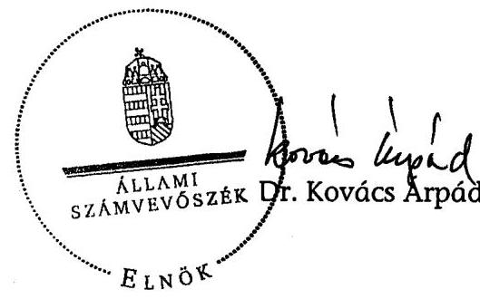

Melléklet: $\quad 6 \mathrm{db} \quad 23$ lap

---

1. sz. melléklet
a V- 01-43/2007. sz. jelentéshez

# A jelentésre és a jelentéstervezetre tett észrevételek és az arra adott válasz 

Pénzügyminisztérium
Miniszterelnöki Hivatal
Állami Privatizációs és Vagyonkezelő Zrt. Felügyelő Bizottság
Állami Privatizációs és Vagyonkezelő Zrt. + válasz

---

H-1051 BUDAPEST V. JÓZSEF NÁDOR TÉR 2-4. POSTACIM: 1369 BUDAPEST, POSTAFIÓK 481.

TELEFON: (36-1) 327-2159, (36-1) 327-2141
FAX: (36-1) 318-0738

PÉNZÜGYMINISZTER

Dr. Kovács Árpád úr
elnök

Állami Számvevőszék

Budapest

Tisztelt Elnök Úr!

Ikt. szám: 12758 / 5 / 2007.

ÁLLAMI SZÁMVEVŐSZÉK
EGYVITEÉTSODA
ATT-5556/07
Érkezz: 2007 AUG 3'0.
Ikt. szám: V-01-42/07
Melléklet:

Bihaj

08.30.

Köszönettel megkaptam az Állami Privatizációs és Vagyonkezelő Zrt. 2006. évi működésének és a központi költségvetés végrehajtásához kapcsolódó tevékenységének ellenőrzéséről készített jelentést, melyben foglaltakra - tekintettel a korábbi szakállamtitkári és államtitkári szintű egyeztetésekre - további észrevételt nem teszek.

Budapest, 2007. augusztus 30.

Üdvözlettel:

Dr. Veres János

---

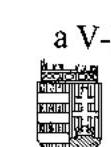

MINISZTERELNÖKI HIVATAL STRATÉGIAI IRÁNYÍTÁSÉRT FELELŐS ÁLLAMTITKÁR

Ikt. szám: KSAT-17/2007
Tárgy: ÁPV Zrt-ről szóló jelentéstervezet

Bihary Zsigmond úr részére
főigazgató
Állami Számvevőszék

Budapest

Tisztelt Főigazgató Úr!

Tájékoztatom, hogy az Állami Privatizációs és Vagyonkezelő Zrt. 2006. évi működésének és a központi költségvetés végrehajtásához kapcsolódó tevékenységének ellenőrzéséről készített jelentés-tervezetre észrevételt nem teszek.

Budapest, 2007. augusztus 22.

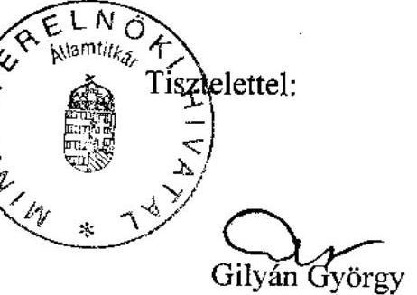

---

Állami Privatizációs és Vagyonkezelö Zrt.
Hungarian Privatization and State Holding Company

Bihary Zsigmond föigazgató

Állami Számvevőszék
H-1052 Budapest
Apáczai Csere János u. 10.

Felügyelő Bizottság elnöke
Tel: 237-4126
Fax: 237-4125
Isz: $\frac{\text { F } 2 . . .142 . .1 \text { IAPV/2007. }}{}$

Budapest, 2007. július 30.

Tárgy: Az ÁPV Zrt. 2006. évi müködésének és a központi költségvetés végrehajtásához kapcsolódó tevékenységének ellenőrzéséről készített jelentés-tervezet.

# Tisztelt Föigazgató Úr! 

Köszönettel megkaptam az Állami Privatizációs és Vagyonkezelő Zrt. 2006. évi müködésének és a központi költségvetés Végrehajtásához kapcsolódó tevékenységének ellenőrzéséről szóló számvevői jelentés-tervezetet.
A jelentés-tervezethez észrevételt nem kívánok tenni.

Együttmüködését megköszönöm.
Tisztelettel:
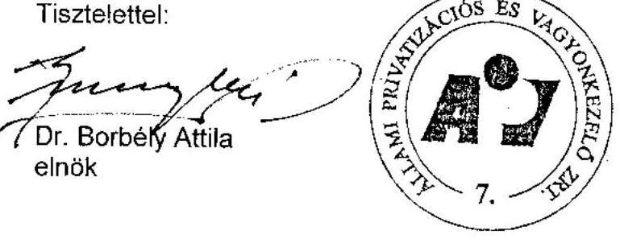

---

# Állami Privatizációs és Vagyonkezelő Zrt.

## Hungarian Privatization and State Holding Company

### VEZÉRIGAZGATÓ

**Bihary Zsigmond**
**főigazgató**

**Állami Számvevőszék**

**H-1051 Budapest**
**Apáczai Csere János u. 10.**

---

**Állami Számvevőszék**

**ÜGYVITELT IRODA**
**Átá: 3458/07**
**Érkező: 2007 ÁUG 16.**

**Iktatószám: 37107**
**Melléklet:**

**Isz:**

**30-27. Köz./ÁPV/2007.**

---

**Budapest, 2007. augusztus 16.**

**Tárgy:** Észrevételek "Az Állami Privatizációs és Vagyonkezelő Zrt. 2006. évi működésének és a központi költségvetés végrehajtásához kapcsolódó tevékenységének ellenőrzéséről" készült jelentés tervezetére

**Tisztelt Főigazgató Úr!**

Az Állami Számvevőszék befejezte az ÁPV Zrt. 2006. évi átfogó vizsgálatát és megküldte Jelentés tervezetét, amely "Az Állami Privatizációs és Vagyonkezelő Zrt. 2006. évi működésének és a központi költségvetés végrehajtásához kapcsolódó tevékenységének ellenőrzéséről" szól. A Jelentés tervezetét 2007. augusztus 9-én kaptuk kézhez.

A vizsgálat a több éves gyakorlat alapján közös előkészítéssel és folyamatos egyeztetéssel zajlott. A számvevői részjelentéseket szakértői szinten – 2007. június 22-én megküldött levelében – véleményezte az ÁPV Zrt., kifejtve szakmai álláspontját az egyes kérdésekben.

A Jelentés korábbi tervezetét az ÁPV Zrt. Ügyvezetése 2007. augusztus 2-i ülésén megtárgyalta (29/2007. (VIII. 02.) ÜV sz. határozat), és aznapi válaszlevelében eljuttatta az Állami Számvevőszék részére szakmai érvekkel alátámasztott, részletes észrevételeit.

A Jelentés újabb – a Főigazgatói értekezleten elfogadott – tervezetét az ÁPV Zrt. Ügyvezetése 2007. augusztus 16-i ülésén megtárgyalta és az alábbiakban kifejtettek szerint foglalt állást a szakmai kérdésekben.

A Jelentés tervezetben idén sem szerepel javaslat az ÁPV Zrt.-nek címezve, amit tudomásul veszünk. A véleményezéssel összefüggésben javasoljuk, hogy a szervezet működése során szerzett tapasztalatokra építő – a Jelentés tervezet

**H-1133 BULÁPISZ, POZSOMPI ÚT SE.**
**TEL.: (36 1) 237-8800, FAX: (36 1) 237-4100**
**H-1359 SUDÁZESZ, 17. 7.08**
**INTERNET: HUNGARSTY L**
**CEGBHUSÁG, FÉVÁRGS, 17. 7. 08**
**CEGBHUSÁG, FÉVÁRGS, 17. 7. 08**

---

megállapításai és javaslatai kapcsán - az ÁPV Zrt. eltérő szakmai megközelítéséből következő, és alább kifejtett pontosításokat a vizsgálati anyag véglegesítésekor vegye figyelembe az Állami Számvevőszék.

A konkrét észrevételek megadása előtt egy általánosnak tekinthető észrevétel kívánkozik előre. A jelentés több helyen nem tényekre alapozva, hanem feltételezésekből kiindulva tesz megállapításokat, illetve az eseményeket utólag „előre láthatónak" minősíti. Ez a közelítés és tárgyalásmód az ÁPV Zrt. szakmai megítélése szerint nem alkalmazható a piaci körülmények között tevékenykedő szervezetekre, és a megállapítások helytállóságát sem támasztja alá.

Kérjük, hogy a Jelentés tervezetnek azon részeiben, ahol a számvevők által rögzített megállapítások álláspontunk szerint tévesek, vagy az abból levont következtetésekkel, elmarasztaló megállapításokkal az ÁPV Zrt. nem ért egyet, ott az ÁPV Zrt. véleménye a szövegben jelenjen meg az ÁPV Zrt. álláspontjaként. Ezzel biztosítható, hogy a Jelentés tervezetet olvasó részére mód nyíljon a mérlegelésre, a vizsgálatot végző, és a vizsgálat alanya érvrendszerének összevetésére.

Az ÁPV Zrt. konkrét észrevételei az alábbiak a Jelentés tervezet megfelelő szövegrészletére való utalással:

# Szervezeti átalakítás 

8. oldal 1. bekezdés utolsó mondata
„Az ÁPV Zrt. saját döntése alapján az új vagyonkezelési feladatok befogadására készült fel. A koncepció téves volt, mivel az új vagyonkezelö feladatainak ellátásához az ÁPV Zrt.-töl eltérő szervezet felel meg."

Nem tarjuk sem tényszerűnek, sem megalapozottnak a hivatkozott bekezdés utolsó mondatát, amely a megállapítás indokainak megjelölése nélkül azt deklarálja, hogy az új vagyonkezelői feladatok ellátásához az „ÁPV Zrt.-töl eltérő szervezet felel meg." Az Országgyűlés által a tavaszi ülésszak folyamán megtárgyalt, jelenleg tárgysorozatban levő, az állami vagyonról szóló törvényjavaslat az ÁPV Zrt., a KVI és az NFA jogutódjaként egy gazdasági társasági formában létrehozandó szervezet felállításáról rendelkezett, amely tény - álláspontunk szerint - a jelentés utolsó mondatát önmagában megcáfolja. Az új vagyonkezelő szervezeti felépítéséről a törvényjavaslat konkrét rendelkezéseket nem tartalmaz, ezért nem zárható ki, hogy annak szervezeti felépítése - a törvényjavaslat hatálybalépését követően - az ÁPV Zrt. jelenlegi müködésén alapul. Emellett az új vagyonkezelő szervezet az ÁPV Zrt. jogutódja is lesz, ezért véleményünk szerint akár az ÁPV Zrt., akár a másik két szervezet által az egységes vagyonkezelés lehetővé tétele érdekében megtett előkészületi intézkedések a kormányzati szándékkal összhangban levő, az állami vagyonról szóló törvényjavaslat tükrében a jogutód szervezet felállítását és munkáját elősegítő tevékenységként értékelendőek.
A tények nem támasztják alá az Állami Számvevőszék azon érvelését sem, „hogy 2006.-tól a dolgozói létszám mérséklése már nem követte a feladatok csökkenését," mivel 2005. végétől a vizsgálat időpontjáig az ÁPV Zrt. 20\%-os létszámcsökkentést hajtott végre a szervezet racionalizálási programja keretében.

---

# A MALÉV Zrt. privatizációja 

8. oldal 3. bekezdés 10. oldal 4. bekezdés; 33-34. oldal
„A MALÉV Zrt. privatizációjához a Közbeszerzési törvény megkerülésével alkalmaztak szakértőt."

A Jelentéstervezetben nem tartjuk megalapozottnak az ÁPV Zrt. Állami Számvevőszék által kifogásolt eljárásával összefüggésben a „Közbeszerzési törvény megkerülésével" fordulat használatát.

Amint azt a korábbiakban is jeleztük, a MALÉV Zrt. privatizációjához az ÁPV Zrt. jogi közreműködői feladatok ellátására kért ajánlatot, és a megkötött szerződésben a megbízó ÁPV Zrt. a megbízási díjat ezeknek a jogi feladatoknak az ellátásáért kötötte ki. A szerződés tartalmazta ugyan azt a lehetőséget is, hogy a megbízott ügyvédi iroda a jogi feladatok ellátásához kapcsolódóan más közremüködőt is igénybe vehessen, ezt azonban a megbízó külön hozzájárulásához és limitált dijazási lehetőséghez kötötte. Álláspontunk szerint - a korábbi észrevételeinkben foglaltak mellett - önmagában ezen tények figyelembevételével sem állja meg a helyét a „közbeszerzési törvény megkerülésével" fordulat a jelentésben.

Véleményünk szerint nincs jelentősége, illetve nem annak van jelentősége, hogy az ajánlattevő ügyvédi iroda ajánlatában mekkora díjazási igényt jelölt meg, az ÁPV Zrt. szempontjából kizárólag a megkötött megbízási szerződésben meghatározott dijazás, valamint a későbbiekben, a privatizációs eljárás során, a jogi feladatok ellátásához igénybe vett közremüködő eljárására tekintettel felmerült dijazás releváns.

A jelentés kizárólag az ajánlat szerinti „47 MFt nettó megbizási dijért" fordulatot tartalmazza, nem utal azonban arra, hogy a szerződésben kikötött dijazás ténylegesen mekkora összegű volt (nettó 12 MFt ), továbbá a közremüködő későbbi igénybevétele a szerződés szerinti limitre tekintettel mekkora összegű további díjfizetéssel járhatott (nettó 10 MFt ), ezért kifejezetten megtévesztő képet ad a tanácsadó igénybevételének a körülményeiről. E megfogalmazás mellett a szerződéssel kapcsolatos kifizetésekről a jelentés a tényektől eltérő nagyságrendű összegek kifizetését valószínűsíti, ezért a szerződéshez kapcsolódó vizsgálati megállapítások a valóság bizonyítása szempontjából minden körülmények között megtévesztőnek és megalapozatlannak bizonyulnának.

Hivatkozunk továbbá arra is, hogy a közremüködő igénybevételére és munkájára a jogi feladatok ellátásához kapcsolódóan volt szükség, a jelentés megfogalmazásával szemben az ÁPV Zrt. nem általánosságban rendelt meg „gazdasági tanácsadást, forditást", hanem a megbízott kérésére, a megbízott jogi feladatainak szerződésszerű teljesítése érdekében hagyta jóvá, és fogadta el a jogi közremüködő eljárását.

---

# Vagyontörvény 

9. oldal 1. bekezdés
„A 2006.-ban befejezett vizsgálat óta, a még ki nem hirdetett új Vagyontörvényben szabályozták az állami vagyon egységes kezelését."

Érdemét tekintve téves a jelentés fenti megállapítása, amely szerint egy még ki nem hirdetett törvény bármit, e körben akár az állami vagyon kezelését is szabályozhatja. Jogszabály kizárólag a hatálybalépését követően bír jogi szabályozási erővel. A megállapítás helytelenségét erősíti a mondatban az ige múlt idejű alakja, legfőképpen azért, mert - amint arra a jelentés lábjegyzete is utal - a „Kormány az állami vagyonról szóló új törvényjavaslatot 2007. júniusában nyújtotta be az Országgyülésnek, ahol elfogadták az új vagyontörvényt, azt azonban a köztársasági elnök 2007. július 3-án megfontolásra visszaküldte."

## 10\% MOL részvénycsomag értékesítése

10. oldal 2. bekezdés; 15. oldal 2. javaslati pont; 27-31. oldal

Nem fogadjuk el az Állami Számvevőszék azon megállapítását, amely szerint a MOL Nyrt. részvényeinek 2006. évi értékesítésénél az ÁPV Zrt. szakmai hibát követett el, nem járt el körültekintően és, hogy emiatt a tranzakcióban bevételkiesés keletkezett volna.

Szakmai hiba az lett volna, és az lenne indokolandó, ha a vonatkozó kormányhatározattól eltérően, az abban foglalt feltételeket leszűkítve, vagy meghaladva a hazai és nemzetközi szakmai normáktól eltérő feltételeket határozott volna meg az ÁPV Zrt.

Alapvető és kikerülhetetlen nemzetközi norma, hogy a tőzsdén jegyzett társaságok részvényeinek eladásakor, értékének meghatározásakor kizárólag a nyilvános, dokumentált historikus tőzsdei árfolyamot veszik figyelembe. Az is továbbá, hogy jelentős értékű csomag eladásakor minél hosszabb időintervallumon mérik a historikus értéket (nemzetközi gyakorlatban ez 100 millió Euró feletti értéket és 90 napos, illetve bizonyos esetekben 180 napos árfolyamot jelent). A hazai gyakorlat és jogszabályi környezet is - összhangban a vonatkozó nemzetközi gyakorlattal - mind az önkéntes adás-vételeknél, mind a törvénnyel szabályozott kötelező vételi ajánlati rendszernél 90 , illetve 180 napos, BÉT-által regisztrált árfolyamok figyelembevételét írja elő, és ennek során a mindenkori teljes tőzsdei kereskedelmet, illetve annak számadatait veszi figyelembe. Sem a nemzetközi, sem a hazai szakmai gyakorlat nem hagyja figyelmen kívül az önkötéseket, ezzel szemben precízen szabályozzák az önkötések feltéteirendszerét, amellyel biztosítják annak piacszerűségét.

Az önkötés kizárásával elérhető potenciális többletbevétel tényét ennek megfelelően csak utólagosan, a tényleges árfolyam ismeretében lehet kijelenteni. Azt, hogy egy önkötési kontraktus hogyan viszonyul egy későbbi 90 , illetve 180 napos árfolyamhoz, - hogy kisebb vagy nagyobb lesz annál, azaz lefelé vagy felfelé húzza azt, - még csak nagy valószínűséggel sem lehet megmondani. Nyilvánvaló, hogy ha a piaci árak

---

az önkötés árfolyamánál kisebb átlagot eredményeztek volna, - aminek a lehetősége 2006. decemberében ugyanakkora volt, mint annak ellenkezője - akkor az önkötés figyelembe vételének kizárása árbevétel kiesést okozott volna. Természetesen ezt is csak utólag lehetett volna felismerni. Ennél fogva, egy elöre meg nem becsülhető hatású esemény kizárása vagy figyelembevétele nem minősíthető szakmai hibának.

Az opciós szerződés, amelynek lényege a szerződés és a realizálás időbeni szétválasztása, szükségszerűen felveti az időbeni bizonytalanság kockázatát. A nevezett opciós szerződésben az állami eladó ezt a kockázatot oly módon osztotta meg az opciós vevővel, hogy az időbeliség döntési jogát a vevő kapta, de az eladó az árfolyamcsökkenés kockázatából minimálár alkalmazásával kizárta magát.
Az ÁPV Zrt. 2005. évi tevékenységének vizsgálatáról készített ÁSZ jelentés sem kifogásolta az akkor már ismert tranzakciós konstrukciót, az Állami Számvevőszék csak utólagosan vezette le, és veti fel a bevételkiesés vélelmét.

Az ÁPV Zrt. a fentiekre figyelemmel az átlagár szerződésbeli meghatározásakor, és annak alkalmazásakor nem követett el szakmai hibát. Az opciós megállapodásoknál ugyanis az ügylet jövőbeni teljesítési időpontjára nem lehet előre meghatározni és kikalkulálni, hogy majd melyik fél számára alakul kedvezőbben, vagy kedvezőtlenül a tranzakció, ez csak az opció lehívásakor (jelen esetben fél év elmúltával) válik ismertté. A vizsgálati jelentésben szereplő kalkulációktól eltérőn az ÁPV Zrt. által alkalmazott árazási technikát támasztja alá az a tény is, hogy 2006. május 1. és október 27. között a vételi jog gyakorlására megnyitott időszakban a forgalommal súlyozott átlagár ténylegesen 21.550 Ft volt, azaz a lehívási árnál alacsonyabb értéken alakult.

# Kisebbségi portfolió / Forrás Rt. értékesítése 

10. oldal, 27. oldal

Az ÁPV Zrt. - a Jelentés tervezet vagyonvesztés vizsgálatára irányuló javaslatával és megállapításával - eltérő szakmai megítélése alapján nem ért egyet.

Le kívánjuk szögezni, hogy a hatályos vagyonértékelési, elszámolási és nyilvántartási rend szerint (mely elszámolási rend az Állami Számvevőszék korábbi ajánlásain alapul) a 2006. évi tranzakció kapcsán vagyonvesztésről nem beszélhetünk.

A Forrás Rt. vagyonának, valamint a társaság részvényeinek eladásából származó bevétel megítélése, nagyságrendjének minősítése szükségszerűen bizonytalan. Ugyanis mind a Társaság feltökésítése során, mind a részvények bizonyos részének értékesítésekor az ÁPV Zrt. azt az eladási módszert választotta, hogy önmagában nehezen, vagy egyáltalán nem értékesíthető vagyonelemeket értékesíthető elemekkel egy csomagban kínált fel eladásra. Ezáltal megvalósulhatott, hogy több éven át, többszöri kísérlettel is eladhatatlannak bizonyult, egyre nagyobb ráfordítást igénylő, jogi és közgazdasági szempontból is problémás, tartós állami tulajdonba nem sorolt portfolió elemeket sikerült kivezetni az állami tulajdoni körből. A Forrás Nyrt. feltökésítésével, és részvényeinek több lépcsőben történt teljes körű eladásával együttesen 9 vagyonelem privatizációjára került sor. A fentiek szerint

---

szükségszerűen összetett és sokszínű portfolió csomagok pontos értékét igen nehéz meghatározni. Az egyes gazdálkodók, részvénytulajdonosok, potenciális és tényleges befektetők külön-külön másképpen értékelik az egyes portfolió elemeket, szükségszerűen az együttes vagyoncsoport értékét és az összetett érték belső megoszlását is.

Összefoglalóan nagy valószínűséggel kijelenthető, hogy a Forrás Nyrt. apportálásába, majd a Társaság részvényeinek értékesítésébe bevont vagyonelemek ilyen módon történt kombinált értékesítése az eladó ÁPV Zrt. szempontjából a lehető legnagyobb megtérülést hozta. Ezzel párhuzamosan megvalósultak a kintlevő kárpótlási jegyek tömeges bevonásával kapcsolatos gazdasági és jogi elvárások, valamint érvényesült a tőzsdére vitel nyilvánossága, illetve az értékesítési versenyhelyzet fenntartása.

Az alanyi kárpótoltak kérdésének felvetése nem releváns. A Forrás Nyrt. tőzsdére vitelekor kiderült, hogy a még piacon lévő kárpótlási jegy mennyiség - amely az összes kibocsátásnak már csak mintegy 10 százaléka volt - töredéke van alanyi kárpótoltaknál. Ennél fogva a tranzakciók hatásának alanyi, illetve nem alanyi kárpótoltakra bontásának elemzése megítélésünk szerint szakszerűtlen fejtegetés.

# MAHART - Budapesti Szabadkikötő Logisztikai Zrt. privatizációja 

10. oldal 3. bekezdés; 31-32. oldal

A Jelentés tervezet a MAHART - Budapesti Szabadkikötő Logisztikai Zrt. privatizációja - esetében évekre visszatekintő, tényszerűen nem alátámasztott megállapításokat tesz, amelyet az ÁPV Zrt. szakmailag megalapozatlannak tekint.

A Jelentésben a konkrét jogszabályi hivatkozás és a konkrét jogalkalmazó megjelölése elengedhetetlen, mert enélkül jogi szempontból értelmezhetetlen, hogy a számvevői jelentés szerint az átalakulási törvény mely rendelkezésének, mely szervezet általi téves értelmezéséről lehet szó a társasággal összefüggésben.

Ugyanakkor a jelentés megállapításának minősítése során nem mellőzhető annak a körülménynek a figyelembevétele sem, hogy a vizsgálat tárgykörén feltétlenül kívül esőnek ítéljük az 1990-es évek elején kialakult tulajdoni viszonyok, jogalkalmazó tevékenység ÁPV Zrt. 2006. évi tevékenységének vizsgálatához kapcsolódó, ráadásul az ÁPV Zrt. intézkedésének mulasztásaként feltüntetett - minden konkrét tényadat megjelölése nélküli - kifogásolását. Megjegyezzük továbbá, hogy a kikötő tulajdonjogára vonatkozó észrevételeket az Állami Számvevőszék évente elvégzett vizsgálata eddig nem tartalmazott.

A szóban forgó ingatlan társasági tulajdonban állása az ÁPV Zrt. 2006. évi tevékenysége szempontjából megítélésünk szerint csak külső adottságként tényként - értékelhető.

A jelentésben hivatkozott, a vízi közlekedésről szóló 2000. évi XLII. törvény 80. §ának (1) bekezdése az alábbiak szerint rendelkezik: „Azt a közforgalmú kikötőt, amelynek földterülete állami tulajdonban vagy az állam meghatározó többségével

---

létrehozott vagyonkezelő társaság kezelésében van, és amely alapvető közlekedési infrastrukturális ellátottsága lehetővé teszi átrakodási, elosztási központként a vízi, vasúti és a közúti személy-, illetőleg áruforgalom összekapcsolását, országos közforgalmú kikötővé lehet nyilvánítani." Ez a jelentésben hivatkozott jogszabályhely nem ad lehetőséget az ÁPV Zrt. számára arra, hogy a társasági tulajdonban levő földterületet megszerezze. Úgyszintén nem teremt jogalapot a társasági tulajdon megszerzésére valamely gazdasági társaság átalakulása, „szétdarabolása" sem, átalakuláskor csak a jogutód gazdasági társaságok, valamint a gazdasági társaságból kilépő tagok (a rájuk eső vagyonhányad vonatkozásában) szerezhetnek tulajdont.

A fenti, szakmailag megkérdőjelezhető megállapításoktól függetlenül is kijelenthető, hogy az Állami Számvevőszék értékelése megalapozatlan, amikor az ÁPV Zrt. tevékenységének vizsgálata során az ÁPV Zrt. mulasztásaként értékeli, hogy valamely ingatlan nem a Kincstári Vagyoni Igazgatósághoz tartozó állami tulajdonú kincstári vagyon.

# A Bábolna vagyonkezelésére vonatkozó megállapítások 

11-12. oldal; 15. oldal 3. javaslat; 34-39. oldal

1. Az ÁPV Zrt. továbbra is fenntartja a Bábolna csoporttal kapcsolatos, az ÁPV Zrt. Ügyvezetése által, a 29/2007. (VIII.02.) ÜV sz. határozattal elfogadott válaszlevéllel kialakított, és az Állami Számvevőszék részére 2007. augusztus 2-án megküldött részletes szakmai álláspontját, annak általános megjegyzéseit és konkrét észrevételeit.
2. A földhasználattal kapcsolatos észrevételekre jelezzük továbbá, hogy tényként megállapítható: a földhasználati nyilvántartásokban a Bábolna Zrt. földhasználóként be van jegyezve.
Egyértelműen kijelenthető, hogy - a termőföldről szóló 1994. évi LV. törvény 2000. január 1-jétől hatályos módosításával beiktatott 25/A. §-a alapján - a Bábolna Zrt. már 2000-től szerepel a földhasználati nyilvántartásban. Az NFA és a Bábolna Rt. között 2004. március 19-én jött létre a földhaszonbérleti szerződés módosítása.
3. Továbbra sem értünk egyet az Állami Számvevőszék Jelentés tervezetében a 37. oldal 2. bekezdésében foglalt, a Bábolna Rt. igazgatóságára vonatkozó megállapításával és erre alapozott javaslatával (15. oldal 3. javaslati pont). Tényszerűen megállapítható, hogy a Bábolna Rt. Igazgatósága a társaság végelszámolása időszakában ülést tartott (pl. 2004. 09. 08-án), közgyűléseket hívott össze (pl. 2004.10.15. és 2005.01.14. napjára), előterjesztéseket tett, tevékenységet lezáró beszámolót készített és terjesztett a közgyűlés elé, adóbevallást készített, egyeztetéseket folytatott (pl. 2004.11.24-i levél az ÁPV Rt. Igazgatósága elnökének), vagyonértékesítésekben vett részt (pl. 2004.09.08-i ÉB ülés). Tevékenysége az ÁPV Zrt. megítélése szerint egyensúlyban volt az egyharmadára csökkentett díjazással.

---

A fenti szakmai érvek alapján látható, hogy az ÁPV Zrt. a vonatkozó törvényi előírásoknak megfelelően, azokat végrehajtva végezte feladatát. Ezek alapján javasoljuk a Bábolna Rt. Igazgatóságára vonatkozó megállapítások módosítását.

Megítélésünk szerint ezek a kérdések egyébként sem az ÁPV Zrt. 2006. évi tevékenységének vizsgálatához kapcsolódnak, a végelszámolási eljárás ugyanis 2004. szeptember 1-jétől 2006. január 31.-ig tartott.
4. A javaslatban megjelenő új kritikával, amely a Jelentés tervezet szerint a „szükségtelen végelszámolás miatti veszteségek (Reorg Rt.-nek kifizetett dij)"ra vonatkozik, az ÁPV Zrt. szakmai megfontolások alapján nem ért egyet.

A társaság végelszámolással való megszüntetéséről hozott döntés szükségszerű, alternatíva nélküli lehetőség volt, amelyről a társaság Igazgatóságának javaslata és a Felügyelő Bizottság támogatása mellett döntött a társaság Közgyűlése a gazdasági társaságokról szóló 1997. évi CXLIV. törvény előírásai alapján. E döntésben figyelembevételre került, hogy állami támogatás nélkül - a negatív gazdasági-társadalmi hatások minimalizálásával kell megoldani a helyzetet.

# TESCO tripoli iroda fenntartása 

13. oldal 3. bekezdés; 47. oldal 2. bekezdés

Az összegző megállapítás ellentmond a vizsgálati megállapításnak, hiszen a jelentés részletes megállapításainál éppen a szerződés utólagos módosítását kifogásolja az Állami Számvevőszék, és a kifizetést tartja indokolatlannak. A szerződésmódosítás alapozta meg ugyanis, és ezáltal tette indokolttá a kifizetést.

Az utólagosan - akár a 1,5 évet követően - létrejövő megállapodás módosítás is megalapoz, és indokolttá tesz kifizetéseket, mert ezek azt igazolják, hogy az egyik fél a megállapodás alapján olyan követelést tartott nyilván, illetve olyan követelés érvényesítését helyezte kilátásba a másik fél felé, amelyet a másik fél jogos követelésnek ismert el. A kifizetést az ÁPV Zrt. - a Jelentés tervezettel ellentétben az alábbi szakmai indokok alapján megalapozottnak találja.

A 2004. szeptember 22-én kötött megállapodás értelmében a 2004. évre elszámolt nettó 4.993 .334 Ft költségből mintegy 153 EFt került kifizetésre a TESCO Kft. részére, a tripoli irodában foglalkoztatott magyar alkalmazott évi egyszeri haza- és visszautazási költségére. A tanácsadók részére fizetett díj elszámolását a hivatkozott megállapodás nem tette lehetővé. A megállapodás mellékletét képező költség elemek közül döntő mértékben az irodai bérleti díj, lakbér, telefon költség, technikai eszközök, gépkocsi üzemeltetési költség stb. megtérítésére vonatkozott.
2005. évben új helyzet állt elő, miszerint a törlés érdekében a TESCO Kft. vezetésének is több alkalommal kellett Tripoliba utaznia, és a helyi tanácsadóknak dijat fizetnie, akik az eredmények elérésében jelentős mértékben segítettek.

---

A helyi közvetítők igénybevételével lefolytatott tárgyalások azt eredményezték, hogy az 5,6 millió USD értékű, mintegy $90 \%$-os súllyai bíró elöleg visszafizetési garancia az MNB által törlésre került, amellyel az ÁPV Zrt. / Magyar Állam több mint 1 Mrd Ftos fizetési kockázattól mentesült.

A TESCO Kft. újabb ráfordításaira, azaz a garancia felszabadítása ügyében felmerült közvetlen költségekre a 2004.-ben megkötött megállapodás már nem biztosított anyagi fedezetet, ezért került elfogadásra kizárólag e két költségelem tekintetében (helyi tanácsadóknak fizetett dij, kiutazás költségek) a megállapodás utólagos módosítása.

# 1 Mrd Ft feletti kifizetések 

13. oldal 1. bekezdés; 43. oldal 2. bekezdés; 45. oldal 5. bekezdés

A Jelentés tervezet azt kifogásolja, hogy a Volán és az Erdészeti társaságok tőkeemelése kapcsán az ÁPV Zrt. nem kérte meg a Kormány egyedi jóváhagyását.

A 2005. évi CLIII. tv. 5.§ (8) bekezdése szerint „A 14. számú melléklet I/1/c), II/1, és II/2. pontjai szerinti elöirányzatok esetében az ÁPV Rt. egyedi, 1.000,0 millió forint feletti döntéseihez a Kormány egyedi jóváhagyása szükséges."

A Jelentés is leírja, hogy az egyes társaságok esetében az „egyedi" tőkeemelések összege nem érte el az 1.000,0 millió forintos összeget.

Nem értünk egyet a törvény által elöirt „egyedi" döntés oly módon történő értelmezésével, hogy az azonos tevékenységet folytató cégek esetében, az azonos tárgyú tulajdonosi döntéseket összevonva kellene figyelembe venni, ezt az értelmezést a törvényi elöírás nem alapozza meg.

## Egyéb dij kifizetések

15. oldal 4. javaslati pont

A Jelentés-tervezet kifogásolja a saját vagyon terhére (egyéb dij 6 MFt ) kifizetett összeget. A javaslat valószínüleg az 52. oldal 2. bekezdésében tett alábbi megállapítással kapcsolatos:
„A részletes fókönyvi kivonatban a magánszemélynek kifizetett egyéb dijként 5 M Ft szerepel. Az eljárás, intézkedés megalapozatlan volt, hiszen az FHB Rt. tisztségviselöje részére nem az ÁPV Zrt. tevékenységével összefüggö kifizetés történt meg, ebböl következően nem létezett munkaviszony vagy megbizásos jogviszony sem."

Az ÁPV Zrt. szerint a kifizetés mind formai, mind tartalmi szempontból megalapozott volt.
A formai szempontot illetően elegendő hivatkozás a számvitelről szóló 2000 . évi C . törvény 3. §-a (7) bekezdésének 3. pontja, amely szerint:
„személyi jellegü egyéb kifizetések: azok a természetes személyek részére teljesitett kifizetések, elszámolt összegek, amelyeket a kifizetö a természetes személy részére

---

jogszabályi előirás vagy saját elhatározása alapján teljesít, és nem tartoznak a bérköltség, illetve a vállalkozási dij fogalmába."

Emellett nagyon fontos a kifizetés tartalmi indokoltsága is. Az FHB Rt. Igazgatóságának elnöke rendkívül jelentős munkát végzett a társaság középtávú stratégiájának kidolgozásában. Ez a középtávú stratégia tartalmazta a társaság privatizációra történő felkészülését, felkészítését is. Az ÁPV Zrt. számára pedig az FHB Zrt. privatizációjának előkészítése a 2006. év egyik legfontosabb stratégiai feladata volt. Az ezzel kapcsolatos széleskörű előkészítő háttérmunka alapozta meg a privatizációs folyamat későbbi elindítását. Az igazgatóság elnökének közreműködőként az érintett társaság valamennyi tulajdonosa érdekének érvényesítését és a Magyar Állam privatizációs célkitűzéseinek sikerét egyidejűleg kellett elősegítenie. A két érdek összehangolása különösen érzékeny feladatot jelentett, tekintettel arra is, hogy a két folyamat szorosan összefonódott, miközben egymástól igen eltérő, esetenként ellentétben álló részfeladatokat kellett megoldani. A kiemelkedő mennyiségű többletmunka dokumentáltsága mellett fontos hangsúlyozni az elért eredményt is: bevezetésre került a társasági stratégia, a társaság piaci értéke is növekedett, valamint megalapozódott a privatizáció.

Az ÁPV Zrt. az utóbbi években a kiemelkedő privatizációs tranzakciók előkészítésének és végrehajtásának elismeréseként több esetben is fizetett nem munkaviszonyban és nem megbízásos jogviszonyban álló magánszemélyek részére közreműködői díjakat. Ezek a díjak minden esetben a legfontosabb tranzakciók sikeres lebonyolításában való közreműködést ismerték el, más szóval társaságunk legfontosabb üzleti érdekeinek érvényesítését szolgálták.

A fentiekben megfogalmazott indoklások alapján kérjük az egyéb díjként elszámolt, magánszemély részére kifizetett 5 MFt összegre vonatkozó (52. oldal 2. bekezdésben szereplő) elmarasztaló megállapítást és a javaslatot a Jelentés tervezetből mellőzni.

# A hozzárendelt vagyont érintő beszámolási rendszer 

18. oldal 1. bekezdés

Az ÁPV Zrt. a beszámolási rendszerére vonatkozó jogszabályi és jogforrási kereteit az említett törvények, kormányrendelet és RJGY határozat által teljes körűen szabályozottnak ítéli meg.
Az ÁPV Zrt. minden lehetséges területen a számviteli törvény előírásait alkalmazza. A számviteli törvényhez való közelítés nem jelenti és nem is jelentheti az azzal való azonosságot. Az ÁPV Zrt.-nél éppen a vagyon „hozzárendeltsége" és nem saját tulajdonban lévősége kényszeríttette ki a kezdetekkor a saját vagyon és a hozzárendelt vagyon számviteli elszámolásának elkülönítését. A számvevő által felrótt maradéktalan megoldás hiányának tényét nem tudjuk elfogadni.

## Vagyonnyilvántartás

18. oldal 3. bekezdés

---

Nem értünk egyet azzal a számvevői megállapítással, hogy a vagyon értékváltozása a mérlegben nem kerül bemutatásra. A mérleg állapot adatokat tartalmaz, amely mindig a fordulónapi nyilvántartási értékeket mutatja. Az előző évhez képest bekövetkezett változásokat a beszámolóban a Kiegészítő melléklet és a beszámoló részét képező $4 / a, 4 / b, 5$. sz., és 6 . sz. táblázatok mutatják be vagyonelemenként (immateriális javak, ingatlanok, ingóságok, társaságok, vállalatok), társaságokként és jogcímenként. Mivel a Kiegészítő melléklet és a felsorolt táblázatok is a beszámolónak a részei, az „olvasó" ebből informálódhat a vagyonelemekben bekövetkezett változásokról, ehhez semmilyen külön kigyüjtés nem szükséges.

# 19. oldal 3. bekezdés 

A negatív saját tőkével rendelkező társaságok esetében nem látjuk indokoltnak a tulajdonarányos jegyzett tőkén történő kimutatást, mivel a negatív saját tőke éppen azt jelzi, hogy a társaság nem rendelkezik saját forrással. Ezen társaságoknál nem várhatók megtérülések, hanem adott esetben tőkepótlás válik szükségessé.
Negatív saját tőkén történő nyilvántartás értelmezhetetlen, hiszen egy vagyonelem vagy ér valamit, vagy nulla az értéke.

## Reorganizációval kapcsolatos ráfordítások

## 43. oldal 1. bekezdés

A Jelentés tervezet kifogásolja az erdészeti társaságok informatikai fejlesztésére adott 783 MFt értékű támogatás, valamint a mátrai fejlesztési program megvalósítására adott 330 MFt értékủ támogatást, azt a privatizációs törvény alapján nem tekinti a vagyonkezelés érdekében elengedhetetlenül szükséges reorganizációnak.

Az ÁPV Zrt. Igazgatósága indokoltnak tartotta a vagyonkezelés során a tartós, 100\%-os állami tulajdonba sorolt erdészeti társaságok részére az informatikai fejlesztések reorganizációs keretből történő támogatását.
A szakmai, térinformatikai rendszerek alkalmazása, működtetése a társaságoknál eltérő szinten valósult meg. Az informatikai fejlesztés tulajdonosi támogatásával a jelenleg eltérő kiindulási helyzetben lévő társaságokat kívánta közel azonos helyzetbe hozni, ezáltal is segítve a hasonló feltételek melletti gazdálkodást.

A szakmai program segítségével több változatban állíthatók elő a szakmai tervek, a megfelelő kiválasztása, majd végrehajtása után gazdaságossági elemző számítások, szakmai kimutatások gyors elkészítésével ellenőrizhető a döntés és a végrehajtás minősége.

Az ÁPV Zrt. Igazgatósága indokoltnak tartotta a vagyonkezelés során a tartós, 100\%-os állami tulajdonba sorolt EGERERDŐ Zrt. mátrai fejlesztési programjának megvalósítását célzó 330 MFt értékủ reorganizációs támogatást. A döntés eredményeként megítélt támogatás lehetővé tette a MÁTRAVASÚT vonalában

---

bekövetkezett természeti károk felszámolása kapcsán a vasútvonal továbbfejlesztését a hozzá kapcsolódó turisztikai fejlesztések révén is.

# Tartalékképzés 

46. oldal 3-4. bekezdés

Tényszerűen nem alátámaszthatóak a Jelentés tervezetben leírtak, amely szerint a céltartalékhoz pénzügyi fedezet nem társul.
A céltartalék képzéssel összhangban történik a privatizációs tartalék készpénzállományának meghatározása az üzleti terv analitikája szerint.
Az ÁPV Zrt. a normatív kötelezettségek kamatára és a függő kötelezettségekre számvitelileg, a számviteli törvény szerinti céltartalék képzés elvei szerint képezi meg a tartalékot (a mérleg forrás oldalán jelenik meg).

Az ÁPV Zrt. auditált beszámolójában szereplő - tartalék kifizetési jogcímek szerinti kötelezettségek (normatív kötelezettségekre + függő kötelezettségekre és normatív kötelezettségek kamatára képzett céltartalék) aktualizált összegére képzi meg készpénzben is a privatizációs tartalék összegét. A tartalékképzés analitikáját az ÁPV Zrt. által készített költségvetési törvényjavaslat és az üzleti terv minden esetben tartalmazza. Ennek megfelelően az Állami Számvevőszék megállapításával ellentétben a céltartalékhoz pénzügyi fedezet is társul!
46. oldal 6. bekezdés

A Jelentés tervezet megállapításával, miszerint az ÁPV Zrt. nem mérte fel kellőképpen a Richter részvényre átcserélhető kötvények miatti kötelezettségét, nem értünk egyet.
Az ÁPV Zrt. a kötvény lejáratkori vételi opciójának 2007. június 29-i állapotot tükröző beértékelését elvégeztette, és ez alapján az opciós prémium értékét 29.033 MFt összegben határozta meg, amelyre 100\%-ban céltartalékot képzett. Ennek értelmében jelenleg azzal a feltételezéssel kell számolni, hogy a kötvény tulajdonosok lejáratkor a kötvényt részvényre fogják cserélni.
13. oldal 4. bekezdés, 48. oldal 3. bekezdés
„Az önkormányzatokat megillető - 1989. évi XIII. törvény alapján járó belterületi föld ellenérték - kifizetések ellenörzésekor az Első Magyar Sertéshizlaló Rt. átalakulásával összefüggésben az ÁPV Zrt. mulasztása és ebböl fakadó többletráfordítás keletkezése állapitható meg. A birósági eljárás lezárását követően az ÁPV Zrt.-nek 148,3 MFt tőkekövetelést és 336,6 MFt késedelmi kamatot kellett kifizetni."

A Jelentés tervezet az összegző megállapításoknál helyesen azt jelzi, hogy a „belterületi föld ellenérték egyik kifizetésénél az ÁPV Zrt. 336,6 MFt késedelmi kamatot volt köteles birósági itéletet követően kifizetni egy önkormányzatnak." A peres eljárások alapján keletkező fizetési kötelezettségek késedelmi kamatterhei az

---

ÁPV Zrt. tevékenységének vizsgálata során nem értékelhetöek az „ÁPV Zrt. mulasztása" miatt bekövetkező „többletráforditás"-ként. Egy perben vitatott tökekövetelés után a jogerős itéletben végül megállapított késedelmi kamatteher esetleges mértéke a peres eljárás jellegétől és az ügyben eljáró biróságok munkamenetétől függ. A peres eljárások idöbeliségére alapvetően ezek a körülmények és nem a peres felek magatartása, e körben például az ÁPV Zrt. eljárása van ráhatással.

# 5. sz. melléklet 2. oldal 1. bekezdés 

A hivatkozott RJGY határozat száma helyesen 12/2006. (V.24.) sz. határozat.

Kérem, hogy az ÁPV Zrt. Ügyvezetése észrevételeit a Jelentés végleges szövegének kialakításánál szíveskedjen figyelembe venni.
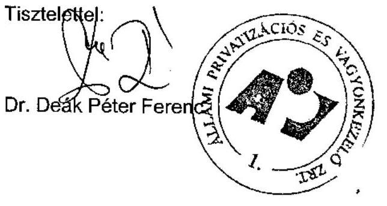

---

# 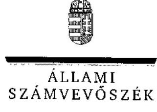 

## Dr. Deák Péter Ferenc úr

vezérigazgató
ÁPV Zrt.

## Budapest

## Tisztelt Vezérigazgató Úr!

Az Állami Privatizációs és Vagyonkezelő Rt. 2006. évi müködésének és a központi költségvetés végrehajtásához kapcsolódó tevékenységénck ellenőrzéséről készített jelentéstervezetünkre tett újabb észrevételeit megköszönöm, azokkal kapcsolatban - levele sorrendjében - a következőkről tájékoztatom.

1. A szervezetet taglaló kifogásolt bekezdés második mondatát elhagytuk.
2. A 11. oldal MALÉV tanácsadójával nemcsak szorosan vett jogi munkára kötött az ÁPV Zrt. a közbeszerzési törvény mellőzése mellett szerződést, hanem egyéb feladatokra (pl. fordításra és egyéb tanácsadásra) is. A Kbt. 153. § (3) szerint „csak az ún. kizárólagos ügyvédi tevékenységnek minösülö jogi szolgáltatások esetében mellózhető a közbeszerzési eljárás".
3. Megítélésem szerint a kifogásolt szöveg a lábjegyzettel együtt egyértelmű, de a további viták elkerülése érdekében a leírtakon módosítok.
4. MOL Nyrt privatizációjával kapcsolatban további érvelés helyett mellékelem az ÁPV Zrt. vezérigazgatójának a MOL Rt. és az ING Bank Rt. részére írt 2006. május 10 -ei levelét. Ebből jól látható, hogy az ÁPV Zrt. a kérdést akkor a jelenlegi állásponttól eltérően, az ÁSZ véleménnyel egyezően ítélte meg. Az észrevételében említett nemzetközi gyakorlat éppen, hogy nem engedi meg az ilyen - jelen esetben előre látható - önkötés kizárásának hiánya miatti 5 Mrd Ft-ot meghaladó bevételkiesést. Amint azt már korábban is kifejtettük az ármegállapítás a kormányhatározatnak megfelel ugyan, de annak előkészítése az ÁPV Zrt. feladata volt.

---

5. A Forrás Rt. vagyonvesztését nem az ÁPV Zrt. nyilvántartásaihoz, hanem a társaságba vitt vagyon értékéhez hasonlítottuk. Nyilvántartásaikból megállapítható volt az is, hogy a veszteség nem a 2003. évi kárpótlási jegyekkel szembeni értékesítésből, hanem az ARAGO Holding ajánlatából és a „Buda C" Kft.-nek értékesített utolsó pakettből származott. Levelemhez mellékelem azokat a 2003. évi privatizáció alkalmával alanyi kárpótlási jegyekkel fizetőkre vonatkozó számadatokat, amelyeket az Zrt.-től kapott könyvelési feladásból nyertünk. Eszerint az alanyi kárpótlási jegy aránya az értékesítésnél $86 \%$ volt. Összességében is elmondható, hogy a vagyonvesztés nem a kárpótlási jegyekkel szembeni értékesítésből fakadt. Megjegyzem, hogy amennyiben túlértékeltnek tartják a Forrás Rt.-be bevitt vagyonelemeket - amit ellenőrzésünk nem állapított meg -, úgy ez egyúttal azt is jelenti, hogy a kárpótlási jeggyel fizetők csak névleg kapták meg az ellenértéket, valójában nem. Ebben az esetben azonban más megvilágításba kerül az egész kérdéskör megítélése.
6. Véleményem szerint a végrehajtott privatizáció helyett megfelelőbb megoldás lehetett volna a tisztább jogi környezetet, egyértelmübb feltételeket jelentő koncesszióba adás.
7. A Bábolna csoporttal kapcsolatban fenntartott korábbi véleményét illetően a következőkről tájékoztatom.

A Bábolna Rt. Igazgatóság tagjai 2005. január 15. és 2006. január 31. között (az ÁPV Zrt. észrevétele szerint) nem üléseztek, de javadalmazásukat felvették.

A HYFER hitel elengedése az állami vagyont azonos mértékben csökkenti.
A Felügyelő Bizottság jelentéséből idézett részek tényszerűségét nem vitatva megjegyzem, hogy olyan tanácsadó cég dokumentumaira alapozták a jelentéstervezet hivatkozott részeit, amely érintett volt a Bábolna Zrt.-vel kapcsolatos privatizációs folyamatok kidolgozásában, és egymásnak ellentmondó gazdasági döntések meghozását javasolták az ÁPV Zrt.-nek.

A konszolidált beszámoló hiányára vonatkozó megállapításunkat nem befolyásolja, hogy az ÁPV Zrt. teljesnek minősíti a különféle előterjesztésekben szereplő, a vagyoni helyzetet bemutató kimutatásokat.

A földhaszonbérlet földhivatali bejegyzésével kapcsolatban ajánlom szíves figyelmébe a 2295/2005. (XII. 23.) Korm. határozatot, amely szerint „A Kormány ... 4. Tudomásul veszi, hogy a földmüvelésügyi és vidékfejlesztési miniszter a Bábolna Rt. kezdeményezése esetén elösegíti a müködés és a vagyonbiztonság megteremtése érdekében a) a Bábolna Rt. által megkötött földhaszonbérleti szerzödések földhivatali regisztrációját..."

Az egymásnak ellentmondó döntések, így a végelszámolás megindítása, ill. megszüntetése tényszerűen többletkiadást, veszteséget eredményezett, amiért a menedzsmentnek, és/vagy a tulajdonosnak vállalni kell a felelősséget.

---

Végezetül tájékoztatom Vezérigazgató urat, hogy ellenőrzési programunk tartalmazta a végelszámolás eredményének értékelését, ami viszont értelemszerüen megkövetelte a végelszámolási folyamat egészének áttekintését.
8. A TESCO Kft. tripoli irodájának teljesitett utólagos kifizetését azért minősítjük indokolatlannak, mert azok a sikerdijban lettek elismerve.
9. Változatlanul úgy itélem meg, hogy az átláthatóságot, az ellenőrizhetőséget, a Kormány döntési mozgásterét korlátozza a döntések feldarabolása. Az ÁPV Zrt. gyakorlata sem volt az elmúlt években e tekintetben egységes, a hivatkozott portfólióra 2004., 2005. években kértek kormánydöntést, 2006-ban nem, tehát a kérdést nem mindig a jelenlegi álláspontnak megfelelően kezelték.
10. Az FHB Rt. elnök-vezérigazgatójának kifizetett díjat azért tartjuk megalapozatlannak, mert az elnök-vezérigazgató munkaköri kötelessége a társasága stratégiájának kidolgozása fizetése és egyéb javadalmazása fejében, külön juttatás nélkül.
11. A beszámolási és vagyon-nyilvántartási rendszer számviteli törvénynek megfeleltetése a jelenlegi körülmények között nem valósulhat meg 100\%-ban. Megitélésem szerint, amint ezt több jelentésünkben már megfogalmaztuk, erre akkor lenne lehetőség, ha az ÁPV Zrt. két könyvet vezetne, egyet a saját társasági vagyona és müködése bemutatására, egyet pedig - megbízottként - a Magyar Állam helyett, a hozzárendelt vagyon társaságaira. Ebben az esetben az utóbbi nyilvántartás és az alapján készített mérleg az állami vagyont a számviteli törvény meghatározta tagolásban, és részletezettséggel mutatná be. Lehetőség lenne pl. az értékkülönbözet évenkénti bemutatására, a mérlegből azonnal nyilvánvaló lenne a vagyonváltozás, míg a mai állapotok szerint tíz év privatizációját követően a hozzárendelt vagyon értéke látszólag magasabb, mint eredetileg volt. A közelítés akkor lesz 100\%-os, ha a hozzárendelt vagyon mérlege minden információt tartalmaz, mint a számviteli törvény szerint müködő társaságok esetében.
12. Tökepótlási kötelezettség terhe mellett a vagyon értéke nem nulla. A negatív saját tőke nyilvántartása éppen a hozzárendelt vagyonnak a tárggyal kapcsolatos jövendő terheit jelezheti.
13. Reorganizációs támogatás szükségességét nem alapozza meg az, hogy programok segítségével a szakmai tervek több változatban állíthatók elő, illetve a turisztikai fejlesztés nem az alaptevékenység része.
14. A tartalékképzést érintően, kihangsúlyozva, hogy az ÁPV Zrt. elszámolási, nyilvántartási rendjével kapcsolatban a korábbi évekhez hasonlóan, változatlanul fenntartásaink vannak, annak reményében, hogy a jövendő új állami vagyonkezelő szervezet mérlege, számviteli nyilvántartásai a számviteli törvénynek megfelelően kerülnek kialakításra, jelen jelentésünkben foglaltakat ésszerüségi alapon rövidítettük. A Richter kötvény esetében nem értünk egyet a feltételezéssel, hogy minden kötvény tulajdonos részvényre cseréli majd a kötvényét. Így a prémium értékére 100\%-ban

---

megképzett céltartalék kevésnek bizonyulhat, indokoltnak tartjuk egy valószínűsíthető mértékủ készpénz hányad tartalékolását a készpénzes kifizetésekre.
15. Az önkormányzatokat megillető belterület földek után járó ellenérték kifizetésének a vizsgált esetben 8 éves késedelme nem magyarázható kizárólag a bíróság késedelmével. Amikor az ÁPV Zrt. tájékoztatta az érintett önkormányzatot, hogy a járandóságot rendezni kívánja, akkor már 5 év késedelemben volt. További 3 évet vett igénybe a részvények kinyomtatása, amelyet az önkormányzat nem is fogadott el térítésként (tekintettel arra is, hogy a társaság, amelynek részvényeivel az ÁPV Zrt. rendezni kívánta törvényi kötelezettségét, felszámolás alatt volt). Így a felmerült 300 M Ft-ot meghaladó kamat kifizetési kötelezettsége nem az ÁPV Zrt. felelőssége nélkül keletkezett.

Kérem a válaszomban foglaltak megfontolását és tudomásul vételét.

Budapest, 2007. augusztus 17 .

Tisztelettel:

Bihary Zsigmond

---

MOL Magyar Olaj- és Gázipari Rt.
Hernádi Zsolt elnök-vezérigazgató részére
Fax: 209-00-51
Másolatban kapia:
ING Bank (Magyarország) Rt.
Jurányiné Bakos Lilla Igazgató részére
Fax: 235-87-98

# Tisztelt Elnök-vezérigazgató Úr! 

Ezúton értesítjük arról, hogy az ÁPV Zrt. a közte és a MOL Magyar Olaj és Gázipari Rt., valamint az ING Bank (Magyarország) Rt. („Letéteményes") között 2005. december 1-jén létrejött letéti szerzödés 3.3.3. pontja szerint a Letéteményes által meghatározott Opciós Részvény vételár-meghatározással az alábbiak szerint nem ért egyet:

A Letéteményes 2006. május 9 -én kelt faxa szerint a 10.898 .525 darab MOL Rt. által kibocsátott „A" sorozatú részvény opciós árának alapjául szolgáló, a Letéti Szerződés 3.3.2. pontja alapján meghatározott forgalommal súlyozott BÉT átlagár a 2005. december 28. és 2006. május 5. közötti időszakra vonatkozóan $21.748,4075 \mathrm{Ft}$.

A Letéti Szerződés 3.3.2. pontja szerint „A Letevők tájékoztatása szerint az egyes Opciós Részvények vételára a vételi jog gyakorlása során a vételi jog gyakorlását közvetlenül megelózó 90 tőzadei kereskedési nap alatt az „A" Részvények forgalommal súlyozott Budapesti Értéktőzsde átlagára, de minimum $21.150,40 \mathrm{Ft} /$ részvény ...".
Az átlagár kiszámításának alapjául szolgáló faxhoz mellékelt táblázat szerint a kalkuláció során a Letéteményes figyelembe vette a MOL Rt. által 2005. december 29-én - mindenki által ismert okból végrehajtott $146.380 .996 .000 \mathrm{Ft}$ értékú önkötését is. Mivel az önkötés nem sorolható a kereskedelmi forgalom kategóriájába, azonban az átlagárat jelentősen befolyásolhatja - jelen esetben befolyásolja is -, ezért annak értékét az átlagár számítása során figyelmen kivül kell hagyni. Az önkötés figyelmen kívül hagyását indokolja továbbá az is, hogy annak esetleges figyelembe vétele ellentétes a MOL Rt. és az ÁPV Zrt. között 2005. december 1-jén létrejött vételi jog alapításáról szóló megállapodás céljaival.

Fentieknek megfelelően az ÁPV Zrt. által helyesnek tartott forgalommal súlyozott BÉT átlagár a Budapesti Értéktőzsde igazolása alapján 22.239,9774 Ft.

Kérjük fentiek szíves tudomásulvételét.
Budapest, 2006. május-10.
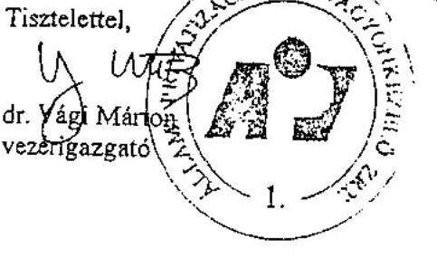

Atvatece: Nagy Bold
Bele Del 10:23.
2006. 05.11 .

---

# KÖNYVELÉSI FELADÁS kárpótlási jegy részvénycsere tranzakcióról

## ÉRINTETT GAZDASÁGI TÁRSASÁG NEVE: FORRÁS RT.

GAZDASÁGI ESEMÉNY MEGNEVEZÉSE: A FORRÁS Rt. részvényeinek kárpótlási jegy ellenében történő nyilvános értékesítése során befogadott kárpótlási jegyek.

JEGYZÉSI IDŐSZAK: 2003. június 30. - 2003. július 20.

## GAZDASÁGI ESEMÉNYBEN LEÍRT ELLENŐRZÖTT ÖSSZEG(EK) TÉTELES MEGJELÖLÉSSEL:

A jegyzési időszak alatt összesen 4.084.084.000 Ft címletértékű kárpótlási jegy került felhasználásra, melyek megoszlása az alábbi:

|  Jegyzés helye | Alanyi (db) | Nem alanyi
(db) | Címletérték
(Ft) | Névérték (Ft)  |
| --- | --- | --- | --- | --- |
|  CA-IB - HVB Bank Rt. | 1.932 .209 | 145.440 | 2.077 .649 .000 | 3.619 .264 .558  |
|  Postabank Értékpapír Rt | 529.050 - | 226.625 | 755.675 .000 | 1.316 .385 .850  |
|  Inter-Európa Bank Rt. | 976.052 | 77.144 | 1.053 .196 .000 | 1.834 .667 .432  |
|  Takarék Bank Rt. | 134.519 | 63.045 | 197.564 .000 | 344.156 .488  |
|  Összesen: | 3.571 .830 | 512.254 | 4.084 .084 .000 | 7.114 .474 .328  |

KÉSZÍTÖK NEVE, ALÁÍRÁSA: BARANYI ÉVA

ELLENJEGYZÖ(K) NEVE, ALÁÍRÁSA:

DR. DEÁK PÉTER FERENC

BUDAPEST, 2003. augusztus 1.

## MELLÉKLETEK:

- CA-IB 2003. július 23-i elszámolása
- Privatizációs Igazgatóság I. 2003.július 22-i feljegyzése

---

# Az ÁPV Zrt. 2006. évi bevételi tervének teljesítése 

| Megnevezés | Módosított   terv | Tény | Teljesítés |
| :-- | --: | --: | :--: |
|  | M Ft |  | $(\%)$ |
| Privatizációs bevételek | 282.201 | 292.165 | 103,5 |
| Vagyonhasznosítási bevétel | 71 | 93 | 131,0 |
| Privatizációs kárpótlási jegy bevétel | 1.955 | 1.106 | 56,6 |
| Értékesítés és vagyonhasznosítás   összesen | 284.228 | 293.364 | 103,2 |
| Kapott osztalék, részesedés | 14.748 | 14.748 | 100,0 |
| Egyéb bevételek | 21.628 | 17.240 | 79,7 |
| BEVÉTELEK ÖSSZESEN | 320.604 | 325.352 | 101,5 |

---

# A hozzárendelt vagyonba tartozó erdészeti társaságok támogatása 2006. évben (Kötv. tv. 14. sz. melléklet I. 1. c)

|  Sorszám | Társaságok megnevezése | Közmunka program | Közmunka program bővítés | Erdőgazdaságok természeti károk kezelése | Mátrai turisztikai fejlesztés | Informatikai fejlesztés | Közjóléti támogatás | Összesen  |
| --- | --- | --- | --- | --- | --- | --- | --- | --- |
|  1 | Bakonyerdő Erdészeti és Faipari Zrt. | - | - | - |  | 30000 | 4000 | 34000  |
|  2 | DALERD Délalföldi Erdészeti Zrt. | 21600 | 20000 | 154000 |  | 53000 | 5000 | 253600  |
|  3 | Egererdő Erdészeti Zrt. | 32800 | 10000 | - | 330000 | 24000 | 29000 | 425800  |
|  4 | Északerdő Erdőgazdasági Zrt. | 33200 | 16000 | 70000 |  | 47000 | 35000 | 201200  |
|  5 | Gemenci Erdő- és Vadgazdaság Zrt. | 32800 | 30000 | 332000 |  | 66000 | 68000 | 528800  |
|  6 | GYULAJ Erdészeti és Vadászati Zrt. | 19600 | - | - |  | 59000 | 7000 | 85600  |
|  7 | Ipoly Erdő Zrt. | 35600 | 23000 | - |  | 30000 | 89000 | 177600  |
|  8 | Kisalföldi Erdőgazdaság Zrt. | 8400 | 8000 | 35000 |  | 10000 | 9000 | 70400  |
|  9 | KEFAG Zrt. | 33200 | 44000 | 14000 |  | 26000 | 26000 | 143200  |
|  10 | Mecseki Erdészeti Zrt. | 22000 | 12000 | - |  | 0 | 7000 | 41000  |
|  11 | NEFAG Zrt. | 19600 | 15000 | 72000 |  | 63000 | 8000 | 177600  |
|  12 | NYÍRERDŐ Nyírségi Erdészeti Zrt. | 42000 | 60000 | - |  | 87000 | 10000 | 199000  |
|  13 | Pilisi Parkerdő Zrt. | 17200 | - | 23000 |  | 30000 | 43000 | 113200  |
|  14 | SEFAG Somogyi Erdészeti és Faipari Zrt. | 30400 | 30000 | - |  | 19000 | 7000 | 86400  |
|  15 | Szombathelyi Erdészeti Zrt. | 12000 | 18000 | - |  | 12000 | 13000 | 55000  |
|  16 | Tanulmányi Erdőgazdaság Zrt. | 9200 | - | - |  | 48000 | 6000 | 63200  |
|  17 | VADEX Mezőföldi Erdő- és Vadgazd. Zrt. | 6400 | 26000 | - |  | 75000 | 6000 | 113400  |
|  18 | Vértesi Erdészeti és Faipari Zrt. | 24000 |  | - |  | 20000 | 3000 | 47000  |
|  19 | Zalaerdő Erdészeti Zrt. | - |  | - |  | 84000 | 12000 | 96000  |
|   | Összesen | 400000 | 312000 | 700000 | 330000 | 783000 | 387000 | 2912000  |

---

Az ÁPV Zrt. 2006. évi forrásallokációja felhasználási forma szerint adatok eFt-ban

|  Forrásallokáció | Tőkeemelés | Támogatás | Környezetvédelmi támogatás | Kamattámogatás | Tulajdonos kölcsön  |
| --- | --- | --- | --- | --- | --- |
|  Erdő csoport | 2500000 | 2912000 | 230000 | 0 | 0  |
|  Bakonyerdő Erdészeti és Faipari Zrt. | 330000 | 34000 | 89420 |  |   |
|  DÁLERD Délalföldi Erdészeti Zrt. | 45000 | 253600 |  |  |   |
|  Égererdő Erdészeti Zrt. | 150000 | 425800 |  |  |   |
|  Északerdő Erdőgazdasági Zrt. | 0 | 201200 |  |  |   |
|  Gemenci Erdő- és Vadgazdaság Zrt. | 90000 | 528800 | 30870 |  |   |
|  GYULAJ Erdészeti és Vadászati Zrt. | 90000 | 85600 | 21240 |  |   |
|  Ipoly Erdő Zrt. | 155000 | 177600 |  |  |   |
|  Kisalföldi Erdőgazdaság Zrt. | 100000 | 70400 |  |  |   |
|  KEFAG Zrt. | 132000 | 143200 |  |  |   |
|  Mecseki Erdészeti Zrt. | 250000 | 41000 |  |  |   |
|  NEFAG Zrt. | 70000 | 177600 |  |  |   |
|  NYÍRERDŐ Nyírségi Erdészeti Zrt. | 181000 | 199000 | 13950 |  |   |
|  Pílisi Parkerdő Zrt. | 325000 | 113200 | 15020 |  |   |
|  SEFAG Somogyi Erdészeti és Faipari Zrt. | 182000 | 86400 | 14810 |  |   |
|  Szombathelyi Erdészeti Zrt. | 90000 | 55000 |  |  |   |
|  Tanulmányi Erdőgazdaság Zrt. | 130000 | 63200 | 30000 |  |   |
|  VADEX Mezöföldi Erdő- és Vadgazd. Zrt. | 72000 | 113400 |  |  |   |
|  Vértesi Erdészeti és Faipari Zrt. | 73000 | 47000 | 14690 |  |   |
|  Zalaerdő Erdészeti Zrt. | 35000 | 96000 |  |  |   |
|  Volán csoport | 4999999,09 | 0 | 556800 | 0 | 0  |
|  Agria Volán Zrt. | 157000 |  | 10400 |  |   |
|  Alba Volán Zrt. | 244000 |  | 11200 |  |   |
|  Bakony Volán Zrt. | 137000 |  | 19600 |  |   |
|  Balaton Volán Zrt. | 149000 |  | 7200 |  |   |
|  Bács Volán Zrt. | 90000 |  | 15600 |  |   |
|  Borsod Volán Zrt. | 455000 |  | 33700 |  |   |
|  Gemenc Volán Zrt. | 242000 |  | 19700 |  |   |
|  Hajdú Volán Zrt. | 197000 |  | 25700 |  |   |
|  Hatvani Volán Zrt. | 89000 |  | 1900 |  |   |
|  Jászkun Volán Zrt. | 143000 |  | 67000 |  |   |
|  Kapos VolánZrt. | 182000 |  | 71200 |  |   |
|  Kisalföld Volán Zrt. | 0 |  | 24600 |  |   |
|  Körös Volán Zrt. | 167000 |  | 16000 |  |   |
|  Kunság Volán Zrt. | 199000 |  | 9800 |  |   |
|  Mátra Volán Zrt. | 110000 |  | 2400 |  |   |
|  Nógrád Volán Zrt. | 188000 |  | 37400 |  |   |
|  Pannon Volán Zrt. | 286000 |  | 41400 |  |   |
|  Somló Volán Zrt. | 120000 |  | 8800 |  |   |
|  Szabolcs Volán Zrt. | 239000 |  | 6900 |  |   |
|  Tisza Volán Zrt. | 205999,60 |  | 4300 |  |   |
|  Vasi Volán Zrt. | 182000 |  | 31500 |  |   |
|  Vértes Volán Zrt. | 252000 |  | 29300 |  |   |
|  VOLÁNBUSZ Zrt. | 769000 |  | 29400 |  |   |
|  Zala Volán Zrt. | 196999,49 |  | 31800 |  |   |
|  Privatizálható többségi cégek | 21000 | 0 | 5988000 | 0 | 687000  |
|  Agrárgazdasági Vagyonkezelő Kft. |  |  |  |  |   |
|  Bábolna Mg. Zrt. |  |  |  |  | 287000  |
|  Hollóházi Porcelánmanufaktúra Zrt. |  |  |  |  | 65000  |
|  Mecsek ÖKO Zrt. |  |  | 2450000 |  |   |
|  Nemzeti Löverseny Kft. |  |  | 7000 |  | 300000  |
|  Nitrokémia Vegyipari Zrt. |  |  | 3486000 |  |   |
|  Pannóniafilm Kft. | 21000 |  |  |  |   |
|  Tisza Cipő Zrt. |  |  | 45000 |  | 35000  |
|  Átadott társaságok | 50000 | 0 | 0 | 0 | 0  |
|  Mezőhegyesi Állami Ménes Kft. | 50000 |  |  |  |   |
|  Végelszámolás alatt álló társaságok | 0 | 0 | 0 | 0 | 5270  |
|  Csavaripari Vállalat |  |  |  |  | 1070  |
|  Ganz Danubius Hajó- és Darugyár |  |  |  |  | 4200  |
|  Összesen jogcímenként | 7570999,09 | 2912000 | 6774800 | 0 | 692270  |
|  Mindösszesen |  |  |  |  | 17950069,09  |

---

# A SZÖVÜR Kft. üzletrészének kormányhatározat szerinti átvétele és elszámolása 

A SZÖVÜR üzletrészek átvételekor annak nyilvántartási értékét külső szakértő 2005. decemberi vagyonértékelése alapján vették figyelembe. A vagyonértékelés nem tudta megbízható módon alátámasztani az üzletrészek valós piaci értékének meghatározását a külső szövetkezeti üzletrészekhez kapcsolódó korlátozott tulajdonosi jogosítványok, valamint az értékelésre rendelkezésre álló szűk határidő miatt. A megbízható adatok hiányának az volt az oka, hogy a szövetkezetekről szóló 1992. évi I. törvény alapján a külső szövetkezeti üzletrészek tulajdonosai a közgyűlésen szavazati joggal, a gazdálkodásba való beleszólási joggal nem rendelkeztek.

Az ÁPV Zrt. által vállalt kezesség beváltása során kifizetett (a 2233/2005. (XII. 26.) Korm. határozat szerinti 14,5 Mrd Ft tőketartozás + járulékai) 15,2 Mrd Ftnak a megtérülése minimális volt. A bevételek csekély mértékű realizálását főként az idézte elő, hogy a 2006. július 1-én életbe léptetett, a szövetkezetekről szóló 2006. évi X. törvény 104. §-a az ÁPV Zrt. tulajdonában álló üzletrészek szövetkezetek részére való térítés nélküli átadását írta elő. 2006. novemberig az ÁPV Zrt. a térítés nélküli átvételt elfogadó szövetkezetek részére átadta az üzletrészeket. A tranzakció 13,3 Mrd Ft értékben átvett üzletrészt érintett.

A megmaradt üzletrészek esetében az ÁPV Zrt. gyors ütemben törekedett a hasznosítás eredményességének növelésére, de ezt korlátozták a szűkös értékesítési lehetőségek, az üzletrészek speciális jellege, illetve az, hogy ÁPV Zrt. az üzletrészek értékesítését tekintve tényleges múltbéli tapasztalatokkal nem bírt.

A 2005. decemberi vagyonértéken 14,4 Mrd Ft összegben nyilvántartott 471 db üzletrészből 2007. május 31-ig összesen 104 M Ft térült meg. Ebből 51 M Ft értékesítésből, 44 M Ft átalakulás miatt kifizetett tulajdonrészből, 9 M Ft végelszámoláskori maradványvagyonból származott. Az értékesítést a belső szabályzatokban foglaltaknak megfelelően bonyolította le az ÁPV Zrt. A korábbi vagyonértékelés aktualizálása egyedileg történt, de az elemzésre részben nem aktuális, illetve hiányos adatok alapján került sor. A felszámolási és végelszámolási eljárás alatti 17 szövetkezet esetében értékesítésre nem került sor, azonban a végelszámolások esetében a maradványvagyonból kielégítés várható.

Az ÁPV Zrt.-nek az értékesítést kényszerhelyzetben kellett végrehajtania. Az üzletrészek korlátozott tulajdonosi jogokat testesítettek meg, amit a 2006. évi X. törvény rendelkezései tovább szigorítottak. (2007. májustól az üzletrészek olyan befektetési részjeggyé alakultak, amelyek tulajdonosai a korábbiakkal egyezően nem rendelkeztek szavazati joggal, illetve ettől az időponttól kezdődően a taggyűlésekre sem vált kötelezővé a meghívásuk.)

---

2006. márciusban elkezdődött a SZÖVÜR Kft. felszámolási eljárása. Az ÁPV Zrt. követelése ekkor - az üzletrészek átadását követően - 827 M Ft ( 813 M Ft és kamatai) volt. A részvényesi jogok gyakorlója 12/2006. (V. 24.) sz. határozata alapján az ÁPV Zrt. a SZÖVÜR Kft. felszámolási vagyona javára lemondott a követelésének a SZÖVÜR Kft. tulajdonában lévő mezőgazdasági szövetkezeti üzletrészek és társasági részesedések értékét meghaladó részéről.

A társaság két ismert hitelezője az APEH ( 10 Mrd Ft állami kezesség beváltása és kamatai összeggel) és az ÁPV Zrt. ( 813 M Ft és kamatai összeggel) volt. A hitelezői megállapodás alapján az APEH hitelezői igénye részleges kielégítése címén került átutalásra a SZÖVÜR Kft. fa. készpénz állománya.

A SZÖVÜR Kft. f.a. tulajdonában lévő, ÁPV Zrt.-t illető felszámolási vagyonba tartozó (a 2005. decemberi vagyonértékelés alapján) 410 M Ft nyilvántartási értékű 233 db üzletrész megtérülése 2007. május 31-ig 161 M Ft volt értékesítésből és átalakulásból. A végelszámolási maradványvagyonból még további megtérülés várható, mivel a végelszámolás alatti szövetkezetekre érkezett alacsony ajánlatot az ÁPV Zrt. nem fogadta el.

Az üzletrészekre aktualizált vagyonértékelés nem készült, mivel azt a felszámoló „a költség-haszon elv érvényesítése miatt nem tartotta szükségesnek". A vagyonértékelés elmaradása nem okozott bizonyíthatóan megtérülés-csökkenést, mivel az ÁPV Zrt. annak ellenére, hogy kényszerértékesítési helyzetben volt az üzletrészek 2007. májusi kötelező átalakulása (tulajdonosi jogok korlátozása) és a SZÖVÜR Kft. felszámolásának mielőbbi befejezési igénye miatt, a működő szövetkezetek esetében hatékonyabb megtérülést ért el, mint a hozzárendelt vagyonába került, saját értékesítésű működő üzletrészek esetében.

A tényleges piaci értékkel bíró gazdasági társaságok esetében az ÁPV Zrt. által 2006. júniusban készíttetett vagyonértékelése (az értékelést egy másik tanácsadó végezte el, jövedelemalapú értékelés alapján) azonban a megtérülést segítette elő, mivel a tagoknak való 2006. áprilisi első felajánlást és a vagyonértékelést követően a társasági tagok által korábban ajánlott árak 8-10-szeresüket érték el. Az eredményesség másik tényezője az ÁPV Zrt. legalább 80\%-os megtérülési elvárásának szigorú érvényesítése volt.

---

# Tanúsítványok jegyzéke 

| 1. sz. tanúsítvány | A hozzárendelt vagyon változása 2006. évben - összesített kimutatás |
| :--: | :--: |
| 2. sz. tanúsítvány | A hozzárendelt vagyon alakulása tranzakciók alapján 2006. évben |
| 3. sz. tanúsítvány | Pénzforgalmi szemléletű eredmény-kimutatás az ÁPV Zrt. hozzárendelt vagyon bevételeiről és kiadásairól 2006. évben |
| 4. sz. tanúsítvány | Privatizációs tartalék 2006. évben |
| 5. sz. tanúsítvány | Az ÁPV Zrt. kötelezettségeinek változása |
| 6. sz. tanúsítvány | Az ÁPV Zrt. saját vagyonának eszközállomány változása 2006. év |
| 7. sz. tanúsítvány | Az ÁPV Zrt. saját vagyonának forrásösszetételének változása 2006. év |
| 8. sz. tanúsítvány | Az ÁPV Zrt. múködéséhez kapcsolódó anyagjellegủ ráfordítások alakulása 2006. év |
| 9. sz. tanúsítvány | Az ÁPV Zrt. átlagos állományi létszámnak alakulása 2006. év |
| 10. sz. tanúsítvány | Az ÁPV Zrt. állományi létszáma 2006. évben |
| 11. sz. tanúsítvány | Az ÁPV Zrt. müködésével kapcsolatos személyi jellegű ráfordítások alakulása 2006. év |
| 12. sz. tanúsítvány | Az ÁPV Zrt. munkavállalóinak beosztásonkénti átlagkeresete 2006. év |
| 13. sz. tanúsítvány | Az ÁPV Zrt. forrásallokáció a felhasználás célja szerint |
| 14. sz. tanúsítvány | Az ÁPV Zrt. hozzárendelt vagyonába tartozó, múködő társaságok adatai 2006. XII. 31-én |

---

1. sz. tanúsítvány a V-01-k3/2007. sz. jelentéshez

|  Megnevezés | Nyitó adatok | RZGV-változás | Vagyonváltozás | Gazdálkodás | Záró adatok  |
| --- | --- | --- | --- | --- | --- |
|   |  |  |  |  | eredményessége mérlegek  |
|   |  |  |  |  | szerint  |
|   |  |  |  |  | Növekedés  |
|   |  |  |  |  | Csökkenés  |
|   |  |  |  |  | Növekedés  |
|  1. Gazdasági társaságok | 178 | 850 490 1 197 537 | 13 | 38 116 | 27  |
|  1.1. Működő társaságok | 129 | 850 239 1 197 286 | 11 | 38 116 | 20  |
|  1.1.1. Tartós állami tulajdonban lévő | 38 | 567 629 | 569 003 | 0 | 18 586  |
|  ebből: részvénytársaság | 37 | 562 051 | 563 425 | 0 | 18 586  |
|  egyéb társaság | 1 | 5 578 | 5 578 | 0 | 0  |
|  1.1.2. Teljes mértékben privatizálható | 91 | 282 610 | 628 283 | 11 | 19 530  |
|  ebből: részvénytársaság | 68 | 262 903 | 595 240 | 9 | 18 344  |
|  egyéb társaság | 23 | 19 707 | 33 043 | 2 | 1 185  |
|  1.2. Végelszámolás alatt álló társaságok | 6 | 251 | 251 | 1 | 0  |
|  1.3. Felszámolás alatt álló társaságok | 43 | 0 | 0 | 1 | 0  |
|  2. Állami vállalatok | 67 | 188 | 188 | 1 | 0  |
|  2.1. Működő vállalatok | 0 | 0 | 0 | 0 | 0  |
|  2.2. Végelszámolás alatt álló vállalatok | 8 | 188 | 188 | 0 | 0  |
|  2.3. Felszámolás alatt álló vállalatok | 59 | 0 | 0 | 1 | 0  |
|  3. Elvont, vásárolt, átvett vagyonelmé | 13 658 | 13 658 | 14 707 | 27 193 | 1 172  |
|  3.1. Immateriális javak | 1 | 1 | 1 | 183 | 0  |
|  3.2. Ingatlanok | 12 445 | 12 445 | 0 | 1 | 0  |
|  3.3. Egyéb eszközök | 1 212 | 1 212 | 0 | 14 523 | 0  |
|  4. Termőföld | 3 319 | 3 319 | 0 | 0 | 0  |
|  5. Pénzkészlet | 132 945 | 132 945 | 330 759 | 355 955 | 107 749  |
|  6. Államkötvény | 0 | 0 | 0 | 0 | 0  |
|  7. Követelések | 31 130 | 31 130 | 99 | 23 409 | 7 819  |
|  8. Kötelezettségek | 271 054 | 271 054 | 1 921 | 34 245 | 238 730  |
|  HÓZZÁRENDELT VAGYON ÖSSZESEN | 245 | 760 676 1 107 723 | 14 | 381 759 | 38  |

- Tőzsde bevezetett cégek értékelése tőzsdei értéken, vásárolt üzletrésegek értékelése tulajdon arányos saját tőke értéken.

Budapest, 2007. 06.04.

---

2. sz. tanúsítvány a V-01-1/3/2007. sz. jelentéshez

|  Megnevezés | Nyitó adatok 2006/01/01 | BEDT-változik
szert megjelö
nyitó |  |  |  |  |  |  |  |  |  |  |  |  |  |  |  |  |  |  |  |  |  |  |  |  |  |  |  |  |  |  |  |  |  |  |  |  |  |  |  |  |  |  |  |  |  |  |  |  |  |  |  |  |  |  |  |  |  |  |  |  |  |  |  |  |  |  |  |  |  |  |  |  |  |  |  |  |  |  |  |  |  |  |  |  |  |  |  |  |  |  |  |  |  |  |  |  |  |  |  |  |  |

---

### 3. sz. tanúsítvány a V-01-Jt. 2007. sz. jelentéshez

|  Hozzárendelt vagyon bevételek |  |  |  |  |  |  |  |  |   |
| --- | --- | --- | --- | --- | --- | --- | --- | --- | --- |
|   |  | költs. előirányzat | módosított előirányzat I. (kihirdetve 2006.07.21.) | módosított előirányzat II. (kihirdetve 2006.12.14.) | átesoportosított előirányzat | üzleti terv | módosított üzleti terv | Tény |   |
|   | Hozzárendelt vagyon folyó tételek |  |  |  |  | 34 991 | 34 991 | 34 991 |   |
|  NYITÓEGYENLÉGE |  |  |  |  |  |  |  |  |   |
|  B.1.1. | Privatizációs bevétel |  |  |  |  | 23 0485 | 282 201 | 292 163 |   |
|  B.1.2. | Vagyonhasznosítási bevételei |  |  |  |  |  | 71 | 93 |   |
|  B.1.3. | Kárpótlási jegy |  |  |  |  | 500 | 1 955 | 1 106 |   |
|  B.1. | Értékesítés és vagyonhasznosítás összesen |  |  |  |  | 230 985 | 284 228 | 293 362 |   |
|  B.2. | Kapott osztalék, részesedés |  |  |  |  | 8 950 | 14 748 | 14 748 |   |
|  B.3. | Egyéb bevételek |  |  |  |  | 5 190 | 21 628 | 17 242 |   |
|  B.4. | Gázközmű államkötvény kamata |  |  |  |  |  |  |  |   |
|  B. | Rendelt vagyonnal kapcsolatos bevételek |  |  |  |  | 245 125 | 320 604 | 325 352 |   |
|  összesen (B.1.- B.4.) |  |  |  |  |  |  |  |  |   |
|  Hozzárendelt vagyon kiadások |  |  |  |  |  |  |  |  |   |
|  K.1.1. | Hozzárendelt vagyon értékesítése előkész. - nek ktg. kiadások, díjak | 3 613 | 3 613 | 3 613 | 3 333 | 3 613 | 3 513 | 2 698 |   |
|  K.1.2. | Vagyonkezeléssel összefüggő ráfordítások | 982 | 1 388 | 1 388 | 1 388 | 982 | 1 388 | 800 |   |
|  K.1.3. | Privatizációval és vagyonkezeléssel összefüggő reorg. kifizetések | 2 400 | 2 912 | 2 912 | 2 912 | 2 400 | 2 912 | 2 912 |   |
|  K.1.4. | Az ÁPV Zrt. működési költségei | 5 400 | 5 400 | 5 400 | 5 400 | 5 400 | 5 400 | 5 400 |   |
|  K.1.5. | Kárpótlási jegy bevonás | 500 | 1 500 | 1 500 | 1 955 | 500 | 1 955 | 1 106 |   |
|  K.1. | Ráfordítások az 1995. évi XXXIX. tv. 23. §-a alapján | 12 895 | 14 813 | 14 813 | 14 638 | 12 895 | 15 168 | 12 916 |   |
|  K.2.1. | Osztalékbefizetési kötelezettség a Központi Költségvetés felé | 8 950 | 8 950 | 8 950 | 8 950 | 8 950 | 14 748 | 14 749 |   |
|  K.2.2. | Az állam tulajdonosi fel. kapcsán környezetvédelmi fel. finanszírozása | 7 260 | 7 260 | 7 260 | 7 060 | 7 260 | 7 060 | 7 040 |   |
|  K.2.3. | Volt szovjet ingatlanok környezetvédelmi kárelhárítása | 1 380 | 880 | 880 | 880 | 1 380 | 880 | 596 |   |
|  K.2. | Ráfordítások az 2000. évi CXXXIII. tv. alapján | 17 590 | 17 090 | 17 090 | 16 890 | 17 590 | 22 688 | 22 385 |   |

---

|  30 485 | 31 903 | 31 528 | 30 485 | 37 856 | 35 301  |
| --- | --- | --- | --- | --- | --- |
|  1 000 | 1 000 | 1 600 | 1 000 | 1 300 | 763  |
|  1 000 | 1 000 | 1 600 | 1 000 | 1 300 | 763  |
|  0 | 0 | 25 120 | 25 791 | 10 500 | 24 500  |
|  0 | 0 | 225 | 405 | 0 | 225  |
|  0 | 0 | 225 | 405 | 0 | 225  |
|  10 000 | 10 000 | 20 000 | 18 874 | 10 000 | 5 189  |
|  21 500 | 21 500 | 115 674 | 46 645 | 47 020 | 21 500  |
|  51 985 | 51 985 | 78 548 | 78 548 | 51 985 | 69 690  |
|  5 1985 | 5 1985 | 147 577 | 78 548 | 78 548 | 51 985  |
|  5 1985 | 5 1985 | 147 577 | 78 548 | 78 548 | 69 690  |
|  0 | 0 | 0 | 0 | 0 | 0  |
|  0 | 0 | 0 | 0 | 0 | 0  |
|  0 | 0 | 0 | 0 | 0 | 0  |
|  0 | 0 | 0 | 0 | 0 | 0  |
|  0 | 0 | 0 | 0 | 0 | 0  |
|  0 | 0 | 0 | 0 | 0 | 0  |
|  0 | 0 | 0 | 0 | 0 | 0  |
|  0 | 0 | 0 | 0 | 0 | 0  |
|  0 | 0 | 0 | 0 | 0 | 0  |
|  0 | 0 | 0 | 0 | 0 | 0  |
|  0 | 0 | 0 | 0 | 0 | 0  |
|  0 | 0 | 0 | 0 | 0 | 0  |
|  0 | 0 | 0 | 0 | 0 | 0  |
|  0 | 0 | 0 | 0 | 0 | 0  |
|  0 | 0 | 0 | 0 | 0 | 0  |
|  0 | 0 | 0 | 0 | 0 | 0  |
|  0 | 0 | 0 | 0 | 0 | 0  |
|  0 | 0 | 0 | 0 | 0 | 0  |
|  0 | 0 | 0 | 0 | 0 | 0  |
|  0 | 0 | 0 | 0 | 0 | 0  |
|  0 | 0 | 0 | 0 | 0 | 0  |
|  0 | 0 | 0 | 0 | 0 | 0  |
|  0 | 0 | 0 | 0 | 0 | 0  |
|  0 | 0 | 0 | 0 | 0 | 0  |
|  0 | 0 | 0 | 0 | 0 | 0  |
|  0 | 0 | 0 | 0 | 0 | 0  |
|  0 | 0 | 0 | 0 | 0 | 0  |
|  0 | 0 | 0 | 0 | 0 | 0  |
|  0 | 0 | 0 | 0 | 0 | 0  |
|  0 | 0 | 0 | 0 | 0 | 0  |
|  0 | 0 | 0 | 0 | 0 | 0  |

---

# Privatizációs tartalék 2006. év

|   | ezer Ft  |
| --- | --- |
|  Privatizációs tartalék bankszámla nyitóegyenlege | 97 952 123  |
|  Gázközműkötvény nyitóegyenlege | 0  |
|  Privatizációs tartalék NYITÓEGYENLEGE | 97 952 123  |
|  Privatizációs tartalékképzés priv. bevételből + megtérülések | 5 406 401  |
|  Privatizációs tartalékképzés egyéb forrásból | 0  |
|  Privatizációs tartalékképzés összesen | 5 406 401  |
|  Összes forrás | 103 358 524  |
|  Jótállással, szavatossággal, kezességvállalással kapcs. kifiz. | 31 167  |
|  Készfizető kezességek, átvállalt tartozások kiegyenlítése | 15 159 197  |
|  Konszernfelelősség alapján történő kifizetések | 1 418 154  |
|  Szerződéses kapcsolaton alapuló tartozás kiegyenlítése | 25 668  |
|  Belt.föld értéke alapján, alapítói jogon kifiz. önk. járandóság | 653 987  |
|  Elvont vagyontárgyak után beálló kezesi felelősség rendezése | 60 000  |
|  A "reverzális levelek" alapján történő kifizetések | 0  |
|  Vill.ipari dolg. energiasz. priv. kapcs. kötött megáll. fedezete | 656 021  |
|  Privatizációs ellenérték hányad | 0  |
|  A gázközművekkel kapcsolatos önkormányzati igények rendezése | 0  |
|  Kárpótlási jegyek életjáradékra váltása | 2 919 293  |
|  Előbbi feladatok végrehajtásával kapcs. ráfordítások | 180 831  |
|  Összes kiadás | 21 104 318  |
|  Bankszámlák közötti rendezés | 49 829  |
|  Gázközműkötvény záróegyenlege | 0  |
|  Privatizációs tartalék bankszámla záróegyenlege | 82 304 035  |
|  Privatizációs tartalék ZÁRÓEGYENLEGE | 82 304 035  |

2007. február 7.

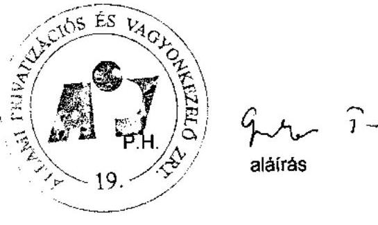

---

5. sz. tanúsítvány a V-01-h.5/2007. sz. jelentéshez adatok millió Ft-ban

|  Normatív kötelezettségek | 2006.01.01-i nyitó |  |  | Növekedős |  | Csökkenős |  | 2006. 12. 31-i záró |  |   |
| --- | --- | --- | --- | --- | --- | --- | --- | --- | --- | --- |
|   | alap+ |  |  | korrekció | tárgyéví | korrekció | tárgyéví | alap |  |   |
|   | kamat |  | alap |  |  |  |  |  |  | kamat  |
|  PEH |  |  |  |  |  |  |  |  |  |   |
|  Önkormányzati járandóságok | 1 480 |  | 682 |  | 149 |  | 598 | 233 | 182 | 425  |
|  ebből Belterületi főzt utáni járandóság | 1 362 |  | 590 |  | 149 |  | 545 | 194 | 179 | 370  |
|  ebből 1989. évi XIII. tv. szerint átalakult társas. | 1 242 |  | 517 |  | 50 |  | 423 | 144 | 152 | 298  |
|  1992. évi LIV. szerint átalakult társas | 120 |  | 73 |  | 50 |  | 122 | 50 | 24 | 74  |
|  ebből Alapító jog alapján járó járandóság |  |  |  |  |  |  |  |  |  |   |
|  Villamosipari dolgozók járandósága |  |  |  | 837 | 837 | 26 |  | 658 | 207 | 207  |
|  Egyéb kötelezettség |  |  |  | 174 550 | 174 550 | 3 671 |  | 12 297 | 185 924 | 165 924  |
|  ebből bánagénz+szülőok+saját vagy. szembeni költ. | 791 |  | 791 |  | 143 |  | 290 | 544 |  | 544  |
|  Pny. Tartalékot terhelő egyéb. költ. | 1 019 |  | 1 019 |  |  |  | 1 014 | 5 |  | 5  |
|  Be nem jegyzett tőkezmelés | 7 261 |  | 7 261 |  | 3 523 |  | 7 261 | 3 523 |  | 3 523  |
|  Egyéb rövid tej költ. | 2 584 |  | 2 564 |  |  |  | 2 496 | 98 |  | 98  |
|  Egyéb hosszútyárató költ. | 161 443 |  | 161 443 |  |  |  | 234 | 161 219 |  | 161 219  |
|  Pny. elők. kapcs. egyéb. költ. |  |  |  |  | 5 |  |  | 5 |  | 5  |
|  Passzív időbeli elhalárolások | 1 482 |  | 1 482 |  |  |  | 952 | 530 |  | 530  |
|  Normatív kötelezettségek összesen: |  |  |  | 176 879 | 176 070 | 3 848 |  | 13 551 | 166 365 | 194  |
|  Föggő kötelezettségek |  |  |  |  |  |  |  |  |  |   |
|  Privatizációs szerződésebből eredő garancia és szavatosság |  |  |  | 25 763 | 25 763 | 265 |  | 15 858 | 10 170 | 10 170  |
|  ebből általános jog és kellekcsinálosság | 2 646 |  | 2 646 |  |  |  | 359 | 2 572 |  | 2 572  |
|  Kereskedelmi szavatosság | 5 324 |  | 5 324 |  |  |  |  | 4 964 |  | 4 964  |
|  Kömyesetvédelmi garancia | 2 128 |  | 2 128 |  |  |  |  | 2 128 |  | 2 128  |
|  Vagyonkezelési garancia | 15 565 |  | 15 665 |  |  |  |  | 15 159 | 506 | 506  |
|  ebből SZÖVÜR garancia | 15 159 |  | 15 159 |  |  |  |  | 15 159 |  |   |
|  Elvont vagyon utáni kezelőség |  |  |  | 20 463 | 3 785 |  |  | 374 | 3 411 | 15 535  |
|  Konásten fektetősség |  |  |  | 24 337 | 6 070 |  |  | 1 420 | 4 680 | 14 401  |
|  PEH |  |  |  | 139 | 42 |  |  | 7 | 34 | 1  |
|  Önkormányzati járandóságok |  |  |  | 13 091 | 10 483 | 2 452 |  | 1 698 | 11 237 | 2 771  |
|  ebből Belter. Föld. (1989. évi XIII. tv.) |  |  |  | 11 803 | 10 343 | 2 452 |  | 1 698 | 11 097 | 2 617  |
|  ebből Alapító jog alapján járó járandóság |  |  |  | 288 | 140 |  |  |  | 140 | 154  |
|  Tőkepölítési kötelezettség (ÁPV Rt. társaságok) |  |  |  | 6 | 6 |  |  |  | 6 | 6  |
|  Reverzális levelek utáni kötelezettség |  |  |  | 11 385 | 11 385 |  |  |  | 1 441 | 9 944  |
|  Egyéb kötelezettségek |  |  |  |  |  |  |  |  |  |   |
|  Richter opció |  |  |  |  |  |  |  |  |  |   |
|  Föggő kötelezettségek összesen: |  |  |  | 94 184 | 57 534 | 2 717 |  | 20 831 | 39 413 | 32 758  |
|  Mindösszesen: |  |  |  | 271 054 | 233 604 | 6 563 |  | 34 382 | 205 778 | 32 952  |

Bulapest, 2007. 09.04.

---

6. sz. tamisítvány a V-01- 5/2007. sz. jelentéshez

Állami Privatizációs és Vagyonkezelő Zrt.

Az ÁPV Zrt. saját vagyonának eszközállomány változása 2006. év

|  Megnevezés | 2005. évi záró állomány (nyitó) | növekedés | Változás csökkenés | áll. vált. állomány | 2006. évi záró állomány  |
| --- | --- | --- | --- | --- | --- |
|  Immateriális javak | 90 445 | 19 690 | 43 337 | 23 647 | 66 798  |
|  Tárgyi eszközök | 2 668 780 | 376 559 | 430 032 | 53 473 | 2 615 307  |
|  Befektetett pénzügyi eszközök | 328 828 | 149 268 | 161 278 | 12 010 | 316 818  |
|  Befektetett eszközök összesen | 3 088 053 | 545 517 | 634 647 | 89 130 | 2 998 923  |
|  Készletek | 3 420 | 34 017 | 37 231 | 3 214 | 206  |
|  Követelések | 374 743 | 6 655 862 | 6 675 982 | 20 120 | 354 623  |
|  Pénzeszközök | 9 184 171 | 6 817 898 | 6 644 655 | 173 243 | 9 357 414  |
|  Forgóeszközök | 9 562 334 | 13 507 777 | 13 357 868 | 149 909 | 9 712 243  |
|  Aktív időbeli elhatárolások | 11 851 | 92 995 | 11 851 | 81 144 | 92 995  |
|  Eszközök összesen | 12 662 238 | 14 146 289 | 14 004 366 | 141 923 | 12 804 161  |

Budapest, 2007. 02. 28

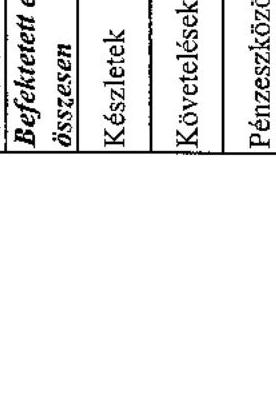

---

1. sz. tanúsítvány a V-01-k 5/2007. sz. jelentéshez

Állami Privatizációs és Vagyonkezelő Zrt.

Az ÁPV Zrt. saját vagyonának forrásösszetételének változása 2006.év

|  Megnevezés | 2005. évi záró állomány | növekedés | Változás csökkenés | áll. vált. | 2006. évi záró állomány  |
| --- | --- | --- | --- | --- | --- |
|  Saját tőke | 11 757 347 | 637 450 | 480 655 | 156 795 | 11 914 142  |
|  Céltartalék | - | 227 332 | - | 227 332 | 227 332  |
|  Kötelezettségek | 767 527 | 10 684 886 | 10 882 433 | 197 547 | 569 980  |
|  Passzív időbeli elhatárolások | 137 364 | 92 707 | 137 364 | 44 657 | 92 707  |
|  Források összesen | 12 662 238 | 11 642 375 | 11 500 452 | 141 923 | 12 804 161  |

Budapest, 2007. 02.28.

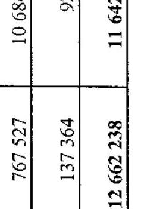

aláírás

---

Állami Privatizációs és Vagyonkezelő Zrt.

# Az ÁPV Zrt. müködéséhez kapcsolódó anyagjellegủ ráfordítások alakulása 2006. év

|  Megnevezés | 2006. év |  |  |  | %  |
| --- | --- | --- | --- | --- | --- |
|   | terv (E Ft) | % | tény (E Ft) | tény% | Tervhez  |
|  Energia | 124 205 | 5,81 | 104 147 | 5,20 | 83,85  |
|  Üzemanyag | 25 000 | 1,17 | 21 441 | 1,07 | 85,76  |
|  Nyomtatvány, irodaszer | 16 460 | 0,77 | 15 391 | 0,77 | 93,51  |
|  Egyéb ki nem emelt anyagköltség | 15 000 | 0,70 | 12 527 | 0,63 | 83,51  |
|  1. Anyagköltség összesen | 180 665 | 8,46 | 153 506 | 7,66 | 84,97  |
|  Utazás- és szállásköltség | 10 000 | 0,47 | 3 618 | 0,18 | 36,18  |
|  Fenntartás, javítás és karbantartás | 67 315 | 3,15 | 49 225 | 2,46 | 73,13  |
|  Posta, telefon, futárszolgálat | 35 500 | 1,66 | 33 973 | 1,70 | 95,70  |
|  Székház fenntartás, üzemeltetés | 335 000 | 15,68 | 335 000 | 16,72 | 100,00  |
|  Egyéb ki nem emelt anyagjellegủ szolgáltatás | 8 150 | 0,38 | 4 849 | 0,24 | 59,50  |
|  Egyéb ki nem emelt anyagjellegủ szolgáltatás | 1 499 734 | 70,20 | 1 423 787 | 71,05 | 94,94  |
|  2. Anyagjellegủ szolgáltatás összesen | 1 955 699 | 91,54 | 1 850 452 | 92,34 | 94,62  |
|  3. Anyagjellegủ ráfordítások összesen (1 + 2) | 2 136 364 | 100,00 | 2 003 958 | 100,00 | 93,80  |

Budapest, 2007. 02. 28.

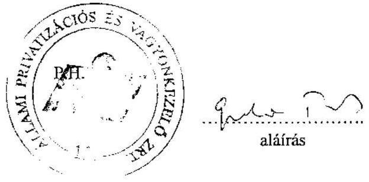

---

Állami Privatizációs és Vagyonkezelő Zrt.

Az ÁPV Zrt. átlagos állományi létszámának alakulása 2006. év

|  Megnevezés | 2006. év |  | Teljesítés \%  |
| --- | --- | --- | --- |
|   | terv (fó) | tény (fó) | tervhez  |
|  Teljes munkaidőben fogl. | 184 | 183 | 99,46  |
|  Részmunkaidőben fogl. | 1 | 1 | 100,00  |
|  Állományi létszám összesen | 185 | 184 | 99,46  |

Budapest, 2007. február 07.

---

Állami Privatizációs és Vagyonkezelő Zrt.

Az ÁPV Zrt. állományi létszáma 2006. évben

| Megnevezés | 2006. december 31. |  |
| :-- | :--: | :--: |
|  | Státusz | Betöltött állás |
| Vezető | 17 | 17 |
| Vezető-helyettes | 24 | 24 |
| Menedzser | 87 | 86 |
| Ügyintéző | 45 | 43 |
| Összesen | 173 | 170 |

Budapest, 2007. február 7.
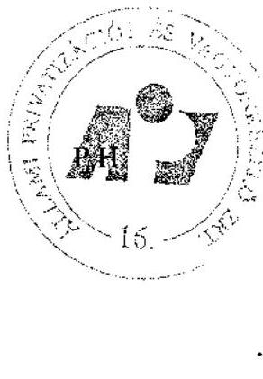

Hoithl alárás

---

Állami Privatrizációs és Vagyonkezelő Zrt.

# Az ÁPV Zrt. müködésével kapcsolatos személyi jellegü ráfordítások alakulása 2006. év

|  Megnevezés | 2006. év |  |  |  | Telj. %  |
| --- | --- | --- | --- | --- | --- |
|   | terv (E Ft) | % | tény(E Ft) | % | tervhez  |
|  Bérköltség | 2 044 454 | 53,49 | 1 707 524 | 53,24 | 83,52  |
|  ebből: jutalmak | 120 000 | 3,14 | 113 877 | 3,55 | 94,90  |
|  Személyi jellegű kifizetések | 1 777 462 | 46,51 | 1 499 408 | 46,76 | 84,36  |
|  ebből: szerzői díjak | 0 | 0,00 | 0 | 0,00 | 0,00  |
|  étkezési hozzájárulás | 19 980 | 0,52 | 19 136 | 0,60 | 95,78  |
|  üdülési hozzájárulás | 800 | 0,02 | 510 | 0,02 | 63,75  |
|  albérleti hozzájárulás | 0 | 0,00 | 0 | 0,00 | 0,00  |
|  utazási hozzájárulás | 7 000 | 0,18 | 4 056 | 0,13 | 57,94  |
|  reprezentáció | 18 000 | 0,47 | 15 851 | 0,49 | 88,06  |
|  segélyek | 2 000 | 0,05 | 1 550 | 0,05 | 77,50  |
|  saját gépjármű hivatali célú használata | 8 000 | 0,21 | 1 979 | 0,06 | 24,74  |
|  belföldi napidíj | 500 | 0,01 | 72 | 0,00 | 14,40  |
|  külföldi napidíj | 2 300 | 0,06 | 852 | 0,03 | 37,04  |
|  betegszabadság | 27 000 | 0,71 | 13 654 | 0,43 | 50,57  |
|  egyéb személyi jell. kifiz. | 610 108 | 15,96 | 553 243 | 17,25 | 90,68  |
|  munkáltatót terh. táppénz | 8 500 | 0,22 | 4 016 | 0,13 | 47,25  |
|  nyugdíjpénztári hozzájár. | 143 241 | 3,75 | 114 145 | 3,56 | 79,69  |
|  dolgozók életbiztosítása | 0 | 0,00 | 0 | 0,00 | 0,00  |
|  belső továbbképzés | 10 000 | 0,26 | 0 | 0,00 | 0,00  |
|  egészségpénztári hozzájár. | 40 000 | 1,05 | 37 949 | 1,18 | 94,87  |
|  munkaruha | 75 254 | 1,97 | 73 487 | 2,29 | 97,65  |
|  társadalombizt. járulék | 804 779 | 21,06 | 658 908 | 20,55 | 81,87  |
|  Személyi jellegű ráfordítások összesen | 3 821 916 | 100,0 | 3 206 932 | 100,0 | 83,91  |

Budapest, 2007. május 30.

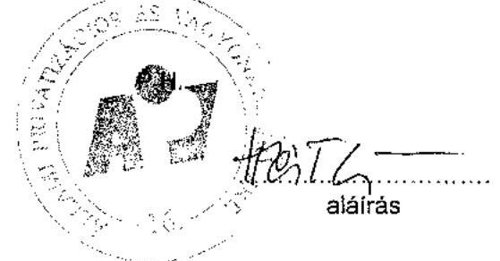

---

Állami Privatizációs és Vagyonkezelő Zrt.

# Az ÁPV Zrt. munkavállalóinak beosztásonkénti átlagkeresete 2006. év 

| Sorszám | Állománycsoport | 2006. évi átlagkereset   Ft/fö/hó |
| :--: | :-- | --: |
| 1 | Felsővezetők | 3897021 |
| 2 | Ügyvezetők | 1195838 |
| 3 | Ügyvezető igazgató-helyettesek | 830523 |
| 4 | Menedzserek | 534029 |
| 5 | Ügyintézők | 259610 |
| 6 | Ügyviteli alkalmazottak | 0 |
| 7 | Összesen | 645230 |

Budapest, 2007. február 7.
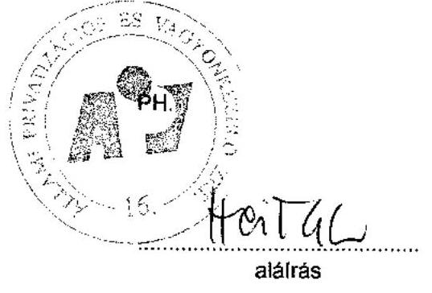

---

# ÁPV Zrt. forrásallokáció a felhasználás célja szerint

|  MEGNEVEZÉS |  | 2006. évi módosított terv (eFt) | 2006. év előzetes tény (eFt)  |
| --- | --- | --- | --- |
|  K.1.3. | A hozzárendelt vagyonba tartozó társaságok támogatása, forrásátadás, kamatátvállalás | 2912000 | 2912000  |
|   | Erdő-társaságok hitelkamat átvállalása - Natura 2000, közjölét | 1500000 | 1500000  |
|   | Erdő-társaságok természeti károk miatti termelőeszközök helyreállítása | 700000 | 700000  |
|   | Erdő-társaságok közmunka | 712000 | 712000  |
|   | Reorganizációs célú kifizetések | 0 | 0  |
|   | Vagyontárgy vásárlások | 0 | 0  |
|  K.2.2. | Az állam tul. fel. kapcsán környezetvédelmi fel. finanszírozása | 6810000 | 6774800  |
|   | Nitrokémia Rt. környezeti kárelhárítás | 2860000 | 3486000  |
|   | Nemzeti Lóverseny Kft. | 0 | 7000  |
|   | Mecsekérc, Mecsek ÖKO Rt. bányabezárások, rekultiváció | 2450000 | 2450000  |
|   | Erdőgazd. társaságok körny.véd. beruházási támogatása | 200000 | 230000  |
|   | Volán társaságok környezetvédelmi beruházási támogatása | 1200000 | 556800  |
|   | Tisza Cipő Rt. | 0 | 45000  |
|   | Felszámolás, végelsz. alatti cégek környezeti kárelhárítás - monitoring | 100000 | 0  |
|  K.3.1. | ESA rontó reorganizációs kifizetések | 900000 | 692270  |
|   | Nemzeti Lóverseny Kft. tulajdonosi kölcsön | 300000 | 300000  |
|   | Bábolna Rt. tulajdonosi kölcsön | 287000 | 287000  |
|   | Egyéb ESA rontó reorg. kifizetés (GDHD, Csavaripari V,Hollóháza, Tisza Cipő) | 313000 | 105270  |
|  K.3.2. | ESA semleges reorganizációs kifizetések | 400000 | 71000  |
|   | Egyéb reorg. célú kifizetés | 400000 | 71000  |
|  K.4. | Üzleti célú befektetések | 7725000 | 7499999  |
|  K.4.1. | ESA rontó üzleti célú befektetések | 0 | 0  |
|  K.4.2. | ESA semleges üzleti célú kifizetések | 7725000 | 7499999  |
|   | Volán társaságok buszrekonstrukció | 5000000 | 4999999,09  |
|   | Erdőgazdasági társaságok megtérülő beruházások | 2500000 | 2500000  |
|   | Dialóg Filmstúdió (ÁFA fiz. kötelezettség) | 225000 | 0  |
|   | Mindösszesen | 18747000 | 17950069,09  |

Tanúsítom, hogy az adatok az ÁPV Zrt. aktuális nyilvántartásával megegyeznek.

2007.05.31

Kocsis Magdolná ügyvezető igazgató

---

14. sz. tanúsítvány a V-01- h 5/2007. sz. jelentéshez

|  |   |   |   |   |   |   |   |   |   |   |   |   |   |   |   |   |   |   |   |   |   |   |   |   |   |   |   |   |   |   |   |   |   |   |   |   |   |   |   |   |   |   |   |   |   |   |   |   |   |   |   |   |   |   |   |   |   |   |   |   |   |   |   |   |   |   |   |   |   |   |   |   |   |   |   |   |   |   |   |   |   |   |   |   |   |   |   |   |   |   |   |   |   |   |   |   |   |   |   |   |

---

|   |  |  |  |  |  |  |  |  |  |  |  |  |  |  |  |  |  |  |  |  |  |  |  |  |  |  |  |  |  |  |  |  |  |  |  |  |  |  |  |  |  |  |  |  |  |   |
| --- | --- | --- | --- | --- | --- | --- | --- | --- | --- | --- | --- | --- | --- | --- | --- | --- | --- | --- | --- | --- | --- | --- | --- | --- | --- | --- | --- | --- | --- | --- | --- | --- | --- | --- | --- | --- | --- | --- | --- | --- | --- | --- | --- | --- | --- | --- | --- | --- |
|   |  |  |  |  |  |  |  |  |  |  |  |  |  |  |  |  |  |  |  |  |  |  |  |  |  |  |  |  |  |  |  |  |  |  |  |  |  |  |  |  |  |  |  |  |  |  |   |
|   |  |  |  |  |  |  |  |  |  |  |  |  |  |  |  |  |  |  |  |  |  |  |  |  |  |  |  |  |  |  |  |  |  |  |  |  |  |  |  |  |  |  |  |  |  |  |   |
|   |  |  |  |  |  |  |  |  |  |  |  |  |  |  |  |  |  |  |  |  |  |  |  |  |  |  |  |  |  |  |  |  |  |  |  |  |  |  |  |  |  |  |  |  |  |  |   |
|   |  |  |  |  |  |  |  |  |  |  |  |  |  |  |  |  |  |  |  |  |  |  |  |  |  |  |  |  |  |  |  |  |  |  |  |  |  |  |  |  |  |  |  |  |  |  |   |
|   |  |  |  |  |  |  |  |  |  |  |  |  |  |  |  |  |  |  |  |  |  |  |  |  |  |  |  |  |  |  |  |  |  |  |  |  |  |  |  |  |  |  |  |  |  |  |   |
|   |  |  |  |  |  |  |  |  |  |  |  |  |  |  |  |  |  |  |  |  |  |  |  |  |  |  |  |  |  |  |  |  |  |  |  |  |  |  |  |  |  |  |  |  |  |  |  |   |
|   |  |  |  |  |  |  |  |  |  |  |  |  |  |  |  |  |  |  |  |  |  |  |  |  |  |  |  |  |  |  |  |  |  |  |  |  |  |  |  |  |  |  |  |  |  |  |  |   |
|   |  |  |  |  |  |  |  |  |  |  |  |  |  |  |  |  |  |  |  |  |  |  |  |  |  |  |  |  |  |  |  |  |  |  |  |  |  |  |  |  |  |  |  |  |  |  |  |   |
|   |  |  |  |  |  |  |  |  |  |  |  |  |  |  |  |  |  |  |  |  |  |  |  |  |  |  |  |  |  |  |  |  |  |  |  |  |  |  |  |  |  |  |  |  |  |  |  |   |
|   |  |  |  |  |  |  |  |  |  |  |  |  |  |  |  |  |  |  |  |  |  |  |  |  |  |  |  |  |  |  |  |  |  |  |  |  |  |  |  |  |  |  |  |  |  |  |  |   |
|   |  |  |  |  |  |  |  |  |  |  |  |  |  |  |  |  |  |  |  |  |  |  |  |  |  |  |  |  |  |  |  |  |  |  |  |  |  |  |  |  |  |  |  |  |  |  |  |   |
|   |  |  |  |  |  |  |  |  |  |  |  |  |  |  |  |  |  |  |  |  |  |  |  |  |  |  |  |  |  |  |  |  |  |  |  |  |  |  |  |  |  |  |  |  |  |  |  |   |
|   |  |  |  |  |  |  |  |  |  |  |  |  |  |  |  |  |  |  |  |  |  |  |  |  |  |  |  |  |  |  |  |  |  |  |  |  |  |  |  |  |  |  |  |  |  |  |  |   |
|   |  |  |  |  |  |  |  |  |  |  |  |  |  |  |  |  |  |  |  |  |  |  |  |  |  |  |  |  |  |  |  |  |  |  |  |  |  |  |  |  |  |  |  |  |  |  |  |   |
|   |  |  |  |  |  |  |  |  |  |  |  |  |  |  |  |  |  |  |  |  |  |  |  |  |  |  |  |  |  |  |  |  |  |  |  |  |  |  |  |  |  |  |  |  |  |  |  |   |
|   |  |  |  |  |  |  |  |  |  |  |  |  |  |  |  |  |  |  |  |  |  |  |  |  |  |  |  |  |  |  |  |  |  |  |  |  |  |  |  |  |  |  |  |  |  |  |  |   |
|   |  |  |  |  |  |  |  |  |  |  |  |  |  |  |  |  |  |  |  |  |  |  |  |  |  |  |  |  |  |  |  |  |  |  |  |  |  |  |  |  |  |  |  |  |  |  |  |   |
|   |  |  |  |  |  |  |  |  |  |  |  |  |  |  |  |  |  |  |  |  |  |  |  |  |  |  |  |  |  |  |  |  |  |  |  |  |  |  |  |  |  |  |  |  |  |  |  |   |
|   |  |  |  |  |  |  |  |  |  |  |  |  |  |  |  |  |  |  |  |  |  |  |  |  |  |  |  |  |  |  |  |  |  |  |  |  |  |  |  |  |  |  |  |  |  |  |  |   |
|   |  |  |  |  |  |  |  |  |  |  |  |  |  |  |  |  |  |  |  |  |  |  |  |  |  |  |  |  |  |  |  |  |  |  |  |  |  |  |  |  |  |  |  |  |  |  |  |   |
|   |  |  |  |  |  |  |  |  |  |  |  |  |  |  |  |  |  |  |  |  |  |  |  |  |  |  |  |  |  |  |  |  |  |  |  |  |  |  |  |  |  |  |  |  |  |  |  |   |
|   |  |  |  |  |  |  |  |  |  |  |  |  |  |  |  |  |  |  |  |  |  |  |  |  |  |  |  |  |  |  |  |  |  |  |  |  |  |  |  |  |  |  |  |  |  |  |  |   |
|   |  |  |  |  |  |  |  |  |  |  |  |  |  |  |  |  |  |  |  |  |  |  |  |  |  |  |  |  |  |  |  |  |  |  |  |  |  |  |  |  |  |  |  |  |  |  |  |   |
|   |  |  |  |  |  |  |  |  |  |  |  |  |  |  |  |  |  |  |  |  |  |  |  |  |  |  |  |  |  |  |  |  |  |  |  |  |  |  |  |  |  |  |  |  |  |  |  |   |
|   |  |  |  |  |  |  |  |  |  |  |  |  |  |  |  |  |  |  |  |  |  |  |  |  |  |  |  |  |  |  |  |  |  |  |  |  |  |  |  |  |  |  |  |  |  |  |  |   |
|   |  |  |  |  |  |  |  |  |  |  |  |  |  |  |  |  |  |  |  |  |  |  |  |  |  |  |  |  |  |  |  |  |  |  |  |  |  |  |  |  |  |  |  |  |  |  |  |   |
|   |  |  |  |  |  |  |  |  |  |  |  |  |  |  |  |  |  |  |  |  |  |  |  |  |  |  |  |  |  |  |  |  |  |  |  |  |  |  |  |  |  |  |  |  |  |  |  |   |
|   |  |  |  |  |  |  |  |  |  |  |  |  |  |  |  |  |  |  |  |  |  |  |  |  |  |  |  |  |  |  |  |  |  |  |  |  |  |  |  |  |  |  |  |  |  |  |  |   |
|   |  |  |  |  |  |  |  |  |  |  |  |  |  |  |  |  |  |  |  |  |  |  |  |  |  |  |  |  |  |  |  |  |  |  |  |  |  |  |  |  |  |  |  |  |  |  |  |   |
|   |  |  |  |  |  |  |  |  |  |  |  |  |  |  |  |  |  |  |  |  |  |  |  |  |  |  |  |  |  |  |  |  |  |  |  |  |  |  |  |  |  |  |  |  |  |  |  |   |
|   |  |  |  |  |  |  |  |  |  |  |  |  |  |  |  |  |  |  |  |  |  |  |  |  |  |  |  |  |  |  |  |  |  |  |  |  |  |  |  |  |  |  |  |  |  |  |  |   |
|   |  |  |  |  |  |  |  |  |  |  |  |  |  |  |  |  |  |  |  |  |  |  |  |  |  |  |  |  |  |  |  |  |  |  |  |  |  |  |  |  |  |  |  |  |  |  |  |   |
|   |  |  |  |  |  |  |  |  |  |  |  |  |  |  |  |  |  |  |  |  |  |  |  |  |  |  |  |  |  |  |  |  |  |  |  |  |  |  |  |  |  |  |  |  |  |  |  |   |
|   |  |  |  |  |  |  |  |  |  |  |  |  |  |  |  |  |  |  |  |  |  |  |  |  |  |  |  |  |  |  |  |  |  |  |  |  |  |  |  |  |  |  |  |  |  |  |  |   |
|   |  |  |  |  |  |  |  |  |  |  |  |  |  |  |  |  |  |  |  |  |  |  |  |  |  |  |  |  |  |  |  |  |  |  |  |  |  |  |  |  |  |  |  |  |  |  |  |   |
|   |  |  |  |  |  |  |  |  |  |  |  |  |  |  |  |  |  |  |  |  |  |  |  |  |  |  |  |  |  |  |  |  |  |  |  |  |  |  |  |  |  |  |  |  |  |  |  |   |
|   |

---

|  Áltami privatizációs és Vagyonkezelő Zrt. | Az ÁPV Zrt. hozzárendelt vagyonába tartozó, működő társaságok adatai 2006. XII.31.-én  |
| --- | --- |
|  |   |

|  CÉS | Málódó társaságok 2006. XII.31. | ÁPV Zrt. tulajdoni
bányad (%) | ÁPV Zrt. tartós
talajdoni bányad (%) | Körfezőösszeg | Saját tőke összesen | Saját tőke ÁPV Zrt.
vész | Adózás előtti eredmény
összesen | Adózás előtti
eredmény ÁPV Zrt.
vész | ÁPV Zrt-ve juttó
restédik
(2006. évi cégkör) | Adózás előtti eredmény/
Saját tőke BHE (%)  |
| --- | --- | --- | --- | --- | --- | --- | --- | --- | --- | --- |
|  01 | 2005.
XII.31. | 2005.
XII.31. | 2006.
XII.31. | 2006. év
tény | 2006. év tény | 2006. év tény | 2006. év tény | 2006. év
tény | 2006. év
tény | 2006. év
tény  |
|  02 | 100,00% | 100,00% | 0,00% | 0,00% | 144 333 | 144 333 | 144 333 | 70 690 | 70 690 | 70 690  |
|  03 | 99,998% | 99,998% | 0,00% | 0,00% | 1 265 322 | 1 265 322 | 1 265 322 | 715 405 | 715 405 | 715 405  |
|  04 | 99,71% | 99,71% | 0,00% | 0,00% | 157 162 | 157 162 | 157 162 | 633 168 | 633 168 | 633 168  |
|  05 | 99,27% | 99,27% | 0,00% | 0,00% | 157 162 | 157 162 | 157 162 | 633 168 | 633 168 | 633 168  |
|  06 | 99,00% | 99,00% | 0,00% | 0,00% | 157 162 | 157 162 | 157 162 | 633 168 | 633 168 | 633 168  |
|  07 | 98,99% | 98,99% | 0,00% | 0,00% | 1 274 478 | 1 274 478 | 1 274 478 | 1 274 478 | 1 274 478 | 1 274 478  |
|  08 | 98,89% | 98,89% | 0,00% | 0,00% | 1 311 580 | 1 311 580 | 1 311 580 | 1 311 580 | 1 311 580 | 1 311 580  |
|  09 | 98,71% | 98,71% | 0,00% | 0,00% | 1 311 580 | 1 311 580 | 1 311 580 | 1 311 580 | 1 311 580 | 1 311 580  |
|  10 | 97,99% | 97,99% | 0,00% | 0,00% | 1 311 580 | 1 311 580 | 1 311 580 | 1 311 580 | 1 311 580 | 1 311 580  |
|  11 | 97,71% | 97,71% | 0,00% | 0,00% | 1 311 580 | 1 311 580 | 1 311 580 | 1 311 580 | 1 311 580 | 1 311 580  |
|  12 | 96,99% | 96,99% | 0,00% | 0,00% | 1 311 580 | 1 311 580 | 1 311 580 | 1 311 580 | 1 311 580 | 1 311 580  |
|  13 | 95,99% | 95,99% | 0,00% | 0,00% | 1 311 580 | 1 311 580 | 1 311 580 | 1 311 580 | 1 311 580 | 1 311 580  |
|  14 | 94,99% | 94,99% | 0,00% | 0,00% | 1 311 580 | 1 311 580 | 1 311 580 | 1 311 580 | 1 311 580 | 1 311 580  |
|  15 | 93,99% | 93,99% | 0,00% | 0,00% | 1 311 580 | 1 311 580 | 1 311 580 | 1 311 580 | 1 311 580 | 1 311 580  |
|  16 | 92,99% | 92,99% | 0,00% | 0,00% | 1 311 580 | 1 311 580 | 1 311 580 | 1 311 580 | 1 311 580 | 1 311 580  |
|  17 | 91,99% | 91,99% | 0,00% | 0,00% | 1 311 580 | 1 311 580 | 1 311 580 | 1 311 580 | 1 311 580 | 1 311 580  |
|  18 | 90,99% | 90,99% | 0,00% | 0,00% | 1 311 580 | 1 311 580 | 1 311 580 | 1 311 580 | 1 311 580 | 1 311 580  |
|  19 | 89,99% | 89,99% | 0,00% | 0,00% | 1 311 580 | 1 311 580 | 1 311 580 | 1 311 580 | 1 311 580 | 1 311 580  |
|  20 | 88,99% | 88,99% | 0,00% | 0,00% | 1 311 580 | 1 311 580 | 1 311 580 | 1 311 580 | 1 311 580 | 1 311 580  |
|  21 | 87,99% | 87,99% | 0,00% | 0,00% | 1 311 580 | 1 311 580 | 1 311 580 | 1 311 580 | 1 311 580 | 1 311 580  |
|  22 | 86,99% | 86,99% | 0,00% | 0,00% | 1 311 580 | 1 311 580 | 1 311 580 | 1 311 580 | 1 311 580 | 1 311 580  |
|  23 | 85,99% | 85,99% | 0,00% | 0,00% | 1 311 580 | 1 311 580 | 1 311 580 | 1 311 580 | 1 311 580 | 1 311 580  |
|  24 | 84,99% | 84,99% | 0,00% | 0,00% | 1 311 580 | 1 311 580 | 1 311 580 | 1 311 580 | 1 311 580 | 1 311 580  |
|  25 | 83,99% | 83,99% | 0,00% | 0,00% | 1 311 580 | 1 311 580 | 1 311 580 | 1 311 580 | 1 311 580 | 1 311 580  |
|  26 | 82,99% | 82,99% | 0,00% | 0,00% | 1 311 580 | 1 311 580 | 1 311 580 | 1 311 580 | 1 311 580 | 1 311 580  |
|  27 | 81,99% | 81,99% | 0,00% | 0,00% | 1 311 580 | 1 311 580 | 1 311 580 | 1 311 580 | 1 311 580 | 1 311 580  |
|  28 | 80,99% | 80,99% | 0,00% | 0,00% | 1 311 580 | 1 311 580 | 1 311 580 | 1 311 580 | 1 311 580 | 1 311 580  |
|  29 | 80,99% | 80,99% | 0,00% | 0,00% | 1 311 580 | 1 311 580 | 1 311 580 | 1 311 580 | 1 311 580 | 1 311 580  |
|  30 | 80,99% | 80,99% | 0,00% | 0,00% | 1 311 580 | 1 311 580 | 1 311 580 | 1 311 580 | 1 311 580 | 1 311 580  |
|  31 | 80,99% | 80,99% | 0,00% | 0,00% | 1 311 580 | 1 311 580 | 1 311 580 | 1 311 580 | 1 311 580 | 1 311 580  |
|  32 | 80,99% | 80,99% | 0,00% | 0,00% | 1 311 580 | 1 311 580 | 1 311 580 | 1 311 580 | 1 311 580 | 1 311 580  |
|  33 | 80,99% | 80,99% | 0,00% | 0,00% | 1 311 580 | 1 311 580 | 1 311 580 | 1 311 580 | 1 311 580 | 1 311 580  |
|  34 | 80,99% | 80,99% | 0,00% | 0,00% | 1 311 580 | 1 311 580 | 1 311 580 | 1 311 580 | 1 311 580 | 1 311 580  |
|  35 | 80,99% | 80,99% | 0,00% | 0,00% | 1 311 580 | 1 311 580 | 1 311 580 | 1 311 580 | 1 311 580 | 1 311 580  |
|  36 | 80,99% | 80,99% | 0,00% | 0,00% | 1 311 580 | 1 311 580 | 1 311 580 | 1 311 580 | 1 311 580 | 1 311 580  |
|  37 | 80,99% | 80,99% | 0,00% | 0,00% | 1 311 580 | 1 311 580 | 1 311 580 | 1 311 580 | 1 311 580 | 1 311 580  |
|  38 | 80,99% | 80,99% | 0,00% | 0,00% | 1 311 580 | 1 311 580 | 1 311 580 | 1 311 580 | 1 311 580 | 1 311 580  |
|  39 | 80,99% | 80,99% | 0,00% | 0,00% | 1 311 580 | 1 311 580 | 1 311 580 | 1 311 580 | 1 311 580 | 1 311 580  |
|  40 | 80,99% | 80,99% | 0,00% | 0,00% | 1 311 580 | 1 311 580 | 1 311 580 | 1 311 580 | 1 311 580 | 1 311 580  |
|  41 | 80,99% | 80,99% | 0,00% | 0,00% | 1 311 580 | 1 311 580 | 1 311 580 | 1 311 580 | 1 311 580 | 1 311 580  |
|  42 | 80,99% | 80,99% | 0,00% | 0,00% | 1 311 580 | 1 311 580 | 1 311 580 | 1 311 580 | 1 311 580 | 1 311 580  |
|  43 | 80,99% | 80,99% | 0,00% | 0,00% | 1 311 580 | 1 311 580 | 1 311 580 | 1 311 580 | 1 311 580 | 1 311 580  |
|  44 | 80,99% | 80,99% | 0,00% | 0,00% | 1 311 580 | 1 311 580 | 1 311 580 | 1 311 580 | 1 311 580 | 1 311 580  |
|  45 | 80,99% | 80,99% | 0,00% | 0,00% | 1 311 580 | 1 311 580 | 1 311 580 | 1 311 580 | 1 311 580 | 1 311 580  |
|  46 | 80,99% | 80,99% | 0,00% | 0,00% | 1 311 580 | 1 311 580 | 1 311 580 | 1 311 580 | 1 311 580 | 1 311 580  |
|  47 | 80,99% | 80,99% | 0,00% | 0,00% | 1 311 580 | 1 311 580 | 1 311 580 | 1 311 580 | 1 311 580 | 1 311 580  |
|  48 | 80,99% | 80,99% | 0,00% | 0,00% | 1 311 580 | 1 311 580 | 1 311 580 | 1 311 580 | 1 311 580 | 1 311 580  |
|  49 | 80,99% | 80,99% | 0,00% | 0,00% | 1 311 580 | 1 311 580 | 1 311 580 | 1 311 580 | 1 311 580 | 1 311 580  |
|  50 | 80,99% | 80,99% | 0,00% | 0,00% | 1 311 580 | 1 311 580 | 1 311 580 | 1 311 580 | 1 311 580 | 1 311 580  |
|  51 | 80,99% | 80,99% | 0,00% | 0,00% | 1 311 580 | 1 311 580 | 1 311 580 | 1 311 580 | 1 311 580 | 1 311 580  |
|  52 | 80,99% | 80,99% | 0,00% | 0,00% | 1 311 580 | 1 311 580 | 1 311 580 | 1 311 580 | 1 311 580 | 1 311 580  |
|  53 | 80,99% | 80,99% | 0,00% | 0,00% | 1 311 580 | 1 311 580 | 1 311 580 | 1 311 580 | 1 311 580 | 1 311 580  |
|  54 | 80,99% | 80,99% | 0,00% | 0,00% | 1 311 580 | 1 311 580 | 1 311 580 | 1 311 580 | 1 311 580 | 1 311 580  |
|  55 | 80,99% | 80,99% | 0,00% | 0,00% | 1 311 580 | 1 311 580 | 1 311 580 | 1 311 580 | 1 311 580 | 1 311 580  |
|  56 | 80,99% | 80,99% | 0,00% | 0,00% | 1 311 580 | 1 311 580 | 1 311 580 | 1 311 580 | 1 311 580 | 1 311 580  |
|  57 | 80,99% | 80,99% | 0,00% | 0,00% | 1 311 580 | 1 311 580 | 1 311 580 | 1 311 580 | 1 311 580 | 1 311 580  |
|  58 | 80,99% | 80,99% | 0,00% | 0,00% | 1 311 580 | 1 311 580 | 1 311 580 | 1 311 580 | 1 311 580 | 1 311 580  |
|  59 | 80,99% | 80,99% | 0,00% | 0,00% | 1 311 580 | 1 311 580 | 1 311 580 | 1 311 580 | 1 311 580 | 1 311 580  |
|  60 | 80,99% | 80,99% | 0,00% | 0,00% | 1 311 580 | 1 311 580 | 1 311 580 | 1 311 580 | 1 311 580 | 1 311 580  |
|  61 | 80,99% | 80,99% | 0,00% | 0,00% | 1 311 580 | 1 311 580 | 1 311 580 | 1 311 580 | 1 311 580 | 1 311 580  |
|  62 | 80,99% | 80,99% | 0,00% | 0,00% | 1 311 580 | 1 311 580 | 1 311 580 | 1 311 580 | 1 311 580 | 1 311 580  |
|  63 | 80,99% | 80,99% | 0,00% | 0,00% | 1 311 580 | 1 311 580 | 1 311 580 | 1 311 580 | 1 311 580 | 1 311 580  |
|  64 | 80,99% | 80,99% | 0,00% | 0,00% | 1 311 580 | 1 311 580 | 1 311 580 | 1 311 580 | 1 311 580 | 1 311 580  |
|  65 | 80,99% | 80,99% | 0,00% | 0,00% | 1 311 580 | 1 311 580 | 1 311 580 | 1 311 580 | 1 311 580 | 1 311 580  |
|  66 | 80,99% | 80,99% | 0,00% | 0,00% | 1 311 580 | 1 311 580 | 1 311 580 | 1 311 580 | 1 311 580 | 1 311 580  |
|  67 | 80,99% | 80,99% | 0,00% | 0,00% | 1 311 580 | 1 311 580 | 1 311 580 | 1 311 580 | 1 311 580 | 1 311 580  |
|  68 | 80,99% | 80,99% | 0,00% | 0,00% | 1 311 580 | 1 311 580 | 1 311 580 | 1 311 580 | 1 311 580 | 1 311 580  |
|  69 | 80,99% | 80,99% | 0,00% | 0,00% | 1 311 580 | 1 311 580 | 1 311 580 | 1 311 580 | 1 311 580 | 1 311 580  |
|  70 | 80,99% | 80,99% | 0,00% | 0,00% | 1 311 580 | 1 311 580 | 1 311 580 | 1 311 580 | 1 311 580 | 1 311 580  |
|  71 | 80,99% | 80,99% | 0,00% | 0,00% | 1 311 580 | 1 311 580 | 1 311 580 | 1 311 580 | 1 311 580 | 1 311 580  |
|  72 | 80,99% | 80,99% | 0,00% | 0,00% | 1 311 580 | 1 311 580 | 1 311 580 | 1 311 580 | 1 311 580 | 1 311 580  |
|  73 | 80,99% | 80,99% | 0,00% | 0,00% | 1 311 580 | 1 311 580 | 1 311 580 | 1 311 580 | 1 311 580 | 1 311 580  |
|  74 | 80,99% | 80,99% | 0,00% | 0,00% | 1 311 580 | 1 311 580 | 1 311 580 | 1 311 580 | 1 311 580 | 1 311 580  |
|  75 | 80,99% | 80,99% | 0,00% | 0,00% | 1 311 580 | 1 311 580 | 1 311 580 | 1 311 580 | 1 311 580 | 1 311 580  |
|  76 | 80,99% | 80,99% | 0,00% | 0,00% | 1 311 580 | 1 311 580 | 1 311 580 | 1 311 580 | 1 311 580 | 1 311 580  |
|  77 | 80,99% | 80,99% | 0,00% | 0,00% | 1 311 580 | 1 311 580 | 1 311 580 | 1 311 580 | 1 311 580 | 1 311 580  |
|  78 | 80,99% | 80,99% | 0,00% | 0,00% | 1 311 580 | 1 311 580 | 1 311 580 | 1 311 580 | 1 311 580 | 1 311 580  |
|  79 | 80,99% | 80,99% | 0,00% | 0,00% | 1 311 580 | 1 311 580 | 1 311 580 | 1 311 580 | 1 311 580 | 1 311 580  |
|  80 | 80,99% | 80,99% | 0,00% | 0,00% | 1 311 580 | 1 311 580 | 1 311 580 | 1 311 580 | 1 311 580 | 1 311 580  |
|  81 | 80,99% | 80,99% | 0,00% | 0,00% | 1 311 580 | 1 311 580 | 1 311 580 | 1 311 580 | 1 311 580 | 1 311 580  |
|  82 | 80,99% | 80,99% | 0,00% | 0,00% | 1 311 580 | 1 311 580 | 1 311 580 | 1 311 580 | 1 311 580 | 1 311 580  |
|  83 | 80,99% | 80,99% | 0,00% | 0,00% | 1 311 580 | 1 311 580 | 1 311 580 | 1 311 580 | 1 311 580 | 1 311 580  |
|  84 | 80,99% | 80,99% | 0,00% | 0,00% | 1 311 580 | 1 311 580 | 1 311 580 | 1 311 580 | 1 311 580 | 1 311 580  |
|  85 | 80,99% | 80,99% | 0,00% | 0,00% | 1 311 580 | 1 311 580 | 1 311 580 | 1 311 580 | 1 311 580  |
|  86 | 80,99% | 80,99% | 0,00% | 0,00% | 1 311 580 | 1 311 580 | 1 311 580 | 1 311 580 | 1 311 580  |
|  87 | 80,99% | 80,99% | 0,00% | 0,00% | 1 311 580 | 1 311 580 | 1 311 580 | 1 311 580 | 1 311 580  |
|  88 | 80,99% | 80,99% | 0,00% | 0,00% | 1 311 580 | 1 311 580 | 1 311 580 | 1 311 580 | 1 311 580  |
|  89 | 80,99% | 80,99% | 0,00% | 0,00% | 1 311 580 | 1 311 580 | 1 311 580 | 1 311 580 | 1 311 580  |
|  90 | 80,99% | 80,99% | 0,00% | 0,00% | 1 311 580 | 1 311 580 | 1 311 580 | 1 311 580 | 1 311 580  |
|  91 | 80,99% | 80,99% | 0,00% | 0,00% | 1 311 580 | 1 311 580 | 1 311 580 | 1 311 580  |
|  92 | 80,99% | 80,99% | 0,00% | 0,00% | 1 311 580 | 1 311 580 | 1 311 580 | 1 311 580  |
|  93 | 80,99% | 80,99% | 0,00% | 0,00% | 1 311 580 | 1 311 580 | 1 311 580  |
|  94 | 80,99% | 80,99% | 0,00% | 0,00% | 1 311 580 | 1 311 580 | 1 311 580  |
|  95 | 80,99% | 80,99% | 0,00% | 0,00% | 1 311 580 | 1 311 580  |
|  96 | 80,99% | 80,99% | 0,00% | 0,00% | 1 311 580 | 1 311 580  |
|  97 | 80,99% | 80,99% | 0,00% | 0,00% | 1 311 580 | 1 311 580  |
|  98 | 80,99% | 80,99% | 0,00% | 0,00% | 1 311 580  |
|  99 | 80,99% | 80,99% | 0,00% | 0,00% | 1 311 580  |
|  100 | 80,99% | 80,99% | 0,00% | 0,00% | 1 311 580  |
|  101 | 80,99% | 80,99% | 0,00% | 0,00% | 1 311 580  |
| 102 | 80,99% | 80,99% | 0,00% | 0,00% | 1 311 580  |
|  102 | 80,99% | 80,99% | 0,00% | 0,00% | 1 311 580  |
| 103 | 80,99% | 80,99% | 0,00% | 0,00% | 1 311 580  |
| 104 | 80,99% | 80,99% | 0,00% | 0,00% | 1 311 580  |
| 105 | 80,99% | 80,99% | 0,00% | 0,00% | 1 311 580  |
| 106 | 80,99% | 80,99% | 0,00% | 0,00% | 1 311 580  |
| 107 | 80,99% | 80,99% | 0,00% | 0,00% | 1 311 580  |
| 108 | 80,99% | 80,99% | 0,00% | 0,00% | 1 311 580  |
| 110 | 80,99% | 80,99% | 0,00% | 0,00% | 1 311 580  |
| 112 | 80,99% | 80,99% | 0,00% | 0,00% | 1 311 580  |
| 113 | 80,99% | 80,99% | 0,00% | 0,00% | 1 311 580  |
| 114 | 80,99% | 80,99% | 0,00% | 1 311 580  |
| 115 | 80,99% | 80,99% | 0,00% | 0,00% | 1 311 580  |
| 12 | 80,99% | 80,99% | 0,00% | 1 311 580  |
| 12 | 80,99% | 80,99% | 0,00% | 1 311 580  |
| 132 | 80,99% | 80,99% | 0,00% | 1 311 580  |
| 133 | 80,99% | 80,99% | 0,00% | 1 311 580  |
| 133 | 80,99% | 80,99% | 0,00% | 1 311 580  |
| 135 | 80,99% | 80,99% | 0,00% | 1 311 580  |
| 14 | 80,99% | 80,99% | 0,00% | 1 311 580  |
| 14 | 80,99% | 80,99% | 0,00% | 1 311 580  |
| 15 | 80,99% | 80,99% | 0,00% | 1 311 580  |
| 16 | 80,99% | 80,99% | 0,00% | 1 311 580  |
| 17 | 80,99% | 80,99% | 0,00% | 1 311 580  |
| 18 | 80,99% | 80,99% | 0,00% | 1 311 580  |
| 19 | 81,99% | 81,99% | 0,00% | 1 312 580  |
| 20 | 81,99% | 81,99% | 0,00% | 1 312 580  |
| 21 | 82,99% | 82,99% | 0,00% | 1 312 580  |
| 222 | 82,99% | 0,00% | 1 312 580  |
| 233 | 82,99% | 0,00% | 1 312 580  |
| 24 | 82,99% | 81,99% | 0,00% | 1 3131  |
| 25 | 82,99% | 0,00% | 1 3131  |
| 26 | 82,99% | 0,00% | 1 3131 580  |
| 27 | 82,99% | 0,00% | 1 3131  |
| 28 | 82,99% | 0,00% | 1 3131  |
| 32 | 82,99% | 0,00% | 1 312 580  |
| 334 | 82,99% | 0,00% | 1 3131  |
| 335 | 82,99% | 0,00% | 1 3131  |
| 35 | 82,99% | 0,00% | 1 3131  |
| 36 | 82,99% | 0,00% | 1 3131  |
| 36 | 82,99% | 0,00% | 1 3131  |
| 37 | 82,99% | 0,00% | 1 3132  |
| 38 | 82,99% | 0,00% | 1 3132  |
| 38 | 82,99% | 0,00% | 1 3131  |
| 39 | 82,99% | 0,00% | 1 3131  |
| 39 | 82,99% | 0,00% | 1 3131  |
| 40,00% | 1 3131  |
| 40,00% | 1 3131  |
| 41,00% | 0,00% | 1 3131  |
| 50 | 82,99% | 0,00% | 1 3131  |
| 50 | 82,99% | 0,00% | 1 3131  |
| 50 | 82,99% | 0,00% | 1 3131  |
| 50 | 82,99% | 0,00% | 1 3131  |
| 60 | 82,99% | 0,00% | 1 3131  |
| 60 | 82,99% | 0,00% | 1 3131  |
| 70 | 82,99% | 0,00% | 1 3131  |
| 70 | 82,99% | 0,00% | 1 3131  |
| 82,99% | 0,00% | 1 3131  |
| 82,99% | 0,00% | 1 3131  |
| 82,99% | 0,00% | 1 3131  |
| 832,99% | 0,00% | 1 3131  |
| 832,99% | 0,00% | 1 3131  |
| 40,00% | 1 3131  |
| 40,00% | 1 3131  |
| 40,00% | 1 3131  |
| 40,00% | 1 3131  |
| 50 | 82,99% | 0,00% | 1 3131  |
| 50 | 82,99% | 0,00% | 1 3131  |
| 50 | 82,99% | 0,00% | 1 3131  |
| 60 | 82,99% | 0,00% | 1 3131  |
| 60 | 82,99% | 0,00% | 1 3131  |
| 70 | 82,99% | 0,00% | 1 3131  |
| 70 | 82,99% | 0,00% | 1 3131  |
| 82,99% | 0,00% | 1 3131  |
| 82,99% | 0,00% | 1 3131  |
| 82,99% | 0,00% | 1 3131  |
| 82,99% | 0,00% | 1 3131  |
| 82,99% | 0,00% | 1 3131  |
| 40,00% | 1 3131  |
| 40,00% | 1 3131  |
| 40,00% | 1 3131  |
| 40,00% | 1 3131  |
| 40,00% | 1 31  |
| 40,00% | 1 31  |
| 40,00% | 1 3131  |
| 40,00% | 1 31  |
| 40,00% | 1 31  |
| 40,00% | 1 31  |
| 40,00% | 1 31  |
| 40,00% | 1 31  |
| 40,00% | 1 31  |
| 40,00% | 1 31  |
| 40,00% | 1 31  |
| 40,00% | 1 31  |
| 40,00% | 1 31  |
| 40,00% | 1 31  |
| 40,00% | 1 31  |
| 40,00% | 1 31  |
| 40,00% | 1 31  |
| 40,00% | 1 31  |
| 40,00% | 1 31  |
| 40,00% | 1 31  |
| 40,00% | 1 31  |
| 40,00% | 1 31  |
| 40,00% | 1 31  |
| 40,00% | 1 31  |
| 40,00% | 1 31  |
| 40,00% | 1 31  |
| 40,00% | 1 31  |
| 40,00% | 1 31  |
| 40,00% | 1 31  |
| 40,00% | 1 31  |
| 40,00% | 1 31  |
| 40,00% | 1 31  |
| 40,00% | 1 31  |
| 40,00% | 1 31  |
