# JELENTÉS 

a helyi és a helyi kisebbségi önkormányzatok gazdálkodási rendszerének 2006. évi átfogó és egyéb szabályszerűségi ellenőrzéséről

---

3. Önkormányzati és Területi Ellenőrzési Igazgatóság
3.3. Átfogó Ellenőrzések Főcsoport

Iktatószám: V-1003-58/2006.
Témaszám: 803
Vizsgálat-azonosító szám: V0300

# Az ellenőrzést felügyelte: 

Dr. Lóránt Zoltán
főigazgató
Az ellenőrzés végrehajtásáért felelős:
Dr. Sepsey Tamás
főigazgató-helyettes
Az ellenőrzést vezette:
Csecserits Imréné
főcsoportfőnök-helyettes
A Budapest fővárosi kerületi önkormányzatok átfogó ellenőrzését és a községek egyéb szabályszerűségi ellenőrzését vezette:

## Molnár Gyula Mihály

osztályvezető, számvevő igazgatóhelyettes
A Budapest Főváros Önkormányzatánál az önkormányzati gazdálkodás átfogó ellenőrzésének IV. ütemét vezette:

## Németh Gábor

osztályvezető, számvevő igazgatóhelyettes

## A számvevői jelentések feldolgozásában és a jelentés összeállításában

közremüködtek:

## Bauer Lajosné

főtanácsadó
Castro Hurtadoné Juhász Erika
tanácsadó
Kántor Ilona
főtanácsadó
Gaál László
számvevő
Koltayné Szepesi Zsuzsanna
főtanácsadó
Köcse Istvánné
főtanácsadó
Puchy Márta
főtanácsadó

---

Az ellenőrzést végezték:

| Alexovics Ágota számvevő tanácsos | Ambrus Lajos főtanácsadó | Balogné Dakó Eszter számvevő tanácsos |
| :--: | :--: | :--: |
| Batkiné Vas Anna számvevő | Bauer Lajosné   főtanácsadó | Bencsik Árpád számvevő |
| Benczik Lászlóné számvevő tanácsos | Benkéné dr. Lavner Klára számvevő tanácsos | Benn Imréné számvevő tanácsos |
| Berényi Magdolna   főtanácsadó | Bialkó Zsolt Gyula számvevő tanácsos | Bíró Zsolt számvevő |
| Bocsi Sándor irodavezető főtanácsadó | Dr. Boda Sándor számvevő tanácsos | Borbély Zsuzsanna főtanácsadó |
| Dr. Botta Tibor számvevő tanácsos | Böröcz Imre tanácsadó | Buús Zoltánné Hütter Erzsébet számvevő |
| Castro Hurtadoné Juhász Erika tanácsadó | Dr. Csapó Anna tanácsadó | Csényi István számvevő |
| Csepreginé Tancsik Erzsébet számvevő tanácsos | Dr. Csermák Judit számvevő | Dr. Csikai Zsolt irodavezető főtanácsadó |
| Csiszárné dr. Kosik Mária tanácsadó | Csomán Mihály   főtanácsadó | Dr. Csonka Ernő számvevő |
| Csuti Lajos számvevő tanácsos | Csutora Erzsébet külső szakértő | Czifra Erzsébet tanácsadó |
| Dankó Géza irodavezető főtanácsadó | Dér Géza számvevő | Dér Lívia számvevő tanácsos |
| Ébner Vilmosné irodavezető főtanácsadó | Eigner György Zoltán számvevő | Endrődy Péterné számvevő tanácsos |
| Dr. Ernst László irodavezető főtanácsadó | Dr. Fátrainé Zsebedics Katalin tanácsadó | Fejszák Tamás számvevő |
| Fercsik Gyula   főtanácsadó | Fodor Tivadarné számvevő tanácsos | Dr. Fónagy Diána számvevő |
| Fórián Erika számvevő tanácsos | Gaál László számvevő | Galuska Józsefné külső szakértő |
| Gelencsér Zoltán számvevő | Groholy Andrásné Hanggál Márta számvevő | György Árpád számvevő tanácsos |

---

| Gyüre Lajosné számvevő tanácsos | Hadházy Sándor György számvevő tanácsos | Dr. Hegedús György irodavezető főtanácsadó |
| :--: | :--: | :--: |
| Hegyes Mária számvevő tanácsos | Hirka Mihály irodavezető főtanácsadó | Dr. Horváth Klára számvevő |
| Horváth Mária számvevő | Huberné Kuncsik Zsuzsanna tanácsadó | Humli Tamásné számvevő |
| Huszár Sándorné számvevő tanácsos | Iszakné Dóczé Katalin számvevő | Jakubcsák Jenő számvevő tanácsos |
| Kalmár István számvevő tanácsos | Kamerné Nagy Edit külső szakértő | Kántor Ilona irodavezető főtanácsadó |
| Kányáné Murvai Tünde számvevő | Dr. Karáné Kőszegi   Zsuzsanna   tanácsadó | Kenéz Sándor irodavezető főtanácsadó |
| Kerezsi Pál számvevő tanácsos | Kéri Péter számvevő tanácsos | Kersmájer Ágota számvevő tanácsos |
| Keszthelyi Zoltán számvevő tanácsos | Kisapáti Angéla számvevő | Kisgergely István számvevő |
| Kispálné Wiedemann Györgyi tanácsadó | Dr. Kiss Károly számvevő tanácsos | Kiss Rita Teréz számvevő |
| Dr. Klapcsik László irodavezető főtanácsadó | Klinga László számvevő tanácsos | Koczor László számvevő |
| Koltay Zsoltné számvevő | Koltayné Szepesi Zsuzsanna irodavezető főtanácsadó | Komlósné Bogár Éva számvevő tanácsos |
| Kopaczné Horváth   Zsuzsanna   számvevő tanácsos | Korsósné Vígh Andrea számvevő tanácsos | Kozák György irodavezető főtanácsadó |
| Kozma Gábor számvevő tanácsos | Köcse Istvánné irodavezető főtanácsadó | Köllödné Gátai Mária számvevő |
| Dr. Körös István külső szakértő | Dr. Lacó Bálintné főtanácsadó | Lakatos József számvevő |
| Laki Dóra számvevő tanácsos | Lingné Rajz Borbála számvevő tanácsos | Luhály Matild számvevő |
| Maczekó Károly külső szakértő | Major Lászlóné számvevő tanácsos | Dr. Marosi Gyöngyi tanácsadó |
| Maróti Sándor számvevő tanácsos | Mezei Imréné irodavezető főtanácsos | Mohl Anna számvevő tanácsos |

---

| Mokánszkiné Mengyi Andrea számvevő | Molnár Istvánné számvevő | Nagy Attila számvevő tanácsos |
| :--: | :--: | :--: |
| Nagy Ervin Barnabás számvevő | Nagy Istvánné dr. tanácsadó | Nagy János számvevő tanácsos |
| Nagy László Csaba számvevő tanácsos | Nyikon Zsigmondné számvevő tanácsos | Pálfi András számvevő tanácsos |
| Pálfiné Pusztai Magdolna számvevő | Papp József számvevő tanácsos | Pappné dr. Szamosi Éva számvevő tanácsos |
| Péntek László irodavezető főtanácsadó | Preller Zsuzsanna tanácsadó | Puchy Márta irodavezető főtanácsadó |
| Puskás Balázs számvevő | Reichert Margit számvevő | Remeczki László   külső szakértő |
| Renkó Zsuzsanna számvevő tanácsos | Ritecz Tibor számvevő tanácsos | Schósz Attila Ferencné számvevő tanácsos |
| Somodiné Fehér Julianna számvevő tanácsos | Szabó Leoonóra Ildikó számvevő | Szabó Tamás számvevő tanácsos |
| Szabó Zoltán számvevő tanácsos | Szalontai Miklós számvevő tanácsos | Szarvas Szilárd számvevő |
| Szenténé Tubak Klára számvevő tanácsos | Szihalminé Kovács   Zsuzsanna   számvevő tanácsos | Dr. Szikszai Bertalan számvevő tanácsos |
| Szikszainé Király Mária főtanácsadó | Szilágyi Sándor külső szakértő | Dr. Szücs Zoltán számvevő tanácsos |
| Dr. Takács András külső szakértő | Dr. Telkes Imre számvevő tanácsos | Tompa Gábor külső szakértő |
| Tormáné Ivánfi Irén számvevő tanácsos | Tótfalusi Zoltán számvevő | Tóth Péter számvevő |
| Tóth Tamás számvevő | Tóthné Salamon Ildikó tanácsadó | Ujvári Józsefné számvevő |
| Unger Ferenc külső szakértő | Valu Tibor tanácsadó | Varga József irodavezető főtanácsadó |
| Varga Józsefné külső szakértő | Dr. Vasváriné dr. Rózsa Anikó irodavezető főtanácsadó | Vécsey László irodavezető főtanácsadó |
| Veres Jánosné számvevő | Vida László számvevő tanácsos | Vojcsekné Szabó Ágnes számvevő tanácsos |

---

# A témához kapcsolódó eddig készített számvevőszéki jelentések: 

## címe

Jelentés az egyes települési és helyi kisebbségi önkormányzatok pénzügyi-gazdasági tevékenységének 1998. évi ellenőrzési tapasztalatairól
Jelentés a helyi és a helyi kisebbségi önkormányzatok pénzügyigazdasági tevékenységének 1999. évi ellenőrzési tapasztalatairól
Jelentés a helyi és a helyi kisebbségi önkormányzatok átfogó ellenőrzéséről
Jelentés a helyi és a helyi kisebbségi önkormányzatok gazdálkodásának átfogó ellenőrzéséről
Jelentés a helyi és a helyi kisebbségi önkormányzatok gazdálkodásának átfogó ellenőrzéséről
Jelentés a helyi és a helyi kisebbségi önkormányzatok gazdálkodásának átfogó ellenőrzéséről
Jelentés a helyi és a helyi kisebbségi önkormányzatok gazdálkodásának átfogó ellenőrzéséről
Jelentés a helyi és a helyi kisebbségi önkormányzatok gazdálkodásának átfogó ellenőrzéséről
Jelentés a helyi és a helyi kisebbségi önkormányzatok gazdálkodásának átfogó és egyéb szabályszerűségi ellenőrzéséről
sorszáma
9908
0010
0113
0220
0319
0436
0544
0634

---

# TARTALOMJEGYZÉK 

BEVEZETÉS ..... 5
I. ÖSSZEGZŐ MEGÁLLAPÍTÁSOK, KÖVETKEZTETÉSEK, JAVASLATOK ..... 10
II. RÉSZLETES MEGÁLLAPÍTÁSOK ..... 32

1. A költségvetés tervezésének, végrehajtásának, az önkormányzat vagyongazdálkodásának és a zárszámadás elkészítésének szabályszerűsége ..... 32
1.1. A költségvetési rendelet jóváhagyásának, módosításának, az előirányzatok nyilvántartásának szabályszerűsége ..... 32
1.2. A gazdálkodás szabályozottsága, a bizonylati rend és fegyelem szabályszerűsége és a folyamatba épített ellenőrzés működése ..... 37
1.3. A könyvviteli mérlegben kimutatott vagyon alakulása, a vagyonnal való gazdálkodás szabályszerűsége, nyilvánossága ..... 47
1.4. Az önkormányzati vagyon nyilvántartásának, számbavételének szabályszerűsége ..... 56
1.5. A közbeszerzési eljárások szabályszerűsége ..... 58
1.6. A céljelleggel nyújtott támogatások szabályszerűsége ..... 61
1.7. A költségvetés egyensúlyi helyzete ..... 64
1.8. A zárszámadás szabályszerűsége ..... 72
1.9. A pénzügyi-számviteli feladatok ellátásának informatikai támogatottsága ..... 74
2. Az önkormányzati feladatok és a rendelkezésre álló források összhangja ..... 76
2.1. Az önkormányzati feladatok meghatározása és szervezeti keretei ..... 76
2.2. Egyes kötelező önkormányzati feladatok finanszírozása ..... 81
3. A belső ellenőrzési rendszer működésének értékelése ..... 87
3.1. Az ellenőrzési rendszer kialakítása, múködése ..... 87
3.2. A korábbi számvevőszéki ellenőrzések javaslatainak hasznosulása ..... 93
4. A települési kisebbségi önkormányzatok gazdálkodása ..... 95

---

# MELLÉKLETEK 

1. számú Az ellenőrzött önkormányzatok jegyzéke (10 oldal)
2. számú Az ellenőrzött települési kisebbségi önkormányzatok jegyzéke (2 oldal)
3. számú A helyi önkormányzatok eszközeiről és azok forrásairól (1 oldal)

3/a. számú A Budapest fővárosi és kerületi önkormányzatok eszközeiről és azok forrásairól (1 oldal)
3/b. számú A helyi önkormányzatok eszközeiről és azok forrásairól, a Budapest fővárosi és fővárosi kerületi önkormányzatok adatai nélkül (1 oldal)
3/c. számú Az ellenőrzött helyi önkormányzatok eszközeiről és azok forrásairól (1 oldal)
4. számú A helyi önkormányzatok 2002-2006. évi teljesített bruttó és konszolidált bevételeinek és kiadásainak alakulása (2 oldal)
4/a. számú Az ellenőrzött helyi önkormányzatok 2002-2006. évi teljesített bruttó és konszolidált bevételeinek és kiadásainak alakulása (2 oldal)
5. számú Az ellenőrzött helyi önkormányzatok 2005. és 2006. évi bruttó bevételi, kiadási előirányzatainak és teljesítésének önkormányzat-típusonkénti alakulása (1 oldal)
6. számú A helyi önkormányzatok felhalmozási és tőke jellegű bevételei (1 oldal)

6/a. számú A Budapest fővárosi és kerületi önkormányzatok felhalmozási és tőke jellegű bevételei (1 oldal)
7. számú A helyi önkormányzatok felhalmozási kiadásai és pénzügyi befektetései (1 oldal)
7/a. számú A Budapest fővárosi és kerületi önkormányzatok felhalmozási kiadásai és pénzügyi befektetései ( 1 oldal)
8. számú Tájékoztató a kisebbségi önkormányzatok gazdálkodásával kapcsolatos ellenőrzési megállapításokról (11 oldal)
8/a. számú Tájékoztató a kisebbségi önkormányzatok 2003-2006. évi bevételeinek és kiadásainak alakulásáról (teljesítési adatok) (1 oldal)
8/b. számú Tájékoztató az ellenőrzött kisebbségi önkormányzatok 2003-2006. évi bevételeinek és kiadásainak alakulásáról (teljesítési adatok) (1 oldal)
9. számú A 2003-2006 között készített számvevői jelentésekben a helyi és helyi kisebbségi önkormányzatok szabályszerű és célszerű működése érdekében tett javaslatok ( 10 oldal)
10. számú Bajnai Gordon önkormányzati és területfejlesztési miniszter úr észrevétele (3 oldal)
11. számú Bajnai Gordon önkormányzati és területfejlesztési miniszter úrnak írt válaszlevél (1 oldal)
12. számú Dr. Veres János pénzügyminiszter úr észrevétele (2 oldal)
13. számú Dr. Takács Albert igazságügyi és rendészeti miniszter úr észrevétele (1 oldal)

---

# RÖVIDÍTÉSEK JEGYZÉKE 

## Törvények

Alkotmány
Áht.
Fot.
Hatv.
Htv.

Kbt.
Ksztv.
Ktv.
Nek. tv
Ötv.
Ptk.
Számv. tv.
Szoctv.
Társ. tv.
vízgazdálkodásról szóló törvény

## Rendeletek

Ámr.
Ber.
Vhr.
temetőkről szóló kormányrendelet

## Szórövidítések

áfa
ÁSZ
IT
jegyzó
képviselő-testület
Közbeszerzési Döntőbizottság
a Magyar Köztársaság Alkotmányáról szóló 1949. évi XX. törvény
az államháztartásról szóló 1992. évi XXXVIII. törvény
a fogyatékos személyek jogairól és esélyegyenlőségük biztosításáról szóló 1998. évi XXVI. törvény
a helyi adókról szóló 1990. évi C. törvény
a helyi önkormányzatok és szerveik, a köztársasági megbízottak, valamint egyes centrális alárendeltségú szervek feladat- és hatásköreiről szóló 1991. évi XX. törvény
a közbeszerzésekről szóló 2003. évi CXXIX. törvény
a közhasznú szervezetekről szóló 1997. évi CLVI. törvény
a köztisztviselők jogállásáról szóló 1992. évi XXIII. törvény
a nemzeti és etnikai kisebbségek jogairól szóló 1993. évi LXXVII. törvény
a helyi önkormányzatokról szóló 1990. évi LXV. törvény
a Polgári Törvénykönyvről szóló 1959. évi IV. törvény
a számvitelről szóló 2000. évi C. törvény
a szociális igazgatásról és a szociális ellátásokról szóló 1993. évi III. törvény
a helyi önkormányzatok társulásairól és együttmúködéséről szóló 1997. évi CXXIX. törvény
a vízgazdálkodásról szóló 1995. évi LVII. törvény
az államháztartás múködési rendjéről szóló 217/1998. (XII. 30.) Korm. rendelet
a költségvetési szervek belső ellenőrzéséről szóló 193/2003. (XI. 26.) Korm. rendelet
az államháztartás szervezetei beszámolási és könyvvezetési kötelezettségének sajátosságairól szóló 249/2000. (XII. 24.) Korm. rendelet
a temetőkről és a temetkezésről szóló 1999. évi XLIII. törvény végrehajtásáról szóló 149/1999. (X. 1.) Korm. rendelet.
általános forgalmi adó
Állami Számvevőszék
információs technológia
főjegyző, jegyző, körjegyző
közgyűlés, képviselő-testület
Közbeszerzések Tanácsa Közbeszerzési Döntőbizottsága

---

| MÁK | Magyar Államkincstár |
| :-- | :-- |
| ÖNHIKI | az önhibájukon kívül hátrányos helyzetbe került önkor-   mányzatok kiegészítő támogatása |
| önkormányzati hivatal | önkormányzati hivatal, főpolgármesteri hivatal, polgár-   mesteri hivatal, körjegyzőségi hivatal |
| polgármester | polgármester, közgyülés elnöke, főpolgármester |
| SzMSz | Szervezeti és Müködési Szabályzat |

---

# JELENTÉS 

## a helyi és a helyi kisebbségi önkormányzatok gazdálkodási rendszerének 2006. évi átfogó és egyéb szabályszerűségi ellenőrzéséről

## BEVEZETÉS

Az államháztartás önkormányzati alrendszerét 2006-ban 3187 helyi önkormányzat és 2045 települési kisebbségi önkormányzat alkotta. A helyi önkormányzatok könyvviteli mérlegben kimutatott vagyona 2002-2006 között 6423 milliárd Ft-ról 10300 milliárd Ft-ra nőtt ${ }^{1}$. Az önkormányzatok a 2002. évben 2570 milliárd Ft, a 2006. évben ennél $45 \%$-kal magasabb összegű, 3719 milliárd Ft konszolidált ${ }^{2}$ költségvetési bevétellel gazdálkodtak. A feladatok ellátásában a 2005. évivel azonos ( 43 ezer), a négy évvel korábbinál 13,2\%-kal több köztisztviselő és 395 ezer (a 2005. évinél 2,2\%-kal, a 2002. évinél 5,7\%-kal kevesebb) teljes munkaidőben foglalkoztatott közalkalmazott vett részt.

A helyi önkormányzatok gazdálkodását az ÁSZ az Ötv. 92. § (1) bekezdése, valamint az Áht. 120/A. § (1) bekezdése alapján ellenőrzi, kiemelt figyelmet fordítva - az Országgyúlés 35/2003. (IV. 9.) számú határozatában kifejezett egyetértésével - a jelentősebb anyagi eszközökkel rendelkező Budapest fővárosi, megyei, megyei jogú városi és Budapest fővárosi kerületi önkormányzatok gazdálkodására. Ezen kiemelt önkormányzati kör ellenőrzéséről készült számvevőszéki jelentéseket az ÁSZ a 2003. évtől kezdődően nyilvánosságra hozta.

Az önkormányzati gazdálkodás átfogó ellenőrzésének célja - a megelőző három évhez hasonlóan - annak értékelése volt, hogy:

- az önkormányzatok a gazdálkodás törvényességét, szabályszerűségét biztosították-e a tervezés, a költségvetés végrehajtása, a vagyongazdálkodás és a zárszámadás során;

[^0]
[^0]:    ${ }^{1}$ A jelentésben szereplő 2002-2006. évre vonatkozó önkormányzati adatok forrása a MÁK által készített összegzés a helyi önkormányzatok költségvetési beszámolójáról.
    ${ }^{2}$ A konszolidáció tartalma: a konszolidáció során megtörténik az önkormányzati hivatalok és az intézmények közötti, valamint az önkormányzatok közötti pénzeszközátadások miatti halmozódások kiszűrése, a rövid lejáratú hitelfelvételek, visszafizetések, a rövid lejáratú értékpapírok vétele-eladása, a pénzforgalom nélküli kiadásokbevételek miatti halmozódások kiszűrése, továbbá a függő, átfutó és kiegyenlítő tételek figyelmen kívül hagyása.

---

- az önkormányzatok által ellátott feladatok és az azokhoz rendelkezésre álló források összhangja biztosított volt-e, különös tekintettel egyes kiemelt feladatokra;
- a gazdálkodás szabályszerűségét biztosító kontrollok ${ }^{3}$ megfelelően segitettéke a végrehajtást;
- a települési kisebbségi önkormányzatok gazdálkodása során érvényesítettéke az Áht. és a vonatkozó kormányrendeletek előírásait.

Az önkormányzati gazdálkodás átfogó ellenőrzéséhez kapcsolódva a nagyközségi, községi önkormányzatoknál végzett egyéb szabályszerűségi ellenőrzés célja a gazdálkodás szabályszerűségét biztosító belső kontrollok kialakításának, működésének vizsgálata volt. Ezért ezen önkormányzatoknál a gazdálkodás szabályozottságát, a bizonylati rend és fegyelem szabályszerűségét, a belső ellenőrzési rendszer kialakítását, múködését, valamint a korábbi számvevőszéki ellenőrzések javaslatainak hasznosulását ellenőriztük.

Az ellenőrzésre az Országgyűlés illetékes bizottságai részére is átadott, országosan egységes ellenőrzési program szerint került sor, így az ahhoz nem kapcsolódó, de a gazdálkodást érintő egyéb, esetleges közérdeklődésre is számító további kérdések vizsgálatára, valamint a helyi gazdaságpolitikát megvalósítani szándékozó helyi intézkedések szakmapolitikai elemzésére az ellenőrzés nem terjedt ki.

A 2006. évben 493 helyi önkormányzat (az önkormányzatok 15,5\%-a) és 71 települési kisebbségi önkormányzat (a kisebbségi önkormányzatok 3,5\%-a) gazdálkodási rendszerének átfogó és egyéb szabályszerűségi ellenőrzését végeztük el. Az ellenőrzés kiterjedt a Budapest Főváros Önkormányzata mellett öt megyei, hat megyei jogú városi, hat Budapest fővárosi kerületi - a továbbiakban: kiemelt önkormányzati kör - 73 városi, kilenc nagyközségi és 394 községi önkormányzatra. Az ellenőrzött helyi és települési kisebbségi önkormányzatok jegyzékét és az általuk teljesített 2002-2006. évi kiadások összegét a jelentés 1-2. és 4/a, 5. számú mellékletei tartalmazzák. A települési önkormányzatok ellenőrzése során a településen működő kisebbségi önkormányzatok gazdálkodásának végrehajtásához nyújtott segítséget, annak szabályszerűségét az ellenőrzött települési önkormányzatok mellett múködő valamennyi (összesen 168) kisebbségi önkormányzatot érintően vizsgáltuk.

Az Állami Számvevőszék a 2003-2006 közötti évekre vonatkozó stratégiájában prioritásként határozta meg az önkormányzati ellenőrzés megújítását, s ezen belül kiemelt hangsúlyt helyezett - az Országgyűlés egyetértő támogatásával a jelentős költségvetési súllyal rendelkező és a feladatellátásban meghatározó szerepet játszó önkormányzatok átfogó ellenőrzésének megújítására. Az Állami Számvevőszék vállalt feladatának eleget tett, 2003-2006 között átfogó ellenőrzést folytatott az ország 19 megyei önkormányzatánál, 22 megyei jogú városánál, a 23 fővárosi kerületi önkormányzatnál, 255 városi önkormányzatnál és

[^0]
[^0]:    ${ }^{3}$ A gazdálkodás szabályszerűségét biztosító kontroll alatt értjük a kiépített és működő belső irányítási és szabályozási rendszert és a belső ellenőrzési funkciók ellátását.

---

elvégezte a Budapest Fővárosi Önkormányzat átfogó ellenőrzését is, ez utóbbinál a költségvetésének, vagyonának nagysága, feladatai összetettsége miatt, minden évben egy- egy részterület ellenőrzése folyt.

Az elmúlt négy év ellenőrzési tapasztalatai alátámasztották, hogy a hazai önkormányzati rendszer tagoltsága és sokszínűsége következtében nagyon óvatosan kell bánni az általánosító megjegyzésekkel. Az Állami Számvevőszék által folytatott vizsgálatok előre meghatározott program alapján történnek, a vizsgálat céljával összhangban kell megállapítani, hogy az adott önkormányzat gazdálkodási rendszerének kiépítettségéről, szabályozottságáról, működéséről mi az Állami Számvevőszék véleménye. A 2006. évben lefolytatott egyedi vizsgálatok összegzését tartalmazza ez a jelentés, mely az egyedi jelenségek rögzítésén és bemutatásán keresztül megpróbál az általános összefüggésekre is - az adott program keretei között - rámutatni.

Az Állami Számvevőszék ellenőrzései egy adott - múltbeli - időszakra vonatkoznak, s ez már önmagában megnehezíti, hogy az ellenőrzés megállapításai minden fenntartás nélkül adaptálhatók lennének a jelenre is. Sok esetben a helyszíni ellenőrzés lefolytatása alatt az ellenőrzött önkormányzat javította a feltárt szabálytalanságot, hiányosságot, így bár a jelentés rögzíti annak múltbeli fennállását, a jövőre nézve a marasztaló megállapítás már nem helytálló. Sőt, előfordult több esetben, hogy az Interneten közzétett jelentésünket olvasva - mivel egységes a program, és négy évre előre kijelölte az Állami Számvevőszék elnöke az adott évben vizsgálandó önkormányzatot - az adott önkormányzat vezetése már az ellenőrzés megkezdése előtt feltárta és kijavította a tipikus szabálytalanságokat. Ezért a múltra nézve a jelentés rögzíti a hiányosságot, azonban ténylegesen egy önkéntes hibafeltáró és kijavító kontroll múködött, s kiküszöbölte - a jövőre nézve - a hibát.

A jelentések nyilvánosságra hozatala jelentős mértékben növelte az önkormányzatok önkéntes jogkövető magatartását, s lehetővé tette, hogy a közel 3200 önkormányzat vezetése tudomást szerezhessen azokról a hiányosságokról - akár szabályozási, akár döntéshozatali, vagy a gazdálkodási jogkörök gyakorlásával összefüggő területeken - melyek tipikusnak mondhatók az önkormányzati alrendszerben. Ez a kedvező tendencia bizonyítja, hogy helyes az Állami Számvevőszék felfogása, mely szerint segítséget kíván adni az önkormányzatoknak a belső kontrollok minél hatékonyabb és gazdaságosabb kiépítéséhez, működtetéséhez, hogy ezáltal az önkormányzatok gazdálkodási rendszere, a feladatellátás minősége gazdaságosabb, hatékonyabb, s természetesen átláthatóbb, valamint számonkérhetőbb legyen.

A jelentés bemutat folyamatokat, elemez gazdasági hatásokat, amikor a vizsgálati tapasztalatok megalapozzák rámutat az ok- okozati összefüggésekre is, igyekszik választ adni a „miértekre", azonban éppen a már említett állandó változás, valamint az önkormányzati alrendszer bonyolultsága miatt tartózkodik a túlzottan leegyszerűsítő megállapításoktól, még akkor is, ha - amint az a jelentés I. és II. fejezetéből egyaránt kiviláglik - hiányos a jogkövető magatartás. Erre utal többek között, hogy a javuló tendencia ellenére a gazdálkodás szabályozottsága változatlanul nem kielégítő színvonalú, a könyvviteli elszámolásokat megalapozó pénzforgalmi bizonylatok közel fele nem felel meg a jogszabályi előírásoknak, s az önkormányzatok $84 \%$-ánál nem állapítható meg a köte-

---

lezettségvállalás éves összeg. Továbbra is időszerű azonban a 2005. szeptember 7-én tett megállapításunk, mely szerint: „Az ellenőrzési tapasztalatok alapján elkerülhetetlen az állami és önkormányzati feladatok újragondolása, pontosabb meghatározása, a központi költségvetés és a helyi önkormányzatok közötti hatás- és feladatkör elhatárolása, és ezekhez kapcsolódóan az önkormányzati finanszírozási rendszer korszerüsítése."4

Az elmúlt négy évben a gazdálkodási rendszer átfogó ellenőrzési programjához kapcsolódóan a nagyközségi és községi önkormányzatok 59,7\%-ánál egyéb szabályszerűségi ellenőrzést végeztünk. Az önkormányzatok gazdálkodási rendszerét átfogó jelleggel - az ellenőrzési program 2007. évi megújítása előtt már több éve közel azonos program alapján ellenőrizzük, ezáltal a helyszíni ellenőrzések megállapításai lehetőséget adtak arra, hogy több évet összehasonlító elemzésre vállalkozhassunk, valamint az arányokat, a trendeket és a tendenciákat is bemutassuk. A jelentésben az ellenőrzött önkormányzatoknál tapasztaltak összegzése mellett - amely statisztikai jellegű adatfeldolgozáson is alapul - az önkormányzatok gazdálkodásának országosan jellemző tendenciáit és főbb adatait, mutatószámait is szemléltetjük, ahol a 2003-2006 közötti négy évben történt változás bemutatásához esetenként bázisnak a 2002. év adatait tekintettük.

A helyszíni ellenőrzéseket 2006. január 9-e és december 20-a közötti időszakban folyamatosan végeztük, ezért a vizsgált időszak - az ellenőrzési programban foglaltaknak megfelelően - év közben bővült a helyszíni ellenőrzés befejezését megelőző negyedév végéig terjedő időszakkal. Az ellenőrzés során alapvetően a 2005. évi gazdálkodásra koncentráltunk, de a helyszíni vizsgálat befejezéséig figyelemmel kísértük a pénzügyi-gazdasági folyamatokat és egyes gazdálkodási tendenciák megítélésénél a 2003-2006 közötti időszak gazdasági eseményeit, adatait is értékeltük.

Az önkormányzatok gazdálkodásának 2003. év óta elvégzett átfogó ellenőrzései, valamint a nyilvánosságra hozott jelentéseink, továbbá a Kormánynak és az egyes minisztereknek tett javaslataink hatására érezhető javulás figyelhető meg az önkormányzatok gazdálkodásának kereteit meghatározó szabályozásoknál, valamint az önkormányzatoknál a belső kontrollok kiépítése és múködtetése területén. Ez a kedvező változás hosszabb távon elősegíti az erőforrások szabályos és gazdaságos felhasználását, az önkormányzatok által nyújtott szolgáltatások hatékonyságát, az állampolgárok közérzetének javulását. Hangsúlyozni kell a Pénzügyminisztérium meghatározó szerepét a kedvező folyamat elindításában és megszilárdításában, mivel az államháztartási belső pénzügyi ellenőrzési rendszer kialakítása és valamennyi költségvetési szervre történő kiterjesztése jelentős előrelépést jelentett.

[^0]
[^0]:    ${ }^{4} 0544$ Jelentés a helyi és a helyi kisebbségi önkormányzatok gazdálkodásának átfogó ellenőrzéséről 20. o.

---

A HELYI ÉS HELYI KISEBBSÉGI ÖNKORMÁNYZATOK GAZDÁLKODÁSI RENDSZERÉNEK ÁTFOGÓ ÉS EGYÉB SZABÁLYSZERÚSÉGI ELLENÖRZÉSÉBE BEVONT ÖNKORMÁNYZATOK SZÁMA 2003-2006 KÖZÖTT

| Megnevezés | 2003. év | 2004. év | 2005. év | 2006. év | 2003-2006. év   összesen |
| :-- | --: | --: | --: | --: | --: |
| Budapest fóváros | 1 | 1 | 1 | 1 | 4 |
| megye | 4 | 6 | 4 | 5 | 19 |
| megyei jogú város | 6 | 4 | 6 | 6 | 22 |
| Budapest fóvárosi kerület | 6 | 6 | 5 | 6 | 23 |
| város | 54 | 64 | 65 | 72 | 255 |
| nagyközség | 27 | 22 | 21 | 9 | 79 |
| község | 252 | 268 | 715 | 394 | 1629 |
| Összesen: | $\mathbf{3 5 0}$ | $\mathbf{3 7 1}$ | $\mathbf{8 1 7}$ | $\mathbf{4 9 3}$ | $\mathbf{2 0 3 1}$ |
| települési kisebbségi önkormányzat | 123 | 150 | 71 | 71 | 415 |
| Mindösszesen: | $\mathbf{4 7 3}$ | $\mathbf{5 2 1}$ | $\mathbf{8 8 8}$ | $\mathbf{5 6 4}$ | $\mathbf{2 4 4 6}$ |

A jelentést egyeztettük az Önkormányzati és Területfejlesztési Minisztérium, a Pénzügyminisztérium és az Igazságügyi és Rendészeti Minisztérium minisztereivel. A kapott észrevételeket valamint az Önkormányzati és Területfejlesztési Minisztérium észrevételére adott választ a jelentéshez mellékletként csatoljuk.

---

# I. ÖSSZEGZŐ MEGÁLLAPÍTÁSOK, KÖVETKEZTETÉSEK, JAVASLATOK 

A helyi önkormányzatok a lakosság részére nyújtott szolgáltatások, feladataik és a rendelkezésükre álló eszközök alapján az államháztartás rendszerében meghatározó jelentőséggel bírnak. Az államháztartás önkormányzati alrendszerének bevétele-kiadása az elmúlt négy évben emelkedett, a 2006. évi konszolidált bevétele-kiadása a 2002. évinél megközelítően $50 \%$-kal magasabb, az évenkénti növekedési ütem 6-12 \% közötti volt. Ezen időszak alatt a személyi kiadások elsősorban központi bérintézkedések miatti 50\%-os növelésére, valamint a dologi és a felhalmozási célú kiadások 66-42\%-os emelésére az önkormányzatoknál fedezetet a helyi adóbevételek 50\%-os, a személyi jövedelemadó bevételek $38 \%$-os, továbbá a kapott támogatásokból és a hitelfelvételekből származó bevételek együttesen $46 \%$-os növekménye nyújtott. A hitelfelvételből eredő kötelezettség évente az előző évit - a 2004. évi kiugróan magas 72,9\% kivételével -mintegy $12 \%$-kal haladta meg.

KONSZOLIDÁLT BEVÉTELEK ÉS KIADÁSOK ALAKULÁSA
(ORSZÁGOS ÖSSZESEN)

| Megnevezés | 2002. év | 2003. év | 2004. év | 2005. év | 2006. év |
| :-- | :--: | :--: | :--: | :--: | :--: |
| Bevételek (milliárd Ft) | 2570 | 2879 | 3061 | 3364 | 3719 |
| Kiadások (milliárd Ft) | 2312 | 2586 | 2762 | 3036 | 3410 |

AZ ÖNKORMÁNYZATOK BEVÉTELEINEK MEGOSZLÁSA
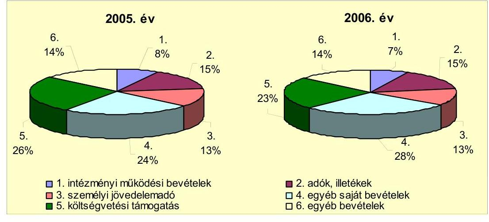

A helyi önkormányzatok könyvviteli mérleg szerinti vagyona a 2006. év végére a 2002. évihez viszonyítva $60,3 \%$-kal nőtt, a 2006. év végén 10300 milliárd Ft volt. A 2002-2006 közötti időszakon belül az első évben 43,8\%-kal a következő években $4,2 \%-2,5 \%-4,4 \%$-kal növekedett a vagyon könyvviteli mérlegben kimutatott értéke. A 2002-2003 közötti kiugróan magas arányú növekedést elsősorban a korábban érték nélkül nyilvántartott ingatlanok értékének

---

megállapítása okozta. Kedvező, hogy a könyvviteli mérleg szerinti vagyon értékének a 2003. évtől történő növekedését jellemzően a beruházások, felújítások eredményezték. Kedvezőtlen, hogy a beruházásokra fordított kiadások bővülése mellett növekedett a kötelezettségek év végi állománya, ugyanakkor a pénzügyi likviditást elősegítő forgóeszközök aránya mérséklődött. A költségvetési egyensúlyt javító önkormányzati intézkedések következtében csökkent az önkormányzatok tulajdonában lévő értékpapírok állománya, míg a kötelezettségek az emelkedő összegű hitelfelvételekből eredő visszafizetési kötelezettség miatt növekedtek. A hitelfelvételeken belül nőtt a rövid lejáratú likvid hitelek aránya, amelyet az önkormányzatok több mint fele az év végén nem fizetett vissza, így ezek a következő év gazdálkodását terhelték.

Adatok: milliárd Ft-ban

| A HELYI ÖNKORMÁNYZATOK KÖNYVVITELI MÉRLEG SZERINTI VAGYONA |  |  |  |  |  |
| :-- | --: | --: | --: | --: | --: |
| Eszközök | 2002. | 2003. | 2004. | 2005. | 2006. |
| Immateriális javak | 9 | 11 | 16 | 21 | 25 |
| Tárgyi eszközök | 4350 | 6833 | 7021 | 7238 | 7576 |
| Befektetett pénzügyi eszközök | 564 | 566 | 575 | 556 | 558 |
| Üzemeltetésre, kezelésre átadott eszközök | 930 | 1254 | 1396 | 1482 | 1587 |
| FORGÓESZKÖZÖK | $\mathbf{5 7 0}$ | $\mathbf{5 7 1}$ | $\mathbf{6 1 0}$ | $\mathbf{5 6 4}$ | $\mathbf{5 5 4}$ |
| ESZKÖZÖK ÖSSZESEN | $\mathbf{6 4 2 3}$ | $\mathbf{9 2 3 5}$ | $\mathbf{9 6 1 8}$ | $\mathbf{9 8 6 1}$ | $\mathbf{1 0 3 0 0}$ |
| KÖTELEZETTSÉGEK | $\mathbf{4 9 0}$ | $\mathbf{5 1 8}$ | $\mathbf{5 8 9}$ | $\mathbf{6 9 7}$ | $\mathbf{9 2 5}$ |
| SAJÁT VAGYON | $\mathbf{5 9 3 3}$ | $\mathbf{8 7 1 7}$ | $\mathbf{9 0 2 9}$ | $\mathbf{9 1 6 4}$ | $\mathbf{9 3 7 5}$ |

Az önkormányzatok gazdasági helyzete romlott 2002-2006 között, mivel a kötelezettségek mindegyik önkormányzat-típusban emelkedtek, kiugróan a Budapest fővárosi kerületi, a megyei jogú városi és a városi önkormányzatoknál. Ezen belül dinamikusan nőttek a rövid- és hosszú lejáratú hitelfelvételek miatti kötelezettségek. A helyi önkormányzatok átlagos likviditási gyorsrátájának ${ }^{5}$ folyamatos, a 2002. évi 2,6-ról a 2006. évi 1,2-ra csökkenése mutatja a pénzügyi helyzet általános rosszabbodását, a fizetőképesség csökkenését, amely különösen a megyei jogú városi és városi önkormányzatoknál következett be.

# A gazdálkodás tervezése 

Az ellenőrzött önkormányzatok közül az előző évhez hasonlóan a megyei, megyei jogú városi önkormányzatok mindegyike, a Budapest fővárosi kerületi és a városi önkormányzatok mintegy nyolctizede rendelkezett a képviselő-testület által elfogadott, hosszabb távra szóló ágazati célkitűzéseket, feladatokat meghatározó gazdasági programmal ${ }^{6}$. A gazdasági programmal rendelkező önkormányzatok aránya az elmúlt négy évben - a 2003. évi 60\%-ról a 2006.

[^0]
[^0]:    ${ }^{5}$ Likviditási gyorsráta = (követelések+értékpapírok+pénzeszközök)/rövid lejáratú kötelezettségek.
    ${ }^{6}$ Javaslatunkra a 2005. évben az Országgyúlés meghatározta a gazdasági program tartalmi követelményeit.

---

évben 81\%-ra - pozitív irányban változott. Az elfogadott gazdasági programok alkalmasak voltak az egyes évek gazdálkodását megalapozó költségvetési tervező munkához. A célkitűzések között szerepelt a pénzügyi stabilitás biztosítása, az intézményi struktúra átalakítása, a pályázati lehetőségek maximális kihasználása.

Az ellenőrzött önkormányzatok mindegyike elkészítette a 2005. és 2006. évi költségvetési koncepcióját, amelyet közel kilenctizedüknél a helyben képződő bevételek és az ismert kötelezettségek, valamint a gazdasági programban foglaltak figyelembevételével állítottak össze. A költségvetési koncepciókhoz valamint a költségvetési rendelettervezetekhez a polgármesterek - az előző évihez hasonlóan - az Ámr. előírásai ellenére nem csatolták az önkormányzatok mintegy felénél a pénzügyi bizottság véleményét, az önkormányzatok háromnegyedénél a kisebbségi önkormányzatok koncepcióról alkotott véleményét.

A 2005. és a 2006. évi költségvetési rendelettervezetek költségvetési szervek vezetőivel folytatott egyeztetését az Ámr. előírása ellenére az önkormányzatok $18 \%$-ánál a jegyző írásban nem rögzítette. A polgármesterek az önkormányzatok $83 \%$-ánál a törvényben előírt határidőn belül terjesztették elő a költségvetési rendelettervezeteket. Az önkormányzatok döntő többségénél (93\%-ánál) a költségvetési rendelettervezetekkel együtt, illetve azt megelőzően a képviselő-testület elé terjesztették azokat a rendelettervezeteket is, amelyek a tervezett előirányzatokat megalapozták. A költségvetés előterjesztésekor az önkormányzatok 89, illetve 96\%-ánál bemutatták az Áht-ban előírt többéves elkötelezettséggel járó kiadási tételek későbbi évekre vonatkozó kihatásait, valamint a költségvetési évet követő két év várható előirányzatait is. Az Áht. előírása ellenére nem határozták meg a 2005. és a 2006. évi költségvetési rendeletekben az önkormányzatok 7\%-ánál a címrendet.

Az önkormányzatok harmadánál (az előző évben közel felénél), az Áht-ban foglaltakat megsértve, a 2005. és a 2006. évi költségvetési rendeletekben finanszírozási célú pénzügyi műveleteket vettek figyelembe költségvetési bevételként és kiadásként, és nem állapították meg a költségvetés tervezett hiányát, vagy többletét a költségvetési bevételek és kiadások különbözeteként. Az Áht. előírása alapján a költségvetésben nem lehet a finanszírozási célú pénzügyi műveleteket a költségvetési hiányt módosító költségvetési bevételként, illetve költségvetési kiadásként elszámolni, így a rövid- és hosszú lejáratú hitelfelvételek és hitel-visszafizetési kötelezettségek összege sem a költségvetési bevételben, sem a költségvetési kiadásban nem szerepelhet. Az előírt számítási mód az önkormányzatoknál nem teszi lehetővé a tárgyévi hitel-visszafizetési kötelezettség összegének a költségvetési kiadások közötti figyelembevételét, annak ellenére, hogy a tartalmát tekintve szerződésen alapuló kiadási kötelezettség befolyásolja a költségvetési bevételek-kiadások különbségét jelentő hiány vagy többlet összegét, megítélését ${ }^{7}$.

[^0]
[^0]:    ${ }^{7}$ A helyi és a helyi kisebbségek gazdálkodásának átfogó ellenőrzéséről a 2006. évben készített 0634. sorszámú jelentésünkben is javasoltuk a pénzügyminiszternek, hogy kezdeményezze az Áht. módosítását a költségvetési hiány egyértelmű meghatározása érdekében.

---

A tapasztalatokat összehasonlítva a korábbi ellenőrzésekről készült jelentések ${ }^{8}$ összegző megállapításainak adataival megállapítható, hogy az elfogadott költségvetések évről-évre nagyobb arányban feleltek meg a szerkezetre, tartalomra vonatkozó jogszabályi előírásoknak. A költségvetési rendeletekben a költségvetés végrehajtásával kapcsolatos helyi szabályokat évente növekvő arányban határozták meg az önkormányzatok, azonban az Áht. előírásait megsértve az önkormányzatok harmada, illetve ötöde továbbra sem rendelkezett a költségvetési többlet felhasználásának, a költségvetési hiány finanszírozásának módjáról. Az önkormányzatok ötöde nem határozta meg az önállóan gazdálkodó költségvetési szervek előirányzat-módosítási jogkörét, valamin a költségvetési hiány finanszírozásával összefüggő hitelműveleti hatásköröket.

A költségvetés és a zárszámadás előterjesztésekor tájékoztatásul bemutatandó mérlegek és kimutatások tartalmi követelményeit az Áht. előírásait megsértve az önkormányzatok közel négyötödénél nem határozták meg,. A költségvetési rendelettervezetek közel kétharmada nem tartalmazta a közvetett támogatásokat tartalmazó kimutatást, szöveges indoklással.

A költségvetési előirányzatok évközi módosításakor - a korábbi évekhez hasonlóan - az Ámr. előírásai ellenére az önkormányzatok közel felénél nem történt meg a központilag biztosított pótelőirányzatok negyedéven belüli átvezetése, több mint harmadánál a költségvetési szervek saját hatáskörű előirány-zat-változásairól a képviselő-testület 30 napon belüli tájékoztatása. Kedvezőtlen, és a költségvetési gazdálkodási fegyelem hiányosságát mutatja, hogy az önkormányzatok több mint felénél a költségvetési rendeletet utolsó alkalommal az előírt határidőt követően módosították, valamint az önkormányzatok közel felénél a kisebbségi önkormányzatok költségvetési előirányzatait a kisebbségi önkormányzatok erre vonatkozó határozatai nélkül módosították.

# A gazdálkodás és a számviteli nyilvántartás szabályozottsága 

A gazdálkodás szabályozottsága az előző évekhez viszonyítva javult, nőtt a kötelezően előírt szabályzatokkal rendelkező önkormányzatok aránya. A számlarend kivételével javult a szabályozások minősége is, amely azonban változatlanul alacsony színvonalúnak minősíthető. A gazdálkodás szabályozottságának alacsony színvonalát mutatja, hogy az SzMSz-ek, a számlarendek több mint fele, az ügyrendek, a pénzkezelési szabályzatok négytizede, a leltározási szabályzatok kétharmada nem felelt meg az előírásoknak.

[^0]
[^0]:    ${ }^{8}$ A helyi és a helyi kisebbségi önkormányzatok gazdálkodásának átfogó ellenőrzéséről készített 0634., 0544., 0436. és 0319. számú jelentések.

---

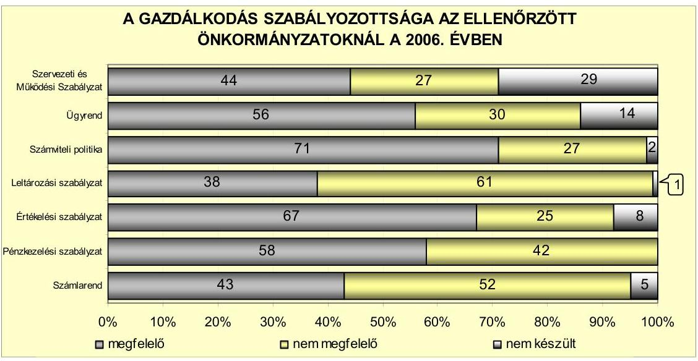

A gazdálkodási szabályzatokban a pénzügyi-számviteli feladatok elvégzésének, ellenőrzésének folyamatát az önkormányzati hivatalok háromnegyedénél nem a Számv. tv., a Vhr., és az Ámr. előírásainak megfelelően szabályozták. A pénzügyi-számviteli dolgozók munkaköri leírásai az önkormányzatok négytizedénél nem tartalmazták a munkafolyamatba épített ellenőrzési, egyeztetési feladatokat. Az önkormányzatok több mint felénél nem határozták meg a követelményektől való eltérések megállapításának és dokumentálásának módját. Az önkormányzati hivatalok több mint felénél a jegyzők az Áht. előírásait megsértve nem, vagy nem megfelelően gondoskodtak a FEUVE megszervezéséről, nem alakították ki a kockázatkezelés rendjét, közel felénél nem készítették el az ellenőrzési nyomvonalat.

# A gazdálkodási folyamatba épített ellenőrzések végrehajtása 

Az önkormányzatok hivatalainál az Ámr-ben előírt ellenőrzési feladatok hiányos elvégzése miatt a könyvviteli elszámolásokat megalapozó pénzforgalmi bizonylatok közel fele nem felelt meg a Számv. tv-ben foglalt alaki és tartalmi követelményeknek. Az önkormányzati hivatalokban a kötelezettségvállalások egynegyedét (főként az 50 ezer Ft alattiakat) nem foglalták írásba, annak ellenére, hogy nem határozták meg az ilyen esetben alkalmazandó szabályokat. A kötelezettségvállalás írásba foglalásának elmaradása nem tette lehetővé az Ámr-ben előírt, folyamatba épített ellenőrzési feladatok elvégzését, mivel kötelezettségvállalási dokumentum hiányában nincs meg annak feltétele, hogy kifizetés előtt az összegszerűséget, jogosultságot, a gazdálkodási szabályok betartását ellenőrizni lehessen a szakmai teljesítés igazolás, az érvényesítés és az utalvány ellenjegyzése során.

Az önkormányzatok közel háromnegyedének kötelezettségvállalásairól az Ámr-ben előírt nyilvántartást nem, vagy részben vezették, ennek is következménye, hogy $84 \%$-nál nem volt megállapítható a kötelezettségvállalás éves összege, nem voltak megbízható adatok a gazdálkodási, ellenőrzési jogkörök felelős gyakorlásához. A kötelezettségvállalás és az utalványozás jóváhagyott előirányzat nélkül történt az önkormányzatok egyharmadánál és 268 költségvetési intézménynél, amely a legtöbb szervezetnél (224) a dologi kiadásokat

---

érintette. Túllépték az önkormányzati szintű kiadási előirányzatot a Budapest fővárosi kerületi és a nagyközségi önkormányzatok egyharmadánál, az önkormányzati hivatali kiemelt előirányzatokat a megyei és a megyei jogú városi önkormányzatok kétharmadánál, az intézményi kiemelt előirányzatokat valamennyi megyei jogú városi önkormányzatnál.

A tapasztalatokat összehasonlítva a korábbi ellenőrzésekről készített jelentésekben ${ }^{9}$ foglaltakkal megállapítható, hogy a pénzgazdálkodási hatásköri előírásokat évente növekvő arányban ( $81 \%$-ról $97 \%$-ra, illetve $87 \%$-ról $98 \%$ ra) betartották az önkormányzatoknál. A pénzgazdálkodás folyamatába épített ellenőrzés végrehajtásánál növekedtek a hiányosságok az elmúlt négy évben. Az előző ellenőrzések tapasztalatai alapján magas kockázatúnak minősített belső kontrollok múködésének ellenőrzését a 2006. évben kiterjesztettük azok részterületeire is, mert a folyamatba épített ellenőrzések elmaradása, a jogszabályban előírt ellenőrzési feladatok végrehajtásának teljes, vagy részleges elmulasztása következtében a bizonylatokon halmozottan jelentkeztek a hiányosságok. A kiterjesztés következtében az előző évekhez képest kiugróan magas hibaarányt állapítottunk meg.
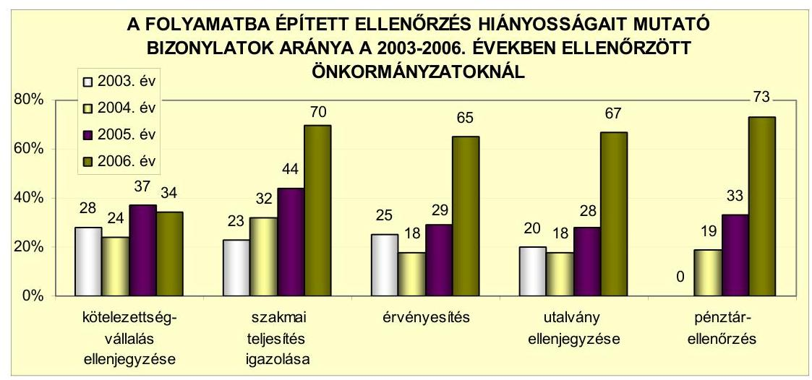

Elmaradt az ellenjegyzés az írásba foglalás hiányában végzett kötelezettségvállalásoknál. A jegyző írásos felhatalmazásával nem rendelkező személy által, továbbá a szakmai teljesítés igazolása és az érvényesítés szabályszerű végrehajtása hiányában is történtek utalvány ellenjegyzések. Nem végezték el a szakmai teljesítés igazolását, mert a jegyzők nem jelölték ki az azt végző személyeket, nem határozták meg annak módját. A mulasztásokhoz hozzájárult, hogy évek óta tett megállapításaink és előző évi javaslatunk ellenére nem történt meg a szakmai teljesítés igazolás módjának központi meghatározása, a követelmények nem voltak egyértelműek a helyi szabályozás és végrehajtás folyamatában. Hiányzott az érvényesítés, illetve az elvégzésének igazolása ellenére nem töltötte be a hibák megelőzésére, kijavítására vonatkozó funkcióját a pénzgazdálkodásban és a számviteli elszámolásokban, mert nem alapult a szakmai teljesítés igazolásán, nem tartalmazta a jogszabályban előírtakat, ala-

[^0]
[^0]:    ${ }^{9}$ A helyi és a helyi kisebbségi önkormányzatok gazdálkodásának átfogó ellenőrzéséről készített 0634., 0544., 0436. és 0319. számú jelentések.

---

ki és tartalmi szempontból hibás bizonylaton is szerepelt. Az önkormányzati hivataloknál nem végezték el az egyéb gazdasági események bizonylatain (pl. értékelések elvégzésének, beruházások állományba vételének bizonylatain) az utalványozást, az utalvány ellenjegyzést, a szakmai teljesítés igazolását és az érvényesítést, mivel az Ámr-ben az egyéb gazdasági eseményekre nem írták elő annak kötelezettségét.

# A vagyongazdálkodás szabályszerűsége, nyilvánossága 

A helyi önkormányzatok könyvviteli mérlegben kimutatott vagyona a 2005. év végén 9861 milliárd Ft, a 2006. év végén 10300 milliárd Ft volt, az előző évhez képest $4,4 \%$-kal növekedett, amit elsősorban a megvalósult beruházások eredményeztek. Az ellenőrzött kiemelt körbe tartozó és városi önkormányzatok mindegyike a vagyongazdálkodási rendeletében szabályozta a vagyongazdálkodással kapcsolatos hatásköröket és az értékesítési feladatokat, azonban az előző évben ellenőrzött önkormányzatokhoz viszonyítva kisebb arányban rendelkeztek a bérbeadásról, az apportálásról, a pénzügyi befektetésekről, az ingyenes átadásról és a követelések elengedéséről. A döntési hatáskörök szabályozása célszerű volt az önkormányzatok kilenctizedénél.

Az ellenőrzött önkormányzatok közel felénél nem rendelkeztek a korlátozottan forgalomképes vagyon vagyongazdálkodási rendeletben rögzített korlátozott forgalomképességének megváltoztatási feltételeiről, illetve a törzsvagyonon kívüli egyéb vagyoni körbe történő átsorolási feltételeiről. A 2003-2006 között ellenőrzött önkormányzatok egyharmada nem határozta meg azt az értékhatárt, amely felett csak versenytárgyalás útján, a legjobb ajánlattevő részére lehet a vagyont értékesíteni, kezelésbe adni, a használat, illetve hasznosítás jogát átengedni ${ }^{10}$. Az értékhatárt meghatározó önkormányzatok harmadánál a vagyongazdálkodási rendeletben lehetővé tették a versenytárgyalás mellőzését. Az elidegenítések, vagyonhasznosítások során a versenytárgyalási kötelezettségre vonatkozó előírást az önkormányzatok fele megsértette. A versenytárgyalás nélkül történt elidegenítések, vagyonhasznosítások nem tették lehetővé az önkormányzati vagyonnal történő gazdálkodás nyilvánosságára, átláthatóságára vonatkozó követelmény érvényesülését. A forgalomképtelen és a korlátozottan forgalomképes törzsvagyon elidegenítésére vonatkozó korlátokat a 2006. évben ellenőrzött önkormányzatok $11 \%$-a nem, $14 \%$-a részben tartotta be. A korlátozottan forgalomképes törzsvagyon részét képező víziközművek tulajdonjogának gazdasági társaság részére történő átadásával 2003-2005 között összesen 21 önkormányzat sértette meg az Ötv. és a vízgazdálkodásról szóló törvény előírásait. Az önkormányzatok törzsvagyonába tartozó forgalomképtelen ingatlan értékesítése és a földhivatali bejegyzése is megtörtént - a Ptk. forgalomképtelen ingatlanok elidegenítésére vonatkozó semmisségi előírását megsértve

[^0]
[^0]:    ${ }^{10}$ A helyi és a helyi kisebbségi önkormányzatok gazdálkodásának átfogó ellenőrzéséről a 2004. évben készített jelentésben javasoltuk, hogy az Áht. módosítása során minden önkormányzatra egységesen állapítsák meg a versenyeztetés értékhatárát. Javaslatunkat is figyelembe véve az Országgyúlés a 2005. év óta az évenkénti költségvetési törvényben meghatározza ezt az értékhatárt. Az önkormányzat rendeletében ennél kisebb összeget is meghatározhat.

---

- kilenc önkormányzatnál ${ }^{11}$. Az önkormányzatok közel felénél történt úgy vagyonértékesítés, hogy a forgalmi érték megállapítására értékbecslés nem készült, vagy az abban foglaltakat nem vették figyelembe az értékesítési ár meghatározásakor. Ingyenes, vagy kedvezményes helyiségbérlet biztosításával - az Alkotmány. és az Ötv előírásait megsértve - évente csökkenő arányban támogattak közvetetten politikai pártokat az önkormányzatok.

Az ellenőrzött önkormányzatok több mint egyharmada vásárolt, több mint fele értékesített értékpapírokat. Az adás-vételek mintegy ötöde az önkormányzat költségvetésében, vagyongazdálkodási rendeletében előírtaktól eltérő módon történt. Az értékpapírok adásvétele az önkormányzatoknál a pénzpiaci lehetőségeknek megfelelő eredményt biztosított, azonban mintegy harmaduk az értékpapírok forgatásával járó kockázatot az önkormányzat nevére szóló együttes rendelkezésű alszámla nyitásának kezdeményezésével nem csökkentette.

Az ellenőrzött önkormányzatok mindegyike nyújtott nem normatív, céljellegű, fejlesztési célú támogatásokat, illetve kötött nettó ötmillió Ft-ot elérő vagy azt meghaladó értékű - árubeszerzésre, építési beruházásra, szolgáltatás megrendelésre, vagyonértékesítésre, vagyonhasznosításra, vagyon, vagy vagyoni értékű jog átadására vonatkozó - szerződéseket. Ezen támogatásokkal és szerződésekkel kapcsolatos, Áht-ban előírt közzétételi kötelezettségének évek óta az önkormányzatok több mint fele nem, vagy csak részben tett eleget. A közzététel elmulasztása nem tette lehetővé a közpénzfelhasználás átláthatóságára, nyilvánosságára vonatkozó követelmény érvényesülését. Az önkormányzatok mintegy harmadánál történt követelés elengedés és ingyenes vagyonátruházás. A követelést elengedő önkormányzatok közel fele, a vagyont ingyenesen átruházó önkormányzatok harmada nem határozta meg rendeletben a követelés elengedés módját és eseteit, valamint az ingyenes vagyonátruházás eseteit.

# A vagyon számviteli nyilvántartása 

A számviteli nyilvántartásokban a törzsvagyon és a nem törzsvagyon részét képező eszközök elkülönített nyilvántartásáról az ellenőrzött önkormányzatok hivatalai évente növekvő arányban, a 2006. évben ellenőrzött önkormányzatok $91 \%$-a gondoskodott. Nyilvántartási hiányosságok miatt a 2006. évben ellenőrzött önkormányzati hivatalok 6\%-a - megsértve a Számv. tv. előírását - a könyvviteli mérlegben nem a valós értékén szerepeltette az önkormányzat vagyonát. Az önkormányzatok a 2006. évben országosan 1587 milliárd Ft összegben mutattak ki üzemeltetésre, kezelésre átadott eszközöket, amelyek aránya az önkormányzati vagyonon belül 2002 óta folyamatosan emelkedett. A szerződéssel üzemeltetésre, kezelésre átadott eszközöket azonban az ellenőrzött önkormányzatok egyötöde a Vhr-ben előírtak szerinti főkönyvi számlától eltérő főkönyvi számlán szerepeltette a számviteli nyilvántartásokban.

[^0]
[^0]:    ${ }^{11}$ A helyi és a helyi kisebbségek gazdálkodásának átfogó ellenőrzéséről a 2006. évben készített 0634 sorszámú jelentésben tett javaslatunk alapján a földművelésügyi és vidékfejlesztési miniszter a 2006. évben körlevélben hívta fel a földhivatalok figyelmét a vonatkozó jogszabályok betartására.

---

A könyvviteli mérlegben kimutatott vagyon helyi szabályozásokban rögzítetteknek megfelelő leltározási kötelezettségének teljesítése az előző évhez viszonyítva romlott, de az elvégzett leltározások során készített leltárak kiértékelése az ellenőrzött önkormányzati hivatalok 94\%-ánál, a megelőző két évhez képest nagyobb arányban megtörtént. Az önkormányzatok országosan összesen a befektetett eszközök, készletek, követelések és értékpapírok év végi értékelésekor a 2004. évben 14 milliárd Ft, a 2005. évben 63 milliárd Ft, a 2006. évben 62 milliárd Ft összegben számoltak el tárgyévi értékvesztést és visszaírtak 5-11-43 milliárd Ft korábban elszámolt értékvesztést. Az elszámolt, illetve visszaírt értékvesztések hatására az értékelt eszközök nyilvántartás szerinti értéke 1\%-$6 \%-2 \%$-kal csökkent 2004-2006 között. Az ÁSZ rendszeres ellenőrzésének hatására az önkormányzati hivatalok korábbi éveknél nagyobb aránya, 60\%-a vizsgálta az értékvesztés elszámolásának szükségességét a követelések, a részesedések, az értékpapírok esetében, azonban - a Számv. tv. előírásai ellenére az értékvesztés elszámolását azok 10\%-a a részesedések esetében nem, 14\%-a a követelések és 10\%-a a részesedések esetében hiányosan végezte el. Az értékelési hiányosságok következtében a könyvviteli mérlegek sem helyi, sem országos szinten nem tükrözik megbízhatóan az önkormányzati vagyon számviteli előírások szerinti értékét.
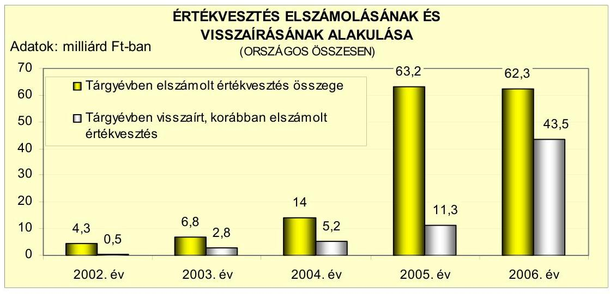

# A közbeszerzési eljárások szabályszerűsége 

Az ellenőrzött kiemelt körbe tartozó, valamint a városi önkormányzatok képvi-selő-testületei meghatározták a közbeszerzések helyi szabályait, azonban annak során az önkormányzatok tizede nem rendelkezett a közbeszerzési eljárások előkészítéséről, az ajánlatkérő nevében eljáró, illetve az eljárásba bevont személyek felelősségi köréről és az eljárások dokumentálásának rendjéről. A Kbt-ben foglaltak ellenére az ellenőrzött önkormányzatok egynegyede a közbeszerzési eljárások belső ellenőrzésének felelősségi rendjét nem határozta meg, mintegy tizede nem készítette el az éves összesített közbeszerzési tervét.

---

Az önkormányzatok évente növekvő számú közbeszerzési eljárást folytattak le ${ }^{12}$. A lefolytatott közbeszerzési eljárásokban az ajánlatkérő nevében eljáró személyek megfelelő szakértelemmel rendelkeztek, az ajánlatok elbírálása megfelelt a Kbt-ben foglaltaknak, a bíráló bizottságok - három eljárás kivételével a kizáró okokat vizsgálták. A szerződést az ajánlati dokumentáció, felhívás és az ajánlat alapján határidőben megkötötték.

A közbeszerzési eljárást lefolytató ellenőrzött önkormányzatok ötödét a Közbeszerzési Döntőbizottság a közbeszerzési eljárás során elkövetett hibákért, hiányosságokért elmarasztalta és bírság megfizetésére kötelezte. Az ellenőrzés során a Kbt. megsértése miatt az ÁSZ 21 jogorvoslati eljárást kezdeményezett, amelyek közül 19-nél a Közbeszerzési Döntőbizottság megállapította a jogsértést és 13,5 millió Ft összegű bírság kiszabásáról határozott. A Közbeszerzési Döntőbizottság az eljárások megszüntetésére vonatkozó döntéseinél a 2006. évben szerepet játszott, hogy a jogsértés tudomásra jutásának időpontjaként nem az ezt alátámasztó összes hiteles dokumentum rendelkezésre állását vette figyelembe, hanem a közbeszerzési eljárás elmulasztására csak közvetten utaló dokumentumok közül legalább egynek az ellenőrzést végző részére történt átadásának időpontját. A Közbeszerzési Döntőbizottság eljárásánál nem vette figyelembe, hogy az ÁSZ részére a Kbt. alapján nyitva álló 15 napos jogvesztő határidő alatt a hiányos dokumentumokból nem állapítható meg teljes bizonyossággal a Kbt. előírásainak a megsértése.

# Az önkormányzatok által adott támogatások 

A helyi önkormányzatok céljellegú támogatásként ${ }^{13}$ - nem szociális ellátásként - a 2004. évben 180,4 milliárd Ft-ot, a 2005. évben 236,0 milliárd Ft-ot, a 2006. évben 277,3 milliárd Ft-ot adtak át működési és felhalmozási célra alapítványoknak, közalapítványoknak, egyéb non-profit szervezeteknek, vállalkozásoknak, háztartásoknak, saját intézményeiken kívüli költségvetési szerveknek és külföldi közösségeknek. Az önkormányzatok a céljellegú támogatások közel felét múködési, a többit felhalmozási célra nyújtották. Az önkormányzatok a juttatott támogatás összegét, a támogatott célt, a támogatás felhasználásáról történő számadási kötelezettség teljesítésének módját, határidejét az előző évekhez viszonyítva növekvő arányban meghatározták ${ }^{14}$.

A támogatást nyújtó önkormányzatok 60\%-ánál (az előző évben 55\%-nál) az alapítványok, közalapítványok támogatásáról az Ötv. hatásköri előírását megsértve nem a képviselő-testület döntött. Az önkormányzatok tizedénél az intézmények a képviselő-testület engedélye nélkül támogattak társadalmi szervezeteket. A közhasznú szervezeteket támogató önkormányzatoknak az előző évi

[^0]
[^0]:    ${ }^{12}$ A Közbeszerzések Tanácsa tájékoztatója szerint a 2004-2006. években a közbeszerzési eljárások összértéke 1129,7 milliárd-1291,3 milliárd-1685,8 milliárd Ft volt, amelyből az önkormányzatok 22\%-22\%-31,9\%-kal részesedtek (forrás: www.kozbeszerzes.hu).
    ${ }^{13}$ Különböző szervezetek és magánszemélyek számára múködésük, célkitúzésük megvalósításának elősegítése érdekében, általában pályázat alapján nyújtott támogatás.
    ${ }^{14}$ A 2003. év óta folytatott átfogó ellenőrzések egyik súlypontja a támogatások nyújtása és felhasználása ellenőrzésére vonatkozó szabályok betartatása volt. A következetes számonkérés eredménye e téren a javulás.

---

egyötöddel szemben mintegy négytizede a Ksztv. előírása ellenére nem határozta meg szerződésben a támogatással való elszámolás feltételeit és módját. A számadások ellenőrzését az Áht. előírása ellenére az önkormányzatok közel egytizede nem végezte el, további $40 \%$ pedig hiányosan gondoskodott a számadások ellenőrzéséről. A támogatások rendeltetésszerú felhasználására vonatkozóan az önkormányzatok mintegy nyolctizede (a 2004. évben közel kilenctizede) a célszerinti felhasználást nem ellenőrizte ${ }^{15}$. A mulasztásokhoz hozzájárult, hogy az Áht. a céljelleggel nyújtott támogatások esetében nem határozta meg a számadások és a rendeltetésszerú felhasználás ellenőrzésének követelményeit ${ }^{16}$.

# A gazdálkodás költségvetési-pénzügyi egyensúlya 

Az önkormányzatok költségvetésben tervezett bevételeinek-kiadásainak egyensúlya a 2002. évihez viszonyítva folyamatosan romlott. A tervezett bevételek az önkormányzatok kilenctizedénél nem nyújtottak fedezetet a tervezett kiadásokra, ezen belül háromnegyedénél a múködési feladatokra, felénél a tervezett felhalmozási feladatokra. A költségvetésben tervezett hiány növekedésében változatlanul szerepet játszott a feladatellátás módjának gazdaságtalan megszervezése, az intézményi kapacitások alacsony kihasználása, a teherbíró képességet meghaladó önként vállalt feladatok elvégzése, tervezési hibák, felhalmozási célú költségvetési bevételeket meghaladó mértékű felhalmozási célú költségvetési kiadás tervezése.

Az önkormányzatok egyensúly javítására tett intézkedéseinek hatására ténylegesen az ellenőrzött önkormányzatoknak 2003-ban csak egynegyedénél, 2005ben közel egyharmadánál volt költségvetési hiány. A költségvetési bevételek és kiadások egyensúlyát a tervezettnél jobban biztosították a múködési célú költségvetési bevételeknél, kiadásoknál. A tervezett hiányt a költségvetés végrehajtása során csökkentették a terven felüli saját bevételek, a vagyonértékesítésből, a nem megalapozott tervezésből származó többletbevételek, a támogatások és pályázatok révén megszerzett pénzeszközök, a pénzmaradvány tervezett igénybevételének háromszorosát meghaladó - a tervezett hiány kétharmadának megfelelő nagyságú - igénybevétele, valamint az önkormányzatok mintegy kétharmadánál a kiadások csökkentése érdekében tett intézkedések (feladatok átütemezése, elhalasztása, előfordult annak elhagyása is).

A saját bevételek között változatlanul meghatározó a helyi adó bevétel, amelynek összege 2002-2005 között 34\%-kal növekedett, az összes bevételen beüli aránya meghaladta az egytizedet. A helyi adóbevételek között az iparúzési adó továbbra is a legjelentősebb, a helyi adóbevételek $84 \%$-át biztosította. Az önkormányzatok háromnegyede a helyi adókból különböző jogcímen a tör-

[^0]
[^0]:    ${ }^{15}$ Az átadott pénzeszközök felhasználását 17 támogatott szervezetnél ellenőriztük a helyszínen, amelyek során hat esetben jogosulatlan felhasználást állapítottunk meg.
    ${ }^{16}$ A helyi és a helyi kisebbségek gazdálkodásának átfogó ellenőrzéséről a 2006. évben készített 0634 sorszámú jelentésében javasoltak alapján a pénzügyminiszter módszertani útmutatást adott a 2006. év végén kiadott Önkormányzati Belső Ellenőrzési Kézikönyvben a számadás és a rendeltetésszerú felhasználás ellenőrzéséhez.

---

vényben biztosítottakon túlmenően további kedvezményeket, mentességeket is adott ${ }^{17}$.

Az önkormányzatok közel 90\%-a eredményesen pályázott különböző múködési, szinte valamennyi felhalmozási források megszerzésére. A kapott támogatások köréből kiemelkedett az önhibáján kívül hátrányos helyzetű önkormányzatok támogatása, amely a múködési célú költségvetési kiadásoknál jelentkezett hiány közel felére biztosított fedezetet.

Adósságot keletkeztető kötelezettségvállalásról az ellenőrzött kiemelt körbe tartozó és a városi önkormányzatok kétharmada döntött, ennek leggyakoribb módja a hitelfelvétel volt. A felvett hitelekkel részben a korábbi hiteleket fizették vissza. Az adósságot keletkeztető kötelezettségvállalások összegének meghatározásakor vizsgálták és $96 \%$-nál betartották az Ötv-ben előírt felső határt. A folyószámlahitel keretek és a felvett likvid hitelek összege, időtartama 2002-2006 között folyamatosan emelkedett, annak teljes összegét a megyei önkormányzatok háromnegyede, a megyei jogú városi önkormányzatok egyharmada, a Budapest fővárosi kerületi önkormányzatok fele, a városi önkormányzatok $38 \%$-a a 2005 . év végén nem fizette vissza.

A pénzügyi helyzet alakulásában a likviditási gyorsráta az önkormányzattípusok között jelentős különbségeket mutat, a különbség azonban csökken, amelyet a következő grafikon szemléltet.
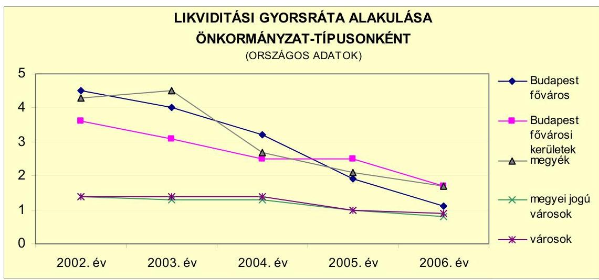

A likvid hitelt felvevő önkormányzatok egyötöde egyik évben sem fizette vissza annak teljes összegét év végén, így az folyamatosan szolgálta a fizetőképesség fenntartását.

[^0]
[^0]:    ${ }^{17}$ Az ÁSZ a települési önkormányzatok adóztatási tevékenységét a 2001. évben ellenőrizte, a jelentés sorszáma 0121

---

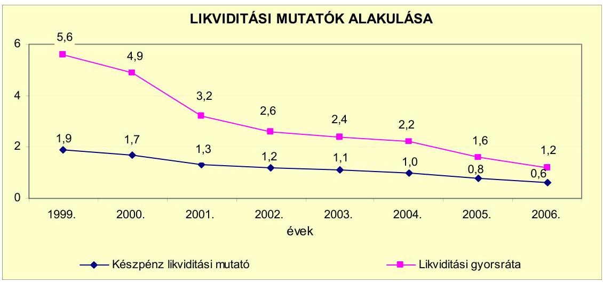

A helyi önkormányzatok likviditási mutatói ${ }^{18}$ - a készpénz likviditási mutató és a likviditási gyorsráta - jelzik a pénzügyi helyzet folyamatos rosszabbodását, hogy a forgóeszközök egyre csökkenő mértékben nyújtanak fedezetet a rövid lejáratú kötelezettségek teljesítésére. Az Ötv. az adósságot keletkeztető kötelezettségvállalás éves felső határának meghatározásakor nem teszi lehetővé a több éven keresztül fizetési kötelezettségként jelentkező, a szállítókkal szembeni, mérleg fordulónapján fennálló tartozások hatásának számításba vételét, és figyelmen kívül hagyja a likvid hiteleket, annak ellenére, hogy rendszerint tartós likviditási problémák kezelésére szolgálnak. Ezek a kötelezettségek az önkormányzatok költségvetését éveken át terhelik, az eladósodottságot, a fizetőképességet a törvényben figyelembe vett adósságot keletkeztető kötelezettségvállalásokkal azonos módon befolyásolják.

# A zárszámadás szabályszerűsége 

A polgármester az éves gazdálkodásról szóló zárszámadási rendelettervezetet az ellenőrzött önkormányzatok 98\%-ánál az Áht-ban előírt határidőn belül benyújtotta a képviselő-testület részére. A zárszámadási előterjesztések tizedét azonban az Áht. rendelkezései ellenére nem a költségvetéssel összehasonlítható módon készítették el, a költségvetésben és a zárszámadásban szereplő előirányzatok egyezőségét nem biztosították.

A zárszámadási rendelettervezetek előterjesztésekor, az előző évhez hasonlóan az önkormányzatok mintegy felénél tájékoztatásul nem mutatták be az Áhtban előírt mérlegeket és kimutatásokat. Az önkormányzatok negyedénél az Ámr. előirása ellenére nem költségvetési szervenkénti részletezésben hagyták jóvá a pénzmaradványt. Az eredmény megállapítása és felhasználása a vállalkozási tevékenységet folytató négy önkormányzati hivatalnál szabályszerűen történt. A jegyzők a költségvetési szervek elemi beszámolójának rendjét, tartalmát az önkormányzatok több mint felénél nem határozták meg, ennek hiányában is megtörtént az önkormányzati hivatalok nyolctizedénél az intézmé-

[^0]
[^0]:    ${ }^{18}$ Készpénz likviditási mutató = pénzeszközök/rövid lejáratú kötelezettségek.
    Likviditási gyorsráta = (követelések+értékpapírok+pénzeszközök)/rövid lejáratú kötelezettségek.

---

nyek költségvetési beszámolóinak felülvizsgálata. Az intézményeket az éves számszaki beszámolóik és múködésük elbírálásáról, jóváhagyásáról az Ámr. előírásai ellenére az önkormányzatok harmadánál nem értesítették.

A helyi önkormányzatok központi költségvetési támogatásokkal, hozzájárulásokkal történő elszámolását - mely a költségvetési beszámolásuk részét képezi az ÁSZ a központi költségvetés zárszámadásának ellenőrzéséhez kapcsolódóan mintavételesen ellenőrzi. Ezen vizsgálatok a helyi önkormányzatok részére nyújtott hozzájárulások, támogatások jogszabályi előírásoknak megfelelő igénylésére, felhasználására és elszámolására terjedtek ki. A 2006. évben 867,1 milliárd Ft központi költségvetési hozzájárulás, támogatás, valamint 460,8 milliárd Ft személyi jövedelemadó részesedés, együttesen 1327,9 milliárd Ft illette meg az önkormányzatokat. A zárszámadáshoz kapcsolódó ellenőrzés során évek óta a jogszabályi előírások közötti összhang kialakítására, a támogatási követelmények, feltételek pontosítására, valamint az ellenőrzött önkormányzatok által jogtalanul igénybe vett hozzájárulások, támogatások visszafizetésére, illetve a részükre jogosan járó összegnek pótlólagos kiutalására tettünk javaslatot.

# A pénzügyi-számviteli tevékenység informatikai támogatottsága, szabályozottsága 

Az önkormányzatoknál a pénzügyi-számviteli tevékenység informatikai támogatottsága az elmúlt évek alatt egyre elterjedtebb és korszerúbb lett, azonban a pénzügyi-számviteli feladatok ellátására számítógépes programokat és manuális, analitikus nyilvántartást egyaránt használtak. A főkönyvi könyvelés és a költségvetési beszámoló készítése minden önkormányzatnál számítógépen történt. Az informatikai ellátottság az önkormányzati hivataloknál javult, azonban a számítógép-állomány összetétele és az alkalmazott programok színvonala, teljesítő képessége továbbra is változó. A pénzügyi-számviteli területen dolgozókra jutó számítógépek aránya emelkedett, egyre több önkormányzatnál minden ügyintézőre jut egy számítógép. Az IT fejlesztések során 2002-2006 között az elsődleges cél nem a géppark bővítése, hanem az elavult gépek cseréje volt. A szoftver-fejlesztések során célul tűzték ki a pénzügyi-számviteli munka korszerűsítését, a manuális munka csökkentését. Az önkormányzati hivatalok a szoftver-beszerzéseknél, fejlesztéseknél nem tekintették követelménynek, hogy azok kompatibilisek legyenek a főkönyvi programmal. Az informatikai rendszer szabályozottsága területén javulás történt, de az önkormányzati hivatalok több mint fele továbbra sem rendelkezett hosszú távú célkitűzéseket tartalmazó informatikai stratégiával. Az informatikai eszközt használó dolgozók 60\%-a legalább alapfokú informatikai ismeretekkel rendelkezett, az ellenőrzött önkormányzati hivatalok 40\%-ánál bővült 2005-2006-ban az európai számító-gép-használói jogosítvánnyal (ECDL ${ }^{19}$ ) rendelkezők aránya. A pénzügyiszámviteli feladatokat ellátók kevesebb mint felénél tartalmazta a munkaköri leírás az informatikai feladatokat.

[^0]
[^0]:    ${ }^{19}$ ECDL - European Computer Driving Licence angol rövidítése, az Európai Unió által támogatott, egységes európai számítógép-használói bizonyítvány.

---

# A feladatok meghatározottsága, finanszírozási források 

A 2003-2006 között ellenőrzött önkormányzatok mintegy fele SzMSz-ben, szakmai koncepciókban, éves költségvetésben rögzítette, hogy mely feladatokat tekinti kötelezően ellátandónak, vagy önként vállaltnak. Az évenkénti költségvetési rendeletekben a kiemelt kiadási előirányzatok kötelező és önként vállalt feladatra történő megosztásánál a költségvetési koncepcióban, vagy a költségvetési rendelettervezet előkészítésnél helyileg kialakított szempontokat vettek figyelembe. A települési önkormányzatok az Ötv-ben foglaltak ellenére nem határozták meg, hogy a lakosság igényei alapján, anyagi lehetőségeiktől függően, mely feladatokat, milyen mértékben és módon látnak el. A helyszíni ellenőrzések során ennek elmulasztására tett megállapításunkra érkezett polgármesteri észrevételekből kitűnt, hogy az Ötv. erre vonatkozó előírását tévesen, az évenkénti költségvetés készítésére, abban a kiadások meghatározására vonatkoztatják, annak ellenére, hogy a kiadások mellett nem szerepel a költségvetésben a feladatok ellátásának mértékét jelző természetes mutatószám, valamint a feladatellátás módjának (pl. saját intézményeivel, vállalkozásba adás vagy alapítvány útján) a meghatározása.

Az önkormányzatok feladatainak ellátásában 2003-2006 között meghatározó szerepe volt az általuk alapított költségvetési intézményeknek, emellett közhasznú szervezetekkel, gazdasági társaságokkal, egyéb szervezetekkel ellátási szerződést kötöttek az Ötv-ben előírt kötelezettségeik teljesítésére. Az ellenőrzött önkormányzatok a gazdaságosabb és hatékonyabb feladatellátás érdekében az elmúlt négy évben több ezer intézményracionalizálási intézkedést hoztak, amelyek célja a gazdaságos múködtetés feltételeinek elérése volt. A szervezési intézkedések több mint fele a költségvetési szervek alapítására, átszervezésére, összevonására, megszüntetésére irányult. A költségvetési intézmények gazdasági szervezetének összevonásával csökkent az önálló, és ezzel összhangban nőtt a részben önálló gazdálkodási jogkörű intézmények száma. A gazdasági szervezetek irányítása, valamint pénzügyi-számviteli nyilvántartása egységessé vált. Az intézmény-átszervezések, - összevonások, - megszüntetések hatására a foglalkoztatott közalkalmazottak száma csökkent, és kiadási megtakarítás keletkezett. Társulás alapítására, illetve ahhoz történő csatlakozásra vonatkozott a racionalizálási döntések egynegyede. A társulásban részt vevő önkormányzatok az együttmúködés céljául a szociális, gyermekjóléti, az egészségügyi alapellátás ügyeleti, a közoktatási, a belső ellenőrzési feladatok ellátását, valamint a terület-, a térségfejlesztési feladatok összehangolását, a források célszerű felhasználását határozták meg. A közhasznú szervezetek, valamint a gazdasági társaságok száma több mint egytizeddel bővült a közszolgálati feladatok ellátásában.

Az önkormányzatoknál a közoktatási, valamint szociális ellátás kiadásai közel egyötöddel növekedtek 2003-2006 között, amelynek több mint négyötöde a közoktatás, egyötöde a szociális ellátó hálózat múködtetését szolgálta. A költ-

---

ségvetési kiadások reálértéke ${ }^{20}$ a a 2003. évihez viszonyítva a 2004. évben $0,2 \%$-kal, a 2005. évben 10,5\%-kal, a 2006. évben $15 \%$-kal csökkent.
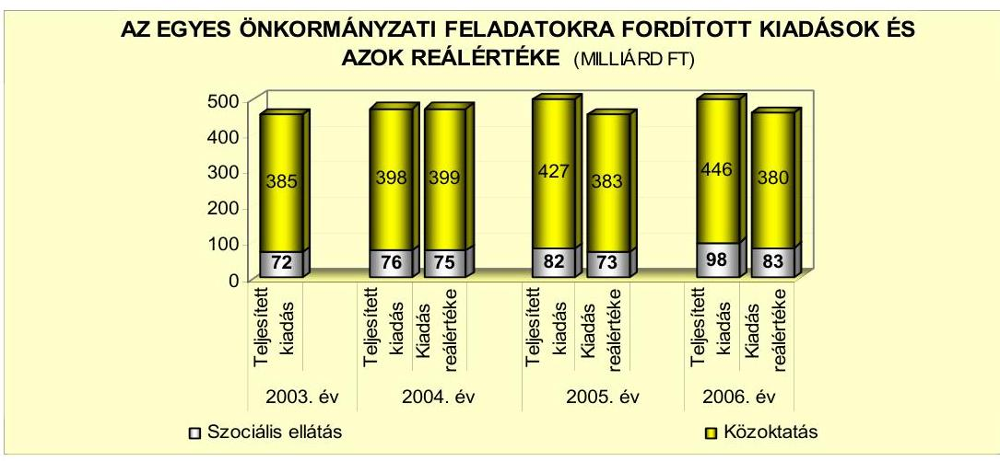

A szociális ellátó hálózatban az egy ellátottra jutó kiadások növekedését - a nappali szociális ellátás kivételével - a múködési kiadások és az ellátottak számának együttes emelkedése befolyásolta 2003-2005 között. A szociális ellátás fajlagos kiadásainak reálértéke 2003-2006 között több mint egytizeddel csökkent. A nappali és bentlakásos szociális intézményi ellátás fajlagos kiadásai finanszírozásában a normatív hozzájárulás részaránya közel egyötöddel csökkent, míg a bölcsődei ellátásban emelkedett 2003-2006 között. A kiadások finanszírozásában a normatív hozzájárulás összege a nappali és bentlakásos szociális ellátásban $17 \%$-kal, illetve három százalékkal, a bölcsődei ellátásban több mint egynegyeddel emelkedett, ennek ellenére a 2003. bázisévhez képest a reálértéke csökkent 2003-2006 között, amelyet a következő grafikon szemléltet:
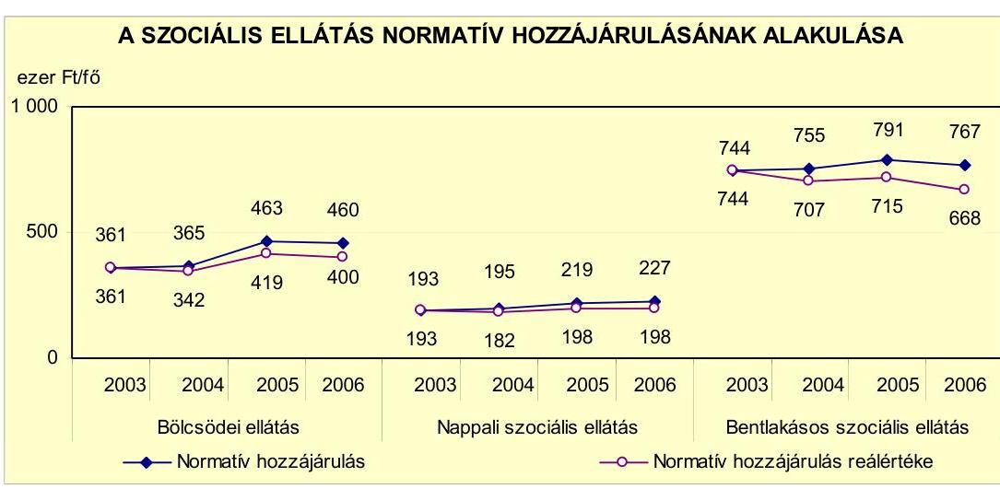

[^0]
[^0]:    ${ }^{20}$ A reálérték számítása során a 2003. évet tekintettük a bázisévnek. A személyi juttatások és járulékai tárgyévi kiadásait a szociális ellátásban a 2004. évben 99,1\%-kal, a 2005. évben 111,8\%-kal, a 2006. évben 117,1\%-kal, a közoktatásban a 2004. évben $98,4 \%$-kal, a 2005. évben 111,7\%-kal, a 2006. évben 117,7\%-kal, a dologi kiadásokat a szociális és a közoktatási feladatoknál egyaránt a 2004. évben 106,8\%-kal, a 2005. évben 110,6\%-kal, a 2006. évben 114,9\%-kal korrigáltuk a reálérték megállapítása során.

---

Az óvodai nevelésben, az alap- és középfokú oktatásban az egy neveltre, tanulóra jutó kiadás emelkedése a múködési kiadás, valamint a neveltek, tanulók számának növekedése hatására következett be. A közoktatás fajlagos kiadása országos átlagban több mint egytizeddel növekedett, ennek ellenére reálértéke a 2003. bázisidőszakhoz viszonyítva a 2005. évben egytizeddel, a 2006. évben 15\%-kal csökkent. A növekvő fajlagos kiadások finanszírozásában a normatív hozzájárulás reálértéke 2006. évben 13\%-kal csökkent a 2003. évhez viszonyítva, amelyet a következő diagram mutat be:
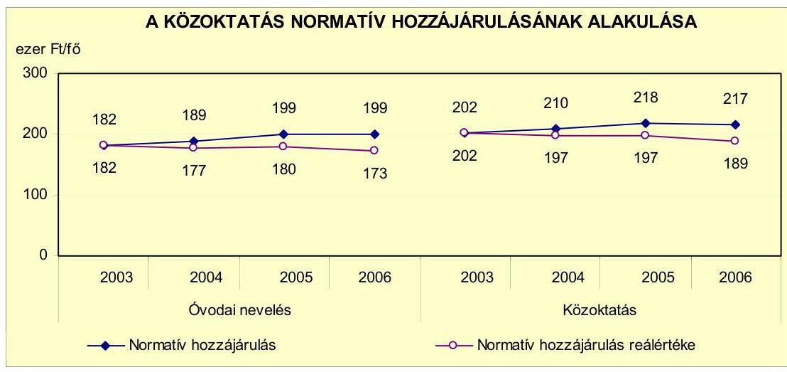

Az önként vállalt feladatok ellátására a 2003-2006 között ellenőrzött önkormányzatok költségvetési kiadásaik 3\%-17\% közötti részarányát fordították. Önként vállalt feladatként a Budapest fővárosi kerületi és a városi önkormányzatok középfokú oktatást, alapfokú művészeti oktatást, bentlakásos szociális otthoni ellátást, járó- és a fekvőbeteg szakellátást nyújtottak a lakosság részére. Az önkormányzatok a non profit szervezetek, gazdasági társaságok, egyéb szervezetek múködési és felhalmozási célú támogatásával az önként vállalt feladatok körét bővítették. Az önkormányzatoknál a kötelező feladatok végrehajtását nem veszélyeztette az önként vállalt feladatok mértéke és annak finanszírozása.

A középületek akadálymentesítéséhez szükséges feladatokat az ellenőrzött önkormányzatok kilenctizede felmérte. A feladatok végrehajtására az ellenőrzött önkormányzatok közel fele 2003-2005 között több mint egymilliárd Ft-ot tervezett, amelyet 14\%-kal túlteljesítettek. Az épület-felújítások során külön költségvetési előirányzat nélkül, a felújítások kiadásaiba beépítetten végezték el az akadálymentesítési feladatokat. A középületekben az akadálymentes közlekedés kialakítását Kisköre és Zalakaros város kivételével a Fot-ban a törvény elfogadásakor meghatározott 2005. január 1-i határidőre ${ }^{21}$ nem oldották meg az önkormányzatok.

[^0]
[^0]:    ${ }^{21}$ Az új határidőt 2007. május 1-től a Fot. előírásait módosító 2007. évi XXIII. törvény 3. §-a a közszolgáltatás típusától függően differenciáltan, 2008. december 31. és 2013. december 31. közötti időpontban állapította meg.

---

# A települési kisebbségi önkormányzatok gazdálkodásának szabályszerűsége 

A kisebbségi önkormányzatok feladatellátásában az elmúlt négy évben döntően az önkormányzati, illetve testületi múködés feltételeinek biztosítása szerepelt. A települési önkormányzatoktól feladatot nem vettek át és intézményt nem alapítottak, így költségvetésükben meghatározó részarányt (mintegy $90 \%$-ot), a múködési kiadások és azon belül évente növekvő arányban a dologi kiadások (46-61\%-ot) képviseltek.
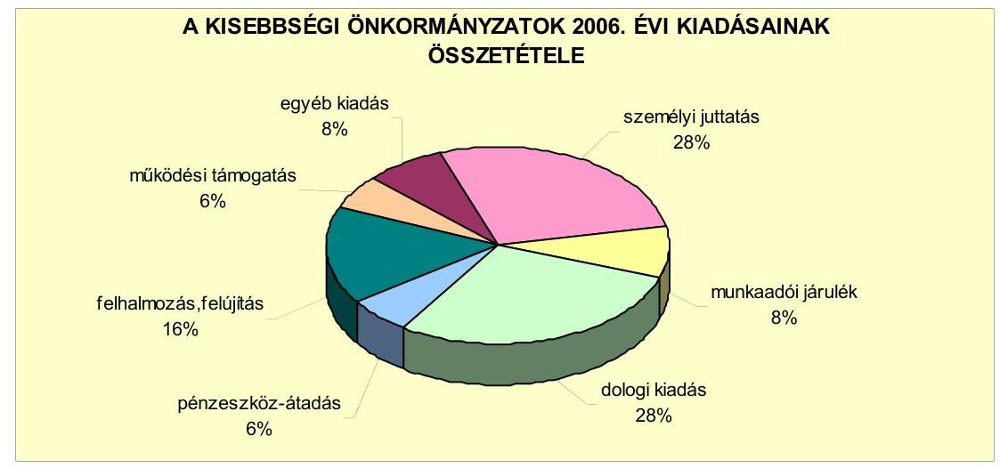

Az együttmúködés helyi szabályait évente növekvő arányban foglalták megállapodásba a települési és az ellenőrzött kisebbségi önkormányzatok. A megállapodások több mint kétharmadának azonban a jogszabályi előírások és gazdálkodási feltételek változása miatt indokolt módosítását nem végezték el, így azok egyre nagyobb része nem felelt meg a feladatellátás követelményeinek.

Éves költségvetésüket a 2005-2006. évben a kisebbségi önkormányzatok néhány kivételtől eltekintve önkormányzati testületi határozattal állapították meg, amelyek több mint háromnegyede felelt meg az Áht. és az Ámr. előírásainak. Az előirányzat-módosítást elmulasztották a kisebbségi önkormányzatok közel harmadánál, valamint közel egyötödnél előfordult előirányzatot meghaladó kötelezettségvállalás és utalványozás. Az operatív gazdálkodás hiányosságai az ellenőrzés múködésének hiányát és zavarait mutatták a gazdálkodásban. Kötelezettségvállalást és utalványozást végeztek az ellenőrzött kisebbségi önkormányzatok négytizedénél előzetes, a munka folyamatába épített ellenőrzés nélkül. Az igazolt ellenőrzések esetében nem végezték el hiánytalanul azokat a feladatokat, amelyeket a jogszabályok kötelezően előírtak. A 2005. évi gazdálkodásról szóló zárszámadásának határozattal történő jóváhagyását a Nek. tv. előírásai ellenére elmulasztotta a kisebbségi önkormányzatok egyötöde, a határozattal jóváhagyott zárszámadások egyötöde pedig nem volt összehasonlítható a költségvetéssel. A kisebbségi önkormányzatok elnökei a költségvetési és a zárszámadási határozatok egyötödének, az előirányzat-módosító határozatok egytizedének a települési önkormányzatokhoz történő továbbítását elmulasztották, amely miatt azokat nem, illetve szabályszerűen nem építhették

---

be a helyi önkormányzatok költségvetési, előirányzat-módosító, illetve zárszámadási rendeleteibe.

# Ellenőrzések 

A belső ellenőrzési feladatok ellátásában a korábbi évekhez képest 2005-2006ban előrelépés történt a belső ellenőrzési szervezet és a személyi feltételek kialakítása, a múködéséhez szükséges feltételek biztosítása, a feladat ellátásának szabályozottsága területén.

Az önkormányzatok többsége kialakította a belső ellenőrzés szervezeti kereteit, azonban a városoknak több mint fele, a nagyközségeknek, községeknek mintegy négyötöde nem szabályozta a belső ellenőrzést végzők jogállását, feladatait. A belső ellenőrzés szervezeti rendszerét az önkormányzatok négyötöde belső ellenőrzési társulás keretében biztosította. Előrelépés történt a belső ellenőrzést ellátók feladatköri és szervezeti függetlensége terén, mivel az ellenőrzött önkormányzatok mintegy kilenctizedénél a belső ellenőrök közvetlenül a jegyző alárendeltségében végezték munkájukat. Az önkormányzatok kilenctizede rendelkezett belső ellenőrzési kézikönyvvel, ugyanakkor még mindig nem kellően megalapozott az ellenőrzések tervezése, mivel az ellenőrzések tervezését megalapozó stratégiai tervet az ellenőrzött önkormányzatok mintegy fele nem készített. Az éves ellenőrzési tervet a jogszabályban előírtaknak megfelelő tartalommal összeállították az önkormányzatok négyötödénél, a társulások munkaterve és az önkormányzatok igénye közötti összhang azonban az érintettek közel harmadánál nem valósult meg. Az elvégzett ellenőrzések háromnegyed részében megfelelő tartalmú jelentések készültek, kilenctizedük tartalmazott megállapításokat, ajánlásokat az ellenőrzöttek részére. A képviselő-testületek továbbra is kevés figyelmet fordítottak a belső ellenőrzési tevékenység éves eredményének megismerésére. Az önkormányzatok közel felénél nem tekintették át költségvetési szerveiknél végzett ellenőrzések tapasztalatait.

A könyvvizsgálatra kötelezett önkormányzatok eleget tettek a jogszabályi előírásoknak, és könyvvizsgálót bíztak meg folyamatos könyvvizsgálói feladattal, az egyszerűsített tartalmú éves pénzforgalmi jelentés, könyvviteli mérleg, pénzmaradvány és eredmény-kimutatás felülvizsgálatával. A könyvvizsgáló kiválasztásakor a jogszabályban előírt szakmai és összeférhetetlenségi követelményeket betartották. A költségvetési beszámolókat - három kivétellel - a könyvvizsgálók korlátozás nélküli hitelesítő záradékkal látták el.

ÁSZ ellenőrzés 2003-2006 között valamennyi helyi önkormányzatnál ${ }^{22}$ volt. Az önkormányzatok gazdálkodási rendszerének átfogó ellenőrzésekor közel ötvenezer javaslatot fogalmaztunk meg ${ }^{23}$. Javaslataink közel háromnegyedét az önkormányzatok hasznosították, amely hatására előrelépés történt a költségvetési tervezés, előirányzat-módosítás, a zárszámadás összeállítása során az Áht.

[^0]
[^0]:    ${ }^{22}$ Ezen követelmény teljesítését tartalmazza az Országgyűlés 47/2006. (X. 27.) számú, az ÁSZ tevékenységéről szóló jelentés elfogadásáról szóló határozata.
    ${ }^{23}$ A 2003-2006 között készített számvevői jelentésekben a helyi és helyi kisebbségi önkormányzatok szabályszerű és célszerű működése érdekében tett javaslatokról a jelentés 9. számú melléklete nyújt részletes tájékoztatást.

---

és Ámr-ben előírtak betartásában. Ennek eredményeként javult a költségvetési gazdálkodás szabályozottsága, fokozottabban figyelembe vették a helyi és a központi előírásokat, a munkafolyamatba épített ellenőrzési feladatok ellátását a korábbiaknál szélesebb körben biztosították. Számos esetben nem történt meg a költségvetés módosításának rendjére, határidejére, az önkormányzati hivatal szervezeti és múködési szabályzatának megalkotására, kiegészítésére, a szakmai teljesítés igazolására jogosultak kijelölésére, módjának meghatározására, a számviteli szabályzatokban a helyi sajátosságok figyelembevételére, a leltározási szabályzat aktualizálására, az önkormányzat kötelező és önként vállalt feladatai mértékének és módjának meghatározására, a kisebbségi önkormányzatokkal kötött megállapodások kiegészítésére vonatkozó javaslatainknak a realizálása.

Az önkormányzatok gazdálkodási rendszerének átfogó ellenőrzése során tett javaslatok hasznosulásának megoszlását a következő ábra szemlélteti:
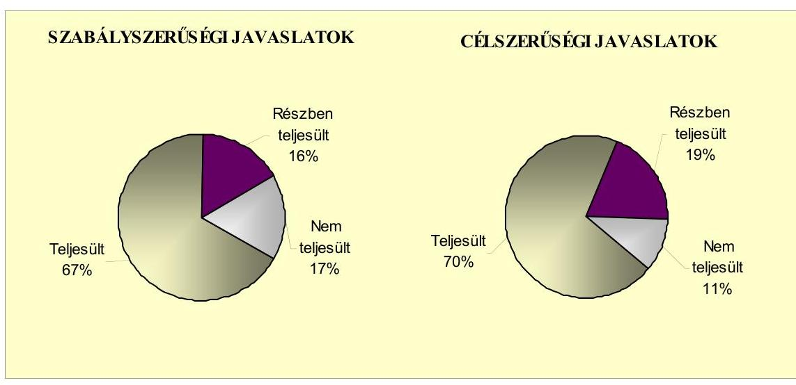

Ellenőrzési tapasztalataink alapján 2003-2006 között a Kormánynak egy, a minisztereknek negyven javaslatot tettünk, amelyek eredményeként az Országgyúlés meghatározta a gazdasági program tartalmi követelményeit, a versenyeztetési kötelezettség egységes értékhatárát, a helyben központosított közbeszerzésekre vonatkozó szabályokat, a nem normatív céljellegú múködési támogatások közzétételi kötelezettségét, teljessé tette a pénzügyi ellenőrzési rendszer szabályait, kiegészítette a kisebbségi önkormányzatokkal kötött megállapodások tartalmi követelményeit. A Kormány módosította az Ámr. és a Vhr. előírásait, szigorította az érvényesítési feladatokat ellátók szakmai képzettségi követelményeit, meghatározta a közvetett támogatások képviselő-testület elé terjesztésének részletezettségét. A pénzügyminiszter kiegészítette a belső ellenőrzési kézikönyv-mintát a céljelleggel nyújtott támogatások ellenőrzésének egységes szempontjaival. Nem történt intézkedés az önkormányzatok kötelező feladatainak, a hiány számításánál a hitel visszafizetési kötelezettség figyelembevétel módjának, a szakmai teljesítés igazolás tartalmi követelményeinek meghatározására.

---

A helyszíni ellenőrzés megállapításainak hasznosítása mellett javasoljuk:

# a pénzügyminiszternek: 

1. kezdeményezze az Ámr. módosítását annak érdekében, hogy:
a) a kötelezettségvállalás rendjének belső szabályozására vonatkozó követelmények konkrét meghatározásával az 50 ezer Ft -ot el nem érő kifizetéseket megelőzően is biztosított legyen a folyamatba épített belső ellenőrzési feladatok elvégzésének feltétele, elvégezhető legyen az ellenjegyzés az Ámr. 134. § (8) bekezdésében foglaltak szerint és teljesíthesse ellenőrzési feladatát a szakmai teljesítést igazoló az Ámr. 135. § (1) bekezdésében, az érvényesítő az Ámr. 135. § (3) bekezdésében foglaltaknak megfelelően;
b) szerepeljen abban a szakmai teljesítés igazolás záradékban történő rögzítésének kötelezettsége, valamint a szakmai teljesítés igazolás elvégzési idejének és igazolásának követelménye annak érdekében, hogy jogszabályi előírások segítsék az igazolás módjának meghatározása vonatkozó, az Ámr. 135. § (2) bekezdésében szereplő előírás végrehajtását;
c) a felelősség egyértelmű meghatározása érdekében tartalmazza a Számv. tv. 167. § (1) bekezdés a)-j) pontjaiban foglalt alaki és tartalmi követelményekkel összhangban az egyéb gazdasági események bizonylataira is a vezetői elrendelés és az érvényesítés kötelezettségét, ezáltal biztosítva a számviteli nyilvántartásban elszámolt vagyonváltozások elrendelésének dokumentálását, a számviteli elszámolás szabályszerűségét;

## az önkormányzati és területfejlesztési miniszternek:

1. kezdeményezze az Ötv. 79. § (2) bekezdés b) pontjában előírtak módosítását annak érdekében, hogy előírásra kerüljön a korlátozottan forgalomképes törzsvagyonként meghatározott vagyon törzsvagyonon kívüli egyéb forgalomképes vagyonkategóriába történő átsorolásának önkormányzati rendelettel történő módosítási kötelezettsége;
2. kezdeményezze az Ötv. 88. § (2) bekezdésének módosítását annak érdekében, hogy a folyamatosan megújított folyószámla-hitelek összege is figyelembevételre kerüljön az adósságot keletkeztető kötelezettségvállalások megállapításánál;
3. kezdeményezze az Ötv. 8. § (2) bekezdésében foglalt önkormányzati feladat - miszerint meg kell határozniuk, hogy a lakosság igényei alapján, anyagi lehetőségeiktől függően, mely feladatokat, milyen mértékben és módon látnak el - pontosítását annak előírásával, hogy ezt milyen szabályozási módon, milyen tartalmi részletezettséggel kell megoldaniuk;
4. kezdeményezze, hogy a közigazgatási hivatalok az Ötv. 79. § (2) bekezdésének b) pontját, valamint a vízgazdálkodásról szóló törvény 6. § (3) bekezdésének előírását sértő, az önkormányzati tulajdonban lévő víziközművek önkormányzati tulajdonjogának megszüntetésére vonatkozó képviselő-testületi döntések esetében hívja fel

---

az Ötv. 98. § (2) bekezdésének a) pontja alapján a képviselő-testület figyelmét a tapasztalt jogszabálysértés miatt a döntés módosítására;

# az igazságügyi és rendészeti miniszternek: 

kezdeményezze a Kbt. 327. § (2) bekezdése alapján az ÁSZ részére eljárás kezdeményezésére nyitva álló 15 napos jogvesztő határidő legalább 30 napra történő módosítását.

---

# II. RÉSZLETES MEGÁLLAPÍTÁSOK 

## 1. A KÖLTSÉGVETÉS TERVEZÉSÉNEK, VÉGREHAJTÁSÁNAK, AZ ÖNKORMÁNYZAT VAGYONGAZDÁLKODÁSÁNAK ÉS A ZÁRSZÁMADÁS ELKÉSZÍTÉSÉNEK SZABÁLYSZERŰSÉGE

### 1.1. A költségvetési rendelet jóváhagyásának, módosításának, az előirányzatok nyilvántartásának szabályszerűsége

Az önkormányzatoknál a 2002-2006. évi választási ciklus során évente növekvő arányban elkészítették a célkitűzéseket hosszabb távra kijelölő, az évenkénti költségvetés készítési feladatokat megalapozó gazdasági programot, amellyel a 2006. évben ellenőrzött kiemelt körbe tartozó és városi önkormányzatok $81 \%$-a rendelkezett. A jegyzői előkészítés hiánya miatt az Ötv. 91. § (1) bekezdésében előírtakat megsértve, Budapest főváros egyik kerületi önkormányzata és az ellenőrzött városi önkormányzatok ötöde (16 önkormányzat) nem rendelkezett gazdasági programmal. Az Ötv. 91. § (1) bekezdés előírását megsértő önkormányzatok aránya a 2003. évi 40\%-ról a 2006. évben 19\%-ra csökkent. A 2003-2006 közötti időszakban ellenőrzött önkormányzatoknál az ellenőrzött évben gazdasági programmal rendelkező önkormányzatok arányát a következő grafikon szemlélteti:
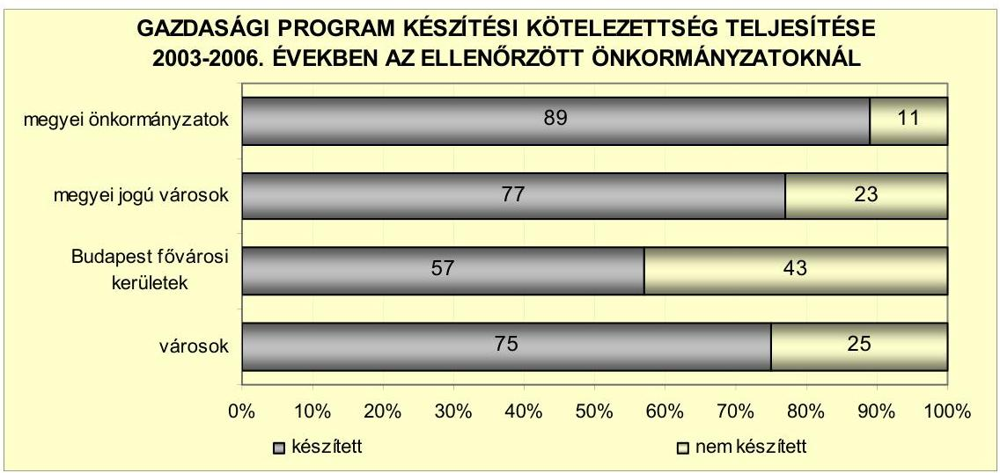

A gazdasági programokban meghatározták a megvalósítani kívánt főbb stratégiai célokat, városfejlesztési célkitűzéseket. A célkitűzések megvalósításához szükséges intézkedések között szerepelt a gazdasági stabilitás biztosítása, az intézmények által ellátott feladatok struktúrájának felülvizsgálata, a pályázati lehetőségek maximális kihasználása.

---

A gazdasági program készítésének elmulasztása összefüggött azzal, hogy annak tartalmára, elkészítési határidejére, időtartamára nem volt jogszabályi előírás ${ }^{24}$.

Az ellenőrzött önkormányzatok 96\%-ánál a polgármester az Áht. 70. §ában előírt határidőn ${ }^{25}$ belül benyújtotta a képviselő-testületnek a költségvetési koncepciót, amelyet - az Ámr. 28. § (1) bekezdésében foglaltakat betartva az előző évivel közel azonos aránynál - 87\%-nál a helyben képződő bevételek és az ismert kötelezettségek alapján állítottak össze. A koncepciók összeállításánál figyelembe vették a költségvetési törvényjavaslat vonatkozó irányelveit, a folyamatban lévő felújításokat, beruházásokat és a pénzügyi lehetőségektől függően érvényesítették a gazdasági program célkitűzéseit. A polgármesterek az előző évekhez hasonló arányban, az önkormányzatok 53\%ánál az Ámr. 28. § (3) bekezdésében foglaltak ellenére nem csatolták a költségvetési koncepció előterjesztéséhez a pénzügyi bizottság írásos véleményét, azt a bizottságok elnökei a képviselő-testületi ülésen szóban ismertették. A kisebbségi önkormányzatok koncepció tervezetről alkotott véleményét 76\%-nál elmulasztották csatolni a költségvetési koncepció előterjesztéséhez. Az önkormányzatok döntő többségénél ( $97 \%$-ánál) a képviselő-testület - az Ámr. 28. § (4) bekezdésében foglaltak alapján - határozatban döntött a költségvetés-készítés további feladatairól.

A költségvetési rendelettervezetek költségvetési szervek vezetőivel folytatott egyeztetését az Ámr. 29. § (4) bekezdésének előírása ellenére a jegyzők írásban nem rögzítették az önkormányzatok 18\%-ánál (a 2005. évben 24\%-ánál).

Az önkormányzatok 79\%-ánál (a 2005. évben 88\%-ánál) az Áht. 118. §-ában foglaltakat megsértve - előterjesztés hiányában - nem határozták meg rendeletben a költségvetés előterjesztésekor, illetve zárszámadáskor a képviselőtestület részére tájékoztatásul bemutatandó - az Áht. 116. § 6., 9., 10. pontja ${ }^{26}$ szerinti - mérlegek, kimutatások tartalmi követelményeit.

A költségvetési rendelettervezeteket az önkormányzatok 83\%-ánál (a 2005. évben 96\%-ánál) a polgármester az Áht. 71. § (1) bekezdésében előírt határidőn belül ${ }^{27}$ terjesztette a képviselő-testület elé. A költségvetési előterjesztéshez azonban az ellenőrzött önkormányzatok fele nem csatolta az Ámr. 29. § (9) bekezdésének előírása ellenére a pénzügyi bizottság írásos véleményét - azt a pénzügyi bizottságok elnökei a képviselő-testületi üléseken szóban ismertették -, valamint 6\%-nál az Ötv. 92/A. -92/C. §-ok alapján szükséges könyvvizsgálói jelentést.

[^0]
[^0]:    ${ }^{24}$ Ezek meghatározása a helyi és helyi kisebbségi önkormányzatok gazdálkodásának átfogó ellenőrzéséről szóló 0436 sorszámú jelentésében tett javaslatot is figyelembe véve, az Ötv. 2005. évi módosításakor megtörtént.
    ${ }^{25}$ Az Áht. 70. §-a szerint a költségvetési koncepciót november 30-ig, a képviselő-testület tagjai általános választásának évében december 15-ig kell benyújtani a képviselőtestületnek.
    ${ }^{26}$ 2007. január 1-től az Áht. 118. § (1) bekezdés 2. a)-c) pontjai és (2) bekezdés a)-e) pontjai.
    ${ }^{27}$ Az Áht. 71. § (1) bekezdés szerinti határidő a tárgyév február 15-e.

---

A polgármester az önkormányzatok döntő többségénél (93\%-ánál) a költségvetési rendelettervezetekkel együtt, illetve azt megelőzően - az Áht. 71. § (2) bekezdésében előírtaknak megfelelően - a képviselő-testület elé terjesztette azokat a rendelettervezeteket ${ }^{28}$, amelyek a tervezett előirányzatokat megalapozták. A költségvetési rendelettervezetekben az önkormányzatok 89\%-ánál az Áht. 71. § (2) bekezdésének megfelelően bemutatták a többéves elkötelezettséggel járó kiadási tételek későbbi évekre vonatkozó kihatásait, valamint 96\%-ánál az Áht. 71. § (3) bekezdése alapján a tárgyévet követő két év várható előirányzatait is.

Az önkormányzatok 93\%-ánál a 2005. és a 2006. évek költségvetési rendeleteiben a képviselő-testületek - az Áht. 67. § (3) bekezdésében előírtakat betartva - meghatározták a címrendet, valamint az előző évhez hasonlóan az önkormányzatok négyötödénél figyelembe vették a költségvetési rendelettervezetek szerkezetére, tartalmára vonatkozóan az Ámr. 29. § (1) bekezdésében, illetve az Áht. 69. § (1) bekezdésében rögzített előírásokat.

A költségvetési rendelettervezetek az Áht. 69. § (1) bekezdésében foglalt előírásokat megsértve önkormányzati szinten nem tartalmazták 3\%-nál a személyiés dologi jellegű kiadásokat, $8 \%$-nál az ellátottak pénzbeli juttatásait, $6 \%$-nál a speciális célú önkormányzati támogatásokat.

Nem határozták meg az Ámr. 29. § (1) bekezdés b) pontjában előírtak ellenére a működési előirányzatokat önállóan és részben önállóan gazdálkodó költségvetési szervenként $7 \%$-nál, ezen belül kiemelt előirányzatonként a személyi és dologi jellegű kiadásokat $8 \%$-nál, az ellátottak pénzbeli juttatásait $13 \%$-nál, valamint a speciális célú támogatásokat $16 \%$-nál nem részletezték.

# A költségvetési rendeletek az Ámr. 29. § (1) bekezdésében meghatározott előírások ellenére nem tartalmazták: 

- a c) és d) pontokba foglaltak ellenére a felújítási előirányzatokat célonként és a felhalmozási kiadásokat feladatonként az önkormányzatok 8\%-ánál, illetve $6 \%$-ánál;
- az e) és j) pontjaiban foglaltak ellenére az önkormányzati hivatal költségvetését feladatonként $2 \%$-nál, külön tételben a céltartalékot $6 \%$-nál, valamint az év várható bevételi és kiadási előirányzatainak teljesüléséről az előirány-zat-felhasználási ütemtervet $11 \%$-nál;
- a g) és h) pontokban foglaltak ellenére a többéves kihatással járó feladatok előirányzatait éves bontásban 13\%-nál, a működési és felhalmozási célú bevételi és kiadási előirányzatokat mérlegszerűen egymástól elkülönítetten, de - a finanszírozási műveleteket figyelembe véve - együttesen egyensúlyban $12 \%$-nál;
- az i) pontban foglaltak ellenére elkülönítetten a kisebbségi önkormányzatok költségvetését az érintett önkormányzatok 7\%-ánál;

[^0]
[^0]:    ${ }^{28}$ Az önkormányzatok rendelete a helyi adókról, a személyes gondoskodást nyújtó ellátások intézményi és az ellátottak személyi térítési dijának megállapításáról, az élelmezési nyersanyagnormákról, az ivóvíz, csatornadíjakról, a bérleti díjakról.

---

- a k) pontban foglaltak ellenére elkülönítetten az európai uniós támogatással megvalósuló projektek bevételeit és kiadásait 17\%-nál, (azokat az önkormányzati hivatalok igazgatási kiadásai között szerepeltették).

Az önkormányzatok harmadánál megsértették az Áht. 8. § (1) ${ }^{29}$ és a 8/A. § (7) bekezdésében foglaltakat, mivel a 2005. és a 2006. évi költségvetési rendeletekben a költségvetési bevételek és kiadások különbözeteként nem mutatták be a költségvetési hiányt, vagy többletet, illetve finanszírozási célú pénzügyi múveleteket (hitelfelvételt, hiteltörlesztést) vettek figyelembe hiányt módosító költségvetési bevételként, illetve kiadásként.

Az Áht. 8/A. § (7) bekezdés alapján a költségvetésben nem lehet a finanszírozási célú pénzügyi műveleteket a költségvetési hiányt módosító költségvetési bevételként, illetve költségvetési kiadásként elszámolni, így a rövid- és hosszú lejáratú hitelfelvételek és hitel-visszafizetési kötelezettségek összege sem a költségvetési bevételben, sem a költségvetési kiadásban nem szerepelhet. Az előírt számítási mód az önkormányzatoknál nem biztosítja a tárgyévi hitelvisszafizetési kötelezettség összegének a költségvetési kiadások közötti figyelembevételi lehetőségét annak ellenére, hogy a tartalmát tekintve szerződésen alapuló kiadási kötelezettség befolyásolja a költségvetési bevételek-kiadások különbségét jelentő hiány, vagy többlet megítélését.

A költségvetés végrehajtásával összefüggő szabályokat az előző évekhez hasonlóan nem, vagy hiányosan tartalmazták a 2005. és 2006. évi költségvetési rendeletek:

- nem szabályozták 20\%-nál a költségvetési rendeletben az önállóan gazdálkodó költségvetési szervek hatáskörét az Ámr. 53. § (4) bekezdése ellenére. Az engedélyezett előirányzat átcsoportosításokról esetenként az Ámr. 53. § (6) bekezdésében előírt 30 napon belüli tájékoztatási kötelezettség helyett a fél- és háromnegyed éves beszámolók keretében történő tájékoztatást írtak elő;
- nem határozták meg - az Áht. 8/A. § (1) bekezdésében előírtakat megsértve - a költségvetési többlet felhasználásának módját az önkormányzatok 35\%-ánál, a költségvetési hiány finanszírozásával összefüggő hitelmúveleti hatásköröket - az Áht. 75. §-ában előírtakat megsértve - 20\%-nál;
- döntési és előirányzat átcsoportosítási hatáskört adott át a képviselő-testület a polgármestereken és bizottságokon túl, alpolgármesterek, tanácsnokok, önkormányzati hivatalok részére, amellyel megsértették az Ötv. 9. § (3) bekezdés, illetve az Áht. 74. § (2) bekezdés hatáskör átruházására vonatkozó előírásait.

A képviselő-testületek 84\%-a élt a költségvetési rendeletben jóváhagyott előirányzatok tekintetében az Áht. 74. § (2) bekezdésében biztosított hatáskör átruházási lehetőséggel. A költségvetési rendeletekben az önkormányzatok

[^0]
[^0]:    ${ }^{29}$ Az Áht 8. § (1) bekezdését 2007. január 1-től hatályon kívül helyezte a Magyar Köztársaság 2007. évi költségvetését megalapozó egyes törvények módosításáról szóló 2006. évi CXXI. törvény 29. § (1) bekezdés a) pontja.

---

13\%-ánál a különböző feladatok támogatására elkülönített keretösszegeket határoztak meg „alap" elnevezéssel. Az „alap" elnevezés nincs összhangban az Áht-ban foglaltakkal, mert az elkülönített állami pénzalapokra, mint az államháztartási rendszer egyik alrendszerének elemére az Áht. szóhasználatával röviden az „alap" kifejezést használja, amelyekre az Áht. 54. §-a meghatározza azok létrehozásának, gazdálkodásának feltételeit is. Ezen feltételeknek az önkormányzatok költségvetésében szereplő alapok - a környezetvédelmi alap kivételével - nem feleltek meg, ezért a kifejezés félreérthető. Az államháztartás rendszerében a meghatározott feltételekhez kötött fogalmak eltérő tartalmú alkalmazása bizonytalanságot, az egyértelműség hiányát okozza.

A költségvetési rendeletek elő́terjesztésekor az Áht. 118. §-ában előírtakat megsértve a képviselő-testületek tájékoztatása céljából nem mutatták be az Áht. 116. § 6. pontja szerint az önkormányzat összevont mérlegét és elkülönítetten a kisebbségi önkormányzatok mérlegét $8 \%$-nál, illetve $17 \%$-nál; az Áht. 116. § 9. pontja szerint a többéves kihatással járó döntések számszerúsítését évenkénti bontásban, valamint összesítve, szöveges indoklással 18, illetve 55\%-nál; az Áht. 116. § 10. pontjában előírt közvetett támogatásokat tartalmazó kimutatást és szöveges indoklását $67 \%$-nál ${ }^{30}$.

A 2006. évben ellenőrzött önkormányzatok a költségvetési rendeletben jóváhagyott bevételi és kiadási eredeti előirányzataikat a módosítások során a 2005. évben $15,7 \%$-kal ( 80 milliárd Ft-tal), a 2006. évben 15,3\%-kal (82,2 milliárd Fttal) növelték.

A költségvetési előirányzatok évközi módosítását a központi költségvetési támogatások, a saját bevételekben bekövetkezett változások, az előző évi pénzmaradvány igénybevétele, a tartalékok felhasználása, valamint a kiadási jogcímek közötti átcsoportosítások indokolták. Az ezekre irányuló előterjesztések részletes információkat nyújtottak a képviselő-testületek számára a javasolt előirányzat módosítások okairól. A jóváhagyott előirányzat változtatásokat hitelt érdemlően dokumentálták - az előző évhez hasonlóan - az ellenőrzött önkormányzatok $89 \%$-ánál. A költségvetési rendelet módosítására vonatkozó előírásokat nem tartották be az önkormányzatok:

- nem történt meg 45\%-ánál (az előző évben 46\%-ánál) az Ámr. 53. § (2) bekezdésében előírtak ellenére a központi költségvetésből biztosított pótelőirányzatok negyedéven belüli átvezetése a költségvetési rendeletben;
- nem adott 30 napon belül tájékoztatást a képviselő-testület részére a polgármester $35 \%$-ánál (az előző évben $27 \%$-ánál) a költségvetési szervek saját hatáskörben történt előirányzat változtatásairól az Ámr. 53. § (6) bekezdés előírásai ellenére;
- az Ámr. 53. § (2) és (6) bekezdésben előírtak ellenére, az előírt határidő után - a költségvetési beszámoló megküldésének a Vhr. 10. § (1) bekezdésében előírt időpontját (február 28.) követően - módosították 57\%-nál (az előző évben 54\%-nál) a költségvetési rendeletet utolsó alkalommal;

[^0]
[^0]:    ${ }^{30}$ A 2007. január 1-től az Áht. 118. § (1) bekezdés 1. és 2. a)-c) pontjai határozzák meg a költségvetés előterjesztésekor bemutatandó mérlegeket, kimutatásokat.

---

- a kisebbségi önkormányzatok erre vonatkozó határozata nélkül módosította a kisebbségi önkormányzatok kiadási-bevételi előirányzatait az érintett önkormányzatok 45\%-a az Áht. 74. § (3) bekezdésében foglaltakat megsértve.

# 1.2. A gazdálkodás szabályozottsága, a bizonylati rend és fegyelem szabályszerúsége és a folyamatba épített ellenőrzés múködése 

Az önkormányzati hivatalok az előző évi 38\%-hoz viszonyítva 9 százalékponttal kisebb arányban nem rendelkeztek a képviselő-testület által jóváhagyott SzMSz-szel. A jóváhagyott SzMSz-ek 56\%-a az Ámr. 10. § (4) bekezdés a), f) és g) pontjaiban előírtak ellenére nem tartalmazta az önkormányzati hivatal alapító okiratának keltét és számát, szervezeti felépítését, múködésének rendszerét, a szervezeti egységek megnevezését, a költségvetés végrehajtására szolgáló számlaszámot. A gazdasági szervezet feladatát 86\%-nál (2005. évben $85 \%$-nál) szabályozták ügyrendben, amelyek $44 \%$-ában az Ámr. 17. § (5) bekezdésében foglaltaknak ellenére nem határozták meg a pénzügyigazdasági feladatok ellátásáért felelős személyek által, továbbá a hozzárendelt részben önállóan gazdálkodó költségvetési szervek tekintetében ellátandó feladatokat, a vezetők és más dolgozók feladat-, hatás- és jogkörét.

Az önkormányzati hivatalok növekvő arányánál - 87\%-ánál (az előző évben $80 \%$-ánál) - rögzítették az operatív gazdálkodással összefüggő feladat- és hatásköröket szabályzatokban. Az Ámr. 134. § (2) bekezdése és a 136. § (2) bekezdése alapján kötelezettségvállalásra és utalványozásra a polgármesterek háromnegyede, a kötelezettségvállalás és az utalvány ellenjegyzésére az Ámr. 134. § (2) bekezdése, valamint a 137. § (2) bekezdése alapján a jegyzők több mint háromnegyede ( $76 \%$-a, illetve $79 \%$-a) hatalmazott fel másokat. Az érvényesítési feladatok elvégzésére írásbeli megbízást adott a jegyzők $82 \%$-a, azonban ennek során - az előző évekhez hasonlóan - $4 \%$-uk nem tartotta be az Ámr. 135. § (2) bekezdésében foglalt - az iskolai végzettségre és szakmai képzettségre vonatkozó - előírást, valamint az Ámr. 135. § (3) bekezdésében foglaltak ellenére a jegyzők nem határozták meg a szakmai teljesítés igazolások módját 47\%-nál (a 2005. évben 54\%-nál).

A szakmai teljesítés igazolására jogosult személyek kijelölése elmaradt az ellenőrzött önkormányzati hivatalok 39\%-ánál (2005. évben 41\%-ánál). A kiemelt körbe tartozó önkormányzatoknál három kivételével, a városi önkormányzatok 38\%-ánál, a nagyközségi, községi önkormányzatok 50\%-ánál a jegyzők nem jelölték ki a szakmai teljesítés igazolását végző személyeket. Az Ámr. 135. § (3) bekezdésében ${ }^{31}$ foglaltak ellenére a jegyzők nem határozták meg a szakmai teljesítés igazolásának módját az ellenőrzött önkormányzatok $47 \%$-ánál (a 2005. évben $54 \%$-ánál) ${ }^{32}$.

[^0]
[^0]:    ${ }^{31}$ A bekezdés számozása 2007. január 1-től (2)-re módosult
    ${ }^{32}$ A szakmai teljesítés igazolásának módját nem határozta meg a jegyző a kiemelt körbe tartozó önkormányzatok 24\%-ánál, a városi önkormányzatok 22\%-ánál, a nagyközségi, községi önkormányzatok 43\%-ánál.

---

A felhatalmazásoknál, megbízásoknál és kijelöléseknél az összeférhetetlenségi követelmények érvényesülését nem biztosították az Ámr. 138. § (1)-(2) bekezdéseiben, valamint a 135. § (5) bekezdésében ${ }^{33}$ előírtak ellenére az önkormányzatok 10\%-ánál a kötelezettségvállalás és utalványozás, valamint annak ellenjegyzése, 13\%-nál az érvényesítést végzők kijelölése során, továbbá 22\%-nál a közeli hozzátartozók, valamint a saját részre történő hatáskör gyakorlása esetén. A gazdálkodási és ellenőrzési jogkörök gyakorlásáról a felhatalmazottakat 86\%-nál nem számoltatták be, a beszámoltatás formáját és gyakoriságát $88 \%$-nál nem szabályozták.

Az önkormányzati hivatalok 92\%-ánál a jegyző kialakította a saját és a hozzá kapcsolt részben önállóan gazdálkodó költségvetési intézmények számviteli rendjét, de az önkormányzati hivatal és az intézmények egységes számviteli rendjének meghatározását - megsértve a Htv. 140. § (1) bekezdés c) pontjában előírtakat - 26\%-nál elmulasztotta.

Az önkormányzati hivatalok számviteli politikáját a jegyzők 98\%-nál szabályozták a Vhr. 8. § (3) bekezdésének megfelelően és abban 88\%-nál (2005. évben 80\%-nál) a Vhr. 8. § (5) bekezdésében foglaltak szerint meghatározták, hogy a számviteli elszámolás és értékelés szempontjából mit tekintenek lényegesnek, illetve nem lényegesnek, továbbá jelentős, illetve nem jelentős összegnek. A megbízható és valós összkép kialakítását befolyásoló lényeges információk tekintetében mintegy 10\%-nál a Vhr. 8. § (5) bekezdés b) pontjában foglaltak ellenére nem szabályozták a kis értékű tárgyi eszközök, a vagyoni értékű jogok, a szellemi termékek minősítésénél, ésa g) pontjában foglaltak ellenére a terven felüli értékcsökkenés elszámolásánál figyelembe veendő szempontokat. A vállalkozási tevékenységet végző önkormányzati hivatalok 73\%ánál (2005. évi 75\%) nem határozták meg a jegyzők a Vhr. 8. § (5) bekezdésének c)-e) pontjában előírtak ellenére a figyelembe veendő szempontokat az értékcsökkenés és az előzetesen felszámított áfa alap- és vállalkozási tevékenység közötti megosztásánál, valamint az általános kiadások megosztási módszerének kiválasztásánál. Az önkormányzati hivatalok 93\%-ánál (a 2005. évben 82\%-nál) a Vhr. 8. § (8) bekezdésében foglaltaknak megfelelően rögzítették a mérlegkészítés időpontját, ameddig a tárgyévet követően az értékelési feladatokat és a számviteli helyesbítéseket el kell végezni. Az érintett önkormányzati hivatalok 57\%-ánál a számviteli politika - a Vhr. 8. § (3) bekezdésének előírása ellenére - nem tartalmazta a kisebbségi önkormányzati gazdálkodással összefüggő sajátos feladatokat.

A számviteli politikával és a kapcsolódó szabályzatokkal, valamint számlarenddel rendelkező önkormányzati hivatalok száma évről-évre nőtt, javult a szabályzatok tartalmi színvonala, azonban a gazdálkodási, számviteli nyilvántartási tevékenységek szabályozottsága még mindig nem volt megfelelő a következő hiányosságok miatt:

- nem, vagy hiányosan rögzítették az eszközök és források leltározási és leltárkészítési szabályzatában 62\%-nál (a 2005. évben 90\%-nál) a leltározás szabályait. A szabályzatok ötödénél a Vhr. 37. § (1) bekezdésében előírt évenkénti helyett a szellemi termékek, a gépek, berendezések és a jármúvekre öt-

[^0]
[^0]:    ${ }^{33}$ A bekezdés számozása 2007. január 1-től (6)-ra módosult

---

évenkénti, a kis értékű tárgyi eszközökre kétévenkénti leltározási kötelezettséget írtak elő. A szabályzatok közel fele nem tartalmazta az egyéb eszközök és források, az üzemeltetésre, kezelésre átadott eszközök leltározásának sajátos rendjét. Az önkormányzatok döntő többsége nem élt a Vhr. 37. § (7) bekezdésében rögzített lehetőséggel és nem szabályozta rendeletben a leltározási kötelezettség két évenkénti végrehajtását;

- nem határozták meg az eszközök és források értékelési szabályzatában az önkormányzati hivatalok 33\%-ánál (a 2005. évben 47\%-nál) a mérlegtételek értékelésének szabályait. A szabályzatok 25\%-a (a 2005. évben 37\%-a) nem tartalmazta a terven felüli értékcsökkenés elszámolásának rendjét, $14 \%$-a az értékvesztés és az értékvesztés visszaírásának eszközcsoportonként részletezett rendjét;
- nem készítették el az önköltségszámítás rendjére vonatkozó szabályzatot a Vhr. 8. § (4) bekezdés c) pontja előírása ellenére a jegyzők az érintett önkormányzati hivatalok $45 \%$-ánál;
- nem biztosították a pénzkezelési szabályzatoknak a jogszabályi előírásokkal való összhangját az önkormányzati hivatalok 42\%-ánál (a 2005. évben $57 \%$-nál). A jegyzők nem, vagy hiányosan rögzítették a szabályzatok 25\%ában az Ámr. 103. § (2), (6) és (7) bekezdése alapján megnyitható bankszámlák körét, rendeltetését, a bankszámlák és a pénztár kapcsolatrendszerét. Nem határozták meg az önkormányzati hivatalok közel 10\%-ánál a házipénztári keret összegét, elszámolási szabályait, a pénztáros helyettesítésének rendjét, az előlegek, utólagos elszámolásra átadott összegek nyilvántartásának, elszámolásának rendjét. A szabályzatok 29\%-a nem tartalmazta a házipénztáron kívüli pénzkezelés szabályait, 18\%-a a pénztárellenőrzésért felelős munkaköröket és $16 \%$-a a szigorú számadás alá vont nyomtatványok, nyilvántartások kezelésével, elszámolásával kapcsolatos teendőket;
- nem határozták meg a felesleges vagyontárgyak hasznosításának, selejtezésének feladatát, döntési hatásköreit az önkormányzati hivatalok 5\%-ánál.

A számlarendet az önkormányzati hivatalok 95\%-ánál (a 2005. évivel azonos arányban) elkészítették a jegyzők, azonban azok összhangját Számv. tv. és Vhr. előírásaival 57\%-nál (a 2005-ben 44\%-nál) nem biztosították, nem, vagy hiányosan rögzítették a következőket:

- a Számv. tv. 161. § (2) bekezdésében foglaltakat megsértve az alkalmazásra kijelölt főkönyvi számlák megnevezését, tartalmát, a főkönyvi számla értéke növekedésének és csökkenésének jogcímeit, alapbizonylatait;
- a Vhr. 49. § (2) és (4) bekezdése ellenére az analitikus nyilvántartások formáját, tartalmát, vezetésének, illetve a főkönyvi könyveléssel való egyeztetésének és dokumentálásának módját, az összesítő kimutatások (feladások) elkészítésének rendjét;
- a kisebbségi önkormányzati gazdálkodással összefüggő sajátos feladatokat.

---

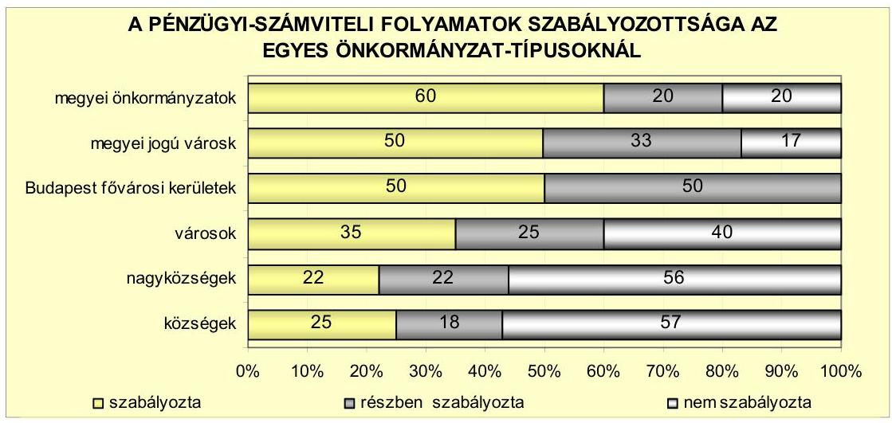

Az önkormányzati hivatalok gazdálkodásának rendjét meghatározó belső szabályzatok még mindig alacsony színvonalon töltötték be szabályozó funkciójukat, mivel a szabályzatok mintegy felében nem írták elő az előző munkafázis elvégzésének ellenőrzését, nem jelölték ki a pénzügyi-számviteli munkafolyamatoknál az ellenőrzési pontokat, nem határozták meg az ellenőrzések során elvégzendő műveleteket, az ellenőrzések viszonyítási alapját, valamint nem rögzítették a követelményektől való eltérések megállapításának és dokumentálásának módját, az eltérések esetén szükséges jelzési kötelezettségeket.

A pénzügyi-gazdasági, számviteli dolgozók munkaköri leírásai az önkormányzati hivatalok 44\%-ánál (a 2005. évben 42\%-ánál) nem tartalmazták a munkafolyamatba épített ellenőrzési, egyeztetési feladatokat. A szabályzatok és a munkaköri leírások ellenőrzésre, egyeztetésre vonatkozó előírásainak összhangját közel kétharmadnál nem biztosították.

A gazdálkodási szabályzatok a pénzügyi-számviteli feladatok elvégzésének folyamatát az önkormányzati hivatalok 73\%-ánál (a 2005. évben 75\%-ánál) nem a Számv. tv., a Vhr. és az Ámr-ben előírt követelményeknek és a helyi sajátosságoknak megfelelően tartalmazták.

A jegyzök 55\%-a nem, vagy nem megfelelően gondoskodott az Áht. 97. § (1) bekezdésének előírása ellenére a FEUVE megszervezéséről és hatékony múködtetéséről. A kiemelt körbe tartozó önkormányzatok 24\%ánál, azonban a nagyközségi, községi önkormányzatok ennél nagyobb arányánál, több mint felénél (58\%-ánál) elmulasztotta ezt a jegyző. A pénzügyi-számviteli munkafolyamatok ellenőrzési nyomvonalát az Ámr. 145/B. § (1) bekezdésében foglaltak ellenére 46\%-nál (a 2005. évben 59\%-nál) nem határozták meg. A szabályozás a kiemelt körbe tartozó önkormányzatok közül kettőnél, a városi önkormányzatok 29\%-ánál, a nagyközségi, községi önkormányzatok felénél maradt el. Az önkormányzati hivatalok több mint felében (53\%) nem alakították ki az Ámr. 145/C. § (1)-(3) bekezdésében foglalt előírások ellenére a kockázatkezelés rendjét sem. Az ezt elmulasztó önkormányzatok aránya a kiemelt körbe tartozó és a városi önkormányzatoknál közel azonos (2426\%), a nagyközségi, községi önkormányzatoknál 52\% volt.

---

Az önkormányzati hivatalok a gazdasági események döntő többségének (a 2005. évben $96 \%$, az előző években $96 \%$, illetve $94 \%$ ) könyvviteli elszámolásához a Számv. tv. 165. § (1) bekezdésében előírt bizonylatot kiállították. Az elszámolást megalapozó bizonylatok önkormányzatonként eltérő arányban - 1-42\% között változóan - nem feleltek meg a Számv. tv. 167. § (1) bekezdés a)-j) pontjaiban foglalt alaki és tartalmi követelményeknek, mivel nem tartalmazták a következőket:
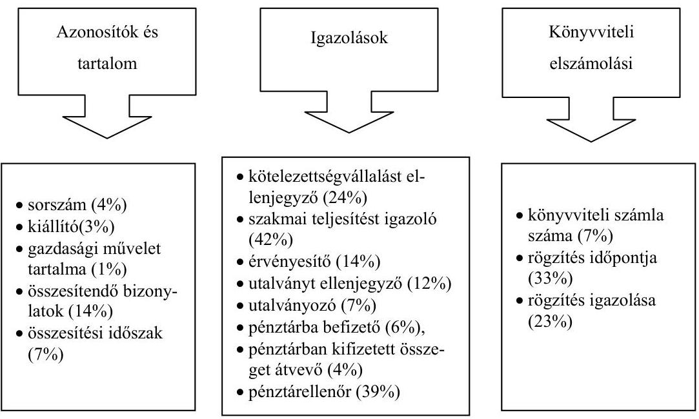

A jelentős számú hibás bizonylatokkal érintett önkormányzatok aránya növekedett 2003-2006 között, a hiányosságok valamennyi ellenőrzött bizonylatot érintették 10-31\%-nál, több mint felét további 11-41\%-nál. Minden évben előfordult a megyei jogú városi és a községi önkormányzatoknál, hogy az összes bizonylaton, valamennyi önkormányzati típusnál pedig - 2003. évben a megyei önkormányzatok kivételével - 50\%-ot meghaladó arányban volt alaki, tartalmi hiba.

# A JELENTŐS NAGYSÁGRENDŰ BIZONYLATI HIÁNYOSSÁGOKKAL ÉRINTETT ÖNKORMÁNYZATOK ARÁNYA A 2003-2006. ÉVEKBEN 

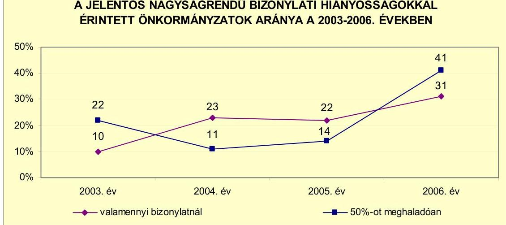

---

Az önkormányzati hivatalok a gazdasági események háromnegyedének adatait a Vhr. 51. § (1) bekezdés a)-b) pontjaiban foglaltaknak megfelelő időben, és döntő többségét (98-99\%-át) a Vhr-ben és a számlarendjükben előírt tartalommal rögzítették a könyvviteli nyilvántartásokban.

Nem rögzítették a pénzmozgással egyidejűleg a készpénzforgalmat 2004-ben 21\%-nál, 2005-ben 23\%-nál, 2006-ban 21\%-nál, a bankszámla forgalmat a hitelintézeti értesítés megérkezésekor 23\%-nál, 31\%-nál, illetve 28\%-nál, az egyéb gazdasági események 10\%-20\%-23\%-át a tárgynegyedévet követő hó 15 -ig. A pénzforgalmat 5-30 napos késedelemmel, illetve csak a havi zárlati időszakban, az egyéb gazdasági eseményeket negyedévente helyett, a félév/év végén rögzítették a számviteli nyilvántartásban.

A pénzforgalmi jelentés és a könyvviteli mérleg bizonylati alátámasztását a Vhr. 17. számú mellékletében meghatározott főkönyvi kivonat elkészítésével az önkormányzati hivatalok 95\%-a (a 2004-2005. években 90\%-90\%) biztosította a negyedéves mérlegjelentések és az éves beszámoló keretében. A zárlati munkák keretében évente növekvő arányban ( $42 \%-47 \%-54 \%$ ) rendszeresen egyeztették a főkönyvi könyvelés és az analitikus nyilvántartások adatait. Nem győződtek meg a könyvviteli elszámolások helyességéről, adataik megbízhatóságáról, az egyeztetések elvégzését csak félévente, év végén, vagy esetszerűen dokumentálták az önkormányzati hivatalok 16\%-27\%-21\%-nál, elmulasztották az egyeztetéseket évente az önkormányzati hivatalok mintegy harmadnál.
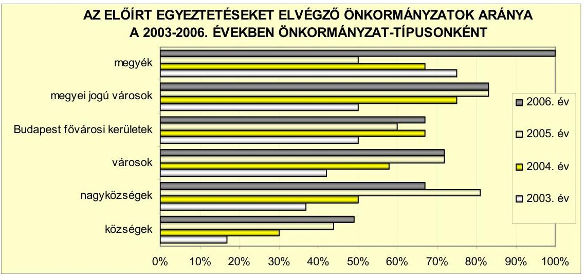

Az egyeztetések az előző évekhez képest rendszeresebbek voltak és feladataikat az előírásoknak megfelelőbben végrehajtották a megyei, a Budapest fővárosi kerületi és a községi önkormányzatok hivatalai. A feladatokat negyedévente és hiánytalanul végrehajtó önkormányzati hivatalok aránya csökkent a nagyközségi önkormányzatoknál, nem változott a megyei jogú városi és a városi önkormányzatoknál.

Az önkormányzati hivatalok az Ámr. 134. § (8) bekezdés előírásai ellenére a kötelezettségvállalások egynegyedét nem foglalták írásba. Ez a mulasztás elsősorban az 50 ezer Ft alatti kifizetéseket érintette, de előfordult azt meghaladó, nem szerződésen, megállapodáson alapuló kötelezettségvállalásoknál is. A szabálytalanság fő oka a kisösszegű kötelezettségvállalások rendjé-

---

re és nyilvántartási formájára vonatkozó helyi szabályok kialakításának ${ }^{34}$ elmulasztása volt. A kötelezettségvállalások írásba foglalásának elmaradása miatt, a kötelezettségvállalási dokumentum hiányában nem történt meg a kötelezettségvállalás ellenjegyzése, nem biztosítottak a szakmai teljesítés igazolás és az érvényesítés során elvégzendő, az Ámr. 135. § (1) és (3) bekezdésében előírt ellenőrzési feladatok elvégzésének feltételei.

#### Abstract

A közbenső egyeztetés során a Pénzügyminisztérium szakállamtitkára által adott észrevétel szerint: „Az a) pontban javasoltak szerint az 50 ezer forintot el nem érő kifizetéseket megelőzően is gondoskodni kell a folyamatba épített belső ellenőrzési feladatok elvégzéséről, ehhez az ellenjegyzés, a szakmai teljesités igazolása és az érvényesités feladatairól. Az Ámr.135. § (1) és (3) bekezdésében foglaltak biztositják - értékhatártól függetlenül - a fenti feladatok elöirását. Az Ámr. 134. § (8) pedig az 50 ezer forint alatti kifizetések kivételével szabályozza a kötelezettségvállalás és annak ellenjegyzése szabályait, amelyeket a folyamatba épített ellenőrzéseknél figyelembe kell venni. Az 50 ezer forintot el nem érő kifizetések esetén a kötelezettségvállalás rendjére és nyilvántartási formájára vonatkozó - a 134. § (3) bekezdésében rögzített - belső szabályzat-készitési kötelezettség alapján kell biztositani a folyamatba épített belső ellenőrzési feladatok elvégzésének feltételeit, a helyben meghatározott kockázati tényezők alapján, a helyi ellenőrzési rend elvárásának megfelelően. Ennek további központi szabályozása a helyi feltételek és a sajátosságok figyelembevételét igényelné, amelyet nem tartok indokoltnak."

Az észrevétel nem megalapozott, mivel az 50 ezer Ft-ot el nem érő kifizetések esetében a kötelezettségvállalás rendjére és nyilvántartási formájára vonatkozó belső szabályzat-készítési kötelezettség teljesítése az ellenőrzési tapasztalataink szerint azért maradt el, mert nem ismert, nincs közzétéve a belső szabályozás konkrét tartalmi követelménye. A közpénzekkel történő gazdálkodás átlátható, a gazdálkodás folyamatában ellenőrzött megoldásának biztosítása az 50 ezer Ft alatti kifizetések esetében is szükséges, tekintettel arra, hogy ez az önkormányzatok széles körénél a napi pénzforgalmi kiadások növekvő hányadát képviseli, valamint az élelmiszer, tisztítószer és üzemagyag-vásárlásokon túlmenően kiterjed a karbantartások, szolgáltatások megrendelésére, gépek, berendezések, felszerelések megvételére is.

A kötelezettségvállalásokról az Ámr. 134. § (13) bekezdésében előírt nyilvántartást $54 \%$-nál (az előző évben $61 \%$-nál) nem, $16 \%$-nál (az előző évben $17 \%$-nál) részben, $22 \%$-nál nem kiemelt előirányzatonként vezették. A kötelezettségvállalás nyilvántartási számát a bizonylatok $68 \%$-án nem rögzítették az Ámr. 136. § (4) bekezdés h) pont előírásai ellenére. Mindezek következtében az önkormányzati hivatalok $84 \%$-ánál (az előző évben $82 \%$-nál) nem volt megállapítható a kötelezettségvállalás éves összege, és nem voltak megbízható adatok a gazdálkodási, ellenőrzési jogkörök felelős gyakorlásához. Ez a mulasztás is közrejátszott abban, hogy az önkormányzatok egyharmadánál (az előző évivel azonos arányban) és azok 268 költségvetési szervénél a jóváhagyott előirányzat hiányában is előfordult kötelezettségvállalás és utalványozás, megsértve ezzel az Áht. 12/A. § (1) és 93. § (1) bekezdésének előírásait.

A legnagyobb összegű túllépés Százhalombatta Város Önkormányzatánál (értékpapír vásárlásnál 817,8 millió Ft-os, 25,5\%-os) és a Veszprém Megyei Önkor-

[^0]
[^0]:    ${ }^{34} \mathrm{Az} 50$ ezer Ft alatti kötelezettségvállalások írásba foglalásának kötelezettségét megszüntette az Ámr. 134. § (3) bekezdésének 2007. január 1-jétől hatályos előírása.

---

mányzat egyik intézményénél (dologi kiadásoknál 165,3 millió Ft-os, 9\%-os) volt. A legnagyobb arányú Pethőhenye Község Önkormányzatánál (felújítás kiadásoknál 862\%-os) és a Somogy Megyei Önkormányzat egyik intézményénél (felújítási és felhalmozási kiadásoknál $845 \%$-os) volt. Az előirányzat túllépés a legtöbb szervezetnél (224-nél) a dologi kiadásoknál, a legkevesebbnél a felújításoknál (57-nél) és a pénzeszköz átadásoknál (57-nél) fordult elő.
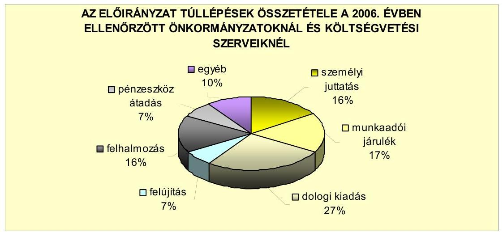

Az önkormányzati szintű előirányzat túllépés a legnagyobb arányban a Budapest fővárosi kerületi és a nagyközségi (33\%), az önkormányzati hivatali szintű, a megyei és a megyei jogú városi (67\%), az intézményi szintű túllépés a megyei jogú városi önkormányzatoknál (100\%) történt. A túllépések okai az érintett önkormányzatok 11\%-ánál vizsgálták, felelősségre vonást nem kezdeményeztek.
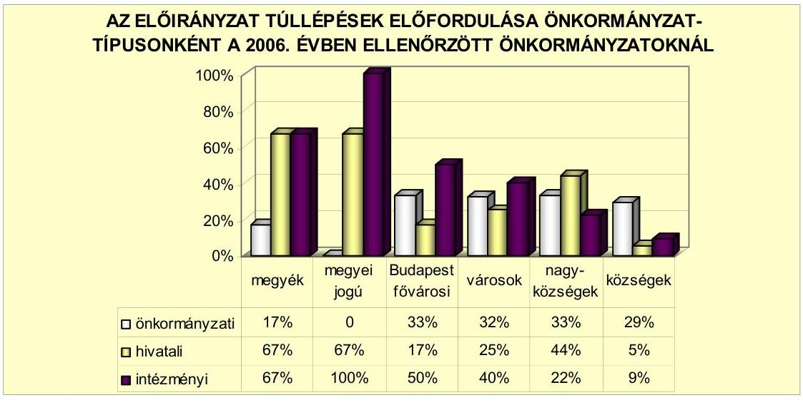

A pénzgazdálkodási hatásköröket 2005-ben az előző éveknél nagyobb arányban betartották az önkormányzatoknál. A gazdálkodási fegyelem javulását mutatja, hogy az elmúlt négy évben 19\%-ról 3\%-ra, illetve 13\%-ról 2\%-re csökkent az Ámr. 134. § (2) bekezdés előírásainak nem megfelelő gyakorlat, amikor írásos polgármesteri felhatalmazás hiányában vállalt kötelezettséget és utalványozott bizottság elnöke, jegyző, önkormányzati hivatali alkalmazott, illetve

---

a polgármester intézményi és kisebbségi önkormányzati költségvetés terhére az intézményvezető/kisebbségi önkormányzati elnök hatáskörének elvonásával rendelt el kifizetést.
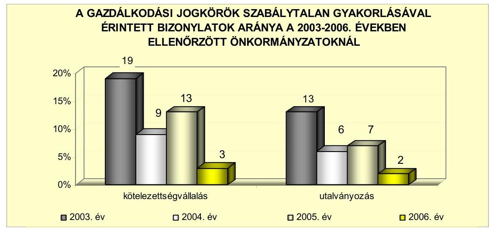

A pénzgazdálkodás folyamatába épített ellenőrzés múködésében jelentősen növekedtek a hiányosságok az elmúlt négy évben. A 2003-2005 közötti előző ellenőrzések tapasztalatai alapján magas kockázatúnak minősítettük a belső kontrollok múködését a pénzgazdálkodásban és ellenőrzését a 2006. évben kiterjesztettük a részterületekre is, mert a bizonylatokon halmozottan jelentkeztek a hiányosságok a folyamatba épített ellenőrzések elmaradása, jogosultan igazolása, jogszabályban előírt feladataik végrehajtásának teljes, vagy részleges elmulasztása következtében. A kiterjesztés következtében kiugróan magas hibaarányt állapítottunk meg a 2006. évben ellenőrzött önkormányzatoknál

A kötelezettségvállalás és az utalvány ellenjegyzése nem, vagy nem az Ámr. 134. § (9) bekezdés a)-c) pontjaiban, illetve 137. § (3) bekezdése és a helyi szabályozásban foglalt előírásoknak megfelelően történt. Elmaradt az ellenjegyzés az írásba foglalás hiányában végzett kötelezettségvállalásoknál, a kötelezettségvállalás az ellenjegyzés igazolt elvégzése ellenére nem alapult jóváhagyott költségvetési előirányzaton és előirányzat-felhasználási terven. Jogosulatlanul, a jegyző írásos felhatalmazásával nem rendelkező személy végzett ellenjegyzést, illetve szakmai teljesítés igazolása és az érvényesítés szabályszerű végrehajtása hiányában is történtek utalvány ellenjegyzések.

Utasításra történt a kötelezettségvállalás ellenjegyzése kettő önkormányzatnál egy-egy bizonylaton, az utalvány ellenjegyzése kettő önkormányzatnál egy, illetve öt bizonylaton, amelyekről az ellenjegyző három esetben tájékoztatta a képviselő-testületet az Ámr. 134. § (12) és 137. § (4) bekezdés előírásainak megfelelően (Nagykanizsa Megyei Jogú Város Önkormányzata, Devecser Város Önkormányzata, Zádorfalva Község Önkormányzata). A képviselő-testületek a tájékoztatást tudomásul vették, a felelősségre vonás kezdeményezésének lehetőségével nem éltek. A képviselő- testület részére történő tájékoztatási kötelezettséget elmulasztotta az utalvány ellenjegyzését öt kisebb összegű ( 15 ezer Ft alatti) kifizetésnél utasításra végző körjegyző Felsőmocsolád Község Önkormányzatánál.

---

A pénzgazdálkodás meghatározó belső kontrollját jelentő szakmai teljesítés igazolásában évek óta kiugróan magas arányban fordultak elő hiányosságok. Az Ámr. 135. § (1) bekezdésében előírtak ellenére nem végezték el a szakmai teljesítés igazolásokat, mivel a jegyzők az Ámr.135. § (3) bekezdésében ${ }^{35}$ foglaltak ellenére nem határozták meg annak a módját, nem jelölték ki az azt végző személyeket. Jogosulatlanul történtek szakmai teljesítés igazolások jegyzői kijelölés hiányában, az arra kijelölt szabálytalanul igazolta a feladat elvégzését, mert nem teljesítette a jogszabályban előírt feladatait. A mulasztásokhoz hozzájárult, hogy évek óta tett megállapításaink és előző évi javaslatunk ${ }^{36}$ ellenére nem történt meg a szakmai teljesítés igazolás módjának, tartalmi követelményeinek jogszabályi meghatározása, ezért azok nem voltak egyértelmúek a helyi szabályozás és végrehajtás folyamatában.
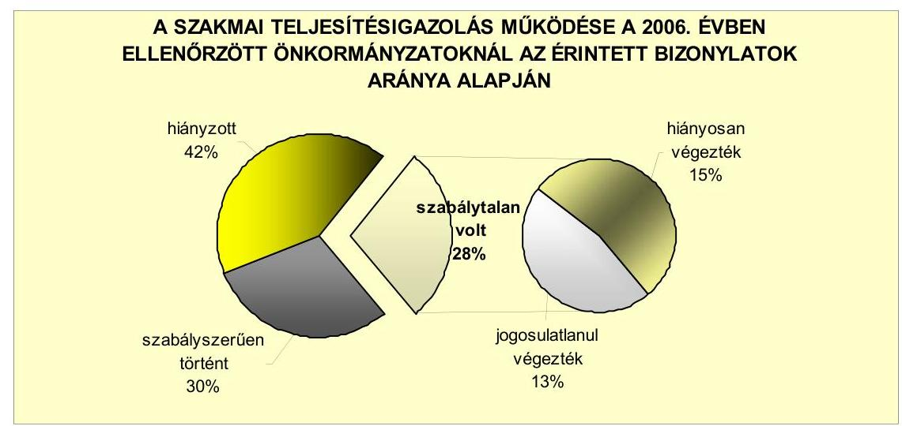

A közbenső egyeztetés során a Pénzügyminisztérium szakállamtitkára által adott észrevétel szerint: „A b) pontban a szakmai teljesités igazolása módjának tartalmi elóírását javasolják az Ámr.-ben rögzíteni. Az Ámr. 2007. január 1-jei hatállyal történő módosítása során egyértelmúbb szabályozás segíti a helyi önkormányzati költségvetési szerveket a szakmai teljesités igazolásának tartalmára vonatkozóan. (Eszerint a szakmai teljesités igazolása a szükséges okmányok alapján történő ellenőrzése és szakmai igazolása a pénzügyi teljesités (bevétel,vagy kiadás) jogosultságának, összegszerűségének, a szerződés, megrendelés, megállapodás teljesitésének.) A szakmai igazolást is értelemszerüen a helyben kialakított feltételek, a teljesítendő bevétel vagy kiadás jellege, helyi kockázatelemzés alapján lehet szabályozni, ennek megvalósitására pedig a belső szabályozást tartom megfelelő megoldásnak. Az Ámr.-ben elégségesnek tartom annak az általános szabálynak a beépitését, amely alapján a szakmai teljesitést - a belső szabályzatban meghatározottak szerint - az eredeti bizonylaton, írásban, az arra jogosult személy aláírásával kell igazolni."

Az észrevétel nem megalapozott, mivel A szakmai teljesítés igazolás tartalmi követelményeit az Ámr. 135. § (3) bekezdése meghatározza, azonban az itt meghatározottak ellenőrzésének elvégzését igazoló dokumentum tartalmi követelményeire - amely általánosan a bevételek-kiadások esetében is alkalmazható -

[^0]
[^0]:    ${ }^{35}$ 2007. január 1-től számozása 135. § (2) bekezdésre módosult.
    ${ }^{36}$ A helyi és a helyi kisebbségek gazdálkodásának átfogó ellenőrzéséről a 2006. évben készített 0634 . sorszámú jelentésében a pénzügyminiszternek tett javaslat.

---

nincs központi útmutatás. Az észrevételében javasolt Ámr. kiegészítés - amely szerint elégséges az erre jogosult személy aláírásával történő igazolás az eredeti bizonylaton - nem elegendő. Önmagában az aláírással történő igazolás nem tartalmazza az igazolás elvégzésének idejét, amelyből ellenőrizhető, hogy az igazolás a folyamatba épített ellenőrzési követelménynek megfelelően az érvényesítést, utalványozást megelőzően történt-e, valamint hiányzik ebben az esetben az igazolás tartalmának rögzítése. Az önkormányzati hivatalokban szakmai teljesítés igazolására a kiadások esetében jellemzően a kötelezettségvállalási, utalványozási joggal - jogszabály, vagy felhatalmazás alapján - rendelkezőket jelölték ki a jegyző́k, így önmagában az aláírással történő igazolásból nem állapítható meg, hogy több jogköre közül melyiket gyakorolta az aláíró.

Az Ámr. 135. § (1)-(2) és (4) bekezdés ${ }^{37}$ előírásai ellenére a pénzforgalmi bizonylatok $14 \%$-ánál hiányzott az érvényesítés, illetve az igazolt érvényesítés $39 \%$-nál nem töltötte be a hibák megelőzésére, kijavítására vonatkozó funkcióját a pénzgazdálkodásban és a számviteli elszámolásokban, mert nem alapult a szakmai teljesítés igazolásán, nem tartalmazta az érvényesítve kifejezést, a megállapított összeget és a könyvviteli elszámolásra utaló főkönyvi számlaszámot, illetve alaki és tartalmi szempontból hibás bizonylaton szerepelt az érvényesítési záradék.

Az egyéb gazdasági események bizonylatain nem volt egységes az önkormányzatoknál az utalványozás, az utalvány ellenjegyzés, a szakmai teljesítés igazolás és az érvényesítés gyakorlata. Ezek elvégzését helyenként a Számv. tv. 167. § (1) bekezdés c) pontjában foglalt előírások alapján rögzítették a gazdasági esemény leírását tartalmazó bizonylatokon, míg más önkormányzatoknál - az Ámr. vonatkozó előírásaira tekintettel - csak a pénzforgalmi bizonylatok tartalmazták az utalványozást és a folyamatba épített belső kontrollok elvégzésének igazolását.

A Számv. tv. 167. § (1) bekezdés c) pontjában az egyéb gazdasági eseményekre és a pénzgazdálkodás bizonylataira egységesen, az Ámr. 135-138. §-aiban pedig az egyéb gazdasági eseményekre nem, csak a pénzgazdálkodás bizonylataira írták elő az utalványozás, az utalvány ellenjegyzés, a szakmai teljesítés igazolása és az érvényesítés kötelezettségét. A két jogszabályi előírás közötti összhang megteremtését, a követelmények egységes meghatározását indokolja, hogy az egyéb gazdasági események (elkészült beruházások számviteli nyilvántartásba vétele, értékcsökkenés, értékvesztés elszámolása, értékvesztés visszaírása, követelések, kötelezettségek állományváltozásának elszámolása a számviteli nyilvántartásokban) feladása alapján jelentős nagyságrendű vagyonváltozásokat számolnak el az önkormányzatoknál utalványozás, dokumentált vezetői elrendelés és belső kontroll nélkül.

# 1.3. A könyvviteli mérlegben kimutatott vagyon alakulása, a vagyonnal való gazdálkodás szabályszerűsége, nyilvánossága 

A helyi önkormányzatok könyvviteli mérleg szerinti vagyona a 2005. év végén 9861 milliárd Ft, a 2006. év végén 10300 milliárd Ft volt,

[^0]
[^0]:    ${ }^{37}$ 2007. január 1-től számozása 135. § (1) és (3)-ra, valamint (5)-re módosult.

---

2002-2006 közötti időszakon belül az első évben 43,8\%-kal a következő években $4,2 \%-2,5 \%-4,4 \%$-kal növekedett. A 2002-2003 közötti kiugróan magas arányú növekedést elsősorban a korábban érték nélkül nyilvántartott ingatlanok értékének megállapítása okozta. A megyei jogú városi, városi és községi önkormányzatok könyvviteli mérleg szerinti vagyona 2003-2006 között az öszszes helyi önkormányzat figyelembevételével számított átlagos növekedésnél nagyobb arányban bővült. Az önkormányzatok eszközeinek és forrásainak adatait a 3. és a 3/a-c. számú mellékletek tartalmazzák.
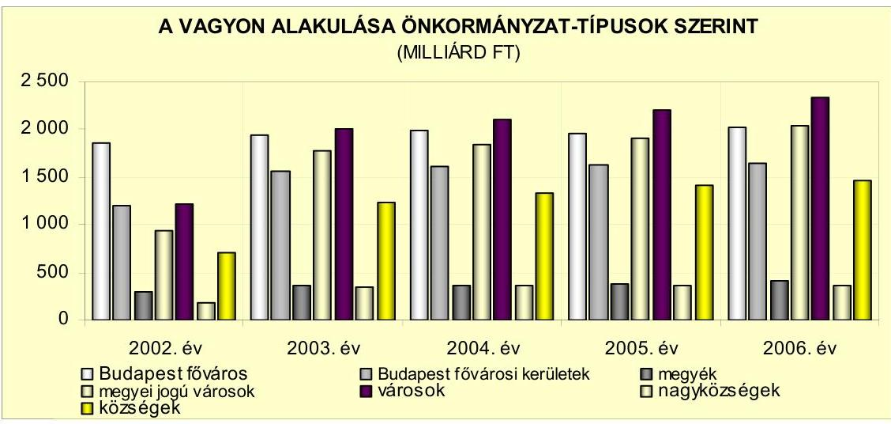

A helyi önkormányzatok eszközei között 2002-2006 között 91,1\%-ról 94,6\%-ra nőtt a befektetett eszközök aránya. A befektetett eszközökön belül az átlagosan $71 \%$-os részarányt képviselő ingatlanok könyvviteli értékének változási jogcímeit a következő táblázat szemlélteti:

Adatok milliárd Ft-ban

| Változás jellege/éve | $\mathbf{2 0 0 2}$. | $\mathbf{2 0 0 3}$. | $\mathbf{2 0 0 4}$. | $\mathbf{2 0 0 5}$. | $\mathbf{2 0 0 6 .}$ |
| :-- | --: | --: | --: | --: | --: |
| Aktivált beruházás | 286,2 | 253,9 | 265,4 | 303,6 | 353,2 |
| Térítésmentes átvétel-átadás | 20,7 | 67,3 | 28,0 | 16,1 | 37,6 |
| Egyéb növekedés-csökkenés | 2114,6 | 2279,9 | 18,0 | $-76,2$ | $-28,9$ |
| Értékesítés | $-23,3$ | $-30,5$ | $-24,1$ | $-29,3$ | $-36,4$ |
| Selejtezés | $-0,9$ | $-1,0$ | $-2,0$ | $-3,9$ | $-2,0$ |
| Értékcsökkenés | $-30,1$ | $-168,5$ | $-109,3$ | $-89,5$ | $-92,8$ |

A helyi önkormányzatok vagyonában a befektetett pénzügyi eszközök részaránya a 2002. évi 8,8\%-ról a 2006. évi 5,4\%-ra, a fővárosi és a Budapest fővárosi kerületi önkormányzatoknál 11,6\%-ról 9,1\%-ra csökkent. Az egyéb tartós részesedések értéke a 2002-2006. évek átlagában a befektetett pénzügyi eszközöknek $86 \%$-a volt, felénél több (53\%) a fővárosi, mintegy egyötöde a megyei jogú városi és egytizede a városi önkormányzatok tulajdonaként. A tartós hitelviszonyt megtestesítő értékpapírok állománya 2002-2006 között $41,4 \%$-kal, a befektetett pénzügyi eszközökön belüli részarányuk 4,7\%-ról 2,8\%-ra csökkent. Változásuk az országos tendenciának megfelelő volt a városi

---

önkormányzatoknál is, de továbbra is ők rendelkeztek annak mintegy 42\%ával.

A követelések év végi értéke - az eszközökön belüli részarányuk 1\%-os csökkenése mellett - a 2002. évtől a 2004. évig összesen közel egyötöddel emelkedett, majd a 2005-2006. években együttesen 17,5\%-kal visszaesett. Részarányuk a 2002-2006. években a megyei önkormányzatok eszközeiben a többi önkor-mányzat-típusénál magasabb (10,8-11,7-13,0-11,4-12,1\%) volt és állományuk is eltérő mértékben változott ${ }^{38}$. A követelések háromnegyedét a 2002-2004. években az adó- és illeték-követelések jelentették, amely a 2005. és a 2006. években mintegy kétharmadra csökkent ${ }^{39}$.
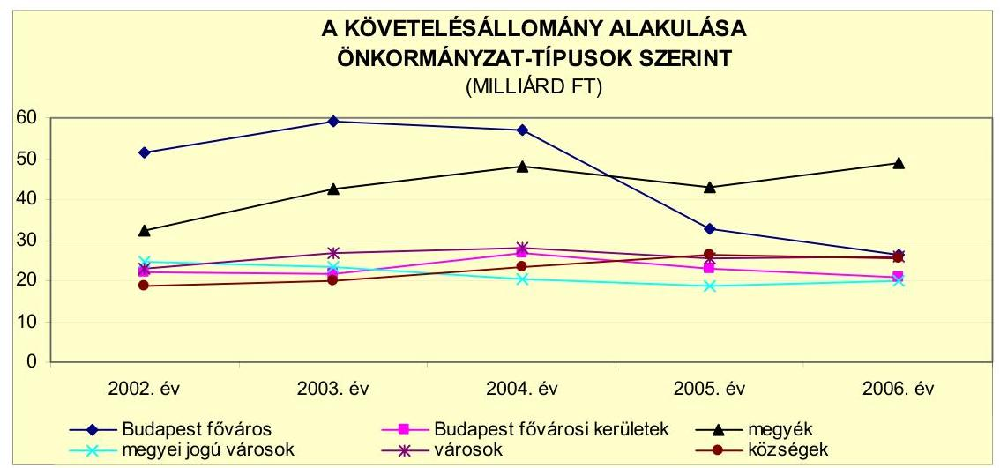

Az értékpapírok állománya hullámzóan változott 2002-2006 között, összességében 32,2\%-kal csökkent. A forgatási célú hitelviszonyt megtestesítő értékpapírok állománya a 2002. évi 78,0 milliárd Ft-ról 2006-ra 50,2 milliárd Ft-ra csökkent. Az országos adatokhoz hasonló tendencia érvényesült Budapest Főváros Önkormányzatánál, valamint a Budapest fővárosi kerületi önkormányzatoknál is, amelyek részesedése az értékpapírokban 57,3\%, a forgatási célú hitelviszonyt megtestesítő értékpapírokban 54,0\%.

[^0]
[^0]:    ${ }^{38}$ A 2004. évi állományi érték 48,8\%-kal volt magasabb a 2002. évinél, majd a 2005. évi $10,9 \%$-os csökkenést követően a 2006. évben 14,3\%-kal nőtt az előző évihez képest.
    ${ }^{39}$ Budapest Főváros Önkormányzatánál a 2004-2005 közötti csökkenés okainak vizsgálata nem volt feladata az ellenőrzésnek.

---

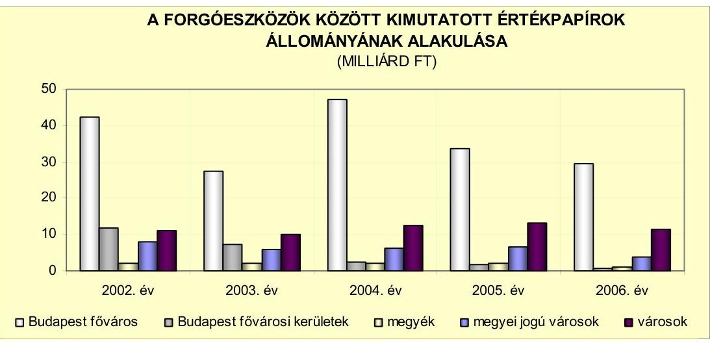

A helyi önkormányzatoknál 2002-2006 között a kötelezettségek 490 milliárd Ft-ról 925,4 milliárd Ft-ra ( $88,9 \%$-kal) nőtttek, a forrásokon belüli részarányuk a 2002. évi 7,6\%-ról a 2003. évben 5,6\%-ra csökkent, majd 2004-ben $6,1 \%$, 2005-ben $7,1 \%$ és a 2006 . évben $9 \%$ volt év végén. Állományuk minden önkormányzat-típusnál növekedett, kiugróan a Budapest fővárosi kerületi és a megyei jogú városi önkormányzatoknál (124-122\%-kal). A helyi önkormányzatok likviditási mutatói - a készpénz likviditási mutató és a likviditási gyorsráta - jelzik a pénzügyi helyzet folyamatos rosszabbodását, hogy a forgóeszközök egyre csökkenő mértékben nyújtanak fedezetet a rövid lejáratú kötelezettségek teljesítésére.

A helyi önkormányzatok felhalmozási kiadásaikból 2002-2006 között 2265,9 milliárd Ft-ot fordítottak a tárgyi eszközeik felújítására, beruházására és pénzügyi befektetésekre. Az évi 453,2 milliárd Ft-os átlagot meghaladó kiadást a 2005. és a 2006. évben teljesítettek. A felhalmozási célú kiadások és a pénzügyi befektetések részletes adatait a 7. és 7.a. számú mellékletek és a következő diagram mutatja be:
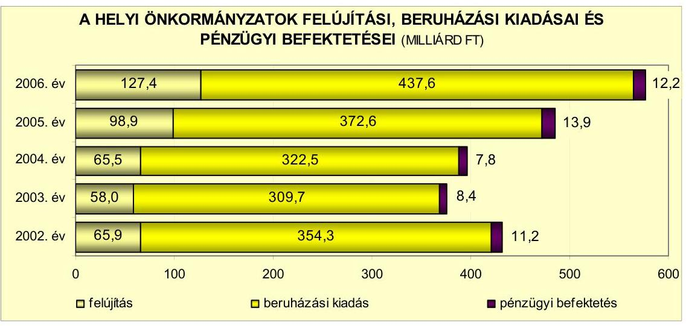

Az önkormányzati alrendszer felhalmozási és tőke jellegú bevételeinek együttes összege a 2002-2006. években 1010,2 milliárd Ft volt, amely a felújítá-

---

si, beruházási és pénzügyi befektetési célú kiadások 44,6\%-ára nyújtott fedezetet. A tárgyi eszközök, immateriális javak értékesítéséből befolyt bevétel 52,5\%kal, a sajátos felhalmozási és tőkejellegú bevételek (önkormányzati lakások és lakótelkek értékesítése, privatizációból származó bevételek, vagyoni értékű jog értékesítése, bérbeadásból, üzemeltetésre átadásból származó bevételek) 11,1\%kal növekedtek, a pénzügyi befektetések bevételei $21 \%$-kal csökkentek. A vagyon gyarapodásának egyre jelentősebb forrása az államháztartáson kívüli felhalmozási célú pénzeszközátvétel ${ }^{40}$, amely a 2002-2006. évek felhalmozási és tőke jellegú bevételeinek átlag 30\%-a volt. A felhalmozások finanszírozásában növekvő szerepe volt az Európai Unióból származó forrásoknak. Európai uniós támogatásban az ellenőrzött önkormányzatoknak a 2004. és a 2006. évben közel egytizede, 2005-ben egyötöde részesült, amelynek önkormányzatonkénti átlagos mértéke - az évek sorrendjében - 72,6 millió Ft, 140,4 millió Ft, illetve 78,9 millió Ft volt. A felhalmozási és tőke jellegú bevételek jogcímeit évenként a jelentés 6 . és $6 / a$. számú mellékletei részletezik.
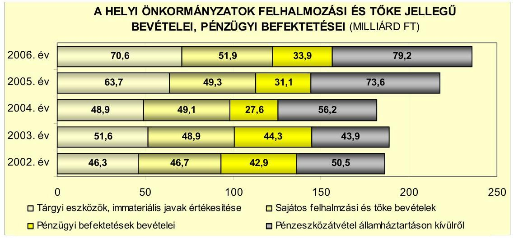

Az ellenőrzött kiemelt és városi önkormányzatok a Htv. 138. § (1) bekezdés j) pontjában előírtak alapján megalkották a vagyongazdálkodási rendeletüket, amelyek 15\%-ának (a 2003-2006. években együttesen 22\%-ának) hatálya nem terjedt ki a teljes vagyoni körre. Jellemzően elmaradt a befektetett pénzügyi eszközökkel, az értékpapírokkal, a követelésekkel kapcsolatos szabályok rögzítése. Az önkormányzatok 5\%-ánál (a 2003-2006. években 9\%-nál) nem nevesítették a vagyont törzsvagyon és egyéb (forgalomképes) vagyon csoportosításban, $56 \%$-nál nem rendelkeztek a vagyonelemek forgalomképesség szerinti besorolása megváltoztatásának módjáról, a korlátozottan forgalomképes vagyon elidegenítési feltételeiről annak ellenére, hogy értékesítettek e körbe tartozó vagyont. A korlátozottan forgalomképes törzsvagyonnal való rendelkezési lehetőség módjára, tartalmára vonatkozó feltételek jogszabályi előírására az előző évben javaslatot tettünk az önkormányzati és területfejlesztési miniszternek, amelyet továbbra is fenntartunk.

[^0]
[^0]:    ${ }^{40}$ Ennek részei: a vállalkozásoktól, a háztartásoktól, a non-profit szervezetektől, külföldről és az európai uniós költségvetésből átvett források.

---

Nem volt egyértelmű központi szabályozás arra, hogy a korlátozottan forgalomképes törzsvagyonból milyen feltételekkel idegeníthető el eszköz, illetve szüksé-ges-e az elidegenítést megelőzően az eszközre vonatkozóan vagyongazdálkodási rendeletben rögzített korlátozottan forgalomképes törzsvagyoni körbe sorolást a vagyongazdálkodási rendelet módosításával megváltoztatni, és az eszközt a törzsvagyonon kívüli egyéb eszközök közé átsorolni. Amely önkormányzatok nem határozták meg rendeletben a korlátozottan forgalomképes vagyon elidegenítési feltételeit, az elidegenítésről a besorolás módosítása nélkül, a képviselőtestület egyszerű szótöbbséggel hozott határozatában döntöttek. Az ÁSZ álláspontja szerint az ilyen módon történő elidegenítés semmis. A korlátozottan forgalomképes törzsvagyonnal és a törzsvagyonon kívüli egyéb vagyonnal való gazdálkodás kialakult gyakorlatában - a törvényekben meghatározott kivételektől, korlátoktól eltekintve - a helyi önkormányzatok szintjén nincs különbség.

Az ellenőrzött önkormányzatok mindegyike (a 2003-2006. években a 99\%a) szabályozta a vagyonnal való rendelkezési és értékesítési hatásköröket, azonban nem rendelkeztek 3\%-nál a bérbeadásra, közel egytizednél az apportálásra, egyharmadnál az értékpapírok vételére-eladására, a pénzügyi befektetésekre kiterjedő hatáskörökről. Az önkormányzatok többsége élt a vagyonnal kapcsolatos döntési hatásköröknek a képviselő-testület, a bizottságok és a polgármester közötti megosztása lehetőségével, 6\%-nál azonban célszerútlenül a bizottságok és a polgármester nem kapott döntési hatáskört, kizárólag a képviselő-testület gyakorolhatta azokat. Az ellenőrzött önkormányzatok közel háromnegyede (a 2003-2006. években összesen mintegy négyötöde) állapított meg értékhatárokat, amelyek alatt az értékesítésről nem a képviselő-testület, hanem a bizottságok, vagy a polgármester döntött.

Az ellenőrzött önkormányzatok egynegyede (a 2003-2006. években együttesen közel egyharmada) az Áht. 108. § (1) bekezdésében foglalt előírásokat megsértve nem határozta meg azt az értékhatárt, amely felett csak nyilvános, (indokolt esetben zártkörű) versenytárgyalás útján, a legjobb ajánlatot tevő részére lehet a vagyont értékesíteni, kezelésbe adni, a használatát, illetve a hasznosítás jogát átengedni. Az értékhatár meghatározása hiányában versenytárgyalást nem folytattak le, illetve indításáról, vagy mellőzéséről nem előzetesen kialakított, egységes szempontok alapján, hanem egyedileg kialakított feltételek figyelembevételével döntöttek az érintett önkormányzatok. Az értékhatárt meghatározó önkormányzatok mintegy egyharmada az Áht. 108. § (1) bekezdésében előírtakat megsértve lehetővé tette a vagyongazdálkodási rendeletében a versenytárgyalási eljárás mellőzését, 6\%-a semmilyen előírást nem határozott meg a versenytárgyalás lebonyolítására. A versenytárgyalás mellőzésére legtöbbször várospolitikai, önkormányzati érdekhez kapcsolódóan biztosítottak lehetőséget. A szabályozás nem segítette a vagyonnal való gazdálkodás nyilvánosságát, átláthatóságát.

A vagyongazdálkodási rendeletekben foglaltak szerint a képviselő-testület dönthetett a versenytárgyalási eljárás mellőzéséről, ha az ajánlat az ingatlan tulajdoni, használati viszonyainak rendezését szolgálta, vagy az ajánlattevőt a dologgal kapcsolatban egyéb jogosultság illette meg illetve ha a képviselő-testület az önkormányzat érdekeinek érvényesítése miatt így döntött. A képviselő-testület részére biztosítottak döntési jogot a vagyontárgyak önkormányzati alapítású társaság részére történő átadásakor, állami feladatot ellátó állami szervek elhelyezésekor, a versenytárgyalás kétszeri eredménytelenségekor, továbbá az önkormányzat számára különösen előnyösnek látszó értékesítéskor.

---

Az értékhatárt meghatározó önkormányzatok 88\%-ánál (a 2003-2005. években ellenőrzöttek mintegy háromnegyedénél) volt pályáztatási kötelezettség az elidegenítések, vagyon hasznosítások során. A versenytárgyalási kötelezettségnek az ellenőrzött önkormányzatok egytizede nem, több mint négytizede nem minden esetben tett eleget a vagyongazdálkodási rendeletének előírásai ellenére. A 2003-2006. években az önkormányzatok mintegy negyede legalább egyszer, tizede minden esetben elmulasztotta a versenytárgyalás lefolytatását. A versenytárgyalás mellőzésével megsértették az Áht. 108. § (1) bekezdésében foglaltakat.

Az ellenőrzött önkormányzatok mindegyikénél történt a 2003-2006 időszakában vagyonértékesítés, $90 \%$-nál bérbeadás, $85 \%$-nál selejtezés és $26 \%$-nál apportálás. A döntések során a vagyongazdálkodási rendeletben meghatározott hatásköröket 17\%-ánál (a 2003-2006. években egyötödnél) nem tartották be. A forgalomképtelen és a korlátozottan forgalomképes törzsvagyon elidegenítésére vonatkozó korlátokat a 2006. évben ellenőrzött önkormányzatok 11\%-a nem, $14 \%$-a részben tartotta be. A korlátozottan forgalomképes törzsvagyon részét képező víziközművek tulajdonjogának gazdasági társaság részére történő átadásával 2003-2005 között összesen 21 önkormányzat sértette meg az Ötv. 79. § (2) bekezdés b) pontjának, és a vízgazdálkodásról szóló törvény 6. § (3) bekezdésének előírásait. Az Ötv. 79. § (2) bekezdés a) pontja alapján a forgalomképtelen törzsvagyonhoz tartozó ingatlanok elidegenítéséről a Ptk. 173. § (2) bekezdésében foglalt korlátozó előírást megsértve döntöttek a 2006. évben ellenőrzött önkormányzatok egytizedénél. Az önkormányzatok törzsvagyonába tartozó forgalomképtelen ingatlan elidegenítések földhivatali bejegyzései a Ptk. előírását ${ }^{41}$ megsértve történtek ${ }^{42}$.

Korlátozottan forgalomképes vagyon elidegenítéséről döntött a 2005. évben hét önkormányzat (Sopron Megyei Jogú Város, Budaörs, Enying, Ercsi, Hajdúsámson, Kőszeg, Vasvár városok önkormányzatai) az Ötv. 79. § (2) bekezdés b) pontjában foglaltakat megsértve. Ezekben az esetekben az értékesítésre vonatkozó döntés előtt nem történt meg a vagyongazdálkodási rendeletben rögzített besorolás módosításával a korlátozottan forgalomképes eszközök átsorolása a törzsvagyonon kívüli egyéb (forgalomképes) eszközök közé.

A temetőkről szóló kormányrendelet 20. § (1) bekezdés előírása ellenére a 2005. évben egy önkormányzat ${ }^{43}$ a lezárt, teljesen ki nem ürített temető területének értékesítésére kötött adásvételi szerződés, illetve egy másik lezárt temető területének használatba adására kötött bérleti szerződés a Ptk. 200. § (2) bekezdése alapján semmis.

[^0]
[^0]:    ${ }^{41}$ A Ptk. 173. § (1) és (2) bekezdései, valamint a200. § (2) bekezdése alapján az Ötv. 79. § (2) bekezdés a) pontjában meghatározott forgalomképtelen ingatlanok elidegenítése semmis.
    ${ }^{42}$ Az előző évben tett javaslatunkra a földművelésügyi és vidékfejlesztési miniszter körlevélben hívta fel a földhivatalok figyelmét a vonatkozó jogszabályok betartására.
    ${ }^{43}$ Budapest Főváros XXIII. Kerület Önkormányzatánál a 186553. és a 195621/1. helyrajzi számú temetők.

---

Az ellenőrzött önkormányzatok 9\%-a a vagyongazdálkodási rendeletben nem írt elő a forgalmi érték megállapítására értékbecslés készítési kötelezettséget a vagyon tulajdonjogának átadásakor, vagy nem rögzítette annak időbeli hatályát. Az önkormányzatok 17\%-a nem, 34\%-a nem minden indokolt esetben végeztette el az értékbecslést. (A 2003-2006. években ellenőrzötteknél 38\% volt az értékbecslést részben, vagy teljesen elmulasztók aránya.) A tulajdonjog átadására vonatkozó döntésénél az önkormányzatok 46\%-a nem minden esetben vette figyelembe az értékbecslésben foglaltakat. Ennek oka legtöbbször nem szerepelt a dokumentumokban, az ismert leggyakoribb indokok a többszöri eredménytelen értékesítési szándék, valamint az önkormányzat céljaival harmonizáló befektetői tervek megvalósításának ösztönzése volt. A vagyon értékesítési döntések egy része utólag célszerütlennek minősült az ellenőrzött kiemelt körbe tartozó és a városi önkormányzatok 26\%-ánál, mivel az értékesítési szándékra vonatkozó döntéskor ismert körülmények szerint elvárhatónál kevesebb bevételt eredményezett az értékesítés a tényleges megvalósulás időbeli elhúzódása miatt, valamint az elvárt bevételt értékbecslés nélkül határozták meg, továbbá sikertelen pályáztatást követően versenyeztetés nélkül történt az értékesítés.

Az önkormányzatok számára garanciális elemként az adásvételi szerződésekben 86\%-nál (a 2003-2006. évek összességében ugyanilyen arányban) szerepeltették a vagyontárgy vevő tulajdonába kerülésének feltételeit, halasztott fizetés esetén a rögzített fizetési határidő elmulasztásának szankcióit, továbbá a szerződés felmondásának eseteit. A bérleti szerződések az önkormányzatok 6\%-ánál nem, 11\%-ánál részben tartalmazták a bérleti díj meg nem fizetésének következményeit, a bérlő díjfizetésen kívüli kötelezettségeit, illetve a szerződés felmondásának feltételeit.

Értékpapírt az ellenőrzött önkormányzatok 38\%-a vásárolt és 57\%-a értékesített. A vásárlások 21\%-a, az eladások 23\%-a (a 2003-2006. években együttesen 18-18\%-a) a központi és helyi előírásokat figyelmen kívül hagyva, szabálytalanul történt.

Az ellenőrzött önkormányzatok közel egyharmada az értékpapírok forgatásával járó kockázat csökkentésére nem kellő gondossággal járt el, mivel nem nyittatott a befektetési szolgáltatókkal az önkormányzat nevére szóló értékpapír alszámlát a KELER Rt-nél ${ }^{44}$. Nem kérte annak biztosítását, hogy terhelésre és jóváírásra kizárólag az önkormányzat és a befektetési szolgáltatók együttes rendelkezése alapján kerülhessen sor az önkormányzat nevére szóló értékpapír alszámlán. Ezen önkormányzatok elmulasztották a pénzügyi befektetés kockázatának mérsékléséhez, biztonságának növeléséhez szükséges erre vonatkozó rendelkezés szerződésben történő rögzítését. A pénzpiacon elérhető hozamok figyelembe vételével az értékpapír gazdálkodás megfelelő eredményességet biztosított az önkormányzatok 98\%-ánál ${ }^{45}$. Az ellenőrzött kiemelt körbe tartozó és a városi önkormányzatok 26\%-a (az előző évben 31\%-a)

[^0]
[^0]:    ${ }^{44}$ Központi Elszámolóház és Értéktár (Budapest) Rt.
    ${ }^{45}$ Kivételt jelentett Tiszaföldvár Város Önkormányzata, mivel államkötvényeit a pénzügyi egyensúly megőrzése érdekében lejárat előtt árfolyamveszteséggel értékesítette.

---

közvetetten támogatott politikai pártokat azzal, hogy a pártszervezetek részére ingyenesen, vagy kedvezményes bérleti díj ellenében irodahelyiségeket biztosított, illetve az üzemeltetési költséget teljesen vagy részben átvállalta. A pártok részére kedvezményesen vagy ingyenesen nyújtott ingatlan használattal megsértették az Ötv. 78. § (1) bekezdésének előírásait, mivel az önkormányzatok vagyonának az önkormányzati célok megvalósulását kell szolgálnia. A pártok támogatása nem tartozik a helyi közügyek körébe, ezért a közvetett támogatás nem szolgálta az önkormányzati feladatellátással kapcsolatos célokat. A helyi önkormányzatok részéről a pártoknak adott támogatás az Alkotmány 70/A. §-ában szereplő, a jogegyenlőség alkotmányos elvét megfogalmazó követelményekbe, illetve az Ötv. 1. § (2) bekezdésében meghatározott helyi közügyekre vonatkozó előírásba ütközik.

Az ellenőrzött önkormányzatok mindegyike, (a 2004-2006. években ellenőrzöttek kétharmada) nyújtott nem normatív, céljellegú, fejlesztési támogatásokat, illetve kötött nettó ötmillió Ft-ot elérő vagy azt meghaladó értékű - árubeszerzésre, építési beruházásra, szolgáltatás megrendelésre, vagyonértékesítésre, vagyonhasznosításra, vagyon vagy vagyoni értékű jog átadására, valamint koncesszióba adásra vonatkozó - szerződéseket. Ezen támogatások és szerződések adatainak közzétételét az Áht. 15/A. § (1) bekezdésében és 15/B. §. (1) bekezdésében előírtakat megsértve az ellenőrzött önkormányzatok 28\%-a egyáltalán nem, egynegyede nem mindegyik szerződésre, valamint a szerződések nem minden - az Áht. 15/A. § (1) bekezdésében és 15/B. §. (1) bekezdésében előírt - adatára vonatkozóan biztosította. Az önkormányzatok által nyújtott támogatások 62\%-a nem fejlesztési célú volt, hanem különböző szervezetek múködéséhez nyújtott forrást. A közpénzek felhasználásának átláthatóságát, nyilvánosságát nem segítette, hogy ezen, nem normatív, céljellegú, múködési támogatások kedvezményezettjeinek nevére, a támogatás céljára, összegére - függetlenül annak mértékétől - jogszabály nem írta elő az önkormányzatok közzétételi kötelezettségét ${ }^{46}$.

A vagyon tulajdonjogának illetve használati jogának ingyenes átadási módját, illetve eseteit az Áht. 108. § (2) bekezdésében foglaltakat megsértve az ellenőrzött önkormányzatok 36, illetve 34\%-a, a követelés elengedés módját és eseteit 47 , illetve $51 \%$-a nem határozta meg rendeletben.

Követelés elengedés az ellenőrzött önkormányzatok 28\%-ánál történt a 2004-2006. években. Az elengedett követelések értéke ${ }^{47}$ a 2004. évben 962 millió Ft, a 2005-ben 908 millió Ft, a 2006-ban 2110 millió Ft volt, amelyek az ellenőrzött önkormányzatok év eleji teljes követelés állományának egy, $0,9 \%$, illetve 3,6-\%-át tették ki. Követelés elengedése leggyakrabban illeték, helyi adó, bérleti díj, lakbér, térítési díj hátralék esetében volt. A követelést elengedő önkormányzatok 44\%-a az Áht. 108. § (2) bekezdésének előírásait megsértve nem rendelkezett önkormányzati rendeletben a követelés elengedés módjáról és/vagy eseteiről. Nem rendeletben meghatározott módon és esetekben engedett el követelést az önkormányzatok 32, illetve 28\%-a.

[^0]
[^0]:    ${ }^{46}$ Az előző évben tett javaslatunkat figyelembe véve az Áht. 2007. január 1-től a múködési célú támogatások esetében is előírja a közzétételi kötelezettséget.
    ${ }^{47}$ Forrás: MÁK éves költségvetési beszámoló „53" számú űrlap adatai.

---

Nem önkormányzati rendeletben meghatározott esetben történt a követelés elengedés csatornamú érdekeltségi hozzájárulások, illetékek, helyi adók méltányosságból történt elengedésekor.

A követelést nem önkormányzati rendeletben meghatározott módon engedték el jellemzően az illeték és helyi adók esetében a jegyző döntésével, egyéb követeléseknél a képviselő-testület, a polgármester, a költségvetési intézmény vezetőjének döntésével.

Ingyenes vagyonátruházás az ellenőrzött önkormányzatok 39\%-ánál történt 2003-2006 között, amelyről az Áht. 108. § (2) bekezdésének előírását megsértve döntöttek az önkormányzatok $34 \%$-a, mivel nem határozta meg rendeletben ennek eseteit és/vagy módját.

# 1.4. Az önkormányzati vagyon nyilvántartásának, számbavételének szabályszerűsége 

Az ellenőrzött önkormányzatok vagyonának a törzsvagyon és az egyéb vagyon szerinti elkülönített nyilvántartása 2002-2006 között a Vhr. 9. számú melléklet 1. k) pontjában előírtak betartása alapján folyamatosan javult és 2006ban elérte a $91 \%$-ot (a megelőző években $44 \%-69 \%-86 \%$ volt). Az önkormányzati hivatalok $9 \%$-ánál nem biztosították a főkönyvi számlák értékadatainak az analitikus nyilvántartásokkal való egyezőségét az ingatlanok, a részesedések, az értékpapírok, az üzemeltetésre, kezelésre átadott eszközök, a rövid- és hosszú lejáratú követelések és kötelezettségek esetében. A nyilvántartási hiányosságok következtében az ellenőrzött önkormányzatok 6\%-ánál a vagyont - megsértve a Számv. tv. 15. § (3) bekezdéseiben előírtakat - nem a valós értékén tartalmazta a könyvviteli mérleg.

Üzemeltetésre, kezelésre átadott eszközzel az ellenőrzött önkormányzatok $97 \%$-a ${ }^{48}$ rendelkezett, amelynek értéke a könyvviteli mérleg főösszeg közel ötödének (a 2005. évben 1482,3 milliárd Ft, a 2006. évben 1587,0 milliárd Ft volt) felelt meg. Ezen eszközöket az önkormányzatok 15\%-ánál hiányosan, $5 \%$-ánál (az előző évben egyötödénél) nem a Vhr. 20. § (1) bekezdésének előírása szerinti főkönyvi számlán szerepeltették a számviteli nyilvántartásokban.

Önkormányzati forrásokból az ellenőrzött önkormányzatok 64\%-a valósított meg víziközmű-beruházást, ennek értékével hét önkormányzat nem növelte saját vagyonát a számviteli nyilvántartásokban. A létesített eszközöket az Ötv. 79. § (2) bekezdés b) pontjának, valamint az egyes állami tulajdonban lévő vagyontárgyak önkormányzatok tulajdonba adásáról szóló 1991. évi XXXIII. törvény 20. §-ának, és a vízgazdálkodásról szóló 1995. évi LVII. törvény 6. § (3) bekezdésének előírásait megsértve öt esetben más önkormányzat, kettő esetben az üzemeltetéssel, kezeléssel megbízott szervezet vette nyilvántartásba, figyelmen kívül hagyva, hogy a vízi-közművek az önkormányzati törzsvagyon körébe tartoznak, korlátozottan forgalomképesek és csak közszolgáltatási céllal hasznosíthatók.

[^0]
[^0]:    ${ }^{48}$ A 2005. évi költségvetési beszámoló szerint Csorvás, Martonvásár és Fót város önkormányzata nem rendelkezett üzemeltetésre, kezelésre átadott eszközzel.

---

A mennyiségi felvétellel történő leltározást a Vhr. 37. § (3) bekezdésében előírtakkal szemben nem végezte el az ellenőrzött önkormányzati hivatalok negyede az ingatlanok, közel ötöde az üzemeltetésre, kezelésre átadott eszközök esetében, elmulasztotta a rövid- és hosszú lejáratú követelések, illetve kötelezettségek egyeztetéssel történő leltározását $2 \%$, hiányosan teljesítette $4 \%$.

Az ellenőrzött önkormányzati hivatalok a 2005. évi könyvviteli mérlegben 327732 millió Ft összegben mutattak ki olyan vagyont, amit a Vhr. 37. § (1) bekezdésében előírtak ellenére nem leltároztak. A 2005. évi könyvviteli mérlegben kimutatott eszközök és források közül nem történt meg 297423 millió Ft értékű ingatlan, 27712 millió Ft értékű üzemeltetésre, kezelésre átadott eszköz mennyiségi felvétellel történő leltározása, továbbá 293 millió Ft értékű részesedés, 10 millió Ft nyilvántartási értékű értékpapír, 1613 millió Ft összegű kötelezettség és 681 millió Ft követelés egyeztetéssel történő leltározása.

A leltározást nem a helyi szabályozásban rögzítetteknek megfelelően végezte a 2006. évben ellenőrzött önkormányzati hivatalok 30\%-a (az előző években $26 \%-11 \%$-a). A leltárak kiértékelését nem teljesítő önkormányzati hivatalok aránya a 2003. évi $35 \%$, illetve 2004. évi $17 \%$-ról $6 \%$-ra csökkent. A számviteli nyilvántartások értékadatai és a leltározási dokumentumokban a tényleges helyzet alapján rögzített adatok között eltérést az önkormányzati hivatalok $12 \%$-a állapított meg, amelyek számviteli rendezését elvégezték. Jelentős összegűnek minősített hiányt nem mutattak ki a leltározáskor.

A helyi önkormányzatok a 2005. évben országosan 63276 millió Ft öszszegben számoltak el tárgyévi értékvesztést és 11350 millió Ft összegben írtak vissza korábban elszámolt értékvesztést a befektetett eszközök, készletek, követelések és értékpapírok év végi értékelésekor. Az elszámolt értékvesztések, illetve azok visszaírásának összege 2003-2005 között folyamatosan emelkedett, 2005-2006 között az elszámolt értékvesztés összege kismértékben ( $2 \%$-kal) csökkent, azonban jelentősen, közel négyszeresére ( 11350 millió Ft-ról 43493 millió Ft-ra) emelkedett a korábban értékvesztésként elszámolt, de tárgyévben visszaírt érték.

Az év végi értékeléshez szükséges dokumentumok, információk rendelkezésre álltak az ellenőrzött önkormányzati hivatalok 87\%-ánál a követelésekre, $68 \%$-ánál a részesedésekre, $81 \%$-ánál az értékpapírokra vonatkozóan ${ }^{49}$. Ezek alapján az értékvesztés elszámolásának szükségességét vizsgálta az önkormányzati hivatalok $60 \%$-a a követelések és az értékpapírok, $61 \%$-a a részesedések esetében. Indokolt volt az értékvesztés elszámolása $83 \%$-nál a követelések, $40 \%$-ánál a részesedések tekintetében, annak elszámolását elmulasztotta - megsértve a Számv. tv. 54. § (1) és az 55. § (1) bekezdésében előírtakat - az önkormányzati hivatalok $10 \%$-a részesedéseknél, hiányosan végezte el $14 \%$ a követeléseknél és $10 \%$ a részesedéseknél.

A korábbi években értékvesztést az ellenőrzött önkormányzati hivatalok több mint fele számolt el, azonban közülük a visszaírás szükségességét nem vizsgálta $15 \%$ a követeléseknél, $11 \%$ a részesedéseknél, $31 \%$ az ér-

[^0]
[^0]:    ${ }^{49}$ A 2003-2004. években 66-71\%-nál a követelések, 40-66\%-nál a részesedések és 22-$54 \%$-nál az értékpapírok esetében.

---

tékpapíroknál, megsértve ezzel a Számv. tv. 55. § (3), az 54. § (3) és az 54. § (6) bekezdése előírásait. A számviteli nyilvántartásokban rögzített értékvesztések visszaírása - dokumentumokkal alátámasztottan - indokolt volt az önkormányzati hivatalok 70\%-ánál a követelések, 43\%-ánál a részesedések, 58\%ánál az értékpapírok vonatkozásában, amelynek az arra kötelezett önkormányzati hivatalok $97 \%$-a eleget tett.

A piaci értékelés lehetőségével a Számv. tv. 57. § (3) bekezdése alapján a 2005. évben három ellenőrzött önkormányzati hivatal élt, amelyet a központi és a helyi előírások szerint végezték el. Az értékhelyesbítések megállapításának, elszámolásának könyvvizsgáló általi felülvizsgálatáról kettő város önkormányzatánál - Szentendre és Fonyód - a Számv. tv. 59. § (2) bekezdés előírását megsértve nem gondoskodtak. Az értékhelyesbítések következményeként a piaci érték és a könyv szerinti érték közötti különbözetet a könyvviteli mérlegben az eszközök között értékhelyesbítésként, a források között értékelési tartalékként kimutatták.

# 1.5. A közbeszerzési eljárások szabályszerűsége 

Az ellenőrzött önkormányzatok a Kbt. 22. § (1) bekezdés d) pontja alapján a törvény alanyi hatálya alá tartoztak, amelyről a polgármesterek 90\%-a a Kbt. 18. §-ában előírtaknak eleget téve, határidőn belül ${ }^{50}$ tájékoztatta a Közbeszerzések Tanácsát. A képviselő-testületek a közbeszerzési szabályzatot ${ }^{51}$ jóváhagyták. Az ellenőrzött önkormányzatok egytizede azonban nem rögzítette a közbeszerzési eljárások előkészítését, az ajánlatkérő nevében eljáró, illetve az eljárásba bevont személyek felelősségi körét és az eljárások dokumentálásának rendjét, egynegyede a Kbt. 6. § (1) bekezdés előírásait megsértve nem szabályozta a közbeszerzési eljárások belső ellenőrzésének felelősségi rendjét.

Az önkormányzati hivatalok a Kbt. 2. § (1) bekezdése alapján visszterhes szerződéskötés céljából a 2005. évben 1199 közbeszerzési eljárást folytattak le ${ }^{52}$.

[^0]
[^0]:    ${ }^{50}$ A Kbt. 2004. május 1-i hatálybalépést követő, illetőleg a törvény hatálya alá kerüléstől számított 30 napon belül.
    ${ }^{51}$ Az önkormányzatok gazdálkodásának átfogó ellenőrzéséről szóló 0436, 0544, 0634 sorszámú ÁSZ jelentések tartalmazzák, hogy a 2003-2005 között az önkormányzatok $45,4 \%-14,7 \%-5 \%$-a nem alkotta meg a közbeszerzési eljárások előkészítésének és lefolytatásának helyi szabályait.
    ${ }^{52}$ A közbeszerzési eljárások összértéke a 2004-ben 1129,7 milliárd Ft, a 2005-ben 1291,3 milliárd Ft, a 2006-ban 1685,8 milliárd Ft volt, amelyből az önkormányzatok 22\%-22\%-31,9\%-kal részesedtek. (Forrás: Közbeszerzések Tanácsa tájékoztatója, www.kozbeszerzes.hu).

---

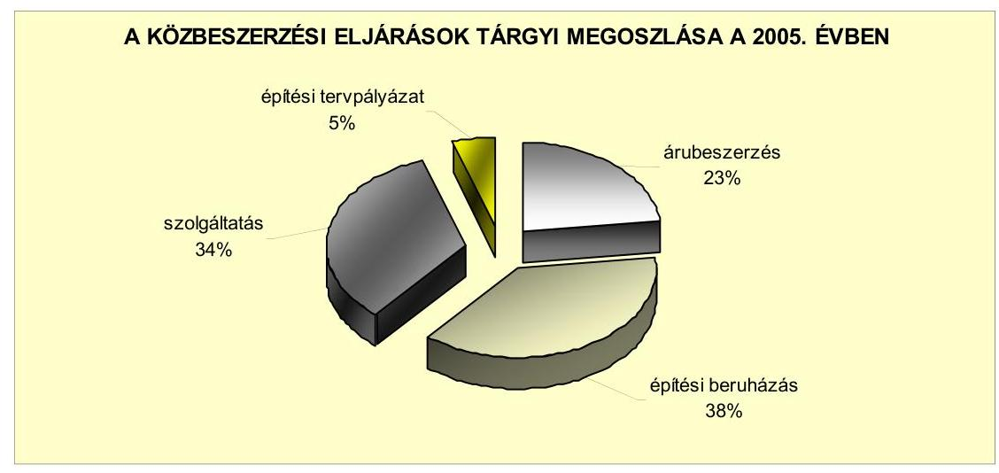

Az ellenőrzött önkormányzatok a Kbt. tárgyi hatálya alá tartozó árubeszerzés, építési beruházás, szolgáltatás, építési terv megrendelése során - 34 eset kivételével - a becsült érték meghatározását a Kbt. 36-40. §-aiban foglaltak szerint végezték ${ }^{53}$. Az önkormányzati szintű egybeszámítási kötelezettséget a Kbt. nem írja elő, így az önkormányzatok költségvetési szerveinél jellemzően közbeszerzési eljárás lefolytatása nélkül, költségvetési szervenként külön-külön történt az élelmiszer beszerzés, az épület felújítási munkák megrendelése.

Az önkormányzatok gazdálkodási rendszerének előző évi ellenőrzéskor tett javaslatunkra kiegészítették Kbt-t ${ }^{54}$ a helyben központosított közbeszerzésekre vonatkozó alapvető szabályokkal, megteremtve az önkormányzatok irányítása alatt álló költségvetési szervek közbeszerzései központosított eljárás keretében történő lefolytatásának lehetőségét.

# Az ellenőrzött önkormányzatok egyötöde nem folytatta le a közbeszerzési eljárást a Kbt. 2. § (1) bekezdése, illetve 40. § (2) bekezdése tekintetében, valamint a Kbt. 240. § (1) bekezdés a) pontjában, a Kbt. 292. § (l) bekezdés a) b) pontjában foglaltakat megsértve az árubeszerzés, építési beruházás, szolgáltatás megrendelés, építési tervpályázat esetében. 

Az egybeszámítás követelményét nem teljesítették hét építési beruházás, négy-négy irodaszer, élelmiszer beszerzése, egy-egy intézményi étkeztetés, illetve kártevő mente-
sítési szolgáltatás és városi körkép megrendelésekor. Elmulasztották a közbeszerzési eljárás lefolytatását egy-egy önkormányzatnál objektumok őrzés-védelme és a takarítás szolgáltatás, építési tervkészítés megrendelésekor, valamint ingatlan bérleti jogának megszerzése, önkormányzati biztos kirendelése, ingatlan vásárlása, négy önkormányzatnál banki szolgáltatás - hitelfelvétel - esetében.

Az ellenőrzött önkormányzatoknál lefolytatott közbeszerzési eljárásokban az ajánlatkérő nevében eljáró személyek megfelelő szakértelemmel rendelkeztek, és az összeférhetetlenségükről a Kbt. 10. §-ában foglaltak szerint az eljárások

[^0]
[^0]:    ${ }^{53}$ A közbeszerzésekről szóló 1995. évi XL. törvény 5. §-ában foglaltak alapján a becsült érték megállapításkor az egybeszámítás követelményét a 2003-2005. években az önkormányzatok $48 \%-74 \%-74 \%$-a érvényesítette.
    ${ }^{54}$ A Kbt. 17/B. § (1) bekezdése, hatályos 2007. január 1-től.

---

87\%-ánál nyilatkoztak. A kizáró okokat a Kbt. 60-63. §-ában foglaltak alapján - három kivétellel - vizsgálták, az ajánlatok elbírálása a Kbt. 57. §-ában meghatározott szempontok szerint történt. Az eredményhirdetésre három kivétellel meghívták az ajánlattevőket, és egy kivételével ismertették a Kbt. 93. § (2) bekezdése szerinti összegzés adatait. A szerződés megkötésére - egy kivétellel - határidőben került sor. Az ellenőrzött közbeszerzési eljárások alapján kötött szerződésék egyharmadát (az előző évben 40\%-át) módosították a szerződő felek, amelynek feltételei három esetben nem álltak fenn. A módosításokról a Kbt. 307. § (1) bekezdésében foglaltakat megsértve a tájékoztatót hirdetmény útján nem tették közzé $44 \%$-nál.

Az ellenőrzött önkormányzatok mint ajánlatkérők egytizede megsértve a Kbt. 16. § (1) bekezdésében foglaltakat, nem tett eleget az éves statisztikai összegzés elkészítési kötelezettségének.

Az önkormányzatok és intézményeik közbeszerzési eljárásaival kapcsolatosan a 2005. évben 195, a 2006-ban 168 esetben történt elmarasztalás, és a Közbeszerzési Döntőbizottság 142, illetve 178,7 millió Ft összegű bírságot szabott ki ${ }^{55}$. A 2005. évben közbeszerzési eljárást lefolytató ellenőrzött kiemelt körbe tartozó és a városi önkormányzatok 21\%-át marasztalta el a Közbeszerzési Döntőbizottság, valamint 0,2 és ötmillió Ft közötti bírság megfizetésére kötelezte az ajánlatkérőket.

Az elmarasztalás indokai voltak: a Kbt. 93. § (1) bekezdését megsértve nem határozták meg a kérelmező ajánlata érvénytelenségének törvényi hivatkozását, 94. § (2) bekezdését figyelmen kívül hagyva az ajánlatkérő az eredményhirdetés elhalasztásáról nem tájékoztatta az ajánlattevőket, 49. §-ában foglaltak ellenére az ajánlattevők esélyegyenlőségét nem biztosították, 133. § (1) bekezdés h), l), u) pontjaiban előírtakat megsértve nem határozták meg az ellenszolgáltatás teljesítésének feltételeit, az alkalmassági követelményeket, az eredményhirdetés és a szerződéskötés időpontját, 81. § (1) bekezdésében foglaltak ellenére a bíráló bizottság nem vizsgálta, hogy az ajánlatok megfelelnek-e az ajánlati felhívásban és dokumentációban foglaltaknak, 91. § (1) bekezdésben foglaltakat megsértve az eljárás nyertesének nem a legkedvezőbb ajánlatot határozták meg, 74. § (1)(2) bekezdését figyelmen kívül hagyva a módosított ajánlati felhívásban rövidebb határidőt biztosítottak, nem biztosították a közzétételt az Európai Unió hivatalos lapjában. A Közbeszerzési Döntőbizottság Elnöke hivatalból indított eljárást, mert a tárgyalásos eljárás indokoltsága nem volt megalapozott, az ajánlatkérő az érvénytelen ajánlattevőt hirdette ki nyertesnek, az ajánlat elbírálója a kirívóan aránytalan elemekre nem kért adatokat és indokolást.

Ellenőrzésünk alapján az ÁSZ a Közbeszerzési Döntőbizottságnál ${ }^{56}$ a Kbt. megsértésével kapcsolatban 21 eljárást kezdeményezett; 19 esetben a közbeszerzési eljárások jogtalan mellőzése - tervezés, szolgáltatás megrendelés, építési beruházás, ingatlan tulajdonjogának megszerzése, útburkolat felújítás, élelmiszer,- irodaszer

[^0]
[^0]:    ${ }^{55}$ A Közbeszerzési Döntőbizottság Elnökének a 2007. március 5-én és a 2006. május 9én kelt tájékoztatása alapján.
    ${ }^{56}$ Az ÁSZ a 2005. évben egy, a 2004-ben kettő esetben a közbeszerzési eljárás mellőzése miatt, a 2003-ban egy esetben a verseny tisztaságát sértő döntés miatt kezdeményezett jogorvoslati eljárást, amelyek során a Közbeszerzési Döntőbizottság összesen hárommillió Ft bírságot szabott ki.

---

beszerzése, banki szolgáltatás megrendelése -, két esetben a szerződések Kbt-be ütköző módosítása miatt. A közbeszerzési eljárások jogtalan mellőzése esetén a jogorvoslati eljárásokkal érintett szerződések összértéke 781,9 millió Ft volt, amelyhez kapcsolódóan a Közbeszerzési Döntőbizottság 13,5 millió Ft összegű bírságot szabott ki. A Közbeszerzési Döntőbizottság a jogorvoslati eljárások 76,5\%-nál az ellenőrzésünkkor feltárt tényállás alapján megállapította a jogsértést, $14 \%$-ánál megszüntette az eljárást, $9,5 \%$-ának elbírálása még nem fejeződött be.

A Közbeszerzési Döntőbizottság az eljárások megszüntetésére vonatkozó döntéseinél a 2006. évben szerepet játszott, hogy a jogsértés tudomásra jutásának időpontjaként nem az ezt alátámasztó összes hiteles dokumentum rendelkezésre állását vette figyelembe, hanem a közbeszerzési eljárás elmulasztására csak közvetten utaló dokumentumok közül legalább egynek az ellenőrzést végző részére történt átadásának időpontját. A Közbeszerzési Döntőbizottság eljárásánál nem vette figyelembe, hogy az ÁSZ részére a Kbt. 327. § (2) bekezdése alapján nyitva álló 15 napos jogvesztő határidő alatt a hiányos dokumentumokból nem állapítható meg teljes bizonyossággal a Kbt. előírásainak a megsértése.

# 1.6. A céljelleggel nyújtott támogatások szabályszerűsége 

A helyi önkormányzatok a 2005. évben 236 milliárd Ft (a 2003. évinél 74 milliárd Ft-tal, a 2004. évinél 56 milliárd Ft-tal több) támogatást adtak működési és felhalmozási célra - nem szociális ellátásként - a saját intézményeiken kívüli költségvetési szerveknek, vállalkozásoknak, háztartásoknak, non-profit szervezeteknek és külföldi közösségeknek. A céljelleggel átadott pénzeszközök a 2005. évi önkormányzati költségvetési kiadások 7\%-ának felelt meg, a 2003-2004. évi 6-6\%-kal szemben.
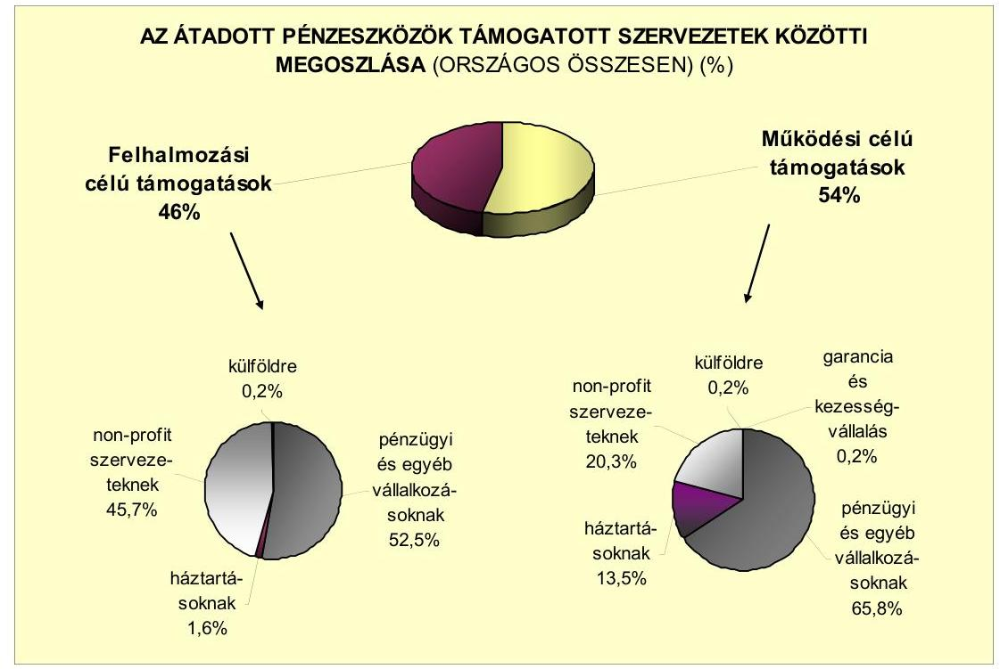

---

Az összes önkormányzat által államháztartáson kívülre ${ }^{57}$ adott támogatás a 2005. évben 180,3 milliárd Ft volt, amelynek 47\%-a Budapest Főváros Önkormányzatánál teljesült. A múködési célra juttatott 96,6 milliárd Ft több mint egyötödét, a felhalmozási célra átadott 83,7 milliárd Ft több mint felét Budapest Főváros Önkormányzata teljesítette.

Az ellenőrzött önkormányzatok ${ }^{58} 98 \%$-a tervezett a 2005. évi költségvetésében speciális célú támogatásokra elkülönített összegeket, és összesen 12,5 milliárd Ft múködési célú, illetve 7,6 milliárd Ft felhalmozási célú pénzeszközátadást teljesített ${ }^{59}$. A céljelleggel kifizetett támogatások az érintett önkormányzatok költségvetési kiadásainak 4\%-át (a 2004. évben 6\%-át, a 2003. évben 5\%-át) jelentették.

A költségvetésben tervezett eredeti előirányzatokhoz viszonyítva a múködési célú pénzeszközátadások 22\%-kal, a felhalmozási célú pénzeszközátadások 83\%kal magasabb összegben teljesültek. A gazdasági társaságot támogatott az önkormányzatok 66\%-a, közhasznú társaságok 55\%-a, társadalmi szervezetet 97\%-a, alapítványokat és közalapítványokat 94\%a, egyházakat 71\%-a, egyéb szervezeteket 93\%-a, magánszemélyeket 73\%-a.
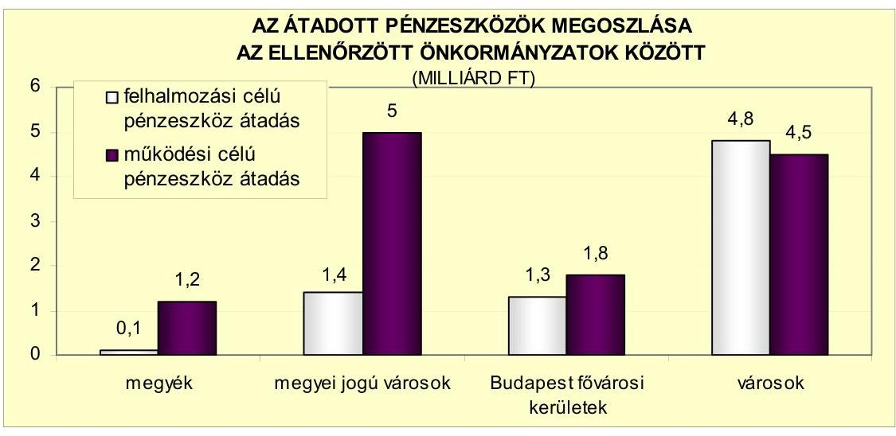

A múködési és felhalmozási célú pénzeszköz átadások 6\%-át a megyei, 33\%-át a megyei jogú városi, $15 \%$-át a Budapest fővárosi kerületi, $46 \%$-át a városi önkormányzatok teljesítették.

A költségvetési rendeletekben jóváhagyott pénzügyi támogatási keretek felett a helyi szabályozás alapján a képviselő-testületek, a bizottságok, és a

[^0]
[^0]:    ${ }^{57}$ Az államháztartáson kívülre átadott támogatás nem tartalmazza a más költségvetési szerveknek (központi költségvetési szerveknek, fejezeti kezelésű előirányzatoknak, elkülönített állami pénzalapoknak, társadalombiztosítási alapnak, helyi önkormányzatoknak) nyújtott támogatás összegét.
    ${ }^{58}$ Budapest Főváros Önkormányzata nélkül.
    ${ }^{59}$ Az ÁSZ a 2005. évben céljellegú támogatásként átadott pénzeszközök 11\%-át, a 2004. évben 15\%-át ellenőrizte az önkormányzatoknál.

---

polgármesterek rendelkeztek az ellenőrzött önkormányzatoknál. A hatásköri előírások figyelmen kívül hagyásával nyújtottak támogatást:

- az önkormányzatok 60\%-ánál (előző évben 55\%-nál) a képviselő-testület helyett bizottságok, polgármesterek döntöttek alapítványok, közalapítványok támogatásáról, megsértve az Ötv. 10. § (1) bekezdés d) pontjában előírtakat;
- a társadalmi szervezeteket támogató költségvetési intézmények 43\%-a (az előző évben 20\%-a) az Áht. 94. § (1) bekezdésében előírtakat megsértve a felügyeleti szerv engedélye nélkül nyújtott támogatást;
- három önkormányzatnál az Ötv. 9. § (1) bekezdésében előírtakat megsértve a polgármesterek a képviselő-testület hatáskör átruházásának hiánya ellenére hoztak támogatásról szóló döntést;
- egy-egy önkormányzatnál az Ötv. 9. § (3) bekezdésének hatáskör átruházási szabályait megsértve, a költségvetési rendeletben meghatározott keretösszeg felett rendelkezési hatáskört biztosítottak önkormányzati képviselőknek, ideiglenesen létrehozott munkacsoportnak, adózóknak.

Az ellenőrzött önkormányzatok a céljelleggel juttatott támogatásoknál az Áht. 13/A. § (2) bekezdésében előírtakat megsértve nem határozták meg 8-8\%-nál (a 2004. évben $10 \%$, illetve $14 \%$-nál) a támogatás összegét és a támogatott célt, 24\%-nál (a 2004. évben 24\%, a 2003-ban 63\%-nál) a támogatás felhasználásáról való számadási kötelezettség teljesítésének módját, 17\%-nál (a 2004. évben 19\%, a 2003-ban 60\%-nál) a számadás határidejét.

A támogatással való elszámolás feltételeit és módját a Ksztv. 14. § (2) bekezdésében foglalt előírást megsértve az ellenőrzött önkormányzatok 42\%-a (a 2004. évben 20\%-a) nem, 17\%-a (az előző évvel azonosan) nem minden támogatott közhasznú szervezet esetében írta elő szerződésben.

A támogatott szervezetek nem mindegyike teljesítette a céljellegú támogatásokra vonatkozó számadási kötelezettséget az ellenőrzött önkormányzatok 13\%ánál (a 2003. évben 15\%-ánál, a 2004. évben 33\%-ánál). A számadások ellenőrzését az Áht. 13/A. § (2) bekezdésében előírtakat megsértve az önkormányzati hivatalok 8\%-a (a 2003.évben 32\%-a, a 2004. évben 20\%-a) elmulasztotta, további $40 \%$-a az előző évekhez hasonlóan nem minden támogatott szervezet esetében végezte el. A támogatások cél szerinti felhasználását $81 \%$ (a 2003-ban 91\%, a 2004. évben 87\%) nem ellenőrizte. A számadások ellenőrzése során rendeltetési céltól eltérő felhasználást az ellenőrzött önkormányzatok egynegyede állapított meg. A polgármesterek nem intézkedtek ezen önkormányzatok $65 \%$-ánál a további támogatás felfüggesztése, $63 \%$-ánál a nem rendeltetésszerűen felhasznált támogatások visszafizettetése érdekében, megsértve ezzel az Áht. 13/A. § (2) bekezdésében előírtakat. A mulasztásokhoz hozzájárult, hogy

---

az Áht. nem tartalmazta ${ }^{60}$ a céljelleggel juttatott támogatások ellenőrzési szabályait ${ }^{61}$.

Az Állami Számvevőszékről szóló 1989. évi XXXVIII. törvény 21. § (3) bekezdésében kapott felhatalmazás alapján 17 szervezet részére nyújtott összesen 25,2 millió Ft támogatás felhasználását az érintett önkormányzat képviselőjével közösen a támogatottaknál a helyszínen ellenőriztük.

A helyszíni ellenőrzés során összesen három millió Ft jogosulatlan, támogatási céltól eltérő felhasználást állapítottunk meg. A céltól eltérő felhasználás ellenére az érintett önkormányzatoknál ${ }^{62}$ a támogatások visszafizetéséről - megsértve az Áht. 13/A. § (2) bekezdésében előírtakat - a helyszíni ellenőrzést megelőzően nem intézkedtek, mivel a számadás helyszíni ellenőrzését megelőző önkormányzati felülvizsgálat nem állapított meg céltól eltérő felhasználást.

# 1.7. A költségvetés egyensúlyi helyzete 

A helyi önkormányzatok teljesített konszolidált bevétele 2003-2006 között 44,7\%-kal, 2879 milliárd Ft-ról 3719 milliárd Ft-ra, kiadása 47,5\%-kal 2586 milliárd Ft-ról 3410 milliárd Ft-ra növekedett. A kiadások - a 2005. év kivételével - évente nagyobb mértékben emelkedtek a bevételeknél. (A bruttó és konszolidált bevételek-kiadások adatait a 4, 4/a és 5 . számú mellékletek részletezik).

Az ellenőrzött önkormányzatok konszolidált bevételeiben 2003-2006 között (66,1\%-ról 64,6\%-ra) csökkent a saját bevételek és a költségvetési támogatás ( $26,7 \%$-ról $22,2 \%$-ra) aránya. Az előző évi pénzmaradvány igénybevétele és a finanszírozási célú pénzügyi műveletek bevételeinek együttes súlya növekedett ( $7,3 \%$-ról $13,3 \%$-ra). A saját bevételekből az intézményi működési bevételek részesedése csökkent ( $13,3 \%$-ról $12,1 \%$-ra), a felhalmozási célú bevételek és az átvett pénzeszközök aránya a 2003-2005. években nőtt ( $11,3 \%$-ról $16,5 \%$-ra), majd a 2006. évben 13,1\%-ra mérséklődött. A helyi adók, adójellegú bevételek és a gépjármúadó együttes súlya a 2003. évi 47,0\%-ról a 2006. évben 49,6\%-ra változott. A múködési célra átvett pénzeszközök összege $31 \%$-kal emelkedett, de ennek ellenére e bevétel forrásokon belüli részaránya (forrásteremtő ereje) 2003-2005 között 26,9\%-ról 22,7\%-ra mérséklődött.

Az önkormányzatok 2003-2005 között teljesített költségvetési bevételeinek a 86-86-81\%-a múködési célú bevétel volt, a költségvetési kiadások 85-85-82\%-át

[^0]
[^0]:    ${ }^{60}$ Meghatározásának kezdeményezésére a helyi és a helyi kisebbségi önkormányzatok gazdálkodásának átfogó ellenőrzéséről szóló 0544 . sorszámú ÁSZ jelentésben a pénzügyminiszternek tettünk javaslatot.
    ${ }^{61}$ A helyi és a helyi kisebbségi önkormányzatok gazdálkodásának átfogó ellenőrzéséről szóló 0634. sorszámú jelentésében javasoltak alapján a pénzügyminiszter módszertani útmutatást adott a 2006. év végén az Önkormányzati Belső Ellenőrzési Kézikönyvben a céljelleggel nyújtott támogatások számadása és rendeltetésszerú felhasználása ellenőrzéséhez.
    ${ }^{62}$ Baranya megye, Sopron, Tatabánya, Nyíregyháza, Nagykanizsa megyei jogú városok, valamint Budapest Főváros VII. Kerület Önkormányzatánál.

---

múködési célra használták fel. A múködési célú költségvetési bevételek a 2005. évben nem bizonyultak elégségesnek a múködési célú költségvetési kiadások teljesítéséhez. A felhalmozási célú költségvetési bevételek csak a 2005. évben nyújtottak fedezetet a felhalmozási kiadásokra. A felhalmozási célú költségvetési bevételek az összes forrás 14-14-19\%-át, a felhalmozási kiadások a költségvetési kiadások 15-15-19\%-át képezték.

Az ellenőrzött önkormányzatoknál a múködési célú költségvetési kiadásokban továbbra is meghatározóak a személyi juttatások és járulékaik, amelyek részaránya 2003-ban még $50 \%$ feletti volt, ezt követően azonban folyamatosan csökkent ${ }^{63}$. A felhalmozási kiadásokon belül 2003-2006 között az intézményi beruházási kiadások részaránya $75,8 \%$-ról $70,9 \%$-ra csökkent, a felújítási kiadások részaránya folyamatosan nőtt ${ }^{64}$, azonban összege a felhalmozási kiadások között változatlanul nem jelentős, az átadott pénzeszközök részaránya 6,6\% és 9,1\% között változott.

A hitelfelvételből eredő fizetési kötelezettség év végi összege az ellenőrzött önkormányzatoknál 2002-2006 között változó volt, az előző évhez viszonyítva a 2003. év végre $6 \%$-kal nőtt, a 2004. év végére $35 \%$-kal csökkent, a 2005. év végére $6 \%$-kal, a 2006. év végére $88 \%$-kal emelkedett. Az év végi hitelállomány $29 \%$-a, $53 \%$-a, $41 \%$-a, $66 \%$-a 2003-2006 között Budapest Főváros Önkormányzatának hitele volt, az ezen kívüli hitelállomány harmadával a 2003. évben a Budapest fővárosi kerületi önkormányzatok, a 20042006. években a megyei jogú városi önkormányzatok rendelkeztek. A hitelből nyert források 2003-2006 között 143,5\%-kal növekedtek. A felvett hitelek összege a tárgyévben visszafizetett hitel összegénél 2003-2006 között 173,0\%-69,4\%-$158,0-195,8 \%$-kal voltak magasabbak. A hitel felvétel és visszafizetés közötti különbség, illetve az év végén fennálló növekvő hitelállomány jelzi az ellenőrzött önkormányzatok romló pénzügyi helyzetét.

A pénzügyi egyensúly az önkormányzatok egyre nagyobb arányánál (70-73-90\%-nál) nem volt biztosított a 2003-2005. évi költségvetésekben, a tervezett költségvetési hiány $161,2 \%$-kal növekedett. A tervezett költségvetési bevételek nem nyújtottak fedezetet a 2005. évben a kiadások átlag 7,6\%-ára ${ }^{65}$ (Budapest Főváros Önkormányzatánál 18,8\%-ára Budapest fővárosi kerületi önkormányzatoknál 8,3\%-ára, a megyei jogú városi önkormányzatoknál 9\%ára, a megyei önkormányzatoknál 3,9\%-ára és a városi önkormányzatoknál 7,6\%-ára). A tervezett hiány költségvetésen belüli aránya emelkedett az önkormányzatok $56 \%$-ánál (a megyéknél $70 \%$-kal, a megyei jogú városoknál $118 \%$-kal, a városoknál $151 \%$-kal ${ }^{66}$ ), csökkent a Budapest fővárosi kerületi ön-

[^0]
[^0]:    ${ }^{63}$ A személyi juttatások és járulékaik aránya az összes kiadáson belül 2003-ban 52,2\%, a 2004-ben $49 \%$, a 2005-ben $48,1 \%$ a 2006-ban $46,8 \%$ volt.
    ${ }^{64}$ A felújítási kiadások aránya a felhalmozási kiadásokon belül 12,4\%-13,9\%-15,1\%$17,2 \%$ volt.
    ${ }^{65}$ 2003. évben 6,5\%-ára, 2004. évben 6,9\%-ára, Budapest Főváros Önkormányzatánál a tervezett kiadások 6,9-18,5-18,8\%-a volt a tervezett hiány.
    ${ }^{66}$ Budapest Főváros Önkormányzatnál 219,7\%-os növekedés volt.

---

kormányzatoknál (31\%-kal), meghaladta a tervezett összes kiadás egytizedét az ellenőrzött önkormányzatok 19\%-ánál ${ }^{67}$.

A 2005. évi költségvetésben tervezett hiány önkormányzat-típusonkénti átlagos összege a Budapest fővárosi kerületi önkormányzatoknál 1047,1 millió Ft, a megyei jogú városi önkormányzatoknál 2056,5 millió Ft, a megyei önkormányzatoknál 730 millió Ft, a városi önkormányzatoknál 234,6 millió Ft volt ${ }^{68}$. Budapest Főváros Önkormányzatánál a 2005. évi költségvetésben tervezett hiány összege 71604,5 millió Ft volt.

A Budapest fővárosi kerületi önkormányzatok közül legnagyobb összegű költségvetési hiányt - 2795,3 millió Ft-ot, a költségvetési főösszeg 17,6\%-át - a Budapest fővárosi XXI. kerületnél terveztek. A megyei jogú városi önkormányzatok közül Hódmezővásárhely, Nyíregyháza és Tatabánya megyei jogú városok önkormányzatainál a költségvetési hiány meghaladta a kettő milliárd Ft-ot, míg Sopron Megyei Jogú Város Önkormányzatánál 3351,5 millió Ft volt.

A múködési célú költségvetési bevételek az önkormányzatok 76\%-ánál (az előző évben 57\%-ánál), a felhalmozási célú bevételek 55\%-nál (az előző évben 50\%-nál) nem nyújtottak fedezetet az azonos célú kiadásokra. A 2005. évi tervezéskor fennállt belső egyensúly hiányát az önkormányzatok 30\%-a (előző évben 15\%-a) a felhalmozási célú költségvetési bevételek múködési célú kiadásokra történő bevonásával tervezte feloldani, 29\%-a (előző évben 27\%) múködési célú költségvetési bevételt felhalmozási célú kiadásra tervezett fordítani. A hiány az érintettek 40\%-ánál kizárólag működési, 17\%-ánál felhalmozási célú költségvetési bevételek hiányából származott, 43\%-ánál a kettő együttesen volt jelen.

A tervezett hiány összegénél az önkormányzatok 56\%-ánál szerepet játszott a feladatellátás gazdaságtalan megszervezése, az intézményi kapacitások alacsony kihasználtsága, a teherbíró képességet meghaladó önként vállalt feladatok ellátása. A kiadások túltervezése, a bevételek alultervezése az önkormányzatok 33\%-nál ${ }^{69}$ járult hozzá a költségvetési egyensúly hiányához. A működési célú költségvetési kiadások múködési célú költségvetési bevételeket meghaladó növekedése az önkormányzatok 55\%-ánál, az adóbevétel az adó alapjának csökkenése és az adott kedvezmények miatt az önkormányzatok 38\%-nál, a növekvő szociális terhek az önkormányzatok 28\%-nál hatottak negatívan a költségvetési egyensúlyra. A forráshiányt az azt tervező önkormányzatok 51\%-ánál befolyásolta a korábbi évek finanszírozási célú pénzügyi műveleteinek hatása, a többletfeladatok (múködési, felhalmozási) megvalósításához felvett hitelek tőke- és kamatterheiből adódó fizetési kötelezettségek. A korábbi évek hitelfelvételeinek kamatterhei az önkormány-

[^0]
[^0]:    ${ }^{67}$ Budapest Fővárosi Önkormányzat, Budapest főváros XXI. kerületi, Sopron, Tatabánya megyei jogú városi, 14 városi önkormányzat. A hiány aránya Budaörs és Fonyód város önkormányzatoknál meghaladta a tervezett összes kiadás egyötödét.
    ${ }^{68}$ Budapest Főváros Önkormányzatánál a tervezett hiány a 2003. évben 22 399,9 millió Ft, a 2004-ben 65 210,3 millió Ft, a 2005. évben 71 604,5 millió Ft volt.
    ${ }^{69}$ Az arányszám tartalmazza a Budapest Fővárosi Önkormányzat adatait is.

---

zatok 40\%-nál, az átmenetileg szabad pénzeszközök lekötéséből származó bevételek csökkenése 13\%-nál gyengítették a likviditást.

A felhalmozási célú bevételeket meghaladó mértékú beruházási kötelezettségvállalás az önkormányzatok 42\%-ánál, felújítási kötelezettségvállalás az önkormányzatok 17\%-nál okozott forráshiányt. (Budapest Főváros Önkormányzatánál a forráshiány ellenére a beruházási-felújítási célú költségvetési kiadásokat évente 14\%-kal magasabb összeggel tervezték.)

A 2003-2005. évi teljesítési adatok szerint a tervezetthez viszonyítva javult az önkormányzatok pénzügyi egyensúlyi helyzete, különösen a múködési célú bevételeket-kiadásokat illetően. A költségvetési rendeletekben jóváhagyott hiányt bevételi többlettel és kiadási megtakarítással mérsékelték, tényleges hiányt a 2003. évben az önkormányzatok 25\%-ánál, 2004-ben 26\%ánál, 2005-ben 31\%-ánál mutattak ki.
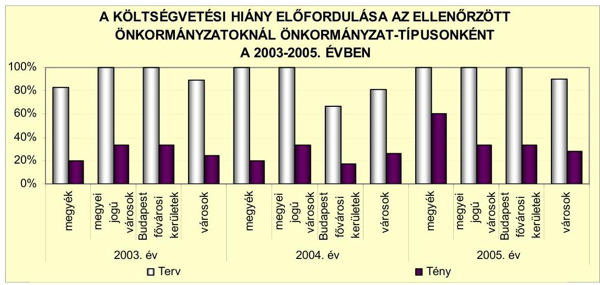

A költségvetés végrehajtása során folyamatosan megőrizte a múködési célú költségvetési bevételek-kiadások egyensúlyát az önkormányzatok $61 \%$-a (a megyei jogú városi önkormányzatok 100\%-a, a megyei önkormányzatok 60\%-a, a városi önkormányzatok 58\%-a, a Budapest fővárosi kerületi önkormányzatok 50\%-a), a felhalmozási célú költségvetési bevételekkiadások egyensúlyát 28\%-a (elsősorban a Budapest fővárosi kerületi önkormányzatok). Mindvégig múködési forráshiánya volt 11\%-nak, felhalmozási hiánya 30\%-nak.

A költségvetésében hiányt tervező önkormányzatok 68\%-82\%-77\%-a tett intézkedéseket 2003-2005 között a kiadások csökkentése érdekében a költségvetési szervek gazdálkodását, feladatait érintően, amelyek azonban 74\%nál nem szüntették meg a forráshiányt és az önkormányzatok 18\%-a egyes feladatok elhagyására is kényszerült.

A források növelése érdekében a 2005. évben az ellenőrzött önkormányzatok 60\%-a további bevételi forrásokat tárt fel, 95\%-a (2003-ban 88\%, 2004-ben 92\%), vagyonértékesítést hajtott végre, amelyből 144,1 milliárd Ft bevétel származott, 88\%-a eredményesen pályázott múködési célú, 99\%-a

---

felhalmozási célú pénzeszközökre. A tervezett hiányt csökkentette a költségvetési bevételek kiadási előirányzatokat 6\%-kal meghaladó teljesítése, valamint az intézményi múködési bevételek 15\%-os, a kamatbevételek 62\%-os, a múködési célra átvett pénzeszközökből származó bevételek 10\%-os eredeti előirányzatot meghaladó túlteljesítése. A költségvetési egyensúlyt jelentősen javította az előző évi pénzmaradvány tervezettet 328\%-kal meghaladó igénybevétele, amely az önkormányzatok tervezéskor kimutatott 35,7 milliárd Ft-os hiányának $64 \%$-át fedezte.

Az önkormányzatok mindegyike élt a helyi adó megállapításának lehetőségével, 35\%-a gazdasági programjában egyik célként a pénzügyi helyzet stabilizálását, az adómértékek lakossági, vállalkozói érdekek figyelembevételével történő megállapítását határozta meg. Az egyes adónemek 2003-2005 közötti bevezetésekor az önkormányzatok 77\%-a vizsgálta a település adottságait, a lakosság teherbíró képességét ${ }^{70}$. Az önkormányzatok átlagosan három adónem bevezetését határozták el. Az iparúzési adót a települési önkormányzatok mindegyike, a kommunális jellegú adót 79\%-a, vagyontípusú adót 62\%-a (közülük 46\% építményadót, 25\% telekadót) állapított meg. A kommunális jellegú adók közül a magánszemélyek kommunális adójának bevezetéséről 60\%, a vállalkozók kommunális adójának bevezetéséről 32\%, az idegenforgalmi adóról $42 \%$ döntött.

Az önkormányzatok az iparúzési adó maximális mértékének átlag 94\%-át állapították meg, ezen belül az önkormányzatok 69\%-a az iparúzési adónál az adómaximumot vetette ki a 2005. évben Az átlagos adómérték az adómaximumon belül az építményadónál 53\%, a telekadónál $50 \%$, a magánszemélyek kommunális adójánál $51 \%$, a vállalkozó kommunális adójánál $90 \%$, az idegenforgalmi adónál $67 \%$ volt.
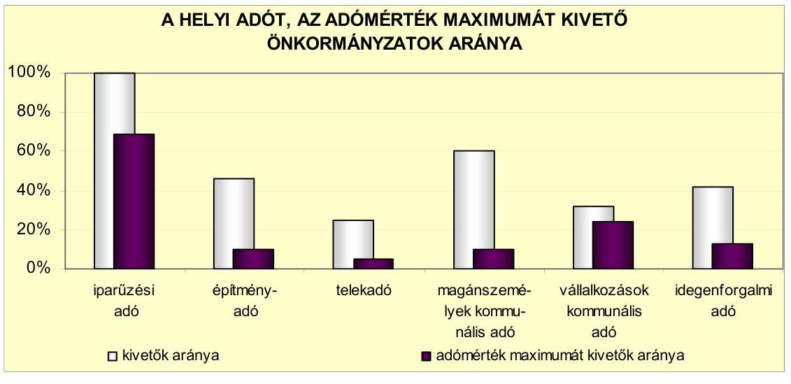

[^0]
[^0]:    ${ }^{70}$ Budapest főváros területén - a Hatv. 1. § (2), (3) bekezdése, illetve a 7. § d) pontja alapján - az iparúzési, illetve idegenforgalmi adót a Budapest Fővárosi Önkormányzat állapította meg, amely bevételből a forrásmegosztás keretében juttatott vissza forrást a Budapest fővárosi kerületi önkormányzatoknak.

---

Mentességet, kedvezményt az önkormányzatok 69\%-a az iparűzési, 87\%-a a vagyoni típusú, $74 \%$-a a kommunális jellegú adó esetében biztosított, amelyek miatt az ellenőrzött kiemelt körbe tartozó ás a városi önkormányzatok 38\%nál csökkent a helyi adóbevétel. Ennek ellenére a helyi adó bevételek öszszege 2002-2005 között 34\%-kal növekedett miközben a saját bevételeken belüli részaránya nem változott ${ }^{71}$, és az összes bevételen beüli aránya 9\%-ról 11\%ra emelkedett. A 2005. évben a helyi adóbevételen belül az iparúzési adó $84 \%$ ot, az építményadó $11,1 \%$-ot, a telekadó $1,3 \%$-ot, a vállalkozók kommunális adója $0,3 \%$-ot, a magánszemélyek kommunális adója $2 \%$-ot, az idegenforgalmi adó $1,3 \%$-ot képviselt. Az iparúzési adóbevételeket folyamatosan csökkentette a vállalkozások helyzetének romlása, az adó alapjának jogszabályi változása és növelte ${ }^{72}$ a mentességek, kedvezmények mérséklése.

A hiány fedezeteként az önkormányzatok $\mathbf{6 0 \%}$-a múködési célra, $\mathbf{6 2 \%}$-a felhalmozási célra vett fel hitelt ${ }^{73}$. Emellett az önkormányzatok $\mathbf{8 0 \%}$-a (előző évben 70\%) az átmeneti, illetve már tartóssá váló likviditási gondok enyhítésére likviditási hitelt vett fel, amelynek nagysága a hitellel rendelkező önkormányzatok $78 \%$-nál növekedett ${ }^{74}$.
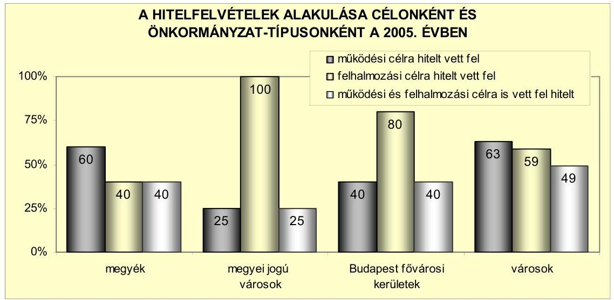

[^0]
[^0]:    ${ }^{71}$ A 2002. és 2005 . évben $18-18 \%$ volt a saját bevételek között.
    ${ }^{72}$ Budapest Főváros Önkormányzatánál az adóbevételek kedvező alakulását a fokozott behajtási tevékenység is befolyásolta, ugyanakkor az adómentességek és kedvezmények biztosításával 2002-2005 között 1080,9-515,3-251,5 millió Ft bevételkiesést mutattak ki.
    ${ }^{73}$ Budapest Főváros Önkormányzata elsősorban infrastrukturális beruházások finanszírozásához összesen 61586,6 millió Ft hitelt vett fel 2003-2005 között, a 2006. évben 28400 millió Ft hitel felvételét tervezte.
    ${ }^{74}$ Budapest Főváros Önkormányzata Főpolgármesteri Hivatalánál a folyószámlahitelkeret összege 2003-2006 között 1500-5000- 5000-10 000 millió Ft volt, likvid hitelt a 2003. és a 2006. évben vett fel. A 2003. évben egy alakalommal, 3 napra történt likvid hitel felvétel 367,7 millió Ft összegben, a 2006. évben egy alkalommal 12 napra történt 6499,6 millió Ft likvid hitel felvétele

---

Az önkormányzatok 61\%-a (előző évben 46\%), ezen belül a megyei önkormányzatok háromnegyede, a megyei jogú városi önkormányzatok egyharmada, a Budapest fővárosi kerületi önkormányzatok fele, a városi önkormányzatok 38\%-a nem tudta az év végén fennálló likvid hitelét a 2005. év végén visszafizetni, így az a következő év gazdálkodását terhelte. Az önkormányzatok 24\%-ánál 100 millió Ft-ot meghaladó hitel-visszafizetési kötelezettség állt fenn ${ }^{75}$ a 2005. év végén. A likvid hitelt felvett önkormányzatok 20\%-a 2003-2006 között egyik évben sem fizette vissza annak teljes összegét, így az három éven át folyamatosan szolgálta a fizetőképesség fenntartását.

A közbenső egyeztetés során az Önkormányzati és Területfejlesztési Minisztérium szakállamtitkára által adott észrevétel szerint „A javaslat már a korábbi ÁSZ Jelentésekben is szerepelt, az ezzel kapcsolatban tett korábbi észrevételeimet továbbra is fenntartom. Az Ötv. 2005. évi módosítása során okkal javasoltuk, hogy a likvid hitelek ne számítsanak bele a rövid lejáratú kötelezettségekbe. E hitelek - köztük elsősorban a folyószámla hitelek - ugyanis jellegüknél fogva csak átmeneti finanszírozási problémák pénzügyi kezelésére szolgálnak, és nem testesítenek meg az önkormányzat tekintetében tartós hosszú, illetve rövid lejáratú kötelezettséget (ezt nem befolyásolja az sem, ha egy önkormányzat esetleg újabb likvid hitelt vesz fel). Ezeket a hiteleket az önkormányzatok a közszolgáltatási feladatok folyamatos müködtetéséhez veszik igénybe.

Az ÁSZ javaslatát azzal együtt kell mérlegelni, hogy egy ilyen jellegü módosítás legrosszabb esetben a közszolgáltatási feladatok ellátását is veszélyeztetheti, emellett csökkentheti az önkormányzatok fejlesztési célra felvehető hiteleinek nagyságát is.

Felhívom a figyelmet arra, hogy az ÖNHIKI szabályozásban új elemként jelent meg, hogy a tárgyévet megelőzően felvett és ugyanezen év december 31-éig vissza nem fizetett müködési célú hitel 30\%-a az önkormányzat elismerhető kiadásait csökkenti. A százalékos arány - a költségvetési törvény alapján - 2008. évben 100\%-ra növekszik. Ez a szabályozás véleményem szerint hozzájárul az ÁSZ által is elérni kívánt célhoz, ezen esetek csökkenéséhez.,,

Az észrevétel nem meglapozott, mivel a közszolgáltatási feladatok ellátását nem veszélyezteti, sőt a feladatellátás feltételeinek reális megítélését elősegíti, ha az önkormányzatok által felvett hiteleket nem a megnevezésük, hanem tartalmuk, céljuk a gazdálkodási folyamatban betöltött szerepük alapján értékeljük. Javaslatunkban szerepel, hogy a forgalmilag folyamatosan megújuló folyószámlahitelek figyelembevételét kezdeményezzük az adósságot keletkeztető kötelezettségvállalás Ötv. 88. § (2) bekezdése szerinti felső határának megállapításánál. A folyószámla-hitelfelvétel folyamatos megújítása az önkormányzatoknál az állandósult forráshiányt jelenti, ily módon jelzi, hogy ezen hitel nélkül nem tudják közszolgáltatási feladataikat ellátni. Az évközben állandósult likvid-hitelfelvétel következménye, hogy az év végén sem tudják azt visszafizetni, vagy formális jelleggel megtörténik az év utolsó napján a visszafizetés és a következő év első napján az ismételt likvid-hitelfelvétel.

[^0]
[^0]:    ${ }^{75}$ Sopron és Nyíregyháza megyei jogú városok önkormányzatainál meghaladta az egymilliárd Ft-ot.

---

A folyószámla-hitelfelvétel állandósulása miatti eladósodásnak megítélésem szerint ugyanolyan következménnyel kell járnia, mint a felhalmozási célú feladatok megvalósításához felvett hitel miatti eladósodásnak.
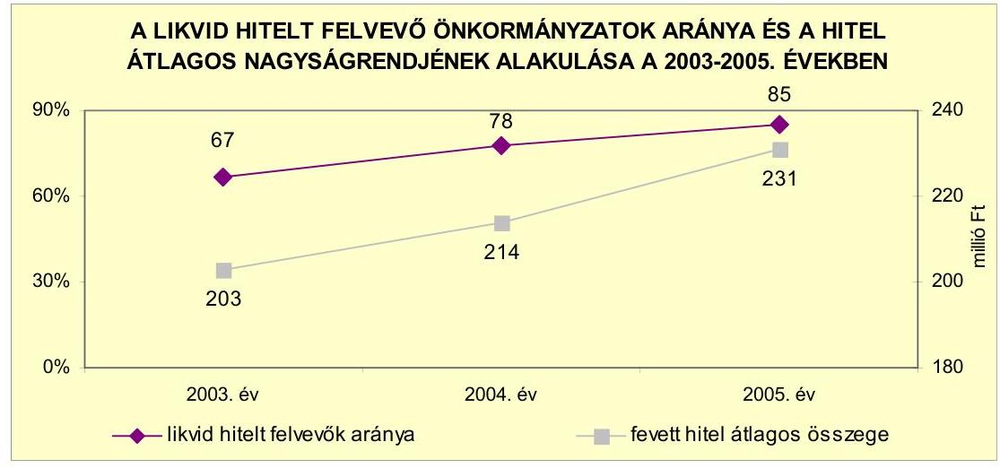

A fizetőképesség biztosításához szükséges likviditási tervet a jegyzők az ellenőrzött önkormányzatok 18\%-ánál az Ámr. 139. § (1) bekezdésében előírtak ellenére nem készítették el. A likviditási tervet készítők 99\%-ánál figyelemmel voltak a helyi adók beérkezésére, 95\%-ánál megalapozottan történt az egyes sajátos bevételek ütemezése. A likviditási tervek 45\%-ának aktualizálása az indokoltsága ellenére elmaradt.

A pályázatok személyi és szervezeti feltételeit az önkormányzatok 84\%ánál biztosították. A szervezeti kereteket kialakító önkormányzatok 29\%-a (előző évben 47\%) a pályázatok figyelését, előkészítését, megvalósításának koordinálását az önkormányzati hivatalok szervezetén belül, elkülönült szervezeti egység létrehozása nélkül oldották meg, rendszerint a szakmai irodák egy-egy dolgozója végezte, a megfelelő szakosztályok, esetenként külső szakértők bevonásával. Az önkormányzatok 12\%-ánál (előző évben 22\%) külön e célra létrehozott iroda, illetve munkacsoport feladata volt a pályázati előkészítő munka végrehajtása. Az önkormányzatok 53\%-ánál (előző évben 31\%) pályázati referenseket alkalmaztak, 6\%-ánál a helyi megbízások mellett külső vállalkozások segítségével végezték a feladatot ${ }^{76}$.

A múködési forráshiányt tervező önkormányzatok 53\%-a kért, és azok háromnegyede, a múködési forráshiányos önkormányzatok 40\%-a ${ }^{77}$ (ezen belül a városok 63\%-a, megyék 33\%-a) kapott ÖNHIKI támogatást, amely a múködési forráshiány összegének 47\%-ára ${ }^{78}$ nyújtott fedezetet. Az ellenőrzött forráshiányos önkormányzatok 48\%-a (előző évben 37\%) a múködés-

[^0]
[^0]:    ${ }^{76}$ Budapest Főváros Önkormányzatánál a Programvégrehajtó Iroda, valamint az Európai Integrációs és Külügyi Iroda látta el a pályázatfigyelési és pályázatkészítési feladatokat.
    ${ }^{77}$ Az előző évvel azonos arányban.
    ${ }^{78}$ A 2002. évben 72\%-ra, a 2003. évben 42\%-ára, 2004-ben 25\%-ára nyújtott fedezetet.

---

képtelen önkormányzatok egyéb támogatási előirányzatból is részesült. A támogatás átlagos mértéke 9,5 millió Ft volt.

Adósságot keletkeztető kötelezettségvállalásról az ellenőrzött kiemelt körbe tartozó és a városi önkormányzatok 63\%-a (a 2003. évben 30\%, 2004-ben 66\%), döntött, amelyek 90\%-a hitelfelvétel volt. Lízingszerződést $32 \%$ kötött, garanciát vállalt $6 \%$, kezességvállalási döntést hozott $43 \%$. A pénzügyi bizottságok az adósságot keletkeztető kötelezettségvállalások 89\%ánál vizsgálták meg annak indokoltságát és gazdasági megalapozottságát. Az adósságot keletkeztető kötelezettségvállalások Ötv. 88. § (2) bekezdésében meghatározott felső határát a kötelezettségvállalást megelőzően az önkormányzatok 83\%-a vizsgálta, azonban azok 4\%-a az előírást megsértve túllépte a felső határt. Az adósságot keletkeztető kötelezettségvállalások az önkormányzatok 4\%-ának fizető- és működőképességét, 2\%-ának működőképességét veszélyeztették. Az önkormányzatok 2\%-a az elismert tartozásokat az esedékességet követő 60 napon belül nem fizette vissza, ennek ellenére nem kezdeményezett adósságrendezési eljárást.

Az Ötv. az adósságot keletkeztető kötelezettségvállalás éves felső határának meghatározásakor nem veszi figyelembe a több éven keresztül fizetési kötelezettségként jelentkező, szállítókkal szembeni, mérleg fordulónapján fennálló tartozások hatását, és figyelmen kívül hagyja a likvid hiteleket, annak ellenére, hogy rendszerint tartós likviditási problémák kezelésére szolgálnak. Ezek a kötelezettségek az önkormányzatok költségvetését éveken át terhelik, az eladósodottságot, a fizetőképességet a jogszabály által figyelembe vett kötelezettségvállalásokkal azonos módon befolyásolják.

# 1.8. A zárszámadás szabályszerűsége 

A 2005. évi zárszámadási rendelettervezetet a polgármester - az Áht. 82. §-ában előírt határidőn belül ${ }^{79}$ - az önkormányzatok 98\%-ánál (az előző évben 100\%-ánál) terjesztette a képviselő-testület elé.

A zárszámadási elő́terjesztések 21\%-át (2005. évben 26\%-át) megsértve az Áht. 18. §-ában foglaltakat, nem a költségvetési rendelettel összehasonlítható módon készítették el. A zárszámadási rendeletben szereplő eredeti előirányzatok fő- és részösszegei az önkormányzatok 2\%-ánál (2005. évben $8 \%$-ánál) nem egyeztek meg a költségvetési rendelet vonatkozó adataival. A bevételek és kiadások módosított előirányzata az önkormányzatok 10\%-ánál (2005. évben 16\%-ánál) eltért a költségvetési rendelet legutolsó módosításakor elfogadott előirányzattól. A zárszámadási előterjesztések nem, vagy hiányosan tartalmazták:

- a működési-fenntartási előirányzatok önkormányzati szintű teljesítését (7\%), ezen belül a kiemelt előirányzatok közül elmaradt az ellátottak pénzbeli juttatásainak (9\%), a speciális célú támogatásoknak (7\%) és a tényleges költségvetési létszámkereteknek (16-nál) a bemutatása;

[^0]
[^0]:    ${ }^{79}$ A zárszámadási rendelettervezet képviselő-testület elé terjesztésének határideje az Áht. 82. §-a szerint a költségvetési évet követő 4 hónapon belüli időpont.

---

- a múködési, fenntartási előirányzatok költségvetési szervenkénti teljesítését az önkormányzatok 12\%-ánál, ezen belül a kiemelt előirányzatok közül nem mutatták be az önkormányzatok 16\%-a az ellátottak pénzbeli juttatásait, $13 \%$-a a speciális célú támogatásokat, és $71 \%$-a a tényleges létszámkereteket;
- a felújítási előirányzatok teljesítését célonként, a felhalmozási kiadásokat feladatonként, az önkormányzati hivatalok feladatonkénti kiadásainak teljesítését az önkormányzatok 11\%-ánál;
- a múködési és felhalmozási bevételek, kiadások mérlegszerű bemutatását az önkormányzatok 17\%-ánál.

Az önkormányzatok 54\%-ánál (a 2005. évben 52\%-nál) a zárszámadás előterjesztésekor az Áht 118. §-ának akkor hatályos előírását megsértve, a képviselőtestületek részére tájékoztatásul nem mutatták be az Áht. 116. § 6. és 8. pontjában ${ }^{80}$ előírt mérlegeket és kimutatásokat, valamint az Áht. 116. § 9. és 10. pontjában előírt kimutatásokat szöveges indoklással együtt.

# A zárszámadási rendelettervezetek előterjesztésekor elmaradt az önkormányzatok 

- 5\%-ánál a helyi önkormányzat, 20\%-ánál elkülönítetten a kisebbségi önkormányzat összevont mérlegeinek bemutatása (a 2005. évben 2\%-nál, illetve $17 \%$-nál);
- 30\%-ánál a többéves kihatással járó döntések számszerűsítése évenkénti bontásban, valamint összesítve, szöveges indoklással együtt (előző két évben 44 , illetve $54 \%$-ánál);
- 34\%-ánál a közvetett támogatások (adókedvezmények, adóelengedések) bemutatása és 39\%-ánál annak szöveges indoklása (a 2005. évben 41\%-nál, illetve 66\%-nál, a 2004. évben ellenőrzötteknél 57, illetve 73\%-ánál).

A zárszámadási rendeletben az önkormányzatok 15\%-ánál (a 2005. évben 16\%-ánál) nem a Vhr. 38-39. §-ai és az Ámr. 65-67. §-aiban foglaltak alapján hagyták jóvá a pénzmaradványt. Az előterjesztésekben nem vagy téves öszszegben mutatták be a módosított pénzmaradvány összegét a záró pénzkészletből kiindulva, az aktív és passzív elszámolásokkal, a finanszírozási tételekkel korrigálva. Nem költségvetési szervenkénti részletezésben hagyták jóvá a pénzmaradványt az önkormányzatok 21\%-ánál (a 2005. évben 22\%-ánál) az Ámr. 66. § (4) bekezdésében előírtak ellenére. Az önkormányzatok 49\%-a (a 2005. évben 45\%-a) élt az Ámr. 66. § (6) bekezdés g) pontjában biztosított jogkörével, az intézményeknél keletkezett pénzmaradvány egy részét, vagy egészét elvonta.

Vállalkozási tevékenységet az ellenőrzött (kiemelt körbe tartozó és városi) önkormányzatok közül négy önkormányzati hivatalnál végeztek (Dévaványa,

[^0]
[^0]:    ${ }^{80}$ A 2007. január 1-től az Áht. 118. § (2) bekezdés 1. és 2. a)-e) pontjai tartalmazzák a zárszámadás előterjesztésekor bemutatandó mérlegeket, kimutatásokat.

---

Kistelek, Nádudvar, Abádszalók városok). A vállalkozási tevékenység eredményének megállapításánál és felhasználásánál szabályszerűen jártak el.

A jegyzők a költségvetési szervek elemi beszámolója felülvizsgálatának rendjét, tartalmát - az Ámr. 149. § (2) bekezdésének b) pontjának előirása ellenére - az önkormányzatok 53\%-ánál (az előző évivel azonos arányban) nem határozták meg. Ennek ellenére 81\%-nál (2005. évben 89\%-nál) az intézmények 2005. évi költségvetési beszámolóit- a felügyeleti szerv hatáskörében eljárva - felülvizsgálták az Ámr. 149. § (3) bekezdésében foglaltak alapján. Az intézmények vezetőit az Ámr. 149. § (5) bekezdésében foglaltak ellenére 37\%-nál (2005. évben 49\%) írásban nem értesítették az éves beszámolójuk és múködésük elbírálásáról, jóváhagyásáról.

Az önkormányzati hivatalok 18\%-nál (a 2005. évben 10\%-ánál) indokoltsága ellenére nem biztosították a Vhr. 10. § (1) és (5) bekezdésében előírt határidőben elkészített és adatszolgáltatásra megküldött költségvetési beszámoló és a zárszámadási rendelet (eredeti és módosított előirányzatok, teljesítések) adatainak összhangját.

A helyi önkormányzatok központi költségvetési támogatásokkal, hozzájárulásokkal történő elszámolását - mely a költségvetési beszámolásuk részét képezi az ÁSZ a központi költségvetés végrehajtását tartalmazó zárszámadás ellenőrzéséhez kapcsolódóan mintavételekkel ellenőrzi. Ezen vizsgálatok a helyi önkormányzatok részére nyújtott hozzájárulások, támogatások jogszabályi előírásoknak megfelelő igénylésére, felhasználására és elszámolására terjedtek ki. A 2006. évben 867,1 milliárd Ft központi költségvetési hozzájárulás, támogatás, valamint 460,7 milliárd Ft személyi jövedelemadó részesedése együttesen 1327,9 milliárd Ft illette meg az önkormányzatokat. A zárszámadáshoz kapcsolódó ellenőrzés során évek óta a jogszabályi előírások közötti összhang kialakítására, a támogatási követelmények, feltételek pontosítására, valamint az ellenőrzött önkormányzatok által jogtalanul igénybe vett hozzájárulások, támogatások visszafizetésére, illetve a részükre jogosan járó összegnek pótlólagos kiutalására tettünk javaslatot.

# 1.9. A pénzügyi-számviteli feladatok ellátásának informatikai támogatottsága 

Az ellenőrzött önkormányzatoknál a pénzügyi-számviteli tevékenység informatikai támogatottsága egyre elterjedtebb, azonban jellemzően még nem épült ki az integrált, rendszerezett elveken nyugvó, komplex információs rendszer. Ennek hiányában a pénzügy-számviteli feladatok ellátására számítógépes programokat és manuális analitikus nyilvántartást egyaránt használtak. Az analitikus nyilvántartások számítógépen történő vezetése az önkormányzatok tizedénél (az előző évben 5\%-nál) volt teljes körű. Az ellenőrzött önkormányzatok a MÁK által térítésmentesen biztosított analitikus nyilvántartást végző programokat és vásárolt, vagy készített szoftvert használtak. A programok fejlesztői gondoskodtak a jogszabályi változások átvezetéséről, frissítéséről és az oktatásáról is. A főkönyvi könyvelés az előző évhez hasonlóan számítógépen történt. A költségvetési beszámolók szintén számítógépes támogatással, a főkönyvi programhoz kapcsolódó program segítségével készültek.

---

Az analitikus nyilvántartó programok nem alkottak teljes körúen zárt rendszert a főkönyvi programmal, azok az önkormányzati hivataloknak csak 25\%-nál illeszkedtek egymáshoz. A pénzügyi, gazdasági területen használt egyéb alkalmazói rendszerek száma eltérő mennyiségi és minőségi jellemzőkkel növekedett, háttérbe szorítva a manuális nyilvántartási tevékenységet.

Az önkormányzati hivatalok informatikai eszköz ellátottsága eltérő, és változó volt az ügyintézőkre jutó számítógépek aránya is. Informatikai rend-szer-fejlesztés az előző évi 81\%-kal szemben az önkormányzatok 71\%-ánál történt, mivel az elsődleges cél nem a géppark bővítése, hanem az elavult gépek cseréje volt. A fejlesztések 83\%-a a hardver területet érintette. A szoftverfejlesztés az önkormányzatok 54\%-ánál beszerzéssel, 20\%-ánál saját fejlesztéssel történt.
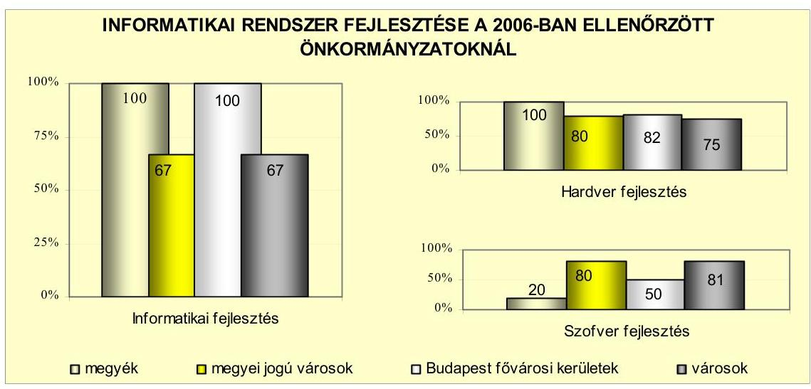

Az önkormányzati hivatalok hiányosan rendelkeztek az informatikai környezettel kapcsolatos legfontosabb szabályzatokkal:

- nem rendelkezett a hosszú távú célkitűzéseket tartalmazó informatikai stratégiával $57 \%$, a számítógépek számának növekedésével a spontán fejlesztések váltak jellemzővé;
- nem készítettek katasztrófa elhárítási tervet indokoltsága ellenére 55\%-nál, nem készültek fel a váratlan események bekövetkezésekor történő intézkedésekre, veszélyeztetve a folyamatos munkavégzést és az adatok megbízhatóságát, sértetlenségét;
- elmaradt a hozzáférési jogosultsági rendszer szabályozása 55\%-nál, az erre vonatkozó adatok a gyakorlatban a hálózatos rendszer adminisztrációjában rendelkezésre álltak;
- nem alakították ki és nem szabályozták az adatbiztonsági rendszer követelményeit 43\%-nál;
- nem rendelkeztek a múködő informatikai rendszer üzemeltetési leírásával $22 \%$-nál.

---

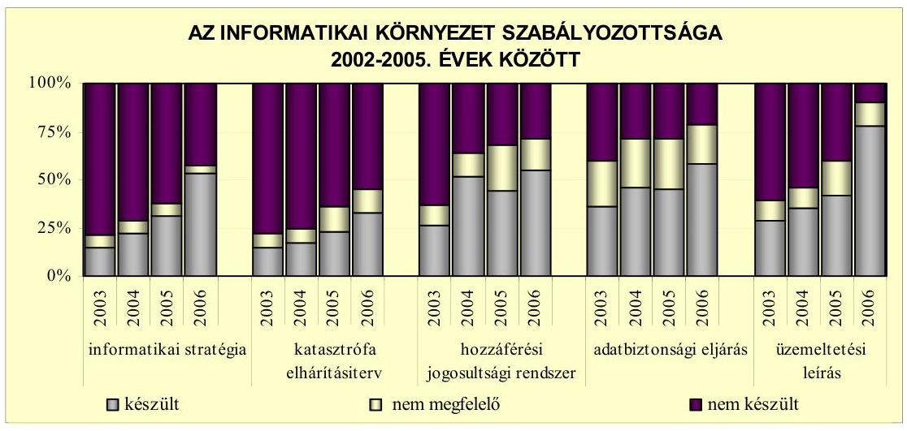

A pénzügyi-számvitel területen számítógépet használó dolgozók informatikai képzettségét legalább alapfokon az önkormányzati hivatalok 43\%-ánál nem biztosították. Az európai számítógép-használói jogosítványnyal (angol rövidítése ECDL) rendelkezők száma az önkormányzati hivatalok 40\%-ánál bővült 2005-2006-ban. A munkakörhöz szükséges informatikai rendszer használatával és múködtetésével kapcsolatos feladataikat a felhasználók $42 \%$-ának munkaköri leírása tartalmazta.

# 2. AZ ÖNKORMÁNYZATI FELADATOK ÉS A RENDELKEZÉSRE Álló FORRÁSOK ÖSSZHANGJA 

### 2.1. Az önkormányzati feladatok meghatározása és szervezeti keretei

A 2003-2006 között ellenőrzött önkormányzatok mintegy fele SzMSz-ben, szakmai koncepciókban, éves költségvetésben rögzítette, hogy mely feladatokat tekint kötelezően ellátandónak, vagy önként vállaltnak. Az évenkénti költségvetési rendeletekben a kiemelt kiadási előirányzatok kötelező és önként vállalt feladatra történő megosztásánál a költségvetési koncepcióban, vagy a költségvetési rendelettervezet előkészítésnél helyileg kialakított szempontokat vettek figyelembe.

A települési önkormányzatok az Ötv. 8. § (2) bekezdésében foglaltak ellenére nem határozták meg, hogy a lakosság igényei alapján, anyagi lehetőségeiktől függően, mely feladatokat, milyen mértékben és módon látnak el. A helyszíni ellenőrzések során erre vonatkozóan tett megállapításunkra érkezett észrevételekből kitűnt, hogy az Ötv. ezen előírását tévesen, az évenkénti költségvetés készítésére, abban a kiadások meghatározására vonatkoztatják annak ellenére, hogy a kiadások mellett nem szerepel a költségvetésben a feladatok ellátásának mértékét jelző természetes mutatószám, valamint a feladatellátás módjának (pl. saját intézményeivel, vállalkozásba adás vagy alapítvány útján) a meghatározása.

---

Az önkormányzatoknál a feladatok ellátásában 2002-2006 között meghatározó szerepe a költségvetési intézményeknek volt, emellett közhasznú szervezetekkel, gazdasági társaságokkal, egyéb szervezetekkel kötött ellátási szerződések alapján gondoskodtak a feladatok megoldásáról.

A kötelező szociális feladatok közül a szakosított ellátások körébe tartozó hajléktalanok otthona ellátásról ${ }^{81}$ és a hajléktalanok rehabilitációs intézményi ellátásról a Szoctv. 88. § (1) bekezdés a) pontjának előírása ellenére nem gondoskodott a Békés és a Zala megyei önkormányzat, és ezt ellátási szerződés megkötésével sem biztosították. A mulasztásban közrejátszott, hogy a Szoctv. nem tartalmazta nevesítetten a megyei önkormányzatok kötelező feladatait ${ }^{82}$.

A gazdaságosabb és hatékonyabb feladatellátás érdekében a 2002-2006 között az önkormányzatok 2047 racionalizálási intézkedést hoztak, amelyek különböző arányban érintették az önkormányzati feladatokat ellátó szervezeteket (költségvetési szerv alapítása, gazdálkodási jogkörének módosítása, intézmények összevonása, megszüntetése, közalkalmazotti létszámcsökkentés, ellátási kötelezettség átadása közhasznú szervezeteknek, gazdasági társaságoknak, társuláshoz csatlakozás, abból kilépés).
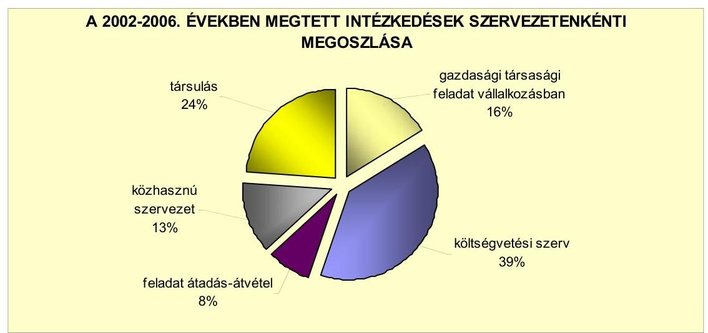

A szervezeti intézkedések kétötöde költségvetési intézmények alapítására, átszervezésére, összevonására, megszüntetésére irányult, amelyek céljait, valamint a megvalósulás eredményességét 2002-2006 között a következő folyamatábra szemlélteti.

[^0]
[^0]:    ${ }^{81}$ A hajléktalanok otthona ellátást 1999. október 1-ig, rehabilitációs intézményi ellátását 2004. december 31-ig kellett a megyei önkormányzatoknak megszervezniük.
    ${ }^{82}$ A helyi és helyi kisebbségi önkormányzatok gazdálkodásának átfogó ellenőrzéséről a 2006. évben készített 0634. sorszámú ÁSZ jelentésben tett javaslatunk alapján a szociális törvény 88. §-a 2007. január 1-től tartalmazza a megyei önkormányzatok kötelező feladatait.

---

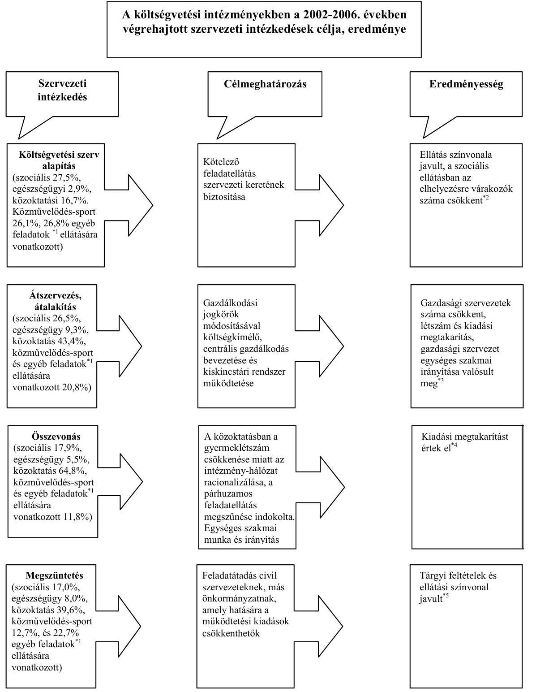

# Megjegyzés: 

1. Az útkezelési és köztisztasági feladatok ellátását tartalmazza.
2. A Vas megyei Önkormányzat gazdálkodási rendszerének átfogó ellenőrzéséről készült 0545. sorszámú jelentés 51 . oldal.
3. Az ellenőrzött kettő megyei, hat megyei jogú városi, kettő Budapest fővárosi kerületi, 40 városi önkormányzat esetében.
4. Az ellenőrzött öt megyei jogú városi, kettő Budapest fővárosi kerületi és 14 városi önkormányzat esetében.
5. Ehhez kapcsolódnak a 0317. sz., „helyi önkormányzatok tartós szociális ellátás feladatainak ellenőrzéséről az idősek otthonairól" jelentés

---

Az önkormányzati feladatok ellátásában közreműködő közhasznú szervezetek száma 2002-2006 között 192-vel bővült, azok közel egytizedét az egész-ségügyi-szociális alap és szakellátás, több mint egynegyedét a közművelődés és a sport tevékenység, $60 \%$-át a településüzemeltetési feladatok gazdaságosabb és célszerűbb működtetése érdekében hozták létre a képviselő testületek.

A kötelező feladatok ellátásában az ellenőrzött önkormányzatoknál 2002-2006 között 106-tal több gazdasági társaság kapott szerepet. A gazdasági társaságok létrehozása $89 \%$-ban az ivóvíz szolgáltatás, szennyvíztisztítás, településüzemeltetési feladatok, $7 \%$-ban a közművelődési és sportfeladatok ellátására, valamint $4 \%$-ban a szociális ${ }^{83}$ és járóbeteg-szakellátás biztosítására irányult. A gazdasági társaságok létrehozásakor az önkormányzatok az Ötv. 80. § (3) bekezdésében előírt korlátot betartották, a társaságokban viselt anyagi felelősségük nem haladta meg a vagyoni hozzájárulásuk mértékét.

Az önkormányzatok társulásban való részvétele az Ötv. 41-43. §-aiban, valamint a Társ. tv. által biztosított lehetőséggel élve 2002-2006 között ${ }^{84}$ 444-gyel bővült, amelyek egyötöde a szociális alap és szakosított, egytizede az egészségügyi ügyeleti alapellátás, egynegyede a közoktatás magasabb szakmai szintű biztosítását, közel egyharmada a településfejlesztések összehangolását és belső ellenőrzését célozta. A 2004. és a 2005. években megalakultak a többcélú kistérségi társulások az önkormányzatok oktatás-nevelési, szociális és gyermekjóléti, terület- és térségfejlesztési, belső ellenőrzési, közszolgáltatási feladatai gazdaságosabb ellátása, a források célszerú felhasználása érdekében.

Az ellenőrzött önkormányzatok körében megyei és városi, Budapest fővárosi kerületi önkormányzatok, valamint egyházi és civil szervezetek között 155 esetben feladatátadásokra és átvételre is sor került 2002-2006 között, amelyek feltételeit az érintettek megállapodásban rögzítették.

Az alapfeladatokat ellátó intézmények megszüntetése, átszervezése előtt az önkormányzatok kikérték az igénybevevők véleményét. A képviselő-testületek a végrehajtott szervezeti változásokat az egyes részterületek szakmai beszámolóíhoz kapcsolódóan értékelték.

Az ellenőrzött önkormányzatok az önként vállalt feladatok ellátására 2002-2006 között költségvetési kiadásaik 2,5\%-17\% közötti részarányát ${ }^{85}$ fordították. Nem kötelező feladatként a megyei önkormányzatok nemzetközi kapcsolatok kiépítését, óvoda működtetését, a megyei jogú városi

[^0]
[^0]:    ${ }^{83}$ Bentlakásos szociális intézményi ellátás biztosítása.
    ${ }^{84}$ A társulásban való részvétel bővülését a helyi és helyi kisebbségi önkormányzatok gazdálkodásának átfogó ellenőrzéséről szóló 0634 . és a 0544 . sorszámú jelentésünkben (80. és 55. oldalon) is megállapítottuk. A helyi és helyi kisebbségi önkormányzatok gazdálkodásának átfogó ellenőrzéséről szóló 2004. évben a 0436. sorszámú jelentésben (63. oldal) közigazgatási kategóriánként, ágazati feladatonként és célonként bemutattuk, hogy az ellenőrzött önkormányzatok $65 \%$-a élt a társulás lehetőségével.
    ${ }^{85}$ A kiadásokat a helyszíni ellenőrzések során a számviteli nyilvántartásokból az önkormányzati hivatalok munkatársaival közösen végzett kigyűjtésekkel határoztuk meg.

---

önkormányzatok színházak múködtetését, rendezvények, kiadványok megjelenésének támogatását biztosították. Budapest Főváros Önkormányzata nem kötelező feladatai között a színházak, az Állatkert, a társasházi, szövetkezeti lakóépületek rehabilitációjához, gyógyfürdők rekonstrukciójához nyújtott támogatások szerepeltek. Önként vállalt feladatként a Budapest fővárosi kerületi és városi önkormányzatok középfokú oktatást, alapfokú művészeti oktatást, bentlakásos szociális otthoni ellátást, járó- és fekvőbeteg szakellátást nyújtottak a lakosság részére. Az önként vállalt feladatok körét az ellenőrzött önkormányzatok jellemzően alapítványok, non profit szervezetek, gazdasági társaságok, egyéb szervezetek múködési és felhalmozási célú támogatásával bővítették.
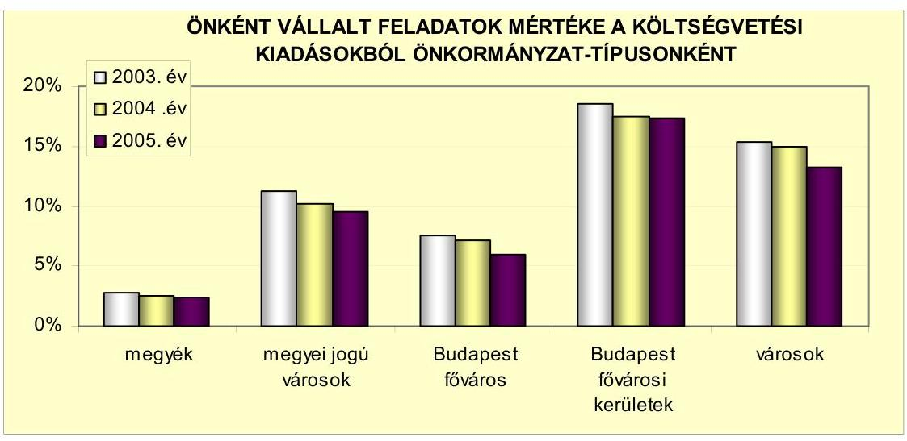

Az önként vállalt feladatok a 2002-2006 között nem veszélyeztették a kötelező feladatok ellátását, azonban egy megyei, kettő Budapest fővárosi kerületi és 47 városi önkormányzatnál hozzájárultak a pénzügyi egyensúly hiányához. Az önként vállalt feladatok csökkenő mértéke a költségvetési kiadásoknál is jelzi az önkormányzati alrendszer gazdasági helyzetének rosszabbodását.

A középületekben az akadálymentes közlekedés feltételeinek biztosítása érdekében szükséges feladatokat a 2003-2005 között az ellenőrzött kiemelt körbe tartozó és városi önkormányzatok - kettő Budapest fővárosi kerületi és nyolc városi önkormányzat kivételével - felmérték. Az akadálymentesség biztosítására a kiemelt körbe tartozó és a városi önkormányzatok 47\%-a a 20032005. évi költségvetésében 1227 millió Ft kiadást tervezett, amelyet 14\%-kal magasabb összegben teljesítettek. Az épület felújítások esetén jellemzően külön költségvetési előirányzat nélkül, a felújítás kiadásaiba beépítetten végezték el az akadálymentesítési feladatokat.

---

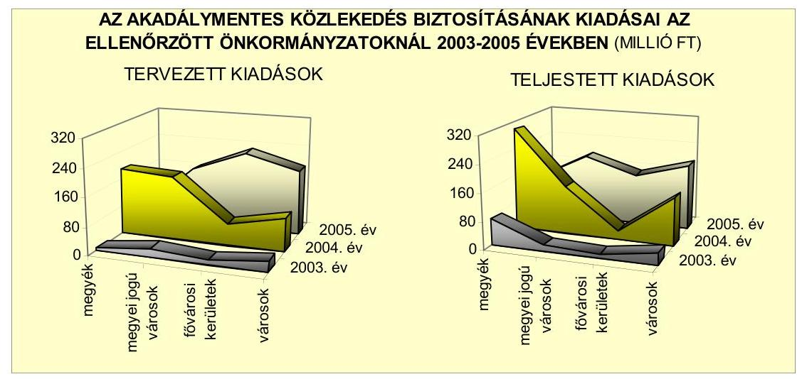

A Fot. 29. § (6) bekezdésében meghatározott 2005. január 1-i határidőre ${ }^{86}$ Kisköre és Zalakaros Város Önkormányzata kivételével - az önkormányzatok nem oldották meg valamennyi középület akadálymentes megközelíthetőségét.

# 2.2. Egyes kötelező önkormányzati feladatok finanszírozása 

Az önkormányzatok által ellátott kötelező feladatok közül - az államháztartás pénzügyi információs rendszerének a 2003-2006. évi adatai alapján - a szociális ellátás és a közoktatás egyes feladataira fordított kiadásokat és azok forrásait tekintettük át önkormányzat-típusonként.

A szociális és a közoktatási feladatok naturális mutatókkal mérhető ellátásaira fordított kiadások 2003-2006 között közel 20\%-kal nőttek. A múködtetési kiadások emelkedésében valamennyi feladatnál meghatározó volt a közalkalmazotti bérintézkedés éves szintű hatása és a dologi kiadások áremelkedése, amelyen belül legjelentősebb az energia áremelkedés ${ }^{87}$, valamint a közüzemi díjak áfa-kulcsának változása volt ${ }^{88}$.

A közalkalmazotti alapilletmények a 2004. évben 3\%-kal, a 2005. január 1-jétől 7,5\%-kal, szeptember 1-jétől további 4,5\%-kal, valamint a pótlékok a 2005. évtől $11 \%$-kal emelkedtek. Ennek hatására a közalkalmazottak bruttó keresete ${ }^{89}$ az előző évinél az oktatásban a 2005. évben 13,5\%-kal, a 2006. évben 5,3\%-kal, a szociális ellátásban $12 \%$-kal, illetve $4,7 \%$-kal volt magasabb, míg a 2004 évben

[^0]
[^0]:    ${ }^{86}$ A Fot-ról szóló törvény módosítása alapján - 2007. évi XXIII. törvény 3. §-a - a közszolgáltatások típusától függően differenciáltan, a 2008. december. 31. és 2013. december. 31. között kell az akadálymentes közlekedés feltételeit biztosítani.
    ${ }^{87}$ Forrás: www.ksh.stadat a 2003. évben 107,3\%, a 2004. évben 114,1\%, a 2005. évben 106,2\%, a 2006. évben 6,4\% volt a háztartási energia fogyasztói árindexe.
    ${ }^{88}$ Az áfa-ról szóló 1992. évi LXXIV. törvény 28. § alapján.
    ${ }^{89}$ Bruttó kereset: a személyi jövedelemadót, az egészségbiztosítási és nyugdíjjárulékot, valamint a munkavállalói járulékot is tartalmazó alapbér és egyéb jogcímen fizetett kereseti elemek (bérpótlék, kiegészítő fizetés, prémium, jutalom, 13. és további havi fizetés) összege. (Forrás: www.ksh.stadat-Módszertan).

---

1,6\% és 0,9\%-kal csökkent ${ }^{90}$. A 2004. évben a közalkalmazottak bruttó átlagkeresetének csökkenését a 13. havi illetmény kifizetésének elmaradása okozta ${ }^{91}$. A oktatási és szociális ellátásban a bruttó átlagkeresetek emelkedése a 2004. évben alatta maradt a nemzetgazdaság költségvetési területén történt 0,4\%-os, a 2005. évben $12,8 \%$-os, a 2006. évben $6,4 \%$-os - oktatás kivételével - növekedésének. A dologi kiadások körében 2003-2006 között a fogyasztóár-index ${ }^{92} 4,7 \%-6,8 \%$ -$3,6 \%-3,9 \%$-os emelkedése éreztette hatását.

A 2003. évi 457 milliárd Ft-ról a 2006. évre 544 milliárd Ft-ra növekedett önkormányzati múködési célú kiadások több mint $80 \%$-a a közoktatás, közel 20\%-a a szociális ellátó hálózatot szolgálta. A közoktatásra fordított múködési kiadások 2003-2006 között 21,3\%-kal, a szociális feladatokra fordított kiadások 15,7\%-kal emelkedtek. A reálértéken számított múködési célú kiadások a 2003. évi bázisidőszakhoz viszonyítva a 2004. évben 0,2\%kal, a 2005. évben 10,7\%-kal, a 2006. évben 14,9\%-kal csökkentek.

A múködési célú kiadások több mint $\mathbf{8 0 \%}$-át a személyi juttatások és járulékai képezték 2003-2006 között. A személyi juttatások és járulékaik kiadása a 2003. évihez viszonyítva a 2006. évben a közoktatásban 12,7\%-kal, a szociális ellátásban 27,3\%-kal nőtt, azonban reálértéke a 2006. évben 15\%-kal csökkent.

A bölcsődei ellátásra fordított egy főre jutó kiadások 2003-2006 közötti 11,2\%-os emelkedése ellenére a kiadások 2003. évi szinten számított reálértéke a 2004. évben 2,2\%-kal, a 2005. évben 10,4\%-kal, a 2006. évben 14,4\%kal alacsonyabb összegú fajlagos kiadást jelentettek, amelyet önkormányzat típusonként a következő grafikon szemléltet.
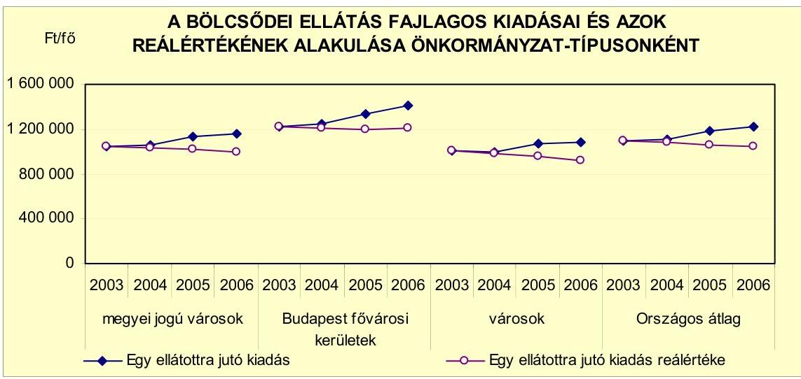

[^0]
[^0]:    ${ }^{90}$ Forrás: www.ksh.stadat az alkalmazásban állók bruttó átlagkeresete a nemzetgazdaságban.
    ${ }^{91}$ A közalkalmazottak jogállásáról szóló 1992. évi XXXIII. törvény 68. § alapján.
    ${ }^{92}$ A fogyasztói árindex jelzi az infláció, a „pénzromlás" mértékét. Forrás: www.ksh stadat-módszertan.

---

Az egy bölcsődés korú ellátására fordított kiadás országos átlaga a 2003. évi 1092693 Ft/főről a 2006. évre 1218598 Ft/főre emelkedett, amelyet a működési célú kiadások $21,8 \%$-os és az ellátottak számának $9,2 \%$-os emelkedése okozott. Az országos átlagnál Budapest fővárosi kerületi önkormányzatok több mint 15\%kal magasabb, a városi önkormányzatok közel egytizeddel alacsonyabb összeget fordítottak 2003-2006 között egy bölcsődés korú ellátására.

Az egy bölcsődés korú ellátására fordított kiadás országos átlagának reálértéke a 2004. évben $24083 \mathrm{Ft} /$ fő, a 2006. évben $174846 \mathrm{Ft} /$ fővel volt kevesebb a 2003. évi bázisnál. Az egy ellátottra fordított kiadás reálértéke legmagasabb mértékben - 200295 Ft/fővel - Budapest fővárosi kerületi önkormányzatoknál csökkent a 2006. évben, legkevesebb összegű reálérték csökkenés - $158943 \mathrm{Ft} /$ fő - a városi önkormányzatoknál volt.

A bölcsődei ellátás egy ellátottra jutó múködési kiadásának forrását a 2003. évben átlagosan egyharmad részben, a 2006. évben 37,7\%-ban a normatív hozzájárulás biztosította. A normatív hozzájárulás összege több mint egynegyeddel emelkedett 2003-2006 között, ennek ellenére reálértéke ugyanezen időszakban 13\%-kal csökkent. Az egy ellátottra jutó kiadások finanszírozásában az önkormányzati támogatás 50\%-feletti részarányt képviselt 2003-2006 között.

A nappali szociális intézményekben az egy ellátottra fordított kiadás 2003-2006 között közel egyharmaddal emelkedett. Országos átlagban az önkormányzatok egy ellátottra fordított kiadás a 2003. évi szinten számított reálértékben a 2004. évben 1,8\%-kal, a 2006. évben 14,6\%-kal csökkent.
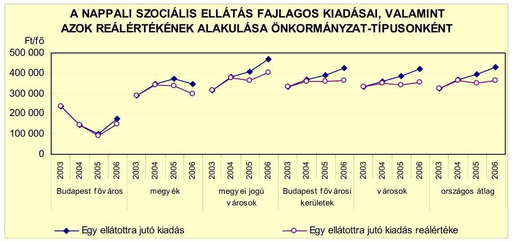

A nappali szociális intézményi ellátás kiadásának egy főre jutó országos átlaga a 2003. évben $326624 \mathrm{Ft} /$ fő volt, amely a 2006 . évben $427843 \mathrm{Ft} /$ főre növekedett, a múködési kiadások 17,5\%-os emelkedése, és az ellátásban részesülők számának 10,3\% csökkenése hatására. Az országos átlagnál a 2003. évben Budapest fővárosi kerületi önkormányzatok 2\%-kal, a 2004-2006 között a megyei jogú városi önkormányzatok $4 \%,-3,3 \%-11,9 \%$-kal magasabb összeget fordítottak egy ellátottra. Budapest Főváros Önkormányzatánál az egy ellátottra jutó kiadás 2003-2006 között 36\%-kal csökkent, a múködési kiadások 161,8\%-os, és az ellátottak számának 252,6\%-os emelkedésé hatására. Az egy ellátottra jutó kiadás 2003-2005 között fokozatosan csökkent, mivel a múködési kiadások 19\%-15\%-kal történt emelkedése elmaradt az ellátottak számának 92\%-67\%-os növekedésétől. Az ellátottak számának növekedése meghaladta az engedélyezett férőhelyek számának növekedési ütemét, így a kapacitás kihasználtság a 2004. évben 129,4\%, a 2005.

---

évben 153,3\% volt. A 2006. évben az egy ellátottra jutó kiadás 75\%-os növekedése ellenére az egy főre jutó kiadás az országos átlagnál $60 \%$-kal kevesebb volt, amely a legalacsonyabb fajlagos kiadást jelentette.

A nappali szociális intézményi ellátásban az egy főre jutó kiadások reálértéke országos átlagban a 2003. bázis évhez képest a 2004. évben $6597 \mathrm{Ft} /$ fővel, a 2006. évben $62551 \mathrm{Ft} /$ fővel csökkent. A megyei jogú városi önkormányzatoknál egy ellátottra fordított kiadás reálértékének csökkenése a 2004. évben országos átlag alatti összegű, $5950 \mathrm{Ft} /$ fő volt, míg a 2006. évben 67305 Ft/fő értékkel a legmagasabb mértékű volt.

A nappali szociális ellátás fajlagos kiadásainak finanszírozásában a normatív hozzájárulás részaránya a 2003. évi 59,2\%-ról a 2006. évre 53\%-ra csökkent, az önkormányzati támogatás $27,7 \%$-ról $33,4 \%$-ra emelkedett. A normatív hozzájárulás összege 2003-2006 között 17,4\%-kal emelkedett, a 2003. bázisidőszakon számított reálértéke azonban egytizeddel csökkent.

A bentlakásos szociális intézményekben 2003-2006 között az egy ellátottra fordított kiadás összegének $27 \%$-os emelkedése ellenére a kiadás 2003. évi szinten számított reálértéke a 2004. évben 1,4\%-kal, a 2005. évre 11,4\%-kal, a 2006 évben $15,3 \%$-kal csökkent.
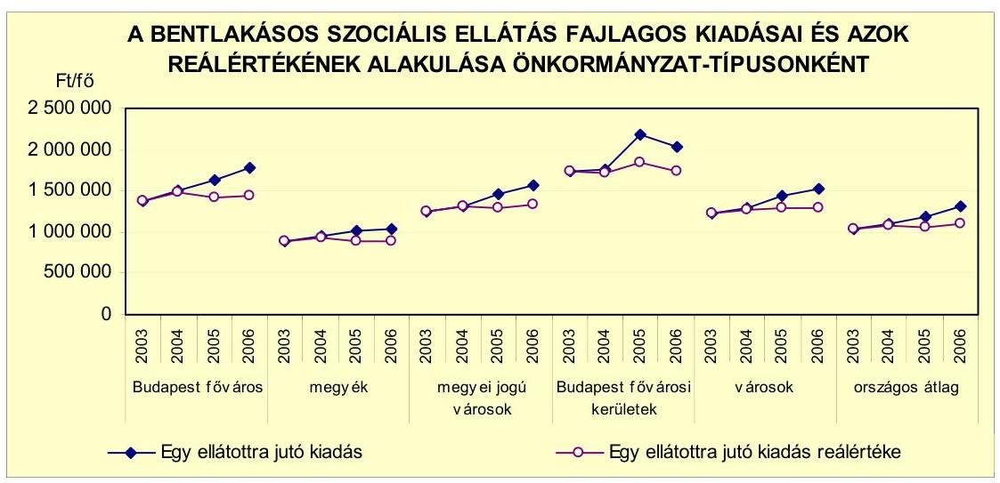

A bentlakásos szociális intézményi ellátásban az egy főre jutó kiadás országos átlaga a 2003. évben 1033374 Ft/fő volt, amely a 2006. évben 1312721 Ft/főre növekedett a működési célú kiadások 45,2\%-os és az ellátásban részesülők számának 14,3\%-os emelkedése hatására. Budapest fővárosi kerületi önkormányzatai az országos átlagnál több mint $50 \%$-kal magasabb ${ }^{93}$, a megyei önkormányzatok egyötöddel alacsonyabb egy főre jutó kiadás mellett müködtették a bentlakásos szociális intézményeket a 2006. évben.

A bentlakásos szociális intézményi ellátás esetében az egy főre jutó kiadások reálértéke országos átlagban a 2003. bázis évhez viszonyítva a 2004. évben 14789 Ft/fővel, a 2006. évben 200783 Ft/fővel csökkent. Az egy ellátottra fordított kiadás reálértékének csökkenése országos átlag alatti a megyei önkormányzatok-

[^0]
[^0]:    ${ }^{93}$ A 2005. évben 2182079 Ft/fő, a 2006. évben 2028437 Ft/fő, amely az országos átlagnál a 2005. évben 83,2\%-kal, a 2006. évben 54,5\%-kal volt magasabb.

---

nál (a 2004-ben 12365 Ft/fő, a 2006. évben 151947 Ft/fő), az országos átlagnál magasabb Budapest fővárosi kerületi önkormányzatainál (a 2004. évben 29581 Ft/fő, a 2006. évben $289424 \mathrm{Ft} /$ fő) volt ${ }^{94}$.

A bentlakásos szociális intézményi ellátás fajlagos kiadásainak finanszírozásában a normatív hozzájárulás részaránya a 2003. évhez viszonyítva a 2006. évben országos átlagban 13,6 százalékponttal csökkent ${ }^{95}$, amely hatására a múködési kiadások finanszírozásban az önkormányzati támogatás forrásképző szerepe 9,6\%-kal, az intézményi múködési bevételek 3,0\%-kal emelkedtek. A normatív hozzájárulás összege 2003-2006 között 3,0\%-kal nőtt, amelynek reálértéke $15,6 \%$-kal csökkent.

Az egy óvodás korú nevelésére fordított kiadások abszolút értékének 2003-2006 közötti 14,3\%-os emelkedése ellenére a kiadás 2003. évi szinten számított reálértéke a 2006. évben 15\%-kal alacsonyabb összegű fajlagos kiadást jelentett.
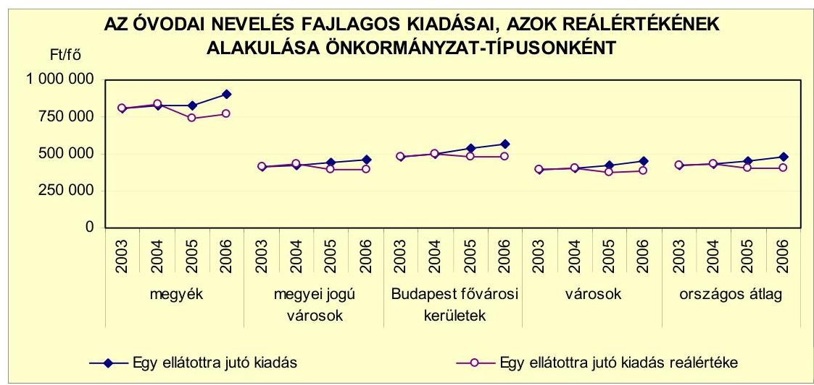

Az egy óvodás korú nevelésére fordított kiadás országos átlagban a 2003. évi 418895 Ft/főről a 2006. évre 478724 Ft/főre emelkedett a múködési célú kiadások $14,6 \%$-os és a neveltek, ellátottak számának $0,3 \%$-os emelkedése hatására. A megyei önkormányzatok az óvodák múködtetésénél az országos átlagnak közel kétszeresét fordították az egy sajátos nevelési igényű gyermek ellátására, a városi önkormányzatok közel egytizeddel alacsonyabb összeget fordítottak az egy óvodás korú nevelésére 2003-2006 között.

A 2006. évben az egy óvodai neveltre fordított kiadás reálértéke országos átlagban a 2003. évi bázishoz viszonyítva 71591 Ft/fővel volt alacsonyabb. A megyei önkormányzatoknál az országos átlagot meghaladó ( $134267 \mathrm{Ft} /$ fő), a városi önkormányzatoknál az átlag alatti ( $67952 \mathrm{Ft} /$ fő) volt az egy főre jutó kiadás reálérték csökkenése.

[^0]
[^0]:    ${ }^{94}$ A reálérték csökkenésben Budapest fővárosi kerületi önkormányzatoknál közrejátszott, hogy a személyi kiadások és járulékok aránya az országos átlagnál nagyobb.
    ${ }^{95}$ A 2003. évben $72 \%$, a 2006. évben $58,4 \%$ volt.

---

A fajlagos kiadások finanszírozásában 2003-2006 között 55,4\%-ról 56,6\%-ra emelkedett az önkormányzati támogatás részaránya ${ }^{96}$. A normatív hozzájárulás összege a 2003. évhez képest a 2006. évben országos átlagban közel egytizeddel emelkedett, míg a reálértéke egynegyeddel csökkent a 2006. évben.

A közoktatási feladatok bevételeinek és kiadásainak többségét a „nappali rendszerü, általános múveltséget megalapozó iskolai oktatás" elnevezésű szakfeladaton ${ }^{97}$, míg az oktatásnak helyet adó intézményi vagyon (épület vagyon) múködtetésének bevételeit és kiadásait ${ }^{98} \mathrm{az}$ oktatási intézmények országosan egységes, az „intézményi vagyon müködtetése" elnevezésű szakfeladaton tervezték meg és számolták el az önkormányzatok ${ }^{99}$. A fajlagos kiadások országos értékelése során az alap- és középfokú oktatás kiadásainak alakulását együttesen elemeztük, mivel a múködési kiadások megosztásához nem állt rendelkezésünkre objektív mutató.

Az egy tanulóra fordított kiadások nominálértékének 2003-2006 közötti 21,6\%-os emelkedése ellenére a kiadások 2003. évi szinten számított reálértéke a 2004. évben 0,1\%-kal a 2005. évben 10,6\%-kal, a 2006. évben 14,8\%kal alacsonyabb összegű fajlagos kiadást jelentett.

Az egy tanulóra fordított kiadás országos átlagban a 2003. évi 282313 Ft/főről a 2006. évre 343170 Ft/főre emelkedett, a múködési célú kiadások 16\%-os emelkedése, valamint az oktatottak számának 4,6\%-os csökkenése hatására. Az országos átlagnál Budapest fővárosi kerületi önkormányzatok egyharmaddal magasabb, a városi önkormányzatok közel 5\%-kal alacsonyabb összegű kiadást fordítottak egy tanuló oktatására 2003-2006 között.

Az egy tanulóra jutó kiadások reálértéke országos átlagban a 2003. évi bázishoz viszonyítva a 2004-ben 314 Ft/fővel, a 2006. évben 50855 Ft/fővel volt alacsonyabb. Az országos átlagot meghaladó mértékű 3046 Ft/fő volt a csökkenés a 2004. évben a megyei önkormányzatoknál, valamint a 2006. évben a Budapest fővárosi kerületi önkormányzatoknál ( 71640 Ft/fő).
${ }^{96}$ A 2003. évben 55,4\%, a 2006. évben 56,6\% volt.
${ }^{97}$ Egy szakfeladat tartalmazta: az általános iskolai, a gimnáziumi oktatásban, az oktatási törvény alapján múködő szakközépiskolai oktatásban, továbbá a közoktatási törvény szerinti nappali rendszerú iskolai oktatás általános múveltséget megalapozó pedagógiai szakaszának évfolyamain a tanórai és tanórán kívüli foglalkozásokkal, az iskola pedagógiai irányításával, vezetésével, a szakmai feladat ellátásához kapcsolódó további tevékenységekkel és a tanulókkal kapcsolatos bevételeket és kiadásokat.
${ }^{98}$ Jellemzően ide tartozó kiadások a vagyon és infrastruktúra üzemeltetésével, fenntartásával kapcsolatos gazdálkodás, pénzügyi, számviteli, gondnoki tevékenység, takarítás, karbantartás, gépjármú üzemeltetés, szállítás, portaszolgálat, éjjeliőri és egyéb múködtetési célú tevékenység.
${ }^{99}$ Az elszámolás független volt attól, hogy az intézmény milyen és mennyi szakmai feladatot, szolgáltatást látott el. A számviteli elszámolásokra vonatkozó szabályok közül azok a mutatók nem kerültek rögzítésre, amelyek a közös ellátással kapcsolatos kiadások egységes - oktatást jellemző - megosztási szempontjai lehetnek, ezáltal az ellátásra fordított kiadások összehasonlításának eredményét jelentősen befolyásolta az önkormányzati hivatalokban egyedileg kialakított elszámolási rendszer.

---

Az oktatási feladatokhoz biztosított normatív hozzájárulás összege a 2003. évihez viszonyítva 2006-ra 7,5\%-kal emelkedett, ennek ellenére annak reálértéke a 2006. évben $13 \%$-kal csökkent
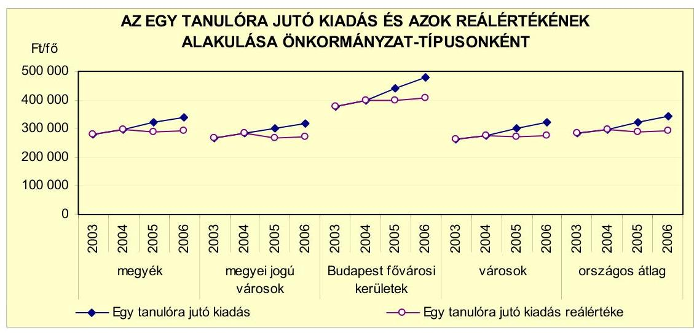

Az egyes feladatoknál a fajlagos kiadások önkormányzatonként jelentősen eltértek egymástól, mivel a közel azonos lakosságszámú településeken is 20032006 között azonos szakfeladaton elszámolt kiadások adatai eltérő feladatstruktúrát jelentettek, amely miatt a személyi-dologi jellegű kiadások aránya eltérhetett. Ezen okok miatt a feladatokra fordított kiadások és az elért bevételekről központi pénzügyi információs rendszer nyilvántartásaiból nem nyerhetők olyan adatok, amelyek mélyebb elemzésre, összehasonlításra, a feladatellátás értékelésére és a jelenleginél reálisabb következtetések levonására alkalmasak lennének. A szakfeladat-rend ehhez szükséges módosítása a pénzügyminiszternek 2003-2004. években tett javaslataink ellenére csak részben történt meg ${ }^{100}$.

# 3. A BELSŐ ELLENŐRZÉSI RENDSZER MŰKÖDÉSÉNEK ÉRTÉKELÉSE 

### 3.1. Az ellenőrzési rendszer kialakítása, múködése

Az önkormányzatok 87\%-a (a 2003. évben 34\%, a 2004. évben 73\%) kialakította a belső ellenőrzési feladatok végrehajtásához szükséges szervezeti kereteket, és a Ber. 4. § (1) bekezdésének megfelelően biztosította a belső ellenőrzési rendszer múködéséhez szükséges forrásokat. A javuló tendencia részben az ÁSZ következetes számonkérésének tudható be.

[^0]
[^0]:    ${ }^{100}$ Pénzügyminiszter tájékoztató a költségvetési szervek 2005. évi részletes költségvetési előirányzatainak összeállítására szolgáló nyomtatvány garnitúra kitöltéséhez (5. számú melléklet). Megtörtént az általános iskolai nappali rendszerủ nevelés, oktatás, a nappali rendszerủ gimnáziumi nevelés, oktatás, valamint a szakközépiskolai nevelés oktatás szakfeladatainak elkülönítése. Továbbra is egy szakfeladaton (a 75176-8 számjelű) kell azonban szerepeltetni az intézményi vagyon múködtetésével kapcsolatos bevételeket és kiadásokat, a felosztásának módjára központi szabályozás nem született.

---

Az önkormányzati hivatalok SzMSz-ében 52\%-nál (a 2003-ban 62\%-nál, a 2004ben $54 \%$-nál) nem rögzítették a belső ellenőrzési kötelezettséget, 73\%-nál (a 2003-ban 76\%-nál, 2004-ben 71\%-nál) nem jelölték meg az ellenőrzést végző személy, egység jogállását, 72\%-nál (a 2003-ban 79\%-nál, 2004-ben 73\%-nál) nem határozták meg az ellenőrzést végzők feladatait.

A 2006. évben ellenőrzött önkormányzatok 20\%-a az önkormányzati hivatalon belül alakította ki a belső ellenőrzés szervezeti feltételeit, azonban ezen önkormányzatok fele társulást, vállalkozást, vállalkozót is megbízott belső ellenőrzési feladatok elvégzésével. További 68\% társulás útján, 16\% pedig vállalkozás, vállalkozó megbízásával biztosította a belső ellenőrzés megoldásának feltételeit. Míg a 2003-ban ellenőrzött önkormányzatoknak csak mintegy felénél gondoskodtak a feladatok megszervezéséről, addig a 2006-ban ellenőrzött önkormányzatoknak csupán $4 \%$-a nem alakította ki ennek feltételeit.
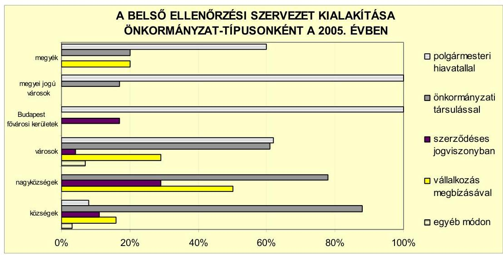

A belső ellenőrzés részletes eljárási és végrehajtási rendjét nem alakították ki az önkormányzatok 32\%-ánál. A foglalkoztatott belső ellenőrök létszámát nem kapacitás felmérés alapján határozták meg a belső ellenőrzést végző ellenőrzött önkormányzati hivatalok 48\%-ánál (a 2003. évben $77 \%$-ánál, 2004. évben $63 \%$-ánál). A foglalkoztatott belső ellenőrök tizede nem felelt meg a Ber. 11. §-ának iskolai végzettségre és képesítési követelményekre vonatkozó előírásainak.

A foglalkoztatott belső ellenőrök 88\%-a (előző évben 72\%-a) közvetlenül a jegyző́nek alárendelten látta el feladatát, a belső ellenőrzést végzők 8\%-át (a 2003. évben 19\%-át, a 2004. évben 11\%-át) azonban más irányítási, végrehajtási tevékenység ellátásával is megbízták.

Belső ellenőrzési kézikönyvvel az önkormányzatok 13\%-a (a 2003. évben 89\%-a, a 2004. évben 33\%-a) nem rendelkezett, 2003-2006 között lényegesen emelkedett a kézikönyvet elkészítő önkormányzatok aránya. Az ellenőrzés tervszerűbbé, hatékonyabbá tétele érdekében stratégiai tervet az önkormányzatok 47\%-ánál (előző évben 24\%-ánál) készített a belső ellenőrzési vezető. Éves ellenőrzési tervet az önkormányzatok 21\%-ánál (előző évben 46\%-

---

nál) nem készítettek ${ }^{101}$. Az elkészült tervek 95\%-ának tartalma megfelelt a Ber. 21. § (2) bekezdésben foglalt előírásoknak.

Az éves ellenőrzési tervek 25\%-ában határoztak meg kapacitást a soron kívüli feladatokra is. A belső ellenőrzés társulásos formában történő megszervezésénél az önkormányzatok 27\%-ánál nem biztosították a társulás éves munkaterve és az önkormányzat éves belső ellenőrzési igénye közötti összhangot.
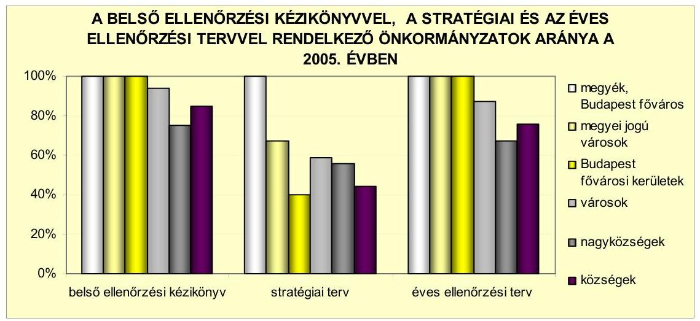

Az önkormányzatok által alapított költségvetési szervek ellenőrzési feladatainak végrehajtásáról a jegyző́k növekvő arányban ( $86 \%$-a, az előző évben 69\%-a) gondoskodtak. Ellenőrzési program az önkormányzatok 91\%-ánál (előző évben 80\%) készült a Ber. 23. § (1) bekezdésében foglaltaknak megfelelően. A végrehajtás az ellenőrzöttek $\mathbf{9 0 \%}$-ánál az éves ellenőrzési terveknek megfelelően történt, a tervben foglaltakon felül 18\%-nál végeztek ellenőrzést.

A tervezett ellenőrzések elmaradásának oka rendszerint az ellenőri kapacitáshiány, továbbá a tervezéskor még nem ismert, év közben aktuálissá vált soron kívüli ellenőrzési feladat végrehajtása volt.

Az ellenőrzések - a belső szabályozottság, az előirányzatok megalapozottsága, az eszköz- és készletgazdálkodás, a számviteli elszámolások, a pénzforgalom, a pénz- és értékkezelés, a vagyongazdálkodás területeit érintették - a jogszabályoknak és a belső szabályzatoknak való megfelelésére terjedtek ki.

Az elvégzett ellenőrzésekről 73\%-ban a Ber. 27. § (2) és (6) bekezdésében foglaltaknak megfelelő tartalommal készültek jelentések.

Jellemzően kimaradt a jelentésekből az ellenőrzésre vonatkozó jogszabályi felhatalmazás, az ellenőrzés célja, feladata, az alkalmazott ellenőrzési módszerek, eljárások, az önkormányzati hivatalban lévő vezetők neve, beosztása és az összefoglaló értékelés.

[^0]
[^0]:    ${ }^{101}$ Az éves ellenőrzési tervek 43\%-át hagyták jóvá a képviselő-testületek az előző év november 15 -ig.

---

A belső ellenőrzési jelentések 88\%-a tartalmazott megállapításokat, ajánlásokat az ellenőrzöttek részére. Az ellenőrzöttek egytizede (2004-ben 10\%, 2003ban 14\%) vitatta a belső ellenőrzés megállapításait. A belső ellenőrzések során az ellenőrzött önkormányzatok 2\%-ánál tártak fel büntető, kártérítési, illetve fegyelmi eljárás megindítására okot adó cselekményt.

A belső ellenőrzések megállapításait, ajánlásait az érintett polgármesterek közel egyharmada a képviselő-testületek soron következő ülésére előterjesztette. A feltárt hiányosságok megszüntetéséről az önkormányzati hivatalok 51\%ánál, az önkormányzatok felügyelete alá tartozó költségvetési szervek 58\%ánál győződtek meg (31\%-ban utóellenőrzéssel, 25\%-ban intézkedési terv végrehajtásáról szóló beszámoló készítéssel, 44\%-ban egyéb módon). A hiányosságokat részben számolta fel az érintettek 54\%-a, nem szüntették meg az önkormányzatok tizedénél.

A belső ellenőrzés és a folyamatba épített, előzetes és utólagos vezetői ellenőrzés múködésének tapasztalatiról az összegzést a jegyzők 36\%-a készítette el az éves költségvetési beszámoló keretében ${ }^{102}$. A képviselő-testületek 45\%-a (2004ben $48 \%$, a 2003. évben $42 \%$ ) - előterjesztés hiányában, megsértve a Htv. 138. § (1) bekezdés g) pont előírásait - nem tekintette át az általa alapított és fenntartott költségvetési szervek ellenőrzésének tapasztalatait. Az ellenőrzési tapasztalatokat tárgyaló képviselő-testületek a beszámolókat elfogadták, és $8 \%$-a az ellenőrzések továbbfejlesztésével, a munka színvonalával összefüggő követelményeket határozott meg.
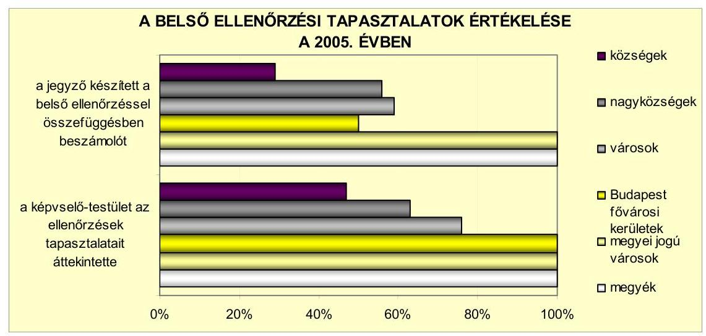

Az ellenőrzött önkormányzatoknál a belső ellenőrzés kialakításának jellemzőit a következő folyamatábra szemlélteti:

[^0]
[^0]:    102 A jegyzők a megyei és a megyei jogú városi önkormányzatok 100\%-ánál, a Budapest fővárosi kerületi önkormányzatok 50\%-ánál, a városi önkormányzatok 60\%-ánál, a nagyközségi önkormányzatok 56\%-ánál, a községi önkormányzatok 29\%-ánál készítettek összegző beszámolót.

---

# A BELSŐ ELLENŐRZÉS KIALAKÍTÁSÁNAK FOLYAMATA AZ ELLENŐRZÖTT ÖNKORMÁNYZATOKNÁL 

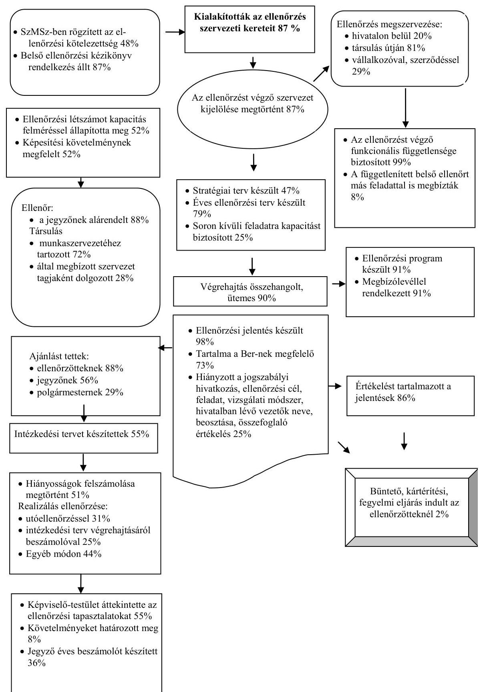

---

# A könyvvizsgálati kötelezettség teljesítése 

A kiemelt körbe tartozó ellenőrzött önkormányzatok az Ötv. 92/A. § (1) bekezdésében előírtaknak eleget téve könyvvizsgálót bíztak meg folyamatos könyvvizsgálói feladattal az egyszerúsített tartalmú éves pénzforgalmi jelentés, könyvviteli mérleg, pénzmaradvány és eredmény kimutatás felülvizsgálatával. Az Ötv. 92/A. § (2) bekezdése (hitel felvétel és 300 millió Ft-ot meghaladó költségvetési kiadás) alapján fennálló könyvvizsgálati kötelezettségnek az ellenőrzött városi önkormányzatok eleget tettek. Három városi önkormányzat (Polgár, Aszód és Lengyeltóti város) nem volt kötelezett, de megbízott könyvvizsgálót ezen feladatok ellátására.

A könyvvizsgáló kiválasztásakor az önkormányzatok az Ötv. 92/B. § (1) bekezdésében előírt szakmai követelményekre vonatkozó előírásokat betartották. A megbízásakor figyelemmel voltak az Ötv. 92/B. § (2) bekezdésében előírt, a könyvvizsgálóval kapcsolatos összeférhetetlenségi követelményekre.

A költségvetési beszámolókat - három kivétellel - a könyvvizsgálók korlátozás nélküli hitelesítő záradékkal látták el, mivel azok megítélésük szerint „valós, megbizható képet mutattak az önkormányzatok vagyoni, pénzügyi és jövedelmi helyzetéröl". Korlátozott záradékkal látta el a könyvvizsgáló a költségvetési beszámolót a következő indokok alapján:

Fonyód Város Önkormányzatánál a főkönyvi könyvelésben nem könyvelték az előirányzatokat, nem történt meg az immateriális javak értékvesztésének elszámolása, a pénzintézettől felvett beruházási és fejlesztési hitel meghaladta a kötelezettség vállalás Ötv. 88. § (2)-(3) bekezdése szerinti felső határát.

Martonvásár Város Önkormányzatánál hiányosak voltak a számviteli rendszerhez kapcsolódó belső szabályzatok, nem múködött a belső ellenőrzési rendszer, illetve pénzintézettől felvett hitel meghaladta a kötelezettség vállalás Ötv. 88. § (2)-(3) bekezdése szerinti felső határát.

Kemecse Város Önkormányzatánál a könyvviteli mérleget alátámasztó egyes analitikus nyilvántartások vezetése nem volt folyamatos, így az analitikus nyilvántartás és a főkönyv egyezősége nem volt biztosított.

## A KÖLTSÉGVETÉSI BESZÁMOLÓ KÖNYVVIZSGÁLÓI AUDITÁLÁSI ELTÉRÉSE ÉS ZÁRADÉKOLÁSA

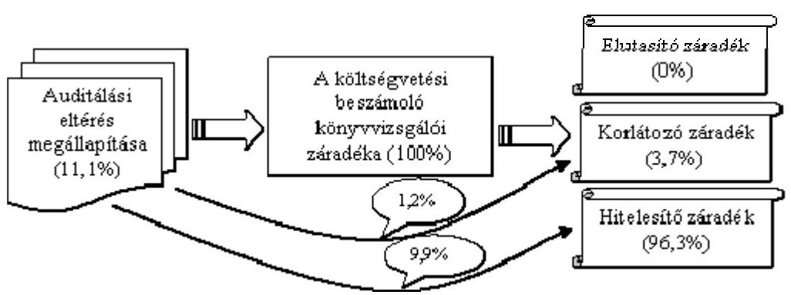

A könyvvizsgálók kilenc önkormányzatnál auditálási eltérést állapítottak meg az önkormányzati szintű pénzmaradvány összegében, a rövid- és hosszú lejárá-

---

tú kötelezettségek, a készletek, befektetett pénzügyi eszközök értékében, továbbá helytelen értékcsökkenés elszámolásából, értékvesztés elszámolás elmaradásából, szellemi termékek tárgyi eszközként történő nyilvántartásából, éven túli használatú tárgyi eszközök dologi kiadásként történő elszámolása miatt.

# 3.2. A korábbi számvevőszéki ellenőrzések javaslatainak hasznosulása 

ÁSZ ellenőrzés ${ }^{103}$ 2003-2006 között a Budapest főváros, továbbá valamennyi megyei, megyei jogú városi, Budapest fővárosi kerületi, városi, nagyközségi és községi önkormányzatnál volt.

Az Állami Számvevőszék megvalósította a 2002-2006. évekre szóló stratégiájában meghatározott feladatait és teljesítette a 35/2003. (IV. 9.) OGY határozatban foglaltakat, így a 2006. évvel bezárólag megvalósult a jelentős pénzösszeggel és vagyonnal gazdálkodó önkormányzatok átfogó ellenőrzése, és minden helyi önkormányzatot érintett számvevőszéki ellenőrzés az elmúlt négy évben.

A 2003-2006 között vizsgált önkormányzatoknál ellenőriztük a 2000-2005. évek között lefolytatott ÁSZ vizsgálatok megállapításainak, javaslatainak hasznosulását. Ellenőrzési megállapításaink szerint az önkormányzati gazdálkodás szabályozottsága és végrehajtásának szabályszerűsége javult.

A zárszámadáshoz kapcsolódó vizsgálatoknál tett javaslatok háromnegyedét az önkormányzatok megvalósították, ennek során a jogosulatlanul igénybevett támogatásokat visszafizették, szociális rendeletüket kiegészítették, módosították az intézmények alapító okiratait, felülvizsgálták a rendszeres szociális segélyezettek jogosultsági feltételeit. A belső ellenőrzés vizsgálata kiterjedt az intézmények normatív hozzájárulás igénylésére, elszámolására és ellenőrizték ezek alapdokumentumait, az önkormányzati hivatalok vezették a közmúfejlesztési támogatások elkülönített analitikus nyilvántartását, intézkedtek az igényelt támogatás 15 napon belüli kifizetéséről.

A témaellenőrzéseknél tett javaslatok mintegy kétharmadát végrehajtották, a képviselő-testületek elfogadták a szociális szolgáltatástervezési, gyermekvédelmi, településfejlesztési koncepciókat, a közoktatás minőségirányítási programját, összehangolták a középtávú megyei és városi intézményfejlesztési tervet, áttekintették a középfokú oktatási intézmények képzési struktúráját, törekedtek a párhuzamos képzések megszüntetésére, rendeletet alkottak a talajterhelési díjról. A jegyzők meghatározták a köztemetők fenntartásával kapcsolatos pénzügyi elszámolás rendjét, a bevételeket és kiadásokat az előírt szakfeladaton számolták el, a választások, a népszavazásra biztosított pénzeszközök elszámolását a helyszínen ellenőriztették, szennyvízközmú hálózatra történő lakossági rákötések számát növelték. Kettő városi önkormányzatnál a lakásértékesítésből származó bevételek elszámolására az elkülönített számlát nem nyitották meg, öt Budapest fővárosi kerületi önkormányzat nem intézkedett a lakóépületek elidegenítéséből származó bevételek 50\%-ának Budapest Főváros Önkormányzata elkülönített számlájára történő átutalásáról. ${ }^{104}$

[^0]
[^0]:    ${ }^{103}$ A 47/2006. (X. 27.) OGY határozat az ÁSZ tevékenységéről szóló jelentés elfogadásáról.
    ${ }^{104}$ A lakások és helyiségek bérletére, valamint elidegenítésére vonatkozó egységes szabályokról szóló 1993. évi LXXVIII. törvény 63. § (1) bekezdésében foglalt kötelezettségüket nem teljesítették.

---

A helyi és helyi kisebbségi önkormányzatok gazdálkodásának átfogó ellenőrzése során tett javaslatok közel kétharmadának realizálásaként az önkormányzatok elfogadták a gazdasági programot, a vagyongazdálkodási rendeletet, az önkormányzati hivatalok SzMSz-ét, az intézmények alapító okiratait. A jegyzők elkészítették a számviteli politikát és a kapcsolódó szabályzatokat, a számlarendet, aktualizálták az operatív gazdálkodási jogkörök szabályozását, biztosították az ingatlankataszter és a számviteli nyilvántartások egyezőségét. Kidolgozták az informatikai rendszerek biztonságos múködését szolgáló szabályzatokat, a költségvetési rendelettervezeteket egyeztették a költségvetési szervek vezetőivel. A képviselő-testületek azonban nem határozták meg az Áht. 118. §-ában foglaltak ellenére a költségvetés előterjesztésekor, illetve a zárszámadáskor a képviselő-testület tájékoztatása céljából bemutatandó mérlegek, kimutatások tartalmi követelményeit, valamint továbbra is kedvezményes helyiségbiztosítással közvetett támogatást nyújtottak a pártok részére. A polgármesterek a képviselő-testület tájékoztatása céljából a zárszámadási rendelet előterjesztéséhez nem csatolták a közvetett támogatások kimutatását és szöveges értékelését, valamint a vagyonkimutatást.

A gazdálkodási rendszer átfogó ellenőrzését a 2003-2006. években az önkormányzatok 63\%-ánál végeztünk el. A számvevői jelentések megállapításainak alapján a hiányosságok megszüntetése érdekében 47924 javaslatot tettünk. A javaslatok 78\%-a a jogszabályokban és az önkormányzatok rendeleteiben, az önkormányzati hivatalok szabályzataiban előírtak betartására, a szabályszerű működésre hívta fel a figyelmet, 22\%-a az önkormányzati feladatok hatékonyabb ellátásának elősegítését, az önkormányzati hivatalok munkájának célszerűbb megszervezését, a munka színvonalának emelését szolgálta.

Az önkormányzatok gazdálkodásának a 2003-2006. évi átfogó ellenőrzéséről készült összefoglaló jelentésekben 41 javaslatot tettünk a kormánynak és a minisztereknek, amelyeknek közel háromnegyede teljesült.

Javaslatunkra az Országgyűlés meghatározta a gazdasági program tartalmi követelményeit, a 2005. évtől a költségvetési törvényben a vagyon értékesítések, hasznosítások versenyeztetési kötelezettsége egységes értékhatárát, kiegészítette a Kbt-t a helyben központosított közbeszerzésekre vonatkozó szabályokkal, teljessé tette az Ötv-ben a helyi önkormányzatoknál a közösségi vívmányoknak és a nemzetközi standardoknak megfelelő pénzügyi ellenőrzési rendszer szabályait és összhangot teremtett az Áht-val az önkormányzatok külső és belső ellenőrzése tekintetében, meghatározta a Szoctv-ben a megyei önkormányzatok kötelező feladatait. Az Áht. előírásait kiterjesztette a nem normatív céljellegú múködési támogatások kedvezményezettjei közzétételi kötelezettségére, kiegészítette a kisebbségi önkormányzatokkal kötött megállapodás tartalmi követelményeivel és az ehhez kapcsolódó feladatellátás jogosultjaival. A Kormány az Ámr. módosításával megszűntette a községi, nagyközségi önkormányzatok által fenntartott intézményekben az érvényesítést végzők képesítési előírás alóli mentesítésének lehetőségét, meghatározta a költségvetési és zárszámadási előterjesztésekben a közvetett támogatások bemutatásának részletezettségét, a szakmai teljesítés igazolására vonatkozó előírásokat a feladatok végrehajtási sorrendjét figyelembe véve módosította. Előírták a Vhr-ben a jegyző döntési jogkörét a számviteli politika és a kapcsolódó szabályzatok előírásainak az önkormányzati hivatalhoz tartozó részben önállóan gazdálkodó és a részjogkörű költségvetési szervekre történő kiterjesztése esetére. Kiegészítették a belső ellenőrzési kézikönyv mintát a céljelleggel nyújtott támogatások ellenőrzésére vonatkozó egységes szempontokkal. A Belügyminisztérium a pályázatok kiírásának, az egységes könyvviteli nyilvántartási rendszerhez kapcsolódó számítástechnikai programok kiadásának támogatásával elősegítette az önkormányzatok informatikai felkészültségének javítását. A Földművelődési és Vidékfejlesztési Minisztérium körlevélben felhívta a földhivatalok figyelmét arra, hogy az Ötv. 79. § (2) bekezdés a) pontja alapján forgalomképtelen ingatlanok esetében ne jegyezzék be

---

a tulajdonos változást. Az Önkormányzati és Területfejlesztési miniszter jelezése szerint, várhatóan 2007. évben az Ötv. módosításakor sor kerül az önkormányzati rendelettel korlátozottan forgalomképes kategóriába sorolt vagyonelemek rendelettel történő (törzsvagyonon kívüli egyéb forgalomképes kategóriába) átsorolására vonatkozó kötelezettség előírására. Nem történt intézkedés az Önkormányzati és Területfejlesztési miniszter- által az önkormányzatok kötelező feladatai, az ellátásukat szolgáló költségvetési források egyértelmú meghatározására, a folyamatosan megújított folyószámlahitelek figyelembe vételére az adósságot keletkeztető kötelezettségvállalások felső határának megállapításánál. A pénzügyminiszter nem kezdeményezte a hiány számításánál a hitel figyelembevétel módjának meghatározását, de arra az Áht. módosítása során lehetőséget lát. Nem történt meg a kisebbségi önkormányzatok gazdálkodásával összefüggő pénzügyi-számviteli nyilvántartási követelmények, az operatív gazdálkodási és belső ellenőrzési feladatok sajátos rendjét összefoglaló kézikönyv megjelentetése.

# 4. A TELEPÜLÉSI KISEBBSÉGI ÖNKORMÁNYZATOK GAZDÁLKODÁSA 

Az elmúlt négy évben az ellenőrzött települési önkormányzatok mellett múködő kisebbségi önkormányzatok közül 705 településen, az országban múködő kisebbségi önkormányzatok 39\%-ánál vizsgáltuk a kisebbségi önkormányzat gazdálkodását. Az ellenőrzések érintették a Nek. tv. 61. § (1) bekezdésében szereplő valamennyi nemzetiséget ${ }^{106}$.

A települési kisebbségi önkormányzatok feladat- és hatáskört a 20032006. években nem vettek át a települési önkormányzatoktól, intézményt egy kivétellel - 2003-tól egy napközi otthonos óvoda - nem tartottak fenn. Tevékenységük az önkormányzati, illetve testületi múködés feltételeinek biztosítását, a településükön élő kisebbségek érdekeinek képviseletét tartalmazta. Ennek megfelelően a költségvetési bevételeiket és kiadásaikat döntően a múködést szolgáló pénzeszközök képezték, amelyben meghatározó volt az állami költségvetésből nyújtott központosított támogatás, valamint a helyi önkormányzatok támogatása. A bevételek és kiadások alakulását 2003-2006 között a jelentés 8/a. és 8/b. számú mellékletei ismertetik.

Az ellenőrzött települési és kisebbségi önkormányzatok az együttmúködésük helyi szabályozását évente növekvő arányban (79-96\%-nál) és egyre több területre kiterjedően rögzítették megállapodásban. A megállapodások növekvő hányadában (2003-ban 84\%-ában, 2004-ben 80\%-ában, 2005ben $93 \%$-ában) szerepelt, hogy a gazdálkodás végrehajtó szerve az önkormányzati hivatal, $87 \%$-ában (az előző években $77 \%$, illetve $66 \%$ ) a jegyző felkérése a költségvetési, előirányzat-módosítási és zárszámadási határozattervezetek előkészítésére. A megállapodások 70\%-ánál azonban (2003-ban 49\%, 2004-ben 66\%) a jogszabályi előírások és gazdálkodási feltételek változása miatt indokolt módosítást az Ámr. 29. § (11) bekezdésében foglalt határidőre nem végezték el, így azok egyre nagyobb része nem felelt meg a feladatellátás követelményeinek.

[^0]
[^0]:    ${ }^{105}$ A 2003-2005. években a belügyminiszter
    ${ }^{106}$ Bolgár, cigány, görög, horvát, lengyel, német, örmény, román, ruszin, szerb, szlovák, szlovén, ukrán.

---

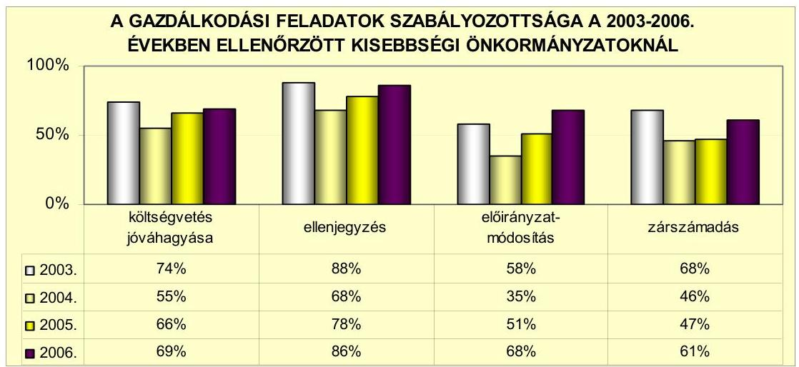

A szakmai teljesítés igazolás módjának az Ámr. 135. § (3) ${ }^{107}$ bekezdésében előírt szabályozását, valamint az azt végző személyek kijelölését évek óta a legnagyobb arányban (33\%-72\%) mulasztották el a jegyzők. Az érvényesítést végzők Ámr. 135. § (2) ${ }^{108}$ bekezdésének megfelelő végzettségű megbízása $82 \%-70 \%$-nál megtörtént, de közel egyharmadnál még hiányzott. Így a gazdálkodás folyamatában nem múködhetett a szakmai teljesítés igazolása és az érvényesítés kontrolljai, nem volt biztosított az utalvány Ámr. előírásainak megfelelő ellenjegyzésének feltételei. A szabályozások elmulasztásához hozzájárult, hogy az Áht. 66. § előírásai alapján kötendő együttműködési megállapodásnak nem volt kötelező tartalmi eleme a gazdálkodás végrehajtási feladatainak meghatározása ${ }^{109}$.

Éves költségvetését az Áht. 65. § (2) bekezdésében előírtaknak megfelelően a 2002-2004. évi 93\%-97\%-97\%-ával szemben a kisebbségi önkormányzatok 99\%-a állapította meg a 2005. évben önkormányzati testületi határozattal. A jóváhagyott határozatoknak a korábbi mintegy kétharmadnál nagyobb aránya, 79\%-a felelt meg az Áht. 69. § (2) bekezdésében, illetve az Ámr. 29. § (2) bekezdésében előírtaknak. A költségvetési előirányzatok Ámr. 53. § (7) bekezdésében foglaltak szerinti módosításáról jóval kisebb arányban (59\%nál, az előző években $35-51 \%$-nál) döntöttek határozattal a testületek. A költségvetési előirányzatokról határozattal nem döntő kisebbségi önkormányzatok nem biztosították annak feltételét, hogy a gazdálkodás folyamatában a kötelezettségvállalás és az utalványozás az előirányzatok mértékéig történjen. Ez is közrejátszott abban, hogy a kisebbségi önkormányzatok 17\%-ánál a 2005. évben túllépték a jóváhagyott előirányzatot.

A kisebbségi önkormányzatok elnökei a költségvetési határozatok 79\%-át (az előző években $69 \%-88 \%$ ), az előirányzat módosító határozatok $90 \%$-át (az előző években $92 \%-94 \%$-át) továbbították olyan időben a települési önkormány-

[^0]
[^0]:    ${ }^{107}$ A 2007. január 1-től Ámr. 135. § (2) bekezdés.
    ${ }^{108}$ A 2007. január 1-től Ámr. 135. § (4) bekezdés.
    ${ }^{109}$ Az Áht. 66. § 2007. január 1-től hatályos előírásai szerint az együttműködési megállapodásnak tartalmaznia kell a gazdálkodás végrehajtásának rendjét, az ehhez kapcsolódó feladatellátás jogosultjainak, kötelezettjeinek kijelölését.

---

zatok polgármesteréhez, hogy azok az Ámr. 53. § (8) bekezdésének megfelelően a költségvetési rendeleten átvezethetők voltak.

A kötelezettségvállalásokat szabálytalanul végezték a bizonylatok 40\%-ánál (az előző években $27 \%-29 \%$ ), mivel elmaradt az 50 ezer Ft alatti kötelezettségek írásba foglalása. Az utalványozás során nem tartották be az Ámr. 136. § (1)-(5) bekezdés és a belső szabályozás előirásait a bizonylatok $23 \%$-ánál (az előző években $29 \%-43 \%$-ánál).

A kisebbségi önkormányzatok 10\%-ánál (az előző évben 16\%-ánál) részben vagy teljes egészében a polgármester, a jegyző, önkormányzati hivatali köztisztviselő, illetve a kisebbségi önkormányzat elnökének felhatalmazása nélkül kisebbségi önkormányzati képviselő-testületi tag, további 10\%-ánál (az előző évben 9\%) az elnök saját maga javára is utalványozott kifizetést.

A hiányosságok között szerepelt, hogy az utalványozás nem szabályszerűen érvényesített okmányon és ellenjegyzés nélkül történt, illetve nem felelt meg az Ámr. 136. § (4)-(5) bekezdésében előírt tartalmi követelményeknek. Az önkormányzatok 3\%-ánál a költségvetésben nem szereplő feladatra, 17\%-ánál előirányzatot meghaladóan történt a kötelezettségvállalás és utalványozás (az előző évben 7-7\%-nál).

A szabálytalan kötelezettségvállalásoknak és utalványozásoknak is okozója volt, hogy az önkormányzati hivatalok 58\%-nál (az előző évben 83\%, illetve $72 \%$-nál) az Ámr. 134. § (13) bekezdésében foglaltak ellenére nem vezettek analitikus nyilvántartást a kötelezettségvállalásokról.

A kötelezettségvállalás és az utalvány ellenjegyzését a bizonylatok 61\%-ánál az Áht. 74/A. § (2) bekezdés előírásainak megfelelően a jegyző́k, a továbbiaknál a kisebbségi önkormányzati testületek tagjai végezték az Áht. 74/A. § (3) bekezdésében lehetővé tett megbízás alapján. A kötelezettségvállalások nem jegyző által végzett ellenjegyzésének 57\%-ánál megsértették az Áht. 74/A. § (2)-(3) bekezdésében foglalt előírásokat az igazolások elmaradása, a testület felhatalmazása, illetve előirányzat hiányában történt igazolása esetén.

Az ellenjegyzök nem végezték el hiánytalanul az Ámr. 134. § (9) bekezdésében meghatározott feladataikat, mivel nem győződtek meg arról, hogy a jóváhagyott költségvetés kiadási előirányzata biztosítja-e a fedezetet és a kötelezettségvállalás nem sérti-e a gazdálkodásra vonatkozó szabályokat. Változatlanul jellemző hiányosság a szakmai teljesítés igazolás és érvényesítés hiányában, illetve az adott feladatra szóló megbízás nélküli, jogosulatlan ellátása ellenére annak észrevételezése nélkül történt utalvány ellenjegyzés.

A kisebbségi önkormányzatok 89\%-a (az előző években 75\%-76\%-79\%-a) a 2005. évi gazdálkodásáról szóló zárszámadását határozattal jóváhagyta. A továbbiaknál nem biztosították, hogy a helyi önkormányzatok a kisebbségi önkormányzatok zárszámadásának adatait a testületi határozatok alapján építsék be a zárszámadási rendeletükbe. A zárszámadási határozatok tartalma $72 \%$-nál (a 2003-ban $64 \%$, a 2004-ben $63 \%$ ), az összes jóváhagyott határozat $81 \%$-a (az előző évben $80 \%$-a) volt összehasonlítható a költségvetéssel.

---

A jóváhagyott határozatok 82\%-át (a 2003-ban 76\%, a 2004-ben 89\%-át) továbbította az elnök a települési önkormányzat polgármesteréhez olyan időben, hogy az a zárszámadási rendeletbe beépíthető volt. A kisebbségi önkormányzatok gazdálkodásának részletes ellenőrzési megállapításait a jelentés 8 . számú melléklete tartalmazza.

Budapest, 2007. augusztus "30 "

Melléklet: $\quad 13 \mathrm{db} \quad 53$ lap
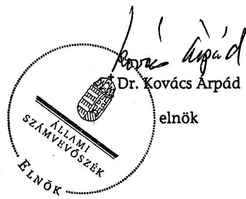

---

# AZ ELLENŐRZÖTT ÖNKORMÁNYZATOK JEGYZÉKE 

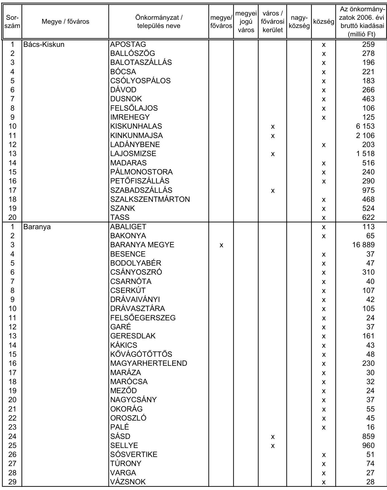

---

| $\underset{\text { szám }}{S o r}$ | Megye / főváros | Önkormányzat / település neve | megye/   főváros | megye/   jogú   város | város /   fővárosi kerület | nagy-   község | község | Az önkormányzatok 2006. évi bruttó kiadásai (millió Ft) |
| :--: | :--: | :--: | :--: | :--: | :--: | :--: | :--: | :--: |
| 1 | Békés | BÉKÉSCSABA |  | $x$ |  |  |  | 21977 |
| 2 |  | BIHARUGRA |  |  |  |  | $x$ | 228 |
| 3 |  | CSABACSÜD |  |  |  | $x$ |  | 328 |
| 4 |  | CSABASZABADI |  |  |  |  | $x$ | 66 |
| 5 |  | CSÁRDASZÁLLÁS |  |  |  |  | $x$ | 111 |
| 6 |  | CSORVÁS |  |  | $x$ |  |  | 1379 |
| 7 |  | DÉVAVÁNYA |  |  | $x$ |  |  | 1777 |
| 8 |  | GÁDOROS |  |  |  | $x$ |  | 515 |
| 9 |  | GERENDÁS |  |  |  |  | $x$ | 162 |
| 10 |  | GESZT |  |  |  |  | $x$ | 217 |
| 11 |  | HUNYA |  |  |  |  | $x$ | 119 |
| 12 |  | KARDOS |  |  |  |  | $x$ | 96 |
| 13 |  | KASZAPER |  |  |  |  | $x$ | 384 |
| 14 |  | KÖTEGYÁN |  |  |  |  | $x$ | 335 |
| 15 |  | MAGYARBÁNHEGYES |  |  |  |  | $x$ | 364 |
| 16 |  | MÉHKERÉK |  |  |  |  | $x$ | 470 |
| 17 |  | MEZÖGYÁN |  |  |  |  | $x$ | 253 |
| 18 |  | MEZÖKOVÁCSHÁZA |  |  | $x$ |  |  | 1421 |
| 19 |  | NAGYBÁNHEGYES |  |  |  |  | $x$ | 330 |
| 20 |  | NAGYKAMARÁS |  |  |  |  | $x$ | 341 |
| 21 |  | OROSHÁZA |  |  | $x$ |  |  | 12128 |
| 22 |  | PUSZTAFÖLDVÁR |  |  |  |  | $x$ | 362 |
| 23 |  | SARKADKERESZTÜR |  |  |  |  | $x$ | 356 |
| 24 |  | SZABADKÍGYÓS |  |  |  |  | $x$ | 434 |
| 25 |  | ÚJSZALONTA |  |  |  |  | $x$ | 24 |
| 1 | Borsod-Abaúj-Zemplén | ALSÓSZUHA |  |  |  |  | $x$ | 95 |
| 2 |  | ARKA |  |  |  |  | $x$ | 28 |
| 3 |  | BAKTAKÉK |  |  |  |  | $x$ | 389 |
| 4 |  | BÁNHORVÁTI |  |  |  |  | $x$ | 236 |
| 5 |  | BERET |  |  |  |  | $x$ | 64 |
| 6 |  | BOLDOGKÖÚJFALU |  |  |  |  | $x$ | 87 |
| 7 |  | BOLDOGKÖVÁRALJA |  |  |  |  | $x$ | 369 |
| 8 |  | BÜTTÖS |  |  |  |  | $x$ | 79 |
| 9 |  | FILKEHÁZA |  |  |  |  | $x$ | 23 |
| 10 |  | FÜZÉRKAJATA |  |  |  |  | $x$ | 63 |
| 11 |  | FÜZÉRRADVÁNY |  |  |  |  | $x$ | 88 |
| 12 |  | GAGYAPÁTI |  |  |  |  | $x$ | 10 |
| 13 |  | GALVÁCS |  |  |  |  | $x$ | 27 |
| 14 |  | HOLLÓHÁZA |  |  |  |  | $x$ | 259 |
| 15 |  | IROTA |  |  |  |  | $x$ | 53 |
| 16 |  | KÁNY |  |  |  |  | $x$ | 14 |
| 17 |  | KÉKED |  |  |  |  | $x$ | 113 |
| 18 |  | KERESZTÉTE |  |  |  |  | $x$ | 12 |
| 19 |  | KISHUTA |  |  |  |  | $x$ | 42 |
| 20 |  | KRASZNOKVAJDA |  |  |  |  | $x$ | 256 |
| 21 |  | MARTONYI |  |  |  |  | $x$ | 81 |
| 22 |  | NAGYHUTA |  |  |  |  | $x$ | 17 |
| 23 |  | PÁLHÁZA |  |  | $x$ |  |  | 611 |
| 24 |  | PERECSE |  |  |  |  | $x$ | 10 |
| 25 |  | SAJÓSZENTPÉTER |  |  | $x$ |  |  | 2477 |
| 26 |  | SÁROSPATAK |  |  | $x$ |  |  | 3947 |
| 27 |  | SÁTORALJÁÚJHELY |  |  | $x$ |  |  | 6307 |
| 28 |  | SZAKÁCSI |  |  |  |  | $x$ | 49 |
| 29 |  | SZENDRŐ |  |  | $x$ |  |  | 1335 |
| 30 |  | SZUHAFŐ |  |  |  |  | $x$ | 97 |

---

| $\begin{aligned} & \text { Sor- } \\ & \text { szám } \end{aligned}$ | Megye / főváros | Önkormányzat / település neve | megye/   főváros | megye   jogú   város | város /   fővárosi   kerület | nagy-   község | község | Az önkormányzatok 2006. évi bruttó kiadásai (millió Ft) |
| :--: | :--: | :--: | :--: | :--: | :--: | :--: | :--: | :--: |
| 31 |  | TOKAJ |  |  | x |  |  | 2516 |
| 32 |  | ZÁDORFALVA |  |  |  |  | $x$ | 170 |
| 1 | Csongrád | AMBRÖZFALVA |  |  |  |  | $x$ | 98 |
| 2 |  | CSANÁDALBERTI |  |  |  |  | $x$ | 182 |
| 3 |  | HÖDMEZÖVÁSÁRHELY |  | $x$ |  |  |  | 22924 |
| 4 |  | KISTELEK |  |  | $x$ |  |  | 4052 |
| 5 |  | MAROSLELE |  |  |  |  | $x$ | 278 |
| 6 |  | ÖPUSZTASZER |  |  |  |  | $x$ | 305 |
| 7 |  | SÁNDORFALVA |  |  | $x$ |  |  | 1006 |
| 1 | Fejér | ADONY |  |  | $x$ |  |  | 601 |
| 2 |  | ALAP |  |  |  |  | $x$ | 437 |
| 3 |  | CECE |  |  |  | $x$ |  | 1055 |
| 4 |  | CSÖSZ |  |  |  |  | $x$ | 83 |
| 5 |  | ENYING |  |  | $x$ |  |  | 1372 |
| 6 |  | ERCSI |  |  | $x$ |  |  | 1419 |
| 7 |  | FELCSÚT |  |  |  |  | $x$ | 240 |
| 8 |  | KISAPOSTAG |  |  |  |  | $x$ | 185 |
| 9 |  | KISLÁNG |  |  |  |  | $x$ | 409 |
| 10 |  | LAJOSKOMÁROM |  |  |  | $x$ |  | 375 |
| 11 |  | MAGYARALMÁS |  |  |  |  | $x$ | 229 |
| 12 |  | MARTONVÁSÁR |  |  | $x$ |  |  | 1527 |
| 13 |  | MÖR |  |  | $x$ |  |  | 4126 |
| 14 |  | ÖBAROK |  |  |  |  | $x$ | 73 |
| 15 |  | PERKÁTA |  |  |  | $x$ |  | 529 |
| 16 |  | SZABADEGYHÁZA |  |  |  |  | $x$ | 435 |
| 1 | Főváros | BUDAPEST FÖVÁROS |  |  | $x$ |  |  | 538621 |
| 2 |  | BUDAPEST VII. KERÜLET |  |  | $x$ |  |  | 13576 |
| 3 |  | BUDAPEST XII. KERÜLET |  |  | $x$ |  |  | 12794 |
| 4 |  | BUDAPEST XIV. KERÜLET |  |  | $x$ |  |  | 22850 |
| 5 |  | BUDAPEST XVII. KERÜLET |  |  | $x$ |  |  | 12751 |
| 6 |  | BUDAPEST XXI. KERÜLET |  |  | $x$ |  |  | 20736 |
| 7 |  | BUDAPEST XXIII. KERÜLET |  |  | $x$ |  |  | 5296 |
| 1 | Győr-Moson-Sopron | ÁSVÁNYRÁRÓ |  |  |  |  | $x$ | 195 |
| 2 |  | BAKONYPÉTERD |  |  |  |  | $x$ | 21 |
| 3 |  | BEZENYE |  |  |  |  | $x$ | 197 |
| 4 |  | BEZI |  |  |  |  | $x$ | 59 |
| 5 |  | BOGYOSZLÓ |  |  |  |  | $x$ | 130 |
| 6 |  | CSIKVÁND |  |  |  |  | $x$ | 35 |
| 7 |  | DARNÓZSELI |  |  |  |  | $x$ | 255 |
| 8 |  | DUNAREMETE |  |  |  |  | $x$ | 38 |
| 9 |  | EGYHÁZASFALU |  |  |  |  | $x$ | 120 |
| 10 |  | FERTÖD |  |  | $x$ |  |  | 574 |
| 11 |  | FERTÖENDRÉD |  |  |  |  | $x$ | 75 |
| 12 |  | GYALÓKA |  |  |  |  | $x$ | 12 |
| 13 |  | GYARMAT |  |  |  |  | $x$ | 226 |
| 14 |  | GYÖMÖRE |  |  |  |  | $x$ | 173 |
| 15 |  | GYÖR-MOSON-SOPRON | $x$ |  |  |  |  | 21459 |
| 16 |  | GYÖRSÖVÉNYHÁZ |  |  |  |  | $x$ | 120 |
| 17 |  | HARKA |  |  |  |  | $x$ | 142 |
| 18 |  | HIDEGSÉG |  |  |  |  | $x$ | 43 |
| 19 |  | KAJÁRPÉC |  |  |  |  | $x$ | 256 |
| 20 |  | KISBABOT |  |  |  |  | $x$ | 28 |
| 21 |  | KISBODAK |  |  |  |  | $x$ | 64 |
| 22 |  | KISFALUD |  |  |  |  | $x$ | 68 |
| 23 |  | LÁZI |  |  |  |  | $x$ | 59 |

---

| Sorszám | Megye / főváros | Önkormányzat / település neve | megye/ főváros | megye/ jogú város | város /   fővárosi kerület | nagy-   község | község | Az önkormányzatok 2006. évi bruttó kiadásai (millió Ft) |
| :--: | :--: | :--: | :--: | :--: | :--: | :--: | :--: | :--: |
| 24 |  | LEVÉL |  |  |  |  | $x$ | 236 |
| 25 |  | MAGYARKERESZTÚR |  |  |  |  | $x$ | 34 |
| 26 |  | MÉRGES |  |  |  |  | $x$ | 14 |
| 27 |  | MIHÁLYI |  |  |  |  | $x$ | 183 |
| 28 |  | MÖRICHIDA |  |  |  |  | $x$ | 207 |
| 29 |  | MOSONSZENTMIKLÓS |  |  |  |  | $x$ | 278 |
| 30 |  | MOSONSZOLNOK |  |  |  |  | $x$ | 448 |
| 31 |  | NAGYLÓZS |  |  |  |  | $x$ | 116 |
| 32 |  | OSLI |  |  |  |  | $x$ | 130 |
| 33 |  | PINNYE |  |  |  |  | $x$ | 64 |
| 34 |  | POTYOND |  |  |  |  | $x$ | 8 |
| 35 |  | PÜSKI |  |  |  |  | $x$ | 158 |
| 36 |  | RÁBACSÉCSÉNY |  |  |  |  | $x$ | 91 |
| 37 |  | RÁBASEBES |  |  |  |  | $x$ | 20 |
| 38 |  | RÁBASZENTANDRÁS |  |  |  |  | $x$ | 42 |
| 39 |  | RÁBASZENTMIHÁLY |  |  |  |  | $x$ | 68 |
| 40 |  | RÁBASZENTMIKLÓS |  |  |  |  | $x$ | 24 |
| 41 |  | ROMÁND |  |  |  |  | $x$ | 41 |
| 42 |  | SOPRON |  | $x$ |  |  |  | 22659 |
| 43 |  | SOPRONHORPÁCS |  |  |  |  | $x$ | 161 |
| 44 |  | SOPRONNÉMETI |  |  |  |  | $x$ | 39 |
| 45 |  | SZILSÁRKÁNY |  |  |  |  | $x$ | 86 |
| 46 |  | TÁPSZENTMIKLÓS |  |  |  |  | $x$ | 176 |
| 47 |  | TARJÁNPUSZTA |  |  |  |  | $x$ | 216 |
| 48 |  | ÚJRÓNAFÓ |  |  |  |  | $x$ | 80 |
| 49 |  | UND |  |  |  |  | $x$ | 50 |
| 50 |  | VADOSFA |  |  |  |  | $x$ | 10 |
| 51 |  | VÁRBALOG |  |  |  |  | $x$ | 53 |
| 1 | Hajdú-Bihar | BÁRÁND |  |  |  |  | $x$ | 504 |
| 2 |  | FÖLDES |  |  |  | $x$ |  | 763 |
| 3 |  | HAJDÚSÁMSON |  |  | $x$ |  |  | 2398 |
| 4 |  | NÁDUDVAR |  |  | $x$ |  |  | 2338 |
| 5 |  | NYÍRADONY |  |  | $x$ |  |  | 2154 |
| 6 |  | POLGÁR |  |  | $x$ |  |  | 2015 |
| 7 |  | PÜSPÖKLADÁNY |  |  | $x$ |  |  | 4367 |
| 8 |  | SÁP |  |  |  |  | $x$ | 261 |
| 9 |  | SÁRÁND |  |  |  |  | $x$ | 453 |
| 10 |  | TÉGLÁS |  |  | $x$ |  |  | 1592 |
| 11 |  | ÚJSZENTMARGITA |  |  |  |  | $x$ | 935 |
| 1 | Heves | BÉLAPÁTFALVA |  |  | $x$ |  |  | 940 |
| 2 |  | BÜKKSZÉK |  |  |  |  | $x$ | 167 |
| 3 |  | BÜKKSZENTMÁRTON |  |  |  |  | $x$ | 40 |
| 4 |  | DETK |  |  |  |  | $x$ | 66 |
| 5 |  | DORMÁND |  |  |  |  | $x$ | 436 |
| 6 |  | FÜZESABONY |  |  | $x$ |  |  | 1589 |
| 7 |  | HEVES | $x$ |  |  |  |  | 18311 |
| 8 |  | KISKÖRE |  |  | $x$ |  |  | 812 |
| 9 |  | KOMPOLT |  |  |  |  | $x$ | 513 |
| 10 |  | MÓNOSBÉL |  |  |  |  | $x$ | 54 |
| 11 |  | OSTOROS |  |  |  |  | $x$ | 307 |
| 12 |  | PARÁDSASVÁR |  |  |  |  | $x$ | 103 |
| 13 |  | SIROK |  |  |  |  | $x$ | 434 |

---

| Sorszám | Megye / főváros | Önkormányzat / település neve | megye/ főváros | megye/   jogú   város | város /   fővárosi   kerület | nagy-   község | község | Az önkormányzatok 2006. évi bruttó kiadásai (millió Ft) |
| :--: | :--: | :--: | :--: | :--: | :--: | :--: | :--: | :--: |
| 1 | Jász-Nagykun-Szolnok | ABÁDSZALÓK |  |  | $x$ |  |  | 1707 |
| 2 |  | JÁSZBOLDOGHÁZA |  |  |  |  | $x$ | 231 |
| 3 |  | JÁSZDÖZSA |  |  |  |  | $x$ | 386 |
| 4 |  | JÁSZSZENTANDRÁS |  |  |  |  | $x$ | 370 |
| 5 |  | KUNMADARAS |  |  |  | $x$ |  | 1013 |
| 6 |  | KUNSZENTMÁRTON |  |  | $x$ |  |  | 2627 |
| 7 |  | MARTFÜ |  |  | $x$ |  |  | 1367 |
| 8 |  | MEZÓTÚR |  |  | $x$ |  |  | 6445 |
| 9 |  | PUSZTAMONOSTOR |  |  |  |  | $x$ | 214 |
| 10 |  | TISZAFÖLDVÁR |  |  | $x$ |  |  | 2514 |
| 11 |  | TISZAJENÖ |  |  |  |  | $x$ | 284 |
| 12 |  | TISZAROFF |  |  |  |  | $x$ | 354 |
| 13 |  | TISZASÚLY |  |  |  |  | $x$ | 367 |
| 14 |  | TISZASZENTIMRE |  |  |  |  | $x$ | 567 |
| 15 |  | TISZASZÖLÖS |  |  |  |  | $x$ | 293 |
| 16 |  | TISZATENYÖ |  |  |  |  | $x$ | 298 |
| 1 | Komárom-Esztergom | ÁCSTESZER |  |  |  |  | $x$ | 135 |
| 2 |  | AKA |  |  |  |  | $x$ | 36 |
| 3 |  | BAKONYBÁNK |  |  |  |  | $x$ | 52 |
| 4 |  | BAKONYSÁRKÁNY |  |  |  |  | $x$ | 198 |
| 5 |  | BAKONYSZOMBATHELY |  |  |  |  | $x$ | 308 |
| 6 |  | BANA |  |  |  |  | $x$ | 182 |
| 7 |  | BÁRSONYOS |  |  |  |  | $x$ | 218 |
| 8 |  | BOKOD |  |  |  |  | $x$ | 332 |
| 9 |  | CSATKA |  |  |  |  | $x$ | 29 |
| 10 |  | DAD |  |  |  |  | $x$ | 127 |
| 11 |  | DÖMÖS |  |  |  |  | $x$ | 114 |
| 12 |  | DUNASZENTMIKLÓS |  |  |  |  | $x$ | 62 |
| 13 |  | ETE |  |  |  |  | $x$ | 88 |
| 14 |  | GYERMELY |  |  |  |  | $x$ | 247 |
| 15 |  | KERÉKTELEKI |  |  |  |  | $x$ | 71 |
| 16 |  | KOMÁROM |  |  | $x$ |  |  | 6586 |
| 17 |  | KÖMLÖD |  |  |  |  | $x$ | 140 |
| 18 |  | MOCSA |  |  |  |  | $x$ | 295 |
| 19 |  | NAGYSÁP |  |  |  |  | $x$ | 207 |
| 20 |  | PILISMARÓT |  |  |  |  | $x$ | 349 |
| 21 |  | RÉDE |  |  |  |  | $x$ | 241 |
| 22 |  | SÜTTÖ |  |  |  |  | $x$ | 490 |
| 23 |  | SZÁRLIGET |  |  |  |  | $x$ | 624 |
| 24 |  | SZOMÓD |  |  |  |  | $x$ | 244 |
| 25 |  | TATABÁNYA |  | $x$ |  |  |  | 16067 |
| 26 |  | VÁRGESZTES |  |  |  |  | $x$ | 106 |
| 27 |  | VÉRTESKETHELY |  |  |  |  | $x$ | 50 |
| 28 |  | VÉRTESSOMLÓ |  |  |  |  | $x$ | 192 |
| 1 | Nógrád | BALASSAGYARMAT |  |  | $x$ |  |  | 8922 |
| 2 |  | CSERHÁTSZENTIVÁN |  |  |  |  | $x$ | 48 |
| 3 |  | IPOLYTARNÓC |  |  |  |  | $x$ | 95 |
| 4 |  | KARANCSKESZI |  |  |  |  | $x$ | 462 |
| 5 |  | KÉTBODONY |  |  |  |  | $x$ | 49 |
| 6 |  | PÁSZTÓ |  |  | $x$ |  |  | 3608 |
| 7 |  | PATVARC |  |  |  |  | $x$ | 131 |
| 8 |  | SZENTE |  |  |  |  | $x$ | 62 |
| 9 |  | TAR |  |  |  |  | $x$ | 403 |
| 10 |  | TOLMÁCS |  |  |  |  | $x$ | 85 |

---

| Sorszám | Megye / főváros | Önkormányzat / település neve | megye/   főváros | megye/   jogú   város | város /   fővárosi   kerület | nagy-   község | község | Az önkormányzatok 2006. évi bruttó kiadásai (millió Ft) |
| :--: | :--: | :--: | :--: | :--: | :--: | :--: | :--: | :--: |
| 1 | Pest | ASZÓD |  |  | $x$ |  |  | 1304 |
| 2 |  | BUDAÖRS |  |  | $x$ |  |  | 12679 |
| 3 |  | DABAS |  |  | $x$ |  |  | 3905 |
| 4 |  | DÁNY |  |  |  |  | $x$ | 505 |
| 5 |  | DELEGYHÁZA |  |  |  |  | $x$ | 437 |
| 6 |  | FELSÖPAKONY |  |  |  |  | $x$ | 387 |
| 7 |  | FÖT |  |  | $x$ |  |  | 4034 |
| 8 |  | GÖD |  |  | $x$ |  |  | 3541 |
| 9 |  | NAGYKÁTA |  |  | $x$ |  |  | 5229 |
| 10 |  | NYÁREGYHÁZA |  |  |  |  | $x$ | 842 |
| 11 |  | PILIS |  |  | $x$ |  |  | 1445 |
| 12 |  | PILISSZENTIVÁN |  |  |  |  | $x$ | 605 |
| 13 |  | POMÁZ |  |  | $x$ |  |  | 3230 |
| 14 |  | PÜSPÖKHATVAN |  |  |  |  | $x$ | 207 |
| 15 |  | REMETESZÖLÖS |  |  |  |  | $x$ | 50 |
| 16 |  | SOLYMÁR |  |  |  | $x$ |  | 1506 |
| 17 |  | SZÁZHALOMBATTA |  |  | $x$ |  |  | 10901 |
| 18 |  | SZENTENDRE |  |  | $x$ |  |  | 5844 |
| 19 |  | SZIGETBECSE |  |  |  |  | $x$ | 358 |
| 20 |  | SZÓD |  |  |  |  | $x$ | 381 |
| 21 |  | TÁBORFALVA |  |  |  |  | $x$ | 528 |
| 22 |  | TÁPIÓSÁG |  |  |  |  | $x$ | 299 |
| 23 |  | TÖALMÁS |  |  |  |  | $x$ | 493 |
| 24 |  | TÖRTEL |  |  |  |  | $x$ | 696 |
| 25 |  | TURA |  |  | $x$ |  |  | 1075 |
| 26 |  | ÜLLÖ |  |  | $x$ |  |  | 1957 |
| 27 |  | VASAD |  |  |  |  | $x$ | 205 |
| 1 | Somogy | BALATONSZENTGYÖRGY |  |  |  |  | $x$ | 384 |
| 2 |  | BATÉ |  |  |  |  | $x$ | 120 |
| 3 |  | BÜSSÜ |  |  |  |  | $x$ | 83 |
| 4 |  | CSOMA |  |  |  |  | $x$ | 41 |
| 5 |  | FELSŐMOCSOLÁD |  |  |  |  | $x$ | 139 |
| 6 |  | FONÓ |  |  |  |  | $x$ | 35 |
| 7 |  | FONYÓD |  |  | $x$ |  |  | 1097 |
| 8 |  | GADÁCS |  |  |  |  | $x$ | 16 |
| 9 |  | GADÁNY |  |  |  |  | $x$ | 49 |
| 10 |  | GIGE |  |  |  |  | $x$ | 51 |
| 11 |  | GÖLLE |  |  |  |  | $x$ | 238 |
| 12 |  | GYUGY |  |  |  |  | $x$ | 48 |
| 13 |  | HÁCS |  |  |  |  | $x$ | 53 |
| 14 |  | HENCSE |  |  |  |  | $x$ | 43 |
| 15 |  | HOLLÁD |  |  |  |  | $x$ | 119 |
| 16 |  | HOSSZÚVIZ |  |  |  |  | $x$ | 14 |
| 17 |  | KADARKÜT |  |  | $x$ |  |  | 1106 |
| 18 |  | KAPOSHOMOK |  |  |  |  | $x$ | 45 |
| 19 |  | KAPOSKERESZTÚR |  |  |  |  | $x$ | 54 |
| 20 |  | KAPOSMÉRÖ |  |  |  |  | $x$ | 420 |
| 21 |  | KAPOSÚJLAK |  |  |  |  | $x$ | 78 |
| 22 |  | KERCSELIGET |  |  |  |  | $x$ | 101 |
| 23 |  | KISBAJOM |  |  |  |  | $x$ | 89 |
| 24 |  | KISBERÉNY |  |  |  |  | $x$ | 23 |
| 25 |  | KISGYALÁN |  |  |  |  | $x$ | 18 |
| 26 |  | KISKORPÁD |  |  |  |  | $x$ | 105 |
| 27 |  | KÖKÜT |  |  |  |  | $x$ | 62 |
| 28 |  | KUTAS |  |  |  |  | $x$ | 344 |

---

| Sorszám | Megye / főváros | Önkormányzat / település neve | megye/ főváros | megye/ jogú város | város /   fővárosi kerület | nagy-   község | község | Az önkormányzatok 2006. évi bruttó kiadásai (millió Ft) |
| --- | --- | --- | --- | --- | --- | --- | --- | --- |
| 29 |  | LENGYELTÖTI |  |  | X |  |  | 1146 |
| 30 |  | MAGYAREGRES |  |  |  |  | X | 68 |
| 31 |  | MESZTEGNYÖ |  |  |  |  | X | 324 |
| 32 |  | NÁGOCS |  |  |  |  | X | 128 |
| 33 |  | NAGYBERKI |  |  |  |  | X | 363 |
| 34 |  | NAGYSZAKÁCSI |  |  |  |  | X | 60 |
| 35 |  | NEMESVID |  |  |  |  | X | 632 |
| 36 |  | PAMUK |  |  |  |  | X | 45 |
| 37 |  | PATCA |  |  |  |  | X | 13 |
| 38 |  | SOMODOR |  |  |  |  | X | 84 |
| 39 |  | SOMOGY | X |  |  |  |  | 22206 |
| 40 |  | SOMOGYASZALÓ |  |  |  |  | X | 120 |
| 41 |  | SOMOGYSIMONYI |  |  |  |  | X | 29 |
| 42 |  | SOMOGYSZIL |  |  |  |  | X | 101 |
| 43 |  | SOMOGYVÁR |  |  |  |  | X | 466 |
| 44 |  | SZABADI |  |  |  |  | X | 34 |
| 45 |  | SZENNA |  |  |  |  | X | 285 |
| 46 |  | SZENTGÁLOSKÉR |  |  |  |  | X | 121 |
| 47 |  | SZILVÁSSZENTMÁRTON |  |  |  |  | X | 31 |
| 48 |  | TAPSONY |  |  |  |  | X | 109 |
| 49 |  | TASZÁR |  |  |  |  | X | 403 |
| 50 |  | TIKOS |  |  |  |  | X | 33 |
| 51 |  | VISNYE |  |  |  |  | X | 34 |
| 52 |  | VÖRS |  |  |  |  | X | 71 |
| 53 |  | ZICS |  |  |  |  | X | 86 |
| 54 |  | ZSELICKISFALUD |  |  |  |  | X | 52 |
| 1 | Szabolcs-Szatmár-Bereg | APAGY |  |  |  |  | X | 424 |
| 2 |  | DEMECSER |  |  | X |  |  | 1177 |
| 3 |  | EPERJESKE |  |  |  |  | X | 212 |
| 4 |  | FÉNYESLITKE |  |  |  |  | X | 564 |
| 5 |  | HERMÁNSZEG |  |  |  |  | X | 49 |
| 6 |  | KEMECSE |  |  | X |  |  | 876 |
| 7 |  | KISVARSÁNY |  |  |  |  | X | 165 |
| 8 |  | NAGYCSERKESZ |  |  |  |  | X | 291 |
| 9 |  | NAGYKÁLLÓ |  |  | X |  |  | 2855 |
| 10 |  | NAPKOR |  |  |  |  | X | 540 |
| 11 |  | NYÍRBÁTOR |  |  | X |  |  | 4858 |
| 12 |  | NYÍRCSÁSZÁRI |  |  |  |  | X | 215 |
| 13 |  | NYÍREGYHÁZA |  | X |  |  |  | 32050 |
| 14 |  | NYÍRTÉT |  |  |  |  | X | 229 |
| 15 |  | PÁTYOD |  |  |  |  | X | 189 |
| 16 |  | RÉTKÖZBERENCS |  |  |  |  | X | 262 |
| 17 |  | SZABOLCS |  |  |  |  | X | 61 |
| 18 |  | SZAMOSANGYALOS |  |  |  |  | X | 189 |
| 19 |  | SZAMOSSÁLYI |  |  |  |  | X | 203 |
| 20 |  | SZÉKELY |  |  |  |  | X | 193 |
| 21 |  | TISZACSÉCSE |  |  |  |  | X | 162 |
| 22 |  | TISZAESZLÁR |  |  |  |  | X | 553 |
| 23 |  | TISZAKÖRÖD |  |  |  |  | X | 302 |
| 24 |  | TISZALÖK |  |  | X |  |  | 1762 |
| 25 |  | TISZASZALKA |  |  |  |  | X | 298 |
| 26 |  | TISZAVID |  |  |  |  | X | 64 |

---

| $\underset{\text { szám }}{S o r}$ | Megye / főváros | Önkormányzat / település neve | megye/   főváros | megye/   jogú   város | város /   fővárosi   kerület | nagy-   község | község | Az önkormányzatok 2006. évi bruttó kiadásai (millió Ft) |
| :--: | :--: | :--: | :--: | :--: | :--: | :--: | :--: | :--: |
| 1 | Tolna | DOMBÖVÁR |  |  | $x$ |  |  | 6981 |
| 2 |  | DÖBRÖKÖZ |  |  |  |  | $x$ | 291 |
| 3 |  | ÉRTÉNY |  |  |  |  | $x$ | 138 |
| 4 |  | FELSÖNYÉK |  |  |  |  | $x$ | 119 |
| 5 |  | FÜRGED |  |  |  |  | $x$ | 202 |
| 6 |  | IREGSZEMCSE |  |  |  |  | $x$ | 514 |
| 7 |  | KOCSOLA |  |  |  |  | $x$ | 226 |
| 8 |  | KOPPÁNYSZÁNTÓ |  |  |  |  | $x$ | 60 |
| 9 |  | NAK |  |  |  |  | $x$ | 76 |
| 10 |  | OZORA |  |  |  |  | $x$ | 385 |
| 11 |  | PAKS |  |  | $x$ |  |  | 7118 |
| 12 |  | TAMÁSI |  |  | $x$ |  |  | 2193 |
| 13 |  | TOLNANÉMEDI |  |  |  |  | $x$ | 268 |
| 14 |  | ÚJIREG |  |  |  |  | $x$ | 48 |
| 1 | Vas | BEJCGYERTYÁNOS |  |  |  |  | $x$ | 41 |
| 2 |  | DARABOSHEGY |  |  |  |  | $x$ | 11 |
| 3 |  | GYANÖGEREGYE |  |  |  |  | $x$ | 17 |
| 4 |  | GYÖNGYÖSFALU |  |  |  |  | $x$ | 213 |
| 5 |  | HALOGY |  |  |  |  | $x$ | 28 |
| 6 |  | HEGYHÁTHODÁSZ |  |  |  |  | $x$ | 26 |
| 7 |  | HEGYHÁTSÁL |  |  |  |  | $x$ | 18 |
| 8 |  | ISPÁNK |  |  |  |  | $x$ | 21 |
| 9 |  | JÁKFA |  |  |  |  | $x$ | 50 |
| 10 |  | KATAFA |  |  |  |  | $x$ | 26 |
| 11 |  | KENÉZ |  |  |  |  | $x$ | 22 |
| 12 |  | KÖRMEND |  |  | $x$ |  |  | 3063 |
| 13 |  | KÖSZEG |  |  | $x$ |  |  | 2721 |
| 14 |  | KÖSZEGPATY |  |  |  |  | $x$ | 20 |
| 15 |  | LUKÁCSHÁZA |  |  |  |  | $x$ | 123 |
| 16 |  | MEGYEHID |  |  |  |  | $x$ | 27 |
| 17 |  | MIKOSSZÉPLAK |  |  |  |  | $x$ | 27 |
| 18 |  | NÁDASD |  |  |  |  | $x$ | 295 |
| 19 |  | NAGYRÁKOS |  |  |  |  | $x$ | 58 |
| 20 |  | NEMESCSÓ |  |  |  |  | $x$ | 27 |
| 21 |  | NEMESKOLTA |  |  |  |  | $x$ | 49 |
| 22 |  | NYÖGÉR |  |  |  |  | $x$ | 55 |
| 23 |  | ÖRISZENTPÉTER |  |  | $x$ |  |  | 510 |
| 24 |  | PECÓL |  |  |  |  | $x$ | 113 |
| 25 |  | PUSZTACSÓ |  |  |  |  | $x$ | 15 |
| 26 |  | SORKIFALUD |  |  |  |  | $x$ | 149 |
| 27 |  | SZALAFÖ |  |  |  |  | $x$ | 47 |
| 28 |  | SZATTA |  |  |  |  | $x$ | 18 |
| 29 |  | VASSZILVÁGY |  |  |  |  | $x$ | 35 |
| 30 |  | VASVÁR |  |  | $x$ |  |  | 1413 |
| 31 |  | ZSÉDENY |  |  |  |  | $x$ | 28 |
| 1 | Veszprém | APÁCATORNA |  |  |  |  | $x$ | 21 |
| 2 |  | BAKONYKOPPÁNY |  |  |  |  | $x$ | 37 |
| 3 |  | BAKONYSZÜCS |  |  |  |  | $x$ | 45 |
| 4 |  | BALATONFÜZFÖ |  |  | $x$ |  |  | 1198 |
| 5 |  | BALATONHENYE |  |  |  |  | $x$ | 22 |
| 6 |  | BALATONVILÁGOS |  |  |  |  | $x$ | 449 |
| 7 |  | BÁND |  |  |  |  | $x$ | 65 |
| 8 |  | BARNAG |  |  |  |  | $x$ | 14 |
| 9 |  | BORSZÖRCSÖK |  |  |  |  | $x$ | 55 |
| 10 |  | CSAJÁG |  |  |  |  | $x$ | 89 |

---

| Sorszám | Megye / főváros | Önkormányzat / település neve | megye/ főváros | megye/ jogú város | város /   fővárosi kerület | nagy-   község | község | Az önkormányzatok 2006. évi bruttó kiadásai (millió Ft) |
| :--: | :--: | :--: | :--: | :--: | :--: | :--: | :--: | :--: |
| 11 |  | CSOPAK |  |  |  |  | $x$ | 634 |
| 12 |  | DEVECSER |  |  | $x$ |  |  | 1224 |
| 13 |  | EPLÉNY |  |  |  |  | $x$ | 53 |
| 14 |  | HAJMÁSKÉR |  |  |  |  | $x$ | 347 |
| 15 |  | HALIMBA |  |  |  |  | $x$ | 197 |
| 16 |  | HEGYESD |  |  |  |  | $x$ | 23 |
| 17 |  | HEGYMAGAS |  |  |  |  | $x$ | 36 |
| 18 |  | KISBERZSENY |  |  |  |  | $x$ | 11 |
| 19 |  | KOLONTÁR |  |  |  |  | $x$ | 92 |
| 20 |  | KÖVESKÁL |  |  |  |  | $x$ | 100 |
| 21 |  | LOVAS |  |  |  |  | $x$ | 49 |
| 22 |  | MENCSHELY |  |  |  |  | $x$ | 55 |
| 23 |  | MINDSZENTKÁLLA |  |  |  |  | $x$ | 75 |
| 24 |  | MONOSTORAPÁTI |  |  |  |  | $x$ | 271 |
| 25 |  | NAGYVÁZSONY |  |  |  |  | $x$ | 431 |
| 26 |  | NOSZLOP |  |  |  |  | $x$ | 228 |
| 27 |  | OROSZI |  |  |  |  | $x$ | 16 |
| 28 |  | ÖCS |  |  |  |  | $x$ | 22 |
| 29 |  | PALOZNAK |  |  |  |  | $x$ | 105 |
| 30 |  | PÁPATESZÉR |  |  |  |  | $x$ | 196 |
| 31 |  | PAPKESZI |  |  |  |  | $x$ | 215 |
| 32 |  | PULA |  |  |  |  | $x$ | 29 |
| 33 |  | PUSZTAMISKE |  |  |  |  | $x$ | 82 |
| 34 |  | RÉVFÜLÖP |  |  |  | $x$ |  | 490 |
| 35 |  | SÖLY |  |  |  |  | $x$ | 29 |
| 36 |  | SZENTBÉKKÁLLA |  |  |  |  | $x$ | 36 |
| 37 |  | SZIGLIGET |  |  |  |  | $x$ | 251 |
| 38 |  | SZÖC |  |  |  |  | $x$ | 37 |
| 39 |  | TÜSKEVÁR |  |  |  |  | $x$ | 218 |
| 40 |  | VESZPRÉM | $x$ |  |  |  |  | 22195 |
| 41 |  | VÖRÖSTÖ |  |  |  |  | $x$ | 12 |
| 42 |  | ZIRC |  |  | $x$ |  |  | 2216 |
| 1 | Zala | ALIBÁNFA |  |  |  |  | $x$ | 49 |
| 2 |  | ALSÓNEMESAPÁTI |  |  |  |  | $x$ | 162 |
| 3 |  | ALSÓRAJK |  |  |  |  | $x$ | 44 |
| 4 |  | BELEZNA |  |  |  |  | $x$ | 101 |
| 5 |  | CSERTALAKOS |  |  |  |  | $x$ | 8 |
| 6 |  | FELSŐRAJK |  |  |  |  | $x$ | 196 |
| 7 |  | GARABONC |  |  |  |  | $x$ | 133 |
| 8 |  | GUTORFÖLDE |  |  |  |  | $x$ | 193 |
| 9 |  | HOMOKKOMÁROM |  |  |  |  | $x$ | 28 |
| 10 |  | KÁNYAVÁR |  |  |  |  | $x$ | 22 |
| 11 |  | KERECSENY |  |  |  |  | $x$ | 46 |
| 12 |  | KISTOLMÁCS |  |  |  |  | $x$ | 29 |
| 13 |  | LETENYE |  |  | $x$ |  |  | 963 |
| 14 |  | LISZÓ |  |  |  |  | $x$ | 40 |
| 15 |  | MÁROKFÖLD |  |  |  |  | $x$ | 31 |
| 16 |  | MURARÁTKA |  |  |  |  | $x$ | 54 |
| 17 |  | NAGYKANIZSA |  | $x$ |  |  |  | 20963 |
| 18 |  | NAGYRADA |  |  |  |  | $x$ | 75 |
| 19 |  | NEMESAPÁTI |  |  |  |  | $x$ | 77 |
| 20 |  | ORTAHÁZA |  |  |  |  | $x$ | 28 |
| 21 |  | OZMÁNBÜK |  |  |  |  | $x$ | 8 |
| 22 |  | PÁKA |  |  |  |  | $x$ | 224 |
| 23 |  | PETHÖHENYE |  |  |  |  | $x$ | 42 |

---

| Sor-   szám | Megye / főváros | Önkormányzat /   település neve | megye/   főváros | megye/   jogú   város | város /   fővárosi   kerület | nagy-   község | község | Az önkormány-   zatok 2006. évi   bruttó kiadásai   (millió Ft) |
| :--: | :--: | :--: | :--: | :--: | :--: | :--: | :--: | :--: |
| 24 |  | PÖRDEFÖLDE |  |  |  |  | $x$ | 9 |
| 25 |  | PÖTRÉTE |  |  |  |  | $x$ | 78 |
| 26 |  | SORMÁS |  |  |  |  | $x$ | 104 |
| 27 |  | SZENTGYÖRGYVÖLGY |  |  |  |  | $x$ | 101 |
| 28 |  | SZENTPÉTERFÖLDE |  |  |  |  | $x$ | 20 |
| 29 |  | VASPÖR |  |  |  |  | $x$ | 33 |
| 30 |  | ZAJK |  |  |  |  | $x$ | 38 |
| 31 |  | ZALABÉR |  |  |  |  | $x$ | 1835 |
| 32 |  | ZALASZENTIVÁN |  |  |  |  | $x$ | 311 |
| 33 |  | ZALASZENTLÖRINC |  |  |  |  | $x$ | 25 |
| 34 |  | ZALAVÉG |  |  |  |  | $x$ | 42 |
| Összesen |  | 493 | 5 | 6 | 79 | 9 | 394 | 1150570 |

---

# AZ ELLENŐRZÖTT TELEPÜLÉSI KISEBBSÉGI ÖNKORMÁNYZATOK JEGYZÉKE

|  Sor-
szám | Megye/főváros | Önkormányzat /
település neve | Nemzetiség / etnikai kisebbség megnevezése |  |  |  |  |  |  |  |  |  |  |   |
| --- | --- | --- | --- | --- | --- | --- | --- | --- | --- | --- | --- | --- | --- | --- |
|   |  |  | bolgár | cigány | görög | horvát | lengyel | német | örmény | román | ruszin | szerb | szlovén | szlovák  |
|  1 | Bács-Kiskun | Kiskunhalas |  |  |  |  |  | $x$ |  |  |  |  |  |   |
|  2 | Bács-Kiskun | Kiskunmajsa |  | $x$ |  |  |  |  |  |  |  |  |  |   |
|  3 | Bács-Kiskun | Lajosmizse |  | $x$ |  |  |  |  |  |  |  |  |  |   |
|  4 | Bács-Kiskun | Szabadszállás |  | $x$ |  |  |  |  |  |  |  |  |  |   |
|  5 | Baranya | Sásd |  |  |  |  |  | $x$ |  |  |  |  |  |   |
|  6 | Baranya | Sellye |  | $x$ |  |  |  |  |  |  |  |  |  |   |
|  7 | Békés | Békéscsaba mjv. |  |  |  |  |  |  |  | $x$ |  |  |  |   |
|  8 | Békés | Csorvás |  |  |  |  |  |  |  |  |  |  | $x$ |   |
|  9 | Békés | Mezőkovácsháza |  | $x$ |  |  |  |  |  |  |  |  |  |   |
|  10 | Békés | Orosháza |  |  |  |  |  | $x$ |  |  |  |  |  |   |
|  11 | Borsod-Abaúj-Zemplén | Pálháza |  |  |  |  |  |  |  |  |  |  | $x$ |   |
|  12 | Borsod-Abaúj-Zemplén | Sajószentpéter |  | $x$ |  |  |  |  |  |  |  |  |  |   |
|  13 | Borsod-Abaúj-Zemplén | Sárospatak |  |  |  |  |  | $x$ |  |  |  |  |  |   |
|  14 | Borsod-Abaúj-Zemplén | Sátoraljaújhely |  |  |  |  |  |  |  |  | $x$ |  |  |   |
|  15 | Borsod-Abaúj-Zemplén | Szendrő |  |  |  |  |  | $x$ |  |  |  |  |  |   |
|  16 | Csongrád | Hódmezővásárhely mjv. |  |  |  |  |  | $x$ |  |  |  |  |  |   |
|  17 | Csongrád | Kistelek |  | $x$ |  |  |  |  |  |  |  |  |  |   |
|  18 | Fejér | Adony |  |  |  |  |  | $x$ |  |  |  |  |  |   |
|  19 | Fejér | Ercsi |  | $x$ |  |  |  |  |  |  |  |  |  |   |
|  20 | Fejér | Mór |  |  |  |  |  | $x$ |  |  |  |  |  |   |
|  21 | Főváros | Budapest VII. kerület |  | $x$ |  |  |  |  |  |  |  |  |  |   |
|  22 | Főváros | Budapest XII. kerület |  |  |  |  |  |  |  |  |  |  | $x$ |   |
|  23 | Főváros | Budapest XIV. kerület |  |  |  |  |  | $x$ |  |  |  |  |  |   |
|  24 | Főváros | Budapest XVII. kerület |  |  | $x$ |  |  |  |  |  |  |  |  |   |
|  25 | Főváros | Budapest XXI. kerület |  |  |  |  |  |  | $x$ |  |  |  |  |   |
|  26 | Főváros | Budapest XXIII. kerület | $x$ |  |  |  |  |  |  |  |  |  |  |   |
|  27 | Győr-Moson-Sopron | Sopron mjv. |  |  |  |  |  | $x$ |  |  |  |  |  |   |
|  28 | Hajdú-Bihar | Hajdúsámson |  | $x$ |  |  |  |  |  |  |  |  |  |   |
|  29 | Hajdú-Bihar | Nádudvar |  | $x$ |  |  |  |  |  |  |  |  |  |   |
|  30 | Hajdú-Bihar | Nyíradony |  | $x$ |  |  |  |  |  |  |  |  |  |   |
|  31 | Hajdú-Bihar | Polgár |  | $x$ |  |  |  |  |  |  |  |  |  |   |
|  32 | Hajdú-Bihar | Püspökladány |  | $x$ |  |  |  |  |  |  |  |  |  |   |
|  33 | Heves | Bélapátfalva |  | $x$ |  |  |  |  |  |  |  |  |  |   |
|  34 | Heves | Füzesabony |  | $x$ |  |  |  |  |  |  |  |  |  |   |

---

|  Sorszám | Megyeffőváros | Önkormányzat / település neve | Nemzetiség / etnikai kisebbség megnevezése |  |  |  |  |  |  |  |  |  |  |   |
| --- | --- | --- | --- | --- | --- | --- | --- | --- | --- | --- | --- | --- | --- | --- |
|   |  |  | bolgár | cigány | görög | horvát | lengyel | német | örmény | román | ruszin | szerb | szlovén | szlovák  |
|  35 | Heves | Kiskőre |  | x |  |  |  |  |  |  |  |  |  |   |
|  36 | Jász-Nagykun-Szolnok | Abádszalók |  | x |  |  |  |  |  |  |  |  |  |   |
|  37 | Jász-Nagykun-Szolnok | Kunszentmárton |  | x |  |  |  |  |  |  |  |  |  |   |
|  38 | Jász-Nagykun-Szolnok | Mezőtúr |  | x |  |  |  |  |  |  |  |  |  |   |
|  39 | Jász-Nagykun-Szolnok | Tiszaföldvár |  | x |  |  |  |  |  |  |  |  |  |   |
|  40 | Komárom-Esztergom | Komárom |  |  |  |  |  |  |  |  |  |  |  |   |
|  41 | Komárom-Esztergom | Tatabánya mjv. |  |  |  |  | x |  |  |  |  |  |  |   |
|  42 | Nógrád | Balassagyarmat |  | x |  |  |  |  |  |  |  |  |  |   |
|  43 | Nógrád | Pásztó |  | x |  |  |  |  |  |  |  |  |  |   |
|  44 | Pest | Ászód |  |  |  |  |  |  |  |  | x |  |  |   |
|  45 | Pest | Budaörs |  |  |  |  |  | x |  |  |  |  |  |   |
|  46 | Pest | Dabas |  |  |  |  |  |  |  |  |  |  | x |   |
|  47 | Pest | Fót |  | x |  |  |  |  |  |  |  |  |  |   |
|  48 | Pest | Göd |  | x |  |  |  |  |  |  |  |  |  |   |
|  49 | Pest | Nagykáta |  | x |  |  |  |  |  |  |  |  |  |   |
|  50 | Pest | Pilis |  | x |  |  |  |  |  |  |  |  |  |   |
|  51 | Pest | Pomáz |  |  |  |  |  |  |  |  |  | x |  |   |
|  52 | Pest | Százhalombatta |  |  |  | x |  |  |  |  |  |  |  |   |
|  53 | Pest | Szentendre |  |  |  |  | x |  |  |  |  |  |  |   |
|  54 | Somogy | Kadarkút |  | x |  |  |  |  |  |  |  |  |  |   |
|  55 | Szabolcs-Szatmár-Bereg | Demecser |  | x |  |  |  |  |  |  |  |  |  |   |
|  56 | Szabolcs-Szatmár-Bereg | Kemecse |  | x |  |  |  |  |  |  |  |  |  |   |
|  57 | Szabolcs-Szatmár-Bereg | Nagykálló |  | x |  |  |  |  |  |  |  |  |  |   |
|  58 | Szabolcs-Szatmár-Bereg | Nyírbátor |  | x |  |  |  |  |  |  |  |  |  |   |
|  59 | Szabolcs-Szatmár-Bereg | Nyíregyháza mjv. |  |  |  |  |  |  |  |  |  |  | x |   |
|  60 | Szabolcs-Szatmár-Bereg | Tiszalók |  | x |  |  |  |  |  |  |  |  |  |   |
|  61 | Tolna | Dombóvár |  |  |  |  |  | x |  |  |  |  |  |   |
|  62 | Tolna | Paks |  |  |  |  |  | x |  |  |  |  |  |   |
|  63 | Tolna | Tamási |  | x |  |  |  |  |  |  |  |  |  |   |
|  64 | Vas | Körmend |  | x |  |  |  |  |  |  |  |  |  |   |
|  65 | Vas | Köszeg |  |  |  | x |  |  |  |  |  |  |  |   |
|  66 | Vas | Öriszentpéter |  | x |  |  |  |  |  |  |  |  |  |   |
|  67 | Vas | Vasvár |  | x |  |  |  |  |  |  |  |  |  |   |
|  68 | Veszprém | Devecser |  | x |  |  |  |  |  |  |  |  |  |   |
|  69 | Veszprém | Zirc |  |  |  |  |  | x |  |  |  |  |  |   |
|  70 | Zala | Letenye |  | x |  |  |  |  |  |  |  |  |  |   |
|  71 | Zala | Nagykanizsa mjv. |  |  |  | x |  |  |  |  |  |  |  |   |
|   | Összesen: | 71 | 1 | 39 | 1 | 3 | 2 | 14 | 1 | 1 | 2 | 1 | 5 | 0  |

---

# A HELYI ÖNKORMÁNYZATOK ESZKÖZEIRŐL ÉS AZOK FORRÁSAIRÓL 

| Eszközök | 2002. év | 2003. év | 2004. év | 2005. év | 2006. év | Változás 2003/2002 | Változás 2006/2002 | Változás 2006/2005 |
| :--: | :--: | :--: | :--: | :--: | :--: | :--: | :--: | :--: |
|  | milliárd Ft |  |  |  |  | \% |  |  |
| I. Immateriális javak | 8,9 | 11,3 | 15,8 | 21,0 | 24,9 | 127,0 | 279,8 | 118,6 |
| II. Tárgyi eszközök | 4350,3 | 6832,6 | 7021,3 | 7238,3 | 7575,9 | 157,1 | 174,1 | 104,7 |
| Ebböl: |  |  |  |  |  |  |  |  |
| Ingatlanok és a kapcsolódó vagyoni értékú jogok | 3925,8 | 6326,9 | 6502,9 | 6623,7 | 6854,5 | 161,2 | 174,6 | 103,5 |
| Beruházások, felújítások | 250,6 | 244,7 | 249,1 | 310,6 | 397,1 | 97,6 | 158,5 | 127,8 |
| Beruházásra adott elölegek | 2,2 | 2,4 | 3,1 | 3,3 | 11,2 | 109,1 | 509,1 | 339,4 |
| III. Befektetett pénzügyi eszközök | 564,7 | 566,5 | 574,8 | 555,8 | 557,6 | 100,3 | 98,7 | 100,3 |
| Ebböl: |  |  |  |  |  |  |  |  |
| Egyéb tartós részesedés | 486,2 | 491,8 | 490,9 | 477,0 | 479,9 | 101,2 | 98,7 | 100,6 |
| Tartós hitelviszonyt megtestesitő értékpapír | 26,6 | 22,6 | 19,3 | 16,2 | 15,6 | 85,0 | 58,6 | 96,3 |
| IV. Üzemeltetésre, kezelésre átadott, koncesszióba adott, vagyonkezelésbe vett eszközök | 929,8 | 1253,7 | 1396,4 | 1482,3 | 1586,9 | 134,8 | 170,7 | 107,1 |
| A) BEFEKTETETT ESZKÖZÖK | 5853,7 | 8664,1 | 9008,3 | 9297,4 | 9745,3 | 148,0 | 166,5 | 104,8 |
| I. Készletek | 15,8 | 14,3 | 13,1 | 12,4 | 12,3 | 90,5 | 77,8 | 99,2 |
| II. Követelések | 172,1 | 193,4 | 203,5 | 169,5 | 167,8 | 112,4 | 97,5 | 99,0 |
| Ebböl: |  |  |  |  |  |  |  |  |
| Adósok | 124,7 | 143,7 | 155,0 | 115,6 | 115,2 | 115,2 | 92,4 | 99,7 |
| III. Értékpapírok | 84,2 | 63,0 | 81,5 | 69,6 | 57,1 | 74,8 | 67,8 | 82,0 |
| Ebböl: |  |  |  |  |  |  |  |  |
| Egyéb részesedés | 6,2 | 4,6 | 5,5 | 5,8 | 6,9 | 74,2 | 111,3 | 119,0 |
| Forgatási célú hitelviszonyt megtestesitő értékpapírok | 78,0 | 58,4 | 76,0 | 63,8 | 50,2 | 74,9 | 64,4 | 78,7 |
| IV. Pénzeszközök | 218,2 | 210,4 | 236,4 | 237,2 | 245,5 | 96,4 | 112,5 | 103,5 |
| V. Egyéb aktív pénzügyi elszámolások | 79,3 | 89,4 | 75,1 | 74,8 | 71,6 | 112,7 | 90,3 | 95,7 |
| B) FORGÓESZKÖZÖK | 569,6 | 570,5 | 609,6 | 563,5 | 554,3 | 100,2 | 97,3 | 98,4 |
| ESZKÖZÖK ÖSSZESEN | 6423,3 | 9234,6 | 9617,9 | 9860,9 | 10299,6 | 143,8 | 160,3 | 104,4 |
| D) SAJÁT TÖKE | 5770,2 | 8541,1 | 8832,2 | 8967,0 | 9178,2 | 148,0 | 159,1 | 102,4 |
| E) TARTALÉKOK | 163,1 | 175,8 | 197,0 | 197,0 | 196,0 | 107,8 | 120,2 | 99,5 |
| I. Hosszú lejáratú kötelezettségek | 174,8 | 201,4 | 233,8 | 286,0 | 411,3 | 115,2 | 235,3 | 143,8 |
| II. Rövid lejáratú kötelezettségek | 181,9 | 191,2 | 234,9 | 295,6 | 392,9 | 105,1 | 216,0 | 132,9 |
| III. Egyéb passzív pénzügyi elszámolások | 133,3 | 125,1 | 120,0 | 115,3 | 121,2 | 93,8 | 90,9 | 105,1 |
| F) KÖTELEZETTSÉGEK | 490,0 | 517,7 | 588,7 | 696,9 | 925,4 | 105,7 | 188,9 | 132,8 |
| FORRÁSOK ÖSSZESEN | 6423,3 | 9234,6 | 9617,9 | 9860,9 | 10299,6 | 143,8 | 160,3 | 104,4 |

Forrás: Magyar Államkincstár éves költségvetési beszámoló "01" számú űrlap adatai

---

# A BUDAPEST FÖVÁROSI ÉS KERÜLETI ÖNKORMÁNYZATOK ESZKÖZEIRŐL ÉS AZOK FORRÁSAIRÓL 

| Eszközök | 2002. év | 2003. év | 2004. év | 2005. év | 2006. év | Változás 2003/2002 | Változás 2006/2002 | Változás 2006/2005 |
| :--: | :--: | :--: | :--: | :--: | :--: | :--: | :--: | :--: |
|  | milliárd Ft |  |  |  |  | \% |  |  |
| I. Immateriális javak | 2,6 | 3,1 | 3,3 | 3,4 | 3,9 | 119,2 | 150,0 | 114,7 |
| II. Tárgyi eszközök | 1909,0 | 2363,1 | 2413,0 | 2485,8 | 2571,0 | 123,8 | 134,7 | 103,4 |
| Ebböl:   Ingatlanok és a kapcsolódó vagyoni értékü jogok | 1830,6 | 2228,4 | 2281,8 | 2311,3 | 2375,6 | 121,7 | 129,8 | 102,8 |
| Beruházások, felújítások | 50,0 | 45,1 | 35,5 | 46,9 | 58,4 | 90,2 | 116,8 | 124,5 |
| Beruházásra adott előlegek | 1,0 | 1,2 | 1,1 | 1,3 | 8,5 | 120,0 | 850,0 | 653,8 |
| III. Befektetett pénzügyi eszközök | 355,1 | 352,1 | 361,0 | 345,8 | 334,3 | 99,2 | 94,1 | 96,7 |
| Ebböl: |  |  |  |  |  |  |  |  |
| Egyéb tartós részesedés | 324,8 | 327,3 | 326,3 | 311,8 | 303,3 | 100,8 | 93,4 | 97,3 |
| Tartós hitelviszonyt megtestesítő értékpapír | 4,8 | 0,5 | 1,1 | 0,8 | 0,5 | 10,4 | 10,4 | 62,5 |
| IV. Üzemeltetésre, kezelésre átadott, koncesszióba adott, vagyonkezelésbe vett eszközök | 562,8 | 579,7 | 588,8 | 556,5 | 577,0 | 103,0 | 102,5 | 103,7 |
| A) BEFEKTETETT ESZKÖZÖK | 2829,5 | 3298,0 | 3366,1 | 3391,5 | 3486,2 | 116,6 | 123,2 | 102,8 |
| I. Készletek | 3,0 | 3,4 | 3,0 | 2,8 | 2,9 | 113,3 | 96,7 | 103,6 |
| II. Követelések | 73,8 | 80,6 | 83,5 | 55,8 | 47,2 | 109,2 | 64,0 | 84,6 |
| Ebböl: |  |  |  |  |  |  |  |  |
| Adósok | 62,1 | 68,5 | 68,9 | 43,4 | 35,9 | 110,3 | 57,8 | 82,7 |
| III. Értékpapírok | 54,2 | 34,5 | 49,5 | 35,4 | 30,2 | 63,7 | 55,7 | 85,3 |
| Ebböl: |  |  |  |  |  |  |  |  |
| Egyéb részesedés | 6,0 | 4,4 | 5,2 | 5,4 | 6,6 | 73,3 | 110,0 | 122,2 |
| Forgatási célú hitelviszonyt megtestesítő értékpapírok | 48,2 | 30,1 | 44,3 | 30,0 | 23,6 | 62,4 | 49,0 | 78,7 |
| IV. Pénzeszközök | 82,5 | 76,0 | 80,4 | 85,0 | 80,8 | 92,1 | 97,9 | 95,1 |
| V. Egyéb aktív pénzügyi elszámolások | 19,0 | 19,5 | 18,7 | 20,4 | 20,2 | 102,6 | 106,3 | 99,0 |
| B) FORGÓESZKÖZÖK | 232,5 | 214,0 | 235,1 | 199,4 | 181,3 | 92,0 | 78,0 | 90,9 |
| ESZKÖZÖK ÖSSZESEN | 3062,0 | 3512,0 | 3601,2 | 3590,9 | 3667,5 | 114,7 | 119,8 | 102,1 |
| D) SAJÁT TÖKE | 2826,6 | 3274,2 | 3327,4 | 3289,1 | 3286,0 | 115,8 | 116,3 | 99,9 |
| E) TARTALÉKOK | 74,2 | 68,8 | 76,3 | 79,4 | 73,2 | 92,7 | 98,7 | 92,2 |
| I. Hosszú lejáratú kötelezettségek | 85,2 | 90,9 | 100,7 | 113,8 | 159,2 | 106,7 | 186,9 | 139,9 |
| II. Rövid lejáratú kötelezettségek | 49,3 | 51,5 | 71,2 | 82,7 | 121,2 | 104,5 | 245,8 | 146,6 |
| III. Egyéb passzív pénzügyi elszámolások | 26,7 | 26,6 | 25,6 | 25,9 | 27,9 | 99,6 | 104,5 | 107,7 |
| F) KÖTELEZETTSÉGEK | 161,2 | 169,0 | 197,5 | 222,4 | 308,3 | 104,8 | 191,3 | 138,6 |
| FORRÁSOK ÖSSZESEN | 3062,0 | 3512,0 | 3601,2 | 3590,9 | 3667,5 | 114,7 | 119,8 | 102,1 |

Forrás: Magyar Államkincstár éves költségvetési beszámoló "01" számú űrlap adatai

---

# A HELYI ÖNKORMÁNYZATOK ESZKÖZEIRŐL ÉS AZOK FORRÁSAIRÓL, A BUDAPEST FÖVÁROSI ÉS FÖVÁROSI KERÜLETI ÖNKORMÁNYZATOK ADATAI NÉLKÜL 

| Eszközök | 2002. év | 2003. év | 2004. év | 2005. év | 2006. év | $\begin{aligned} & \text { Változás } \\ & 2003 / 2002 \end{aligned}$ | Változás 2006/2002 | Változás 2006/2005 |
| :--: | :--: | :--: | :--: | :--: | :--: | :--: | :--: | :--: |
|  | milliárd Ft |  |  |  |  | \% |  |  |
| I. Immateriális javak | 6,3 | 8,2 | 12,5 | 17,6 | 21,0 | 130,2 | 333,3 | 119,3 |
| II. Tárgyi eszközök | 2441,2 | 4469,5 | 4608,3 | 4752,5 | 5004,9 | 183,1 | 205,0 | 105,3 |
| Ebböl: |  |  |  |  |  |  |  |  |
| Ingatlanok és a kapcsolódó vagyoni értékü jogok | 2095,2 | 4098,5 | 4221,1 | 4312,4 | 4478,9 | 195,6 | 213,8 | 103,9 |
| Beruházások, felújítások | 200,6 | 199,6 | 213,6 | 263,7 | 338,7 | 99,5 | 168,8 | 128,4 |
| Beruházásra adott előlegek | 1,1 | 1,2 | 2,0 | 2,0 | 2,7 | 109,1 | 245,5 | 135,0 |
| III. Befektetett pénzügyi eszközök | 209,6 | 214,4 | 213,8 | 210,0 | 223,3 | 102,3 | 106,5 | 106,3 |
| Ebböl: |  |  |  |  |  |  |  |  |
| Egyéb tartós részesedés | 161,4 | 164,5 | 164,6 | 162,2 | 176,6 | 101,9 | 109,4 | 108,9 |
| Tartós hitelviszonyt megtestesítő értékpapír | 21,8 | 22,1 | 18,2 | 15,4 | 15,1 | 101,4 | 69,3 | 98,1 |
| IV. Üzemeltetésre, kezelésre átadott, koncesszióba adott, vagyonkezelésbe vett eszközök | 367,1 | 674,0 | 807,6 | 925,8 | 1009,9 | 183,6 | 275,1 | 109,1 |
| A) BEFEKTETETT ESZKÖZÖK | 3024,2 | 5366,1 | 5642,2 | 5905,9 | 6259,1 | 177,4 | 207,0 | 106,0 |
| I. Készletek | 12,8 | 10,9 | 10,1 | 9,6 | 9,4 | 85,2 | 73,4 | 97,9 |
| II. Követelések | 98,3 | 112,8 | 120,0 | 113,7 | 120,6 | 114,8 | 122,7 | 106,1 |
| Ebböl: |  |  |  |  |  |  |  |  |
| Adósok | 62,5 | 75,2 | 86,1 | 72,2 | 79,3 | 120,3 | 126,9 | 109,8 |
| III. Értékpapírok | 30,0 | 28,5 | 32,0 | 34,2 | 26,9 | 95,0 | 89,7 | 78,7 |
| Ebböl: |  |  |  |  |  |  |  |  |
| Egyéb részesedés | 0,2 | 0,2 | 0,3 | 0,4 | 0,3 | 100,0 | 150,0 | 75,0 |
| Forgatási célú hitelviszonyt megtestesítő értékpapírok | 29,8 | 28,3 | 31,7 | 33,8 | 26,6 | 95,0 | 89,3 | 78,7 |
| IV. Pénzeszközök | 135,7 | 134,4 | 156,0 | 152,2 | 164,7 | 99,0 | 121,4 | 108,2 |
| V. Egyéb aktív pénzügyi elszámolások | 60,3 | 69,9 | 56,4 | 54,4 | 51,4 | 115,9 | 85,2 | 94,5 |
| B) FORGÓESZKÖZÖK | 337,1 | 356,5 | 374,5 | 364,1 | 373,0 | 105,8 | 110,6 | 102,4 |
| ESZKÖZÖK ÖSSZESEN | 3361,3 | 5722,6 | 6016,7 | 6270,0 | 6632,1 | 170,2 | 197,3 | 105,8 |
| D) SAJÁT TÖKE | 2943,6 | 5266,9 | 5504,8 | 5677,9 | 5892,2 | 178,9 | 200,2 | 103,8 |
| E) TARTALÉKOK | 88,9 | 107,0 | 120,7 | 117,6 | 122,8 | 120,4 | 138,1 | 104,4 |
| I. Hosszú lejáratú kötelezettségek | 89,6 | 110,5 | 133,1 | 172,2 | 252,1 | 123,3 | 281,4 | 146,4 |
| II. Rövid lejáratú kötelezettségek | 132,6 | 139,7 | 163,7 | 212,9 | 271,7 | 105,4 | 204,9 | 127,6 |
| III. Egyéb passzív pénzügyi elszámolások | 106,6 | 98,5 | 94,4 | 89,4 | 93,3 | 92,4 | 87,5 | 104,4 |
| F) KÖTELEZETTSÉGEK | 328,8 | 348,7 | 391,2 | 474,5 | 617,1 | 106,1 | 187,7 | 130,1 |
| FORRÁSOK ÖSSZESEN | 3361,3 | 5722,6 | 6016,7 | 6270,0 | 6632,1 | 170,2 | 197,3 | 105,8 |

Forrás: Magyar Államkincstár éves költségvetési beszámoló "01" számú űrlap adatai

---

# AZ ELLENŐRZÖTT HELYI ÖNKORMÁNYZATOK* ESZKÖZEIRŐL ÉS AZOK FORRÁSAIRÓL

|  Eszközök | 2002. év | 2003. év | 2004. év | 2005. év | 2006. év | Változás 2003/2002 | Változás 2006/2002 | Változás 2006/2005  |
| --- | --- | --- | --- | --- | --- | --- | --- | --- |
|   | milliárd Ft |  |  |  |  | \% |  |   |
|  I. Immateriális javak | 2,8 | 3,5 | 4,3 | 4,5 | 5,2 | 125,0 | 185,7 | 115,6  |
|  II. Tárgyi eszközök | 1635,5 | 1976,4 | 1962,6 | 2005,9 | 2125,2 | 120,8 | 129,9 | 105,9  |
|  Ebből: |  |  |  |  |  |  |  |   |
|  Ingatlanok és a kapcsolódó vagyoni értékú jogok | 1524,7 | 1859,6 | 1853,0 | 1870,9 | 1953,3 | 122,0 | 128,1 | 104,4  |
|  Beruházások, felújítások | 69,7 | 62,6 | 52,1 | 69,6 | 90,1 | 89,8 | 129,3 | 129,5  |
|  Beruházásra adott előlegek | 0,1 | 0,6 | 0,5 | 0,2 | 7,5 | 600,0 | 7500,0 | 3750,0  |
|  III. Befektetett pénzügyi eszközök | 361,4 | 356,5 | 365,6 | 346,9 | 335,6 | 98,6 | 92,9 | 96,7  |
|  Ebből: |  |  |  |  |  |  |  |   |
|  Egyéb tartós részesedés | 334,3 | 335,6 | 334,5 | 319,3 | 309,2 | 100,4 | 92,5 | 96,8  |
|  Tartós hitelviszonyt megtestesítő értékpapír | 9,1 | 5,1 | 4,6 | 3,3 | 3,6 | 56,0 | 39,6 | 109,1  |
|  IV. Üzemeltetésre, kezelésre átadott, koncesszióba adott, vagyonkezelésbe vett eszközök | 479,3 | 519,2 | 599,6 | 653,0 | 682,6 | 108,3 | 142,4 | 104,5  |
|  A) BEFEKTETETT | 2479,0 | 2855,6 | 2932,1 | 3010,3 | 3148,6 | 115,2 | 127,0 | 104,6  |
|  I. Készletek | 5,0 | 5,5 | 4,9 | 4,7 | 4,6 | 110,0 | 92,0 | 97,9  |
|  II. Követelések | 74,6 | 84,7 | 82,7 | 58,7 | 52,0 | 113,5 | 69,7 | 88,6  |
|  Ebből: |  |  |  |  |  |  |  |   |
|  Adósok | 62,3 | 71,4 | 72,9 | 46,5 | 39,4 | 114,6 | 63,2 | 84,7  |
|  III. Értékpapírok | 51,2 | 35,2 | 57,1 | 45,5 | 39,7 | 68,8 | 77,5 | 87,3  |
|  Ebből: |  |  |  |  |  |  |  |   |
|  Egyéb részesedés | 6,0 | 4,4 | 5,2 | 5,5 | 6,6 | 73,3 | 110,0 | 120,0  |
|  Forgatási célú hitelviszonyt megtestesítő értékpapírok | 45,2 | 30,8 | 51,9 | 40,0 | 33,1 | 68,1 | 73,2 | 82,8  |
|  IV. Pénzeszközök | 89,8 | 77,7 | 79,0 | 86,6 | 91,7 | 86,5 | 102,1 | 105,9  |
|  V. Egyéb aktív pénzügyi elszámolások | 20,9 | 23,5 | 20,9 | 21,4 | 20,1 | 112,4 | 96,2 | 93,9  |
|  B) FORGÓESZKÖZÖK | 241,5 | 226,6 | 244,6 | 216,9 | 208,1 | 93,8 | 86,2 | 95,9  |
|  ESZKÖZÖK ÖSSZESEN | 2720,5 | 3082,2 | 3176,7 | 3227,2 | 3356,7 | 113,3 | 123,4 | 104,0  |
|  D) SAJÁT TÖKE | 2453,3 | 2812,5 | 2873,5 | 2878,1 | 2899,5 | 114,6 | 118,2 | 100,7  |
|  E) TARTALÉKOK | 74,6 | 66,0 | 70,1 | 75,0 | 76,1 | 88,5 | 102,0 | 101,5  |
|  I. Hosszú lejáratú kötelezettségek | 92,5 | 98,3 | 114,5 | 131,9 | 196,9 | 106,3 | 212,9 | 149,3  |
|  II. Rövid lejáratú kötelezettségek | 64,3 | 69,8 | 85,0 | 108,8 | 148,4 | 108,6 | 230,8 | 136,4  |
|  III. Egyéb passzív pénzügyi elszámolások | 35,8 | 35,6 | 33,6 | 33,4 | 35,8 | 99,4 | 100,0 | 107,2  |
|  F) KÖTELEZETTSÉGEK | 192,6 | 203,7 | 233,1 | 274,1 | 381,1 | 105,8 | 197,9 | 139,0  |
|  FORRÁSOK ÖSSZESEN | 2720,5 | 3082,2 | 3176,7 | 3227,2 | 3356,7 | 113,3 | 123,4 | 104,0  |

- Budapest fővárosi, megyei, megyei jogú városi, Budapest fővárosi kerületi és városi önkormányzatok adataival Forrás: Magyar Államkincstár éves költségvetési beszámoló "01" számú űrlap adatai

---

# A HELYI ÖNKORMÁNYZATOK 2002-2006. ÉVI TELJESÍTETT BRUTTÓ ÉS KONSZOLIDÁLT BEVÉTELEINEK ÉS KIADÁSAINAK ALAKULÁSA

|  |   |   |   |   |   |   |   |   |   |   |
| --- | --- | --- | --- | --- | --- | --- | --- | --- | --- | --- |
|  Megnevezés | 2002. év |  | 2003. év |  | 2004. év |  | 2005. év |  | 2006. év |   |
|   | Teljesítés bruttó összege | Teljesítés nettó összege | Teljesítés bruttó összege | Teljesítés nettó összege | Teljesítés bruttó összege | Teljesítés nettó összege | Teljesítés bruttó összege | Teljesítés nettó összege | Teljesítés bruttó összege | Teljesítés nettó összege  |
|  Bevételek |  |  |  |  |  |  |  |  |  |   |
|  Intézményi müködési bevételek | 228854 | 228854 | 228149 | 228149 | 250065 | 250065 | 258655 | 258655 | 264792 | 264792  |
|  Kamatbevételek | 24214 | 24214 | 16603 | 16603 | 24050 | 24050 | 18131 | 18131 | 15652 | 15652  |
|  Gépjárműadó | 14584 | 14584 | 30009 | 30009 | 45941 | 45941 | 49177 | 49177 | 51266 | 51266  |
|  Helyi adók és kapcsolódó pótlékok, bírságok | 300324 | 300324 | 327074 | 327074 | 367184 | 367184 | 397923 | 397923 | 448936 | 448936  |
|  Illetékek | 39772 | 39772 | 54256 | 54256 | 63169 | 63169 | 67288 | 67288 | 71097 | 71097  |
|  Személyi jövedelemadó | 333006 | 333006 | 405449 | 405449 | 455765 | 455765 | 439932 | 439932 | 459973 | 459973  |
|  Egyéb átengedett adók, adójellegű bevételek | 2550 | 2550 | 1456 | 1456 | 289 | 289 | 359 | 359 | 641 | 641  |
|  Önkorm. megillető bírságok és egyéb sajátos bevételek | 22835 | 22835 | 24447 | 24447 | 32583 | 32583 | 37034 | 37034 | 38477 | 38477  |
|  Müködési célra átvett pénzeszközök | 376843 | 359849 | 448754 | 297336 | 447234 | 301044 | 471491 | 439049 | 493931 | 457250  |
|  Költségvetési kiegészítések, visszatérülések | 110231 | 900 | 132656 | 132656 | 122906 | 122906 | 157245 | 2534 | 150972 | 142979  |
|  Felhalmozási és tőkejellegű bevételek | 105929 | 105929 | 111375 | 111375 | 113530 | 113530 | 137111 | 137111 | 144845 | 144845  |
|  ebből: |  |  |  |  |  |  |  |  |  |   |
|  Tárgyi eszköz, immateriális javak értékesítése | 46313 | 46313 | 51577 | 51577 | 48926 | 48926 | 63680 | 63680 | 70613 | 70613  |
|  Önkorm. lakások, egyéb helyiségek ért., cseréje | 29770 | 29770 | 33484 | 33484 | 23375 | 23375 | 28574 | 28574 | 34336 | 34336  |
|  Részesedések értékesítése | 7037 | 7037 | 4579 | 4579 | 8658 | 8658 | 15565 | 15565 | 15228 | 15228  |
|  Felhalmozási célra átvett pénzeszközök | 132988 | 114682 | 124139 | 110245 | 129457 | 117230 | 167899 | 150519 | 223239 | 210280  |
|  Kölcsönök visszatérülése | 13683 | 13683 | 13218 | 13218 | 11413 | 11413 | 11955 | 11955 | 14320 | 14320  |
|  Saját bevételek összesen | 1705813 | 1561182 | 1917585 | 1752273 | 2063586 | 1905169 | 2214200 | 2009667 | 2378141 | 2320508  |
|  Önkormányzat költségvetési támogatása | 620643 | 620643 | 748948 | 748948 | 768672 | 768672 | 880902 | 880902 | 868179 | 868179  |
|  Előző évi pénzmaradvány igénybevétele | 253813 | 252469 | 281974 | 280649 | 278386 | 277311 | 328477 | 327188 | 312396 | 311116  |
|  Költségvetési bevételek | 2580269 | 2434294 | 2948507 | 2781870 | 3110644 | 2951152 | 3423579 | 3217757 | 3558716 | 3499803  |
|  Hitelek bevételei | 293502 | 79442 | 415943 | 62766 | 114162 | 82641 | 143208 | 110246 | 207575 | 175171  |
|  Értékpapírok bevételei | 366558 | 56465 | 329397 | 34339 | 27197 | 27197 | 35718 | 35718 | 44512 | 44512  |
|  Egyéb finanszírozás bevételei | 42136 | 0 | $-405$ | 0 | $-6535$ | 0 | $-3809$ | 0 | 4534 | 0  |
|  BEVÉTELEK OSSZESEN | 3282465 | 2570201 | 3693442 | 2878975 | 3245468 | 3060990 | 3598696 | 3363721 | 3815337 | 3719486  |

---

|  Megnevezés | 2002. év |  | 2003. év |  | 2004. év |  | 2005. év |  | 2006. év |   |
| --- | --- | --- | --- | --- | --- | --- | --- | --- | --- | --- |
|   | Teljesítés
bruttó
összege | Teljesítés
nettó
összege | Teljesítés
bruttó
összege | Teljesítés
nettó
összege | Teljesítés
bruttó
összege | Teljesítés
nettó
összege | Teljesítés
bruttó
összege | Teljesítés
nettó
összege | Teljesítés
bruttó
összege | Teljesítés
nettó
összege  |
|  Kiadások |  |  |  |  |  |  |  |  |  |   |
|  Személyi juttatások | 743168 | 743168 | 953393 | 953393 | 986085 | 986085 | 1066138 | 1066138 | 1113502 | 1113502  |
|  Munkaadókat terhelő járulékok | 259885 | 259885 | 317364 | 317364 | 324015 | 324015 | 346625 | 346625 | 351427 | 351427  |
|  Dologi kiadások | 560693 | 451362 | 604599 | 604599 | 667960 | 667960 | 704538 | 704538 | 750810 | 750810  |
|  Egyéb folyó kiadások | 146949 | 146949 | 163520 | 32488 | 162663 | 40086 | 195045 | 40334 | 201708 | 193715  |
|  Ellátottak pénzbeli juttatása | 6586 | 6586 | 8159 | 8159 | 8541 | 8541 | 8973 | 8973 | 9256 | 9256  |
|  Müködési célú pénzeszköz átadás | 97658 | 80664 | 91592 | 71208 | 112244 | 88632 | 133169 | 100727 | 156088 | 119406  |
|  Társadalom- és szociálpolitikai juttatások | 103401 | 103401 | 105653 | 105653 | 114097 | 114097 | 130749 | 130749 | 109421 | 109421  |
|  Tervezett maradvány, eredmény, tartalék | 1344 | 0 | 1326 | 0 | 1075 | 0 | 1289 | 0 | 1279 | 0  |
|  Felújítás | 65946 | 65946 | 57969 | 57969 | 65535 | 65535 | 98863 | 98863 | 127397 | 127397  |
|  Intézményi beruházási kiadások | 354307 | 354307 | 309650 | 309650 | 322507 | 322507 | 372567 | 372567 | 437645 | 437645  |
|  Részesedések vásárlása | 6761 | 6761 | 4558 | 4558 | 4710 | 4710 | 5514 | 5514 | 7834 | 7834  |
|  Felhalmozási célú pénzeszköz átadások | 72369 | 54064 | 70598 | 56704 | 68213 | 55986 | 102836 | 85455 | 122173 | 109214  |
|  Kölcsönök nyújtása, törlesztése | 12857 | 12857 | 13643 | 13643 | 11810 | 11810 | 11934 | 11934 | 15582 | 15582  |
|  Költségvetési kiadások | 2431924 | 2285950 | 2702024 | 2535388 | 2849455 | 2689964 | 3178240 | 2972417 | 3404122 | 3345209  |
|  Hitelek törlesztése | 235747 | 21687 | 399417 | 46240 | 62349 | 30828 | 76503 | 43542 | 85607 | 53203  |
|  Értékpapírok kiadásai | 315710 | 4806 | 300260 | 4025 | 41521 | 41521 | 20492 | 20492 | 11370 | 11370  |
|  Egyéb finanszírozás kiadásai | 23224 | 0 | 10199 | 0 | $-14240$ | 0 | $-307$ | 0 | $-3197$ | 0  |
|  Kiadások összesen | 3006705 | 2312443 | 3411900 | 2585653 | 2939085 | 2762313 | 3274928 | 3036451 | 3497902 | 3409782  |

---

4/a. számú melléklet a V-1003/2006. számú jelentéshez

# AZ ELLENŐRZÖTT HELYI ÖNKORMÁNYZATOK* 2002-2006. ÉVI TELJESÍTETT BRUTTÓ ÉS KONSZOLIDÁLT BEVÉTELEINEK ÉS KIADÁSAINAK ALAKULÁSA

|  |   |   |   |   |   |   |   |   |   |   |
| --- | --- | --- | --- | --- | --- | --- | --- | --- | --- | --- |
|  Megnevezés | 2002. év |  | 2003. év |  | 2004. év |  | 2005. év |  | 2006. év |   |
|   | Teljesítés bruttó összege | Teljesítés nettó összege | Teljesítés bruttó összege | Teljesítés nettó összege | Teljesítés bruttó összege | Teljesítés nettó összege | Teljesítés bruttó összege | Teljesítés nettó összege | Teljesítés bruttó összege | Teljesítés nettó összege  |
|  Bevételek |  |  |  |  |  |  |  |  |  |   |
|  Intézményi müködési bevételek | 37140 | 37140 | 37852 | 37852 | 40816 | 40816 | 45421 | 45421 | 43657 | 43657  |
|  Kamatbevételek | 2610 | 2610 | 1851 | 1851 | 2694 | 2694 | 2736 | 2736 | 3058 | 3058  |
|  Gépjárműadó | 2770 | 2770 | 5397 | 5397 | 8021 | 8021 | 8408 | 8408 | 8712 | 8712  |
|  Helyi adók és kapcsolódó pótlékok, bírságok | 52431 | 52431 | 56212 | 56212 | 65197 | 65197 | 70759 | 70758 | 81645 | 81645  |
|  Illetékek | 7522 | 7522 | 10550 | 10550 | 11981 | 11981 | 12928 | 12928 | 13886 | 13886  |
|  Személyi jövedelemadó | 47506 | 47506 | 57526 | 57526 | 65740 | 65740 | 63785 | 63785 | 66987 | 66987  |
|  Egyéb átengedett adók, adójellegú bevételek | 197 | 197 | 118 | 119 | 22 | 22 | 40 | 40 | 82 | 82  |
|  Önkorm. megillető bírságok és egyéb sajátos bevételek | 3852 | 3852 | 4067 | 4067 | 5819 | 5819 | 6324 | 6324 | 7579 | 7579  |
|  Müködési célra átvett pénzeszközök | 64562 | 63156 | 78514 | 76543 | 76892 | 74898 | 79557 | 77173 | 84624 | 82197  |
|  Költségvetési kiegészítések, visszatérülések | 2997 | 0 | 3944 | 490 | 4524 | 0 | 5255 | 0 | 6108 | 4850  |
|  Felhalmozási és tőkejellegú bevételek | 17200 | 17200 | 15986 | 15986 | 19540 | 19540 | 34438 | 34438 | 24124 | 24124  |
|  ebböl: |  |  |  |  |  |  |  |  |  |   |
|  Tárgyi eszköz, immateriális javak értékesítése | 8143 | 8143 | 8131 | 8131 | 9250 | 9250 | 19611 | 19611 | 12068 | 12068  |
|  Önkorm. lakások, egyéb helyiségek ért., cseréje | 5524 | 5524 | 5445 | 5445 | 4507 | 4507 | 4884 | 4884 | 6189 | 6189  |
|  Részesedések értékesítése | 1579 | 1579 | 317 | 317 | 3049 | 3049 | 5511 | 5511 | 3793 | 3793  |
|  Felhalmozási célra átvett pénzeszközök | 21257 | 20516 | 17379 | 16330 | 16976 | 16011 | 24164 | 22774 | 24216 | 23227  |
|  Kölcsönök visszatérülése | 3945 | 3945 | 2250 | 2250 | 2460 | 2460 | 2801 | 2801 | 1998 | 1998  |
|  Saját bevételek összesen | 263989 | 258845 | 291646 | 285173 | 320682 | 313199 | 356616 | 347586 | 366676 | 362002  |
|  Önkormányzat költségvetési támogatása | 96648 | 96648 | 115157 | 115157 | 117227 | 117227 | 133025 | 133025 | 124329 | 124329  |
|  Előző évi pénzmaradvány igénybevétele | 21285 | 20893 | 19149 | 18625 | 23868 | 23399 | 29964 | 29230 | 33660 | 32822  |
|  Költségvetési bevételek | 381922 | 376386 | 425952 | 418955 | 461777 | 453825 | 519605 | 509841 | 524665 | 519153  |
|  Hitelek bevételei | 26977 | 8848 | 48361 | 9972 | 20932 | 17234 | 27628 | 19183 | 30254 | 21549  |
|  Értékpapírok bevételei | 53991 | 4749 | 54295 | 2778 | 5904 | 5904 | 5004 | 5004 | 20101 | 20101  |
|  Egyéb finanszírozás bevételei | 6977 | 0 | 46 | 0 | 1281 | 0 | 331 | 0 | 1292 | 0  |
|  BEVÉTELEK ÖSSZÉSEN | 469867 | 389963 | 528522 | 431705 | 487332 | 476963 | 551906 | 534028 | 576312 | 560803  |

1. oldal

---

|  |   |   |   |   |   |   |   |   |   |   |
| --- | --- | --- | --- | --- | --- | --- | --- | --- | --- | --- |
|  Megnevezés | 2002. év |  | 2003. év |  | 2004. év |  | 2005. év |  | 2006. év |   |
|   | Teljesítés bruttó összege | Teljesítés nettó összege | Teljesítés bruttó összege | Teljesítés nettó összege | Teljesítés bruttó összege | Teljesítés nettó összege | Teljesítés bruttó összege | Teljesítés nettó összege | Teljesítés bruttó összege | Teljesítés nettó összege  |
|  Kiadasok |  |  |  |  |  |  |  |  |  |   |
|  Személyi juttatások | 125011 | 125011 | 160314 | 160314 | 166156 | 166156 | 178750 | 178750 | 186762 | 186762  |
|  Munkaadókat terhelő járulékok | 43669 | 43669 | 53291 | 53291 | 54619 | 54619 | 58208 | 58208 | 59026 | 59026  |
|  Dologi kiadások | 91952 | 91952 | 99939 | 99939 | 110088 | 110088 | 116156 | 116156 | 127031 | 127031  |
|  Egyéb folyó kiadások | 7370 | 4373 | 8270 | 4816 | 11967 | 7442 | 11778 | 6522 | 14988 | 13730  |
|  Eltátottak pénzbeli juttatása | 1330 | 1330 | 1667 | 1667 | 1759 | 1759 | 1838 | 1838 | 1857 | 1857  |
|  Működési célú pénzeszköz átadás | 12788 | 11382 | 12899 | 10928 | 13547 | 11554 | 15129 | 12745 | 15711 | 13283  |
|  Társadalom- és szociálpolitikai juttatások | 12909 | 12909 | 13175 | 13175 | 14548 | 14548 | 16530 | 16530 | 13680 | 13680  |
|  Tervezett maradvány, eredmény, tartalék | 391 | 0 | 524 | 0 | 468 | 0 | 734 | 0 | 839 | 0  |
|  Felújítás | 8025 | 8025 | 7441 | 7441 | 9529 | 9529 | 13315 | 13315 | 17321 | 17321  |
|  Intézményi beruházási kiadások | 59903 | 59903 | 45407 | 45407 | 49318 | 49318 | 63261 | 63261 | 71228 | 71228  |
|  Részesedések vásárlása | 431 | 431 | 795 | 795 | 990 | 990 | 1281 | 1281 | 1154 | 1154  |
|  Felhalmozási célú pénzeszköz átadások | 6223 | 5481 | 5005 | 3956 | 6559 | 5594 | 9406 | 8016 | 8154 | 7165  |
|  Kölcsönök nyújtása, törlesztése | 2739 | 2739 | 2322 | 2322 | 2954 | 2954 | 2477 | 2477 | 3646 | 3646  |
|  Költségvetési kiadások | 372741 | 367205 | 411049 | 404051 | 442502 | 434551 | 488863 | 479099 | 521397 | 515883  |
|  Hitelek törlesztése | 23345 | 5216 | 42042 | 3653 | 13869 | 10171 | 15878 | 7433 | 15989 | 7285  |
|  Értékpapírok kiadásai | 49611 | 369 | 52716 | 1199 | 5528 | 5528 | 5928 | 5928 | 2348 | 2348  |
|  Egyéb finanszírozás kiadásai | 3058 | 0 | 2165 | 0 | $-2933$ | 0 | $-508$ | 0 | $-1283$ | 0  |
|  KIADASOK OSSZESSÉS | 448765 | 373790 | 507972 | 408903 | 458966 | 450250 | 510161 | 492460 | 538451 | 525516  |

- megyei, megyei jogú városi, Budapest fővárosi kerületi és városi önkormányzatok adataival

---

# AZ ELLENŐRZÖTT HELYI ÖNKORMÁNYZATOK* 2005. ÉS 2006. ÉVI BRUTTÓ BEVÉTELI, KIADÁSI ELŐIRÁNYZATAINAK ÉS TELJESÍTÉSÉNEK ÖNKORMÁNYZAT-TÍPUSONKÉNTI ALAKULÁSA 

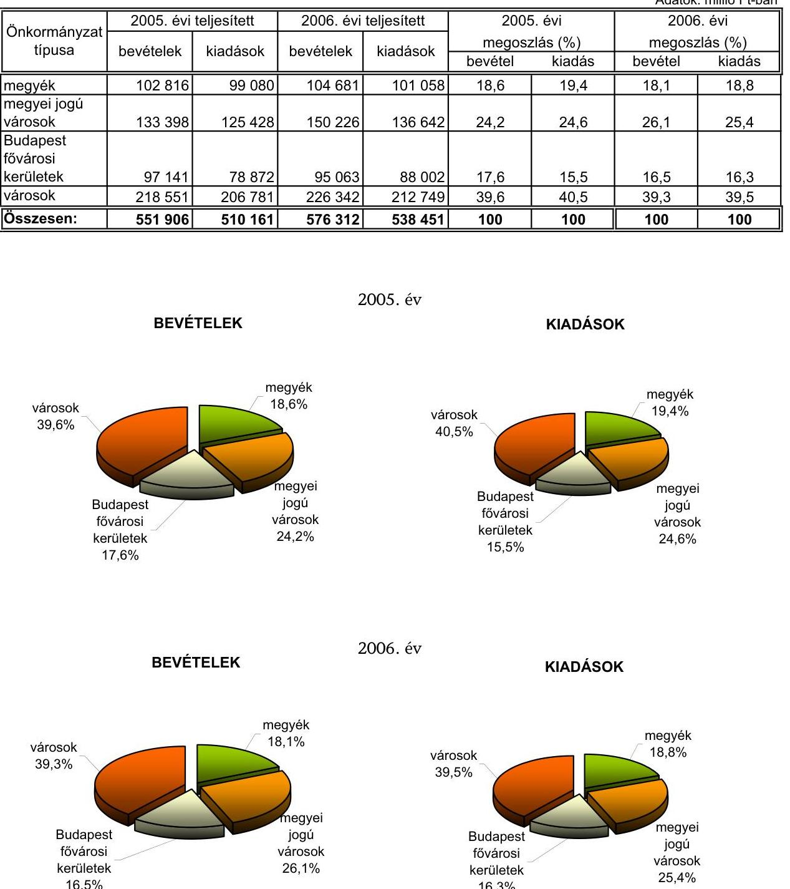

* megyei, megyei jogú városi, Budapest fővárosi kerületi és városi önkormányzatok adataival

---

.

---

|  6. számú melléklet |   |
| --- | --- |
|  a V-1003/2006. számú jelentéshez |   |

## **A HELYI ÖNKORMÁNYZATOK FELHALMOZÁSI ÉS TÖKE JELLEGŰ BEVÉTELEI**

|  Sorszám | Megnevezés | 2002. év | 2003. év | 2004. év | 2005. év | 2006. év | Változás 2003/2002 | Változás 2006/2002 | Változás 2006/2005  |
| --- | --- | --- | --- | --- | --- | --- | --- | --- | --- |
|   |  |  |  |  | milliárd Ft |  |  | % |   |
|  1 | Ingatlanok értékesítése (föld kivételével) | 25,1 | 26,4 | 30,6 | 32,6 | 45,7 | 105,2 | 182,1 | 140,2  |
|  2 | Földterület értékesítése | 20,0 | 23,5 | 16,7 | 26,1 | 20,5 | 117,5 | 102,5 | 78,5  |
|  3 | Gépek, berendezések és felszerelések értékesítése | 0,4 | 0,4 | 0,8 | 2,8 | 0,4 | 100,0 | 100,0 | 14,3  |
|  4 | Járművek értékesítése | 0,5 | 0,6 | 0,5 | 0,7 | 0,6 | 120,0 | 120,0 | 85,7  |
|  5 | Immateriális javak értékesítése | 0,3 | 0,7 | 0,3 | 1,5 | 0,7 | 233,3 | 233,3 | 46,7  |
|  6 | Egyéb felhalmozási célú bevétel | 0,0 | 0,0 | 0,0 | 0,0 | 2,7 | 0,0 | 0,0 | 0,0  |
|  7 | Tárgyi eszközök, immateriális javak értékesítése (01+...+06) | 46,3 | 51,6 | 48,9 | 63,7 | 70,6 | 111,4 | 152,5 | 110,8  |
|  8 | Önkormányzatok sajátos felhalmozási és tökebevételei | 46,7 | 48,9 | 49,1 | 49,3 | 51,9 | 104,7 | 111,1 | 105,3  |
|  9 | Osztalék- és hozambevétel | 5,9 | 6,3 | 6,9 | 8,3 | 7,1 | 106,8 | 120,3 | 85,5  |
|  10 | Részvények, részesedések értékesítése | 7,1 | 4,6 | 8,7 | 15,6 | 15,2 | 64,8 | 214,1 | 97,4  |
|  11 | Kárpótlási jegyek értékesítése | 0,4 | 0,1 | 0,0 | 0,0 | 0,0 | 25,0 | 0,0 | 0,0  |
|  12 | Államkötvények, egyéb értékpapírok értékesítése | 28,7 | 32,1 | 10,6 | 6,1 | 10,9 | 111,8 | 38,0 | 178,7  |
|  13 | Egyéb pénzügyi befektetések bevételei | 0,8 | 1,2 | 1,4 | 1,1 | 0,7 | 150,0 | 87,5 | 63,6  |
|  14 | Pénzügyi befektetések bevételei (09+...+13) | 42,9 | 44,3 | 27,6 | 31,1 | 33,9 | 103,3 | 79,0 | 109,0  |
|  15 | Felhalmozási célú pénzeszköz átvétel államháztartáson kívülről | 50,5 | 43,9 | 56,2 | 73,6 | 79,2 | 86,9 | 156,8 | 107,6  |
|  16 | Felhalmozási és töke jellegű bevételek (07+08+14+15) | 186,4 | 188,7 | 181,8 | 217,7 | 235,6 | 101,2 | 126,4 | 108,2  |

Megjegyzés: az adatokban az értékpapírokkal kapcsolatos finanszírozási célú pénzügyi műveletek bevételei is szerepelnek.

*Forrás:* Magyar Államkincstár éves költségvetési beszámoló "08" számú űrlap adatai, kiegészítve a "80" számú űrlap összevont adataival

---

|  6/a. számú melléklet |   |
| --- | --- |
|  a V-1003/2006. számú jelentéshez |   |

## **A BUDAPEST FŐVÁROSI ÉS KERÜLETI ÖNKORMÁNYZATOK FELHALMOZÁSI ÉS TŐKE JELLEGŰ BEVÉTELEI**

|  Sor-
szám | Megnevezés | 2002. év | 2003. év | 2004. év | 2005. év | 2006. év | Változás
2003/2002 | Változás
2006/2002 | Változás
2006/2005  |
| --- | --- | --- | --- | --- | --- | --- | --- | --- | --- |
|   |  |  |  | milliárd Ft |  |  |  |  |   |
|  1 | Ingatlanok értékesítése (föld kivételével) | 9,2 | 11,2 | 11,6 | 12,5 | 16,2 | 121,7 | 176,1 | 129,6  |
|  2 | Földterület értékesítése | 8,1 | 6,5 | 5,7 | 15,4 | 6,4 | 80,2 | 79,0 | 41,6  |
|  3 | Gépek, berendezések és felszerelések értékesítése | 0,1 | 0,1 | 0,1 | 0,1 | 0,1 | 100,0 | 100,0 | 100,0  |
|  4 | Járművek értékesítése | 0,1 | 0,1 | 0,1 | 0,1 | 0,1 | 100,0 | 100,0 | 100,0  |
|  5 | Immateriális javak értékesítése | 0,1 | 0,1 | 0,0 | 0,6 | 0,0 | 100,0 | 0,0 | 0,0  |
|  6 | Tárgyi eszközök, immateriális javak értékesítése (01+...+05) | 17,6 | 18,0 | 17,5 | 28,7 | 22,8 | 102,3 | 129,5 | 79,4  |
|  7 | Önkormányzatok sajátos felhalmozási és tőkebevételei | 21,1 | 19,5 | 19,1 | 19,0 | 21,8 | 92,4 | 103,3 | 114,7  |
|  8 | Osztalék- és hozambevétel | 3,5 | 3,5 | 4,3 | 4,8 | 4,8 | 100,0 | 137,1 | 100,0  |
|  9 | Részvények, részesedések értékesítése | 2,5 | 0,9 | 2,7 | 5,2 | 3,7 | 36,0 | 148,0 | 71,2  |
|  10 | Kárpótlási jegyek értékesítése | 0,1 | 0,1 | 0,0 | 0,0 | 0,0 | 100,0 | 0,0 | 0,0  |
|  11 | Államkötvények, egyéb értékpapírok értékesítése | 17,4 | 23,4 | 4,4 | 1,3 | 5,5 | 134,5 | 31,6 | 423,1  |
|  12 | Egyéb pénzügyi befektetések bevételei | 0,0 | 0,0 | 0,0 | 0,0 | 0,0 | 0,0 | 0,0 | 0,0  |
|  13 | Pénzügyi befektetések bevételei (08+...+12) | 23,5 | 27,9 | 11,4 | 11,3 | 14,0 | 118,7 | 59,6 | 123,9  |
|  14 | Felhalmozási célú pénzeszköz átvétel államháztartáson kívülről | 6,4 | 6,3 | 6,1 | 7,5 | 7,1 | 98,4 | 110,9 | 94,7  |
|  15 | Felhalmozási és tőke jellegű bevételek (06+07+13+14) | 68,6 | 71,7 | 54,1 | 66,5 | 65,7 | 104,5 | 95,8 | 98,8  |

Megjegyzés: az adatokban az értékpapírokkal kapcsolatos finanszírozási célú pénzügyi műveletek bevételei is szerepelnek.

*Forrás:* Magyar Államkincstár éves költségvetési beszámoló "08" számú űrlap adatai, kiegészítve a "80" számú űrlap összevont adataival

---

7. számú melléklet a V-1003/2006. számú jelentéshez

# A HELYI ÖNKORMÁNYZATOK FELHALMOZÁSI KIADÁSAI ÉS PÉNZÜGYI BEFEKETETÉSEI

|  Sorszám | Megnevezés | 2002. év | 2003. év | 2004. év | 2005. év | 2006. év | Változás 2003/2002 | Változás 2006/2002 | Változás 2006/2005  |
| --- | --- | --- | --- | --- | --- | --- | --- | --- | --- |
|   |  |  |  |  |  |  |  | % |   |
|  1 | Ingatlanok felújítása | 52,1 | 45,8 | 51,8 | 78,8 | 105,6 | 87,9 | 202,7 | 134,0  |
|  2 | Gépek, berendezések és felszerelések felújítása | 0,9 | 1,0 | 0,9 | 1,0 | 0,9 | 111,1 | 100,0 | 90,0  |
|  3 | Járművek felújítása | 0,2 | 0,1 | 0,1 | 0,1 | 0,1 | 50,0 | 50,0 | 100,0  |
|  4 | Felújítás előzetesen felszámított általános forgalmi adója | 12,7 | 11,1 | 12,7 | 19,0 | 20,8 | 87,4 | 163,8 | 109,5  |
|  5 | Felújítás összesen (01+...+04) | 65,9 | 58,0 | 65,5 | 98,9 | 127,4 | 88,0 | 193,3 | 128,8  |
|  6 | Immateriális javak vásárlása | 5,0 | 5,7 | 7,5 | 10,8 | 10,2 | 114,0 | 204,0 | 94,4  |
|  7 | Ingatlanok vásárlása, létesítése (föld kivételével) | 239,5 | 205,9 | 214,0 | 247,6 | 301,6 | 86,0 | 125,9 | 121,8  |
|  8 | Földterület vásárlás | 4,0 | 3,7 | 5,3 | 4,5 | 4,6 | 92,5 | 115,0 | 102,2  |
|  9 | Gépek, berendezések és felszerelések vásárlása, létesítése | 34,6 | 31,3 | 32,9 | 33,8 | 40,8 | 90,5 | 117,9 | 120,7  |
|  10 | Járművek vásárlása, létesítése | 5,0 | 5,3 | 5,1 | 8,6 | 12,6 | 106,0 | 252,0 | 146,5  |
|  11 | Intézményi beruházási kiadások (06+...+10) | 288,1 | 251,9 | 264,8 | 305,3 | 369,8 | 87,4 | 128,4 | 121,1  |
|  12 | Intézményi beruházások általános forgalmi adója | 65,7 | 57,2 | 57,7 | 67,1 | 67,8 | 87,1 | 103,2 | 101,0  |
|  13 | Beruházásokhoz kapcsolódó általános forgalmi adó befizetés | 0,5 | 0,6 | 0,0 | 0,2 | 0,0 | 120,0 | 0,0 | 0,0  |
|  14 | Beruházások általános forgalmi adója (12+13) | 66,2 | 57,8 | 57,7 | 67,3 | 67,8 | 87,3 | 102,4 | 100,7  |
|  15 | Felhalmozási kiadások összesen (11+14) | 354,3 | 309,7 | 322,5 | 372,6 | 437,6 | 87,4 | 123,5 | 117,4  |
|  16 | Részvények és részesedések vásárlása | 6,8 | 4,6 | 4,7 | 5,5 | 7,9 | 67,6 | 116,2 | 143,6  |
|  17 | Államkötvények, egyéb értékpapírok vásárlása | 4,3 | 2,8 | 2,3 | 7,9 | 4,3 | 65,1 | 100,0 | 54,4  |
|  18 | Egyéb pénzügyi befektetések | 0,1 | 1,0 | 0,8 | 0,5 | 0,0 | 1000,0 | 0,0 | 0,0  |
|  19 | Pénzügyi befektetések kiadásai (16+17+18) | 11,2 | 8,4 | 7,8 | 13,9 | 12,2 | 75,0 | 108,9 | 87,8  |
|  20 | Felhalmozási kiadások és pénzügyi befektetések összesen (15+19) | 365,5 | 318,1 | 330,3 | 386,5 | 449,8 | 87,0 | 123,1 | 116,4  |
|  21 | Felülítások, felhalmozási kiadások és pénzügyi befektetések együtt (05+20) | 431,4 | 376,1 | 395,8 | 485,4 | 577,2 | 87,2 | 133,8 | 118,9  |

Megjegyzés: az adatokban az értékpapírokkal kapcsolatos finanszírozási célú pénzügyi műveletek kiadásai is szerepelnek. *Forrás:* Magyar Államkincstár éves költségvetési beszámoló "05" számú űrlap adatai

---

7/a. számú melléklet a V-1003/2006. számú jelentéshez

# A BUDAPEST FÖVÁROSI ÉS KERÜLETI ÖNKORMÁNYZATOK FELHALMOZÁSI KIADÁSAI ÉS PÉNZÜGYI BEFEKTETÉSEI

|  Sorszám | Megnevezés | 2002. év | 2003. év | 2004. év | 2005. év | 2006. év | Változás 2003/2002 | Változás 2006/2002 | Változás 2006/2005  |
| --- | --- | --- | --- | --- | --- | --- | --- | --- | --- |
|   |  |  |  |  |  |  |  | % |   |
|  1 | Ingatlanok felújítása | 19,1 | 15,3 | 15,6 | 20,8 | 27,9 | 80,1 | 146,1 | 134,1  |
|  2 | Gépek, berendezések és felszerelések felújítása | 0,2 | 0,3 | 0,2 | 0,1 | 0,2 | 150,0 | 100,0 | 200,0  |
|  3 | Járművek felújítása | 0,0 | 0,0 | 0,0 | 0,0 | 0,0 | 0,0 | 0,0 | 0,0  |
|  4 | Felújítás előzetesen felszámított általános forgalmi adója | 4,7 | 3,8 | 3,9 | 5,1 | 5,6 | 80,9 | 119,1 | 109,8  |
|  5 | Felújítás összesen (01+...+04) | 24,0 | 19,4 | 19,7 | 26,0 | 33,7 | 80,8 | 140,4 | 129,6  |
|  6 | Immateriális javak vásárlása | 1,6 | 1,5 | 1,5 | 1,6 | 1,7 | 93,8 | 106,3 | 106,3  |
|  7 | Ingatlanok vásárlása, létesítése (föld kivételével) | 41,6 | 36,0 | 35,9 | 36,1 | 46,6 | 86,5 | 112,0 | 129,1  |
|  8 | Földterület vásárlás | 0,1 | 0,1 | 0,2 | 0,1 | 0,7 | 100,0 | 700,0 | 700,0  |
|  9 | Gépek, berendezések és felszerelések vásárlása, létesítése | 10,4 | 7,8 | 7,3 | 7,0 | 8,5 | 75,0 | 81,7 | 121,4  |
|  10 | Járművek vásárlása, létesítése | 0,5 | 0,4 | 0,5 | 0,5 | 0,5 | 80,0 | 100,0 | 100,0  |
|  11 | Intézményi beruházási kiadások (06+...+10) | 54,2 | 45,8 | 45,4 | 45,3 | 58,0 | 84,5 | 107,0 | 128,0  |
|  12 | Intézményi beruházások általános forgalmi adója | 11,7 | 9,5 | 9,5 | 9,9 | 11,1 | 81,2 | 94,9 | 112,1  |
|  13 | Beruházásokhoz kapcsolódó általános forgalmi adó befizetés | 0,0 | 0,0 | 0,0 | 0,0 | 0,0 | 0,0 | 0,0 | 0,0  |
|  14 | Beruházások általános forgalmi adója (12+13) | 11,7 | 9,5 | 9,5 | 9,9 | 11,1 | 81,2 | 94,9 | 112,1  |
|  15 | Felhalmozási kiadások összesen (11+14) | 65,9 | 55,3 | 54,9 | 55,2 | 69,1 | 83,9 | 104,9 | 125,2  |
|  16 | Részvények és részesedések vásárlása | 3,6 | 0,8 | 0,6 | 0,6 | 1,0 | 22,2 | 27,8 | 166,7  |
|  17 | Államkötvények, egyéb értékpapírok vásárlása | 2,6 | 0,0 | 0,4 | 5,8 | 0,0 | 0,0 | 0,0 | 0,0  |
|  18 | Egyéb pénzügyi befektetések | 0,0 | 0,0 | 0,0 | 0,0 | 0,0 | 0,0 | 0,0 | 0,0  |
|  19 | Pénzügyi befektetések kiadásai (16+17+18) | 6,2 | 0,8 | 1,0 | 6,4 | 1,0 | 12,9 | 16,1 | 15,6  |
|  20 | Felhalmozási kiadások és pénzügyi befektetések összesen (15+19) | 72,1 | 56,1 | 55,9 | 61,6 | 70,1 | 77,8 | 97,2 | 113,8  |
|  21 | Felülítások, felhalmozási kiadások és pénzügyi befektetések együtt (05+20) | 96,1 | 75,5 | 75,6 | 87,6 | 103,8 | 78,6 | 108,0 | 118,5  |

Megjegyzés: az adatokban az értékpapírokkal kapcsolatos finanszírozási célú pénzügyi műveletek kiadásai is szerepelnek.

*Fonrás:* Magyar Államkincstár éves költségvetési beszámoló "05" számú űrlap adatai

---

# Tájékoztató a kisebbségi önkormányzatok gazdálkodásával kapcsolatos ellenőrzési megállapításokról 

Az ellenőrzött települési önkormányzatok mellett múködő kisebbségi önkormányzatok gazdálkodását a helyi önkormányzatok gazdálkodási rendszerének átfogó ellenőrzésével együtt, településenként egy-egy megyei jogú városi, a városi és Budapest fővárosi kerületi kisebbségi önkormányzatnál ellenőriztük részletesesen. Az elmúlt négy évben összesen 415, az országban működő kisebbségi önkormányzatoknak 23\%-ánál vizsgáltuk a feladatellátást és a gazdálkodást a Nek. tv. 61. § (1) bekezdésében szereplő valamennyi (13) nemzetiséget érintően.

Az ellenőrzött kisebbségi önkormányzatok a 2003-2006. években feladat- és hatáskör átruházását a települési önkormányzatok képviselő-testületeinél - 2003ban egy napközi otthonos óvoda kivételével - nem kezdeményezték és feladatot nem vettek át a Nek. tv. 30/B. § (1) bekezdésében ${ }^{1}$ foglalt felhatalmazás alapján. Intézményt nem létesítettek és nem vették át más kisebbségi önkormányzat által létesített intézmény fenntartói jogát sem a Nek. tv. 47. § (2)-(3) bekezdésében foglalt lehetőség alapján. Feladatellátásuk döntően az önkormányzati, illetve képviselő-testületi múködés feltételeinek biztosítására irányult. Tevékenységük kiterjedt a nemzetiségi, kulturális, nyelvi hagyományok őrzésére, ápolására, fejlesztésére, a településeken élő kisebbségek érdekeinek képviseletére, tárgyi és szellemi kultúrájuk megőrzésére.

A kisebbségi önkormányzatok 2003-2006. évi költségvetésének bevételeit, az ellátott feladatokkal összhangban, a múködésüket szolgáló pénzeszközök képezték. Ezen belül meghatározó volt az állami költségvetésből nyújtott központosított és egyéb támogatás, valamint a székhelyükön múködő települési önkormányzat által nyújtott támogatás.

Az állami támogatások, hozzájárulások részaránya az országban múködő települési kisebbségi önkormányzatok 2003-2006. évi költségvetésében 33-35\%, a saját bevételek költségvetésen belüli részaránya 26-27\%, volt.

[^0]
[^0]:    ${ }^{1}$ A 2005. november 24-ig Ötv. 102/C. § (2) bekezdése.

---

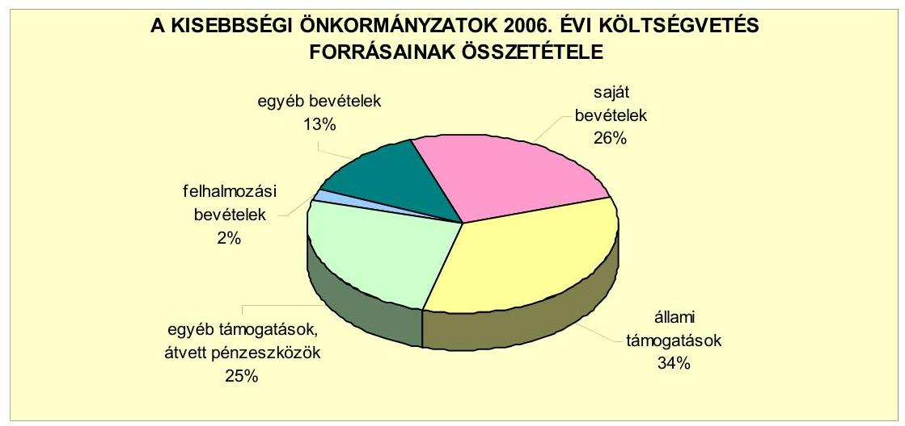

A kisebbségi önkormányzatok múködésének egységes, azonos összegű bevételi forrása a központosított állami támogatás. Ennek összege országos szinten a 2001. évi 829,3 millió forintról 1299,1 millió forintra ( $57 \%$-kal) nőtt a 2005. évre, amelyet a 2006. évre tervezett támogatás $41 \%$-kal, a 2007. évre tervezett összeg $61 \%$-kal haladott meg. A támogatás összegének alakulását a következő grafikon mutatja (2001-2005. év tény, 2006-2007. év terv adatai alapján):
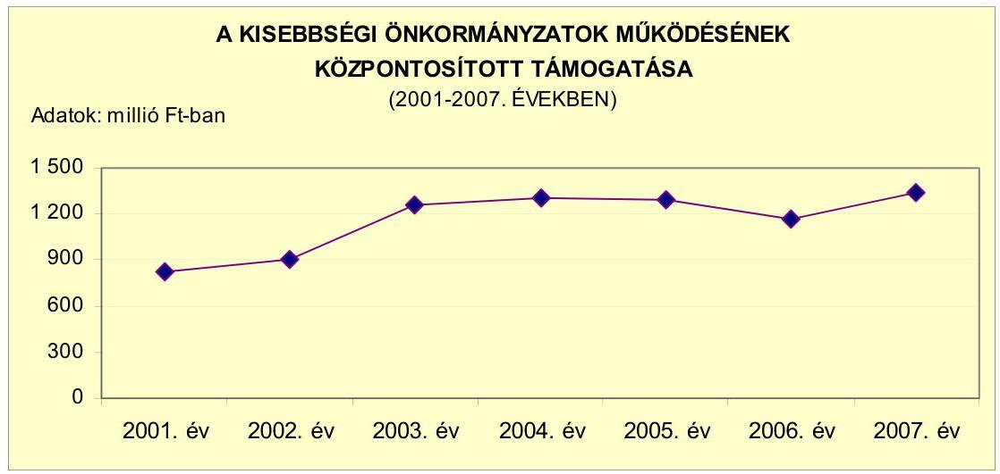

Az ellenőrzött kisebbségi önkormányzatok a 2006. évi gazdálkodáshoz 569,7 millió Ft bevétellel rendelkeztek, amely $16,3 \%$-kal volt több a 2003. évben ellenőrzöttekénél. Ebből finanszírozták a képviselő-testületi múködéssel kapcsolatos, illetve a település kisebbségét érintő feladatokat. Költségvetésükben a múködési kiadások évek óta döntő súlyt (a 2003. évben $90 \%$-ot, a 2004-ben $89,9 \%$-ot, a 2005-ben $93,6 \%$-ot, a 2006-ban $91,8 \%$ ), és azon belül a dologi kiadások meghatározó részarányt ( $45,8 \%-46 \%-48,3 \%-60,8 \%$-ot) képviseltek. A felhalmozási célú kiadások részaránya ennél sokkal kisebb, 7,4\%$7,6 \%-3,3 \%-6,3 \%$ volt $^{2}$.

[^0]
[^0]:    ${ }^{2}$ Országos szinten 2003-2006 között a kisebbségi önkormányzatok felhalmozási célú kiadásainak részaránya $11,8 \%-13,4 \%-18,4 \%-21,1 \%$ volt.

---

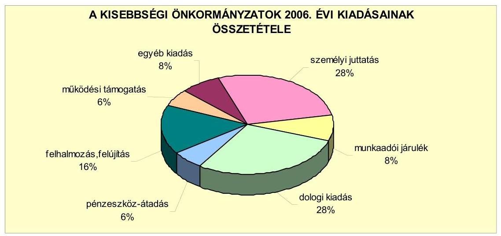

Az ellenőrzött kisebbségi önkormányzatok az elmúlt négy évben a feladataik ellátásához felhasználták a tárgyévi bevételek 85-89\%-át ${ }^{3}$. A költségvetés 2006. évi teljesített kiadása $21,6 \%$-kal, a tárgyévi múködési kiadások 7,5\%-kal voltak magasabbak a 2003. évinél. A kiadások kiemelt előirányzatai közül figyelemre méltó a dologi kiadások alakulása, amelyre $61,4 \%$-kal számoltak el nagyobb kiadást, mint három évvel korábban. A felhalmozási célú kiadások 2,3\%-kal haladták meg a 2003. évit.

A kisebbségi önkormányzatok részére a települési önkormányzatok használatba adták a feladataik ellátásához szükséges vagyontárgyakat a Nek tv. 59. § (3) bekezdés ${ }^{4}$ előírásainak megfelelően. A képviselő-testületek tevékenységéhez szükséges irodai helyiséget és eszközöket többségében térítés nélkül bocsátották a települési önkormányzatok a rendelkezésükre. Az önkormányzati hivatalok - néhány kivételtől eltekintve - a Nek. tv. 27. § (1)-(2) bekezdésének ${ }^{5}$ előírásaival összhangban, ingyenesen biztosították a kisebbségi önkormányzati képviselő-testületek múködésének feltételeit és végezték a szükséges irodai - gépelési, sokszorosítási, postai, kézbesítési - feladatokat.

A települési és a kisebbségi önkormányzatok együttmúködésük helyi szabályait évente növekvő arányban (a 2002. évben 79\%, a 2003. évben $87 \%$, a 2004. évben $93 \%$, a 2005. évben $96 \%$ ) foglalták megállapodásba. A megállapodások megkötésének elmulasztása esetén nem történt meg a gazdálkodás végrehajtásának az Áht. 66. §-ában, valamint a költségvetési tervezés Áht. 68. § (3) bekezdésében előírt feladatainak rögzítése.

A kisebbségi önkormányzatok 6\%-a (a 2002. évben 9\%, a 2003. évben $37 \%$, a 2004. évben 27\%) nem kötötte meg a megállapodást a település önkormányzatával az Ámr. 29. § (11) bekezdésében előírt január 15-i határidőre. A megállapodások előterjesztésének elmulasztása miatt nem biztosították az elnök és a polgármester által aláírt megállapodások kisebbségi és telepü-

[^0]
[^0]:    ${ }^{3}$ Országos szinten 2003-2006 között átlag 93\%-át.
    ${ }^{4}$ 2005. november 24-ig a Nek. tv. 59. § (1) bekezdése.
    ${ }^{5}$ 2005. november 24-ig a Nek. tv. 57 § (6) bekezdése

---

lési képviselő-testületi jóváhagyását 15\%-nál (az előző években 13-13\%-nál) annak ellenére, hogy az Ötv. 9. § (1), illetve a Nek. tv. 30. § (1) bekezdésében ${ }^{6}$ foglalt előírások szerint a helyi önkormányzat képviselőtestületét, illetve a kisebbségi önkormányzat testületét illetik meg az önkormányzati feladat-és hatáskörök, ezen belül döntés a más önkormányzattal való együttmúködésről. A képviselő-testületek jóváhagyásának elmaradása esetén a megkötött megállapodások érvényességét nem biztosították.

A kisebbségi önkormányzatok 21\%-a (az előző évben 25\%-a) végezte el az együttműködési megállapodások felülvizsgálatát. A megállapodások felülvizsgálata - amelyet döntően a 2003. évi megkötést követően megváltozott jogszabályi előírások és feladat ellátási körülmények, gazdálkodási feltételek indokoltak - nem történt meg 65\%-nál (az előző évben 59\%-nál), részben végezték el a több kisebbségi önkormányzattal érintett települések 1\%-ánál (az előző évben 15\%-ánál). Mindezek következtében a megállapodások 41\%-a (az előző évben egyharmada) nem volt alkalmas arra, hogy megalapozza a települési és a kisebbségi önkormányzatok együttműködését, illetve biztosítsa, hogy a feladatellátás a jogszabályi követelményeinek és a helyi sajátosságoknak megfelelő legyen.

A gazdálkodási feladatok meghatározása, illetve rögzítése az előző éveknél nagyobb arányban és több feladatkörre kiterjedősen megtörtént. A szabályozás elmaradása, részleges teljesítése (6-41\%-nál) következtében az önkormányzati hivatali, jegyzői közreműködés a kisebbségi önkormányzati gazdálkodás nem minden területén volt biztosított, és nem felelt meg mindenben a jogszabályi elírásoknak. Nem rögzítették a megállapodások:

- 7\%-ában az Áht. 66. § előírásai ellenére (2003-ban 16\%-ában, 2004-ben 20\%-ában), hogy az adott kisebbségi önkormányzat gazdálkodásának végrehajtó szerve az önkormányzati hivatal;
- 13\%-ában az Ámr. 29. § (3) bekezdés előírásai ellenére (2003-ában 23\%, 2004-ben 34\%-ában) a jegyző felkérését a költségvetési, előirányzat módosítási és zárszámadási határozat tervezetek előkészítésére;
- 23\%-ában a költségvetési, 32\%-ában (a 2002. évben 33\%-ában, 2003-ban 35\%-ában, 2004-ben 39\%-ában) a zárszámadási határozat benyújtási határidejét;
- 6\%-ában (2002-ben 26\%-ában, 2003-ban 28\%-ában, 2004-ben 23\%-ában) az éves költségvetés tervezésének feladatait az Áht. 68. § (3) bekezdés előírása ellenére;
- 7\%-ában (2002-ben 13\%-ában, 2003-ban 17\%-ában, 2004-ben 16\%-ában) az ellenjegyzési jogosultságot;
- 41\%-ában (az előző években 40\%-ában) a költségvetési előirányzat módosításáról szóló határozat települési önkormányzat részére történő átadásának határidejét.

[^0]
[^0]:    ${ }^{6}$ A 2005. november 24-ig Ötv. 102/C. § (1) bekezdésében.

---

A 2004. évtől növekvő arányban határozták meg az együttműködési megállapodásokban a költségvetés tervezésének, az előirányzatok módosításának és a zárszámadásnak rendjét, feladatait. A megkötött megállapodások 70\%-ának azonban (2003-ban 49\%-ának, 2004-ben 66\%ának) a jogszabályi előírások és gazdálkodási feltételek változása miatt indokolt módosítását nem végezték el. Így azok egyre nagyobb része az előírásaik aktualizálásának elmaradása miatt nem felelt meg mindenben a feladatellátás követelményeinek.

A megállapodások elmulasztása, a jogszabályi előírásoktól eltérő tartalmú megállapodások, illetve a feladatok és konkrét határidők rögzítésének elmaradása következtében hiányosságok fordultak elő a gazdálkodási feladatok ellátásában, így a képviselő-testületek gazdasági döntéseinek előkészítésében, a hozott határozatok tartalmában, illetve azok települési önkormányzati rendelet-alkotáshoz történő továbbításában. Az ellenőrzött kisebbségi önkormányzatok gazdálkodása feltételeinek meghatározottságát az alábbi grafikon mutatja:
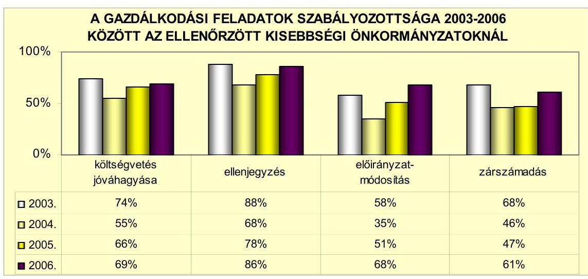

A kisebbségi önkormányzatok számára az önkormányzati hivatalok végezték a gazdálkodás végrehajtásának feladatait az együttmúködési megállapodások és a Nek. tv. 28. §7, illetve az Áht. 66. § előírásainak megfelelően. Kissé csökkent a hivatali közremúködés a kisebbségi önkormányzati készpénzkezelésben, amelyet a 2003. évi 5\%, illetve a 2004. évi 3\%-kal szemben 6\%-nál láttak el az önkormányzati hivatalon kívül.

Az önkormányzati hivatalok kisebbségi önkormányzati gazdálkodás segítésével kapcsolatos feladatait növekvő arányban (2003-ban 40\%-nál, a 2004-ben 61\%-nál, 2005-ben 66\%-nál) szabályozták a Nek. tv. 27. § (1) bekezdésében ${ }^{8}$ előírtaknak megfelelően, részben végezték el a szabályozást az előző évivel azonos arányban, 4\%-nál (a 2003-ban 8\%-nál). A 2003. évihez viszonyítva javult a szabályozottság a pénzgazdálkodási hatásköröknél,

[^0]
[^0]:    ${ }^{7}$ 2005. november 25 -ig
    ${ }^{8}$ 2005. november 24 -ig a Nek. tv. 28. §-ban.

---

csökkent, majd a 2005-től növekedett a folyamatba épített ellenőrzés területein is. Ennek adatait az alábbi grafikon szemlélteti:
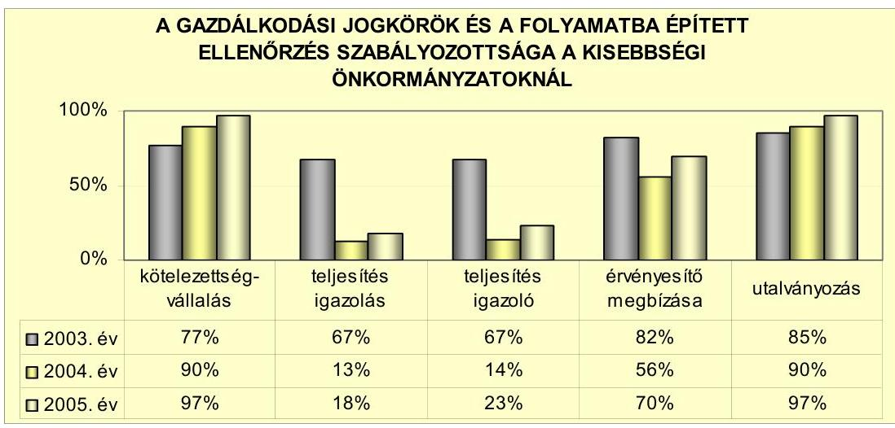

A szakmai teljesítés igazolás módjának az Ámr. 135. § (3) bekezdésében ${ }^{9}$ előírt szabályozását, valamint az azt végző személyek kijelölését évek óta a legnagyobb arányban mulasztották el a jegyzők. Az érvényesítést végzők Ámr. 135. § (2) bekezdésének ${ }^{10}$ megfelelő megbízása nagyobb arányban megtörtént, de közel egyharmadnál még hiányzott. Mindezek következtében a gazdálkodás folyamatában hiányosan múködött a belső ellenőrzés két fontos eleme, a szakmai teljesítés igazolása és az érvényesítés, továbbá nem volt biztosított az utalvány Ámr-ben előírtaknak megfelelő ellenjegyzésének feltételei.

A kisebbségi önkormányzati gazdálkodás végrehajtásában a konkrét feladat meghatározás, illetve az írásbeli megbízások, kijelölések elmulasztása a pénzgazdálkodási jogkörök szabálytalan gyakorlásához, valamint a folyamatba épített ellenőrzés rendszertelen múködéséhez vezettek. A szabályozások elmulasztásához hozzájárult, hogy az Áht. 66. § előírásai alapján kötendő együttműködési megállapodásnak nem volt kötelező tartalmi eleme a gazdálkodás végrehajtásának feladata, ezen belül a kötelezettségvállalás és az utalványozás, illetve azok ellenjegyzésének az Áht. 74/A. § (1)-(3) bekezdés előírásain alapuló, valamint a szakmai teljesítés igazolás és az érvényesítés Ámr. 135. § (1)-(5) bekezdés ${ }^{11}$ előírásain alapuló ellátásának rendje és a kijelölések, megbízások alapján a jogosultságok, illetve kötelezettségek rögzítése.

Az előző évben tett javaslatunk alapján az Áht. 66. §-ának a 2007. január 1-től hatályos előírásai szerint az együttmúködési megállapodásnak tartalmaznia kell a kisebbségi önkormányzatok gazdálkodásának végrehajtási rendjét, az ehhez kapcsolódó feladatok jogosultjainak, kötelezettjeinek kijelölését.

[^0]
[^0]:    ${ }^{9}$ A 2007. január 1-től Ámr. 135. § (2) bekezdés.
    ${ }^{10}$ A bekezdés számozása 2007. január 1-től (4)-re módosult
    ${ }^{11}$ A 2007. január 1-től Ámr. 135. § (1)-(6) bekezdés

---

Éves költségvetését az Áht. 65. § (2) bekezdés előírásainak megfelelően az előző évek $93 \%-97 \%-97 \%$-ával szemben a kisebbségi önkormányzatok 99\%-a állapította meg képviselő-testületi határozattal. A költségvetési határozatok képviselő-testületi jóváhagyásával évente növekvő arányban biztosítottak előirányzatot a gazdálkodás végrehajtásához. A képviselő-testületek által jóváhagyott költségvetési határozatoknak csak 79\%-a (az előző években $69 \%, 64 \%, 70 \%$-a) felelt meg az Áht. 69. § (1) bekezdésében, illetve az Ámr. 29. § (2) bekezdésében előírtaknak. A határozatok tartalmi, szerkezeti hiányossága változatlanul a kiadások kiemelt előirányzatonkénti részletezésének, a bevételek és kiadások teljes összegű figyelembe vételének, az éves létszámkeret tervezésének elmulasztása, a költségvetési egyensúly hiánya és a végrehajtási feladatok szabályozásának elmaradása volt.

A költségvetési előirányzatok évközi módosításáról az Ámr. 53. § (7) bekezdésében előírtaknak megfelelően határozattal döntött a képviselő-testületek 59\%-a (2003-ban 35\%-a, 2004-ben 51\%-a). A költségvetési határozatok 30\%-ának (2003-ban 52\%-ának, a 2004. évben 32\%-ának) indokolt módosítására a jegyzők nem készítettek, az elnökök nem nyújtottak be előterjesztést a képviselőtestületeknek. Előterjesztések a legtöbbször azért nem készültek, mert arra vonatkozó igény, illetve jegyzői felkérés nem szerepelt az önkormányzatok megállapodásában. A módosítások elmulasztása miatt az előző évekhez hasonlóan kimaradtak az előirányzatokból év közben elnyert pályázati támogatások, pótlólag megállapított önkormányzati támogatások, előző évi pénzmaradványok, átvett pénzeszközök, illetve kiadások szerkezetének, kiemelt előirányzatainak változásai. Ezekben az esetekben nem biztosították annak feltételeit, hogy a gazdálkodás folyamatában a kötelezettségvállalás és az utalványozás az Áht. 12/A. § (1) bekezdésében foglaltaknak ${ }^{12}$ megfelelő lehessen, így a kisebbségi önkormányzatok 17\%-ánál történt előirányzatot meghaladó kötelezettségvállalás és utalványozás.

A jóváhagyott határozatokat a települési önkormányzat polgármesteréhez az Ámr. 53. § (8) bekezdés előírásainak megfelelően a költségvetések 79\%-a, (2003-ban 69\%-a, 2004-ben 88\%-a) és az előirányzat módosítások 90\%-a (2003-ban 92\%-a, 2004-ben 94\%-a) esetében továbbították a kisebbségi önkormányzatok elnökei olyan időben, hogy a költségvetési rendeleten átvezethetőek voltak. A határozatok továbbításának elmaradása azzal a következménynyel járt, hogy a települési önkormányzatok a kisebbségi önkormányzatok költségvetését és előirányzatainak módosításait nem, illetve szabályszerűen nem építhették be, vezethették át a költségvetési rendeleten.

A kisebbségi önkormányzatok 89\%-a (az előző években 85\%-83\%-94\%-a) pénzgazdálkodásának folytatásához az Ámr. 103. § (1)-(2) bekezdéseinek előírásaival összhangban rendelkezett egy-egy költségvetési elszámolási számlával, amelyet a székhelye szerinti helyi önkormányzat hitelintézeténél vezettek. A megnyitott számlák 16\%-át azonban (az előző években 21\%-át, 14\%át, illetve 9\%-át) nem alkalmazták a gazdálkodásban. A gazdálkodásra

12 Áht. 12/A. § (1) bekezdése szerint: a költségvetés végrehajtása során tárgyévi fizetési kötelezettség a jóváhagyott előirányzatok mértékéig vállalható és kifizetések is ezen összeghatárig rendelhetők el (utalványozás).

---

bankszámlát egyáltalán nem használó kisebbségi önkormányzatok aránya a 2003. évi $26 \%$-ról, a 2004-ben $10 \%$-ra csökkent, a 2005. évben pedig $25 \%$-ra nőtt.

A számla feletti rendelkezési jogosultságot, a számlát vezető kisebbségi önkormányzatok 78\%-ánál (az előző években 99\%-85\%-ánál) szabályozták. Ebben a számla feletti rendelkezést az érintett kisebbségi önkormányzatok 93\%-ának (az előző évben 93-90\%-ának) biztosították. Évente csökkenő arányban fordult elő, hogy a kisebbségi önkormányzatok számláján kezelt pénzforgalomról szabálytalanul (a kisebbségi önkormányzatok elnöke helyett) a települési önkormányzatok tisztségviselői, illetve hivatalának dolgozói rendelkeztek (2003-ban 34\%-ánál, 2004-ben 13\%-ánál, 2005-ben 10\%-nál).

A kisebbségi önkormányzatok pénztári bevételeit és kiadásait a 2002-2004. években növekvő ( $39 \%-46 \%-61 \%$-ban), a 2005-ban pedig csökkenő arányban (45\%) kezelték a települési önkormányzatétól elkülönítetten az önkormányzati hivatalokban.

Az önkormányzati hivatalok a kisebbségi önkormányzatok vagyoni és számviteli nyilvántartásait a kisebbségi rendelet ${ }^{13} 15$. § (1) bekezdés előírásai alapján vezették. A kisebbségi önkormányzati gazdálkodás részletes adatainak települési önkormányzatokétól elkülönített főkönyvi és analitikus nyilvántartása, illetve a több kisebbségi önkormányzattal érintett településeken a kisebbségenkénti nyilvántartása a 2003. évben ellenőrzöttekhez képest nőtt. A kisebbségi önkormányzatok működéséhez nyújtott központi és települési önkormányzati támogatást az adott kisebbségi önkormányzat bevételeként 86\%-nál, a teljesített kiadásokat 100\%-ánál elszámolták és kimutatták az előző évek 82-90\%, illetve 91-99\%-ával szemben. A vagyoni nyilvántartások elkülönített vezetését $87 \%$-nál (az előző évben 44\%-73\%-nál) biztosították az önkormányzati hivatalok.

A számviteli nyilvántartások bővítésének, pontosabb vezetésének eredménye, hogy a kisebbségi önkormányzati költségvetésről, illetve annak végrehajtásáról évente megbízhatóbb adatok álltak rendelkezésre az éves beszámolók és a zárszámadási határozatok összeállításához, jóváhagyásához. Ezzel javult, de továbbra sem volt kielégítő az operatív gazdálkodás szabályszerű ellátásának, az előirányzatokon belüli kötelezettségvállalásnak és utalványozásnak a feltételrendszere.

A kötelezettségvállalásokat szabálytalanul végezték a bizonylatok $40 \%$-ánál (az előző években $27 \%-29 \%$-ánál), amelyet jellemzően továbbra is az Ámr. 134. § (8) bekezdésében előírt írásba foglalás elmaradása, az 50 ezer forint alattiak esetében a kötelezettségvállalás rendjének és nyilvántartási formájának szabályozási mulasztása okozott.

Az utalványozás során nem tartották be az Áht. 74/A. § (1) bekezdés, valamint az Ámr. 136. § (1)-(5) bekezdés és a belső szabályozás előírásait a bizonylatok

[^0]
[^0]:    ${ }^{13}$ A kisebbségi önkormányzatok költségvetésének, gazdálkodásának, vagyonjuttatásának egyes kérdéseiről szóló a 20/1995. (III. 3.) Korm. rendelet

---

23\%-ánál (az előző években 29\%-43\%-ánál). Nem biztosították a kisebbségi önkormányzat elnöke részére utalványozási jogkörének gyakorlásának lehetőségét a kisebbségi önkormányzatok 10\%-ánál (az előző évben 16\%-ánál), ahol részben vagy teljes egészében a polgármester, a jegyző, önkormányzati hivatali alkalmazott utalványozott, illetve a kisebbségi önkormányzat elnökének felhatalmazása nélkül gyakorolta az utalványozást kisebbségi önkormányzati kép-viselő-testületi tag. A személyes érintettség esetére szóló belső szabályozás elmulasztása következtében a kisebbségi önkormányzatok további 10\%ánál (az előző évben 9\%-ánál) az elnök saját maga javára is utalványozott kifizetést. A hiányosságok között szerepelt, hogy az utalványozás nem érvényesített okmányon valamint ellenjegyzés nélkül történt, nem előzte meg a kiadás teljesítését, illetve nem felelt meg az Ámr. 136. § (4)-(5) bekezdésében előírt tartalmi követelményeknek.

A szabálytalan kötelezettségvállalások és utalványozások okozója volt, hogy az önkormányzati hivatalok 18\%-ánál (az előző években 49\%, illetve 30\%-ánál) nem vezették az Áht. 103. § (1) bekezdésében előírt nyilvántartást az előirányzatokról, valamint 58\%-nál (az előző évben 83\%, illetve 72\%-nál) az Ámr. 134. § (13) bekezdésében előírt nyilvántartást a kötelezettségvállalásokról. Ennek következtében nem álltak rendelkezésre az operatív gazdálkodás folyamatában azok az információk, amelyek a kötelezettségvállalásokat és az utalványozásokat, továbbá mindezek ellenjegyzését megalapozzák és az önkormányzatok 3\%-ánál a költségvetésben nem szereplő feladatra, 17\%-ánál előirányzatot meghaladóan történt a kötelezettségvállalás és utalványozás (az előző évben 7-7\%-nál).

A kötelezettségvállalás és az utalvány ellenjegyzését a bizonylatok 61\%-án az Áht. 74/A. § (2) bekezdés előírásainak megfelelően a jegyzők, a továbbiaknál a kisebbségi képviselő-testületek tagjai végezték/végezhették az Áht. 74/A. § (3) bekezdésében lehetővé tett megbízás alapján. A kötelezettségvállalások nem jegyző által végzett ellenjegyzésének 57\%-ánál megsértették az Áht. 74/A. § (2)(3) bekezdésében foglalt előírásokat a feladat elvégzés igazolásának elmaradása, a képviselő-testület felhatalmazása, illetve előirányzat hiányában történt igazolása esetén. Az ellenjegyzők nem végezték el az Ámr. 134. § (9) bekezdésében meghatározott feladataikat, mert nem győződtek meg arról, hogy a jóváhagyott kiadási előirányzat biztosítja-e a fedezetet és a kötelezettségvállalás nem sérti-e a gazdálkodásra vonatkozó szabályokat. Feladatuk ellátását csökkenő arányban, de még mindig közel kétharmadnál nehezítette, hogy nem álltak rendelkezésre az önkormányzati hivatalokban az előírt nyilvántartások a kötelezettségvállalásokról és az előirányzatok alakulásáról. A 2006. évben ellenőrzött kisebbségi önkormányzatoknál a kötelezettségvállalás ellenjegyzésének múködését a következő grafikon mutatja:

---

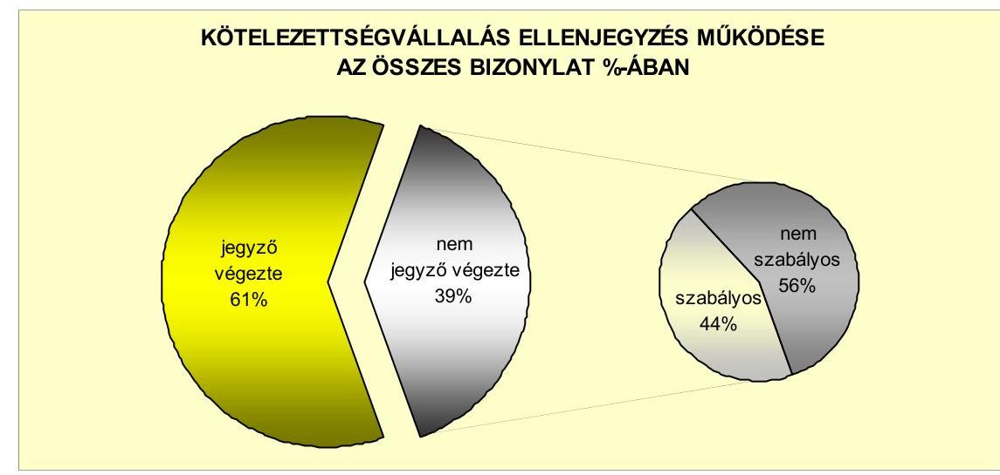

Az utalványok nem jegyző által végzett ellenjegyzésének 30\%-ánál nem látták el az ellenjegyzés feladatait az Áht. 74/A. § (3) bekezdésében és az Ámr. 137. § (3) bekezdésében előírtak ellenére. Változatlanul jellemző hiányosság volt a szakmai teljesítés igazolás és érvényesítés hiányában, illetve az adott feladatra szóló megbízás nélküli, jogosulatlan ellátás ellenére végzett ellenjegyzés, amely nem észrevételezte a szabálytalanságokat, nem kezdeményezte azok megszüntetését. Az utalvány ellenjegyzés elvégzésének megoszlását, múködését a 2006. évben ellenőrzött kisebbségi önkormányzatoknál a következő grafikon mutatja:
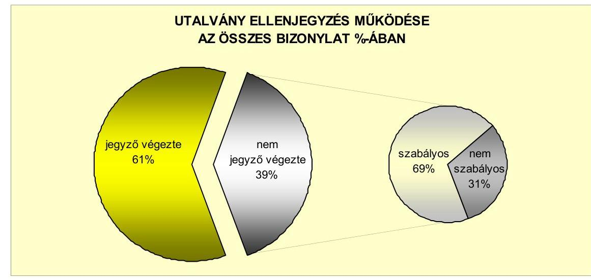

Az operatív gazdálkodás hiányosságai a belső ellenőrzés múködésének hiányát és zavarait mutatták a kisebbségi önkormányzati gazdálkodásban. A helyi szabályozás elmulasztásából, a meglévők előírásainak be nem tartásából következett, hogy kötelezettségvállalást és utalványozást végeztek előzetes, folyamatba épített ellenőrzés nélkül. Az igazolt ellenőrzések esetében nem végezték el hiánytalanul azokat a feladatokat, amelyeket a jogszabályok előírtak, ezért azok nem voltak hatékony eszközei a hibák megelőzésének, időbeni feltárásának és kijavításának. Mindezek következménye volt, hogy a gazdálkodási jogkörök gyakorlásában nem mindig tartották be a hatásköri előírásokat és szabálytalan kifizetéseket is teljesítettek.

---

A kisebbségi önkormányzatok 89\%-a (az előző években 75-76-79\%-a) a 2005. évi gazdálkodásáról szóló zárszámadását határozattal jóváhagyta. A határozatok tervezetét a megállapodásban foglaltak szerint a jegyző̌k 13\%-a (a 2004-ben 56\%, a 2005-ben 52\%-a) készítette el. A képviselő-testületi döntés előkészítésében a jegyzői közremúködés hiányának legfőbb oka az volt, hogy a megállapodások nem tartalmazták a jegyző felkérését a zárszámadási határo-zat-tervezetek előkészítésére (a 2006. évben 32\%-nál).

A zárszámadási határozat képviselő-testületi jóváhagyását az előterjesztések elmaradása miatt elmulasztó kisebbségi önkormányzatoknál megsértették a Nek. tv. 25. § (1) bekezdés k) pontjának előirásait, amely szerint a kisebbségi önkormányzat saját hatáskörében határozza meg zárszámadását. Nem biztosították, hogy a helyi önkormányzatok szabályszerűen eleget tudjanak tenni a saját zárszámadásuk jóváhagyásával kapcsolatos kötelezettségnek, illetve, hogy a kisebbségi önkormányzatok zárszámadásának adatait a képviselő-testületi határozatok alapján építsék be a zárszámadási rendeletükbe.

Az elfogadott zárszámadásokban szereplő előirányzatok az ellenőrzött kisebbségi önkormányzatok 72\%-ánál összehasonlítható volt a költségvetéssel (2003-ban 64\%-ánál, 2004-ben 63\%-ánál), amely az összes jóváhagyott zárszámadás $81 \%$-a (az előző évben $80 \%$-a) volt. A jóváhagyott zárszámadások 19-20\%-a nem, vagy csak részben tartalmazta az összehasonlíthatóságot biztosító eredeti és módosított előirányzatokat, valamint a kisebbségi önkormányzatok bevételeinek és kiadásainak alakulását. Hiányzott, illetve pontatlanul szerepelt a zárszámadásokban a kiadások kiemelt előirányzatonkénti és a bevételek forrásonkénti részletezése, a kapott állami és települési önkormányzati támogatások adatai, az előző évi pénzmaradványok összegei.

A képviselő-testület által jóváhagyott zárszámadási határozatot a kisebbségi önkormányzatok 72\%-ánál (2003-ban 57\%-ánál, 2004-ben 70\%-ánál) továbbította az elnök a települési önkormányzat polgármesteréhez olyan időben, hogy az a zárszámadási rendeletbe beépíthető legyen. A beépíthetőséget a jóváhagyott határozatok $81 \%$-ánál (2003-ban 76\%-ánál, 2004-ben 89\%-ánál) biztosították határidőben történő továbbítással.

---

.

---

## TÁJÉKOZTATÓ

## A KISEBBSÉGI ÖNKORMÁNYZATOK 2003-2006. ÉVI BEVÉTELEINEK ÉS KIADÁSAINAK ALAKULÁSÁRÓL (TELJESÍTÉSI ADATOK)

|  Megnevezés | 2003. év |  | 2004. év |  | 2005. év |  | 2006. év |  | 2006/2003. év  |
| --- | --- | --- | --- | --- | --- | --- | --- | --- | --- |
|   | millió Ft | arány % | millió Ft | arány % | millió Ft | arány % | millió Ft | arány % | %  |
|  K i a d á s o k |  |  |  |  |  |  |  |  |   |
|  Működési kiadások | 7 625,8 | 80,8 | 8 543,9 | 84,6 | 9 277,2 | 79,0 | 8 199,8 | 76,4 | 107,5  |
|  Ebből: |  |  |  |  |  |  |  |  |   |
|  személyi juttatások | 2 745,2 | 29,1 | 3 128,0 | 31,0 | 3 526,2 | 30,0 | 2 965,0 | 27,6 | 108,0  |
|  munkaadókat terhelő járulékok | 871,3 | 9,2 | 971,2 | 9,6 | 1 087,5 | 9,3 | 876,3 | 8,2 | 100,6  |
|  Dologi kiadások | 2 804,7 | 29,7 | 3 230,9 | 32,0 | 3 187,8 | 27,2 | 3 096,3 | 28,8 | 110,4  |
|  Végleges pénzeszkózatadások | 1 192,1 | 12,6 | 1 200,8 | 11,9 | 1 466,6 | 12,5 | 680,7 | 6,3 | 57,1  |
|  Felhalmozási kiadások | 832,6 | 8,8 | 1 029,2 | 10,2 | 1 479,3 | 12,6 | 1 728,4 | 16,1 | 207,6  |
|  Felújítások | 286,3 | 3,0 | 320,5 | 3,2 | 676,3 | 5,8 | 537,5 | 5,0 | 187,7  |
|  Hítelek, értékpapírok, kölcsönök, pénzforgalom nélküli kiadások | 696,8 | 7,4 | 199,7 | 2,0 | 306,5 | 2,6 | 269,0 | 2,5 | 38,6  |
|  Tárgyévi kiadások összesen | 9 441,5 | 100,0 | 10 093,3 | 100,0 | 11 739,4 | 100,0 | 10 734,7 | 100,0 | 113,7  |
|  B e v é t e l e k |  |  |  |  |  |  |  |  |   |
|  Működési bevételek | 2 652,5 | 26,0 | 3 019,7 | 27,3 | 3 012,1 | 24,0 | 2 965,6 | 25,7 | 111,8  |
|  Ebből: |  |  |  |  |  |  |  |  |   |
|  Inzézmények működési bevételei | 602,5 | 5,9 | 689,6 | 6,2 | 722,4 | 5,8 | 730,3 | 6,3 | 121,2  |
|  Sajátos működési bevételek | 2 050,0 | 20,1 | 2 330,1 | 21,1 | 2 289,7 | 18,2 | 2 235,3 | 19,3 | 109,0  |
|  Felhalmozási és tőkejellegű bevételek | 281,0 | 2,8 | 182,3 | 1,7 | 196,6 | 1,6 | 251,7 | 2,2 | 89,6  |
|  Állami támogatások és hozzájárulások | 3 384,7 | 33,2 | 3 808,5 | 34,5 | 4 223,5 | 33,6 | 3 945,4 | 34,1 | 116,6  |
|  Egyéb támogatások, kiegészítések, átvett pénzeszközök | 2 674,2 | 26,2 | 2 739,8 | 24,8 | 3 544,0 | 28,2 | 2 878,3 | 24,9 | 107,6  |
|  Hítelek, értékpapírok, kölcsönök, pénzforgalom nélküli bevételek | 1 212,5 | 11,9 | 1 294,8 | 11,7 | 1 582,3 | 12,6 | 1 520,1 | 13,1 | 125,4  |
|  Tárgyévi bevételek összesen | 10 204,9 | 100,0 | 11 045,1 | 100,0 | 12 558,5 | 100,0 | 11 561,1 | 100,0 | 113,3  |

---

## TÁJÉKOZTATÓ

## AZ ELLENŐRZŐTT KISEBBSÉGI ÖNKORMÁNYZATOK 2003-2006. ÉVI BEVÉTELEINEK ÉS KIADÁSAINAK ALAKULÁSÁRÓL (TELJESÍTÉSI ADATOK)

|  Megnevezés | 2003. év |  | 2004. év |  | 2005. év |  | 2006. év |  | 2006/2003. év |   |
| --- | --- | --- | --- | --- | --- | --- | --- | --- | --- | --- |
|   | millió Ft | arány % | millió Ft | arány % | millió Ft | arány % | millió Ft | arány % | millió Ft | arány %  |
|  **Kiadások** |  |  |  |  |  |  |  |  |  |   |
|  Működési kiadások | 374,2 | 90,0 | 514,3 | 89,9 | 515,2 | 93,6 | 464,0 | 91,8 | 124,0 |   |
|  **Ebből** |  |  |  |  |  |  |  |  |  |   |
|  személyi juttatások | 107,1 | 25,8 | 154,2 | 26,9 | 152,4 | 27,7 | 95,4 | 18,9 | 89,1 |   |
|  munkaadókat terhelő járulékok | 29,2 | 7,0 | 46,4 | 8,1 | 43,4 | 7,9 | 25,8 | 5,1 | 88,4 |   |
|  Dologi kiadások | 190,4 | 45,8 | 263,0 | 46,0 | 266,0 | 48,3 | 307,3 | 60,8 | 161,4 |   |
|  Végleges pénzeszközátadások | 47,4 | 11,4 | 50,4 | 8,8 | 53,4 | 9,7 | 30,7 | 6,1 | 64,8 |   |
|  **Felhalmozási kiadások** | 30,5 | 7,3 | 29,1 | 5,1 | 15,6 | 2,8 | 16,2 | 3,2 | 53,1 |   |
|  **Felújítások** | 0,6 | 0,1 | 14,1 | 2,5 | 2,7 | 0,5 | 15,6 | 3,1 | 2600,0 |   |
|  Hítelek, értékpapírok, kölcsönök, pénzforgalom nélküli kiadások | 10,5 | 2,5 | 14,8 | 2,6 | 16,7 | 3,0 | 9,8 | 1,9 | 93,3 |   |
|  **Tárgyévi kiadások összesen** | 415,8 | 100,0 | 572,3 | 100,0 | 550,2 | 100,0 | 505,6 | 100,0 | 121,6 |   |
|  **Bevétellek** |  |  |  |  |  |  |  |  |  |   |
|  Működési bevételek | 14,6 | 3,0 | 47,0 | 7,3 | 55,9 | 9,2 | 95,1 | 16,7 | 651,4 |   |
|  **Ebből** |  |  |  |  |  |  |  |  |  |   |
|  Inzézmények működési bevételei | 13,1 | 2,7 | 46,7 | 7,3 | 55,1 | 9,1 | 13,6 | 2,4 | 103,8 |   |
|  Sajátos működési bevételek | 1,5 | 0,3 | 0,3 | 0,0 | 0,8 | 0,1 | 81,5 | 14,3 | 5433,3 |   |
|  **Felhalmozási és tőkejellegű bevételek** | 0,4 | 0,1 | 0,7 | 0,1 | 0,0 | 0,0 | 0,2 | 0,0 | 50,0 |   |
|  Állami támogatások és hozzájárulások | 108,7 | 22,2 | 132,7 | 20,7 | 132,1 | 21,8 | 125,0 | 21,9 | 115,0 |   |
|  Egyéb támogatások, kiegészítések, átvett pénzeszközök | 313,5 | 64,0 | 344,0 | 53,7 | 293,0 | 48,5 | 244,0 | 42,8 | 77,8 |   |
|  Hítelek, értékpapírok, kölcsönök, pénzforgalom nélküli bevételek | 52,7 | 10,8 | 115,9 | 18,1 | 123,7 | 20,5 | 105,4 | 18,5 | 200,0 |   |
|  **Tárgyévi bevételek összesen** | 489,9 | 100,0 | 640,3 | 100,0 | 604,7 | 100,0 | 569,7 | 100,0 | 116,3 |   |

---

# A 2003-2006 között készített számvevői jelentésekben a helyi és a helyi kisebbségi önkormányzatok szabályszerű és célszerű múködése érdekében tett javaslatok 

A helyi önkormányzatok gazdálkodásának átfogó ellenőrzéséről készült számvevői jelentések megállapításainak hasznosítása mellett a hiányosságok megszüntetése érdekében közel ötvenezer javaslatot tettünk. A javaslatok négyötöde a törvényekben, kormányrendeletekben és a helyi önkormányzatok rendeleteiben, az önkormányzati hivatalok szabályzataiban előírtak maradéktalan betartására, a szabályszerű működésre hívta fel a figyelmet. A javaslatok egyötöde az önkormányzati feladatok célszerűbb, színvonalasabb ellátásának elősegítése, az intézményrendszer és az önkormányzati hivatalok munkájának célszerűbb megszervezése, szabályozottságának javítása érdekében született.

## 1. A jogszabályi előírások maradéktalan betartása érdekében a helyi önkormányzatok gazdálkodásának ellenőrzéséről készített számvevői jelentésekben tett szabályszerűségi javaslatok

1.1. A költségvetés tervezése és a költségvetési rendelet alkotása során, a jóváhagyás rendjére, valamint az éves költségvetés tartalmára, szerkezetére, összeállítására a törvényekben, kormányrendeletben előírtak betartása, a jóváhagyott költségvetési előirányzatok módosítása, nyilvántartása során a központi és az önkormányzati rendelkezések érvényre jutását a javaslatok több mint 10\%-a szolgálta:

- a Htv. 140. § (1) bekezdés a) pontja alapján az önkormányzat több évre szóló gazdasági programját fogadják el a képviselő-testületek az Ötv. 91. § (1) bekezdésében előírtak betartása érdekében;
- az Áht. 118. §-ában előírt mérlegek, kimutatások tartalmáról önkormányzati rendeletben döntsenek a képviselő-testületek;
- az Ámr. 28. §-a alapján a költségvetési koncepciót a helyben képződő bevételek, valamint az ismert kötelezettségek figyelembevételével állítsák össze, az előterjesztéséhez csatolják a helyi önkormányzatoknál múködő bizottságok és a kisebbségi önkormányzatok véleményét;
- a költségvetési rendeletben az Áht. 67. § (3) bekezdése alapján határozzák meg a címrendet;

---

- a költségvetési rendelettervezetet az Áht. 71. §-ában előírt határidőben, a javasolt előirányzatok megalapozottságát biztosító rendelettervezetekkel, valamint a többéves elkötelezettséggel járó kiadási tételek későbbi évekre vonatkozó kihatásainak bemutatásával terjesszék a képvi-selő-testület elé;
- a költségvetési rendelet az Áht. 69. § (1) bekezdésében foglaltak alapján tartalmazza a múködési és felhalmozási célú bevételeket és kiadásokat, ezen belül költségvetési szervenként a személyi jellegű kiadásokat, a munkaadókat terhelő járulékokat, a dologi jellegű kiadásokat, az ellátottak pénzbeni juttatásait, a speciális célú támogatásokat, a költségvetési létszámkeretet, illetve a helyi önkormányzat által kijelölt felhalmozások előirányzatait;
- az Ámr. 29. § (1) bekezdésében előírt szerkezetben készüljön a költségvetési rendelettervezet, amelyben legalább az Ötv.-ben előírt részletezettséggel mutassák be a bevételeket, az önállóan és részben önállóan gazdálkodó költségvetési szervek bevételeit, kiemelt előirányzatonként részletezve a kiadásokat, a felújítási előirányzatokat célonként, a felhalmozási kiadásokat feladatonként, az önkormányzati hivatal költségvetését feladatonként, valamint külön tételben az általános és céltartalékot, a létszámkeretet, az év várható bevételi és kiadási előirányzatainak teljesüléséről előirányzat-felhasználási ütemtervet, elkülönítetten az európai uniós támogatással megvalósuló programok projektek bevételei, kiadásai, valamint az önkormányzaton kívüli projektekhez történő hozzájárulást;
- a költségvetési rendelettervezet előkészítésekor az Áht. 8. § (1) bekezdése és az Áht. 8/A. § (7) bekezdése alapján a költségvetési bevétel és kiadás ne tartalmazzon finanszírozási célú bevételeket és kiadásokat, valamint azok különbségeként a tervezett hiányt a költségvetési rendelettervezetben mutassák be;
- a költségvetési és zárszámadási rendeletek előterjesztésekor az Áht. 118. §-a alapján a képviselő-testületeket tájékoztassák az Áht. 116. § 6. pontja szerint az önkormányzat összevont mérlegeiről és elkülönítetten a helyi kisebbségi önkormányzatok mérlegeiről, a 9. pontja alapján a többéves kihatással járó döntések számszerúsítéséről évenkénti bontásban, valamint összesítve, a 10. pontja szerinti közvetett támogatásokról szöveges indoklással együtt;
- a költségvetési rendeletben rögzítsék a költségvetés végrehajtásának szabályait, az előirányzatok évközi módosításának eljárási rendjét, a tartalékkal való rendelkezés jogosultjait, a költségvetés hiányának finanszírozásával összefüggő hitelmúveleti hatásköröket, a költségvetési többletbevételek felhasználásának szabályait, a vagyonnal kapcsolatos tárgyévi teendők végrehajtásának jogosultjait és felelőseit;
- az önkormányzatok a költségvetési rendeletet az Ámr. 53. § (2) bekezdésében foglalt határidőn belül (negyedévente) módosítsák, az utolsó rendeletmódosításra a költségvetési beszámoló felügyeleti szervhez tör-

---

ténő megküldésére a Vhr. 10. § (1) bekezdésében meghatározott (a tárgyévet követő év február 28.) határidőn belül kerüljön sor;

- az önkormányzat önállóan gazdálkodó költségvetési szervei saját hatáskörében végrehajtott előirányzat-változtatásáról a jegyző előkészítésében 30 napon belül kapjon tájékoztatást a képviselő-testület az Ámr. 53. § (6) bekezdése alapján.
1.2. A gazdálkodás szervezeti rendjének kialakítására, a gazdálkodás szabályozottsága, a bizonylati rend és fegyelem, az előirányzatok nyilvántartása és betartásának szabályszerűsége érdekében több mint húszezer (a szabályszerűségi javaslatok több mint fele) javaslat született.

# A gazdálkodás és a pénzügyi-számviteli feladatok szabályozása tekintetében: 

- az önkormányzati hivatalok szervezeti és múködési szabályzatait egészítsék ki az Ámr. 10.§ (4) bekezdésében foglalt tartalmi előírásoknak megfelelően;
- a gazdasági szervezetek ügyrendjét vizsgálják felül, az Ámr. 17. § (5) bekezdésében előírtaknak megfelelően tartalmazza a szervezet és egységei, a pénzügyi-gazdasági feladatok ellátásáért felelős személyek által, valamint a hozzájuk rendelt részben önállóan gazdálkodó költségvetési szervek ellátandó feladatait, a vezetők és más dolgozók feladat-, hatás- és jogkörét,
- a gazdálkodás szabályszerű lebonyolítása érdekében a kötelezettségvállalás, utalványozás, valamint az ellenjegyzés, érvényesítés, teljesítés szakmai igazolás ellenőrzésének jogosultjai meghatározásánál érvényesítsék az Ámr. 134-138. §-aiban foglaltakat;
- a Htv. 140. § (1) bekezdés c) pontja alapján a jegyzők alakítsák ki a költségvetési szervek egységes számviteli rendjét;
- a számviteli politikát aktualizálják és egészítsék ki, hogy a számviteli elszámolás és a terven felüli értékcsökkenés elszámolásánál mit tekintenek jelentős összegnek, illetve lényeges szempontnak a Vhr. 8. § (5) bekezdés a) és g) pontjában foglaltak betartása érdekében, valamint a Vhr. 8. § (8) bekezdés alapján határozzák meg a mérlegkészítés időpontját, valamint a (17) bekezdése alapján értékelési szabályzatban rögzítsék a követelések év végi értékelésének elveit;
- a számlarendben a Vhr. 49. §-ában előírtaknak megfelelően rendelkezzenek a 9. számú melléklet szerinti könyvviteli számlák további tagolásáról, a könyvviteli számlákhoz kapcsolódó analitikus nyilvántartások vezetésének módjáról, formájáról, tartalmáról, a kapcsolódó főkönyvi nyilvántartásokkal való egyeztetésről és annak dokumentálásáról. A főkönyvi számla és az analitikus nyilvántartás kapcsolatának szabályozása keretében határozzák meg az adataiból készült feladások határidejét;

---

- az eszközök és források leltározási és leltárkészítési szabályzatában a leltározás módjának és gyakoriságának meghatározásánál a Vhr. 37. $\S$-ban foglaltakat vegyék figyelembe, amely alapján végezzék el a könyvviteli mérlegben kimutatott eszközök és források leltározását;
- az előzetes írásbeli kötelezettségvállalást nem igénylő, 50000 Ft -ot el nem érő kifizetések nyilvántartási rendjét és formáját az Ámr. 134. § (3) bekezdésében foglaltak alapján belső szabályzatban rögzítsék, az Ámr. 134. § (13) bekezdésében foglaltak figyelembevételével a kötelezettségvállaláshoz kapcsolódóan olyan analitikus nyilvántartást vezessenek, amelyből az évenkénti kötelezettségvállalás összege megállapítható legyen;
- az Ámr. 135. § (3) bekezdésében foglaltakat figyelembe véve a szakmai teljesítés igazolásának módját határozzák meg, és az azt végző személyek kijelöléséről belső szabályzatban rendelkezzenek;
- a pénzügyi-számviteli munkakört betöltő dolgozók munkaköri leírását egészítsék ki az egyeztetési kötelezettségek, a munkafolyamatba épített ellenőrzési teendők meghatározásával a Ktv. 11. § (6) bekezdésében foglalt előírások szerint.

# A költségvetési gazdálkodás és az ellenőrzési jogkörök gyakor- 

lása szabályszerűségének biztosítása érdekében:

- minden gazdasági műveletről, eseményről, amely az eszközök, illetve az eszközök forrásainak állományát vagy összetételét megváltoztatja a Számv. tv. 165. § (1)-(2) bekezdése alapján a bizonylatokat állítsák ki, amely alapján lehet az adatokat a számviteli nyilvántartásokba bejegyezni;
- a könyvviteli elszámolást közvetlenül alátámasztó bizonylatok feleljenek meg a Számv. tv. 167. § (1) bekezdésében előírt alaki és tartalmi követelményeknek;
- a költségvetési pénzforgalmat érintő gazdasági események bizonylatainak adatait késedelem nélkül, a készpénzforgalom esetén a pénzmozgással egyidejűleg, bankszámla forgalomnál a hitelintézeti értesítés megérkezésekor, az egyéb gazdasági műveletek, események bizonylatainak adatait a gazdasági események megtörténte után, de legkésőbb a tárgynegyedév utolsó hónapjának végéig rögzítsék a könyvekben, a Vhr. 51. § (1) bekezdés a) és b) pontjaiban foglaltak betartása érdekében;
- az Ámr. 134. § (2) bekezdésében foglaltak érvényre jutása érdekében biztosítsák, hogy kötelezettségvállalás a jegyző vagy az általa felhatalmazott személy ellenjegyzése után, írásban történjen meg;
- az Ámr. 135. § (1) bekezdésében előírtakat tartsák be, a kiadások teljesítésének és a bevételek beszedésének elrendelése előtt az okmányok alapján ellenőrizzék, szakmailag igazolják azok jogosultságát, összegszerűségét, a szerződés, megrendelés, megállapodás teljesítését, valamint az érvényesítő tegyen eleget a munkafolyamatba épített ellenőrzési feladatainak, a szakmai teljesítés igazolás alapján el-

---

lenőrizze az összegszerűséget, a fedezet meglétét és az előírt alaki követelmények betartását;

- a munkafolyamatba épített ellenőrzési feladatokat az ellenjegyzők az Ámr. 134. § (9) bekezdésében meghatározottak szerint végezzék el, az ellenjegyzést megelőzően győződjenek meg arról, a jóváhagyott költségvetés fel nem használt, illetve le nem kötött, a kötelezettségvállalás tárgyával összefüggő kiadási előirányzat biztosítja-e a fedezetet, az előirányzat-felhasználási terv szerint a kifizetés időpontjában a fedezet rendelkezésre áll-e, a kötelezettségvállalás nem sérti-e a gazdálkodásra vonatkozó szabályokat, a kötelezettségvállalás célszerűségét megalapozó eljárás megtörtént-e;
- az Áht. 103. § (1) bekezdésének megfelelően a költségvetés végrehajtása során a jóváhagyott előirányzatokat és azok teljesülésének alakulását folyamatosan tartsák nyilván, a (2) bekezdés előírása alapján a rendeletben szabályozott módon történő nyilvántartás terjedjen ki a bevételi előirányzatok teljesítését előrejelző - a teljesülés várható időpontja szerint rögzített - bevételi előírások folyamatos nyilvántartási kötelezettségére;
- a költségvetés végrehajtása során az önkormányzati hivatalok és az intézmények az Áht. 93.§ (1) bekezdésében foglaltaknak megfelelően a jóváhagyott előirányzatokon belül gazdálkodjanak, valamint az Áht. 12/A. § (1) bekezdésében foglaltakat betartva a tárgyévi fizetési kötelezettséget a jóváhagyott kiadási előirányzatok mértékéig vállaljanak;
- az önkormányzat pénzállományának alakulásáról készítsenek likviditási tervet, amely folyamatos aktualizálásáról gondoskodjanak az Ámr. 139. §-ában foglaltak alapján.
1.3. A szabályszerűségi javaslatok közel 5\%-a az önkormányzati vagyon nyilvántartása, a vagyonnal való gazdálkodás szabályszerűsége, nyilvánossága biztosítását segítette elő:
- a számviteli nyilvántartásokban gondoskodjanak a főkönyvi számlák további bontásával, vagy részletező analitikus vezetésével a Vhr. 9. számú melléklet 1. k) pontja alapján arról, hogy abból kitűnjön a törzsvagyon (ezen belül a forgalomképtelen, illetve korlátozottan forgalomképes) nem törzsvagyon részét képező eszközök értéke;
- a mérleg fordulónapján fennálló követelések, értékpapírok és meglévő részesedések év végi értékelési feladataihoz intézkedjenek, hogy az adatok rendelkezésre álljanak, vizsgálják meg az értékvesztés elszámolásának szükségességét a Számv. tv. 54. § (1) bekezdése és a (2) bekezdés c) pontjában és (4) bekezdésében, valamint a Számv. tv. 55. § (1) bekezdésében előírtaknak megfelelően;
- az Ötv. 79. § (2) bekezdése és a vízgazdálkodásról szóló 1995. évi LVII. törvény 6. § (3) bekezdése előírásának megfelelően a térítésmentesen átadott víziközművek önkormányzati tulajdonba kerüljenek és a térítésmentes átadásokra a vagyongazdálkodási rendeletben rögzített ese-

---

tekben kerüljön sor az Áht. 108. § (2) bekezdésében foglaltak betartása érdekében;

- az államháztartás alrendszereiből nyújtott céljellegű, fejlesztési támogatások kedvezményezettjeinek nevére, a támogatás céljára, összegére, továbbá a támogatási program megvalósítási helyére vonatkozóan az Áht. 15/A. §-a, a vagyonnal történő gazdálkodással összefüggő - nettó ötmillió Ft-ot elérő vagy azt meghaladó - árubeszerzésre, építési beruházásra, szolgáltatás megrendelésre, vagyonértékesítésre, vagyonhasznosításra, vagyon vagy vagyon kezelői jog átadásra az Áht. 15/B. §-a hatálya alá tartozó szerződések folyamatos közzétételéről gondoskodjanak;
- az önkormányzati ingatlanok pártszervezetek részére történő bérbeadásánál a kedvezményeket szüntessék meg, az Ötv. 78. § (6) bekezdésében foglaltak végrehajtása érdekében;
- az Ltv. 63. § (1) bekezdésében előírtaknak megfelelően a jegyzők intézkedjenek az önkormányzati lakások elidegenítéséből származó bevételből az Ltv. 62. § (5) bekezdése alapján a Budapest Fővárosi Önkormányzatot megillető bevételrésznek a Fővárosi Közgyűlés számlájára történő befizetéséről.

# A vagyongazdálkodás szabályszerűségének biztosítása érdekében: 

- az Áht. 108. § (1) bekezdésében foglaltakra figyelemmel az értékhatár feletti vagyon értékesítésénél, használatának, hasznosítási jogának átengedésénél a versenyeztetési szabályok mellőzését lehetővé tevő előírások módosítását kezdeményezzék, valamint a versenyeztetéssel történő vagyonértékesítés értékhatárát - figyelemmel a Magyar Köztársaság költségvetéséről szóló 2004. évi CXXXV. törvény 7. § (1) bekezdésére - az érintett vagyontárgy forgalmi értékében állapítsák meg;
- az Áht. 108. § (2) bekezdésében foglaltaknak megfelelően határozzák meg a vagyon tulajdonjoga és a vagyonkezelési joga ingyenes átruházásának, továbbá a követelésről való lemondásnak módját és eseteit;
- a rendelet hatályát terjesszék ki a teljes vagyoni körre, rendelkezzenek a forgalomképesség szerinti besorolás megváltoztatásának módjáról, határozzák meg a vagyonnal való gazdálkodás képviselő-testület felé történő beszámolás rendjét.
1.4. Az önkormányzatok céljelleggel - nem szociális ellátásként - szervezetek, magánszemélyek számára támogatást nyújtottak, mely szabályszerűségének javítását javaslataink közel négy százaléka kívánta elősegíteni:
- az Áht. 13/A. § (2) bekezdése alapján juttatott összegek rendeltetésszerű felhasználásáról írjanak elő számadási kötelezettséget, múködtessék a számadások, felhasználások ellenőrzési rendszerét, intézkedjenek a cáltól eltérő, nem rendeltetésszerú felhasználás esetén a visszafizetésre, illetve a számadási kötelezettség elmulasztása esetén a kötelezettség teljesítéséig a további támogatás felfüggesztésére;

---

- a közhasznú szervezetek részére megállapított támogatások folyósítására szerződés alapján kerüljön sor, melyben határozzák meg az elszámolás feltételeit és módját, a Kszt. tv. 14. § (2) bekezdésének megfelelően;
- az Ötv. 10. § (1) bekezdés d) pontjában foglaltak alapján a képviselőtestület határozza meg a közösségi célú alapítványok támogatását.
1.5. A közbeszerzési eljárások lebonyolításának szabályai betartására tettük a szabályszerűségi javaslataink közel egy százalékát:
- a Kbt. 2 2. § (2) bekezdésében előírtak alapján a közbeszerzési értékhatárt elérő vagy meghaladó értékű beszerzések, megrendelések esetében gondoskodjanak a közbeszerzési eljárás lefolytatásáról;
- a közbeszerzési eljárás előkészítésének, lefolytatásának, belső ellenőrzésének felelősségi rendjét, a nevében eljáró, illetőleg az eljárásba bevont személyek, szervezetek felelősségi körét és a közbeszerzés dokumentálási rendjét a Kbt. 2 6. §-ában foglaltak alapján határozzák meg;
- a Kbt. 2 10. § (1) bekezdésében előírtaknak megfelelően a közbeszerzési eljárásban az önkormányzat nevében eljáró személyek írásban nyilatkozzanak, hogy velük szemben nem áll fenn összeférhetetlenség;
- A Kbt. 2 16. § (1) bekezdésében előírtaknak megfelelően az éves beszerzésekről éves statisztikai összegzést készítsék el, melyet a Közbeszerzési Tanács részére legkésőbb a tárgyévet követő év május 31. napjáig küldjék meg;
- a Kbt. ${ }_{2}$ 35-40. §-aiban foglaltakat vegyék figyelembe a közbeszerzés becsült értékének kiszámításánál;
- a Kbt. 2 99. § (1)-(2) bekezdéseinek előírása szerint a szerződéskötésre a közbeszerzés ajánlati felhívásában meghatározott időpontban, az ajánlati dokumentáció és az ajánlat tartalmának megfelelően kerüljön sor;
- a Kbt. 2 307. § (1) bekezdése alapján a szerződés módosításáról, valamint a szerződés teljesüléséről készítsenek tájékoztatót, amelyet hirdetmény útján a Közbeszerzési Értesítőben tegyék közzé;
- a Kbt. 2 308. § (1) bekezdésében foglaltakat betartva a közbeszerzési eljárásokat a közbeszerzési szabályzatban rögzítetteknek megfelelően ellenőrizzék.
1.6. A zárszámadási kötelezettség teljesítésére, a pénzmaradvány elszámolás és felülvizsgálat rendjére, tartalmára vonatkozó jogszabályi előírások betartásával függött össze a szabályszerűségi javaslataink mintegy $5 \%-a$ :
- a költségvetés végrehajtásáról szóló zárszámadást az elfogadott költségvetéssel összehasonlítható módon, - az eredeti és módosított költ-

---

ségvetési előirányzatokkal együtt -, az Áht. 18. §-ában foglaltaknak megfelelően készítsék el;

- a zárszámadási rendeletet az Áht. 69. §-ában és az Ámr. 29. § (1) bekezdésében meghatározott szerkezeti rendben és tartalommal terjesszék a képviselő-testület elé, melyhez tájékoztatásul csatolják az Áht. 118. §ában előírtaknak megfelelően az önkormányzat összes bevételét, kiadását, finanszírozását és pénzeszközének változását, vagyonkimutatását, valamint szöveges indoklással a többéves kihatással járó kiadások számszerúsítését és a közvetett támogatásokat tartalmazó kimutatást;
- az önállóan gazdálkodó költségvetési szerv pénzmaradványát az Ámr. 66. § (4) bekezdésében foglaltak szerint a felügyeleti szerv vizsgálja felül és hagyja jóvá;
- a költségvetési szervek beszámolóját az Ámr. 149. § (3) bekezdésében foglalt tartalommal és határidőig vizsgálják felül, továbbá az (5) bekezdés alapján a költségvetési beszámoló számszaki felülvizsgálatának eredményéről a költségvetési intézmények vezetőit írásban értesítsék.
1.7. Az önkormányzati hivatalok kisebbségi önkormányzatok gazdálkodását elősegítő tevékenységét a szabályszerűségi javaslataink közel 2\%ával segítettük:
- a Nek. tv. 28. §-a alapján a önkormányzati hivatal szervezeti és múködési szabályzatában határozzák meg, hogy a kisebbségi önkormányzat munkáját milyen módon köteles segíteni;
- az önkormányzattal kötött megállapodásokat, illetve a hatályban lévők felülvizsgálatát, módosítását az Ámr. 29. § (11) bekezdésben foglaltak alapján január 15-ig végezzék el;
- az Áht. 68. § (3) bekezdése és az Ámr. 29. § (10) bekezdésében foglaltak alapján a megállapodásokat egészítsék ki a költségvetési és zárszámadási határozatok benyújtási határidejével, valamint a költségvetési előirányzat-módosítások rendjével;
- az Áht. 74/A. § (2)-(3) bekezdésében foglaltak alapján a kötelezettségvállalás, valamint az utalvány ellenjegyzését a helyi kisebbségi önkormányzat gazdálkodását végrehajtó szervének vezetője, illetve a helyi kisebbségi önkormányzat megbízása alapján a helyi kisebbségi önkormányzat testületének tagja végezze;
- a gazdálkodást végrehajtó hivatal belső szabályzatában a kisebbségi önkormányzatok gazdálkodása tekintetében az Ámr. 135. § (3) bekezdése alapján rendelkezzenek a teljesítés szakmai igazolásának módjáról, és az azt végző személyekről;
- a helyi kisebbségi önkormányzatok jóváhagyott előirányzatának és azok teljesülésének alakulását, valamint a kiadási előirányzatokat terhelő kötelezettségvállalásokat az Áht. 103. § (1)(2) bekezdésében foglaltak alapján folyamatosan tartsák nyilván.

---

1.8. Az önkormányzati ellenőrzési rendszer kialakítását és múködését érintette a javaslatok több mint egytizede:

- az Áht. 120/A. § (2) bekezdés b) pontjában előírt belső ellenőrzési tevékenység az önkormányzati hivataloknál is kerüljön végrehajtásra, gondoskodjanak az Áht. 121/A. § (3) bekezdése alapján a önkormányzati hivatal belső ellenőrzésének szervezeten belüli kialakításáról, annak keretében intézkedjenek az ellenőrök funkcionális függetlenségét biztosító feltételek megteremtésére az Áht. 121/A. (4) bekezdésében részletezetteknek megfelelően;
- a Ber. 4. § (2) bekezdése alapján az önkormányzati hivatalok SzMSzében határozzák meg a belső ellenőrzést végző szervezet jogállását és feladatait;
- a Ber. 8. §-a alapján határozzák meg a belső ellenőrzés feladatait, a 18. $\S$-ában foglaltak szerint készítsék el a stratégiai tervet, középtávú és éves ellenőrzési tervet, melyeket a költségvetési szervek vezetői hagyjanak jóvá;
- az ellenőrzés lefolytatásához a Ber. 23. §-ában előírt tartalmú ellenőrzési programot készítsenek, a 24. § szerinti megbízólevéllel lássák el a belső ellenőröket, az ellenőrzés végrehajtása során a 25. §-ban foglaltakat érvényesítsék, valamint a 27. §-ban meghatározott tartalmú ellenőrzési jelentést készítsenek;
- a képviselő-testületek a Htv. 138. § (1) bekezdés g) pontjában előírt gazdálkodási feladat és hatáskörükben meghatározott időszakonként tekintsék át az általuk alapított és fenntartott költségvetési szervek ellenőrzésének tapasztalatait;
- a jegyzők a Htv. 140. § (1) bekezdés e) pontjában meghatározott gazdálkodási feladat és hatáskörük keretében lássák el az önkormányzat által alapított és fenntartott költségvetési szervek pénzügyi és gazdasági ellenőrzését;
- a belső ellenőrzést végző által a jegyző és/vagy polgármester számára megfogalmazott megállapításokat és ajánlásokat a polgármester az Ötv. 92. § (9) bekezdése alapján terjessze a képviselő-testület elé.
1.9. A költségvetési és vagyongazdálkodás, az intézményi szervezeti rendszer kialakítása és múködtetése, a költségvetés egyensúlyának helyzete áttekintése alapján tettük a szabályszerűségi javaslatok közel $3 \%$-át:
- az Ötv. 8. § (2) bekezdésében foglaltak alapján az önkormányzatok határozzák meg - a lakosság igényei alapján, anyagi lehetőségeiktől függően -, mely feladatokat, milyen mértékben és módon látnak el;
- az adósságot keletkeztető éves kötelezettségvállalások során tartsák szem előtt az Ötv. 88. § (2) bekezdésében előírt felső határt;

---

- a középületek akadálymentessé tételéről gondoskodjanak, a Fot. 29. § (6) bekezdésében előírtak végrehajtása érdekében.

# 2. A munka színvonalának javítása érdekében a helyi önkormányzatoknál készített számvevői jelentésekben tett célszerűségi javaslatok 

A gazdálkodás egyes területeire vonatkozó szabályozási kérdésekkel, a pénz-ügyi-számviteli feladatok informatikai támogatottságával, az önkormányzati hivatalok múködésével, az önkormányzati feladatellátással és egyéb kérdésekkel összefüggésben több mint tízezer javaslatot tettünk, melyek közül a legtöbbször a következők ismétlődtek::

- a pénzügyi-számviteli területen dolgozó köztisztviselők munkaköri leírásaiban határozzák meg a hatás és jogköröket, valamint egészítsék ki az informatikai rendszerek használatához kapcsolódó feladatokkal;
- a pénzkezelési szabályzatban határozzák meg az ügyfélterminál használatára vonatkozó rendet, illetve azok jogosultjait, a pénztárellenőr feladatait, valamint a bankkártya használatára vonatkozó szabályokat;
- a gazdálkodási és ellenőrzési jogkörök gyakorlásáról a felhatalmazottakat számoltassák be;
- az önkormányzati hivatalok informatikai rendszereivel történő biztonságos munkavégzés érdekében a váratlan események esetére dolgozzanak ki katasztrófa elhárítási tervet, továbbá készítsék el az informatikai fejlesztésekhez kapcsolódó informatikai stratégiát;
- a céljelleggel nyújtott támogatások egységes nyilvántartási feladatait, a számadások ellenőrzésének módját, feltételeit, feladatait, hatásköri és felelőségi rendjét határozzák meg;
- az ÁSZ ellenőrzés tapasztalatait képviselő-testületi ülésen tárgyalják meg, a feltárt hiányosságok megszüntetése érdekében készítsenek intézkedési tervet.

---

# ÖNKORMÁNYZATI ÉS TENÜLETFEJLESZTÉSI MINISZTER 

Iktatószám: $1-10244 / 2007$.
Dr. Kovács Árpád úrnak, cinök

## Állami Számvevőszék

## Budapest

## Tisztelt Elnők Úr!

A helyi és a helyi kisebbségi önkormányzatok gazdálkodási rendszcrének 2006. évi átfogó és egyéb szabályszerűségi ellenőrzéséről szóló számvevőszéki jelentés-tervezet megküldését köszönettel vettem.

Az Állami Számvevőszék a helyi önkormányzatok gazdálkodását kellő alapossággal vizsgálta. Ennek eredményeként megállapítható, hogy a korábbi ellenőrzések során tett javaslatok háromnegyedét az önkormányzatok hasznosították, ezáltal javult a gazdálkodásuk szabályszerűsége.

A tervezet az önkormányzati gazdálkodás minden területére kiterjedő megállapításokat tartalmaz: látható, hogy a gazdálkodás mely területén történtek előrelépések, és melyeken vannak komoly hiányosságok. Megállapítható továbbá, hogy a problémák többsége alapvetően azon területcken jelentkezik, ahol azokat korábban az ÁSZ már jelezte: a belső ellenőrzés, az önkormányzati dolgozók szakmai képesítése, a gazdaságtalan feladat-ellátás, az intézményi kapacitások alacsony kihasználtsága, illetve a vagyongazdálkodás visszásságai.

A belső ellenőrzés területén ugyan számos előrelépés történt a szervezet kialakítása, a szükséges források biztosítása, valamint a foglalkoztatott belső ellenőrök számának és szakmai felkészültségének tekintetében, de a képvisclö-testületek továbbra sem fordítanak kellő figyelmet az ellenőrzés tapasztalatainak megismerésére. Meglátásom szerint e helyzetet javítaná, ha a belső ellenőri jelentéseket nyilvánossá, a lakosság számára is elérhetővé lehetne tenni.

A szakmai képesítések hiánya főleg a kistelepüléseken járulhat hozzá a gazdálkodás problémáihoz. Ezek kiküszöbölésére a körjegyzőségek létrehozása lehet a megoldás, amelyet a központi költségvetés évek óta ösztönöz. Az idei évben a pozitív ösztönzésre rendelkezésre álló források növekedtek, és szigorodott az ÖNHIKI feltételrendszere is, amely reményeink szerint hozzájárul a körjegyzőségek számának bővüléséhez. Kétségkívül az lenne az ideális megoldás, ha a $2 / 3$-os Ötv. módosításával el lehetne érni, hogy az 500 fő alatti tclepülések esetén kötelező legyen körjegyzőség létrehozása, 500 és 1000 fó lakosságszámú települések esetén pedig csak bizonyos feltételek fennállásakor lehessen polgármesteri hivatalt fenntartani. Meglátásom szerint hosszú távon a gazdálkodás szabályszerűségének megvalósulásához a többcélú kistérségi társulások is nagymértékben hozzájárulhatnak.

A költségvetési hiányra vonatkozóan a Jelentés-tervezetből kiderül, hogy az ellenőrzött önkormányzatok kétharmada költségvetésében mind a müködési, mind a felhalmozási célú kiadásainál hiányt tervezett. Ugyanakkor az év közben tett intézkedésck hatására év végére költségvetési hiány az önkormányzatok egyharmadánál volt és a müködési célú bevételek-kiadások egyensúlyhiánya is a tervezettnél alacsonyabban teljesült. A hiány kialakulásához hozzájárult, hogy az önkormányzatok egy része gazdaságtalanul és alacsony kihasználtsággal müködtette intézményeit; ennek kezelése érdekében a Kormány a jövőben is ösztönözni fogja a társult feladatellátást, elsősorban a többcélú kistérségi társulások kerctében. Ehhez azonban az is szükséges, hogy az önkormányzatok is felismerjék az együttmüködésben rejlő lehetőségeket.

---

A vagyongazdálkodás területén tapasztalt visszásságok az ÁSZ korábbi Jelentéseiben is megfogalmazódtak, és bár folyamatos javulás tapasztalható, aggályosnak érzem a fennálló problémákat.
Súlyos gondnak tartom, hogy 9 önkormányzatnál kerülhetett sor forgalomképtelen vagyontárgyak elidegenítésére, és ezek földhivatali bejegyzése is megtörténhetett. A tapasztalatok megismerése érdekében fontosnak tartom, hogy a Jelentés részletes megállapításai között mutassák be, milyen típusú önkormányzatok hoztak ilyen döntéseket (kisebb községekre, vagy nagyobb városokra jellemző inkább).
Az ÁSZ érdekes jelenséget fedett fel a korlátozottan forgalomképes vagyontárgyak forgalomképessé történő átsorolásában: a képviselő-testületek több helyen egyszerű szótöbbséggel tették ezt, amely meglátásom szerint nem biztosítja a törzsvagyonnal való biztonságos gazdálkodást.
A versenyeztetés és közbeszerzés gyakorlata során tapasztalt hiányosságok szintén nem segítik az önkormányzati vagyon megfelelő védelmét.

A Jelentésben az önkormányzati és területfejlesztési miniszternek tett javaslatokhoz az alábbi észrevételt teszem:

1. pont: kezdeményezze az Ötv. 79. § (2) bekezdés b) pontjában előírtak módosítását annak érdekében, hogy előírásra kerüljön a korlátozottan forgalomképes törzsvagyonként meghatározott vagyon törzsvagyonon kívüli egyéb forgalomképes vagyonkategóriába történő átsorolásának önkormányzati rendelettel történő módosítási kötelezettsége

Bár az Ötv. hivatkozott pontja jelenleg is meghatározza, hogy a korlátozottan forgalomképes vagyontárgyakról törvény, vagy helyi önkormányzat rendeletében meghatározott feltételek szerint lehet rendelkezni, ugyanakkor az ÁSZ már korábban is rámutatott az ilyen vagyontárgyakkal kapcsolatos rendelkezések problémáira. Ezek ismeretében véleményem szerint is szükséges a vagyongazdálkodás biztonsága érdekében az Ötv. hivatkozott szakaszának pontosítása. Ezt az ÖTM - az egyéb, vagyonkezelői jogot érintő pontosításokkal egyidejűleg kezdeményezni kívánja.
2. pont: kezdeményezze az Ötv. 88. § (2) bekezdésének módosítását annak érdekében, hogy a folyamatosan megújított folyószámla-hitelek összege is figyelembe vételre kerüljön az adóságot keletkeztető kötelezettségvállalások megállapításánál

A javaslat már a korábbi ÁSZ Jelentésekben is szerepelt, az ezzel kapcsolatban tett korábbi észrevételeket fenntartom. E hitelek - köztük elsősorban a folyószámla hitelek - ugyanis jellegüknél fogva csak átmeneti finanszírozási problémák pénzügyi kezelésére szolgálnak, és nem testesítenek meg az önkormányzat tekintetében tartós hosszú lejáratú kötelezettséget. Ezeket a hiteleket az önkormányzatok a közszolgáltatási feladatok folyamatos működtetéséhez veszik igénybe.

Megértem ugyanakkor Elnök Úr álláspontját is; így a kérdés rendezése érdekében egyeztetni fogok a Pénzügyminiszter Úrral.
3. pont: kezdeményezze az Ötv. 8. § (2) bekezdésében foglalt önkormányzati feladat - miszerint meg kell határozniuk, hogy a lakosság igényei alapján, anyagi lehetőségeiktől függően, mely feladatokat, milyen mértékben és módon látnak el - pontosítását annak előírásával, hogy ezt milyen szabályozási módon, milyen tartalmi részletezettséggel kell megoldaniuk

E pont elhagyását javasolom, mivel a javaslat szakmai szempontból nem támogatható. Az önkormányzati szabályozás módja (tehát a rendeletalkotás) kérdése az Ötv. 16. § (1) bekezdésére figyelemmel rendezett, mivel a képviselő-testület a törvény által nem szabályozott helyi társadalmi viszonyok rendezésére (az önként vállalt feladatokról) önkormányzati rendeletet alkot. A 8. § (1) bekezdés felsorolásában szereplőek ellátásáról az Ötv. 91. § alapján a gazdasági programban dönt a képviselő-testület. A gazdasági program a költségvetési lehetőségekkel összhangban, a helyi társadalmi, környezeti, gazdasági adottságok átfogó figyelembe vételével - a kistérségi területfejlesztési koncepcióhoz illeszkedve - tartalmazza az önkormányzat(ok) által nyújtandó kötelező és önként vállalt feladatok fejlesztését biztosító célkitűzéseket, feladatokat a képviselő-testület megbízatásának időtartamára, vagy azt meghaladó időszakra vonatkozóan.
4. pont: kezdeményezze, hogy a közigazgatási hivatalok az Ötv. 79. § (2) bekezdésének b) pontját, valamint a vízgazdálkodásról szóló törvény 6. § (3) bekezdésének előírását sértó, az önkormányzati tulajdonban lévő víziközmúvek önkormányzati tulajdonjogának megszüntetésére vonatkozó képviselő-testületi döntések esetében hívják fel az Ötv. 98. § (2) bekezdésének b) pontja alapján a

---

# jegyzők figyelmét a tapasztalt jogszabálysértésre és kezdeményezzék a képviselő-testületeknél a döntés módosítását 

A közigazgatási hivatalok törvényességi ellenőrzési jogkörükben nem a „jegyzök figyelmének felhívása", hanem a képvisclö-testületet képviselö polgármesternek címzett, de testületnek szóló törvényességi felhívás eszközével élhetnek. Az önkormányzati törvény a korlátozottan forgalomképes törzsvagyon tárgyaival történő rendelkezésről általános jelleggel szól, a vízgazdálkodásról szóló törvény 6. § (3) bekezdése pedig arról, hogy a helyi önkormányzat tulajdonában vannak törzsvagyonként - a külön törvények rendelkezése alapján - a helyi önkormányzatoknak átadott vizek és vizilétesitmények (ideértve a viziközműveket is). Ezen kérdéskörök tehát az önkormányzat képviselő-testületét érintik, amelyekben a testület jogosult rendelkezni tulajdonosi jogkörében.

Tartalmi szempontból a következőket jegyzem meg. A jelenleg hatályos vízgazdálkodási törvény egyértelmű abból a szempontból, hogy az önkormányzati törzsvagyonba tartozó viziközmủ vagyon tulajdonjoga kizárólag az önkormányzatot illeti meg, az önkormányzat azt csak üzemeltetésre adhatja át. Ezt tükrözi a Legfőbb Ügyészség korábbi intézkedése a Cégbíróság fclé az önkormányzati viziközmü-vagyon gazdasági társaságba apportálása ügyében, továbbá az Alkotmánybíróság határozatai [10/2002. (III. 20.) AB határozat; 11/2002. (III. 20.) AB határozat] is.

Mint ahogy azt Dr. Bujdosó Sándor szakállamtitkár úr előző levele is tartalmazta, a jogellenes apportálással kapcsolatos kormányzati egyeztetések során kidcrült: az eredeti állapot, a bevitelt megelózó jogi helyzet helyreállítása visszaállítása jelentős anyagi konzekvenciákkal járna, mely az önkormányzatokat terhelné (az eredeti állapot helyreállításának lehetetlensége - ld. felújítás, amortizáció költségének megtérítése; milyen értéken kerüljön visszaadásra, az időközbeni ráfordítások költsége megtérítésének kérdése, stb.).

Mivel az önkormányzatok tulajdonából már kikerült viziközmủ vagyon „sorsának" rendezése bonyolult, és tekintettel arra, hogy a KvVM - a jelenleg kidolgozás alatt álló - ún. „viziközmủ törvényben" kívánja megoldani az ezzel kapcsolatos problémákat, ezért továbbra is javasolom, hogy a jelentés ezen pontja törlésre kcrüljön.

Amennyiben ezzel az Elnök Úr nem ért egyet, és e javaslatot továbbra is fenntartja, abban az csetben javaslom, hogy a Jelentés egyértelmüen csak a jövőre nézve állapítson meg a közigazgatási hivatalok felé ilyen jellegủ törvényességi felhívásra vonatkozó javaslatot.

A fentieken túl további észrevételem, hogy a Jelentés-tervezet I. Összegző megállapítások, következtetések, javaslatokról szóló részben, a gazdálkodás tervezése alcím utolsó bekezdése szerint (13. valamint 27. oldal) az önkormányzatok közel felénél a kisebbségi önkormányzatok költségvetési elöirányzatait a kisebbségi önkormányzatok erre vonatkozó határozatai nélkül módosították. Felhívom a figyelmet, hogy a nemzeti és etnikai kisebbségek jogairól szóló 1993. évi LXXVII. törvény 2005. évi módosítását követően a kisebbségi önkormányzatok kötelezően évi négy ülést tartanak. Emiatt az összehangolt munka komoly nehézségekbe ütközhet.

Kérem Elnök Urat, hogy a Jelentés véglegezése során az észrevételeimet szíveskedjen figyelembe venni. Bízva további eredményes együttmüködésünkben munkájához sok sikert kívánok.

Budapest, 2007. augusztus „, 2."
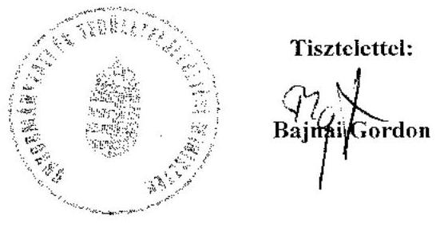

---

.

---

# 11. számú melléklet   a V-1003/2006. számú jelentéshez 

E L N Ö K

ÁLLAMI
SZÁMVEVÖSZÉK

Ikt.szám: V-1003-057/2006.

## Bajnai Gordon úr

miniszter
Önkormányzati és Tcrületfejlesztési Minisztérium

## Budapest

## Tisztelt Miniszter Úr!

Köszönettel megkaptam a helyi és a helyi kisebbségi önkormányzatok gazdálkodási rendszerének 2006. évi átfogó és egyéb szabályszerűségi ellenőrzéséről szóló jelentésünkre adott válaszát. Örömmel vettem, hogy a jelentésben szereplő megállapítások többségével egyetért, valamint több megállapításunkkal, következtetésünkkel, javaslatukkal összhangban tett és tervezett intézkedésekről tájékoztatott.

Az Ötv. 8. § (2) bekezdésében foglaltakkal kapcsolatos javaslatunkat, észrevételében foglaltaktól eltérően, továbbra is indokoltnak tartjuk, mivel a jelentésben már rögzített megállapításunk szerint az önkormányzatok eltérő módon és részletezettséggel rögzítették, hogy mely feladatokat tekintenek kötelezően ellátandónak, vagy önként vállaltnak. A levelében hivatkozott Ötv. 91. § (6) bekezdése alapján készített gazdasági programok nem tartalmazzák az Ötv. 8. § (1) bekezdésben szereplő önkormányzati feladatok ellátásról történő döntést. A gazdasági programban a kialakult helyzethez viszonyított változtatásról, jellemzően fejlesztési elképzelésekről, célkitűzésekről döntenek az önkormányzatok, nem jelölve meg, hogy a tervezett fejlesztés a kötelező, vagy az önként vállalt feladat megoldását, színvonalának fejlesztését segíti. Az Ötv. alapján a gazdasági programnak jelenleg nem tartalmi követelménye a meglévő feladatstruktúra részletezése kötelező és önként vállalt feladatok bontásban. Az önkormányzatok gazdálkodásának átláthatóságát, az Ötv. 8. § (1) bekezdésében részükre előírt feladat megoldását elősegítené a követelmények, a törvényi elvárások pontos meghatározása.

Budapest, 2007. augusztus " 30 ".
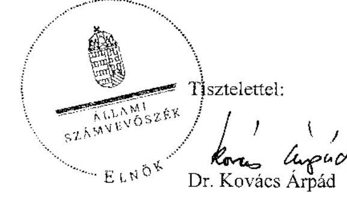

---

.

---

# Dr. Kovács Árpád elnök úr részére   Állami Számvevőszék 

Budapest

Tisztelt Elnök Úr!

A helyi és a helyi kisebbségi önkormányzatok gazdálkodási rendszerének 2006. évi átfogó és egyéb szabályszerűségi ellenőrzéséről szóló összefoglaló jelentést köszönettel megkaptam.

Örömmel vettem, hogy a jelentéstervezetben a részemre javasolt intézkedésekhez tett észrevételeink egy része elfogadásra került. A jelentésben - a pénzügyminiszter részére megfogalmazott jobbító szándékú javaslatokkal alapvetően egyetértek.

Tájékoztatom Elnök urat, hogy az államháztartás müködési rendjéről szóló 217/1998. (XII. 30.) Korm. rendelet (továbbiakban: Ámr.) módosítására vonatkozó javaslatokat az Ámr. soron következő módosítása során - az alábbiak szerint - figyelembe vesszük:

- Az a) ponthoz:

Az 50 ezer forintot el nem érő kifizetések esetén a kötelezettségvállalás rendjére és nyilvántartási formájára vonatkozó belső szabályzat-készítési kötelezettség alapján kell biztosítani a folyamatba épített belső ellenőrzési feladatok elvégzésének feltételeit, a helyben meghatározott kockázati tényezők alapján, a helyi ellenőrzési rend elvárásának megfelelően. Ezért ennek további központi szabályozását -, mivel a helyi feltételek és sajátosságok figyelembevételét igényelné - továbbra sem tartom indokoltnak.
Megoldásnak látom viszont az 50 ezer forint alatti kifizetésekre vonatkozó hatályos jelenlegi szabály kiegészítését azzal, hogy az ilyen kis értékủ kifizetések rendjét és nyilvántartási formáját belső ellenőrzésre alkalmas módon kell a költségvetési szerv belső szabályzatában rögzíteni.

- A b) ponthoz:

A szakmai igazolást is értelemszerűen a helyben kialakított feltételek, a teljesítendő bevétel vagy kiadás jellege, helyi kockázatelemzés alapján lehet szabályozni, ennek megvalósítására pedig a belső szabályozást tartom megfelelő megoldásnak.
Az Ámr.-be annak az általános szabálynak a rögzítése szükséges, amely alapján a szakmai teljesítést - a belső szabályzatban meghatározottak szerint - az eredeti bizonylaton, írásban, az arra jogosult személy aláírásával kell igazolni. Ezen túlmenően a szakmai teljesítés igazolás „záradékolási" kötelezettségének Ámr.-be való beépítését

---

elfogadhatónak tartom annak érdekében, hogy egyértelműen kiderüljön, hogy az aláírásra jogosult személy az esetlegesen több jogköréből (pl.: kötelezettségvállalás, utalványozás, szakmai teljesítés igazolás stb.) éppen melyiket gyakorolja. A „záradék" tartalmi elemeként előírásra kerül a szakmai teljesítés igazolásának elvégzési ideje is.

- A c) pontban javasoltakkal, - miszerint a nem pénzforgalmi vagyonváltozások esetén is egyértelműen fogalmazódjon meg a vezetői felelősség és ellenőrzés - egyetértek. Ezért kezdeményezem a jogszabály módosítását úgy, hogy a vagyonváltozásokat eredményező egyéb (nem pénzforgalmi) gazdasági események elszámolását (pl. üzembe-helyezési okmány, értékvesztés elszámolásának dokumentuma, stb.) a költségvetési szerv vezetője, vagy az általa felhatalmazott személy az elszámolás alapját szolgáló számviteli bizonylaton aláírásával rendelhesse el.

Kérem Elnök urat, hogy tájékoztatásomat elfogadni szíveskedjék.
Budapest, 2007. augusztus 10.

---

# A Magyar Köztársaság igazságügyi és rendészeti minisztere 

IRM/KGFO/2007/1552/2

Hiv. sz: V-1001-53/2006.

## Dr. Kovács Árpád úr   elnök

## Állami Számvevőszék

## Budapest

## Tisztelt Elnök Úr!

Az Állami Számvevőszék részéről „a helyi és a helyi kisebbségi önkormányzatok gazdálkodási rendszerének 2006. évi átfogó és egyéb szabályszerűségi ellenőrzéséről" készített hivatkozott számon megküldött jelentésre az Igazságügyi és Rendészeti Minisztérium részéről észrevételt nem teszünk.

Budapest, 2007. augusztus 10.

Üdvözlettel:
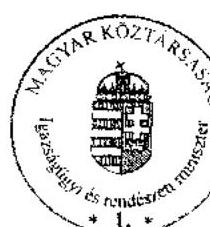
Dr. Takács Albert