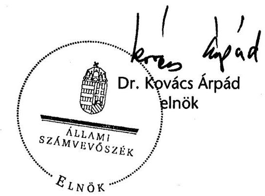
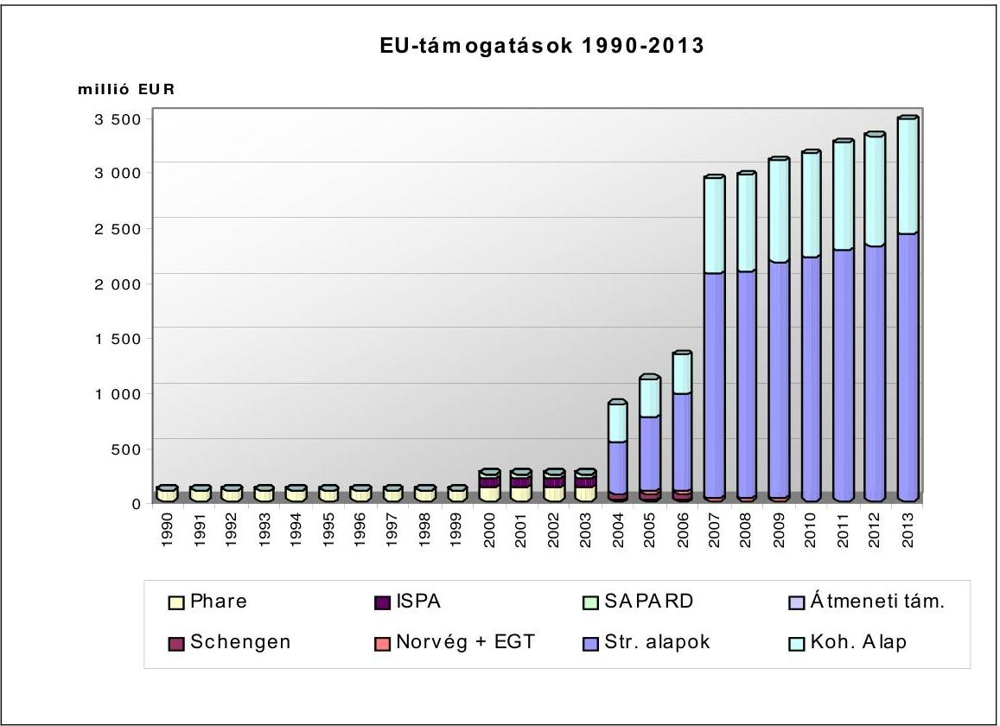
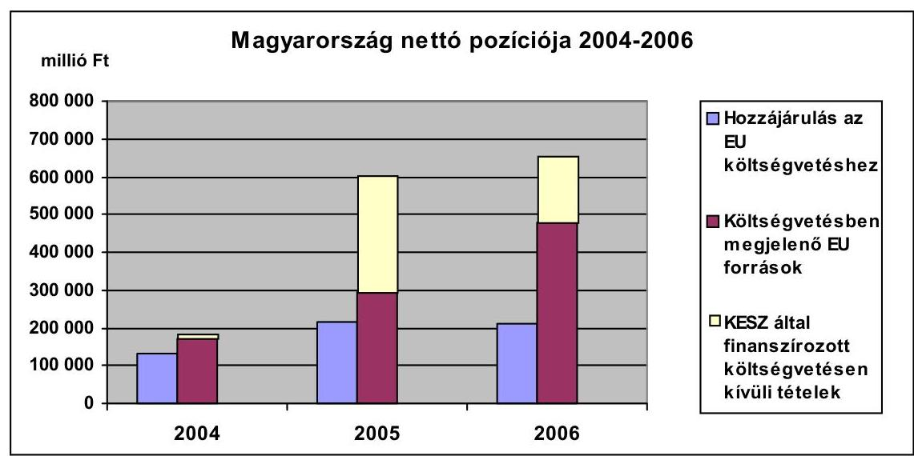
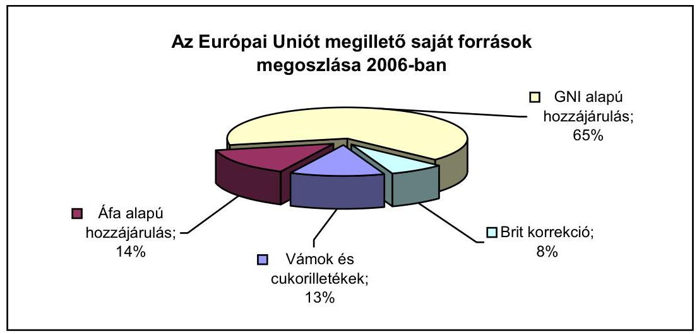
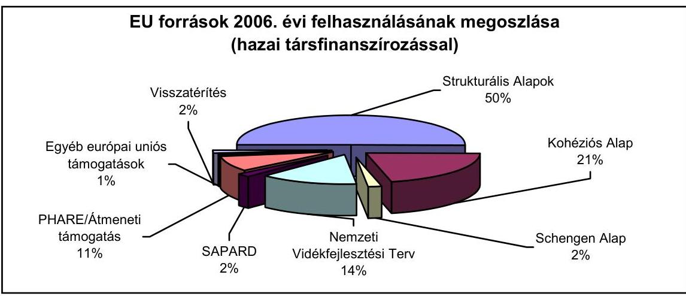
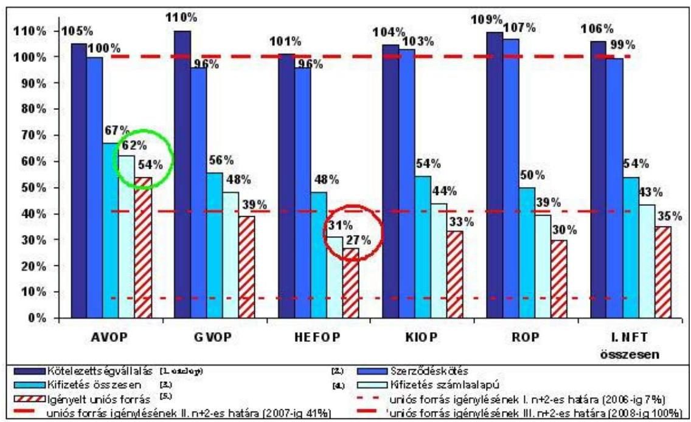
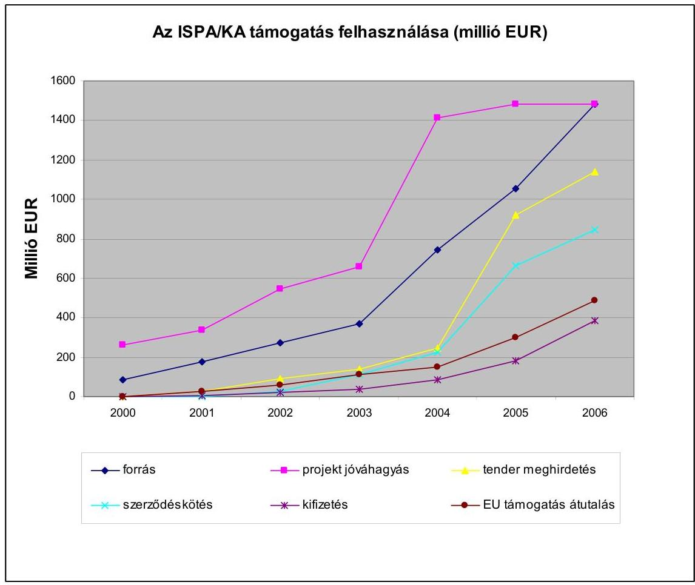
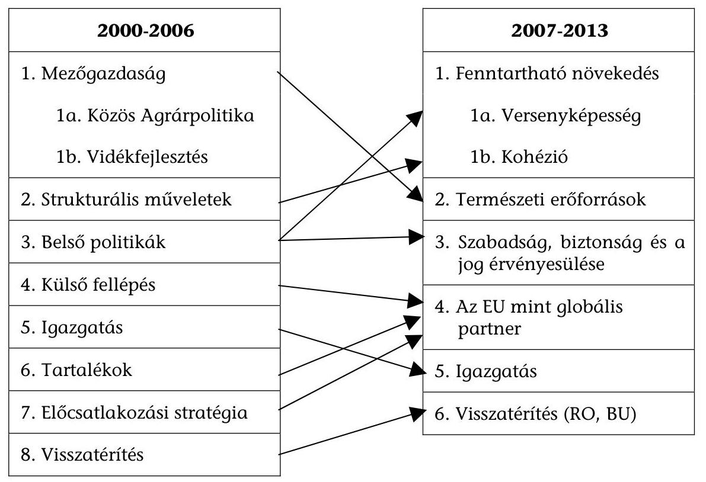

# TÁJÉKOZTATÓ 

az európai uniós támogatások 2006. évi felhasználásának ellenőrzéséről
$0727 \quad \mathrm{~J} / 3600$
2007. szeptember

---

# 2. Államháztartás Központi Szintjét Ellenőrző Igazgatóság 2.4 Koordinációs Főcsoport 

Iktatószám: VE-06-027/2007.

## A tájékoztató elkészítését felügyelte:   Bihary Zsigmond   föigazgató

## A tájékoztató összeállításáért felelős:   Dr. Becker Pál   általános főigazgató-helyettes

## A tájékoztató összeállításában részt vettek:

| Bartolák Márta | Kovács Richárd |
| :-- | :-- |
| számvevő tanácsos | tudományos munkatárs |
| Laczkovich Rita | Szarka Péterné |
| számvevő | osztályvezető |

---

# TARTALOMJEGYZÉK 

BEVEZETÉS ..... 5
I. ÖSSZEGZŐ ÉRTÉKELÉS, KÖVETKEZTETÉSEK ..... 7
Magyarország és az EU pénzügyi kapcsolatai ..... 7
Magyarország és az EU pénzügyi kapcsolatai 2006-ban ..... 15
Az EU források felhasználásának intézményi, szabályozási és ellenőrzési rendszere ..... 17
Monitoring és nyilvántartási rendszerek ..... 20
Számviteli rendszerek ..... 23
Szabálytalanságkezelés és követeléskezelés ..... 24
Strukturális Alapok ..... 26
A Közösségi Kezdeményezések támogatásai ..... 31
Kohéziós Alap ..... 32
Schengen Alap ..... 35
Előcsatlakozási alapok és Átmeneti Támogatások ..... 36
Phare programok ..... 36
SAPARD ..... 37
Átmeneti Támogatás ..... 38
Az Európai Gazdasági Térség és a Norvég Finanszírozási Mechanizmus ..... 39
Agrártámogatások ..... 40
EMOGA Garancia Részlegből finanszírozott agrár- és vidékfejlesztési támogatások ..... 41
Felkészülés a 2007-2013 EU költségvetési időszakra ..... 44
II. RÉSZLETES ÉRTÉKELÉS ..... 49

1. Magyarország és az EU pénzügyi kapcsolatai 2006-ban ..... 49
1.1. Az EU tagsággal összefüggő hazai befizetések ..... 49
1.2. Hazánk uniós támogatásai ..... 51
1.3. Az uniós támogatások intézményrendszere és jogszabályi környezete ..... 55
1.3.1. Jogszabályi környezet ..... 58
1.4. Az Európai Unióból érkező támogatások hazai ellenőrzési rendszere ..... 60
1.4.1. Az ellenőrzés intézményrendszere ..... 62
1.5. Monitoring és nyilvántartási és rendszerek ..... 63
1.5.1. A monitoring rendszer múködése ..... 63
1.5.2. Az Egységes Monitoring Információs Rendszer ..... 65
1.5.3. Az Országos Támogatási Monitoring Rendszer ..... 68
1.5.4. Integrált Igazgatási és Ellenőrzési Rendszer ..... 69

---

1.5.5. Számviteli nyilvántartási rendszer ..... 71
1.6. Szabálytalanságkezelés és követeléskezelés ..... 75
2. Az Európai Uniós források felhasználásával kapcsolatos, a 2006-os évre vonatkozó ellenőrzések legfontosabb megállapításai, következtetései ..... 79
2.1. Strukturális Alapok ..... 79
2.1.1. A Strukturális Alapok felhasználásának szabályozása és intézményrendszere ..... 81
2.1.2. A Strukturális Alapokat érintő 2006. évre vonatkozó ellenőrzések megállapításai, következtetések ..... 88
2.1.2.1. Agrár- és Vidékfejlesztési Operatív Program ..... 90
2.1.2.2. Gazdasági Versenyképesség Operatív Program ..... 93
2.1.2.3. Humánerőforrás-fejlesztési Operatív Program ..... 96
2.1.2.4. Környezetvédelem és Infrastruktúra Operatív Program ..... 100
2.1.2.5. Regionális Fejlesztés Operatív Program ..... 102
2.1.3. A Közösségi Kezdeményezések támogatásai ..... 104
2.2. Kohéziós Alap ..... 110
2.2.1. A Kohéziós Alap felhasználásának uniós és hazai szabályozása, intézményrendszere ..... 111
2.2.2. A Kohéziós Alapot érintő 2006. évre vonatkozó ellenőrzések megállapításai, következtetések ..... 112
2.3. Schengen Alap ..... 120
2.4. Előcsatlakozási alapok és Átmeneti Támogatások ..... 124
2.4.1. Phare programok ..... 124
2.4.2. SAPARD ..... 127
2.4.3. Átmeneti Támogatás ..... 129
2.5. Az Európai Gazdasági Térség és a Norvég Finanszírozási Mechanizmus ..... 132
2.6. Agrártámogatások ..... 136
2.6.1. EMOGA Garancia Részlegből finanszírozott agrár- és vidékfejlesztési támogatások ..... 137
2.7. Felkészülés a 2007-2013 EU költségvetési időszakra ..... 146

# MELLÉKLETEK 

1. sz. A Magyar Köztársaság költségvetése teljesítése során elszámolt és a költségvetésen kívüli EU transzferek
2. sz. A 2006. évi költségvetés végrehajtásáról szóló törvényben megjelenő EUtámogatások összege
3. sz. Az EU-költségvetés szerkezeti változásai a 2000-2006-os és a 2007-2013-as költségvetési periódus között
4. sz. EMOGA GR-ből 2006-ban finanszírozott támogatások kifizetési adatai
5. sz. A Tájékoztató alapjául szolgáló, 2006. évre vonatkozó ellenőrzések

---

# RÖVIDÍTÉSEK JEGYZÉKE 

| AFIS | Anti-Fraud Information System   (Csalás Elleni Információs Rendszer) |
| :--: | :--: |
| Áht. | 1992. évi XXXVIII. törvény az államháztartásról |
| Ámr. | 217/1998. (XII. 30.) Korm. rendelet az államháztartás működési rendjéről |
| APEH | Adó- és Pénzügyi Ellenőrzési Hivatal |
| ÁSZ | Állami Számvevőszék |
| AVOP | Agrár- és Vidékfejlesztési Operatív Program |
| BÉSZ | Beszerző-értékesítő Szövetkezet |
| EDIS | Extended Decentralisation Implementation System (Kiterjesztett Decentralizációs Végrehajtási Rendszer) |
| EMIR | Egységes Monitoring Információs Rendszer |
| EMOGA | Európai Mezőgazdasági Orientációs és Garancia Alap |
| EMGA | Európai Mezőgazdasági Garancia Alap |
| EMVA | Európai Mezőgazdasági Vidékfejlesztési Alap |
| ERFA | Európai Regionális Fejlesztési Alap |
| ESZA | Európai Szociális Alap |
| EU | Európai Unió |
| FEUVE | folyamatba épített előzetes és utólagos vezetői ellenőrzés |
| FMI | Finanszírozási Mechanizmus Iroda |
| FMM | Foglalkoztatáspolitikai és Munkaügyi Minisztérium |
| FVM | Földművelésügyi és Vidékfejlesztési Minisztérium |
| GDP | Gross Domestic Product (Bruttó Hazai Termék) |
| GKM | Gazdasági és Közlekedési Minisztérium |
| GNI | Gross National Income (Bruttó Nemzeti Jövedelem) |
| GVOP | Gazdasági Versenyképesség Operatív Program |
| HEFOP | Humánerőforrás-fejlesztési Operatív Program |
| HOPE | Halászati Orientációs Pénzügyi Eszköz |
| IH | Irányító Hatóság |
| IIER | Integrált Igazgatási és Ellenőrzési Rendszer |
| IRM | Igazságügyi és Rendészeti Minisztérium |
| ISPA | Instrument for Structural Policies for Pre-Accession (Strukturális Politikák Csatlakozás Előtti Eszköze) |
| KA | Kohéziós Alap |
| KAP | Közös Agrárpolitika |
| Kbt. | 2003. évi CXXIX. törvény a közbeszerzésekről |
| KEHI | Kormányzati Ellenőrzési Hivatal |
| KESZ | Kincstári Egységes Számla |
| KH | Kifizető Hatóság |
| KIOP | Környezetvédelmi és Infrastruktúra Operatív Program |
| KPSZE | Központi Pénzügyi és Szerződéskötési Egység |

---

| KSz | Közremúködő Szervezet |
| :--: | :--: |
| KTK | Közösségi Támogatási Keret |
| KTK IH | Közösségi Támogatási Keret Irányító Hatóság |
| KÜ | Kifizető Ügynökség |
| KvVM FI | Környezetvédelmi és Vízügyi Minisztérium Fejlesztési   Igazgatósága |
| LT | Lebonyolító Testület |
| MÁK | Magyar Államkincstár (Kincstár) |
| MKK | Múködési Kézikönyv |
| MVf Kht. | Magyar Vállalkozásfejlesztési Közhasznú Társaság |
| MVH | Mezőgazdasági és Vidékfejlesztési Hivatal |
| NFH | Nemzeti Fejlesztési Hivatal |
| NFT | Nemzeti Fejlesztési Terv |
| NFÚ | Nemzeti Fejlesztési Ügynökség (a Nemzeti Fejlesztési Hiva-   tal jogutódja) |
| NFÚ BEO | Nemzeti Fejlesztési Ügynökség Belső Ellenőrzési Osztálya |
| NVT | Nemzeti Vidékfejlesztési Terv |
| OLAF | Office Européen de Lutte Anti-Fraude   (Európai Csalásellenes Hivatal) |
| OP | Operatív Program |
| OTH | Országos Területfejlesztési Hivatal |
| OTMR | Országos Támogatási Monitoring Rendszer |
| PEJ | Projekt Előrehaladási Jelentés |
| PM | Pénzügyminisztérium |
| PRAG | Practical Guide to Phare, ISPA \& SAPARD contract   procedures   (Gyakorlati útmutató a Phare, ISPA és SAPARD szerződé-   ses eljárásokhoz) |
| ROP | Regionális Fejlesztés Operatív Program |
| SA | Strukturális Alapok |
| SAPARD | Special Accession Programme for Agriculture and Rural   Development (Különleges Előcsatlakozási Program a Me-   zőgazdaság és Vidékfejlesztés támogatására) |
| SAPS | Single Area Payment Scheme   (Egyszerúsített Területalapú Támogatás) |
| SZF | Szabálytalansági Felelős |
| TÉSZ | Termelő-értékesítő Szövetkezet |
| TKA | Tempus Közalapítvány |
| TS | Technikai Segítségnyújtás |
| VP KEP | Vám és Pénzügyőrség Központi Ellenőrzési Parancsnokság |
| VPOP | Vám- és Pénzügyőrség Országos Parancsnoksága |

---

# BEVEZETÉS 

Magyarország 2004 óta teljes jogú tagja az Európai Uniónak. A csatlakozástól a 2006. év végéig, a 2000-2006-os EU költségvetési periódus lezárásáig fokozatosan növekvő mértékben juthattunk EU költségvetésből finanszírozott támogatásokhoz. A 2007-2013-as pénzügyi programozási időszakban az eddigieknél is jóval nagyobb lesz a növekedés mértéke. Fejlődési pályánk alakulásának egyik alapkérdése, hogy milyen mértékben és hatékonysággal tudjuk a rendelkezésre álló EU-forrásokat felhasználni a kiegyensúlyozott és tartós növekedés érdekében. A remélt felzárkózásra akkor van esélyünk, ha az uniós és hazai pénzekből megvalósított beruházások eredményesen szolgálják ezt a kitűzött célt.

A Tájékoztató - összhangban az Állami Számvevőszék (ÁSZ) 2004. évi tevékenysége elfogadásáról szóló 43/2005. (V. 26.) OGY határozat 4. pontjában előírtakkal ${ }^{1}$ - bemutatja Magyarország európai uniós pénzügyi kapcsolatait és a támogatásokkal kapcsolatos ellenőrzések 2006-os tapasztalatait. Kitér azon 2006-ban érvényben lévő hazai és nemzetközi jogszabályokra, amelyek meghatározták az EU-támogatások felhasználásában közreműködő intézményrendszer működését és ellenőrzési tevékenységét. Átfogó képet ad a különböző szervezetek feladat- és hatásköréről, az ellenőrzések során betöltött szerepükről. Az ellenőrzési tapasztalatok árnyaltabb értelmezése érdekében a Tájékoztatóban a támogatási formákhoz kapcsolódó általános háttérinformációkat is szerepeltetjük.

A Tájékoztató összeállításához mind a belső, mind a külső, hazai és uniós ellenőrzési intézményrendszer tapasztalatait felhasználtuk. Bár ezek közül néhány ellenőrzés (ÁSZ, Európai Számvevőszék) eredményei nyilvánosak és ezáltal már közzétettek, de az átfogó kép kialakítása érdekében szükségesnek tartottuk ezek ismertetését is. A Kormányzati Ellenőrzési Hivatal ellenőrzési eredményei szintetizáltan jelennek meg a Tájékoztatóban, mivel a Hivatal jelentései nem nyilvánosak.

A 2006. év a forráslekötés vonatkozásában lezárja a 2000-2006-os (új tagországok részére a 2004-2006-os) költségvetési periódust, ezért a Tájékoztatóban egy lezáródó programozási időszak tapasztalatait is összefoglaljuk, ugyanakkor képet kívánunk adni a 2007-2013-as periódusra való felkészülésről is.

A jelen Tájékoztató a lefedni kívánt valamennyi uniós támogatási kör szempontjából előrelépést jelent abban az értelemben, hogy bemutatja a Magyar Köztársaság központi költségvetésében megjelenő és a költségvetésen kívüli tételként szereplő (agrár) támogatások és az Uniótól közvetlenül igényelhető (oktatási és kutatás-fejlesztési célú) támogatások felhasználását. Az önkormány-

[^0]
[^0]:    ${ }^{1}$ „...az Állami Számvevőszék a teljes uniós pénzfelhasználás gyakorlatáról átfogó képet adjon, ennek keretében az uniós forrásokkal összefüggő pénzmozgások ellenőrzését végző hazai szervezetek munkáját szakmai szempontból áttekintse és mutassa be az ellenőrzések tapasztalatait."

---

zatok gazdálkodásának ellenőrzése keretében az ÁSZ 2007. évtől különös hangsúlyt helyez az uniós források önkormányzatoknak, mint kedvezményezetteknek nyújtott támogatások hasznosulásának értékelésére. A Tájékoztató ezen ellenőrzések kezdeti tapasztalataira is kitér.

Mivel a 2006. év az Európai Unió költségvetéséből finanszírozott programok esetében a programozási időszak lezárását jelentette, a feltételrendszer és a felhasználás vonatkozásában az érdemi hatású intézkedések már nem végrehajthatóak. Felhívjuk azonban a figyelmet, hogy az európai uniós források EU-s és hazai szabályozásnak megfelelő felhasználása és hosszú távú hatása érvényre jutása érdekében fokozottan erősíteni kell az intézményrendszer valamennyi szereplője vonatkozásában a monitoring és ellenőrzési rendszer hatékony érvényesülését, kiemelt figyelemmel a 2004-2006-os költségvetésből megvalósult projektek kötelező működési monitoringjára és a szabálytalanságok feltárására és a követeléskezelés hatékony működtetésére.

Munkánk során felhasználtuk más szervezetek ellenőrzési tapasztalatait, a jelentéseikben megfogalmazottakat tartalmi változtatás nélkül szerepeltetjük a Tájékoztatóban, és érdemben felhasználtuk véleményünk kialakításához ${ }^{2}$. Együttműködésükért, segítőkészségükért ezúton mondunk köszönetet a Pénzügyminisztérium, a Kormányzati Ellenőrzési Hivatal, a Nemzeti Fejlesztési Ügynökség, a Földművelésügyi és Vidékfejlesztési Minisztérium, a Mezőgazdasági és Vidékfejlesztési Hivatal, valamint a Vám- és Pénzügyőrség Országos Parancsnoksága vezetőinek és munkatársainak.

[^0]
[^0]:    ${ }^{2}$ A Tájékoztató alapjául szolgáló ellenőrzések listáját az 5. sz. melléklet tartalmazza

---

# I. ÖSSZEGZŐ ÉRTÉKELÉS, KÖVETKEZTETÉSEK 

## Magyarország és az EU pénzügyi kapcsolatai

Az Európai Uniótól érkező források az egyes időszakokban folyamatosan növekvő mértékűek. A Phare előcsatlakozási támogatást 1990 óta biztosítja hazánk részére az Európai Unió, a további előcsatlakozási alapokból (ISPA, SAPARD) a 2000. évtől részesülünk. Ezek a csatlakozás évétől a Strukturális Alapokból és a Kohéziós Alapból, valamint egyéb EU forrásokból érkező támogatásokkal (Schengen Alap, Norvég Alap + EGT) egészültek ki. A 2007-2013 közötti programozási időszakban a korábbi támogatási szint várhatóan jelentősen növekedni fog. A pénzügyi források trendjének 1990-2013 közötti alakulását - az agrártámogatások nélkül - az 1. ábra tartalmazza.

## 1. ábra

2004-től ezen támogatások részben vagy egészben megjelennek a Magyar Köztársaság költségvetésében (1. sz. melléklet).

A Magyar Köztársaság költségvetése végrehajtása során elszámolt és a költségvetésen kívül EU transzferek vizsgálata során megállapítható, hogy a 2004. évi 119 Mrd Ft mellett a 2005. és 2006. évben közel azonos szinten (215, illetve 213 Mrd Ft) alakult az EU költségvetéséhez való hozzájárulásunk. A befizetés belső szerkezete és a befizetési jogcímek arányai megközelítőleg azonosak. A 2004.

---

évi összeg nagyságát befolyásolta, hogy a csatlakozás évében csak arányos befizetési kötelezettség állt fenn, illetve a tradicionális saját források között megjelenő cukorilletéket a követő évben kellett teljesíteni, ennek megfelelően ilyen jogcímen 2004. évben nem keletkezett befizetési kötelezettségünk.

A költségvetésben megjelenő EU források jelentős növekedést mutattak a programozási időszak éveiben. A 2004. évi 171 Mrd forint 2006-ra meghaladta a 478 Mrd forintot. A támogatások - a Phare, a SAPARD és a Schengen Alap kivételével - növekvő trendet követtek. A Kohéziós Alap vonatkozásában a támogatás két év alatt tízszeresére nőtt. A Strukturális Alapokra kifizetett összegek évente megduplázódtak. A két meghatározó alap vonatkozásában a nagymértékű növekedést a 2005. évben a felhasználás gyorsítására hozott intézkedések és a projektek megvalósításának beindulása okozta. A Nemzeti Vidékfejlesztési Terv növekedési üteme ettől elmaradt, de így is több mint négyszeresére nőtt, ami a kezdeti viszonylagos késedelmes beindulás után növekvő felhasználást mutatott. A Phare esetében közel egyenletes kifizetési nagyságrend tapasztalható, ami a programzárást megelőző egyenletes felhasználás következménye. A SAPARD program esetében a 2005. évi jelentős növekedés utáni 2006-os visszaesés oka, hogy 2006-ban a kifizetések nagy hányadát az EMOGA Garancia Részleg terhére finanszírozták. A Schengen Alapból teljesítések a 2005. évtől történtek. A 2004. évben elszámolt összeg a felkészüléshez kapcsolódó költségeket tartalmazza.

A költségvetésen kívüli (EMOGA Garancia Részlegből finanszírozott) agrárpiaci támogatások évenként változó képet mutattak. A támogatások összegét az intervenció finanszírozási szükséglete nagymértékben befolyásolta, ennek alapján 2006-ban az intervenciós értékesítés felgyorsulásának eredményeképpen a finanszírozási szükséglet közel felére csökkent. A közvetlen támogatások esetében az elszámolási szabályok a kifizetések tárgyévi és követő évi elszámolását is lehetővé teszi. Nagyrészt erre vezethető vissza az évek közötti eltérő felhasználás.
2. ábra

---

A 2. ábra jól mutatja, hogy Magyarország nettó pozíciója - az EU költségvetésbe történő tagállami befizetés és a kapott támogatás különbözete - a csatlakozás évétől folyamatosan kedvezően alakult.

A Magyar Köztársaság költségvetésének végrehajtása során elszámolt és a Magyar Államkincstáron keresztül előfinanszírozott (költségvetésen kívüli tételek) EU támogatások (hazai társfinanszírozással) GDP-hez viszonyított aránya 2004-2006-os időszakban növekvő tendenciát mutatott, de 2006-ban sem érte el a 3\%-ot (2,87\%). A 2007-2008-as időszakban - a PM által prognosztizált átlag adatokkal számolva - ez az arány 4,5\% fölé emelkedik oly módon, hogy az előző programozási időszak legnagyobb mértékű kifizetései ekkorra várhatóak, ugyanakkor a jelen időszak programjai kezdeti szakaszukban lesznek.

A fenti adatok jól mutatják, hogy ebben az időszakban az EU forrásoknak a hazai gazdaság fejlődéséhez való hozzájárulása még nem játszott meghatározó szerepet.

Magyarország fejlődési pályája alakulásának egyik alapkérdése, hogy milyen hatékonysággal tudjuk a rendelkezésre álló EU-forrásokat felhasználni a kiegyensúlyozott és tartós növekedés érdekében. A remélt felzárkózásra akkor van esélyünk, ha az uniós és hazai pénzekből megvalósított beruházások eredményesen szolgálják ezt a kitűzött célt.

A beérkezett támogatások felhasználását, annak hatékonyságát nemzetközi összehasonlításban érdemes vizsgálni.

A nemzetközi szakirodalom egységes abban a tekintetben, hogy a felhasználás hatékonyságát az abszorpciós képességgel, kapacitással méri. Akkor tekinthetők a támogatások hatásosnak, ha azok pozitív jelenértékű kibocsátással járnak, vagyis a támogatások nélküli szinthez képest a támogatások a lehető legnagyobb gazdasági növekedést eredményezik.

A legelterjedtebb, az Unió által is alkalmazott csoportosítás a következő: ${ }^{3}$

- A makroökonómiai abszorpciós kapacitás azt mutatja meg, hogy adott GDP mellett mennyi támogatást tud nagy valószínűsséggel hasznosan felhasználni az adott gazdaság.
- Az adminisztratív abszorpciós kapacitás a támogatásokat elosztó intézményrendszer múködésének hatékonyságával kapcsolatos.
- A pénzügyi abszorpciós kapacitás fogalma a nemzeti költségvetés társfinanszírozási képességének, a magánerőforrások bevonhatóságával, illetve a kapcsolódó pénzügyi tervezéssel, likviditásmenedzsmenttel kapcsolatos kérdéskört fogja át.

[^0]
[^0]:    ${ }^{3}$ Key indicators for Candidate Countries to Effectively Manage the Structural Funds; Principal Report, Final Report, prepared by the NEI Regional and Urban Development for the EC DG REGIO/DG ENLARGEMENT, Rotterdam, February, 2002

---

Különösen nehéz a makroökonómiai abszorpciós képesség vizsgálata, hiszen csak komoly kutatások eredményeként számszerúsíthető a befektetések hatékonyságának kritériuma.

Könnyebben vizsgálható a másik két tényező: a rendelkezésre álló támogatási előirányzat és a ténylegesen felhasznált összeg aránya elfogadható bizonyossággal segít az egyes országok adminisztratív és pénzügyi abszorpciós képességének összehasonlításában. Különösen igaz ez, ha ezen mutatók révén a relatív abszorpciós képességet vizsgáljuk, tehát az egyes országok teljesítményét hasonlítjuk össze.

Egy költségvetési periódusban minden ország számára meg van határozva, hogy évenként mekkora támogatást vehet igénybe, vagyis mekkora előirányzat áll rendelkezésére. Ezt az uniós szabályoknak megfelelő projektekkel leköti, optimális esetben az előirányzat teljes összegét. Az EU-val történő végleges pénzügyi elszámolásra a projektek szabályszerű lezárása után kerülhet sor.

Az abszorpciós képesség megállapítása érdekében tehát azt vizsgáljuk, hogy a tagországok a támogatási előirányzatokból mennyit kötöttek le, illetve mennyi volt a tényleges kifizetés. A kapott értékek lehetővé teszik, hogy Magyarország abszorpciós képességét az EU-n belül meghatározzuk.

Módszertani problémaként azonban meg kell jegyezni, hogy nehezíti az összehasonlítást egyrészről, hogy a régi tagországok esetén a 2005. évi adatokban nagyobb arányban szerepelnek a korábbi évek lekötéséhez kapcsolódó kifizetések, míg ez az új tagországoknál értelemszerúen majdnem nulla. Másrészről, a régi tagországokban az alapok kezdeti igénybevételének felhasználási arányaival kapcsolatban figyelembe kell venni azt, hogy azok egészen más gazdasági és jogi feltételek mellett, és eltérő környezetben valósultak meg. Emiatt véleményünk szerint érdemi következtetéseket az összehasonlításból csak néhány év múlva lehet levonni.

Ennek érdekében először meg kell vizsgálni, hogy a régi tagországok milyen mértékben voltak képesek felhasználni a strukturális forrásokat az 1989. évi reformot követően - amikortól is jelentős mértékben nőttek a támogatások -, másodszor pedig a Kohéziós Alapból származó támogatások felhasználását az arra jogosult országokban, az alap indulását követő években.

Ezzel azt tudjuk elemezni, hogy az említett forrásokhoz való hozzáférést követő első években milyen sikeresek voltak az egyes országok a felhasználás területén, vagyis mekkora a relatív eltérés közöttük. Második metszetként értékelni kell, hogyan alakult a támogatások felhasználása 2005-ben a régi tagországokban és az újonnan csatlakozottakban. Ennek révén az abszolút eltérésről kaphatunk képet.

---

# Strukturális Alapok 

Az Unió az egyik legfontosabb céljának, a versenyképesség érdemi javításának eléréséhez a Strukturális Alapokból és a Kohéziós Alapból származó támogatások EU-s költségvetésen belüli arányának növelésére törekszik. A Strukturális Alapokból minden tagország részesedik, és a négy alapból származó összeg az uniós költségvetésben a teljes kötelezettségvállalási előirányzatok több, mint $30 \%$-át teszi ki.

Az Unió az 1989-es költségvetési évben elkezdett reformjának célja a strukturális intézkedésekhez kapcsolódó támogatások növelése. Az előirányzatokat és a kifizetéseket ez évtől vizsgálva (1. táblázat) megállapítható, hogy a kifizetések uniós szinten az előirányzatok több, mint $93 \%$-át tették ki. E magas aránynál azt is figyelembe kell venni, hogy az 1989-es évektől megnövekedett pénzügyi keretek lehívására a tagországok már kialakították az intézményrendszerüket.

## 1. táblázat

A Strukturális Alapok végrehajtása 1989-1991 között
millió ECU

|  | 1989 | 1990 | 1991 |
| :-- | --: | --: | --: |
| Költségvetési előirányzat | 8208 | 11418 | 12473 |
| Kifizetés | 7945 | 10706 | 12345 |
| Kifizetés az előirányzat \%-ában | 96,80 | 93,76 | 98,97 |

Forrás: EU Bizottság Éves Jelentése a Strukturális Alapok végrehajtásáról

A 2005-ös támogatásokat elemezve (2. táblázat) az tapasztalható, hogy a régi tagországok között is széles spektrumot ölel fel - 50\%-tól 130\%-ig terjed - a kifizetéseknek az előirányzatokhoz viszonyított aránya. Ez az adat 2005-ben az új tagállamoknál azonban még csak 25-30\% körüli. Magyarország a maga $37,28 \%$-os értékével az új tagországok között az élmezőnyben helyezkedik el. A különbség okai közt nem elhanyagolható az a korábban említett módszertani probléma, hogy a régi tagországok esetén az előző évekről áthúzódó kifizetések is növelik az adott év adatát.

A régi és új tagországok közötti különbség mind abszolút, mind relatív értelemben nagy. Az újonnan csatlakozott országok a felkészülési folyamat ellenére jóval kisebb arányban tudták felhasználni a forrásokat, mint az eredeti tagországok. A különbség csak növekszik, ha a 2005-ös adatokat vesszük figyelembe. Magyarország a csatlakozók mezőnyének első felében van, de a 25 ország között a 18. helyen áll a felhasználás tekintetében.

---

# 2. táblázat 

A Strukturális Alapok végrehajtása 2005-ben
nemzetközi összehasonlításban
millió euró

| Tagország | Előirányzat | Kifizetés | Kifizetés az előirányzat \%-ában |
| :--: | :--: | :--: | :--: |
| Ciprus | 17,23 | 3,19 | 18,52 |
| Szlovákia | 992,30 | 221,20 | 22,29 |
| Cseh Köztársaság | 540,67 | 131,28 | 24,28 |
| Málta | 21,51 | 5,38 | 25,03 |
| Lengyelország | 2807,52 | 766,18 | 27,29 |
| Litvánia | 308,33 | 103,36 | 33,52 |
| Magyarország | 676,26 | 252,11 | 37,28 |
| Lettország | 228,94 | 86,79 | 37,91 |
| Szlovénia | 81,41 | 41,67 | 51,19 |
| Görögország | 4 192,58 | 2 184,05 | 52,09 |
| Észtország | 123,42 | 68,14 | 55,21 |
| Dánia | 128,35 | 78,05 | 60,81 |
| Luxemburg | 14,72 | 8,99 | 61,11 |
| Hollandia | 492,58 | 389,49 | 79,07 |
| Portugália | 2871,65 | 2405,50 | 83,77 |
| Finnország | 316,80 | 268,04 | 84,61 |
| Olaszország | 4828,19 | 4128,75 | 85,51 |
| Spanyolország | 7 169,87 | 6344,69 | 88,49 |
| Franciaország | 2361,46 | 2 147,76 | 90,95 |
| Németország | 4660,86 | 4303,62 | 92,34 |
| Belgium | 314,31 | 335,02 | 106,59 |
| Ausztria | 259,58 | 276,90 | 106,67 |
| Svédország | 325,13 | 349,97 | 107,64 |
| Írország | 381,60 | 411,84 | 107,92 |
| Egyesült Királyság | 2437,70 | 3 181,60 | 130,52 |
| Összesen | 36 552,96 | 28 493,57 | 77,95 |

*Tartalmazza az 1,2,3-as célkitűzés alá eső programokat, az 1-es célkitűzés alá nem eső HOPE-t és a Közösségi kezdeményezéseket (Interreg, Leader+, Urban, Equal).
Forrás: EU Bizottság Éves Jelentése a Strukturális Alapok végrehajtásáról

---

# Kohéziós Alap 

A legelmaradottabb területek fejlesztése, felzárkóztatása érdekében 1993-tól létrehozták az ún. Kohéziós Alapot. Az akkori feltételek szerint négy régi tagország volt jogosult e támogatásra: Spanyolország, Írország, Portugália és Görögország, ezeket hívjuk ún. kohéziós országoknak. Írország elért fejlettségi foka okán 2004. január 1. óta kikerült a kedvezményezetti körből.

A 3. táblázat azt mutatja meg, hogy a régi tagországok kezdetben hogyan hasznosították e forrásokat. A Kohéziós Alap indításának évében és az azt követő évben átlagban 50\% alatti arányban voltak csak képesek lehívni az előirányzataikat. Érdemes ugyanakkor megfigyelni, hogy Portugália esetében az 1993-as 33\%-ot a következő évben 74\% követte.

## 3. táblázat

A Kohéziós Alap végrehajtása 1993-1994-ben
millió ECU

| Tagország | 1993 |  |  | 1994 |  |  |
| :-- | :--: | :--: | :--: | :--: | :--: | :--: |
|  | Elői-   rányzat | Kifizetés | Kifizetés   az előir.   \%-ában | Elői-   rányzat | Kifizetés | Kifizetés   az előir.   \%-ában |
| Spanyolország | 854,4 | 420,8 | 49,25 | 1018,2 | 422,8 | 41,52 |
| Görögország | 280,3 | 148,1 | 52,84 | 332,1 | 157,7 | 47,49 |
| Írország | 141,9 | 67,7 | 47,71 | 167,8 | 87,0 | 51,85 |
| Portugália | 283,6 | 94,0 | 33,15 | 334,3 | 248,3 | 74,27 |
| Összesen | 1560,2 | 730,6 | 46,83 | 1852,4 | 915,8 | 49,44 |

Forrás: Annual Report on the Cohesion Fund 1993,1994 EU Commission

A 2005. évre vonatkozó források tekintetében (4. táblázat) egyértelmú, hogy az új tagországok nem voltak képesek olyan szinten lehívni a rendelkezésre álló pénzeket, mint a kohéziós országok az alap indulásakor. A legjobban teljesítő csatlakozó ország (Ciprus) 2005-ös eredménye gyakorlatilag megegyezik a leggyengébb régi tagország (Portugália) 1993-as eredményével, de a többi csatlakozó ország messze elmarad attól. Természetesen a 2005-ös felhasználási arányokban a régi és új tagországok közötti különbség még jelentősebb.

Magyarország a 25\%-os értékével ez esetben is kedvező pozíciót foglal el, de messze elmarad a régiektől és nem csak 2005-öt, hanem az 1993-as indulásukat tekintve is, hiszen Görögország már az első évben 50\%-ot meghaladóan használta fel a rendelkezésére álló támogatást.

---

# 4. táblázat 

A Kohéziós Alap végrehajtása 2005-ben
millió euró

| Tagország | Előirányzat | Kifizetés | Kifizetés az elöirányzat \%-ában |
| :--: | :--: | :--: | :--: |
| Málta | 5,34 | 0,00 | 0,00 |
| Lengyelország | 1165,53 | 17,41 | 1,49 |
| Észtország | 87,75 | 3,80 | 4,33 |
| Cseh Köztársaság | 256,81 | 15,32 | 5,97 |
| Lettország | 154,40 | 20,44 | 13,24 |
| Szlovénia | 51,84 | 8,54 | 16,48 |
| Magyarország | 310,54 | 78,18 | 25,17 |
| Szlovákia | 155,98 | 43,45 | 27,86 |
| Litvánia | 171,56 | 48,87 | 28,48 |
| Ciprus | 15,10 | 5,06 | 33,51 |
| Portugália | 489,70 | 274,83 | 56,12 |
| Görögország | 430,49 | 313,81 | 72,90 |
| Spanyolország | 1808,56 | 1386,70 | 76,67 |
| Technikai segélynyújtás | 29,86 | 3,17 | 10,61 |
| Összesen | 3411,79 | 2 154,06 | 63,14 |

Forrás: Annual Report on the Cohesion Fund (2005); EU Commission

Az uniós támogatások felhasználásánál a csatlakozó országok mind a Strukturális Alapok, mind a Kohéziós Alap esetében jelentős hátrányban vannak az eredeti tagországokkal szemben. Ez azonban nem jelenti a források végleges elvesztését, mert az n+2-es szabály értelmében a fel nem használt keretek még két évig felhasználhatók. A tényleges kifizetések tartalma így törvényszerűen eltér a kerettől, hiszen jelentős áthúzódó tételeket tartalmaz, miközben az adott évi keret csak részben kerül felhasználásra. Azonban ahhoz, hogy a támogatásokat maximális módon felhasználhassuk, kulcskérdés a társfinanszírozási kapacitás biztosítása: ebben az esetben a belső költségvetési lehetőség megléte addicionális erő, hiánya korlát.

Az újonnan csatlakozott országok esetén a rendelkezésre álló adatok rövid időtávja nem teszi lehetővé a mélyebb, a tagország összehasonlításán alapuló elemzést, de Magyarország helyzete, kifizetési aránya ( $25,17 \%$ a Strukturális Alapok, 37,28\% a Kohéziós Alap esetében) a többiekhez viszonyítva jónak mondható.

---

# Magyarország és az EU pénzügyi kapcsolatai 2006-ban 

A közösségi és hazai jogszabályokkal összhangban az Uniót 2006. évben összesen 213 125,7 M Ft illette meg Magyarországról, ebből a tradicionális saját forrás 27513 M Ft , a nemzeti hozzájárulás összege 185611,9 M Ft volt (3. ábra). Magyarország a fizetési kötelezettségét havonta teljesítette.
3. ábra

A 2006. évi befizetési kötelezettségek hazai kiszámításában, illetve lebonyolításában a kiemelt szerepet játszó Pénzügyminisztérium mellett a Vám- és Pénzügyőrség Országos Parancsnoksága (vám), a Mezőgazdasági és Vidékfejlesztési Hivatal (cukorilleték), Adó- és Pénzügyi Ellenőrzési Hivatal (áfa alapú hozzájárulás), a Magyar Államkincstár (áfa alapú hozzájárulás), valamint a Központi Statisztikai Hivatal (áfa, illetve GNI alapú hozzájárulás) vettek részt.

A Magyar Köztársaság érdekében történő beazonosított kifizetésként az EU Bizottság 2006. évben 1218,34 M eurót tartott nyilván. Ez az összeg tartalmazta a mezőgazdaságra, a strukturális múveletekre, a belső politikákra, az adminisztrációra, a külső műveletekre, az előcsatlakozási stratégiára fordított és kompenzációként kifizetett kiadásokat, tehát mindazokat, aminek a felhasználása magyar közintézmények közremúködésével, az EU Bizottsághoz közvetlenül benyújtott pályázatok útján, vagy Magyarország támogatás felhasználásával kapcsolatban merült fel. Ennek döntő többségét a Magyar Köztársaság költségvetési beszámolójában szereplő (költségvetésében megtervezett + költségvetésen kívüli Kincstári Egységes Számláról - KESZ - finanszírozott) tételek alkották. A költségvetési beszámolóban nem szereplő tételek közül a két legjelentősebb a kutatás és technológia-fejlesztési ( $20,4 \mathrm{M}$ euró) és az oktatási, nevelési, szakmai továbbképzési és ifjúsági ( $20,0 \mathrm{M}$ euró) célokra fordított támogatások voltak.

Az Európai Uniótól származó támogatásokat, illetve az EU-s integrációval kapcsolatos kiadásokat az Országgyúlés a 2006. évi központi költségvetés 17 fejezetében, 193 előirányzaton állapította meg. A Magyar Köztársaság 2006. évi költségvetésében az EU támogatások (Strukturális Alapok, Kohéziós Alap, Schengen Alap, Nemzeti Vidékfejlesztési Terv, SAPARD, Phare/Átmeneti Támogatás, egyéb európai uniós támogatások) és a hozzájuk kapcsolódó hazai társfinanszírozás 470 492,0 M Ft összegben jelent meg (4. ábra). Az uniós forrás

---

302 302,3 M Ft-ot, a hazai társfinanszírozás 168 189,7 M Ft-ot tett ki. 2006-ban a visszatérítés összege 7773,9 M Ft , az EU költségvetéshez való hozzájárulás $185611,9 \mathrm{M}$ Ft volt.

A költségvetésben megjelenő uniós források felhasználása 2,1\%-kal elmaradt a tervezettől ( $316648,2 \mathrm{M}$ Ft), ugyanakkor a központi költségvetési eszközök felhasználása $20 \%$-kal haladta meg az előirányzottat ( $140119,5 \mathrm{M}$ Ft). Az uniós források és a hazai társfinanszírozás tervezetthez képest tényleges felhasználása az egyes támogatási csoportoknál eltérő képet mutatott. A tervezettet meghaladó teljesülés a Phare programoknál, a Strukturális Alapok Operatív Programjainak és a Nemzeti Vidékfejlesztési Terv végrehajtásában; a tervezettől elmaradó megvalósulás a SAPARD és az egyéb uniós támogatásoknál történt. A Kohéziós Alapnál volt a legszembetűnőbb a változás: míg az uniós források felhasználása csaknem 4 Mrd Ft-tal csökkent, addig a hazai társfinanszírozás teljesülése több, mint 16 Mrd Ft-tal haladta meg a tervezettet, amelyet egyrészt a projektek lassú megvalósulása, másrészt egyes projektek költségtúllépése okozta.
4. ábra

A költségvetésen kívüli támogatási formák (agrárpiaci támogatások, közvetlen termelői támogatások) összege 2006. évre vonatkozóan meghaladta a 113 242,4 Mrd Ft-ot (agrárpiaci támogatás: $19867,7 \mathrm{M}$ Ft, közvetlen termelői támogatás: $93405,7 \mathrm{M}$ Ft), amelyet a Kifizető Ügynökség a KESZ-ről megelőlegezett, és az Unió utólag téríti meg az államháztartás számára.

A költségvetés végrehajtására vonatkozó ellenőrzés rámutatott, hogy az intervenciós felvásárlás (agrárpiaci támogatás) megelőlegezése évről-évre visszatérő pótlólagos finanszírozási terhet jelent az államháztartás számára.

A 2006. évben 191 810,6 M Ft-ot fordítottak a felvásárlás és az értékesítéshez kapcsolódó költségek megelőlegezésére, ezzel szemben a gabona értékesítéséből befolyt összeg 129 844,3 M Ft volt. A fennmaradt 61 966,3 M Ft visszatérülésének időpontja bizonytalan. Ez az összeg növelte az államháztartás forrásszükségletét, illetve az emiatti kamatkülönbözet által annak hiányát. Kedvezően értékelhető, hogy ez az összeg jelentősen kisebb az egy évvel korábbi zárszámadáskor ilyen címen jelentkezett 117 316,9 M Ft-nál.

---

Az EU Bizottságtól közvetlen pályázati úton kutatás- és technológiafejlesztési célokra fordított 20,4 M eurót 254 támogatott részére fizették ki. Három támogatott kapott 1 millió euró feletti összeget.

Az EU Bizottságtól közvetlen pályázati úton az oktatás, nevelési, szakmai továbbképzési és ifjúsági célokra fordított 20,0 M euró $82 \%$-át a Tempus Közalapítvány (TKA) részére fizették ki.

A Tempus Közalapítványt a Magyar Köztársaság Kormánya, mint alapító az Európai Unió Phare Tempus programjának megszervezése érdekében az állami közfeladatok folyamatos biztosítása céljából hozta létre, mára a Közalapítvány programjainak célcsoportjai a teljes oktatási, képzési és kutatás-fejlesztési ágazatot lefedik. A programok célja az oktatás innovációs képességének, modernizációjának és nemzetközi kompatibilitásának előmozdítása az európai együttmúködés eszközeivel. A TKA számos pályázati programot kezel az oktatás, a képzés és a kutatás-fejlesztés területén, köztük a Socrates és a Leonardo da Vinci. A közösségi programokat pályáztatóként, illetve az EU6 Kutatás-fejlesztési, Technológiai és Demonstrációs Keretprogramot és az Erasmus Mundus programot információs központként múködtette 2006-ban.

Fontos feladatot jelentett 2006-ban a közalapítvány számára a Leonardo és Socrates programokat 2007. január 1-jével felváltó „Egész életen át tartó tanulás" program bevezetésének előkészítése, amely során a TKA munkatársai aktívan részt vettek az új pályázati feltételrendszert előkészítő nemzetközi munkacsoportokban.

# Az EU források felhasználásának intézményi, szabályozási és ellenőrzési rendszere 

Az EU-ból érkező források fogadásához, illetve lebonyolításához szükséges intézményrendszert Magyarország az EU előírásainak megfelelően, a hazai jogszabályokat figyelembe véve alakította ki.

Az EU támogatások felhasználásának intézményrendszerét az európai ügyekért felelős tárca nélküli miniszter, majd a fejlesztéspolitikai kormánybiztos felügyelete alatt múködtették. Az uniós támogatások lebonyolítására létrehozott szervezeteket jelentős átalakulások érintették a 2006. év során. A szervezeti változtatás mögött az a kormányzati szándék húzódott meg, hogy az uniós támogatások felhasználása hatékonyabban valósulhasson meg. A Kormány a Nemzeti Fejlesztési Hivatal általános jogutódjaként, a Miniszterelnöki Hivatalt vezető miniszter irányításával 2006. július 1-jével létrehozta a Nemzeti Fejlesztési Ügynökséget (NFÜ), amely felelős volt a hosszú és középtávú fejlesztési és tervezési feladatok ellátásáért, az EU pénzügyi támogatásainak igénybevételéhez szükséges intézményrendszer kialakításáért. Az NFÜ keretében látták el feladataikat az irányító hatóságok és az új programozási időszak Operatív Programjainak Irányító Hatóságai ${ }^{4}$, az Ügynökség felelőssége továbbá kiterjedt a Phare programokkal és a Schengen Alappal, az Átmeneti Támogatással, a Norvég Fi-

[^0]
[^0]:    ${ }^{4}$ Az AVOP irányító hatóság és az új programozási időszak agrár- és vidékfejlesztési illetve halászati támogatásai irányító hatóságainak kivételével

---

nanszírozási Mechanizmussal, illetve az EGT Finanszírozási Mechanizmussal kapcsolatos előkészítési, szervezési és koordinációs feladatokra is.

Az ÁSZ ellenőrzései rámutattak, hogy a 2006 júliusától megindult intézmény-rendszer-átalakítás az intézmények 57\%-át érintette, a Strukturális Alapok és a Kohéziós Alap forrásait közvetítő intézményrendszer vonatkozásában ez az arány elérte a $73 \%$-ot. Az intézményrendszer tényleges költségeire vonatkozó információk nem álltak rendelkezésre, ezek hiányában az intézményrendszer átfogó költséghatékonysági vizsgálata elmaradt.

Az intézményrendszer átalakításának koncepcióját az intézményrendszer 2006. januárban elkészült, a 2004-2006-os periódus félidei értékelése és az intézményrendszer gazdálkodását felmérő szakértői jelentés alapozta meg.

A Pénzügyminisztérium szervezetében kialakított Nemzeti Programengedélyező Iroda alaptevékenysége kiterjedt a Strukturális Alapok és a Kohéziós Alap kifizető hatósági feladatkör ellátására (beleértve a Közösségi Kezdeményezéseket is), a Nemzeti Alap számára a jogszabályokban előírt feladatok ellátására, különösen a Phare, Átmeneti Támogatás és előcsatlakozási eszközökhöz kapcsolódóan a jogszabályban előírt feladatok teljesítésére. Az Iroda a SAPARD program tekintetében ellátta az illetékes hatóság feladatait.

A Nemzeti Programengedélyező Iroda szervezete 2006. június 30-ával - összhangban az Unió 2007-2013 közötti költségvetési periódusára érvényes új uniós és hazai szabályokkal - átalakult. A Nemzeti Programengedélyező feladatát és egyben az Iroda szakmai felügyeletét a Pénzügyminisztérium gazdaságpolitikáért és nemzetközi ügyekért felelős szakállamtitkára látta el.

A Schengen Alapból érkező támogatásoknak az egyes fejezetekhez történő eljuttatásáért a Központi Pénzügyi Szerződéskötő Egység volt a felelős, amely szervezet az NFÜ felügyelete alatt múködött.

A kormányzat a 2006. évben több területen megváltoztatta az uniós támogatások elszámolásának szabályait, az elkészült jogszabályok elsősorban az új végrehajtási időszakra való felkészülést szolgálták. Az új, illetve módosult jogszabályok egyrészt a szervezeti változásokhoz kapcsolódtak, másrészt változtak a Strukturális Alapok és a Kohéziós Alap felhasználásának szabályai, valamint a monitoring rendszer kialakításának és múködtetésének, illetve az ezt kiszolgáló informatikai rendszer előírásai. Módosultak a Schengen Alap felhasználására és az agrártámogatások igénybevételére vonatkozó előírások is. 2006. év folyamán elkészültek a 2007-2013-as programozási időszakban igénybe vehető támogatások felhasználásának eljárási rendjét és intézményi rendszerét meghatározó jogszabályok.

A 2006-os év egyik legfontosabb új jogszabálya a nemzetgazdasági szempontból kiemelt jelentőségű beruházások megvalósításának gyorsításáról és egyszerűsítéséről szóló törvény, amelynek célja, hogy előmozdítsa a nemzetgazdasági szempontból jelentős beruházások által támasztott speciális igényeknek megfelelő szabályozási környezet kialakítását.

---

Megtörtént a 2004-ben elfogadott új közösségi közbeszerzési direktívák átültetése a magyar jogba. A közbeszerzési törvény módosítása ezen felül kiterjedt a törvény hatálybalépése óta szerzett tapasztalatok beépítésére is.

A támogatások pénzügyi ellenőrzéséért az Európai Bizottságnak az Európai Közösségek főköltségvetése végrehajtásáért való felelőssége sérelme nélkül, elsődlegesen a tagállamok vállalnak felelősséget.

Az ÁSZ 2006. évi ellenőrzése megállapította, hogy a hazai ellenőrzési rendszer kialakítása és múködtetése teljesítette az uniós feltételrendszert, de múködésük eredményessége és hatékonysága támogatásonként eltérő képet mutatott. Az ellenőrzési rendszerekben tapasztalt eltérések a módszertan gyakorlati alkalmazásának hiányosságaiból, a lebonyolító intézményrendszer ellenőrzési szerveinek instabilitásából és az intézményfejlesztés során az ellenőrzési tevékenység eredményességi és hatékonysági szempontjainak háttérbe szorulásából származtak.

A jogszabályban nevesített intézményekben - az FVM kivételével - múködtek a funkcionálisan független belső ellenőrzési részlegek. Feladataikat eltérő belső humánkapacitás mellett hajtották végre. Az intézményrendszer által elvégzett ellenőrzéseknél a hatékonyság és eredményesség vizsgálatára irányuló ellenőrzések háttérbe szorultak. Az ellenőrzések a kezdetekben a szabályszerűségre helyezték a hangsúlyt, mivel a visszafizetések kockázata a szabálytalan felhasználás miatt nagy volt a kezdeti „betanulási" időszakban.

Az ellenőrzés megvalósításában az EU-ból érkező források fogadására és a támogatások felhasználásának lebonyolítására létrehozott intézményrendszer minden egységének fontos szerepe volt.

A hazai és uniós jogszabályok alapján az Európai Unió Strukturális Alapjainak és a Kohéziós Alap mintavételes (5-15\%-os) ellenőrzését, az irányítási és ellenőrzési rendszerek múködésének ellenőrzését (rendszerellenőrzés), illetve a zárónyilatkozat kibocsátásához szükséges ellenőrzést a Kormányzati Ellenőrzési Hivatal (KEHI) az uniós és hazai jogszabályoknak megfelelően látta el. Alkalmazott módszereit felülvizsgálta, fejlesztette, ami kiemelten fontos uniós előírás különösen a kockázatkezelés és mintavételezés gyakorlatában.

Az Unióval való elszámolás keretében a kifizetések megfelelő igazolása érdekében a pénzügyi lebonyolítás tekintetében a Kifizető Hatóság - kialakított ütemtervének megfelelően - végezte el a támogatások teljes rendszerének ellenőrzését.

Kialakították és múködtették az Európai Mezőgazdasági Orientációs és Garancia Alap (EMOGA) Garancia Részlegéhez kapcsolódó ellenőrzési rendszereket is.

Az egyes Irányító Hatóságokat múködtető minisztériumok, illetve az NFH/NFÜ belső ellenőrzési egységei biztosították a szervezetek feladatellátásának rendszerellenőrzését.

A belső ellenőrzési rendszer szabályozásáért, fejlesztéséért, koordinációjáért és harmonizációjáért a pénzügyminiszter felel, ennek keretében a folyamatba épített, előzetes és utólagos vezetői ellenőrzési rendszerek, valamint a belső ellen-

---

őrzési rendszerek szabályozásáért, fejlesztéséért, koordinációjáért és harmonizációjáért.

A szabálytalanság kezelésre létrehozott intézményrendszer részét képezi az OLAF Koordinációs Iroda. Az Iroda koordinálja az Európai Közösségek pénzügyi érdekeinek védelmével kapcsolatban az OLAF által lefolytatott helyszíni ellenőrzések során felmerülő feladatokat, továbbítja az előcsatlakozási alapok, illetve a Strukturális Alapok és a Kohéziós Alap tekintetében a szabálytalanságokról szóló negyedéves jelentéseket az OLAF-hoz.

# Monitoring és nyilvántartási rendszerek 

A nyilvántartási és monitoring rendszerek múködtetése elengedhetetlenül szükséges az Európai Unióval történő elszámolások megbízhatósága és a források hatékony felhasználása érdekében a gazdálkodásra vonatkozó naprakész, pontos adatszolgáltatáson keresztül.

A 2006-ban lefolytatott ellenőrzések az előző évekhez hasonlóan kiemelt területként kezelték a monitoring és nyilvántartási rendszerek múködését. Az ÁSZ a zárszámadás, illetve a hazai monitoring és ellenőrzési rendszer múködéséhez kapcsolódó ellenőrzése, a KEHI rendszerellenőrzései és a támogatások felhasználásáért felelős intézményrendszer belső ellenőrzései lényeges megállapításokat tettek a rendszer hasznosulására vonatkozóan.

A monitoring rendszer múködtetése során az abszorpciós előrehaladás, a források felhasználási képességének, valamint tervezett és tényleges alakulásának követését biztosította. Ez elsősorban a pályázatok életútjának, a kötelezettségvállalások, a szerződéskötések és a kifizetések alakulásának nyomon követése révén valósult meg.

Az ÁSZ ellenőrzése rámutatott, hogy a hazai monitoring rendszereinek kialakítása és múködtetése teljesítette az uniós feltételrendszert, de múködésük eredményessége és hatékonysága támogatásonként eltérő képet mutatott. A monitoring tevékenységben kimutatható eredményességi és hatékonysági eltérések és különbségek a monitoringra vonatkozó egységes múködési standardok hiányából, a különböző támogatások lebonyolításához kapcsolódó problémákból, a tervtől való eltérések feltárási időszükségletének különbözőségeiből, valamint a beavatkozási döntések eltérő következményeiből származtak. Az EU források összehangolt felhasználására nem készült egységes nemzeti szintű stratégia, így a hazai és uniós források összehangolásából eredő szinergikus hatások kevésbé érvényesültek.

A tervezés során nem alakították ki a pénzügyi és naturális tervezés egyensúlyát és a monitoring indikátorok projekt és program szintű mutatóinak egymásra épülését, több esetben azok utólagos áttervezése vált szükségessé. A program színtű összteljesítmények értékelését nehezítette, hogy a program indikátorok teljesítésének mérése nem a projekt indikátorok eredményeinek öszszesítésére épült.

A hazai monitoring tevékenység a pénzügyi folyamatok nyomon követésével megfelelően segítette a támogatási célok teljesítését, de az egyes támogatások

---

esetében a naturális célok teljesülésének monitorozása eltérő mértékben teljesült.

Az ÁSZ ellenőrzés rámutatott, hogy nem alakítottak ki a támogatások hasznosulását nyomon követő egységes jelentési rendszert, viszont kedvezően értékelte, hogy az elemző tevékenység erősödött.

A monitoring rendszerre vonatkozó vizsgálatok hangsúlyt helyeztek az Egységes Monitoring Információs Rendszer (EMIR) múködésének ellenőrzésére. A nyilvántartási rendszer célja szinte valamennyi uniós forrásra kiterjedően az uniós támogatással (Strukturális Alapok, Kohéziós Alap, Equal, EGT, Schengen Alap, Phare és Átmeneti Támogatás) megvalósuló projektek részben hazai információs célú adminisztrációja, részben az Unióval történő elszámolások biztosítása.

A moduláris felépítésű nyilvántartási rendszer alapszoftverből és eredetileg a Strukturális Alapok, illetve a Kohéziós Alap alrendszerből állt, ezeket egészítik ki az egyes intézkedésekhez és munkafázisokhoz tartozó modulok. 2005-től kezdődött meg a további alrendszerek kiépítése.

A Strukturális Alapok alrendszerben 2006-ban is további fejlesztői munka vált szükségessé már a rendszer éles üzemelése során. Előrelépést jelentett, hogy az NFÜ létrehozásával és az egyes irányító hatóságoknak az NFÜ szervezetébe integrálásával a korábbi 35 -féle eljárásrend helyett csupán öt szabályzat határozza meg a támogatások kezelésének menetét.

Az informatikai rendszer múködtetése során számos alkalmazásbeli nehézség adódott, amit az ebben résztvevő szervezetek, illetve az erről szóló vizsgálati jelentések eltérő okoknak tudtak be.

Az oktatás nem biztosította a rendszer által megkívánt feladatok szabályszerű elvégzését, a felhasználói igények nem kellő hatékonyságú kommunikációja hátráltatta az informatikai rendszer eredményes fejlesztését, az EMIR-ben nem megoldott az előlegekkel kapcsolatos teljes körű nyomon követés.

A rendszer hatékonyabb múködése érdekében megszületett az ún. magrendszer tanulmány, amely az EMIR 2007-től előirányzott, tervezetten szükséges funkcióit és adattartalmát határozta meg. 2006 végéig elkészült a 2007-es rendszerverzió alapja, az Új Magyarország Fejlesztési Terv alrendszer keretrendszere. Az első pályázati kiírások megjelenésével egy időben 2007. első negyedév közepéig bevezették az EMIR vonatkozó moduljait, hogy lehetővé tegyék a pályázatok időben történő feldolgozását.

A szabálytalanság modul feltöltése a bevezetést követően, 2006-ban kezdődhetett meg. Problémát jelentett azonban, hogy az EMIR-ben csupán rögzítették a szabálytalansági gyanúbejelentést, de az eljárás folyamata nem követhető nyomon a rendszerben, így az eljárás során a Közreműködő Szervezetek és az Irányító Hatóságok által vezetett egyéb nyilvántartásokra kell támaszkodni.

A Schengen Alap alrendszer kifejlesztése - az egyeztetések elhúzódása, egyéb fejlesztési prioritások előtérbe helyezése miatt - határidőre nem készült el.

---

A Phare projektekre vonatkozó regisztrációs és nyilvántartási célt szolgáló, korábban kialakított PERSEUS rendszer mellett az EMIR-t is bevezették. Problémát jelentett, hogy a két informatikai rendszerben tárolt adatok nehezen összehasonlíthatóak.

Az ÁSZ az EMIR múködésére vonatkozóan megállapította, hogy 2004-2006-os időszakra nem alakították ki a nyilvántartások és a monitoring tevékenység támogatásának egységes informatikai hátterét, az EMIR alkalmazása nem volt teljes körű. Az ÁSZ hiányosságokat tárt fel a biztonságpolitika, a jogosultságok rendszere, a hatáskörök megfelelő szétválasztása kérdésében. Az ÁSZ rámutatott, hogy az EU-val szemben a vállalt kötelezettséget az EMIR létrehozásával, majd múködtetésével Magyarország korlátokkal teljesítette. A jelentés ajánlást fogalmazott meg, amely szerint az elfogadott stratégia alapján készüljenek el az EMIR-t használó intézmények informatikai, biztonsági és informatikai üzemeltetési szabályzatai, valamint a múködésfolytonossági tervek.

A Magyar Államkincstár által működtetett Országos Támogatási Monitoring Rendszer (OTMR) végzi a költségvetési és uniós támogatással megvalósuló pályázatok adatainak nyilvántartását. Feladata többek között a döntés-előkészítő funkció múködtetésével a köztartozással rendelkező gazdálkodók azonosítása és a projektenkénti támogatáshalmozódás kiszűrése.

A rendszerbe az adatbevitel más nyilvántartási rendszerekből történő elektronikus kommunikációval is történt, így az OTMR adattartalmának naprakészsége, pontossága, megbízhatósága nagymértékben függött az adatokat szolgáltató többi nyilvántartási rendszer múködésének színvonalától is, amelynek az OTMR információit felhasználók szempontjából volt jelentősége. Az EMIR és az OTMR közötti elektronikus adatcsere technikailag biztosított volt, ennek ellenére a rendszerek adattartalmának folyamatos szinkronizálása nem történt meg. Az OTMR-EMIR megbízható adatszolgáltatási nehézségei miatt az ügyfeleket terhelte az igazolások beszerzése, költsége, ami több héttel meghosszabbította a projektek elbírálási és kifizetési folyamatait.

Az Integrált Igazgatási és Ellenőrzési Rendszer (IIER) létrehozása és működtetése kötelező az EMOGA Garancia Részlegből finanszírozott területalapú támogatások vonatkozásában. Ezen felül Magyarország vállalta az egyéb - a közvetlen kifizetéseken túlmenő intézkedéstípusokba tartozó - jogcímekhez kapcsolódó feldolgozás folyamatainak egységes rendszer keretein belüli megvalósítását.

Az informatikai rendszerek megbízhatóságának és biztonságának megvalósítására a CobiT nevű standardot kell a Mezőgazdasági és Vidékfejlesztési Hivatalnak alkalmaznia. A bevezetési terv megvalósításával az MVH 2006 végén késésben volt. A bevezetés késése azért jelent kockázatot, mert az MVH informatikai rendszerének biztonságát már a 2007. október 16-án kezdődő 2008-as EMOGA pénzügyi évben a CobiT alapján kell megvalósítani.

Az informatikai irányítás az MVH vezetésének és múködésének fontos eszköze. Bevezetése és alkalmazása nem szűkíthető az Informatikai Igazgatóságra. A megvalósítandó projekt sikere érdekében a projektvezetőnek az üzleti/szakmai tevékenységekre is befolyással kell rendelkeznie.

---

Az informatikai rendszer múködésbiztonságának javítása érdekében a 2006. év során komoly lépéseket tett az MVH, ilyenek a tartalék feldolgozó rendszer létrehozása az MVH másik budapesti épületében és a megyei központok informatikai rendszerei fizikai biztonságának megteremtése.

Másik oldalon viszont a megkezdett intézkedések még nem hoztak teljes eredményt, például, a katasztrófa-elhárítási, a múködésfolytonossági tervek tesztelése és végleges életbe léptetése még nem történt meg, az IIER-ben úgy módosultak adatok, hogy az adatváltoztatás nem volt személyhez köthető.

A jelzett problémák ellenére az IIER megfelelt az érvényben lévő akkreditációs követelményeknek és sok szempontból már a CobiT célkitűzéseit is elérte. Az Igazoló Szerv által tett megállapításokat jóváhagyva az EU Bizottság is megerősítette ellenőrzése során, hogy további lépéseket kell tenni, hogy az MVH 2008 januárjára maradéktalanul megfeleljen a CobiT előírásainak.

# Számviteli rendszerek 

Az Európai Bizottság, az irányító hatóságok, illetve az ellenőrzést végző szervezetekkel szemben fennálló beszámolási és adatszolgáltatási kötelezettségnek az uniós és hazai jogszabályok szerint elkülönítetten vezetett, eredményszemléletű kettős könyvviteli nyilvántartásokkal kell eleget tenni.

A számviteli eljárásrendeket és a szabályzatokat az erre kötelezettek többsége - a kifizető hatóság által közzétett, a számviteli nyilvántartás részletes szabályait tartalmazó tájékoztató alapján - elkészítette. A PM tájékoztató 2005. évi megjelenése óta eltelt időszakban felmerült új gazdasági eseményekkel való kiegészítésének közzétételére nem került sor, az irányító hatóságok és a közreműködő szervezetek számlarendjeinek aktualizálása nem történt meg.

Az eredményszemléletű számviteli nyilvántartási rendszert az érintett szervezeteknek az EMIR keretében kellett alkalmazniuk. A kifizető hatóságtól származó információk szerint a számviteli nyilvántartási rendszer 2006 végén még nem tudta biztosítani a számvitel zárt rendszerétől elvárható követelményeket. Egyes közreműködő szervezetek - részben emiatt - az EMIR-től független nyilvántartás vezetésére kényszerültek annak érdekében, hogy adatszolgáltatási kötelezettségeiknek eleget tegyenek. A kifizető hatóság a zárási és beszámoló készítési feladatokat még 2006-ban sem tudta végrehajtani. Ez annak a következménye, hogy az egyes irányító hatóságok nem hajtották végre teljes körűen számviteli kötelezettségeiket.

Az uniós támogatásokra vonatkozó, elkülönített eredményszemléletű könyvvezetés fenti hiányosságai az uniós támogatásokhoz és azok hazai társfinanszírozásához kapcsolódó államháztartási, pénzforgalmi szemléletű számviteli nyilvántartás és zárszámadás végrehajtását nem befolyásolták, az államháztartási beszámoló teljességét és megbízhatóságát nem érintették.

Az EMOGA Garancia Részlegből finanszírozott vidékfejlesztési és agrártámogatások esetében a kifizetések nyilvántartása és a könyvelés elkülönítetten vezetett, eredményszemléletű kettős könyvviteli nyilvántartással történik az IIERben. Az IIER számviteli modulja - a pénzügy, könyvelés területen - a szigorúan vett agrártámogatások és a vidékfejlesztési támogatásokhoz közvetlenül kap-

---

csolódó jogcímek esetében hibátlanul múködött, azonban az intervenciós területen még tapasztalhatók voltak hiányosságok a 2006. évben.

A korábbi évekhez hasonlóan 2006-ban is problémát jelentett az FVM fejezeti kezelésű előirányzatok költségvetési beszámolójának elkészítése során az MVH által a támogatások kifizetéséről készített analitikus nyilvántartásban szereplő, illetve a kiadások fedezetére az FVM-től lekért összeg. Az ellenőrzés rámutatott, hogy sérült a számviteli törvényben foglalt teljesség elve, mivel a nyilvántartásokban a követeléskezeléssel kapcsolatosan keletkezett bevételek és kiadások átvezetése nem volt megoldott.

Az IIER-ben megvalósított követelés nyilvántartás a 2006-os EMOGA Garancia Részleg pénzügyi év lezárásakor 60\%-os készültségi fokon volt, azaz az alapszolgáltatásokat biztosította, de további specifikációk voltak szükségesek az EU érdekek és előírások maradéktalan betartása érdekében.

Az EU Bizottság részére továbbított év végi beszámoló az MVH végrehajtási kézikönyvének előírásaival összhangban készült. Az MVH-nál biztosított volt a megfelelő számú és képzettségű ügyintéző ahhoz, hogy az EU Bizottságnak kiküldött jelentéseket egyeztessék a könyveléssel. Az MVH által az EU Bizottságnak megküldött 2006. évi jelentések tartalma és az MVH pénzforgalmi és könyvelési adatai megegyeztek.

Az EU Bizottság a Magyarország 2006. évi EMOGA Garancia Részlegből finanszírozott vidékfejlesztési és agrártámogatások felhasználására vonatkozó pénzügyi elszámolását elfogadta.

# Szabálytalanságkezelés és követeléskezelés 

Az OLAF Koordinációs Iroda jelentéstételi kötelezettsége alá eső szabálytalanságok száma 2006. évben 121 db volt. Ez jelentős növekedést mutat a 2004. május 1-től 2005. december 31-ig terjedő időszakhoz képest. Figyelembe kell venni, hogy a szabálytalanságok értelmezése a kezdetekben nehézséget okozott az intézményrendszer számára, valamint, hogy a szabálytalanság felfedése jóval annak elkövetését követően történhet, a jelentése pedig ehhez képest is későbbi időpontban. Mivel a felhasználható uniós források mértéke 2007-től tovább bővül, számítanunk kell az esetszám további nagymértékű növekedésére. A jelentett szabálytalanságok száma megfelel a hazánkkal egy időben csatlakozott tagállamok esetszámainak.

Az Előcsatlakozási Alapok (Phare, SAPARD) vonatkozásában a hazánkban szabálytalansággal érintett beruházások összege mintegy 27 M euró. A Strukturális Alapok vonatkozásában a legtöbb jelentett szabálytalanságot az Agrár- és Vidékfejlesztési Operatív Program megvalósítása során észlelték, közel annyit, mint a négy másik Operatív Program összesen. A szignifikáns eltérés a terület újdonsága, valamint az agrártámogatások szigorúbb ellenőrzési előírásai miatt alakult ki. A Kohéziós Alapnál négy szabálytalanságot jelentettek mintegy 58 M Ft értékben. Az EMOGA Garancia Részlegből finanszírozott támogatásoknál 13 esetben, 155 M Ft értékben jelentettünk szabálytalanságot.

---

Az uniós pénzügyi rendelet alapján a tagállamok viselik az elsődleges felelősséget a szabálytalanságok megelőzéséért, feltárásáért és a szükséges pénzügyi korrekciók végrehajtásáért. Az Irányító Hatóság gondoskodik az egyedi vagy rendszerjellegú szabálytalanságok kezeléséről, illetve a mintavételes ellenőrzések során az ellenőrző szerv a szabálytalanság tényének megállapításáról köteles haladéktalanul tájékoztatni az Irányító Hatóságot. Negyedévente az Irányító Hatóság a szabálytalansági eljárások indításáról, a megtett intézkedésekről és azok eredményeiről jelentést küld a Kifizető Hatóság részére.

Az öt Operatív Programra kiterjedő ellenőrzés megállapította, hogy a jogszabályokban meghatározott fogalmakat az egyes szervezetek a gyakorlatban eltérően alkalmazzák. Ebből következően egymástól eltérő esetekben, illetve, nem mindig következetesen indítanak szabálytalansági eljárást, aminek átfutása hosszabb-rövidebb időre felfüggesztheti a kifizetési folyamatot.

A szabálytalanságról szóló döntést követően a végrehajtó szervezet gondoskodik a megállapított követelés beszedéséről, nyilvántartásáról (követeléskezelés).

Az EU Bizottság költségvetése eredményes és hatékony felhasználása megköveteli azt, hogy a támogatást csak az a kedvezményezett kapja meg, akit megillet, és csak akkora összegben, amekkorára jogosult.

A kedvezményezett számára jogosulatlanul kifizetett támogatást, a kiszabott bírságot és kamatokat az adósnyilvántartásnak teljes körűen kell tartalmaznia. Az adósnyilvántartásnak biztosítania kell az adósokkal szembeni követelések kimutatását, és a behajtásokkal kapcsolatos intézkedések megtételére való alkalmasságot.

Az MVH által az EMOGA GR-ből finanszírozott támogatásokkal kapcsolatosan vezetett Adósnyilvántartás adatait közvetlenül az IIER-ből nyerik. Az adósok nyilvántartása központosítottan történik, a könyvelési rendszer zártsága biztosított, a főkönyvi könyvelés és a tételes nyilvántartás egyeztethető, a könyvelési adatok az EU Bizottságnak megküldött és megküldendő jelentések jelentés elkészítésére alkalmasak.

Az MVH a 2006. EMOGA GR pénzügyi év végére alakította ki teljes körűen az EMOGA GR részére esedékes követelések nyilvántartásának mechanizmusát, amely akkor még több ponton fejlesztésre szorult. Többek között 2006. végén nem volt biztosított az egyes követelések pillanatnyi állapotáról összevont nyilvántartás készítése az IIER-ben, a forrásbontás, lejárat napja alapján történő lekérdezése, illetve a fennálló adósságok intézkedésenkénti és forrásonkénti (EU-s forrás, nemzeti forrás) ügyletenkénti és lejárati időnkénti összesített, az IIER-ből kinyerhető EU előírásoknak megfelelő formátumú kimutatás készítése. Az adósságkezeléssel kapcsolatos eljárás intézményi szintű szabályozása hiányzott.

Hiányosságok mutatkoztak a VPOP OLAF Koordinációs Iroda és az APEH számára történő adatszolgáltatási kötelezettség teljesítése területén, ugyanakkor a 2006 előtti, a VPOP OLAF Koordinációs Irodának jelentett követelések megtérülése 100\%-os, és az APEH-nak behajtásra átadott minden követelést - egy 1 millió Ft-os tétel kivételével - behajtottak.

---

Az MVH megtette a szükséges lépéseket a jogtalanul kifizetett összegek visszaszerzése érdekében és ezeknek az EU EMOGA GR javára történő visszafizetéséről rendszeresen gondoskodott. A visszafizetés dokumentálása a követeléskezelési részlegnél a vonatkozó rendeletek és az MVH eljárásrendje szerint szabályosan és rendszeresen történt.

A 2007-2013 közötti időszakban a támogatás összegének és a támogatott projektek számának növekedésével megnő a szabálytalanságkezelés szerepe. A Strukturális Alapok és a Kohéziós Alap vonatkozásában az adósságkezelés a következő évek kiemelt feladata lesz. Az EMIR jelenleg a követeléskezelést nem kezeli.

# Strukturális Alapok 

Hazánk az Európai Unió Strukturális Alapjaiból az ún. 1. célkitűzésének megfelelően részesült, amelynek feladata a fejlődésben elmaradt régiók fejlődésének és strukturális átalakulásának elősegítése.

A támogatások felhasználásának stratégiai terve, a Nemzeti Fejlesztési Terv (NFT) és annak pénzügyi kerete, a Közösségi Támogatási Keret (KTK) hosszú távon az életminőség javítását és az Unióhoz viszonyított, illetve az országon belüli területi fejlettségi különbségek csökkentését tűzte ki célul. E célok megvalósítására az NFT négy ágazati és egy regionális operatív programot (OP) alakított ki: Agrár- és Vidékfejlesztési Operatív Program, Gazdasági Versenyképesség Operatív program, Humánerőforrás-fejlesztési Operatív Program, Környezetvédelem és Infrastruktúra Operatív Program és a Regionális Fejlesztés Operatív Program.

#### Abstract

Az Agrár- és Vidékfejlesztési Operatív Program (AVOP) célja a mezőgazdasági termelés és élelmiszer-feldolgozás versenyképességének javítása és a vidék felzárkóztatásának elősegítése. A Gazdasági Versenyképesség Operatív Program (GVOP) célja a gazdasági versenyképesség növelése az Európai Unió forrásainak felhasználásával. A program a gazdasági szférát, elsősorban a kutatás-fejlesztést, innovációt, illetve az információs gazdaság, társadalom területét támogatja. A Humánerőforrás-fejlesztési Operatív Program (HEFOP) a foglalkoztatás, az oktatás és képzés, a szociális szolgáltatások, valamint az egészségügyi ellátórendszer területén megvalósítandó fejlesztéseket támogatja az Európai Foglalkoztatási Stratégia és a Közös Foglalkoztatáspolitikai Értékelés által meghatározott szakmapolitikai keretekbe illeszkedve. A Környezetvédelem és Infrastruktúra Operatív Program (KIOP) specifikus céljai a környezet állapotának javítása a fenntartható fejlődés elősegítésével a környezet- és természetvédelmi fejlesztések által, valamint a környezetkímélő közlekedési infrastruktúra fejlesztése és az elérhetőségi mutatók javítása. A Regionális Fejlesztés Operatív Program (ROP) célja a kiegyensúlyozott területi fejlődés elősegítése.

Az öt operatív programra a 2004-2006 közötti időszakra összesen 2696,2 M euró ( 687,5 Mrd Ft) ${ }^{5}$ keret állt rendelkezésre. Az uniós hozzájárulás 1995,7 M eurót (508,91 Mrd Ft-ot) tett ki.

[^0]
[^0]:    ${ }^{5}$ A támogatási összegek 255-ös forint/euró árfolyamon kerülnek átszámításra, kivéve az Európai Bizottságtól igényelt és az Európai Bizottság által átutalt összegeket. A tá-

---

Az NFT-ből a források felével a HEFOP (27\%) és a GVOP (23\%) részesedett. A további három operatív program (AVOP, KIOP, ROP) közel egyenlő arányban (16, illetve 17\%) részesültek a forrásokból. A Nemzeti Fejlesztési Terv vonatkozásában a Strukturális Alapok támogatás 66,6\%-a nyilvános pályázat keretében kiválasztott projekteket finanszírozta, 29,4\%-a pályázat nélkül kiválasztott, közvetlenül az állami szervek által végrehajtott központi intézkedések (programok vagy projektek) megvalósítását szolgálta, 4\%-a a programok hatékony megvalósítását elősegítő szakmai támogatási (Technikai Segítségnyújtási) projektekre került elkülönítésre.

# 5. ábra 

Az Operatív Programok kötelezettségvállalásai, szerződéskötései, kifizetései és uniós lehívási aránya a 2004-2006-os kerethez viszonyítva 2006.12.31-én

A Nemzeti Fejlesztési Terv pályázati kiírásaira, azok 2004. januári megjelenésétől összesen 40498 db pályázat érkezett be. A kötelezettségvállalások (IH támogatások) értéke az év végére elérte a 2837,5 M eurót ( 723,6 Mrd Ft-ot), a három éves keret több mint $105 \%$-át ${ }^{6}$ összesen 17133 pályázat támogatásával. A
mogatási összegek - ahol nem szerepel külön megbontás - tartalmazzák a közösségi, a nemzeti központi és a nemzeti helyi forrásokat is.
${ }^{6}$ A támogatói döntések (kötelezettségvállalások), szerződéskötések értéke meghaladhatja az operatív programban feltüntetett pénzügyi tervet. Ennek az a magyarázata, hogy a három éves keret biztonságos felhasználása érdekében a Magyar Köztársaság 2006. évi költségvetéséről szóló 2005. évi CLIII. törvény minden operatív program esetében lehetővé teszi, hogy az irányító hatóság az operatív programban feltüntetett pénzügyi tervet $10 \%$-kal meghaladó mértékű kötelezettséget vállaljon (a KIOP esetében ezt a lehetőséget már a 2005. évi költségvetési törvény is biztosította). A pótlólagos projektek befogadása lehetővé teszi a később kudarccal záruló projektek kiváltását, a tervezettnél

---

hatályba lépett támogatási szerződések értéke 2665,3 M euró ( $679,7 \mathrm{Mrd} \mathrm{Ft}$ ), a hároméves keret közel $99 \%$-a volt.

A kifizetett támogatás meghaladta az 1601 M eurót (408,2 Mrd Ft-ot), a keret $59 \%$-át, ennek több mint háromnegyede tényleges teljesítésen alapuló, számlaalapú kifizetés. Ez egyrészt mutatja, hogy 2006-ban a projektek a megvalósítás fázisában voltak, tényleges előrehaladások történtek, másrészt csak a számlákkal alátámasztott kedvezményezetti kifizetések vonatkozásában (a Kifizető Hatóság által igazolt költségnyilatkozat útján) lehet a közösségi forrást az Európai Bizottságtól igényelni, így az „n+2-es" célok elérése szempontjából is fontos, hogy minél nagyobb mértékű számlaalapú kifizetés történjen. Az Európai Bizottság felé 1100,3 M euró összeget igazolt a Kifizető Hatóság.

A Magyar Köztársaság kormánya megelőlegezte a hazai költségvetés terhére a kedvezményezettek részére történő kifizetések értékének közösségi társfinanszírozási részét, a költségnyilatkozatok (bizottsági lehívások) benyújtására azt követően került sor, hogy a hazai költségvetésből már kifizették a támogatási összeget a kedvezményezett számára.

A program-kiegészítő dokumentumok a 2006. év folyamán jellemzően több alkalommal is módosultak a monitoring bizottságok jóváhagyásával. 2006-ban valamennyi operatív program esetében több alkalommal is sor került az OP prioritásokon belüli pénzügyi átcsoportosításra.

A 2006. évi intézményi változások szükségessé tették a Közösségi Támogatási Keret operatív programok végrehajtására vonatkozó fejezetének módosítását.

Pénzügyi tekintetben nem módosult az alapokból származó hozzájárulásról szóló bizottsági határozatok tartalma (vagyis nem módosultak az indikatív pénzügyi táblák), a végrehajtás intézményrendszere vonatkozásában azonban szükségessé vált a módosítások megtétele.

Az EU Bizottság 2006-ban nem fogalmazott meg korrekciós intézkedés meghozatalára vonatkozó döntést.

Az intézményrendszer 2006. évi átalakítása a Strukturális Alapokat érintette leginkább. Az átalakítás elhúzódása negatívan hatott az intézményi, azon belül a monitoring és ellenőrzés intézményi feltételeinek folyamatos fenntartására, ami növelte a folyamatba épített, előzetes és utólagos vezetői ellenőrzés (FEUVE) érvényesítési kockázatát.

Az egyes Irányító Hatóságok tevékenységét 2006. június 30-ig a szakterületért felelős miniszterek felügyelték. Az irányító hatóságok NFÜ-ben történő összevonása mellett megkezdődött az NFÜ és a pályáztatást, projektmenedzsmentet végző közremúködő szervezetek közötti feladat- és hatáskör megosztás egységesítése, át-
alacsonyabb költséggel megvalósuló fejlesztések megtakarításainak a felhasználását. A túlvállalási lehetőségre azért is szükség van, mert az euró árfolyamának esetleges erősödése a rendelkezésre álló közösségi hozzájárulás, így az operatív program támogatási keretének „növekedésével" is járhat.

---

fedés-mentessé tétele a különböző operatív programok tekintetében. Megkezdődött az egy projekt - egy közreműködő szervezet elv érvényesítése valamennyi operatív program tekintetében, így 2007-től a pályázók/kedvezményezettek adott projektjük megvalósítása során csak egyetlen közreműködő szervezettel vannak kapcsolatban.

A Nemzeti Fejlesztési Terv végrehajtásának értékelése kapcsán megállapítható, hogy a pénzügyi teljesítés felgyorsítására tett intézkedések mellett a támogatások felhasználásának hatékonysági és eredményességi szempontjai háttérbe szorultak, kockáztatva az NFT célrendszerének tervezett megvalósulását.

Egyes programoknál nem alakították ki a támogatott projektek olyan portfolióját, amely a kitűzött célokat a tervezettnek megfelelően teljesítette ${ }^{7}$. Nem teremtődött meg a teljes összhang a célrendszer és a lekötött támogatási források között. A projektek kiválasztási folyamatában nem vizsgálták a támogatott projekteknek a program és KTK-szintű célok teljesülésére gyakorolt hatását. Az eltérések tendenciáját a monitoring rendszer nem jelezte időben, mivel az ered-mény- és hatásmutatók alakulásának prognosztizálása nem volt teljes körű a projekt kiválasztási ciklusban. Így a kedvezőtlen folyamatokba való beavatkozás elmaradt vagy késedelmet szenvedett.

A Strukturális Alapok végrehajtási (döntési és szerződéskötési) és kifizetési folyamataiban tapasztalható időbeli elmaradások a szerződések módosítását okozták és veszélyeztetik a projektek határidőre történő lebonyolítását, fizikai megvalósítását és a támogatások visszafizetéséhez vezethetnek.

A bírálati rendszer csúszásai miatt a projektek végrehajtása a pályázatokban vállalt ütemezésekhez képest valamennyi OP esetében több hónapos késedelemmel indult ${ }^{8}$. A támogatási szerződéseket gyakran úgy kötötték meg, hogy az abban foglalt - a beadott pályázatokban szerepeltetett - határidőket már a projekt induláskor nagy valószínűséggel nem lehetett betartani, a vállalt ütemtervek és így a szerződések módosítása vált szükségessé.

A Strukturális Alapok támogatásainak kezelését végző intézményrendszer hatékony működését a korábbiakkal ellentétben 2006-ban már nem annyira a pályázatok lassú feldolgozási üteme befolyásolta kedvezőtlenül, hanem az a tény, hogy a benyújtott számlákra történt kifizetések még nem mindegyik OPnál valósultak meg a jogszabály által előírt két hónapos határidőn belül.

[^0]
[^0]:    ${ }^{7}$ A következményeket a KIOP közlekedési ágazat portfoliójának elemzése mutatta a leginkább, ahol annak ellenére, hogy minden támogatott projekt külön-külön teljesítette a támogathatóság kritériumát, mivel nem vizsgálták az egyes projektek illeszkedését a tervezett forrásfelhasználáshoz, az elfogadott támogatási projektek portfoliójának forrás felhasználási hatékonysága $32 \%$-kal elmaradt az eredetileg tervezett értéktől
    ${ }^{8}$ A KIOP esetében a közlekedés prioritás területén átlagosan fél éves, a környezetvédelem prioritás területén átlagosan egy éves késedelem alakult ki. A ROP esetében a projektek szerződés szerinti kezdésének ideje 4-14 hónappal, átlagosan 8 hónappal tolódott el a pályázatokban tervezetthez képest. A HEFOP-nál az egyes központi programokra épülő pályázatok ütemezés szerinti megvalósításának kockázatát jelenti a központi programok késedelme.

---

Az AVOP, ROP és GVOP esetében a kifizetések az előírt 60 napon belül lezajlottak ugyan, de a HEFOP és a KIOP nagy mennyiségű számlaalapú kifizetési kérelmeinek a két hónapot gyakran jelentősen meghaladó ügyintézési határidői az összes operatív program átlagát is 63 napra növelték.

A fenti megállapításokat támasztotta alá a kedvezményezett önkormányzatok ellenőrzése is. Ennek keretében az ÁSZ megállapította, hogy a támogatási szerződést és annak részét képező megvalósítási és kivitelezési (pénzügyi) ütemtervet több alkalommal módosították, melynek leggyakoribb oka a műszaki tartalom, a projekt-előrehaladási jelentés formanyomtatványának, és az ahhoz csatolandó dokumentumok körének változása, a jogszabályváltozás és a támoga-tás-odaítélési és kifizetési folyamatok elhúzódása volt.

A megvalósítási folyamat és a kifizetések terén tapasztalt elmaradások az „n+2"-es ${ }^{9}$ szabály teljesítése kapcsán jelent további kockázatot. Ez a határ 2008. évben válik igazán kritikussá. Az AVOP-HOPE és a ROP-ESZA kifizetési elmaradások miatt a 2007-es határ elérése kockázatos lehet. A nem megfelelő teljesítés kockázatai 2008-ra vonatkozóan az előrejelzések alapján továbbra is magasak. Ennek legfőbb okai visszavezethetők a szakmai monitoring költségés időadatokkal kapcsolatos előrejelzési funkciójának hiányosságaira, mivel nem épült ki a projektmenedzsment költségirányítási és előrejelzési rendszere. Nem alkalmazták a kritikus úton lévő tevékenységek kezelésének szervezési módszereit a nagyprojekteknél. Az „n+2-es" terv- és tényadatok összehasonlítási problémáit előbbieken kívül az EMIR-ben kezelt támogatási szerződések aktualizált és megfelelő pontosságú, időtávú adatfeltöltési hiányosságai is okozták.

Az önkormányzatoknak az európai uniós források igénylésére és felhasználására való felkészültsége kapcsán az ellenőrzések megállapították, hogy a célkitűzések megalapozásához helyzetelemzés nem készült, nem végeztek felmérést a kötelező feladatok megoldásánál jelentkező feszültségekről, a célkitűzéseket nem támasztották alá a valós szükséglet felmérésével, megalapozó számításokkal. Az önkormányzati projektek elutasításának leggyakoribb oka a forráshiány, a formai hiba, a költséghatékonyság bemutatásának hiánya volt. Az európai uniós források igénybevételére és felhasználására az önkormányzatok belső szabályozottsága és munkamegosztása, az információáramlás szervezettsége sok esetben nem volt elégséges. Az európai uniós források esetében az önkormányzatoknál a költségvetés előkészítésénél, a számviteli nyilvántartások vezetésénél, a pályázatok nyilvántartásánál a folyamatba épített ellenőrzés nem minden esetben múködött.

A rendszerellenőrzések valamennyi OP-ra kiterjedően megállapították, hogy a Strukturális Alapok felhasználásához kapcsolódó igazolási és hitelesítési tevékenység ellátása összességében megfelelt az alapvető jogszabályi követelményeknek, a folyamatok múködését és szabályozottságát tekintve a lényegesebb

[^0]
[^0]:    ${ }^{9}$ Az uniós források felhasználhatósági szabálya értelmében („n+2-es szabály") a rendelkezésre álló teljes uniós keretet akkor tudja Magyarország felhasználni, ha az összeget a kedvezményezetteknek az elszámolt számlák alapján kifizették, és 2008 év végéig az összeget az uniótól Magyarország megigényelte, illetve lehívta.

---

hiányosságok száma csökkent a korábbi vizsgálatok során tapasztaltakhoz képest.

A Kifizető Hatóság az igazoló jelentéseiben eleget tett jogszabályi kötelezettségeinek, a költségigazolási tevékenység keretében dokumentum-alapú ellenőrzéseket és tényfeltároló látogatásokat végzett, azonban nem rendelkezett megfelelő információval az Irányító Hatóság és a közremúködő szervezet által lebonyolított ellenőrzések tapasztalatairól.

Az ellenőrzés hiányosságként értékelte, hogy irányító hatóságok többsége nem végzett ellenőrzést a forráslehívást megelőzően a közremúködő szervezetek pénzügyi elszámolási és hitelesítési tevékenységének minősége, megbízhatósága tekintetében.

Rámutattak továbbá arra, hogy az irányító hatóságoknak és a közremúködő szervezeteknek nagyobb hangsúlyt kell fordítaniuk a közösségi politikák vonatkozásában a közbeszerzési, környezetvédelmi és esélyegyenlőségi kötelezettségek teljesítésének ellenőrzésére. Az ellenőrzési kötelezettség tartalmának, módszertanának és szempontrendszerének egységesítéséhez jogszabályi szintű előírások szükségesek.

A vizsgált pénzügyi lebonyolítási/hitelesítési tevékenységek tekintetében a hatályos kézikönyvek és a gyakorlatban alkalmazott eljárások nem minden ellenőrzött szervezetnél voltak összhangban, mivel az eljárásrendek felülvizsgálata rendkívül hosszadalmas.

Az ellenőrzött szervezeteknél általában tapasztalható volt, hogy a megfelelő és hatékony feladatellátáshoz szükséges humánerőforrás kapacitás nem állt rendelkezésre, magas volt a fluktuáció, így csökkent a munkavégzés hatékonysága, növekedett a feladatellátás során elkövetett hibák, hiányosságok kockázati faktora.

# A Közösségi Kezdeményezések támogatásai 

Az Európai Unió Közösségi Kezdeményezések programjaiból a 2004-2006. években hazánkban az Equal és az Interreg program indult el önállóan, a LEADER+ program pedig beépült az AVOP intézkedései közé. A Közösségi Kezdeményezések a Strukturális Alapokhoz hasonlóan a gazdasági és társadalmi kohéziós célok érdekében múködnek.

Az Interreg közösségi kezdeményezés az Európai Regionális Fejlesztési Alap által finanszírozott határon átnyúló, nemzetek közötti és interregionális együttműködés, amelynek célja az egész közösségi terület harmonikus, kiegyensúlyozott és fenntartható fejlesztése. Az Interreg III Közösségi Kezdeményezés nyújt lehetőséget a határmenti régiók gazdasági és társadalmi kohéziójának erősítésére. Magyarország összesen 7 Interreg programban vett részt 2004-2006 között.

A program 2004-2006. évi költségvetése 74,8 M euró volt. Az ERFA-ból 2006. december 31-ig 10,6 M eurót fizettek ki.

---

A rendszerellenőrzések nem tártak fel lényeges hiányosságokat az irányítási és ellenőrzési rendszer tényleges múködésében. A lefolytatott vizsgálatok pénzügyi konzekvenciákat nem állapítottak meg.

Az Equal Közösségi Kezdeményezés az ESZA-ból finanszírozott program, amelynek célja a munkaerőpiacon az egyenlő esélyek megteremtése és a hátrányos megkülönböztetés különböző formáinak megszüntetésére irányuló kísérleti, innovatív projektek nemzetközi együttmúködésben történő megvalósításának támogatása. Az Equal program keretében támogatható témakörök az Európai Foglalkoztatási Stratégia alapján kerültek kidolgozásra.

Az Equal Közösségi Kezdeményezés program felhasználásához az uniós és hazai jogi szabályozásban előírt irányítási és ellenőrzési rendszerek 2006-ban megváltoztak az intézményfejlesztés eredményeként.

Az Equal rendelkezésre álló teljes összege a 2004-2006-os időszakra 40,4 M euró, amelyből 30,3 M eurót az ESZA, 10,1 M eurót pedig a központi költségvetés biztosít.

Az összesen kifizetett támogatási igény 2006. december 31-ig kumuláltan 9,76 M euró volt, amit az Irányító Hatóság átutalt a kedvezményezetteknek. Az EU Bizottsághoz költségnyilatkozatban benyújtott összeg 5,5 M euró volt, melylyel az n+2 szabály teljesült.

Az Equal program pénzügyi megvalósítása a 2006. év elején még jelentős késedelmet szenvedett, de 2006. második felében stabil pénzügyi teljesítést mutat.

Az Equal és az Interreg programokban a 2007. évben, de különösen a 2008. évre vonatkozóan az „n+2"-es határ elérése terén a kockázatok magasak. A 10 Mrd Ft támogatási kerettel rendelkező Equal programban a kifizetések felét az előlegek jelentették. A 2008-as forrásvesztés elkerülése a projektek gyorsabb megvalósítását igényli a számlaalapú kifizetések növelésével. A mintegy 19 Mrd Ft támogatási kerettel gazdálkodó Interreg program előrehaladása elmaradt a tervezettől. A számlaalapú kifizetések ütemének gyorsítása a fizikai megvalósítás gyorsítását tette szükségessé. Ezt támasztotta alá az ÁSZ vonatkozó ellenőrzése.

# Kohéziós Alap 

A Kohéziós Alap létrehozásáról az 1993-ban hatályba lépett Maastrichtti Szerződés rendelkezett. Célja szerint a Közösség legszegényebb tagállamai reálszféráinak konvergenciáját támogatja a monetáris unióra való felkészülés időszakában a két kiválasztott célterületen: a közlekedésben és a környezetvédelemben. A Kohéziós Alap azon EU tagállamok számára érhető el, ahol az egy főre eső vásárlóerő-paritáson számított GDP nem éri el a közösségi átlag 90\%-át. Ez a feltétel a 2004-ben csatlakozott tagállamok mindegyikére teljesült.

Az általános uniós szabályozás mellett a Kohéziós Alap végrehajtási rendelet szabályozza az alapból nyújtott támogatások kezelését. A Kohéziós Alap felhasználásának hazai szabályozó rendszerének elemei a Strukturális Alap felhasználását szabályozó közös rendeletekben jelentek meg. A csatlakozás óta el-

---

telt idő gyakorlati tapasztalatai alapján 2006 folyamán több jogszabály kiegészítésre és továbbfejlesztésre került.

Az európai uniós támogatásokat közvetítő intézményrendszer 2006. évi átszervezésével összhangban a módosított jogszabályok értelmében a Kohéziós Alap Irányító Hatóság működtetéséért felelős szervezet a Nemzeti Fejlesztési Ügynökség volt. A Kohéziós Alapból megvalósuló projektek előkészítését, pályáztatását és lebonyolítását a projektek teljes életciklusára kiterjedően a két ágazatban egy-egy Közreműködő Szervezet végezte. A Közreműködő Szervezet feladatait korlátozott mértékben lebonyolító testületre vagy a projekt kedvezményezettjére ruházta át. A KEHI a mintavételes ( $15 \%$-os), illetve rendszerellenőrzések, valamint a zárónyilatkozat kiadása céljából folytatott ellenőrzések lefolytatásáért volt felelős. A kifizető hatósági feladatokat a Pénzügyminisztérium szervezetén belül kialakított egység végezte.

A Kohéziós Alap forrásaival az EU összesen 29 környezetvédelmi és 11 közlekedési beruházás megvalósulását támogatta. A projektek befejezését követő zárónyilatkozat kiadására két környezetvédelmi projekt esetében került sor.

A Kohéziós Alap projektjeinek 2006. évi kiadási előirányzata 142093 M Ft volt (eredeti kiadási előirányzat $87657,8 \mathrm{MFt}$ ), amely 100188 M Ft értékben teljesült. A meghirdetett tenderek értéke, kiviteli szerződések megkötése, illetve az átutalások mértéke mind elmaradt a munkatervben szereplő értékektől.

Pozitívan értékelhető, hogy a 2000-2005 közötti időszakban benyújtott és elindított projektek éves kötelezettségvállalási keretei gyakorlatilag 100\%-osan kitöltötték a 2006-os keretet is. Az egyes projekteken belül jelentkező megtakarítások lehetőséget adtak futó projektek közötti átcsoportosításokkal a források elosztásának optimalizálására, valamint teljesen új beruházások elindítására mindkét szektorban, ami a Kohéziós Alap monitoring rendszerének eredményességére utalt ezen a téren.

A Kohéziós Alap irányítási és ellenőrzési rendszere a támogatások céljának megfelelően múködött, az ellenőrzések azonban számos adminisztratív és eljárási hibát tártak fel, amelyek kockázatot jelentettek a források szabályszerű és eredményes felhasználásában.

A projektekhez kapcsolódó költségtúllépések összességében tovább nőttek 2006ban, a kiadások jelentős alul- illetve túlbecslése nehézségeket okozott a támogatások felhasználásának tervezésében, illetve jelentős terhet rótt a hazai költségvetésre. A környezetvédelmi projekteknél sikerült lényegesen csökkenteni a központi költségvetés többletterheit, a közlekedési szektornál azonban újabb költségtúllépések jelentkeztek. Az átcsoportosításokkal nem sikerült a terheket érdemben mérsékelni, a kedvezményezettek gyenge teljesítménye mellett a szaktárca sem vállalt érdemi szerepet a terhek mérséklésében.

Az 1386/2002/EK 4. cikk szerinti múködési ellenőrzés minőségének terén jelentős hiányosságokat tártak fel a vizsgálatok, ennek egyik legkritikusabb területe a költségek elszámolhatóságának ellenőrzése volt. Bár az elismerhetőség ellenőrzésétől eltekintve mindkét közreműködő szervezetnél megfelelően szabályozott volt a kifizetéseket megelőző dokumentum alapú ellenőrzés, az elismerhe-

---

tőség ellenőrzésének hiányosságai kockázatot jelentettek a pénzügyi lebonyolítás folyamatában. Ezt támasztották alá a pályázatok szabályszerűségére vonatkozó ellenőrzések megállapításai, amelyek rámutattak, hogy bizonyos tételeket annak ellenére számoltak el, hogy azok nem minősültek elismerhető költségnek, mely szabálytalansági eljárást vont maga után. Az IH nem vizsgálta teljes körűen a költségek elszámolhatóságát, az általa múködtetett hitelesítési jelentési rendszer nem támasztotta alá megfelelően a Kifizető Hatóság részére továbbított költségnyilatkozatok megbízhatóságát.

Több projekt fizikai, illetve pénzügyi megvalósítása, előrehaladása jelentősen elmaradt a tervezett ütemtől, amely veszélyezteti a projektek határidőre történő megvalósítását és visszafizetéshez, illetve jelentős költségnövekedéshez vezethet.

Az eredeti ütemtervtől való elmaradásokat elsősorban a tervezés, az előkészítés és a munkavégzés időigényének nem megfelelő felmérése, a pályázati folyamatok adminisztratív okokból való elhúzódása, a közbeszerzési szabályok gyakori változásai, a tenderkiírások elhúzódása, illetve a tenderek jogorvoslati eljárásai, a műszaki tartalom megváltozása, a kivitelezések elhúzódása, valamint a rekultivációs munkálatok okozták.

A monitoring rendszer megkésetten és utólag mutatta ki az ütemtervek és a költségek tényleges állását, nem álltak rendelkezésre megbízható, megfelelő pontosságú költség, erőforrás és ütemezési tervadatok a költségtúllépési és késedelmes megvalósítási tendenciák időbeni felismeréséhez.

Az indikátorok a vasúti projektek esetében alkalmatlanok voltak a nemzetgazdasági haszon és a költséghatékonyság mérésére, valamint az indikátorokat nem használták fel arra, hogy kövessék az EU normáknak megfelelő tervezési sebesség alakulását a támogatásban részesült vasúti vonalszakaszok teljes hosszában.

A monitoring intézkedések hasznosulásának helyzetét csak közvetetten és nem kellő gyakorisággal, elsősorban eseménykövető jelleggel értékelték, a jelentések nem tértek ki a monitoring által kezdeményezett intézkedések hasznosulásának mértékére. Az intézkedések hasznosulása projektenként eltérően alakult. A monitoring rendszer múködése szempontjából, különösen a nagyprojektek esetében az előkészítési szakasz nem tartozott az IH-k kompetenciájába, kedvezményezettek feladata volt, ami korlátozta a későbbi fázisban hozott intézkedések eredményességét.

A pénzügyi teljesítések esetén jelentős késedelem mutatkozott a kifizetést megelőző ellenőrzések elhúzódása, a belső eljárásrendben határidőkkel nem szabályozott folyamatok, az áfa lebonyolítási számlára történő késedelmes folyósítása miatt. Bizonyos esetekben a szállítói számlák pénzügyi rendezésére több hónapos késedelemmel került sor.

Pozitívum, hogy a Kohéziós Alap monitoring jelentéseinek rendszere a támogatások pénzügyi felhasználásáról megbízható és valós kép kialakítását tette lehetővé. A 2006 második félévétől alapvetően megváltozott intézményi keretek között is biztosított volt a monitoring rendszer múködőképessége. Ugyanakkor a működő monitoring rendszer a korábbi években kialakult műszaki és gazda-

---

sági előkészítés során keletkezett költség és minőség cél közötti ellentmondásokat nem tudta időben megoldani.

A Kohéziós Alap vonatkozásában mind az ellenőrzés, mind a végrehajtás területén problémát jelentett a humán erőforrás ellátottság. A közreműködő szervezetek a helyszíni ellenőrzéseket létszámhiány és a projekt menedzserek túlterheltsége miatt nem tudták a szükséges gyakorisággal lefolytatni, ezért erre a feladatra szakértőket vettek igénybe. A környezetvédelmi projektek közreműködő szervezeténél nagy volt a létszámváltozás a gyakorlott projektmenedzserek körében, ami kedvezőtlen hatással volt a végrehajtásra. A közlekedési közreműködő szervezet működése a kapacitáshiányból és az intézményrendszer átalakításából adódó bizonytalanságok miatt nem volt kielégítő, elégtelenül múködtek a szükséges kontrollok és a kedvezményezettek irányítására szolgáló eljárások. A GKM Belső Ellenőrzési Főosztály 2006. évi eredeti ellenőrzési tervéből ellenőrzések maradtak el létszámleépítés, valamint más feladatok előtérbe kerülése miatt.

# Schengen Alap 

Az Európai Unió a Schengen Alap keretében három éves időtartamra (20042006) összesen 165,8 M euró egyösszegű vissza nem térítendő támogatást nyújt Magyarország számára az EU új külső határain a schengeni vívmányok és a külső határellenőrzés végrehajtásának finanszírozására, illetve a rendészeti területet érintő fejlesztések megvalósítására.

A projektek finanszírozásának további forrását jelenti az átutalt támogatással kapcsolatosan időközben képződő kamatbevétel is. Ennek 2006-ban képződött összege 2016 909,30 euró.

A Schengen Alap felhasználását biztosító intézményrendszerben 2006-ban több változás történt. A Felelős Hatóság szerepét 2006. június 30-ig a NFH töltötte be, 2006. július 1-jétől jogutódja, a NFÜ látja el. A Szakmai Közreműködő Szervezetek feladatait ellátó Belügyminisztérium Schengen Alappal kapcsolatos teendőit a kormányzati átszervezés miatt 2006. június 9-étől az Igazságügyi és Rendészeti Minisztérium vette át. A támogatási program megvalósítását nehezítették a szervezeti változások.

A Schengen Alap projektjeinek időbeli határait az EU kijelölt 2006. december 31-i szerződéskötési, 2007. szeptember végi megvalósítási és a 2007. december végi kifizetési határidők képezik.

Mivel a Schengen Alap szabályozása szerint a támogatás terhére történő köte-lezettség-vállalás határideje 2006. év vége, ezért 2006-ban a legfontosabb feladat a szerződések megkötése, vagyis a keretösszeg lekötése volt. Az év közben tapasztalt nehézségek ellenére a 2006. év végére a rendelkezésre álló forrásokat gyakorlatilag teljes egészében ( $99,4 \%$ ) sikerült szerződésekkel lekötni az EU Bizottság által jóváhagyott célokra.

A kifizetések volumene nem érte el tervezett szintet, mert a fejlesztések előkészítése az ütemezettnél több időt igényelt. 2006 végéig a fejlesztések finanszírozására összesen 50,3 M euró állt rendelkezésre hazai társfinanszírozással együtt,

---

amelyből 2006-ban 37,5 M eurót fizettek ki. A források felhasználása terén a magas kockázati tényezőt a közbeszerzési eljárások sikertelensége jelentette.

A Schengen Alap vonatkozásában az intézményrendszer kiépült, a felhasználás jogi szabályozása megtörtént, az ellenőrzött időszakban nem került sor szabálytalanságra, a jelentések nem tártak fel olyan hiányosságot, mely pénzügyi korrekciós intézkedést igényelt volna, ugyanakkor a 2005-ös rendszerellenőrzésre készített intézkedési terv hat intézkedéséből négy nem valósult meg.

A Schengen Alap intézményrendszere a vizsgált időszak alatt eredményesen, de korlátozott hatékonysággal múködött. A Schengen Alap monitoring és rendszercéljainak elérését biztosító szabályozási környezet megfelelő volt, azonban a szakmai értékelés és a nyomon követés rendszere előirás hiányában még nem alakult ki. Az EMIR Schengen Alap alrendszerének átvétele 2006. decemberében megtörtént és ezt követően a rendszer éles üzemmódban múködött, de az adatok feltöltése folyamatban volt, emiatt a megvalósításban részt vevő szervezetek Excel programban tartották nyilván a támogatási eszköz adatait. A források felhasználása során az eredmények és a teljesítmények mindenre kiterjedő szakmai monitoring tevékenysége részlegesen valósult meg. A projektek szakmai minősítésére, értékelésére nem került sor teljes körűen, a hatásokat nem összegezték. Ebből eredően a monitoring rendszer részben tudta betölteni a szerepét.

Az EU Bizottság és az Európai Számvevőszék képviselői monitoring látogatás keretében ellenőrizték a Schengen Alap végrehajtását az érintett hazai intézményeknél, illetve a beruházások helyszínén. A látogatás során súlyos hiányosságokat nem tártak fel.

# Előcsatlakozási alapok és Átmeneti Támogatások 

A csatlakozást megelőzően elindított Phare és SAPARD támogatások zárása a 2006. évben kezdődött el. Az ISPA projektek befejezését a Kohéziós Alap finanszírozta a belépést követően. Átmeneti Támogatás néven a Phare-hoz hasonló támogatás is indult a 2004-2006-os időszakra. A 2007. évtől új, a 2007-2013-as időszakra kiterjedő programozási ciklus kezdődött el, miközben az előző programozási időszakhoz kapcsolódó fejlesztések nagy részének befejezésére és elszámolására 2008. év végéig van lehetőség.

## Phare programok

Magyarország csatlakozásával megszűnt a jogosultsága további Phare források pályázására. Az Európai Bizottság által jóváhagyott projektek kifutására csak 2006. év végén került sor.

A Pénzügyi Megállapodás értelmében a 2002-es Phare Nemzeti Program kifizetési határideje 2005. november 30. volt. A hosszabbított projektek esetén ez a határidő 2006. május 31-re módosult, illetve egy projekt esetében 2006. november 30-ra.

Magyarország 1990-2003 között a teljes Phare támogatásra vonatkozóan 1,49 Mrd euró ( 369,26 Mrd Ft) értékben írt alá pénzügyi megállapodást. 2005.

---

november 30-ig ezen összeg több mint 95\%-ára 1,42 Mrd euróra (352,17 Mrd Ft) kötött szerződést, és 2006. november 30 -ig közel $84 \%$-át fizették ki.

Egy EU által támogatott program hivatalosan akkor tekinthető lezártnak, ha az EU Bizottság lefolytatta a záró audítot. A KEHI az EU Bizottság záróauditjaira való felkészülés érdekében 2006-tól megkezdte a lezárt Phare projektek ellenőrzését.

A Phare rendszer szabályozott a jogszabályi környezet és a végrehajtó szervezetek belső folyamatai vonatkozásában, de az utóbbi esetében aktualizálásra és kisebb korrekcióra van szükség. A projektek lebonyolítása a célokkal összhangban a PRAG-nak ${ }^{10}$ megfelelően történt, de a nemzeti jogszabályokban foglalt követelmények betartása nem minden esetben valósult meg, és amennyiben nem pótolják a mulasztásokat, visszafizetési kötelezettséget eredményezhet. Az év során kifizetett összeg 49,5\%-ának szabályszerűségi ellenőrzése eredményeként 673886 euró visszafizetés kötelezettség keletkezett.

A kialakított hazai feltételrendszer alapvetően biztosította a monitoring és ellenőrzési rendszerek múködését. A Phare ellenőrzési rendszere alapvetően megfelelt a jogszabályi előírásoknak, eredményesen, de a mintavételezés korlátozott alkalmazása miatt nem kellő hatékonysággal múködött. A programnál a szabálytalanságok kezelésére kialakított rendszer megfelelő volt. Ezt támasztotta alá az ÁSZ ellenőrzés.

Az Európai Számvevőszék a 2006-os megbízhatósági nyilatkozat céljából folytatott ellenőrzése keretében a 2003-as Phare Nemzeti Programból kivett három minta (öt projekt) ellenőrzését végezte el és a közbeszerzés elégtelen előzetes ellenőrzésére vonatkozóan tett megállapítást. Az EU Bizottság 9 alkalommal 35 projektet érintően végzett ellenőrzést, amelyből 7 hivatalos záróaudit (18 projekt), egy helyszíni monitoring látogatás (2 projekt) és egy szerződéskötésre vonatkozó audit (12 projekt) volt. Az EU Bizottság megállapításai elsősorban az elszámolható költségekre, az ellenőrzési nyomvonalra, a PRAG-ra és a saját forrásra vonatkozó előírások betartására, a dokumentáltság szabályosságára és teljes körűségére vonatkoztak.

# SAPARD 

A 2006. év a SAPARD kifizetések utolsó éve volt. 2006. december 31-én Magyarország 2640 db megkötött támogatási szerződéssel rendelkezett. 2006. december végére 2575 projekt megvalósítását fejezték be, ami az összes hatályos szerződés kb. 97\%-át jelenti, 65 projekt az év végén folyamatban volt, melyek befejezése 2007-ben várható.

Magyarország kezdeményezésére az Európai Unió 2004-ben jóváhagyta az EMOGA Garancia Részlegből finanszírozott Nemzeti Vidékfejlesztési Terv intézkedéseire felhasználható forrásokból 15 M eurónak megfelelő összeg ( 3825 M Ft) a SAPARD céljaira történő felhasználását, aminek hazai társfinan-

[^0]
[^0]:    ${ }^{10}$ Gyakorlati útmutató a Phare, ISPA és SAPARD szerződéses eljárásokhoz

---

szírozási forrásszükségletét ( 5 M eurónak megfelelő 1275 M Ft) Magyarországnak kellett biztosítani. Ezen felül a magyar Kormány hozzájárult ahhoz, hogy az Európai Unióval a SAPARD Program végrehajtására kötött Többéves Pénzügyi Megállapodásban biztosított, az előzőek szerint megnövelt összesen 59,4 Mrd Ft támogatási keret teljes körű felhasználása biztosítása érdekében annak 10\%-kal, legfeljebb 5,94 M Ft-tal megnövelt összegéig köthessen szerződést az MVH, így a SAPARD célra felhasználható összes forrás 65,3 Mrd Ft-ra emelkedett.

A SAPARD célra biztosított - megnövelt - kereteket teljes egészében lekötöttük, a kifizetés folyamatosan történt. 2006. december 31-ig 58,9 Mrd Ftot használtunk fel, ami a teljes keret 90\%-a. Az MVH SAPARD forrásból 53,7 Mrd Ft-ot, az EMOGA Garancia Részleg forrás terhére 5,1 Mrd Ft-ot fizetett ki 2006. december 31-ig, így a teljes EU-s keretet felhasználtuk, és gyakorlatilag csak a Kormányhatározatban vállalt 10\%-os többlet kötelezettség kifizetése húzódott át a 2007. évre.

A 2006. SAPARD pénzügyi évben az MVH SAPARD forrásból 8,1 Mrd Ft, az EMOGA Garancia Részleg forrás terhére 4,7 Mrd Ft, összesen 12,8 Mrd Ft támogatást fizetett ki a hazai társfinanszírozással együtt, és 10 M Ft-ot a Kormányhatározatban vállalt 10\%-os többlet kötelezettség terhére.

A pénzügyi és megfelelőségi ellenőrzések során az ellenőrző szervek nem tártak fel olyan hibát, illetve hiányosságot, ami a 2006. év végéig pénzügyi korrekciót eredményezett volna. Az igazoló szervi feladatokat ellátó Állami Számvevőszék a SAPARD pénzek 2006. évi felhasználásának ellenőrzése eredményeként „A" Fenntartás nélküli véleményt adott ki. Igazolta, hogy, az EU Bizottságnak megküldött 2006. pénzügyi évre vonatkozó elszámolások hitelesek, hiánytalanok, pontosak voltak és a Nemzeti Alap által kezelt SAPARD eurószámla hiánytalan, pontos, hiteles volt.

# Átmeneti Támogatás 

Az Átmeneti Támogatás a Phare programozás befejezése után nyújt támogatást az új tagállamok számára a már meglévő adminisztratív és intézményes kapacitások megerősítésére, a hiányosságok felszámolására a közösségi joganyag teljes körű átvétele érdekében.

Magyarország számára a 3 éves Átmeneti Támogatás program (2004-2006) keretében megítélt teljes támogatás értéke $35,8 \mathrm{M}$ euró, melyhez a nemzeti társfinanszírozás összege közel 10,6 M euró.
2006. júliusában a Phare Irányító Bizottság döntése értelmében 5,66 M euró értékben 9 ún. nagyprojekt és a program keretében elkülönített Intézményfejlesztési Alapon belül (összesen 1 M euró értékben) további 5 ún. kisprojekt végrehajtása kezdődhetett meg. Az Átmeneti Támogatás 3 éves programból így öszszesen 57 projekt valósulhat meg.

A 2004-es Nemzeti Program szerződéskötési határideje 2006. november 30-a volt. A teljes EU-s allokáció ( 18,4 M euró, kb. 4,6 Mrd Ft) 76\%-át sikerült lekötni, azaz közel 14 M eurót.

---

A szerződéseket legkésőbb 2007. november 30-ig kell teljesíteni. A kifizetésre további 6+2 hónap áll rendelkezésre. 2006. december 31-ig a teljes EU-s forrás több mint $28,4 \%$-át fizették ki ( $2,2 \mathrm{M}$ euró), ami a leszerződött EU forrás több mint $34 \%$-a. (A nemzeti társfinanszírozás $4,1 \mathrm{M}$ euró, kb. 1 Mrd Ft ).

A 2005. évi Program keretében rendelkezésre álló 10,77 M euró EU-s támogatás közel 14\%-át szerződték le 2006. év végéig és $9 \%$-át fizették ki. A nemzeti társfinanszírozási összegnek ( $4,6 \mathrm{M}$ euró) pedig közel $17 \%$-át szerződték le 2006ban. Ezen program esetében a szerződéskötési határidő 2007. december 15., míg a szerződések teljesítésének határideje 2008. december 15.

A 2006. évi projektek összköltségvetése 6,66 M euró, a hozzá tartozó nemzeti társfinanszírozás $1,9 \mathrm{M}$ euró. A projektek végrehajtásához szükséges dokumentumokat a kedvezményezett intézményeknek a jóváhagyást követő hat hónapon belül kell elkészíteniük. 2006-ban nem volt szerződéskötés. (Határideje 2008. december 15.) A teljesítési határidő 2009. december 15.

Az Átmeneti Támogatás programozásának, döntéshozatalának és végrehajtásának intézményrendszere a Phare program intézményi keretein és eljárásrendjén (EDIS Kézikönyv) alapul, a vizsgált időszak alatt eredményesen, de korlátozott hatékonysággal múködött.

Az Átmeneti Támogatásból finanszírozott, jellemzően intézményfejlesztési kiemelt projektek megvalósítása folyamatos volt 2006-ban, illetve a kiemelt projekteken kívüli, egyéb megvalósítandó projektek is kiválasztásra, és az Európai Bizottsággal egyeztetésre kerültek.

Az EMIR-en belül menedzsment funkciók nélkül, tisztán statisztikai célokat szolgálva múködik az Átmeneti Támogatás alrendszer. Az EMIR mellett múködik a PERSEUS, amely az EU által előírt, kötelezően használandó rendszer. A PERSEUS feladata az Átmeneti Támogatások mellett Phare program kifizetéseinek nyomon követése.

Az Átmeneti Támogatások rendszere szabályozott volt a jogszabályi környezet és a végrehajtó szervezetek belső folyamatai vonatkozásában, de az utóbbi esetében aktualizálásra és kisebb korrekcióra van szükség a rendszerellenőrzések és a pályázatok szabályszerűségére vonatkozó ellenőrzések megállapításai szerint.

Az Átmeneti Támogatás monitoring rendszere részben tudta betölteni a szerepét.

# Az Európai Gazdasági Térség és a Norvég Finanszírozási Mechanizmus 

Az Európai Gazdasági Térség Finanszírozási Mechanizmus (EGT FM) keretében Magyarország évente mintegy 12 M euróhoz juthat, a Norvég Finanszírozási Mechanizmus (Norvég FM) esetében ez az összeg évi 15 M euró. A kormányzat a projektekhez nem járul hozzá ún. „hazai forrás" biztosításával, az önerőt a pályázónak kell előteremtenie.

---

Az EGT FM prioritásai a környezetvédelem, fenntartható fejlődés, az európai örökség megőrzése, humánerőforrás fejlesztés és oktatás, egészségügy, gyermek és ifjúság, tudományos kutatás. A Norvég FM ezek mellett további két prioritási területtel egészül ki: regionális fejlesztés és határon átnyúló együttműködés, valamint bel- és igazságügyi együttműködés. A két támogatási alapra egységes szabály- illetve intézményrendszer vonatkozik.

A rendelkezésre álló, támogatásként kiosztható összeg odaítélése fő szabály szerint nyílt pályázati felhívás útján történik. A támogatást nyújtó államok egyedi döntése alapján hazánk lehetőséget kapott arra, hogy a 2004. évre az Európai Unióhoz való csatlakozásunk időpontjától arányosan számítva hazánknak jutó összeget nyílt pályáztatási eljárás nélkül, már rendelkezésre álló kész projektekre fordítson. Ezen összeg terhére az NFÜ öt pályázatot továbbított a program nemzetközi koordinációjáért felelős Finanszírozási Mechanizmus Iroda (FMI) részére, amelyek közül egyet visszautasítottak. További három projekt értékelése a Tájékoztató összeállításának lezárásakor még folyamatban volt, egy projektre pedig 2006 végén megkötötték a támogatási szerződést (finanszírozási mechanizmusok támogatás: 450948 euró, önerő: 79579 euró).

Az első, 2006 januárjától márciusig tartó pályázati körre 292 db pályázat érkezett. A formailag megfelelt 90 pályázat szakmai-tartalmi értékelését követően az adott időszakra rendelkezésre álló összeg figyelembe vételével 17 db pályázatot továbbított az NFÜ az FMI-nek, mint támogatni javasolt pályázatot. Az FMI által lefolytatott értékelési eljárás befejezése után a végső döntést a Finanszírozási Mechanizmus Bizottság, illetve a Norvég Külügyminisztérium hozza. A támogatási megállapodások kötésére 2007-ben kerül sor.

A második, 2006. márciusától szeptemberéig tartó pályázati körre 570 db pályázat érkezett, ezek közül formailag megfelelt 313 db . A formailag megfelelt pályázatok szakmai-tartalmi értékelése 2007-re nyúlik át.

A 2006. évben Magyarországon nem történt kifizetés sem az EGT Finanszírozási Mechanizmus, sem a Norvég Finanszírozási Mechanizmus terhére.

Az ÁSZ rámutatott, hogy a támogatások lebonyolításában érintett intézmények nem készítettek külön monitoring stratégiát, a pénzügyi irányítási és ellenőrzési rendszert szabályozó Kézikönyv nem készült el, teljes és hatékony ellenőrzési nyomvonal nem volt fellelhető, szabálytalanságok kezelésére vonatkozó szabályzatot nem adtak ki. Végrehajtás alatt álló projekt hiányában a monitoring bizottságot nem hozták létre, annak felállítása 2007-re húzódott át.

# Agrártámogatások 

Az agrártámogatások rendszerét több támogatási csoport alkotja. Az első csoport Magyarország éves költségvetésében - így a 2006. évi költségvetés FVM fejezetében - szerepel. Ilyen a SAPARD intézkedéseire, a Nemzeti Vidékfejlesztési Tervre, az „Igyál tejet" programra, a Méhészeti Nemzeti programra, az Egyes speciális szövetkezések (Termelő-értékesítő Szövetkezet - TÉSZ, Beszerzőértékesítő Szövetkezet - BÉSZ) fordítható források, amelyeknek fedezete uniós SAPARD és EMOGA Garancia Részleg - és nemzeti forrás együttesen.

---

Az uniós támogatások másik csoportja azokat a jogcímeket tartalmazza, amelyek nem szerepelnek az agrárfejezet költségvetésében: ezeket a támogatásokat közvetlenül a Magyar Államkincstár (MÁK) megelőlegezi és azt követően az EU megtéríti. A költségvetésen kívüli transzferek csoportjába tartozik az egységes területalapú támogatás, az intervenciós támogatások, exporttámogatások, bizonyos belpiaci támogatások, amelyeket részben vagy egészben az EMOGA Garancia Részleg finanszíroz.

A harmadik csoportba a nemzeti kiegészítő támogatások tartoznak, amelyekkel az Egységes területalapú támogatást ki lehet egészíteni.

A Csatlakozási Szerződésben biztosított lehetőségek alapján Magyarország 2004-ben az Egységes területalapú támogatás (SAPS - Single Area Payment Scheme) alkalmazása mellett döntött. 2006-ban a támogatást az EU 35\%-pontnyi arányában biztosítja.

Az Országgyűlés az 50/2003. (IV. 30.) OGY határozata értelmében a 2006. évi költségvetésben az EMOGA-ból folyósítandó közvetlen mezőgazdasági támogatások 30\%-pontnyi kiegészítésére is biztosítani kellett fedezetet. Ezáltal 2006-ban 35-30\%, együttesen $65 \%$ pontnyi támogatásra jogosultak a földhasználók részben uniós, részben hazai forrásból.

A negyedik csoport a Strukturális Alapok operatív programjai közé tartozó Ag-rár-és Vidékfejlesztési Operatív Program, melynek célját és tartalmát tekintve agrár-, illetve vidékfejlesztési támogatás. Az erre a célra felhasználható előirányzatot nem az agrárfejezet, hanem az integrációs fejezet költségvetése tartalmazza és az EMOGA Orientációs Részlege finanszírozza.

# EMOGA Garancia Részlegből finanszírozott agrár- és vidékfejlesztési támogatások 

Az EMOGA GR általi kifizetések fontos sajátossága, hogy azokat a tagállamok saját nemzeti költségvetésükből megelőlegezik és csak utólagos elszámolást követően téríti meg a közösségi költségvetés. Az EMOGA GR-ből 2006-ban finanszírozott támogatások kifizetési adatait a 4. sz. melléklet tartalmazza.

Az EU-t létrehozó Szerződések szerint a mezőgazdasági kiadásokkal kapcsolatos kifizetéseket megosztott irányítás keretében hajtják végre, vagyis a végső kedvezményezettek felé történő kifizetéseket csak akkreditált kifizető ügynökség végezheti.

Az EMOGA GR irányítási és ellenőrzési rendszere Magyarországon az EU-hoz történő csatlakozásunk óta, így 2006-ban is négy szinten működött. A négy szintű ellenőrzési rendszer késedelmesen épült ki. A támogatások kifizetését, az elvégzendő ellenőrzéseket ez a késedelem nem befolyásolta.

Az első ellenőrzési szintet a tagállami kifizető ügynökség, az MVH jelenti, ami 2006-ban már végleges akkreditációval múködött.

Az agrártámogatások folyósítását végző MVH 2006-ban az agrár fejezet fejezeti kezelésű támogatási előirányzatainak 71,6\%-át bonyolította le, ez 167 113,5 M Ft nagyságrendet jelent. Ez az arány a 2005. évihez képest jelentő-

---

sen eltolódott, ugyanis a támogatások MVH általi lebonyolításának részaránya a 2005. évi 46,9 \%-ról, 2006-ra 71,6 \%-ra emelkedett.

Ezen kívül az MVH bonyolította le azokat a támogatásokat is, amelyek nem szerepelnek az agárfejezet költségvetésében, a Kincstár a kifizetést megelőlegezi, és azt az EU utólag megtéríti. Az ezen a címen kifizetett támogatások 305 042,8 M Ft-ot képviselnek, így a 2006. évben összesen 472 156,3 M Ft (305 042,8+167 113,5 M Ft) agrártámogatás lebonyolítását végezte az MVH.

Az ellenőrzések második szintjét a kifizető ügynökség rendszerbe épített adminisztratív, valamint helyszíni ellenőrzései képezik, amelyek 2006-ban a szabályoknak megfelelően működtek.

Az MVH a 2006. évben rendelkezett elfogadott ellenőrzési szabályzatokkal, kockázatelemzésekkel, mintavételi rendszerrel. Az MVH szakmai és funkcionális tevékenységének folyamatos ellenőrzését a Belső Ellenőrzési és a Területi Ellenőrzési Főosztályok munkája, valamint a támogatási rendszerekbe épített, az IIER által támogatott, munkafolyamatokba épített kontrollok működése biztosította.

Az ellenőrzéseket szakmai és szakértői munkájukkal az MVH megyei kirendeltségein kívül a delegált feladatokat ellátó, valamint az együttmúködő szervezetek is segítették. 2006-ban összesen 40056 db ellenőrzést végeztek a kirendeltségek a közremúködő szervezetekkel együtt.

Harmadik szinten a Vám- és Pénzügyőrség Országos Parancsnoksága a közösségi és nemzeti jogszabályokon alapulva nem delegált feladatként hajtja végre az EMOGA GR kifizetéseihez kapcsolódó export-visszatérítéses kiviteli eljárásokhoz kapcsolódóan a folyamatba épített ellenőrzéseket és az EMOGA GR-ből finanszírozott kifizetésekhez kapcsolódó utólagos vállalatellenőrzéseket.

A VP KEP Különleges Szolgálat a 2005/2006 évi ellenőrzési időszakra vonatkozóan az ellenőrzési tervben szereplő 39 db utólagos ellenőrzést határidőre befejezte. A jegyzőkönyvekben jelentős pénzügyi kihatású megállapítások nem szerepeltek, de az iskolatej program alintézkedés vonatkozásában az egyszerűbb, átláthatóbb és életszerűbb jogszabályi háttér megteremtésére hívták fel az FVM figyelmét.

A negyedik szintet az éves pénzügyi elszámolások, azok bizottsági ellenőrzése jelenti. Az EU Bizottság többéves megfelelőségi vizsgálata a kifizető ügynökség éves beszámolóját az igazoló szerv igazolásával együttesen értékeli. Az EU Bizottság a csatlakozás óta az MVH tevékenységét kilenc alkalommal vizsgálta, ajánlásaira az MVH intézkedési terveket dolgozott ki, azok utóellenőrzése folyamatos.

Az Európai Számvevőszék 2 alkalommal végzett a 2006-os megbízhatósági nyilatkozathoz kapcsolódó SAPS, Szőlőszerkezet és szőlőterületek termelésből való kivonása és kísérő intézkedések témákban ellenőrzést. Az Európai Számvevőszék előzetes megállapításai elsősorban az árfolyam meghatározására, területcsökkentési együttható alkalmazására, határidő túllépésre, a kifizetéseket alátámasztó dokumentáltságra, a támogatott földterületek méretének és helyének egyértelmú beazonosíthatóságára vonatkoztak.

---

Az ÁSZ, mint Igazoló Szerv Magyarország 2006. évi EMOGA GR-ből finanszírozott vidékfejlesztési és agrártámogatások felhasználására vonatkozó pénzügyi elszámolására „A" Fenntartás nélküli véleményt adott ki. Igazolta, hogy az EU Bizottságnak megküldött 2006. pénzügyi évre vonatkozó elszámolások hitelesek, hiánytalanok, pontosak voltak. Az EU Bizottság Magyarország 2006. évi EMOGA Garancia Részlegből finanszírozott vidékfejlesztési és agrártámogatások felhasználására vonatkozó pénzügyi elszámolását elfogadta.

# „Hagyományos" EMOGA GR támogatások 

A „Hagyományos" EMOGA GR támogatások közé soroljuk a közvetlen, a belpiaci és a külpiaci (export) támogatásokon kívül az intervenciós intézkedéseket is, mivel az ezekre fordított kifizetéseket egy egységes jelentésben jelentik a tagországok az EU Bizottságnak.

A közvetlen támogatások túlnyomó többségét alkotó területalapú támogatás rendszerének keretében az Európai Unió által finanszírozott (SAPS) és a nemzeti támogatás (Top-up) támogatás tartozik. A területalapú támogatásnak kiemelkedő szerepe van az agrártámogatási rendszerben, jövedelemkiegészítő funkciója van.

A belpiaci intézkedések közé 14 különböző termékpályára vonatkozó finanszírozási terület, jogcím tartozik. A Tájékoztatóban azokat emeltük ki, amelyek esetében az EU-s finanszírozás mellé hazai társfinanszírozás is kapcsolódik.
„Igyál tejet" program célja a tanulók tejjel és tejtermékkel történő ellátásának a támogatása. Az eddigi tapasztalatok szerint az ellátottak száma lényegesen nem módosult, az egyes szállítási periódusban 210-250 ezer fős tartományba tehető. A Méhészeti Nemzeti Program legsikeresebb intézkedése a szaktanácsadó hálózat kiépítése és múködtetése, mivel ez a Nemzeti Program előtti időszakban nem múködött. Az Egyes speciális szövetkezések támogatása program eredményeképpen TÉSZ-eken keresztül forgalmazott áru értéke 2006-ra a korábbi 23 Mrd Ft-ról 28 Mrd Ft-ra növekedett.

A külpiaci intézkedések egyik területe az export-engedélyezés, aminek a legnagyobb feladata a gabonafélék kiviteli engedélyének kiadása. E termékek nagy része ugyan nem részesül támogatásban, de kivitelük engedélyhez és biztosíték nyújtásához kötött. 2006-ban az MVH az előző évit megközelítő darabszámú exportengedélyt adott ki. A másik terület az export-visszatérítés: az elbírált támogatási kérelmek száma 20\%-al nőtt az elmúlt évhez képest. A kifizetett exporttámogatás viszont a 2005. évinek felére csökkent. Ennek legfőbb oka az, hogy a cukrot 2006-ban legnagyobb részt nem a külpiacon, hanem az intervenciós felvásárlás keretében értékesítették. Korlátozza az exporttámogatást továbbá az is, hogy az EU Bizottság folyamatosan csökkenti a visszatérítés mértékét.

Az intervenciós intézkedések keretében 2006-ban a termelők az MVH-nak értékesítésre felajánlottak 6,1 millió tonna gabonát, amelyből 4,2 millió tonna gabona felvásárlása valósult meg. A felvásárolt gabonának az értékesítésig történő tárolásához - az MVH a 2006. december 31-ei állapotnak megfelelően - 8,9 millió tonna gabona tárolására elegendő raktár-kapacitással rendelkezett, kizárólag bérelt raktárakban. A raktár-kapacitás 6,6\%-a rövid távú, féléves vagy

---

annál rövidebb futamidejú tárolást tesz lehetővé. A rövid futamidejú tárolási feltételek következtében gyakran szükségessé vált a raktárak kiürítése és a terményeknek más raktárakba való átszállítása, áttárolása, amely jelentős költségnövelő tényező. 2006. december 31-ig 2,9 millió tonna gabona áttárolására adtak ki engedélyt. 2006-ban 4,2 millió tonna gabona felvásárlásával számolva - a raktározási átalányt figyelmen kívül hagyva - 7,5 Mrd Ft raktározási költséget fizetett ki az MVH az ügyfeleknek, melyből 7,1 Mrd Ft-ot megtérített az EU. A gabona felvásárlásához kapcsolódóan 19 tételben, 18 ügyfélnek összesen 10,4 M Ft késedelmi kamatot fizetett ki az MVH a számlák határidőn túli teljesítés miatt.

A raktározási költségeken kívül tárolási veszteség is felmerül, amelyet az MVH rendszeresen jelent az EU-nak, de a tárolási veszteséget az országnak kell viselnie. 2006-ban a gabona veszteség a teljes készlet 1,4\%-a volt.

# Nemzeti Vidékfejlesztési Terv 

A Nemzeti Vidékfejlesztési Terv intézkedésekhez kapcsolódó támogatások forrása 80\%-ban az Európai Uniótól igényelhető közösségi forrás és 20\%-a pedig hazai társfinanszírozás.

A 2006. évi eredeti kiadási előirányzat 60500 M Ft , amelyből 48400 M Ft uniós támogatás és 12100 M Ft nemzeti társfinanszírozás. Az évközi változások következtében az előirányzat 68 402,1 M Ft-ra módosult és 65 938,5 M Ft-ra teljesült 6 jogcímre. Az NVT teljes 3 éves kötelezettség-vállalási kerete 754,14 M euró (mintegy 190 Mrd Ft ) volt, amely a 2006. december 31-ei állapot szerint 214 280,4 M Ft-ra teljesült. A többletvállalás az uniós rendeletek alapján az Európai Mezőgazdasági Vidékfejlesztési Alap (EMVA) kötelezettségvállalási keretét terheli.

Az NVT 2006. évi keret módosítása kapcsán 151,7 M euró forrás átcsoportosítás történt az agrár-környezetgazdálkodási intézkedésre, olyan intézkedésekről, amelyek felvevőképessége a vártnál alacsonyabb volt (az EU környezetvédelmi, állatjóléti és higiéniai követelményeknek való megfelelés, a Félig önellátó gazdaságok támogatása, a Kedvezőtlen adottságú területek támogatása).

Az EU Bizottság az átcsoportosításokat határozatban hagyta jóvá, így az agrárkörnyezetgazdálkodásra fordítható összeg 115 Mrd Ft-ra nőtt. Az NVT az Agrárkörnyezetgazdálkodás és a Mezőgazdasági területek erdősítése intézkedése esetében a vonatkozó uniós jogszabály által rögzített 5 éves támogatási periódus következtében, a meghatározott kötelezettség-vállalási keret előirányzathoz viszonyítva többlet kötelezettség-vállalás keletkezett.

## Felkészülés a 2007-2013 EU költségvetési időszakra

2007. január 1-jével megkezdődött Magyarország számára a 2. programozási időszak, amely 2013-ig közel 8000 Mrd Ft-nyi fejlesztési forrás szétosztását jelentheti az Új Magyarország Fejlesztési Terv (ÚMFT) keretében. Az EU költségvetés szerkezeti változásait a 2000-2006-os és a 2007-2013-as költségvetési periódus között a 3. sz. melléklet mutatja be.

---

Az új programozási időszakban mind funkcionálisan, mind hatáskörben a rendszerben már meglévő és valós jogosítványokkal rendelkező szervezetek (Monitoring Bizottságok, Fejlesztéspolitikai Tárcaközi Bizottság és a szakmai intézmények) mellett létrehozták a Nemzeti Fejlesztési Tanácsot ${ }^{11}$ és a Fejlesztéspolitikai Irányító Testületet.

A 2007-2013-as programozási időszakra történő felkészülés tervezési és intézményfejlesztési hiányosságaként az ÁSZ teljesítményellenőrzés keretében feltárta, hogy 2007-re sem az NFÜ, sem az FVM nem készített a felkészülési feladatok ellátására részletes ütemtervet. Az ellátandó feladatok részletes listáját tartalmazó ütemterv ${ }^{12}$ hiányában a feladatok tervezett ütemnek megfelelő, időbeni megvalósulása (előrehaladás, vagy elmaradás) nem volt ellenőrizhető. Az ütemterv és nyilvánosságának hiánya nehezíti a pályázók eredményes felkészülését.

Az új programozási időszakra való hazai felkészülés a vonatkozó kormányhatározatban foglaltak szerint ${ }^{13}$ zajlott az európai ügyekért felelős tárca nélküli miniszter (később a fejlesztéspolitikai kormánybiztos), intézményi szinten elsődlegesen a Nemzeti Fejlesztési Hivatal és jogutódja, a Nemzeti Fejlesztési Ügynökség felelősségi körében, az egyes szakterületekért felelős minisztériumok közremúködésével.

A kormányhatározatban rögzítetthez képest az ÚMFT-t késéssel fogadták el ${ }^{14}$. A Tervet a Bizottság részére 2006. november 28-án nyújtották be, a Bizottság észrevételezési jogával 2007. január 30-i levelében élt. Az ÚMFT megvalósítását biztosító 15 operatív programot 2006. december 20-án nyújtották be a Bizottság részére, ezeket a Bizottság befogadta, ennek alapján hazánk jogosulttá vált az operatív programok támogatási keretének felhasználására.

Az ÚMFT-ben meghatározták az átfogó (foglalkoztatás bővítése és tartós növekedés) és a specifikus célok, valamint a horizontális politikák elérésének mérésére hivatott indikátorok. A beavatkozások hatásának, eredményének értékelési kockázatát növeli, hogy az átfogó és specifikus célokra ható célterületek indi-kátor-rendszere a Bizottság részére történő benyújtáskor nem volt része az ÚMFT-nek, az adatok előállítását biztosító rendszer kidolgozása és az indikátorok összhangjának megteremtése az ÚMFT és OP-k benyújtását követően történt, illetve az indikátorokhoz kiinduló és célértékeket nem határozták meg.

A felkészülés keretében meghatározták az Irányító Hatóságokat, melyek a NFÜ egy-egy főosztályát alkották. Az agrár- és vidékfejlesztési, illetve halászati támogatások IH-i továbbra is az FVM-ben múködnek. A Közremúködő Szervezeteket kijelölő miniszteri rendeletek 2007. első felében jelentek meg.

[^0]
[^0]:    ${ }^{11}$ 1064/2006. (VI. 29.) Korm. határozat Nemzeti Fejlesztési Tanács létrehozásáról
    ${ }^{12}$ A benyújtott tervek brüsszeli egyeztetése időkeretekkel tervezhető és ennek megfelelően a támogatások hazai megindítása is programozható. Az intézményfejlesztés pontos menetrendjének hiánya bizonytalanságot okoz.
    ${ }^{13}$ Az Európa Terv (2007 és 2013 közötti időszakra vonatkozó fejlesztési terv) kidolgozásának tartalmi és szervezeti kereteiről szóló 1076/2004. (VII.22.) Korm. határozat
    ${ }^{14}$ 1103/2006 (X.30.) Korm. határozat az Új Magyarország Fejlesztési Terv elfogadásáról

---

A rendelkezésre álló dokumentumok és az átadás-átvételi folyamatok üteme azt mutatta, hogy nem vizsgálták meg teljes körűen a KA és a KIOP tekintetében az intézmény átalakításnak hatásait az EU-val szemben fennálló kötelezettségek teljesítése és az EU támogatási rendszer stabilitása, valamint a tapasztalatok továbbadása szempontjából.

Az uniós rendeletekben ${ }^{15}$ előírt (intézményi, pénzügyi, és eljárásrendi szabályokat tartalmazó) jogszabályokat a kormány 2007. január 1-jét megelőzően elfogadta.

Mind uniós, mind pedig tagállami szinten több kritika érte a fejlesztéspolitika végrehajtását a 2000-2006-os időszakban. Ezek döntő többsége a végrehajtási rendszer túlzott bürokratikusságára, lassúságára vonatkozott.

A 2007-2013-as időszak végrehajtási kereteinek meghatározása során az NFÜ figyelembe vette a hazai végrehajtás tapasztalatait és továbbvitte az NFT I. kapcsán megkezdett folyamatokat, amelyek a támogatási feltételek javítására, az ügyintézés és a kifizetések felgyorsítására irányultak. 2006. végén ennek megfelelő tartalommal fogadták el a 2007-2013-as időszak EU támogatásainak felhasználását szabályozó hazai jogszabályokat.

Az intézményi és eljárási jogszabályi feltételek tehát adottak voltak a 2007-2013-as időszak végrehajtásának megkezdéséhez. A hatékonyság növelését célzó szabályokhoz igazítandó, a Tájékoztató lezárásakor folyamatban volt az EMIR továbbfejlesztése, az eljárásokat részleteiben rögzítő működési kézikönyv kidolgozása, az operatív programok monitoring bizottságainak felállítása.

Az EMIR-re nem készült fejlesztési stratégia. A rendszer 2007-2009 közötti továbbfejlesztésére készült egy koncepció, azonban a koncepció alapján már nem készült el az NFÜ-re vonatkozó IT stratégia a vonatkozó jogszabálynak megfelelően. Az IT stratégia elkészítését az is hátráltatja, hogy nem készült ágazati, illetve az NFÜ-re vonatkozó stratégia sem, amely alapját képezte volna az IT stratégiának.

Az uniós szabályozásnak megfelelően a KEHI - korábbi ellenőrzési tapasztalatainak a bázisán - az új programozási periódusban 2007. január 1-jétől ellátja az ellenőrzési hatósági feladatokat. Ugyancsak az államháztartásért felelős miniszter hatáskörében múködik az Igazoló Hatóság, amely a gyakorlatban a korábbi Kifizető Hatóságból alakult meg.

Az intézményi felkészülést és ezen belül a monitoring és ellenőrzési rendszerek kialakításának megfelelőségét a Strukturális Alapoknál és a Kohéziós Alapnál az Ellenőrzési Hatóság értékelési (akkreditációs) jelentésének kell igazolnia. Az ehhez szükséges felkészülést és az ellenőrzés előkészítését megkezdték. A Hivatalnak 2007 folyamán az irányítási és ellenőrzési rendszer „akkreditációját"

[^0]
[^0]:    ${ }^{15}$ A Bizottság 1828/2006/EK rendelete az Európai Regionális Fejlesztési Alapra, az Európai Szociális Alapra és a Kohéziós Alapra vonatkozó általános rendelkezések megállapításáról szóló 1083/2006/EK tanácsi rendelet, valamint az Európai Regionális Fejlesztési Alapról szóló 1080/2006/EK európai parlamenti és a tanácsi rendelet végrehajtására vonatkozó szabályok meghatározásáról

---

kell elvégezni, amely feladat végrehajtását - a vonatkozó jogszabályi előírást figyelembe véve - 2007 második félévére tervezték.

A két programozási periódus ellenőrzési feladatainak párhuzamosságából adódó átmeneti munkacsúcsok feladatainak végrehajtásához a KEHI-nek, mint Ellenőrzési Hatóságnak a Végrehajtási Operatív Programból lehetősége van további erőforrások igénybevételére.

A Tanács agrár- és vidékfejlesztési támogatási reformokat lefektető, a közös agrárpolitika finanszírozásáról szóló 1290/2005/EK rendelete 2005. augusztus 11én jelent meg az Európai Unió hivatalos lapjában. A rendelet értelmében az EMOGA helyébe két új alap lép: az Európai Mezőgazdasági Garancia Alap (EMGA) és az Európai Mezőgazdasági Vidékfejlesztési Alap (EMVA). Az EMGA az agrárpiaci támogatások/egyéb beavatkozások és a jövedelemtámogatások finanszírozására, míg az EMVA minden vidékfejlesztési kiadás társfinanszírozására szolgál, függetlenül annak típusától és földrajzi elhelyezkedésétől. Ezzel megvalósul a KAP két pillérének világos elkülönítése.

Mind az EMGA-ból, mind az EMVA-ból központosított módon finanszírozhatók a KAP megvalósításához szükséges előkészítési, igazgatási és Technikai Segítségnyújtási, értékelési, audit és ellenőrzési tevékenységek.

A pénzügyi végrehajtás szempontjából a legfontosabb változás, hogy mindkét alap kifizetéseit akkreditált kifizető ügynökségen keresztül kell teljesíteni, ki kell jelölni egy igazoló szervet az EMVA vonatkozásában is.

Az EMGA végrehajtására vonatkozó szabályok nem változnak lényegesen az EMOGA Garancia Részleg szabályaihoz képest. Újdonság, hogy a Koordinációs Testületet is akkreditálni kell, valamint, hogy a KÜ vezetőjének évente be kell nyújtania egy igazoló nyilatkozatot a számlák elszámolásához. Kiemelendő, hogy a rendelet szerint a közösségi támogatások kifizetésén kívül bármely kifizető ügynökségi feladat delegálható. Változások történtek a szabálytalanságok behajtásának elmaradásából eredő költségek viselése terén is.

Az EMVA esetében az új végrehajtási rend részben a Strukturális Alapok, részben pedig az EMOGA Garancia Részleg eljárásain alapul. Az EMVA tulajdonképpen az EMOGA Garancia Részleg vidékfejlesztési részéből, és az Orientációs Részlegből tevődik össze. Ez a gyakorlatban annyit jelent, hogy a volt Garancia Részleg kifizetéseket is differenciált előirányzatokkal teljesítik (igaz, a kötelezettségvállalási előirányzatokat éves részletekben kötik le), valamint minden vidékfejlesztési intézkedés lebonyolítása egységes tervezési, végrehajtási és ellenőrzési rendben történik, viszont a kifizetéseket az EMOGA Garancia Részlegnél múködő intézményi keretek között fizetik ki.

További változást jelent, hogy a vidékfejlesztési intézkedések finanszírozását is az EMOGA Garancia Részleg (EMGA) pénzügyi évhez ${ }^{16}$ igazítja a rendelet. Az EMGA-előlegek felfüggesztéséhez hasonlóan lehetséges a közbenső kifizetések

[^0]
[^0]:    ${ }^{16}$ Október 16-tól a következő év október 15-ig.

---

felfüggesztése is. Változás, hogy az EMVÁ-ra is kiterjed az EMOGA Garancia Részlegnél is alkalmazott számla-elszámolási eljárás.

Mivel a támogatások odaítélése és kifizetése tekintetében az EMOGA/EMGA pénzügyi forrás változás az EMOGA tekintetében a már kialakított gyakorlatot nem érintette jelentősen, kisebb korrekciókat kellett végrehajtani az MVH-nál az eljárásrendekben, illetve a Végrehajtási Kézikönyvekben.

A folyamatos szoftverfejlesztés mellett szükség volt a tárgyi feltételek biztosítására is, ezért megfelelő számítástechnikai eszközöket (gépi konfigurációkat) telepítettek.

Az MVH-nak komoly kihívást az EMVA-ra történő felkészülés jelentette, mert ennek keretében 58 db jogcím mintegy 100 db intézkedéséhez kapcsolódóan évi kétszeri beadásra kell fokozatosan felkészülni.

2006-ban végrehajtották a szükséges szervezeti, személyi, tárgyi és szabályozási feltételek megtervezését és megtették a megalapozó lépéseket.

Annak ellenére, hogy a változások dokumentumokban történő rögzítését ténylegesen csak 2007-ben végezték el, már 2006 végén elkezdődött a szervezetátalakításra történő felkészülés és az EMVA végrehajtással foglalkozó osztályok megszervezése. Az EMVA feladatok szervezeti szétválasztásának elve az volt, hogy alapvetően kétféle, beruházási típusú és normatív jellegű támogatási jogcímről van szó.

A szükséges koordinációs döntések meghozatala érdekében megalakították a heti rendszerességgel ülésező EMVA Koordinációs Testületet, amely az EMVA Kifizető Ügynökségi feladatok ellátása érdekében döntéshozó, koordináló, felügyelő, az EMVA-val kapcsolatos feladatok végrehajtását szolgáló operatív testületként működik.

Az EMVA feladatok ellátásához szükséges munkaerő biztosításának tervezése során figyelembe vették a stabil, gyakorlott, korábban is Technikai Segítségnyújtási keretből finanszírozott szakembergárdát.

AZ MVH mindvégig részt vett az EMVA-hoz kapcsolódó jogszabály alkotási és egyeztetési folyamatban. Ez lehetővé tette a megfelelő felkészülést a belső szabályozók kialakítására.

Tekintettel arra, hogy a Végrehajtási Kézikönyvek, Ellenőrzési Kézikönyvek és ellenőrzési nyomvonal csak a jogcímek részletes ismerete mellett állíthatók elő, a munkatársak képzése is csak ekkor lehetséges. A jogcímrendeletek hiánya miatt 2006-ban csak a feladatok meghatározására és szétosztására került sor.

Összességében elmondható, hogy a 2006-ban rendelkezésre álló információk nyújtotta kereteken belül az MVH mindent megtett az EMVA támogatási jogcímek odaítélésének és kifizetésének sikeres lebonyolítása érdekében. Ennek bizonyítéka, hogy a miniszter a Hivatal akkreditációját 2007. április 26-án az EMVA támogatási jogcím-végrehajtásra kiterjesztette.

---

# II. RÉSZLETES ÉRTÉKELÉS 

## 1. MAGYARORSZÁG ÉS AZ EU PÉNZÜGYI KAPCSOLATAI 2006-BAN

### 1.1. Az EU tagsággal összefüggő hazai befizetések

Az Európai Közösségek saját forrásainak rendszeréről szóló ${ }^{17}$ határozat értelmében az Európai Unió saját forrásainak minősül az Európai Közösség által a tagsággal nem rendelkező országokkal folytatott kereskedelemre megállapított vámok, valamint a cukorilleték (tradicionális saját források), az áfa alapú hozzájárulás és a GNI (bruttó nemzeti jövedelem - Gross National Income) alapú hozzájárulás. A brit korrekció finanszírozásában való részvételi kötelezettség összege a költségvetési egyensúlytalanságok elkerülését célzó korrekciós mechanizmus részét képezi a saját források rendszerének. Az EU saját forrásokkal összefüggő koordinációs feladatok teljesítéséért a Pénzügyminisztérium (PM) a felelős. A nemzeti hozzájárulás pontos összegét minden esetben az EU határozza meg. A hazai lebonyolítás eljárás- és intézményrendszere kormányrendeletben szabályozott ${ }^{18}$.

A 2006. évi költségvetési előirányzat 217000 M Ft-ban határozta meg a hozzájárulás összegét. A 2006-ban teljesített nemzeti hozzájárulás összege 185 611,9 M Ft volt. Az előirányzat és a teljesítés közötti eltérés arra vezethető vissza, hogy az EU-nak a 2005. évben keletkezett költségvetési többletét 2006ban elosztották a tagállamok között. Ezzel az összeggel csökkent az ország befizetési kötelezettsége. A befizetés alacsony voltának másik oka, hogy a közösségi költségvetés megállapításánál figyelembe vett alapadatokat (pl. a tagállami bruttó nemzeti jövedelem szintje) év közben felülvizsgálták, aminek köszönhetően Magyarországnak kisebb mértékben kellett hozzájárulnia a közösségi költségvetéshez.

A befizetett összeg az áfa alapú hozzájárulás, a GNI alapú hozzájárulás és a brit korrekció összegéből tevődik össze. Ez az összeg nem tartalmazta a tradicionális saját forrásoknak minősülő EU-t megillető összegeket.

Magyarország a hozzájárulás befizetését forintban az EU részére a Magyar Nemzeti Banknál „Európai Bizottság - Saját források" elnevezésű számlán előző év december 31-ei középárfolyamon, havonta történő átutalásokkal teljesítette.

[^0]
[^0]:    ${ }^{17}$ 2000/597/EK, Euratom tanácsi határozat az Európai Közösségek saját forrásainak rendszeréről
    ${ }^{18}$ 84/2004. (IV. 19.) Korm. rendelet az Európai Unió saját forrásaival kapcsolatos kötelezettségek teljesítésében részt vevő intézmények feladat- és hatásköréről, valamint a kapcsolódó eljárásrendről

---

Az áfa alapú hozzájárulás meghatározása minden tagállamra azonosan vonatkozó egységes kulcs alkalmazásával történt, amelyet az uniós szabályozásnak megfelelően kiszámított, harmonizált tagországi áfaalapra kellett vetíteni. Az egységes kulcs 2006-ban megközelítőleg 0,33\% volt.

Az áfa alapú hozzájárulás címén Magyarország havi bontásban a 2006. évben 30 456,5 M Ft-ot fizetett be az Európai Unió költségvetésébe.

Az áfa alapú hozzájárulás meghatározásának alapjául szolgáló harmonizált áfa alap kiszámításával összefüggő feladatok ellátásáért a Pénzügyminisztérium, az Adó- és Pénzügyi Ellenőrzési Hivatal, a Vám- és Pénzügyőrség Országos Parancsnoksága (VPOP), a Magyar Államkincstár, és a Központi Statisztikai Hivatal a felelős. A feladatok részletes meghatározása és végrehajtása érdekében az egyes EU források szerint a szervezetek együttmúködési megállapodásokat kötöttek.

Az uniós jogszabályok szerint a befolyt áfa bevételeket korrigálni kell. Annak érdekében, hogy a közösségi befizetés alapját ne befolyásolják az áfa szabályozásra vonatkozó hatos direktíva alapján az egyes tagországokban az adóztatás, illetve az adómentesség tekintetében lehetséges különbségek, a végső adóalap meghatározásához a köztes áfa alapot tovább kell korrigálni. Amennyiben a végső (harmonizált) áfa alap meghaladja a GNI 50 százalékát, akkor a befizetés alapjának ez utóbbit kell tekinteni.

Mivel a tényleges GNI adatot a KSH az áfa-jelentés leadásáig nem publikálta, ezért a PM előzetes becslést alkalmazott, miszerint a 2005. évi GNI becsült összege 20325000 M Ft. A végső harmonizált áfa alap a GNI százalékában 42,73\%. Mivel az arány az $50 \%$-ot nem haladja meg, így a fenti összeg képezi az uniós költségvetésbe befizetendő áfa saját forrás alapját.

GNI alapú hozzájárulást az összes tagállam nemzeti jövedelmének összegére vonatkoztatott egységes kulcs alkalmazásával számolják ki. Az egységes kulcs 2006-ban megközelítőleg 0,69\% volt. A tagállamok bruttó nemzeti jövedelmét az uniós szabályok alapján kell kiszámítani. A GNI alap számításával kapcsolatos feladatok ellátásáért a Pénzügyminisztérium és a KSH, az előrejelzésért a Pénzügyminisztérium, a tényleges GNI alap kiszámításáért a KSH felelős.

A 2006. évben Magyarország GNI alapú befizetése 139 025,9 M Ft-ot tett ki, ami az összes befizetési kötelezettségünk 75\%-a. A GNI tartalék aktiválására a 2006. évben is került sor. Ezen a jogcímen Magyarország 248,3 M Ft befizetést teljesített.

A GNI tartalék felhasználására akkor kerül sor, ha a kiadások azt indokolják. A kiadások havonkénti változásának okai között szerepelhet a Strukturális Alapokból történő kifizetések volumenének hirtelen megnövekedése, a mezőgazdasági támogatások szezonális jellegű kifizetései.

Brit korrekció a költségvetési egyensúlytalanságok elkerülését célzó korrekciós mechanizmus részét képezi. A saját források rendszerének, finanszírozásában való részvételi kötelezettség összegének kiszámításával, nyomon követésével összefüggő feladatok ellátásáért a Pénzügyminisztérium a felelős.

---

A 2006. évben brit korrekció jogcímen 16 129,5 M Ft-ot fizettünk be. Ez az öszszes befizetési kötelezettségünk 8,7\%-át teszi ki.

Tradicionális saját forrásnak minősülnek az Európai Közösség által a tagsággal nem rendelkező országokkal folytatott kereskedelemre megállapított vámok, mezőgazdasági vámok, valamint a cukorgyárak által fizetendő cukor-, izoglükóz- és inulin-illetékek. A beszedett vámok és illetékek 75\%-a kerül átutalásra az EU részére, míg a fennmaradó 25\% Magyarországon marad a beszedési költségek megtérítésére.

A tagsággal nem rendelkező országokkal folytatott kereskedelem után beszedett vámokhoz kapcsolódóan a „vámbeszedési költség megtérítése" alcímen 8911,3 M Ft bevétel folyt be a központi költségvetésbe, ami jelentősen meghaladja a tervezett 7000 M Ft-ot. A bevétel tervezetten túli mértéke a jelentősebb importforgalomnövekedéssel magyarázható. A vámokkal összefüggő feladatok ellátásáért a Pénzügyminisztérium és a VPOP a felelős. A VPOP feladata az A- és Bszámlák összeállítása, és gondoskodás az A-számlán nyilvántartott összegnek az MNB számlájára történő átutalásáról.

Ennek megfelelően a 2006. évben cukorilletékkel kapcsolatban Magyarországnak 199,9 M Ft jutott cukorilleték beszedési költség megtérítése címén. Ez az összeg jelentősen elmarad az előirányzattól, aminek oka a 2006. évben bekövetkezett - a cukoripart érintő - reformintézkedések voltak. A cukorágazat piacának átszervezése miatt a 2006. II. félévi végleges cukorilleték kiszámítását és megállapítását 2007. február 15-ig elhalasztották. Az uniós szabályok változása miatt Magyarországot cukorilleték tekintetében visszatérítés illette meg összesen 79,2 M Ft öszszegben, amelyet $75 \%-25 \%$ arányban az EU-t illető forrásokból és a magyar központi költségvetésből 2007. április 15 -ig kellett teljesíteni a cukorgyártók részére. Ennek megfelelően a 2006. évre vonatkozó tényleges bevétel 180,1 M Ft. A cukorilletékekkel összefüggő feladatok ellátásáért a Pénzügyminisztérium és a Mezőgazdasági és Vidékfejlesztési Hivatal a felelős. Az MVH feladata a cukorilletékek megállapítása, kivetése és beszedése a vonatkozó közösségi és hazai jogszabályokkal összhangban, az A- és B-számlakimutatások összeállítása, valamint az Aszámlán feltüntetett cukorilleték pénzügyi teljesítésével összefüggő feladatok ellátása.

Az Európai Számvevőszék egy alkalommal végzett a 2006-os megbízhatósági nyilatkozathoz kapcsolódó hagyományos saját forrás témában ellenőrzést. A hibajegyzéket megküldte, amire a VPOP észrevételt tett. A végső európai számvevőszéki jelentés a Tájékoztató lezárásáig nem érkezett meg. Az Európai Számvevőszék megállapításai elsősorban a belső ellenőrzés függetlenségére, az eljárásrendek előírásainak és a határidők betartására, biztosítékokra vonatkoztak.

# 1.2. Hazánk uniós támogatásai 

A Magyar Köztársaság érdekében történő beazonosított kifizetésként az EU Bizottság 2006. évben 1218,34 M eurót tartott nyilván. Ez az összeg tartalmazta a mezőgazdaságra, a strukturális múveletekre, a belső politikákra, az adminisztrációra, a külső műveletekre, az előcsatlakozási stratégiára fordított és kompenzációként kifizetett kiadásokat, tehát mindazokat, aminek a felhasználása magyar közintézmények közremúködésével, az EU Bizottsághoz közvetlenül benyújtott pályázatok útján, vagy Magyarország támogatás felhasználásával

---

kapcsolatban merült fel. Ennek döntő többségét a Magyar Köztársaság költségvetési beszámolójában szereplő (költségvetésében megtervezett + költségvetésen kívüli Kincstári Egységes Számláról finanszírozott) tételek alkották). A költségvetési beszámolóban nem szereplő tételek közül a két legjelentősebb a kutatás és technológia-fejlesztési ( $20,4 \mathrm{M}$ euró) és az oktatás, nevelési, szakmai továbbképzési és ifjúsági ( $20,0 \mathrm{M}$ euró) célokra fordított támogatások.

A Magyar Köztársaság 2006. évi költségvetésében az EU támogatások (Strukturális Alapok, Kohéziós Alap, Schengen Alap, Nemzeti Vidékfejlesztési Terv, SAPARD, Phare/Átmeneti támogatás, egyéb európai uniós támogatások) és a hozzájuk kapcsolódó hazai társfinanszírozás 470 492,0 M Ft összegben jelent meg. Az uniós forrás 302302,3 M Ft-ot, a hazai társfinanszírozás 168 189,7 M Ft-ot tett ki. 2006-ban a visszatérítés összege 7773,9 M Ft, az EU költségvetéshez való hozzájárulás 185 611,9 M Ft volt (2. sz. melléklet).

A költségvetésben megjelenő uniós források 2,1\%-kal elmaradtak a tervezettől ( 316648,2 M Ft), ugyanakkor a központi költségvetési eszközök felhasználása $20 \%$-kal haladta meg az előirányzottat ( 140119,5 M Ft). Így az uniós forrásokat is tartalmazó előirányzatok teljesülése összesen 4,7\%-kal magasabb volt a tervezett összegnél ( $456767,7 \mathrm{M} \mathrm{Ft}$ ).

Az uniós források és a hazai társfinanszírozás tényleges felhasználásának a tervezettel szembeni, egymástól eltérő tendenciáját az egyes támogatási csoportoknál eltérő indokok magyarázták. A legkiegyenlítettebb megvalósulás (az uniós és hazai társfinanszírozás egyaránt arányosan haladta meg a tervezett összeget) a Phare programoknál volt tapasztalható, ami a programok lezárulásának tudható be. Ehhez hasonlóan arányos növekedés volt tapasztalható az operatív programok és az NVT végrehajtásában. Ugyancsak arányos, bár tendenciájában ellentétes változást mutat néhány támogatás, ahol az egyes projektek/programok megvalósulásának elmaradása vagy következő évre történő áthúzódása okozta a forrásfelhasználás csökkenését. A Közösségi Kezdeményezések és a Schengen Alap támogatásainak felhasználásában a programok lassú megvalósulása okozta az uniós források nagyobb mértékű csökkenését. A Kohéziós Alapnál volt a legszembetűnőbb a változás a tervezetthez képest: míg az uniós források felhasználása csaknem 4 Mrd Ft-tal maradt el, addig a hazai társfinanszírozás teljesülése több, mint 16 Mrd Ft-tal haladta meg a tervezettet. E kettős hatás több tényező eredőjeként érvényesült: egyrészt a projektek lassú megvalósulása, másrészt egyes projektek költségtúllépése okozta.

A visszatérítés (tervezett előirányzat: 7965,7 M Ft) és az uniós befizetés (tervezett előirányzat: 217000 M Ft ) a teljesülés szerinti alakulását részben a forint árfolyam alakulása, részben a tagországok számára meghatározott befizetési kötelezettség módosítása okozta.

A költségvetésen kívüli kiadások finanszírozása a Kincstári Egységes Számláról (KESZ) történt. Ilyen típusú támogatási formának minősül a közvetlen termelői támogatások (egységes terület alapú támogatás), az agrárpiaci támogatások körébe tartozó exporttámogatások, belpiaci támogatások, és az intervenciós felvásárlások, amelyeket a Kifizető Ügynökség (MVH) a KESZ-ről megelőlegez.

A közvetlen termelői támogatások címén feltüntetett 93 405,7 M Ft tartalmazta a 2004. évi jogalap után a 2006. évben kifizetett (de az EU által keret túllépés miatt nem finanszírozott) 233,6 M Ft-ot, a 2005. évi jogalap után 2006-ban kifizetett

---

12 143,9 M Ft-ot, valamint a 2006. évi jogalap után a 2006-ban kifizetett 81 338,5 M Ft-ot. Az agrárpiaci támogatások tartalmazták az exporttámogatásokra kifizetett 5552,3 M Ft-ot, a belpiaci támogatások címén folyósított 13 767,8 M Ft-ot, és az egyéb agrárpiaci támogatásokra kifizetett 516,6 M Ft-ot. Ezek a KESZ által megelőlegezett összegek az EU-val történő elszámolást követően 2 hónap után térülnek vissza.

Az intervenciós felvásárlás esetében, a Kifizető Ügynökség a KESZ útján megelőlegezi és kifizeti a termelők számára a felvásárolt gabona értékét. Ezt az összeget az Európai Unió a költségek vonatkozásában utólag megtéríti, míg az értékesített gabona ellenértéke a vevőtől térül meg a KESZ javára. Ennek következményeként a 2006. évben 191 810,6 M Ft-ot fordítottak a felvásárlás és az értékesítéshez kapcsolódó költségek megelőlegezésére. Ezzel szemben a gabona, cukor és alkohol értékesítéséből, és a költségek megtérítéseként befolyt összeg csupán 129 844,3 M Ft volt, a fennmaradt, 61 966,3 M Ft visszatérülésének időpontja bizonytalan. Ez az összeg növelte az államháztartás forrásszükségletét, illetve az emiatti kamatkülönbözet által annak hiányát. (Ez az összeg jelentősen kisebb az egy évvel korábbi zárszámadáskor ilyen címen jelentkezett 117 316,9 M Ft-nál.) Összességében megállapítható, hogy az intervenciós felvásárlás megelőlegezése évről-évre visszatérő pótlólagos finanszírozási terhet jelent az államháztartás számára, amely egyúttal a hiány növekedésével járhat.

Az Uniótól érkező támogatások, a Bizottság rendelkezése alapján a Magyar Nemzeti Bankon keresztül, a Magyar Államkincstárnál vezetett megfelelő számlákon kerülnek jóváírásra. A Kincstár az Irányító Hatóságok/Kifizető Hatóság rendelkezése alapján teljesít átutalást a vonatkozó fejezet előirányzat felhasználási keret-számlájára. A 2006. év végén a Kincstár számláinak egyenlege az Uniótól már beérkezett, de a fejezetekhez még át nem utalt támogatásokat mutatta. Ennek összege 27 253,2 M Ft volt. Ez az összeg a fejezetek 2006. évre vonatkozó pénzügyi beszámolóiban bevételként még nem jelenik meg, mert felhasználásukra vonatkozóan az adott fejezetek még nem intézkedtek, ezért átutalásukra sem került sor. Ez az egyenleg 9212,0 M Ft csökkenést mutat az egy évvel korábbihoz képest.

Az EU Bizottságtól közvetlen pályázati úton kutatás és technológia fejlesztési célokra fordított 20,4 M eurót 254 támogatott részére fizették ki. Három támogatott kapott 1 millió euró feletti összeget.

Az EU Bizottságtól közvetlen pályázati úton az oktatás, nevelési, szakmai továbbképzési és ifjúsági célokra fordított 20,0 M euró $82 \%$-át a Tempus Közalapítvány (TKA) részére fizették ki.

A Tempus Közalapítványt a Magyar Köztársaság Kormánya, mint alapító az Európai Unió Phare Tempus programjának megszervezése érdekében az állami közfeladatok folyamatos biztosítása céljából határozatlan időre hozta létre. A TKA tevékenységi köre az 1996-os alapítástól kezdve folyamatosan bővült, és mára a Közalapítvány programjainak célcsoportjai a teljes oktatási, képzési és kutatás-fejlesztési ágazatot lefedik. Ezekben a programokban közös, hogy céljuk az oktatás innovációs képességének, modernizációjának és nemzetközi kompatibilitásának előmozdítása az európai együttműködés eszközeivel.

---

A TKA számos pályázati programot kezel az oktatás, a képzés és a kutatásfejlesztés területén, köztük a Socrates és a Leonardo da Vinci, közösségi programokat pályáztatóként, illetve az EU6 Kutatás-fejlesztési, Technológiai és Demonstrációs Keretprogramot és az Erasmus Mundus programot információs központként múködtette 2006-ban.

Fontos feladatot jelentett 2006-ban a közalapítvány számára a Leonardo és Socrates programokat 2007. január 1-jével felváltó „Egész életen át tartó tanulás" program bevezetésének előkészítése, amely során a TKA munkatársai aktívan részt vettek az új pályázati feltételrendszert előkészítő nemzetközi munkacsoportokban.

A TKA egyik fő tevékenysége az információnyújtás, amelynek célja egyrészt az új pályázók bevonása a közösségi programokba, másrészt az ezekben elért eredmények terjesztése, fenntarthatóságuk biztosítása. Ez utóbbi cél érdekében kiadványsorozatot indítottak, amelynek első 7 száma jelent meg 2006-ban. A HOPPÁ című sorozat eddigi tematikus számai a Socrates és a Leonardo projektek eredményeit foglalták össze. Kiemelkedő, hogy a TKA honlapjának (www.tka.hu) látogatóinak száma elérte az egymilliót.

A Socrates program kapcsán 2006-ban mintegy 8,5 M euró támogatást ítélt meg a TKA a közvetlenül hozzá pályázó magyar oktatási intézmények számára, nemzetközi szakmai együttmúködési és mobilitási tevékenységekre.

A Socrates/Erasmus program esetében a 2006. évben kiutazó hallgatók száma elérte a 2669, a beutazó hallgatóké pedig az 1567 főt (ez utóbbi $20 \%$-os emelkedést jelent az egy évvel korábbi eredményekhez képest).

A Bologna Tanácsadó Hálózat keretében számos olyan szakmai rendezvényt szervezett, amellyel megkönnyítette a magyar felsőoktatási rendszer bolognai céloknak megfelelő átalakítását, és a magyar felsőoktatás további integrálását az Európai Felsőoktatási Térségbe.

A Comenius akció során támogatott mintegy háromszáz magyar közoktatási intézmény csaknem ezer európai partneriskolával dolgozott együtt az év során. Az előzetes becslések szerint a részt vevő magyarországi tanárok közül mintegy 1200 fő, a diákok közül mintegy 1400 fő látogatta meg személyesen is a partneriskolák egyikét. A közvetetten részt vevő személyek száma ennél sokkal magasabb.

A közoktatási (Socrates/Comenius) pályázatok tapasztalatai alapján kidolgozott 'Projektalapú Oktatás' című akkreditált pedagógus-továbbképzési kurzus rendkívül sikeresen mutatkozott be a magyar pedagógusok körében.

A TKA számos nemzetközi együttműködési projektben vett részt 2006-ban más Socrates nemzeti irodákkal közösen azért, hogy strukturáltan gyűjtse és terjeszsze a közösségi program szakmai eredményeit, az oktatás minden szintjén.

A Leonardo da Vinci program keretében kiutazók száma meghaladta a 2000 főt.

---

Az EU szakképzési együttműködési programjának, a Leonardo programnak 1997 óta tartó hazai történetében 2006-ban volt a legmagasabb a benyújtott, illetve az elfogadott mobilitási pályázatok száma (235, illetve 159). Összességében ennek révén 2008. május végéig - a kísérőkkel együtt - 2025 fő vehet részt Leonardo program révén külföldi szakmai gyakorlaton vagy tanulmányúton, ez szintén rekordnak számít. A megítélt támogatási összeg 3471000 euró. A Leonardo mobilitási projekteket egyre inkább és egyre tudatosabban sajátos tanulási lehetőségnek tekintik az intézmények, amelyek komplex módon járulnak hozzá a résztvevők készség- és kompetencia fejlesztéséhez, emellett jelentős intézményi hatással járnak (az intézmények nyitottabbá válása, a nemzetközi kapcsolatok erősödése, az oktatók szemléletváltozása, a korszerű pedagógiai megoldások terjedése).

A multilaterális együttműködések keretében történő tananyag-fejlesztést támogató ún. kísérleti projektek esetében nincsenek előre meghatározott országkeretek, kizárólag az egyes országokban benyújtott jó minőségű pályázatok számán múlik, hogy mekkora támogatásra tehetnek szert. A 2006-ban elnyert 2174063 euró támogatás a hétéves programszakasz második legjobb eredményének számít. Az elfogadott hét projektben a fejlesztések a legkülönbözőbb területeken indultak meg, zömében az e-learningre építve (orvos-továbbképzés, mechanikai és mechatronikai képzés, wellness turizmus, információs társadalom, vegyészet, kis- és középvállalatok képzése, szociális terület).

Az Erasmus Mundus EM az Európai Bizottság 2004-ben indult felsőoktatási programja, amely az európai és harmadik országbeli egyetemek közötti együttműködéseket támogatja. 2006-ban 7 magyar érdekeltségű pályázat szerepelt sikeresen, ami nagyon jó arány.

# 1.3. Az uniós támogatások intézményrendszere és jogszabályi környezete 

Az EU-ból érkező források fogadásához, illetve lebonyolításához szükséges intézményrendszert Magyarország az EU előírásainak megfelelően, a hazai jogszabályokat figyelembe véve alakította ki.

Az EU támogatások felhasználásának intézményrendszerét az európai ügyekért felelős tárca nélküli miniszter, majd a fejlesztéspolitikai kormánybiztos felügyelete alatt működtették.

Az uniós támogatások lebonyolítására létrehozott szervezeteket jelentős átalakulások érintették a 2006. év során. A Kormány a Nemzeti Fejlesztési Hivatal általános jogutódjaként, a Miniszterelnöki Hivatalt vezető miniszter irányításával 2006. július 1-jével létrehozta a Nemzeti Fejlesztési Ügynökséget ${ }^{19}$ (NFÜ), amely felelős a hosszú és középtávú fejlesztési és tervezési feladatok ellátásáért, az EU pénzügyi támogatásainak igénybevételéhez szükséges intézményrendszer

[^0]
[^0]:    ${ }^{19}$ 130/2006 (130/2006 (VI.15) Korm. rendelet a Nemzeti fejlesztési Ügynökségről

---

kialakításáért. Az NFÜ keretében látták el feladataikat az irányító hatóságok ${ }^{20}$, az új programozási időszak Operatív Programjainak Irányító Hatóságai, illetve felelősségi köre továbbá kiterjedt a Phare programokkal és a Schengen Alappal, az Átmeneti Támogatással, a Norvég Finanszírozási Mechanizmussal, illetve az EGT Finanszírozási Mechanizmussal kapcsolatos előkészítési, szervezési és koordinációs feladatokra is (az AVOP irányító hatóság és az új programozási időszak agrár- és vidékfejlesztési illetve halászati támogatásai irányító hatóságainak kivételével). Egy-egy szakmai területre vonatkozóan mindkét programozási időszakban ugyanaz az irányító hatóság látja el az IH feladatokat, valamint két új irányító hatóság is létrejött. Az Ügynökség ellátta a Kormány strukturális és kohéziós politikájával kapcsolatos hazai feladatokat és egyeztette az Európai Unióval a fejlesztési stratégia megvalósítására szolgáló operatív programokat.
Az ÁSZ 2007-ben a monitoring és ellenőrzési rendszer múködésére vonatkozóan lefolytatott vizsgálata rámutatott, hogy a 2006 júliusától megindult intézményrendszer-átalakítás az intézmények 57\%-át érintette, a Strukturális Alapok és a Kohéziós Alap forrásait közvetítő intézményrendszer vonatkozásában ez az arány elérte a 73\%-ot. A Nemzeti Fejlesztési Terv végrehajtására vonatkozó ÁSZ-vizsgálat megállapította, hogy a végrehajtásban közremúködő intézmények működési költséghatékonyságának értékeléséhez az intézményrendszer tényleges költségeire vonatkozó információk nem álltak rendelkezésre. Ennek oka részben az volt, hogy a tervezés során nem tértek ki ennek várható meghatározására, részben pedig az, hogy a múködés időszakában sem alakították ki a költségek kimutathatóságának rendszerét. Ezek hiányában az intézményrendszer átfogó költséghatékonysági vizsgálata elmaradt annak ellenére, hogy az a jogszabályban előírt teljesítményértékelés részét képezte.

A KTK IH 2006-ban külső szakértő bevonásával elvégeztette az intézményrendszer múködési költségeinek felmérését. Az elkészített tanulmány - a múködési költségek nyilvántartására kialakított rendszer hiányosságai miatt - nem a tényleges költségeken, hanem csak azok becslésén alapult.

Az intézményrendszer átalakításának koncepcióját az intézményrendszer 2006. januárban elkészült félidei értékelése és a 2006 júliusában végzett, az intézményrendszer gazdálkodását felmérő szakértői jelentés alapozta meg.

A félidei értékelés javasolta az intézményrendszerben résztvevő szervezetek közötti hatékony munkamegosztás, a teljesítmény és kontrolling rendszer megteremtését, a pályázati konstrukciók differenciálását és a kifizetések rendjének újraszervezését, a pályáztatási határidők újragondolását, valamint a mérlegelési jogkörök kialakítását.

Az intézményrendszer gazdálkodását átvilágító jelentés összességében megállapította, hogy az intézményrendszerben a kapacitások és költségek tudatos figyelése, folyamatos nyomon követése nem biztosított. A továbblépés legfonto-

[^0]
[^0]:    ${ }^{20}$ Az Irányító Hatóság az adott program megvalósítására, és a program jogszabályoknak megfelelő adminisztratív, pénzügyi és szakmai irányítására kijelölt szervezeti egység. Az NFÜ megalakulását megelőzően az Irányító Hatóságokat jogszabályban meghatározott minisztériumok szervezetén belül alakították ki.

---

sabb feladata egy standard költséggyűjtési, kapacitásmérési, illetve beszámolási rendszer kialakítása.

Az átvétel zökkenőmentessé tétele, valamint az NFÜ megfelelő felkészülése érdekében az NFÜ kockázatalapú átvilágítást végeztetett az IH-knál. Az átvilágítás kiterjedt a szervezet, a támogatáskezelés szakmai végrehajtása, a jog és igazgatás, a pénzügy, valamint a humánpolitika témakörére. A kockázatok azonosítása és értékelése alapján kockázatkezelési intézkedéseket fogalmaztak meg, illetve az átvilágítás alapján intézkedési terv készült a szükséges tennivalók ütemezésére, illetve a végrehajtásért felelős meghatározására. Az átvilágítási tanulmány több kedvezőtlen megállapítást tett az ellenőrzésekre. A tanulmány rámutatott arra, hogy az IH-k csak közvetve ellenőrizték a Közremúködő Szervezetek (KSz-ek) szakmai munkáját pl. napi múködés során szerzett információk vagy rövid formális szakmai beszámolók alapján. A KSz-re delegált feladatok ellenőrzését az IH-k kapacitáshiány miatt nem végezték. Az ellenőrzésekre tett intézkedések nyomon követése és számonkérése nem volt biztosított, ezért azok módszeresebb - adatbázis útján történő - nyilvántartását és külön egység kinevezését javasolták.

Az új programozási időszakra történő felkészülés keretében az intézményrendszer kialakítása 2006-ban csak részben történt meg. Meghatározták az irányító hatóságokat, amelyek a NFÜ egy-egy főosztályát alkották (az agrár- és vidékfejlesztési illetve halászati támogatások IH-i továbbra is az FVM-ben múködtek). A KSz-eket kijelölő miniszteri rendeletek megjelenése jelentősen áthúzódott 2007. évre, ezt követően történhetett meg az IH és a KSz-ek közötti szerződések megkötése. 2007. február végétől kezdődően folyamatosan alakultak meg az előzetes monitoring bizottságok.

A Pénzügyminisztérium szervezetében kialakított Nemzeti Programengedélyező Iroda alaptevékenysége kiterjedt az Unió strukturális és kohéziós politikájához kapcsolódóan a pénzügyi lebonyolítási feladatok rendszerének kialakítására, irányításának előkészítésére, valamint az azokkal kapcsolatos szabályozási tevékenység koordinációjára, a SA és KA kifizető hatósági feladatkör ellátására és az ebből eredő szabályozási, monitoring valamint intézményfejlesztési feladatok ellátására. A Nemzeti Programengedélyező feladatát, és egyben az Iroda szakmai felügyeletét a Pénzügyminisztérium gazdaságpolitikáért és nemzetközi ügyekért felelős szakállamtitkára látta el.

Az Iroda feladata volt 2006-ban a Nemzeti Alap számára a jogszabályokban előírt feladatok ellátása, különösen az Átmeneti Támogatás és előcsatlakozási eszközök támogatási igénybevételéhez szükséges átutalási igénylések továbbítása az Európai Bizottság részére, az uniós támogatások fogadása és továbbítása a Magyar Államkincstár rendszerén keresztül a Phare esetén a Phare végrehajtó szervezetek, az Átmeneti Támogatás esetén a Központi Pénzügyi és Szerződéskötő Egység (KPSZE), továbbá a SAPARD esetén a Mezőgazdasági és Vidékfejlesztési Hivatal számláira. Az Iroda a SAPARD program tekintetében ellátta az illetékes hatóság feladatait.

Az Iroda szervezete 2006. június 30-ával - összhangban az Unió 2007-2013 közötti költségvetési periódusára érvényes új uniós és hazai szabályokkal - átalakult.

---

A Schengen Alapból érkező támogatásoknak az egyes fejezetekhez történő eljuttatásáért a KPSZE volt a felelős, amely szervezet a Nemzeti Fejlesztési Ügynökség felügyelete alatt múködött.

Az uniós agrár-, vidékfejlesztési- és halászati támogatások lebonyolítását a Földművelésügyi és Vidékfejlesztési Minisztérium mint Irányító Hatóság, és a Mezőgazdasági és Vidékfejlesztési Hivatal mint Kifizető Ügynökség illetve Közreműködő Szervezet látta el.

# 1.3.1. Jogszabályi környezet 

A 2006. évi uniós forrásfelhasználással összefüggő jogalkotás egyik célja volt az új programozási időszakra való felkészülés elősegítése (kiemelten kezelve az intézményi struktúrában és a források felhasználásának eljárási szabályaiban bekövetkezett változásokat). Az új hazai jogszabályok megalkotása során nemcsak a 2006-ban elfogadott közösségi jogi aktusok követelményeinek érvényesítése volt a cél, hanem a 2004-2006-os időszakban szerzett tapasztalatok érvényesítése is.

A 2006-ban megjelent monitoring kormányrendelet újraszabályozta a monitoring tevékenységet, illetve módosította az ezt kiszolgáló informatikai rendszerre vonatkozó előírásokat.

A Nemzeti Fejlesztési Ügynökség létrehozásával összefüggő szervezeti és intézményrendszeri változások több korábbi jogszabály módosítását, illetve hatályon kívül helyezését tették szükségessé.

A SA és KA pénzügyi lebonyolítási, számviteli és ellenőrzési rendszerek kialakításáról szóló Kormányrendelet több helyen változtatta meg a korábbi szabályokat, illetve tett pontosításokat az eddig érvényes rendelkezések mellé.

Az Interreg III végrehajtására vonatkozó kormányrendelet módosítása a korábbiaknál részletesebben szabályozza a szabálytalanságok kezelésével kapcsolatos eljárásokat.

Változások voltak a Schengen Alappal pénzügyi tervezési, lebonyolítási és ellenőrzési rendjének kialakításáról szóló jogszabályok terén is.

A legtöbb jogszabályváltozás az agrártámogatásokat érintette. Ezek részben eljárási szabályok változását jelentették. Az agrárjogszabályok másik részre a 2006. évi támogatási és felvásárlási mértékek megállapítását tartalmazta.

A 2006-os év egyik legfontosabb új jogszabálya a nemzetgazdasági szempontból kiemelt jelentőségű beruházások megvalósításának gyorsításáról és egyszerűsítéséről szóló 2006. évi LIII. törvény, amelynek célja, hogy előmozdítsa a nemzetgazdasági szempontból jelentős beruházások által támasztott speciális igényeknek megfelelő szabályozási környezet kialakítását.

A törvény a kockázatok kiküszöbölése, valamint az építésügyi engedélyezési eljárások felgyorsítása, és a hatóság hatékonyságának növelése érdekében számos módosító rendelkezést tartalmaz. A kiemelt beruházások gyors és hatékony elbírálása ahhoz is szükséges, hogy az Európai Unió által a Kohéziós

---

Alapból és a Strukturális Alapokból biztosított támogatások teljes egészében lehívhatók legyenek, hazánk társadalma és gazdasága így a csatlakozásból a lehető legtöbbet profitálhasson.

A törvény kidolgozása előtt elvégzett felmérések több ponton is olyan hiányosságokat, következetlenségeket észleltek, amelyek a nagy jelentőségű beruházások esetében Magyarország versenyképességének csökkenésével járhatnak. Az egymásra épülő hatósági eljárási szakaszok meghosszabbítják az egyes fejlesztések, beruházások előkészítési idejét. Az eljárásokban részt vevő hatóságok költségeit felesleges ismétlések és párhuzamosságok növelik. A hatósági engedélyezés bonyolultsága, költség- és időigényessége könnyen a fejlődés gátjává válhat, kifejezett környezetvédelmi, közlekedési és egyéb kulcsfontosságú fejlesztések késedelméhez vagy elmaradásához is vezethet. Ezen tényezők rontják Magyarország tőkevonzó képességét és versenyképességét a fenntartható fejlődés elősegítése területén és a gazdasági folyamatokban. Tekintettel arra, hogy a késedelem a jelentős ügyekben rendkívül nagy károkat tud okozni, indokolt volt a közigazgatási hatósági eljárás és szolgáltatás általános szabályairól szóló 2004. évi CXL. törvény rendelkezéseinek kiegészítése, biztosítva ezen ügyekben a hatóság gyors, ugyanakkor hatékony eljárását.

A 2004-ben elfogadott új közösségi közbeszerzési direktívák magyar jogba ültetését 2006. januári hatálybalépéssel végezte el a szabályozásért felelő minisztérium, amelynek keretében nemcsak a direktívák átültetése történt meg, hanem a törvény hatálybalépése óta szerzett tapasztalatok beépítése is. A 2004-2006os végrehajtási időszakban a támogatások felhasználására vonatkozó szabályokat megállapító közös rendelet közbeszerzésekre vonatkozó része is módosult 2006 folyamán.

A támogatásból megvalósított közbeszerzésekre a módosítás eredményeként a közbeszerzésekről szóló 2003. évi CXXIX. törvény az alábbi különös szabályokat tartalmazza:

- Meghatározott értékhatár felett az ajánlatkérőnek a Közbeszerzések Tanácsa által vezetett névjegyzékből hivatalos közbeszerzési tanácsadót kell bevonnia a közbeszerzési eljárásba. A kedvezményezettek által lefolytatott közbeszerzési eljárásokba független tanácsadót kell bevonni (más esetekben az ajánlatkérővel munkavégzésre irányuló jogviszonyban álló is bevonható).
- Több pályázati kiírás megkövetelte, hogy a pályázathoz, a költségvetés alátámasztásaként a kedvezményezett árajánlatot csatoljon. A korábbi szabályozás alapján nem volt egyértelmú, hogy az árajánlatot benyújtó szervezet a közbeszerzési eljárás előkészítésébe bevont személynek minősül-e, és így ki kell zárni összeférhetetlenség miatt a közbeszerzési eljárásból, vagy sem. A módosítás egyértelmúvé tette, hogy nem minősül az eljárásba bevont személynek az olyan személy vagy szervezet, amelytől az ajánlatkérő a támogatásra irányuló igény (pályázat) benyújtásához szükséges árajánlatot kapott, feltéve, hogy az ajánlatkérő nem közölt vele a közbeszerzési eljárás során az összes ajánlattevő részére rendelkezésre bocsátott adatok körét meghaladó információt.
- Néhány eljárásban tapasztalható volt, hogy formai, az ajánlat minőségét nem befolyásoló okok miatt zártak ki ajánlattevőket, ezzel szűkítve a versenyt. Az általános szabályok szerint az ajánlatkérőnek az ajánlati felhívásban rendelkeznie kell arról, hogy a közbeszerzési eljárásban a hiánypótlás lehetőségét biztosítja-e, továbbá milyen körben biztosítja azt. Az Európai Unióból származó forrásból támogatott közbeszerzésekre irányuló eljárások esetében azonban

---

előírás, hogy az ajánlatkérő legalább egy alkalommal köteles biztosítani a hiánypótlás lehetőségét.

- A korábbi szabályozás alapján csak az irányító hatóság, mint támogató kezdeményezhetett jogorvoslati eljárást a kedvezményezett közbeszerzése ellen a Közbeszerzési Döntőbizottságnál. A módosítás a közremúködő szervezetnek is megadta ezt a jogosultságot.

# 1.4. Az Európai Unióból érkező támogatások hazai ellenőrzési rendszere 

Az uniós források éves felhasználási kereteinek folyamatos bővülése, valamint a szabad felhasználású hazai fejlesztési források szűkülése 2006-ban is megkövetelte, hogy a rendelkezésre álló források célszerűen és hatékonyan épüljenek be a hazai gazdaság rendszerébe. A hatékony megvalósítás eszközrendszeréhez tartozik az egyik legfontosabb tevékenységként az ellenőrzés is.

Minden tagállamnak kötelessége gondoskodni a rá vonatkozó ellenőrzési feladatok olyan ellátásáról, amellyel megvalósítja az alapelvek és ellenőrzési célok érvényesítését. A pénzügyi ellenőrzés szabályozásában az egyes alapokra vonatkozó speciális szabályozást egyre inkább felváltja a pénzügyi ellenőrzés általános, több alapra érvényes szabályozása.

Az Állami Számvevőszék 2006-ban teljesítmény-ellenőrzés módszertanának alkalmazásával vizsgálta az uniós támogatások hazai ellenőrzési rendszerének múködését és szerepét a támogatások eredményes felhasználásában.

Az ellenőrzés megállapította, hogy a hazai ellenőrzési rendszereinek kialakítása és múködtetése teljesítette az uniós feltételrendszert, de múködésük eredményessége és hatékonysága támogatásonként eltérő képet mutatott. Az ellenőrzési rendszerekben tapasztalt eltérések a módszertan gyakorlati alkalmazásának hiányosságaiból, a lebonyolító intézményrendszer ellenőrzési szerveinek instabilitásából és az intézményfejlesztés során az ellenőrzési tevékenység eredményességi és hatékonysági szempontjainak háttérbe szorulásából származtak.

Az uniós támogatások hazai ellenőrzési rendszere kiépült a 2004-2006-os időszakra az uniós és hazai szabályozás előírásait követve. Ugyanezen időszak alatt szintén kiépült a szabálytalanságok kezelésének és felszámolásának rendszere is.

A jogszabályban nevesített intézményekben - az FVM kivételével - múködtek a funkcionálisan független belső ellenőrzési részlegek. Feladataikat eltérő belső humánkapacitás mellett hajtották végre.

A KA és KIOP közreműködő szervezeteinél 5 fő látta el a belső ellenőrzési feladatokat, így az egy főre jutó felügyelt beruházási összeg átlagosan elérte a 150 Mrd Ft-ot, ami nagysága miatt ellenőrzési kockázatot hordozott magában.

Az intézményrendszer által elvégzett ellenőrzéseknél a hatékonyság és eredményesség elvű ellenőrzések háttérbe szorultak. Az ellenőrzések a kezdetekben a szabályszerűségre helyezték a hangsúlyt, mivel a visszafizetések kockázata a szabálytalan felhasználás miatt nagy volt a kezdeti „betanulási" időszakban.

---

Az elvégzett ellenőrzések alacsony hatékonyságát támasztotta alá az a tény, hogy a vasúti projektek területén végzett vizsgálatokban foglalt megállapítások és javaslatok ellenére nem rendezték a vizsgálatok által feltárt problémákat. Az ellenőrző szervezeteknek közvetlenül nincs eszközük ezek kezelésére.

A Tájékoztató lezárásáig nem alakították ki a támogatás felhasználásáért felelős intézményrendszer ellenőrzési tevékenységének gazdaságosságára és hatékonyságára irányuló értékelési rendszert. Kalkulációt az elvégzett ellenőrzések 13\%-ában végeztek. A Tájékoztató lezárásáig nem vált gyakorlattá az ellenőrzési eredmények hasznosulásának gazdasági elemzése.

Az intézményrendszer által végzett ellenőrzések alapján tervezett intézkedések nyomon követési gyakorlatában hiányosság volt, hogy nem értékelték folyamatosan az intézkedések helytállóságát, eredményességét, ezáltal a javaslatok hasznosulása nem volt hatékony.

A KEHI által elvégzett ellenőrzésekhez kapcsolódó intézkedési tervek nyomon követéséről az ellenőrzött szervezetek által adott tájékoztatás kevés információt tartalmazott, illetve nem adott információt a ténylegesen megtett intézkedések eredményességéről, esetleges pénzügyi kihatásáról, ezáltal a KEHI-nek kiegészítéseket kellett kérnie a már lezárult intézkedésekről, lefolytatott eljárásokról is (például a HEFOP ellenőrzésre kivett projektje esetében).

A 2006 júliusában megindult intézményi átszervezéseket követően nem aktualizálták a 2006. évi ellenőrzési terveket, ez is hozzájárult a tervezett ellenőrzések elmaradásához (Gazdasági és Közlekedési Minisztérium Ellenőrzési Főosztály, Kutatásfejlesztési Pályázati és Kutatáshasznosítási Iroda.)

Az intézményi átalakításokból fakadó bizonytalanságok hatásaként nőtt a kifizetések időszükséglete.

A HEFOP-nál - ahol változott a pénzügyi funkció ellátásának rendszere a közremúködő szervezetek között -, a kifizetés meghaladta a három hónapot. Hasonló helyzet alakult ki a GVOP esetében is.

A hazai és uniós jogszabályok alapján az Európai Unió Strukturális Alapjainak és a Kohéziós Alap mintavételes (5-15\%-os) ellenőrzését, az irányítási és ellenőrzési rendszerek múködésének ellenőrzését (rendszerellenőrzés), illetve a zárónyilatkozat kibocsátásához szükséges ellenőrzéseket a Kormányzati Ellenőrzési Hivatal 2006-ban az uniós és hazai jogszabályoknak megfelelően látta el. Alkalmazott módszereit felülvizsgálta, fejlesztette, ami kiemelten fontos uniós előírás, különösen a kockázatkezelés és mintavételezés gyakorlatában.

Az Unióval való elszámolás keretében a kifizetések megfelelő igazolása érdekében a pénzügyi lebonyolítás tekintetében a Kifizető Hatóság - kialakított ütemtervének megfelelően - végezte el a támogatások teljes rendszerének ellenőrzését.

Kialakították és múködtették az Európai Mezőgazdasági Orientációs és Garancia Alap (EMOGA) Garancia Részlegéhez kapcsolódó ellenőrzési rendszereket is.

---

Az egyes Irányító Hatóságokat múködtető minisztériumok, illetve az NFH/NFÜ belső ellenőrzési egységei biztosították a szervezetek feladatellátásának rendszerellenőrzését.

Az ellenőrzések összehangolására kialakított rendszert múködtettek, de az alkalmazott gyakorlatban fejlesztési tartalékok voltak. A korábbi szabályozás mellett az államháztartásért felelős miniszterhez (a pénzügyminiszter) tartozó központi harmonizációs egységben ismét nevesítették az uniós alapokból származó támogatások ellenőrzésének szabályozásáért, harmonizációjáért és koordinációjáért felelős intézményi egységet.

# 1.4.1. Az ellenőrzés intézményrendszere 

A belső ellenőrzési rendszer szabályozásáért, fejlesztéséért, koordinációjáért és harmonizációjáért a pénzügyminiszter felel, ennek keretében a folyamatba épített, előzetes és utólagos vezetői ellenőrzési rendszerek, valamint a belső ellenőrzési rendszerek szabályozásáért, fejlesztéséért, koordinációjáért és harmonizációjáért.

A fentiek keretében a miniszter koordinálja és összehangolja a költségvetési, illetve a nemzetközi források államháztartási belső pénzügyi ellenőrzési rendszereit, valamint javaslatokat tesz az ezekhez kapcsolódó jogszabályok kialakítására, illetve megalkotja, közzéteszi és rendszeresen felülvizsgálja az államháztartási belső pénzügyi ellenőrzés teljes rendszerében alkalmazandó irányelveket, módszertani útmutatókat, továbbá figyelemmel kíséri és vizsgálja a vonatkozó jogszabályok, módszertani útmutatók, nemzetközi belső ellenőrzési standardok alkalmazását. Ennek keretében többek között létrehozza és múködteti az Államháztartási Belső Pénzügyi Ellenőrzési Tárcaközi Bizottságot.

Az ÁBPE Bizottság egy konzultatív testület, amelynek feladata a belső ellenőrzési rendszert is magában foglaló államháztartási belső pénzügyi ellenőrzési rendszer múködésének áttekintése, a pénzügyminiszter támogatása a koordináció, harmonizáció, a továbbfejlesztésre vonatkozó javaslatok előkészítése, valamint az európai uniós támogatásokhoz kapcsolódó ellenőrzési feladatok koordinációja terén. Ez utóbbival kapcsolatban feladata a mintavételes (5-15\%-os) ellenőrzésekről készített éves jelentéseknek, valamint a rendszerellenőrzésről készített jelentéseknek a megtárgyalása, továbbá a belső ellenőrök funkcionális függetlenségének értékelése és támogatása.

A szabálytalanság kezelésre létrehozott intézményrendszer részét képezi az OLAF Koordinációs Iroda, amelynek feladata, hogy koordinálja az Európai Közösségek pénzügyi érdekeinek védelmével kapcsolatban az OLAF által lefolytatott helyszíni ellenőrzések során felmerülő feladatokat, továbbítsa az előcsatlakozási alapok, illetve a Strukturális Alapok és a Kohéziós Alap tekintetében a szabálytalanságokról szóló negyedéves jelentéseket az OLAF-hoz, meghívottként részt vegyen az Európai Unió által nyújtott egyes pénzügyi támogatások felhasználásával megvalósuló programok monitoring bizottságainak ülésein, elősegítse a közösségi rendeletek alapján az OLAF által végzett helyszíni vizsgálatok lebonyolítását. Az európai uniós támogatás pályáztatásával, a kedvezményezettekkel kötött szerződésekkel, az OLAF által elrendelt egyedi vizsgálatokhoz, információkérésekhez kapcsolódóan továbbítsa az OLAF megkereséseit legkésőbb 15 napon belül a megkereséssel érintett szervek részére. Az OLAF Ko-

---

ordinációs Iroda a Vám-és Pénzügyőrség szervezetén belül, a Vám-és Pénzügyőrség országos parancsnoka közvetlen alárendeltségében, de feladatkörében függetlenül múködik, sem hatósági jogkörrel, sem önálló jogi személyiséggel nem rendelkezik.

# 1.5. Monitoring és nyilvántartási és rendszerek 

Tekintettel arra, hogy az Európai Unióval történő elszámolások megbízhatósága és a források hatékony felhasználása érdekében a gazdálkodásról naprakész, pontos adatokat szolgáltató nyilvántartási és monitoring rendszerek fenntartása elengedhetetlen, a 2006-ban lefolytatott ellenőrzések kiemelt területként kezelték a monitoring rendszer múködésének és különös tekintettel az EU-s alapok elszámolásait támogató informatikai rendszerek (Egységes Monitoring és Információs Rendszer - EMIR és az Integrált Igazgatási és Ellenőrzési Rendszer - IIER) múködésének vizsgálatát. Az Állami Számvevőszék a zárszámadás keretében lefolytatott vizsgálat mellett 2006-ban - teljesítmény-ellenőrzés módszertanának alkalmazásával - vizsgálta a hazai monitoring és ellenőrzési rendszerek múködését és szerepüket a támogatások eredményes felhasználásában. A kérdéskört mind a KEHI rendszerellenőrzései, mind a támogatások belső ellenőrzését végző egységek kiemelten kezelték.

### 1.5.1. A monitoring rendszer múködése

A folyamatosan bővülő uniós források célszerű és hatékony felhasználásának eszközrendszeréhez tartoznak - egyebek mellett - a monitoring és ellenőrzési tevékenységek, ezért múködésük visszahat a támogatásoknak a hazai gazdaság rendszerbe történő hatékony beépülésébe.

Az uniós előírások a támogatások hatékony felhasználása érdekében szabályozzák a végrehajtás nyomon követését, monitoringját és értékelését, valamint az alkalmazandó ellenőrzések rendszerét is. A Tanács és a Bizottság rendeleteiben foglaltak szerint az ellenőrizhetőség érdekében az EU költségvetésben foglalt minden tevékenységi ágra egyedi, mérhető, elérhető, szakszerű és időszerű kritériumokat, célkitűzéseket kell megadni, és felhasználásukat a gazdaságosság, a hatékonyság és az eredményesség elveivel összhangban teljesítménymutatókkal kell ellenőrizni.

A monitoring rendszer múködtetése során az abszorpciós előrehaladás, a források felhasználási képességének, valamint tervezett és tényleges alakulásának a követését biztosította. Ez elsősorban a pályázatok életútjának, a kötelezettségvállalások, a szerződéskötések és a kifizetések alakulásának nyomon követése révén valósult meg.

Az Állami Számvevőszék ellenőrzése rámutatott, hogy a hazai monitoring rendszereinek kialakítása és múködtetése teljesítette az uniós feltételrendszert, de múködésük eredményessége és hatékonysága támogatásonként eltérő képet mutatott. A monitoring tevékenységben kimutatható eredményességi és hatékonysági eltérések és különbségek a monitoringra vonatkozó egységes múködési standardok hiányából, a különböző támogatások lebonyolításához kapcsolódó problémákból és a tervtől való eltérések feltárási időszükségletének külön-

---

bözőségeiből, valamint a beavatkozási döntések eltérő következményeiből származtak. Rontották a monitoring rendszer múködésének eredményességét és hatékonyságát azok az esetek, ahol a feltárási késedelemből, vagy a beavatkozási döntések elodázásából adódóan már nem lehetett az eredeti célkitűzéseket realizálni.

A vizsgálat feltárta, hogy a 2004-2006-os időszakban az egyes támogatások rendelkeztek a monitoring célokat is kijelölő stratégiákkal, vagy éves tervekkel, de az EU források összehangolt felhasználására nem készült egységes nemzeti szintű stratégia, így a hazai és uniós források összehangolásából eredő szinergikus hatások kevésbé érvényesültek.

A tervezés során az uniós és hazai támogatási célokat, valamint a források felhasználását a környezetvédelem és a közlekedési infrastruktúra-fejlesztés területén összehangolták, mivel ezekre a területekre már létezett elfogadott hazai stratégia vagy koncepció. Az elfogadott tervekben nem alakították ki a pénzügyi és naturális tervezés egyensúlyát és a monitoring indikátorok projekt és program szintű mutatóinak egymásra épülését. A monitoring indikátorok kialakítási problémáit mutatta, hogy több esetben azok utólagos áttervezése vált szükségessé (HEFOP, AVOP). A projekt és program indikátorok egymásra épülésének hiányosságai a program színtű összteljesítmények értékelését tette nehézkessé, mert a program indikátorok teljesítésének mérése nem a projektindikátorok eredményeinek összesítésére, hanem különböző modellek szerinti értékelésre épült.

A programok lebonyolítását az uniós források késedelme nem hátráltatta. Bár rontotta az eredményes és hatékony monitoring feltételeit a Nemzeti Vidékfejlesztési Terv (NVT) esetében, hogy hazai kezdeményezésre a felhasználható uniós forrásokat többször átcsoportosították, ez a forrásabszorpció miatt szükséges volt. Késedelmek és bizonytalanságok jelentkezhettek a Terv végrehajtásában, de elsődlegesen nem az átcsoportosítások okaként. A támogatások felhasználásának a hazai társfinanszírozáshoz kapcsolódó feltételei rendezettek voltak, így a támogatások hasznosulását hazai forráshiány nem befolyásolta.

A hazai monitoring tevékenység a pénzügyi folyamatok nyomon követésével megfelelően segítette a támogatási célok teljesítését, de az egyes támogatások esetében a naturális célok teljesülésének monitorozása eltérő mértékben teljesült. Az eltérő eredményességet és hatékonyságot mutatta, hogy voltak a kereteket meghaladó mértékben kihasználó program (SAPARD) mellett olyan területek is, ahol az EU támogatást ugyan maradéktalanul felhasználták, de a végrehajtás során keletkezett költségtúllépések miatt lecsökkent az EU források támogatási aránya és a projektek befejezése előre nem tervezett költségvetési és önkormányzati többletráfordítást igényelt (KA vasúti és környezetvédelmi projektek).

Projekt monitoring szinten nem alakítottak ki egységes módszertani megközelítést, hiányzott a minőségbiztosítás és nem alkalmazták a „legjobb gyakorlat" érvényesítésének elvét. A szakmai monitoring tevékenység háttérben maradt a pénzügyivel szemben. Ez megmutatkozott a pénzügyi célok teljesítési prioritásában és a jogosult költségek elszámolásában, amely különösen a nagy beruházási projektek esetében jelentett kockázatot. A támogatás odaítélési folyamatokban a

---

projekt színtű jogosultsági és kiválasztási kritériumok mellett nem vizsgálták az egyes projektek hozzájárulását a program szintű célok teljesüléséhez, így a progra-monitoring késedelme miatt a támogatási keretek odaítélését követően már nem lehetett a programcélokat teljesíteni (az NFT I. esetében a területi kiegyenlítődés elmaradása és a támogatott projektek kistérségek közötti megoszlásának aránytalansága).

A 2004-2006-os programozási időszakra kialakított jelentési rendszerről a vizsgálat megállapította, hogy nem alakítottak ki a támogatások hasznosulását nyomon követő egységes jelentési rendszert annak ellenére, hogy az segíthette volna az uniós forrásfelhasználások alakulásának egységes áttekinthetőségét.

A jelentésekben az adatbázisokból készített statisztikák alapján levont következtetés - a minőségkontroll hiánya miatt - nem minden esetben volt megalapozott. Erre példa a 2006 júniusában az EU felé a KTK felhasználásáról szóló éves jelentés, amelyben a létrehozott új munkahelyek indikátorra megadott 53 ezres tételt a KTK IH nem tudta támogatási szerződésekkel alátámasztott kimutatással reprodukálni. Hasonló tapasztalható KTK IH-nak a Fejlesztéspolitikai Irányító Testület (FIT) részére 2007 februárjában az SA és KA felhasználásáról írt jelentésének a nemzetközi kitekintést tartalmazó fejezetében, amely elemzés kedvező helyre sorolta Magyarország „forrásfelhasználását" az új tagállamok körében. Az elemzés nem mutatta be, hogy a hazánkban alkalmazott előlegrendszer milyen szerepet töltött be az eredmények alakulásában, amely teljesítési kockázatot jelent a programok végső elszámolásánál.

Az ÁSZ ellenőrzés kedvezően értékelte, hogy az elemző tevékenység erősödött. Ennek keretében többek között feltárták, hogy a folyamatban levő támogatásoknál az uniós támogatások felhasználásának időkorlátjából fakadó teljesítési kockázatokat programonként és alaponként, és rámutattak arra, hogy a pénzügyi folyamatok mellett a projektek műszaki, fizikai megvalósítását is gyorsítani kell.

# 1.5.2. Az Egységes Monitoring Információs Rendszer 

A nyilvántartási rendszer célja a Strukturális Alapok és a Kohéziós Alap támogatásával megvalósuló projektek részben hazai információs célú adminisztrációja, részben az Unióval történő elszámolások biztosítása.

A moduláris felépítésű nyilvántartási rendszer alapszoftverből és eredetileg a Strukturális Alapok, illetve a Kohéziós Alap alrendszerből állt. Ezeket egészítik ki az egyes intézkedésekhez és munkafázisokhoz tartozó modulok, amelyeket az egyes irányító hatóságok és közreműködő szervezetek igényei szerint alakítottak ki, és amelyek nélkül a teljes rendszer rendeltetésszerúen nem működtethető.

A fejlesztő céggel 2005. április 15-én megkötött fejlesztési szerződés többek között az Equal, az EGT, a Schengen Alap, valamint a Phare és Átmeneti Támogatás alrendszer kifejlesztésére, a web-es tájékoztató felület kialakítására, valamint a Strukturális Alapok és a Kohéziós Alap, valamint a Pályázati Előkésztési Alap alrendszerek továbbfejlesztésére adott megbízást. Ezek a fejlesztések a szerződés szerinti határidőig, 2006. év végéig néhány módosulástól eltekintve az eredeti elképzelések szerint megvalósultak. Alkalmazásuk azonban a 2006. évet még nem érintette.

---

Az informatikai rendszer fejlesztése a 2003-ban megkötött első szerződés óta több új szerződés alapján a Tájékoztató lezárásáig összesen 1360,5 M Ft használtak fel.

Az NFÜ 2006-ban bekövetkezett szervezeti változása során az EMIR fejlesztést addig ellátó főosztály és a KTK IH összevonásra került Koordinációs Irányító Hatóság néven. Az OP IH-k az NFÜ szervezetén belülre kerülésével, valamint a KSz-ek teljesítmény alapú finanszírozási rendszerének kialakításával egyszerre sikerült biztosítani az intézményrendszer működési költségeinek pontosabb követhetőségét, illetve egy olyan ösztönzési rendszert, amely a tervek szerint hatékonyabbá teheti az intézmények múködését.

A Strukturális Alapok alrendszer tervezett tizenegy moduljának kialakításhoz a szükséges részletes jogszabályi előírások megalkotása, az irányító hatóságok és a közreműködő szervezetek különböző eljárásrendjeinek összehangolása következtében további fejlesztői munka vált szükségessé már a rendszer éles üzemelése során. A felhasználói igények, fejlesztési javaslatok folyamatos nyomon követése, összegyűjtése, valamint a fejlesztővel való együttműködés rendszeres koordinációs feladatot jelentett a Nemzeti Fejlesztési Hivatal (NFH) számára még 2006-ban is. Ezért az NFÜ létrehozásával és az egyes irányító hatóságoknak az NFÜ szervezetébe történt integrálásával az a döntés született, hogy a korábbi 35 -féle eljárásrend helyett csupán öt szabályzat határozza meg a támogatások kezelésének menetét.

A 2007-2013-as időszakban az egy- és kétkörös pályázati rendszerben odaítélt támogatások eljárásrendje mellett külön szabályzatot dolgoztak ki a kiemelt projektek, a nagyprojektek és a Technikai Segítségnyújtás keretében nyújtott támogatások felhasználásának ügyvitelére. Az eljárásrendek egyszerűsítésének folyamata a Tájékoztató lezárásakor még nem zárult le, jóváhagyásukra még nem került sor.

Az informatikai rendszer múködtetése során számos alkalmazásbeli nehézség adódott, amit az ebben résztvevő szervezetek, illetve az erről szóló vizsgálati jelentések eltérő okoknak tudtak be.

Többen kifogásolták, hogy az oktatás nem volt kielégítő, nem biztosította a rendszer által megkívánt feladatok szabályszerű elvégzését. A fejlesztők részéről képviselt azon álláspont, miszerint a felhasználói igények nem kellő hatékonyságú kommunikációja hátráltatta az informatikai rendszer eredményes fejlesztését, oka lehetett a felhasználói kritikáknak. Az NFÜ létrejötte kapcsán megvalósult szervezeti változások kisebb bizonytalanságot idéztek elő az együttmúködés egyes szereplőinél, ami a koordináció fennakadásaival járt.

A KIOP előleg-kifizetések elszámolására kiterjedő belső ellenőrzési vizsgálat megállapította, hogy Az EMIR-ben nem megoldott az előlegekkel kapcsolatos teljes körű nyomon követés. Az EMIR-ben található statisztikai adatok nem konzisztensek, mivel azok az adatok feltöltésének módjától függően, ugyanazon projekten beül hol az eredeti, hol pedig a módosított támogatási szerződés adatait tartalmazzák. A Tájékoztató lezárásakor a Technikai Segítségnyújtási (TS) projektek esetében a szerződéses adatok kapcsán számos eltérés volt tapasztalható az EMIR adatai és a rendelkezésre álló dokumentáció között.

---

A 2006. év folyamán egyeztetések folytak az egységes eljárásrendek kialakításáról az Irányító Hatóságok bevonásával, amelynek eredményeképpen megszületett az ún. magrendszer tanulmány, amely az EMIR 2007-től előirányzott, tervezetten szükséges funkcióit és adattartalmát írta le. Az év folyamán projekt indult az EMIR rendszer átalakítására. A fent leírtaknak megfelelően, amelynek eredményeképpen 2006 végéig elkészült a 2007-es rendszerverzió alapja, az Új Magyarország Fejlesztési Terv (ÚMFT) alrendszer keretrendszere, amely már rendelkezett a szükséges alapfunkciókkal, például egy intézkedésen belül több eljárásrendet tud kezelni a különböző pályázati kiírások esetén. A végrehajtási EU jogszabályokat jelentős csúszással, 2006. decemberében fogadták el, amelynek következtében decemberben születtek meg a hazai jogszabályok is, ezért csak 2007 januárjában kezdődhetett meg a korábban tervezet formájában létező eljárásrendek véglegesítése. A 2007-2008-ra vonatkozó EMIR fejlesztési szerződést az NFÜ a fejlesztővel megkötötte. Az első pályázati kiírások megjelenésével egy időben 2007. első negyedév közepéig bevezetésre kerültek az EMIR vonatkozó moduljai, hogy lehetővé tegyék a pályázatok időben történő feldolgozását.

A szabálytalanságokkal kapcsolatos adatokat az EMIR-ben a szabálytalanság modulban van lehetőség rögzíteni, amely szintén a 2006. évben állt működésbe. A szabálytalanságokkal kapcsolatos adatok feltöltése folyamatos. Problémát jelent azonban, hogy az EMIR-ben csupán rögzítésre kerül a szabálytalansági gyanúbejelentés, de az eljárás folyamata nem követhető nyomon a rendszerben, így a KSz-ek és IH-k által vezetett egyéb nyilvántartásokra kell támaszkodni az eljárás során.

A Schengen Alap alrendszer kifejlesztése határidőre nem készült el, ami nehezítette a teljesítés nyomon követését. A késedelem oka, hogy az adatstruktúra egyeztetése a szaktárcákkal és a KPSZE-vel hosszas és nehézkes volt, az Alap működési folyamata időközben alakult, valamint a 2007-2013 programozási időszakra történő felkészülés kapott fejlesztési prioritást.

A Phare programok esetében is bevezették az EMIR-t. Ezzel a PERSEUS rendszer mellett - amely a kezdetektől fogva a Phare projektekre vonatkozó regisztrációs és nyilvántartási rendszer volt - egy új nyilvántartás lépett múködésbe. Az EMIR-nek a tervezetthez képest későbbi használatba vétele az adatfeltöltés elhúzódásának tudható be. Az EMIR-ben szereplő adatok azonban nagymértékű eltérést mutatnak a PERSEUS adataitól. A PERSEUS nem képes nyilvántartani a hazai társfinanszírozás minden típusát, így torz képet ad a beruházások volumenéről. Az EMIR lekérdezésen viszont nem különülnek el az egyes programtípusok (nemzeti program, CBC). További problémát jelentett, hogy a két informatikai rendszerben tárolt adatok nehezen összehasonlíthatóak, előfordul, hogy míg az EMIR-ben a lekötött támogatás arányában rögzítik a kifizetett összeget, addig a PERSEUS-ban azt a leszerződött összeghez viszonyítják. Az NFÜ Phare Koordinációs Főosztály tájékoztatása szerint mindezek ellenére az EMIR egy fejlettebb rendszer és jobban megfelel a pályázatok nyilvántartására és nyomonkövetésére, valamint pontosabb képet ad a források felhasználásáról.

Az EMIR kapcsolódik a Magyar Államkincstár által üzemeltetett Országos Támogatási Monitoring Rendszerhez (OTMR). A Magyar Államkincstár (MÁK) a

---

kincstári alapfeladatokon túl Kifizető Szervezetként, valamint a köztartozások és a támogatások összehangolását felügyelő OTMR múködtetésével is része volt a rendszernek. Az OTMR a projektenkénti támogatáshalmozódást és a pályázók köztartozás-mentességének vizsgálatát lehetővé tevő rendszer. Az EMIR elektronikus adatokat szolgáltatott az OTMR-be, és korábban adatokat kapott a pályázók köztartozás mentességére vonatkozóan az OTMR-ből. 2006 közepétől az EMIR elektronikus interface segítségével a teljes pályázói adatbázis tekintetében havonta, az új pályázók esetén heti frissítéssel megkapja a szükséges adatokat az APEH-től és a VPOP-tól.

A monitoring rendszer összehangolásáról szóló kormányhatározat hatástanulmány készítését írta elő a hazai költségvetésből finanszírozott programok egységes monitoring rendszerének megvalósíthatósága tárgyában. Az NFÜ szakértői szinten megkezdte az egyeztetést a PM illetékes munkatársaival.

A 438/2001/EK bizottsági rendelet előírásai szerint a tagállamnak megfelelően kiépített informatikai rendszerrel kell rendelkezni, amely a közösségi források felhasználásáról megbízható adatokat és információkat szolgáltat a Kormány, az intézményrendszer és az Európai Unió számára. Az ÁSZ az EMIR múködésére vonatkozóan megállapította, hogy 2004-2006-os időszakra nem alakították ki a nyilvántartások és a monitoring tevékenység támogatásának egységes informatikai hátterét. Az EMIR alkalmazása nem volt kizárólagos: az uniós támogatások nyilvántartására nem csupán az EMIR szolgált, az EMIR mellett múködött az Interreg támogatást nyilvántartó IMIR. Az EMIR a projekt szintű pénzügyi nyilvántartások pozitív eredményei mellett - az egységes fejlesztési stratégia hiánya, valamint fejlesztési és alkalmazási késedelmek miatt - nem tudott a monitoring indikátorok terv-tény adatait nyomon követő és értékelő, valamint az ellenőrzési tevékenység hatékony támogatási eszközévé válni.

Az EMIR-rel kapcsolatos biztonságpolitika nem volt kialakítva, hiányzott az EMIR-t használó intézmények informatikai biztonsági, üzemeltetési szabályzata, valamint a múködésfolytonossági terve. A jogosultságok rendszere megerősítésre szorult, nem voltak kialakítva az ún. „konténeres" jogosultságok, ami a pályázatkezelés folyamatában résztvevők szerepkörét és jogosultságát határozná meg a programban, és részletesen szabályozná, hogy melyek azok a jogosultságok, amelyeket egyszerre ugyanazon felhasználó nem kaphat meg. A KSz-ek munkatársainak munkaköri leírásában nincsenek részletesen meghatározva az EMIR-ben végzendő feladatok. Az ÁSZ rámutatott, hogy az EU felé a vállalt kötelezettséget az EMIR létrehozásával, majd múködtetésével Magyarország korlátokkal teljesítette. Ajánlást fogalmazott meg a Miniszterelnöki Hivatalt vezető miniszter részére, amely szerint az elfogadott stratégia alapján készíttesse el az EMIR-t használó intézmények informatikai, biztonsági és informatikai üzemeltetési szabályzatait, valamint a múködésfolytonossági terveket az EMIR biztonságos múködése érdekében.

# 1.5.3. Az Országos Támogatási Monitoring Rendszer 

A Magyar Államkincstár által múködtetett OTMR 1998 óta végzi a költségvetési támogatással megvalósuló pályázatok adatainak nyilvántartását. Az Európai Unióhoz történt csatlakozást követően a rendszerben megjelentek az uniós

---

pályázatok adatai is, ezzel együtt megfogalmazódott a pályázati nyilvántartási rendszerek (elsősorban az OTMR és az EMIR) közötti adatkapcsolat igénye. Az OTMR feladata többek között a döntés-előkészítő funkció működtetésével a köztartozással rendelkező gazdálkodók azonosítása és a projektenkénti támogatáshalmozódás kiszűrése.

A pályázatokat elbíráló döntéshozók, valamint az APEH és a VPOP szolgáltat adatot az OTMR részére. A Strukturális Alapok vonatkozásában az adatok az EMIR közbeiktatásával jutnak el az OTMR-be.

Az OTMR a kialakítása óta a nyilvántartásba bekerült több mint 250 ezer elfogadott, állami támogatásban részesült pályázat információit tartalmazza. Az uniós csatlakozást követően az adatbevitel már nemcsak a Kincstár saját apparátusa útján, hanem más nyilvántartási rendszerekből történő elektronikus kommunikációval is történik. Így az OTMR adattartalmának naprakészsége, pontossága, megbízhatósága nagymértékben függ az adatokat szolgáltató többi nyilvántartási rendszer múködésének színvonalától is. Ennek az OTMR információit felhasználók (adóhatóságok, pályázati döntéshozók) szempontjából van jelentősége. Az EMIR és az OTMR közötti elektronikus adatcsere technikailag biztosított volt, ennek ellenére a rendszerek adattartalmának folyamatos szinkronizálása nem történt meg. Az OTMR-EMIR megbízható adatszolgáltatási nehézségek miatt az ügyfeleket terhelte az igazolások beszerzése, költsége és több héttel meghosszabbította a projektek elbírálási és kifizetési folyamatait.

EMIR-ben lévő adatok megbízhatóságára vonatkozóan kétségek merültek fel pl.: az AVOP esetében az IH vezetője által jóváhagyott pályázatok között 2006.03.30-án az EMIR-ben - több mint 110 db projekt APEH és/vagy VPOP adata 2005. évi adatokat tartalmazott.

A SAPARD és az OTMR közötti kapcsolat „manuális", mivel a SAPARD eljárás vonatkozásában Magyarország parciális számítástechnikai támogatással végzett manuális ügykezelésre vonatkozó szabályozási és technikai környezetet alakított ki, erre kérte és kapta meg az akkreditációt.

# 1.5.4. Integrált Igazgatási és Ellenőrzési Rendszer 

Az EU a tagállamai számára előírta, hogy mely EMOGA Garancia Részlegből finanszírozott területalapú támogatások vonatkozásában kötelező az IIER szoftver rendszer létrehozása és múködtetése. A Tanács 3508/92/EGK rendelete (1992. november 27.), szabályozza az egyes közösségi támogatási programok integrált igazgatási és ellenőrzési rendszerének létrehozását, az uniós közvetlen agrártámogatások tekintetében az IIER rendszerkomponenseit.

Az EMOGA Garancia Részlegből finanszírozott támogatások felhasználása intézményfejlesztésének során Magyarország vállalta, hogy az egyéb - a közvetlen kifizetéseken túlmenő intézkedéstípusokba tartozó - jogcímekhez kapcsolódó feldolgozási folyamatait is egy egységes rendszer keretein belül valósítja meg. Az IIER globális rendszerterve már e koncepció alapján készült.

Az MVH létrehozta az IIER-t annak érdekében, hogy a támogatási kérelmek engedélyezésére csak azok ellenőrzése után kerülhessen sor.

---

A támogatási kérelmek nyilvántartási rendszere elektronikus formában tartalmazza a gazdálkodók által benyújtott támogatási kérelmek adatait olyan formában, hogy az integrált rendszer egyéb nyilvántartásaival az adatcsere zavartalanul megvalósítható legyen.

A rendszer zárt, teljes körű működését biztosítja az ügyfél-nyilvántartási rendszer, amely elvégzi az ügyfelek egyértelmű azonosítását. A földterületek azonosítását a földterület-alapegysége teszi lehetővé, amelyet a mezőgazdasági parcella testesít meg. 2005-től a parcellaazonosítást térinformatikai, a Mezőgazdasági Parcella Azonosító Rendszerben oldják meg (MePAR).

A MePAR: mezőgazdasági és vidékfejlesztési célú, mezőgazdasági területhez kötődő kifizetések eljárásainak kizárólagos országos azonosító rendszere, amelyben a területi azonosítás alapegységei a fizikai blokkok, amelyek térképhelyes légi felvétel alapján vagy úrfelvétel háttérrel vannak megjelenítve. A támogatás alapját képező földterület és a gazdálkodók kapcsolata a támogatási kérelmek kitöltésével alakul ki, ez tartalmazza a konkrét földterületet és a gazdálkodó adatait, amelyekkel az integrált rendszer további műveleteket végez.

Az EU Bizottság 2005 márciusában rendeletben írta elő, hogy legkésőbb a 2008-as költségvetési évtől kezdődően az igazoló szervnek nyilatkoznia kell a Kifizető Ügynökségek által az információs rendszerek tekintetében alkalmazott biztonsági intézkedésekről. A rendelet három nemzetközileg elfogadott szabványt nevez meg, amelyek a biztonsági intézkedések alapjául szolgálnak és jelzik, hogy amely tényleges biztonsági intézkedések voltak érvényben az adott költségvetési évben.

Az MVH 2005. szeptember 8-án nyilatkozott arról, hogy a jövőben, de legkésőbb a 2008-as évben a CobiT alapján fog informatikai rendszerének biztonságáról gondoskodni.

Az MVH IIER fejlesztési munkákra szerződött partnere saját módszertana alapján végezte és végzi az IT fejlesztési munkákat az MVH által megadott specifikáció szerint. Az MVH informatikai rendszereit az uniós előírások figyelembe vételével alakította ki.

Az MVH, mint kifizető ügynökség 2005. december 8-án a földművelésügyi és vidékfejlesztési minisztertől elnyerte a végleges akkreditációt. A számítógépes adatbiztonságra vonatkozó akkreditációs feltétel teljes körű teljesülését biztosító befejezési munkálatok a 2005. EMOGA GR pénzügyi év végére és a 2006. EMOGA GR pénzügyi évre koncentrálódtak.

A CobiT bevezetésére vonatkozó bevezetési terv megvalósításával az MVH 2006. év végén késésben volt. A bevezetés késése azért kockázatos, mert az MVH informatikai rendszerének biztonságát a CobiT alapján kell megvalósítani a 2007. október 16-án kezdődő 2008-as EMOGA pénzügyi évben.

Az informatikai irányítás az MVH vezetésének és múködésének fontos eszköze. Bevezetése és alkalmazásának sikere a teljes szervezeten múlik, nem szűkíthető csupán az MVH egy szervezeti egységére, az Informatikai Igazgatóságra. A megvalósítandó projekt sikere érdekében projektvezetőnek az üzleti/szakmai tevékenységekre is befolyással kell rendelkeznie.

---

A 2006. év folyamán az informatikai rendszer működésbiztonságának javítása érdekében több fontos és hatékony lépést tett az MVH. Ilyen volt a tartalék feldolgozó rendszer létrehozása az MVH másik budapesti épületében. Hasonlóan jó irányba tett lépés volt a feladatkörök szétválasztása érdekében a fejlesztővel létrehozott megállapodások és a tárgyban kiadott elnöki utasítás.

Az MVH az IIER létrehozása óta sokat tett a megyei kirendeltségek informatikai rendszerei fizikai biztonságának megteremtése érdekében, de ezek a munkálatok 2006. év végéig még nem fejeződtek be és a megkezdett intézkedések még nem hozták meg a teljes körű eredményt, például, a katasztrófa-elhárítási, a múködésfolytonossági tervek tesztelése és végleges életbe léptetése még nem történt meg.

A számítógépes adatbiztonság akkreditációs kritérium szerint a számítógépes rendszernek minden ellenőrzéshez, döntéshez, kifizetéshez és könyveléshez kapcsolódó beavatkozást megváltoztathatatlan és visszakereshető módon, automatikusan kell rögzítenie. A területalapú támogatások (SAPS) ellenőrzésénél, amikor blokk területére vonatkozóan kisebb mértékű túligénylés fordul elő, egy üzemeltető által elindított feldolgozás a blokkban lévő összes parcella területét arányosan csökkenti. Az IIER-ben úgy módosulnak adatok, hogy az adatváltoztatás személyhez nem köthető. Ennek a hiányosságnak kiküszöbölésére hozott intézkedés hatása 2006. év végén még nem jelentkezett.

Biztonsági kockázatot jelentett, hogy az informatikai biztonsági szabályzat előírásainak megfelelő naplózás és a riasztások végrehajtására csak 2006. második félévére tették az informatikai rendszert alkalmassá. Az általános biztonsági felügyelethez szükséges naplóállományok és naplóállományok elemzéséhez szükséges eszközök csak a vizsgált időszak második felében álltak az Információbiztonsági Osztály rendelkezésére.

Az intézkedési tervek végrehajtása során az MVH sokat tett az informatika rendszerének biztonsága és megbízhatósága növelése érdekében. A jelzett problémák ellenére megfelelt az érvényben lévő akkreditációs követelményeknek és sok szempontból már a CobiT célkitűzéseinek is megfelel, de az Állami Számvevőszék, mint Igazoló Szerv által tett megállapításokat jóváhagyva az EU Bizottság is az ellenőrzése során megerősítette, hogy további lépéseket kell tenni, hogy az MVH 2008 januárjára maradéktalanul megfeleljen a CobiT előírásainak.

# 1.5.5. Számviteli nyilvántartási rendszer 

A számviteli nyilvántartási rendszer alatt jelen Tájékoztató az uniós támogatásokra vonatkozó elkülönített eredményszemléletű könyvvezetés követelményrendszerének való megfelelést érti.

A 2006. évben hatályos, a Nemzeti Fejlesztési Terv operatív programjai, az Equal Közösségi Kezdeményezés program és a Kohéziós Alap projektek támogatásainak fogadásához kapcsolódó pénzügyi lebonyolítási, számviteli és ellenőrzési rendszerek kialakításáról szóló 360/2004. (XII. 26.) Korm. rendelet és annak módosítása tartalmazott szabályokat a számviteli nyilvántartás és az adatszolgáltatás rendjére vonatkozóan.

---

A jogszabály szerint elkülönítetten vezetett, eredményszemléletű kettős könyvviteli nyilvántartásokkal kell eleget tenni az Európai Bizottság, az irányító hatóságok és az ellenőrzést végző szervezetekkel szemben fennálló beszámolási és adatszolgáltatási kötelezettségnek. Az előírás indokoltságát az az igény teszi megalapozottá, hogy az EU-tól igényelt és lehívott támogatások, valamint az ezekből a hazai kedvezményezettek számára kifizetett, illetve járó összegek egy adott naptári év vonatkozásában is megállapíthatóak legyenek, függetlenül attól, hogy azok a költségvetési szervezetek pénzfogalmi szemléletű nyilvántartásaiban melyik évben jelennek meg.

A kormányrendelet előírta, hogy a számviteli nyilvántartás részletes szabályait a kifizető hatóság a pénzügyminiszter külön tájékoztatójában jelenteti meg, amelynek alapján a kifizető hatóságnak, az irányító hatóságoknak és a közremúködő szervezeteknek a maguk számviteli eljárásrendjeit és az azok részét képező számlarendet, számlatükröt és bizonylati albumot kellett elkészíteni.

A PM tájékoztató 2005 szeptemberétől volt elérhető a PM honlapján. A számviteli eljárásrendeket és a szabályzatokat az erre kötelezettek többsége elkészítette, és azokat a kifizető hatóság - az onnan kapott tájékoztatás szerint - felülvizsgálta, ugyanakkor azok jóváhagyása az előírások ellenére nem volt dokumentált. A PM tájékoztatónak a megjelenés óta eltelt időszakban felmerült új gazdasági eseményekkel való kiegészítésének közzétételére nem került sor, az irányító hatóságok és a közremúködő szervezetek számlarendjeinek aktualizálása nem történt meg. Ugyanakkor az érintettek a kifizető hatóságtól elektronikus formában megkapták az azokra vonatkozó számviteli elszámolási szabályokat, az új főkönyvi számlaszámok szerepelnek az EMIR-ben, és a gazdasági események könyvelése ennek megfelelően történik.

Az eredményszemléletű számviteli nyilvántartási rendszert az érintett szervezeteknek az EMIR keretében kellett alkalmazniuk. A kifizető hatóságtól származó információk szerint a számviteli nyilvántartási rendszer 2006 végén még nem tudta biztosítani a számvitel zárt rendszerétől elvárható követelményeket. Az uniós támogatásokra vonatkozó, elkülönített eredményszemléletű könyvvezetés leírt hiányosságai az uniós támogatásokhoz és azok hazai társfinanszírozásához kapcsolódó államháztartási, pénzforgalmi szemléletű számviteli nyilvántartás és zárszámadás végrehajtását nem befolyásolták, az államháztartási beszámoló teljességét és megbízhatóságát nem érintették. Egyes közremúködő szervezetek - részben emiatt - az EMIR-től független nyilvántartás vezetésére kényszerültek annak érdekében, hogy adatszolgáltatási kötelezettségeiknek eleget tegyenek.

A kifizető hatóságnál rendelkezésre álló információk szerint a KIOP Irányító Hatóság 2006-ban nem alkalmazta az EMIR számviteli modulját (nem végzett könyvvezetést az EU-támogatásokról a jogszabályi kötelezettség ellenére). Az EMIR számviteli moduljának továbbfejlesztése 2006-ban is folyamatban volt. Az utolsó projekt operatív bizottsági ülés 2006 októberében volt, a kifizető hatóság az azóta teljesített fejlesztéseket tesztelte és a hibás teljesítésekre vonatkozó javítási igényeket folyamatosan továbbította a fejlesztőnek, de visszajelzést a Tájékoztató lezárásának idejéig még nem kapott.

Tekintettel a fenti helyzetnek az uniós csatlakozás óta való megoldatlanságára, a 2007. január 1-jétől érvényes szabályozás [281/2006. (XII. 23.) Korm. rendelet]

---

több ponton részletes szabályokat tartalmaz a nyilvántartások vezetésének tartalmára és módjára. Így többek között a számviteli nyilvántartások alapján történő beszámolási kötelezettség nemcsak az EU számára - és eltérően a korábbi szabálytól nem az irányító hatóságok és az ellenőrzést végző szervezetek számára -, hanem a pénzügyminiszter számára történő beszámolási kötelezettséget jelent. Az irányító hatóságoknak és a közremúködő szervezeteknek a tárgyévet követő év február 28-ig nyilatkozniuk kell a kifizető hatóság számára az éves zárás megalapozottságát alátámasztó munkafolyamatok végrehajtásáról.

Az egyes éveket csak egymást követően lehet lezárni, ezért elsőként a 2004. évről kell nyilatkozatot kiállítani. Ez a nyilatkozat a HEFOP IH-tól és a KIOP IH-tól a Tájékoztató lezárásáig nem érkezett be.

Az EMIR számviteli moduljának alkalmazásával az érintett szervezetek (irányító hatóságok, közremúködő szervezetek) egy része a számviteli feladatokat nem végezte el, ezért a kifizető hatóság a kitűzött zárási és beszámoló készítési feladatokat még 2006-ban sem tudta végrehajtani. Az uniós csatlakozás óta még egyetlen pénzügyi év számviteli lezárására és ennek alapján a beszámoló elkészítésére nem került sor.

Az EMOGA Garancia Részlegéből finanszírozott intézkedések pénzügyi, számviteli, ellenőrzési, lebonyolítási rendjéről szóló 92/2004. (IV.27.) Korm rendelet szabályozza az MVH számlavezetési és analitikus nyilvántartási, valamint információ szolgáltatási kötelezettségeit. A jogszabály megjelenését követően az FVM, az MVH és a MÁK együttműködési megállapodást írt alá az EMOGA Garancia Részlegből finanszírozott intézkedésekkel kapcsolatos pénzügyi, számlavezetési, átutalási és könyvvezetési feladatok lebonyolítására. Az Együttmúködési megállapodást 2006. novemberében felülvizsgálták és aktualizálták.

Az EMOGA Garancia Részlegből finanszírozott vidékfejlesztési és agrártámogatások esetében a kifizetések nyilvántartása és a könyvelés elkülönítetten vezetett, eredményszemléletű kettős könyvviteli nyilvántartással történik az IIER rendszerben.

Az IIER számviteli modulja a pénzügy, könyvelés területén a szigorúan vett agrártámogatások és a vidékfejlesztési támogatásokhoz közvetlenül kapcsolódó jogcímek esetében hibátlanul múködött, míg az intervenciós területen még tapasztalhatók voltak hiányosságok 2006-ban.

Az IIER-ben elkülönítetten kerültek könyvelésre az egyes pénzügyi évek forgalmai. A kifizetések lebonyolítására elkülönített főkönyvi számlákkal rendelkezett, külön számlán teljesítette a visszafizetett összegek fogadását. Rendelkezett olyan számla-nyilvántartással, amely az összes igénylés és a jogosulatlan kérelmeken alapuló kifizetések visszafizetését egyedileg azonosítja az igénylés (határozatszám) és az ügyfél azonosító száma (regisztrációs szám) alapján.

Az államháztartás szervezetei beszámolási és könyvvezetési kötelezettségének sajátosságairól szóló 249/2000. (XII. 24.) Korm. rendelet bővítette a költségvetési szerveknél a kötelezettségként előírandó források körét, amely szerint 2005. január 1-jétől a kötelezettségek között kell kimutatni a határozaton, engedélyezésen alapuló fizetési kötelezettségeket is. Az MVH 2006. december 31-ei állapotnak megfelelően 14324,0 M Ft kötelezettségről készített feladást az FVM-

---

nek, amely összeg a minisztérium fejezeti kezelésű előirányzatainak 2006. évi költségvetési beszámolójában, a könyvviteli mérlegben szerepel.

A támogatások kifizetéséről az MVH analitikus nyilvántartást vezet, és azokról havonta könyvelési feladást készít az FVM részére. Ennek alapján a teljesített kiadást a minisztérium a megfelelő kiadási tételre könyveli. 2006. év végén - a korábbi évhez hasonlóan - még mindig tapasztalható volt számszaki eltérés a kiadások fedezetére az FVM-től lekért és az MVH által elkészített könyvelési feladásban elszámolt összegek között, ami lehetetlenné tette, hogy az FVM a fejezeti kezelésű előirányzatok költségvetési beszámolóját határidőre elkészítse.

Az MVH a Top-up támogatások fedezetére 89 941,3 M Ft-ot kért le a Folyó kiadások és jövedelemtámogatások előirányzatról. A Hivatal 2006. január l. és december 31. között elszámolt 89 912,0 M Ft-tal, a hiányzó összeg 29,3 M Ft, amely az MVH lebonyolítási számla záró állományát képezte.

Az NVT elszámolásaiban is volt eltérés, amelynek rendezése 2007. március 12-én megtörtént.

Nem fogadható el az a gyakorlat, hogy az MVH bizonyos elszámolási kötelezettségeinek késedelmesen, többszöri sürgetésre tesz eleget, erre a számvevőszéki ellenőrzés már az elmúlt évben is felhívta az MVH figyelmét.

Az IIER-ben 2006 szeptembere óta már működött a lehívott biztosítékok listájának lekérését lehetővé tévő funkció. Az IIER-ből nyert lista azonban tartalmazta mind a Közösséget, mind a hazai költségvetést illető biztosítékokat, azok IIER rendszerbeli elkülönítése továbbra sem volt megoldott. A szakmai/engedélyezési osztályok Végrehajtási Kézikönyvei nem tartalmaztak arra vonatkozó szabályozást, hogy a lehívott biztosítékokkal kapcsolatosan milyen időközönként és milyen módon, mely dokumentumok átadásával történik az egyeztetés. Az ellenőrzési nyomvonal nem tartalmazott erre a folyamatra vonatkozó leírást sem a határidők, sem a dokumentumok, sem a felelősök vonatkozásában. Az MVH 2006. év végén pótolta a hiányosságokat új kézikönyvek kiadásával.

Az előlegfizetés és az előlegekhez kapcsolódó biztosítékok kezelése az EU és a hazai szabályoknak megfelelően történt az IIER-ben.

Az MVH követelésként mutatja ki a vállalt kötelezettségek teljesítése érdekében a finanszírozó szervekkel szemben fennálló követeléseket, a határozatok, számlák alapján nyújtott támogatásokból szabálytalanságok bekövetkezése esetén fennálló, valamint túlfinanszírozásból és a központi intervenciós készletek értékesítéséből származó pénzben kifejezett fizetési igényeket és az előlegek fizetése kapcsán felmerülő követeléseket. A követeléseket határozat, szerződés, illetve egyéb dokumentum alapján előírja az MVH és a változásokról analitikus nyilvántartást vezet. A követelésekre befolyt összegekről az MVH az FVM-et egyeztetett formában és eljárás alapján rendszeresen tájékoztatja. Az ügyfélnek felróható szabálytalanságból eredő követelések térüléséről az MVH 'Az FVM fejezeti kezelésű előirányzat-felhasználási keretszámlát illető bevételek' (PF020) c. lista megküldésével minden hónap 8. napjáig számot ad az FVM-nek. Az egyéb, adminisztratív követelések elszámolása havonta a 'Működési célú támogatások, kiadások' és az 'Egyéb intézményi felhalmozási kiadások' c. lista alapján

---

történik. 2006. december 31-ei állapot szerint a követelésállomány 1304,9 M Ft volt, ebből az EU-s forráshoz kapcsolódó összeg $816,4 \mathrm{M}$ Ft és a hazai forráshoz tartozó rész 488,5 M Ft volt.

A követeléskezelés esetében nem voltak teljes körűen fellelhetők a szabálytalansági határozatok, mivel ezeket a végrehajtási kézikönyvben leírt szabályok ellenére nem minden esetben jelentették a követeléskezelésnek. A követeléskezeléssel kapcsolatos eljárás intézményi szintű szabályozása hiányzott ${ }^{21}$. Az IIER-ben megvalósított követelés nyilvántartás a 2006. EMOGA Garancia Részleg pénzügyi év lezárásakor 60\%-os készültségi fokon volt, azaz az alapszolgáltatásokat biztosította, de további specifikációk voltak szükségesek az EU érdekek és előírások maradéktalan betartása érdekében.

Az MVH a „négy szem" elv érvényre jutása mellett többlépcsős vezetői ellenőrzéssel ellenőrzi a könyvelési adatok helyességét, teljességét és jogszerűségét és a visszafizetett összegek főkönyvben történő teljes és időben történő nyilvántartását. Az MVH által alkalmazott számlarend és számviteli nyilvántartás biztosította az egyes kifizetések EMOGA Garancia Részleg, illetve nemzeti finanszírozási számlái közötti elkülöníthetőséget.

Az EU Bizottság részére továbbított év végi beszámoló az MVH végrehajtási kézikönyvének előírásaival összhangban készült. Az MVH havi és éves pénzügyi jelentési tevékenysége eljárásrendi szempontból megfelelően szabályozott volt mind az IIER segítségével, mind a manuálisan, papír alapon végzett funkciók tekintetében. Az MVH-nál biztosított volt a megfelelő számú és képzettségű ügyintéző, hogy az EU Bizottságnak kiküldött jelentések egyeztetésre kerüljenek a könyveléssel.

Az MVH - mint kifizető ügynökség - által az EU Bizottságnak megküldött 2006. évi jelentések tartalma és az MVH pénzforgalmi és könyvelési adatai megegyeztek. A jelentések és a pénzforgalom adatai heti és havi és éves jelentés esetében összhangban voltak.

Az EU Bizottság a Magyarország 2006. évi EMOGA Garancia Részlegből finanszírozott vidékfejlesztési és agrártámogatások felhasználására vonatkozó pénzügyi elszámolását elfogadta.

# 1.6. Szabálytalanságkezelés és követeléskezelés 

Az OLAF Koordinációs Iroda jelentéstételi kötelezettsége alá eső szabálytalanságok száma 2006. évben 121 db volt. Ez jelentős növekedést mutat a 2004. május 1-jétől 2005. december 31-ig terjedő időszakhoz képest. A jelentett szabálytalanságok száma megfelel a hazánkkal egy időben csatlakozott tagállamok esetszámainak.

[^0]
[^0]:    ${ }^{21}$ Az MVH tájékoztatása szerint a követeléskezeléssel kapcsolatos eljárást az MVH Pénzügyi Igazgatósága elkészítette, a végrehajtás alapjául szolgáló határozatokat pedig rendszeresen megkapja és ellenőrzi.

---

Az Előcsatlakozási Alapok (Phare, SAPARD) vonatkozásában a hazánkban szabálytalansággal érintett beruházások összege (mintegy 27 millió euró) megegyezik a három másik legnagyobb jogosult - Bulgária, Csehország és Lengyelország - által jelentett összeggel.

A Strukturális Alapok vonatkozásában a szabálytalanságok száma és az érintett összegek évenkénti összehasonlításban növekedést mutatnak, mivel az első, jelentéstételi kötelezettség alá eső eseteket csak 2005. második felében tárták fel és 2006. év során jelentették, tehát az esetek többsége korábbi időszakra vonatkozott. A legtöbb jelentett szabálytalanságot az Agrár és Vidékfejlesztési Operatív Program megvalósítása során észlelték, közel annyit, mint a 4 másik OP összesen. A szingnifikáns eltérés a terület újdonsága, valamint az agrártámogatások szigorúbb ellenőrzési előírásai miatt alakult ki.

A megemelkedett esetszám feldolgozását kezdetben nehezítette, hogy 2006. I. negyedévében telepítették az AFIS (Csalás Elleni Információs Rendszer) rendszert, amelynek meghatározott moduljain keresztül kell küldeni a Strukturális Alapokra, a Kohéziós Alapra, valamint az EMOGA-ra vonatkozó szabálytalansági jelentéseket. Az AFIS használatával a Szabálytalansági Jelentések továbbításának rendszere megfelel a Bizottság előírt követelményeknek.

2006 novemberében az Iroda a 360/2004. (XII. 26.) Korm. rendeletben meghatározott feladataként kapta a szabálytalanságok kezelésére vonatkozó útmutató elkészítését és közzétételét. Ezen útmutatót a PM Ellenőrzési és Rendszerfejlesztési Főosztályával együttműködve elkészítették, közzétételéről a PM gondoskodik.

Az uniós források felhasználásával foglakozó szervezeteknél tapasztalható fluktuáció miatt a szabálytalanságok kezelésével foglalkozó Szabálytalansági Felelősök gyakran pontatlanul illetve hiányosan töltötték ki a Bizottság részére megküldendő Szabálytalansági Jelentéseket. Az uniós előírásoknak megfelelő jelentési kötelezettség érdekében az Iroda - a Nemzeti Fejlesztési Hivatal KTK Irányító Hatósága és a PM NAO Iroda segítségével - 2006-ban kidolgozta a Szabálytalansági Jelentések kitöltésére vonatkozó útmutatót.

Az uniós előírások értelmében a megbízhatatlannak minősített gazdálkodókra vonatkozóan a tagállami adatok alapján az OLAF összeállított egy ún. „Fekete Listát", amelyet az illetékes tagállami szervnek kell vezetni és gondoskodni a végrehajtandó intézkedésekről. Magyarországon az EMOGA Garancia Részlege által finanszírozott műveletek kapcsán ugyan az MVH rendelkezik hatáskörrel és illetékességgel, ugyanakkor 2006-ban nem rendelkezett AFIS végponttal, így az AFIS-on keresztül érkező frissítéseket nem tudták fogadni. A Vám és Pénzügyőrség Központi Ellenőrzési Parancsnokság (VP KEP) Különleges Szolgálata összeállította az aktualizált „Fekete Listát" és az OLAF Koordinációs Irodával közösen kidolgozta a Lista és a frissítő üzenetek továbbításának rendszerét.

Az OLAF részéről négy tájékoztatás kérés és egy esetben információ kérés történt. Az NFÜ és a HEFOP egy-egy esetben fordult szabálytalansági üggyel kapcsolatos állásfoglalásért a Koordinációs Irodához.

---

Az Iroda 2006-ban részt vett az Európai Koordinációs Tárcaközi Bizottság, a Pénzmosás Elleni Tárcaközi Bizottság, az Államháztartási Belső Pénzügyi Ellenőrzési Tárcaközi Bizottság, a Tanácsadó Testület a Korrupciómentes Közéletért, a Gazdasági Versenyképességi Operatív Program Monitoring Bizottság, a Szektorális Monitoring Albizottság, a Schengen Alap Monitoring Bizottság munkájában, létrehozta és múködtette a Philip Morris Int. szerződés munkacsoportot.

Az uniós pénzügyi rendelet alapján a tagállamok viselik az elsődleges felelősséget a szabálytalanságok megelőzéséért, feltárásáért és a szükséges pénzügyi korrekciók végrehajtásáért.

A 360/2004. (XII. 26.) Korm. rendelet előírja, hogy a szabálytalanságok kezelése során az irányító hatóság gondoskodik az egyedi vagy rendszerjellegú szabálytalanságok kivizsgálásáról, a szükséges intézkedések megtételéről, a szabálytalanul kifizetett források visszafizettetéséről, a megfelelő számviteli és egyéb nyilvántartások vezetéséről, a követelések tételes nyilvántartásáról, továbbá a szükséges pénzügyi korrekciók végrehajtásáról. Az irányító hatóság köteles a szabálytalansággal kapcsolatos eljárások során keletkezett valamenynyi adatot rögzíteni, illetve frissíteni az EMIR-ben. A mintavételes ellenőrzések során az ellenőrző szerv a szabálytalanság tényének megállapításáról köteles haladéktalanul tájékoztatni az irányító hatóságot. Negyedévente az IH a szabálytalansági eljárások indításáról, a megtett intézkedésekről és azok eredményeiről meghatározott formában jelentést küld a Kifizető Hatóság részére.

A kifizetések rendszerét vizsgáló belső ellenőrzési anyag kiemelten fontosnak tartotta, hogy konkrétan határozzák meg a szabálytalanságok kezelésével kapcsolatos IH- és KSz szerepeket és felelősségi köröket, és ezeket az IH és a KSz Múködési Kézikönyvekben rögzítsék. Javasolták, hogy a szabálytalanságok kivizsgálása, majd az azt követő döntés a KSz feladata legyen (mivel mind a kedvezményezetteket, mind a projekteket részleteiben ismeri) és kizárólag a szabálytalanságok meghatározott, minősített eseteiben (értékhatártól, illetve kockázattól függően) legyen szükség arra, hogy az IH vizsgálja ki a szabálytalansági gyanút és döntsön a vizsgálat lezárásáról. Az IH továbbra is lássa el a szabálytalansági esetekkel kapcsolatban a KSz feletti ellenőrző és konzultációs funkciót.

Az ellenőrzés rámutatott, hogy a KSz-ek által végzett hatékony szabálytalanság kezeléshez konkrét és egységes KTK szintű szabályozásra van szükség.

Az öt operatív program összehasonlítása során megállapították, hogy a jogszabályokban meghatározott fogalmakat az egyes szervezetek a gyakorlatban eltérően alkalmazzák. Ebből következően egymástól eltérő esetekben, illetve, nem mindig következetesen indítanak szabálytalansági eljárást, aminek átfutása hosszabb-rövidebb időre felfüggesztheti a kifizetési folyamatot. Javasolták, hogy KTK szinten egységesen és egyértelmúen szabályozzák, hogy milyen esetek minősülnek szabálytalanságnak és azok milyen szankciókkal járnak, illetve részleges vagy teljes kifizetés felfüggesztést vonnak-e maguk után. Így elkerülhető, hogy eltérő fogalom-meghatározás miatt esetlegesen szükségtelenül induljon szabálytalansági eljárás, illetve hogy hasonló esetek eltérő bánásmód-

---

ban részesüljenek, valamint elkerülhető az is, hogy egy viszonylag könnyen orvosolható formai hiányosság miatt leállítsák a kifizetési folyamatot.

Az egyes szervezetekben eltérő a szabálytalanságok regisztrálásával, kivizsgálásával és a szabálytalansági ügyekkel kapcsolatos tájékoztatással megbízott szabálytalansági felelős (SZF) szerepe, illetve a szervezetben elfoglalt helye. A szervezetek egy részében az SZF munkaidejének egy részében, egyéb funkciói mellett látja el a szabálytalansággal kapcsolatos feladatokat. A 2007-2013 közötti időszakban a támogatás összegének és a támogatott projektek számának növekedésével megnő a szabálytalanságkezelés szerepe.

A szabálytalanságról szóló döntést követően a végrehajtó szervezet gondoskodik a megállapított követelés beszedéséről, nyilvántartásáról (követeléskezelés). A kedvezményezett számára jogosulatlanul kifizetett támogatást, a kiszabott bírságot és kamatokat az adósnyilvántartásnak teljes körűen kell tartalmaznia. Az adósnyilvántartásnak biztosítania kell az adósokkal szembeni követelések kimutatását és a behajtásokkal kapcsolatos intézkedések megtételére való alkalmasságot.

Az MVH által az EMOGA Garancia Részlegből finanszírozott támogatásokkal kapcsolatosan vezetett Adósnyilvántartás adatait közvetlenül az IIER-ből nyerik. Az adósok nyilvántartása központosítottan történik, a könyvelési rendszer zártsága biztosított, a főkönyvi könyvelés és a tételes nyilvántartás egyeztethető, a könyvelési adatok az EU Bizottságnak megküldött és megküldendő jelentések jelentés elkészítésére alkalmasak.

Az MVH a 2006. EMOGA GR pénzügyi év végére alakította ki teljes körűen az EMOGA GR részére esedékes követelések nyilvántartásának mechanizmusát, amely akkor még több ponton fejlesztésre szorult. Többek között nem volt biztosított az egyes követelések pillanatnyi állapotáról összevont nyilvántartás készítése az IIER-ben, a forrásbontás, lejárat napja alapján történő lekérdezése, illetve a fennálló adósságok intézkedésenkénti és forrásonkénti (EU-s forrás, nemzeti forrás) ügyletenkénti és lejárati időnkénti összesített, az IIER-ből kinyerhető EU előírásoknak megfelelő formátumú kimutatás készítése. Az adósságkezeléssel kapcsolatos eljárás intézményi szintű szabályozása hiányzott.

Hiányosságok voltak a VPOP OLAF Koordinációs Iroda és az APEH számára történő adatszolgáltatási kötelezettség teljesítése területén, a 2006 előtti - a VPOP OLAF Koordinációs Irodának jelentett - követelések megtérülése viszont 100\%-os volt, és az APEH-nak behajtásra átadott minden követelést - egy 1 millió Ft-os tétel kivételével - sikerült behajtani.

Az MVH megtette a szükséges lépéseket a jogtalanul kifizetett összegek visszaszerzése érdekében és ezeknek az EU EMOGA GR javára történő visszafizetéséről rendszeresen gondoskodott. A visszafizetés dokumentálása a követeléskezelési részlegnél a vonatkozó rendeletek és az MVH eljárásrendje szerint szabályosan és rendszeresen megtörtént.

A Strukturális Alapok és a Kohéziós Alap vonatkozásában az adósság kezelés a következő évek kiemelt feladata lesz. Az EMIR a követeléskezelést jelenleg még nem tudja kezeli.

---

# 2. Az Európai Uniós forRÁsOK FELHASZNÁLÁsÁVAL KAPCSOLATOS, A 2006-OS ÉVRE VONATKOZÓ ELLENŐRZÉSEK LEGFONTOSABB MEGÁLLAPÍTÁSAI, KÖVETKEZTETÉSEI 

### 2.1. Strukturális Alapok

Hazánk az Európai Unió Strukturális Alapjainak az ún. 1. célkitűzéséből részesült, amelynek feladata a fejlődésben elmaradt régiók fejlődésének és strukturális átalakulásának elősegítése.

Az Európai Unió az elmaradott régiók felzárkóztatására pénzügyi alapokat állított fel, amelyek ezen régiók infrastruktúráját, a helyi gazdaság diverzifikálását, a munkaerő képzettségét, valamint a különböző gazdasági ágazatok termelékenységének fejlesztését tűzték ki célul. Az Európai Regionális Alap (ERFA), az Európai Szociális Alap (ESZA), az Európai Mezőgazdasági Orientációs és Garancia Alap Orientációs Része (EMOGA) és a Halászati Orientáció Pénzügyi Eszközei (HOPE) és a Közösségi Kezdeményezések együttesen alkotják a Strukturális Alapokat.

A támogatások felhasználásának stratégiai terve, a Nemzeti Fejlesztési Terv (NFT) és annak pénzügyi kerete, a Közösségi Támogatási Keret (KTK) hosszú távon az életminőség javítását és az Unióhoz viszonyított, illetve az országon belüli területi fejlettségi különbségek csökkentését tűzte ki célul. E célok megvalósítására az NFT négy ágazati és egy regionális operatív programot (OP) alakított ki: Agrár- és Vidékfejlesztési Operatív Program, Gazdasági Versenyképesség Operatív program, Humánerőforrás-fejlesztési Operatív Program, Környezetvédelem és Infrastruktúra Operatív Program és a Regionális Fejlesztés Operatív Program.

Az Agrár- és Vidékfejlesztési Operatív Program (AVOP) célja a mezőgazdasági termelés és élelmiszer-feldolgozás versenyképességének javítása és a vidék felzárkóztatásának elősegítése. A Gazdasági Versenyképesség Operatív Program (GVOP) célja a gazdasági versenyképesség növelése az Európai Unió forrásainak felhasználásával. A program a gazdasági szférát, elsősorban a kutatás-fejlesztést, innovációt, illetve az információs gazdaság, társadalom területét támogatja. A Humánerőforrás-fejlesztési Operatív Program (HEFOP) a foglalkoztatás, az oktatás és képzés, a szociális szolgáltatások, valamint az egészségügyi ellátórendszer területén megvalósítandó fejlesztéseket támogatja az Európai Foglalkoztatási Stratégia és a Közös Foglalkoztatáspolitikai Értékelés által meghatározott szakmapolitikai keretekbe illeszkedve. A Környezetvédelem és Infrastruktúra Operatív Program (KIOP) specifikus céljai a környezet állapotának javítása a fenntartható fejlődés elősegítésével a környezet- és természetvédelmi fejlesztések által, valamint a környezetkímélő közlekedési infrastruktúra fejlesztése és az elérhetőségi mutatók javítása. A Regionális Fejlesztés Operatív Program (ROP) célja a kiegyensúlyozott területi fejlődés elősegítése.

---

Az öt operatív programra a 2004-2006 közötti időszakra összesen 2696,2 M euró (687,5 Mrd Ft) ${ }^{22}$ keret állt rendelkezésre. Az uniós hozzájárulás 1995,7 M eurót (508,9 Mrd Ft-ot) tett ki.

Az NFT-ből a források felével a HEFOP (27\%) és a GVOP (23\%) részesedett. A további három operatív program (AVOP, KIOP, ROP) közel egyenlő arányban (16, illetve 17\%) részesültek a forrásokból. A Nemzeti Fejlesztési Terv vonatkozásában a Strukturális Alapok támogatás 66,6\%-a nyilvános pályázat keretében kiválasztott projekteket finanszírozta, 29,4\%-a pályázat nélkül kiválasztott, közvetlenül az állami szervek által végrehajtott központi intézkedések (programok vagy projektek) megvalósítását szolgálta, 4\%-a a programok hatékony megvalósítását elősegítő szakmai támogatási (Technikai Segítségnyújtási) projektekre került elkülönítésre.

A Nemzeti Fejlesztési Terv pályázati kiírásaira, azok 2004. januári megjelenésétől összesen 40498 db pályázat érkezett be. A kötelezettségvállalások (IH támogatások) értéke az év végére elérte a 2837,5 M eurót ( 723,6 Mrd Ft) a három éves keret több mint $105 \%$-át ${ }^{23} 17133$ pályázat támogatásával. A hatályba lépett támogatási szerződések értéke 2665,3 M euró ( 679,7 Mrd Ft) a hároméves keret közel 99\%-a.

A kifizetett támogatás meghaladta a 1601 M eurót (408,2 Mrd Ft-ot), a keret 59\%-át, ennek több mint háromnegyede tényleges teljesítésen alapuló, számlaalapú kifizetés. Ez egyrészt mutatja, hogy 2006-ban a projektek a megvalósítás fázisában voltak, tényleges előrehaladások történtek, másrészt csak a számlákkal alátámasztott kedvezményezetti kifizetések vonatkozásában (a Kifizető Hatóság által leigazolt költségnyilatkozat útján) lehet a közösségi forrást az Európai Bizottságtól igényelni, így az „n+2-es" célok elérése szempontjából is fontos, hogy minél nagyobb mértékű számlaalapú kifizetés történjen. Az Európai Bizottság részére 2006. december 31-i fordulónappal összeállított, és 2007 tavaszán benyújtott költségnyilatkozatok alapján 1100,3 M euró összeget igazolt le a Kifizető Hatóság, amelyből a közösségi hozzájárulás 814,8 M eurót tett ki.

[^0]
[^0]:    ${ }^{22}$ A támogatási összegeket 255-ös forint/euró árfolyamon számítottuk át, kivéve az Európai Bizottságtól igényelt és az Európai Bizottság által átutalt összegeket. A támogatási összegek - ahol nem szerepel külön megbontás - tartalmazzák a közösségi, a nemzeti központi és a nemzeti helyi forrásokat is.
    ${ }^{23}$ A támogatói döntések (kötelezettségvállalások), szerződéskötések értéke meghaladhatja az operatív programban feltüntetett pénzügyi tervet. Ennek az a magyarázata, hogy a három éves keret biztonságos felhasználása érdekében a Magyar Köztársaság 2006. évi költségvetéséről szóló 2005. évi CLIII. törvény minden operatív program esetében lehetővé teszi, hogy az irányító hatóság az operatív programban feltüntetett pénzügyi tervet 10\%-kal meghaladó mértékű kötelezettséget vállaljon (a KIOP esetében ezt a lehetőséget már a 2005. évi költségvetési törvény is biztosította). A pótlólagos projektek befogadása lehetővé teszi a később kudarccal záruló projektek kiváltását, a tervezettnél alacsonyabb költséggel megvalósuló fejlesztések megtakarításainak a felhasználását. A túlvállalási lehetőségre azért is szükség van, mert az euró árfolyamának esetleges erősödése a rendelkezésre álló közösségi hozzájárulás, így az operatív program támogatási keretének „növekedésével" is járhat.

---

A Nemzeti Fejlesztési Terv végrehajtásához az Európai Unió előlegként Magyarországnak átutalta a programhoz nyújtandó Strukturális Alapok támogatás 16\%át, összesen 319,3 M eurót ( 78,8 Mrd Ft). Időközi átutalás az Európai Bizottság részéről a három év alatt összesen 678,5 M euró (178,5 Mrd Ft) értékben történt. Az Európai Bizottság összességében a rendelkezésre álló közösségi forrás felét, azaz 997,8 M eurót ( 257,3 Mrd Ft) utalt át 2006 végéig.

2006-ra valamennyi prioritás esetében történt utólagos számlaalapú előleg kifizetés, illetve a kifizetett előlegek elszámolása. A 2005-ös évhez képest lényeges és pozitív változást jelent, hogy a kedvezményezetteknél előlegként kintlévő összegek értékét valamennyi prioritás esetében jóval meghaladta a számlákkal igazolt, vagyis valódi teljesítménnyel elszámolt kifizetés.

A Magyar Köztársaság kormánya megelőlegezi a hazai költségvetés terhére a kedvezményezetti kifizetések értékének közösségi társfinanszírozási részét, a költségnyilatkozatok (bizottsági lehívások) benyújtására azt követően került sor, hogy a hazai költségvetésből már kifizettük a támogatási összeget a kedvezményezett számára.

A program-kiegészítő dokumentumok ${ }^{24}$ a 2006. év folyamán jellemzően több alkalommal is módosultak a monitoring bizottságok jóváhagyásával. 2006ban valamennyi operatív program esetében többször került sor a prioritásokon belüli pénzügyi átcsoportosításra.

A 2006. évi intézményi változások szükségessé tették a KTK és az operatív programok végrehajtásra vonatkozó fejezetének módosítását.

Pénzügyi tekintetben nem módosult az alapokból származó hozzájárulásról szóló bizottsági határozatok (az indikatív pénzügyi táblák) tartalma, a végrehajtás intézményrendszere vonatkozásában azonban szükségessé vált a módosítások megtétele.

Az 1260/1999-es tanácsi rendelet 34. cikk 2. pontja alapján megfogalmazott bizottsági ajánlásokra, valamint az 1260/1999-es tanácsi rendelet 38. cikk 4. pontja alapján megfogalmazott korrekciós intézkedések meghozatalára vonatkozó bizottsági kérésre 2006-ban sem került sor.

# 2.1.1. A Strukturális Alapok felhasználásának szabályozása és intézményrendszere 

A Strukturális Alapok felhasználásának uniós szabályozása meghatározta a felhasználás főbb elveit, szervezeti kereteit, a lebonyolítás pénzügyi rendszerét, illetve az ellenőrzés és irányítás rendszerét ${ }^{25}$. A tagállam feladata és felelőssége

[^0]
[^0]:    ${ }^{24}$ A programkiegészítő-dokumentum az operatív programban kitűzött célok alapján meghatározza a támogatható tevékenységeket és a lehetséges pályázók körét, ez alapján születnek meg a pályázati kiírások.
    ${ }^{25}$ A Tanács 1999. június 21-i 1260/1999/EK rendelete a Strukturális Alapokra vonatkozó általános rendelkezések megállapításáról, a Bizottság 2001. március 2-i 438/2001/EK rendelete a Strukturális Alapok keretében nyújtott támogatások irányítási és ellenőrzési rendszerei tekintetében az 1260/1999/EK tanácsi rendelet végrehajtásának részletes szabályairól

---

kiterjedt a menedzsment és ellenőrzési rendszerek folyamatos vizsgálatára, a kiadások jogosságának igazolására, a szabálytalanságok megelőzésére, feltárására és korrekciójára, valamint jelentési és tájékoztatási kötelezettségre. Ezen feladatok ellátásának módját a végrehajtási rendeletek részletesen szabályozták.

A hazai szabályozás egyik legfontosabb eleme az 1/2004. (I. 5.) Korm. rendelet, amely meghatározta az Európai Unió Strukturális Alapjaiból és Kohéziós Alapjából származó támogatások hazai felhasználásáért felelős intézményrendszert. További alapvető jogszabálynak tekinthető a 14/2004. (VIII.13.) TNM-GKM-FMM-FVM-PM együttes rendelet, amely a Strukturális Alapok és a Kohéziós Alap felhasználásának általános eljárási szabályait tartalmazta, valamint a 360/2004. (XII.26.) Korm. rendelet, amely a Nemzeti Fejlesztési Terv programjai, az Equal Közösségi Kezdeményezés program és a Kohéziós Alap projektek támogatásainak fogadásához kapcsolódó pénzügyi lebonyolítási, számviteli és ellenőrzési rendszerek kialakítását és múködtetését írta elő.

A Strukturális Alapok felhasználását érintő jogalkotás a 2006. évben elsősorban az új programozási időszakra való felkészülés jegyében telt. Az új hazai jogszabályok megalkotása során nemcsak a 2006-ban elfogadott közösségi jogi aktusok követelményeinek érvényesítése volt a cél, hanem a 2004-2006-os időszakban szerzett tapasztalatok, jó gyakorlatok érvényesítése is. A 2006. évben az Európai Uniótól érkező támogatások felhasználásának lebonyolításában résztvevő szervezeteket érintően végrehajtott jelentős szervezeti változás több korábbi jogszabály módosítását tették szükségessé.

A 2004-2006-os időszak és a 2007-es periódus kedvezményezettjeinek egyenlő elbírálása érdekében a két programozási időszak szabályozását összhangját megteremtették.

A SA és KA pénzügyi rendelet ${ }^{26}$ 2006. évi módosításait elsősorban az intézményrendszerben bekövetkező változások és ezzel összefüggésben a feladatok átstrukturálása, továbbá a szabálytalanságok kezelésének eljárásrendjében végrehajtott pontositások indokolták.

A változások elsősorban a szabálytalanság és a belső ellenőrzés fejezeteket érintették, amely területeken a módosítás célul tűzte ki az EK rendeletek előírásaival való nagyobb összhang megteremtését, valamint az addig eltelt időszak tapasztalatai alapján az esetleges inkonzisztenciák feloldását és a lebonyolítás hatékonyságának növelését. Pontosításra kerültek az éves ellenőrzési tervek és éves beszámolók elkészítésnek, koordinálásának szabályai is.

Az intézményrendszer átszervezésével összhangban a kapcsolódó jogszabályok is módosításra kerültek. Megalkották a Nemzeti Fejlesztési Hivatal jogutódjaként létrehozott Nemzeti Fejlesztési Ügynökségről szóló jogszabályt és ennek megfelelően módosították az intézményrendszer egészét meghatározó kormányrendeletet.

[^0]
[^0]:    ${ }^{26}$ a Nemzeti Fejlesztési Terv operatív programjai, az Equal Közösségi Kezdeményezés program és a Kohéziós Alap projektek támogatásainak fogadásához kapcsolódó pénzügyi lebonyolítási, számviteli és ellenőrzési rendszerek kialakításáról szóló 360/2004. (XII. 26.) Korm. rendelet

---

A Strukturális Alapokból felhasználható források uniós és hazai szabályozása az Irányító Hatóságokat tette felelőssé az Operatív Programok szabályszerű és hatékony végrehajtásáért az 1260/1999/EK rendelet 34. cikkében megfogalmazott feladatok ellátása révén. A Közösségi Támogatási Keret Irányító Hatóság (KTK IH) elsősorban koordináló feladatot lát el, figyelemmel kíséri a KTK végrehajtását és az irányító hatóságok tevékenységét, irányítja a programok értékelését, koordinálja a KTK végrehajtására vonatkozó éves jelentések elkészítését, felelős a monitoring rendszer múködtetéséért. Az Irányító Hatóság feladatainak egy részét delegálás útján közremúködő szervezetek látták el, amelyek a pályáztatással, illetve a projektek végrehajtásával kapcsolatos feladatokat az IH-nak alárendelten, annak nevében, és annak utasításai szerint végezték. Az EU-ból érkező források fogadását, az átutalási igények összeállítását, a költségnyilatkozatok igazolását és azoknak az EU felé benyújtását a Pénzügyminisztérium szervezetén belül kialakított Kifizető Hatóság végezte.

A Közösségi Támogatási Keret Irányító Bizottság a KTK és a Kohéziós Alap megvalósítása során felmerülő operatív szintű, a monitorig bizottságok hatáskörébe nem tartozó kérdésekkel kapcsolatos koordinációs feladatokat látta el.

A programok végrehajtásának hatékonyságát és minőségét felügyelő, a program megvalósításában részt vevő partnerek képviselőiből álló szervezetek a Monitoring Bizottságok. A Központi Monitoring Bizottság az országban rendelkezésre álló nemzetközi és nemzeti támogatással megvalósuló programok végrehajtásával kapcsolatos figyelemmel kísérő, koordináló, értékelő szervezet. A KTK Monitoring Bizottság a Közösségi Támogatási Keret, az Operatív Program Monitoring Bizottságok az egyes Operatív Programok végrehajtását felügyelő szervezetek. Partnereik az Irányító Hatóságok, a támogatást nyújtó állami szervek képviselői, valamint a program megvalósításában részt vevő nem kormányzati- társadalmi, szakmai, érdekképviseleti - szervezetek. Az Európai Unió által nyújtott támogatások felhasználásában résztvevő minisztériumoknál monitoring egységek múködtek az Operatív Program Irányító Hatóság vagy a Közremúködő Szervezetek keretein belül.

Az egyes Irányító Hatóságok tevékenységét 2006. június 30-ig a szakterületért felelős miniszterek felügyelték. A KTK intézményrendszere 2006-ban jelentős strukturális átalakításon ment keresztül:

A hatékonyabb és átláthatóbb intézményrendszer kialakítása érdekében az irányító hatóságokat a Kormány egyetlen intézményben vonta össze, valamint az új programozási időszak Operatív Programjainak Irányító Hatóságait is itt alakították ki (az agrár- és vidékfejlesztési illetve halászati támogatások IH-i továbbra is az FVM-ben múködtek). Az irányító hatóságok és a Nemzeti Fejlesztési Hivatal bázisán 2006. július 1-jétől

- létrejött a Nemzeti Fejlesztési Ügynökség, amely a feladata a hosszú és középtávú fejlesztési és tervezési feladatok ellátása és az EU pénzügyi támogatásainak igénybevételéhez szükséges intézményrendszer kialakítása;
- megkezdődött a Nemzeti Fejlesztési Ügynökség és a - pályáztatást, projektmenedzsmentet végző - közreműködő szervezetek közötti feladat és hatáskör megosztás egységesítése, átfedés-mentessé tétele a különböző operatív programok tekintetében;

---

- megkezdődött az egy projekt - egy közremúködő szervezet elv érvényesítése valamennyi operatív program tekintetében, így 2007-től a pályázók/kedvezményezettek adott projektjük megvalósítása során csak egyetlen közreműködő szervezettel vannak kapcsolatban.

Az átalakítás elhúzódása negatívan hatott az intézményi, azon belül a monitoring és ellenőrzés intézményi feltételeinek folyamatos fenntartására, ami növelte a folyamatba épített, előzetes és utólagos vezetői ellenőrzés (FEUVE) érvényesítési kockázatát. A változások érintették a monitoring és ellenőrzési területek humánkapacitását is. A humánkapacitások racionalizálása, az ésszerű öszszevonások (pl.: az NFH-ból átalakult NFÜ-ben) a belső ellenőrzési feladatok összevonása mellett olyan kapacitás-összetételi sajátosságokat eredményeztek, amelyek negatívan hatottak a feladatok szakmai ellátására ${ }^{27}$.

Az NFÜ belső ellenőrzése által a Strukturális Alapok kifizetési folyamatainak értékelésére 2006 első felében lefolytatott vizsgálatában értékelte a Strukturális Alapok intézményrendszerét, az Irányító Hatóság - Közreműködő Szervezet közötti feladatmegosztást. Megállapították, hogy az operatív programok intézményrendszerét a rendszerrel szemben támasztott elvárásoknak megfelelően alakították ki. Pozitívumként értékelték, hogy a közreműködő szervezetek jelentős tapasztalatra tettek szert, ezért - a HEFOP-tól eltekintve - azok körének és funkcióinak megtartását, illetve bővítését javasolták. A HEFOP esetében több intézmény párhuzamos feladatellátását, valamint az egyes intézmények között nehézkes és munkaidő-igényes kommunikációáramlást tártak fel. Minden OPre vonatkozóan javasolták, hogy az IH-k és KSz-ek közötti feladatmegosztást csoportosítsák át oly módon, hogy az IH-k a KSz-eknek delegálják az operatív funkció ellátását és az IH-k szerepe kizárólag a stratégiaalkotásra, valamint a jogszabályi kötelezettségeiből adódó, nem delegálható felelősségvállalásra, illetve a KSz-ek ellenőrzéséhez szükséges feladatok végrehajtására szűküljön. Kiemelték annak fontosságát, hogy az intézményrendszer hatékony működtetése a tapasztalt és gyakorlott szakember gárda ismeretein alapszik. A rendszer egyes intézményeiben tapasztalt nagy mértékű szakember fluktuáció jelentősen lassítja a folyamatok eredményes megvalósítását, a fluktuáció következtében lassan pótolható gyakorlati tapasztalat vész el, aminek közvetlen eredménye a rendszer nehézkes, nem hatékony múködése.

# A Nemzeti Fejlesztési Terv végrehajtására vonatkozó ellenőrzések, értékelések 

Az Állami Számvevőszék 2006-ban teljesítményellenőrzés módszertanával vizsgálta, hogy a Nemzeti Fejlesztési Terv végrehajtása eredményesen és hatékonyan szolgálta-e a célrendszer időarányos teljesítését és a rendelkezésre álló források hasznosulását.

Az ellenőrzés rámutatott, hogy a pénzügyi teljesítés felgyorsítására tett intézkedések mellett a támogatások felhasználásának hatékonysági szempontjai hát-

[^0]
[^0]:    ${ }^{27}$ A KA és a KIOP közlekedési közreműködő szervezeteinél a projektmenedzseri és a szakmai monitoring feladatok ellátására egyetlen belső, saját alkalmazásban álló mérnököt sem alkalmaztak.

---

térbe szorultak. Egyes programoknál nem alakították ki a támogatott projektek olyan portfolióját, amely a kitűzött célokat a tervezettnek megfelelően teljesítette ${ }^{28}$. Nem alakult ki a teljes összhang a célrendszer és a lekötött támogatási források között.

Az NFT feltételrendszerét vizsgálva az ellenőrzés kiemelte, hogy az a végrehajtás megindításával párhuzamosan haladt, amely nem akadályozta ugyan meg a program indítását, de a végrehajtás hatékonyságát hátrányosan befolyásolta.

Az NFT dokumentumrendszerét az EU a végrehajtás megindulását követően hagyta jóvá ${ }^{29}$. A támogatásközvetítő intézményrendszer hazai szabályozása ${ }^{30}$ a program indításával egy időben lépett hatályba. A források felhasználásának eljárási szabályairól szóló rendelet szabályozási késedelme miatt a támogatásközvetítő rendszerben kialakult eltérő folyamatok nehezítették az egységes nyilvántartási rendszer kialakítását is.

A vizsgálat rámutatott, hogy a pénzügyi tervezés mellett a célrendszer fizikai mutatóinak és az azok teljesülését nyomon követő output, eredmény- és hatás mutatók egységes rendszerének kialakítása annak ellenére nem kapott megfelelő hangsúlyt, hogy az EU a támogatások felhasználásának hatékonysági elemzéséhez ezeknek a mutatóknak (indikátoroknak) a használatát és értékelését írta elő. A tervezés során tett erőfeszítések ellenére az elfogadott mutatók nem alkottak egy alulról, a támogatással megvalósuló projektek szintjéről felépíthető egységes, konzisztens mutatórendszert. A hiányosságok miatt a mutatók felülvizsgálata és áttervezése volt szükséges több esetben (AVOP, HEFOP).

A projektek kiválasztásánál kedvezőtlenül értékelték, hogy a kiválasztási folyamatban nem vizsgálták a támogatott projekteknek a program és a KTK szintű célok teljesülésére gyakorolt hatását. A gazdaságosság, hatékonyság, eredményesség elve alacsony súllyal szerepelt, a különböző OP-knál nem volt egységes a költséghatékonyság követelményének érvényesítése ${ }^{31}$. A pályázatban vállalt célok (indikátorok) teljesítésének számon kérhetőségét rontotta, hogy volt olyan terület, ahol a támogatási szerződésben ettől eltérő indikátorok teljesítését írták elő. A horizontális célok a pályázatok értékelésekor megfelelő hangsúlyt kaptak, de a pályázati „ígéretek" - amelyek az értékelési pontok 15\%-át tették ki - számon kérése általános megfogalmazásuk következtében nem volt megoldott. A pályázatok kiválasztásának hatékonysága az időszükséglet tekintetében nem volt megfelelő, mivel a kiválasztási folyamat tényleges

[^0]
[^0]:    ${ }^{28}$ A következményeket a KIOP közlekedési ágazat portfoliójának elemzése mutatta a leginkább, ahol annak ellenére, hogy minden támogatott projekt külön - külön teljesítette a támogathatóság kritériumát, mivel nem vizsgálták az egyes projektek illeszkedését a tervezett forrásfelhasználáshoz, az elfogadott támogatási projektek portfoliójának forrás felhasználási hatékonysága 32\%-kal elmaradt az eredetileg tervezett értéktől.
    ${ }^{29}$ A késedelem általános volt valamennyi új tagállam tekintetében.
    ${ }^{30}$ Az EU strukturális alapjaiból és Kohéziós Alapjából származó támogatások hazai felhasználásáért felelős intézményrendszert az 1/2004. (I. 5.) Korm. rendelet szabályozza.
    ${ }^{31}$ Az AVOP gyakorlatában a beruházások költségvetésének értékeléséhez építési normatívákat, illetve gépkatalógust alkalmaznak, ugyanakkor a GVOP 3. prioritás esetében (kutatásfejlesztés, innováció) a pályázatot üzleti tervvel nem kellett megalapozni.

---

időszükséglete valamennyi OP esetében meghaladta a jogi szabályozásban a támogatási döntésig előírt 60 napos időintervallumot.

A monitoring rendszer múködését értékelő ÁSZ-jelentés rámutatott a kiválasztási rendszer gyengeségére, mivel előfordultak olyan esetek, amikor az SA tekintetében a projektcélok tartása mellett nem volt biztosított a programcélok elérése. Az eltérések tendenciáját a monitoring rendszer nem jelezte időben, mivel az eredmény és hatásmutatók alakulásának prognosztizálása nem volt teljes körű a projekt kiválasztási ciklusban.

A projektek lebonyolításának, fizikai megvalósításának hatékonyságát rontotta, hogy a bírálati rendszer csúszásai miatt a projektek végrehajtása a pályázatokban vállalt ütemezésekhez képest valamennyi OP esetében több hónapos késedelemmel indult ${ }^{32}$. A késedelmek miatt a vállalt ütemtervek és így a szerződések módosítása vált szükségessé.

Az intézményrendszer 2006 folyamán elkészítette az I. Nemzeti Fejlesztési Tervet és beavatkozásainak közbenső értékelését. A 2006-ban lezárult értékelés a következő főbb megállapításokat tette:

- Az Európai Unió és a hazai átlagos jövedelemszint közötti különbségek mérsékléséhez az NFT I. operatív programjai a hatásvizsgálatok szerint szignifikánsan hozzájárultak;
- Az értékelések ugyanakkor rámutattak problémákra mind a tervezés, a programozás, mind pedig a végrehajtás területén. A legtöbb probléma középpontjában a csatlakozás előtti hazai programok tapasztalatai összegyűjtésének, rendszerezésének és felhasználásának hiányosságai álltak.
- Szorosabb együttmúködésre van szükség a tervezés és a végrehajtás között annak érdekében, hogy a végrehajtási tapasztalatok könnyebben becsatornázhatóak legyenek a tervezésbe.
- A beavatkozások hatásmechanizmusainak feltárására több figyelmet kell fordítani, ezzel ugyanis a programoknak mind a hatékonysága, mind a hatásossága növekedhet.
- A teljes EU-s intézményrendszer számára transzparensen és expliciten kell megfogalmazni a célrendszert, és ezt a lehető legmagasabb szintű jogszabályokban rögzíteni kell.
- A Strukturális Alapok végrehajtási rendszerét jelentősen egyszerúsíteni kell.

A monitoring és ellenőrzési rendszerre vonatkozó ÁSZ vizsgálat kiemelte, hogy a Strukturális Alapokat tekintve az „n+2"-es határ ${ }^{33}$ 2008. évben válik igazán

[^0]
[^0]:    ${ }^{32}$ A KIOP esetében a közlekedés prioritás területén átlagosan fél éves, a környezetvédelem prioritás területén átlagosan egy éves késedelem alakult ki. A ROP esetében a projektek szerződés szerinti kezdésének ideje 4-14 hónappal, átlagosan 8 hónappal tolódott el a pályázatokban tervezetthez képest. A HEFOP-nál az egyes központi programokra épülő pályázatok ütemezés szerinti megvalósításának kockázatát jelenti a központi programok késedelme.
    ${ }^{33}$ Az uniós források felhasználhatósági szabálya értelmében („n+2-es szabály") a rendelkezésre álló teljes uniós keretet akkor tudja Magyarország felhasználni, ha az össze-

---

élessé. Az AVOP-HOPE és a ROP-ESZA kifizetési elmaradások miatt a 2007-es határ elérése kritikus lehet. A nem megfelelő teljesítés kockázatai 2008. évben az előrejelzések alapján továbbra is magasak. Ennek legfőbb okai visszavezethetők a szakmai monitoring költség- és időadatokkal kapcsolatos előrejelzési funkciójának hiányosságaira, mivel nem épült ki a projektmenedzsment költségirányítási és előrejelzési rendszere. Nem alkalmazták a kritikus úton lévő tevékenységek kezelésének szervezési módszereit a nagyprojekteknél. Az „n+2-es" terv- és tényadatok összehasonlítási problémáit előbbieken kívül az EMIR-ben kezelt támogatási szerződések aktualizált és megfelelő pontosságú, időtávú adatfeltöltési hiányosságai is okozták.

Az Állami Számvevőszék az önkormányzatok költségvetési gazdálkodási rendszere átfogó ellenőrzésének keretében végzett ellenőrzése során vizsgálta, hogy megfelelően felkészült-e a szabályozottság és a szervezettség terén az önkormányzat az európai uniós források igénylésére és felhasználására. Az ellenőrzés megállapította, hogy a célkitűzések megalapozásához nem készült helyzetelemzés, nem végeztek felmérést a kötelező feladatok megoldásánál jelentkező feszültségekről, a célkitűzéseket nem támasztották alá a valós szükséglet felmérésével, megalapozó számításokkal. A projektek elutasításakor sok esetben nem kaptak indoklást az elutasítás okáról (leggyakoribb okok: forráshiány, formai hiba, költséghatékonyság bemutatásának hiánya), az európai uniós források igénybevételére és felhasználására a belső szabályozottság és munkamegosztás, az információáramlás szervezettsége sok esetben nem volt eredményes.

A vizsgált önkormányzat belső szabályozása nem minden esetben tartalmazta az európai uniós forrásokkal összefüggésben a döntési felelősségi és hatásköröket, a pályázatfigyelés, a pályázatkészítés, az európai uniós forrásokkal támogatott fejlesztés lebonyolítási feladatait. Az Önkormányzat szervezetén belül eseti megbízásokkal, egyedi kijelölésekkel szervezték meg a pályázatfigyelési, pályázatkészítési, fejlesztés-lebonyolítási feladatok ellátását, a szabályzatok, munkaköri leírások nem tartalmazták ezen feladatok elvégzését, valamint végrehajtásuk felelőseit, az ellenőrzés kötelezettségét, feladatait, felelőseit és a pályázatok nyilvántartásával kapcsolatos feladatokat. Az európai uniós forrásokkal támogatott projektek megvalósításának ellenőrzési feladatait, folyamatát a szabályzatok és az ellenőrzési nyomvonal nem tartalmazta, az ellenőrzési pontok kijelölése elmaradt. (Nem jelölték ki az önkormányzati szintű pályázat-koordinálás és nyilvántartás felelősét, illetve az információk áramlásának rendjét. Nem szabályozták a polgármester és a bonyolító közötti kapcsolattartás rendjét, a pályázatfigyelés, valamint a pályázatkészítés és a lebonyolítás ellenőrzésének feladatait, felelőseit.)

Az európai uniós források esetében a költségvetés előkészítésénél, a számviteli nyilvántartások vezetésénél, a pályázatok nyilvántartásánál a folyamatba épített ellenőrzés nem minden esetben múködött.

Az európai uniós forrással támogatott fejlesztési feladatok bevételi és kiadási előirányzatait egyes önkormányzatok 2004-2007. évei költségvetési rendelete az Áht. előírása ellenére nem, illetve nem megfelelő összeggel tartalmazták, valamint
get a kedvezményezetteknek az elszámolt számlák alapján kifizették, és 2008 év végéig az összeget az uniótól Magyarország megigényelte, illetve lehívta.

---

nem mutatták be. Az Ámr. előírása ellenére a bevételek és kiadások teljesítéséhez kapcsolódó bizonylatokon, utalványrendeleteken aláírásával nem igazolta ellenőrzési feladata elvégzését a kötelezettségvállalás ellenjegyzője, a szakmai teljesítés igazolója, az érvényesítő és az utalvány ellenjegyzője. A belső ellenőrzés az európai uniós forrással megvalósuló GVOP információszolgáltatás fejlesztési feladat folyamatát és az ezzel kapcsolatos kötelezettség teljesítését nem ellenőrizte.

A támogatott beruházás megvalósítási ütemeinek a műszaki tartalma gyakran eltért a támogatási szerződés szerinti cselekvési programban rögzített ütemezéstől, ezért a támogatási szerződést és annak részét képező megvalósítási és kivitelezési (pénzügyi) ütemtervet több alkalommal módosították, amelynek leggyakoribb oka a műszaki tartalomváltozás, a projekt-előrehaladási jelentés formanyomtatványának, és az ahhoz csatolandó dokumentumok körének változása, a jogszabályváltozás és a támogatás odaítélési és kifizetési folyamatok elhúzódása.

# 2.1.2. A Strukturális Alapokat érintő 2006. évre vonatkozó ellenőrzések megállapításai, következtetések 

A Magyar Köztársaság 2006. évi költségvetésének végrehajtásának ellenőrzése kapcsán az ÁSZ rámutatott, hogy a Strukturális Alapok támogatásainak kezelését végző intézményrendszer hatékony működését 2006-ban - ellentétben a korábbiakkal - már nem annyira a pályázatok lassú feldolgozási üteme befolyásolta kedvezőtlenül, hanem az a tény, hogy a benyújtott számlákra történt kifizetések még nem mindegyik operatív programnál valósultak meg a jogszabály által előírt két hónapos határidőn belül.

Az AVOP, ROP és GVOP esetében a kifizetések az előírt 60 napon belül lezajlottak ugyan, de a HEFOP és a KIOP nagy mennyiségű számlaalapú kifizetési kérelmeinek a két hónapot gyakran jelentősen meghaladó ügyintézési határidői az összes operatív program átlagát is 63 napra növelték.

A valamennyi OP-ra kiterjedő rendszerellenőrzések során megállapították, hogy a Strukturális Alapok felhasználásához kapcsolódó igazolási és hitelesítési tevékenység ellátása összességében megfelelt az alapvető jogszabályi követelményeknek, a folyamatok múködése és szabályozottsága vonatkozásában a lényegesebb hiányosságok száma csökkent a korábbi vizsgálatok során tapasztaltakhoz képest.

A Kifizető Hatóság az igazoló jelentéseiben eleget tett jogszabályi kötelezettségeinek, a költségigazolási tevékenység keretében dokumentum-alapú ellenőrzéseket (ún. tényfeltáró vizsgálatokat) és tényfeltároló látogatásokat végzett, azonban nem minden OP esetében rendelkezett megfelelő információval az Irányító Hatóság és a közremúködő szervezet által lebonyolított ellenőrzések tapasztalatairól.

A Kifizető Hatóság tényfeltáró látogatásairól készített jelentésekben megfogalmazott javaslatokra - jogszabályi kötelezettség hiányában - a vizsgált szerveknek nem kellett intézkedési tervet készíteniük, így a javaslatok realizálásának nyomon követése nem volt biztosított.

---

Az ellenőrzés rámutatott, hogy az irányító hatóságok többsége nem végzett ellenőrzést a forráslehívást megelőzően a közreműködő szervezetek pénzügyi elszámolási és hitelesítési tevékenységének minősége, megbízhatósága tekintetében.

Az ellenőrzési jelentések felhívták a figyelmet arra, hogy az irányító hatóságoknak és a közreműködő szervezeteknek nagyobb hangsúlyt kell fordítaniuk a közösségi politikák vonatkozásában a közbeszerzési, a környezetvédelmi és az esélyegyenlőségi kötelezettségek teljesítésének ellenőrzésére. Az ellenőrzési kötelezettség tartalmának, módszertanának és szempontrendszerének egységesítéséhez jogszabályi szintű előírások szükségesek.

Nem minden szervezetnél megfelelő a közbeszerzési kötelezettségek és a horizontális elvek érvényesítésének ellenőrzése, mivel jogszabályi iránymutatás hiányában a KSz-ek eltérően értelmezik az ellenőrzési kötelezettséget.

A vizsgált pénzügyi lebonyolítási/hitelesítési tevékenységek tekintetében a hatályos kézikönyvek és a gyakorlatban alkalmazott eljárások nem minden ellenőrzött szervezetnél voltak összhangban, mivel az eljárásrendek felülvizsgálata rendkívül hosszadalmas.

A rendszerellenőrzések az EMIR alkalmazásával és használatával kapcsolatban több hibát és hiányosságot tártak fel, amelyek alapján az informatikai rendszer továbbfejlesztése, illetve az alkalmazott eljárásrend egyszerűsítése indokolt.

Az ellenőrzést végzők EMIR-ben történő beazonosítása csak az informatikai rendszer fejlesztőjének bevonásával lehetséges, így az esetleges felelősség megállapítása nehézkes.

Az ellenőrzött szervezeteknél általában tapasztalható volt, hogy a megfelelő és hatékony feladatellátáshoz szükséges humánerőforrás-kapacitás nem állt rendelkezésre; magas volt a fluktuáció, így csökkent a munkavégzés hatékonysága, növekedett a feladatellátás során elkövetett hibák, hiányosságok kockázati faktora.

A rendszerellenőrzések kiemelték, hogy a Kifizető Hatóság 2006. április 20ára nem tudta teljesíteni a számviteli zárási feladatokat, mivel néhány IH elmaradásban volt, illetve nem használta az EMIR számviteli modulját.

A belső ellenőrzés a kifizetések rendszerének értékelése kapcsán megállapította, hogy a jogszabályban meghatározott 60 napos határidővel ellentétben valamennyi OP-nál több hónapba telt, amíg egy benyújtott számlára eső támogatást a kedvezményezett megkapott. (Fontos megjegyezni, hogy az átfutási időn felül jelentkezik az idő, ami a nem megfelelően benyújtott számlák hiánypótlásával, korrekciójával, illetve az intézményrendszernél a felhalmozott ügyhátralék feldolgozásával telik). Megállapították, hogy a támogatási szerződések valamennyi operatív program esetében gyakran úgy kötötték meg, hogy az abban foglalt - a beadott pályázatokban szerepeltetett - határidőket a kiírás és a szerződéskötés között bekövetkezett változások miatt már a projekt induláskor nagy valószínűséggel nem lehetett betartani. Ennek oka, hogy a döntés és a szerződéskötés között gyakran igen hosszú idő telik el. A szerződéskötések esetleges elhúzódása miatt sokszor került sor utólagos szerződésmódosításra,

---

ami késleltette a kifizetési folyamatot azokban a gyakori esetekben, amikor a szerződésmódosítás és a kifizetési kérelem elbírálása egy időszakra esett.

Az SA támogatási források felhasználása során programonként a következők jellemezték az egyes Operatív Programok célrendszerének teljesítését elsősorban az „n+2"-es határ szempontjából.

# 2.1.2.1. Agrár- és Vidékfejlesztési Operatív Program 

Az AVOP az egyik legsikeresebb operatív program, különösen népszerűnek bizonyult a mezőgazdasági beruházások támogatása intézkedés. 2004. május 1jétől 2006. december 31-ig az AVOP intézkedéseire 10776 pályázat érkezett az MVH-hoz 194 725,6 M Ft igénnyel. Az Irányító Hatóság ezek közül 4254 pályázatot fogadott el és 3390 pályázatra 70316,8 M Ft összeget fizettek ki. A kifizetett összeg kiemelkedően magas, $65,8 \%$-os volt.

Az AVOP 2006. évi eredeti előirányzata 40537,2 M Ft volt, év közben a módosításokkal 54 400,3 M Ft-ra növekedett és 51 792,4 M Ft-ra teljesült.

Az AVOP-ot a Strukturális Alapok intézményrendszerében bekövetkezett változások nem érintették, az IH múködtetése a korábbi évek gyakorlatának megfelelően továbbra is a földművelésügyi és vidékfejlesztési miniszter felelősségi körébe tartozik. Az AVOP Irányító Hatóság feladatainak jelentős részét a Mezőgazdasági és Vidékfejlesztési Hivatalra, mint Közreműködő Szervezetre delegálta. A szervezetek feladatellátásának rendszerellenőrzését, beleértve az átruházott feladatokat is, továbbá a szabálytalanságok kivizsgálását az FVM Igazgatási, Informatikai és Ellenőrzési Főosztály Ellenőrzési Osztálya, és az MVH Belső Ellenőrzési Főosztálya végzi.

Az AVOP vonatkozásában 3 rendszerellenőrzést folytattak le (KEHI, NFÜ Belső Ellenőrzési Osztálya - BEO, FVM belső ellenőrzésért felelős szervezete).

A rendszerellenőrzések az AVOP vonatkozásában megállapították többek között hogy:

- az MVH Működési Kézikönyvének EMIR fejezetét nem aktualizálták az EMIR újonnan bevezetett moduljai alapján,
- az Irányító Hatóság az MVH-nál nem végzett ellenőrzést az első szintű ellenőrzések felülvizsgálatára,
- az Irányító Hatóság a költségnyilatkozatok ellenőrzése során nem vizsgálta a szabálytalanság miatt behajtott összegeket, illetve az Európai Bizottság által meghatározott pénzügyi korrekciókat sem ${ }^{34}$,
- az MVH ellenőrzési nyomvonalában kisebb pontosítások szükségesek.

[^0]
[^0]:    ${ }^{34}$ Az Irányító Hatóság nyilatkozata szerint a költségnyilatkozatok ellenőrzése során a 360/2004 (XII. 26.) Korm. rendelet 2007. január 1-jével hatályos módosítása alapján, az informatikai fejlesztést követően 2007 áprilisa óta megfelelően vizsgálja a szabálytalanság miatt behajtott összegeket, illetve az Európai Bizottság által meghatározott pénzügyi korrekciókat.

---

Az ellenőrző szerv rendszerellenőrzései alapján összességében megállapítható, hogy az AVOP keretében nyújtott támogatások felhasználásához kapcsolódó igazolási és hitelesítési tevékenység összességében megfelelt az alapvető jogszabályi követelményeknek. A Működési Kézikönyvek kisebb hiányosságai - mint például a jogszabályi hivatkozások aktualizálása, a feladatok határidejének meghatározása - ellenére megfelelően szabályozták a támogatások folyósításával, lebonyolításával és felhasználásával kapcsolatos tevékenységeket. Az ellenőrzés által feltárt hibák és hiányosságok megszüntetésére az érintett szervezetek megtették, illetve folyamatosan megteszik a szükséges intézkedéseket, így nem eredményeztek kezelhetetlen akadályokat és hibákat a rendszer múködésében.

A pályázatok szabályszerűségére vonatkozó ellenőrzések a projektek többségénél rámutattak, hogy a pályázatok kiírása, a pályázatok kezelése, a támogatott projektek megvalósulásának ellenőrzése, a pénzügyi teljesítések során feltárt hiányosságok, továbbá a kedvezményezetteknél megállapított hibák összességében nem befolyásolták közvetlenül a pályázati kiírásban megfogalmazott fejlesztési célok megvalósítását.

A Közreműködő Szervezet dokumentum-alapú ellenőrzései rámutattak egyes kedvezményezettek támogatásigénylésének tartalmi és formai hiányosságaira.

Egyes projektek kivitelezésébe bevont alvállalkozói teljesítések számszerúsítése a fővállalkozó számlájában nem megfelelően részletezett, így a rendelkezésre álló információk alapján nem biztosítható a teljes körű ellenőrzés, egyes esetekben elsősorban a közvetített szolgáltatásoknál - nem állapítható meg a fővállalkozó által végzett tevékenység mértéke. Az ellenőrzés egy projektnél kifogásolta a fővállalkozó által kimutatott saját hozzáadott érték nagyságrendjét.

A támogatás felhasználás pénzügyi lebonyolítása és számviteli elszámolása során megállapítást nyert, hogy több esetben a kedvezményezett a jogszabályi előírásokkal ellentétben nem vezetett elkülönített számviteli nyilvántartást a projekttel kapcsolatos elszámolásokra.

Több projekt esetében a közösségi forrás folyósítására az előírt határidőket követően került sor, miután a támogatásigénylési dokumentációk jóváhagyásának időpontjában nem állt rendelkezésre a közösségi forrásfedezet. Az Irányító Hatóság a forráslehívás összegét egyes esetekben a forráslehívás jóváhagyását megelőzően utalta át.

A pályázatok szabályszerűségi ellenőrzése feltárta, hogy több esetben a beruházást a pályázat befogadását megelőzően indították el, illetve a folyósított támogatásból nem elismerhető költségeket finanszíroztak.

A vizsgálat kockázatosnak tartotta azt a tényt, hogy a támogatásból beszerzett ingó vagyontárgyakra bejegyzett jelzálogjog esetén nem volt biztosított a kis értékű vagyontárgyak beazonosíthatósága, az üzemeltetési időszak végéig történő üzemeltetése.

A Technikai Segítségnyújtással kapcsolatos projektellenőrzés során megállapítást nyert, hogy a belső szabályzat nem tartalmazott egyértelmű előírásokat az elszámolható költségek vonatkozásában, az elszámolható költségek köre a Bi-

---

zottság 448/2004/EK rendeletének szellemében és az IH vezető egyedi döntéseinek megfelelően került behatárolásra. A számlák pénzügyi ellenjegyzése nem minden esetben felelt meg a vonatkozó hazai jogszabályokban foglaltaknak.

A kedvezményezettek belső szabályzatai nem minden esetben rendelkeztek a támogatásból finanszírozott eszközök elkülönített kezeléséről, így például a leltározási szabályzat nem szabályozta a támogatásból finanszírozott eszközök elkülönített megjelölését.

A Mezőgazdasági és Vidékfejlesztési Hivatal Területi Igazgatóság Somogy Megyei Kirendeltségénél tett tényfeltáró látogatás során a Kifizető Hatóság megállapította, hogy a hatályos kézikönyv és az alkalmazott gyakorlat összhangban álltak egymással. A tényfeltáró látogatás alkalmával a kifizető hatóság munkatársai meggyőződtek arról, hogy a kiválasztott támogatási szerződéshez kapcsolódó elszámolások rendelkezésre álltak, a hozzájuk rendelt munkafolyamatokat az eljárásrendnek megfelelően végezték, a működési kézikönyv számlakezelési fejezetében előírt valamennyi ellenőrzési listát hiánytalanul kitöltötték és a négy szem elvének betartása szerint ellenőrizték.

A kifizető hatóság a költségigazolás alátámasztása érdekében végzett doku-mentum-alapú számszaki ellenőrzése alapján megállapította, hogy néhány apróbb hiányosságtól eltekintve az áttekintett elszámolások a vizsgálat szempontjainak megfeleltek.

A költségigazolás alátámasztása érdekében végzett dokumentum-alapú ellenőrzések célja a támogatások felhasználásának elszámolásához kapcsolódóan az EMIR-ben rögzített adatok valódiságának és pontosságának megállapítása. Ennek megfelelően a tényfeltáró vizsgálat tárgya a dokumentum-alapú adatok és az EMIR-ben rögzített adatok egyezőségének, valamint az adatbevitel és feldolgozás szabályszerűségének vizsgálata. Megvizsgálták, hogy rendelkezésre állnak-e a költségek alátámasztására szolgáló dokumentumok másolatai (számlamásolat, teljesítés igazolás, bankszámlakivonat), ezek adatai megegyeznek-e az EMIR-ben rögzített adatokkal, továbbá a költségek megfelelnek-e a támogatási szerződésben foglaltaknak.

Az AVOP tekintetében 51 esetben indult szabálytalansági eljárás szabálytalanság gyanúja miatt. A szabálytalansági jelentések elsősorban arra vonatkozóan tartalmaztak utalást, hogy

- több esetben a kedvezményezett beruházásai a pályázat befogadása előtt megkezdődtek;
- egyes esetekben a Támogatási Szerződésben foglaltaktól eltérően alakult a pályázatok megvalósítása;
- a támogatás felhasználást alátámasztó dokumentumok formai és tartalmi hiányosságai következtében az MVH több projektnél elállt a Támogatási Szerződéstől.

A szabálytalansági gyanúval érintett projektek többségénél az MVH elállt a Támogatási Szerződéstől. Egy esetben az MVH büntetőfeljelentést tett, mivel a kedvezményezett által a pályázathoz benyújtott értékbecslésen nem az értékbecslő személyek aláírása szerepelt.

---

A szabálytalansági jelentésekben jelzett valamennyi szabálytalansági gyanú esetén a költségtételek még nem szerepeltek költségnyilatkozatban, illetve a jelzett szabálytalanságok következtében az MVH elállt a Támogatási Szerződéstől, így a szabálytalanságok megfelelő kezelésére még a költségigazolást megelőzően sor került. A szabálytalansági eljárások lefolytatását követően nem került sor támogatás visszafizetésre.

Az ellenőrző szerv 5 esetben tárt fel szabálytalansági gyanút, amelyről értesítette az Irányító Hatóságot. Az Irányító Hatóság vezetője kezdeményezte az MVH elnökénél az ellenőrzés által feltárt szabálytalansági gyanúk kivizsgálását és az eljárások lefolytatását.

# 2.1.2.2. Gazdasági Versenyképesség Operatív Program 

A GVOP négy fejlesztési prioritást tartalmazott: a beruházás ösztönzési célokat, a kis- és középvállalkozások fejlesztését, a kutatás-fejlesztést és innovációt, valamint az információs társadalom és gazdaságfejlesztés célirányokban benyújtott pályázatokat támogatták. Ezek mellet a Technikai Segítségnyújtás előirányzat szolgált az irányító hatóság és a közremúködő szervezetek munkájának elősegítésére.

Az év végén lezárult hároméves uniós pályázati és támogatási periódusban rendelkezésre álló összesen 157 940,7 M Ft-ot felhasználtak, illetve kötelezettségvállalással fedezett (a keretösszeg 105,9\%-a). Az elfogadott pályázatok szerződéskötései eltérő ütemben valósultak meg. Csak a Kutatás-fejlesztés, innováció előirányzaton haladta meg a szerződéskötések állománya a hároméves keretet.

A módosított kiadási előirányzat 60639,6 M Ft volt (eredeti előirányzat: $46074,0 \mathrm{Ft}$ ), a módosított bevételi előirányzat $38733,8 \mathrm{M}$ Ft (eredeti előirányzat: $33092,5 \mathrm{M}$ Ft) volt, a módosított támogatási előirányzat $16481,5 \mathrm{M}$ Ft (eredeti előirányzat: $12981,5 \mathrm{M}$ Ft) volt. A kiadási előirányzat teljesülése $54011,8 \mathrm{M}$ Ft volt, a bevételi előirányzat teljesülése $38408,4 \mathrm{M}$ Ft volt, a támogatási előirányzat teljesülése $21905,8 \mathrm{M}$ Ft volt.

A számla alapú kifizetések aránya növekedett az elmúlt évhez képest, 2006 végére elérte a hároméves uniós támogatási keret $55,7 \%$-át az összes előirányzat átlagában. Ezen belül a legkisebb a számla alapú kifizetések aránya a legmagasabb szerződésállománnyal rendelkező Kutatás-fejlesztés, innováció előirányzaton. Ennek magyarázata, hogy ezek a programok hosszú átfutási idejű, összetett beruházások. A Beruházás-ösztönzés, valamint a Kis- és középvállalkozás fejlesztés előirányzatokon a számla alapú kifizetések aránya meghaladja az operatív program átlagát.

A GVOP intézményrendszerét a Strukturális Alapokat érintő szervezeti változások érintették, az IH feladatait a Gazdasági és Közlekedési Minisztérium helyett 2006. július 1-jétől történő megalakulásával a Nemzeti Fejlesztési Ügynökség látta el. A GVOP IH feladatai egy részét öt Közreműködő Szervezetre delegálta. A KSz-ek struktúrája 2006. év folyamán módosult. A korábbi öt közreműködő szervezet bázisán létrehozták a Magyar Gazdaságfejlesztési Zrt.-t annak érdekében, hogy egységes szervezetben hatékonyabb múködést biztosítsanak. A GVOP ellenőrzési rendszere a szervezeti változásoknak megfelelően módosult,

---

2006. július 1-jétől az IH tevékenységének belső ellenőrzése a GKM Belső Ellenőrzési Főosztályától az NFÜ Belső Ellenőrzési Osztályához került.

Az Európai Bizottság Regionális Politikai Főigazgatóságnak az irányítási és ellenőrzési rendszerek múködésére irányuló, a KTK IH-ra, a GVOP IH-ra, a Kifizető hatóságra és a KEHI-re kiterjedő ellenőrzések célja, hogy megfelelő bizonyosságot szerezzenek a GVOP irányítási és ellenőrzési rendszereinek múködéséről.

Az ellenőrzések rámutattak, hogy

- a központi informatikai rendszer szabálytalansági és ellenőrzési moduljai a vizsgálat időpontjában (2006. január) nem működtek, így a nemzeti hatóságok nem feleltek meg a 438/2001/EK rendelet 5. cikkével összhangban benyújtott rendszerleírásban megállapított gyakorlatnak;
- a GVOP IH nyomon követési rendszere nem volt megfelelő a közreműködő szervek által végrehajtott, a 4. cikk szerinti helyszíni ellenőrzések tekintetében a felügyeleti és tanácsadó szerepének teljesítéséhez, mivel az ellenőrzések eredményeinek formalizált és rendszeres, átfogó elemzésre nem került sor;
- az IH által a KSz-ek kifizetési kérelmeiben szereplő kiadások valós voltára és jogszabályszerűségére elvégzett ellenőrzések nem elégségesek;
- a Magyar Fejlesztési Bank (KSz) által lefolytatott helyszíni ellenőrzések nagy gyakorisága magas fokú bizonyosságot eredményezett;
- a Magyar Vállalkozásfejlesztési Kht. (KSz) ellenőrzési gyakorlatában a közbeszerzési vonatkozású ellenőrzések köre elégtelenek voltak;
- az IT Információs Társadalom Kht. (KSz) vonatkozásában feltárt hiányosságok megfelelő nyomon követésének biztosítására felállított eljárások megerősítése szükséges.

A GVOP-t érintően 2006 folyamán az ellenőrzésre jogosult szervezetek 3 rendszerellenőrzést folytattak le (KEHI, NFÜ BEO, GKM Belső Ellenőrzési Főosztály).

A rendszerellenőrzések megállapították, hogy az IH Működési Kézikönyvben (MKK) általánosságban határozták a „4 szem elvének" betartását. Az egyes folyamatoknál a „4 szem elvének" érvényesülése nem volt nyomon követhető, a folyamatokat nem rögzítették szervezeti szinten, azaz a pozícióhoz rendelt feladatvégzést nem tartalmazta a MKK. Az IH szabálytalansági eljárásrendje nem szabályozta a KSz tevékenységéből eredő szabálytalanságok kezelését. Az IH és a KSz-ek szabálytalansági eljárásrendje nem határozta meg egyértelmúen azon szabálytalanságok körét, amelyeknél a KSz vezetője döntési jogkörrel rendelkezik. Egyik KSz esetében az első szintű helyszíni ellenőrzések teljes körű lebonyolításához, egy másik KSz esetében a pénzügyi lebonyolításhoz nem állt rendelkezésre elegendő kapacitás.

Az MVf Kht.-nál lefolytatott rendszer ellenőrzés feltárta, hogy a KSz Múködési kézikönyve nem teljes körű, a dokumentumok megfelelő tárolása nem biztosított. A Kht. Helyszíni Ellenőrzési Osztályánál a kockázatelemzéssel meghatározott ellenőrzési arányok, illetve reprezentativitás elvének betartása nem biztosított.

---

A rendszerellenőrzés és a pályázatok szabályszerűségi ellenőrzése feltárta, hogy a forráslehívásokhoz kapcsolódó hitelesítési jelentések vonatkozásában nem ellenőrizték a versenyszabályok, az esélyegyenlőségre vonatkozó szabályok, valamint a környezetvédelemre vonatkozó közösségi szabályok érvényesülését. Mind a rendszer-, mind a szabályszerűségi ellenőrzések hiányosságokat tártak fel a közbeszerzési előírások betartása, szabályozása terén.

Az ellenőrzés rámutatott, hogy a KSz-ek nem tekintik feladatuknak a közbeszerzések szabályszerűségének ellenőrzését annak ellenére, hogy az IH Kézikönyve előírta azt. A GVOP intézményrendszerében a közbeszerzési kötelezettség ellenőrzése tekintetében általános jellegű hiányosság volt megállapítható azon 2004. évi projektek tekintetében, amelyek beszerzési időszakában folyamatban volt a Kbt. módosítása. Ennek eredményeként több olyan esetben sem folytattak le közbeszerzési eljárást a beszerzett eszköz vonatkozásában, amikor a jogszabályváltozás hatályba lépését megelőzően az még előírás lett volna. Ezen felül több projekt esetében a kedvezményezett a Kbt., és a pályázati útmutató előírása ellenére nem folytatott le közbeszerzési eljárást.

Azon projektek esetén, ahol a megrendelések időpontjában a kedvezményezett által megvalósítani kívánt beszerzés a közbeszerzésekről szóló 2003. évi CXXIX. törvény hatálya alá tartozott, a pályázatok szabályszerűségére vonatkozó vizsgálat megállapításai alapján javasolták az IH vezetőjének a szabálytalanságok kivizsgálását és megfelelő kezelését.

A GVOP-os pályázatokra vonatkozó szabályszerűségi ellenőrzések általános jellegű hibaként állapították meg, hogy az ellenőrzött folyamatok többségénél adminisztratív jellegű hiányosságok (hiányzó dokumentumok, késedelmes teljesítésigazolások, EMIR-ben történő késedelmes adatrögzítés, késedelem a pénzügyi teljesítésben, nem a pályázati útmutató szerinti projekt megvalósítás, valamint a döntés-előkészítési folyamat elhúzódása), továbbá több esetben határidő túllépések fordultak elő.

Jellemző hiányosságnak bizonyult a határidők be nem tartása a projektciklus teljes folyamatában. A költségek elszámolhatóságát nem minden esetben határozták meg pontosan. A Működési Kézikönyvek aktualizálása, az ellenőrzési nyomvonalak, ellenőrzési listák frissítése terén is lemaradások tapasztalhatók az egyes intézményi szereplőknél.

Az ellenőrzések során megállapított intézményrendszerbeli hiányosságok - jogi szabályozási háttér hiányosságai, a belső szabályozások hiányosságai, a létszámhiány - ugyan lassították a pályáztatást és az értékelést, valamint akadályozták a kifizetések folyamatát, de nem eredményeztek olyan rendszerbeli szabálytalanságokat, amelyek a rendszer megfelelő működésében kezelhetetlen akadályokat, hibákat és hiányosságokat eredményeztek volna.

Az ellenőrző szerv a rendszer múködésére vonatkozóan megállapította, hogy az igazolási és a hitelesítési tevékenység ellátása összességében megfelelt a jogszabályi előírásoknak, a folyamatok múködésével és szabályozottságával kapcsolatos lényegesebb hiányosságokat nem tárt fel az ellenőrzés. Az első szintű ellenőrzések IH általi felülvizsgálata azonban még további intézkedést igényel.

---

A Kifizető Hatóság MVf Kht.-nál tett tényfeltáró látogatása során összességében megállapítható volt, hogy a közremúködő szervezet által folytatott gyakorlat és az ellenőrzési nyomvonal ellenőrzési pontjai több helyen eltérnek egymástól, amelyre magyarázatként szolgálhat, hogy a jelenleg hatályos múködési kézikönyv és ellenőrzési nyomvonal jóváhagyása 2004. szeptemberében történt. Ennek megfelelően az eltérések esetén a gyakorlatban alkalmazott eljárás felel meg jobban a megfelelő végrehajtásnak. A dokumentációban nem található magyarázat a kifizetés elhúzódásának okára (270 nap). A projekt közbenső helyszíni ellenőrzésének időpontja sem indokolja azt.

A költségigazolás alátámasztása érdekében a Kifizető Hatóság az Európai Bizottság részére megküldött átutalás igénylések elszámolásai alapján az operatív programot érintően dokumentum-alapú tényfeltáró vizsgálatot végzett több KSz-et érintően.

A Kifizető Hatóság megállapította, hogy a vizsgált dokumentáció egyharmadánál merült fel valamiféle eltérés, a legtöbb esetben EMIR rögzítési vagy dokumentációs probléma. Az egyik leggyakoribb ezek között a gazdasági teljesítés dátumára vonatkozóan hiányos bizonylat, amelynek következtében nem ellenőrizhető, hogy valóban a vonatkozó hivatalos MNB árfolyamon határoztáke meg a folyósított támogatás forintban kifejezett összegét. Az elszámolások és a bekért alátámasztó bizonylatok áttekintése alapján megállapították, hogy a devizában kiállított számlák esetében továbbra sem megfelelően alátámasztott az EMIR-ben rögzített gazdasági teljesítés időpontja; több részletben kiegyenlített számla esetében nem a legutolsó részlet kifizetését rögzítették a kiegyenlítés időpontjaként; nem az EMIR-ben rögzített támogatási szerződés létesítmény- és gépjegyzékében feltüntetett és elfogadott értékben szerepelnek az elfogadott nettó összegek, hanem annál általában magasabb, számla szerinti értéken.

A GVOP esetében 2006. évben nem jelentettek szabálytalanságot. Az ellenőrző szerv öt projektet érintően kezdeményezte a szabálytalanság kivizsgálását és pénzügyi korrekció mértékének megállapítását. Az IH vezetője kivizsgáltatta a szabálytalansági gyanút és egy esetben sor került 10\%-os mértékű pénzügyi korrekció elrendelésére, három további esetben az IH vezetőjének döntése alapján a projektek végrehajtása nem volt szabálytalan, így nem rendeltek el pénzügyi korrekciót. Egy projekt vonatkozásában a szerződés költségeinek egy részét el nem számolhatónak minősítették, de a pénzügyi korrekció még nem történt meg.

# 2.1.2.3. Humánerőforrás-fejlesztési Operatív Program 

Az Irányító Hatóság 2006. év végéig összességében 2130 db ESZA-ból finanszírozott projektet 119,2 Mrd Ft ( 467,3 M euró értékben) és 114 db ERFA-ból finanszírozott projektet összességében 57,3 Mrd forint ( 224,9 M euró) összegben támogatott. A leszerződött támogatás értéke 2006 végén 1451 db ESZA-ból finanszírozott projekt esetében 110 Mrd Ft ( 431,3 M euró) és a 106 ERFA-ból finanszírozott projekt esetében 56 Mrd Ft (219,5 M euró) volt.

A 2006. évi eredeti kiadási előirányzat 63073,9 M Ft volt, amelyből 47 433,5 M Ft volt az uniós forrás és 15 640,4 M Ft a költségvetési támogatás. A 2006. évi teljesítés 53 404,3 M Ft-ot ért el, amelyből 38 212,1 M Ft-ot tett ki az uniós forrás.

---

A pénzügyi tervektől való elmaradásban a 2005. és 2006. évi kiírásokon nyertes projektekkel való szerződéskötés folyamatának elhúzódása, s továbbra is a közbeszerzési eljárások lefolytatásának időigénye, a megtámadott közbeszerzési eljárásokból fakadó késedelmes teljesítés játszott döntő szerepet.

Az intézményrendszer kormányzati struktúraváltásból fakadó átalakulása, a hitelesítési folyamatok időigényének humánerőforrás hiányból fakadó elhúzódása, valamint 2006. év végén az „egy intézkedés-egy közreműködő szervezet" intézményrendszerre való átállásra történő felkészülés a kifizetési igénylések késedelmes feldolgozásához vezettek, ami a kifizetések tervektől való elmaradását fokozta.

A HEFOP IH feladatait 2006. július 1-jétől az NFÜ látja el. A HEFOP IH feladatai egy részét öt Közreműködő Szervezetre delegálta. 2006 őszén döntés született részben az új programokra kialakuló eljárásrendhez igazodva - a teljes intézményrendszer átalakításáról, amelynek célja az egy intézkedés egy közreműködő szervezet elv kialakítása. A Strukturális Alapokat érintő szervezeti változásoknak megfelelően 2006. július 1-jétől az FMM Ellenőrzési Iroda által végzett belső ellenőrzési feladatok átkerültek az NFÜ BEO-hoz. Az IH vezetésében 2006-ban több alkalommal személyi változás történt.

A HEFOP-ot érintően 2006 folyamán az ellenőrzésre jogosult szervezetek 2 rendszerellenőrzést folytattak le (KEHI, NFÜ BEO). A KEHI elvégezte a mintavételes (5\%-os) ellenőrzést.

A rendszerellenőrzések megállapították, hogy az IH a vizsgálat idején még nem végzett rendszeresen szúrópróbaszerű ellenőrzést a forráslehívásokat megelőző első szintű ellenőrzések, mögöttes dokumentumok vonatkozásában. A nyilvántartási, elszámolási rendszereket érintően kifogásolták, hogy az EMIR számviteli moduljának kései bevezetése miatt nem volt naprakész a számviteli nyilvántartások vezetése. Az EMIR nyomon követés modul beüzemeléséig a KSz-ek külön elektronikus nyilvántartást vezettek. Az IH által használt Számadó rendszer nem elégséges az uniós támogatások könyvelésének zárt rendszerében való kezeléséhez.

Az ellenőrző szerv a rendszer múködésre vonatkozóan összességében megállapította, hogy voltak intézményrendszerbeli hiányosságok - jogi szabályozási háttér hiányosságai, EMIR alkalmazásával, használatával kapcsolatos hibák, belső szabályozási hiányosságok, létszámhiány -, amelyek lassították a pályáztatást és az értékelést, valamint esetenként hátráltatták a kifizetések folyamatát. A jogszabályi előírások hiányosságai is hozzájárulnak ahhoz, hogy a közreműködő szervezetek nem egységes elvek és módszerek alapján ellenőrzik a kedvezményezetteknél a közbeszerzési kötelezettségek teljesülését és a horizontális elvek érvényesítését. Ezek a tényezők azonban nem eredményeztek olyan intézményrendszerbeli szabálytalanságokat, amelyek a rendszer megfelelő működésében kezelhetetlen akadályokat, hibákat és hiányosságokat eredményeztek volna, továbbá az érintett szervezetek megtették, illetve folyamatosan megteszik a szükséges intézkedéseket az ellenőrzés által megállapított hibák és hiányosságok megszüntetésére. Az első szintű ellenőrzések felülvizsgálata azonban még további intézkedést igényel.

---

A pályázatok szabályszerűségi ellenőrzésére kiválasztott valamennyi projekt esetében megállapítást nyert, hogy a jogszabályi környezet hiányossága és folyamatos változása következtében mind a pályázat értékelés, mind a szerződéskötés és -módosítás a vonatkozó jogszabályban, illetve a belső eljárásrendben előírt határidőket jelentősen meghaladta. A támogatással kapcsolatos kifizetések többségére határidőn túl került sor az elszámolások és a kifizetéseket megelőző ellenőrzések elhúzódása, illetve a kifizetéseket alátámasztó dokumentumok hiányosságaiból adódó gyakori hiánypótlások következtében.

Egy projektnél súlyos szabálytalanságot tárt fel az ellenőrzés (pályázati kiírástól és a Támogatási Szerződéstől eltérő fizikai megvalósítás, közbeszerzési kötelezettség elmulasztása). A projektre vonatkozóan az ellenőrző szerv kezdeményezte a szabálytalansági eljárás lefolytatását, a szükséges pénzügyi korrekciók végrehajtását, illetve szükség esetén a támogatási szerződés felbontását.

Az ellenőrzés több esetben tapasztalta, hogy a projektek dokumentáltsága, azok részletezettsége nincs összhangban a programok méretével, a feladatok összetettségével és a támogatások összegével, így nem biztosított teljes körűen a támogatás felhasználásának átláthatósága, a projekt előrehaladás nyomon követhetősége, továbbá ellenőrizhetősége.

A kifizetések rendszerét vizsgáló belső ellenőrzés megállapította, hogy a HEFOPban működő közreműködő szervezetek közötti feladatmegosztás azt eredményezi, hogy esetenként több intézmény párhuzamosan vesz részt ugyanabban a feladatban, valamint az egyes intézmények közötti kommunikációáramlás nehézkes és munkaidő-igényes. Egyes közreműködő szervezetek nem használják az EMIR helyszíni ellenőrzési modult.

Az NFÜ belső ellenőrzése a HEFOP (és Equal) monitoring szabályozottságát az ERFA projektek esetében megfelelőnek minősítette de megállapította, hogy az indikátorok és a mérföldkövek nem kellően definiáltak, a projektek pénzügyi bontása a monitoring során éves szintű, míg a pályázatokban negyedéves ütemezés szerepel. A kifizetések szempontjából kockázatosnak ítélte, hogy a módosított 14/2004. (VIII. 13.) TNM-GKM-FMM-FVM-PM együttes rendelet 31. § alapján az IH engedélyezheti, hogy a kedvezményezett ne nyújtsa be a kifizetési kérelmekhez az előrehaladást igazoló dokumentumokat, csak nyilatkozzon meglétükről.

A HEFOP (és Equal) IH Technikai Segítségnyújtás felhasználására vonatkozó belső ellenőrzés megállapította, hogy a szervezeti és eljárásrendbeli változások következtében a TS eljárásrend aktualizálása és módosítása szükséges, amely során javasolt figyelemmel lenni az NFÜ belső szabályzataira és gyakorlatára. Az eljárásrendben részletes szabályokat szükséges megállapítani az IH saját TS felhasználására vonatkozóan. Szükséges továbbá az IH TS projektjei kapcsán egy megbízható és naprakész kötelezettségvállalási rendszer kialakítása, valamint a projekt lebonyolítás során a végrehajtási és az ellenőrzési funkciók hatékony elkülönítése, és a négy szem elv hatékonyabb érvényesítése.

A Program-kiegészítő Dokumentum nincs összhangban a TS Stratégiával és a Müködési Kézikönyvvel a támogatható tevékenységeket és a kedvezményezettek körét illetően, ezáltal az érintett tételek támogathatósága nem egyértelmű. A HEFOP Müködési Kézikönyvben található eljárásrend nem teljes, illetve az IH-ra,

---

mint a TS kedvezményezettjére vonatkozó részek elavultak. A támogatási döntések késését és ezáltal az eredeti pénzügyi ütemtervtől való elmaradást nagyrészt az okozza, hogy KSz-ek részére megállapított TS támogatások esetében pályázatos eljárásrend helyett a gyakorlatban sokfordulós egyeztetési folyamat eredményeként születnek meg a programtervek. Az IH saját TS felhasználására vonatkozóan nem készít programtervet, csak egyszerúsített projekt adatlapot. A TS felhasználásról egyszerúsített projekt előrehaladási jelentésben (PEJ) számol be, amelyből még a beszámolási időszak sem állapítható meg. Sem a programterv, sem a PEJ-ek nem tartalmaznak indikátorokat, ezáltal az IH saját projektjeinek megvalósulása nem nyomon követhető. Emellett az IH TS projektek esetében nem minden esetben különül el megfelelően a végrehajtási és az ellenőrzési funkció. A TS projektek kapcsán a kötelezettségvállalás, a teljesítésigazolás és a számla adatai nem minden esetben álltak összhangban, továbbá a teljesítésigazolás nem hivatkozik egyértelműen azonosítható módon a teljesítés módjára, a vonatkozó projektre, a számla számára. A külföldi kiküldetések esetében a kötelezettségvállalást és a teljesítést nem dokumentálták megfelelően.

A Kifizető Hatóság által 2006-ban tényfeltáró látogatásra a HEFOP tekintetében nem került sor. A dokumentum alapú ellenőrzés során kiválasztott 62 elszámolásból 18 db számlával kapcsolatban állapítottak meg hiányosságot. Többek között a bizonylatok sorszámozásának gyakorlata nem volt egységes, és nem látszódott benne rendszer, többször problémát is jelentett a KSz számára az adott számla „beazonosítása"; a kifizetés teljesítésére vonatkozó dokumentum alapján (úgy a bankkivonatok, mint a pénztárbizonylatok esetében) nem mindig volt egyértelmű a vonatkozó költség tényleges kifizetése; a kedvezményezetti elszámoláshoz kapcsolódóan benyújtott dokumentumok (pl. teljesítésigazolás) megfelelő aláírás hiányában nem tekinthetőek hitelesnek.

A HEFOP esetében összességében 15 alkalommal jelentették be szabálytalanság gyanúját. A szabálytalansággal érintett támogatási összeg összesen 94694194 Ft , amit még azok igazolása előtt visszatartottak, így pénzügyi korrekció nem vált szükségessé. Kilenc esetben közbeszerzési szabálytalanság gyanúja merült fel. További ellenőrzések hat esetben jeleztek szabálytalansági gyanút a támogatás felhasználásával kapcsolatban.

Az ellenőrző szerv a pályázatok szabályszerűségi ellenőrzése során három esetben tárt fel szabálytalanság gyanút, amelyről értesítette az Irányító Hatóságot.

Egy projekt fizikai megvalósítása nem a pályázati kiírásnak és a támogatási szerződésben foglalt előírásoknak megfelelően történt, továbbá a kedvezményezett nem tett eleget közbeszerzési kötelezettségének. Közbeszerzési Döntőbizottság a vitatott közbeszerzés kapcsán jogsértést állapított meg. Az Irányító Hatóság felszólította a közreműködő szervezetet, hogy intézkedjen a kedvezményezett részére kifizetett támogatás visszakövetelése érdekében.

Egy esetben a pénzügyi megvalósítás során EMIR-beli adatrögzítési hiba miatt többlettámogatás felhasználására került sor. Az Irányító Hatóság csak a központi program záró PEJ-ének elfogadását és kifizetését követően tud - az EMIR követeléskezelés funkciója alapján - a Kifizető Hatóságnál intézkedni az eltérés rendezése érdekében.

További egy projekt támogatás felhasználásánál olyan költségtételeket is elszámoltak, amelyek a költségvetési tábla tervsoraiban nem szerepeltek. Az Irányító

---

Hatóság felszólította a Közremúködő Szervezetet az érintett számlák felülvizsgálatára és szükség esetén a szabálytalansági eljárás lefolytatására.

# 2.1.2.4. Környezetvédelem és Infrastruktúra Operatív Program 

Az Irányító Hatóság 2006. december 31-ig 178 projektet támogatott, összesen 459,3 M euró (117,2 Mrd Ft) értékben. Ez a KIOP 2004-2006-ra tervezett teljes keretének 106,3\%-a. Támogatási Szerződéssel 163 projekt rendelkezett, összesen 452,4 M euró (115,35 Mrd Ft) értékben. 2006. december 31-éig 234,6 M eurót (59,8 M Ft) fizettek ki, ami a program teljes költségvetésének 54,3\%-a.

A 2006. évi eredeti kiadási előirányzat 36 902,4 M Ft volt, amelyből 27 676,7 M Ft volt az uniós forrás és 9225,7 M Ft a költségvetési támogatás. A 2006. évi teljesítés 32 788,2 M Ft-ot ért el, amelyből 16 816,6 M Ft-ot tett ki az uniós forrás.

A KIOP intézményrendszerét a Strukturális Alapokat érintő szervezeti változások érintették, az IH feladatait a Nemzeti Fejlesztési Ügynökség látta el 2006. július 1-jétől történő megalakulásával. A KIOP IH feladatai egy részét két környezetvédelmi Közreműködő Szervezetre delegálta. A következő programozási időszak feladataira és OP struktúrájára tekintettel az IH a fő feladatainak ellátására KSz-t kívánt megbízni. A szerződés az OP és a Program-kiegészítő Dokumentum módosítások elfogadását követően lép hatályba. A szervezeti változások következtében a két környezetvédelmi KSz esetében is módosítás szükséges a feladatdelegálási szerződések vonatkozásában. A KIOP ellenőrzési rendszere a szervezeti változásoknak megfelelően módosult: 2006. július 1-jétől az IH tevékenységének belső ellenőrzése a GKM Belső Ellenőrzési Főosztályától az NFÜ BEO-hoz került.

A KIOP vonatkozásában 3 rendszerellenőrzést folytattak le (KEHI, NFÜ BEO, KvVM - mint KSz - Ellenőrzési Főosztály)

A rendszervizsgálatok megállapításai szerint a KIOP tekintetében a FEUVE megvalósulására vonatkozóan a folyamatba épített ellenőrzések dokumentáltságában mutatkoztak hiányosságok, a kifizetések engedélyezéséhez kapcsolódó ellenőrzési listákat kizárólag az EMIR-ben töltötték ki, papíralapon nem, így az ellenőrzést végző beazonosítása, esetleges felelősségének megállapítása nem volt lehetséges. A KIOP IH ellenőrzési nyomvonala nem volt teljes mértékben összhangban a 360/2004. (XII. 26.) Korm. rendelettel, továbbá a pénzügyi és számviteli feladatok megfelelő ellátása az IH állandó létszámhiánya miatt nem volt biztosított, valamint nem állt rendelkezésre papíralapú, elkülönített nyilvántartás sem. Az EMIR számviteli modult a KIOP IH nem alkalmazta, nem történt meg a modul adatokkal való feltöltése, így a KH nem tudta elvégezni a 2004. és 2005. évi zárást.

Az ellenőrző szerv a rendszer működésére vonatkozóan összességében megállapította, hogy az ellenőrzések során feltárt intézményrendszerbeli hiányosságok - a jogi szabályozási háttér hiányosságai, a belső szabályozások hiányosságai, a létszámhiány - ugyan lassították a pályáztatást és az értékelést, valamint akadályozták a kifizetések folyamatát, de nem eredményeztek olyan rendszerbeli szabálytalanságokat, amelyek a rendszer megfelelő működésében kezelhetetlen akadályokat, hibákat és hiányosságokat okoztak volna. Az igazolási és a hitelesítési tevékenység ellátása összességében megfelelt a jogszabályi előírá-

---

soknak, a folyamatok múködésével és szabályozottságával kapcsolatos lényegesebb hiányosságokat nem tárt fel az ellenőrzés. Az első szintű ellenőrzések IH általi felülvizsgálata azonban még további intézkedést igényel.

A pályázatok szabályszerűségi ellenőrzései rámutattak, hogy a szabályozottság nem volt teljes körú. Az IH Múködési Kézikönyve kiegészítésre és aktualizálásra szorult, ugyanis nem minden tekintetben volt összhangban az érvényben lévő jogszabályokkal. Az ellenőrzések néhány további adminisztratív hiányosságra is felhívták a figyelmet, így például a számviteli feladatok ellátására nem került sor, az elszámolási feladatokat rögzítő dokumentum nem felelt meg a szerződés formai követelményének, illetve a papíralapú dokumentumokon szereplő kifizetési, átutalási dátumok nem minden esetben egyeztek az EMIR-ben rögzített adatokkal.

Az előleg-kifizetések elszámolására kiterjedő belső ellenőrzési vizsgálat megállapította, hogy a KIOP esetében a kapacitáshiány, az eljárásrendi hiányosságok, a nem megfelelő folyamatba épített ellenőrzés nagy kockázatot jelentenek, az ellenőrzés azonban az előlegek kezelésével kapcsolatos pénzügyi/számszaki hiányosságot nem talált.

Az ellenőrzés során számos kötelezettségvállalási dokumentum nem, vagy nem eredeti példányban állt az ellenőrzés rendelkezésére. Az IH NFÜ-be történő átkerülése, költözése kapcsán tételes lista nem készült az áthozott dokumentumokról, számos anyag az ellenőrzés időpontjában is dobozokban található, amelyek feldolgozását, rendszerezését, irattározását az IH kapacitáshiány miatt nem végzete el. A kifizetések kapcsán a folyamatba épített ellenőrzés, valamint annak előleggel kapcsolatos szempontjai nem kerülnek megfelelően dokumentálásra, a kifizetéseket felülvizsgáló és jóváhagyó személy több esetben ugyanaz, így a négy szem elve nem érvényesül. A forráslehíváshoz és a közösségi hozzájárulás rendezéséhez kapcsolódó ellenőrző listákat számos esetben nem töltötték ki az EMIRben. Az ellenőrzött időszakban az előleg vonatkozásában számos kérdést sem jogszabályban, sem útmutatókban vagy kézikönyvben nem szabályozták.

A KIOP egyik közreműködő szervezeténél, a KvVM Fejlesztési Igazgatóságnál lefolytatott tényfeltáró látogatás alapján megállapítást nyert, hogy a pénzügyi folyamat egyes részletei tekintetében az ellenőrzési nyomvonal hiányos; vagy eltér az alkalmazott gyakorlattól, és a szabálytalansággal összefüggő eljárásokat nem tartalmazza.

A Kifizető Hatóság által végzett tényfeltáró vizsgálathoz az Irányító Hatóságtól bekért számlákat és az azokhoz kapcsolódó dokumentumokat kockázatelemzésen alapuló mintavétel során választották ki és mind a három prioritásra kiterjedtek. A tényfeltáró vizsgálat a vizsgált projektek megvalósulását befolyásoló szabálytalanságot egyik elszámolás esetében sem állapított meg.
2006. év során a KIOP IH 5 esetben jelentett szabálytalanságot.

Egy esetben a lefolytatott közbeszerzési eljárásban állapítottak meg szabálytalanságot. Két esetben a pályázatban meghatározott feltételek megváltoztatása kapcsán merült fel szabálytalanság, egy esetben a kedvezményezett eltért a Támogatási Szerződéstől a horizontális célok érvényesítése tekintetében. Egy esetben a kedvezményezettnél tartott helyszíni ellenőrzés során feltárták, hogy a beszerzett

---

eszközök és a pályázat műszaki specifikációjában felsorolt eszközök között eltérés mutatkozott.

A pályázatok szabályszerűségi ellenőrzései során az ellenőrző szerv egy esetben tárt fel szabálytalanságot.

Egy számla nem elszámolható költséget is tartalmazott, amelyet azonban az EMIR-ben nem különítettek el, így a rendszer a számla saját forrás részének teljes összegét elszámolhatóként kezelte és rögzített arányok alapján számolta ki a támogatás összegét. A Támogatási Szerződést a valós pénzügyi folyamatoknak megfelelően módosították.

# 2.1.2.5. Regionális Fejlesztés Operatív Program 

A ROP keretében a turisztikai potenciál erősítése prioritáson belül a turisztikai vonzerők fejlesztése, a turisztikai fogadóképesség javítása, a térségi infrastruktúra és települési környezet fejlesztése prioritás keretében a hátrányos helyzetű kistérségek és régiók elérhetőségének javítása, a városi területek rehabilitációja és az óvodai és alapfokú nevelési-oktatási intézmények infrastrukturális fejlesztése szerepelt a támogatott tevékenységek között

Az eredeti kiadási előirányzat 36620,2 M Ft , az eredeti bevételi előirányzat 29 415,7 M Ft, az eredeti támogatási előirányzat 7204,5 M Ft volt. A módosított kiadási előirányzat $43317,4 \mathrm{M}$ Ft, a módosított bevételi előirányzat 31 656,9 M Ft, a módosított támogatási előirányzat 11 660,5 M Ft volt. A kiadási előirányzat teljesülése 40570,6 M Ft, a bevételi előirányzat teljesülése 28 541,3 M Ft, a támogatási előirányzat teljesülése 9964,3 M Ft volt.
A ROP intézményrendszerét a strukturális alapot érintő szervezeti változások érintették, a Nemzeti Fejlesztési Ügynökség 2006. július 1-jétől történő megalakulásával az IH feladatait a Nemzeti Fejlesztési Ügynökség látta el. A ROP IH feladatai egy részét 8 KSz-re delegálta. A KSz-ek közül a Regionális fejlesztési Ügynökségek 2006-ban befejezték feladataikat a projektek kiválasztásban. Létszámuk 2006-ban a feladatok csökkenésével arányosan változott. A ROP esetében 2006. június 30-ig az IH tevékenységének belső ellenőrzését az Országos Területfejlesztési Hivatal Ellenőrzési Főosztálya végezte, amely ellenőrzési feladatokat 2006. július 1-jétől a Nemzeti Fejlesztési Ügynökség Belső Ellenőrzési Osztálya vett át. A VÂTI Kht-ban a fenti ellenőrzéseket a Belső Ellenőrzési Osztály, a regionális fejlesztési ügynökségeknél pedig azok belső ellenőrzési egységei végzik.

A ROP vonatkozásában 2 rendszerellenőrzést folytattak le (KEHI, NFÜ BEO).
A vizsgált időszakra vonatkozóan a ROP esetében is megállapította az ellenőrzés, hogy a munkavégzés hatékonyságát nehezíti az IH-nál időközben végbement szervezeten belüli munkaerő átcsoportosítás, a folyamatos munkaerőhiány illetve a gyakori fluktuáció, amelynek során vezető beosztású munkatársak is távoztak a szervezettől. Az átszervezést követően a feladatköröket úgy adták át, hogy nem voltak tisztázottak a konkrét teendők, illetve a dokumentumok megőrzése nem volt minden esetben biztosított. Az IH MKK hiányossága, hogy csak a projektekkel és megvalósításukkal kapcsolatos szabálytalanságok kivizsgálására tartalmaz eljárásrendet, az IH, vagy a KSz-ek, illetve vezetőik és munkatársaik tevékenysége során felmerült szabálytalanságra nem. A forrás-

---

lehívások ellenőrzéshez kapcsolódó ellenőrző lapokon a kérdésekre adott válaszok (a számlák ellenőrzésére, a helyszíni ellenőrzésre és monitoringra vonatkozó kérdések kivételével) többnyire a „N.A." (nincs adat) megjelölést tartalmazzák.

A rendszerellenőrzések rámutattak, hogy az IH a dokumentum alapú és a helyszíni ellenőrzés feladatát delegál(hat)ja a KSz-ekre, a hitelesítési tevékenység megbízhatóságának biztosítása továbbra is az IH felelőssége marad.

A KSz számos esetben indított szabálytalansági eljárást a közbeszerzési szabályok megsértése miatt. Ezen esetek közül többször is előfordult, hogy a Közbeszerzési Döntőbizottság elé vitte az ügyet, az azonban érdemi vizsgálat nélkül elutasította az eljárást arra hivatkozva, hogy a KSz nem illetékes az ügyben a Bizottsághoz fordulni. A KSz ezt követően további vizsgálat nélkül lezárta az ügyet, azzal hogy nem történt szabálytalanság. A titokvédelmi és összeférhetetlenségi szabályokat, a négy szem elvét a Múködési Kézikönyv nem szabályozza.

Az ellenőrző szerv rendszerre vonatkozó tapasztalatai összességében azt mutatták, hogy voltak ugyan intézményrendszerbeli hiányosságok (EMIR, belső szabályozási, pénzügyi és számviteli szabályozás), amelyek lassították a hitelesítési és igazolási folyamatot, azonban ezek a tényezők az ellenőrzések megállapításai alapján olyan szabálytalanságot nem eredményeztek, ami alapján pénzügyi korrekció válhatott volna szükségessé, vagy a rendszer megfelelő múködésében okozott volna kezelhetetlen akadályokat, hibákat. További intézkedést igényel azonban az első szintű ellenőrzések Irányító Hatóság általi felülvizsgálata a költségek megalapozott hitelesítése érdekében.

A pályázatok szabályszerűségére vonatkozó vizsgálatok megállapították, hogy a ROP lebonyolítási folyamatok szabályozottak voltak, azonban - ahogy azt a Közreműködő Szervezet feltárta - a közbeszerzési eljárások során két projekt esetében is megsértették a közbeszerzési törvény előírásait. A jogorvoslati kérelem benyújtására nyitva álló jogszabályi határidők letelte mindkét esetben akadályát képezte a jogorvoslati eljárás kezdeményezésének.

A ROP IH Technikai Segítségnyújtás támogatási szerződéskötési gyakorlatát vizsgálva megállapította, hogy az eljárásrendi hiányosságok, a nem megfelelő dokumentum-nyilvántartás és folyamatba épített ellenőrzés nagy kockázatot jelentenek. A belső szabályzatok által előírt ellenőrző listákat nem dolgozták ki, jóllehet azok alkalmazása lehetőséget adna a hibák nagy részének kiküszöbölésére.

A projekt adatlapokat az IH nem ellenőrizte megfelelően a befogadáskor, a folyamatba épített ellenőrzés a vizsgálat időpontjában nem múködött hatékonyan. Hiányos a projektek, különösen a közbeszerzések és a szerződések dokumentációja, így a szerződésszerű teljesítés nem követhető nyomon megfelelően, a kifizetések, valamint a források hatékony felhasználása nem kellően alátámasztott. A KSz-ekkel kötött éves együttműködési megállapodások hatálya nem egyértelmű, nincsenek összhangban a projekt adatlapokon szereplő dátumokkal. Az IH elavult, és párhuzamosan érvényben levő belső szabályzatai nagymértékben nehezítették a projektek végrehajtásának átláthatóságát és gyakorlati végrehajtását.

---

A ROP Irányító Hatóságnál tett tényfeltáró látogatás során a Kifizető Hatóság a ROP ERFA vonatkozásában megállapította, hogy az IH feladatköre nem változott, viszont a KSz-re átruházott első szintű (és dokumentum-alapú) ellenőrzés megfelelőségéről az IH a jövőben mintavétel alapján végzett utólagos ellenőrzéssel kíván megbizonyosodni. A VÁTI által végzett helyszíni ellenőrzésekről az IH a VÁTI negyedéves monitoring jelentéseiben kap tájékoztatást, amelynek vonatkozó fejezetét kértük a KH részére visszamenőleg is megküldeni. A költségigazolás szempontjából pozitívnak értékelhető az IH utólagos mintavételi ellenőrzése, hiszen a KH által végzett ellenőrzések (tényfeltáró vizsgálat) mellett a KH hasznosíthatja majd ezek eredményeit a költségek igazolásakor.

A 2006-ban végzett tényfeltáró vizsgálat tapasztalatai szerint a devizában kiállított, TS projektek keretében elszámolt számlák esetében a forintra történő átszámításhoz szükséges információkat, különös tekintettel a gazdasági teljesítés időpontjára, nem vezették rá a számlára. A pályázatos támogatások esetében kisebb formai hibák mellett két esetben megállapítható volt, hogy a számlán szereplő összegtől eltérő összegben jóváhagyott támogatás kiszámítási módja és az eltérés indoklása nem volt megfelelően dokumentálva. A vizsgálat összességében nem tárt fel olyan hiányosságot, szabálytalanságot, amely veszélyeztette a költségek igazolhatóságát.

A költségigazolás alátámasztása érdekében az Európai Bizottság részére megküldött átutalás igénylések elszámolásai alapján dokumentum-alapú tényfeltáró vizsgálat a Regionális Fejlesztés Operatív Programot illetően finanszírozó Alaponként 30-30 db számla alapján megállapították, hogy a ROP ERFA elszámolások tekintetében egy számla esetében az EMIR-ben rögzített elfogadott nettó összeg meghaladta a számla nettó összegét; két esetben az elszámolt költség a támogatási szerződés részletes költségvetési táblájában szereplő költségtípusok egyikébe sem sorolható be; technikai segítségnyújtásnál nem dokumentálják az első szintű dokumentum-alapú ellenőrzést. A ROP ESZA elszámolások tekintetében központi projekteknél az elszámolásokon végzett ellenőrzést nem dokumentálták; a számlaösszesítőkről gyakran hiányzott a sorszám és dátum, vagy az EMIR-ben eltérő keltezés szerepelt; néhány esetben hiányzott a KH részére megküldött dokumentumcsomagból a teljesítésigazolás; az EMIR-ben egy számlaösszesítőként rögzített összeget sokszor több (egy esetben 26 db ) táblázat támasztott alá. A ROP esetében 10 alkalommal jelentettek szabálytalanságot, ebből hét esetben került sor a támogatási összegnek a szabálytalansággal érintett összeggel való csökkentésére, két esetben pedig a Közreműködő Szervezet elállt a Támogatási Szerződéstől, egy projektnél az előlegként kifizetett 30690000 Ft összegből 3400000 Ft-ot tudott az Irányító Hatóság inkasszó formájában behajtani. A további követelés behajtása adók módjára történik. További egy szabálytalanságnál a szerződő hatóság nem kötött szerződést, így visszafizetésre nem került sor.

A további ellenőrzések pénzügyi korrekciót igénylő szabálytalanságot nem tártak fel.

# 2.1.3. A Közösségi Kezdeményezések támogatásai 

Az Európai Unió Közösségi Kezdeményezések címen elindított programjaiból a 2004-2006. években hazánkban az Equal és az Interreg program indult el önál-

---

lóan, a LEADER+ program pedig beépült az AVOP intézkedései közé. A Közösségi Kezdeményezések, a Strukturális Alapokhoz hasonlóan a gazdasági és társadalmi kohéziós célok érdekében múködnek.

A Közösségi Kezdeményezések előirányzatai a 2006. évi központi költségvetés XIX. EU Integráció fejezet fejezeti kezelésű előirányzataiként szerepelnek. Az eredeti kiadási előirányzat $13341,2 \mathrm{M}$ Ft, az eredeti bevételi előirányzat 10225,9 M Ft, az eredeti támogatási előirányzat 3115,3 M Ft volt. A módosított kiadási előirányzat 16489,6 M Ft, a módosított bevételi előirányzat 11354,0 M Ft, a módosított támogatási előirányzat 5135,6 M Ft volt. Teljesített kiadási előirányzat 7953,8 M Ft, a teljesített bevételi előirányzat 4726,6 M Ft, a teljesített támogatási előirányzat 3227,2 M Ft volt.

Az Interreg közösségi kezdeményezés az Európai Regionális Fejlesztési Alap által finanszírozott határon átnyúló, nemzetek közötti és interregionális együttműködés, amelynek célja az egész közösségi terület harmonikus, kiegyensúlyozott és fenntartható fejlesztése. Az Interreg III Közösségi Kezdeményezés nyújt lehetőséget a határmenti régiók gazdasági és társadalmi kohéziójának erősítésére

A program 2004-2006. évi költségvetése 74,8 M euró volt. Az ERFA-ból 2006. december 31-ig 10,6 M eurót fizettek ki.

A programnak három pillére van. Az Interreg IIIA (85\%) kifejezetten határmenti együttmúködés. A résztvevő területek két, illetve három ország határ menti megyéi. Általános cél a határon átnyúló gazdasági és szociális együttmúködés, amelyben a támogatás fő területei, pl. határmenti kis- és középvállalkozások hálózatainak kialakítása, gazdaságfejlesztés, város- és vidékfejlesztés, a közszállítás akadályainak megszüntetése, határon átnyúló természeti értékek védelme, emberek közötti kapcsolatépítés, turisztikai projektek, információs és vízügyi projektek (beruházások, kis részben tanulmányok). Az Interreg IIIB (9\%) transznacionális együttműködés az ún. CASDES országok ${ }^{35}$ között. Az EU tagállamokat magában foglaló 13 makrotérség közül Magyarország teljes területével a CADSES programban vesz rész, amelyben 18 tagállam szerepel. Átfogó cél az országok feletti, transznacionális együttmúködés az európai térség területi integrációjának erősítésére. Támogatási területek: fenntartható európai közlekedési hálózat, információs társadalom, környezetvédelem, kulturális és természeti erőforrások védelme (főleg tanulmányok, tervek, kis részben beruházás). Az Interreg IIIC régiók közötti együttmúködés (6\%)., amelyben Magyarország egész területéről részt vehetnek szervezetek, partnereik pedig az Unió teljes területéről származhatnak. A program átfogó célja a regionális fejlesztés és kohézió stratégiájának és eszközeinek fejlesztése Európa teljes területét felölelő együttműködésen keresztül, a Strukturális Alapok felhasználásával kapcsolatos tapasztalatcsere támogatása, amely növeli a Strukturális Alapok hatékonyságát.

Magyarország összesen 7 Interreg programban vett részt 2004-2006 között, amelyből négy Interreg IIIA típusú, határmenti együttműködést célzó kezde-

[^0]
[^0]:    ${ }^{35}$ CASDES országok (Central Adriatic Danubian South Eastern European Space - középeurópai-adriai-dunai-délkelet-európai térség): a 2004. május 1-jén csatlakozott országok a Balti államok és Málta kivételével, valamint Németország keleti és Olaszország észak-keleti része és Görögország)

---

ményezés. A Magyarország-Szlovákia-Ukrajna Szomszédsági Programban és a Magyarország-Románia és Magyarország-Szerbia Montenegró Határ menti Együttmúködési Programban hazánkat bízták meg Irányító Hatósági feladatokkal, az Ausztria-Magyarország Program és a Szlovénia-MagyarországHorvátország Program esetében pedig Ausztria illetve Szlovénia az Irányító Hatóság.

Az Interreg IIIA Közösségi Kezdeményezés programok szabályszerű és hatékony végrehajtásáért 2006. június 30-ig az Országos Területfejlesztési Hivatal (OTH), 2006. július 1-jétől a Nemzeti Fejlesztési Ügynökség Irányító Hatóságként illetve Nemzeti Hatóságként felel, Közremúködő Szervezetként a Váti Kht. játszik szerepet. A Kifizető Hatóság, illetve al-kifizető Hatóság feladatait a Pénzügyminisztériumon belül múködő Nemzeti Programengedélyező Iroda illetve a Váti Kht. látta el.

Az OTH illetve az NFÜ Nemzeti Hatóságként az olyan programokért felelős, amelyekben nem Magyarország látja el az Irányító Hatósági feladatokat. Az Irányító Hatóságnak szoros együttmúködésben kell dolgoznia a felelős Nemzeti Hatósággal, illetve a Közremúködő Szervezetekkel. A Közremúködő Szervezet az Irányító Hatóság, illetve a Nemzeti Hatóság nevében jár el, feladatait másra nem ruházhatja át.

A kiadási előirányzat 2006-ban 8671,2 M Ft volt, amelyből a pályáztatás és ennek következtében a szerződéskötések elhúzódása miatt a tervezettől jelentősen elmaradva 3959,5 M Ft teljesült.

Az Interreg előirányzatai 2006. június 30-ig a központi költségvetés XVII. Területfejlesztés, 2006. július 1-jétől a központi költségvetés XIX. EU Integráció fejezeti kezelésű előirányzataiként szerepeltek. A végrehajtás részletes szabályait a 359/2004. (XII. 26.) Korm. rendeletben rögzítették.

Az Interreg vonatkozásában a programok rendszerellenőrzését, mintavételes (5\%-os) ellenőrzését, valamint a zárónyilatkozat kiadását a Kormányzati Ellenőrzési Hivatal végezte.

Mintavételes ellenőrzések a 2006-os évben még nem voltak végrehajthatóak, mivel a kifizetett összegek költségigazolására - Technikai Segítségnyújtási projektek kivételével - csak 2006. IV. negyedévében került sor.

A rendszerellenőrzések megállapították, hogy a szervezeti átalakítások miatt szükséges volt a Kifizető Hatóság és az Irányító Hatóság/Nemzeti Hatóság Múködési Kézikönyvének, a munkaköri leírásoknak, valamint az Irányító Hatóság/Nemzeti Hatóság SzMSz-ének aktualizálása, felülvizsgálata és jóváhagyása. Nem került sor az első szintű ellenőrzések Irányító Hatóság/Nemzeti Hatóság általi felülvizsgálatára. Az első szintű ellenőrzések keretében végzendő helyszíni ellenőrzések lefolytatására a Közremúködő Szervezet a vizsgált időszakban nem rendelkezett elegendő humán kapacitással. A vizsgálat megállapításai szerint a szerződéskötések üteme indokolatlanul lassú volt, illetve rámutattak, hogy az Interreg IIIA programok veszélyeztetettek az „n+2" szabály szerinti forrásveszteséggel, ezért a szerződéskötési, valamint a végrehajtási folyamatokat jelentős mértékben fel kell gyorsítania programok sikeres megvalósítása érdekében. Az ellenőrzött szervezetek a feltárt hiányosságokat megszüntet-

---

ték, illetve intézkedtek a megszüntetésükről. Az ellenőrzések nem tártak fel lényeges hiányosságokat az irányítási és ellenőrzési rendszer tényleges múködésében. A lefolytatott vizsgálatok pénzügyi konzekvenciákat nem állapítottak meg.

A 2006 év során Interreg vonatkozású helyszíni ellenőrzést sem az EU Bizottság, sem az Európai Számvevőszék, sem pedig az OLAF nem végzett Magyarországon.

2006-ban megkezdődött az Európai Regionális Fejlesztési Alap, valamint az Előcsatlakozási Támogatási Eszköz és az Európai Szomszédsági és Partnerségi Eszköz pénzügyi alapok egyes, a területi együttműködéshez kapcsolódó programjainak tervezése a 2007-2013-as programozási időszakra. Az 1083/2006/EK tanácsi rendelet alapján az európai területi együttmúködés, valamint az uniós szomszédsági politika keretében Magyarország 2007-2013 között 13 operatív programban fog részt venni. Magyar részvétellel tíz ERFA-ból finanszírozott együttmúködési program indulhat 2007-ben, amelyek közül két határmenti és egy transznacionális operatív programban az irányító hatóság is Magyarországon lesz. Az unió határaival szomszédos országokkal kialakított együttmúködések keretében történik a fennmaradó három programdokumentum elkészítése, amelyekre külön uniós jogszabályok vonatkoznak. Az egyes programok tervezése közösen történik a programban részt vevő országok érintett kormányzati és megyei szervezeteivel.

A NFÜ a magyarországi koordináció elősegítésére felállította az Európai Területi Együttmúködés Operatív Programok Tervezési Koordinációs Bizottságot. A Kormány a 2007-2013-as időszakra szóló európai területi együttműködés határmenti programjaival és a szomszédsági programokkal kapcsolatos magyar kormányzati feladatok elősegítésére, a hazai érdekek érvényesülésének biztosítására, valamint a kormányzati munka összehangolására a határmenti ügyek vonatkozásában Európai Területi Együttmúködés Tárcaközi Bizottságot hozott létre.

Az Equal Közösségi Kezdeményezés az ESZA-ból finanszírozott program, amelynek célja a munkaerőpiacon az egyenlő esélyek megteremtése és a hátrányos megkülönböztetés különböző formáinak megszüntetésére irányuló kísérleti, innovatív projektek nemzetközi együttműködésben történő megvalósításának támogatása. Az Equal program keretében támogatható témaköröket az Európai Foglalkoztatási Stratégia alapján dolgozták ki. Az ESZA-ból 2006. december 31-ig 5,5 M eurót fizettek ki.

Magyarországon az Equal Közösségi Kezdeményezés azokat a kísérleti kezdeményezéseket támogatja, amelyek a hátrányos helyzetű emberek - az etnikai vagy nemi hovatartozással, a fogyatékossággal, az életkorral kapcsolatos diszkrimináció, az alacsony iskolai végzettség, a szakképzettség hiánya, a befogadó munkahelyi gyakorlatok hiánya, stb. miatt munkát vállalni nem tudók - képzését, munkához jutását, foglalkoztatását segítik elő.

Az Equal rendelkezésre álló teljes összege a 2004-2006-os időszakra 40,4 M euró, amelyből 30,3 M eurót az ESZA, 10,1 M eurót pedig a központi költségvetés biztosít.

---

Az Equal program felhasználásához az uniós és hazai jogi szabályozásban előírt irányítási és ellenőrzési rendszerek 2006-ban megváltoztak az intézményfejlesztés eredményeként. Az átalakulás alatt álló intézményrendszer az új állapotnak megfelelő, aktualizált irányítási és ellenőrzési rendszerleírása határidőre elkészült.

A program végrehajtásának irányítása a NFÜ keretében működő Humán Erőforrás Programok Irányító Hatóság feladata.

Az Equal program megvalósítása során a pénzügyi megvalósítása a 2006. év elején még jelentős késedelmet szenvedett. Azonban az intézményrendszer kapacitásproblémáinak megoldása és a humán erőforrás kicserélődésének eredményeképpen az Equal Program pénzügyi teljesítése az év első felének végére felgyorsult és stabilizálódott, így 2006 második felében láthatunk stabil pénzügyi teljesítést.

A Fejlesztési Partnerségek részére 2006-ban kezdték meg az előkészítő szakasz vonatkozásában benyújtott elszámolásaik kifizetését, ugyanakkor párhuzamosan elkezdődött a végrehajtási szakasz elszámolásainak kifizetése is. 2006. végére az intézményrendszer stabilizálódásának eredményeképpen a kifizetések késedelméből keletkezett hátralékokat feldolgozták, a kifizetések ütemesen zajlanak.

Az Irányító Hatóság 2006 második negyedévének első felében elkészített előrejelzése alapján 2006. január 1-jétől 2006. december 31-ig 16 M eurót tervezett számla alapon kifizetni a kedvezményezettek részére.

Az intézményrendszer kapacitásproblémái és a humánerőforrás kicserélődése miatt az elszámolások feldolgozása 2006 második negyedévében indult meg, a kifizetések a 2006 második félévében stabilizálódtak, és havi szinten közelítették a tervezett havi kifizetési összeget. Az összesen kifizetett támogatási igény 2006. december 31-ig kumuláltan 9,8 M euró volt, amit az Irányító Hatóság átutalt a kedvezményezetteknek (beleértve a Technikai Segítségnyújtásban érintett szervezeteket).

Az Irányító Hatóság folyamatosan figyelemmel kíséri, hogy az Equal Program megvalósítása során az n+2 szabály érvényesülése biztosított-e. A 2006. december 31-éig kifizetett és EU Bizottsághoz költségnyilatkozatban benyújtott összeg 5508871 euró volt, mellyel az $\mathrm{n}+2$ szabály teljesült.

Az NFH Belső Ellenőrzési Osztálya ellenőrizte az Equal IH tevékenységét és a Technikai Segítségnyújtás felhasználására vonatkozó szabályozást, a programterveket, a szerződéskötés és az elszámolás folyamatát, valamint az Irányító Hatóság saját TS projektjeinek lebonyolítása kapcsán a kötelezettségvállalási és kifizetési folyamatot. Megállapította hogy az Equal TS esetében a Programkiegészítő Dokumentum nincs összhangban a TS Stratégiával és a Működési Kézikönyvvel a támogatható tevékenységeket és a kedvezményezettek körét illetően, ezáltal az érintett tételek támogathatósága nem egyértelmú. Az Equal Múködési Kézikönyvből hiányoznak a monitoringra, és az IH TS felhasználására vonatkozó rendelkezések.

Az Equal TS Stratégia értelmében a KSz-ek részére megállapított TS támogatások esetében a pályázatos alintézkedésekkel azonos eljárásrendet kellene alkalmazni.

---

Ezzel szemben a gyakorlatban sokfordulós egyeztetési folyamat eredményeként születnek meg a programtervek. A támogatási döntések késését és ezáltal az eredeti pénzügyi ütemtervtől való elmaradást nagyrészt ez okozza.

Az IH a maradványértékeket projektenként és alintézkedésenként nyomon követi és biztosítja azok újrafelhasználásának lehetőségét, az Equal TS-re vonatkozó nyilvántartás azonban nem naprakész, így az Equal TS maradványok pontos értéke nem állapítható meg.

Az IH TS projektjeihez kapcsolódó kötelezettségvállalási nyilvántartása több esetben pontatlan, és nem kezeli megfelelően a lejárt, részben vagy egyáltalán nem teljesült kötelezettségvállalásokat, a maradványok nyomon követését.

Az Equal TS esetében igen jelentős volt az eltérés az EMIR adatai és az IH nyilvántartása között a kifizetett összegek tekintetében.

Az NFH BEO ellenőrizte az Equal IH, az Equal Nemzeti Programiroda, a Magyar Államkincstár, az Egészségügyi Stratégiai Kutatóintézet Strukturális Alapok Programiroda és az Oktatási Minisztérium Alapkezelő Igazgatósága monitoring és szabálytalanságkezelési tevékenységét is, amely során megállapította, hogy a monitoring folyamat szabályozottsága az Equal projektek esetében nem volt megfelelő.

A projekt monitoring általános problémája az indikátorok korlátozott használhatósága a monitoring során. Ennek több oka van: egyrészt az OP tervezésekor meghatározott indikátorok nem minden esetben relevánsak az adott intézkedésen belül végrehajtott fejlesztések szempontjából, másrészt az indikátorok a pályázati dokumentációkban nem voltak kellően definiáltak, ezért a pályázók saját maguk értelmezték őket. Emiatt a projektek az indikátorok alapján egy alintézkedésen belül sem vethetőek össze. Az említett hibák miatt az elmúlt két évben több alintézkedésben sor került az indikátorok módosítására és/vagy ismételt bekérésére a pályázóktól.

A projektek előrehaladásának vizsgálatát nehezíti a viszonyítási alap hiánya: az indikátorok előbb említett hiányosságai mellett hasonló problémák láthatóak az ún. „mérföldkövek" (a projekt végrehajtása során elért jelentős részeredmények) esetén. A pénzügyi megvalósulás vizsgálatát pedig az hátráltatja, hogy az értékelés, a szerződéskötés és a kifizetések elhúzódása miatt az eredeti költségütemezések érvényüket veszítették, illetve a költségfelhasználást nem negyedéves, hanem éves szinten vizsgálják. Ezért év közben nehéz annak megállapítása, hogy a projekt az eredetileg tervezett ütemnek megfelelően halad-e.

A NAO Iroda BEO által - a Kifizető Hatóságra vonatkozó - végzett rendszerellenőrzés az írásos eljárásokra vonatkozó hiányosságokat tárt fel. Az ellenőrzéskor a Működési Kézikönyv, az ellenőrzési nyomvonal és a munkaköri leírások nem voltak teljes körűek vagy aktualizáltak.

Az NFÜ által végzett rendszerellenőrzés az IH és a KSz-ek közötti feladatmegosztásra, az EMIR-ben való nyomon követhetőségre, a támogatási szerződések tartalmára és betarthatóságára, a szabálytalanság-kezelés fogalomrendszerére és a helyszíni szemle/ellenőrzés és monitoring látogatás KSz-ek szerinti eltérő értelmezésére vonatkozó megállapításokat tett.

---

A 2006-ban lefolytatott rendszerellenőrzések és a pályázatok szabályszerűségi ellenőrzései nem tártak fel lényeges hiányosságokat. Az ellenőrzés során feltárt hibákat az ellenőrzés alatt, illetve annak lezárásáig megszűntették, vagy a hibák elhárítása folyamatban volt. Két projekt esetében az IH tájékoztatásával tártak fel szabálytalansági gyanút, de az érintett összeg nem minősül jelentősnek.

A 2006. év során Equal vonatkozású helyszíni ellenőrzést sem az Európai Számvevőszék, sem pedig az OLAF nem végzett Magyarországon.

Az Állami Számvevőszék teljesítményellenőrzés keretében vizsgálta az uniós támogatások hazai monitoring és ellenőrzési rendszerének múködése keretében a Közösségi Kezdeményezések ellenőrzési rendszerét valamint a monitoring tevékenységet, és megállapította, hogy az Equal és az Interreg programokban a 2007. évben, de különösen a 2008. évre vonatkozóan az „n+2"-es határ elérése terén a kockázatok magasak. A 10 Mrd Ft támogatási kerettel rendelkező Equal programban a kifizetések felét az előlegek jelentették. A 2008-as forrásvesztés elkerülése a projektek gyorsabb megvalósítását igényli a számlaalapú kifizetések növelésével. A mintegy 19 Mrd Ft támogatási kerettel gazdálkodó Interreg program előrehaladása elmaradt a tervezettől. A számlaalapú kifizetések ütemének gyorsítása a fizikai megvalósítás gyorsítását tette szükségessé.

# 2.2. Kohéziós Alap 

A Kohéziós Alap létrehozásáról az 1993-ban hatályba lépett Maastrichti Szerződés rendelkezett. Célja szerint a Közösség legszegényebb tagállamai reálszféráinak konvergenciáját támogatja a monetáris unióra való felkészülés időszakában. A támogatott országokban erősíteni kell a gazdasági és társadalmi kohéziót, valamint csökkenteni a különböző régiók fejlettségi szintjében észlelhető különbségeket. A maastrichti konvergencia kritériumok kizárólag a pénzügyi feltételek teljesítését írják elő, amelyeknek a teljesítése, elsősorban a költségvetési hiányra vonatkozó előírásé, a hosszú megtérülési idejű projektek elhalasztására ösztönöz. A Kohéziós Alap célja éppen az, hogy ezen dilemmákat a költségvetési deficit növekedése nélkül, de a környezet további romlását elkerülve oldja meg. A fejlesztési projektek átlagos megtérülési ideje a két kiválasztott célterületnél, a közlekedésnél és a környezetvédelemnél a legnagyobb.

A Kohéziós Alap azon EU tagállamok számára érhető el, ahol az egy főre eső vásárlóerő-paritáson számított Bruttó Nemzeti Termék nem éri el a közösségi átlag $90 \%$-át. A kedvezményezett országok mindegyikének be kell nyújtania a Tanácshoz egy konvergencia kritériumok teljesítésére irányuló, és a túlzott államháztartási deficit elkerülése céljából tervezett ún. konvergencia programot. Az országoknak ezen kívül egy ún. Kohéziós Alap Keretstratégiát is el kellett készíteniük, amely meghatározza a támogatások felhasználásának tervezett kereteit, ügyelve az összhang biztosítására a Nemzeti Fejlesztési Tervvel.

---

# 2.2.1. A Kohéziós Alap felhasználásának uniós és hazai szabályozása, intézményrendszere 

Az általános uniós szabályozás mellett ${ }^{36}$ a Kohéziós Alap végrehajtási rendelet ${ }^{37}$ szabályozza az alapból nyújtott támogatások irányítási és ellenőrzési rendszerérének kialakítását és a pénzügyi korrekcióra vonatkozó eljárásrendet. A Kohéziós Alap felhasználásának hazai szabályozó rendszerének elemei - az uniós források felhasználásának egységes szerkezeti rendben történő szabályozási elvéből való kiindulásból fakadóan - a Strukturális Alapok felhasználását szabályozó közös rendeletekben jelentek meg.

Így az 1/2004. (I. 5.) Korm. rendelet mellett, amely meghatározza az Európai Unió Strukturális Alapjaiból és Kohéziós Alapjából származó támogatások hazai felhasználásáért felelős intézményrendszert, további közös szabályozás az 14/2004. (VIII.13.) TNM-GKM-FMM-FVM-PM együttes rendelet, amely a Strukturális Alapok és a Kohéziós Alap felhasználásának általános eljárási szabályait tartalmazza. Szintén közös jogszabályban, a 360/2004. (XII.26.) Korm. rendeletben található meg a Nemzeti Fejlesztési Terv programjai, az Equal Közösségi Kezdeményezés program és a Kohéziós Alap projektek támogatásainak fogadásához kapcsolódó pénzügyi lebonyolítási, számviteli és ellenőrzési rendszerek kialakítását és múködtetését előíró szabályozás, amely a gyakorlati tapasztalatok alapján 2006 folyamán kiegészítésre és továbbfejlesztésre került.

A Kohéziós Alap stratégiának - illetve 2004. május 1-jétől a Kohéziós Alap terhére nyújtott finanszírozásnak - részét képezi azon támogatás, amelyet Magyarország 2000-2003 között az ISPA program keretében kapott. 2004 és 2006 között az Európai Unió a Kohéziós Alap projektek megvalósításához 1112 M euró támogatást nyújtott. A források lehívásának határideje az egyes projekteknél külön-külön meghatározott időpont, amelyet a projektekről szóló pénzügyi megállapodás (ISPA), illetve bizottsági kollégiumi döntés (KA) határoz meg.

A Kohéziós Alapból származó támogatások felhasználásának irányítására kijelölt szervezet a Kohéziós Alap Irányító Hatóság. Az intézményrendszer 2006. évi átszervezésével összhangban a módosított jogszabályok értelmében az IH múködéséért felelős szervezet a Nemzeti Fejlesztési Ügynökség. A 2004-2006 közötti tervidőszakhoz kapcsolódó Kohéziós Alap beruházások felügyeletét, a Kohéziós Alap Irányító Hatóság teendőit a Környezetvédelmi Programok Irányító Hatósága látja el.

A Kohéziós Alap Irányító Hatóság a keretstratégia megvalósításába a közlekedési és a környezetvédelmi projektek tekintetében egy-egy Közremúködő Szervezetet vont be (Gazdasági és Közlekedési Minisztérium Segélykoordinációs és Finanszírozási Főosztálya, a Környezetvédelmi és Vízügyi Minisztérium Fejlesztési Igazgatósága). A Közreműködő Szervezetek feladata, hogy a Kohéziós Alapból

[^0]
[^0]:    ${ }^{36}$ A Tanács 1994. május 16-i 1164/1994/EK rendelete a Kohéziós Alap létrehozásáról
    ${ }^{37}$ A Bizottság 2002. július 29-i 1386/2002/EK rendelete a Kohéziós Alapból nyújtott támogatások irányítási és ellenőrzési rendszere, valamint a pénzügyi korrekciós eljárás tekintetében az 1164/94/EK tanácsi rendelet végrehajtására vonatkozó részletes szabályok megállapításáról

---

megvalósuló projektek előkészítését, pályáztatását és lebonyolítását a projekt teljes életciklusára kiterjedően menedzselje. A Kohéziós Alap Közreműködő Szervezet feladatait korlátozott mértékben lebonyolító testületre (LT) vagy a projekt kedvezményezettjére ruházta át. A 2007-2013-as programozási periódus kezdetével számos változás történt az Irányító Hatóság, illetve a Közreműködő Szervezetek belső felépítésében és az elnevezésekben 2007. január 1-jétől.

Az EU-ból érkező források fogadását, az átutalási igények összeállítását, a költségnyilatkozatok igazolását és azoknak az EU részére történő benyújtását végző intézmény a Kifizető Hatóság, amely feladatokat az Európai Unió Strukturális Alapjai és a Kohéziós Alap fogadása tekintetében a Pénzügyminisztérium szervezetén belül alakították ki.

A vonatkozó jogszabály ${ }^{38}$ a Kohéziós Alap rendszerellenőrzését, 15\%-os (mintavételes) ellenőrzését, továbbá a Kohéziós Alap forrásaiból megvalósított projektek zárónyilatkozatának kiadását a Kormányzati Ellenőrzési Hivatal feladataként határozta meg.

# 2.2.2. A Kohéziós Alapot érintő 2006. évre vonatkozó ellenőrzések megállapításai, következtetések 

A Kohéziós Alap forrásaival az EU összesen 29 környezetvédelmi beruházás és 11 közlekedési beruházás megvalósulását támogatta. Ezen felül a forrás kb . $1 \%$-a ( 5 Mrd Ft ) projekt-előkészítési és más szakmai segítségnyújtási feladatokat szolgált. A Kohéziós Alap projektjeinek 2006. évi kiadási előirányzata 142093,0 M Ft volt (eredeti kiadási előirányzat $87657,8 \mathrm{M} \mathrm{Ft}$ ), amely 100 188,0 M Ft értékben valósult meg. Az ISPA/Kohéziós Alap támogatás felhasználását 2000. évtől a 6. ábra mutatja.

A Kohéziós Alap 2006. évi jelentés alapján 2006. december 31-én

- a meghirdetett tenderek értéke a várható összköltség EU támogatási részének $75 \%$-át érte el - a munkatervben szereplő $89 \%$ helyett;
- a támogatási keret 59\%-át kötötték le kiviteli szerződésekkel - a munkatervben szereplő $79 \%$ helyett, mivel a tervezett 476 M eurónyi EU támogatás helyett 2006-ban mindössze 186 M eurónyi EU támogatást magában foglaló szerződés aláírására került sor;
- a KA támogatási keret $25,8 \%$-át utalták át az elvégzett teljesítményekkel arányosan a kivitelezők részére - a munkatervben szereplő $35 \%$ helyett. A tervezett 268 M euró helyett - az utolsó negyedévben jelenősen megugró teljesítménnyel - 203 M eurónyi EU támogatást magában foglaló számlát fizettek ki a két szektorban, ezzel több, mint megduplázva a tavalyi teljesítményt.

[^0]
[^0]:    ${ }^{38}$ 360/2004. (XII. 26.) Korm. rendelet a Nemzeti Fejlesztési Terv operatív programjai, az Equal Közösségi Kezdeményezés program és a Kohéziós Alap projektek támogatásainak fogadásához kapcsolódó pénzügyi lebonyolítási, számviteli és ellenőrzési rendszerek kialakításáról

---

A 2000-2005 közötti időszakban benyújtott és elindított projektek éves kötelezettségvállalási keretei gyakorlatilag 100\%-osan kitöltötték a 2006-os keretet is. Az egyes projekteken belül jelentkező megtakarítások lehetőséget adtak futó projektek közötti átcsoportosításokkal a források elosztásának optimalizálására, valamint teljesen új beruházásokat elindítására mindkét szektorban ${ }^{39}$, ami a KA monitoring rendszerének az eredményességére utalt.

A kifizetések előrejelzési pontosságának javulását mutatta, hogy a maradványok összege mindkét szektornál a felére csökkent 2005-höz képest. Ennek ellenére egyes projektek kifizetési előrejelzésének javítása továbbra is fontos feladat maradt.

A projektekhez kapcsolódó költségtúllépések összességében tovább nőttek 2006. évben. A környezetvédelmi projekteknél részben projektek közötti átcsoportosításokkal, részben a jogszabályváltozásban előírt arányos kedvezményezetti te-

[^0]
[^0]:    ${ }^{39}$ Például az M0 keleti szektor építésén keletkezett megtakarítás terhére elindult az M31-es ún. Gödöllői átkötés megépítése. A megvalósulás alatt álló Budapest központi szennyvíztisztító beruházásában keletkező megtakarítások egy része az eredeti projektcélhoz kapcsolódó új műszaki tartalmak támogatását tette lehetővé, valamint tervezik más projektekre (Pécs további területének csatornázása, Üröm-Csókavár kármentesítő projekt) átcsoportosítani.

---

herviselés ${ }^{40}$ miatt, sikerült lényegesen csökkenteni a központi költségvetés többlet terheit. A közlekedési szektornál azonban újabb költségtúllépések jelentkeztek. Az átcsoportosításokkal nem sikerült a költségtúllépéseket érdemben mérsékelni, továbbá a kedvezményezettek gyenge teljesítménye mellett a szaktárca sem vállalt érdemi szerepet a terhek mérséklésében. Mivel a kedvezményezettek maguk is a GKM felügyelete alatt álló és fejezetéből finanszírozott szervek, és önálló bevétellel nem rendelkeznek, a központi költségvetés szempontjából nem értelmezhető az arányos teherviselés.

A felhasználás intézményrendszerére, az eljárások átláthatóságára és szabályosságára vonatkozóan a Kohéziós Alap 2006. évi jelentése kiemelte, hogy az előző évhez hasonlóan a közlekedési közreműködő szervezet működése kapacitáshiányból és az intézményrendszer átalakításából adódott bizonytalanságok miatt nem volt kielégítő a második félévben; elégtelenül múködtek a szükséges kontrollok és a kedvezményezettek irányítására szolgáló eljárások. Az EMIRben számos közlekedési projektnél nem helyes finanszírozási arányokat tartalmaztak egyes szerződéses adatok, ez a kimutatások pontatlanságát eredményezte, illetve fennállt a túlfizetés veszélye. A szabálytalansági esetek rögzítése is rendkívül hiányosan történt.

A 2005-ös felfutás után mind a tendermeghirdetés, mind a szerződéskötés dinamikája jelentősen csökkent. Az előző évben elért eredmények megismétlése nem is lett volna reális, mivel a még meghirdetés előtt álló tenderek száma jelentősen csökkent, előkészítésük pedig - kisebb csúszással - a projektterveknek megfelelően zajlik. A szerződéskötési tervektől való elmaradásban közrejátszott az is, hogy a közlekedési szektorban több tendert a közbeszerzési jogorvoslatok miatt törölni, majd újraindítani kellett.

Az Európai Bizottság vizsgálta az irányítási és ellenőrzési rendszereket, ezen belül a közlekedési szektor közbeszerzési kérdéseire összpontosított. A KEHI a Kohéziós Alappal kapcsolatos ellenőrzéseit ( $15 \%$-os, illetve rendszerellenőrzés) a nemzeti ellenőrzési stratégia alapján, azzal összhangban elvégezte. A költségigazoló nyilatkozat kiadása érdekében a Kifizető Hatóság tényfeltáró látogatást tett az Irányító Hatóságnál és a Közreműködő Szervezeteknél. Az ÁSZ szabályszerűségi és teljesítményellenőrzést folytatott a Kohéziós Alapra vonatkozóan.

Az ellenőrzési tapasztalatok azt mutatták, hogy voltak ugyan rendszerjellegú problémák (hiányosságok a költségek elismerhetőségének ellenőrzésében, hitelesítési folyamatok nem megfelelő szabályozottsága, 4. cikk szerinti ellenőrzések és az EMIR rendszer hiányosságai), azonban ezek a tényezők az ellenőrzések megállapításai alapján olyan súlyos szabálytalanságot nem eredményeztek, amelynek következtében pénzügyi korrekció válhatott volna szükségessé, vagy a rendszer megfelelő múködésében okozott volna kezelhetetlen akadályo-

[^0]
[^0]:    ${ }^{40}$ A Strukturális Alapok és a Kohéziós Alap felhasználásának általános eljárási szabályairól szóló 14/2004. (VIII. 13.) TNM-GKM-FMM-FVM-PM együttes rendelet szerint „A műszaki tartalom változására és/vagy a kivitelezés hiányosságára visszavezethető költségtúllépés kivételével a többletráfordítás finanszírozása a központi költségvetésből és a kedvezményezett költségvetéséből az EU támogatás nélkül számított finanszírozási arányban történik."

---

kat, hibákat. Az ellenőrzések megállapításai arra utaltak, hogy az első szintű ellenőrzések és azok keretében a költségek elszámolhatóságának ellenőrzése terén további fejlesztés indokolt.

Az Európai Bizottság helyszíni ellenőrzése egyrészt az irányítási és ellenőrzési rendszerekre összpontosított, másrészt a közbeszerzések terén alkalmazott irányítási és ellenőrzési rendszereket vizsgálta a közlekedési ágazatban a kiválasztott projekteken keresztül.

A 2005 áprilisában végzett rendszerellenőrzés hiányosságokat állapított meg az útmutatások, vezetői ellenőrzések, szabálytalanságok jelentése, a visszafizetések, valamint az ellenőrzése területén, ezek nyomon követését folytatta a Bizottság.

Az Európai Bizottság vizsgálata során megállapította, hogy az irányítási és ellenőrzési rendszerek megfelelnek a vonatkozó EU-s jogszabályoknak, azonban az 1386/2002/EK rendelet 4. cikke szerint végzendő működési ellenőrzés terén súlyos hiányosságokat tapasztalt. Többek között a felelős szervek nem megfelelő gyakorisággal nyújtották be a Bizottsághoz a kifizetési kérelmeket, az IH iránymutatásai nem voltak elégségesek a KSz-ek számára különösen a költségek elszámolhatósága terén. A KSz-ek által folytatott 4. cikk szerinti ellenőrzések nem megfelelő minőségűek voltak, és gyakran nem egyértelműen dokumentáltak. Számos projekt esetében a kiadások jelentős alá- illetve túlbecslése fordult elő, nehézségeket okozva a támogatások felhasználásának tervezésében, illetve terhet róva nemzeti költségvetésre. Az IH a bizottsági megállapítások alapján intézkedési tervet készített, amelynek részeként előirányozta a 4. cikk szerinti ellenőrzésekre vonatkozó iránymutatás illetve egyéb eljárások kidolgozását.

A pályázatok szabályszerűségi ellenőrzései során feltárt rendszerhibák felhívták a figyelmet a hitelesítési jelentések megalapozottságát biztosító 4. cikk szerinti ellenőrzések hiányosságaira és kockázatosságára, amit a 2006-ban lefolytatott rendszervizsgálat tárgyának kijelölését megelőző kockázatelemzés is alátámasztott. Ezzel összhangban a rendszerellenőrzést a Hivatal az első szintű ellenőrzésekben és a hitelesítési folyamatban résztvevő szervezeteknél folytatta le, a gyakorlati megvalósulást egy-egy kiválasztott projekten keresztül vizsgálta. A rendszerellenőrzések során lényeges, pénzügyi korrekciót igénylő rendszerhibát nem tártak fel.

A rendszerellenőrzések megállapították, hogy az IH a költségek elszámolhatóságát sem dokumentum alapú, sem a helyszíni ellenőrzések alkalmával nem vizsgálta teljes körűen. Az IH által működtetett hitelesítési jelentési rendszert a vizsgálat még nem tartotta alkalmasnak arra, hogy tanúsítani tudja a jogszabály szerint a közreműködő szervezetek által kiállított költségnyilatkozatban és hitelesítési jelentésben foglalt költségek elszámolhatóságának megalapozottságát. Ez az eljárás pedig nem támasztotta alá megfelelően a Kifizető Hatóság felé továbbított költségnyilatkozatok megbízhatóságát.

A közreműködő szervezetek a helyszíni ellenőrzéseket létszámhiány és a projekt menedzserek túlterheltsége miatt nem tudták a szükséges gyakorisággal lefolytatni, ezért erre a feladatra szakértőket vettek igénybe.

---

A lebonyolító testületek és a közreműködő szervezetek - mivel az EMIR nem nyújtott megfelelő segítséget feladataik ellátásához - gyakorlatban a saját, általuk külön vezetett nyilvántartásukból nyerték a hitelesítéshez szükséges adatokat.

A 4. cikk szerinti ellenőrzések egyik legkritikusabb területe a költségek elszámolhatóságának ellenőrzése volt. A rendszervizsgálat megállapította, hogy bár az elismerhetőség ellenőrzésétől eltekintve mindkét közreműködő szervezetnél megfelelően szabályozott volt a pénzügyi eljárásrendekben a kifizetéseket megelőző dokumentum alapú ellenőrzés, az elismerhetőség ellenőrzésének hiányosságai kockázatot jelentettek a pénzügyi lebonyolítás folyamatában.

A Nemzeti Fejlesztési Ügynökség Belső Ellenőrzési Osztálya 2006 folyamán a Kohéziós Alap vonatkozásában rendszerellenőrzés keretében vizsgálta az elszámolható költségek meghatározásának és a benyújtott számlák elszámolhatósági feltételeinek meglétét, továbbá ellenőrizte a tájékoztatással kapcsolatos kötelezettségek betartását. A vizsgálatok során az NFÜ megállapította, hogy az egyik vizsgált projekthez kapcsolódóan nem valósult meg a 1386/2002 Bizottsági rendelet 4. cikk szerinti helyszíni ellenőrzés. Nem volt tisztázott, hogy ezeket a helyszíni ellenőrzéseket a KSz vagy a LT végezze, milyen mélységgel, milyen dokumentumok alapján. Más esetben a Mérnöknél felmerült költségek elszámolásával volt probléma. Egyes kedvezményezettek nem ellenőrizték megfelelően az elszámolhatóság kérdését, nem végezték el teljes körűen a projekt érdemi ellenőrzését. Előfordult, hogy a bizottsági audit eredményeképpen módosított kivitelezői szerződésben a hazai és EU társfinanszírozási arány nem volt összhangban a Pénzügyi Megállapodással.

A rendszerellenőrzés kifogásolta, hogy a Kohéziós Alap intézményrendszer egyes szereplői között nem volt egyértelmű a feladatmegosztás a tájékoztatási kötelezettségek teljesítésére vonatkozóan. Ennek következtében átfedések és elmaradások voltak az egyes szinteken a PR feladatok ellátását illetően.

Valamennyi ellenőrzött szervezetnél volt kidolgozott eljárásrend a szabálytalanságok kezelésére és a szabálytalansági felelősök kijelölése is megtörtént, azonban az eljárásrendek aktualizálása nem minden esetben történt meg. A szabálytalanság fogalmának bizonytalanságát a vizsgálat továbbra is kockázatosnak tartotta.

A 3 közlekedési és 7 környezetvédelmi projektre kiterjedő szabályszerűségi ellenőrzések megállapították, hogy az elszámolható költségek nem voltak kellően definiáltak, a költségek elszámolhatósága nem minden esetben volt azonosítható. Bizonyos tételeket annak ellenére számoltak el, hogy azok nem minősültek elismerhető költségnek. A vizsgálatok hiányosságokat tapasztaltak a tájékoztatási követelmények (projekttáblák elhelyezésének hiánya vagy a kihelyezett projekttábla mérete és adattartalma nem felelt meg az előírásoknak) teljesítésére vonatkozóan.

Több projekt fizikai megvalósítása, előrehaladása lassan haladt. Két környezetvédelmi projekt megvalósítása a Pénzügyi Megállapodás magyar fél általi aláírását követően is csak két évvel később kezdődhetett meg. A késedelmeket elsősorban a tervezés, az előkészítés és a munkavégzés időigényének nem meg-

---

felelő felmérése, a pályázati folyamatok elhúzódása és a közbeszerzési szabályok gyakori változásai okozták. A kivitelezések elhúzódása, valamint a rekultivációs munkálatok késedelmes megkezdése veszélyeztetik a projektek határidőre történő megvalósítását és visszafizetéshez is vezethetnek.

A pénzügyi teljesítések esetén jelentős késedelem mutatkozott a kifizetést megelőző ellenőrzések elhúzódása, a belső eljárásrendben határidőkkel nem szabályozott folyamatok, az áfa lebonyolítási számlára történő késedelmes folyósítása miatt. Bizonyos esetekben a szállítói számlák pénzügyi rendezésére több hónapos késedelemmel került sor. Az elhúzódó kifizetések, a pénzügyi lebonyolítás szabályozásbeli hiányosságai, a résztvevők tapasztalatlansága és a teljesítésigazolások elhúzódása miatt késedelmi kamat igény jelentkezhet, növelve ezzel a projektek hazai finanszírozásának költségeit.

A közlekedési szektorban a KSz több esetben nem tartotta be a szabálytalanságok kezelésére vonatkozó hazai előírásokat. A környezetvédelmi szektorban a kedvezményezettek számviteli nyilvántartásukat számos esetben a vonatkozó eljárásrendek, útmutatások, illetve követelmények figyelmen kívül hagyásával vezették.

Zárónyilatkozat kiadására két környezetvédelmi projekt esetében került sor. A zárónyilatkozat céljából folytatott ellenőrzés megállapításokat tett a belső szabályozottság, egyes részszámlák, a végelszámolás hiányosságaira, az uniós forrás rendelkezésre állására, a követelések behajtására vonatkozóan. Az egyik projekt esetében több munka megvalósítása elmaradt, ami csökkentette az elszámolható költségek összegét. Emiatt a zárónyilatkozat során visszafizetési kötelezettséget állapítottak meg.

Az ellenőrzési jelentésekben megfogalmazottak, valamint a megállapítások és a javaslatok alapján megtett, illetve tervezett intézkedések arra engednek következtetni, hogy a Kohéziós Alap irányítási rendszere a támogatások céljának megfelelően múködött, az ellenőrzések azonban számos adminisztratív és eljárási hibát tártak fel . Az ellenőrzési tevékenység eredményei nem mutattak lényeges hiányosságot az irányítási és ellenőrzési rendszer tényleges múködésében. Egyes projektek zárónyilatkozatának kiadása előtt azonban az ellenőrzések indokoltnak tartják egyeztetések lefolytatását az EU Bizottsággal a költségek elszámolhatóságának tisztázása céljából.

Az ellenőrzött szervezetek minden esetben készítettek intézkedési tervet, amelyet az ellenőrző szervvel egyeztettek. Az összegző jelentés elkészítésének időpontjában az intézkedésekhez rendelt határidők csak részben jártak le.

A Kifizető Hatóság a Kohéziós Alap környezetvédelmi közremúködő szervezeténél tett tényfeltáró látogatást. A látogatás során az ellenőrzési jelentések feldolgozását és az intézkedések teljesülését vizsgálta - különös tekintettel az Állami Számvevőszék 2004-es ellenőrzésére -, valamint a számviteli nyilvántartás naprakészségé, továbbá a szervezet hitelesítési eljárásrendjének és a gyakorlat összhangját elemezte egy kiválasztott projekten keresztül. A látogatás során megállapítást nyert, hogy a különböző ellenőrzések megállapításaira tett intézkedések megfelelő szervezeten belüli koordináció hiányában kevésbé eredményesek voltak, a hitelesítési rendszer gyakorlati alkalmazásában a vezetői

---

ellenőrzés és a 4 szem elvének alkalmazása nem minden esetben történt meg. A számviteli nyilvántartásról megállapítást nyert, hogy a számviteli adatok visszamenőleges feldolgozása folyamatosan és szakszerűen történt, illetve a számviteli szakemberek szakmai képzettsége megfelelő volt, és nem akadályozta a rendszer feltöltését.

A Kifizető Hatóság által az OLAF koordinációs Irodára eljuttatott szabálytalansági jelentések alapján a közlekedési szektorra vonatkozóan két, a környezetvédelmi szektorra vonatkozóan három projekt esetében állapítottak meg szabálytalanságot. Az érintett összeg nagysága 40774,49 , illetve 425117,63 euró volt.

Az egyik közlekedési projekt esetében a kedvezményezett NA Zrt. több számlát duplán rögzített az EMIR-ben. Ezt a tényt a KSz nem tárta fel, így az összegek refinanszírozása duplán történt meg. A szabálytalanság megállapítását követően a kedvezményezett visszautalta a kétszeresen finanszírozott tételek összegét. A másik beruházás esetében a tervező a teljesítési igazolás alapján megkapta a szolgáltatásaiért járó összeget, azonban nem teljesítette a szerződésben vállalt kötelezettségeit. A KSz szerződést bontott a tervezővel és bejelentette késedelmi kamat és kötbér igényét. Az ügy az intézményrendszer átalakulása és az alapdokumentumok módosítása miatt még folyamatban van.

Az egyik környezetvédelmi projekt esetében a mérnök számára nyújtott szolgáltatás is szerepelt az építési szerződésben, a Pénzügyi Megállapodás szerint ez nem elismerhető költség. A másik projektnél a vállalkozó a szerződés lejáratáig nem végezte el a feladatok egy részét, viszont a vállalkozó $80 \%$ előlegben részesült. A KSz a jogtalanul kifizetett 94397,63 euró összeget még nem tudta behajtani. A harmadik esetben a kedvezményezett számára bevételt jelentő összeget számoltak el. A KSz megtette a szükséges intézkedéseket.

A pályázatok szabályszerűségére vonatkozó ellenőrzések során az ellenőrző szervek két, illetve négy esetben állapították meg szabálytalanság gyanúját. A szabálytalanságok javarészt az el nem ismerhető költségekkel voltak kapcsolatosak.

A zárszámadási vizsgálat keretében az ÁSZ megállapította, hogy az egyes közlekedési projektek előrehaladása és ehhez kapcsolódóan a kifizetések a tervezettől eltérő ütemben valósultak meg 2006-ban, legtöbbször a műszaki tartalom megváltozása, a tenderkiírások elhúzódása, illetve a tenderek jogorvoslati eljárásai miatt.

A környezetvédelmi projektek közreműködő szervezeténél nagy volt a létszámváltozás a gyakorlott projektmenedzserek körében, ami kedvezőtlen hatással volt a végrehajtásra. Nagy igény mutatkozott a kellő tapasztalattal rendelkező munkatársak felvételére. Az uniós támogatások felhasználásának megbízhatóságát csökkentette a KSz által a kedvezményezetteknél tapasztalt gyakorlat, miszerint azok a jogszabályokban, illetve a Támogatási Szerződésben foglalt kötelezettségeiket maradéktalanul nem teljesítették. Ilyen esetekre a KSz a támogatási szerződésbe szankciók (kifizetések felfüggesztése) beépítését tartotta szükségesnek.

A környezetvédelmi projektek teljesülése az uniós források felhasználásánál csaknem 5 Mrd Ft elmaradással járt a tervezetthez képest, ugyanakkor a hazai

---

társfinanszírozás tényleges összege 6 Mrd Ft-tal haladta meg az előirányzottat. Az uniós forrásfelhasználás lassulásának oka, hogy egyes projektek megvalósítása elmarad a tervezettől.

Az uniós támogatások hazai monitoring és ellenőrzési rendszere múködésének ellenőrzéséről szóló ÁSZ-jelentés is számos megállapítást tartalmazott a Kohéziós Alapra vonatkozóan.

A monitoring rendszer megkésetten és utólag mutatta ki az ütemtervek és a költségek tényleges állását. A Kohéziós Alap forrásainak felhasználása során a költségtúllépési és késedelmes megvalósítási tendenciák időbeni felismeréséhez - a műszaki, gazdasági előkészítés hiányában - nem álltak rendelkezésre megbízható, megfelelő pontosságú költség, erőforrás és ütemezési tervadatok.

Az indikátorok a vasúti projektek esetében alkalmatlanok voltak a nemzetgazdaságossági haszon és a költséghatékonyság mérésére, valamint az indikátorokat nem használták fel arra, hogy kövessék az EU normáknak megfelelő tervezési sebesség alakulását a támogatásban részesült vasúti vonalszakaszok teljes hosszában.

A KA Monitoring Bizottság tevékenységében érvényesült a programcélok elérésének követése, elsősorban az előrehaladás és pénzfelhasználás mértékét értékelő és elemző tevékenység, a támogatási politikák pozitív irányú befolyásolása. Ugyanakkor a volt ISPA projektek esetében a fizikai megvalósítás szakaszában a műszaki-gazdasági előkészítési hiányosságok kisebb korrigálására volt csak mód.

A monitoring intézkedések hasznosulásának helyzetét csak közvetetten és nem kellő gyakorisággal, elsősorban eseménykövető jelleggel értékelték. A jelentések nem tértek ki a monitoring által kezdeményezett intézkedések hasznosulásának mértékére. Az intézkedések hasznosulása projektenként eltérően alakult. A monitoring rendszer működése szempontjából, különösen a nagyprojektek esetében az előkészítési szakasz nem esett az IH-k kompetenciájába, kedvezményezettek feladata volt, ami korlátozta a későbbi fázisban hozott intézkedések eredményességét.

A KA, a volt ISPA vasúti projekteknél kialakult műszaki-gazdasági előkészítési hiányosságok a projektek későbbi fázisaiban menedzselési nehézségeket okoztak. A vonatkozó korrekciós intézkedéseket fáziskésésekkel, időközben megváltozott felelősségi viszonyok mellett valósította meg, kontrollálta a KSz és LT irányítási és ellenőrzési rendszere. A LT 2005 és 2006. évi teljesítménytípusú belső ellenőrzéseinek, a saját monitoring rendszerének előrevivő javaslatait, amelyek figyelembe vették az ÁSZ korábbi megállapításait, a programirányítás nem megfelelően hasznosította.

A KA monitoring jelentéseinek rendszere a támogatások pénzügyi felhasználásáról megbízható és valós kép kialakítását tette lehetővé. A 2006 második félévétől alapvetően megváltozott intézményi keretek között (felkészülés a 2007-2013-as periódusra) is a monitoring rendszer működőképessége biztosított volt. Ugyanakkor a működő monitoring rendszer a korábbi években kialakult műszaki és gazdasági előkészítés során keletkezett költség és minőség cél közötti ellentmondásokat nem tudta időben megoldani.

---

A belső ellenőrzés szakmai színvonalát, humán erőforrás ellátottságát vizsgálva az ÁSZ megállapította, hogy a GKM Belső Ellenőrzési Főosztály 2006. évi eredeti ellenőrzési tervéből KA és KIOP ellenőrzések maradtak el létszámleépítés, valamint más feladatok előtérbe kerülése miatt.

A GKM belső ellenőrzés kapacitásait az intézményrendszer múködtetésének ellenőrzése, kapcsolattartás a KEHI-vel és az ÁSZ-szal, továbbá más feladatok lekötötték és ennek következményeként az EU projektekre kiterjedő teljesítmény típusú ellenőrzések nem kaptak megfelelő prioritást. A GKM belső ellenőrzési feladatainak humánerőforrás gondjait az is mutatta, hogy az általa felügyelt szervezetek - az ÁSZ ellenőrzési javaslatai szerint elkészített - intézkedési tervekben foglaltak teljesítését a helyszínen nem ellenőrizte.

Az ellenőrzési rendszer áttekintésekor az ÁSZ rámutatott, hogy a hazai koordinálás nem volt megfelelő a nagy építési beruházásokra kiterjedő projektszintű ellenőrzések esetében. Pl. a MÁV ISPA/KA projekteket 42 alkalommal ellenőrizte az ÁSZ, a KEHI, a GKM BEF, a MÁV EU PI BEO és az NFH BEO. Volt olyan hónap, amikor egyszerre 4 vizsgálat folyt, lekötve ezzel az ellenőrzöttek erőforrásait.

# 2.3. Schengen Alap 

Az Európai Unió a schengeni térséghez történő csatlakozás elősegítése érdekében a Csatlakozási Szerződés szerint a Schengen Alap keretében három éves időtartamra (2004-2006) összesen 165,8 M euró egyösszegű vissza nem térítendő támogatást nyújt Magyarország számára. A támogatás célja Magyarország segítése a csatlakozás időpontja és 2006 vége között az EU új külső határain a schengeni vívmányok és a külső határellenőrzés végrehajtásának finanszírozásában. Az összeg mintegy $80 \%$-a a rendészeti területet érintő fejlesztések megvalósítására használható fel.

Az EU által biztosított támogatási forrás terhére csak a beruházások nettó értéke számolható el. A kapcsolódó áfa, járulék és egyéb a Schengen Alap terhére nem finanszírozható kiadásokat (illetékek, adók) a hazai társfinanszírozási keretből kell biztosítani.

A projektek finanszírozásának további forrását jelenti az átutalt támogatással kapcsolatosan időközben képződő kamatbevétel is. Ennek 2006-ban képződött összege 2 M euró. Az EU Bizottság által átutalt éves pénzügyi támogatás után képződött kamat tárcák közötti felosztási aránya a Schengen Alap pénzügyi támogatásnak a kedvezményezett tárcák közötti arányát követi.

Magyarország schengeni felkészüléséhez kapcsolódó eljárások ütemezésének az EU irányába képviselt felső szintű ütemezését az Indikatív Program tartalmazza, amelyet évenként aktualizált tartalommal hagyott jóvá az EU Bizottság (a végleges változatot 2006. decemberében). A források elosztása centralizált, csak az Indikatív Programban jóváhagyott kedvezményezett intézmények részesültek belőle, és csak az Indikatív Programban jóváhagyott projektek finanszírozhatók belőle.

A Schengen Alap támogatás felhasználásának pénzügyi tervezési, lebonyolítási és ellenőrzési rendjét a 179/2004. (V. 26.) Korm. rendelet szabályozza, amely

---

módosítására 2006-ban a gyakorlati megvalósítás során szerzett tapasztalatok alapján került sor.

A Felelős Hatóság szerepét 2006. június 30-ig a NFH töltötte be, 2006. július 1jétől jogutódja, a NFÜ látta el a Schengen Alapból finanszírozott fejlesztések teljes körű megvalósításával kapcsolatos feladatokat. A Schengen Alapból finanszírozott fejlesztési feladatok pénzügyi és adminisztratív lebonyolítására kijelölt szervezeti egység, a Központi Pénzügyi és Szerződéskötő Egység a Szakmai Közreműködő Szervezetekkel együttműködve ellátta a támogatások felhasználásával összefüggő közbeszerzési eljárások lebonyolítását, továbbá a szerződéskötési, nyilvántartási és egyéb pénzügyi adminisztrációs feladatokat. A Schengen Alap Tárcaközi Bizottság feladata a Schengen Alap fejlesztési (indikatív) programjainak jóváhagyása, az ezzel összefüggő kormányzati és miniszteri hatáskörbe tartozó döntések előkészítése volt.

A Schengen Alap tekintetében a Szakmai Közreműködő Szervezetek feladatait a Belügyminisztérium - Schengen Alappal kapcsolatos teendőit a kormányzati átszervezés miatt 2006. június 9-étől - az Igazságügyi és Rendészeti Minisztérium vette át a GKM Kohéziós Alap Ten-T és Intézményfejlesztési EU Források Főosztálya és a VPOP Integrációs Hivatala látta el, amelyek felelősek voltak a Schengen Alap támogatásból finanszírozott fejlesztési feladatok tervezéséért, előkészítésért, szakmai és a technikai megvalósításáért, nyomon követéséért és ezen feladatokkal kapcsolatos szervezeten belüli belső koordináció végzéséért.

A kormányrendelet értelmében a KEHI a végső elszámoláskor - illetve az EU Bizottság kérésére évente - igazolja a költségnyilatkozat pontosságát és megfelelőségét, a fejlesztési feladatok lebonyolításában részt vevő szervek irányítási és ellenőrzési rendszereinek hatékony működését, jogszabályi előírásokkal és közösségi politikákkal való összhangját, továbbá elvégzi a mintavételen alapuló 10\%-os ellenőrzéseket. A Felelős Hatóság, a KPSZE és a Szakmai Közreműködő Szervezetek feladata a belső ellenőrzés múködtetése.

A szabálytalanságokkal kapcsolatos jelentéstételi rendszer összehangolása a Felelős Hatóság feladatkörébe tartozik. Amennyiben szabálytalanságok történnek, a KPSZE és a Szakmai Közreműködő Szervezetek kötelesek haladéktalanul tájékoztatni a Felelős Hatóság vezetőjét és az OLAF Koordinációs Irodát, és intézkedni a projekt felfüggesztésére, a személyi felelősség megállapítására és a szabálytalanul felhasznált összeg visszaszerzésére.

Az NFÜ-nek a támogatás felhasználásáról végső elszámolást és azt alátámasztó igazolást kell benyújtania az EU Bizottságnak a program lejártával, a fel nem használt összeget pedig vissza kell utalnia az EU részére.

A program teljesíthetősége érdekében a 2136/2006. (VIII. 4.) Korm. határozat szoros határidőket tűzött ki a program lebonyolításával kapcsolatban, amelyek teljesüléséről a kormányhatározat rendelkezése szerint folyamatosan, havi rendszerességgel tájékoztatni kell a Miniszterelnöki Hivatalt vezető minisztert.

A Schengen Alap projektjeinek időbeli határait az EU által megállapított 2006. december 31-i szerződéskötési, 2007. szeptember végi megvalósítási és a 2007. december végi kifizetési határidők képezik.

---

Mivel a Schengen Alap szabályozása szerint a támogatás terhére történő köte-lezettség-vállalás határideje 2006. év vége volt, ezért 2006-ban a legfontosabb feladat a szerződések megkötése, vagyis a keretösszeg lekötése volt. Az év közben tapasztalt nehézségek ellenére a 2006. év végére a rendelkezésre álló forrásokat gyakorlatilag teljes egészében ( $99,4 \%$ ) sikerült szerződésekkel lekötni az EU Bizottság által jóváhagyott célokra.

A megvalósított beszerzések legnagyobb részét nyílt közbeszerzési eljárással, egy részét központosított közbeszerzéssel valósították meg, ami felgyorsította és leegyszerúsítette, de egyben fokozottan kockázatossá is tette a szerződéskötés folyamatát.

A kifizetések volumene nem érte el a tervezett szintet, mert a fejlesztések előkészítése a vártnál több időt igényelt. 2006 végéig a fejlesztések finanszírozása összesen 50,3 M euró volt (Schengen Alap és hazai társfinanszírozás együtt), amelyből 2006-ban 37,5 M eurót fizettek ki.

A Schengen Alap 2006. évi eredeti kiadási előirányzata 16276,2 M Ft volt, amelyből 14689,6 M Ft volt az uniós forrás és 1586,6 M Ft a költségvetési támogatás. A 2006. évi teljesítés 9678,7 M Ft-ot ért el, amelyből 7906,9 M Ft-ot tett ki az uniós forrás.

Az Igazságügyi és Rendészeti Minisztérium tájékoztatása alapján a rendelkezésre álló keret legnagyobb részét az eszközbeszerzések teszik ki, mintegy 16,8 Mrd Ft összértékben. Az Informatikai projektek közel bruttó 12,7 Mrd Ft-ot képviselnek, az építés-beruházások mintegy bruttó 6,2 Mrd Ft értékűek, az oktatási projekt keretében a külső- és belső képzések pedig megközelítik a 0,6 Mrd Ft bruttó összértéket. A projektirányítási költség 1,3 Mrd Ft-ot és a Határőrség létszámfejlesztése 3,1 Mrd Ft összeget képvisel a megkötött szerződések között.

Az NFH/NFÜ Belső Ellenőrzési Osztálya utóellenőrzést végzett a KEHI 2005-ös Schengen Alap végrehajtására vonatkozó rendszerellenőrzési megállapításai tekintetében. Az ellenőrzés rámutatott, hogy az intézkedési terv hat intézkedéséből négy nem valósult meg (a fizikai indikátorok kidolgozása nem történt meg, továbbra is hiányzott az informatikai alátámasztás, azaz az EMIR Schengen alrendszere nem készült el, nem rendezték a KPSZE jogállását, és nem módosították a Delegálási Megállapodást).

A Felelős Hatóságra, a KPSZE-re és a Szakmai Közremúködő Szervezetek intézményi felkészültségére vonatkozó rendszerellenőrzés, a pályázatok szabályszerűségére vonatkozó ellenőrzés, valamint a költségnyilatkozatok igazolásához kapcsolódó ellenőrzés megállapította, hogy az intézményrendszer kiépült, a felhasználás jogi szabályozása megtörtént, az ellenőrzött időszakban nem került sor szabálytalanságra, a jelentések nem tártak fel olyan hiányosságot, amely pénzügyi korrekciós intézkedést igényel.

A 2006. év során Schengen Alap felhasználására vonatkozó helyszíni ellenőrzést az OLAF nem végzett Magyarországon.

Az EU Bizottság és az Európai Számvevőszék képviselői 2006. június 13-16. között monitoring látogatás keretében ellenőrizték a Schengen Alap végrehajtását az érintett hazai intézményeknél, illetve a beruházások helyszínén. A látogatás

---

során nem tártak fel súlyos hiányosságokat. Az EU Bizottság által készített jelentésben megfogalmazott javaslatok döntően a meglévő szabályozás következetes betartására (az alacsony forráslekötés, a közbeszerzések, az elszámolható költségek, az irányítási és ellenőrzési rendszer működése) vonatkoztak. Némely javaslat nyomán a Felelős Hatóság kiegészítő tájékoztatást juttatott el a Bizottság részére, illetve a hazai szabályozás korrekcióját, kiegészítését kezdeményezte.

Az Állami Számvevőszék az uniós támogatások hazai monitoring és ellenőrzési rendszere múködésének vizsgálata során a Schengen Alapra vonatkozóan megállapította, hogy a belső ellenőrzési egységek a KPSZE kivételével elkészítették a jogszabályoknak megfelelő ellenőrzési stratégiájukat.

A támogatási program megvalósítását nehezítették a szervezeti változások. A Schengen Alap intézményrendszere a vizsgált időszak alatt eredményesen, de a mintavételezési elvek korlátozott alkalmazása miatt korlátozott hatékonysággal múködött. A Schengen Alap monitoring és rendszercéljainak elérését biztosító szabályozási környezet megfelelő volt, azonban a szakmai értékelés és a nyomon követés rendszere előírás hiányában még nem alakult ki. A vonatkozó jogszabályok nem írták elő a projektek független szakmai testületek által való értékelését, minősítését, ami a projektek, illetve a programok hasznosulása szempontjából alapvető fontosságú. Emellett a kézikönyvek sem tartalmaztak egységes eljárásokat, módszereket a záró értékelésekre és a hatások figyelemmel kísérésére.

Az EMIR Schengen Alap alrendszerének átvétele 2006 decemberében megtörtént és ezt követően a rendszer éles üzemmódban múködött, azonban az adatok feltöltése a helyszíni ellenőrzés idején még folyamatban volt, ezáltal az EMIR csak késedelmesen tudja ellátni a Schengen Alaphoz kapcsolódó feladatát. Az EMIR Schengen Alap alrendszer hiánya miatt a megvalósításban részt vevő szervezetek Excel programban tartották nyilván a támogatási eszköz adatait.

A monitoring rendszer a források felhasználásának rendszeres vizsgálatára terjedt ki, projekt és program szinten egyaránt. A pénzügyi monitoring rendszer az előírásoknak megfelelően múködött projekt és programszinten egyaránt. A monitoring rendszer nem tudta teljes mértékben biztosítani, hogy az EU-s forrásokat magas kihasználtsággal vegyék igénybe a részt vevő szervezetek. A források felhasználása során az alkalmazott monitoring indikátorok projektszinten input, output és eredménymutatókat, egyes alprogramoknál hatásmutatókat is magukba foglaltak. Programszinten eredmény- és hatásmutatókat nem alkalmaztak, ennek következményeként a támogatási program felhasználását nem értékelték teljesítmény-szemléletben. Az eredménymutatók hiányának oka egyrészt a nem megfelelő célkijelölés volt, másrészt az összetett, heterogén programok. Hatásmutatókat a Schengen Alap tekintetében a program rövid múltja miatt még nem alkalmaztak.

A források felhasználásának tapasztalatai szerint a magas kockázati tényező a közbeszerzési eljárások sikertelenségéből, valamint a műszaki dokumentáció összeállításának elhúzódásából adódott. A jelenlegi megvalósítási gyakorlat miatt nem állt rendelkezésre tartalékidő és erőforrás újabb közbeszerzési eljárás

---

megtartására. Időben nem határozták meg az előkészítési kontroll pontokat, ezáltal nem volt lehetőség újabb eljárás megindítására. A források felhasználása során az eredmények és a teljesítmények mindenre kiterjedő szakmai monitoring tevékenysége részlegesen valósult meg. A projektek szakmai minősítésére, értékelésére nem került sor teljes körűen, a hatásokat nem összegezték. Ebből eredően a monitoring rendszer csak részben tudta betölteni a szerepét.

# 2.4. Elöcsatlakozási alapok és Átmeneti Támogatások 

Az Európai Unió a csatlakozást megelőzően az előcsatlakozási alapokon (Phare, ISPA, SAPARD) keresztül támogatta Magyarországot és segítette az európai támogatási rendszer fogadására alkalmas intézményrendszer kialakítását. A csatlakozást megelőzően elindított Phare és SAPARD támogatások zárása 2006. évben elkezdődött. Az ISPA projektek befejezését a Kohéziós Alap finanszírozta a belépést követően. Átmeneti Támogatás néven a Phare-hoz hasonló támogatás is indult a 2004-2006-os időszakra. A belépéskor folyamatban lévő EU 2000-2006-os programozási időszak a 2006. év végén lezárult és 2007. évtől új, a 2007-2013 időszakra kiterjedő programozási ciklus kezdődött el, miközben az előző programozási időszakhoz kapcsolódó fejlesztések nagy részének befejezésére és elszámolására 2008. év végéig van lehetőség.

A 2006. évi Phare és Átmeneti Támogatások eredeti kiadási előirányzata 20519,5 M Ft volt, amelyből 12654,5 M Ft volt az uniós forrás és 7865,0 M Ft a költségvetési támogatás. A 2006. évi teljesítés 39 937,4 M Ft-ot ért el, amelyből 21770,1 M Ft-ot tett ki az uniós forrás.

### 2.4.1. Phare programok

A Phare programok célja, hogy elősegítse a belépés előtt álló országoknak - így Magyarországnak is - a Koppenhágai Kritériumok teljesítését. A csatlakozni kívánó országoknak ki kellett alakítani egy stabil, demokratikus intézményrendszert, biztosítani kellett a piacgazdaság múködőképességén túl a tagságból eredő kötelezettségekre való képességet, azaz az acquis communautaire (közösségi joganyag) alkalmazását.

Az egyes tagállamoknak juttatott Phare forrás nagyságát az EU Bizottság a teljes rendelkezésre álló összeg 50\% erejéig a kedvezményezettek között egyenlő arányban, a másik 50\% esetében pedig GDP- és lakosság-arányosan határozta meg.

Magyarország Phare forrásból finanszírozott támogatások irányításában és ellenőrzésében Nemzeti Koordinátorként a fejlesztéspolitikai kormánybiztos, a Nemzeti Programengedélyező, a Programengedélyezők - a három végrehajtó szervezet vezető tisztségviselője - a KEHI, a Nemzeti Programengedélyező Iroda, a végrehajtó szervezetek és az érintett minisztériumok belső ellenőrzési egységei veszek részt.

2004-ben a csatlakozásunk következményeként a Phare programok végrehajtásában két igen jelentős változás történt. Egyrészt átalakult a Phare irányítási

---

rendszere (Kiterjesztett Decentralizált Végrehajtó Rendszer - EDIS ${ }^{41}$ ), amelynek következtében a magyar kormányzati szervek több funkciót is átvettek az Európai Bizottságtól. Az EDIS akkreditációjára 2004. június 21 -én került sor. Másrészt a csatlakozást követően a Phare keretében történő beszerzésekre - az eddigi speciális szabályok helyett - a magyar közbeszerzési törvény rendelkezéseit kellett alkalmazni. Mindez szükségessé tette a vonatkozó dokumentumok átalakítását, valamint többletfeladatokat jelentett a nemzeti hatóságok számára.

Magyarország csatlakozásával megszűnt a jogosultsága további Phare források pályázására, azonban a még futó projekteket be lehetett fejezni és a már rendelkezésre álló források felhasználhatóak maradtak. Ez azt jelenti, hogy az utolsó, 2003. évben az Európai Bizottság által jóváhagyott projektek kifutására csak 2006. év végén került sor.

A Pénzügyi Megállapodás értelmében a 2002-es Phare Nemzeti Program kifizetési határideje 2005. november 30. volt. A hosszabbított projektek esetén ez a határidő 2006. május 31-re módosult, illetve egy projekt esetében 2006. november 30-ra.

Magyarország 1990-2003 között a teljes Phare támogatásra vonatkozóan 1,49 Mrd euró ( 369,25 Mrd Ft) értékben írt alá pénzügyi megállapodást. 2005. november 30-ig ezen összeg több mint $95 \%$-ára, 1,42 Mrd euróra ( 352,2 Mrd Ft) kötött szerződést, és 2006. november 30 -ig közel $84 \%$-át fizették ki.

Az eredeti előirányzathoz mérten magasabb teljesülés annak tudható be, hogy a Phare források kifizetésének határideje 2006. november 30-a volt. Ennek megfelelően a felhalmozódott források és maradványok kifizetésére a 2006. évben került sor.

A rendelkezésre álló keret teljes egészében történő felhasználásának elmaradása az alábbi okokra vezethető vissza. A csatlakozást követően a Phare keretében történő beszerzésekre - az addigi speciális szabályok helyett - a magyar közbeszerzési törvény rendelkezéseit kellett alkalmazni. Mindez szükségessé tette a vonatkozó dokumentumok átalakítását, valamint többlet feladatokat jelentett a nemzeti hatóságok számára. Ezen okok miatt több esetben meg kellett hosszabbítani a szerződéskötési határidőt, amely magával vonta a kifizetési határidők meghosszabbítását, és a tényleges kifizetések eltolódását. Továbbá bizonyos projektek esetében nem sikerült teljes egészében leszerződni az előirányzott összeget, és az így megmaradt összegre újabb pályázatot kellett kiírni, valamint egyes esetekben szükségessé vált a tervezési dokumentum módosítása is.

Egy EU által támogatott program hivatalosan akkor tekinthető lezártnak, ha az EU Bizottság lefolytatta a záró audítot, amelyre a szerződéskötések lebonyolítása és a kifizetések teljesítése után kerülhet sor. A 2003-as Phare programok kifizetési határideje 2006 novemberében lejárt, az NFÜ Phare Koordinációs Főosztály a zárásra való felkészülés érdekében a programzárásra vonatkozó szabályok áttekintése során néhány esetben ellentmondást, illetve nem egyértel-

[^0]
[^0]:    ${ }^{41}$ Extended Decentralisation Implementation System

---

mú rendelkezést talált. Továbbá gondot jelent, hogy több 1991-ben és 1992-ben befejeződött program záró auditja a mai napig várat magára, az EU Bizottság pedig csak néhány programot nyilvánított lezártnak.

A KEHI az EU Bizottság záróauditjaira való felkészülés érdekében 2006-tól megkezdte a lezárt Phare projektek ellenőrzését.

A NAO Iroda BEO által végzett ellenőrzés súlyos hiányosságokat nem tárt fel, az adatszolgáltatásra, az írásos eljárások naprakészségére és betartására vonatkozó megállapításokat tett.

A GKM és az IRM belső ellenőrzése által végzett vizsgálatok az együttmúködési szerződés és a kifizetések végrehajtására, az eljárások dokumentáltságára, az intézkedési tervben foglaltak végrehajtására vonatkozóan tárt fel hiányosságokat.

A KPSZE megbízásából tanácsadó cég által végzett ellenőrzés feltárta, hogy a számlabefogadás gyakorlata nem volt összhangban az írásos eljárásokkal, nem minden esetben volt biztosított a „négy szem" elvének érvényre jutása és a tenderdokumentáció esetében többször hiányzott a szakértői jóváhagyás.

A rendszerellenőrzések és a pályázatok szabályszerűségére vonatkozó ellenőrzések megállapították, hogy a Phare rendszer szabályozott a jogszabályi környezet és a végrehajtó szervezetek belső folyamatai vonatkozásában, de az utóbbi esetében aktualizálásra és kisebb korrekcióra van szükség. A projektek lebonyolítása a célokkal összhangban a PRAG-nak megfelelően történt, de nemzeti jogszabályokban foglalt követelmények betartása nem minden esetben valósult meg és amennyiben nem pótolják a mulasztásokat, visszafizetési kötelezettséget eredményez. Az év során kifizetett összeg 49,5\%-nak ellenőrzése eredményeként 673886 euró visszafizetés kötelezettség keletkezett.

A 2006. év során Phare vonatkozású helyszíni ellenőrzést az OLAF nem végzett Magyarországon. Az Európai Számvevőszék a 2003-as Phare Nemzeti Programból kivett három minta - öt projekt - ellenőrzését végezte el és a közbeszerzés elégtelen előzetes ellenőrzésére vonatkozóan tett megállapítást. Az EU Bizottság 9 alkalommal 35 db projektet érintően végzett ellenőrzést, amelyből 7 hivatalos záróaudit ( 18 db projekt), egy helyszíni monitoring látogatás ( 2 db projekt) és egy szerződéskötésre vonatkozó audit ( 12 db projekt) volt. A jelentéstervezet egy kivételével megérkezett és az audittal érintett magyar szervezetek 5 esetben észrevételt tettek. A végső EU bizottsági jelentés még egyik audit esetében sem érkezett meg. Az EU Bizottság megállapításai elsősorban az elszámolható költségekre, az ellenőrzési nyomvonalra, a PRAG-ra és a saját forrásra vonatkozó előírások betartására, a dokumentáltság szabályosságára és teljes körüségére, vonatkoztak.

Az Állami Számvevőszék teljesítményellenőrzés keretében vizsgálta az uniós támogatások hazai monitoring és ellenőrzési rendszere múködésének ellenőrzése keretében a Phare támogatások ellenőrzési rendszerét valamint a monitoring tevékenységet, és megállapította, hogy a kialakított hazai feltételrendszer alapvetően biztosította a monitoring- és ellenőrzési rendszerek múködését. A támogatási programok alapdokumentumaiban a célok meghatározása program-

---

szinten általános volt a projektek heterogenitása miatt. A monitoring rendszerek célja elsősorban az uniós források meghatározott időpontra vonatkozó lekötése és teljesítése volt. A támogatási programok monitoring és rendszercéljainak elérését biztosító szabályozási környezet, a szakmai értékelés és a nyomon követés kivételével megfelelő volt. A Phare programra önálló ellenőrzési stratégia nem készült. A Phare ellenőrzési rendszere alapvetően megfelelt a jogszabályi előírásoknak, eredményesen, de a mintavételezés korlátozott alkalmazása miatt nem kellő hatékonysággal múködött. A programnál a szabálytalanságok kezelésére kialakított rendszer megfelelő volt.

# 2.4.2. SAPARD 

A SAPARD Programot az EU Tanácsának 1999. június 21-én kelt 1268/1999/EK rendelete hozta létre a tagjelölt közép- és kelet-európai országokban a mezőgazdaság és a vidékfejlesztés támogatására. A SAPARD Program keretében Magyarország 2000-2006 közötti időszakban összesen közel 160 M euró összegű támogatást vehetett igénybe.

A 2006. év során a SAPARD-dal kapcsolatos végrehajtási és kifizetési funkciókat továbbra is a Mezőgazdasági és Vidékfejlesztési Hivatal és annak hét regionális hatáskörrel rendelkező megyei kirendeltsége, az illetékes hatósági feladatokat a Nemzeti Programengedélyező felügyelete alatt múködő Nemzeti Alap feladatait is ellátó Nemzeti Programengedélyező Iroda, az irányító hatósági feladatokat az FVM és az igazoló szervi ellenőrzéseket az Állami Számvevőszék látta el.

A 2006. év a SAPARD kifizetések utolsó éve volt. 2006. december 31-én Magyarország 2640 db megkötött támogatási szerződéssel rendelkezett. 2006. december végére 2575 db projekt megvalósítását fejezték be, ami az összes hatályos szerződés kb. 97\%-át jelenti. 65 db projekt az év végén folyamatban volt, amelyek befejezése 2007-ben várható.

A SAPARD-ra Magyarország EU-hoz történő csatlakozását megelőzően, több fordulóban beadott pályázatok forrásigénye több mint 4-szerese volt a rendelkezésre álló keretnek. Ezért Magyarország kezdeményezte az EU Bizottságnál a keret kibővítését, amelynek eredményeként az Európai Unió 2004-ben jóváhagyta az EMOGA Garancia Részlegből finanszírozott Nemzeti Vidékfejlesztési Terv intézkedéseire felhasználható forrásokból 15 M eurónak megfelelő összeg ( 3825 M Ft) a SAPARD céljaira történő felhasználását, aminek hazai társfinanszírozási forrásszükségletét ( 5 M eurónak megfelelő 1275 M Ft) Magyarországnak kellett biztosítani. Ezen felül a magyar Kormány hozzájárult ahhoz, hogy az Európai Unióval a SAPARD Program végrehajtására kötött Többéves Pénzügyi Megállapodásban biztosított, az előzőek szerint megnövelt összesen 59,4 Mrd Ft támogatási keret teljes körű felhasználása biztosítása érdekében annak 10\%-kal, legfeljebb 5,94 Mrd Ft-tal megnövelt összegéig köthessen szerződést az MVH, így a SAPARD célra felhasználható összes forrás 65,3 Mrd Ft-ra emelkedett.

A SAPARD célra biztosított - megnövelt - kereteket teljes egészében lekötöttük, a kifizetés folyamatosan történt. 2006. december 31-ig 58,9 Mrd Ft-ot használtunk fel, ami a teljes keret 90,0\%-a. Az MVH SAPARD forrásból 53,7 Mrd Ft-ot,

---

az EMOGA Garancia Részleg forrás terhére 5,1 Mrd Ft-ot fizetett ki 2006. december 31-ig, így a teljes EU-s keretet felhasználtuk, és gyakorlatilag csak a Kormányhatározatban vállalt 10\%-os többlet kötelezettség kifizetése (a 68 db projektet érintően) húzódott át a 2007. évre.

A 2006. SAPARD pénzügyi évben az MVH SAPARD forrásból 8,1 Mrd Ft, az EMOGA Garancia Részleg forrás terhére 4,7 Mrd Ft összesen 12,8 Mrd Ft támogatást fizetett ki a hazai társfinanszírozással együtt és 10 M Ft-ot a Kormányhatározatban vállalt 10\%-os többlet kötelezettség terhére.

A pénzügyi és megfelelőségi ellenőrzések során az ellenőrző szervek nem tártak fel eddig olyan hibát illetve hiányosságot, ami 2006. év végéig pénzügyi korrekciót eredményezett volna. Az igazoló szervi feladatokat ellátó Állami Számvevőszék a SAPARD pénzek 2006. évi felhasználásának ellenőrzése eredményeként „A" Fenntartás nélküli véleményt adott ki. Igazolta, hogy, az EU Bizottságnak megküldött 2006. pénzügyi évre vonatkozó elszámolások hitelesek, hiánytalanok, pontosak voltak és a Nemzeti Alap által kezelt SAPARD eurószámla hiánytalan, pontos és hiteles volt.

A 2006. év során SAPARD vonatkozású helyszíni ellenőrzést sem az EU Bizottság, sem az Európai Számvevőszék, sem pedig az OLAF nem végzett Magyarországon.

Az Állami Számvevőszék teljesítményellenőrzés keretében vizsgálta az uniós támogatások hazai monitoring és ellenőrzési rendszere működésének ellenőrzése keretében a SAPARD monitoring tevékenységet és megállapította, hogy a SAPARD támogatások indulásakor a monitoring és ellenőrzési célkitűzéseket rögzítették, és ütemezés szerint megvalósították, amelyek megfeleltek a támogatási céloknak, az alkalmazott monitoring indikátorok a megvalósítás folyamatában jól mutatták az eredményességet. A SAPARD Irányító Hatóság mintavételes ellenőrzési módszertana a belső ellenőrzés kézikönyvében jól kidolgozott, de elsősorban az intézményre, mint költségvetési szervre vonatkozóan alkalmazták. A támogatások ellenőrzésénél a belső ellenőrzés által alkalmazott véletlenszerű mintavétel nem elégítette ki a kézikönyvekben leírtakat. A SAPARD Hivatalnál a kézikönyvnek megfelelően történtek az ellenőrzések.

A SAPARD Program pénzügyi lezárására akkor kerül sor, ha a Nemzeti Programengedélyező az előírt határidőre megküldi az EU Bizottságnak a tényleges kiadások hitelesített kimutatását, az EU Bizottság elfogadta a végső végrehajtási jelentést, és az EU Bizottság meghozta a számla elszámolási, illetve a támo-gatás-visszautalási döntésről szóló Határozatát, ami 2007 végén várható.

Az EU Bizottsági határozat 2006. december 31-i állapotra rendezi a SAPARD elszámolásokat, ugyanakkor a SAPARD Többéves Pénzügyi Megállapodás a megvalósítás időpontjától számított öt évig további monitoring tevékenységet ír elő, aminek a SAPARD Program zárását követően is lehetnek pénzügyi következményei.

---

# 2.4.3. Átmeneti Támogatás 

Az Átmeneti Támogatás a Phare programozás befejezése után nyújt támogatást az új tagállamok számára a már meglévő adminisztratív és intézményes kapacitások megerősítésére, a hiányosságok felszámolására az acquis communautaire teljes körű átvétele érdekében. A támogatások a Csatlakozási Okmányban meghatározott területeken használhatók fel, különös tekintettel azon hiányosságok gyors és célzott felszámolásához, amelyeket a 2003 novemberében az EU Bizottság által elkészített Átfogó Monitoring Jelentés tárt fel. Az Átmeneti Támogatás céljait az ún. Tervezési Dokumentum tartalmazta. Az ideiglenes pénzügyi támogatásban Magyarország a csatlakozás időpontja és 2006. december 31-e között részesül.

Magyarország számára a 3 éves Átmeneti Támogatás program (2004-2006) keretében megítélt teljes támogatás értéke $35,8 \mathrm{M}$ euró, amelyhez a nemzeti társfinanszírozás összege közel 10,6 M euró. (Ez az összeg nem tartalmazza az áfa összegét, amit a projekt teljes költségvetésére a kedvezményezett köteles állni.)

A Bizottság a Pénzügyi Megállapodásban évente hagyja jóvá a Pénzügyi Javaslatot, amely tartalmazza az adott évben elfogadott projektek listáját.

2006 júliusában a Phare Irányító Bizottság döntése értelmében 5,66 M euró értékben 9 ún. nagyprojekt és a program keretében elkülönített Intézményfejlesztési Alapon belül (összesen 1 M euró értékben) további 5 ún. kisprojekt végrehajtása kezdődhetett meg. Így az Átmeneti Támogatás 3 éves programból öszszesen 57 projekt valósulhat meg.

A 2004-es Nemzeti Program szerződéskötési határideje 2006. november 30-a volt. A teljes EU-s allokáció ( $18,4 \mathrm{M}$ euró, kb. 4,6 Mrd Ft) $76 \%$-át sikerült lekötni, azaz közel 14 M eurót, amit a Felelős Hatóság a bizonyos területeken mutatkozó érdektelenséggel, illetve a közbeszerzési eljárások elhúzódásával és ennek következtében a határidőkből történő kicsúszással magyarázott.

A szerződéseket legkésőbb 2007. november 30-ig kell teljesíteni. A kifizetésre további 6+2 hónap áll rendelkezésre. 2006. december 31-ig a teljes EU-s forrás több mint $28,4 \%$-át fizették ki ( $2,2 \mathrm{M}$ euró), ami a leszerződött EU forrás több mint $34 \%$-a. (A nemzeti társfinanszírozás $4,1 \mathrm{M}$ euró, kb. 1 Mrd Ft.)

A 2005. évi Program keretében rendelkezésre álló 10,77 M euró EU-s támogatás közel 14\%-át szerződték le 2006. év végéig és $9 \%$-át fizették ki. A nemzeti társfinanszírozási összegnek ( $4,6 \mathrm{M}$ euró) pedig közel $17 \%$-át szerződték le 2006ban. Ezen program esetében a szerződéskötési határidő 2007. december 15., míg a szerződések teljesítésének határideje 2008. december 15. A kifizetési határidőt a 2004-es program mintájára határozták meg, azaz a szerződések teljesítésének határidejét követő 6+2 hónap.

A 2006. évi Nemzeti Programot a Phare Irányító Bizottság 2006. július 3-án fogadta el. A 2006. évi prioritásokat, a kidolgozandó projektjavaslatokat az 1024/2006. (III. 21.) Korm. határozat nevezi meg, a feladat végrehajtására 2006. június 30 -ai határidőt szabott az érintett miniszterek számára. A kidolgozott projektjavaslatok alapján a 2006. évi projektek összköltségvetése 6,66 M euró, a hozzá tartozó nemzeti társfinanszírozás $1,9 \mathrm{M}$ euró. 2006-ban

---

nem volt szerződéskötés. (Határideje 2008. december 15.) A teljesítési határidő 2009. december 15.

Az Átmeneti Támogatás programozásának, döntéshozatalának és végrehajtásának intézményrendszere a Phare program intézményi keretein és eljárásrendjén (EDIS Kézikönyv) alapul. Az Átmeneti Támogatás esetében a Phare-hoz hasonló feladatokkal és felelősséggel rendelkezik a Nemzeti Programengedélyező és a PM Nemzeti Programengedélyező Iroda, a Nemzeti Koordinátor. A Végrehajtó Ügynökség feladatkörét a Nemzeti Fejlesztési Ügynökség Központi Pénzügyi és Szerződéskötő Egysége látja el.

A Phare szabályokhoz hasonlóan a beruházási projektek esetében kötelező a nemzeti társfinanszírozás, és a közösségi hozzájárulás a program egészében nem haladhatja meg a $75 \%$-ot.

Az Átmeneti Támogatásból finanszírozott, jellemzően intézményfejlesztési kiemelt projektek megvalósítása folyamatos volt 2006-ban, illetve a kiemelt projekteken kívüli, egyéb megvalósítandó projekteket is kiválasztották, és az egyeztették az Európai Bizottsággal.

Az EMIR-en belül menedzsment funkciók nélkül, tisztán statisztikai célokat szolgálva múködik az Átmeneti Támogatás alrendszer. Az EMIR mellett múködik a PERSEUS, amely az EU által előírt, kötelezően használandó rendszer. A PERSEUS feladata az Átmeneti Támogatások mellett Phare program kifizetéseinek nyomon követése.

Az NFÜ Belső Ellenőrzési Osztálya 2006. szeptemberében ellenőrizte az Átmeneti Támogatás program végrehajtását és megállapította, hogy az Átmeneti Támogatás 2006. évi nemzeti programjának elfogadásával a programozás folyamata lezárult. Tekintve azonban, hogy az Átmeneti Támogatás programok lebonyolításában is irányadó Phare EDIS Kézikönyv nem volt összhangban a vonatkozó hatályos jogszabályokkal, nem volt teljes körű az Átmeneti Támogatások döntéshozatala, a végrehajtás intézményrendszerének szabályozása, a folyamatok és a felelősségek nem voltak nyomon követhetők.

A szerződéskötéseket és kifizetéseket tekintve jelentős késések voltak tapasztalhatóak. A 2004-es és 2005-ös projekteknél a 2004-es Pénzügyi Javaslatban szereplő ütemterv értelmében (egy projekt kivételével) 2006 második félévére már maradéktalanul le kellett volna folytatni a szerződéskötéseket. Az EMIR-ből az ellenőrzés során lekérdezett adatok alapján azonban a megkötött szerződések nagysága a 2004-re leszerződött összeg mindössze 37,5\%-a volt, 2005-ben és 2006-ban szerződéskötés pedig még nem történt.

A 2004. évi nemzeti programok tekintetében 2006. november 30. a szerződéskötési határidő, tehát a maradék több mint $60 \%$ leszerződésére alig másfél hónap állt rendelkezésre. A szerződéskötések területén tapasztalható elmaradás késedelmet jelenthet az Átmeneti Támogatás programok lebonyolításában és a kifizetések tekintetében is, ezért a szerződéskötések előkészítési folyamatának lehető legnagyobb mértékben történő felgyorsítását tartotta szükségesnek.

Az ellenőrzés nagy mértékű lemaradásokat és hiányosságokat talált az adatfeltöltés teljessége és pontossága terén is. Az ellenőrzés nem tartotta teljesen kielé-

---

gítőnek továbbá a programok lebonyolításának nyomon követését, az előrehaladás mérését.

A NAO Iroda BEO által végzett rendszerellenőrzés az írásos eljárásokra vonatkozó hiányosságokat tárt fel. Az ellenőrzéskor a Működési Kézikönyv, az ellenőrzési nyomvonal és a munkaköri leírások nem voltak teljes körűek.

A rendszerellenőrzések és a pályázatok szabályszerűségi ellenőrzése megállapították, hogy az Átmeneti Támogatások rendszer szabályozott a jogszabályi környezet és a végrehajtó szervezetek belső folyamatai vonatkozásában, de az utóbbi esetében aktualizálásra és kisebb korrekcióra van szükség.

A 2006-ban az Átmeneti Támogatásokra vonatkozóan az EU Bizottság 3 helyszíni monitoring látogatást tett, az Európai Számvevőszék és az OLAF nem végzett helyszíni ellenőrzést Magyarországon.

Az Állami Számvevőszék teljesítményellenőrzés keretében vizsgálta az Átmeneti támogatások ellenőrzési rendszerét valamint a monitoring tevékenységet, és megállapította, hogy nem készült ellenőrzési stratégia, a feladat a Nemzeti Ellenőrzési Stratégia 1/C humánerőforrás felmérés címú mellékletében jelent meg. Az Átmeneti Támogatás intézményrendszere a vizsgált időszak alatt eredményesen, de a mintavételezési elvek korlátozott alkalmazása miatt korlátozott hatékonysággal múködött.

Az Átmeneti Támogatás monitoring és rendszercéljainak elérését biztosító szabályozási környezet megfelelő, azonban a szakmai értékelés és a nyomon követés rendszere előírás hiányában még nem alakult ki. A vonatkozó jogszabályok nem írták elő a projektek független szakmai testületek által való értékelését, minősítését, ami a projektek, illetve a programok hasznosulása szempontjából alapvető fontosságú. A kézikönyvek sem tartalmaztak egységes eljárásokat, módszereket a záró értékelésekre és a hatások figyelemmel kísérésére.

A monitoring rendszer a források felhasználásának rendszeres vizsgálatára terjedt ki, projekt és program szinten egyaránt. A pénzügyi monitoring rendszer az előírásoknak megfelelően múködött projekt és programszinten egyaránt, de nem tudta teljes mértékben biztosítani, hogy az EU-s forrásokat magas kihasználtsággal vegyék igénybe a részt vevő szervezetek. A források felhasználása során az alkalmazott monitoring indikátorok projektszinten input, output és eredménymutatókat, egyes alprogramoknál hatásmutatókat is magukba foglaltak. Programszinten eredmény és hatásmutatókat nem alkalmaztak, ennek következményeként a támogatási program felhasználását teljesítményszemléletben nem értékelték. Az eredménymutatók hiányának oka egyrészt a nem megfelelő célkijelölés volt, másrészt az összetett, heterogén programok. A források felhasználása során az eredmények és a teljesítmények mindenre kiterjedő szakmai monitoring tevékenysége részlegesen valósult meg. A projektek szakmai minősítésére, értékelésre nem került sor teljes körűen, a hatásokat nem összegezték. Ebből eredően a monitoring rendszer részben tudta betölteni a szerepét.

A források felhasználásának tapasztalatai szerint a magas kockázati tényező a közbeszerzési eljárások sikertelenségéből adódott. A jelenlegi megvalósítási

---

gyakorlat miatt nem állt rendelkezésre tartalékidő és erőforrás újabb közbeszerzési eljárás megtartására. Időben nem határozták meg az előkészítési kontroll pontokat és ezáltal nem volt lehetőség újabb eljárás megindítására.

# 2.5. Az Európai Gazdasági Térség és a Norvég Finanszírozási Mechanizmus 

A 2004. május 1-jén hatályba lépett új Európai Unió-Európai Gazdasági Térség (EGT) közötti szerződés értelmében az EGT nem EU-tag országai (Norvégia, Liechtenstein és Izland) részvételi díjat fizetnek a belső piaci részvételért, amely hozzájárulás képezi az EGT Finanszírozási Mechanizmus (EEA Financial Mechanism) (továbbiakban: EGT FM) elnevezésű új támogatási forma alapját. A támogatás 5 éven keresztül (2004. május l-jétől 2009. április 30-ig) - a 10 újonnan csatlakozott országra (továbbá Spanyolországra, Portugáliára, Görögországra) - biztosított évi összege évi 120 M euró, ebből Magyarország részesedése $10 \%$, tehát évente mintegy 12 M euró.

Az EGT FM mellett Norvégia kétoldalú szerződésekkel ún. Norvég Finanszírozási Mechanizmust (Norwegian Financial Mechanism) (Norvég FM) hozott létre a 10 újonnan csatlakozott ország részére, amelynek 5 éven keresztül (2004. május l-jétől 2009. április 30-ig) biztosított évi összege 113 M euró, ebből Magyarország részesedése 13\%, azaz évente mintegy 15 M euró.

A fentiek értelmében Magyarország 5 éven keresztül összesen évi 27 M euró támogatást kap. Ez az összeg azonban tartalmazza mind a program nemzetközi koordinációját végző iroda, mind a magyar lebonyolító szervezetek rendelkezésére álló adminisztrációs költséget.

A két támogatási alapra egységes szabály- illetve intézményrendszer vonatkozik.

Az EGT FM prioritásai a környezetvédelem, fenntartható fejlődés, az európai örökség megőrzése, humánerőforrás fejlesztés és oktatás, egészségügy, gyermek és ifjúság, tudományos kutatás. A Norvég FM ezek mellett további két prioritási területtel egészül ki: regionális fejlesztés és határon átnyúló együttmúködés, valamint bel- és igazságügyi együttmúködés.

Az Európai Gazdasági Térség nem uniós tagjaival kötendő finanszírozási megállapodások létrehozásáról szóló, 2091/2005. (V.19.) határozatában a Kormány egyetértését fejezte ki a Norvég és az EGT finanszírozási mechanizmusok létrehozását illetően, valamint felhatalmazta az európai ügyekért felelős tárca nélküli minisztert vagy az általa kijelölt személyt, hogy aláírja a megállapodásokat. E felhatalmazás alapján a Norvég FM végrehajtásáról szóló együttmúködési megállapodás aláírására 2005. június 10-én, Budapesten, az EGT FM végrehajtásáról szóló együttműködési megállapodás aláírására pedig 2005. július 7-én, Brüsszelben került sor. Az együttműködési megállapodásokat a 201/2005. (IX. 27.) Korm. rendelet hirdette ki.

Az együttműködési megállapodások alapján a finanszírozási mechanizmusok magyarországi végrehajtásáért a Nemzeti Fejlesztési Ügynökség, mint Nemzeti

---

Kapcsolattartó felelős, míg a program nemzetközi koordinációját a brüsszeli székhelyű Finanszírozási Mechanizmus Iroda (FMI) végzi.

Az NFÜ felelős az EGT és Norvég finanszírozási mechanizmusok tevékenységeinek menedzsmentjéért (amely magában foglalja a pénzügyi ellenőrzést és auditálást, valamint a kapcsolattartással járó feladatokat), a projektek azonosításáért, azok tervezéséért, végrehajtásáért és monitoringjáért, az EGT és Norvég finanszírozási mechanizmusok támogatásainak felhasználásáért, illetve a szabálytalanságok kezelésének biztosításáért. A EGT és Norvég finanszírozási mechanizmusok hatékony végrehajtása érdekében az NFÜ évente beszámolót készít, amelyben bemutatja a finanszírozási mechanizmusok általános célkitűzésének elérése érdekében tett lépéseket, a projektazonosítás előrehaladását, a végrehajtás alatt álló projekteket a felállított kritériumok tükrében, a szerződéskötésekre és lehívásokra vonatkozó pénzügyi előrehaladási jelentést.

A Kormányzati Ellenőrzési Hivatal mindkét pénzügyi forrás tekintetében független ellenőrzési tevékenység végzésére kijelölt szervezet.

A Norvég FM vonatkozásában a Norvég Külügyminisztérium és a Norvég Számvevőszék és képviselői, az EGT FM tekintetében a EGT Finanszírozási Mechanizmus Bizottság, az EFTA Könyvvizsgáló Bizottság és képviselői rendelkeznek azzal a joggal, hogy az általuk szükségesnek vélt esetekben szakmai vagy pénzügyi küldetést vagy vizsgálatot hajtsanak végre a projektek tervezését, végrehajtását, ellenőrzését, valamint az alapok felhasználását illetően.

Az együttműködési megállapodások „A" mellékletei a KPSZE-re vonatkozóan a közbeszerzési eljárásokkal, a szabálytalanságok nyilvántartásával, valamint pénzügyi elszámolási folyamatokkal kapcsolatos tevékenységeket határoztak meg, amelyek a projektek végrehajtása során merülnek fel.

A finanszírozási mechanizmusok magyarországi végrehajtásának szabályait az EGT Finanszírozási Mechanizmus és a Norvég Finanszírozási Mechanizmus végrehajtási rendjéről szóló 242/2006 (XII. 5.) Korm. rendelet (a továbbiakban: végrehajtási rendelet) határozza meg. Szabályozza a pályáztatás rendjét, a támogatási megállapodások és végrehajtási szerződések megkötési, módosítási és megszüntetési kérdéseit, a végrehajtással kapcsolatos feladatokat, a költségvetési és pénzügyi lebonyolítást, a belső kontrollokat és az adatszolgáltatást illetve a szabálytalanságok kezelését.

A végrehajtási kormányrendelet meglehetősen későn - az együttműködési megállapodások aláírását követő másfél év múlva - született meg, amelynek okaként az NFÜ az előkészítés elhúzódását, ezen belül a szabályozás tárgyának összetettségét, az ebből következő sokrétű szaktudás igényt, a szövegezés során történő több intézmény együttműködésének szükségességét és mechanizmusokra vonatkozó folyamatos nemzetközi szabályozás-módosulást jelölte meg.

A finanszírozási mechanizmusok keretében önálló projektek és támogatási alapok finanszírozhatók. Az önálló projektek olyan támogatási konstrukció, amely pontos műszaki feladat és pontosan meghatározott célok elérése érdekében támogat egyértelműen meghatározott tevékenység-sorozatot, általában min. 250000 euró támogatási összeg mellett. A támogatási alapok olyan tá-

---

mogatási konstrukció, amelynek keretében kis költségvetésű projektek támogathatóak, a meghatározott célra rendelt támogatási összeget egy előzetesen nyílt pályáztatással kiválasztott közremúködő szervezet osztja szét további pályáztatással. Közreműködő szervezetek lehetnek például nem kormányzati szervezetek, kutatóintézetek, vagy más célcsoportok, illetve szektorok.

A finanszírozási mechanizmusok keretében a támogatás a projekt teljes elszámolható költségének 60\%-a lehet, kivéve azon projektek esetén, amelyek finanszírozása egyébként legalább 15\%-os mértékben központi, regionális vagy helyi önkormányzati szervek költségvetéséből történik. Ez esetben a támogatás mértéke legfeljebb $85 \%$ lehet. Nem kormányzati szervezet pályázók (mint pl. civil, önkéntes és közösségi szervezetek, szociális partnerek) esetén, ha a kiemelt területhez kapcsolódó pályázat mind az EGT, mind pedig a Norvég Finanszírozási Mechanizmusból támogatható, a támogatás mértéke meghaladhatja a $85 \%$-ot, de általánosságban nem haladhatja meg az adott pályázat teljes költségének $90 \%$-át.

Az igényelt támogatás összege az EGT és Norvég finanszírozási mechanizmusokból támogatott önálló projektek esetén nem lehet kevesebb 250000 eurónál, és nem lehet több 3 M eurónál. A pályázati alapok keretében a közreműködő szervezetek által igényelhető maximális támogatás projektenként 2 M euró. A közreműködő szervezet az elnyert támogatási összeget 10 000-250 000 euró közötti összegű projektekre oszthatja szét az általa pályáztatott végső kedvezményezettek között.

A kormányzat a projektekhez nem járul hozzá ún. „hazai forrás" biztosításával, az önerőt a pályázónak kell előteremtenie.

A pályázásra jogosultak körét a végrehajtási rendelet meglehetősen tágan határozza meg: pályázhat minden, a Magyar Köztársaság területén székhellyel rendelkező jogi személy, jogi személyiség nélküli gazdasági társaság, valamint költségvetési szerv, amennyiben megfelel a pályázati kiírásban szereplő feltételeknek. Ugyanakkor a finanszírozási mechanizmusok keretében csak elsősorban közcélt szolgáló, alapvetően nem profit szerzésére irányuló tevékenység finanszírozható.

A rendelkezésre álló, támogatásként kiosztható összeg odaítélése főszabály szerint nyílt pályázati felhívás útján történik. A támogatást nyújtó államok egyedi döntése alapján azonban hazánk lehetőséget kapott arra, hogy a 2004. évre az Európai Unióhoz való csatlakozásunk időpontjától arányosan számítva jutó összeget - azaz mintegy 15 M eurót - nyílt pályáztatási eljárás nélkül, már rendelkezésre álló kész projektekre fordítson. Ezen összeg terhére az NFÜ 5 pályázatot továbbított az FMI-nek, amelyek közül egyet visszautasítottak. További három projekt értékelése a Tájékoztató összeállításának lezárásakor még folyamatban volt, egy projektre pedig 2006. december 6-án megkötötték a támogatási szerződést (finanszírozási mechanizmusok támogatás: 450948 euró, önerő: 79579 euró).

Az első, 2006 januárjától márciusig tartó pályázati körre 292 db pályázat érkezett, ezek közül formailag megfelelt 90 db pályázat. A formailag megfelelt pályázatok szakmai-tartalmi értékelését követően, az adott időszakra rendelkezés-

---

re álló összeg figyelembe vételével 17 db pályázatot továbbított az NFÜ a FMInek, mint támogatni javasolt pályázatot. Az FMI által lefolytatott értékelési eljárás befejezése után, a végső döntést a Finanszírozási Mechanizmus Bizottság, illetve a Norvég Külügyminisztérium hozza. Támogatási megállapodások kötésére 2007-ben kerül sor.

A második, 2006 márciusától szeptemberéig tartó pályázati köre 570 db pályázat érkezett, ezek közül formailag megfelelt 241 db . A formailag megfelelt pályázatok szakmai-tartalmi értékelése 2007-re nyúlik át.

A 2006. évben az EGT és a Norvég finanszírozási mechanizmusok forrásaiból rendelkezésre álló kötelezettségvállalási előirányzat $6510,0 \mathrm{M}$ Ft volt. 5 projektre a 2006. évben 2900,8 M Ft kifizetést terveztek, amely összeg a PM intézkedésének (fejezettől történt elvonások) hatására 1667,5 M Ft-ra csökkent. A finanszírozási mechanizmusok jellegének (utófinanszírozás) tudható be, hogy az öszszeget teljes mértékben hazai költségvetésből kellett volna fedezni.

A 2006. évben Magyarországon nem történt kifizetés sem az Európai Gazdasági Térség Finanszírozási Mechanizmus, sem a Norvég Finanszírozási Mechanizmus terhére. Az ellenőrzés időszakában zajlott le az első pályáztatási ciklus, 2006. március 31-i pályázat-leadási határidővel, a nemzeti oldali értékelés folyamatban volt, a vizsgált területen projekt még nem indult.

Az NFH BEO az első pályáztatási ciklus időszakában ellenőrizte az EGT és Norvég finanszírozási mechanizmus programok végrehajtását és megállapította, hogy a pályáztatás úgy kezdődött meg, hogy a vonatkozó lebonyolítási kormányrende-let-tervezet elkészült, viszont a véleményezésében résztvevő szervezetek között nem alakult ki végső kompromisszum, így nem volt részletesen kidolgozott jogszabályi háttere a pályáztatás rendjének, a szerződések megkötésének, módosítási és megszüntetési kérdéseinek, a végrehajtással kapcsolatos feladatoknak, a költségvetési és pénzügyi lebonyolításnak, a belső kontrolloknak és az adatszolgáltatásnak illetve a szabálytalanságok kezelésének. A rendelet-tervezet nem tartalmazott utalást a Monitoring Bizottság üléseire. Az EMIR EGT és Norvég FM alrendszere nem készült el, viszont a programok akkori állapotában ez nem okozott fennakadást, az Európai Bizottság felé történő későbbi adatszolgáltatás informatikai alátámasztása miatt viszont szükséges annak mihamarabbi kialakítása.

Az Állami Számvevőszék az uniós támogatások hazai monitoring és ellenőrzési rendszere működésének ellenőrzése keretében vizsgálta az EGT és a Norvég finanszírozási mechanizmusok ellenőrzési rendszerét valamint a monitoring tevékenységet, és megállapította, hogy a támogatások lebonyolításában érintett intézmények nem készítettek külön monitoring stratégiát - ezt jogszabály nem írta elő - hanem a folyamatok ellátását szabályozó Múködési Kézikönyvekben határozták meg az egyes monitoring feladatokat, illetve szabályozták és szerződéseket kötöttek a projekt és program monitoring ellátásának módjára. Az ellenőrző szervezetek időben kidolgozták ellenőrzési stratégiájukat a támogatások eredményes felhasználása érdekében. A pénzügyi irányítási és ellenőrzési rendszert szabályozó Kézikönyvet nem adták ki. A Megállapodások és a végrehajtási rendelet teljes és hatékony ellenőrzési nyomvonal készítésének kötelezettségét írják elő valamennyi érintett intézményben, azonban ilyen dokumentumot az érintett intézmények nem készítették. Szabálytalanságok kezelésére vonatkozó szabályzatot nem adtak ki. A kézikönyv(ek) készítésének költségeit

---

fedező Technikai Segítségnyújtás keret felhasználására vonatkozó 2007. január 5-ei jóváhagyását követően kerül sor a szükséges kézikönyvek elkészítésére. Az NFÜ az Együttmúködési Megállapodások aláírása és 2006. március 31-e közötti időszakról az első éves beszámolót 2006. augusztusában elkészítette, a Finanszírozási Mechanizmus Iroda részére megküldte. Végrehajtás alatt álló projekt hiányában a monitoring bizottságot nem hozták létre, annak felállítása 2007re húzódott át.

# 2.6. Agrártámogatások 

Az Országgyűlés a 2006. évi költségvetés Földművelésügyi és Vidékfejlesztési Minisztérium fejezete a Nemzeti Vidékfejlesztési Tervre, a SAPARD intézkedéseire, az „Igyál tejet" programra, a Méhészeti Nemzeti programra, az Egyes speciális szövetkezésekre (Termelő-értékesítő Szövetkezet - TÉSZ, Beszerző-értékesítő Szövetkezet - BÉSZ) állapított meg előirányzatot, amelyeknek fedezete uniós és nemzeti forrás együttesen.

A Nemzeti Vidékfejlesztési Terv (NVT) a következő intézkedéseket tartalmazza: agrár- környezetgazdálkodás támogatása, kedvezőtlen adottságú területek támogatása, mezőgazdasági területek erdősítése, az Európai Unió környezetvédelmi, állatjóléti és állathigiéniai előírásainak való megfelelés elősegítésének támogatása, szerkezetátalakítás alatt álló félig önellátó gazdaságok támogatása, termelői csoportok létrehozásának és adminisztratív működésének támogatása, technikai segítségnyújtás. EMOGA Garancia Részlegből (EMOGA GR) és hazai forrásból finanszírozott.

A SAPARD, mint előcsatlakozási program intézkedéseire befogadott igényeket 2004. szeptemberében lezárták, a kifizetéseket 2006. december 31-ig lehetett teljesíteni. A SAPARD előcsatlakozási alap, részletesen ott tárgyaljuk.

A Méhészeti program célja a méhészeti ágazat uniós versenyképességének fejlesztése és az ökológiai egyensúly fenntartása. EMOGA GR-ből és hazai forrásból finanszírozott.

Az „Igyál tejet" program előirányzata az iskolai tejfogyasztás fellendítését, az általános iskoláskorú gyermekek egészséges étkezését szolgálja. EMOGA GR-ből és hazai forrásból finanszírozott.

Az Egyes speciális szövetkezések (TÉSZ, BÉSZ) előirányzaton biztosított támogatás célja a hazai zöldség-gyümölcs piac közös szervezésének elősegítése. EMOGA GR-ből és hazai forrásból finanszírozott.

Az uniós támogatások másik csoportja azokat a jogcímeket tartalmazza, amelyek nem szerepelnek az agrárfejezet költségvetésében, ezeket a támogatásokat közvetlenül a MÁK megelőlegezi és azt követően az EU megtéríti. A költségvetésen kívüli transzferek csoportjába tartozik: az egységes területalapú támogatás, az intervenciós támogatások, exporttámogatások, bizonyos belpiaci támogatások.

A Strukturális Alapok operatív programjai közé tartozik az Agrár-és Vidékfejlesztési Operatív Program, amelynek célját és tartalmát tekintve agrár

---

illetve vidékfejlesztési támogatás. Az erre a célra felhasználható előirányzatot nem az agrárfejezet, hanem az integrációs fejezet költségvetése tartalmazza, az EMOGA Orientációs Részlege finanszírozza, amely a Strukturális Alapokhoz tartozik, részletesen ott tárgyaljuk.

A Csatlakozási Szerződésben biztosított lehetőségek alapján Magyarország 2004-ben az Egységes területalapú támogatás (SAPS ${ }^{42}$ ) alkalmazása mellett döntött. A támogatást a földhasználó jogi, illetve természetes személy veheti igénybe, amennyiben a jogszabályi feltételeknek - amelyeket az évente kiadott FVM rendelet tartalmaz - megfelel. 2006-ban a támogatást (a régi uniós tagországok átlagának) 35\%-pontnyi arányában kellett biztosítani. Csak EMOGA GR-ből finanszírozott.

Az Országgyúlés az 50/2003. (IV. 30.) OGY határozatában felkérte a Kormányt, hogy a benyújtandó költségvetési törvényjavaslatban - a 2002. december 12-13-i koppenhágai megállapodással összhangban - biztosítson fedezetet az EMOGA-ból folyósítandó közvetlen mezőgazdasági támogatások 30\%-pontnyi kiegészítésére.

A Kiegészítő nemzeti támogatást az FVM költségvetése a „Folyó kiadások és jövedelem támogatások" előirányzatáról biztosítja. A Kiegészítő nemzeti támogatás (Top-up) az EU közös forrásaiból származó agrártámogatásokhoz kapcsolódó, nemzeti költségvetésből nyújtott kiegészítő támogatás.

2006-ban 35-30\%, együttesen 65\% pontnyi támogatásra jogosultak a földhasználók részben uniós, részben hazai forrásból.

Az intervenciós támogatások, exporttámogatások, bizonyos belpiaci támogatások csak EMOGA GR-ből finanszírozottak.

# 2.6.1. EMOGA Garancia Részlegből finanszírozott agrár- és vidékfejlesztési támogatások 

Az EU Közös Agrárpolitikája (KAP) megvalósításának egyik alapelve a pénzügyi szolidaritás, azaz az agrárpolitika körébe tartozó intézkedések közösség által történő finanszírozása.

Az agrárpolitikai intézkedések finanszírozását szolgáló EMOGA-t 1962-ben két részleggel hozták létre. Az EMOGA Orientációs Részleg a struktúrapolitikai intézkedések, a Garancia Részleg pedig a piaci rendtartások finanszírozását szolgálja. A struktúrapolitikai támogatásoknál 75\%-os EU-s részfinanszírozást jelent 25\%-os tagállami finanszírozás mellett, a piacszabályozási intézkedéseknél pedig gyakorlatilag 100\%-os közösségi teherviselést.

Az EMOGA pénzalapok kezeléséért az EU Bizottsága felel, így a tagállamok és az EU Bizottság közötti szoros együttmúködésről az Alaphoz rendelt bizottság gondoskodik.

[^0]
[^0]:    ${ }^{42}$ Single Area Payment Scheme

---

Az EMOGA GR-ből történő támogatás az EU piaci és ártámogatási politikájának eszköze. Biztosítja a Közös Piaci Szervezetek alá vont mezőgazdasági termékek piacainak támogatását, az árak stabilizálása valamint az európai mezőgazdasági termelők jövedelmének garantálása érdekében az Unión belül. E célból a belpiaci támogatások, az intervenciós intézkedések, a külpiaci szabályozás, a közvetlen termelői támogatások (kompenzációs támogatások), a vidékfejlesztési intézkedések (1257/99 EK Rendelet alapján) támogatási mechanizmusokat vezették be. Az előzőek mellett ide tartozik néhány, arányát tekintve elenyésző támogatás, ezek az egyes állat- és növény-egészségügyi támogatások, a közös agrárpolitikához kapcsolódó információgyűjtés, értékelés támogatása.

Az EMOGA GR-n keresztül a közösségi költségvetés negyede áramlik támogatásként az agrárgazdaság szereplőihez. Érthető tehát a tagállamok polgárainak és kormányainak azon igénye, hogy e pénzek megbízható, szigorú kontroll alatt kerüljenek felhasználásra. Ez az igény különösen felerősödött a 90-es években, amikor a KAP reformja következtében az addig lényegesen egyszerűbb, kevesebb igénylővel múködő rendszert hirtelen úgy kellett átalakítani, hogy a több tíz- vagy százezer termelő közvetlen támogatási igényeit kezelni tudja. A támogatási igények minden részletére kiterjedő teljes körű regisztráció, a dokumentumok többszöri ellenőrzése, valamint a rendszeres fizikai (helyszíni) ellenőrzések az EU valamennyi tagállamára érvényes jogszabályok által előírt és aprólékosan szabályozott feltételek. Ez - az EU-s szabályokból adódó kötelezettség mellett - nemzeti érdek is, mivel a hibás kifizetések összegét az EU Bizottság áthárítja a vétkes tagállamra, amely azt vagy visszafizetteti a támogatás végső haszonélvezőjével, vagy nemzetei költségvetéséből kénytelen biztosítani.

Az EMOGA GR általi kifizetések fontos sajátossága ugyanis, hogy azokat a tagállamokat saját nemzeti költségvetésükből megelőlegezik és csak egy utólagos elszámolást követően téríti meg a közösségi költségvetés. Az EMOGA GR-ből 2006-ban finanszírozott támogatások kifizetési adatait a 4. sz. melléklet tartalmazza.

Az EMOGA GR irányítási és ellenőrzési rendszere Magyarországon az EU-hoz történő csatlakozásunk óta, így 2006-ban is négy szinten működött, és a 20072013 közötti időszakban működni is fog, a jogszabályok az ellenőrzési rendszert nem módosították.

Az EU-t létrehozó Szerződések szerint a mezőgazdasági kiadásokkal kapcsolatos kifizetéseket megosztott irányítás keretében hajtják végre, vagyis a végső kedvezményezettek részére történő kifizetéseket a Tanács 1258/99/EK rendelet 4. cikk (4) bekezdése értelmében csak akkreditált kifizető ügynökség (KÜ) végezheti.

Magyarországon a megosztott felelősségnek megfelelően a négy szintű ellenőrzési rendszer késedelmesen épült ki. A támogatások kifizetését, az elvégzendő ellenőrzéseket ez a késedelem azonban nem befolyásolta.

Első szintet jelentő tagállami kifizető ügynökség az MVH. Az FVM minisztere illetékes hatóságként felelős az MVH kifizető ügynökségként történő

---

akkreditációjáért. Az FVM-mel kötött megállapodás alapján az Állami Számvevőszék végezte az akkreditációt megelőző vizsgálatot és 2006. december 31-ig az igazoló szervi éves ellenőrzést. Az MVH a 2006. EMOGA GR pénzügyi év megkezdésekor - 2006. október 15-én - ugyan még provizórikus akkreditációval rendelkezett, de az FVM miniszter mint Illetékes Hatóság 2005. december 8-án megadta az MVH-nak, mint az EMOGA GR kifizető ügynökségnek a végleges akkreditációt. Az MVH végleges akkreditációja elhúzódott, de ez az elvégzendő ellenőrzéseket és a kifizetéseket nem akadályozta.

Az MVH 2003. július 1-jén a SAPARD Hivatal és az Agrárintervenciós Központ jogutódjaként jött létre. A Mezőgazdasági és Vidékfejlesztési Hivatalról szóló 81/2003.(VI. 7.) Korm. rendelet meghatározza az MVH feladatát, hatáskörét, szervezetét és múködését. Az MVH a földművelésügyi és vidékfejlesztési miniszter irányítása alatt álló, önálló jogi személyiséggel rendelkező, országos hatáskörű hivatal, önállóan gazdálkodó költségvetési szerv. Az MVH feladatkörében ellátja az EMOGA GR-rel kapcsolatos végrehajtói, kifizető ügynökségi feladatokon túl az AVOP keretében folyósított támogatásokkal összefüggő közreműködői szervezetre háruló, a SAPARD támogatási rendszer végrehajtásával összefüggő kifizető ügynökségi és a nemzeti hatáskörben végzett, valamint az FVM minisztere által rendeletben meghatározott körben és módon az egyes nemzeti támogatások igénybevételével és végrehajtásával összefüggő feladatokat.

Az ellenőrzések második szintjét a kifizető ügynökség rendszerbe épített adminisztratív, valamint helyszíni ellenőrzései képezik, ami az MVH-nál 2006-ban a szabályoknak megfelelően működött. A piaci támogatások ellenőrzésére az MVH a helyszíni vizsgálatok idején rendelkezett elfogadott ellenőrzési szabályzatokkal, kockázatelemzésekkel, mintavételi rendszerrel. Az MVH szakmai és funkcionális tevékenysége folyamatos ellenőrzését a Belső Ellenőrzési és a Területi Ellenőrzési Főosztályok munkája, valamint a támogatási rendszerekbe épített, az IIER által támogatott, munkafolyamatokba épített kontrollok múködése biztosítja.

A Belső Ellenőrzési Főosztály közvetlenül az Elnök felügyelete alatt múködik, amely megfelel az államháztartásról szóló többször módosított 1992. évi XXXVIII. Tv. 121/A (3) bekezdésben foglalt követelményeknek. A főosztály szervezete három osztályra tagozódik: vidékfejlesztési támogatások, a gazdasági és pénzügyi és a mezőgazdasági támogatások és informatikai osztályokra, 2006. december 31-ei létszáma: 22 fő. 2006-ban 62 ellenőrzést terveztek, amelyből 46 volt az új és 16 utóellenőrzés. A belső ellenőrzések szerkezetét tekintve 38 mezőgazdasági támogatási (EMOGA és nemzeti) és informatikai, 12 vidékfejlesztési (SAPARD és AVOP) és 12 pénzügyi-gazdasági belső ellenőrzés volt. A tervezett ellenőrzésekkel szemben 64 vizsgálatot végeztek, a tervezett vizsgálatok közül egy törlésre került, így a terven felül végzett ellenőrzések száma 3 volt. A végrehajtott vizsgálatok alapján 500 ajánlást tett a Belső Ellenőrzési Főosztály, ezzel jelentősen hozzájárult a feladatellátás színvonalának javításához. A javaslatok a megyei kirendeltségeken az ügyviteli eljárások és megoldások alkalmazásának egységességét, valamint ügyfelek esetében gyakorolt egységes követelményrendszer érvényesítését szolgálták.

Az MVH az integrált rendszer keretében benyújtott támogatási kérelmek teljes körén adminisztratív ellenőrzést hajt végre. A közvetlen kifizetések adminisztrációs ellenőrzése során a különböző adatbázisok összevetésével ellenőrzik a jogosult által benyújtott támogatási kérelemben szereplő adatok helyességét. A

---

teljes körű adminisztratív ellenőrzés mellett ún. fizikai ellenőrzéseket is kell végezni, amelyet a kifizető ügynökség, vagy az általa megbízott hatóság a gazdák egy - mintavétellel meghatározott - szűkebb körére végeznek el. 2006-ban összesen 40056 db ellenőrzést végeztek a kirendeltségek a közremúködő szervezetekkel együtt. A közremúködő szervezetek 12455 db ellenőrzést végeztek, amelyből 12124 db távérzékeléses vizsgálatot a Földmérési és Távérzékelési Intézet teljesített, 130 db-ot az Állami Erdészeti Szolgálat (ÁESz) és 201 db-ot pedig az Országos Mezőgazdasági Minősítő Intézet végzett el. Az ellenőrzéseket szakmai és szakértői munkájukkal az együttműködő szervezetek is segítik. A kirendeltségek által végzett ellenőrzések 29\%-a területalapú támogatásokra, 23\%-a a gabona intervenciós felvásárlásokra, 14\%-a vidékfejlesztési támogatásokra, $11 \%$-a nemzeti vidékfejlesztés kísérő intézkedéseire irányult, a többi ellenőrzés pedig megoszlott a közvetlen állattenyésztési, zöldség-gyümölcs, nemzeti stb. támogatások között. A Területi Ellenőrzési Főosztály 189 db felügyeleti ellenőrzést végzett, amely a kirendeltségek által ellátott ellenőrzések módszereinek fejlesztésére irányult.

Harmadik szinten a Vám- és Pénzügyőrség Országos Parancsnoksága a közösségi és nemzeti jogszabályokon alapulva nem delegált feladatként hajtja végre az EMOGA GR kifizetéseihez kapcsolódó export-visszatérítéses kiviteli eljárásokhoz kapcsolódóan folyamatba épített ellenőrzéseket (386/90/EGK) és az EMOGA GR-ből finanszírozott kifizetésekhez kapcsolódó utólagos vállalatellenőrzéseket (4045/89/EGK). A fenti feladatok az EMOGA Garancia Részlegéből finanszírozott egyes támogatások tekintetében a Mezőgazdasági és Vidékfejlesztési Hivatal által delegált és egyéb, szakértő szervezetek közreműködésével ellátott feladatokról szóló 57/2005. (VI. 27.) FVM rendelet szerint nem minősülnek delegált feladatoknak.

A VPOP feladatkörébe tartozik a Tanács 1990. február 12-i 386/90/EGK rendelete szerinti, a visszatérítésben vagy egyéb támogatásban részesülő mezőgazdasági termékek kivitele során végzett ellenőrzések lefolytatása (indító és kiléptető vámhivatalok), amelyet a hivatkozott tanácsi rendelet előírásai szerint hajtott végre, a rendeletben előírt feltételek érvényesítése mellett.

Az EMOGA GR támogatási rendszert érintő 4045/89/EGK rendelet szerinti utólagos ellenőrzéseket és az azokhoz kapcsolódó feladatokat a Vám- és Pénzügyőrség szervezeti keretein belül múködő Különleges Szolgálat, valamint a regionális parancsnokságok utólagos ellenőrzéseket végző Ellenőrzési Osztályai végzik.

A VP KEP Ügyrendje tartalmazza a 4045/89/EGK rendelet szerinti utólagos ellenőrzések előkészítésére, koordinációjára, a regionális parancsnokságokon múködő vizsgálók szakmai felügyeletére, illetve a rendelet által a Különleges Szolgálatra rótt egyéb feladatok ellátására vonatkozó előírásokat.

A fizikai ellenőrzést végző vámhivatalok az ellenőrzésről elkészített - a 2090/2002/EK bizottsági rendelet 8. cikk (2) bekezdése szerinti - jelentést minden esetben megküldték a 4045/89/EGK rendelet végrehajtására létrehozott Különleges Szolgálat részére.

A 2006/2007 vizsgálati időszakra vonatkozó 4045/89/EGK rendeletben meghatározott Ellenőrzési Terv kockázatelemzési módszertanában leírt szempontok

---

alapján történő összeállítása megtörtént, az elkészített ellenőrzési tervet a VP KEP Különleges Szolgálat a 4045/89/EGK rendeletben foglaltak szerint 2006. április 15-ig megküldte a Bizottság (DG AGRI) részére.

A 2005/2006 évi ellenőrzési időszakra vonatkozóan az ellenőrzési tervben szereplő 39 db utólagos ellenőrzést határidőre befejezték. Az elkészült vizsgálatok jegyzőkönyveit a rendeletben előírtak szerint az MVH részére megküldték. A jegyzőkönyvekben foglaltakkal összefüggésben az MVH-nak nem kellet határozatot hozni, ugyanis jegyzőkönyvekben jelentős pénzügyi kihatású megállapítások nem szerepeltek, de az iskolatej program alintézkedés vonatkozásában az egyszerűbb, átláthatóbb és életszerűbb jogszabályi háttér megteremtésére hívták fel az FVM figyelmét.

A negyedik szintet az éves pénzügyi elszámolások, azok bizottsági ellenőrzése jelenti. Az EU Bizottság többéves megfelelőségi vizsgálata a kifizető ügynökség éves beszámolóját az igazoló szerv igazolásával együttesen értékeli. Az EU Bizottság a csatlakozás óta az MVH tevékenységét kilenc alkalommal vizsgálta, ajánlásaira az MVH intézkedési terveket dolgozott ki, azok utóellenőrzése folyamatos.

A 2006. év során az EU Bizottság két alkalommal végzett ellenőrzést. A jelentéstervezetek megérkeztek és az ellenőrzésben érintett intézmények észrevételt tettek. A végső EU bizottsági jelentés még egyik audit esetében sem érkezett meg. Az EU Bizottság megállapításai elsősorban az igazoló szerv ajánlásainak nyomon követésére, a tárolt mennyiség értékelésére, valamint ezzel kapcsolatban az MVH saját ellenőrzési eljárásrendjének következetes alkalmazására vonatkozóan tett megállapítást. Ugyancsak felhívta a figyelmet néhány helyen a tárolási körülményekkel, a tárolási hőmérséklettel és a tömörülési tényezővel kapcsolatban. Megállapításaikra tett intézkedésekről, valamint a nemzeti utasításokban szereplő együtthatók számítási módjáról további tájékoztatást kért az EU Bizottság.

Az EMOGA GR-ből folyósított támogatásoknál elvégzett vizsgálatok során bünte-tő-, szabálysértési, kártérítési, illetve fegyelmi eljárás megindítására okot adó cselekmények, mulasztások vagy hiányosságok feltárására nem került sor.

A 2006. év során az EMOGA GR vonatkozású helyszíni ellenőrzést az OLAF nem végzett Magyarországon.

Az Európai Számvevőszék 2 alkalommal végzett a DAS 2006-hoz kapcsolódó SAPS, Szőlőszerkezet és szőlőterületek termelésből való kivonása és kísérő intézkedések témákban ellenőrzést. Az Európai Számvevőszék előzetes megállapításai elsősorban az árfolyam meghatározásra, területcsökkentési együttható alkalmazására, határidő túllépésre, a kifizetéseket alátámasztó dokumentáltságra, a támogatott földterületek méretének és helyének egyértelmú beazonosíthatóságára vonatkoztak.

Az ÁSZ, mint Igazoló Szerv Magyarország 2006. évi EMOGA GR-ből finanszírozott vidékfejlesztési és agrártámogatások felhasználására vonatkozó pénzügyi elszámolására „A" Fenntartás nélküli véleményt adott ki. Igazolta, hogy, az EU Bizottságnak megküldött 2006. pénzügyi évre vonatkozó elszámolások hitelesek, hiánytalanok, pontosak. Az EU Bizottság az Magyarország 2006. évi

---

EMOGA Garancia Részlegből finanszírozott vidékfejlesztési és agrártámogatások felhasználására vonatkozó pénzügyi elszámolását elfogadta.

# „Hagyományos" EMOGA GR támogatások 

A területalapú támogatás rendszerének keretébe az Európai Unió által finanszírozott egységes területalapú támogatás (Single Area Payment Scheme - SAPS) és a nemzeti kiegészítőtámogatások (Top-up) támogatások tartoznak. A SAPS nagyságrendje a 2006/2007 támogatási évre az EU-15 farmereit megillető ilyen célú támogatási szintje 35\%-ának megfelelő összeg. A területalapú támogatásnak kiemelkedő szerepe van az agrártámogatási rendszerben, könnyen kezelhető, átlátható, ellenőrizhető. E támogatási formának jövedelemkiegészítő funkciója van.

Egységes Területalapú támogatásra a 2006. évben 202299 db kérelem érkezett az MVH-hoz és ebből 197712 db -ot fogadott el a hivatal. A kérelmek feldolgozása után a visszaosztási mechanizmus alkalmazását követően a támogatás fajlagos összege: $24421,0 \mathrm{Ft} /$ ha volt. 2006-ban a ténylegesen kifizetett összeg: $93472,8 \mathrm{M}$ Ft volt, amelyből a 2006. évi jogalapra kifizetett összeg: 81338,5 M Ft, a 2005. évi jogalapra kifizetett összeg 12 143,9 M Ft, a 2007. évi jogalapra kifizetett összeg 233,6 M Ft volt. A kifizetett összegekből az EU kerettúllépés miatt nem finanszírozott 310,3 M Ft-ot, így az EMOGA GR-ből finanszírozott területalapú támogatás 93405,7 M Ft volt. Magyarország 2007. október 15-ig lehetőséget kapott a túlfizetések behajtására.

Belpiaci intézkedések „Igyál tejet" program jogcímcsoport eredeti előirányzata 1478,0 M Ft volt, amely 1107,1 M Ft-ra módosult és 1066,7 M Ft-ra teljesült. A jogcímhez közösségi hozzájárulás is párosul, amely a fejezet költségvetésében nem szerepel. Az intézkedés célja a tanulók tejjel és tejtermékkel történő ellátásának a támogatása. Az eddigi tapasztalatok szerint az ellátottak száma lényegesen nem módosult, az egyes szállítási periódusban 210-250 ezer fős tartományba tehető.

Belpiaci intézkedések, Méhészeti Nemzeti program eredeti előirányzata 477,4 M Ft, amely 518,0 M Ft-ra módosult és 417,8 M Ft-ra teljesült. A program finanszírozásához 50\% közösségi hozzájárulás is társul, amely a fejezet költségvetésében nem szerepel. Az intézkedés célja az információs szaktanácsadás, a varroa atka elleni védekezés, a vándoroltatás korszerűsítése, a mézminőségelemzése és a méhcsaládok számának a szinten tartása. A program legsikeresebb intézkedése a szaktanácsadó hálózat kiépítése és múködtetése, mivel ez a Nemzeti Program előtti időszakban nem működött.

Belpiaci intézkedések, Egyes speciális szövetkezések támogatása (TÉSZ, BÉSZ) program eredeti előirányzata 450,0 M Ft, a módosított előirányzat 715,8 M Ft, amely 591,1 M Ft-ra teljesült. A programhoz közösségi hozzájárulás is társult, amely a fejezet költségvetésében nem szerepel. A támogatás eredményeképpen TÉSZ-eken keresztül forgalmazott áru értéke 2006-ra a korábbi 23 Mrd Ft-ról 28 Mrd Ft-ra növekedett. A TÉSZ-ek többsége terv szerint végrehajtja az elismerési tervét, illetve megerősödik, és további beruházásokat hajt végre, amely a hatékonyság növelésének előfeltétele.

---

Külpiaci intézkedések, Export-engedélyezés legnagyobb feladatát a gabonafélék kiviteli engedélyezése adja, bár e termékek nagy része támogatásban nem részesül, kivitelük engedélyhez és biztosíték nyújtásához kötött. 2006-ban az MVH 5157 db exportengedélyt adott ki, amely alig marad el a 2005. évi szinttől ( 5200 db ).

Külpiaci intézkedések Export-visszatérítés jogcím esetében 12000 db támogatási kérelem elbírálása történt meg 2006-ban, a kérelmek száma 20\%al nőtt az elmúlt évhez képest. A kifizetett exporttámogatás viszont a 2005. évinek felére csökkent ( 10,5 Mrd Ft-ról 5,8 Mrd Ft-ra). Ennek legfőbb oka az, hogy a cukrot 2006-ban legnagyobb részt nem a külpiacon, hanem az intervenciós felvásárlás keretében értékesítették. A kifizetésekben tapasztalható viszszaesés másik oka, hogy az EU Bizottság minden termékkör esetében folyamatosan csökkenti a visszatérítés mértékét.

Intervenciós intézkedések keretében 2006-ban a termelők az MVH-nak értékesítésre felajánlottak 6,1 millió tonna gabonát, amelyből 4,2 millió tonna gabona felvásárlása valósult meg. A felvásárolt gabonának az értékesítésig történő tárolásához - az MVH a 2006. december 31-ei állapotnak megfelelően 8,9 millió tonna gabona tárolására elegendő raktár-kapacitással rendelkezett, kizárólag bérelt raktárakban. A raktár-kapacitás 6,6\%-a rövid távú, féléves vagy annál rövidebb futamidejű tárolást tesz lehetővé. A rövid futamidejű tárolási feltételek következtében gyakran szükségessé válik a raktárak kiürítése és a terményeknek más raktárakba való átszállítása, áttárolása. Az áttárolás jelentős költségnövelő tényező, a szállítási és tárolási költségek felmerülése folytán. 2006. december 31-ig 2,9 millió tonna gabona áttárolására adtak ki engedélyt. 2006-ban 4,2 millió tonna gabona felvásárlásával számolva - a raktározási átalányt figyelmen kívül hagyva - 7,5 Mrd Ft raktározási költséget fizetett ki az MVH az ügyfeleknek, amelyből 7,1 Mrd Ft-ot megtérített az EU. A gabona felvásárlásához kapcsolódóan 19 tételben, 18 ügyfélnek összesen 10,4 M Ft késedelmi kamatot fizetett ki az MVH a számlák határidőn túli teljesítés miatt. Eljárási hiányosság, hogy az üggyel kapcsolatban az MVH elnöke nem kért magyarázatot, igazoló jelentést az érintett terület vezetőitől, így nem ismeretes, hogy a késedelmi kamat kifizetésében közre játszott-e személyes mulasztás vagy nem. Az elmúlt években a jó termés és az intervenciós gabona kedvező felvásárlási árai következtében a felvásárolt mennyiség meghaladta az eladott mennyiséget, emiatt jelentős készlet halmozódott fel az MVH raktáraiban. A raktár készlet az államháztartás forrásait terheli, mivel a felvásárlási ár az országnak csak a gabona értékesítése után térül vissza. A 2006. december 31-ei gabonakészlet 127844 M Ft értéken szerepel az MVH könyvviteli mérlegében, mint állami készlet.

Az MVH 2004-től 2006. december 31-ig 8115018 tonna gabonát vásárolt fel és 2882694 tonnát értékesített. A raktározási költségeken kívül tárolási veszteség is felmerül, amelyet az MVH rendszeresen jelent az EU-nak, de a tárolási veszteséget az országnak kell viselnie. 2006-ban a gabona veszteség 71035 tonna volt, amely a teljes készlet 1,4\%-a. Az intervenciós intézkedésekkel foglalkozók erőfeszítésének köszönhetően a 2006. év második felében a gabonaértékesítés felgyorsult, ez a folyamat jelenleg is tart. 2007. május 13 -ai állapot szerint az összes gabonakészlet 3210590 tonnára lecsökkent. Az EU további gabonaérté-

---

kesítést helyezett kilátásba, így várhatóan az intervenciós raktárkészlet az év folyamán tovább fogy.

Az EMOGA Garancia Részlege által finanszírozott múveletek esetében az eddig megbízhatatlannak minősített gazdálkodókról az 1469/95/EK Tanácsi rendelet (1) cikke és (3) cikke alapján az OLAF összeállított egy ún. „Fekete Listát". Magyarországon az EMOGA Garancia Részlege által finanszírozott múveletek kapcsán az MVH rendelkezik intézkedési hatáskörrel és illetékességgel. Ugyanakkor az MVH vizsgálatunk lezárásáig nem rendelkezett AFIS végponttal, ami hátráltatta a „Fekete lista" alapján szükséges intézkedések meghozatalát.

Az 1469/95/EK Tanácsi rendeletben foglaltak végrehajtása érdekében a Vám és Pénzügyőrség Központi Ellenőrzési Parancsnokság Különleges Szolgálata összeállította az aktualizált „Fekete Listát". VP KEP és az OLAF Koordinációs Iroda kidolgozta a Lista és a frissítő üzenetek továbbításának rendszerét, amely szerint az üzenetek a VP KEP-re érkeztek, azokat soron kívül továbbították az Iroda részére és az Iroda juttatta el ezen üzeneteket az MVH illetékes szervezeti egységéhez.

# Nemzeti Vidékfejlesztési Terv 

Az NVT intézkedésekhez kapcsolódó támogatások forrása 80\%-ban az Európai Uniótól igényelhető közösségi forrás és 20\%-a pedig hazai társfinanszírozás.

A 2006. évi eredeti kiadási előirányzat 60500,0 M Ft , amelyből 48400,0 M Ft uniós támogatás és 12100,0 M Ft nemzeti társfinanszírozás. Az évközi változások következtében az előirányzat 68 402,1 M Ft-ra módosult és 65 938,5 M Ft-ra teljesült.

Az agrár-környezetgazdálkodás támogatási jogcím 40 célprogramot foglal magában, amelyből 27 indult el 2004-ben. A célprogramban résztvevőknek egy támogatási kérelem benyújtásával 5 évre kötelezettséget kell vállalniuk a támogatás feltételeinek betartására. (Lehetőség volt 20 éves célprogram indítására, azonban a 2004-2006-os periódusban nem került sor a meghirdetésre.) Az agrár-környezetgazdálkodási támogatással egyidejúleg ugyanazon területre SAPS, Top-up területalapú támogatás és kedvezőtlen adottságú területek támogatása is igényelhető. A támogatás mértéke - a célprogramtól függően - területalapú célprogram esetén 39,00-396,00 euró/ha/év értékek között változik. Állatszám alapú célprogram esetén 0,25-119,00 euró/egyed/év. Az agrárkörnyezetgazdálkodási támogatásra 2004. év őszén adhattak be kérelmet a gazdálkodók, amely keretében 32 ezer kérelem érkezett a Hivatalhoz. 2005. év nyarán az MVH elbírálta a kérelmeket. A valamivel több mint 24 ezer támogatási határozattal rendelkező ügyfél 2005/2006-os gazdálkodási évre vonatkozóan 2006. februárjában nyújthatták be kifizetési kérelmüket. 2006. év során öszszesen 42 471,7 M Ft kifizetést teljesített az MVH e jogcím keretében.

Kedvezőtlen adottságú területek támogatási jogcímre a 2006. évben a 2004, illetve 2005-ben támogatási kérelmet benyújtó és arra támogatási határozatot kapó ügyfelek nyújthattak be kifizetési kérelmet a 2005/2006. gazdasági évre vonatkozóan. 2006-ban is lehetőség volt támogatási kérelmek beadásá-

---

ra, de azok elbírálása a tárgyévben nem történt meg. 2006-ban 504,7 M Ft kifizetésére került sor, amely a 2005. évről áthúzódó tételeket tartalmazta.

Mezőgazdasági területek erdősítése támogatási jogcímen támogatás adható a mezőgazdasági területek erdősítése esetén telepítésre (kiegészítő intézkedéssel), ápolásra a telepítést követő 5 évig, valamint a kieső jövedelem pótlására fa fajtától függően legfeljebb 20 évig. 2006. február 1-je és június 15e közötti időszakban kérelmet - a támogatási határozat szerinti összeg kifizetésére - a korábban támogatásban részesült ügyfelek nyújthattak be. A közel 2600 db fizetési kérelmet a delegált feladatot ellátó ÁESz teljes körű adminisztratív ellenőrzésnek vettette alá, és elvégezték a kiválasztott ügyfelek helyszíni ellenőrzését is. A kifizetésekre 2006. év végén került sor, 6815,0 M Ft összegben. 2006. nyarán közel 2000 db támogatási kérelem érkezett az ÁESz területi igazgatóságaira, a kérelmek elbírálása az év folyamán megtörtént.

Az EU környezetvédelmi, állatjóléti és állathigiéniai előírásainak való megfelelés elősegítésének támogatása jogcím esetében a 2005. évi támogatási kérelmekhez kapcsolódó fizetési igényeket 2005. december 1-je és 2006. április 30-a között lehetett benyújtani, amely során 728 db kérelem érkezett az MVH-hoz. 2006. december 31-ig 547 db kérelem került jóváhagyásra, amelyre 1119,1 M Ft-ot fizetettek ki. 2006. május 31-ig 1035 kérelem érkezett a Hivatalhoz. Tekintettel a jogcím bonyolultságára, a gyakori hiánypótlásra, az adminisztratív ellenőrzés 2006. december 31-ig nem zárult le.

Szerkezetátalakítás alatt álló, félig önellátó gazdaságok támogatása jogcímre a 2004. és 2005. évi támogatási kérelmekhez kapcsolódó kifizetési igényeket 2006. július l-je és 31-e között lehetett benyújtani, amelynek során 739 db kérelem érkezett a MVH-hoz. A hiánypótlások nagy száma miatt a kérelmek bírálata 2006. év végéig nem zárult le, az év végéig 171,8 M Ft-ot fizettek ki. 2006. július 1 és 31-e között a jogcímre további 488 db támogatási kérelem érkezett, amelyből az év végéig 246 db kérelmet hagytak jóvá, ennek a támogatási igénye $62,0 \mathrm{M} F \mathrm{Ft}$.

Termelői csoportok létrehozásának és adminisztratív múködésének támogatása jogcím esetében a 2005. évben benyújtott támogatási kérelmek ügyintézése 2006. év végén lezárult, 144 db támogatási kérelmet jóváhagytak, a 2006-ban benyújtott és jóváhagyott 148 db fizetési kérelemre együttesen 4803,7 M Ft-ot fizettek ki. A 2006. évben további támogatási kérelmek benyújtására nyílt lehetőség, 59 db kérelem érkezett, amelyből az év végéig jóváhagytak 33 db -ot.

Az NVT teljes 3 éves kötelezettség-vállalási kerete 754,14 M euró, mintegy 190 Mrd Ft volt, amely a 2006. december 31-ei állapot szerint 335 514,7 M Ft-ra teljesült. A többletvállalás az 1698/2005/EK tanácsi rendeletben előírt vidékfejlesztési támogatásra történő átmenet szabályainak megállapításáról szóló Bizottság 1320/2006/EK rendelet alapján az Európai Mezőgazdasági Vidékfejlesztési Alap (EMVA) kötelezettség-vállalási keretét terheli.

Az NVT 2006. évi keret módosítása kapcsán 151,65 M euró forrás átcsoportosítás történt az agrár környezetgazdálkodási intézkedésre, olyan intézkedésekről, amelyek felvevőképessége a vártnál alacsonyabb volt (az EU környezetvédelmi,

---

állatjóléti és higiéniai követelményeknek való megfelelés, a Félig önellátó gazdaságok támogatása, a Kedvezőtlen adottságú területek támogatása).

Az EU Bizottság az átcsoportosításokat határozatban hagyta jóvá így az agrárkörnyezetgazdálkodásra fordítható összeg 115 Mrd Ft. Az NVT az Agrárkörnyezetgazdálkodás és a Mezőgazdasági területek erdősítése intézkedése esetében a Tanács 1257/1999/EK rendeletének 23. cikk (1) és 31. cikk (1) bekezdése által rögzített 5 , illetve 20 éves támogatási periódus következtében, a meghatározott kötelezettség-vállalási keret előirányzathoz viszonyítva többlet kötelezettség-vállalás keletkezett.

# 2.7. Felkészülés a 2007-2013 EU költségvetési időszakra 

2007. január 1-jével megkezdődött Magyarország számára a 2. programozási időszak, amely 2013-ig közel 8000 Mrd Ft-nyi fejlesztési forrás szétosztását jelentheti az Új Magyarország Fejlesztési Terv (ÚMFT) keretében. Az EU költségvetés szerkezeti változásait a 2000-2006-os és a 2007-2013-as költségvetési periódus között a 3. sz. melléklet mutatja be.

Az új programozási időszakban mind funkcionálisan mind hatáskörben a rendszerben már meglévő és valós jogosítványokkal rendelkező szervezet(ek) (Monitoring Bizottságok, Fejlesztéspolitikai Tárcaközi Bizottság és a szakmai intézmények) mellett létrehozták a Nemzeti Fejlesztési Tanácsot ${ }^{43}$ és a Fejlesztéspolitikai Irányító Testületet.

A Nemzeti Fejlesztési Tanács feladata, hogy értékelje a fejlesztéspolitikai célok megvalósulását, és nyomon kövesse az Országos Fejlesztési Koncepcióban valamint a NFT-ben rögzített célok teljesülését és az EU irányelvek érvényesülését és összhangját, javaslatot tegyen a fejlesztési tervek módosítására a kormánynak. A fejlesztéspolitika területét érintő kérdésekben döntés-előkésztő, javaslattevő, koordináló szervként a Kormány létrehozta a Fejlesztéspolitikai Irányító Testületet.

A 2007-2013-as programozási időszakra történő felkészülés tervezési és intézményfejlesztési hiányosságaként az ÁSZ teljesítményellenőrzés keretében feltárta, hogy 2007-re sem az NFÜ, sem az FVM nem készített a felkészülési feladatok ellátására részletes ütemtervet. Az ellátandó feladatok részletes listáját tartalmazó ütemterv ${ }^{44}$ hiányában a feladatok tervezett ütemnek megfelelő, időbeni megvalósulása (előrehaladás, vagy elmaradás) nem volt ellenőrizhető. Az ütemterv és nyilvánosságának hiánya nehezíti a pályázók eredményes felkészülését.

Az új programozási időszakra való hazai felkészülés a vonatkozó kormányhatározatban foglaltak szerint ${ }^{45}$ zajlott az Európai ügyekért felelős tárca nélküli

[^0]
[^0]:    ${ }^{43}$ 1064/2006. (VI. 29.) Korm. határozat Nemzeti Fejlesztési Tanács létrehozásáról
    ${ }^{44}$ A benyújtott tervek brüsszeli egyeztetése időkeretekkel tervezhető és ennek megfelelően a támogatások hazai megindítása is programozható. Az intézményfejlesztés pontos menetrendjének hiánya bizonytalanságot okoz.
    ${ }^{45}$ Az Európa Terv (2007 és 2013 közötti időszakra vonatkozó fejlesztési terv) kidolgozásának tartalmai és szervezeti kereteiről szóló 1076/2004. (VII.22.) Korm. határozat

---

miniszter (később a fejlesztéspolitikai kormánybiztos), intézményi szinten elsődlegesen a Nemzeti Fejlesztési Hivatal és jogutódja a Nemzeti Fejlesztési Ügynökség felelősségi körében, az egyes szakterületekért felelős minisztériumok közremúködésével.

A kormányhatározatban rögzítetthez képest az ÚMFT-t késéssel terjesztették a Kormány elé ${ }^{46}$; a Tervet a Bizottság részére 2006. november 28 -án nyújtották be. A Bizottság észrevételezési jogával 2007. január 30-i levelében élt. Az ÚMFT megvalósítását biztosító 15 operatív programot 2006. december 20-án nyújtották be a Bizottság részére és azt a Bizottság befogadta, ennek alapján hazánk jogosulttá vált az Operatív Programok támogatási keretének felhasználására.

Az ÚMFT-ben meghatározták az átfogó (foglalkoztatás bővítése és tartós növekedés) és a specifikus célokat, valamint a horizontális politikák elérésének mérésére hivatott indikátorokat. A beavatkozások hatásának, eredményének értékelési kockázatát növeli, hogy az átfogó és specifikus célokra ható célterületek indikátor rendszere a benyújtáskor nem volt része az ÚMFT dokumentumnak, az adatok előállítását biztosító rendszer kidolgozása és az indikátorok összhangjának megteremtése az ÚMFT és OP-ok benyújtását követően történt. Az indikátorokhoz kiinduló és célértékeket sem határozták meg.

Pozitívan értékelhető, hogy a teljes ÚMFT-re vonatkozóan az indikátor rendszer kidolgozása - külső szakértő bevonásával - egységes rendben folyt. Valamennyi indikátorra adatlap készült, amelyben meghatározták, hogy mely ÚMFT célkitúzéséhez járul hozzá, mely OP célhoz kapcsolódik, milyen módon kerül számítják ki, milyen kockázati tényezők befolyásolják az indikátor pontosságát, illetve ki a felelős az adat előállításáért, tartalmáért és az indikátor előállításért.

A felkészülés keretében az ÁSZ ellenőrzés lezárásáig az intézményrendszer kialakítása részben megtörtént. Meghatározták az irányító hatóságokat, amelyek az NFÜ egy-egy (egységét) főosztályát alkották. Az agrár- és vidékfejlesztési illetve halászati támogatások IH-i továbbra is az FVM-ben múködnek. A helyszíni ellenőrzés időpontjában a KSz-eket kijelölő miniszteri rendeletek nem jelentek meg teljes körűen, így az IH és a KSz-ek közötti szerződések megkötése nem történt meg. 2007. február végétől kezdődően folyamatosan alakultak meg az előzetes monitoring bizottságok. A fejlesztéspolitika megvalósításával összefüggő feladatokról szóló kormányhatározat ${ }^{47}$ alapján a felkészülés lépéseit a Tervezési Operatív Bizottság (továbbiakban: TOB), illetve OP szintű Tervezési Operatív Bizottságok felügyelték.

A rendelkezésre álló dokumentumok és az átadás-átvételi folyamatok üteme azt mutatta, hogy nem vizsgálták meg teljes körűen a KA és a KIOP tekintetében az intézmény átalakításnak a hatásait az EU-val szemben fennálló kötelezettségek teljesítése és az EU támogatási rendszer stabilitása, valamint a tapasztalatok továbbadása szempontjából.

[^0]
[^0]:    ${ }^{46}$ 1103/2006 (X.30.) Korm. határozat az Új Magyarország Fejlesztési Terv elfogadásáról
    ${ }^{47}$ A fejlesztéspolitika megvalósításával összefüggő egyes szervezeti kérdésekről szóló 1065/2006. (VI. 29.) Korm. határozat

---

Például az új KA közreműködő szervezet kijelölésének feltétele az UKIG által végzett lebonyolítói feladatok átadása az NA Zrt. részére, mivel a lebonyolítói és közreműködői feladatok egyidejű ellátása a rendszer szintű szabálytalanságnak minősül. Ugyanakkor az átadás még nem történt meg. A Közlekedésfejlesztési Integrált Közreműködő Szervezet (KIKSz) közreműködői feladatokra történő gyakorlati felkészülése késett. Nincs elfogadott szervezeti működési szabályzat, a munkatársak átvétele, felvétele folyamatban volt 2007. januárjában.

A 2006-ig tartó EU-s költségvetési periódusban az intézmények működése nem volt költséghatékony, a múködési költségek nyilvántartására kialakított megfelelő (a költséghatékonyság elemzéshez elegendő mélységű) rendszer hiánya miatt nem a tényleges költségeken, hanem csak azok becslésén alapult, ezen változtatni szükséges.

Az intézményfejlesztésre való felkészülés pozitív irányba mutató eleme volt, hogy az NFÜ több - külső szakértők bevonásával készült - tanulmányban igyekezett a gyenge pontokat feltárni és a hatékonyságnövelés elveit lefektetni, ugyanakkor az intézményfejlesztést nem a várható feladatok mennyiségéből és azok ellátásának technológiai kapacitásigényéből vezették le. Az intézményi kapacitásokat tehát nem a várható szükségletekre építve tervezték meg. Szabályozottsági és módszertani hiányosságot mutatott az, hogy az uniós támogatásokat kezelő szervezetek intézményi múködési költségvetése, azoknál a szervezeteknél, amelyek nem önállóan gazdálkodóak (így például a KvVM FI, a CFCU) nem álltak rendelkezésre elkülönítetten. Továbbá általános, hogy az intézményi múködési költségvetések nem megfelelően részletezettek (források, tevékenységek, költséghelyek szerint) a költséghatékonyság elemzéséhez, valamint a teljesítményalapú finanszírozáshoz.

Az uniós rendeletekben ${ }^{48}$ előírt (intézményi, pénzügyi, és eljárásrendi szabályokat tartalmazó) jogszabályokat a kormány 2007. január 1-jét megelőzően elfogadta.

Mind uniós, mind pedig tagállami szinten több kritika érte a fejlesztéspolitika végrehajtását a 2000-2006-os időszakban. Ezek döntő többsége a végrehajtási rendszer túlzott bürokratikusságára, lassúságára vonatkozott.

A 2007-13-as időszak végrehajtási kereteinek meghatározása során az NFÜ figyelembe vette a hazai végrehajtás tapasztalatait és továbbvitte az I. NFT kapcsán megkezdett folyamatokat, amelyek a támogatási feltételek javítására, az ügyintézés és a kifizetések felgyorsítására irányulnak.

2006 végén ennek megfelelő tartalommal fogadták el a 2007-13 időszak EU támogatásainak felhasználását szabályozó hazai jogszabályokat:

- az intézményi rendelet (255/2006. (XII. 8.) Korm. rendelet),

[^0]
[^0]:    ${ }^{48}$ A Bizottság 1828/2006/EK rendelete az Európai Regionális Fejlesztési Alapra, az Európai Szociális Alapra és a Kohéziós Alapra vonatkozó általános rendelkezések megállapításáról szóló 1083/2006/EK tanácsi rendelet, valamint az Európai Regionális Fejlesztési Alapról szóló 1080/2006/EK európai parlamenti és a tanácsi rendelet végrehajtására vonatkozó szabályok meghatározásáról

---

- a pénzügyi rendelet (281/2006. (XII. 23.) Korm. rendelet, amely egyben magába foglalja a biztosítékokról illetve a behajtásról szóló 54-55/2005 Korm. rendeletek szabályait is),
- az eljárási rendelet (16/2006. (XII. 28.) MeHVM-PM együttes rendelet).

Az új rendeletek az egyszerűsítés, a gyorsítás és az átláthatóság érdekében születtek.

- Az egyszerűsítés érdekében, egységesen a közreműködő szervezetekre delegálták a projekt szintű feladatokat, amely biztosítja, hogy csak szükséges esetekben legyen a folyamatokat lassító többlépcsős döntés. Mivel egy pályázat, projekt lebonyolításával kapcsolatos összes operatív feladatot egy adott közreműködő szervezet lát el, biztosítható a pályázók, kedvezményezettek számára az „egykapus" rendszer.
- Az intézményi rendelet meghatározza a lehetséges projekt-kiválasztási eljárásokat: egyfordulós pályázat (ezen belül újdonság a normatív jellegű), kétfordulós pályázat, kiemelt projekt, nagyprojekt, támogatási alap, hitel, tőke, garancia eszköz. A projekt-kiválasztási szempontok differenciálása lehetővé teszi, hogy azok a projektek típusához, bonyolultságához illeszkedjenek.
- Az eljárási rendelet mellékletét képező projekt adatlap csak a statisztikákhoz, dokumentumokhoz feldolgozandó, ezért egységesen rögzítendő adatokat tartalmazza, ami lehetővé tette a különböző projekt típusokhoz illeszkedő, egyszerűbb adatlap minták kidolgozását.
- A pályázók által benyújtandó dokumentumokat csak a szerződéskötéshez kell benyújtani, ami a pályázást könnyíti.
- 5 M Ft-ról 10 M Ft-ra nő a biztosítékadás alóli általános mentesség értékhatára. A támogatás $120 \%$-áról $100 \%$-ára csökken a biztosíték értéke. A fenntartási időszakra 50 M Ft alatti támogatásnál nem kell biztosítékot adni, 50 MFt feletti támogatásnál a támogatás $50 \%$-ára csökken a biztosíték értéke.
- 100 ezer forint alatti költségek esetében elegendő számlaösszesítő bekérése (nem kell sem a számla, sem a kifizetést igazoló dokumentumok). A rendelet ugyancsak lehetővé teszi általános költségek (pl. rezsi) tételes felsorolása nélküli elszámolását, amit pl. kutatás-fejlesztési projekteknél terveznek alkalmazni.
- Szűkül azon esetek köre, amikor a projekt módosítása a támogatási szerződés módosítását igényli: pl. a megvalósítás határidejének 3 hónapnál rövidebb csúszása, a nagyobb projektek kivételével a költségek évek szerinti bontásának változása miatt nem szükséges a támogatási szerződés módosítása. Ez hozzájárul a kifizetések gyorsításához.
- A végrehajtás gyorsítás céljával megteremtették a KSz-ek teljesítményalapú finanszírozásának alapjait.
- Az elektronikus ügykezelés alkalmazása egységesen kiterjed valamennyi pályázóra, kedvezményezettre, ami jelenti a pályázatok, illetve a projektek megvalósítását bemutató előrehaladási jelentések elektronikus formában

---

történő benyújtását. Ez egyrészt a kitöltési hibák elkövetésének elkerülését, másrészt a pályázatok feldolgozását segíti.

- Az átláthatóság növelése érdekében bevezették a pályázatokat bemutató kétéves akcióterv fogalmát. Az akciótervet az NFÜ előterjesztése alapján a Kormány hagyja jóvá. Ez kiszámíthatóbbá teszi a pályázati lehetőségeket a pályázók számára.
- Elutasított pályázók az NFÜ-nél szabályozott módon panasszal élhetnek.
- Ugyancsak az átláthatóságot növeli az, hogy a 2007-13-as időszakban a bíráló bizottságokba külső szakmai szervezetek is tagokat delegálnak.

Az intézményi és eljárási jogszabályi feltételek tehát adottak a 2007-13-as időszak végrehajtásának megkezdéséhez. A hatékonyság növelését célzó szabályokhoz igazítandó a Tájékoztató lezárásakor folyamatban volt az EMIR továbbfejlesztése, az eljárásokat részleteiben rögzítő működési kézikönyv kidolgozása, az operatív programok monitoring bizottságainak felállítása.

Az NFÜ a helyszíni vizsgálat ideje alatt elindította az EMIR továbbfejlesztését, hogy meg tudjon felelni az Új Magyarország Fejlesztési Terv, az NFÜ és a felhasználók által meghatározott további követelményeknek.

Az EMIR fejlesztési stratégia a helyszíni ellenőrzés időszakáig nem készült. A rendszer 2007-2009 közötti továbbfejlesztésére készült egy koncepció, azonban a koncepció alapján már nem készült el az NFÜ-re vonatkozó IT stratégia a vonatkozó jogszabálynak megfelelően ${ }^{49}$. Az IT stratégia elkészítését az is hátráltatja, hogy nem készült ágazati, illetve az NFÜ-re vonatkozó stratégia sem, amely alapját képezte volna az IT stratégiának.

Az uniós szabályozásnak megfelelően, a KEHI - korábbi ellenőrzési tapasztalatainak a bázisán - az új programozási periódusban 2007. január 1-jétől ellátja az ellenőrzési hatósági feladatokat.

Az intézményi felkészülést és ezen belül a monitoring és ellenőrzési rendszerek kialakításának megfelelőségét a Strukturális Alapoknál és a Kohéziós Alapnál az Ellenőrzési Hatóság értékelési (akkreditációs) jelentésének kell igazolnia. Az ehhez szükséges felkészülés és ellenőrzés előkészítését megkezdték. A Hivatalnak 2007 folyamán az irányítási és ellenőrzési rendszer „akkreditáció"-ját kell elvégezni, amely feladat végrehajtását - a vonatkozó jogszabályi előírást figyelembe véve - 2007 második félévére tervezték.

A Tanács agrár és vidékfejlesztési támogatási reformokat lefektető, a közös agrárpolitika finanszírozásáról szóló 1290/2005/EK rendelete 2005. augusztus 11én jelent meg az Európai Unió hivatalos lapjában. A rendelet értelmében az EMOGA helyébe két új alap lép: az Európai Mezőgazdasági Garancia Alap

[^0]
[^0]:    ${ }^{49}$ A Kormányzati informatika koordinációjáról és a kapcsolódó eljárási rendről szóló 44/2005. (III. 11.) Korm. rendelet írja elő az informatikai stratégia-, éves informatikai terv- és informatikai beszerzési tervkészítési kötelezettséget, valamint meghatározza az informatikai stratégia fogalmát, a Kormány irányítása és felügyelete alatt álló központi közigazgatási szervekre vonatkozóan.

---

(EMGA) és az Európai Mezőgazdasági Vidékfejlesztési Alap (EMVA). Az EMGA az agrárpiaci támogatások/egyéb beavatkozások és a jövedelemtámogatások finanszírozására, míg az EMVA minden vidékfejlesztési kiadás társfinanszírozására szolgál, függetlenül annak típusától és földrajzi elhelyezkedésétől. Ezzel megvalósul a KAP két pillérének világos elkülönítése.

Mind az EMGA-ból, mind az EMVA-ból központosított módon finanszírozhatók a KAP megvalósításához szükséges előkészítési, igazgatási és Technikai Segítségnyújtási, értékelési, audit és ellenőrzési tevékenységek.

A pénzügyi végrehajtás szempontjából a legfontosabb változás, hogy mindkét alap kifizetéseit akkreditált kifizető ügynökségen keresztül kell teljesíteni.

Az EMGA végrehajtására vonatkozó szabályok nem változnak lényegesen az EMOGA Garancia Részleg szabályaihoz képest. Újdonság, hogy a Koordinációs Testületet is akkreditálni kell, valamint, hogy a KÜ vezetőjének évente be kell nyújtania egy igazoló nyilatkozatot a számlák elszámolásához. Kiemelendő, hogy a rendelet szerint a közösségi támogatások kifizetésén kívül bármely kifizető ügynökségi feladat delegálható. Változások történtek a szabálytalanságok behajtásának elmaradásából eredő költségek viselése terén is.

Az EMVA esetében az új végrehajtási rend részben a Strukturális Alapok, részben pedig az EMOGA Garancia Részleg eljárásain alapul. Az EMVA tulajdonképpen az EMOGA Garancia Részleg vidékfejlesztési részéből, és az Orientációs Részlegből tevődik össze. Ez a gyakorlatban annyit jelent, hogy a volt Garancia Részleg kifizetéseket is differenciált előirányzatokkal teljesítik (igaz, a kötelezettségvállalási előirányzatokat éves részletekben kötik le), valamint minden vidékfejlesztési intézkedés lebonyolítása egységes tervezési, végrehajtási és ellenőrzési rendben történik, viszont a kifizetéseket az EMOGA Garancia Részlegnél múködő intézményi keretek között fizetik ki. A rendelet alapján a legtöbb vidékfejlesztési intézkedés pénzügyi lebonyolítására vonatkozó általános séma a következőképpen fog kinézni:

- a tagállam vidékfejlesztési programjának elfogadását követően a Bizottság 7\%-os előleget fizet az EMVA-ból a program végrehajtásához;
- a kifizetésekről negyedévente jelentést kell küldeni a Bizottságnak;
- a Bizottság az akkreditált KÜ részére időközi kifizetéseket teljesít az erre irányuló kifizetési kérelem alapján;
- az éves beszámoló jelentés alapján a Bizottság kifizeti a még fennmaradt összeget;
- a teljes összeget akkor számolják el, amikor a vidékfejlesztési programot lezárják.

További változást jelent, hogy a vidékfejlesztési intézkedések finanszírozását is az EMOGA Garancia Részleg (EMGA) pénzügyi évhez ${ }^{50}$ igazítja a rendelet. Az EMGA-előlegek felfüggesztéséhez hasonlóan lehetséges a közbenső kifizetések

[^0]
[^0]:    ${ }^{50}$ Október 16-tól a következő év október 15-ig.

---

felfüggesztése is. Változás, hogy az EMVÁ-ra is kiterjed az EMOGA Garancia Részlegnél is alkalmazott számla-elszámolási eljárás.

Végrehajtási szempontból a legfontosabb változást az akkreditált kifizető ügynökségi rendszer alkalmazása jelenti az EMVA tekintetében is. Ennek megfelelően:

- a tagállamnak akkreditálnia kell egy KÜ-t nem csak az EMGA, hanem az EMVA vidékfejlesztési intézkedések tekintetében is;
- több KÜ (EMGA is számít!) esetén ki kell jelölni, és akkreditálni kell a Koordinációs Testületet;
- ki kell jelölni egy Igazoló Szervet az EMVA vonatkozásában is.

Mivel a támogatások odaítélése és kifizetése tekintetében az EMOGA/EMGA pénzügyi forrás változás az EMOGA tekintetében a már kialakított gyakorlatot nem érintette jelentősen, kisebb korrekciókat kellett végrehajtani az MVH-nál az eljárásrendekben, illetve a Végrehajtási Kézikönyvekben.

A 2007. évi feladatokra történő felkészülés keretében 2006. évben kísérleti jelleggel - az összesen 200 hektáron, vagy annál nagyobb területen gazdálkodók, az érintettek szűk körében 150 ügyfél tekintetében - alkalmazták az elektronikus kérelemkitöltést a területalapú támogatásokhoz kapcsolódóan. A sikeres kísérletet követően 2007-ben már elektronikus kitöltésre került sor a közel négyezer legnagyobb igénylő esetében a falugazdász hálózat bevonásával.

A folyamatos szoftver fejlesztés mellett szükség volt a tárgyi feltételek biztosítására is, ezért megfelelő számítástechnikai eszközöket (gépi konfigurációkat) telepítettek.

Az MVH-nak komoly kihívást az EMVA-ra történő felkészülés jelentette, mert ennek keretében 58 db jogcím mintegy 100 db intézkedéséhez kapcsolódóan évi kétszeri beadásra kell fokozatosan felkészülni.

2006-ban végrehajtották a szükséges szervezeti-, személyi-, tárgyi- és szabályozási feltételek megtervezését és megtették a megalapozó lépéseket.

A szervezeti keretek kialakítása két lépcsőben történt. Első lépcsőben az EMVA Fejlesztési Irodát hoztak létre és külön projekt munkacsoport alakult az EMVA jogcímfejlesztés megvalósítására, a végrehajtás szervezeti struktúrába illesztésére. Ezt követően létrehozták a Fejlesztési Főosztályon belül a Támogatási Jogcímek Osztályt (normatív típusú támogatások) és a Horizontális Ügyek Osztályát (beruházási típusú támogatások), amelyeknek kiemelt szerepe van az új jogcímek végrehajtásának megtervezésében.

Annak ellenére, hogy a változások dokumentumokban rögzítését ténylegesen csak 2007-ben végezték el, már 2006 végén elkezdődött a szervezet-átalakításra történő felkészülés és az EMVA végrehajtással foglalkozó osztályok megszervezése. Az EMVA feladatok szervezeti szétválasztásának elve az volt, hogy alapvetően kétféle, beruházási típusú és normatív jellegű jogcímről van szó.

---

Az EMVA kifizetések teljesítésére a Pénzügyi Igazgatóságon belül, az EMGA kifizetésektől elkülönülten jött létre az EMVA Kifizetési Osztály. A kifizetések könyvelése és a pénzügyi beszámolók (EMVA esetében negyedéves) elkészítése a Pénzügyi Igazgatóságon belül, az EMGA könyveléstől szervezetileg is elkülönülten létrehozott EMVA Könyvelési Osztályon történik.

A szükséges koordinációs döntések meghozatala érdekében megalakították a heti rendszerességgel ülésező EMVA Koordinációs Testület, amely az EMVA Kifizető Ügynökségi feladatok ellátása érdekében döntéshozó, koordináló, felügyelő, az EMVA-val kapcsolatos feladatok végrehajtását szolgáló operatív testületként működik. Dönt az EMVA jogcímek végrehajtásához szükséges intézkedésekről, a feladatok szervezeti egységekhez rendeléséről. Folyamatosan figyelemmel kíséri a végrehajtás helyzetét, szükség esetén meghatározza az operatív feladatokat is.

Az EMVA feladatok ellátásához szükséges munkaerő biztosításának tervezése során figyelembe vették a stabil, gyakorlott, korábban is TS keretből finanszírozott szakembergárdát. A más feladatokat ellátó tisztviselők fokozatosan új, EMVA feladatokat ellátó munkakörbe kerültek, létszámuk kiegészítésével biztosítható az EMVA bevezetéséhez és végrehajtásához szükséges többlet erőforrás. Az MVH szakembergárdája, a (2006-ban) hatályos TS keretből finanszírozott munkatársakkal (melyek munkaszerződése 2007. április 30-án járt le), a megnyíló EMVA TS keretből történő finanszírozással alkalmazott munkaerővel kiegészítve együttesen biztosítják a megfelelő lebonyolítást.

Tekintettel arra, hogy a VHK-k, EK-k, ellenőrzési nyomvonal, csak a jogcímek részletes ismerete mellett állíthatók elő, a munkatársak képzése is csak ekkor lehetséges, a jogcímrendeletek hiánya miatt 2006-ban csak a feladatok meghatározására és szétosztására került sor.

Összességében elmondható, hogy a 2006-ban rendelkezésre álló információk nyújtotta kereteken belül az MVH mindent megtett az EMVA jogcímek odaítélésének és kifizetésének sikeres lebonyolítása érdekében. Ennek bizonyítéka, hogy a miniszter a Hivatal akkreditációját 2007. április 26-án az EMVA jogcímvégrehajtásra kiterjesztette.

A 2006. év végén változás történt az igazoló szervi feladatok ellátásában, ugyanis az EMGA, illetve EMVA igazoló szervi feladatait közbeszerzési eljárás eredményeként könyvvizsgáló cég végzi 2007-ben. Az igazoló szervi és jövőbeni ellenőrzési hatósági feladatokat az éves ciklus lezárását követően felülvizsgálták.

---

.

---

# MELLÉKLETEK 

1. sz. A Magyar Köztársaság költségvetése teljesítése során elszámolt és a költségvetésen kívüli EU transzferek
2. sz. A 2006. évi költségvetés végrehajtásáról szóló törvényben megjelenő EUtámogatások összege
3. sz. Az EU-költségvetés szerkezeti változásai a 2000-2006-os és a 2007-2013-as költségvetési periódus között
4. sz. EMOGA GR-ből 2006-ban finanszírozott támogatások kifizetési adatai
5. sz. A Tájékoztató alapjául szolgáló, 2006. évre vonatkozó ellenőrzések

---

.

---

# A Magyar Köztársaság költségvetése teljesítése során elszámolt és a költségvetésen kívüli EU transzferek 

| Hozzájárulás az EU költségvetéshez | 2004 | 2005 | 2006 |
| :--: | :--: | :--: | :--: |
| Tradicionális saját források összesen | 13461,0 | 28118,5 | 27513,8 |
| vámok | 13461,0 | 26571,9 | N/A |
| cukorilletékek | - | 1546,6 | N/A |
| Nemzeti hozzájárulás összesen | 119721,4 | 186270,1 | 185611,9 |
| Áfa alapú hozzájárulás | 19111,5 | 26820,8 | 30456,5 |
| GNI alapú hozzájárulás | 88320,3 | 141970,7 | 139025,9 |
| Brit korrekció | 12289,6 | 17478,6 | 16129,5 |
| egyéb |  | 374,4 | - |
| Összesen | 133 182,4 | 214763,0 | 213 125,7 |
| A Költségvetésben megjelenő támogatási jogcímek | 2004 | 2005 | 2006 |
| Támogatások összesen | 128453,1 | 284685,0 | 470492,0 |
| Strukturális alapok | 50481,1 | 122802,9 | 241069,0 |
| Kohéziós alap/ISPA | 9 148,0 | 44410,6 | 100 188,0 |
| Schengen alap | 13892,7 | 3248,9 | 9678,6 |
| Nemzeti Vidékfejlesztési Terv | 15328,6 | 49681,8 | 65938,4 |
| SAPARD | 6665,3 | 29712,0 | 9 196,3 |
| PHARE/átmeneti támogatás | 32937,4 | 32801,5 | 39937,6 |
| Egyéb európai uniós támogatások | - | 2027,3 | 4484,1 |
| Visszatérítés | 42813,4 | 8457,7 | 7773,9 |
| Költségvetésben megjelenő EU források | 171 266,6 | 293 142,7 | 478 265,9 |
| KESZ által finanszírozott költségvetésen kívüli tételek | 2004 | 2005 | 2006 |
| Agrárpiaci támogatások * | 126,0 | 159 133,3 | 81792,8 |
| Közvetlen termelői támogatások | 0,0 | 148022,9 | 93405,7 |
| „Belső politikák" jogcímen nyújtott támogatások | 11803,5 | - | - |
| Összesen | 11929,5, | 307 156,2 | 175 198,5 |

* az intervenciók nettó KESZ finanszírozási szükségletével együtt Forrás: ÁSZ adott évi Költségvetés végrehajtásáról szóló jelentései

---

.

---

# 2. SZ. MELLÉKLET 

## A 2006. évi költségvetés végrehajtásáról szóló törvényben megjelenő EU-támogatások összege

|  |  |  | millió forint |
| :--: | :--: | :--: | :--: |
| A központi költségvetésben megjelenő, az EU-tól érkezett és az EU-nak átutalt összegek, illetve az ezekhez kapcsolódó hazai források | $\begin{gathered} \text { EU } \\ \text { forrás } \end{gathered}$ | Központi költségvetési forrás | Összesen |
| Strukturális alapok | 166 115,6 | 74953,4 | 241069,0 |
| Kohéziós Alap | 46995,6 | 53 192,4 | 100 188,0 |
| Schengen Alap | 7906,9 | 1771,7 | 9678,6 |
| Nemzeti Vidékfejlesztési Terv | 50724,7 | 15213,7 | 65938,4 |
| SAPARD | 7602,7 | 1593,6 | 9 196,3 |
| PHARE/Átmeneti támogatás | 21770,1 | 18 167,5 | 39937,6 |
| Egyéb európai uniós támogatások | 1 186,7 | 3297,4 | 4484,1 |
| Támogatások összesen | 302 302,3 | 168 189,7 | 470 492,0 |
| Kiegészítő nemzeti támogatás (Top-up) |  | 89 912,0 | 89 912,0 |
| EU-támogatások és kiegészítő nemzeti támogatás összesen | 302 302,3 | 258 101,7 | 560 404,0 |
| Visszatérítés | 7773,9 |  |  |
| Hozzájárulás az EU költségvetéséhez |  | 185 611,9 |  |

---

# A költségvetésen kívüli finanszírozással lebonyolított EUtámogatások 

millió forint

| KESZ által finanszírozott költségvetésen kívüli tételek | Összes KESZ finanszírozás |
| :--: | :--: |
| Közvetlen termelöi támogatások | 93405,7 |
| 2004. évi jogalap után 2006-ban kifizetett támogatások | 233,6 |
| Ebből EU által nem finanszírozott | $-233,6$ |
| 2005. évi jogalap után 2006-ban kifizetett támogatások | 12 143,9 |
| Ebből EU által nem finanszírozott | $-76,7$ |
| 2006. évi jogalap után 2006-ban kifizetett támogatások | 81338,5 |
| Agrárpiaci támogatások | 19 826,5 |
| Exporttámogatások | 5552,4 |
| Belpiaci támogatások | 13767,9 |
| Egyéb agrárpiaci támogatások | 516,6 |
| Egyéb behajtott tételek | $-10,4$ |
| Összes megelőlegezett uniós támogatás | 113232,2 |
| Intervenciók |  |
| Intervenciós felvásárlás kiadásai (intervenciós vételár) | 149714,0 |
| Intervencióhoz kapcsolódó költségek | 42096,6 |
| Intervenciós értékesítés bevételei (értékesítés vételára) | $-89419,8$ |
| Intervencióhoz kapcsolódó EU-térítés | $-40424,5$ |
| Intervenciók nettó KESZ finanszírozási szükséglete | 61966,3 |

Nem szerepel a táblázatban a „belső politikák" jogcímen nyújtott támogatások összege, amelyre vonatkozóan a zárszámadási törvényjavaslatot előterjesztő PM nem rendelkezik információval, mivel e források közvetlenül az Európai Bizottságtól, állami szerv közbeiktatása nélkül jutnak el a kedvezményezettekhez.

---

# Az EU-költségvetés szerkezeti változásai a 2000-2006-os és a 2007-2013-as költségvetési periódus között 

---

.

---

# 4. SZ. MELLÉKLET

## EMOGA GR-ből 2006-ban finanszírozott támogatások kifizetési adatai

|  INTÉZKEDÉSTÍPUS | Kifizetés |  |  |  | Követelés térülés |  |  |  | Kifizetés kompenzáció |  |  |  | Követelés kompenzáció |  |  |  | ÖSSZESEN  |
| --- | --- | --- | --- | --- | --- | --- | --- | --- | --- | --- | --- | --- | --- | --- | --- | --- | --- |
|   | KESZ | FVM | NVT20 | NVT80 | KESZ | FVM | NVT20 | NVT80 | KESZ | FVM | NVT20 | NVT80 | KESZ | FVM | NVT20 | NVT80 |   |
|  Belpiaci intézkedések Összesen | 14304 | 1876 | 0 | 0 | $-56$ | $-7$ | 0 | 0 | 21 | 5 | 0 | 0 | $-4$ | $-6$ | 0 | 0 | 16134  |
|  Intervenció Összesen | 194268 | 10 | 0 | 0 | $-104595$ | 0 | 0 | 0 | 1806 | 3 | 0 | 0 | $-1822$ | $-26$ | 0 | 0 | 89643  |
|  Pénzügyi Összesen | 0 | 1 | 0 | 0 | 0 | 0 | 0 | 0 | 0 | 0 | 0 | 0 | 0 | 0 | 0 | 0 | 1  |
|  Kisérő intézkedések Összesen | 0 | 0 | 13483 | 52766 | 0 | 0 | $-69$ | $-275$ | 0 | 0 | 75 | 299 | 0 | 0 | $-69$ | $-336$ | 65874  |
|  Közvetlen támogatás Összesen | 94248 | 89883 | 8 | 32 | $-44$ | $-44$ | 0 | $-1$ | 152 | 210 | 1 | 4 | $-130$ | $-174$ | $-2$ | $-8$ | 184136  |
|  Külpiaci intézkedések Összesen | 5557 | 0 | 0 | 0 | $-7$ | $-1$ | 0 | 0 | 27 | 6 | 0 | 0 | $-26$ | $-6$ | 0 | 0 | 5550  |
|  Nemzeti támogatások Összesen | 232 | 235 | 0 | 0 | 0 | 0 | 0 | 0 | 0 | 0 | 0 | 0 | 0 | 0 | 0 | 0 | 467  |
|  Végösszeg | 308609 | 92005 | 13491 | 52798 | $-104701$ | $-52$ | $-69$ | $-276$ | 2006 | 224 | 76 | 303 | $-1982$ | $-212$ | $-72$ | $-343$ | 361804  |

---

.

---

# A Tájékoztató alapjául szolgáló, 2006. évre vonatkozó ellenőrzések 

## Az ÁSZ által lefolytatott ellenőrzések

Ellenőrzés címe
Jelentés a Nemzeti Fejlesztési Terv végrehajtásnak ellenőrzéséről ..... 0636
Jelentés az uniós támogatások hazai monitoring és ellenőrzési rend- szere működésnek ellenőrzéséről
EMOGA Garancia Részleg Igazoló szerv 2006. évről szóló jelentése ..... V- 06/2005
Szakértői jelentés a 2006. évi EMOGA Garancia Részleg igazoló ..... V- 06/2005
szervi ellenőrzés keretében végzett Mezőgazdasági és Vidékfejlesztési Hivatal számítógépes adatbázisának ellenőrzésről
A KEHI által lefolytatott ellenőrzések
2006. évi összefoglaló jelentés a 438/2001/EK Rendelet 13. cikke ..... 21-27/57/2007.
alapján Agrár- és Vidékfejlesztési Operatív Programról
2006. évi összefoglaló jelentés a 438/2001/EK Rendelet 13. cikke ..... 21-27/59/2007.
alapján a Gazdasági Versenyképesség Operatív Programról
2006. évi összefoglaló jelentés a 438/2001/EK Rendelet 13. cikke ..... 21-27/56/2007.
alapján a Humánerőforrás-fejlesztési Operatív Programról
2006. évi összefoglaló jelentés a 438/2001/EK Rendelet 13. cikke ..... 21-27/60/2007.
alapján a Környezetvédelem és Infrastruktúra Operatív Programról
2006. évi összefoglaló jelentés a 438/2001/EK Rendelet 13. cikke ..... 21-27/58/2007.
alapján a Regionális Fejlesztés Operatív Programról
2006. évi összefoglaló jelentés az 1386/2002/EK Rendelet 12. cikke ..... 21-27/62/2007.
alapján a Kohéziós Alapról
2006. évi összefoglaló jelentés a 438/2001/EK Rendelet 13. cikke ..... 21-27/61/2007.
alapján az EQUAL Közösségi Kezdeményezésről
Magyarország - Szlovákia - Ukrajna INTERREG IIIA Program 2006. ..... 21-27/54/2007.
évi összefoglaló jelentés magyar része a 438/2001/EK Rendelet 13. cikke alapján
Magyarország - Románia - Szerbia és Montenegró INTERREG IIIA ..... 21-27/64/2007.
Program 2006. évi összefoglaló jelentés magyar része a 438/2001/EK Rendelet 13. cikke alapján
Phare és Átmeneti Támogatás 2006. évi összefoglaló jelentés ..... 21-27/63/2007.
2006. évi összesített ellenőrzési jelentés - Schengen Alap ..... 21-67/4/2007.

---

# A Kifizető Hatóság vizsgálatai 

## Ellenőrzés címe

Hivatkozási szám

Összefoglaló a kifizető hatóság által végzett 2006. évi vizsgálatokról

## A Nemzeti Fejlesztési Ügynökség belső ellenőrzési vizsgálatai

## Ellenőrzés címe

Hivatkozási szám

A PHARE zárási folyamatának és a csatlakozás utáni támogatási eszközök koordinációjának és végrehajtásának ellenőrzése

KA elszámolható költségek meghatározásának, valamint a benyújtott számlák elszámolhatósági feltételei megléte vizsgálatának ellenőrzése. Tájékoztatással kapcsolatos kötelezettségek betartásának ellenőrzése

Strukturális Alapok kifizetési folyamatának rendszerellenőrzése különös tekintettel azon okok feltárására, amely intézkedés esetében nem történik, vagy nagyon lassú a kifizetés

A monitoring és a szabálytalanságkezelés folyamata a gyakorlatban az ERFA és EQUAL projektek körében;

Technikai Segítségnyújtás terhére kötött szerződések mintavételes vizsgálata a ROP IH-nál

Előlegkifizetések, elszámolások ellenőrzése
A Technikai Segítségnyújtás felhasználására vonatkozó szabályozás, a programtervek, a szerződéskötés és az elszámolás folyamata

## Strukturális Alapokat és Kohéziós Alapot kezelő minisztériumok belső ellenőrzési vizsgálatai

## Ellenőrzés címe

Hivatkozási szám

A Gazdasági és Közlekedési Minisztérium Belső Ellenőrzési Főosztálya által készített „Apályázók panaszainak kezelése a GVOP-nál" és „A helyszíni ellenőrzések jogszabályi megfelelősége, lebonyolításuk rendszere és hatékonysága a GVOP Közremúködő Szervezeteinél"

A Gazdasági és Közlekedési Minisztérium Belső Ellenőrzési Főosztálya által készített „Az ISPA/KA által támogatott projektekben való konzorciumi közreműködés szabályozottsága egy konkrét projekt tükrében"

A Földművelésügyi és Vidékfejlesztési Minisztérium Ellenőrzési Főosztálya által készített „Az Agrár- és Vidékfejlesztési Operatív Program pénzügyi lebonyolításának rendszervizsgálata az AVOP Irányító Hatósága (FVM Irányító Hatósági Főosztály) és az AVOP Közreműködő Szervezete (MVH) pénzügyi lebonyolítási rendszerének szabályozottságáról"

---

# Az Európai Bizottság vizsgálatai 

## Ellenőrzés címe

A Kohéziós Alappal kapcsolatosan végzett közbeszerzések és rendszerellenőrzésről

Systems Audit of the Economic Competitiveness Operational Programme (GVOP)

Humánerőforrás-fejlesztési Operatív Program irányítási és ellenőrzési rendszerek rendszerellenőrzése

Regionális Operatív Program ERFA és ESZA projektek múködésének vizsgálata

Mintavételes ellenőrzés ESZA ellenőrző látogatás - EQUAL Közösségi Kezdeményezés

Monitoring látogatás a Schengen Alapra vonatkozóan
PHARE 2000 gazdasági és társadalmi kohézió nemzeti program alprogramjainak záróauditja

PHARE 2000 nemzeti program Határmenti együttmúködés Ausztria és Magyarország között alprogram záróaudit

PHARE 2000 nemzeti program Határmenti együttmúködés Románia és Magyarország között alprogram záróaudit

PHARE 2000 nemzeti program Határmenti együttműködés Szlovákia és Magyarország között alprogram záróaudit

PHARE 2000 nemzeti program Határmenti együttmúködés Szlovénia és Magyarország között alprogram záróaudit

PHARE 2000 gazdasági és társadalmi kohézió nemzeti program alprogramjainak záróauditja

Szerződéskötésre vonatkozó audit CFCU, VÁTI és ESZA Kht. projektjeinél

## Hivatkozási szám

2006/HU/REGIO/ I2/454/1

2003HU161PO002

2003HU 051 PO001

2003HU161PO001

2004HU050PC001

JLS.B/(2005)10752
HU0008-02
HU0008-03
HU 0015-2000

HU0009-2000

HU0012-2000

HU0016-2000

HU 0008.04
HU 0008.05
HU 0008.06
HU 01.02

## Az Európai Számvevőszék vizsgálatai

## Ellenőrzés címe

DAS 2006-tal kapcsolatos ellenőrzések:
PHARE program támogatásait érintően
Pf 2387
Szőlőtermő területek végleges kivonására nyújtott támogatások a 2005-2006. gazdasági évre

## Hivatkozási szám

PF 2252