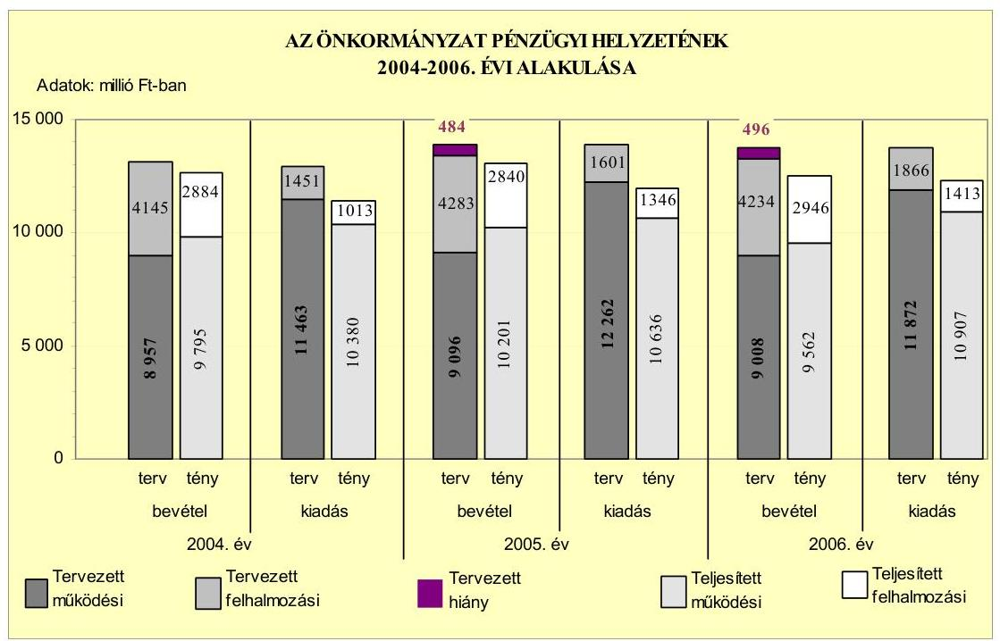
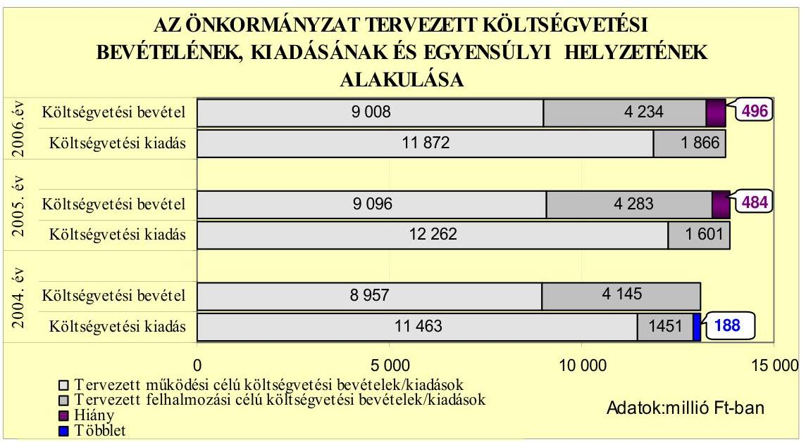
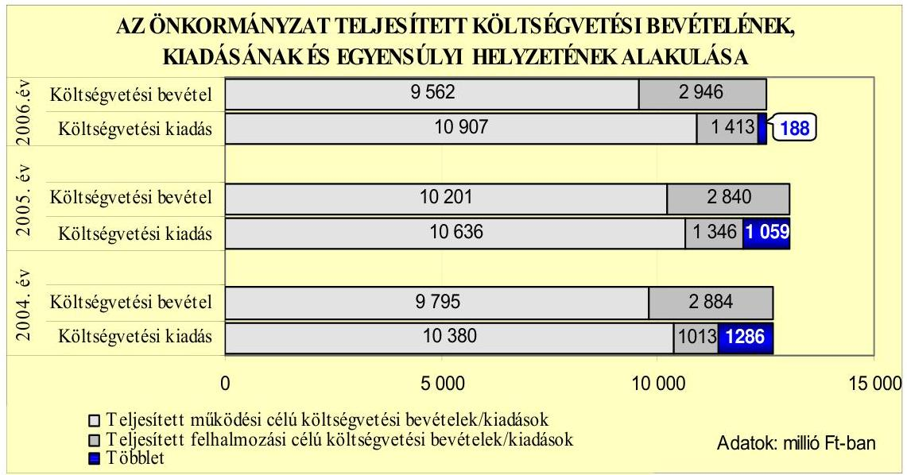
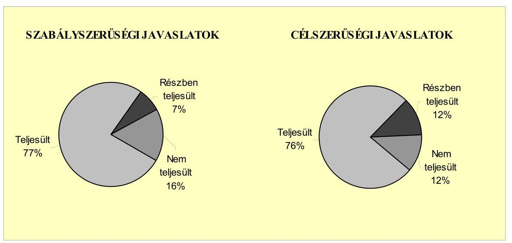
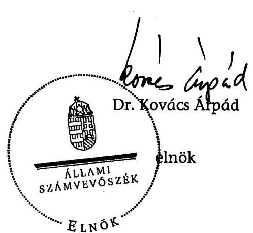
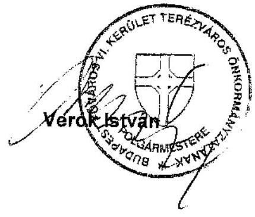

# ÁLLAMI   SZÁMVEVŐSZÉK 

## JELENTÉS

a Budapest Főváros VI. kerület Terézváros Önkormányzata gazdálkodási rendszerének 2007. évi átfogó ellenőrzéséről

---

# 3. Önkormányzati és Területi Ellenőrzési Igazgatóság 

3.3. Átfogó Ellenőrzések Főcsoport

Iktatószám: V-1001-9/32/17/2007.
Témaszám: 845
Vizsgálat-azonosító szám: V0330

## Az ellenőrzést felügyelte:

Dr. Lóránt Zoltán
főigazgató
Az ellenőrzés végrehajtásáért felelős:
Dr. Sepsey Tamás
főigazgató-helyettes
Az ellenőrzést vezette:
Molnár Gyula Mihály
igazgató-helyettes
Az ellenőrzést végezték:
Bauer Lajosné Fejszák Tamás
főtanácsadó
számvevő
Dr. Fónagy Diána Dr. Marosi Gyöngyi
számvevő
tanácsadó

## A témához kapcsolódó eddig készített számvevőszéki jelentések:

## címe

Jelentés Budapest Főváros VI. kerület Terézváros Önkormányzata gazdálkodásának átfogó ellenőrzéséről
Jelentés a helyi és a helyi kisebbségi önkormányzatok gazdálkodásának átfogó ellenőrzéséről
Jelentés a Magyar Köztársaság 2005. évi költségvetése végrehajtásának ellenőrzéséről
Függelék:

- a kötött felhasználású támogatások 2005. évi felhasználásának ellenőrzése
- a helyi önkormányzatokat a 2005. évben megillető normatív állami hozzájárulás igénylésének és elszámolásának ellenőrzése

---

# TARTALOMJEGYZÉK 

BEVEZETÉS ..... 9
I. ÖSSZEGZŐ MEGÁLLAPÍTÁSOK, KÖVETKEZTETÉSEK, JAVASLATOK ..... 13
II. RÉSZLETES MEGÁLLAPÍTÁSOK ..... 21

1. Az Önkormányzat költségvetési és pénzügyi helyzete ..... 21
1.1. A tervezett költségvetési bevételi és kiadási előirányzatok, valamint a költségvetési egyensúly alakulása ..... 23
1.2. A költségvetési bevételek és kiadások teljesítése, a pénzügyi egyensúlyi helyzet alakulása ..... 25
2. Az Önkormányzat felkészültsége az európai uniós források igénylésére és felhasználására, valamint az e-közigazgatási feladatok ellátására ..... 28
2.1. Az európai uniós források igénybevételére és a várható támogatás felhasználásának szervezettségére történt felkészülés és a belső szabályozottság értékelése ..... 28
2.1.1. A fejlesztési célkitűzések meghatározása ..... 28
2.1.2. Az európai uniós forrásokhoz kapcsolódóan a pályázat- figyelés, a pályázat-készítés, valamint az európai uniós támogatással megvalósuló fejlesztés lebonyolítása belső rendjének szabályozottsága, a végrehajtás személyi, szervezeti feltételei ..... 30
2.2. Az e-közigazgatási feladatok előkészítése, bevezetése ..... 32
3. A költségvetési gazdálkodás kontrolljai ..... 34
3.1. A szabályozottság kockázata a költségvetés tervezési, gazdálkodási, beszámolási és a folyamatba épített ellenőrzési feladatainál ..... 34
3.2. A belső kontrollok érvényesülése az önkormányzati források szabályszerű felhasználásában, a költségvetési tervezés, gazdálkodás, beszámolás folyamataiban ..... 35
3.3. A belső ellenőrzési kötelezettség teljesítése, javaslatainak hasznosulása ..... 38
4. Az ÁSZ korábbi ellenőrzési javaslatai alapján készített intézkedési terv végrehajtása, eredményessége ..... 41
4.1. Az Önkormányzat gazdálkodási rendszerének átfogó ellenőrzése során tett javaslatok végrehajtására tervezett intézkedések megvalósulása ..... 41
4.2. A zárszámadáshoz kapcsolódó (állami hozzájárulások, támogatások igénylésének és felhasználásának ellenőrzése), valamint a további vizsgálatok esetében a megállapítások, javaslatok alapján tett intézkedések ..... 45

---

# MELLÉKLETEK 

1. számú Az Önkormányzat gazdálkodását meghatározó adatok, mutatószámok (1 oldal)
2. számú Az önkormányzati vagyon alakulása (1 oldal)
3. számú Az Önkormányzat 2004-2006. évi költségvetési előirányzatainak és azok pénzügyi teljesítéseinek alakulása ( 1 oldal)
4. számú 1. számú Nyilatkozat a tervezett és teljesített költségvetési adatoknak a megelőző évhez viszonyított jelentős, $\pm 10 \%$-ot meghaladó változásának indokolásáról, amennyiben azt a feladatok változása indokolta (2 oldal)
5. számú 1. számú Tanúsítvány az európai uniós forrásokkal támogatott programok, célok tervezett és tényleges 2004-2007. évi adatairól (1 oldal)
6. számú Verók István úr, a Budapest Főváros VI. kerület Terézváros Önkormányzata polgármestere által adott észrevétel (1 oldal)

---

# RÖVIDÍTÉSEK JEGYZÉKE 

## Törvények

Áht.
Eisztv.

Htv.

Kbt.
Ket.

Ksztv.
Ltv.

Ötv.
Számv. tv.
Szoc. tv.

## Rendeletek

2004. évi költségvetési rendelet
2005. évi költségvetési rendelet
2005. évi zárszámadási rendelet
2006. évi költségvetési rendelet
2007. évi költségvetési rendelet

Ámr.
Ber.
SzMSz
az államháztartásról szóló 1992. évi XXXVIII. törvény
az elektronikus információszabadságról szóló 2005. évi XC. törvény
a helyi önkormányzatok és szerveik, a köztársasági megbízottak, valamint egyes centrális alárendeltségű szervek feladat- és hatásköreiről szóló 1991. évi XX. törvény
a közbeszerzésekről szóló 2003. évi CXXIX. törvény
a közigazgatási hatósági eljárás és szolgáltatás általános szabályairól szóló 2004. évi CXL. törvény
a közhasznú szervezetekről szóló 1997. évi CLVI. törvény
a lakások és helyiségek bérletére, valamint az elidegenítésükre vonatkozó egyes szabályokról szóló 1993. évi LXXVIII. Törvény
a helyi önkormányzatokról szóló 1990. évi LXV. Törvény
a számvitelről szóló 2000. évi C. törvény
A szociális igazgatásról és szociális ellátásokról szóló 1993. évi III. törvény

Budapest Főváros VI. kerület Terézváros Önkormányzatának 5/2004. (II. 16.) számú rendelete a 2004. évi költségvetésről
Budapest Főváros VI. kerület Terézváros Önkormányzatának 3/2005. (II. 21.) számú rendelete a 2005. évi költségvetésről
Budapest Főváros VI. kerület Terézváros Önkormányzatának 18/2006. (V. 2.) számú rendelete a 2005. évi zárszámadásról
Budapest Főváros VI. kerület Terézváros Önkormányzatának 8/2006. (II. 21.) számú rendelete a 2006. évi költségvetésről
Budapest Főváros VI. kerület Terézváros Önkormányzata 15/2007. (IV. 24.) számú rendelete a 2006. évi zárszámadásról
Budapest Főváros VI. kerület Terézváros Önkormányzatának 4/2007. (II. 23.) számú rendelete a 2007. évi költségvetésről
az államháztartás múködési rendjéről szóló 217/1998. (XII. 30.) Korm. rendelet
a költségvetési szervek belső ellenőrzéséről szóló 193/2003. (XI. 26.) számú Korm. rendelet

Budapest Főváros VI. kerület Terézváros Önkormányzatának 33/2002. (XI. 13.) számú rendelete az Önkormányzat Szervezeti és Múködési Szabályzatáról

---

vagyongazdálkodási rendelet

Vhr.

## Szavak, szókapcsolatok

ÁSZ
Belső ellenőrzési osztály
EACEA
e-közigazgatás
EU
FEUVE
gazdasági program

GVOP
HEFOP
Humánszolgáltatási
Főosztály
jegyző
jegyzői kabinet
Képviselő-testület
KIOP
Környezetvédelmi program

KSH
Kulturális és közművelődési koncepció

MÁK
MTRFH
NFT
Oktatási fejlesztési stratégia

Budapest Főváros VI. kerület Terézváros Önkormányzatának 25/2004. (V. 25) számú rendelete az Önkormányzat tulajdonában lévő vagyonnal való gazdálkodás és rendelkezés szabályairól
az államháztartás szervezetei beszámolási és könyvvezetési kötelezettségének sajátosságairól szóló 249/2000. (XII. 24.) számú Korm. rendelet

Állami Számvevőszék
Budapest Főváros VI. kerület Terézváros Önkormányzata Polgármesteri Hivatalának Belső Ellenőrzési Osztálya
Európai Oktatási, Audiovizuális és Kulturális Ügynökség elektronikus közigazgatás
Európai Unió
folyamatba épített, előzetes és utólagos vezetői ellenőrzés
Budapest Főváros VI. kerület Terézváros Önkormányzata Képviselő-testületének 243/2004. (IV. 17.) számú határozatával elfogadott Gazdasági Programja
NFT Gazdasági Versenyképesség Operatív Program
NFT Humánerőforrás-fejlesztési Operatív Program
Budapest Főváros VI. kerület Terézváros Önkormányzata Polgármesteri Hivatalának Humánszolgáltatási Főosztálya
Budapest Főváros VI. kerület Terézváros Önkormányzatának Jegyzője
Budapest Főváros VI. kerület Terézváros Önkormányzata Polgármesteri Hivatalának Jegyzői Kabinete
Budapest Főváros VI. kerület Terézváros Önkormányzatának Képviselő-testülete
NFT Környezetvédelmi és Infrastruktúrafejlesztés Operatív Program
Budapest Főváros VI. kerület Terézváros Önkormányzata Képviselő-testületének 126/2003. (III. 27.) számú határozatával elfogadott Környezetvédelmi Programja
Központi Statisztikai Hivatal
Budapest Főváros VI. kerület Terézváros Önkormányzata Képviselő-testületének 118/2004. (III. 25.) számú határozatával elfogadott Kulturális és Közművelődési Koncepciója
Magyar Államkincstár
Magyar Terület- és Regionális Fejlesztési Hivatal
Nemzeti Fejlesztési Terv
Budapest Főváros VI. kerület Terézváros Önkormányzata Képviselő-testületének 122/2004. (III. 22.) számú határozatával elfogadott Közoktatási Intézményhálózat Müködtetési és Fejlesztési Stratégiája

---

| Oktatáspolitikai kon- | Budapest Főváros VI. kerület Terézváros Önkormányzata |
| :-- | :-- |
| cepció | Képviselő-testületének 24/2004. (I. 22.) számú határoza- |
|  | tával elfogadott Oktatáspolitikai Koncepciója |
| Önkormányzat | Budapest Főváros VI. kerület Terézváros Önkormányzata |
| pályázati ügyintéző | Európai uniós pályázatokkal foglalkozó ügyintéző |
| PM | Pénzügyminisztérium |
| polgármester | Budapest Főváros VI. kerület Terézváros Önkormányzatá- |
|  | nak Polgármestere |
| Polgármesteri hivatal | Budapest Főváros VI. kerület Terézváros Önkormányzatá- |
|  | nak Polgármesteri Hivatala |
| Polgármesteri kabinet | Budapest Főváros VI. kerület Terézváros Önkormányzata |
|  | Polgármesteri Hivatalának Polgármesteri Kabinete |
| Polgármesteri hivatal | A Polgármesteri hivatalnak a Budapest Főváros VI. kerület |
| SzMSz-e | Terézváros Önkormányzata Képviselő-testületének |
|  | 335/2005. (X. 20.) számú határozatával elfogadott Szervezeti és Múködési Szabályzata |
| Szociális szolgáltatástor- | Budapest Főváros VI. kerület Terézváros Önkormányzata |
| vezési koncepció | Képviselő-testületének 179/2006. (VI. 16.) számú határoza- |
|  | tával elfogadott Szociális Szolgáltatástervezési Koncepciója |
| Településfejlesztési kon- | Budapest Főváros VI. kerület Terézváros Önkormányzata |
| cepció | Képviselő-testületének 230/2005. (VI. 16.) számú határoza- |
|  | tával elfogadott Településfejlesztési Koncepciója |

---

.

---

# ÉRTELMEZŐ SZÓTÁR 

1. elektronikus szolgáltatási szint
2. elektronikus szolgáltatási szint
3. elektronikus szolgáltatási szint
4. elektronikus szolgáltatási szint
európai uniós források
fejlesztési feladat (projekt)
fejlesztési célkitúzés

GVOP-4.3 intézkedés

HEFOP-2.2 intézkedés

Az 1044/2005. (V. 11.) Korm. határozat alapján olyan információs, tájékoztató szolgáltatás, amely csak általános információkat közöl az adott üggyel kapcsolatos teendőkről és a szükséges dokumentumokról.
Az 1044/2005. (V. 11.) Korm. határozat alapján olyan egyirányú kapcsolatot biztosító szolgáltatás, amely az 1. szinten túl biztosítja az adott ügy intézéséhez szükséges dokumentumok, nyomtatványok letöltését, és azok ellenőrzéssel, vagy ellenőrzés nélküli elektronikus kitöltését, amely esetben a dokumentumok benyújtása hagyományos úton történik.
Az 1044/2005. (V. 11.) Korm. határozat alapján olyan kétirányú kapcsolatot biztosító szolgáltatás, amely közvetlen, vagy ellenőrzött kitöltésű dokumentum segítségével biztosítja az elektronikus adatbevitelt és a bevitt adatok ellenőrzését. Az ügy indításához, intézéséhez személyes megjelenés nem szükséges, de az ügyhöz kapcsolódó közigazgatási döntés (határozat, egyéb aktus) közlése, valamint a kapcsolódó illeték-, vagy díffizetés hagyományos úton történik.
Az 1044/2005. (V. 11.) Korm. határozat alapján olyan teljes közvetlen kétirányú ügyintézési folyamatot biztosító szolgáltatás, amikor az ügyhöz kapcsolódó közigazgatási döntés is elektronikus úton kerül közlésre, illetve a kapcsolódó illeték-, vagy díffizetés elektronikus úton is intézhető.
Az elnyert európai uniós források lehívása a támogatott projekt megvalósítása érdekében, a fejlesztés lebonyolítása során felmerült kiadások finanszírozására.
A fejlesztési feladat (projekt) tartalmilag és formailag részletesen kidolgozott, megfelelő pénzügyi háttérrel és végrehajtási ütemezéssel rendelkező fejlesztési terv, amely illeszkedik az Európai Unió, illetve a Nemzeti Fejlesztési Terv által támogatott programokhoz.
Az önkormányzat által ellátott kötelező, vagy önként vállalt feladatok ellátásának mennyiségi, vagy minőségi fejlesztésére vonatkozó terv. A mennyiségi fejlesztés megvalósulhat beszerzéssel, létesítéssel, bővítéssel, átalakítással.
A GVOP keretében az információs társadalom- és gazdaság fejlesztése NFT prioritáshoz kapcsolódóan az eközigazgatás fejlesztésére megnyitott pályázati lehetőség.
A HEFOP keretében a társadalmi kirekesztés elleni küzdelem NFT prioritáshoz kapcsolódóan a társadalmi befogadás elősegítésére a szociális területen dolgozó szakemberek képzésével megnyitott pályázati lehetőség.

---

irányító hatóság

KIOP-1.7 intézkedés
kedvezményezett
lebonyolítás
operatív program

ROP-1.1 intézkedés

ROP-1.2 intézkedés

ROP-2.2 intézkedés

ROP-2.3 intézkedés

A strukturális alapok és a Kohéziós alap forrásainak szabályszerű, hatékony és eredményes felhasználásához szükséges intézményrendszer felső eleme. Az irányító hatóság általános és átfogó felelősséget visel a programok, projektek hatékony és szabályszerű végrehajtásáért. Felelősségi köréből eredően ellenőrzi a közösségi, valamint a hazai jogszabályok betartását, koordinálja az európai uniós források szétosztásának folyamatát, irányítja az intézményrendszer, a statisztikai és a pénzügyi nyilvántartási rendszer múködését.
A KIOP keretében a környezetvédelem NFT prioritáshoz kapcsolódóan az energiagazdálkodás környezetbarát fejlesztésére megnyitott pályázati lehetőség.
Az a helyi önkormányzat, amely a támogatási szerződést kedvezményezettként aláíra, a projektet, illetve a központi programhoz kapcsolódó támogatott önkormányzati programot végrehajtja.
Az európai uniós források felhasználásával megvalósuló fejlesztésre irányuló műszaki, gazdasági (pénzügyi) tevékenységet magában foglaló szervezési, irányítási szolgáltatás. A szervezési szolgáltatás kiterjedhet a pályázatkészítésre, a közbeszerzési eljárás lebonyolításán keresztül a folyamatos múszaki ellenőrzésre, a pénzügyi elszámolásra, a műszaki átadás-átvételre, az üzembe helyezésre, illetve a fejlesztési folyamat egyes elemeire.
Az Európai Bizottság által jóváhagyott, a Közösségi Támogatási Keret végrehajtására vonatkozó 2004-2006 közötti, több évre szóló intézkedésekhez kapcsolódó prioritások egységes rendszerét tartalmazó dokumentum. A strukturális alapok operatív programjai: Agrár és Vidékfejlesztési Operatív Program (AVOP); Gazdasági Versenyképesség Operatív Program (GVOP); Humánerőforrás-fejlesztési Operatív Program (HEFOP); Környezetvédelmi és Infrastruktúra-fejlesztési Operatív Program (KIOP); Regionális Fejlesztési Operatív Program (ROP).
A ROP keretében a turisztikai potenciál erősítése a régiókban NFT prioritáshoz kapcsolódóan a turisztikai vonzerők fejlesztésére megnyitott pályázati lehetőség.
A ROP keretében a turisztikai potenciál erősítése a régiókban NFT prioritáshoz kapcsolódóan a turisztikai fogadóképesség javítására megnyitott pályázati lehetőség.
A ROP keretében a térségi infrastruktúra és települési környezet fejlesztése NFT prioritáshoz kapcsolódóan a városi területek rehabilitációjára megnyitott pályázati lehetőség.
A ROP keretében a térségi infrastruktúra és települési környezet fejlesztése NFT prioritáshoz kapcsolódóan az óvodai és az alapfokú oktatási nevelési intézmények infrastrukturális fejlesztésére megnyitott pályázati lehetőség.

---

# JELENTÉS 

## Budapest Főváros VI. kerület Terézváros Önkormányzata gazdálkodási rendszerének 2007. évi átfogó ellenőrzéséről

## BEVEZETÉS

Az Ötv. 92. § (1) bekezdése, az Állami Számvevőszékről szóló 1989. évi XXXVIII. törvény 2. § (3) bekezdése, valamint az Áht. 120/A. § (1) bekezdése alapján az önkormányzatok gazdálkodását az Állami Számvevőszék ellenőrzi. Az ellenőrzésre az Országgyúlés illetékes bizottságai részére is átadott, országosan egységes ellenőrzési program szerint került sor.

Az Állami Számvevőszék a stratégiájában foglalt célkitűzéseknek megfelelően a helyi önkormányzatok költségvetési gazdálkodási rendszere átfogó ellenőrzésének programját a 2007. évtől megújította, azt kiegészítette további - teljesít-mény-ellenőrzési - elemekkel.

## Az ellenőrzés célja annak értékelése volt, hogy az Önkormányzat:

- a pénzügyi egyensúlyt a költségvetésében és annak teljesítése során milyen módon biztosította, a teljesített bevételek és kiadások egyes évek közötti jelentős eltérése feladatváltozáshoz kapcsolódott-e;
- felkészült-e a szabályozottság és a szervezettség terén az európai uniós források igénylésére és felhasználására, továbbá az e-közigazgatás bevezetése miatti szervezet-korszerúsítési feladatokra;
- kialakította-e a külső és a belső feltételeknek megfelelően a gazdálkodás belső kontrollrendszerét ${ }^{1}$, továbbá a költségvetés tervezési, végrehajtási és zárszámadási feladatok szabályszerű ellátásához hozzájárult-e a folyamatba épített, előzetes és utólagos vezetői ellenőrzés, valamint a belső ellenőrzés;
- megfelelően hasznosították-e a korábbi számvevőszéki ellenőrzések megállapításait, szabályszerűségi ${ }^{2}$ és célszerűségi javaslatait.

[^0]
[^0]:    ${ }^{1}$ A gazdálkodás szabályszerűségét biztosító kontrollrendszer alatt értjük a kiépített és múködő belső irányítási és szabályozási rendszert, valamint a belső ellenőrzési funkciók ellátásának rendszerét.
    ${ }^{2}$ A törvényi előírások betartásának elmulasztásakor a részletes megállapítások fejezetben egységesen a törvénysértés megjelölést alkalmazzuk, mivel az ÁSZ nem tehet különbséget a törvényi előírások között.

---

Az ellenőrzött időszak: az 1., a 2. és a 4. ellenőrzési programpontok tekintetében a 2004-2006. évek, a 3. ellenőrzési programpontnál a 2006. év, valamint a 2., a 3. és a 4. ellenőrzési programpontoknál a 2007. első negyedév.

A kerület lakosainak száma 2007. január 1-jén 39755 fő volt. A 2006. évi önkormányzati választást követően az Önkormányzat 24 tagú Képviselőtestületének munkáját öt állandó bizottság segítette. A helyi önkormányzat mellett a 2006. évi önkormányzati választásig $10^{3}$, a 2006. évi választást követően - a Lengyel Kisebbségi Önkormányzat megalakulásával, illetve a Bolgár és a Horvát Kisebbségi Önkormányzatok megszűnésével - kilenc kisebbségi önkormányzat múködött. A polgármester a 2002. évi önkormányzati választás óta tölti be tisztségét, a jegyző személye a 2004. évben változott.

Az Önkormányzat feladatainak végrehajtása érdekében a Polgármesteri hivatal mellett a 2006. évben 22 költségvetési szervet múködtetett, amelyekből 14 önállóan gazdálkodott. A kulturális és a sportfeladatok ellátásában két közalapítvány, a közbiztonság védelmében egy közalapítvány és egy korlátolt felelősségű társaság vett részt, a kerület jobb köztisztasága érdekében egy közhasznú társaság is közremúködött, továbbá az önkormányzati vagyon egy részének - lakások és nem lakás céljára szolgáló helyiségek - kezelését 100\%-os önkormányzati tulajdonú gazdasági társaság végezte. Az Önkormányzat költségvetési szerveinél a 2006. december 31-én foglalkoztatott közalkalmazottak száma 1173 fő, a köztisztviselők száma 232 fő volt. Az Önkormányzat a 2006. évi költségvetési beszámolója szerint 12508 millió Ft költségvetési bevételt ért el és 12320 millió Ft költségvetési kiadást teljesített, a 2006. december 31-én a könyvviteli mérleg szerint 24708 millió Ft értékű vagyonnal rendelkezett. A 2007. évi költségvetési rendeletben 15597 millió Ft költségvetési bevételt és 15527 millió Ft költségvetési kiadást irányoztak elő. Az Önkormányzat gazdálkodását meghatározó adatokat, mutatószámokat az 1-3. számú mellékletek tartalmazzák.

Az Önkormányzat költségvetési és pénzügyi helyzetét az összehasonlító elemzés módszerével vizsgáltuk. E körben elemeztük a költségvetés egyensúlyi helyzetének alakulását, a tervezett és tényleges költségvetési hiány okait, a mérséklésére tett intézkedéseket, finanszírozásának módját, az Önkormányzat adósságállományának alakulását, összetevőit.

A teljesítmény-ellenőrzés módszerével vizsgáltuk, hogy a belső szabályozottság, szervezettség terén felkészültek-e az európai uniós források figyelésére, igénylésére és felhasználására, valamint az igényelt európai uniós támogatások az Önkormányzat által meghatározott fejlesztési célkitűzésekhez kapcsolódtak-e. Az ellenőrzés során felmértük, hogy az e-közigazgatási feladat ellátása, illetve bevezetése, múködtetése érdekében milyen intézkedéseket tettek, valamint biz-tosították-e a közérdekú adatok elektronikus közzétételét.

A költségvetési gazdálkodás belső kontrolljainak ellenőrzése során értékeltük, hogy a Polgármesteri hivatalnál a költségvetés tervezési, gazdálkodási, zárszámadás készítési feladatok belső kontrolljainak kiépítettsége és múködése

[^0]
[^0]:    ${ }^{3}$ Bolgár, cigány, görög, horvát, német, örmény, román, ruszin, szerb, szlovák.

---

megfelelő biztosítékot ad-e a gazdálkodási feladatok megfelelő, szabályszerű ellátására. Felmértük és minősítettük a költségvetés tervezési, a gazdálkodási, a zárszámadás készítési feladatokkal, továbbá a pénzügyi - számviteli területen az informatikával kapcsolatosan kialakított kontrollok megfelelőségét, valamint azok múködésének eredményességét, megbízhatóságát. Értékeltük a belső ellenőrzés szervezeti és szabályozási keretét, továbbá működését.

A Polgármesteri hivatalnál értékeltük a gazdálkodás folyamatában a kontrollok múködésének megbízhatóságát, ennek keretében ellenőriztük a szakmai teljesítés igazolására és az utalvány ellenjegyzésére kialakított kontrollok végrehajtását. Az ellenőrzést a következő, kiemelt kockázatuk alapján kiválasztott ${ }^{4}$ az általánostól jellemzően eltérő, egyedi eljárást igénylő gazdasági eseményekkel kapcsolatos kifizetésekre folytattuk le ${ }^{5}$ :

- a személyi juttatások közül az állományba nem tartozók megbízási díjai ${ }^{6}$,
- a külső szolgáltató által végzett karbantartási, kisjavítási szolgáltatások, valamint
- a gépek, berendezések, felszerelések beszerzése.

Az ellenőrzés hatékony elvégzése céljából a vizsgálandó területek kiválasztása során a kockázatokon alapuló megközelítés érvényesült, ezáltal az ellenőrzési erőforrásokat azokra a területekre fókuszáltuk, amelyeken legnagyobb a hibák előfordulási valószínűsége. Az ellenőrzési erőforrások ilyen típusú összpontosításával minimálisra csökkenthető a kívánt ellenőrzési bizonyosság eléréséhez szükséges időráfordítás.

A pénzügyi-számviteli folyamatokban alkalmazott belső kontrollok létezésének és múködésének ellenőrzésére a vizsgált három terület 2006. évi könyvviteli tételeiből területenként egyszerű véletlen mintát vettünk. A kijelölt gazdasági eseményre elvégzett megfelelőségi tesztek alapján értékeltük a kontrollok múködésének eredményességét, megbízhatóságát a vizsgált három területre külön-

[^0]
[^0]:    ${ }^{4}$ Az önkormányzatok kiemelt előirányzataira vonatkozóan, a vertikális folyamatokra elvégeztük a kockázatok becslését, amelynek eredményeként az állományba nem tartozók megbízási díjai, a külső szolgáltató által végzett karbantartási, kisjavítási szolgáltatások, valamint a gépek, berendezések, felszerelések beszerzése kiemelkedően kockázatos területnek bizonyultak.
    ${ }^{5}$ A korábbi ellenőrzési tapasztalataink szerint ezeken a területeken a jegyzők nem, vagy hiányosan szabályozták a megbízás, megrendelés, illetve beszerzés indokoltságának, szükségességének elbírálására, igazolására, valamint a teljesítések dokumentálására, a kifizetések jogosságának megítélésére szolgáló kontrollokat. További kockázatot jelentett a külső szolgáltató által végzett karbantartási, kisjavítási munkák esetében, hogy az 50 ezer Ft alatti megrendelésekre vonatkozóan az ellenőrzési tapasztalataink szerint a jegyzők nem alakították ki a kötelezettségvállalások rendjét és nyilvántartási formáját, valamint a szabályozás elmulasztása esetén nem történt meg az írásbeli kötelezettségvállalás és annak az ellenjegyzése sem.
    ${ }^{6}$ Az állományba tartozók rendszeres személyi juttatásainak számfejtését, valamint folyósítását nem a polgármesteri hivatalok, hanem a nettó finanszírozás keretében a beküldött dokumentumok alapján a MÁK végzi.

---

külön, majd összefoglalóan ${ }^{7}$ a Polgármesteri hivatal egyedi eljárást igénylő gazdasági eseményeire. A helyszíni ellenőrzés megállapításainak részletes dokumentálását három megfelelőségi tesztlapon, öt elővizsgálati és kilenc helyszíni ellenőrzési munkalapon biztosítottuk. Ezeken a teszt- és munkalapokon a minősítés alapjául szolgáló kérdések és a vonatkozó konkrét jogszabályhelyek megjelölése mellett értékeltük a kialakított belső kontrollokban rejlő kockázatokat ${ }^{8}$ és a kialakított kontrollok múködésének megbízhatóságát ${ }^{9}$.

Az ÁSZ korábbi ellenőrzési javaslatai alapján tett intézkedéseket, illetve azok megvalósítását utóellenőrzés keretében vizsgáltuk. A gazdálkodási rendszer átfogó ellenőrzése során megfogalmazott javaslatok végrehajtására tett intézkedések megvalósítását ellenőrizzük, az egyéb számvevőszéki ellenőrzések során tett javaslatok esetében pedig a kiadott intézkedéseket tekintjük át.

A jelentés megállapításainak, javaslatainak egyeztetése során a polgármester arról adott tájékoztatást, hogy az időközben megtett intézkedésekkel a javaslatok egy részét megvalósították. Ezekben az esetekben a jelentés II. Részletes megállapítások fejezetében az adott témához kapcsolt lábjegyzetben a megtett intézkedést feltüntettük és a kapcsolódó javaslatot elhagytuk.

A jelentést az ÁSZ-ról szóló 1989. évi XXXVIII. tv. 25. § (1) bekezdése alapján észrevétel közlése céljából megküldtük a Budapest Főváros VI. kerület Terézváros Önkormányzata polgármesterének. A kapott észrevételt a jelentés 6 . számú melléklete tartalmazza.
${ }^{7}$ A vizsgált három terület egyedi értékelési pontszámait a területek relatív költségvetési súlyával arányosan összegeztük.
${ }^{8}$ A kialakított belső kontrollokban rejlő kockázatot alacsonynak minősítettük, ha a kontrollok - végrehajtásuk esetén - megfelelő védelmet nyújtanak a hibák bekövetkezése ellen. Közepesnek minősítettük a belső kontrollokban rejlő kockázatot, amennyiben a kontrollok - végrehajtásuk esetén - a lehetséges hibák többsége ellen védelmet nyújtanak. Magasnak értékeltük a kockázatot, ha a kontrollok - kialakításuk hiányában, vagy hiányos kialakításuk miatt - nem nyújtanak elegendő védelmet a lehetséges hibákkal szemben.
${ }^{9}$ A kontrollok múködésének eredményességét, megbízhatóságát kiválónak értékeltük abban az esetben, ha azok múködése - esetleges apróbb hiányosságoktól eltekintve megfelelt a hibák megelőzésére és kijavítására meghatározott szabályozásnak és a legmagasabb szintű elvárásoknak. Jónak minősítettük a kontrollok múködését, ha a hiányosságok száma ugyan jelentős volt, de nem veszélyeztette az ellenőrzött terület hibáinak megelőzését és kijavítását. Amennyiben a hiányosságok mértéke nem biztosította a hibák megelőzését, feltárását, kijavítását és ezáltal veszélyeztette az eredményes, megbízható múködést, a kontroll múködésének megbízhatósága gyenge minősítést kapott.

---

# I. ÖSSZEGZŐ MEGÁLLAPÍTÁSOK, KÖVETKEZTETÉSEK, JAVASLATOK 

Az Önkormányzatnál a 2004. évben a tervezett költségvetési bevételek és kiadások egyensúlya biztosított volt, azonban a 2005. és a 2006. évben a tervezett költségvetési bevételeket meghaladták a tervezett költségvetési kiadások. A tervezett költségvetési kiadásokhoz 484-496 millió Ft forrás hiányzott, melynek az éves költségvetési kiadáshoz viszonyított aránya mindkét évben megközelítette a $4 \%$-ot. A költségvetési forráshiányt a múködési célú költségvetési kiadásoknál tervezték, melyre csak részben nyújtott fedezetet a tervezett felhalmozási célú költségvetési bevételek többlete. A költségvetési egyensúlyt a költségvetési rendeletekben a 2005. és a 2006. években rövid lejáratú hitel felvételével biztosították. A 2007. évi költségvetési rendelet szerint a tervezett költségvetési bevételek fedezetet nyújtanak a tervezett költségvetési kiadásokhoz.

A 2004-2006. években a teljesített költségvetési bevételek alapján nem volt forráshiány, azonban a múködési célú költségvetési kiadásokat nem fedezték a múködési célú költségvetési bevételek. A múködési célú költségvetési kiadásoknál a 2004. évben $6 \%$, a 2005. évben $4 \%$, a 2006. évben $12 \%$-nak megfelelő forrás hiányzott, melyre fedezetet nyújtott a felhalmozási célú költségvetési bevételek többlete. Az önkormányzati ingatlanok, lakások és egyéb helyiségek értékesítéséből elért felhalmozási célú költségvetési bevételek múködési célra történt felhasználása vagyonfeléléshez, a könyvviteli mérleg szerinti vagyon csökkenéséhez vezetett. A gazdálkodáshoz a 2004. és a 2006. évben folyószámlahitelt vettek igénybe, melyek visszafizetése az adott éven belül megtörtént. A költségvetés végrehajtása során a gazdálkodáshoz forrásként bevonták az önkormányzati bérlakások értékesítéséből a Fővárosi Önkormányzat részére az Ltvben előírtak ellenére át nem utalt 124 millió Ft bevételt.

A teljesített felhalmozási célú költségvetési kiadások az előző évhez viszonyítva a 2005. évben 33\%-kal, a 2006. évben 5\%-kal növekedtek. Az Önkormányzatnál a 2005. évben közintézmények, ingatlanok, utcák, járdák, közterek felújítására az előző évinél egyharmaddal kevesebbet, a 2006. évben közel háromszor többet fordítottak. Ingatlanvásárlásra az előző évinél a 2005. évben $224 \%$-kal több, a 2006. évben $85 \%$-kal kevesebb kiadást teljesítettek. Gépek, berendezések, egyéb tárgyi eszközök beruházására az előző évhez viszonyítva a 2005. évben $23 \%$-kal alacsonyabb, a 2006. évben $16 \%$-kal magasabb felhalmozási célú költségvetési kiadást fordítottak. A 2005-2006. évben 88\%-kal, illetve $14 \%$-kal több kiadást teljesítettek felhalmozási célú pénzeszközátadásként, mely kiadások célja a társasházi pályázatokhoz nyújtott támogatások útján elősegíteni a kerületben lévő társasházak megújítását, korszerűsítését.

A 2004-2006. évek költségvetési rendeleteiben tervezett költségvetési bevételek és kiadások egyik évben sem teljesültek, a költségvetési bevételek 3-5-2\%-kal, a költségvetési kiadások 12-14-10\%-kal maradtak el a tervezettől. Az eredeti előirányzatnál alacsonyabb teljesítés annak ellenére következett be, hogy az előző

---

évi pénzmaradvány összegével év közben növelték a költségvetési bevételek és kiadások előirányzatait. A tervezett költségvetési bevételek alulteljesítését az okozta, hogy a felhalmozási célú költségvetési bevételek mindhárom évben közel egyharmaddal alulteljesültek az értékesítések hiányos előkészítése, az értékesítési folyamatok elhúzódása, esetenként a sikertelen pályáztatás miatt. A múködési célú költségvetési kiadásokon belül a 2004-2006. években a személyi juttatások, a munkaadói járulékok előirányzatánál 8-8-2\%-kal, valamint a dologi és egyéb folyó kiadások előirányzatánál 10-16-5\%-kal alacsonyabb összegű kiadást teljesítettek, továbbá a tervezett általános tartalék és múködési célú céltartalékok 37-42-93\%-át nem használták fel a tervezett múködési célú feladatok teljesítéséhez.

Az Önkormányzat a valós szükségleteken alapuló célkitűzéseit a 2004-2006. évekre, illetve az egészségügyi ellátás esetében a 2004-2008. évekre gazdasági programban és ágazati szakmai fejlesztési koncepciókban meghatározta. Ezekben a kötelezően ellátandó feladatokhoz kapcsolódó fejlesztési célokat határozott meg a Képviselő-testület a szociális ellátások, a gyermekjóléti feladatok, az egészségügyi ellátás, a közművelődés, a településrendezés és környezetvédelem, valamint az oktatás területén. A lehetséges pénzügyi forrásokat fejlesztési feladatokhoz rendelve nem vették számba. Az európai uniós forrás elnyeréséhez kötött fejlesztési célkitűzéseket a koncepciók nem tartalmaztak. A kitűzött fejlesztési célok valós szükségleteken, állapotfelméréseken alapultak, a társadalmi és civil igényeket a koncepciók véleményeztetésén keresztül felmérték. A polgármester az Ötv-ben foglalt határidő lejártáig nem terjesztette a Képviselő-testület elé a 2007-2010. évekre szóló gazdasági programot. Az NFTben megjelenő pályázati lehetőségekre figyelemmel a fejlesztési célkitűzéseket nem módosították. A Képviselő-testület európai uniós forrással összefüggő fejlesztési feladatról nem döntött. A polgármester az Önkormányzat képviseletében a 2005. évben a Világörökség Konferencia megrendezése céljából pályázatot nyújtott be az Európai Unió Testvérvárosi Programjának keretében.

Az európai uniós források igénybevételének és felhasználásának önkormányzati szintű feladatait a polgármester nem szabályozta. A Polgármesteri hivatal SzMSz-ében és egyéb szabályzatában a jegyző nem rendelkezett az európai uniós forrásokra vonatkozóan a pályázatfigyelés, pályázatkészítés, továbbá a felhasználás lebonyolításának rendjéről és feladatairól, a pályázatkészítés és a felhasználás felelőséről, valamint ezekhez kapcsolódóan az ellenőrzés rendjéről. A pályázatfigyelés személyi és szervezeti feltételeiről köztisztviselő alkalmazásával, valamint gazdasági társaság megbízásával gondoskodtak. Az Önkormányzat a megbízott gazdasági társaságnak folyamatos pályázatfigyelésre és a pályázatkészítési időszakban heti gyakoriságú konzultációra adott megbízást, a kapcsolattartás és az információ átadás szabályait a felek ezen túlmenően nem szabályozták. A pályázatok elkészítésének személyi, szervezeti feltételeit nem teljes körűen biztosították. A feladatellátásban érintett köztisztviselő munkaköri leírása kizárólag pályázat előkészítési és koordinálási feladatokat tartalmazott, a pályázatok elkészítését azonban nem. A megbízott gazdasági társasággal kötött szerződés a pályázatírásnak csak egyes részfeladatairól rendelkezett, a 2007. évtől a gazdasági társaság megbízása kizárólag az operatív programokat nem érintő témakörökre terjedt ki. Az Önkormányzat az NFT keretében a strukturális alapok pénzeszközeinek terhére meghirdetett, valamint a Kohéziós Alap keretstratégiájában megfogalmazott célrendszerrel összefüggő

---

európai uniós pályázatot nem készített elő és nem adott be. Az Önkormányzat pályázatot nyújtott be az EACEA-hoz a testvérvárosi program keretében, négy másik, világörökséget ápoló európai város képviselőinek részvételével tartandó konferencia megrendezésének a támogatására. A pályázaton az Önkormányzat a 15800 euró összköltség 50\%-át támogatásként elnyerte. A 2006. évi költségvetési beszámolóban a befolyt támogatást nem átvett pénzeszközként szerepeltették, azt egyéb saját bevételként könyvelték a Vhr-ben foglaltak ellenére. Az Önkormányzat felkészülése az európai uniós támogatások igénybevételére nem volt eredményes, mert a belső szabályozás nem tartalmazta a pályázatfigyelési, pályázatkészítési, a fejlesztés lebonyolítási feladatokat, továbbá nem gondoskodtak a pályázatok elkészítésének megszervezéséről.

A Polgármesteri hivatalban a 2006. évben e-közigazgatási feladatokat ellátó informatikai rendszert múködtettek, amellyel a 3. elektronikus szolgáltatási szinten biztosították az állampolgárok részére a személyi okmányokkal, a lakcímváltozásokkal, valamint a gépjármú regisztrációval kapcsolatos ügykörökben az ügyintézést, továbbá az üzleti szférát érintően az egyéni vállalkozói engedélyezésekkel kapcsolatos ügyeik intézését. A hatósági igazolásokkal, a szociális támogatásokkal, a helyi adózással, a lakásgazdálkodási feladatokkal kapcsolatos ügyek intézését a 2. elektronikus szolgáltatási szinten biztosították. Az informatikai stratégiát nem határozták meg. A Képviselő-testület által megadott 2007. évi határidőre az informatikai stratégia-tervezete nem készült el, és helyzetelemzést sem készítettek. Az e-közigazgatási feladatok ellátásának a személyi feltételeit biztosították.

Az Önkormányzat vagyongazdálkodással összefüggő közzétételi kötelezettségének eleget tett, a zárszámadási rendelet előterjesztéseként az éves költségvetési beszámoló szöveges indoklását is közzé tette. A nem normatív, céljellegú múködési és fejlesztési támogatásokkal kapcsolatosan közzétett adatok tartalma nem felelt meg az Áht-ban foglalt előírásoknak, mivel nem tették nyilvánossá a fejlesztési támogatásoknál a támogatottak felsorolása mellett a támogatottaknak nyújtott összegeket, valamint a 2007. évi költségvetési rendeletben nevesített múködési célból támogatottakra vonatkozóan a támogatás céljára, a támogatási program megvalósításának helyére vonatkozó adatokat.

A Polgármesteri hivatalnál a költségvetés tervezési és a zárszámadás készítési folyamatok szabályozottságának hiányosságai a 2006. évben összességében alacsony kockázatot jelentettek, mivel a Polgármesteri hivatal SzMSzében, a gazdasági szervezet ügyrendjében, a FEUVE szabályzatban a vonatkozó jogszabályok előírásainak és a helyi sajátosságoknak megfelelően rögzítették a költségvetés tervezés és a zárszámadás folyamatában szükséges ellenőrzési feladatokat. Annak ellenére összességében alacsony volt a kockázat, hogy a pénzügyi irányítás és ellenőrzési rendszer létrehozása keretében a jegyző nem határozta meg költségvetés tervezési folyamatában a saját bevételek előirányzatai és a költségvetés megalapozását szolgáló helyi rendeletek összhangját biztosító ellenőrzési kötelezettséget és annak felelősét, illetve a zárszámadás készítési feladatok szabályozottsága területén az intézményi pénzmaradványok szabályszerű kimunkálása ellenőrzésének az előírása hiányzott. A költségvetés tervezés és a zárszámadás készítés folyamatában a múködésbeli hibák megelőzésére, feltárására, kijavítására kialakított kontrollok múködésének megbízható-

---

sága összességében kiváló volt, mivel a vonatkozó jogszabályokban és a belső szabályozásban előírt ellenőrzési, egyeztetési feladatokat elvégezték.

A Polgármesteri hivatalban a gazdálkodási, a pénzügyi-számviteli és a folyamatba épített ellenőrzési feladatok szabályozottsága a feladatok szabályszerű végrehajtásában összességében alacsony kockázatot jelentett, mivel rendelkeztek a feladatok végrehajtásához előírt szabályzatokkal. Annak ellenére összességében alacsony a kockázat, hogy nem készítettek önköltségszámítási szabályzatot, az ellenőrzési nyomvonal nem tartalmazta részletesen az elvégzendő tevékenységeket, feladatokat, a végrehajtásukért felelős személyeket, a szükséges ellenőrzési pontokat, az ellenőrzés elvégzését igazoló dokumentumok pontos azonosítását, a fellelhetőségükre való konkrét utalást. A Polgármesteri hivatal kockázatkezelési eljárásrendje nem tartalmazta a kockázatok azonosítását, értékelését, kategóriákba sorolását, nyilvántartását, az elfogadható kockázati szint meghatározását.

A Polgármesteri hivatalnál az állományba nem tartozók megbízási díjaival, a karbantartási, kisjavítási szolgáltatásokkal, továbbá a gépek, berendezések, felszerelések beszerzésével kapcsolatos kifizetések során a belső kontrollok öszszességében a 2006. évben megbízhatóan múködtek. A múködésbeli hibák megelőzésére, feltárására, kijavítására kialakított kontrollok múködésének megbízhatósága összességében kiváló, mivel a szakmai teljesítésigazolás és az utalvány ellenjegyzés megfelelő biztosítékot adott a gazdálkodási, ellenőrzési feladatok megfelelő, szabályszerű ellátására. Annak ellenére összességében kiváló volt a kontrollok múködésének megbízhatósága, hogy előfordultak eseti hibák: állományba nem tartozók megbízási díjai kifizetésénél a szakmai teljesítésigazoló, külső szolgáltató által végzett karbantartási, kisjavítási munkák kifizetéseit megelőzően a szakmai teljesítésigazoló és az utalvány ellenjegyzője nem végezte el az Ámr-ben foglalt ellenőrzési feladatait.

A Polgármesteri hivatalban az informatikai rendszer szabályozottsága a 2006. évben összességében alacsony kockázatot jelentett az informatikai feladatok biztonságos végrehajtásában, mivel a Polgármesteri hivatal rendelkezett a megbízható múködés feltételeit megteremtő szabályzatokkal. Annak ellenére összességében alacsony a kockázat, hogy informatikai stratégiával nem rendelkeztek. Az informatikai rendszerek múködtetésénél a múködésbeli hibák megelőzésére, feltárására, kijavítására kialakított kontrollok múködésének megbízhatósága összességében kiváló volt, mivel az informatikai rendszer hatékonyan segítette a munkafolyamatba épített ellenőrzést. Annak ellenére öszszességében kiváló volt a kontrollok múködésének megbízhatósága, hogy nem automatikus a számítógépen vezetett analitikus nyilvántartások és a főkönyvi könyvelés kapcsolata, és az informatikai rendszer múködésénél nem dokumentáltak az adatkapcsolatok.

A belső ellenőrzés szervezeti kereteinek kialakítása és szabályozása a belső ellenőrzés végrehajtásában összességében alacsony kockázatot jelentett, mivel a belső ellenőrzési kötelezettséget, az ellenőrzést végző szervezeti egység jogállását, feladatait a Polgármesteri hivatal SzMSz-ében teljes körűen előírták, a belső ellenőr iskolai végzettsége és szakképesítése megfelelt a követelményeknek és a belső ellenőrzési kézikönyv tartalmazta a Ber-ben foglalt előírásokat. Annak ellenére összességében alacsony volt a kockázat, hogy

---

az ellenőrzési tervek nem kockázatelemzések alapján felállított prioritásokon alapultak, nem határoztak meg ellenőri kapacitást a soron kívüli ellenőrzésekre, a 2006. évi ellenőrzési terv a vizsgálatok vonatkozásában nem tartalmazott ütemezést. Az ellenőrzésekhez készített programok nem tartalmazták az ellenőrzés módszerének meghatározását, időtartamát, a jelentések elkészítésének határidejét. A Polgármesteri hivatalban a funkcionálisan független Belső ellenőrzési osztály keretei között biztosították az ellenőrzési feladatok ellátását, amelyre vonatkozóan kettő státusz állt rendelkezésre, de csak egy volt betöltve.

A 2006. évben a belső ellenőrzés működésénél a kialakított kontrollok megbízhatósága gyenge volt, mivel az ellenőrzési tervben foglalt ellenőrzéseket csak részben hajtották végre, a rendelkezésre álló ellenőri kapacitás nem volt elégséges a tervezett belső ellenőri feladatok ellátására. A belső ellenőr az Önkormányzat többségi irányítást biztosító befolyása alatt működő gazdasági társaságoknál, továbbá a közbeszerzések és a közbeszerzési eljárások vonatkozásában nem végzett ellenőrzéseket. A jegyző az éves ellenőrzési munkatervek alapján gondoskodott a költségvetési szervek ellenőrzésének végrehajtásáról. Az éves ellenőrzési tervek elfogadására az Ötv-ben foglalt határidő elmulasztásával került sor. A 2006. évre tervezett 20 ellenőrzésből 18 valósult meg. A 2007. év első negyedévére tervezett négy vizsgálat nem valósult meg, ebben az időszakban négy soron kívüli vizsgálatot folytatott le a belső ellenőr. A tervtől való elmaradások oka - a korábbi ÁSZ javaslat ellenére - a továbbra is kapacitás felmérés hiányában történő tervezés, valamint a soron kívüli vizsgálatok lehetőségének figyelmen kívül hagyása volt, továbbá az ellenőrzési tervek végrehajtása azok késedelmes jóváhagyása miatt az év elején nem kezdődött meg. Az elvégzett ellenőrzéseket minden esetben ellenőrzési program alapján hajtotta végre a belső ellenőr. A belső ellenőrzés összesen 18 javaslatot tett, amelynek több mint egynegyede a szabályozottságra, közel háromnegyede a szabályszerű működésre irányult. Intézkedési terv kettő esetben készült, a javaslatok 57\%át realizálták. A jegyző a 2006. évi költségvetési beszámoló keretében az Áht. szabályozásának megfelelően tájékoztatást adott a FEUVE, valamint a belső ellenőrzés működtetéséről. A polgármester a 2006. évi zárszámadási rendelettel egyidejűleg az Ötv. előírásának megfelelően a Képviselő-testület elé terjesztette az éves összefoglaló jelentést, amelyet az elfogadott.

Az ÁSZ a 2004-2006. években végzett ellenőrzései során tett javaslatai öszszességében 77\%-ban hasznosultak. Az ÁSZ az Önkormányzat gazdálkodását átfogó jelleggel a 2004. évben ellenőrizte. A Képviselő-testület a határozatával tudomásul vette a jelentésben foglaltakat, és az ellenőrzés javaslatainak realizálása érdekében a polgármester és a jegyző intézkedési tervet hagyott jóvá a felelősök és a határidők megjelölésével. A szabályszerűségi és célszerűségi javaslatok 76\%-ban hasznosultak, 11\%-ban részben hasznosultak. Az átfogó ellenőrzés javaslatai eredményeként javult a gazdálkodás pénzügyi, gazdasági, számviteli tevékenység szabályozottsága és a belső kontrollrendszer múködése. A vagyongazdálkodást érintően az Önkormányzat módosította vagyongazdálkodási rendeletét, amelynek során megszüntették az Áht-ban foglalt előírást sértő, a verseny szabályai alól felmentést adó helyi szabályozást és a rendelkezés hatályon kívül helyezését követően a Képviselő-testület nem hozott olyan határozatot, amely szerint a vagyongazdálkodási rendeletben meghatározott versenyeztetési eljárási szabályok alkalmazásától el lehetett tekinteni. Nem hasznosult a javaslatok 13\%-a. A jegyző nem gondoskodott a költségvetési in-

---

tézményekre vonatkozó egységes számviteli rend kialakításáról. Az utalványozásra és ezek ellenjegyzésére felhatalmazottak beszámoltatásának szabályozása és ennek végrehajtása elmaradt. A nem termékértékesítésből és szolgáltatásnyújtásból származó bevételeknél az érvényesítés nem a szakmai teljesítés igazolásán alapult, valamint az utalvány ellenjegyzője nem tett eleget ellenőrzési feladatának. A kisebbségi önkormányzati gazdálkodással kapcsolatos sajátos feladatok szabályozását a Polgármesteri hivatal számviteli politikája és számlarendje nem tartalmazta. A helyi kisebbségi önkormányzatokkal megkötött együttmúködési megállapodásokat nem egészítették ki a kisebbségi önkormányzatok költségvetési határozatainak az Önkormányzat részére történő átadási határidejével. A polgármester az Ötv. előirása ellenére alapítványok támogatásáról döntött, valamint nem gondoskodott a pártok részére biztosított helyiségek használati dijának módosításáról.

A zárszámadáshoz kapcsolódó 2006. évben végzett ÁSZ vizsgálat javaslatainak hasznosítása érdekében intézkedési tervet készítettek. A szabályszerűségi javaslatok közül a pedagógus szakvizsga és továbbképzés, valamint a szociális továbbképzés támogatás igénylését megalapozó beiskolázási tervre vonatkozó javaslatokat nem realizálta a jegyző. Az ÁSZ által tett többi szabályszerűségi javaslatot a jegyző hasznosította, ezzel hozzájárult az állami támogatások szabályszerű felhasználásához. A munka színvonalának javítása érdekében tett javaslatok realizálásaként a jegyző gondoskodott a Danubia Szimfonikus Zenekar támogatás felhasználásának folyamatos analitikus nyilvántartásáról. A közcélú foglalkoztatás rendjének és a normatív, kötött felhasználású támogatások igénylésének és felhasználásának helyi szabályozására azonban nem került sor.

A helyszíni ellenőrzés megállapításainak hasznosítása mellett javasoljuk:

# a polgármesternek 

a jogszabályi előírások maradéktalan betartása érdekében

1. kezdeményezze a Képviselő-testületnél, hogy az Ltv. 63. § (1) bekezdésében előírtaknak megfelelően a jegyző intézkedhessen az önkormányzati lakások elidegenítéséből származó bevételből a Fővárosi Önkormányzatot megillető bevételrésznek a Fővárosi Közgyűlés számlájára történő átutalásáról;
2. terjessze a Képviselő-testület elé a 2007-2010. évekre szóló gazdasági programot, az Ötv. 91. § (7) bekezdésében foglaltak alapján;
a munka színvonalának javítása érdekében
3. kezdeményezze, hogy a jelentésben foglaltakat a Képviselő-testület tárgyalja meg és a feltárt hiányosságok megszüntetése érdekében készíttessen intézkedési tervet a határidők és felelősök megjelölésével;
4. kezdeményezze az európai uniós pályázatok figyelésével és előkészítésével megbízott gazdasági társaság szerződésének kiegészítését a kapcsolattartás és az információ átadás szabályaira vonatkozóan;

---

5. gondoskodjon az európai uniós támogatásokra vonatkozó pályázatkészítésnek, az így megvalósuló fejlesztések előkészítésének, lebonyolításának és ellenőrzésének önkormányzati szintű szabályozásáról;
6. biztosítsa, hogy a Képviselő-testület határozata alapján elkészüljön az informatikai stratégia;

# a jegyzönek 

a jogszabályi előírások maradéktalan betartása érdekében

1. gondoskodjon arról, hogy az Önkormányzat éves költségvetési beszámolójában az európai uniós támogatást átvett pénzeszközként szerepeltessék a Vhr-nek a számlaosztályok tartalmára vonatkozó 9. számú melléklete 4. g) pontjában foglaltaknak megfelelően;
2. gondoskodjon arról, hogy közzétételre kerüljön a nem normatív, céljelleggel juttatott múködési és fejlesztési támogatások esetében az Áht. 15/A. § (1) bekezdésében előírtaknak megfelelően támogatottanként a támogatás összege, célja és a támogatási program megvalósítási helye;
3. gondoskodjon a Polgármesteri hivatal pénzügyi-gazdasági, számviteli tevékenységének szabályozottsága tekintetében
a) a Vhr. 8. § (4) bekezdésének c) pontjában, illetve a (16) bekezdésében foglaltak alapján a közérdekú adatszolgáltatáshoz kapcsolódó költségtérítés összegeinek megállapítása tekintetében az önköltségszámítás rendjének szabályozásáról;
b) az ellenőrzési nyomvonalban az elvégzendő tevékenységek, feladatok, a végrehajtásukért felelős személyek, a szükséges ellenőrzési pontok részletes meghatározásáról, az ellenőrzés elvégzését igazoló dokumentumok pontos azonosításáról, a dokumentumok fellelhetőségére való konkrét utalás rögzítéséről az Ámr. 145/B. § (1) bekezdésében, a PM „Útmutató az ellenőrzési nyomvonal kialakításához" módszertani útmutatójában és az Ámr. 138. § (1) bekezdésben foglaltak alapján;
c) a Polgármesteri hivatal kockázatkezelés eljárásrendjében a kockázatok azonosításáról, értékeléséről, kategóriákba sorolásáról, nyilvántartásáról, az elfogadható kockázati szint meghatározásáról az Ámr. 145/C. § (1)-(4) bekezdéseiben foglaltak alapján;
4. biztosítsa a múködésbeli hibák megelőzésére, feltárására, illetve kijavítására kialakított kontrollok megbízható múködése érdekében, hogy az állományba nem tartozók megbízási díjai kifizetésénél a szakmai teljesítést igazoló, a külső szolgáltató által végzett karbantartási, kisjavítási munkák kifizetéseit megelőzően a szakmai teljesítést igazoló és az utalvány ellenjegyző végezze el az Ámr. 135. § (1) bekezdésében, illetve az Ámr. 137. § (3) bekezdésében foglalt ellenőrzési feladatait;

---

5. a belső ellenőrzés szabályszerű kereteinek kialakítása érdekében:
a) gondoskodjon arról, hogy a stratégiai terv a Ber. 18. §-ában, az éves ellenőrzési terv a Ber. 19. §-ában foglaltak szerint kockázatelemzés alapján felállított prioritásokon alapuljon, továbbá a tervezés során a Ber. 21. § (4) bekezdésében foglaltaknak megfelelően biztosítson ellenőri kapacitást a soron kívüli ellenőrzésekre;
b) gondoskodjon az éves ellenőrzési tervről szóló képviselő-testületi előterjesztésnek megfelelő időben való elkészítéséről, annak érdekében, hogy az, az Ötv. 92. § (6) bekezdésében foglalt határidőn belül jóváhagyásra kerüljön;
c) gondoskodjon arról, hogy az ellenőrzésekhez készített programok a Ber. 23. § (4) bekezdésében h) és k) pontjaiban foglaltak szerint tartalmazzák az ellenőrzések módszereinek meghatározását, az ellenőrzés várható időtartamát és a jelentések elkészítésének határidejét;
d) gondoskodjon a belső ellenőrzésről a közbeszerzések körében a Kbt. 308. § (2) bekezdésben foglalt előírás alapján, továbbá a Polgármesteri hivatalban a FEUVE rendszer kiépítettsége és múködése körében, az Önkormányzat többségi irányítást biztosító befolyása alatt múködő gazdasági társaságoknál a rendelkezésre álló erőforrásokkal való gazdálkodás, a vagyon megóvása, gyarapítása, illetve az elszámolások, beszámolók megbízhatósága körében a Ber. 8. § előírásai alapján;
6. gondoskodjon az Önkormányzat gazdálkodásának 2004. évi átfogó ellenőrzése és a 2005. évi zárszámadáshoz kapcsolódó ellenőrzés során az ÁSZ által tett és nem teljesült szabályszerűségi és célszerűségi javaslatok végrehajtásáról;
a munka színvonalának javítása érdekében
7. gondoskodjon az európai uniós támogatásokhoz kapcsolódó pályázatkészítésnek, az így megvalósuló fejlesztések előkészítésének, lebonyolításának és ellenőrzésének a Polgármesteri hivatal belső rendjére vonatkozó szabályozásáról, továbbá a pályázatírás személyi és szervezeti feltételeinek biztosításáról.
8. elemezze és értékelje az e-közigazgatási feladatot ellátó informatikai rendszer adatait, az ügyfelek általi igénybevételének tapasztalatait;

---

# II. RÉSZLETES MEGÁLLAPÍTÁSOK 

## 1. Az ÖNKORMÁNYZAT KÖLTSÉGVEtÉSI ÉS PÉNZÜGYI HELYZETE

Az Önkormányzatnál a 2004-2006 közötti időszakban a tervezett költségvetési bevételek és kiadások az előző évhez viszonyítva a 2005. évben emelkedtek, a 2006. évben csökkentek. A költségvetés végrehajtása során a költségvetési bevételek csökkenése ellenére emelkedtek a teljesített költségvetési kiadások. A költségvetés egyensúlya a 2005. és a 2006. évben nem volt biztosított, a tervezett költségvetési bevételek nem fedezték a tervezett költségvetési kiadásokat. A tervezettel szemben az Önkormányzat ténylegesen a 2004-2006. években költségvetési többlettel zárta az évet, azok összege évről-évre csökkent. A 2007. évre tervezett költségvetési bevételek és kiadások a 2006. évhez viszonyítva emelkedtek, a költségvetés egyensúlya biztosított volt.

A tervezett és teljesített költségvetési bevételek és kiadások alakulását szemlélteti a következő grafikus ábra:

A 2004-2006. évek költségvetési rendeleteiben a költségvetés bevételi és kiadási főösszegének megállapításakor ${ }^{10}$ az Áht. 8/A. § (7) bekezdésében előírtakat megsértve finanszírozási célú pénzügyi műveleteket (hitelfelvételből tervezett bevételeket, illetve hiteltörlesztéssel kapcsolatos kiadásokat) vettek figyelembe

[^0]
[^0]:    ${ }^{10}$ A 2004-2006. évi költségvetési rendeletekben a Képviselő-testület a bevétel és kiadás főösszegét azonos összegben 13712 millió Ft-ban, 13979 millió Ft-ban, illetve 13842 millió Ft-ban állapította meg.

---

költségvetési hiányt, illetve költségvetési többletet módosító költségvetési bevételként, illetve költségvetési kiadásként. A 2007. évi költségvetési rendelet a 2007. április 19-i módosítását követően az Áht. 8/A. § (7) bekezdésében előírtaknak megfelelően mutatta be a tervezett éves költségvetési bevételek és kiadások egyenlegeként a költségvetési többlet összegét.

Az Önkormányzatnál a 2004-2006. években tervezett és teljesített múködési, illetve felhalmozási célú költségvetési bevételeket és kiadásokat, azok egyenlegeként a kialakult hiány, illetve többlet összegét, valamint a finanszírozási célú pénzügyi műveletek bevételeit és kiadásait a 3. számú melléklet részletezi.

Az Önkormányzatnál a 2004-2006. években tervezett és teljesített múködési és felhalmozási célú költségvetési kiadásokra a következő arányban biztosítottak fedezetet a költségvetési bevételek:

Adatok: \%-ban

| Megnevezés | 2004. év |  | 2005. év |  | 2006. év |  |
| :--: | :--: | :--: | :--: | :--: | :--: | :--: |
|  | terv | tény | terv | tény | terv | tény |
| Múködési célú költségvetési kiadások fedezettsége múködési célú költségvetési bevételekből | 78,1 | 94,4 | 74,2 | 95,9 | 75,9 | 87,7 |
| Felhalmozási célú költségvetési kiadások fedezettsége felhalmozási célú költségvetési bevételekből | 285,7 | 284,7 | 267,5 | 211,0 | 226,9 | 208,4 |
| Költségvetési kiadások fedezettsége költségvetési bevételekből | 101,5 | 111,3 | 96,5 | 108,8 | 96,4 | 101,5 |

A tervezett és teljesített múködési célú költségvetési bevételek a 2004-2006. években nem nyújtottak fedezetet a múködési célú kiadásokra, ezzel szemben a felhalmozási célú költségvetési bevételek fedezték a tervezett és a teljesített felhalmozási célú költségvetési kiadásokat. A felhalmozási célú költségvetési kiadásokat meghaladó összegű felhalmozási célú költségvetési bevételeket múködési célú költségvetési kiadásokra fordította az Önkormányzat.

A 2005-2006. években tervezett és teljesített múködési és felhalmozási célú költségvetési bevételek és kiadások előző évhez viszonyított alakulását szemlélteti a következő táblázat:

|  | Változás az előző évhez (\%) |  |  |  |
| :-- | --: | --: | --: | --: |
| Megnevezés | $\mathbf{2 0 0 5}$. évben |  | $\mathbf{2 0 0 6}$. |  |
|  | terv | tény | terv | tény |
| Múködési célú költségvetési bevételek változása | 1,5 | 4,1 | $-1,0$ | $-6,3$ |
| Múködési célú költségvetési kiadások változása | 7,0 | 2,5 | $-3,2$ | 2,5 |
| Felhalmozási célú költségvetési bevételek változása | 3,4 | $-1,5$ | $-1,2$ | 3,7 |
| Felhalmozási célú költségvetési kiadások változása | 10,4 | 32,9 | 16,6 | 5,0 |
| Összes költségvetési bevétel változása | $\mathbf{2 , 1}$ | $\mathbf{2 , 9}$ | $\mathbf{- 1 , 0}$ | $\mathbf{- 4 , 1}$ |
| Összes költségvetési kiadás változása | $\mathbf{7 , 4}$ | $\mathbf{5 , 2}$ | $\mathbf{- 0 , 9}$ | $\mathbf{2 , 8}$ |

---

A teljesített költségvetési bevételek és kiadások a 2005. évben emelkedtek a 2004. évhez képest, de a teljesített költségvetési kiadások 2,3 százalékponttal nagyobb arányban növekedtek, mint a teljesített költségvetési bevételek. A 2006. évben az előző évhez viszonyítva a teljesített költségvetési kiadások a költségvetési bevételek csökkenése ellenére növekedtek, a teljesített költségvetési kiadások növekedési mértéke 6,9 százalékponttal meghaladta a költségvetési bevételek változását.

# 1.1. A tervezett költségvetési bevételi és kiadási előirányzatok, valamint a költségvetési egyensúly alakulása 

A tervezett múködési célú költségvetési bevételek az előző évhez viszonyítva a 2005. évben 139 millió Ft-tal növekedtek a központi támogatások 188 millió Ftos, az intézményi múködési bevételek 1 millió Ft-os csökkenése és a támogatás értékű működési bevételek ${ }^{11} 328$ millió Ft-os növekedése mellett, míg a 2006. évi 88 millió Ft összegű csökkenést a múködési célú költségvetési bevételek tervezett változásainak ${ }^{12}$ együttes hatása okozta. A tervezett múködési célú költségvetési kiadási előirányzatok előző évhez viszonyítva a 2005. évben 7\%kal emelkedtek, amelyhez hozzájárult a múködési célú költségvetési kiadásokon belül 45\%-os részarányt kitevő személyi juttatások és munkaadói járulékok kiadásának 4\%-os, illetve a 44\%-os részarányt kitevő dologi és egyéb folyó kiadások 10\%-os tervezett emelkedése. A 2005. évre tervezett múködési célú költségvetési kiadási igényt mérsékelte a 2004. évben a Fővárosi Önkormányzat részére történt gimnázium átadása, valamint az óvodák összevonása miatti kiadáscsökkenés. A kiadáscsökkentő intézkedések és a 2005. évi központi bérintézkedések miatti kiadás növekedés együttes hatására a 2005. évben az előző évhez viszonyítva 270 millió $\mathrm{Ft}^{13}$-tal csökkent az oktatási intézmények múködtetéséhez tervezett kiadási előirányzat.

Az önkormányzati ingatlanok, lakások és egyéb helyiségek értékesítéséből tervezett bevételi előirányzatok alapján a tervezett felhalmozási célú bevételek előző évhez viszonyítva a 2005. évben emelkedtek 138 millió Ft-tal, a 2006. évben 49 millió Ft-tal csökkentek. Az előző évhez képest a tervezett felhalmozási célú költségvetési kiadások 2005-2006. évi előirányzatai 151 millió Ft-tal, illetve 265 millió Ft-tal növekedtek a felújítási célú kiadások összegének növekedése miatt.

[^0]
[^0]:    ${ }^{11}$ Ezen a bevételi jogcímen a más önkormányzattól, a társadalombiztosítási alaptól átvett pénzeszközöket tervezték.
    ${ }^{12}$ Növekedtek az intézményi múködési bevételek 272 millió Ft-tal, az államháztartáson kívülről átvett pénzeszközök 210 millió Ft-tal és az egyéb sajátos bevételek 21 millió Fttal, csökkentek a helyi adók 107 millió Ft-tal, az átengedett adók 92 millió Ft-tal, a kamatbevételek 10 millió Ft-tal, a támogatásértékű múködési bevételek 254 millió Ft-tal és az Önkormányzat költségvetési támogatása 128 millió Ft-tal.
    ${ }^{13}$ Forrás: A 2004. és a 2005. évi költségvetési rendelet 4. számú melléklete.

---

A tervezett költségvetési forráshiány az előző évhez képest a 2006. évben több mint 2\%-kal emelkedett. A 2005-2006. évi költségvetési rendeletekben a költségvetési egyensúlyi helyzet biztosításához, valamint a hosszú lejáratú hitelfelvételből származó hiteltörlesztési kötelezettség teljesítéséhez 600600 millió Ft rövid lejáratú hitelfelvételt tervezett az Önkormányzat.

Az Önkormányzatnál 2004-2006 között egyidejúleg volt a múködési célú költségvetési kiadásoknál forráshiány, illetve a felhalmozási célú költségvetési bevételeknél többlet.

A múködési célú költségvetési kiadásoknál a forráshiány az évek sorrendjében 2506-3166-2864 millió Ft-ot, a felhalmozási célú költségvetési bevételeknél a többlet - amely évről-évre csökkent - 2694-2682-2368 millió Ft tett ki.

A múködési célú költségvetési kiadásoknál hiányzó forrásra a tervezett felhalmozási célú költségvetési bevételek többlete a 2004. évben 100\%ban, a 2005-2006. évben 85-83\%-ban fedezetet nyújtottak. Az Önkormányzat a költségvetés egyensúlyi helyzetét a 2007. évben is a múködési célú költségvetési kiadásoknál forráshiány ( 1980 millió Ft) és a felhalmozási célú költségvetési bevételeknél többlet ( 2050 millió Ft) egyidejú fennállása mellett alakította ki. Továbbra is felhalmozási célú költségvetési bevételből (ingatlanértékesítés bevételéből) tervezi finanszírozni a múködési célú költségvetési kiadások forráshiányát.

Az Önkormányzat költségvetési előirányzatainak és teljesítési adatainak feladatok bővülésével, illetve csökkenésével összefüggő előző évhez viszonyított változásait a 4. számú melléklet tartalmazza.

---

# 1.2. A költségvetési bevételek és kiadások teljesítése, a pénzügyi egyensúlyi helyzet alakulása 

A teljesített múködési célú költségvetési bevételek az előző évhez viszonyítva a 2005. évben a 3,6\%-os inflációnál ${ }^{14}$ öt tized százalékponttal magasabb mértékben növekedtek, míg a 2006. évben 6,3\%-kal csökkentek, miközben a fogyasztói árindex ezen időszak alatt 3,9\% volt. A működési célú költségvetési kiadások 2004-2006 között folyamatosan emelkedtek. A múködési célú költségvetési kiadások növekedését befolyásolta a 2004. évi gimnázium átadás és óvoda-összevonás miatti kiadáscsökkentés ${ }^{15}$, valamint a 2005-2006. évi központi bérintézkedések ${ }^{16}$ kiadásnövelő hatása.

A felhalmozási célú költségvetési kiadások 2004-2006 között emelkedtek. A 2005. évben intézményi feladatokat szolgáló, valamint további önkormányzati épületek, utcák, járdák, közterek felújítására 32\%-kal kevesebbet (291 millió Ftot), a 2006. évben 183\%-kal többet ( 823 millió Ft-ot) fordítottak, mint az előző évben. Az évek közötti összehasonlítás alapján az előző́ évhez viszonyítva a 2005. évben kétszer többet ( 732 millió Ft-ot), a 2006. évben kétharmaddal kevesebbet ( 254 millió Ft-ot) fordítottak beruházásra, ezen belül ingatlanvásárlásra a 2005. évben háromszor többet, a 2006. évben hatheteddel kevesebbet. A 2005-2006. évben az előző́ évinél $88 \%$-kal, illetve $14 \%$-kal többet teljesítettek felhalmozási célú pénzeszközátadásként a társasházi pályázatokhoz nyújtott támogatások összegének növekedése miatt.

[^0]
[^0]:    ${ }^{14}$ A KSH által közzétett adatok szerint a fogyasztói árindex a 2005. évben 103,6\%, a 2006. évben 103,9\% volt, ebből számítva a két év alatti fogyasztói árindex növekedés $7,6 \%$.
    ${ }^{15}$ Az oktatási intézmények 2005. évi tényleges kiadása 110 millió Ft-tal csökkent a 2004. évhez viszonyítva.
    ${ }^{16}$ A közalkalmazottak törvényben meghatározott átlagos besorolási bére 2005. január 1-jétől 7,5\%-kal, 2005. szeptember 1-jétől 4,5\%-kal, 2006. április 1-jétől átlagosan $3 \%$-kal emelkedett.

---

A teljesített költségvetési bevételek a 2004. évben 11\%-kal, a 2005. évben 9\%kal, a 2006. évben 2\%-kal meghaladták a teljesített költségvetési kiadások öszszegét, a költségvetési bevételek többlete azonban folyamatosan csökkent. A teljesített múködési célú költségvetési kiadásoknál a tervezetthez viszonyítva kisebb - annak 23-14-47\%-a - volt a forráshiány. A 2004-2006. években teljesített felhalmozási célú költségvetési bevételek többlete is kisebb összegben teljesült a tervezettnél, annak 69-56-65\%-a volt. Az önkormányzati ingatlanok, lakások és egyéb helyiségek értékesítéséből elért felhalmozási célú költségvetési bevételek működési célra történt felhasználása vagyonfeléléshez, a könyvviteli mérleg szerinti vagyon csökkenéséhez vezetett. A 2004-2006. években az Önkormányzat összes költségvetési kiadáshoz viszonyított hosszú lejáratú hitelek törlesztésével kapcsolatos éves adósságszolgálati kötelezettsége a költségvetésipénzügyi helyzet alakulását érdemben nem befolyásolta, nem érte el az 1\%-ot.

A pénzügyi egyensúlyi helyzetet a 2004. és a 2006. évi gazdálkodás során folyószámlahitel felvételével ${ }^{17}$ biztosították, melyre a 2004. évben 214, a 2006. évben 110 napon át volt szükség. A tervezettel szemben a 2005. évi gazdálkodást hitel igénybevétele nélkül teljesítették. A folyószámlahitel állomány egy napra eső összege a 2004. évben 478 millió Ft volt, a 2006. évben a napi átlag mérséklődött 175 millió Ft-ra. A napvégi hitelállomány 2006. évi legkisebb összege nem érte el az egy millió Ft-ot, legmagasabb összege 530 millió Ft volt. A 2004. és a 2006. év során felvett folyószámlahitelt az Önkormányzatnál az adott éven belül visszafizették. A pénzügyi egyensúlyi helyzet biztosításához az Önkormányzatnál bevonták az operatív gazdálkodáshoz az Ltv. 63. § (1) bekezdésében előírtakat megsértve az önkormányzati bérlakások értékesítéséből származó, a Fővárosi Önkormányzatot megillető, de át nem utalt 124 millió Ft bevételt. A 2007. év első negyedévében a fizetőképesség megőrzéséhez minden munkanapon igénybe vettek folyószámlahitelt ${ }^{18}$, a napi átlagos folyószámlahitel állomány 640 millió Ft , ami három és félszeresnél több a 2006. évinél.

Az Önkormányzatnál a 2004-2006. években mind a költségvetési bevételeket, mind a költségvetési kiadásokat az eredeti előirányzathoz viszonyítva 100\% alatt teljesítették ${ }^{19}$ annak ellenére, hogy az előző évi pénzmaradvány összegével év közben növelték ${ }^{20}$ a költségvetés bevételi és kiadási előirányzatait.

Az Önkormányzatnál a múködési célú költségvetési bevételek eredeti előirányzatát a 2004-2006. években 9-12-6\%-kal túlteljesítették, melyet a múködési célra igénybe vett előző évi pénzmaradvány eredményezett.

[^0]
[^0]:    ${ }^{17}$ A 2004. és a 2006. évi költségvetési rendelet szerint a hitelkeret mértéke mind a két évben 600 millió Ft volt.
    ${ }^{18}$ A Képviselő-testület a 2007. évi folyószámlahitel-keret összegét 900 millió Ft-ra felemelte.
    ${ }^{19}$ A 2004-2006. években a költségvetési bevételek teljesítése 97-98-95\%, a költségvetési kiadások teljesítése 88-86-90\% volt.
    ${ }^{20}$ Az előző évi pénzmaradvánnyal kapcsolatos módosítás a 2004. évben 459 millió, a 2005. évben 877 millió, a 2006. évben 940 millió Ft volt.

---

A múködési célú költségvetési kiadásokat az Önkormányzatnál túltervezték, mivel az eredeti előirányzathoz viszonyítva a 2004. évben 9\%-kal, a 2005. évben 13\%-kal, a 2006. évben 8\%-kal kevesebb működési célú költségvetési kiadást teljesítettek annak ellenére, hogy az előző évről áthúzódó működési célú kiadási kötelezettségeket eredeti előirányzatként nem tervezték. A 2004-2006. években az eredeti előirányzathoz viszonyítva a működési célú költségvetési kiadásokon belül:

- a személyi juttatások és munkaadói járulékok kiadásánál - az eredeti előirányzatok túltervezése miatt - 92-92-98\%-os a teljesítés;
- a dologi és egyéb folyó kiadásoknál 90-84-95\%-os a teljesítés, mert ezeket a kiadási előirányzatokat az indokoltnál magasabb összegben tervezték;
- valamint általános tartalékot és működési céltartalékokat is terveztek ${ }^{21}$, mely előirányzatból 63-58-7\%-nak megfelelő felhasználás történt.

Az eredeti előirányzathoz viszonyítva a felhalmozási célú költségvetési bevételeknél az ingatlanok, lakások és egyéb helyiségek értékesítéséből a 20042006. években 30-34-30\%-kal kevesebb bevételt teljesítettek. A tervezett bevételi előirányzatok alulteljesítése az értékesítések hiányos előkészítése, az értékesítési folyamatok elhúzódása, esetenként a sikertelen pályáztatás miatt következett be.

A 2004-2006 közötti időszakban a felhalmozási célú költségvetési kiadások teljesítése az eredeti előirányzatoknál 30-16-24\%-kal alacsonyabb volt, miközben a felhalmozási célú költségvetési kiadások 31-7-4\%-a arányában felhalmozási célú céltartalékokat is terveztek.

Középületek, utcák, járdák, közterek felújítására a 2004-2006. években tervezett 526-1006-1343 millió Ft előirányzattal szemben 95-715-520 millió Ft-tal kisebb kiadást teljesítettek.

Informatikai eszközök, gépek-berendezések, jármű, egyéb tárgyi eszközök beruházására a 2004-2006. években tervezett 204-130-108 millió Ft eredeti előirányzattal szemben a 2004. évben 15 millió Ft-tal kevesebb, a 2005-2006. években 1560 millió Ft-tal több kiadást teljesítettek, valamint ingatlanvásárlásra is fordítottak 181-587-86 millió Ft-ot, melyet eredeti előirányzatként nem terveztek.

Felhalmozási célú pénzeszközátadásként - melynek több mint 90\%-a társasházak felújításához pályázat alapján nyújtott támogatás - a 2004-2006. években 112-157-156 millió Ft kiadást terveztek, melyhez viszonyítva a teljesítés a 20042005. években 32-17 millió Ft-tal kevesebb, a 2006. évben 16 millió Ft-tal több volt.

Felhalmozási célú kamatkiadásra a tervezettel szemben a 2004. évben 14 millió Ft-tal többet, a 2005-2006. években 11-12 millió Ft-tal kevesebbet fordítottak, valamint kölcsön nyújtás címén is mind a három évben kisebb volt a teljesített kiadás 33-4-12 millió Ft-tal.

[^0]
[^0]:    ${ }^{21}$ A 2004-2006. években tervezett múködési célú általános és céltartalékok előirányzata 545-620-573 millió Ft volt.

---

# 2. Az ÖNKORMÁNYZAT FELKÉSZÜLTSÉGE AZ EURÓPAI UNIÓS FORRÁSOK IGÉNYLÉSÉRE ÉS FELHASZNÁLÁSÁRA, VALAMINT AZ EKÖZIGAZGATÁSI FELADATOK ELLÁTÁSÁRA 

2.1. Az európai uniós források igénybevételére és a várható támogatás felhasználásának szervezettségére történt felkészülés és a belső szabályozottság értékelése

### 2.1.1. A fejlesztési célkitűzések meghatározása

Az Önkormányzat gazdasági programja ${ }^{22}$, Településfejlesztési koncepciója, Szociális szolgáltatástervezési koncepciója, Kulturális és közművelődési koncepciója, Környezetvédelmi programja, Oktatáspolitikai koncepciója és Közoktatási intézményhálózat múködtetési és fejlesztési stratégiája keretein belül rögzítette fejlesztési célkitűzéseit. A fejlesztési célkitűzések valós szükségleteken alapultak, a koncepcionális tervezést követően három esetben (településfejlesztés, közoktatás, környezetvédelem) intézkedési tervet készítettek, amelyek öszszeállítása előtt az igények felmérését a koncepciók véleményeztetésén keresztül végezte el az Önkormányzat.

A Budapest Főváros Városépítési Tervező Kft. által a 2001. évben készített állapotfelmérésre támaszkodva kidolgozott Környezetvédelmi programhoz kapcsolódóan Környezetvédelmi Munkacsoportot alakítottak civil szervezetek részvételével, amely munkarészenként fogalmazta meg kritikai észrevételeit. A Környezetvédelmi programhoz készített Intézkedési tervben a véleményeket figyelembe vették. A Településfejlesztési koncepcióban szereplő célkitűzések véleményezése érdekében a Polgármester hivatal civil szervezeteket keresett meg, a beérkezett javaslatok és a Településfejlesztési koncepcióban szereplő célkitűzések összevetése után készítették el a Településfejlesztési koncepció Intézkedési tervét. A Kulturális és közművelődési koncepció tartalmazta a kulturális intézmények, továbbá a rendezvények látogatottságának a bemutatását, véleményeztetésére a kerületben múködő kulturális intézmények és civil szervezetek részvételével fórumot szerveztek. Az Oktatáspolitikai koncepciót és az Oktatási fejlesztési stratégiát szociológiai elemzésekkel támasztották alá. A szociálpolitikai kerekasztal ${ }^{23}$ megtárgyalta a Szociális szolgáltatástervezési koncepciót, amely keretében felmérték és elemezték a lakosság korösszetételét, lakás- és foglalkoztatottsági helyzetét.

Kötelező feladatokhoz kapcsolódó fejlesztési célok a következők voltak az Önkormányzatnál:

- a szociális ellátások körében: adósságkezelési szolgálat létrehozása, közösségi pszichiátriai ellátás feltételeinek megteremtése, időskorúak gondozóházá-

[^0]
[^0]:    ${ }^{22}$ A gazdasági program a 2004-2006 közötti, illetve az egészségügyi ellátás esetében a 2004-2008 közötti időszakra tartalmazta az elképzeléseket.
    ${ }^{23}$ A Szoc. tv. 58/B §-a szerint az Önkormányzat helyi szociálpolitikai kerekasztalt volt köteles létrehozni a szociálpolitikai, gyermekvédelmi koncepciók véleményeztetésére.

---

nak létrehozása, étkezés és házi segítségnyújtás biztosítása a fogyatékosok, pszichiátriai- és szenvedélybetegek számára, pszichiátriai- és szenvedély betegek nappali intézménye létrehozása;

- a gyermekjóléti feladatok területén: kapcsolattartási ügyelet múködtetése, gyermekek átmeneti otthona létrehozása;
- az egészségügyi ellátás körében: egészségügyi igazgatás korszerűsítése, új gyermekorvosi rendelő kialakítása, további ambulanciák tervezése a járóbeteg ellátásban, otthoni szakápolás feladatainak megszervezése;
- a közösségi tér biztosítása és a közművelődés területén: közösségi kulturális színtér biztosítása infrastrukturális fejlesztéssel, közterek felújítása, köztéri művészeti alkotások védelme, európai jelentőségű művészeti napok előkészítése, testvérvárosi kapcsolat kialakítása;
- a településrendezés és környezetvédelem körében: közterületi rehabilitáció, négy területen forgalomcsillapított és gyalogos utcák rendszerének kiterjesztése, 10 területen zöldfelületek kialakítása, revitalizációja (újra élővé tétele), szelektív hulladékgyűjtés, a környezeti állapotról való tájékoztatás biztosítása kiadvány, internet és média útján;
- és az oktatás területén: közoktatás színvonalának továbbfejlesztése, felzárkóztatás, tehetséggondozás.

A megvalósítás lehetséges pénzügyi forrásait nem fejlesztési feladatonként vették számba. A gazdasági programban összeg meghatározása nélkül figyelembe vették az európai uniós pályázatokból származó bevételeket, továbbá a „köz- és magánszféra együttmüködése" konstrukció alkalmazását. A Kulturális és közművelődési koncepcióban a „Közösségi Kulturális Színtér" infrastrukturális fejlesztési célkitúzés tervezésekor címzett támogatás igénybevételével számoltak - amelyet a 2006. évben el is nyert az Önkormányzat -, ezért a helyi önkormányzatok címzett és céltámogatásairól szóló 1992. évi LXXXIX törvény 10. § (3) bekezdés c) ${ }^{24}$ pontjában foglaltak szerint az Önkormányzat a projekthez európai uniós támogatást nem vehetett igénybe. A koncepciók nem tartalmaztak olyan fejlesztési célkitűzést, amelynek megvalósulása feltételeként szabták az európai uniós forrás elnyerését.

A 2004. évben elfogadott gazdasági programot nem módosították, felülvizsgálatára a Képviselő-testület a 405/2006. (XII. 21.) számú határozatával a 2007. április 30-i határidőt jelölte meg. A polgármester a megjelölt határidőig nem terjesztette a Képviselő-testület elé a 2007-2010. évekre szóló gazdasági programot, ezzel megsértette az Ötv. 91. § (7) bekezdésének előírását, amely szerint a Képviselő-testületnek az alakuló ülését követő hat hónapon belül kell elfogadnia az Önkormányzat gazdasági programját. Az NFT-ben megjelenő pályázati lehetőségekre figyelemmel a fejlesztési elképzeléseket nem módosították.

[^0]
[^0]:    ${ }^{24}$ Ezt a szabályozást a helyi önkormányzatok 2006. évi új címzett támogatásáról, az egyes címzett támogatással folyamatban lévő beruházások eredeti döntéseinek módosításáról, valamint a helyi önkormányzatok címzett és céltámogatási rendszeréről szóló 1992. évi LXXXIX. törvény módosításáról rendelkező 2006. évi XXIV. törvény 15. § (2) bekezdése, 2006. február 17-ével hatályon kívül helyezte.

---

A Képviselő-testület a 2004-2007. években európai uniós forrásokkal összefüggő fejlesztési feladatról nem döntött. A polgármester átruházott hatáskörében a 2005. évben pályázatot nyújtott be a brüsszeli székhelyű EACEA-hoz az Európai Unió Testvérvárosi Programjának (Town-Twinning) keretében, konferencia megrendezéséhez támogatás biztosítása céljából.

# 2.1.2. Az európai uniós forrásokhoz kapcsolódóan a pályázatfigyelés, a pályázat-készítés, valamint az európai uniós támogatással megvalósuló fejlesztés lebonyolítása belsö rendjének szabályozottsága, a végrehajtás személyi, szervezeti feltételei 

Az európai uniós források igénybevételének és felhasználásának önkormányzati szintű feladatait az SzMSz-ben, vagy más belső szabályzatban nem határozták meg, így nem rendelkeztek az európai uniós források felhasználásával kapcsolatban az igénybevétel és a felhasználás döntési jogköreiről, a pályázatfigyelést végzők és a döntési jogkörrel rendelkezők közötti információszolgáltatási kötelezettségről és az információáramlás rendjéről, továbbá a pályázati nyilvántartás felelőséről.

A Polgármesteri hivatal SzMSz-e, illetve más belső szabályzatai nem tartalmazták az európai uniós forrásokra vonatkozóan a pályázatfigyelés, pályázatkészítés rendjét, feladatait, a pályázatkészítés és a felhasználás felelősét. Az európai uniós forrással támogatott fejlesztés lebonyolításának ellenőrzési kötelezettségéről, feladatairól, felelőseiről nem volt szabályozás sem önkormányzati, sem polgármesteri hivatali szinten. A Polgármesteri hivatal SzMSz-e rendelkezett arról, hogy az európai uniós pályázatokkal kapcsolatos feladatok koordinálása és ezek eredményeiről az Önkormányzat tisztségviselőinek tájékoztatása a polgármesteri kabinet vezetőjének a feladatköre, a pályázatok előkészítése pedig a rendezvényszervező ügyintéző munkakörében szerepelt ${ }^{25}$. A Polgármesteri hivatal SzMSz-e a pályázati ügyintéző feladatai között szabályozta a pályázatok előkészítésében, koordinálásában való részvételt. Az európai uniós támogatások igénybevételéhez kapcsolódó egyéb feladatokról a belső szabályzatok rendelkezéseket nem tartalmaztak.

A polgármesteri kabinet vezetője és a pályázati ügyintéző munkaköri leírása ${ }^{26}$ a Polgármesteri hivatal SzMSz-ével összhangban rögzítette a feladatokat. A támogatás igénybevételéhez és felhasználásához kapcsolódó egyéb feladatokat (mint pályázat előkészítésben való ágazati szakmai közremúködés, fejlesztési feladatok lebonyolításában való részvétel) nem tartalmazták a Polgármesteri hivatal köztisztviselőinek munkaköri leírásai.

Az európai uniós források pályázatfigyelésével összefüggő feladatok ellátását a pályázati ügyintéző köztisztviselő alkalmazásával, valamint egy gazdasági tár-

[^0]
[^0]:    ${ }^{25}$ A rendezvényszervező ügyintéző munkaköre 2005. augusztus 28-a óta betöltetlen.
    ${ }^{26}$ A polgármesteri kabinet vezetőjének a munkaköri leírása 2004. szeptember 16-án, az a pályázati ügyintézőé 2005. január 2-án kelt.

---

saság megbízásával ${ }^{27}$ kialakították. A pályázati ügyintéző a jegyzői kabineten belül látta el a feladatát, amely a munkaköri leírása szerint az európai uniós pályázatoktól különböző, egyéb pályázati forrásokra is kiterjedt. A feladata ellátásához megfelelő szak- és nyelvismerettel rendelkezett. A pályázatfigyelés tárgyi feltételeit korlátlan internet hozzáférés és folyóirat beszerzés formájában biztosították. Az Önkormányzat a megbízott gazdasági társaságnak folyamatos pályázatfigyelésre és a pályázatkészítési időszakban heti gyakoriságú konzultációra adott megbízást, a kapcsolattartás és az információ átadás szabályait a felek ezen túlmenően nem szabályozták. Az európai uniós forrásokhoz kapcsolódóan a pályázatfigyelés személyi és szervezeti feltételeit az Önkormányzat kialakította.

A pályázatfigyeléssel megbízott gazdasági társaság szerződései a 2006. év végéig tartalmazták a tanácsadói közremúködést a pályázatírás egyes részfeladatai - így a kiírások dokumentációinak feldolgozása, a támogatási igény alátámasztására irányuló koncepcionális anyagrész összeállítása, a dokumentáció teljességének felülvizsgálata - vonatkozásában. A 2007. évtől a megbízott ezeknek a feladatoknak az ellátására is kizárólag az operatív programokat nem érintő témakörökben kapott megbízást. A pályázati ügyintéző munkaköri leírása pályázat előkészítési és koordinálási feladatot tartalmazott, hasonlóan a polgármesteri kabinet vezető munkaköri leírásához, a pályázatok elkészítésének a feladatát azonban nem, ezért a pályázatok elkészítésének személyi, szervezeti feltételeit nem biztosították.

Az Önkormányzat és intézményei a 2004-2006 közötti időszakban az NFT keretében a strukturális alapok operatív programjaiban meghirdetett, valamint a Kohéziós Alap keretstratégiájában megfogalmazott célrendszerrel összefüggő európai uniós pályázatot nem készítettek elő és nem adtak be.

Az Önkormányzat a 2005. március 30-án pályázatot nyújtott be az EACEA-hoz a testvérvárosi program keretében, négy másik, világörökséget ápoló európai város képviselőinek részvételével tartandó konferencia támogatása érdekében. A pályázaton az Önkormányzat a 15800 euró összköltség 50\%-át támogatásként elnyerte. A projekt szervezését a Polgármesteri hivatalon belül biztosították ${ }^{28}$. A pénzügyi elszámolást a támogató hiánypótlás után 2006. szeptember 26-án elfogadta, ezt követően 2006. október 4-én megérkezett a 7900 euró az Önkormányzat forintszámlájára, amelyet a pénzintézet az aznapi árfolyamnak megfelelően könyvelt le ( 2,1 millió Ft). Az elszámolás 3800 ezer Ft volt, amelyből 1900 ezer Ft a támogatás, 1900 ezer Ft önkormányzati saját forrás. Az átutalt és az elszámolt összeg közötti különbség a 2005. szeptember 2-i elszámolás és a 2006. október 4-i kifizetés forint/euró árfolyam különbözetéből adódott. A 2006. évi költségvetési beszámolóban a befolyt támogatást nem átvett pénzeszközként szerepeltették, mert azt egyéb saját bevételként könyvelték

[^0]
[^0]:    ${ }^{27}$ A gazdasági társasággal kötött határozott időre szóló megbízási szerződéseket, illetve módosításaikat 2003. február 2-án, 2004. március 1-én, 2005. február hónapban, 2006. február 28-án és 2007. január 2-án írták alá a szerződő felek.
    ${ }^{28}$ A konferenciára 2005. szeptember 15-17. között került sor 11 vendég részvétele mellett.

---

a Vhr-nek a számlaosztályok tartalmára vonatkozó 9. számú melléklete 4. g) pontjában foglaltak ellenére.

A strukturális alapok operatív programjai tekintetében az Önkormányzat nem élt a pályázás lehetőségével. A ROP-ba tartozó pályázatok közül azokat a pályázati kiírásokat, amelyekből az Önkormányzat nem volt kizárva ${ }^{29}$, a források kimerülése miatt felfüggesztették az Önkormányzat pályázatra történő felkészülését megelőzően (mint a ROP-2.2 a városi területek rehabilitációja, ROP-2.3 az óvodai és az alapfokú oktatási, nevelési intézmények infrastrukturális és a fejlesztésére kiírt pályázatok). Az e-közigazgatás fejlesztésére kizárólag a 2004. évben állt nyitva európai uniós forrás, amelyet az Önkormányzat nem pályázott meg. A pályázati támogatások elnyerésének feltételei ismeretében, ezek mérlegelése után nem nyújtottak be pályázatot az elsősorban a panelépületek és intézmények energetikai korszerűsítésére felhasználható (KIOP-1.7 számon kiírt) forrásra és a szociális területen dolgozó szakemberek képzésére szolgáló, önerőt nem igénylő (HEFOP-2.2 intézkedés keretében kiírt) pályázatokra.

Az Önkormányzat felkészülése az európai uniós támogatások igénybevételére nem volt eredményes, mivel;

- az Önkormányzat szabályozása nem tartalmazta az európai uniós forrásokkal összefüggésben a pályázatfigyelés, a pályázatkészítés, a támogatott fejlesztés lebonyolítási feladatainak rendjét;
- az Önkormányzat megszervezte a pályázatfigyelést, azonban a pályázatkészítési feladatok megszervezéséről nem gondoskodott.

# 2.2. Az e-közigazgatási feladatok előkészítése, bevezetése 

Az Önkormányzat a Ket. elektronikus ügyintézés és hatósági szolgáltatás fejezetében meghatározottak teljesítése érdekében a 28/2005. (X. 24.) számon rendeletet alkotott az elektronikus úton történő ügyintézés rendjéről, amelynek az előterjesztéséhez mellékletként csatolt feladat-ütemezés megteremtette a lehetőségét a Polgármesteri hivatalban a Ket. és az Eisztv. előírásainak megfelelő elektronikus információs rendszer fokozatos kialakításának. A feladatok ütemezése szerint a 2005. év végére az e-közigazgatás 3. elektronikus szolgáltatási szintjét tervezték biztosítani. A feladatok elvégzéséhez a Képviselő-testület nem határozta meg a helyzetelemzésen alapuló célokat közép és hosszú távon tartalmazó informatikai stratégiát. Az Önkormányzat az NFT GVOP által kiírt támogatásra nem pályázott.

A Képviselő-testület a 2007. február 22-i ülésen elfogadott 85/2007. (II. 22.) számú határozatával döntött arról, hogy a középtávú informatikai stratégiát 2007.

[^0]
[^0]:    ${ }^{29}$ A 2005. évben a ROP keretében kihelyezett nemzeti fejlesztési források 75\%-ának a négy legfejlettebb régióba kellett irányulnia annak érdekében, hogy a ROP alapvető célja, az országon belüli területi különbségek mérséklése teljesüljön. Ezáltal a Közép Magyarországi Régióban az összes rendelkezésre álló 4206 millió Ft 5,5\%-a, mindössze 231,2 millió Ft volt pályázható, az Önkormányzat a pályázati felhívások közül a turisztikai vonzerők fejlesztése céljából kiírt ROP-1.1 és a turisztikai fogadóképesség javítására kiírt ROP-1.2 támogatásból ki volt zárva.

---

április 30-ig kell a polgármesternek elkészíttetnie és azt elfogadásra a Képviselőtestület elé terjesztenie. A képviselő-testületi határozati javaslat előterjesztése nem helyzetelemzésen alapult, figyelmen kívül hagyta, hogy kialakították, és különböző szinten múködik az Önkormányzatnál az e-közigazgatás. A határidőre a középtávú informatikai stratégia nem készült el.

Az e-közigazgatási feladat ellátásának személyi feltételeit a Polgármesteri hivatalon belül kialakították, és két köztisztviselő részére biztosították az elektronikus aláírási jogosultságot. Az Önkormányzat honlapjának az üzemeltetését vállalkozási szerződés útján biztosították. Az e-közigazgatási feladatok megvalósítása részben saját informatikai fejlesztésű, részben vásárolt szoftverrel történt.

Az Önkormányzatnál múködött az e-közigazgatási feladatokat ellátó informatikai rendszer, amelyen belül az ügyfeleket a www.terezvaros.hu honlapon tájékoztatták arról, hogy milyen ügyeket intézhetnek elektronikusan. Az e-közigazgatás keretében az okmányirodai ügyintézés során az állampolgárok részére a személyi okmányokkal, a lakcímváltozással, valamint a gépjármú regisztrációval kapcsolatos ügyek, továbbá az üzleti szférát érintően az egyéni vállalkozói engedélyezésekkel kapcsolatos ügyeik intézését a 3. elektronikus szolgáltatási szinten, a hatósági igazolásokkal, a szociális támogatásokkal, a helyi adózással, a lakásgazdálkodási feladatokkal kapcsolatos ügyintézéseket a 2. elektronikus szolgáltatási szinten biztosították a 2005. évtől. Az egyéb információszolgáltatás keretében - a parkolással kapcsolatosan - a 2. elektronikus szolgáltatási szinten áll a Polgármesteri hivatal az érdeklődők és az ügyfelek rendelkezésére. Az e-közigazgatás gyakorlatában a 3. elektronikus szolgáltatási szintű ügyintézésre nem volt igény.

Az Önkormányzat az Eisztv-ben meghatározottak (szervezeti, személyzeti adatok, tevékenységre, múködésre vonatkozó adatok, gazdálkodási adatok) közzétételére 2008. július 1-től kötelezett. A nem normatív, céljellegú fejlesztési célú támogatásokban részesülők nevét a honlapon a bizottsági határozatok között, a döntésről szóló határozatok közreadásával tették nyilvánossá, azonban a támogatottaknak nyújtott összegeket nem tették közzé, megsértve ezzel az Áht. 15/A. § (1) bekezdésében foglaltakat ${ }^{30}$. A 2007. évtől a nem normatív, céljellegú múködési támogatásokkal kapcsolatos közzétételi kötelezettségének az Önkormányzat nem az Áht. 15/A. § (1) bekezdésében előírt tartalommal tett eleget, mivel a 2007. évi költségvetési rendeletben nevesítésre került támogatottakra vonatkozóan azok nevét és a támogatási összeget tették csak közzé, a támogatás céljára, a támogatási program megvalósításának helyére vonatkozó adatokat nem. Az Önkormányzat a honlapon a hirdetmények között az Áht. 15/B. § (1) bekezdésben foglaltaknak megfelelően közzétette a vagyonnal történő gaz-

[^0]
[^0]:    ${ }^{30}$ Az Önkormányzat a honlapján 2007. május 23-án a hírek között közzétette a társasházaknak pályázat alapján nyújtott felújítási támogatásokat. A közzétett adatok tartalmazzák ugyan az Áht. 15/A. § (1) bekezdésében előírt adatokat, de a tájékoztató nem teljes körű, mivel a Gazdasági Bizottság közzétett 191/2007. (05. 16.) számú határozatában felsorolt támogatottak közül a tájékoztatóban nyolc társasház neve nem szerepelt és összesen 13,8 millió Ft-tal kevesebb támogatási összeget részleteztek. A bizottsági határozatnak a támogatást támogatottanként részletező mellékletét nem tették közzé.

---

dálkodással összefüggő - a nettó öt millió Ft-ot elérő vagy azt meghaladó értékű - árubeszerzésre, építési beruházásra, szolgáltatás megrendelésre, vagyonértékesítésre, vagyonhasznosításra vonatkozó szerződések adatait, valamint az Ámr. 22. számú mellékletében foglaltak alapján a zárszámadási rendelet előterjesztéseként az éves költségvetési beszámoló szöveges indoklását.

Az Önkormányzatnál nem alakították ki az e-közigazgatási feladatokat ellátó informatikai rendszer ügyfelek általi igénybevételének figyelési rendszerét, és annak tapasztalatainak a Polgármesteri hivatal általi értékelésére nem került sor.

# 3. A KÖLTSÉGVETÉSI GAZDÁLKODÁS KONTROLLJAI 

### 3.1. A szabályozottság kockázata a költségvetés tervezési, gazdálkodási, beszámolási és a folyamatba épített ellenőrzési feladatainál

A 2006. évben a Polgármesteri hivatalnál a költségvetés tervezési és a zárszámadás készítési folyamatok szabályozottsága összességében alacsony kockázatot jelentett a feladatok szabályszerű végrehajtásában, mivel a Polgármesteri hivatal SzMSz-ében, a gazdasági szervezet ügyrendjében, a FEUVE-ban a vonatkozó jogszabályok előírásainak és a helyi sajátosságoknak megfelelően rögzítették a költségvetés tervezés és a zárszámadás folyamatában szükséges ellenőrzési feladatokat. Annak ellenére összességében alacsony volt a kockázat ${ }^{311}$, hogy a pénzügyi irányítás és ellenőrzési rendszer létrehozása keretében a jegyző nem határozta meg költségvetés tervezési folyamatában a saját bevételek előirányzatai és a költségvetés megalapozását szolgáló helyi rendeletek összhangját biztosító ellenőrzési kötelezettséget és annak felelősét, illetve a zárszámadás készítési feladatok szabályozottsága területén az intézményi pénzmaradványok szabályszerű kimunkálása ellenőrzésének az előírása hiányzott.

A Polgármesteri hivatalban 2006. évben a gazdálkodási, a pénzügyi-számviteli és a folyamatba épített ellenőrzési feladatok szabályozottsága a feladatok szabályszerű végrehajtásában összességében alacsony kockázatot jelentett, mivel a polgármester és a jegyző által közösen kiadott szabályzatokban rögzítették a kötelezettségvállalási, utalványozási, ellenjegyzési, érvényesítési és a szakmai teljesítés igazolási jogkörök gyakorlásának rendjét. A Polgármesteri hivatal számviteli politikája, pénz-és értékkezelési szabályzata, selejtezési, leltározási szabályzata és a szabálytalanságok kezelésének eljárásrendje tartalmaz-

[^0]
[^0]:    ${ }^{31}$ A kialakított belső kontrollokban rejlő kockázatot alacsonynak minősítettük, ha a kontrollok - végrehajtásuk esetén - megfelelő védelmet nyújtanak a hibák bekövetkezése ellen. Közepesnek minősítettük a belső kontrollokban rejlő kockázatot, amennyiben a kontrollok - végrehajtásuk esetén - a lehetséges hibák többsége ellen védelmet nyújtanak. Magasnak értékeltük a kockázatot, ha a kontrollok - kialakításuk hiányában, vagy hiányos kialakításuk miatt - nem nyújtanak elegendő védelmet a lehetséges hibákkal szemben.

---

ta az elvégzendő feladatokat a jogszabályi követelményeknek és a helyi sajátosságoknak megfelelően.

Annak ellenére összességében alacsony volt a kockázat, hogy:

- az önköltségszámítás rendjére vonatkozó szabályzat nem készült el, amit a közérdekű adatszolgáltatással kapcsolatos költségtérítés mértékének meghatározása indokolt;
- az ellenőrzési nyomvonala nem tartalmazta részletesen az elvégzendő tevékenységeket, feladatokat, a végrehajtásukért felelős személyeket, a szükséges ellenőrzési pontokat, az ellenőrzés elvégzését igazoló dokumentumok pontos azonosítását, a fellelhetőségükre való konkrét utalást. A Polgármesteri hivatal kockázatkezelési eljárásrendje nem tartalmazta a kockázatok azonosítását, értékelését, kategóriákba sorolását, nyilvántartását, az elfogadható kockázati szint meghatározását.

Az ÁSZ 2004. évi átfogó ellenőrzése során tett szabályszerűségi javaslatok hasznosításának eredményeként - a még fennálló hiányosságok ellenére is javult a gazdálkodási, pénzügyi-számviteli és a folyamatba épített ellenőrzési feladatok szabályozottsága.

A Polgármesteri hivatalban az informatikai rendszer szabályozottsága összességében alacsony mértékú kockázatot jelentett az informatikai feladatok biztonságos végrehajtásában, mivel a Polgármesteri hivatal rendelkezett a megbízható működés feltételeit megteremtő - az informatikai rendszer üzemeltetési rendjéről, a számítástechnikai adatvédelméről, valamint az Inter-net-szolgáltatás igénybevételéről szóló - szabályzatokkal. Annak ellenére öszszességében alacsony volt a kockázat, hogy informatikai stratégiával nem rendelkeztek.

# 3.2. A belső kontrollok érvényesülése az önkormányzati források szabályszerű felhasználásában, a költségvetési tervezés, gazdálkodás, beszámolás folyamataiban 

A 2006. évi költségvetés tervezése és a zárszámadás készítése folyamatában a vonatkozó jogszabályokban és a belső szabályozásban foglalt ellenőrzési, egyeztetési feladatokat elvégezték. A Polgármesteri hivatalnál a költségvetés tervezés és a zárszámadás készítés folyamatában a belső kontrollok múködésének megbízhatósága összességében kiváló volt, mivel a jegyző dokumentáltan ellenőriztette az intézmények, hivatali szervezeti egységek által benyújtott költségvetési igények teljesíthetőségét, indokoltságát, valamint az intézmények által az állami hozzájárulásokkal történő elszámoláshoz közölt mutatószámok adatainak megbízhatóságát, az előirányzatok és a teljesítések eltérésének indokoltságát. Annak ellenére összességében kiváló

---

volt a kontrollok múködésének megbízhatósága ${ }^{32}$, hogy nem vizsgálták a saját bevételek tervezett előirányzatai és a bevételt megalapozó helyi rendeletek összhangját, valamint az intézményi pénzmaradványok szabályszerű kimunkálását az ellenőrzési kötelezettség előirrása nélkül ellenőrizték.

A Polgármesteri hivatal az állományba nem tartozók megbízási díjaival kapcsolatos kiadások fedezetére a 2006. évi elemi költségvetésben 152 millió Ft eredeti előirányzatot tervezett, amit az évközi módosítások során 191,2 millió Ft-ra növeltek. Az eredeti előirányzat 13,2\%-ot, a módosított $14,8 \%$-ot képviselt a személyi juttatások tervezett kiadásaiból. A 2006. évi költségvetési előirányzatok felhasználása során a megbízási szerződések tárgya ${ }^{33}$ összhangban volt a Polgármesteri hivatal által ellátott feladatokkal. Az állományba nem tartozók megbízási díjainak kifizetései során a múködésbeli hibák megelőzésére, feltárására, kijavítására kialakított kontrollok müködésének megbízhatósága a 2006. évben összességében kiváló volt, mivel a megbízási szerződésben meghatározott cél teljesítésének, a kiadás jogosultságának, öszszegszerűségének ellenőrzését a szakmai teljesítés igazolására kijelölt személy a szakmai teljesítésigazolás belső szabályzataiban előírt módon elvégezte. Az utalvány ellenjegyzője meggyőződött továbbá a gazdálkodásra vonatkozó szabályok érvényesüléséről, a szakmai teljesítésigazolás és az érvényesítés megtörténtéről. Annak ellenére összességében kiváló volt az állományba nem tartozók megbízási díjai kifizetésénél a kontrollok múködésének megbízhatósága, hogy a szakmai teljesítésigazolásra kijelölt személy nem végezte el ellenőrzési feladatát, amikor „az Európai Unió vonatkozásában a vállalkozókat érintő döntések meghozatalában közremúködés" tárgyában kötött megbízási szerződésben foglaltaktól eltérő összegű, 2006. szeptember 20-án teljesített kifizetést hagyott jóvá.

A Polgármesteri hivatal a külső szolgáltatók által végzett karbantartási, kisjavítási szolgáltatásokkal kapcsolatos kiadások fedezetére a 2006. évi elemi költségvetésben 544,2 millió Ft eredeti előirányzatot tervezett, amely öszszeget az év közbeni módosítások következtében 593,3 millió Ft-ra növeltek. Az eredeti előirányzat $14,4 \%$-os, a módosított $15,6 \%$-os részarányt képviselt a tervezett dologi kiadásokból. Az előirányzatok felhasználása során az írás-

[^0]
[^0]:    ${ }^{32}$ A kontrollok múködésének eredményességét, megbízhatóságát kiválónak értékeltük abban az esetben, ha azok múködése - esetleges apróbb hiányosságoktól eltekintve megfelelt a hibák megelőzésére és kijavítására meghatározott szabályozásnak és a legmagasabb szintű elvárásoknak. Jónak minősítettük a kontrollok múködését, ha a hiányosságok száma ugyan jelentős volt, de nem veszélyeztette az ellenőrzött terület hibáinak megelőzését és kijavítását. Amennyiben a hiányosságok mértéke nem biztosította a hibák megelőzését, feltárását, kijavítását és ezáltal veszélyeztette az eredményes, megbízható múködést, a kontroll múködésének megbízhatósága gyenge minősitést kapott.
    ${ }^{33}$ A Polgármesteri hivatal által kötött megbízási szerződések a 2006. évi országgyúlési és önkormányzati képviselőválasztás portaszolgálati feladatainak ellátására, főépítészi tervtanácson való részvételre, a kisebbségi önkormányzatokat érintő, oktatási, ügyfél tájékoztatási, adminisztrációs, takarítási, piacfelügyelői, tanácsadói, beruházói feladatok ellátására irányultak.

---

ban rögzített kötelezettségvállalások tárgya ${ }^{34}$ összhangban volt a Polgármesteri hivatal által ellátott feladatokkal. A külső szolgáltató által végzett karbantartási, kisjavítási feladatokkal kapcsolatos kifizetések során a múködésbeli hibák megelőzésére, feltárására, kijavítására kialakított kontrollok múködésének megbízhatósága a 2006. évben összességében kiváló volt, mivel a megrendelésekben, szerződésekben meghatározott karbantartási, kisjavítási szolgáltatások teljesítésének, a kiadás jogosultságának, összegszerűségének ellenőrzését a szakmai teljesítés igazolására kijelölt személy a szakmai teljesítésigazolás belső szabályzataiban előírt módon elvégezte. Az utalvány ellenjegyzője a gazdálkodásra vonatkozó szabályok érvényesüléséről, a szakmai teljesítésigazolás és az érvényesítés megtörténtéről meggyőződött.

Annak ellenére összességében kiváló volt a karbantartási, kisjavítási feladatokkal kapcsolatos kifizetések során a kontrollok múködésének megbízhatósága, hogy előfordultak eseti hibák.

Telefonszerelési-javítási munka 2006. augusztus 16-án teljesített kifizetésénél nem történt meg a szakmai teljesítés igazolása az arra kijelölt személy részéről. Ez esetben az utalvány ellenjegyzője nem ellenőrizte a szakmai teljesítésigazolás megtörténtét, az érvényesítés keretében ellátandó ellenőrzési feladatok elvégzését és a gazdálkodásra vonatkozó szabályok betartását.

Fénymásoló gép havi karbantartási alapdíjával kapcsolatos 2006. szeptember 28ai kifizetést megelőzően a szakmai teljesítést aláírásával igazoló személy az ellenőrzés során nem észrevételezte a kiszámlázott összeg szerződéstől való eltérését (a túlfizetés 111780 Ft volt). A túlfizetés 2006. júniusától 2007. februárjáig, a hiba ÁSZ általi feltárásáig ( 9 hónapon át, összesen 1006020 Ft összegben) előfordult. A hiba feltárását követően a Polgármesteri hivatal felhívta az érintett szervezet figyelmét a téves számlázásra és kifizetésre. Az érintett, a hibát elismerve, 2007. március 30-án helyesbítő, jóváíró számlát állított ki a túlfizetéssel kapcsolatban a Polgármesteri hivatal részére.

A Polgármesteri hivatal a gépek, berendezések és felszerelések beszerzésével, létesítésével kapcsolatos kiadások fedezetére a 2006. évi elemi költségvetésben 38,5 millió Ft eredeti előirányzatot tervezett, amely összeg az év közbeni módosítások következtében 35,4 millió Ft-ra csökkent. Az eredeti előirányzat $19,8 \%$-ot, a módosított $22,8 \%$-ot képviselt a tervezett felhalmozási kiadásokból.

A gépek, berendezések és felszerelések beszerzésével, létesítésével kapcsolatos kifizetések során a múködésbeli hibák megelőzésére, feltárására, kijavítására kialakított kontrollok múködésének megbízhatósága a 2006. évben összességében kiváló volt, mivel a szerződésben meghatározott cél teljesítésének, a kiadás jogosultságának, összegszerűségének ellenőrzését a szakmai teljesítés igazolására kijelölt személy a szakmai teljesítésigazolás belső szabályzataiban előírt módon elvégezte. Az utalvány ellenjegyzője meggyőződött a gaz-

[^0]
[^0]:    ${ }^{34}$ A megfelelőségi teszt elvégzése során tételesen ellenőrzött külső szolgáltató által végzett karbantartások, kisjavítások a Polgármesteri hivatal épületéhez tartozó felvonó, ri-asztó- és klíma berendezés, telefon-hálózat, egyéb villamossági berendezések, valamint gépjármú, fénymásoló gépek, számítógép-hálózat, illetve önkormányzati bérlakások és intézmények karbantartására, javítására irányultak.

---

dálkodásra vonatkozó szabályok érvényesüléséről, a szakmai teljesítésigazolás és az érvényesítés megtörténtéről.

A Polgármesteri hivatalnál az állományba nem tartozók megbízási díjaival, a karbantartási, kisjavítási szolgáltatásokkal, továbbá a gépek, berendezések, felszerelések beszerzésével kapcsolatos kifizetések során a belső kontrollok öszszességében a 2006. évben megbízhatóan múködtek. A múködésbeli hibák megelőzésére, feltárására, kijavítására kialakított kontrollok múködésének megbízhatósága összességében kiváló, mivel a szakmai teljesítés igazolás és az utalvány ellenjegyzés megfelelő biztosítékot adott a gazdálkodási, ellenőrzési feladatok megfelelő, szabályszerű ellátására.

Az informatikai rendszer 2006. évi múködtetésénél a múködésbeli hibák megelőzésére, feltárására, kijavítására a kialakított kontrollok múködésének megbízhatósága összességében kiváló volt, mivel az informatikai rendszer hatékonyan segítette a munkafolyamatba épített ellenőrzést. Annak ellenére összességében kiváló volt a kontrollok múködésének megbízhatósága, hogy nem automatikus a számítógépen vezetett analitikus nyilvántartások és a főkönyvi könyvelés kapcsolata, és az informatikai rendszer múködésénél nem dokumentáltak az adatkapcsolatok.

# 3.3. A belső ellenőrzési kötelezettség teljesítése, javaslatainak hasznosulása 

A belső ellenőrzés szervezeti kereteinek kialakítása és szabályozása a belső ellenőrzés végrehajtásában összességében alacsony kockázatot jelentett, mivel a belső ellenőrzési kötelezettséget, az ellenőrzést végző szervezeti egység jogállását, feladatait a Polgármesteri hivatal SzMSz-ében előírták, a belső ellenőr iskolai végzettsége és szakképesítése megfelelt a követelményeknek, és a 2004. január 1-től hatályos belső ellenőrzési kézikönyv tartalmazta Ber. 5. § (2) bekezdésében foglalt előírásokat. Annak ellenére öszszességében alacsony volt a belső ellenőrzés kiépítettsége és szabályozottsága körében a kockázat, hogy az Önkormányzat 2004. május 10-én kelt stratégiai ellenőrzési tervét és a Képviselő-testület 137/2006. (V. 18.) számú határozatával jóváhagyott 2006. évi ellenőrzési terv nem kockázatelemzés alapján felállított prioritásokon alapult. A Képviselő-testület 29/2007. (I. 25.) számú határozatával jóváhagyott 2007. évre vonatkozó éves ellenőrzési tervhez a belső ellenőr készített kockázatelemzést, ami az egyes kockázati tényezők értékelését és súlyozását tartalmazta ugyan, de a kockázati tényezők tevékenység szerinti összesítésére és a kockázat minősítésére nem került benne sor. A 2006. évi ellenőrzési terv a vizsgálatok vonatkozásában nem tartalmazott ütemezést. A tervezés során nem vették figyelembe a soron kívüli ellenőrzések lefolytatásának időigényét, ezekre szabad kapacitást nem határoztak meg. Az éves ellenőrzési terveket a Képviselő-testület az Ötv. 92. § (6) bekezdésének rendelkezését megsértve, az abban foglalt határidőhöz - a megelőző év november 15. napja képest a 2006. évben féléves, a 2007. évben két hónapos késedelemmel hagyta jóvá. Az ellenőrzésekhez készített programok nem tartalmazták az ellenőrzés módszerének meghatározását és az ellenőrzés várható időtartamát, a jelentések elkészítésének határidejét.

---

A Képviselő-testület a Polgármesteri hivatal SzMSz-ének 2006. január 1-től hatályos módosításával úgy határozott, hogy Belső ellenőrzési osztály keretei között biztosítja a belső ellenőrzési feladatok ellátását. A Polgármesteri hivatalban a Belső ellenőrzési osztályra vonatkozóan két álláshely állt rendelkezésre, amelyből 2004-2006. években egy volt betöltve. Az osztályvezetői munkakör betöltésére a jegyző pályázatot írt ki 2007. január 29-én. A belső ellenőr funkcionális függetlensége biztosított volt, tevékenységét közvetlenül a jegyzőnek alárendelve végezte.

A belső ellenőrzés múködésénél a kialakított kontrollok megbízhatósága gyenge volt, mivel az ellenőrzési tervben foglalt ellenőrzéseket 75\%-ban hajtották végre, a rendelkezésre álló ellenőri kapacitás nem volt elégséges a tervezett belső ellenőri feladatok ellátására. A belső ellenőr az alábbi területeken nem végzett ellenőrzéseket:

- a Polgármesteri hivatalban a közbeszerzési vizsgálatok és a céljelleggel nyújtott támogatások rendeltetés szerinti felhasználását illetően (folyamatba épített ellenőrzés keretében vizsgálták);
- költségvetési intézményeknél a közbeszerzések és a közbeszerzési eljárások vonatkozásában;
- az Önkormányzat többségi irányítást biztosító befolyása alatt múködő gazdasági társaságoknál (a Terézvárosi Közbiztonsági Kft-nél, a Foglalkoztatást Elősegítő Kht-nél és a Terézvárosi Vagyonkezelő Rt-nél) a rendelkezésre álló erőforrásokkal való gazdálkodást, a vagyon megóvását, gyarapítását, az elszámolások, beszámolók megbízhatóságát illetően.

A jegyző, a Képviselő-testület által jóváhagyott 2006. évi és 2007. évi ellenőrzési munkatervek alapján gondoskodott a költségvetési szervek ellenőrzéséről.

A 2006. évben az intézményekben 15 ellenőrzést terveztek, amelyek pénzügyi gazdasági ellenőrzések, célellenőrzések (ezek az intézmények költségeinek és létszám kihasználtságára, leltárainak és selejtezéseinek, FEUVE múködésére vizsgálatára irányultak), továbbá témaellenőrzések (az étkezési kedvezmények miatti bevételkiesés, a befektetett tárgyi eszközök nyilvántartása körében) voltak. A 2006. évre az intézményekben tervezett vizsgálatok közül egy, az Erkel Ferenc Általános Iskola és Gimnáziumba tervezett ellenőrzés nem valósult meg. A Polgármesteri hivatalban a 2006. évre tervezett öt ellenőrzésből egyről, a FEUVE rendszer kiépítésének és múködésének vizsgálatáról nem készült ellenőri jelentés. A Polgármesteri hivatalban végrehajtott ellenőrzések, a leltározás, a selejtezés és a házipénztár, és a 2006. évi parlamenti és önkormányzati választások pénzügyi elszámolásainak ellenőrzésére irányultak.

A 2007. évre az intézményekben 22, a Polgármesteri hivatalban - a választási vizsgálat kivételével az előző évi vizsgálatokkal megegyező területeken - négy ellenőrzést terveztek. A 2007. első negyedévére tervezett négy vizsgálat nem valósult meg. Az ellenőrzési tervekben foglaltak helyett soron kívüli ellenőrzésre került sor a 2007. első negyedévben, a területi és országos kisebbségi önkormányzati választás pénzügyi elszámolásához, továbbá három intézmény számviteli rendjéhez, a bizonylati fegyelem betartásához kapcsolódóan.

---

A tervektől való elmaradások oka - a korábbi ÁSZ javaslat ellenére - a kapacitás felmérés hiányában történő tervezés, a soron kívüli vizsgálatok lehetőségének figyelmen kívül hagyása volt, valamint az ellenőrzési tervek végrehajtására a Képviselő-testület késedelmes jóváhagyása miatt az évek kezdetén nem kerülhetett sor.

A 2007. első negyedévében elvégzett négy terven felüli vizsgálat, továbbá a 2006. évben az étkezési kedvezmények vizsgálata a tervezetthez képest több időt vett igénybe, ezek elvégzésére ellenőri kapacitás nem állt rendelkezésre.

Az elvégzett ellenőrzéseket minden esetben ellenőrzési program alapján hajtotta végre a belső ellenőr.

A belső ellenőrzésről készült jelentések értékelték a rendelkezésre álló információkat és minden esetben tartalmaztak ajánlásokat, következtetéseket, javaslatokat.

A belső ellenőr a tanulók számára biztosított étkezési kedvezmények megállapítása körében végzett célellenőrzés keretében tárt fel fegyelmi eljárás megindítására okot adó cselekményt, három intézmény közalkalmazottaira vonatkozóan. A jegyző írásban mindhárom esetben felhívta az intézményvezetőket a közalkalmazotti felelősség megállapításával kapcsolatos intézkedések foganatosítására, azonban tényleges felelősségre vonásra egy esetben sem került sor. Az ellenőrzések során büntető és kártérítési eljárás megindítására okot adó cselekményt nem tárt fel a belső ellenőr. A belső ellenőrzés összesen 18 javaslatot tett, amelynek $28 \%$-a szabályozottságra, $72 \%$-a a szabályszerű működésre irányult. Az ellenőrzöttek kettő esetben tettek a jelentésekben megfogalmazottakra észrevételt ${ }^{35}$, kettő esetben készítettek intézkedési tervet ${ }^{36}$.

A megtett intézkedésekről egy esetben ${ }^{37}$ készült beszámoló a belső ellenőr részére, a kettő pénzügyi gazdasági vizsgálatot követően utóellenőrzéssel győződött meg a belső ellenőr a feltárt hiányosságok megszüntetéséről. A belső ellenőr által a 2006. évben tett javaslatokat 57\%-ban realizálták az ellenőrzöttek.

Egy intézmény esetében nem került sor a FEUVE szabályzatnak az intézmény szervezeti és múködési szabályzatába való beépítésére, egy intézmény esetében a FEUVE szabályzat hatályba léptetésére, kettő intézmény keretében a leltárral való hiányosságok pótlására, a Polgármesteri hivatalban a szigorú számadású nyomtatványok selejtezhetőségének vizsgálatára, továbbá a selejtezési jegyzőkönyv hitelesítésére vonatkozó javaslat nem realizálódott.

A jegyző a 2006. évi költségvetési beszámoló keretében beszámolt a FEUVE, valamint a belső ellenőrzés múködtetéséről az Áht. 97.§ (2) bekezdésében foglalt előírásnak megfelelően.

[^0]
[^0]:    ${ }^{35}$ A Terézvárosi Értelmi Fogyatékosok Napközi Otthona és a Bajza utcai Általános Iskola a 2006. évben.
    ${ }^{36}$ A Kéttannyelvű Általános Iskola és Gimnázium és a Bajza utcai Általános Iskola készített intézkedési tervet.
    ${ }^{37}$ A Vörösmarty Mihály Általános Iskola FEUVE rendszerének vizsgálatához kapcsolódóan, készült beszámoló, 2006. június 12-én.

---

A polgármester az Ötv. 92. § (10) bekezdése előírása szerint a Képviselő-testület elé terjesztette az Önkormányzat által alapított és fenntartott költségvetési szervek éves ellenőrzési jelentése alapján készített éves összefoglaló ellenőrzési jelentést. A Képviselő-testület erről, a 2006. évről szóló zárszámadással egyidejűleg döntött, a 193/2007. (IV. 19.) számú határozatával elfogadta, továbbá felkérte a jegyzőt, hogy készíttessen intézkedési tervet a 2006. évi ellenőrzések során feltárt hiányosságok felszámolására.

# 4. Az ÁSZ korÁbbi ELLENŐRZÉSI JAVASLATAI ALAPJÁN KÉSZíTETT INTÉZKEDÉSI TERV VÉGREHAJTÁSA, EREDMÉNYESsÉGE 

A 2004-2006. években az Önkormányzat gazdálkodási rendszerének átfogó ellenőrzésére, valamint a Magyar Köztársaság 2005. évi költségvetése végrehajtásának ellenőrzése keretében két vizsgálatra került sor, egyéb témavizsgálat az Önkormányzatnál nem volt.

### 4.1. Az Önkormányzat gazdálkodási rendszerének átfogó ellenőrzése során tett javaslatok végrehajtására tervezett intézkedések megvalósulása

Az ÁSZ az Önkormányzat gazdálkodását a 2004. évben ellenőrizte átfogó jelleggel, melynek során szabályszerűségi és célszerúségi javaslatokat tett. A Képviselő-testület a 107/2005. (III. 31.) számú határozatával tudomásul vette az ÁSZ jelentésben foglaltakat és felkérte a polgármestert, hogy a feltárt hiányosságok megszüntetésére tegye meg a szükséges intézkedéseket és a végrehajtást kísérje figyelemmel. Az ÁSZ ellenőrzés javaslatainak realizálása érdekében a polgármester és a jegyző 2005. május 18-i keltezéssel intézkedési tervet hagyott jóvá a felelősök és a határidők megjelölésével. Az intézkedési tervben foglaltak végrehajtásáról 2006. február 6-i keltezéssel összefoglaló tájékoztatást küldött a polgármester és a jegyző az ÁSZ részére. Az ÁSZ ellenőrzés 54 javaslatot tett, melynek $76 \%$-a hasznosult, $11 \%$-a részben teljesült és $13 \%$-a nem hasznosult. A 41 szabályszerűségi javaslat $73 \%$-a valósult meg, $10 \%$-a részben és $17 \%$-a nem teljesült. A 13 célszerűségi javaslat közül 11 teljesült és kettő részben realizálódott.

## A következő szabályszerűségi javaslatok valósultak meg:

- a Polgármesteri hivatal SzMSz-ét a Képviselő-testület az Ámr. 10. §. (4) bekezdésében foglalt előírásoknak megfelelő tartalommal jóváhagyta, megtörtént a gazdasági szervezet ügyrendjének kiegészítése is a részletes feladatok meghatározásával az Ámr. 17. § (5) bekezdésében előírtak szerint;
- a polgármester az Ámr. 28. § (3) bekezdésében foglaltak teljesülése érdekében a koncepcióhoz csatolta az Önkormányzatnál múködő bizottságok koncepció tervezetről adott véleményeit;
- a jegyző az Önkormányzat költségvetési koncepciójának helyi kisebbségi önkormányzatokra vonatkozó részéről a helyi kisebbségi önkormányzatok elnökeit az Ámr. 28. § (6) bekezdése alapján tájékoztatta; az Önkormányzat költségvetési rendelettervezetébe az Áht. 65. § (3) bekezdése szerint elkülöní-

---

tetten és az Ámr. 32. §-ának megfelelően változatlan formában a helyi kisebbségi önkormányzatok költségvetésről hozott határozatait beépítette; a költségvetési rendelet előterjesztésekor gondoskodott arról, hogy bemutatásra kerüljön a Képviselő-testület részére az Áht. 118. §-a alapján az Áht. 116. § 10. pontja szerint a közvetett támogatásokról szóló kimutatás és szöveges indokolása; kezdeményezésére a Képviselő-testület az Ötv. 9. § (3) bekezdésében, illetve az Áht. 73. § (3) bekezdésében előírtak betartása érdekében nem ruházott át hatáskört az alpolgármesterekre;

- a jegyző figyelemmel volt arra, hogy a költségvetési rendelet módosítás előkészítésénél az Ámr. 53. § (2) bekezdésében foglalt határidő betartásra kerüljön;
- a Polgármesteri hivatal számviteli politikájában a jelentős összegű hiba nagyságrendjét a Vhr. 5. § 8. pontban foglalt értékkel összhangban szabályozták. A 2/2006. (III. 20.) számú polgármesteri-jegyzői közös utasításban a leltározás módját és gyakoriságát a Vhr. 37. § (1) bekezdésben foglaltak szerint határozták meg. A Polgármesteri hivatal számlarendjének 2006. január 1-jei kiegészítésével meghatározták a számlarendben foglaltakat alátámasztó bizonylati rendet, az analitikus nyilvántartások adataiból készített összesítő bizonylatok elkészítésének határidejét;
- a Polgármesteri hivatalnál gondoskodtak az írásbeli kötelezettségvállalásra és azok ellenjegyzésére vonatkozóan az Ámr. 134. § (1), (2) és (7) bekezdéseiben megfogalmazott előírások betartásáról, illetve az írásbeli kötelezettségvállalás bizonylatai tartalmazták a megrendelt termék, szolgáltatás értékadatait. A gazdálkodás során biztosították a pénzkezelési szabályzatban előírt napi pénztárzárási kötelezettséget, valamint betartották a meghatározott napi házipénztári keretet, a pénztári gazdasági eseményeket a pénzmozgással egyidejűleg rögzítették a könyvekben, illetve gondoskodtak arról, hogy értékvesztést csak szabályszerűen kiállított bizonylatok alapján számoljanak el;
- az Önkormányzat 14/2005. (V. 23.) számú rendeletével módosította vagyongazdálkodási rendeletét, amelynek során megszüntették az Áht. 108. § (1) bekezdésében foglalt előírást sértő, a verseny szabályai alól felmentést adó helyi szabályozást, és a rendelkezés hatályon kívül helyezését követően a Képviselő-testület nem hozott olyan határozatot, amely szerint a vagyongazdálkodási rendeletben meghatározott versenyeztetési eljárási szabályok alkalmazásától el lehetett tekinteni ${ }^{38}$;
- a jegyző a Ksztv. 14. § (2) bekezdésében foglaltaknak eleget téve intézkedett arról, hogy az Önkormányzat által közhasznú szervezetek részére céljelleggel megállapított támogatások folyósítására minden esetben írásbeli szerződés alapján kerüljön sor; az Áht. 13/A. § (2) bekezdésének betartása érdekében

[^0]
[^0]:    ${ }^{38}$ A lakások- és nem lakás céljára szolgáló helyiségek elidegenítésekor az elidegenítés feltételeit szabályozó helyi rendelet - 38/2000. (XII. 12.) számú rendelet az Önkormányzat tulajdonában lévő lakások és nem lakás céljára szolgáló helyiségek elidegenítésének feltételeiről - szerint elővásárlási jog alapján a bérlőnek történik az értékesítés, vételi szándéka esetén.

---

intézkedett annak érdekében, hogy az Önkormányzat által juttatott céljellegú támogatásoknál számadási kötelezettséget írjanak elő és a céljellegú támogatások felhasználásának ellenőrzése megtörténjen;

- a jegyző gondoskodott arról, hogy az önkormányzati és a Polgármesteri hivatali feladatokhoz kapcsolódóan a közbeszerzési értékhatárra tekintettel az árubeszerzéseknél, az építési beruházásoknál és a szolgáltatások megrendelésénél a Kbt. 2. §-ban előírtak alapján megtörténjen a közbeszerzési eljárás lefolytatása;
- a zárszámadási rendelet előterjesztésekor a jegyző biztosította, hogy a rendelettervezet mellékletei a költségvetési rendelet mellékleteivel az adattartalom és megnevezések szempontjából összehasonlíthatóak legyenek az Áht. 18. §ának előírásának megfelelően, valamint bemutatásra kerültek a Képviselőtestület részére az Áht. 118. §-a alapján a vagyonkimutatás és a közvetett támogatásokat tartalmazó kimutatás szöveges indokolással;
- mindegyik helyi kisebbségi önkormányzattal megkötötte az Önkormányzat az együttmúködési megállapodást a gazdálkodási feladatok végrehajtása érdekében, eleget téve az Áht. 66. § és 68. § (3) bekezdése előírásainak. A jegyző az Ámr. 135. § (3) bekezdésében előírtaknak megfelelően 2/2006. (III. 1.) számú utasításában meghatározta a helyi kisebbségi önkormányzatok tekintetében a szakmai teljesítés igazolás módját és kijelölte az azt végző személyeket;
- a polgármester a Htv. 138. § (1) g) pontjában foglaltak betartása érdekében a Képviselő-testület elé terjesztette a 2005. és a 2006. évi belső ellenőrzések tapasztalatairól készített beszámolót.
- az Önkormányzat a 2004-2006. években két intézmény és két orvosi rendelő akadálymentesítését végezte el, összesen 4465 ezer Ft értékben, azonban 2006. év végéig középületeinek 72,2\%-ánál - a rendelkezésre álló saját források hiányában - még nem biztosította azok akadálymentessé tételét ${ }^{39}$ (előzőleg a részben hasznosultak között volt).

# A következő szabályszerúségi javaslatok részben hasznosultak: 

- a jegyző a 2005. évben biztosította, de a 2006. évben nem gondoskodott arról, hogy az Áht. 12/A. § (1) bekezdése szerinti előírtan a felújítási célonként jóváhagyott előirányzat összeghatáráig rendeljenek el kifizetést;
- a nem termékértékesítésből és szolgáltatásnyújtásból származó bevételek utalványozása megtörtént, érvényesítésük az Ámr. 135. § (1) bekezdésben foglaltak ellenére azonban nem a szakmai teljesítés igazolásán alapult, valamint az utalvány ellenjegyzője az Ámr. 137. § (3) bekezdésében foglaltak-

[^0]
[^0]:    ${ }^{39}$ A fogyatékos személyek jogairól és esélyegyenlőségük biztosításáról szóló 1998. évi XXVI. évi törvény módosításáról szóló, 2007. május 1-től hatályos, 2007. évi XXIII. törvény a már meglévő középületek akadálymentesítésére a törvényben meghatározott 2005. január 1-jei határidőt módosította és azt a közszolgáltatások típusától függően 2008. december 31. és 2013. december 31. között, differenciáltan állapította meg.

---

kal szemben nem tett eleget ellenőrzési feladatának, mivel nem ellenőrizte a szakmai teljesítés igazolás megtörténtét;

- a helyi kisebbségi önkormányzatokkal megkötött együttmúködési megállapodásokat kiegészítették a kötelezettségvállalásra, utalványozásra és ezek ellenjegyzésére vonatkozó összeférhetetlenségi követelmények előírásával, az Önkormányzat részéről a helyi kisebbségi önkormányzatok elnökeivel egyeztetéseket folytató személy kijelölésével, a kisebbségi önkormányzatok zárszámadási határozatainak az Önkormányzat részére történő átadási határidejével. Az együttmúködési megállapodásokat azonban nem egészítették ki az Ámr. 29. § (10) bekezdésben foglaltak ellenére a kisebbségi önkormányzatok költségvetési határozatainak Önkormányzat részére történő átadási határidejével;
- a jegyző a 2005. évi zárszámadási rendelettervezetben nem, de a 2006. évi zárszámadási rendelettervezetben már bemutatta a részben önállóan gazdálkodó költségvetési szervekre is az Ámr. 29. § (1) bekezdés a) pontja alapján a bevételi, b) pontja alapján a múködési, fenntartási előirányzatok teljesítési adatai és f) pontja szerint a tényleges létszámkeretek;

# Az alábbi szabályszerűségi javaslatok nem teljesültek: 

- a 2005. és a 2006. évi költségvetési rendeletben az Áht. 8. § (1) bekezdésében foglalt előírást megsértve a hiány összegét nem mutatták be, az Áht. 8/A. § (7) bekezdésében foglalt előírás ellenére a költségvetési bevételek és a költségvetési kiadások között finanszírozási célú pénzügyi múveleteket is kimutattak;
- a jegyző a költségvetési rendelettervezetekben a részben önállóan gazdálkodó költségvetési szervekre nem mutatta be az Ámr. 29. § (1) bekezdés a) pontja alapján a bevételek, b) pontja alapján a múködési, fenntartási előirányzatok és f) pontja szerint az éves létszámkeret; ${ }^{40}$
- az ÁSZ javaslata ellenére a jegyző nem gondoskodott, a Htv. 140. § (1) bekezdés c) pontjában előírtakat megsértve a költségvetési intézményekre vonatkozó egységes számviteli rend kialakításáról;
- a kisebbségi önkormányzati gazdálkodással kapcsolatos sajátos feladatok szabályozását a Polgármesteri hivatal számviteli politikája és számlarendje az ÁSZ javaslata és a Vhr. 8. § (3) és 49. § (1) bekezdésében foglaltak ellenére nem tartalmazta;
- a polgármester a 2005. és a 2006. évben is nyújtott támogatást alapítványnak, figyelmen kívül hagyva az Ötv. 10. § (1) bekezdésének d) pontjában foglaltakat, amely szerint a Képviselő-testület kizárólagos döntési hatásköre az alapítványok támogatása;

[^0]
[^0]:    ${ }^{40}$ A 2007. évi költségvetési rendelet módosításával a költségvetéssel kapcsolatos hibákat kijavították, a hiány összegét és a részben önállóan gazdálkodó költségvetési szervekre vonatkozó adatokat bemutatták.

---

- a belső ellenőrzési tevékenység hatékony ellátása érdekében a Ber. 4. § (6) bekezdése előírása ellenére nem kapacitás felmérésen alapulva határozták meg a belső ellenőrök számát;
- az Ötv. 78. § (1) bekezdésben foglaltakat megsértve, valamint a Képviselőtestület 548/2000. (XI.28.) számú határozatában foglalt szabályozás ellenére a polgármester nem gondoskodott a pártok részére biztosított helyiségek használati díjának módosításáról.

A 13 célszerúségi javaslat közül 11 hasznosult és kettő részben hasznosult. A következő célszerűségi javaslatok valósultak meg:

- a költségvetési rendeletben az „Alap" megjelölést a ténylegesen alapként funkcionáló környezetvédelmi pénzeszközökre használták;
- a polgármester a vagyon értékesítése során gondoskodott arról, hogy a licitálásos pályáztatással történő vagyon elidegenítésekor az ajánlattétel csak bánatpénz befizetésével legyen lehetséges, a pályázati eljárás során hozott döntéseknél a kiíró tartsa be a pályázati kiírásban foglalt szempontokat, valamint az ingatlanok értékesítésére vonatkozó döntési javaslat előterjesztésekor az ellenértékként figyelembe vett szolgáltatások, felújítások, beruházások mennyiségi-minőségi műszaki követelményei, elkészítési határideje és értéke meghatározásra kerüljön az ingatlan értékbecslés szerinti értékének feltüntetése mellett;
- a jegyző szabályozta az 50 ezer Ft-ot el nem érő kifizetések esetén a kötelezettségvállalások rendjét és nyilvántartási formáját; gondoskodott a pénzkezelési szabályzat valamint a selejtezési szabályzat kiegészítéséről; elkészítette az informatikai katasztrófa elhárítási tervet; gondoskodott arról, hogy a feladatellátás szervezetének változása - amely csak 2007-évben volt - gazdaságossági elemzés alapján történjen, intézkedett a zárszámadási rendelet mellékletének tartalmára vonatkozó szabályozás kiegészítéséről.
- A célszerűségi javaslatok közül részben hasznosultak: a kötelezettségvállalásra, illetve ezek ellenjegyzésére felhatalmazottak beszámoltatásának szabályozása és ennek végrehajtása megtörtént, az utalványozásra, illetve ezek ellenjegyzésére felhatalmazottak beszámoltatásának szabályozása és a beszámoltatás viszont elmaradt. Az elmaradás okaként a Polgármesteri hivatalban az utalványozással kapcsolatos gazdasági események nagy számát jelölték meg.

# 4.2. A zárszámadáshoz kapcsolódó (állami hozzájárulások, támogatások igénylésének és felhasználásának ellenőrzése), valamint a további vizsgálatok esetében a megállapítások, javaslatok alapján tett intézkedések 

Az ÁSZ a 2006. évben az Önkormányzatnál ellenőrizte a normatív hozzájárulás igénylését és elszámolását, továbbá a kötött felhasználású támogatások igénybevételét. A vizsgálatról készített jelentések 15 szabályszerűségi, és négy

---

célszerűségi javaslatot tartalmaztak. A javaslatok hasznosítása érdekében az Önkormányzatnál intézkedési tervet ${ }^{41}$ készítettek.

Az ÁSZ által tett szabályszerűségi javaslatokból a jegyző 15 javaslatot hasznosított, ezzel hozzájárult az állami támogatások szabályszerű felhasználásához.

Az Önkormányzat eleget tett az ÁSZ vizsgálatok által megállapított visszafizetési kötelezettségének a központi költségvetés felé. ${ }^{42}$ Az Erkel Ferenc Általános Iskola és Gimnázium alapító okiratát a Képviselő-testület a 117/2006. (IV. 27.) számú határozatával módosította az igényjogosultságot megalapozó iskolaotthonos ellátás feltüntetésével. A 2006. évben a jegyző gondoskodott a normatív hozzájárulások igénylése és elszámolása során az intézményi adatok dokumentált felülvizsgálatáról. Tanügyi ellenőrzés keretében ${ }^{43}$ elvégezték az intézmények igényjogosultsági adatainak felülvizsgálatát, ellenőrizték a költségvetési és az ágazati törvények előírásainak betartását, a tanügyi és étkezési nyilvántartások vezetését. A jegyző biztosította, hogy a szociális segély kérelmekhez az előírt igazolások becsatolásra kerüljenek. A szociális továbbképzés és szakvizsga támogatás igénylésénél az intézményi adatok ellenőrzését végző köztisztviselő figyelemmel volt arra, hogy a szeptember 1-i statisztikai állományi létszámot vegyék számításba a költségvetési törvényben foglaltaknak megfelelően.

A szabályszerűségi javaslatok közül a pedagógus szakvizsga és továbbképzés, valamint a szociális továbbképzés támogatás igénylését megalapozó beiskolázási tervre vonatkozó javaslatot nem realizálta a jegyző, mivel kettő oktatási, egy nevelési és egy szociális intézmény beiskolázási terve ${ }^{44}$ továbbra sem felelt meg a jogszabályi előírásoknak. A Humánszolgáltatási Főosztály vezetője a szociális intézmény vezetőjét az ismételten felmerülő hiányosság kijavítására felhívta.

A munka színvonalának javítása érdekében tett javaslatok realizálásaként a jegyző gondoskodott a Danubia Szimfonikus Zenekar támogatás felhasználásának folyamatos analitikus nyilvántartásáról, a felhasználás ellenőrizhetősége érdekében. Nem került sor a közcélú foglalkoztatás rendjének és a normatív, kötött felhasználású támogatások igénylésének és felhasználásának helyi szabályozására.

[^0]
[^0]:    ${ }^{41}$ A normatív támogatásokról szóló vizsgálathoz kapcsolódóan 2006. június 7-én, a kötött felhasználású támogatások javaslataihoz kapcsolódóan 2006. augusztus 9-én készült el az intézkedési terv.
    ${ }^{42}$ A 21,7 millió Ft átutalása 2006. október 27-én történt meg.
    ${ }^{43}$ Az ellenőrzés 2006. október 17-24. között zajlott le.
    ${ }^{44}$ Az Erkel Ferenc Általános Iskola és Gimnázium, Derkovits Gyula Általános Iskola, Bajza u. 46. sz alatti Óvoda, Terézvárosi Családsegítő Szolgálat intézmények eseteiben.

---

Az Önkormányzatnál végzett ÁSZ ellenőrzések javaslatai hasznosulásának megoszlását a következő ábra mutatja be:

Az ÁSZ által a 2004-2006. években végzett ellenőrzések során tett javaslatok összességében 77\%-ban hasznosultak, 8\%-ban részben teljesültek. Az átfogó és a zárszámadáshoz kapcsolódó ellenőrzések javaslatai eredményeként javult a költségvetés készítés rendje, a gazdálkodási és a pénzügyi-számviteli feladatok ellátásának szabályozottsága, a belső kontrollrendszer múködése.

Budapest, 2007. szeptember " 17 "

---

Budapest Főváros VI. kerület Terézváros Önkormányzata

# Az Önkormányzat gazdálkodását meghatározó adatok, mutatószámok 

| Megnevezés |  |
| :--: | :--: |
| A kerület állandó lakosainak száma (fő) 2007. január 1-jén | 39755 |
| A Képviselő-testület tagjainak a száma (fő) (2006. december 31-én) | 24 |
| A Képviselő-testület munkáját segítő állandó bizottságok száma (2006. december 31-én) | 5 |
| A Polgármesteri hivatalban foglalkoztatott köztisztviselők száma (fő) (2006. december 31-én) | 232 |
| Az összes vagyon értéke a 2006. december 31-i könyvviteli mérleg szerint (millió Ft) | 24708,0 |
| Az adósságállomány (hosszú és rövid lejáratú kötelezettség) 2006. december 31-én (millió Ft) | 872,3 |
| Az egy lakosra jutó adósságállomány (Ft) (2006. december 31-én) | 21942 |
| Az összes költségvetési bevétel (millió Ft) (2006. évben) | 12508,1 |
| Ebből: saját bevétel (millió Ft), melyből | 10 109,3 |
| helyi adóbevétel (millió Ft) | 3015,5 |
| Az egy lakosra jutó összes költségvetési bevétel (Ft) (2006. évben) | 314630 |
| Az egy lakosra jutó saját bevétel (Ft) (2006. évben) | 254290 |
| Az egy lakosra jutó helyi adóbevétel (Ft) (2006. évben) | 75852 |
| Saját bevétel/Összes költségvetési bevétel (\%) (2006. évben) | 80,8 |
| Helyi adó bevétel/Összes költségvetési bevétel (\%) (2006. évben) | 24,1 |
| Az összes teljesített költségvetési kiadás (millió Ft) (2006. évben) | 12 320,6 |
| Ebből: felhalmozási célú kiadás (millió Ft) | 1413,7 |
| Az összes költségvetési kiadásból a felhalmozási kiadás részaránya (\%) (2006. évben) | 11,5 |
| Az egy lakosra jutó költségvetési kiadás (Ft) (2006. évben) | 309913 |
| Az egy lakosra jutó felhalmozási kiadás (Ft) (2006. évben) | 35560 |
| A költségvetési intézmények száma (db) (2006. december 31-én) | 22 |
| Ebből: részben önállóan gazdálkodó (db) | 8 |
| A költségvetési intézményekben foglalkoztatott közalkalmazottak száma (fő) (2006. december 31-én) | 1173 |

---

Budapest Főváros VI. kerület Terézváros Önkormányzata

# Az önkormányzati vagyon alakulása

|  Mérlegsor
megnevezése | 2004.év
(ezer Ft) | 2005. év
(ezer Ft) | 2006. év
(ezer Ft) | Változás \%-a |  |   |
| --- | --- | --- | --- | --- | --- | --- |
|   |  |  |  | 2005/2004. | 2006/2005. | 2006/2004.  |
|  Immateriális javak | 27443 | 31216 | 21717 | 113,7 | 69,6 | 79,1  |
|  Tárgyi eszközök | 6329066 | 6193441 | 6851965 | 97,9 | 110,6 | 108,3  |
|  ebből: ingatlanok | 5553435 | 5680993 | 5909311 | 102,3 | 104,0 | 106,4  |
|  beruházások | 381377 | 106392 | 506455 | 27,9 | 476,0 | 132,8  |
|  Befektetett pénzügyi eszközök | 1491142 | 1448837 | 1401895 | 97,2 | 96,8 | 94,0  |
|  Üzemeltetésre átadott eszközök | 15170648 | 15313538 | 14529680 | 100,9 | 94,9 | 95,8  |
|  Befektetett eszközök összesen | 23018299 | 22987032 | 22805257 | 99,9 | 99,2 | 99,1  |
|  Forgóeszközök összesen | 3176099 | 2539378 | 1902724 | 80,0 | 74,9 | 59,9  |
|  ebből: követelések | 1970353 | 1293918 | 1177395 | 65,7 | 91,0 | 59,8  |
|  pénzeszközök | 863801 | 905911 | 429071 | 104,9 | 47,4 | 49,7  |
|  Eszközök összesen | 26194398 | 25526410 | 24707981 | 97,4 | 96,8 | 94,3  |
|  Saját tőke összesen | 24280704 | 23732016 | 23115503 | 97,7 | 97,4 | 95,2  |
|  Tartalék összesen | 876783 | 942740 | 316075 | 107,5 | 33,5 | 36,0  |
|  Kötelezettségek összesen | 1036911 | 851654 | 1276403 | 82,1 | 149,9 | 123,1  |
|  ebből: rövid lejáratú kötelezettségek | 308567 | 235914 | 613117 | 76,5 | 259,9 | 198,7  |
|  hosszú lejáratú kötelezettségek | 402269 | 316245 | 259242 | 78,6 | 82,0 | 64,4  |
|  Források összesen: | 26194398 | 25526410 | 24707981 | 97,4 | 96,8 | 94,3  |

Forrás: Magyar Államkincstár Fejlesztési Igazgatóság éves költségvetési beszámoló "01" számú űrlap adatai, illetve a 2006. évi adatok esetében az Önkormányzat 2006. évi költségvetési beszámolója

---

Budapest Főváros VI. kerület Terézváros Önkormányzata

Az Önkormányzat 2004-2006. évi költségvetési előirányzatainak és azok pénzügyi teljesítéseinek alakulása

|  Adatok: ezer Ft-ban |  |  |  |  |  |  |  |  |   |
| --- | --- | --- | --- | --- | --- | --- | --- | --- | --- |
|  Megnevezés | 2004. év |  |  | 2005. év |  |  | 2006. év |  |   |
|   | Eredeti | Módosított | Teljesítés | Eredeti | Módosított | Teljesítés | Eredeti | Módosított | Teljesítés  |
|   | előirányzat |  |  | előirányzat |  |  | előirányzat |  |   |
|  Müködési célú költségvetési kiadások összesen | 11462674 | 11746311 | 10380213 | 12261454 | 12063420 | 10635837 | 11871990 | 12448762 | 10906975  |
|  Felhalmozási célú költségvetési kiadások összesen | 1450624 | 1482300 | 1013076 | 1601099 | 1858385 | 1345902 | 1866480 | 1982769 | 1413676  |
|  Költségvetési kiadások összesen | 12913298 | 13228611 | 11393289 | 13862553 | 13921805 | 11981739 | 13738470 | 14431531 | 12320651  |
|  Müködési célú költségvetési bevételek összesen | 8957105 | 9395459 | 9794821 | 9095543 | 10198275 | 10201165 | 9008112 | 9807572 | 9562179  |
|  Felhalmozási célú költségvetési bevételek összesen | 4144500 | 4017459 | 2883906 | 4283510 | 3840030 | 2839721 | 4234158 | 4501408 | 2946019  |
|  Költségvetési bevételek összesen | 13101605 | 13412918 | 12678727 | 13379053 | 14038305 | 13040886 | 13242270 | 14308980 | 12508198  |
|  Költségvetési bevételek és kiadások egyenlege: hiány-, többlet+ | 188307 | 184307 | 1285438 | $-483500$ | 116500 | 1059147 | $-496200$ | $-122551$ | 187547  |
|  Finanszírozási célú pénzügyi kiadások | 798907 | 794907 | 443104 | 116500 | 116500 | 116396 | 103800 | 103800 | 100771  |
|  Finanszírozási célú pénzügyi bevételek | 610600 | 610600 | 5819 | 600000 | 0 | 0 | 600000 | 226351 | 226351  |
|  Finanszírozási célú pénzügyi műveletek egyenlege | $-188307$ | $-184307$ | $-437285$ | 483500 | $-116500$ | $-116396$ | 496200 | 122551 | 125580  |

Forrás: Magyar Államkincstár Fejlesztési Igazgatóság éves költségvetési beszámoló "80" számú űrlap adatai, illetve a 2006. évi adatok esetében az Önkormányzat 2006. évi költségvetési beszámolója, a költségvetési bevétel-kiadás működési-felhalmozási célra történt megosztásának forrása az analitikus nyilvántartás

---

Budapest Főváros VI. kerület Terézwáros Önkormányzata

1. számú NYILATKOZAT a tervezett és teljesített költségvetési adatoknak a megelőző évhez viszonyított jelentős, ±10%-ot meghaladó változásának indokolásáról, amennyiben azt a feladatok változása indokolta

|  Sorszám | Feladatváltozás megnevezése, kiadási és bevételi jogcímek neve működési, illetve felhalmozási célú csoportosításban | 2005. év | 2006. év  |
| --- | --- | --- | --- |
|   |  | Eredeti előirányzat | Teljesítés  |
|   |  | Változás ezer Ft-ban |   |
|  1. | Felhalmozási célú költségvetési kiadások változása összesen | 150 475 | 332 826  |
|  1.a. | Felújítások | 480 384 | -139 124  |
|   | Ebből: intézményi feladatokat szolgáló épületek felújítása | 142 625 | 4 397  |
|   | önállóan gazdálkodó intézmények felújítási kiadásai önkormányzati épületek felújítása | 187 624 | -1 461  |
|   | utcák, járdák, közterek felújítása összesen | 150 135 | -131 604  |
|   | ebből: Király utca átépítése, felújítása | 87 635 | -135 573  |
|   | Szondi utcai útburkolat felújítása és járda felújítása | 62 500 | 3 969  |
|   | Opera körüli disztér |  |   |
|   | Izabella utcai járda felújítás |  |   |
|   | Jókai tér felújítása |  |   |
|  1.b. | Beruházások áfával | -73 659 | 361 752  |
|   | Ebből: informatikai és egyéb tárgyi eszközök (jármű, gépek, berendezések) intézmények fenntartásához kapcsolódó gépek-műszerek, berendezések ingatlanok, épületek, telkek vásásárlása | -54 487 | -60 640  |
|   |  | 15 623 | -17 625  |
|   |  | 406 771 |   |

1. oldal, összesen: 2

---

|  Sorszám | Feladatváltozás megnevezése, kiadási és bevételi jogcímek neve működési, illetve felhalmozási célú csoportosításban | 2005. év |  | 2006. év |   |
| --- | --- | --- | --- | --- | --- |
|   |  | Eredeti előírányzat | Teljesítés | Eredeti előírányzat | Teljesítés  |
|   |  | Változás ezer Ft-ban |  | Változás ezer Ft-ban |   |
|  1.c. | AII kívülre felhalmozási pénzeszközátadás | 45 000 | 70 609 | -1 000 | 21 669  |
|   | Ebből: vissza nem térítendő társasházi pályázat | 35 000 | 60 809 | 10 000 | 30 169  |
|   | helyi vissza nem térítendő támogatás |  | -200 | -1 000 | 0  |
|   | Terézvárosi Közhiztonsági Kft. | 10 000 | 10 000 | -10 000 | -10 000  |
|   | Terézvárosi Foglalkoztatási Elősegítő Kbt. |  |  |  | 1 500  |
|  1.d. | Kamatkiadások felhalmozási célra | 0 | -25 069 | -7 264 | -7 423  |
|  1.e. | Tervezett felhalmozási célú maradvány/tartalék | -336 250 |  | -50 000 |   |
|   | Ebből: Király utca felújítása miatt | -300 000 |  |  |   |
|   | Eötvös u. 41/a. | -106 250 |  |  |   |
|   | Elővételi jog alkalmazásához | -50 000 |  |  |   |
|   | Önálló rendőrkapitányság létrehozásához | 100 000 |  |  |   |
|   | Közösségi színtér kialakításához | 20 000 |  | -10 000 |   |
|   | Benczúr kert kisajátítására |  |  | 60 000 |   |
|  1.f. | Felhalmozási célú kölcsönök nyújtása | 35 000 | 64 658 | 9 000 | -488  |

A nyilatkozatban szereplő adatok valódiságát igazolom.

Budapest, 2007. június

P.H.

2. oldal, összesen: 2

---

5. számú melléklet a V-1001-9/32/2007. számú jelentéshez

Budapest Főváros VI. karület Terézváros Önkormányzata

1. számú TANÚSÍTVÁNY az európai uniós forrásokkal támogatott programok, célok tervezett és tőnyleges 2004-2007. évi adatairól

|  Sorszám | Az európai uniós forrásokkal támogatott programok, célok megnevezése | Összes költségvetési adatok (milliő Ft) az összes kiadást finanszírozó források |  |  |  |  |  |  |  |  |  |  |  |  |  |  |  |  |  |  |  |  |  |  |  |  |  |  |  |  |  |  |  |  |  |  |  |  |  |   |
| --- | --- | --- | --- | --- | --- | --- | --- | --- | --- | --- | --- | --- | --- | --- | --- | --- | --- | --- | --- | --- | --- | --- | --- | --- | --- | --- | --- | --- | --- | --- | --- | --- | --- | --- | --- | --- | --- | --- | --- | --- |
|   |  |  |  |  |  |  |  |  |  |  |  |  |  |  |  |  |  |  |  |  |  |  |  |  |  |  |  |  |  |  |  |  |  |  |  |  |  |  |   |
|  1. |  |  |  |  |  |  |  |  |  |  |  |  |  |  |  |  |  |  |  |  |  |  |  |  |  |  |  |  |  |  |  |  |  |  |  |  |  |  |   |
|   |  |  |  |  |  |  |  |  |  |  |  |  |  |  |  |  |  |  |  |  |  |  |  |  |  |  |  |  |  |  |  |  |  |  |  |  |  |  |   |
|   |  |  |  |  |  |  |  |  |  |  |  |  |  |  |  |  |  |  |  |  |  |  |  |  |  |  |  |  |  |  |  |  |  |  |  |  |  |  |   |
|   |  |  |  |  |  |  |  |  |  |  |  |  |  |  |  |  |  |  |  |  |  |  |  |  |  |  |  |  |  |  |  |  |  |  |  |  |  |  |   |
|   |  |  |  |  |  |  |  |  |  |  |  |  |  |  |  |  |  |  |  |  |  |  |  |  |  |  |  |  |  |  |  |  |  |  |  |  |  |  |   |
|   |  |  |  |  |  |  |  |  |  |  |  |  |  |  |  |  |  |  |  |  |  |  |  |  |  |  |  |  |  |  |  |  |  |  |  |  |  |  |   |
|   |  |  |  |  |  |  |  |  |  |  |  |  |  |  |  |  |  |  |  |  |  |  |  |  |  |  |  |  |  |  |  |  |  |  |  |  |  |  |   |
|   |  |  |  |  |  |  |  |  |  |  |  |  |  |  |  |  |  |  |  |  |  |  |  |  |  |  |  |  |  |  |  |  |  |  |  |  |  |  |   |
|   |  |  |  |  |  |  |  |  |  |  |  |  |  |  |  |  |  |  |  |  |  |  |  |  |  |  |  |  |  |  |  |  |  |  |  |  |  |  |   |
|   |  |  |  |  |  |  |  |  |  |  |  |  |  |  |  |  |  |  |  |  |  |  |  |  |  |  |  |  |  |  |  |  |  |  |  |  |  |  |   |
|   |  |  |  |  |  |  |  |  |  |  |  |  |  |  |  |  |  |  |  |  |  |  |  |  |  |  |  |  |  |  |  |  |  |  |  |  |  |  |   |
|   |  |  |  |  |  |  |  |  |  |  |  |  |  |  |  |  |  |  |  |  |  |  |  |  |  |  |  |  |  |  |  |  |  |  |  |  |  |  |   |
|   |  |  |  |  |  |  |  |  |  |  |  |  |  |  |  |  |  |  |  |  |  |  |  |  |  |  |  |  |  |  |  |  |  |  |  |  |  |  |   |
|   |  |  |  |  |  |  |  |  |  |  |  |  |  |  |  |  |  |  |  |  |  |  |  |  |  |  |  |  |  |  |  |  |  |  |  |  |  |  |   |
|   |  |  |  |  |  |  |  |  |  |  |  |  |  |  |  |  |  |  |  |  |  |  |  |  |  |  |  |  |  |  |  |  |  |  |  |  |  |  |   |
|   |  |  |  |  |  |  |  |  |  |  |  |  |  |  |  |  |  |  |  |  |  |  |  |  |  |  |  |  |  |  |  |  |  |  |  |  |  |  |   |
|   |  |  |  |  |  |  |  |  |  |  |  |  |  |  |  |  |  |  |  |  |  |  |  |  |  |  |  |  |  |  |  |  |  |  |  |  |  |  |   |
|   |  |  |  |  |  |  |  |  |  |  |  |  |  |  |  |  |  |  |  |  |  |  |  |  |  |  |  |  |  |  |  |  |  |  |  |  |  |  |   |
|   |  |  |  |  |  |  |  |  |  |  |  |  |  |  |  |  |  |  |  |  |  |  |  |  |  |  |  |  |  |  |  |  |  |  |  |  |  |  |   |
|   |  |  |  |  |  |  |  |  |  |  |  |  |  |  |  |  |  |  |  |  |  |  |  |  |  |  |  |  |  |  |  |  |  |  |  |  |  |  |   |
|   |  |  |  |  |  |  |  |  |  |  |  |  |  |  |  |  |  |  |  |  |  |  |  |  |  |  |  |  |  |  |  |  |  |  |  |  |  |  |   |
|   |  |  |  |  |  |  |  |  |  |  |  |  |  |  |  |  |  |  |  |  |  |  |  |  |  |  |  |  |  |  |  |  |  |  |  |  |  |  |   |
|   |  |  |  |  |  |  |  |  |  |  |  |  |  |  |  |  |  |  |  |  |  |  |  |  |  |  |  |  |  |  |  |  |  |  |  |  |  |  |   |
|   |  |  |  |  |  |  |  |  |  |  |  |  |  |  |  |  |  |  |  |  |  |  |  |  |  |  |  |  |  |  |  |  |  |  |  |  |  |  |   |
|   |  |  |  |  |  |  |  |  |  |  |  |  |  |  |  |  |  |  |  |  |  |  |  |  |  |  |  |  |  |  |  |  |  |  |  |  |  |  |   |
|   |  |  |  |  |  |  |  |  |  |  |  |  |  |  |  |  |  |  |  |  |  |  |  |  |  |  |  |  |  |  |  |  |  |  |  |  |  |  |   |
|   |  |  |  |  |  |  |  |  |  |  |  |  |  |  |  |  |  |  |  |  |  |  |  |  |  |  |  |  |  |  |  |  |  |  |  |  |  |  |   |
|   |  |  |  |  |  |  |  |  |  |  |  |  |  |  |  |  |  |  |  |  |  |  |  |  |  |  |  |  |  |  |  |  |  |  |  |  |  |  |   |
|   |  |  |  |  |  |  |  |  |  |  |  |  |  |  |  |  |  |  |  |  |  |  |  |  |  |  |  |  |  |  |  |  |  |  |  |  |  |  |   |
|   |  |  |  |  |  |  |  |  |  |  |  |  |  |  |  |  |  |  |  |  |  |  |  |  |  |  |  |  |  |  |  |  |  |  |  |  |  |  |   |
|   |  |  |  |  |  |  |  |  |  |  |  |  |  |  |  |  |  |  |  |  |  |  |  |  |  |  |  |  |  |  |  |  |  |  |  |  |  |  |   |
|   |  |  |  |  |  |  |  |  |  |  |  |  |  |  |  |  |  |  |  |  |  |  |  |  |  |  |  |  |  |  |  |  |  |  |  |  |  |  |   |

---

# BUDAPEST FÓVÁROS VI. KERÜLET TERÉZVÁROS ÖNKORMÁNYZATÁNAK POLGÁRMESTERE 

## Állami Számvevőszék

Iktsz.: III/99/2007.
Üi.: dr. Deák Erzsébet
Hiv. szám: V-1001-9/32/15/2007

## Dr. Kovács Árpád

elnök úr részére

## Budapest

Apáczai Csere János utca 10.
1052

## Tisztelt Elnök Úr!

Az ellenőrzött szerv vezetőjének észrevétel közlése céljából megküldött „a Budapest Főváros VI. kerület Terézváros Önkormányzata gazdálkodási rendszerének 2007. évi átfogó ellenőrzésérő" szóló Állami Számvevőszéki jelentést megkaptuk.

Tájékoztatom, hogy Önkormányzatunk az Állami Számvevőszékről szóló 1989. évi XXXVIII. törvény 25. § (1) bekezdésén alapuló észrevétellel nem kiván élni.

Budapest, 2007. augusztus 13.

Tisztelettel:
