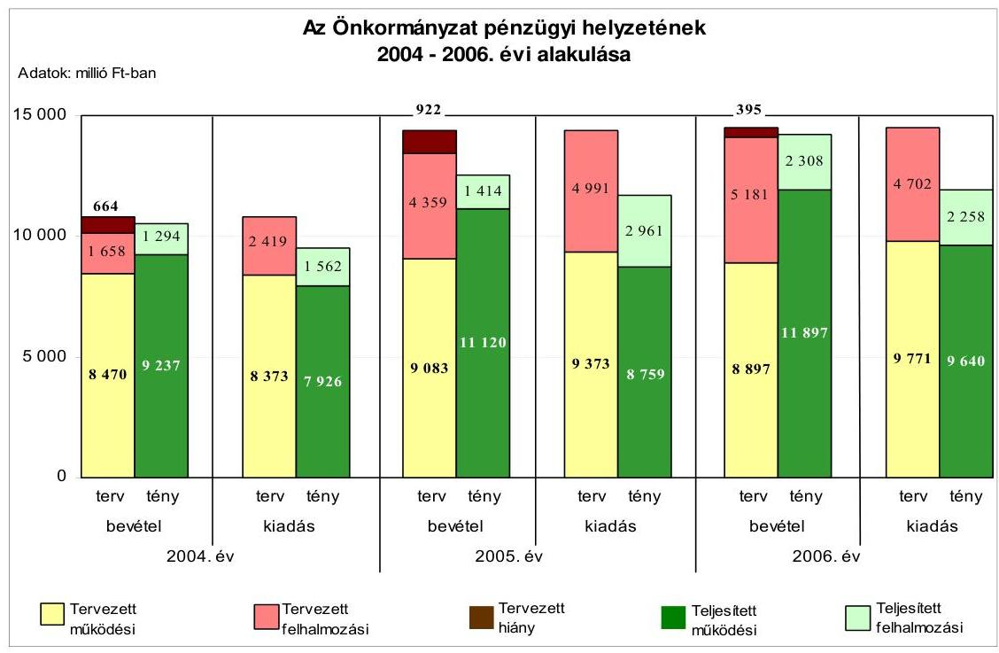
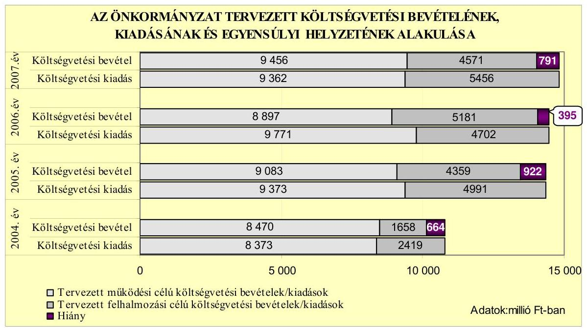
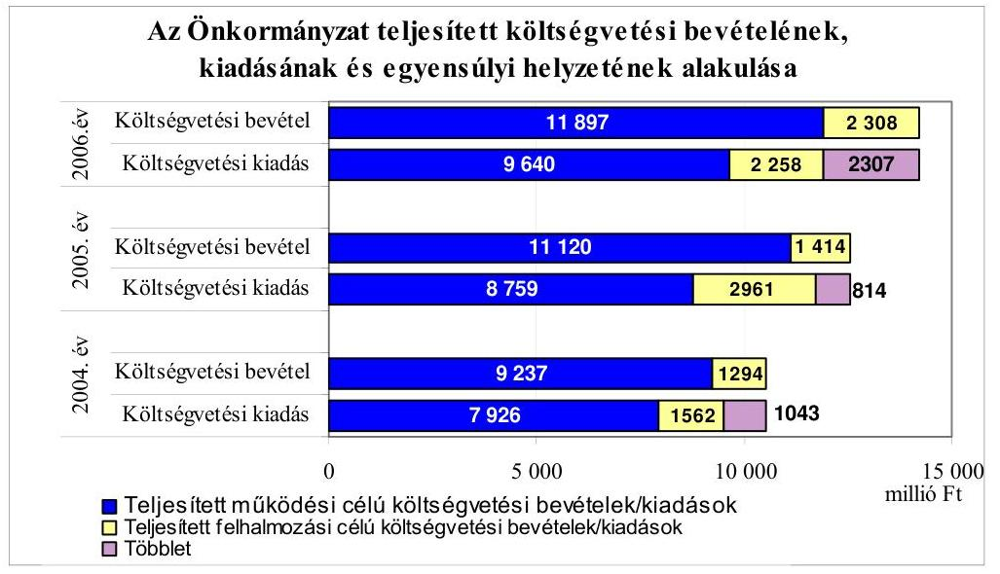
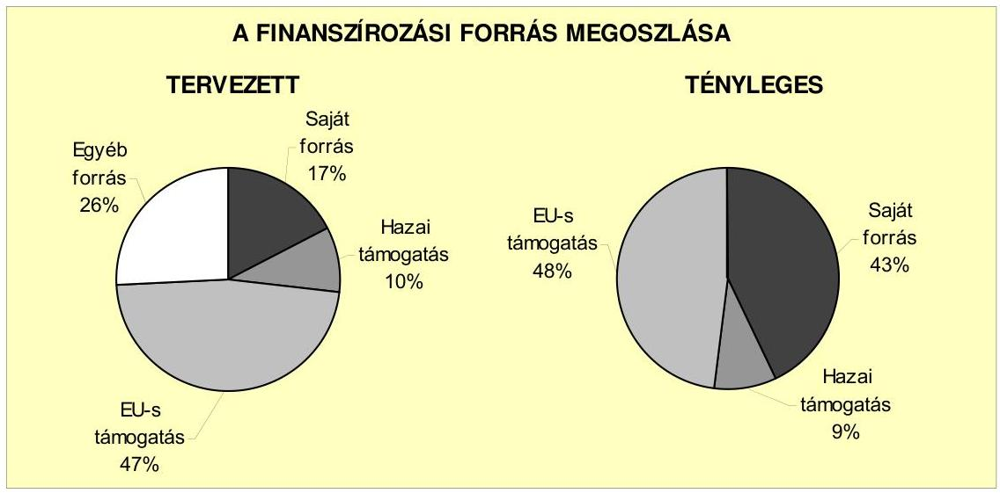
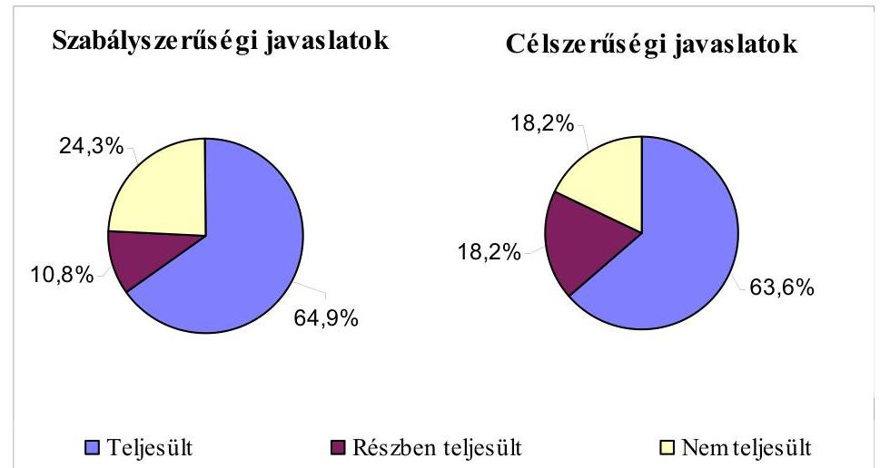
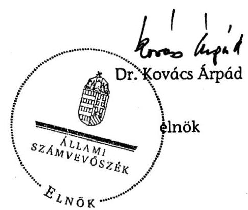
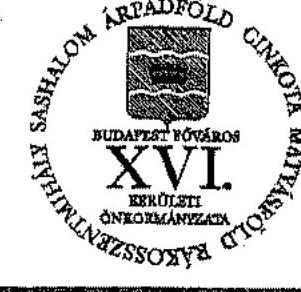
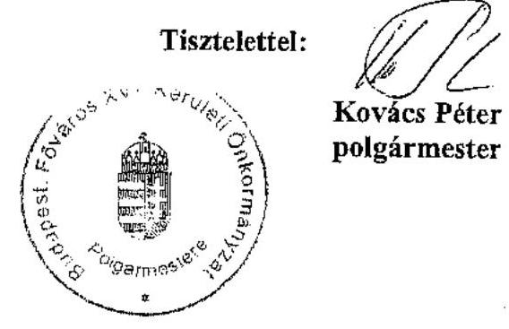

# JELENTÉS 

a Budapest Főváros XVI. kerület Önkormányzata gazdálkodási rendszerének 2007. évi átfogó ellenőrzéséről

---

# 3. Önkormányzati és Területi Ellenőrzési Igazgatóság 

3.3. Átfogó Ellenőrzések Főcsoport

Iktatószám: V-1001-9/35/18/2007.
Témaszám: 845
Vizsgálat-azonosító szám: V0333

## Az ellenőrzést felügyelte:

Dr. Lóránt Zoltán
főigazgató
Az ellenőrzés végrehajtásáért felelős:
Dr. Sepsey Tamás
főigazgató-helyettes
Az ellenőrzést vezette:
Molnár Gyula Mihály
igazgató-helyettes
Az ellenőrzést végezték:
Endrődy Péterné Nagy László Csaba Szabó Tamás
számvevő tanácsos számvevő tanácsos

A témához kapcsolódó eddig készített számvevőszéki jelentések:
címe
sorszáma
Jelentés a Budapest Főváros XVI. kerület Önkormányzata gazdálkodásának átfogó ellenőrzéséről 0462
Jelentés a helyi és a helyi kisebbségi önkormányzatok gazdálkodásának átfogó ellenőrzéséről 0544
Jelentés a Magyar Köztársaság 2005. évi költségvetése végrehajtásának ellenőrzéséről 0628
Függelék:

- a kötött felhasználású támogatások 2005. évi felhasználásának ellenőrzése
- a helyi önkormányzatokat a 2005. évben megillető normatív állami hozzájárulás igénylésének és elszámolásának ellenőrzése

---

# TARTALOMJEGYZÉK 

BEVEZETÉS ..... 11
I. ÖSSZEGZŐ MEGÁLLAPÍTÁSOK, KÖVETKEZTETÉSEK, JAVASLATOK ..... 15
II. RÉSZLETES MEGÁLLAPÍTÁSOK ..... 25

1. Az Önkormányzat költségvetési és pénzügyi helyzete ..... 25
1.1. A tervezett költségvetési bevételi és kiadási előirányzatok, valamint a költségvetési egyensúly alakulása ..... 26
1.2. A költségvetési bevételek és kiadások teljesítése, a pénzügyi egyensúlyi helyzet alakulása ..... 29
2. Az Önkormányzat felkészültsége az európai uniós források igénylésére és felhasználására, valamint az e-közigazgatási feladatok ellátására ..... 31
2.1. Az európai uniós források igénybevételére és a várható támogatás felhasználásának szervezettségére történt felkészülés, belső szabályozottság értékelése ..... 31
2.1.1. A fejlesztési célkitűzések meghatározása ..... 31
2.1.2. Az európai uniós forrásokhoz kapcsolódóan a pályázatfigyelés, a pályázatkészítés, valamint az európai uniós támogatással megvalósuló fejlesztés lebonyolítása belső rendjének szabályozottsága, a végrehajtás személyi, szervezeti feltételei ..... 34
2.1.3. Az európai uniós forrással támogatott fejlesztés megvalósítása ..... 36
2.2. Az e-közigazgatási feladatok előkészítése, bevezetése ..... 41
3. A költségvetési gazdálkodás belső kontrollrendszere ..... 43
3.1. A szabályozottság kockázata a költségvetés tervezési, gazdálkodási, beszámolási és a folyamatba épített ellenőrzési feladatainál ..... 43
3.2. A belső kontrollok érvényesülése az önkormányzati források szabályszerű felhasználásában, a költségvetési tervezés, gazdálkodás, beszámolás folyamataiban ..... 45
3.3. A belső ellenőrzési kötelezettség teljesítése, javaslatainak hasznosulása ..... 47
4. Az ÁSZ korábbi ellenőrzési javaslatai alapján készített intézkedési terv végrehajtása, eredményessége ..... 51
4.1. Az Önkormányzat gazdálkodási rendszerének átfogó ellenőrzése során tett javaslatok végrehajtására tervezett intézkedések megvalósulása ..... 52
4.2. A zárszámadáshoz kapcsolódó állami hozzájárulások, támogatások igénylésének és felhasználásának ellenőrzése, valamint a további vizsgálatok esetében a megállapítások, javaslatok alapján tett intézkedések hasznosulása

# MELLÉKLETEK 

1. számú Az Önkormányzat gazdálkodását meghatározó adatok, mutatószámok (1 oldal)
2. számú Az önkormányzati vagyon alakulása (1 oldal)
3. számú Az Önkormányzat 2004-2006. évi költségvetési előirányzatainak és azok pénzügyi teljesítéseinek alakulása (1 oldal)
4. számú 1. számú Nyilatkozat a tervezett és teljesített költségvetési adatoknak a megelőző évhez viszonyított jelentős, ±10%-ot meghaladó változásának indokolásáról, amennyiben azt a feladatok változása indokolta (3 oldal)
5. számú 1. számú Tanúsítvány az európai uniós forrásokkal támogatott programok, célok tervezett és tényleges 2004-2007. évi adatairól (1 oldal)
6. számú Kovács Péter úr, a Budapest Főváros XVI. kerület Önkormányzata polgármestere által adott észrevétel (1 oldal)

---

# RÖVIDÍTÉSEK JEGYZÉKE 

## Törvények

Áht.  az államháztartásról szóló 1992. évi XXXVIII. törvény
Eisztv. az elektronikus információszabadságról szóló 2005. évi XC. törvény
Htv. a helyi önkormányzatok és szerveik, a köztársasági megbízottak, valamint egyes centrális alárendeltségű szervek feladat- és hatásköreiről szóló 1991. évi XX. törvény
Kbt. a közbeszerzésekről szóló 2003. évi CXXIX. törvény
Ktv. a köztisztviselők jogállásáról szóló 1992. évi XXIII. törvény
Ötv. a helyi önkormányzatokról szóló 1990. évi LXV. törvény
Számv. tv. a számvitelről szóló 2000. évi C. törvény

## Rendeletek

2004. évi költségvetési rendelet
2005. évi költségvetési rendelet
2006. évi költségvetési rendelet
2007. évi költségvetési rendelet
2004. évi zárszámadási rendelet
2005. évi zárszámadási rendelet
Ámr. az államháztartás működési rendjéről szóló 217/1998. (XII. 30.) Korm. rendelet
Ber. a költségvetési szervek belső ellenőrzéséről szóló 193/2003. (IX. 26.) Korm. rendelet
SzMSz Budapest Főváros XVI. kerület Önkormányzatának 7/1995. (VI. 29.) számú rendelete az Önkormányzat Szervezeti és Működési Szabályzatáról
vagyongazdálkodási rendelet Budapest Főváros XVI. kerület Önkormányzatának 33/2004. (IX. 28) számú rendelete az Önkormányzat vagyonáról és a vagyontárgyak feletti tulajdonosi jogok gyakorlásáról
Vhr. az államháztartás szervezetei beszámolási és könyvvezetési kötelezettségének sajátosságairól szóló 249/2000. (XII. 24.) Korm. rendelet

Budapest Főváros XVI. kerület Önkormányzatának 5/2004. (IV. 15.) számú rendelete a 2004. év költségvetéséről
Budapest Főváros XVI. kerület Önkormányzatának 10/2005. (III. 14.) számú rendelete a 2005. évi költségvetéséről
Budapest Főváros XVI. kerület Önkormányzatának 8/2006. (III. 3.) számú rendelete a 2006. évi költségvetéséről
Budapest Főváros XVI. kerület Önkormányzatának 8/2007. (III. 2.) számú rendelete a 2007. évi költségvetésről
Budapest Főváros XVI. kerület Önkormányzatának 14/2005.(V. 2.) számú rendelete a 2004. évi költségvetésének zárszámadásáról
Budapest Főváros XVI. kerület Önkormányzatának 11/2006. (V. 11.) számú rendelete a 2005. évi költségvetésének zárszámadásáról

---

## Szórövidítések

ASTUTE Advencing Sustainable Transport in Urban areas To promote Energy efficiency (a fenntartható városi közlekedés elősegítése az energihatékonyságért)
ÁSZ Állami Számvevőszék
Belső ellenőrzési iroda Budapest Főváros XVI. kerület Önkormányzat Polgármesteri Hivatal Belső Ellenőrzési Iroda
BM Belügyminisztérium
BME Budapesti Műszaki Egyetem
e-közigazgatás elektronikus közigazgatás
EMIR Egységes Monitoring Informatikai Rendszer
EU Európai Unió
értékelési szabályzat a 2006. január 31-én kiadott 3/2006. számú Polgármesteri-jegyzői Együttes Utasítás A) számú mellékleteként kiadott Eszközök és Források Értékelési Szabályzata
FEUVE folyamatba épített, előzetes és utólagos vezetői ellenőrzés
Gazdálkodási ügyosztály Budapest Főváros XVI. kerület Önkormányzata Polgármesteri Hivatalának Gazdálkodási Ügyosztálya
GVOP Gazdasági Versenyképesség Operatív Program
jegyző Budapest Főváros XVI. kerület Önkormányzatának Jegyzője
Képviselő-testület Budapest Főváros XVI. kerület Önkormányzat Képviselőtestülete
KMROP Közép-magyarországi Regionális Operatív Program
Közhasznú Szolgáltató Szervezet Budapest Főváros XVI. kerületi Közhasznú Szolgáltató Szervezet
leltározási szabályzat a 3/2006. számú Polgármesteri-jegyzői Együttes Utasítás B. mellékleteként kiadott Leltározási Szabályzat
MÁK Magyar Államkincstár
Művelődési ügyosztály Budapest Főváros XVI. kerület Önkormányzata Polgármesteri Hivatalának Művelődési Ügyosztálya
NFT Nemzeti Fejlesztési Terv
Önkormányzat Budapest Főváros XVI. kerület Önkormányzata
PEA Pályázat Előkészítő Alap
polgármester Budapest Főváros XVI. kerület Önkormányzatának Polgármestere
Polgármesteri hivatal Budapest Főváros XVI. kerület Önkormányzatának Polgármesteri Hivatala
Polgármesteri hivatal ügyrendje Budapest Főváros XVI. kerület Önkormányzata Polgármesteri Hivatalának Ügyrendje
ROP Regionális Operatív Program
selejtezési szabályzat a 3/2006. számú Polgármesteri-jegyzői Együttes Utasítás C. mellékleteként kiadott Selejtezési Szabályzat
számviteli politika Budapest Főváros XVI. kerület Önkormányzat Polgármesteri Hivatalának Számviteli Politikájáról kiadott 3/2006. számú Polgármesteri-jegyzői Együttes Utasítás

---

Szociális és egészségügyi ügyosztály Budapest Főváros XVI. kerület Önkormányzata Polgármesteri Hivatalának Szociális és Egészségügyi Ügyosztálya
VÁTI Kht. VÁTI Magyar Regionális Fejlesztési és Urbanisztikai Kht.

---

.

---

# ÉRTELMEZŐ SZÓTÁR 

1. elektronikus szolgáltatási szint Az 1044/2005. (V. 11.) Kormány határozat alapján olyan információs, tájékoztató szolgáltatás, amely csak általános információkat közöl az adott üggyel kapcsolatos teendőkről és a szükséges dokumentumokról.
2. elektronikus szolgáltatási szint Az 1044/2005. (V. 11.) Kormány határozat alapján olyan egyirányú kapcsolatot biztosító szolgáltatás, amely az 1. szinten túl az adott ügy intézéséhez szükséges dokumentumok, nyomtatványok letöltése, és azok ellenőrzéssel vagy ellenőrzés nélküli elektronikus kitöltése, amely esetben a dokumentum benyújtása hagyományos úton történik.
3. elektronikus szolgáltatási szint Az 1044/2005. (V. 11.) Kormány határozat alapján olyan kétirányú kapcsolatot biztosító szolgáltatás, amely közvetlen vagy ellenőrzött kitöltésű dokumentum segítségével történő elektronikus adatbevitel és a bevitt adatok ellenőrzése. Az ügy indításához, intézéséhez személyes megjelenés nem szükséges, de az ügyhöz kapcsolódó közigazgatási döntés (határozat, egyéb aktus) közlése, valamint a kapcsolódó illeték- vagy díjfizetés hagyományos úton történik.
4. elektronikus szolgáltatási szint Az 1044/2005. (V. 11.) Kormány határozat alapján olyan teljes közvetlen kétirányú ügyintézési folyamatot biztosító szolgáltatás, amikor az ügyhöz kapcsolódó közigazgatási döntés is elektronikus úton kerül közlésre, illetve a kapcsolódó illeték- vagy díjfizetés elektronikus úton is intézhető.
EMIR Egységes monitoring informatikai rendszer az Európai Unió által nyújtott egyes pénzügyi támogatások felhasználásával megvalósuló programok, projektek figyelemmel kísérésére kialakított számítógépes nyilvántartási rendszer, amely a programok és a projektek adatait gyűjti, rendszerezi és nyilvántartja.
európai uniós források felhasználása Az elnyert európai uniós források lehívása a támogatott projekt megvalósítása érdekében, a fejlesztés lebonyolítása során a felmerült kiadások finanszírozására.
fejlesztési feladat (projekt) A fejlesztési feladat (projekt) tartalmilag és formailag részletesen kidolgozott, megfelelő pénzügyi háttérrel és végrehajtási ütemezéssel rendelkező fejlesztési terv, amely illeszkedik az Európai Unió, illetve a Nemzeti Fejlesztési Terv által támogatott programokhoz.
fejlesztési célkitűzés Az önkormányzat által ellátott kötelező, vagy önként vállalt feladatok ellátásának mennyiségi, vagy minőségi fejlesztésére vonatkozó terv. A mennyiségi fejlesztés megvalósulhat beszerzéssel, létesítéssel, bővítéssel, átalakítással.

---

irányító hatóság A strukturális alapok és a Kohéziós alap forrásainak szabályszerű, hatékony és eredményes felhasználásához szükséges intézményrendszer felső eleme. Az irányító hatóság általános és átfogó felelősséget visel a programok, projektek hatékony és szabályszerű végrehajtásáért. Felelősségi köréből eredően ellenőrzi a közösségi, valamint a hazai jogszabályok betartását, koordinálja az európai uniós források szétosztásának folyamatát, irányítja az intézményrendszer, a statisztikai és a pénzügyi nyilvántartási rendszer működését.
kedvezményezett Az a helyi önkormányzat, amely a támogatási szerződést kedvezményezettként aláírja, a projektet, illetve a központi programhoz kapcsolódó támogatott önkormányzati programot végrehajtja.
közreműködő szervezet A közreműködő szervezetek az európai uniós támogatást elnyert kedvezményezettekkel a kapcsolattartó szervek.
lebonyolítás Az operatív programok közreműködő szervezetei befogadják, nyilvántartják, döntésre előkészítik a pályázatokat, rögzítik a támogatással kapcsolatos adatokat az Egységes monitoring informatikai rendszerben, elvégzik a támogatások előzetes (szerződéskötést megelőző), közbenső (a pénzügyi elszámolás, finanszírozás folyamatában végzett) és utólagos (a támogatott projekt pénzügyi lezárását megelőző) ellenőrzését. Az önkormányzatoknál a leggyakrabban előforduló operatív program a Regionális Fejlesztési Operatív Program végrehajtásában közreműködő szervezetek a VÁTI Kht. és a regionális fejlesztési ügynökségek.
„lepény épület” Egyszintes épületegyüttes.

---

operatív program Az Európai Bizottság által jóváhagyott, a Közösségi Támogatási Keret végrehajtására vonatkozó, több évre szóló intézkedésekhez kapcsolódó prioritások egységes rendszerét tartalmazó dokumentum. A strukturális alapok operatív programjai: Agrár és Vidékfejlesztési Operatív Program (AVOP); Gazdasági Versenyképesség Operatív Program (GVOP); Humánerőforrás-fejlesztési Operatív Program (HEFOP); Környezetvédelmi és Infrastruktúra-fejlesztési Operatív Program (KIOP); Regionális Fejlesztési Operatív Program (ROP).
ROP-2.2.1. intézkedés A ROP keretében a térségi infrastruktúra és települési környezet fejlesztése NFT prioritáshoz kapcsolódóan a városi területek rehabilitációjára megnyitott pályázati lehetőség.
támogatási szerződés A strukturális alapok esetében az irányító hatóságnak, illetve a Kohéziós alap esetében a közreműködő szervezeteknek a kedvezményezett önkormányzattal kötött szerződése, amely a támogatás felhasználásának részletes feltételeit tartalmazza.

---

.

---

# JELENTÉS 

## Budapest Főváros XVI. kerület Önkormányzata gazdálkodási rendszerének 2007. évi átfogó ellenőrzéséről

## BEVEZETÉS

Az Ötv. 92. § (1) bekezdése, az Állami Számvevőszékről szóló 1989. évi XXXVIII. törvény 2. § (3) bekezdése, valamint az Áht. 120/A. § (1) bekezdése alapján az önkormányzatok gazdálkodását az Állami Számvevőszék ellenőrzi. Az ellenőrzésre az Országgyűlés illetékes bizottságai részére is átadott, országosan egységes ellenőrzési program alapján került sor.

Az Állami Számvevőszék a stratégiájában foglalt célkitűzéseknek megfelelően a helyi önkormányzatok költségvetési gazdálkodási rendszere átfogó ellenőrzésének programját a 2007. évtől megújította, azt kiegészítette további - teljesítmény-ellenőrzési - elemekkel.

## Az ellenőrzés célja annak értékelése volt, hogy az Önkormányzat:

- a pénzügyi egyensúlyt a költségvetésében és annak teljesítése során milyen
 módon biztosította, a teljesített bevételek és kiadások egyes évek közötti jelentős eltérése feladatváltozáshoz kapcsolódott-e;
- felkészült-e a szabályozottság és a szervezettség terén az EU források igénylésére és felhasználására, továbbá az e-közigazgatás bevezetése miatti szervezetkorszerűsítési feladatokra;
- kialakította-e a külső és a belső feltételeknek megfelelően a gazdálkodás belső kontrollrendszerét ${ }^{1}$, továbbá a költségvetés tervezési, végrehajtási és zárszámadási feladatok szabályszerű ellátásához hozzájárult-e a folyamatba épített, előzetes és utólagos vezetői ellenőrzés, valamint a belső ellenőrzés;
- megfelelően hasznosították-e a korábbi számvevőszéki ellenőrzések megállapításait, szabályszerűségi ${ }^{2}$ és célszerűségi javaslatait.

[^0]
[^0]:    ${ }^{1}$ A gazdálkodás szabályszerűségét biztosító kontrollrendszer alatt értjük a kiépített és működő belső irányítási és szabályozási rendszert, valamint a belső ellenőrzési funkciók ellátásának rendszerét.
    ${ }^{2}$ A törvényi előírások betartásának elmulasztásakor a részletes megállapítások fejezetben egységesen a törvénysértés megjelölést alkalmazzuk, mivel az ÁSZ nem tehet különbséget a törvényi előírások között.

---

Az ellenőrzött időszak: az 1., 2. és a 4. programpontok tekintetében a 2004-2006. évek, valamint a 2007. első negyedév, a 3. ellenőrzési programpontnál a 2006. év és a 2007. első negyedév.

Budapest Főváros XVI. kerületét öt településrész ${ }^{3}$ alkotja. A kerület lakosainak száma 2007. január 1-jén 70 143 fő volt. Az Önkormányzat 26 tagú Képviselőtestületének munkáját 10 állandó bizottság segítette. A polgármester a 2006. évi önkormányzati választás óta tölti be tisztségét. A jegyző közszolgálati jogviszonya 2006. december 31-ével közös megegyezéssel megszűnt, 2007. március 1-től új jegyzőt neveztek ki. A helyi önkormányzat mellett a 2006. évi önkormányzati választásig $12^{4}$, azt követően $11^{5}$ kisebbségi önkormányzat működött.

Az Önkormányzat feladatainak végrehajtása érdekében a 2006. évben 15 önállóan és 19 részben önállóan gazdálkodó költségvetési intézményt működtetett, valamint két gazdasági társasága vett részt a feladatok végrehajtásában. Intézményeinél a 2006. december 31-én 1791 főt foglalkoztattak, a Polgármesteri hivatalban 246 köztisztviselő dolgozott.

Az Önkormányzat a 2006. évben 14 205 millió Ft költségvetési bevételt és 11 898 millió Ft költségvetési kiadást teljesített, a 2006. december 31-én a könyvviteli mérleg szerint 24 834 millió Ft vagyonnal rendelkezett. A 2007. évi költségvetési rendeletben 14 027 millió Ft költségvetési bevételt és 14 818 millió Ft kiadást terveztek. Az Önkormányzat gazdálkodását jellemző adatokat, mutatószámokat az 1-3. számú mellékletek részletesen tartalmazzák.

Az Önkormányzat költségvetési és pénzügyi helyzetét az összehasonlító elemzés módszerével vizsgáltuk. E körben elemeztük a költségvetés egyensúlyi helyzetének alakulását, a tervezett és tényleges költségvetési hiány okait, a mérséklésére tett intézkedéseket, finanszírozásának módját, az Önkormányzat adósságállományának alakulását, összetevőit.

A teljesítmény-ellenőrzés módszerével vizsgáltuk, hogy a belső szabályozottság, szervezettség terén felkészültek-e az európai uniós források figyelésére, igénylésére és felhasználására, valamint az igényelt európai uniós támogatások az Önkormányzat által meghatározott fejlesztési célkitűzésekhez kapcsolódtak-e. Az ellenőrzés során felmértük, hogy az e-közigazgatási feladat ellátása, illetve bevezetése, működtetése érdekében milyen intézkedéseket tettek, valamint biztosították-e a közérdekű adatok elektronikus közzétételét.

A költségvetési gazdálkodás belső kontrolljainak ellenőrzése során értékeltük, hogy a Polgármesteri hivatalnál a költségvetés tervezési, gazdálkodási, zárszámadás készítési feladatok belső kontrolljainak kiépítettsége és működése megfelelő biztosítékot ad-e a gazdálkodási feladatok megfelelő, szabályszerű el-

[^0]
[^0]:    ${ }^{3}$ Árpádföld, Cinkota, Mátyásföld, Rákosszentmihály, Sashalom.
    ${ }^{4}$ Bolgár, görög, horvát, lengyel, német, örmény, roma, román, ruszin, szlovák, szlovén, ukrán.
    ${ }^{5}$ A 2006. évi önkormányzati választáskor a Szlovén Kisebbségi Önkormányzat nem alakult meg.

---

látására. Felmértük és minősítettük a költségvetés tervezési, a gazdálkodási, a zárszámadás készítési feladatokkal, továbbá a pénzügyi-számviteli területen az informatikával kapcsolatosan kialakított kontrollok megfelelőségét, valamint azok működésének eredményességét, megbízhatóságát. Értékeltük a belső ellenőrzés szervezeti és szabályozási keretét, továbbá működését.

A Polgármesteri hivatalnál értékeltük a gazdálkodás folyamatában a kontrollok működésének megbízhatóságát, ennek keretében ellenőriztük a szakmai teljesítés igazolására és az utalvány ellenjegyzésére kialakított kontrollok végrehajtását. Az ellenőrzést a következő, kiemelt kockázatuk alapján kiválasztott ${ }^{6}$ az általánostól jellemzően eltérő, egyedi eljárást igénylő gazdasági eseményekkel kapcsolatos kifizetésekre folytattuk le ${ }^{7}$ :

- a személyi juttatások közül az állományba nem tartozók megbízási díjai ${ }^{8}$,
- a külső szolgáltató által végzett karbantartási, kisjavítási szolgáltatások, valamint
- a gépek, berendezések, felszerelések beszerzése.

Az ellenőrzés hatékony elvégzése céljából a vizsgálandó területek kiválasztása során a kockázatokon alapuló megközelítés érvényesült, ezáltal az ellenőrzési erőforrásokat azokra a területekre fókuszáltuk, amelyeken legnagyobb a hibák előfordulási valószínűsége. Az ellenőrzési erőforrások ilyen típusú összpontosításával minimálisra csökkenthető a kívánt ellenőrzési bizonyosság eléréséhez szükséges időráfordítás.

A pénzügyi-számviteli folyamatokban alkalmazott belső kontrollok létezésének és működésének ellenőrzésére a vizsgált három terület 2006. évi könyvviteli tételeiből területenként egyszerű véletlen mintát vettünk. A kijelölt gazdasági eseményre elvégzett megfelelőségi tesztek alapján értékeltük a kontrollok működésének eredményességét, megbízhatóságát a vizsgált három területre külön-

[^0]
[^0]:    ${ }^{6}$ Az önkormányzatok kiemelt előirányzataira vonatkozóan, a vertikális folyamatokra elvégeztük a kockázatok becslését, amelynek eredményeként az állományba nem tartozók megbízási díjai, a külső szolgáltató által végzett karbantartási, kisjavítási szolgáltatások, valamint a gépek, berendezések, felszerelések beszerzése kiemelkedően kockázatos területnek bizonyultak.
    ${ }^{7}$ A korábbi ellenőrzési tapasztalataink szerint ezeken a területeken a jegyzők nem, vagy hiányosan szabályozták a megbízás, megrendelés, illetve beszerzés indokoltságának, szükségességének elbírálására, igazolására, valamint a teljesítések dokumentálására, a kifizetések jogosságának megítélésére szolgáló kontrollokat. További kockázatot jelentett a külső szolgáltató által végzett karbantartási, kisjavítási munkák esetében, hogy az 50 ezer Ft alatti megrendelésekre vonatkozóan az ellenőrzési tapasztalataink szerint a jegyzők nem alakították ki a kötelezettségvállalások rendjét és nyilvántartási formáját, valamint a szabályozás elmulasztása esetén nem történt meg az írásbeli kötelezettségvállalás és annak az ellenjegyzése sem.
    ${ }^{8}$ Az állományba tartozók rendszeres személyi juttatásainak számfejtését, valamint folyósítását nem a polgármesteri hivatalok, hanem a nettó finanszírozás keretében a beküldött dokumentumok alapján a MÁK végzi.

---

külön, majd összefoglalóan ${ }^{9}$ a Polgármesteri hivatal egyedi eljárást igénylő gazdasági eseményeire. A helyszíni ellenőrzés megállapításainak részletes dokumentálását három megfelelőségi tesztlapon, öt elővizsgálati és kilenc helyszíni ellenőrzési munkalapon biztosítottuk. Ezeken a teszt- és munkalapokon a minősítés alapjául szolgáló kérdések és a vonatkozó konkrét jogszabályhelyek megjelölése mellett értékeltük a kialakított belső kontrollokban rejlő kockázatokat ${ }^{10}$ és a kialakított kontrollok működésének megbízhatóságát ${ }^{11}$.

Az ÁSZ korábbi ellenőrzési javaslatai alapján tett intézkedéseket, illetve azok megvalósítását utóellenőrzés keretében vizsgáltuk. A gazdálkodási rendszer átfogó ellenőrzése során megfogalmazott javaslatok végrehajtására tett intézkedések megvalósítását ellenőrizzük, az egyéb számvevőszéki ellenőrzések során tett javaslatok esetében pedig a kiadott intézkedéseket tekintjük át.

A jelentés megállapításainak, javaslatainak egyeztetése során a polgármester arról adott tájékoztatást, hogy az időközben megtett intézkedésekkel a javaslatok egy részét megvalósították. Ezekben az esetekben a jelentés II. Részletes megállapítások fejezetében az adott témához kapcsolt lábjegyzetben a megtett intézkedést feltüntettük és a kapcsolódó javaslatot elhagytuk.

A jelentést az ÁSZ-ról szóló 1989. évi XXXVIII. tv. 25. § (1) bekezdése alapján észrevétel közlése céljából megküldtük a Budapest Főváros XVI. kerület Önkormányzata polgármesterének. A kapott észrevételt a jelentés 6. számú melléklete tartalmazza.

[^0]
[^0]:    ${ }^{9}$ A vizsgált három terület egyedi értékelési pontszámait a területek relatív költségvetési súlyával arányosan összegeztük.
    ${ }^{10}$ A kialakított belső kontrollokban rejlő kockázatot alacsonynak minősítettük, ha a kontrollok - végrehajtásuk esetén - megfelelő védelmet nyújtanak a hibák bekövetkezése ellen. Közepesnek minősítettük a belső kontrollokban rejlő kockázatot, amennyiben a kontrollok - végrehajtásuk esetén - a lehetséges hibák többsége ellen védelmet nyújtanak. Magasnak értékeltük a kockázatot, ha a kontrollok - kialakításuk hiányában, vagy hiányos kialakításuk miatt - nem nyújtanak elegendő védelmet a lehetséges hibákkal szemben.
    ${ }^{11}$ A kontrollok működésének eredményességét, megbízhatóságát kiválónak értékeltük abban az esetben, ha azok működése - esetleges apróbb hiányosságoktól eltekintve - megfelelt a hibák megelőzésére és kijavítására meghatározott szabályozásnak és a legmagasabb szintű elvárásoknak. Jónak minősítettük a kontrollok működését, ha a hiányosságok száma ugyan jelentős volt, de nem veszélyeztette az ellenőrzött terület hibáinak megelőzését és kijavítását. Amennyiben a hiányosságok mértéke nem biztosította a hibák megelőzését, feltárását, kijavítását és ezáltal veszélyeztette az eredményes, megbízható működést, a kontroll működésének megbízhatósága gyenge minősítést kapott.

---

# I. ÖSSZEGZŐ MEGÁLLAPÍTÁSOK, KÖVETKEZTETÉSEK, JAVASLATOK 

Az Önkormányzat a 2004-2006. években a költségvetési bevételek és kiadások folyamatos, de csökkenő mértékű növekedését tervezte. A 2005. évben a tervezett költségvetési bevételek a költségvetési kiadásokkal összhangban változtak, a 2006. évre tervezett változásnál azonban az összhang nem volt biztosítva. A tervezett költségvetési bevételek és kiadások 2005. évi növekedése elsősorban a felhalmozási célú előirányzatok emelkedésének a következménye. A tervezett 106%-os növekedés 64%-a függött össze az Önkormányzat által ellátott feladatok bővülésével. A 2,6 milliárd Ft tervezett felhalmozási célú kiadástöbblet fedezetéül 2,7 milliárd Ft felhalmozási bevétel növekményt terveztek, amelynek 77%-át telek és egyéb ingatlan értékesítésből, 8%-át pedig útépítéshez kapcsolódó állami támogatásból kívánták biztosítani. A költségvetési bevételek előirányzata a tervezett költségvetési kiadásokat egyik évben sem fedezte, az egyensúlyi helyzet biztosítására a költségvetési rendeletben mindhárom évben felhalmozási célú hitelfelvételt határoztak meg.

A teljesített költségvetési bevételek és kiadások is csökkenő mértékben növekedtek a 2004-2006. évek között a tervezett előirányzat változáshoz hasonlóan. A 2005. évben a felhalmozási célú kiadások 90%-kal növekedtek, az 1,4 milliárd Ft-ot kitevő összeg 78%-a függött össze az Önkormányzat által ellátott feladatok bővülésével. A felhalmozási kiadások 2006. évi 24%-os csökkenése a szakrendelő felújítás előző évi befejezésével és a szennyvízcsatorna beruházás csökkenésével függött össze. A felhalmozási kiadások csökkenésével ellentétben a felhalmozási célú bevételek a 2006. évben - az ingatlanértékesítésekkel összefüggésben - 63%-kal növekedtek.

Működési költségvetési hiány a 2004-2006. években nem alakult ki. A teljesített felhalmozási bevételek az első két évben a felhalmozási kiadások 83%, illetve 48%-ára nyújtottak fedezetet. A felhalmozási hiányt a 2004. évben a működési bevételekből fedezték, a 2005. évben pedig felhalmozási célú hitelfelvétel történt a pénzügyi egyensúly biztosítása érdekében. Az Önkormányzat a költségvetési kiadások eredeti előirányzatát mindhárom évben 82-88% között teljesítette. A felhalmozás kiadásoknál 48-65%-os elmaradás volt, a beruházási előirányzat teljesítés 42%-os arányával a 2006. évben volt a legalacsonyabb. A felhalmozási kiadások előirányzattól való eltérését elsősorban a beruházások elmaradása okozta. A teljesített költségvetési bevétel csak a 2005. évben maradt el - 7%-kal - az eredeti előirányzattól. Az összes költségvetési bevételen belül a működési bevételeket mindhárom évben túlteljesítették. A felhalmozási célú bevételek alacsony (32-78%-os) teljesítési mutatója a támogatásértékű felhalmozási bevételek és az önkormányzati ingatlan értékesítések alakulásával függött össze.

Az Önkormányzat több évre vonatkozó gazdasági programmal 2007. április hónapot megelőzően nem rendelkezett. Fejlesztési célkitűzéseit a 2007. évtől igazította a pályázati lehetőségekhez, ezt megelőző időszakban a fejlesztési

---

feladatokat nem illesztették az NFT keretében meghirdetett
 programokhoz. A fejlesztési célkitűzések megvalósításának lehetséges pénzügyi forrásait a városfejlesztési koncepció nem tartalmazta. Az Önkormányzat 2006–2007. évi költségvetési rendeletei elkülönítetten tartalmazták az EU támogatással megvalósuló programok, projektek bevételeit és kiadásait.

Az Önkormányzat belső szabályzataiban nem szabályozta az EU források igénybevételét és felhasználását. Nem határozták meg az EU források felhasználásával kapcsolatos döntési jogköröket, nem jelölték meg az önkormányzati szintű pályázat-koordinálás és nyilvántartás felelősét, illetve az információk áramlásának rendjét. Nem szabályozták a polgármester és a bonyolító közötti kapcsolattartás rendjét, a pályázatfigyelés, valamint a pályázatkészítés és a lebonyolítás ellenőrzésének feladatait, felelőseit. A Polgármesteri hivatal ügyrendje nem tartalmazott előírást az EU források igénybevételére, felhasználására. Nem határozták meg az EU forrásokra irányuló pályázatfigyelés, a pályázatkészítés és a fejlesztési feladatok lebonyolítása, valamint a folyamatba épített és a belső ellenőrzés rendjét. Az Önkormányzat nem készült fel eredményesen az EU források igénybevételére és felhasználására, mert a Polgármesteri hivatalon belül nem szervezte meg a különböző szervezeti egységek együttműködését a fejlesztési feladatok lebonyolításában. Az Önkormányzat a beruházásokkal kapcsolatban nem rendelkezett olyan szervezettel és működési renddel, amely a beruházás teljes folyamatában a benne résztvevő személyek számára összefogottan, koordináltan megfogalmazta és dokumentálta volna az egyes részterületek szakmai feladatait. Az EU forrásokkal megvalósuló fejlesztési feladatoknál a külső szervezettel kötött szerződés nem tartalmazta a feladatellátás rendjének szabályozását.

Az Erzsébet-liget projekt megvalósításához az Önkormányzat 679 millió Ft saját forrást, 743 millió Ft Európai Unió Európai Regionális Fejlesztési Alapból, valamint 149 millió Ft magyar kormányzati finanszírozásból származó forrást kívánt igénybe venni. Az Önkormányzat saját forrás kiegészítésére a BM EU Önerő Alapból 407 millió Ft-ot nyert. Az Önkormányzat a projekt megvalósítása során biztosította az éves ütemezésnek megfelelően vállalt saját forrást, valamint a megelőlegezett fizetés követelményének eleget tett. Az utófinanszírozás rendszere nem okozott pénzügyi zavart, fennakadást az Önkormányzatnál. A tervezett teljesítési ütemtől eltért a fejlesztési feladat megvalósítása. A támogatási szerződésben a projekt teljes összegét 1570 millió Ft-ban rögzítették, ugyanakkor a projekt jelenlegi összértéke a kivitelezőkkel megkötött szerződések alapján elérte a 2143 millió Ft-ot. Külső ellenőrzés megállapítása során szabálytalanságból, mulasztásból eredő visszafizetési kötelezettség nem merült fel. Az Önkormányzat belső ellenőrzése az EU pénzeszközből megvalósuló projektet nem vizsgálta.

A Polgármesteri hivatal rendelkezett informatikai stratégiával, amelyet 2006. évben a belső szabályzatban foglaltak ellenére nem vizsgáltak felül. Az Önkormányzat a 2004–2006. években nem pályázott és nem vett igénybe az NFT GVOP által kiírt támogatási forrást. Az Önkormányzatnál kialakították és működtették az e-közigazgatási feladatokat ellátó informatikai rendszert, biztosították az elektronikusan nyújtandó közszolgáltatások Interneten keresztül történő igénybevételét. Az Önkormányzat honlapján a 2. elektronikus szolgáltatási szinten biztosította – az e-közigazgatási feladatokat ellátó informatikai

---

rendszer keretében – a közérdekű információk, tájékoztató adatok közzétételét, az űrlapok, nyomtatványok letöltését. Az Önkormányzat megteremtette a 3. elektronikus szolgáltatási szintű, kétirányú interaktivitás feltételeit. Az Önkormányzat az Eisztv. alapján 2007. január 1-től kötelezett a közérdekű adatok közzétételére. Az Önkormányzat nem tett eleget az Áht. előírásainak, mert a pénzeszközei felhasználásával, a vagyonnal történő gazdálkodással összefüggő a nettó 5 millió Ft-t elérő, vagy azt meghaladó értékű szerződések adatait nem tette közzé, valamint nem az Ámr-ben előírtak szerint járt el, mert elmulasztotta közzé tenni az éves költségvetési beszámoló szöveges indoklásának bemutatását. Az Önkormányzat nem az Eisztv-ben meghatározottak szerint járt el, mert a törvény mellékletében előírtaktól eltérően az általános közzétételi listában foglaltakat nem közölte teljes körűen. A közérdekű adatok közzététele az Önkormányzat honlapján történt. Az e-közigazgatási feladatot ellátó informatikai rendszer adatait, azok tendenciáit nem elemezték, az ügyfelek különböző ügykörök általi igénybevételének tapasztalatait nem értékelték.

A Polgármesteri hivatalban a költségvetés tervezési és a zárszámadás-készítési folyamatok szabályozottságának hiányosságai magas kockázatot jelentettek a feladatok szabályszerű végrehajtásában, mivel a jegyző nem alakította ki a költségvetés tervezési és a zárszámadás-készítési folyamatok ellenőrzési feladatait, nem írta elő az intézmények és a Polgármesteri hivatal szervezeti egységei által benyújtott költségvetési igények megalapozottságának, indokoltságának, teljesíthetőségének, továbbá a tervezett saját bevételek előirányzatai, és az azok megalapozását szolgáló önkormányzati rendeletek összhangjának ellenőrzését. A jegyző nem határozta meg az intézmények költségvetésében szereplő adatok egyeztetésének, ellenőrzésének felelőseit a Polgármesteri hivatalban. A Képviselő-testület az Ámr. előírása ellenére nem határozta meg az önkormányzati költségvetési szervek elemi beszámolója felülvizsgálatának rendjét, tartalmát és felelőseit, nem írta elő az éves költségvetési beszámoló szöveges indoklásának részletes tartalmi és formai követelményeit, a FEUVE rendszer működésének értékelési kötelezettségét. A jegyző az Ámr. előírása ellenére nem írta elő az intézményi pénzmaradvány-kimunkálás szabályszerűségének ellenőrzését.

A Polgármesteri hivatalnál a költségvetés tervezés és a zárszámadás készítés folyamatában a működésbeli hibák megelőzésére, feltárására, kijavítására kialakított belső kontrollok működésének megbízhatósága összességében gyenge volt, mivel a jegyző nem ellenőriztette az intézményi mutatószám felmérés adatainak megalapozottságát, a költségvetési intézmények és a Polgármesteri hivatal szervezeti egységei által benyújtott költségvetési igények indokoltságát. A zárszámadás készítés folyamatában az Ámr. előírásai ellenére a Polgármesteri hivatalnál a jegyző nem ellenőriztette az intézmények által az állami támogatásokkal, hozzájárulásokkal történő elszámoláshoz közölt mutatószámok adatainak megbízhatóságát, az intézményi pénzmaradványok megállapításának szabályszerűségét, az eredeti és a módosított előirányzatok, valamint a teljesítési adatok eltérésének indokoltságát, továbbá nem vizsgálták felül az intézményi számszaki beszámolók belső összhangját.

A gazdálkodási és a folyamatba épített ellenőrzési feladatok szabályozottságának hiányosságai magas kockázatot jelentettek a gazdálkodási feladatok szabályszerű végrehajtásában, mivel a jegyző a szakmai teljesítés igazolás módjáról belső szabályzatban nem rendelkezett. A Polgármesteri hivatal számviteli politikájában és a kapcsolódó szabályzatokban a Számv. tv-ben és a Vhr-ben foglaltak ellenére a jegyző nem határozta meg az üzemeltetésre, kezelésre átadott eszközök leltározásának módját, a követelések év végi értékelésének elveit, az adókövetelések egyszerűsített értékelési eljárásának szempontjait, dokumentumait, valamint az értékelések ellenőrzéséért felelős munkaköröket, az értékvesztés elszámolása és annak visszaírása részletes rendjét, az üzemeltetésre, kezelésre átadott eszközök selejtezésével, hasznosításával kapcsolatos döntéshozatalra jogosultak körét. Az Ámr. előírása ellenére nem készítették el a közérdekű adatszolgáltatáshoz kapcsolódó költségtérítés összege megállapításának szabályozására az önköltségszámítás rendjére vonatkozó belső szabályzatot, az ellenőrzési nyomvonalat, a kockázatkezelési, valamint a szabálytalanságok kezelésére szolgáló eljárásrendet.

A 2006. évben a Polgármesteri hivatalnál az általánostól jellemzően eltérő, egyedi eljárást igénylő gazdasági eseményekkel (az állományba nem tartozók megbízási díjaival, a karbantartási, kisjavítási szolgáltatásokkal, továbbá a gépek, berendezések, felszerelések beszerzésével) kapcsolatos kifizetések során a működésbeli hibák megelőzésére, feltárására, kijavítására kialakított kontrollok működésének megbízhatósága gyenge volt, működésük nem adott megfelelő biztosítékot a gazdálkodási feladatok szabályszerű ellátására. Az operatív gazdálkodás során a szakmai teljesítés igazolására a jegyző által kijelölt személyek feladatukat nem látták el, mivel aláírásukat megelőzően – szabályozás hiánya miatt – belső szabályzatban előírt módon nem ellenőrizték, szakmailag nem igazolták azok jogosultságát, összegszerűségét, a szerződés, a megrendelés, a megállapodás teljesítését. Az utalvány ellenjegyzői nem győződtek meg arról, hogy az utalványozás nem sérti-e a gazdálkodásra – a kötelezettségvállalás ellenjegyzésére – vonatkozó szabályokat, továbbá, hogy a szakmai teljesítés igazolása és az érvényesítés az előírásoknak megfelelően megtörtént-e.

A Polgármesteri hivatalban az informatikai rendszer szabályozottsága alacsony kockázatot jelentett az informatikai feladatok biztonságos végrehajtásában, mivel rendelkeztek informatikai stratégiával, biztonsági és biztonságtechnikai szabályzattal, katasztrófa elhárítási tervvel, szabályozták a hozzáférési jogosultságokat. Az informatikai rendszerek 2006. évi működtetésének megbízhatósága – a működésbeli hibák megelőzése, feltárása, kijavítása tekintetében – jó volt, azonban az analitikus nyilvántartások és a főkönyvi könyvelés kapcsolata nem volt automatikus a számítógépen vezetett nyilvántartásoknál, valamint az adatok feldolgozása nem volt naprakész és az adatkapcsolatokat nem dokumentálták.

A belső ellenőrzés szervezeti kereteinek kialakítása és szabályozása közepes kockázatot jelentett a belső ellenőrzés végrehajtásában, mert a Képviselőtestület meghatározta a belső ellenőrzés ellátási módját, jóváhagyta a 2006. évi ellenőrzési tervet és a belső ellenőrzési tevékenységre vonatkozó szabályokat, eljárásokat a belső ellenőrzési kézikönyvben előírták, azonban a Polgármesteri hivatal ügyrendjében nem határozták meg a belső ellenőrzési kötelezettséget, a belső ellenőrzés nem rendelkezett kockázatelemzéssel alátámasztott stratégiai tervvel, az éves ellenőrzési terv összeállítása során nem biztosítottak ellenőri kapacitást a soron kívüli ellenőrzésekre, nem biztosították a belső ellenőrök

---

rendszeres továbbképzését, az ellenőrzések lefolytatásához készített ellenőrzési programok tartalma nem felelt meg a Ber-ben foglaltaknak.

A belső ellenőrzés működésének megbízhatósága jó volt, mert a belső ellenőrök a 2006. évben tervezett belső ellenőrzéseket – egy kivétellel – végrehajtották, összesen 57 javaslatot tettek, melyeket az ellenőrzöttek elfogadtak, a szükséges intézkedéseket megtették. A tervezett vizsgálat elmaradását az év során a Képviselő-testület által meghatározott nyolc soron kívüli vizsgálat következtében jelentkező kapacitás hiány okozta. A Polgármesteri hivatal és az intézmények gazdálkodásában feltárt hiányosságok megszüntetéséről öt esetben utóellenőrzéssel győződtek meg. A jegyző a 2005. évi költségvetési beszámoló keretében beszámolt a belső ellenőrzés működéséről, azonban az Áht. előírása ellenére nem számolt be a FEUVE működtetéséről. A polgármester az Ötv. előírásának megfelelően a 2005. évi zárszámadási rendelettervezettel egyidejűleg a Képviselő-testület elé terjesztette az Önkormányzat által alapított és fenntartott költségvetési szervek ellenőrzési tapasztalatairól készített jelentést, melyet az elfogadott, további követelményeket, elvárásokat nem fogalmazott meg. Annak ellenére jónak minősíthető a belső ellenőrzés működése, hogy nem ellenőrizték a Ber. előírása ellenére a Polgármesteri hivatalban a FEUVE rendszer kiépítésének és működésének megfelelőségét, a Kbt. előírása ellenére a közbeszerzéseket és a közbeszerzési eljárásokat, az Áht. előírása ellenére a kedvezményezett szervezeteknél az Önkormányzat költségvetéséből céljelleggel nyújtott támogatások rendeltetés szerinti felhasználását, valamint az Önkormányzat gazdasági társaságainak gazdálkodását.

Az Önkormányzatnál az ÁSZ a gazdálkodási rendszer átfogó ellenőrzését a 2004. évben, a 2006. évben pedig a zárszámadáshoz kapcsolódóan a 2005. évi normatív állami hozzájárulások igénylésének és elszámolásának, valamint a kötött felhasználású támogatások 2005. évi felhasználásának ellenőrzését végezte el.

Az Önkormányzat gazdálkodási rendszerének 2004. évi átfogó ellenőrzéséről készített számvevőszéki jelentés 29 szabályszerűségi és hét célszerűségi javaslatot tartalmazott. Azok megvalósulása érdekében intézkedési tervet készítettek, amit a Képviselő-testület a jelentéssel együtt megtárgyalt. A szabályszerűségi javaslatok 59%-a megvalósult, 14%-a részben hasznosult, 27%-a pedig nem teljesült. A költségvetési rendelet tartalmához, szerkezetéhez, mellékleteihez kapcsolódó javaslatok megvalósultak, a gazdasági programot azonban az Ötv. előírása ellenére nem készítették el. A polgármester a közbenső egyeztetés során tájékoztatást adott arról, hogy az Önkormányzat 2007–2010. évekre vonatkozó gazdasági programját a Képviselő-testület elfogadta. A költségvetési előirányzat nyilvántartási rendszert a Polgármesteri hivatalban a 2006. évtől bevezették. Az intézmények jóváhagyott előirányzatainak betartására vonatkozó javaslat azonban nem hasznosult, hét intézmény egyes kiemelt előirányzatait az Áht. előírása ellenére túllépte. A gazdálkodás és a pénzügyi-számviteli feladatok ellátásának szabályozottságához kapcsolódó javaslatok kettő kivételével realizálódtak. A Polgármesteri hivatal – Ámr. előírásának megfelelő – szervezeti és működési szabályzatát nem készítették el, a költségvetési szervek egységes számviteli rendjét a helyszíni ellenőrzés ideje alatt alakították ki. A költségvetési gazdálkodási és
 ellenőrzési jogkörök gyakorlásának szabályszerűségével összefüggésben megfogalmazott javaslatok többsége teljesült, kettő részben hasz-

---

nosult. A Számv. tv. előírása ellenére nem minősítették a követeléseket. A vagyongazdálkodási rendeletben az Áht-ban előírtak ellenére a kötelező versenyeztetés lebonyolítása alól továbbra is felmentést adtak. A céljelleggel nyújtott támogatásoknál minden esetben előírták a számadási kötelezettséget. A kisebbségi önkormányzatok gazdálkodásához kapcsolódó javaslatok maradéktalanul megvalósultak. Előterjesztés hiányában a Képviselő-testület az Ötv-ben foglaltak ellenére nem határozta meg a kötelező és önként vállalt feladatait. A belső ellenőrzés szabályszerűségére irányuló javaslatok részben hasznosultak.

A munka színvonalának javítása érdekében tett célszerűségi javaslatok 72%-a megvalósult, 14-14%-a nem teljesült, illetve részben hasznosult. Az informatikai szabályozottsághoz tartozó katasztrófa elhárítási tervet csak a 2/2007. számú jegyzői utasítással léptették hatályba. A munkaköri leírások tartalmi kiegészítéséhez kapcsolódó javaslat teljesült. A zárszámadási rendelettervezet közvetett támogatásokról szóló kimutatásában az építmény- és telekadó kedvezmények összege bemutatásra került. A középületek akadálymentessé tételének figyelemmel kísérésére vonatkozó javaslat teljesült, a készpénzkezeléssel kapcsolatos javaslat részben hasznosult. A belső ellenőrzés éves munkatervének összeállítására vonatkozó javaslat nem realizálódott, a terven felüli ellenőrzési feladatok ellátásához szükséges tartalék időkeretet az éves terv nem tartalmazott. A javaslatok realizálásának elmaradásáért, a költségvetési tervezési, a gazdálkodási, a zárszámadási feladatok szabályozatlanságáért, ennek következtében a belső kontrollok működésének hiányosságaiért, hibáiért az Áht-ban és az Ötv-ben foglaltak alapján a jegyző a felelős. Az ÁSZ a jegyző felelősségének érvényesítését, megállapítását nem kezdeményezte, mivel a jegyző közszolgálati jogviszonya az Önkormányzatnál 2006. december 31-vel megszűnt.

A zárszámadáshoz kapcsolódó vizsgálatról készített számvevői jelentéseket és az azokban megfogalmazott javaslatok teljesítésére összeállított intézkedési tervet a Képviselő-testület együtt tárgyalta. A kötött felhasználású támogatások felhasználásának ellenőrzéséhez kapcsolódó négy szabályszerűségi javaslat megvalósulása érdekében intézkedtek. A három célszerűségi javaslat egyikére nem történt intézkedés, a közcélú foglalkoztatás rendjét a helyszíni ellenőrzés ideje alatt szabályozták. A normatív állami hozzájárulások igénylésének és elszámolásának ellenőrzéséről készített jelentés négy javaslatot tartalmazott, amelyből a szakmai ügyosztályok szerepének növelésére vonatkozó javaslat részben teljesült. Az intézkedési tervben előírtak ellenére a belső ellenőrzés nem végzett helyszíni ellenőrzést a 2006. évi normatív állami hozzájárulás elszámolását megelőzően.

---

A helyszíni ellenőrzés megállapításainak hasznosítása mellett javasoljuk:

# a polgármesternek 

a munka színvonalának javítása érdekében
1. kezdeményezze, hogy a jelentésben foglaltakat a Képviselő-testület tárgyalja meg és a feltárt hiányosságok megszüntetése érdekében készíttessen intézkedési tervet a határidők és felelősök megjelölésével;
2. gondoskodjon arról, hogy a gazdasági programban és a szakmai koncepciókban meghatározott fejlesztési célkitűzések pénzügyi forrásait határozzák meg;

## a jegyzőnek

a jogszabályi előírások maradéktalan betartása érdekében
1. a Polgármesteri hivatal tervezési, beszámolási folyamataira, és sajátosságaira tekintettel - az Áht 121. § (1) és (3) bekezdéseiben, valamint az Ámr. 145/A. § (1)-(2) és a 145/B. § (1) bekezdésében foglalt előírások alapján - a FEUVE rendszerének kialakítása, valamint a pénzügyi irányítási és ellenőrzési rendszer létrehozása keretében:
a) írja elő a Polgármesteri hivatalnál az intézmények és a polgármesteri hivatali szervezeti egységek által benyújtott költségvetési igények megalapozottságának, indokoltságának, teljesíthetőségének, továbbá, a tervezett saját bevételek és az azok megalapozását szolgáló önkormányzati rendeletek összhangjának ellenőrzését és gondoskodjon a költségvetés tervezés folyamatában ezen belső kontrollok működtetéséről;
b) jelölje ki a Polgármesteri hivatalban az intézmények költségvetéseiben szereplő adatok egyeztetésének, ellenőrzésének felelőseit;
c) készítsen előterjesztést a Képviselő-testület részére, abban határozza meg az Ámr. 149. § (2) bekezdés a)-c) pontjaiban foglaltak betartása érdekében a költségvetési szervek elemi beszámolója felülvizsgálatának rendjét, tartalmát és felelőseit;
d) írja elő az Ámr. 66. § (4) bekezdésében foglaltak betartása érdekében az intézményi pénzmaradvány kimunkálása szabályszerűségének ellenőrzését;
2. rendelkezzen belső szabályzatban az Ámr. 135. § (2) bekezdésében foglaltak betartása érdekében a szakmai teljesítésigazolás módjáról;

---

3. a gazdálkodási, a pénzügyi-számviteli és a folyamatba épített ellenőrzési feladatok szabályszerű végrehajtási feltételeinek kialakítása érdekében
a) határozza meg a Vhr. 37. § (3) bekezdése alapján a leltározási szabályzatban az üzemeltetésre, kezelésre átadott eszközök leltározásának módját;
b) határozza meg, a Vhr. 8. § (17) bekezdésében foglalt előírás alapján az értékelési szabályzatban a követelések év végi értékelésének elveit;
c) határozza meg a Vhr. 8. § (18) bekezdésében alapján az eszközök és források értékelési szabályzatában, az adókövetelések egyszerűsített értékelési eljárása szempontjait és dokumentumait, jelölje meg az értékelések ellenőrzéséért felelős munkaköröket;
d) határozza meg a Számv. tv. 54-56. §-ainak megfelelően az értékvesztés elszámolásának és visszaírásának részletes rendjét;
4. gondoskodjon a Vhr. 8. § (4) bekezdésének c) pontjában, illetve a (16) bekezdésében foglaltak alapján a közérdekű adatszolgáltatáshoz kapcsolódó költségtérítés összege megállapítása tekintetében az önköltségszámítás rendjének szabályozásáról;
5. a költségvetési tervezés, gazdálkodás, beszámolás folyamataiban a belső kontrollok érvényesülése érdekében gondoskodjon
a) az intézményi pénzmaradványok megállapítása szabályszerűségének, az eredeti és a módosított előirányzatok, valamint a teljesítések eltérései indokoltságának, az intézményi számszaki beszámolók belső összhangjának felülvizsgálatáról az Ámr. 66. § (4) bekezdésében és a 149. § (3) bekezdés c) és d) pontjaiban foglalt előírások betartása érdekében;
b) az intézmények által az állami támogatásokkal, hozzájárulásokkal történő elszámoláshoz közölt mutatószámok adatai megbízhatóságának ellenőrzéséről;
6. az operatív gazdálkodás során a működésbeli hibák megelőzése, feltárása, illetve kijavítása érdekében
a) gondoskodjon az Ámr. 135. § (1) bekezdésében előírtak betartásáról, hogy a kiadások teljesítésének elrendelése előtt a jegyző által kijelölt személyek belső szabályzatban előírt módon ellenőrizzék, szakmailag igazolják azok jogosultságát, összegszerűségét, a szerződés, megrendelés, megállapodás teljesítését;
b) gondoskodjon a folyamatba épített ellenőrzési feladatok elvégzésével, hogy az utalvány ellenjegyzői az Ámr. 137. § (3) bekezdésének előírásai alapján győződjenek meg arról, hogy az utalványozás nem sérti-e a kötelezettségvállalás ellenjegyzésére vonatkozó, az Ámr. 134. § (9) bekezdésében foglalt szabályokat, továbbá, hogy a szakmai teljesítés igazolása az Ámr. 135. § (1) bekezdésében előírtak alapján és az érvényesítés az Ámr. 135. § (3) és (4) bekezdéseiben foglaltak szerint az arra jogosultak által megtörtént-e;

---

7. gondoskodjon a Polgármesteri hivatal ügyrendjében a Ber. 4. § (2) bekezdése szerinti kiegészítéséről, abban írja elő a belső ellenőrzési kötelezettséget, az ellenőrzést végző szervezeti egység és személyek jogállását, feladatait;
8. gondoskodjon arról, hogy az éves ellenőrzési terv összeállítása során a Ber. 21. § (4) bekezdésében foglaltaknak megfelelően biztosítson ellenőri kapacitást a soron kívüli ellenőrzési feladatokra;
9. gondoskodjon arról, hogy a belső ellenőrzési vezető a Ber. 23. § (1) bekezdésében előírtaknak megfelelően minden egyes vizsgálathoz készítsen ellenőrzési programot;
10. gondoskodjon arról, hogy a belső ellenőrzéseket a Ber. 23. § (3) bekezdésének megfelelően minden egyes esetben az ellenőrzési program alapján hajtsák végre;
11. gondoskodjon arról, hogy a belső ellenőrzés rendszerében
a) a Ber. 8. § a) pontjának megfelelően vizsgálják a Polgármesteri hivatalnál a FEUVE rendszer kiépítésének és működésének a központi és a helyi szabályoknak való megfelelését;
b) a Kbt. 308. § (2) bekezdésének megfelelően vizsgálják a közbeszerzéseket, illetőleg a közbeszerzési eljárásokat;
12. terjessze a költségvetési beszámoló keretében az Áht. 97. § (2) bekezdésében előírtaknak megfelelően a Képviselő-testület elé beszámolóját a FEUVE működésének tapasztalatairól;
13. gondoskodjon az Önkormányzat gazdálkodási rendszerének 2004. évi átfogó ellenőrzése, a 2005. évi normatív állami hozzájárulás igénylésének és elszámolásának vizsgálata, valamint a kötött felhasználású támogatások 2005. évi felhasználásának ellenőrzése során tett és nem, illetve részben teljesült szabályszerűségi és célszerűségi ÁSZ javaslatok hasznosításáról az intézkedési tervekben foglaltak betartása érdekében;
a munka színvonalának javítása érdekében
14. az európai uniós forrásokkal kapcsolatos fejlesztési feladatoknál:
a) biztosítsa, hogy határozzák meg a Polgármesteri hivatal ügyrendjében, illetve belső szabályzatban, valamint a feladatellátással megbízott köztisztviselők munkaköri leírásában az európai uniós források igénybevételére, felhasználására és az ezzel összefüggő felelősségükre vonatkozó szabályokat, ennek keretében rögzítsék a pályázatfigyelés, pályázatkészítés rendjét, a pályázat lebonyolításának eljárási rendjét, valamint az európai uniós pályázatfigyelés, -készítés és az európai uniós forrásokkal támogatott fejlesztési feladatok lebonyolításával kapcsolatos folyamatba épített ellenőrzés és belső ellenőrzés kötelezettségének rendjét;
b) gondoskodjon arról, hogy külső szervezet pályázatkészítésre való megbízása esetén a szerződés tartalmazza az információ-átadás módjának meghatározását, a feladatellátás rendjének szabályozását és a megbízott munkájának ellenőrizhetőségét;

---

c) biztosítsa, hogy a belső ellenőrzés az európai uniós forrásokkal megvalósuló fejlesztési feladatok teljesítését ellenőrizze;
15. elemezze és értékelje az e-közigazgatási feladatot ellátó informatikai rendszer adatait, az ügyfelek általi igénybevételének tapasztalatait;
16. vizsgáltassa felül évente a Polgármesteri hivatal informatikai stratégiáját;
17. gondoskodjon arról, hogy a belső ellenőrzés rendszerében vizsgálják az Önkormányzat többségi irányítást biztosító befolyása alatt működő gazdasági társaságoknál a rendelkezésre álló erőforrásokkal való gazdálkodást.

---

# II. RÉSZLETES MEGÁLLAPÍTÁSOK 

## 1. Az ÖNKORMÁNYZAT KÖLTSÉGVETÉSI ÉS PÉNZÜGYI HELYZETE

Az Önkormányzatnál a 2004-2006. években a költségvetési egyensúly tervezési szinten nem volt biztosított, mivel a költségvetési bevételek előirányzata a tervezett költségvetési kiadásokat egyik évben sem fedezte. A teljesítési adatok alapján ugyanakkor költségvetési hiány nem alakult ki, a költségvetési bevételek mindhárom évben fedezetet nyújtottak a költségvetési kiadásokra.

Az Önkormányzat 2004-2006. évi tervezett költségvetési - azon belül a működési és felhalmozási célú - bevételeit és kiadásait, azok egyenlegeként kialakult hiányt vagy többletet, valamint a finanszírozási célú pénzügyi bevételek és kiadások összegét a 3. számú melléklet tartalmazza. Az Önkormányzat által ellátott feladatok változásának hatását a tervezett és teljesített költségvetési adatokra a 4. számú melléklet mutatja.

A tervezett és a teljesített költségvetési bevételek és kiadások 2004-2006. évi alakulását a következő ábra szemlélteti:

---

Az Önkormányzatnál a 2004-2006. években a tervezett és teljesített működési, felhalmozási célú költségvetési kiadásokra a következő arányban biztosítottak fedezetet a költségvetési bevételek:

Adatok: %-ban

| Megnevezés | 2004. év |  | 2005. év |  | 2006. év |  |
| :--: | :--: | :--: | :--: | :--: | :--: | :--: |
|  | terv | tény | terv | tény | terv | tény |
| Működési célú költségvetési kiadások fedezettsége működési célú költségvetési bevételekből | 101,2 | 116,5 | 96,9 | 127,0 | 91,1 | 123,4 |
| Felhalmozási célú költségvetési kiadások fedezettsége felhalmozási célú költségvetési bevételekből | 68,5 | 82,8 | 87,3 | 47,7 | 110,2 | 102,2 |
| Költségvetési kiadások fedezettsége költségvetési bevételekből | 93,8 | 111,0 | 93,6 | 106,9 | 97,3 | 119,4 |

Az Önkormányzat a 2004-2006. évek között a költségvetési kiadásokat 34%-kal tervezte növelni, amelyben a 2005. évi növekedésnek, azon belül is a felhalmozási célú kiadásoknak volt meghatározó szerepe. Az időszakon belül a tervezett költségvetési bevételek csak a 2005. évben változtak összhangban a költségvetési kiadásokkal. A teljesített költségvetési kiadások a két év alatt 25%-kal emelkedtek, a növekedés a tervezett előirányzat változáshoz hasonlóan csökkenő tendenciájú volt.

A 2005-2006. években tervezett és teljesített költségvetési - azon belül működési és felhalmozási célú - költségvetési bevételek és kiadások megelőző évhez viszonyított alakulását szemlélteti a következő táblázat:

| Megnevezés | Változás az előző évhez (%) |  |  |  |
| :-- | :--: | :--: | :--: | :--: |
| 

 | 2005. évben |  | 2006. évben |  |
|  | terv | tény | terv | tény |
| Működési célú költségvetési bevételek változása | 7,2 | 20,4 | $-2,0$ | 7,1 |
| Működési célú költségvetési kiadások változása | 11,9 | 10,5 | 4,2 | 10,1 |
| Felhalmozási célú költségvetési bevételek változása | 162,9 | 9,3 | 18,9 | 63,3 |
| Felhalmozási célú költségvetési kiadások változása | 106,3 | 89,6 | $-5,8$ | $-23,8$ |
| Összes költségvetési bevétel változása | 32,7 | 19,0 | 4,7 | 13,3 |
| Összes költségvetési kiadás változása | 33,1 | 23,5 | 0,8 | 1,5 |

# 1.1. A tervezett költségvetési bevételi és kiadási előirányzatok, valamint a költségvetési egyensúly alakulása 

Az Önkormányzat a 2004-2006. évek között a költségvetési bevételek és kiadások folyamatos, de csökkenő mértékű növekedését tervezte. A

---

költségvetési bevételek 2005. évre tervezett 33%-os emelkedését követően a 2006. évre az előző évihez képest csak 5%-os bevételnövekedéssel számoltak. A tervezett költségvetési kiadások előző évhez viszonyított változásának mértéke ugyanezen időszak alatt 33%, illetve 1% volt.

A 2005. évben az előző évhez viszonyítva a tervezett költségvetési bevételek a költségvetési kiadásokkal összhangban változtak, a százalékban mért változásuk mértékének különbözete csak 0,4% volt. Az összes bevételi és kiadási előirányzaton belül azonban a működési és a felhalmozási célú előirányzat szintjén sem volt biztosítva a kiadások bevételekkel összhangban való változása. Ezen kiadások és bevételek változása azonos irányú, változásuk mértéke azonban eltérő volt.

A működési célú költségvetési kiadások előirányzata a 2005. évre 12%-kal növekedett az azonos célú bevételek 7%-os emelkedése mellett. A tervezett felhalmozási célú költségvetési bevételek 163%-kal, a kiadások pedig 106%-kal növekedtek.

A tervezett költségvetési bevételek és kiadások 2005. évi 33-33%-os növekedése elsősorban a felhalmozási célú előirányzatok emelkedésének a következménye. A tervezett felhalmozási célú kiadások 2 572,1 millió Ft-tal (106%-kal) növekedtek. A tervezett növekedés 63,6%-a (1635 millió Ft) függött össze az Önkormányzat által ellátott feladatok bővülésével.

Az út-, járda- és parkolóépítés 424 millió Ft-tal, a szennyvízcsatorna építés 239 millió Ft-tal, az egyéb közműfejlesztés 21 millió Ft-tal, a szakrendelő épületének felújítása 184 millió Ft-tal, az egyéb intézmények felújítása 157 millió Ft-tal, a közlekedésbiztonság és informatika fejlesztése 51 millió Ft-tal növelte a tervezett felhalmozási kiadásokat az előző évhez viszonyítva. Az uszodaalap - pályázati önrész biztosítása érdekében való - feltöltése következtében 530 millió Ft-tal nőtt a tervezett felhalmozási kiadások összege. Az Önkormányzat tulajdonában lévő lakások és üzlethelyiségek, valamint az egycsatornás gyűjtőkémények felújítására az előző évinél 29 millió Ft-tal többet terveztek fordítani.

---

A 2005. évi költségvetési koncepcióban meghatározták, hogy a fejlesztési elképzelésekhez megfelelő fejlesztési forrásokat is kell rendelni, valamint alapelvként rögzítették, hogy az ingatlanértékesítésből származó bevételeket beruházásokra kell fordítani. A fejlesztési feladatok kiadásainak tervezett növekedésével párhuzamosan 2701 millió Ft felhalmozási bevétel emelkedést (163%-os) terveztek a 2004. évhez viszonyítva. Ennek 77%-át önkormányzati telek és egyéb ingatlan értékesítés, 9%-át pedig az útépítéshez kapcsolódó állami támogatás adta.

A működési célú kiadási előirányzatok 999,8 millió Ft-ot kitevő (12%-os) 2005. évi növekedéséből 125 millió Ft (13%) volt összefüggésben a feladatellátás bővülésével.

A Fővárosi Önkormányzattól átvett szakorvosi rendelőintézet személyi kiadásai 18 millió Ft-tal, a labor teljesítménynövekedéséből származó többlet OEP finanszírozás miatt a szakrendelő dologi kiadásai 70 millió Ft-tal, a közutak és hidak üzemeltetésére tervezett kiadások 32 millió Ft-tal, a Nevelési Tanácsadó pszichológiai hálózatának kiépítése 5 millió Ft-tal növelte a tervezett működési kiadásokat.

A 2006. évben nem tervezték a költségvetési kiadás összegét a költségvetési bevétellel összhangban emelni, 637 millió Ft bevételnövekedéssel számoltak, ugyanakkor az előző évinél csak 109 millió Ft-tal több kiadást terveztek. A bevételek és kiadások tervezése a működési és a felhalmozási célú előirányzatok szintjén sem történt összhangban olyannyira, hogy a bevételek és kiadások változása mindkét előirányzat típusnál ellentétes tendenciát mutat.

A működési célú költségvetési kiadások előirányzata a 2006. évre 4%-kal növekedett az azonos célú bevételek 2%-os csökkenése mellett. A tervezett felhalmozási célú költségvetési kiadások 6%-kal csökkentek, míg az azonos célú bevételek 19%-kal növekedtek.

A fentiek alapján a tervezett felhalmozási bevételeknél 19%-os növekedés volt tapasztalható, annak mértéke azonban lényegesen elmarad az előző évi változás 163%-os mértékétől. A 2006. évre 441 millió Ft növekedést terveztek az önkormányzati telekértékesítéseknél, 801 millió Ft bevételtöbbletet pedig pályázatok benyújtásával kívántak elérni.

Az Önkormányzatnál a 2004-2006. években a költségvetési bevételek előirányzata a tervezett költségvetési kiadásokat nem fedezte. A tervezett költségvetési bevételek időrendi sorrendben 94%, 94% és 97%-os arányban nyújtottak fedezetet a költségvetési kiadásokra. A költségvetés egyensúlyát mindhárom évben felhalmozási célú hitellel kívánták biztosítani, a döntést a költségvetési rendeletek tartalmazták. A tervezett hiány összege 922 millió Ft-os értékével a 2005. évben volt a legnagyobb, az előző évhez viszonyítva 38%-kal, a költségvetési főösszeghez viszonyított aránya azonban csak 0,3 százalékponttal nőtt. A 2005. évben a működési és a felhalmozási előirányzatok esetében sem nyújtottak fedezetet a bevételek a kiadásokra, a működési célú költségvetési bevételek előirányzata a működési célú kiadások 97%-át, a felhalmozási előirányzatok esetében pedig a 87%-át fedezte. A 2004. évben a tervezett felhalmozási célú bevételek, a 2006. évben a működési bevételek nem nyújtottak fedezetet a hasonló célú kiadásokra.

---

# 1.2. A költségvetési bevételek és kiadások teljesítése, a pénzügyi egyensúlyi helyzet alakulása 

A 2004-2006. években a teljesített költségvetési bevételek és kiadások is folyamatosan növekedtek, de változásuk mértéke eltérő volt.

A 2005. évben a teljesített költségvetési bevételek az előző évhez képest 19%-kal növekedtek a kiadások 24%-os emelkedése mellett. A 2006. évben a költségvetési bevételek 13%-kal, a kiadások pedig 2%-kal növekedtek.

A teljesített költségvetési főösszegen belül a működési és a felhalmozási bevételek sem változtak összhangban az azonos célú kiadásokkal egyik évben sem.

A működési kiadások időrendi sorrendben 11, illetve 10%-kal emelkedtek a bevételek 20 és 7%-os növekedése mellett.

A felhalmozási célú kiadások 2005. évi 90%-os növekedését a 2006. évben 24%-os csökkenés követte, míg a hasonló célú bevételek ugyanezen időszak alatt 9, illetve 63%-kal emelkedtek.

Mindkét évben növekedés volt tapasztalható a felhalmozási célú kiadások teljesítésénél az előző évhez képest. A 2005. évi 90%-os növekedést kitevő 1399 millió Ft 78%-a (1102 millió Ft) függött össze az Önkormányzat által ellátott feladatok bővülésével.

A közműberuházásokra (szennyvízcsatorna építés, gázellátás fejlesztése) fordított kiadások 278 millió Ft-tal voltak magasabbak az előző évinél. A szakorvosi rendelő épületének felújítása 543 millió Ft-tal növelte a felhalmozási kiadásokat. Az intézmények, lakások és üzlethelyiségek felújításának a felhalmozási kiadásokat növelő hatása 73 millió Ft volt. Az út- és járdaépítésre fordított kiadások 193 millió Ft-tal növekedtek az előző évhez képest. Az uszoda előkészítéssel és az informatikai fejlesztéssel kapcsolatos kiadások együttesen 15 millió Ft-tal haladták meg ezen kiadások 2004. évi összegét.

A felhalmozási kiadások 2006. évi 704 millió Ft-ot kitevő 24%-os csökkenése elsősorban két feladatnál jelentkező változásnak a következménye.

---

A 2006. évi csökkenés fő oka egyrészt a szakrendelő felújítás előző évi befejezésének a hatása (556 millió Ft), másrészt a szennyvízcsatorna beruházásoknak az előző évhez képest 468 millió Ft-ot kitevő csökkenése. Az ezekből adódó kiesést egyéb beruházások (Erzsébet-ligeti rekreációs központ, uszodatervezés, közvilágítás, vízellátás, csapadékvíz elvezetés) és a felújítások (egycsatornás gyűjtőkémények, önkormányzati lakások és üzlethelyiségek felújítása) kiadásainak növekedése ugyanis nem egyenlítette ki.

A felhalmozási kiadások csökkenésével ellentétben a 2006. évben 63%-kal növekedtek a felhalmozási célú bevételek, ami abból adódott, hogy több 2005. évre betervezett, de abban az évben nem realizálódott ingatlanértékesítés valósult meg a 2006. évben. A telek és egyéb ingatlan értékesítések bevételnövelő hatása 1652 millió Ft volt, amelyre csökkentőleg hatott a címzett- és céltámogatások, valamint a Fővárosi Önkormányzat által a csatorna beruházásokra nyújtott céltámogatás együttes összegének 344 millió Ft-os csökkenése.

A teljesített működési bevételek a 2004-2006. években a költségvetési bevételek 88-89-84%-át tették ki, az azonos célú kiadások a költségvetési kiadáson belül ugyanakkor alacsonyabb részarányt (84-75-81%-ot) képviseltek. A teljesített költségvetési bevételek a költségvetési kiadásokra a három év alatt 111-107-119%-ban biztosítottak fedezetet.

A teljesített működési bevételek a működési célú kiadásokra mindegyik évben fedezetet nyújtottak (117-127-123%-ban), a 2004-2006. években működési költségvetési hiány nem alakult ki. Az Önkormányzatnak a költségvetési többlete ellenére felhalmozási célú forráshiánya volt. A teljesített felhalmozási célú bevételek az azonos célú kiadásokat a 2004. évben 83%-ban, a 2005. évben pedig csak 48%-ban fedezték, ezáltal a felhalmozási költségvetési hiány a 2005. évben 1279 millió Ft-tal (476%-kal) növekedett az előző évhez képest. A 2004. évben a felhalmozási hiányt teljes mértékben, a 2005. évben pedig kétharmad részét a működési célú bevételekből fedezték. Ezen kívül a 2005. évben fejlesztési hitelfelvétel történt. A 2006. évben felhalmozási hiány nem volt, a felhalmozási kiadások 102%-át fedezték a bevételek. Az Önkormányzat a 2004-2006. években kötvényt nem bocsátott ki, kölcsön igénybevétel nem történt. Értékpapírt a 2004. és a 2005. évben értékesítettek 161 millió, illetve 117 millió Ft összegben.

Az Önkormányzat a költségvetési kiadások eredeti előirányzatát a 2004-2006. években 88-82-82%-ra teljesítette. Elmaradás figyelhető meg a működési és a felhalmozási célú kiadások vonatkozásában egyaránt. A teljesített működési kiadások összege időrendi sorrendben mindössze 5-7-2%-kal maradt el az eredeti előirányzattól. A felhalmozási célú kiadások eredeti előirányzathoz viszonyított teljesítése időrendi sorrendben 65%, 59% és 48% volt. Ennek fő oka, hogy a beruházások teljesítése mind a három évben elmaradt az erre a célra tervezett kiadásoktól, ezen előirányzat a 2006. évben mindössze 42%-ra teljesült, elsősorban az Erzsébet-ligeti projekt elhúzódásával összefüggésben. A felújításokra tervezett előirányzattól való elmaradás - mindössze 3% (12 millió Ft) - csak a 2006. évben volt.

A költségvetési bevételek eredeti előirányzatát a 2004. és a 2006. évben 4%, illetve 1%-kal túlteljesítették, a 2005. évben azonban a teljesített bevétel 7%-kal maradt el az eredeti előirányzattól. Az összes költségvetési bevételen belül a

---

működési célú költségvetési bevételeket mindhárom évben túlteljesítették, időrendi sorrendben 9, 22, illetve 34%-kal. Az eredeti előirányzatot meghaladó teljesítés jelentkezett az intézményi és az adóbevételeknél. Az intézményi működési bevételek tervezettel szembeni növekménye 169-171458 millió Ft-ot tett ki. A 2006. évben az intézményi működési bevételeknek az eredeti előirányzathoz viszonyított 170%-ra való teljesülése elsősorban az ingatlanüzemeltetési bevételek alakulására vezethető vissza, a szolgáltatási díj átalány bevétel ugyanis - az adósságkezelési támogatások és a fizetési meghagyások foganatosításának eredményeként - az eredeti előirányzat 14-szeresére teljesült. A helyi adóbevételek az előirányzathoz viszonyítva ugyanezen időszakban 174-546-792 millió Ft-tal (6-15-22%-kal) haladták meg az eredeti előirányzatot. A működési célú bevételi előirányzatok megalapozott tervezése érdekében a helyi
 adókkal kapcsolatos rendeleteket a Képviselő-testület a költségvetési évet megelőző év végéig megalkotta. A 2005. és 2006. évi túlteljesítés a kerületi önkormányzatok és a Fővárosi Önkormányzat közötti forrásmegosztási számítások évközi korrekcióinak a következménye. Az eredeti előirányzathoz viszonyított eltérések tervezési hiányosságra nem vezethetők vissza. A felhalmozási célú bevételek alacsony ( $78 \%, 32 \%, 45 \%$ ) teljesítési mutatója és az önkormányzati ingatlan értékesítések - szakhatósági engedélyezési eljárások - miatti elhúzódásával és a támogatásértékű felhalmozási bevételek elmaradásával függött össze.

# 2. AZ ÖNKORMÁNYZAT FELKÉSZÜLTSÉGE AZ EURÓPAI UNIÓS FORRÁSOK IGÉNYLÉSÉRE ÉS FELHASZNÁLÁSÁRA, VALAMINT AZ EKÖZIGAZGATÁSI FELADATOK ELLÁTÁSÁRA 

2.1. Az európai uniós források igénybevételére és a várható támogatás felhasználásának szervezettségére történt felkészülés, belső szabályozottság értékelése

### 2.1.1. A fejlesztési célkitűzések meghatározása

Az Önkormányzat a 2004-2006. évekre vonatkozó gazdasági programmal nem rendelkezett, ezzel megsértette az Ötv. 91. § (1) bekezdésében foglaltakat. A 2006. évi önkormányzati választások után megalakult új Képviselőtestület 197/2007. (IV. 18.) számú határozatával elfogadta a 2007-2010. évekre vonatkozó gazdasági programot. A fejlesztési célkitűzéseket a Képviselő-testület által elfogadott szakmai koncepciókban - a szolgáltatástervezési koncepcióban, a lakóépületek felújításáról szóló 2004-2009. évek közötti időszakra vonatkozó programban, az önkormányzati tulajdonú bérlakások koncepcióban, a kerületi

---

közlekedési koncepcióban, illetve a sportfejlesztési tervben ${ }^{12}$ - jelenítették meg, de forrást nem rendeltek a megvalósításhoz.

A kötelező feladatokhoz kapcsolódó fejlesztési célokat az éves költségvetési koncepciókban fogalmazták meg, amely az utcák átalakításához és felújításához, általános iskola rekonstrukcióhoz, óvoda építéshez, csapadékvíz elvezetéshez kapcsolódtak, de EU támogatást nem rendeltek hozzá.

A kerület városfejlesztési koncepcióját „kertvárosból parkváros" címmel az Önkormányzat megbízása alapján a BME Urbanisztikai Tanszék szakértői csoportja készítette el. Alapját a település jövőképe ${ }^{13}$ adta, amely a 2007-2015. közötti időszakot fogta át, de a Képviselő-testület azt 2007. március 31-ig még nem fogadta el. A városfejlesztési koncepciót az Önkormányzat honlapján társadalmi vitára bocsátották, hogy a lakosság véleményével, hozzászólásaival kiegészítse.

Az Önkormányzat fejlesztési célkitűzéseit a 2007. évtől a hazai és az EU pályázati lehetőségekhez igazította, azokat a valós szükségletek felmérésével alátámasztották. Az ezt megelőző időszakban a fejlesztési feladatokat nem illesztették az NFT keretében meghirdetett programokhoz, a pályázatok figyelése, benyújtása ad-hoc módon történt.

A Képviselő-testület 82/2007. (II. 28.) számú határozatában - a kerületfejlesztési célokkal összhangban - elfogadta ${ }^{14}$ a pályázati projekteket, amelyek illeszkedtek az NFT, a KMROP által kínált programokhoz. Összefoglalták a kerületfejlesztési lehetőségeket a város és településfejlesztés, a zöldterület megújítása, az oktatási intézmények felújítása és az infrastruktúra területén, valamint a Podmaniczky tervbe illeszthető javaslatokat. Az egyes projektek esetében részletesen bemutatták a helyszínt, a lehetséges funkciókat, illeszkedését a KMROP prioritásához, a tulajdonviszonyokat, a környezetet és célcsoportokat, valamint az előkészítést/megvalósítást és a költségeket, amelyek becslésen alapultak.

A Képviselő testület 2004-2006. között EU forrásokkal összefüggő hét fejlesztési feladatról döntött:

[^0]
[^0]:    ${ }^{12}$ A Képviselő-testület 743/2004. (XI. 30.) számú határozata a szolgáltatástervezési koncepcióról, 655/2004. (IX. 28.) számú határozata a lakó épületek felújításáról szóló 2004-2009. évek közötti időszakra vonatkozó programról, 159/2004. (III. 9.) számú határozata az önkormányzati tulajdonú bérlakások koncepcióról, 745/2005. (XI. 8.) számú határozata a kerületi közlekedési koncepcióról, 494/2004. (VI. 29.) számú határozata a sportfejlesztési tervről.
    ${ }^{13}$ A kerület fejlődése érdekében az Önkormányzat 2005. szeptemberében kidolgoztatta a település jövőképét. A külső cég által készített, de a kerület lakosságának, vállalkozásainak széles körű bevonásával - összességében 150 közéleti, szakmai és magánszereplő közreműködésével a személyes megbeszélések kis- és nagycsoportos programok eredményei, kérdőívek válaszai alapján, három hónapos munka után - 10 éves távlatban, 2015. évig mutatja be a település jövőbeni fejlődését és működését. A jövőképben leírtak nem konkrét tervek, hanem felvázolt elképzelések voltak.
    ${ }^{14}$ A pályázati lehetőségek előkészítésére a 2007. évi költségvetésben 110 millió Ft forrást biztosítottak.

---

- az Önkormányzat az Európai Unió Strukturális Alapokból, a ROP-2.2.1.-2005-05-0002/35 azonosító alatt pályázott meg és nyert el támogatást „A Kulturális és rekreációs Központ kialakítása a mátyásföldi Erzsébet-ligetben a korábbi szovjet laktanya új funkcióval történő ellátására" címen.
- Az EU Bizottság Oktatási és Kulturális Főigazgatósága támogatási projekt keretében segítette a „Testvérvárosi Konferenciák szervezését" a környezetvédelem (hulladékgazdálkodás és természetvédelem), a városfejlesztés és az egészségügy területén.
- Az EU Bizottság szakosított szerve ${ }^{15}$ az ASTUTE projektet - a városi közlekedés olyan módjait, amelyek fenntarthatóak és megújuló energiát használnak - támogatta.
- A Polgármesteri hivatalon kívül két intézmény négy esetben pályázott - háromszor sikeresen - EU forrásokra ${ }^{16}$.

Az Önkormányzat 2005-2007. évek közötti EU forrásokkal támogatott beruházásoknál a finanszírozási források tervezett és tényleges megoszlását a következő ábrák mutatják:

A 2006-2007. évek költségvetési rendeletei tartalmazták - az EU feladatok előirányzatai vonatkozásában - a több éves kihatással járó döntések számszerűsítését, szöveges indoklását évenkénti bontásban és elkülönítetten az EU támogatással megvalósuló programok, projektek bevételeit és kiadásait.

[^0]
[^0]:    ${ }^{15}$ Intelligent Energy Europe Associet
    ${ }^{16}$ A Corvin Művelődési Ház Erzsébet-ligeti Színház a 2005. évben adott be EU pályázatot „A felnőttképzés hozzáférésének javítása a rendelkezésére álló közművelődési intézmény rendszer rendszerszerű bevonásával" címmel. A pályázat sikertelen volt. A Kölcsey Ferenc Általános Iskola három esetben a 2003/2004, 2004/2005, 2005/2006 tanévekben pályázott és nyert támogatást a Tempus Közalapítvány Socrates/Comenius iskolai együttműködés keretében.

---

Az Önkormányzat 2006. és 2007. évi költségvetéseinek bevételi előirányzatai között elkülönítetten és összesítve jelentek meg az EU és más forrásból megvalósuló beruházások forrásai. Az egyes források összegeit az előterjesztések tartalmazták.

Az EU pályázat saját forrás előirányzat összegén túlmenően a 2006. évben a fejlesztési tartalékból végeztek átcsoportosítást az Erzsébet-liget uszoda közvilágításának kiépítésére 4,2 millió Ft, valamint felemelték az uszoda alap előirányzat összegét 345 millió Ft-ra a költségvetés 2. számú módosításakor.

A beruházás az Önkormányzat részéről a saját források tekintetében nem volt megalapozott. Nem készítettek gazdasági számításokat, inflációs és ár kalkulációkat, amelyből megállapítható, hogy a beruházás befejeződésének elhúzódása esetén a kivitelezési költségek megalapozottak-e és a tervezettnél több saját forrás bevonást igényelnek-e.

Az Önkormányzat éves költségvetéseiben nem számolt az EU támogatásból megvalósuló projekt utófinanszírozása miatti többletforrás igényel.

A Képviselő-testület a 2006. évi költségvetést a 2. számú módosítással megváltoztatta, mert az EU pályázatokhoz szükséges önkormányzati saját forrás kiegészítésére - a BM rendelet ${ }^{17}$ alapján - 407,4 millió Ft összegű, vissza nem térítendő támogatást nyert. A 2006. évi költségvetésben a központosított támogatások között szerepelt a BM EU Önerő Alap támogatás összege. A saját forrást kiváltó pénzintézeti hitel felvételét nem tervezték.

# 2.1.2. Az európai uniós forrásokhoz kapcsolódóan a pályázatfigyelés, a pályázatkészítés, valamint az európai uniós támogatással megvalósuló fejlesztés lebonyolítása belső rendjének szabályozottsága, a végrehajtás személyi, szervezeti feltételei 

A Polgármesteri hivatal ügyrendjében, belső szabályzataiban nem szabályozta az EU források igénybevételének és felhasználásának rendjét, illetve az ezzel összefüggő felelősségre vonatkozó feladatokat a 2004-2006. években. Ezáltal nem határozták meg az EU források felhasználásával kapcsolatos döntési jogköröket, nem jelölték meg az önkormányzati szintű pályázat koordinálás és nyilvántartás felelősét, illetve az információk áramlásának rendjét. Nem határozták meg továbbá a polgármester és a projektet lebonyolító közötti kapcsolattartás rendjét, a pályázatfigyelés, valamint a pályázatkészítés és a projekt lebonyolítás ellenőrzési kötelezettség feladatait és felelőseit. Kivételt képez ez alól a kötelezettségvállalás és ellenjegyzés szabályzata, ahol beruházásonként meghatározták a gazdálkodási és ellenőrzési feladatok ellátására jogosultak körét.

A Polgármesteri hivatalon belül pályázatfigyelésre külön szervezeti egységet nem hoztak létre. Az Önkormányzat 2004. évtől alkalmazott EU referenst. Munkaköri leírásában meghatározták a pályázati lehetőségek figyelem-

[^0]
[^0]:    ${ }^{17}$ A helyi önkormányzatok európai uniós fejlesztési pályázataihoz szükséges önkormányzati saját forrás kiegészítése 2006. évi támogatásának rendjéről szóló 15/2006. (III. 14.) BM rendelet.

---

mel kísérését, a pályázat kidolgozást végző céggel történő együttműködést, valamint az Önkormányzat vezetőinek és irodáinak tájékoztatását az információkról. A referens megfelelő képzettséggel és nyelvtudással rendelkezett. A pályázatfigyelés tárgyi feltételei érdekében az internet hozzáférést részére biztosították. Az Önkormányzat nem bízott meg külső szervezetet a pályázatfigyelési feladatok ellátásával.

Az EU pályázatkészítés szervezeti feltételeit a Polgármesteri hivatalon belül nem alakították ki. A testvérvárosok kapcsolatának előmozdítását célzó tevékenység támogatására kiírt EU pályázat elkészítésére külső céget bíztak meg. Az Erzsébet-liget projekt megvalósítása érdekében az európai uniós forrásokkal összefüggő pályázatok előkészítése a PEA keretei között valósult meg. Az Önkormányzat együttműködési megállapodást kötött az irányító hatósággal az Erzsébet-liget projekt kidolgozásához, hogy az alkalmas legyen az Európai Uniós Strukturális Alapok felhasználását lehetővé tevő pályázatokra való benyújtásra.

PEA Projekt-kidolgozó Konzorcium készítette el a projekt kidolgozására vonatkozó ajánlatot és részt vett a projekt kidolgozásában, illetve a PEA Minőségellenőrző Konzorcium megvizsgálta a projekt illeszkedését az Operatív Programhoz, valamint elkészítette a projekt feladat meghatározását. A megállapodásban meghatározták a tervezett tevékenységek listáját, a munkacsomagok ütemezését és a megvalósítás módszertanát. A kapcsolattartás érdekében mind a megbízó, mind a megbízott kijelölte a kapcsolattartó személyeket. A napi projektmenedzsmenttel a kapcsolattartás írásban, telefax és e-mail útján történt. A felek a feladatellátás érdekében folyamatos együttműködést és időbeli tájékoztatást írtak elő, de annak részletes feladatait és a kapcsolattartásra vonatkozó egyéb szabályokat nem határozták meg.

A Polgármesteri hivatalon belül a projekt lebonyolítás szervezeti formáját nem határozták meg.

Az Erzsébet-liget projekt támogatási szerződésének aláírásig a PEA keretén belül az előkészítő munkát más feladatai mellett az alpolgármester és a főépítész végezte. Az Erzsébet-liget projekt beruházás lebonyolításánál a tájékozódás, a kommunikáció és a sikeres lebonyolítás érdekében a napi gyakorlat hívott életre egy belső projektcsoportot, amelynek tagja volt a főmérnök, a főépítész, a területfejlesztési iroda vezetője, az aljegyző, a gazdálkodási osztályvezető, a műszaki osztályvezető, a környezetvédelmi irodavezető, a likviditási menedzser és a kerületfejlesztési irodavezető.

Az Önkormányzat az Erzsébet-liget beruházás sikeres lebonyolítása érdekében a projektmenedzsmentet segítő szakértői feladat elvégzését egy külső céggel kötött szerződés alapján biztosította, amely tartalmazta a részletes feladatellátási kötelezettséget, a kifizetések átláthatóságát és ellenőrizhetőségét. Az Önkormányzat által ellátott feladatok mellett a cég feladatellátási kötelezettségét a megbízási szerződésben rögzítették, a kifizetéseket a projekt részteljesítéseihez kötötték. A feladatellátási kötelezettség rendjét külön nem határozták meg, de az a gyakorlatban kapcsolódott a vállalkozási, illetve a támogatási szerződéshez és az egyéb szerződéses jogviszonyból származó kötelezettségek teljesítéséhez. A kapcsolattartó személyeket kijelölték. A felek a feladatellátás érdekében folyamatos együttműködést és időbeli tájékoztatást írtak elő, de annak részleteit nem határozták meg.

---

A megbízott munkavégzésének követhetőségét szolgálták az előrehaladási jelentések, a kifizetési kérelmek, a belső projekt értekezletek, a külső ellenőrzési jegyzőkönyvek, a támogatási szerződés módosítása és a projektzáró jelentés. Az egységes értelmezés érdekében meghatározták az előrehaladási jelentések tartalmával, valamint a szakmai jelentéssel szembeni kritériumokat. A pénzügyi jelentések kritériumaként
 fogalmazták meg, hogy illeszkedjen a szakmai jelentéshez és csak olyan költségek szerepeljenek benne, amelynek tevékenysége megjelenik a szakmai jelentésben. A szerződés nem tartalmazta az ellenőrzési feladatok megosztását.

A kivitelezéshez kapcsolódó lebonyolítói feladatok ellátására egy külső céggel kötött vállalkozási szerződést az Önkormányzat, amely magába foglalta a beruházás lebonyolítói, a tervek ellenőrzési, a műszaki ellenőrzési és az egy éves utógondozási tevékenység ellátását is. A szerződésben meghatározták a feladatok részletes ellátását. A lebonyolító munkájának követhetőségét segítette, hogy a szerződésben előre meghatározott és általa benyújtandó négy részszámla ellenértéke az Önkormányzat által is elismert és visszaigazolt készültségi fok esetén volt kifizethető.

Az Önkormányzat az EU forrásokhoz kapcsolódó pályázatfigyelés, pályázatkészítés és a lebonyolítás belső rendjét nem határozta meg, a feladatok ellátását nem szabályozta, a szervezeti feltételeket nem biztosította. Az Önkormányzat nem készült fel az EU források igénybevételére és felhasználására. A beruházásokkal kapcsolatban nem rendelkeztek olyan szervezettel és működési renddel, amely a projekt teljes folyamatában, a benne dolgozó személyek számára meghatározta, koordinálta és dokumentálta az egyes részterületek szakmai feladatait.

# 2.1.3. Az európai uniós forrással támogatott fejlesztés megvalósítása 

Az Önkormányzat, mint főkedvezményezett az Erzsébet-liget beruházásra 2005. december 20-án kötött támogatási szerződést az irányító hatósággal, továbbá a szerződő hatóság nevében eljáró VÁTI Kht-val. A projekt összegét 1570 millió Ft-ban rögzítették, amelyből az Önkormányzat saját forrását 679 millió Ft-ban 43,3%-ban állapították meg. A támogatás mértéke a vissza nem igényelhető áfával számított költségnek 56,7%-a 891 millió Ft, amelyből 83,3%, 742,5 millió Ft az Európai Unió Európai Regionális Fejlesztési Alapjából, 16,7%, 148,5 millió Ft pedig magyar kormányzati finanszírozásból származik.

A közreműködő szervezet részéről a támogatás folyósítása a MÁK-on keresztül történt az Önkormányzat projekt céljára nyitott alszámlájára, amennyiben az Önkormányzat az elszámolásra benyújtott számlák ellenértékét már kifizette a szállítónak. Kifizetés 2007. március hónapig csak ilyen módszerrel történt. Az Önkormányzat a támogatás összegéből előleget nem vett igénybe.

A támogatási szerződés értelmében a kifizetési kérelmeket folyamatosan be lehetett nyújtani, ha a kifizetési kérelemben az igényelt támogatás összege elérte a támogatás mértékének 4%-át. Az első alkalommal igényelt támogatás mértéke 3,5%-ot ért el, tekintettel a projekt alacsony megvalósítási szintjére és költségére, ezért az Önkormányzat méltányossági kérelmet nyújtott be. Az Ön-

---

kormányzat csak véglegesen befogadott kifizetési kérelem birtokában vehette igénybe 2006. évben a BM EU Önerő Alap támogatás 50%-át.

Az Önkormányzat 2006. júniusában pályázatot nyújtott be a jelen projekthez biztosított saját forrás BM EU Önerő Alap támogatására, amelyből 407,4 millió Ft-ot elnyert. Az Önkormányzat az ÖTM-mel kötött szerződés alapján két részletben juthat a megítélt pénzösszeghez. (2006. december 31-ig 203,6 millió Ft, 2007. évben 203,8 millió Ft.)

Az Erzsébet-liget projekt megvalósítására még nem vették igénybe az elnyert EU támogatás teljes összegét. Az Önkormányzat egy alkalommal nyújtott be kifizetési kérelmet a VÁTI Kht. felé. Az Önkormányzat első kifizetési kérelmében - három számla alapján - mintegy 31,5 millió Ft-ot igényelt 2006. szeptember 28-án, amely a MÁK-tól 2006. december 12-én érkezett meg az Önkormányzat alszámlájára.

A projekt megvalósítása eltért az eredeti támogatási szerződésben meghatározott időbeli ütemezéstől a teljesítés ütemezés változása miatt, amely maga után vonta a forrás igénybevétel módosítását is.

A projekt időbeli ütemezés változását több előre nem látható ok befolyásolta. A projektmenedzsment (szakmai, adminisztratív) kiválasztása és felállítása a tervezettnél két hónappal több időt vett igénybe. Eredetileg az Önkormányzat munkatársai végezték volna, de a beruházás lebonyolításával kapcsolatos jártasság hiánya miatt nem tudták a feladatot végrehajtani.

Az uszoda részprojekt, az Erzsébet-liget beruházás kapcsán meghatározó szereppel bírt, mert nagyságánál és területi elhelyezkedésénél fogva hatással volt a többi részprojektre is, ezért prioritást élvezett a gyakorlati megvalósítás során. Az uszoda beruházás nem megfelelő előkészítése miatt módosítani kellett az időbeli ütemezést:

- a kiviteli terveket nem az engedélyezési terveket készítő tervező készítette, mert az Önkormányzat nem tudott megegyezni a tervezővel a díjazás összegében, valamint a tervező csak irreális határidővel vállalta volna a kivitelezési tervek elkészítését. A kiviteli tervek kidolgoztatása az önkormányzati projekten kívüli saját forrásból történt.
- Az Önkormányzat Közbeszerzési Bizottságánál hat hónapot késett az uszoda kiviteli terveket készítő tervező kiválasztására vonatkozó döntés ${ }^{18}$. A késlekedés a többi részberuházás esetében kettő-négy hónap csúszást eredményezett a kivitelezési határidők tekintetében.
- A színház, a „lepény épület", a teniszklub és a zöld felület fejlesztés műszaki tartalmának biztosítása érdekében az Önkormányzat a részprojekteket kivitelezési terv szintű műszaki leírással készítette el, amely hozzájárult a közbeszerzési eljárások átütemezéséhez.

[^0]
[^0]:    ${ }^{18}$ Az Önkormányzat az uszoda kivitelezési terveinek elkészítésére 2005. augusztusától 2006. áprilisáig nem kötött szerződést.

---

- Az uszoda kivitelezési munkálatait hátráltatta a Közbeszerzési Döntőbizottsághoz benyújtott jogorvoslati kérelem ${ }^{19}$, amely közel negyven napos késedelmet okozott.

Az Erzsébet-liget fejlesztési feladat megvalósításához a tervezett források igénybevétele nem a támogatási szerződésben meghatározott ütemezésnek megfelelően történt. Az eltérést a 2005. évben az okozta, hogy a „lepény épület" vásárlásra megkötött előszerződés ellenértéke EU támogatás része, 32,4 millió Ft - a támogatási szerződés 2005. év végi aláírása miatt - 2006. évben realizálódott. A 2006. évi tényleges forrás felhasználás elmaradását a kiviteli tervek hiánya, késedelmes elkészítése, valamint közbeszerzési eljárások elhúzódása együttesen okozták. Az Önkormányzat részére 2007. március 31-ig ténylegesen 41 millió Ft-ot fizettek ki.

Az EU támogatással megvalósuló beruházás lebonyolítását akadályozta a feladatok szabályszerű, hatékony és eredményes elvégzésénél, hogy az Önkormányzat nem készült fel kellően az EU források igénybevételére és felhasználására.

A projekt előrehaladási jelentések elfogadása, valamint a kifizetési kérelmet alátámasztó bizonylatok ellenőrzése a tervezett ütemezés betartását nem nehezítette. A VÁTI Kht. a hozzá benyújtott kifizetési kérelemmel kapcsolatban egyszer kért hiánypótlást, mert az egyik számlához tartozó szakmai teljesítésigazolás nem felelt meg az előírt kritériumoknak, hiányzott az időpont és utólag kézírással szerepelt rajta a számla összege és sorszáma ${ }^{20}$. Az Önkormányzat a hiányt néhány napon belül pótolta.

Az Önkormányzat a projekt megvalósítása során biztosította az éves ütemezésnek megfelelően vállalt saját forrást, valamint a támogatási szerződésben foglaltak szerint a megelőlegezett fizetés követelményének eleget tett. Három szállító számláját a benyújtása után kifizette, majd azt követően nyújtotta be a VÁTI Kht-hoz a kifizetési kérelmet. Az Önkormányzat az első kifizetési kérelemben már jelzett számlákon kívül további négy számlát fizetett ki, de még nem nyújtotta be igényét a kifizetésre, mert azok összege nem érte el az igénylés értékhatárát. Az alacsony kifizetési arányt a kivitelezési munkák részhatáridejének tervezettől való eltérése okozta.

Az utófinanszírozás rendszere 2007. március hónapig nem okozott pénzügyi zavart, fennakadást az Önkormányzatnál. A projekt kivitelezési állapotát tekintve - a beruházási munkák és a kifizetések alacsony szintje miatt - saját forrásaiból megelőlegezte a kifizetéseket, illetve rendelkezésre állt a BM Önerő

[^0]
[^0]:    ${ }^{19}$ Az uszoda kivitelezési munkálataival kapcsolatos közbeszerzési eljárás ellen egy esetben nyújtottak be jogorvoslati kérelmet. A Közbeszerzési Döntőbizottság végzésében 2006. szeptember 26-án a közbeszerzési eljárást felfüggesztette, majd határozatban 2006. november 2-án elutasította a jogorvoslati kérelmet.
    ${ }^{20}$ A kifizetési kérelemhez mellékelték a számlákat, a számlaösszesítőt, a szerződéseket, a megrendeléseket, a teljesítés és átvételi igazolásokat, a negyedéves jelentést, a számlák kifizetését igazoló bankszámla kivonatokat és egyéb, a teljesítést igazoló kapcsolódó dokumentumokat (fénykép, újság cikk).

---

Alap 2006. évi 203,6 millió Ft részlete is, amelyet 2006. december 21-én utaltak az Önkormányzat alszámlájára. A saját és a pályázati források a 2006-2007. évi költségvetésben rendelkezésre álltak.

A fejlesztési feladat megvalósítása eltért a kiadások tervezett teljesítési ütemétől. A támogatási szerződés cselekvési és ütemtervében előre meghatározott időpontokat nem tartották be. A támogatási szerződésben a projekt teljes összegét 1570 millió Ft-ban rögzítették, ugyanakkor a projekt jelenlegi összértéke a kivitelezőkkel megkötött szerződések alapján elérte a 2143,5 millió Ft-ot. A többlet saját forrás biztosítását az Önkormányzat vállalta.

A beruházás összértékének növekedését több ok együttes hatása idézte elő:

- a kivitelezési tervek elkészítését nem az engedélyezési terveket készítő tervező végezte, de részére tervezői felügyeleti díjat kellett fizetni, amely növelte a projekt költségeket.
- Az engedélyezési tervekben nem szerepelt 105 millió Ft összegű építési munka${ }^{21}$, amelyet a kiviteli tervekben az Önkormányzat megrendelt.
- A kivitelezési tervek elkészítése fél évvel hátráltatta az uszoda - és néhány hónappal a többi beruházás - munkálatainak megkezdését, amely hozzájárult az egyébként is alul becsült kivitelezési költségek növekedéséhez.
- Az uszoda engedélyezési terveket 2004. évben készítették, míg a kivitelezési munkákra 2006. év végén került sor, amely inflációs többletköltséget jelentett.

A támogatási szerződést három alkalommal módosították a szerződő felek. Az első módosításra 2006. július 31-én került sor, az EU források évek közötti megoszlásának pontosítása miatt. A 2005. évre tervezett épületvásárlást az év végi szerződéskötés miatt már nem lehetett elvégezni, ezért a 2006. évre tervezték be. Másrészt a személyi jellegű költségeket (4,3 millió Ft-ot) csökkentették és ezzel megemelték a projektmenedzsment szolgáltatások keret összegét, mert a beruházás indulásánál a projektmenedzseri feladatokat egyrészt a Polgármesteri hivatal munkatársai végezték volna munkabér ellenében, másrészt külsős profi, projektmenedzseri jártassággal rendelkező szakértői gárda. A második szerződésmódosításra - 2006. december 5. - a saját forrás összetételének változása miatt került sor. Az Önkormányzat pályázat útján 407,4 millió Ft nyert a BM EU Önerő Alapból, így a támogatási szerződés melléklet kiegészítéseként a saját forrás összegét a BM támogatással csökkentették. A harmadik szerződés módosításban - 2007. február 2. - a kifizetési kérelemmel, a jelentés belső tartalmával (szakmai és pénzügyi), a projekt előrehaladási jelentés félévente történő benyújtásával kapcsolatos változások szerepeltek.

[^0]
[^0]:    ${ }^{21}$ Előcsarnok, látványmedence, tetőtéri szauna, napkollektoros rendszer, új strand kerítés, mobil sport technológiai berendezések, lift beépítése és az Újszász utcai személyi bejáró.

---

A szerződés-módosítások mellett a VÁTI Kht. egyszerű módosításokat is alkalmazott, amelyek nem a szerződés szövegére, hanem annak mellékleteire a cselekvési és ütemterv átütemezésére vonatkoztak.

Jelentős eltérések mutatkoztak az engedélyezési és a kiviteli tervben szereplő mennyiségi adatok és mértékegységek között. A zöldfelületek nagyságában és a parkolóhelyek számában jelentős eltérés volt, amely összesítési hibából származott és már a pályázatírás időszakában is hibaként jelentkezett. A beruházás előkészítése idején az Önkormányzat részéről nem hangolták össze az egyes szakterületeket és hiányzott azok szakmai kontrollja. A támogatási szerződés további két egyszerű módosítására a jegyző, valamint a polgármester személyének változása miatt került sor. Az egyszerű módosításokat a cselekvési és ütemtervben átvezették. A támogatási szerződés módosítása összefüggött az ütemezések megváltozásával.

A kötelezettségvállalások ellenjegyzését - a támogatási szerződés, a vállalkozói szerződések, a projektmenedzseri, a „lepény épület" adásvételi, a lebonyolítói szerződések esetében - az arra felhatalmazott személyek elvégezték, ezáltal meggyőződtek arról, hogy a kötelezettségvállalás tárgyával kapcsolatos kiadási előirányzat rendelkezésre
 áll-e, továbbá a kötelezettségvállalás nem sérti-e a gazdálkodásra vonatkozó szabályokat. A Polgármesteri hivatalban a folyamatba épített ellenőrzési feladatokat a szakmai teljesítésigazolás, az érvényesítés, valamint az utalvány ellenjegyzés esetében az Erzsébetliget fejlesztési feladattal kapcsolatos bevételek beszedésénél és kiadások teljesítésénél szabályozás hiányában nem végezték el. A jegyző a beruházáshoz kapcsolódó pénzforgalmi dokumentumok tekintetében az - Ámr. 135. § (3) bekezdésében ${ }^{22}$ előírtak ellenére - belső szabályzatban nem rendelkezett a szakmai teljesítés igazolásának módjáról:

- a szakmai teljesítés igazolására jogosult kerületfejlesztési irodavezető aláírásával igazolta a fejlesztési feladatot megvalósító vállalkozások részére kifizetett számlákhoz kapcsolódó utalványrendeleteken a teljesítést, azonban ellenőrzési feladatát - a szabályozás hiánya miatt - nem végezte el. Ebből adódóan az érvényesítés nem szakmai teljesítésigazoláson alapult. Az utalvány ellenjegyzését végző személyek nem tettek eleget ellenőrzési feladatainak annak ellenére, hogy az utalványrendeleteket aláírásukkal ellátták, mert nem győződtek meg a szakmai teljesítésigazolás és az érvényesítés megtörténtéről.
- A folyamatba épített ellenőrzést - a pénzforgalomhoz nem kötődő, műszaki, szakmai feladatoknál - a belső projekt értekezletek működésével biztosították, amit heti rendszerességgel tartottak az aktuális kérdések, problémák megoldásával kapcsolatban. Az értekezletekről feljegyzést készítettek, de jelenléti ívet nem mindegyikhez mellékeltek. Emellett havonta egy alkalommal külső projekt értekezletet is tartottak, amelyen az Önkormányzat projekttel foglalkozó munkatársai és a projektmenedzseri feladatokat ellátó cég alkalmazottai vettek részt. A napirendet az előző értekezleten meghatározott feladatok teljesítésének értékelése, a folyamatban lévő közbeszerzések, a kivitelezési munkák és a kapcsolódó feladatok köré csoportosították. Az értekezletekről emlékeztetőt és jelenléti ívet készítettek.

A projekt részberuházások előrehaladását a VÁTI Kht. 2007. március 31-ig egy alkalommal vizsgálta a helyszínen. A 2006. november 7-ei ellenőrzés tényét jegyzőkönyvben dokumentálták. A megállapítások közé tartozott, hogy a kivitelezési munkák még nem kezdődtek el tekintettel a közbeszerzési eljárások összetettségére, időtartamára és a Közbeszerzési Döntőbizottság eljárására. Az értékelés szerint a projektmenedzseri feladatokat megfelelően látták el, a projekt sikeres végrehajtását nem veszélyeztette semmilyen körülmény. Javaslatként fogalmazták meg, hogy a projekt cselekvési és ütemtervét a vállalkozási szerződésekben szereplő határidőknek megfelelően módosítani kell, amelyet a finanszírozási szerződés cselekvési és ütemtervében egyszerű módosítással átvezettek.

A külső ellenőrzés szabálytalanságra, mulasztásra vonatkozó megállapítást nem tett, visszafizetési kötelezettség nem merült fel.

Az Önkormányzat belső ellenőrzése az EU pénzeszközből megvalósuló projektet nem vizsgálta.

# 2.2. Az e-közigazgatási feladatok előkészítése, bevezetése 

A Polgármesteri hivatal rendelkezett informatikai stratégiával, amelyet a Képviselő-testület 199/2005. (VI. 28.) határozatával fogadott el. A határozat alapján a Képviselő-testület 2015-ig évente felülvizsgálja és szükség esetén aktualizálja, hogy a környezeti változásokat és a kommunikációs technológia fejlődésének hatásait érvényesítse. Az informatikai stratégia felülvizsgálatát 2006. évben elmulasztották.

Az informatikai stratégiában elvégezték a helyzetelemzést, kitértek az Önkormányzat jelenlegi és jövőbeni működési környezetére, szoftver és hardver helyzetére, a működés jövőbeni súlyponti kérdéseire, a humán erőforrásokra, figyelembe véve azok erősségeit és gyengeségeit. Meghatározták a fejlesztések és a technikai szinten tartás ütemtervét 2015-ig.

Az informatikai stratégia az e-közigazgatási feladatok 3. szintjének megvalósításához szükséges közép- és hosszú távú elképzeléseket tartalmazta. Az e-közigazgatási feladat ellátására külön szervezeti egységet nem hoztak létre, hanem a feladatot integrálták az ügyosztályok, más szervezeti egységek és azok működő ügyviteli folyamataiba. Az e-közigazgatási feladatok ellátása 2005. év januárjától működött a Polgármesteri hivatalban, míg az Okmányirodában a Belügyminisztérium által biztosított szoftverrel történt az ügyintézés. A vásárolt iktató program alkalmazása javította az e-közigazgatási feladatok hatékony végrehajtását.

Az Önkormányzat a 2004-2006. években nem pályázott és nem vett igénybe az NFT GVOP által kiírt támogatási forrást.

Az Önkormányzatnál kialakították és működtették az e-közigazgatási feladatokat ellátó informatikai rendszert, biztosították az elektronikusan nyújtandó közszolgáltatások Interneten keresztül történő igénybevételét. Az

---

Önkormányzat az e-közigazgatási feladatokat ellátó informatikai rendszer keretében működtette honlapját, amelyen közzétették az önkormányzati rendeleteket, képviselő-testületi ülések jegyzőkönyveit, az Önkormányzat és a Polgármesteri hivatal szervezeti egységeire vonatkozó tájékoztató adatokat, biztosította az űrlapok, nyomtatványok letöltését.

Az elektronikus ügyintézés szabályozásáról a 15/2005. számú Polgármesteri-jegyzői Együttes Utasításban rendelkeztek. ${ }^{23}$ Az együttes utasítás átfogóan, részletesen szabályozta az elektronikus ügyintézéssel kapcsolatos önkormányzati feladatokat. Az Önkormányzat 28/2005. (X. 14.) számú rendeletében intézkedtek az elektronikusan nem intézhető eljárási cselekményekről és a szöveges üzenetközvetítő szolgáltatás használatáról, amelyben ágazatonként, témánként konkrétan meghatározták az elektronikusan nem intézhető eljárási cselekményeket, amellyel teljesebbé tették az elektronikus ügyintézéssel kapcsolatos szabályokat.

Az egyirányú szöveges SMS üzenet küldés feltételeit kialakították, amelyet az arra kijelölt ügyintéző végzett az SMS Kliens program segítségével. Az Önkormányzat e-mail címeit kizárólag az iktató dolgozója kezelte.

Az e-közigazgatási feladatokat ellátó informatikai rendszer a közérdekű információk, tájékoztató adatok közzétételét 2. elektronikus szolgáltatási szinten az Önkormányzat honlapján biztosította. Az önkormányzati szolgáltatások közül az e-közigazgatás keretében történő ügyintézést az állampolgárok vonatkozásában a gépjármű regisztráció, a szociális juttatások és támogatások fizetése, a helyi adózás (építményadó, telekadó, iparűzési adó), az egészségüggyel kapcsolatos szolgáltatási ügykörökben 2. elektronikus szolgáltatási szinten; a személyi okmányokkal, lakcímváltozás bejelentésével, építési engedélyezéssel, vállalkozói igazolvány ügyintézésével, talajterhelési díj bevallásával kapcsolatos ügykörökben 1. elektronikus szolgáltatási szinten valósította meg az Önkormányzat.

Az üzleti vállalkozások részére az iparűzési adó, a gépjárműadó és az engedélyek tekintetében az ügyintézést a 2. elektronikus szolgáltatási szinten biztosították. A 2006. évtől lehetővé vált, hogy az ügyfélkapun keresztül különböző ügyekben - a gépjármű ügyintézés, parkolási engedélyigénylés, személyi igazolvány és útlevél készítés - az ügyfélfogadási időpont megkérése közvetlen módon történjen.

Az Önkormányzat megteremtette a 3. elektronikus szolgáltatási szintű kétirányú kapcsolati viszony feltételeit. Az ügyleírásokon kívül az ügyek intézéséhez szükséges űrlapok a számítógépen kitölthetők, majd hitelesítve elküldhetők. A gyakorlati működést azonban akadályozta, hogy az ügyfelek szűk köre rendelkezik elektronikus aláírással, amely a 3. elektronikus szolgáltatási szint működésének alapja. A Polgármesteri hivatalban 14 fő rendelkezik elektronikus aláírással, akik képesek a 3. elektronikus szolgáltatási szintből adódó feladatok ellátására. Az eljárási illetékek, díjak befizetése hagyományos úton történik.

[^0]
[^0]:    ${ }^{23}$ Az elektronikus ügyintézés kizárólag a Polgármesteri Hivatal hivatalos e-mail címén történhet: eugyintezes@16bp.hu vagy a visszaigazolass@16bp.hu.

---

Az Önkormányzat az Eisztv. alapján 2007. január 1-től kötelezett a közérdekű adatok közzétételére, mert a lakosainak száma meghaladta az 50 ezer főt. Az Önkormányzat a 2005. évtől elektronikus úton biztosította a közérdekű adatok közzétételét a honlapján. A közérdekű adatok közzétételére vonatkozó kötelezettség elektronikus teljesítése során az Önkormányzat megsértette az Eisztv. 6. § (1) bekezdésben előírtakat, mert a törvény mellékletében előírtaktól eltérően az általános közzétételi listában nem közölték az Önkormányzat önként vállalt feladatait, a közfeladatot ellátók személyi juttatásait, valamint nem nyújtottak teljes körű információt a pénzeszközök felhasználásával kapcsolatos szerződések adatairól (a 2006. évben a megkötött szerződések utolsó adata 2006. szeptember 6. napjával jelent meg).

Az Önkormányzat megsértette az Áht. 15/B. § (1) bekezdés előírását, mert a pénzeszközei felhasználásával, a vagyonnal történő gazdálkodással összefüggő, a nettó öt millió Ft-ot elérő vagy azt meghaladó értékű szerződések adatait nem tette közzé. Az Önkormányzat az éves költségvetési beszámoló szöveges indoklását nem tette közzé az Ámr. 157/D. § (1) bekezdésében és a 22. számú mellékletében előírtak ellenére ${ }^{24}$.

Az e-közigazgatási feladatot ellátó informatikai rendszeren keresztül végzett ügyintézésekről, az egyes ügykörök igénybevételéről legyűjtéseket, statisztikát nem készítettek, a tapasztalatokat az Önkormányzat nem értékelte, nem elemezte.

# 3. A KÖLTSÉGVETÉSI GAZDÁLKODÁS BELSŐ KONTROLLRENDSZERE 

### 3.1. A szabályozottság kockázata a költségvetés tervezési, gazdálkodási, beszámolási és a folyamatba épített ellenőrzési feladatainál

A Polgármesteri hivatalban a költségvetés tervezési és a zárszámadás készítési folyamatok szabályozottságának hiányosságai a 2006. évben magas kockázatot jelentettek a feladatok szabályszerű végrehajtásában, mert a pénzügyi irányítási és ellenőrzési rendszer létrehozása keretében a jegyző nem alakította ki a költségvetés tervezési és a zárszámadás készítési folyamatok ellenőrzési feladatait:

- nem írta elő az intézmények és a Polgármesteri hivatal szervezeti egységei által benyújtott költségvetési igények indokoltságának, teljesíthetőségének, továbbá a tervezett saját bevételek előirányzatainak (helyi adók, intézményi térítési díjak) és az azok megalapozását szolgáló önkormányzati rendeletek összhangjának ellenőrzését.

[^0]
[^0]:    ${ }^{24}$ A közbenső egyeztetés során a polgármester által adott tájékoztatás szerint a szerződések főbb adatai az Önkormányzat honlapján megjelentetésre kerültek, az oldal frissítése folyamatos. Az Önkormányzat 2006. évi beszámolója szöveges indoklásának a honlapon való közzétételéről szintén gondoskodtak.

---

- A Polgármesteri hivatalban a jegyző nem határozta meg az intézmények költségvetéseiben szereplő adatok egyeztetésének, ellenőrzésének felelőseit.
- A jegyző nem írta elő az intézményi pénzmaradvány-kimunkálás szabályszerűségének ellenőrzését. A Képviselő-testület nem határozta meg az önkormányzati költségvetési szervek elemi beszámolója felülvizsgálatának rendjét, tartalmát, nem szabályozta az éves költségvetési beszámoló szöveges indoklásának részletes tartalmi és formai követelményeit, a FEUVE rendszer működésének értékelési kötelezettségét.

A gazdálkodási, a pénzügyi-számviteli és a folyamatba épített ellenőrzési feladatok szabályszerű végrehajtásában a feladatok szabályozottságának hiányosságai magas kockázatot jelentettek, mivel:

- a jegyző a szakmai teljesítés igazolás módjáról belső szabályzatban nem rendelkezett, ezáltal nem írta elő a feladatra kijelölt személyek részére a kiadások teljesítésének és a bevételek beszedésének elrendelése előtt elvégzendő ellenőrzési feladatuk végrehajtásának és dokumentálásának módját.
- A számviteli tevékenység szabályozása során a Polgármesteri hivatalban az értékelési szabályzat nem tartalmazta a követelések év végi értékelésének elveit, az adók egyszerűsített értékelési eljárásának szempontjait, dokumentumait, az értékvesztés elszámolása és annak visszaírása részletes rendjét, a leltározási szabályzat nem tartalmazta az üzemeltetésre, kezelésre átadott eszközök leltározásának módját, nem készítették el az önköltségszámítás rendjére vonatkozó belső szabályzatot a közérdekű adat szolgáltatása önköltségének meghatározásához, valamint az eszközök hasznosítási, selejtezési szabályzata nem tartalmazta a döntéshozatalra jogosultak körét az üzemeltetésre átadott eszközökre vonatkozóan.
- A Polgármesteri hivatal tervezési, pénzügyi lebonyolítási és ellenőrzési folyamatainak leírását, az ellenőrzési nyomvonalat a jegyző nem alakította ki, továbbá nem készítette el a kockázatkezelési, valamint a szabálytalanságok kezelésére szolgáló eljárásrendet ${ }^{25}$.

A Polgármesteri hivatalban az informatikai rendszer szabályozottsága összességében alacsony mértékű kockázatot jelentett az informatikai feladatok biztonságos végrehajtásában, mivel rendelkeztek informatikai stratégiával, biztonsági és biztonságtechnikai szabályzattal, katasztrófa elhárítási tervvel, szabályozták a hozzáférési jogosultságokat. Annak ellenére összességében alacsony a kockázat ${ }^{26}$, hogy a pénzügyi-számviteli informatikai rendszer

[^0]
[^0]:    ${ }^{25}$ A közbenső egyeztetés során a polgármester által adott tájékoztatás szerint az ellenőrzési nyomvonal és a kockázatkezelési, valamint a szabálytalanságok kezelésére szolgáló eljárásrend a FEUVE részeként elkészültek.
    ${ }^{26}$ A kialakított belső kontrollokban rejlő kockázatot alacsonynak minősítettük, ha a kontrollok - végrehajtásuk esetén - megfelelő védelmet nyújtanak a hibák bekövetkezése ellen. Közepesnek minősítettük a belső kontrollokban rejlő kockázatot, amennyiben a kontrollok - végrehajtásuk esetén - a lehetséges hibák többsége ellen védelmet nyújtanak. Magasnak értékeltük a kockázatot, ha a kontrollok - kialakításuk hiányában, vagy hiányos kialakításuk miatt - nem

 nyújtanak elegendő védelmet a lehetséges hibákkal szemben.

---

szabályozási környezete nem az SzMSz-re és az elfogadott ügyviteli szabályzatra épül.

# 3.2. A belső kontrollok érvényesülése az önkormányzati források szabályszerű felhasználásában, a költségvetési tervezés, gazdálkodás, beszámolás folyamataiban 

A Polgármesteri hivatalnál a költségvetés tervezés és a zárszámadás készítés folyamatában a belső kontrollok működésének megbízhatósága gyenge volt az alábbi hiányosságok miatt:

- a költségvetés előkészítése során a jegyző nem ellenőriztette az intézményi mutatószám felmérés adatainak megalapozottságát, a költségvetési intézmények és a Polgármesteri hivatal szervezeti egységei által benyújtott költségvetési igények indokoltságát.
- A zárszámadás előkészítése során a jegyző nem ellenőriztette az intézmények által az állami támogatásokkal, hozzájárulásokkal történő elszámoláshoz közölt mutatószámok adatainak megbízhatóságát, az intézményi pénzmaradványok megállapításának szabályszerűségét, az eredeti és a módosított előirányzatok, valamint a teljesítési adatok eltérésének indokoltságát, továbbá az intézményi számszaki beszámolók belső összhangját.

A Polgármesteri hivatal 2006. évi költségvetésében eredeti előirányzatként az állományba nem tartozók juttatásaira 165 millió Ft-ot terveztek, mely a személyi juttatások 1124,4 millió Ft összegű előirányzatának 14,7%-a. Az állományba nem tartozók juttatásai között megbízási díjra - a 2005. évi 5304 ezer Ft eredeti előirányzat 96,7%-át - 5128 ezer Ft-ot terveztek a 2006. évre. Az állományba nem tartozók juttatásai között a megbízási díjakra tervezett összeg a 2005., illetve a 2006. évben egyaránt 0,5% részarányt jelentett a személyi juttatásokon belül. A megbízási szerződések tárgya összhangban volt a Polgármesteri hivatal által ellátott feladatokkal ${ }^{27}$.

Az állományba nem tartozók megbízási díjainak kifizetése során a működésbeli hibák megelőzésére, feltárására, kijavítására kialakított kontrollok működésének megbízhatósága gyenge volt, mert:

- a szakmai teljesítés igazolására kijelölt személyek a kifizetések alapbizonylatait aláírásukkal ellátták, azonban a megbízási szerződésekben meghatározott feladatok teljesítését belső szabályzatban előírt módon - a szabályozás hiánya miatt - nem igazolták.
- Az utalvány ellenjegyzője elmulasztotta folyamatba épített ellenőrzési feladatainak teljesítését, mert nem győződött meg a gazdálkodásra vonatkozó szabályok betartásáról, valamint arról, hogy a szakmai teljesítésigazolás és az érvényesítés az előírásoknak megfelelően megtörtént-e. A kerületi újság

[^0]
[^0]:    ${ }^{27}$ A megbízási szerződéseket a kerületi újság szerkesztésére, cikkek írására, tanácsadásra, szociális feladatok ellátásában való tanácsadói, illetve lebonyolítási teendők elvégzésére, minőségbiztosítási rendszer időszakos felülvizsgálatának elvégzésére kötötték.

---

szerkesztésére, a cikkek írására, a szociális feladatok ellátásában való tanácsadói, illetve lebonyolítási teendők és a minőségbiztosítási rendszer időszakos felülvizsgálatának elvégzésére kötött megbízási szerződések kötelezettségvállalásait megelőzően nem történt meg a kötelezettségvállalás ellenjegyzése. Az érvényesítő nem ellenőrizte az előírt alaki követelmények betartását, mivel az utalványokon a kötelezettségvállalások nyilvántartásba vételi sorszámát nem tüntették fel ${ }^{28}$, továbbá az érvényesítés nem szakmai teljesítésigazolás alapján történt.

A Polgármesteri hivatal 2006. évi költségvetésében eredeti előirányzatként a karbantartási, kisjavítási szolgáltatások kiadásaira 264,9 millió Ft-ot terveztek, mely összeg a dologi kiadások 1316,2 millió Ft összegű előirányzatának 20,1%-a. Az előirányzat felhasználása során a megrendelések tárgya összhangban volt a Polgármesteri hivatal által ellátott feladatokkal${ }^{29}$. A külső szolgáltató által végzett karbantartási, kisjavítási munkákkal kapcsolatos kifizetések során a működésbeli hibák megelőzésére, feltárására, kijavítására kialakított kontrollok működésének megbízhatósága gyenge volt, mert:

- a karbantartási, kisjavítási szolgáltatások ellenértékének teljesítését megelőzően a kifizetések alapbizonylatait a szakmai teljesítés igazolására kijelölt személyek aláírásukkal ellátták, azonban az ingatlanok, gépjárművek, irodagépek karbantartására, javítására vonatkozó szerződésekben, illetve megrendelésekben meghatározott feladatok szakmai teljesítését belső szabályzatban előírt módon - a szabályozás hiánya miatt - nem igazolták,
- az utalvány ellenjegyzés a gazdálkodás folyamatában nem megfelelően működött, formai volt, mivel az utalvány ellenjegyző aláírását megelőzően elmaradt annak ellenőrzése, hogy a szakmai teljesítésigazolás, valamint az érvényesítés az előírásoknak megfelelően történt-e, az érvényesítés nem szakmai teljesítésigazoláson alapult.

A Polgármesteri hivatal 2006. évi költségvetésében eredeti előirányzatként a gépek, berendezések és felszerelések vásárlására, létesítésére 127,1 millió Ft-ot terveztek, mely összeg a felhalmozási kiadások 3873,5 millió Ft összegű előirányzatának 3,3%-a. Az előirányzat felhasználása során a szerződések tárgya összhangban volt a Polgármesteri hivatal által ellátott feladatokkal ${ }^{30}$. A gépek, berendezések és felszerelések beszerzésével kapcsolatos kifizetések során a működésbeli hibák megelőzésére, feltárására, kijavítására kialakított kontrollok működésének megbízhatósága gyenge volt, mert:

[^0]
[^0]:    ${ }^{28}$ A Kötelezettségvállalási, utalványozási valamint ellenjegyzési jogkörök szabályozásáról kiadott - évente módosított - Polgármesteri-jegyzői Utasítás III. fejezet 4. pontja rendelkezik az utalvány ellenjegyzésének feladatairól. A 2006. évi gazdálkodásra vonatkozóan hatályos utasítást az 5/2006. számon adták ki 2006. január 31-én.
    ${ }^{29}$ A megrendelések az önkormányzati ingatlanok, gépjárművek, irodagépek karbantartására, javítására vonatkoztak.
    ${ }^{30}$ Számítástechnikai eszközök, klímaberendezések, óvodai eszközök beszerzésére vonatkoztak.

---

- a szakmai teljesítés igazolás a gazdálkodás folyamatában nem megfelelően működött, mivel a gépek, berendezések és felszerelések vásárlása ellenértékének teljesítését megelőzően a kifizetések alapbizonylatait a szakmai teljesítés igazolására kijelölt személyek aláírásukkal ellátták, azonban a számítástechnikai eszközök, a klímaberendezések és az óvodai eszközök beszerzése tárgyában kötött szerződésekben meghatározott feladatok szakmai teljesítését belső szabályzatban előírt módon - a szabályozás hiánya miatt - nem igazolták,
- az utalvány ellenjegyzése formai volt, mivel az utalvány ellenjegyző aláírását megelőzően elmaradt annak ellenőrzése, hogy a szakmai teljesítésigazolás, valamint az érvényesítés az előírásoknak megfelelően megtörtént-e, az érvényesítés nem szakmai teljesítésigazoláson alapult.

A Polgármesteri hivatalnál az általánostól eltérő, egyedi eljárást igénylő gazdasági eseményekkel (az állományba nem tartozók megbízási díjaival, a karbantartási, kisjavítási szolgáltatások igénybevételével, továbbá a gépek, berendezések, felszerelések beszerzésével) kapcsolatos kifizetések során a kontrollok a gazdálkodás folyamatában nem működtek megbízhatóan, a szakmai teljesítésigazolás és az utalvány ellenjegyzés nem adott megfelelő biztosítékot a gazdálkodási feladatok szabályszerű ellátására.

Az informatikai rendszer 2006. évi működtetésénél a hibák megelőzése, feltárása, kijavítása érdekében kialakított kontroll működésének megbízhatósága összességében jó volt, azonban:

- az analitikus nyilvántartások és a főkönyvi könyvelés kapcsolata nem volt automatikus a számítógépen vezetett nyilvántartásoknál, ezáltal nem volt biztosított a könyvviteli feladatok esetében az adatok egyszeri bevitele,
- a programok nem mindegyike végezte a számszaki pontosság automatikus ellenőrzését;
- az informatikai rendszer működése nem segítette a munkafolyamatba épített ellenőrzést, az adatok feldolgozása nem volt naprakész és az adatkapcsolatokat nem dokumentálták.

# 3.3. A belső ellenőrzési kötelezettség teljesítése, javaslatainak hasznosulása 

Az önkormányzati belső ellenőrzés szervezeti kereteinek kialakítása ${ }^{31}$ és szabályozása közepes kockázatot jelentett a belső ellenőrzés végrehajtásában, mert a Képviselő-testület a belső ellenőrzés ellátási módját meghatározta, 2006. január 1-jei hatállyal módosította a Polgármesteri hi-

[^0]
[^0]:    ${ }^{31}$ Az Ötv 92. § (4) bekezdése előírja, hogy a jegyző köteles olyan pénzügyi irányítási és ellenőrzési rendszert működtetni, amely biztosítja a helyi önkormányzat rendelkezésére álló források szabályszerű, szabályozott, gazdaságos, hatékony és eredményes felhasználását.

---

vatal belső szervezeti tagozódását, létrehozta ${ }^{32}$ a Belső ellenőri irodát, mely tevékenységét közvetlenül a jegyzőnek alárendelten végezte. A foglalkoztatott belső ellenőrök - három fő - az előírt iskolai végzettségi és szakmai képesítési követelményeknek megfeleltek. A Képviselő-testület jóváhagyta a 2006. évi ellenőrzési tervet. A belső ellenőrzési tevékenységre vonatkozó szabályokat, eljárásokat a belső ellenőrzési kézikönyvben előírták. Az összességében közepes kockázatot az alábbi hiányosságok okozták:

- a Polgármesteri ügyrendjében nem határozták meg a belső ellenőrzési kötelezettséget, az ellenőrzést végző szervezet jogállását.
- Az Önkormányzat nem rendelkezett kockázatelemzésen alapuló stratégiai tervvel ${ }^{33}$.

A stratégiai terv hiányában nem határozták meg a Polgármesteri hivatal hosszú távú céljaival összhangban:

- a belső ellenőrzésre vonatkozó stratégiai fejlesztéseket, és
- a hosszú távú célkitűzéseket, stratégiai célokat;
- a folyamatba épített, előzetes és utólagos vezetői ellenőrzési rendszer értékelését;
- a kockázati tényezőket és értékelésüket;
- a belső ellenőrzésre vonatkozó fejlesztési tervet;
- a szükséges ellenőri létszám és az ellenőri képzettség felmérését;
- a belső ellenőrök hosszú távú képzési tervét;
- a belső ellenőrzés tárgyi és információs igényét;
- az ellenőrzés által vizsgált területeket, figyelembe véve a Polgármesteri hivatal szervezeti struktúrájában vagy tevékenységében szükséges változásokat.
- A 2006. évi ellenőrzési terv ${ }^{34}$ nem felelt meg a Ber. 21. § (3) bekezdés a), c), g) pontjai előírásának.

A 2006. évi ellenőrzési terv nem tartalmazta:

- az ellenőrzési tervet megalapozó elemzéseket, különös tekintettel a kockázatelemzésre;
- az ellenőrzések célját;
- az ellenőrizendő időszakot;
- a szükséges ellenőri kapacitás meghatározását;
- az ellenőrzések típusát és módszereit;
- az ellenőrzések ütemezését.

[^0]
[^0]:    ${ }^{32}$ Az Önkormányzat 27/2005. (X. 14.) számú rendeletével módosította az SzMSz-nek a Polgármesteri hivatal szervezeti felépítését tartalmazó 3. számú mellékletét.
    ${ }^{33}$ A közbenső egyeztetés során a polgármester által adott tájékoztatás szerint a belső ellenőrzésre vonatkozó stratégiai terv elkészült.
    ${ }^{34}$ A Képviselő-testület 750/2005. (XI. 8.) számú határozatában hagyta jóvá a 2006. évi ellenőrzési feladatokat. A 2006. évi ellenőrzési terv 11 ellenőrzést írt elő, meghatározta az ellenőrzések tárgyát és az ellenőrzött szerv, illetve szervezeti egység megnevezését.

---

- A 2006. évi ellenőrzési terv nincs összhangban a stratégiai tervvel, valamint az ellenőrzési tervben nem határozták meg ellenőri kapacitást a soron kívüli ellenőrzési feladatokra ${ }^{35}$. A 2007. évi ellenőrzési terv ${ }^{36}$, tartalmi hiányosságai a 2006. évi ellenőrzési terv hiányaira vonatkozó megállapításokkal egyezően fennálltak.
- Az ellenőrzések lefolytatásához egy esetben ${ }^{37}$ nem készítettek programot, a készített programok - 16 vizsgálat esetében - nem tartalmazták az ellenőrzés tárgyát és célját ${ }^{38}$, így hiányzott az ellenőrzési feladat világos és pontos meghatározása.
- Nem biztosították a belső ellenőrök rendszeres továbbképzését.

A 2006. évben a belső ellenőrzésről kialakított kontrollok működésének megbízhatósága jó volt, annak működése a hibák feltárásával, valamint a szükséges intézkedések kezdeményezésével és a javaslatok megvalósításának ellenőrzésével jól megfelelt a központi és helyi előírásoknak.

A 2006. éves ellenőrzési tervben előírt feladatokat - egy ellenőrzés kivételével ${ }^{39}$ - elvégezték, azokat az ellenőrzési programokban, illetve a megbízólevelekben előírt ütemezésnek megfelelően hajtották végre. Egy tervezett ellenőrzés elmaradt, illetve lefolytatása a 2007. évre húzódott át, mert a Képviselő-testület által a 2006. év folyamán terven felül meghatározott nyolc ellenőrzés elvégzésére a tartalék idő nem volt elegendő.

A Belső ellenőrzési iroda a 2006. évben összesen 17 vizsgálatot végzett, ebből 11-et a Polgármesteri hivatalnál és hatot az Önkormányzat költségvetési intézményeinél. A vizsgálatok közül három volt átfogó-, kilenc cél-, és öt utóvizsgálat. A Polgármesteri hivatalban vizsgálták a vagyonnal való gazdálkodás, valamint az adózással kapcsolatos könyvelési feladatok végrehajtásának szabályszerűségét, az országgyűlési és az önkormányzati választások pénzügyi elszámolását, a tárgyi eszközök beszerzésének, illetve a beruházások lebonyolításának szabályszerűségét figyelemmel a közbeszerzési előírások betartására, az illetményelőlegek felvételének és elszámolásának rendjét. Az ellenőrzéseket egy kivétellel, amikor ellenőrzési program nem készült - az ellenőrzési program alapján hajtották végre.

[^0]
[^0]:    ${ }^{35}$ A Belső ellenőrzési iroda munkatervében az iroda vezetője tervezett ellenőri kapacitást a soron kívüli ellenőrzési feladatokra, azonban a Képviselő-testület által jóváhagyott éves ellenőrzési tervben nem

 szerepeltették.
    ${ }^{36}$ A Képviselő-testület az 522/2006. (XI. 22.) számú határozatában hagyta jóvá a 2007. évi ellenőrzési feladatokat, 11 ellenőrzés elvégzéséről határozott.
    ${ }^{37}$ Az ÁSZ által az Önkormányzat gazdálkodásának 2004. évi átfogó ellenőrzése keretében tett javaslatok végrehajtására készített intézkedési tervben foglalt feladatok végrehajtásának ellenőrzését vizsgálati program készítése nélkül - az intézkedési tervben foglaltakat alapul véve - folytatták le.
    ${ }^{38}$ Az ellenőrzési programok a vizsgálatok témáinak címszavakban történő felsorolását tartalmazták.
    ${ }^{39}$ Az Óvoda Általános Iskola és Módszertani Központ 2005. évi átfogó vizsgálatának a 2006. évre tervezett utóellenőrzése a 2007. évre húzódott.

---

A 2006. évben a belső ellenőrzés keretében a Polgármesteri hivatalnál nem vizsgálták a FEUVE rendszer kiépítés ${ }^{40}$ és működés központi szabályoknak való megfelelését. A költségvetési intézményeknél végzett átfogó ellenőrzések során értékelték a FEUVE működését. A közbeszerzések és a közbeszerzési eljárások vizsgálatát a 2006. évben nem szerepeltették a belső ellenőrzési feladatok között. A Polgármesteri hivatalnál egy más célú vizsgálat keretében ${ }^{41}$ értékelték a beszerzések Kbt. előírásainak való megfelelőségét. A belső ellenőrzés keretében a 2006. évben nem vizsgálták, és nem értékelték az Önkormányzat gazdasági társaságainál ${ }^{42}$ a rendelkezésre álló erőforrásokkal való gazdálkodást, a vagyon megóvását, gyarapítását, illetve az elszámolások, beszámolók megbízhatóságát. A belső ellenőrzés keretében egy esetben ${ }^{43}$ vizsgálták kedvezményezett szervezetnél az önkormányzati költségvetésből céljelleggel nyújtott támogatás rendeltetésszerű felhasználását.

A belső ellenőrzésekről készített jelentések értékelték a rendelkezésre álló információkat, - egy vizsgálati jelentés ${ }^{44}$ kivételével - tartalmaztak ajánlásokat, következtetéseket, javaslatokat. A belső ellenőrzést végzők az ellenőrzések során egy esetben ${ }^{45}$ tártak fel büntető-, illetve kártérítési és fegyelmi eljárás megindítására okot adó cselekményt. A belső ellenőrök javaslatainak 12%-a irányult a szabályozottságra, 68%-a a szabályszerű működésre, illetve 20%-a az önkormányzat rendelkezésére álló források gazdaságos, hatékony és eredményes felhasználására. Az ellenőrzöttek hat esetben tettek észrevételeket, ebből három esetben a megállapításokat vitatták, a megállapításokat és következtetéseket az ellenőrzöttel folytatott megbeszéléseken egyeztették. Az ellenőrzések során tett megállapításokra az ellenőrzöttek 12 esetben tettek azonnali intézkedést a vizsgálatot követően, ezért intézkedési terv készítését nem írták elő. További négy vizsgálat esetében az ellenőrzöttek az előírt határidőn ${ }^{46}$ belül intézkedési tervet készítettek. Egy vizsgálat - az ÁSZ által, az Önkormányzat gazdálkodásának 2004. évi átfogó ellenőrzése keretében megfogalmazott javaslatok megvalósítására készített intézkedési terv végrehajtásának utóvizsgálata - esetében az ellenőrök javaslatokat nem fogalmaztak meg. A belső ellenőrök 2006. évben összesen 57 javaslatot tettek, melyeket az ellenőrzöttek elfogadtak, a szükséges intézkedéseket megtették. A Polgármesteri hivatal és az intézmények gazdálkodásában feltárt hiányosságok megszüntetéséről öt esetben utóellenőrzéssel győződtek meg. Az intézkedési terv végrehajtásáról készített beszámolóval egyetlen alkalommal sem, de egyéb módon ${ }^{47}$ - a Belső Ellenőrzési Szabályzatban foglaltaknak megfelelően - négy esetben győződtek meg a végrehajtott intézkedések hatékonyságáról.

A jegyző a 2005. évi költségvetési beszámoló keretében beszámolt a belső ellenőrzés működtetéséről, azonban - a FEUVE rendszer kialakításának hiányában, az Áht. 97. § (2) bekezdésében előírtakat megsértve - nem számolt be a folyamatba épített előzetes és utólagos vezetői ellenőrzés működéséről.

A Polgármester az Ötv. 92. § (10) bekezdésének megfelelően a zárszámadási rendelettervezettel egyidejűleg előterjesztette az Önkormányzat által alapított és fenntartott költségvetési szervek 2005. évi ellenőrzési jelentései alapján készített éves összefoglaló ellenőrzési jelentés tapasztalatait. A Képviselő-testület az éves összefoglaló jelentést elfogadta, további követelményeket, elvárásokat nem fogalmazott meg.

# 4. Az ÁSZ korábbi ELLENŐRZÉSI JAVASLATAI ALAPJÁN KÉSZÍTETT INTÉZKEDÉSI TERV VÉGREHAJTÁSA, EREDMÉNYESSÉGE 

Az Önkormányzatnál a 2004-2006. években kettő ÁSZ ellenőrzés volt. A gazdálkodási rendszer átfogó ellenőrzését a 2004. évben, a 2006. évben a zárszámadáshoz kapcsolódóan a 2005. évi normatív állami hozzájárulások igénylésének és elszámolásának, valamint a kötött felhasználású támogatások 2005. évi felhasználásának ellenőrzését végeztük el.

Az ellenőrzések során tett javaslatok hasznosulását a következő ábra mutatja:

[^0]
[^0]:    ${ }^{47}$ A Belső Ellenőrzési Szabályzat 6. pontja alapján a végrehajtott intézkedések hatékonyságát utóvizsgálat keretében, vagy a területet érintő következő ellenőrzés során felül kell vizsgálni.

---

Az ÁSZ által a 2004-2006. években végzett ellenőrzések során tett javaslatok összességében 65%-ban hasznosultak, 13%-ban részben teljesültek. Az átfogó és a zárszámadáshoz kapcsolódó ellenőrzések javaslatai eredményeként javult a költségvetés készítés rendje, a gazdálkodási és a pénzügyi-számviteli feladatok ellátásának szabályozottsága, a belső kontrollrendszer működése.

# 4.1. Az Önkormányzat gazdálkodási rendszerének átfogó ellenőrzése során tett javaslatok végrehajtására tervezett intézkedések megvalósulása 

Az Önkormányzat gazdálkodási rendszerének átfogó ellenőrzéséről készített számvevőszéki jelentés 29 szabályszerűségi és hét célszerűségi javaslatot tartalmazott. A javaslatok megvalósulása érdekében részletes intézkedési terv készült a határidő és felelősök megjelölésével. A számvevőszéki jelentést és az intézkedési tervet a Képviselő-testület megtárgyalta, és annak tudomásulvételéről a 171/2005. (III. 8.) számú határozatot hozta.

A szabályszerűségi javaslatok 59%-a megvalósult, 14%-a részben hasznosult, 27%-a pedig nem teljesült. A megtett intézkedések fő tevékenységcsoportonként szerint részletezve a következő:

- a költségvetési rendelet tartalmára, szerkezetére, mellékleteire vonatkozó szabályszerűségi javaslatok megvalósultak. A költségvetési és zárszámadási rendeletekhez kapcsolódó mérlegek és egyéb kimutatások kötelező formájáról és tartalmáról az Önkormányzat a 9/2005. (III. 4.) számú rendeletében döntött. A költségvetés bevételeinek és kiadásainak különbségeként tervezett hiány az Áht. 8. § (1) bekezdésében foglaltaknak megfelelően a 2006. évi költségvetési rendelettervezetben bemutatásra került ${ }^{48}$, a közvetett támogatásokról szóló tájékoztató kimutatáshoz ${ }^{49}$ szöveges indoklást készítettek. A bevételi forrásokat a Polgármesteri hivatal és az önkormányzati intézmények bevételeinél az Ámr. 29. § (1) bekezdés a) pontjában előírt - az elemi költségvetésnek megfelelő - főbb jogcímcsoportonként részletezték. A költségvetési rendelettervezet mérlegei és kimutatásai tartalmának önkormányzati rendelettel történő meghatározásával, valamint a rendelettervezetek jogszabályi előírásoknak megfelelő elkészítésével a Képviselő-testület tájékoztatása pontosabb lett, a közvetett támogatásokról készített kimutatások szöveges indoklással történő kiegészítésével pedig teljes körűvé vált.
- A költségvetési előirányzatok nyilvántartására vonatkozó javaslat megvalósult. Az intézkedési tervben előírtaknak megfelelően az egységes előirányzat nyilvántartási rendszert a Gazdálkodási ügyosztály a 2005. évben kidolgozta. Az előirányzatok és azok teljesülése alakulásának folyamatos nyilvántartására szolgáló - az Áht. 103. § (1) bekezdésében előírt - nyilvántartási rendszert a Polgármesteri hivatalnál a 2006. évtől vezették be.

[^0]
[^0]:    ${ }^{48}$ Az Önkormányzat 8/2006. (III. 03.) számú rendeletével jóváhagyott 2006. évi költségvetésének 3. §-ában 500 millió Ft hiányt mutattak ki, és rögzítették, hogy a hiányt fejlesztési hitel felvétellel finanszírozzák.
    ${ }^{49}$ A közvetett támogatásokat szöveges indoklással a költségvetési rendelet 11/b melléklete tartalmazza.

---

- A gazdálkodás és a pénzügyi-számviteli feladatok ellátásának szabályozottságához kapcsolódó javaslatok a következők szerint realizálódtak. A számviteli politika kiegészítésére és a kapcsolódó szabályzatok módosítására vonatkozó javaslataink egy kivételével teljesültek. A 2006. január 26-tól hatályos számviteli politikában meghatározták a számviteli elszámolás és értékelés szempontjából jelentős összeget. A számlarendben rögzítették, hogy a terven felüli értékcsökkenés elszámolásánál mit tekintenek lényeges szempontnak. A mérlegkészítés időpontját - ameddig az értékelési, helyesbítési feladatok elvégezhetők - február 21-ében állapították meg. A leltározási szabályzatban a mennyiségi leltározás elvégzésének gyakoriságát a Vhr. 37. § (7) bekezdésében foglaltakkal összhangban rögzítették, a kétévenkénti leltározás elvégzésére a vagyongazdálkodási rendelet 3. § (5) bekezdése adott felhatalmazást. A szakmai teljesítés igazolására jogosult személyt a gazdálkodás valamennyi területére vonatkozóan a jegyző meghatározta. A kötelezettségvállalás és utalványozás rendjéről szóló Polgármesteri-jegyzői együttes utasítás ${ }^{50}$ szerint a műszaki jellegű (beruházás, felújítás, karbantartás) munkákon kívüli esetekben a szakmai teljesítést igazoló a kötelezettségvállalás és az utalványozás ellenjegyzőjével azonos. A kisebbségi önkormányzatok gazdálkodásával kapcsolatos kötelezettségvállalás és utalványozás ellenjegyzési feladatait ellátó személyek kijelölése megtörtént ${ }^{51}$. A megtett intézkedések eredményeként a pénzügyi-számviteli feladatok és a gazdálkodás szabályozottsága javult.
- A költségvetési gazdálkodási és ellenőrzési jogkörök gyakorlásának szabályszerűségével összefüggésben megfogalmazott javaslatok közül a következők teljesültek. Az évenkénti kötelezettségvállalás analitikus nyilvántartását kialakították. A Gazdálkodási ügyosztály a pénzállomány várható alakulásáról a 2005. évtől - havi aktualizálással - likviditási tervet készített. A költségvetési beszámoló számszaki felülvizsgálatának eredményét írásban dokumentálták, arról a költségvetési intézmények vezetői - az átvételi elismervény egy példányának megküldésével - értesítést kaptak. A bevételek utalványozására, ellenjegyzésére és érvényesítésére vonatkozóan intézkedtek, ezen feladatok ellátása a belső szabályozásnak megfelelően megtörtént.
- A vagyongazdálkodáshoz kapcsolódó javaslatok a következők szerint teljesültek. A vagyongazdálkodási rendeletben az ingyenes vagyonátadás eseteit meghatározták. Irodahelyiség pártszervezet részére történő térítésmentes használatba adását megszüntették ${ }^{52}$. Az önkormányzati vagyon értékesítése, hasznosítása során alkalmazható versenyeztetési eljárást új rendeletben ${ }^{53}$ szabályozták.

- A céljelleggel, nem szociális ellátásként nyújtott támogatásoknál a számvevőszéki jelentés javaslata és annak realizálására készített intézkedési terv alapján a támogatott szervezetek részére előírták a számadási kötelezettséget az Áht. 13/A. § (2) bekezdésében foglaltakat betartva.

A javaslat hasznosulása érdekében a támogatások rendjét szabályozó jegyzői utasítást módosították az elszámolás rendjére és formájára vonatkozó rész kiegészítésével. A támogatási költségvetési keretből történő kifizetések rendjéről szóló 1/2006. jegyzői utasításban

 előírták, hogy a keretből kiutalásra kerülő összegekről szerződést kell kötni, a szerződés formáját és alapvető tartalmi kellékeit az utasítás melléklete tartalmazta. A 2006. évi támogatások esetében a szerződéskötés a jegyzői utasításban foglaltaknak megfelelően - az elszámolás módjának és határidejének előírásával - történt.

- A kisebbségi önkormányzatok gazdálkodásához kapcsoló javaslatok megvalósultak. Az együttműködési megállapodásokat felülvizsgálták, a költségvetésről és annak módosításáról szóló kisebbségi határozatok Önkormányzat részére történő átadásának határidejét meghatározták. A kisebbségi önkormányzatok gazdálkodásának részét képező készpénzkezelés részletes szabályait az együttműködési megállapodásban rögzítették, készpénzforgalmuk pénztári nyilvántartásáról gondoskodtak.
- Az elvégzett belső ellenőrzésekről - a megtett intézkedések nyomon követésére is alkalmas - nyilvántartást kialakították, annak vezetéséről a Belső ellenőrzési iroda gondoskodott.

# A következő szabályszerűségi javaslatok részben hasznosultak: 

- a megbízási díjak esetében a kötelezettségvállalás nyilvántartásba vételi sorszámának az utalványrendeleten való feltüntetése az Ámr. 136. § (4) bekezdés h) pont előírásának ellenére, a kötelezettségvállalás ellenjegyzése az Ámr. 134. § (2) bekezdésében foglaltak ellenére nem történt meg.
- A belső ellenőrzési program 16 vizsgálat esetében nem a Ber. 23. § (4) bekezdésében foglalt előírások szerint készült, az ellenőrzési jelentés az ellenőrzési megállapításokat az ellenőrzési programnak megfelelően tartalmazta.

Az alábbi szabályszerűségi javaslatok nem teljesültek:

- az Önkormányzat gazdasági programjának meghatározására vonatkozó javaslat nem realizálódott, mert az Ötv. 91. § (1) bekezdésében előírt gazdasági programról előterjesztés a Képviselő-testület részére nem készült ${ }^{54}$.

[^0]
[^0]:    ${ }^{53}$ Az Önkormányzat 35/2004. (IX. 30.) számú rendelete az Önkormányzat vagyonának értékesítése, hasznosítása során alkalmazandó versenyeztetési szabályokról.
    ${ }^{54}$ A közbenső egyeztetés során a polgármester által adott tájékoztatás szerint az Önkormányzat a 2007-2010. évekre szóló gazdasági programját a Képviselő-testület a 197/2007. (IV. 18.) számú határozatával elfogadta.

---

Az ÁSZ jelentésre kidolgozott intézkedési terv az elvégzendő feladatokat három ütemre osztva határozta meg. Az elmaradás oka, hogy a tervben meghatározott feladatokat a felelősként megjelölt személyek - egy kivételével - nem végezték el. Az intézkedés II. ütemeként meghatározott „Település jövőkép" koncepciót a polgármester határidőre kidolgoztatta, az egyes szakterületek öt éves időtartamú szakmai programjának az ügyosztályvezetők általi elkészítése (I. ütem) azonban elmaradt. Ebből adódóan a szakmai programokat és a jövőkép programot alapul vevő - az aljegyző koordinálásával 2006. június 31. határidőre kidolgozandó átfogó önkormányzati gazdasági program (III. ütem) sem készült el.

- Az intézmények jóváhagyott előirányzatainak betartására és indokolt esetben a személyes felelősségre vonás kezdeményezésére vonatkozó javaslat nem teljesült, ugyanis hét intézmény ${ }^{55}$ az Áht. 93. § (1) bekezdésének előírását megsértve egyes kiemelt előirányzatait 2-25,7%-kal a 2005. évben is túllépte. Felelősségre vonás annak ellenére nem történt, hogy a belső ellenőrzés a 2004. évi előirányzat felhasználásra irányuló célvizsgálatról készített jelentésben az önállóan és részben önállóan gazdálkodó intézmények többségénél a kiemelt előirányzatokra vonatkozóan előirányzat-túllépést állapított meg a túllépés okainak megjelölésével, és a jövőben előforduló kiemelt előirányzat-túllépés esetére személyi felelősség megállapítását javasolta.
- A számviteli analitikus nyilvántartásokból készülő negyedéves feladások elkészítési határidejének a számlarenden történő meghatározása a Vhr. 49. § (4) bekezdésében előírtak ellenére elmaradt.
- A Gazdálkodási ügyosztály mint gazdasági szervezet ügyrendjét az intézkedési tervben meghatározott - 2005. május 31-i - határidőre nem készítették el. Az 1/2007. számú aljegyzői utasítás a Polgármesteri hivatal gazdasági szervezetének ügyrendjéről 2007. január 29-től hatályos.
- Előterjesztés hiányában nem teljesült a Polgármesteri hivatal - Ámr. 10. § (4) bekezdésének megfelelő - szervezeti és működési szabályzatának jóváhagyására vonatkozó javaslat. Az intézkedési terv 2005. szeptember 30-i határidőt határozott meg a szervezeti és működési szabályzat elkészítésére a jegyzőt megjelölve felelősként, aki a feladatot nem teljesítette. A Polgármesteri hivatal hatályos ügyrendjén nem került átvezetésre szervezeti felépítésének önkormányzati rendelettel ${ }^{56}$ történő 2005. év végi módosítása sem. A módosítással a jegyző közvetlen irányítása alá került belső ellenőrzési egység jogállását, feladatait az ügyrend nem tartalmazza.
- A költségvetési szervek - Htv. 140. § (1) c) bekezdésében előírt - egységes számviteli rendjét a jegyző az intézkedési tervben meghatározott 2005. június 30-i határidőre nem alakította ki. Az önkormányzati szintű összevont beszámoló egységes szemléletben történő elkészítését biztosító útmutatót 2007. március 30-án készítették el.

[^0]
[^0]:    ${ }^{55}$ Centenáriumi Általános Iskola, Szent-Györgyi Albert Ált. Iskola, Móra Ferenc Ált. Iskola, Módszertani Intézmény, Táncsics Mihály Ált. Iskola, Szerb Antal Gimnázium és a Területi Szociális Szolgálat.
    ${ }^{56}$ Az Önkormányzat Szervezeti és Működési Szabályzatáról szóló 7/1995. (VI. 29.) számú rendelet 27/2005. (X. 14.) számú módosításával a Polgármesteri hivatal belső szervezeti tagozódását tartalmazó melléklet változott.

---

- A követelések értékelésének szabályszerűségére irányuló javaslat nem teljesült. A Polgármesteri hivatalban a 2005. és a 2006. évi beszámoló elkészítése során a Számv. tv. 55. § (1) bekezdésében foglaltakat megsértve nem minősítették a követeléseket. A hiányosság oka, hogy a követelések minősítésének és az értékvesztés szükség esetén történő elszámolásának szabályozását (követelményrendszerét, felelősét, határidőt) nem alakították ki. Erre vonatkozó előírást az értékelési szabályzat és egyéb belső szabályozás sem tartalmaz.
- A vagyongazdálkodási rendelet nem szüntette meg a versenyeztetés mellőzésének a lehetőségét, a hatálya alól történő kivonás eseteinek ${ }^{57}$ meghatározásával a kötelező versenyeztetés lebonyolítása alól - az Áht. 108. § (1) bekezdésében foglaltak ellenére - felmentést adtak. Az előírásnak nem megfelelő helyi szabályozással a vagyongazdálkodás nyilvánossága és átláthatósága a bérbeadással történő hasznosítás egyes területein továbbra sem biztosított.
- A döntési hatáskör vagyongazdálkodási rendelet előírásával ${ }^{58}$ összhangban történő gyakorlására vonatkozó ÁSZ javaslat a feleslegessé vált eszközök ingyenes átadása esetében nem teljesült, mert a számítástechnikai eszközök selejtezését és elszállíttatását jóváhagyó jegyző, illetve aljegyző a térítésmentes átadásra vonatkozó döntési javaslatot nem terjesztette a Képviselő-testület elé.

Az Önkormányzat a 2006. évben öt selejtezési eljárást hajtott végre, amelyből négy esetben különféle számítástechnikai eszközök, egy alkalommal pedig asztalosipari gépek selejtezésére került sor. A 315 ezer Ft nettó értékű asztalosipari gépeket pályáztatással értékesítették a magasabb árat (750 ezer Ft) ajánló részére, a nullára leírt (18,3 millió Ft bruttó nyilvántartási értékű) számítástechnikai eszközöket pedig képviselő-testületi döntés nélkül térítésmentesen átadták az eszközök állapotáról szakértői véleményt kiállító társaságnak megsemmisítés, illetve újrahasznosítás céljából. A veszélyes hulladéknak minősülő termékek megsemmisítéséről szóló jegyzőkönyvet az eszközöket átvevő és elszállító cég az Önkormányzatnak nem adott, így nem állapítható meg az elektronikai hulladék megsemmisítési költségének és az újrahasznosított eszközök értékének a különbözete.

- A kötelező és az önként vállalt feladatok meghatározására vonatkozó ÁSZ javaslat előterjesztés hiányában nem teljesült. Az Önkormányzat az Ötv. 8. § (2) bekezdésének előírását megsértve nem határozta meg, hogy a lakosság igényei és az Önkormányzat anyagi lehetőségei figyelembevételével mely feladatokat milyen mértékben és módon lát el. A szakmai ügyosztályok többsége ${ }^{59}$ megküldte a jegyző részére az intézkedési tervben előírt kimutatást az általuk és a szakmai felügyeletük alá tartozó intézményháló-

[^0]
[^0]:    ${ }^{57}$ A rendelet hatálya nem terjed ki az ingatlan mezőgazdasági célra történő hasznosítására, beépítetlen belterületi földterület tulajdonjogot nem érintő hasznosítására, a szociális, kulturális, sport, művelődési célra, valamint közösségi ház kialakítása céljára történő ingatlanhasznosítás esetére.
    ${ }^{58}$ A vagyongazdálkodási rendelet 18. §-a értelmében az Önkormányzat vagyontárgya tulajdonjogát ingyenesen átadni minősített szótöbbségű döntéssel lehet.
    ${ }^{59}$ Művelődési Ügyosztály, Szociális és Egészségügyi Ügyosztály, Közigazgatási Ügyosztály, Vagyonhasznosítási Iroda, Jogi Iroda.

---

zat által ellátott kötelező és önként vállalt feladatokról. Az ügyosztályok által elkészített anyagokból a képviselő-testületi előterjesztést a jegyző nem készítette el ${ }^{60}$.

- A belső ellenőrzés éves munkatervének összeállítására vonatkozó javaslat nem realizálódott, mert a Képviselő-testület által jóváhagyott 2006. évi éves ellenőrzési terv a terven felüli ellenőrzési feladatok ellátásához szükséges tartalék időkeretet - a Ber. 21. § (4) bekezdésének előírása ellenére - nem tartalmazott.

A munka színvonalának javítása érdekében tett javaslatok 72%-a megvalósult, 14-14%-a nem teljesült, illetve részben hasznosult a következők szerint.

- A hosszú távú informatikai koncepciót meghatározó Informatikai Stratégiai Tervet elkészítették, a Képviselő-testület a 499/2005. (VI. 28.) számú határozatával hagyta jóvá. Az informatikai szabályozottság biztosítására irányuló javaslat nem teljesült. A pénzügyi-számviteli feladatok tekintetében a folyamatos és biztonságos munkavégzést biztosító, a rendkívüli helyzetek kezelésére alkalmas katasztrófa-elhárítási tervet nem készítették el. A jelenlegi ÁSZ ellenőrzés ideje alatt a hiányosságot pótolták, a feladatokat a 2007. március 20-án kiadott jegyzői utasításban ${ }^{61}$ határozták meg.
- A munkaköri leírások tartalmi kiegészítéséhez kapcsolódó javaslat teljesült, a pénzügyi-számviteli területen dolgozó köztisztviselők munkaköri leírását az informatikai rendszerek használatát meghatározó feladatokkal kiegészítették.
- Az önkormányzati gazdálkodás egyéb területeinek célszerűbb, gazdaságosabb ellátását kívánta elősegíteni további három javaslat, amelyek teljesen, illetve részben hasznosultak. A zárszámadási rendelettervezet közvetett támogatásokról szóló kimutatásában az építmény- és telekadó mentességek és kedvezmények összege bemutatásra került.

A 2005. évi zárszámadási rendelet 11/b. számú mellékletében 51107 ezer Ft építményadó kedvezményt és 87942 ezer Ft telekadó kedvezményt mutattak ki közvetett támogatásként.

A középületek akadálymentessé tételének figyelemmel kísérésére vonatkozó javaslat szintén hasznosult.

Az Önkormányzat külső szakértővel felmérést végeztetett a középületek akadálymentesítéséhez. A 2005. december 31-i állapot szerinti kimutatás épületenként tartalmazta az esélyegyenlőség megteremtése érdekében elvégzendő munkákat a

[^0]
[^0]:    ${ }^{60}$ A közbenső egyeztetés során a polgármester által adott tájékoztatás szerint a Képviselő-testület a 2007. június 13-ai ülésén döntött az Önkormányzat kötelező és vállalt feladatairól a feladatellátás módjáról és mértékéről.
    ${ }^{61}$ A 2/2007. számú jegyzői utasítás része a megelőzési, felkészülési és helyreállítási terv az informatika területén.

---

költségigény ${ }^{62}$ meghatározásával. A 2006. év végéig az épületek egyharmadánál végeztek ez irányú átalakítási munkálatokat.

Részben hasznosult a készpénzkezeléssel kapcsolatos számvevőszéki javaslat is. A pénzkezelési szabályzatban a készpénz előleggel való elszámolás rendjét meghatározták, az Ügyfélszolgálati és okmányirodán lévő készpénzkezelő helyek házipénztárral való kapcsolatát azonban nem szabályozták.

Az ÁSZ jelentésekben foglalt javaslatok realizálásának elmaradásáért, a költségvetés tervezési, gazdálkodási, zárszámadási feladatok szabályozatlanságáért, ennek következtében a belső kontrollok működésének hiányosságaiért, hibáiért a jegyző a felelős, mivel az alapító okiratban előírt tevékenységek jogszabályban meghatározott követelményeknek megfelelő ellátása az Áht. 97. § (1) bekezdésében foglaltak alapján, a pénzügyi irányítási és ellenőrzési rendszer létrehozása, működtetése és fejlesztése az Áht. 121. § (1) és (3) bekezdéseiben foglaltak szerint a jegyző kötelessége. Az Ötv. 36. § (2) bekezdése alapján a jegyző vezeti a Polgármesteri hivatalt, és ebből következően a konkrét munkaszervezési utasításokat, feladatokat a jegyző adja ki a Polgármesteri hivatal dolgozói részére. Az ÁSZ a jegyző felelősségének érvényesítését, megállapítását azért nem kezdeményezte, mivel a jegyző közszolgálati jogviszonya az Önkormányzatnál 2006. december 31-ével megszűnt.

# 4.2. A zárszámadáshoz kapcsolódó állami hozzájárulások, támogatások igénylésének és felhasználásának ellenőrzése,

 valamint a további vizsgálatok esetében a megállapítások, javaslatok alapján tett intézkedések hasznosulása 

A 2005. évi normatív állami hozzájárulás igénylésének és elszámolásának, valamint a kötött felhasználású támogatások 2005. évi felhasználásának ellenőrzését végezte el az ÁSZ a 2006. évben. A Képviselő-testület a 2006. június 27-i ülésen a két számvevői jelentést és az azokban megfogalmazott javaslatok megvalósulása érdekében - határidő és felelősök meghatározásával - készített intézkedési tervet együtt tárgyalta, és hozott határozatot azok tudomásulvételéről.

A kötött felhasználású támogatások felhasználásának ellenőrzéséről készített számvevői jelentés hét szabályszerűségre és három célszerűségre vonatkozó javaslatot tartalmazott. Két szabályszerűségi javaslat jogszabályi változás miatt aktualitását veszítette.

A szabályszerűségi javaslatok alapján mindegyikre vonatkozóan intézkedés történt a feltárt hiányosságok, mulasztások megszüntetése érdekében a következők szerint:

- a lakossági közműfejlesztési támogatás jogszabályi előírásnak megfelelő igénylése érdekében az igények bejelentésére kialakítottak egy formanyom-

[^0]
[^0]:    ${ }^{62}$ A felmérés szerint a teljes költségigény az Önkormányzat összes középületére vonatkozóan 1516 millió Ft.

---

tatványt, amelynek kitöltésével a magánszemélyek az írásbeli bejelentési kötelezettségüknek eleget tesznek.

- Az intézményi beiskolázási tervek a szakmai ügyosztályok (Múvelődési ügyosztály, Szociális és egészségügyi ügyosztály) által felülvizsgálatra kerültek.
- A közcélú foglalkoztatás támogatása jogcím szabályszerű igénylése érdekében a közhasznú foglalkoztatást szervező Közhasznú Szolgáltató Szervezet vezetőjét a jegyző az intézkedési tervben előírtaknak megfelelően írásban felkérte a támogatás igényléséhez szükséges adatszolgáltatás jogszabályi előírásnak megfelelő elkészítésére. A közcélú foglalkoztatással kapcsolatban felmerült kifizetéssel terhelt napok számának kimutatására szolgáló nyilvántartást - amely alapján a Gazdálkodási ügyosztály az igénylést készíti - a Közhasznú Szolgáltató Szervezetnél kialakították.
- A szociális továbbképzés és szakvizsga támogatás igénylésénél a szeptember 1-i statisztikai létszám előírásnak megfelelő megállapítására vonatkozó javaslat realizálása érdekében az intézkedési tervben előírták, hogy a Szociális és egészségügyi ügyosztály a szakmai felügyelete alá tartozó intézmények állami támogatás igényeit, illetve elszámolásait - a MÁK felé történő leadást megelőzően - felülvizsgálja. Az ügyosztályvezető az intézményi adatokból összesített igényléseket és elszámolásokat dokumentáltan ellenőrizte. Mivel az intézmények - a szakmai ügyosztály kikerülésével - közvetlenül a Gazdálkodási ügyosztálynak küldik meg a támogatás alapjául szolgáló adatokat, az összesített kimutatás felülvizsgálata formális, mivel tartalmi ellenőrzésre csak az intézményenkénti adatok adnak lehetőséget.

A munka színvonalának javítása érdekében tett javaslatok közül kettő esetében intézkedés történt:

- a jogosulatlanul igénybevett kötött felhasználású támogatások visszafizetése - a kamatkiadások mérséklése érdekében - az Országgyűlés döntését megelőzően, 2006. június 6-án megtörtént.
- A szilárd burkolatú utak felújításának kivitelezőjével való elszámolás mielőbbi lezárására vonatkozó javaslatot fogalmaztak meg a számvevők az állami támogatás határidőben történő elszámolása érdekében. A támogatással való elszámolás 2006. május 15-én megtörtént.

Nem teljesült a közcélú foglalkoztatás szabályozásának kialakítására irányuló - a munka színvonalának javítására szolgáló - javaslat. Az Önkormányzat az ÁSZ ellenőrzés megkezdéséig nem szabályozta a közcélú foglalkoztatás területeit, időtartamát, az elvégzett munka dokumentálásának módját, valamint a foglalkoztató jelentéstételi kötelezettségét. A hiányosságot pótolva a szabályozást 2007. március 12-én elkészítették.

A normatív állami hozzájárulás igénylésének és elszámolásának ellenőrzéséről készített számvevői jelentés három szabályszerűségi és egy célszerűségi javaslatot tartalmazott.

A szabályszerűségre vonatkozó javaslatok hasznosulása érdekében a következő intézkedések történtek:

---

- a Területi Szociális Szolgálat működési engedélye módosításra került, a nappali ellátást biztosító Idősek Klubja engedélyezett férőhely száma - 30 fővel megemelve - 200 főre módosult. Módosították az intézmény alapító okiratát, valamint szervezeti és működési szabályzatát.
- A normatív állami hozzájárulások tervezésénél és elszámolásánál a költségvetési törvény előírásainak betartására vonatkozó javaslat hasznosulása érdekében az intézkedési tervben foglaltakat végrehajtva a két érintett szakmai ügyosztály${ }^{63}$ vezetője az intézményvezetők részvételével megtartott értekezleten, illetve levélben hívta fel a figyelmet a jogszabályi előírások betartására.

Az intézkedési tervben előírtak ellenére a belső ellenőrzés a 2006. évi normatív állami hozzájárulás elszámolását megelőzően nem végzett helyszíni ellenőrzést az intézményeknél az elszámolás alapjául szolgáló mutatószámokra vonatkozóan. A helyszíni ellenőrzést az Önkormányzat 2007. évi ellenőrzési tervében sem szerepeltették.

A normatív hozzájárulások igénylésében és elszámolásában a szakmai ügyosztályok szerepének növelésére vonatkozó célszerűségi javaslat részben hasznosult, mert a szakmai ügyosztályok vezetői a Gazdálkodási ügyosztály által összesített intézményi adatokat ellenőrizték dokumentáltan. Az igénylés és az elszámolás alapjául szolgáló adatokat a Gazdálkodási ügyosztály szakmai felülvizsgálat nélkül - közvetlenül kapta az intézményektől. A normatív állami hozzájárulások igénybejelentésével, évközi módosításával és év végi elszámolásával kapcsolatos teendőket az Önkormányzat nem szabályozta. Ennek hiányában nem meghatározott az intézmények, a szakmai ügyosztályok és a Gazdálkodási ügyosztály közötti munkamegosztás és felelősség rendje.

Budapest, 2007. szeptember 17.

[^0]
[^0]:    ${ }^{63}$ Múvelődési ügyosztály, Szociális és egészségügyi ügyosztály.

---

Budapest Főváros XVI. kerület Önkormányzata

# Az Önkormányzat gazdálkodását meghatározó adatok, mutatószámok 

| Megnevezés |  |
| :--: | :--: |
| A település állandó lakosainak száma (fő) 2007. január 1-jén | 70143 |
| A Képviselő-testület tagjainak a száma (fő) (2006. december 31-én) | 26 |
| A Képviselő-testület munkáját segítő állandó bizottságok száma (2006. december 31-én) | 10 |
| A Polgármesteri hivatalban foglalkoztatott köztisztviselők száma (fő) (2006. december 31-én) | 246 |
| Az összes vagyon értéke a 2006. december 31-i könyvviteli mérleg szerint (millió Ft) | 24834 |
| Az adósságállomány (hosszú és rövid lejáratú kötelezettség) 2006. december 31-én (millió Ft) | 654 |
| Az egy lakosra jutó adósságállomány (Ft) (2006. december 31-én) | 9324 |
| Az összes költségvetési bevétel (millió Ft) (2006. december 31-én) | 14205 |
| Ebből: saját bevétel (millió Ft), melyből | 10182 |
| helyi adóbevétel (millió Ft) | 4467 |
| Az egy lakosra jutó összes költségvetési bevétel (Ft) (2006. évben) | 202515 |
| Az egy lakosra jutó saját bevétel (Ft) (2006. évben) | 145161 |
| Az egy lakosra jutó helyi adóbevétel (Ft) (2006. évben) | 63684 |
| Saját bevétel/Összes költségvetési bevétel (%) (2006. évben) | 72 |
| Helyi adó bevétel/Összes költségvetési bevétel (%) (2006. évben) | 31 |
| Az összes teljesített költségvetési kiadás (millió Ft) (2006. évben) | 11898 |
| Ebből: felhalmozási célú kiadás (millió Ft) | 2258 |
| Az összes költségvetési kiadásból a felhalmozási kiadás részaránya (%) (2006. évben) | 19 |
| Az egy lakosra jutó költségvetési kiadás (Ft) (2006. évben) | 169625 |
| Az egy lakosra jutó felhalmozási kiadás (Ft) (2006. évben) | 32191 |
| A költségvetési intézmények száma (db) (2006. december 31-én) | 34 |
| Ebből: részben önállóan gazdálkodó (db) | 19 |
| A költségvetési intézményekben foglalkoztatott közalkalmazottak száma (fő) (2006. december 31-én) | 1791 |

---

Budapest XVI. kerületi Önkormányzat

Az önkormányzati vagyon alakulása

|  Mérlegsor megnevezése | 2004. év
(ezer Ft) | 2005. év
(ezer Ft) | 2006. év
(ezer Ft) | Változás %-a |  |   |
| --- | --- | --- | --- | --- | --- | --- |
|   |  |  |  | 2005/2004. | 2006/2005. | 2006/2004.  |
|  Immateriális javak | 18682 | 23093 | 46677 | 123,6 | 202,10 | 249,90  |
|  Tárgyi eszközök | 16816057 | 19214746 | 20834060 | 114,3 | 108,40 | 123,90  |
|  ebből: ingatlanok | 14910102 | 16480426 | 17872242 | 110,5 | 108,40 | 119,90  |
|  beruházások | 1557690 | 2301403 | 2446133 | 147,7 | 106,30 | 157,00  |
|  Befektetett pénzügyi eszközök | 336817 | 265632 | 467981 | 78,9 | 176,20 | 138,90  |
|  Üzemeltetésre átadott eszközök | 54205 | 53589 | 52972 | 98,9 | 98,80 | 97,70  |
|  Befektetett eszközök összesen | 17225761 | 19557060 | 21401690 | 113,5 | 109,40 | 124,20  |
|  Forgóeszközök összesen | 2497065 | 4462287 | 3432668 | 178,7 | 76,90 | 137,50  |
|  ebből: követelések | 734022 | 2370703 | 822917 | 323,0 | 34,70 | 112,10  |
|  pénzeszközök | 1152912 | 1384195 | 2082481 | 120,1 | 150,40 | 180,60  |
|  Eszközök összesen | 19722826 | 24019347 | 24834358 | 121,8 | 103,30 | 125,90  |
|  Saját tőke összesen | 17983890 | 21408320 | 21614360 | 119,0 | 101,00 | 120,20  |
|  Tartalék összesen | 1234579 | 1208823 | 2127851 | 97,9 | 176,00 | 172,40  |
|  Kötelezettségek összesen | 504357 | 1402204 | 1092147 | 278,0 | 77,90 | 216,50  |
|  ebből: rövid lejáratú kötelezettségek | 126615 | 331748 | 509656 | 262,0 | 153,60 | 402,50  |
|  hosszú lejáratú kötelezettségek | 9800 | 231773 | 144290 | 2365,0 | 62,30 | 1472,30  |
|  Források összesen: | 19722826 | 24019347 | 24834358 | 121,8 | 103,40 | 125,90  |

Forrás: Magyar Államkincstár Fejlesztési Igazgatóság éves költségvetési beszámoló "01" számú űrlap adatai

---

Budapest XVI. kerület Önkormányzata

Az Önkormányzat 2004-2006. évi költségvetési előirányzatainak és azok pénzügyi teljesítéseinek alakulása

|  Adatok: ezer Ft-ban |  |  |  |  |  |  |  |  |   |
| --- | --- | --- | --- | --- | --- | --- | --- | --- | --- |
|  Megnevezés | 2004. év |  |  | 2005. év |  |  | 2006. év |  |   |
|   | Eredeti | Módosított | Teljesítés | Eredeti | Módosított | Teljesítés | Eredeti | Módosított | Teljesítés  |
|   | előirányzat |  |  | előirányzat |  |  | előirányzat |  |   |
|  Működési célú költségvetési kiadások összesen | 8372847 | 8764256 | 7926002 | 9372703 | 9706072 | 8758549 | 9770870 | 10691486 | 9639921  |
|  Felhalmozási célú költségvetési kiadások összesen | 2418765 | 2754615 | 1561984 | 4990890 | 5125666 | 2961146 | 4701988 | 6227929 | 2257612  |
|  Költségvetési kiadások összesen | 10791612 | 11518871 | 9487986 | 14363593 | 14831738 | 11719695 | 14472858 | 16919415 | 11897533  |
|  Működési célú költségvetési bevételek összesen | 8470251 | 9656880 | 9237487 | 9082674 | 11171974 | 11119819 | 8896556 | 11687669 | 11897028  |
|  Felhalmozási célú költségvetési bevételek összesen | 1657592 | 1360222 | 1293501 | 4358576 | 3204933 | 1413674 | 5181254 | 4836698 | 2308253  |
|  Költségvetési bevételek összesen | 10127843 | 11017102 | 10530988 | 13441250 | 14376907 | 12533493 |

 14077810 | 16524367 | 14205281  |
|  Költségvetési bevételek és kiadások egyenlege: hiány-, többlet+ | $-663769$ | $-501769$ | 1043002 | $-922343$ | $-454831$ | 813798 | $-395048$ | $-395048$ | 2307748  |
|  Finanszírozási célú pénzügyi kiadások | 16791 | 16791 | 4285 | 79939 | 79939 | 80720 | 105252 | 105252 | 105214  |
|  Finanszírozási célú pénzügyi bevételek | 680560 | 518560 | 161386 | 1002282 | 534770 | 522163 | 500300 | 500300 | 301  |
|  Finanszírozási célú pénzügyi műveletek egyenlege | 663769 | 501769 | 157101 | 922343 | 454831 | 441443 | 395048 | 395048 | $-104913$  |

Forrás: Magyar Államkincstár Fejlesztési Igazgatóság éves költségvetési beszámoló "80" számú űrlap adatai, illetve a 2006. évi adatok esetében az Önkormányzat 2006. évi költségvetési beszámolója, a költségvetési bevétel-kiadás működési-felhalmozási célra történt megosztásának forrása az analitikus nyilvántartás

---

4. számú melléklet a V-1001-9/ 35 /2007. számú számvevői jelentéshez

Előmérlegzett önkormányzat neve: Budapest Főváros XVI. ker. Önkormányzata

1. számú NYILATKOZAT a tervezett és teljesített költségvetési adatoknak a megelőző évhez viszonyított jelentős, ±10%-ot meghaladó változatának indokolásáról, amennyiben azt az önkormányzat által ellátott feladatok változása indokolta

|  Sorszám |  |  |  |  |  |  |  |  |  |  |  |  |  |  |  |  |  |  |  |  |  |  |  |  |  |  |  |  |  |  |  |  |   |
| --- | --- | --- | --- | --- | --- | --- | --- | --- | --- | --- | --- | --- | --- | --- | --- | --- | --- | --- | --- | --- | --- | --- | --- | --- | --- | --- | --- | --- | --- | --- | --- | --- | --- |
|   |  |  |  |  |  |  |  |  |  |  |  |  |  |  |  |  |  |  |  |  |  |  |  |  |  |  |  |  |  |  |  |  |   |
|   |  |  |  |  |  |  |  |  |  |  |  |  |  |  |  |  |  |  |  |  |  |  |  |  |  |  |  |  |  |  |  |  |   |
|   |  |  |  |  |  |  |  |  |  |  |  |  |  |  |  |  |  |  |  |  |  |  |  |  |  |  |  |  |  |  |  |  |   |
|   |  |  |  |  |  |  |  |  |  |  |  |  |  |  |  |  |  |  |  |  |  |  |  |  |  |  |  |  |  |  |  |  |   |
|   |  |  |  |  |  |  |  |  |  |  |  |  |  |  |  |  |  |  |  |  |  |  |  |  |  |  |  |  |  |  |  |  |   |
|   |  |  |  |  |  |  |  |  |  |  |  |  |  |  |  |  |  |  |  |  |  |  |  |  |  |  |  |  |  |  |  |  |   |
|   |  |  |  |  |  |  |  |  |  |  |  |  |  |  |  |  |  |  |  |  |  |  |  |  |  |  |  |  |  |  |  |  |   |
|   |  |  |  |  |  |  |  |  |  |  |  |  |  |  |  |  |  |  |  |  |  |  |  |  |  |  |  |  |  |  |  |  |   |
|   |  |  |  |  |  |  |  |  |  |  |  |  |  |  |  |  |  |  |  |  |  |  |  |  |  |  |  |  |  |  |  |  |   |
|   |  |  |  |  |  |  |  |  |  |  |  |  |  |  |  |  |  |  |  |  |  |  |  |  |  |  |  |  |  |  |  |  |   |
|   |  |  |  |  |  |  |  |  |  |  |  |  |  |  |  |  |  |  |  |  |  |  |  |  |  |  |  |  |  |  |  |  |   |
|   |  |  |  |  |  |  |  |  |  |  |  |  |  |  |  |  |  |  |  |  |  |  |  |  |  |  |  |  |  |  |  |  |   |
|   |  |  |  |  |  |  |  |  |  |  |  |  |  |  |  |  |  |  |  |  |  |  |  |  |  |  |  |  |  |  |  |  |   |
|   |  |  |  |  |  |  |  |  |  |  |  |  |  |  |  |  |  |  |  |  |  |  |  |  |  |  |  |  |  |  |  |  |   |
|   |  |  |  |  |  |  |  |  |  |  |  |  |  |  |  |  |  |  |  |  |  |  |  |  |  |  |  |  |  |  |  |  |   |
|   |  |  |  |  |  |  |  |  |  |  |  |  |  |  |  |  |  |  |  |  |  |  |  |  |  |  |  |  |  |  |  |  |   |
|   |  |  |  |  |  |  |  |  |  |  |  |  |  |  |  |  |  |  |  |  |  |  |  |  |  |  |  |  |  |  |  |  |   |
|   |  |  |  |  |  |  |  |  |  |  |  |  |  |  |  |  |  |  |  |  |  |  |  |  |  |  |  |  |  |  |  |  |   |
|   |  |  |  |  |  |  |  |

  |  |  |  |  |  |  |  |  |  |  |  |  |  |  |  |  |  |  |  |  |  |  |  |  |   |
|   |  |  |  |  |  |  |  |  |  |  |  |  |  |  |  |  |  |  |  |  |  |  |  |  |  |  |  |  |  |  |  |  |   |
|   |  |  |  |  |  |  |  |  |  |  |  |  |  |  |  |  |  |  |  |  |  |  |  |  |  |  |  |  |  |  |  |  |   |
|   |  |  |  |  |  |  |  |  |  |  |  |  |  |  |  |  |  |  |  |  |  |  |  |  |  |  |  |  |  |  |  |  |   |
|   |  |  |  |  |  |  |  |  |  |  |  |  |  |  |  |  |  |  |  |  |  |  |  |  |  |  |  |  |  |  |  |  |   |
|   |  |  |  |  |  |  |  |  |  |  |  |  |  |  |  |  |  |  |  |  |  |  |  |  |  |  |  |  |  |  |  |  |   |
|   |  |  |  |  |  |  |  |  |  |  |  |  |  |  |  |  |  |  |  |  |  |  |  |  |  |  |  |  |  |  |  |  |   |
|   |  |  |  |  |  |  |  |  |  |  |  |  |  |  |  |  |  |  |  |  |  |  |  |  |  |  |  |  |  |  |  |  |   |
|   |  |  |  |  |  |  |  |  |  |  |  |  |  |  |  |  |  |  |  |  |  |  |  |  |  |  |  |  |  |  |  |  |   |
|   |  |  |  |  |  |  |  |  |  |  |  |  |  |  |  |  |  |  |  |  |  |  |  |  |  |  |  |  |  |  |  |  |   |
|   |  |  |  |  |  |  |  |  |  |  |  |  |  |  |  |  |  |  |  |  |  |  |  |  |  |  |  |  |  |  |  |  |   |
|   |  |  |  |  |  |  |  |  |  |  |  |  |  |  |  |  |  |  |  |  |  |  |  |  |  |  |  |  |  |  |  |  |   |
|   |  |  |  |  |  |  |  |  |  |  |  |  |  |  |  |  |  |  |  |  |  |  |  |  |  |  |  |  |  |  |  |  |   |
|   |

---

1. számú **NYILATKOZAT**

a tervezett és teljesített költségvetési adatoknak a megelőző évhez viszonyított jelentős, ±10%-ot meghaladó változásoknak indokolásáról, amennyiben azt az önkormányzat által ellátott feladatok változása indokolta

|  1. számú NYILATKOZAT |  |  |  |  |  |  |  |   |
| --- | --- | --- | --- | --- | --- | --- | --- | --- |
|  2018. év |  |  |  |  | 2019. év |  |  |   |
|  2019. év |  |  |  |  | 2020. év |  |  |   |
|  2021. év |  |  |  |  | 2022. év |  |  |   |
|  2023. év |  |  |  |  | 2024. év |  |  |   |
|  2025. év |  |  |  |  | 2026. év |  |  |   |
|  2027. év |  |  |  |  | 2028. év |  |  |   |
|  2029. év |  |  |  |  | 2030. év |  |  |   |
|  2030. év |  |  |  |  | 2031. év |  |  |   |
|  2032. év |  |  |  |  | 2033. év |  |  |   |
|  2034. év |  |  |  |  | 2035. év |  |  |   |
|  2036. év |  |  |  |  | 2037. év |  |  |   |
|  2038. év |  |  |  |  | 2039. év |  |  |   |
|  2039. év |  |  |  |  | 2040. év |  |  |   |
|  2041. év |  |  |  |  | 2042. év |  |  |   |
|  2043. év |  |  |  |  | 2044. év |  |  |   |
|  2045. év |  |  |  |  | 2046. év |  |  |   |
|  2047. év |  |  |  |  | 2048. év |  |  |   |
|  2049. év |  |  |  |  | 2050. év |  |  |   |
|  2051. év |  |  |  |  | 2052. év |  |  |   |
|  2053. év |  |  |  |  | 2054. év |  |  |   |
|  2055. év |  |  |  |  | 2056. év |  |  |   |
|  2057. év |  |  |  |  | 2058. év |  |  |   |
|  2059. év |  |  |  |  | 2060. év |  |  |   |
|  2060. év |  |  |  |  | 2061. év |  |  |   |
|  2062. év |  |  |  |  | 2063. év |  |  |   |
|  2064. év |  |  |  |  | 2065. év |  |  |   |
|  2066. év |  |  |  |  | 2067. év |  |  |   |
|  2067. év |  |  |  |  | 2068. év |  |  |   |
|  2069. év |  |  |  |  | 2070. év |  |  |   |
| 

 2070. év |  |  |  |  | 2071. év |  |  |   |
|  2072. év |  |  |  |  | 2073. év |  |  |   |
|  2074. év |  |  |  |  | 2075. év |  |  |   |
|  2076. év |  |  |  |  | 2077. év |  |  |   |
|  2077. év |  |  |  |  | 2078. év |  |  |   |
|  2079. év |  |  |  |  | 2079. év |  |  |   |
|  2080. év |  |  |  |  | 2081. év |  |  |   |
|  2082. év |  |  |  |  | 2083. év |  |  |   |
|  2084. év |  |  |  |  | 2085. év |  |  |   |
|  2086. év |  |  |  |  | 2087. év |  |  |   |
|  2087. év |  |  |  |  | 2088. év |  |  |   |
|  2089. év |  |  |  |  | 2089. év |  |  |   |
|  2090. év |  |  |  |  | 2091. év |  |  |   |
|  2092. év |  |  |  |  | 2093. év |  |  |   |
|  2094. év |  |  |  |  | 2095. év |  |  |   |
|  2096. év |  |  |  |  | 2097. év |  |  |   |
|  2097. év |  |  |  |  | 2098. év |  |  |   |
|  2098. év |  |  |  |  | 2099. év |  |  |   |
|  2099. év |  |  |  |  | 2100. év |  |  |   |
|  2101. év |  |  |  |  | 2102. év |  |  |   |
|  2103. év |  |  |  |  | 2104. év |  |  |   |
|  2105. év |  |  |  |  | 2106. év |  |  |   |
|  2107. év |  |  |  |  | 2108. év |  |  |   |
|  2109. év |  |  |  |  | 2110. év |  |  |   |
|  2111. év |  |  |  |  | 2112. év |  |  |   |
|  2113. év |  |  |  |  | 2113. év |  |  |   |
|  2114. év |  |  |  |  | 2114. év |  |  |   |
|  2115. év |  |  |  |  | 2115. év |  |  |   |
|  2116. év |  |  |  |  | 2116. év |  |  |   |
|  2117. év |  |  |  |  | 2117. év |  |  |   |
|  2118. év |  |  |  |  | 2118. év |  |  |   |
|  2119. év |  |  |  |  | 2119. év |  |  |   |
|  2120. év |  |  |  |  | 2121. év |  |  |   |
|  2122. év |  |  |  |  | 2122. év |  |  |   |
|  2123. év |  |  |  |  | 2123. év |  |  |   |
|  2124. év |  |  |  |  | 2124. év |  |  |   |
|  2125. év |  |  |  |  | 2125. év |  |  |   |
|  2126. év |  |  |  |  | 2126. év |  |  |   |
|  2127. év |  |  |  |  | 2127. év |  |  |   |
|  2128. év |  |  |  |  | 2128. év |  |  |   |
|  2129. év |  |  |  |  | 2129. év |  |  |   |
|  2130. év |  |  |  |  | 2131. év |  |  |   |
|  2132. év |  |  |  |  | 2132. év |  |  |   |
|  2133. év |  |  |  |  | 2133. év |  |  |   |
|  2134. év |  |  |  |  | 2134. év |  |  |   |
|  2135. év |  |  |  |  | 2135. év |  |  |   |
|  2136. év |  |  |  |  | 2136. év |  |  |   |
|  2137. év |  |  |  |  | 2137. év |  |  |   |
|  2138. év |  |  |  |  | 2138. év |  |  |   |
|  2139. év |  |  |  |  | 2139. év |  |  |   |
|  2140. év |  |  |  |  | 2140. év |  |  |   |
|  2141. év |  |  |  |  | 2141. év |  |  |   |
|  2142. év |  |  |  |  | 2142. év |  |  |   |
|  2143. év |  |  |  |  | 2143. év |  |  |   |
|  2144. év |  |  |  |  | 2144. év |  |  |   |
|  2145. év |  |  |  |  | 2145. év |  |  |   |
|  2146. év |  |  |  |  | 2146. év |  |  |   |
|  2147. év |  |  |  |  | 2147. év |  |  |   |
|  2148. év |  |  |  |  | 2148. év |  |  |   |
|  2149. év |  |  |  |  | 2149. év |  |  |   |
|  21410. év |  |  |  |  | 21410. év |  |  |   |
|  21411. év |  |  |  |  | 21411. év |  |  |   |
|  21412. év |  |  |  |  | 21412. év |  |  |   |
|  21413. év |  |  |  |  | 21413. év |  |  |   |
|  21414. év |  |  |  |  | 21414. év |  |  |   |
|  21415. év |  |  |  |  | 21415. év |  |  |   |
|  21416. év |  |  |  |  | 21416. év |  |  |   |
|  21417. év |  |  |  |  | 21417. év |  |  |   |
|  21418. év |  |  |  |  | 21418. év |  |  |   |
|  21419. év |  |  |  |  | 21419. év |  |  |   |
|  21420. év |  |  |  |  | 21420. év |  |  |   |
|  21421. év |  |  |  |  | 21421. év |  |  |   |
|  21422. év |  |  |  |  | 21422. év |  |

  |   |
|  21423. év |  |  |  |  | 21423. év |  |  |   |
|  21424. év |  |  |  |  | 21424. év |  |  |   |
|  21425. év |  |  |  |  | 21425. év |  |  |   |
|  21426. év |  |  |  |  | 21426. év |  |  |   |
|  21427. év |  |  |  |  | 21427. év |  |  |   |
|  21428. év |  |  |  |  | 21428. év |  |  |   |
|  21429. év |  |  |  |  | 21429. év |  |  |   |
|  21430. év |  |  |  |  | 21430. év |  |  |   |
|  21431. év |  |  |  |  | 21431. év |  |  |   |
|  21432. év |  |  |  |  | 21432. év |  |  |   |
|  21433. év |  |  |  |  | 21433. év |  |  |   |
|  21434. év |  |  |  |  | 21434. év |  |  |   |
|  21435. év |  |  |  |  | 21435. év |  |  |   |
|  21436. év |  |  |  |  | 21436. év |  |  |   |
|  21437. év |  |  |  |  | 21437. év |  |  |   |
|  21438. év |  |  |  |  | 21438. év |  |  |   |
|  21439. év |  |  |  |  | 21439. év |  |  |   |
|  21440. év |  |  |  |  | 21440. év |  |  |   |
|  21441. év |  |  |  |  | 21441. év |  |  |   |
|  21442. év |  |  |  |  | 21442. év |  |  |   |
|  21443. év |  |  |  |  | 21443. év |  |  |   |
|  21444. év |  |  |  |  | 21444. év |  |  |   |
|  21445. év |  |  |  |  | 21445. év |  |  |   |
|  21446. év |  |  |  |  | 21446. év |  |  |   |
|  21447. év |  |  |  |  | 21447. év |  |  |   |
|  21448. év |  |  |  |  | 21448. év |  |  |   |
|  21449. év |  |  |  |  | 21449. év |  |  |   |
|  21450. év |  |  |  |  | 21450. év |  |  |   |
|  21451. év |  |  |  |  | 21451. év |  |  |   |
|  21452. év |  |  |  |  | 21452. év |  |  |   |
|  21453. év |  |  |  |  | 21453. év |  |  |   |
|  21454. év |  |  |  |  | 21454. év |  |  |   |
|  21455. év |  |  |  |  | 21455. év |  |  |   |
|  21456. év |  |  |  |  | 21456. év |  |  |   |
|  21457. év |  |  |  |  | 21457. év |  |  |   |
|  21458. év |  |  |  |  | 21458. év |  |  |   |
|  21459. év |  |  |  |  | 21459. év |  |  |   |
|  21460. év |  |  |  |  | 21460. év |  |  |   |
|  21461. év |  |  |  |  | 21461. év |  |  |   |
|  21462. év |  |  |  |  | 21462. év |  |  |   |
|  21463. év |  |  |  |  | 21463. év |  |  |   |
|  21464. év |  |  |  |  | 21464. év |  |  |   |
|  21465. év |  |  |  |  | 21465. év |  |  |   |
|  21466. év |  |  |  |  | 21466. év |  |  |   |
|  21467. év |  |  |  |  | 21467. év |  |  |   |
|  21468. év |  |  |  |  | 21468. év |  |  |   |
|  21469. év |  |  |  |  | 21469. év |  |  |   |
|  21470. év |  |  |  |  | 21470. év |  |  |   |
|  21471. év |  |  |  |  | 21471. év |  |  |   |
|  21472. év |  |  |  |  | 21472. év |  |  |   |
|  21473. év |  |  |  |  | 21473. év |  |  |   |
|  21474. év |  |  |  |  | 21474. év |  |  |   |
|  21475. év |  |  |  |  | 21475. év |  |  |   |
|  21476. év |  |  |  |  | 21476. év |  |  |   |
|  21477. év |  |  |  |  | 21477. év |  |  |   |
|  21478. év |  |  |  |  | 21478. év |  |  |   |
|  21479. év |  |  |  |  | 21479. év |  |  |   |
|  21480. év |  |  |  |  | 21480. év |  |  |   |
|  21481. év |  |  |  |  | 21481. év |  |  |   |
|  21482. év |  |  |  |  | 21482. év |  |  |   |
|  21483. év |  |  |  |  | 21483. év |  |  |   |
|  21484. év |  |  |  |  | 21484. év |  |  |   |
|  21485. év |  |  |  |  | 21485. év |  |  |   |
|  21486. év |  |  |  |  | 21486. év |  |  |   |
|  21487. év |  |  |  |  | 21487. év |  |  |   |
|  21488. év |  |  |  |  | 21488. év |  |  |   |
|  21489. év |  |  |  |  | 21489. év |  |  |   |
|  21490. év |  |  |  |  | 21490. év |  |  |   |
|  21491. év |  |  |  |  | 21491. év |  |  |   |
|  21492. év |  |  |  |  | 21492. év |  |  |   |
|  21493. év |  |  |  |  | 21493. év |  |  |   |
|  21494. év |  |  |  |  | 21494. év |  |  |   |
|  21495. év |  |  |  |  | 21495. év |  |  |   |

 | 214815. év |  |  |   |
| 214816. év |  |  |  |  | 214816. év |  |  |   |
| 214817. év |  |  |  |  | 214817. év |  |  |   |
| 214818. év |  |  |  |  | 214818. év |  |  |   |
| 214819. év |  |  |  |  | 214819. év |  |  |   |
| 214820. év |  |  |  |  | 214820. év |  |  |   |
| 214821. év |  |  |  |  | 214821. év |  |  |   |
| 214822. év |  |  |  |  | 214822. év |  |  |   |
| 214823. év |  |  |  |  | 214823. év |  |  |   |
| 214824. év |  |  |  |  | 214824. év |  |  |   |
| 214825. év |  |  |  |  | 214825. év |  |  |   |
| 214826. év |  |  |  |  | 214826. év |  |  |   |
| 214827. év |  |  |  |  | 214827. év |  |  |   |
| 214828. év |  |  |  |  | 214828. év |  |  |   |
| 214829. év |  |  |  |  | 214829. év |  |  |   |
| 214830. év |  |  |  |  | 214830. év |  |  |   |
| 214831. év |  |  |  |  | 214831. év |  |  |   |
| 214832. év |  |  |  |  | 214832. év |  |  |   |
| 214833. év |  |  |  |  | 214833. év |  |  |   |
| 214834. év |  |  |  |  | 214834. év |  |  |   |
| 214835. év |  |  |  |  | 214835. év |  |  |   |
| 214836. év |  |  |  |  | 214836. év |  |  |   |
| 214837. év |  |  |  |  | 214837. év |  |  |   |
| 214838. év |  |  |  |  | 214838. év |  |  |   |
| 214839. év |  |  |  |  | 214839. év |  |  |   |
| 214840. év |  |  |  |  | 214840. év |  |  |   |
| 214841. év |  |  |  |  | 214841. év |  |  |   |
| 214842. év |  |  |  |  | 214842. év |  |  |   |
| 214843. év |  |  |  |  | 214843. év |  |  |   |
| 214844. év |  |  |  |  | 214844. év |  |  |   |
| 214845. év |  |  |  |  | 214845. év |  |  |   |
| 214846. év |  |  |  |  | 214846. év |  |  |   |
| 214847. év |  |  |  |  | 214847. év |  |  |   |
| 214848. év |  |  |  |  | 214848. év |  |  |   |
| 214849. év |  |  |  |  | 214849. év |  |  |   |
| 214850. év |  |  |  |  | 214850. év |  |  |   |
| 214851. év |  |  |  |  | 214851. év |  |  |   |
| 214852. év |  |  |  |  | 214852. év |  |  |   |
| 214853. év |  |  |  |  | 214853. év |  |  |   |
| 214854. év |  |  |  |  | 214853. év |  |  |   |
| 214855. év |  |  |  |  | 214855. év |  |  |   |
| 214856. év |  |  |  |  | 214855. év |  |  |   |
| 214857. év |  |  |  |  | 214857. év |  |  |   |
| 214858. év |  |  |  |  | 214857. év |  |  |   |
| 214859. év |  |  |  |  | 214857. év |  |  |   |
| 214860. év |  |  |  |  | 214859. év |  |  |   |
| 214861. év |  |  |  |  | 214860. év |  |  |   |
| 214862. év |  |  |  |  | 214860. év |  |  |   |
| 214863. év |  |  |  |  | 214860. év |  |  |   |
| 214864. év |  |  |  |  | 214860. év |  |  |   |
| 214865. év |  |  |  |  | 214860. év |  |  |   |
| 214866. év |  |  |  |  | 214860. év |  |  |   |
| 214867. év |  |  |  |  | 214860. év |  |  |   |
| 214868. év |  |  |  |  | 214860. év |  |  |   |
| 214869. év |  |  |  |  | 214860. év |  |  |   |
| 214870. év |  |  |  |  | 214860. év |  |  |   |
| 214871. év |  |  |  |  | 214860. év |  |  |   |
| 214872. év |  |  |  |  | 214860. év |  |  |   |
| 214873. év |  |  |  |  | 214860. év |  |  |   |
| 214874. év |  |  |  |  | 214860. év |  |  |   |
| 214875. év |  |  |  |  | 214860. év |  |  |   |
| 214876. év |  |  |  |  | 214860. év |  |  |   |
| 214877. év |  |  |  |  | 214860. év |  |  |   |
| 214878. év |  |  |  |  | 214860. év |  |  |   |
| 214879. év |  |  |  |  | 214860. év |  |  |   |
| 214880. év |  |  |  |  | 214860. év |  |  |   |
| 214881. év |  |  |  |  | 214860. év |  |  |   |
| 214882. év |  |  |  |  | 214860. év |  |  |   |
| 214883. év |  |  |  |  | 214860. év |  |  |   |
| 214884. év |  |  |  |  | 214860. év |  |  |   |
| 214885. év |  |  |  |  | 214860. év |  |  |   |
| 214886. év |  |  |  |  | 214860. év |  |  |   |
| 214887. év |  |  |  |  | 214860. év |  |  |   |
| 214888. év |

 |  |  |  | 214860. év |  |  |   |
|  214889. év |  |  |  |  | 214860. év |  |  |   |
|  214890. év |  |  |  |  | 214860. év |  |  |   |
|  214891. év |  |  |  |  | 214860. év |  |  |   |
|  214892. év |  |  |  |  | 214860. év |  |  |   |
|  214893. év |  |  |  |  | 214860. év |  |  |   |
|  214894. év |  |  |  |  | 214860. év |  |  |   |
|  214895. év |  |  |  |  | 214860. év |  |  |   |
|  214896. év |  |  |  |  | 214860. év |  |  |   |
|  214897. év |  |  |  |  | 214860. év |  |  |   |
|  214898. év |  |  |  |  | 214860. év |  |  |   |
|  214899. év |  |  |  |  | 214860. év |  |  |   |
|  2148910. év |  |  |  |  | 214860. év |  |  |   |
|  2148911. év |  |  |  |  | 214860. év |  |  |   |
|  2148912. év |  |  |  |  | 214860. év |  |  |   |
|  2148913. év |  |  |  |  | 214860. év |  |  |   |
|  2148920. év |  |  |  |  | 214860. év |  |  |   |
|  2148921. év |  |  |  |  | 214860. év |  |  |   |
|  2148922. év |  |  |  |  | 214860. év |  |  |   |
|  2148930. év |  |  |  |  | 214860. év |  |  |   |
|  2148931. év |  |  |  |  | 214860. év |  |  |   |
|  2148932. év |  |  |  |  | 214860. év |  |  |   |
|  2148940. év |  |  |  |  | 214860. év |  |  |   |
|  2148950. év |  |  |  |  | 214860. év |  |  |   |
|  2148951. év |  |  |  |  | 214860. év |  |  |   |
|  2148952. év |  |  |  |  | 214860. év |  |  |   |
|  2148960. év |  |  |  |  | 214860. év |  |  |   |
|  2148961. év |  |  |  |  | 214860. év |  |  |   |
|  2148962. év |  |  |  |  | 214860. év |  |  |   |
|  2148970. év |  |  |  |  | 214860. év |  |  |   |
|  2148970. év |  |  |  |  | 214860. év |  |  |   |
|  2148971. év |  |  |  |  | 214860. év |  |  |   |
|  2148972. év |  |  |  |  | 214860. év |  |  |   |
|  2148973. év |  |  |  |  | 214860. év |  |  |   |
|  2148973. év |  |  |  |  | 214860. év |  |  |   |
|  2148974. év |  |  |  |  | 214860. év |  |  |   |
|  2148975. év |  |  |  |  | 214860. év |  |  |   |
|  2148976. év |  |  |  |  | 214860. év |  |  |   |
|  2148980. év |  |  |  |  | 214860. év |  |  |   |
|  2148981. év |  |  |  |  | 214860. év |  |  |   |
|  2148982. év |  |  |  |  | 214860. év |  |  |   |
|  2148983. év |  |  |  | 214860. év |  |  |   |
|  2148984. év |  |  |  |  | 214860. év |  |  |   |
|  2148985. év |  |  |  |  | 214860. év |  |  |   |
|  2148986. év |  |  |  |  | 214860. év |  |  |   |
|  2148987. év |  |  |  | 214860. év |  |  |   |
|  2148988. év |  |  |  |  | 214860. év |  |  |   |
|  2148989. év |  |  |  |  | 214860. év |  |  |   |
|  2148990. év |  |  |  |  | 214860. év |  |  |   |
|  2148991. év |  |  |  |  | 214860. év |  |  |   |
|  2148992. év |  |  |  |  | 214860. év |  |  |   |
|  2148992. év |  |  |  |  | 214860. év |  |  |   |
|  2148993. év |  |  |  |  | 214860. év |  |  |   |
|  2148993. év |  |  |  |  | 214860. év |  |  |   |
|  2148994. év |  |  |  |  | 214861. év |  |  |   |
|  2148995. év |  |  |  |  | 214861. év |  |  |   |
|  2148996. év |  |  |  |  | 214862. év |  |  |   |
|  2148997. év |  |  |  |  | 214862. év |  |  |   |
|  2148998. év |  |  |  |  | 214862. év |  |  |   |
|  2148999. év |  |  |  |  | 214862. év |  |  |   |
|  2148999. év |  |  |  |  | 214863. év |  |  |   |
|  2148999. év |  |  |  |  | 214862. év |  |  |   |
|  2148999. év |  |  |  |  | 214862. év |  |  |   |
|  21489910. év |  |  |   |  |  |  |   |
|  21489910. év |  |  |  | 214862. év |  |  |   |
|  21489911. év |  |  |   |  |  |  |   |
|  21489911. év |  |  |  |  | 214863. év |  |  |   |
|  2148992. év |  |  |  |  | 214863. év |  |   |
|  2148912. év |  |  |  |  | 214863. év |  |   |
|  2148912. év |  |  |   |  |  |  |   |
|  2148913. év |  |  |  |  | 214864. év |  |   |
|  2148913. év |  |  |   |  |  |  |   |
|  2148914. év |  |  |   |  |  |  |   |
|  2148915. év |  |  |  |  | 214865. év |  |   |
|  2148915. év |  |   |  |  |  |  |   |
| 2148916. év |  |  |   |  |  |  |   |
| 2148917. év |  |   |  |  |  |  |   |
| 2148917. év |  |  |   |  |  |  |   |
| 2148918. év |  |  |  |  |  |  |  

 |
| 2148919. év |  |  |   |
| 2148919. év |  |  |   |
| 2148919. év |  |  |   |
| 2148920. év |  |   |
| 2148921. év |  |   |
| 2148921. év |  |   |
| 2148922. év |  |   |
| 2148922. év |  |   |
| 2148922. év |  |   |
| 2148922. év |  |   |
| 2148931. év |  |   |
| 2148932. év |  |   |
| 2148933. év |  |   |
| 2148933. év |  |   |
| 2148934. év |  |   |
| 2148934. év |  |   |
| 2148935. év |  |   |
| 2148935. év |  |   |
| 214894. év |  |   |
| 214894. év |  |   |
| 214894. év |  |   |
| 214895. év |  |   |
| 214895. év |  |   |
| 214896. év |  |   |
| 214896. év |  |   |
| 214897. év |  |   |
| 214897. év |  |   |
| 214897. év |  |   |
| 214898. év |  |   |
| 214898. év |  |   |
| 214898. év |  |   |
| 214898. év |  |   |
| 2148998. év |  |   |
| 2148999. év |  |   |
| 2148999. év |  |   |
| 214810. év |  |   |
| 2148110. év |  |   |
| 2148111. év |  |   |
| 2148112. év |  |   |
| 214812. év |  |   |
| 214812. év |  |   |
| 214812. év |  |   |
| 214813. év |  |   |
| 214813. év |  |   |
| 214813. év |  |   |
| 214813. év |  |   |
| 214813. év |  |   |
| 214813. év |  |   |
| 214814. év |  |   |
| 214814. év |  |   |
| 214814. év |  |   |
| 214814. év |  |   |
| 214814. év |  |   |
| 214814. év |  |   |
| 214815. év |  |   |
| 214815. év |  |   |
| 214815. év |  |   |
| 214815. év |  |   |
| 214816. év |  |   |
| 214816. év |  |   |
| 214817. év |  |   |
| 214817. év |  |   |
| 214818. év |  |   |
| 214818. év |  |   |
| 214818. év |  |   |
| 214818. év |  |   |
| 214818. év |  |   |
| 214819. év |  |   |
| 214819. év |  |   |
| 214819. év |  |   |
| 214819. év |  |   |
| 214819. év |  |   |
| 21481111. év |  |   |
| 21481111. év |  |   |
| 21481112. év |  |   |
| 21481112. év |  |   |
| 21481113. év |  |   |
| 2148112. év |  |   |
| 214819. év |  |   |
| 214819. év |  |   |
| 2148113. év |  |   |
| 2148113. év |  |   |
| 2148113. év |  |   |
| 2148113. év |  |   |
| 2148113. év |  |   |
| 214819. év |  |   |
| 214819. év |  |   |
| 2148114. év |  |   |
| 2148114. év |  |   |
| 2148114. év |  |   |
| 21481114. év |  |   |
| 2148114. év |  |   |
| 214819. év |  |   |
| 2148114. év |  |   |
| 214819. év |  |   |
| 21481115. év |  |   |
| 214819. év |  |   |
| 21481115. év |  |   |
| 214819. év |  |   |
| 214819. év |  |   |
| 21481111. év |  |   |
| 214819. év |  |   |
| 21481111. év |  |   |
| 214819. év |  |   |
| 21481111. év |  |   |
| 21481112. év |  |   |
| 21481112. év |  |   |
| 21481112. év |  |   |
| 214819. év |  |   |
| 21481113. év |  |   |
| 21481113. év |  |   |
| 21481113. év |  |   |
| 2148113. év |  |   |
| 21481113. év |  |   |
| 2148113. év |  |   |
| 2148113. év |  |   |
| 214819. év |  |   |
| 2148113. év |  |   |
| 2148113. év |  |   |
| 2148113. év |  |   |
| 214819. év |  |   |
| 21481113. év |  |   |
| 214819. év |  |   |
| 2148113. év |  |   |
| 214819. év |  |   |
| 214819. év |  |   |
| 21481113. év |  |   |
| 214819. év |  |   |
| 21481113. év |  |   |
| 214819. év |  |   |
| 214819. év |  |   |
| 214819. év |  |   |
| 214819. év |  |   |
| 214819. év |  |   |
| 214819. év |  |   |
| 214819. év |  |   |
| 214819. év |  |   |
| 214819. év |  |   |
|

---

1. számú MELÉKLETÉ

a V-1001-W 35/2007. számú számvevőszöki jelentéshez

Ellenőrzött önkormányzat neve: Budapest Főváros XVI. ker. Önkormányzata

1. számú NYILATKOZAT a tervezett és teljesített költségvetési adatoknak a megelőző évhez viszonyított jelentős, 10%-ot meghaladó változásának indokolásáról, amennyiben azt az önkormányzat által ellátott feladatok változása indokolta

|  Sorszám | Feladatkör megnevezése, kitelési és bevétel jogcímek nem működési, illetve felhalmozási célú célelőirányzatokra | 2005. év | 2006. év  |
| --- | --- | --- | --- |
|   |  | 2005. év | 2006. év  |
|   |  |  | 2007. év  |
|  a) | Költségvetési bevételek összesen |  |   |
|  b) | Működési célú költségvetési bevételek összesen |  |   |
|  c) | 2005. év |  |   |
|  d) | Önkormányzati (ám a működési célra) |  |   |
|  e) | Vízmedence állami hozzájárulások |  |   |
|  f) | Vízmedence költségvetési feladatok kiterjesztése |  |   |
|  g) | Kárpótlás célú támogatások |  |   |
|  h) | Emelt szintű szakmai gáncsosztás mindkét |  |   |
|  i) | Felhalmozási célú költségvetési bevételek |  |   |
|  j) | 2005. év |  |   |
|  k) | Önkormányzati igény költségeire |  |   |
|  l) | Önkormányzati ingatlan költségeire |  |   |
|  m) | Önkormányzati ingatlanok költségeire |  |   |
|  n) | Hozzájárulási támogatások (Likviditás) |  |   |
|  o) | 2005. év |  |   |
|  p) | Önkormányzati fejlesztési költségeire |  |   |
|  q) | Felhalmozási célú támogatások (Vízmedence, fejlesztési, egyéb) |  |   |
|  r) | Önkormányzati kiállítási rendezvényeire |  |   |
|  t) | Bevalósítási állami rendezvények végrehajtása |  |   |

A nyilatkozatban szereplő adatok működésének igazolása.

Küldemény időpontja: Budapest, 2007. március 28.

P. H.

Küldemény aláírása

---

# 1. számú TANÚSTIVÁNY

az európai uniós forrásokkal támogatott programok, célok tervezett és tényleges adatairól 2004-2007. évekre

|  Sorszám | Az európai uniós forrásokkal támogatott programok, célok megnevezése |  |  |  |  |  |  |  |  | Tényleges (millió Ft) |  |  |  |   |
| --- | --- | --- | --- | --- | --- | --- | --- | --- | --- | --- | --- | --- | --- | --- | --- |
|   |  |  |  |  |  |  |  |  |  |  | a tervezett összes központi finanszírozó források |  |  |  |   |
|   |  |  |  |  |  |  |  |  |

  |  | saját forrás |  |  |  |   |
|  1. |  |  |  |  |  |  |  |  |  |  |  |  |  |  |   |
|   |  |  |  |  |  |  |  |  |  |  |  |  |  |  |   |
|   |  |  |  |  |  |  |  |  |  |  |  |  |  |  |   |
|   |  |  |  |  |  |  |  |  |  |  |  |  |  |  |   |
|   |  |  |  |  |  |  |  |  |  |  |  |  |  |  |   |
|   |  |  |  |  |  |  |  |  |  |  |  |  |  |  |   |
|   |  |  |  |  |  |  |  |  |  |  |  |  |  |  |   |
|   |  |  |  |  |  |  |  |  |  |  |  |  |  |  |   |
|   |  |  |  |  |  |  |  |  |  |  |  |  |  |  |   |
|   |  |  |  |  |  |  |  |  |  |  |  |  |  |  |   |
|   |  |  |  |  |  |  |  |  |  |  |  |  |  |  |   |
|   |  |  |  |  |  |  |  |  |  |  |  |  |  |  |   |
|   |  |  |  |  |  |  |  |  |  |  |  |  |  |  |   |
|   |  |  |  |  |  |  |  |  |  |  |  |  |  |  |   |
|   |  |  |  |  |  |  |  |  |  |  |  |  |  |  |   |
|   |  |  |  |  |  |  |  |  |  |  |  |  |  |  |   |
|   |  |  |  |  |  |  |  |  |  |  |  |  |  |  |   |
|   |  |  |  |  |  |  |  |  |  |  |  |  |  |  |   |
|   |  |  |  |  |  |  |  |  |  |  |  |  |  |  |   |
|   |  |  |  |  |  |  |  |  |  |  |  |  |  |  |   |
|   |  |  |  |  |  |  |  |  |  |  |  |  |  |  |   |
|   |  |  |  |  |  |  |  |  |  |  |  |  |  |  |   |
|   |  |  |  |  |  |  |  |  |  |  |  |  |  |  |   |
|   |  |  |  |  |  |  |  |  |  |  |  |  |  |  |   |
|   |  |  |  |  |  |  |  |  |  |  |  |  |  |  |   |
|   |  |  |  |  |  |  |  |  |  |  |  |  |  |  |   |
|   |  |  |  |  |  |  |  |  |  |  |  |  |  |  |   |
|   |  |  |  |  |  |  |  |  |  |  |  |  |  |  |   |
|   |  |  |  |  |  |  |  |  |  |  |  |  |  |  |   |
|   |  |  |  |  |  |  |  |  |  |  |  |  |  |  |   |
|   |  |  |  |  |  |  |  |  |  |  |  |  |  |  |   |
|  

---

6. számú melléklet a
V-1001-9/35/2007. számú jelentéshez

# BUDAPEST FŐVÁROS 

## XVI. KERÜLETI ÖNKORMÁNYZAT

## POLGÁRMESTER

## Állami Számvevőszék

Dr. Kovács Árpád Elnök Úr részére!

Budapest
Pf. 54
1364

Tárgy: Válasz a Budapest Főváros XVI. Kerületi Önkormányzat gazdálkodási rendszerének 2007. évi átfogó ellenőrzéséről készült számvevőszéki jelentésre

## Tisztelt Elnök Úr!

Az Önkormányzatunk gazdálkodási rendszerének 2007. évi átfogó ellenőrzéséről készült számvevőszéki jelentést a Polgármesteri Hivatal 2007. július 31-én vette át.

Örömmel vettem tudomásul, hogy a számvevőszéki jelentés és a számvevőszéki jelentés elkészülte közötti időszakban megtett intézkedéseinket a számvevőszéki jelentés tartalmazza.

A jelentésben foglaltakkal kapcsolatban észrevételeket nem teszek.
Tájékoztatom Elnök Urat, hogy a jelentésben foglalt javaslatok végrehajtására intézkedési terv készül, amelyet a számvevőszéki jelentéssel együtt a Képviselő-testület 2007. szeptember 5-i ülésére terjesztek be.

A beterjesztésre kerülő intézkedési tervet az 1989. évi XXXVIII. tv-ben foglalt 30 napos határidőn belül Elnök Úr részére meg fogom küldeni.

Budapest, 2007. augusztus 3.

