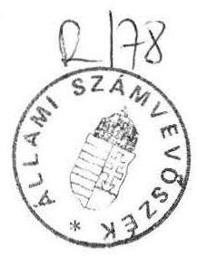

# Allami S̊sámberbösék 

## JELENTÉS

az egyéb központi beruházásokra elóirányzott pénzeszközök
felhasználásának ellenőrzéséről

---

Az ellenőrzést végezték:

Nagy Ákosné
dr. Solymár Károlyné
Surányi Tamás
Csizmadia József
Hajnal István
számvevő tanácsos
számvevő tanácsos
számvevő
külső szakértő
külső szakértő

Az ellenőrzést vezette és a jelentést összeállította:

Kolossváry György
főtanácsos

---

# ÁLLAMI SZÁMVEVŐSZÉK 

V-126-22/1991.
Témaszám: 81 .

## Jelentés

## az egyéb központi beruházásokra elöirányzott pénzeszközök felhasználásának ellenőrzéséről

Az egyéb központi beruházás fogalmába - a nagyberuházáson és a célcsoportos beruházáson kívüli - olyan beruházások tartoztak, amelyek célja a központi költségvetési szervek (és társadalmi szervek) állóeszközeinek bővítése vagy pótlása volt. *

E címen az 1988-91. években közel 90 milliárd Ft előirányzattal rendelkeztek a központi költségvetési szervek. A helyszíni ellenőrzésbe bevont területek (a Közlekedési, Hírközlési és Vízügyi Minisztérium /KHVM/, a Magyar Tudományos Akadémia /MTA/, a Művelődési és Közoktatási Minisztérium /MKM/, a Népjóléti Minisztérium /Népj. Min./ valamint a Tűzoltóság Országos Parancsnoksága /TOP/) ennek $47 \%$-át, 42 milliárd Ft -ot reprezentáltak.

Az ellenőrzés célja az előirányzott pénzeszközök felhasználásának értékelése volt, célszerűségi, eredményességi és törvényességi szempontok szerint. A vizsgálat nem egy-egy beruházás komplex pénzügyi-gazdasági értékelésére, hanem a beruházási pénzeszközökkel való gazdálkodásnak, a beruházási tevékenység összetevőinek a megítélésére irányult.

* 1990. végén a korábbi beruházási kategóriákat megszüntették. Az 1991. évtől bevezetett Kormányzati beruházások alcím lényegében az előző központi beruházási kategóriákat öleli fel, azzal a különbséggel, hogy a nem támogatott központi döntésű fejlesztéseket már nem tartalmazza.

---

Az értékelésnél támaszkodtunk a központi fejezetektől teljeskörűen bekért adatokra is.

A vizsgálat az 1988. január 1. - 1991. június 30. közötti időszakra terjedt ki.

# I.   Összefoglaló megállapítások, javaslatok 

A központi fejezetek az egyéb központi beruházások céljára 1988. és 1991. I. félév között nominálisan növekvő, de - a beruházási árak emelkedését figyelembe véve reálértéken csökkenő pénzügyi forrásokkal rendelkeztek. A források között a meghatározó a költségvetési támogatás volt. A pénzügyi lehetőségek beszűkülése arra kellett volna késztesse a fejezeteket, hogy pénzeszközeik felhasználásáról a beruházási célok megalapozott és szelektív megfogalmazásával, valamint a tervezett beruházások minél gondosabb pénzügyi és műszaki előkészítésével döntsenek. A feladat eredményes végrehajtása feltételezi a fejezetek és a beruházó intézmények ez irányú tevékenységének szabályozottságát, szervezettségét, a beruházási folyamat rendszeres figyelemmel kisérését, ellenőrzését, valamint a lebonyolításban az optimális megoldások alkalmazását. A vizsgált körben azonban ezeknek a követelményeknek több esetben nem feleltek meg.

A vizsgált időszak beruházásainak nagy része régebbi döntéseken - hosszútávú programok (pl. KHVM), VII. ötéves terv - alapult, amelyek tudatos felülvizsgálatára általában nem került sor, így azok nem mindig követték a rendszerváltás nyomán kialakult strukturális változásokat. Mindezek meghatározták az éves terveket, amelyeket viszont gyakran módosítottak (átütemeztek), megbontva ezáltal a források és a beruházási igények összhangját.

A fejezeteknél a beruházási tevékenység irányítása, szervezése és ellenőrzése általában nem kapott a jelentőségének megfelelő hangsúlyt. Ehhez több esetben hiányzott a naprakész, körültekintő belső szabályozás. A beruházások lebonyolításánál így gyakran célszerűtlen, megalapozatlan megoldásokra került sor és a költségvetési eszközök védelme nem érvényesült.

A beruházások előkészítésének hiányosságai, a pénzügyi, műszaki megalapozatlanság esetenként jelentősen növelte a megvalósítás átfutási idejét és számottevő többletköltséget okozott a költségvetési szerveknek. Ezek a többletköltségek más szükséges beruházások pénzügyi alapjait szűkítették.

---

Az előzőek mellett a beruházások veszteségforrásait jelentették a kellő megalapozottság hiánya a kivitelezők kiválasztásánál és a szerződéses (illetve pénzügyi) kapcsolatokban, valamint a múszaki ellenőrzés helyenkénti hanyagsága. A költségvetési szervek esetenként likviditásukat rontó feltételekkel nyújtottak előleget a kivitelezőknek.

Egyes esetekben a pénzeszközök eredményes felhasználását kérdőjelezi meg, hogy a létesítmények kihasználtsága veszélyeztetve van, illetve nem megfelelő.

Az állami pénzek gondatlan felhasználása, a nem megfelelően hasznosuló beruházási ráfordítások, az előkészítés, a tervezés megalapozatlanságából adódó többletilletve improduktív költségek esetenként a felelősség kérdését is felvetik.

Az ellenőrzés megállapításai alapján a következőket javasoljuk:

1. A Kormány, illetve a kormányzati szervek részére:
— hasznosítsák az ellenőrzés általánosítható megállapításait;
— vizsgálják meg a beruházásokkal kapcsolatos mulasztásokat és érvényesítsék a személyes felelősséget;
— az állami költségvetés mindenkori likviditása érdekében a költségvetési szervek által megvalósított beruházások esetében a megrendelő által nyújtható előleg mértékét és elszámolásának időtartamát indokolt lenne kormányrendelettel szabályozni.
2. A felügyeleti szervek mielőbb készítsék el a beruházási tevékenység hiányzó szabályozását, illetve az elavult szabályzatokat aktualizálják. A szabályzatban rögzítsék a beruházási szervezet feladatait, felelősségét, a beruházás folyamatában betöltött szerepét, a megbízott lebonyolító szervezetekkel (kivitelezőkkel) kapcsolatos eljárási és szankcionálási kötelezettségeket.
3. Az előzőekkel összefüggésben a fejezeteknél felül kell vizsgálni a beruházási szervezeteket és létszámukat a feladatokhoz igazítva kell megállapítani. A felügyeleti szerveknél erősíteni kell a beruházásokat felügyelő és ellenőrző tevékenységet. A helyi sajátosságoknak megfelelően mérlegelni kell a lebonyolítási (vagy csak a műszaki ellenőrzési) feladatoknak a saját szervezettel való ellátását. Ez az áttételek és az ellenérdekeltség kiiktatása, továbbá a felelősség egyértelművé tétele mellett jelentős megtakarítást is eredményezhet.

---

4. A költségvetési tervezés során a felügyeleti szervek követeljék meg az intézményektől, hogy csak konkrét tervekkel, költségvetéssel és reális pénzügyi felméréssel alátámasztott igényeket terjesszenek elő. A fejezet szintű tervezésnél legyen elsődleges szempont a célszerűség, a források és az igények összehangolása, amely megköveteli a szelekciót és a fontossági sorrend kialakítását. Az intézmények bevonható saját forrásait következetesebben kell felmérni és figyelembe venni.
5. A beruházó költségvetési szervek - az esetleges jogi szabályozásig is - a kivitelező szervezeteknek csak az indokolt mértékben és elszámolási ütemezéssel folyósítsanak előleget. Ennek feltételeit a szerződésekben egyértelműen rögzítsék.
6. A Magyar Tudományos Akadémiánál
-a törvényesség érdekében intézkedni kell a gazdasági társasággal végeztetett Fortuna u-i vendégház beruházás szabálytalan finanszírozási gyakorlatának, valamint a személyi összeférhetetlenségnek a megszüntetésére;
—el kell rendelni az Atomreaktor rekonstrukciója során az egyéb költségek címén kifizetett jutalmak jogosságának felülvizsgálatát;
—elnöki döntés szükséges a jelenleg nem hasznosított vagy nem kellően kihasznált létesítmények ügyében (KFKI Atomreaktor, erdőtarcsai alkotóház).
7. A Közlekedési, Hírközlési és Vízügyi Minisztérium gondoskodjon arról, hogy a Ferihegyi repülőtér zajvédelmi beruházásai keretében épített cserelakások felének értékesítéséből származó bevétel - mivel a fedezete teljes egészében költségvetési támogatás volt - befizetésre kerüljön az állami költségvetésbe.

# II. 

Részletes megállapítások

## 1. A beruházási pénzeszközökkel való fejezetszintű gazdálkodás

A központi fejezeteknél az egyéb központi beruházások céljára 1988. évtől nominálisan növekvő források álltak rendelkezésre. Az 1988. évi 19,3 milliárd Ft módosított előirányzat 1990-re 15 \%-kal (22,3 milliárd Ft-ra), 1991. I. félévre $36 \%$-kal ( 26,2 milliárd Ft-ra) nőtt. A beruházási árindex következtében azonban

---

az 1990. évi módosított pénzügyi előirányzat reálértékben az 1988. évit nem érte el.

A pénzügyi források évente az eredeti előirányzattal szemben mintegy $25 \%$-kal növekedtek. A beruházások pénzügyi fedezetét alapvetően a központi költségvetési támogatás határozta meg, amely a módosított előirányzat 68-83 \%-át tette ki. Az intézményi saját források részesedése 12-20 \%, míg az egyéb források (átvett pénzek, előző évi beruházási pénzmaradvány) aránya 5-14 \% volt. Évközi többletek (előirányzat módosítások) elsősorban az egyéb forrásoknál voltak jellemzőek. (A források és azok felhasználásának alakulását a 2. sz. melléklet mutatja.)

A saját és a különböző külső forrásokat helyenként csak részben vonták be az egyéb központi beruházások pénzügyi alapjaiba. Ebben szerepet játszottak a 3/1986. (XI.26.) OT-PM számú együttes rendelet, valamint az ehhez kapcsolódó minisztériumi szabályozások, amelyek a költségvetési kereteken belül megvalósítható beruházások körét szélesítették.

A Népjóléti Minisztérium fejezetnél például 1987. II. 1-től a maradványérdekeltségi intézmények az állóeszköz-állományuk bővítését, új szakmai profilok kialakítását célzó beruházásaikat - hazai és szocialista relációban - 500 e Ft értékhatár alatt, állóeszközeik pótlását szolgáló beruházásokat értékhatár nélkül a költségvetés terhére valósíthatták meg.

A fejezetek a beruházási tevékenységet több esetben belső szabályozás nélkül vagy nem megfelelő szabályzat alapján végezték. Emiatt esetenként a gyakorlatban kialakult helytelen megoldások kaptak teret.

Az MTA-nál egyes kérdéseket nem vagy nem egyértelműen szabályoztak. Nem rögzítették a háttérszervezet, a Kutatási Ellátó Szolgálat (KESZ) szerepét a beruházások megvalósításában. Szabályozatlan a pénzügyi lebonyolítás feladata. Ezért kerülhetett sor arra például, hogy az Atomreaktor rekonstrukciónál mind a műszaki, mind a pénzügyi lebonyolítást az Erőmú Beruházó Vállalat végezte és így az állami pénzek feletti díszponálás joga, egy ellenérdekeltségủ gazdálkodó szerv kezébe került. A szabályzat napjainkra összességében elavult.

A Népj. Min-nál a korábbi szervezeti rendben készült szabályozás részben elavult, illetve egyes korábbi minisztériumi rendelkezéseket a Népj. Min. hatályon kívül helyezett. Az új szervezeti-működési szabályzatot viszont még nem hagyták jóvá.

---

Az MKM-nél sem szabályozták a beruházási tevékenységet, 1991. évben irányelveket adtak ki, amely nem egyenértékủ a részletes szabályozással. A tapasztalatok szerint ennek ellenére a vonatkozó jogszabályok szerint jártak el.

A beruházási tevékenység a TOP-nál is szabályozatlan.

A minisztériumok (valamint az MTA és a TOP) általában külön szervezeti egységeket rendeltek a beruházási feladatok végrehajtásához. A sajátosságok alapján egyes intézményeknél is sor került erre (pl. Központi Fizikai Kutató Intézet, /KFKI/, Légiforgalmi és Repülőtéri Igazgatóság /LRI/). A szervezeti megoldások esetenként célszerűségi szempontból vitathatóak. A tapasztalatok szerint a kijelölt szervezetek tervező, összehangoló és felügyelő tevékenysége többször kifogásolható, de helyenként pozitív példa is található.

A Népj. Min-nál a beruházási feladatokat megosztottan két szervezeti egység látja el, koordinációs kötelezettséggel (Állóeszközgazdálkodási és Fejlesztési Osztály, Müszerügyi Önálló Osztály). A két osztály felügyeletileg más-más államtitkárhoz tartozik. A feladatok strukturális és hierarchikus tagolása - a koordináció-igényesség miatt is - nem mondható célszerünek.

Az MTA Beruházási Osztálya a beruházás szervezési és ellenőrzési kötelezettségének csak esetenként tett eleget, felügyeleti hatáskörében - a belső információsrendszer hiányosságai következtében - a reálfolyamatok alakulását érdemben befolyásolni nem tudta. A fejezetnél az MTA 7 fős, a KESZ 12 fős, a KFKI pedig 7 fős beruházási szervezettel rendelkezik. Az építési beruházások számszerủ csökkenése, egyes beruházások külső vállalatok általi lebonyolítása nem indokolja az előzőek szerinti létszám foglalkoztatását. Ugyanakkor a KFKI Beruházási Osztálya létszám-összetétele alapján alkalmatlan építési beruházások lebonyolítására.

Az MTA-nál vitatható a Székház rekonstrukció létesítmény felelőseként megbízott építészmérnök státusza. Munkavégzését a beruházási osztályvezető helyettes irányítja, de munkáltatója s egyben közvetlen felettese a KESZ igazgatója. Miután a székház rekonstrukciójának lebonyolítására a KESZ Műszaki Osztálya kapott megbízást, ezáltal a nevezett dolgozó végülis saját intézménye feladatvégzésének felülbírálatát végzi.

Kedvező, hogy az MKM Tervezési és Fejlesztési Osztálya a beruházási folyamat valamennyi fázisában közremüködik, mintegy folyamatba épített tárca ellenőrzést alakítottak ki.

Az ellenőrzött időszak beruházásai általában középtávú (VII. ötéves terv) és éves tervekre, rövid vagy hosszabb távú szakmai programokra épültek. Egyes

---

fejezeteknél a strukturális változtatás igénye is felmerült, de ezt sem a szakmai programokban, sem a fejlesztési tervekben nem fogalmazták meg.

Az MTA-nál nem készült olyan szakmai koncepció, amely a kutatási irányok felülvizsgálatával (módosításával) és ez által a költségvetési támogatások átrendeződésével járt volna.

A beruházások tervezése szakmailag többnyire megalapozottabbá vált, törekedtek a prioritások és a fontossági sorrend figyelembe vételére, mindezek alapján a feladatok rangsorolására. A pénzügyi lehetőségekre tekintettel a gép-műszer beruházásoknál elsősorban a cserepótló vagy a technológiai hézagpótló beszerzéseket helyezték előtérbe (MTA, Népj. Min.).

Előfordult, hogy a beruházások megvalósítását nem középtávú tervre építették, hanem azokat a gazdasági helyzet alakulása (áremelkedés, építőipari kapacitás, import beszűkülés) függvényében évenként határozták el (TOP).

Kedvezőtlenül érintette az egyéb központi beruházásokat, hogy a tervezés során többnyire nem mérték fel az intézmények bevonható saját forrásait.

Az egyéb központi beruházások módosított előirányzatát a központi fejezetek 1988-ban 94 \%-ban (18,2 Mrd Ft), 1989-ben 76 \%-ban (16,8 Mrd Ft), 1990-ben 73 \%-ban (16,3 Mrd Ft), míg 1991. I. félévben 29 \%-ban (7,5 Mrd Ft) használták fel. Az előirányzatok mérsékeltebb felhasználásában közrejátszottak a beruházások tervezettnél későbbi indítása, áttervezések, pótmunkák, kivitelezői késedelmek.

A fejezetek a rendelkezésre álló forrásokat igyekeztek a tervek szerint, koncentráltan felhasználni. A beruházási döntések azonban nem mindig voltak megalapozottak, a célszerűség és az indokoltság szempontjai ilyenkor nem érvényesültek. Ennek hiánya esetenként a Kormány szintű döntéseknél is tapasztalható. A pénzeszközök rendeltetésellenes illetve jogszabálytól eltérő felhasználása is előfordult.

Az LRI által a Ferihegyi repülőtér körzetében végrehajtott zajvédelmi beruházások nagyrészt valós gondokat oldottak meg. (A zajövezetben az utóbbi tíz évben a gondokat fokozta, hogy a tanácsok építési engedélyeket adtak ki, illetve az engedély nélküli építkezéseket utólag legalizálták.) A csak részben indokolt lakossági nyomás hatására azonban a kormányzat túlméretezett intézkedéseket hozott, amelyek több esetben nem is a kívánt célt szolgálták. A belső zajövezetből elköltözni szándékozók részére 35 db cseretelket alakítottak ki és 112 db lakást építettek összesen 292 millió Ft

---

költséggel. Az előzetes felmérés szerinti igények és a megvalósitást követő igények eltérnek egymástól, igy a cseretelkek és lakások eredeti cel szerinti hasznosítása bizonytalanná vált. A lakások felének értékesitésére a Budapest Főpolgármesteri Hivatallal az LRI megállapodást kötött. A tapasztalatok arra utalnak, hogy a tényleges zajcsökkentő intézkedések is elegendők lettek volna. Mind az érintett tanácsok, mind a lakosság egy része a kártalanitások, kártéritések révén elsősorban pénzhez kívánt jutni.

Az MTA a 46/1984. (XI.6.) MT sz. rendelettel ellentétesen a Bp. I. Fortuna u-i vendégház létesitésével kapcsolatban 1990-ben 20 millió Ft-ot utalt át a Bürotelinvest Betéti Társaságnak a beruházási elöirányzat terhére. Törvényességi szempontból kifogásolható e beruházás 1991. évi 2,9 millió Ft-os finanszírozása, mivel az 1990. évi CIV. tv. 9. paragrafusa, illetve az 52/1991. (III.31.) Korm. sz. rendelet 3. paragrafus szerint a beruházási pénzeszközök átcsoportositása Kormány engedéllyel történhet, amire nem került sor. E pénzügyi akcióval kapcsolatban a személyi összeférhetetlenség is megállapítható, miután az MTA Beruházási Osztály vezetője a Bürotelinvest Betéti Társaság képviselője, egyúttal ügyvezetője a beruházásban ugyancsak érdekelt Bürotelbau Kft-nek.

A KFKI Atomreaktor rekonstrukciónál a KFKI müszaki szakigazgatás és az Atomreaktor kutató részlegének dolgozói részére 14.110 ezer Ft jutalmat fizettek ki 1988-90. években a beruházási elöirányzat terhére, amelynek jogosságára utaló bizonylatokat nem tudtak bemutatni. A kifizetés indokoltsága nem bizonyított.

Egyes KFKI dolgozók - a feladatteljesités elmaradása ellenére - 1988-90. években feltünően nagy jutalomban részesültek ( 1 főosztályvezető helyettes 764 e Ft, 5 érdemi munkatárs személyenként 400 e Ft feletti, 2 ügyvitelt ellátó 159 e Ft, illetve 189 e Ft összegben).

Pazarló pénzfelhasználásnak minősithető az MTA elnöke részére 1991ben 4,3 millió Ft-ért beszerzett 525 BMW típusú személygépkocsi. Hasonlóan indokolatlan volt a személygépkocsikhoz 3 db rádiótelefon beszerzése. (Összértékük 793 e Ft, müködtetésük 1991. júniusban 28 e Ft-ba, júliusban 56 e Ft-ba került.)

A pénzügyi források és a beruházási igények nem kellő összehangoltságára utal, hogy esetenként jelentős ráfordítással előkészített beruházások megvalósítása bizonytalanná vált, vagy indításukra jelentős késedelemmel került sor.

A pénzügyi, műszaki megalapozatlanság (a költségek nagymértékủ alátervezése) következtében jelentősen elhúzódó beruházások a későbbiekben számottevő költségtöbbleteket, improduktív költségeket vagy a ráfordítások hasznosulásának bizonytalanságát okozták. A rekonstrukciós fejlesztések ütemes megvalósí-

---

tását akadályozza, hogy a pénzügyi forrásokról - a költségvetés jóváhagyása keretében - évenként döntenek.

A TOP-nál a siófoki laktanyaépités 1985. évi előirányzata 35 millió Ft volt, amellyel szemben az 1991. évi módosított összeg 130,3 millió Ft, közel négyszeres növekedést jelent. A székesfehérvári laktanyaépités 1979-ben kezdődött és 1989-ig különböző előkészitési munkálatokra - megalapozott költségfelmérés és engedélyokirat nélkül - 11,3 millió Ft-ot fordítottak. Az 1989. évi költségelőirányzat 305,9 millió Ft volt, amely a beruházás 1992. végi várható befejezését tekintve továbbra is bizonytalan.

A Népj. Min. fejezetnél gyakori volt, hogy a tervek felülvizsgálata során nem tárták fel azok megalapozatlanságát, az alátervezést.

A SOTE külső telepi rekonstrukciója szakaszos és folyamatban levő kivitelezése mintegy 8 év óta tart. Az időközbeni áttervezések, áremelkedések és az ÁFA belépése kb. 1,5-2 millió Ft többletköltséget okozott az Urológiai közlekedési csomópont esetében. A SOTE élelmezésüzem 1987-1989. években megvalósított beruházásának bekerülési költségét növelte az előkészítésre 1983-1984. években felhasznált mintegy 2 millió Ft, ami improduktív költség.

A SOTE elhalasztott Zágráb u-i uszoda beruházása esetében bizonytalan, hogy az 1,5 millió Ft tervezési költség hasznosul-e valamikor.

Az előkészítés nem kellő megalapozottsága a beruházások menetében az engedélyokiratok gyakori és széleskörű módosítását vonta maga után. (Az LRI-nél például a környezetvédelmi beruházás engedélyokiratát ötször módosították.)

Egyes államigazgatási feladatok átszervezése során előfordult, hogy a folyamatban lévő beruházásokkal a szükséges pénzügyi források csak részben kerültek átadásra. Emiatt több beruházást el kellett halasztani, amely az igénykielégítés késedelme mellett a megvalósítási költségek időközbeni növekedésével járhat.

A Népj. Min. 1988-ban átvette az MKM-től a gyermek és ifjúságvédelmi feladatokat. Az átadott pénzügyi források elégtelensége nagy mértékben hozzájárult ahhoz, hogy az 1989. évre és az 1990. évre tervezett györi, illetve egri gyermek és ifjúságvédelmi intézeti beruházásokat nem indították.

---

# 2. A beruházások megvalósítása és hasznosítása 

A beruházó szervek általában a 46/1984. (XI.6.) MT sz. rendelet és a végrehajtására kiadott 3/1984. (XI.6.) OT-PM sz. együttes rendelet figyelembe vételével készítették el a munkálatokat megalapozó dokumentumokat (tanulmányterv, beruházási program, versenytárgyalási /tender/ tervdokumentáció, kivitelezési terv, költségvetés) és az engedélyezési eljárás is annak megfelelő volt. Esetenként azonban előfordult, hogy a beruházások előkészitésénél és lebonyolításánál a jogszabályi előírásokat megsértették, amely a későbbiekben jelentős többletköltségeket okozott.

A TOP székesfehérvári és siófoki laktanya építéseit teljeskörű kiviteli terv és költségvetés, valamint a szükséges pénzügyi fedezet hiányában kezdték meg.

A kivitelezők kiválasztása általában - a jogszabályi előírások szerint - versenytárgyalás alapján történt, így lehetőség volt a kedvezőbb ajánlat elfogadására. Előfordult, hogy az építési munkák sajátosságára tekintettel a speciális felkészültségű szakvállalattal kötöttek szerződést, versenytárgyalás mellőzésével.

Az LRI a repülőtéri beruházások esetében szerződött így a Betonútépítő Vállalattal, a finanszírozó bank tudomásulvétele mellett. Ez esetben a versenytárgyalás mellózésére a jogszabály lehetőséget adott.

Helyenként a kivitelező kiválasztásakor a versenytárgyalás ellenére sem jártak el körültekintően, ami a beruházások átfutási idejét és költségét egyaránt növelte.

Jellemző volt ez az MTA Állatorvostudományi Kutató Intézete (ÁTKI) laboratóriumának bővítése, valamint a TOP siófoki laktanya beruházása esetében. Ez utóbbinál a személyi és tárgyi feltételek elégtelensége miatt egyszer már elutasított Bauinvest Kisszövetkezetet bizták meg - teljesen megalapozatlanul - a kivitelezéssel.

Az OTE Élelmezésüzem beruházására a Lakásépítő- és Felújító Vállalattal kötőttek kivitelezői szerződést úgy, hogy bankgaranciát nem kértek. Az intézmény a kivitelezőnek 48,5 millió Ft előleget folyósított, amely pénzügyi helyzete megrendülése miatt a munkát nem folytatta. (A beruházó perli a kivitelezőt.) Az ezt követő kivitelező váltás után az eredeti 17 hónapos kivitelezői időt 31 hónapra, a beruházás költségelőirányzatát 286 millió Ft-ról 423 millió Ft-ra módosították.

---

A tapasztalatok szerint a szerződéses fegyelmet gyakran megsértő vagy fizetésképtelenné váló vállalkozók miatt a versenytárgyalás útján kiválasztott kivitelező sem jelent mindig garanciát a beruházási munkák elvégzésére.

A beruházók a kivitelezőkkel nagyrészt átalánydíjas szerződéseket kötöttek, ami önmagában lehetővé tette volna a költségek kiszámíthatóságát, mivel a fixőszszegủ átalányárba az árkockázati tényezők is beépültek. A kiviteli tervek módosítása, többletmunkák esetén azonban ez az előny nem érvényesült.

Előfordult, hogy az átalánydíjas szerződést indokolatlanul módosították, növelve a beruházási ráfordításokat. (A KFKI Atomreaktor rekonstrukciónál az Energiagazdálkodási Intézettel való szerződésmódosítás 1,3 millió Ft többletköltséget okozott.)

Költségtételes szerződés esetén a kivitelező helyenként jelentős - és vitatható - mértékű díjemelést érvényesített a beruházóval szemben.

Az MTA székház rekonstrukciónál a kivitelező menet közben $65 \%$-kal növelte a munkadíjtételeket, amit a lebonyolító KESZ érdemében nem vizsgált felül. A kivitelező ezt az éves bérszínvonal emelésével indokolta, de a lebonyolító szerv részéről ennek direkt módon való átvállalása nem fogadható el.

A kivitelezés finanszírozásánál a kivitelezők egyre inkább igényt tartanak az előlegre (ennek fejében árengedményt adnak). Helyenként azonban a beruházó által nyújtott előlegek - a beruházás költségéhez viszonyítva - túlságosan nagy összegűek voltak, elszámolásuk hosszú idejű, esetenként a beruházás befejezését jóval meghaladó volt. Az is előfordult, hogy a versenykiírási feltételeket a szerződés kötésnél nem érvényesítették teljeskörűen a vállalkozóval szemben.

Az LRI a zajvédő létesítmények beruházásnál 1988-ban 25,5 millió Ft-ot, 1989-ben 38,5 millió Ft-ot, összesen 64 millió Ft előleget adott a fóvállalkozó Betonútépítő Vállalatnak - az eredeti előirányzat egyharmadát kedvezőtlen visszafizetési megoldással. A visszafizetési - illetve a részszámlákban való elszámolási - kötelezettség 1989. VII. 30-ig 8 millió Ft, X. 30-ig 4 millió Ft, 1990. IV. 30-ig 12 millió Ft, IX. 30 -ig 40 millió Ft volt. A beruházás végszámlájának kiegyenlítése 1989. XII. 14-én megtörtént. A vállalat az előlegből 38,5 millió Ft-ot 1990-ben fizetett vissza, az utolsó részletet XI. hónapban. Az LRI nem élt azzal, hogy - a 35/1982. (VIII.1.) PM-ÁH sz. rendelet alapján - a fơvállalkozól szerzơdésben az elóleg elszámolására a költségvetési érdekeket szolgáló feltételeket kössön ki.

---

Hasonló jelleggel fizettek elóleget a Betonútépítő Vállalatnak a kőrishegyi és a püspökladányi lokátor állomások 1988-1989. évi beruházásánál. Ezekben az esetekben a fővállalkozó a beruházást szolgáló költségvetési pénz egy részét indokolatlanul vette előre igénybe.

Az OTE cseppfolyós oxigénellátó rendszere versenykiírásában a vállakozónak nyújtott előleg után $8 \%$ kamat felszámítása szerepelt. Az adott 2 millió Ft előleg után a kamatot nem számolták fel.

Az előkészítés, a lebonyolítás és a kivitelezés hiányosságai (műszaki tartalom változás, pótmunkák, kivitelezői késedelmek stb.) a beruházások tervezett átfutási idejét gyakran jelentősen megnövelték, a felmerült pótmunkák ugyanakkor számottevő többletköltséget is okoztak. Ezekkel a többletköltségekkel sokszor más tervezett és szükséges beruházások forrását vonták el, illetve megvalósításukat késleltették.

#### Abstract

A KFKI Atomreaktor rekonstrukció beruházás három éves késéssel készült el, gyakoriak voltak a minőségi kifogások és az ebből adódó többletmunkák. A rekonstrukció eredeti előirányzatát $44 \%$-kal lépték túl a pótmunkák, az ÁFA törvény miatti többletkiadások, valamint a lebonyolító vállalat nagyvonalú pénzkezelése (jutalom-kifizetések, indokolatlan szerződés módosítás) következtében.

Az OTE elektromos központ kivitelezési ideje hatósági előírások és a kivitelező késedelme miatt az eredeti 17 hónapról 32 hónapra, a beruházás költsége 24,5 millió Ft-ról $40 \%$-kal 34,2 millió Ft-ra nőtt. Az OTE mind a kivitelező KÉV-METRO, mind a lebonyolító ÉPBER ellen bírósági keresetet nyújtott be késedelmi kötbér és hibás teljesítés miatti kötbér jogcímen.

A TOP székesfehérvári laktanya beruházásánál hiányos volt a területelőkészítés és a kiviteli terv, emiatt a kivitelezés közben tervmódosítás és különböző pótmunkák elvégzése vált szükségessé. Ezek - a még folyamatban lévő beruházásnál - a vizsgálat idejéig 29,4 millió Ft többletköltséget okoztak.

Az Esztergomi Tanítóképző Főiskola beruházásánál a felmerült többletmunkák és a terven felüli berendezések a költségelőirányzat közel $10 \%$-os túllépéséhez vezettek.

A műszaki ellenőri tevékenységgel kapcsolatban különbözőek a tapasztalatok. Helyenként törekvések vannak arra, hogy e feladatot a súlyának megfelelően kezeljék. Erre utal, hogy a beruházó intézmények egy részénél e feladatot saját főfoglalkozású munkaerővel vagy megbízással külső munkaerővel látták el. Ez a megoldás hatékonynak bizonyult (pl. az MTA néhány intézményénél).

---

Előfordult olyan megoldás is, hogy egy nagyobb beruházásra az intézmény saját műszaki ellenőrzési irodát létesített.

Az ELTE lágymányosi épületének beruházására Rekonstrukciós Irodát hozott létre, amelynek feladata a beruházási és felújítási munkák múszaki és pénzügyi irányítása, illetve ellenőrzése.

Az OTE két beruházására 1990-ben lebonyolító csoportot hozott létre a feladat szorosabb kézbentartását célozva.

Más esetekben viszont az alacsony színvonalú műszaki ellenőrzés következtében a beruházások befejezését követően is számos műszaki hiányosság várt megszüntetésre. A műszaki ellenőrzés fogyatékosságai esetenként hátrányosan érintették a beruházót a kivitelezői számlák elfogadásánál, illetve kiegyenlítésénél.

A TOP siófoki laktanya beruházásánál az Állami Fejlesztési Intézet 1988. évben megállapította, hogy a készültségi foknál 15,3 millió Ft-tal többet fizettek ki a kivitelezőnek. Ez alapvetően a lebonyolító, a Gáz és Olajszállító Vállalat műszaki ellenőreinek felelőtlen munkájára vezethető vissza. A kereset érvényesítése a kivitelező ellen peres úton - a Legfelsőbb Bíróságig eljutva - jelenleg is folyamatban van.

Az MTA székház rekonstrukció részmunkálatainak számlázása során szabálytalan megoldások fordultak elő. Egyes munkálatok ellenében előzetesen elfogadott költségvetés és felmérési napló hiányában ún. jogfenntartással (utólagos megállapodás, illetve felmérés alapján) utaltak át jelentős összegeket a kivitelező részére. Ilyen címen fogadtak el az 1991. VI. 26-i 11. sz. részszámlában 1.713 e Ft anyagköltséget és 171 e Ft munkadijtételt.

Nem előíásszerű a számlázás rendje, mivel valamennyi kifizetés javított számla alapján történt (pl. az 1991. VI. 11-i részszámla).

A beruházások elszámolásával és nyilvántartásával kapcsolatos számviteli és bizonylati rendi követelményeknek a vizsgált intézmények nagyrészt eleget tettek. Ezekben az esetekben a számviteli nyilvántartások alkalmasak voltak a beruházási tevékenység nyomonkövetésére. A beruházások ráfordításait az előírások szerint aktiválták. Több esetben azonban hiányosságokat is megállapított az ellenőrzés.

A KHVM a fejezet szintű előirányzatok tényleges felhasználásáról nem alakított ki információs rendszert, így a vizsgált időszak pénzügyi teljesítésének adatai nem álltak rendelkezésre. (Az adatokat csak a finanszírozó bank tudta szolgáltatni.)

---

A SZOTE 410 ágyas klinika beruházást több hónappal az üzembehelyezés után aktiválták.

A SOTE-nél jelenleg is befejezetlen állományban tartanak nyilván hosszabb ideje müködő létesítményt, így az élelmezési üzemet, a Neurológiai és a Psychiátriai Klinika I-II. ütemét, az Urológiai közlekedési csomópontot, a közlekedő szervíz és energiaellátó folyosót.

Az erdőtarcsai Alkotóház beruházás 1989. végi használatbavételétől a vizsgálat időpontjáig leltár egyeztetésre még nem került sor, az épület-tartozékokról felmérés nem készült. A beruházás aktiválását a több mint egy éves müködést követően sem végezték el.

Az ÁTKI laboratóriumi beruházása esetében is indokolatlanul hosszú idő telt el a műszaki átadás és az aktiválás között.

A megvalósított beruházások üzembehelyezését nagyobb részt az előírásoknak megfelelően végezték el. Esetenként előfordult, hogy az üzembehelyezést követően is végezték a hiánypótlást és a pótmunkákat (ÁTKI laboratóriumnál és a Bp-i Tanítóképző Főiskolánál 1991-ben).

A megvalósított beruházások - a már említett célszerűtlen megoldásokon túl többségében jól szolgálták a társadalmi, szakmai igények kielégítését, valamint az intézmények működési feltételeinek javítását. Rontja a megítélést, hogy a megvalósítás költségtényezői gyakran kedvezőtlenek. Helyenként előfordul, hogy a létrehozott kapacitás a közeljövőbeni igényeket meghaladja (az MTA-nál a MÜKKI-magaslabor, MKI-Fitotron és a SZTAKI számítóközpont beruházások, a TOP-nál a siklósi laktanya beruházás).

A létrehozott állóeszközök kihasználtságánál az ellenőrzés elsősorban az MTA fejezetnél állapított meg hiányosságokat. E mellett pozitív kezdeményezés is tapasztalható.

A 760 millió Ft költséggel megvalósított KFKI Atomreaktor rekonstrukció jövőbeni hasznosulása szakmai döntés hiányában nincs biztosítva. Az elhúzódó engedélyezési eljárások, a lakosság ellenállása és a müködtetéshez hiányzó pénzügyi feltételek (kb. évi 60-80 millió Ft) nem tették lehetővé az üzembehelyezést. A rekonstrukciót a 34/1974. (VIII.6.) MT sz. rendelet alapján az állami nagyberuházás kategóriába lett volna célszerű besorolni. Így a beruházással szembeni követelményeket eredményesebben lehetett volna érvényesíteni.

---

Nem az eredeti cél szerint hasznosul az erdőtarcsai Alkotóház, bár a tudományos munkához a megfelelő feltételeket megteremtették. Az eseti értekezletek, az eredeti cél szerinti kismértékủ igénybevétel és az akadémiai dolgozók családtagjainak üdültetése 1990-ben mindössze $26 \%$-os kihasználtságot eredményezett.

Kedvezően értékelhető, hogy az eredményesebb kutatás és a jobb eszközkihasználtság érdekében a müszerbizottság 1991-től számbaveszi az újonnan beszerzett eszközöket - egyeztetve az egyetemek kutatóhelyeivel - és intézményhálózati szinten koordinálják a különféle berendezések használatára irányuló igényeket.

A felügyeleti szervek az üzembehelyezett létesítmények müködési költségfedezetéről általában megfelelően gondoskodtak. Egyes esetekben fordult elő, hogy a biztosított előirányzatok csak részben elegendőek a működtetéshez (az MTA-nál az ÁTKI és az erdőtarcsai Alkotóház beruházásoknál, a Népj. Min-nál az OTE szívsebészeti műtőblokk esetében).

Budapest, 1991. november

Melléklet: 1. sz. melléklet 2 lap
2. sz. melléklet 1 lap

---

# A vizsgált beruházások létesítmény jegyzéke 

## A KHVM fejezetnél:

- Zajvédő létesítmény

LRI Budapest

- Zaj és repülés ellenőrző rendszer

LRI Budapest

- Kártalanítás és kártérítés

LRI Budapest

- Számítógép vezérlésű telex-központ

LRI Budapest

- Püspökladányi és Kőrishegyi távolkörzeti lokátor csere

LRI
— Forgalmi előtérbővítés
LRI Budapest

- Gép-műszer beszerzés /Repülésirányítás/
LRI Budapest
- Gép-műszer beszerzés /Folyamatos müködéshez/
LRI
— Kisebb objektumok
LRI Budapest
- Restaurátor műhely rekonstrukció

Közlekedési Múzeum

## MTA fejezetnél:

- Akadémia Számítóközpont (Számítás-
technikai Kutató Intézet - SZTAKI)
Budapest
- Alkotóház - Kastély rekonstrukicó

Erdőtarcsa

- Laboratóriumi bővítés (Állatorvostudományi

Kutató Intézet - ÁTKI)
Budapest

- Akadémiai Vendégház - I. Fortuna u.

Budapest

- MTA Központi Könyvtár bővítése

Budapest

- Magaslabor építés (Műszaki Kémiai Kutató

Intézet - MÜKKI)
Veszprém

- Hibridbúza kutatás programja - gépbeszerzés
(Mezőgazdasági Kutató Intézet - MKI
Martonvásár

---

- Fitotron rekonstrukció (Mezőgazdasági Kutató Intézet)

Martonvásár

- Űrtechnika fejlesztési program - számítógép beszerzése (Központi Fizikai Kutató Intézet - KFKI)

Budapest

- Atomreaktor rekonstrukció (KFKI)

Budapest

- MTA Székház rekonstrukció I. ütem

Budapest

# Az MKM fejezetnél: 

- Az Eötvös Lóránd Tudományegyetem (ELTE) - lágymányosi épülete I/1. ütem (Kémiai szakterület)
- Iparművészeti Főiskola - 96 férőhelyes kollégium, Budapest
- A Budapesti Tanítóképző Főiskola bővítése
- Az Esztergomi Tanítóképző Főiskola - 250 fős kollégium
- A Szerb-horvát 100 fős diákotthon, Budapest
- A Szentendrei Görögkeleti Szerb Egyházmúvészeti Múzeum rekonstrukciója

## A Népjóléti Minisztérium fejezetnél:

- Orvostovábbképző Egyetem (OTE)
- Semmelweis Orvostudományi Egyetem (SOTE)

## A TOP címnél:

- Tủzoltólaktanya

Barcs

- Központi Javító Üzem

Budapest

- Tủzoltólaktanya

Siklós

- Tủzoltólaktanya

Siófok

- Tủzoltólaktanya

Székesfehérvár

Budapest, 1991. november

---

# Egyéb központi beruházások pénzügyi mutatói /központi fejezetek összesen/ 

millió Ft-ban

| Megnevezés /év | 1988. | 1989. | 1990. | 1991.* |
| :-- | --: | --: | --: | --: |
| Eredeti elöirányzatok: |  |  |  |  |
| Kp-i költségvetési támogatás | 12.159 | 14.910 | 14.586 | 21.236 |
| Saját forrás | 3.089 | 2.570 | 1.790 | 1.921 |
| Hitel | 29 | - | - | 1 |
| Egyéb | 349 | 562 | 1.230 | 817 |
| Össz. eredeti elöirányzat | 15.625 | 18.043 | 17.605 | 23.975 |
| Módosítások: |  |  |  |  |
| Kp-i költségvetési támogatás | 1.033 | 1.029 | 742 | 668 |
| Saját forrás | 724 | 1.302 | 1.923 | 1.128 |
| Hitel | 213 | 138 | 90 | 5 |
| Egyéb | 1.715 | 1.569 | 1.907 | 471 |
| Módosítás összesen | 3.685 | 4.037 | 4.662 | 2.272 |
| Össz. módosított elöirányzat | 19.310 | 22.080 | 22.267 | 26.246 |
| Módosított ei./eredeti ei. \% | 124 | 122 | 126 | 109 |
| Teljesítés /ÁFA-val/ | 18.164 | 16.763 | 16.263 | 7.527 |
| Teljesítés az eredeti |  |  |  |  |
| elöirányzat \%-ában | 116,25 | 92,91 | 92,37 | 31,40 |
| Teljesítés a módosított |  |  |  |  |
| elöirányzat \%-ában | 94,06 | 75,92 | 73,03 | 28,68 |

* Megjegyzés: éves előirányzat és I. félévi teljesítés

Budapest, 1991. november