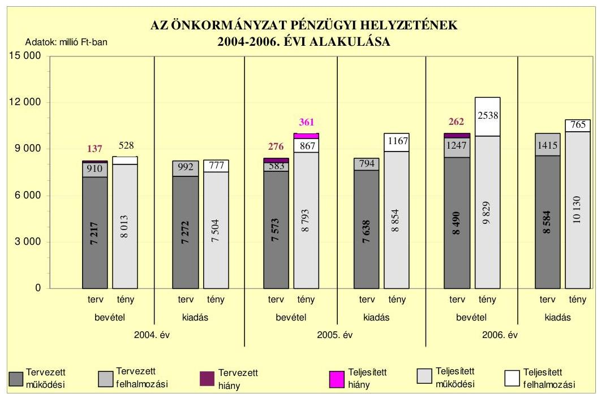
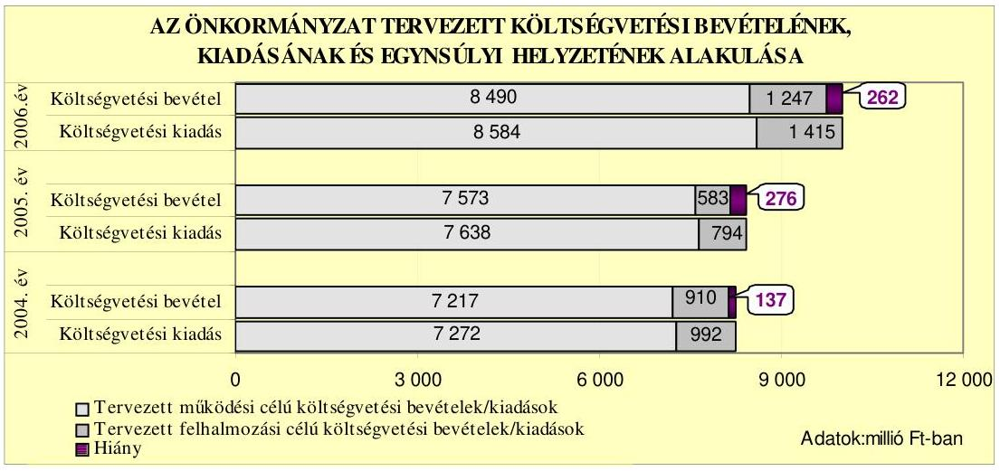
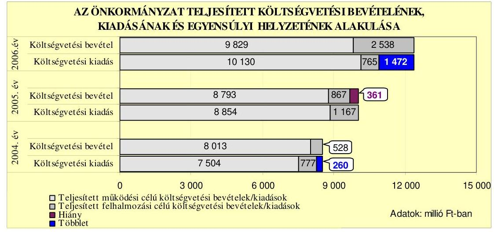
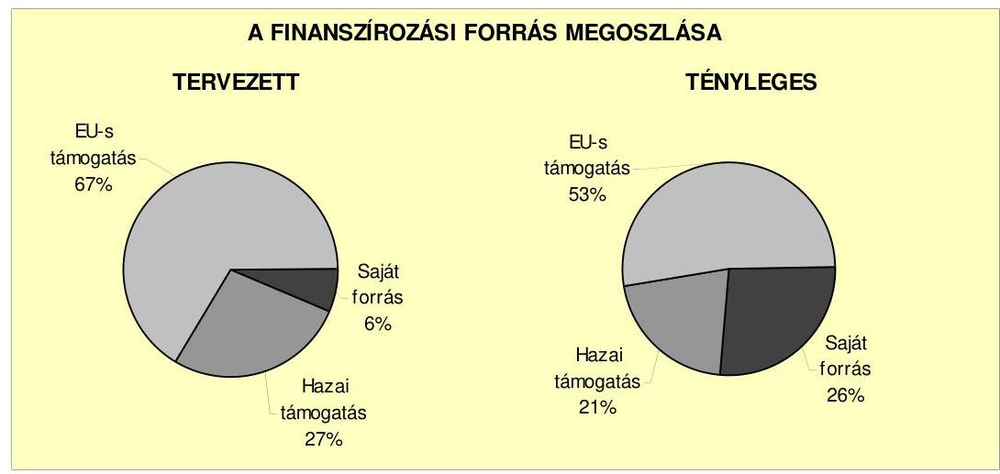
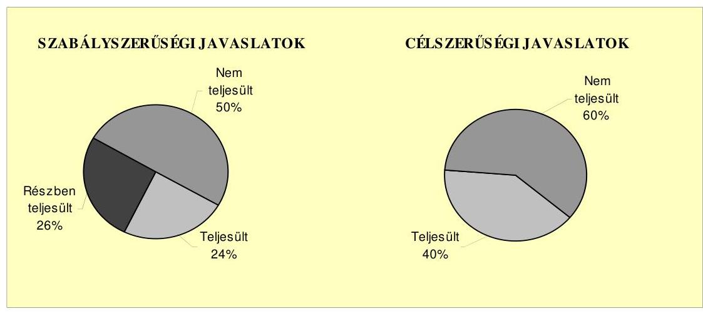
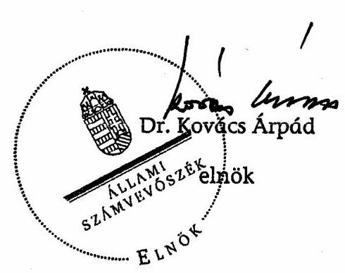
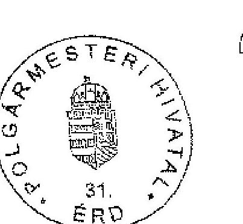
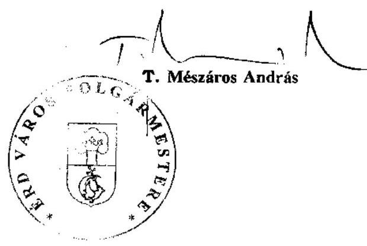
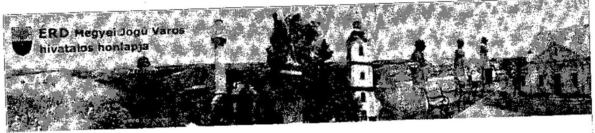

# JELENTÉS 

Érd Megyei Jogú Város Önkormányzata gazdálkodási rendszerének 2007. évi átfogó ellenőrzéséről

---

# 3. Önkormányzati és Területi Ellenőrzési Igazgatóság 

## Átfogó Ellenőrzések Főcsoport

Iktatószám: V-1001-9/21/30/2007.
Témaszám: 845
Vizsgálat-azonosító szám: V0323

## Az ellenőrzést felügyelte:

Dr. Lóránt Zoltán
főigazgató
Az ellenőrzés végrehajtásáért felelős:
Dr. Sepsey Tamás
főigazgató-helyettes
Az ellenőrzést vezette:
Csecserits Imréné
főcsoportfőnök-helyettes
Az ellenőrzést végezték:
Dr. Csermák Judit Gyüre Lajosné Schósz Attiláné számvevő
számvevő tanácsos számvevő tanácsos

## A témához kapcsolódó eddig készített számvevőszéki jelentések:

## címe

Jelentés a helyi és a helyi kisebbségi önkormányzatok gazdálkodásának átfogó ellenőrzéséről
Jelentés a 2004. június 13-án megtartott, az EP tagjai választás és a 0560 2004. december 5-én megtartott országos ügydöntő népszavazás lebonyolításához felhasznált pénzeszközök elszámolásának ellenőrzéséről
Jelentés a Magyar Köztársaság 2005. évi költségvetése végrehajtásának ellenőrzéséről
Függelék: A helyi önkormányzatok beruházásaihoz és rekonstrukcióihoz nyújtott 2005. évi felhalmozási célú támogatások ellenőrzése

---

# TARTALOMJEGYZÉK 

BEVEZETÉS ..... 11
I. ÖSSZEGZŐ MEGÁLLAPÍTÁSOK, KÖVETKEZTETÉSEK, JAVASLATOK ..... 16
II. RÉSZLETES MEGÁLLAPÍTÁSOK ..... 29

1. Az Önkormányzat költségvetési és pénzügyi helyzete ..... 29
1.1. A tervezett költségvetési bevételi és kiadási előirányzatok, valamint a költségvetési egyensúly alakulása ..... 31
1.2. A költségvetési bevételek és kiadások teljesítése, a pénzügyi egyensúlyi helyzet alakulása ..... 32
2. Az Önkormányzat felkészültsége az európai uniós források igénylésére és felhasználására, valamint az e-közigazgatási feladatok ellátására ..... 35
2.1. Az európai uniós források igénybevételére és a várható támogatás felhasználásának szervezettségére történt felkészülés és a belső szabályozottság értékelése ..... 35
2.1.1. A fejlesztési célkitűzések meghatározása ..... 35
2.1.2. Az európai uniós forrásokhoz kapcsolódóan a pályázat- figyelés, a pályázat-készítés, valamint az európai uniós támogatással megvalósuló fejlesztés lebonyolítási a belső rendjének szabályozottsága, a végrehajtás személyi, szervezeti feltételei ..... 39
2.1.3. Az európai uniós forrással támogatott fejlesztés megvalósítása ..... 42
2.2. Az e-közigazgatási feladatok előkészítése, bevezetése ..... 47
3. A költségvetési gazdálkodás kontrolljai ..... 49
3.1. A szabályozottság kockázata a költségvetés tervezési, gazdálkodási, beszámolási és a folyamatba épített ellenőrzési feladatainál ..... 49
3.2. A belső kontrollok érvényesülése az önkormányzati források szabályszerű felhasználásában, a költségvetési tervezés, gazdálkodás, beszámolás folyamataiban ..... 52
3.3. A belső ellenőrzési kötelezettség teljesítése, javaslatainak hasznosulása ..... 57
4. Az ÁSZ korábbi ellenőrzési javaslatai alapján készített intézkedési terv végrehajtása, eredményessége ..... 60
4.1. Az Önkormányzat gazdálkodási rendszerének átfogó ellenőrzése során tett javaslatok végrehajtására tervezett intézkedések megvalósulása ..... 60

---

4.2. A zárszámadáshoz kapcsolódó (állami hozzájárulások, támogatások igénylésének és felhasználásának ellenőrzése), valamint a további vizsgálatok esetében a megállapítások, javaslatok alapján tett intézkedések

# MELLÉKLETEK 

1. számú Az Önkormányzat gazdálkodását meghatározó adatok, mutatószámok (1 oldal)
2. számú Az önkormányzati vagyon alakulása (1 oldal)
3. számú Az Önkormányzat 2004-2006. évi költségvetési előirányzatainak és azok pénzügyi teljesítéseinek alakulása ( 1 oldal)
4. számú 1. számú Nyilatkozat a tervezett és teljesített költségvetési adatoknak a megelőző évhez viszonyított jelentős, $\pm 10 \%$-ot meghaladó változásairól, amennyiben azt a feladatok változása indokolta (2 oldal)
5. számú 1. számú Tanúsítvány az európai uniós forrásokkal támogatott programok, célok tervezett és tényleges adatairól 2004-2007. évekre (1 oldal)
6. számú T. Mészáros András úr, az Érd Megyei Jogú Város Önkormányzata polgármesterének észrevétele (2 oldal) oldal

---

# RÖVIDÍTÉSEK JEGYZÉKE 

## Törvények

Áht.
Eisztv.

Htv.

Kbt.
Ötv.
Számv. tv.

## Rendeletek

2004. évi költségvetési rendelet
2005. évi költségvetési rendelet
2005. évi zárszámadási rendelet
2006. évi költségvetési rendelet
2007. évi költségvetési rendelet
Ámr.
Ber.
SzMSz

Vhr.

## Szórövidítések

ÁSZ
ÉKF
e-közigazgatás
EMIR
Érdi Projekt Kft.
Érd-Kom Kft.
ÉTV Kft.
EU bizottság
az államháztartásról szóló 1992. évi XXXVIII. törvény
az elektronikus információszabadságról szóló 2005. évi XC. törvény
a helyi önkormányzatok és szerveik, a köztársasági megbízottak, valamint egyes centrális alárendeltségű szervek feladat- és hatásköreiről szóló 1991. évi XX. törvény
a közbeszerzésekről szóló 2003. évi CXXIX. törvény
a helyi önkormányzatokról szóló 1990. évi LXV. törvény
a számvitelről szóló 2000. évi C. törvény

Érd Város Önkormányzatának 6/2004. (III. 3.) számú rendelete a 2004. évi költségvetésről
Érd Város Önkormányzatának 5/2005. (III. 1.) számú rendelete a 2005. évi költségvetésről
Érd Város Önkormányzatának 12/2006. (IV. 4.) számú rendelete a 2005. évi költségvetés végrehajtásáról
Érd Város Önkormányzatának 4/2006. (III. 10.) számú rendelete a 2006. évi költségvetéséről
Érd Megyei Jogú Város Önkormányzatának 8/2007. (III. 1.) számú rendelete a 2007. évi költségvetéséről
az államháztartás múködési rendjéről szóló 217/1998. (XII. 30.) Korm. rendelet
a költségvetési szervek belső ellenőrzéséről szóló 193/2003. (IX. 26.) számú Korm. rendelet

Érd Város Önkormányzatának 17/2004. (VI. 31.) számú rendelete az Önkormányzat Szervezeti és Múködési Szabályzatáról
az államháztartás szervezetei beszámolási és könyvvezetési kötelezettségének sajátosságairól szóló 249/2000. (XII. 24.) számú Korm. rendelet

Állami Számvevőszék
Érdi Közterület-fenntartó Intézmény
elektronikus közigazgatás
Egységes monitoring informatikai rendszer
Érdi Projekt Ingatlanüzemeltető Korlátolt Felelősségű Társaság
Érdi Kommunális Hulladékkezelő Korlátolt Felelősségű Társaság
Érd és Térsége Regionális Víziközmű Korlátolt Felelősségű Társaság
Érd Megyei Jogú Város Önkormányzata Közgyűlésének Európai Integrációs bizottsága

---

ÉVÁÉP Kht.
fejlesztési program

FEUVE
gazdálkodási jogkörök szabályzata
gazdasági koncepció
gazdasági program

GVOP
GVOP információszolgáltatás fejlesztési feladat

GVOP kivitelező vállalkozás
HEFOP
információszolgáltatási támogatási szerződés
informatikai stratégia

INTERREG IIIC együttmúködési projektek
irányító hatóság
jegyzó
KIOP
Körösi Csoma Iskola
Közbeszerzési Döntőbizottság
Közbeszerzési osztály

Érdi Városgazdálkodási és Építőipari Közhasznú Társaság a Képviselő-testület 249/2005. (X. 20.) számú határozatával elfogadott Érd város közép- és hosszú távú településfejlesztési koncepciója fejlesztési programrésze (2006-2013. évig)
folyamatba épített előzetes és utólagos vezetői ellenőrzés a kötelezettségvállalás, ellenjegyzés, érvényesítés és utalványozás rendjéről szóló $1 / 2004$. számú polgármesteri és jegyzői együttes utasítás
a Képviselő-testület 59/2000. (IV. 20.) számú határozatával elfogadott Önkormányzat gazdasági koncepciója
a Képviselő-testület 283/2004. (XI. 25.) számú határozatával elfogadott Önkormányzat tevékenységének irányvonalát, az elsőbbséget élvező célokat, a fejlesztési irányokat tartalmazó ciklusprogramjáról (az Önkormányzat gazdasági programja)
NFT Gazdasági Versenyképesség Operatív Program
a GVOP-4.3.1. Az önkormányzatok információszolgáltató tevékenységének keretében elnyert „Intelligens elektronikus közigazgatási szolgáltatások fejlesztése Érden" fejlesztési feladat
a GVOP információszolgáltatás fejlesztési feladatot megvalósító HUMANsoft Kft.
NFT Humánerőforrás-fejlesztési Operatív Program
az Önkormányzat és a közremúködő szervezet között megkötött szerződés a GVOP-4.3.1. az önkormányzatok információ-szolgáltató tevékenységének keretében elnyert „Intelligens elektronikus közigazgatási szolgáltatások fejlesztése Érden" fejlesztési feladatra
a Képviselő-testület 59/2005. (III. 31.) számú határozatával elfogadott Érd Város Önkormányzata Polgármesteri Hivatalának informatikai stratégiája és programja 20042008.
az INTERREG IIIC keretében a SportUrban, Capture, Knowledge Network projektek, amelyek a régiók egymás közötti tapasztalatcseréjének biztosítására és az Uniós politikák irányítóinak a régiók által elért eredményekkel történő megismertetésére vonatkoznak
a Gazdasági és Közlekedési Minisztérium, mint a GVOP irányító hatósága
Érd Megyei Jogú Város Önkormányzatának Jegyzője
NFT Környezetvédelmi és Infrastruktúrafejlesztés Operatív Program
Körösi Csoma Sándor Általános Iskola
Közbeszerzések Tanácsa Közbeszerzési Döntőbizottsága
Érd Megyei Jogú Város Önkormányzata Polgármesteri Hivatalának Közbeszerzési Osztálya

---

Közgyűlés
közreműködő szervezet

MÁK
munkamegosztási szabályzat
NFT
Norvég alap
Okmányiroda
Oktatási osztály
Önkormányzat
Önkormányzati osztály
PEA II előkészítő támogatás

Pénzügyi bizottság
Pénzügyi osztály
PM
polgármester
Polgármesteri hivatal
Polgármesteri hivatal
SzMSz-e
Polgármesteri kabinet
ROP
szolgáltatástervezési
koncepció
Vagyongazdálkodási bizottság
választások
választások elszámolási rendjének szabályzata

Városfejlesztési osztály

Érd Megyei Jogú Város Önkormányzatának Közgyűlése, 2006. július 11-ig Képviselő-testülete
az IT Információs Társadalom Informatikai és Távközlési Szolgáltató Közhasznú Társaság, a 2007. évben Vállalkozói Támogatásközvetítő Zrt.
Magyar Államkincstár
a Polgármesteri hivatal Ügyrendjének 9. számú melléklete a szervezeti egységek közötti munkamegosztásról
Nemzeti Fejlesztési Terv
az Európai Gazdasági Térség és a Norvég Finanszírozási Mechanizmusok Közösségi Kezdeményezés
Érd Megyei Jogú Város Önkormányzata Polgármesteri Hivatalának Okmányirodája
Érd Megyei Jogú Város Önkormányzata Polgármesteri Hivatalának Oktatási és Művelődési Osztálya
Érd Megyei Jogú Város Önkormányzata
Érd Megyei Jogú Város Önkormányzata Polgármesteri Hivatalának Önkormányzati és Szervezési Osztálya
az Érd város és térsége gazdasági potenciáljának erősítése projektjavaslatra, a Közép-Magyarországi Regionális Fejlesztési Tanácstól elnyert támogatás
Érd Megyei Jogú Város Önkormányzat Közgyűlésének Gazdálkodási, Pénzügyi és Integrációs Bizottsága
Érd Megyei Jogú Város Önkormányzata Polgármesteri Hivatalának Pénzügyi Osztálya
Pénzügyminisztérium
Érd Megyei Jogú Város Önkormányzatának Polgármestere
Érd Megyei Jogú Város Önkormányzatának Polgármesteri Hivatala
Érd Megyei Jogú Város Önkormányzata Polgármesteri Hivatalának Ügyrendje
Érd Megyei Jogú Város Önkormányzata Polgármesteri Hivatalának Polgármesteri Kabinetje
NFT Regionális Operatív Program
a Képviselő-testület 298/2004. (XII. 16.) számú határozatával elfogadott Érd Város szociális szolgáltatástervezési koncepciója
Érd Megyei Jogú Város Önkormányzat Közgyűlésének Vagyongazdálkodási Bizottsága
a választási eljárásról szóló 1997. évi C. törvény 2. §-ának hatálya alá tartozó választások
a 4/2006. és a 18/2006. számú jegyzői utasítás a 2006. április 9-én és a 2006. április 23-án tartandó országgyűlési képviselőválasztás, továbbá a 2006. október 1-jén tartandó helyi önkormányzati képviselők és polgármesterek választásának elszámolási rendjéről
Érd Megyei Jogú Város Önkormányzata Polgármesteri Hivatalának Városfejlesztési Osztálya

---

.

---

# ÉRTELMEZŐ SZÓTÁR 

1. elektronikus szolgáltatási szint
2. elektronikus szolgáltatási szint
3. elektronikus szolgáltatási szint
4. elektronikus szolgáltatási szint
fejlesztési feladat

GVOP-4.3. intézkedés

HEFOP-4.2. intézkedés

INTERREG IIIC

Az 1044/2005. (V. 11.) Korm. határozat alapján információs, tájékoztató szolgáltatás, amely csak általános információkat közöl az adott üggyel kapcsolatos teendőkről és a szükséges dokumentumokról.
Az 1044/2005. (V. 11.) Korm. határozat alapján egyirányú kapcsolatot biztosító szolgáltatás, amely az 1. szinten túl biztosítja az adott ügy intézéséhez szükséges dokumentumok, nyomtatványok letöltését, és azok ellenőrzéssel vagy ellenőrzés nélküli elektronikus kitöltését, amely esetben a dokumentumok benyújtása hagyományos úton történik.
Az 1044/2005. (V. 11.) Korm. határozat alapján kétirányú kapcsolatot biztosító szolgáltatás, amely közvetlen vagy ellenőrzött kitöltésű dokumentum segítségével biztosítja az elektronikus adatbevitelt és a bevitt adatok ellenőrzését. Az ügy indításához, intézéséhez személyes megjelenés nem szükséges, de az ügyhöz kapcsolódó közigazgatási döntés (határozat, egyéb aktus) közlése, valamint a kapcsolódó illeték- vagy díffizetés hagyományos úton történik.
Az 1044/2005. (V. 11.) Korm. határozat alapján teljes közvetlen kétirányú ügyintézési folyamatot biztosító szolgáltatás, amikor az ügyhöz kapcsolódó közigazgatási döntés is elektronikus úton kerül közlésre, illetve a kapcsolódó illeték- vagy díffizetés elektronikus úton is intézhető.
Az a fejlesztési feladat, amely illeszkedik az Európai Unió, illetve a Nemzeti Fejlesztési Terv által támogatott programokhoz. Az Európai Unió, illetve a Nemzeti Fejlesztési Terv által meghirdetett programokhoz kapcsolódó, támogatott projektek megvalósításához használhatók fel az európai uniós források. A fejlesztési feladat (projekt) tartalmilag és formailag részletesen kidolgozott, megfelelő pénzügyi háttérrel és végrehajtási ütemezéssel rendelkező fejlesztési terv.
A GVOP keretében az információs társadalom- és gazdaság fejlesztése NFT prioritáshoz kapcsolódóan az eközigazgatás fejlesztésére megnyitott pályázati lehetőség.
A HEFOP keretében az oktatási, szociális és egészségügyi infrastruktúra fejlesztése NFT prioritáshoz kapcsolódóan a társadalmi befogadást támogató szolgáltatások infrastruktúrájának fejlesztésére megnyitott pályázati lehetőség. Közösségi kezdeményezés, melynek célja a regionális, határokon túlívelő együttműködés.

---

irányító hatóság

KIOP-1.6. intézkedés
közreműködő szervezet
lebonyolítás

PEA II program

A strukturális alapok és a Kohéziós alap forrásainak szabályszerű, hatékony és eredményes felhasználásához szükséges intézményrendszer felső eleme. Az irányító hatóság általános és átfogó felelősséget visel a programok, projektek hatékony és szabályszerű végrehajtásáért. Felelősségi köréből eredően ellenőrzi a közösségi, valamint a hazai jogszabályok betartását, koordinálja az európai uniós források szétosztásának folyamatát, irányítja az intézményrendszer, a statisztikai és a pénzügyi nyilvántartási rendszer múködését.
A KIOP keretében a környezetvédelem fejlesztése NFT prioritáshoz kapcsolódóan a levegőszennyezés és zajterhelés mérésére megnyitott pályázati lehetőség.
A közreműködő szervezet az európai uniós támogatást elnyert kedvezményezettekkel kapcsolattartó szerv.
Az operatív programok közreműködő szervezetei befogadják, nyilvántartják, döntésre előkészítik a pályázatokat, rögzítik a támogatással kapcsolatos adatokat az egységes monitoring informatikai rendszerben, elvégzik a támogatások előzetes (szerződéskötést megelőző), közbenső (a pénzügyi elszámolás, finanszírozás folyamatában végzett) és utólagos (a támogatott projekt pénzügyi lezárását megelőző) ellenőrzését. Az önkormányzatoknál a leggyakrabban előforduló operatív program a Regionális Fejlesztési Operatív Program végrehajtásában közreműködő szervezetek a VÂTI Kht. és a regionális fejlesztési ügynökségek.
A Kohéziós alap két közreműködő szervezete (Gazdasági és Közlekedési Minisztérium, Környezetvédelmi és Vízügyi Minisztérium) a támogatott projektek végrehajtásához kapcsolódó operatív feladatokat látják el. Ennek keretében megkötik a szerződéseket a projekt kedvezményezettjével, folyamatosan nyomon követik a teljesítéseket, lebonyolítják a támogatások kifizetését, vezetik az egységes monitoring informatikai rendszert.
Az európai uniós források felhasználásával megvalósuló fejlesztésre irányuló műszaki, gazdasági (pénzügyi) tevékenységet magában foglaló szervezési, irányítási szolgáltatás. A szervezési szolgáltatás kiterjedhet a pályázatkészítésre, a közbeszerzési eljárás lebonyolításán keresztül a folyamatos műszaki ellenőrzésre, a pénzügyi elszámolásra, a múszaki átadás-átvételre, az üzembe helyezésre, illetve a fejlesztési folyamat egyes elemeire.
Pályázat Előkészítő Alap, amely projektjavaslatok benyújtásával lehetőséget ad az önkormányzatok számára a 2007-2013. évek közötti fejlesztési időszakban megnyíló európai uniós forrásokból megvalósítható színvonalas projektek előkészítésére.

---

ROP-2.2. intézkedés
támogatási szerződés

A ROP keretében a térségi infrastruktúra és települési környezet fejlesztése NFT prioritáshoz kapcsolódóan a városi területek rehabilitációjára megnyitott pályázati lehetőség. A strukturális alapok esetében az irányító hatóságnak, illetve a Kohéziós alap esetében a közremúködő szervezeteknek a kedvezményezett önkormányzattal kötött szerződése, amely a támogatás felhasználásának részletes feltételeit tartalmazza.

---

.

---

# JELENTÉS 

## Érd Megyei Jogú Város Önkormányzata gazdálkodási rendszerének 2007. évi átfogó ellenőrzéséről

## BEVEZETÉS

Az Ötv. 92. § (1) bekezdése, az Állami Számvevőszékről szóló 1989. évi XXXVIII. törvény 2. § (3) bekezdése, valamint az Áht. 120/A. § (1) bekezdése alapján az önkormányzatok gazdálkodását az Állami Számvevőszék ellenőrzi. Az ellenőrzésre az Országgyúlés illetékes bizottságai részére is átadott, országosan egységes ellenőrzési program alapján került sor.

Az Állami Számvevőszék a stratégiájában foglalt célkitűzéseknek megfelelően a helyi önkormányzatok költségvetési gazdálkodási rendszere átfogó ellenőrzésének programját a 2007. évtől megújította, azt kiegészítette további - teljesít-mény-ellenőrzési - elemekkel.

## Az ellenőrzés célja annak értékelése volt, hogy az Önkormányzat:

- a pénzügyi egyensúlyt a költségvetésében és annak teljesítése során milyen módon biztosította, a teljesített bevételek és kiadások egyes évek közötti jelentős eltérése feladatváltozáshoz kapcsolódott-e;
- felkészült-e a szabályozottság és a szervezettség terén az európai uniós források igénylésére és felhasználására, továbbá az e-közigazgatás bevezetése miatti szervezet-korszerúsítési feladatokra;
- kialakította-e a külső és a belső feltételeknek megfelelően a gazdálkodás belső kontrollrendszerét ${ }^{1}$, továbbá a költségvetés tervezési, végrehajtási és zárszámadási feladatok szabályszerű ellátásához hozzájárult-e a folyamatba épített, előzetes és utólagos vezetői ellenőrzés, valamint a belső ellenőrzés;
- megfelelően hasznosították-e a korábbi számvevőszéki ellenőrzések megállapításait, szabályszerűségi ${ }^{2}$ és célszerűségi javaslatait.

[^0]
[^0]:    ${ }^{1}$ A gazdálkodás szabályszerűségét biztosító kontrollrendszer alatt értjük a kiépített és múködő belső irányítási és szabályozási rendszert, valamint a belső ellenőrzési funkciók ellátásának rendszerét.
    ${ }^{2}$ A törvényi előírások betartásának elmulasztásakor a részletes megállapítások fejezetben egységesen a törvénysértés megjelölést alkalmazzuk, mivel az ÁSZ nem tehet különbséget a törvényi előírások között.

---

Az ellenőrzött időszak: az 1., 2. és 4. ellenőrzési programpontok tekintetében a 2004-2006. évek, a 3. ellenőrzési programpontnál a 2006. év.

Érd várost a Képviselő-testület kérelmére az Országgyúlés a 82/2005. (XI. 10.) számú határozatában 2006. július 11-től megyei jogú várossá nyilvánította, ennek következtében a Képviselő-testületet az Ötv. 61. § (2) bekezdése alapján Közgyűlés váltotta fel³. Érd Megyei Jogú Város lakosainak száma 2007. január 1-jén 62183 fő volt. A 2006. évi önkormányzati választást követően az Önkormányzat 28 tagú Közgyűlésének munkáját 11 állandó bizottság segítette. A városban a 2006. évi önkormányzati választásokig öt ${ }^{4}$, azt követően hét ${ }^{5}$ kisebbségi önkormányzat múködött. A polgármester a 2006. évi önkormányzati választás óta tölti be tisztségét, a jegyző személye a 2004. évben változott. A 2004. évben kinevezett jegyző közszolgálati jogviszonyát a Közgyűlés 2007. február 22-én megszüntette.

Az Önkormányzat feladatainak végrehajtása érdekében a 2006. évben 29 költségvetési intézményt múködtetett, amelyekből 10 önállóan gazdálkodott. A feladatok ellátásában részt vett három alapítványa, továbbá négy gazdasági társasága. Az Önkormányzat költségvetési szerveinél a 2006. év végén foglalkoztatott köztisztviselők száma 208 fő, a közalkalmazottak száma 1486 fő volt. Az Önkormányzat a 2006. évi költségvetési beszámolója szerint 12 366,5 millió Ft költségvetési bevételt ért el és 10894,4 millió Ft költségvetési kiadást teljesített, a 2006. év végén a könyvviteli mérleg szerint 32 166,4 millió Ft értékű vagyonnal rendelkezett. A 2007. évi költségvetési rendeletben 9280,4 millió Ft költségvetési bevételt és 12787,2 millió Ft költségvetési kiadást irányoztak elő. Az Önkormányzat gazdálkodását meghatározó adatokat, mutatószámokat az 1-3. számú mellékletek tartalmazzák.

Az Önkormányzat költségvetési és pénzügyi helyzetét az összehasonlító elemzés módszerével vizsgáltuk. E körben elemeztük a költségvetés egyensúlyi helyzetének alakulását, a tervezett és tényleges költségvetési hiány okait, a mérséklésére tett intézkedéseket, finanszírozásának módját, az Önkormányzat adósságállományának alakulását, összetevőit.

A teljesítmény-ellenőrzés módszerével vizsgáltuk, hogy a belső szabályozottság, szervezettség terén felkészültek-e az európai uniós források igénylésére és felhasználására, valamint az igényelt európai uniós támogatások az Önkormányzat által meghatározott fejlesztési célkitűzésekhez kapcsolódtak-e. Az ellenőrzés során felmértük, hogy az e-közigazgatási feladat ellátása, illetve bevezetése, múködtetése érdekében milyen intézkedéseket tettek, valamint biztosí-tották-e a közérdekú adatok elektronikus közzétételét.

[^0]
[^0]:    ${ }^{3}$ A megyei jogú várossá nyilvánításnál a hatályos előírások szerint nem játszik szerepet a gazdálkodás szabályozottsága, a gazdálkodás során a folyamatba épített ellenőrzési feladatok előírás szerinti elvégzése.
    ${ }^{4}$ Cigány, horvát, lengyel, német, szerb kisebbségi önkormányzatok.
    ${ }^{5}$ Bolgár, cigány, görög, horvát, lengyel, német, szerb kisebbségi önkormányzatok.

---

A költségvetési gazdálkodás belső kontrolljainak ellenőrzése során értékeltük, hogy a Polgármesteri hivatalnál a költségvetés tervezési, gazdálkodási, zárszámadás készítési feladatok belső kontrolljainak kiépítettsége és múködése megfelelő biztosítékot ad-e a gazdálkodási feladatok megfelelő, szabályszerű ellátására. Felmértük és minősítettük a költségvetés tervezési, a gazdálkodási, a zárszámadás készítési feladatokkal, továbbá a pénzügyi- számviteli területen az informatikával kapcsolatosan kialakított kontrollok megfelelőségét, valamint azok múködésének eredményességét, megbízhatóságát. Értékeltük a belső ellenőrzés szervezeti és szabályozási keretét, továbbá múködését.

A Polgármesteri hivatalnál értékeltük a gazdálkodás folyamatában a kontrollok múködésének megbízhatóságát, ennek keretében ellenőriztük a szakmai teljesítés igazolására és az utalvány ellenjegyzésére kialakított kontrollok végrehajtását. Az ellenőrzést a következő, kiemelt kockázata alapján kiválasztott ${ }^{6}$, az általánostól jellemzően eltérő, egyedi eljárást igénylő gazdasági eseményekkel kapcsolatos kifizetésekre folytattuk le ${ }^{7}$ :

- a személyi juttatások közül az állományba nem tartozók megbízási díjai ${ }^{8}$,
- a külső szolgáltató által végzett karbantartási, kisjavítási szolgáltatások, valamint
- a gépek, berendezések, felszerelések beszerzése.

Az ellenőrzés hatékony elvégzése céljából a vizsgálandó területek kiválasztása során a kockázatokon alapuló megközelítés érvényesült, ezáltal az ellenőrzési erőforrásokat azokra a területekre fókuszáltuk, amelyeken legnagyobb a hibák előfordulási valószínűsége. Az ellenőrzési erőforrások ilyen típusú összpontosításával minimálisra csökkenthető a kívánt ellenőrzési bizonyosság eléréséhez szükséges időráfordítás.

A pénzügyi-számviteli folyamatokban alkalmazott belső kontrollok létezésének és múködésének ellenőrzésére a vizsgált három terület 2006. évi könyvviteli té-

[^0]
[^0]:    ${ }^{6}$ Az önkormányzatok kiemelt előirányzataira vonatkozóan, a vertikális folyamatokra elvégeztük a kockázatok becslését, amelynek eredményeként az állományba nem tartozók megbízási díjai, a külső szolgáltató által végzett karbantartási, kisjavítási szolgáltatások, valamint a gépek, berendezések, felszerelések beszerzése kiemelkedően kockázatos területnek bizonyultak.
    ${ }^{7}$ A korábbi ellenőrzési tapasztalataink szerint ezeken a területeken a jegyzők nem, vagy hiányosan szabályozták a megbízás, megrendelés, illetve beszerzés indokoltságának, szükségességének elbírálására, igazolására, valamint a teljesítések dokumentálására, a kifizetések jogosságának megítélésére szolgáló kontrollokat. További kockázatot jelentett a külső szolgáltató által végzett karbantartási- kisjavítási munkák esetében, hogy az 50 ezer Ft alatti megrendelésekre vonatkozóan az ellenőrzési tapasztalataink szerint a jegyzők nem alakították ki a kötelezettségvállalások rendjét és nyilvántartási formáját, valamint a szabályozás elmulasztása esetén nem történt meg az írásbeli kötelezettségvállalás és annak az ellenjegyzése sem.
    ${ }^{8}$ Az állományba tartozók rendszeres személyi juttatásainak számfejtését, valamint folyósítását nem a polgármesteri hivatalok, hanem a nettó finanszírozás keretében a beküldött dokumentumok alapján a MÁK végzi.

---

teleiből területenként egyszerű véletlen mintát vettünk. A kijelölt gazdasági eseményre elvégzett megfelelőségi tesztek alapján értékeltük a kontrollok múködésének eredményességét, megbízhatóságát a vizsgált három területre különkülön, majd összefoglalóan ${ }^{9}$ a Polgármesteri hivatal egyedi eljárást igénylő gazdasági eseményeire. A helyszíni ellenőrzés megállapításainak részletes dokumentálását három megfelelőségi tesztlapon, öt elővizsgálati és kilenc helyszíni ellenőrzési munkalapon biztosítottuk. Ezeken a teszt- és munkalapokon a minősítés alapjául szolgáló kérdések és a vonatkozó konkrét jogszabályhelyek megjelölése mellett értékeltük a kialakított belső kontrollokban rejlő kockázatokat ${ }^{10}$ és a kialakított kontrollok múködésének megbízhatóságát ${ }^{11}$. A helyszíni ellenőrzés során kitöltött - az ellenőrzést végző számvevő és a Polgármesteri hivatal felelős köztisztviselője által aláírt - elővizsgálati és helyszíni ellenőrzési munkalapokat, azok kitöltési útmutatóit, továbbá a megfelelőségi tesztek dokumentumait a polgármester részére a számvevői jelentéssel egyidejúleg átadtuk.

Az ÁSZ korábbi ellenőrzési javaslatai alapján tett intézkedéseket, illetve azok megvalósítását utóellenőrzés keretében vizsgáltuk. A gazdálkodási rendszer átfogó ellenőrzése során tett javaslatok végrehajtására tett intézkedések megvalósítását ellenőriztük, az egyéb számvevőszéki ellenőrzések során tett javaslatok esetében pedig a kiadott intézkedéseket tekintettük át.

A jelentés megállapításainak, javaslatainak egyeztetése során a polgármester arról adott tájékoztatást, hogy az időközben megtett intézkedésekkel a javaslatok egy részét megvalósították. Ezekben az esetekben a jelentés II. Részletes megállapítások fejezetében az adott témához kapcsolt lábjegyzetben a megtett intézkedést feltüntettük és a kapcsolódó javaslatot elhagytuk.

[^0]
[^0]:    ${ }^{9}$ A vizsgált három terület egyedi értékelési pontszámait a területek relatív költségvetési súlyával arányosan összegeztük.
    ${ }^{10}$ A kialakított belső kontrollokban rejlő kockázatot alacsonynak minősítettük, ha a kontrollok - végrehajtásuk esetén - megfelelő védelmet nyújtanak a hibák bekövetkezése ellen. Közepesnek minősítettük a belső kontrollokban rejlő kockázatot, amennyiben a kontrollok - végrehajtásuk esetén - a lehetséges hibák többsége ellen védelmet nyújtanak. Magasnak értékeltük a kockázatot, ha a kontrollok - kialakításuk hiányában, vagy hiányos kialakításuk miatt - nem nyújtanak elegendő védelmet a lehetséges hibákkal szemben.
    ${ }^{11}$ A kontrollok múködésének eredményességét, megbízhatóságát kiválónak értékeltük abban az esetben, ha azok múködése - esetleges apróbb hiányosságoktól eltekintve megfelelt a hibák megelőzésére és kijavítására meghatározott szabályozásnak és a legmagasabb szintű elvárásoknak. Jónak minősítettük a kontrollok múködését, ha a hiányosságok száma ugyan jelentős volt, de nem veszélyeztette az ellenőrzött terület hibáinak megelőzését és kijavítását. Amennyiben a hiányosságok mértéke nem biztosította a hibák megelőzését, feltárását, kijavítását és ezáltal veszélyeztette az eredményes, megbízható múködést, a kontroll múködésének megbízhatósága gyenge minősítést kapott.

---

A jelentést az ÁSZ-ról szóló 1989. évi XXXVIII. tv. 25. § (1) bekezdése alapján észrevétel közlése céljából megküldtük az Érd Megyei Jogú Város Önkormányzata polgármesterének. A kapott észrevételt a jelentés 6 . számú melléklete tartalmazza.

---

# I. ÖSSZEGZŐ MEGÁLLAPÍTÁSOK, KÖVETKEZTETÉSEK, JAVASLATOK 

Az Önkormányzatnál a 2004-2006. évek között a tervezett költségvetési bevételek és kiadások egyensúlya nem volt biztosított. A tervezett költségvetési forráshiány az előző évhez képest a 2005. évben kétszeresére, 276 millió Ft-ra nőtt, a 2006. évben pedig kis mértékben csökkent, 262 millió Ft volt. A költségvetési forráshiányt a múködési célú költségvetési bevételeket meghaladó múködési célú költségvetési kiadások tervezett összege eredményezte. A költségvetési egyensúlyt a költségvetési rendeletekben a 2004. évben értékpapírok értékesítéséből származó bevételből, a 2005. és a 2006. években hosszú lejáratú hitel felvételével tervezte biztosítani az Önkormányzat. A 2004-2006. évi költségvetési rendeletekben a költségvetés bevételi és kiadási főösszegének megállapításakor az Áht. előírásai ellenére finanszírozási célú pénzügyi múveleteket vettek figyelembe költségvetési hiányt módosító költségvetési bevételként, illetve költségvetési kiadásként.

Az Önkormányzat teljesített múködési célú költségvetési bevételei a múködési célú költségvetési kiadásokat a 2004. évben meghaladták, azonban a 2005. és a 2006. években nem nyújtottak fedezetet a kiadásokra. A múködési célú költségvetési kiadásoknál a 2005. évben 61 millió Ft összegű hiány alakult ki, ami a 2006. évben ötszörösére nőtt. A pénzügyi egyensúlyi helyzet biztosításához a 2004-2006. években folyószámlahitelt vettek igénybe, amelyet a 2005. és a 2006. év végén növekvő összegben nem fizettek vissza. A felvett hitelek miatti adósságállomány 2004-2006 között háromszorosára emelkedett. A bevételek növelése érdekében az Önkormányzat a 2004. évben értékpapírt, a 2006. évben önkormányzati üzletrészeket értékesített, ezen túlmenően a 2006. évben felhalmozási célú költségvetési bevételeket is fordított múködési célú költségvetési kiadásokra.

A teljesített felhalmozási célú költségvetési bevételek előző évhez viszonyított 2005. és 2006. évi 64\%, illetve 193\%-os növekedéséből a 2005. évben a városi rendezvénycsarnok és uszoda építése céljára értékesített terület ellenértékéből származó bevétel közel négyötöd részt képviselt, a 2006. évben pedig a növekedés mintegy ötödét az e-közigazgatási feladatok megoldásához szükséges fejlesztésre pályázat útján kapott támogatás jelentette. A 2006. évi növekedés többi részét az üzletrészek értékesítési bevétele eredményezte. A múködési célú költségvetési bevételek előző évhez viszonyított 2005. és 2006. évi 10\%, illetve $12 \%$-os emelkedését nem feladatváltozás, hanem az iparúzési adóbevételek, továbbá az intézményi múködési bevételek növekedése eredményezte. A 2005. és a 2006. években teljesített múködési célú költségvetési kiadások 18\%-os, illetve 14\%-os növekedéséhez hozzájárultak a városgazdálkodási feladatokat ellátó önkormányzati tulajdonú közhasznú társaság jogutód nélküli megszüntetésével kapcsolatos dologi kiadások és a tartozásátvállalás kifizetései, valamint feladatainak ellátására létrehozott költségvetési intézmény (ÉKF) múködtetésével összefüggő kiadások többletei, továbbá a Városi Televízió Kft. és a városi rendezvénycsarnok és uszoda üzemeltetésére létrehozott gazdasági társaság

---

múködéséhez átadott pénzeszközök. A teljesített felhalmozási célú költségvetési kiadások 2005. évi 50\%-os növekedése és a 2006. évi 34\%-kal történt csökkenése a beruházási feladatokra fordított kiadások változásához kapcsolódott.

Az Önkormányzat 2004-2006. évi költségvetéseiben tervezett költségvetési bevételek eredeti előirányzatai növekvő arányban (5-18-27\%-kal) túlteljesültek, ugyanakkor a költségvetési kiadások tervszámai 100\%-ra, 119\%-ra és 109\%-ra teljesültek. A bevételek túlteljesítéséhez hozzájárult, hogy az előző évi pénzmaradvány igénybevételének lehetőségét figyelmen kívül hagyták, valamint az intézményi múködési bevételeket és a 2005. évben a helyi adóbevételeket alultervezték, továbbá a 2006. évben az üzletrészek értékesítési bevételeit nem tervezték.

A 2004-2006. években benyújtott európai uniós pályázatok az Önkormányzat fejlesztési programjában foglaltakkal összhangban voltak. A fejlesztési program célkitűzéseinek felét az NFT-ben foglalt célokhoz kapcsolódva, illetve az európai uniós forrás lehetőség figyelembevételével határozták meg. A célkitűzések négyötödét azonban nem támasztották alá valós szükséglet felmérésével, megalapozó számításokkal. A Közgyűlés 2004-2006 között kilenc európai uniós forrásokkal támogatott fejlesztési feladat megvalósításának kezdeményezéséről döntött, melyből öt esetben a benyújtott pályázata eredményes volt. Az Önkormányzat három pályázatát utasították el, egy esetben a költséghatékonyságot hiányolták, egy pályázatot formai hiba miatt. Az európai uniós forrással támogatott fejlesztési feladatok bevételi és kiadási előirányzatait a 2004-2007. évek költségvetési rendeletei az Áht. előírása ellenére nem, illetve nem megfelelő összeggel tartalmazták, valamint nem mutatták be az Ámr. előírása ellenére az európai uniós forrással támogatott fejlesztési feladatok bevételi és kiadási előirányzatait elkülönítetten és a többéves kihatással járó feladatok előirányzatait éves bontásban.

Az európai uniós források igénybevételével és felhasználásával kapcsolatos önkormányzati feladatok meghatározása és hatáskörök szabályozása elmaradt. Az európai uniós forrásokra irányuló pályázatokkal összefüggésben nem jelölték ki az önkormányzati szintű pályázatkoordinálás feladatait és felelősét, valamint az önkormányzati szintű nyilvántartás vezetésének felelősét, nem határozták meg az európai uniós forrásokkal kapcsolatos információk áramlásának rendjét. Belső szabályzat nem tartalmazta a pályázatfigyelést végzők és a pályázatok benyújtásáról döntési jogkörrel rendelkezők közötti információszolgáltatási kötelezettség előírását. A Polgármesteri hivatal SzMSz-ében, illetve belső szabályzataiban, valamint a munkavállalók munkaköri leírásaiban nem szabályozták az európai uniós források igénybevételére, felhasználására, és az ezzel összefüggő felelősségükre vonatkozó feladatokat. A Polgármesteri hivatal belső szabályzata nem tartalmazta az európai uniós pályázatfigyelés, pályázatkészítés, valamint a támogatott fejlesztési feladatok lebonyolításával kapcsolatos belső ellenőrzés és folyamatba épített ellenőrzés kötelezettségének, rendjének meghatározását.

Az európai uniós források pályázatfigyelésével, pályázat készítésével összefüggő feladatok ellátásának személyi feltételeit a Polgármesteri hivatalon belül kialakították, azonban a megbízott köztisztviselők munkájukat feladataik szabályozatlansága mellett végezték. Az európai uniós támogatásokkal megvaló-

---

suló fejlesztési feladatok lebonyolításának projektenkénti személyi feltételeiről más-más szervezeti egységekhez tartozó köztisztviselők munkájával gondoskodtak. Két esetben a pályázat elkészítésével külső szervezeteket bíztak meg, azonban az egyik szerződés nem tartalmazta a feladatellátás rendjének szabályozását és a megbízott munkájának ellenőrizhetőségét, a másik szerződésből kimaradt az információátadás módjának rögzítése. Az Önkormányzat nem készült fel eredményesen az európai uniós források igénybevételére és felhasználására a belső szabályozottság és szervezettség terén.

Az Önkormányzat a GVOP információszolgáltatás fejlesztési feladatra benyújtott pályázatával 540 millió Ft támogatást nyert el a 2004. évben az összesen 617 millió Ft összegű fejlesztés megvalósítására. A 2006. évben szerződésmódosítás következtében a támogatás 518 millió Ft-ra csökkent. A megvalósítás a módosított információszolgáltatási támogatási szerződésben meghatározott időbeli ütemezés szerint haladt. A tervezett források igénybevétele azonban a külső ellenőrzés által feltárt szabálytalanság miatt a módosított információszolgáltatási támogatási szerződésben rögzítettektől eltérően történt. A támogatás kifizetésének igénylését hátráltatta a közreműködő szervezet általi ellenőrzés elhúzódása. Az Önkormányzatnak pénzügyi zavarokat okozott a támogatás utólagos finanszírozási rendszere, ezért a kivitelező vállalkozás számláit késedelmesen fizette ki. A Polgármesteri hivatalban a folyamatba épített ellenőrzés nem működött a GVOP információszolgáltatás fejlesztési feladatnál, az Ámr. előírása ellenére a bevételek és kiadások teljesítéséhez kapcsolódó bizonylatokon, utalványrendeleteken aláírásával nem igazolta ellenőrzési feladata elvégzését a kötelezettségvállalás ellenjegyzője, a szakmai teljesítés igazolója, az érvényesítő és az utalvány ellenjegyzője. A belső ellenőrzés az európai uniós forrással megvalósuló GVOP információszolgáltatás fejlesztési feladat folyamatát és az ezzel kapcsolatos kötelezettség teljesítését nem ellenőrizte.

A Polgármesteri hivatalban a 2006. évben e-közigazgatási feladatokat ellátó informatikai rendszert múködtettek, amellyel az 1. elektronikus szolgáltatási szinten biztosították az állampolgárok részére a személyi okmányokkal, lakcímváltozás bejelentésével, építési engedélyezéssel kapcsolatos ügykörökben az ügyintézést. A többi ügyintézés a 2. elektronikus szolgáltatási szinten történt. Az informatikai stratégiában az e-közigazgatási feladatok 3. elektronikus szolgáltatási szintjének megvalósítását tűzték ki célul. Az e-közigazgatási feladatok ellátásának személyi feltételeit biztosították. Az Önkormányzat a közérdekú adatok közzétételére kötelezett volt, azonban az Eisztv-ben és az Áht-ban foglaltak ellenére azokat 2004-2006 között nem tette közzé, továbbá nem tartotta be az Ámr. előírását, mivel nem tett eleget a gazdálkodási adatokra vonatkozó közzétételi kötelezettségének.

A Polgármesteri hivatalban a költségvetés tervezési és a zárszámadáskészítési folyamatok szabályozottságának hiányosságai magas kockázatot jelentettek a feladatok megfelelő és szabályszerű végrehajtásában, mivel a pénzügyi irányítási és ellenőrzési rendszer meghatározása keretében a jegyző nem alakította ki a költségvetés tervezési és a zárszámadás-készítési folyamatok ellenőrzési feladatait, nem írta elő az intézmények és a Polgármesteri hivatal szervezeti egységei által benyújtott költségvetési igények indokoltságának, teljesíthetőségének ellenőrzését. A tervezett saját bevételek előirányzatai és az azok megalapozását szolgáló önkormányzati rendeletek összhangjának ellenőrzését

---

a jegyző nem írta elő, valamint nem jelölte ki az intézmények költségvetésében szereplő adatok ellenőrzésének felelőseit. A Közgyűlés nem írta elő az éves költségvetési beszámoló szöveges indoklásának részletes tartalmi és formai követelményeit, a FEUVE rendszer múködésének értékelési kötelezettségét, a jegyző nem határozta meg az önkormányzati költségvetési szervek elemi beszámolója felülvizsgálatának rendjét, tartalmát és felelőseit. A jegyző nem írta elő az intézményi pénzmaradványok kimunkálásának felülvizsgálati kötelezettségét, továbbá nem jelölte ki a tervezési és a zárszámadási feladatok koordinálásáért felelős személyeket.

A Polgármesteri hivatalnál a költségvetés tervezés és a zárszámadás készítés folyamatában a múködésbeli hibák megelőzésére, feltárására, kijavítására kialakított kontrollok múködésének megbízhatósága gyenge volt, mivel a költségvetés előkészítése során a jegyző nem ellenőriztette, hogy a költségvetési intézmények teljesítették-e a költségvetési javaslat összeállításával kapcsolatban részükre meghatározott szakmai és pénzügyi követelményeket. Elmaradt annak ellenőrzése, hogy az intézmények és a Polgármesteri hivatal szervezeti egységei által benyújtott költségvetési igények indokoltak-e, teljesíthetőek-e, továbbá, hogy a tervezett saját bevételek előirányzatai és az azok megalapozását szolgáló önkormányzati rendeletek összhangja biztosított-e. A zárszámadás előkészítése során a jegyző nem ellenőriztette az intézményi pénzmaradványok megállapításának szabályszerűségét, az eredeti és a módosított előirányzatok, valamint a teljesítési adatok eltérésének indokoltságát, továbbá nem vizsgálták felül az intézményi számszaki beszámolók belső, valamint azoknak a jegyző által meghatározott adatszolgáltatással való összhangját.

A gazdálkodási és a folyamatba épített ellenőrzési feladatok szabályozottságának hiányosságai magas kockázatot jelentettek a gazdálkodási feladatok megfelelő és szabályszerű végrehajtásában, mivel a Polgármesteri hivatal SzMSz-ében nem rögzítették a gazdasági szervezet felépítését, a gazdasági szervezet nem rendelkezett ügyrenddel, nem szabályozták a pénzügyigazdasági feladatok ellátásáért felelős személyek által ellátandó feladatokat, továbbá a vezetők és más dolgozók feladat-, hatás- és jogkörét. A szervezeti egység vezetők és a pénzügyi dolgozók munkaköri leírásai nem tartalmazták a gazdálkodási jogkörök szabályzatában, valamint a választások elszámolási rendjének szabályzatában rögzített ellenőrzési jogköröket, továbbá a számviteli szabályzatokban meghatározott leltározási, értékelési, selejtezési, egyeztetési és ellenőrzési feladatokat. A jegyző a szakmai teljesítésigazolás módjáról belső szabályzatban nem rendelkezett, továbbá a szakmai teljesítés igazolását végző személyek kijelöléséről szóló rendelkezést a személyi változások ellenére nem aktualizálta. Az érvényesítési feladatok ellátására a jegyző írásban csak a választásokhoz kapcsolódó pénzeszközök felhasználása tekintetében adott megbízást. A kötelezettségvállalás és az utalvány ellenjegyzési feladatok meghatározása során a választások elszámolási rendjének szabályzatában a jegyző nem biztosította az összeférhetetlenségi követelmények érvényesülését, ennek következtében a Pénzügyi osztály vezetője a kötelezettségvállalás és az utalvány ellenjegyzésénél az összeférhetetlenségi követelmények betartását nem biztosította.

A Polgármesteri hivatalnál a gazdasági eseményekkel kapcsolatos kifizetések során a múködésbeli hibák megelőzésére, feltárására, kijavítására kialakí-

---

tott kontrollok múködésének megbízhatósága gyenge volt, mivel a szakmai teljesítésigazolás és az utalvány ellenjegyzés múködése nem adott megfelelő biztosítékot a gazdálkodási feladatok megfelelő, szabályszerű ellátására. Az operatív gazdálkodás során a szakmai teljesítés igazolására a jegyző által kijelölt személyek feladatukat nem látták el, mivel a kiadások teljesítésének elrendelése előtt okmányok alapján - szabályozás hiánya miatt - belső szabályzatban előírt módon nem ellenőrizték, szakmailag nem igazolták azok jogosultságát, összegszerűségét, a szerződés, a megrendelés, a megállapodás teljesítését. Az 50 ezer Ft-ot el nem érő karbantartási kiadásokra, továbbá a klíma berendezések, a fűtési rendszerek és a gépjárművek karbantartási feladataira vonatkozó kötelezettségvállalásokat nem foglalták írásba. Az utalvány ellenjegyzői nem győződtek meg arról, hogy az utalványozás nem sérti-e a gazdálkodásra - összeférhetetlenségi követelmények érvényesítésére és a fedezet meglétére, valamint a kötelezettségvállalás ellenjegyzésére - vonatkozó szabályokat, továbbá, hogy a szakmai teljesítés igazolása és az érvényesítés az arra jogosultak által megtör-tént-e. A Polgármesteri hivatalnál a kontrollok múködésének hiányosságai következtében a 2006. évben a dologi, a felújítási, valamint a beruházási kiadások teljesítése során az Áht. előírása ellenére előirányzat nélkül vállaltak kötelezettséget.

A számviteli feladatok szabályozottságának hiányosságai a feladatok megfelelő és szabályszerű végrehajtásában magas kockázatot jelentettek, mivel a jegyző a számviteli politikában, illetve a kapcsolódó szabályzatokban nem határozta meg az üzemeltetésre, kezelésre átadott eszközök leltározásának módját, valamint ezen eszközök selejtezésével, hasznosításával kapcsolatos döntéshozatalra jogosultak körét. Az adókkal kapcsolatos követelések egyszerűsített értékelési eljárásának alkalmazása ellenére annak szempontjait, dokumentumait, valamint az értékelések ellenőrzéséért felelős munkaköröket nem szabályozták. Az analitikus nyilvántartások vezetésének, továbbá főkönyvi számlákkal történő egyeztetésének és az egyeztetés dokumentálásának módját, a belső bizonylatok tartalmi, formai követelményeit a számlarendben nem rögzítették, továbbá a pénzkezelés során az utólagos vezetői ellenőrzés gyakoriságát és dokumentálásának módját nem írták elő. A közérdekű adatszolgáltatáshoz kapcsolódó költségtérítés összege megállapításának szabályozására a jegyző nem készített az önköltségszámítás rendjére vonatkozó szabályzatot.

A 2006. évben a költségvetési pénzforgalmat érintő gazdasági események könyvviteli elszámolása során a bizonylatok adatait - a Vhr. előírása ellenére - késedelmesen rögzítették a főkönyvi számlákon. A 2006. évi költségvetési rendelet és az elemi költségvetés számszaki adatai közötti egyezőséget az ügyvi-tel- és számítástechnikai eszközök, valamint az egyéb gépek, berendezések és felszerelések beszerzésével, létesítésével kapcsolatos kiadások előirányzatainál indokoltsága ellenére nem biztosították, ezen kiadásokra az elemi költségvetés 14 millió Ft előirányzatot tartalmazott, a költségvetési rendelet pedig nem tartalmazott kiadási előirányzatot.

Az ellenőrzési nyomvonal nem tartalmazta a Polgármesteri hivatal feladataiból adódó sajátosságokat, abban a tervezéssel, a gazdálkodással és a beszámolással kapcsolatos folyamatokat, ellenőrzési pontokat nem a Polgármesteri hivatal sajátos feladataira, hanem költségvetési intézményi feladatokra határozták meg. Az ellenőrzési nyomvonal kialakítása során a jegyző a Polgármes-

---

teri hivatalnál nem határozta meg a végrehajtásért felelős szervezeti egységeket, személyeket, a folyamatgazdákat. Az ellenőrzési nyomvonal nem tartalmazott utalást arra vonatkozóan, hogy a tevékenységeket, feladatokat mely belső szabályzatok rögzítik, továbbá nem tartalmazta az egyes tevékenység, feladat elvégzését igazoló dokumentum megnevezését és nyilvántartási helyét a rendszerben. A Polgármesteri hivatal FEUVE feladatait rögzítő szabályzatban a belső szabályzatok felülvizsgálatának rendjét és felelőseit nem határozta meg a jegyző. A kockázatkezelés eljárásrendje nem tartalmazta a kockázatok folyamatgazdáit, valamint a válaszintézkedések beépítését az ellenőrzési folyamatba. A szabálytalanságok kezelésének eljárásrendjében a jegyző nem írta elő az intézkedések nyomon követését, továbbá a szabálytalanság és az intézkedés nyilvántartását.

A Polgármesteri hivatalban az informatikai rendszer szabályozottságának hiányosságai közepes mértékű kockázatot jelentettek az informatikai feladatok biztonságos végrehajtásában, mivel nem rendelkeztek informatikai katasztrófa elhárítási tervvel, valamint nem írták elő a hozzáférések ellenőrzésének dokumentálását. A szervezeti egységek fele nem rendelkezett dokumentummal az informatikával kapcsolatos szabályzatok megismertetéséről, továbbá a pénz-ügyi-számviteli informatikai rendszerrel kapcsolatos szabályzatok a pénzügyiszámviteli területen dolgozók munkaköri leírásaival nem voltak összhangban.

Az informatikai rendszerek múködtetésénél a múködésbeli hibák megelőzésére, feltárására, kijavítására kialakított kontrollok múködésének megbízhatósága összességében jó volt, azonban manuálisan vezették a részesedések analitikus nyilvántartását, nem volt megoldott az adatok egyszeri bevitele, ugyanaz a személy végezte a tranzakció rögzítését és engedélyezését. A program a számszaki pontosságot nem ellenőrizte automatikusan, valamint az adatok feldolgozásának naprakészségét nem biztosították. Az adatkapcsolatokat nem dokumentálták, a szoftver hibákat és azok kezelését nem rögzítették. Az integrált pénzügyi rendszer 2007. január 1-től kezdődő bevezetését követően az analitikus nyilvántartás és a főkönyvi könyvelés kapcsolata automatikus, az adatok egyszeri bevitelét biztosították, a számszaki pontosságot a rendszer automatikusan ellenőrzi, az adatkapcsolatokat dokumentálja.

A belső ellenőrzés szervezeti kereteinek kialakítása és szabályozási szintje a belső ellenőrzés végrehajtásában összességében alacsony kockázatot jelentett, mivel az Önkormányzat a belső ellenőrzési feladatok elvégzése érdekében belső ellenőröket foglalkoztatott, akik tevékenységüket közvetlenül a jegyzőnek alárendelve végezték, meghatározta a belső ellenőrzés tevékenységére vonatkozó szabályokat és eljárásokat. A belső ellenőrzés rendelkezett kockázatelemzéssel alátámasztott stratégiai tervvel. Annak ellenére összességében alacsony volt a kockázat, hogy az ellenőrzések lefolytatásához szükséges ellenőrzési programot a 2006. évben elvégzett 12 ellenőrzés közül hét esetben nem készítettek.

A belső ellenőrzés elvégzésénél a kialakított kontrollok múködésének megbízhatósága gyenge volt, mivel magas kockázatú területek ellenőrzése maradt el, valamint a végrehajtott ellenőrzéseket követően nem ellenőrizték a javaslatok realizálását, a hiányosságok felszámolását. A 2006. évben a tervezett ellenőrzések negyede teljesült. A tervtől történő elmaradásban közrejátszott, hogy nem határozták meg, mely ellenőrzéseket végzi az ellenőrzéssel megbízott

---

külső szervezet, és mely ellenőrzéseket a köztisztviselőként foglalkoztatott belső ellenőrök. A 2006. évben a belső ellenőrzés keretében az éves ellenőrzési tervben előírtak ellenére a Polgármesteri hivatalban nem vizsgálták a kockázatelemzésben magas kockázatúnak értékelt FEUVE rendszer kiépítés és múködés központi és helyi szabályoknak való megfelelését, továbbá a közbeszerzési értékhatárokat elérő beszerzéseket, valamint a céljelleggel nyújtott támogatások rendeltetés szerinti felhasználását. Az Önkormányzat többségi irányítást biztosító befolyása alatt múködő gazdasági társaságoknál nem ellenőrizték a rendelkezésre álló erőforrásokkal való gazdálkodást. Intézkedési terv egy ellenőrzési jelentés esetében készült. A Polgármesteri hivatal és az intézmények gazdálkodásában feltárt hiányosságok megszüntetéséről a 2006. évben utóellenőrzéssel nem győződtek meg, annak ellenére, hogy azt tervezték. A jegyző a 2005. évi költségvetési beszámoló keretében az Áht. előírása ellenére nem számolt be a FEUVE, valamint a belső ellenőrzés múködtetéséről. A polgármester az Ötv. előírása ellenére a 2005. évi zárszámadási rendelettervezettel egyidejúleg nem terjesztette a Közgyűlés elé az éves összefoglaló ellenőrzési jelentést.

Az ÁSZ az Önkormányzat gazdálkodását átfogó jelleggel a 2003. évben ellenőrizte. A számvevői jelentés javaslatainak hasznosítására - a Képviselőtestület erre vonatkozó kérése ellenére - intézkedési tervet a jegyző nem adott ki, ami hozzájárult ahhoz, hogy a javaslatok $51 \%$-a nem, $23 \%$-a részben valósult meg és csak $26 \%$-a hasznosult. Az ÁSZ ellenőrzés során megfogalmazott javaslatok figyelembevételével gondoskodtak a bizottsági vélemények költségvetési koncepció tervezethez csatolásáról, a költségvetési rendelettervezet költségvetési szervek vezetőivel történő egyeztetéséről, a költségvetési rendeletben a végrehajtási szabályok meghatározásáról, a beruházások aktiválásáról, az adósságot keletkeztető kötelezettségvállalások felső határának bemutatásáról, valamint a költségvetési rendelet címrendnek megfelelő felépítéséről. Részben hajtották végre a költségvetési rendelettervezethez, illetve költségvetési rendelethez, a céljellegú támogatásokhoz, a részesedésekhez, valamint a kisebbségi önkormányzatok gazdálkodásához kapcsolódó javaslatokat.

Az Áht. előírása ellenére nem történt meg a mérlegek, kimutatások tartalmi követelményeinek rendeletben történő meghatározása, valamint az előirány-zat-nyilvántartás folyamatos és naprakész vezetése. A jegyző a 2004. évet követően nem intézkedett a Htv. és a Vhr. ellenére a számviteli szabályzatok javasolt módosításáról, ami a számviteli feladatok szabályszerű végrehajtásának kockázatát növelte. A pénzügyi területen dolgozók munkaköri leírásaiban nem szerepeltették a gazdálkodási jogosultságokat és nem rögzítették a folyamatba épített ellenőrzési feladatokat. Az ingatlanvagyon kataszteri nyilvántartás nem tartalmazta a közmű hálózatokat, továbbá az osztatlan közös tulajdonból az önkormányzati tulajdonrészt, ezáltal nem biztosították az egyezőséget a számviteli nyilvántartással. A követelések, pénzügyi befektetések év végi értékelését a Számv. tv. előírása ellenére nem végezték el. A közbeszerzési eljárást a Kbt. előírása ellenére négy beszerzés esetében nem folytatták le, ezért az ÁSZ a Kbt. alapján a Közbeszerzési Döntőbizottság hivatalból való eljárását kezdeményezte, melynek eredményeként a Közbeszerzési Döntőbizottság öt millió Ft bírságot szabott ki. A jegyző az Ámr. előírása ellenére nem adott írásbeli megbízást a kisebbségi önkormányzatok érvényesítési feladatainak ellátására. A költségvetési szervek ellenőrzési tapasztalatairól szóló beszámolót a polgármester nem terjesztette a Közgyűlés elé, ezáltal a Közgyűlés nem tett eleget a Htv-ben foglalt -

---

ellenőrzési tapasztalatok áttekintésére vonatkozó - feladatának. A javaslatok realizálásának elmaradásáért, a költségvetés tervezési, a gazdálkodási, a zárszámadási feladatok szabályozatlanságáért, ennek következtében a belső kontrollok működésének hiányosságaiért, hibáiért az Áht-ban és az Ötv-ben foglaltak alapján a jegyző felelős. Az ÁSZ a jegyző felelősségének érvényesítését, megállapítását azért nem kezdeményezte, mivel a jegyző közszolgálati jogviszonya az Önkormányzatnál 2007. február 22-ével megszűnt.

Az ÁSZ a 2005. évben vizsgálta a 2004. június 13-án megtartott, az Európai Parlament tagjai választás és a 2004. december 5-én megtartott ügydöntő népszavazás lebonyolításához felhasznált pénzeszközök elszámolását, a 2006. évben vizsgálta a helyi önkormányzatok beruházásaihoz és rekonstrukcióihoz nyújtott 2005. évi felhalmozási célú támogatást. Ezen vizsgálatok javaslatainak 40-40\%-a egészében, illetve részben teljesült, míg 20\%-a nem valósult meg. Az ÁSZ ellenőrzés javaslata alapján a 2006. évi országgyűlési és a helyi önkormányzati választásokhoz kapcsolódó saját forrást a 2006. évi költségvetési rendelet tartalmazta, mely fedezetet nyújtott a személyi juttatásokra és a dologi kiadásokra. Az ÁSZ javaslatai ellenére a jegyző nem rendelkezett a szakmai teljesítés igazolásának módjáról és az érvényesítési feladatok elvégzésére csak a választásokhoz kapcsolódó pénzeszközök felhasználása tekintetében adott írásban megbízást.

A helyszíni ellenőrzés megállapításainak hasznosítása mellett javasoljuk:

# a polgármesternek 

a jogszabályi előírások maradéktalan betartása érdekében
1. biztosítsa az Áht. 12/A. § (1) és a 93.§ (1) bekezdései alapján, hogy tárgyévi fizetési kötelezettség vállalása a költségvetési rendeletben jóváhagyott kiadási előirányzatok mértékéig történjen;
2. kezdeményezze a jegyző által készített előterjesztés alapján, hogy a Közgyűlés az Ámr. 149. § (2) bekezdés b) és c) pontjaiban foglalt előírások alapján írja elő az éves költségvetési beszámoló szöveges indoklásának részletes tartalmi és formai követelményeit, továbbá a FEUVE rendszer müködésének értékelési kötelezettségét;
3. terjessze az Ötv. 92. § (10) bekezdése alapján a zárszámadási rendelettervezettel egyidejűleg a Közgyűlés elé az Önkormányzat felügyelete alá tartozó költségvetési szervek éves ellenőrzési jelentései alapján elkészített éves összefoglaló ellenőrzési jelentést;
a munka színvonalának javítása érdekében
4. kezdeményezze, hogy a jelentésben foglaltakat a Közgyűlés tárgyalja meg és a feltárt hiányosságok megszűntetése érdekében készíttessen intézkedési tervet a határidők és felelősök megjelölésével;
5. kezdeményezze, hogy a gazdasági programban és a szakmai koncepciókban, tervekben meghatározott fejlesztési célkitűzéseket és azok pénzügyi forrásait a valós szükséglet felmérésével, megalapozó számításokkal támasszák alá;

---

6. gondoskodjon arról, hogy belső szabályzatban határozzák meg az európai uniós források igénybevételének és felhasználásának önkormányzati szintű feladatait, ennek keretében rögzítsék a pályázatkoordinálás feladatait és felelősét, az európai uniós pályázatokról önkormányzati szintű nyilvántartás vezetésének felelősét, az információk áramlásának rendjét, valamint a pályázatfigyelést végzők és a döntési jogkörrel rendelkezők közötti információszolgáltatási kötelezettség előírását;

# a jegyzönek 

a jogszabályi előírások maradéktalan betartása érdekében

1. biztosítsa az Áht. B/A. § (7) bekezdése alapján, hogy a költségvetési rendelettervezetek költségvetési bevételi és kiadási főösszegei ne tartalmazzanak finanszírozási célú bevételeket, illetve kiadásokat;
2. gondoskodjon a költségvetési rendelettervezet elkészítésénél arról, hogy az európai uniós forrásokkal kapcsolatos fejlesztések bevételi és kiadási előirányzatait tervezzék meg az Áht. 69. § (1) bekezdése alapján, továbbá a bevételi és kiadási előirányzatait az Ámr. 29. § (1) bekezdés k) pontjának megfelelően elkülönítetten és a 29. § (1) bekezdés g) pontjának előírása alapján a több éves kihatással járó feladatok előirányzatainak éves bontásával tartalmazza a költségvetési rendelettervezet;
3. biztosítsa, hogy az Eisztv. 6. § (1) bekezdésében és az Ámr. 157/D. § (1) bekezdésében hivatkozott 22. számú melléklet 1.2.5. pontjában előírtak alapján az éves költségvetési beszámoló szöveges indoklásának közzététele is történjen meg;
4. egészítse ki a Polgármesteri hivatal tervezési, beszámolási folyamataira és sajátosságaira tekintettel a FEUVE rendszerét az Áht 121. § (1) és (3) bekezdéseiben, valamint az Ámr. 145/A. § (1)-(2) és a 145/B. § (1) bekezdésében foglalt előírások alapján
a) írja elő a Polgármesteri hivatalnál az intézmények és a Polgármesteri hivatal szervezeti egységei által benyújtott költségvetési igények indokoltságának, teljesíthetőségének, továbbá a tervezett saját bevételek és az azok megalapozását szolgáló önkormányzati rendeletek összhangjának ellenőrzését és gondoskodjon a költségvetés tervezés folyamatában ezen belső kontrollok múködtetéséről;
b) határozza meg az intézmények költségvetésében szereplő adatok egyeztetésének, ellenőrzésének felelőseit a Polgármesteri hivatalban, továbbá jelölje ki a tervezési és a zárszámadási feladatok koordinálásáért felelős személyeket;
5. írja elő az intézményi pénzmaradványok kimunkálásának felülvizsgálati kötelezettségét és gondoskodjon az intézményi pénzmaradványok megállapítása szabályszerűségének, az eredeti és a módosított előirányzatok, valamint a teljesítések eltérései indokoltságának, az intézményi számszaki beszámolók belső, valamint azoknak a jegyző által meghatározott adatszolgáltatással való összhangjának felülvizsgálatáról az Ámr. 66. § (4) bekezdésében és a 149. § (3) bekezdés c) és d) pontjaiban foglalt előírások betartása érdekében;
6. kezdeményezze a Polgármesteri hivatal SzMSz-ének az Ámr. 17. § (4) bekezdése szerinti kiegészítését a gazdasági szervezet felépítésének rögzítésével;

---

7. gondoskodjon a hibák és szabálytalanságok megelőzésére szolgáló belső kontrollok kialakítása érdekében
a) az Ámr. 17. § (5) bekezdésében előírtak alapján a gazdasági szervezet ügyrendjében a pénzügyi-gazdasági feladatok ellátásáért felelős személyek feladatainak, továbbá a vezetők és más dolgozók feladat-, hatás- és jogkörének részletes szabályozásáról;
b) a szakmai teljesítésigazolás módjának meghatározásáról az Ámr. 135. § (2) bekezdésének előírása alapján és az azt végző személyek kijelölésének aktualizálásáról, továbbá az érvényesítési feladatokat ellátó dolgozók írásban történő megbízásáról az Ámr. 135. § (4) bekezdésében előírtaknak megfelelően;
c) a választások elszámolási rendjének szabályzatában a kötelezettségvállalás és az utalványozás ellenjegyzésére adott felhatalmazásoknál az - Ámr. 138. § (3) bekezdésében előírt - összeférhetetlenségi követelmények érvényesülésének biztosításáról;
8. gondoskodjon a Polgármesteri hivatal számviteli tevékenységének szabályozottsága érdekében a számviteli politika és a kapcsolódó szabályzatok, valamint a számlarend - helyi sajátosságok figyelembevételével történő - kiegészítéséről
a) a Vhr. 37. § (3) bekezdése alapján a leltározási és leltárkészítési szabályzatban az üzemeltetésre, kezelésre átadott eszközök leltározási módjának meghatározásáról, továbbá a Vhr. 37. § (5) bekezdésében foglaltak alapján a felesleges vagyontárgyak hasznosításának, selejtezésének szabályzatában ezen eszközök selejtezésével, hasznosításával kapcsolatos döntéshozatalra jogosultak körének meghatározásáról;
b) a Vhr. 8. § (18) bekezdése alapján az eszközök és források értékelési szabályzatában az adókkal kapcsolatos követelések egyszerúsített értékelési eljárása szempontjainak és dokumentumainak előírásáról, az értékelések ellenőrzéséért felelős munkakörök meghatározásáról;
c) a Vhr. 8. § (4) bekezdésének c) pontjában, illetve a (16) bekezdésében foglaltak alapján a közérdekű adatszolgáltatáshoz kapcsolódó költségtérítés összege megállapítására vonatkozóan az önköltségszámítás rendjének szabályozásáról;
d) a Vhr. 49. § (2) és (3) bekezdéseiben foglaltak szerint az analitikus nyilvántartások vezetésének, valamint főkönyvi számlákkal történő egyeztetésének és annak dokumentálási módjának szabályozásáról, a belső összesítő bizonylatok (feladások) tartalmi, formai követelményeinek meghatározásáról;
9. intézkedjen a Polgármesteri hivatal FEUVE rendszerének kiegészítéséről
a) az ellenőrzési nyomvonalban a Polgármesteri hivatal sajátos feladatainak figyelembevételével az ellenőrzési pontok kijelöléséről, a folyamatgazdák meghatározásáról, a végrehajtásért felelős szervezeti egységek (személyek) megnevezéséről, a tevékenységeket, feladatokat részletesen tartalmazó szabályzatok megjelöléséről, továbbá az egyes tevékenység, feladat elvégzését igazoló dokumentum megnevezésének és a rendszerben való nyilvántartási helyének meghatározásáról az Ámr. 145/B. § (1) bekezdésében előírtak és az Ámr. 145/A. § (3) bekezdésé-

---

ben hivatkozott PM „Útmutató az ellenőrzési nyomvonal kialakításához" módszertani útmutatója alapján;
b) a kockázatkezelési rendben a kockázatok folyamatgazdáinak kijelöléséről, valamint a válaszintézkedések ellenőrzési folyamatba történő beépítéséről az Ámr. 145/C. § (1)-(4) bekezdéseiben foglaltak és az Ámr. 145/A. § (3) bekezdésében hivatkozott PM „Útmutató a kockázatkezelés kialakításához" módszertani útmutatója alapján;
c) a szabálytalanságok kezelésének eljárásrendjében az intézkedések (eljárások) nyomon követésének, továbbá a szabálytalanság és az intézkedés nyilvántartásának meghatározásáról az Ámr. 145/A. § (5) bekezdésében foglaltak és az Ámr. 145/A. § (3) bekezdésében hivatkozott PM „Útmutató a szabálytalanságok kezeléséhez" módszertani útmutatója figyelembevételével;
10. gondoskodjon a FEUVE feladatait rögzítő szabályzatban előírt szabályozási követelmény figyelembevételével a belső szabályzatok rendszeres felülvizsgálati kötelezettsége rendjének, a felülvizsgálat időszakainak, határidőinek és felelőseinek meghatározásáról;
11. gondoskodjon a költségvetés tervezés folyamatában a működésbeli hibák megelőzésére, feltárására, illetve kijavítására kialakított kontrollok működése érdekében a költségvetési intézmények részére - a költségvetési javaslat összeállításával kapcsolatban - meghatározott szakmai és pénzügyi követelmények teljesítésének ellenőrzéséről az Áht 121. § (1) és (3) bekezdéseiben, valamint az Ámr. 145/A. § (1)-(2) és a 145/8. § (1) bekezdésében foglalt előírások alapján;
12. gondoskodjon az operatív gazdálkodás során a működésbeli hibák megelőzése, feltárása, illetve kijavítása érdekében
a) az Ámr. 135. § (1) bekezdésében előírtak betartásáról, hogy a kiadások teljesítésének elrendelése előtt a jegyző által kijelölt személyek okmányok alapján a belső szabályzatban előírt módon ellenőrizzék, szakmailag igazolják azok jogosultságát, összegszerűségét, a szerződés, megrendelés, megállapodás teljesítését;
b) a folyamatba épített ellenőrzési feladatok elvégzésével, hogy az utalvány ellenjegyzői az Ámr. 137. § (3) bekezdésének előírásai alapján győződjenek meg arról, hogy az utalványozás nem sérti-e a gazdálkodásra - összeférhetetlenségi követelmények érvényesítésére, a fedezet meglétére, a kötelezettségvállalás ellenjegyzésére - vonatkozó, az Ámr. 138. § (3) bekezdésében, az Áht. 12/A. § (1) bekezdésében, a 93. § (1) bekezdésében, valamint az Ámr. 134. § (9) bekezdésében foglalt szabályokat, továbbá, hogy a szakmai teljesítés igazolása az Ámr. 135. § (1) bekezdésében előírtak alapján és az érvényesítés az Ámr. 135. § (3) és (4) bekezdéseiben foglaltak szerint az arra jogosultak által megtörtént-e;
c) a kötelezettségvállalások ellenjegyzése során a külső szolgáltatók által végzett karbantartási, kisjavítási szolgáltatásokkal kapcsolatos kötelezettségvállalások írásba foglalásáról az Ámr. 134. § (8) bekezdésében foglalt előírás betartása érdekében;
13. gondoskodjon a költségvetési előirányzatok, valamint azok teljesítésével kapcsolatos gazdasági események könyvviteli elszámolása során a Vhr. 51. § (1) bekezdés

---

a) pontja előírásainak betartásáról, hogy a költségvetési pénzforgalmat érintő gazdasági események bizonylatainak adatait késedelem nélkül, készpénzforgalom esetében a pénzmozgással egyidejúleg, a bankszámla forgalomnál a pénzintézeti értesítés megérkezésekor rögzítsék a főkönyvi számlákon;
14. a belső ellenőrzés megfelelő működése érdekében
a) biztosítsa a Ber. 29. § (1) bekezdésében foglalt előírás alapján, hogy az ellenőrzött szerv vagy szervezeti egység vezetője az ellenőrzési jelentés kézhezvételétől számított 15 napon belül készítsen intézkedési tervet;
b) készítsen beszámolót a költségvetési beszámoló keretében az Áht. 97. § (2) bekezdésében foglalt kötelezettség teljesítése érdekében a FEUVE, valamint a belső ellenőrzés múködtetéséről;
15. gondoskodjon az Önkormányzat gazdálkodásának 2003. évi átfogó ellenőrzése, az Európai Parlament tagjai választás és a 2004. december 5-én megtartott országos ügydöntő népszavazás lebonyolításához felhasznált pénzeszközök elszámolásának ellenőrzése, valamint a helyi önkormányzatok beruházásaihoz és rekonstrukcióihoz nyújtott 2005. évi felhalmozási célú támogatás vizsgálata során az ÁSZ által tett és nem teljesült szabályszerűségi és célszerűségi javaslatok végrehajtásáról;
a munka színvonalának javítása érdekében
16. az európai uniós forrásokkal kapcsolatos fejlesztési feladatoknál
a) biztosítsa, hogy határozzák meg a Polgármesteri hivatal SzMSz-ében, illetve belső szabályzatban, valamint a feladatellátással megbízott köztisztviselők munkaköri leírásában az európai uniós források igénybevételére és felhasználására és az ezzel összefüggő felelősségükre vonatkozó szabályokat, ennek keretében rögzítsék a pályázatfigyelés, pályázatkészítés, lebonyolítás eljárási rendjét, valamint ezen feladatokkal kapcsolatos folyamatba épített és belső ellenőrzési kötelezettségeket;
b) gondoskodjon külső szervezet pályázatkészítésre való megbízása esetén arról, hogy a szerződés tartalmazza az információ-átadás módjának meghatározását, a feladatellátás rendjének szabályozását és biztosítsa a megbízott munkájának ellenőrizhetőségét;
c) biztosítsa, hogy a belső ellenőrzés az európai uniós forrásokkal megvalósuló fejlesztési feladatok teljesítését ellenőrizze;
17. határozza meg az önkormányzati költségvetési szervek elemi beszámolója felülvizsgálatának rendjét, tartalmát és felelőseit;
18. gondoskodjon a pénzkezelési szabályzatban a pénzkezelés utólagos vezetői ellenőrzése gyakoriságának, dokumentálási módjának szabályozásáról;
19. intézkedjen a szervezeti egység vezetők és a pénzügyi dolgozók munkaköri leírásainak kiegészítéséről, hogy azok tartalmazzák a gazdálkodási jogkörök szabályzatában és a választások elszámolási rendjének szabályzatában rögzített ellenőrzési hatáskö-

---

röket, továbbá a pénzügyi-számviteli szabályzatokban meghatározott leltározási, értékelési, selejtezési, egyeztetési és ellenőrzési feladatokat;
20. gondoskodjon - a váratlan események bekövetkezésekor teendő intézkedéseket meghatározó - informatikai katasztrófa elhárítási terv elkészittetéséről, az informatikával kapcsolatos szabályzatok dolgozókkal való megismertetéséről, írja elő a hozzáférések ellenőrzésének dokumentálási kötelezettségét, továbbá a pénzügyi-számviteli informatikai rendszerrel kapcsolatos szabályzatok vonatkozó előírásai épüljenek be a pénzügyi-számviteli területen dolgozók munkaköri leírásaiba;
21. biztosítsa, hogy a könyvviteli feladatok informatikai elvégzése során a tranzakció engedélyezése a rögzítőtől eltérő személy által történjen, az adatok feldolgozása naprakész legyen, valamint rögzítsék a szoftver hibákat és azok kezelését;
22. kezdeményezze az Önkormányzat többségi irányítást biztosító befolyása alatt múködő gazdasági társaságoknál a rendelkezésre álló erőforrásokkal való gazdálkodás, a vagyon megóvás, gyarapítás, illetve az elszámolások, beszámolók megbízhatóságának ellenőrzését;
23. gondoskodjon arról, hogy a Közgyűlés által jóváhagyott éves ellenőrzési tervben foglalt ellenőrzéseket elvégezzék, beleértve az utóellenőrzéseket is.

---

# II. RÉSZLETES MEGÁLLAPÍTÁSOK 

## 1. Az ÖNKORMÁNYZAT KÖLTSÉGVEtÉSI ÉS PÉNZÜGYI HELYZETE

Az Önkormányzatnál 2004-2006 között a tervezett és a teljesített összes költségvetési bevétel és kiadás folyamatosan növekedett, az Önkormányzat költségvetésének egyensúlya nem volt biztosított. A teljesítési adatok alapján az Önkormányzat a 2004. és a 2006. évben költségvetési többlettel, a 2005. évben költségvetési hiánnyal zárta az évet. A 2004-2006. évben tervezett és teljesített költségvetési - azon belül a múködési és a felhalmozási célú - bevételeket és kiadásokat, azok egyenlegeként kialakult hiány, illetve többlet összegét, valamint a finanszírozási célú pénzügyi bevételeket és kiadásokat a jelentés 3. számú melléklete ismerteti.

A 2004-2006. évi költségvetési rendeletekben a költségvetés bevételi és kiadási főösszegének megállapításakor ${ }^{12}$ - megsértve az Áht. 8/A. § (7) bekezdésében előírtakat - finanszírozási célú pénzügyi műveleteket (értékpapír értékesítés bevételeit, hitelbevételeket, illetve hiteltörlesztéssel kapcsolatos kiadásokat) vettek figyelembe költségvetési hiányt módosító költségvetési bevételként, illetve költségvetési kiadásként.

A tervezett és a teljesített összes költségvetési bevétel és kiadás alakulását a 2004-2006. években az alábbi ábra szemlélteti:

[^0]
[^0]:    ${ }^{12}$ A 2004-2006. évi költségvetési rendeletekben a Képviselő-testület a bevétel és kiadás főösszegét azonos összegben 8376,5 millió Ft-ban, 8456,5 millió Ft-ban, illetve 10 037,2 millió Ft-ban állapította meg.

---

Az Önkormányzatnál a 2004-2006. években tervezett és teljesített múködési és felhalmozási célú költségvetési kiadásokra a következő arányban biztosítottak fedezetet a költségvetési bevételek:

Adatok: \%-ban

| Megnevezés | 2004. év |  | 2005. év |  | 2006. év |  |
| :--: | :--: | :--: | :--: | :--: | :--: | :--: |
|  | terv | tény | terv | tény | terv | tény |
| Múködési célú költségvetési kiadások fedezettsége múködési célú költségvetési bevételekből | 99,2 | 106,8 | 99,2 | 99,3 | 98,9 | 97,0 |
| Felhalmozási célú költségvetési kiadások fedezettsége felhalmozási célú költségvetési bevételekből | 91,8 | 67,9 | 73,5 | 74,3 | 88,1 | 331,8 |
| Költségvetési kiadások fedezettsége költségvetési bevételekből | 98,3 | 103,1 | 96,7 | 96,4 | 97,4 | 113,5 |

A tervezett múködési, illetve felhalmozási célú költségvetési bevételek 20042006 között nem biztosítottak fedezetet az azonos célú költségvetési kiadásokra. A teljesített múködési célú költségvetési bevételek a múködési célú költségvetési kiadásokra csak a 2004. évben nyújtottak fedezetet, míg a teljesített felhalmozási célú költségvetési bevételek az azonos célú költségvetési kiadásokat a 2006. évben fedezték.

A 2005-2006. években tervezett és teljesített költségvetési - azon belül múködési és felhalmozási célú - bevételek és kiadások megelőző évhez viszonyított alakulását szemlélteti a következő táblázat:

|  | Változás az előző évhez (\%) |  |  |  |
| :-- | --: | --: | --: | --: |
| Megnevezés | $\mathbf{2 0 0 5}$. évben |  | $\mathbf{2 0 0 6}$. évben |  |
|  | terv | tény | terv | tény |
| Múködési célú költségvetési bevételek | 4,9 | 9,7 | 12,1 | 11,8 |
| Múködési célú költségvetési kiadások | 5,0 | 18,0 | 12,4 | 14,4 |
| Felhalmozási célú költségvetési bevételek | $-35,9$ | 64,3 | 114,0 | 192,7 |
| Felhalmozási célú költségvetési kiadások | $-20,0$ | 50,2 | 78,3 | $-34,5$ |
| Összes költségvetési bevétel | $\mathbf{0 , 4}$ | $\mathbf{1 3 , 1}$ | $\mathbf{1 9 , 4}$ | $\mathbf{2 8 , 0}$ |
| Összes költségvetési kiadás | $\mathbf{2 , 0}$ | $\mathbf{2 1 , 0}$ | $\mathbf{1 8 , 6}$ | $\mathbf{8 , 7}$ |

A tervezett költségvetési bevételek és kiadások előirányzatai az előző évhez viszonyítva a 2005. és a 2006. évben emelkedtek, azonban a tervezett költségvetési bevételek növekedésének mértékét a költségvetési kiadási előirányzatok növekedése a 2005. évben 1,6 százalékponttal meghaladta, ugyanakkor a 2006. évben a tervezett költségvetési bevételek a költségvetési kiadási előirányzatoknál 0,8 százalékponttal nagyobb mértékben növekedtek. A teljesített költségvetési bevételek és kiadások a 2005. és a 2006. évben az előző évhez viszonyítva emelkedtek. A realizált költségvetési bevételek előző évhez viszonyított növekedési mértéke a 2005. évben 7,9 százalékponttal maradt el a költségvetési kiadásokétól, míg a 2006. évben 19,3 százalékponttal haladta meg azt.

---

Az Önkormányzat költségvetési előirányzatainak és teljesítési adatainak a megelőző évhez viszonyított változásait a feladatok bővülésével, illetve csökkenésével összefüggésben a 4 . számú melléklet tartalmazza.

# 1.1. A tervezett költségvetési bevételi és kiadási előirányzatok, valamint a költségvetési egyensúly alakulása 

A tervezett múködési célú költségvetési kiadási előirányzatok előző évhez viszonyított 2006. évi 946,0 millió Ft összegű növekedésének 24\%-át az Önkormányzat által ellátott feladatokkal - az ÉVÁÉP Kht. jogutód nélküli megszüntetésével, tartozásainak átvállalásával, valamint az ÉKF önkormányzati költségvetési intézmény létrehozásával - kapcsolatosan tervezett személyi juttatások, munkaadókat terhelő járulékok és dologi kiadások növekedése okozta. A múködési célú költségvetési kiadások előirányzatainak 2005. és 2006. évi növekedéséhez hozzájárult továbbá a személyi juttatások és a munkaadói járulékok központi bérintézkedésekkel kapcsolatos előirányzatainak növekménye, valamint a tervezett maradvány államháztartási tartalék tervezési kötelezettségből adódó emelkedése. A felhalmozási célú költségvetési kiadások 2005. évi előirányzatainak 197,9 millió Ft összegű csökkenését 93\%ban, míg a 2006. évben a 621,6 millió Ft összegű előirányzat növekedését 59\%ban a tervezett feladatváltozások költségvetési kihatásai okozták. A 2006. évben a felhalmozási célú költségvetési kiadások előirányzatait növelte továbbá a felhalmozási (beruházási) célú tartalékok tervezett összegének emelkedése.

A tervezett költségvetési bevételek és kiadások 2004-2006 közötti alakulását szemlélteti a következő ábra.

Az Önkormányzatnál 2004-2006 között a tervezett költségvetési bevételek és kiadások egyensúlya nem volt biztosított, mivel az egyes években a költségvetési bevételek előirányzatai a költségvetési kiadási előirányzatokra az évek sorrendjében csak - 98\%-ban, 97\%-ban, illetve 97\%-ban nyújtottak fedezetet. A tervezett költségvetési forráshiány összege az előző évhez képest a 2005. évben kétszeresére (275,6 millió Ft-ra) nőtt, a 2006. évben 5\%-kal csökkent. A költségvetési egyensúlyi helyzetet a költségvetési rendeletekben a 2004.

---

évben értékpapírok értékesítéséből származó bevételből, a 2005. és a 2006. években hosszú lejáratú hitel felvételével tervezte biztosítani az Önkormányzat.

# 1.2. A költségvetési bevételek és kiadások teljesítése, a pénzügyi egyensúlyi helyzet alakulása 

A teljesített felhalmozási célú költségvetési bevételek 2005. évi 339,3 millió Ft összegű növekedésének 77\%-a, valamint a 2006. évi 1670,6 millió Ft összegű növekedésének 17\%-a összefüggött az Önkormányzat által ellátott feladatok bővülésével. A teljesített felhalmozási célú költségvetési bevételek előző évhez viszonyított növekedését a 2005. évben a városi rendezvénycsarnok és uszoda építése céljára értékesített terület ellenértékéből származó 262,5 millió Ft bevétel a 2006. évben pedig az önkormányzati üzletrészek ${ }^{13}$ értékesítési bevétele ( 1600 millió Ft), továbbá az e-közigazgatás fejlesztésére pályázat útján kapott támogatás ( 289,3 millió Ft) eredményezte. A múködési célú költségvetési bevételek előző évhez viszonyított 2005. évi 10\%-os, és 2006. évi 12\%-os emelkedését nem feladatváltozás, hanem az iparúzési adóbevételek, továbbá az intézményi múködési bevételek növekedése eredményezte.

A teljesített múködési célú költségvetési kiadások előző évhez viszonyított 2005. évi 1349,7 millió Ft összegű növekedése 61\%-ban, a 2006. évi 1276,0 millió Ft összegű növekedése 4\%-ban függött össze az Önkormányzat által ellátott feladatok bővülésével:

- a 2005. évben a múködési célú költségvetési kiadások növekedéséből összesen 819,7 millió Ft-ot képviseltek az ÉVÁÉP Kht. jogutód nélküli megszüntetésével kapcsolatos dologi kiadások és a tartozásátvállalás kifizetései, valamint a feladatok ellátására alapított költségvetési intézmény (ÉKF) múködtetésével összefüggő személyi juttatások, munkaadókat terhelő járulékok és dologi kiadások;
- a múködési célú költségvetési kiadások 2006. évi növekedéséhez feladatváltozással összefüggésben 26,8 millió Ft-tal az ÉVÁÉP Kht. megszüntetéséhez kapcsolódó múködési kiadások, 23,8 millió Ft-tal a Városi Televízió Kft. részére átadott pénzeszközök növekménye, továbbá 5,6 millió Ft-tal az Érdi Projekt Kft. részére átadott pénzeszközök járultak hozzá.

A múködési célú költségvetési kiadások feladatváltozáson túli emelkedését a 2005. és a 2006. évben a személyi juttatások és a munkaadói járulékok központi bérintézkedésekkel kapcsolatos növekménye, továbbá a 2006. évben az országgyűlési és az önkormányzati választások saját forrásból finanszírozott személyi juttatásai és járulékai, valamint a dologi kiadások tekintetében a 2005. évről áthúzódó kötelezettségvállalások teljesítései okozták.

[^0]
[^0]:    ${ }^{13}$ A Képviselő-testület 1/2006. (I. 19.) számú határozata alapján az Önkormányzat ÉTV Kft-ben lévő 150,4 millió Ft névértékú üzletrészének 42,6 millió Ft névértékú részét 1000 millió Ft vételáron, továbbá a 9/2006. (I. 26.) számú határozata alapján az Érd-Kom Kft-ben lévő, 3 millió Ft névértékú önkormányzati üzletrészek 90\%-át 600 millió Ft vételáron értékesítették.

---

A teljesített felhalmozási célú költségvetési kiadások 2005. évi 389,9 millió Ft összegű növekedése 75\%-ban feladatváltozáshoz kapcsolódott, míg a 2006. évi 402,3 millió Ft összegű csökkenést az önkormányzati feladatokhoz kapcsolódó beruházások kiadásainak csökkenése 98\%-ban befolyásolta.

A teljesített felhalmozási célú költségvetési kiadások növekedéséhez a 2005. évben a Kőrösi Csoma Iskola épület-rekonstrukciója, a Városi Televízió Kft. alapításához a jegyzett tőke befizetése és indulásához a műszaki eszközök beszerzése, továbbá az ÉKF eszközbeszerzései összesen 404,3 millió Ft-tal járultak hozzá. A felhalmozási célú költségvetési kiadások 2006. évi csökkenését a 2005. évben teljesített beruházások - a Kőrösi Csoma Iskola épület-rekonstrukciója, a Városi Televízió Kft. eszközparkjának kialakítása, az ÉKF eszközbeszerzése - 2006. évre áthúzódó kifizetéseinek előző évi kiadásokhoz viszonyított csökkenése okozta.

A teljesített költségvetési bevételek és kiadások 2004-2006 közötti alakulását szemlélteti a következő ábra.

A múködési célú költségvetési bevételek múködési célú költségvetési kiadásokhoz viszonyított 2004. évi 509,3 millió Ft összegű többletét követően a 2005. évben a költségvetés teljesítése során a múködési célú költségvetési kiadásoknál 60,6 millió Ft összegű hiány alakult ki, ami a 2006. évben ötszörösére, 300,7 millió Ft-ra nőtt. A költségvetési hiányt folyószámlahitelből fedezték, továbbá a 2006. évben a múködési célú költségvetési kiadások hiányának megszüntetése érdekében felhalmozási célú költségvetési bevételeket is fordítottak múködési célú költségvetési kiadásokra. A felhalmozási célú költségvetési kiadások hiánya a 2005. évben az előző évi (249,5 millió Ft-os) hiányhoz képest $20 \%$-kal nőtt, majd a 2006. évben a felhalmozási célú költségvetési bevételeknél 1772,8 millió Ft többlet képződött, amelyből 1600,0 millió Ft az önkormányzati üzletrészek értékesítési bevétele volt. Önkormányzati szinten a teljesített összes költségvetési bevételből a múködési célú költségvetési bevételek egyre csökkenő részarányt - $94 \%$-ot, $91 \%$-ot, illetve $80 \%$-ot - képviseltek, míg az azonos célú költségvetési kiadások aránya $91 \%, 88 \%$, illetve $93 \%$ volt.

Az Önkormányzat a pénzügyi egyensúlyi helyzet biztosításához a 20042006. években folyószámla hitelt vett igénybe, a hitelkeret mértéke a 2004. évben 250 millió Ft, a 2005. évben 550 millió Ft, a 2006. évben 1000 mil-

---

lió Ft volt. Az igénybevett folyószámla hitelből a 2005. év végén 517,1 millió Ft, a 2006. év végén 796,1 millió Ft visszafizetése a következő évre áthúzódott. A 2006. évben a folyamatosan igénybevett folyószámla hitel átlagos napi összege 28,6 millió Ft volt. A 2005. évben 50 millió Ft összegű hosszú lejáratú célhitelt vettek igénybe az ÉVÁÉP Kht. átvállalt hiteltartozásainak megfizetésére. A pénzügyi egyensúlyi helyzet biztosításához egyre növekvő mértékben bevont hitelek állománya a 2004. évi nyitó 567,7 millió Ft-ról - a teljesített tőketörlesztések figyelembevételével - a 2006. év végére összesen 1099,4 millió Ft-ra nőtt. Az Önkormányzat a bevételek növelése érdekében a 2004. évben Magyar Államkötvényt értékesített, melyből 261,9 millió Ft-ot realizált. A tulajdonviszonyt megtestesítő értékpapírok, üzletrészek értékesítéséből a 2004. évben 2,5 millió Ft, a 2005. évben 0,3 millió Ft, a 2006. évben 1600 millió Ft bevétel származott. A Közgyűlés a 2006. évben az Érd-Kom Kft. üzletrész átruházásából befolyt 600,0 millió Ft-os vételárból 480,0 millió Ft felhasználását beruházási célokhoz kötötte, azonban ezt a döntését a működési költségvetési hiány növekedése miatt visszavonta. Az Önkormányzat a pénzügyi egyensúlyi helyzet biztosítása érdekében a 2006. évi költségvetésben tervezett kiadásokat a szerződéssel le nem kötött előirányzatok tekintetében összesen 470,3 millió Fttal csökkentette ${ }^{14}$ év közben.

Az Önkormányzat a 2004-2006. évi költségvetési rendeleteiben tervezett eredeti költségvetési bevételi előirányzatokat (5-18-27\%-kal) túlteljesítette, ugyanakkor a költségvetési kiadások tervszámai 100\%-ra, 119\%-ra, illetve 109\%-ra teljesültek. A túlteljesítést a bevételeknél az előző évi pénzmaradvány igénybevételének tervezésnél történt figyelmen kívül hagyása, az intézményi múködési bevételek alultervezése, továbbá a 2005. évben a helyi adóbevételek alultervezése okozta, valamint a 2006. évben az üzletrészek tervben nem szereplő értékesítése eredményezte. Tervezési hiányosságra vezethető vissza a 2006. évben az üzletrészek értékesítéséből származó bevételek teljesítési adatainak eltérése az előirányzatokhoz képest, mivel tervezésük elmaradt, továbbá a helyi adóbevételek 2006. évi $86 \%$-os teljesítését az iparúzési adóbevételek megalapozatlan túltervezése okozta.

A 2005. évben a tervezett helyi adóbevételek túlteljesülését a 2005. év II. félévében induló beruházások (autópálya építés, üzletközpont építés) kapcsán megjelenő új adóalanyok iparúzési adófizetései, valamint ezen adóalanyok december 20-i feltöltési kötelezettség teljesítései eredményezték. Az önkormányzati tulajdonú ÉTV Kft. üzletrészek értékesítéséből származó bevételek ( 1000 millió Ft) előirányzatait a 2006. évi költségvetési rendelet - az értékesítésről szóló 2005. évi képviselő-testületi döntés ellenére - tervezési hiányosság miatt nem tartalmazta. A 2006. évben a helyi adóbevételek tervezett előirányzataitól való elmaradást az iparúzési adóbevételek teljesítése során az adóköteles egyéni vállalkozások számának csökkenése, továbbá a megalapozatlan tervezés okozta, mivel az előirányzatok meghatározása során számításba vett - új beruházásokra, illetve adófizetési kötelezettségekre tervezett - bevételek megalapozását szolgáló adatok, információk nem álltak az Önkormányzat rendelkezésére.

[^0]
[^0]:    ${ }^{14}$ A 2006. évi költségvetési rendelet módosításáról szóló 54/2006. (XI. 24.) számú rendeletben.

---

A 2004-2006. évi költségvetési rendeletekben tervezett múködési célú költségvetési kiadások eredeti előirányzatait ( $3 \%$-kal, $16 \%$-kal, illetve $18 \%$-kal) túlteljesítették, melyet az államháztartáson kívüli pénzeszközátadások, valamint a dologi és egyéb folyó kiadások terven felüli összegú kifizetései okoztak. A felhalmozási célú költségvetési kiadások teljesítése a 2004. és a 2006. években $22 \%$-kal, illetve $46 \%$-kal elmaradt az eredeti előirányzatoktól, míg a 2005. évben $47 \%$-kal haladta meg a tervezett kiadásokat. Az eltéréseket a tervezett beruházások elmaradása, illetve következő évre történő áthúzódása, valamint a 2005. évben a felhalmozási célú költségvetési kiadások terven felüli összegű kifizetései eredményezték.

# 2. Az ÖNKORMÁNYZAT FELKÉSZÜLTSÉGE AZ EURÓPAI UNIÓs FORRÁSOK IGÉNYLÉSÉRE ÉS FELHASZNÁLÁSÁRA, VALAMINT AZ EKÖZIGAZGATÁSI FELADATOK ELLÁTÁSÁRA 

2.1. Az európai uniós források igénybevételére és a várható támogatás felhasználásának szervezettségére történt felkészülés és a belső szabályozottság értékelése

### 2.1.1. A fejlesztési célkitúzések meghatározása

Az Önkormányzat fejlesztési célkitúzéseit gazdasági koncepcióban, gazdasági programban, fejlesztési programban, valamint szolgáltatástervezési koncepcióban rögzítette. A fejlesztési célkitűzések közel fele az Önkormányzat kötelező feladataihoz kapcsolódott.

A gazdasági programban kötelező feladathoz illesztett fejlesztési célként határozták meg az úthálózat kiépítését (párhuzamosan a csatornázással), az oktatás területén az ellátási kötelezettségek körébe tartozó intézmények korszerűsítését, szükség esetén új általános iskola, óvoda létesítését, közművelődési intézmények épületeinek felújítását, sportcsarnok építését. A szociális feladatok között célként rögzítették az idősek átmeneti ellátásának megoldását, a pszichiátriai és szenvedélybetegek nappali ellátását és a házi jelzőrendszeres szolgálat kialakítását, amely feladatokat a szolgáltatástervezési koncepció is tartalmazta.

A 2004-2006. években benyújtott európai uniós pályázatok az Önkormányzat fejlesztési programjában foglaltakkal összhangban voltak. A fejlesztési programban a pénzügyi forrásokat a „lehetséges és szükséges" források szerint vették számba. Külső pénzügyi forrás bevonását tervezték a fejlesztési célkitűzések 92\%-ának megvalósításához. A fejlesztési programban tervezett fejlesztési célkitűzések 51\%-ánál európai uniós forrást vettek számba, ennek ellenére csak a fejlesztési célkitűzések 5\%-ánál kezdeményezték európai uniós forrás elnyerését ${ }^{15}$.

A valós szükségletek felmérésével nem támasztották alá a gazdasági koncepcióban, gazdasági programban meghatározott fejlesztési célkitüzéseket.

[^0]
[^0]:    ${ }^{15}$ A GVOP, HEFOP, PEA II, INTERREG IIIC, Norvég alap támogatások.

---

A fejlesztési programban figyelembe vették az Önkormányzat területén élő lakosok igényeit, azonban az abban meghatározott célkitűzések 81\%-át nem támasztották alá megalapozó számításokkal, dokumentumokkal.

A szolgáltatástervezési koncepció fejlesztési célkitűzései - az igénybevevők és igénylők számának folyamatos figyelemmel kísérésével és az ellátottsági mutatók alacsony értékével - alátámasztottak voltak.

Az Önkormányzat szociológiai felmérés részeként tanulmányt készíttetett, melyben a lakosság egy százalékának ( 615 lakos) véleménye, valamint az európai uniós költségvetések szakaszai alapján - az NFT-ben megjelenő pályázati lehetőségekhez igazítva - sorolták be a fejlesztési programban a fejlesztési célkitűzéseket.

A 2004-2006. években a Közgyűlés a gazdasági koncepcióban és a gazdasági programban meghatározott fejlesztési célkitűzéseket felülvizsgálta, és további célkitűzésekkel kiegészítette.

# A Közgyűlés 2004-2006 között európai uniós forrásokkal összefüggő ki- 

lenc fejlesztési feladatról döntött:

- a 2004. évben a GVOP információszolgáltatás fejlesztési feladatról. A pályázatot az Önkormányzat elnyerte „Az intelligens elektronikus közigazgatási szolgáltatások fejlesztése Érden" feladat megvalósítására;
- a HEFOP-4.2. intézkedésre benyújtott pályázatról a 2004. évben, „az I. bölcsőde teljes körű felújítása, felszereléseinek, berendezéseinek korszerűsítése, környezeti és kommunikációs akadálymentesítése, szolgáltatási körének bővítése, mely a sérült gyermekek integrálódását is segíti". Az irányító szervezet a bírálat során a pályázatot - annak nem költséghatékony voltára hivatkozva - elutasította;
- a ROP-2.2. intézkedéshez kapcsolódó város és barnamezős rehabilitációra benyújtott pályázatról a 2004. évben. A városközpont kialakítására vonatkozó pályázatot a pályázati keret forráshiány miatti felfüggesztése következtében nem nyújtotta be az Önkormányzat;
- a KIOP-1.6. intézkedés keretében megvalósuló fejlesztési feladatban való részvételről a 2005. évben. A Budapest Főváros Önkormányzata által a 2005. évben elnyert - Budapest és vonzáskörzete zajtérképe megalkotása feladat megvalósítására az Önkormányzat társulási megállapodást kötött;
- a PEA II előkészítő támogatáshoz kapcsolódó projektjavaslat beadásáról a 2005. évben. Az Önkormányzat projektjavaslatával elnyerte a PEA II programból származó támogatást a 2007-2013-as fejlesztési időszakra szóló új NFT, valamint a Kohéziós alap részeként megvalósítandó kiemelt jelentőségű projektek azonosítása és előkészítése keretében „Érd város és térsége gazdasági potenciáljának erősítésére" vonatkozó tanulmány elkészítésére;
- az INTERREG IIIC által támogatott együttműködési projektekben való részvételről a 2005. évben három döntést hozott (a SportUrban, Capture és Knowledge Network tapasztalatcserével, konferencián részvétellel, utazással kapcsolatos projektekben), amely elnyert projektekben partnerként részt vett;

---

- a Norvég alap keretében az Önkormányzat önállóan gazdálkodó intézménye (Szakorvosi Rendelőintézet) által készített pályázat benyújtásáról a 2006. évben. Az intézmény Érd és környéke tüdőgyógyászati, radiológiai ellátási színvonalának fejlesztésére, korszerűsítésére nyújtott be pályázatot, melyet - formai hibára való hivatkozással (a pályázatban beadott bankszámlakivonat nem volt hitelesítve) - elutasítottak.

Az Önkormányzat egy pályázatot nem nyert el annak nem költséghatékony volta, illetve egy pályázatát formai hiba miatt utasították el.

Az Önkormányzat 2004-2007. évek közötti európai uniós forrásokkal támogatott fejlesztési feladatainál a finanszírozási források tervezett és tényleges megoszlását a következő ábrák mutatják:

Az Önkormányzat megsértette az Áht. 69. § (1) bekezdése előírását, mivel a 2004-2007. évek között elfogadott költségvetési rendeletek nem tartalmazták, illetve nem megfelelő összeggel tartalmazták az európai uniós forrással támogatott feladatok bevételi és kiadási előirányzatait (azok előkészítetlensége miatt), továbbá az Ámr. 29. § (1) bekezdés g) pontja előírásával szemben nem tartalmazták a több éves kihatással járó európai uniós feladatok előirányzatait éves bontásban és a 29. § (1) bekezdés k) pontja előírása ellenére elkülönítetten az európai uniós támogatással megvalósuló programok, projektek bevételeit, kiadásait:

- a PEA II előkészítő támogatás bevételi és kiadási előirányzatairól a Képvise-lő-testület a 2005. évi költségvetési rendeletben nem döntött;
- az INTERREG IIIC együttmúködési projektek megvalósításához szükséges bevételi és kiadási előirányzatokat a 2005-2007. évek költségvetési rendeletei nem tartalmazták;

A támogatási szerződésben a PEA II előkészítő támogatás 2005. évi bevétele 23,7 millió Ft ( 19,0 millió Ft európai uniós forrás, 4,7 millió Ft saját forrás), kiadása 23,7 millió Ft volt. Az INTERREG IIIC együttmúködési projektek megállapodásában meghatározott bevétel összesen 25,9 millió Ft (19,4 millió Ft európai uniós forrás, 6,5 millió Ft saját forrás), a kiadás összege 25,9 millió Ft volt.

---

- a GVOP információszolgáltatás fejlesztési feladathoz kapcsolódó bevételi és kiadási előirányzatokat a 2004. évi költségvetési rendelet nem tartalmazta. (A támogatási döntést követően a 77,1 millió Ft saját forrást céltartalékként nem tervezték.) A 2005. évi költségvetési rendelet nem tartalmazta a GVOP információszolgáltatási támogatási szerződésben rögzített 478,0 millió Ft bevételi és egyező összegű kiadási előirányzat összegét. A 2006. évi költségvetési rendelet elfogadásakor 443,6 millió Ft-ot terveztek tartalékként és átvett pénzeszközként 381,5 millió Ft-ot. A költségvetési rendeletbe a hatályos információszolgáltatási támogatási szerződés alapján kiadási előirányzatként a 2006. évre 139,0 millió Ft-ot és támogatásként 121,6 millió Ft-ot kellett tervezni. A 2006. évi költségvetési rendelet módosítása 289,1 millió Ft támogatás bevételi előirányzatot tartalmazott, azonban a módosított információszolgáltatási támogatási szerződés alapján az éves összeg 365,1 millió Ft volt. (A kiadási előirányzatok 417,3 millió Ft összegét az információszolgáltatási támogatási szerződéssel egyezően mutatták be.) A 2007. évi költségvetési rendeletben a Közgyűlés 228,7 millió Ft támogatási bevételi előirányzatot határozott meg, azonban a hatályos információszolgáltatási támogatási szerződés alapján az éves összeg 152,9 millió Ft volt. (A kiadási előirányzat összegét a hatályos információszolgáltatási támogatási szerződésben meghatározott 174,7 millió Ft értékben mutatták be.)

A 2005-2007. évek költségvetési rendeleteinek előkészítése során a PEA II előkészítő támogatás, az INTERREG IIIC együttműködési projektek és a GVOP információszolgáltatás fejlesztési feladathoz szükséges saját forrás biztosításáról nem gondoskodtak.

A pályázattal megvalósított fejlesztési feladatokhoz felhasznált saját forráson túl további saját erő szükségletet a 2004-2006. évek költségvetési rendeleteiben nem terveztek, a projektek utófinanszírozása többletforrást nem igényelt, saját forrást kiváltó pénzintézeti hitel felvételét sem tervezték a 2004-2006. évi költségvetési rendeletekben. A 2007. évi költségvetési rendeletben - a projektek utófinanszírozása miatt - rendelkezésre állási hitelként az európai uniós és egyéb pályázatok önerejének és előfinanszírozásának biztosításához 2000 millió Ft-ot terveztek. Az Önkormányzat a 2004-2006. években és a 2007. évi I. negyedévében nem vett fel saját forrást kiváltó pénzintézeti hitelt. A 2004-2006. években a költségvetésekben nem számoltak a központosított előirányzatokból támogatási bevétellel, ugyanakkor a 2006. évben a benyújtott igénylés alapján az Önkormányzat a központosított előirányzatokból (a Belügyminisztérium EU Önerő Alap támogatásból ${ }^{16}$ ) 44,4 millió Ft támogatást nyert el a GVOP információszolgáltatás fejlesztési feladat saját forrás kiegészítésének támogatására. Az 5. számú melléklet tartalmazza az európai uniós forrásokkal megvalósuló fejlesztési feladatok előirányzatainak és teljesítési adatainak értékét a támogatási szerződések, megállapodások alapján.

[^0]
[^0]:    ${ }^{16}$ A Magyar Köztársaság 2006. évi költségvetéséről szóló 2005. évi CLIII. törvény 5. számú melléklete 17. pontja alapján az önkormányzatok európai uniós fejlesztési pályázatai saját forrás kiegészítésének támogatása.

---

# 2.1.2. Az európai uniós forrásokhoz kapcsolódóan a pályázatfigyelés, a pályázat-készítés, valamint az európai uniós támogatással megvalósuló fejlesztés lebonyolítási a belső rendjének szabályozottsága, a végrehajtás személyi, szervezeti feltételei 

Az európai uniós források igénybevételének és felhasználásának önkormányzati szintű feladataként belső szabályzatban meghatározták a Közgyűlés döntési jogát pályázatok benyújtására és felhasználására (beleértve az európai uniós pályázatokat), azonban nem határozták meg:

- az európai uniós forrásokra irányuló pályázatokkal összefüggésben nem jelölték ki az önkormányzati szintű pályázatkoordinálás feladatait és felelősét, valamint az önkormányzati szintű nyilvántartás vezetésének felelősét, nem határozták meg az európai uniós forrásokkal kapcsolatos információk áramlásának rendjét, a polgármester és a fejlesztési feladat lebonyolítója közötti kapcsolattartás rendjét;
- az SzMSz-ben nem szabályozták a pályázatfigyelést végzők és a döntési jogkörrel rendelkezők közötti információszolgáltatási kötelezettség előírását, és az európai uniós forrásokra irányuló pályázatfigyelés, pályázatkészítés ellenőrzési kötelezettségét, rendjét, feladatait és felelőseit a 2004-2006. években. (Az SzMSz-ben európai uniós pályázatfigyelési feladatot írtak elő a Pénzügyi bizottság albizottsága, EU bizottsága részére és az EU bizottság feladataként rögzítették a „pályázatok végrehajtásának" ellenőrzési feladatát.)

A Polgármesteri hivatal SzMSz-ében, illetve belső szabályzataiban, valamint a munkavállalók munkaköri leírásaiban nem szabályozták az európai uniós források igénybevételére és felhasználására és az ezzel öszszefüggő felelősségükre vonatkozó feladatokat. A pályázatfigyelési feladatot a munkamegosztási szabályzat a Polgármesteri hivatal különböző szervezeti egységeihez tartozó köztisztviselők számára jelölte meg, valamint tartalmazta azt hét köztisztviselő munkaköri leírása. A szabályozás nem terjedt ki az európai uniós forrásokra irányuló pályázatfigyelés rendjének meghatározására. A pályázatkészítés feladatát a munkamegosztási szabályzatban egy köztisztviselő részére, a munkaköri leírásokban három köztisztviselő feladataként rögzítették, az európai uniós források pályázatkészítésének rendjét nem szabályozták.

Pályázat-lebonyolítási feladat meghatározása történt a munkamegosztási szabályzatban egy köztisztviselő feladataként, és a munkaköri leírásokban hat - különböző szervezeti egységhez tartozó - köztisztviselő feladataként, azonban a szabályozás nem terjedt ki az európai uniós forrásokkal támogatott fejlesztési feladatok lebonyolításával kapcsolatos eljárási rend meghatározására.

A munkamegosztási szabályzatban négy köztisztviselő részére jelölték meg feladatként a pályázatfigyelést, amely feladatot hét köztisztviselő munkaköri leírása tartalmazott. Pályázatkészítési feladatot a munkamegosztási szabályzatban egy köztisztviselőhöz rendeltek (leszükítve az építéssel, vagyonnal kapcsolatos pályázatokra), míg a pályázatok elkészítésének feladatát három köztisztviselő munkaköri leírásában nevezték meg. A munkamegosztási szabályzat egy köz-

---

tisztviselő részére határozott meg pályázat-lebonyolítási feladatot, mely feladatot öt köztisztviselő munkaköri leírásában jelölték meg.

Az európai uniós forrásokkal támogatott fejlesztési feladatok lebonyolításával kapcsolatos belső ellenőrzési és a folyamatba épített ellenőrzési feladatokat nem határozták meg.

A Polgármesteri hivatalban az európai uniós források pályázatfigyelésével összefüggő feladatok ellátásának személyi, szervezeti feltételeit az Önkormányzati osztály és a Városfejlesztési osztály köztisztviselőinek munkavégzésével alakították ki. A pályázatfigyelést végző köztisztviselők rendelkeztek megfelelő képzettséggel (felsőfokú végzettség, továbbá európai uniós továbbképzési programokon való részvétel igazolása) és a szükséges nyelvismerettel. A köztisztviselők az európai uniós forrásokra irányuló pályázatfigyelést ezen feladataik szabályozatlansága mellett végezték. Az európai uniós forrásokra irányuló pályázatfigyelés tárgyi feltételeit (internet) a Polgármesteri hivatalban biztosították.

Az európai uniós forrásokkal összefüggő pályázatkészítést a Polgármesteri hivatalban a 2004-2006. években a Vállalkozási osztály köztisztviselőinek munkáján keresztül biztosították, akik két európai uniós forrással összefüggő pályázatot készítettek el és egy pályázat elkészítésénél segítséget nyújtottak az Önkormányzat intézményének. A köztisztviselők a pályázatok készítését és a pályázat készítésben nyújtott segítséget pályázatkészítési feladataik szabályozatlansága mellett végezték.

A Városfejlesztési osztály két köztisztviselője készítette el a HEFOP-4.2. prioritásra a 2004. évben benyújtott (elutasított) pályázatot, három köztisztviselője a PEA II előkészítő támogatás projektjavaslatát a 2005. évben (melyet elnyertek), valamint egy köztisztviselő segítséget nyújtott az Önkormányzat intézményének a Norvég alap keretében a 2006. évben benyújtott pályázat elkészítéséhez, amely pályázatot elutasítottak.

Az európai uniós forrásokkal összefüggő pályázatok elkészítésére két esetben külső szervezetet bíztak meg. A megbízott vállalkozások készítették el a GVOP információszolgáltatás fejlesztési feladatra benyújtott és a ROP2.2. prioritásra benyújtani tervezett pályázatokat. A pályázatkészítési feladatok ellátására kötött mindkét szerződésben előírták a feladatellátás kötelezettségét, rendjét, a felelősség, a kapcsolattartás szabályait, az információk átadásának formáját, tartalmát, azonban a ROP-2.2. pályázat készítőjével kötött szerződésben elmaradt az információátadás módjának rögzítése.

A GVOP információszolgáltatás fejlesztési feladatra benyújtott pályázat készítőjével megkötött szerződésben a felek meghatározták, mely pályázati kiírásra (GVOP-4.3.1.) kell elkészíteni a pályázatot. Nyilatkoztak a feladat teljesítéséhez szükséges szakmai és pénzügyi háttérrel való rendelkezésről, biztosították a pályázati feltételeknek megfelelő munkavégzést, az anyagi és szakmai feltételeket, meghatározták részletesen a fizetési feltételeket, az alvállalkozók tevékenységéért való felelősséget, a kapcsolattartó személyek megbízó és megbízott általi kijelölését. Részletesen meghatározták az információk átadásának formáját, tartalmát (határidőre a pályázati dokumentáció elkészítéséhez szükséges adatok és dokumentumok konkrét megnevezésével), és az információ átadás módjaként az írásban való teljesítést.

---

A ROP-2.2. intézkedéshez kapcsolódó pályázat készítésére megkötött szerződésben feladatként a pályázat és kötelező mellékleteinek elkészítését határozták meg. Rögzítették a pályázati kiírásban megkövetelt formában, tartalommal, mellékletekkel és határidőre való elkészítési kötelezettséget, a rendelkezésre bocsátott dokumentumokban szereplő adatok felhasználási kötelezettségét, az Önkormányzat felelősségét a helytelen információszolgáltatásért, a díjazás rendjét. A kapcsolattartás formájaként hetenkénti egyeztetést írtak elő, az információk átadásának formáját és tartalmát az Önkormányzat által rendelkezésre bocsátott adatok, iratok és dokumentumok alapján rögzítették, azonban nem tértek ki az írásban való megerősítés szabályozására.

A Polgármesteri hivatalban kialakították az európai uniós támogatással megvalósuló fejlesztési feladatok lebonyolításának projektenkénti személyi és szervezeti feltételeit az INTERREG IIIC együttmúködési projektek és a GVOP információszolgáltatás fejlesztési feladat lebonyolítására. Az INTERREG IIIC együttműködési projektek lebonyolítását a Városfejlesztési osztályhoz tartozó két köztisztviselő végezte a 2005-2006. években. A GVOP információszolgáltatás fejlesztési feladat lebonyolítását külső szervezettel, vállalkozással megkötött szerződés alapján biztosították, mely tartalmazta a feladatellátás kötelezettségeit, a kifizetés átláthatóságát és ellenőrizhetőségét, azonban nem tartalmazta a feladatellátás rendjének szabályozását és nem foglalta magába a megbízott munkájának ellenőrizhetőségét. Névre szólóan kijelölték a GVOP információszolgáltatás fejlesztési feladatért felelős köztisztviselőt a Polgármesteri hivatalban és az általa betartandó felelősségi szabályokat is. A GVOP információszolgáltatás fejlesztési feladat lebonyolításának segítésére a jegyző a 2006. évben projekt adminisztrátort bízott meg, feladatainak meghatározása mellett. A GVOP információszolgáltatás fejlesztési feladat lebonyolítására kötött szerződés nem tartalmazta az ellenőrzési feladatok megosztását, a GVOP kivitelező vállalkozással kötött szerződésben azonban meghatározták a feladat lebonyolításának ellenőrzési feladatát a Polgármesteri hivatal köztisztviselőjére vonatkozóan is.

A GVOP kivitelező vállalkozással a 2006. évben projektszervezetet hoztak létre, kijelölték a projektvezetői feladatokat ellátó két projektmenedzsert, valamint mindkét fél részvételével projekt irányító bizottságot alakítottak. A szerződésben rögzítették, hogy az összes feladatot és hatáskört projekt alapító dokumentumba foglalják. A projekt alapító dokumentumban meghatározták az Önkormányzat részéről a projektvezető (-menedzser) feladatai között a szakmai és múködési szempontok érvényesítésének felelősségét és az ellenőrzés kötelezettségét is. Munkacsoportokat alakítottak ki, melyek részére ellenőrzési feladatot is meghatároztak.

Az Önkormányzat hiányosan készült fel az európai uniós források igénybevételére és felhasználására a belső szabályozottság és szervezettség terén, mivel:

- a gazdasági koncepcióban, a gazdasági programban és a szolgáltatás tervezési koncepcióban foglaltakkal nem összhangban pályázott az Önkormányzat, a fejlesztési programban meghatározott fejlesztési célkitűzésekhez kapcsolódtak ugyan az európai uniós támogatások, azonban az európai uniós forrásokkal összefüggésben nem szabályozta a pályázatfigyelés, a pályázatkészítés és a támogatott fejlesztések lebonyolítási feladatainak rendjét;

---

- a Polgármesteri hivatalon belül szervezték meg a pályázatfigyelési feladatokat, továbbá a pályázatkészítési és lebonyolítási feladatok elvégzéséhez külső szervezet munkáját is igénybe vették. A Polgármesteri hivatal szervezetén belül a köztisztviselők által végzett pályázatfigyelési és pályázatkészítési feladatokat, azonban nem hangolta össze. A külső szervezetek igénybevételénél nem szervezték meg, hogy az európai uniós pályázatkészítésre kötött szerződés tartalmazza az információ átadásának módját, valamint az európai uniós támogatással megvalósuló fejlesztési feladat lebonyolítására külső szervezettel kötött szerződés nem tartalmazta a feladatellátás rendjét és a megbízott munkájának ellenőrizhetőségét.

# 2.1.3. Az európai uniós forrással támogatott fejlesztés megvalósítása 

Az Önkormányzat a GVOP információszolgáltatás fejlesztési feladatra beadott pályázatával az e-közigazgatás megvalósítására 539,9 millió Ft támogatást nyert el a 2004. évben 617,0 millió Ft értékú fejlesztés megvalósításához, mely összeget a 2006. évben 592,0 millió Ft-ra, illetve 518,0 millió Ft-ra csökkentettek. A GVOP információszolgáltatás fejlesztési feladat pénzügyi forrása a módosított támogatási szerződés alapján 87,5\%-ban támogatás, melynek 75,0\%-a ( 388,5 millió Ft) európai uniós forrás, $25,0 \%$-a ( 129,5 millió Ft) hazai költségvetési forrás volt, továbbá 12,5\%-ban ( 74,0 millió Ft) saját forrás biztosította ${ }^{17}$. A GVOP információszolgáltatás fejlesztési feladat kivitelezésére megkötött vállalkozási szerződésben a 3. elektronikus szolgáltatási szint elérését rögzítették annak ellenére, hogy a GVOP információszolgáltatás fejlesztési feladat nyertes pályázatában megfogalmazott cél az e-közigazgatás 3. elektronikus szolgáltatási szintjének, „egyes esetekben" 4. elektronikus szolgáltatási szintjének elérése volt. Az ÁSZ helyszíni ellenőrzése során a fejlesztési feladat megvalósítása nem fejeződött be, ezért még nem vették igénybe az elnyert támogatás teljes összegét.

A GVOP információszolgáltatás fejlesztési feladat megvalósítása során a 2006. évben a hatályos információszolgáltatási támogatási szerződésben meghatározott ütemezésnek megfelelően történt a kivitelezés és a kiadások teljesítése, azonban attól eltérően alakult a tervezett források igénybevétele. A kivitelezés kezdő napját a hatályos információszolgáltatási támogatási szerződésben 2006. január 30. napjával határozták meg, amely megegyezett a GVOP kivitelező vállalkozással kötött szerződés megkötésének dátumával. A kivitelezés befejezésének tervezett időpontja 2006. május 31., illetve legkésőbb 2007. március 31. volt.

A GVOP információszolgáltatás fejlesztési feladat megvalósításához a tervezett források igénybevétele a 2006. évben nem a támogatási szerződésben meghatározott ütemezésnek megfelelően történt, mivel az Ön-

[^0]
[^0]:    ${ }^{17}$ Az EMIR rendszerben az érvényes támogatási szerződésben rögzítettel egyező értékkel szerepel a GVOP információszolgáltatás fejlesztési feladatra megítélt támogatás 518,0 millió Ft és a saját forrás 74,0 millió Ft összege. A támogatási összegen belül az EMIR rendszer 445,5 millió Ft európai uniós forrást és 72,5 millió Ft hazai támogatás pénzügyi forrást mutatott, a támogatási szerződésben rögzített 388,5 millió Ft és 129,5 millió Ft értékektől eltérően.

---

kormányzat a 2006. évben 289,1 millió Ft támogatásban részesült, - ezen öszszeg 125,1 millió Ft előleget is tartalmazott - míg az információszolgáltatási támogatási szerződés 365,1 millió Ft-ot rögzített éves támogatási ütemként. Az eltérés oka a közremúködő szervezet által végzett ellenőrzés szabálytalanságra vonatkozó megállapítása volt, melynek következtében a 2006. évben a támogatás folyósítását a javasolt információszolgáltatási támogatási szerződés módosításáig felfüggesztették. A támogatás kifizetésének igénylésénél a tervezett ütemezés tartását hátráltatta a projekt előrehaladási jelentések, valamint a támogatás kifizetés igénylését alátámasztó számlák, bizonylatok közremúködő szervezet általi ellenőrzése.

Az Önkormányzat által igényelt támogatási előleg 125,1 millió Ft összegét 72 nap múlva, az első kifizetési kérelemben igényelt támogatási előleg beszámításával csökkentett 62,1 millió Ft értékét 204 nap múlva, a második kifizetési kérelemben igényelt támogatási előleg beszámításával csökkentett 101,9 millió Ft értékét 64 nap múlva folyósította a MÁK az Önkormányzat részére a 2006. évben. A támogatási előleg igénylését 2006. február 7-én, az első kifizetési kérelmet 2006. május 11-én nyújtotta be az Önkormányzat, azonban 2006. július 26-án a közreműködő szervezet hiánypótlásra szólította fel. A második kifizetési kérelem benyújtása 2006. október 12-én történt. A harmadik kifizetési kérelmet a közreműködő szervezethez 2007. január 31-én nyújtotta be az Önkormányzat, melynek elbírálásáról értesítést nem kapott.

A közreműködő szervezet ellenőrzésének elhúzódása következtében az Önkormányzat nem igényelhette a - Belügyminisztériummal megkötött szerződés alapján a központosított előirányzatokból a 2006. évre elnyert 44,4 millió Ft saját forrás kiegészítést ${ }^{18}$, mivel annak feltétele a közreműködő szervezet által kiállított igazolás a kifizetési kérelmek végleges befogadásáról. A 2007. évben a MÁK 20,8 millió Ft saját forrást kiegészítő támogatást utalt az Önkormányzat részére.

Az Önkormányzat a GVOP információszolgáltatás fejlesztési feladat megvalósítása során - a GVOP kivitelező vállalkozás részére teljesített kifizetéseknél - a 2006. évben az éves ütemezésnek megfelelően biztosította a saját forrást. Az Önkormányzat a GVOP kivitelező vállalkozás által benyújtott számlák alapján teljesített kifizetéseknél eleget tett - a támogatás utólagos finanszírozási rendszere miatti - megelőlegezés követelményének. Az Önkormányzatnak azonban pénzügyi zavarokat okozott a támogatás utólagos finanszírozási rendszere, aminek következtében a kivitelező vállalkozás számláit részletekben, az előírt fizetési határidő után fizette ki.

A GVOP kivitelező vállalkozás második számláját - amelyben a fizetési határidő 2006. június 12. volt - két részletben (2006. augusztus 14-én és szeptember 12-én) egyenlítették ki. A harmadik számla kiegyenlítésére - amelyben a fizetési határidő 2006. október 2. volt - három részletben (2006. november 24-én, december 18-án és 19-én) került sor.

[^0]
[^0]:    ${ }^{18}$ Az Önkormányzat 46,3 millió Ft saját forrás kiegészítést nyert el a 2006. évben, azonban 44,4 millió Ft illette meg a GVOP információszolgáltatás fejlesztési feladat támogatási szerződés módosítását követően a saját forrás értékének csökkentése miatt.

---

A kiadások teljesítése a 2006. évben a GVOP információszolgáltatás fejlesztési feladat hatályos támogatási szerződésében szereplő megvalósítás ütemezése szerint haladt. A benyújtott számlák alapján a 2006. évben 417,3 millió Ft-ot utalt át az Önkormányzat a GVOP kivitelező vállalkozásnak, mely összeg megegyezett a hatályos támogatási szerződésben rögzített összes GVOP információszolgáltatás fejlesztési feladat kiadásának 2006. évre tervezett összegével.

Az információszolgáltatási támogatási szerződést a GVOP információszolgáltatás fejlesztési feladat megvalósítása során az Önkormányzat és a közreműködő szervezet három alkalommal módosította:

- az információszolgáltatási támogatási szerződés első módosítására (2006. február 7-én) az Önkormányzat által megkért támogatási előleg kérés lehetőségének biztosítása érdekében ( 125,1 millió Ft) volt szükség;
- a második módosítás összefüggött a tervezett időbeli ütemezés megváltoztatásával. A GVOP információszolgáltatás fejlesztési feladat idöbeli ütemezését 2006. július 14. napján módosították, miszerint a megvalósítás megkezdése 2005. június 30. helyett 2006. január 30-ra, valamint a befejezés tervezett 2006. május 31-i (legkésőbb 2006. szeptember 30-i) időpontja 2006. május 31-re (legkésőbb 2007. március 31-re) változott ${ }^{19}$;

Az Önkormányzat 2006. február 20-án módosítási kérelmet nyújtott be a közreműködő szervezet felé, melyben - a közbeszerzési eljárás időbeli elhúzódására való hivatkozással - kezdeményezte a GVOP információszolgáltatás fejlesztési feladat tervezett ütemezésének megváltoztatását.

- a kiadási és támogatási összegek évek közötti és összegszerű változtatása a közreműködő szervezettel kötött információszolgáltatási támogatási szerződés harmadik módosításában 2006. november 10-én történt meg. Ennek során a GVOP információszolgáltatás fejlesztési feladat összes kiadását 592,0 millió Ft-ra, a támogatás értékét 518,0 millió Ft-ra csökkentették, valamint módosították a támogatási összeg évenkénti ütemezését. (Az információszolgáltatási támogatási szerződés megkötésekor a 2005. évre tervezett 418,3 millió Ft és a 2006. évre tervezett 121,6 millió Ft támogatás összegét a 2006. évre 365,1 millió Ft összegben, valamint a 2007. évre 152,9 millió Ft értékben határozták meg.)

A GVOP információszolgáltatás fejlesztési feladat megvalósítása az ÁSZ helyszíni vizsgálat befejezéséig nem zárult le, a 2007. évi költségvetésében az Önkormányzat nem tervezte azt többletkiadással megvalósítani. A GVOP kivitelező vállalkozással megkötött szerződést 2007. január 31-én módosították, az információszolgáltatási támogatási szerződéssel összhangban csökkentették a fejlesztési feladatok ellenértékét és módosították a megvalósítás határidejét. (Új határidőként a kivitelezés befejezésére 2007. április 30-át határozták meg.)

[^0]
[^0]:    ${ }^{19}$ Az Önkormányzat 2007. február 20-án újra szerződésmódosítást kezdeményezett a közreműködő szervezetnél a GVOP információszolgáltatás fejlesztési feladat tervezett befejezésének 2007. április 30-ra történő módosítására, a GVOP kivitelező vállalkozással kötött szerződésben a befejezési határidő módosítása miatt.

---

A GVOP információszolgáltatás fejlesztési feladat költségvetésének, a támogatás összegének csökkentése miatt az Önkormányzat a 2007. évben kezdeményezte az európai uniós fejlesztési pályázatához szükséges önkormányzati saját forrás kiegészítésének támogatására a Belügyminisztériummal megkötött szerződésének módosítását.

A Polgármesteri hivatalban a folyamatba épített ellenőrzés nem múködött a GVOP információszolgáltatás fejlesztési feladattal kapcsolatos bevételek beszedésénél és kiadások teljesítésénél. Az Ámr. 134. § (9) bekezdésében előírtak ellenére a kötelezettségvállalás ellenjegyzője, a 135. § (1) bekezdése előírása ellenére a szakmai teljesítés igazolója, a 135. § (2) bekezdésében foglaltak ellenére az érvényesítő, és a 137. § (3) bekezdése előírása ellenére az utalvány ellenjegyzője nem látta el ellenőrzési feladatát, aláírásával sem igazolta a bevételek és kiadások teljesítéséhez kapcsolódó bizonylatokon az ellenőrzési feladatai elvégzését. (A GVOP információszolgáltatás fejlesztési feladathoz három tételben támogatás beérkezése és hat tételben - a GVOP kivitelező vállalkozás részére történő - kifizetés kapcsolódott.)

A kötelezettségvállalás ellenjegyzésére jogosult jegyző nem tett eleget ellenőrzési feladatának, nem ellenőrizte és nem igazolta a pályázat lebonyolítására kötött szerződés esetében a fedezet rendelkezésre állását és annak vizsgálatát, hogy a kötelezettségvállalás nem sérti-e a gazdálkodásra vonatkozó szabályokat. A szakmai teljesítés igazolására jogosult Közbeszerzési osztály vezetője nem ellenőrizte - a bevétel jogosultságát, összegszerűségét, a feladat teljesítését - és ezt a támogatási bevételek bizonylatain sem igazolta. Az érvényesítő a jegyző írásbeli megbízása nélkül érvényesített kettő kiadás teljesítéséhez kapcsolódó utalványrendeletet, valamint négy kiadási és három bevételi előirányzat teljesítésénél az utalványrendeletek nem tartalmazták az érvényesítési feladattal megbízott igazolását az érvényesítési feladatok elvégzéséről, az összegszerűség ellenőrzésének, a fedezet meglétének és az alaki követelmények betartásának ellenőrzését. Az utalvány ellenjegyzésére jogosult jegyző nem igazolta az ellenőrzési feladata elvégzését két kiadás teljesítéséhez és a bevételek beszedéséhez kapcsolódó utalványrendeleten, elmaradt a fedezet rendelkezésre állásának és annak vizsgálata, hogy a kötelezettségvállalás nem sérti-e a gazdálkodásra vonatkozó szabályokat, valamint annak ellenőrzése, hogy a szakmai teljesítésigazolás és érvényesítés megtörtént-e.

A folyamatba épített ellenőrzés műszaki, szakmai feladatait a GVOP információszolgáltatás fejlesztési feladat megvalósítása során a lebonyolításra létrehozott projektszervezet folyamatos múködésével biztosították, amelynek üléseiről készített jegyzőkönyvekben rögzítették a megvalósítás egyes szakaszaira, a követelményektől való eltérésre vonatkozó ellenőrzések megállapításait.

Külső ellenőrzést a közremúködő szervezet a helyszínen két alkalommal tartott a támogatott GVOP információszolgáltatás fejlesztési feladat megvalósításának folyamatában, továbbá egy alkalommal, a rendelkezésére álló dokumentumok alapján, a székhelyén végzett ellenőrzést. Szabálytalanságként állapította meg, hogy az Önkormányzat a költségtervben meghatározott jogcímek összegétől eltért. A közreműködő szervezet helyszínen tett ezen megállapítása, és az Önkormányzat által el nem fogadott összes kiadás és támogatás öszszegének csökkentésére vonatkozó megállapítása miatt a támogatás kifizetése elhúzódott. (A közreműködő szervezet a csökkentést a pályázat befogadásakor

---

nem érvényesíthető költségelemek irányító hatóság általi befogadása miatt tartotta szükségesnek.)

A közreműködő szervezet első helyszíni ellenőrzését 2005. március 11-én folytatta le, amely előzetes ellenőrzésként a 2004. augusztus 4. és 2005. március 11. közötti időszakra, a pályázati feltételeknek való megfelelés értékelésére, a pályázattal elnyerhető támogatás vizsgálatára, valamint a pályázat tartalma szerinti beruházás készültségére vonatkozott. A közreműködő szervezet megállapította, hogy a fejlesztési feladat tartalma nem felelt meg a támogathatósági feltételeknek a támogatható tevékenység, elszámolható költség tekintetében, mivel a részletes költségterv 45,0 millió Ft nem befogadható összeget tartalmazott a GVOP információszolgáltatás fejlesztési feladat három éves üzemeltetési költségeként. A helyszíni ellenőrzési jegyzőkönyvben a pályázatban foglaltaktól eltérően rögzítették a megvalósítás lehetséges ütemezését, melynek indoka a pályázat elbírálásának elhúzódása volt. A közreműködő szervezet az információszolgáltatási támogatási szerződés módosítását javasolta, ugyanakkor az információszolgáltatási támogatási szerződést 2005. szeptember 6-án a pályázatban szereplő ütemezéssel és támogatási összeggel kötötte meg az Önkormányzattal.

A közreműködő szervezet 2006. május 23-án kelt levelében értesítette az Önkormányzatot, hogy a pályázatban szereplő költségterv „sajnálatosan tévesen került elfogadásra" (45,0 millió Ft üzemeltetési költséget és 25 millió Ft kommunikációs és marketing költséget is tartalmazott) és ezért az információszolgáltatási támogatási szerződés tartalmi módosítását kezdeményezik az elnyert támogatás öszszegének 61,3 millió Ft-tal való csökkentése mellett. Az Önkormányzat értesítette a közreműködő szervezetet, hogy a támogatási összeg csökkentését nem fogadja el. Az információszolgáltatási támogatási szerződés 2006. július 14-én aláírt módosítása a tartalom és támogatási összeg módosítását nem, csupán az időbeli ütemezés megváltoztatását tartalmazta. A 2006. november 10-én aláírt szerződésmódosítás azonban már tartalmazta a fejlesztési feladat összköltségének csökkentését ( 617,0 millió Ft-ról 592,0 millió Ft-ra), és a támogatási összeg 21,9 millió Ft-tal való mérséklését.

A közreműködő szervezet második helyszíni ellenőrzését 2006. augusztus 16-án folytatta le, a 2004. augusztus 4. és 2006. augusztus 16. közötti időszakra vonatkozóan. Az ellenőrzés az első kifizetési kérelemben benyújtott számlák alapján igényelt támogatás jogosságára irányult. A támogatás kifizetését az információszolgáltatási támogatási szerződés költségei és évek közötti átcsoportosításának elfogadásától tette függővé a közreműködő szervezet, mivel a hatályos információszolgáltatási támogatási szerződésben az immateriális javak beszerzési értékeként 52,7 millió Ft, míg a kifizetési kérelemhez benyújtott számlán 68,6 millió Ft szerepelt. A közreműködő szervezet helyszíni ellenőrzésének időpontjában hatályos információszolgáltatási támogatási szerződés a 2005. évre is tartalmazott feladatot, kiadási, támogatási ütemet és összeget, azonban a GVOP információszolgáltatás fejlesztési feladat megvalósítása csak 2006. január 30-án kezdődött meg.

Az Önkormányzatnál a belső ellenőrzés a GVOP információszolgáltatás fejlesztési feladat megvalósításának folyamatát és az ezzel kapcsolatos kötelezettségek teljesítését nem ellenőrizte. A belső ellenőrzés - 2004. évben elfogadott - stratégiai tervében a stratégiai célkitűzések között új feladatként fogalmazta meg „az uniós pénzek, támogatások fokozott felhasználásának ellenőrzésére való felkészülést", azonban a 2004-2006. években az ellenőrzési tervek nem tartalmaztak erre vonatkozó feladatokat és ellenőrzés nem történt.

---

# 2.2. Az e-közigazgatási feladatok előkészítése, bevezetése 

A Polgármesteri hivatal rendelkezett helyzetelemzést tartalmazó informatikai stratégiával, amely az e-közigazgatási feladatok 3. szintjének megvalósításához szükséges közép- és hosszú távú célokat tartalmazta.

A stratégiai célok között középtávú célként határozták meg a modern hivatali infrastruktúra létrehozását a 2005. és a 2006. évek folyamán. Hosszú távú célként tűzték ki a szolgáltató önkormányzat megvalósítását. Folyamatosan megvalósítandó célként határozták meg a lakosság, a képviselők és a Polgármesteri hivatal közvetlen, korszerú elektronikus kommunikációjának kialakítását, a lakosság informatikai jártasságának és internet-hozzáférési lehetőségének növelését, internetes portál létrehozását, e-közgyűlési informatikai rendszer megalkotását.

Az Önkormányzat által a 2004. évben megpályázott és elnyert európai uniós forrásokhoz kapcsolódó GVOP információszolgáltatás fejlesztési feladat az ügyfél centrikus közigazgatás feltételeinek megteremtését, a közösségi feladatok hatékonyabb ellátását, a közigazgatás modernizálását tűzte ki célként. Az e-közigazgatási feladat ellátásának személyi feltételeit a Közbeszerzési osztályon belül a Számítástechnikai csoport és egy köztisztviselő - Önkormányzat honlapjának múködtetéséhez kapcsolódó - feladatának meghatározásával biztosították. A GVOP információszolgáltatás fejlesztési feladat megvalósítása során a GVOP kivitelező vállalkozás segített a honlap módosításában. Az eközigazgatási feladatok megvalósítása vásárolt szoftverrel, az Okmányiroda ügyeiben a Belügyminisztérium által biztosított szoftverrel történt.

Az Önkormányzatnál e-közigazgatási feladatokat ellátó informatikai rendszer 2001. november 1-től múködött az elektronikusan nyújtandó közszolgáltatások interneten keresztül történő igénybevételére. Az e-közigazgatási feladatokat ellátó informatikai rendszer keretében honlapot múködtettek, amelyen információszolgáltatási feladatokat láttak el.

Az Önkormányzatnál az e-közigazgatási feladatok megvalósítására a 2004-2006 között múködő informatikai rendszerben a honlapot - a GVOP információszolgáltatás fejlesztési feladat megvalósítása során - 2006. szeptember 14-től megújították. A megújítás nem tartalmi, hanem formai változtatást jelentett. A tartalmi megújítás a GVOP információszolgáltatás fejlesztési feladat 2007. évre tervezett megvalósítási ütemében szerepel.

Az e-közigazgatási feladatokat ellátó informatikai rendszer a közérdekú információk, tájékoztató adatok közzétételét 2. elektronikus szolgáltatási szinten az Önkormányzat honlapján biztosította. Az Önkormányzat a 2006. évben az önkormányzati szolgáltatások e-közigazgatás keretében történő ügyintézését az állampolgárok részére a gépjármú regisztráció, súlyadófizetés, a szociális juttatások és támogatások fizetése, a helyi adózás, hatósági igazolások és az egészségüggyel kapcsolatos szolgáltatások ügykörökben 2. elektronikus szolgáltatási szinten, a személyi okmányokkal, lakcímváltozás bejelentésével, építési engedélyezéssel kapcsolatos ügykörökben 1. elektronikus szolgáltatási szinten valósította meg. Az üzleti vállalkozások részére az iparúzési adó, gépjármú súlyadó, engedélyek ügykörökben a szolgáltatást a 2. elektronikus szolgáltatási szinten biztosította.

---

A GVOP információszolgáltatás fejlesztési feladat 2006. évben végrehajtott megvalósítása nem biztosította az informatikai rendszer felkészültségét a 4. elektronikus szolgáltatási szintet jelentő közvetlen kétirányú ügyintézésre. A 2006. évben lehetőség volt az ügyfélfogadási időpont közvetlen kétirányú megkérésére.

Az Önkormányzat 2007. január 1-től az Eisztv. 21. § (3) bekezdése alapján kötelezett volt a közérdekú adatok közzétételére, mivel lakosainak száma meghaladta az 50 ezer főt. A közérdekű adatok közzétételére vonatkozó kötelezettség elektronikus teljesítése során az Önkormányzat megsértette az Eisztv. 6. § (1) bekezdésében előírtakat, mivel az abban meghatározott általános közzétételi lista szerinti adatokat ${ }^{20}$ nem mutatta be.

Az Önkormányzat honlapján nem mutatták be az általa alapított lap adatait ${ }^{21}$, valamint a szervezeti, személyzeti adatokat érintően az Önkormányzat többségi tulajdonában álló, illetve részvételével múködő gazdálkodó szervezet adatait. A tevékenységre, múködésre vonatkozó előírt adatkörből a honlap nem tartalmazta az Önkormányzat önként vállalt feladatait, a fenntartott adatbázisok, nyilvántartások jegyzékét, az alaptevékenységgel kapcsolatos vizsgálatok, ellenőrzések nyilvános megállapításait ${ }^{22}$, továbbá a statisztikai adatgyűjtés eredményeit és a közérdekú adatokkal kapcsolatos kötelező statisztikai adatszolgáltatás adatait. Az Önkormányzat honlapján nem jelentek meg a gazdálkodási adatok köréből a foglalkoztatottak létszámára és személyi juttatásaira vonatkozó összesített adatok ${ }^{23}$, a pénzeszközök felhasználásával kapcsolatos szerződések adatai.

A polgármester által adott mellékelt tájékoztatás szerint: „A 2006. évi zárszámadás szöveges indoklása - mely értelmezésünk szerint - megegyezik az előterjesztés szövegével, megtalálható a honlapon 2007. május 29. napjától. (lásd csatolt melléklet). A 2005. évi zárszámadás közzététele időközben ugyancsak megtörtént. (lásd csatolt melléklet)"

Az intézkedéssel - a zárszámadások és azok előterjesztéseinek nyilvánosságra hozatalával - az Önkormányzat nem biztosította az Ámr. 157/B. § (1) bekezdésében előírt 22. számú melléklet 1.2.5. pontjában meghatározottak ellenére az éves költségvetési beszámoló szöveges indoklásának közzétételét.

Az Önkormányzat a 2006. és 2007. években céljellegú fejlesztési támogatást nem nyújtott, a céljelleggel nyújtott múködési támogatások adatait (célját, ösz-

[^0]
[^0]:    ${ }^{20}$ A Polgármesteri hivatal SzMSz-ének 38. melléklete az Önkormányzat és a Polgármesteri hivatal közérdekú adatközlési és közzétételi szabályzatáról (hatályba lépése 2007. január 1.), az Eisztv. 6. § (1) bekezdésében hivatkozott mellékletben meghatározott általános közzétételi lista tartalma alapján írta elő a közzétételi kötelezettséget.
    ${ }^{21}$ A közbenső egyeztetés során a polgármester által adott tájékoztatás szerint az Önkormányzat által alapított lap adatainak a honlapon történő közzétételét pótolták.
    ${ }^{22}$ A polgármester által adott mellékelt tájékoztatás szerint: „Az alaptevékenység keretében gyújtött és feldolgozott adatokra vonatkozóan az Eisztv. melléklet II. 6. pontjában foglaltaknak megfelelően az adatok közzététele megtörtént. (lásd csatolt melléklet)"
    ${ }^{23}$ A polgármester által adott mellékelt tájékoztatás szerint: „A foglalkoztatottak létszámára és személyi juttatására vonatkozó adatok közzététele során az Eisztv. melléklet III. 2. pontjában foglalt adatok közzététele megtörtént. (lásd csatolt melléklet)"

---

szegét, a megvalósítás helyére vonatkozó adatokat) az Áht. 15/A § (1) bekezdésében foglalt előírások betartásával a 2007. évben közzé tette. Az Önkormányzat megsértette az Áht. 15/B. § (1) bekezdés előírását, mivel a pénzeszközei felhasználásával, a vagyonnal történő gazdálkodással összefüggő, a nettó öt millió Ft-ot elérő vagy azt meghaladó értékű szerződések adatait (a szerződések megnevezését, tárgyát, a szerződő felek nevét, a szerződés értékét, időtartamát) nem tette közzé ${ }^{24}$. Az Önkormányzat a 2005-2006. évi költségvetési beszámoló szöveges indoklását nem tette közzé az Ámr. 157/D. § (1) bekezdésében előírt 22. számú mellékletben meghatározottak ellenére.

A 2006. évben megújult önkormányzati portál az e-közigazgatási feladatot ellátó informatikai rendszer látogatottságát grafikonokkal kimutatva figyelemmel kísérte, az adatokból azonban értékelés nem készült.

# 3. A KÖLTSÉGVEtÉsi GAZDÁlKODÁs KONTROLLJAI 

### 3.1. A szabályozottság kockázata a költségvetés tervezési, gazdálkodási, beszámolási és a folyamatba épített ellenőrzési feladatainál

A 2006. évben a Polgármesteri hivatalban a költségvetés tervezési és a zárszámadás készítési folyamatok szabályozottságának hiányosságai magas kockázatot jelentettek a feladatok szabályszerű végrehajtásában. A pénzügyi irányítási és ellenőrzési rendszer létrehozása keretében a jegyző nem alakította ki a költségvetés tervezési és a zárszámadás készítési folyamatok ellenőrzési feladatait:

- nem írta elő az intézmények és a Polgármesteri hivatal szervezeti egységei által benyújtott költségvetési igények indokoltságának, teljesíthetőségének, továbbá a tervezett saját bevételek előirányzatainak (helyi adók, intézményi térítési díjak, egyéb saját bevételek) és az azok megalapozását szolgáló önkormányzati rendeletek összhangjának ellenőrzését;
- nem határozta meg az intézmények költségvetésében szereplő adatok egyeztetésének, ellenőrzésének felelőseit, továbbá nem jelölte ki a tervezési feladatok koordinálásáért felelős személyeket;
- nem írta elő az intézményi pénzmaradványok kimunkálásának felülvizsgálati kötelezettségét, nem határozta meg az önkormányzati költségvetési szervek elemi beszámolójának felülvizsgálata rendjét, tartalmát és felelőseit, továbbá nem jelölte ki a zárszámadási feladatok koordinálásáért felelős személyeket;

[^0]
[^0]:    ${ }^{24}$ A polgármester által adott mellékelt tájékoztatás szerint: „A pénzeszközök felhasználásával kapcsolatosan az árubeszerzésre, építési beruházásra, szolgáltatás megrendelésre vonatkozó szerződések adatainak közzététele 2007. július 27-én megtörtént (lásd csatolt melléklet). A késedelmet az okozta, hogy az „Intelligens elektronikus közigazgatási programrendszer" (e-közigazgatás) üzembe helyezésére július 15-én került sor."

---

- a Közgyűlés - előterjesztés hiányában - nem írta elő az éves költségvetési beszámoló szöveges indoklásának részletes tartalmi és formai követelményeit, továbbá a FEUVE rendszer múködésének értékelési kötelezettségét.

Az ÁSZ által - az Önkormányzat gazdálkodásának 2003. évi átfogó ellenőrzése keretében - megfogalmazott szabályszerűségi javaslat ellenére önkormányzati rendeletben nem határozták meg az Áht-ban előírt mérlegek, kimutatások tartalmi követelményeit, ezért ezen a területen sem javult a költségvetés tervezési és a zárszámadás készítési folyamatok szabályozottsága.

A gazdálkodási, a pénzügyi-számviteli és a folyamatba épített ellenőrzési feladatok szabályszerű végrehajtásában a feladatok szabályozottságának hiányosságai magas kockázatot jelentettek, mivel:

- a Polgármesteri hivatal SzMSz-ében nem rögzítették a gazdasági szervezet felépítését. A gazdasági szervezet nem készített ügyrendet, nem szabályozták a pénzügyi-gazdasági feladatok ellátásáért felelős személyek feladatait, továbbá a vezetők és más dolgozók feladat-, hatás- és jogkörét. A vezetők és a pénzügyi dolgozók számára személyre szólóan elkészített munkaköri leírások nem tartalmazták konkrétan a gazdálkodási jogkörök szabályzatában, valamint a választások elszámolási rendjének szabályzatában rögzített ellenőrzési (szakmai teljesítésigazolási, érvényesítési, utalvány ellenjegyzési) jogköröket, továbbá a számviteli szabályzatokban ${ }^{25}$ meghatározott leltározási, értékelési, selejtezési, egyeztetési és ellenőrzési feladatokat;
- a jegyző nem határozta meg a szakmai teljesítésigazolás kontroll feladatait, mivel annak módjáról belső szabályzatban nem rendelkezett, ezáltal nem írta elő a feladatra kijelölt személyek részére a kiadások teljesítésének és a bevételek beszedésének elrendelése előtt elvégzendő ellenőrzési feladatuk végrehajtásának és dokumentálásának módját. A gazdálkodási jogkörök szabályzatában a jegyző rendelkezett a szakmai teljesítés igazolását végző személyek kijelöléséről, azonban annak indokoltsága ${ }^{26}$ ellenére a rendelkezést 2005. július 15 . óta nem módosította;
- az érvényesítési feladatok kontrolljainak kialakítása nem történt meg a költségvetési gazdálkodás teljes területére, mivel annak ellátására a jegyző írásban csak a választásokhoz kapcsolódó pénzeszközök felhasználása tekintetében adott megbízást, a többi területre vonatkozóan nem. Az érvényesítés ellenőrzési feladatait az azt végző dolgozók munkaköri leírásaiban sem írták elő. A kötelezettségvállalás és az utalványozás ellenjegyzési kontrolljainak kialakítása során a választások elszámolási rendjének szabályzatában nem biztosították az összeférhetetlenségi követelmények érvényesülését, mivel ezen kiadások tekintetében a kötelezettségvállalás és az utalványozás ellenjegyzésére csak egy személy (a Pénzügyi osztály vezetője)

[^0]
[^0]:    ${ }^{25}$ A leltározási és leltárkészítési szabályzatban, az eszközök és források értékelési szabályzatában, a felesleges vagyontárgyak hasznosításának és selejtezésének szabályzatában, valamint a számlarendben.
    ${ }^{26}$ Az Okmányiroda és a Városfejlesztési osztály vezetőjének személyében bekövetkezett változás szükségessé tette a szabályozás módosítását.

---

kapott felhatalmazást, aki ennek következtében saját maga javára is ellátta az ellenjegyzési feladatokat;

- a számviteli feladatok szabályszerű végrehajtási feltételei kialakításánál a kockázatot növelték a számviteli politika és a kapcsolódó szabályzatok hiányosságai. A számviteli szabályzatokban a jegyző nem rögzítette az üzemeltetésre, kezelésre átadott eszközök leltározásának módját, valamint ezen eszközök selejtezésével, hasznosításával kapcsolatos döntéshozatalra jogosultak körét. A számviteli szabályzatok nem tartalmazták az adókkal kapcsolatos követelések egyszerűsített értékelési eljárásának alkalmazása ellenére a csoportos értékelési eljárás szempontjait, dokumentumait, az eszközök és források értékelésének ellenőrzéséért felelős munkaköröket. A közérdekű adatszolgáltatáshoz kapcsolódó költségek összegének megállapítása tekintetében az önköltségszámítás rendjét belső szabályzatban nem rögzítették. Az analitikus nyilvántartások vezetésének, valamint főkönyvi számlákkal történő egyeztetésének és dokumentálásának módját, a belső bizonylatok (feladások) tartalmi, formai követelményeit, továbbá a pénzkezelés során az utólagos vezetői ellenőrzés gyakoriságát és dokumentálásának módját nem határozták meg;
- a FEUVE rendszer meghatározásának, szabályozásának hiányossága volt, hogy az annak részeként elkészített ellenőrzési nyomvonal nem tükrözte a Polgármesteri hivatal feladataiból adódó sajátosságokat. Az ellenőrzési nyomvonalban a tervezéssel, a gazdálkodással és a beszámolással kapcsolatos folyamatokat, ellenőrzési pontokat a jegyző nem a Polgármesteri hivatal sajátos feladataira, hanem költségvetési intézményi feladatokra vonatkozóan határozta meg, felelősként az intézményvezetőt és a gazdasági vezetőt jelölte ki. Az ellenőrzési nyomvonal kialakítása során a jegyző nem azonosította a Polgármesteri hivatalnál a tevékenységeket, folyamatokat, nem határozta meg a végrehajtásért felelős szervezeti egységeket (személyeket), a folyamatgazdákat. A Polgármesteri hivatal SzMSz-ének mellékletét képező ellenőrzési nyomvonal nem tartalmazott utalást arra vonatkozóan, hogy a tevékenységeket, feladatokat részletesen mely belső szabályzatok rögzítik, továbbá nem tartalmazta az egyes tevékenység, feladat elvégzését igazoló dokumentum megnevezését és nyilvántartási helyét a rendszerben. A Polgármesteri hivatal FEUVE feladatait rögzítő szabályzatban a jegyző rögzítette a szabályozottság követelményét, előírta a belső szabályzatok rendszeres felülvizsgálati kötelezettségét, azonban annak rendjét - a felülvizsgálat időszakait, határidőit - és felelőseit nem határozta meg. A Polgármesteri hivatal kockázatkezelési eljárásrendje nem tartalmazta a kockázatok folyamatgazdáit, valamint a kockázatokra adható válaszok (válaszintézkedések) beépítését az ellenőrzési folyamatba. A szabálytalanságok kezelésének eljárásrendjében a jegyző nem írta elő az intézkedések (eljárások) nyomon követését, továbbá a szabálytalanság és az intézkedés nyilvántartását.

A gazdálkodási, a pénzügyi-számviteli és a folyamatba épített ellenőrzési feladatok szabályozottsága az ÁSZ által - az Önkormányzat gazdálkodásának 2003. évi átfogó ellenőrzése keretében - tett szabályszerűségi javaslatok ellenére nem javult, mivel a jegyző nem hajtotta végre az operatív gazdálkodáshoz kapcsolódó ellenőrzési jogkörök szabályozására (az érvényesítő írásban történő kijelölésére, az összeférhetetlenségi követelmények be-

---

tartására), a szakmai teljesítésigazolás módjának meghatározására irányuló javaslatokat, nem intézkedett a számviteli szabályzatok folyamatos aktualizálásáról, nem egészítette ki a munkaköri leírásokat annak érdekében, hogy azokban szerepeljenek a gazdálkodási és ellenőrzési jogosultságok és a folyamatba épített ellenőrzési pontok.

A Polgármesteri hivatalban az informatikai rendszer szabályozottsága közepes mértékú kockázatot jelentett az informatikai feladatok biztonságos végrehajtásában, amelyet a következő szabályzatok hiánya, illetve hiányos rendelkezései okoztak:

- a Polgármesteri hivatal nem rendelkezett - a váratlan események bekövetkezésekor teendő intézkedéseket meghatározó - informatikai katasztrófa elhárítási tervvel;
- nem írták elő polgármesteri hivatali szabályzatban, belső utasításban, vagy egyéb dokumentumban, hogy a hozzáférések ellenőrzését dokumentálni kell;
- a Polgármesteri hivatal szervezeti egységeinek fele nem rendelkezett dokumentummal az informatikával kapcsolatos szabályzatok megismertetéséről, annak ellenére, hogy a Polgármesteri hivatal SzMSz-ének mellékletét képező informatikai üzemeltetési szabályzatban az adatvédelmi felelős feladatai között rögzítették a szabályzat megismertetésének megszervezését, továbbá azt, hogy az abban foglaltak betartása a Polgármesteri hivatal valamennyi köztisztviselőjének munkaköri kötelessége;
- a pénzügyi-számviteli informatikai rendszerrel kapcsolatos szabályzatok a pénzügyi-számviteli területen dolgozók munkaköri leírásaival nem voltak összhangban, mivel azok felében nem határozták meg a számítástechnikai programok használatával kapcsolatos feladatokat.

# 3.2. A belső kontrollok érvényesülése az önkormányzati források szabályszerű felhasználásában, a költségvetési tervezés, gazdálkodás, beszámolás folyamataiban 

A Polgármesteri hivatalnál a költségvetés tervezés és a zárszámadás készítés folyamatában a belső kontrollok múködésének megbízhatósága gyenge volt, ami az alábbi hiányosságokra vezethető vissza:

- a költségvetés tervezés folyamatában a belső kontrollok nem múködtek, mivel a jegyző a Polgármesteri hivatalnál - a pénzügyi irányítási és ellenőrzési rendszer múködtetése keretében - a költségvetés előkészítése során nem ellenőriztette, hogy a költségvetési intézmények teljesítették-e a költségvetési javaslat összeállításával kapcsolatban részükre meghatározott ${ }^{27}$ szak-

[^0]
[^0]:    ${ }^{27}$ A költségvetési intézmények részére a 2006. évi költségvetési javaslat összeállításával kapcsolatos követelményeket a Közgyűlés a 282/2005. (XI. 7.) számú határozatával jóváhagyott 2006. évi költségvetési koncepcióban, továbbá a közoktatási intézmények középtávú feladatarányos finanszírozásának elveiről szóló 13/2004. (II. 26.) számú határozatában írta elő.

---

mai és pénzügyi követelményeket. A költségvetési intézmények és a Polgármesteri hivatal szervezeti egységei által benyújtott költségvetési igények indokoltságának, teljesíthetőségének, továbbá a tervezett saját bevételek előirányzatai és az azok megalapozását szolgáló önkormányzati rendeletek összhangjának ellenőrzését - a belső kontrollok kialakításának hiánya miatt - nem végezték el a Polgármesteri hivatalban;

- a zárszámadás készítés folyamatában a belső kontrollok nem múködtek, mivel a Polgármesteri hivatalnál a zárszámadás előkészítése során a jegyző́ nem ellenőriztette az intézményi pénzmaradványok megállapításának szabályszerűségét, az eredeti és a módosított előirányzatok, valamint a teljesítési adatok eltérésének indokoltságát, továbbá nem vizsgálták felül az intézményi számszaki beszámolók belső, valamint azoknak a jegyző által meghatározott adatszolgáltatással való összhangját.

A 2006. évben a költségvetési pénzforgalmat érintő gazdasági események könyvviteli elszámolása során a bizonylatok adatait a Vhr. 51. § (1) bekezdés a) pontjának előírása ellenére, késedelmesen ${ }^{28}$ - a bankszámlák esetében nem a pénzintézeti értesítés megérkezésekor, a készpénzforgalom esetében pedig nem a pénzmozgással egyidejűleg - rögzítették a főkönyvi számlákon. Az állományba nem tartozók megbízási díjaival kapcsolatos kifizetések analitikus nyilvántartásának ${ }^{29}$, valamint főkönyvi számlájának értékadatai közötti számszerú egyezőséget a Számv. tv. 161. § (3) bekezdésében foglaltakat megsértve nem biztosították, mivel az analitikus nyilvántartás tételei tartalmazták az önkormányzati bizottsági tagok részére a 2006. évben kifizetett tiszteletdíjakat is. A Pénzügyi osztály vezetője 2007. január 31-én kelt levelében kezdeményezte a MÁK-nál a Polgármesteri hivatal által nem megfelelő jogcímen számfejtett tételek korrekcióját.

A Polgármesteri hivatal az állományba nem tartozók megbízási díjaival kapcsolatos kiadások fedezetére a 2006. évi elemi költségvetésben 37,1 millió Ft eredeti előirányzatot tervezett, amely előirányzatot az állományba nem tartozók megbízási díjainak kiadási előirányzata főkönyvi számlán 16,6 millió Ft-ra csökkentettek. Az eredeti előirányzat 4,0\%-ot, a módosított 1,9\%-ot képviselt a személyi juttatások tervezett kiadásaiból. A 2006. évi költségvetési előirányzatok felhasználása során a megbízási szerződések tárgya ${ }^{30}$ összhangban volt a Polgármesteri hivatal által ellátott feladatokkal. Az állományba nem tartozók megbízási díjainak kifizetései során a kontrollok múködésének megbízhatósága gyenge volt, mert:

[^0]
[^0]:    ${ }^{28}$ A főkönyvi számlák tételei 2007. január 17-én még nem tartalmazták a pénzforgalmat érintő 2006. december havi gazdasági eseményeket.
    ${ }^{29}$ Az Intézményi Munkaügyi Információs rendszer (IMI) 45326 jogcímén rögzített adatok nyilvántartása.
    ${ }^{30}$ A megbízási szerződések a 2006. április 9-én tartott országgyűlési képviselőválasztás és a 2006. október 1-én tartott önkormányzati képviselőválasztás feladatainak ellátására, útellenőri feladatok elvégzésére, a Városi Gyámhivatal hivatásos gondnoki feladatainak ellátására, tanácsadási, gépkocsivezetői feladatokra, valamint az Okmányirodán postai szolgáltatási tevékenység elvégzésére irányultak.

---

- a szakmai teljesítésigazolás a gazdálkodás folyamatában nem megfelelően működött, mivel az okmányirodai postai szolgáltatás elvégzésére vonatkozó megbízási szerződésekben előírt feladatok teljesítésének, a kiadás jogosultságának, valamint összegszerűségének szakmai igazolását a jegyző kijelölése nélkül látta el az Okmányiroda vezetője ${ }^{31}$. A helyi önkormányzati képviselők és polgármesterek, valamint a kisebbségi önkormányzati képviselők választási feladataival összefüggő megbízási szerződésekben foglaltak szakmai teljesítését az arra jogosult jegyző, illetve a feladat elvégzésére kijelölt személy nem igazolta. A további megbízási szerződésekben meghatározott feladatok teljesítését a szakmai teljesítés igazolására jegyző által kijelölt személyek aláírásukkal igazolták, azonban ellenőrzési feladatukat belső szabályzatban előírt módon - a szabályozás hiánya miatt - nem végezték el;
- az utalvány ellenjegyzés jogszabályban meghatározott feladatait a gazdálkodás folyamatában nem végezték el, mivel az utalvány ellenjegyzések során elmaradt a gazdálkodásra vonatkozó szabályok betartásának, a szakmai teljesítésigazolás, valamint az érvényesítés megtörténtének ellenőrzése. A helyi önkormányzati képviselők és polgármesterek, valamint a kisebbségi önkormányzati képviselők választási feladataival összefüggő megbízási szerződésekben nem történt meg a kötelezettségvállalás, továbbá elmaradt ezen megbízási szerződésekben előírt feladat teljesítésének szakmai igazolása is. Az utalvány ellenjegyzője nem győződött meg arról, hogy az érvényesítés megtörtént-e, mivel az érvényesítő folyamatba épített ellenőrzési feladatait nem végezték el, a főkönyvi számlák kijelölési feladatait az utalványrendeleteken a jegyző írásos megbízása nélkül teljesítette a Pénzügyi osztály két dolgozója. A Pénzügyi osztály vezetője saját maga javára végezte a kötelezettségvállalás és az utalványozás ellenjegyzését a választási feladatokkal kapcsolatos megbízási szerződés megkötése és az abban meghatározott megbízási díj kifizetése során.

A Polgármesteri hivatal a külső szolgáltatók által végzett karbantartási, kisjavítási szolgáltatásokkal kapcsolatos kiadások fedezetére a 2006. évi elemi költségvetésben 10,9 millió Ft eredeti előirányzatot tervezett, amely összeget az év közbeni módosítások következtében 31,8 millió Ft-ra növeltek. Az eredeti előirányzat $1,3 \%$-os, a módosított évi $2,0 \%$-os részarányt képviselt a tervezett dologi kiadásokból. Az előirányzatok felhasználása során az írásban rögzített kötelezettségvállalások tárgya ${ }^{32}$ összhangban volt a Polgármesteri hivatal által ellátott feladatokkal. A külső szolgáltató által végzett karbantartási, kisjavítási feladatokkal kapcsolatos kifizetések során a kontrollok müködésének megbízhatósága gyenge volt, mert:

- a szakmai teljesítésigazolás a gazdálkodás folyamatában nem megfelelően működött, mivel a jegyző kijelölésével nem rendelkező személyek igazolták

[^0]
[^0]:    ${ }^{31}$ Az Okmányiroda vezetőjének személye 2006. február 1-tól változott, az új szervezeti egység vezetőjét a jegyző nem jelölte ki szakmai teljesítés igazolásának elvégzésére.
    ${ }^{32}$ A megfelelőségi teszt elvégzése során tételesen ellenőrzött külső szolgáltató által végzett karbantartások, kisjavítások az önkormányzati bérlakások, gépjárművek, fűtési rendszerek, klíma berendezések, telefon alközpont karbantartására, javítására irányultak.

---

aláírásukkal a gépjármú, a telefon alközpont karbantartási ${ }^{33}$, a Bolyai János Általános Iskola fűtés-kárelhárítási feladatok teljesítését. Az 50 ezer Ft-ot el nem érő karbantartási kiadásokra ${ }^{34}$, továbbá a klíma berendezések, a fűtési rendszerek, valamint a gépjármúvek karbantartási feladataira vonatkozó kötelezettségvállalásokat nem foglalták írásba, ezáltal - ezen dokumentumok hiányában - nem végezték el a szakmai teljesítés igazolását, a kiadások jogosultságának, összegszerűségének ellenőrzését. Az írásban rögzített megrendelésekben, szerződésekben meghatározott feladatok teljesítését a szakmai teljesítés igazolását végző személyek aláírásukkal igazolták, azonban ellenőrzési feladatukat belső szabályzatban előírt módon - a szabályozás hiánya miatt - nem végezték el;

- az utalvány ellenjegyzés a gazdálkodás folyamatában nem megfelelően múködött, mivel az ellenjegyzések során elmaradt a gazdálkodásra vonatkozó szabályok betartásának, a szakmai teljesítésigazolás, valamint az érvényesítés megtörténtének ellenőrzése. A szakmai teljesítés igazolására kijelölt személyek nem végezték el ellenőrzési feladataikat azon karbantartási, kisjavítási szolgáltatások számláinak teljesítését megelőzően, amely munkákról az Ámr. 134. § (8) bekezdésében előírtak ellenére nem készült írásos szerződés, illetve megrendelő, mivel - azok hiánya miatt - nem tudták ellenőrizni a szerződésben, illetve megrendelőben előírt feladatok teljesítését, a kiadás jogosultságát, valamint összegszerűségét. Az utalvány ellenjegyzője nem győződött meg arról, hogy az érvényesítés megtörtént-e, mivel az érvényesítő folyamatba épített ellenőrzési feladatait nem végezték el, a főkönyvi számlák kijelölési feladatait az utalványrendeleteken a jegyző írásos megbízása nélkül teljesítette a Pénzügyi osztály vezetője és két dolgozója.

A Polgármesteri hivatal az ügyvitel- és számítástechnikai eszközök, valamint az egyéb gépek, berendezések és felszerelések beszerzésével, létesítésével kapcsolatos kiadások fedezetére a 2006. évi elemi költségvetésben 13,9 millió Ft eredeti előirányzatot tervezett, amely összeg az év közbeni módosítások következtében 45,4 millió Ft-ra növekedett. Az eredeti előirányzat 4,3\%-ot, a módosított 7,0\%-ot képviselt a tervezett felhalmozási kiadásokból. A 2006. évi költségvetési rendelet és az elemi költségvetés számszaki adatai között az egyezőséget - az eredeti és a módosított előirányzatok eltérései felülvizsgálatának hiánya miatt - nem biztosították az ügyvitel- és számítástechnikai eszközök, valamint az egyéb gépek, berendezések és felszerelések beszerzésével, létesítésével kapcsolatos kiadások előirányzatai vonatkozásában.

A 2006. évi költségvetési rendelet 11. számú melléklete a felhalmozási kiadások között ezen kiadásokra a szeptember 22-ei módosításáig nem tartalmazott előirányzatot ${ }^{35}$, ezáltal a szerződésekben szereplő kötelezettségvállalások tárgya ${ }^{36}$

[^0]
[^0]:    ${ }^{33}$ A 2005. november havi karbantartási munkák.
    ${ }^{34}$ A Polgármesteri hivatalban a 2006. évben belső szabályzatban nem éltek az Ámrben biztosított lehetőséggel, amely szerint nem szükséges előzetes írásbeli kötelezettségvállalás az 50 ezer Ft-ot el nem érő kötelezettségvállalások esetében.
    ${ }^{35}$ Az Önkormányzat az ügyvitel-és számítástechnikai eszközök előirányzatait a 2006. évi költségvetési rendelet módosításáról szóló 40/2006. (IX. 22.) számú rendeletben 30,9 millió Ft-tal, az 5/2007. (II. 23.) számú rendeletben 9,4 millió Ft-tal, az egyéb gépek, berendezések és felszerelések beszerzésével, létesítésével kapcsolatos kiadások előirányza-

---

nem volt összhangban a Polgármesteri hivatal költségvetésében jóváhagyott feladatokkal.

Az ügyvitel- és számítástechnikai eszközök, valamint az egyéb gépek, berendezések és felszerelések beszerzésével, létesítésével kapcsolatos kifizetések során a kontrollok múködésének megbízhatósága gyenge volt, mert:

- a szakmai teljesítésigazolás a gazdálkodás folyamatában nem megfelelően működött, mivel a jegyző által kijelölt személyek nem igazolták aláírásukkal az óvodai berendezések, a mobiltelefonok, illetve két számítástechnikai berendezés (projektor, notebook) beszerzése tárgyában kötött szerződésekben rögzített feladatok teljesítését, ezáltal nem végezték el a kiadások jogosultságának, összegszerűségének, a szerződésben meghatározott cél szakmai teljesítésének igazolását. A további ügyvitel- és számítástechnikai eszközök, valamint az egyéb gépek beszerzései tárgyában kötött szerződésekben meghatározott célok teljesítését a szakmai teljesítés igazolását végző személyek aláírásukkal igazolták, azonban ellenőrzési feladatukat belső szabályzatban előírt módon - a szabályozás hiánya miatt - nem végezték el;
- az utalvány ellenjegyzés a gazdálkodás folyamatában nem megfelelően működött, mivel az ellenjegyzések során elmaradt a gazdálkodásra vonatkozó szabályok betartásának, a fedezet meglétének, a szakmai teljesítésigazolás, valamint az érvényesítés megtörténtének ellenőrzése. A szakmai teljesítés igazolására kijelölt személyek nem végezték el ellenőrzési feladataikat, nem igazolták az óvodai berendezések, a mobiltelefonok, illetve két számítástechnikai berendezés beszerzése tárgyában kötött szerződésekben meghatározott cél teljesítését, a kiadás jogosultságát, valamint összegszerűségét. Az utalvány ellenjegyzője nem győződött meg arról, hogy az érvényesítés meg-történt-e, mivel az érvényesítő folyamatba épített ellenőrzési feladatait nem végezték el, a főkönyvi számlák kijelölési feladatait az utalványrendeleteken a jegyző írásos megbízása nélkül teljesítette a Pénzügyi osztály vezetője és két dolgozója. A belső kontrollok nem megfelelő működése miatt az ügyvi-tel- és számítástechnikai eszközök, valamint az egyéb gépek, berendezések és felszerelések beszerzésével, létesítésével kapcsolatos kiadásokra 2006. évben összesen 44,0 millió Ft-ot fizettek ki annak ellenére, hogy a kötelezettségvállalás tárgyával összefüggő kiadási előirányzat a kiadás teljesítését megelőzően a költségvetési rendeletben nem állt rendelkezésre.

A Polgármesteri hivatalnál az állományba nem tartozók megbízási díjaival, a karbantartási, kisjavítási szolgáltatásokkal, továbbá a gépek, berendezések, felszerelések beszerzésével kapcsolatos kifizetések során a belső kontrollok a gazdálkodás folyamatában nem múködtek megbízhatóan. A szakmai teljesítésigazolás és az utalvány ellenjegyzés nem adott megfelelő biztosítékot a gazdálkodási feladatok megfelelő,
tait az 5/2007. (II. 23.) számú rendeletben 3,7 millió Ft-tal hagyta jóvá a kifizetéseket követően, utólag.
${ }^{36}$ A megfelelőségi teszt elvégzése során tételesen ellenőrzött kifizetésekhez kapcsolódó kötelezettségvállalások óvodai berendezések, mobiltelefonok, számítástechnikai berendezések beszerzésére irányultak.

---

szabályszerű ellátására. A szakmai teljesítés igazolás és az utalvány ellenjegyzés múködésének megbízhatósága gyenge volt, amelynek következtében a gazdálkodás során előirányzat nélküli kötelezettségvállalások alapján teljesített kifizetéseket a Polgármesteri hivatal. A kiadási előirányzatok hiányában teljesített kötelezettségvállalások miatt a 2006. évi költségvetési rendeletben jóváhagyott előirányzatokat a dologi kiadások tekintetében 436,6 millió Ft-tal (41,1\%$\mathrm{kal})$, a felújítási kiadások esetében 51,4 millió Ft-tal (205,4\%-kal), a beruházási kiadások tekintetében 265,1 millió Ft-tal (66,2\%-kal) lépte túl ${ }^{37}$ a Polgármesteri hivatal, ezzel megsértették az Áht. 93. § (1) bekezdésében foglalt, a jóváhagyott előirányzatokon belüli gazdálkodásra vonatkozó kötelezettséget, valamint az Áht. 12/A. § (1) bekezdésének azon előírását, amely szerint tárgyévi fizetési kötelezettség a jóváhagyott kiadási előirányzatok mértékéig vállalható és kifizetés is ezen összeghatárig rendelhető el.

Az informatikai rendszer 2006. évi múködtetésénél a múködésbeli hibák megelőzésére, feltárására, kijavítására a kialakított kontrollok múködésének megbízhatósága összességében jó volt, annak ellenére, hogy manuálisan vezették a részesedések analitikus nyilvántartását, nem biztosították a könyvviteli feladatok esetében az adatok egyszeri bevitelének lehetőségét. A tranzakciók rögzítését és engedélyezését ugyanaz a személy végezte, ezáltal nem biztosították, hogy csak engedélyezett tranzakciók kerüljenek könyvelésre. A program a számszaki pontosságot nem ellenőrizte automatikusan, valamint az adatok feldolgozása nem volt naprakész, továbbá az adatkapcsolatokat nem dokumentálták, a szoftver hibákat és azok kezelését nem rögzítették.

A Polgármesteri hivatal ügyviteli, gazdasági folyamatainak ellátására, számítógépes feldolgozására 2007. január 1-től kezdődően integrált pénzügyi-számviteli rendszert vezettek be ${ }^{38}$. Az analitikus nyilvántartás és a főkönyvi könyvelés kapcsolata az új rendszerben automatikus, ezáltal az adatok egyszeri bevitele is biztosított, valamint a bizonylatok adatainak rögzítésénél a számszaki pontosságot automatikusan ellenőrzi, az adatkapcsolatokat dokumentálja.

# 3.3. A belső ellenőrzési kötelezettség teljesítése, javaslatainak hasznosulása 

A belső ellenőrzés szervezeti kereteinek kialakítása és szabályozási szintje a belső ellenőrzés végrehajtásában összességében alacsony kockázatot jelentett, mivel az Önkormányzat a belső ellenőrzési feladatok elvégzése érdekében ${ }^{39}$ a 2006. évben a Polgármesteri hivatalban belső ellenőröket foglalkoztatott és megbízási szerződést kötött ellenőrzési feladatok ellátására egy

[^0]
[^0]:    ${ }^{37}$ A MÁK részére 2007. február hónapban továbbított 80-as űrlap 2006. évi várható adatai alapján.
    ${ }^{38}$ A „követelmény specifikáció" leírása szerint az új rendszer biztosítja a Polgármesteri hivatal teljes pénzügyi-számviteli ügyvitelmenetét.
    ${ }^{39}$ Az Ötv. 2007. január 1-től hatályos 92. § (7) bekezdése a megyei jogú városi önkormányzatnál kötelezővé teszi a belső ellenőrzési egység létrehozását, kivéve, ha az önkormányzat társulás keretében látja el a belső ellenőrzést. Az SzMSz-ről szóló 10/2007. (III. 26.) számú rendelet szerint a belső ellenőrzési feladatokra Belső Ellenőrzési Csoportot hoztak létre.

---

gazdasági társasággal, továbbá meghatározta a belső ellenőrzés tevékenységére vonatkozó szabályokat és eljárásokat. Összességében alacsony volt a kockázat annak ellenére, hogy a jegyző a 2006. évben az üres álláshelyek betöltését nem biztosította ${ }^{40}$, pályázatot nem írt ki. Az ellenőrzések lefolytatásához szükséges ellenőrzési programot a Polgármesteri hivatalban a 2006. évben elvégzett 12 (kilenc terv szerinti és három soron kívüli) ellenőrzés közül öt esetben készítettek, azonban négy programból hiányzott az ellenőrzés céljának és az ellenőrzés módszerének meghatározása ${ }^{41}$.

A belső ellenőrzés funkcionális függetlenségét biztosították, a belső ellenőrök tevékenységüket közvetlenül a jegyzőnek alárendelve végezték. A Polgármesteri hivatal SzMSz-ében előírták a belső ellenőrzési kötelezettséget, az ellenőrzést végző személyek jogállását és feladatait. A foglalkoztatott belső ellenőrök iskolai végzettsége és szakmai képesítése megfelelt a követelményeknek.

A belső ellenőrzés - a 2005-2009. évekre vonatkozóan - rendelkezett kockázatelemzéssel alátámasztott stratégiai tervvel, amely szerint elkészítették a 2006. és a 2007. évre vonatkozóan az éves ellenőrzési tervet. A szükséges ellenőri kapacitást a három fős létszámkerethez tervezték, azonban az üres álláshelyek miatt külső szervezet bevonásával számoltak.

A három belső ellenőri álláshelyből 2006. január 1. és 2006. április 30. között egy, ezt követően 2006. november 30-ig kettő ${ }^{42}$, majd 2006. december 1-től egy nem volt betöltve. Az egyik álláshely betöltetlensége miatt 2006. március 1-től határozatlan időre havi átalánydíjas megbízási szerződést kötött a polgármester egy gazdasági társasággal a Polgármesteri hivatal belső ellenőrzésének „megszervezésére és végrehajtására", a szerződést azonban a polgármester 2006. november 19-én felmondta.

A belső ellenőrzési kézikönyv tartalma megfelelt az előírásoknak. A kockázatelemzésben magas kockázatúnak minősítették a FEUVE rendszerének kiépítettségét, múködését, a költségvetés tervezését, a költségvetési gazdálkodást, a gazdálkodási szabályok változását, a pénzeszközök felhasználását, és a szabályozottság hiányát. A magas kockázatúnak minősített területek vizsgálatának ellenőrzését mindkét évben tervezték. Kockázatot növelő tényezőként határozták meg, ha az előző ellenőrzés óta öt év eltelt. A 2006. és a 2007. évi ellenőrzési tervben 12 nap kapacitást határoztak meg a soron kívüli feladatokra.

A belső ellenőrzés múködésénél a kialakított kontrollok megbízhatósága gyenge volt, mivel nem valósította meg az éves ellenőrzési tervben szereplő, magas kockázatú területek ellenőrzését, továbbá a végrehajtott ellenőrzéseket

[^0]
[^0]:    ${ }^{40}$ A közbenső egyeztetés során a polgármester által adott tájékoztatás szerint a Szervezeti és Múködési Szabályzatban foglalt 3 fős létszámmal kialakították a Belső Ellenőrzési Csoportot.
    ${ }^{41}$ A közbenső egyeztetés során a polgármester által adott tájékoztatás szerint az ÁSZ ellenőrzés óta minden belső ellenőrzéshez elkészült az ellenőrzési program, mely tartalmazza az ellenőrzés célját és módszerét is.
    ${ }^{42}$ A jegyző a belső ellenőrt 2006. november 1-től felmentette a munkavégzési kötelezettség alól, mivel öregségi nyugdíjra vált jogosulttá.

---

követően nem ellenőrizte a realizálást, a hiányosságok felszámolását. A 2006. évben tervezett 34 ellenőrzésből kilenc teljesült, valamint három soron kívüli ellenőrzést végeztek.

A Polgármesteri hivatalban vizsgálták a 2006. évi költségvetési rendelettervezetet, a gazdálkodás szabályozottságát, a vagyongazdálkodás szabályszerűségét, az országgyűlési választások pénzügyi elszámolását, az analitikus nyilvántartások megfelelőségét, az állami hozzájárulás igénybevételének elszámolását, továbbá a vagyon nyilvántartását. Ellenőrizték a közbeszerzési szabályzatot, valamint a Polgármesteri hivatalnál lefolytatott közbeszerzési eljárások közül négy eljárás végrehajtásának szabályszerűségét. A kisebbségi önkormányzatok gazdálkodását az együttmúködési megállapodások alapján vizsgálták.

A tervtől történő elmaradást az okozta, hogy a 2006. évi éves ellenőrzési tervben, illetve a belső ellenőrzés megszervezésére és végrehajtására kötött megbízási szerződésben nem jelölték meg, hogy mely ellenőrzéseket fogja végezni a külső szervezet, és mely ellenőrzéseket a köztisztviselőként foglalkoztatott belső ellenőrök. A külső szervezet ennek hiányában a 2006. évben összesen négy ellenőrzést végzett el ${ }^{43}$. A tervezett ellenőrzések elmaradásához hozzájárult továbbá három soron kívüli ellenőrzés ${ }^{44}$ elvégzése is.

A külső szervezet 2006. április 1. és 2006. november 20. között kilenc alkalommal nyújtott be számlát a belső ellenőrzés végrehajtásáról a Polgármesteri hivatalnak, melyből hét esetben szakmai teljesítésigazolás nélkül, két esetben arra jogosulatlan személy szakmai teljesítés igazolása mellett fizették ki a számlákon szereplő - összesen 3085,2 ezer Ft + általános forgalmi adó - összeget.

A 2006. évben a belső ellenőrzés keretében az éves ellenőrzési tervben előírtak ellenére nem vizsgálták és nem értékelték ${ }^{45}$ a Polgármesteri hivatalnál a kockázatelemzésben magas kockázatúnak értékelt FEUVE rendszer kiépítés és múködés központi és helyi szabályoknak való megfelelését, valamint a közbeszerzési értékhatár feletti beszerzéseket, továbbá a kedvezményezett szervezeteknél az Önkormányzat költségvetéséből céljelleggel nyújtott támogatások rendeltetés szerinti felhasználását ${ }^{46}$. Az Önkormányzat többségi irányítást biztosító befolyása alatt múködő gazdasági társaságoknál nem ellenőrizték a ren-

[^0]
[^0]:    ${ }^{43}$ Négy ellenőrzésről készített jelentést a külső szervezet. További egy ellenőrzésről je-lentés-tervezetet adott át a Polgármesteri hivatalnak, mely nem lett véglegesítve. Öt ellenőrzést és a három utóellenőrzést a Polgármesteri hivatal köztisztviselőiként foglalkoztatott belső ellenőrök végezték el.
    ${ }^{44}$ Soron kívül ellenőrizték a költségvetési intézményeknél a gépjármúbeszerzésekhez kapcsolódóan a közbeszerzési eljárás lefolytatását, a megkötött szerződések tartalmát, az előirányzat-módosításokat és túllépéseket, valamint a rendkívüli munkavégzést.
    ${ }^{45}$ A Polgármesteri hivatalnál a 2005. évben vizsgálták és értékelték a kockázatelemzésben magas kockázatúnak értékelt és az éves ellenőrzési tervben tervezett FEUVE rendszer kiépítés és múködés központi és helyi szabályoknak való megfelelését, valamint a céljelleggel nyújtott támogatások rendeltetés szerinti felhasználását a kedvezményezett szervezeteknél.
    ${ }^{46}$ A közbenső egyeztetés során a polgármester által adott tájékoztatás szerint a FEUVE rendszer múködésének, valamint a céljelleggel nyújtott támogatások rendeltetésszerú felhasználásának ellenőrzése szerepel a 2007. évi ellenőrzési tervben.

---

delkezésre álló erőforrásokkal való gazdálkodást, a vagyon megóvását, gyarapítását, illetve az elszámolások, beszámolók megbízhatóságát.

A belső ellenőrzésekről készített jelentések értékelték a rendelkezésre álló információkat, tartalmaztak ajánlásokat, következtetéseket, javaslatokat. A belső ellenőrzést végzők az ellenőrzések során nem tártak fel büntető, kártérítési, illetve fegyelmi eljárás megindítására okot adó cselekményt. A belső ellenőrök a 2006. évben összesen 44 javaslatot tettek, melynek 73\%-a a szabályszerű működésre, $25 \%$-a a szabályozottságra és $2 \%$-a az Önkormányzat rendelkezésére álló források hatékony és eredményes felhasználására irányult. Az ellenőrzöttek egy esetben - határidőn túl - tettek a jelentésben megfogalmazottakra észrevételt.

Intézkedési terv egy ellenőrzési jelentés esetében - a belső ellenőrök által megfogalmazott javaslatok realizálása érdekében - készült. A Polgármesteri hivatal és az intézmények gazdálkodásában feltárt hiányosságok megszüntetéséről a 2006. évben utóellenőrzéssel nem győződtek meg annak ellenére, hogy azt a Polgármesteri hivatalnál és hat intézménynél tervezték. A megtett intézkedésekről egy esetben készített az ellenőrzött beszámolót. A belső ellenőrzés nem győződött meg a hiányosságok felszámolásáról, a javaslatok realizálásáról. A magas kockázatúnak értékelt és ellenőrzött gazdálkodás szabályozottságának, a bizonylati rend és fegyelem szabályszerűségének, valamint a vagyonnal való gazdálkodás szabályszerűségének, célszerűségének és nyilvánosságának ellenőrzéséről szóló jelentésekben megfogalmazott javaslatok realizálása elmaradt.

A jegyző a 2005. évi költségvetési beszámoló keretében az Áht. 97. § (2) bekezdésében előírtakat megsértve nem számolt be a FEUVE, valamint a belső ellenőrzés múködtetéséről. A polgármester a 2005. évi zárszámadási rendelettervezettel egyidejűleg - az ÁSZ előző átfogó vizsgálat keretében megfogalmazott erre irányuló javaslata ellenére - az Ötv. 92. § (10) bekezdésében előírtakat megsértve nem terjesztette a Képviselő-testület elé az Önkormányzat által alapított és fenntartott költségvetési szervek éves ellenőrzési jelentései alapján készített éves összefoglaló ellenőrzési jelentést.

# 4. Az ÁSZ KORÁBBI ELLENŐRZÉSI JAVASLATAI ALAPJÁN KÉSZÍTETT INTÉZKEDÉSI TERV VÉGREHAJTÁSA, EREDMÉNYESSÉGE 

### 4.1. Az Önkormányzat gazdálkodási rendszerének átfogó ellenőrzése során tett javaslatok végrehajtására tervezett intézkedések megvalósulása

Az ÁSZ az Önkormányzat gazdálkodását a 2003. évben ellenőrizte átfogó jelleggel, melynek során szabályszerűségi és célszerűségi javaslatokat tett ${ }^{47}$. A Képviselő-testület a - Polgármesteri hivatal 2003. évi kiemelt céljainak

[^0]
[^0]:    ${ }^{47}$ Kettő javaslat jogszabályi változás miatt, továbbá egy javaslat Érd város megyei jogú várossá nyilvánítása miatt aktualitását vesztette.

---

meghatározásáról szóló - 24/2003. (II. 27.) számú határozatának 3. pontjában előírta az ÁSZ ellenőrzés javaslatainak realizálása érdekében intézkedési terv készítését, mely határozat együttes végrehajtási határidejét 2003. december 31ben határozta meg, felelőseként a jegyzőt jelölte ki. A jegyző 2003. március 11-i keltezéssel előkészítette - a felelősöket és határidőket tartalmazó - intézkedési tervet, melyet a polgármester nem nyújtott be a Közgyűlésnek, ezáltal a jegyző nem adta ki. Az ÁSZ ellenőrzés 30 javaslatot tett, melynek 51\%-a nem, $23 \%$-a részben teljesült és csak $26 \%$-a hasznosult, amely alapvetően az intézkedési terv hiányára vezethető vissza. A 25 szabályszerűségi javaslat 20\%a valósult meg, $28 \%$-a részben és $52 \%$-a nem teljesült. Az öt célszerűségi javaslat közül kettő teljesült, három nem realizálódott.

# A következő szabályszerúségi javaslatok megvalósultak: 

- a polgármester az Ámr. 28. § (3) bekezdésében foglaltak teljesülése érdekében kikérte a bizottságok és a kisebbségi önkormányzatok véleményét a 2007. évi költségvetési koncepció tervezetről és a bizottsági véleményeket a koncepcióhoz csatolta. A kisebbségi önkormányzatok véleményt nem alkottak;
- a jegyző a 2006. és a 2007. évi költségvetési rendelettervezetet az Ámr. 29. § (4) bekezdésében foglaltaknak megfelelően egyeztette a költségvetési szervek vezetőivel és annak eredményét írásban rögzítette. A 2006. évi költségvetési rendelettervezet előterjesztése során az ÁSZ javaslatára az - Ötv. 88. § (3) bekezdés a) pontja szerint számított - adósságot keletkeztető kötelezettségvállalás felső határát bemutatták, ezáltal a Képviselő-testület annak ismeretében és betartásával döntött. A 2006. évben az Önkormányzat adósságot keletkeztető kötelezettségvállalásról döntést nem hozott;
- a 2006. évi költségvetési rendeletben a Képviselő-testület a végrehajtási szabályokat egyértelmúen meghatározta;

Az Áht. 74. § (2) bekezdésében foglaltak alapján átcsoportosítási joggal ruházta fel a polgármestert a Polgármesteri hivatal költségvetésében tervezett intézményi felújítási előirányzatokból az intézmények költségvetésébe, valamint az önkormányzati igazgatási és egyéb szakfeladatok múködési kiadási előirányzatai között. Az önállóan gazdálkodó költségvetési szervek előirányzat-módosítási jogkörét az Ámr. 53. § (4) bekezdése alapján határozta meg, ennek alapján módosíthatják bevételi és kiadási főösszegüket (írásbeli bejelentés mellett), továbbá a dologi kiadásokon belüli részelőirányzataikat. Az Áht. 73. § (3) bekezdése alapján a Közgyűlés - 10 millió Ft összeghatárig - a polgármesterre ruházta át az általános tartalék előirányzata feletti rendelkezési jogot a halaszthatatlan feladatok esetében utólagos beszámolási kötelezettség mellett, valamint a céltartalékok előirányzata feletti rendelkezési jogot az abban meghatározott feladatokra vonatkozóan. Az Áht. 93. § (4) bekezdésében biztosított lehetőség alapján a Képviselőtestület a költségvetési szervek számára - a bevételek jogcímeit meghatározva biztosította a többletbevételek feletti rendelkezési jogot. A költségvetés hiányának finanszírozásával összefüggő hitelmúveleti hatásköröket a Képviselő-testület az Áht. 75. §-a alapján magánál tartotta a likviditási és a folyószámla hitel keretösszegének csökkentése kivételével, mely hatáskört átruházta a polgármesterre. A költségvetési többlet - Áht. 8/A. § (2) bekezdésében meghatározott - finanszírozási célú pénzügyi műveletek útján történő hasznosítására vonatkozó hatáskört a polgármesterre ruházta át, aki az átmenetileg szabad pénzeszközöket államilag

---

garantált rövid lejáratú értékpapírokba fektethette, valamint betétként leköthette.

- az ÁSZ javaslata alapján a Pénzügyi osztály 2006. szeptember 30-án elvégezte az aktiválást a 2000-2001. években megvalósult szennyvízcsatornahálózat beruházások, illetve az üzemeltetésre, kezelésre átadott eszközök 2002. június 26-i üzembe helyezését követően. Az aktiválás elvégzéséig sérült a Számv. tv. 15. § (3) bekezdésében foglalt valódiság elve.

# A következő szabályszerűségi javaslatok részben hasznosultak: 

- a 2006. évi költségvetési rendelettervezet előterjesztésekor a költségvetési bevételek és a költségvetési kiadások különbségeként bemutatták a tervezett hiány összegét, azonban a 2006. évi költségvetési rendeletben az Áht. 8. § (1) bekezdésében foglalt előírást megsértve a hiány összegét nem mutatták be, az Áht. 8/A. § (7) bekezdésében foglalt előírás ellenére a költségvetési bevételek és a költségvetési kiadások között finanszírozási célú pénzügyi műveleteket (a bevételek között 300 millió Ft hitelfelvételt, a kiadások között 37,6 millió Ft hiteltörlesztést és 50 millió Ft kamattörlesztést) szerepeltettek;
- a 2006. évi költségvetési rendelettervezet előterjesztésekor csatolták az Áht. 116. § 6. pontja szerint az Önkormányzat összevont mérlegét és elkülönítetten a kisebbségi önkormányzatok mérlegeit, elmaradt az Áht. 116. § 10. pontját megsértve a közvetett támogatások bemutatása, valamint az Áht. 118. §-a ellenére a többéves kihatással járó döntések és a közvetett támogatások szöveges indokolásának bemutatása. Az Áht. 116. § 9. pontja ${ }^{48}$, valamint az Ámr. 29. § (1) bekezdés g) pontjában előírtak ellenére a többéves kihatással járó feladatok előirányzatai közül éves bontásban csak a hiteleket szerepeltették. A 2006. évi költségvetési rendelet módosításai49 során bemutatták a lízingdíjhoz, a beruházási, felújítási feladatokhoz kapcsolódó több éves kihatással járó kötelezettségvállalásokat. Elmaradt a közoktatási intézmények eszközfejlesztéseivel, az e-közigazgatás fejlesztéssel, valamint a városi rendezvénycsarnok és uszoda bérbevételével kapcsolatos kiadások bemutatása.

A Képviselő-testület a 2005. évben jóváhagyta a városi rendezvénycsarnok és uszoda külső gazdasági társaság beruházásában történő megvalósítását, és döntött a létesítmény - „egy az Önkormányzat kizárólagos tulajdonában lévő cég" általi 20 év időtartamra történő tartós bérletbe vételéről, a bérlet időtartamának lejártát követően a létesítmény önkormányzati tulajdonba kerüléséről. Az önkormányzati feladatnövekedésről szóló döntést megelőzően az előterjesztésben nem mutatták be a létesítmény múködtetésének várható költségkihatásait az Önkor-

[^0]
[^0]:    ${ }^{48}$ 2007. január 1-től az Áht. 116. § 6. pontja 118. § (1) bekezdés 2. a)-ra, a 116. § 9. pontja 118. § (1) bekezdés 2. b)-re, valamint a 116. § 10. pontja 118. § (1) bekezdés 2. c)-re változott.
    ${ }^{49}$ A 26/2006. (VI. 23.) és a 40/2006. (IX. 22.) számú rendelet.

---

mányzat költségvetésére, továbbá nem jelölték meg a terv szerint 20 éven át fizetendő bérleti dij ${ }^{50}$ fedezetéül szolgáló forrásokat.

A 2006. évi költségvetési rendelettervezetben bemutatták az Önkormányzat és az önállóan, illetve a részben önállóan gazdálkodó költségvetési szervek bevételeit forrásonként, valamint a működési, fenntartási kiadásokat kiemelt előirányzatonként, a felhalmozási kiadásokat feladatonként. A rendelettervezet szerkezete azonban nem felelt meg az Ámr. 29. § (1) bekezdés k) pontjában foglaltaknak, mivel nem mutatták be elkülönítetten az európai uniós támogatással megvalósuló projektek bevételeit, kiadásait;

- a 2006. évi költségvetési rendelet az Önkormányzatra és költségvetési szerveire elkülönítetten és összesítve együttesen is tartalmazta a személyi jellegű kiadásokat, a munkaadókat terhelő járulékokat, a dologi jellegű kiadásokat, a speciális célú támogatásokat, a költségvetési létszámkeretet, illetve a felhalmozási előirányzatokat. Az Önkormányzatra vonatkozóan tartalmazta az ellátottak pénzbeli juttatásainak kiemelt előirányzatát, azonban annak összegét az intézményekre elkülönítetten az Áht. 69. § (1) bekezdésében foglalt előírást megsértve az intézmények által átadott pénzeszközök között mutatta be;
- a polgármester a gazdálkodási jogkörök szabályzatában felhatalmazást adott az Ámr. 134. § (2) bekezdése alapján a kötelezettségvállalásra, az Ámr. 136. § (2) bekezdése alapján az utalványozásra, míg a jegyző az Ámr. 134. (2) bekezdésében foglaltak alapján a kötelezettségvállalás ellenjegyzésére, valamint az Ámr. 137. § (2) bekezdése alapján az utalvány ellenjegyzésére. A választások elszámolási rendjének szabályzatában az ellenjegyzési jogkör ellátására vonatkozóan azonban az ÁSZ javaslata ellenére a jegyző nem biztosította az összeférhetetlenségi követelmények érvényesülését, mivel ezen jogkörök ellátására kizárólag a Pénzügyi osztály vezetőjét hatalmazta fel. A jegyző a szakmai teljesítés igazolását végző személyeket kijelölte, azonban az Ámr. 135. § (3) bekezdésében ${ }^{51}$ foglalt kötelezettség ellenére annak módjáról belső szabályzatban nem rendelkezett. A jegyző az érvényesítési feladatok ellátására az Ámr. 135. § (2) bekezdésében ${ }^{52}$ foglalt előírás ellenére nem adott írásban megbízást, csak a választásokhoz kapcsolódó pénzeszközök felhasználására vonatkozóan;
- az Önkormányzat által nyújtott céljellegű támogatásokhoz kapcsolódó ÁSZ javaslat részben valósult meg, mivel a 2006. évben a jegyző gondoskodott a számadási kötelezettség előírásáról a támogatottak részére, azonban az Áht. 13/A. § (2) kezdésében foglalt előírást megsértve nem ellenőrizték a támogatások rendeltetésszerú felhasználását. A Polgármesteri hiva-

[^0]
[^0]:    ${ }^{50}$ A polgármester - 2005. április 15-én kelt - előterjesztésében foglaltak szerint a bérleti díj mértéke (2000 millió Ft építési költséggel számolva) 20 éves bérleti időre nettó 176,6 millió Ft/év.
    ${ }^{51}$ A bekezdés számozása 2007. január 1-től (2) bekezdésre módosult.
    ${ }^{52}$ A bekezdés számozása 2007. január 1-től (4) bekezdésre változott.

---

talban a benyújtott számadások felülvizsgálatát a számlák tartalmi és formai ellenőrzésével végezték el;

- a kisebbségi önkormányzatokkal kötött együttműködési megállapodásokban rögzítették, hogy a kisebbségi önkormányzatok képviselő-testületei a költségvetési törvény kihirdetését követő 30 napon belül határozatban döntenek éves költségvetésükről. Ezen szabályozás lehetőséget biztosított arra, hogy a kisebbségi önkormányzatok határozatait az Ámr. 32. § (1) bekezdése alapján változatlan formában építsék be a költségvetési rendelettervezetbe, mivel azokat kellő időben meg tudják hozni ahhoz, hogy a polgármester az Áht. 71. § (1) bekezdésében előírt február 15-i határidőt betartva terjessze a Közgyűlés elé az éves költségvetési rendelettervezetet. Az ÁSZ javaslata alapján kialakított megfelelő szabályozás ellenére azonban a kisebbségi önkormányzatok a 2006. évben február 15-e után hozták meg költségvetési határozataikat, ezáltal a 2006. évi költségvetési rendelettervezetbe - annak első tárgyalása során - a kisebbségi önkormányzatok költségvetését határozatok hiányában építették be. A 2006. évi költségvetési rendeletbe a német, a szerb és a cigány kisebbségi önkormányzatok költségvetési határozatát változatlan formában építették be, míg a horvát és a lengyel kisebbségi önkormányzat esetében - az Ámr. 32. § (1) bekezdésében foglalt előírás ellenére - az elfogadott költségvetési rendelet nem tartalmazta a kisebbségi önkormányzatok határozatában foglaltakkal szemben a támogatások kiemelt előirányzatának összegét.

Az alábbi szabályszerűségi javaslatok nem teljesültek:

- a Közgyűlés rendeletben nem határozta meg az Áht. 118. §-ában foglalt előírást megsértve a költségvetés előterjesztésekor, illetve a zárszámadáskor a Közgyűlés részére tájékoztatásul bemutatandó - az Áht. 116. § 6., 9., és 10. pontja szerinti - mérlegek, kimutatások tartalmi követelményeit, mivel azt a jegyző nem kezdeményezte;
- az ÁSZ javaslata ellenére az előirányzat-nyilvántartási kötelezettség érvényesülése érdekében a jegyző által kiadott 8/2004. számú utasításban foglaltakat nem teljesítették, mivel nem gondoskodtak a jóváhagyott előirányzatok folyamatos és naprakész nyilvántartásának vezetéséről. A nyilvántartásban nem rögzítették az átruházott hatáskörben hozott előirányzatátcsoportosításokat, módosításokat. Az Áht. 103. § (1) bekezdésében foglalt előírást megsértve a nyilvántartás nem tartalmazta a jóváhagyott előirányzatok teljesülését, ezáltal nem állapítható meg a rendelkezésre álló - kötelezettségvállalással nem terhelt - szabad előirányzatok összege. A nyilvántartás az Áht. 103. § (2) bekezdésben foglaltakat megsértve nem terjedt ki a kiadási előirányzatokat terhelő kötelezettségvállalások és a bevételi előirányzatok teljesítését előrejelző bevételi előírásokra. A Polgármesteri hivatalban a kötelezettségvállalásokról vezetett külön nyilvántartás nem tartalmazta a jóváhagyott előirányzatok összegét, ezáltal nem biztosította, hogy a költségvetés végrehajtása során kötelezettségvállalás és utalványozás csak a jóváhagyott kiadási előirányzatok mértékéig teljesüljön. A polgármester előirányzat nélkül vállalt kötelezettséget, melynek során megsértette az Áht. 12/A. § (1)-(2) bekezdéseiben foglalt azon előírását, amely szerint tárgyévi fizetési kötelezettség a jóváhagyott kiadási előirányzatok mértékéig vállalható, illetve tárgyéven túli fizetési kötelezettség

---

csak olyan mértékben vállalható, amely a kötelezettségvállalás időpontjában ismert feltételek mellett az esedékesség időpontjában a rendeltetésszerű működés veszélyeztetése nélkül finanszírozható;

A 2006. évben az ügyvitel- és számítástechnikai eszközök, valamint egyéb gépek, berendezések és felszerelések beszerzése, létesítése esetében a polgármester úgy vállalt kötelezettséget, hogy arra előirányzat a kötelezettségvállalás időpontjában a 2006. évi költségvetési rendeletben nem volt, a Közgyűlés a polgármester részére ezen előirányzat esetében átcsoportosítási, módosítási hatáskört nem ruházott át. A városi rendezvénycsarnok és uszoda - egy külső gazdasági társaság beruházásában történő - létrehozására, valamint az önkormányzati tulajdonú Érdi Projekt Kft. általi bérbe vételére az Önkormányzat és az Érdi Projekt Kft. 2005. május 31-én megállapodásokat, szerződéseket kötött annak ellenére, hogy az önkormányzati feladat bővüléssel kapcsolatos kiadási előirányzatokat a 2006. évi költségvetési rendelet nem tartalmazott. A polgármester által aláírt megállapodásokat, szerződéseket ${ }^{53}$, mint kötelezettségvállalásokat a jegyző nem ellenjegyezte. A polgármester az ellenjegyzés nélküli kötelezettségvállalásokkal nem tartotta be az Ámr. 134. § (8) bekezdésében foglalt előírást, ezáltal elmaradt az Ámr. 134. § (9) bekezdés c) pontjában foglaltak ellenére annak ellenőrzése, hogy a kötelezettségvállalás nem sérti-e a gazdálkodásra vonatkozó szabályokat.

- a jegyző a Htv. 140. § (1) bekezdés c) pontjának előírását megsértve és a Vhr. 8. §-ának ellenére a 2004. évet követően nem módosította a számviteli szabályzatokat ${ }^{54}$, ezáltal a számviteli feladatok szabályszerű végrehajtásának kockázatát növelte. A jegyző az Ámr. 134. § (3) bekezdésében foglaltak ellenére az írásbeli kötelezettségvállalást nem igénylő, a gazdasági eseményenként 50 ezer Ft-ot el nem érő kifizetések esetében a kötelezettségvállalások rendjét és nyilvántartási formáját nem szabályozta;
- a gazdasági események során a belső kontrollok nem megfelelően működtek, mivel a jegyző nem gondoskodott arról, hogy az utalványrendeleteken a gazdálkodási jogkört gyakorlók aláírásukkal igazolják az Ámr. 134-138. §okban előírt ellenőrzési feladatok teljesítését ${ }^{55}$;
- az ÁSZ javaslata ellenére az analitikus nyilvántartás és a főkönyvi számla adatai közötti egyezőség nem állt fenn a Számv. tv. 161. § (3) bekezdésében foglalt előírást megsértve az állományba nem tartozók megbízási díjaival kapcsolatos kifizetések esetében;
- az önkormányzati vagyonnyilvántartás teljes körűsége és egyezősége érdekében tett ÁSZ javaslat ellenére az ingatlanvagyon-kataszteri nyilvántartás az önkormányzatok tulajdonában lévő ingatlanvagyon nyilvántar-

[^0]
[^0]:    ${ }^{53}$ A megállapodásokban, szerződésekben előírt átadási határidő 2006. október 20-ig a beruházás nem fejeződött be, a Közgyűlés a 293/2006. (X. 26.) számú határozatában döntött a városi rendezvénycsarnok és uszoda megvalósítására vonatkozó megállapodások, szerződések megszüntetése jogi lehetőségeinek vizsgálatáról, továbbá a 380/2006. (XII. 21.) számú határozatában az Érdi Projekt Kft. végelszámolással történő megszüntetéséről.
    ${ }^{54}$ A belső ellenőrzés is feltárta és javasolta a 2006. évben a számviteli szabályzatok módosítását és aktualizálását.
    ${ }^{55}$ A belső ellenőrzés is feltárta és javasolta a 2006. évben a folyamatba épített ellenőrzési feladatok érvényesülésének biztosítását.

---

tási és adatszolgáltatási rendjéről szóló 147/1992. (XI. 6.) számú Korm. rendelet 1. § (1) bekezdésében foglalt előírással szemben nem volt teljes körü, mivel nem tartalmazta a közmű hálózatokat (vízvezeték-, csatornahálózatot, ezek műtárgyait, távfűtés vezetékeket), továbbá a Pest megyei Vagyonátadó Bizottság határozataiban osztatlan közös tulajdonként szereplő - több önkormányzatot érintő - vagyon értékéből az önkormányzati tulajdonrészt. Az ingatlanvagyon-kataszteri nyilvántartásba való rögzítés elmaradásának oka a közmű vezetékek esetében az volt, hogy az üzemeltetőtől nem kaptak átvezetésre alkalmas nyilvántartást. Az osztatlan közös tulajdon esetében az érintett tulajdonosok eddig a tulajdoni arányokról megállapodást nem kötöttek. Mindezek következtében nem biztosították az egyezőséget az ingat-lanvagyon-kataszteri nyilvántartás és a számviteli nyilvántartás adatai között ${ }^{56}$;

- a követelések, pénzügyi befektetések értékelésének szabályszerűsége érdekében tett ÁSZ javaslat ellenére a követelések és a pénzügyi befektetések 2006. év végi értékelését a Számv. tv. 16. § (1) bekezdésében foglalt egyedi értékelés elvét megsértve nem végezték $\mathrm{el}^{57}$;
- a közbeszerzési eljárás lefolytatására vonatkozó ÁSZ javaslat ellenére az Önkormányzat négy esetben a Kbt. 2. § (1) bekezdésének előírását megsértve közbeszerzési eljárás mellózésével végzett beszerzést, ezekben az esetekben nem biztosított azonos feltételeket az esetleges ajánlattevőknek.

Az ÁSZ az ellenőrzési tevékenysége során tudomására jutott mulasztás miatt a Kbt. 327. § (1) bekezdés b) pontja alapján a Közbeszerzési Döntőbizottság hivatalból való eljárását kezdeményezte. A kezdeményező iratok alapján a Közbeszerzési Döntőbizottság megindította az eljárásokat, melyekben a D.146149/2007. számú határozataival megállapította, hogy az Önkormányzat megsértette a Kbt-t, és összesen öt millió Ft bírságot szabott ki a következők miatt:

- az Önkormányzat és a Protégé Consulting Pályázatkészítő és Tanácsadó Kft. 2004. július 14-én megbízási szerződést kötött pályázatkészítői és tanácsadói feladatokra az információ-szolgáltató tevékenység fejlesztése tárgyában kiírt pályázatra vonatkozóan. A beszerzés a Kbt. 27. §-a alapján szolgáltatás megrendelésnek minősült. A beszerzés becsült értéke a Kbt. 245. § (1) bekezdése alapján általános forgalmi adó nélkül 25,9 millió Ft volt, amely meghaladta a Kbt. 402. § (1) bekezdés d) pontja szerinti 15 millió Ft összegű nemzeti értékhatárt;
- az Önkormányzat és a Technotrade Finance Kft. 2004. április 26-án irodatechnikai eszközök szállítására és azok üzemeltetésére bérleti szerződést kötött határozott időre, 36 hónapra. A bérleti díj mértékét szervezeti egységenként rögzítették a kihelyezett fénymásoló gép típusa, darabszáma alapján, euróban meghatározva, továbbá szintén euróban írták elő példányonként a másolati díjat. A megkötött bérleti szerződést 2004. szeptember 16-án módosították, bő-

[^0]
[^0]:    ${ }^{56}$ A belső ellenőrzés is feltárta és javasolta a 2006. évben a vagyonkataszteri nyilvántartás teljes körűvé tételét, továbbá az ingatlanvagyon-kataszteri nyilvántartás és a számviteli nyilvántartás közötti egyezőség megteremtését.
    ${ }^{57}$ A Pénzügyi osztály bekérte a gazdasági társaságoktól a részesedések értékeléséhez szükséges adatokat, melyek azonban adatszolgáltatási kötelezettségüknek nem tettek eleget.

---

vült a kihelyezett fénymásoló gépek darabszáma, valamint a már előzetesen kihelyezett gépek kapacitása. A bérleti szerződés módosításával a szerződéses feltételek megváltoztak, a Kbt. alkalmazásának feltételei fennálltak, ezért az Önkormányzatnak a közbeszerzési eljárást le kellett volna folytatnia. A beszerzés a Kbt. 27. §-a alapján szolgáltatás-megrendelésnek minősült, továbbá a beszerzés becsült értéke - a szerződés időtartama alatti ellenszolgáltatás - a Kbt. 38. § (1) bekezdés a) pontja alapján általános forgalmi adó nélkül 85,6 millió Ft volt, amely meghaladta a Kbt. 32. § c) pontja szerinti 200000 euró ( 49,5 millió Ft) összegű közösségi értékhatárt;

- a T-Road Kft. és az Önkormányzat 2005. július 6-án szerződést kötött közutak felújítására, kátyú mentesítésére (mart aszfalt újrahasznosításával) és közmú fedlapok elhelyezésére, összesen általános forgalmi adó nélkül számított 56,3 millió Ft összegben. A beszerzés a Kbt. 25. § (1) bekezdés a) pontja alapján építési beruházásnak minősült. A beszerzés becsült értéke a Kbt. 35. § (1) bekezdése alapján 56,3 millió Ft volt, amely érték meghaladta a Kbt. 402. § (4) bekezdés b) pontjában meghatározott egyszerű közbeszerzési eljárás értékhatárát, mely építési beruházás esetén 10 millió Ft volt;
- az Önkormányzat, valamint a Kató és Társa 2003. Tanácsadó Kft. 2006. március 1-jén határozatlan időre szóló megbízási szerződést kötött a Polgármesteri hivatal belső ellenőrzésének „megszervezésére és végrehajtására". A megbízási szerződés szerint a megbízottat - általános forgalmi adó nélkül - havi 380000 Ft díj illette meg. A beszerzés a Kbt. 27. §-a alapján szolgáltatás megrendelésnek minősült ${ }^{58}$. A beszerzés becsült értéke a Kbt. 38. § (1) bekezdés b) pontja alapján általános forgalmi adó nélkül - a havi ellenszolgáltatás negyvennyolcszorosa - 18,2 millió Ft volt, amely meghaladta a Magyar Köztársaság 2006. évi költségvetéséről szóló 2005. évi CLIII. törvény 117. § (3) bekezdés c) pontja alapján az egyszerű közbeszerzési eljárás értékhatárát, amely szol-gáltatás-megrendelés esetében 8 millió Ft volt;
- a jegyző az ÁSZ javaslata ellenére nem adott írásbeli megbízást a kisebbségi önkormányzatok együttmúködési megállapodásaiban rögzített érvényesítési feladatok elvégzésére, ezáltal nem tartotta be az Ámr. 135. § (2) bekezdésében foglalt előírást. Mindezek következtében nem ellenőrizték az Ámr. 135. § (1) bekezdésében ${ }^{59}$ foglaltak ellenére az összegszerűséget, a fedezet meglétét és azt, hogy az előírt alaki követelményeket betartották-e;
- a költségvetési szervek 2005. évi ellenőrzési tapasztalatairól szóló beszámolót a polgármester az ÁSZ javaslata ellenére nem terjesztette a Képviselő-testület elé, ezáltal a Képviselő-testület megsértette a Htv. 138. § (1) bekezdés g) pontjában foglaltakat, mivel nem tekintette át a költségvetési szervek ellenőrzésének tapasztalatait.

Az öt célszerúségi javaslat közül kettő teljesült, három nem realizálódott. A 2006. évi költségvetési rendelet felépítése megfelelt a Képviselőtestület által meghatározott címrendnek, ezáltal biztosította annak áttekinthetőségét önállóan gazdálkodó költségvetési szervenként és a hozzá tartozó részben önállóan gazdálkodó költségvetési szervenként is. Az analitikus nyilvántartást kiegészítették az önkormányzati tulajdoni részesedés arányával. A pénz-

[^0]
[^0]:    ${ }^{58}$ A Kbt. 3. számú melléklet 9. számú kategóriája számviteli, könyvvizsgálói és könyvelési szolgáltatás tárgyon belül 74121220-1 CPV szám szerint belső ellenőri szolgáltatás.
    ${ }^{59}$ A bekezdés számozása 2007. január 1-től (3) bekezdésre változott.

---

ügyi területen dolgozók munkaköri leírásaiban nem szerepeltették a gazdálkodási jogosultságokat, továbbá nem rögzítették a folyamatba épített ellenőrzési pontokat. A jegyző nem határozta meg a részesedések értékvesztése elszámolásának dokumentumait.

Az ÁSZ jelentésekben foglalt javaslatok realizálásának elmaradásáért, a költségvetés tervezési, gazdálkodási, zárszámadási feladatok szabályozatlanságáért, ennek következtében a belső kontrollok múködésének hiányosságaiért, hibáiért a jegyző a felelős, mivel az alapító okiratban előírt tevékenységek jogszabályban meghatározott követelményeknek megfelelő ellátása az Áht. 97. § (1) bekezdésében foglaltak alapján, a pénzügyi irányítási és ellenőrzési rendszer létrehozása, múködtetése és fejlesztése az Áht. 121. § (1) és (3) bekezdéseiben foglaltak szerint a jegyző kötelessége. Az Ötv. 36. § (2) bekezdése alapján a jegyző vezeti a Polgármesteri hivatalt, és ebből következően a konkrét munkaszervezési utasításokat, feladatokat a jegyző adja ki a Polgármesteri hivatal dolgozói részére. Az ÁSZ a jegyző felelősségének érvényesítését, megállapítását azért nem kezdeményezte, mivel a jegyző közszolgálati jogviszonya az Önkormányzatnál 2007. február 22-ével megszűnt.

# 4.2. A zárszámadáshoz kapcsolódó (állami hozzájárulások, támogatások igénylésének és felhasználásának ellenőrzése), valamint a további vizsgálatok esetében a megállapítások, javaslatok alapján tett intézkedések 

A 2004. június 13-án megtartott, az Európai Parlament tagjai választás és a 2004. december 5-én megtartott országos ügydöntő népszavazás lebonyolításához felhasznált pénzeszközök elszámolásának ellenőrzéséről készített jelentésben az ÁSZ a jegyző részére hat szabályszerűségi javaslatot tett ${ }^{60}$. A jegyző intézkedési tervet nem készített, mely hozzájárult ahhoz, hogy a javaslatok közül mindössze egy javaslat realizálódott, kettő részben és három nem teljesült.

A 2006. évi országgyúlési- és a helyi önkormányzati választásokhoz kapcsolódó saját forrást a 2006. évi költségvetési rendelet tartalmazta, mely fedezetet nyújtott a személyi juttatásokra és a dologi kiadásokra. A jegyző a 2006. évi országgyúlési választások lebonyolításához kapcsolódó pénzeszközök felhasználása során gondoskodott a központi támogatások határidőben történő előirányzatmódosításáról, azonban az Ámr. 53. § (2) bekezdésével ellentétesen nem a pótelőirányzatról szóló értesítést követő negyedévben módosították a helyi önkormányzati választások lebonyolításához felhasznált központi támogatások előirányzatait. Az országgyúlési és a helyi önkormányzati választások lebonyolítása során a személyi kifizetések esetében a bizonylatokat kiállították, azonban a helyi önkormányzati választásoknál a megbízási szerződéseket az Ámr. 134. § (2) bekezdésében foglaltak ellenére a kötelezettségvállaló, a megbízási szerződéseken a szakmai teljesítés igazolására vonatkozó záradékot az Ámr. 135. § (1) bekezdésében foglaltak ellenére a szakmai teljesítésigazoló nem írta alá, ez-

[^0]
[^0]:    ${ }^{60}$ Öt javaslat jogszabályok hatályon kívül helyezése következtében aktualitását vesztette.

---

által megsértve a Számv. tv. 165. § (2) bekezdésében foglaltakat nem biztosították a 2006. évi helyi önkormányzati választások esetében a bizonylatok alakitartalmi követelményeinek való megfelelőséget. A jegyző nem rendelkezett az ÁSZ javaslata és az Ámr. 135. § (3) bekezdésében foglaltak ellenére a szakmai teljesítés igazolásának módjáról, továbbá nem gondoskodott a választásra rendelkezésre álló pénzeszközök felhasználása során az Ámr. 134-135. §-aiban előírtak ellenére a kötelezettségvállalás, ellenjegyzés, valamint szakmai teljesítésigazolás elvégzéséről, illetve elvégeztetéséről.

A helyi önkormányzatok beruházásaihoz és rekonstrukcióihoz nyújtott 2005. évi felhalmozási célú támogatás vizsgálatáról készített jelentésben az ÁSZ a jegyző részére három szabályszerűségi javaslatot tett. A jegyző 2006. május 15 -én - felelősöket és határidőket tartalmazó - intézkedési tervet készített, mely alapján javaslatból kettő javaslat realizálódott. A beruházásokra vonatkozóan benyújtott és befogadott számlák megfeleltek a Számv. tv. 167. § (1) bekezdésében foglalt alaki és tartalmi kellékeknek. A vállalkozási szerződésekben rögzítették a kivitelező részére a részszámla benyújtásának feltételeit. A javaslatok közül egy nem realizálódott, mivel a jegyző az Ámr. 135. § (2) bekezdésében foglalt előírás ellenére nem adott írásban megbízást az érvényesítési feladatok elvégzésére.

Az Önkormányzatnál végzett ÁSZ ellenőrzések javaslatai hasznosulásának megoszlását a következő ábra mutatja be:

Budapest, 2007. szeptember " $\quad$ T "

Melléklet: $\quad 6 \mathrm{db} \quad 8$ lap

---

Érd Megyei Jogú Város Önkormányzata

# Az Önkormányzat gazdálkodását meghatározó adatok, mutatószámok 

| Megnevezés |  |
| :--: | :--: |
| A település állandó lakosainak száma (fő) 2007. január 1-jén | 62183 |
| A Közgyűlés tagjainak a száma (fő) (2006. december 31-én) | 28 |
| A Közgyűlés munkáját segítő állandó bizottságok száma (2006. december 31-én) | 11 |
| A Polgármesteri hivatalban foglalkoztatott köztisztviselők száma (fő) (2006. december 31-én) | 208 |
| Az összes vagyon értéke a 2006. december 31-i könyvviteli mérleg szerint (millió Ft) | 32 166,4 |
| Az adósságállomány (hosszú és rövid lejáratú kötelezettségek) értéke 2006. december 31-én (millió Ft) | 1574,3 |
| Az egy lakosra jutó adósságállomány (Ft) (2006. december 31-én) | 25316,8 |
| Az összes költségvetési bevétel (millió Ft) (2006. évben) | 12 366,5 |
| Ebből: saját bevétel (millió Ft), melyből | 9 356,9 |
| helyi adóbevétel (millió Ft) | 1420,7 |
| Az egy lakosra jutó összes költségvetési bevétel (Ft) (2006. évben) | 198 872,2 |
| Az egy lakosra jutó saját bevétel (Ft) (2006. évben) | 150 473,9 |
| Az egy lakosra jutó helyi adóbevétel (Ft) (2006. évben) | 22 847,2 |
| Saját bevétel/Összes költségvetési bevétel (\%) (2006. évben) | 75,7 |
| Helyi adó bevétel/Összes költségvetési bevétel (\%) (2006. évben) | 11,5 |
| Az összes teljesített költségvetési kiadás (millió Ft) (2006. évben) | 10 894,4 |
| Ebből: felhalmozási célú kiadás (millió Ft) | 764,9 |
| Az összes költségvetési kiadásból a felhalmozási kiadás részaránya (\%) (2006. évben) | 7,0 |
| Az egy lakosra jutó költségvetési kiadás (Ft) (2006. évben) | 175 199,2 |
| Az egy lakosra jutó felhalmozási kiadás (Ft) (2006. évben) | 12 300,2 |
| A költségvetési intézmények száma (db) (2006. december 31-én) | 29 |
| Ebből: részben önállóan gazdálkodó (db) | 20 |
| A költségvetési intézményekben foglalkoztatott közalkalmazottak száma (fő) (2006. december 31-én) | 1486 |

---

Érd Megyei Jogú Város Önkormányzata

# Az önkormányzati vagyon alakulása

|  Mérlegsor
megnevezése | 2004.év
(ezer Ft) | 2005. év
(ezer Ft) | 2006. év
(ezer Ft) | Változás \%-a |  |   |
| --- | --- | --- | --- | --- | --- | --- |
|   |  |  |  | 2005/2004. | 2006/2005. | 2006/2004.  |
|  Immateriális javak | 49380 | 34150 | 213095 | 69,16 | 624,00 | 431,54  |
|  Tárgyi eszközök | 26946435 | 27783897 | 26894922 | 103,10 | 96,80 | 99,81  |
|  ebből: ingatlanok | 25241123 | 26151977 | 26076730 | 103,60 | 99,71 | 103,31  |
|  beruházások | 1248609 | 1061609 | 225714 | 85,00 | 21,26 | 18,08  |
|  Befektetett pénzügyi eszközök | 195288 | 264601 | 112753 | 135,50 | 42,61 | 57,74  |
|  Üzemeltetésre átadott eszközök | 1001645 | 1071807 | 1900868 | 107,00 | 177,35 | 189,77  |
|  Befektetett eszközök összesen | 28192748 | 29154455 | 29121638 | 103,40 | 99,89 | 103,29  |
|  Forgóeszközök összesen | 1348917 | 1301286 | 3044718 | 96,50 | 233,98 | 225,72  |
|  ebből: követelések | 632703 | 795230 | 893319 | 125,70 | 112,33 | 141,19  |
|  pénzeszközök | 507213 | 287448 | 1137065 | 56,70 | 395,57 | 224,18  |
|  Eszközök összesen | 29541665 | 30455741 | 32166356 | 103,10 | 105,62 | 108,88  |
|  Saját tőke összesen | 27958629 | 27837362 | 28441643 | 99,60 | 102,17 | 101,73  |
|  Tartalék összesen | 221564 | 20074 | 853810 | 9,10 | 4253,31 | 385,36  |
|  Kötelezettségek összesen | 1361472 | 2598305 | 2870903 | 190,80 | 110,49 | 210,87  |
|  ebből: rövid lejáratú kötelezettségek | 576489 | 1811038 | 1308597 | 314,10 | 72,26 | 226,99  |
|  hosszú lejáratú kötelezettségek | 293298 | 303238 | 265678 | 103,40 | 87,61 | 90,58  |
|  Források összesen: | 29541665 | 30455741 | 32166356 | 103,10 | 105,62 | 108,88  |

Forrás: Magyar Államkincstár éves költségvetési beszámoló "01" számú űrlap adatai, illetve 2006. évi adatok esetében az Önkormányzat 2006. évi költségvetési beszámolója

---

Érd Megyei Jogú Város Önkormányzata

# Az Önkormányzat 2004-2006. évi költségvetési előirányzatainak és azok pénzügyi teljesítéseinek alakulása

|  Adatok: ezer Ft-ban |  |  |  |  |  |  |  |  |   |
| --- | --- | --- | --- | --- | --- | --- | --- | --- | --- |
|  Megnevezés | 2004. év |  |  | 2005. év |  |  | 2006. év |  |   |
|   | Eredeti | Módosított | Teljesítés | Eredeti | Módosított | Teljesítés | Eredeti | Módosított | Teljesítés  |
|   | előirányzat |  |  | előirányzat |  |  | előirányzat |  |   |
|  Müködési célú költségvetési kiadások összesen | 7272354 | 7522190 | 7503845 | 7638365 | 8656459 | 8853543 | 8584319 | 10163248 | 10129546  |
|  Felhalmozási célú költségvetési kiadások összesen | 991638 | 1117587 | 777252 | 793704 | 1327037 | 1167157 | 1415296 | 1623219 | 764863  |
|  Költségvetési kiadások összesen | 8263992 | 8639777 | 8281097 | 8432069 | 9983496 | 10020700 | 9999615 | 11786467 | 10894409  |
|  Müködési célú költségvetési bevételek összesen | 7216666 | 7558937 | 8013157 | 7573489 | 8501423 | 8792904 | 8489652 | 8987756 | 9828846  |
|  Felhalmozási célú költségvetési bevételek összesen | 909845 | 943359 | 527757 | 583000 | 1206493 | 867003 | 1247523 | 2536271 | 2537623  |
|  Költségvetési bevételek összesen | 8126511 | 8502296 | 8540914 | 8156489 | 9707916 | 9659907 | 9737175 | 11524027 | 12366469  |
|  Költségvetési bevételek és kiadások egyenlege: hiány-, többlet+ | $-137481$ | $-137481$ | 259817 | $-275580$ | $-275580$ | $-360793$ | $-262440$ | $-262440$ | 1472060  |
|  Finanszírozási célú pénzügyi kiadások | 112519 | 112519 | 567718 | 24420 | 24420 | 26920 | 37560 | 37560 | 37560  |
|  Finanszírozási célú pénzügyi bevételek | 250000 | 250000 | 579654 | 300000 | 300000 | 567101 | 300000 | 300000 | 279039  |
|  Finanszírozási célú pénzügyi műveletek egyenlege | 137481 | 137481 | 11936 | 275580 | 275580 | 540181 | 262440 | 262440 | 241479  |

Forrás: Magyar Államkincstár éves költségvetési beszámoló "80" számú űrlap adatai, illetve a 2006. évi adatok esetében az Önkormányzat 2006. évi költségvetési beszámolója, a költségvetési bevétel-kiadás müködési-felhalmozási célra történt megosztásának forrása az analitikus nyilvántartás

---

Ellenőrzött önkormányzat neve: Erd Megyei Jogú Város Önkormányzata

1. számú NYILATKOZAT a tervezett és teljesített költségvetési adatoknak a megelőző évhez viszonyított jelentőz, ±10%-ot meghaladó változásairól, amennyiben azt a feladatok változása indokolta

|  Sor-
szám | Feladatváltozás megnevezése, kiadási és bevételi jogcímek neve működési, illetve felhalmozási célú csoportosításban | 2005. év |  | 2006. év |   |
| --- | --- | --- | --- | --- | --- |
|   |  | Eredeti előirányzat | Teljesítés | Eredeti előirányzat | Teljesítés  |
|   |  | Változás ezer Ft-ban |  | Változás ezer Ft-ban |   |
|   | Müködési célú költségvetési kiadások előző évhez viszonyított alakulásához feladatváltozásokkal összefüggésben hozzájárulni: |  |  |  |   |
|  1. | EVAÉP Kbt. végelszámolása, jogutód nélküli megszüntetése - működési kiadások (dologi kiadások) | 0 | 6 128 | 39 914 | 26 810  |
|  2. | EVAÉP Kbt. végelszámolása, jogutód nélküli megszüntetése, tartozás átvállalása (dologi kiadások) | 0 | 185 116 | 65 747 | 0  |
|  3. | Érdi Közterület-feladartó intézmény létrehozása |  | 925 944 | 102 842 | 0  |
|   | EVAÉP Kbt. részére működési célra átadott pénzeszközök |  | -297 462 |  |   |
|  4. | Érdi Városi Televízió működésének támogatása átadott pénzeszközök | 0 | 5 000 | 19 090 | 23 800  |
|  5. | Érdi Projekt Kft. működési támogatása - átadott pénzeszközök | 0 | 0 | 0 | 5 600  |
|   | Összesen | 0 | 824 726 | 227 498 | 56 210  |
|   | Felhalmozási célú költségvetési kiadások előző évhez viszonyított alakulásához feladatváltozásokkal összefüggésben hozzájárulni: |  |  |  |   |
|  6. | E-kénigazgatás kiadása | 77 125 | 0 | 360 505 | 417 289  |
|  7. | Körösi Csoma Sándor Általános Iskola rekonstrukciója | 0 | 358 684 | 0 | -357 337  |
|  8. | Érdi Városi Televízió eszközpségének kiadásátása | 0 | 25 000 | 0 | -19 480  |
|  10. | Érdi Közterület-feladartó intézmény létrehozása - Felhalmozási kiadások | 0 | 17 654 | 0 | -15 220  |
|  11. | Érdi Városi Televízió alarítása - törzsölke | 0 | 3 000 | 0 | 0  |
|  12. | Érdi Projekt Kft. részeszköök vásárlása | 0 | 0 | 0 | 3 000  |
|  13. | Ingatlanok vasárlása, létesítése | -104 000 | -57 609 | 0 | 0  |
|  14. | Városközpont fejlesztése | -52 000 | 0 | 0 | 0  |
|  15. | Városi Rendezvénysamok és Uszoda területének előkészítése | -27 300 | 0 | 0 | 0  |
|  16. | Kénijötési, telészisköze, károlandás | -27 500 | 0 | 0 | 0  |
|  17. | Felújítási kiadások | -30 000 | -55 049 | 0 | 0  |
|   | Összesen | -183 875 | 293 680 | 366 505 | 28 252  |
|   | Müködési célú költségvetési bevételen előző évhez viszonyított alakulásához feladatváltozásokkal összefüggésben hozzájárulni: |  |  |  |   |
|  18. | Összesen | 0 | 0 | 0 | 0  |
|   | Felhalmozási célú költségvetési bevételen előző évhez viszonyított alakulásához feladatváltozásokkal összefüggésben hozzájárulni: |  |  |  |   |
|  19. | Városi Rendezvénysamok és Uszoda területének értékesítéséből származó bevétel | 0 | 262 500 | 0 | 0  |
|  20. | E-kénigazgatás fejlesztése - pénzeszköz átvétel | 0 | 0 | 0 | 289 253  |
|   | Összesen | 0 | 262 500 | 0 | 289 253  |

---

Ellenőrzött önkormányzat neve: Érd Megyei Jogú Város Önkormányzata

1. számú TANÚSÍTVÁNY az európai uniós forrásokkal támogatott programok, célok tervezett és tényleges adatairól 2004-2007. évekre

|  Sor-
szám | Az európai uniós forrásokkal
támogatott programok, célok
megnevezése | Tervezett költségvetési adatok (millió Ft) |  |  |  |  | Tényadatok (millió Ft) |  |  |  |  |   |
| --- | --- | --- | --- | --- | --- | --- | --- | --- | --- | --- | --- | --- |
|   |  | összes
költségve-
tési kiadás | az összes kiadást finanszírozó források |  |  |  | állapot* | teljesített
összes
kiadás | a teljesített összes kiadást finanszírozó források |  |  |   |
|   |  |  | saját forrás | hazai
támogatás | EU-s
támogatás | hitel | egyéb
forrás |  | saját forrás | hazai
támogatás | EU-s
támogatás | hitel  |
|  1. | PEA II. | 23,65 | 4,67 |  | 18,98 |  |  | befejezett | 23,65 | 4,67 |  | 18,98  |
|   | finanszírozás megoszlása | 100% | 19,7% | 0,0% | 80,3% | 0,0% | 0,0% |  | 100% | 19,7% | 0,0% | 80,3%  |
|  2. | UVOP 4.3.1. intelligens clukó | 592,00 | 29,60 | 173,90 | 388,50 |  |  | folyamathan | 417,29 | 107,40 | 93,04 | 216,85  |
|   | finanszírozás megoszlása | 100% | 5,0% | 29,4% | 65,6% | 0,0% | 0,0% |  | 100% | 25,7% | 22,3% | 52,0%  |
|  3. | INTEREG IIIC Capture | 7,65 | 1,91 |  | 5,74 |  |  | folyamathan | 1,78 | 1,78 |  |   |
|   | finanszírozás megoszlása | 100% | 25,0% | 0,0% | 75,0% | 0,0% | 0,0% |  | 100% | 100,0% | 0,0% | 0,0%  |
|  4. | INTEREG IIIC Sport Urban | 10,23 | 2,56 |  | 7,67 |  |  | folyamathan | 1,90 | 1,90 |  |   |
|   | finanszírozás megoszlása | 100% | 25,0% | 0,0% | 75,0% | 0,0% | 0,0% |  | 100% | 100,0% | 0,0% | 0,0%  |
|  5. | INTEREG IIIC Knowledge Net | 7,94 | 1,99 |  | 5,95 |  |  | folyamathan | 2,06 | 1,48 |  | 0,58  |
|   | finanszírozás megoszlása | 100% | 25,1% | 0,0% | 74,9% | 0,0% | 0,0% |  | 100% | 71,8% | 0,0% | 28,2%  |
|  6. |  |  |  |  |  |  |  |  |  |  |  |   |
|   |  | 641,47 | 40,73 | 173,90 | 426,84 |  |  |  | 446,68 | 117,23 | 93,04 | 236,41  |
|  Összesen |  | 100% | 6,4% | 27,1% | 66,5% | 0,0% | 0,0% |  | 100% | 26,2% | 20,8% | 53,0%  |
|   |  | 100% | 6,4% | 27,1% | 66,5% | 0,0% | 0,0% |  | 100% | 26,2% | 20,8% | 53,0%  |

Jelmagyarázat: *A programok, célok megvalósításának állapota a folyamatban lévő, illetve a befejezett helyzetet jelzi. A cellában szöveggel kérjük megjelölni az ellenőrzés időszakában fennálló állapotot .

**A finanszírozási források megoszlására vonatkozó sorokat nem kell kitölteni, azok adatlan a program számítja ki.

Nyilatkozat: A tanúsítványban szereplő adatok valódiságát igazolom.

Kiállítás időpontja:

P. H. 31. FED.

---

# ÉRD MEGYEI JOGÚ VÁROS POLGÁRMESTERE 

2030 Érd, Alsó u. 1. Levélcím: 2031 Pf. 31. Telefon:/06-23/522-313 Fax:/06-23/365-340

Honlap: wwwe.essl.1in E-mail: polgacmeetengyertl.1in

Hivatkozási szám: V-1001-9/21/26/2007
Iktatószám: 2-3/2/2007
Úgyintéző: Gombos Katalin
Dr. Szinger Éva
Major Angéla

## Állami Számvevőszék

Dr. Kovács Árpád
Elnők

## Budapest

Apáczai Cs. J. u. 10.
1052

## Tisztelt Elnők Úr!

2007. július 18-án kelt fenti hivatkozási számú levclćrc az alábbi választ adom:
Köszönettel kézhez kaptam az Állami Számvevőszék által az Érd Megyei Jogú Város Önkormányzata gazdálkodási rendszcrének 2006. évi átfogó ellenörzéséről készített jelentésüket. Az ugyanezen tárgyban 2007. július 16-án kelt Csecserits Imréné vizsgálatvezető által irt levéllel összhangban az Ön által küldött levélre alábbi választ adom.

A közérdekủ adatok közzétételére vonatkozóan:
Az alaptevékenység keretében gyüjtött és feldolgozott adatokra vonatkozóan az Esztv. melléklet II. 6. pontjában foglaltaknak megfelelően az adatok közzététele megtörtént. (lásd. csatolt melléklet)

A foglalkoztatottak létszámára és szcmélyi juttatására vonatkozó adatok közzététele során az Eisztv. melléklet III. 2. pontjában foglalt adatok közzététele megtörtént. (lásd. csatolt melléklet).

A 2006. évi zárszámadás szöveges indokolása - mely értelmezésünk szcrint - megegyezik az előterjesztés szövegével, megtalálható a honlapon 2007. május 29. napjától. (lásd. csatolt melléklet)

A 2005. évi zárszámadás közzététele időközben ugyancsak megtörtént. (lásd. csatolt melléklet)
A pénzeszközök felhasználásával kapcsolatosan az árubeszerzésre, építési beruházásra, szolgáltatás megrendelésre vonatkozó szerződések adatainak közzététele 2007. július 27-én megtörtént ( lásd. csatolt melléklet). A késedelmet az okozta, hogy az „Intelligens elektronikus közigazgatási programrend-szer'(e-közigazgatás) üzembe helyezésére július 15 -én került sor.

Az Önök által tett - ÉTV Kft.-vel, valamint a 2005. évi helyi adóbevételek tervezésével kapcsolatos észrevételt nem vitatjuk.

Közlöm továbbá, hogy a végleges jelentésben kérem szíveskedjenek feltüntetni az általunk tett és az Állami Számvevőszék által el nem fogadott észrevételeket is (amennyiben a fenti levélváltás után van ilyen).

---

Az Állami Számvevőszék által észlelt hibák és hiányosságok kijavítására szóló intézkedési terv elkészitése folyamatban van, amelyet az Önök által megjelölt 30 napos határidőben legkésöbb 2007. augusztus 18 -áig bezárólag csatoltan megküldök az Állami Számvevőszék részćrc.

Elvégzett ellenőrzési munkájukat megköszönve tisztelettel:
2007. július 27.

---

# Adatbázisok, nyilvántartások jegyzéke 

2007.05.22. kedd $14: 27$

## Érd Megyei Jogú Város Önkormányzata által vezetett nyilvántartások, adatbázisok

Az Önkormányzat nyilvántartási száma: 30988

| 1 | Népszavazási adatkezelés |
| :-- | :-- |
| 2 | Országgyúlési választási adatkezelés |
| 3 | Személyiadat- és lakcímnyilvántartás |
| 4 | Anyakönyv |
| 5 | Menekültügyi nyilvántartás |
| 6 | Személyi igazolvány és személyi igazolvány nyilvántartás |
| 7 | Helyi önkormányzati választási adatkezelés |
| 8 | Polgári védelmi adatkezelés |
| 9 | Közvilábitási igények nyilvántartása |
| 10 | Hulladék közszolgáltatási reklamáció |
| 11 | Helyiség- és ingatlanbérleti szerződések nyilvántartása |
| 12 | Ütreklamációk nyilvántartása |
| 13 | Felszini vízelvezetési reklamációk nyilvántartása |
| 14 | Komposztáló ládák használata |
| 15 | Lakásbérlök nyilvántartása |

A Nyilvántartások megnevezésére kattintva megtalálják a nyilvántartásra vonatkozó adatokat a 2005. évi XC. törvény mellékletének II.6. pontjának megfelelően.

## Érd Város Hivatalos Honlapja

---

Megnevezés: Népszavazási adatkezelés 578
Az adatkezelés célja: A népszavazáson részt vevő választópolgárok választójogosultságának ellenörzése

A kezelt adatok fajtája: a választójoggal nem rendelkező nagykorú polgár családi és utóneve (nők leánykori családi és utóneve); - lakóhelye vagy tartózkodási helyc; választójoggal nem rendelkező, cselekvőképességet korlátozó vagy kizáró gondnokság alá nem helyezett nagykorú polgár személyazonosító jele; a választójoggal nem rendelkező, cselekvőképességet kizáró gondnokság alá helyezett nagykorú polgár természetes személyazonosító adatai; választójoggal nem rendelkező nagykorú polgár kizárásának oka, kezdete és megszünésének várható időpontja; a kizárást elrendelő bíróság megnevezése, az ítélet ügyiratszáma, kelte és jogerőre emelkedésének időpontja; a választójoggal rendelkező nagykorú állampolgár neve; választójoggal rendelkező nagykorú állampolgár takcíme

Az adatkezelés jogalapja: az 1998. évi III. törvény az országos népszavazásról és népi kezdeményezésről

Érintettek köre: választójoggal rendelkező magyar állampolgárok, illetve a legkésőbb a választás napján 18. életévüket betöltők, házasságkötés révén nagykorúvá válók, választójoggal nem rendelkező nagykorú állampolgárok.

Az adatok forrása: személyiadat és lakcímnyilvántartás; az illetékes bíróság vagy a gyámhatósági feladatokat ellátó jegyző vagy a megyei, fővárosi közigazgatási hivatal vezetője által küldött értesítés a cselekvőképességet korlátozó vagy kizáró gondnokság alá helyezésről és annak megszűnéséről; a büntetteseket nyilvántartó szerv által küldött értesítés a közügyek gyakorlásától eltiltó jogerős ítélet hatálya alatt álló személyekről, illetékes büntetésvégrehajtási intézet által küldött értesítés; polgár lakcímváltozás kapcsán tett bejelentése; a polgár korábbi lakóhelye szerint illetékes jegyző értesítse

Az adatforrás jogalapja: az országgyűlési képviselők választásáról szóló 1989. évi LXIV. tv. (37/A. §); az 1998.évi III. törvény a népszavazásról és a népi kezdeményezésről

Továbbított adatok fajtája: nem kerülnek továbbításra
Adattovábbítás jogcíme: az adatkezelést elrendelő jogszabály nem tesz lehetővé adattovábbítást

Adat törlése: népszavazástól számított 90. nap
Adatkezelő: Érd Megyei Jogú Város Önkormányzat Polgármesteri Hivatala
Nyilvántartási száma: 30988

---

# Létszám, személyi juttatások

2007.05.23. szerda16:46

A foglalkozatottak létszámára és a személyi juttatásokra vonatkozó összesített adatok

|  |   |   |   |
| --- | --- | --- | --- |
|   | Foglalkoztatottak száma |  | 222 fő  |
|   | Személyi juttatások összesen |  | 893.558.000 Ft  |

A személyi juttatások részletezése az 2005. évi XC. törvény melléklete III.6. pontja szerint:

|   | Vezetők* | Vezető
tisztségviselők* | Egyéb
alkalmazottak* | Összesen  |
| --- | --- | --- | --- | --- |
|  Bér | 50.293.600 | 18.418.400 | 608.226.000 | 676.938.000  |
|  Költségtérítés |  | 4.040.640 |  | 4.040.640  |
|  Munkaruha hozzájárulás | 588.800 | 147.200 | 15.162.200 | 15.898.000  |
|  Üdülési hozzájárulás | 520.000 | 130.000 | 13.498.000 | 14.148.000  |
|  Étkezési hozzájárulás | 960.000 | 240.000 | 25.440.000 | 26.640.000  |
|  Beiskolázási támogatás | 60.000 | 40.000 | 2.040.000 | 2.140.000  |
|  Utazási költségtérítés |  |  | 6.000.000 | 6.000.000  |
|  Egyéb személyi hozzájárulás összesen | 2.128.000 | 4.597.840 | 62.140.000 | 68.866.640  |
|  Mindösszesen | 52.422.400 | 23.016.240 | 670.366.000 | 745.804.640  |

*Magyarázat: Vezetők: a jegyző és az irodavezetők Vezető tisztségviselők: a polgármester és az alpolgármester(ek) Egyéb alkalmazottak: a Polgármesteri Hivatalban foglalkoztatott köztisztviselők, és alkalmazottak.

Érd Város Hivatalos Honlapja

2007.07.27. 8:20

---

# 2005. évi zárszámadás szöveges indokolása 

2007.07.26. csütörtök09 :54

## Az államháztartás működési rendjéről szóló 217/1998. (XII.30.) Kormányrendelet 22. számú mellékletében szereplő előírásoknak megfelelően az alábbiakban közzé tesszük a 2005. évi költségvetési beszámoló szöveges indoklását.

2005. évi zárszámadás rendelet

## A zárszámadás mellékletei

Önkormányzat feladatellátás általános értékelése

## Önkormányzati feladatellátás általános értékelése:

Érd Város Önkormányzata az önkormányzati törvényben előírt kötelező feladatait 2005. évben is el tudta látni, az intézmények és a Polgármesteri Hivatal müködését biztosítani tudta. Ezen túlmenően az önként vállalt feladatok ellátása is megoldott volt. A müködés finanszírozásához likviditási hitel felvétele vált szükségessé, mivel az önkormányzat sajátos müködési (adók) és felhalmozási bevételei szakaszosan folyták be a folyószámlákra. 2005. december 31-én a folyószámla hitelkerei 550.000 E Ft volt. Mind az önállóan, mind pedig a részben önállóan gazdálkodó költségvetési intézmények finanszírozására továbbra is a kiskincstári rendszert alkalmaztuk.

Az önkormányzat önállóan és részben önállóan gazdálkodó költségvetési intézményei alaptevékenységükön kívül általános műveltséget megalapozó önként vállalt feladatokat is elláttak. Az intézményrendszer részét képező Városi Művelődési Központ, Csuka Zoltán Városi Könyvtár és Magyar Földrajzi Múzeum kiemelkedő szerepet töltöttes be az állami és városi rendezvények, kulturális események lebonyolításában. Az önkormányzat szakbiozitságai pályázati úton támogatták a városban müködő civil szervezeteket, egyesületeket, társadalmi szervezeteket, ezzel is elősegítve a városi közösségek müködését.

Az önkormányzat Képviselő-testülete, a Polgármesteri Hivatal és az intézmények nagy hangsúlyt fektettek a különböző pályázati lehetőségek feltárására, ezzel is elősegítve a működési és fejlesztési források növelését.

## Bevételek alakulása

## Bevételi források és azok teljesítése:

A 2005. évi költségvetés végrehajtása során a bevételek alakulása az eredeti előirányzathoz viszonyítva 118,8 $\%$-os, a módosított előirányzathoz viszonyítva $100,4 \%$-os teljesülést mutat.

A folyó müködési bevételek 745.936 E Ft-ban teljesültek, mely az eredeti előirányzathoz viszonyítva $124,2 \%$-os, míg a módosított előirányzathoz viszonyítva $132,9 \%$-os teljesítést jelent.
Az önkormányzat 2005. évben összesen 1.275.046 E Ft helyi adóbevételt realizált, ami az eredeti előirányzathoz képest $123,3 \%$-os, a módosított előirányzathoz képest $100,0 \%$-os teljesítést jelent: építményadó $97,1 \%$ illetve $100,0 \%$, telekadó $108,5 \%$ illetve $100,0 \%$, idegenforgalmi adó $153,3 \%$ illetve $100,0 \%$, iparüzési adó $131,0 \%$ illetve $100,0 \%$, pótlékok, bírságok $1173,5 \%$ illetve $100,0 \%$.

Az átengedett központi adók közül kiemelkedő a gépjárműadóból befolyt bevételek eredeti előirányzathoz viszonyított $112,9 \%$-os, módosított előirányzathoz viszonyított $100,0 \%$-os teljesülése. A gépjárműadó 2004. január 1-ei módosulásával, az adó megállapítása a korábbi adóhatóságnak történő bejelentés helyett, a hatósági nyilvántartás tartalmán alapul. E változásnak a bevezetésével, mivel ez a nyilvántartás nagyon sok „rendezetlen" tulajdonos változást mutatott (és mutat a mai napig is), ugyan többletmunka keletkezett, de ennek köszönhető a magas teljesítési szint.

Az átengedett SZJA az eredeti előirányzathoz képest $93,3 \%$-os, a módosított előirányzathoz képest $93,4 \%$-os teljesítést mutat. ennek oka, hogy 2005. évben kötelező államháztartási tartalékképzésre kötelezték az önkormányzatokat, melynek kifizetéséről nem döntött év közben a kormány, így az elvonásra került. A normatív állami hozzájárulás az eredeti előirányzathoz képest $97,9 \%$-on, a módosított előirányzathoz viszonyítva 100,0 $\%$-on teljesült. A kötött felhasználású központi támogatás az év közbeni lemondások miatt az eredeti előirányzathoz viszonyítva $99,2 \%$-os, a módosított előirányzathoz képest $100,0 \%$-os teljesítést mutat. A központosított előirányzatok év közben emelkedtek, az eredeti előirányzathoz képest $120,3 \%$-on, a módosított előirányzathoz képest $100,0 \%$-on teljesültek.

A felhalmozási bevételek elmaradtak a tervezett előirányzatoktól. Az elmaradás az ingatlanértékesítés területén mutatkozik, míg az eredeti előirányzathoz viszonyítva $126,1 \%$-os, addig a módosított előirányzathoz viszonyítva $71,9 \%$-os a teljesítés. Értékesítettük az önkormányzat tulajdonában lévő MTT részvényeket 277 E Ft értékben, míg koncesszióból származó bevéteünk az Érd-Hö Kft.-től 1.203 E Ft-ban keletkezett. Így összességében elmondható, hogy a felhalmozási bevételek $73,1 \%$-ban teljesültek. A 2005. évi költségvetés végrehajtása során a kiadások alakulása az eredeti előirányzathoz viszonyítva $101,8 \%$-os, a módosított előirányzathoz viszonyítva $97,5 \%$-os teljesítést mutat.

---

# Kiadások alakulása

A 2005. évi költségvetés végrehajtása során a kiadások alakulása az eredeti előirányzathoz viszonyítva 118,8 \%-os, a módosított előirányzathoz viszonyítva 100,4 \%-os teljesítést mutat.

## Müködési kiadások:

A folyó müködési kiadások az eredeti előirányzathoz viszonyítva 122,9 \%-on, a módosított előirányzathoz viszonyítva 104,4 \%-on teljesültek. Ezen belül a személyi juttatások a munkaadót terhelő járulékokkal együtt az eredeti előirányzathoz képest 100,3 \%-os, a módosított előirányzathoz viszonyítva 97,4 \%-os teljesítést mutat. A dologi kiadások előirányzata az eredeti előirányzathoz számítva 151,7 \%-on, a módosított előirányzathoz viszonyítva 117,9 \%-on realizálódott.

Sajátos kiadások között szerepelnek az ellátottak pénzbeni juttatásai, a müködési célú pénzeszköz átadások, valamint a rendszeres és nem rendszeres pénzbeli ellátások. Ezek együttes összege a 2005. évben 386.975 E Ft volt, mely az eredeti előirányzathoz képest 114,3 \%-os, a módosított előirányzathoz viszonyítva 93,5 \%-os teljesítést jelent.

A pénzbeli és természetbeli ellátásoknál a módosított előirányzatnak mintegy 90 \%-a került felhasználásra. Az előirányzatok tervezésekor, az akkor hatályban lévő jogszabályokat, az éves statisztikai adatokat és a helyi sajátosságokat vettük figyelembe. A fentiek miatt a tervezéskor mintegy 5 \%-os többlettel számoltunk. A szociális törvény (Sztv.) 2005-ben két alkalommal módosult (április 1. és szeptember 1.), a módosítások költségvetési vonzattal jártak együtt.

A rendszeres pénzbeli ellátásoknál a felhasználás $81 \%$-os. Az Sztv. több ellátási formát is módosított ez évben, mégpedig úgy, hogy a szeptemberi módosítás az Önkormányzatok költségvetését terhelte nagyobb mértékben. Változott - 30\%-kal megemelkedett - a normatív ápolási díjak összege ( a fokozott ápolást igénylők esetében) - havi 7.410,- Ft/hö/fö, az aktívkorúak rendszeres szociális segélyének megállapítása kedvezőbb feltételekkel történt, azonban a várakozástól eltérően nem emelkedett jelentős mértékben a támogatásban részesülők száma.

A lakásfenntartási támogatás esetén a felhasználás meghaladta az előirányzatban szereplő összeget. A lakásfenntartási támogatás 2004. évi változásának hatása 2005 évben vált érezhetővé jelentős mértékben, ugyanis a törvény a kedvezőbb feltételek előírásával, és a támogatás összegének szélesebb skálán történő megállapításával (2.500,- Ft- 10.500,-Ft/hö) a pénzügyi tervezés nehézzé vált.

A személyszállításra tervezett összegnek azonban csak mintegy 35 \%-a került felhasználásra. Az előző évben benyújtott kérelmek, ill. az e támogatási formát igénybevevők száma szerint terveztük az előirányzat pénzügyi fedezetét, azonban a kérelmek, ill. a jogosultak száma elmarad a várttől, valamint a lakásfenntartási támogatást igénylők magas száma miatt többen kiestek ebből a támogatási formából. Helyi rendeletünk értelmében a fenti két támogatási forma kizárja egymást.

A 100 évesek támogatásánál a felhasználás $53 \%$-os. Ez abból adódott, hogy nem egy esetben nem tudjuk kideríteni a jogosult tartózkodási helyét, ill. a támogatott év közben elhalálozott.

## Rendszeres pénzellátások:

|  Támogatás fajtája | Előirányzat
eFt | Felhasznált összeg
eFt | $\%$  |
| --- | --- | --- | --- |
|  Rendszeres szociális segély | 4.743 | 3.820 | 81  |
|  Aktívkorúak rendszeres
szociális segélye | 7.262 | 6.491 | 89  |
|  Időskorúak járadéka | 5.633 | 4.853 | 86  |
|  Lakásfenntartási támogatás
normatív | 6.500 | 6.589 | 101  |
|  Lakásfenntartási támogatás
mélkányos, helyi | 2.230 | 2.846 | 127  |
|  Rendszeres gyermekvédelmi
támogatás | 144.650 | 111.729 | 77  |
|  Ápolási díj normatív | 22.230 | 21.340 | 96  |
|  Ápolási díj méltányos | 27.270 | 26.012 | 95  |
|  Szemétszállítási díj | 8.500 | 3.010 | 35  |
|  100 évesek támogatása | 1.780 | 939 | 53  |
|  Össz: | 230.798 | 187.629 | 81  |

Az eseti pénzbeli ellátásoknála felhasználás átlaga $73 \%$-os. Az eseti segélyek tervezését nehezíti, hogy egyes ellátási formáknál ( pi. vis maior, közköltséges temetés) az esetek száma évenként változó, pontosan nem lehet kiszámolni. Étkezési térítési díj átvállalása esetén az éves felhasználás nem érte el a $35 \%$-t. Ennek oka, hogy az elmúlt évben történt jogszabályi változások következtében egyre bővült azon gyermekek száma, akik ingyenesen

---

vehették igénybe az óvodai, bölcsődel étkezést, így az igénylők száma jelentős mértékben lecsökkent.

A súlyos mozgáskorlátozottak közlekedési támogatása ami 100%-ban a központi költségvetést terheli, az előző évekkel ellentétben szintén csak 61%-ban került felhasználásra, ennek oka, hogy egyre többen igénylik a fogyatékossági támogatást, ez a két ellátás azonban kizárja egymást.

Az idei nyáron az esőzések igen nagy károkat okoztak városunkban. Sajnos több 100-ra tehető azon családok száma, ahol az esőzések következtében az ingatlanokban kár keletkezett. Sok esetben fordultak támogatásért az Önkormányzathoz, volt akinek a lakóházat öntötte el a víz, volt akinek a melléképületét. Előfordult, hogy a berendezési tárgyak eláztak, háztartási gépek mentek tönkre.

Sajnos ezen igénylőknek nem tudunk "vis maior, támogatást nyújtani, hiszen nem felelnek meg az Érdi Város Önkormányzatának Köpviselő-testülete a "vis maior" esetén károkat szenvedett magánszemélyek támogatásáról szóló 31/2003. (X. 27.) ÖK. számú rendeletében szabályozta a kérenyhítés érdekében adandó támogatás folyósításának feltételeinek. Az átmeneti segély keret terhére átmeneti segélyben részesítettük a kárt szenvedett személyeket.

A fentiek miatt a vis maior támogatás előirányzata nem került felhasználásra, hiszen az átmeneti segély előirányzata fedezte ezen kiadásokat.

Eseti pénzellátások

|  Támogatás fajtája | Előirányzat eFt.- | Felhasznált összeg eFt.- | %  |
| --- | --- | --- | --- |
|  Étkezési térítési díj | 8.000 | 2.651 | 33  |
|  Rendkívüli rgyvt | 7.500 | 5.508 | 73  |
|  Átmeneti segély | 15.000 | 12.854 | 86  |
|  Tüzelő támogatás | 7.000 | 8.550 | 122  |
|  Temetési, hamvasztási segély | 7.000 | 5.536 | 79  |
|  Közlekedési támogatás | 5.500 | 3.356 | 61  |
|  Köztemetés | 2.500 | 976 | 39  |
|  Közgyógyellátási | 31.500 | 25.379 | 81  |
|  Vis maior támogatás | 5.000 | 500 | 10  |
|  Össz: | 89.000 | 65.310 | 73  |

Fejlesztésre fordított kiadások

Fejlesztésre fordított kiadások:

A fejlesztésre fordított kiadásokon belül felújításra 20.038 E Ft-ot költöttünk, ami az eredeti előirányzathoz képest 40,1%-os, a módosított előirányzathoz képest 76,3%-os teljesítést mutat. A felhalmozási kiadások 1.107.834 E Ft-ban realizálódtak. Ez az eredeti előirányzathoz viszonyítva 554,6%, míg a módosított előirányzathoz képest 90,6%.

Főépítészi iroda

A Főépítészi iroda több településrendezési, tervezési feladatot végeztetett, illetve építési szabályzat módosítást kezdeményezett melyekből a legyelentősebbek az alábbi felsoroltak:

- SZT8 jelű terület szabályozási terve
- SZT2 jelű terület szabályozási terve
- SASAO szerkezeti terv
- Valtoztatási tilalom rendelet módosítás
- EVSZ csapadékvizes módosítása

Közreműködött több előterjesztés elkészítésében illetve műszaki probléma rendezésében.(utcanév táblák kinelyezése, Járom utcal földcsuszamlás, stb.)

A főépítész folyamatosan működtette a tervtanácsot, mely átlagban havonta egyszer ülésezett, éves szinten mintegy 85 terv került elbírálásra.

Beruházási Csoport

2005-ben Önkormányzati és pályázati forrásokból mintegy 1.2 milliárd forint összértékű beruházás valósult meg.

Önkormányzati beruházások Önkormányzati beruházások

Az Önkormányzati beruházások az Osztályunk műszaki bonyolításában zajlottak, melyek közül a főbb projektek az alábbiak voltak:

- a képviselők által javasolt és a testület által jóváhagyott utcákban, mintegy 15 km hosszban mart aszfaltos útburkolat javításokat végeztünk
- a Bajcsy-Zsilinszky útnak a Bem tértől a Körösi iskoláig terjedő szakaszán, pályázati forrásból és önkormányzati önrészből elkészült az "1+1"-es finanszírozású útburkolat felújítás I. szakasza és a buszóblok kialakítása megépült a "Körösi Csoma Sándor általános Iskola rekonstrukciója és bővítése új tornacsarnokkal"
- a Körösi iskola körűi az Aggteleki és Retyezáti utcákban út, és parkoló építés, a Bajcsy-Zs. u.-on gyalogosátkelő,

---

Erd portal

http://www.erd.hu/print/kozzetete/gazdalkodas/zarszamadas/2005

Járdasziget, buszóból és útburkolat felújítás készült

a Batthyány iskola előtti útszakasz felújításra került

a város 5 pontján új gyalogosátkelő létesült

a Fehérvár út - Bagoly utca kereszteződésben jelzőlámpás csomópont épült

3 buszóból került kiépítésre

átadásra került az ebtelep és kutyamenhely

a Felső u. 3. sz. alatti volt MHSZ ház átalakításával Sport és Kultúrtörténeti Klubház került kialakításra

3 db új műfüves futballpálya került átadásra

a kisebb gyermekek számára készült egy játszótér

elindult a volt ligeti strand területén a park és dísztő építése

az ÁNTSZ, valamint a Polgármesteri Hivatal emeleti tárgyalója klima berendezést kapott

a Járom utcai rézsű-csúszás helyreállítása megtörtént

a Polgárok házában az udvari garázsokból irodák lettek kialakítva, mozgássérült rámpa készült és homlokzat

felújítási munkák is történtek

a Polgármesteri Hivatal előtti parkoló aszfaltozása, burkolatfestése valamint a belső udvarban található parkolók

felújítása megtörtént, utcabútorok kerültek elhelyezésre

a város kritikus, vízhiányos pontjain vízvezeték rekonstrukciós munkák készültek

a lakossági igények figyelembevételével bővítettük a közvilágítási hálózatot

Nem önkormányzati beruházások

Nem Önkormányzati forrásból megvalósult beruházások

Az alábbi nem önkormányzati forrásokból létesülő beruházásokhoz az osztályunk folyamatos koordinatív

segítséget biztosított, közreműködött a műszaki organizációban.

SFAR körforgalom

STOP.SHOP áruház

STOP.SHOP körforgalom

TESCO áruház

TESCO körforgalom

szennyvíztelap rekonstrukció

M-6 autópálya projekti

Városi Sport és Rendezvény csarnok

Elővárosi MÁV projekt és Diósdi úti aluljáró

Vagyongazdálkodási Csoport

Lakásgazdálkodás:

a lakbértartozások behajtása érdekében a felszólítások folyamatosan kerültek kiküldésre.

Darukezelő utcában megkezdtük a lakások felszámolását az óvoda építése miatt.

A Sárd utcai és a Dagály utcai önkormányzati lakásokba bekötésre került a szennyvízcsatorna.

Kezdeményeztük a bérlakások kéményeinek felülvizsgálatát.

Hat önkormányzati bérlakást értékesítettünk, az önkormányzati ingatlanok értékesítésére pályázatot készítettünk

több esetben, hirdetésük folyamatos.

Ingatlangazdálkodás:

Az elbírtoklások meggátolása érdekében folyamatos helyszínelést végeztünk.

Telekhetár kitűzésre került minden külterületi ingatlan.

Ingatlanvagyon kataszter 2005. december 31-ei állapotfelmérésére szerződést kötöttünk a ZOBEK Építőipari és

Szolgáltató Kft-vel, a feladat teljesült.

A Kossuth-Bethlen-Vörösmarty utca kereszteződésében épülő ötös körforgalmi csomópont miatt három ingatlan

kisajátításra került, két esetben kisajátítási eljárás van folyamatban.

Pályázatok

Pályázatok

A 2005. évben több költségvetést érintő pályázatot nyújtottunk be, ezek közül az alábbiak voltak sikeresek:

a Bajcsy-Zsilinszky út Kőrösi Csoma Sándor Általános Iskola előtti szakaszának rekonstrukciója

(önrész: 10 MFt/támogatás: 16 MFt)

"Érd Város és térsége gazdasági potenciáljának erősítése" című projekt keretében meghatározott

tanulmányok elkészítése

(önrész: 4,67MFt/támogatás: 18,68MFt)

Bajcsy-Zsilinszky és Rimlnyák út - Törökbálinti úttól a Diósdi útig terjedő szakaszának - burkolat-felújítása

(önrész: 65 MFt/támogatás: 50 MFt)

a Pest Megyei Területfejlesztési Tanácshoz 2005. évben benyújtott vis maior pályázatok:

a 2005. július 11-ei esőzés nyomán bekövetkezett károkra (támogatási igény: 18.300.000,- Ft)

a 2005. augusztus 4-ei esőzés nyomán bekövetkezett károkra (támogatási igény: 55.000.000,- Ft)

a 2005. augusztus 23-a esőzés nyomán bekövetkezett károkra (támogatási igény: 50.700.000,- Ft)

a 2005. augusztus 26-án, a Járom utcában bekövetkezett károkra (támogatási igény: 23.991.710,- Ft)

A fenti pályázatok alapján megítélt támogatás összege összesen: 78.399.760,- Ft.

A Képviselőtestület által 2005 évben eldöntött, de a 2006., illetve 2007. évi költségvetésben biztosítandó

pályázati önrésszel

a Dél-budai regionális szennyvízelvezetési és szennyvíztisztítási projekthez kapcsolódó vízjogi létesítési és építési

engedélyezési tervek elkészítésére vonatkozó projektre nyújtottunk be pályázatot

(2006. évi költségvetés terhére: 34.705.000,- Ft; 2007. évi költségvetés terhére: 138.820.000,- Ft)

A Város szennyvízcsatorna hálózatának kiépítésére vonatkozó ünlős pályázat előkészítése folyamatos

tevékenységet jelent az osztály számára, melyről külön beszámoló készül a Képviselő testület felé.

A közbeszerzés szabályozásának területén jelentős változás történt: a Képviselő-testület 87/2005. (IV.21.) ÖK.

számú határozatával jóváhagyta Érd Város Önkormányzatának Közbeszerzési Szabályzatát, és a közbeszerzések

irányítására döntéshozatali jogkörrel felruházott eseti bizottságot hozott létre, Közbeszerzési Bizottság

4/6

2007.07.27 9:21

---

# Érd portal

http://www.erd.hu/print/kozzetetel/gazdalkodas/zarszamadas/2005

## elnevezéssel.

A közbeszerzésekről szóló, 2003. évi CXXIX. törvény (Kbt.) előírása alapján ez évben kellett elsö ízben eleget tenni a közbeszerzési terhészítési kötelezettségnek. Érd Város Önkormányzatának 2005. évi közbeszerzési tervét a Képviselő-testület 88/2005.(IV.21.) ÖK. számú határozatával fogadta el.

A Kbt. előírásai szerint ugyancsak folyó évben kellett először eleget tenni a múlt évről szóló közbeszerzési statisztika: beszámolási kötelezettségnek, ráadásul kétféle módon, mert a „régi", 2004. április 30.-ig hatályban volt 1995. évi XL. törvény hatálya alatt bonyolított beszerzésekről, eltérő határidőben és eltérő formában kellett a jelentést összeállítani. Az első összegezést 2005. márciusában, míg az „új" Kbt. hatálya alatt lebonyolított közbeszerzésekről szóló beszámolót 2005. májusában küldtük meg a Közbeszerzések Tanácsának.

## A 2005. évben lefolytatott közbeszerzési eljárások becsült értéke meghaladta a 2,7 milliárd Ft-ot

Az osztály árubeszerzés, építési-beruházás és szolgáltatás megrendelés tárgyában az alábbiakban felsorolt eljárásokat folytatta le:

- **Árubeszerzésre vonatkozóan** 12 db eljárás, értéke 300 millió Ft, az alábbi tárgyakban: hulladékgyűjtő edény, komposztiáda, étkezési és iskolakezdási támogatáshoz csekkek, hulladékgyűjtő jármű, irodaszer (2005. évre), Suzuki Jimmy terepjárók, utcanévtáblák, számítéstechnikai eszközök, óvodabútorok, iskolabútorok, óvodai funkcionális eszközök, írószer és tisztítószer (2006. évre) beszerzése.

- **Építési beruházásra** 14 db eljárás, értéke összesen 1,2 milliárd Ft, az alábbi tárgyakban: Kőrösi iskola körüli utcák átépítése, Sport és Kultúrtörténeti Klubház átalakítási munkái, mart aszfalttal történő útfelújítás, buszoblók és Béke téri parkoló építése, gyepmesteri telep építése, mart aszfalttal történő útfelújítás, szelektív hulladékgyűjtő szigetok építése, 5 ágú körforgalom építése, Szovátsi utcában járdaépítés, Ürmös utcai járdaépítés, Tárnoki utcai járdaépítés, 1+1 pályázat keretében Bajcsy Zs. út burkolatának javítása.

- **I. ütem**, Gárdonyi Iskola kivitelezése, 1+1 pályázat keretében Bajcsy ZS. út burkolatának javítása II. ütem.

- **Szolgáltatás megrendelésre** 20 db eljárás, értéke közel 1,2 milliárd Ft, az alábbi tárgyakban: orvosi ügyelet vállalkozásba adása, hajtóanyag beszerzése, ügyfélszolgálati tréning szervezése, pályázatírás - városközpont Rehabilitáció, ingatlan értékbecslés I., Gárdonyi Iskola korszerűsítési tervének elkészítése, kerékpárút tervezése, szociológiai felmérés elvégzése, mart aszfalt szállítása, földmérés, Bajcsy-Tárnoki csomópontban körforgalom tervezése, önkormányzati ingatlanok karbantartása, ingatlan értékbecslés II., PEA 2 pályázat megvalósíthatósági tanulmány elkészítése, PEA 2 pályázat pénzügyi-gazdasági-műszaki megvalósíthatósági és környezetvédelmi hatástanulmány elkészítése, Érdi Újság vállalkozásba adása, E-önkormányzat megvalósítása, Gárdonyi Iskola kiviteli terveinek elkészítése, utcanévtáblák festése, takarítás a Polgármesteri Hivatalban.

2005. évben 9 esetben tudtunk pályázati forrásra alapozva közbeszerzési eljárást indítani: szelektív hulladékgyűjtő szigetok építése, komposztáló ládák és speciális gyűjtőautók beszerzése, Bajcsy-Zellinszky út burkolatának felújítása két ütemben, Kőrösi Cs. Sándor Általános Iskola körüli utcák felújítása, Érd Város és Térsége gazdasági potenciáljának erősítése című projekthez tanulmányok készítése, valamint az elektronikus közigazgatás kiépítése. Az utóbbi eljárás azért is kiemelkedő, mert önkormányzatunk informatikai stratégiájának egyik eleme az elektronikus közigazgatás bevezetése.

Az e-közigazgatás megvalósításába a Közbeszerzési Osztály két oldalról kapcsolódott be. Egyrészt az önkormányzat 2005. évi legnagyobb volumenű, közösségi eljárásrendben lefolytatott közbeszerzési eljárásának szervezésében vettünk részt, mivel anyagi támogatáshoz jutottunk a GVOF 4.3.1. pályázat nyerteseként. Összességében 617 millió Ft-ból építhetjük ki az integrált E-önkormányzati rendszert. Az informatikai vállalkozó kiválasztására közbeszerzési eljárást folytattunk le. Az első közbeszerzési eljárás eredménytelenül zárult, ezért újabb eljárást írtunk ki, melynek eredményeként a HUMANSOFT KFT-vel kötöttünk szerződést.

Pénzmaradvány, értékpapír, hitel, vagyon alakulása

## Pénzmaradványok változásának tartalma és okai:

A városi tárgyévi helyesbített pénzmaradvány 3.569 E Ft. A beszámolóban kimutatott pénzmaradvány kötelezettség vállalással terhelt, jelentéktelen része szabad pénzmaradvány. Ennek oka, hogy a közüzemi számlák és a kötelezettség vállalások egy részének kifizetése áthúzódik a 2006. évre.

## Értékpapír- és hitelműveletek alakulása:

Értékpapír állományunk kevés és alacsony értékű, ezért az osztalékbevétel elenyésző, 107 E Ft-ban realizálódott.

## A vagyon alakulása:

Az önkormányzati vagyon az előző évihez viszonyítva növekedett. A növekedés az ingatlanokon elvégzett felújítási tevékenységnek, a beruházásoknak, az ingatlanvásárlásoknak (85.000 E Ft) tudható be.

Intézményhálózat működése

Intézményhálózat működése:

---

Érd portal

http://www.erd.hu/print/kozzeteiel/gazdalkodas/zarszamadas/2005

Közművelődési intézmények:

A Művelődési Központ 2005. évben gazdag programok mellett biztosította a városban működő klubok, szakkórák, tanfolyamok tevékenységét. Koordinálta a városi nagyrendezvényeket, ünnepségeket.

A Csuka Zoltán Városi Könyvtár Képviselő-testület határozatának megfelelően önállóan gazdálkodó költségvetési intézmény lett. A könyvtár alapvető feladatai teljesítése mellett jelentős közművelődési tevékenységet is folytatott:

- kiadványok megjelentetése, vetélkedők, kiállítás rendezése, nemzetközi szakmai konferencia szervezése
- a fiókkönyvtárak és a zenei részleg állományának és szolgáltatásainak fejlesztése
- az elektronikus tájékoztatásra, információ szolgáltatásra, vonalkódos kölcsönzésre való átállás, Internet használat olvasók részére
- "közösségi tér" szerep erősítése.

A Magyar Földrajzi Múzeum 2005. évben sikeres szakmai évet zárt. Időszaki kiállítások szervezése mellett a múzeum munkatársai tudományos tevékenységet, múzeumpedagógiai munkát is végeztek. Gyarapodott az intézmény tárgyi állománya hagyatékokból és ajándékozás útján térképekkel, tudománytörténeti iratanyagokkal.

Közoktatási intézmények:

Érd Város Önkormányzatának Képviselő-testülete 2 középfokú intézményt Vörösmarty Mihály Gimnázium, Kós Károly Szakképző Intézet), 9 általános iskolát (3. sz. Általános Iskola, II. Lajos Általános Iskola, Bolyai János Általános Iskola, Batthyány Lajos Általános Iskola, Gárdonyi Géza Általános Iskola, Széchenyi István Általános Iskola, Kőrösi Csoma Sándor Általános Iskola, Teleki Sámuel Általános Iskola, Hunyadi Mátyás Általános Iskola), 8 óvodát (1. sz. Óvoda, Meseház Óvoda, Tusculanum Óvoda, 7. sz. Óvoda Kisfenyves Óvoda, 4. sz. Óvoda, Kincses Óvoda, 8. sz. Óvoda) ért fenn. Az óvodák a Kisfenyves Óvoda és a 7. sz. Óvoda kivételével togóvodával rendelkeznek. Ezeken kívül az önkormányzat Városi Zeneiskolát és Nevelési Tanácsadót is működhet. A folyamatosan növekvő igényeket - az érdí óvodás, iskolás korú gyermekek városban történő ellátása - a jelenlegi intézményhálózat nem tudja kielégíteni, ezért komoly erőfeszítéseket tettünk lehetőségeink feltárására (pályázatok, befektetők, saját források, stb.).

Tűzoltóság:

Érd Város Hivatásos Tűzoltósága 2005. évben jól teljesítette szakmai feladatait: Érd és környéke tűzoltási és kárelhárítási munkálatait, a műszaki mentéseket, tűzmegelőzési, részben hatósági és teljeskörű szakhatósági feladatokat látta el.

Egészségügyi ellátás:

A Szakorvosi Rendelőintézet létrehozásának az volt a célja, hogy az ellátási területén a lakosság számára egészségügyi alapellátást, gyógyító-megelőző járóbeteg szakellátást, gondozási ellátást biztosítson. A rendelőintézet közvetlenül OEP finanszírozású. Ebből és önkormányzati támogatásból látta el feladatait. Komoly problémát jelentett az állandó likviditási hiány kezelése, ezért a tavalyi év folyamán elkezdődött a rendelőintézet átvilágítása, önkormányzati biztos kinevezésére is sor került.

Szociális ellátás:

A Szociális Gondozó Központ az alaptevékenységét képező (törvény által kötelezően ellátandó feladat) szociális ellátási formákat a fenntartó által biztosított pénzeszközökből, normatív hozzájárulásból, valamint egyéb bevételekből finanszírozta. Szakmai munkáját szakszerűen, magas színvonalon látta el az ellátásra szorulók lehető legszélesebb körére történő kiterjesztéssel.

Érd Város Hivatalos Honlapja

6 / 6

2007.07.27 9:21

---

# 2006. évi zárszámadás szöveges indoklása

2007.05.29. kedd 17:07

Az államháztartás működési rendjéről szóló 217/1998. (XII.30.) Kormányrendelet 22. számú mellékletében szereplő előírásoknak megfelelően az alábbiakban közzé tesszük a 2006. évi költségvetési beszámoló szöveges indoklását.

## A zárszámadásról szóló rendelet

## A zárszámadás mellékletei

### Önkormányzati feladatellátás általános értékelése

#### Következő:

Az államháztartásról szóló - többször módosított - 1992. évi XXXVII. Törvény 80. §-a, valamint a 245/2000. (XII. 24.) Kormányrendelet 7. §-ának (1) bekezdése értelmében az önkormányzat a 2006. évi gazdálkodásáról elkészítette számszavi költségvetési beszámolóját, melyet az alábbi szöveges beszámolóval egészíték el:

### Önkormányzati feladatellátás általános értékelése:

Érd Megyei Jogú Város Önkormányzata az önkormányzati törvényben előírt kötelező feladatait 2006. évinin is el tudta látni, az intézmények és a Polgármesteri Hivatal működését biztosítani tudta. Ez a 2006. évtöbbvében elfogadott, az önkormányzat likviditási helyzetének helyreállítása érdekében meghozott intézkedéscsomag végrehajtásának volt köszönhető.

A likviditás helyreállítása érdekében az alábbi intézkedés sorozatot dolgozták ki a Hivatal szakemberei és a felkért szakértők:

- Valamennyi hatályos szerződést felül kellett vizsgálni és azokat az Önkormányzat érdekeinek megfelelően módosítani kellett, vagy fel kellett mondani.
- A célra zárolt számáról a Gárdonyi Iskola rekonstrukciójára elkülönített összeget fel kellett szabadítani, különös tekintettel arra, hogy nem ichességes megoldás az, hogy intézmények működésességének megőrzése tekintetében négyévenként töltünk fel egy intézményt és a többi intézménytlen nem teszünk semmit annak érdekében, hogy az ellátási színvonal beruházásokkal illetve felújításokkal javuljon.
- A még fel nem használt és szerződéssel le nem között költségvetési előirányzatok mind addig zárolásra kerültek, ameddig a Polgármesteri Hivatal és Intézmények átvilágítása meg nem történt, a helyzet dísipkocstizálása és hatékonysági vizsgálat szempontjából.
- A folyamatos likviditási kontrollmegtéremtése érdekében célszerűvé vált olyan költségvetési munkacsoport felállítása, amelyik a munkatípamajokat "művezetői" szinten irányítja. Ennek a munkacsoportnak a tagjait egyrészt a Hivatal biztosította, múrészt külső szakértők közreműködése mérté a Pénzügyi Bizottság elnöke, a költségvetési tanácsnok is tagja lett, aki a közgyűlési kontroll látja el.

Ezen túlmenően az önként vállalt feladatok ellátása is megoldott volt. A működés finanszírozásához az év elején likviditási hitel felvétele vált szokódjainak, mivel az önkormányzat sajátos működési (adók) és főmehiszási bevételei szakaszosan folytak be a folyószámlaikra. 2006. december 31-én a folyószámla hitelkeret 1.000.000 E Ft volt. A folyószámlat (vagy annak egy része) átszáttudása érdekében tárgyalásokat kezdeményeztünk annak érdekében, hogy egy olcsóbb, az önkormányzat gazdálkodásába könnyen beilleszthető hitelkeret álljon rendelkezésre. Miná az önállóan, mind pedig a részben önállóan gazdálkodó költségvetési intézmények finanszírozására továbbra is a kiskincstári rendszert alkalmazzuk.

Az önkormányzat önállóan és részben önállóan gazdálkodó költségvetési intézmények alaptevékenységükön kívül általános műveltséget megalapított önként vállalt feladatokkal is ellátják. Az intézményrendszer részét képező Városi Műveődési Központ, Csuka Zoltán Városi Könyvtár és Magyar Földrajzi Múzeum kiemelkedő szerepet töltötték be az állami és városi rendszirányok, kulturális események lebonyolításában. Az önkormányzat szakbizottságai pályázati úton támogatják a városban működő cívó szervezeteket, egyesületeket, társadalmi szervezeteket, ezzel is elősegítve a városi közösségek működését.

Az önkormányzat Könyvtár, a Polgármesteri Hivatal és az intézmények nagy hangulást fektettek a különböző pályázati fenntőségek feltárására, ezzel is elősegítve a működési és fejlesztési források növelését.

1/13

Kövtöksző:

1. Önkormányzati feladatellátás általános értékelése
2. Bevételt források és azok teljesítése

2007.07.25. 10:58

---

Erd.portál

http://www.erd.hu/kozzetetel/gszdalkodas/zarszamadas/2006zarsz

3. Kiadások alakulása
4. Beruházás - magas építési feladatok
5. Beruházás - mélyépítési feladatok
6. Vagyongazdálkodási feladatok
7. Városüzemeltetési feladatok
8. Város/endészeti feladatok
9. Pályázatok
10. Pénymoradvény, értékpapír, hitel, vagyon alakulása
11. Intézményhálózat műsödése
12. 2006. évi normatíva elszámolása
13. Tűzoltóság: Fgészségügyi ellátás

I/2006

Jogi nyilatkozat - Honlaptérkép

ponte.hu Kft.

4 / 4

2007.07.23.

---

Erd portál

http://www.erd.hu/kozzetetel/gazdalkodas/uvegzsel

# SZERZŐDÉSEK - ÜVEGZSEB

## Szerződések közzététele

Az államháztartás pénzeszkózei elhasználásával, az államháztartáshoz tartozó vagyonnal történő gazdalkodással összefüggő - 2 millió forint feletti árubeszerzésre, építési beruházásra, szolgáltatás megrendelésre, vagyonártékesítésre, vagyonhasznosításra, vagyon vagy vagyoni értékű jog átadására, valamint koncesációba adására vonatkozó önkormányzati szerződéseket az alábbi oldalakon teszük közzé.

A szerződéseket a 2005. évi XC. törvény mellékletének III. 4. pontjában előírtaknak megfelelően negyedévente frissítjük.

1 / 1

2007.07.27. 11:03

---

2007. I-II. negyedévben kötött szerződések adatai
2007.07.27. péntek $10: 21$

Az önkormányzat által 2007. január 1. és július 27. között kötött - 2 millió forint feletti - szerződések 2007. I-II. negyedéven kötött önkormányzati szerződések adatai

Erd Város Hivatalos Honlapja