# ÁLLAMI   SZÁMVEVŐSZÉK 

## JELENTÉS

a munkaképesség megőrzésére fordított pénzeszközök hasznosulásának ellenőrzéséről

---

2. Államháztartás Központi Szintjét Ellenőrző Igazgatóság
2.1. Teljesítmény Ellenőrzési Főcsoport
Iktatószám: V-4-105/2007.
Témaszám: 858
Vizsgálat-azonosító szám: V0318
Az ellenőrzést felügyelte:
Bihary Zsigmond
főigazgató
Az ellenőrzés végrehajtásáért felelős:
Kemény Emil
főcsoportfőnök
Az ellenőrzést vezette:
Dr. Beregi Anna
osztályvezető főtanácsos
Az ellenőrzést végezték:

| Federics Adrienn számvevő | Ganter Ildikó számvevő | Kriston-Vizi János számvevő tanácsos |
| :--: | :--: | :--: |
| Dr. Székely Edit számvevő | Terbe Mónika számvevő | Zachár Péterné számvevő tanácsos |

# A témához kapcsolódó eddig készített számvevőszéki jelentések: 

címe
sorszáma
Jelentés a foglalkoztatást elősegítő támogatások felhasználásának ellenőrzéséről, 2002. július 0226
Jelentés a szakképzési struktúra szerepéről a munkaerőpiaci igények kielégítésében, 2003. július 0231
Vélemény a Magyar Köztársaság 2004. évi költségvetési javaslatáról, 2003. október 0338
Jelentés a mozgáskorlátozottak támogatására előírányzott pénzeszközök hasznosulásának ellenőrzéséről, 2003. november 0344
Jelentés a Munkaerőpiaci Alap működésének ellenőrzéséről, 2004. 0439 augusztus
Vélemény a Magyar Köztársaság 2005. évi költségvetési javaslatáról, 2004. október 0449
Jelentés a Magyar Köztársaság 2004. évi költségvetése végrehajtásának ellenőrzéséről, 2005. október 0540
Jelentés a Foglalkoztatáspolitikai és Munkaügyi Minisztérium fejezet működésének ellenőrzéséről, 2005. október 0543

---

Vélemény a Magyar Köztársaság 2006. évi költségvetési javaslatáról, 2005. október 0550
Jelentés az Ifjúsági, Családügyi, Szociális és Esélyegyenlőségi Minisztérium fejezet működésének ellenőrzéséről, 2006. január 0568
Jelentés a Nyugdíjbiztosítási Alap működésének ellenőrzéséről, 2006. július 0620
Jelentés a Magyar Köztársaság 2005. évi költségvetése végrehajtásának ellenőrzéséről, 2006. augusztus 0628
Jelentés a Nemzeti Fejlesztési Terv végrehajtásának ellenőrzéséről, 2006. szeptember 0636

Vélemény a Magyar Köztársaság 2007. évi költségvetési javaslatáról, 2006. november 0641
Jelentés az Egészségbiztosítási Alap működésének ellenőrzéséről, 2006. december 0651

---

# TARTALOMJEGYZÉK 

BEVEZETÉS ..... 9
I. ÖSSZEGZŐ MEGÁLLAPÍTÁSOK, KÖVETKEZTETÉSEK, JAVASLATOK ..... 14
II. RÉSZLETES MEGÁLLAPÍTÁSOK ..... 22

1. A megváltozott munkaképességűek társadalmi reintegrációjára kitűzött
kormányzati és uniós célok megvalósulása ..... 22
1.1. Az orvosi, illetve a foglalkozási rehabilitációval kapcsolatos
kormányzati célkitűzések; a komplex rehabilitáció
intézményrendszere ..... 22
1.2. Európai Uniós előírások, célkitűzések érvényesítése a
humánerőforrás fejlesztést célzó programok tervezése során ..... 25
1.2.1. A Phare és az első programozási időszak (2004-2006)
tapasztalatai, valamint az Új Magyarország Fejlesztési Terv
(2007-2013) humánerőforrás fejlesztését célzó programok ..... 27
1.2.2. A programok végrehajtásakor tapasztalt legjobb gyakorlat és
legjobban hasznosítható eredmények terjesztése ..... 28
2. Az orvosi rehabilitáció szabályozása, intézményrendszere, forrásai ..... 29
2.1. Az orvosi rehabilitáció intézményrendszere, a rehabilitációs
kapacitás ..... 29
2.1.1. Az orvosi rehabilitáció szakember ellátottsága ..... 31
2.2. Az orvosi rehabilitáció hazai és uniós forrásai ..... 32
2.2.1. Az orvosi rehabilitáció hazai forrásai, azok ellenőrzése ..... 32
2.2.2. Az orvosi rehabilitációs ellátásokról gyűjtött adatok és azok
felhasználása ..... 34
2.3. Az orvosi rehabilitáció uniós forrásai ..... 34
2.3.1. Az egészségügyi rehabilitáció hatékonyságának,
minőségének javítását célzó intézkedések ..... 34
3. A foglalkozási rehabilitáció szabályozási környezete, intézményrendszere,
forrásai ..... 36
3.1. A foglalkozási rehabilitáció szabályozási környezete ..... 36
3.1.1. A megváltozott munkaképesség fogalmának meghatározása ..... 36
3.1.2. A megváltozott munkaképességű munkavállalók
visszafoglalkoztatásának, foglalkozási rehabilitációjának és
az egyenlő hozzáférésnek jogszabályi garanciái ..... 37
3.2. A foglalkozási rehabilitáció intézményrendszere, az Állami
Foglalkoztatási Szolgálat ..... 38
3.2.1. A tárcák közötti együttműködése ..... 38

---

3.2.2. Az egyenlő hozzáférés gyakorlati érvényesítése ..... 39
3.2.3. A megváltozott munkaképességűek képzése ..... 41
3.2.4. A kérdőíves felmérés tapasztalatai ..... 43
3.3. A foglalkozási rehabilitáció hazai forrásai ..... 55
3.3.1. A megváltozott munkaképességűek keresetkiegészítése ..... 55
3.3.2. A dotáció ..... 56
3.3.3. Az új támogatási formák ..... 58
3.3.4. Az MPA rehabilitációs alaprésze ..... 60
3.4. A foglalkozási rehabilitáció Európai Uniós forrásai ..... 64
3.4.1. A megváltozott munkaképességű emberek munkaerőpiaci reintegrációját szolgáló projektek megvalósítása ..... 64
3.4.2. A Regionális Operatív Program 3.2. intézkedése keretében az inaktivitás csökkentésére irányuló tevékenységek ..... 66
3.4.3. A megváltozott munkaképességűek speciális igényeinek figyelembe vétele ..... 68
3.4.4. Az ÁFSZ fejlesztésére fordított uniós pénzügyi eszközök ..... 69
4. A megváltozott munkaképességű személyek orvosszakértői minősítési rendszere ..... 73
4.1. Az orvosszakértői minősítés célja ..... 73
4.2. Az orvosszakértői minősítés eljárás rendje, feltételei ..... 74
4.3. Az Országos Orvosszakértői Intézet működési feltételei ..... 76
5. A passzív ellátások rendszere ..... 78
5.1. A megváltozott munkaképességű személyek passzív ellátása ..... 78
5.2. A jogosultság megállapításának szabályozása, a folyósítás feltételrendszere, az egyes ellátástípusok kritériumainak meghatározása ..... 81
5.3. A folyósítás rendszerében bekövetkezett változások ..... 85
MELLÉKLETEK

1. sz. melléklet Észrevételek
2. sz. melléklet A munkaképesség megőrzésére fordított pénzeszközök „mozgása"
3. sz. melléklet Kérdések, kritériumok és adatforrások
4. sz. melléklet A munkaképesség csökkenésen alapuló ellátásokkal kapcsolatos tudnivalók (2004-2006)
5. sz. melléklet Tanúsítványok jegyzéke
6. sz. melléklet Táblázatok jegyzéke

---

# RÖVIDÍTÉSEK JEGYZÉKE 

| ÁFSZ | Állami Foglalkoztatási Szolgálat |
| :--: | :--: |
| ÁSZ | Állami Számvevőszék |
| E. Alap | Egészségbiztosítási Alap |
| EMIR | Egységes Monitoring Információs Rendszer |
| ERFA | Európai Regionális Fejlesztési Alap |
| SKI STRAPI | Egészségügyi Stratégiai Kutatóintézet Strukturális Alapok Programirodája |
| ESZA | Európai Szociális Alap |
| ESzCsM | Egészségügyi, Szociális és Családügyi Minisztérium |
| EU | Európai Unió |
| EüM | Egészségügyi Minisztérium |
| FH | Foglalkoztatási Hivatal |
| FIT | Foglalkoztatási Információs Tanácsadók |
| Flt. | 1991. évi IV. törvény a foglalkoztatás elősegítéséről és a munkanélküliek ellátásáról |
| FMM | Foglalkoztatáspolitikai és Munkaügyi Minisztérium |
| FSzH | Foglalkoztatási és Szociális Hivatal |
| HEFOP | Humánerőforrás Fejlesztési Operatív Program |
| ICsSzEM | Ifjúsági, Családügyi, Szociális és Esélyegyenlőségi Minisztérium |
| IH | Irányító Hatóság |
| IT | Információ technológia |
| KMOP | Közép-magyarországi Operatív Program (regionális) |
| KSZ | Közreműködő Szervezet |
| MAT | Munkaerőpiaci Alap Irányító Testülete |
| MPA | Munkaerőpiaci Alap |
| MüM | Munkaügyi Minisztérium |
| mv. mkép. | Megváltozott munkaképességű személy |
| NFT | Nemzeti Fejlesztési Terv (2004-2006) |
| NFÜ / NFH | Nemzeti Fejlesztési Ügynökség (korábban: Nemzeti Fejlesztési Hivatal) |
| NM | Népjóléti Minisztérium |
| OEP | Országos Egészségbiztosítási Pénztár |
| OFA | Országos Foglalkoztatási Közalapítvány |
| OGY | Országgyűlés |
| OOSZI | Országos Orvosszakértői Intézet |
| OP | Operatív Program |
| PHARE | Poland-Hungary Assistance for Restructuring the Economy |
| Pkd | Programkiegészítő dokumentum |
| RIC | Rehabilitációs Információs Centrum |
| ROP | Regionális Operatív Program |

---

| SzCsM | Szociális és Családügyi Minisztérium |
| :-- | :-- |
| SZMM | Szociális és Munkaügyi Minisztérium |
| SZMSZ | Szervezeti és Működési Szabályzat |
| Szt. (Szoc.tv.) | 1993. évi III. törvény a szociális igazgatásról és szociális   ellátásról |
| TÁMOP | Társadalmi Megújulás Operatív Program |
| TIOP | Társadalmi Infrastruktúra Operatív Program |
| ÚMFT | Új Magyarország Fejlesztési Terv (2007-2013) |

---

# ÉRTELMEZŐ SZÓTÁR 

| Akkreditált foglalkoztató | Kormányrendeletben meghatározott alapvető akkreditációs követelményeknek megfelelő, akkreditációs alap tanúsítvánnyal rendelkező munkáltató [A megváltozott munkaképességű munkavállalókat foglalkoztató munkáltatók akkreditációjának, továbbá az akkreditált munkáltatók ellenőrzésének szabályairól szóló 176/2005. (IX. 2.) Korm. rendelet 2. § a) pont.] |
| :--: | :--: |
| Akkreditált munkáltató | Kormányrendelet szabályai szerint lefolytatott akkreditációs eljárás alapján kiadott akkreditációs tanúsítvánnyal (azaz alap vagy rehabilitációs, illetve kiemelt vagy feltételes tanúsítvánnyal) rendelkező munkáltató. [A megváltozott munkaképességű munkavállalókat foglalkoztató munkáltatók akkreditációjának, továbbá az akkreditált munkáltatók ellenőrzésének szabályairól szóló 176/2005. (IX. 2.) Korm. rendelet 2. § b) pont.] |
| Alaprész | A korábbi öt elkülönített állami pénzalap (Munkanélküliek Szolidaritási Alapja, Foglalkoztatási Alap, Szakképzési Alap, Rehabilitációs Alap, Bérgarancia Alap) összevonásával létrehozott Munkaerőpiaci Alap céljai szerinti elkülönített kiadási jogcímek, melyek a korábbi alapok "jogutódjaként" a vonatkozó jogszabályokban meghatározott feladatok megvalósítására szolgálnak. |
| Aktív foglalkoztatáspolitikai eszközök | A munkanélküliek visszasegítése a munkaerő piacra, a munkanélküliség megelőzése, a fiatalok, a hátrányos helyzetűek munkaerő-piaci beilleszkedésének segítése törvényben meghatározott, foglalkoztatást elősegítő támogatások alkalmazásával. [A foglalkoztatás elősegítéséről és a munkanélküliek ellátásáról szóló 1991. évi IV. tv. 13/A. §] |
| Dotáció | A munkáltatók rehabilitációs tevékenységét segítő támogatás. Abban a hónapban illeti meg a gazdálkodó szervezetet - ide nem értve a kijelölt célszervezetet -, amelyikben az általa foglalkoztatott dolgozók átlagos statisztikai állományi létszáma meghaladja a 20 főt, és a megváltozott munkaképességű dolgozóknak az átlagos statisztikai állományi létszámhoz viszonyított aránya meghaladja az Flt. 41/A. §-ában meghatározott 5\%-os (kötelező foglalkoztatási szint) mértéket. (Dotációt 2007. június 30-ig lehetett igényelni.) |
| EQUAL | Az Európai Szociális Alap által társfinanszírozott humánerőforrás fejlesztési közösségi kezdeményezések programja. |
| Európai Szociális Alap | Célja az Európai Foglalkoztatási Stratégia megvalósítása. [HEFOP, Bevezetés] |
| Fekvőbeteg-szakellátás | A betegnek a lakóhelye közelében, fekvőbeteggyógyintézeti keretek között végzett egészségügyi ellátása. Ennek igénybevétele a beteg folyamatos ellátását |

---

Foglalkoz(tat)ási rehabilitáció

Foglalkoztatást elősegítő támogatások (aktív eszközök)

Főellátás

Horizontális elvek

Indikátor mutatók
végző orvos, a kezelőorvos vagy az arra feljogosított más személy beutalása, valamint a beteg jelentkezése alapján történik. A finanszírozás módja szerint lehet aktív és krónikus fekvőbeteg-ellátás.
A foglalkoz(tat)ási rehabilitáció olyan segítő folyamat, amelynek keretében különféle (foglalkozási, szociális) szolgáltatásokkal és támogatásokkal segítik elő a megmaradt képességekkel ellátható legmagasabb szintű foglalkozáshoz jutást mindazoknak, akiknek testi vagy szellemi károsodás következtében a munkahely megtartása, megszerzése nehézségbe ütközik. [A fogalom jogszabályilag egyértelműen nem definiált. A jogszabályok, amelyekből a fogalom levezethető: a Genfben, az 1983. évi június hó 20. napján kelt, a szakmai rehabilitációról és a foglalkoztatásról (rokkant személyek) szóló egyezmény kihirdetéséről rendelkező 1985. évi 9. tvr. I. rész, 1. cikk, 1-3. pont. A megváltozott munkaképességű dolgozók foglalkoztatásáról és szociális ellátásáról szóló 8/1983. (VI. 29.) EüM-PM együttes rendelet 1. és 3. §; A munkaügyi központok foglalkozási rehabilitációs eljárásáról, valamint a megváltozott munkaképességű munkanélküliek foglalkoztatását elősegítő egyes támogatásokról szóló 11/1998. (IV. 19.) MüM rendelet 1.-2. §]
A munkanélküliség megelőzésére, a foglalkoztatási feszültségek megszüntetésére, kezelésére és feloldására, valamint csökkentésére és hátrányos következményeinek enyhítésére szolgáló foglalkoztatáspolitikai eszközök.
Ugyanazon személy részére többféle ellátás folyósítása esetén az ellátások közötti rangsorolás. Az osztályozás a nyugdíj, a járadék, a nyugdíjszerű szociális ellátás sorrendet követi. A nyugdíjon belül első helyen a saját jogú nyugdíj, ezen belül az öregségi és öregségi jellegű nyugdíj áll. Ha valaki csak egyféle ellátást kap, akkor az az ellátás a főellátása, bármi legyen is az. Ha azonban többféle ellátást is kap, akkor az ellátások rangsorában legelöl álló ellátása a főellátás, és az összes többi, a nyugdíjak, nyugdíjszerű ellátások közé tartozó ellátását a kiegészítő ellátások közé soroljuk. Ez a besorolás elsősorban a statisztikai számbavételt segíti. Szigorú hierarchiára nincs szükség például egymást kölcsönösen kizáró ellátások esetén (öregségi - rokkantsági). (Forrás: ONYF Statisztikai Évkönyv, 2005)
Megkülönböztetés tilalma, nemek közötti esélyegyenlőség, fogyatékos személyek számára az akadálymentes hozzáférés biztosítása, környezeti fenntarthatóság elvei.
A programok céljainak számszerűsítésére négy szintű mutatórendszer használható:

- Az input mutatók a támogatás egyes szintjeinek költségvetésére vonatkoznak
- Az output mutatók a tevékenységre vonatkoznak

---

Központi program

Monitoring indikátor

Munkanélküliségi ráta

Programozási időszak
Programkiegészítő
Dokumentum (Pkd)

Rehabilitáció

Rehabilitációs alaprész

Rehabilitációs foglalkoztató

- Az eredmény mutatók a program azonnali, közvetlen hatásaira vonatkoznak. A közvetlen résztvevőket, illetve igénybevevőket érintő változásokról nyújtanak információt.
- A hatás mutatók a program olyan következményeire utalnak, amelyek a résztvevőkre gyakorolt

 közvetlen és azonnali hatáson túlmenően jönnek létre.
Olyan Európai Uniós program, amelynél a támogatott programok, illetve projektek kiválasztása pályáztatás nélkül, előre meghatározott feltételrendszer szerint történik, amely feltételrendszer közzététele a Programkiegészítő Dokumentumban megnevezett végső kedvezményezettekre vonatkozik.
Olyan (a 1260/1999/EK rendelet 36. cikkének megfelelő) pénzügyi vagy fizikai mutatószám, amely a különböző programok, projektek céljait és aktuális állapotát, teljesítményét, külső környezetre gyakorolt hatását számszerűsített formában jeleníti meg, azok pénzügyi és fizikai nyomon követését szolgálja. Lehetővé teszi a tény és terv állapot összevetését, illetve a hasonló célkitűzések, projektek összehasonlítását.
A 15-74 éves munkanélküliek száma a 15-74 éves gazdaságilag aktív - foglalkoztatott és munkanélküli - népesség százalékában (ILO definíció).
Az EU 7 éves költségvetési időszaka.
A támogatás stratégiájának és prioritásainak megvalósításáról szóló, az intézkedések részleteit tartalmazó programozási dokumentum. Az irányító hatóság készíti el és küldi meg tájékoztatásul az Európai Bizottság számára. 2007-től két éves akciótervet készítenek helyette, nem kötelező jelleggel.
A rehabilitáció olyan szervezett segítség, amit a társadalom nyújt az egészségében, testi vagy szellemi épségében ideiglenes vagy végleges károsodás miatt fogyatékos személynek, hogy helyreállított vagy megmaradt képességei felhasználásával ismét elfoglalhassa helyét a közösségben.
A rehabilitáció egészségügyi, pszichológiai, oktatás-nevelési, foglalkoztatási és szociális intézkedések tervszerű, együttes és összehangolt, egyénre szabott, az érintett személy tevékeny részvételével megvalósuló alkalmazása. [Az egészségügyről szóló 1997. évi CLIV. tv. 100. § (1)-(2) bek.]

A megváltozott munkaképességű személyek foglalkoztatását elősegítő támogatások fedezetét biztosító kiemelt előirányzat a Munkaerőpiaci Alapban.
Kormányrendelet szabályai szerint lefolytatott akkreditációs eljárás alapján kiadott rehabilitációs tanúsítvánnyal rendelkező munkáltató. [A megváltozott munkaképességű munkavállalókat foglalkoztató munkáltatók akkreditációjának, továbbá az akkreditált

---

Rokkant

Rokkantsági nyugdíj, baleseti rokkantsági nyugdíj

Támogató szolgáltatás

Munkaerőpiaci segítő szolgáltatás

Szociális gazdaság
TAJ szám

Védett foglalkoztató
munkáltatók ellenőrzésének szabályairól szóló 176/2005. (IX. 2.) Korm. rendelet 2. § 1) pont.]
Az a munkavállalási korú aktív kereső, akinek munkaképessége - az Orvosszakértői Bizottság véleményezése alapján - egészségromlás, illetve testi vagy szellemi fogyatkozás miatt legalább 67%-ban, illetőleg szilikózis következtében 50%-ban romlott. I. csoportú rokkant, aki teljesen munkaképtelen és mások gondozására szorul. II. csoportú rokkant, aki teljesen munkaképtelen, de mások gondozására nem szorul. III. csoportú rokkant, aki nem teljesen munkaképtelen. [A társadalombiztosítási nyugellátásról szóló 1997. LXXXI. tv. 23. § (1) bek. a) pont.]
A nyugdíjkorhatár betöltése előtt a munkaképesség legalább 67%-os romlásával összefüggésben megállapítható nyugdíj, a megfelelő szolgálati idővel rendelkező idényjogosultnak.
Célja a fogyatékos személyek lakókörnyezetben történő ellátása, elsősorban a lakáson kívüli szolgáltatások elérésének segítése, valamint az életvitelük önállóságának megőrzése mellett a lakáson belüli speciális segélynyújtás biztosítása. [A szociális igazgatásról és a szociális ellátásokról szóló 1993. évi III. tv. 65/C. § (1) bek.]

Olyan ellátásokhoz, támogatásokhoz, társadalmi támogatási formákhoz hozzáférést biztosító szolgáltatás, amely a munka világába történő beilleszkedés, visszailleszkedés, munkában maradás lehetőségét biztosítja az érintett hátrányos helyzetű munkavállalónak. (Munkaerőpiaci-szolgálat - Módszertani Kézikönyv Kiadó: Foglalkoztatáspolitikai és Munkaügyi Minisztérium, Bp. 2003.)

Non-profit és civil szervezetek, 3. szektor az állami és a vállalkozói szféra között.
Társadalombiztosítási azonosító jel (szám), mely az állampolgár ingyenes egészségügyi ellátása igénybevételének alapfeltétele.
Kormányrendelet szabályai alapján kiadott kiemelt, illetőleg feltételes tanúsítvánnyal rendelkező munkáltató. [A megváltozott munkaképességű munkavállalókat foglalkoztató munkáltatók akkreditációjának, továbbá az akkreditált munkáltatók ellenőrzésének szabályairól szóló 176/2005. (IX. 2.) Korm. rendelet 2. § r) pont.]

---

# JELENTÉS   a munkaképesség megőrzésére fordított pénzeszközök hasznosulásának ellenőrzéséről 

## BEVEZETÉS

Magyarországon az aktív korú lakosság foglalkoztatása a 2006. évben 57,3%, szemben az Európai Unió 64,7%-os arányával, miközben a munkanélküliségi ráta közel azonos (7,4-7,9% közötti). A megváltozott munkaképességűek kevesebb, mint 10%-os foglalkoztatása is elmarad a fejlett országok 30-50%-ától.

Magyarországon az átalakuló társadalmi és gazdasági folyamatokkal megszűnt a „teljes foglalkoztatottság”. A 90-es évek elején másfél millióval csökkent a foglalkoztatottak száma, de ennek csak egy része jelent meg a munkanélküliség emelkedésében. Az akkori szabályozás tág teret engedett a „rokkantosításnak”, amely így lehetőséget nyújtott a munkaerőpiaci helyzetében (is) alapvetően meggyengült rétegeknek alacsony szintű, de megélhetést biztosító ellátások megszerzésére. A lehetőség igénybevételét a lakosság rossz egészségi állapota, valamint az orvosi és a foglalkoztatási rehabilitáció ${ }^{1}$ intézményrendszerének kiépítetlensége is lehetővé tette.

E folyamat következtében az állam ezzel egyre növekvő szerepvállalásra kényszerült a passzív ellátás ${ }^{2}$ területén. Az aktív korú rokkantsági nyugdíjas létszám 2006-ban 454000 fő volt. A munkaképesség csökkenésén alapuló ellátásokra a rendszeres szociális segélyt nem számítva ${ }^{3}$ - a korhatár alatti megváltozott munkaképességűeknek 2004-2006 között 1103,9 Mrd Ft-ot folyósítottak. Ez az összeg 954,6 Mrd Ft a teljesen munkaképtelenek csoportjába tartozók ellátása nélkül.

Magyarországon a 90-es évek közepétől fogalmazódott meg programként a fogyatékos emberek esélyegyenlősége, inaktivitásuk csökkentése, társadalmi in-

[^0]
[^0]:    ${ }^{1}$ „A károsodás-fogyatékosság-rokkantság hierarchiáját a rehabilitáció különböző fázisaival lehet párhuzamba állítani: a gyógykezelés a tartós károsodások, az orvosi rehabilitáció a fogyatékosság, a foglalkozási rehabilitáció a rokkantság megelőzését szolgálja.” (Irányelvek a funkcióképesség, a fogyatékosság és a megváltozott munkaképesség véleményezéséhez, Budapest, 2004, 19. oldal.)
    ${ }^{2}$ A jelentésben tárgyalt passzív ellátások: rokkantsági és baleseti rokkantsági nyugdíj, baleseti járadék, megváltozott munkaképességűek járadékai, rokkantsági járadék, rendszeres szociális segély.
    ${ }^{3}$ A folyósított rendszeres szociális segélyek adatainál nem állt a vizsgálat rendelkezésére a megváltozott munkaképességűeknek folyósított segélyek elkülönített összege.

---

tegrációjuk biztosításának igénye. ${ }^{4}$ A foglalkozási rehabilitáció orvosi, munkaügyi feltételrendszerének és intézményeinek megteremtésére politikai döntés született, amelynek irányát az Országgyúlés határozatban ${ }^{5}$ jelölte ki. Az átalakítás végrehajtása évről-évre húzódott, de születtek részintézkedések a kialakult helyzet befolyásolására. Így például - szigorodó feltételek mellett - 1996-1998 között több mint 30%-kal csökkent az új rokkantsági nyugdíj-megállapítások száma az aktív korú népességhez viszonyítva. ${ }^{6}$ Törvény ${ }^{7}$ rendelkezett arról, hogy 1998. január 1-jétől a megváltozott munkaképességű emberek foglalkozási rehabilitációjának szolgáltatási feltételeit az Állami Foglalkoztatási Szolgálat (ÁFSz) keretében kell megteremteni. 2002 óta ${ }^{8}$ évenként meghatározott számú szakképzettség nélküli felnőtt, illetve fogyatékos ember képzése állami finanszírozásban valósulhat meg, az élethossziglan történő tanulás lehetőségét biztosítva. A foglalkozási rehabilitáció napjainkra integrálódott az állami foglalkoztatási szolgálat szervezeti, irányítási és szolgáltatási rendszerébe, ami az integrált foglalkoztatás ${ }^{9}$ irányába tett lépés. A rokkantsági ellátórendszer összehangolt átalakításának tervezete ${ }^{10}$ szerint a Kormány az eddigieknél jobban kívánja ösztönözni a még munkaképes megváltozott munkaképességűeket a rehabilitációra és a munkavállalásra, mert „a rehabilitálható személyek számára a foglalkoztatás az elsődleges megoldás.”

Az Európai Unió költségvetésének több forrása támogatja a megváltozott munkaképességű személyek nyílt munkaerőpiaci integrációját elősegítő aktív munkaerőpiaci politikák végrehajtását. A közösségi pénzügyi források Magyarországon 1994 óta jelentek meg először az előcsatlakozási alapok formájában, majd a Strukturális Alapok (ezen belül is az ESZA, ERFA) támogatásával valósultak meg a diszkrimináció, illetve az inaktivitás csökkentését célzó projektek.

2000 márciusában az Európa Tanács Lisszabonban célul tűzte ki a fenntartható gazdasági fejlődésre, a több és jobb munkahely létrehozására és a nagyobb társadalmi kohézió megteremtésével a hosszabb távú foglalkoztatás stratégiájának megvalósítását. 5 év elteltével megállapították, hogy a céloktól messze elmaradnak a valós eredmények. A Tanácsnak a tagállamok foglalkoztatáspo-

[^0]
[^0]:    ${ }^{4}$ A megváltozott munkaképességűek között a fogyatékos személyeket is értjük a jelentésben az 1991. évi IV. törvény 58. § (5) bek. m) pontjában foglaltak szerint.
    ${ }^{5}$ A megváltozott munkaképességűek és rokkantak társadalombiztosítási és szociális ellátó rendszerének átalakításáról szóló 75/1997. (VII. 18.) OGY határozat.
    ${ }^{6}$ Az ONYF adatai szerint a rokkantsági nyugdíjasok aránya az aktív korú nem rokkant népességhez viszonyítva hullámzó. 1998-ban az arány 6,59; 2001-ben 8,75; 2004-ben 7,46; 2005-ben 6,74.
    ${ }^{7}$ A foglalkoztatás elősegítéséről és a munkanélküliek ellátásáról szóló 1991. évi IV. törvény (Flt.).
    ${ }^{8}$ A felnőttképzésről szóló 2001. évi CI. törvény.
    ${ }^{9}$ Integrált foglalkoztatás: normál munkahelyen, nem fogyatékos munkatársak között.
    ${ }^{10}$ A megváltozott munkaképességű személyek ellátó alrendszerei összehangolt átalakításának programjáról szóló 2191/2006. (XI. 15.) Korm. határozat, hatályon kívül helyezte a rehabilitációs járadék bevezetésével összefüggő kormányzati intézkedésekről szóló 2077/2007. (V. 9.) Korm. határozat, 2007. V. 9-től.

---

litikáira vonatkozó iránymutatása ${ }^{11}$ céljaihoz igazodva készültek el az ún. Nemzeti Lisszaboni Akcióprogramok. A magyar Felülvizsgált Nemzeti Lisszaboni Akcióprogram a növekedésért és a foglalkoztatásért ${ }^{12}$ 2006 októberében elkészült.

A Nemzeti Fejlesztési Terv (2004-2006) és az Új Magyarország Fejlesztési Terv (2007-2013) is nagy hangsúlyt fektet a hátrányos helyzetű személyek társadalmi befogadásának javítására, és ezen belül is a megváltozott munkaképességű személyek ismételt foglalkoztatásának előmozdítására, figyelembe véve az ún. horizontális elvek ${ }^{13}$ közül az esélyegyenlőség elvét, amelyre minden egyes operatív program tervezésekor kiemelt figyelmet kellett fordítani az EU jogszabályi előírásoknak ${ }^{14}$ megfelelően.

A munkaképesség megőrzésére az államháztartás több területén (egészségügy, szociális és munkaügy, oktatásügy, társadalombiztosítás, önkormányzatok), illetve a civil szférában fordítanak pénzeszközöket. A munkaképesség megőrzését befolyásolja a gazdasági aktivitás/inaktivitás, az egyes országrészek gazdasági fejlettsége, a népesség egészségi állapota és annak területi sajátosságai, az iskolázottság, a szociális helyzet, azonban ezek összefüggéseinek feltárása jelen ellenőrzés kereteit meghaladta. A megváltozott munkaképességűek arányát az aktív korú népességhez viszonyítva és a munkanélküliségi rátát régiónként a következő táblázat mutatja be. A rendelkezésre álló 2002 - 2004. évi adatok azt mutatják, hogy a regisztrált megváltozott munkaképességűek kor- és iskolai végzettség szerinti megoszlásában változás nem mutatható ki. Nagy számban az alacsony végzettségűek (8 általános, illetve szakiskolai, szakmunkásképző), és kiemelkedően a 40 - 55. év közötti korcsoport érintett.

[^0]
[^0]:    ${ }^{11}$ 2005/600/EK Tanácsi határozat a tagállamok foglalkoztatáspolitikáira vonatkozó iránymutatásokról.
    ${ }^{12}$ 2155/2005. (VII. 27.) Korm. határozat a Nemzeti akcióprogram a növekedésért és a foglalkoztatásért című dokumentum kidolgozásáról.
    ${ }^{13}$ Megkülönböztetés tilalma, nemek közötti esélyegyenlőség, fogyatékos személyek számára az akadálymentes hozzáférés biztosítása, környezeti fenntarthatóság elvei.
    ${ }^{14}$ 1260/1999/EK rendelet preambulum 5. pont; 20. cikk; 1083/2006/EK rendelet 16. cikk, IV. melléklet.

---

Egyes jellemző területi adatok régiónként

| Megye | Aktív korú   létszám | Korhatár   alatti   rokkantsági   nyugdíjas   létszám   (január) | Megváltozott   munkaképességű   járadékos   (január) | Munkanélküliségi   ráta   (KSH) |
| :--: | :--: | :--: | :--: | :--: |
| Közép-   Magyarország | 1241100 | 99697 | 27397 | 5,1 |
| Észak   Magyarország | 422800 | 64844 | 35871 | 11,0 |
| Észak-Alföld | 529500 | 89922 | 63831 | 10,9 |
| Dél-Alföld | 490900 | 83513 | 37281 | 7,8 |
| Közép-   Dunántúl | 466400 | 41981 | 16238 | 6,1 |
| Dél-Dunántúl | 351000 |

 52459 | 31761 | 9,0 |
| Nyugat   Dunántúl | 428000 | 32474 | 10636 | 5,7 |
| Ország összesen | 3930100 | 465797 | 223116 | 7,5 |

Forrás: Foglalkoztatási Hivatal
Az ellenőrzés az állami célkitűzések és intézkedések, valamint a megváltozott munkaképességűek támogatási és szolgáltatási rendszerének bemutatásán, az orvosi és foglalkozási rehabilitációra fordított pénzeszközök felhasználásán, az uniós támogatásokkal megvalósuló operatív programok értékelésén, illetve a passzív ellátások bemutatásán keresztül közelítette meg a témát. (A munkaképesség megőrzésére fordított pénzeszközök hasznosulásának folyamatábráját, illetve „mozgását" a 2. sz. melléklet tartalmazza.) Az érintett körre fordított költségvetési pénzeszközök nagysága csak becsülhető, mert nincs minden területen elkülönített/elkülöníthető számadat a rehabilitáció esélyei szempontjából a megváltozott munkaképességűek részére nyújtott szolgáltatásokról, így például orvosi rehabilitáció, felnőttoktatás, EU-s források.

Az ellenőrzés célja annak értékelése volt, hogy

- a megváltozott munkaképességűek foglalkoztatásának elősegítésére kitűzött kormányzati és uniós célok megvalósulása eredményesen szolgálta-e társadalmi reintegrációjukat;
- az orvosi rehabilitáció szabályozása, intézményrendszere, forrásai, ellenőrzése elősegíti-e a munkaképesség helyreállítását;
- a foglalkozási rehabilitáció szabályozása, intézményrendszere, forrásai, ellenőrzése elősegíti-e a munka világába való visszatérést;

---

- a munkaképesség orvosszakértői minősítése, illetve a passzív ellátások rendszere hozzájárul-e a megváltozott munkaképességűek rehabilitációjához.

Vizsgálatunkat a teljesítmény-ellenőrzés módszerével végeztük. A kritériumrendszert a 3. sz. melléklet tartalmazza. Egyes adatok, folyamatok értékelésénél - viszonyítási alapként - figyelembe vettük a Központi Statisztikai Hivatal „Megváltozott munkaképességűek a munkaerőpiacon 2002. II. negyedév. Budapest, 2002." statisztikai felvételről készült anyagát (a továbbiakban: KSH felvétel).

Az ellenőrzés a 2004-2006. évekre terjedt ki, a folyamatokat a vizsgálat lezárultáig kísérte figyelemmel. Tekintettel arra, hogy a komplex rehabilitációs rendszer átalakítási folyamata jelen vizsgálattal egyidejűleg zajlott, ezért az intézkedéseket (például a rehabilitációs járadék bevezetése, az orvosszakértői eljárás megújítása), illetve a vonatkozó joganyagot naprakészen csak részben tudtuk a jelentésben rögzíteni, megjelölve azon területeket, ahol későbbi önálló vizsgálat lefolytatása indokolt.

Helyszíni ellenőrzést a MEH-Nemzeti Fejlesztési Ügynökségnél, az Egészségügyi Minisztériumnál, a Pénzügyminisztériumnál, a Szociális és Munkaügyi Minisztériumnál, a Foglalkoztatási és Szociális Hivatalnál, az Országos Egészségbiztosítási Pénztárnál és az Országos Nyugdíjbiztosítási Főigazgatóságnál végeztünk. Kérdőíves megkereséssel tájékozódtunk valamennyi régiót érintően 14 munkaügyi kirendeltségnél az azt felkereső megváltozott munkaképességű álláskeresők véleményéről, a szolgáltatásokról és a szolgáltatókról.

Az ellenőrzés végrehajtására az Állami Számvevőszékről szóló 1989. évi XXXVIII. törvény 2. §-ának (3), (5) és (9) bekezdésének rendelkezései adtak jogszabályi alapot.

A jelentést egyeztetésre megküldtük a Miniszterelnöki Hivatalt vezető miniszternek, az egészségügyi miniszternek, a pénzügyminiszternek, az önkormányzati és területfejlesztési miniszternek. Észrevételeiket az 1. számú melléklet tartalmazza. A szociális és munkaügyi miniszter észrevételezési lehetőségével a törvényes határidőn belül nem élt.

---

# I. ÖSSZEGZŐ MEGÁLLAPÍTÁSOK, KÖVETKEZTETÉSEK, JAVASLATOK 

Az Országgyűlés 1997-ben - a nyugdíj- és az egészségbiztosítási rendszer reformjához kapcsolódva - határozott a megváltozott munkaképességűek és fogyatékosok ellátási rendszerének átalakításáról. A cél az egészségi állapothoz, a munkavégző képességhez jobban igazodó rendszer kialakítása volt, amely lehetővé teszi és ösztönzi az egyén foglalkozási rehabilitációját, valamint megteremti a visszatérés feltételeit a munka világába úgy, hogy összehangoltan kezeli egészségügyi, foglalkoztatási és szociális problémáikat, mialatt csökkenti az azzal együtt járó társadalmi terheket. Az új rendszer bevezetésének határidejét 1999. január 1. napjában jelölte meg az Országgyűlés. A határozat végrehajtása késedelmet szenvedett, bár az Országgyűlés a célok egyes elemeit más határozataiban is rögzítette.

A vizsgált időszak kormányprogramjainak mindegyike foglalkozott a kérdéskörrel, megjelölve az orvosi rehabilitáció komplex rendszere kialakításának szükségességét, a megváltozott munkaképességűek foglalkozási rehabilitációja érdekeltségi és támogatási rendszerének korszerűsítését, az érintettek munkába bekapcsolódásának segítését.

A 2006-2010. évek kormányprogramja és az Új Magyarország Fejlesztési Terv igazodva az Európa Tanács irányelveihez - feladatként jelölte meg a rehabilitációs célú egészségügyi intézmények fejlesztését, az integrált foglalkoztatási és szociális szolgáltató-rendszer infrastrukturális feltételeinek megteremtését, az aktív foglalkoztatási eszközök alkalmazásának támogatását, kiemelten segítve a megváltozott munkaképességűeket. A kormányzati és az Európai Uniós célkitűzések, intézkedések iránya egyértelműen a megváltozott munkaképességűek társadalmi reintegrációját kívánja elősegíteni.

A vizsgált időszakban az orvosi rehabilitációs ellátásban lényegi változások nem voltak. Az egészségügyi struktúra átalakításával (2007. március-április) a rehabilitációs fekvőbeteg kapacitás jelentősen (18,2%) nőtt. A kapacitásnövekedés szakmai megoszlásáról, illetve a döntés megalapozásáról az Egészségügyi Minisztérium dokumentumot nem bocsátott az ellenőrzés rendelkezésére.

A megváltozott munkaképességű munkavállalók foglalkoztatása támogatási rendszerének átalakítása az ellenőrzés ideje alatt befejeződött. Az ÁFSZ szervezeteinek megerősítése a tárgyi feltételek tekintetében folyamatos volt, a személyi feltételek javítása esetében ellentmondásosan valósult meg. A megyei mun-

[^0]
[^0]:    ${ }^{15}$ A megváltozott munkaképességűek és rokkantak társadalombiztosítási és szociális ellátó rendszerének átalakításáról szóló 75/1997. (VII. 18.) OGY határozat.
    ${ }^{16}$ A munkavédelem országos programjáról szóló 20/2001. (III. 30.) OGY határozat, melléklet 5.4. g) pont. Az új Országos Fogyatékosügyi Programról szóló 10/2006. (II. 16.) OGY határozat, melléklet III. fejezet 1.3. pont.

---

kaügyi központokban rehabilitációs munkacsoportok, a kirendeltségen pedig rehabilitációs közvetítők dolgoztak. Tevékenységüket a megyei munkaügyi központok mellett foglalkozási információs tanácsadók (FIT) és ezek továbbfejlesztéseként akadálymentes rehabilitációs információs központok (RIC) segítik. A regionális átalakítás hatása a megváltozott szervezeti feltételekre csak a későbbiekben mérhető fel.
2007. június 18-án az Országgyűlés elfogadta a rehabilitációs járadékról szóló törvényt, amelynek alapvető célja ösztönözni a rehabilitálható megváltozott munkaképességűek foglalkoztatását a sikeres rehabilitációt követően.

Az Európai Unió célkitűzései, irányelvei a megváltozott munkaképességűek életminőségének javítását, munkaerőpiacra visszatérésük elősegítését célozzák, a szociális, munkaügyi és egészségügyi szektor részvételével létrejövő integrált ellátó rendszer kiépítésével. A célok megvalósításához pénzügyi forrásokat allokálnak, amelynek túlnyomó részét a kohéziós politika keretében a Strukturális Alapokon belül az Európai Szociális Alap (ESZA), kisebb részét az Európai Regionális Fejlesztési Alap (ERFA) biztosítja.

A monitoring indikátorok teljesülése várható minden vizsgált intézkedésben (1. sz. táblázat). A támogatási időszak kezdetén a monitoring indikátorok pontos definiálása nem volt rendezett, a kedvezményezettek számára nem volt egyértelmű, hogy mit kell érteni bizonyos indikátorok fogalma alatt.

A humánerőforrás fejlesztésre irányuló programok mindegyikének fontos eleme az eredmények terjesztése, amelyeknek egyik példája az EQUAL fejlesztési partnerségek közötti együttműködés és tematikus hálózatépítés. A nemzetközi együttműködés lehetőséget biztosít a résztvevőknek arra, hogy az Európai Unióban már jól működő gyakorlatokat megismerjék és a hazai környezetre adaptálják. A különböző programokban szerzett tapasztalatokat tartalmazó dokumentumok, egyéb létrehozott projekttermékek azonban elkülönülten találhatók meg a különböző megvalósító szervezeteknél. Nincs olyan „tudástár", amely egységesen tartalmazná - tematikus bontásban - az összes projekt listáját, alapvető adataikat, elérhetőségeiket, a létrehozott dokumentumokat, lehetővé téve a különböző pályázók, vagy pályázni szándékozók tájékozódását, kapcsolatfelvételét.

A munkaképesség helyreállításának elősegítésében a gyógykezelés, mint a tartós károsodások, az orvosi rehabilitáció, mint a fogyatékosság megelőzése között közvetlen összefüggést a vizsgálat nem tudott feltárni, a szakmai elhatárolás, a gyűjtött adatok komplex jellege miatt. Érdemi értékelést a TAJ-számra elszámolt tételes ellátások vizsgálata

[^0]
[^0]:    ${ }^{17}$ Az Állami Foglalkoztatási Szolgálatról szóló 291/2006. (XII. 23.) Korm. rendelet 6-13. §-ai alapján, 2007. január 1-jétől Regionális Munkaügyi Központok.
    ${ }^{18}$ Az orvosi rehabilitáció célja, hogy az érintetteket - az egészségtudomány eszközeivel - meglévő képességeik (ki)fejlesztésével, illetve pótlásával segítsék abban, hogy önállóságukat minél teljesebb mértékben visszanyerjék, és képessé váljanak a családba, munkahelyre, más közösségbe való beilleszkedésre. [Az egészségügyről szóló 1997. évi CLIV. tv., 100. § (4) bek.]

---

adhat, ami a jelen ellenőrzés keretét meghaladta. Az OEP Rokkantsági Monitoring Rendszere alkalmas TAJ alapú információk gyűjtésére és elemzésére. A gyakorlatban csak az OOSZI-val kapcsolatos panaszügyek kivizsgálásához használták.

Az orvosi rehabilitációs ellátást fekvő- és járóbeteg szakellátás keretében végzik, amelyben a fekvőbeteg ellátás a meghatározó. A krónikus kasszához sorolt fekvőbeteg rehabilitációt szorzókkal növelt krónikus napidíjjal finanszírozza az OEP. A szorzók szakmai és költség-elemzésen alapuló változtatására, bevezetésére és megszüntetésére - egy kivételével - nem volt példa. A 10 rehabilitációs szakterület szakma-specifikus finanszírozása négy területen valósul meg. A rehabilitációs szolgáltatásoknak sem a személyi, sem a tárgyi minimumfeltételei pontosan nem rögzítettek. A szakorvos-ellátottság alacsony (1 000 000 lakosra 1,3), az európai átlag (2,4) alatt van.

A vizsgált időszakban a működő rehabilitációs ágyak száma 12 606-12 668 között mozgott, a tízezer lakosra jogszabályban meghatározott 11,5 ágyszám ténylegesen magasabb - átlagosan 12,2 - volt (1/a. tanúsítvány). 2007. április 1-jétől a kapacitást 15482 ágyra kötötték, így a 10000 lakosra jutó ágy aránya 15,4-re emelkedett. A kapacitások növelése valamennyi régiót érintette, mértéke 12,7 és 57,6% közötti. A területi különbségek a 10000 lakosra jutó ágyszám mutatót érintően 9,1 és 23,8 között szórnak. A vizsgált időszakban a járóbeteg szakrendelések száma 4,5%-kal, a heti szakorvosi órák mindössze 9 órával növekedtek (2/a-c. sz. tanúsítványok). A fekvőbeteg kapacitás növelésének megalapozásához áttekinthető elemzés az Egészségügyi Minisztériumnál nem készült.

Az OEP ellenőrzései rámutattak, hogy a rehabilitációra valós szükségletek alapján jelentős igény mutatkozik, ugyanakkor tisztázatlan az egyes orvosi rehabilitációs szakterületek tartalma, ami folyamatossá teszi a feszültséget a finanszírozó és az ellátó között. Az orvosi rehabilitáció jelenlegi gyakorlata ellentmondásokkal teli.

A megváltozott munkaképességűek orvosi rehabilitációjának megtérülését nem vizsgálták, így annak államháztartáson belül képződő hozadéka a hazai gyakorlat alapján nem mérhető.

[^0]
[^0]:    ${ }^{19}$ Az egészségügyi szakellátási kötelezettségről, továbbá egyes egészségügyet érintő törvények módosításáról szóló 2001. évi XXXIV. tv. egyes rendelkezéseinek végrehajtásáról szóló 11/2002. (III. 26.) EüM rendelet.
    ${ }^{20}$ Az egészségügyi ellátórendszer fejlesztéséről szóló 2006. évi CXXXII. törvény (Eftv.)
    ${ }^{21}$ Összefoglaló a 99M 9640 Rehabilitáció HBCS ellenőrzésének részeredményeiről és elsődleges tapasztalatairól 2003. július 17.
    ${ }^{22}$ Az OEP Elemzési és Szakmai Ellenőrzési Főosztálya 2006. áprilisában készítette el „A kórházi rehabilitációs osztályokon 2005. 03. - 06. hónapokban történt gyógykezelések társadalombiztosítási orvosszakmai ellenőrzéséről" c. jelentését. A jelentésben rögzítették, hogy a rehabilitációs programok gazdaságilag is kifizetődőek. Az USA-ból származó adatok szerint az az összeg, amit a rehabilitációra fordítottak az egészségügyi kiadások területén, a későbbiekben hatszoros megtérülést eredményezett.

---

Az OOSZI véleményezi a tartós munkaképesség-csökkenés fokát, időtartamát, a fogyatékosság jellegét, súlyosságát, értékeli a rehabilitálhatóságot, végzi a rokkantsági nyugdíjasok és fogyatékosok időszakos felülvizsgálatát.

# A munkaképesség orvosszakértői minősítési rendszere sem elveiben (jogszabályi felhatalmazás), sem gyakorlatában nem járul hozzá a megváltozott munkaképességűek rehabilitációjához. 

A vizsgált időszakban évente 120-130 ezer közötti a rokkantnak véleményezett esetek száma, amelyből 100 ezer körüli a III. csoportba sorolt rokkant. Az új igénylők 18-19%-a „rehabilitálható" minősítést kapott. Az OOSZI adatgyűjtés nem ad módot a „rehabilitálhatónak" minősített III. csoportú új igénylő/soros vizsgálatra érkező adatainak részletesebb elemzésére, a támogató informatikai rendszer és a gyűjtött adatok körének hiányosságai miatt. Jelenleg csak becsült adat áll rendelkezésre arra vonatkozóan, hogy a komplex rehabilitáció folyamatába összesen körülbelül

[^0]
[^0]:    ${ }^{23}$ 1997. évi CLIV. tv. 100. § (4) bek.
    ${ }^{24}$ Az OOSZI 2004-2006. évi adatai alapján.

 40 ezer ember lehetne bevonható. A kormányhatározatot alátámasztó számítások évente 10 ezer személy rehabilitációját, és közülük 40-60% munkába állását prognosztizálják.

Az orvosszakértői minősítések rendjét az OOSZI Orvosszakmai Tevékenységek Eljárásrendje tartalmazza. Az orvosszakértői vizsgálat olyan speciális orvosi vizsgálat, amelynek feladata nem a gyógyítás, hanem valamely állapot, tény objektív rögzítése útján a károsodás, illetve a munkaképesség csökkenés mértékének megállapítása. Az objektív megítélést hátráltatja, hogy az OOSZI a véleményezésért folyamodók egészségügyi dokumentációjának csak azt a részét ismeri meg, és annak alapján véleményez, amelyet a beteg relevánsnak tart, és a vizsgálatra magával visz.

Az OOSZI orvosszakértőinek egy igénylő vizsgálatára (8 órás munkaidővel számolva) I. fokon 40-46 perc, II. fokon 60-63 perc jut. Hollandiában ez új minősítéskor 3-3,5, soros vizsgálat esetén 1,5-2 óra. ${ }^{25}$

A minősítéseket végző orvosi gárda jól képzett. A középtávú (5 év) feladatellátás szempontjából kockázatot hordoz, hogy az intézményben a minősítő orvosok 51%-a nyugdíjas, további 16%-a 5 éven belül nyugdíjjogosult lesz, utánpótlásuk nem látszik megoldottnak. Az OOSZI informatikai rendszere korszerűtlen, központi adatbázisa a véleményezésekről nincs, a telephelyek online összeköttetéssel nem rendelkeznek. Az OOSZI bevételei a vizsgált időszakban folyamatosan csökkentek, 2007-re a felügyeleti szervtől kapott (tervezett) támogatás 381 M Ft-tal (20%) kevesebb, mint a megelőző évi.

A foglalkozási rehabilitációs szolgáltatásokhoz az egyenlő hozzáférést az Állami Foglalkoztatási Szolgálat biztosítja a munkaügyi központokon, kirendeltségeken, ezen belül a rehabilitációs információs centrumokon keresztül.

A foglalkozási rehabilitáció intézményrendszere elősegítette a megváltozott munkaképességűek munkaerőpiaci reintegrációját, a hazai és uniós források szolgálták a munka világába visszatérésük lehetőségét. Az átalakított munkaadói ösztönző rendszer, foglalkoztatásra gyakorolt hatása, a jelen vizsgálatban, még nem volt megítélhető.

A munkaügyi központokban, kirendeltségeken és regionális képző központokban fizikai és kommunikációs akadálymentesítő beruházások valósultak meg, fejezeti kezelésű előirányzatokból, valamint az MPA rehabilitációs alaprésze központi keretéből (202 M Ft). Az aktív munkaerőpiaci szolgáltatásokat differenciáltan vették igénybe.

A Munkaerőpiaci Alap képzési alaprésze terhére 2004-ben 1103, 2005-ben 1414, 2006-ban 1380${ }^{26}$ megváltozott munkaképességű személyt képeztek. Mindez az álláskereső megváltozott munkaképességűek 2,8-3,0%-a, amely megegyezik a tartósan állást keresők közül támogatott képzésben részesítettek 2,7-3,2%-os arányával.

A foglalkoztatást elősegítő, munkaadókat ösztönző, a megváltozott munkaképességű személyek foglalkozási támogatásának eddigi meghatározó eszköze a munkáltatók normatív alapú támogatása, az ún. dotáció volt. A dotáció éves összege 2004-ben elérte a 64 Mrd Ft-ot, ekkor 50 ezer megváltozott munkaképességű ember után igényeltek a munkáltató szervezetek támogatást. A dotációs rendszert 2005-2007 során fokozatosan átalakították. A korábbi, valós rehabilitációs követelményeket nem támasztó támogatási rendszer többelemű${ }^{27}$, differenciáltabb, valódi rehabilitációs foglalkoztatást célzó támogatási rendszer irányába mozdult el. A rendszer átalakítása a támogatási összegek hatékonyabb felhasználása, a foglalkoztatás minőségének javítása, részben a visszaélések kiküszöbölése érdekében, részben az Európai Uniós jogharmonizáció miatt vált szükségessé.

A korábbi normatív támogatást szigorúbb elszámoltatású finanszírozás, részben pályáztatás váltotta fel 2006-ban, 55 Mrd Ft összes költségvetési előirányzattal és több költségvetési jogcím alatt. Új elem a normatív alapú bér-, illetve a pályázattal elnyerhető költségtámogatás (költségkompenzációs támogatás, illetve rehabilitációs költségtámogatás). A költségkompenzációs támogatás

[^0]
[^0]:    ${ }^{26}$ A 2005-2006. évi adatok az ÁFSZ „Megegyezéses eredménycélokkal való vezetés" („MEV") indikátorrendszeréből származnak, amelyek nem egyeznek meg az egyéb típusú adatnyilvántartások adataival (lásd a 3.2.3. pontban írt képzési létszámokat).
    ${ }^{27}$ Bértámogatás, költségkompenzációs támogatás, rehabilitációs költségtámogatás, szociális foglalkoztatás.

---

alapja az akkreditációs rendszer, amelynek célja, hogy az állami támogatás elnyeréséhez minőségi követelményeket érvényesítsen a foglalkoztatóknál. 2006-ban a költségkompenzáció elnyerésére kiírt pályázatoknak egyetlen foglalkoztató sem felelt meg, miután a kötelező akkreditáció folyamata azonos időben zajlott. A rehabilitációs költségtámogatást olyan védett szervezeti szerződéssel rendelkező munkáltató kaphatja, amely közhasznú társaságként működik és a nyílt munkaerőpiacon nem foglalkoztatható megváltozott munkaképességű dolgozókat alkalmaz. A rehabilitációs költségtámogatás elnyeréséhez akkreditáció nem kötelező. Nem indokolt, hogy a jogalkotó a védett szervezeti szerződést kötő szervezeteknél ettől eltekint.

A megváltozott munkaképességűek foglalkoztatását szolgálja a Munkaerőpiaci Alap rehabilitációs alaprész is. Az évente 3,0-3,3 Mrd Ft alaprész központi, illetve decentralizált részre oszlik. A központi keretből jellemzően szakmaimódszertani fejlesztéseket finanszíroznak, ennek keretében valósul meg például a nemzetközi és hazai jó gyakorlatok adaptálása, a munkaerőpiacon tapasztalatot nem szerzett, illetve onnan régen távol levő emberek sikeres munkaerőpiaci megjelenítését segítő program, továbbá módszertani segédanyagok kidolgozása. A pályázatokat a Minisztérium, valamint többségében megbízás alapján - civil szervezetek, közalapítványok, minisztériumi háttérintézmények bonyolítják le a munkaügyi tárcával kötött megállapodások alapján. A keret 2007. évi felosztása a helyszíni vizsgálat idején nem állt rendelkezésre. Az alaprész decentralizált keretét a megyei munkaügyi központok pályáztatták. A decentralizált rész a megváltozott munkaképességűek munkahelyteremtő fejlesztéseit, beruházásait szolgálja. A vizsgált időszakban összesen 3802 munkahelyet hoztak létre vagy korszerűsítettek megváltozott munkaképességűek részére.

A vizsgált HEFOP intézkedésekkel kapcsolatban 2004. és 2007. március 31. között összesen 379 szerződést kötöttek, amelyek összege több mint 93 Mrd Ft. (2. sz. táblázat). Az összeg 49,55%-át fizették ki 2007. április 20-ig, a kedvezményezettek elszámolása alapján. Az intézkedésekhez tartozó monitoring indikátorok értékei a jelenleg rendelkezésre álló adatok (1. számú táblázat) alapján nagy valószínűséggel megvalósulnak, illetve néhány esetben - különösen a különböző intézkedésekbe bevont személyek számát illetően - túlteljesítést mutatnak. Az uniós előírások a bevont, képzésen részt vett, egyéb támogatásban részesült végső kedvezményezettekre csak a férfi, nő bontású adatgyűjtést teszik kötelezővé, ezért az első 2004-2006-os időszakra nem folyt elkülönített adatgyűjtés a megváltozott munkaképességű/fogyatékos személyekre vonatkozóan. Kivételt képez a munkaügyi központok adatgyűjtése a HEFOP 1.1.-ben.

A 29801 M Ft támogatási költségvetésű programnál az összes bevont személyből 17,45% került vissza a nyílt munkaerőpiacra, a megváltozott munkaképességűek közül 13,97% (192 fő az 1374 főből).

A különböző programokba bevont, gazdaságilag inaktív személyek kis hányada végzi el a tanfolyamot, illetve szerzi meg a szakképzettséget igazoló bizonyítványt. A HEFOP 2.3. intézkedésben a projektekbe 2004. óta bevont 23408

---

fő közül 2680 fő szerzett képzettséget (11,45%) és 6897 fő jutott munkához vagy más pozitív eredményhez. ${ }^{28}$

A többi HEFOP és a ROP 3.2. intézkedésről csak összesített adatok álltak az ellenőrzés rendelkezésére. Az intézkedések általában közvetetten hatottak a megváltozott munkaképességűek célcsoportjára. Fő cél olyan tapasztalatok összegyűjtése, együttműködések megvalósítása és dokumentumok, módszerek kidolgozása, amely a szakpolitikákba építve elősegítheti ezen célcsoport életminőségének javítását.

Az EQUAL „A” téma a munkaerőpiac szempontjából hátrányos helyzetű emberek munkaerőpiacra való belépésének vagy visszailleszkedésének segítése. A témakör támogatási szerződéseinek összege 4154 M Ft, a programba bevont személyek száma - 2008. évi célérték - 3730 fő, a 2006. évi tényadat 4815 fő. Az „E” téma az egész életen át tartó tanulás és a befogadó munkahelyi gyakorlatok támogatása, a munkaerőpiaci diszkrimináció és egyenlőtlenségek szempontjából érintett emberek álláshoz jutásának és munkába maradásának segítésére. A program támogatási szerződéseinek összege 3914,5 M Ft, a bevont személyek száma - 2008. évi célérték - 2271 fő, a 2006. évi tényadat 2300 fő.

Az „A” témán belül 39 fő megváltozott munkaképességű, 253 fő fogyatékos személy és 1202 fő szenvedélybeteg vett részt a programokban. Az „E” témában a megváltozott munkaképességű 376 fő, fogyatékos személy 192 fő és szenvedélybeteg 42 fő volt.

# A megváltozott munkaképességű személyek passzív ellátásai részben járultak hozzá szociális biztonságuk megteremtéséhez ${ }^{29}$, ellátásukat a rendszer nem minden esetben biztosította.

Azok a megváltozott munkaképességű személyek, akiknek egészségkárosodása 67% alatti, a munkaerőpiac peremén, vagy a „fekete” gazdaságban mozognak, azaz foglalkoztatásuk időszakos, így a szükséges szolgálati időt nem tudják megszerezni. E peremhelyzetben élő személyek rehabilitációja esélytelen.

A hatályos jogi szabályozás alapján azok a megváltozott munkaképességű személyek, akiknek egészségkárosodása nem éri el az 50%-ot, nem jogosultak sem rokkantsági nyugdíjra, sem a megváltozott munkaképességűek átmeneti és rendszeres szociális járadékára. Baleseti járadékra abban az esetben jogosultak, ha munkaképességük üzemi baleset következtében 16%-ot meghaladó mértékben csökkent. Rendszeres szociális segélyre az a nyugdíjjogosultságot nem szerzett legalább 67%-os munkaképesség csökkenésű személy jogosult, aki

[^0]
[^0]:    ${ }^{28}$ A pozitív eredmény magában foglalja a képzettséget szerzők, a munkához jutottak számát, de a vállalkozóvá válást is.
    ${ }^{29}$ Öt év elteltével is helytálló megállapítás: „Az egészségi problémával, fogyatékkal élők döntő többsége rokkantsági nyugdíjban, illetve járadékban részesül. Ez egyfelől pozitív, hiszen legalább valamilyen rendszeres jövedelmet biztosít a megváltozott munkaképességűek számára, ugyanakkor viszont az egyén szempontjából igen hátrányos, hogy állapotuknak megfelelő munkavégzés, s így a teljesebb élet lehetősége helyett csak ezt képes nyújtani számukra.” (KSH felvétel, 9. oldal)

---

jövedelemmel nem, vagy csak olyan alacsony jövedelemmel rendelkezik, hogy az kiegészíthető rendszeres szociális segéllyel az öregségi nyugdíj mindenkori legkisebb összegének 80%-áig.

A helyszíni ellenőrzés megállapításainak hasznosítása mellett javasoljuk:

# a Kormánynak

Kísérje figyelemmel az ellenőrzés megállapításainak, javaslatainak hasznosítását.

## az egészségügyi miniszternek

1. Intézkedjen a döntések, intézkedések megalapozását szolgáló anyagok, elemzések, folyamatok nyomon követhető dokumentálásáról.
2. Határozza meg az orvosi rehabilitáció szakmánkénti kapacitás-szükségletét, illetve a szolgáltatások személyi és tárgyi minimumfeltételeit.
3. Határozza meg a fekvőbeteg rehabilitációs ellátás szakmánkénti - költséggyűjtésen alapuló - szorzóit, illetve a fekvő- és járóbeteg rehabilitációs kapacitás szükséges arányát.

## a szociális és munkaügyi miniszternek

1. Határozza meg az Állami Foglalkoztatási Szolgálaton belül a megváltozott munkaképességűeket érintő egyes szolgáltatások személyi és tárgyi minimumfeltételét.
2. Fontolja meg a támogatási rendszerben a minősítési rendszer (akkreditáció) általánossá tételét.

## az önkormányzati és területfejlesztési miniszternek

Intézkedjen arról, hogy a 2007-2013. évek új programozási időszakra a megváltozott munkaképességűek célcsoportjához kapcsolódó intézkedések aktuális állapotáról információt biztosító monitoring indikátorokat határozzanak meg.

---

# II. RÉSZLETES MEGÁLLAPÍTÁSOK

## 1. A MEGVÁLTOZOTT MUNKAKÉPESSÉGŰEK TÁRSADALMI REINTEGRÁCIÓJÁRA KITŰZÖTT KORMÁNYZATI ÉS UNIÓS CÉLOK MEGVALÓSULÁSA

### 1.1. Az orvosi, illetve a foglalkozási rehabilitációval kapcsolatos kormányzati célkitűzések; a komplex rehabilitáció intézményrendszere

Az Országgyűlés 1997-ben határozott${ }^{30}$ egy olyan ellátó rendszer kialakításáról, amely a megváltozott munkaképességűek számára lehetővé teszi és ösztönzi az egyén foglalkozási rehabilitációját, valamint megteremti a visszatérés feltételeit a
 munka világába, összehangoltan kezelve egészségügyi, foglalkoztatási és szociális problémáikat. A rendszert az Országgyűlés által megjelölt határidőre 1999. január 1. – és azóta sem sikerült bevezetni.

A 2002–2006. évi kormányprogram

- kiemelt feladatnak tekintette a megelőzés, a gyógyítás és a rehabilitáció hármas egységének a megteremtését, a tervezett struktúraváltásban ösztönözve az onkológiai és a rehabilitációs ellátást;
- korszerűsíteni kívánta a megváltozott munkaképességűek foglalkozási rehabilitációját szolgáló érdekeltségi és támogatási rendszert.

A 2004–2006. évi kormányprogram

- meghirdette a betegségek kezelésének komplex rehabilitációs rendszerének kialakítását, azonban az annak alapján készült „21 lépés a magyar egészségügy megújítására" program nem nevesítette a rehabilitáció témakörét;
- megerősítette, hogy korszerűsíteni kívánja a megváltozott munkaképességűek foglalkoztatásának támogatási rendszerét, biztosítva a jelentős támogatás hatékonyabb, az érintettek munkába bekapcsolódását segítő felhasználását.

A 2002–2005. években számos kormányhatározat ${ }^{31}$ született a kérdéskörben, azonban nem mindegyiket követte intézkedés. A megváltozott munkaképes-

[^0]
[^0]:    ${ }^{30}$ A megváltozott munkaképességűek és rokkantak társadalombiztosítási és szociális ellátó rendszerének átalakításáról szóló 75/1997. (VII. 18.) OGY határozat.
    ${ }^{31}$ A társadalombiztosítás baleset-biztosítási ágának kialakításáról szóló 2084/2002. (III. 25.) Korm. határozat melléklet. A munkavédelem országos programja 2004. évi intézkedési és ütemtervéről szóló 2010/2004. (I. 22.) Korm. határozat 11. pont; a csatlakozáson túlnyúló állami támogatásoknak az Európai Unió Bizottsága részére az interum

---

ségű munkavállalók foglalkoztatása támogatási rendszerének átalakítása az ellenőrzés ideje alatt befejeződött. (lásd: 3.3.2. pont)

2004–2005-ben megkezdődött a megváltozott munkaképességűek támogatási rendszerének átalakítása. 2004. április 1-től megszűnt a célszervezeti kijelölés lehetősége a foglalkoztatók dotációjában. A kiadások visszaszorítására 2005-ben módosították a szabályozást, szigorodtak a dotáció szabályai. ${ }^{32}$ A PM fejezetben szereplő dotációs támogatást 2006–2007-ben folyamatosan megszüntetik, amit fokozatosan több új támogatási forma vált fel. Az átalakítás során a megváltozott munkaképességűek foglalkoztatásához nyújtható dotációs költségvetési támogatás fedezetét 2006-tól már a Pénzügyminisztérium (2006-ban 38, 2007-ben 20 Mrd Ft) és a szaktárca fejezetnél (2006-ban 13, 2007-ben 30,8 Mrd Ft) különítették el. ${ }^{33}$

A 2006–2010. évek kormányprogramja, valamint a konvergencia program egészségügyi fejezete egyaránt tartalmazta az ellátórendszer kapacitásainak átstrukturálását. A programokhoz kapcsolódó – 2006 augusztusában megtárgyalt és társadalmi vitára bocsátott – Új Magyarország Fejlesztési Terv céljaiban szerepelteti a prevenciós, gyógyító és rehabilitációs célú kiemelt egészségügyi intézmények fejlesztését; az integrált foglalkoztatási és szociális szolgáltató-rendszer infrastrukturális feltételeinek megteremtését; az akadálymentesítést; az ápolási, a rehabilitációs tevékenységek, az egészségi állapot és a munkavégző képesség fejlesztését.

A megváltozott munkaképességű személyek ellátó alrendszerei összehangolt átalakításának koncepciójáról készült előterjesztés 2006. októberi változatát bocsátották az ellenőrzés rendelkezésére. A helyzetelemzés egyszerre ítéli jelentősnek és elégtelennek a fekvő rehabilitációs kapacitást, a területi eloszlás és a halálozási adatok alapján. Kiemeli továbbá a teljes értékű rehabilitáció hiányát, amit az egészségügyi, a szociális és a foglalkoztatási területek hármas egységével, szoros együttműködésével, információcserével, összehangolt fejlesztéssel tart kialakíthatónak.

Az orvosi rehabilitációs tervek megvalósulása az ellátási kapacitások átalakításával vette kezdetét, amikor a rehabilitációs ágyak száma 12668-ról 15 482-re növekedett, az aktív ellátás terhére. ${ }^{34}$
eljárás keretében 2004 áprilisában történő bejelentéséről szóló 2072/2004. (IV. 15.) Korm. határozat 6. pont; a megváltozott munkaképességű munkavállalók foglalkoztatása támogatási rendszerének átalakításáról szóló 2180/2005. (VIII. 26.) Korm. határozat.
${ }^{32}$ A megváltozott munkaképességű dolgozók foglalkoztatásáról és a szociális ellátásáról szóló 8/1983. (VI. 29.) EüM-PM együttes rendelet módosításáról rendelkező 27/2004. (XII. 14.) FMM-ICsSzEM-PM együttes rendelet.
${ }^{33}$ A megváltozott munkaképességű munkavállalók foglalkoztatása támogatási rendszerének átalakításáról szóló 2180/2005. (VIII. 26.) Korm.hat.
${ }^{34}$ Az egészségügyi ellátórendszer fejlesztéséről szóló 2006. évi CXXXII. törvény mellékletei.

---

A törvény előkészítését végző szakmai bizottság rendelkezésre bocsátott munkaanyaga ${ }^{35}$ nem tartalmaz elemzést, nem követhető a kapacitás-növelés megalapozása, nem ismert a bizottság szakmai összetétele, nem tartalmaz javaslatot, nem rögzít tárgyalási folyamatot és annak eredményét. A döntések meghozataláról sem jegyzőkönyvek, sem emlékeztetők, sem feljegyzések vagy más dokumentumok az ellenőrzés számára nem ismertek.

A 2006–2010. évekre szóló kormányprogram szerint a munkaerőpiacról kiszorultak beilleszkedését megújuló intézményekkel, bővülő szolgáltatásokkal, képzési, foglalkoztatási programokkal kell támogatni, kiemelten segítve a megváltozott munkaképességűeket. A 2006. évi Új Magyarország Fejlesztési Terv kiemeli, hogy a megváltozott munkaképességűek munkaerőpiaci jelenléte csekély, közel háromnegyedük nincs jelen a foglalkoztatásban, ezért szükséges, hogy minél nagyobb hányaduk térjen vissza, vagy lépjen be a munkaerőpiacra. A feladat végrehajtásához foglalkoztatást segítő támogatások és foglalkozási rehabilitáció fejlesztése szükséges.

2007-ben befejeződött az ÁFSZ regionális szerkezetűvé alakítása. Országos, regionális és kistérségi szinten az ÁFSZ rehabilitációval foglalkozó szervezeteinek megerősítésére, tárgyi és személyi feltételeinek javítására a Munkaerőpiaci Alap 2007. évi költségvetésében 1437,7 M Ft előirányzat szerepel. ${ }^{36}$

Kormányhatározat ${ }^{37}$ a megváltozott munkaképességűeket érintő ellátások rendszere átalakítása céljaként határozta meg, hogy az aktív korúak közül csak azok részesüljenek nyugellátásban, akik teljes értékű munka vállalására rehabilitációval sem tehetők képessé. A célok eléréséhez szükséges eszközök a kormányhatározat szerint:

- a komplex szakértői minősítési és egyéni szükségletfeltáró rendszer kiépítése;
- rehabilitációra ösztönző új ellátás bevezetése;
- az egészségügyi, szociális és a foglalkozási rehabilitációs szolgáltatások egységes rendszerbe illesztése;
- a megváltozott munkaképességűek foglalkoztatása bővítésének elősegítése új támogatási formák bevezetésével és a munkáltatók rehabilitációs kötelezettségeinek növelésével.

[^0]
[^0]:    ${ }^{35}$ A Struktúraváltás megalapozása kapacitás átalakítással a fekvőbeteg ellátásban (harmadik, javított változat 2006. VIII. 28.).
    ${ }^{36}$ A Magyar Köztársaság 2007. évi költségvetéséről szóló 2006. évi CXXVII. törvény, 9. számú melléklet a 2006. évi CXXVII. törvényhez LXIII. MUNKAERŐPIACI ALAP, 8.2. alcím.
    ${ }^{37}$ A megváltozott munkaképességű személyek ellátó rendszereinek összehangolt átalakításának programjáról szóló 2191/2006. (XI. 15.) Korm. hat., hatályon kívül helyezte a rehabilitációs járadék bevezetésével összefüggő kormányzati intézkedésekről szóló 2077/2007. (V. 9.) Korm. határozat, 2007. V. 9-től.

---

A rehabilitációra ösztönző új ellátásról, a rehabilitációs járadékról szóló törvényjavaslatot az Országgyűlés 2007. június 18-án elfogadta. A törvényjavaslat beterjesztését megelőzően már megvalósultak a rehabilitációs járadékban részesíthetők foglalkoztatásának egyes segítő elemei, mint a közbeszerzési törvény kiegészítése a védett piacok speciális kategóriájával, amely szabályaival a védett foglalkoztatók részére biztosít előnyöket az állami megrendelések elnyerésében. Kormányhatározat, ${ }^{38}$ – amelynek előterjesztő anyaga számításokat, prognózisokat és pénzügyi forrást is megjelölt – a témakörben további feladatokat is megjelölt, így különösen:

- az Országos Orvosszakértői Intézet szervezetére vonatkozó szabályok, valamint a minősítés rendszer szabályozásának előkészítését (határidő: 2007. május 31.);
- a visszaélések visszaszorítására intézkedések kidolgozását (határidő: 2007. június 30.);
- a minősítési és tárgyi feltételek meghatározását (határidő: 2007. december 31.);
- a rehabilitációs szolgáltatások körének meghatározását, az eljárási szabályok kialakítását;
- a különböző forrásokból nyújtott támogatások és szolgáltatások rendszerének összehangolását;
- az ÁFSZ rehabilitációval foglalkozó szervezeti egységeinek megerősítését;
- az egészségügyi rehabilitációs szolgáltatók szakmai feltételrendszerét;
- a szociális és egyéb ellátások komplett rendszerének áttekintését és átalakítását;
- az aktív korúak rokkantsági ellátásához az önálló biztosítási ág létrehozására szakmai javaslat kidolgozását.

# 1.2. Európai Uniós előírások, célkitűzések érvényesítése a humánerőforrás fejlesztést célzó programok tervezése során 

A fogyatékos személyek helyzetére vonatkozó Európai Akcióterv 2006–2007 ${ }^{39}$ 2002-es Eurostat statisztika alapján megállapítja, hogy az Európai Unió területén élő 16 és 64 év közötti 44,6 millió ember kb. 16%-a él valamely fogyatékkal, illetve tartósan egészségügyi problémával. Az 55–64 éves korcsoportban ez már eléri a 30%-ot. 2003-ban a fogyatékos személyek 40%-a volt kereső, míg ugyanez 65% volt a nem fogyatékos személyek esetében.

Az Európa Tanács 2000 márciusában Lisszabonban meghatározott célkitűzései, valamint azok teljesülésének értékelése alapján új nemzeti dokumentumok ké-

[^0]
[^0]:    ${ }^{38}$ A rehabilitációs járadék bevezetésével összefüggő kormányzati intézkedésekről rendelkező 2077/2007. (V. 9.) Korm. határozat, 2007. V. 9-től.
    ${ }^{39}$ COM(2005) 604 végleges.

---

szültek. A magyar Felülvizsgált Nemzeti Lisszaboni Akcióprogram a növekedésért és a foglalkoztatásért ${ }^{40}$ rögzíti, hogy a magyar munkaerőpiac jellemzője továbbra is az alacsony foglalkoztatási ráta (57,3%) és a növekvő munkanélküliség (7,5%).

A 17. iránymutatás 2010-re az általános foglalkoztatási rátát 70%-ban határozza meg, ezen belül a nőkét 60%-ban, az 55–64 év közötti korosztály foglalkoztatását pedig legalább 50%-ban.

A 18. iránymutatás a munka életciklus alapú megközelítésének középpontba állításával a munkavállalók egészségi állapotának javítását, illetve a korai nyugdíjba vonulás megelőzését tűzte ki célul. (A megvalósítást szolgálja a HEFOP 4.3. Egészségügyi infrastruktúra fejlesztése az elmaradott régiókban intézkedése, lásd 2.3.1. pont)

A 19. iránymutatás célkitűzése a befogadó munkaerőpiac biztosítása [HEFOP 1.1. Aktív munkaerőpiaci politikák megelőzése és kezelése (lásd: 3.4.4. pont); a HEFOP 2.3. Hátrányos helyzetű emberek, köztük a romák foglalkoztathatóságának javítása (lásd: 3.4.1 pont); a ROP 3.2. A helyi foglalkoztatási kezdeményezések támogatása intézkedés. (lásd 3.4.2. pont)].

A munkaerőpiaci igények összehangolására irányuló 20. iránymutatás egyik célkitűzése a foglalkoztatási szolgálatok modernizálása, melyet a HEFOP 1.2-es központi intézkedés valósít meg a korábbi Phare projektre építve (lásd: 3.4.4. pont) és a HEFOP 2.2. A társadalmi befogadás elősegítése a szociális területen dolgozó szakemberek képzésével című intézkedés. (lásd: 3.4.1. pont)

A 24. iránymutatásban megfogalmazott az oktatási és képzési rendszereknek az új munkaerőpiaci követelményekhez való igazításához – többek között a korszerű felnőttképzési módszerek kidolgozása és alkalmazása sorolható. (lásd: 3.4.3. pont)

2005-ben készült el az Országos Fejlesztéspolitikai Koncepció (OFK) ${ }^{41}$ és az Országos Területfejlesztési Koncepció, ${ }^{42}$ amelyekben 2020-ig határozzák meg a stratégiai célokat. Többek között rögzítették, hogy az egészségügy munkaerőmegújító, munkavégző képességet megőrző és helyreállító szerepénél fogva alapvetően meghatározza az ország versenyképességét. Az Egészségügyi Fejlesztéspolitikai Koncepció (EFK) (2005) az egészségügyi rendszerre vonatkozó, 2020-ig meghatározó, jövőorientált fejlesztési stratégiai dokumentum, amelyre hivatkozva lehet a 2007–2013 közötti időszakra tervezett egészségügyi fejlesztésekhez EU forrásokat igényelni. Az EFK átfogó célja a magyar lakosság egészségi állapotának jelentős javítása.

[^0]
[^0]:    ${ }^{40}$ A Nemzeti akcióprogram a növekedésért és a foglalkoztatásért címú dokumentum kidolgozásáról szóló 2155/2005. (VII. 27.) Korm. hat.
    ${ }^{41}$ 96/2005 (XII. 25.) OGY határozat az Országos Fejlesztéspolitikai Koncepcióról.
    ${ }^{42}$ 97/2005. (XII. 25.) OGY határozat az Országos Területfejlesztési Koncepcióról.

---

#### Abstract

Az Európai Bizottság 2007–2013 közötti időszakra vonatkozó közösségi stratégiai iránymutatásairól szóló közlemény ${ }^{43}$ [COM (2005) 0299] egyértelmű kontextusba helyezi az egészségügyi és inaktivitás csökkentésére irányuló fejlesztéseket: „Az új regionális, a versenyképességre és a foglakoztatásra irányuló célkitűzés arra irányul, hogy a gazdasági változást előzetesen felismerjék és elősegítsék, azáltal, hogy fejlesztik az EU régiók versenyképességét és vonzerejét a tudás alapú gazdaságba, a vállalkozói szellem kialakításába, a kutatásba, az egyetemek és vállalkozások közötti együttműködésbe és az innovációba történő beruházásokkal, továbbá fejlesztik a közlekedési és távközlési infrastruktúrát, az energia- és egészségügyet; a környezetvédelmet és a kockázatmegelőzést; a munkavállalók és a vállalkozások alkalmazkodóképességét; megerősítik a munkaerő-piaci részvételt és előmozdítják a társadalmi integrációt és a fenntartható fejlődést." $\left(\mathrm{CSG}^{44}\right)$

A felsorolt dokumentumok alapozták meg az NFT II.
 (ÚMFT, vagy EU terminológia szerint: Nemzeti Stratégiai Referenciakeret) 2005-ben elkezdődött tervezését. A Tanács 1083/2006/EK rendelete ${ }^{45}$ általános rendelkezéseket tartalmaz a 2007-2013-as programozási időszakra. A 9. cikk (3) bekezdésében kiemeli a foglalkoztatás növelésére fordítandó támogatásokat, IV. számú melléklete tartalmazza a munkahelyteremtéssel, illetve a hátrányos helyzetű személyek társadalmi befogadásával kapcsolatos támogatható költségkategóriákat.

# 1.2.1. A Phare és az első programozási időszak (2004-2006) tapasztalatai, valamint az Új Magyarország Fejlesztési Terv (2007-2013) humánerőforrás fejlesztését célzó programok 

Az első programozási időszakban (2004-2006) a Humánerőforrás Fejlesztési Operatív Program és az EQUAL közösségi kezdeményezés, illetve a Regionális Operatív Program intézkedései keretében valósultak meg a megváltozott munkaképességű személyek célcsoportjára irányuló projektek.

Az Új Magyarország Fejlesztési Terv kidolgozása már 2005-ben elkezdődött, ezért csak korlátozott mértékben vehette figyelembe az első programozási időszak tapasztalatait, de a lebonyolító intézményrendszer szakembereit bevonták a tervezésbe. ${ }^{46}$ Az első időszak programjainak értékelése csak a 2008. december 31-i végső kifizetési határidejét követően kezdődhet meg. Az eddigi tapasztalatok alapján végrehajtott módosítások jellemzően adminisztratív, eljárásrendi jellegűek, melyek főleg a lebonyolítás időtartamának rövidítését, a bürokrácia csökkentését segítik elő. ${ }^{47}$

[^0]
[^0]:    ${ }^{43} \operatorname{COM}(2005) 0299$.
    ${ }^{44}$ Community Strategic Guidelines.
    ${ }^{45}$ A Tanács 2006. július 11-i rendelete az Európai Regionális Fejlesztési Alapra, Európai Szociális Alapra és a Kohéziós Alapra vonatkozó általános rendelkezések megállapításáról és a 1260/1999/EK rendelet hatályon kívül helyezéséről.
    ${ }^{46}$ Az Európai Unió strukturális alapjaiból és Kohéziós Alapjából származó támogatások hazai felhasználásáért felelős intézményekről szóló 1/2004. (I. 5.) Korm. rendelet.
    ${ }^{47}$ A HEFOP esetében a módosítás - 2007. január 1. napjától -, hogy a MÁK helyett a korábbi szakmai közreműködő szervezet végzi a folyamatba épített pénzügyi ellenőrzést.

---

Kormányhatározat ${ }^{48}$ rendelkezik arról, hogy az ÚMFT-ben végrehajtandó humánerőforrás fejlesztést célzó operatív programokban támogatni kell az új minősítési rendszer, a komplex rehabilitáció és az ágazati rehabilitációs szolgáltatások fejlesztését, valamint a megváltozott munkaképességű személyek szociális és rehabilitációs programjait. A TÁMOP prioritásaiban megjelenik a megváltozott munkaképességűek célcsoportja. A megváltozott munkaképességű emberek rehabilitációjának és foglalkoztatásának segítése konstrukcióra 14288 M Ft-ot ütemeztek, míg a Decentralizált programok a hátrányos helyzetűek foglalkoztatásáért célú konstrukcióra 36345 M Ft-ot a 2007-2008-as időszakra. A helyszíni vizsgálat idején még munkaanyag TÁMOP akciótervben megjelenik a fogyatékos emberek szociális és elemi rehabilitációja - elemi rehabilitációs központok létrehozása (1030 M Ft) és a komplex rehabilitáció szakmai hátterének megerősítése is (1547 M Ft). Az akciótervek véglegesítésére az Operatív programok brüsszeli jóváhagyását követően, várhatóan 2007 júliusában kerül sor.

A Közép-magyarországi Regionális Operatív Program keretében a humán közszolgáltatások intézményrendszerének fejlesztése prioritás keretében az állami fenntartású közintézmények akadálymentesítésére 1156,3 M Ft-ot, az önkormányzati tulajdonú intézmények akadálymentesítésére pedig 2791,2 M Ft-ot terveznek fordítani a 2007-2013-as időszakban.

# 1.2.2. A programok végrehajtásakor tapasztalt legjobb gyakorlat és legjobban hasznosítható eredmények terjesztése 

A humánerőforrás fejlesztésre irányuló programok mindegyikének fontos eleme az eredmények terjesztése, melynek egyik kiemelkedő példája az EQUAL fejlesztési partnerségek közötti együttműködés és tematikus hálózatépítés. A nemzetközi együttműködés lehetőséget biztosít a résztvevőknek arra, hogy az Európai Unióban már jól működő gyakorlatokat megismerjék és a hazai környezetbe átültessék.

A projektek tervezésénél, indításánál, bonyolításánál a Bizottság 1159/2000/EK rendelete figyelembe vételével jártak el a programok lebonyolításánál, amely megfogalmazza a strukturális alapok által nyújtott támogatásokra vonatkozóan a tagállamok által végrehajtandó a tájékoztatásra és nyilvánosságra vonatkozó alapelveket.

Egy jó példa az EU által előírt helyes eljárásra: 2007 márciusában jelent meg a HEFOP 1.2-es intézkedést bemutató Hírlevél. Egyebek között ebből tájékozódhatnak a munkaügyi kirendeltségek, illetve a kapcsolódó szakterületek munkatársai a legfrissebb információkról. A megújult ÁFSZ honlapon részletes információkat szolgáltatnak a HEFOP általuk megvalósított intézkedéseiről. Az infrastrukturális beruházásoknál táblákkal jelzik, hogy az Európa Unió által társfinanszírozott munkákról van szó.

[^0]
[^0]:    ${ }^{48}$ A 2006. évi központi költségvetés általános tartalékának felhasználásáról szóló 2196/2006. (XI. 20.) Korm. hat.

---

A különböző programokban szerzett tapasztalatokat tartalmazó dokumentumok, egyéb létrehozott projekttermékek azonban elkülönülten találhatóak meg a különböző megvalósító szervezetek honlapján. Az IH és a KSZ-ek honlapján is rendelkezésre áll a nyertes pályázók listája, azonban a futó és már lezárult projektek eredményeiről, a létrehozott projekttermékekről, azok hasznosulásáról összefoglaló áttekintés nem áll rendelkezésre.

# 2. AZ ORVOSI REHABILITÁCIÓ SZABÁLYOZÁSA, INTÉZMÉNYRENDSZERE, FORRÁSAI 

### 2.1. Az orvosi rehabilitáció intézményrendszere, a rehabilitációs kapacitás

Az orvosi rehabilitáció célja, hogy az egészségi állapotukban károsodottakat és a fogyatékosokat - az egészségtudomány eszközeivel - meglévő képességeik (ki)fejlesztésével, illetve pótlásával segítsék abban, hogy önállóságukat minél teljesebb mértékben visszanyerjék, és képessé váljanak a családba, munkahelyre, más közösségbe való beilleszkedésre. ${ }^{49}$

A rehabilitációs ellátás fekvő- és járóbeteg szakellátás keretében történik. 2006-ban a rehabilitációra szakosodott fekvőbeteg intézmények (szakkórház, szakmai centrum) száma 18, 306 szervezeti egységben volt rehabilitációs fekvő beteg ellátás és 808 volt a rehabilitációs szakrendelések száma. (2/a. sz. tanúsítvány)

Miniszteri rendelet ${ }^{50}$ belgyógyászati, gasztroenterológiai, gyermekgyógyászati, kardiológiai, mozgásszervi, nőgyógyászati, neurológiai, pszichiátriai, pulmonológiai és légzés, valamint sebészeti rehabilitációt különböztet meg. Az orvosi rehabilitáció szakmánkénti megoszlása (2/b. sz. tanúsítvány) az OEP adatai szerint pontosan nem meghatározható, mert a finanszírozás alapjául szolgáló ÁNTSZ engedélyek az érintett szervezeti egység szakmai profilját nem határozták meg. Így az „egyéb kategóriába" közel 4000 ágy tartozik.

A szakmánkénti elkülönítést nem követi a finanszírozás. A finanszírozási rendelet ${ }^{51}$ négy kategóriában ismeri el az ellátást, így a szakmai jellemzők költségigénye nem specifikusan finanszírozott.

A rehabilitációs járóbeteg szakrendelések száma 4,5%-kal, a heti szakorvosi órák száma mindössze 9 órával, a nem szakorvosi heti óraszám 6,2%-kal nőtt a vizsgált időszakban. (2/a., 2/c. sz. tanúsítvány). Mind a szakorvosi, mind a nem szakorvosi kapacitás 80%-a a mozgásszervi rehabilitációban biztosított a járóbeteg-ellátásban. Ezt 94-92 szakorvossal látják el. A kapacitás további

[^0]
[^0]:    ${ }^{49}$ Az egészségügyről szóló 1997. évi CLIV. törvény 100. § (4) bek.
    ${ }^{50}$ A szakellátási kapacitások felosztásának szempontjairól és a szakellátási elérési szabályokról szóló 54/2006. (XII. 29.) EüM rendelet.
    ${ }^{51}$ Az egészségügy szolgáltatások Egészségbiztosítási Alapból történő finanszírozásának részletes szabályairól szóló 43/1999.(III. 3.) Korm. rendelet, 8. sz. melléklet.

---

20%-a megoszlik a belgyógyászati, gyermekgyógyászati, kardiológiai, neurológiai, pszichiátriai, pulmonológiai szakmák között. (2/d. sz. tanúsítvány)

A fekvőbeteg-ellátásban az éves átlagos ágyszám 3393-ról 12668 ágyra nőtt 1994 és 2006 között. A fekvőbeteg kapacitások kihasználtsága a vizsgált időszakban 81 és 83,6% közötti, az ápolás átlagos tartama 28 nap, az elbocsátott betegek száma 142000 körüli volt (1/a. sz. tanúsítvány). A 2004-2006 közötti években a működő rehabilitációs ágyszám közel azonos volt (12 606, 12 249, 12 668). A tízezer lakosra meghatározott kapacitást (11,5)${ }^{52}$ némileg meghaladta a tényleges a vizsgált időszakban átlag 12,2. (1/a. sz. tanúsítvány)

Az egészségügyi ellátórendszer fejlesztéséről rendelkező törvény ${ }^{53}$ a rehabilitációs kapacitást 2814 ággyal növelte 2007. április 1-jétől. Országos feladatkörű speciális intézetekben 100, a súlyponti kórházakban 4655, a régiókban 10727, összesen 15482 kapacitásra kötöttek szerződést. A 10000 lakosra jutó ágyszám ezzel 15,4-re emelkedett. A 10000 lakosra jutó ágyszám 9,1 és 23,8 között szór, Budapesten és Pest-megyében ez az arány 18,1.${ }^{54}$ Azok a megfontolások, amik fenti arányok kialakításában szerepet kaptak nem álltak az ellenőrzés rendelkezésére. A régiós rehabilitációs ágyszámokat a törvényi garantált ágyszámok adják.

A Rehabilitációs Szakmai Kollégium állásfoglalása ${ }^{55}$ szerint országosan 6800 rehabilitációs ágy, ún. nappali kórházi ellátással kiegészítve, optimális működést biztosítana. A jelenlegi szabályozás szerint az ágykapacitás 50%-ának megfelelő nappali ellátás számolható el, vagyis az 10200 ágyat jelentene országosan.

A rehabilitációs kapacitások átlagos 22,2%-os növelése, valamennyi régiót érintette, amit a következő tábla mutat be.

[^0]
[^0]:    ${ }^{52}$ Az egészségügyi szakellátási kötelezettségről, továbbá egyes egészségügyet érintő törvények módosításáról szóló 2001. évi XXXIV. törvény egyes rendelkezéseinek végrehajtásáról rendelkező 11/2002. (III. 26.) EüM rendelet.
    ${ }^{53}$ Az egészségügyi ellátórendszer fejlesztéséről szóló 2006. évi CXXXII. törvény. (Eftv.): valamint az Egészségügyi ellátó rendszer fejlesztéséről szóló 2006. évi CXXXII. törvény végrehajtásával kapcsolatos egyes finanszírozási, szerződéskötési és eljárási kérdésekről rendelkező 41/2007. (03. 13.) Korm. rendelet.
    ${ }^{54}$ EüM adatok.
    ${ }^{55}$ Az RSZK Regionális ellátási modell finanszírozási ajánlás, 2007. január.

---

Rehabilitációs fekvőbeteg kapacitások változása*

| Terület | 2006. 09. 30.   ágyszám | Törvényben   garantált | Eftv.   határozatai   alapján | Összesen   (2007. 04.   1-jétől) | Növekedés   aránya   % |
| :-- | --: | --: | --: | --: | --: |
| Ny-Dunántúl | 1888 | 819 | 1561 | 2380 | 26 |
| Közép-Magyarország | 4585 | 1205 | 3965 | 5170 | 12,7 |
| Közép-Dunántúl | 1603 | 771 | 1055 | 1826 | 13,9 |
| É-Magyarország | 1435 | 421 | 1419 | 1840 | 28,2 |
| Dél-Dunántúl | 989 | 540 | 940 | 1480 | 49,6 |
| Észak-Alföld | 981 | 572 | 975 | 1547 | 57,7 |
| Dél-Alföld | 807 | 427 | 799 | 1226 | 51,9 |
| Összesen: | 12288 | 4755 | 10714 | 15469 | 25,9 |

Egészségügyi Minisztérium adatai
*A törvényben meghatározott és a Minisztérium adatai közötti különbség 13 ágy.
A szolgáltatók szakmai megfelelősségének biztosítására kidolgozott minimumfeltételek csak keretet adnak a működés feltételeinek, de nem pontosítják, hogy milyen eszközből, milyen típusú ellátásnál, hány ágyra, hány darabbal kell rendelkeznie az adott ellátó helynek. (pl. kerekes szék, UH, bot, járókeret, antidecubitor párnák stb.) A minimumfeltételek meglétét a működési engedélyek feltételeként az ÁNTSZ ellenőrzi, monitorozására az OEP vizsgálatai alkalmával is sor kerül.

A rehabilitációs ágyakon rehabilitációs ellátás helyett ápolási tevékenység is folyik, amit az OORI által végzett OSAP adatgyűjtés feldolgozott adatai évről évre igazolnak. A Rehabilitációs Szakmai Kollégium által elfogadhatónak ítélt két év átlagában 2,5% alatti halálozási arányt jóval meghaladja a belgyógyászati rehabilitációnál a budapesti intézetek 12,8%-os, illetve a megyei kórházak 6,3%-os halálozási aránya. A meglévő kapacitások céltól eltérő felhasználása (rehabilitációs helyett ápolási ellátás) finanszírozási többlet-bevételt eredményez(het), ${ }^{56}$ a beteg oldaláról pedig az egyenlő hozzáférés esélyét befolyásolja.

# 2.1.1. Az orvosi rehabilitáció szakember ellátottsága 

Miniszteri rendelet ${ }^{57}$ határozza meg az egyes egészségügyi szolgáltatások minimumfeltételeit, de nem rendelkezik a rehabilitációs szakellátások ágyszám/szakorvos, általános orvos létszámról, így nem hasonlítható össze a minimálisan kötelező és a ténylegesen működő orvosi létszám.

[^0]
[^0]:    ${ }^{56}$ Az ápolási ellátás finanszírozása alacsonyabb,

 mint a rehabilitációs ellátásé.
    ${ }^{57}$ Az egészségügyi szolgáltatások nyújtásához szükséges szakmai minimum feltételekről szóló 60/2003. (X. 20.) ESzCsM rendelet.

---

Az OEP kumulált létszám adatai szerint országosan 2006-ban 556 szakorvos volt valamennyi rehabilitációs szakma ellátásához, így 23 ágy jutott egy szakorvosra. A rehabilitációs orvos létszám 100000 lakosra vetítve Magyarországon 1,3, Belgiumban 4,4, Csehországban 4,7, Szerbiában 5,8, Írországban 0,1. Az európai átlag érték 2,4. ${ }^{58}$

A 2006. évi országos szakorvosi létszám adatok a szakorvosok túlterheltségére utalnak, ami veszélyeztetheti a szakellátás minőségét. A rehabilitációs szakmák 2004-2006 közötti szakorvos és nővér ellátottságának adatait a 2/b., 2/d., 2/e. sz. tanúsítványok mutatják be.

A rehabilitációs szakma létszám ellátottságáról az OSAP adatgyűjtés keretében az OORI, illetve az OPNI végzi az adatok gyűjtését. A létszám ellátottsági adatok elemzésében a szakma általános véleménye, hogy jellemző a szakember hiány. A megyei osztályokon és a fővárosban az orvos és a nővér hiányt egyaránt jellemzőnek ítélik. Több helyen előfordul központi, azaz több osztályt egyszerre ellátó, és részmunkaidős szakember alkalmazása, főleg a diplomások körében (orvos, gyógytornász, pszichológus, logopédus).
2003. augusztus 21. hatállyal épült be a szakképesítési rendszerbe a fizikális medicina és a rehabilitációs orvoslás képesítés megszerzésének lehetősége. ${ }^{59}$ A szakképzési rendszer irányítását az EüM látja el. Adatszolgáltatásuk szerint 2001-2007 között mozgásszervi rehabilitációból 89 fő, orvosi rehabilitációból 181 fő - ebből 88 fő a pszichiátria területén - szerzett szakképesítést.

# 2.2. Az orvosi rehabilitáció hazai és uniós forrásai 

### 2.2.1. Az orvosi rehabilitáció hazai forrásai, azok ellenőrzése

Az E. Alap költségvetésében az orvosi rehabilitációs kiadásokat a gyógyító-megelőző, a gyógyászati segédeszköz és gyógyfürdő, valamint a gyógyszer kaszszákból fedezik.

A krónikus kasszához sorolt fekvőbeteg rehabilitációt szorzókkal növelt krónikus napidíjjal finanszírozza az OEP.

A rehabilitációs kiadásokban nincs külön adatgyűjtés arról, hogy az igénybevevő megváltozott munkaképességű vagy fogyatékos személy, ezért a bemutatott tényleges kiadások az összes rehabilitációs kóddal jelentett fekvő- és járóbeteg ellátást tartalmazzák.

[^0]
[^0]:    ${ }^{58}$ RSZK Regionális ellátási Modell Finanszírozási ajánlás (2007. január).
    ${ }^{59}$ A szakorvos, szakfogorvos, szakgyógyszerész és klinikai szakpszichológus szakképesítés megszerzéséről rendelkező 66/1999. (XII.25.) EüM rendelet 2. sz. melléklete, valamint az azt módosító 45/2003. (VIII. 6.) ESzCsM rendelet.

---

| Rehabilitációs kiadások |  |  |  |
| :-- | :--: | :--: | :--: |
| Megnevezés | 2004. | 2005. | 2006. |
|  | Díj (E Ft) | Díj (E Ft) | Díj (E Ft) |
| Fekvő | 22904372 | 27173851 | 27206884 |
| Járó | 430103 | 668055 | 709346 |
| Szanatórium (a fekvőn belül) | 2736602 | 3387937 | 3444155 |

Az ellenőrzés a 2005. évi korhatár alatti III. csoportú rokkantak (új igénylők) esetében vizsgálta az E. Alapból fizetett ingyenes és ártámogatással biztosított egészségügyi kiadásokat a gyógyszer kiadások kivételével. (A 3. sz. tanúsítvány a megelőző és az igénylést követő év kiadásait is tartalmazza ugyanarra a TAJ körre vonatkozóan.) A rokkanttá nyilvánítás évében 39,2 Mrd Ft kiadást igényelt az érintettek ellátása, ami az OOSZI statisztika szerint 28283 fő új igénylőt jelentett. A csoportból 10359 főt nem rehabilitálhatónak, 17924 főt rehabilitálhatónak minősítettek. Az egy főre jutó kiadás $1,4 \mathrm{MFt}$, ami elsősorban a fekvőbeteg szakellátásban (37 Mrd Ft) realizálódott. További érdemi értékelést a TAJ-ra elszámolt tételes ellátások vizsgálata adhat, amely jelen vizsgálat keretét meghaladta.

Az orvosi rehabilitáción belül a fekvőbeteg ellátásra fordított kiadások a meghatározóak. A vizsgált időszakban értéke 18,8%-kal növekedett, amit a szorzók és az alapdíj változása indokol.

A szorzók bevezetését, illetve folyamatos változtatását költséggyűjtéssel, elemzéssel nem alapozta meg a minisztérium. 2006 második félévétől mindössze három típusú ellátást ismert el a finanszírozás jelentősen lecsökkentve a szorzókat és törölve a szakmai minősítés lehetőségét. A központi idegrendszeri sérültek ellátására bevezetett legmagasabb szorzó 3,3 lett, a kiemelt rehabilitáció pedig 1,5. 2007 januárjától 1,4-es szorzóval egészültek ki a korábbiak a szakmai minősítésű pszichiátriában.

# A szorzók változtatásának, új szorzóknak szakmával egyeztetett bevezetésének szükségességéről, megalapozásáról csak a 2,1 szakmai minősítésű szorzónál volt példa. 

A krónikus napidíj 2004-ben 3900 Ft, 2005-ben 4010 és 4050 Ft, 2006-ban 4115 és 4900 Ft volt. 2006-ban augusztustól élt a kiemelt krónikus napidíj 5330 Ft-tal. A kiemelt napidíjjal finanszírozott ápolási napok száma átlagosan havi 164000, az összes ápolási nap pedig 314 447, vagyis az ellátás több mint a fele ebben a kategóriában valósult meg. A 2007. április havi teljesítményeken alapuló kifizetésektől kezdődően a fentiekben jelzett kétféle alapdíj 5200, illetve 5600 Ft-ra változik.

Az OEP Elemzési és Szakmai Ellenőrzési főosztálya 2006 áprilisában készített jelentést a kórházi rehabilitációs osztályokon a 2005. 03-06. hónapban végzett gyógykezelések ellenőrzéséről. A dokumentálás szabályszerűségén túl az ellenőrzések kitértek a rehabilitációs tevékenység igazolására vagy annak hiányára. 19 megyében, 43 szolgáltatónál, 10876 törzsszámon jelentett ellátást ellenőriztek, 2769 esetben volt szükség szankció alkalmazására. 38 esetben a finanszí-

---

rozást visszavonták, 18,2 M Ft értékben, a jelentettnél rövidebb idejű vagy az alacsonyabb szorzójú ellátások, illetve az időszakos hazabocsátások miatt. Az összes ellenőrzött ellátásból 1713 esetben újra besorolták a tevékenységeket. Komárom-Esztergom megyében (253 esetből 237 esetben), Szabolcs-Szatmár-Bereg megyében (332 esetből 7 esetben) ténylegesen nem végeztek rehabilitációs ellátást, Zala megyében téves jelentés miatt az aktív ellátást jelentették rehabilitációként (88 esetben).

# 2.2.2. Az orvosi rehabilitációs ellátásokról gyűjtött adatok és azok felhasználása 

Az OEP-nél valamennyi adat rendelkezésre áll, ami alkalmas TAJ alapú információk gyűjtésére, elemzésére. A Rokkantsági Monitoring Rendszer (RMR) alkalmas a betegek ellátórendszeren belüli követésére, annak megítélésére, hogy a beteg időben jutott-e a megfelelő rehabilitációs ellátáshoz, vagy a számára legalkalmasabb helyen vette-e igénybe azokat. A gyakorlatban azonban a RMR-t csak az OOSZI-val kapcsolatos panaszügyek kivizsgálásához használták, a beteg ellátórendszeren belüli követésére, a szakvélemények, minősítések helytállóságának felülvizsgálatához.

Az OEP általában a tárca kérésére, döntések előkészítéséhez szolgáltat adatokat. Az ellátórendszer átalakításához elkészítették például a kórházi esetszámok változását, korcsoportos bontását, betegségcsoportonkénti megosztását stb. Az adatok felhasználásáról a Minisztérium dokumentumokat nem adott át az ellenőrzésnek, így nem ítélhető meg, hogy azok szolgálták-e az érdemi döntések meghozatalát.

A különféle adatgyűjtésekben eltérő adatok találhatók a rehabilitációs ellátást jellemző ágyszámokról, szakember ellátottságról az OSAP keretében feldolgozott számok és a finanszírozó által átadott tanúsítványi adatok között. Például 2004-ben mozgásszervi rehabilitációs ágy az OSAP adat szerint 3990, míg az OEP szerint 2499, 2005-ben az OEP 2595 ággyal, míg az OSAP 4020 ággyal számol.

### 2.3. Az orvosi rehabilitáció uniós forrásai

### 2.3.1. Az egészségügyi rehabilitáció hatékonyságának, minőségének javítását célzó intézkedések

A HEFOP 4. prioritása az oktatási, szociális és egészségügyi infrastruktúra fejlesztését célozza meg. A HEFOP 4.2-es a társadalmi befogadást támogató szolgáltatások infrastruktúrájának fejlesztésére irányuló intézkedés, eredeti támogatási kerete 8399 M Ft (7895 M Ft önrész nélkül), 8936,6 M Ft-ra emelkedett IH döntés alapján. A 70 db futó projektből 28 irányul olyan nappali ellátó intézmények korszerűsítésére, felújítására, bővítésére, ahol fogyatékos személyek elhelyezésére van lehetőség. A fogyatékos emberek akár munkához is juthatnak vagy sokszor maguk a családtagok vissza tudnak térni a nyílt munkaerőpiacra. A 28 projektnek összesen 3021 M Ft támogatást ítéltek meg, melyből várhatóan $14210 \mathrm{~m}^{2}$ felújítása vagy újjáépítése és 812 új férőhely valósul meg. A 28 nyertes pályázó közül 21 önkormányzati fenntartású szociális

---

intézmény és közhasznú társaság, 5 alapítvány, 2 egyesület és 1 egyházközség. Hatásindikátorként a létrehozott vagy fejlesztett szociális szolgáltatásokkal kiszolgált háztartások számát határozták meg, ami a szerződésben vállalt értékek szerint 2978 lesz erre a célcsoportra vonatkozóan. A közremúködő szervezet szerint a legkevésbé fejlett megyékből (Tolna, Nógrád, Somogy) érkezett a legkevesebb pályázat, ami arra hívja fel a figyelmet, hogy ott még hatékonyabb információs, tájékoztatási tevékenységre lesz szükség a jövőben. A projektekre 5 éves fenntartási kötelezettség vonatkozik a projekt lezárását (2008. június 30.) követően.

A HEFOP 4.3.1. komponens Regionális Egészségcentrum modellintézmény létrehozása központi program, amelynek támogatási kerete 12 151,5 M Ft a 10,89%-os önrésszel együtt. A 75%-ban ERFA-ból finanszírozott program végső kedvezményezettjének kijelölése központilag történt. A Debreceni Egyetem Orvos- és Egészségtudományi Centrumban (DEOEC) olyan kísérleti jellegű modell kialakítása a cél, amely - az indoklás szerint - mintául szolgálhat az egészségügyi szolgáltatásokat nyújtó egyéb intézményeknek. A pilot-modell a munkaképes korú lakosság körében leggyakoribb betegségcsoportokat célozza meg (szív- és keringési, daganatos betegségek), valamint az egyes betegségcsoportok kezelésének minden fázisát: szűrés, diagnosztika, műtéti terápia, rehabilitáció, gondozás. A térség lakosságának egészségi állapota - a megalapozó dokumentum szerint - az országos átlaghoz képest is rossz, alacsony a szükségletekhez képest a rehabilitációs és ápolási kapacitás. A 10000 lakosra jutó országos működő rehabilitációs ágyszám kapacitás országos átlaga 6,2 ágy, míg ugyanez az érték 3,0 ágy az Észak-alföldi régióban. ${ }^{60}$ A projekt keretében elsősorban infrastrukturális beruházást végeznek, az elkészült épületeknél már biztosított a mozgássérültek akadálymentes közlekedése.

A 4.3.3. komponens célja rehabilitációs központok kialakítása, azaz 800-1200 $\mathrm{m}^{2}$-es épületek rekonstrukciója, felújítása és a szükséges eszközbeszerzések (műszerek) lebonyolítása 24 hónapos projektek keretében. A teljes intézkedés pénzügyi kerete: 3847,4 M Ft, melynek 82,97%-a 2007. április 20-ig kifizetésre került. A rehabilitációs központok esetében mind a 4 projekt fizikailag lezárult, ebből 2 projekt pénzügyileg is lezárásra került. A 4 megvalósult beruházás: Zsigmondy Vilmos Gyógyfürdőkórház (volt Baranya Megyei Gyógyfürdőkórház) Harkány; Szabolcs-Szatmár-Bereg Megyei Önkormányzat Szatmár-Beregi Kórház és Gyógyfürdő, Fehérgyarmat; Megyei Reumakórház, Mezőkövesd; Dombóvári Szent Lukács Egészségügyi Kht.

A központokban mozgásszervi, kardiológiai és agyi (stroke) rehabilitációs tevékenységet végeznek. A kapacitás-bővülésnek el kell érnie a 300 ágyszámot és projektenként minimálisan 80 aktív ágyat rehabilitációs ággyá kell átalakítani.

[^0]
[^0]:    ${ }^{60}$ Forrás: Humánerőforrás-fejlesztés Operatív Program dokumentuma I. 4. 2. fejezet, ex-ante értékelés, 2000.

---

# 3. A FOGLALKOZÁSI REHABILITÁCIÓ SZABÁLYOZÁSI KÖRNYEZETE, INTÉZMÉNYRENDSZERE, FORRÁSAI 

### 3.1. A foglalkozási rehabilitáció szabályozási környezete

### 3.1.1. A megváltozott munkaképesség fogalmának meghatározása

A szabályozásban a jogi definíció tartalma szükségszerűen az adott jogforrás szabályozási körének megfelelően változik, ami párhuzamosságokat okoz, valamint a jogalkalmazást - tekintve a szabályozás bonyolultságát, gyakori módosítását, a hivatkozások követhetőségét - nehezíti.

Megváltozott munkaképességű az a személy, aki testi, vagy értelmi fogyatékos, vagy akinek orvosi rehabilitációt követően munkavállalási, munkahely megtartási esélyei testi, vagy szellemi károsodás miatt csökkennek. ${ }^{61}$

Az Flt. idézett munkaképesség fogalma a munkaerő-piaci esélyek romlását mérlegeli, az érintett munkanélküliségét, szociális és társadalombiztosítási ellátását nem vizsgálja. A fogyatékosságot ugyanakkor - a munkaerő-piaci esélyek vizsgálata nélkül - megváltozott munkaképességet eredményező állapotnak tekinti.

A megváltozott munkaképességűek fogalmát bevezető jogszabály ${ }^{62}$ ezen személyek jövedelemszerző tevékenységével kapcsolatos állapotára, helyzetére tekintettel definiálta a kategóriát.

A 2007. február 17-ig hatályban volt jogszabály ${ }^{63}$
 a foglalkoztatást elősegítő támogatások és a munkaügyi központok rehabilitációs eljárásban azt a munkanélkülit tekintette megváltozott munkaképességűnek, aki orvosszakértői igazolás szerint legalább 40%-ban megváltozott munkaképességű, vagy akinek a munkaképesség változása a szakképzettségi szintjével ellátható, vagy legalább 1 évig utoljára ellátott foglalkozása gyakorlásában korlátozza és ezt foglalkozás-egészségügyi szakvélemény igazolja.

A megváltozott munkaképességű munkavállalót foglalkoztató munkaadók akkreditációjának alapja a 40%-ot elérő munkaképesség-változással rendelkező munkavállalók foglalkoztatása. 2006. január 1-jétől költségvetési bértámogatás a legalább 50%-ban megváltozott munkaképességű munkavállaló foglalkoztatásához nyújtható. ${ }^{64}$

[^0]
[^0]:    ${ }^{61}$ A foglalkoztatás elősegítéséről és a munkanélküliek ellátásáról szóló 1991. évi IV. törvény [Flt.] 58. § (5) bek. m) pont.
    ${ }^{62}$ A megváltozott munkaképességű dolgozók foglalkoztatásáról és szociális ellátásáról szóló 8/1983. (VI. 29.) EüM-PM együttes rendelet 2. §.
    ${ }^{63}$ A munkaügyi központok foglalkozási rehabilitációs eljárásáról, valamint a megváltozott munkaképességű munkanélküliek foglalkoztatását elősegítő egyes támogatásokról szóló 11/1998. (IV. 29.) MüM rendelet.
    ${ }^{64}$ A megváltozott munkaképességű munkavállalók foglalkoztatási támogatásához nyújtható költségvetési támogatásról szóló 177/2005. (IX. 2.) Korm. rend.

---

A kormányrendeletnél tágabb lehetőséget biztosít a foglalkoztatást elősegítő támogatásokról, valamint a Munkaerőpiaci Alapból foglalkoztatási válsághelyzetek kezelésére nyújtható támogatásról szóló jogszabály ${ }^{65}$, amikor megváltozott munkaképességűnek tekinti az a személyt is, akinek a munkaképesség csökkenése az 50%-os „mértéket nem éri el, de - a foglalkozás-egészségügyi szakellátó hely szakvéleménye alapján - megállapítható, hogy munkavállalási és munkahely-megtartási esélyei testi vagy szellemi károsodása miatt csökkentek".

Az Flt. 16. §-ában meghatározott bértámogatás hátrányos helyzetű, továbbá megváltozott munkaképességű személy foglalkoztatásához állapítható meg, akinek munkaképesség-csökkenésének mértéke legalább a 40%-ot eléri. ${ }^{66}$

Megváltozott munkaképességű munkavállalónak kell tekinteni a rehabilitációs hozzájárulás szempontjából azt a munkaviszony keretében foglalkoztatott dolgozót, aki egészségügyi állapotának romlásából eredően 40%-os vagy azt meghaladó mértékben megváltozott munkaképességű, és eredeti munkakörében, rehabilitációs intézkedés nélkül, teljes értékű munkavégzésre tartósan alkalmatlanná vált. ${ }^{67}$

# 3.1.2. A megváltozott munkaképességű munkavállalók visszafoglalkoztatásának, foglalkozási rehabilitációjának és az egyenlő hozzáférésnek jogszabályi garanciái 

A megváltozott munkaképességűek foglalkoztatására, foglalkozási rehabilitációjára a jogszabályok támogatásokat és ösztönzőket tartalmaznak. A fogyatékos személyek érdekében törvény ${ }^{68}$ a munkáltatók számára előírja az integrált foglalkoztatást. A munkahelyek megfelelő átalakítására támogatást kaphatnak, amennyiben ez nem lehetséges, a fogyatékosokat védett foglalkoztatásra, a védett munkahelyet pedig normatív támogatásra jogosítja. A törvény garantálja, hogy „amennyiben valakit fogyatékossága miatt jogellenesen hátrány ér, megilletik mindazok a jogok, amelyek a személyhez fűződő jogok sérelme esetén irányadók."

A megváltozott munkaképességű munkavállalót annál a munkáltatónál kell rehabilitálni, ahol alkalmazásban áll. A munkáltató köteles őt elsősorban eredeti munkahelyén és szakmájában továbbfoglalkoztatni, vagy a munkáltató működési körén belül a dolgozó egészségi állapotának, korának és képzettségének figyelembevételével megfelelő munkahelyre áthelyezni.

[^0]
[^0]:    ${ }^{65}$ A foglalkoztatást elősegítő támogatásokról, valamint a Munkaerőpiaci Alapból foglalkoztatási válsághelyzetek kezelésére nyújtható támogatásról szóló 6/1996. (VII. 16.) MüM rendelet 19. § (2) bek.
    ${ }^{66}$ A foglalkoztatást elősegítő támogatásokról szóló 6/1996. (VII. 16.) MüM rendelet.
    ${ }^{67}$ A megváltozott munkaképességű dolgozók foglalkoztatásáról és szociális ellátásáról szóló 8/1983. (VI. 29.) EüM-PM együttes rendelet 28. §.
    ${ }^{68}$ A fogyatékos személyek jogairól és esélyegyenlőségük biztosításáról szóló az 1998. évi XXVI. törvény.

---

Munkaviszonyban álló megváltozott munkaképességűek esetén miniszteri rendelet ${ }^{69}$ kötelezi a munkáltatókat az egészségromlást követő (megfelelő munkakörbe áthelyezéssel, átképzéssel, részmunkaidővel, bedolgozással megvalósítandó) továbbfoglalkoztatásra, amihez állami támogatást igényelhetnek. A munkaadó rehabilitációs hozzájárulás fizetésére köteles, ha a továbbfoglalkoztatás nem megoldható, és 20 főnél több alkalmazottat, ezen belül 5%-nál kevesebb megváltozott munkaképességűt foglalkoztat. ${ }^{70}$ Az érintett személynek a munkáltatói rehabilitációs intézkedésekkel szemben (munkaügyi) felülvizsgálati kérelmi joga van. A jogkövető és együttműködő, legalább 50%-ban megváltozott munkaképességű munkavállalót felmondási korlátozás védi.

# 3.2. A foglalkozási rehabilitáció intézményrendszere, az Állami Foglalkoztatási Szolgálat 

### 3.2.1. A tárcák közötti együttműködése

Az orvosi és foglalkozási rehabilitáció ágazati irányítását ellátó minisztériumok 1990 óta mind feladatkörükben, mind szervezetükben és elnevezésükben többször változtak. 1998 őszéig a népjóléti miniszter feladatkörébe tartozott - a munkaügyi miniszter együttműködésével - a foglalkozási rehabilitációs rendszer kidolgozása.

Kormányrendelet ${ }^{71}$ szerint a munkaügyi miniszter „kezdeményezi, előkészíti és kidolgozza a foglalkozási rehabilitáció szabályait, ellátja a foglalkozási rehabilitáció irányításával, a minisztériumok ezzel kapcsolatos tevékenységének koordinálásával kapcsolatos feladatokat".

A foglalkozási rehabilitáció kormányzati feladatait 2006 nyaráig a foglalkoztatáspolitikai és munkaügyi miniszter, 2006. június 2-ától pedig a szociális és munkaügyi miniszter látta el. Kormányrendelet ${ }^{72}$ a miniszter feladataként nevesíti, hogy „koordinálja a munka világával is összefüggő hátrányos helyzetek kiegyenlítését elősegítő kormányzati szintű feladatok végrehajtását".

2004 augusztusában készült el a támogatási rendszer reformját tükröző kormányrendelet tervezet, amelyet a Foglalkoztatáspolitikai és Munkaügyi Minisztérium, a Pénzügyminisztérium, valamint az Egészségügyi, Szociális és Családügyi Minisztérium közösen dolgozott ki. Az egyeztetésbe az érdekegyeztető partnereket is bevonták, így a Védett Szervezetek Országos Szövetségét (VSZOSZ), valamint a Helyi Ipari és Városgazdasági Dolgozók Szakszervezete 2000-t (HVDSZ) is.

[^0]
[^0]:    ${ }^{69}$ A megváltozott munkaképességű dolgozók foglalkoztatásáról és szociális ellátásáról szóló 8/1983. (VI. 29.) EüM-PM együttes rendelet.
    ${ }^{70}$ A foglalkoztatás elősegítéséről és a munkanélküliek ellátásáról szóló 1991. évi IV. törvény 41/A. §.
    ${ }^{71}$ A munkaügyi miniszter feladat- és hatásköréről szóló 202/1997. (XI. 19.) Korm. rendelet, hatályon kívül helyezve 1998. X. 23-tól.
    ${ }^{72}$ A szociális és munkaügyi miniszter feladat- és hatásköréről szóló 170/2006. (VII. 28.) Korm. rendelet.

---

2005-ben több ad hoc egyeztető munkaülést szerveztek több tárca képviselőinek részvételével. Például 2005. augusztus 23-án, továbbá 2005. szeptember 6-án a 2006-ban bevezetendő támogatás-változtatásokról.

# 3.2.2. Az egyenlő hozzáférés gyakorlati érvényesítése 

Az Állami Foglalkoztatási Szolgálat intézményi hálózatában országos lefedettséggel, minden megyében ${ }^{73}$ legalább egy, de jellemzően két, illetve több önálló munkakörű munkatárs foglalkozik a megváltozott munkaképességűek foglalkozási rehabilitációjával (3. sz. táblázat). 2006-ban az erre 1998-ban engedélyezett státuszoknak (69 fő) csupán 77%-át (53 fővel) töltötték be. Nincs jogszabályi előírás a rehabilitációs szakemberek minimum létszámára.

Az utóbbi években létrehozott Rehabilitációs Információs Centrumok (RIC) a megváltozott munkaképességű ügyfelek igényeihez jobban illeszkedő személyi szolgáltatások kifejlesztését célozták.

A RIC-eket a megyei munkaügyi központok foglalkozási rehabilitációs eljárásának központi módszertani programjai keretében alakították ki, jelenleg 20 működik az országban.

A RIC integrálja a megyei munkaügyi központ humán szolgáltatásait: foglalkozási információkat nyújt, a fogyatékos személy és megváltozott munkaképességű ügyfelek foglalkoztatására vonatkozó adatbázissal rendelkezik, öninformációs lehetőséget biztosít, fizikailag egy helyen biztosítja a megyei humán szolgáltatásokat.

Az ÁFSZ minőségügyi modelljébe beépítették az EU által a közigazgatás számára ajánlott Közös Értékelési Keretrendszer (CAF) szerinti önértékelési és fejlesztési módszertant. Ezeket adaptálták a munkaügyi központok szervezeti egységeire. Ez 27 db kritérium definiálását jelentette minden egyes szervezeti egységre. Az értékelési kritériumokon belül 6 pont foglalkozik az egyenlő hozzáférés (akadálymentesség) témakörével. Ez biztosítja az esélyegyenlőség szempontjainak értékelését, és az ezzel kapcsolatos tevékenységek fejlesztését.

## A fizikai és kommunikációs akadálymentesség megvalósítása az ÁFSZ-nél

Az ÁFSZ egyes kirendeltségeit a mozgássérültek, hallássérültek, látássérültek és értelmileg akadályozott emberek számára hozzáférhetővé tették. Ezek forrása volt

- az ÁFSZ fejlesztésére rendelkezésre álló önálló fejezeti kezelésű előirányzat [2004-ben 1125,0 M Ft, 2005-ben 1175,6 M Ft, 2006-ban 1140,3 M Ft (terv), 2007-ben 1437,0 M Ft (terv)];
- az MPA rehabilitációs alaprész központi kerete (2004-ben 50 M Ft, 2005-ben 58,7 M Ft és 2006-ban 93,5 M Ft);
${ }^{73}$ 2007. január 1-jétől az ÁFSZ struktúrája átalakult, és a megyei központok szerepét regionális központok vették át.

---

- az Európa Uniós támogatás (3.4.4. pont)
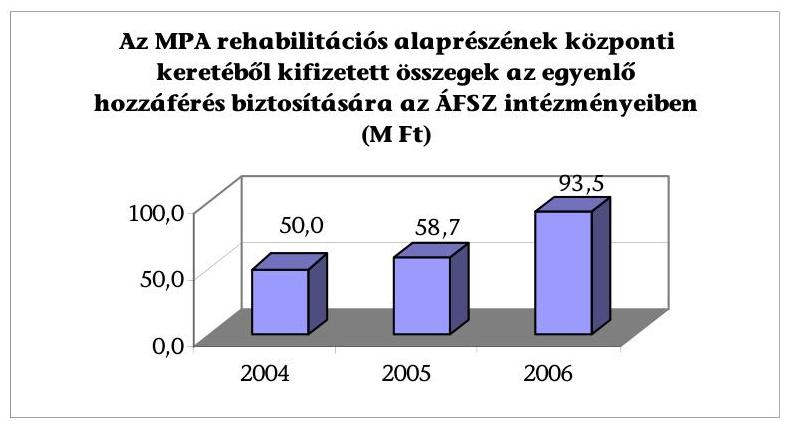

Az ÁFSZ 2005-ben 28 eszközféleségre kiterjedő országos katasztert hozott létre a kirendeltségek szolgáltatást nyújtó irodáinak akadálymentességi színvonaláról. (4. sz. táblázat) A négyféle fogyatékcsoport (mozgás-, hallás-, látássérült, illetve értelmi fogyatékosok) különféle segítő eszközeire kiterjedő kataszter adatai alapján megállapítható, hogy 2005-ről 2006-ra minden csoport számára nőtt az eszközökkel ellátott hivatali irodák felszereltsége.

# Az ÁFSZ által nyújtott aktív munkaerőpiaci szolgáltatások, ezek eredményessége, hatásai 

A munkaerő-piaci eszközrendszer elemei az aktív eszközök, a támogatások, valamint a foglalkoztatást elősegítő szolgáltatások. ${ }^{74}$ A munkaerőpiaci szervezet által kínált munkaerőpiaci szolgáltatásokat az Flt. ${ }^{75}$ sorolja fel.

Az ÁFSZ-nél a megváltozott munkaképességűek elhelyezkedését segítő programban résztvevő megváltozott munkaképességűek száma (az időszak érintett létszáma) 2004-ben 45002 fő volt, együttműködési tervet 17601 fő részére készítettek, információs szolgáltatásban 9822 fő részesült. 2005-ben az érintett létszám 47792 fő volt, 20321 fő részére készítettek együttműködési tervet, a szolgáltatásokkal érintettek száma 13168 fő volt, tehát az előző évihez képest növekedett a résztvevők létszáma.

[^0]
[^0]:    ${ }^{74}$ 6/1996. (VII. 16.) MüM rendelet a foglalkoztatást elősegítő támogatásokról, valamint a Munkaerőpiaci Alapból foglalkoztatási válsághelyzetek kezelésére nyújtható támogatásról; 30/2000. (IX. 15.) GM rendelet a munkaerőpiaci szolgáltatásokról, valamint az azokhoz kapcsolódóan nyújtható támogatásokról; 11/1998. (IV. 29.) MüM rendelet a munkaügyi központok foglalkozási rehabilitációs eljárásáról, valamint a megváltozott munkaképességű munkanélküliek foglalkoztatását elősegítő egyes támogatásokról 2007. 02. 17-től hatálytalan.
    ${ }^{75}$ A foglalkoztatás elősegítéséről és a munkanélküliek ellátásáról szóló 1991. évi IV. törvény 13/A. § (1) bekezdés.

---

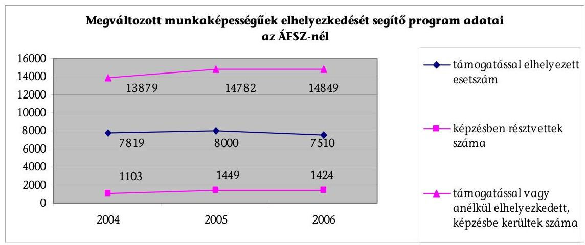

2004-ben az ÁFSZ által nyújtott információs szolgáltatások a következők voltak: impulzus tréning, pályaorientációs, pályakorrekciós és pályamegerősítő foglalkozás, pszichológiai tanácsadás, álláskeresési technikák oktatása, álláskereső klub, munkavállalási tanácsadás, munkajogi tanácsadás, képzési tanácsadás, rehabilitációs tanácsadás, reintegráló csoportos foglalkozás, újra integráló csoportos foglalkozás, kulcsképesség fejlesztő csoportos foglalkozás, motivációs csoportos foglalkozás, részvétel foglalkozás-egészségügyi foglalkozáson. 2005-ben tovább bővültek a megváltozott munkaképességűek elhelyezkedését segítő programok pl. Foglalkoztatási Információs Tanácsadó részvétel állásbörzén, részvétel képzési börzén.

A megváltozott munkaképességűek elhelyezkedését segítő programok eredményessége az elhelyezkedés esetszámán mérhető. Egyre több személyt vontak a megváltozott munkaképességűek programjaiba, de az aktív foglalkoztatáspolitikai eszközökkel elértek és a megváltozott munkaképességűek száma ezzel együtt nem növekedett. A megváltozott munkaképességűek aktív foglalkoztatáspolitikai eszközeire fordított pénzeszközök a jelenlegi nyilvántartások szerint nem különíthetők el az összes nyilvántartott álláskeresőnek nyújtott szolgáltatásokon belül.

# 3.2.3. A megváltozott munkaképességűek képzése 

A foglalkozási rehabilitációs képzések támogatásáról a Munkaerőpiaci Alap terhére az Flt. rendelkezik. A megváltozott munkaképességűek képzésére nincsenek elkülönített, nevesített költségvetési források. Részükre képzéseket egyéb hátrányos helyzetű csoportokkal az MPA foglalkoztatási, illetve képzési alaprésze és uniós források együtt nyújtanak. Külön jogszabály és külön közpénzforrások szolgálnak a fogyatékos személyek szakképzésére és megint mások a megváltozott munkaképességűekére. A fogyatékos személyek szakképzése a felnőttképzésről szóló 2001. évi CII. törvény előírásán alapul. A törvény külön nevesíti a felnőttképzés normatív költségvetési támogatása keretében a fogyatékos személyek általános, nyelvi és szakmai képzésének támogatását. A felnőttképzések normatív támogatásának fedezetére fejezeti kezelésű előirányzat szolgál, amelyen belül már nem különül
 el tovább fogyatékos személyekre tervezett előirányzatrész. A foglalkozási rehabilitációs képzések támogatásáról a

---

Munkaerőpiaci Alap terhére a foglalkoztatás elősegítéséről és a munkanélküliek ellátásáról szóló 1991. évi IV. törvény rendelkezik.

A Munkaerőpiaci Alap képzési alaprésze terhére 2004-ben 1103, 2005-ben 1414, 2006-ban $1380^{76}$ megváltozott munkaképességű személyt képeztek. Mindez az álláskereső megváltozott munkaképességűek 2,8-3,0\%-a, amely megegyezik a tartósan állást keresők közül támogatott képzésben részesítettek 2,7-3,2\%-os arányával.

A vizsgált időszakban, továbbá a Munkaerőpiaci Alap foglalkoztatási alaprészének decentralizált keretéből képzéseket finanszíroztak a következő táblázat szerint.

# Megváltozott munkaképességű és fogyatékos személyek számára szervezett képzések 

| Év | Tervezett   tanfolyam   szám | Tervezett   költség (Ft) | Végrehajtott   tanfolyam | Ráfordított   költség (Ft) | Hallgatói   létszám |
| :-- | :--: | :--: | :--: | :--: | :--: |
| 2004 | 45 | 151690300 | 52 | 161128000 | 675 |
| 2005 | 13 | 67081000 | 17 | 48720415 | 261 |
| 2006 | 52 | 185503016 | 48 | 272842350 | 855 |
| 2007 | 32 | 140599176 | 0 | 87971976 | 0 |
| tervszám |  |  |  |  |  |

Adatforrás: Foglalkoztatási Hivatal
Mindezek mellett a Munkaerőpiaci Alap foglalkoztatási alaprészéből elkülönített iskolarendszeren kívüli felnőttképzési keretből két program során 2066 (azaz: 959 és 1107) megváltozott munkaképességű személy (OKJ-s és OKJ-n kívüli) szakképzését finanszírozták. A képzéseket a Nemzeti Felnőttképzési Intézet valósította meg. A célcsoport normatív képzési összegeként 413,0 (azaz: 256,0 és 157,0) M Ft-ot mutatott ki az intézet.

2003-2005-ben 6100 fogyatékos személy jutott egészségi állapotához igazodó szakképzéshez az erre rendelkezésre álló előirányzatból. 2006-ban 3644 fő normatív támogatással történő képzését vállalták oktató szervezetek. 2007 I. félévére csupán 176 személy képzésére tudott szerződni az SzMM, amely az egy nagyságrenddel (milliárd forintosról százmilliósra) lecsökkent felhasználható költségelőirányzat következménye. A 2005. évi, még 3000 M Ft előirányzatot 2007-re 100 M Ft-ra csökkentették (4. sz. tanúsítvány).

A szakképzésben részesített fogyatékos személyek száma a vizsgált időszakban folyamatosan és dinamikusan nőtt, évi 2374-ről 3546-ra (49,3\%-os növekedés 2004-ről 2006-ra). A támogatott képzésben részesültek közül a fogyatékos személyek 2004-ben 8,7\%, 2005-ben 16,5\% és 2006-ban már 95,0\% részt képviseltek, amely meghaladja az összes regisztrált álláskeresőhöz viszonyított - közigazgatá-

[^0]
[^0]:    ${ }^{76}$ A 2005-2006. évi adatok az ÁFSz „Megegyezéses eredménycélokkal való vezetés" („MEV") indikátorrendszeréből származnak, amelyek nem egyeznek meg pontosan az egyéb típusú adatnyilvántartások adataival (lásd a 3.2.3. pontban írt képzési létszámokat).

---

si régiónként 4-től 6\%-ig ${ }^{77}$ terjedő - számarányukat. Többféle közpénzforrásból, többféle feladat elrendelés alapján több költségvetési szervezet is foglalkozik egyidejúleg ezzel a speciális képzéssel. Az SzMM Fogyatékosságügyi és Rehabilitációs Főosztálya a Munkaerőpiaci Alap rehabilitációs alaprészének központi keretéből is finanszírozott képzéseket.

# 3.2.4. A kérdőíves felmérés tapasztalatai 

A munkaképesség megőrzésére fordított pénzeszközök hasznosulásának ellenőrzése során az előkészítés szakaszában kérdőívet állítottunk össze, abból a célból, hogy az érintett megváltozott munkaképességű személyek kifejthessék a rendszer működésével kapcsolatos tapasztalataikat. A kérdőíveket a helyszíni ellenőrzés időszakában 7 Regionális Munkaügyi Központba küldtük ki. A kérdőíveket 14 kirendeltségen helyezték el, a válaszadás valamennyi központban egy hét - 2007. április 23-27. között - tartott.

A kirendeltségeket felkereső megváltozott munkaképességű álláskeresők véleményét - az önkéntesség elvének betartásával - 740 kérdőív megküldésével kívántuk felmérni, amelyből 511 (69\%) érkezett vissza. A visszaérkezett 511 kérdőívből nem vettük figyelembe azokat, amelyeknél hiányzott a nem és a születési év. Ennek alapján 10 kérdőív feldolgozásra alkalmatlan volt. A feldolgozott kérdőívek száma 501, amelyek közül figyelembe vettük és feldolgoztuk azokat is, amelyeknek a kitöltöttsége nem volt teljes. A felmérés nem volt reprezentatív, adott időszakban a munkaügyi irodákat felkereső, bármilyen megváltozott munkaképességű álláskereső adhatott adatokat.

[^0]
[^0]:    ${ }^{77}$ Forrás: a VÁTI Magyar Regionális Fejlesztési és Urbanisztikai Közhasznú Társaság www.vati.hu Helyzet térkép folyóirat 2005/4, 4. old. Speciális helyzetű munkanélküli csoportok aránya a regisztrált munkanélküliek közt 2005. május címú diagram. (A Foglalkoztatási Hivatal adatai alapján).

---

A visszaérkezett kérdőívek területi megoszlását az alábbi táblázat mutatja be:

| Munkaügyi központ megnevezése | Visszaérkezett és feldolgozott kérdőívek száma |
| :--: | :--: |
| Közép-magyarországi régió   Bp., Heltai Jenő tér   Bp.,XX., János u.   Bp., Kassai utca   Cegléd | $\begin{aligned} & 18 \\ & 16 \\ & 28 \\ & 15 \end{aligned}$ |
| Észak-magyarországi régió   Miskolc | 61 |
| Közép-dunántúli régió   Székesfehérvár | 11 |
| Észak-alföldi régió   Nyíregyháza | 93 |
| Dél-alföldi régió   Baja   Kecskemét | $\begin{aligned} & 30 \\ & 79 \end{aligned}$ |
| Nyugat-dunántúli régió   Zalaegerszeg   Keszthely   Zalaszentgrót   Lenti | $\begin{aligned} & 16 \\ & 14 \\ & 8 \\ & 2 \end{aligned}$ |
| Dél-dunántúli régió   Kaposvár | 110 |
| Összesen: | 501 |

A kérdőív néhány esetben lehetőséget adott egy, vagy annál több válaszlehetőség megjelölésére (3., 4.d., 4.e., 5.b., 7., ${ }^{78}$ 8., 9.c., 10., 11.c., 12., 13. kérdések). Számos esetben előfordult, hogy a válaszadók nem válaszoltak a kérdésekre, vagy rosszul értelmezték a kérdést és egymásnak ellentmondó válaszokat adtak. Amennyiben a válaszok között logikai kapcsolat áll fent, javítottuk az adott válaszokat. ${ }^{79}$

A kérdőívek feldolgozásakor figyelembe vettük a Központi Statisztikai Hivatal (KSH) „Megváltozott munkaképességűek a munkaerőpiacon" című 2002. II. negyedévben készített felmérésének ${ }^{80}$ adatait.

A felmérés eredményei:

- A válaszadó neme

A válaszadók többsége nő (62\%), kiugróan magas Miskolcon (92\%), a legalacsonyabb a XX. János utcai kirendeltségen (50\%).

[^0]
[^0]:    ${ }^{78}$ Az iskolai végzettségnél több válasz megjelölésére volt lehetőség. Az adatok feldolgozásakor viszont a legmagasabb végzettséget vettük figyelembe.
    ${ }^{79}$ Például 6. kérdés: amennyiben az illetőnek a megváltozott munkaképességének mértéke 67\%, bizonyos, hogy részt vett egészségügyi foglalkozási minősítésen.
    ${ }^{80}$ A KSH felmérésében több mint 700 ezren vettek részt.

---

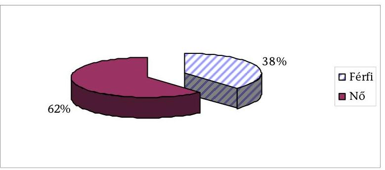

- A válaszadó születési éve

Születési évük szerint közvetlenül a nyugdíjkorhatárt elérő és az őket pótló korosztály van többségben. Az adatok hasonlóak a KSH felvétel eredményeivel. Eltérő értéket a Heltai Jenő téri kirendeltség adatai mutatnak, itt a válaszadók többsége (18/7) 1948-1952 években született. A miskolci kirendeltség válaszadói közül 15-15 fő született 1963-1967, valamint 1958-1962 között.
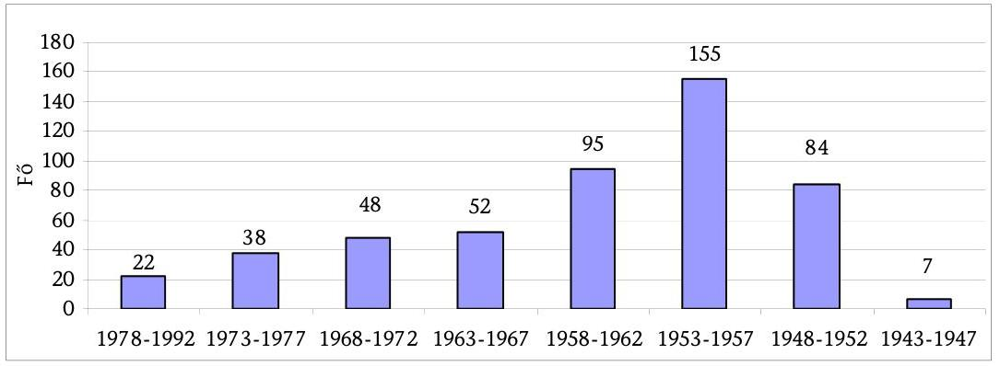

- Információ a Munkaügyi Központról

A Munkaügyi Központról a válaszadók 40\%-a ismerőstől, 31\%-a egyéb helyről (munkahely, önkormányzat), 21\%-a sajtóból, 8\%-a háziorvostól vagy szakrendelőből szerzett tudomást.
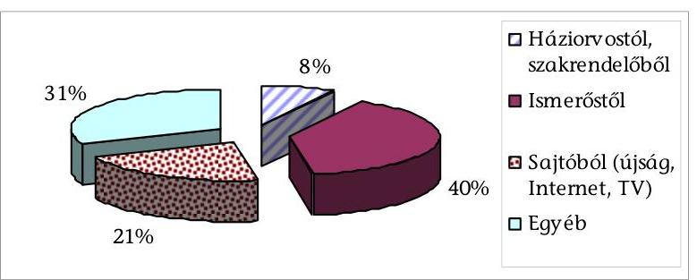

- Adatok a megjelenéssel kapcsolatban

A válaszadók többsége [466-ból 187 (40%)] 2003-2007 között regisztrált, és a 406 válaszadóból 282 fő (69\%) 1-5 alkalommal kereste fel a Munkaügyi Központot. Az egyes régiók között nincsenek kiugró értékek.

---

- Első regisztráció
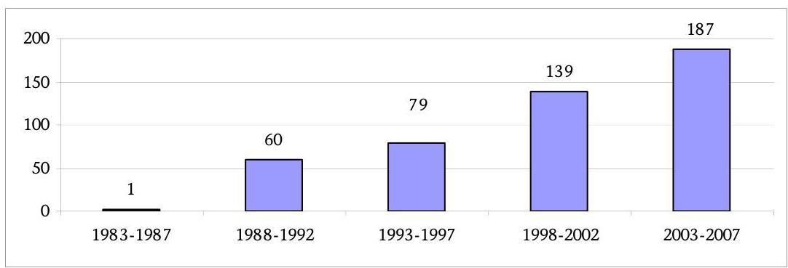
- Megjelenés a Munkaügyi Központban
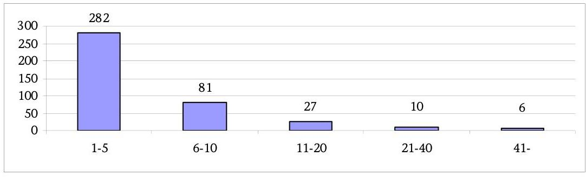
- Munkába állás a Munkaügyi Központ segítségével

A válaszadók kevesebb, mint felének (38\%) sikerült munkába állnia a Munkaügyi Központ segítségével, 51\%-ban 1 évnél kevesebb időre.
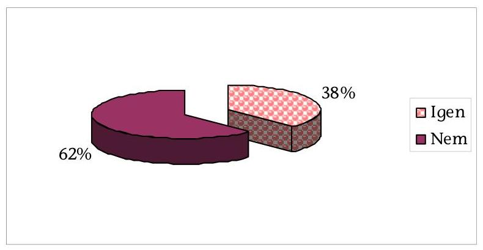

- Munkában töltött idő

Az átlagostól eltérő értékek - azaz 1-5 év között dolgozók - a kaposvári (58\%), a kecskeméti (55\%), és a Heltai Jenő téri (56\%) kirendeltségen voltak.

---

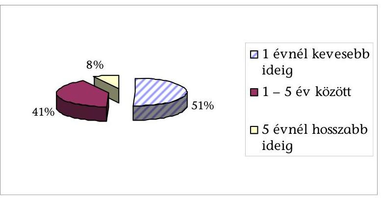

- Munkába állás segítése

A válaszok szerint többségében hagyományos eszközökkel segítették a munkába állást: közvetítéssel, munkaügyi tanácsadással. A kérdés jellegéből adódóan nem volt lehetőség az újonnan bevezetett, megváltozott munkaképességű személyek munkába állításához bevezetett különböző mentori és egyéb szolgáltatások felmérésére. Eltérő értéket a XX. János utcai kirendeltség mutat (ott a válaszadók többségét munkaügyi tanácsadással segítették). A kérdőívet kitöltők között az átképzettek aránya (15,8\%) magasabb az átlagnál (lásd a 3.2.3. pontban írottakat).
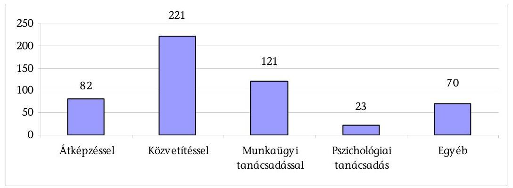

- Munkába állás a Munkaügyi Központ segítsége nélkül

Összességében a válaszadók 46\%-ának sikerült munkába állnia a Munkaügyi Központ segítségével.
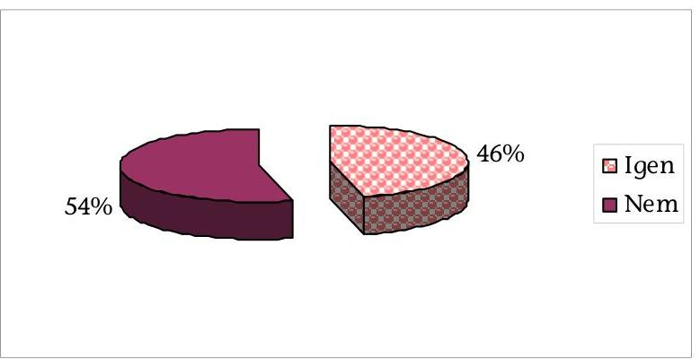

---

- Munkahely

A válaszadók többsége, akik a Munkaügyi Központ segítsége nélkül helyezkedett el átlagosan 1-5 év között dolgozott (48\%). Ettől eltérő arányokat - azaz 1 évnél kevesebb ideig történő munkában állást - a Kassai utcai, a keszthelyi, a bajai, és a nyíregyházi kirendeltségeken tapasztaltunk.
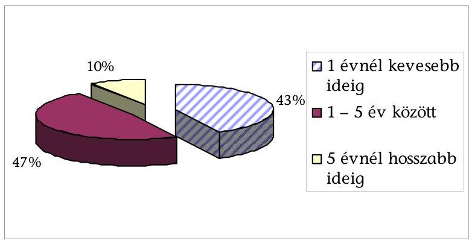

- Egészségügyi foglalkozási minősítés

A válaszadók többsége nem minden esetben jelölte meg, hogy részt vett egészségügyi minősítésen, viszont megadta megváltozott munkaképességének mértékét, amely abban az esetben lehetséges, ha az illető megjelent az OOSZI orvosi bizottsága előtt. A kérdőívek feldolgozásakor, amennyiben megadták a leszázalékolás mértékét, igen válasznak vettük az egészségügyi minősítésen történt megjelenést.
A válaszadók 96\%-a vett részt egészségügyi foglalkozási minősítésen, ettől nagyobb mértékű eltérést a székesfehérvári kirendeltség válaszadói mutatnak (11 fő), itt 82\% vett részt minősítésen.
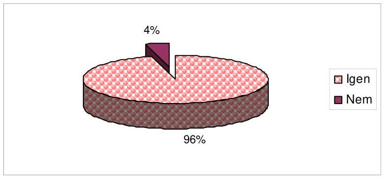

- Megváltozott munkaképesség fennállása

A válaszadók 43\%-a 1-5 éve, 37\%-a 6-10 éve megváltozott munkaképességű. Eltérések a kecskeméti, a miskolci, a kaposvári, és a Heltai Jenő téri kirendeltségeken voltak. Az első három esetben többségében 6-10 éve megváltozott munkaképességűek a válaszadók, míg a Heltai Jenő tér esetében 11-15 éve. A KSH felmérésben részt vettek több mint 40\%-a 5-10 éve, több mint 28\%-a 3-5 éve, 10\%-a 2-3 éve küzd tartósan fennálló egészségi problémával.

---

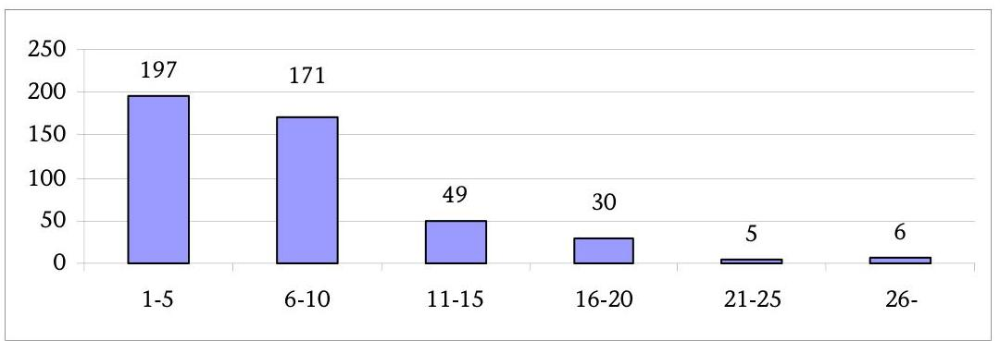

- A megváltozott munkaképesség mértéke

A válaszadók 52\%-ának 50\%-os, 26\%-ának 36-49\%-os egészségkárosodása van. Eltérő értékeket a zalaegerszegi kirendeltség válaszadói adtak. Esetükben a legtöbben 36-49\%-os, majd 67\%-os munkaképesség csökkenést jelöltek.
A kérdőívet kitöltők száma ennél a kérdésnél alacsony volt (202) ${ }^{81}$. A válaszadók többségének fogyatékossága mozgásszervi eredetű (közel 40\%). A KSH felvételben részt vettek egészségi probléma szerinti csoportosításának első helyén a keringési rendszer betegségei, majd a mozgáskorlátozottság, mozgásképtelenség, egyéb lábbal kapcsolatos problémák, illetve az idegrendszeri vagy mentális eredetű megbetegedések állnak, de nem elhanyagolható a hát-, és nyakproblémával küzdők száma sem.
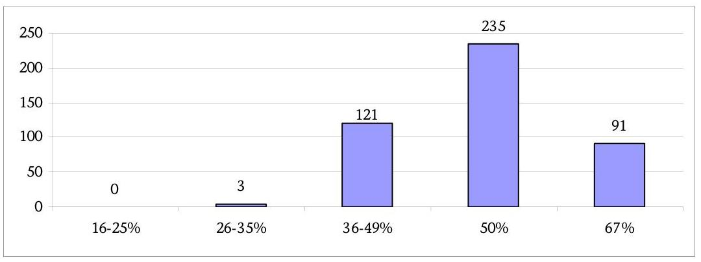

Nemenkénti megosztásban kisebb eltérést tapasztaltunk. A kérdőívet kitöltő nők megváltozott munkaképességének mértékének második helyén a 36-49\% (a válaszadók 29,8\%-a), míg a férfiaknál a 67\% áll (a válaszadók 22,8\%-a).

[^0]
[^0]:    ${ }^{81}$ Az alacsony számú válaszok egyik oka lehet, hogy az érintettek életének érzékeny területét érintik, így a fogyatékosságukkal kapcsolatos kérdésekre nem szívesen válaszolnak.

---

- Iskolai végzettség ${ }^{82}$

A válaszadók 31\%-a nyolc általános, 31\%-a szakmunkásképző, 15\%-a szakközépiskola, 10\%-a gimnáziumi, 5\%-a főiskolai vagy felsőfokú iskolai végzettséggel rendelkezik. A nyolc általános iskolával sem rendelkezők száma 4\%. Eltérést két kirendeltségen tapasztaltunk. A Heltai Jenő téri kirendeltségen a válaszadók többsége gimnáziumot végzett, amelyet a nyolc általános végzettség követ (a válaszadók száma nem releváns, 18 fő). A miskolci kirendeltségen a szakmunkásképzőt végzettek száma magasabb (20 fő), ezt követik 14-14 fővel az érettségit, valamint szakközépiskolát végzettek.
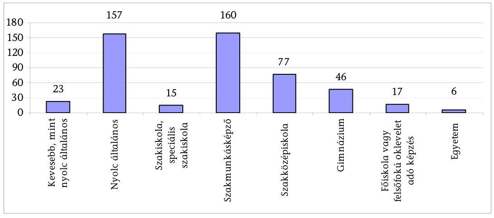

Nemenkénti megosztásban kisebb eltérést tapasztaltunk. A nők iskolai végzettségének sorrendje: 1. nyolc általános (31,9\%); 2. szakmunkásképző (27,4\%); 3. szakközépiskola (18,4\%). A férfiak iskolai végzettségének sorrendje: 1. szakmunkásképző (39,3\%); 2. nyolc általános (30,4\%); 3. szakközépiskola (10,5\%).

- Ellátások ${ }^{83}$

A válaszadók többsége rendszeres szociális járadékban, rokkantsági nyugdíjban, valamint álláskeresési járadékban részesül. Az álláskeresési
 járadék magasabb száma azt jelzi, hogy több megváltozott munkaképességű személy szeretne hivatalosan munkába állni, és járadék helyett bérből és fizetésből élni. A járadék folyósításának feltétele az illető regisztrációja, a munkaügyi központtal történő folyamatos együttműködés. Eltérő válaszokat több kirendeltségen tapasztaltunk. A Kassai utcai kirendeltségen a 28 válaszadóból a legtöbben (10 fő) álláskeresési járadékban részesülnek. A XX., János utcai kirendeltségen a 16 válaszadó fele (8 fő) részesül szintén álláskeresési járadékban. A kecskeméti kirendeltségen a 79 válaszadó több mint 45%-a rokkantsági nyugdíjban részesül. A Heltai Jenő téri kirendeltség-

[^0]
[^0]:    ${ }^{82}$ A KSH 2001. évi népszámlálásának tapasztalatai azt mutatják, hogy a fogyatékos emberek iskolai végzettségének színvonala jóval alacsonyabb azokénál, akik a nem fogyatékos személyek csoportjába tartoznak, döntő többségük legfeljebb az általános iskolát végzi el.
    ${ }^{83}$ Az egyes ellátások párhuzamosságait nem vizsgáltuk.

---

ségen a válaszadók több mint 38%-a szintén rokkantsági nyugdíjban részesül.
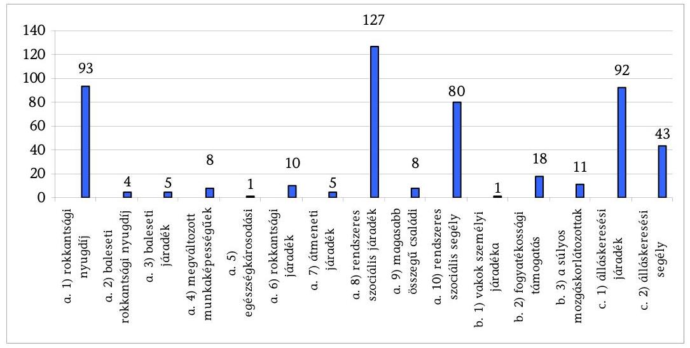

- Megváltozott munkaképességűvé válás előtti munkavégzés

A kérdőívet kitöltők 88%-a dolgozott megváltozott munkaképességűvé válása előtt. A legtöbb esetben (76%) fizikai munkát végeztek, ide értve a különböző szakmunkákat is, de megtalálhatók a szellemi munkát végzők is (18%). A legjobb arányt a Kassai utcai kirendeltségen tapasztaltuk, ahol a válaszadók 96%-a dolgozott megváltozott munkaképességűvé válása előtt (a válaszadók száma azonban nem releváns, 28 fő). A legrosszabb arányt a miskolci kirendeltség mutatja, ahol a válaszadók 73%-a dolgozott, mielőtt megváltozott munkaképességűvé vált, ez összefüggésben állhat a rossz Észak-magyarországi munkaerőpiaci helyzettel. ${ }^{84}$
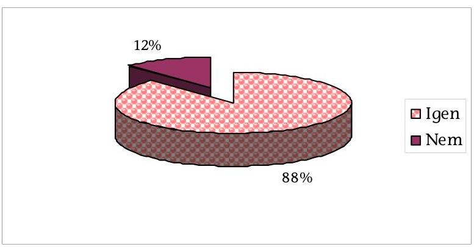

[^0]
[^0]:    ${ }^{84}$ A munkanélküliségi ráta 2006. évben Észak-Magyarországon 11,0%-os volt (a legalacsonyabb Közép-Magyarországon, 5,1%).

---

- Jogviszony jellege

A válaszadók 76%-a közalkalmazott és köztisztviselő volt. Az egyéb - nem nevesített - jogviszonyban dolgozók aránya 18%. Vállalkozói jogviszonyban a válaszadók 6%-a tevékenykedett. A nyíregyházi kirendeltségen a válaszadók 96%-a dolgozott közalkalmazottként vagy köztisztviselőként, ami magasabb az átlagnál. A székesfehérvári, és a zalaegerszegi kirendeltség válaszadói mindannyian munkaviszonyban dolgoznak.
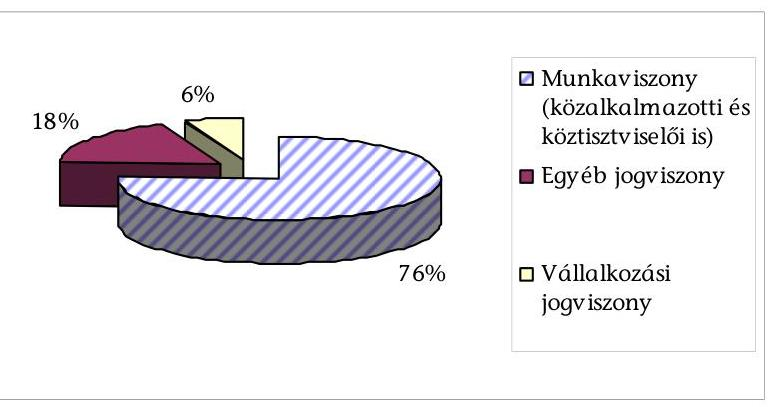

Nemenkénti megosztásban a férfiak 8%-a, a nők 5%-a dolgozott vállalkozói jogviszonyban, az egyéb jogviszony aránya férfiaknál 16%, nőknél 20%.

- Megváltozott munkaképességűvé válás oka

A megváltozott munkaképességűvé válás okaként a legtöbben (90%) az egyéb egészségkárosodást jelölték meg a munkahelyi, közlekedési és egyéb baleset mellett, amely a magyarországi általános egészségromló tendenciának tudható be. A KSH felmérése szerint az egészségügyi problémát a legnagyobb arányban szintén a munkavégzéssel közvetlenül össze nem függő betegségek okozzák (49,9%).
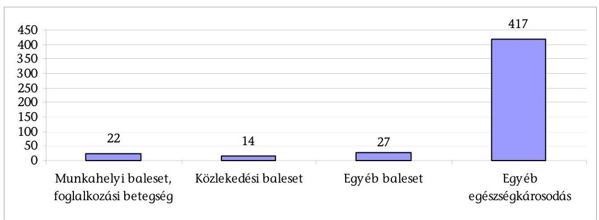

A nemenkénti megosztásban különbség mutatkozik. A válaszadó férfiak 79,3%-nak egyéb egészségkárosodás okozta megváltozott munkaképességét, ez a nőknél 93,4%. Munkahelyi baleset, foglalkozási betegség férfiak esetében 6,9%, nők esetében 1,4%. Egyéb baleset a férfiaknál 8,5%-ban, a nőknél 3,8%-ban okozott maradandó károsodást.

---

- Megváltozott munkaképességűvé válás után végzett munka

A válaszadók 58%-a dolgozott megváltozott munkaképességűvé válása után. A legtöbben a Heltai Jenő téri kirendeltség válaszadói közül dolgoztak (89%). A legkevesebben a miskolci kirendeltség válaszadói dolgoztak (38%), esetükben volt a legtöbb „nem" válasz (62%). A „nem" válaszok aránya több volt a Kassai utcai (58%), és a ceglédi kirendeltségen (53%).
Megváltozott munkaképességűvé válása óta a nők 55%-a, a férfiak 62%-a végzett munkát.
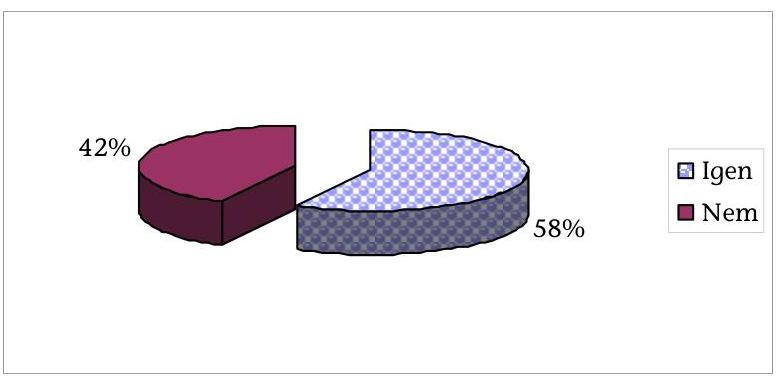

- Munka jellege

A kérdőívet kitöltők közel 80%-a fizikai munkát végzett megváltozott munkaképességűvé válása után. A KSH felmérése szerint a 15-64 éves „tartósan fennálló problémával küzdő" szellemi-fizikai foglalkoztatottak aránya 27,73%.

- Jogviszony jellege

A megváltozott munkaképességűvé válás után a válaszadók többsége (68%) dolgozott közalkalmazotti vagy köztisztviselői munkaviszonyban. Egyéb jogviszonyban a válaszadók 26%-a dolgozott. A kecskeméti kirendeltség válaszadói többségében egyéb jogviszonyban dolgoznak (60%).
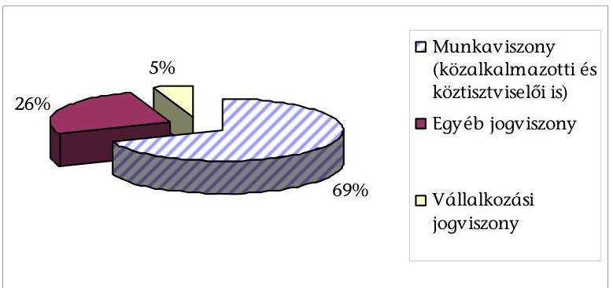

A megváltozott munkaképességűvé válás után a nők 70%-a, a férfiak 66%-a dolgozott munkaviszonyban. Vállalkozói jogviszonyban a nők 4%-a, a férfiak 7%-a tevékenykedett.

---

- Segítség a munkába álláshoz

A válaszadók többsége a Munkaügyi Központtól és az egészségügyi intézményektől kapott segítséget. A kecskeméti (90/40), valamint Heltai Jenő téri (15/6) kirendeltség válaszadóinak többsége egyéb helyről kapott segítséget. Sokan nem adtak választ a kérdésre. „A KSH felmérés válaszadóinak többsége 85 úgy ítélte meg,hogy nincs semmiféle segítségre szüksége, vélhetően azért, mert nem kíván munkát vállalni".
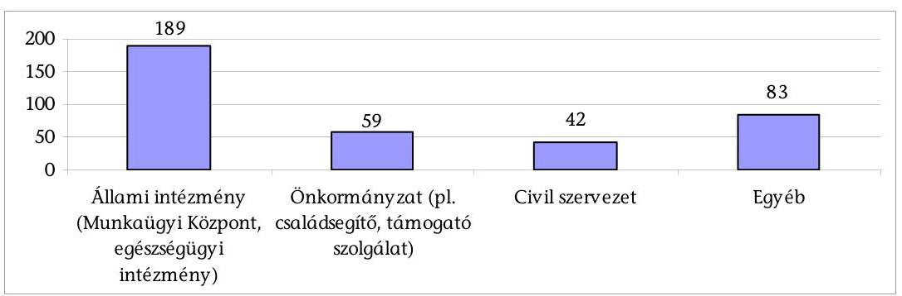

- Kapcsolat a segítséget nyújtó intézettel

A válaszadók többsége családi, baráti tanácsra, valamint a Munkaügyi Központ segítségével került kapcsolatba a segítséget nyújtó intézettel. A kecskeméti kirendeltség válaszadói 75/18 arányban jelölték a „hirdetés alapján" választ. A miskolci kirendeltségen a magasabb arányt a Munkaügyi Központ kapta 24/13 válasz. A nyíregyházi kirendeltségen a legtöbben az önkormányzattól, míg a keszthelyi kirendeltségen egyenlő arányban az önkormányzattól, a Munkaügyi Központtól és a barátoktól kapták a legtöbb segítséget.
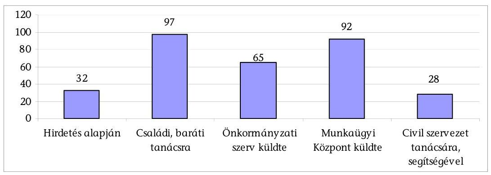

A nők jellemzően (33,3%) a Munkaügyi Központ támogatásával, míg a férfiak családi, baráti tanácsra (33,6%) kerültek kapcsolatba a segítséget nyújtó intézettel.

- A szervezetek munkájának hatékonysága

A kérdőívvel megkeresetteknek értékelniük kellett 1-től 5-ig terjedő skálán a különböző szervezetek munkájának hatékonyságát. A legtöbb ötös értéke-

[^0]
[^0]:    ${ }^{85}$ KSH felvétel, 11. oldal.

---

lést a kérdőív kitöltés helyszíne, a Munkaügyi Központ kapta. A zalaegerszegi kirendeltségen az egészségügyi intézmény 12 jó, a Munkaügyi Központ 10 kiváló értékelést kapott. A nyíregyházi kirendeltség válaszadói a szervezetek munkáját többségében jónak értékelték. A bajai, a keszthelyi, a ceglédi és a Heltai Jenő téri kirendeltségek válaszadói az egészségügyi intézmények munkájának hatékonyságát többnyire közepesre, vagy annál rosszabbra értékelték. A civil szervezetek munkájának hatékonyságát a ceglédi, a kaposvári, és a XX., János utcai kirendeltség válaszadói többségében nem megfelelőnek ítélték.
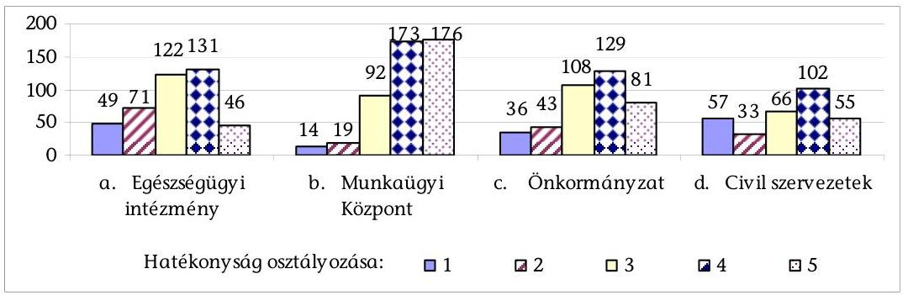

# 3.3. A foglalkozási rehabilitáció hazai forrásai 

### 3.3.1. A megváltozott munkaképességűek keresetkiegészítése

A megváltozott munkaképességű dolgozó, aki eredeti munkakörében nem foglalkoztatható, keresetkiegészítést kaphat. ${ }^{86}$ A Pénzügyminisztérium fejezetében rendelkezésre álló forrást a Magyar Államkincstár (MÁK) folyósítja. Az alábbi táblázat a keresetkiegészítés adatait mutatja be. A regisztrált álláskeresők között a megváltozott munkaképességű munkavállalók létszáma (40 ezer fő) és a munkában tartott megváltozott munkaképességű munkavállalói létszám (300 500 fő) között nagy aránytalanság áll fenn. A munkahely megtartását elősegítő keresetkiegészítés alacsony igénybevételi szintje további vizsgálatot igényel.

A megváltozott munkaképességűek keresetkiegészítésének alakulása

| Évek | Fő (havi átlag) | Kifizetett összeg a   zárszámadás szerint (M Ft) |
| :-- | :--: | :--: |
| 2004 | 543 | 891,4 |
| 2005 | 375 | 618,6 |
| 2006 | 347 | 593,2 |
| 2007 január | 321 | 45,0 |

Forrás: Magyar Államkincstár

[^0]
[^0]:    ${ }^{86}$ A megváltozott munkaképességű dolgozók foglalkoztatásáról és szociális ellátásáról szóló 8/1983. (VI. 29.) EüM-PM együttes rendelet.

---

# 3.3.2. A dotáció 

A megváltozott munkaképességű személyek foglalkoztatási támogatásának legfőbb eszköze 2007. június 30-ig a dotáció ${ }^{87}$ volt.

A dotáció a munkáltatók rehabilitációs tevékenységét segítő olyan normatív támogatás, amely megváltozott munkaképességű munkavállalót több mint 5%-ban foglalkoztató gazdálkodó szervezetek (legalább 20 főt, célszervezet ${ }^{88}$ esetén 50 főt alkalmazó) és szociális foglalkoztatók részére járt. A gazdálkodó szervezetek és szociális foglalkoztatók a vetítési alap ${ }^{89}$ 45-135%-ának megfelelő összegű dotációt igényelhettek a megváltozott munkaképességű munkavállalók létszámarányától függően. Magasabb összegű támogatásban részesültek a kijelölt célszervezetek, ők a foglalkoztatottak egészségkárosodásának mértékéhez rendelten 135-320%-os dotációra voltak jogosultak, amelyek további pótlékokkal voltak növelhetők. A támogatás normatív jellege és magas aránya motiválta a szervezeteket az állami támogatás minél nagyobb arányú igénybevételére. (5. sz. táblázat)

[^0]
[^0]:    ${ }^{87}$ A megváltozott munkaképességű dolgozók foglalkoztatásáról és szociális ellátásáról szóló 8/1983. (VI. 29.) EüM-PM együttes rendelet.
    ${ }^{88}$ 8/1983. (VI. 29.) EüM-PM együttes rendelet 27/D. § (1)-(2) bek. a társasági adóról és osztalékadóról szóló 1996. évi LXXXI. törvény 2. § (2) bekezdésének a) c) és f) pontjának hatálya alá tartozó gazdálkodó szervezet - a 4. számú mellékletben felsorolt iratokkal ellátott - kérelmére a Pénzügyminisztérium - a Szociális és Családügyi Minisztérium egyetértésével és a Védett Szervezetek Országos Szövetsége (VSZOSZ) véleményének meghallgatásával - célszervezetnek jelölhette a kritériumoknak megfelelő a gazdálkodó szervezetet. Hatályon kívül helyezte a 7/2004. (III. 26.) FMM-ESZCSM-PM együttes rendelet. A hivatkozott bekezdések 2004. IV. 1-jétől hatálytalanok.
    ${ }^{89}$ 8/1983. (VI. 29.) EüM-PM együttes rendelet 27/A. § (4) Kijelölt célszervezetek esetén a dotáció vetítési alapja a foglalkoztatott megváltozott munkaképességű dolgozók tárgyhavi átlagos statisztikai állományi létszáma és a részükre kifizetett havi átlagbér szorzata alapján számított havi bruttó munkabér összege. Átlagbérként legfeljebb a - külön jogszabályban a teljes munkaidőben foglalkoztatottak részére meghatározott mindenkor érvényes minimálbért lehet figyelembe venni. Hatályos volt 2004. XII. 31-ig.

---

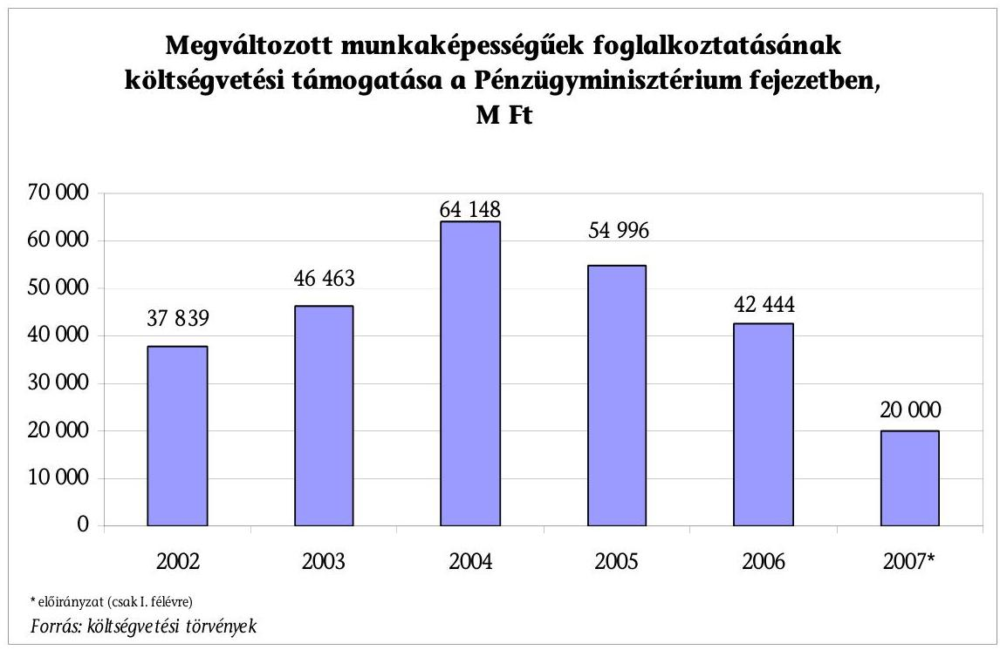

A kiadások visszaszorítására 2005-ben, összefüggésben a támogatási rendszer átalakításával, szigorították a szabályozást. ${ }^{90}$ 2004. áprilisától megszűnt a célszervezeti kijelölés lehetősége. További szigorításként az igényelt támogatás nem haladhatta meg a 2003. decemberében igényelt dotáció 12-szeresét, valamint maximálta a támogatott bért 53 ezer forintban.

Az ÁSZ megállapította ${ }^{91}$, hogy „A vállalatok támogatásának bruttó intenzitása jóval meghaladja az uniós előírást, a támogatások felhasználásának nincs megfelelő nyilvántartása, nyomon követése, ebből kifolyólag ellenőrzése sem, amely a felhasználás rendeletben megkövetelt követelményeit lenne hivatott vizsgálni. A hazai rendelkezések szerint egy megváltozott munkaképességű munkavállaló foglalkoztatásának megvalósításáért az állam - bizonyos feltételek megléte esetén - akár a mindenkori bruttó minimálbér 360%-ával is támogathatja a kijelölt célszervezetet, így a 'támogatás bruttó intenzitása' jóval az előírt szint felett van, még akkor is, ha a dotáció vetítési alapja a megváltozott munkaképességű dolgozónak kifizetett bruttó bér, legfeljebb a minimálbér összege a társadalombiztosítási járulékok nélkül. Nem teljesül azon elvárás sem, hogy a kedvezményezett csak a megváltozott munkaképességű dolgozó, illetve dolgozók foglalkoztatásával kapcsolatban felmerült további, indokolt költségekre kaphat támogatást, amelyre nincs szükség akkor, ha a munkaadó nem megváltozott munkaképességű dolgozók alkalmaz. A támogatás feltétele a kedvezményezett által az indokolt költségekről vezetett nyilvántartás. Ez a nyilvántartási kötelezettség a jelenleg hatályos együttes rendelet szerint nincs előírva, illetve csupán a munkavállalókra vonatkozó adatok kötelező nyilvántartásáról, továbbá a kifizetett bérekről szóló munkaadói nyilatkozatról rendelkezik."

[^0]
[^0]:    ${ }^{90}$ 27/2004. (XII. 14.) FMM-ICsSzEM-PM együttes rendelet a megváltozott munkaképességű dolgozók foglalkoztatásáról és szociális ellátásáról szóló 8/1983. (VI. 29.) EüM-PM együttes rendelet módosításáról.
    ${ }^{91}$ 0338 Vélemény a Magyar Köztársaság 2004. évi költségvetési javaslatáról, Függelék 132. oldal.

---

Az intézkedések előkészítették a dotációs rendszer megszüntetését és a támogatási rendszer átalakítását, amelynek indokai:

- a támogatás kiáramlás növekedésének megállítása;
- a piaci és a szociális foglalkoztatás szétválasztása az uniós irányelveknek megfelelően;
- a támogatás mértékének uniós szabályokhoz való igazítása, ${ }^{92}$
- a visszaélések lehetőségének megszüntetése.

# 3.3.3. Az új támogatási formák 

A támogatási rendszer átalakítását másfél éves átmeneti idővel tervezte a Kormány. A 2006. évi központi költségvetés 55 Mrd Ft-ot tervezett a megváltozott munkaképességűek foglalkoztatásának támogatására. 38 Mrd Ft-ot a PM fejezetben a régi típusú, 2007. június 30-ig működő dotációra, illetve a szaktárcánál

 (SZMM) 13 Mrd Ft-ot a megváltozott munkaképességűek foglalkoztatásával összefüggő bértámogatásra, költségkompenzációra (költségkompenzációs támogatás és rehabilitációs költségtámogatás, ${ }^{93}$ valamint 4 Mrd Ft-ot a szociális foglalkoztatásra.

Az új rendszer két elemű, az akkreditációra és a támogatásokra épül. Az akkreditáció célja, hogy meghatározza az állam elvárásait a munkáltatókkal szemben a megváltozott munkaképességű emberek foglalkoztatásának segítésére fizetett támogatások igénybevételéhez. Az akkreditációs rendszer kiépítéséhez az MPA rehabilitációs alaprész központi részéből különítettek el forrást. Az akkreditációs szervezeti egység személyi bővítésre miniszteri utasítás ${ }^{94}$ eredetileg 2007. április 1-jei határidőt szabott, amelyet időközben - indoklás nélkül 2007. december 31-re hosszabbítottak meg. ${ }^{95}$ Az akkreditációs szervezet a még fel nem töltött létszámra eső, már megnövekedett feladatokat külső megbízásokkal látja el.

A normatív típusú bértámogatás megváltozott munkaképességű munkavállalók foglalkoztatásához nyújt vissza nem térítendő támogatást, alapja az érintett munkavállaló bérköltsége. Felhasználható a munkába helyezéshez, a munkahely megtartásához, foglalkozási rehabilitációhoz, illetve munkahelyi segítő személy foglalkoztatásának költségtérítésére. 2006-ban a bértámogatásra 651,4 M Ft-ot fizettek ki.

A költségkompenzációs támogatás ${ }^{96}$ keretében pályázati úton megtéríthetők a munkába járással összefüggő személyszállítás költségei, a foglalkoztatáshoz és annak adminisztrációjához kapcsolódó, továbbá logisztikai, munkaszervezési és egyéb szállítási költségek. A támogatás pályázat útján nyerhető el, feltétele a kiemelt, illetve feltételes tanúsítvány megléte; a pályázatot a szaktárca írta ki. Az első pályázat idején a munkaadók a pályázathoz szükséges feltételekkel még nem rendelkezhettek (a vonatkozó jogszabály 2005. november 1-jén lépett hatályba), így a pályázati feltételeknek egyetlen foglalkoztató sem felelt meg. 2006-ban tehát költségkompenzációs támogatásban nem részesült egyetlen foglalkoztató sem, az előirányzatot teljes egészében a védett szervezetek kapták meg. Első ízben 2007-ben fizettek költségkompenzációs támogatást.

Rehabilitációs költségtámogatásra ${ }^{97}$ a védett szervezeti szerződést kötni szándékozó foglalkoztató nyújthat be pályázatot. Rehabilitációs költségtámogatás annak a munkáltatónak nyújtható, amely közhasznú társaságként van nyilvántartva, alapító okiratában szerepel a rehabilitációs foglalkoztatás, a védett szervezeti szerződésben kötelezettséget vállal a megjelölt létszámú, nyílt munkaerőpiacon nem foglalkoztatható munkavállaló foglalkoztatására, és a megváltozott munkaképességű munkavállalókat a szabályozásban meghatározott foglalkoztatási szintet meghaladó létszámban foglalkoztat. A nyílt munkaerőpiacon nem foglalkoztatható munkavállalóról a jogszabály ${ }^{98}$ értelmében a megyei munkaügyi központban működő rehabilitációs munkacsoport nyilatkozik: az adott időszakban a megváltozott munkaképességű munkavállaló számára a nyilvántartásaiban olyan munkalehetőség nincs, amelyben a munkavállalót támogatás nélkül foglalkoztatnák. A költségkompenzációs előirányzatból (11 Mrd Ft) 9,1 Mrd Ft-ot használtak fel, amelyből 7,3 Mrd Ft-ot fizettek ki 2006. december 31-ig. A hét védett szervezet által foglalkoztatott megváltozott munkaképességű munkavállalók létszáma 7533 fő volt 2006-ban. (6. sz. táblázat) A védett szervezeti szerződésben vállalt nyílt munkaerőpiacon nem foglalkoztatható létszám 1417 (18,1%) fő volt.

Az új támogatási rendszerben két támogatást (a bér-, illetve a költségkompenzációs támogatást) az uniós irányelveknek megfelelően alakítottak ki, a munkaerőpiaci támogatási formákra érvényes támogatási arányok meghatározásával. ${ }^{99}$ Ezzel szemben az ún. rehabilitációs költségtámogatás nem piaci, hanem inkább szociális jellegű támogatás. Olyan, védett szervezeti szerződéssel rendelkező munkáltató kaphatja, amely közhasznú társaságként működik. Az erre vonatkozó támogatási szerződést a munkaügyi tárca pályázati eljárás útján köti meg a nyertes védett foglalkoztatóval. Az akkreditációt nem kívánó rehabilitációs költségtámogatást az akkreditációs szigorítású munkaerőpiaci támogatásokkal (a költségkompenzációval) együttes jogszabályban szabályozták. Ezen kívül a két támogatási forma egyetlen, a „Megváltozott munkaképességűek foglalkoztatásával összefüggő költségkompenzáció” összevont nevű fejezeti kezelésű előirányzatban szerepel. Az előirányzat megosztása miniszteri hatáskör. A két támogatási forma között a költségvetési előirányzat megosztása nem szabályozott, ezért a finanszírozás nem átlátható. Nem nyilvánvaló továbbá az akkreditációhoz kötött, illetve azt meg nem kívánó támogatási formák egyidejű működtetésének indokoltsága. A védett szervezeti szerződés megkötésének nem feltétele az akkreditáció, így ezeknél a foglalkoztatóknál nincs biztosítva az azonos minőségi kontroll.

A szociális foglalkoztatás
A szociális intézményben élő megváltozott munkaképességű személyek foglalkoztatásának támogatása a szociális törvény felhatalmazásával és a szociális foglalkoztatás engedélyezéséről és a foglalkoztatás támogatásáról szóló 112/2006. (V. 12.) Korm. rendelet alapján 2006. július 1-jei hatállyal megkezdődött. Munka-rehabilitációs és fejlesztő-felkészítő foglalkoztatás szervezhető a szociális intézményben ellátott - sérült és hátrányos helyzetű (fogyatékos, pszichiátriai és szenvedélybeteg, hajléktalan) személyek számára normatív támogatás mellett. A rendelkezésre álló 4 Mrd Ft-os előirányzatból 2006-ban 815 M Ft-ot használtak fel, ebből 73,4% önkormányzati, 26,6% nem állami fenntartású intézményben valósult meg. Jelenleg 9300-9500 fő vesz részt ilyen típusú foglalkoztatásban. A minisztérium tájékoztatása szerint „a keretösszeg rendkívül alacsony mértékű felhasználását az okozta, hogy egy újonnan induló támogatási rendszer valósult meg, ahol a támogatás igénybevétele a foglalkoztatási engedély megléte ${ }^{100}$ volt. A foglalkoztatási engedélyek kiadása rendkívül elhúzódott, ezért az intézményeknek csak egy töredéke tudta igénybe venni a támogatást.” A támogatásról szóló kormányrendelet csak május 12. napján lépett hatályba, ez nem segítette elő a mielőbbi engedélyezéseket.

# 3.3.4. Az MPA rehabilitációs alaprésze 

A rehabilitációs alaprész központi és decentralizált keretének felosztására a miniszter ${ }^{101}$ tesz javaslatot, és a Munkaerőpiaci Alap Irányító Testülete dönt. A rehabilitációs alaprész központi és decentralizált keretének megosztását a vizsgált időszakban az alábbi ábra szemlélteti.

# A központi és decentralizált keret alakulása (tény) E Ft 

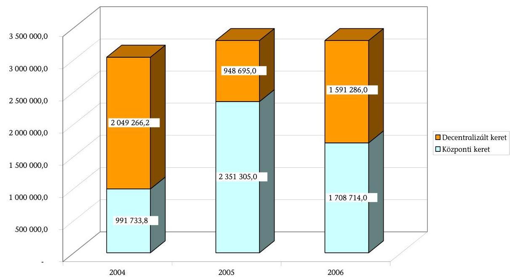

A központi alaprész célja olyan központi, országos jelentőségű programok kidolgozása, kipróbálása, megvalósítása és elterjesztése, amelynek várható eredményeként növekszik a megváltozott munkaképességű személyek foglalkoztatottsága, a nyílt munkaerő-piaci részvétel aránya.

A decentralizált keretet a már meglévő munkahelyek korszerűsítésére, fejlesztésére, bővítésére, vagy új, rehabilitációs foglalkoztatásra alkalmas munkahelyek létrehozására, illetve megváltozott munkaképességű személyek foglalkoztatásához szükséges eszközök, berendezések beszerzésére munkahely létrehozásával összefüggésben határozták meg. 2004-ig a Foglalkoztatási Hivatal irányelvet adott felhasználáshoz, amely szakmai ajánlás volt. Ebben olyan általános kívánalmakat fogalmaztak meg, mint például „elsősorban nyílt munkaerőpiacon jöjjenek létre munkahelyek” stb.

Az MPA rehabilitációs alaprész központi kerete a tárca beszámolója szerint 2004-ben 1000 M Ft volt, amely év közbeni módosításokkal 991,7 M Ftra változott.

A központi alaprész felhasználása 2004-ben 10 pont köré csoportosult, amelyek a következők voltak: társadalmi szemlélet kedvező irányú megváltoztatása, a foglalkozási rehabilitáció humán-erőforrás fejlesztése, munkavállalási esélyek értékelése, a foglalkozási rehabilitációs szolgáltatások fejlesztése, rehabilitációs munkahelyek támogatása, PHARE program társfinanszírozása, FMM akadálymentesítése, valamint közvetlenül elszámolható költségek, működési költségek és tartalék. (lásd a 7/a-c. sz. táblázatokat)

2005-ben a központi alaprész 2300,0 M Ft volt. Évközi módosítással a központi alaprészt 2351,3 M Ft-ra növelték, 51,0 M Ft tartalékkal. 2005-ben a központi keretből a foglalkoztatási helyzet javítására és a megváltozott munkaképességű dolgozók foglalkoztatásának támogatási rendszere átalakításából adódó feladatokra elkülönítettek kétszer 500,0 és 145,0 M Ft-ot. Ebből 500,0 M Ft-ot fordítottak központi pályázat útján a megváltozott munkaképességű munkavállalók munkahelyének megőrzése megnevezésű központi munkaerő-piaci pályázati programra. A megvalósulásról szóló beszámoló szerint a program 1500 fő megváltozott munkaképességű munkavállalót érintett, egy főre átlagosan 318 E Ft támogatás jutott. Az Országos Foglalkoztatási Közalapítvány (OFA) valósította meg a programot, a pályázatokra 463,5 M Ft-ból. Másik program az Ifjúsági, Családügyi, Szociális és Esélyegyenlőségi Minisztérium szociális intézményrendszere foglalkoztató-képességének fejlesztésére szintén 500,0 M Ft-ot irányzott elő. A pályázatot az Nemzeti Család- és Szociálpolitikai Intézet (NCsSzI) bonyolította le, a programokra 475,0 M Ft-ot fizettek ki. A harmadik program 145,6 M Ft-ot rendelt a megváltozott munkaképességű személyeket foglalkoztató munkaadók, szervezetek akkreditációs eljárással történő minősítésének megkezdéséhez, az akkreditációs rendszer kidolgozásához, az akkreditáció folyamatának elindításához és folytatásához. A központi alaprész ezen túlmenően a társadalmi szemlélet kedvező irányú megváltoztatása, a foglalkozási rehabilitáció humán-erőforrás fejlesztése, a munkavállalási esélyek értékelése, a foglalkozási rehabilitációs szolgálatok fejlesztése, munkahelyek támogatása, PHARE program társfinanszírozása, az FMM akadálymentesítése programok megvalósítását szolgálta, valamint technikai jellegű kifizetések történtek (működési költség, monitorozás, tartalék).

2006-ban a központi keret felosztásáról, amelyet eredetileg 1500 M Ft-ban határoztak meg, az 5/2006. (MüK. 3.) FMM utasítás rendelkezett. Év közben kétszer módosították a felosztást, ezekről a 8/2006. (Mük. 6.) FMM és a 22/2006. (MüK. 12.) SzMM utasítás rendelkezett, így a keret 1708,714 M Ft lett. A keretet a társadalmi szemlélet kedvező irányú megváltoztatása, a foglalkozási rehabilitáció humán-erőforrás fejlesztése, a foglalkozási rehabilitációs szolgáltatások fejlesztése témakörökben, valamint az alap működéséhez kapcsolódó technikai jellegű kifizetésekre (működési költség, monitorozás, tartalék) használták fel.

A központi alaprész programjainak lebonyolítói a munkaügyi tárcával kötött megállapodások alapján civil szervezetek, közalapítványok, minisztériumi háttérintézmények, akik évente írásban számoltak be a minisztérium számára a pénzeszközök felhasználásáról. A beszámolókat a Munkaerőpiaci Alap Irányító Testülete jóváhagyásával a miniszter fogadta el.

Az MPA decentralizált keretet a MAT határozatában megyénként határozza meg, és a megyékre meghatározott összeget a megyei munkaügyi központok pályáztatják meg. A munkaügyi központok által kiírt pályázatok munkahelyteremtés és munkahelymegőrzés támogatásra ${ }^{102}$ szólnak. A támogatás feltétele volt, hogy a pályázó munkaadók 2-3 éves foglalkoztatási kötelezettséget vállaljanak. A pályázatok legfontosabb feltételeit jogszabály rögzíti. ${ }^{103}$

2004-ben
 488 cég pályázott 3300 munkahely létrehozására. Ebből 293 cég kapott támogatást 1838 munkahelyre, amelyből 1304 új munkahely létrehozása és 534 meglévő munkahely korszerűsítése volt a feladat. A decentralizált keret terhére 2004-ben 1881,3 M Ft-ot használtak fel. Az egy munkahelyre jutó átlagos támogatás $1,03 \mathrm{M} \mathrm{Ft}$ volt.

2005-ben 892,0 M Ft-ra csökkent a decentralizált alaprész a támogatási rendszer átalakításával összefüggésben, amelyet fel is használtak.

2005-ben a rendszer átalakítása miatt 40%-kal kevesebb cég pályázott, mint 2004-ben, a kialakított munkahelyek száma 60%-kal volt kevesebb, mint egy évvel korábban. [A 2005. évi beszámoló szerint: „A megváltozott új jogi környezetben tehát egyszerűen többen nem merték vállalni (hároméves foglalkoztatási kötelezettséggel is járó) a megnövekedett bizonytalansági tényezőket."] A pályázók 63%-a nyert, ami 183 céget és összesen 717 rehabilitációs munkahelyet érintett. A kialakított munkahelyekből 240 új munkahelyet hoztak létre, és 477 munkahely átalakítása történt meg. Az egy munkahelyre jutó átlagos támogatás $1,25 \mathrm{M}$ Ft volt.

2006-ban a módosított decentralizált keret 1591,3 M Ft volt. 302 szervezet nyújtott be pályázatot a munkaügyi központokba, ebből 217 pályázat nyert támogatást. A rehabilitációs alaprész felhasználásáról szóló éves beszámoló szerint az elnyert pályázatok összesen 1247 db munkahely támogatását tették lehetővé összesen 1574,6 M Ft összegben.

A decentralizált keret pályázatait nem központilag írják ki, hanem az egyes munkaügyi központok egyénileg. A munkaügyi központok által kiírt pályázatokat helyben bírálják el. Éves beszámolót készítenek a lebonyolításról, ami a Foglalkoztatási Hivatal beszámolójának része. A beszámoló a felhasznált pénzt az érintett cégek és létrehozott munkahelyek számát tartalmazza. Arra vonatkozóan nincs információ a beszámolóban, hogy ezek a munkahelyek valóban be voltak-e töltve a szerződött időszakban.

A támogatások ellenőrzése a megyei munkaügyi központok és a Foglalkoztatási Hivatal ellenőrzési apparátusának a feladata volt. Az MPA rehabilitációs alaprész ellenőrzése során 2004-ben 995 ellenőrzést bonyolítottak le, amely során 87,0 M Ft visszakövetelésére került sor. Ez a 2004-ben szétosztott keret 4,5%-a, 2005-ben 122,5 M Ft volt, ami a 2005. évben pályáztatott összeg 13,75%-a. Az ellenőrzések korábbi évekre vonatkoznak, tehát nem teljesen vonható párhuzam az éves szétosztott támogatás és a visszakövetelt összeg közé, mégis arányaiban azt mutatja, hogy a decentralizált alapból pályázattal kiosztott pénzek felhasználásának ellenőrzése során a támogatások nagyságához képest jelentősek a szabálytalanságok. A vizsgálatoknál előforduló szabálytalanságok

[^0]
[^0]:    ${ }^{103}$ 6/1996. (VII. 16.) MüM rendelet a foglalkoztatást elősegítő támogatásokról, valamint a munkaerőpiaci Alapból foglalkoztatási válsághelyzetek kezelésére nyújtható támogatásokról 19., 20. §.

---

voltak többek között, hogy tévesen adták be a pályázatnál az induló létszámot, a vállalt foglalkoztatást csak részben teljesítették, a munkáltatók egy része késedelmesen vagy hiányosan teljesítette nyilvántartási és jelentési kötelezettségét.

A munkaügyi központok ellenőri létszáma 2005-ben 117,5 fő volt. A régiós központok kialakítása után az ellenőri létszám a felére csökkent. A rehabilitációs alaprész decentralizált keretének felhasználásának ellenőrzése során tapasztalt szabálytalanságok az ellenőrzéseket indokolják. Az ellenőrzéseket indokolja az is, hogy decentralizált keretből történő állami támogatás hasznosulására jelenleg nincsen más rendelkezésre álló adat.

# 3.4. A foglalkozási rehabilitáció Európai Uniós forrásai 

### 3.4.1. A megváltozott munkaképességű emberek munkaerőpiaci reintegrációját szolgáló projektek megvalósítása

Kísérleti program (Phare program keretében) a 2002. november és 2004. márciusa között lebonyolított projektek „Halmozottan hátrányos helyzetű lakosságcsoportok foglalkoztathatósága és tartós foglalkoztatása" címmel. A 2,2 M EUR költségvetésű program keretében önálló jogi személyiséggel rendelkező non-profit, nem állami szervezetek pályázhattak. A beérkezett 62 pályázatból 13 nyert támogatást, melyből 2 fogyatékos személyekkel foglalkozó projekt indult el. A 18 hónapos projektekben képzés és foglalkoztatás valósult meg szociális szakemberek pszichoszociális támogatásával, álláskeresési technikák oktatásával.

A fogyatékos személyeket segítő projekt egyike a „Mozgáskorlátozottak call centeres képzése, foglalkoztatása távmunkában és hívásközpontokban" címet viselte, melynek révén 15 fő 50% felett megváltozott munkaképességű személy végezhetett munkát. A másik dél-magyarországi régióban megvalósított projektben 12 fő 67% feletti egészségkárosodott személy kapott. A résztvevők a foglalkoztatás alapjául szolgáló OKJ-s képzést szereztek.

A 2003 júniusi szerződéskötéssel indult „A fogyatékkal élő emberek munkaerőpiacra jutásának elősegítése (a foglalkozási rehabilitáció eszköztárának rendszerszemléletű fejlesztése)" című program, amely a foglalkozási rehabilitáció alkalmazásával a hátrányos helyzetű emberek inaktivitásának csökkentését tűzte ki célul. A program kifejezett célja, hogy a kedvezményezettek a projektek lebonyolítása során olyan szakmai tapasztalatokat szerezzenek, amelyek képessé teszik őket a Strukturális Alapokból származó források fogadására. A rendelkezésre álló 5,7 M EUR keretösszegből 5636709 EUR kerülhetett lekötésre, amelynek 52,64%-a származik Phare támogatásból, 47,36%-a pedig a Munkaerőpiaci Alap rehabilitációs alaprészének központi keretéből biztosított hazai társfinanszírozásból. 15 kedvezményezett konzorciummal szerződött le az ESZA Kht., mint Szerződő Hatóság.

---

| A program fő kimeneti mutatói |  |
| :-- | --: |
| Indikátor (output) megnevezése | Elért eredmény a   program zárásakor |
| Képzésbe került személyek száma | 247 fő |
| Szociális intézményben ellátottak közül fejlesztő felkészítésbe   vont személyek | 337 fő |
| Rehabilitációs területen dolgozók közül (át)képzésbe kerültek | 107 fő |
| Foglalkoztatást segítő szolgáltatással érintett személyek szá-   ma | 1055 fő |
| Nyílt munkaerőpiacon elhelyezkedett személyek száma | 161 fő |
| 'Félig-védett' munkahelyen (tranzitfoglalkoztatás) elhelyez-   kedett személyek száma | 23 fő |

„Küzdelem a munka világából történő kirekesztődés ellen" című Phare program célkitűzése a tartós munkanélküliek és a rendszeres szociális segélyből élő emberek foglalkoztathatóságának javítása és munkaerőpiaci integrációjának elősegítése, a közösségi és közszolgáltatások, különösen a szociális szolgáltatások fejlesztésével, a tartós munkanélküli és a rendszeres szociális segélyből élő emberek foglalkoztatásával. A 10,1 M EUR keretösszegből 6 M EUR a Phare támogatásból és $4,1 \mathrm{M}$ Ft az MPA-ból származott. A 2003. és 2004. évben két körben meghirdetett pályázati kiírásra összesen 160 db pályázat érkezett, melyből a bíráló bizottság 58 pályázatot talált megfelelőnek. A pályázó konzorciumok közül 43% önkormányzat, 24% non-profit szervezet, 14% önkormányzati Kht. és alapítvány, 12% térségi társulás és 7% megyei önkormányzat volt. A program elsőként tette kötelező elemmé a közmunka kiegészítéseként a képzést és a személyre szabott támogatási program kialakítását. A program futamideje alatt 3121 ellátásban nem részesülő, a programban résztvevő személyből 2500 részesült szakmai képzésben. 1300 fő szerzett OKJ-s szakképesítést és a program lezárását követően 2006-ban a célcsoportból 1112 fő rendelkezett munkaszerződéssel.

A HEFOP 2.2. intézkedése: A társadalmi befogadás elősegítése a szociális területen dolgozó szakemberek képzésével. Teljes támogatási kerete 4240,9 M Ft, melyből 75%-ot az EU, 25%-ot pedig a nemzeti költségvetés vállal.

A normál pályázatos formában megvalósuló 2.2.1. komponens célja a társadalmi befogadás elősegítése a szociális területen dolgozó szakemberek képzésével, melynek keretében összesen 12197 fő képzését tűzték ki célul. Ebből 2006. végéig 4506 fő szerzett képzettséget. A képzések jellemzően munkaerőpiaci, számítástechnikai ismeretek megszerzésére irányulnak, illetve olyan kompetenciák megszerzésére, mellyel a hátrányos helyzetű emberek munka világába való visszatérése elősegíthető.

A 2.2.2-es komponens központi program és kapcsolódó pályázatos intézkedés keretében valósul meg, amely két részből áll:

---

„A" (központi program): a szociális területen dolgozó szakemberek és önkéntesek speciális képzése, olyan kompetenciafejlesztés, melynek birtokában képesek lesznek a hátrányos helyzetű ügyfelek munkaerőpiaci reintegrációjára.
„B" (központi programhoz kapcsolódó nyílt körös pályázat): a szociális és a munkaügyi szolgáltatások intézményeinek integrálása, modellkísérletek.

A program összköltsége: 659535744 Ft.
Az "A" komponens keretében Az egy alapmodulból („Társadalmi beilleszkedés-munkaerőpiaci integráció, a szociális és munkaügyi szektor együttműködésének új kihívásai") és 6 speciális modulból álló akkreditált képzések eredményeként 2008. végéig elérendő célérték 1100 fő képzett szakember. Mivel a képzések 2007 márciusában indultak jelenleg még nincsenek adatok az elért eredményekről.

A „B" komponens keretében 14 pályázat érkezett, ebből 7 nyertes konzorciummal 2007. április 2-ig megkötötték a támogatási szerződéseket. A 12 hónapos projektek főpályázói csak önkormányzatok vagy munkaügyi központok lehettek, a konzorciumi tagok pedig szociális szolgáltatásokat nyújtó intézmények. Az egyes projektek keretében 500 fő hátrányos helyzetű személyt kell megkeresni és velük szándéknyilatkozatot aláíratni a folyamatos együttműködésre, a végcél minimum 50 fő munkába állítása.

A HEFOP 2.3.1. a hátrányos helyzetű emberek, köztük a romák foglalkoztatásának javítása című intézkedésben cél, hogy a célcsoport tagjainak legalább 85%-ka az OKJ-ba felvett szakképesítést szerez, majd a megszerzést követően a nyílt munkaerőpiacon legalább 70%-uk (2005-ös kiírás során már csak 60%) elhelyezkedik és a képzési-foglalkoztatási szakaszt követő 6 hónapos záró szakaszban munkaviszonyban marad.

A 2005-ös kiírásban már a projekt záró szakaszának utolsó 6 hónapja során csak 4 hónap kötelező foglalkoztatottság volt az előírt feltétel. A betanulási időszak alatt a résztvevők minimálbért kapnak. A program feltételrendszerében bekövetkezett változások oka (csökkent a kötelező foglalkoztatás időtartama), hogy megnövekedtek az alkalmazás munkáltatót terhelő költségei ezáltal a munkáltatók nem vállalják a hosszabb idejű foglalkoztatást.

# 3.4.2. A Regionális Operatív Program 3.2. intézkedése keretében az inaktivitás csökkentésére irányuló tevékenységek 

A ROP 3.2. intézkedés a helyi foglalkoztatási kezdeményezések támogatását tűzte ki célul, melynek keretében az 1. komponens a kistérségi foglalkoztatási stratégiák kidolgozása és paktumok ${ }^{104}$ megkötése a helyi/kistérségi/regionális szereplők között, a 2. komponens a hátrányos helyzetű (köztük a megváltozott munkaképességűek) emberek képzésén és foglalkoztatásán keresztül az inaktivitás csökkentése. A 3. komponens gyakorlatilag az előző kettő működtetésére létrehozott OFA-ROP hálózat, amelynek fő kedvez-

[^0]
[^0]:    ${ }^{104}$ Magyarországon- osztrák példa nyomán- 2002-től alakultak meg az első kistérségi foglalkoztatási együttműködések, amelyek EU terminológia alapján foglalkoztatási paktumnak nevezünk.

---

ményezettje az Országos Foglalkoztatási Alapítvány. Az országos hálózat feladata az első két komponens keretében zajló tevékenység megvalósításának elősegítése, tanácsadás és az elért eredmények, legjobb tapasztalatok elterjesztése. A teljes intézkedés 2004-2006 közötti időszakra allokált támogatási kerete 4 846,58 M Ft, amelyből 2006. december 31-ig 6291 M Ft-os kötelezettségvállalás történt támogatási szerződés megkötésével. A tervezett keret és a ténylegesen leszerződött összeg közötti jelentős különbség oka, hogy a kedvező forint árfolyamváltozást és a lezárt vagy sikertelen projektekből keletkezett maradványt újra felosztották. Törvény ${ }^{105}$ rendelkezése szerint, hogy nem csak a ROP, hanem a HEFOP és EQUAL esetén is lehetséges az eredeti kötelezettségvállalási keretelőirányzatok 10%-os mértékben meghaladó éven túli kötelezettségvállalás. A ROP Pkd III/3. indikatív pénzügyi tábla által tartalmazott, eredetileg tervezett teljes keret 10%-ának felosztása megtörtént, melynek során a 3.2-es intézkedés eredeti támogatási keretét 1746,9 M Ft-tal növelték összesen 6593,47 M Ft-ra. A ROP IH saját hatáskörben döntött az egyes komponensek között a 10% felosztásáról (8. számú táblázat).

A 2007. I. negyedévi intézkedésszintű jelentés szerint 86 db támogatási szerződést kötöttek (ROP/3.2.1. intézkedésben 41 db , a ROP/3.2.2 intézkedésben 45 db ), melyből 5 projekt zárult le.

A 3.2.1 komponens elsősorban a szakmai dokumentumok kidolgozásával, a különböző szervezetek közti együttműködések megkötésével alapozza meg a későbbi foglalkoztatás növelésére irányuló konkrét tevékenységeket.

A projektek végterméke maga a megkötött paktum
 a gazdaság helyi szereplői között, azaz csak áttételesen gyakorol a komponens megvalósítása pozitív hatást az inaktivitás csökkentésére. Azonban az, hogy eddig elkülönült tevékenységet folytató önkormányzatok, munkaügyi szervezetek, vállalkozások, szociális intézmények, civil szervezetek és a képző intézmények egyeztetnek foglalkoztatási kérdésekben - a helyi sajátosságokat figyelembe véve - a munkába állók számának növekedését eredményezheti hosszabb távon.

A paktumok fő célja a foglalkoztatáspolitika decentralizálása és a foglalkoztatási problémák helyi megoldása. A Pkd-ban szereplő intézkedésszintű indikátorok tervezett értéke a helyi foglalkoztatási paktumok tekintetében 15-20, mely a 2006. december 31-i állapot szerint már elérte a 29-et, azaz túlteljesítés történt. (9. sz. táblázat)

A 3.2.2. komponens, azaz non-profit foglalkoztatási projektek megvalósítása a szociális gazdaságban már közvetlenül hat az aktív korú gazdaságilag inaktív személyekre, ezen belül is kiemelten a tartós munkanélküliek, nők, megváltozott munkaképességűek és a fogyatékos személyek szerepelnek célcsoportként. A 2006. december 31-ig leszerződött 43 projekt támogatásának összértéke: 4111,2 M Ft, melynek 2006. végéig 18,97%-a került számlák alapján kifizetésre. A kitűzött cél 50-60 projekt támogatása 2008-ig, tehát az indikátor teljesülése prognosztizálható. A komponens ösztönzi az önkormányzati és a civil szféra közötti együttműködést azáltal, hogy a non-profit szervezetek átvál-

[^0]
[^0]:    ${ }^{105}$ A Magyar Köztársaság 2006. évi költségvetéséről szóló 2005. évi CLIII. törvény 55. § (1) bek.

---

lalnak az önkormányzatoktól feladatokat. A 43 támogatott projekt kedvezményezettjének 31%-a önkormányzat, 16%-a közhasznú társaság, 13%-a egyesület, 20-20% pedig alapítvány, illetve egyéb társadalmi szervezet (településszövetség, kistérségi fejlesztési társulás stb.). A projektek keretében 12 hónapig kötelező a bevont személyeket foglalkoztatni. Kötelező elem a résztvevők képzése, mely a foglalkoztatást előzi meg vagy épp együtt zajlik a két tevékenység. Projektenként 5 fő foglalkoztatása kötelező. A komponens keretében összesen 873 új munkahely teremtését tűzték ki célul 2008-ra, melyből 2006. december végéig 236 jött létre.

# 3.4.3. A megváltozott munkaképességűek speciális igényeinek figyelembe vétele 

## A fizikai és a kommunikációs akadálymentesítésre fordított Európai Uniós források

A fizikai akadálymentesítés az infrastrukturális beruházást lebonyolító projektben megvalósul, ez kötelezően előírt az esélyegyenlőség horizontális elve miatt. Ilyen beruházásokat elsősorban a HEFOP 4. intézkedés keretében végeztek. A szakmai monitorozást, ellenőrzést végző szakemberek minden esetben vizsgálják, hogy az akadálymentesítés megfelelő színvonalon valósult-e meg. A HEFOP 1.2. keretében összesen 60 munkaügyi kirendeltség felújítása, korszerűsítése történik meg, természetesen itt is követelmény a fogyatékos személyek esélyegyenlőségének biztosítása. Az intézkedéshez kapcsolódóan az MPA rehabilitációs alaprész központi keretéből valósult meg a fizikai és kommunikációs akadálymentesítés.

A 3.5. intézkedés, azaz a felnőttképzés rendszerének fejlesztése átfogó célja az élethosszig tartó tanulás lehetőségeinek kiterjesztése és javítása a felnőttképzés támogatása révén, beleértve az elektronikus úton történő tanulást is. A 3.5.1. (Kedvezményezettek: Regionális Képzőközpontok, Nemzeti felnőttképzési Intézet, FSZH) és a 3.5.2.-05/1. (Apertus Közalapítvány) központi programokra 3500 M Ft és 442 M Ft összegben kötöttek támogatási szerződést, melyből az előbbi 14,91%-a, az utóbbi 4,98%-a került számlásan kifizetésre 2006. végéig.

A Pkd megfogalmaz olyan célkitűzést, mely a fogyatékos személyek számára a felnőttoktatási lehetőségekhez való hozzáférést segíti elő speciális tananyagok, képzési módszerek kifejlesztésével, azonban ez a gyakorlatban csak igen áttételesen valósul meg.

Adatok nincsenek arra vonatkozóan, hogy hány fogyatékos személy vett részt a projektekben. Az e-learning tananyag, digitális oktatás beindítása megkönynyítheti a fogyatékos személyek integrált életvitelét.

A 2007-től induló új programozási időszakban újdonságként megjelennek az ún. zászlóshajó programok, amelyek egy probléma megoldására irányuló különböző Operatív Programokban (OP), stratégiákban megjelenő beavatkozások és források koordinálására, összehangolására irányulnak. Ilyen zászlóshajó az „Akadálymentesítés" program, mely a horizontálisan több OP-ban megjelenő fizikai és kommunikációs akadálymentesítésre irányuló intézkedéseket fogja össze az NFÜ koordinációjával. A TIOP-on belül a központi költségvetési szervek és állami fenntartású intézmények fizikai és kommunikációs akadálymentesítése, illetve a térségi jelnyelvi tolmács-szolgáltatások infrastrukturális fejlesztésére 2007-ben 2420 M Ft és 2008-ban 5113 M Ft-ot terveznek fordítani. A TÁMOP-on belül a fogyatékos emberek szociális és elemi rehabilitációja, a fizikai és info-kommunikációs akadálymentesítés szakmai tudásának elterjesztése, szakmai hátterének fejlesztése és a mozgáskorlátozottak foglalkoztatását, önálló életvitelét segítő eszközfejlesztő műhely és szolgáltatási hálózat létrehozása a cél. Az intézkedésekre 2007-ben 2314 M Ft volt, 2008-ra 1416 M Ft-ot terveztek.

# Innovatív, kísérleti programok a hátrányos helyzetű, fogyatékos személyek életminőségének javítására (Equal) 

Az EQUAL az ESZA-ból társfinanszírozott közösségi kezdeményezés, melynek fő célja az esélyegyenlőség érvényesítésének elősegítése. Ennek keretében a hátrányos megkülönböztetés ellen lépnek fel, illetve finanszíroznak olyan innovatív projekteket, melyek ezt a célt szolgálják és elősegítik többek között a fogyatékos személyek életkörülményeinek javítását. A program 4 témára oszlik, melyek közül az „A" a munkaerőpiaci szempontból hátrányos helyzetű személyek munkaerőpiacra való belépésének, illetve visszatérésének segítése és az „E" a befogadó munkahelyi gyakorlatok kialakítása témák tartalmaztak megváltozott munkaképességűeket támogató projekteket. A HEFOP (IH) által szolgáltatott adatok szerint 2006. végéig összesen a 4154099728 Ft kötelezettségvállalás történt az IH részéről az „A" témában az előkészítő és a végrehajtó szakaszra együttesen, míg 3914571127 Ft az „E" témában. Az összegek átlagosan 39,4%-a került 2007. április 20-ig kifizetésre mindkét témában (az előkészítő szakasz közel 84%-a, illetve a végrehajtási szakasz 37,4%-a).

Az „A" téma esetében a programba bevont személyek száma: 3730 fő a 2008-ra kitűzött célérték, míg az „E" témánál 2271 fő. ${ }^{106}$ (Az indikátorok aktuális értékeit és azon belül a megváltozott munkaképességűek számát - az EQUAL programra vonatkozó indikátorok nélkül - az 1. sz. táblázat tartalmazza.)

### 3.4.4. Az ÁFSZ fejlesztésére fordított uniós pénzügyi eszközök

Az Állami Foglalkoztatási Szolgálaton belül működő Foglalkoztatási és Szociális Szolgálat és a munkaügyi központok Európai Uniós támogatásban részesültek mind az infrastruktúra fejlesztése, mind az ott dolgozók kompetenciájának fejlesztése céljából.

A „Magyar Állami Foglalkoztatási Szolgálat Modernizációja" című 4,9 M EUR költségvetésű projekt támogatási szerződését 2002-ben írták alá. A teljes támogatási összegből 1,9 M EUR az EU, 3 M EUR pedig a magyar költségvetést terhelte. A projekt támogatási összege az FMM költségvetésében szerepelt. A projekt lezárásakor 195 M Ft maradvány (151,7 M Ft Phare és 43,3 M Ft hazai forrás) ke-

[^0]
[^0]:    ${ }^{106}$ A kísérleti foglalkoztatási projektek esetében a célcsoportokra vonatkozó, összesített számszerű adatokhoz képest a projekt keretében alkalmazott módszerek és eszközök eredményességének kimutatása az egyik cél.

---

letkezett, mely a kedvező beszerzési árnak volt köszönhető. A Bizottság nem engedélyezte a Phare maradvány hasznosítását, mivel a projekt eredetileg kitűzött fejlesztéseit megvalósították.

A projekt eredményeként 20 munkaügyi központban került kialakításra az új szolgáltatási modell, mely magában foglalta az ügyfélterek korszerűsítését, munkatársak továbbképzését, olyan ún. kioszkok létrehozását, ahol az állástalan emberek önállóan, internetes hozzáférés biztosításával kereshetnek az FSZH adatbázisában az aktuális állások között.

A HEFOP 1.2 központi programot (Az ÁFSZ fejlesztése) a Phare projekt bázisáról indították, melyben folytatták a már elkezdett fejlesztéseket, továbbképzéseket. Az összesen 165 kirendeltségből újabb 60-ban vezetik be az új szolgáltatási modellt, melynek fontos eleme, hogy az öninformációs eszközök alkalmazásával erőforrások szabadulhatnak fel, amely javítja a szolgáltatás színvonalát. Az 1.2. intézkedés 5 szakmai komponensből tevődik össze: 1. szolgáltatásfejlesztés, kutatás 2. minőségirányítási rendszer bevezetés 3. szakember képzés 4. infrastruktúra fejlesztés 5. egységes, integrált informatikai rendszer fejlesztése A támogatás főkedvezményezettje az FSZH és kedvezményezettként még 19 megyei és a fővárosi munkaügyi központ szerepel a szerződésben. A 2004. május 20-án megkötött szerződés (utolsó módosítás: 2006. június 30.) 2.a pontja szerint a 4 év alatt (2004-2007) a Szolgálat 8438,8 M Ft-ban részesül, melynek 75%-át az ESZA, 25%-át pedig a Munkaerőpiaci Alap adja. A program koordinációját az ÁFSZ-n belül működő Modernizációs Programiroda látja el. A teljes összeg megosztásra került a 20 munkaügyi központ és az FSZH között: az előbbiek 158266135 Ft, az utóbbi pedig 8281,5 M Ft támogatásban részesül.

Az új szolgáltatási modellben nagy szerepet kap az ún. profiling módszer, melynek lényege, hogy a személyre szabott szolgáltatás nyújtását egy az elhelyezkedési esélyt felmérő teszt előzi meg. A módszer szolgál annak megítélésére, hogy a munkaügyi központokban jelentkezőket regisztrálják-e vagy sem. A 18/2005.(X. 18.) FMM rendelet 2. §. (2) bekezdése tartalmazza az aktív munkahelykereső definícióját: „...az a személy tekinthető, aki 30 napon belül képes és kész munkába állni a kirendeltség által felajánlott megfelelő munkahelyen...". Ez a megfogalmazás szubjektív megítélésre ad lehetőséget és a súlyosan hátrányos helyzetű személyek regisztrációból való kirekesztését eredményezheti.

A kimeneti indikátor, azaz az új modell szerint működő kirendeltségek száma nagy valószínűséggel teljesülni fog 2008. végére, mivel már 59 átadásra került a célként kitűzött 60-ból. Az eredményindikátorként meghatározott havonta bejelentett új álláshelyek számát (2002-es tényadat: 38 600; 2008-as célérték: 50000, 2006. végén tény: 42 316) és a hatásindikátorként meghatározott bejelentett üres álláshelyek átlagos élettartamát (2002-es tényadat: 37 nap; 2008-as célérték: 30 nap; 2006. végén tény: 31,5 nap) nagymértékben befolyásolják a makrogazdasági körülmények.

Az új szolgáltatási modell szerint a kirendeltségekben különös figyelmet kell fordítani a fogyatékos személyek épületbe való bejutása és információkhoz való hozzáférésére. Az épületek átalakítása során akadálymentes bejárat segíti a kerekes székkel való bejutás lehetőségét. Mindezek következtében az intézkedés

---

növeli a fogyatékos személyek esélyegyenlőségét a munkaerő-piaci információkhoz és szolgáltatásokhoz való hozzájutás terén. Az esélyegyenlőségi szakértő felkérése és az esélyegyenlőségi terv véglegesítése megtörtént. Az esélyegyenlőséggel kapcsolatos képzés előkészítés alatt áll.

A HEFOP 1.1. A munkanélküliség megelőzése és kezelése intézkedés költségvetése 29800994475 Ft-ot tesz ki, melynek 75%-a ESZA-ból, 25%-a a Munkaerőpiaci Alapból származik. 2006. december 31-ig számlák alapján kifizetésre került a teljes összeg 62,92%-a (18 750 M Ft). Az intézkedés szakmai koordinációját, monitoringját 2007. január 1. óta az ESZA Kht. végzi, április 1. óta pedig átvette a MÁK-tól pénzügyi elszámolások ellenőrzését is. Az ESZA Kht.-nak nincs jogosultsága a munkaügyi központok eljárásrendi szabályait meghatározni. Az eljárásrenddel kapcsolatos feladatokat továbbra is az FSZH látja el.

Az intézkedés keretében a nyújtható támogatások felhasználásának részletes szabályait miniszteri rendelet határozza meg. ${ }^{107}$

Az intézkedés célul tűzte ki a fiatalok munkaerő piaci beilleszkedését, az inaktív népesség munkaerőpiacra való visszatérésének elősegítését, a munkanélküliség tartóssá válásának megelőzését és az idősebb munkavállalók újra munkába állítását (különösen a tömeges leépítések során elbocsátottakét). A fentiek elérése érdekében a munkaügyi központok 2004-2006 között, 3 év alatt 25000 munkanélküli és inaktív személyt vonnak be a programba úgy, hogy közben a munkaügyi szervezet által felhasznált MPA decentralizált Foglalkoztatási Alaprészből részesülők aránya nem csökkenhet. Az indikátor 2007. március végén 35693 főt mutatott, amely közel 39%-os túlteljesítést jelent. A bevont személyek közül 1374 volt fogyatékos személy. További cél, hogy a bevonásra kerülők 80%-a (minimum 20000 fő)
 fejezze be a programot, ez az érték 19784 főt mutatott, melyből 781 fő volt megváltozott munkaképességű. A program hatásaként a programot befejezők felének, azaz minimum 10000 főnek pozitív kimenetet kell mutatnia. A pozitív kimenet lehet a szakképesítés megszerzése, ha elhelyezkedik, vagy vállalkozóvá válik és a program befejezését követő 180. napon is még munkaviszonyban van, vagy vállalkozását működteti. Ez az érték 2007. március 31-én 10920 fő volt (ebből: 497 megváltozott munkaképességű). Hatásindikátor, hogy a pozitív kimenettel zárók kétharmada, azaz min. 6667 fő elhelyezkedjen, ez az érték 2007. március végén 6227 főt ért el, ebből megváltozott munkaképességű személy 192 fő. (A létszámadatokat az alábbi táblázat mutatja be.)

[^0]
[^0]:    ${ }^{107}$ A 2004-2006. évi Humánerőforrás Fejlesztési Operatív Program 1.1. intézkedése: a munkanélküliség megelőzése és kezelése keretében nyújtható támogatások felhasználásának részletes szabályairól szóló 5/2006. (VIII. 1.) MeHVM-SZMM együttes rendelet.

---

# A HEFOP 1.1. indikátorok értékei 

| HEFOP   1.1. Indikátor | Pkd-ban lévő   2008-as   célérték | Indikátor értékek   2007. március 31. | Megváltozott   munkaképességűek   (fő) | Megváltozott   munkaképességűek   aránya (%) |
| :-- | :--: | :--: | :--: | :--: |
| Programba bevont   létszám | 25000 | 35693 | 1374 | $3,85 \%$ |
| Programot sikeresen   befejezők | 20000 | 19784 | 781 | $3,95 \%$ |
| Programot pozitív   kimenettel befejezők | 10000 | 10920 | 497 | $4,55 \%$ |
| Elhelyezkedettek   száma | 6667 | 6227 | 192 | $3,08 \%$ |

Az FSZH és a munkaügyi központok 2004. óta mindösszesen 39373 M Ft összegű támogatási szerződést kötöttek különböző programok és intézkedések keretében.

A megítélt támogatások összege intézkedésenként

| Program, intézkedés megnevezése | Összeg Ft |
| :-- | :--: |
| EQUAL | 285698944 |
| HEFOP 1.1. | 29800994475 |
| HEFOP 1.2. | 158266135 |
| HEFOP 1.3. | 353000 |
| HEFOP 2.2.2. | 59849308 |
| HEFOP 2.3.2. | 4727590 |
| HEFOP 3.3.1. | 1000000 |
| ROP 3. | 179970914 |
| Munkaügyi központok összesen | 30490860446 |
| HEFOP 2.2.2. | 87823992 |
| HEFOP 1.2. K | 8281523865 |
| HEFOP 3.5.1. K | 512810000 |
| Foglalkoztatási és Szociális Hivatal összesen | 8882157857 |

A 2007-től induló TÁMOP-ban a foglalkoztatási szolgálat fejlesztése az integrált munkaügyi és szociális rendszer részeként (1. fázis) című intézkedés keretében az FSZH és a munkaügyi központok újabb 8850 M Ft-ban részesülhetnek a 2007-2008-as időszakra a HEFOP 1.2.-ben megkezdett fejlesztések folytatásaként.

---

# 4. A MEGVÁLTOZOTT MUNKAKÉPESSÉGŰ SZEMÉLYEK ORVOSSZAKÉRTŐI MINŐSÍTÉSI RENDSZERE 

### 4.1. Az orvosszakértői minősítés célja

Az egyén munkaképesség csökkenésének, fogyatékosságának orvosszakértői minősítése (annak jogszabályban rögzített mértéke) az egyik feltétele egyes pénzbeli ellátások folyósításának. Az Orvosszakértői Intézet véleményezi a tartós munkaképesség-csökkenés fokát, időtartamát, a fogyatékosság jellegét, súlyosságát, értékeli a rehabilitálhatóságot, végzi a rokkantsági nyugdíjasok és fogyatékosok időszakos felülvizsgálatát.

A vizsgált három évben az új igénylők száma csökkent, az összes véleményezések száma 300-320 ezer volt. A társadalombiztosítási nyugellátásról szóló törvény ${ }^{108}$ alapján az I., és II., rokkantsági csoportba tartozók teljesen, míg a III. csoportba tartozók nem teljesen munkaképtelenek. Az adatok alapján évente 120-130 ezer közötti a rokkantnak véleményezett esetek száma, amelyből 100 ezer körüli a III. csoportú rokkant. Az adatok szerint a III. csoportos rokkanttá nyilvánított új igénylők 18-19\%, míg a 67\%-nál kisebb munkaképességcsökkenésnek minősítettek 60\%-a „rehabilitálható" minősítést kap a minősítés során.

A megváltozott munkaképességűek foglalkoztatása költségvetési támogatásának feltételéül szabott akkreditációs eljárás személyes rehabilitációs terv kidolgozását írja elő. A rehabilitációs tervben a foglalkoztatási rehabilitáció irányának meghatározásakor irányadó az OOSZI rehabilitációs javaslata. A cél, hogy a szakvélemény a korlátozottan munkaképes személynek, a munkáltatójának és a rehabilitációs bizottságoknak iránymutatást adjon a foglalkoztatáshoz. A rehabilitáció jelenlegi minősítése során az OOSZI a beteg rehabilitációs folyamatban elfoglalt helyétől függően minősíti az állapotát. Amennyiben az orvosi rehabilitáció folyamata még nem lezárt, vagy esetleg meg sem kezdődött, de attól még állapotjavulás várható, arra tesz javaslatot. Amennyiben az orvosi rehabilitációtól további állapotjavulás nem várható, akkor a beteg kiesett és megmaradt funkciói ismeretében az OOSZI a foglalkoztatást korlátozó és kizáró általános feltételeket határoz meg, de a bizottság véleményezése nem vonatkozik konkrét munkakörre.

A komplex-rehabilitáció rendszerének kiépítését célzó új koncepció egyik eleme az OOSZI rehabilitációs javaslatának kibővítése, és a vizsgálat során súlyának növelése. Az OOSZI ennek érdekében tervezetet készített a rehabilitáció új minősítésére. A tervezet kitér a megelőző orvosi, foglalkozási rehabilitáció folyamatára, eredményességére, a munkakörülményekben a kizáró és korlátozó tényezőkre, rehabilitációs véleményt ad a további foglalkoztatásról, személyre szóló javaslatot tesz és megítéli a várható rehabilitáció esélyeit.

Az intézmény jelenlegi értékelési rendje és adatgyűjtése alapján a rehabilitálhatók körét a III. csoportos rokkantak „rehabilitálható" kategóriájába tartozó esetei jelentik.

[^0]
[^0]:    ${ }^{108}$ A társadalombiztosítási nyugellátásról szóló 1997. évi LXXXI. törvény 29. § (1) bek.

---

Az intézmény szakmai ellenőrzési osztálya vizsgálta a magas vérnyomás betegséggel leszázalékolt 18-40 éves rokkantnyugdíjasok orvosi rehabilitációját. Megállapította, hogy miközben az összes eset 80,6\%-kát ítélték a vizsgáló bizottságok rehabilitálhatónak, addig - két OOSZI vizsgálat között - a tényleges rehabilitációra elenyésző számban (az összes eset 6,7\%-ban) történik.

Az adatgyűjtés nem ad módot a „rehabilitálhatónak" minősített III. csoportú új igénylő/soros vizsgálatra érkező adatainak részletesebb elemzésére, mivel a foglalkozási és orvosi rehabilitációval kapcsolatosan gyűjtött adatok - a támogató informatikai rendszer és az adatok körének hiányosságai miatt - a részletesebb elemzést nem támogatják. Jelenleg csak becsült adat áll rendelkezésre arra vonatkozóan, hogy a komplex rehabilitáció folyamatába összesen 40 ezer ember lehetne bevonható. A kormányhatározatot ${ }^{109}$ alátámasztó számítások évente 10 ezer személy rehabilitációba vonásával és 40-60\%-uk munkába állásával számolnak.

# 4.2. Az orvosszakértői minősítés eljárás rendje, feltételei 

Az orvosszakértői minősítések rendjét az OOSZI Orvosszakmai Tevékenységek Eljárásrendje tartalmazza. Az orvosszakértői vizsgálat olyan speciális orvosi vizsgálat, melynek feladata valamely állapot, tény objektív rögzítése útján a károsodás, a munkaképesség csökkenés mértékének megállapítása.

Az OOSZI tevékenységének szabályozására készülő Kormányrendelet-tervezet értelmében a jövőben bevezeti az ún. komplex minősítés rendszerét, aminek alkalmazására elsőként a rehabilitációs járadék megállapítására irányuló eljárásban kerül sor. A tervezet szerint a szakértői bizottságok száma és összetétele a szakértői tevékenység jellegéhez igazodik, és legalább három tagú, az orvosszakértőkön túl más szakértőket, így különösen foglalkozás-egészségügyi orvosokat, rehabilitációs orvosokat, munkaügyi, foglalkoztatási és szociális szakértőket kér fel a bizottság tagnak.

A munkaképesség csökkenés/fogyatékosság véleményezése részben az igénylő egészségügyi dokumentációja, részben fizikális vizsgálata alapján történik. Az OOSZI nem őrzi meg a megállapítás alapjául szolgáló dokumentumokat (illetve azok másolatát), hanem annak fontosabb tartalmi elemeit a szakértői véleményében kivonatoltan szerepelteti. ${ }^{110}$ A munkaképesség csökkenés mértékének objektív megítélését befolyásolja, hogy az OOSZI a véleményezésért folyamodók egészségügyi dokumentációjának csak azt a részét ismeri meg, és annak alapján véleményez, amelyet a beteg relevánsnak tart, és a vizsgálatra magával visz.

[^0]
[^0]:    ${ }^{109}$ A megváltozott munkaképességű személyek ellátó alrendszerei összehangolt átalakításának programjáról szóló 2191/2006. (XI. 15.) Korm. határozat, hatályon kívül helyezte a rehabilitációs járadék bevezetésével összefüggő kormányzati intézkedésekről szóló 2077/2007. (V. 9.) Korm. határozat, 2007. V. 9-től.
    ${ }^{110}$ A dokumentumok megőrzésének kötelezettsége az ügygazdát, jelen vizsgálathoz kapcsolódóan a nyugdíjbiztosítást terheli.

---

Az OEP adattárháza a TAJ szintű igénybevett és finanszírozott ellátási adatokat az egészségügyi adatvédelmi törvény előírásai szerint ${ }^{111}$ tartja nyilván 2002. január 1-jét követően. Az adatok közvetett (finanszírozással összefüggésben a szolgáltatók által rögzített és továbbított ellátási) adatok, amelynek megismerése kiegészítő információt nyújtana az orvosszakértőnek az igénylő egészségi állapotának, a lezajlott orvosi kezelésének, rehabilitációnak (kivizsgálás terjedelme, gondozás megvalósulása, kezelés, gyógyszer terápia igénybevétele), egyes egészségügyi dokumentumok teljességének, hitelességének megítéléséhez, és az irat alapján történő véleményezésekhez. Az OOSZI több esetben kérte az OEP-től az adatbázis hozzáférést. Az OEP 2005 novemberétől 2 db csatlakozási ponton (a Főigazgatóságon és az I. sz. Igazgatóságon) biztosította a hozzáférést, majd 2007 januárjától - a megszűnt felügyeleti jogkörre és ebből következő adatvédelmi okokra hivatkozva - teljes mértékben megtagadta. Az OOSZI a továbbiakban nem társadalombiztosítási igazgatási szerv, és nem rendelkezik törvényi felhatalmazással az adathozzáféréshez.

Az intézet orvosszakértőinek egy igénylő vizsgálatára I. fokon (8 órás munakidővel számolva) 40-46 perc, II. fokon 60-63 perc jut.

A bizottságokban ügyintéző segíti a munkát, de a fenti idő a kijelölt feladatok teljes körű ellátására kevés. Nemzetközi összehasonlításban pl.: Hollandiában új minősítés esetén a társadalombiztosítási orvosszakértőnek 3-3,5 órányi, soros ${ }^{112}$ vizsgálat esetén 1,5-2 órányi ideje ${ }^{113}$ van a hasonló célú orvosszakértői vizsgálatra.

A minősítési rendszerrel kapcsolatban vizsgálati elvárás volt, hogy az intézmény egységes elveket alkalmazzon az egyének munkaképesség-csökkenésnek megítélése során. Az OOSZI a munkaképesség csökkenés %-os minősítését jelenleg az 1989-ben kiadott - Munkaképesség orvosszakértői vizsgálata, értékelése és véleményezése - irányelvek (a továbbiakban „régi irányelvek") szerint végzi, amelyben a munkaképesség csökkenés véleményezésének alapja diagnózishoz rendelt %-os szám. Az „egyidejűleg fennálló több kórkép esetén nem lehet matematikailag összeadni az egyes betegségek okozta munkaképesség-csökkenés irányelvként megadott számszerű százalékos értékeit, hanem ezeket együtthatásukban kell értékelni és a munkaképesség-csökkenést az egész szervezet teljesítőképessége szempontjából meghatározni." Több betegség együttes jelenléte esetén a szokásosan megállapított munkaképesség-csökkenés mértékét a szakmai gyakorlat alakította ki. A vizsgált időszakban a munkaképesség-csökkenés mértéke megállapításának irányelvei a rokkantosítás folyamatára nem voltak jogszabályba foglalva.

[^0]
[^0]:    ${ }^{111}$ Az egészségügyi és a hozzájuk kapcsolódó személyes adatok kezeléséről és védelméről szóló 1997. évi XLVII. törvény 22. §.
    ${ }^{112}$ Időszakosan visszarendelt egyén.
    ${ }^{113}$ Külföldi rendszerek - előadás OOSZI.

---

A 2004-ben megjelent „új irányelv" ${ }^{114}$ az orvosszakértői véleményezés rendjét algoritmizálja, az egyes betegségek munkaképesség-csökkentő hatását (matematikai algoritmus szerint) összeadhatóvá teszi, megteremtve - a jövőben - az egységes véleményezés lehetőségét. A véleményezés alapjául szolgáló számítási algoritmus használata megfelelő informatikai támogatás nélkül nem alkalmazható. Az „új irányelvek" alkalmazása a rokkantosítási eljárásra nem jogszabályi előírás.

Az egységes véleményezési gyakorlat megítélésére a vizsgálat az elutasított igénylők felülvizsgálatának adatait értékelte. Az összes „elutasított" igénylő 33\%-ka élt a fellebbezés jogával a hozott határozat ellen. Az intézményben működő II. fokú bizottságok új igénylők esetében átlagosan 16\%-ban változtatják meg az I. fokú orvosi bizottság véleményét, amelynek indoka többségében (az intézmény szakmai beszámolója alapján) új, a véleményezést befolyásoló egészségügyi dokumentáció beszerzése a II. fokú vizsgálat időpontjára.

A társadalombiztosítási határozatok bírósági felülvizsgálata során az Intézet szakvéleményeiben foglaltak ellen a Munkaügyi Bírósághoz fordultak számáról az OOSZI nem rendelkezik teljes körű adatokkal. A nem teljes körű adatok szerint a bíróság 50\%-ban megváltoztatja az OOSZI szakértői véleményét.
 azokban az esetekben, amikor az igazságügyi orvosszakértő az OOSZI-tól eltérő mértékben állapítja meg a munkaképesség csökkenését és az összes eset 37%-ánál ezzel egyben kimondja az igénylő rokkantságát is. Egységes orvosszakértői értékelési rend mellett (azonos input adatok mellett azonos output adatok) az igazságügyi orvosszakértői vizsgálat az OOSZI orvosszakértőivel azonos vizsgálati eredményre kell(ene) jusson. Különbséget a II. fokú véleményezés és a bírósági felülvizsgálat között eltelt átlagosan 1-1,5 év alatt bekövetkező állapotromlás okozhatna. Az adatok alapján a rokkantság megállapításának orvosszakértői értékelése az OOSZI és a Munkaügyi Bíróságok igazságügyi orvosszakértőinek gyakorlatában nem egységes.

# 4.3. Az Országos Orvosszakértői Intézet működési feltételei 

Az OOSZI bevételei a vizsgált időszakban folyamatosan csökkentek.
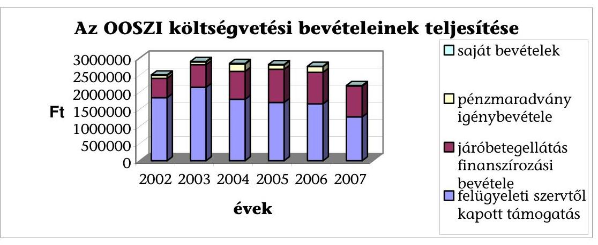

[^0]
[^0]:    ${ }^{114}$ Az ESzCsM és az OEP 2004-ben megjelentette az „Irányelvek a funkcióképesség, a fogyatékosság és a megváltozott munkaképesség véleményezéséhez" című kiadványt, amely

---

Kormányhatározat ${ }^{115}$ növekvő szerepet szán az OOSZI-nak a komplex rehabilitáció intézményrendszerében. Működési költségvetése ugyanakkor 20%-kal csökkent. Bár az OOSZI szakmai felügyelete 2007. január 1-jétől az OEP-től átkerült az SZMM-hez, az OOSZI 2007. évi költségvetési támogatásának tervezését még az OEP végezte. A felügyeleti szervtől kapott támogatásának értékét egyéni képviselői indítványra az országgyűlés 331 M Ft-tal csökkentette.

A képviselői indítvány indoklása szerint: „Az átszervezés miatt, a felügyeleti rend változásával összhangban szükségessé vált az Egészségbiztosítási Alap működési költségvetési előirányzatának csökkentése, a Szociális és Munkaügyi Minisztérium előirányzatainak megegyező összegű növelése mellett. A benyújtott költségvetési törvényjavaslat már tartalmazza a változásokat, azonban az OOSZI működtetési forrásainak átadásakor nem érvényesítették a 2006. évben végrehajtott, valamint a 2007. évben végrehajtandó létszámleépítés - Tervezési Köriratban kötelezően előírt - támogatáscsökkentő hatását (331,5 millió Ft). Az Országos Egészségbiztosítási Pénztár által végrehajtandó létszámleépítéssel kapcsolatos kiadáscsökkentésen túl, ezáltal az OOSZI-ra jutó elvonást is az OEP költségvetésében érvényesítették, ami az államreform egészségbiztosítási ágazatot érintő feladatainak megvalósítását lehetetleníti el. A javaslat ennek korrekcióját tartalmazza."

Az orvosszakértők minimális képzettségét, szakmai gyakorlatát nem írja elő sem intézményi, sem egyéb szabályozás. Az intézeti orvosok közül 2007. májusi állapot szerint 68 fő 1,50 fő 2, 19 fő 3, és 2 fő 4 szakvizsgával rendelkezik. Az intézményben dolgozó minősítő orvosok korösszetétele alapján legnagyobb számban a 61-65 éves kor közötti orvosok dolgoznak.

Minősítő orvosok kormegoszlása 2006. évi adatok alapján
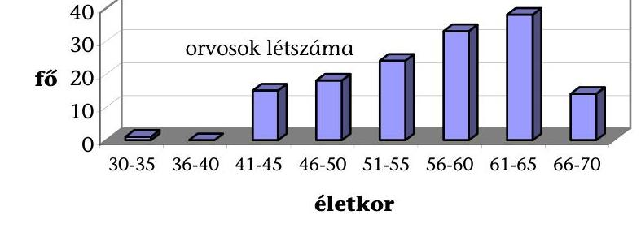

Az orvosszakértői tevékenység speciális tudást és felkészültséget igényel, az elvárt ismeretek képzésére 2003-tól indult posztgraduális biztosítási orvosszakértői képzés. Az intézményben dolgozó ${ }^{116} 154$ orvos közül 26 rendel-
kezik egészségbiztosítási szakorvosi képesítéssel (ebből 25 fő minősítő orvos is), 7 főnek a képzése folyamatban van. Az OOSZI a képzésben részt vevők képzési költségét 70%-ban átvállalja.

A középtávú (5 év) feladatellátás szempontjából kockázatot hordoz, hogy az intézményben a minősítő orvosok 51%-a nyugdíjas, további 16%-a 5 éven belül nyugdíj jogosult lesz, utánpótlásuk nem látszik megoldottnak.

Az intézmény informatikai rendszere nem korszerű, véleményezéseiről nem rendelkezik központi adatbázissal, az egyes telephelyek nincsenek online kapcsolatban, nem rendelkezik honlappal. Az OOSZI 2004 novemberében született vezetői döntése értelmében projektszervezetet hozott létre külső és belső szakemberek bevonásával egy új Orvosszakértői Információs Rendszer (OSZIR) tervezésére. A terv elkészült, de az intézmény forrás hiányában nem kezdte meg a terv megvalósítását, az elmúlt években a fejlesztésre fordított forrásokból olyan informatikai beruházásokat hajtottak végre, amelyek az orvosszakértői tevékenységet szolgálják (számítógépes munkaállomások, nyomtatók, monitorok), és egy későbbi fázisban az OSZIR-hoz kapcsolódni képesek.

Jelen pénzügyi, személyi és tárgyi feltételei mellett az OOSZI nem tud eleget tenni a kormányhatározatban ${ }^{117}$ rá kiszabott komplex minősítési és rehabilitációs feladatok végrehajtására. Fejlesztési forrást erre a komplex rehabilitáció szakmai és infrastrukturális hátterének megerősítését szolgáló uniós támogatások teremthetnek a TÁMOP és a TIOP keretén belül.

# 5. A passzív ellátások rendszere 

### 5.1. A megváltozott munkaképességű személyek passzív ellátása

Az I., II. rokkantsági csoportba tartozók teljesen, míg a III. csoportba tartozók nem teljesen munkaképtelenek ${ }^{118}$. Az utóbbi csoportba tartozók egy része rehabilitációval visszavezethető a munka világába. Őket próbálja elérni és ösztönözni a napjainkban átalakuló megváltozott munkaképességű személyek ellátó rendszere.

A megváltozott munkaképességű személyek munkaképesség csökkenésen alapuló ellátásai az alábbiak:

- I., II., III. csoportú rokkantsági nyugdíj ${ }^{119}$;
- I., II., III. csoportú baleseti rokkantsági nyugdíj ${ }^{120}$;

[^0]
[^0]:    ${ }^{117}$ A megváltozott munkaképességű személyek ellátó alrendszerei összehangolt átalakításának programjáról szóló 2191/2006. (XI. 15.) Korm. határozat, hatályon kívül helyezte a rehabilitációs járadék bevezetésével összefüggő kormányzati intézkedésekről szóló 2077/2007. (V. 9.) Korm. határozat, 2007. V. 9-től.
    ${ }^{118}$ A társadalombiztosítási nyugellátásról szóló 1997. évi LXXXI. törvény 29. § (1) bek.
    ${ }^{119}$ Jelen vizsgálat a korhatár alatti rokkantsági ellátásokat veszi figyelembe.

---

- 1., 2., 3., 4. fokozatú baleseti járadék;
- megváltozott munkaképességűek járadékai:
- átmeneti járadék,
- rendszeres szociális járadék,
- bányász dolgozók egészségkárosodási járadéka.
- rokkantsági járadék,
- rendszeres szociális segély.
(Az ellátásokkal kapcsolatos fontosabb tudnivalókat a 4. sz. melléklet tartalmazza.)

A rokkantsági és baleseti rokkantsági nyugdíjak, valamint a rokkantsági járadék főellátásként, a baleseti járadék, valamint a megváltozott munkaképességűek járadékai fő-, és kiegészítő ellátásként folyósíthatók.

Az ellenőrzés - a kieső, vagy csökkenő jövedelem miatt megállapított - keresetpótló ellátásokat vizsgálja, és nem tér ki a fogyatékossághoz kapcsolódó támogatásokra (fogyatékossági támogatás, vakok személyi járadéka, súlyos mozgáskorlátozottak közlekedési támogatása, magasabb összegű családi pótlék).

A vizsgált időszakban - 2004-2006 - a korhatár alatti III. csoportú rokkantsági nyugdíj és baleseti rokkantsági nyugdíj, baleseti járadék, megváltozott munkaképességűek átmeneti járadéka, megváltozott munkaképességűek rendszeres szociális járadéka, bányász dolgozók egészségkárosodási járadéka, valamint rokkantsági járadék címén összesen 954,6 Mrd Ft-ot folyósítottak.

A teljesen munkaképtelen korhatár alatti I.-II. csoportú rokkantsági- és baleseti rokkantsági nyugdíj címén folyósított ellátásokat is ideszámítva az összeg 1103,9 Mrd Ft.
${ }^{120}$ Jelen vizsgálat a korhatár alatti rokkantsági ellátásokat veszi figyelembe.

---

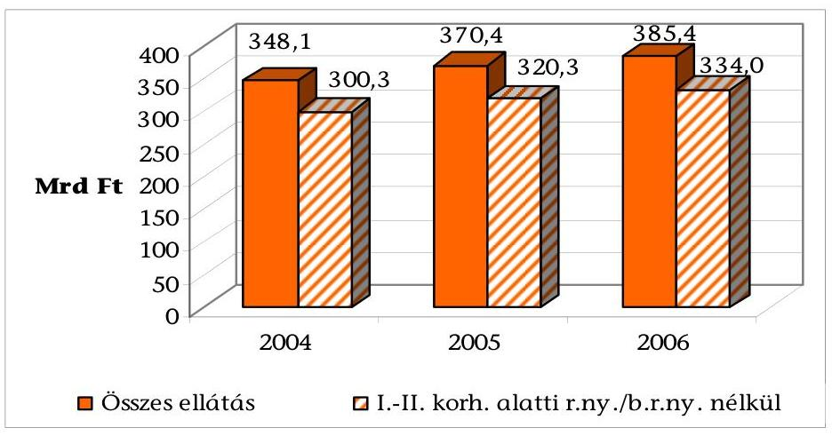

Az összes ellátás nem tartalmazza a rendszeres szociális segély összegét.
(A megváltozott munkaképességű személyek különböző ellátásaira folyósított összegeket részletesen a 10. sz. táblázat tartalmazza.)

A legtöbben - több mint 350 000 fő - III. csoportú korhatár alatti rokkantsági nyugdíjban, a legkevesebben - kevesebb, mint 3000 fő - bányász dolgozók egészségkárosodási járadékában részesülnek.
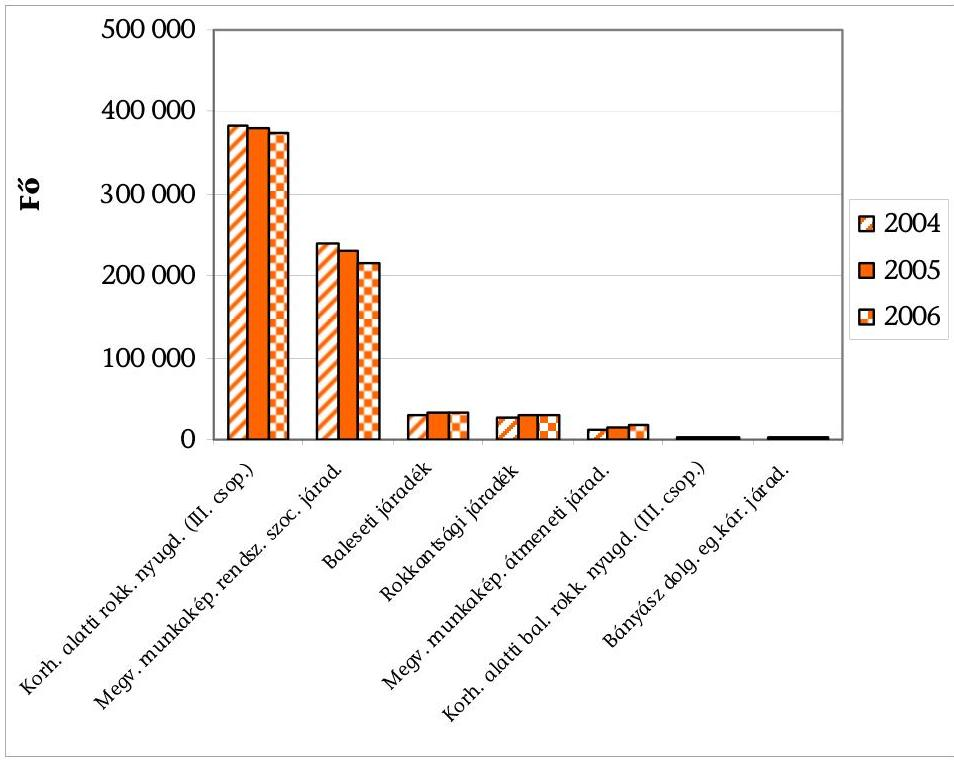

Az ellátásokra kifizetett átlagösszegek tekintetében a bányász dolgozók egészségkárosodási járadéka a legmagasabb.

---

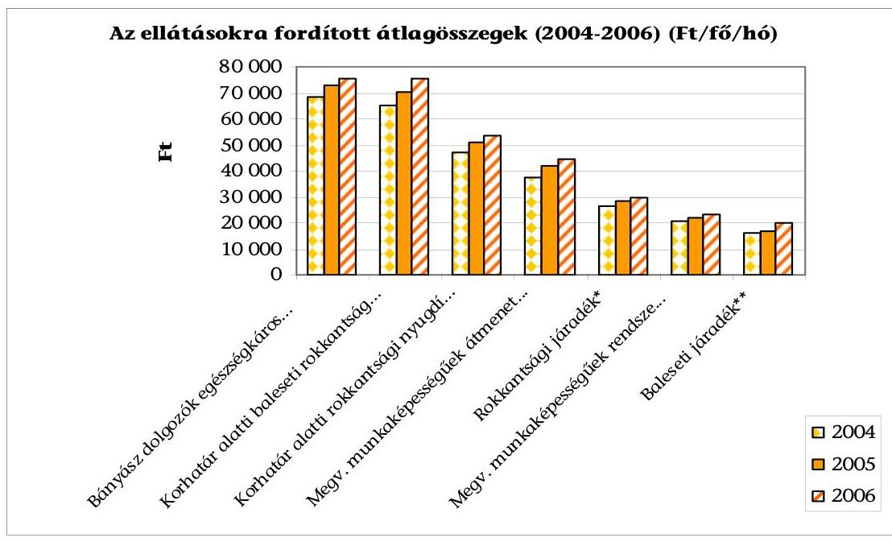
*csak főellátásként folyósítható

* fő-, és kiegészítő ellátásként folyósíthatók (az összegek a fő-, és kiegészítő ellátásokra folyósított összegeket tartalmazzák)

Rokkantsági nyugdíjban több mint 800 ezer fő részesül, amelynek közel 60%-a, több mint 450 000 fő korhatár alatti rokkantsági nyugdíjas. A korhatár alatti rokkantsági nyugdíjasok száma (I., II. III. csoport) a vizsgált időszakban 2,3%-kal csökkent. A III. csoportba tartozó rokkantsági nyugdíjasok alkotják az összlétszám több mint 80%-át, számuk a vizsgált időszakban 1,4%-kal csökkent. (5. sz. tanúsítvány)

# 5.2. A jogosultság megállapításának szabályozása, a folyósítás feltételrendszere, az egyes ellátástípusok kritériumainak meghatározása 

A hatályos jogi szabályozás szerint az ONYF igazgatási szerveinek hatáskörébe négy jogszabály ${ }^{121}$ alapján 7, ezen belül a rokkantság, életkor és szolgálati idő függvényében 14 féle pénzbeli ellátás megállapítása tartozik. Az ellátások jogosultsági feltétele 16-100%-ig terjedő munkaképesség csökkenés. Az ellátások forrásai a Ny. Alapnál, az E. Alapnál, illetve az SZMM fejezetnél vannak. A folyósítás rendszere, a különböző ellátások folyósításának kritériumai jogszabályokban rögzítettek, változások a vizsgált időszakban nem voltak.

[^0]
[^0]:    ${ }^{121}$ 1997. évi LXXXI. törvény a társadalombiztosítási nyugellátásról (a továbbiakban: Tny.), és a végrehajtásáról szóló 168/1997. (X. 6.) Korm. rendelet (a továbbiakban: TnyR.).
    A kötelező egészségbiztosítás ellátásairól szóló 1997. évi LXXXIII. törvény és a végrehajtásáról rendelkező 217/1997. (XII. 1.) Korm. rendelet.
    A megváltozott munkaképességű dolgozók foglalkoztatásáról és szociális ellátásáról szóló 8/1983. (VI. 29.) EüM-PM együttes rendelet.
    A rokkantsági járadékról szóló 83/1987. (XII. 27.) MT rendelet.

---

Az egészségkárosodás minősítő megállapítását az OOSZI szakértői végzik (lásd: 4. pont alatt). A munkaképesség csökkenésen alapuló ellátások megállapítása iránti igény elbírálását az ONYF és igazgatási szervei, a MÁV ZRt. Nyugdíj Igazgatóság, a GYSEV ZRt. és a fegyveres nyugdíjmegállapító szervek végzik, a folyósítás a NYUFIG és a MÁV ZRt. Nyugdíj Igazgatóság hatáskörébe tartozik. ${ }^{122}$

A pénzbeli ellátások közül a Ny. Alapból finanszírozott ellátások - az öregségi nyugdíjkorhatár fölötti rokkantsági nyugdíj mellett - a korhatár alatti I.-II. csoportú rokkantsági és baleseti rokkantsági nyugdíjak, amelyekre 2004-ben 47,8, 2005-ben 50,1, 2006-ban 51,4 Mrd Ft-ot fizettek ki.

A nyugellátások közül a nyugdíjkorhatár alatti III. rokkantsági csoportba tartozó rokkantak és baleseti rokkantak ellátásait, valamint a baleseti járadékot az E. Alap finanszírozza. Az egészségkárosodás megállapítását az OOSZI, a rokkantsági nyugdíjak megállapítását és folyósítását a nyugdíjbiztosítási ágazat végzi. Az E. Alapot terhelő korhatár alatti III. csoportos rokkantsági, baleseti rokkantsági nyugellátások, és baleseti járadékok elszámolás rendjét megállapodásokban rögzítették.

A rokkantsági nyugdíjasok közel 60%-a, 460 ezer fő korhatár alatti, közülük 380 ezren - több mint 80% - III. csoportosok, akik valamilyen megmaradt munkaképességgel rendelkeznek. A korhatár alatti rokkantsági nyugdíjasok közel 65%-a - 293 ezer fő (2007. januári adat) - 57 év alatti. Ők azok, akik jobb rehabilitációs szolgáltatások és kedvezőbb munkaerőpiaci körülmények esetén foglalkoztathatók lennének. Őket próbálja elérni és ösztönözni a napjainkban átalakuló megváltozott munkaképességű személyek ellátó rendszere (6. sz. tanúsítvány).

A korhatár alatti III. csoportú rokkantsági és baleseti rokkantsági nyugdíjakra 2004-ben 218,2, 2005-ben 233,9, 2006-ban 244,1 Mrd Ft-ot fordítottak. (Az E. Alapból finanszírozott nyugdíj,- és járadék kiadások táblázatát a 7. sz. tanúsítvány tartalmazza.)

A rokkantsági nyugdíjak iránti igénybejelentések száma a 2004. évi 143 106-ról 2006-ra 124 019-re változott, 13,4%-kal csökkent. Az igénybejelentések számához viszonyítva a teljesítő határozatok aránya több mint 31% (2004-ben 32,1%, 2006-ban 31,6%).

A vizsgált időszakban havi járandóságként a korhatár alatti III. csoportú rokkantsági nyugdíjasok számára átlagosan 47,0-50,7-53,8 E Ft-ot, a korhatár alatti baleseti rokkantsági nyugdíjasok számára átlagosan 65,2-70,3-75,3 E Ft-ot folyósítottak.

A baleseti járadékban részesülők száma a vizsgált időszakban, kis mértékben 2004. évről 2006. évre 1%-kal nőtt - változott. Erre az ellátásra az jogosult, akinek munkaképessége üzemi baleset, vagy foglalkozási megbetegedés következtében 16%-ot meghaladó mértékben csökkent, de baleseti rokkantsági

[^0]
[^0]:    ${ }^{122}$ Kivételt képez a rendszeres szociális segély, amelyet a települési önkormányzat jegyzője állapít meg, és az önkormányzat folyósít.

---

nyugdíj nem illeti meg. A főellátásban részesülők 65%-a a 2. fokozatú baleseti járadékban részesült (8. sz.
 tanúsítvány). ${ }^{123}$

Az ONYF éves statisztikája alapján baleseti járadékban 83%-ban férfiak, 17%-ban nők részesültek.

Baleseti járadékot fő- és kiegészítő ellátásként összesen 6,1-6,5-7,6 Mrd Ft összegben folyósítottak, 31,4-31,6-31,7 ezer főnek, 16,2-17,2-20,1 E Ft/fő/hó összegben.

A központi költségvetésben évente határozzák meg a szaktárca fejezeténél a megváltozott munkaképességűek járadékait ${ }^{124}$ és a rokkantsági járadékot.

A 2004. január és 2007. januári adatok alapján a megváltozott munkaképességűek rendszeres szociális járadékában főellátásként részesülők száma 10,8%-kal, a bányász dolgozók egészségkárosodási járadékában főellátásként részesülők száma 8,7%-kal csökkent, a rokkantsági járadékban részesülők száma 7,6%-kal, a megváltozott munkaképességűek átmeneti járadékában főellátásként részesülők száma 60,3%-kal nőtt.

Megváltozott munkaképességűek átmeneti járadékára az a megváltozott munkaképességű jogosult, aki az öregségi nyugdíjhoz szükséges szolgálati idővel rendelkezik és nem jogosult rokkantsági nyugdíjra, és az irányadó öregségi nyugdíjkorhatárt öt éven belül eléri, munkaképesség csökkenésének mértéke az OOSZI orvosi bizottságának véleménye szerint legalább 50%.

Az átmeneti járadék összege a megváltozott munkaképességű dolgozó várható öregségi nyugdíjának 75%-a.

Átmeneti járadékot 5,7-7,1-9,3 Mrd Ft összegben folyósítottak 12,8-14,3-17,5 ezer főnek. Az átlagos kifizetés 37,4-41,6-44,4 E Ft/fő/hó. Az adatok a fő-, és kiegészítő ellátás összesen adatait tartalmazzák.

Megváltozott munkaképességűek rendszeres szociális járadékára az a megváltozott munkaképességű dolgozó jogosult, aki az irányadó nyugdíjkorhatárt nem töltötte be és nem rehabilitálható, valamint az átmeneti járadék megállapításához szükséges feltételekkel nem rendelkezik.

A rendszeres szociális járadékra jogosító teljesítő határozatok száma 41,7%-kal csökkent. A megállapított járadékok száma a területi eloszlást tekintve az Észak-Alföldön, a Dél-Alföldön, valamint Észak-Magyarországon a legmagasabb.

Rendszeres szociális járadékot 59,0-60,5-59,9 Mrd Ft összegben folyósítottak 239,9-230,3-215,9 ezer főnek, az átlagos kifizetés 20,5-21,9-23,1 E Ft/fő/hó. Az

[^0]
[^0]:    ${ }^{123}$ A 8. sz. tanúsítvány a baleseti járadék főellátás adatait a 7. sz. tanúsítvány baleseti járadék sora a fő- és kiegészítő ellátások összesen adatait tartalmazza.
    ${ }^{124}$ Megváltozott munkaképességűek járadékai: megváltozott munkaképességűek átmeneti járadéka, megváltozott munkaképességűek rendszeres szociális járadéka, bányász dolgozók egészségkárosodási járadéka.

---

adatok a fő-, és kiegészítő ellátás összesen adatait tartalmazzák. A megváltozott munkaképességűek járadéka - átmeneti és rendszeres szociális járadék - 2004-ben 64,7, 2005-ben 67,6, 2006-ban 69,3 Mrd Ft-ra teljesült.

Bányász dolgozók egészségkárosodási járadékára az jogosult, akinek munkaképesség csökkenése legalább 36%, életkortól függően meghatározott ideig földalatti bányamunkát végzett, és munkaviszonya megszűnését megelőzően rehabilitációs munkakörben dolgozott. Az egészségkárosodási járadékra jogosító teljesítő határozatok száma 79,1%-kal csökkent, amit a hazai bányászati tevékenység kifutása indokol.

Bányász dolgozók egészségkárosodási járadékára 2,4-2,5-2,5 Mrd Ft összeget folyósítottak 2,9-2,8-2,7 ezer főnek. Az átlagos kifizetés 68,2-72,7-75,6 E Ft/fő/hó. Az adatok a fő-, és kiegészítő ellátás összesen adatait tartalmazzák.

Rokkantsági járadékra az jogosult, aki az OOSZI orvosi bizottságának szakvéleménye szerint 25. életévét betöltése előtt teljesen munkaképtelenné vált és nyugellátást, baleseti nyugellátást részére nem állapítottak meg. A rokkantsági járadékra való jogosultság legkorábban annak a hónapnak az első napjától lehetséges, amelyben az illető a 18. életévét betöltötte.

A rokkantsági járadék iránti igénybejelentések száma 2004-ben 3579, 2006-ban 3285 volt, ami 8,2%-os csökkenésnek felel meg. Az összes igénybejelentéshez képest a teljesítő határozatok aránya több mint 40% (42,3, 42,5, illetve 41,7%). Rokkantsági járadékot 9,0-9,9-10,6 Mrd Ft összegben folyósítottak 28,3-29,1-29,7 ezer főnek. Az átlagos kifizetés 26,4-28,2-29,7 E Ft/fő/hó. Az átmeneti-, rendszeres szociális-, és egészségkárosodási járadékok iránti igénybejelentések száma 14,1%-kal, a teljesítő határozatok száma 26,6%-kal csökkent.

A fentiekben felsorolt járadékokban évente több mint 250 ezer fő részesült. A részükre folyósított összegek célja a megváltozott élethelyzetből fakadó kieső vagy csökkenő jövedelem pótlása.

A megállapított járadékok száma a területi eloszlást figyelembe véve az Észak-Alföldön a legmagasabb.

Azoknak az aktív korú személyeknek, akik egészségkárosodottak ${ }^{125}$, vagy nem foglalkoztatottak a szociális igazgatásról és szociális ellátásokról szóló 1993. évi III. törvény 37/A. § (1) bek. alapján a települési önkormányzat jegyzője rendszeres szociális segélyt állapíthat meg. Ezen a jogcímen 2004-ben 3,4 Mrd, 2005-ben 5,4 Mrd, 2006-ban 6,3 Mrd Ft-ot folyósítottak. A folyósítás feltételrendszerét, kritériumait jogszabályban rögzítették, az elszámolás módja a vizsgált időszakban nem változott. A támogatás rendszere 2007. január 1-jétől módosult: azt, aki eddigi egészségkárosodással összefüggő ellátásából kikerült és a munkaügyi központtal előtte 3 hónapig együttműködött, aktív korú foglalkoztatottként rendszeres szociális segélyben lehet részesíteni.

[^0]
[^0]:    ${ }^{125}$ A Szt. alapján egészségkárosodott az, aki a munkaképességét legalább 67%-ban elvesztette, vagy vakok személyi járadékában, vagy fogyatékossági támogatásban részesül.

---

# 5.3. A folyósítás rendszerében bekövetkezett változások 

A vizsgált időszakban a folyósítás rendszere nem változott. A NYUFIG által folyósított ellátások párhuzamosságának kiszűrése több szinten garantált.

A folyósítás megkezdése előtt a NYUFIG megvizsgálja, hogy a jogosult szerepel-e a nyilvántartásban, jelenleg részesül-e valamilyen ellátásban, rendelkezik/rendelkezett-e a NYUFIG által folyósított bármilyen ellátással. A rendszer nem teszi lehetővé az igény iktatását az előzményezés nélkül.

A Tny. ${ }^{126}$ 30. § (1) bek. szerint „A rokkantsági nyugdíjra jogosultság megszűnik, ha a nyugdíjas már nem rokkant, vagy rendszeresen dolgozik és keresete négy hónap óta lényegesen nem kevesebb annál a keresetnél, amelyet a megrokkanás előtti munkakörében rokkantság nélkül elérhetne". ${ }^{127}$ Továbbá a Tny. 97. § (5) bek. előírja, hogy „A nyugellátásban részesülő személy 15 napon belül köteles bejelenteni a nyugdíj-biztosítási igazgatási szervnek minden olyan tényt, adatot, körülményt, amely a nyugellátásra jogosultságát vagy a nyugellátás folyósítását érinti." Az ellátásban részesülő személyt tehát bejelentési kötelezettség terheli. Amennyiben a felülvizsgálat alkalmával az OOSZI orvosi bizottságának véleménye szerint a munkaképesség csökkenés nem éri el a 67%-ot nyugdíjra jogosultságát határozattal meg kell szüntetni. A szakvéleményt a lakóhely szerint illetékes OOSZI orvosi bizottsága az erre a célra rendszeresített formanyomtatványon közli a nyugellátási szakegységgel, aki intézkedik a megszűntetésről. A rokkantsági nyugdíjra való jogosultság akkor is megszűnik, ha a nyugdíjas rendszeresen dolgozik és keresete négy hónap óta nem kevesebb annál, amelyet a megrokkanás előtti munkakörében rokkantság nélkül elérhetne. Ez adott esetben egyfajta mérlegelési lehetőséget kínál: egy esetlegesen magasabb kereseti színvonalú tartós munkavállalás mellett a rokkantsági nyugdíjjogosultság elvesztését, vagy a munkavégzés alacsonyabb kereseti szinten való folytatását.

A rendszer ebben a tekintetben a rokkantsági nyugdíjas bejelentési kötelezettségére támaszkodott, mert nem volt olyan adatgyűjtés, amely lehetővé tette az adatok összefuttatását, az ellátásban jogosulatlanul részesülő személyek kiszűrését. Továbbá a kereset - jogszabály alapján történő - megállapítása több tényező függvénye - földrajzi helyzet, vállalati infrastruktúra -, ami személyenként eltérően befolyásolja a döntés meghozatalát.
2007. április 1-jétől a Tbj. 25. § alapján „A saját jogú nyugdíjas foglalkoztatott a járulékalapot képező jövedelme után természetbeni egészségbiztosítási járulékot és nyugdíjjárulékot fizet." A foglalkoztatónak tehát 2007. április 1-jétől minden saját jogú nyugdíjasról bejelentési kötelezettsége van, ami lehetővé teszi az adatok összefuttatását.

[^0]
[^0]:    ${ }^{126}$ A társadalombiztosítási nyugellátásról szóló 1997. évi LXXXI. törvény.
    ${ }^{127}$ A Tnyr. 18. § (3) bek. szerint lényegesen kevesebbnek akkor kell tekinteni a keresetet, ha a keresetek közötti különbség legalább 20%.

---

A rokkantsági nyugdíjra való jogosultság felülvizsgálatára „számos esetben" ${ }^{128}$ közérdekű bejelentés alapján kerül sor.

Budapest, 2007. szeptember 27.
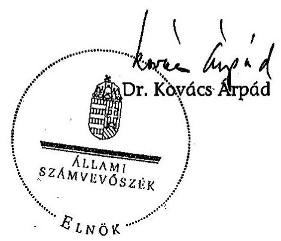

[^0]
[^0]:    ${ }^{128}$ Az ONYF Ellenőrzési Főosztály vezetője 2007. V. 8-án kelt elektronikus levelének információja szerint.

---

# MELLÉKLETEK

---

# 1658 D7. $V-4-101 / 07$ 

Miniszterelnöki Hivatalt Vezető Miniszter

$$
\begin{aligned}
& \text { Ikt.sz.: 928/6/VIII/2007. } \\
& \text { Ügyintéző: dr. Tarr Gyula } \\
& \text { Hiv.sz.: V-498/2007. }
\end{aligned}
$$

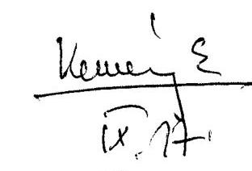

Dr. Kovács Árpád úrnak
elnök
Állami Számvevőszék
Budapest

## Tisztelt Elnök Úr!

A munkaképesség megőrzésére fordított pénzeszközök hasznosulásának ellenőrzéséről készített jelentésre észrevételt nem teszek.

Budapest, 2007. szeptember 7.
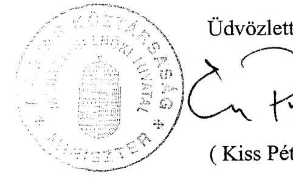

---

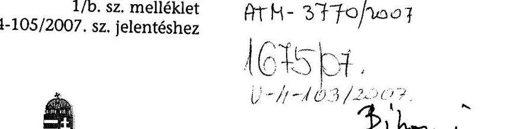

# EGÉSZSÉGÜGYI MINISZTÉRIUM MINISZTER 

Iktatószám: 1750-1/2007-1002MIK

## Kovács Árpád úrnak

elnök
Állami Számvevőszék

Budapest
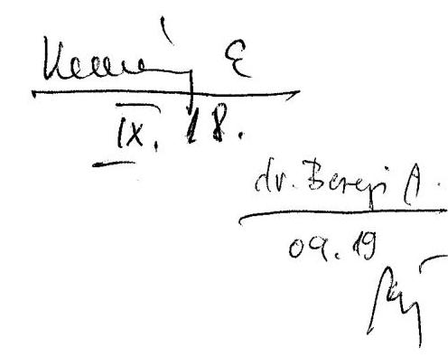

Tisztelt Elnök úr!

A munkaképesség megőrzésére fordított pénzeszközök hasznosulásának ellenőrzése című ÁSZ jelentésre észrevételt nem teszek.

Budapest, 2007. szeptember „M.."
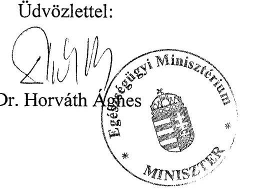

---

H-1051 BUDAPEST V., JÓZSEF NÁDOR TÉR 2-4. POSTACÍM: 1369 BUDAPEST, POSTAFIÓK 481.
TELEFON: (36-1) 327-2159, (36-1) 327-2141
$\mathrm{FAX}:(36-1) 318-0738$
E-MAIL: janos.veres@pm.gov.hu

PÉNZÜGYMINISZTER

Ikt.szám: 3544/6/2007.

Hiv. szám: V-4-98/2007.

Dr. Kovács Árpád úr
elnök

Állami Számvevőszék
Budapest

# Tisztelt Elnök Úr! 

Köszönettel megkaptam a munkaképesség megőrzésére fordított pénzeszközök hasznosulásának ellenőrzéséről készült igen körültekintő és tartalmas jelentésüket.

Miután a jelentés jelenlegi változata többfordulós szakmai egyeztetés után alakult ki, annak megállapításaival egyetértek.

A jelentéssel kapcsolatban tájékoztatom Önt, hogy - bár a jelentés tárcánk felé nem fogalmaz meg közvetlen intézkedéseket - az új rehabilitációs foglalkoztatási támogatási rendszerrel kapcsolatos kiadások, illetve a támogatási rendszer változásai hatásainak nyomon követése érdekében a volt célszervezetek körében 2007. október végi határidővel egy kérdőíves vizsgálatot indítottunk el. Ennek eredményeiről természetesen Önöket is tájékoztatni fogjuk.

Budapest, 2007. szeptember 11.

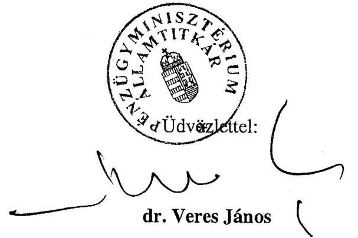

---

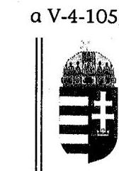

Önkormányzati és Területfejlesztési Miniszter
Iktatószám: 19-6897-3/2007.
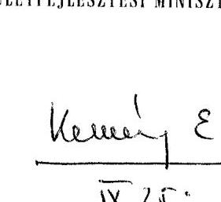

Dr. Kovács Árpád Úrnak
Állami Számvevőszék
Elnöke

# Budapest 

## Tisztelt Elnök Úr!

Köszönettel kézhez kaptam és áttekintettem a munkaképesség megőrzésére fordított pénzeszközök hasznosulásának ellenőrzéséről készített jelentésüket.

Az abban foglalt - részemre meghatározott - javaslattal kapcsolatban intézkedési terv készítését rendeltem el.

Budapest, 2007. szeptember 24.
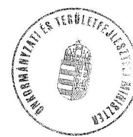

Tisztelettel:

Bajnai Gordon

---

2. sz. melléklet
a V-4-105/2007. sz. jelentéshez

A munkaképesség megőrzésére fordított pénzeszközök „mozgása"
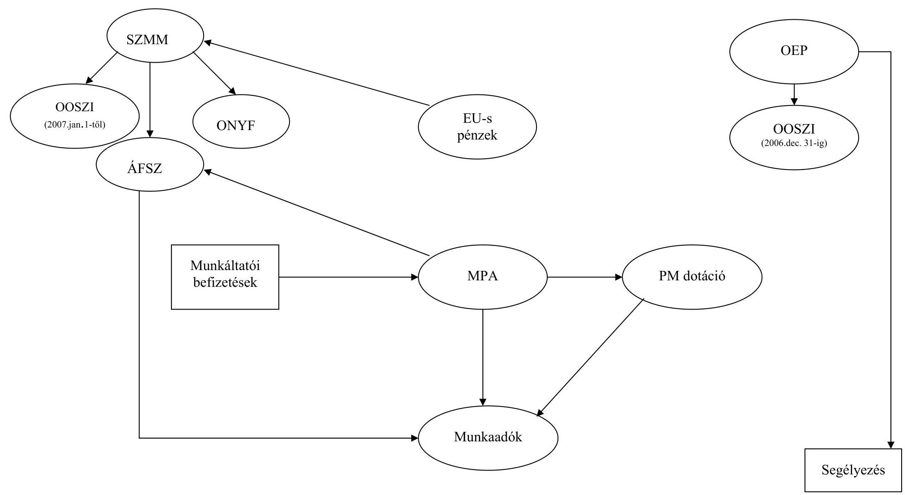

---

# KÉRDÉSEK, KRITÉRIUMOK ÉS ADATFORRÁSOK

|  Kérdések |  | Kritériumok, mutatók | Adatforrás  |
| --- | --- | --- | --- |
|  1. | Megvalósultak-e a megváltozott munkaképességűek reintegrációjában a kormányzati és uniós célkitűzések? |  |   |
|  1.1. | Összhangban voltak-e a kormányzati intézkedések a megváltozott munkaképességűek foglalkoztatásának elősegítésére és a korszerű rehabilitáció kiépítésére kitűzött célokkal? | A kormány javaslatot dolgozott ki a megváltozott munkaképességűek rehabilitációjának korszerűsítésére, az intézkedések ennek megfelelőek. | Kormányprogramok, kormányhatározatok  |
|  1.1.1. | Az orvosi rehabilitáció kiépítésére, korszerűsítésére hozott intézkedések összhangban voltak-e a kitűzött célokkal? | Létezik szakmapolitikai koncepció az orvosi rehabilitáció kiépítésére, a koncepció összhangban van az OGY határozattal, a kormányprogrammal, a tárca elképzeléseivel. Vannak korszerűsítési törekvések az orvosi rehabilitációban. | Kormányprogram, OGY határozat, Rehabilitációs Szakmai Kollégium, tárcák anyagai  |
|  1.1.2. | Összhangban vannak-e a kormányintézkedések a foglalkozási rehabilitáció célkitűzéseivel? | A foglalkozási rehabilitáció célkitűzése a megváltozott munkaképességű munkavállalók visszavezetése a nyílt munkaerőpiacra. A foglalkozási rehabilitáció célkitűzései összhangban vannak a 2004-2006-os kormányprogrammal. A kormány intézkedett a megváltozott munkaképességűek foglalkoztatásának korszerűsítéséről. | Kormányprogramok, kormányhatározatok  |
|  1.1.3. | Voltak-e kormányzati célkitűzések és intézkedések a komplex rehabilitáció kiépítésére? | A kormány kidolgozta a megváltozott munkaképességűek komplex rehabilitációjának korszerűsítését, folyamatosan biztosította annak jogszabályi hátterét. | 177/2005. (IX. 2.) Korm. rendelet a megváltozott munkaképességű munkavállalók foglalkoztatásához nyújtható költségvetési támogatásáról  |

---

|  Kérdések |  | Kritériumok, mutatók | Adatforrás  |
| --- | --- | --- | --- |
|   |  |  | 176/2005. (IX. 2.) Korm. rendelet a megváltozott munkaképességű munkavállalókat foglalkoztató munkáltatók akkreditációjának, továbbá az akkreditált munkáltatók ellenőrzésének szabályairól
2191/2006. (XI. 15.) Korm. hat. a megváltozott munkaképességű személyek ellátó alrendszerei összehangolt átalakításának programjáról
2180/2005. (VIII. 26.) Korm. hat.

 a megváltozott munkaképességű személyek ellátó alrendszerei összehangolt átalakításának programjáról
8/1983. (VI. 29.) EüM-PM együttes rendelet a megváltozott munkaképességű dolgozók foglalkoztatásáról és szociális ellátásáról  |
|  1.2. | Az uniós ajánlások/célkitűzések hozzájárul-tak-e megváltozott munkaképességű személyek foglalkoztatásához? | Az uniós forrásokból társfinanszírozott programok biztosították a megváltozott munkaképességű személyek inaktivitásának csökkentését (eredmény és hatás indikátorok értékei) | 2005/600/EK tanácsi határozat a tagállamok foglalkoztatáspolitikáira vonatkozó iránymutatásokról (a 2005-ben felülvizsgált Lisszaboni stratégia integrált iránymutatásai: 17-24);
Felülvizsgált Nemzeti Lisszaboni Akcióprogram a növekedésért és a foglalkoztatásért;
COM(2003)650 végleges: A Bizottság közleménye a Tanácsnak, az Európai Parlamentnek, az Európai Gazdasági és Szociális Bizottságnak és a Régiók Bizottságának: EU Akcióterve a fogyatékkal élők egyenlő esélyeinek biztosítására;
2204/2002/EK Bizottsági rendelet  |

---

|  Kérdések |  | Kritériumok, mutatók | Adatforrás  |
| --- | --- | --- | --- |
|  1.2.1. | A Nemzeti Fejlesztési Terv és az Új Magyarország Nemzeti Fejlesztési Terv tervezése során figyelembe vették-e az Európai Unió által előírt megváltozott munkaképességű/fogyatékos személyek egyenlő esélyeinek biztosítására, munkaerőpiaci integrációjára vonatkozó előírásokat? | Az ex-ante értékelés és a tervezések során az uniós jogszabályi környezet alkalmazása | EK Szerződés 13. cikk; Tanácsi határozat a megváltozott munkaképességűek egyenlő foglalkoztatási esélyeinek biztosításáról (1999/C 186/02); 2000/78/EK tanácsi irányelv a foglalkoztatás és a munkavégzés során alkalmazott egyenlő bánásmód általános kereteinek létrehozásáról 5. cikk; Európai Foglalkoztatási Stratégia,
COM (2005) 604 végleges: A Bizottság közleménye a Tanácsnak, az Európai Parlamentnek, az Európai Gazdasági és Szociális Bizottságnak és a Régiók Bizottságának: Európai Akcióterv 2006-2007 (DAP:Disability Action Plan) A fogyatékkal élők helyzete a kibővült Európai Unióban  |
|  1.2.2. | A HEFOP eddigi tapasztalatait mennyire építették be a 2007-2013-as programozási időszak alatt megvalósítandó humánerőforrás fejlesztését célzó programokba (TIOP, TÁMOP)? | Az ÚMFT ex-ante értékelése során vizsgálták a 2006-ig végrehajtott programok, projektek tapasztalatait és a legjobb gyakorlatokat beépítették a tervezésbe, illetve a nem megfelelő eredményt, támogatási formákat eltörölték, a korábbi átfedéseket megszüntették | Ex-ante értékelés, OP, TÁMOP, TIOP akciótervek. monitoring jelentések, interjúk, 5. és 7. sz. tanúsítványok  |
|  1.2.3. | Az előcsatlakozási alapok (Phare), illetve a 2004-2006 közötti HEFOP, Equal, ROP programok keretében finanszírozott projektek közül a legjobb tapasztalatok (best practice) disszeminációja megvalósult-e, illetve a megváltozott munkaképességű személyekre, mint célcsoportra vonatkozó elkülönített nyilvántartás mennyiben megoldott? | Az EU által előírt tájékoztatási és nyilvánosságra vonatkozó követelményeknek eleget tettek mind lebonyolító intézmények, mind a Kedvezményezettek; a megváltozott munkaképességűekhez kapcsolódó pénzügyi adatok, hatás és eredményindikátorok elkülönített nyilvántartása megoldott. | 1159/2000/EK Bizottsági rendelet a strukturális alapok által nyújtott támogatásokra vonatkozóan a tagállamok által végrehajtandó, a tájékoztatásra és a nyilvánosságra vonatkozó intézkedésekről; 1260/1999/EK rendelet 46. cikk; HEFOP, Equal, ROP 3.2.3. monitoring jelentések, kommunikációs stratégia, projekt előrehaladási jelentések (PEJ); 2204/2002/EK rendelet szerinti éves jelentések, EMIR  |

---

|  Kérdések |  | Kritériumok, mutatók | Adatforrás  |
| --- | --- | --- | --- |
|  2. | Az orvosi rehabilitáció szabályozása, szervezeti, működési és ellenőrzési rendszere, valamint az erre fordított pénzeszközök elősegítik-e a munkába való visszatérést? |  |   |
|  2.1. | Az orvosi rehabilitáció intézményrendszere megfelelő hátteret teremt-e a munkába való visszatéréshez? A rehabilitációs ellátás sajátosságait meghatározták-e? | Az orvosi rehabilitáció ellátás sajátosságait meghatározták. | 43/1999. (III. 3.) Korm. rendelet az egészségügyi szolgáltatások Egészségbiztosítási Alapból történő finanszírozásának részletes szabályairól  |
|  2.1.1. | Dolgoztak-e ki minimumfeltételeket a szolgáltatók rehabilitációs tevékenység megfelelőségére? Biztosított-e, hogy rehabilitációs ellátást csak ott végezzenek, ahol ennek feltételei adottak? A szükséges feltételek meglétét ellenőrzi-e a finanszírozó? Az egészségügyi rehabilitációban részt vevő intézményrendszer tevékenysége segíti-e a munkába való visszatérést? Vannak-e speciális rehabilitációra szakosodott intézmények, az ezekben folyó rehabilitációs tevékenység eredményessége meghatározható-e? Vannak-e kritériumok a rehabilitáció eredményességének meghatározására? Elemezték-e, felméri-ték-e hogy a rendelkezésre álló fekvőbeteg ellátó kapacitás megfelel-e a felmerülő igények kielégítéséhez? A rehabilitáció betegségenkénti különböző típusait figyelembe ve-szi-e a finanszírozás? | A szolgáltatók rehabilitációs tevékenysége megfelelőségének biztosítására kidolgozták a szakmai minimum feltételeket, a finanszírozás figyelembe veszi a feltételeknek való megfelelést, monitorozzák a feltételek meglétét.
A finanszírozásba beépülnek a specialitások.
Meghatározták a rehabilitációs kapacitásokat. A rehabilitációt a kijelölt intézmények látják el. | 60/2003. (X. 20.) ESzCsM rendelet az egészségügyi szolgáltatások nyújtásához szükséges szakmai minimumfeltételekről
25/2004. (II. 26.) Korm. rendelet az egészségügyi szolgáltatás általános feltételeiről, valamint a működési engedélyezési eljárásról szóló 96/2003. (VII. 15.) Korm. rendelet módosításáról
43/1999. (III. 3.) Korm. rendelet az egészségügyi szolgáltatások Egészségbiztosítási Alapból történő finanszírozásának részletes szabályairól
OSAP
Rehabilitációs Szakmai Kollégium dokumentumai  |

---

|  Kérdések |  | Kritériumok, mutatók | Adatforrás  |
| --- | --- | --- | --- |
|  2.1.2. | A rehabilitációs terület szakember ellátottsága kielégítő-e? Vannak-e specifikus képzési lehetőségek? | Felsőoktatási háttér biztosítása, megfelelő létszámú szakember biztosítása a minimumfeltételekkel összhangban. | OORI vizsgáztatási statisztikái
ÁNTSZ - személyi minimumfeltételek nyilvántartása lehetőségek
11/2000. (III. 31.) EüM rendelet a rehabilitációs tevékenység terapeuta szakképesítés szakmai és vizsgakövetelményeinek kiadásáról  |
|  2.2. | Biztosítottak-e a hazai és uniós források az orvosi rehabilitációs tevékenység ellátásához? | Az E. Alapban biztosítottak a források, az uniós programok önrésze biztosított. | E. Alap költségvetés, állami költségvetés, előirányzatok, teljesítések  |
|  2.2.1. | Az E. Alap költségvetésében meglévő források lehetővé teszik-e az eredményes rehabilitációs munkát az egyes ellátó helyeken? Elemezték-e (E. Alap) komplexen a rehabilitációs fekvő/járó-ellátás kiadásait? A rehabilitáció betegségenkénti különböző típusait figyelembe veszi-e a finanszírozás? A finanszírozás alapjául szolgáló költségtartalom változott-e? | A rehabilitációs célú fekvő és járóbeteg kiadások elkülöníthetőek. | OEP informatikai rendszer, E. Alap költségvetés, szerződött rehabilitációs kapacitások  |
|  2.2.2. | Vannak-e megbízható adatok, mutatók a rehabilitáltak körére vonatkozóan? A nyilvántartásokban gyűjtött adatokat felhasználják-e a döntéshozatalban? | Az E. Alapban biztosítottak a források. Elemezték az E. Alap rehabilitációs kiadásokra fordított összegeit. | Elemzések, OEP szakmai anyagok  |
|  2.2.3. | Megvalósultak-e az intézményfejlesztést, a rehabilitációs központok kialakítását célzó EU forrásból társfinanszírozott programok? Fordítottak-e orvosi rehabilitációs célokra európai uniós forrásokat? A munkavégző képesség gyors helyreállítása, illetve a betegségek megelőzése, korai felismerése érdekében történtek-e fejlesztések EU társfinanszírozással? | Rehabilitációs központok fejlesztése megvalósult, az egészségügyi infrastruktúra fejlesztésére fordított források elősegítették a munkavállalók gyors visszatérését a munkaerőpiacra. | 5. és 7. sz. tanúsítvány, interjú, monitoring jelentések, EMIR, HEFOP 4. (Az oktatási, szociális és egészségügyi infrastruktúra fejlesztése prioritás) output, hatás és eredmény indikátorai  |

---

|  Kérdések |  | Kritériumok, mutatók | Adatforrás  |
| --- | --- | --- | --- |
|  3. | A megváltozott munkaképességű személyek foglalkozási rehabilitációjának szabályozása, szervezeti, működési és ellenőrzési rendszere, valamint az erre fordított pénzeszközök elősegítik-e a munkába való visszatérést? |  |   |
|  3.1. | A megváltozott munkaképességűek foglalkozási rehabilitációjának szabályozási környezete megfelelő hátteret teremt-e az inaktivitás csökkentéséhez, a foglalkoztatás növeléséhez? | A szabályozás célja a foglalkoztatás növelése, az inaktivitás csökkentése. | Vonatkozó jogszabályok  |
|  3.1.1. | A jogszabályok egymással összhangban definiálják-e a megváltozott munkaképesség fogalmát? A jogszabályok egymással összhangban vannak-e? | A jogszabályok egymással összhangban definiálják a munkaképesség fogalmát. | 1991. évi IV. törvény a foglalkoztatás elősegítéséről és a munkanélküliek ellátásáról
1993. évi III. törvény a szociális igazgatásról és szociális ellátásokról  |
|  3.1.2. | A foglalkozási rehabilitáció folyamatát rögzítő jogszabályok tartalmazzák-e a megváltozott munkaképességű munkavállalók eredeti munkahelyén vagy új munkahelyen való vissza-foglalkoztatásának garanciáit? A jogszabályok szintjén garantált -e a foglalkozási, képzési rehabilitációhoz való egyenlő hozzáférés? | A megváltozott munkaképességű munkavállalók eredeti munkahelyükön való visszafoglalkoztatása, illetve foglalkozási rehabilitációban való részvételi jogosultsága a szabályozás szintjén garantált. A jogszabályokban garantált az egyenlő hozzáférés elve. | 8/1983. (VI. 29.) EüM-PM együttes rendelet a megváltozott munkaképességű dolgozók foglalkoztatásáról és szociális ellátásáról Vonatkozó jogszabályok  |
|  3.2. | A foglalkozási rehabilitáció intézményrendszere szolgálja-e a megváltozott munkaképességű személyek munkához juttatását? | Az ÁFSZ és a speciális foglalkoztatásban részt vevő munkáltatók törekednek a foglalkoztatás elősegítésére. | ÁFSZ statisztikák, foglalkoztatók jellemző adatai  |
|  3.2.1. | A tárcák közötti együttműködés eredményesen szolgálta-e a foglalkoztathatóság megteremtését? | A tárcák eredményesen együttműködnek a foglalkoztathatóság megteremtésében. Nő a megváltozott munkaképességűek munkahelyei szintentartásához, akadálymentesítéséhez, fejlesztéséhez, bővítéséhez felhasznált munkáltatói saját források aránya. | Tárcaközi Bizottságok dokumentumai, az együttműködés egyéb dokumentumai  |

---

|  Kérdések |  | Kritériumok, mutatók | Adatforrás  |
| --- | --- | --- | --- |
|  3.2.2. | Egyenletes-e a foglalkoztatási szolgáltatók területi eloszlása? Megvalósul-e az egyenlő hozzáférés elve? | A foglalkoztatási szolgáltatók eloszlása országosan egyenletes. Nő a fejlesztési ráfordítások aránya. | Foglalkozási szolgálatok magyarországi elhelyezkedése, kapacitása  |
|  3.2.3. | Biztosított-e a közlekedési és a kommunikációs akadálymentesség a foglalkoztatási szolgálatoknál? | Az Állami Foglalkoztatási Szolgálatok közlekedési és kommunikációs szempontból is akadálymentesek. | Foglalkozási Szolgálatok akadálymentességének dokumentumai  |
|  3.2.4. | Az Állami Foglalkoztatási Szolgálat által nyújtott aktív munkaerőpiaci szolgáltatások hozzájárulnak-e a megváltozott munkaképességűek foglalkoztatásának növekedéséhez? | Az ÁFSZ aktív munkaerőpiaci szolgáltatásai növelik a megváltozott munkaképességűek foglalkoztatását. Nő az ÁFSz segítséggel elhelyezkedők aránya az összesben. A működési ráfordításoknál intenzívebben növekvő ügyfélszám. Csökkenő eset-/ügyfélszám arány. ÁFSz segítséggel tartósan elhelyezettek növekvő száma és/vagy növekvő aránya. Az ügyfelek pozitív véleménye a szolgálatokról. | ÁFSZ nyilvántartásai, dokumentumai, az ügyfelek véleménye az ÁFSz tevékenységéről (megelégedettségi kérdőív)  |
|  3.2.5. | Milyen számban, arányban vesznek részt a képzésekben a megváltozott munkaképességűek? Biztosított-e az egyenlő hozzáférés a képzésekhez? | A képzett megváltozott munkaképességűek száma és aránya nőtt. A képzésekben biztosított a megváltozott munkaképességűek egyenlő hozzáférése. Nő a képzési támogatásban részesült jogosultak száma. A munkába helyezettek száma gyorsabban nő, mint a képzési ráfordítások reálértéke. | ÁSZ tanúsítvány
Képzési tervek  |
|  3.3. | Biztosítottak-e a megváltozott munkaképességű munkavállalók foglalkozási rehabilitációjának hazai és uniós forrásai, azok átláthatósága és ellenőrzése? | A megváltozott munkaképességű munkavállalók foglalkozási rehabilitációjának hazai és uniós forrásai biztosítottak. | Tárcák, Alapok költségvetései, beszámolói  |
|  3.3.1. | Az egyes tárcáknál és a Munkaerőpiaci Alapnál rendelkezésre álltak-e források a megváltozott munkaképességű munkavállalók foglalkoztatására? | Az egyes tárcáknál ilyen címen rendelkezésre álló források a kitűzött célokat szolgálják. Nőnek a megváltozott munkaképességűek munkahelyei szintentartásához, akadálymentesítéséhez, fejlesztéséhez, bővítéséhez nyújtott támogatások összegei. | Tárcák költségvetései, beszámolói, SZMSZei, MPA rehabilitációs alaprész felhasználásának dokumentumai  |

---

|  Kérdések |  | Kritériumok, mutatók | Adatforrás  |
| --- | ---

 | --- | --- |
|  3.3.2. | Az Állami Foglalkoztatási Szolgálat által nyújtott aktív munkaerőpiaci szolgáltatások hozzájárulnak-e a megváltozott munkaképességűek foglalkoztatásának növekedéséhez? | Az ÁFSZ aktív munkaerőpiaci szolgáltatásai növelik a megváltozott munkaképességűek foglalkoztatását. Növekszik a foglalkoztatotti összlétszám, a tartós munkába helyezett létszám, csökken az átmenetileg elhelyezett létszám. Nem csökken a foglalkoztatott megváltozott munkaképességűek állományi létszáma összesen, illetve adott szervezetnél nő a (tartósan) munkába helyezettek aránya az összes fogyatékoson és egészségkárosodotton belül. Nő a foglalkoztatási rehabilitációra fordított összegek aránya. Nő az elhelyezettek, illetve a képzéstámogatásban részesültek aránya. Nő az ügyfelek elégedettsége. | ÁFSZ nyilvántartásai, dokumentumai  |
|  3.3.3. | Biztosított-e a módszertani fejlesztés és a „jó gyakorlatok" elterjesztése, a programok továbbélése? | A módszertani fejlesztés és a jó gyakorlatok elterjesztése biztosított. | Módszertani fejlesztés dokumentumai  |
|  3.3.4. | Megvalósult-e a pályázatok elbírálásának és a megvalósulás pénzügyi, szakmai ellenőrzése? | A pályázatok elbírálásának rendszere átlátható, a megvalósulást szakmailag és pénzügyileg rendszeresen ellenőrizték. | Pályázati és értékelési dokumentáció, MAT beszámolók, statisztikák  |
|  3.3.5. | Rendelkezésre állnak-e a források a képzési szolgáltatások megszervezésére? | A képzési szolgáltatások megszervezésére biztosítottak a források. | MPA, ÁFSZ nyilvántartásai, betanítás, szakképzés, átképzés kiadásai  |
|  3.3.6. | Megvalósultak-e EU forrásból társfinanszírozott a megváltozott munkaképességű/fogyatékos emberek munkaerőpiacra való visszatérését segítő állami, non-profit, egyéb szervezetek közti együttműködést, hálózatépítést szolgáló projektek? | Equal „A" és „E" ill. HEFOP 2.2. és 2.3. és a ROP 3.2. intézkedések eredményes végrehajtása | EMIR, monitoring jelentések, interjú, 5., 6., 7. és 8. sz. tanúsítványok  |
|  3.3.7. | A Regionális Operatív Program (ROP) 3.2. intézkedés 2. komponense hogyan segítette elő a fogyatékossággal élő emberek munkaerőpiaci integrációját? | Fogyatékossággal élő emberek visszatérése a foglalkoztatásba (output, eredmény, hatás indikátorok a Non-profit foglalkoztatási projektek megvalósítása a szociális gazdaságban alintézkedés) | EMIR, monitoring jelentések, interjú, 8. sz. tanúsítvány  |

---

|  Kérdések |  | Kritériumok, mutatók | Adatforrás  |
| --- | --- | --- | --- |
|  3.3.8. | Az Európai Unió által rendelkezésre bocsátott pénzügyi eszközök (ESZA, ERFA) elősegítették-e a megváltozott képességű/fogyatékos személyek inaktivitásának csökkentését? | Az EU források felhasználása a megváltozott munkaképességű emberek inaktivitásának csökkenését eredményezte | EMIR, monitoring jelentések, interjú, tanúsítványok  |
|  3.3.9. | A fogyatékos emberek speciális igényeit figyelembe vették-e a képzések (pl.: HEFOP 2.3., Equal A, E) tervezése során? Voltak-e a fogyatékos emberek informatikai hozzáférésének biztosítására irányuló projektek? | Ex-ante értékelés eredményeként kiemelt szempont volt a fogyatékossággal élő személyek igényeinek figyelembevétele a Programban ill. a végrehajtás során; | Ex-ante értékelés, interjú, monitoring jelentések, tanúsítványok, HEFOP és Equal eredmény, output, hatás indikátorok  |
|  3.3.10. | Az ÁFSZ fejlesztésére fordított uniós pénzügyi eszközök (Phare 2002/000-180-02-02 és HEFOP 1.2.) javították-e a megváltozott munkaképességűeknek nyújtott szolgáltatások minőségét? Az ÁFSZ-nél a Phare előcsatlakozási alapból finanszírozott fejlesztésekre alapozott-e a HEFOP keretében végzendő fejlesztés? | A megvalósított/megvalósítandó program jelentősen javítja a szolgáltatások színvonalát, a fogyatékosok hozzáférhetőségét a szolgáltatásokhoz. A Phare projekt eredményeire ráépít a HEFOP 1.2-es az ÁFSZ fejlesztését szolgáló program | EMIR, monitoring jelentések, interjú, 5. és 7. sz. tanúsítvány;  |
|  4. | Az orvosszakértői minősítés és a passzív ellátások rendszere szolgálják-e a szociális rehabilitációt? |  |   |
|  4.1. | Az orvosszakértői minősítés gyakorlata szabályozott-e? | A minősítés a pénzbeli ellátás alapja. | Forgalmi adatok, OOSZI statisztikai évkönyv  |
|  4.1.1. | Biztosított-e a minősítés eljárásrendje? (OOSZI) Egységes-e a minősítési rendszer? Célja-e a minősítésnek a megváltozott munkaképességűek munkába való visszahelyezése, átláthatók-e a minősítések kapcsolatos dokumentumok? Elemezték-e a minősítési adatokból az igénylők jellemző mutatóit? | A minősítés eljárásrendje egységes, jogszabályba foglalt. A munka világába való visszatérés lehetőségei és szempontjai megjelennek. A minősítési adatokat elemezték. | OOSZI irányelvek, elemzések  |
|  4.1.2. | A minősítések eljárásrendje kidolgozott-e? | Az eljárásrend jogszabályba foglalása | Irányelvek az orvosi minősítéshez  |

---

|  Kérdések |  | Kritériumok, mutatók | Adatforrás  |
| --- | --- | --- | --- |
|  4.1.3. | A minősítő szervezetnél adottak-e a személyi, tárgyi, pénzügyi feltételek? | A szervezet kapacitása és a feladatellátás összhangja. | OOSZI költségvetése, működési kiadásai, véleményezések száma, jogorvoslat  |
|  4.1.4. | Igénylik-e az állami döntéselőkészítés során a minősítések adatait? A nyilvántartásokban gyűjtött adatokat felhasználják-e a döntéshozatalban? | A döntéshozatal és a passzív ellátások tervezése során az adatokat felhasználják. | OOSZI nyilvántartásai, információs rendszere  |
|  4.2. | A megváltozott munkaképességű inaktív és álláskereső személyek passzív ellátásai hozzájárulnak-e a szociális biztonságuk megteremtéséhez? | A passzív ellátások hozzájárulnak a szociális biztonság megteremtéséhez. | Szociális ellátások szabályozása  |
|  4.2.1. | Biztosítják-e az egyes ellátások, hogy a megváltozott munkaképességű egyének ne maradjanak ellátatlanul? Meghatározták-e a folyósítás feltételrendszerét, az egyes ellátás típusok folyósításának kritériumait? Változott-e a folyósítás rendszere a vizsgált időszakban? | A megváltozott munkaképességű személyek nem maradnak ellátatlanul. A folyósítás feltételrendszerét, az ellátás típusok folyósításának kritériumait meghatározták. | Az egyes szociális ellátások költségvetési előirányzata és teljesítése. A rokkantsági nyugdíj, a baleseti rokkantsági nyugdíj és a baleseti járadék vonatkozásában az 1997. évi LXXXIII. törvény a kötelező egészségbiztosítás ellátásairól; Megváltozott munkaképességűek keresetkiegészítése, az egészségkárosodási járadék, átmeneti járadék és a rendszeres szociális járadék vonatkozásában a 8/1983. (VI. 29.) EüM-PM rendelet a megváltozott munkaképességű dolgozók foglalkoztatásáról és szociális ellátásáról; A rokkantsági járadék vonatkozásában a 83/1987. (XII. 27.) MT rendelet a rokkantsági járadékról; A magasabb összegű családi pótlék vonatkozásában az 5/2003. (II. 19.) ESzCsM rendelet a magasabb összegű családi pótlékra jogosító betegségekről és fogyatékosságokról;  |

---

|  Kérdések | Kritériumok, mutatók | Adatforrás  |
| --- | --- | --- |
|   |  | A rendszeres szociális segély és az ápolási díj vonatkozásában az 1993. évi III. törvény a szociális igazgatásról és szociális ellátásokról; A vakok személyi járadéka vonatkozásában a 6/1971. (XI. 30.) EüM rendelet a vakok személyi járadékának bevezetéséről szóló 1032/1971. (VII. 14.) Korm. határozat végrehajtásáról; A súlyos mozgáskorlátozottak közlekedési támogatása vonatkozásában a 164/1995. (XII. 27.) Korm. rendelet a súlyos mozgáskorlátozott személyek közlekedési kedvezményeiről; A fogyatékossági támogatás vonatkozásában az 1998. évi XXVI. törvény a fogyatékos személyek jogairól és esélyegyenlőségük biztosításáról; Az álláskeresési járadék, az álláskeresési segély és a költségtérítés vonatkozásában az 1991. évi IV. törvény a foglalkoztatás elősegítéséről és a munkanélküliek ellátásáról.  |
|  4.2.2. | Voltak-e változások a folyósítás rendszerében? Jellemző-e a támogatások halmozódása? | A folyósítás rendszerében elvégezték a szükséges módosításokat. A támogatások halmozódása megalapozott.  |

---

A munkaképesség csökkenésen alapuló ellátásokkal kapcsolatos tudnivalók* (2004-2006)

|  S.sz. | Ellátás nemek | Az ellátás forrása | Folyósító | Munkaképesség csökkenés mértéke | Az ellátás típusa | Vonatkozó jogszabályok  |
| --- | --- | --- | --- | --- | --- | --- |
|  1. | I. csoportú rokkantsági nyugdíj | Ny. Alap | NYUFIG, MÁV Zrt. | 100\% és mások gondozására szorul | társadalombiztosítási nyugellátás | A társadalombiztosítási nyugellátásról szóló 1997. évi LXXXI. törvény és a végrehajtásáról szóló 168/1997. (X. 6.) Korm. rendelet  |
|  2. | II. csoportú rokkantsági nyugdíj | Ny. Alap | NYUFIG, MÁV Zrt. | 100\%, de mások gondozására nem szorul |  |   |
|  3. | III. csoportú rokkantsági nyugdíj | E. Alap | NYUFIG, MÁV Zrt. | 67\%, de nem teljesen munkaképtelen |  |   |
|  4. | I. csoportú baleseti rokkantsági nyugdíj | Ny. Alap | NYUFIG, MÁV Zrt. | 100\% és mások gondozására szorul |  |   |
|  5. | II. csoportú baleseti rokkantsági nyugdíj | Ny. Alap | NYUFIG, MÁV Zrt. | 100\%, de mások gondozására nem szorul |  |   |
|  6. | III. csoportú baleseti rokkantsági nyugdíj | E. Alap | NYUFIG, MÁV Zrt. | 67\%, ill. szilikózis miatt 50\%, de nem teljesen munkaképtelen |  |   |
|  7. | 1. fokozatú baleseti járadék | E. Alap | NYUFIG, MÁV Zrt. | 16-25\% | egészségbiztosítási pénzbeli ellátás | A kötelező egészségbiztosítás ellátásairól szóló 1997. évi LXXXIII. törvény és a végrehajtásáról szóló 217/1997. (XII. 1.) Korm. rendelet  |
|  8. | 2. fokozatú baleseti járadék | E. Alap | NYUFIG, MÁV Zrt. | 26-35\% |  |   |
|  9. | 3. fokozatú baleseti járadék | E. Alap | NYUFIG, MÁV Zrt. | 36-49\% |  |   |
|  10. | 4. fokozatú baleseti járadék | E. Alap | NYUFIG, MÁV Zrt. | 50-66\% |  |   |
|  11. | Megváltozott munkaképességűek átmeneti járadéka | SZMM | NYUFIG, MÁV Zrt. | 50\% | nyugdíjszerű rendszeres szociális ellátás | A megváltozott munkaképességű dolgozók foglalkoztatásáról és szociális ellátásáról szóló 8/1983. (VI. 29.) EüM-PM együttes rendelet  |
|  12. | Megváltozott munkaképességűek rendszeres szociális járadéka | SZMM | NYUFIG, MÁV Zrt. | 50\% |  |   |
|  13. | Bányász dolgozó egészségkárosodási járadéka | SZMM | NYUFIG, MÁV Zrt. | 36\% |  |   |
|  14. | Rokkantsági járadék | SZMM | NYUFIG, MÁV Zrt. | 100\% |  | A rokkantsági járadékról szóló 83/1987. (XII. 27.) MT rendelet  |

[^0] [^0]: * - A vizsgált időszakban a III. csoportos rokkantsági és baleseti rokkantsági nyugdíjak esetében csak a korhatár alattiak finanszírozása kötődött az E. Alaphoz.

---

# Tanúsítványok jegyzéke 

1/a. sz. tanúsítvány Adatok a rehabilitációs ellátásról
2/a. sz. tanúsítvány Orvosi rehabilitáció szervezeti adatai
2/b. sz. tanúsítvány Orvosi rehabilitáció fekvőbeteg szakellátás kapacitás adatai
2/c. sz. tanúsítvány Adatok a szerződött rehabilitációs járóbeteg kapacitás óraszámairól
2/d. sz. tanúsítvány Járóbeteg rehabilitáció dolgozói állományi létszámok (fő)
2/e. sz. tanúsítvány Adatok a fekvőbeteg rehabilitáció létszám ellátottságáról
3. sz. tanúsítvány Korhatár alatti III. csoportú rokkantak rehabilitációs ellátására az E. Alapból fordított kiadások
4. sz. tanúsítvány A felnőttképzési normatív támogatás főbb adatai 2003-2007.
5. sz. tanúsítvány Rokkantsági nyugdíjban részesülők száma rokkantsági csoportonként
6. sz. tanúsítvány Korhatár alatti rokkantsági nyugdíjasok megoszlása születési év szerint a teljes ellátás átlagösszegének feltüntetésével
7. sz. tanúsítvány Tájékoztató az Egészségbiztosítási Alapból finanszírozott nyugdíj- és járadék kiadásokról
8. sz. tanúsítvány Megváltozott munkaképességűek járadékaiban részesülők száma (januári)

 adatok)

---

Kitöltő intézmény neve: OEP Kitöltésért felelős neve: Kitöltésért felelős telefonszáma:

1/a. sz. tanúsítvány a V-4-105/2007. sz. jelentéshez

Adatok a rehabilitációs ellátásról

|  S.sz. | Megnevezés | 2004 | 2005 | 2006 | 2007  |
| --- | --- | --- | --- | --- | --- |
|  Fekvőbeteg ellátás |  |  |  |  |   |
|  1. | Rehabilitációs kórházi ágyak száma | 12 606 | 12 249 | 12 668 | 12 610  |
|  2. | Tízezer lakosra jutó rehabilitációs kórházi ágy (ország összesen) | 12,4 | 12,0 | 12,4 | 12,4  |
|  3. | Az ápolás átlagos tartama a rehabilitációs osztályokon (nap) | 26,2 | 26,3 | 26,9 | 26,9  |
|  4. | Ágykihasználási százalék a rehabilitációs osztályokon (%) | 81,0% | 83,6% | 81,6% | 78,8%  |
|  5. | Elbocsátott (kiírt) betegek száma a rehabilitációs osztályokon | 142 055 | 142 329 | 140 338 | 45 452  |
|  6. | Száz lakosra jutó elbocsátott betegek száma a rehabilitációs osztályokon | 1,4 | 1,4 | 1,4 | 0,4  |
|  7. | Kórházban meghalt betegek száma a rehabilitációs osztályokon | 3 429 | 3 182 | 2 982 | 1 034  |
|  8. | Kórházi halálozási százalék a rehabilitációs osztályokon (%) | 2,4% | 2,2% | 2,1% | 2,3%  |
|  9. | Engedélyezett rehabilitációs ágyak száma összesen |  |  |  |   |
|  10. | Működő ágyak száma a rehabilitációs osztályokon (ország összesen) | 12 606 | 12 249 | 12 668 | 12 610  |
|  11. | Önkormányzati felügyelet alá tartozó működő rehabilitációs ágyak száma (ország összesen) | 8 030 | 7 769 | 7 958 | 7 806  |
|  12. | Ápolási napok száma a rehabilitációs osztályokon (ország összesen) | 3 727 882 | 3 736 909 | 3 773 369 | 1 222 391  |
|  13. | A kórházi ápolás tartalma a rehabilitációs osztályokon (ország összesen) (nap) | 26,2 | 26,3 | 26,9 | 26,9  |
|  Járóbeteg ellátás |  |  |  |  |   |
|  14. | Rehabilitációs szakorvosi órák száma | 3513 | 3517 | 3522 | 3520  |

Igazolom, hogy a tanúsítványban szereplő adatok nyilvántartásainkkal megegyeznek.

Dátum: 26.07.08. /a

A 2007. évi adatok a március 31-ig tartó időszakra vonatkoznak.

1-es sor az éves átlagos rehabilitációs kórházi ágyak számát mutatja be.

ÁLLAMI SZÁMVEVŐSZÉK ÜGYVITELI IRODA ÁTZ- (677) / 2007. Érkezés: 2007. MÁJ. 11. 14. 23/2007. Iktalószám: V-4- 83/2007. Melléklet: 6.

---

Kitöltő intézmény neve: OEP Kitöltésért felelős neve: Kitöltésért felelős telefonszáma:

2/a. sz. tanúsítvány a V-4-105/2007. sz. jelentéshez

orvosi rehabilitáció szervezeti adatai

|  Megnevezés | 2004. | 2005. | 2006.  |
| --- | --- | --- | --- |
|  Rehabilitációra szakosodott fekvőbeteg intézmények (szakkórház, szakmai centrum stb.) száma összesen: | 16 | 17 | 18  |
|  - ebből Észak-Magyarország | 1 | 1 | 2  |
|  Észak-Alföld | 0 | 0 | 0  |
|  Dél-Alföld | 2 | 2 | 2  |
|  Közép-Magyarország | 4 | 4 | 4  |
|  Közép-Dunántúl | 4 | 4 | 4  |
|  Nyugat-Dunántúl | 1 | 1 | 1  |
|  Dél-Dunántúl | 5 | 5 | 5  |
|  Rehabilitációs fekvőbeteg szervezeti egységek száma: | 293 | 301 | 306  |
|  - ebből Észak-Magyarország | 33 | 35 | 39  |
|  Észak-Alföld | 32 | 32 | 33  |
|  Dél-Alföld | 36 | 36 | 31  |
|  Közép-Magyarország | 102 | 105 | 109  |
|  Közép-Dunántúl | 34 | 34 | 35  |
|  Nyugat-Dunántúl | 34 | 36 | 37  |
|  Dél-Dunántúl | 22 | 23 | 22  |
|  Rehabilitációs járóbeteg szakrendelések száma: | 771 | 806 | 808  |
|  - ebből Észak-Magyarország | 98 | 104 | 107  |
|  Észak-Alföld | 113 | 123 | 115  |
|  Dél-Alföld | 97 | 94 | 93  |
|  Közép-Magyarország (Budapest, Pest megye) | 266 | 281 | 277  |
|  Közép-Dunántúl | 79 | 83 | 89  |
|  Nyugat-Dunántúl | 60 | 63 | 62  |
|  Dél-Dunántúl | 58 | 58 | 65  |

Igazolom, hogy a tanúsítványban szereplő adatok nyilvántartásainkkal megegyeznek.

Dátum: 2007.06.10

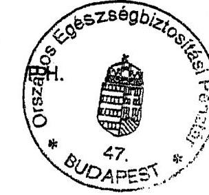

---

Kitöltő intézmény neve: OEP Kitöltésért felelős neve: Kitöltésért felelős telefonszáma:

2/b. sz. tanúsítvány a V-4-105/2007. sz. jelentéshez

orvosi rehabilitáció fekvőbeteg szakellátás kapacitásadatai

|  Megnevezés | 2004. | 2005. | 2006.  |
| --- | --- | --- | --- |
|  Belgyógyászati rehabilitáció | 829 | 828 | 836  |
|  Gasztroenterológiai rehabilitáció | 221 | 191 | 163  |
|  Gyermekgyógyászati rehabilitáció | 58 | 58 | 43  |
|  Kardiológiai rehabilitáció | 568 | 568 | 578  |
|  Mozgásszervi rehabilitáció | 2 499 | 2 595 | 2 777  |
|  Nőgyógyászati rehabilitáció | 62 | 62 | 60  |
|  Neurológiai rehabilitáció | 160 | 140 | 172  |
|  Pszichiátriai rehabilitáció | 3 370 | 3 375 | 3 341  |
|  Pulmonológiai és légzésrehabilitáció | 433 | 433 | 459  |
|  Sebészeti rehabilitáció | 55 | 55 | 42  |
|  Egyéb, éspedig: | 3 897 | 3 904 | 3 957  |
|  Összesen | 12 152 | 12 209 | 12 428  |
|  - ebből nappali kórházi |  |  |   |
|  - szanatóriumi | 1 439 | 1 439 | 1 439  |
|  - gyógyfürdőkórház |  |  |   |
|  - éghajlati gyógyintézeti, gyógyüdülői, gyógybarlang |  |  |   |

Igazolom, hogy a tanúsítványban szereplő adatok nyilvántartásainkkal megegyeznek.

Dátum: 2003.06.10.......

V. R. B.

---

Kitöltő intézmény neve: OEP Kitöltésért felelős neve: Kitöltésért felelős telefonszáma:

2/c. sz. tanúsítvány a V-4-105/2007. sz. jelentéshez

Adatok a szerződött rehabilitációs járóbeteg kapacitás óraszámairól

|  Rehabilitációs szakmák | 2004. | 2005. | 2006.  |
| --- | --- | --- | --- |
|   | szakorvosi | nem szakorvosi | szakorvosi  |
|  Belgyógyászati rehabilitáció | 62 | 0 | 62  |
|  Gasztroenterológiai rehabilitáció |  |  |   |
|  Gyermekgyógyászati rehabilitáció | 38 | 20 | 38  |
|  Kardiológiai rehabilitáció | 146 | 0 | 146  |
|  Mozgásszervi rehabilitáció | 2 924 | 24 473 | 2 868  |
|  Nőgyógyászati rehabilitáció |  |  |   |
|  Neurológiai rehabilitáció | 21 | 365 | 51  |
|  Pszichiátriai rehabilitáció | 118 | 2 925 | 148  |
|  Pulmonológiai és légzésrehabilitáció | 39 | 0 | 39  |
|  Sebészeti rehabilitáció |  |  |   |
|  Érsebészet |  |  |   |
|  Egyéb, éspedig: | 165 | 1 100 | 165  |
|  Összesen | 3 513 | 28 883 | 3 517  |

Igazolom, hogy a tanúsítványban szereplő adatok a nyilvántartásainkkal megegyeznek.

Dátum: 2007.06.10.

47. 4. 2007. 12. 10. 2007.

---

Kitöltő intézmény neve: OEP

Kitöltésért felelős neve: Kitöltésért felelős telefonszáma:

Járóbeteg rehabilitáció dolgozói állományi létszámok (fő)

|  Rehabilitációs szakmák | Szakorvos | Szakdolgozó | Szakorvos | Szakdolgozó | Szakorvos  |
| --- | --- | --- | --- | --- | --- |
|   | 2004. | 2005. | 2006. | 2007. | 2008.  |
|   | szakorvos | szakdolgozó | szakorvos | szakdolgozó | szakorvos  |
|  Belgyógyászati rehabilitáció | 1,9 | 1,8 | 1,9 | 3,2 | 1,9  |
|  Gasztroenterológiai rehabilitáció |  |  |  |  |   |
|  Gyermekgyógyászati rehabilitáció | 1,2 | 2,2 | 1,2 | 3,0 | 1,0  |
|  Kardiológiai rehabilitáció | 5,2 | 5,0 | 5,2 | 5,0 | 5,4  |
|  Mozgásszervi rehabilitáció | 94,6 | 1 898,2 | 91,7 | 1 948,1 | 92,2  |
|  Nőgyógyászati rehabilitáció |  |  |  |  |   |
|  Neurológiai rehabilitáció | 1,7 | 13,2 | 2,5 | 12,8 | 1,5  |
|  Pszichiátriai rehabilitáció | 1,6 | 127,8 | 2,6 | 134,3 | 2,6  |
|  Pulmonológiai és légzésrehabilitáció | 1,2 | 3,0 | 1,2 | 3,0 | 0,9  |
|  Sebészeti rehabilitáció |  |  |  |  |   |
|  Érsebészet |  |  |  |  |   |
|  Egyéb, éspedig: | 5,5 | 74,5 | 5,5 | 76,0 | 5,5  |
|  Összesen | 112,9 | 2 125,7 | 111,8 | 2 185,4 | 111,0  |

Igazolom, hogy a tanúsítványban szereplő adatok nyilvántartásainkkal megegyeznek.

Dátum: 2007.06.16

47. 47. ÁDAPEST

---

Kitöltő intézmény neve: OEP Kitöltésért felelős neve: Kitöltésért felelős telefonszáma:

Adatok a fekvőbeteg rehabilitáció létszám ellátottságáról (fő)

|  Megnevezés | 2004. |  | 2005. |  | 2006. |   |
| --- | --- | --- | --- | --- | --- | --- |
|   | szak-
orvos | eü.
szakdol-
gozó | szak-
orvos | eü.
szakdol-
gozó | szak-
orvos | eü.
szakdol-
gozó  |
|  Belgyógyászati rehabilitáció | 35 | 221 | 33 | 221 | 37 | 234  |
|  Gasztroenterológiai rehabilitáció | 9 | 67 | 9 | 67 | 9 | 67  |
|  Gyermekgyógyászati rehabilitáció | 6 | 38 | 7 | 38 | 6 | 32  |
|  Kardiológiai rehabilitáció | 32 | 154 | 33 | 154 |  |  |

 | 35 | 158  |
|  Mozgásszervi rehabilitáció | 140 | 957 | 147 | 988 | 153 | 1014  |
|  Nőgyógyászati rehabilitáció | 4 | 23 | 4 | 23 | 7 | 28  |
|  Neurológiai rehabilitáció | 10 | 35 | 10 | 35 | 13 | 46  |
|  Pszichiátriai rehabilitáció | 115 | 1000 | 113 | 999 | 109 | 976  |
|  Pulmonológiai és légzésrehabilitáció | 12 | 107 | 13 | 108 | 14 | 113  |
|  Sebészeti rehabilitáció | 4 | 27 | 4 | 27 | 2 | 23  |
|  Egyéb | 188 | 1284 | 183 | 1288 | 172 | 1258  |
|  Összesen | 553 | 3913 | 555 | 3948 | 556 | 3949  |
|  - ebből nappali kórházi |  |  |  |  |  |   |
|  - szanatóriumi | 112 | 691 | 123 | 691 | 114 | 663  |
|  - gyógyfürdőkórház |  |  |  |  |  |   |
|  - egyéb gyógyintézeti, gyógyüdülői, gyógybarlang |  |  |  |  |  |   |

Igazolom, hogy a tanúsítványban szereplő adatok nyilvántartásainkkal megegyeznek. Dátum: 2004.05.12....... 47. 47. BUDAPEST

---

Adatszolgáltató intézmény: OEP Kitöltésért felelős neve: Kitöltésért felelős telefonszáma:

Korhatár alatti III. csoportú rokkantak rehabilitációs ellátására az E. Alapból fordított kiadások

|  Megnevezés | 2004. | 2005. | 2006.  |
| --- | --- | --- | --- |
|  Fekvőbeteg szakellátás | 23235 | 37024 | 16053  |
|  Járóbeteg szakellátás | 920 | 1374 | 959  |
|  Házi szakápolás | 24 | 55 | 36  |
|  Betegszállítás | 114 | 349 | 256  |
|  Gyógyfürdő ellátás | 35 | 51 | 50  |
|  Utazási költségtérítés | 23 | 38 | 44  |
|  Gyógyászati segédeszközök (kötszerek nélkül) | 180 | 338 | 323  |

Igazolom, hogy a tanúsítványban szereplő adatok nyilvántartásainkkal megegyeznek.

Dátum: 2007. 04. 04.

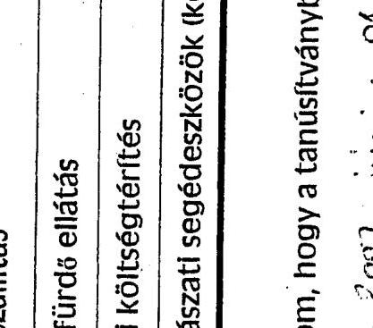

---

Kitöltő intézmény neve: Szociális és Munkaügyi Minisztérium Kitöltésért felelős neve: Vész Zsófia Kitöltésért felelős telefonszáma: 472-8096

# A felnőttképzési normatív támogatás főbb adatai 2003-2007

|  Sorszám | Megnevezés | 2003 | 2004 | 2005 | 2006 | 2007  |
| --- | --- | --- | --- | --- | --- | --- |
|  1. | Felnőttképzési normatív támogatás előirányzat összege (eFt) | 475000 | 2900000 | 3000000 | 1325200 | 100000  |
|  2. | Felnőttképzési normatív támogatás felhasznált összege (eFt) | 360354 | 2567461 | 2420247 | 989740* |   |
|  3. | Felnőttképzési normatív támogatásban részesült személyek (fő) |  | 50000** |  | 3869 | 176  |
|  4. | ebből |  |  |  |  |   |
|  5. | Fogyatékkal élő (fő) |  | 6100** |  | 3644 | 176  |
|  6. | Elhelyezkedett (fő) | n.a.*** | n.a.*** | n.a.*** | n.a.**** | n.a.****  |
|  7. | Ebből |  |  |  |  |   |
|  8. | Fogyatékkal élő (fő) | n.a.*** | n.a.*** | n.a.*** | n.a.**** | n.a.****  |

- A kifizetések még folyamatban vannak (a hiánypótlások és a vizsgák miatt), az összeg változni fog.

* Az áthúzódó képzések tekintetében a létszámátfedések elkerülése miatt összesített létszámadat.

*** A 15/2003. Korm.rendelet alapján nem vizsgáltuk a képzés elvégzését követően az elhelyezkedést.

**** A 206/2005. Korm.rendelet alapján az első és második OKJ-s képzésben részt vevők támogatott képzésbe való bekapcsolódásának feltétele a foglalkoztatási megállapodás megléte, azonban a prioritási sorrend alapján az áthúzódó és a fogyatékkal élő célcsoportra benyújtott igények kielégítését követően nem nyílt lehetőség nem fogyatékkal élő felnőttek OKJ-ba tartozó képzésének elindítására.

1. A 2007. évi lezárt igénylések alapján megbízott intézmények adatai. Igazolom, hogy a tanúsítványban szereplő adatok nyilvántartásainkkal megegyeznek.

Budapest, 2007. április 24.

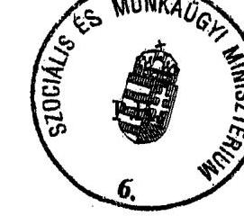

---

5. sz. tanúsítvány a V-4-105/2007. sz. jelentéshez

Rokkantsági nyugdíjban részesülők száma rokkantsági csoportonként

|  |   |   |   |   |   |   |   |
| --- | --- | --- | --- | --- | --- | --- | --- |
|  Elátás típusa | I. csoportú |  | II. csoportú |  | III. csoportú |  | Összesen  |
|   |  |  |  |  | rokkantsági nyugdíjasok |  |   |
|   | száma (fő) | megoszlása (%) | száma (fő) | megoszlása (%) | száma (fő) | megoszlása (%) | száma (fő)  |
|  Korhatár alatti rokkantsági | 10 751 | 2,35 | 68 766 | 15,01 | 378 493 | 82,84 | 458 010  |
|  Korhatár alatti baleseti rokkantsági | 320 | 7,59 | 683 | 16,19 | 3 215 | 76,22 | 4 218  |
|  Korhatár alatti rokkantsági nyugdíj együtti | 11 071 | 2,40 | 69 449 | 16,02 | 381 708 | 82,68 | 462 226  |
|   |  |  |  |  | 2006. január |  |   |
|  Elátás típusa | I. csoportú |  | II. csoportú |  | III. csoportú |  | Összesen  |
|   |  |  |  |  | rokkantsági nyugdíjasok |  |   |
|   | száma (fő) | megoszlása (%) | száma (fő) | megoszlása (%) | száma (fő) | megoszlása (%) | száma (fő)  |
|  Korhatár alatti rokkantsági | 10 631 | 2,30 | 67 949 | 14,72 | 383 136 | 82,98 | 461 716  |
|  Korhatár alatti baleseti rokkantsági | 308 | 7,55 | 640 | 15,68 | 3 133 | 76,77 | 4 081  |
|  Korhatár alatti rokkantsági nyugdíj együtti | 10 939 | 2,36 | 68 589 | 14,73 | 386 269 | 82,93 | 465 797  |
|   |  |  |  |  | 2006. január |  |   |
|  Elátás típusa | I. csoportú |  | II. csoportú |  | III. csoportú |  | Összesen  |
|   |  |  |  |  | rokkantsági nyugdíjasok |  |   |
|   | száma (fő) | megoszlása (%) | száma (fő) | megoszlása (%) | száma (fő) | megoszlása (%) | száma (fő)  |
|  Korhatár alatti rokkantsági | 10 315 | 2,29 | 65 692 | 14,59 | 374 391 | 83,12 | 450 398  |
|  Korhatár alatti baleseti rokkantsági | 295 | 7,47 | 625 | 15,82 | 3 030 | 76,71 | 3 950  |
|  Korhatár alatti rokkantsági nyugdíj együtti | 10 610 | 2,34 | 66 317 | 14,60 | 377 421 | 83,07 | 454 348  |
|   |  |  |  |  | 2007. január |  |   |
|  Elátás típusa | I. csoportú |  | II. csoportú |  | III. csoportú |  | Összesen  |
|   |  |  |  |  | rokkantsági nyugdíjasok |  |   |
|   | száma (fő) | megoszlása (%) | száma (fő) | megoszlása (%) | száma (fő) | megoszlása (%) | száma (fő)  |
|  Korhatár alatti rokkantsági | 10 067 | 2,25 | 64 622 | 14,42 | 373 414 | 83,33 | 448 103  |
|  Korhatár alatti baleseti rokkantsági | 289 | 7,51 | 586 | 15,22 | 2 975 | 77,27 | 3 850  |
|  Korhatár alatti rokkantsági nyugdíj együtti | 10 356 | 2,29 | 65 208 | 14,43 | 376 389 | 83,28 | 451 953  |

Igazolom, hogy a táblázatban szereplő adatok nyilvántartásainkkal megegyeznek. Dátum: 2007. május 6.

Aláírás

P.H.

---

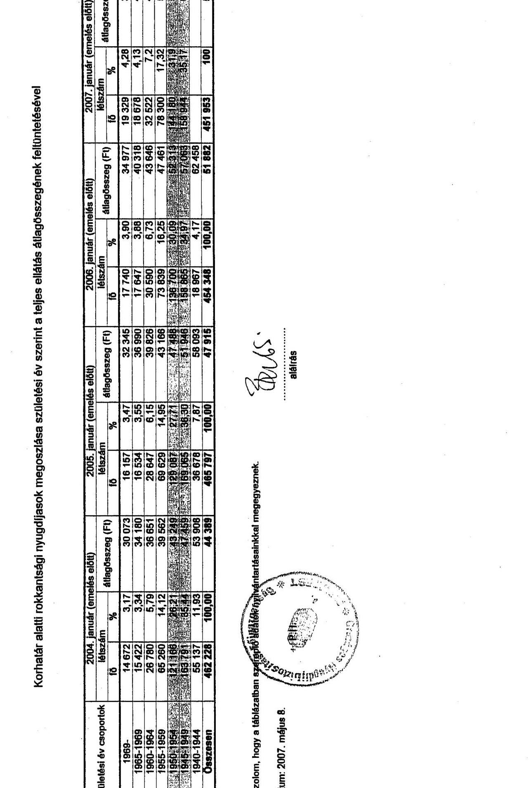

# 6. sz. tanúsítvány a V-4-105/2007. sz. jelentéshez

## 6. sz. tanúsítvány a V-4-105/2007. sz. jelentéshez

|  Születési év csoportok | 2004. január (emelés előtt) | 2005. január (emelés előtt) | 2006. január (emelés előtt) | 2007. január (emelés előtt)  |
| --- | --- | --- | --- | --- |
|   | létszám |  | létszám |   |
|   | % | % | % | %  |
|  1960-1969 | 14 672 | 3,17 | 16 167 | 3,47  |
|  1960-1964 | 15 422 | 3,34 | 16 534 | 3,55  |
|  1960-1964 | 26 780 | 5,79 | 28 647 | 6,15  |
|  1960-1969 | 65 260 | 14,12 | 69 629 | 14,95  |
|  1960-1964 | 121 366 | 26,21 | 129 087 | 27,71  |
|  1960-1964 | 163 791 | 32,44 | 169 065 | 36,30  |
|  1960-1964 | 65 137 | 11,93 | 53 908 | 36 678  |
|  1960-1964 | 462 228 | 100,00 | 44 389 | 465 797  |

Igazolom, hogy a táblázatban szereplő adatok nyilvántartásainkkal megegyeznek.

Dátum: 2007. május 8.

Aláírás

---

7. sz. tanúsítvány a V-4-105/2007. sz. jelentéshez

Tájékoztató az Egészségbiztosítási Alapból finanszírozott nyugdíj- és járadék kiadásokról

|  Megnevezés |  |  |  |  |  |  |  |  |  | 2006.  |
| --- | --- | --- | --- | --- | --- | --- | --- | --- | --- | --- |
|   | Kiadás (millió Ft) | Állagos havi létszám (fő) | Átlag (Ft) | Kiadás (millió Ft)

 | Állagos
havi
létszám
(10) | Állag (Ft) | Kiadás
(millió Ft) | Állagos
havi
létszám
(10) | Állag (Ft) |   |
|  Korhatár alatti rokkantsági nyugellátás | 215 698 | 382 366 | 47 009 | 231 309 | 379 915 | 50 737 | 241 362 | 373 673 | 53 826 |   |
|  Korhatár alatti baleseti rokkantsági nyugellátás | 2 485 | 3 178 | 65 162 | 2 597 | 3 078 | 70 311 | 2 701 | 2 989 | 75 293 |   |
|  Hozzátartozói nyugellátások | 8 069 | 32 461 | 20 715 | 8 970 | 33 991 | 21 991 | 9 650 | 34 023 | 23 636 |   |
|  Tizenharmadik havi nyugdíj | 8 939 | - | - | 14 473 | - | - | 20 230 | - | - |   |
|  Kártérítési járadék | 1 207 | 5 920 | 16 990 | 1 203 | 5 675 | 17 665 | 1 189 | 5 354 | 18 511 |   |
|  Baleseti járadék | 6 098 | 31 365 | 16 202 | 6 537 | 31 601 | 17 238 | 7 634 | 31 650 | 20 099 |   |
|  Összesen | 242 496 | - | - | 265 089 | - | - | 282 766 | - | - |   |

Budapest, 2007. június 8.

---

Megváltozott munkaképességűek járadékaiban részesülők száma (januári adatok)

|  Megnevezés | 2005 | 2006 | 2007  |
| --- | --- | --- | --- |
|  Megváltozott munkaképességűek járadékaiban részesülők összesen | 223116 | 213685 | 206696  |
|  ebből |  |  |   |
|  átmeneti járadék | 13186 | 14945 | 19158  |
|  rendszeres szociális járadék | 207091 | 195954 | 184845  |
|  egészségkárosodási járadék | 2839 | 2786 | 2693  |

Baleseti és rokkantsági járadékban részesülők száma

|  Megnevezés | 2005 | 2006 | 2007  |
| --- | --- | --- | --- |
|  Baleseti járadékban részesülők száma | 15040 | 14410 | 13899  |
|  ebből |  |  |   |
|  1. Fokozatú baleseti járadékban | 826 | 757 | 701  |
|  2. Fokozatú baleseti járadékban | 9805 | 9415 | 9126  |
|  3. Fokozatú baleseti járadékban | 3282 | 3147 | 3003  |
|  4. Fokozatú baleseti járadékban | 1127 | 1091 | 1069  |
|  Rokkantsági járadékban részesülők száma | 28738 | 29443 | 30039  |

Igazolom, hogy a táblázatban szereplő adatok nyilvántartásainkkal megegyeznek.

Dátum: 2007. május 8.

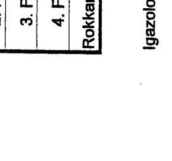

---

# Táblázatok jegyzéke 

| 1. sz. táblázat | Intézkedés szintű monitoring indikátorok |
| :--: | :--: |
| 2. sz. táblázat | A HEFOP keretében 2004. május 1. és 2004. április 20. között megkötött szerződések és (számlás) kifizetések összege |
| 3. sz. táblázat | Rehabilitációs munkatársak létszáma az ÁFSZ-ben |
| 4. sz. táblázat | Adatok az ÁFSZ intézményeinek akadálymentességéről (2006. év) |
| 5. sz. táblázat | A megváltozott munkaképességű dolgozók foglalkoztatásához kapcsolódó munkáltatókat megillető támogatások alakulása 2002-2008 |
| 6. sz. táblázat | A védett szervezeti szerződéssel rendelkező foglalkoztatók adatai (2006) |
| 7/a. sz. táblázat | Kimutatás MPA-RA központi keretéből 2004. évben vállalt kötelezettségekről és tényleges kifizetésekről |
| 7/b. sz. táblázat | Kimutatás MPA-RA központi keretéből 2005. évben történt kifizetésekről |
| 7/c. sz. táblázat | A Szociális és Munkaügyi Minisztérium adatai a Munkaerőpiaci Alap rehabilitációs alaprésze 2006. évi központi keretének pénzügyi teljesítéséről |
| 8. sz. táblázat | ROP. 3.2. intézkedés pénzügyi adatai |
| 9. sz. táblázat | 3.2. Helyi foglalkoztatási kezdeményezések támogatása intézkedés |
| 10. sz. táblázat | A megváltozott munkaképességű személyek különböző ellátásaira folyósított összegek (2004-2006) |

---

|  Indikátor/mutató típusa | Indikátor kód | Indikátor/Mutató megnevezése | 2008-as célérték | 2006 tény | Teljesítés a terv %-ában  |
| --- | --- | --- | --- | --- | --- |
|  Intézkedés (szám/kód): HEFOP 1.1 |  |  |  |  |   |
|  Output | 1.1-O-1 | ESZA programban részt vettek létszáma (fő) | 25000 | 33696 | 134,78%  |
|  Eredmény | 1.1-E-1 | A programot sikeresen befejezettek száma (fő) | 20000 | 19748 | 98,74%  |
|  Hatás | 1.1-H-1 | Az elhelyezkedettek vagy egyéb pozitív kimenettel bírók létszáma az egyéni program sikeres befejezését követő 180. napon (fő) | 10000 | 10621 | 106,21%  |
|  Hatás | 1.1-H-2 | Elhelyezkedettek száma (fő) | 6667 | 6282 | 94,23%  |
|  Intézkedés (szám/kód): HEFOP 1.2 |  |  |  |  |   |
|  Output | 1.2-O-1 | Az új szolgáltatási modell szerint működő és felszerelt kirendeltségek száma | 80 | 59 | 73,75%  |
|  Eredmény | 1.2-E-1 | Havonta bejelentett új álláshelyek átlagos száma | 50000 | 42316 | 84,63%  |
|  Hatás | 1.2-H-1 | Bejelentett üres álláshelyek átlagos élettartama | 30 | 31,5 | 105,00%  |
|  Intézkedés (szám/kód): HEFOP-2.2 |  |  |  |  |   |
|  Output | 2.2-O-1 | Képzésen/tanácsadáson/felkészítésen résztvevők száma | 10000 | 7416 | 74,16%  |
|  Eredmény | 2.2-E-1 | Képzettséget szerzett személyek száma | 10000 | 4506 | 45,06%  |
|  Intézkedés (szám/kód): HEFOP-2.3 |  |  |  |  |   |
|  Output | 2.3-O-1 | A programban részvevők száma (célcsoportba tartozó személyek közül) | 8000 | 23408 | 292,60%  |
|  Eredmény | 2.3-E-1 | Képzettséget szerzett személyek száma | 4000 | 2680 | 67,00%  |
|  Hatás | 2.3-H-1 | A munkához vagy más pozitív eredményhez jutott személyek száma | 2500 | 6897 | 275,88%  |

---

|  Intézkedés (szám/kód): |  |  |  |  |   |
| --- | --- | --- | --- | --- | --- |
|  HEFOP-3.5 |  |  |  |  |   |
|  Output | 3.5-O-1 | Kifejlesztett új programok száma | 128 | 164 | 128,13%  |
|  Eredmény | 3.5-E-1 | Képzettséget szerzett személyek száma | 50000 | 4208 | 8,42%  |
|  Hatás | 3.5-H-1 | A munkához vagy más pozitív eredményhez jutott személyek száma | 50000 | 921 | 1,84%  |
|  Intézkedés (szám/kód): |  |  |  |  |   |
|  HEFOP-4.2 |  |  |  |  |   |
|  Output | 4.2-O-1 | Felújított vagy újjáépített alapterület | 8000 | 2018 | 25,23%  |
|  Eredmény | 4.2-E-1 | Beruházás eredményeként létrejövő új férőhelyek száma | na | na | na  |
|  Hatás | 4.2-H-1 | A létrehozott vagy fejlesztett szociális szolgáltatásokkal kiszolgált háztartások száma | 4000 | 216 | 5,40%  |
|  Intézkedés (szám/kód): |  |  |  |  |   |
|  HEFOP-4.3 |  |  |  |  |   |
|  Output | 4.3-O-1 | Felújított vagy újjáépített alapterület | 28400 | 14241 | 50,14%  |
|  Eredmény | 4.3-E-1 | Betegforgalom | +8% | na | na  |
|  4.3-E-2 |  | Átalakult kapacitás | 300 | 160 | 53,33%  |
|  Intézkedés (szám/kód): |  |  |  |  |   |
|  HEFOP-4.4 |  |  |  |  |   |
|  Output | 4.4-O-1 | Létrehozott számítógépes munkaállomások száma | 750 | 450 | 60,00%  |
|  4.4-O-2 |  | Továbbfejlesztett számítógépes munkaállomások száma | 1800 | 400 | 22,22%  |
|  Eredmény | 4.4-E-1 | Intézményközi IT szolgáltatásokat elérő felhasználók száma | 3000 | 1000 | 33,33%  |
|  Hatás | 4.4-H-1 | Átlagos ápolási napszám | -5% | 7,7* |   |
|   |  |  |  | *A 2002-es bázis érték 8,1 volt. |   |

---

|  HEFOP | Támogatási szerződések száma összesen | Összes EU forrás | Összes nemzeti költségvetés | Összes egyéb forrás | ÖSSZES megkötött szerződés összege | Kifizetett összeg (számla alapon) 2007. április 20-án | ÖSSZES kifizetett összeg (számlás) | Kifizetett összeg a támogatási szerződéses összegek %-ában  |
| --- | --- | --- | --- | --- | --- | --- | --- | --- |
|  Intézkedések |  |  |  |  |  | EU | Hazai |   |
|  1.1. A munkanélküliség megelőzése és kezelése | 20 | 22 350 745 856 | 7 450 248 619 | 0 | 29 800 994 475 | 14 062 597 622 | 4 687 563 798 | 18 750 161 420  |
|  1.2. A foglalkoztatási szolgálat fejlesztése | 1 | 6 329 842 500 | 2 109 947 500 | 0 | 8 439 790 000 | 2 931 618 331 | 977 206 504 | 3 908 824 835  |
|  2.2. A társadalmi beilleszkedés elősegítése a szociális területen dolgozó szakemberek képzésével | 110 | 2 116 767 147 | 705 564 049 | 0 | 2 822 331 196 | 373 634 804 | 124 546 331 | 498 181 135  |
|  2.3. Hátrányos helyzetű emberek, köztük a romák foglalkoztathatóságának javítása | 171 | 9 042 795 449 | 2 738 015 819 | 0 | 11 780 811 268 | 3 464 421 607 | 1 154 819 098 | 4 619 240 705
  |
|  3.5. A felnőttképzés rendszerének fejlesztése | 2 | 2 956 500 000 | 985 500 000 | 0 | 3 942 000 000 | 407 930 761 | 135 978 326 | 543 909 087  |
|  4.2. A társadalmi befogadást támogató szolgáltatások infrastrukturális fejlesztése | 63 | 6 176 924 217 | 1 874 365 273 | 1 160 532 965 | 9 211 822 455 | 2 620 954 870 | 680 400 762 | 3 301 355 632  |

---

|  HEFOP | Támogatási szerződések száma összesen | Összes EU forrás | Összes nemzeti költségvetés | Összes egyéb forrás | ÖSSZES megkötött szerződés összege | Kifizetett összeg (számla alapon) 2007. április 20-án | ÖSSZES kifizetett összeg (számlás) | Kifizetett összeg a támogatási szerződéses összegek %-ában  |
| --- | --- | --- | --- | --- | --- | --- | --- | --- |
|  Intézkedések |  |  |  |  |  | EU | Hazai |   |
|  4.3. Egészségügyi infrastruktúra fejlesztése az elmaradott régiókban | 9 | 16 945 385 899 | 4 328 461 967 | 2 025 924 223 | 23 299 772 089 | 11 215 333 938 | 2 334 940 064 | 13 550 274 002  |
|  4.3.1-K. Regionális Egészségcentrum modell-intézmény létrehozása | 1 | 9 090 000 000 | 1 710 000 000 | 1 320 000 000 | 12 120 000 000 | 7 277 258 348 | 1 362 741 651 | 8 639 999 999  |
|  4.3.2-05/1. Egészségügyi infrastruktúra fejlesztése az elmaradott régiókban | 2 | 1 901 056 500 | 633 685 500 | 161 716 540 | 2 696 458 540 | 247 109 948 | 61 349 225 | 308 459 173  |
|  4.3.2-P. Térségi diagnosztikai, szűrőközpontok létrehozása | 2 | 3 068 800 401 | 1 022 933 467 | 261 052 621 | 4 352 786 489 | 1 129 322 747 | 280 373 440 | 1 409 696 187  |
|  4.3.3-P. Rehabilitációs központok kialakítása | 4 | 2 885 528 998 | 961 843 000 | 283 155 062 | 4 130 527 060 | 2 561 642 895 | 630 475 748 | 3 192 118 643  |
|  4.4. Egészségügyi IT-fejlesztés az elmaradott régiókban | 3 | 3 037 698 911 | 1 012 566 304 | 0 | 4 050 265 215 | 809 690 663 | 269 896 893 | 1 079 587 556  |
|  ÖSSZESEN: | 379 | 68 956 659 980 | 21 204 669 531 | 3 186 457 188 | 93 347 786 698 | 35 886 182 596 | 10 365 351 776 | 46 251 534 372  |
|   | %-os megoszlás | 73,87% | 22,72% | 3,41% | 100,00% |  |  |   |

---

|  Intézmény | 2006. évi létszám* |  | Megváltozott munkaképességűek foglalkoztatásával összefüggésben engedélyezett létszám | Szociális rehabilitációs feladatra engedélyezett létszám | Régiók megnevezése  |
| --- | --- | --- | --- | --- | --- |
|   | Megváltozott szakfeladatra engedélyezett létszám | Átlagos stat.létszám |  |  |   |
|  FH | 3 | 1 | 3 | 10 |   |
|  Munkaügyi Központok | 60 | 52 | 60 | 364 |   |
|  Főváros | 2 | 2 |  |  |   |
|  Pest | 4 | 2 | 6 | 54 | Központi régió  |
|  Baranya | 4 | 3 |  |  |   |
|  Somogy | 2 | 2 | 8 | 48 | Dél-Dunántúli RMK  |
|  Tolna | 2 | 2 |  |  |   |
|  Békés | 2 | 2 |  |  |   |
|  Bács | 3 | 3 | 9 | 53 | Dél-Alföldi RMK  |
|  Csongrád | 4 | 2 |  |  |   |
|  Borsod | 5 | 5 |  |  |   |
|  Heves | 2 | 2 | 9 | 55 | Észak-Magyarországi RMK  |
|  Nógrád | 2 | 2 |  |  |   |
|  Szabolcs | 6 | 5 |  |  |   |
|  Hajdú | 4 | 4 | 13 | 59 | Észak-Alföldi RMK  |
|  Jász | 3 | 3 |  |  |   |
|  Fejér | 3 | 2 |  |  |   |
|  Komárom | 4 | 4 | 9 | 51 | Közép-Dunántúli RMK  |
|  Veszprém | 2 | 2 |  |  |   |
|  Vas | 2 | 2 |  |  |   |
|  Győr | 2 | 2 | 6 | 44 | Nyugat-Dunántúli RMK  |
|  Zala | 2 | 1 |  |  |   |
|  SZMM Igazgatás | 6 | 0 | 4 | 5 |   |
|  Összesen | 69 | 53 | 67 | 379 |   |

- A megváltozott munkaképességűek foglalkoztatásával összefüggésben 2006-ban került először az FMM fejezetben létszám tervezésre. (Ezt megelőzően az előirányzat nem az FMM költségvetésében szerepelt.) 2007. évtől a feladat ellátáshoz kapcsolódó létszám a Tervezési körirat előírásainak megfelelően az intézmények létszámába került beépítésre.

---

# Adatok az ÁFSZ intézményeinek akadálymentességéről (2006. év) 

| Mozgássérültek |  | Látássérültek |  | Hallássérültek |  | Értelmileg akadályozottak |  |
| :--: | :--: | :--: | :--: | :--: | :--: | :--: | :--: |
| megnevezés | intézmény   (db) | megnevezés | intézmény   (db) | megnevezés | intézmény   (db) | megnevezés | intézmény   (db) |
| az épületbe való   bejutás   kerekesszékkel   lehetséges   rámpa-lépcsőlift   (van, vagy nem   kell) | 191 | képernyő nagyító program | 71 | indukciós párna | 150 | könnyen érthető   nyelvi tájékoztató   anyag | 143 |
|  | 184 | képernyő felolvasó   program | 114 | indukciós térerősítés | 65 | eligazodást segítő   piktogram | 40 |
| fogadószint   akadálymentes | 159 | képernyő nagyítóhoz vagy   a képernyő felolvasóhoz   kapcsolódó scanner | 78 | sms telefon | 71 | honlap egyszerűen   érthető | 12 |
| mellékhelyiség   akadálymentes   kerekesszékkel   használható lift   (van, vagy nem   kell) | 115 | tapintható, érzékelhető   térjelzők | 10 | alapfokú jelnyelvet   beszélők | 128 |  |  |
| web kamerás   ügyfélkapcsolat   lehetősége | 38 | brille felíratok, írott   anyagok | 45 | középfokú jelnyelvet   beszélők | 39 |  |  |
| egész épület   akadálymentes | 54 | Braille-ben írott anyagok | 16 | jeltolmács   igénybevételére   lehetőség | 162 |  |  |
|  |  | vakbarát honlap | 19 |  |  |  |  |

---

A megváltozott munkaképességű dolgozók foglalkoztatásához kapcsolódó munkáltatókat megillető támogatások alakulása 2002-2008

|  Megnevezés | támogatás összesen | ebből:
Pénzügyminisztérium költségvetési fejezetében | ebből:
Szociális és
Munkaügyi
Minisztérium
költségvetési
fejezetében | célszervezeti
dotáció | célszervezeti
mmk dolgozók
munkabére | célszervezeti
mmk dolgozók
létszáma
(december) | 135\%-os dotációt
igénylő
szervezetek
dotációja | 135\%-os
dotációt
igénylő
szervezetek
mmk. létszáma
(december) | Védett
szervezeti
szerződést
kötött Kht-k
mmk létszáma
(január)  |
| --- | --- | --- | --- | --- | --- | --- | --- | --- | --- |
|   | (Md Ft) |  | (Md Ft) | (Md Ft) | (Md Ft) | (fő) | (Md Ft) | (fő) | (fő)  |
|  2002.tény | 38,7 | 38,7 |  | 33,8 | 17,5 | 31159 |  |  |   |
|  2003.tény | 46,5 | 46,5 |  | 40,7 | 20,4 | 37459 |  |  |   |
|  2004.tény | 64,1 | 64,1 |  | 54,8 | 26,0 | 41146 | 7,9 | 8953 |   |
|  2005.tény | 55,0 | 55,0 | 0,0 | 40,9 |  | 31783 | 10,11 | 13976 |   |
|  2006. tény | 51,2 | 42,44 | 8,75 | 29,3 | 17,6 | 19153 | 9,35 | 8950 | kb. 5200  |
|  2007.előir. | 54,0 | 20,0 | 34,0 |  |  |  |  |  | kb. 17800  |
|  2008.előir. | 52,0 | 0,0 | 52,0 |  |  |  |  |  |   |

---

A VÉDETT SZERVEZETI SZERZŐDÉSSEL RENDELKEZŐ FOGLALKOZTATÓK ADATAI (2006)

|  Sorszám | Támogatott neve | Megváltozott munkaképességű munkavállalói havi átlaglétszám ( tény fő) | Ebből a nyílt munkaerőpiacon nem foglalkoztatható munkavállalói létszám (fő) | Éves állami támogatás összesen (tény, eFt-ban) | Támogatott hónapok száma | Egy mmk munkavállalóra jutó támogatás eFt/fő/hó | MMK munkavállalók bér+ járuléka (tény eFt-ban) | Egy mmk munkavállaló részére kifizetett bér és járulékai eFt/fő/hó | Megváltozott munkaképességű munkavállalói évi összlétszám ( tény fő) | Visszavont összeg eFt  |
| --- | --- | --- | --- | --- | --- | --- | --- | --- | --- | --- |
|  1. | Dél-borsodi Rehabilitációs és Környezetvédelmi Közhasznú Társaság | 58 | 30 | 46598 | 9 | 89,3 | 33176 | 63,6 | 522 |   |
|  2. | ERFO Rehabilitációs Foglalkoztató Iparí, Kereskedelmi és Szolgáltató Közhasznú Társaság | 732 | 90 | 1057953 | 12 | 120,4 | 604331 |  |  |  |

 | 68,8 | 8784 |   |
|  3. | FŐKEFE Rehabilitációs Foglalkoztató Ipari Közhasznú Társaság | 1139 | 127 | 1805539 | 12 | 132,1 | 947929 | 69,4 | 13668 |   |
|  4. | KÉZMŰ Fővárosi Kézműipari Közhasznú Társaság | 3270 | 623 | 4837416 | 12 | 123,3 | 2844603 | 72,5 | 39240 | 41546  |
|  5. | Komló-Habilitas Termelő és Értékesítő Közhasznú Társaság | 68 | 55 | 117327 | 10 | 172,5 | 60456 | 88,9 | 680 |   |
|  6. | Start Rehabilitációs Közhasznú Társaság | 422,8 | 350 | 808811 | 10 | 191,3 | 408050 | 96,5 | 4228 | 38830  |
|  7. | Teljes Életért Szolgáltató Közhasznú Társaság | 475,1 | 95 | 442959 | 9 | 103,6 | 391650 | 91,6 | 4276 |   |
|   | ÖSSZESEN: | - | 1370 | 9116603 | - | 127,7 | 5290195 | 74,1 | 71398 | 80376  |

---

## **KIMUTATÁS** a V-4-105/2007. sz. jelentéshez

## **MPA-RA KÖZPONTI KERETÉBŐL 2004. ÉVBEN VÁLLALT KÖTELEZETTSÉGEKRŐL ÉS TÉNYLEGES KIFIZETÉSEKRŐL**

|  Minisztériumi utasítás fő száma | Minisztériumi utasítás alszámai | A program megnevezése | 2004-2005 évi eredeti összes keret | Módosított 2003. évről áthúzódott keret | Módosított 2004. évi kötelezettségvállalási keretek | 2003-2004. évi kötváll. keret összesen | Módosított 2004. évben zárolt keret | Módosított 2004. évi keret áthúzódása 2005. évre | 2004. és 2005. évi kötváll. keret | Módosított 2005. évet terhelő 2005. évi keret | 2005. évi kifizetés kötelezettsége | 2003 évben vállalt tényleges kötelezettség | 2004. évben vállalt tényleges kötelezettség | 2004. évi tényleges kifizetés  |
| --- | --- | --- | --- | --- | --- | --- | --- | --- | --- | --- | --- | --- | --- | --- |
|  1. |  | A társadalmi szemlélet kedvező irányú megváltozása program keretében vállalt kötelezettségről | 0 | 0 | 0 | 0 | 0 | 0 | 0 | 0 | 0 | 0 | 0 |   |
|   | 1.1 | "Központi PR program a megváltozott munkaképességű személyek foglalkoztatási szintjének növelésére" vállalt kötelezettségről | 50 000 000 | 0 | 23 000 000 | 23 000 000 | 15 000 000 | 12 000 000 | 35 000 000 |  | 47 000 000 |  | 31 573 151 | 19 603 900  |
|   | 1.2 | Megyei (fővárosi) munkaügyi központok PR programja a megváltozott munkaképességű személyek foglalkoztatási szintjének növelésére megkötött szerződések vállalt kötelezettségről | 45 000 000 | 0 | 45 000 000 | 45 000 000 | 0 | 0 |  | 0 | 0 |  | 41 486 081 | 41 486 081  |
|  2. |  | A foglalkozási rehabilitáció humán erőforrás fejlesztése program keretében vállalt kötelezettségről | 0 | 0 | 0 | 0 | 0 | 0 | 0 | 0 | 0 | 0 | 0 |   |
|   | 2.1 | Képzések, továbbképzések címen vállalt kötelezettségekről | 50 000 000 | 0 | 50 000 000 | 50 000 000 | 0 | 0 |  | 0 | 0 |  | 50 000 000 | 30 000 000  |
|   | 2.2 | Képzési programok kidolgozása címen vállalt kötelezettségekről | 58 600 000 | 8 000 000 | 25 600 000 | 33 600 000 | 0 | 0 |  | 25 000 000 | 25 000 000 | 3 000 000 | 30 600 000 | 33 600 000  |
|   | 2.3 | Célelemzések címen vállalt kötelezettségekről | 5 000 000 | 4 950 000 | 0 | 4 950 000 | 50 000 | 0 | 0 |  | 0 | 0 | 4 950 000 | 4 700 000  |
|  3. |  | A munkavállalási esélyek értékelése program keretében vállalt kötelezettségről | 75 000 000 | 0 | 20 000 000 | 20 000 000 | 25 000 000 | 0 | 0 | 20 000 000 | 20 000 000 | 0 | 20 000 000 | 20 000 000  |
|  4. |  | A foglalkozási rehabilitációs szolgáltatások fejlesztése program keretében vállalt kötelezettségről | 0 | 0 | 0 | 0 | 0 | 0 | 0 | 0 | 0 | 0 | 0  |

---

|  Minisztériumi utasítás fő száma | Minisztériumi utasítás alszámai | A program megnevezése | 2004-2005 évi eredeti összes keret | Módosított 2003. évről áthúzódott keret | Módosított 2004. évi kötelezettségvállalási keretek | 2003-2004. évi kötvül. keret összesen | Módosított 2004. évben zárolt keret | Módosított 2004. évi keret áthúzódása 2005. évre | 2004. és 2005. évi kötvül. keret | Módosított 2005. évi terhelő 2005. évi keret | 2005. évi kifizetés kötelezettsége | 2003 évben vállalt tényleges kötelezettség | 2004. évben vállalt tényleges kötelezettség | 2004. évi tényleges kifizetés  |
| --- | --- | --- | --- | --- | --- | --- | --- | --- | --- | --- | --- | --- | --- | --- |
|   | 4.1 | Rehabilitációs információs Centrumok képzése és a hálózat fejlesztése címen vállalt kötelezettségekről | 30 000 000 | 0 | 0 | 0 | 30 000 000 | 0 |  | 30 000 000 | 30 000 000 |  |  | 0  |
|   | 4.2 | Program korszerű munkahelyek teremtésével rehabilitációs, és szociális információs és szolgáltatási háló képítésére a kistérségekben vállalt kötelezettségekről | 51 784 000 | 19 710 000 | 22 816 000 | 42 526 000 | 0 | 7 200 000 | 49 726 000 | 7 200 000 |  |  | 30 089 992 | 40 303 464  |
|   | 4.3 | "Nyílt munkaerő-piac "Munkahelyi gyakorlat értelmi fogyatékos, középiskolai tanulók részére" c. program keretében vállalt kötelezettségekről | 10 000 000 | 0 | 10 000 000 | 10 000 000 | 0 | 0 |  | 0 | 0 |  | 10 000 000 | 10 000 000  |
|   | 4.4 | Támogatott foglalkoztatás értelmi fogyatékos személyeknek címen vállalt kötelezettségekről | 225 000 000 | 0 | 110 000 000 | 110 000 000 | 0 | 0 |  | 115 000 000 | 115 000 000 |  | 110 000 000 | 110 000 000  |
|   | 4.5 | "Komplex munkaközvetítő és tanácsadó szolgálat mozgáskorlátozott személyeknek" címen vállalt kötelezettségekről | 56 500 000 | 0 | 16 500 000 | 16 500 000 | 0 | 0 |  | 40 000 000 | 40 000 000 |  | 16 500 000 | 16 500 000  |
|   | 4.6 | "Megoldás Munkáltatóknak és Megváltozott munkaképességű Munkavállalóknak" címen vállalt kötelezettségekről | 81 000 000 | 10 000 000 | 50 500 000 | 60 500 000 | 0 | 0 |  | 20 500 000 | 20 500 000 |  | 18 316 575 | 17 704 075  |
|   | 4.7 | "Foglalkozási rehabilitációs szolgáltatások látásos személyeknek" címen vállalt kötelezettségekről | 30 000 000 | 0 | 30 000 000 | 30 000 000 | 0 | 0 |  | 0 | 0 |  | 30 000 000 | 30 000 000  |
|   | 4.8 | Egyenlő hozzáférés az AFSZ intézményeiben címen vállalt kötelezettségekről | 50 000 000 | 0 | 25 000 000 | 25 000 000 | 0 | 25 000 000 | 50 000 000 |  | 25 000 000 |  | 49 998 755 | 24 999 335  |
|   | 4.9 | A foglalkozási rehabilitáció nemzetközi és hazai dokumentumait bemutató kiadványok címen vállalt kötelezettségekről | 20 000 000 | 0 | 3 000 000 | 3 000 000 | 0 | 17 000 000 |  | 0 | 17 000 000 |  | 2 701 500 | 2 701 500  |

---

## **KIMUTATÁS** a V-4-105/2007. sz. jelentéshez

## **MPA-RA KÖZPONTI KERETÉBŐL 2004. ÉVBEN VÁLLALT KÖTELEZETTSÉGEKRŐL ÉS TÉNYLEGES KIFIZETÉSEKRŐL**

|  Minisztériumi olcsító fő száma | Minisztériumi olcsítás alszámai | A program megnevezése | 2004-2005 évi eredeti összes keret | Módosított 2003. évről áthúzódott keret | Módosított 2004. évi kötelezettségvállalási keretek | 2003-2004. évi kötvált. keret összesen | Módosított 2004. évben zárolt keret | Módosított 2004. évi keret áthúzódása 2005. évre | 2004. és 2005. évi kötvált. keret | Módosított 2005. évet terhelő 2005. évi keret | 2005. évi köfizetés kötelezettsége | 2003 évben vállalt tényleges kötelezettség | 2004. évben vállalt tényleges kötelezettség | 2004. évi tényleges kifizetés  |
| --- | --- | --- | --- | --- | --- | --- | --- | --- | --- | --- | --- | --- | --- | --- |
|  5. |  | Rehabilitációs munkahelyek támogatása* program keretében vállalt kötelezettségről | 140 000 000 | 0 | 108 452 000 | 108 452 000 | 0 | 31 548 000 | 0 | 0 | 31 548 000 | 0 | 108 452 000 | 108 452 000  |
|  6. |  | PHARE program társfinanszírozása (HU 0105-02) program keretében vállalt kötelezettségről | 45 000 000 | 0 | 0 | 0 | 45 000 000 | 0 | 0 | 0 | 0 | 0 | 0  |
|  7. |  | FMM akadálymentesítése program keretében vállalt kötelezettségről | 97 000 000 | 97 000 000 | 0 | 97 000 000 | 0 | 0 | 0 | 0 | 0 | 97 000 000 | 97 000 000 | 0  |
|  8. |  | Az Alaprész terhére közvetlenül alszámolható költségek program keretében vállalt kötelezettségről | 13 000 000 | 1 200 000 | 6 800 000 | 8 000 000 | 0 | 0 | 5 000 000 | 5 000 000 | 0 | 3 360 000 | 3 576 694 | 0  |
|  9. |  | Az Alaprész működési költsége program keretében vállalt kötelezettségről | 90 001 000 | 0 | 90 001 000 | 90 001 000 | 0 | 0 | 0 | 0 | 0 | 90 001 000 | 90 001 000 | 0  |
|  10. |  | Tartalék program keretében vállalt kötelezettségről | 40 689 000 |

 0 | 0 | 0 | 32 423 000 | 0 | 0 | 0 | 0 | 0 | 0 | 0  |
|   |  | Összesen: | 1 263 574 000 | 140 860 000 | 636 669 000 | 777 529 000 | 147 473 000 | 92 748 000 | 262 700 000 | 355 448 000 | 0 | 745 029 054 | 700 628 049 | 0  |

---

|  Minisztériumi út,
fd. szám | Miniszteri
utasítás
sorszáma | A program megnevezése | 2005. évi keret
/előző évi kerettel
együtt/ | 2006. évre
áthúzódó 2006. évi
keret | Program összes
kerete | 2005. évben
kifizetésre került | 2005. évi program
maradvány | Kifizetések
egyeztetése
főkönyveléssel |
| --- | --- | --- | --- | --- | --- | --- | --- | --- |
|  1.§.bek. | 1.a | A megváltozott munkaképességű dolgozók foglalkoztatásának támogatási rendszere átalakításából adódó
foglalkoztatási helyzet kezelésére " Központ pályázat útján, megváltozott munkavállalók foglalkoztatásának
elősegítésére" | 500 000 000 |  | 500 000 000 | 1 223 125 | 498 776 875 | Tényleges kifizetés:
(Főösszesítőrendelkezés
eltérés alapján)
463 533 853,--  |
|  1.§.bek. | 1.b | A megváltozott munkaképességű dolgozók foglalkoztatásának támogatási rendszere átalakításából adódó
foglalkoztatási helyzet kezelésére "ICSSZEM szociális intézményrendszere foglalkoztató-képességének
fejlesztésére" | 495 924 000 | 4 076 000 | 500 000 000 | 495 924 000 | 0 |   |
|  1.§.bek. | 1.c | A megváltozott munkaképességű dolgozók foglalkoztatásának támogatási rendszere átalakításából adódó
foglalkoztatási helyzet kezelésére " Megváltozott munkaképességű embereket foglalkoztató munkaadók,
szervezetek akkreditációs eljárással történő minősítésének megkezdéséhez az akkreditációs rendszer
kidolgozásához, az akkreditáció folyamatának elindításához" | 58 782 000 | 86 863 000 | 145 645 000 | 58 782 000 | 0 |   |
|  1. |  | A társadalmi szemlélet kedvező irányú megváltozása program keretében
teljesített kifizetéseiről | 0 |  |  | 0 | 0 |   |
|   | 1.1 | Központi PR program a megváltozott munkaképességű személyek foglalkoztatási szintjének növelésére | 27 000 000 |  | 27 000 000 | 26 219 251 | 780 749 |   |
|   | 1.2 | Megyei Munkaügyi Központok PR programja | 33 752 000 |  | 33 752 000 | 33 752 000 | 0 |   |
|  2. |  | A foglalkozási rehabilitáció humán-erőforrás fejlesztése program keretében
teljesített kifizetéseiről |  |  |  | 0 |  |   |
|   | 2.1 | Képzések, továbbképzések | 15 000 000 |  | 15 000 000 | 0 | 15 000 000 |   |
|   | 2.2 | Képzési programok kidolgozása FEK | 25 000 000 |  | 25 000 000 | 25 000 000 | 0 |   |
|   | 2.3 | Célelemzések | 250 000 |  | 250 000 | 0 | 250 000 |   |
|  3. |  | A munkavállalási esélyek értékelése program keretében
teljesített kifizetéseiről | 20 000 000 |  | 20 000 000 | 20 000 000 | 0 |   |
|  4. |  | A foglalkozási rehabilitációs szolgáltatások fejlesztése program keretében
teljesített kifizetéseiről |  |  |  | 0 | 0 |   |
|   | 4.1 | Rehabilitációs Információs Centrumok kiépítése és a hálózat fejlesztése RIC | 20 610 000 | 18 890 000 | 39 500 000 | 20 605 000 | 5 000 |   |
|   | 4.2 | Program korszerű munkahelyek teremtésével rehabilitációs, szociális információs és szolgáltatási hálózat kiépítése
a kistérségekben | 7 660 000 |  | 7 660 000 | 5 841 913 | 1 818 087 |   |
|   | 4.3/a | Nyílt munkaerőpiaci "Munkahelyi Gyakorlat" felnőtt megváltozott munkaképességű emberek számára FEK | 7 700 000 | 2 300 000 | 10 000 000 | 7 700 000 | 0 |   |
|   | 4.3/b | Nyílt munkaerőpiaci "Munkahelyi Gyakorlat" értelmi fogyatékos, középiskolai tanulók részére FGYK | 25 000 000 | 0 | 25 000 000 | 25 000 000 | 0 |   |

---

|  Minisztériumi út,
ő száma | Miniszteri
utasítás
sorszáma | A program megnevezése | 2005. évi keret
/előző évi kerettel
együtt/ | 2006. évre
áthúzódó 2006. évi
keret | Program összes
kerete | 2005. évben
kifizetésre került | 2005. évi program
maradvány | Kifizetések
egyeztetése
főkönyveléssel  |
| --- | --- | --- | --- | --- | --- | --- | --- | --- |
|   | 4.4 | Támogatott foglalkoztatás értelmi fogyatékos személyeknek OFA | 115 000 000 | 0 | 115 000 000 | 115 000 000 | 0 |   |
|   | 4.5 | Komplex munkaközvetítő és tanácsadó szolgálat mozgáskorlátozott személyeknek OFA | 40 000 000 |  | 40 000 000 | 40 000 000 | 0 |   |
|   | 4.6 | "Megoldás Munkáltatóknak és Megváltozott munkaképességű Munkavállalóknak" c. brit-magyar program | 71 348 000 | 43 916 600 | 115 264 000 | 21 750 000 | 0 |   |
|   | 4.7 | Foglalkozási Rehabilitációs szolgáltatások látássérült személyeknek | 0 | 0 | 0 | 0 | 0 |   |
|   | 4.8 | Egyenlő hozzáférés az ÁFSZ intézményeihez | 56 100 000 | 28 000 000 | 84 100 000 | 56 022 741 | 77 259 |   |
|   | 4.9 | A foglalkozási rehabilitáció nemzetközi és hazai dokumentumait bemutató kiadványok | 17 000 000 |  | 17 000 000 | 16 546 127 | 453 873 |   |
|   | 4.10 | Munkahely-teremtés autista személyeknek | 51 600 000 | 22 306 000 | 73 906 000 | 51 600 000 | 0 |   |
|   | 4.11 | Központi munkahelymegőrző program | 551 305 000 | 0 | 551 305 000 | 551 305 000 | 0 |   |
|   | 4.12 | Akkreditációs szakértők képzése | 15 000 000 | 0 | 15 000 000 | 15 000 000 | 0 |   |
|  5. |  | Rehabilitációs munkahelyek támogatása" program keretében
teljesített kifizetésekről OFA | 31 548 000 |  | 31 548 000 | 31 548 000 | 0 |   |
|  6. |  | PHARE program társfinanszírozása (HU 0105-02) program keretében
teljesített kifizetéseiről | 0 | 0 | 0 | 0 | 0 |   |
|  7. |  | FMM akadálymentesítése program keretében
teljesített kifizetéseiről | 0 | 0 | 0 | 0 | 0 |   |
|  8. |  | Az Alaprész terhére közvetlenül elszámolható költségek program keretében
teljesített kifizetéseiről | 5 950 000 | 1 000 000 | 6 950 000 | 2 136 274 | 3 813 726 |   |
|  9. |  | Az Alaprész működési költsége program keretében
teljesített kifizetéseiről | 91 000 000 | 0 | 91 000 000 | 91 000 000 | 0 |   |
|  10. |  | Monitorozás | 2 500 000 | 0 | 2 500 000 | 2 500 000 | 0 |   |
|  11. |  | Tartalék program keretében
teljesített kifizetéseiről | 66 276 000 | 0 | 66 276 000 | 0 | 66 276 000 |   |
|  Összesen: |  |  | 2 351 305 000 | 207 351 600 | 2 558 656 000 | 1 714 455 431 | 587 251 569 |   |

---

# A Szociális és Munkaügyi Minisztérium adatai a Munkaerőpiaci Alap rehabilitációs alaprésze 2006. évi központi keretének pénzügyi teljesítéséről (Ft-ban)

|  Min. út
alszáma | A program megnevezése | eredeti keret | ténylegesen
kifizetett | eltérés  |
| --- | --- | --- | --- | --- |
|  1. | A társadalmi szemlélet kedvező irányú megváltozása program keretében teljesített kifizetéseiről |  |  |   |
|  1.1 | Központi PR program a megváltozott munkaképességű személyek foglalkoztatási szintjének növelésére | 13200000 | 10860000 | 2340000  |
|  1.2 | Megyei Munkaügyi Központok PR programja | 53000000 | 53000000 | 0  |
|  2. | A foglalkozási rehabilitáció humán-erőforrás fejlesztése program keretében teljesített kifizetéseiről |  |  |   |
|  2.1 | Képzések, továbbképzések | 140000000 | 140000000 | 0  |
|  3. | A foglalkozási rehabilitációs szolgáltatások fejlesztése |  |  |   |
|  3.1 | Rehabilitációs Információs Centrumok kiépítése és a hálózat fejlesztése RIC (4.1/2005.) | 18890000 | 18889000 | 1000  |
|  3.2 | Nyílt munkaerőpiaci "Munkahelyi Gyakorlat" felnőtt megváltozott munkaképességű emberek számára FEK (4.3/a/2005.) | 6300000 | 6300000 | 0  |
|  3.3 | Nyílt munkaerőpiaci "Munkahelyi Gyakorlat" értelmi fogyatékos, középiskolai tanulók részére FGYK | 20000000 | 20000000 | 0  |
|  3.4 | Támogatott foglalkoztatás értelmi fogyatékos személyeknek OFA (4.4/2005.) | 240000000 | 240000000 | 0  |
|  3.5 | "Megoldás Munkáltatóknak és Megváltozott munkaképességű Munkavállalóknak"4M c. brit-magyar program (4.6/2005.) | 105445000 | 96588010 | 8856990  |
|  3.6 | A szolgáltatásokhoz való egyenlő hozzáférés az ÁFSZ intézményeiben (4.8/2005.) | 93448000 | 93350489 | 97511  |
|  3.7 | Munkahely-teremtés autista személyeknek (4.10/2005.) | 22306000 | 22306000 | 0  |
|  3.8 | Intézményi foglalkoztatóképesség fejlesztése (1.§.1/b/2005.) | 4076000 | 4076000 | 0  |
|  3.9 | Az akkreditációs feltételrendszerének kiépítése (1.§.1/c/2005.) | 116983000 | 116983000 | 0  |
|  3.10 | Megváltozott munkaképességű személyek munkahelymegőrzésének támogatása a dotációs rendszer változásával összefüggésben | 525000000 | 581797000 | -56797000 |

  |
|  3.11 | munkaképesség értékelésével összefüggő feladatok | 60000000 | 60000000 | 0  |
|  3.12 | Kutatási, adatszolgáltatási feladatok | 16745000 | 14760000 | 1985000  |
|  3.13 | látássérültek elemi és foglalkozási rehabilitációjának támogatása | 94924000 | 94924000 | 0  |
|  4. | Az Alaprész terhére közvetlenül elszámolható költségek program keretében (8/2005.) teljesített | 5000000 | 1572080 | 3427920  |
|  5. | Az Alaprész működési költsége program keretében (9/2005.) teljesített kifizetéseiről | 99000000 | 99000000 | 0  |
|  6. | Monitorozás (10/2005.) | 3600000 | 3600000 | 0  |
|  Összesen |  | 1637917000 | 1678005579 | 31232047  |

---

|  Regionális Operatív Program | Támogatási szerződés |  | Kifizetések 2006. december 31-ig |  |   |
| --- | --- | --- | --- | --- | --- |
|   | db | összeg | előleg | számlás | elszámolt előleg  |
|  3. A humánerőforrás-fejlesztés regionális dimenziójának erősítése | 157 | 18495478858 | 3089215171 | 4353646059 | 192976630  |
|  3.2. A helyi foglalkoztatási kezdeményezések támogatása | 85 | 6290772679 | 1391522989 | 1372294722 | 106246482  |
|  3.2.1. A foglalkoztatást elősegítő tevékenységek helyi koordinációjának erősítése (paktumok) | 41 | 1459845801 | 348685198 | 330614229 | 21418915  |
|  3.2.2. Non-profit foglalkoztatási projektek megvalósítása a szociális gazdaságban | 43 | 4111209751 | 970866078 | 1750864211 | 84827567  |
|  3.2.3. A helyi foglalkoztatási kezdeményezések hosszú távú fenntarthatóságához szükséges szakmai kapacitások kiépítése és megerősítése OFA | 1 | 719717127 | 71971713 | 333654073 | 0  |

Árfolyam 255 Ft/EUR

---

| A ROP 3.2. intézkedés indikátorainak teljesülése 2006.december 31-ig |  |  |  |  |  |
| :--: | :--: | :--: | :--: | :--: | :--: |
| Intézkedés | Típus | Indikátor |  | Célkitűzés (2008) | Tényadat (2006) |
|  |  | Meghatározás | Mértékegység |  |  |
| 3.2 | kimeneti | A helyi/térségi (regionális) foglalkoztatási stratégiák, paktumok száma | db | $15-20$ | 29 |
| 3.2 | kimeneti | A projekt keretében szervezett rendezvényeken, képzéseken résztvevők száma | fő | $1500-2000$ | 6949 |
| 3.2 | kimeneti | A projekt keretében szervezett rendezvényeken, képzéseken résztvevő nők száma | fő | $600-800$ | 3159 |
| 3.2 | kimeneti | A projektbe bevont célcsoportba tartozó foglalkoztatott roma származásúak száma | fő | $500-600$ | 131 |
| 3.2 | kimeneti | A projektbe bevont célcsoportba tartozó foglalkoztatott nők száma | fő | $250-300$ | 287 |
| 3.2 | kimeneti | A szociális gazdaságban támogatott foglalkoztatási projektek száma | db | $50-60$ | 44 |
| 3.2 | eredmény | A támogatás hatására létrejött munkahelyek száma | db | $950-1600$ | 451 |
| 3.2 | eredmény | A támogatás hatására létrejött munkahelyek száma a 4 legfejletlenebb régióban | db | $700-1200$ | 349 |
| 3.2 | eredmény | A projekt zárása után a pályázó non-profit szervezetnél továbfoglalkoztatottak száma | fő | $150-300$ | 0 |

---

# A megváltozott munkaképességű személyek különböző ellátásaira folyósított összegek (2004-2006)

|  Megnevezés/
Évek | SZMM |  |  |  | E. Alap |  |  | ÖSSZESEN | Ny. Alap |   |
| --- | --- | --- | --- | --- | --- | --- | --- | --- | --- | --- |
|   | Megváltozott munkaképességű átmeneti járadéka | Megváltozott munkaképességű rendszeres szociális járadéka | Bányász dolgozók egészségkárosodási járadéka | Rokkantsági járadék | Korhatár alatti III. csoportú rokkantsági nyugdíj | Korhatár alatti III. csoportú baleseti rokkantsági nyugdíj | Baleseti járadék |  | Korhatár alatti I.-II. csoportú rokkantsági és baleseti rokkantsági nyugdíj | ÖSSZESEN  |
|   | 1. | 2. | 3. | 4. | 5. | 6. | 7. | 1-7. | 8. | 1-8.  |
|  2004 | 5,7 | 59,0 | 2,4 | 8,9 | 215,7 | 2,5 | 6,1 | 300,3 | 47,8 | 348,1  |
|  2005 | 7,1 | 60,5 | 2,5 | 9,8 | 231,3 | 2,6 | 6,5 | 320,3 | 50,1 | 370,4  |
|  2006 | 9,3 | 59,9 | 2,5 | 10,6 | 241,4 | 2,7 | 7,6 | 334,0 | 51,4 | 385,4  |
|  Összesen | 22,1 | 179,4 | 7,4 | 29,3 | 688,4 | 7,8 | 20,2 | 954,6 | 149,3 | 1103,9  |

