# ÁLLAMI   SZÁMVEVŐSZÉK 

## JELENTÉS

a közmunkaprogramok támogatására fordított pénzeszközök hasznosulásának ellenőrzéséről

---

# 3. Önkormányzati és Területi Ellenőrzési Igazgatóság 

3.2 Szabályszerűségi és Teljesítmény Ellenőrzési Főcsoport

Iktatószám: V-1019-44/2006-2007.
Témaszám: 844
Vizsgálat-azonosító szám: V-0299

## Az ellenőrzést felügyelte:

Dr. Lóránt Zoltán
főigazgató
Az ellenőrzés végrehajtásáért felelős:
Németh Péterné
főcsoportfőnök

## Az ellenőrzést vezette:

Turnheimné Lakos Zsuzsa
főcsoportfőnök-helyettes
A számvevői jelentések feldolgozásában és a jelentés összeállításában közreműködtek:

Bocsi Sándor Dr. Mezei Imréné
főtanácsadó
főtanácsadó
Kéri Péter
számvevő tanácsos
Az ellenőrzést végezték:

| Benkéné dr. Lavner | Bocsi Sándor | Dr. Csapó Anna |
| :-- | :-- | :-- |
| Klára | főtanácsadó | tanácsadó |
| számvevő tanácsos |  |  |
| Csiszárné dr. Kosik | Dr. Fónagy Diána | Fórián Erika |
| Mária | számvevő | számvevő tanácsos |
| számvevő tanácsos |  |  |
| Groholy Andrásné | Huszár Sándorné | Jakubcsák Jenő |
| Hangyál Márta | számvevő tanácsos | számvevő tanácsos |
| számvevő |  |  |
| Kányáné Murvai | Kéri Péter | Major Lászlóné |
| Tünde | számvevő tanácsos | számvevő tanácsos |
| számvevő |  |  |
| Dr. Mezei Imréné | Péntek László | Puskás Balázs |
| főtanácsadó | főtanácsadó | számvevő |
| Szendrődi Józsefné | Dr. Szikszai Bertalan | Dr. Szücs Zoltán |
| tanácsadó | számvevő tanácsos | számvevő tanácsos |
| Dr. Telkes Imre | Tímár József | Újvári Józsefné |
| számvevő tanácsos | főtanácsadó | számvevő |

---

# A témához kapcsolódó eddig készített számvevőszéki jelentések: 

## címe

Jelentés a foglalkoztatást elősegítő támogatások felhasználásának ellenőrzéséről
sorszáma
0226

---

# TARTALOMJEGYZÉK 

BEVEZETÉS ..... 11
I.ÖSSZEGZŐ MEGÁLLAPÍTÁSOK, KÖVETKEZTETÉSEK, JAVASLATOK ..... 14
II. RÉSZLETES MEGÁLLAPÍTÁSOK ..... 22

1. A közfoglalkoztatás országos és önkormányzati jellemzői ..... 22
1.1. A foglalkoztatási helyzet alakulása ..... 22
1.2. A közfoglalkoztatás irányítási rendszere, céljai, szervezésének területei ..... 24
1.3. A közfoglalkoztatások megszervezésének önkormányzati tapasztalatai ..... 28
2. A közmunkaprogramok finanszírozási és pályázati rendszerének jellemzői ..... 37
2.1. A közmunkaprogramok támogatásának forrásai, a forráskoordináció eredményei ..... 37
2.2. A közmunkaprogramokra biztosított támogatások felhasználása ..... 41
2.3. A közmunkaprogramok pályázati rendszerének működési tapasztalatai ..... 43
2.4. A pályázati rendszer működésének helyszíni ellenőrzési tapasztalatai ..... 46
3. Kiemelten vizsgált közmunkaprogramok ..... 54
3.1. Kormányzati 100 lépés közfoglalkoztatási program ..... 54
3.2. Parlagfű elleni védekezés ..... 65
3.3. Erdőgazdasági programok ..... 71
4. A közmunkaprogramok társadalmi hasznosságának megítélése, a rendszer továbbfejlesztésének irányai ..... 74

---

# MELLÉKLETEK 

1. számú Az országos, régiós és az ellenőrzött települési önkormányzatok 2006. évi foglalkoztatási mutatói
1/a. számú A régiókban ellenőrzéssel érintett települések lakosságának száma és aránya a régió összlakosságához
2. számú A közfoglalkoztatási formák jellemző adatai a vizsgált körben 2003-2006. években
3. számú Kérdőíves felmérés a közmunkák szervezéséről
4. számú A közmunka programokra benyújtott és támogatott pályázatok főbb országos adatai célcsoportok (programok) szerint
5. számú Az ellenőrzött pályázati témakörök országos programokon belüli értékaránya
6. számú A vizsgált közmunkaprogramok értékadatainak alakulása országosan és az ellenőrzött körben
7. számú A támogatott közmunkaprogramok főbb jellemzői a vizsgált önkormányzati körben
8. számú A közmunkaprogramok szervezésének főbb területeire biztosított támogatás összege és a foglalkoztatottak száma
9. számú A Pénzügyminiszter jelentéssel kapcsolatos levele
10. számú Az Önkormányzati és Területfejlesztési Miniszter jelentéssel kapcsolatos észrevétele
11. számú Az Önkormányzati és Területfejlesztési Miniszternek adott válasz
12. számú A Szociális és Munkaügyi Miniszter jelentéssel kapcsolatos észrevétele
13. számú A Szociális és Munkaügyi Miniszternek adott válasz

## FÜGGELÉK

1. számú A vizsgált pályázatok pályázók szerinti kimutatása

---

# RÖVIDÍTÉSEK JEGYZÉKE 

| ÁNTSZ | Állami Népegészségügyi és Tisztiorvosi Szolgálat |
| :--: | :--: |
| ÁPV Zrt. | Állami Privatizációs Vagyonkezelő Zártkörűen működő Részvénytársaság |
| BM | Belügyminisztérium |
| Conto '82 Kft. | Conto '82 Könyvelési és Szolgáltató Kft. |
| FKI | Földművelésügyi Költségvetési Iroda |
| FMM | Foglalkoztatási és Munkaügyi Minisztérium |
| FVM | Földművelésügyi és Vidékfejlesztési Minisztérium |
| GTTSZ | Gazdálkodási Tudományos Társaságok Szövetsége |
| ICsSzEM | Ifjúsági, Családügyi, Szociális és Esélyegyenlőségi Minisztérium |
| KET | A közigazgatás hatósági eljárás és szolgáltatás általános szabályairól szóló 2004. évi CXL. törvény |
| KvVM | Környezetvédelmi és Vízügyi Minisztérium |
| MÁV Zrt. | Magyar Államvasutak Zártkörűen működő Részvénytársaság |
| MEH | Miniszterelnöki Hivatal |
| MONETA Kft. | MONETA Könyvvizsgáló és Adótanácsadó Kft. |
| MPA | Munkaerőpiaci Alap |
| MTRFH | Magyar Terület- és Regionális Fejlesztési Hivatal |
| NA Zrt. | Nemzeti Autópálya Zártkörűen működő Részvénytársaság |
| NVT | A növényvédelemről szóló 2000. évi XXXV. törvény |
| ÖTM | Önkormányzati és Területfejlesztési Minisztérium |
| Ötv. | A helyi önkormányzatokról szóló 1990. évi LXV. törvény |
| SzMM | Szociális és Munkaügyi Minisztérium |
| SzMSZ | Szervezeti és Működési Szabályzat |
| Szoctv | A szociális igazgatásról és szociális ellátásokról szóló 1993. évi III. törvény |
| TESCO Kft. | TESCO Nemzetközi Együttműködési és Tanácsadó Kft. |
| TkB | Tárcaközi Bizottság |
| Vhr | Az államháztartás szervezetei beszámolási és könyvvezetési sajátosságairól szóló 249/2000. (XII. 24.) Korm. rendelet |

---

.

---

# ÉRTELMEZŐ SZÓTÁR 

| Közfeladat | Az az állami, helyi önkormányzati vagy országos kisebbségi önkormányzati feladat, amelynek ellátásáról - törvény vagy önkormányzati rendelet alapján - az államnak vagy az önkormányzatnak kell gondoskodnia. |
| :--: | :--: |
| Közfoglalkoztatás | A munkajövedelem nélküliek állami támogatással közfeladatra történő alkalmazása, formái: közcélú munka, közhasznú munka, közmunka. |
| Közcélú munka | Olyan közmunkának vagy közhasznú munkának nem minősülő állami vagy helyi önkormányzati feladat ellátása, amelynek teljesítéséről - jogszabály alapján - az önkormányzat gondoskodik. A közcélú foglalkoztatás megszervezését az önkormányzat más szerv, illetve másik önkormányzattal létrehozott társulás útján is elvégezheti. A közcélú foglalkoztatásra igényelt támogatás a felmerült költségek 100\%-át is fedezheti. |
| Közcélú munka keretében foglalkoztatható | A rendszeres szociális segélyre jogosult; az egy éves, illetve - 2005. szeptember 1-jétől bizonyos rendszeres pénzellátások megszűnését követően - a három hónapos együttműködést teljesítő; valamint, szintén 2005. szeptember 1-jétől a rendszeres szociális segélyre az álláskeresési támogatásra való jogosultsága miatt már nem jogosult személy. |
| A közcélú munka éves keretösszege | A pénzbeli és természetbeni szociális és gyermekjóléti ellátások jogcímen az önkormányzatot megillető normatív hozzájárulás arányában - lakosságszám alapján differenciáltan - meghatározott mérték szerinti összeg. |
| Közhasznú munka | A munkaügyi központ által kiközvetített álláskeresők - a munkaerőpiacról tartósan kiszoruló regisztrált munkanélküliek - munkaviszony keretében történő foglalkoztatása a lakosságot vagy a települést érintő közfeladat vagy az önkormányzat által önként vállalt feladat ellátása vagy közhasznú tevékenység folytatása érdekében. A munkavégzés költségeihez a Munkaerőpiaci Alapból állapítható meg támogatás. A munkaügyi központ által támogatott közhasznú munkára a foglalkoztatásból eredő közvetlen költség legfeljebb 70\%-áig, bizonyos esetekben 90\%-áig terjedő mértékű támogatás nyújtható. |
| Közmunka | A közfeladatok ellátásának elősegítésére a tartós munkanélküliek számára szervezett, az Országgyűlés vagy a Kormány által meghatározott foglalkoztatási program, amely az Flt-ben meghatározott munkanélküliek, illetve 2005. novemberétől - álláskeresők, továbbá rendszeres |

---

Rendszeres szociális segélyben részesülő aktívkorú személy

Tartósan nyilvántartott munkanélküli

Strukturális munkanélküliség

Regisztrált munkanélküli

Munkanélküli járadékban részesülő

Álláskereső juttatásban részesül
szociális segélyben részesülő aktív korú személyek számára munkaviszony vagy közalkalmazotti jogviszony keretében munkaalkalmat teremt, illetőleg a munkavégzéshez kapcsolódóan foglalkoztatást elősegítő képzést tesz lehetővé, melynek forrását a központi költségvetés biztosítja.

Az egészségkárosodott vagy nem foglalkoztatott, akinek saját maga vagy családja megélhetése ${ }^{1}$ más módon nem biztosított. (A nem foglalkoztatott személy esetében a rendszeres szociális segély megállapításának feltétele, hogy vállalja a beilleszkedését segítő programban való részvételt.)

Az egy éven túl nyilvántartott (regisztrált) munkanélküli.

A munkaerőpiac két oldala (kereslet-kínálat) szerkezetileg tér el egymástól. A gyakorlatban azt jelenti, hogy nincs elegendő számú, képzett munkavállaló azokban a szakmákban, melyekben a gazdaság azt egyre jobban igényli, ugyanakkor bizonyos szakmáknál tartós túlkínálat van.

# Munkaerő-piaci fogalmak 2005. november 1-jéig: 

Az állami munkaközvetítő irodában nyilvántartásba vett személy, aki munkaviszonnyal nem rendelkezik, nem tanuló, nyugdíjjal nem rendelkezik, foglalkoztatást elősegítő támogatásban nem részesül, munkát vagy önálló foglalkoztatást keres és ennek érdekében munkavégzésre rendelkezésre áll.

A regisztrált munkanélküliek közül azok, akik munkanélkülivé válásukat megelőzően járulékfizetési kötelezettségüknek eleget tettek és így az Flt-ben meghatározottak szerint munkanélküli járadék folyósítására jogosultságot szereztek.

A regisztrált munkanélküliek közül azok, akiknek legalább 180 napra megállapított munkanélküli járadéka lejárt és álláskeresési megállapodást kötöttek a munkaügyi kirendeltséggel.

[^0]
[^0]:    ${ }^{1}$ Akkor nem biztosított a megélhetés

    - 2006. áprilisától, ha a családnak az egy fogyasztási egységre jutó havi jövedelme nem haladja meg az öregségi nyugdíj mindenkori legkisebb összegének 90\%-át és vagyona nincs,
    - ezt megelőzően, ha a család egy főre jutó havi jövedelme nem haladja meg az öregségi nyugdíj mindenkori legkisebb összegének 80\%-át és vagyona nincs.

---

# Munkaerőpiaci fogalmak 2005. november 1-jétől: 

Álláskeresési támogatás A munkanélküli járadék helyébe lépő támogatási rendszer, amelynek elemei az álláskeresési járulék és az álláskeresési segély.

Álláskeresők

Álláskeresési járulék

Álláskeresési segély

Gazdaságilag aktív népesség

Gazdaságilag inaktív népesség

Munkanélküliség

Munkavállalási korú népesség

Azok a munkaügyi központnál álláskeresőként nyilvántartott személyek, akik rendelkeznek a munkaviszony létesítéséhez szükséges feltételekkel, nem folytatnak oktatási intézmény nappali tagozatán tanulmányokat, öregségi nyugdíjra nem jogosultak, az alkalmi foglalkoztatásnak minősülő jogviszony kivételével munkaviszonyban nem állnak és egyéb kereső tevékenységet sem folytatnak, maguk is aktívan keresnek munkahelyet, és elhelyezkedésük érdekében a munkaügyi központ kirendeltségével álláskeresési megállapodást kötnek.

Ebben a támogatásban az a regisztrált álláskereső részesülhet, aki álláskeresővé válását megelőző négy éven belül legalább 365 nap munkaviszonnyal rendelkezik.

Erre az a személy jogosult, akinek nincs elég munkaviszonya ahhoz, hogy az álláskeresési járulékra jogosult legyen, vagy a járadékos időszak kimerítése után sem talált állást, vagy nyugdíj előtt álló álláskereső.

A népesség azon része, amelyik munkavállalóként vagy munkakeresőként megjelenik a munkaerőpiacon, azaz a foglalkoztatottak és a munkanélküliek.

Azok, akik nem tartoznak sem a foglalkoztatottak, sem a munkanélküliek körébe, vagyis inaktívak, akik sem foglalkoztatottnak, sem munkanélkülinek nem tekinthetők, azok akik a munkaerő-felmérés referencia hetében nem dolgoztak, illetve nem volt rendszeres, jövedelmet biztosító munkájuk; nem kerestek vagy nem „aktívan" kerestek munkát; vagy kerestek ugyan munkát, de nem álltak készen arra, hogy két héten belül dolgozni kezdjenek.

A nemzetközi statisztikai ajánlások szerint a munkanélküliség három kritérium egyidejű teljesülése esetén áll fenn. Ennek megfelelően munkanélküliek azok a személyek, akik a munkaerő-felmérés referencia hetében nem dolgoztak, és nincs is olyan munkájuk, amelytől átmenetileg távol voltak; aktívan kerestek munkát a kikérdezést megelőző négy hétben; munkába tudnának állni két héten belül, ha találnának megfelelő munkát (rendelkezésre állás).

Munkavállalási korú népesség a gazdasági aktivitási arány számításánál figyelembe vett népesség, ami lehet hagyományos, 15-54 éves nő, illetve 15-59 éves férfi; aktuális, a nyugdíjkorhatár lépcsőzetes emelése által az

---

adott évre meghatározott életkorok; 15-64 éves népesség (nemzetközi összehasonlítás); 15-74 éves népesség (munkaerő-felmérés alapértelmezése).

# A foglalkoztatásra vonatkozó mutatószámok: 

| Állástalansági mutató | A regisztrált munkanélküliek %-ban kifejezett aránya a lakosságszámhoz viszonyítva. |
| :--: | :--: |

 |
| Szociális értékelési mutató | A rendszeres szociális segélyezettek lakosságszámhoz viszonyított aránya, %-ban. |
| Relatív mutató | A regisztrált munkanélküliek (álláskeresők) aránya a munkavállalási korú népességen belül, %-ban. |
| Arányszám | Az adott település relatív mutatójának viszonya az országos relatív mutatóhoz. |
| Munkanélküliségi ráta | A munkanélkülieknek a gazdaságilag aktívakhoz viszonyított aránya. |
| Aktivitási arány | A gazdaságilag aktívak (foglalkoztatottak és munkanélküliek) népességen belüli aránya. |
|  | Parlagfű elleni védekezéshez kapcsolódó fogalmak |
| Parlagfű elleni védekezés | Hatósági tennivalóit a növényvédelemről szóló 2000. évi XXXV. törvény, a növényvédelmi tevékenységről szóló 5/2001. (I. 16.) FVM. rendelet, a növényvédelmi közérdekű védekezés költségei megállapításának és igénylésének részletes szabályairól szóló 160/2005. (VIII. 16.) Korm. rendelet, valamint a közigazgatás hatósági eljárás és szolgáltatás általános szabályairól szóló 2004. évi CXL. törvény rendezi. Ezek alapján a parlagfű elleni védekezés közigazgatási hatósági eljárás, amelyben a hatóság előírja az ügyfél számára a védekezési kötelezettséget, illetve növényvédelmi bírságot szab ki, közérdekű védekezést rendel el, majd rendelkezik a közérdekű védekezés költségéről. |
| A parlagfű elleni védekezés jegyző általi hatósági intézkedései | A jegyző hatósági intézkedései négy részből állnak (eljárás megindítása, tényállás tisztázása, döntéshozatal és a pénzügyi lebonyolítás, behajtás). |
|  | Az eljárás hivatalból, más hatóság megkeresésére vagy bejelentésre indulhat. Ha a bejelentés több ingatlant érint, és mindegyik esetében indokolt az eljárás, egy eljárást kell lefolytatni, nem lehet ingatlanonként külön eljárást kezdeni. A KET 29. § (3) bekezdése szerint a hatóság köteles az eljárás megindításáról az ügyfelet értesíteni. Amennyiben a KET 29. § (4) bekezdés alapján a hatósági eljárásra |

---

vonatkozó értesítést mellőzték, a KET 70. §-a alapján a hatóság a bizonyítási eljárás végén köteles az ügyfelet határidő kitűzése mellett értesíteni arról, hogy élhet a bizonyítékok megismerésének és a bizonyítási indítvány öt napon belüli előterjesztésének jogával.

A tényállás tisztázása, a bizonyítékok begyűjtése a jegyző feladata. A bizonyítás módja nem kötött, bármi felhasználható bizonyítékként, ami a tényállás jobb felderítését lehetővé teszi. Leggyakoribb bizonyítékok a helyszíni ellenőrzésről felvett jegyzőkönyv, ügyviteli nyilatkozat, okirat, fénykép (KET 50-60 §-ok).

Az érdemi döntés meghozható, amennyiben egyértelmű az ügyfél személye, és megállapították a védekezési kötelezettség elmulasztását. A döntés alaki és tartalmi elemeit a KET 71-74. §-ai tartalmazzák. A parlagfümentesítés hatósági eljárása során érdemi döntés a közérdekű védekezés elrendelése, a közérdekű védekezés költségeiről rendelkező határozat, a növényvédelmi bírságot kiszabó határozat.

Közérdekű védekezés költsége

A közérdekű védekezés költsége az FVM költségvetési fejezetében meghatározott előirányzatból biztosított, annak megelőlegezését a közérdekű védekezést elrendelő határozat meghozatala után igényelheti a jegyző az FKI-tól. A fel nem használt előlegrészt vissza kell utalni az FKI-nak. A jegyző a kifizetésekkel egyidőben határozatban kötelezi a földhasználót a költségek 15 napon belüli megfizetésére. A költségek meg nem fizetése esetén a jegyző köteles végrehajtási eljárást indítani az APEH-nál.

Növényvédelmi bírság A növényvédelmi bírság behajtási módját az Ntv. 61. §-a határozza meg. A növényvédelmi bírság az önkormányzat saját bevétele, a határidőre meg nem fizetett bírságot a jegybanki alapkamat kétszeresének megfelelő kamat terheli. A behajtási feladatokat ebben az esetben is az APEH látja el, függetlenül attól, hogy az ügyfél természetes személy-e vagy szervezet.

---

.

---

# JELENTÉS 

## a közmunkaprogramok támogatására fordított pénzeszközök hasznosulásának ellenőrzéséről

## BEVEZETÉS

Hazánk foglalkoztatáspolitikai célkitűzéseiben az elmúlt 16 évben jelentős átalakulások történtek. A rendszerváltás évtizedét állandósuló és lényegesen nagyobb arányú munkanélküliség kísérte, mint ahogyan arra a foglalkoztatás elősegítéséről és a munkanélküliek ellátásáról szóló, 1991-ben hatályba lépett törvény megalkotásakor számítani lehetett.

A kilencvenes évek végétől a foglalkoztatáspolitika középpontjában a munkanélküliség csökkentése állt. Ez a foglalkoztatáspolitikai koncepció az átalakuló gazdasági szerkezet munkaerő-piaci jellemzőivel párosulva a magyar foglalkoztatáspolitika legnagyobb kihívásához, a nemzetközi összehasonlításban alacsony foglalkoztatási rátával párosuló alacsony szintű gazdasági aktivitáshoz vezetett. A munkanélküli ellátás feltételeinek szigorítása az álláskeresésre nem ösztönző ellátások felé terelte az állástalanokat.

A magyarországi munkanélküliség a 2003. évben - az EU tagállamok 9,1%-os átlagos szintjénél kedvezőbb - 5,8%-os volt ugyan, de a gazdasági aktivitást jelző foglalkoztatási ráta az EU-s 69,3%-kal szemben csak 56,8% volt. A foglalkoztatáspolitika ezért az elmúlt években fokozottan törekedett arra, hogy különböző ösztönzőkkel az álláskeresési intenzitás növekedését támogassa. A kormányzati irányítás a munkanélküliség csökkentése helyett a foglalkoztatás bővítésére, a munkavállalási korú népesség gazdasági aktivitásának növelésére, a bejelentett foglalkoztatás ösztönzésére irányulóan a foglalkoztatáspolitika tágabb gazdasági környezetet is befolyásoló hatásaira helyezte a hangsúlyt. Ennek keretében erősíteni kívánta azoknak az ellátásoknak a szerepét, amelyek a munkaerő-piaci aktivitás megőrzését, az aktív álláskeresést, valamint az elsődleges munkaerőpiacra való visszatérés lehetőségét támogatják, valamint a pénzbeli szociális ellátások igénybevétele helyett a foglalkoztatás irányába terelik a munkaképes, munkára hajlandó aktív korú nem foglalkoztatottakat.

A gazdasági aktivitás növelésére irányuló törekvésekben és a szociális feszültségek enyhítésében három közfoglalkoztatási forma - közhasznú, közcélú és közmunkaprogram - tölt be szerepet. Az önkormányzatok e hármas támogatási eszközrendszer által biztosított lehetőségekkel élve vesznek részt a helyi foglalkoztatási viszonyok aktív alakításában.

---

A foglalkoztatási támogatások felhasználásának ÁSZ által történő áttekintésére első alkalommal 2002-ben került sor. A vizsgálat a közfoglalkoztatás akkori hangsúlyainak megfelelően a közhasznú és a közcélú munkavégzés támogatását helyezte a középpontba, jelen ellenőrzésünk pedig az időközben dinamikusan növekvő, a 2006. évre 30%-ot meghaladó részarányú - összegét tekintve a 2003-2006. évek között megháromszorozódó - közmunkaprogramok támogatásának és az önkormányzati közfoglalkoztatások rendszerén belül betöltött szerepének áttekintésére vállalkozott.

A foglalkoztatások megszervezésének támogatásához a vizsgált időszakban jelentős nagyságrendű költségvetési források kapcsolódtak. Közhasznú munkavégzésre a Munkaerőpiaci Alap 44,8 milliárd Ft-ot, közcélú munkavégzésre a központi költségvetés 55,9 milliárd Ft-ot biztosított, közmunkaprogramokra pedig 24,9 milliárd Ft, együttesen 125,6 milliárd Ft állt rendelkezésre a 2003-2006. években.

Az ellenőrzés célja annak értékelése volt, hogy a közmunka programok működtetése, a pénzeszközök hasznosulása, a tárca irányító, ellenőrző tevékenysége, szabályozása eredményes volt-e; milyen intézkedések történtek a korábbi számvevőszéki ellenőrzések megállapításai, javaslatai alapján; a közmunka programok támogatására fordított pénzeszközök összhangban voltak-e a foglalkoztatáspolitikai célokkal, a kapcsolódó jogszabályokban foglaltakkal, javították-e az érintett rétegek munkaerő-piaci esélyeit, foglalkoztatási feltételeit, vagyis az ellenőrzés során arra kellett választ adni, hogy

- a közmunkaprogram kormányzati szereplői hogyan, milyen eredményességgel vettek részt a foglalkoztatási gondok enyhítésére hivatott támogatási eszköz működtetésében;
- a helyi foglalkoztatási gondok enyhítését szolgáló eszközrendszer célszerűsége, a költségvetési források felhasználásának törvényessége hogyan érvényesült.

A helyszíni ellenőrzés a közmunkaprogram támogatási rendszer működésének 2003. január 1. - 2006. december 31. közötti időszakára terjedt ki, míg a közfoglalkoztatások megyei és országos szintű tapasztalatainak összegzése 2007. április 30-i időponttal zárult. A helyszíni ellenőrzés az ellenőrzötteknél minden, a vizsgált időszakban megpályázott közmunkára kiterjedt, hangsúlyait azonban az önkormányzati feladatellátás területeit elsődlegesen érintő kormányzati 100 lépés közfoglalkoztatásai programra, a parlagfű mentesítés helyi feladataira, valamint a foglalkoztatási szempontból kiemelt erdőgazdasági közmunkaprogramokra helyeztük, ezzel a 2003-2006. évek közmunkaprogramjainak 75,5%-áról áll rendelkezésre ellenőrzési tapasztalat. A helyszíni vizsgálat az e tárgykörbe tartozó pályázatok 29,3%-át érintette.

A helyszíni ellenőrzés a Szociális és Munkaügyi Minisztérium keretén belül működő Közmunkatanács Titkárságára, valamint 48 önkormányzati pályázóra (települési önkormányzatokra és társulásaikra) és azok foglalkoztatás szervezését biztosító intézményére terjedt ki, típusát tekintve teljesítményellenőrzés volt.

---

Az ellenőrzés jogalapja az Állami Számvevőszékről szóló 1989. évi XXXVIII. törvény 2. § (3), (5), (6) bekezdésében, az államháztartásról szóló 1992. évi XXXVIII. törvény 120/A. § (1) bekezdésében, valamint a helyi önkormányzatokról szóló 1990. évi LXV. törvény 92. § (1) bekezdésében foglalt felhatalmazás volt.

---

# 1. ÖSSZEGZŐ MEGÁLLAPÍTÁSOK, KÖVETKEZTETÉSEK, JAVASLATOK 

A foglalkoztatás elősegítéséről és a munkanélküliek ellátásáról szóló törvény megalkotásának alapvető célja az volt, hogy a gazdasági szerkezetátalakítással együtt járó munkanélküliség növekedése miatt kiéleződő társadalmi konfliktusok kezelését átfogóan szabályozza, intézményrendszerét megteremtse. A foglalkoztatáspolitika középpontjában ekkor a munkanélküliség csökkentése állt. A munkanélküliség csökkentésére irányuló törvényalkotói szándék azonban önmagában nem bizonyult megfelelő válasznak a munkaerőpiac kihívásaira. A munkanélküli ellátás feltételeinek szigorítása következtében az álláskeresésre nem ösztönző szociális ellátásokban részesülő állástalanok száma növekedett. A foglalkoztatáspolitika ezt felismerve az elmúlt években törekedett arra, hogy különböző ösztönzőkkel az álláskeresési intenzitás növekedését támogassa. A kormányzat erősíteni kívánta azoknak az ellátásoknak a szerepét, amelyek a munkaerő-piaci aktivitás megőrzését, az aktív álláskeresést, valamint az elsődleges munkaerőpiacra való visszatérés lehetőségét támogatják, és a pénzbeli szociális ellátások igénybevétele helyett a foglalkoztatás irányába terelik a munkaképes, munkára hajlandó aktív korú nem foglalkoztatottakat. A központi költségvetés a közfoglalkoztatáshoz 2003 - 2006 között összességében 125,6 milliárd Ft támogatást biztosított, melyből átlagosan 103 ezer fő részére tudtak átmeneti munkajövedelmet biztosítani. Közmunkára ebből 24,9 milliárd Ft állt rendelkezésre, ami a jelzett időszakban évente átlagosan közel 15000 fő foglalkoztatására biztosított fedezetet.

A közfoglalkoztatási formák közül legrégebbi tapasztalatok a közhasznú foglalkoztatásra vannak, amely 1991-től, aktív foglalkoztatás támogatási eszközként áll rendelkezésre. A közcélú foglalkoztatás 2000. májusa óta működik, rendeltetési célja az, hogy felhasználási kötöttséggel járó költségvetési forrásból a rendszeres szociális segélyezettek körében biztosítson munkalehetőséget az arra a munkaalkalmassági vizsgálat alapján alkalmas személyeknek. A közmunka közel fél évszázad elteltével, 1996-ban jelent meg ismét a közfoglalkoztatások rendszerében. A közfoglalkoztatás hangsúlyai a vizsgált időszak alatt lényegesen megváltoztak, a közmunka támogatására rendelkezésre álló források több mint háromszorosára növekedtek.

Az alacsony foglalkoztatással párosuló alacsony gazdasági aktivitás a helyi foglalkoztatáspolitika kialakításában az önkormányzatok fokozott felelősségére irányította a figyelmet. Ennek ellenére a vizsgált településeknek csak kevesebb mint egyötöde fogalmazott meg feladatokat a helyi foglalkoztatási viszonyok aktív befolyásolása érdekében. Továbbra is a munkaügyi szervezetektől várták a beavatkozásra alkalmas lépéseket, nem tartották feladatuknak a foglalkoztatás szervezését, a foglalkoztatási koncepció megalkotását, annak ellenére, hogy az Ötv. előírása szerint a gazdasági programjuk részeként rendelkezniük kellett volna a munkahelyteremtés feltételeinek elősegítéséről. A képviselő-testületek szerepe csak az egyes pályázatokhoz történő csatlakozásra, jóváhagyásra szorítkozott. Mindez azzal is összefügg, hogy a 2002-ben tett javaslataink, valamint a Kormány 100 lépés programjában megfogalmazott foglal-

---

koztatáspolitikai célkitűzések ellenére a közfoglalkoztatások rendszerének racionalizálására, egyes elemeinek összehangolására nem került sor.

Az azonos jellegű, de eltérő finanszírozási alapokra épült közfoglalkoztatási formákban a támogatáshoz való hozzájutás feltételei különbözőek. Tudatos, a közfoglalkoztatás valamennyi formáját áttekintő és alkalmazó gyakorlat a vizsgált körben nem volt jellemző. Az önkormányzatoknak csak a harmada elemezte, hogy milyen előnyökkel jár a különböző támogatott programok keretében való foglalkoztatás. Nem vizsgálták azok összehangolt alkalmazásának lehetőségeit sem. A rendelkezésre álló adatok az önkormányzatoknál nem képeztek olyan egységes információs bázist, amelyek alapján a foglalkoztatási forma kiválasztására megalapozott döntéseket hozhattak volna. Jóllehet a képviselő testületek 89,4%-a rendelkezett információkkal a települések foglalkoztatási helyzetéről, s ezek 63,8%-ában a foglalkoztatási helyzet alakulása figyelemmel kísérhető volt, a tájékozódást azonban - hasonlóan az e témában 2002-ben végzett ellenőrzésünk során tapasztaltakhoz

 ${ }^{2}$ - továbbra sem követte konkrét feladat-meghatározás, intézkedési terv összeállítása.

A foglalkoztatási formák közötti választásban így a forrásokhoz való hozzájutás kiszámíthatósága, a felhasználás és elszámolás szabályainak jellege volt a meghatározó szempont. Az önkormányzatok azokat a közfoglalkoztatási formákat részesítették előnyben, amelyek számukra anyagilag kedvezőbb lehetőségeket hordoztak, illetve visszatérően, minden évben számíthattak arra. A települések anyagilag is rászorultak a kötelező feladataik ellátásához igényelt olcsóbb munkaerőre, így vált a folyamatosság a közfoglalkoztatás legfontosabb tényezőjévé. A munka világából hosszabb távon kiszorulók, segélyezettek, tartós munkanélküliek számára a közcélú foglalkoztatás volt hivatott rövidebb ideig munkalehetőséget nyújtani. A kedvezőbb finanszírozási lehetőségek, a költségvetési törvény alapján biztosított tervezhető előirányzat miatt azonban az ellenőrzött önkormányzatok általánosan alkalmazták ezt a foglalkoztatási formát. Az önkormányzatok többsége a közcélú foglalkoztatás központi támogatásának maximumát tervezte igénybe venni. A közcélú foglalkoztatásban azonban - annak szociális ellátórendszerhez való erőteljes kötődése következtében - a programszerűség, a projektfinanszírozás követelményei és a pályáztatás versenyfeltételei nem érvényesülnek.

A közhasznú foglalkoztatás alkalmazása céljaival ellentétes, mert az önkormányzatok nem az átmeneti vagy tartós elhelyezkedési gondokkal küzdő szakképzettséggel rendelkező munkaerőt igényelték e foglalkoztatási formára, hanem többségében szakképzettséget nem igénylő, idényjellegű feladatokat oldottak meg a munkaerőpiacról kiszorult szakma nélküliekkel. A közmunkaprogramokban - anyagi feltételek és kellő tapasztalat hiányában - az önkormányzatok főleg olyan munkanélkülieket foglalkoztattak, akiknek foglalkoztatását más formában már nem tudták biztosítani.

[^0]
[^0]:    ${ }^{2}$ Az Állami Számvevőszék 0226 számú, Jelentés a foglalkoztatást elősegítő támogatások felhasználásának ellenőrzéséről címmel 2002. júliusában kiadott ellenőrzési jelentése

---

A közfoglalkoztatási programok teljesítéséről a munkaügyi szervezetektől és a foglalkoztatóktól 44,7%-ban kaptak tájékoztatást a testületek, illetve a polgármesteri hivatalok. Ezek a beszámolók azonban döntően a pénzügyi felhasználás és az alkalmazás ismertetésére szorítkoztak, nem tartalmaztak az elvégzett munka mennyiségére és minőségére vonatkozó értékelő megállapítást. Az önkormányzatok a közfoglalkoztatás eredményességi szempontú komplex áttekintésével, a felhasznált erőforrások és az eredmények összevetésével, az önkormányzati feladatellátás rendszerébe illesztett, hatékonysági szempontú értékelésével nem foglalkoztak.

A vizsgált önkormányzatok a közfoglalkoztatások szervezésének különböző formáit választották, a szervezeti keretek kialakításánál az elsődleges szempont a költségtakarékosság volt. A községekben jellemzően a polgármesteri hivatal keretén belül, míg a városokban önálló intézményi keretek között gondoskodtak a közfoglalkoztatások operatív lebonyolításáról. Az ellenőrzési tapasztalatok azt igazolták, hogy a közfoglalkoztatásban résztvevők bizonyos nagyságrendje felett a községekben - megfelelő személyi feltételek hiányában - nem tudtak célszerűen gondoskodni a foglalkoztatással kapcsolatban előírt kötelezettségek teljesítéséről. A non-profit szféra előnyeit biztosító közhasznú társaság célszerű formát biztosított a nagyobb volumenű közfoglalkoztatási programok lebonyolítására is, ezt azonban tőkeigénye miatt elsősorban a nagyobb lélekszámú települések alkalmazták. A többcélú kistérségi társulás szervezeti keretei által nyújtott előnyöket még nem használták ki az érintett önkormányzatok. A közcélú és a közhasznú foglalkoztatás területén nem volt semmilyen együttműködés a települések között, mivel a közcélú támogatási kereteket önkormányzatonként határozták meg - ezáltal a települések nem voltak motiváltak az együttműködésben -, és a munkaügyi központok által kiírt pályázatok sem ösztönözték eléggé az önkormányzatok együttműködését a foglalkoztatás szervezésében. A közmunkaprogramok pályázati rendszerében a térségi ösztönzés elemei érvényesültek ugyan, azonban a foglalkoztatások tényleges megvalósítása során még erőteljes volt a települések önállósági törekvése.

Az önkormányzatok által alkalmazott közfoglalkoztatottak bérszámfejtését a Magyar Államkincstár Megyei Igazgatóságai ingyenes alapszolgáltatásként látták el, bár erre vonatkozóan megállapodásokat az önkormányzatokkal nem kötöttek. A feladat nagyságára jellemző, hogy 2005. évben átlagosan a kincstári számfejtési állomány több mint negyedét a közfoglalkoztatású munkavállalók tették ki. Ez az átlag azonban időben és térben is nagy különbségeket takart, és ellentételezés nélküli többletmunkát jelentett ezzel egyes megyék igazgatóságainak.

Növekedett az igény a különböző társadalmi rétegek munkába történő fokozottabb bevonására, a foglalkoztatási szempontból hátrányos helyzetű térségek és a kellő anyagi feltételek hiányában elhanyagolt közszolgáltatások megvalósításának egyidejűleg programszerű keretet adó közmunkaprogramok szervezésére. A közmunkaprogramok szerepének, arányának növelése érdekében 2003. január 1-jével létrehozták a Közmunka Tanácsot.

A közmunkaprogramok szervezésére biztosított költségvetési előirányzatok az ellenőrzött időszakban több tárca - BM (ÖTM), FMM (SZMM), FVM, KvVM, MTRFH, megyei decentralizált források - fejezeti kezelésű előirányzataiban áll-

---

tak rendelkezésre. A költségvetésben tervezett, közmunkaprogram támogatására rendelkezésre álló előirányzatok a vizsgált időszakban dinamikusan növekedtek, az időszak egészét tekintve megközelítették a 20 milliárd Ft-ot. A programok finanszírozásába bevont költségvetésen kívüli külső források 20,3%-kal, a pályázók önrésze további 6,4%-kal növelte a rendelkezésre álló közmunka támogatási előirányzatokat, így összességében közel 25 milliárd Ft szolgálta ebben a formában a foglalkoztatási gondok enyhítését.

A vizsgált időszakban a társfinanszírozás különböző formái alakultak ki. A rendelkezésre álló forrásokat az előirányzat kezelésének (az előirányzatokat kezelő minisztériumok és szervezetek) szintjén nem minden esetben koncentrálták, és nem volt egységes a költségvetésben tervezett fejezeti kezelésű előirányzatok felhasználása sem. Az egységes elvet nélkülöző finanszírozási megoldások akadályozták az átláthatóságot a forráskoordináció és a tényleges programirányítás kérdéseiben, indokolatlanul megbontják a pénzügyi elszámolások és a pályázati monitoring gyakorlatának rendjét. A forráskoordináció működési hiányosságaira visszavezethetően a 100 lépés kormányzati közfoglalkoztatási program pénzügyi lezárását követő, fejezetek közötti elszámolás a települési önkormányzatoknál a támogatás jogosulatlan igénybevételének lehetőségét teremtette meg. Annak érdekében ugyanis, hogy a támogatási szerződésben rögzített társfinanszírozási arányt a tényleges teljesítés szintjén is biztosítsák, az SZMM az ÖTM egyidejű értesítését mellőzve úgy intézkedett, hogy a támogatási keretmaradványok 37%-át az előirányzatot kezelő ÖTM helyett közvetlenül a támogatottak részére utalják vissza. A finanszírozásban érintett fejezetek közötti együttműködés elmaradása miatt azonban nem történt további intézkedés. Az egyedi finanszírozás és megfelelő információk hiánya miatt nem fogadható el az ÖTM észrevétele, miszerint az önkormányzatoknak tudniuk kellett, hogy a normatív kötött támogatásokkal való elszámolás keretében e maradvánnyal is el kell számolni.

A közmunkaprogramok megvalósítására - a forráskoordinációt követően - összesen rendelkezésre álló 24,9 milliárd Ft-os forrás terhére az ellenőrzött időszak négy éve alatt 1861 db pályázatot nyújtottak be, amelyekben 34,6 milliárd Ft támogatási igényt fogalmaztak meg. A kérelmek több mint 70 ezer fő foglalkoztatására irányultak. A rendelkezésre álló források 1057 db pályázat (a pályázatok közel 57%-ának) támogatását tették lehetővé. A 23 milliárd Ft-ot meghaladó összértékben megítélt támogatások 15 tárgykörben 40 különböző közmunkaprogramot finanszíroztak, ezzel közel 60 ezer fő átmeneti foglalkoztatásának lehetőségét teremtették meg. Az egyes közmunkaprogramoknak - a Közmunka Tanács Titkársága által ellátott szakmai menedzselés és koordináció eredményeként - összességében nem voltak jelentős maradványai, a támogatási lehetőségeket a pályázók 95,7%-ban felhasználták.

A közmunkaprogramok pályázati rendszerét működtető Közmunka Tanács és annak Titkársága, valamint a pénzügyi ellenőrzés és a szakmai monitorizálás ellátásába bevont külső szakértő szervezetek kompromisszumkészek voltak a pályázók részéről felmerülő - szerződéses kötelezettséget érintő - módosítási igények kezelésében, a pályázók érdekeit elsődlegesnek tekintve keresték azokat a jogszabályi előírásoknak és szerződéses kötelezettségeknek megfelelő megoldásokat, amelyek a projektek pénzügyi megvalósítását támogatták. A támogatási szerződések tartalma, megkötésének

---

gyakorlata sem volt összhangban a pályázati felhívásban meghatározottakkal, ami nehezítette a közmunka projektek összköltségének, forrásszerkezetének figyelemmel kísérését. Gyakoriak voltak az utólagosan tudomásul vett változások alapján jóváhagyott szerződésmódosítások, elhúzódó, határidőn túli - esetenként a dokumentumok formális ellenőrzésére hagyatkozó - pénzügyi elszámolások. A pénzügyi lebonyolításban és a program monitorizálásában közreműködő szervezetek a Közmunka Tanács Titkárságával folyamatos kapcsolatban álltak ugyan, ennek során azonban egyetlen esetben sem jeleztek olyan súlyú szerződésszegést és teljesítési hiányosságot, amely szankciók érvényesítéséhez, a támogatások folyósításának felfüggesztéséhez vezetett volna.

A Közmunka Tanács Titkársága a közmunkák pénzügyi és szakmai teljesítésének helyzetéről a közreműködő szervezetek adatszolgáltatása alapján rendelkezett információkkal. A rendszerezetlen információk halmaza nem biztosította a közmunkapályázatok pénzügyi és szakmai mutatóinak egységes kezelését, nem szolgálta a támogatási rendszer átláthatóságát. Az elkülönített számviteli kezelésre vonatkozó előírások következetes számonkérésének hiányában az államháztartás alrendszerében a közfoglalkoztatásokról nem áll a Közmunka Tanács rendelkezésére országos adat. Az értékteremtő munka teljesítménykövetelményeinek meghatározására, a vállalt továbfoglalkoztatási kötelezettség teljesítésére, az eljárásrendek számonkérésére és ellenőrzésére, az elszámolási kötelezettségek és a közreműködő szervezetek tevékenységének egységesítésére, felügyeletére nem került sor. A rugalmas, pályázóbarát szervezési magatartást tanúsító szervezetek a foglalkoztatási és szociális feszültségek enyhítését, annak társadalmi és mentális hatásait tekintették elsődleges célnak. Elmaradt annak összegzése és értékelése is, hogy az átmeneti foglalkoztatás, valamint a közmunkaprogramok keretében vállalt felkészítő tréningek és képzési programok hatékonyak és célszerűek voltak-e, és ezáltal mennyiben javították az érintett személyek munka világába való bekerülésének, visszajutásának esélyeit. A Közmunka Tanács Titkársága a helyszíni ellenőrzés megállapításait fogadókészen értékelte, a koordinációs, szervezési és ellenőrzési hiányosságok megszüntetése érdekében megkezdte a saját hatáskörébe tartozó, szükséges intézkedések megtételét.

A közmunkaprogramok körében összegszerűségében kiemelkedett a 2005. év, amikor a Kormány „új, modellértékű közmunkaprogram indításáról" határozott ${ }^{3}$ az úgynevezett kormányzati 100 lépés program keretében. A közmunkaprogram modellértéke egyrészt a program kereteiben, méreteiben, másrészt annak finanszírozási megoldásában nyilvánult meg. A kormányzati 100 lépés program részeként a BM-ICsSzEM-FMM közösen kiírt, szakmai és megvalósítási feltételeiben koordinált pályázata egy közmunkaprogram keretében vonta össze az elkülönült fejezeti kezelésű előirányzatok közcélú- és közmunkaforrásait. A pályázati eljárásban 352 pályázónak összesen 6479 millió Ft-ot ítéltek oda. Az ország minden harmadik (összesen 1024) települését érintő program 7 hónapos foglalkoztatási időkeretében 24550 fő számára biztosítottak keresőfoglalkozást. A pályázat keretében támogatható tevékenységeket rendkí-

[^0]
[^0]:    ${ }^{3}$ 1093/2005. (IX. 17.) Korm. határozat

---

vül széles körben határozták meg, lényegében bármely önkormányzati közszolgáltatás megvalósításához igényelhető volt, melynek kedvező visszhangja volt az önkormányzatok körében.

A legtöbb támogatott foglalkoztatással érintett létszámot Borsod-Abaúj-Zemplén és Szabolcs-Szatmár-Bereg megye területén regisztrálták, a helyszíni ellenőrzéssel érintett 11 megyében ${ }^{4}$ összesen 670 település közel 17 ezer fős foglalkoztatását támogatták, mintegy 4,4 milliárd Ft összegben. A foglalkoztatottak 68,5%-a a rendszeres szociális segélyezettek köréből került ki. A legtöbb támogatást - 124 millió Ft-ot - 12 Békés megyei település kapta, míg a legtöbb rászoruló - 478 fő - foglalkoztatásáról a Jász-Nagykun-Szolnok megye 13 települését érintő közösségi pályázat keretén belül gondoskodtak. A legtöbb települést összefogó pályázat Zala megyéből érkezett, ahol 39 település vállalkozott a program közös megvalósítására. A pályázói kör egészét tekintve az átlagos foglalkoztatás 20,2 fő volt.

A pályázatok elbírálása során - a kiírás szerint - előnyt jelentett, ha a pályázók a pályázati felhívásban meghatározott preferencia-lista elemei közül egy vagy több teljesítését vállalták, de e prioritások végül nem képeztek valós differenciákat a támogatási lehetőségekhez való hozzájutásban. A támogató a közmunkaprogram szerződéseiben vállalt továbfoglalkoztatási és képzési célok teljesítését nem kísérte figyelemmel, az egyes feladatok megvalósításához teljesítmény-követelményt nem fűzött, értékelésre alkalmas mérőszámokat nem határozott meg, az elmaradt teljesítményeket nem szankcionálta. A Közmunka Tanács Titkársága által biztosított adatszolgáltatás szerint a vizsgált támogatotti körben az ÖTM közcélú keretéből 37,2 millió Ft túlfinanszírozás történt, amelynek visszafizettetését kezdeményeztük. A munka világába
 való átmeneti visszakerülés kedvező, mert a megélhetési biztonságot javítja, a programban részt vevő munkanélküliek munkaerőpiacra való visszajutásának esélyei azonban számottevően nem javultak.

A parlagfű elleni védekezés programjai minden esetben kettős célt szolgáltak, egyrészt a levegőben nagy tömegben előforduló és a gondozatlan környezetből származó aeroallergének csökkentését, másrészt a hátrányos helyzetű, tartós munkanélküliek és aktív korú, rendszeres szociális segélyezettek különböző időtartamú foglalkoztatását. Az évente két-két önálló meghívásos parlagfű mentesítési pályázat keretében országosan összesen 37 pályázót 773 millió Ft-tal támogattak, melynek révén több mint 2600 főt foglalkoztattak. Köztisztasági feladatokkal kiegészített parlagfű mentesítésre az idegenforgalmi szempontból frekventált Balaton, Tisza-tó és Velencei-tó környéki települések pályázhattak, a 11 program keretében 1008 millió Ft támogatás felhasználásával 1371 fő foglalkoztatását biztosították.

A parlagfű mentesítési programok legfontosabb célkitűzése az állami, valamint az önkormányzati területek parlagfű szennyezettségének, a kiemelt turisztikai

[^0]
[^0]:    4 Baranya, Békés, Borsod-Abaúj-Zemplén, Csongrád, Hajdú-Bihar, Jász-Nagykun-Szolnok, Nógrád, Pest, Somogy, Szabolcs-Szatmár-Bereg, Tolna

---

területek parlagfű-borítottságának minimalizálása és a parlagfű országos pollenkoncentrációjának 10-20%-os évenkénti csökkentése volt. A „Parlagfűmentes Magyarországért" Tárcaközi Bizottság - annak ellenére, hogy az ellenőrzés szerint a kitűzött programcélok nem voltak mérhetők - eredményesnek ítélte az elmúlt három év közmunka programjait.

Az erdőművelés kiemelt közmunka terület, ahol a forráskoordináció eredményei, a munka világába való visszavezetés szándékai - rendszerességére, időtartamára, a képzés betanító, felkészítő jellegére, a biztosított juttatások rendszerére figyelemmel - leginkább érvényesültek.

A közmunkaprogramok társadalmi hasznossága annak fő célkitűzésében, a foglalkoztatást érintő esély- és értékteremtésben, valamint egyes közszolgáltatások ellátási feltételeinek javításában nyilvánul meg. Az önkormányzatoknál a közmunkákat jellemzően a településüzemeltetés olyan területein - belvízelvezető rendszerek, járdák, parkok, közterek, köztemetők, önkormányzati intézmények karbantartása, napi rendszerességű tisztítása - szervezték, amelyek az anyagi források szűkössége miatt kényszerűségből általánosan elhanyagoltak voltak. Az önkormányzati forrásokat ezen a jogcímen 12,7 milliárd Ft-tal egészítették ki. A cigánytelepek köztisztasági programja, az évenkénti parlagfű mentesítési és védekezési, a vasúttisztasági, a kiemelt üdülőhelyek köztisztasági programjai közvetlen környezetvédelmi és népegészségügyi célok szolgálatában álltak, e feladatok támogatására 2,6 milliárd Ft-ot fordítottak. A természeti katasztrófák, környezeti károk, közegészségügyi veszélyhelyzetek, a megváltozott éghajlati tényezők kedvezőtlen hatásainak megelőzését és elkerülésének támogatását szolgáló programokra mintegy 4 milliárd Ft támogatási forrás állt rendelkezésre. Az ökológiai környezet megőrzésében, védelmében és fejlesztésében kaptak szerepet az erdőművelési és nemzeti parki programok, e célok támogatására 2,5 milliárd Ft, míg a közlekedési infrastruktúra-fejlesztés környezetében végzett közmunkák forrásának kiegészítésére több mint 1,2 milliárd Ft irányult.

A közmunkák áttekintése azt igazolja, hogy azokra mind a szociális biztonság erősítése, mind pedig a foglalkoztatáspolitikai célkitűzések megvalósítása miatt változatlanul szükség van.

A közfoglalkoztatásokat a helyi lakosság is elfogadta. Kérdőíves felmérésünk szerint a válaszadók döntő része helyeselte, hogy az önkormányzatok munkaalkalmat teremtenek a rászorulóknak, négyötöd részük pedig a munkavégzésüket is eredményesnek ítélte. A közmunkák szervezését ellenzők közel fele nem is a közmunkavégzést, hanem az indokolatlanul laza munkafegyelmet, foglalkoztatási körülményeket, illetve annak átmeneti jellegét utasította el.

A helyszínen ellenőrzött szervezeteknél a közfoglalkoztatásokra vonatkozó önkormányzati koncepció megalkotásának fontosságára, a kistérségi összefogásban rejlő előnyökre, a támogatási szerződésben vállalt kötelezettségek és számviteli előírások betartására, valamint a többletként kiutalt támogatások maradványának rendezésére irányítottuk rá a figyelmet.

---

A helyszíni ellenőrzés megállapításainak hasznosítása mellett javasoljuk:

# a Kormánynak: 

Gondoskodjon a közfoglalkoztatások egységes rendszerének kialakítására vonatkozó - kormányzati 100 lépés program keretében vállalt - foglalkoztatáspolitikai célkitűzés mielőbbi megvalósításáról.

## a szociális és munkaügyi miniszternek:

1. Alakítsa ki a közmunkaprogramok forráskoordinációjának egységes gyakorlatát a közmunkaprogramok finanszírozásába bevonható források teljes körű, átlátható számbavétele és egységes kezelése érdekében.
2. Kezdeményezze a közmunkaprogramok pályázati rendszerének átalakítását, a továbbfejlesztés során az értékelhető és összehasonlításra alkalmas teljesítménykövetelmények (normák) kialakítását, a foglalkoztatottak képzését, elhelyezkedési esélyeit fokozottan támogató programok megvalósítását és a tényleges kistérségi szerepvállalás ösztönzését helyezzék a középpontba.
3. Tegye egységessé a közmunkaprogramok pénzügyi lebonyolításában és monitorizálásában résztvevő szervezetek közreműködését, gondoskodjon azok tevékenységének és adatszolgáltatásának rendszeres felügyeletéről és ellenőrzéséről.
4. Gondoskodjon a közmunkaprogramok szakmai és pénzügyi megvalósításának együttes figyelemmel kíséréséről, a Közmunka Tanács Titkárságánál rendelkezésére álló információk átlátható, összehasonlításra és értékelésre alkalmas adatbázissá való alakításáról.
5. Kezdeményezze a közfoglalkoztatások országos jellemzőinek figyelemmel kísérhetősége érdekében az egyes foglalkoztatási formáknak az államháztartás alrendszerén belül erre önállóan kijelölt szakfeladaton való elszámolásának lehetőségét.

## az önkormányzati és területfejlesztési miniszternek:

1. Gondoskodjon - a szociális és munkaügyi miniszterrel együttműködve - a kormányzati 100 lépés közfoglalkoztatási program támogatási előirányzat maradványával, a támogatási szerződésben vállalt társfinanszírozási arány helyreállítása érdekében a pályázók részére közvetlenül kiutalt összeggel való elszámolás rendezéséről.
2. Szorgalmazza, hogy a települési önkormányzatok határozzák meg a helyi foglalkoztatáspolitikára vonatkozó céljaikat, és azokat építsék be az önkormányzati gazdasági programjukba.

---

# II. RÉSZLETES MEGÁLLAPÍTÁSOK 

## 1. A KÖZFOGLALKOZTATÁS ORSZÁGOS ÉS ÖNKORMÁNYZATI JELLEMZŐI

### 1.1. A foglalkoztatási helyzet alakulása

A magyarországi munkaerőpiacon az elmúlt 16 évben jelentős változások mentek végbe. A rendszerváltást követő években közel másfélmillió munkahely szűnt meg ${ }^{5}$, jelentősen átalakult a gazdaság szerkezete. A korábban fejlett ipari körzetek nagy részében válsággócok alakultak ki, növekedtek a térségi különbségek. Ezek a változások átrendezték az egyes térségek, régiók munkaerő-piaci helyzetét.

A magyar foglalkoztatáspolitika legnagyobb kihívása a nemzetközi összehasonlításban is alacsony foglalkoztatással párosuló alacsony gazdasági aktivitás. Ez azt jelenti, hogy a munkaképes korú nem foglalkoztatottak nagy része nem is keres aktívan állást, tehát munkanélküliként sincs nyilvántartva.

A nemzetközi összehasonlításban használt 15-64 évesek foglalkoztatási rátája az 1990. évi népszámlálási adatokból számított 74,9%-ról 2004-re 56,8%-ra csökkent, a mutató értéke 2007. I. negyedévben 56,9%${ }^{6}$, miközben az inaktívak aránya 22,8%-ról 38,2%-ra növekedett. Eközben az EU 25 tagállamának gazdasági aktivitást jelző mutatóinak 2003-ban számított átlaga 69,3%${ }^{7}$, hazánkban ez a mutató 2007. I. negyedévben 61,6% volt ${ }^{8}$. Sajátosan magyar jelenség, hogy a munkanélküliség nemzetközi összehasonlításban alacsony, a rendelkezésre álló 2003. évi adatok szerint az EU tagállamok 9,1%-os szintje mellett a magyarországi munkanélküliség átlagos szintje 5,8% volt. Ez azt jelenti, hogy a nem foglalkoztatottak nagy része nem is keres aktívan állást, nem regisztráltatja magát a munkanélküli ellátórendszerben.

Bár a munkavállalási korú népességen belül 15 százalékponttal növekedett a nyilvántartott álláskeresők aránya is ${ }^{9}$, az önkormányzatok számára a nagyobb gondot a munkaerőpiacról tartósan kiszorulók szociális és megélhetési problémáinak kezelése jelentette. Az egy éven túl munkanélküliként nyil-

[^0]
[^0]:    ${ }^{5}$ Forrás: Jelentés a foglalkoztatás helyzetéről és a foglalkoztatás bővítését szolgáló lépésekről FMM. 2005.
    ${ }^{6}$ Forrás: KSH honlapja
    ${ }^{7}$ Forrás: Jelentés a foglalkoztatás helyzetéről és a foglalkoztatás bővítését szolgáló lépésekről FMM. 2005.
    ${ }^{8}$ Forrás: KSH honlapja
    ${ }^{9}$ A 2003. évi 5,73%-ról 2006-ban 6,62%-ra

---

vántartottak száma 2003-ról 2006-ra harmadával (32,2%-kal) nőtt ${ }^{10}$, számukra az önkormányzat biztosította az egyetlen legális jövedelemszerző forrást. Az érintett személyek szociális helyzetének javítása alapvetően az önkormányzatokra hárult. Három év alatt ötödével emelkedett a rendszeres szociális segélyezettek aránya ${ }^{11}$, ami elsősorban az évek óta országos átlagot meghaladó munkanélküliséggel küzdő régiók települései számára eredményezett feszültségeket a szociális ellátó rendszerükben.

A legkedvezőtlenebb helyzet 2006-ra az Észak-Magyarországi Régióban alakult ki, itt volt a legmagasabb a munkavállalási korú népességen belül a regisztrált munkanélküliek aránya (relatív mutató), ez a mutató 1,7-szerese volt az országos átlagnak. Súlyosbította a helyzetet, hogy ebben a régióban volt a legnagyobb a népességen belül a rendszeres szociális segélyezettek aránya is (szociális értékelési mutató) 3,2%, ami a 2,4-szerese volt az átlagnak. Itt tehát az átlagosnál 138%-kal nagyobb volt a népességen belül a hosszabb ideje munkajövedelem nélkül élők aránya, ami egyszerre jelentett az érintett önkormányzatok számára szociális, társadalmi és gazdasági feladatokat.

Az Észak-Alföldi Régió foglalkoztatási színvonala szintén lényegesen elmaradt az országos átlagtól. Relatív mutatója 1,5-szerese, szociális értékelési mutatója 1,9-szerese volt az országos átlagnak. Az átlagnál kedvezőtlenebbek a Dél-Dunántúli Régió adatai is, ahol a relatív mutató 41%-kal, a szociális értékelési mutató 61%-kal haladta meg az átlagot.

A Dél-Alföldi Régióban az átlagosnál 14%-kal magasabb volt ugyan a munkavállalási korú népességen belül a regisztrált munkanélküliek aránya, de a rendszeres szociálisan segélyezettek aránya itt már nem érte el az országos átlagot (94,1%), ami azt jelezte, hogy az országos átlagnál többen kerestek munkát, de a rendszeres munkajövedelem nélküliek az előzőekben említett régiókhoz képest rövidebb időre szorultak ki a munkaerő-piacról.

Az országos átlagnál kedvezőtlenebb helyzetű régiókban - Dél-Alföld, Dél-Dunántúl, Észak-Alföld, Észak-Magyarország - a többi régiónál nagyobb erőfeszítést igényelt az ellátások biztosítása, az érintett rétegek munkaerő-piaci helyzetének javítása.

A közfoglalkoztatási támogatások felhasználásának vizsgálata során 47 települési önkormányzat tevékenységéről gyűjtöttünk ellenőrzési tapasztalatokat. Az ellenőrzöttek 9/10-e az országos átlagnál kedvezőtlenebb foglalkoztatási jellemzőkkel bíró régiókból került ki. A lakosság számát tekintve az érintett települések 8,5%-a 50 ezer fő feletti, 51,1%-a 5-50 ezer fő közötti, 19,1%-a 2-5 ezer fős, 17,0%-a 0,5-2 ezer lakosú, 4,3%-a pedig 500 főnél kevesebb lakosú kistelepülés.

Az ellenőrzött önkormányzatok népessége a teljes lakosság 9,9%-át képviselte, de ennél nagyobb a regisztrált- (11,8%) és a tartósan nyilvántartott mun-

[^0]
[^0]:    ${ }^{10}$ A 2003. évi 80295 főről 2006-ra 138012 főre emelkedett.
    ${ }^{11}$ 2003. januárban a lakosság 1,13%-a, 2006. januárban pedig 1,36%-a volt rendszeres szociális segélyezett. Forrás: Állami Foglalkoztatási Szolgálat településsoros munkanélküliségi adatai

---

kanélküliek (14,2%), valamint a rendszeres szociális segélyezettek (12,3%) aránya. A vizsgált kör valamennyi megfigyelt foglalkoztatási mutatója kedvezőtlenebb volt az országos adatoknál.

Az ellenőrzött körben 19%-kal nagyobb volt az állástalansági mutató, 18%-kal a relatív mutató és 25%-kal a szociális értékelési mutató. Az ellenőrzött önkormányzatok népessége az Észak-Alföldi Régió lakosságának 30,7%-át, Észak-Magyarország Régiójának 25,8%-át, a Dél-Dunántúli Régió 9,9%-át tette ki. Az átlagosnál kisebb arányú volt a Közép-Magyarországi (6,6%) és a Dél-Alföldi Régió (1,1%) népességének aránya, míg a többi régió önkormányzataira nem terjedt ki az ellenőrzés.

A foglalkoztatás és a munkanélküliség alakulásában a helyszíni vizsgálatot követően sem történt alapvető változás. 2007 I. negyedévében az előző év azonos időszakához képest 0,5%-kal emelkedett a foglalkoztatottak száma. A tartósan munkanélküliként nyilvántartottak közé 150 ezren tartoztak. A régiók közül a foglalkoztatottak aránya - az előző év ugyanezen időszakához viszonyítva - Észak-Magyarországon (43,0-44,7%) és Közép-Dunántúlon (53,5-54,8%) emelkedett jelentősebben, szignifikáns csökkenés a Dél-Dunántúli Régióban következett be (46,7-45,3%). A munkanélküliségi ráta leginkább Közép-Dunántúlon mérséklődött (7,1-5,5%-ra); de növekedett (9,2-9,9%-ra) a Dél-Dunántúli Régióban, valamint a korábban is kedvezőtlen mutatókkal rendelkező Észak-Magyarországi Régióban (11,2-ről 11,4%-ra). ${ }^{12}$

Az országos, régiós és az ellenőrzött települési önkormányzatok foglalkoztatási mutatóit az 1. számú, lakosságuk számát és arányát régiójuk összlakosságához az 1/a.
 számú melléklet szemlélteti.

# 1.2. A közfoglalkoztatás irányítási rendszere, céljai, szervezésének területei 

A kilencvenes évek végétől a foglalkoztatáspolitika középpontjában a munkanélküliség csökkentése és nem a foglalkoztatás bővítése állt. A munkanélküli ellátáshoz való jutás feltételeinek szigorítása következtében az álláskeresésre nem ösztönző szociális ellátásokban részesülő állástalanok száma növekedett. A foglalkoztatáspolitika ezért az elmúlt években fokozottan törekedett arra, hogy különböző ösztönzőkkel az álláskeresési intenzitás növekedését támogassa. A kormányzati irányítás a foglalkoztatás bővítésére, a munkavállalási korú népesség gazdasági aktivitásának növelésére, a bejelentett foglalkoztatás ösztönzésére irányulóan a foglalkoztatáspolitika tágabb gazdasági környezetet is befolyásoló hatásaira helyezte a hangsúlyt.

Ennek keretében erősíteni kívánta azoknak az ellátásoknak a szerepét, amelyek a munkaerő-piaci aktivitás megőrzését, az aktív álláskeresést, valamint az elsődleges munkaerőpiacra való visszatérés lehetőségét támogatják. Ez utóbbi intézkedések sorába illeszkedik a munkanélküli és a szociális ellátórendszer egyes elemeinek összehangolása, amelynek célja az volt, hogy a pénzbeli szociális

[^0]
[^0]:    ${ }^{12}$ Forrás: KSH honlapja

---

ellátások igénybevétele helyett a foglalkoztatás irányába terelje a munkaképes, munkára hajlandó aktív korú nem foglalkoztatottakat, valamint a munkanélküli ellátórendszerbe kerülve növelje elhelyezkedési esélyeiket.

E célok teljesítését szolgálta többek között a közcélú foglalkoztatás 2001. évi, az álláskeresési ösztönző juttatás 2003. évi bevezetése, az álláskeresési járadék feltételeinek 2005. novemberi változtatása, a közcélú és közmunkaprogramok társfinanszírozási feltételeinek 2005-2006. évi modellezése.

A Szoctv ${ }^{13}$ előírásai alapján a települési önkormányzatnak az aktív korú nem foglalkoztatott személyek munkaerő-piaci helyzetének javítása érdekében foglalkoztatást kell szervezni, melynek időtartama legalább 30 munkanap. A foglalkoztatási kötelezettség közmunka, közhasznú munka vagy közcélú munka biztosításával egyaránt teljesíthető, amit az önkormányzat másik önkormányzattal létrehozott társulás vagy más szervezet útján is megszervezhet. E foglalkoztatási lehetőségek között a munka tartalmát illetően alapvető különbségek nincsenek, csak a finanszírozás módjában és forrásában van eltérés.

Az elmúlt négy évben az elsődleges munkaerőpiacról kiszorult hátrányos helyzetű rétegek közcélú foglalkoztatására szánt támogatás dinamikusan bővült. Az önkormányzati közcélú foglalkoztatás finanszírozására a Kormány elkülönített költségvetési forrást - a mindenkori költségvetési törvény 8. sz. mellékletének II/2. pontja szerint - normatív, kötött felhasználású támogatást biztosított, melynek összege a 2003-2006. években 55,9 milliárd Ft-ot tett ki:

Millió Ft

| Támogatási jogcím | 2003. | 2004. | 2005. | 2006. | Összesen |
| :--: | :--: | :--: | :--: | :--: | :--: |
| Közcélú munkavégzésre   biztosított költségvetési   előirányzat | 13000 | 15120 | 15120 | 12618,4 | $\mathbf{55858,4}$ |
| Támogatásként utalt összeg | 12135 | 14405 | 14421 | 12360 | $\mathbf{53321}$ |

Megjegyzés: A közcélú munkavégzés támogatására biztosított 2006. évi előirányzat a közmunkaprogramok társfinanszírozására elkülönített 2501,6 millió Fttal csökkentett összegben állt rendelkezésre.

A közcélú foglalkoztatás bevezetésének első éveiben (2000-2002.) a finanszírozás rugalmatlan rendszere is közrejátszott abban, hogy az előirányzatból jelentős maradvány keletkezett, miközben több önkormányzatnál forráshiány jelentkezett. Ennek feloldása érdekében a finanszírozási rendelkezések 2003-ban oly módon változtak, hogy lehetővé vált az előirányzat önkormányzatok közötti átcsoportosítása, s a közcélú foglalkoztatásra fel nem

[^0]
[^0]:    ${ }^{13}$ 2005. szeptember 1-ig 37/A. § (6) bekezdése, ezt követően 37/H. § (1) bekezdése értelmében

---

használt összegnek a foglalkoztatási célokra történő visszajuttatása. Az önkormányzat költségvetése szempontjából a három közfoglalkoztatási forma közül a legkedvezőbb a közcélú munka finanszírozása volt, mivel az erre a foglalkoztatásra igényelt támogatás a felmerült költségek 100%-ára is fedezetet biztosított.

A közcélú foglalkoztatás támogatására rendelkezésre álló források felhasználásával elért foglalkoztatási jellemzők (létszám, munkaóra) összegzéséről - a közfoglalkoztatási formák összehangolására vonatkozó jogszabályi elvárás hiányában - a Közmunka Tanács nem rendelkezett számszerűsített információkkal. A közcélú foglalkoztatás szervezésére kötelezett önkormányzatoknak jelentési kötelezettségük volt a területileg illetékes munkaügyi szervezet felé, ahol az adatokat az egyének álláskeresésének támogatására felhasználták, elemzésre alkalmas összegzést azonban nem készítettek. A közcélú foglalkoztatás adatairól az e célra rendelkezésre álló támogatási forrás felhasználási jellemzőiből nyerhető információ.

A közcélú munkák fontosabb jellemzőinek országos összesített adatai ${ }^{14}$

| Megnevezés | 2003. | 2004. | 2005. | 2006. | 2004/2003   $\%$ | 2005/2003   $\%$ | 2006/2003   $\%$ |
| :-- | :--: | :--: | :--: | :--: | :--: | :--: | :--: |
| Elszámolt na-   pok száma (ezer   nap) | 4780,8 | 5440,8 | 5406,8 | 4653,3 | 113,8 | 113,1 | 97,3 |
| Foglalkoztatott   átlaglétszám | 15229 | 16878 | 16665 | 14148 | 110,8 | 109,4 | 92,9 |
| Részmunkaidő-   sek aránya \% | 23,9 | 24,1 | 26,0 | 33,2 | - | - | - |

A közcélú munkások legnagyobb mértékű foglalkoztatására 2004-ben került sor, a következő évben gyakorlatilag ezen a szinten stagnált az ilyen formában történt alkalmazás. A 2006-os foglalkoztatás volumene visszaesett a 2003-as szintre, melynek alapvetően a 100 lépés program keretében szervezett közmunkaprogramban való foglalkoztatás és az arra történő forrás-átcsoportosítás volt az oka. A közcélú foglalkoztatás éven belül szezonálisan hullámzóan alakult a vizsgált időszakban. Május és október hónapok között a szabadban végezhető munkák túlsúlya miatt az átlagosnál nagyobb, ez előtti, illetve ez utáni időszakban pedig az éves átlagos foglalkoztatási szint alatt alkalmaztak ilyen forrásból közfoglalkoztatottakat. A legalacsonyabb létszámot január és február, a legmagasabbat június és július hónapokban jelentették.

[^0]
[^0]:    ${ }^{14}$ Forrás: ÖTM Önkormányzati Gazdálkodási Főosztálya

---

# A munkaerőpiacról tartósan kiszoruló regisztrált munkanélküliek 

munkalehetőséghez jutását szolgáló eszköz a közhasznú munkavégzés támogatása, ami rövidebb időtartamra - legfeljebb egy évre - munkajövedelmet biztosít az érintetteknek.

A Munkaerőpiaci Alap foglalkoztatási és rehabilitációs alap részéből támogatott közhasznú foglalkoztatás az elmúlt években csökkenő tendenciát jelez. E foglalkoztatási forma keretein belül az érintett munkavállalók száma az 1999-ben elért 121 ezer fős csúcshoz képest folyamatosan, évente változó, lassuló ütemben csökkent és 2006-ra 66 ezer főre esett vissza.

A közhasznú foglalkoztatás támogatására szánt források számbavétele tervszinten csak közvetett módon biztosított. A Munkaerőpiaci Alap költségvetésében az aktív foglalkoztatási eszközök keretén belül a foglalkoztatási és képzési támogatások egyrészt együttesen szerepeltek, másrészt az e rendeltetési célú alaprész egy részének felhasználási jogköre megyei szintre került decentralizálásra. Az alaprész tényleges felhasználási jellemzőit a megyénként eltérő prioritások, a helyi döntések alakították.

Millió Ft

| Megnevezés | 2003. | 2004. | 2005. | 2006. | Összesen |
| :-- | --: | --: | --: | --: | --: |
| Módosított   támogatási keret | 11885 | 9874 | 12201 | 10817 | 44777 |
| Teljesítés | 11887 | 9741 | 11950 | 10741 | 44319 |
| Érintett létszám   (fó) | 76892 | 63998 | 79429 | 66403 | 28672 |

A lakosságot és a települést érintő közfeladatok ellátására szervezett közhasznú munkákra 2003-2006. években összesen 44,3 milliárd Ft-ot használtak fel, amelynek keretében közel 287 ezer fő foglalkoztatására biztosítottak fedezetet. ${ }^{15}$

A munkaügyi központok 2005-ben országosan a decentralizált keretükből 11950 millió Ft-ot használtak fel közhasznú foglalkoztatásra, ${ }^{16}$ amely - az érintett létszámot tekintve - 79 ezer fő közhasznú munkában való részvételét tette lehetővé. A közhasznú munkavégzés támogatására fordított összeg azonban ennél magasabb volt, mivel a munkaerő-piaci programok támogatási elemei között is jelentős volt ennek az eszköznek az alkalmazása, ez további 438 millió közhasznú foglalkoztatási támogatási lehetőséget jelentett. Az ötven év feletti munkanélküliek elhelyezkedésének elősegítésére indított központi program keretében további 393 millió Ft-ot fordítottak erre a célra, így egészében véve együttesen 2005-ben 12781 millió Ft realizálódott a közhasznú foglalkoztatás támogatása céljából.

[^0]
[^0]:    ${ }^{15}$ Forrás: SZMM adatszolgáltatása az MPA Foglalkoztatási Alaprész közhasznú foglalkoztatásra felhasznált forrásairól 2007. március hó
    ${ }^{16}$ Forrás: LXIII. Munkaerőpiaci Alap elkülönített állami pénzalap 2005. évi költségvetési beszámolójának részletes szöveges indoklása

---

A munkaerőpiac kedvezőtlen alakulása miatt felerősödött a különböző társadalmi rétegek munkába történő bevonására, a foglalkoztatási szempontból hátrányos helyzetű térségek és a kellő anyagi feltételek hiányában elhanyagolt közszolgáltatások megvalósításának programszerű keretet adó közmunkaprogramok szervezésének igénye. Ezekre a programokra a központi költségvetés pályázati úton, önrész biztosítása mellett nyújtott támogatást, melynek segítségével az önkormányzatoknál a munkanélküliek, álláskeresők, rendszeres szociális segélyben részesülők részvételével a közfeladatok ellátására közmunkaprogramok szervezhetők.

A közmunkák szervezésének gördülékenyebb előkészítésére, lebonyolítására a Kormány 2002-ben, 2003. január 1-jei hatállyal létrehozta a Közmunka Tanácsot. ${ }^{17}$ A Közmunka Tanács a foglalkoztatási és munkaügyi miniszter döntés-előkészítő, véleményező szerveként jött létre, tevékenységét a Munkaügyi Minisztérium SZMSZ-ében meghatározottak szerint a miniszter közvetlen irányítása alatt álló - főosztályi szervezeti egységként létrehozott - Közmunka Tanács Titkársága támogatta, amely 2003. február 1-jével kezdte meg működését. A Közmunka Tanács 2003. február 3-án elfogadott Ügyrendje meghatározta a Közmunka Tanács Titkárságának a feladatait is. A Közmunka Tanács elnökét a foglalkoztatáspolitikai és munkaügyi miniszter bízta meg, tagjainak száma 2005. január 31-éig 10 fő volt, ezt követően pedig 13 főre bővült.

A Közmunka Tanács feladata, hogy feltárja a közmunkaprogramok révén eredményesen ellátható közfeladatokat, javaslatot tegyen azok indítására, véleményezze a pályázati felhívásokat, valamint a kiemelten fontos közfeladat ellátása érdekében kiírt regionális kötöttségek nélküli, meghívásos pályázatra benyújtott pályázati anyagokat, a feltételeknek megfelelő nyílt pályázatok esetében döntési javaslatot készítsen a miniszter részére a támogatás mértékére, a támogatottak körére vonatkozóan, illetve értékelje azok eredményeit.

A 2006. évi kormányzati struktúra változását követően ${ }^{18}$ a közmunka feladatok irányításának szervezeti egységei a Szociális és Munkaügyi Minisztérium kereteibe tartoznak. A szociális és munkaügyi miniszter 2006. augusztus 1-jén hatályba lépett 3/2006. (MK. 94.) SZMM utasítása alapján a Közmunka Tanács Titkárságának irányításában változások következtek be. A közvetlen miniszteri irányítás megszűnt, a Közmunka Tanács Titkársági feladatait ellátó szervezeti egység - jelenleg öt fős osztályszervezetként - a foglalkoztatási és képzési szakállamtitkár irányítása alá került, változatlan feladat- és hatáskörrel.

# 1.3. A közfoglalkoztatások megszervezésének önkormányzati tapasztalatai 

Az alacsonyabb mértékű foglalkoztatás, a nagyobb arányú inaktivitás a helyi foglalkoztatáspolitika kialakításában az önkormányzatok fokozot-

[^0]
[^0]:    ${ }^{17}$ A 262/2002. (XII. 18.) Korm. rendelet
    ${ }^{18}$ A központi államigazgatási szervekről, valamint a kormány tagjai és az államtitkárok jogállásáról szóló 2006. évi LVII. törvény 65. §-ának (2) bekezdése.

---

tabb felelősségére figyelmeztetnek. Ennek ellenére az ellenőrzött önkormányzatok kevesebb, mint ötöde (19,1%-a) fogalmazott meg távlatilag is teendőket a foglalkoztatáspolitikában.

A foglalkoztatási helyzet értékelésén alapuló, prioritásokat tartalmazó, önálló koncepció készült Pásztó, Ózd, Szolnok önkormányzatoknál, a távlati elképzelések hat esetben pedig - ha nem is önálló koncepcióként - a ciklusra kidolgozott gazdasági program részeként fogalmazódtak meg.

A rendelkezésre álló adatok az önkormányzatoknál nem képeztek olyan egységes, információbázist, amelyek alapján megalapozott döntéseket hozhattak volna, azokat esetenként a foglalkozást érintő
 előterjesztések során tájékoztató jelleggel hasznosították.

A Baranya Megyei Munkaügyi Központ Szigetvári Kirendeltsége alkalmanként, kérésre tájékoztatta Szigetvár város polgármesteri hivatalát a regisztrált és a tartósan nyilvántartott munkanélküliekről. Ezeket az információkat szórólapon, illetve szóban kapták, akkor, amikor a közmunka pályázat előkészítésekor ezt kérték. Az adatszolgáltatás szervezett formáját nem alakították ki, erre vonatkozóan megállapodást nem kötöttek.

Jóllehet a testületek 89,4%-a rendelkezett információkkal a települések foglalkoztatási helyzetéről, s ezek 63,8%-ában a foglalkoztatási helyzet alakulása figyelemmel kísérhető volt, a tájékozódást azonban - hasonlóan az e témában 2002-ben végzett ellenőrzésünk során tapasztaltakhoz ${ }^{19}$ - továbbra sem követte konkrét feladat-meghatározás, intézkedési terv összeállítása.

Az önkormányzatok még mindig nem érzik feladatuknak a foglalkoztatás szervezését, a munkaügyi szervezetektől várták a konkrét lépéseket. A vizsgált önkormányzatok négyötöde sem önállóan, sem gazdasági programjának részeként nem rendelkezett foglalkoztatási koncepcióval, annak ellenére, hogy az Ötv. 91. § (6) bekezdése szerint a gazdasági programjuk részeként rendelkezniük kellett volna a munkahelyteremtés feltételeinek elősegítéséről. A képviselőtestületek tehát koncepcionálisan nem foglalkoztak a települések foglalkoztatási, munkaerő-piaci helyzetével, annak aktív befolyásolására alkalmas testületi álláspont kidolgozásával, a közfoglalkoztatásokat érintő prioritások kijelölésével.

Debrecen megyei jogú város önkormányzatának közgyűlése 2003-2005. években önálló napirend keretében nem kapott tájékoztatást a város foglalkoztatási helyzetéről, a foglalkoztatási helyzet értékelését, a foglalkoztatással kapcsolatos önkormányzati célok meghatározását tartalmazó koncepció nem készült. Közgyűlési döntés hiányában az egyes közfoglalkoztatási formák alkalmazásáról, a foglalkoztatás szempontjainak megválasztásáról és meghatározásáról a polgármesteri hivatalban döntöttek.

[^0]
[^0]:    ${ }^{19}$ Az Állami Számvevőszék 0226 számú, Jelentés a foglalkoztatást elősegítő támogatások felhasználásának ellenőrzéséről címmel 2002. júliusában kiadott ellenőrzési jelentése

---

A megfigyelt önkormányzatoknak mindössze 12,7%-a határozott meg olyan feladatokat, amelyek kijelölésekor figyelemmel voltak a különböző közfoglalkoztatási formák (közhasznú, közcélú, közmunka) alkalmazhatóságára. Tudatos, a közfoglalkoztatás valamennyi formáját áttekintő és alkalmazó gyakorlat a vizsgált körben nem volt jellemző. Az önkormányzatoknak csak a harmada elemezte, hogy milyen előnyökkel jár a különböző foglalkoztatási programok keretében való alkalmazás. Nem vizsgálták azok összehangolt alkalmazásának lehetőségeit sem.

Általánosítható tapasztalat, hogy a támogatott szervezetek nem gondoskodtak megfelelően a különböző foglalkoztatási formák koordinációjáról. Ezt támasztotta alá, hogy az önkormányzatok nem rendelkeztek megfelelő információval a közhasznú foglalkoztatásra igénybevett támogatásról, a foglalkoztatással érintett létszámról és a foglalkoztatottak átlagos létszámáról. Ezeket az adatokat a helyszíni ellenőrzés ideje alatt kérték meg a területileg illetékes munkaügyi központ kirendeltségeitől. További, a foglalkoztatási formák összehangolását érintő problémát okozott, hogy a vizsgált települések közel fele a törvényi kötelezettség ellenére sem határozta meg a közcélú foglalkoztatás kötelező mértékét.

Foglalkoztatási koncepció hiányában az egyes közfoglalkoztatási formák alkalmazása, a foglalkoztatás szempontjainak - az időtartam, a részt vevő személyek, az elvégzendő feladat - megválasztása és meghatározása a községeknél, kisebb városoknál a polgármester személyéhez kötődött. A képviselő-testület irányító szerepe az egyes pályázatokhoz történő csatlakozásra, jóváhagyásra és a pályázat feltételeinek biztosítására korlátozódott.

Az egyes közfoglalkoztatási formák összehangolásának hiányát már a 2002-ben végzett vizsgálatunk is feltárta. Az önkormányzatokra, illetve a területi munkaügyi szervezetekre kiterjedő helyszíni ellenőrzés megállapításait összegző 0226 sz. számvevőszéki jelentés a közfoglalkoztatások tárgyköréhez kapcsolódóan mind a Kormánynak, mind pedig az ágazati irányításért felelős foglalkoztatáspolitikai és munkaügyi miniszternek tett célszerűségi javaslatokat.

Ennek keretében javasoltuk, hogy

- a Kormány „alakítsa át a foglalkoztatási támogatások finanszírozási rendszerét", valamint „a rendelkezésre álló eszközök pályázati rendszerben való felhasználására, a támogatások programszerű megalapozására, az értékelhetőség szempontjaira helyezzék a hangsúlyt";
- a miniszter „szorgalmazza a közmunkaprogramok bővítési lehetőségét, szakmai iránymutatással támogassa az önkormányzatok szociális és munkanélküli ellátórendszert érintő feladatainak hatékonyabb megvalósítását, a közfoglalkoztatások rendszerének racionalizálását".

A megfogalmazott javaslatokkal a munkaügyi miniszter egyetértett. A vizsgálat óta eltelt időszak alatt több, az előzőeket is figyelembe vevő intézkedés történt, azonban a közfoglalkoztatások eredményességi szempontú értékelése, célrendszerének továbbfejlesztése még nem teljesedett ki.

---

E körbe sorolható a Közmunka Tanács és munkaszervezetének, valamint a közmunkaprogramok pályázati rendszerének kialakítása és működtetése, a különböző költségvetési fejezeteket és gazdasági szereplőket érintő forráskoordináció kezdeményezése, valamint az önkormányzati szférát megcélzó nyílt közmunkaprogramok meghirdetése is. Foglalkoztatási szempontból előrelépés történt az egyes közfoglalkoztatási formák - ezen belül elsősorban a közcélú és a közmunka keretében történő foglalkoztatás - összehangolásában, azok programszerű finanszírozásának kiterjesztésében. A támogatási rendszer korszerűsítésének céljait szolgálja a rendszeres szociális segély folyósítási összeghatárának meghatározásával összefüggésben kiírt 2007. évi közmunkaprogram, valamint a 2007. évi költségvetési törvényben az egyes szociális feladatokhoz biztosított kiegészítő támogatások finanszírozási előirányzatainak összenyitása is. Ez utóbbi azt jelenti, hogy a Magyar Köztársaság 2007. évi költségvetéséről szóló 2006. évi CXXVII. törvény 8. sz. melléklet II. 1. Egyes jövedelempótló támogatások kiegészítése jogcímű normatív, kötött felhasználású támogatási előirányzat terhére az önkormányzat - amennyiben a közcélú munka támogatására rendelkezésre álló előirányzatát már felhasználta - közcélú munka keretében történő további foglalkoztatásra többlettámogatást igényelhet.

Az ellenőrzött önkormányzatok közfoglalkoztatási célokra 2003. és 2006. év között összesen 12 876,9 millió Ft támogatást vettek igénybe, melynek 40%-a közcélú, 27%-a közhasznú, egyharmad része pedig közmunkaprogramokhoz kapcsolódott.

A foglalkoztatási formák közötti választás során az önkormányzatok számára meghatározó szempont volt a kiszámíthatóság. A döntés másik meghatározó szempontja az önerő mértéke volt, ezért a teendőket elsősorban - mivel egy évre előre tervezhető és saját erőt nem igényelt - a közcélú foglalkoztatás keretében kívánták ellátni. Általában azokat a közfoglalkoztatásokat részesítették előnyben, amelyek anyagilag kedvezőbb lehetőségeket jelentettek. Többségében így a közcélú foglalkoztatás központi támogatásának maximumát tervezték igénybe venni, mivel az a foglalkoztatottak bérén és járulékaikon kívül egyéb kiadásokra is fedezetet nyújtott. Az önkormányzatok számára így a közfoglalkoztatás legfontosabb tényezője az volt, hogy kötelező feladataik ellátásához munkaerőhöz jussanak, melyhez elengedhetetlen a folyamatosság és a tervezhetőség. A közcélú foglalkoztatás keretében jellemzően az volt a cél, hogy az előre tervezhető keret terhére a visszatérő feladatok ellátására megbízható munkaerőt válasszanak ki.

A vizsgált körben a 2003-2006. években közcélú foglalkoztatási jogviszonyban átlagosan töltött napok száma 80,6-től 91,2 napig terjedt, tehát mintegy háromszorosa volt a jogszabályban minimumfeltételként előírt kötelező időtartamnak. Jellemzően ebben a formában foglalkoztatottakat nagyobb arányban alkalmazták az intézményi kisegítő ellátásban. A vizsgált önkormányzatoknál 2006-ban a közcélú munkások 15,1%-át oktatási, művelődésügyi, 8,9%-át egészségügyi, szociális területeken alkalmazták. Bár a közcélú foglalkoztatás alapvetően a munka világából hosszabb távon kiszorulók, segélyezettek, tartós munkanélküliek számára kívánt rövidebb ideig munkalehetőséget nyújtani, a kedvezőbb finanszírozási lehetőségek, a költségvetési törvény alapján biztosított tervezhető előirányzat miatt az ellenőrzött önkormányzatok leggyakrabban ezt a foglalkoztatási formát választották. Az elhúzódó, a vizsgált térségeket tartósan sújtó strukturális munkanélküliség miatt a legtöbb

---

önkormányzatnál volt olyan szakképzettséggel rendelkező közcélú foglalkoztatott, akivel valamely intézmény feladatellátását tartósan biztosítani lehetett.

Az önkormányzatok a nagyobb létszámot igénylő feladataikhoz közhasznú támogatást vettek igénybe (Tiszavasvári, Vásárosnamény, Karancslapujtő stb.). E foglalkoztatási forma az átmeneti vagy tartós elhelyezkedési gondokkal küzdő munkanélküliek számára nyújtott segítséget úgy, hogy az állásnélkülit munkajóvedelemhez kívánta juttatni. A gyakorlatban azonban többségében településtisztasági, közterület karbantartási, parkfenntartási és belterületi vízrendezési feladatokat oldottak meg ilyen módon. 2006-ban pl. a közhasznú foglalkoztatottak 86,4%-a kommunális területeken dolgozott. Ez részben azért következhetett be, mert a munkaerőpiacról kiszorultak többsége szakma nélküli, illetve a munkaügyi központok is elsősorban az említett kommunális területeken indítottak hosszabb távú közhasznú programokat. Az önkormányzatok közszolgáltatási feladataik ellátása érdekében a közcélúnál kedvezőtlenebb finanszírozású, a saját erő biztosítását előíró közhasznú foglalkoztatást is igyekeztek a lehetőség szerint maximálisan kihasználni, azonban a munkaügyi központok által kiírt pályázatok - a rendelkezésre álló források korlátozott mértékéből adódó esetlegességük miatt - lényegesen nagyobb bizonytalanságot hordoztak magukban, mint a közcélú támogatási forma. Tovább árnyalta a képet, hogy az önkormányzatok foglalkoztatási koncepció hiányában nem bontották le az igényeiket a különböző közfoglalkoztatási formákra, hanem mindig az adott ismertté vált lehetőséget igyekeztek maximálisan kihasználni. Koncepcionális irányítás nélkül a helyzet magában hordozta a polgármesteri hivatal és az intézmények egymástól független közhasznú pályázatai koordinálatlanságának lehetőségét is.

A közmunkaprogramok keretében jelentős részben olyan tartósan munkanélküli rétegek foglalkoztatását célozták meg, melyek alkalmazását az önkormányzatok a közcélú és közhasznú munkavégzés keretében anyagi feltételek és az érintettek kellő munkatapasztalatának hiányában nem tudták biztosítani. A pályázati lehetőségekből (általában nagyobb fizikai terhelést jelentő munkák) adódóan ennél a foglalkoztatási formánál volt a legmagasabb a férfiak foglalkoztatottsága (2003-ban 79,6%, de 2006-ban is 71%), és legalacsonyabb a közép és felsőszintű végzettségűek aránya (3,9-8,9%).

A kiszámíthatóság szociális szempontokból, az egyén megélhetésének biztosítása szemszögéből is lényeges követelmény volt, erre azonban foglalkoztatási koncepció hiányában és akkor, ha a Képviselő-testület a foglalkoztatás-politika irányítási feladatait is átengedte a létrehozott gazdasági társaságának, egyre kisebb esélye volt a rászorultaknak.

Salgótarján megyei jogú város önkormányzata a Kht. létrehozását követően „kivonult" a foglalkoztatáspolitika irányításából. Nem készített koncepciót, az ezzel kapcsolatos tevékenysége leszűkült a Kht. beszámoltatására, az önkormányzati támogatás jóváhagyására. Nem kísérte figyelemmel a közmunka pályázatok változásait, nem vállalta fel a kistérségi összefogás kezdeményezését. Ennek követ-

---

keztében a város foglalkoztatási mutatóit is figyelembe véve ${ }^{20}$ a lehetőségeknél lényegesen alacsonyabb közmunkaprogram támogatásban részesült a vizsgált években. Így pl. a hátrányos helyzetű rétegek támogatására kiírt 2003. évi közmunka pályázaton nem vettek részt, mivel a pályázati feltételek alapján a Kht. nem volt jogosult a pályázat benyújtására. Ugyanezen pályázat 2004. évi programjában önállóan pályázott a Kht., ami miatt - a térségi összefogással pályázók lehetőségeit kihasználatlanul hagyva - csak 15 fő foglalkoztatását támogatták.

Az ellenőrzött foglalkoztatási formák közül összességében a közmunkaprogramoknál volt a legalacsonyabb a foglalkoztatással érintett létszám, ugyanakkor itt volt a legmagasabb a foglalkoztatottak átlaglétszáma (18,1%-kal volt magasabb a közhasznú foglalkoztatás átlaglétszámánál és 2,2%-kal haladta meg a közcélú foglalkoztatottak átlaglétszámát is). A pályázók nem voltak érdekeltek a meghirdetett programokra felvett munkaerővel szembeni követelmények támasztásában, illetve nem vállalták az ismételt felkészítési feladatot, az újabb munkavállalók munkaruhával, eszközökkel történő felszerelését. Az ellenőrzött önkormányzatok a közcélú foglalkoztatási formánál vontak be a legszélesebb körben létszámot a feladatellátásba, mert annak következtében, hogy a részmunkaidőben foglalkoztatottak után a teljes munkaidősökkel azonos összegű támogatás vehető igénybe - a közcélú foglalkoztatottak bérezése kedvezőbb más foglalkoztatási formáknál.

Az egy foglalkoztatottra jutó támogatás is a közcélú munkánál volt a legmagasabb, a vizsgált négy év átlagában 558 ezer Ft/fő volt. Ez az adat a közhasznú foglalkoztatottakra jutó átlagos támogatást 28,6%-kal, a közmunkában dolgozókra jutó átlagos támogatást 23,5%-kal haladta meg. Az eltérést részben az önkormányzatok számviteli elszámolásainak szabálytalanságai okozzák. A közfoglalkoztatást lebonyolítók a három foglalkoztatási forma költségeit nem minden esetben a felmerülés helyére terhelték. A dologi jellegű kiadásokat alapvetően a pályázati jellegű közfoglalkoztatásnál számolták el, ezeknél a foglalkoztatás minimálbéren történt. A közcélú foglalkoztatás költségei között elsősorban a béreket és azok járulékait számolták el. Ezt támasztja alá az
 Állami Számvevőszék korábbi vizsgálata, ${ }^{21}$ amely megállapította, hogy a közcélú támogatások 94,6\%-át munkabérre és járulékokra használták, és mindössze 1,8\%-kot fordítottak dologi kiadásokra. A magasabb átlagos támogatottság annak is következménye, hogy a részmunkaidőben foglalkoztatottak után a teljes munkaidősökkel azonos összegű támogatás vehető igénybe a foglalkoztatotti jogviszony napjainak arányában, s így a közcélú foglalkoztatottak bérezése kedvezőbb lehet más foglalkoztatási formáknál.

A közfoglalkoztatási formák jellemző adatait a vizsgált körre vonatkozóan a 2. számú melléklet mutatja be.

[^0]
[^0]:    ${ }^{20}$ 2006-ban 77\%-kal haladta meg a regisztrált munkanélküliek munkavállalási korú népességen belüli aránya az országos átlagot.
    ${ }^{21}$ A kötött felhasználású támogatások 2005. évi felhasználásának ellenőrzése (Jelentés a Magyar Köztársaság 2005. évi költségvetése végrehajtásának ellenőrzéséről 0628)

---

A vizsgált önkormányzatok a közfoglalkoztatás megvalósítására különböző szervezeti kereteket alakítottak ki. A községek a költségtakarékosság szempontjait szem előtt tartva, jellemzően a polgármesteri hivatalon belül szervezték meg a megvalósítást. Ellenőrzési tapasztalatunk szerint a községekben a közfoglalkoztatottak meghatározott nagyságrendje felett - mint a 100 lépés programhoz kapcsolódó közmunkánál - nem tudtak megfelelő saját intézményi keretet biztosítani a foglalkoztatás szervezésének. Műszaki képzettségű dolgozó hiányában főleg a munkavégzés irányításának személyi feltételei hiányoztak. A non-profit szféra előnyeit biztosító közhasznú társaság célszerű és előnyös formát biztosított a nagyobb volumenű közfoglalkoztatási programok lebonyolítására is, ezeket azonban tőkeigénye miatt elsősorban a nagyobb lélekszámú települések alkalmazták (Dombóvár, Salgótarján, Szolnok). A többcélú kistérségi társulások által nyújtott előnyöket még nem használták ki az érintett önkormányzatok. Mivel a közcélú és a közhasznú foglalkoztatás területén a támogatási kereteket önkormányzatonként határozták meg, az önkormányzatok nem voltak motiváltak az együttműködésben. Tapasztalataink szerint a munkaügyi központok által kiírt pályázatok nem szorgalmazták kellő mértékben az önkormányzati közfoglalkoztatás szervezésében az együttműködést.

Települések közötti tartalmi együttműködést tapasztaltunk ellenőrzésünk során a közhasznú munkavégzés területén Bátonyterenye térségében. Ebben jelentősen közrejátszott a „megyei programszerű közhasznú foglalkoztatás" pályázati kiírásának azon feltétele, hogy a több település összefogásával benyújtott pályázatok előnyben részesülnek (Környezetrendezési közhasznú komplex megyei program).

A közmunkaprogramok pályázati feltételeinek ösztönző hatására több település társult a pályázat kidolgozására, de a megvalósítás során a tényleges foglalkoztatásban a térségi szemlélet - annak ellenére, hogy az együttműködésnek objektív akadálya nem volt - már nem érvényesült. Az együttműködési készség időnként még akkor sem mutatkozott meg, amikor már önállóan nem látszott esély a program hiánytalan megvalósítására.

A 100 lépés közmunkaprogram végrehajtása közben felmerült munkaerőhiány leküzdésére a Közmunka Tanács levélben hívta fel Szentendre város vezetőinek a figyelmét a kistérségi együttműködésre. Erre azonban nem került sor, mert mindenképpen a helyben lakók foglalkoztatását szorgalmazták, annak ellenére, hogy itt viszont nem volt elegendő számú munkavállaló.

Ahol a többcélú kistérségi társulás szervezetében kialakítottak műszaki jellegű státuszokat (Munkalehetőség Kht., Szolnok), ott fel tudták vállalni a szervezés, lebonyolítás feladatait. A közhasznú foglalkoztatás és a közmunkaprogramok közös szervezésének és lebonyolításának az volt a hozadéka, hogy a kisebb települések a feladataik ellátásához olyan többletforrásokhoz jutottak, amelyekre önállóan nem tudtak volna pályázni. Emellett a kötelező feladataik ellátását is javítani tudták azokon a területeken, ahol munkaerőhiányuk volt.

A közfoglalkoztatási programok teljesítéséről a munkaügyi szervezetektől és a foglalkoztatóktól 44,7\%-ban kaptak tájékoztatást a testületek, illetve a polgármesteri hivatalok. Ezek a beszámolók a szakmai jelentések és a zárójelentések ismertetésére szorítkoztak, nem tartalmaztak az elvégzett munka

---

mennyiségére és minőségére vonatkozó értékelő megállapítást (Szikszó, Polgár, Lácacséke, Szerencs). Azoknál a településeknél, ahol foglalkoztatási Kht-k látták el a feladatot, az éves közhasznúsági jelentések tételesen és átfogóan is teljesebb képet nyújtottak a közfoglalkoztatás helyzetéről. Az előterjesztés kitért a közfoglalkoztatásnak a szociális gondok enyhítésében betöltött szerepére is (Özd), de a munkaerőpiacra gyakorolt hatását nem elemezték (Miskolc, Salgótarján).

# Az önkormányzatok a közfoglalkoztatás eredményességi szempontú 

komplex áttekintésével, a felhasznált erőforrások és az eredmények összevetésével, hatékonysági szempontú értékelésével nem foglalkoztak. Ezek nélkül nem lehetett kellően elhelyezni a közfoglalkoztatást az önkormányzat feladatrendszerében, annak ellenére, hogy sikeres volt a programok lebonyolítása. A helyszíni vizsgálatok tapasztalatai szerint ugyanakkor a közfoglalkoztatás eredményei a település köztisztaságán és közterületeinek állapotán szemmel láthatóak és meghatározóak voltak, helyenként a településszépítés területén is kamatoztatni tudták a közfoglalkoztatást.

A közfoglalkoztatás is hozzájárult, hogy Tápiógyörgye község 2005. évben elnyerte a Magyarországi Falumegújítási Díjat, 2006. évben pedig az Európai Falumegújítási Díj második helyezettjeként, valamint a Virágos Magyarországért pályázat első helyezettjeként szerepelt.

A munkák elsődlegesen a közterületek rendbetételéhez és rendszeres tisztántartásához, növényzet telepítéséhez és ápolásához, valamint a belvízrendezési, árvízvédekezési, kárelhárítási, valamint az azt követő helyreállítási munkákhoz kapcsolódtak.

E tevékenységek ellátásának helyi elfogadottságát a lakosság körében végzett kérdőíves felmérésünk is visszaigazolta.

A lakosság részére eljuttatott kérdőívek 56,5\%-a (3039 db) érkezett vissza. A feldolgozás eredménye szerint a válaszolók 85,2\%-a rendelkezett ismeretekkel arról, hogy a munkanélküliek számára közfoglalkoztatás keretében munkák szervezhetők. A válaszadók döntő része (94,5\%-a) helyeselte, hogy az önkormányzat munkaalkalmat teremt az arra rászorulóknak, 79,2\%-a pedig kedvezően ítélte meg annak településképi megnyilvánulását is.

A közmunka szervezését elutasítók fele (az összes válaszadók 2,6\%-a) indokolta meg válaszát. Az indoklók közel fele (46,2\%-a) állandó munkahelyteremtést igényelt volna a közmunkaszervezés helyett, további 7,7\% a munkavégzés átmeneti, bizonytalan jellegét tette szóvá. Több mint negyedük (26,9\%) a nem hatékony munkavégzésben és a munkafegyelemben talált olyan kivetni valót, ami miatt ellenezte a közmunka szervezését. Bár a Szoctv szerint ${ }^{22}$ a felajánlott közmunkának a munkavállaló szakképzettségének, iskolai végzettségének vagy annál egygyel alacsonyabb szintű végzettségnek - vagy az általa utoljára legalább hat hónapig betöltött munkakör képzettségi szintjének - kell megfelelnie, a közmunkát

[^0]
[^0]:    ${ }^{22}$ 37/H. § (6) bekezdése értelmében

---

kifogásoló válaszadók 6,4\%-a szerint a közmunka végzés során ellátott feladat nem felel meg munkavállalók képzettségének.

A településüzemeltetési és tisztasági feladat volt a közvéleményben is legjobban ismert közfoglalkoztatás, a válaszadók 36,9\%-a - 1306 válasz - ezt a feladatot jelölte meg, mint ismerete szerint közmunka keretében ellátott tevékenységet. A második legismertebb a csapadékvíz és belvízelvezető csatornahálózattal kapcsolatos közmunkavégzés volt, ezt 702 esetben (19,8\%) jelölték meg. A parkosítás, a szabad zöldterületek kialakítása 535 kérdőíven (15,1\%) szerepelt, 100-nál több kérdőíven említették meg a parlagfű-irtást, a belterületi utak fenntartását és környezetének karbantartását, a temetkezési és kegyeleti helyek környezetének rendbetételét, a házi segítségnyújtást, az önkormányzati intézmények felújítását, karbantartását. A teljes válaszadás listájában azonban valamennyi, az önkormányzatok által megpályázható közmunkaféleség előfordult, így az előbb felsoroltakon kívül az illegálisan lerakott hulladékok gyűjtése, a szociális bérlakások felújítása, karbantartása és a több önkormányzatot együttesen érintő fejlesztések is a tudott és elfogadott tevékenységek között szerepeltek. A kérdőíves felmérés eredményét a 3. sz. melléklet szemlélteti.

A közmunkaprogramok keretében végzett - döntő többségében településtisztasági, településgazdálkodási - munkák jellemzően iskolai végzettséget, szakképzettséget nem igénylő segédmunkák, így ezek végzése során a közmunkások nem szerezhettek olyan, egy-egy szakterületet érintő szakmai gyakorlatot, ami segítséget nyújthatna a munkaerő-piacon való elhelyezkedésükben. Ennek hiányában a munkaerő-piacra való visszajutás esélyeit a közmunkaprogramok nem segítették kellően.

Az önkormányzatok által alkalmazott közfoglalkoztatottak bérszámfejtését a Magyar Államkincstár Megyei Igazgatóságai ingyenes alapszolgáltatásként látták el. A feladat nagyságára jellemző, hogy 2005. évben a kincstári számfejtési állomány több mint negyedét (25,7\%-át) a közfoglalkoztatású munkavállalók tették ki. Ez az átlagos terhelés azonban időben és térben is nagy különbségeket takart.

A régiók, megyék közötti eltérő munkanélküliségi mutatók különböző közfoglalkoztatást és ebből következően számfejtési kapacitásoknál is különböző terhelést jelentenek. Szabolcs-Szatmár-Bereg megyében 48\%-ot, Borsod-Abaúj-Zemplén megyében 44,2\%-ot az e kategóriába tartozó munkavállalók tették ki. Szintén kiemelkedő mértékű volt az összes számfejtésen belül a közfoglalkoztatottak aránya Békés, Somogy, Heves, Nógrád megyékben). A fővárosban (1,8\%) és Győr-Moson-Sopron megyében (7,0\%) viszont nem jelentett különösebb terhelést a számfejtés lebonyolítása. Hasonló egyenetlenségeket lehetett észlelni a foglalkoztatás havi eloszlásánál is. A létszámemelkedés jellemzően márciustól júniusig, a megszüntetés júliustól októberig tartott. A nyári időszakban bekövetkező több ezres létszámnövekedés, majd a következő hónapokban a megszűnésekkel együtt járó többletfeladatok (pl. munkaügyi iratok kiadása) miatt a Kincstár igazgató-

---

ságai nehezen szervezhető munkacsúcsokat kénytelenek az alapszolgáltatás keretein belül levezényelni. ${ }^{23}$

Abban az esetben, ha a foglalkoztatást nem költségvetési szervezetek végezték, a bérszámfejtés teendőit nem az Államkincstár, hanem a munkáltató szervek (pl. foglalkoztatási kht-k) látták el, amelyeknek (pl. a közmunka pályázatoknál) lehetőségük volt az igényelt támogatás egy részét a szervezési, lebonyolítási (pl. bérszámfejtési) feladatokra felhasználni.

# 2. A KÖZMUNKAPROGRAMOK FINANSZÍROZÁSI ÉS PÁLYÁZATI RENDSZERÉNEK JELLEMZŐI 

### 2.1. A közmunkaprogramok támogatásának forrásai, a forráskoordináció eredményei

A közmunkaprogramok szervezésére biztosított költségvetési előirányzatok az ellenőrzött időszakban több tárca - FMM (SZMM), FVM, KvVM, MTRFH, megyei decentralizált források - fejezeti kezelésű előirányzataiban álltak rendelkezésre. E források a vizsgált időszakban dinamikusan növekedtek, az időszak egészét tekintve 19641 millió Ft-ot tettek ki.

A közmunkaprogram fejezeti kezelésű előirányzattal való gazdálkodást a közmunkaprogramok támogatási rendjéről szóló többször módosított 49/1999. (III. 26.) Korm. rendelet szabályozza. A kormányrendelet a hatályba lépése óta 2006. december 31-éig öt alkalommal, majd 2007 februárjában újból módosult. A módosítások - a Tanács összetételét érintő változásokon túl - a közmunkaprogramok működési tapasztalataira alapozva érintették a támogatási rendjére vonatkozó előírásokat is.

A kormányrendelet 2003. évi módosítása ${ }^{24}$ elősegítette a kisebb lélekszámú és szabad forrásokkal nem rendelkező önkormányzatok részvételét a közmunkaprogramokban. A pályázók köre az állami feladatokat ellátó gazdasági társaságokkal (erdőgazdaságok, nemzeti parkok, autópálya építő rt.) bővült. Indokolt esetben a miniszter eltekinthet a foglalkoztatottakra előírt 100 fős létszámminimum követelménytől, a kötelező önrész vállalásától, illetve lehetővé vált 25\%-os arányú előleg folyósítása is.

A vissza nem térítendő formában juttatott támogatás a foglalkoztatott személyek munkabérére, valamint annak járulékaira, a munkavégzéshez szorosan kapcsolódó dologi költségekre, valamint 2005-től ${ }^{25}$ az elnyert pályázati támogatási összeg 10\%-áig terjedő összegben tárgyi eszköz beszerzési költségeire adható.

[^0]
[^0]:    ${ }^{23}$ A megállapításokhoz „A közmunkások, közhasznú és közcélú munkavállalók illetményszámfejtésének sajátosságai" című, a MÁK Nógrád Megyei Területi Igazgatósága által 2006. márciusában készített tanulmányát is felhasználtuk.
    ${ }^{24}$ 262/2002. (XII. 18.) Korm. rendelet, hatályos 2003. január 1-jétől
    ${ }^{25}$ 16/2005. (I. 26.) Korm. rendelet, hatályos 2005. január 31-től

---

A támogatási előirányzat felhasználását érintő 2007. évi változás lehetőséget ad arra, hogy a települési önkormányzatok jogi személyiséggel rendelkező társulásának pályázata, vagy legalább 100 közmunkás foglalkoztatása esetén az elnyert támogatás legfeljebb 2\%-át a program szervezési, irányítási költségeire fordíthassák, valamint bővült a közmunkaprogram keretében szervezhető képzés lehetősége, és meghatározták annak feltételeit is.

A pályázati rendszer, valamint a Közmunka Tanács és Titkárságának működési költségeire kormányrendelet előírása szerint évente a tervezett előirányzat legfeljebb
 5\%-át fordíthatták. A 2003–2006. évek között a közmunkaprogramok fejezeti kezelésű előirányzatából az alábbi összegeket csoportosították át e célokra ${ }^{26}$:

Adatok millió Ft-ban

| Időszak | Átcsoportosításra került előirányzat keret |  | Teljesítés a tárgyév folyamán |
| :--: | :--: | :--: | :--: |
|  | összege | Költségvetésben tervezett közmunka előirányzat %-ában |  |
| 2003. év | 150 | 4,6 | 150 |
| 2004. év | 110 | 3,3 | 87 |
| 2005. év | 218 | 4,3 | 215 |
| 2006. év | 339 | 4,2 | 291 |
| Összesen | 817 | - | 743 |

A keret átcsoportosítások során a kormányrendeletben előírt korlátot betartották.

A költségvetési források mellett a Közmunka Tanács által – vagy annak koordinálásával – meghirdetett közmunkaprogramok megvalósítását társfinanszírozás keretében évente jelentős nagyságrendű költségvetésen kívüli források segítették.

[^0]
[^0]:    ${ }^{26}$ Forrás: SZMM Gazdasági Főigazgatóság adatszolgáltatása, 2007. március hó.

---

A közmunkaprogramok lebonyolítására szolgáló források összetételének alakulása
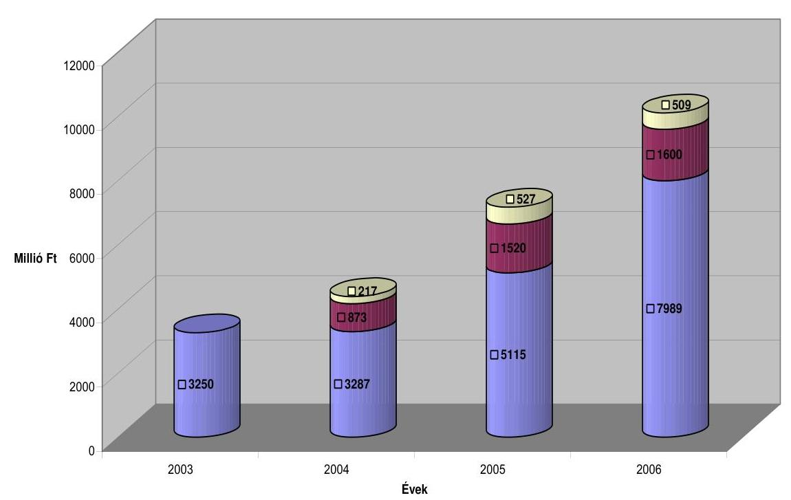

- Költségvetésben biztosított előirányzatok összesen : Társfinanszírozás keretében rendelkezésre álló források összesen : Pályázók tervezett önrésze

A programok finanszírozásába bevont költségvetésen kívüli külső források négy év alatt összesen 3993 millió Ft-tal (20,3\%-kal), a pályázók önrésze további 1253 millió Ft-tal (6,4\%-kal) növelte a rendelkezésre álló közmunka támogatási előirányzatokat, így összességében 24,9 milliárd Ft szolgálta a foglalkoztatási gondok enyhítését. A közmunkaprogramok lebonyolítására rendelkezésre álló források 79\%-a így a költségvetési fejezetek előirányzataiból, 16\%-a a társfinanszírozásban résztvevő szervezetektől, 5\%-a pedig pályázók által vállalt önrészből származott.

A vizsgált időszakban a társfinanszírozás különböző formái alakultak ki. A rendelkezésre álló forrásokat az előirányzat kezelésének (az előirányzatokat kezelő minisztériumok és szervezetek) szintjén nem minden esetben koncentrálták, és nem volt egységes a költségvetésben tervezett fejezeti kezelésű előirányzatok felhasználása sem:

- Az FVM jellemzően előirányzat átcsoportosítással, illetve tényleges pénzeszköz átadással (GPS, fúrógép beszerzés) járult hozzá a közmunkaprogramok lebonyolításához;
- A KvVM a „Zöld Forrás" környezetvédelmi program keretében saját maga gondoskodott a cigánytelepek köztisztasági közmunkaprogramjának pénzügyi lebonyolításáról is;
- Az MTRFH költségvetésében tervezett, regionális fejlesztési tanácsok szintjére decentralizált közmunkaprogram támogatási előirányzatai felett a régiók rendelkeztek, az érvényesítendő prioritásokról, a régión belüli koordináció elveiről maguk döntöttek. Az operatív pályáztatási feladatok lebonyolításá-

---

nak feladatait azonban az egységes lebonyolítás érdekében – megállapodás alapján – átadták a Közmunka Tanácsnak;

- A kormányzati 100 lépés közfoglalkoztatási programban a költségek 37\%-át a BM által kezelt önkormányzati támogatások fejezeti kezelésű, felhasználási kötöttséggel járó közcélú foglalkoztatás támogatási előirányzata terhére biztosították, oly módon, hogy azt a BM az önkormányzati finanszírozás keretében közvetlenül juttatta el az érintett önkormányzatokhoz;
- A gazdasági társaságok közül az ÁPV Zrt. és az NA Zrt. az általa biztosított forrásokat nem adta át a fejezetnek, a hozzájárulásokat közvetlenül a pályázóknak, önrészként biztosította;
- A MÁV Zrt. az általa támogatott programok esetében nem egységesen járt el, egyes esetekben önrészként, döntően azonban fejezetnek átadott forrásként biztosította az általa juttatott összegeket.

Az azonos elvet nélkülöző finanszírozási megoldások akadályozzák az átláthatóságot a forráskoordináció és a tényleges programirányítás kérdéseiben, indokolatlanul megbontják a pénzügyi elszámolások és a pályázati monitoring egységes gyakorlatának rendjét. A forráskoordináció működési hiányosságaira visszavezethetően a 100 lépés kormányzati közfoglalkoztatási program pénzügyi lezárását követő fejezetek közötti elszámolás a települési önkormányzatok szintjén jogosulatlan támogatás igénybevételének lehetőségét teremtette meg.

Az önkormányzatok, illetve támogatásban részesített szervezeteik az FMM fejezeti kezelésű előirányzata terhére biztosított támogatási előleg folyósítását követően a program első felében a BM közcélú támogatási kerete terhére a program tervezett támogatási előirányzatának 37\%-át, mint kötelező önrészt, teljes egészében megkapták. A támogatottak ezt követően, a ténylegesen elszámolható költségek erejéig vehették igénybe az FMM támogatást. Ezáltal az a helyzet állt elő, hogy a program támogatási előirányzatának teljes maradványa az FMM fejezet költségvetésében realizálódott. A program lezárását követően a tényleges támogatás felhasználásának ismeretében az FMM (ekkor már SZMM) úgy intézkedett, hogy a támogatási maradvány a tervezett finanszírozási aránynak megfelelően kerüljön megosztásra az érintett fejezetek között. A társfinanszírozási arány helyreállításának azt a módját választotta az FMM, hogy előirányzatából a támogatási maradványok 37\%-át a támogatott szervek részére – mint finanszírozási arány helyreállítása miatti korrekciót – az ÖTM egyidejű értesítését mellőzve kiutalták, azaz visszatérítették az érintett pályázóknak, de az azokkal való további elszámolási kötelezettség, vagyis annak teljesítését, hogy a BM támogatásrész kiutalt összegével elszámoltak-e, nem kísérték figyelemmel.

A Közmunka Tanács Titkársága által biztosított adatszolgáltatás szerint a 100 lépés program két üteméhez kapcsolódóan (2006. augusztusában, illetve decemberében) országosan a maradvány támogatási szerződésben előírt finanszírozási arányának helyreállítása címén 109 442 ezer Ft került kiutalásra a pályázatot lebonyolító önkormányzatok és szervezeteik részére. A támogatott szervek többsége – annak ellenére, hogy erre vonatkozóan a támogatási szerződések közvetett módon ugyan, de tartalmaztak előírást – nem vette figyelembe, hogy e kiutalt összeggel jogosulatlan támogatáshoz jutott, s hogy azzal az önkormányzaton keresztül elszámolási kötelezettséggel tartozik

---

a támogatási előirányzatot kezelő ÖTM felé. A Közmunka Tanács Titkársága a pályázók esetleges érdeklődésére felvilágosítást adott a visszautalt összeg tartalmáról. A finanszírozásban érintett fejezetek közötti együttműködés elmaradása miatt sem az FMM, sem az ÖTM nem kísérte figyelemmel a pályázóknál keletkezett maradványok elszámolását.

A vizsgált időszakban a rendelkezésre álló támogatási keretekből – a pályázati rendszer működését biztosító költségek elkülönítését követően – a közmunkaprogramok támogatására összesen 22 817 millió Ft-ot fordíthattak. E keretösszeg terhére – a várható meghiúsulásokra és maradványokra, azok újra osztására figyelemmel – 23 051 millió Ft összegű (101\%-os) szerződéses kötelezettséget vállaltak. A ténylegesen felhasznált támogatás (22 069 millió Ft) rendelkezésre álló keretösszegen belül maradt, az előirányzatokkal való gazdálkodás gyakorlata a rendelkezésre álló támogatási keret felhasználási arányának optimalizálására irányult.

# 2.2. A közmunkaprogramokra biztosított támogatások felhasználása 

Közmunkaprogramok megvalósítására a forráskoordinációt követően összesen 23 051 millió Ft támogatást fordíthattak, évente változó feladatokhoz kapcsolódva.

A megvalósított programok főbb jellemzőit, a támogatott közmunkaprogramok tárgyköreit, a benyújtott igények kielégítésének arányait, a támogatott pályázók számát, a biztosított támogatási összegeket, és a foglalkoztatásban résztvevők számának évenkénti alakulását a jelentés 4. számú melléklete szemlélteti.

Az ellenőrzött időszak négy éve alatt összesen 1861 db pályázatot nyújtottak be, ezekben összesen 34,6 milliárd Ft támogatási igényt fogalmaztak meg. A kérelmekben több mint 70 ezer fő foglalkoztatását tervezték. A rendelkezésre álló források 1059 db pályázat támogatását tették lehetővé. A 23 milliárd Ft-ot meghaladó összértékben megítélt támogatások közel 60 ezer fő átmeneti foglalkoztatásának lehetőségét teremtették meg.

A benyújtott pályázatok igény kielégítésének aránya a rendelkezésre álló források bővülésével, a pályázati rendszer előkészítettségének és a pályázók felkészültségének javulásával összhangban évről évre javult. Míg a 2003–2004. években benyújtott támogatási igények több mint felét, 2005-ben mintegy negyedét el kellett utasítani, addig 2006-ban a pályázók igényei csaknem teljes körűen kielégíthetőek voltak.

A vizsgált időszakban mind az indított programok számában, mind tárgykörében jelentős változások történtek, 15 tárgykörben összesen 40 különböző közmunkaprogramot indítottak, amelyeknek 87,5\%-a meghívásos jellegű pályázat volt.

A meghívásos jellegű, konkrét célcsoportot elérni kívánó pályázatok éves rendszerességgel a Vásárhelyi árvízvédelmi terv megvalósításához, az autópálya építések környezeti rendezéséhez, erdőművelési munkák végzéséhez, nemzeti parkok fenntartásához, az ár- és belvíz védekezési munkálatokhoz, a

---

parlagfű szennyezettség csökkentésének társadalmi programjához kapcsolódtak. Ezen túlmenően a meghívásos pályázatok biztosítottak keretet a Balaton környéki települések, vasúti pályák és átkelőhelyek, cigánytelepek környezet- és köztisztasági, az akadálymentesítési mintaprogramok megvalósításának, valamint a madárinfluenzával fokozottan veszélyeztetett területek közegészségügyi veszélyelhárításának támogatására is.

A meghívásos programokban a potenciális pályázók körét egyrészt a társfinanszírozásban résztvevő ágazati partnerek (KvVM, FVM, MÁV Zrt., Nemzeti Autópálya Zrt., ÁPV Zrt., MTRFH), másrészt az egyes feladatok szakmai irányítását végző szervezetek (Esélyegyenlőségi Kormányhivatal, Parlagfümentes Magyarországért Tárcaközi Bizottság, ÁNTSZ) a támogatható területek fontossági, illetve veszélyeztetettségi besorolásának megfelelően a Közmunka Tanáccsal kötött megállapodásaikra alapozva határozták meg. A támogatott szervezetek ennek megfelelően elsősorban a vízügyi igazgatóságok, közútkezelő közhasznú társaságok, erdészeti részvénytársaságok, nemzeti park igazgatóságok köréből kerültek ki, de érintettek voltak önkormányzati alapon szerveződő konzorciumok, önkormányzati kistérségi társulások, és egyes hátrányos helyzetű települések is. Ez utóbbi körbe tartozott 2004-ben és 2006-ban az Élhetőbb faluért program legrosszabb munkaerőpiaci mutatókkal rendelkező 518 települése is.

A vizsgált években meghirdetett programok közül 9 feladatkör 20 programja közvetlenül önkormányzati feladatellátáshoz kapcsolódott, függetlenül attól, hogy a program megvalósítására pályázók maguk az önkormányzatok, vagy azok szervezetei, társulásai voltak. Foglalkoztatási szempontból, közvetve azonban valamennyi közmunkaprogram (erdőgazdasági, vízügyi, autópálya, nemzeti park, vasút- és idegenforgalmi környezetet érintő köztisztasági, madárinfluenza elleni védekezési) elválaszthatatlanul kapcsolódott a településekhez, miután a programok keretében foglalkoztatottak a helyi munkanélküliek és rendszeres szociális segélyezésben részesülők közül kerültek ki. A hátrányos helyzetű, tartós munkanélküli, elsősorban cigány származású lakosság foglalkoztatására 2003. évtől kezdődően évente indított programokhoz valamennyi önkormányzat kapcsolódhatott. A foglalkoztatási szempontból hátrányos helyzetű hét megyében 2003-ban a megyei területfejlesztési tanácsok támogatásával kiegészített programok lebonyolítására került sor. Ezen túlmenően 2005-ben „új, modellértékű közmunkaprogram indításáról" határozott a kormány ${ }^{27}$ az úgynevezett kormányzati 100 lépés program keretében.

[^0]
[^0]:    ${ }^{27}$ 1093/2005. (IX. 17.) Korm. határozat

---

Az ellenőrzött időszakban a közmunkaprogramok támogatására biztosított források felhasználása, tényleges igénybevétele az alábbiak szerint alakult:

Millió Ft

| Megnevezés | 2003. | 2004. | 2005. | 2006. | Összes |
| :-- | --: | --: | --: | --: | --: |
|  | évi döntéssel indított programok |  |  |  |  |
| 1.) Megítélt közmunkaprogram   támogatás összesen | 3140 | 3316 | 11035 | 5560 | 23051 |
| 2.) Ténylegesen felhasznált   támogatás | 3048 | 3061 | 10578 | 5382 | 22069 |
| 3.) Maradvány | 92 | 255 | 457 | 178 | 982 |
| 4.) Felhasználás %-a | 97,0 | 92,3 | 95,9 | 96,8 | 95,7 |

Az ellenőrzött években a közmunkaprogramoknak összességében nem voltak jelentős maradványai (4,3\%). Mindez azzal függ össze, hogy a Tanács Titkársága a programok teljesítési szakaszában is erőteljes szakmai menedzselést tanúsított, ennek során a rendelkezésre álló források maximális felhasználását helyezte előtérbe.

Kompromisszumképesek voltak a pályázók részéről felmerülő módosítási igények kezelésében, a közreműködő szervezetekkel együttműködve keresték azokat a jogszabályi előírásoknak és szerződéses kötelezettségeknek megfelelő megoldásokat, amelyek a projektek pénzügyi megvalósítását támogatták. Amennyiben a projekt előrehaladási jelentések egy-egy adott közmunkaprogram esetében jelentősebb maradványokat jeleztek, soron kívül intézkedtek arra, hogy a felszabaduló keretek terhére újabb közmunkaprogramok meghirdetésére kerüljön sor. Ezt a rugalmas, pályázóbarát szervezési magatartást támasztják alá a különböző tárgykörökben (parlagfű mentesítési, 100 lépés kormányzati közfoglalkoztatási, élhetőbb faluért) két ütemben, jellemzően meghívásos keretek közé terelt pályázati felhívások, illetve az egyes tárgyévi maradványok terhére, következő évi megvalósítással tervezett programok is. A foglalkoztatási és szociális feszültségek enyhítését,
 annak társadalmi és mentális hatásait tekintették elsődleges célnak, miközben az értékteremtő munka teljesítménykövetelményeinek meghatározására, egységesítésére, számonkérésére és ellenőrzésére nem került sor.

# 2.3. A közmunkaprogramok pályázati rendszerének működési tapasztalatai 

A közmunkaprogram támogatására rendelkezésre álló előirányzatok felhasználása nyílt, illetve meghívásos pályázati rendszeren keresztül valósult meg.

---

A nyílt és a meghívásos pályázati felhívások közzétételét követően a beérkező támogatási kérelmek tartalmi és formai feltételeknek megfelelő felülvizsgálatát, az ezzel összefüggő hiánypótlás szervezését a Közmunka Tanács Titkársága biztosította. A meghívásos pályázati kategória esetében - a kormányrendeletben biztosított jogosítványa ${ }^{28}$ szerint - az ajánlatok véleményezését a Titkárság előterjesztése alapján a Tanács látta el.

A nyílt közmunkaprogramok pályázati felhívására benyújtott támogatási igények döntés-előkészítő véleményezését, valamint a biztosított támogatások teljes körének pénzügyi ellenőrzését és a szakmai célkitűzések megvalósításának monitorizálását a Közmunka Tanács és Titkársága külső szervezetek bevonásával biztosította. A feladat végrehajtásában résztvevő szervezetek kiválasztása első alkalommal nyílt, - a törvényi előírásoknak megfelelően lefolytatott - majd a következő években erre alapozva meghívásos közbeszerzési eljárás keretében történt.

A döntés előkészítés véleményezésében, a benyújtott pályázatok szakértői bírálatában a GTTSZ és a TESCO Kft., a pénzügyi lebonyolításban és az elszámolások ellenőrzésében a MONETA Kft., a szakmai célkitűzések megvalósításában a Conto '82 Kft. kapott szerepet.

E vállalkozásokkal megkötött szerződések részletesen meghatározták a vállalt feladat szakmai tartalmát, az elszámolás alapját és rendjét, a kapcsolódó dokumentációk kezelésének és megőrzésének rendjét, az adott időszakról összeállítandó zárójelentés elkészítésének határidejét, a szerződésben foglaltaktól eltérő teljesítéshez fűződő szankciókat.

A pályázati rendszer lebonyolításában közreműködő szervezetek részére - a ténylegesen elvégzett munka igazolását követően - kifizetett összegek alakulását az alábbi táblázat részletezi:

Adatok ezer Ft-ban

| Megnevezés | 2003. | 2004. | 2005. | 2006. | Összesen |
| :-- | --: | --: | --: | --: | --: |
| GTTSZ | 10725 | 11295 |  |  | 22020 |
| TESCO Kft. |  |  | 31783 |  | 31783 |
| MONETA Kft. | 12250 | 14400 | 15000 | 47520 | 89170 |
| Conto '82 Kft. | 7500 | 40000 | 60000 | 98304 | 205804 |
| Összesen: | 30475 | 65695 | 106783 | 145824 | 348777 |

[^0]
[^0]:    ${ }^{28}$ 49/1999. (III. 26.) Korm. rendelet 4/A § (3) bekezdés d) pontja

---

A közreműködő szervezetek számára négy év alatt teljesített kifizetés a közmunkaprogramok fejezeti kezelésű előirányzatból átcsoportosított összeg 46,9%-át tette ki.

A közmunkaprogramok lebonyolítására kialakított pályázati rendszer megfelelt a jogszabályi előírásoknak.

A pályázatok tartalmazták a pályázat kiírásának célját, feltételeit, forrását és mértékét, az egyes régiókban nyújtható támogatások összértékét, a program megvalósításának határidejét, a foglalkoztatási kötelezettség mértékét, időtartamát, a szerződésszegés jogkövetkezményét. A pályázatok kiírásával együtt nyilvánossá tették az elbírálás szempontrendszerét. A pályázatok értékelésével független szakértő céget bíztak meg.

A Közmunka Tanács az elbírált pályázatokról készített összesített kimutatás alapján tett javaslatot a miniszternek a ponthatárra és a nyertes pályázókra vonatkozó döntésre. A nyerteseket miniszteri határozattal értesítették, a támogatási szerződéseket ezt követő 15 napon belül kellett megkötni. A szerződéseket az aláírást követően átadták a MONETA Kft-nek, a kifizetések a szabályozás szerint csak a szerződésben foglalt jogcímen, az ott rögzített keretösszeg erejéig, a felülvizsgálat által elismert összegben történhettek.

A pénzügyi lebonyolításra vonatkozó szabályozás szerint az előleggel a futamidő közepéig el kellett számolni. Ha a pályázó a futamidő 3. hónapjának végéig nem nyitotta meg a dologi kiadásait, - miután a munkavégzéshez szükséges eszközökről van szó, így azokat a program elején kell beszerezni - a későbbiekben azt csak a Titkárság engedélyével tehette meg.

A Közmunka Tanács Titkársága a MONETA Kft-től a szerződés szerinti rendszerességgel érkező pénzügyi elszámolásokban foglalt adatok megbízhatóságát nem ellenőrizte, annak tartalmára vonatkozóan nem fogalmazott meg külön elvárásokat. Az információs adatszolgáltatást a Kft. a pénzügyi felülvizsgálat rendjéhez kapcsolódva, saját gyakorlatához igazodóan alakította ki.

A Conto '82 Kft. az általa végzett projekt ellenőrzést „Közmunka felmérő lapon" dokumentálta, azok egy példányát a Közmunka Tanács Titkárságára rendszeresen eljuttatta. A pénzügyi elszámolásokat és a felmérőlapokat a Titkárság az egyes pályázati dokumentációk részeként kezelte, azok programonkénti összegzését a monitorizáló szervezet tette meg.

A pénzügyi lebonyolításban és a program monitorizálásában közreműködő szervezetek a Közmunka Tanács Titkárságával folyamatos kapcsolatban álltak, ennek során azonban egyetlen esetben sem jeleztek olyan hiányosságot, amely a szerződésben foglalt szankciók érvényesítését, a támogatások folyósításának felfüggesztését igényelte volna, holott a közmunka pályázatok megvalósítása során az ellenőrzés - különösen a 100 lépés kormányzati közfoglalkoztatási programnál (lásd részletesebben a 3.1. pontnál) - tapasztalt erre utaló hiányosságokat.

A Tanács Titkársága a közreműködő szervezetek szakmai tevékenységének színvonalát - a szerződéses kötelezettség teljesítésének igazolásán túl - nem értékelte, azokkal szemben elvárásokat nem fogalmazott meg.

---

# 2.4. A pályázati rendszer működésének helyszíni ellenőrzési tapasztalatai 

A pályázati rendszer működésének előbbiekben összegzett tapasztalatait a helyszíni ellenőrzés megállapításai megerősítik. Az önkormányzati területekhez közvetlenül kapcsolódó témakörök közmunkaprogramjai a meghirdetett programok kétharmadát tették ki, ami azt jelenti, hogy az erdőgazdaságok szakmai programjainak áttekintésével kiegészülve a 2003-2006. évek közmunkaprogramjainak 75,5%-áról áll rendelkezésre ellenőrzési tapasztalat. Az önkormányzatok és szervezeteik területén vizsgált pályázatok nyolc közmunkaprogram keretébe tartozóak voltak, országos programokon belüli arányaikat az 5. sz. melléklet mutatja be.

A 11 megyében, összesen 48 szervezetnél végzett helyszíni ellenőrzés a vizsgált időszakban meghirdetett önkormányzati vonatkozású közmunkaprogramok 15312 millió Ft-os támogatási előirányzatának 29,3%-ára (4492 millió Ft-ra), valamint 9840 fő foglalkoztatási jellemzőinek áttekintésére terjedt ki (6. sz. melléklet).

Ezen belül áttekintésre került a 100 lépés kormányzati közfoglalkoztatási programban biztosított támogatások 36,5%-a, az „Élhetőbb faluért" program keretében juttatott támogatások 32,5%-a, a parlagfű mentesítési célú juttatások 21,4%-a, valamint a hátrányos helyzetű rétegek helyzetének javítását támogató előirányzatok 25,7%-a is. Az önkormányzatok által megvalósított akadálymentesítési közmunkaprogram 24,7%-áról, a cigánytelepek köztisztasági programjának 15,8%-áról, a vasúttisztasági programok 23,2%-áról, a hátrányos helyzetű megyék területfejlesztési tanácsaival közös közmunkák 16,8%-áról áll rendelkezésre információ.

Az ellenőrzött önkormányzatok és szervezeteik a 2003-2006. évek között összesen 169 db - ezen belül 2005-ben 88 db - pályázatot nyújtottak be, amelyben az 5633 millió Ft összértékű programok megvalósításához 5234 millió Ft összegű (92,9%-os részarányú) támogatási igényt fogalmaztak meg. A kérelmekben 10995 fő foglalkoztatását tervezték.

Az egyes közmunkaprogramok pályázati jellemzőiről készült összegzés szerint (7. sz. melléklet) a pályázatok elbírálását követően a benyújtott pályázatok 88,2%-át (149 pályázat) támogatta a kiíró, amellyel az igények 85,8%-át 4492 millió Ft összegben elégítették ki. Ezáltal a tervezett létszám 89,5%-a (9840 fő) számára vált lehetővé az átmeneti foglalkoztatás.

A támogatások odaítéléséről a bírálati rendet betartva döntöttek. A pályázók ugyanakkor több esetben jelezték, hogy a bírálati szakasz pályázót érintő döntéseiről - kérelemben foglalt támogatási igények csökkentése, támogatási időtartam változtatása, foglalkoztatási előírások, és forrásösszetételt érintő módosulások - nem rendelkeztek visszajelzéssel, csak a végleges támogatási döntésekről kaptak tájékoztatást.

Bár a bírálati szakaszban bekövetkezett változtatások kizárólagosan valamely pályázati hiányosság kiküszöbölésével, egyértelműen behatárolható számszaki hibák megszüntetésével voltak összefüggésben - s ebben a közelítésben épp a pályázók érdekeit szolgálták - az átláthatóság igénye és a pályá-

---

zók felkészültségének javítása érdekében a bírálat során végrehajtott változtatásokról a pályázókat célszerű lett volna értesíteni.

A közmunkaprogramok támogatására vonatkozó támogatási szerződést a vizsgált pályázatok 92,5%-ában az előírt határidőn belül megkötötték, az abban foglaltak módosítására a szerződések 41%-ában került sor.

A módosítások 58%-ában csak az eredetileg vállalt program időtartama módosult - jellemzően meghosszabbították -, annak szakmai tartalma nem változott. A szerződésmódosítások 23,6%-a a program keretében vállalt foglalkoztatási és továbfoglalkoztatási kötelezettséget, fennmaradó hányada pedig az eredetileg vállalt forrásösszetétel és a támogatás terhére elszámolható kiadások körének és összetételének változását érintette.

Az ellenőrzés azt tapasztalta, hogy a támogatási szerződések megkötésének gyakorlata nem volt kellően összhangban a pályázati felhívásokban foglaltakkal. A pályázati felhívások különböző részarányú saját forrás biztosítását kívánták meg a pályázóktól, azonban annak konkrét összegét és a program összköltségéhez viszonyított részarányát a támogatási szerződésekben nem rögzítették. Ez azt eredményezte, hogy a közmunkaprojektek összköltségének, forrásösszetételének - ezen belül a tényleges saját forrás vállalása teljesítésének - figyelemmel kísérése elmaradt. Az elszámolási kötelezettség a támogatási szerződés általános feltételeiből következett, mely szerint ha a pályázó a pályázatában saját erő biztosítását vállalta, annak felhasználásával is elszámolási kötelezettséggel tartozott.

Ugyanakkor, miután a döntés-előkészítés szakaszában történt változtatásokról a pályázók nem kaptak értesítést, nem volt egyértelműen követhető a vállalt saját forrást érintő kötelezettségek alakulása sem. A pályázók többsége csak a pénzügyi elszámolást végző szervezet kifejezett felhívására igazolt saját forrás felhasználást. A pénzügyi elszámolást végző szervezet azonban nem rendelkezett információkkal a ténylegesen vállalt kötelezettségekről, másrészt nem kötődött semmiféle következmény a saját forrás mértékének vagy arányának a be nem tartásához.

Az összegzés szerint a vizsgált 146 pályázat 68%-ánál igazoltak saját erő felhasználást a pályázók, 8%-uk nem számolt el saját forrást, a fennmaradó 24%-ában pedig - figyelemmel a szerződéses kötelezettség ellentmondásaira - nem is értelmezték a saját forrásokkal való elszámolás kötelezettségét.

A támogatási szerződések nem tértek ki arra, hogy a közmunka keretében mind az érintettek foglalkoztatásáról, mind pedig a vállalt feladatok ellátásának szakmai feltételeiről az ágazati jogszabályok előírásait betartva kell gondoskodni.

Komádi Városi önkormányzatnál tárta fel az ellenőrzés, hogy a közmunkaprogramok keretében ellátott házi segítségnyújtás feladatát a polgármesteri hivatal szervezeti keretén belül látták el, miközben annak alapító okiratában e tevékenység nem szerepelt, és működési engedélye sem volt a feladat ellátására. Ez a tevékenység a város külön e célra létrehozott közhasznú társaságának feladatkörébe tartozott volna. A házi segítségnyújtásban részesülőkre vonatkozóan egyéni gondozási terv - az 1/2000. (I. 7.) SzCsM rendelet 25-27. §-a ellenére - nem készült, az elvégzett feladatokat a fentiekkel ellentétben, helytelenül építési naplóban ve-

---

zették. Az SzCsM rendelet 3. sz. mellékletében rögzített képesítési előírások a foglalkoztatás során nem érvényesültek.

A szerződéses kötelezettségek módosításának gyakorlata során nem érvényesítették maradéktalanul a pályázati felhívásokban és a megkötött támogatási szerződésben foglaltakat. A programok előrehaladása során bekövetkező változásokról a megvalósításban érintett szervezeteknek előzetesen értesítenie kellett volna a döntéshozót, a program csak a jóváhagyást követően folytatódhatott volna a megváltozott paraméterek mellett. A helyszíni ellenőrzés során azonban azt tapasztaltuk, hogy a döntéshozó jellemzően nem előzetesen járult hozzá a megváltozott feltételű programok folytatásához, hanem a pénzügyi lebonyolításban és monitorizálásban közreműködő szervezetek jelzésére alapozott pályázói kezdeményezések alapján utólagosan tudomásul vette azokat. A pályázatok lebonyolításában közreműködő szervezetek e kezdeményezések indoklása, formai és tartalmi feltételeinek megteremtése során a pályázók forráslehívásra irányuló érdekeinek szolgálatát tekintették elsődlegesnek. A pénzügyi lebonyolítást és a monitorizálást végző szervezet a hiánypótlásoknak, megismételt pénzügyi elszámolásoknak rendkívül tág teret engedett, a
 szerződésben rögzített szankciók érvényesítésével helyszíni ellenőrzésünk nem találkozott.

Püspökladány Társulásánál, a 100 lépés kormányzati közfoglalkoztatás programban fordult elő, hogy a program 2006. május 30-i lezárását követő utolsó, MONETA Kft. által kiállított ellenőrző lapon 2006. június 23-i elszámolást követően is szerepeltettek módosítást. A program lezárását követő korrekciók alapján az egyes támogatási jogcímeket hozzáigazították a teljesítéshez, a munka alkalmassági vizsgálat és a munkába járás költségeinek csökkentésével azonos összeggel megemelték a bért és annak járulékait. Ugyancsak a kormányzati 100 lépésnél fordult elő (Polgári Kistérség Többcélú Társulása), hogy a közmunka lezárását követően keletkezett munkaruha számlákat állítottak be a végleges pénzügyi elszámolásba, - melyet helyszíni ellenőrzésünk a pályázat pénzügyi előírásaival ellentétesnek minősített - a MONETA Kft. azonban jogos támogatási igényként hagyott jóvá.

Az ózdi ÓZDSZOLG Kht. által lebonyolított közmunkaprogramoknál is gyakorlat volt, hogy a támogatási szerződések módosítását a már kialakult tényleges felhasználási jellemzők ismeretében kezdeményezte a pályázó. A hátrányos helyzetű rétegek számára szervezett 2005. évi programokban a munkába járás és a kis értékű tárgyi eszközök maradványát kérték átcsoportosítani a felmerült munkásszállítási költségek fedezetére, míg 2006-ban a 100 lépés közfoglalkoztatási programban a munkaruha és védőruha beszerzéseknél elért megtakarítást használták fel eszköz (11 db benzinmotoros fűnyíró) beszerzésére. Az átcsoportosítási kérelmeket a programok végén nyújtották be a Közmunka Tanácshoz, ahol azokat jóváhagyólag tudomásul vették.

Zagyvarékason a 2006. júniusában befejeződött program lezárása az elszámolások bizonylatolási hiányosságai következtében 2007. január végéig elhúzódott, arra a közmunkaprogramok helyszíni vizsgálatának időszaka alatt, az SZMM Foglalkoztatási és Képzési szakállamtitkárának egyedi engedélye alapján került sor.

Hasonlóan, az FMM-től kapott egyedi engedély birtokában hosszabbíthatta meg az elszámolás határidejét az Ozora és térsége Fejlesztési Társulás, valamint a Szolnoki Kistérség Többcélú Társulása is.

---

A szerződésben vállalt egyéb kötelezettségek teljesítésének betartatása sem volt maradéktalanul biztosított. A támogatási szerződés egyértelműen előírta ugyan, hogy a pályázóknak gondoskodniuk kell a közmunkaprogramok kiadásainak és bevételeinek elkülönített számviteli nyilvántartásáról, az előírás teljesítésének módját azonban a pályázókra bízta. A pályázó szervezetek - még a költségvetési szabályok szerint gazdálkodók is - konkrét erre vonatkozó előírás hiányában különböző szakfeladatokat használtak, a főkönyvi számlákat eltérő részletezettséggel tagolták.

A pályázóknak saját számlarendjükben kellett meghatározniuk azt a szakfeladatot, és azt a főkönyvi számla alábontást, amelyen közmunkaprogramok egyértelmű elkülönítését biztosították. A pályázók ezt a kötelezettséget rendkívül differenciált módon teljesítették. Az elkülönített kezelés számlarendben való meghatározása jellemzően elmaradt, azonban a vizsgált közmunkaprogramok kiadásainak szakfeladaton való elkülönítéséről a pályázók 75,3%-a, a felhasználások további részletezését biztosító főkönyvi számlák alábontásáról 60,9%-a gondoskodott.

Nehezítette a programok pénzügyi átláthatóságát az is, hogy egyes pályázóknál egyidejűleg más közfoglalkoztatási formák (közhasznú, közcélú foglalkoztatás) elkülönített kezelésének szükségessége is felmerült, ezekre azonban jellemzően egyazon szakfeladatot, főkönyvi alábontást használtak. Ezáltal a különböző közfoglalkoztatások kiadásainak elkülönítése döntően csak analitikus nyilvántartások vezetésével, átláthatóságot nehezítő kigyűjtésekkel volt biztosítható. Az elszámolás sokfélesége azzal járt, hogy az államháztartás alrendszerén belül sincs értékelésre, összehasonlításra alkalmas információ.

Tiszacsécse önkormányzatánál a gazdasági események rögzítésére a TATIGAZD számviteli programot használják. A közmunkaprogramok elszámolása - függetlenül azok ágazati tartalmától - a 751845 számú szakfeladaton (város és községgazdálkodás) történt meg. E szakfeladaton számolták el a közfoglalkoztatással kapcsolatos programokkal összefüggő valamennyi bevételt és kiadást. Az elszámolt kiadásokat azonban közmunka-programonként, illetve ágazati bontásban nem különítették el. Ennek következtében egy szakfeladaton mutatták ki a szociális, a kommunális, a köztisztasági, a belvízelvezetéssel, a temetőfenntartással kapcsolatban felmerült bevételt és kiadásokat. Ez a gyakorlat nem tette lehetővé az elszámolt kiadások közcélú, közhasznú és közmunka-programonkénti elkülönítését. A közmunkaprogramok elszámolásakor külön, kézi kigyűjtéssel készítettek úgynevezett főkönyvi kivonatot, amelyet az elszámolások alapjául a MONETA Kft. el is fogadott.

Püspökladány Városnál a 751197 máshova nem sorolható szervezeti tevékenység szakfeladatra könyvelték a közmunka kiadásait, a kiadások alábontását a 7. számlaosztályban biztosították. Az elszámolások körüli bizonytalanságot jelzi, hogy a 2003. évi elszámolások során a gesztor az egyes önkormányzatokra eső támogatási összegeket közvetlenül átadta a programban résztvevő önkormányzatoknak, akik a felhasználásokat külön-külön könyvelték. Az elszámolások során mutatkozó eltérések tisztázásának időigénye miatt a program pénzügyi lezárása 4 hónappal elhúzódott. A támogatási szerződésben foglaltaktól eltérő pénzügyi elszámolási gyakorlattal szemben a MONETA Kft. kifogást nem tett.

Karancslapujtő Község Önkormányzatának Polgármesteri Hivatala a közmunkák kiadásait a 751791 (máshová nem sorolható szervek tevékenysége) szakfeladaton, a közcélú foglalkoztatást a 751845 város- és községgazdálkodás, a közhasz-

---

núak foglalkoztatását pedig a 751889 gazdaság és területfejlesztési feladatok elnevezésű szakfeladaton számolta el. Kölcse Nagyközség önkormányzatánál a közmunkaprogramot a könyvviteli elszámolásokban mint önálló intézményt kezelték. Hasonló, az előzőekben részletezett elszámolási hiányosságok Baktalórántháza Város, Tiszabecs Nagyközség önkormányzatánál is előfordultak.

A gazdasági társasági, alapítványi keretek közt működő szervezetekre eltérő számviteli előírások vonatkoznak, e szervezetek a költségviselő, költségnem elszámolásokról saját számviteli előírásaiknak megfelelően gondoskodtak. A szabályszerűen vezetett, de különböző tagolású számviteli nyilvántartások nem tették lehetővé a közmunkaprogramok, illetve az egyéb közfoglalkoztatások elszámolt kiadásainak országos szinten történő figyelemmel kísérését.

Nem volt egységes a közmunkaprogramok keretében beszerzett eszközök kezelése és nyilvántartása sem. A közmunkaprogramok megvalósításának ideje alatt a programokat megvalósító szervezeteknél rendszeresek voltak a munkavégzéshez szükséges eszköz és munkaruha beszerzések. Az ellenőrzött programok 16,7%-ában azonban a beszerzett eszközöket nyilvántartásba sem vették. A személyes használatra kiadott eszközök átvételét biztosították, azonban azok felelős kezelésének és őrzésének rendjét - erre irányuló támogatói elvárás hiányában - a számviteli előírások ellenére nem alakították ki.

Polgár, Komádi, Püspökladány önkormányzatoknál és a Társulásaiknál a kis értékű tárgyi eszközök elszámolása nem felelt meg a számviteli törvény előírásainak. A pályázatokban jellemzően több önkormányzat volt érintett, amelyeknek a munkák megkezdésekor a beszerzett eszközöket átadták, azonban a közmunkaprogram befejezésekor nem számoltak el vele. Az eszközbeszerzési számlák a pályázó - azaz a társulások vagy a gesztor önkormányzat - nevére szóltak, azok nyilvántartása a pályázó kötelezettsége. Miután a közmunkaprogramok mindegyikénél - kivéve a programhosszabbításokat - lehetőség volt eszközbeszerzésre, ezáltal indokolatlan mennyiségű eszköz halmozódhatott fel. Püspökladány Városi Önkormányzatnál a közmunkaprogramok befejezését követően a munkaruhákat és a kis értékű tárgyi eszközöket teljes körűen leselejtezték, a munkaruhák kihordási idejét a közmunkaprogramok időtartamához igazították. A közmunkaprogram keretében beszerzett eszközök és munkaruhák bevételezése és nyilvántartása Hollóháza és Vilmány község önkormányzatainál sem történt meg.

Bár a pályázatok 83,4%-ánál az előírt elszámolási határidőt betartották, ehhez hasonló nagyságrendben a pénzügyi elszámolásra vonatkozó útmutatóban megjelölt, elszámolás alapját képező dokumentumokat is csatolták, a pénzügyi elszámolások és az utólagos finanszírozás folyamatában gyakoriak voltak a hiánypótlással párosuló felülvizsgálati korrekciók. Ezek azonban a programok terhére ténylegesen elszámolható költségek összegét nem befolyásolták, mindössze az elszámolások elhúzódásához vezettek, mivel az elszámolásokat a szerződés szerinti támogatási jogcímeken rögzített keretösszeg erejéig határidő nélkül befogadták.

A vizsgált programok összességében a pályázók alig több mint fele (54,4%-a) igényelte támogatási előleg folyósítását, az azzal való elszámolás kisebb - néhány hetes - határidőcsúszás mellett minden esetben megtörtént. A kialakított

---

utófinanszírozás gyakorlata az önkormányzatoknál és a gazdasági társaságoknál egyaránt átmeneti pénzellátási problémát okozott.

Szigetvár-Dél-Zselic Többcélú Kistérségi Társulásnak a fizetőképesség fenntartása érdekében 2004-ben két alkalommal is kölcsönt kellett felvennie, 4160 ezer, illetve 7200 ezer Ft összegben, Szolnokon pedig az alapító önkormányzat biztosított átmeneti többlettámogatást a közhasznú társaságnak. A működési forráshiányos, folyamatos likviditási gondokkal küzdő Tolnanémedi községben a támogatási előleggel nem fedezett kiadások finanszírozása folyószámlahitelből történt. Hasonló átmeneti finanszírozási gondok jelentkeztek a tiszaszentimrei Közép-Tiszavidékért Kht-nál is.

A pénzügyi elszámolásra vonatkozó útmutatót a MONETA Kft. a Közmunka Tanács Titkárságával egyetértésben, a gyakorlati tapasztalatokra alapozva folyamatosan aktualizálta. Az egymással párhuzamosan futó közmunkaprogramok egyértelmű beazonosítása, az esetleges visszaélések elkerülése érdekében a 2005. évtől vezették be azt az előírást, hogy az elszámolásra másolatban megküldött valamennyi dokumentum eredeti példányán a „közmunka” megjelölés mellett az adott pályázat közmunkaprogram azonosítóját is szerepeltetni kell. Az elszámolások elkülönített vezetésének igazolására vezették be a főkönyvi kivonat másolatának megküldését, azonban ennek az igénynek a következetes betartását a számviteli szabályozások és az alkalmazott könyvviteli programok eltérésessége, azok lehetőségei nagyban akadályozták.

Nyíregyháza cigány kisebbségi önkormányzat által lebonyolított cigánytelep köztisztasági program keretében a pénzügyi elszámolások során a munkaruha vásárlást tartalmazó számlákra még 2005-ben sem vezették rá a közmunkaprogram megnevezését és annak azonosítóját.

A Bátonyterenyén végzett ellenőrzés arra irányította rá a figyelmet, hogy néhány területen a MONETA Kft. ellenőrzése nem volt kellően alapos. Ez egyrészt abban nyilvánult meg, hogy a munka-alkalmassági vizsgálatokról készült számlák esetében a megbízási szerződés bekérésével ellenőrizték ugyan az alkalmazott díjtételek helyességét, azonban nem történt meg az alkalmassági vizsgálatokkal érintett létszám közmunkaprogramban való részvételének beazonosítása, másrészt abban, hogy az elszámoláskor olyan főkönyvi számla másolatát is elfogadták, amelyből nem volt egyértelműen megállapítható a közmunkaprogramokat érintő kiadás, nem kérték azok további alábontott forgalmát.

A pénzügyi elszámoláshoz csatolni kellett a közmunkaprogramok keretében foglalkoztatottak munkaszerződéseit, valamint a foglalkoztathatóság igazolására a területileg illetékes munkaügyi központok által kiállított közvetítőlapot és az igazolást arról, hogy a munkanélküli foglalkoztatásához a program ideje alatt más jogcímen támogatást nem biztosítanak.

A helyszíni ellenőrzés tapasztalatai szerint ezzel az igazolással 91%-ban rendelkeztek a támogatottak.

A rendszeres szociális segélyezés rendszeréből érkezők segélyfolyósítást szüneteltető határozatai nem képezték a pénzügyi elszámolás kötelező tartalmi kellékét, holott a kettős ellátás kizárása ez esetben is feltétele a közmunkaprogramban való részvételnek. E dokumentumok az ellenőrzött programok 75,8%-ában rendelkezésre álltak a pályázóknál, vagy a területi-

---

leg érintett önkormányzatoknál. Ez utóbbi dokumentumok együttes, pályázó általi kezelése elsősorban a kistérségi szervezetben okozott időleges, elhárítható hiányosságot. A programokba bevont személyekkel kapcsolatos segélyezési hatásköröket a települési önkormányzat jegyzője gyakorolta, a segélyfolyósítás felfüggesztésével összefüggésben meghozott határozatokat is helyben, s nem a kistérségi társulásokban, a pályázatok dokumentációjának részeként kezelték.

Az előzőek szerinti hiányosságot tapasztalta az ellenőrzés többek között a Beregi Többcélú Kistérségi Társulás, a Közép-Nyírségi Többcélú kistérségi Társulás, a Dél-Bihari Négycentrum Terület és Vidékfejlesztési Társulás és a Paksi Többcélú Kistérségi Társulás által lebonyolított közmunkaprogramok esetében.

A közmunkaprogramok keretében foglalkoztatottak munka alkalmassági vizsgálatának kötelezettségét a pályázók egyedi kivételektől eltekintve (Tiszabecs Községi Önkormányzat, Közép-Tiszavidékért Kht. Tiszaszentimre egy-egy pályázatánál) teljesítették, annak fedezetét biztosították.

A közmunkaprogramok pénzügyi lezárásának feltétele volt, hogy az elszámolási útmutatóban előírt záró jegyzőkönyv rendelkezésre álljon. Ez utóbbi dokumentumra részletes tartalmi előírás nem készült, a pályázók a vállalási és teljesítési mutatók, a pénzügyi felhasználás ismeretében - a helyszíni ellenőrzés tapasztalatai alapján rendkívül vázlatosan - dokumentálták a közmunka pályázatok lezárását. A záródokumentumok - bár azok a vizsgált pályázatok 88,3%-ában elkészültek - az eddig elvárt tartalmi követelmények mellett nem szolgáltak a programok valós értékelési alapjául.

A pénzügyi lezárás további feltétele volt, hogy a támogatási szerződésben vállalt továbbfoglalkoztatási kötelezettség teljesüljön. A továbbfoglalkoztatásra vonatkozó előírást jellemzően 3 hónapra, a program időszaka alatt foglalkoztatottak átlaglétszáma alapján határozták meg,
 amelynek igazolására mindössze a továbbfoglalkoztatott személyekkel megkötött munkaszerződést kellett csatolni. Annak figyelemmel kísérése, hogy az így vállalt foglalkoztatás teljesült-e valójában, - a támogató elvárása hiányában - nem történt meg. A továbbfoglalkoztatást érintő kötelezettségeket nem határozták meg egységesen, még azokban az esetekben sem, amikor a pályázati feltételek között a továbbfoglalkoztatás vállalását prioritási szempontként jelölték meg.

Tiszavasvári Város önkormányzatánál a 2004. évi parlagfű elleni védekezést szolgáló programok pályázati kiírása szerint legalább öt fő három hónapon át történő továbbfoglalkoztatását kellett vállalni. Az önkormányzat ezzel szemben a pályázatában csak két hónapon át történő továbbfoglalkoztatásra vállalkozott, miközben a támogatási szerződés a feltételeknek megfelelően három hónapos továbbfoglalkoztatási kötelezettséget tartalmazott. A program pénzügyi elszámolását megelőzően a önkormányzat kérelemmel fordult az FMM-hez, hogy tekintsenek el a három hónapos továbbfoglalkoztatási kötelezettségtől, mivel az jelentős terhet jelent a programban résztvevő önkormányzatok számára. A kérést az FMM Közmunka Tanácsának elnöke előbb elutasította, majd ismételt kérésre 2004. október 26-án elfogadta azt. A támogatási szerződés módosítására nem került sor.

A Közép-Nyírségi Önkormányzati Többcélú Kistérségi Társulás továbbfoglalkoztatási kötelezettséget is vállaló közmunkaprogramjaiban (hátrányos helyzetű rétegek foglalkoztatása 2004: 38 fő, 2005: 18 fő, parlagfű elleni védekezés 2004: 9 fő,

---

100 lépés kormányzati közfoglalkoztatás: 18 fő) a kötelezettség teljesítésének igazolására a munkaszerződéseket a programokban résztvevő önkormányzatok a munkavállalóval megkötötték. A szerződések egy példányát a MONETA Kft-nek megküldték, egy példány a társulásnál meg is található, arról azonban nincs további dokumentáció, hogy a foglalkoztatás ténylegesen maradéktalanul megvalósult-e.

A pályázatban foglalt szakmai feladatok teljesítésének dokumentálási hiányosságai nehezítették a programok eredményeinek számbavételét, azok értékelését. Ezekkel kapcsolatban csaknem minden vizsgált önkormányzatnál fogalmazódtak meg különböző súlyú, az elvégzett munkák hitelt érdemlő igazolásának hiányosságait érintő kritikák. Megfelelő teljesítménykritériumok, elvárható teljesítménynormák hiányában esetenként a feladatvállalások megalapozottsága is megkérdőjelezhetővé vált.

Püspökladány város gesztorságával megvalósuló közmunkaprogram keretében észlelt hiányosságok tipikusnak tekinthetők. A programban résztvevő négy önkormányzat négyféle módon vezette a munkák teljesítését igazoló nyilvántartásait: Püspökladány Önkormányzat Polgármesteri Hivatala havonta, munkanapló megnevezésű nyilvántartás vezetésével rögzítette az elvégzett munkák megnevezését, helyét és naturális mérőszámban kifejezett mennyiségét. A dokumentumból nem derült ki, hogy a hónap mely napján, hányan, kik végezték a munkákat. Sárrétudvari Nagyközségi Önkormányzat Polgármesteri Hivatala szintén havonta, munkanapló megnevezésű dokumentumban rögzítette az elvégzett munkák megnevezését, helyszínét. Ebből a munkanaplóból sem állapítható meg, hogy az adott napokon hányan, kik, milyen és konkrétan mennyi munkát végeztek. Szerep községi önkormányzat Polgármesteri Hivatalában az elvégzett munkákat külön füzetben rögzítették, a naponkénti bejegyzésből az megállapítható, hogy mely napon, kik milyen jellegű feladatot láttak el, a munkák mennyisége azonban nem került rögzítésre. Biharnagybajom Községi Önkormányzat Polgármesteri Hivatala havonkénti részletezettségű munkanaplót vezetett, amelyből megállapítható volt a naponkénti munkák helyszíne, az elvégzett munka tartalma és naturális mérőszáma. Ez a munkanapló viszont azt nem rögzítette, hogy kik és hányan végezték az adott munkákat.

Tolnanémedi Községben a munkanaplókban az elvégzett munkák megnevezését és időráfordítását rögzítették, a munkák mennyiségéről azonban a támogatási szerződésben foglaltak ellenére nyilvántartást nem vezettek, a vállalt feladatok mennyiségi teljesítését a záró jegyzőkönyvben sem részletezték. A program helyszíni ellenőrzésének dokumentumai, a MONETA Kft. által záradékolt záró jegyzőkönyv példánya a Polgármesteri Hivatalban nem voltak fellelhetők.

Zagyvarékason a közmunkaprogram keretében még jelenléti ívet sem vezettek a dolgozókkal, így fordulhatott elő, hogy a bérszámfejtés tanúsága szerint a hat hónapon át tartó közmunkaprogramban érintett 154 fő dolgozó közül soha, senki, semmilyen oknál fogva nem maradt távol a munkából.

A közmunkaprogramok keretében elvégzett munkák értékelése - megfelelő mennyiségi nyilvántartások, az elvégzett munkák kezdő és végállapotának rögzítésének hiányában - Dombóvár és Környéke Többcélú Kistérségi Társulásnál is akadályokba ütközött. A programok záró szakmai beszámolóiban a teljesített naturáliákat alapvetően becsléssel állapították meg.

---

Hasonló dokumentálási hiányosságok fordultak elő többek közt Szikszó Város Önkormányzatánál és a foglalkoztatásokat szervező Szikszói Kistérség Többcélú Kistérségi Társulásánál is.

A közmunkaprogramok prioritásai között - különösen 2005-2006. évben - előtérbe került a munkára való felkészítő képzések és képességfejlesztő tréningek szervezése. Az ellenőrzés tapasztalatai szerint az e tárgykörben vállalt kötelezettségeiket a pályázók - néhány kivétellel - formailag teljesítették. A tréningek azonban időtartamuknál, témaköreiknél fogva csak korlátozottan voltak alkalmasak arra, hogy a közmunkák keretében foglalkoztatottak munkaerőpiacra való visszajutását illetve egyes társadalmi csoportok esetében az oda való bekerülést ténylegesen támogassák, elsődlegesen az adott közmunka keretében folyó tevékenységek felkészítésére - nem pedig képzettség megszerzésére - irányultak.

A támogatási szerződésben vállalt szakmai jellegű kötelezettségek teljesítésének ellenőrzését, a projektek előrehaladásának monitorizálását a Közmunka Tanács Titkárságának megbízásából eljáró CONTO '82 Kft. végezte, amelynek tevékenységével kapcsolatban a helyszíni ellenőrzést végző számvevők számos általánosítható kritikát fogalmaztak meg. A legjelentősebb általánosítható hiányosság az volt, hogy a monitorizálók ellenőrzéseikről szűkszavú, vázlatosan elnagyolt, sablonszerű feljegyzéseket készítettek. A projektek keretében vállalt kötelezettségek teljesítésének állásáról, azok dokumentálásának módjáról, az esetlegesen észlelt hiányosságok felszámolása érdekében szükséges intézkedésekről érdemi megállapításokat nem tettek, hiányosságot, mulasztást nem állapítottak meg, javaslatokat nem fogalmaztak meg. Az elkészített „Közmunka felmérő lap"-ból, illetve a különböző munkák tényleges elvégzését dokumentáló állapotrögzítő fényképfelvételekből a pályázók számára általában nem - legfeljebb azok kifejezett kérésére - biztosítottak másolati példányt. A felmérő lapokból nem lehetett megállapítani azt, hogy ki, mely szervezet nevében eljárva, kinek a megbízásából, mikor végezte az ellenőrzést.

# 3. KIEMELTEN VIZSGÁLT KÖZMUNKAPROGRAMOK 

### 3.1. Kormányzati 100 lépés közfoglalkoztatási program

A közmunkaprogram modellértéke egyrészt a program kereteiben, méreteiben, másrészt annak finanszírozási megoldásában nyilvánult meg. A kormányzati 100 lépés program részeként a BM-ICsSzEM-FMM közösen kiírt, szakmai és megvalósítási feltételeiben koordinált pályázata egy közmunkaprogram keretében összevonta az elkülönült fejezeti kezelésű előirányzatok közcélú és közmunkaforrásait. A program eredetileg ${ }^{29}$ 2005. november 15. - 2006. május 31. közötti időszak szezonális foglalkoztatási gondjainak enyhíté-

[^0]
[^0]:    ${ }^{29}$ A közmunkaprogram időtartamát az 1114/2005. (XI. 29.) Korm. határozat 1 hónappal meghosszabbította.

---

sét célozta meg, mintegy 24 ezer fő hatórás foglalkoztatása révén, megvalósítására összesen 7054 millió Ft-ot biztosítottak.

A közmunkaprogram 2005. évi ütemére 800 millió Ft állt rendelkezésre, oly módon, hogy abból 300 millió Ft-ot a 2005. évi költségvetés általános tartaléka, 500 millió Ft-ot pedig a Munkaerőpiaci Alap terhére biztosítottak. A 2006. évi ütem által igényelt 6254 millió Ft-ból 3752,4 millió Ft-ot a Munkaerőpiaci Alapból csoportosítottak át az FMM Közmunkaprogramok fejezeti kezelésű előirányzat javára, míg a fennmaradó 2501,6 millió Ft-ot a BM által kezelt IX. Helyi önkormányzatok támogatásai között megtervezett, önkormányzatok által szervezett közfoglalkoztatás támogatása kiadási előirányzaton belül, a közmunkaprogramban való önkormányzati részvétel támogatása jogcímen különítettek el.

A kormányhatározat rendelkezett arról, hogy az önkormányzatok által igénybe vehető közcélú foglalkoztatás támogatásának szabályait 2006-ra úgy kell meghatározni, hogy az előirányzat éves keretösszegénél a közmunkaprogram keretében nyújtott támogatás figyelembe vételre kerüljön.

Ez utóbbi a gyakorlatban azt jelentette, hogy a közmunkaprogramba bekapcsolódó önkormányzatok részéről a program által elvárt társfinanszírozás összegét a közcélú foglalkoztatás előirányzatai terhére akkor is biztosították (a kívánt szintig kiegészítették), ha a költségvetési törvény által meghatározott módon számított közcélú támogatási előirányzat nem érte el az elnyert közmunka támogatáshoz szükséges társfinanszírozás - önkormányzati kötelező önerő - összegét.

Kormányhatározat ${ }^{30}$ intézkedett továbbá arról is, hogy amennyiben a Munkaerőpiaci Alapból átadott pénzeszköz a modell értékű közmunkaprogram keretében nem kerül teljes egészében felhasználásra, akkor az a 2006. évben mindenekelőtt a legnehezebb helyzetű önkormányzatok részére - további közmunkaprogramok támogatása címén felhasználható, illetve rögzítette, hogy a program egésze tekintetében a közmunkaprogramok támogatási rendjéről szóló kormányrendelet előírásai az irányadók.

Ez utóbbi tette lehetővé azt, hogy a rendelkezésre álló összevont támogatási előirányzat 5%-át - 350 millió Ft-ot - a program lebonyolításával kapcsolatos költségek fedezetére - az FMM keret terhére - elkülönítsék. A közmunkaprogram foglalkoztatással összefüggő kiadásainak fedezetére ezt követően fennmaradó 6701,3 millió Ft 37%-a (2501,6 millió Ft) a BM, 63%-a (4199,7 millió Ft) pedig az FMM előirányzataiban állt rendelkezésre.

A foglalkoztatási pályázat településenként önállóan, illetve társult keretek között egyaránt benyújtható volt, a foglalkoztatható többlet létszámot a település népességszáma szerint differenciálták, a közösségi keretek között pályázók foglalkoztatható létszámkeretei összeadódtak. Egy települési önkormányzat csak egy pályázatban lehetett érintett, az igényelt támogatás mértéke - a hat órás foglalkoztatásra figyelemmel - 2005-ben a $75000 \mathrm{Ft} /$ fő/hó, 2006-ban 79500

[^0]
[^0]:    ${ }^{30}$ 1037/2006. (IV. 6.) Korm. határozat 5. pontja

---

Ft/fő/hó összeget nem haladhatta meg. A vállalt feladatok tekintetében mindössze annyi korlátozás érvényesült, hogy az önállóan pályázó önkormányzatok legfeljebb három, míg a térségi keretek között pályázó települések legfeljebb négy különböző feladat megvalósítására vállalkozhattak.

A pályázónak szerződésben kellett vállalnia, hogy a program megvalósításához - a közcélú foglalkoztatás keretéből származó kötelező önrészt kivéve - más központi támogatást nem vesz igénybe, illetve rögzítették azt is, hogy a pályázónak - tényleges saját erőként - mindenképpen viselnie kell a támogatás terhére el nem számolható (anyag, áfa) költségeket. A pályázóknak foglalkoztatási programot kellett készítenie, amelyben a tervezett tevékenységek meghatározásával, a munkaterületek pontos megjelölésével, időbeni ütemezésével, a naturális teljesítmény követelmények pontos megjelölésével kellett bizonyítaniuk a foglalkoztatás szervezettségét és közösségi hasznát. A programok keretében a pályázó csak regisztrált munkanélküliekkel, valamint aktív korú, nem foglalkoztatott, rendszeres szociális segélyezésben részesülőkkel létesíthetett határozott időre szóló munkaviszonyt, napi 6 órás munkaidőben.

A benyújtott pályázatok elbírálásánál program specifikus előírásokat alakítottak ki, melynek feltételeit, a bírálati szempontrendszert, a pályázat benyújtására vonatkozó részletes eljárási rendet a pályázat kiírásával egyidejűleg közzétették, a pályázati dokumentáció kitöltéséhez külön segédletet, személyes és interaktív konzultációs lehetőséget biztosítottak.

A program bírálatát a Közmunka Tanáccsal kötött szerződéses megállapodás alapján a TESCO Kft. végezte. A bírálatról összegző értékelés készült.

Az értékelés rögzítette a határidőre beérkezett pályázatok számát, a beérkezett 354 db pályázatból - miután alapvető formai hibákat tartalmaztak, és nem kívánták azt a felhívásra sem módosítani - kettőt nem értékeltek. A pályázatok formai bírálata során 133 pályázónál tapasztaltak kiküszöbölhető (többnyire hiánypótlással megszüntethető) formai hibát. A formai hibák jelentős és gyakori előfordulása miatt a bíráló szervezet javasolta, hogy a munkaerőpiaci jogszabályok változására és a munkanélküliek támogatási és nyilvántartási rendszerének átalakítására tekintettel a pályázati rendszer dokumentumai és iratanyagai alapos frissítésen essenek át. A pályázatok végső pontszámai gyenge színvonalat jeleztek, az átlagpontszám 35 volt, ami az elérhető 55 ponttal szemben 36%-os elmaradást jelentett. A legalacsonyabb pontszámmal támogatott pályázó 13 pontot szerzett, 81 pályázó (23%) nem érte el a maximális pontszám felét sem. Maximális pontot mindössze egy pályázó kapott a bírálóktól. A közösségi pályázatok színvonala a pontátlagnál lényegesen magasabb volt, jelezve azt, hogy a közösségi pályázók nagyobb pályázati szakértelemmel és tapasztalatokkal rendelkeztek. Az egyes prioritási szempontok - így a roma származásúak foglalkoztatási
 részaránya, a képzés szervezése, a továbbfoglalkoztatás vállalása - érdemi értékelése számos esetben, különösen a kistelepülések alacsony foglalkoztatási létszáma miatt okozott nehézséget. Az értékelés során - az érvényesíthető korrekciókat figyelembe véve - két kivétellel minden pályázat elérte a támogathatóság szintjét.

Ennek alapján 352 pályázónak két ütemben összesen 6479 millió Ft-ot ítéltek oda.

---

A program végrehajtásának szakmai célkitűzéseit a Conto '82 Kft., pénzügyi lebonyolítását a MONETA Kft. ellenőrizte, tapasztalatairól a Közmunka Tanácsot és annak Titkárságát a szerződésben előírt gyakorisággal, illetve egyedi beavatkozást igénylő esetekben soron kívül tájékoztatta. A közreműködő szervezetek a programzáró összegzéseiket és értékeléseiket elvégezték, ezekre alapozva a Közmunka Tanács a kormányzati 100 lépés közfoglalkoztatási program eredményeinek, országos tapasztalatainak értékelését kommunikációs összegzéseiben tette közzé.

Ez utóbbiak azonban - miként a programmenedzselés általában - elsődlegesen a foglalkoztatási jellemzők és egyes naturális teljesítmények számszerű összegzésére vállalkoztak, az egyes programok különböző munka teljesítményeinek összevetésére, célszerűségének elemzésére, hatékonyság típusú értékelésére nem került sor.

Az értékelés megállapítja, hogy „a 2005-2006. évet érintő közmunkaprogram az újkori közmunkák történetének legnagyobb vállalkozása" volt. Az összesen 1024, azaz az ország minden harmadik - települését érintő program 7 hónapos foglalkoztatási időkeretében 24550 fő számára biztosítottak kereső foglalkozást. A biztosított támogatásokat 95,4%-ban használták fel, a jellemzően munkaidő kiesések miatti maradvány 296 millió Ft volt.

A legtöbb támogatott foglalkoztatással érintett létszámot Borsod-Abaúj-Zemplén és Szabolcs-Szatmár-Bereg megye területén regisztrálták, a helyszíni ellenőrzéssel érintett 11 megyében ${ }^{31}$ összesen 670 település közel 17 ezer fős foglalkoztatását támogatták, mintegy 4,4 milliárd Ft összegben. A foglalkoztatottak 68,5%-a a rendszeres szociális segélyezettek köréből került ki. A pályázati összesítés eredményei az önkormányzatok eltérő összefogási hajlandóságáról is tanúskodtak. A legtöbb települést összefogó pályázat Zala megyéből érkezett, ahol 39 település vállalkozott a program közös megvalósítására. A legtöbb támogatást - 124 millió Ft-ot - a Békés megyei Battonya és a környező 12 település kapta, míg a legtöbb rászoruló - 478 fő - foglalkoztatásáról a Jász-Nagykun-Szolnok megyei Tiszaszentimre 13 települést érintő közösségi pályázatának keretén belül gondoskodtak. Az önállóan pályázó települések közül Salgótarján megyeszékhely város 435 fő foglalkoztatásának szervezéséről gondoskodott. A pályázói kör egészét tekintve az átlagos foglalkoztatás 20,2 fő volt.

A pályázók minden korábbi programhoz képest nagyobb szabadságot kaptak a tevékenységek meghatározásában, amelynek kedvező visszhangja volt az önkormányzatok körében. A támogatás lényegében bármely önkormányzati feladathoz igényelhető volt. A téli hónapokban jellemzően településtisztasági feladatokat (hóeltakarítás, csúszásmentesítés, hulladék összegyűjtés és elszállítás) láttak el, közintézmények karbantartását végezték, részt vettek a házi szociális alapellátási feladatokban. A szabadban végezhető munkákat (belvízelvezető rendszerek karbantartása, park és közterület gondozás, külső épület felújítások, temetőfenntartás) azok szezonális jellegéhez igazították, valamint szükség esetén (ár- és belvízvédekezés és kárelhárítás) éltek a munkások egyes feladatok közötti átirányításának lehetőségével is.

[^0]
[^0]:    ${ }^{31}$ Baranya, Békés, Borsod-Abaúj-Zemplén, Csongrád, Hajdú-Bihar, Jász-Nagykun-Szolnok, Nógrád, Pest, Somogy, Szabolcs-Szatmár-Bereg, Tolna

---

A vizsgált 48 szervezet - két ütemben biztosított - pályázatának főösszege 2493,6 millió Ft, amelyből a pályázati támogatás 2364,4 millió Ft volt, és 5392 regisztrált munkanélküli és rendszeres szociális segélyben részesülő foglalkoztatására irányult, 247 települést érintve. A pályázatok szervezésében és lebonyolításában 23 önkormányzat, 11 önkormányzati alapítású közhasznú társaság és 14 többcélú kistérségi társulás vett részt.

A támogatást az ellenőrzött pályázatoknál minden esetben a támogatási kérelemben foglalt feladatokra, 98%-ban az ott megjelölt időtartamra, 94%-ban a megpályázott foglalkoztatotti létszámra, de csak a pályázatok 54%-ában a kért összegben ítélték meg. A támogatások odaítélésekor a foglalkoztatáspolitikai és munkaügyi miniszter a határozatában nem indokolta az igényelttől eltérően megállapított kondíciókat, az esetek egy részében az eltérés oka megállapítható volt.

Dombóvár és Környéke Többcélú Kistérségi Társulás 153 fős átlaglétszám foglalkoztatásához 64475 ezer Ft összegű támogatást igényelt. A benyújtott pályázat nem felelt meg a pályázati felhívás 5.1. pontja foglalkoztatásra vonatkozó előírásának, mivel a 7500 lakos feletti település összesen legfeljebb 150 fő közmunkás foglalkoztatására pályázhatott volna. A 150 fős átlaglétszám foglalkoztatásához 63473 ezer Ft támogatást biztosítottak.

Szentendre Város Önkormányzata 5052 ezer Ft FMM támogatást igényelt. A foglalkoztatáspolitikai és munkaügyi miniszter 483/2005. sz. határozatában 5191 ezer Ft támogatás odaítéléséről döntött. Az eltérés oka, hogy a határozatban nem a pályázott létszámot (10 fő helyett 12 főt) vették figyelembe, továbbá az Önkormányzat az egészségügyi hozzájárulást nem az előírásoknak megfelelően tervezte.

A Pásztó Többcélú Kistérségi Társulás 23398 ezer Ft támogatási igényű pályázatára 24056,1 ezer Ft támogatást ítéltek meg, mert a pályázatban figyelmen kívül hagyták a minimálbér 2006. január 1-jei változását.

A foglalkoztatási pályázatok megalapozottságának hiányát tárta fel az ellenőrzés a foglalkoztatási szempontból viszonylag kedvezőbb helyzetben lévő Pest megyében, Cegléd város, a Dél-Pest megyei Önkormányzatok Területfejlesztési Társulása, valamint Szentendre város esetében is.

Szentendre város esetében a kormányzati 100 lépés program keretében elnyert közmunka támogatás 69%-át nem használták fel, döntően a foglalkoztatható létszám hiánya miatt. Ez a program a támogatási szerződéskötés megalapozatlanságának is példája. Olyan időpontban történt a pótlólagos támogatás felhasználásának szerződésben való rögzítése, amikor már egyértelműen látható volt, hogy - miután nem is vizsgálta a közfoglalkoztatás koordinált megvalósításának lehetőségét - az önkormányzat a foglalkoztatásra vonatkozó eredeti vállalását sem tudja teljesíteni. Szentendréhez hasonlóan Tápiógyörgye Önkormányzata sem tudta feltölteni a pályázatában vállalt létszámot.

A támogatási szerződéseket az esetek 98%-ában az előírt határidőben megkötötték, azok különböző változtatására 13 pályázatnál került sor. A Közmunka Tanács a módosítási kérelmeket nem kezelte egységesen. Az is előfordult, hogy a pályázót a módosítások elfogadásáról írásban nem értesítették.

---

Komádi Város Önkormányzatánál a pályázatukban szereplő tevékenységeket egészítették ki a belterületi utak, és környezetük karbantartásával, amit az addig vállalt feladatok mellett kívántak elvégezni. Az FMM 2006. május 9-én kelt levelében hozzájárult a feladatok bővítéséhez.

A Szikszói Többcélú Kistérségi Társulás két alkalommal kezdeményezte a szerződés módosítását. A program megvalósításához szükséges kis értékű tárgyi eszközök beszerzési lehetőségeinek bővítését, a létszám átcsoportosítását, valamint a foglalkoztatás kezdési időpontjának módosulása miatt a pályázatban igényelt bérek és járulékai összegének módosítását 2006. március 13-án kérte. A reintegrációs tréning lebonyolításának időpontját 2006. április 14-én kívánták módosítani. A Közmunka Tanács az elfogadásról írásban nem értesítette a Társulást.

A foglalkoztatási kötelezettséget egy pályázat esetében változtatták meg.
Polgár Város Önkormányzatánál 105 fő 2005. december 1-jétől 2006. május 31-ig történő foglalkoztatását vállalták. Az FMM 2006. február 13-i levelében foglaltak szerint hozzájárult, hogy a programban az első három hónap létszáma 17 fő, a második három hónap plusz létszáma 160 fő, az átlaglétszám 97 fő legyen.

Az elszámolható kiadások összetételének módosítását a programok 35%-ánál kezdeményezték. Az előirányzatok változtatásának oka gyakran az egyes kiadási jogcímek túl-, illetve alátervezése volt. Ez azzal is összefüggött, hogy a pályázatokat előkészítő társulásokhoz, közhasznú társaságokhoz a programban résztvevő önkormányzatoktól az adatok hiányosan és gyakran késve érkeztek, ezért az összeállított pályázati dokumentáció ellenőrzésére kevés idő maradt. Előfordult az is, hogy a tervezés időszakában nem állt rendelkezésre megfelelő információ az eszközök, munkaruhák beszerzési árairól, a munkaalkalmassági vizsgálatok díjairól.

A Paksi Többcélú Kistérségi Társulás a bérek és járulékaik kivételével valamennyi jogcímnél kérte a szerződés módosítását, mivel azok eltértek a költségvetési adatoktól. A munkaruha és a kis értékű tárgyi eszközök tervezettnél kedvezőbb áron történt beszerzése, illetve a nem tervezett munkábajárással kapcsolatos költségek, és a magasabb képzési költségek elismertetése indokolta a jogcímek közötti átcsoportosítást.

A Sárréti Többcélú Kistérségi Társulás (Püspökladány) közmunkaprogramjának részét képező reintegrációs tréninget a Hajdú-Bihar Megyei Munkaügyi Központ Püspökladányi Kirendeltségének munkatársai térítésmentesen elvégezték. A felszabaduló összeget, 1041 ezer Ft-ot bérekre és járulékaira fordíthatták.

A támogató a szerződések módosításánál nem minden esetben vette figyelembe a szerződéskötésre előírt 15 napos határidőt.

Szentendre Város Önkormányzatánál, valamint Tápiógyörgye Község Önkormányzatánál a 2006. január 17-én kelt támogatási döntést követően a szerződésmódosításon 2006. májusi dátum szerepelt.

A pályázók 27%-a nem vette figyelembe a támogatási szerződések 6. pontjának előírásait, mely szerint a pályázó köteles a részére biztosított támogatás elszámolását számviteli nyilvántartásaiban elkülönítetten kezelni, ennek módját rögzíteni számviteli szabályzataiban is.

---

A Paksi Többcélú Kistérségi Társulás a közmunkaprogram kiadásait a 751845 Város és községgazdálkodás szakfeladaton számolta el, de a 71 alaptevékenységek kiadási előirányzata és teljesítése főkönyvi számla alábontása elmaradt. Komádi Város Önkormányzatánál a közmunkaprogram kiadásait 751977 Fejezeti kezelésű speciális elszámolások szakfeladatra könyvelték, a főkönyvi számlák alábontása nélkül. A támogatások elkülönített nyilvántartását nem szabályozták a számviteli rendjükben Boldogkőváralja és Tállya községek önkormányzatainál. A Pásztó Többcélú Kistérségi Társulás, valamint a Bátonyterenyei Foglalkoztatási Kft. az elkülönített számviteli nyilvántartásról nem gondoskodott. Az elszámolt kiadások főkönyvi számla alábontásával történő elkülönítése nem történt meg. A közmunkaprogram kiadásait egyedileg gyűjtötték ki. Szentendre Város Önkormányzatánál a közmunkaprogram kiadásait a 751153 Önkormányzatok igazgatási tevékenysége szakfeladaton tartották nyilván, a főkönyvi számlák megfelelő alábontása nélkül.

A támogató a fenti esetek egyikében sem élt a támogatási szerződés 17. pontjában biztosított lehetőséggel, amely szerint jogosult azonnali hatállyal felmondani a szerződést, és ennek eredményeként a pályázóktól a támogatást visszakövetelni, ha a pályázó a szerződésben rögzített kötelezettségeit egyáltalán nem, vagy részben teljesíti.

A beszerzett eszközök számviteli nyilvántartásba vétele hat pályázat esetében a Vhr. 9. számú melléklete 2. a) pontjának a készletek nyilvántartására vonatkozó előírásai ellenére nem történt meg.

Elek Város Önkormányzatánál, a Polgári Kistérségi Többcélú Társulásnál, a Beregi Többcélú Kistérségi Önkormányzati Társulásnál (Vásárosnamény), Vilmány és Tápiógyörgye Községek Önkormányzatainál nem történt meg az eszközök számviteli nyilvántartásba vétele.

A pályázati kiírás nem tette lehetővé éven túl elhasználódó tárgyi eszköz beszerzését. Ennek ellenére egy támogatottnak engedélyezték a kis értékű tárgyi eszközök keretének átcsoportosítását tárgyi eszköz beszerzésre.

Boldogkőváralja Község Önkormányzata a közmunkaprogram megvalósítása során két alkalommal kezdeményezte a támogatási szerződés módosítását. A polgármester a kis értékű tárgyi eszközökre fordítható költségek egy részének tárgyi eszköz beszerzésre történő átcsoportosítására kért lehetőséget, amelyhez az FMM XVIII/248/2006. számú levelében hozzájárult. A második esetben bozótvágó gép helyett csapadékvíz elvezető árok alapozásához vibrátoros tömörítőgép beszerzésének engedélyezését kérték. Ez utóbbiról írásos dokumentáció nem állt rendelkezésre.

Nem minden pályázó tartotta be a közmunkaprogramok pénzügyi elszámolásához kiadott útmutatóban foglalt előírásokat.

A Közép-Nyírségi Önkormányzati Többcélú Kistérségi Társulásnál (Baktalórántháza), illetve Vilmány Község Önkormányzatánál nem vezették rá az eredeti bizonylatokra az előbbinél a támogatási szerződés számát, az utóbbinál sem a közmunka megnevezését, sem a szerződés számát.

A rendszeres szociális segélyben részesülők esetében a kettős ellátás elkerülését szolgálja, hogy a foglalkoztatás megkezdése előtt a segély folyósítását - határozattal - meg kell szüntetni, vagy szüneteltetni kell. Ehhez megfelelő együttmű-

---

ködés és információcsere szükséges a közmunkaprogram lebonyolítója, a munkaügyi kirendeltség és a szociális igazgatási feladatot ellátó polgármesteri hivatal (körjegyzőség) között. Egy esetben ennek hiánya kettős ellátás igénybevételéhez vezetett.

A Paksi Többcélú Kistérségi Társulásnál a foglalkoztatást megelőzően 13 fő részesült rendszeres
 szociális segélyben. Nyolc fő esetében a tevékenység megkezdésekor a munkaügyi kirendeltség értesítette az önkormányzatot, így részükre a segély folyósítását megszüntették, öt főnél ez elmaradt. Ez utóbbiak részére 234780 Ft szociális segélyt állapítottak meg, amelyből 180600 Ft-ot négy fő részére folyósítottak, egy fő a részére megállapított segélyt nem vette át. Az ÁSZ javaslatot tett a jogosulatlanul felvett összegek visszafizettetésére és a központi költségvetéssel történő rendezésére.

A támogatási szerződésben előírt önerőt három pályázó nem használta fel.
Komádi Város Önkormányzata az általános forgalmi adó mértékének változása miatt 731 ezer Ft helyett 587 ezer Ft-ot használt fel. Barcs Város Önkormányzata a támogatási szerződésben 7391 ezer Ft saját forrás biztosítását vállalta, azonban ténylegesen 436 ezer Ft kiadásuk merült fel általános forgalmi adó céljára. Szentendre Város Önkormányzata saját forrásként 76 ezer Ft biztosítását vállalta, amelyet nem használtak fel.

E programnál a pályázók 71%-a élt a támogatási előleg felvételének lehetőségével, és valamennyien a rendeltetési céljának megfelelően a programmal összefüggő kiadásokra használták fel. Az előleggel való elszámolás határidejét valamennyi pályázó betartotta. A közmunkaprogramok utólagos finanszírozása 17 pályázó (a pályázók 35%-a) esetében okozott likviditási problémákat. A fizetési gondokat különbözőképpen oldották meg.

Csanádpalota Nagyközség Önkormányzata és Tolnanémedi Község Önkormányzata folyószámlahitel igénybevételével előlegezte meg a kiadásokat. A Gönc Település-Üzemeltetési Kht. 2006. június 9-én 4000 ezer Ft összegű rövidlejáratú, forgóeszköz-finanszírozó kölcsönt vett fel. Szolnok Megyei Jogú Város Önkormányzata a közmunkaprogramját lebonyolító „Munkalehetőség a Jövőért" Kht-nak 12000 ezer Ft támogatást nyújtott a program 3. hónapjától a bérek és járulékaik finanszírozására, illetve munkaruha vásárlására. A tiszaburai Esély Innovációs Kht. 10000 ezer Ft folyószámlahitelt vett fel a közmunkaprogram 3. hónapjától, annak ellenére, hogy az Önkormányzat a nettó munkabért megelőlegezte. Tiszabecs Nagyközség Önkormányzatánál a likviditási nehézségek miatt a szállítói tartozások 2006. március és június hónapja között mintegy 10000 ezer Ft-tal növekedtek. Ózd Város Önkormányzata az időarányosnál magasabb költségvetési támogatással oldotta az ÓZDSZOLG Vagyongazdálkodási, Városüzemeltetési és Szolgáltató Kht-nak a közmunkaprogram lebonyolításával jelentkező fizetési nehézségeit.

A közmunkaprogramok későbbi elszámolási szakaszaiban hat támogatott - Rinyamenti Kistérség Többcélú Önkormányzati Társulás, Komádi Város Önkormányzata, Polgári Kistérség Többcélú Társulás, Sárréti Többcélú Kistérségi Társulás, Szentendre Város Önkormányzata, Tápiógyörgye Község Önkormányzata - nem tartotta be az előírt pénzügyi elszámolási határidőket.

A foglalkoztatottak 100%-ban rendelkeztek munkaszerződéssel, és részükre a területileg illetékes munkaügyi kirendeltség a közvetítői lapokat kiállította. Hi-

---

ánypótlásra a támogatottak 50%-ánál volt szükség. A támogatás összegszerűségét érintő végleges korrekcióra 17 esetben került sor. A pályázatokban meghatározott feladatok teljesítését 5 esetben nem dokumentálták megfelelően, 10 esetben nem történt meg a kezdő és végállapot közötti munkavégzés egyértelmű beazonosítása, továbbá négy esetben nem volt egyértelműen igazolható az elvégzett munka.

Az Ozora és Térsége Fejlesztési Társulás, valamint a Tolnanémedi Község Önkormányzata által lebonyolított közmunkaprogramoknál a munkanaplókban rögzítették az elvégzett munkák megnevezését, időráfordítását, de a mennyiségét nem.

Zagyvarékas Község Önkormányzatánál a megnyitott építési naplókban a nyilvántartási részt nem töltötték ki, a naplózó részben összevontan rögzítették, hogy hány fő, hány órát, és mit dolgozott. A különböző munkahelyeken építési-, illetve eseménynaplót vezettek. Az eseménynaplók hitelesítés nélkül, összegzetten tartalmazták, hogy mely napokon, hol, hány fő, milyen munkát végzett. A munkában résztvevők száma jellemzően nem változott, a foglalkoztatottak személyét nem azonosították.

A Pásztó Többcélú Kistérségi Társulásnál csak jelenléti ívet vezettek, amelyen a konkrét munkavégzés helyét nem tüntették fel. Munkanaplót, építési naplót nem vezettek az elvégzett munka dokumentálására. Szentendre Város Önkormányzatánál utólag pótolták a munkanapló kitöltését, de nem lehet megállapítani belőle a munkák kezdő és végállapotát, mert a helyszín nem volt megjelölve.

A dolgozók munkaalkalmassági vizsgálatát két közmunkaprogram esetében - Közép-Tiszavidékért Kht. (Tiszaszentimre) és Kölcse Nagyközség Önkormányzata - mulasztották el.

Az „Útmutató a közmunkaprogram teljesítésének elszámolásához" című kiadvány szerint a munkaruhákat és az eszközöket a közmunkaprogram elején kell beszerezni, egyszerre nagy tételben, a közbeszerzési előírásoknak megfelelően. Ez az előírás csak abban az esetben észszerű, amennyiben a közmunkaprogramban foglalkoztatottak létszáma a program elejétől a végéig közel azonos. Abban az esetben, amikor a foglalkoztatotti létszámot fokozatosan töltik fel, ez az eljárás pazarláshoz vezethet, tekintettel arra, hogy a szükséges munkaruhák és a foglalkoztatottak méretei nehezen becsülhetők pontosan. A támogatottak munkaruha beszerzései 14 esetben nem a program elején történtek. A dolgozók a munkaruhákat aláírásukkal igazoltan átvették.

A vizsgált közmunkaprogramok tényleges összértéke 2394,2 millió Ft volt. Ennek az összegnek a 86,1%-át a munkabérekre és azok járulékaira, 13,9%-át dologi kiadásokra fordították. A dologi kiadások felhasználási arányait az alábbi ábra szemlélteti:

---

# A dologi jellegű kiadások megoszlása 

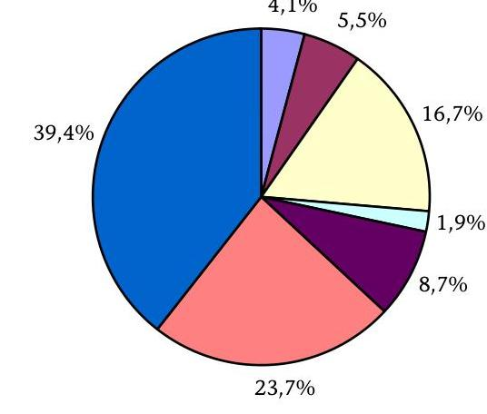
$\square$ Munkába járás munkáltatót terhelő költségei $\square$ Munka-alkalmassági vizsgálatok költségei
$\square$ Munkaruha, védőruha $\quad \square$ Munkásszállítás
■Előkészítő vagy képességeket fejlesztő képzés
$\square$ Tárgyi eszköz beszerzés
$\square$ Egyéb felmerült költség (anyag, áfa, stb.)

A szerződésben foglaltakhoz képest a vizsgált 48-ból 47 közmunkaprogramnál keletkezett támogatási maradvány. A maradványok nagyobb részt a béreknél és járulékaiknál keletkeztek, amelynek leggyakoribb oka a táppénz miatti kiesés és a foglalkoztatottak fluktuációja volt. Előfordult, hogy az eszközbeszerzéseknél, a munkaruha vásárlásoknál az előzetesen kalkuláltnál olcsóbban tudtak beszerezni.

Barcs Város Önkormányzatánál a betanításra tervezett összegből 90 ezer Ft, a szerszámok beszerzésénél 3458 ezer Ft, a munkaruha vásárlásnál 1551 ezer Ft összegű maradvány képződött. Ez utóbbinál a női munkaruhát olcsóbban tudták beszerezni a tervezettnél.

A közmunkaprogram finanszírozásánál a tervezett BM forrást egy összegben a program elején leutalták a pályázóknak. Ezáltal minden olyan esetben, amikor a közmunkaprogram támogatási maradvánnyal zárult, az FMM 63%-os és a BM 37%-os támogatási aránya megváltozott. A társfinanszírozás arányosításának követelménye miatt az SZMM (az FMM jogutódja) a program zárását követően a tényleges teljesítés figyelembevételével, általában két részletben, mindössze „37% rendezése" szöveggel átutalta a támogatottaknak azt az összeget, amellyel a BM forrás a 37%-ot túllépte.

A Közmunka Tanács Titkársága által biztosított adatszolgáltatás szerint a vizsgált támogatottaknak 37,2 millió Ft-ot utaltak „37% rendezése" jogcímen, amely összeg túlfinanszírozásként jelentkezett. (Az adatszolgáltatás nem tartalmazta a társfinanszírozás arányosítását Szentendre Város Önkormányzatánál.) Az átutalt összegek a támogatottakat nem illették meg, azt - a

---

közmunkaprogramban való önkormányzati részvétel támogatási előirányzatának egyidejű csökkentését kérve - az ÖTM-nek (a BM jogutódjának) vissza kellett volna utalniuk. Az önkormányzatok nem kaptak útmutatást az SZMM-től az átutalt összegek rendeltetésére vonatkozóan, azokban az esetekben pedig, amikor a támogatóval társulások vagy közhasznú társaságok álltak szerződéses jogviszonyban, az önkormányzat nem is rendelkezett információval az átutalt összegekről. A túlfinanszírozás összegének központi költségvetéssel történő rendezésére az egyes számvevői jelentésekben javaslatot tettünk.

A pályázatok elbírálása során - a kiírás szerint - előnyt jelentett, ha a pályázók a pályázati felhívásban meghatározott preferencia-lista elemei közül egy vagy több teljesítését vállalták. Bár e prioritások végül nem képeztek valós differenciákat a támogatási lehetőségekhez való hozzájutásban, a helyszíni ellenőrzés során ezek végrehajtását is áttekintettük:

- A foglalkoztatott munkanélküliek legalább 15%-a részére előkészítő vagy képességfejlesztő képzést a támogatottak közel kétharmada vállalt pályázatában. Vállalását egy pályázó - Somogyvár és Környéke Önkormányzatok Közmunkaprogram Társulása - nem teljesítette.

A képességfejlesztő képzések során erősíteni kívánták az egyének önismeretét, szélesíteni általános és munkajogi ismereteiket, segíteni az önálló munkavégzéshez szükséges készségek, képességek fejlesztését, a konfliktuskezelést és a probléma-megoldási technikák elsajátítását.

- A foglalkoztatott közmunkások legalább 5%-ának három hónapos továbbfoglalkoztatását 27 támogatott (56,2%) vállalta, ebből kettő nem teljesítette azt.

Tolnanémedi Község Önkormányzatánál nyolc fő munkanélküli három hónapos továbbfoglalkoztatását vállalták. A polgármester nyilatkozata szerint eleget tett ennek a kötelezettségének, azonban a dokumentumok alapján megállapítható volt, hogy költségvetési támogatás igénybevétele nélküli továbbfoglakoztatásra csak egy fő esetében került sor.

A Debreceni Humán Szolgáltató Közhasznú Társaság nyolc fő továbbfoglalkoztatását vállalta háromhavi időtartamban. Ennek érdekében a Kht. a munkaszerződéseket megkötötte, másolatait a MONETA Kft-nek megküldték. A bérnyilvántartás alapján megállapítható volt, hogy négy fő továbbfoglalkoztatása a vállalt időtartamban nem valósult meg. A másik négy főt egy hónap és négy nap időtartamban foglalkoztatták.

- A hátrányos helyzetű rétegek (nők, romák, 25 év alattiak és 45 év felettiek) meghatározott arányú, de legalább 30%-os foglalkoztatását 34 pályázó teljesítette, 14 pályázó ezt nem is vállalta pályázatában.
- A cigány kisebbségi önkormányzatokkal 41 pályázó (85,4%) vállalt együttműködést. A kisebbségi önkormányzatok elsősorban a foglalkoztatottak kiválasztásában és motiválásában segítették a közmunkaprogram eredményes lebonyolítását.

A támogató a közmunkaprogram szerződésekben vállalt speciális célok teljesítését nem kísérte figyelemmel, nem ellenőriztette, az egyes feladatok megvalósításához semmilyen teljesítménykövetelményt nem kapcsolt,

---

normákat nem állapított meg, ezáltal szélsőséges teljesítési jellemzők is előfordultak.

Az állami, önkormányzati intézmény-felújítási belső munkálatokra 163943 órát terveztek és 138238 órát teljesítettek. A kül- és belterületi csapadékvíz és belvízelvezető csatornahálózat kialakítása, helyreállítása, karbantartása jogcímen 99549 órát irányoztak elő és 139745 órát végeztek el.

A támogató FMM nem határozta meg kötelező jelleggel az egyes feladatok naturális mérőszámait sem. Ez ahhoz vezetett, hogy a legtöbb feladathoz többféle naturális mérőszámot alkalmaztak a támogatottak. Az egységes naturális mérőszámok hiányában nem lehetett az egyes teljesítményeket összehasonlítani.

A településüzemeltetési és tisztasági feladatok ellátása, továbbá a települések belterületi útjainak fenntartása, az utak környezetének karbantartása jogcímeknél alkalmaztak órát, folyómétert és négyzetmétert naturális mérőszámként. Az illegálisan lerakott hulladékok összegyűjtése, elszállítása kijelölt lerakóhelyre jogcímnél órát, köbmétert és tonnát is használtak.

A támogató nem határozott meg teljesítménykritériumokat az egyes feladatokhoz. Ennek következményeként a pályázók nagy szabadságfokkal tervezték az egyes feladatok ellátásának naturális mutatóit. A ténylegesen végrehajtott, elkészült feladatok a tervekhez képest jelentős eltéréseket mutattak. Az elmaradt teljesítményeket a pályáztató nem szankcionálta.

Dombóvár házi segítségnyújtásra 5952 órát (ténylegesen 4765 órát teljesített), az állami, önkormányzati intézmény-felújítási belső munkálatokra 35822 órát (ténylegesen 7651 óra), a településüzemeltetési és tisztasági feladatok ellátására 46188 órát (ténylegesen 41728 óra) és a temetkezési és kegyeleti helyek környezetének rendbetétele jogcímen 25870 órát (ténylegesen 21450 óra) tervezett.

Cegléd az önkormányzat tulajdonában lévő kül- és belterületi csapadékvíz és belvízelvezető csatornahálózat kialakítása, helyreállítása, karbantartása címén 45000 folyómétert (ténylegesen 34000 folyóméter), az illegálisan lerakott hulladék összegyűjtése, elszállítása kijelölt lerakóhelyre jogcímen 13500 órát (ténylegesen 8474 óra) és a parkosítás, szabad zöldterületek kialakítása, parkfenntartás jogcímen $60543 \mathrm{~m}^{2}$-t (ténylegesen $48000 \mathrm{~m}^{2}$) tervezett.

# 3.2. Parlagfű elleni védekezés 

A parlagfű Magyarországon a fertőzött területet tekintve a gyomnövények között az első helyen áll, mintegy ötmillió hektár területen fordul elő, ezen belül mintegy 700 hektáron erős fertőzést okozva.

A parlagfű leggyakoribb elszaporodási helye a megbolygatott talajú elhanyagolt - nagyberuházások, ipartelepek, utak, lakótelepek, kertek stb. - parlagterületei. Az ellene való mechanikus védekezés egyik leghatékonyabb módja a megfelelő időben, azaz a virágbimbók megjelenése előtt 1-2 héttel történő, jellemzően június hónap utolsó harmadában végzett első kaszálás. A parlagfű már kialakult állományaiban ugyanakkor az egyszeri kezelés nem okozza a növény pusztulását, mert az alacsonyan elhelyezkedő oldalrügyeiből kihajt. Biztos eredményt csak
 az évi háromszori, 2 cm magasságban elvégzett kaszálás hoz.

---

A parlagfű elleni védekezés programjai minden esetben kettős célt szolgáltak, egyrészt a levegőben nagy tömegben előforduló és a gondozatlan környezetből származó aeroallergének csökkentését, másrészt a hátrányos helyzetű, tartós munkanélküliek és aktív korú, rendszeres szociális segélyezettek különböző időtartamú foglalkoztatását. Az évente két-két önálló meghívásos parlagfű mentesítési pályázat keretében országosan összesen 37 pályázót 773 millió Ft-tal támogattak, amelynek felhasználásával több mint 2600 főt foglalkoztattak. Hasonló feladat ellátására pályázhattak a Balaton, Tisza-tó és a Velencei-tó környéki települések, a 11 pályázatra 1008 millió Ft támogatást és 1371 fő foglalkoztatását biztosították.

Nyolc ellenőrzött településen helyszíni ellenőrzésünk kiterjedt a települési jegyzők parlagfű elleni védekezési és mentesítési tevékenységére is.

A vizsgált önkormányzatok - egy kivételével - rendelkeztek információkkal közigazgatási területük parlagfű szennyezettségére vonatkozóan. Az információkat különféle módon szerezték.

Barcs Város Önkormányzata a Növény- és Talajvédelmi Szolgálat információi mellett saját dolgozóival is készített felméréseket a belterületi ingatlanok szennyezettségére vonatkozóan. Szolnok Polgármesteri hivatala Városüzemeltetési és Beruházási Főosztályának munkatársai rendszeresen ellenőrizték a parlagfű mentesítési kötelezettség teljesítését. Nyíregyháza Megyei Jogú Város Önkormányzata Polgármesteri hivatala a bejelentések és az eljárások alapján dolgozta ki a „szennyezettséget mutató" térképeket. Polgár Polgármesteri hivatala ügyfélszolgálati előadója évente készített térképet a parlagfű szennyezettségéről.

Tiszavasvári Város Önkormányzata nem rendelkezett információkkal az ingatlanok parlagfű szennyezettségére vonatkozóan.

A vizsgált önkormányzatok jegyzői a KET. 29. § (3) és (4) bekezdése alapján indítottak eljárást a parlagfű szennyezettség megszüntetésére, illetve az is előfordult, hogy a jegyző határozatban szólította fel az ingatlanok tulajdonosait a gyom-mentesítés elvégzésére.

Polgár város jegyzője a 2004-2006. években 188 eljárást indított, és a KET. 29. § (3) bekezdése alapján értesítette az ügyfeleket. Szolnok Megyei Jogú város jegyzője 2006. június 15-október 15. közötti időszakban 249 eljárást indított, és a KET. 29. § (4) bekezdésében foglaltaknak megfelelően nem értesítette az ügyfeleket, mert az veszélyeztette volna az eljárás eredményességét. Vásárosnamény város jegyzője a 2003-2006. években nem indított eljárást a parlagfű szennyezettség megszüntetésére, hanem a NVT 5. § (1) bekezdésében foglaltak alapján - határozatban - gyom-mentesítésre szólította fel az ingatlan tulajdonosokat, nyolc napos határidővel, és növényvédelmi bírság kilátásba helyezésével.

A tényállás megállapítása érdekében bizonyítékul a helyszíni szemléről készült jegyzőkönyveket, fényképeket, az ingatlan nyilvántartás tulajdoni lapjait használták a leggyakrabban.

Szolnok Megyei Jogú város jegyzője a tényállás megállapítása érdekében a helyszíni szemléről készült jegyzőkönyveket, a földhivatali tulajdoni lapokat, illetve térképmásolatokat használta bizonyítékul. Nyíregyháza Megyei Jogú város jegy-

---

zője a tényállást a helyszíni szemle jegyzőkönyveivel, a földhivatali tulajdoni lapokkal, illetve a helyszínen készített fényképekkel bizonyította.

A vizsgált településeknél a jegyzők által hozott érdemi döntések eltérően alakultak. A megyei jogú városokban több, az egyéb településeken kevés érdemi döntés született vagy egyáltalán nem hoztak döntést a parlagfű-mentesítési eljárások folyamán. A közérdekű védekezés költségeiről csak egy település jegyzője hozott rendelkező határozatot.

Szolnok Megyei Jogú város jegyzője hat esetben rendelt el közérdekű védekezést, 152 esetben növényvédelmi bírságot állapított meg. Nyíregyháza Megyei Jogú város jegyzője 42 esetben rendelt el közérdekű védekezést, 38 alkalommal hozott kényszerintézkedés végrehajtására határozatot, 40 esetben pedig növényvédelmi bírságot állapított meg. Polgár város jegyzője a 2004-2006. években 188 esetben indított eljárást a parlagfűmentesítés elmulasztása miatt, de csak egy alkalommal hozott érdemi döntést, amikor 10 ezer Ft növényvédelmi bírságot szabott ki. Tiszavasvári és Bátonyterenye városok jegyzői viszont a parlagfű-mentesítési eljárás során nem hoztak érdemi döntést. Nyíregyháza Megyei Jogú város jegyzője a közérdekű védekezés költségeiről a vállalkozó által történő számlázást követően határozatot hozott, amely tartalmazta a fizetésre kötelezettek adatait, a vállalkozó nevét és munkadíját. A vállalkozói munkadíjon kívül egyéb költségeket nem számított fel.

A Földművelésügyi Költségvetési Irodától egy település - Nyíregyháza Megyei Jogú Város - jegyzője igényelte a közérdekű védekezés költségeinek megelőlegezését, 15 ügy kapcsán 462609 Ft összegben.

Az ellenőrzött pályázók a parlagfű elleni védekezés közmunkaprogramjainak összes kiadására a 2004-2006. években 414954 ezer Ft-ot terveztek, amelyből 380 846,8 ezer Ft a támogatás szerződés szerinti összege, és 1181 fő munkanélküli foglalkoztatását vállalták.

A 2004. évben nyolc pályázatot nyújtottak be, amelyből egy (Hollóháza Község Önkormányzata 5464 ezer Ft támogatási igénnyel 30 fő munkanélküli két hónapos foglalkoztatására) sikertelen volt, mivel a pályázati döntés szerint nem tartották eléggé parlagfűvel szennyezettnek a település közigazgatási területét. Öt támogatottnál a támogató fedezetet biztosított a közmunkaprogram egy hónappal történő meghosszabbítására.

A 2005. évben a Közép-Tiszavidékért Kht. (Tiszaszentimre) - hét önkormányzat részvételével - pályázatot nyújtott be a Tisza-tó térségének parlagfűmentesítésére. A 111426 ezer Ft összegű programhoz 100685 ezer Ft támogatást nyertek el, amellyel 275 fő munkanélküli foglalkoztatását tervezték megvalósítani.

A 2006. évben négy pályázó 212 765,7 ezer Ft összegű pályázata - 194 166,40 ezer Ft támogatási tartalommal - 508 fő munkanélküli foglalkoztatását tűzte ki céljául.

A négy pályázatból három a megyeszékhely (Miskolc, Nyíregyháza, Szolnok), egy pedig a Tisza-tó környékének parlagfű-mentesítését vállalta.

A vizsgált években ténylegesen megvalósult közmunkaprogramok összértéke 392488 ezer Ft, amelyből a támogatás összege 356697 ezer Ft volt. Munkabé-

---

rekre és annak járulékaira az összes kiadás 81,6%-át, 320148 ezer Ft-ot fordítottak. A munkába járás munkáltatót terhelő összege (0,1%), a munkaalkalmassági vizsgálatok költsége (0,4%), az előkészítő, vagy képességet fejlesztő képzések kiadásai (0,3%) együttesen sem érik el a kiadások egy százalékát. A ráfordítások 2,7%-a munka- és védőruhára, 4,8%-a tárgyi eszköz beszerzésre és 10,1%-a egyéb költségre merült fel. A foglalkoztatottak érintett létszáma 1379 fő, a tényleges átlaglétszáma 1202 fő volt, ami 1,8%-kal haladta meg a vállalt átlaglétszámot (1181 fő). A pályázóknak legalább 30, de legfeljebb 50 fő statisztikai állományi létszámú munkanélküli többletfoglalkoztatását kellett vállalni a közmunkaprogram indítását megelőző hónap átlaglétszámához viszonyítva. A tervezett átlaglétszám foglalkoztatását a Dél-Pest Megyei Önkormányzatok Területfejlesztési Társulása kivételével valamennyi pályázó teljesítette.

A Dél-Pest Megyei Önkormányzatok Területfejlesztési Társulása 50 fős munkanélküli átlaglétszám foglalkoztatását vállalta, de ténylegesen 48 fő volt a parlagfű-mentesítésben átlagosan résztvevők száma.

A pályázati feltételek szerint az aeroallergénekkel leginkább fertőzött hátrányos helyzetben lévő települések, kistérségek elsődleges kedvezményezettjeivé válhattak a meghirdetett pályázati programnak. Valamennyi pályázó állami vagy önkormányzati tulajdonban, használatban lévő földterületen végezte el a parlagfű-mentesítést.

A pályázóknak vállalniuk kellett a partneri együttműködést a kistérség egészségügyi és környezetvédelmi szakigazgatási szerveivel és az egészség megóvását, a parlagfű elleni küzdelmet célul kitűző bejegyzett civil szervezetekkel, valamint, hogy erről velük a pályázat benyújtását megelőzően megállapodást kötnek. Az együttműködésnek ki kellett terjednie a parlagfű-mentesítésben érintett állami vagy önkormányzati tulajdonú területek kiválasztására, a program szakmai lebonyolítására és ellenőrzésére is. Az együttműködő partnereknek közösen vállalniuk kellett a programban érintett településeken a lakosság tájékoztatását, felvilágosítását és mozgósítását egy általuk a program idején szervezett parlagfű elleni akciónapra.

A vizsgált 17 pályázatból $^{32}$ 13 esetben megkötötték az együttműködési szerződéseket, négy pályázatnál nem vállalták az együttműködési megállapodások megkötését. Ennek ellenére - a parlagfűmentesítési programok társadalmi fontosságára, a parlagfűmentesítés támogatott végrehajtása érdekében - a támogató nem élt a Pályázati felhívás 7.1. pontjában foglalt elutasítás lehetőségével.

Miskolc Megyei Jogú Város Önkormányzata, Polgár Város Önkormányzata (két pályázatánál) és Bátonyterenye Város Önkormányzata (az egy hónap hosszabbítás esetében) nem kötött együttműködési megállapodást a kistérség egészségügyi és környezetvédelmi szakigazgatási szerveivel és a parlagfű elleni védekezést célul tűző civil szervezetekkel sem.

[^0]
[^0]:    $^{32}$ Külön pályázatként figyelembe véve a 2004. évi egy hónapos hosszabbításokat.

---

Azoknál a pályázatoknál sem valósult meg teljes körűen a pályáztatónak - az együttműködő feleknek a program szakmai lebonyolításában és ellenőrzésében való részvételére vonatkozó - szándéka, ahol az együttműködési megállapodásokat megkötötték.

A Szolnoki Többcélú Kistérségi Társulás a parlagfű irtásra szervezett közmunkaprogram pályázatban együttműködési kötelezettséget vállalt a Jász-Nagykun-Szolnok Megyei ÁNTSZ-szel, a Közép-Tisza Környezetvédelmi és Vízügyi Felügyelőség Igazgatóságával, valamint a TISZA KLUB Környezet- és Természetvédő Társadalmi Szervezettel, és megkötötték az erre vonatkozó megállapodást. Az együttműködési megállapodás tartalmazta a programban érintett településeken a lakosság tájékoztatását, felvilágosítását, valamint a program idején parlagfű elleni akciónap szervezését. Az együttműködési kötelezettséget vállalók közreműködtek a parlagfű veszélyeiről, káros hatásairól szóló lakossági tájékoztatásban, felvilágosításban. A közmunkaprogram idején parlagfű elleni akciónapot szerveztek Szolnokon, Besenyszögön, Rákóczifalván és Újszászon. A megállapodás nem terjedt ki a program szakmai lebonyolításában és az ellenőrzésben való részvételre.

A Közép-Nyírségi Önkormányzati Többcélú Kistérségi Társulás (Nyíregyháza) együttműködési kötelezettséget vállalt egészségügyi szakigazgatási szervekkel, civil szervezetekkel. Ez azonban nem terjedt ki a program szakmai lebonyolítására. Tiszavasvári Város Önkormányzata és a programban részt vevő nyolc önkormányzat megállapodást kötött a településeken működő cigány kisebbségi önkormányzatokkal, a térségfejlesztési társulással, a tiszalöki Szociális Szolgáltató Központtal, a tiszavasvári Szociális és Egészségügyi Központtal, továbbá a helyi egészségügyi szakigazgatási szervekkel. A megállapodásokban a program végrehajtásának ellenőrzésére nem vállaltak kötelezettséget.

Egy pályázó esetében előfordult, hogy a kistérség egészségügyi, környezetvédelmi szakigazgatási szerveivel, illetve a civil szervezetekkel megállapodás nélkül valósult meg az együttműködés.

A Közép-Tiszavidékért Kht. a 2005/8. számú pályázatban a munkák összehangolásában együttműködött a KÖTIKÖVIZIG Kiskörei Szakaszmérnökségével, a Tiszafüredi ÁNTSZ-szel, valamint a Hortobágyi Nemzeti Parkkal, amelynek területét érintő közmunkáknál a szakmai irányítást és ellenőrzést együtt végezték. A közmunkaprogram pályázatban vállalták, hogy a Tisza-tó legalább két kilométeres körzetében elvégzik a parlagfű irtást. A 2006/10. számú pályázatban szintén együttműködtek a KÖTIKÖVIZIG Kiskörei Szakaszmérnökségével, a Tiszafüredi ÁNTSZ-el, valamint a Hortobágyi Nemzeti Parkkal, a MÁV Zrt-vel és a Közút Kezelő Kht-val, amelynek területét érintő közmunkáknál a szakmai irányítást és ellenőrzést együtt végezték. A feladatok ellátásáról együttműködési megállapodást nem kötöttek egyik pályázatnál sem.

A pályázóknak vállalniuk kellett az induló állapot, valamint a program folyamatának dokumentálását, amit - egy kivételével (Közép-Tiszavidékért Kht. Tiszaszentimre) - biztosítottak. A munkavégzés kezdő- és végállapotát fotókkal, térkép-bejegyzésekkel dokumentálták.

A pályázati felhívás szerint a pályázat elbírálásakor előnyt jelentett, ha a gyom-mentesítésre vállalkozó pályázó „olyan gyommentesítésre vállalkozik, ahol a gyommentesítendő terület a legnagyobb, és a gyommentesítés a leginkább költség hatékony módon történik". Azonban sem a felhívásban, sem a közmunkaprogram

---

eljárási, bírálati szempont- és pontozási rendszerében nem fejtették ki, hogy „a legnagyobb terület" és „a leginkább költség hatékony mód" mit jelent, mi a viszonyítás alapja.

Előnyt jelentett a pályázat elbírálásakor, ha a pályázó a programot követően központi támogatás nélkül is foglalkoztatja a közmunkást legalább két hónapig vagy segíti az elsődleges munkaerőpiacra történő visszatérését. A támogatottak összességében 49 fő továbbfoglalkoztatását vállalták, ténylegesen pedig 51 főt foglalkoztattak tovább. E tevékenység megítélését árnyalja, hogy egy pályázó a vállalt továbbfoglalkoztatást nem, egy pedig szerződéses kötelezettségvállalás nélkül teljesítette.

A Közép-Nyírségi Önkormányzati Többcélú Kistérségi Társulás 10 fő továbbfoglalkoztatását vállalta szerződéses kötelezettségvállalás nélkül.

Bátonyterenye Város Önkormányzata nyolc fő három hónapot meghaladó továbbfoglalkoztatását vállalta. A továbbfoglalkoztatást hét fő esetében 2004.
 novemberétől a területileg illetékes Munkaügyi Központ által támogatott közhasznú foglalkoztatással oldották meg.

A pályáztató sem a felhívásban, sem a közmunkaprogram eljárási, bírálati szempont- és pontozási rendszerében nem határozta meg, hogy a pályázók a teljesítmények mérésére milyen naturális mutatószámokat alkalmazzanak. A pályázók – két támogatott kivételével – négyzetméterben mutatták ki a parlagfű-mentesített területeket.

Vásárosnamény és Tiszavasvári az utak melletti parlagfű-mentesítést folyóméterben mutatta ki, és a fűgyűjtést, illetve a mentesített területek utóellenőrzését órában. Tiszaszentimre a Tisza-tó térségére szervezett közmunkaprogram teljesítményeit órában fejezte ki.

A támogatottak által elszámolt és négyzetméterben kifejezett teljesítményeket a foglalkoztatott átlaglétszámra, illetve az átlagos foglalkoztatás időtartamára vetítve kimutatható az egy foglalkoztatottra jutó egy napi teljesítmény négyzetméterben. Az eredmények azonban támogatottanként olyan szélsőségesen különbözőek, hogy nem alkalmasak az összehasonlításra.

A számítások szélsőértékei a következők: Polgár Város Önkormányzata által szervezett közmunkaprogramban a foglalkoztatottak $13 \mathrm{~m}^{2} / \mathrm{fő} / \mathrm{nap}$, a Dél-Pest Megyei Önkormányzatok Területfejlesztési Társulásánál $1448 \mathrm{~m}^{2} /$ fő/nap teljesítményt értek el.

A pályáztató nem határozta meg az elvárt fajlagos teljesítményeket sem, melyek nélkül a közmunkaprogramok elvégzett feladatait, a pályázók teljesítményeit összehasonlítani, értékelni nem lehetséges.

A „Parlagfűmentes Magyarországért" Tárcaközi Bizottság mind a 2006. évi, mind a 2007. évi intézkedési tervében eredményesnek ítélte az elmúlt három év közmunka programjait. A 2006. év legfontosabb célkitűzése az állami, valamint az önkormányzati területek parlagfű szennyezettségének jelentős csökkentése, a kiemelt turisztikai területek parlagfű-borítottságának minimalizálása és a parlagfű országos pollenkoncentrációjának 10-20%-os évenkénti csökkentése. A kitűzött célok azonban nem voltak mérhetők. Az intézkedési tervek a parlag-

---

fű-mentesítés területén elért konkrét eredményekről számszerű, összehasonlításra alkalmas adatokat nem tartalmaztak.

# 3.3. Erdőgazdasági programok 

A vizsgált időszakban az erdőművelés támogatására 2004. évtől kezdődően összesen öt – ezen belül 2006-ban három – közmunkaprogramot indítottak. E meghívásos közmunkaprogramok sajátossága volt, hogy azokat az SZMM (FMM) fejezeti kezelésű előirányzatok mellett az FVM által átadott keretösszeg és az ÁPV Zrt. alapítói támogatása finanszírozta.

Az erdőművelésben végzett közmunkák támogatására 2004-2006 időszakában összesen 2101 millió Ft összeget – az összes rendelkezésre álló forrás közel egytizedét – biztosították. A vizsgált időszakban a programok társfinanszírozásában az FVM 250 millió Ft-tal vett részt. Az ÁPV Zrt. az erdőgazdasági programok kiemelt támogatója volt.

Az ÁPV Zrt. a közmunkaprogramok támogatására közvetlenül szánt forrásokon túl az egyes pályázóknak programonként változó mértékű, évente rendre összesen 200 millió Ft, 300 millió Ft, valamint 400 millió Ft tőkeemelést biztosított.

Így összesen az erdőművelés területén közmunkára – az erdőgazdaságok által biztosított önrész összegén kívül – több mint 3 milliárd Ft-ot fordítottak. A támogatások odaítélésének leghatékonyabb módja a meghívásos pályázatok meghirdetése volt, melyet a tulajdonosi társfinanszírozás, valamint az erdőgazdaságok környezetét jellemző eltérő munkanélküliségi mutatók együttesen indokoltak.

A pályázati feltételek nem változtak a három év alatt. Alapvető feltétel volt, hogy a ráfordítás összegének 20%-a önrész formájában rendelkezésre álljon, az SZMM és az ÁPV Zrt. alapítói támogatása csak a pályázatban meghatározott célra (azaz 80%-a bérre és annak közterheire, maximum hat hónapos foglalkoztatási időtartamra) használható fel. Kedvező volt az elbírálás szempontjából, ha a gazdaság vállalta a foglalkoztatott átlaglétszám 10%-ának továbbfoglalkoztatását.

Az erdőművelésre fordítható támogatásból kiírt pályázat meghívottjai minden esetben megkapták az igényelt, illetve a tulajdonos által javasolt összegű támogatást a munkanélküliek foglalkoztatásához. Erre a célra az országban működő 19 állami erdőgazdaságból 2004-ben 8, 2005-ben 11 erdőgazdaság részesült vissza nem térítendő támogatásban. A 2006-ban kiírt három pályázatból – amelyből kettő közel azonos időszakban zajlott – 17, 13, illetve 17 erdőgazdaság jutott támogatáshoz.

Az SZMM a nyertes pályázóval támogatási szerződést kötött, amely azonban nem terjedt ki az ÁPV Zrt. támogatására. Az ÁPV Zrt. hozzájárulását Alapítói Határozatban ítélte meg, ebben kötötte ki a felhasználás feltételeit is. Így módosítás esetén minden esetben csak a támogatást adótól kellett engedélyt kérni a felhasználónak. A kétféle támogatás pénzügyi elszámolása, annak ellenőrzése is szétvált. Az SZMM támogatás felhasználását – a közmunkaprogramok általános ellenőrzési rendjéhez igazodóan – a MONETA Kft. és a Conto '82 Kft. ellenőrizte. A téma lezárásakor a MONETA Kft. kérte ugyan az ÁPV Zrt. támogatás felhasználásának igazolását, de az erre vonatkozó pénzügyi elszámolások felülvizsgálata tekintetében nem rendelkezett jogosítványokkal. Az Alapítói Határozatban megítélt összeg felhasználását az ÁPV Zrt. Felügyelő Bizottsága pénzügyileg és szakmailag csak esetenként ellenőrizte.

Az ÁSZ helyszíni ellenőrzése 3 erdőgazdaság (NYÍRERDŐ Zrt., Pilisi Parkerdő Zrt., Vértesi Erdészeti Zrt.) 2003-2006 között lebonyolított 13 db közmunka pályázatára terjedt ki.

Az ellenőrzött közmunkaprogramok támogatásának összértéke 812,6 millió Ft volt, amely a vizsgált időszakban lebonyolított összes erdőgazdasági közmunkaprogram támogatására fordított összeg 38,7%-ának áttekintését jelentette. A támogatások 63,1%-a SZMM (FMM) forrásból, 36,9%-a az ÁPV Zrt. hozzájárulásából származott. A rendelkezésre álló támogatás felhasználásával az erdőgazdaságok összesen 2263 fő három, illetve négy hónapon át történő foglalkoztatását biztosították, ami az erdőgazdasági közmunkaprogramokban érintett létszám 36,4%-a volt.

A vizsgált erdőgazdaságoknál a közmunkaprogramok megvalósításához az előírt 20%-os önerő rendelkezésre állt, a saját forrás terhére a foglalkoztatottaknak étkezési utalványt, illetmény tűzifát is biztosítottak. A közmunkák szervezése a gazdasági társaságok csaknem mindegyik telephelyét érintette, a 24 erdőművelést folytató telephely közül 21 szervezeti egységnél folytak erdészeti karbantartási és ápolási munkák.

A NYÍRERDŐ Zrt. 2004-2006 között 5 program keretében az ellenőrzött szervezetek részére biztosított támogatás 60,6%-át (492,3 millió Ft-ot) használta fel, s ezzel a foglalkoztatottak 56,3%-ának (az átlaglétszámot tekintve összesen 1275 fő) az alkalmazásáról gondoskodott.

A NYÍRERDŐ Zrt. a vizsgált időszak négy éve alatt országos összehasonlításban is legnagyobb foglalkoztatónak bizonyult, az erdőművelési programokra szánt források 23,4%-ának felhasználásáról intézkedett. A NYÍRERDŐ Zrt. csak 2006-ban három közmunkaprogramban vett részt, amelyben a tervezett 725 fős átlag létszámmal szemben 770 főt foglalkoztatott, a programokban összesen 1225 fő volt érintett. A munkavállalók összetételét tekintve a nők aránya rendre 10% alatt maradt, a cigány etnikum aránya pályázatonként változóan alakult, a három év átlagában 45,6% volt. A NYÍRERDŐ Zrt. erdőségei két megye térségében (Hajdú-Bihar, Szabolcs-Szatmár-Bereg) találhatóak, ahol igen magas a munkanélküliek aránya. Nem ritka, hogy a falvak egész lakossága idénymunkából és segélyekből él, így a vonzó juttatásokkal párosuló erdőgazdasági közmunkákra mindig volt elegendő jelentkező. Az erdőgazdaság a programok keretében rendszeresen szervezett előkészítő és képességfejlesztő, betanító képzést. Ez utóbbival is összefügg, hogy a programok lezárását követő továbbfoglalkoztatási kötelezettségét az eredeti vállaláshoz képest túl is teljesítette, 3 főt pedig állandó munkalehetőséghez is juttatott. Az erdőgazdaság számára jelentős adminisztrációs teherrel, munkaszervezési igénnyel járt a saját foglalkoztatotti létszámát csaknem háromszorosan meghaladó közmunkások foglalkoztatása.

A Vértesi Erdészet a támogatás 21,9%-ával, a Pilisi Parkerdő pedig 17,5%-ával rendelkezett. A két erdőgazdaságnál foglalkoztatott közmunkások átlaglétszáma összesen 988 fő volt, esetükben érzékelhetőek voltak a viszonylagosan ked-

---

vezőbb foglalkoztatási jellemzők, a szükséges létszám biztosítása, a nagyobb fluktuáció erőteljesebb szervezőmunkát igényelt.

A közmunkások által végzett munkák valamennyi erdészetben közel azonos jellegűek voltak, erdészeti feltáró utak, séta és turista utak karbantartásához, folyamatban lévő erdősítések, csemete kertek ápolásához, magvak begyűjtéséhez, viharkárok felszámolásához kapcsolódó, kézi munkát igénylő feladatokat láttak el, valamint szükség szerint parlagfű irtást, szemétgyűjtést, kerítésépítést végeztek. A közmunkások teljesítménye mindhárom szervezetnél havonta jelentősen ingadozó volt, amelyet erőteljesen befolyásolt a résztvevők összetétele, a betegállományban, illetve igazolatlanul távollévők száma, az ellátandó feladat nehézsége, bonyolultsága. A munkateljesítmények évente javultak, bár a tervezett feladatok között az időjárási körülmények gyakorta igényeltek átcsoportosítást, 2006-ban összességében megközelítették a tervezett naturális mutatókat. A munkák elvégzésének szükségességét az Állami Erdészeti Szolgálat jóváhagyta, megvalósításukat folyamatosan ellenőrizte, a munkavégzés minőségével kapcsolatban kifogása nem volt. Az erdőgazdaságoknál folyó közmunkaprogramok szakmai megvalósulásának ellenőrzésében az ÁPV Zrt. is rendszeresen részt vett, a Felügyelő Bizottság egy-egy kijelölt tagja a telephelyeken folyó munkát és a foglalkoztatási kötelezettség teljesítését ellenőrizte, az erről készült jegyzőkönyvet a Felügyelő Bizottság rendre elfogadta, a támogatás felhasználási arányainak változását (NYÍRERDŐ Zrt. 2006/2. programjának bérarány növekedését) tudomásul vette.

Az SZMM megbízásából a támogatási szerződésben vállalt kötelezettségek ellenőrzését a Conto '82 Kft. végezte. Az ellenőrzéshez rendszeresített Felmérő Lapok tanúsága szerint a közmunkák teljesítését a program időszaka alatt két alkalommal ellenőrizték, annak kezdetén, illetve a befejezésekor. Az elvégzett munka igazolására állapotrögzítő felvételek készültek, a teljesítmények naturális mérőszámait összegezték, a vállalt szerződéses kötelezettséggel összevetették.

A programok pénzügyi lebonyolítását, a támogatásokkal való elszámoltatást az erdőgazdasági projektek esetében is a MONETA Kft. látta el. A vállalt önerő felhasználását a támogatott erdőgazdaságok a szerződésben vállalt kötelezettségnek megfelelően igazolták, az ÁPV Zrt. az alapítói határozatokkal megítélt hozzájárulást a teljesítéstől függetlenül előre átutalta a gazdaságok számára. Az FMM (SZMM) forrásból származó támogatások folyósítása utólagosan történt, a pénzügyi elszámoláshoz az erdőgazdaságok az előírt tartalmú dokumentumokat (számlák, alkalmazási szerződések, összesítések, munkaruha átvételét, tárgyi eszközök nyilvántartásba vételét igazoló dokumentumok) csatolták.

Az elszámolás alapjául szolgáló eredeti számlákra rávezették a „közmunka” megnevezést, azonban a programok azonosító számának megjelölését a MONETA Kft. csak 2006. évtől igényelte, miután 2004-2005. években nem voltak egymással párhuzamosan futó közmunkaprogramok. Az egyes erdészetek telephelyein eltérő megoldásokat (bélyegzőlenyomat, kézírásos érvényesítés) alkalmaztak a programok azonosítására. Annak ellenére, hogy – különösen 2006-ban, amikor egyes erdészetekben (NYÍRERDŐ Zrt.) 3 különböző program is futott egy időben – indokolt lett volna a szerződésben is vállalt egyértelmű, programonkénti elkülönítés módjának meghatározása, és annak megkövetelése, erre azonban nem került sor.

---

# 4. A KÖZMUNKAPROGRAMOK TÁRSADALMI HASZNOSSÁGÁNAK MEGÍTÉLÉSE, A RENDSZER TOVÁBBFEJLESZTÉSÉNEK IRÁNYAI 

A közmunkaprogramok társadalmi hasznosságát annak hármas célrendszere határozza meg. A fő célkitűzés az esély- és értékteremtés, amely valamennyi közmunkaprogram esetében általános, egyidejű elvárásként jelenik meg. Az esélyteremtés szándéka, hogy a programokba bevont munkanélküliek és segélyezésben részesülők számára lehetőséget adjon a munka világába való visszavezetésre, megváltoztassa, formálja életvezetési szokásaikat, alakítsák önmaguk, valamint környezetük elvárásait a munka értékteremtő jellegével összefüggésben. Azokban a foglalkoztatott rétegekben, ahol a hátrányos munkaerőpiaci pozíciók felszámolásának nincsenek reális esélyei, a munkajövedelem, mint a társadalom által értékelt, elvárt (segély helyett munkát) megélhetési forrás pozitív hatása jelenik meg. A kitűzött célok megvalósítását támogatja, hogy a közmunkák természetüknél fogva a helyi nyilvánosság kontrollja előtt zajlanak. A második cél az, hogy az állami tulajdont kezelők és az önkormányzatok olyan tevékenységeket is elvégezhessenek a köz érdekében, amelyekre egyébként nem rendelkeznének elegendő forrásokkal. Harmadrészt elvárás az is, hogy a programba bekerült személyek a foglalkoztatás keretében aktuális, piacképesség szempontjából versenyképes képzésben is részesüljenek, s ezáltal javuljanak esélyeik a munkaerőpiacon.

A közmunkák elsődleges társadalmi hasznossága a foglalkoztatás, amelynek eredményeit az alábbi táblázat összegzi:

|  | 2003. | 2004. | 2005. | 2006. | Összes |
| :--: | :--: | :--: | :--: | :--: | :--: |
|  | évi döntéssel indított programok |  |  |

  |  |
| 1.) Közmunkaprogramok keretében foglalkoztatott dolgozói létszám (fő) összesen | 6780 | 8029 | 33737 | 10915 | 59491 |
| ebből: |  |  |  |  |  |
| 1.1. Kormányzati 100 lépés közfoglalkoztatási programban | - | - | 24550 | - | 24550 |
| 1.2. Parlagfű mentesítésre szervezett programokban | - | 1286 | 600 | 767 | 2653 |
| 1.3. Erdőművelési programokban | - | 1048 | 1499 | 3675 | 6222 |

A közmunkaprogramok társadalmi hasznossága ugyanakkor azoknak a közszolgáltatásoknak az ellátásában is megnyilvánul, amely területeken a közmunkák megszervezésére sor került. Az önkormányzatoknál a közmunkát jellemzően olyan településüzemeltetési, szakmunkát nem, vagy minimális mértékben igénylő területeken - belvízelvezető rendszerek, járdák, parkok, közterek, köztemetők, önkormányzati intézmények karbantartása, napi rendszerességű tisztítása - szervezték, amelyek az anyagi források szűkössége miatt kényszerűségből általánosan elhanyagoltak voltak. E tevékenységek még a munkavégzés alacsonyabb hatékonysága mellett is hozzájárultak a településképi rendezettség és köztisztaság szintjének javításához, a környezetvédelmi célok érvényesítéséhez, közvetett módon pedig a települések turisztikai fogadóképességét, infrastrukturális helyzetük javulását is támogatták. Az önkormányzati forrásokat ezen a jogcímen 12,7 milliárd Ft-tal (az összes támogatási lehetőség 55%-át kitevően) egészítették ki, ami mintegy 36700 fő foglalkoztatására adott lehetőséget.

A szorosan vett önkormányzati feladatellátás körén kívül eső közmunkaprogramokon túl a cigánytelepek köztisztasági programja, az évenkénti parlagfűmentesítési és -védekezési, a vasúttisztasági, a kiemelt üdülőhelyek köztisztasági programjai közvetlen környezetvédelmi és népegészségügyi célok szolgálatában álltak. E programokra 2003-2006 között összesen 2,6 milliárd Ft-ot (az összes támogatási lehetőség 11,3%-a) fordítottak, a foglalkoztatottak száma meghaladta az 5700 főt.

A természeti katasztrófák, környezeti károk, közegészségügyi veszélyhelyzetek, a megváltozott éghajlati tényezők kedvezőtlen hatásainak megelőzését és elkerülésének támogatását szolgáló programokra mintegy 4 milliárd Ft-ot (az összes támogatási lehetőség 17,4%-a) fordítottak, a foglalkoztatott dolgozók száma meghaladta a 6600 főt. Ezekben a programokban a tevékenységek tényleges hasznát az azonnali bevethetőség, az egyéb területekről való munkaerő átcsoportosítás lehetősége növelte.

Az ökológiai környezet megőrzésében, védelmében és fejlesztésében kaptak szerepet az erdőművelési és nemzeti parki programok. Olyan feladatok végzését támogatják, amelyek az élőmunka hatékonysága szempontjából vállalkozói keretek között nehezen láthatók el, technológiai fejlesztésekkel kevéssé válthatók ki, ugyanakkor a környezettudatos fenntartható fejlődéshez elengedhetetlenek. A támogatások 10,9%-a (2,5 milliárd Ft) erre a célra irányult. A foglalkoztatottak száma megközelítette a 7 ezer főt.

A közlekedési infrastruktúra környezetében végzett közmunkákban dolgozók közvetve egész országrészek infrastrukturális hátrányainak felszámolásában működnek közre, azonban az elvégzett munkák környezetvédelmi, illetve idegenforgalmi szempontból is kedvező megítélésűek. Az autópályák környezetében végzett munkák támogatására több mint 1,2 milliárd Ft-ot (a források 5,4%-a) fordítottak, a programokban résztvevők száma mintegy 3500 fő volt.

A közmunkák áttekintése azt igazolja, hogy azokra mind a szociális biztonság erősítése, mind pedig foglalkoztatáspolitikai célkitűzések miatt változatlanul szükség van. A foglalkoztatáspolitika irányítási rendszerében bekövetkezett változások megerősítették a közfoglalkoztatások - ennek részeként a közmunkaprogramok - irányításának szervezeti kereteit. A Közmunka Tanács és Titkársága kiemelt figyelmet fordított a közmunkaprogramok megvalósításának szakmai menedzselésére, elsődlegesnek a foglalkoztatási helyzet javítását tekintette. Eközben a programok forráskoordinációjára, teljesítményének eredményességi szempontú értékelésére, célrendszerének koordinált továbbfejlesztésére, a pályázati rendszer működtetésében résztvevő szervezetek tevékenységének kontrolljára kevesebb figyelem irányult.

Az elmúlt négy év közmunka programjainak főbb területeire biztosított támogatás összegét és a foglalkoztatottak számát a 8. számú melléklet mutatja be.

Budapest, 2007. szeptember " 18 "

Melléklet: $\quad 13 \mathrm{db} \quad 20$ lap
Függelék: $\quad 1 \mathrm{db} \quad 1$ lap
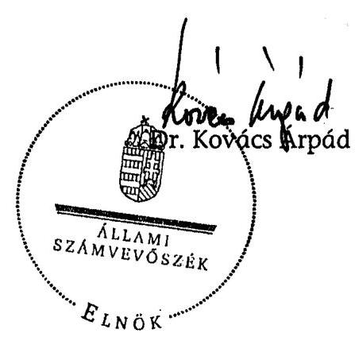

---

Az országos, régiós és az ellenőrzött települési önkormányzatok 2006. évi foglalkoztatási mutatói

| Megnevezés | Állástalansági mutató | Szociális értékelési mutató | Relatív mutató | Arányszám |
| :--: | :--: | :--: | :--: | :--: |
| Országos mutatók | 4,29 | 1,36 | 6,62 | 1,00 |
| Észak-Alföldi régió | 6,54 | 2,57 | 10,10 | 1,53 |
| - Baktalórántháza | 8,83 | 2,84 | 13,58 | 2,05 |
| - Vásárosnamény | 8,55 | 3,61 | 12,70 | 1,92 |
| - Tiszavasvári | 6,32 | 2,75 | 9,97 | 1,51 |
| - Tiszabecs | 17,47 | 12,12 | 27,26 | 4,12 |
| - Tiszacsécse | 14,39 | 5,96 | 26,97 | 4,07 |
| - Nyíregyháza | 3,25 | 0,48 | 4,76 | 0,72 |
| - Kölcse | 10,02 | 5,01 | 16,36 | 2,47 |
| - Tiszaszentimre | 9,17 | 3,82 | 15,09 | 2,28 |
| - Szolnok | 2,74 | 0,43 | 4,15 | 0,63 |
| - Tiszabura | 15,53 | 11,11 | 25,80 | 3,90 |
| - Zagyvarékas | 7,70 | 4,55 | 11,75 | 1,77 |
| - Túrkeve | 6,43 | 0,72 | 9,76 | 1,47 |
| - Debrecen | 3,59 | 0,06 | 5,36 | 0,81 |
| - Polgár | 7,36 | 2,90 | 11,74 | 1,77 |
| - Komádi | 12,48 | 7,52 | 19,70 | 2,98 |
| - Püspökladány | 6,45 | 2,72 | 9,74 | 1,47 |
| Észak-Magyarországi régió | 7,09 | 3,24 | 11,12 | 1,68 |
| - Miskolc | 5,24 | 2,30 | 8,04 | 1,21 |
| - Ózd | 7,72 | 3,41 | 12,31 | 1,86 |
| - Sajószentpéter | 8,13 | 4,91 | 12,76 | 1,93 |
| - Vilmány | 22,26 | 16,07 | 37,50 | 5,66 |
| - Szerencs | 5,42 | 1,83 | 8,26 | 1,25 |
| - Lácacséke | 18,59 | 12,47 | 37,26 | 5,63 |
| - Szikszó | 7,29 | 3,83 | 11,24 | 1,70 |
| - Tállya | 9,30 | 4,54 | 14,73 | 2,23 |
| - Mezőcsát | 9,22 | 4,08 | 14,39 | 2,17 |
| - Hollóháza | 7,71 | 5,66 | 10,79 | 1,63 |
| - Gönc | 12,85 | 4,57 | 20,09 | 3,04 |
| - Boldogkőváralja | 13,81 | 10,07 | 22,09 | 3,34 |
| - Karancslapujtó | 12,27 | 6,69 | 19,09 | 2,88 |
| - Bátonyterenye | 8,94 | 3,95 | 13,85 | 2,09 |
| - Pásztó | 5,59 | 0,96 | 8,52 | 1,29 |
| - Szigliget | 7,49 | 3,28 | 11,73 | 1,77 |
| Dél-Alföldi régió | 4,86 | 1,28 | 7,56 | 1,14 |
| - Elek | 9,01 | 3,91 | 14,24 | 2,15 |
| - Mezőkovácsháza | 6,72 | 2,36 | 10,39 | 1,57 |
| - Csanádpalota | 5,71 | 1,22 | 9,29 | 1,40 |
| Dél-Dunántúli régió | 6,05 | 2,19 | 9,32 | 1,41 |
| - Dombóvár | 5,02 | 1,04 | 7,64 | 1,15 |
| - Tolnanémedi | 7,32 | 3,45 | 11,14 | 1,68 |
| - Ozora | 4,88 | 0,60 | 8,04 | 1,21 |
| - Paks | 2,89 | 0,47 | 4,17 | 0,63 |
| - Barcs | 7,65 | 2,95 | 11,23 | 1,70 |
| - Nagyatád | 6,17 | 2,42 | 9,28 | 1,40 |
| - Somogyvár | 10,13 | 3,25 | 15,37 | 2,32 |
| - Szigetvár | 10,91 | 5,31 | 16,53 | 2,50 |
| Közép-Magyarországi régió | 1,82 | 0,23 | 2,78 | 0,42 |
| - Cegléd | 3,02 | 0,77 | 4,74 | 0,72 |
| - Szentendre | 1,62 | 0,12 | 2,46 | 0,37 |
| - Táplószele | 3,89 | 0,87 | 6,03 | 0,91 |
| - Táplógyörgye | 2,90 | 0,52 | 4,65 | 0,70 |
| Közép-Dunántúli régió | 3,51 | 0,56 | 5,33 | 0,80 |
| Nyugat-Dunántúli régió | 3,55 | 0,51 | 5,41 | 0,82 |

---

1/a. számú melléklet
a V-1019-44/2006-2007. számú jelentéshez

A régiókban ellenőrzéssel érintett települések lakosságának száma és aránya a régió összlakosságához

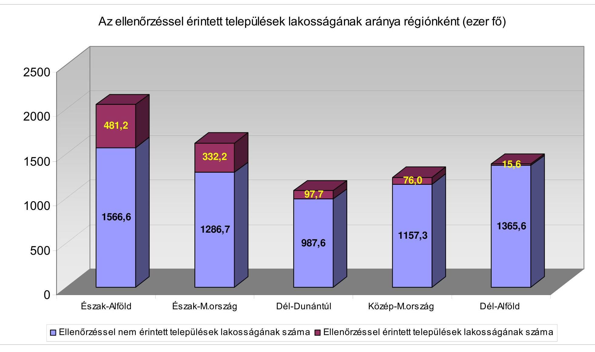

---

# A közfoglalkoztatási formák jellemző adatai a vizsgált körben 2003-2006. években 

A közfoglalkoztatási formák szerint igénybevett támogatások (millió Ft)
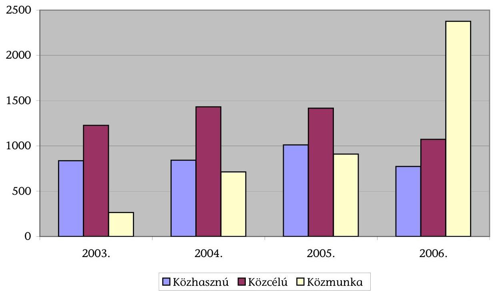

A közfoglalkoztatási formák szerinti együttes átlaglétszám (fő)
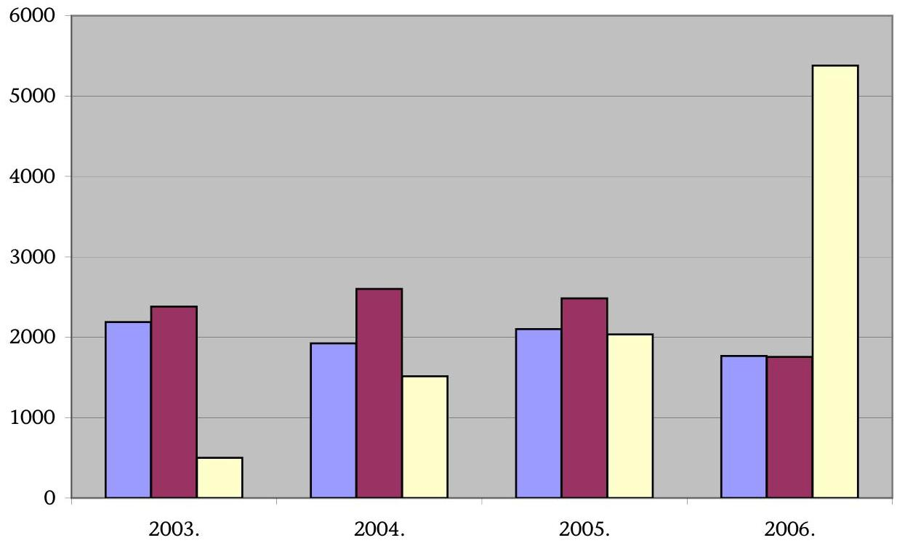

---

# Kérdőíves felmérés a közmunkák szervezéséről 

## Közmunkaszervezéssel egyetértők, elutasítók aránya (%)

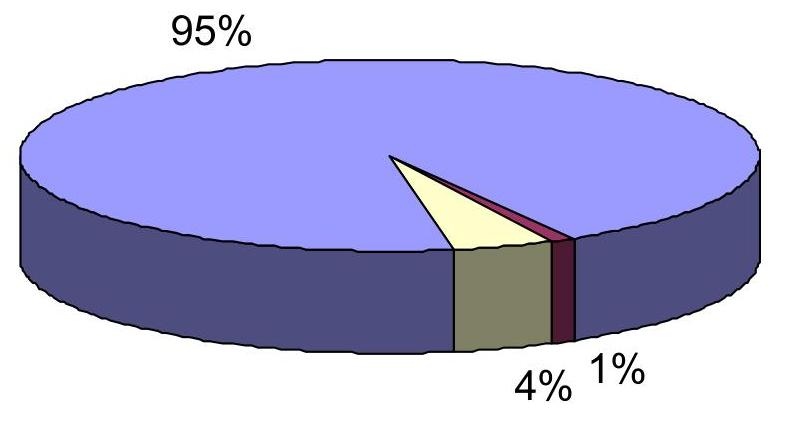

Egyetért $\square$ Nem tudja $\square$ Nem ért egyet

## A közmunkaszervezést elutasítók indokai (%)   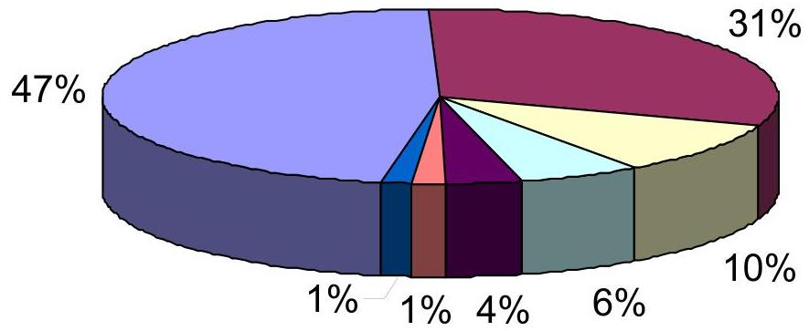

Nem indokolta
$\square$ Állandó munkahely kell
$\square$ Nincs munkafegyelem
$\square$ Nem hatékony
$\square$ Nem a végzettségnek megfelelő a munka $\square$ Kevés a fizetés
$\square$ Nem rászorultak

---

# A közmunka programokra benyújtott és támogatott pályázatok főbb országos adatai célcsoportok (programok) szerint

|  Megnevezés |  | Me. | 2003. | 2004. | 2005. | 2006. | Összesen  |
| --- | --- | --- | --- | --- | --- | --- | --- |
|   |  |  | évi döntéssel indított közmunkaprogramok |  |  |  |   |
|  Benyújtott pályázat | száma | db | 672 | 373 | 684 | 132 | 1861  |
|   | támogatás összege | millió Ft | 6850 | 7335 | 14814 | 5562 | 34561  |
|   | foglalkoztatott átlaglétszám | fő | 14 790 | 15379 | 29153 | 11077 | 70399  |
|  Támogatott közmunka pályázat | száma | db | 249 | 142 | 542 | 124 | 1057  |
|   | támogatás összege | millió Ft | 3140 | 3316 | 11035 | 5560 | 23051  |
|   | foglalkoztatott átlaglétszám | fő | 6780 | 8029 | 33767 | 10915 | 59491  |
|  Ebből: |  |  |  |  |  |  |   |
|  1.) Hátrányos helyzetű rétegek foglalkoztatási programja | száma | db | 72 | 78 | 55 |  | 205  |
|   | támogatás összege | millió Ft | 1587 | 1598 | 1560 |  | 4745  |
|   | foglalkoztatott átlaglétszám | fő | 2890 | 2665 | 2700 |  | 8255  |
|  2.) Hátrányos helyzetű megyék MTT-vel közös programjai | száma | db | 171 |  |  |  | 171  |
|   | támogatás összege | millió Ft | 803 |  |  |  | 803  |
|   | foglalkoztatott átlaglétszám | fő | 2188 |  |  |  | 2188  |
|  3.) Akadálymentesítési program | száma | db |  | 2 |  |  | 2  |
|   | támogatás összege | millió Ft

 |  | 194 |  |  | 194  |
|   | foglalkoztatott átlaglétszám | fő |  | 409 |  |  | 409  |
|  4.) Cigánytelep köztisztasági programja | száma | db |  |  | 95 |  | 95  |
|   | támogatás összege | millió Ft |  |  | 19 |  | 19  |
|   | foglalkoztatott átlaglétszám | fő |  |  | 180 |  | 180  |
|  5.) Parlagfű elleni védekezés | száma | db |  | 27 | 3 | 7 | 37  |
|   | támogatás összege | millió Ft |  | 317 | 211 | 245 | 773  |
|   | foglalkoztatott átlaglétszám | fő |  | 1286 | 600 | 767 | 2653  |
|  6.) Vasút-tisztasági program | száma | db |  |  | 3 | 9 | 12  |
|   | támogatás összege | millió Ft |  |  | 140 | 702 | 842  |
|   | foglalkoztatott átlaglétszám | fő |  |  | 501 | 1065 | 1566  |
|  7.) "Élhetőbb faluért" program | száma | db |  | 18 |  | 29 | 47  |
|   | támogatás összege | millió Ft |  | 174 |  | 275 | 449  |
|   | foglalkoztatott átlaglétszám | fő |  | 349 |  | 948 | 1297  |
|  8.) Kormányzati 100 lépés közfoglalkoztatási program | száma | db |  |  | 352 |  | 352  |
|   | támogatás összege | millió Ft |  |  | 6479 |  | 6479  |
|   | foglalkoztatott átlaglétszám | fő |  |  | 24550 |  | 24550  |
|  9.) Erdőművelés | száma | db |  | 8 | 11 | 47 | 66  |
|   | támogatás összege | millió Ft |  | 278 | 523 | 1300 | 2101  |
|   | foglalkoztatott átlaglétszám | fő |  | 1048 | 1499 | 3675 | 6222  |
|  10.) Balaton parti települések, Tisza-tó, Velencei-tó köztisztasági programjai | száma | db |  | 2 | 3 | 6 | 11  |
|   | támogatás összege | millió Ft |  | 55 | 377 | 576 | 1008  |
|   | foglalkoztatott átlaglétszám | fő |  | 205 | 205 | 961 | 1371  |

---

| Megnevezés |  | Me. | 2003. | 2004. | 2005. | 2006. | Összesen |
| :--: | :--: | :--: | :--: | :--: | :--: | :--: | :--: |
|  |  |  | évi döntéssel indított közmunkaprogramok |  |  |  |  |
| 11.) Nemzeti parkok ápolása | száma | db |  |  | 10 | 10 | 20 |
|  | támogatás összege | millió Ft |  |  | 293 | 98 | 391 |
|  | foglalkoztatott átlaglétszám | fő |  |  | 556 | 179 | 735 |
| 12.) Autópálya építés segítése | száma | db | 1 | 2 | 3 | 1 | 7 |
|  | támogatás összege | millió Ft | 250 | 300 | 513 | 180 | 1243 |
|  | foglalkoztatott átlaglétszám | fő | 700 | 1102 | 1300 | 434 | 3536 |
| 13.) Preventív belvízvédelmi program | száma | db |  |  | 3 | 4 | 7 |
|  | támogatás összege | millió Ft |  |  | 420 | 150 | 570 |
|  | foglalkoztatott átlaglétszám | fő |  |  | 792 | 330 | 1122 |
| 14.) Vásárhelyi tervet segítő közmunka-program (árvíz) | száma | db | 5 | 5 | 4 | 11 | 25 |
|  | támogatás összege | millió Ft | 500 | 400 | 500 | 1947 | 3347 |
|  | foglalkoztatott átlaglétszám | fő | 1002 | 965 | 884 | 2556 | 5407 |
| 15.) Madárinfluenza elleni védekezésre való felkészülés | száma | db |  |  |  | 2 | 2 |
|  | támogatás összege | millió Ft |  |  |  | 87 | 87 |
|  | foglalkoztatott átlaglétszám | fő |  |  |  | 162 | 162 |

* számított adat

---

5. számú melléklet
a V-1019-44/2006-2007. számú jelentéshez

**Az ellenőrzött pályázati témakörök országos programokon belüli
értékaránya, millió Ft-ban**

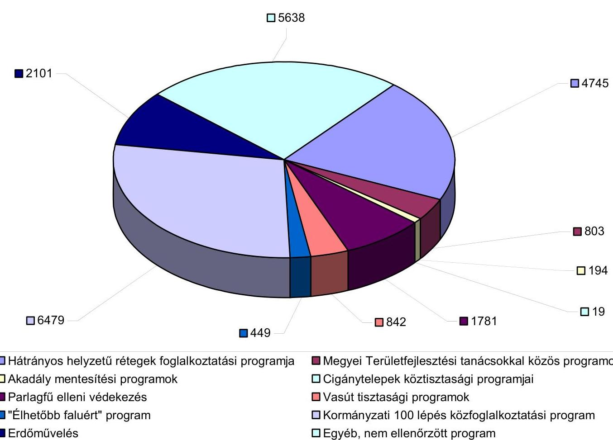

☐ Hátrányos helyzetű rétegek foglalkoztatási programja
☐ Akadálymentesítési programok
☐ Parlagfű elleni védekezés
☐ "Élhetőbb faluért" program
☐ Erdőművelés
☐ Megyei Területfejlesztési tanácsokkal közös programok
☐ Cigánytelepek köztisztasági programjai
☐ Vasút tisztasági programok
☐ Kormányzati 100 lépés közfoglalkoztatási program
☐ Egyéb, nem ellenőrzött program

---

# A vizsgált közmunkaprogramok értékadatainak alakulása országosan és az ellenőrzött körben (millió Ft) 

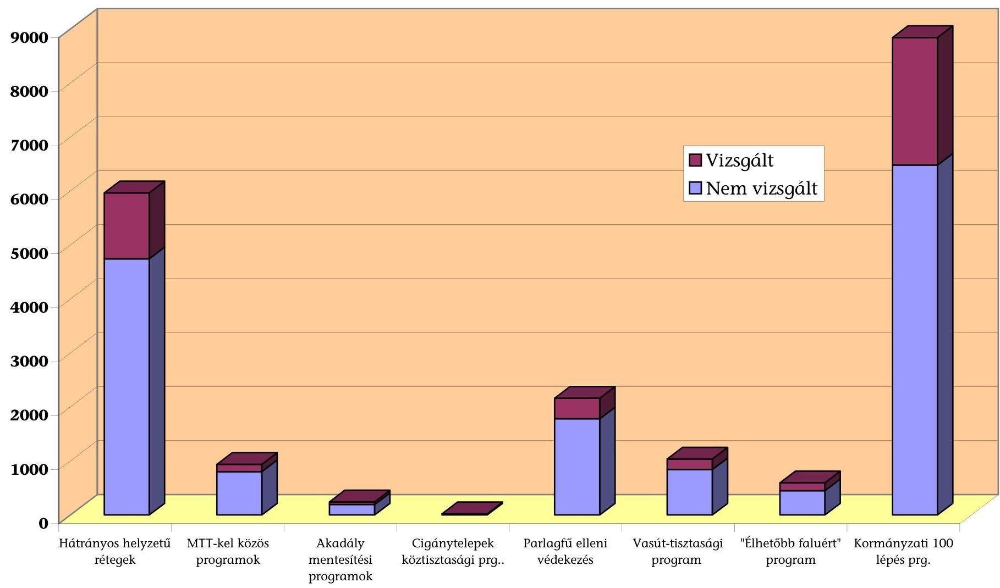

---

A támogatott közmunka programok főbb jellemzői a vizsgált önkormányzati körben

| S.sz. | Megnevezés |  | M.e. | 2003. | 2004. | 2005. | 2006. | Összesen |
| :--: | :--: | :--: | :--: | :--: | :--: | :--: | :--: | :--: |
|  |  |  |  | évi döntéssel indított közmunka programok |  |  |  |  |
| 1. | Benyújtott | száma | db | 21 | 48 | 88 | 12 | 169 |
|  | támogatási | összértéke | M Ft | 476,2 | 1160,0 | 3522,9 | 473,4 | 5632,5 |
|  | kérelem | támogatás összege | M Ft | 418,0 | 1055,6 | 3323,8 | 436,4 | 5233,8 |
|  |  | foglalkoztatottak | fő | 745 | 2082 | 7130 | 1038 | 10995 |
| 2. | Támogatott | száma | db | 15 | 38 | 83 | 13 | 149 |
|  | közmunka program (szerződés szerint) | összértéke | M Ft | 298,5 | 850,8 | 3228,0 | 443,0 | 4820,3 |
|  |  | támogatás összege | M Ft | 274,2 | 766,5 | 3045,3 | 405,9 | 4491,9 |
|  |  | foglalkoztatottak | fő | 550 | 1646 | 6677 | 967 | 9840 |
|  | - Ebből: |  |  |  |  |  |  |  |
| 2.1. | Hátrányos helyzetű rétegek foglalkoztatási programja | száma | db | 5 | 14 | 9 | 0 | 28 |
|  |  | összértéke | M Ft | 147,6 | 621,8 | 565,7 | 0,0 | 1335,1 |
|  |  | támogatás összege | M Ft | 139,3 | 552,1 | 528,1 | 0,0 | 1219,5 |
|  |  | foglalkoztatottak | fő | 250 | 899 | 820 | 0 | 1969 |
| 2.2. | Hátrányos helyzetű megyék MTT-vel közös programjai | száma | db | 10 | 0 | 0 | 0 | 10 |
|  |  | összértéke | M Ft | 150,9 | 0,0 | 0,0 | 0,0 | 150,9 |
|  |  | támogatás összege | M Ft | 134,9 | 0,0 | 0,0 | 0,0 | 134,9 |
|  |  | foglalkoztatottak | fő | 300 | 0 | 0 | 0 | 300 |
| 2.3. | Akadálymentesítési program | száma | db | 0 | 2 | 0 | 0 | 2 |
|  |  | összértéke | M Ft | 0,0 | 54,7 | 0,0 | 0,0 | 54,7 |
|  |  | támogatás összege | M Ft | 0,0 | 47,9 | 0,0 | 0,0 | 47,9 |
|  |  | foglalkoztatottak | fő | 0 | 53 | 0 | 0 | 53 |
| 2.4. | Cigánytelep köztisztasági program | száma | db | 0 | 1 | 10 | 0 | 11 |
|  |  | összértéke | M Ft | 0,0 | 1,9 | 2,2 | 0,0 | 4,1 |
|  |  | támogatás összege | M Ft | 0,0 | 0,8 | 2,1 | 0,0 | 2,9 |
|  |  | foglalkoztatottak | fő | 0 | 0 | 23 | 0 | 23 |

---

| 5.sz. | Megnevezés |  | M.e. | 2003. | 2004. | 2005. | 2006. | Összesen |
| :--: | :--: | :--: | :--: | :--: | :--: | :--: | :--: | :--: |
|  |  |  |  | évi döntéssel indított közmunka programok |  |  |  |  |
| 2.5. | Parlagfű elleni védekezés | száma | db | 0 | 12 | 1 | 4 | 17 |
|  |  | összértéke | M Ft | 0,0 | 90,8 | 111,4 | 212,8 | 415,0 |
|  |  | támogatás összege | M Ft | 0,0 | 86,0 | 100,7 | 194,2 | 380,8 |
|  |  | foglalkoztatottak | fő | 0 | 398 | 275 | 508 | 1181 |
| 2.6. | Vasút-tisztasági program | száma | db | 0 | 0 | 1 | 2 | 3 |
|  |  | összértéke | M Ft | 0,0 | 0,0 | 55,0 | 161,2 | 216,2 |
|  |  | támogatás összege | M Ft | 0,0 | 0,0 | 50,0 | 145,2 | 195,2 |
|  |  | foglalkoztatottak | fő | 0 | 0 | 167 |  | 167 |

 | 220 | 387 |
| 2.7. | „Élhetőbb faluért" program | száma | db | 0 | 10 | 0 | 7 | 17 |
|  |  | összértéke | M Ft | 0,0 | 81,6 | 0,0 | 69,1 | 150,7 |
|  |  | támogatás összege | M Ft | 0,0 | 79,7 | 0,0 | 66,5 | 146,3 |
|  |  | foglalkoztatottak | fő | 0 | 296 | 0 | 239 | 535 |
| 2.8. | Kormányzati 100 lépés közfoglalkoztatási program | száma | db | 0 | 0 | 62 | 0 | 62 |
|  |  | összértéke | M Ft | 0,0 | 0,0 | 2 493,6 | 0,0 | 2 493,6 |
|  |  | támogatás összege | M Ft | 0,0 | 0,0 | 2 364,4 | 0,0 | 2 364,4 |
|  |  | foglalkoztatottak | fő | 0 | 0 | 5392 | 0 | 5392 |

---

8. számú melléklet
a V-1019-44/2006-2007. számú jelentéshez

A közmunkaprogramok szervezésének főbb területei

A támogatás összege szerint, Mrd Ft

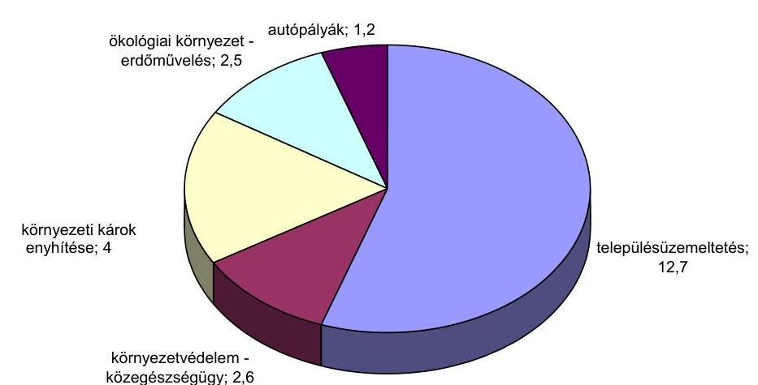

A foglalkoztatottak létszáma alapján, ezer fő

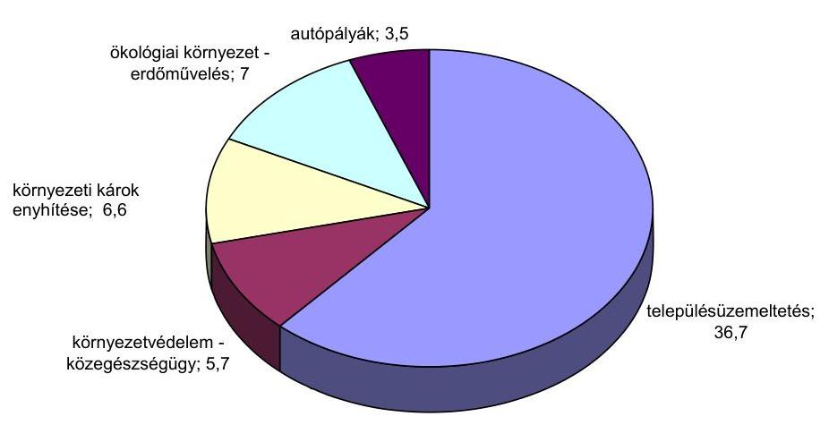

---

# 9. számú melléklet a V-1019-44/2006-2007. számú jelentéshez 

H-1051 BUDAPEST V. JÓZSEF NÁDOR TÉR 2-4. POSTACIM: 1369 BUDAPEST. POSTAFIÓK 481.

TELEFON: (36-1) 327-2159, (36-1) 327-2141
E-MAIL: jznos.veres@pm.gov.hu
FAX: (36-1) 318-0738

PÉNZÜGYMINISZTER

Ikt. szám: 11682-3/2007.
Dr. Kovács Árpád úr elnök

Állami Számvevőszék Budapest

Tisztelt Elnök Úr!

A közmunka programok támogatására fordított pénzeszközök hasznosulásának ellenőrzéséről szóló jelentés tervezethez észrevételt nem teszek. Az anyagban található megállapításokkal egyetértek, illetve a javaslatok közül számosat megfontolandónak és a további munka szempontjából jól hasznosíthatónak tartok.

Budapest, 2007. augusztus 6.

Üdvözlettel:

Dr. Veres János

---

# 10. számú melléklet a V-1019-44/2006-2007. számú jelentéshez 

## ATM - 3554/2007

## 214

Önkormányzati és területfejlesztési miniszter
Iktatószám: $1-10323 / 2007$
Dr. Kovács Árpád úrnak, elnök

Állami Számvevőszék
Budapest

Tisztelt Elnök Úr!
A közmunka programok támogatására fordított pénzeszközök hasznosulásának ellenőrzéséről készült jelentés-tervezet megküldését köszönettel vettem, az abban foglaltakkal kapcsolatban az alábbi észrevételeket teszem.

A jelentés előremutató, hasznos megállapításaival segíti a közfoglalkoztatás rendszerének, azon belül a közmunka programok összehangolt és megfelelő színvonalú működtetését, amely mindannyiunk közös érdeke.

1. A tervezet I. Összegző megállapítások, következtetések, javaslatok fejezetében, a 19. oldal harmadik bekezdésének utolsó mondata szerint „A Közmunka Tanács Titkársága által biztosított adatszolgáltatás szerint a vizsgált támogatotti körben az ÖTM közcélú keretéből 37,2 millió Ft túlfinanszírozás történt, amelynek visszafizettetését kezdeményeztük".
Véleményem szerint a következők miatt nem lehet túlfinanszírozásról beszélni:
A Kormány „100 lépés" programjának részeként a Foglalkoztatáspolitikai és Munkaügyi Minisztérium, a Belügyminisztérium, valamint az Ifjúsági, Családügyi, Szociális és Esélyegyenlőségi Minisztérium 2005-2006. évekre szóló önkormányzatok által pályázható közmunkaprogramot hirdetett. A programra összesen 7 milliárd forint állt rendelkezésre, amelyek forrásai a XXVI. FMM Közmunkaprogramok támogatása fejezeti előirányzaton 4,5 milliárd forint, a IX. Helyi önkormányzatok támogatásai fejezet önkormányzatok által szervezett közcélú foglalkoztatás támogatása előirányzatán elkülönítve 2,5 milliárd forint. A pályázathoz az önkormányzatok részéről szükséges saját forrást (kerekítve 37%) a IX. Helyi önkormányzatok támogatásai fejezet fentiekben nevesített előirányzata biztosította.
A nyertes pályázókkal kötött szerződés 3. pontja egyértelműen rögzítette az FMM nyújtotta támogatás és a IX. Helyi önkormányzatok támogatásai fejezetből biztosított önrész (a továbbiakban: BM támogatás) összegét és folyósításának feltételét, idejét. A BM támogatást a nyertes pályázók 2006. január 31-ig egy összegben megkapták, a pályázat meghosszabbításakor, szintén előre egy összegben részesültek e támogatásban. Az FMM támogatást utólagosan, teljesítményarányosan vehették igénybe a nyertesek. Fentiek alapján nem lehet túlfinanszírozásról beszélni, mindösszesen arról, hogy a nyertes nem tud elszámolni a támogatás teljes összegével, így az FMM támogatást nem kaphatta meg maradéktalanul, és így a BM támogatásnak csak az arányos részére jogosult. A támogatási szerződés 17. pontja szerint a nyertes a BM támogatás felhasználásáról a 2006. december 31-i fordulónapjával, a mindenkori éves zárszámadás keretében, és annak rendje szerint

az illetékes államháztartási szerv felé köteles elszámolni. Az év végi elszámolás szabályszerűségének felülvizsgálatára irányadóak az államháztartásról szóló 1992. évi XXXVIII. tv. (továbbiakban: Áht.) 64/D.§-ában foglaltak. Ennek megfelelően a nyerteseknek a BM támogatás jogtalanul náluk lévő, fel nem használt részét kötelesek voltak visszafizetni a központi költségvetésnek.
2. A tervezet I. Összegző megállapítások, következtetések, javaslatok fejezetében, a 21. oldalon az önkormányzati és területfejlesztési miniszternek tett 1. javaslattal kapcsolatban a következő észrevételt teszem. A fentiekben már bemutatott eljárásrend alapján a nyertesek a közmunkaprogram zárásakor tisztában voltak azzal, hogy maradéktalanul elszámoltak-e a kapott támogatással vagy sem. Amennyiben nem számoltak el, úgy a BM támogatás esetében is csak az arányos részre voltak jogosultak, és a támogatási szerződés alapján kötelesek a jogosulatlanul náluk lévő összeget visszafizetni. Az Önkormányzati és Területfejlesztési Minisztérium többször kezdeményezte, hogy az SZMM Közmunka Tanács a nyertesek által felhasznált támogatás összegét juttassa el számára, a kapott dokumentumok azonban számszakilag hibás adatokat tartalmaztak, melyek korrekcióját a Közmunka Tanács, illetve az SZMM illetékes főosztálya nem végezte el. Megjegyzem, hogy az ÖTM kezdeményezésére az önkormányzat által szervezett közcélú foglalkoztatás 2006. évi előirányzatának módosítási rendjéről és a többlettámogatás igényléséről szóló 91/2006. (IV. 18.) Korm. rendelet 1.§ (5) bekezdése a következőket tartalmazta:
„A Foglalkoztatáspolitikai és Munkaügyi Minisztérium a T. 8. számú melléklet II/2. új pontja szerinti „Közmunka programban való önkormányzati részvétel támogatása" előirányzat I. félévi felhasználási adatairól - települési önkormányzatonkénti, illetőleg többcélú kistérségi társulásonkénti bontásban -, valamint az I. félévi maradvány összegéről augusztus 15-éig tájékoztatja a Belügyminisztériumot, az Ifjúsági, Családügyi, Szociális és Esélyegyenlőségi Minisztériumot, valamint a Pénzügyminisztériumot."

E rendelkezés szerint az SZMM-nek át kellett volna adnia a fentiekben már hivatkozott adatokat, a helyes adatokkal azonban, többszöri megkeresés ellenére továbbra sem rendelkezik az Önkormányzati és Területfejlesztési Minisztérium (ÖTM). Tájékoztatom, hogy a korábbi V-1019-23/2006-2007. számú rendelet-tervezetre hivatkozva 2007. július 30-án az ÖTM Önkormányzati és Lakásügyi Szakállamtitkára - írásban - újból megkereste az SZMM Foglalkoztatási és Képzési Szakállamtitkárát az adatok mielőbbi megküldése érdekében.
3. Az önkormányzati és területfejlesztési miniszternek tett 2. javaslattal kapcsolatban megjegyzem, hogy a helyi önkormányzatokról szóló 1990. évi LXV. törvény 91.§-ának (6) bekezdése szerint a gazdasági program tartalmazza a munkahelyteremtés feltételeinek elősegítését, mely véleményem szerint ösztönzi az önkormányzatokat arra, hogy foglalkoztatáspolitikai kérdéseket a gazdasági program részévé tegyék.
4. A tervezet 3.1. Kormányzati 100 lépés közfoglalkoztatási program fejezetében, a 63. oldalon megjelenik a társfinanszírozás arányosításának követelménye kifejezés. Az 1. pontban már kifejtettek alapján egyértelmű, hogy a nyertesek az elszámoláskor tudták, hogy az előre megkapott BM támogatás mekkora részére jogosultak, ezért nem lehet a társfinanszírozás arányosításáról beszélni.

Bízva további eredményes együttműködésünkben munkájához a továbbiakban is sok sikert kívánok.
Budapest, 2007. augusztus 2.
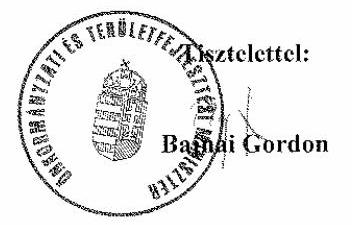

---

# Bajnai Gordon úr 

miniszter
Önkormányzati és Területfejlesztési Minisztérium

Budapest

## Tisztelt Miniszter Úr!

Köszönettel megkaptam a közmunkaprogramok támogatására fordított pénzeszközök hasznosulásának ellenőrzéséről készült jelentés-tervezetre tett észrevételét. Az abban megfogalmazott problémakör a közmunkaprogramok újszerű finanszírozási megoldási módozataival kapcsolatos feladatok begyakorlatlanságával, s az információáramlás ebből adódó akadozásával magyarázható. Ez igaz a finanszírozó és a támogató minisztérium, mint a közmunkára pályázó kht-k, gesztorok, társulások és a normatív, kötött felhasználású költségvetési támogatással elszámolni köteles települési önkormányzatok esetében. Ez utóbbiak sok esetben nem rendelkeztek információval a közmunkaprogram számszerű adatairól, mivel az SZMM a támogatási szerződésben pénzügyi elszámolásra kötelezett pályázóknak - az önkormányzatok által erre felhatalmazott szervezeteknek - utalta vissza az arányosítás folytán az ÖTM-nek visszajáró előirányzat maradvány összegét. Mindezek alapján úgy vélem, indokolt a két minisztérium adategyeztetését követően az érintett önkormányzatok elszámoltatása és a jogtalanná vált állami támogatás visszafizettetése.

A helyi foglalkoztatási célok beépítésének szorgalmazását az önkormányzat gazdasági programjába a jelentés-tervezetben részletezetteken túlmenően azért is fontosnak tartjuk, mert - a számvevői jelentésekre érkezett észrevételek tanúsága szerint - az önkormányzatok nem érzik kötelezettségüknek sem a munkahelyteremtés, sem a foglalkoztatás koncepcionális

kezelését, melyeknek gazdasági programjukban való megjelenítésével ezirányú elkötelezettségüket deklarálnák.

A jelentést szíves hasznosításra mellékelten megküldöm, egyben tájékoztatom Miniszter Urat, hogy jelentésünket a miniszteri észrevétellel és e levél csatolásával hozzuk nyilvánosságra.

Budapest, 2007. szeptember 4.

Tisztelettel:
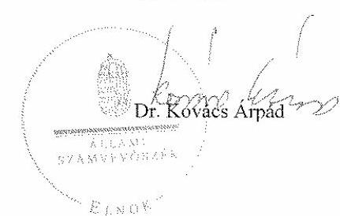

---

# Szociális és Munkaügyi Minisztérium Miniszter 

Állami Számvevőszék Dr. Kovács Árpád elnök

Hiv. szám: V-1019-40/2006-2007.

Budapest

Tisztelt Elnök Úr!
A „Közmunkaprogramok támogatására fordított pénzeszközök hasznosulásának ellenőrzéséről" szóló vizsgálati anyagot áttanulmányoztuk.

Először is szeretném megköszönni Önnek és munkatársainak azt az átfogó, részletes, és a folyamatokat széleskörűen bemutató munkát, amit az utóbbi hónapokban végeztek. A vizsgálat konkrét megállapításai segítenek majd bennünket abban, hogy a közmunkaprogramok tervezésekor és szervezésekor nagyobb körültekintéssel végezhessük munkánkat.

Tételes észrevételeket az egyes megállapításokra vonatkozóan nem tennék. Úgy vélem azonban, hogy a közmunkaprogramok feladatának, funkciójának megítélésében, hatékonyságának mérésében, szakmai különbség van a vizsgálatot végzők és a tárca álláspontja között. Ebből következően a vizsgálati anyag néhány megállapítása, a minősítések előjele, súlya más megítélés alá eshet.

A közmunkaprogramok alapvető funkciója a munkaerő tréningben tartása, segély helyett munkaesély biztosítása, ahogyan ezt Önök is értelmezik. Nem minősítheti tehát a programok hatékonyságát, hogy a résztvevők közül mennyien képesek az elsődleges munkaerőpiacon elhelyezkedni. A közmunkaprogramok többségével érintett depressziós térségekben egyébként sajnos nem volt számottevő munkahelybővülés, ami javíthatta volna az elhelyezkedési mutatókat.

Hasonlóképpen nehéz helyzetben vagyok annak megítélésénél, hogy egy központilag kialakított normarendszernek felettessünk-e meg az önkormányzati feladatok szinte teljes körét felölelő tevékenységeket a programokban. A több éve állástalan emberek munkaegészségügyi szakemberek megítélése szerint sem képesek a folyamatosan dolgozók teljesítményének 65-70%-ánál többre. Úgy gondolom, a

teljesítménykövetelményeket a munkáltatónak kell támasztania, miközben egyetértek azzal, hogy a pályázati programban ezt konkrétan rögzíteni, a pályázatok elbírálásánál szigorúan megkövetelni, a végrehajtásban pedig következetesen ellenőrizni kell.

Tisztelt Elnök Úr!
Javaslataikat a fentiek szem előtt tartásával elfogadom. Intézkedtem, hogy a Közmunka Tanács Titkársága munkatervet készítsen a vizsgálati anyagban feltárt hiányosságok kiküszöbölésére, a közpénzek hatékonyabb és számon kérhetőbb felhasználására a közmunkaprogramokban.

Szeretném tájékoztatni, arról a reformértékű változásról, hogy már 2007. évben képzéssel támogatott közmunkaprogramok folynak, azaz a résztvevők legalább 15%-a kap szakmai jellegű, vagy betanító képzést, és szerez újabb jártasságot különböző szakterületeken.
Az Önök által is szorgalmazott forráskoordinációra, a közfoglalkoztatási formák egységesítésére vonatkozó javaslataink előkészítés alatt állnak, és az év második felében tervezzük a Kormány elé terjeszteni.

Végül kérem, hogy a vizsgálatban résztvevő munkatársainak is tolmácsolja köszönetünket a hasznosítható tapasztalatokért, javaslatokért.

Budapest, 2007. augusztus 27.
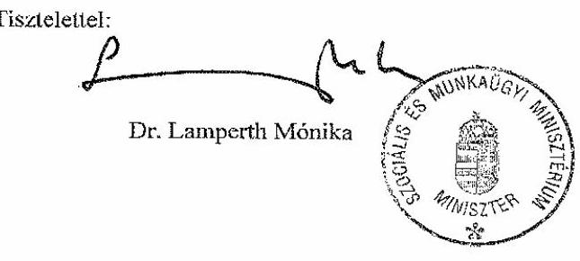

1054 Budapest, Alkotmány utca 3. - 1243 Budapest, Pf: 580
(36-1) 473-8184 (36-1) 302-1373
Internet: www.szmm.gov.hu

---

# Dr. Lamperth Mónika úrhölgy 

miniszter
Szociális és Munkaügyi Minisztérium

## Budapest

## Tisztelt Miniszter Úrhölgy!

Köszönettel megkaptam a közmunkaprogramok támogatására fordított pénzeszközök hasznosulásának ellenőrzéséről készült jelentés-tervezetre tett észrevételét, melyben arról tájékoztat, hogy munkatervet készítenek a feltárt hiányosságok kiküszöbölésére. Örömömre szolgál, hogy az elmúlt időszakban megtett intézkedéseikkel javul a foglalkoztatottak képzése, s hogy - javaslatunkat figyelembe véve - a közfoglalkoztatási formák egységes rendszerének
 kialakítására törekszenek.

A jelentéstervezetben tett megállapításaink és az Önök megítélése között hangsúlybeli eltérések természetesen lehetnek, erre való tekintettel is úgy ítéljük meg, hogy a programok hatékonyságát minősítő mutatók között helye van a munkaerőpiacon való elhelyezkedés mértékének is.

Egyetértek azzal, hogy a munkáltató által támasztott teljesítménykövetelmények számonkérése, ellenőrzése segíti leginkább a programok teljesülését, ennek méréséhez, elemzéséhez azonban a legjellemzőbb tevékenységek teljesítményméréséhez központilag meghatározott mérőszámok is szükségesek.

---

A jelentést szíves hasznosításra mellékelten megküldöm, egyben tájékoztatom Miniszter Úr(bölgyet, hogy jelentésünket a miniszteri észrevétellel és e levél csatolásával hozzuk nyilvánosságra.

Budapest, 2007. szeptember " $t 3^{\prime \prime}$ ".

Tisztelettel:
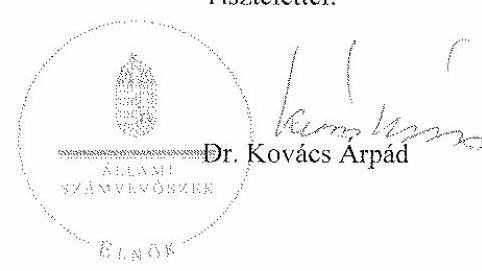

Melléklet: 1 db jelentés

---

|  Régió | Település | Hátrányos helyzetű rétegek foglalkoztatási programja |  |  | Megrendeltetőjogos és távzásos felületen program |  | Abadályi, mesterikai programok |  | Cigánytelepők közszáráságrán |  | Párlagi felületen védekezés |  |  | Vasút tisztasági programok |  | "Élhető" felületi program |  | Kormányzati felületen közöngyelési elvégezés program |   |
| --- | --- | --- | --- | --- | --- | --- | --- | --- | --- | --- | --- | --- | --- | --- | --- | --- | --- | --- |
|   |  | 2003 | 2004 | 2005 | 2003 | 2004 | 2004 | 2005 | 2004 | 2005 | 2006 | 2003 | 2006 | 2004 | 2006 | 2003 |  |   |
|  Dél-Alföld |  |  |  |  |  |  |  |  |  |  |  |  |  |  |  |  |  |   |
|  Békés | Élek |  |  |  |  |  |  |  |  |  |  |  |  |  |  |  |  |   |
|  Csongrád | Mezőkevészháza |  |  |  |  |  |  |  |  |  |  |  |  |  |  |  |  |   |
|  Csongrád | Csanádpalota |  |  |  |  |  |  |  |  |  |  |  |  |  |  |  |  |   |
|  Dél-Dunántúl |  |  |  |  |  |  |  |  |  |  |  |  |  |  |  |  |  |   |
|  Baranya | Szigetvári kistérség |  | X | X |  |  |  |  |  |  |  |  |  |  |  |  |  |   |
|  Somogy | Szigetvári |  | X | X | X | X |  |  |  |  |  |  |  |  |  |  |  |   |
|  Somogy | Barcs |  | X |  |  |  |  |  | X |  |  |  |  |  |  |  |  |   |
|  Tolna | Nagyutád |  | X |  |  |  |  |  |  |  |  |  |  |  |  |  |  |   |
|   | Somogyvár | X |  |  |  |  |  |  |  |  |  |  |  |  |  |  |  |   |
|   | Dombóvár |  | X | X |  |  |  |  |  |  |  |  |  |  |  |  |  |   |
|   | Ozora |  |  |  |  |  |  |  |  |  |  |  |  |  |  |  |  |   |
|   | Paksi |  | X | X |  |  |  |  | X |  |  |  |  |  |  |  |  |   |
|   | Tolnanémedi |  |  |  |  |  |  |  |  |  |  |  |  |  |  |  |  |   |
|  Észak-Alföld |  |  |  |  |  |  |  |  |  |  |  |  |  |  |  |  |  |   |
|  Hajdú-Bihar | Debrecen |  |  |  |  |  |  |  |  |  |  |  |  |  |  |  |  |   |
|  Jász-Nagykun-Szolnok | Komádi |  | X |  |  |  |  |  |  |  |  |  |  |  |  |  |  |   |
|   | Polgár |  |  |  |  |  |  |  | X |  |  |  |  |  |  |  |  |   |
|   | Püspökladány | X | X | X |  |  |  |  |  |  |  |  |  |  |  |  |  |   |
|   | Szolnok |  |  |  |  |  |  |  | X |  |  |  |  |  |  |  |  |   |
|   | Tiszabő |  |  |  |  |  |  |  |  |  |  |  |  |  |  |  |  |   |
|   | Tiszaszentimre |  |  |  |  |  |  |  | X |  |  |  |  |  |  |  |  |   |
|   | Tüke |  | X |  |  |  |  |  |  |  |  |  |  |  |  |  |  |   |
|   | Zsámbék |  |  |  |  |  |  |  | X |  |  |  |  |  |  |  |  |   |
|  Szabolcs-Szatmár-Bereg | Baktalórántháza |  | X | X |  |  |  |  | X | X |  |  |  |  |  |  |  |   |
|   | Kölcse |  |  |  |  |  |  |  |  |  |  |  |  |  |  |  |  |   |
|   | Nyíregyháza |  |  |  |  |  |  |  | X |  |  |  |  |  |  |  |  |   |
|   | Tiszabecs |  |  |  |  |  |  |  | X |  |  |  |  |  |  |  |  |   |
|   | Tiszacsécse |  |  |  |  |  |  |  | X |  |  |  |  |  |  |  |  |   |
|   | Tiszavasvári |  |  |  |  |  |  |  | X |  |  |  |  |  |  |  |  |   |
|   | Vásárosnamény |  |  |  | X |  |  |  |  | X |  |  |  |  |  |  |  |   |
|  Észak-Magyarország |  |  |  |  |  |  |  |  |  |  |  |  |  |  |  |  |  |   |
|  Borsod-Abaúj-Zemplén | Boldogkőváralja |  |  |  |  |  |  |  |  |  |  |  |  |  |  |  |  |   |
|   | Gönc |  |  |  |  |  |  |  |  |  |  |  |  |  |  |  |  |   |
|   | Hollóháza |

 |  |  |  | X |  |  |  |  |  |  |  |  |  |  |  |  |   |
|   | Lácacséke |  |  |  |  |  |  |  |  |  |  |  |  |  |  |  |  |   |
|   | Mezőcsát |  | X |  |  |  |  |  |  |  |  |  |  |  |  |  |  |   |
|   | Miskolc |  |  |  | X |  |  |  |  |  |  |  |  |  |  |  |  |   |
|   | Özd |  | X | X | X |  |  |  | X |  |  |  |  |  |  |  |  |   |
|   | Sajószentpéter |  |  |  | X |  |  |  |  |  |  |  |  |  |  |  |  |   |
|   | Szerencs |  | X |  | X |  |  |  |  |  |  |  |  |  |  |  |  |   |
|   | Szikszó |  |  |  |  |  |  |  |  |  |  |  |  |  |  |  |  |   |
|   | Szikszó kistérség |  |  |  |  |  |  |  | X |  |  |  |  |  |  |  |  |   |
|   | Tállya |  |  |  |  |  |  |  |  |  |  |  |  |  |  |  |  |   |
|   | Vilmány |  |  |  | X |  |  |  | X |  |  |  |  |  |  |  |  |   |
|  Nógrád | Bátonyterénye | X | X | X |  |  |  |  |  |  |  |  |  |  |  |  |  |   |
|   | Karancslapajtó |  |  |  |  |  |  |  |  |  |  |  |  |  |  |  |  |   |
|   | Pásztó |  |  |  |  |  |  |  |  |  |  |  |  |  |  |  |  |   |
|   | Salgótarján |  | X | X |  |  |  |  |  |  |  |  |  | X | X |  |  |   |
|  Közép-Magyarország |  |  |  |  |  |  |  |  |  |  |  |  |  |  |  |  |  |   |
|  Pest | Cegléd |  |  |  |  |  |  |  |  |  |  |  |  |  |  |  |  |   |
|   | Dél-Pest M. Önk.Ter.fej.T. |  |  |  |  |  |  |  |  | X |  |  |  |  |  |  |  |   |
|   | Szentendre |  |  |  |  |  |  |  |  |  |  |  |  |  |  |  |  |   |
|   | Sápisgengye |  |  |  |  |  |  |  |  |  |  |  |  |  |  |  |  |   |
|   | Tápécsörle |  |  |  |  |  |  |  |  |  |  |  |  |  |  |  |  |   |

