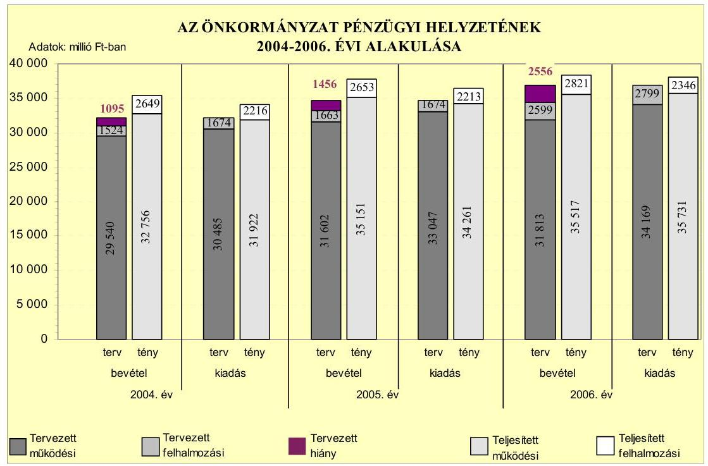
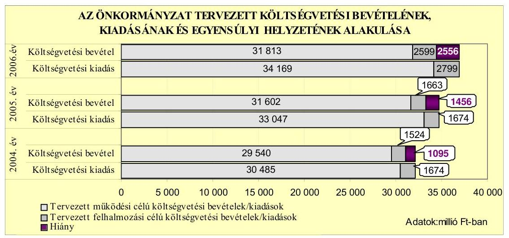
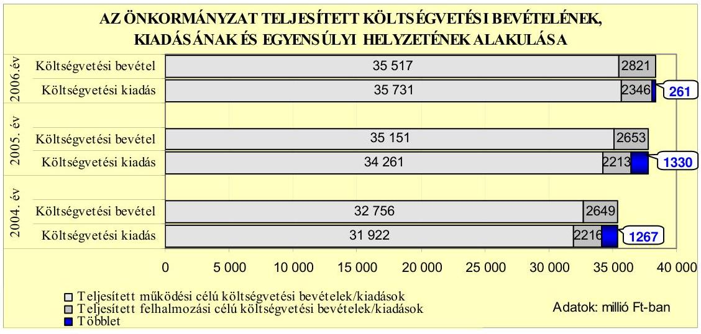
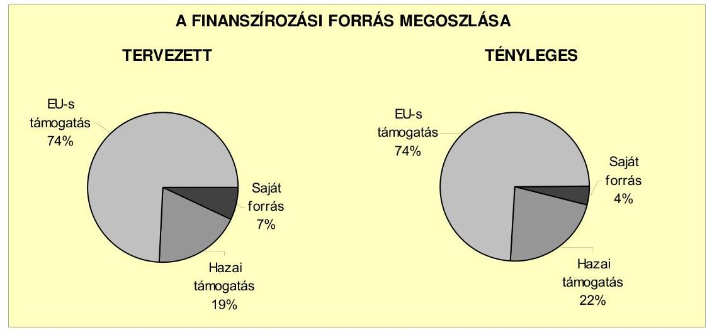
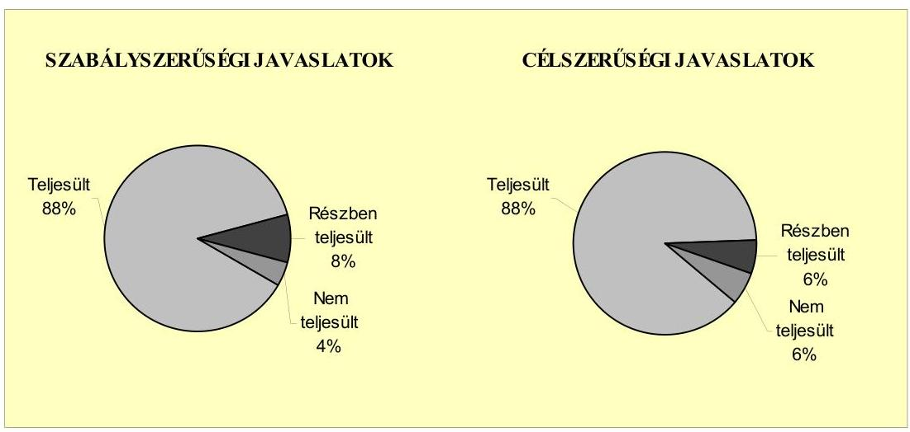
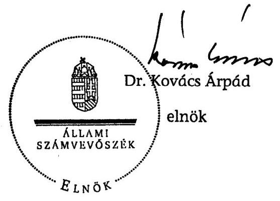
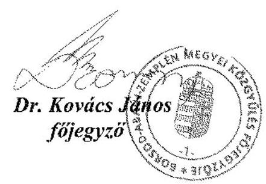

# JELENTÉS 

a Borsod-Abaúj-Zemplén Megyei Önkormányzat gazdálkodási rendszerének 2007. évi átfogó ellenőrzéséről

---

# 3. Önkormányzati és Területi Ellenőrzési Igazgatóság 

## Átfogó Ellenőrzések Főcsoport

Iktatószám: V-1001-9/23/15/2007.
Témaszám: 845
Vizsgálat-azonosító szám: V0319

## Az ellenőrzést felügyelte:

Dr. Lóránt Zoltán
főigazgató
Az ellenőrzés végrehajtásáért felelős:
Dr. Sepsey Tamás
főigazgató-helyettes
Az ellenőrzést vezette:
Csecserits Imréné
főcsoportfőnök-helyettes
Az ellenőrzést végezték:
Bialkó Zsolt Gyula Luhály Matild Szihalminé Kovács Zsuzsanna számvevő tanácsos számvevő tanácsos

## A témához kapcsolódó eddig készített számvevőszéki jelentések:

| címe | sorszáma |
| :-- | :--: |
| Jelentés a helyi önkormányzatok gyermekvédelmi szakellátási te- | 0430 |
| vékenységének ellenőrzéséről |  |
| Jelentés a Borsod-Abaúj-Zemplén Megyei Önkormányzat gazdál- | 0458 |
| kodásának átfogó ellenőrzéséről |  |
| Jelentés a Magyar Köztársaság 2004. évi költségvetése végrehajtá- | 0540 |
| sának ellenőrzéséről |  |

Függelék:

- a helyi önkormányzatokat a 2004. évben megillető normatív állami hozzájárulás elszámolásának ellenőrzése
- normatív kötött felhasználású támogatások 2004. évi felhasználásának ellenőrzése
-a helyi önkormányzatok beruházásaihoz és rekonstrukcióihoz nyújtott 2004. évi felhalmozási célú támogatások ellenőrzése
Jelentés a helyi és a helyi kisebbségi önkormányzatok gazdálkodás0544
sának átfogó ellenőrzéséről
Jelentés a 2004. június 13-án megtartott, az EP tagjai választás és a 0560 2004. december 5-én megtartott országos ügydöntő népszavazás lebonyolításához felhasznált pénzeszközök elszámolásának ellenőrzéséről

---

# címe 

Jelentés a Magyar Köztársaság 2005. évi költségvetése végrehajtásának ellenőrzéséről
Függelék:

- a helyi önkormányzatok beruházásaihoz és rekonstrukcióihoz nyújtott 2005. évi felhalmozási célú támogatások ellenőrzése

---

## Eierlikör (1)

Menge: 1 Drink

2 Zentiliter Zitronensaft
2 Zentiliter Zuckersirup
1 Zentiliter Zuckersirup
1 Zentiliter Zuckersirup
etwas Zuckersirup
etwas Zuckersirup
etwas Zuckersirup
etwas Zuckersirup
etwas Zuckersirup
etwas Zuckersirup
etwas Zuckersirup
etwas Zuckersirup
etwas Zuckersirup
etwas Zuckersirup
etwas Zuckersirup
etwas Zuckersirup
etwas Zuckersirup
etwas Zuckersirup
etwas Zuckersirup
etwas Zuckersirup
etwas Zuckersirup
etwas Zuckersirup
etwas Zuckersirup
etwas Zuckersirup
etwas Zuckersirup
etwas Zuckersirup
etwas Zuckersirup
etwas Zuckersirup
etwas Zuckersirup
etwas Zuckersirup
etwas Zuckersirup
etwas Zuckersirup
etwas Zuckersirup
etwas Zuckersirup
etwas Zuckersirup
et

---

# TARTALOMJEGYZÉK 

BEVEZETÉS ..... 9
I. ÖSSZEGZŐ MEGÁLLAPÍTÁSOK, KÖVETKEZTETÉSEK, JAVASLATOK ..... 13
II. RÉSZLETES MEGÁLLAPÍTÁSOK ..... 20

1. Az Önkormányzat költségvetési és pénzügyi helyzete ..... 20
1.1. A tervezett költségvetési bevételi és kiadási előirányzatok, valamint a költségvetési egyensúly alakulása ..... 22
1.2. A költségvetési bevételek és kiadások teljesítése, a pénzügyi egyensúlyi helyzet alakulása ..... 24
2. Az Önkormányzat felkészültsége az európai uniós források igénylésére és felhasználására, valamint az e-közigazgatási feladatok ellátására ..... 28
2.1. Az európai uniós források igénybevételére és a várható támogatás felhasználásának szervezettségére történt felkészülés és a belső szabályozottság értékelése ..... 28
2.1.1. A fejlesztési célkitűzések meghatározása ..... 28
2.1.2. Az európai uniós forrásokhoz kapcsolódóan a pályázatfigyelés, a pályázatkészítés, valamint az európai uniós támogatással megvalósuló fejlesztés lebonyolítása belső rendjének a szabályozottsága, a végrehajtás személyi, szervezeti feltételei ..... 32
2.1.3. Az európai uniós forrással támogatott fejlesztés megvalósítása ..... 34
2.2. Az e-közigazgatási feladatok előkészítése, bevezetése ..... 36
3. A költségvetési gazdálkodás belső kontrolljai ..... 39
3.1. A szabályozottság kockázata a költségvetés tervezési, gazdálkodási, beszámolási és a folyamatba épített ellenőrzési feladatainál ..... 39
3.2. A belső kontrollok érvényesülése az önkormányzati források szabályszerű felhasználásában, a költségvetési tervezés, gazdálkodás, beszámolás folyamataiban ..... 41
3.3. A belső ellenőrzési kötelezettség teljesítése, javaslatainak hasznosulása ..... 43
4. Az ÁSZ korábbi ellenőrzési javaslatai alapján készített intézkedési terv végrehajtása, eredményessége ..... 46
4.1. Az Önkormányzat gazdálkodási rendszerének átfogó ellenőrzése során tett javaslatok végrehajtására tervezett intézkedések megvalósulása ..... 46

---

4.2. A zárszámadáshoz kapcsolódó állami hozzájárulások, támogatások igénylésének és felhasználásának ellenőrzése, valamint a további vizsgálatok esetében a megállapítások, javaslatok alapján tett intézkedések

# MELLÉKLETEK 

1. számú Az Önkormányzat gazdálkodását meghatározó adatok, mutatószámok (1 oldal)
2. számú Az önkormányzati vagyon alakulása (1 oldal)
3. számú Az Önkormányzat 2004-2006. évi költségvetési előirányzatainak és azok pénzügyi teljesítéseinek alakulása (1 oldal)
4. számú 1. számú Nyilatkozat a tervezett és teljesített költségvetési adatoknak a megelőző évhez viszonyított jelentős, $\pm 10 \%$-ot meghaladó változásának indokolásáról, amennyiben azt az Önkormányzat által ellátott feladatok változása indokolta (1 oldal)
5. számú 1. számú Tanúsítvány az európai uniós forrásokkal támogatott programok, célok tervezett és tényleges adatairól 2004-2007. évekre (1 oldal)
6. számú Dr. Ódor Ferenc úr, a Borsod-Abaúj-Zemplén Megyei Önkormányzat Közgyűlése elnökének észrevétele (4 oldal)

---

# RÖVIDÍTÉSEK JEGYZÉKE 

## Törvények

2004. évi költségvetési törvény
Áht.
Eisztv.
Ötv.
Számv. tv.

## Rendeletek

Ámr.
Ber.
SzMSz
vagyongazdálkodási rendelet

Vhr.

## Szórövidítések

ÁSZ
belső ellenőrzési vezető
e-közigazgatás
Ellenőrzési iroda
EU
FEUVE
föjegyzó
Gazdálkodási osztály
gazdasági szervezet ügyrendje

GVOP
HEFOP
ICsSzEM
a Magyar Köztársaság 2004. évi költségvetéséről szóló 2003. évi CXVI. törvény
az államháztartásról szóló 1992. évi XXXVIII. törvény az elektronikus információszabadságról szóló 2005. évi XC. törvény
a helyi önkormányzatokról szóló 1990. évi LXV. törvény a számvitelről szóló 2000. évi C. törvény
az államháztartás múködési rendjéről szóló 217/1998. (XII. 30.) Korm. rendelet
a költségvetési szervek belső ellenőrzéséről szóló 193/2003. (XI. 26.) Korm. rendelet
a Borsod-Abaúj-Zemplén Megyei Önkormányzat Szervezeti Múködési Szabályzatáról szóló 1/1995. (I. 26.) számú rendelet
a Borsod-Abaúj-Zemplén Megyei Önkormányzat 12/1997. (XI. 14.) számú rendelete a Borsod-AbaújZemplén Megyei Önkormányzat vagyonáról és a vagyongazdálkodás szabályairól
az államháztartás szervezetei beszámolási és könyvvezetési kötelezettségének sajátosságairól szóló 249/2000. (XII. 24.) Korm. rendelet

Állami Számvevőszék
Borsod-Abaúj-Zemplén Megyei Önkormányzat Hivatala Ellenőrzési Irodájának vezetője
elektronikus közigazgatás
Borsod-Abaúj-Zemplén Megyei Önkormányzat Hivatalának Ellenőrzési Irodája
Európai Unió
folyamatba épített, előzetes és utólagos vezetői ellenőrzés Borsod-Abaúj-Zemplén Megyei Önkormányzat főjegyzője Borsod-Abaúj-Zemplén Megyei Önkormányzat Hivatala Közgazdasági Főosztályának Gazdálkodási Osztálya Borsod-Abaúj-Zemplén Megyei Önkormányzat Hivatala gazdasági szervezetének 2006. január 1-jétől a főjegyző által kiadott ügyrendje
Gazdasági Versenyképesség Operatív Program
Humánerőforrás-fejlesztés Operatív Program
Ifjúsági, Családügyi, Szociális és Egészségügyi Minisztérium

---

Igazgatási és jogi főosztály
Igazgatási osztály
Illetékhivatal
KEHI
Kincstári osztály
Közgazdasági főosztály
Közgyűlés
Közgyűlés elnöke
IT
Megyei Reumakórház
NFT
OEP
ÖNHIKI
Önkormányzat
Önkormányzat hivatala
Pénzügyi bizottság
PHARE
PM
ügyrend

Területfejlesztési és vagyonkezelési főosztály

Borsod-Abaúj-Zemplén Megyei Önkormányzat Hivatalának Igazgatási és Jogi Főosztálya
Borsod-Abaúj-Zemplén Megyei Önkormányzat Hivatala Igazgatási és Jogi Főosztályának Igazgatási Osztálya
Borsod-Abaúj-Zemplén Megyei Önkormányzat Illetékhivatala
Kormányzati Ellenőrzési Hivatal
Borsod-Abaúj-Zemplén Megyei Önkormányzat Hivatala Közgazdasági Főosztályának Kincstári Osztálya
Borsod-Abaúj-Zemplén Megyei Önkormányzat Hivatalának Közgazdasági Főosztálya
Borsod-Abaúj-Zemplén Megyei Önkormányzat Közgyűlése
Borsod-Abaúj-Zemplén Megyei Önkormányzat Közgyűlésének elnöke
informatikai technológia
Borsod-Abaúj-Zemplén Megyei Reumakórház Mezőkövesd Nemzeti Fejlesztési Terv
Országos Egészségbiztosítási Pénztár
önhibáján kívül hátrányos helyzetben lévő önkormányzatok támogatása
Borsod-Abaúj-Zemplén Megyei Önkormányzat
Borsod-Abaúj-Zemplén Megyei Önkormányzat Hivatala
Borsod-Abaúj-Zemplén Megyei Önkormányzat Pénzügyi és Gazdálkodási Bizottsága
Lengyelország és Magyarország piacgazdasági átmenetét segíteni hívatott program
Pénzügyminisztérium
Borsod-Abaúj-Zemplén Megyei Önkormányzat Hivatalának 2003. március 26-án a főjegyző által kiadott ügyrendje
Borsod-Abaúj-Zemplén Megyei Önkormányzat Hivatalának Területfejlesztési és Vagyonkezelési Főosztálya

---

# ÉRTELMEZŐ SZÓTÁR 

1. elektronikus szolgáltatási szint
2. elektronikus szolgáltatási szint
3. elektronikus szolgáltatási szint
4. elektronikus szolgáltatási szint
európai uniós források felhasználása
fejlesztési feladat (projekt)
fejlesztési célkitúzés
irányító hatóság

Az 1044/2005. (V. 11.) Korm. határozat alapján olyan információs, tájékoztató szolgáltatás, amely csak általános információkat közöl az adott üggyel kapcsolatos teendőkről és a szükséges dokumentumokról.
Az 1044/2005. (V. 11.) Korm. határozat alapján olyan egyirányú kapcsolatot biztosító szolgáltatás, amely az 1. szinten túl biztosítja az adott ügy intézéséhez szükséges dokumentumok, nyomtatványok letöltését, és azok ellenőrzéssel, vagy ellenőrzés nélküli elektronikus kitöltését, amely esetben a dokumentumok benyújtása hagyományos úton történik.
Az 1044/2005. (V. 11.) Korm. határozat alapján olyan kétirányú kapcsolatot biztosító szolgáltatás, amely közvetlen, vagy ellenőrzött kitöltésű dokumentum segítségével biztosítja az elektronikus adatbevitelt és a bevitt adatok ellenőrzését. Az ügy indításához, intézéséhez személyes megjelenés nem szükséges, de az ügyhöz kapcsolódó közigazgatási döntés (határozat, egyéb aktus) közlése, valamint a kapcsolódó illeték-, vagy díjfizetés hagyományos úton történik.
Az 1044/2005. (V. 11.) Korm. határozat alapján olyan teljes közvetlen kétirányú ügyintézési folyamatot biztosító szolgáltatás, amikor az ügyhöz kapcsolódó közigazgatási döntés is elektronikus úton kerül közlésre, illetve a kapcsolódó illeték-, vagy díjfizetés elektronikus úton is intézhető.
Az elnyert európai uniós források lehívása a támogatott projekt megvalósítása érdekében, a fejlesztés lebonyolítása során a felmerült kiadások finanszírozására.
A fejlesztési feladat (projekt) tartalmilag és formailag részletesen kidolgozott, megfelelő pénzügyi háttérrel és végrehajtási ütemezéssel rendelkező fejlesztési terv, amely illeszkedik az Európai Unió, illetve a Nemzeti Fejlesztési Terv által támogatott programokhoz.
Az önkormányzat által ellátott kötelező, vagy önként vállalt feladatok ellátásának mennyiségi, vagy minőségi fejlesztésére vonatkozó terv. A mennyiségi fejlesztés megvalósulhat beszerzéssel, létesítéssel, bővítéssel, átalakítással.
A strukturális alapok és a Kohéziós alap forrásainak szabályszerű, hatékony és eredményes felhasználásához szükséges intézményrendszer felső eleme. Az irányító hatóság általános és átfogó felelősséget visel a programok, projektek hatékony és szabályszerű végrehajtásáért. Felelősségi köréből eredően ellenőrzi a közösségi, valamint a hazai jogszabályok betartását, koordinálja az európai uniós források szétosztásának folyamatát, irányítja az intézményrendszer, a statisztikai és a pénzügyi nyilvántartási rendszer múködését.

---

kedvezményezett
központi program
közremúködő szervezet
lebonyolítás
operatív program

Az a helyi önkormányzat, amely a támogatási szerződést kedvezményezettként aláíra, a projektet, illetve a központi programhoz kapcsolódó támogatott önkormányzati programot végrehajtja.
Az ország egészére, több régióra, egy régióra vonatkozó, de mindenképpen az önkormányzat közigazgatási területén túlmutató program, amelynél a támogatott programok kiválasztása pályáztatás nélkül, előre meghatározott feltételrendszer szerint történik, a kedvezményezettek közvetlen megkeresésével. Az Európai Unió pénzügyi alapja a Kohéziós alap, a környezetvédelem és a közlekedés terén nyújt lehetőséget az egyes tagországoknak központi programok megvalósítására.
A közremúködő szervezet az európai uniós támogatást elnyert kedvezményezettekkel kapcsolatot tartó szerv. Az operatív programok közremúködő szervezetei befogadják, nyilvántartják, döntésre előkészítik a pályázatokat, rögzítik a támogatással kapcsolatos adatokat az egységes monitoring informatikai rendszerben, elvégzik a támogatások előzetes (szerződéskötést megelőző), közbenső (a pénzügyi elszámolás, finanszírozás folyamatában végzett) és utólagos (a támogatott projekt pénzügyi lezárását megelőző) ellenőrzését. Az önkormányzatoknál a leggyakrabban előforduló operatív program a Regionális Fejlesztési Operatív Program végrehajtásában közremúködő szervezetek a VÂTI Kht. és a regionális fejlesztési ügynökségek.
A Kohéziós alap két közremúködő szervezete (Gazdasági és Közlekedési Minisztérium, Környezetvédelmi és Vízügyi Minisztérium) a támogatott projektek végrehajtásához kapcsolódó operatív feladatokat látják el. Ennek keretében megkötik a szerződéseket a projekt kedvezményezettjével, folyamatosan nyomon követik a teljesítéseket, lebonyolítják a támogatások kifizetését, vezetik az egységes monitoring informatikai rendszert.
Az európai uniós források felhasználásával megvalósuló fejlesztésre irányuló múszaki, gazdasági (pénzügyi) tevékenységet magában foglaló szervezési, irányítási szolgáltatás. A szervezési szolgáltatás kiterjedhet a pályázatkészítésre, a közbeszerzési eljárás lebonyolításán keresztül a folyamatos múszaki ellenőrzésre, a pénzügyi elszámolásra, a múszaki átadás-átvételre, az üzembe helyezésre, illetve a fejlesztési folyamat egyes elemeire.
Az Európai Bizottság által jóváhagyott, a Közösségi Támogatási Keret végrehajtására vonatkozó 2004-2006 közötti, több évre szóló intézkedésekhez kapcsolódó prioritások egységes rendszerét tartalmazó dokumentum. A strukturális alapok operatív programjai: Agrár és Vidékfejlesztési Operatív Program (AVOP); Gazdasági Versenyképesség Operatív Program (GVOP); Humánerőforrás-fejlesztési

---

támogatási szerződés

Operatív Program (HEFOP); Környezetvédelmi és Infras-t-ruk-túra-fejlesztési Operatív Program (KIOP); Regionális Fejlesztési Operatív Program (ROP).
A strukturális alapok esetében az irányító hatóságnak, illetve a Kohéziós alap esetében a közremúködő szervezeteknek a kedvezményezett önkormányzattal kötött szerződése, amely a támogatás felhasználásának részletes feltételeit tartalmazza.

---

.

---

# JELENTÉS 

## a Borsod-Abaúj-Zemplén Megyei Önkormányzat gazdálkodási rendszerének 2007. évi átfogó ellenőrzéséről

## BEVEZETÉS

A helyi önkormányzatokról szóló 1990. évi LXV. törvény 92. § (1) bekezdése, az Állami Számvevőszékről szóló 1989. évi XXXVIII. törvény 2. § (3) bekezdése, valamint az Áht. 120/A. § (1) bekezdése alapján az önkormányzatok gazdálkodását az Állami Számvevőszék ellenőrzi. Az ellenőrzésre az Országgyűlés illetékes bizottságai részére is átadott, országosan egységes ellenőrzési program szerint került sor.

Az Állami Számvevőszék a stratégiájában foglalt célkitűzéseknek megfelelően a helyi önkormányzatok költségvetési gazdálkodási rendszere átfogó ellenőrzésének programját a 2007. évtől megújította, azt kiegészítette további - teljesít-mény-ellenőrzési - elemekkel.

## Az ellenőrzés célja annak értékelése volt, hogy az Önkormányzat:

- a pénzügyi egyensúlyt a költségvetésében és annak teljesítése során milyen módon biztosította, a teljesített bevételek és kiadások egyes évek közötti jelentős eltérése feladatváltozáshoz kapcsolódott-e;
- felkészült-e a szabályozottság és a szervezettség terén az európai uniós források igénylésére és felhasználására, továbbá az e-közigazgatás bevezetése miatti szervezet-korszerűsítési feladatokra;
- kialakította-e a külső és a belső feltételeknek megfelelően a gazdálkodás belső kontrollrendszerét ${ }^{1}$, továbbá a költségvetés tervezési, végrehajtási és zárszámadási feladatok szabályszerű ellátásához hozzájárult-e a folyamatba épített, előzetes és utólagos vezetői ellenőrzés, valamint a belső ellenőrzés;
- megfelelően hasznosították-e a korábbi számvevőszéki ellenőrzések megállapításait, szabályszerűségi ${ }^{2}$ és célszerűségi javaslatait.

[^0]
[^0]:    ${ }^{1}$ A gazdálkodás szabályszerűségét biztosító kontrollrendszer alatt értjük a kiépített és múködő belső irányítási és szabályozási rendszert, valamint a belső ellenőrzési funkciók ellátásának rendszerét.
    ${ }^{2}$ A törvényi előírások betartásának elmulasztásakor a részletes megállapítások fejezetben egységesen a törvénysértés megjelölést alkalmazzuk, mivel az ÁSZ nem tehet különbséget a törvényi előírások között.

---

Az ellenőrzött időszak: az 1., 2. és 4. programpontok tekintetében a 20042006. évek, a 3. ellenőrzési pontnál a 2006. év.

Borsod-Abaúj-Zemplén megye az ország második legnagyobb területú és lakosságszámú megyéje, lakosainak száma Miskolc város lakossága nélkül, 2007. január 1-jén 545584 fő volt. A megyében a 2006. évben 358 önkormányzat múködött, melyből 24 volt város, 12 nagyközség, 321 pedig község. Az Önkormányzat 59 tagú Közgyűlésének munkáját 11 állandó bizottság segítette. A 2006. évi önkormányzati választásokat követően a Közgyűlés elnökének személye változott. A főjegyző 2003. február 1-jétől 2006. december 31-ig látta el feladatát, ezt követően a főjegyzői feladatokat az új főjegyző 2007. április 16i kinevezéséig az aljegyző látta el.

Az Önkormányzat feladatainak végrehajtása érdekében 53 önállóan, ebből egy részben önállóan gazdálkodó intézményt múködtetett, valamint egy gazdasági társaságban volt 100\%-os, kettőben többségi, további négyben kisebbségi részesedése. Az Önkormányzat hivatalában foglalkoztatott köztisztviselők száma 2006. december 31-én 180 fő, a költségvetési intézményekben foglalkoztatott közalkalmazottak száma 7422 fő volt. A megyei illetékhivatalok 2007. január 1-jétől történt megszüntetését, a feladatellátás APEH általi átvételét követően az Önkormányzat hivatalában dolgozók száma 78 fővel csökkent. Az Önkormányzat a 2006. évben 38338 millió Ft költségvetési bevételt és 38077 millió Ft költségvetési kiadást teljesített, a könyvviteli mérleg szerint a 2006. december 31-én 21769 millió Ft vagyonnal rendelkezett. A 2007. évi költségvetési rendeletben 32708 millió Ft költségvetési bevételt és 36539 millió Ft költségvetési kiadást irányoztak elő. (Az Önkormányzat gazdálkodását meghatározó főbb adatokat, mutatószámokat a jelentés 1-3. számú mellékletei tartalmazzák.)

Az Önkormányzat hivatala a 2003. évben az EN ISO 9001:2000 előírásainak megfelelő minőségbiztosítási tanúsítványt szerzett, amely kiterjedt az Önkormányzat hivatalának feladataihoz kapcsolódó döntések szakmai és jogi előkészítésére, illetve a végrehajtás szervezésére, ellenőrzésére.

Az Önkormányzat költségvetési és pénzügyi helyzetét az összehasonlító elemzés módszerével vizsgáltuk. E körben elemeztük a költségvetés egyensúlyi helyzetének alakulását, a tervezett és tényleges költségvetési hiány okait, a mérséklésére tett intézkedéseket, finanszírozásának módját, az Önkormányzat adósságállományának alakulását, összetevőit.

A teljesítmény-ellenőrzés módszerével vizsgáltuk, hogy a belső szabályozottság, szervezettség terén felkészültek-e az európai uniós források igénylésére és felhasználására, valamint az igényelt európai uniós támogatások az Önkormányzat által meghatározott fejlesztési célkitűzésekhez kapcsolódtak-e. Az ellenőrzés során felmértük, hogy az e-közigazgatási feladat ellátása, illetve bevezetése, múködtetése érdekében milyen intézkedéseket tettek, valamint biztosí-tották-e a közérdekú adatok elektronikus közzétételét.

A költségvetési gazdálkodás belső kontrolljainak ellenőrzése során értékeltük, hogy az Önkormányzat hivatalánál a költségvetés tervezési, gazdálkodási, zárszámadás készítési feladatok belső kontrolljainak kiépítettsége és múködése megfelelő biztosítékot ad-e a gazdálkodási feladatok megfelelő, szabályszerű el-

---

látására. Felmértük és minősítettük a költségvetés tervezési, a gazdálkodási, a zárszámadás készítési feladatokkal, továbbá a pénzügyi- számviteli területen az informatikával kapcsolatosan kialakított kontrollok megfelelősségét, valamint azok múködésének eredményességét, megbízhatóságát. Értékeltük a belső ellenőrzés szervezeti és szabályozási keretét, továbbá múködését.

Az Önkormányzat hivatalánál értékeltük a gazdálkodás folyamatában a kontrollok múködésének megbízhatóságát, ennek keretében ellenőriztük a szakmai teljesítés igazolására és az utalvány ellenjegyzésére kialakított kontrollok végrehajtását. Az ellenőrzést a következő, kiemelt kockázatok alapján kiválasztott ${ }^{3}$, az általánostól jellemzően eltérő, egyedi eljárást igénylő gazdasági eseményekkel kapcsolatos kifizetésekre folytattuk le ${ }^{4}$.

- a személyi juttatások közül az állományba nem tartozók megbízási díjai ${ }^{5}$,
- a külső szolgáltató által végzett karbantartási, kisjavítási szolgáltatások, valamint
- a gépek, berendezések, felszerelések beszerzése.

Az ellenőrzés hatékony elvégzése céljából a vizsgálandó területek kiválasztása során a kockázatokon alapuló megközelítés érvényesült, ezáltal az ellenőrzési erőforrásokat azokra a területekre fókuszáltuk, amelyeken legnagyobb a hibák előfordulási valószínűsége. Az ellenőrzési erőforrások ilyen típusú összpontosításával minimálisra csökkenthető a kívánt ellenőrzési bizonyosság eléréséhez szükséges időráfordítás

A pénzügyi-számviteli folyamatokban alkalmazott belső kontrollok létezésének és múködésének ellenőrzésére a vizsgált három terület 2006. évi könyvviteli tételeiből területenként egyszerű véletlen mintát vettünk. A kijelölt gazdasági eseményre elvégzett megfelelőségi tesztek alapján értékeltük a kontrollok múködésének eredményességét, megbízhatóságát a vizsgált három területre külön-

[^0]
[^0]:    ${ }^{3}$ Az önkormányzatok kiemelt előirányzataira vonatkozóan, a vertikális folyamatokra elvégeztük a kockázatok becslését, amelynek eredményeként az állományba nem tartozók megbízási díjai, a külső szolgáltató által végzett karbantartási, kisjavítási szolgáltatások, valamint a gépek, berendezések, felszerelések beszerzése kiemelkedően kockázatos területnek bizonyultak.
    ${ }^{4}$ A korábbi ellenőrzési tapasztalataink szerint ezeken a területeken a jegyzők nem, vagy hiányosan szabályozták a megbízás, megrendelés, illetve beszerzés indokoltságának, szükségességének elbírálására, igazolására, valamint a teljesítések dokumentálására, a kifizetések jogosságának megítélésére szolgáló kontrollokat. További kockázatot jelentett a külső szolgáltató által végzett karbantartási, kisjavítási munkák esetében, hogy az 50 ezer Ft alatti megrendelésekre vonatkozóan az ellenőrzési tapasztalataink szerint a jegyzők nem alakították ki a kötelezettségvállalások rendjét és nyilvántartási formáját, valamint a szabályozás elmulasztása esetén nem történt meg az írásbeli kötelezettségvállalás és annak az ellenjegyzése sem.
    ${ }^{5}$ Az állományba tartozók rendszeres személyi juttatásainak számfejtését, valamint folyósítását nem a polgármesteri hivatalok, hanem a nettó finanszírozás keretében a beküldött dokumentumok alapján a MÁK végzi.

---

külön, majd összefoglalóan ${ }^{6}$ az Önkormányzat hivatalában egyedi eljárást igénylő gazdasági eseményeire. A helyszíni ellenőrzés megállapításainak részletes dokumentálását három megfelelőségi tesztlapon, öt elővizsgálati és kilenc helyszíni ellenőrzési munkalapon biztosítottuk. Ezeken a teszt- és munkalapokon a minősítés alapjául szolgáló kérdések és a vonatkozó konkrét jogszabályhelyek megjelölése mellett értékeltük a kialakított belső kontrollokban rejlő kockázatokat ${ }^{7}$ és a kialakított kontrollok működésének megbízhatóságát ${ }^{8}$. A helyszíni ellenőrzés során kitöltött - az ellenőrzést végző számvevő és az Önkormányzat hivatalának felelős köztisztviselője által aláírt - elővizsgálati és helyszíni ellenőrzési munkalapokat, azok kitöltési útmutatóit, továbbá a megfelelőségi tesztek dokumentumait a Közgyűlés elnöke részére a számvevői jelentéssel egyidejűleg átadtuk.

Az ÁSZ korábbi ellenőrzési javaslatai alapján tett intézkedéseket, illetve azok megvalósítását utóellenőrzés keretében vizsgáltuk. A gazdálkodási rendszer átfogó ellenőrzése során tett javaslatok végrehajtására tett intézkedések megvalósítását ellenőriztük, az egyéb számvevőszéki ellenőrzések során tett javaslatok esetében pedig a kiadott intézkedéseket tekintettük át.

A jelentés megállapításainak, javaslatainak egyeztetése során a Közgyűlés elnöke arról adott tájékoztatást, hogy az időközben megtett intézkedésekkel a javaslatok egy részét megvalósították. Ezekben az esetekben a jelentés II. Részletes megállapítások fejezetében az adott témához kapcsolt lábjegyzetben a megtett intézkedést feltüntettük és a kapcsolódó javaslatot elhagytuk.

A jelentést az ÁSZ-ról szóló 1989. évi XXXVIII. tv. 25. § (1) bekezdése alapján észrevétel közlése céljából megküldtük a Borsod-Abaúj-Zemplén Megyei Önkormányzat Közgyűlése elnökének. A kapott észrevételt a jelentés 6. számú melléklete tartalmazza.
${ }^{6}$ A vizsgált három terület egyedi értékelési pontszámait a területek relatív költségvetési súlyával arányosan összegeztük.
${ }^{7}$ A kialakított belső kontrollokban rejlő kockázatot alacsonynak minősítettük, ha a kontrollok - végrehajtásuk esetén - megfelelő védelmet nyújtanak a hibák bekövetkezése ellen. Közepesnek minősítettük a belső kontrollokban rejlő kockázatot, amennyiben a kontrollok - végrehajtásuk esetén - a lehetséges hibák többsége ellen védelmet nyújtanak. Magasnak értékeltük a kockázatot, ha a kontrollok - kialakításuk hiányában, vagy hiányos kialakításuk miatt - nem nyújtanak elegendő védelmet a lehetséges hibákkal szemben.
${ }^{8}$ A kontrollok múködésének eredményességét, megbízhatóságát kiválónak értékeltük abban az esetben, ha azok múködése - esetleges apróbb hiányosságoktól eltekintve megfelelt a hibák megelőzésére és kijavítására meghatározott szabályozásnak és a legmagasabb szintű elvárásoknak. Jónak minősítettük a kontrollok múködését, ha a hiányosságok száma ugyan jelentős volt, de nem veszélyeztette az ellenőrzött terület hibáinak megelőzését és kijavítását. Amennyiben a hiányosságok mértéke nem biztosította a hibák megelőzését, feltárását, kijavítását és ezáltal veszélyeztette az eredményes, megbízható múködést, a kontroll múködésének megbízhatósága gyenge minősítést kapott.

---

# I. ÖSSZEGZŐ MEGÁLLAPÍTÁSOK, KÖVETKEZTETÉSEK, JAVASLATOK 

Az Önkormányzat tervezett költségvetési bevételei és kiadásai a 2004-2007. évek között folyamatosan növekedtek, de a tervezett költségvetési bevételek egyik évben sem biztosították a fedezetet a költségvetési kiadásokra, mind a négy évben forráshiánnyal tervezték a költségvetést. A költségvetési egyensúly biztosítása érdekében növekvő arányban rövid, illetve hosszú lejáratú hitelfelvételt terveztek. Az Önkormányzatnál a 2004-2006. évek között a költségvetések végrehajtásakor a tervezettől eltérően a teljesített összes költségvetési bevétel fedezte a teljesített összes költségvetési kiadást. A költségvetés végrehajtása során a 2004-2005. években a múködési célú költségvetési bevételeknél többlet, a 2006. évben viszont a múködési célú költségvetési kiadásoknál forráshiány keletkezett. A teljesített felhalmozási célú költségvetési kiadásokra mindhárom évben fedezetet biztosítottak a felhalmozási célú költségvetési bevételek.

Az Önkormányzat hivatala év közben a pénzügyi egyensúly biztosításához 2004-2006 között folyószámlahitelt vett igénybe, melyet - a 2006. év kivételével - az év végén visszafizettek. A múködési célú költségvetési kiadások csökkentése, a gazdálkodás áttekinthetőbbé tétele érdekében a 2005. évben a Közgyűlés a gyermekvédelmi szakellátás múködésének és szervezeti rendszerének átalakításáról, valamint a megyei fenntartású nevelési-oktatási intézmények szakmai, gazdálkodási és szervezeti korszerűsítéséről döntött. Az átszervezések következtében az Önkormányzat intézményeinek száma 2004-2006 között 64ről 53-ra csökkent. A likviditás elősegítése érdekében a kiadásokat rangsorolták, lehetőség szerint átütemezték, azonban 2004-2006 között az Önkormányzat hivatala a fizetési kötelezettségeit egyre nagyobb mértékű napi folyószámlahitel igénybevételével teljesítette.

Az Önkormányzatnál a költségvetés végrehajtása során az eredeti előirányzatot a teljesített költségvetési bevételek mindhárom évben - 11-14\%-kal meghaladták, amit az eredeti előirányzatként nem tervezett pénzmaradvány igénybevétel, az év közben elnyert pályázati pénzösszegek, és egyes múködési célú költségvetési bevételek alultervezése eredményezett. Az Önkormányzat a 2004. és a 2006. évek között a költségvetés egyensúlyát a múködési célú kiadásainak csökkentésére irányuló intézkedéseivel, a pályázati lehetőségek kihasználásával összességében biztosította, de a 2006. évben a múködési célú költségvetési kiadásokra felhalmozási célú költségvetési bevételt is fordított. Az Önkormányzat a 2006. évet 306 millió Ft rövid lejáratú hitelállománnyal és a múködési célú költségvetési kiadásoknál 214 millió Ft forráshiánnyal zárta.

Az Önkormányzat a 2004-2006. évekre szóló fejlesztési tervében rögzítette a feladataihoz kapcsolódó fejlesztési célkitüzéseit, amelyeket az igénylők számának és az ellátottsági mutatóknak a figyelemmel kísérésével támasztottak alá, azonban a feladatok megoldásánál jelentkező feszültségekről felmérést nem készítettek. A fejlesztési terv tartalmazta a várható kiadásokat és a kiadá-

---

sok fedezetéül szolgáló pénzügyi forrásokat. Az NFT-ben megjelenő pályázati lehetőségek figyelembevételével a fejlesztési célkitűzéseket felülvizsgálták, azokat a pályázati feltételek megváltoztatása esetén - lehetőség szerint- módosították. Hét fejlesztési célkitűzés megvalósításához pályáztak európai uniós forrásra, amelyből három pályázatot elutasítottak és négy pályázat megvalósult, illetve megvalósítása folyamatban van.

Az Önkormányzat az európai uniós források igénybevételére és felhasználására a belső szabályozottság tekintetében eredményesen felkészült, mivel az európai uniós források igénybevételéhez és felhasználásához kapcsolódóan a pályázatfigyelés, a pályázatkészítés, valamint a támogatással megvalósuló fejlesztés lebonyolításának belső rendjét szabályozták. Hiányossága a szabályozásnak, hogy a Közgyűlés elnöke és a fejlesztési feladat lebonyolítója közötti kapcsolattartás rendjét nem írták elő. A pályázatfigyeléssel, pályázatkészítéssel és a fejlesztési feladatok lebonyolításával összefüggő feladatok ellátásának személyi és szervezeti feltételeit - 2005. április 1-jétől - kialakították. Ettől az időponttól kezdődően külső személyt, szervezetet pályázatkészítéssel, projektmenedzseri feladatok ellátásával nem bíztak meg. Az Önkormányzat a projektötletekkel, illetve a pályázatokkal kapcsolatos információk azonos elvek szerinti rögzítésére pályázat nyilvántartó rendszert múködtetett. A pályázati szabályzatban előírták az európai uniós források igénybevételével és felhasználásával kapcsolatos részletes feladatokat. A pályázatfigyelés, pályázatkészítés, valamint a támogatott fejlesztések lebonyolításának folyamatba épített ellenőrzési kötelezettségét, feladatait és felelőseit a FEUVE keretében szabályozták. Az európai uniós források igénybevételével és felhasználásával összefüggő felelősség szabályait - annak indokoltsága ellenére - nem határozták meg, erre vonatkozó előírást a feladatellátással megbízott köztisztviselők munkaköri leírásai sem tartalmaztak. A fejlesztési feladatok lebonyolításával kapcsolatos belső ellenőrzési feladatot a pályázati szabályzatban, illetve az ügyrendben - annak indokoltsága ellenére - nem írtak elő.

A Megyei Reuma Kórház a HEFOP keretében igényelhető támogatásra nyújtott be pályázatot rehabilitációs központ létrehozása céljából. Az elnyert európai uniós támogatást teljes összegben igénybe vették, a szükséges saját forrást biztosították, a fejlesztés utófinanszírozási rendszere pénzügyi zavarokat nem okozott. A beruházási feladat tényleges kiadásai megegyeztek a támogatási szerződésben rögzített kiadások összegével. A támogatott beruházás megvalósítási ütemeinek a műszaki tartalma eltért a támogatási szerződés szerinti cselekvési programban rögzített ütemezéstől, ezért a támogatási szerződést és annak részét képező megvalósítási és kivitelezési (pénzügyi) ütemtervet három alkalommal módosították. A beruházást a módosított ütemtervhez képest egy hónappal korábban befejezték. Az európai uniós forrásból megvalósuló, regionális rehabilitációs központ létrehozását - a megvalósítás folyamatában - a közreműködő szervezet, illetve a KEHI ellenőrizte. A külső ellenőrzések szabálytalanságra, mulasztásra vonatkozó megállapítást nem tettek.

Az Önkormányzat által működtetett elektronikus ügyintézési és tájékoztató rendszer a 2. elektronikus szolgáltatási szint követelményeit biztosította, lehetővé tette szociális-gyermekvédelmi és oktatás-igazgatási hatósági ügyekben az ügyfelek számára a hatósági formanyomtatványok, adatlapok letöltését, és azok elektronikus kitöltését. A Közgyűlés 2006. decemberében az e-

---

közigazgatási feladatok 4. elektronikus szolgáltatási szintnek megfelelő ellátásáról döntött, amelynek megvalósítása elkezdődött. Az Önkormányzat a közérdekű adatok közzétételére kötelezett volt, azonban az Eisztv-ben foglaltak ellenére a többségi tulajdonában álló, illetve részvételével múködő gazdálkodó szervezetek, és az általa alapított közalapítványok adatait, valamint a tevékenységére, múködésére vonatkozó előírt adatkörből a honlap nem tartalmazta az Önkormányzat önként vállalt feladatait, valamint az Áht. előírása ellenére a 2006. évben nyújtott fejlesztési célú támogatások adatait (illetve a 2007. I. negyedévében nyújtott múködési és fejlesztési támogatások adatait (támogatottak neve, a támogatás célja, összege, a támogatási program megvalósítási helye) nem tette közzé.

Az Önkormányzat hivatalában a költségvetési tervezés és a zárszámadás készítési folyamatokat szabályozták, a szabályozás összességében a 2006. évben alacsony kockázatot jelentett a feladatok szabályszerű végrehajtásában, mivel a főjegyző belső szabályzatokban meghatározta a költségvetési javaslat összeállításával kapcsolatos követelményeket, előírta a kapcsolódó ellenőrzési feladatokat. Annak ellenére összességében alacsony volt a kockázat, hogy az intézményi térítési díjakból származó saját bevételek előirányzatai, és a költségvetés megalapozását szolgáló önkormányzati rendeletek összhangjának ellenőrzési kötelezettségét nem írták elő és nem végezték el. A költségvetési tervezés és a zárszámadás készítés folyamatára kialakított kontrollok múködésének megbízhatósága a 2006. évben összességében kiváló volt a múködésbeli hibák megelőzése, feltárása, kijavítása tekintetében, mivel az előírt egyeztetési, ellenőrzési feladatokat elvégezték.

Az Önkormányzat hivatalában a 2006. évben a pénzügyi-számviteli tevékenységek szabályszerű végrehajtásában a gazdálkodási, a pénzügyiszámviteli és a folyamatba épített ellenőrzési feladatok szabályozottsága öszszességében alacsony kockázatot jelentett, mivel rendelkeztek az előírt szabályzatokkal, azok tartalmát rendszeresen felülvizsgálták, aktualizálták. Annak ellenére összességében alacsony volt a kockázat, hogy a gépek, berendezések, felszerelések, valamint az üzemeltetésre, kezelésre átadott eszközök esetében kétévenkénti mennyiségi leltározási kötelezettséget írtak elő az Önkormányzat rendeletben történt felhatalmazása nélkül, valamint nem határozták meg a terven felüli értékcsökkenés elszámolásának rendjét, nem rögzítették az egyeztetések elvégzésének dokumentálási módját, továbbá nem határoztak meg a kockázatkezelési eljárásrendben elfogadható kockázati szintet, nem gondoskodtak a válaszintézkedések megvalósíthatóságának a mérlegeléséről, a kockázatok nyilvántartásáról, illetve nem szervezték meg a válaszintézkedések beépítését a folyamatokba.

Az Önkormányzat hivatalánál az állományba nem tartozók megbízási díjaival, a karbantartási, kisjavítási szolgáltatásokkal, továbbá a gépek, berendezések, felszerelések beszerzésével kapcsolatos kifizetések során a kontrollok múködésének megbízhatósága a 2006. évben összességében kiváló volt, mivel a szakmai teljesítés igazolás és az utalvány ellenjegyzés megfelelő biztosítékot adott a gazdálkodási feladatok megfelelő, szabályszerű ellátására. Annak ellenére összességében kiváló volt, hogy az Illetékhivatal számítástechnikai eszközeinek karbantartását, valamint a vízelvezető rendszer meghibásodásá-

---

nak javítását biztosító szolgáltatások esetében a kiadás összegszerűségének ellenőrzését a szakmai teljesítés igazolására kijelölt személy nem végezte el, és az utalvány ellenjegyző́je a gazdálkodásra vonatkozó szabályok betartásáról, és az érvényesítés megtörténtéről nem győződött meg.

Az Önkormányzat hivatalában a 2006. évben az informatikai rendszer szabályozottsága közepes mértékű kockázatot jelentett az informatikai feladatok biztonságos végrehajtásában, mivel nem gondoskodtak az informatikai eszközökhöz való hozzáférések ellenőrzési rendjének meghatározásáról, és az elvégzett ellenőrzések dokumentálásának előírásáról. Az informatikai rendszerek múködtetésénél a múködésbeli hibák megelőzése, feltárása, kijavítása tekintetében a kialakított kontrollok múködésének megbízhatósága a 2006. évben összességében kiváló volt, mivel számítógépes program informatikai hálózati rendszer útján biztosította a főkönyv és a költségvetési beszámoló adatainak egyezőségét a szükséges adatok egyszeri bevitele alapján, megoldott a szolgáltatott adatok rendszeres ellenőrzése.

Az Önkormányzatnál a 2006. évben a belső ellenőrzés szervezeti és szabályozási kerete összességében alacsony kockázatot jelentett, mivel a Közgyűlés a belső ellenőrzési feladatok ellátására létre hozta az Ellenőrzési irodát, melynek funkcionális és szervezeti függetlenségét biztosították, valamint szabályozták a belső ellenőrzés működési feltételeit. A belső ellenőrzési vezető elkészítette a belső ellenőrzés 2006-2010. évekre szóló, kockázatelemzés segítségével meghatározott stratégiai tervét. A Közgyűlés a 2006-2007. évi éves ellenőrzési terveket elfogadta.

A 2006. évben a belső ellenőrzés működésének megbízhatósága összességében kiváló volt, mivel a hibák feltárásával, valamint a célirányos intézkedések kezdeményezésével, a realizálás ellenőrzésével megfelelt a hibák megelőzésére és kijavítására meghatározott szabályozásnak. Annak ellenére összességében kiváló volt, hogy a belső ellenőrzés keretében nem ellenőrizték az Önkormányzat hivatalában a FEUVE rendszer kiépítését és múködését. A 2006. és a 2007. évben az Önkormányzat többségi irányítást biztosító befolyása alatt működő három gazdasági társaságnál, illetve a vagyonkezelőknél a rendelkezésre álló erőforrásokkal való gazdálkodás, a vagyon megóvás, gyarapítás, az elszámolások, beszámolók megbízhatóságának ellenőrzését nem tervezték.

A belső ellenőrzésről készített jelentések szükség szerint tettek ajánlásokat és javaslatokat. A főjegyző a 2005. és a 2006. évi költségvetési beszámoló keretében beszámolt a folyamatba épített előzetes és utólagos vezetői ellenőrzés, valamint a belső ellenőrzés múködtetéséről. A Közgyűlés elnökének előterjesztése alapján a Közgyűlés a 2006. és a 2007. évben a zárszámadási rendelettervezettel egyidejúleg áttekintette az általa alapított és fenntartott költségvetési szervek ellenőrzésének tapasztalatait, és elfogadta az erről szóló beszámolókat.

Az Önkormányzat gazdálkodásának 2004. évi átfogó ellenőrzéséről készített számvevőszéki jelentésben tett megállapítások, javaslatok hasznosítására készített intézkedési tervben meghatározták az elvégzendő feladatokat, azok végrehajtásáért felelős személyeket és határidőket. A javaslatok $80 \%$-át teljes mértékben, $12 \%$-át részben hasznosították. A javaslatok $8 \%$-át nem hasznosították, mivel az Ámr. előírása ellenére a 13. havi illetménynek csak a $75 \%$-át

---

tervezték meg a költségvetésben eredeti előirányzatként, a leltározási szabályzat módosításakor nem voltak figyelemmel az Vhr-ben előírt önkormányzati rendeletben való szabályozás követelményére. A kötelezettségvállalások ellenjegyzésének, illetve a szakmai teljesítésigazolásoknak a banki és pénztári kifizetéseknél történő elvégzésére irányuló javaslat a külső szolgáltató által végzett számítástechnikai eszközök karbantartását, kisjavítását biztosító szolgáltatásoknál részben hasznosult.

A költségvetési koncepció és a költségvetési rendelet tartalmára, mellékleteire vonatkozó javaslatok hasznosításával javult a Közgyűlés döntéshozatalát elősegítő tájékoztatás. A gazdálkodás és a pénzügyi-számviteli feladatok szabályozottságának biztosítása érdekében tett javaslatok hasznosítása - a külső pénzkezelési helyként működő önkormányzati üdülők pénzforgalmával kapcsolatos szabályok meghatározása, és az SzMSz Önkormányzat hivatalára vonatkozó részeinek kiegészítése - hozzájárult a feladatok szabályozásához. Az utólagos elszámolásra felvett előlegek elszámolási határidejének tudomásulvételéről szóló nyilatkozattétel kötelezettségének előírása elősegítette a pénzügyi fegyelem javulását. A követelések, részesedések, értékpapírok értékelésének elvégzése biztosította ezen eszközök esetében a számviteli előírásoknak megfelelő értéken való bemutatását a könyvviteli mérlegben. A 2006. évben az ingatlanértékesítések során a döntéseket az arra jogosultak hozták meg, hasznosítva az erre irányuló javaslatot. A céljelleggel nyújtott támogatások számadási kötelezettségének előírására tett intézkedések a 2006. évben hozzájárultak a támogatások cél szerinti felhasználásához, és a számadáskérés szabályszerűségéhez. Folyamatban van, de nem fejeződött be a középületek akadálymentessé tétele. A belső ellenőrzési rendszer szabályozottságának a szintje javult a belső ellenőr funkcionális függetlenségének SzMSz-ben történő biztosításával, a belső ellenőrzést végzők kötelezettségeinek és feladatainak előírásával.

Az Önkormányzatnál a 2004-2006. évek között végzett további ÁSZ ellenőrzések javaslatai hasznosultak. A gyermekvédelemmel kapcsolatos személyes gondoskodást nyújtó ellátások ellenőrzése során tett javaslatokat hasznosítva az Önkormányzat által fenntartott gyermekotthonok szerkezetét átalakították, azok alapító okiratait módosították, a gondozási díjbevételek fokozott ellenőrzését, valamint a díjhátralékok behajtása hatékonyságának ellenőrzését az intézmények az Ellenőrzési iroda által lefolytatott átfogó ellenőrzése során biztosították. A 2004. június 13-án megtartott, az Európai Parlament tagjainak választásához és a 2004. december 5-i országos ügydöntő népszavazás lebonyolításához felhasznált pénzeszközök elszámolásának ellenőrzése által javasoltakat hasznosítva, gondoskodtak a választással kapcsolatosan felmerült költségek választásonkénti elkülönített nyilvántartásáról, az általános költségek kimutatásáról. A helyi önkormányzatok beruházásaihoz és rekonstrukcióihoz nyújtott 2004. évi felhalmozási célú támogatások ellenőrzésének javaslata alapján a Közgyűlés elnöke kezdeményezte a jogszabályi feltételeknek nem megfelelő pályázat alapján elnyert és jogtalanul igénybe vett TERKI támogatási előirányzatról való lemondást, és ezt követően intézkedett a jogtalanul igénybe vett támogatás visszafizetéséről.

---

A helyszíni ellenőrzés megállapításainak hasznosítása mellett javasoljuk:

# a Közgyülés elnökének 

a munka színvonalának javítása érdekében

1. kezdeményezze, hogy a számvevőszéki jelentésben foglaltakat a Közgyűlés tárgyalja meg és a feltárt hiányosságok megszűntetése érdekében készíttessen intézkedési tervet a határidők és felelősök megjelölésével;
2. kezdeményezze, hogy a fejlesztési célkitűzések meghatározásához a feladatok megoldásánál jelentkező feszültségekről felmérés készüljön;

## a föjegyzönek

a jogszabályi előírások maradéktalan betartása érdekében

1. biztosítsa az Eisztv. 6. § (1) bekezdésében előírtak alapján az Önkormányzat többségi tulajdonában álló, illetve részvételével múködő gazdálkodó szervezetek, és az általa alapított közalapítványok adatainak, valamint a tevékenységére, müködésére vonatkozóan előírt adatkörből az Önkormányzat önként vállalt feladatainak, továbbá az Áht. 15/A. § (1) bekezdésében előírtak alapján a 2006. évben nyújtott fejlesztési célú támogatások adatainak, illetve a 2007. I. negyedévében nyújtott müködési és fejlesztési célú támogatások adatainak (támogatottak neve, a támogatás célja, öszszege, a támogatási program megvalósítási helye) az Önkormányzat internetes honlapján történő közzétételét;
2. határozza meg az Ámr. 145/C. § (4) bekezdése alapján a kockázatkezelési eljárásrend múködtetése keretében az elfogadható kockázati szintet, gondoskodjon a kockázatok nyilvántartásáról, gondoskodjon, hogy mérlegeljék a válaszintézkedések megvalósíthatóságát, illetve szervezze meg a válaszintézkedések beépítését a folyamatokba;
3. gondoskodjon róla, hogy a külső szolgáltató által végzett karbantartási, javítási szolgáltatások megrendeléseiben határozzák meg a szolgáltatás ellenértékét, mely alapján a szakmai teljesítésigazolása és az érvényesítés során ellenőrizzék a kifizetés öszszegszerűségét az Ámr. 135. § (1) bekezdésében foglaltaknak megfelelően, valamint az utalvány ellenjegyzésénél az Ámr. 137. § (3) bekezdésében előírtak alapján győződjenek meg a szakmai teljesítés igazolás és az érvénesítés összegszerűségre vonatkozó elvégzéséről;
4. biztosítsa, hogy a Ber. 8. § a) pontjának előírása alapján az Önkormányzat hivatalában a FEUVE rendszer kiépítését és müködését vizsgálja a belső ellenőrzés;
5. gondoskodjon az Önkormányzat gazdálkodásának 2004. évi átfogó ellenőrzése során az ÁSZ által tett és nem, vagy részben teljesült szabályszerűségi és célszerűségi javaslatok végrehajtásáról;

---

a munka színvonalának javítása érdekében
6. határozza meg az európai uniós források igénybevételével és felhasználásával összefüggő fejlesztési feladatok lebonyolításával kapcsolatos ellenőrzési feladatot;
7. írja elő az intézményi térítési díjakból származó saját bevételek előirányzatai és a költségvetés magalapozását szolgáló önkormányzati rendeletek közötti összhang ellenőrzési kötelezettségét, és gondoskodjon az ellenőrzés végrehajtásáról;
8. határozza meg az informatikai hozzáférések ellenőrzési rendjét, és írja elő az elvégzett ellenőrzések dokumentálásának kötelezettségét;
9. intézkedjen annak érdekében, hogy a belső ellenőrzésre vonatkozó stratégiai terv felülvizsgálata, aktualizálása során a kockázatelemzés kiterjedjen az Önkormányzat többségi irányítást biztosító befolyása alatt múködő gazdasági társaságoknál, illetve vagyonkezelőknél a rendelkezésre álló erőforrásokkal való gazdálkodás, a vagyon megóvás, gyarapítás, az elszámolások, beszámolók megbízhatósága vizsgálatának feladataira.

---

# II. RÉSZLETES MEGÁLLAPÍTÁSOK 

## 1. Az ÖNKORMÁNYZAT KÖLTSÉGVETÉSI ÉS PÉNZÜGYI HELYZETE

Az Önkormányzatnál a 2004-2006 közötti időszakban folyamatosan emelkedtek a tervezett és teljesített költségvetési bevételek és kiadások. A költségvetés egyensúlya azonban nem volt biztosított, mivel a tervezett költségvetési bevételek nem nyújtottak fedezetet a tervezett költségvetési kiadásokra, a tervezett költségvetési hiány mértéke a 2004. évi 3\%-ról a 2006. évre 7\%-ra, a 2007. évre $10 \%$-ra emelkedett. A teljesítési adatok alapján az Önkormányzat mindhárom évben költségvetési többlettel zárta az évet.

A tervezett és teljesített múködési és felhalmozási célú költségvetési bevételek és kiadások alakulását szemlélteti a következő grafikus ábra:

A 2004-2006. évi költségvetési rendeletekben a költségvetés bevételi és kiadási főösszegének, illetve a költségvetés hiányának megállapításakor az Áht. 8/A. § (7) bekezdésében előírtakkal összhangban finanszírozási célú pénzügyi múveletek nélkül állapították meg a költségvetési bevételeket, illetve költségvetési kiadásokat.

Az Önkormányzatnál a 2004-2006. években tervezett és teljesített múködési és felhalmozási célú költségvetési kiadásokra a következő arányban biztosítottak fedezetet a költségvetési bevételek:

---

| Megnevezés | Adatok: \%-ban |  |  |  |  |  |
| :--: | :--: | :--: | :--: | :--: | :--: | :--: |
|  | 2004. év |  | 2005. év |  | 2006. év |  |
|  | Terv | Tény | Terv | Tény | Terv | Tény |
| Múködési célú kiadások fedezettsége múködési célú költségvetési bevételekből | 96,9 | 102,6 | 95,6 | 102,6 | 93,1 | 99,4 |
| Felhalmozási célú kiadások fedezettsége felhalmozási célú költségvetési bevételekből | 91,0 | 119,5 | 99,4 | 119,9 | 92,9 | 120,2 |
| Költségvetési kiadások fedezettsége költségvetési bevételekből | 96,6 | 103,7 | 95,8 | 103,6 | 93,1 | 100,7 |

A tervezett múködési, illetve felhalmozási célú költségvetési bevételek egyik évben sem biztosították a fedezetet a tervezett azonos célú - múködési, illetve felhalmozási -költségvetési kiadásokra. A tervezett múködési célú kiadások nagyobb arányban növekedtek, mint a tervezett múködési célú bevételek.

A költségvetés végrehajtása során, a tervezettnél magasabb összegű költségvetési bevételek-kiadások mellett a teljesített költségvetési bevételek fedezték a teljesített költségvetési kiadásokat. Mindhárom évben - a 2006. évi mintegy 1\%os múködési célú költségvetési forráshiány kivételével - múködési, illetve felhalmozási célú költségvetési bevételi többlettel zárta az évet az Önkormányzat.

A 2005-2006. években tervezett és teljesített költségvetési - azon belül múködési és felhalmozási célú - bevételek és kiadások megelőző évhez viszonyított változását szemlélteti a következő táblázat:

|  | Változás az előző évhez (\%) |  |  |  |
| :-- | :--: | :--: | :--: | :--: |
| Megnevezés | $\mathbf{2 0 0 5}$. évben |  | 2006. évben |  |
|  | Terv | Tény | Terv | tény |
| Múködési célú költségvetési bevételek változása | 7,0 | 7,3 | 0,7 | 1,0 |
| Múködési célú költségvetési kiadások változása | 8,4 | 7,3 | 3,4 | 4,3 |
| Felhalmozási célú költségvetési bevételek változása | 9,2 | 0,1 | 56,2 | 6,3 |
| Felhalmozási célú költségvetési kiadások változása | 0 | $-0,1$ | 67,2 | 6,0 |
| Összes költségvetési bevétel változása | $\mathbf{7 , 1}$ | $\mathbf{6 , 8}$ | $\mathbf{3 , 4}$ | $\mathbf{1 , 4}$ |
| Összes költségvetési kiadás változása | $\mathbf{8 , 0}$ | $\mathbf{6 , 8}$ | $\mathbf{6 , 5}$ | $\mathbf{4 , 4}$ |

A 2006. évi felhalmozási célú költségvetési bevételi és kiadási előirányzatok tervezett növekedését az uniós forrásból megvalósításra tervezett kórházbővítés (1082 millió Ft), illetve a címzett támogatás segítségével tervezett szociális intézményépítés ( 368 millió Ft) adott évre vonatkozó előirányzatai okozták.

A vizsgált időszakban a 2004. évben települési önkormányzattól átvett két középfokú oktatási intézmény múködtetésének kötelezettsége jelentett feladat bővülést, valamint a 2005. és a 2006. évi intézmény átalakítások, összevonások jelentettek változást a feladatellátás módjában.

---

# 1.1. A tervezett költségvetési bevételi és kiadási előirányzatok, valamint a költségvetési egyensúly alakulása 

Az Önkormányzatnál a Közgyűlés 137/1999. (XII. 16.) számú határozata alapján az egészségügyi intézmények és a gazdasági-műszaki ellátó szolgálat egyes részeit (textiltisztítás, portaszolgálat, vagyonvédelem, takarító szolgáltatás, műszaki-karbantartó ellátó szolgálat, étkeztetés) közbeszerzés alapján vállalkozásba adták.

#### Abstract

A vállalkozási szerződésekben foglalt díjfeltételek alapján a dologi kiadások eredeti előirányzata a 2005. évben 16\%-kal, a 2006. évben további 11\%-kal növekedett. A 2006. évi kiadásemelkedés mérséklődésénél a 2005. évben elkezdett intézményracionalizálás már éreztette hatását. Az étkeztetés megoldási módja 2006. január 1-jétől megváltozott, az étkeztetést vásárolt szolgáltatásként biztosították. Az élelmezéssel kapcsolatos térítési díjak a szolgáltató bevételét képezték, ezért az intézményi múködési bevételek előirányzatát a 2006. évben mintegy 500 millió Ft-tal kisebb összegben tervezték a 2005. évi teljesítésnél. Az illeték bevételeknél a 2005. évben 300,7 millió Ft-tal (12\%-kal) kevesebb bevételt terveztek az előző évben teljesített bevételek összegénél, mert figyelembe vették, hogy a 2004. év során volt egy 600,7 millió Ft-os rendkívüli bevétele az Önkormányzatnak. A 2006. évi költségvetésben 11\%-kal kevesebb illeték bevételt terveztek, mint az előző évben beszedett illetékek összege volt, mivel az előirányzat tervezésénél figyelembe vették, hogy a 2006. évben központi szabályozás alapján a vagyonszerzéshez kapcsolódóan az ingatlan nyilvántartási eljárás illetékének kiszabása és behajtása kikerült az illetékhivatalok hatásköréből.

A felhalmozási célú tervezett kiadásokon belül a felújítások helyett előtérbe került egy-egy intézmény teljes körű rekonstrukciója, amelyhez pályázati forrás igénybevételét tervezték. Ezek a fejlesztések magukba foglalták az épületek korszerűsítését, hőszigetelését, elektromos hálózatának a rekonstrukcióját, estleges bővítését, a célnak megfelelőbb átalakítását. A 2005. és a 2006. évben a Közgyűlés kijelölése alapján forgalomképes ingatlanok (kempingek), a feladatellátáshoz már nem szükséges épületek értékesítését tervezték.

A lakásotthonos gyermekvédelmi szakellátás kialakítása következtében megüresedtek azok az épületek, amelyekben korábban nevelő otthonok múködtek, ezekre az épületekre az Önkormányzatnak nem volt szüksége.

A 2004-2006. években a támogatásértékű felhalmozási célú költségvetési bevételek előirányzata közel megháromszorozódott a megnyert pályázatok alapján tervezett bevételek miatt.

A 2004-2006. évi költségvetési rendeletekben a költségvetési egyensúlyi helyzetet rövid és hosszú lejáratú hitelfelvétel tervezésével biztosította az Önkormányzat.

---

Az Önkormányzatnál 2004-2006 között a tervezett múködési célú költségvetési kiadásoknál a hiány fokozatosan emelkedett 945 millió Ft, 1445 millió Ft, 2356 millió Ft volt.

A tervezett múködési célú költségvetési bevételek növekedése a 2006. évben 6,3 százalékponttal ( 1851 millió Ft-tal) kevesebb volt a 2005. évi növekedésnél, amit az okozott, hogy a kórházak a csökkentett szolgáltatási díjtételek alapján kevesebb OEP finanszírozást terveztek (évközben a teljesítménynövekedésük alapján, mintegy 600 millió Ft-tal több OEP finanszírozást kaptak, mint amit terveztek). Az Önkormányzat központi költségvetésből kapott támogatásának tervezett előirányzata a 2006. évben az előző évhez viszonyítva összességében 600 millió Ft-tal kevesebb volt, valamint az étkezési térítési díjak miatti tervezett saját bevétel kiesés 500 millió Ft volt.

A tervezett múködési célú költségvetési kiadások növekedési üteme is csökkent. A 2006. évben 5 százalékponttal ( 1440 millió Ft-tal) kisebb arányú növekedést terveztek, mint a 2005. évben. A 2005. évi múködési célú költségvetési kiadások előző évhez viszonyított tervezett növekedését a központi bérpolitikai intézkedések eredményezték, a 2006. évi tervezett csökkenést pedig az OEP finanszírozás előirányzatának 2006. évi csökkenése, valamint a tervezett intézmény összevonások miatti megtakarítások okozták.

Az Önkormányzatnál a 2004. évben 9\%-kal (150 millió Ft-tal), a 2005. évben alig 1\%-kal (mintegy 10 millió Ft-tal), a 2006. évben közel 7\%-kal (200 millió Ft-tal) kevesebb felhalmozási célú költségvetési bevételt terveztek, mint amenynyi a tervezett felhalmozási célú költségvetési kiadás összege volt. A tervezett felhalmozási célú költségvetési bevétel kiegészítéseként a 2004. és a 2005. évben rövid lejáratú hitel felvételét, a 2006. évben - a Megyei Könyvtár nyílászáróinak cseréjéhez - 200 millió Ft kedvezményes kamatozású, 20 éves futamidejű Önkormányzati Infrastruktúra Fejlesztési Hitel felvételét tervezték. A hosszú lejáratú hitel törlesztésének megkezdését 3 év türelmi idővel tervezték. A felújítás csak a 2007. évben kezdődött el, ezért a tervezett hitelt a 2006. évben nem vették igénybe.

---

# 1.2. A költségvetési bevételek és kiadások teljesítése, a pénzügyi egyensúlyi helyzet alakulása 

A teljesített költségvetési bevétel 2004-2006 között fedezetet biztosított a költségvetési kiadásokra. A teljesített költségvetési bevételeken és kiadásokon belül 2004-2006 között a múködési célú költségvetési bevételek és a kiadások aránya magas, $92 \%-94 \%$ közötti volt.

A teljesített múködési célú költségvetési bevételeknél - a teljesített múködési célú költségvetési kiadásokhoz viszonyítva - a 2004. és a 2005. évben 834 millió Ft, illetve 890 millió Ft többlet volt, a 2006. évben viszont a múködési célú költségvetési kiadásoknál 214 millió Ft forráshiány keletkezett.

A teljesített felhalmozási célú költségvetési bevételek mindhárom évben biztosították a felhalmozási célú költségvetési kiadások fedezetét. A teljesített felhalmozási célú költségvetési bevételek tárgyévi többlete a 2004. évben 433 millió Ft, a 2005. évben 440 millió Ft, a 2006. évben 475 millió Ft volt. A 2004-2006 között képződött felhalmozási célú költségvetési bevételi többletek a tervezett felhalmozási feladatok megvalósításának időbeli csúszása miatt keletkeztek.

Az Önkormányzat hivatalának fizetőképessége az évek során romlott, a pénzügyi egyensúlyi helyzet biztosításához a 2004-2006. években folyószámlahitelt vett igénybe. A folyószámla hitelkeret mértéke a megkötött éves keretszerződés szerint a 2004. évben 500 millió Ft, a 2005. évben 800 millió Ft, a 2006. évben 1300 millió Ft, a 2007. évben pedig 2000 millió Ft volt. Ténylegesen folyószámlahitelt a 2004. évben 192 napon, a 2005. évben 143 napon, a 2006. évben pedig 327 napon keresztül vett igénybe, amelynek átlagos napi állománya a 2004. évben 204 millió Ft, a 2005. évben a 311 millió Ft, és a 2006. évben 596 millió Ft volt. Az igénybevett napi folyószámlahitel maximális öszszege 393 millió Ft, 561 millió Ft, illetve 1041 millió Ft volt.

---

Az igénybe vett folyószámlahitelt a 2004. és a 2005. év végén a költségvetési bevételből visszafizették, a 2006. év végén 309 millió Ft összegű rövid lejáratú hitel visszafizetése nem történt meg. A 2004-2006. években kötvényt nem bocsátottak ki, kölcsönt nem vettek igénybe. A likviditás elősegítése érdekében a kiadásokat rangsorolták, lehetőség szerint átütemezték.

A múködési célú hitelfelvételi igény mérséklése érdekében az Önkormányzat mindhárom évben benyújtotta pályázatát az önhibáján kívül hátrányos helyzetben lévő önkormányzatok támogatására, aminek eredményeképpen a 2004. évben 358 millió Ft, a 2005. évben 547 millió Ft, a 2006. évben pedig 793 millió Ft támogatást kapott, amely az évenként tervezett forráshiány összegének mintegy egyharmadát jelentette, és a teljesített költségvetési bevételeknek - az évek sorrendjében - az 1-1\%-a, illetve a $2 \%$-a volt.

A múködési célú költségvetési kiadások csökkentése, a gazdálkodás áttekinthetőbbé tétele érdekében a 2005. évben a Közgyűlés a 8/2005. (II. 17.) számú határozatával a gyermekvédelmi szakellátás múködésének és szervezeti rendszerének átalakításáról döntött. Ugyanebben az évben a Közgyűlés a 45/2005. (IV. 14.) számú határozatban a megyei fenntartású nevelésioktatási intézmények szakmai, gazdálkodási és szervezeti korszerűsítéséről intézkedett. Az átszervezések következtében az Önkormányzat intézményeinek száma 2004-2006 között 64-ről 53-ra csökkent.

Az átszervezések céljául a Közgyűlés azt fogalmazta meg, hogy mind a szakmai feladatellátás, mind az intézményi gazdálkodás a szervezeti átalakítást követően áttekinthetőbb és költségtakarékosabb megoldást eredményezzen. A 2005. évben átalakított gyermekvédelmi körzetek, valamint a középiskolai átszervezések következtében összesen 100 fő munkaviszonyát szüntette meg az Önkormányzat, ennek következtében, a dologi megtakarításokkal együtt - az Önkormányzat hivatala által készített kimutatás szerint - összesen mintegy 64 millió Ft megtakarítás keletkezett a 2005. évben. Az intézményi étkeztetés külső szolgáltató általi biztosítása miatt a 2005. évben 254,5 fő foglalkoztatása szűnt meg az Önkormányzatnál, amely miatt a dologi kiadások növekedését is figyelembe véve mintegy 82 millió Ft megtakarítást terveztek a 2006. évben. A Közgyűlés a 78/2006. (VIII. 31.) számú határozatával tovább folytatta a gyermekvédelmi szakellátás múködésének és szervezeti rendszerének átalakítását, melynek során a 26,5 fő létszámcsökkentés következtében a személyi juttatások és járulékaik kiadási előirányzatoknál - az Önkormányzat hivatalának számításai szerint - mintegy 84 millió Ft megtakarítás jelentkezett a 2006. évben. Az Önkormányzat fenntartásában 2004-2006 között öt kórház volt, melyek közül egynél a felhalmozott szállítói tartozások rendezése miatt az Önkormányzatnak anyagilag is helyt kellett állnia, a 2005. évben 80 millió Ft-ot, a 2006. évben pedig 159 millió Ft-ot fizetett a kórházak helyett a szállítók részére, ami csökkentette az intézmények átszervezéséből keletkező megtakarítások eredményét.

A felhalmozási célú költségvetési bevételek és kiadások teljesítése mindhárom évben túlteljesítést mutatott az eredeti előirányzatokhoz viszonyítva. A költségvetési bevétel 6-8 \%-át képviselő felhalmozási célú költségvetési bevételeken belül a 2004-2006. években 66-54-58\%-ot képviseltek az év közben elnyert pályázati források, amelyek módosított előirányzatként kerültek a költségvetésbe, a bevételekkel összhangban a kiadási előirányzatok is módosítására kerültek. Az eredeti előirányzatokhoz viszonyítva túlteljesítést okozott a

---

pénzmaradvány felhalmozási célú igénybevétele, amit a kialakított gyakorlat szerint eredeti előirányzatként nem terveztek.

A költségvetés végrehajtása során 2004-2006 között a kiadások és bevételek eredeti előirányzatához viszonyított túlteljesítések eltérését, a bevételek alultervezését okozó előre nem tervezhető - vagy nehezen becsülhető - egyedi vagy rendkívüli bevételek, az év közben nyert pályázati pénzeszközök, valamint az eredeti előirányzatként nem tervezett - kötelezettségekkel terhelt - pénzmaradvány eredményezte.

Az intézmény átszervezések során 2004-2006 között történt mintegy 8\%-os létszám leépítés következtében a személyi juttatások és járulékok kiadásainak súlya - az Önkormányzat összkiadásán belül - csökkent.

A személyi juttatások és járulékok kiadásai a 2004. évben az összes kiadásnak mintegy 56\%-át képviselte, a 2005. évben - a központi bérintézkedések következtében - $57 \%$ volt az aránya, a 2006. évre már csak $55 \%$-ot jelentettek a kiadásokon belül.

Az Önkormányzatnál a 2004-2006. években a költségvetés végrehajtása során a teljesített költségvetési bevételek az eredeti előirányzatot mindhárom évben - 11-14\%-kal - meghaladták, viszont a teljesített költségvetési kiadások az eredeti előirányzatokat csak 3\%-6\%-kal teljesítették túl.

A teljesített múködési célú költségvetési bevételek 2004-2006 között az eredeti előirányzatokat 11\%-kal meghaladták, a működési célú költségvetési kiadások eredeti előirányzatokhoz viszonyított túlteljesítése 4\%-os volt. A teljesített múködési célú költségvetési bevételek többlete 75\%-ban, 78\%-ban, illetve 94\%-ban okozta az adott években a költségvetési bevételek túlteljesítését.

A 2004. évben a működési célú költségvetési bevételek eredeti előirányzathoz viszonyított túlteljesítését 61\%-ban, a 2005. évben 51\%-ban okozta az intézményi múködési célú költségvetési bevételek és az illetékek többletbevétele, illetve a pénzmaradvány nem tervezett igénybevétele. A 2006. évben az illetékek többletbevétele, valamint a pénzmaradvány nem tervezett igénybevétele 38\%ban járult hozzá a múködési célú költségvetési bevételek eredeti előirányzathoz viszonyított túlteljesítéséhez.

A 2004. évben intézményi múködési célú költségvetési bevételeknél az eredeti előirányzathoz viszonyított összesen 14\%-os túlteljesítésből 8\%-ot a Múzeumi Igazgatóságnak - az autópálya építésének terepmunkáihoz kapcsolódó - régészeti feltárásra számlázott rendkívüli bevétele és $4 \%$-ot a kórházak alap és vállalkozási tevékenységének bevételi többlete okozott. Az illeték bevételek 32\%-os túlteljesítése a 2004. évben egy cég rendkívüli befizetéséből, vagyonszerzési illeték címén befolyó összegből keletkezett. A pénzmaradvány eredeti előirányzatként nem tervezett felhasználása 941 millió Ft-tal emelte meg a múködési célú költségvetési bevételek eredeti előirányzathoz viszonyított túlteljesítését a 2004. évben.

A 2005. évben az intézményi múködési célú költségvetési bevételek eredeti előirányzathoz viszonyított $14 \%$-os túlteljesítéséből mintegy $11 \%$-ot okozott az intézményi múködési bevételeknél a Múzeumi Igazgatóság régészeti ásatásokra számlázott 339 millió Ft-os többletbevétele és 3\%-ot a kórházak alaptevékenységéből és a közforgalmi gyógyszertári bevételekből adódó 122 millió Ft-os bevételi

---

többlete. Az Önkormányzat működési célú támogatását a 2005. évben mintegy 780 millió Ft-tal megemelte az év közben kapott 547 millió Ft-os ÖNHIKI támogatás és a kötött normatívákhoz kapcsolódó 233 millió Ft-os többlettámogatás. A 2005. évben az illetékek 388 millió Ft-os többletbevételét a - kedvezményes lakásvásárlási hitel következményeként - megnövekedett számú lakásvásárlásokhoz kapcsolódó vagyonszerzési illeték címén befizetett összeg eredményezte. A 2005. évben a pénzmaradvány eredeti előirányzatként nem tervezett felhasználása 934 millió Ft-tal emelte meg a múködési célú költségvetési bevételek túlteljesítését.

A 2006. évben 12\%-kal tovább emelkedett a lakásvásárlások száma, az ehhez kapcsolódó vagyonszerzési illeték befizetéséből az Önkormányzatnak mintegy 360 millió Ft bevételtöbblete keletkezett, ami az illetékek eredeti előirányzatához viszonyítva 16\%-os túlteljesítést okozott. A 2006. évben az önkormányzat múködési célú támogatását összességében 932 millió Ft-tal emelte meg az év közben kapott 793 millió Ft összegű ÖNHIKI támogatás és a kötött normatívákhoz kapcsolódó többlettámogatás összességében 139 millió Ft-os összege, ami az eredeti előirányzatokhoz viszonyítva 17\%-os túlteljesítést okozott. A 2006. évben a támogatásértékű múködési bevételek 6\%-kal, 928 millió Ft-tal túllépték az eredeti előirányzatot, amiből 606 millió Ft-ot jelentett az OEP által a kórházak számára folyósított teljesítményfinanszírozási többlet összege és 322 millió Ft volt az intézményeknek a Munkaügyi Központtól kapott foglalkoztatással kapcsolatos pályázati pénzösszege. A 2006. évben a múködési célú költségvetési bevételek eredeti előirányzathoz viszonyított túlteljesítéséhez hozzájárult a pénzmaradvány eredeti előirányzatként nem tervezett 855 millió Ft-os igénybevétele.

A 2004. évben a dologi kiadások teljesítése 11\%-kal 1139 millió Ft-tal haladta meg az eredeti előirányzatot, ebből 479 millió Ft-os növekedést eredményezett a pénzmaradvány eredeti előirányzatként nem tervezett felhasználása, valamint a - Múzeumi Igazgatóság, kórházak - intézményi múködési többletbevételéhez kapcsolódó dologi kiadások 660 millió Ft-os növekménye. Az EU parlamenti választások 265 millió Ft-tal, 160\%-kal emelték meg a támogatásértékű múködési támogatások teljesítését az eredeti előirányzathoz viszonyítva, a 2006. évben a választási feladatokkal kapcsolatos pénzeszközátadások 24\%-os túlteljesítést okoztak.

A felhalmozási célú bevételek és kiadások teljesítése mindhárom évben túlteljesítést mutatott az eredeti előirányzatokhoz viszonyítva. A felhalmozási bevételeken belül a 2004-2006. években 66-54-58\%-ot képviseltek az év közben elnyert pályázati források, amelyek módosított előirányzatként kerültek a költségvetésbe, a bevételekkel összefüggésben a kiadási előirányzatok is módosítására kerültek. Az eredeti előirányzatokhoz viszonyítva túlteljesítést okozott az is, ha a pénzmaradvány jelentette a felhalmozás forrását, amit a kialakított gyakorlat szerint, eredeti előirányzatként nem terveztek.

A felhalmozási célú költségvetési bevételeknél összesen 9-74\%-os túllépést okozott az év közben megnyert pályázatokhoz kapcsolódó bevételek összege. A 20042005. évben a felhalmozási célú költségvetési kiadások 32\%-kal túllépték, a 2006. évben pedig $16 \%$-kal alulteljesítették az eredeti előirányzatot, ami az év közben megnyert pályázatok, illetve az adott évben határidő csúszás miatt pénzügyileg nem teljesített beruházások következménye volt.

A 2004-2006. években szabad felhasználású pénzmaradványa nem volt az Önkormányzatnak, a pénzmaradvány felhasználása feladattal terhelten

---

került bele módosító tényezőként - mind a bevételi, mind a kiadási előirányzatokat illetően - a költségvetésbe.

Az Önkormányzatnál eredeti előirányzatként nem tervezve a 2004. évben összesen 1418 millió Ft pénzmaradványt vettek igénybe, a 2005 évben összesen 1369 millió Ft pénzmaradványt használtak fel, a 2006. évben 1295 millió Ft volt a pénzmaradvány igénybe vétele. Az igénybevett pénzmaradvány összege 20042006 között a teljesített költségvetési bevételeknek a $4,2 \%, 3,8 \%$, illetve a $3,4 \%$-át biztosította.

A költségvetés végrehajtása során 2004-2006 között a bevételek eredeti előirányzathoz viszonyított túlteljesítését az eredeti előirányzatként nem tervezett pénzmaradvány felhasználása, az év közben nyert pályázati pénzösszegek, és egyes múködési célú költségvetési bevételek alultervezése eredményezte.

Az Önkormányzat a múködési célú kiadásainak csökkentésére irányuló intézkedéseivel, a pályázati lehetőségek kihasználásával a 2004. és a 2006. évek között a költségvetés egyensúlyát összességében biztosította. A költségvetési bevételek a 2004. évben 1267 millió Ft-tal, a 2005. évben 1329 millió Ft-tal, a 2006. évben 261 millió Ft-tal meghaladták a kiadásokat. A pénzügyi egyensúly biztosításához az Önkormányzati hivatal folyószámlahitelt vett igénybe, amit - a 2006. év kivételével - az évvégéig visszafizetett. A 2006. évet az Önkormányzat 306 millió Ft rövid lejáratú hitelállománnyal és 214 millió Ft múködési forráshiánnyal zárta.

# 2. AZ ÖNKORMÁNYZAT FELKÉSZÜLTSÉGE AZ EURÓPAI UNIÓS FORRÁSOK IGÉNYLÉSÉRE ÉS FELHASZNÁLÁSÁRA, VALAMINT AZ E-KÖZIGAZGATÁSI FELADATOK ELLÁTÁSÁRA 

### 2.1. Az európai uniós források igénybevételére és a várható támogatás felhasználásának szervezettségére történt felkészülés és a belső szabályozottság értékelése

### 2.1.1. A fejlesztési célkitúzések meghatározása

Az Önkormányzat a 2004-2006. évekre szóló gazdasági programjának részét képező fejlesztési tervében rögzítette fejlesztési célkitűzéseit, melyben elsősorban a kötelező közszolgálati feladatok (egészségügyi és szociális ellátás, közoktatás, közgyűjtemények, közművelődés, idegenforgalom, sport, gyermek és ifjúsági jogok biztosítása) ellátásával, és az Önkormányzat által fenntartott intézmények korszerű működtetésével összefüggő célokat határoztak meg feladatcsoportonként. A fejlesztési terv tartalmazta továbbá az önként vállalt feladatokkal (egészségmegőrzés, civil közösségek támogatása) kapcsolatos fejlesztési célokat is. A fejlesztési terv mellékletét képező fejlesztési program valamennyi pályázatra vonatkozóan tartalmazta a várható kiadásokat és a kiadások fedezetéül szolgáló pénzügyi forrásokat (saját forrás, pályázati forrás, egyéb forrás bontásban). A fejlesztési célkitűzéseket az igénybevevők és igénylők számának figyelemmel kísérésével és az ellátottsági mutatók alacsony érté-

---

kével támasztották alá, azonban a feladatok megoldásánál jelentkező feszültségekről széleskörű felmérést - lakossági, vállalkozói, társadalmi és civil szervezetek körében - nem végeztek. A tervezés során a fejlesztési feladatok ütemezését és a sorrendiséget az Önkormányzat költségvetésének teherbíró képessége, valamint a pályázati lehetőség határozta meg. A fejlesztési terv 93 célkitűzést ( 75 törzsprojekt, 18 tartalék projekt) tartalmazott. A törzsprojektek közé a szakmai és múködési hatékonyságot növelő, pályázati forrással finanszírozható fejlesztési célkitűzéseket sorolták, a tartalékprojektek körét az előzőeknél nagyobb arányú önrészt igénylő, feladatbővítő projektek alkották. A fejlesztési célkitűzések megvalósításának feltétele volt az EU-s pályázati források elnyerése.

Az NFT keretében meghirdetett pályázatokról - a fejlesztési terv összeállítása-kor- rendelkezésre álló információk birtokában a fejlesztési tervben szereplő célkitűzések közül 15 fejlesztési célkitúzés megvalósításához 10132 millió Ft európai uniós támogatás igénybevételét tervezték. Az NFT-ben megjelenő pályázati felhívásokat folyamatosan figyelemmel kisérve a fejlesztési célkitűzéseket felülvizsgálták, a pályázati feltételek megváltoztatása esetén - lehetőség szerint - módosították.

Az Önkormányzat pályázati lehetőségeit meghatározta több pályázati kiírás esetében a támogatottak körére vonatkozó korlátozás (esetenként a támogathatók köréből kikerültek a megyei önkormányzatok, a támogatást a települési önkormányzatok, hátrányos helyzetú települések, kistérségek pályázhatták meg).

Az Önkormányzat a pályázati felhívásokban szereplő korlátozás miatt nyolc fejlesztési cél megvalósításához nem pályázhatott európai uniós forrásra. A pályázati kiírások ismeretében hét fejlesztési célkitúzés megvalósítása érdekében nyújtottak be pályázatot európai uniós forrásra, ebből három pályázatra az Önkormányzat hivatala, két pályázatra az Önkormányzat intézményei, illetve két pályázatban társpályázóként vett részt az Önkormányzat. A hét pályázatból három pályázatot elutasítottak, négy pályázat alapján támogatásban részesültek.

Nem részesültek támogatásban az Önkormányzat hivatala által beadott következő pályázatok:

- a „Herman Ottó Múzeum Miskolc Papszeri Kiállító Épületének látogatóbarát intézménnyé fejlesztése" című pályázatot az Irányító Hatóság ${ }^{9}$ azzal az indokkal utasította el, hogy a VÁTI Kht. Kulturális térképe nem tartalmazza azt az övezetet, amelyben a múzeum elhelyezkedik (nem hátrányos helyzetű kistérségben található az intézmény). A pályázati kiírásban ez a feltétel nem szerepelt;
- elutasította az Irányító Hatóság ${ }^{10}$ a Sajóvölgyi Térségi Integrált Központ létrehozására és infrastrukturális feltételeinek javítására benyújtott két pályázatot. Az elutasítás indokaként - a pályázat előnyeinek kiemelése mellett - a meg-

[^0]
[^0]:    ${ }^{9}$ A Magyar Terület- és Regionális Fejlesztési Hivatal Regionális Fejlesztés Operatív Program és Interreg Közösségi Kezdeményezés Irányító Hatósága.
    ${ }^{10}$ A Foglalkoztatáspolitikai és Munkaügyi Minisztérium HEFOP és EQUAL program Irányító Hatósága.

---

alapozottság alátámasztásának, a szakképzés szerkezetének változásáról és az új képzési irányokról készült helyzetelemzés hiányát rögzítették.

Az Önkormányzat négy egészségügyi intézménye, egy oktatási intézménye és egy kulturális intézménye összesen négy célkitúzés megvalósításához nyert európai uniós támogatást, melyek együttes összege a hazai társfinanszírozással együtt 1193,7 millió Ft volt (5. számú melléklet), a következők szerint:

- a Strukturális alapokból, a Regionális Fejlesztés Operatív Program keretében kapott (2004. évben) támogatást a Tokaj Mikrorégióért Alapítvány, mint főkedvezményezett, valamint az Önkormányzat és további öt önkormányzat. A Tokaj Világörökségéért I. című projektnek részét képezte a Magyar Nyelv Múzeumának megvalósítása az Önkormányzat által fenntartott Herman Ottó Múzeum múzeumi egységeként működő Kazinczy Ferenc Emlékparkban (Sátoraljaújhely - Széphalom). A beruházás befejezésének tervezett időpontja 2007. december 15., tervezett összköltsége 1341 millió Ft, melyből 400 millió Ft a Magyar Nyelv Múzeuma megvalósításának tervezett bekerülési értéke;
- a Foglalkoztatáspolitikai és Munkaügyi Minisztérium HEFOP Irányító Hatósága által a 2004. évben kiírt az „Egészségügyi információ-technológiai fejlesztés az elmaradott régiókban" című pályázat célterületeként három régiót -Észak-Magyarországot, Észak-Alföldet és Dél-Dunántúlt - jelölt meg. Az észak-magyarországi régióban konzorcium alakult, melyet 14 fekvőbetegszakellátást, 6 járóbeteg-szakellátást nyújtó intézmény és 120 háziorvos alkotott. A konzorcium által benyújtott pályázat 1350 millió Ft támogatásban részesült, amely teljes egészében finanszírozta a fejlesztés várható költségeit, a megvalósításhoz a támogatottaknak saját forrással nem kellett hozzájárulniuk. A konzorciumban résztvevő intézmények a pályázati dokumentációban rögzített mértékű fejlesztési forrást kaptak. Az Önkormányzat négy egészségügyi intézménye ezen pályázat keretében összességében 618,3 millió Ft támogatásban részesült. A fejlesztés befejezésének tervezett időpontja 2007. december 31-e. A támogatási szerződés megkötéséhez szükséges fenntartói nyilatkozatban a 2005. évben kötelezettséget vállalt az Önkormányzat arra, hogy legalább öt éven keresztül fenntartja és üzemelteti az intézmények közötti egészségügyi információs rendszert;
- az Önkormányzat intézménye, a Sályi Mozgásjavító Általános Iskola, Előkészítő iskola, Diákotthon és Gyermekotthon az informatikai berendezések korszerűsítésére, taneszközök beszerzésére az „Álmodtam egy könnyebb világot" elnevezésű pályázat alapján nyert (2004. évben) PHARE támogatást. A beruházás kiadásait a PHARE finanszírozás és a hazai társfinanszírozás $85,4 \%$ ban fedezte. A fejlesztés befejeződött, az intézmény informatikai berendezések korszerűsítésére, taneszközök beszerzésére fordított összes kiadása 45,4 millió Ft volt;
- a Megyei Reuma Kórház a HEFOP keretében kiírt pályázaton nyert (2004. évben) európai uniós forrást regionális rehabilitációs központ létrehozására. A projekt célja az intézmény regionális rehabilitációs központtá történő átalakítása, műszaki fejlesztés keretében a meglévő épület felújítása, illetve bővítése, a gép-műszer park és fizikoterápiás eszközök korszerűsítése volt. A beruházás tervezett költsége 1195,8 millió Ft, amelynek 93,2\%-át,

---

1115 millió Ft-ot az elnyert támogatásból, 80,8 millió Ft-ot saját forrásból terveztek finanszírozni. A beruházás befejeződött, a projekt zárójelentést 2006. november 16-án elkészítették. A beruházás tervezett bekerülési költségét nem lépték túl.

Az Önkormányzat 2004-2007. évek közötti európai uniós forrásokkal támogatott, megvalósított fejlesztési feladatainál a finanszírozási források tervezett és tényleges megoszlását a következő ábra mutatja:

A 2004-2007. évek költségvetési rendeleteiben a felhalmozási célú kiadások között szerepeltették a tervezett beruházások megvalósításához szükséges saját forrásokat. Az EU-s támogatással megvalósuló projektek bevételeitkiadásait elkülönítetten szerepeltették a költségvetési rendeletben. A Közgyűlés a 2004-2006. évekre szóló fejlesztési terv jóváhagyásáról szóló határozatban felhatalmazta a Közgyűlés elnökét a pályázatok benyújtására, illetve szükség szerint az egyes projektek, pályázati témakörök átcsoportosítására, valamint a kapcsolódó saját forrás összegének módosítására.

A pályázatokban szereplő célkitűzéseket saját forrásból és támogatásból tervezték finanszírozni. A támogatott fejlesztések közül a Megyei Reuma Kórházban megvalósított beruházásnak volt a legnagyobb saját forrás igénye ( 40,8 millió Ft, bekerülési érték 3,4\%-a). A támogatási szerződésben rögzítettek alapján a 10 millió Ft feletti számlák kifizetése közvetlenül a szállító részére történt, az ezen értékhatár alatti kifizetések esetében a kifizetővel kötött szerződésben hosszabb fizetési határidőben állapodtak meg, mint a támogatási szerződésben, így az utófinanszírozás miatti többletforrás igény finanszírozási problémát nem okozott. Az egészségügyi információ-technikai fejlesztés kiadásaihoz saját forrással nem kellett hozzájárulnia az Önkormányzatnak. A Sályi Általános Iskolában végrehajtott fejlesztés utófinanszírozása miatti többletforrás igényt ( 4,8 millió Ft) a költségvetés végrehajtása során kiadási előirányzat átcsoportosítással biztosítani tudták. Az Önkormányzat a Megyei Reuma Kórházban megvalósított beruházáshoz kapcsolódóan pályázatot nyújtott be a Belügymi-

---

nisztériumhoz „EU Önerő Alap" ${ }^{11}$ támogatás igénybevételére, mely alapján a saját forrás kiegészítésére 40 millió Ft támogatásban részesült. A 2005. évi költségvetési rendelet-tervezetben, a központosított előirányzatok között az „Önkormányzatok európai uniós fejlesztési pályázati saját forrás kiegészitésének támogatásával" nem számoltak, mivel az intézmény a költségvetési terv összeállítását követően, 2005. február 25-én írta alá a támogatási szerződést az Irányító Hatósággal ${ }^{12}$. Saját forrást kiváltó pénzintézeti hitel felvételét, illetve ehhez kapcsolódóan a Hitelgarancia Zrt. garanciavállalásának igénybevételét az európai uniós pályázatokhoz egyik évben sem tervezték.

# 2.1.2. Az európai uniós forrásokhoz kapcsolódóan a pályázatfigyelés, a pályázatkészítés, valamint az európai uniós támogatással megvalósuló fejlesztés lebonyolítása belső rendjének a szabályozottsága, a végrehajtás személyi, szervezeti feltételei 

Az európai uniós források igénybevételének és felhasználásának önkormányzati szintű feladatait a főjegyző a Közgyűlés elnöke által jóváhagyott 2005. december 5-én hatályba léptetett pályázati szabályzatban határozta meg, amely segítette a második NFT-re való felkészülést is. A szabályozás szerint döntési jogosultsággal az Önkormányzat hivatala által benyújtott pályázatok esetében a Közgyűlés rendelkezett, amelynek képviseletére a Közgyűlés elnöke volt jogosult, az intézmények által benyújtott pályázatok esetében pedig az intézményvezetők rendelkeztek. A pályázati szabályzat - az ügyrendben foglaltakkal összhangban - a Területfejlesztési és vagyonkezelési főosztály feladataként írta elő a pályázati rendszer múködésének és nyilvántartásainak, valamint az intézmények pályázati tevékenységének a koordinálását.

Az Önkormányzat hivatala a projektötletekkel, illetve a pályázatokkal kapcsolatos információk azonos elvek szerinti rögzítésére komplex pályázat nyilvántartó számítástechnikai rendszert múködtetett.

A főosztályok információinak rögzítése és aktualizálása a pályázati referensek feladatát képezte, a pályázati nyilvántartó rendszer kezelésének és felügyeletének felelőseként a Területfejlesztési és vagyonkezelési főosztályt jelölték ki a pályázati szabályzatban. A pályázati szabályzat a pályázati referensek feladataként írta elő a pályázatokkal kapcsolatos adatbekérést az intézményektől és az adatszolgáltatást a központi nyilvántartó rendszer felé.

A pályázati szabályzat előírta a pályázatfigyelést végzők és a döntési jogkörrel rendelkezők közötti információ-szolgáltatási kötelezettséget is. A Közgyűlés el-

[^0]
[^0]:    ${ }^{11}$ A helyi önkormányzatok európai uniós fejlesztési célú pályázataihoz szükséges önkormányzati saját forrás kiegészítéséhez, a 2004. évi költségvetési törvény 5. számú mellékletének 19. pontja alapján nyújtott támogatás.
    ${ }^{12}$ A HEFOP és EQUAL Program Irányító Hatósága.

---

nöke és a fejlesztési feladat lebonyolítója közötti kapcsolattartás rendjét nem szabályozták ${ }^{13}$.

Az európai uniós forrásokra irányuló pályázatfigyelés, pályázatkészítés, valamint az európai uniós forrással támogatott fejlesztés lebonyolításának ellenőrzési kötelezettségét, feladatait és felelőseit a FEUVE ${ }^{14}$ keretében szabályozták.

Az európai uniós források igénybevételével és felhasználásával összefüggő felelősség szabályait - annak indokoltsága ellenére - nem határozták $\mathbf{m e g}^{15}$, erre vonatkozó előírást a feladatellátással megbízott köztisztviselők munkaköri leírása sem tartalmazott.

Az ügyrendben előírták az Önkormányzat hivatala szervezeti egységeinek feladataként az európai uniós pályázati lehetőségek figyelemmel kísérését, pályázati projektek benyújtására vonatkozó javaslatok megtételét, illetve a pályázatok megvalósításában való részvétel feltételeit. A pályázati szabályzatban határozták meg a pályázatfigyelés rendjét.

A pályázatfigyelés eszköze a naprakészen múködtetett komplex pályázati nyilvántartó rendszer, amelynek karbantartása a pályázati referens feladata volt.

Az adott szakterületre vonatkozó pályázati lehetőségek figyelése, illetve a pályázatok kidolgozása az intézmény vezetők és az Önkormányzati hivatal főosztályainak feladatát képezte, a pályázati tevékenységek koordinálását a Területfejlesztési és vagyonkezelési főosztály végezte. A szabályozást követően külső személyt, szervezetet ezekkel a feladatokkal nem bíztak meg.

A szabályozás szerint az Önkormányzat pályázatainak beadás előtti utolsó ellenőrzését a Területfejlesztési és vagyonkezelési főosztály, az intézmények esetében az Önkormányzati hivatal szakmai főosztályai végezték. A pályázati szabályzat részletesen meghatározta a fejlesztési feladatok lebonyolításával kapcsolatos eljárási rendet.

A pályázati szabályzat megvalósítási, végrehajtási szakaszonként (részfeladatonként) rögzítette az ellenőrzési feladatot, az ellenőrzés elvégéséért felelős személyt, illetve határidőt. A fejlesztési feladatok lebonyolításával kapcsolatos belső ellenőrzési feladatot - annak indokoltsága ellenére - a pályázati szabályzatban, illetve az ügyrendben nem írtak elő, a belső ellenőrzési kézikönyvben erre vonatkozó eljárási rendet nem határoztak meg. A belső ellenőrzés stratégiai terve, éves ellenőrzési terve az európai uniós forrásokkal támoga-

[^0]
[^0]:    ${ }^{13}$ A közbenső egyeztetés során a Közgyűlés elnöke által tett észrevétel szerint: „a Pályázati Szabályzatban rögzítésre került a hazai és európai uniós támogatással megvalósuló fejlesztési feladatok lebonyolítója és a Közgyűlés elnöke közötti kapcsolattartás rendje".
    ${ }^{14}$ A főjegyző által kiadott szabályzat 2005. december 1-jén lépett hatályba.
    ${ }^{15}$ A közbenső egyeztetés során a Közgyűlés elnöke által tett észrevétel szerint: „A Pályázati Szabályzatot és munkaköri leírásokat kiegészítették az európai uniós források igénybevételével és felhasználásával összefüggő felelősségi szabályokkal és jogkörökkel".

---

tott fejlesztési feladatok lebonyolításával kapcsolatos ellenőrzési feladatot nem tartalmazott.

Az európai uniós forrásokra irányuló pályázatfigyeléssel összefüggő feladatok ellátásának személyi és szervezeti feltételeit - a szabályozással összhangban kialakították, a főosztályok pályázatfigyelési feladattal megbízott munkatársainak munkaköri leírása tartalmazta - az adott szakterület vonatkozásában ezt a feladatot. A Területfejlesztési és vagyonkezelési főosztályon foglalkoztatott pályázati referensnek és a projektmenedzsernek a munkaköri leírása az Önkormányzat fejlesztési célkitűzéseinek megvalósítását elősegítő projektek kidolgozását, valamint az európai uniós pályázati kiírások figyelemmel kísérését írta elő. Mind két dolgozó részt vett az európai uniós pályázatok, illetve az európai uniós támogatások felhasználásával kapcsolatos képzéseken, a szükséges idegen nyelvi ismeretekkel rendelkeztek. A pályázatfigyelés tárgyi feltételeit Internet hozzáféréssel, illetve komplex nyilvántartó rendszer múködtetésével biztosították.

A projektötletekkel, illetve pályázatokkal kapcsolatos információk rögzítésére szolgáló komplex pályázat nyilvántartó rendszert - a pályázati szabályzatban foglaltak szerint - múködtették. Az európai uniós forrásokra irányuló pályázatfigyelési feladatok ellátásával külső személyt, szervezetet nem bíztak meg. Az európai uniós forrásokkal összefüggő pályázatok készítésének, a fejlesztések lebonyolításának személyi és szervezeti feltételeit a Területfejlesztési és vagyonkezelési főosztály kialakításával, a szakmai főosztályok feladatainak bővítésével, illetve a munkaköri leírások kiegészítésével biztosították. Az ügyrend 2005. április 1-jén hatályba lépett módosítása a szakmai főosztályok feladatként írta elő a pályázatok megvalósításában való részvételt, a Területfejlesztési és vagyonkezelési főosztály feladata a fejlesztések szakmai-műszaki és pénzügyi teljesítése, a megvalósítás nyomon követése, a projektbeszámoló elkészítése és a feladatok koordinálása volt. Ettől az időponttól kezdődően külső személyt, szervezetet pályázatkészítéssel, projektmenedzseri feladatok ellátásával nem bíztak meg.

Az Önkormányzat 2005. II. negyedévtől eredményesen felkészült az európai uniós források igénybevételére és felhasználására a belső szabályozottság és szervezettség tekintetében. A valós szükségleteken alapuló, 20042006. évekre vonatkozó gazdasági program részét képező fejlesztési terv elkészítésekor az NFT keretében meghirdetett európai uniós pályázati lehetőségeket vették figyelembe. Az európai uniós források igénybevételéhez és felhasználásához kapcsolódóan a pályázatfigyelés, a pályázatkészítés, valamint a támogatással megvalósuló fejlesztések lebonyolításának belső rendjét, feladatait szabályozták, személyi és szervezeti feltételeit az Önkormányzat hivatalán belül kialakították, megszervezték.

# 2.1.3. Az európai uniós forrással támogatott fejlesztés megvalósítása 

Az Önkormányzatnál nem a hivatal, hanem az intézmények által benyújtott pályázatok nyertek uniós támogatást 2004-2007 között.

---

A Megyei Reuma Kórház 2004. július 8-án nyújtotta be pályázatát a Strukturális Alapból nyújtott támogatásra. A pályázat célja az intézmény székhelyén, Mezőkövesden regionális rehabilitációs központ létrehozása volt. A támogatási szerződést - a támogatás elnyeréséről szóló értesítést követő négy hónap elteltével - 2005. február 25-én kötötte meg a Foglalkoztatáspolitikai és Munkaügyi Minisztérium, mint támogató képviseletében a HEFOP és EQUAL Program Irányító Hatóság és a Megyei Reuma Kórház, mint kedvezményezett, a zárójelentés benyújtásának határideje 2007. április 25-e volt. Az elnyert európai uniós támogatást teljes összegben igénybe vették.

# A támogatási szerződés módosítására három alkalommal került sor. 

Az első és második esetben technikai jellegű módosítás volt, a projekte előrehaladási jelentés formanyomtatványa, és az ahhoz csatolandó dokumentumok köre változott, valamint jogszabályváltozás miatti pontosítás történt. A harmadik esetben a szakmai tartalom módosítását tették szükségessé a projekt fizikai megvalósítása során felmerült nehézségek.

A hidroterápia egységben a tervezett termálvíz feltárás elmaradt, a medence melegített, kezelt, vízforgatós hálózati ivóvízzel lett feltöltve, így biztosítva a víz alatti gyógytornát és tangentor kezeléseket. Két liftből csak egy volt felújítható, a tetőtér beépítéshez tervezett csomópontok nem voltak kivitelezhetőek, a gyógyvízre tervezett vízgépészet áttervezést igényelt.

A szakmai módosítások következtében módosították a megvalósítási ütemtervet. A projekt előrehaladási jelentésekben rögzítettek szerint a támogatási szerződésben meghatározott, a kivitelezés megkezdéséig elvégzett feladatok - közbeszerzési eljárás lebonyolítása, kivitelezői szerződések megkötése - a tervezett ütemhez képest késve valósultak meg. A fejlesztés kivitelezése a tervezettnél gyorsabb ütemben történt, a műszaki átadási-átvételi eljárást követően 2006. július 24-én - a tervezettnél egy hónappal korábban - a használatbavételi engedély kiadásával befejeződött.

A támogatási szerződésben a támogatás igénybevételének két formáját rögzítették.

A 10 millió Ft feletti bruttó összegű, fizetési módját tekintve átutalással kiegyenlítendő szállítói számlák esetében közvetlen szállítói számla kifizetéssel, egyéb esetben a teljesítés igazolását követően a Megyei Reuma Kórház erre a célra megjelölt bankszámlájára történő átutalással.

A szerződés szerint a közreműködő szervezet ${ }^{16}$ a projekt előrehaladási jelentés részét képező fizetési kérelem elfogadását, jóváhagyását követő 60 napon belül fizet a Magyar Államkincstáron keresztül. A Megyei Reuma Kórház a támogatást mind a számlájára történő utalás, mind a közvetlen szállítói számla kifizetés esetén, határidőn belül megkapta. A kivitelezői szerződésben rögzített fizetési határidő 120 naptári nap volt, így a határidőben történő fizetés biztosított volt. A tervezett források igénybevétele a támogatási szerződésben meghatározott ütemezésnek megfelelően történt.

[^0]
[^0]:    ${ }^{16}$ Az EÜM Strukturális Alapok Programiroda.

---

A Megyei Reuma Kórház a projekt előrehaladási jelentés elküldésével azonos időben az Önkormányzat részére is megküldte elszámolását az adott időszak igazolt költségeiről, amely alapján az Önkormányzat hivatala átutalta a jóváhagyott támogatási hányadot a kórháznak. A Strukturális Alap által támogatott fejlesztés utófinanszírozási rendszere pénzügyi zavarokat nem okozott, a Megyei Reuma Kórház a megelőlegezés követelményének eleget tett, a saját forrást - hitel felvétel nélkül, kiadási előirányzat átcsoportosítással biztosította.

A támogatott beruházás megvalósítási ütemeinek a műszaki tartalma eltért a támogatási szerződés szerinti cselekvési programban rögzített ütemezéstől, amely a támogatási szerződés módosítását tette szükségessé. Az eredeti programszerinti gyógyvíz alkalmazásának a feltételei nem voltak biztosíthatóak, az áttervezések illetve a kórház átépítés alatti folyamatos múködés feltételeinek a biztosíthatósága tette indokolttá a módosítást. A pénzügyi ütemterv a műszaki ütemtervvel összhangban módosult. A beruházást a módosított ütemtervtől egy hónappal korábban befejezték.

A beruházási feladat tényleges kiadásai (1195,8 millió Ft) megegyeztek a támogatási szerződésben rögzített, tervezett kiadások összegével.

A pénzforgalmi bizonylatok esetében a folyamatba épített ellenőrzési feladatokat a kötelezettségvállalás ellenjegyzője, a szakmai teljesítés igazolója, az érvényesítő és az utalványozás ellenjegyzője végrehajtotta.

Az európai uniós forrásból megvalósuló, regionális rehabilitációs központ létrehozását - a megvalósítás folyamatában - a közreműködő szervezet, valamint a KEHI ellenőrizte. A közreműködő szervezet szabálytalanságra vonatkozó megállapítást nem tett. A KEHI által készített jelentés két formai hiányossághoz kapcsolódó megállapítást, illetve javaslatot tartalmazott.

Az egyik megállapítás a számlák formai hiányosságaként rögzítette, hogy a teljesítés igazolásának időpontját a számla 3. példányán nem tüntették fel. A másik megállapítás az előrehaladási jelentésekben közölt indikátorokra vonatkozó adatok pontosságára, illetve az előrehaladási jelentésekkel kapcsolatos korrekciókérések határidőben történő teljesítésére hívta fel a figyelmet.

Visszafizetési kötelezettség a megállapítások alapján nem keletkezett. Az intézmény vezetője felelős és határidő megjelölésével a feltárt hiányosságok megszüntetésére intézkedési tervet készített.

A Megyei Reuma Kórház gazdálkodásának átfogó ellenőrzése az Ellenőrzési iroda 2004-2006. évi ellenőrzési tervében nem szerepelt, ezért a beruházás megvalósítását nem vizsgálták.

# 2.2. Az e-közigazgatási feladatok előkészítése, bevezetése 

A Közgyűlés a 108/2005. (X. 27.) számú határozatban döntött az elektronikus tájékoztató szolgáltatás bevezetésével kapcsolatos feladatokról. A Közgyűlés a főjegyző részére előírta, hogy az elektronikus ügyintézés és tájékoztató szolgál-

---

tatás bevezetésének előkészítéséről és működésének tapasztalatairól legkésőbb 2006. december 31-ig adjon tájékoztatást.

Az Önkormányzat által működtetett elektronikus tájékoztató rendszer a 2. elektronikus szolgáltatási szint követelményeinek felelt meg, mivel az információs, tájékoztató szolgáltatáson túl lehetővé tette az ügyfelek számára a hatósági formanyomtatványok, adatlapok letöltését, és azok elektronikus kitöltését. Az Önkormányzatnál múködő - e-közigazgatási feladatokat ellátó - informatikai rendszer 2. elektronikus szolgáltatási szinten biztosítja az e-közigazgatás keretében végzett ügyintézést a szociálisgyermekvédelmi és oktatás-igazgatási hatósági ügyekben.

Az e-közigazgatási feladat ellátása az Igazgatási és jogi főosztály szervezeti keretein belül működő Igazgatási osztály feladatát képezte.

Az ügyrend 3.1.1. pontjában az Igazgatási osztály feladataként rögzítették:

- az informatikai rendszerek, programok fejlesztésének a koordinálását;
- a számítógépes rendszerek üzemeltetését;
- a testületi információs rendszer múködtetését;
- az Önkormányzat honlapjának az üzemeltetését.

Az e-közigazgatási feladatok biztosítását vásárolt szoftverrel valósították meg. A szállítási és szolgáltatási szerződés tárgya rendszerterv és arculat tervezés elkészítése, tartalommenedzselő modul, hírszerkesztő modul, állománykezelő modul elkészítése, illetve adatok feltöltése volt. A szerződés tárgyát képező feladatok teljesítését új honlap elkészítésével valósította meg a vállalkozó.

A főjegyző a Közgyűlés 2005. évben hozott határozatában foglaltak alapján javaslatot készített az elektronikus ügyintézés bevezetésére, amely tartalmazta a helyzetelemzést magában foglaló e-közigazgatási stratégiát. A javaslat 2007. június 30-i határidővel az e-közigazgatási feladatok teljes körű, 4. elektronikus szolgáltatási szintnek megfelelő ellátását túzte ki célul. A Közgyűlés 2006. december 14-én hozott határozatot a teljes körű elektronikus ügyintézés bevezetésével kapcsolatos feladatokról. A cél olyan informatikai projekt kidolgozása volt, amely figyelembe veszi a meglévő eszközrendszert, meglévő alkalmazásokat és az egyéb sajátosságokat. A Közgyűlés külső vállalkozó - elektronikus hatósági ügyintézésre specializálódott cég - megbízásáról döntött, amelynek feladata olyan megvalósítási javaslatok kidolgozása, amely a következőkre terjed ki:

A 4. elektronikus szolgáltatási szintű ügyintézés lehetőségének megteremtése; rendszerkoncepció kialakítása; a technikai lehetőségek megteremtése; a jelenlegi hardver, szoftver környezethez történő illeszkedése, kapcsolódása; a meglévő alkalmazások továbbfejlesztési, integrációs lehetősége; az egyes rendszerelemekkel kapcsolatban a jogi-, önkormányzati-, felhasználói-, technológiai és biztonsági elvárások összefoglalása; a megvásárolandó rendszer kivitelezéséhez és fenntartásához szükséges költségek becslése; a legkedvezőbb finanszírozási forma, pályázati lehetőségek, költséghatékonyság és időbeni megvalósítás figyelembevételével.

---

A szakértő cég által készített szakvélemény, illetőleg az annak alapján szükségesnek tartott intézkedésekről - a Közgyűlés határozatában foglaltak szerint 2007. június 30-ig kell a főjegyzőnek tájékoztatást adnia a Közgyűlés részére. A szakértő kiválasztása még nem történt meg.

Az Önkormányzat az Eisztv. 21. § (3) bekezdése alapján 2007. január 1-jétől kötelezett a közérdekú adatok közzétételére. A főjegyző elkészítette és 2007. január 1-jétől hatályba léptette a honlap szabályzat mellékletét képező, közérdekű adatok elektronikus közzétételére vonatkozó szabályzatot. A szabályzat tartalmazta a közérdekú adatok elérhetőségének módját, valamint a főmenü szerkezetét. A szabályzatban a főjegyző meghatározta a közérdekú adatok honlapon történő megjelenítésének és frissítésének felelőseit. Az Önkormányzat honlapján azonban a közérdekú adatok közzététele, illetve a „közérdekú adatok" főmenü kialakítása nem történt meg. Az Önkormányzatnál az Eisztv. 6. § (1) bekezdésében előírtakat megsértve, a meghatározott közérdekú adatok közül nem mutatták be az Önkormányzat többségi tulajdonában álló, illetve részvételével múködő gazdálkodó szervezetek, és az általa alapított közalapítványok adatait, valamint a tevékenységére, múködésére vonatkozó előírt adatkörből a honlap nem tartalmazta az Önkormányzat önként vállalt feladatait.

Az Önkormányzat főjegyzője az Áht. 15/A. § (1) bekezdésében foglaltakat megsértve a 2006. évben nyújtott céljellegú fejlesztési támogatások adatait, illetve a 2007. I. negyedévében nyújtott múködési és fejlesztési támogatások adatait (támogatottak neve, a támogatás célja, összege, a támogatási program megvalósítási helye) nem tette közzé. A pénzeszközök felhasználásával, a vagyonnal történő gazdálkodással összefüggő, a nettó ötmillió Ft-ot elérő vagy azt meghaladó értékú szerződések megnevezését, tárgyát, a szerződést kötő felek nevét, a szerződés értékét, határozott időre kötött szerződése esetében annak időtartamát az Áht. 15/B. § (1) bekezdésében foglalt előírást betartva közzétették.

Az e-közigazgatási feladatokat ellátó informatikai rendszer ügyfelek általi látogatottságát az Önkormányzat honlapján figyelemmel kisérték, és annak tapasztalatait az elektronikus ügyintézés bevezetésére készített javaslatban a főjegyzö értékelte.

A szociális-gyermekvédelmi hatósági ügyekben (elsőfokú szociális hatósági eljárás, másodfokú szociális hatósági eljárás, gyermekvédelmi szakellátást érintő hatósági eljárás) az elmúlt években, átlagban 650 ügy keletkezett, ebből 50 eljárás indult kérelemre.

Az oktatás-igazgatási hatósági ügyekben (nyilvántartással kapcsolatos ügyek, múködés engedélyezésével kapcsolatos hatósági eljárás, múködés törvényességi ellenőrzés) éves átlagban 100 ügy keletkezett, melynek $80 \%$-ában kérelemre, a maradék részben hivatalból folyt eljárás.

Az ügyfélmérés 2006. évi tapasztalatai szerint a szociális-gyermekvédelmi ügyekben nem vették igénybe az ügyfelek az elektronikus ügyintézést. Ennek oka, hogy a kérelmezők (gondozott időskorúak, tartásra kötelezettek) nem rendelkeztek a szükséges infrastrukturális feltételekkel. Az oktatási igazgatási

---

ügyekben az ügyfelek (gazdálkodó szervezet, alapítvány, egyesület, egyházi jogi személy, egyéni vállalkozó) az adott ügyek intézéséhez szükséges dokumentumokat, nyomtatványokat elektronikus úton töltötték le, illetve elektronikusan töltötték ki.

# 3. A KÖLTSÉGVETÉSI GAZDÁLKODÁS BELSŐ KONTROLLJAI 

### 3.1. A szabályozottság kockázata a költségvetés tervezési, gazdálkodási, beszámolási és a folyamatba épített ellenőrzési feladatainál

A 2006. évben az Önkormányzat hivatalában a költségvetés tervezési és a zárszámadás készítési folyamatokat szabályozták, a szabályozás hiányosságai összességében alacsony kockázatot jelentettek a feladatok szabályszerű végrehajtásában, mivel a főjegyző belső szabályzatokban meghatározta az intézmények részére a költségvetési javaslat összeállításával kapcsolatos követelményeket, előírta annak ellenőrzését, hogy az intézmények és a hivatali szervezeti egységek által benyújtott költségvetési igények indokoltak-e, teljesíthetőek-e. Meghatározták a költségvetési szervek elemi beszámolója felülvizsgálatának rendjét, kijelölték a költségvetés tervezési és zárszámadás készítési feladatok koordinálásáért felelős személyeket. Annak ellenére összességében alacsony volt a kockázat, hogy elmaradt az intézményi térítési díjakból származó saját bevételi előirányzat és a költségvetés megalapozását szolgáló önkormányzati rendeletek közötti összhang meglétére vonatkozó ellenőrzési kötelezettség előírása.

Az Önkormányzat hivatalában a 2006. évben a pénzügyi-számviteli tevékenységek szabályszerű végrehajtásában a gazdálkodási, a pénzügyiszámviteli és a folyamatba épített ellenőrzési feladatok szabályozottsága összességében alacsony kockázatot jelentett, mivel rendelkeztek az előírt szabályzatokkal, azok tartalmát rendszeresen felülvizsgálták, aktualizálták. Annak ellenére összességében alacsony volt a kockázat a 2006. évben, hogy:

- az eszközök és a források leltározási és leltárkészítési szabályzata a gépek, berendezések, felszerelések, valamint az üzemeltetésre, kezelésre átadott eszközök esetében kétévenkénti mennyiségi leltározási kötelezettséget írt elő, annak ellenére, hogy az Önkormányzat erre rendeletben felhatalmazást nem adott ${ }^{17}$. Az eszközök és források értékelési szabályzatában nem határozták meg a terven felüli értékcsökkenés elszámolásának rendjét ${ }^{18}$. A felesleges vagyontárgyak hasznosításának és selejtezésének szabályzatában a vagyon hasznosítási eljárás szabályszerű végrehajtásának folyamatba épített el-

[^0]
[^0]:    ${ }^{17}$ A közbenső egyeztetés során a Közgyűlés elnöke által tett észrevétel szerint: „A Leltározási és Leltárkészítési Szabályzat módosítva lett, melyben meghatározásra került a leltározás módja, megfelelve a Vhr. 37. § (7) bekezdésben foglaltaknak".
    ${ }^{18}$ A közbenső egyeztetés során a Közgyűlés elnöke által tett észrevétel szerint: „Szabályozva lett a Vhr. 8. § (4) b) pontja alapján a terven felüli értékcsökkenés rendje az Eszközök és Források Értékelési Szabályzatában".

---

lenőrzéséért felelős személyt nem jelöltek ki. A számlarendben nem rögzítették az egyeztetés elvégzésének dokumentálási módját ${ }^{19}$;

- a vezetők és a pénzügyi dolgozók munkaköri leírásai nem tartalmazták a leltározási, a leltárellenőrzési, az értékelési, és a vagyon hasznosítási eljárás szabályszerű végrehajtásának folyamatba épített ellenőrzési feladatait;
- a kockázatkezelési eljárásrendben nem határoztak meg elfogadható kockázati szintet, nem gondoskodtak a válaszintézkedések megvalósíthatóságának a mérlegeléséről, a kockázatok nyilvántartásáról, illetve abban szabályozták, nem szervezték meg a válaszintézkedések beépítését a folyamatokba.

Az ÁSZ által az Önkormányzat gazdálkodásának 2004. évi átfogó ellenőrzés során, az SzMSz Önkormányzat hivatalára vonatkozó részeinek, az Ámr. 10. § (4) bekezdésében előírt tartalmi követelményekkel ${ }^{20}$ való kiegészítésére, valamint az ügyrendnek és a munkaköri leírásoknak a kötelezettségvállalások és az utalványozás tekintetében való összhangja megteremtésére tett javaslatokat hasznosították.

Az Önkormányzati hivatalban az informatikai rendszer szabályozottsága közepes mértékú kockázatot jelentett az informatikai feladatok biztonságos végrehajtásában, amelyet a szabályzatok következő hiányos rendelkezései okoztak:

- a 2006. évben az informatikai eszközökhöz történő hozzáférést az ÁSZ 2004. évi, az Önkormányzat gazdálkodási rendszerének átfogó ellenőrzésekor megfogalmazott javaslata ellenére sem szabályozták ${ }^{21}$;
- nem gondoskodtak a hozzáférések ellenőrzése rendjének meghatározásáról, és az elvégzett ellenőrzés dokumentálásának előírásáról.

Az ÁSZ 2004. évi, az Önkormányzat gazdálkodásának átfogó ellenőrzésekor a munka színvonalának javítása érdekében tett, az informatikai stratégia megalkotására irányuló javaslatát hasznosítva a Közgyűlés 2006. május hóban elfogadta a Borsod-Abaúj-Zemplén Megyei Informatikai Koncepciót.

[^0]
[^0]:    ${ }^{19}$ A közbenső egyeztetés során a Közgyűlés elnöke által tett észrevétel szerint: „A Vhr. 49. § (2) b) bekezdése alapján az analitikus nyilvántartások és a kapcsolódó főkönyvi nyilvántartások egyeztetésének dokumentálási módja szabályozásra került a Számlarendben".
    ${ }^{20}$ Az ÁSZ az SzMSz kiegészítését javasolta, az alapító okirat keltével, számával; az alapés kiegészítő tevékenységek körével, forrásaival; a feladatmutatók megnevezésével, körével; a költségvetés végrehajtására szolgáló számlaszámmal; az áfa alanyiság tényével; a költségvetés tervezésével és végrehajtásával kapcsolatos különleges előírásokkal, feltételekkel; illetve a szervezeti egységek vezetőjének azon jogosítványaival, amelyek körében az Önkormányzati hivatal képviselőjeként járhat el.
    ${ }^{21}$ A szabályozás hatályba léptetése 2007. április 5-én megtörtént.

---

# 3.2. A belső kontrollok érvényesülése az önkormányzati források szabályszerű felhasználásában, a költségvetési tervezés, gazdálkodás, beszámolás folyamataiban 

A 2006. évben a költségvetési tervezés és a zárszámadás készítés folyamatában a kialakított kontrollok múködésének megbízhatósága összességében kiváló volt, mivel az előírt egyeztetési, ellenőrzési feladatokat elvégezték. Annak ellenére összességében kiváló volt, hogy a költségvetés készítés folyamatában az intézményi térítési díjak előirányzatainak és a költségvetés megalapozását szolgáló önkormányzati rendeletek összhangjának ellenőrzését a szabályozás hiánya miatt nem végezték el.

Az Önkormányzat hivatala a 2006. évi költségvetésében 18,6 millió Ft megbízási díjra tervezett költségvetési előirányzatot, amely 1,9\%-ot képviselt a személyi juttatások előirányzatából. A 2006. évben megbízási szerződéseket a nem önkormányzati fenntartású intézmények pedagógiai programjai szakvéleményezése közoktatási szakértők megbízásával, és az ICsSzEM által biztosított forrásból megvalósuló „Esélyek Háza" feladatai ellátása tárgyában kötötték meg $^{22}$, amely megbízásokkal igénybe vett szolgáltatások összhangban voltak az Önkormányzat hivatala által ellátott feladatokkal.

Az állományba nem tartozók megbízási díjai kifizetésével kapcsolatos gazdasági eseményeknél a kontrollok múködésének megbízhatósága a 2006. évben összességében kiváló volt, mivel a megbízási szerződésekben meghatározott cél teljesítésének, a kiadás jogosultságának, összegszerűségének ellenőrzését a szakmai teljesítés igazolására kijelölt személy belső szabályzatban előírt módon elvégezte. Az utalvány ellenjegyzője a gazdálkodásra vonatkozó szabályok érvényesüléséről, valamint a szakmai teljesítés igazolás és az érvényesítés megtörténtéről a megbízási szerződések esetében meggyőződött.

Az Önkormányzat hivatala a 2006. évben 14,6 millió Ft összegben tervezett külső szolgáltató által végzett karbantartási, kisjavítási szolgáltatás megrendelésre kiadási előirányzatot, mely összeg 1,1\%-os arányt képviselt a dologi kiadások előirányzatában. A 2006. évben teljesített karbantartási, kisjavítási szolgáltatások megrendelései az Önkormányzat hivatala által ellátott feladatok megvalósítását szolgálták. A külső szolgáltató által végzett karbantartási, kisjavítási szolgáltatások kifizetésével kapcsolatos gazdasági eseményeknél a kontrollok múködésének megbízhatósága összességében kiváló volt, mert a megrendelésekben meghatározott cél teljesítésének, a kiadás jogosultságának ellenőrzését a szakmai teljesítés igazolására kijelölt személy elvégezte, valamint az utalvány ellenjegyzője a szakmai teljesítés igazolás és az érvényesítés megtörténtéről a megbízási szerződések esetében meggyőződött. Annak ellenére összességében kiváló volt, hogy eseti hibák előfordultak.

[^0]
[^0]:    ${ }^{22}$ Az ICsSzEM által az Országos Esélyegyenlőségi Hálózat Program Keretében a Borsod-Abaúj-Zemplén Megyei Esélyegyenlőségi Koordinációs Iroda - Miskolci Esélyek Háza működtetése céljából kötött megbízások.

---

Az Illetékhivatal számítástechnikai eszközeinek karbantartását, valamint a vízelvezető rendszer meghibásodásának javítását biztosító szolgáltatások esetében a szakmai teljesítés igazolója - az összeg megrendelésben történt meghatározásának hiányában - nem ellenőrizte ${ }^{23}$ a kifizetés összegszerűségét, valamint az utalvány ellenjegyzője nem győződött meg a szakmai teljesítés igazolás összegszerűségre vonatkozó elvégzéséről, továbbá az érvényesítés megtörténtéről.

Az Önkormányzat hivatala a 2006. évben gépek, berendezések, felszerelések beszerzésére 254,8 millió Ft költségvetési kiadási előirányzatot tervezett, mely összeg 3,6\%-os arányt képviselt a felhalmozási kiadások előirányzatából. A gépek, berendezések, felszerelések beszerzése az Önkormányzat által ellátott feladatokhoz kapcsolódott ${ }^{24}$.

A 2006. évben a gépek, berendezések és felszerelések vásárlásával kapcsolatos gazdasági eseményeknél a kontrollok múködésének megbízhatósága összességében kiváló volt, mert a szerződésben meghatározott cél teljesítésének, a kiadás jogosultságának, összegszerűségének ellenőrzését a szakmai teljesítés igazolására kijelölt személy belső szabályzatban előírt módon elvégezte. Az utalvány ellenjegyzője a gazdálkodásra vonatkozó szabályok érvényesüléséről, a szakmai teljesítés igazolásának és az érvényesítésnek a megtörténtéről meggyőződött.

Az Önkormányzat hivatalánál az állományba nem tartozók megbízási díjaival, a karbantartási, kisjavítási szolgáltatásokkal, továbbá a gépek, berendezések, felszerelések beszerzésével kapcsolatos kifizetések során a kontrollok múködésének megbízhatósága a 2006. évben összességében kiváló volt, mivel a szakmai teljesítésigazolás és az utalvány ellenjegyzés megfelelő biztosítékot adott a gazdálkodási feladatok megfelelő, szabályszerű ellátására.

Az informatikai rendszerek múködtetésénél a 2006. évben a kontrollok múködésének megbízhatósága összességében kiváló volt, mivel számítógépes program informatikai hálózati rendszer útján biztosította a főkönyv és a költségvetési beszámoló adatainak egyezőségét a szükséges adatok egyszeri bevitele alapján, megoldott a szolgáltatott adatok rendszeres ellenőrzése. Annak ellenére összességében kiváló volt, hogy a számítógépen vezetett analitikus nyilvántartások és a főkönyvi könyvelés automatikus kapcsolatát a „vagyonnyilvántartó program" esetében nem biztosították.

[^0]
[^0]:    ${ }^{23}$ Az ellenőrzés hiányos múködését az Önkormányzat hivatala részjogkörű egységének, az Illetékhivatalnak a hibás gyakorlata okozta, mivel ezen karbantartások megrendelései esetében hiányzott a kötelezettségvállalás összegének a megjelölése, illetve ezeknél a megrendeléseknél a szolgáltató által benyújtott számla kiállítását követően, utólag elkészített belső bizonylatot alkalmaztak kötelezettségvállalási dokumentumként.
    ${ }^{24}$ A gépek, berendezések, felszerelések beszerzésének 63\%-át az Önkormányzat hivatala által az egészségügyi intézmények részére lebonyolított eszközbeszerzések tették ki.

---

# 3.3. A belső ellenőrzési kötelezettség teljesítése, javaslatainak hasznosulása 

Az Önkormányzatnál a 2006. évben a belső ellenőrzés előírt szervezeti és szabályozási kerete összességében alacsony kockázatot jelentett a belső ellenőrzés szabályszerű végrehajtásában, mivel a Közgyűlés a függetlenített belső ellenőrzési szervezetet kialakította, valamint szabályozta a belső ellenőrzés múködési feltételeit. Annak ellenére összességében alacsony volt a kockázat, hogy a belső ellenőrzési kézikönyv nem tartalmazta az ellenőrzés során a büntető-, szabálysértési, kártérítési, illetve fegyelmi eljárás megindítására okot adó cselekmény, mulasztás vagy hiányosság feltárása esetén alkalmazandó eljárást, valamint elmaradt a belső ellenőrök folyamatos továbbképzésére vonatkozó alapelvek kialakítása. Ezeket a hiányosságokat, a belső ellenőrzési kézikönyv 2007. március 27-i módosításakor a belsőellenőrzési vezető - a főjegyző hatáskörében eljáró aljegyző közreműködésével - megszüntette.

Az Önkormányzat a belső ellenőrzési feladatok ellátására 2005. január 1jétől létre hozta az Ellenőrzési irodát, melynek a Közgyűlés által megállapított létszámkerete 2005. december 1-jétől 6,5 fő volt. A belső ellenőrzés szervezeti és feladatköri függetlensége biztosított volt. Az SzMSz felhatalmazása alapján az ügyrend IV. fejezetének 2. pontja tartalmazta az Ellenőrzési iroda jogállását, feladatait és létszámát. A foglalkoztatott belső ellenőrök rendelkeztek a Ber. 11. § (1) bekezdés a) pontjában foglalt iskolai végzettséggel, szakmai képzettséggel.

A belső ellenőrzési vezető elkészítette és a főjegyző a 2005. évben jóváhagyta a belső ellenőrzés 2006-2010. évekre szóló stratégiai tervét. A belső ellenőrzés stratégiai céljait kockázatelemzés segítségével határozták meg, a belső ellenőrzés feladatellátásának alapjául szolgáló kockázatelemzés az éves ellenőrzési tervek készítésének része, dokumentációja annak melléklete volt. Az éves ellenőrzési tervekhez az intézményektől, szervezeti egységektől bekért ellenőrzési témajavaslatok ${ }^{25}$ alapján elvégezték a kockázatelemzést. Az így kialakított rangsor és az ellenőrzési irányelvek figyelembe vételével készültek el a 2006. és a 2007. évi ellenőrzési tervek ${ }^{26}$, amit a Közgyűlés mindkét évben elfogadott. A 2006. évre vonatkozó ellenőrzési terv tartalmazta a belső ellenőrzési kapacitás számítását, az ellenőrzésre fordítható napok számának a 20\%-át soron kívüli ellenőrzések elvégzésére tartalékolták.

A Közgyűlés döntése alapján a 2005. és a 2006. évben a nevelési-oktatási intézmények, valamint a gyermekvédelmi szakellátást nyújtó intézmények szakmai, gazdálkodási és szervezeti kereteit korszerűsítették, amelyet követően az önkormányzati intézmények száma 64-ről 53-ra csökkent. Az átszervezések

[^0]
[^0]:    ${ }^{25}$ A 2006-2007. évekre vonatkozóan az Ellenőrzési irodához 52 intézménytől érkezett ellenőrzési témajavaslat, az Önkormányzat hivatalának szervezeti egységeitől a 2006. évre 18, a 2007. évre 14 témajavaslatot fogalmaztak meg.
    ${ }^{26}$ A Közgyűlés a 2006. évi ellenőrzési tervet a 118/2005. (X. 27.) számú határozatával, a 2007. évi ellenőrzési tervet a 128/2006. (XI. 16.) számú határozatával fogadta el.

---

a múködésre nézve kockázatot hordoztak, ezért ezeknek az intézményeknek az ellenőrzését tervezték.

Az Önkormányzat hivatalában a 2006. évben az ellenőrzési terv a külső szervezeteknek adott támogatások rendszerét, rendeltetésszerű felhasználását, a szúrópróbaszerűen kiválasztott közbeszerzések, közbeszerzési eljárások, valamint az Önkormányzat vagyongazdálkodásának és nyilvántartási rendszerének vizsgálatát tartalmazta. A tervezett ellenőrzésekből az Önkormányzat vagyongazdálkodásának és nyilvántartási rendszerének a vizsgálata elmaradt a 2006. évben.

A 2006. évben az ellenőrzési terv 26 intézmény ellenőrzését tartalmazta, ebből 10 oktatási-nevelési intézményben terveztek átfogó költségvetési ellenőrzést, valamint az átszervezett, gyermekvédelmi feladatot ellátó intézmények közül háromnál ${ }^{27}$ tervezték a szervezeti átalakulást követően, az egy éves működés tematikus rendszerellenőrzésének elvégzését. A 2006. évi ellenőrzési tervben szerepelt továbbá a 2005. évi átfogó költségvetési ellenőrzés után két intézményben, az intézkedési tervben vállalt határidőt követően, a legnagyobb kockázatot rejtő területek vizsgálata, utóellenőrzés keretében.

A 2007. évi ellenőrzési terv az Önkormányzat hivatalát érintően három ellenőrzést - egy utóellenőrzést, a közbeszerzések, illetve közbeszerzési eljárások vizsgálatát, valamint a banki átutalások rendszerének és könyvelésének vizsgálatát -, továbbá 22 intézményi ellenőrzést - kettő utóellenőrzést ${ }^{28}$ és 20 átfogó költségvetési ellenőrzést - tartalmaz.

A 2006. és a 2007. évben az Önkormányzat többségi irányítást biztosító befolyása alatt működő három gazdasági társaságnál, illetve a vagyonkezelőknél a rendelkezésre álló erőforrásokkal való gazdálkodás, a vagyon megóvás, gyarapítás, az elszámolások, beszámolók megbízhatóságának ellenőrzését nem tervezték, mivel az ügyrend az Ellenőrzési iroda részére ilyen feladatot nem tartalmazott. Elmaradt az Önkormányzat hivatalában a FEUVE rendszer központi és helyi szabályoknak megfelelő kiépítésének és múködésének ellenőrzése, valamint a költségvetési előirányzatok betartásának, teljesítésének vizsgálata.

A Közgyűlés a főjegyzőt felhatalmazta a belső ellenőrzési terv módosításainak jóváhagyására.

Ezen felhatalmazás alapján a főjegyző - a belső ellenőrzési vezető kérésére - kétszer módosította a 2006. évi ellenőrzési tervet, 2006 májusában és októberében. Az első módosítás kérését a belső ellenőrzési vezető a 2005. évről áthúzódó ellenőrzések időszükségletével indokolta. Ennek következtében két intézmény tervezett átfogó költségvetési ellenőrzése elmaradt, helyettük egy intézményi átfogó költségvetési ellenőrzése és két utóvizsgálat került a tervbe. Az októberi módosításnál

[^0]
[^0]:    ${ }^{27}$ A negyedik gyermekvédelmi feladatot ellátó intézmény vizsgálata megtörtént a 2005. évben.
    ${ }^{28}$ A tervezett utóellenőrzések egy oktatási-nevelési intézmény, és egy gyermekvédelmi feladatot ellátó intézmény vizsgálatához kapcsolódtak.

---

két intézmény 2006-ban tervezett ellenőrzése a 2007. évre került átütemezésre, mindkettő az intézmény kezdeményezésére történt. Az Önkormányzat hivatalában a tervezett ellenőrzések közül kettő maradt el az elvégzett vizsgálatok terven felüli időigénye miatt. A módosított ellenőrzési tervben szereplő vizsgálatok helyszíni ellenőrzései a 2006. év végéig befejeződtek, kilenc vizsgálat lezárása áthúzódott a 2007. évre a soron kívüli ellenőrzések kapacitásának terhére.

A belső ellenőrzési kézikönyv tartalmazta az ellenőrzési program mintát.
A 2006. évben a belső ellenőrzésnél a kialakított kontrollok múködésének megbízhatósága kiváló volt, annak múködése a hibák feltárásával, valamint a célirányos intézkedések kezdeményezésével, a realizálás ellenőrzésével megfelelt a hibák megelőzésére és kijavítására meghatározott szabályozásnak és a legmagasabb szintű elvárásoknak.

Az elvégzett ellenőrzéseket a belső ellenőrzési vezető által jóváhagyott ellenőrzési program alapján hajtották végre. A tervezett ellenőrzéseket elvégezték. Az éves ellenőrzési terv alapján vizsgálták a közbeszerzéseket és a közbeszerzési eljárásokat. Az intézményeknél az ellenőrzési program része volt a belső ellenőrzési rendszer szabályozottságának vizsgálata és a FEUVE rendszer kiépítésének és múködésének ellenőrzése, valamint az intézménynek a vizsgált időszakban a közbeszerzés hatálya alá tartozó beszerzésének vizsgálata. A 2006. évi ellenőrzési tervben rögzítettek alapján vizsgálták az Önkormányzat hivatalában az Önkormányzat által külső szervezeteknek adott támogatások rendszerét, a céljelleggel nyújtott támogatások rendeltetés szerinti felhasználását.

A belső ellenőrzésről készített jelentések a rendelkezésre álló információkat értékelték, ezekből levonták a következtetéseket, majd szükség szerint tartalmaztak ajánlásokat és javaslatokat. A 2006. évi ellenőrzések során az ellenőrzést végzők nem tártak fel büntető, kártérítési, illetve fegyelmi eljárás megindítására okot adó cselekményt.

A 2006. évben elvégzett ellenőrzéseknél a belső ellenőrök javaslatainak ${ }^{29}$ 29\%a irányult a szabályozottságra, $45 \%$-a a szabályszerű működésre, illetve $26 \%$-a az Önkormányzat rendelkezésére álló források gazdaságos, hatékony és eredményes felhasználására, beleértve a humán erőforrásokkal való gazdálkodást is. A 2006. évben - az ellenőrzött szervezetek közül - egy intézmény tett észrevételt, amely alapján a belső ellenőrzési vezető egyeztető megbeszélést hívott öszsze az érintettek részvételével. Az egyeztető megbeszélésről jegyzökönyvet készítettek, amit az eredeti ellenőrzési jelentéshez csatoltak az észrevétellel együtt. Az intézmény a megadott határidőn belül elkészítette az intézkedési tervet.

Az Önkormányzat hivatala és az intézmények gazdálkodásában feltárt hiányosságok megszüntetéséről utóellenőrzéssel és az intézkedési terv végrehajtásáról készített beszámolóval győződtek meg. A 2006. évben végrehajtott vizsgálatok közül négy volt utóellenőrzés, a lezárt vizsgálatok javaslatainak alapján minden ellenőrzött intézmény az előírt határidőre elkészí-

[^0]
[^0]:    ${ }^{29}$ A 2006. évben lefolytatott ellenőrzések eredményeként a belső ellenőrök összesen 329 javaslatot tettek.

---

tette az intézkedési tervet, valamint megküldte a beszámolót az intézkedések végrehajtásáról, amelyek szerint a belső ellenőrök által tett javaslatokat végrehajtották.

A főjegyzö a 2005. és a 2006. évi költségvetési beszámoló keretében beszámolt a folyamatba épített előzetes és utólagos vezetői ellenőrzés, valamint a belső ellenőrzés múködtetéséről. A Közgyűlés elnökének előterjesztése alapján a Közgyűlés mindkét évben a zárszámadási rendelettervezettel egyidejúleg áttekintette az általa alapított és fenntartott költségvetési szervek ellenőrzésének tapasztalatait. A Közgyűlés elfogadta a 2005. és 2006. évi belső ellenőrzési terv végrehajtásáról szóló beszámolót, amelyekben felhívta a főjegyző figyelmét, hogy az ellenőrzésekről készített jelentésben megfogalmazott tapasztalatok kerüljenek hasznosításra a következő évi ellenőrzések lefolytatása során.

# 4. Az ÁSZ korábBi ELLENŐRZÉSI JAVASLATAI ALAPJÁN KÉszíTETT INTÉZKEDÉSI TERV VÉGREHAJTÁSA, EREDMÉNYESSÉGE 

### 4.1. Az Önkormányzat gazdálkodási rendszerének átfogó ellenőrzése során tett javaslatok végrehajtására tervezett intézkedések megvalósulása

Az ÁSZ a 2004. évben ellenőrizte az Önkormányzat gazdálkodását átfogóan, melynek 16 szabályszerűségi és 9 célszerűségi javaslata volt. A javaslatok hasznosítására 2004. december 16-án intézkedési terv készült, melyben megjelölték a végrehajtás felelőseit, és annak határidejét. A Közgyűlés az ÁSZ jelentéséről készített tájékoztatót - az erre irányuló javaslatot is figyelembe véve - megtárgyalta, és a jelentésben javasoltak megvalósítása érdekében készített intézkedési tervet elfogadta. A javaslatok 80\%-át megvalósították, 12\%-át részben hasznosították, a 8\%-át nem hasznosították a 2006. év végéig. A 2006. év végéig nem hasznosított célszerűségi javaslatban foglaltakat 2007. április 5-i hatállyal végrehajtották.

A tett intézkedések és azok eredménye főbb tevékenységcsoportonként részletezve a következő:

- a költségvetési koncepció és a költségvetési rendelet tartalmára, mellékleteire tett négy javaslat közül hármat hasznosítottak. A költségvetési koncepció tervezethez az Önkormányzatnál a működő bizottságok koncepcióról alkotott véleményét, illetve a költségvetési rendelettervezethez a Pénzügyi bizottság véleményét a 2006. évben csatolták, valamint az Áht. 118. §-a alapján a 2006. évi költségvetési rendelettervezet előterjesztésekor a Közgyűlés részére tájékoztatásul bemutatott, a többéves kihatással járó döntések számszerűsítését évenkénti bontásban tartalmazó kimutatás szöveges indoklás elkészítéséről, illetve a zárszámadási rendelettervezet előterjesztésekor a többéves kihatással járó döntések számszerűsítését évenkénti bontásban szöveges indoklással együtt való bemutatásáról a főjegyző gondoskodott. A javaslatok hasznosítása biztosította a Közgyűlés tagjainak döntéshozatalát elősegítő tájékoztatás megadását. A 13. havi illetmény költségvetésben eredeti előirány-

---

zatként történő megtervezését a 2005. és a 2006. évben nem valósították meg, mivel az Ámr. 37. § c) pontjának előírása ellenére a 13. havi illetménynek csak a $75 \%$-át szerepeltették a költségvetésben eredeti előirányzatként.

- A gazdálkodás és a pénzügyi-számviteli feladatellátás szabályozottságának biztosítása érdekében tett három javaslatot hasznosították. A Vhr. 8. § (4) bekezdés d) pontjában előírt pénzkezelési szabályzatban a külső pénzkezelési helyként működő önkormányzati üdülők pénzforgalmával kapcsolatos (pénzfelvétel, elszámolás) szabályokat 2005. január 1-jén meghatározták, ezt követően az Önkormányzat hivatala külső pénzkezelési helyei az üdülők önkormányzati intézmény részére történő átadásával megszűntek. Az SzMSz Önkormányzat hivatalára vonatkozó részeit az Ámr. 10. § (4) bekezdés a), b), d), e), g), i), j) pontjai alapján kiegészítették az alapító okirat keltével, számával; az alap- és kiegészítő tevékenységek körével, forrásaival; a feladatmutatók megnevezésével, körével; a költségvetés végrehajtására szolgáló számlaszámmal; az áfa alanyiság rögzítésével; a költségvetés tervezésével és végrehajtásával kapcsolatos különleges előírásokkal, feltételekkel; a szervezeti egységek vezetőjének azon jogosítványaival, amelyek körében az Önkormányzat hivatala képviselőjeként járhat el. A munkaköri leírások és az ügyrend összhangját a kötelezettségvállalás és az utalványozás tekintetében a közgazdasági főosztályvezető és a gazdasági osztályvezető munkaköri leírásának 2005. március 1-jei aktualizálásával biztosították. A gazdálkodás és a pénzügyi-számviteli feladatellátás szabályozottságához hozzájárult az SzMSz Önkormányzat hivatalára vonatkozó részeinek kiegészítése.
- A gazdálkodási és ellenőrzési jogkörök gyakorlásának szabályszerűsége érdekében tett javaslatot részben hasznosították. Az Ámr. 134. § (2) bekezdésében előírt kötelezettségvállalás ellenjegyzése, illetve az Ámr. 135. § (1) bekezdésében előírt szakmai teljesítések igazolása a 2006. évben a banki és pénztári kifizetések esetében megtörtént, azonban a számítástechnikai eszközök karbantartását, kisjavítását biztosító szolgáltatások közül az előzetes írásbeli kötelezettségvállalást igénylők esetében azok kötelezettségvállalása nem felelt meg az Ámr. 134. § (2) bekezdésében előírtaknak, melynek következtében a szakmai teljesítésigazolások során nem tettek eleget az Ámr. 134. § (1) bekezdésében foglaltaknak, nem ellenőrizték okmányok alapján a kiadások teljesítésének összegszerűségét.
- A számviteli bizonylatok tartalmi követelményeknek való megfelelése érdekében az Önkormányzat hivatala pénzkezelési szabályzatában foglaltak betartását, az utólagos elszámolásra felvett előlegekkel az előírt határidőig történő elszámolás biztosítását javasolta az ÁSZ. A 2006. évben felvett előlegekkel az elszámolások az előírtak szerint megtörténtek. A pénzügyi fegyelem biztosítása érdekében előírták az előleget felvevők elszámolási határidő tudomásulvételéről való nyilatkozattételi kötelezettségét.
- A leltározási kötelezettség teljesítésének, a követelések értékelésének szabályszerűségével kapcsolatban az ÁSZ javasolta a Vhr. 37. § (3) bekezdésében előírtak alapján az eszközök, ezen belül az üzemeltetésre, kezelésre átadott eszközök leltározásának mennyiségi felvétellel történő végrehajtását. A 2006. évben az eszközök mennyiségben történő leltározását elvégezték. Az

---

eszközök és források leltározási és leltárkészítési szabályzatát ezzel összefüggésben módosították, a gépek, berendezések, felszerelések, valamint az üzemeltetésre, kezelésre átadott eszközök esetében a kétévenkénti mennyiségi leltározás kötelezettségét írták elő, azonban a Vhr. 37. § (7) bekezdésében előírtak ellenére nem az önkormányzati rendeleti szabályozás alapján tértek el az évenkénti leltározási kötelezettségtől. A követelések minősítését, értékelését a Számv. tv. 55. § (1) bekezdésében, valamint a javaslatban foglaltaknak megfelelően a 2006. évben elvégezték. A követelések, részesedések, értékpapírok értékelésének elvégzése biztosította ezen eszközöknek a számviteli előírásoknak megfelelő értéken való bemutatását a könyvviteli mérlegben.

- A vagyongazdálkodási feladatok és döntési hatáskörök gyakorlása szabályszerűségének biztosítása érdekében tett javaslatot hasznosították. Annak érdekében, hogy a vagyonértékesítések során a vagyongazdálkodási rendelet előírásainak megfelelően az arra jogosultak döntsenek, a főjegyző a 2005. évben figyelemfelhívó körlevelet tett közzé. A 2006. évben a vagyonértékesítések során a döntéseket az arra jogosultak hozták meg.
- A céljelleggel nyújtott támogatások felhasználásáról a számadási és ellenőrzési kötelezettségek teljesítése érdekében tett intézkedésekre irányuló két javaslatot hasznosították. Az Önkormányzat által céljelleggel - nem szociális ellátásként - juttatott támogatások esetében az Áht. 13/A. § (2) bekezdésében foglaltakat a 2006. évben betartották, olyan szervezetnek nem folyósítottak támogatást, amely azt megelőzően nem tett eleget számadási kötelezettségének, nem számolt el a támogatással. A céljelleggel nyújtott támogatások keretéből (Mecénás Keretből) nyújtott támogatások megállapodásaiban a 2006. évben rögzítették, hogy „a támogatás átutalására a pályázott cél megvalósulását, a szakmai és pénzügyi elszámolást követően kerül sor", kizárva ezzel a számadás elmulasztása ellenére való finanszírozás eshetőségét. Javasolta továbbá az ÁSZ a céljelleggel -nem szociális ellátásként - juttatott támogatások rendeltetésszerú felhasználásának az ellenőrzését. A 2006. évben a támogatások $10 \%$-nál, 11 esetben a helyszínen ellenőrizték a támogatás rendeltetésszerú felhasználását.
- A zárszámadási rendelet szerkezetére, tartalmára, a Közgyűlés tájékoztatását szolgáló mellékletek csatolására vonatkozó javaslatot hasznosították, a 2005. évi zárszámadáskor a vagyonkimutatást a vagyongazdálkodási rendeletben előírt tartalommal mutatták be. A zárszámadási rendeletben a vagyonkimutatásnak a vagyongazdálkodási rendeletben előírt tartalommal történő csatolása biztosította a Közgyűlés számára az általa elvárt módon történő tájékoztatást.
- A belső ellenőrzési rendszer kialakítása és az éves ellenőrzésekről a Közgyűlés tájékoztatása érdekében három javaslatot tett az ÁSZ, melyeket hasznosítottak. A belső ellenőr funkcionális és feladatköri függetlenségét megvalósították az SzMSz módosítása során. Az SzMSz-ben meghatározták a belső ellenőrzést végzők kötelezettségét, jogállását, feladatait. A belső ellenőrzési tapasztalatokat a Közgyűlés a 2006. évben az ellenőrzési szabályzatban foglaltak alapján értékelte. A belső ellenőrzési rendszer szabályozottságának a szintje javult a belső ellenőr funkcionális függetlenségének SzMSz-ben törté-

---

nő biztosításával, a belső ellenőrzést végzők kötelezettségeinek, jogállásának és feladatainak előírásával.

- Az önkormányzati feladatellátás, gazdálkodás célszerűbb, gazdaságosabb ellátása érdekében javasolta az ÁSZ a pénzügyi-számviteli feladatoknál alkalmazott informatikai rendszer szabályozottságának biztosítása érdekében, hogy a főjegyző gondoskodjon a katasztrófa elhárítási terv és az informatikai stratégia elkészítéséről. A javasoltakat végrehajtották, az adatvédelmi szabályzat, valamint a Minőségirányítási Eljárás ME-04 5.5. Számítástechnikai rendszerek kezelése, adatvédelem című fejezetének 2005. december 1-i módosítása tartalmazta a katasztrófa elhárítási tervet, valamint 2005. novemberében elkészítették a Borsod-Abaúj-Zemplén Megyei Informatikai Koncepciót. Az informatikai rendszer program részletezésű hozzáférési jogosultsági rendszerét, az engedélyezési jogköröket az arra vonatkozó javaslatban foglaltak ellenére sem szabályozták a 2006. év végéig.

A szabályozást a 2005. évben elkészítették, azonban annak elfogadása nem történt meg. A helyszíni ellenőrzés alatt a Minőségirányítási Eljárás 5.5 szabályzatának 2007. április 5-i hatályú módosításával gondoskodtak a javaslat hasznosításáról.

- Az adatvédelmi szabályzat előírásainak 2005. március 31-i módosításával biztosították, hogy a szabályozás a javasoltaknak megfelelve a pénzügyiszámviteli területen alkalmazott lakásprogram és vagyonnyilvántartó program adatai mentésének szabályozására is kiterjedjen.
- Az ellenőrzés javaslatát hasznosítva 2005. évi költségvetési rendeletben a céljellegú támogatási előirányzatoknál (Mecénás Alap) a félreérthető, és az Áht-ban foglaltakkal nem összhangban lévő önkormányzati pénzalap elnevezését Mecénás Keretre módosították.
- A 2006. évben kötött ingatlan értékesítési szerződéseket az Önkormányzat érdekeit védő garanciális elemekkel kiegészítve, a javaslatban foglaltakat figyelembe véve, azt hasznosítva kötötték meg.
- A középületek akadálymentessé tételére vonatkozó javaslatot figyelembe véve 2004-2006 között az Önkormányzat hivatala lebonyolításában kilenc intézmény akadálymentesítését végezték el területi kiegyenlítést szolgáló fejlesztési célú támogatás (TERKI) bevonásával.

# 4.2. A zárszámadáshoz kapcsolódó állami hozzájárulások, támogatások igénylésének és felhasználásának ellenőrzése, valamint a további vizsgálatok esetében a megállapítások, javaslatok alapján tett intézkedések 

Az Önkormányzatnál az ÁSZ a 2004-2006. évek között három ellenőrzést végzett.

A 2003. évben megtörtént gyermekvédelemmel kapcsolatos személyes gondoskodást nyújtó ellátások helyszíni ellenőrzése két szabályszerűségi és hat munka színvonalának javítását szolgáló javaslatot fogalmazott meg.

---

A javaslatok végrehajtási kötelezettségét előíró intézkedési tervet nem készítettek. Az ellenőrzés által megfogalmazott javaslatokat hasznosították, kezdeményezték a gyermekvédelmi szakszolgálat és az Önkormányzat által fenntartott gyermekotthonok szerkezetátalakítását, azok alapító okiratait módosították, valamint elvégezték a gondozási díjbevételek és a díjhátralékok behajtása hatékonyságának ellenőrzését az intézmények költségvetési gazdálkodásának átfogó ellenőrzése keretében.

A 2004. június 13-án megtartott, az Európai Parlament tagjainak választásához és a 2004. december 5-i országos ügydöntő népszavazás lebonyolításához felhasznált pénzeszközök elszámolásának ellenőrzése által javasoltakat hasznosítva, a főjegyző intézkedett a választással kapcsolatosan felmerült költségek választásonkénti elkülönített nyilvántartásáról, az általános költségek kimutatásáról.

A Magyar Köztársaság 2004. évi költségvetése végrehajtásának ellenőrzése keretében megtörtént a kötött felhasználású támogatások felhasználásának ellenőrzése, a helyi önkormányzatokat a 2004. évben megillető normatív állami hozzájárulás elszámolásának ellenőrzése, valamint a helyi önkormányzatok beruházásaihoz és rekonstrukcióihoz nyújtott 2004. évi felhalmozási célú támogatások ellenőrzése.

A kötött felhasználású támogatások felhasználásának ellenőrzése javaslatát figyelembe véve a Közgyűlés a 2005. évben a hulladékkezelési közszolgáltatás ellátó gazdasági társaságban lévő többségi tulajdonrészének értékesítéséről döntött, ezt követően hulladékkezelési jogcímen nem igényelt állami támogatást.

A helyi önkormányzatokat a 2004. évben megillető normatív állami hozzájárulás elszámolásának ellenőrzése javasolta, hogy az iskolai oktatás, hozzájárulás egyéb közoktatási feladatokhoz, hozzájárulás szociális jellegű ellátotti juttatásokhoz jogcímú normatív állami hozzájárulások igénybevételét és elszámolását a költségvetési törvény 3. számú mellékletében előírtak szerint végezzék el. A munka színvonalának javítása érdekében az ellenőrzés javasolta továbbá, hogy az Önkormányzat által fenntartott intézmények vonatkozásában a szociális és közoktatási feladatok ellátásához kapcsolódó normatív állami hozzájárulások igényjogosultsága megalapozottságának teljes körű, mindenre kiterjedő ellenőrzéséről intézkedjen. A normatív állami hozzájárulások szabályszerű igénybevétele és elszámolása érdekében a 2006. évben az igényjogosultság megalapozottságának ellenőrzéséről - a tény mutatók ellenőrzési szempontjaira 2006. augusztus 31-én a Kincstári osztály vezetője által kiadott utasítás alapján - a Kincstári osztály gondoskodott.

A helyi önkormányzatok beruházásaihoz és rekonstrukcióihoz nyújtott 2004. évi felhalmozási célú támogatások ellenőrzésének javaslata alapján a Közgyűlés elnöke kezdeményezte az Áht. 64/B. § (1) bekezdésének megfelelően a Közgyűlésnél a jogszabályi feltételeknek nem megfelelő pályázat alapján elnyert és jogtalanul igénybe vett 15112 ezer Ft TERKI támogatási előirányzatról való lemondást, és ezt követően 2005. december 30-án intézkedett a jogtalanul igénybe vett támogatás visszafizetéséről.

---

A 2006. évben elvégzett, a helyi önkormányzatok beruházásaihoz és rekonstrukcióihoz nyújtott 2005. évi felhalmozási célú támogatások ellenőrzése javasolta a fel nem használt központi támogatás előirányzatáról való haladéktalan lemondást, megfelelve a helyi önkormányzatok címzett és céltámogatásáról szóló 1992. évi LXXXIX. törvény 14. § 4) bekezdés e) pontjában előírtaknak. A Közgyűlés az előirányzatról a 2006. évben lemondott.

Az ÁSZ által a 2004-2006. években végzett ellenőrzések során tett javaslatok összességében $88 \%$-ban hasznosultak, $7 \%$-ban részben teljesültek. Az átfogó és a zárszámadáshoz kapcsolódó ellenőrzések javaslatai eredményeként javult a költségvetés készítés rendje, a gazdálkodási és a pénzügyi-számviteli feladatok ellátásának szabályozottsága, a belső kontrollrendszer múködése.

Az Önkormányzatnál végzett ÁSZ ellenőrzések javaslatai hasznosulásának megoszlását a következő ábra mutatja be:

Budapest, 2007. szeptember " 18 "

Melléklet: $\quad 6 \mathrm{db} \quad 9$ lap

---

# Az Önkormányzat gazdálkodását meghatározó adatok, mutatószámok 

| Megnevezés |  |
| :--: | :--: |
| A megye állandó lakosainak száma (fő) 2007. január 1-jén* | 545584 |
| A Közgyűlés tagjainak a száma (fő) (2006. december 31-én) | 59 |
| A Közgyűlés munkáját segítő állandó bizottságok száma (2006.december 31-én) | 11 |
| Az Önkormányzat hivatalában foglalkoztatott köztisztviselők száma (fő) (2006. december 31-én) | 180 |
| Az összes vagyon értéke a 2006. december 31-i könyvviteli mérleg szerint (millió Ft) | 21769 |
| Az adósságállomány (hosszú és rövid lejáratú kötelezettségek) 2006. december 31-én (millió Ft) | 309 |
| Az egy lakosra jutó adósságállomány (Ft) (2006. december 31-én) | 566 |
| Az összes költségvetési bevétel (millió Ft) (2006. évben) | 38338 |
| Ebből: saját bevétel (millió Ft), melyből | 30463 |
| helyi adóbevétel (millió Ft) | 0 |
| Az egy lakosra jutó összes költségvetési bevétel (Ft) (2006. évben) | 70270 |
| Az egy lakosra jutó saját bevétel (Ft) (2006. évben) | 55836 |
| Az egy lakosra jutó helyi adóbevétel (Ft) (2006. évben) | 0 |
| Saját bevétel/Összes költségvetési bevétel (\%) (2006. évben) | 79,5 |
| Helyi adó bevétel/Összes költségvetési bevétel (\%) (2006. évben) | 0 |
| Az összes teljesített költségvetési kiadás (millió Ft) (2006. évben) | 38077 |
| Ebből: felhalmozási célú kiadás (millió Ft) | 2346 |
| Az összes költségvetési kiadásból a felhalmozási kiadás részaránya (\%) (2006. évben) | 6,2 |
| Az egy lakosra jutó költségvetési kiadás (Ft) (2006. évben) | 69791 |
| Az egy lakosra jutó felhalmozási kiadás (Ft) (2006. évben) | 4300 |
| Az Önkormányzat által fenntartott költségvetési intézmények száma (db)(2006. december 31-én) | 53 |
| Ebből: részben önállóan gazdálkodó (db) | 1 |
| Az Önkormányzat által fenntartott költségvetési intézményekben foglalkoztatott közalkalmazottak száma (fő) | 7422 |

---

# Az önkormányzati vagyon alakulása

|  Mérlegsor
megnevezése | 2004.év
(ezer Ft) | 2005. év
(ezer Ft) | 2006. év
(ezer Ft) | Változás \%-a |  |   |
| --- | --- | --- | --- | --- | --- | --- |
|   |  |  |  | 2005/2004. | 2006/2005. | 2006/2004.  |
|  Immateriális javak | 127276 | 107293 | 114841 | 84,3 | 107,0 | 90,2  |
|  Tárgyi eszközök | 15382481 | 16057193 | 17211908 | 104,4 | 107,2 | 111,9  |
|  ebből: ingatlanok | 11748745 | 12470423 | 14088301 | 106,1 | 113,0 | 119,9  |
|  beruházások | 193417 | 298941 | 189342 | 154,6 | 63,3 | 97,9  |
|  Befektetett pénzügyi eszközök | 292557 | 278006 | 204641 | 95,0 | 73,6 | 69,9  |
|  Üzemeltetésre átadott eszközök | 278272 | 294372 | 328688 | 105,8 | 111,7 | 118,1  |
|  Befektetett eszközök összesen | 16080586 | 16736864 | 17860078 | 104,1 | 106,7 | 111,1  |
|  Forgóeszközök összesen | 4735969 | 3995495 | 3908663 | 84,4 | 97,8 | 82,5  |
|  ebből: követelések | 1782175 | 1508566 | 2270569 | 84,6 | 150,5 | 127,4  |
|  pénzeszközök | 1845814 | 1399883 | 631792 | 75,8 | 45,1 | 34,2  |
|  Eszközök összesen | 20816555 | 20732359 | 21768741 | 99,6 | 105,0 | 104,6  |
|  Saját tőke összesen | 15780960 | 16386643 | 16165894 | 103,8 | 98,7 | 102,4  |
|  Tartalék összesen | 1054977 | 1015641 | 290346 | 96,3 | 28,6 | 27,5  |
|  Kötelezettségek összesen | 3980618 | 3330075 | 5312501 | 83,7 | 159,5 | 133,5  |
|  ebből: rövid lejáratú kötelezettségek | 2209048 | 2148049 | 4263679 | 97,2 | 198,5 | 193,0  |
|  hosszú lejáratú kötelezettségek | 410589 | 244185 | 102772 | 59,5 | 42,1 | 25,0  |
|  Források összesen: | 20816555 | 20732359 | 21768741 | 99,6 | 105,0 | 104,6  |

Forrás: Magyar Államkincstár éves költségvetési beszámoló "01" számú űrlap adatai

---

# Az Önkormányzat 2004-2006. évi költségvetési előirányzatainak és azok pénzügyi teljesítéseinek alakulása

|  Adatok: ezer Ft-ban |  |  |  |  |  |  |  |  |   |
| --- | --- | --- | --- | --- | --- | --- | --- | --- | --- |
|  Megnevezés | 2004. év |  |  | 2005. év |  |  | 2006. év |  |   |
|   | Eredeti | Módosított | Teljesítés | Eredeti | Módosított | Teljesítés | Eredeti | Módosított | Teljesítés  |
|   | előirányzat |  |  | előirányzat |  |  | előirányzat |  |   |
|  Müködési célú költségvetési kiadások összesen | 30484832 | 33050513 | 31922022 | 33046983 | 35725270 | 34261253 | 34169592 | 37127723 | 35730521  |
|  Felhalmozási célú költségvetési kiadások összesen | 1673922 | 3356115 | 2215978 | 1674060 | 3314185 | 2212949 | 2798629 | 4938808 | 2346133  |
|  Költségvetési kiadások összesen | 32158754 | 36406628 | 34138000 | 34721043 | 39039455 | 36474202 | 36968221 | 42066531 | 38076654  |
|  Müködési célú költségvetési bevételek összesen | 29540257 | 32157589 | 32755868 | 31601552 | 34732496 | 35151429 | 31813430 | 35295923 | 35517025  |
|  Felhalmozási célú költségvetési bevételek összesen | 1523824 | 3064206 | 2649056 | 1663384 | 3122965 | 2652435 | 2598629 | 4558406 | 2820536  |
|  Költségvetési bevételek összesen | 31064081 | 35221795 | 35404924 | 33264936 | 37855461 | 37803864 | 34412059 | 39854329 | 38337561  |
|  Költségvetési bevételek és kiadások egyenlege: hiány-, többlet+ | $-1094673$ | $-1184833$ | 1266924 | $-1456107$ | $-1183994$ | 1329662 | $-2556162$ | $-2212202$ | 260907  |
|  Finanszírozási célú pénzügyi kiadások | 0 | 0 | 0 | 0 | 0 | 0 | 0 | 0 | 0  |
|  Finanszírozási célú pénzügyi bevételek | 1094673 | 1184833 | 0 | 1456107 | 1183994 | 0 | 2556162 | 2212202 | 309165  |
|  Finanszírozási célú pénzügyi műveletek egyenlege | 1094673 | 1184833 | 0 | 1456107 | 1183994 | 0 | 2556162 | 2212202 | 309165  |

---

Borsod-Abaúj-Zemplén Megyei Önkormányzat

1. számú NYILATKOZAT a tervezett és teljesített költségvetési adatoknak a megelőző évhez viszonyított jelentős, ±10%-ot meghaladó változásának indokolásáról, amennyiben azt az önkormányzat által ellátott feladatok változása indokolta

|  Sorszám | Feladatváltozás megnevezése, kiadási és bevételi jogcímek neve működési, illetve felhalmozási célú csoportosításban | 2005. év | 2006. év  |
| --- | --- | --- | --- |
|   |  | Eredeti előirányzat | Teljesítés  |
|   |  | Változás ezer Ft-ban | Változás ezer Ft-ban  |
|   |  | 0 | 0  |
|  |   |   |   |
|  |   |   |   |
|  |   |   |   |
|  |   |   |   |
|  |   |   |   |
|  |   |   |   |
|  |   |   |   |
|  |   |   |   |
|  |   |   |   |
|  |   |   |   |
|  |   |   |   |
|  |   |   |   |
|  |   |   |   |
|  |   |   |   |
|  |   |   |   |
|  |   |   |   |
|  |   |   |   |
|  |   |   |   |
|  |   |   |   |
|  |   |   |   |
|  |   |   |   |
|  |   |   |   |
|  |   |   |   |
|  |   |   |   |
|  |   |   |   |
|  |   |   |   |
|  |   |   |   |
|  |   |   |   |
|  |   |   |   |
|  |   |   |   |
|  |   |   |   |

---

# 1. számú TANÚSÍTVÁNY

az európai uniós forrásokkal támogatott programok, célok tervezett és tényleges adatairól 2004-2007. évekre

|  Sorszám | Az európai uniós forrásokkal támogatott fejlesztés megnevezése | Tervezett költségvetési adatok (millió Ft) |  |  |  |  | Tényalatok (millió Ft) |  |  |  |  |   |
| --- | --- | --- | --- | --- | --- | --- | --- | --- | --- | --- | --- | --- |
|   |  | összes költségvetési kiadás | az összes kiadást finanszírozó források |  |  |  | állapot* | teljesített összes kiadás | a teljesített összes kiadást finanszírozó források |  |  |   |
|   |  |  | saját
forrás | hazai
támogatás | EU-s
támogatás | hitel | egyéb
forrás |  | saját forrás | hazai
támogatás | EU-s
támogatás | hitel  |
|  1. | Inform. techn.az általános iskolákban PHARE | 44,0 | 4,8 | 16,8 | 22,4 | 0,0 | 0,0 | befejezett | 45,4 | 6,6 | 16,2 | 22,6  |
|   | Finanszírozási források megoszlása | 100\% | 10,9\% | 38,1\% | 51,0\% | 0,0\% | 0,0\% |  | 100\% | 14,6\% | 35,6\% | 49,8\%  |
|  2. | Magyar Nyelv Múzeum | 400,1 | 16,4 | 136,6 | 253,1 | 0,0 | 0,0 | folyamatban |  | 0,0 | 0,0 | 0,0  |
|   | Finanszírozási források megoszlása | 100\% | 2,6\% | 34,1\% | 63,3\% | 0,0\% | 0,0\% |  | 0\% | 0,0\% | 0,0\% | 0,0\%  |
|  3. | EU-i infrastruktúra fejlesztés | 1195,8 | 80,8 | 218,0 | 897,0 | 0,0 | 0,0 | befejezett | 1195,8 | 40,8 | 258,0 | 897,0  |
|   | Finanszírozási források megoszlása | 100\% | 6,8\% | 18,2\% | 75,0\% | 0,0\% | 0,0\% |  | 100\% | 3,4\% | 21,6\% | 75,0\%  |
|  4. | EU-i információ-techn- fejleszt. | 618,3 | 0,0 | 154,6 | 463,7 | 0,0 | 0,0 | folyamatban |  | 0,0 | 0,0 | 0,0  |
|   | Finanszírozási források megoszlása | 100\% | 0,0\% | 25,0\% | 75,0\% | 0,0\% | 0,0\% |  | 0\% | 0,0\% | 0,0\% | 0,0\%  |
|  5. | Összesen | 2258,2 | 96,0 | 526,0 | 1636,2 | 0,0 | 0,0 |  | 1241,2 | 47,4 | 274,2 | 919,6  |
|   | Finanszírozási források megoszlása | 100\% | 4,3\% | 23,3\% | 72,4\% | 0,0\% | 0,0\% |  | 100\% | 3,8\% | 22,1\% | 74,1\%  |

Jelmagyarázat: *A fejlesztés megvalósításának állapota a fejlesztés folyamatban lévő, illetve a befejezett helyzetét jelzi.

Nyilatkozat: A tanúsítványban szereplő adatok valódiságát igazolom. Miskolc, 2007. március 21.

---

# 6. számú melléklet a V-1001-9/23/2007. számú jelentéshez 

Borsod-Abaúj-Zemplén Megyei Közgyűlés ELNÖKÉTÖL

3525 MISKOLC, Városház tér 1.
Telefon: (46) 323-011*, (46) 517-700*, (46) 517-630, (46) 323-600
Telefax: (46) 320-601
http://www.baz.hu
elook@baz.hu
Ügviratszám: V.4047-8/2007.
Hiv.sz.: V-1001-9/23/13/2007.

Állami Számvevőszék
Dr. Kovács Árpád Úr

## Budapest

Apácai Csere János u. 10.
1364

## Tisztelt Elnök Úr!

Amint arról Önnek bizonyára hivatalból tudomása van, az Állami Számvevőszék Önkormányzati és Területi Ellenőrzési Igazgatóság meghizásából a Borsod-AbaújZemplén Megyei Önkormányzat gazdasági rendszcrének 2007.ćvi átfogó ellenőrzése megtörtént.

Tájékoztatom Önt arról, hogy az átfogó ellenőrzéséről készült számvcvői jelentés megállapításaival kapcsolatban az Állami Számvevöszékről szóló 1989. XXXVIII. sz. törvény 25. § (1) bekezdésében biztosított jogommal nem kívánok élni, ezekre észrevételt nem teszek.

Tájékoztatom Elnök Urat továbbá arról is, hogy a vizsgálat során feltárt hiányosságok egy része megszüntetésre került, melyről a csatolt átirat szerint az Állami Számvevőszék Önkormányzati és Területi Ellenőrzési Igazgatóságát tájékoztattuk. A további feladatokra, a jelentésben rögzített hiányosságok megszüntetésére a mellékelt „Intézkedési tervben" foglaltak szerint kerül sor.

Engedje meg, hogy ezúton is megköszönjem munkatársainak magas színvonalú segitő jellegủ munkáját, mellyel a Borsod-Abaúj-Zemplén Megyei Önkormányzat hatékony müködését segítették és segítik.

Miskolc, 2007. augusztus 13.

Tisztelettel:
Dr. Ódor Ferenc

---

# INTÉZKEDÉSITERV 

## A Borsod-Abaúj-Zemplén Megyei Önkormányzat gazdálkodási rendszerének 2007. évi átfogó ellenőrzéséről készült számvevői jelentésben rögzített hiányosságok megszüntetésére

1. A számvevőszéki jelentést a Borsod-Abaúj-Zemplén megyei közgyűlés elé kell terjeszteni.

Felelős: Dr. Kovács János föjegyező
Határidő: 2007. szeptember 13.
2. A megyei önkormányzat által ellátott feladatok fontossá teszik a fejlesztések megvalósitásának tervszerűségét. Ennek érdekében felmérést kell készíteni a fejlesztési feladatokról, felkészülve a különböző pályázati lehetőségekre.

Felelős: Alföldi László aljegyzö
Határidő: 2007. december 15.
3. A Borsod-Abaúj-Zemplén Megyei Önkormányzat honlapját úgy kell kialakítani, hogy az önkormányzat Honlap Szabályzatában meghatározott módon, a „közérdekü adatok" menüpontban legyen biztosítva a közérdekü információk közzététele.

Felelős: Dr. Bogdán Zsolt főosztályvezető
Határidő: 2007. október 31.
4. A közérdekủ információkat folyamatosan közzé kell tenni, különös figyelmet fordítva az önkormányzat többségi tulajdonában álló, illetve részvételével müködő gazdálkodó szervezetek, alapítványok adatai, valamint „Az elektronikus információszabadság"-ról szóló 2005. évi XC. törvényben rögzített adatok, információk közzétételére.

Felelős: érintett főosztályvezetők
Határidő: minden év május 31, illetve folyamatos

---

5. Az Államháztartás működési rendjéről szóló 217/1998. (XII.30.) Korm. rendelet 145/C.§ (4) bekezdése alapján a kockázatkezelési eljárásrend müködtetése keretében meg kell határozni az elfogadható kockázati szintet, gondoskodni kell a kockázatok nyilvántartásáról. A válaszintézkedések az ellenőrzések szerves részét képezzék.

Felelős: dr. Szemán Ilona főosztályvezető
Juháriné Bencze Ildikó főosztályvezető
Határidő: 2007. október 15. illetve folyamatos
6. A külső szolgáltató által végezett karbantartási, kis javítási szolgáltatások megrendeléseiben minden esetben meg kell határozni a szolgáltatás ellenértékét, mely alapján a szakmai teljesítés igazolása és az érvényesités alapján történhet az összegszerű kifizetés.

Felelős: főosztályvezetők
Határidő: folyamatos
7. Az önkormányzat gazdálkodásának 2004. évi átfogó ellenőrzése során az Állami Számvevőszék által tett - és nem, vagy csak részben teljesült szabályszerűségi és célszerűségi ellenőrzési - javaslatokat ismételten át kell tekinteni és lehetőség szerint végrehajtását ütemezni szükséges. A 13. havi juttatás teljes pénzügyi feltételeinek megteremtését és az akadálymentes közlekedési feltételek biztosítását - figyelemmel a fogyatékos személyek jogairól és esélyegyenlőségük biztosításáról szóló 1998. évi XXVI. tv. módosításáról szóló 2007. évi XXIII. törvényre - az éves költségvetés készítésénél, valamint a pályázati lehetőségeknél kiemelten kell kezelni.

Felelős: főosztályvezetők
Határidő: folyamatos
8. A 2008. évi ellenőrzési témakörök meghatározásánál szerepeltetni kell:

- A különböző pályázati forrásból megvalósuló fejlesztések végrehajtásának lebonyolítását,
- Az intézményi térítési díjakból származó saját bevételek előirányzatai és a költségvetés megalapozását szolgáló önkormányzati rendeletek közötti összhang meglétét,
- A FEUVE rendszer kiépítésének és müködésének vizsgálatát,
- Kockázatelemzés terjedjen ki az önkormányzat többségi irányítást biztosító befolyása alatt működő gazdasági társaságoknál, illetve vagyonkezelőknél a rendelkezésre álló erőforrásokkal való gazdálkodás, vagyon megóvás, gyarapodás, az elszámolás, beszámolók megbízhatóságának vizsgálatára.

Felelős: Juháriné Bencze Ildikó ellenőrzési főosztályvezető
Határidő: 2008. évi ellenőrzési terv készítése, illetve folyamatos

---

9. Felül kell vizsgálni az Adatvédelmi Szabályzatot, melynek keretében meg kell határozni az informatikai hozzáférések ellenőrzési rendjét és az elvégzett ellenőrzések dokumentálásának kötelezettségét.

Felelős: Dr. Tergaleczné dr. Nagy Ilona főosztályvezető Határidő: 2007. október 15.

Miskolc, 2007. augusztus 13.
