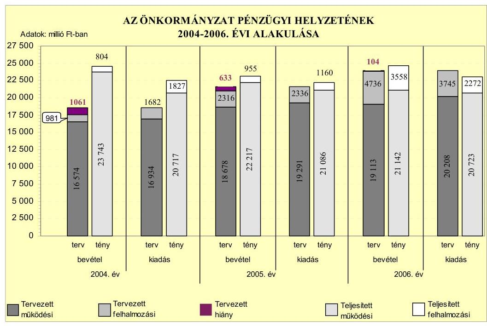
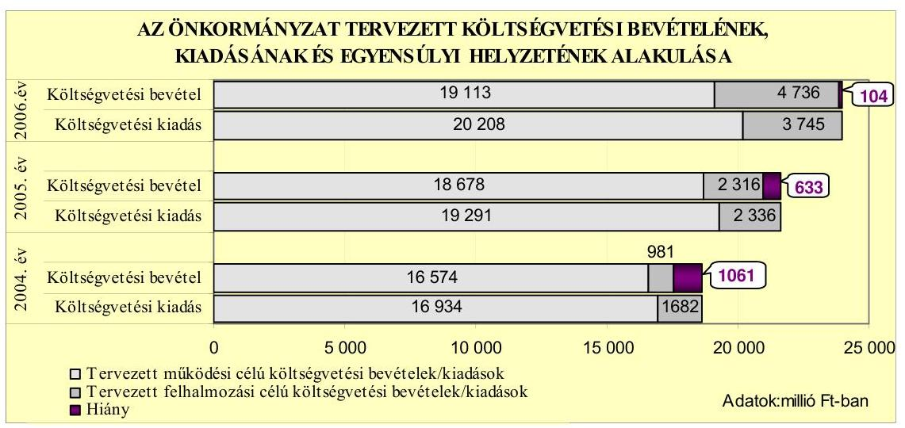
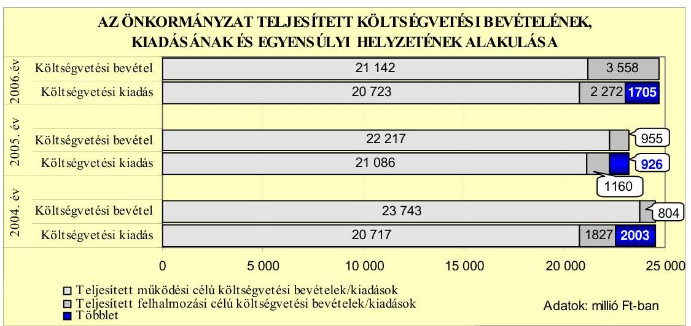
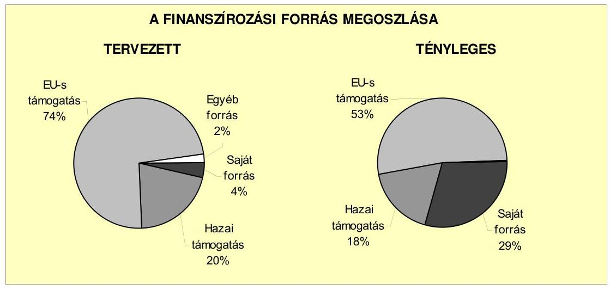
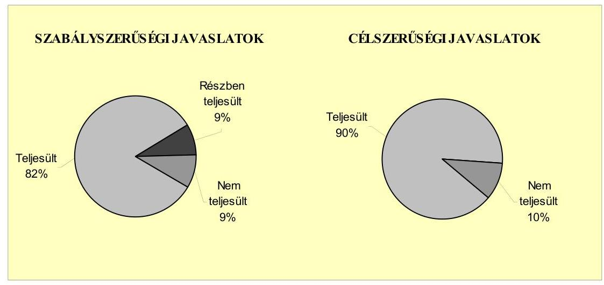
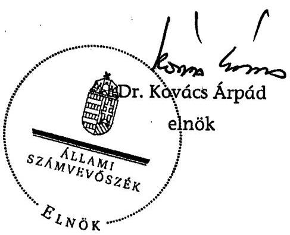
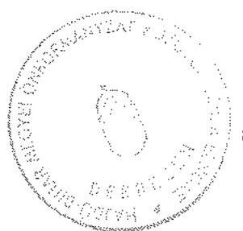

# JELENTÉS 

a Hajdú-Bihar Megyei Önkormányzat gazdálkodási rendszerének 2007. évi átfogó ellenőrzéséről

---

# 3. Önkormányzati és Területi Ellenőrzési Igazgatóság 

## Átfogó Ellenőrzések Főcsoport

Iktatószám: V-1001-9/22/16/2007.
Témaszám: 845
Vizsgálat-azonosító szám: V0321

## Az ellenőrzést felügyelte:

Dr. Lóránt Zoltán
főigazgató
Az ellenőrzés végrehajtásáért felelős:
Dr. Sepsey Tamás
főigazgató-helyettes
Az ellenőrzést vezette:
Csecserits Imréné
főcsoportfőnök-helyettes
Az ellenőrzést végezték:
Hegyes Mária Kozák György Pálfi András
számvevő tanácsos irodavezető főtanácsadó számvevő tanácsos

## A témához kapcsolódó eddig készített számvevőszéki jelentések:

## címe

Jelentés a helyi önkormányzatok gyermekvédelmi szakellátási te- 0430 vékenységének ellenőrzéséről
Jelentés a Hajdú-Bihar Megyei Önkormányzat gazdálkodásának 0446 átfogó ellenőrzéséről
Jelentés a címzett támogatásból finanszírozott egészségügyi beru- 0523 házások, rekonstrukciók ellenőrzéséről
Jelentés a Magyar Köztársaság 2004. évi költségvetése végrehajtá- 0540 sának ellenőrzéséről
Függelék:

- a helyi önkormányzatok beruházásaihoz és rekonstrukcióihoz nyújtott 2004. évi felhalmozási célú támogatások ellenőrzése
- a helyi önkormányzatokat a 2004. évben megillető normatív állami hozzájárulás elszámolásának ellenőrzése
Jelentés a helyi és a helyi kisebbségi önkormányzatok gazdálkodá- 0544 sának átfogó ellenőrzéséről
Jelentés az egészségügyi szakellátások privatizációjának ellenőrzé- 0609 séröl
Jelentés a Magyar Köztársaság 2005. évi költségvetése végrehajtá- 0628 sának ellenőrzéséről
Függelék:
- a helyi önkormányzatokat a 2005. évben megillető normatív hozzájárulás igénylésének és elszámolásának ellenőrzése

---

- a kötött felhasználású támogatások 2005. évi felhasználásának ellenőrzése
- a helyi önkormányzatok beruházásaihoz és rekonstrukcióihoz nyújtott 2005. évi felhalmozási célú támogatások ellenőrzése

---

## Eierlikör (1)

Menge: 1 Drink

2 Zentiliter Zitronensaft
2 Zentiliter Zuckersirup
1 Zentiliter Zuckersirup
1 Zentiliter Zuckersirup
etwas Zuckersirup
etwas Zuckersirup
etwas Zuckersirup
etwas Zuckersirup
etwas Zuckersirup
etwas Zuckersirup
etwas Zuckersirup
etwas Zuckersirup
etwas Zuckersirup
etwas Zuckersirup
etwas Zuckersirup
etwas Zuckersirup
etwas Zuckersirup
etwas Zuckersirup
etwas Zuckersirup
etwas Zuckersirup
etwas Zuckersirup
etwas Zuckersirup
etwas Zuckersirup
etwas Zuckersirup
etwas Zuckersirup
etwas Zuckersirup
etwas Zuckersirup
etwas Zuckersirup
etwas Zuckersirup
etwas Zuckersirup
etwas Zuckersirup
etwas Zuckersirup
etwas Zuckersirup
etwas Zuckersirup
etwas Zuckersirup
et

---

# TARTALOMJEGYZÉK 

BEVEZETÉS ..... 7
I. ÖSSZEGZŐ MEGÁLLAPÍTÁSOK, KÖVETKEZTETÉSEK, JAVASLATOK ..... 11
II. RÉSZLETES MEGÁLLAPÍTÁSOK ..... 19

1. Az Önkormányzat költségvetési és pénzügyi helyzete ..... 19
1.1. A tervezett költségvetési bevételi és kiadási előirányzatok, valamint a költségvetési egyensúly alakulása ..... 21
1.2. A költségvetési bevételek és kiadások teljesítése, a pénzügyi egyensúlyi helyzet alakulása ..... 24
2. Az Önkormányzat felkészültsége az európai uniós források igénylésére és felhasználására, valamint az e-közigazgatási feladatok ellátására ..... 27
2.1. Az európai uniós források igénybevételére és a várható támogatás felhasználásának szervezettségére történt felkészülés és a belső szabályozottság értékelése ..... 27
2.1.1. A fejlesztési célkitűzések meghatározása ..... 27
2.1.2. Az európai uniós forrásokhoz kapcsolódóan a pályázatfigyelés, a pályázatkészítés, valamint az európai uniós támogatással megvalósuló fejlesztés lebonyolítása belső rendjének szabályozottsága, a végrehajtás személyi, szervezeti feltételei ..... 28
2.1.3. Az európai uniós forrással támogatott fejlesztés megvalósítása ..... 30
2.2. Az e-közigazgatási feladatok előkészítése, bevezetése ..... 33
3. A költségvetési gazdálkodás kontrolljai ..... 35
3.1. A szabályozottság kockázata a költségvetés tervezési, gazdálkodási, beszámolási és a folyamatba épített ellenőrzési feladatainál ..... 35
3.2. A belső kontrollok érvényesülése az önkormányzati források szabályszerű felhasználásában, a költségvetési tervezés, gazdálkodás, beszámolás folyamataiban ..... 37
3.3. A belső ellenőrzési kötelezettség teljesítése, javaslatainak hasznosulása ..... 39
4. Az ÁSZ korábbi ellenőrzési javaslatai alapján készített intézkedési terv végrehajtása, eredményessége ..... 42
4.1. Az Önkormányzat gazdálkodási rendszerének átfogó ellenőrzése során tett javaslatok végrehajtására tervezett intézkedések megvalósulása ..... 42

---

4.2. A zárszámadáshoz kapcsolódó (állami hozzájárulások, támogatások igénylésének és felhasználásának ellenőrzése), valamint a további vizsgálatok esetében a megállapítások, javaslatok alapján tett intézkedések

# MELLÉKLETEK 

1. számú Az Önkormányzat gazdálkodását meghatározó adatok, mutatószámok (1 oldal)
2. számú Az önkormányzati vagyon alakulása (1 oldal)
3. számú Az Önkormányzat 2004-2006. évi költségvetési előirányzatainak és azok pénzügyi teljesítéseinek alakulása ( 1 oldal)
4. számú 1. számú Nyilatkozat a tervezett és teljesített költségvetési adatoknak a megelőző évhez viszonyított jelentős, $\pm 10 \%$-ot meghaladó változásának indokolásáról, amennyiben azt a feladatok változása indokolta (1 oldal)
5. számú 1. számú Tanúsítvány az európai uniós forrásokkal támogatott programok, célok tervezett és tényleges adatairól 2004-2007. évekre (3 oldal)
6. számú Rácz Róbert úr, a Hajdú-Bihar Megyei Közgyűlés elnökének észrevétele (5 oldal)

---

# RÖVIDÍTÉSEK JEGYZÉKE 

## Törvények

Áht.
ÁSZ tv.
Eisztv.
Gyvt.
Ötv.
Számv. tv.
Szoctv.

## Rendeletek

Ámr.
Ber.
SzMSz
ügyrend
Vhr.

## Szórövidítések

ÁSZ
e-közigazgatás
Fejlesztési főosztály
FEUVE
föjegyzö
Illetékhivatal
Informatikai központ
INTERREGIIIA együttműködési projekt

KEHI
Kenézy Kórház
az államháztartásról szóló 1992. évi XXXVIII. törvény
az Állami Számvevőszékről szóló 1989. évi XXXVIII. törvény
az elektronikus információszabadságról szóló 2005. évi XC. törvény
a gyermekek védelméről és a gyámügyi igazgatásról szóló 1997. évi XXXI. törvény
a helyi önkormányzatokról szóló 1990. évi LXV. törvény
a számvitelről szóló 2000. évi C. törvény
a szociális igazgatásról és a szociális ellátásokról szóló 1993. évi III. törvény
az államháztartás működési rendjéről szóló 217/1998. (XII. 30.) Korm. rendelet
a költségvetési szervek belső ellenőrzéséről szóló 193/2003. (XI. 26.) Korm. rendelet
a Hajdú-Bihar Megyei Önkormányzat 16/2004. (VII. 1.) számú rendelete a Hajdú-Bihar Megyei Önkormányzat Közgyűlése és Szervei Szervezeti és Müködési Szabályzatáról
a Hajdú-Bihar Megyei Önkormányzat Közgyűlésének 67/2005. (III. 25.) számú határozata a Hajdú-Bihar Megyei Önkormányzat Hivatalának ügyrendjéről
az államháztartás szervezetei beszámolási és könyvvezetési kötelezettségének sajátosságairól szóló 249/2000. (XII. 24.) Korm. rendelet

Állami Számvevőszék
elektronikus közigazgatás
Hajdú-Bihar Megyei Önkormányzat Hivatalának Fejlesztési Főosztálya
folyamatba épített, előzetes és utólagos vezetői ellenőrzés
Hajdú-Bihar Megyei Önkormányzat főjegyzője
Hajdú-Bihar Megyei Illetékhivatal
Hajdú-Bihar Megyei Önkormányzat Informatikai Központ, költségvetési intézmény
az INTERREGIIIA keretében megvalósított projekt, amely az európai régiók egymás közötti tapasztalatcseréjének biztosítására vonatkozik
Kormányzati Ellenőrzési Hivatal
Hajdú-Bihar Megyei Önkormányzat Kenézy Gyula Kór-ház-Rendelőintézet

---

| Közgazdasági iroda | Hajdú-Bihar Megyei Önkormányzat Hivatalának Közgaz-   dasági Irodája |
| :-- | :-- |
| Közgyűlés | Hajdú-Bihar Megyei Önkormányzat Közgyűlése |
| Közgyűlés elnöke | Hajdú-Bihar Megyei Közgyűlés elnöke |
| MÁK | Magyar Államkincstár |
| NFT | Nemzeti Fejlesztési Terv |
| Önkormányzat | Hajdú-Bihar Megyei Önkormányzat |
| Önkormányzati hivatal | Hajdú-Bihar Megyei Önkormányzati Hivatal |
| Pénzügyi bizottság | Hajdú-Bihar Megyei Önkormányzat Közgyűlésének |
| stratégiai fejlesztési terv | Pénzügyi Bizottsága |
|  | Hajdú-Bihar Megyei Önkormányzat Megyei Stratégiai |
|  | Fejlesztési Terve, melyet a Közgyűlés a 123/2003. (V. 23.) |
|  | számú határozatával fogadott el |
| VÁTI | VÁTI Magyar Regionális Fejlesztési és Urbanisztikai Kht. |

---

# ÉRTELMEZŐ SZÓTÁR 

1. elektronikus szolgáltatási szint
2. elektronikus szolgáltatási szint
3. elektronikus szolgáltatási szint
4. elektronikus szolgáltatási szint
fejlesztési feladat (projekt)
fejlesztési célkitúzés
kedvezményezett
lebonyolítás

Az 1044/2005. (V. 11.) Korm. határozat alapján információs, tájékoztató szolgáltatás, amely csak általános információkat közöl az adott üggyel kapcsolatos teendőkről és a szükséges dokumentumokról.
Az 1044/2005. (V. 11.) Korm. határozat alapján egyirányú kapcsolatot biztosító szolgáltatás, amely az 1. szinten túl az adott ügy intézéséhez szükséges dokumentumok, nyomtatványok letöltése, és azok ellenőrzéssel vagy ellenőrzés nélküli elektronikus kitöltése, amely esetben a dokumentum benyújtása hagyományos úton történik.
Az 1044/2005. (V. 11.) Korm. határozat alapján kétirányú kapcsolatot biztosító szolgáltatás, amely közvetlen vagy ellenőrzött kitöltésű dokumentum segítségével történő elektronikus adatbevitel és a bevitt adatok ellenőrzése. Az ügy indításához, intézéséhez személyes megjelenés nem szükséges, de az ügyhöz kapcsolódó közigazgatási döntés (határozat, egyéb aktus) közlése, valamint a kapcsolódó illeték- vagy díffizetés hagyományos úton történik.
Az 1044/2005. (V. 11.) Korm. határozat alapján teljes közvetlen kétirányú kapcsolatot (ügyintézési folyamatot) biztosító szolgáltatás, amikor az ügyhöz kapcsolódó közigazgatási döntés is elektronikus úton kerül közlésre, illetve a kapcsolódó illeték- vagy díffizetés elektronikus úton is intézhető.
A fejlesztési feladat (projekt) tartalmilag és formailag részletesen kidolgozott, megfelelő pénzügyi háttérrel és végrehajtási ütemezéssel rendelkező fejlesztési terv, amely illeszkedik az Európai Unió, illetve a Nemzeti Fejlesztési Terv által támogatott programokhoz.
Az önkormányzat által ellátott kötelező vagy önként vállalt feladatok mennyiségi (minőségi) fejlesztésére vonatkozó terv. A mennyiségi fejlesztés megvalósulhat beszerzéssel, létesítéssel, bővítéssel, átalakítással.
Az a helyi önkormányzat, amely a támogatási szerződést kedvezményezettként aláíra, a projektet, illetve a központi programhoz kapcsolódó támogatott önkormányzati programot végrehajtja.
Az európai uniós források felhasználásával megvalósuló fejlesztésre irányuló műszaki, gazdasági (pénzügyi) tevékenységet magában foglaló szervezési, irányítási szolgáltatás. A szervezési szolgáltatás kiterjedhet a pályázatkészítésre, a közbeszerzési eljárás lebonyolításán keresztül a folyamatos műszaki ellenőrzésre, a pénzügyi elszámolásra, a műszaki átadás-átvételre, az üzembe helyezésre, illetve a fejlesztési folyamat egyes elemeire.

---

operatív program
támogatási szerződés

Az Európai Bizottság által jóváhagyott, a Közösségi Támogatási Keret végrehajtására vonatkozó, 2004-2006 között több évre szóló intézkedésekhez kapcsolódó prioritások egységes rendszerét tartalmazó dokumentum. A strukturális alapok operatív programjai: Agrár és Vidékfejlesztési Operatív Program (AVOP); Gazdasági Versenyképesség Operatív Program (GVOP); Humánerőforrásfejlesztési Operatív Program (HEFOP); Környezetvédelmi és Infrastruktúra-fejlesztési Operatív Program (KIOP); Regionális Fejlesztési Operatív Program (ROP).
A strukturális alapok esetében az irányító hatóságnak, illetve a Kohéziós alap esetében a közremúködő szervezeteknek a kedvezményezett önkormányzattal kötött szerződése, amely a támogatás felhasználásának részletes feltételeit tartalmazza.

---

# JELENTÉS   a Hajdú-Bihar Megyei Önkormányzat gazdálkodási rendszerének 2007. évi átfogó ellenőrzéséről 

## BEVEZETÉS

Az Ötv. 92. § (1) bekezdése, az ÁSZ tv. 2. § (3) bekezdése, valamint az Áht. 120/A. § (1) bekezdése alapján az önkormányzatok gazdálkodását az Állami Számvevőszék ellenőrzi. Az ellenőrzésre az Országgyűlés illetékes bizottságai részére is átadott, országosan egységes ellenőrzési program szerint került sor.

Az Állami Számvevőszék a stratégiájában foglalt célkitűzéseknek megfelelően a helyi önkormányzatok költségvetési gazdálkodási rendszere átfogó ellenőrzésének programját a 2007. évtől megújította, azt kiegészítette további - teljesít-mény-ellenőrzési - elemekkel.

## Az ellenőrzés célja annak értékelése volt, hogy az Önkormányzat:

- a pénzügyi egyensúlyt a költségvetésében és annak teljesítése során milyen módon biztosította, a teljesített bevételek és kiadások egyes évek közötti jelentős eltérése feladatváltozáshoz kapcsolódott-e;
- felkészült-e a szabályozottság és a szervezettség terén az európai uniós források igénylésére és felhasználására, továbbá az e-közigazgatás bevezetése miatti szervezet-korszerűsítési feladatokra;
- kialakította-e a külső és a belső feltételeknek megfelelően a gazdálkodás belső kontrollrendszerét ${ }^{1}$, továbbá a költségvetés tervezési, végrehajtási és zárszámadási feladatok szabályszerű ellátásához hozzájárult-e a folyamatba épített, előzetes és utólagos vezetői ellenőrzés, valamint a belső ellenőrzés;
- megfelelően hasznosították-e a korábbi számvevőszéki ellenőrzések megállapításait, szabályszerűségi ${ }^{2}$ és célszerűségi javaslatait.

[^0]
[^0]:    ${ }^{1}$ A gazdálkodás szabályszerűségét biztosító kontrollrendszer alatt értjük a kiépített és működő belső irányítási és szabályozási rendszert, valamint a belső ellenőrzési funkciók ellátásának rendszerét.
    ${ }^{2}$ A törvényi előírások betartásának elmulasztásakor a részletes megállapítások fejezetben egységesen a törvénysértés megjelölést alkalmazzuk, mivel az ÁSZ nem tehet különbséget a törvényi előírások között.

---

Az ellenőrzött időszak: az 1., 2. és 4. programpontok tekintetében a 20042006. évek, a 3. ellenőrzési pontnál a 2006. év.

Hajdú-Bihar megye lakosainak száma 2007. január 1-jén Debrecen megyei jogú város nélkül 350817 fő volt. A megye területén 82 települési önkormányzat múködött, amelyből egy megyei jogú város, 20 város, tíz nagyközség és 51 község. Az Önkormányzat 40 tagú Közgyűlésének munkáját tíz állandó bizottság segíti. A Közgyűlés elnöke a 2006. évi önkormányzati választás óta tölti be tisztségét, a főjegyző 1996. január 1-jétől vezeti az Önkormányzati hivatalt.

Az Önkormányzat a 2006. évben 24700 millió Ft költségvetési bevételből gazdálkodott, a 2007. évre 21870 millió Ft költségvetési bevételt tervezett. A teljesített költségvetési kiadás a 2006. évben 22995 millió Ft volt, a 2007. évre tervezett költségvetési kiadás 22270 millió Ft. Az Önkormányzat vagyona a 2006. december 31-i könyvviteli mérleg szerint 18788 millió Ft volt. Az Önkormányzat intézményeinek száma 2006. december 31-én 24 volt, melyből 13 részben önálló gazdálkodási jogkörrel rendelkezett, ezen kívül öt közhasznú társaságot hozott létre, hat gazdasági társaságban a 2006. év végén kisebbségi tulajdoni részesedése volt, három közalapítványt és egy alapítványt múködtetett. Az Önkormányzati hivatalban dolgozó köztisztviselők száma a 2006. év végén 99 fő, a költségvetési intézményekben foglalkoztatott közalkalmazottaké 3943 fő volt. Az Önkormányzat gazdálkodását meghatározó adatokat, mutatószámokat a jelentés 1-3. számú mellékletei tartalmazzák.

Az Önkormányzat költségvetési és pénzügyi helyzetét az összehasonlító elemzés módszerével vizsgáltuk. E körben elemeztük a költségvetés egyensúlyi helyzetének alakulását, a tervezett és tényleges költségvetési hiány okait, a mérséklésére tett intézkedéseket, finanszírozásának módját, az Önkormányzat adósságállományának alakulását, összetevőit.

A teljesítmény-ellenőrzés módszerével vizsgáltuk, hogy a belső szabályozottság, szervezettség terén felkészültek-e az európai uniós források igénylésére és felhasználására, valamint az igényelt európai uniós támogatások az Önkormányzat által meghatározott fejlesztési célkitűzésekhez kapcsolódtak-e. Az ellenőrzés során felmértük, hogy az e-közigazgatási feladat ellátása, illetve bevezetése, múködtetése érdekében milyen intézkedéseket tettek, valamint biztosí-tották-e a közérdekú adatok elektronikus közzétételét.

A költségvetési gazdálkodás belső kontrolljainak ellenőrzése során értékeltük, hogy az Önkormányzati hivatalnál a költségvetés tervezési, gazdálkodási, zárszámadás készítési feladatok belső kontrolljainak kiépítettsége és múködése megfelelő biztosítékot ad-e a gazdálkodási feladatok megfelelő, szabályszerű ellátására. Felmértük és minősítettük a költségvetés tervezési, a gazdálkodási, a zárszámadás készítési feladatokkal, továbbá a pénzügyi-számviteli területen az informatikával kapcsolatosan kialakított kontrollok megfelelőségét, valamint azok múködésének eredményességét, megbízhatóságát. Értékeltük a belső ellenőrzés szervezeti és szabályozási keretét, továbbá múködését.

Az Önkormányzati hivatalnál értékeltük a gazdálkodás folyamatában a kontrollok múködésének megbízhatóságát, ennek keretében ellenőriztük a szakmai teljesítés igazolására és az utalvány ellenjegyzésére kialakított kontrollok vég-

---

rehajtását. Az ellenőrzést a következő, kiemelt kockázatok alapján kiválasztott ${ }^{3}$, az általánostól jellemzően eltérő, egyedi eljárást igénylő gazdasági eseményekkel kapcsolatos kifizetésekre folytattuk le ${ }^{4}$ :

- a személyi juttatások közül az állományba nem tartozók megbízási díjai ${ }^{5}$;
- a külső szolgáltató által végzett karbantartási, kisjavítási szolgáltatások;
- a gépek, berendezések, felszerelések beszerzése.

Az ellenőrzés hatékony elvégzése céljából a vizsgálandó területek kiválasztása során a kockázatokon alapuló megközelítés érvényesült, ezáltal az ellenőrzési erőforrásokat azokra a területekre fókuszáltuk, amelyeken legnagyobb a hibák előfordulási valószínűsége. Az ellenőrzési erőforrások ilyen típusú összpontosításával minimálisra csökkenthető a kívánt ellenőrzési bizonyosság eléréséhez szükséges időráfordítás.

A pénzügyi-számviteli folyamatokban alkalmazott belső kontrollok létezésének és működésének ellenőrzésére a vizsgált három terület 2006. évi könyvviteli tételeiből területenként egyszerű véletlen mintát vettünk. A kijelölt gazdasági eseményre elvégzett megfelelőségi tesztek alapján értékeltük a kontrollok múködésének eredményességét, megbízhatóságát a vizsgált három területre különkülön, majd összefoglalóan ${ }^{6}$ az Önkormányzati hivatalnál egyedi eljárást igénylő gazdasági eseményeire. A helyszíni ellenőrzés megállapításainak részletes dokumentálását három megfelelőségi tesztlapon, öt elővizsgálati és kilenc helyszíni ellenőrzési munkalapon biztosítottuk. Ezeken a teszt- és munkalapokon a minősítés alapjául szolgáló kérdések és a vonatkozó konkrét jogszabályhelyek megjelölése mellett értékeltük a kialakított belső kontrollokban rejlő

[^0]
[^0]:    ${ }^{3}$ Az önkormányzatok kiemelt előirányzataira vonatkozóan, a vertikális folyamatokra elvégeztük a kockázatok becslését, amelynek eredményeként az állományba nem tartozók megbízási díjai, a külső szolgáltató által végzett karbantartási, kisjavítási szolgáltatások, valamint a gépek, berendezések, felszerelések beszerzése kiemelkedően kockázatos területnek bizonyultak.
    ${ }^{4}$ A korábbi ellenőrzési tapasztalataink szerint ezeken a területeken a jegyzők nem, vagy hiányosan szabályozták a megbízás, megrendelés, illetve beszerzés indokoltságának, szükségességének elbírálására, igazolására, valamint a teljesítések dokumentálására, a kifizetések jogosságának megítélésére szolgáló kontrollokat. További kockázatot jelentett a külső szolgáltató által végzett karbantartási- kisjavítási munkák esetében, hogy az 50 ezer Ft alatti megrendelésekre vonatkozóan az ellenőrzési tapasztalataink szerint a jegyzők nem alakították ki a kötelezettségvállalások rendjét és nyilvántartási formáját, valamint a szabályozás elmulasztása esetén nem történt meg az írásbeli kötelezettségvállalás és annak az ellenjegyzése sem.
    ${ }^{5}$ Az állományba tartozók rendszeres személyi juttatásainak számfejtését, valamint folyósítását nem a polgármesteri hivatalok, hanem a nettó finanszírozás keretében a beküldött dokumentumok alapján a MÁK végzi.
    ${ }^{6}$ A vizsgált három terület egyedi értékelési pontszámait a területek relatív költségvetési súlyával arányosan összegeztük.

---

kockázatokat ${ }^{7}$ és a kialakított kontrollok működésének megbízhatóságát ${ }^{8}$. A helyszíni ellenőrzés során kitöltött - az ellenőrzést végző számvevő és az Önkormányzati hivatalnál felelős köztisztviselője által aláírt - elővizsgálati és helyszíni ellenőrzési munkalapokat, azok kitöltési útmutatóit, továbbá a megfelelőségi tesztek dokumentumait a Közgyűlés elnöke részére a számvevői jelentéssel egyidejűleg átadtuk.

Az ÁSZ korábbi ellenőrzési javaslatai alapján tett intézkedéseket, illetve azok megvalósítását utóellenőrzés keretében vizsgáltuk. A gazdálkodási rendszer átfogó ellenőrzése során tett javaslatok végrehajtására tett intézkedések megvalósítását ellenőriztük, az egyéb számvevőszéki ellenőrzések során tett javaslatok esetében pedig a kiadott intézkedéseket tekintettük át.

A jelentést az ÁSZ tv. 25. § (1) bekezdése alapján észrevétel közlése céljából megküldtük a Hajdú-Bihar Megyei Önkormányzat Közgyűlése elnökének. A kapott észrevételt a jelentés 6 . számú melléklete tartalmazza.
${ }^{7}$ A kialakított belső kontrollokban rejlő kockázatot alacsonynak minősítettük, ha a kontrollok - végrehajtásuk esetén - megfelelő védelmet nyújtanak a hibák bekövetkezése ellen. Közepesnek minősítettük a belső kontrollokban rejlő kockázatot, amennyiben a kontrollok - végrehajtásuk esetén - a lehetséges hibák többsége ellen védelmet nyújtanak. Magasnak értékeltük a kockázatot, ha a kontrollok - kialakításuk hiányában, vagy hiányos kialakításuk miatt - nem nyújtanak elegendő védelmet a lehetséges hibákkal szemben.
${ }^{8}$ A kontrollok múködésének eredményességét, megbízhatóságát kiválónak értékeltük abban az esetben, ha azok múködése - esetleges apróbb hiányosságoktól eltekintve megfelelt a hibák megelőzésére és kijavítására meghatározott szabályozásnak és a legmagasabb szintű elvárásoknak. Jónak minősítettük a kontrollok múködését, ha a hiányosságok száma ugyan jelentős volt, de nem veszélyeztette az ellenőrzött terület hibáinak megelőzését és kijavítását. Amennyiben a hiányosságok mértéke nem biztosította a hibák megelőzését, feltárását, kijavítását és ezáltal veszélyeztette az eredményes, megbízható múködést, a kontroll múködésének megbízhatósága gyenge minősítést kapott.

---

# I. ÖSSZEGZŐ MEGÁLLAPÍTÁSOK, KÖVETKEZTETÉSEK, JAVASLATOK 

Az Önkormányzat a 2005-2006. évi költségvetés tervezése és gazdálkodása során a bevételek és kiadások közötti egyensúly javítására törekedett. Az Önkormányzat 2004. évi költségvetésében tervezett költségvetési kiadások 1061 millió Ft-tal meghaladták a tervezett költségvetési bevételek összegét, a következő két évben a költségvetési egyensúly javult, a költségvetési hiány összege 633, illetve 104 millió Ft-ra csökkent. A tervezett bevételek növekedési üteme a 2005. évben 3,7\%-kal, a 2006. évben 2,8\%-kal meghaladta a kiadásokét, melynek eredményeként mérséklődött a költségvetési hiány összege. A költségvetésben az önkormányzati vagyon értékesítéséből származó felhalmozási célú költségvetési bevételek növelésével tervezték a hiány mérséklését, tárgyi eszközök eladásából a 2005. évben az előző évit 674 millió Ft-tal, a 2006. évben 1602 millió Ft-tal meghaladó összegű költségvetési bevételt irányzott elő az Önkormányzat. A központi költségvetésből származó támogatásokból, állami hozzájárulásokból, átengedett adókból és az önkormányzati forrásokból tervezhető működési célú költségvetési bevételek növekedési üteme a 2005. évben 0,9 százalékponttal, a 2006. évben 2,5 százalékponttal elmaradt az azonos célú kiadásokétól. A tervezett múködési célú kiadásoknál a hiány így a 2004. évi 360 millió Ft-ról a 2006. évben 1095 millió Ft-ra emelkedett. A 2004-2006. évi költségvetési rendeletekben a költségvetés bevételi és kiadási főösszegének megállapításakor az Áht. előírásai ellenére finanszírozási célú pénzügyi műveleteket vettek figyelembe költségvetési hiányt módosító költségvetési bevételként, illetve költségvetési kiadásként.

A központi költségvetésből származó bevételek reálértéke ${ }^{9}$ a 2004. évhez viszonyítva a 2005. évben 4,3\%-kal, a 2006. évben 11,3\%-kal csökkent. A költségvetési egyensúly megteremtése érdekében a Közgyűlés 2004-2006 között folytatta a kötelező önkormányzati, vagy intézményen belüli részfeladatok gazdasági társaságok részére történő átadását, valamint az intézmények felénél szervezeti átalakításról, negyedénél az energiaellátó rendszer korszerűsítéséről, a debreceni székhelyű intézményekben és az Önkormányzati hivatalban a gépjármúpark csökkentéséről, továbbá valamennyi intézményt érintően az alkalmazotti létszám átlagosan több mint 8\%-os mérsékléséről döntött. Ezek eredményeként a 2005-2006. években központi intézkedéssel megvalósult összesen 15\%-os közalkalmazotti béremelés és a kétévi 7,6\%-os inflációs hatás ellenére az Önkor-

[^0]
[^0]:    ${ }^{9}$ Az önkormányzatok a központi költségvetésből kapott múködési célú támogatásokból és saját bevételeikből a feladataik ellátásához munkaerőt foglalkoztatnak és különböző árukat, szolgáltatásokat vásárolnak. A rendelkezésre álló források reálértékének (vásárlóerejének) változását ezért a munkabérek növekedése és az árváltozások határozzák meg. A munkabérek növekedése tekintetében csak a központi bérintézkedések hatásával számoltunk, a termékek, szolgáltatások árnövekedéseként a fogyasztói árindexet vettük alapul.

---

mányzat múködési célú tényleges kiadása a 2004. évi szinten maradt. A kiadások ilyen mértékű teljesítéséhez is szükség volt a korábbi években képződött tartalékok ( 2324 millió Ft összegű kötelezettségvállalással nem terhelt pénzmaradvány) felhasználására.

Az Önkormányzat fejlesztési célkitűzéseit a 2005-2006. években a stratégiai fejlesztési terv és azzal összhangban a gazdasági program tartalmazta, a célkitűzések az önkormányzati feladatokhoz kapcsolódtak és illeszkedtek az NFT célkitűzéseihez. A célkitúzések megalapozásához helyzetelemzés nem készült, nem végeztek felmérést a kötelező feladatok megoldásánál jelentkező feszültségekről. A célkitűzések megvalósulását évenként áttekintették, értékelték, melyek alapján a célkitűzéseket nem módosították. Az Önkormányzat 2004-2006 között összesen 36 európai uniós fejlesztési célkitúzés önállóan, vagy partnerként történő megvalósításáról döntött, amelyek közül 20-ra kapott támogatást. A pályázatok alapján 2004-2006 között összesen 951 millió Ft európai uniós, illetve 264 millió Ft hazai támogatást nyert el, amelyből 2004-2006 között 611 millió Ft európai uniós, 204 millió Ft hazai támogatás átutalása történt meg. A nem támogatott projektek elutasításának oka $31 \%$-ban a forráshiány, $6 \%$ ban formai hiba volt, a további $63 \%$-nál nem kapott indokolást az elutasítás okáról.

Az Önkormányzat felkészülése az európai uniós források igénybevételére és felhasználására a belső szabályozottság és munkamegosztás, az információáramlás szervezettsége terén nem volt eredményes. A stratégiai fejlesztési tervben és a gazdasági programban megfogalmazott fejlesztési prioritásokhoz, célkitűzésekhez kapcsolódtak az európai uniós támogatások, azonban az Önkormányzat szabályozása nem tartalmazta az európai uniós forrásokkal összefüggésben a döntési hatásköröket, a pályázatfigyelés, a pályázatkészítés, az európai uniós forrásokkal támogatott fejlesztés lebonyolítási feladatait. Az Önkormányzati hivatal szervezetén belül eseti megbízásokkal, egyedi kijelölésekkel szervezték meg a pályázatfigyelési, a pályázatkészítési, a fejlesztés-lebonyolítási feladatok ellátását, a szabályzatok, munkaköri leírások nem tartalmazták ezen feladatok elvégzését, valamint végrehajtásuk felelőseit, az ellenőrzés kötelezettségét, feladatait, felelőseit, továbbá a pályázatok nyilvántartásával kapcsolatos feladatokat. A 2004. és a 2006. évi költségvetésekben az Ámr. előírása ellenére nem szerepeltették elkülönítetten az európai uniós támogatással megvalósuló programok, projektek bevételi-kiadási előirányzatait, valamint ezen projektekhez történő hozzájárulások összegeit. A 2007. évi költségvetésben az elkülönített bemutatás megtörtént. Az európai uniós forrásokkal támogatott projektek megvalósításának ellenőrzési feladatait, folyamatát a szabályzatok és az ellenőrzési nyomvonal nem tartalmazta, az ellenőrzési pontok kijelölése elmaradt. Az európai uniós források esetében a költségvetés előkészítésénél, a számviteli nyilvántartások vezetésénél, a pályázatok nyilvántartásánál a folyamatba épített ellenőrzés nem múködött.

A projektek megvalósítása során a szerződést többször módosították, a megvalósításhoz tervezett saját forrást biztosították, a megelőlegezést a saját források terhére biztosították. A külső, illetve a belső ellenőrzés keretében végzett ellenőrzések által megállapított hiányosságokat, szabálytalanságokat megszüntették, az ellenőrzések során visszafizetési kötelezettséget nem állapítottak meg.

---

Az e-közigazgatási feladatok előkészítésére, folyamatos bevezetésére felkészültek, kereteit biztosították annak ellenére, hogy az informatikai stratégia ezzel kapcsolatosan nem tartalmazott konkrét előírásokat, célkitűzéseket. Az Önkormányzatnál az e-közigazgatás fejlettségi szintje a 2. szintnek felelt meg. Az Önkormányzat az Eisztv-ben előírt, a közérdekű adatok honlapon történő közzétételi kötelezettségének eleget tett.

Az Önkormányzati hivatalban a költségvetés tervezési és a zárszámadás készítési folyamatok szabályozottságának hiányosságai alacsony kockázatot jelentettek a feladatok megfelelő és szabályszerű végrehajtásában, mivel a főjegyző a belső szabályzatokban meghatározta a költségvetési javaslat összeállításával kapcsolatos követelményeket, és előírta a kapcsolódó ellenőrzési feladatokat. Annak ellenére összességében alacsony volt a kockázat, hogy a tervezett saját bevételek előirányzatai és az azok megalapozását szolgáló önkormányzati rendeletek összhangjának ellenőrzését és annak felelősét indokoltsága ellenére a főjegyző nem határozta meg. A költségvetés tervezés és a zárszámadás készítés folyamatában a múködésbeli hibák megelőzésére, feltárására, kijavítására kialakított kontrollok múködésének megbízhatósága kiváló volt, mivel a vonatkozó jogszabályokban és a belső szabályozásban előírt ellenőrzési, egyeztetési feladatokat elvégezték.

Az Önkormányzati hivatalban a pénzügyi-számviteli tevékenységek végrehajtásában a gazdálkodási, a pénzügyi-számviteli és a folyamatba épített ellenőrzési feladatok szabályozottsága a 2006. évben összességében alacsony kockázatot jelentett, mivel rendelkeztek a feladatok végrehajtásához szükséges szabályzatokkal, azok tartalmát évenkénti rendszerességgel felülvizsgálták és aktualizálták. Annak ellenére összességében alacsony volt a kockázat a 2006. évben, hogy az Önkormányzati hivatal nem rendelkezett önköltség-számítási szabályzattal, az év végi értékelések ellenőrzésének feladatait és a könyvelési feladások, helyesbítések belső bizonylatainak tartalmi és formai követelményeit nem szabályozták.

Az Önkormányzati hivatalnál az állományba nem tartozók megbízási díjaival kapcsolatos kifizetések során a szakmai teljesítés igazolás és az utalvány ellenjegyzés múködésének megbízhatósága összességében kiváló volt, mivel a szakmai teljesítés igazolására kijelölt személy az igazolást belső szabályzatban előírt módon és tartalommal elvégezte, valamint az utalvány ellenjegyzője a gazdálkodásra vonatkozó szabályok érvényesüléséről, valamint a szakmai teljesítés igazolás és az érvényesítés megtörténtéről meggyőződött. A kialakított kontrollok múködésének megbízhatósága annak ellenére összességében kiváló volt, hogy az utalvány ellenjegyzésére felhatalmazott irodavezető helyettes az országgyűlési választásokhoz kapcsolódó kifizetések során saját maga részére végzett utalvány ellenjegyzést.

A külső szolgáltató által végzett karbantartási, kisjavítási feladatokkal kapcsolatos kifizetések során a szakmai teljesítés igazolás és az utalvány ellenjegyzés múködésének megbízhatósága összességében kiváló volt, mivel a szakmai teljesítés igazolását az arra kijelölt személy belső szabályzatban előírt módon és tartalommal elvégezte. Az utalvány ellenjegyzője a gazdálkodásra vonatkozó szabályok érvényesüléséről, valamint a szakmai teljesítés igazolás és az érvényesítés megtörténtéről meggyőződött. A kontrollok múködésének meg-

---

bízhatósága annak ellenére összességében kiváló volt, hogy a szakmai teljesítést igazoló nem észrevételezte és az utalvány ellenjegyzője nem kifogásolta, hogy megrendelés adatait a Számv. tv. és az Önkormányzati hivatal bizonylati szabályzatának előírása ellenére lefestéssel javították.

A gépek, berendezések, felszerelések beszerzésével kapcsolatos kifizetések esetében a szakmai teljesítés igazolás és az utalvány ellenjegyzés múködésének megbízhatósága gyenge volt, mivel készülék beszerzés esetében elmaradt a szakmai teljesítés igazolása, valamint a lakásotthonok lakberendezéseinek, konyhai gépeinek és takarító eszközeinek, továbbá az INTERREG IIIA együttmúködési projekt keretében vásárolt számítástechnikai eszközöknek a beszerzését megelőzően nem történt kötelezettségvállalás, és ezen dokumentumok hiányában a szakmai teljesítés igazolására kijelölt személyek nem végezték el a szakmai teljesítés igazolását, a kiadások jogosultságának és összegszerűségének az ellenőrzését. Ezen kifizetéseknél az utalvány ellenjegyzése során elmaradt a szakmai teljesítés igazolás és az érvényesítés megtörténtének ellenőrzése. Az utalvány ellenjegyzője a gazdálkodásra vonatkozó szabályok betartásának ellenőrzése során nem észrevételezte, hogy egészségügyi gép- műszerbeszerzés kötelezettségvállalását az Ámr. előírása ellenére nem előzte meg a kötelezettségvállalás ellenjegyzése.

Az Önkormányzati hivatalnál az állományba nem tartozók megbízási díjaival, a karbantartási, kisjavítási szolgáltatásokkal, továbbá a gépek, berendezések, felszerelések beszerzésével kapcsolatos kifizetések során a kontrollok múködésének megbízhatósága összességében jó volt, mivel az előfordult hiányosságok nem veszélyeztették az állományba nem tartozók megbízási díjaival, a karbantartási, kisjavítási szolgáltatásokkal, továbbá a gépek, berendezések, felszerelések beszerzésével kapcsolatos kifizetések hibáinak megelőzését és kijavítását.

Az informatikai rendszer szabályozottsága az informatikai feladatok biztonságos végrehajtásában közepes kockázatot jelentett, mivel nem határozták meg a programokhoz történő hozzáférések jogosultságának ellenőrzési gyakoriságát, módját és dokumentálási formáját, valamint nem jelölték ki a programokhoz való hozzáférési jogosultságok engedélyezésére jogosultakat. Nem alakították ki az informatikai szabályzat dolgozók általi megismertetésének, illetve megismerésének dokumentálási rendjét, valamint az informatika alkalmazásával kapcsolatos konkrét feladatokat a Közgazdasági iroda munkatársainak $70 \%$-a esetében a munkaköri leírás nem tartalmazta.

Az informatikai rendszer 2006. évi múködtetésénél a múködésbeli hibák megelőzésére, feltárására, kijavítására a kialakított kontrollok múködésének megbízhatósága összességében kiváló volt, mivel számítógépes program informatikai hálózati rendszer útján biztosította a főkönyv és a költségvetési beszámoló adatainak egyezőségét a szükséges adatok egyszeri bevitele alapján, megoldott a szolgáltatott adatok rendszeres ellenőrzése. A kontrollok múködésének megbízhatósága annak ellenére összességében kiváló volt, hogy nem biztosították a számítógépen vezetett analitikus nyilvántartások és a főkönyvi könyvelés automatikus kapcsolatát, továbbá nem gondoskodtak az informatikai rendszer változásának nyomon követhetőségéről, valamint nem rögzítettek a szoftver hibák és azok kezelése.

---

A belső ellenőrzés szervezeti és szabályozási kerete a belső ellenőrzés szabályszerű végrehajtásában összességében alacsony kockázatot jelentett, mivel az Önkormányzat a belső ellenőrzési kötelezettség teljesítéséhez szükséges szervezeti kereteket kialakította, az SzMSz-ben a belső ellenőrzési kötelezettséget előírta, a függetlenített belső ellenőrzési szervezetet kialakította, az ellenőrzési csoport jogállását, feladatait meghatározta. A belső ellenőrzés tevékenységére vonatkozó szabályokat és eljárásokat a belső ellenőrzési kézikönyvben előírták. Annak ellenére összességében alacsony volt a belső ellenőrzés szervezettségének és szabályozottságának a kockázata, hogy a belső ellenőrzési stratégiai terv nem kockázatelemzés alapján készült.

A feladat ellátását két köztisztviselőként foglalkoztatott belső ellenőrrel és három külső szakértő foglalkoztatásával biztosították. A belső ellenőrzés múködésének megbízhatósága összességében kiváló volt, mivel a hibák feltárásával, célirányos intézkedések kezdeményezésével és a realizálás ellenőrzésével hozzájárult a kontroll kockázatok csökkentéséhez. A főjegyző a költségvetési beszámoló keretében beszámolt a FEUVE és a belső ellenőrzés múködtetéséről. A Közgyűlés a 2005. évi zárszámadási rendelettervezet előterjesztésével egyidejűleg áttekintette a költségvetési szervek ellenőrzésének tapasztalatait. Annak ellenére összességében kiváló volt a belső ellenőrzési feladatok elvégzésénél kialakított kontrollok működése, hogy kapacitás hiányában nem vizsgálták a kedvezményezett szervezeteknél a céljellegú támogatások felhasználását, az Önkormányzat többségi irányításával működő gazdasági társaságok, közhasznú társaságok rendelkezésére álló erőforrásokkal való gazdálkodást, a vagyon megóvását, gyarapítását, az elszámolások, beszámolók megbízhatóságát, továbbá az Önkormányzati hivatal FEUVE rendszerének kiépítettségét és múködését.

Az Önkormányzat gazdálkodásának 2004. évi átfogó ellenőrzéséről készült ÁSZ jelentést a Közgyűlés megvitatta és a javaslatok végrehajtására intézkedési terv készült. Az összesen 51 szabályszerűségi és célszerűségi javaslatból 42 teljes körűen hasznosult, öt részlegesen valósult meg, míg négynek a végrehajtására tett intézkedés - a jogszabályi előírások téves értelmezése következtében - eredménytelennek bizonyult. A megvalósult javaslatok eredményeként az Önkormányzat tervező munkája, a gazdálkodás és a pénzügyi-számviteli feladatok szabályozása, ellátása, a céljellegú támogatások odaítélése és elszámoltatása, a gazdálkodásról történő beszámolás szabályszerűbbé vált. A középületek akadálymentessé tétele további hat épületnél megtörtént. A tett intézkedések ellenére nem sikerült biztosítani, hogy az intézmények a költségvetési főösszegen belül a Közgyűlés által meghatározott kiadási előirányzatokat is betartsák, nem vált teljes körűvé a kötelezettségvállalások nyilvántartása, a jelentős nagyságrendű céljellegú támogatások felhasználását a helyszínen nem ellenőrizték. A javaslataink és a Számv. tv-ben, Ámr-ben meghatározott követelmények ellenére a 2005. évi beszámoló készítése során az illeték- és vevőkövetelések minősítése, a szükséges értékvesztések elszámolása elmaradt. A tőzsdén nem forgalmazott részesedések érték-megállapítását nem dokumentálták, az értékpapírok könyvszerinti értékét a vásárláskori felhalmozott kamattal együtt mutatták ki.

A zárszámadáshoz kapcsolódó és egyéb témavizsgálatok 17 szabályszerűségi és 17 célszerűségi javaslatából összesen 30-at megvalósítottak. Az intézkedések

---

eredményeként az állami támogatásokkal és hozzájárulásokkal való elszámolások, a gyermekvédelmi szakellátás szabályozása, a támogatásból megvalósított beruházások lebonyolítása szabályszerűbbé vált. A javaslataink ellenére nem intézkedtek a címzett támogatásból finanszírozott egészségügyi beruházásokhoz az egészségügyi ellátások szakmapolitikai koncepciójának megtárgyalására, a beruházások célokmányának, engedélyokiratának elkészítésére, az Önkormányzati hivatalnál és a Kenézy Kórháznál fellelhető azonos tartalmú dokumentumok adattartalmának egyezővé tételére, a dokumentumok tárolásának célszerűbbé tételére.

A helyszíni ellenőrzés megállapításainak hasznosítása mellett javasoljuk:

# a Közgyülés elnökének 

a munka színvonalának javítása érdekében

1. kezdeményezze, hogy a számvevőszéki jelentést a Közgyűlés tárgyalja meg, a feltárt hiányosságok megszüntetése érdekében készíttessen intézkedési tervet a határidők, a felelősök megjelölésével;
2. kezdeményezze, hogy a fejlesztési célkitűzések megalapozásához készüljön felmérés a kötelező feladatok megoldásánál jelentkező feszültségekről;

## a főjegyzőnek

a jogszabályi előírások maradéktalan betartása érdekében

1. biztosítsa az Áht. 8/A. § (7) bekezdése alapján, hogy a költségvetési rendelettervezetben a költségvetési bevételi és kiadási előirányzatok főösszegei ne tartalmazzák a finanszírozási célú pénzügyi műveletek bevételeit, illetve kiadásait;
2. intézkedjen az önköltség-számítási szabályzat elkészítéséről, az Ámr. 157/C. § (1) és (2) bekezdése alapján az államháztartással összefüggő közérdekű adatok közlésével kapcsolatban felmerülő költségek és az adatközlés díjának meghatározása érdekében;
3. gondoskodjon az operatív gazdálkodás során a működésbeli hibák megelőzése, feltárása, illetve kijavítása érdekében
a) az Ámr. 135. § (1) bekezdésében előírtak betartásáról, hogy a gépek, berendezések, felszerelések beszerzésével, létesítésével összefüggő kiadások teljesítésének elrendelése előtt a jegyző által kijelölt személyek okmányok alapján szakmailag igazolják azok jogosultságát, összegszerűségét, a szerződés, megrendelés teljesítését;
b) a folyamatba épített ellenőrzési feladatok elvégzésével, hogy az utalvány ellenjegyzői az Ámr. 137. § (3) bekezdésének előírásai alapján győződjenek meg arról, hogy az utalványozás nem sérti-e a gazdálkodásra - összeférhetetlenségi követelmények érvényesítésére, a fedezet meglétére, a kötelezettségvállalás ellenjegyzésére - vonatkozó, az Ámr. 138. § (3) bekezdésében, valamint az Ámr. 134.

---

§ (9) bekezdésében foglalt szabályokat, továbbá, hogy a szakmai teljesítés igazolása az Ámr. 135. § (1) bekezdésében előírtak alapján és az érvényesítés az Ámr. 135. § (3) és (4) bekezdéseiben foglaltak szerint megtörtént-e;
c) a kötelezettségvállalások ellenjegyzése során a gépek, berendezések, felszerelések beszerzésével, létesítésével összefüggő kötelezettségvállalások írásba foglalásáról az Ámr. 134. § (8) bekezdésében foglalt előírás betartása érdekében;
d) a számviteli bizonylatok javításánál a Számv. tv. 165. § (2) bekezdésében és az Önkormányzati hivatal bizonylati szabályzatában előírtak betartásáról;
4. intézkedjen, hogy a belső ellenőrzés stratégiai tervét a Ber. 19. §-ában foglaltaknak megfelelően kockázatelemzés alapján készítsék el, ennek során gondoskodjon arról, hogy a kockázatelemzés kiterjedjen az önkormányzati költségvetési szerveknél a FEUVE rendszerek kiépítettségére és múködésére, az önkormányzati költségvetésből céljelleggel nyújtott támogatások rendeltetésszerú felhasználására, továbbá az Önkormányzat többségi irányítást biztosító befolyása alatt múködő gazdasági társaságoknál, illetve vagyonkezelőknél a rendelkezésre álló erőforrásokkal való gazdálkodásra, a vagyon megóvására, gyarapítására, az elszámolások, beszámolók megbízhatóságára;
5. gondoskodjon az Önkormányzat gazdálkodásának 2004. évi átfogó ellenőrzése, valamint a helyi önkormányzatok beruházásaihoz és rekonstrukcióihoz nyújtott 2005. évi felhalmozási célú támogatás vizsgálata során az ÁSZ által tett és nem teljesült szabályszerűségi és célszerűségi javaslatok végrehajtásáról;
a munka színvonalának javítása érdekében
6. határozza meg az Önkormányzati hivatal belső szabályzataiban és a munkaköri leírásokban az európai uniós forrásokkal összefüggésben a pályázatfigyelés, pályázatkészítés, az európai uniós forrásokkal támogatott fejlesztés lebonyolítási feladatait, végrehajtásuk felelőseit, az ellenőrzés kötelezettségét, feladatait, felelőseit, valamint készítse el az ellenőrzési pontokat is tartalmazó ellenőrzési nyomvonalat az európai uniós forrásokkal támogatott projektek megvalósításának ellenőrzési feladataira, folyamatára vonatkozóan;
7. határozza meg az európai uniós támogatással megvalósuló pályázatok nyilvántartásával kapcsolatos feladatokat, valamint kezdeményezze az európai uniós források igénybevételével és felhasználásával kapcsolatos döntési jogkörök meghatározását, az információáramlás rendjének kialakítását,
8. gondoskodjon arról, hogy az informatikai stratégia az e-közigazgatás vonatkozásában is adjon helyzetelemzést, kezdeményezze az e-közigazgatási stratégia kialakítását;
9. biztosítsa az európai uniós támogatások esetében a költségvetés előkészítésénél, a számviteli nyilvántartások vezetésénél, a pályázatok nyilvántartásánál a folyamatba épített ellenőrzés múködtetését;

---

10. határozza meg a költségvetési tervezés folyamatában a saját bevételek előirányzatai és a költségvetés megalapozását szolgáló önkormányzati rendeletek közötti összhang biztosításának ellenőrzési kötelezettségét, valamint annak felelősét;
11. határozza meg az eszközök és források értékelési szabályzatában az év végi értékelések ellenőrzésével összefüggő feladatokat, valamint a könyvelési feladások, helyesbítések belső bizonylatainak tartalmi és formai követelményeit;
12. határozza meg a számítástechnikai programokhoz történő hozzáférések jogosultságának ellenőrzési gyakoriságát, módját és dokumentálási formáját, valamint jelölje ki a programokhoz való hozzáférési jogosultságok engedélyezésére jogosultakat, alakítsa ki az informatikai szabályzat dolgozók általi megismertetésének, illetve megismerésének dokumentálási rendjét;
13. egészítse ki az informatika alkalmazásával kapcsolatos konkrét feladatokkal a Közgazdasági iroda munkatársainak munkaköri leírását;
14. biztosítsa az informatikai rendszer változásának nyomon követhetőségét, a szoftver hibák és azok kezelésének dokumentálását, valamint kezdeményezze az analitikus nyilvántartások és a főkönyvi könyvelés automatikus kapcsolatát.

---

# II. RÉSZLETES MEGÁLLAPÍTÁSOK 

## 1. AZ ÖNKORMÁNYZAT KÖLTSÉGVETÉSI ÉS PÉNZÜGYI HELYZETE

Az Önkormányzatnál 2004-2006 között a folyamatosan növekvő összegű tervezett költségvetési bevételek nem nyújtottak fedezetet a tervezett költségvetési kiadásokra, az Önkormányzat költségvetésének egyensúlya nem volt biztosított. A tervezett költségvetési hiány 2006. évben a 2004. évinek egytizedére csökkent. A teljesítési adatok alapján az egyensúly biztosított volt, az Önkormányzat bevételei mindhárom évben meghaladták a kiadásokat. Az Önkormányzatnál a 2004-2006. évben tervezett és teljesített költségvetési - azon belül a múködési és a felhalmozási célú - bevételeket és kiadásokat, azok egyenlegeként kialakult hiány, illetve többlet összegét, valamint a finanszírozási célú pénzügyi bevételeket és kiadásokat a jelentés 3. számú melléklete ismerteti.

A tervezett és a teljesített összes költségvetési bevétel és kiadás alakulását a 2004-2006. években a következő grafikonra szemlélteti:

A 2004-2006. évi költségvetési rendeletekben a költségvetés bevételi és kiadási főösszegének megállapításakor ${ }^{10}$ - megsértve az Áht. 8/A. § (7) bekezdésében előírtakat - finanszírozási célú pénzügyi műveleteket (értékpapír értékesítés be-

[^0]
[^0]:    ${ }^{10}$ A 2004-2006. évi költségvetési rendeletekben a Közgyűlés a tervezett hiány nélküli bevétel összegét az évek sorrendjében 21468,0 millió Ft-ban, 24 369,2 millió Ft-ban, illetve 21869,7 millió Ft-ban állapította meg, amely értékpapír értékesítésből származó bevételeket is tartalmazott.

---

vételeit, illetve hiteltörlesztéssel kapcsolatos kiadásokat) vettek figyelembe költségvetési hiányt módosító költségvetési bevételként, illetve költségvetési kiadásként.

Az Önkormányzatnál a 2004-2006. években tervezett és teljesített múködési és felhalmozási célú költségvetési kiadásokra a következő arányban biztosítottak fedezetet a költségvetési bevételek:

Adatok: \%-ban

| Megnevezés | 2004. év |  | 2005. év |  | 2006. év |  |
| :--: | :--: | :--: | :--: | :--: | :--: | :--: |
|  | terv | tény | terv | tény | terv | tény |
| Múködési célú költségvetési kiadások fedezettsége múködési célú költségvetési bevételekből | 97,9 | 114,6 | 96,8 | 105,4 | 94,6 | 102,0 |
| Felhalmozási célú költségvetési kiadások fedezettsége felhalmozási célú költségvetési bevételekből | 58,3 | 44,0 | 99,1 | 82,3 | 126,4 | 156,5 |
| Költségvetési kiadások fedezettsége költségvetési bevételekből | 94,3 | 108,9 | 97,1 | 104,2 | 99,6 | 107,4 |

A tervezett múködési, illetve felhalmozási célú költségvetési bevételek a 2004. és a 2005. évben nem biztosítottak fedezetet az azonos célú múködési illetve felhalmozási költségvetési kiadásokra, a 2006. évi költségvetés felhalmozási célokra többletet, múködési célokra hiányt tartalmazott. A teljesített múködési célú költségvetési bevételek - évente csökkenő mértékben - meghaladták a múködési célú költségvetési kiadásokat. A teljesített felhalmozási célú költségvetési kiadásokra 2004-2006 között évente növekvő arányban nyújtottak fedezetet a felhalmozási célú költségvetési bevételek és a 2006. évben 57\%-kal meghaladták a költségvetési kiadások összegét.

A 2005-2006. években tervezett és teljesített költségvetési - azon belül múködési és felhalmozási célú - költségvetési bevételek és kiadások megelőző évhez viszonyított alakulását szemlélteti a következő táblázat:

|  | Változás az előző évhez (\%) |  |  |  |
| :-- | :--: | :--: | :--: | :--: |
| Megnevezés | $\mathbf{2 0 0 5}$. évben |  | $\mathbf{2 0 0 6}$. évben |  |
|  | terv | tény | terv | tény |
| Múködési célú költségvetési bevételek változása | 12,7 | $-6,4$ | 2,3 | $-4,8$ |
| Múködési célú költségvetési kiadások változása | 13,9 | 1,8 | 4,8 | $-1,7$ |
| Felhalmozási célú költségvetési bevételek változása | 136,0 | 18,8 | 104,5 | 272,4 |
| Felhalmozási célú költségvetési kiadások változása | 38,9 | $-36,5$ | 60,3 | 95,8 |
| Összes költségvetési bevétel változása | $\mathbf{1 9 , 6}$ | $\mathbf{- 5 , 6}$ | $\mathbf{1 3 , 6}$ | $\mathbf{6 , 6}$ |
| Összes költségvetési kiadás változása | $\mathbf{1 6 , 2}$ | $\mathbf{- 1 , 3}$ | $\mathbf{1 0 , 8}$ | $\mathbf{3 , 4}$ |

---

A tervezett költségvetési bevételek és kiadások előirányzatai az előző évhez viszonyítva a 2005. és a 2006. évben emelkedtek (11-20\%-kal), azonban a tervezett költségvetési bevételek növekedésének mértéke mindkét évben meghaladta a kiadásokét. A teljesített költségvetési bevételek és kiadások az előző évhez viszonyítva a 2005. évben csökkentek, a 2006. évben meghaladták azt. A változás mértéke a tényadatok tekintetében is a költségvetési bevételek esetében volt magasabb, mivel a költségvetési bevételek 2005. évi csökkenése 4,3 százalékponttal, 2006. évi növekedése 3,2 százalékponttal volt magasabb a költségvetési kiadásokénál.

A felhalmozási célú tervezett költségvetési bevételekből az állami támogatás a 2005. évben 942 millió Ft-tal, a 2006. évben további 611 millió Ft-tal, a tárgyi eszközök értékesítéséből származó bevétel a 2005. évben 674 millió Ft-tal, a 2006. évben 927 millió Ft-tal emelkedett. A tényadatok szerint vagyonértékesítés a 2005. évben 219 millió Ft, a 2006. évben 1658 millió Ft értékben történt.

Az Önkormányzat költségvetési előirányzatainak és teljesítési adatainak a megelőző évhez viszonyított változásait feladatbővülések, illetve azok csökkenése érdemben nem befolyásolták.

# 1.1. A tervezett költségvetési bevételi és kiadási előirányzatok, valamint a költségvetési egyensúly alakulása 

Az Önkormányzat a 2005. és a 2006. évi költségvetés tervezése és megállapítása során a költségvetési egyensúly javítására törekedett. A költségvetésben a 2004. évhez viszonyítva a tervezett költségvetési bevételek összegét a 2005. évben $20 \%$-kal, a 2006. évben további $14 \%$-kal növelték, miközben a kiadásokra ezektől elmaradó mértékű, a 2005. évben $16 \%$-os, a 2006. évben $11 \%$-os növekedést terveztek. A költségvetési bevételek és kiadások pénzügyi egyensúlyában meglévő összhang hiányát a költségvetés eredeti előirányzatában az Önkormányzat a vagyon értékesítési bevételének előző évhez viszonyított növelésével tervezte csökkenteni.

A tervezett múködési célú költségvetési források és költségvetési kiadások közötti összhang folyamatos romlását jelzi, hogy a tervezett költségvetési bevé-

---

telek és kiadások növekedési ütemében meglévő különbség évente emelkedett. A múködési célú költségvetési kiadások előirányzata a 2005. évben $14 \%$-kal, a 2006. évben további 5\%-kal haladta meg a 2004. évit, amelynek ellentételezéseként csupán $13 \%$-os, illetve $2 \%$-os költségvetési bevételnövekményt tervezett az Önkormányzat.

A tervezett költségvetési bevételek és kiadások növekedése közötti összhang hiányához a kellően meg nem alapozott tervezés, egyes bevételek reális számbavételének elmaradása is hozzájárult.

Az Önkormányzat mindhárom évben a tervezettet jelentősen meghaladó bevételt ért el az intézményi múködési bevételekből (az évek sorrendjében 40\%, 32\%, illetve $47 \%$ ), illetékekből ( $23 \%, 22 \%, 13 \%$ ). A múködési célú pénzátvételből ténylegesen a tervezettnek a 2004. évben harmincnyolcszorosa, a 2005. évben huszonhatszorosa, az előző évi pénzmaradvány igénybevétel tizenhatszorosa, kilencszerese, illetve ötszöröse realizálódott.

A múködési célú kiadásoknál jelentkezett hiányt részben ellensúlyozta, hogy az Önkormányzat a felhalmozási célú költségvetési bevételeit mindkét évben a kiadásokénál nagyobb mértékben tervezte növelni. A tervezett felhalmozási célú költségvetési bevételek előző évhez viszonyított többletéből a 2005. évben 70\%-ot, a 2006. évben 76\%-ot képviseltek a központi költségvetésből származó támogatások, támogatás értékű bevételek. Emellett az Önkormányzat a tárgyi eszközök, immateriális javak értékesítéséből tervezett bevétel összegét a 2005. évben a 2004. évinek ötszörösére, a 2006. évben tízszeresére növelte.

A múködési célú költségvetési kiadási előirányzatok az előző évhez viszonyítva a 2005. évben 14\%-kal, a 2006. évben 5\%-kal emelkedtek, amelyet a személyi juttatások és az ehhez kapcsolódó munkaadói járulékok, a dologi kiadások, az ellátottak pénzbeli juttatásai és a támogatás értékű működési kiadások változásai okozták.

A személyi juttatások és munkaadói járulékok tervezett növekményét a 2005. évi kétszeri (január 1., szeptember 1.) központi bérintézkedés, továbbá a pótlékok és a Kenézy Kórházban a készenléti, ügyeleti, helyettesítési és túlóra díjak emelkedése indokolta.

A dologi és egyéb folyó kiadások többletét a Kenézy Kórház a készletek, gyógyszerek, szakmai- és egyéb anyagok beszerzésére irányozta elő.

Az ellátottak pénzbeli juttatása előirányzatának 10\%-ot meghaladó emelését a 2005. és a 2006. évben is a nevelőszülői hálózatban elhelyezett gyermekek számának tervezett növelése tette szükségessé.

A támogatás értékű múködési kiadások előirányzatának a 2005. évi 33\%-os és a 2006. évi $42 \%$-os emelkedését az önként vállalt feladatok növekvő forrásigénye okozta. Az Önkormányzat a 2005. évben „megyemarketing" tevékenységre az előző évinél 50 millió Ft-tal többet irányzott elő, a 2006. évre pedig 400 millió Ft öszszegű pályázatot írt ki „A megye egészséges ifjúságáért" elnevezéssel. A támogatásra a megye települési önkormányzatai nyújthattak be pályázatot ifjúsági célú létesítmények építésére.

---

Az államháztartáson kívüli működési célú pénzeszkózátadás 2006. évi 153\%-os növekményét a 2006. évi költségvetési törvényjavaslatban tervezett, de az Országgyűlés által el nem fogadott szerkezeti változás okozta. Az Önkormányzatnak ugyanis - a javaslat szerinti mutatószám-felmérés alapján - a 2006. évre meg kellett tervezni a kiadásai és a bevételei között is a közhasznú társaságok részére átadandó normatív hozzájárulásokat 416 millió Ft összegben.

A felhalmozási célú költségvetési kiadások tervezett növekményében meghatározó volt mindkét évben a Kenézy Kórház címzett támogatásból megvalósuló rekonstrukciója, az új megyei könyvtár építése és az európai uniós forrásból támogatott M3 Ökoturisztikai és Tájtörténeti Park létesítése.

A működési célú költségvetési bevételi előirányzatok közül a 2005. évben a kamatbevételekből 340\%-os, a támogatás értékű működési bevételekből 21\%os növekményt terveztek, míg a 2006. évben az intézményi működési bevételek előirányzatát 19\%-kal és az átengedett adókét 14\%-kal emelte meg az Önkormányzat.

A kamatbevételek 2005. évi növekvő összegét a 2004. évi átfogó ellenőrzés lezárását megelőzően elkülönítetten (alapszerűen) kezelt állampapírok kamataként tervezték meg, a támogatás értékű működési bevétel többlet-előirányzata a Kenézy Kórház teljesítmény (súlyszám) növekedésével kapcsolatos. Az intézményi működési bevételek 2006. évi tervezett előirányzatának az előző évhez viszonyított növekedését a költségvetés szerkezeti rendjének változása, az átengedett adókét a személyi jövedelemadó emelkedése okozta.

A költségvetési bevételeknek a kiadásokét meghaladó mértékű növelése révén a 2004. és a 2006. évek között az Önkormányzat által elfogadott költségvetésben a költségvetési hiány összege folyamatosan (1061 millió Ftról 104 millió Ft-ra) csökkent.

A költségvetési előirányzaton belüli hiányt a múködési célú költségvetési források elégtelensége okozta, mivel azok a tervezett kiadásoknak a 2004. évben 2\%-ára, a 2005. évben 3\%-ára és a 2006. évben már 5\%-ára nem nyújtottak fedezetet. A felhalmozási célú költségvetési források tervezett hiánya a 2004. évben volt magas 701 millió Ft, amely a 2005. évben 20 millió Ft-ra mérséklődött, s a vagyonértékesítés tervezett bevételének növekedése következtében a 2006. évben a felhalmozási célú költségvetési bevételek 991 millió Ft-tal meghaladták a tervezett felhalmozási célú költségvetési kiadásokat.

Az Önkormányzat a költségvetési egyensúlyt elsősorban saját eszközeinek felhasználásával tervezte biztosítani, a hiány finanszírozásához 2004. évben 636 millió Ft, 2005. évben 475 millió Ft értékpapír értékesítésből származó bevétel szerepelt a költségvetésében. Tervezett és tényleges hitelfelvétel a 2004. évi fejlesztési feladatokhoz történt 256 millió Ft összegben. A tervezett rövid lejáratú hitelek (2004. évben 300 millió Ft, 2005. évben 250 millió Ft, 2006. évben 400 millió Ft) felvétele az évközben meghozott kiadáscsökkentő intézkedések eredményeként nem vált szükségessé. Az Önkormányzat a 2007. évi költségvetésében szereplő 400 millió Ft összegű forráshiányt is az intézményhálózat további racionalizálásával, a szociális és egészségügyi ellátórendszerhez tartozó

---

intézmények (szociális otthonok és a Kenézy Kórház) gazdálkodási formájának átalakítása révén tervezi megszüntetni.

# 1.2. A költségvetési bevételek és kiadások teljesítése, a pénzügyi egyensúlyi helyzet alakulása 

A 2005. és a 2006. évben az Önkormányzat tényleges költségvetési bevételei összesen $1 \%$-kal, kiadásai $2 \%$-kal - az inflációtól ${ }^{11}$ elmaradó mértékben - emelkedtek. A 2005. évben visszaesés következett be a bevételek (6\%-os) és a kiadások összegében ( $1 \%$-os) egyaránt, míg a 2006. évben az előző évhez viszonyítva a költségvetési bevételek 7\%-kal, a kiadások 3\%-kal emelkedtek.

A teljesített múködési célú bevételek az előző évekhez viszonyítva nem a kiadásokkal összhangban változtak, a bevételek a 2005. évben 6\%-kal, a 2006. évben további 5\%-kal csökkentek, miközben a kiadások az évek sorrendjében $2 \%$-kal nőttek, illetve $2 \%$-kal csökkentek.

A 2005. évben az előző évhez viszonyítva csökkent a kamatbevétel (31\%-kal), a személyi jövedelemadó ( $4 \%$-kal), a működési célú költségvetési támogatás (3\%kal), és az előző évről áthozott múködési célú pénzmaradvány összege ( $41 \%$-kal), miközben nőtt az illetékbevétel ( $8 \%$-kal), a támogatás értékű bevétel ( $4 \%$-kal).

A 2006. évi teljesített bevételek közül az előző évhez viszonyítva csökkent a támogatás értékű bevétel ( $3 \%$-kal), az államháztartáson kívülről átvett forrás ( $65 \%$-kal), az Önkormányzat költségvetési támogatása ( $18 \%$-kal), továbbá az előző évről áthozott múködési célú pénzmaradvány összege ( $46 \%$-kal). A csökkenések együttes összegét csak részben ellensúlyozta az intézmények múködési bevételeinek $33 \%$-os, a kamatbevételek $23 \%$-os, az illetékek $3 \%$-os és a személyi jövedelemadó $6 \%$-os növekedése.

[^0]
[^0]:    ${ }^{11}$ A KSH adatai szerint a fogyasztói árindex a 2005. évben 103,6\%, a 2006. évben 103,9\% volt, ebből számítottan a kétéves árnövekedés 7,6\%.

---

A teljesített működési célú bevételek és kiadások növekedési ütemében meglévő összhang hiányát a központi költségvetésből származó források abszolút összegének és reálértékének csökkenése okozta.

Az Önkormányzat múködési célú költségvetési támogatásként, támogatásértékű bevételként és személyi jövedelemadóból való részesedésként együttesen a 2004. évi 15582 millió Ft-tal szemben a 2005. évben 15865 millió Ft-ot, a 2006. évben 15364 millió Ft-ot kapott a központi költségvetésből, amely a 2004. évhez viszonyítva a 2006. évben 218 millió Ft abszolút összegű csökkenést eredményezett.

A 2005. évi kétszeri és a 2006. évi egyszeri központi bérintézkedés és az évenkénti áremelkedések együttes kiadásnövelő hatásán ${ }^{12}$ alapuló számítás szerint a 2005. évi múködési célú tényleges központi források reálértéke 658 millió Ft-tal, a 2006. évi 1996 millió Ft-tal maradt el a 2004. évitől.

A központi források csökkenését az Önkormányzat a korábbi tartalékainak felhasználásával és kiadáscsökkentő intézkedéseivel ellentételezni tudta, így az múködési hiányt a 2005. és a 2006. évben nem okozott. A teljesített múködési célú bevételek minden évben meghaladták a kiadásokét. A 2004. évben elért 3025 millió Ft többlet azonban a 2006. évben 420 millió Ftra mérséklődött és az Önkormányzat a vizsgált időszakban az előző években képződött tartalékait (kötelezettségvállalással nem terhelt maradványait) csaknem teljes egészében (95\%) felhasználta múködési célokra.

A 2004. évi múködési bevételek között még 2446 millió Ft előző évi pénzmaradvány igénybevétele szerepelt, amely a 2006. évben már csak 782 millió Ft volt és a 2007. évben 122 millió Ft-ra tovább csökkent.

A múködési kiadások mérséklésére minden évben intézkedéseket hozott az Önkormányzat, amelyeknek a múködési kiadásokra gyakorolt hatását jelzi, hogy - a központi bérintézkedések és fogyasztói áremelkedések ellenére - a 2004. évi 20717 millió Ft-os múködési célú kiadás a 2006. évben csupán $0,2 \%$-kal, 20723 millió Ft-ra emelkedett.

Tovább folytatódott a kötelező önkormányzati feladatok, vagy azok egy részének a gazdasági társaságok részére történő átadása. A Hajdúszoboszlói Idősek Otthonát, amely egyben módszertani feladatokat is ellát, közhasznú társasággá alakították, két intézményben és az Önkormányzati hivatalban múködő konyha üzemeltetését vállalkozásba adták, a Kenézy Kórházban a labordiagnosztikai tevékenységet, a gyógyszerellátást, az élet-, baleset- és környezetvédelmi feladatokat vállalkozás útján látják el.

[^0]
[^0]:    ${ }^{12}$ A közalkalmazottak törvényben meghatározott átlagos besorolási bére 2005. január 1-jétől 7,5\%-kal, 2005. szeptember 1-jétől 4,5\%-kal, 2006. április 1-jétől 3\%-kal emelkedett, amely a 2004. évhez viszonyítva a személyi juttatásokban és a kapcsolódó járulékokban a 2005. évre 8,1\%-os, a 2006. évre 14,6\%-os növekedést eredményezett. Az Önkormányzat múködési kiadásainak megoszlása: bér- és járulékai 54,3\%, egyéb kiadás $45,7 \%$.

---

A szervezet-átalakítással kapcsolatos intézkedések között jelentős a gazdasági föigazgatóság létrehozása, amely 12 korábban önálló intézmény gazdálkodási, pénzügyi-számviteli feladatait látja el, továbbá a Kenézy Kórházban a kialakult szervezeti felépítés és múködési rend átalakítása, az onkoradiológiai és sebészeti osztályok összevonása.

Az energiaköltségek csökkentése érdekében külső forrás bevonásával hat intézményben világításkorszerűsítést, kettőben fűtéskorszerűsítést végeztek.

A Komádi Gyermekotthon általános iskolai oktatási tevékenységét megszüntették, egyes pedagógiai szakszolgálati feladatokat többcélú kistérségi társulásnak adtak át és csökkentették a Gyógypedagógiai Szakértői és Rehabilitációs Szolgáltató Központ ellátási körzetét. A debreceni székhelyű intézmények és az Önkormányzati hivatal gépjármúparkját három személygépkocsival és egy autóbusszal csökkentették.

A felsorolt és további egyedi intézkedések révén az Önkormányzat által foglalkoztatottak létszáma a 2004. év végi 4547 fơről 2006. december 31-ig 4181 fơre $(8 \%-k a l)$ csökkent.

A teljesített felhalmozási célú bevételek - közöttük a nagyberuházásokhoz kapcsolódó állami támogatások, átvett pénzeszközök és tárgyi eszközök értékesítésből származó források - mindkét évben a felhalmozási célú kiadásokat meghaladó mértékben emelkedtek. Eredményeként a 2004. évi 1023 millió Ft összegű felhalmozási célú kiadások hiánya a 2005. évre 205 millió Ft-ra mérséklődött, míg a 2006. évben 1286 millió Ft összegű többlet keletkezett, amelynek forrása vagyonértékesítésből származott.

Az Önkormányzat az állampapírok (államkötvény, diszkont kincstárjegy) értékesítéséből a 2004. évben 306 millió Ft, a 2005. évben 54 millió Ft bevételt ért el. A tárgyi eszközök értékesítése a 2004. évben még nem volt számottevő (4 millió Ft), a 2005. évben e forrásból 219 millió Ft, a 2006. évben 1658 millió Ft bevétel származott.

Az Önkormányzat a múködési célú kiadásainak csökkentésére irányuló intézkedéseivel, az értékpapírok állományának csökkentésével, továbbá a vagyonértékesítésből származó bevételeinek növelésével a 2004. és a 2006. évek között a költségvetés egyensúlyát biztosította. A költségvetési bevételek a 2004. évben 2003 millió Ft-tal, a 2005. évben 926 millió Ft-tal, a 2006. évben 1705 millió Ft-tal meghaladták a kiadásokat. A pénzügyi egyensúly biztosításához az Önkormányzat a 2004. évben 256 millió Ft hosszú lejáratú fejlesztési hitelt vett fel, az évente tervezett likvid hitelek igénybevétele nem vált szükségessé.

A múködési célú költségvetési bevételek a 2005. és a 2006. évben is meghaladták a múködési célú költségvetési kiadásokat (19\%, illetve 16\%-kal) és a költségvetésben megtervezett előirányzatokat ( $9 \%$-kal, $3 \%$-kal). A felhalmozási célú bevételek és kiadások mindkét évben elmaradtak (25-60\%-ig terjedő mértékben) az eredeti előirányzatban meghatározott összegtől, amelyet a beruházások tervezettől eltérő, lassúbb megvalósítási üteme okozott.

---

# 2. Az ÖNKORMÁNYZAT FELKÉSZÜLTSÉGE AZ EURÓPAI UNIÓs FORRÁSOK IGÉNYLÉSÉRE ÉS FELHASZNÁLÁSÁRA, VALAMINT AZ E-KÖZIGAZGATÁSI FELADATOK ELLÁTÁSÁRA 

2.1. Az európai uniós források igénybevételére és a várható támogatás felhasználásának szervezettségére történt felkészülés és a belső szabályozottság értékelése

### 2.1.1. A fejlesztési célkitűzések meghatározása

Az Önkormányzat 2003-2006. évi feladatellátására, gazdálkodására vonatkozóan meghatározó célkitűzéseket a stratégiai fejlesztési terv tartalmazta. Ebben a megye olyan irányú és mértékű fejlesztését tűzték ki célul, amely szerint az Önkormányzat tevékenysége minőségi szolgáltatásokkal elősegíti a lakosság életszínvonalának javulását, valamint kihasználja az uniós csatlakozásból származó előnyöket. A stratégiai fejlesztési tervben foglaltak figyelembevételével határozták meg a stratégiai cselekvési tervet és a gazdasági programot.

Az Önkormányzat 2005. évben elfogadott, a 2005-2006. évekre vonatkozó gazdasági programja a stratégiai fejlesztési tervben foglaltakkal összhangban tartalmazta a tervezett prioritásokat, célkitűzéseket, amelyek, illeszkedve az NFT célkitűzéseihez, az önkormányzati és a régiós feladatokhoz kapcsolódtak. A stratégiai fejlesztési és cselekvési terv, valamint a gazdasági program a fejlesztési célkitűzések megvalósításához szükséges saját és külső forrásokat nem jelölte meg, a fejlesztések végrehajtásához európai uniós forrás igénybevételének szükségességét nem tartalmazta. A prioritások, célkitűzések megalapozásához helyzetelemzés nem készült, nem végeztek felmérést a feladatok megoldásánál jelentkező feszültségekről.

A stratégiai fejlesztési tervben és a gazdasági programban rögzített prioritásokat, célkitűzéseket a Közgyűlés évenként értékelte, áttekintette annak megvalósulását ${ }^{13}$. A célkitűzéseket nem módosították.

Az Önkormányzat 2004-2006 között összesen 36 európai uniós fejlesztési célkitúzés önállóan vagy partnerként történő megvalósításáról döntött. A beadott 36 projekt pályázata közül 20-ra kaptak európai uniós támogatást. A támogatott pályázatok alapján 951 millió Ft európai uniós, illetve 264 millió Ft hazai támogatásból 611 millió Ft, illetve 204 millió Ft támogatás érkezett az Önkormányzathoz 2004-2006 között. A nem támogatott projektek elutasításának oka 31\%-ban a forráshiány, 6\%-ban formai hiba volt, a fennmaradó $44 \%$-nál nem kaptak indokolást az elutasítás okáról, míg 19\%-nál az Önkormányzati hivatal nem rendelkezett az elutasítás dokumentumával.

[^0]
[^0]:    ${ }^{13}$ A Közgyűlés 199/2004. (VI. 25.), a 207/2005. (VI. 24.), illetve a 256/2006. (VI. 30.) számú határozataiban.

---

Az európai uniós forrással megvalósított beruházási célú feladatokat és azok tárgyévi bevételi- kiadási előirányzatait a saját forrás és egyéb, külső forrás elkülönítésével az Önkormányzat 2004-2007 közötti költségvetési rendeletei tartalmazták. A megvalósításhoz hitel felvételét, vagy az „Önkormányzatok európai uniós fejlesztési pályázati saját forrás kiegészitésének támogatása" címú központosított költségvetési előirányzat igénybevételét nem tervezték. A 2005. évi költségvetési rendeletben az európai uniós támogatással megvalósuló projektek saját forrásaként 48,9 millió Ft bevételi-kiadási előirányzatot terveztek, azonban a 2004., 2006. évi költségvetési rendeletben az Ámr. 29. § (1) bekezdés k) pontjában előírtak ellenére nem szerepeltették elkülönítetten az európai uniós támogatással megvalósuló programok, projektek bevételeit, kiadásait, valamint az Önkormányzaton kívüli ilyen projektekhez történő hozzájárulások összegeit. A 2007. évi költségvetésben ezen mulasztást megszüntették.

# 2.1.2. Az európai uniós forrásokhoz kapcsolódóan a pályázatfigyelés, a pályázatkészítés, valamint az európai uniós támogatással megvalósuló fejlesztés lebonyolítása belső rendjének szabályozottsága, a végrehajtás személyi, szervezeti feltételei 

Az európai uniós támogatások igénybevételéhez, elszámolásához szükséges szervezeti kereteket kialakították, azonban a feladatokat belső szabályzatokban nem határozták meg.

A Közgyűlés bizottságaként létrehozták az Európai Integrációs és Regionális Bizottságot. Az Önkormányzati hivatal keretében négy-négy fővel kialakították elnöki szaktanácsadó vezetésével a stratégiai menedzsment csoportot, valamint az Európai Uniós Integrációs és Interregionális Irodát. Az ügyrendben az Európai Uniós Integrációs és Interregionális Iroda feladatát, jogállását meghatározták, azonban a stratégiai menedzsment csoport feladatát nem. A stratégiai menedzsment csoport feladatát a Közgyűlés a szervezetalakításra vonatkozó 8/2003. (I. 31.) számú határozattal elfogadta, azonban ennek az ügyrendben történő előírása elmaradt. Az európai uniós források igénybevételével és felhasználásával kapcsolatos döntési jogköröket szabályzatban nem határozták meg.

Az önkormányzati szintű pályázatkoordinálás a Közgyűlés a 8/2003. (I. 31.) számú határozatában foglaltak szerint a stratégiai menedzsment csoport feladata. Az európai uniós pályázatokkal kapcsolatos önkormányzati szintű nyilvántartás készítésének és vezetésének felelősét nem jelölték ki.

Az európai uniós pályázatokkal kapcsolatos információk áramlásának rendjét a Közgyűlés elnöke és a főjegyző által elfogadott „Program Projekt Pályázat Tevékenység" elnevezésű dokumentumban rögzítették, azonban ennek előírásait nem építették be az ügyrendbe és más belső szabályzatba sem.

Az európai uniós pályázatfigyeléssel összefüggő feladatokat az Önkormányzati hivatal irodái részére az ügyrendben meghatározták, azonban ezzel kapcsolatos információ-szolgáltatási, továbbadási kötelezettség előírása sem az ügyrendben, sem a munkaköri előírásokban nem szerepelt.

---

A Közgyűlés elnöke és a fejlesztési feladat lebonyolítója közötti kapcsolattartás rendjét belső szabályzatban nem határozták meg. Az európai uniós forrásokra irányuló pályázatfigyelés, pályázatkészítés, valamint a támogatott fejlesztések lebonyolításának ellenőrzési kötelezettségét, feladatait, felelőseit nem tartalmazta sem az európai uniós pályázatokkal kapcsolatos szabályozás, sem az ügyrend és ellenőrzési nyomvonal.

Az európai uniós forrásokra irányuló pályázatfigyelés rendjét az ügyrendben rögzítették, e feladatok megszervezése az irodavezetők feladatát képezte. Az európai uniós forrásokra irányuló pályázatkészítés rendjét az ügyrend, illetve más belső szabályzat nem tartalmazta. Szabályzati szinten nem határozták meg az európai uniós forrásokkal támogatott fejlesztési feladatok lebonyolításával kapcsolatos eljárási rendet sem. Az európai uniós forrásokkal támogatott projektek megvalósításának ellenőrzési feladatait, folyamatát a szabályzatok és az ellenőrzési nyomvonal nem tartalmazta, az ellenőrzési pontok kijelölése elmaradt.

Az európai uniós forrásokra irányuló pályázatfigyelés személyi szervezeti feltételeit az Önkormányzati hivatalon belül alakították ki, de esetenként külső szerveket ${ }^{14}$, személyeket ${ }^{15}$ is bevontak ezen feladat megvalósításába. Pályázatfigyelési feladatok ellátásával szerződésben külső személyt, szervezetet nem bíztak meg. A pályázatfigyelésre kijelöltek a megfelelő képzettséggel, nyelvismerettel rendelkeztek, a pályázatfigyelés tárgyi feltételeit korlátlan Internet hozzáféréssel, szakirodalom rendelkezésre bocsátásával és továbbképzésekkel biztosították.

Az európai uniós forrásokkal összefüggő pályázatkészítés személyi, szervezeti feltételeit az Önkormányzati hivatalon belül szabályzatokban nem alakították ki, azonban esetenként egy-egy köztisztviselőt megbíztak ezzel a feladattal, akik munkáját a stratégiai menedzsment csoport, valamint az Európai Uniós Integrációs és Interregionális Iroda munkatársai segítették. Pályázatkészítési feladatokkal külső személyt, szervezetet nem bíztak meg.

Az Önkormányzati hivatalon belül az európai uniós támogatással megvalósuló fejlesztések lebonyolítási feladatainak szervezeti feltételeit a szabályzatokban, munkaköri leírásokban nem határozták meg. A fejlesztések lebonyolításáért felelős projektmenedzser megbízása projektenként egyedileg történt, e feladattal külső szervet nem bíztak meg.

Az Önkormányzat felkészülése az európai uniós források igénybevételére és felhasználására a belső szabályozottság, a belső munkamegosztás, az információáramlás szervezettsége terén nem volt eredményes.

[^0]
[^0]:    ${ }^{14}$ Észak-alföldi Regionális Fejlesztési Tanács, Hajdú-Bihar megyei Területfejlesztési tanács és munkaszervezete, megye-város Egyeztető Bizottság, Megyei Védelmi Bizottság.
    ${ }^{15}$ Debreceni Egyetem rektora, Vidékfejlesztési és Tájhasznosítási Tanszék vezetője, HBM. Kereskedelmi és iparkamara elnöke, az Önkormányzat Informatikai Központ igazgatója, HBM. Közútkezelő Kht. ügyvezetője.

---

A gazdasági programban, ágazati szakmai, fejlesztési koncepciókban, tervekben megfogalmazott fejlesztési célkitűzésekhez kapcsolódtak az európai uniós támogatások, azonban az Önkormányzat szabályozása nem tartalmazta az európai uniós forrásokkal összefüggésben a pályázatfigyelés, a pályázatkészítés, az európai uniós forrásokkal támogatott fejlesztés lebonyolítási feladatait. Az Önkormányzati hivatal szervezetén belül eseti megbízásokkal, egyedi kijelölésekkel szervezték meg a pályázatfigyelési, a pályázatkészítési, a fejlesztéslebonyolítási feladatok ellátását, azonban a szabályzatok, munkaköri leírások nem tartalmazták ezen feladatokat és e feladatok végrehajtásának felelőseit, ellenőrzését, valamint a pályázatok nyilvántartásával kapcsolatos feladatokat.

# 2.1.3. Az európai uniós forrással támogatott fejlesztés megvalósítása 

Az Önkormányzatnál a 2004-2006. évek közötti időszakban az európai uniós forrásokkal támogatott fejlesztési feladatok finanszírozási forrásainak tervezett és tényleges megoszlását a következő ábrák mutatják:

A tényleges adatok az európai uniós forrásokkal támogatott fejlesztésekre történt önkormányzati szintű kifizetések forrásmegoszlását tartalmazzák. Az utólagos finanszírozás következtében a tervezett 23\%-kal szemben átmenetileg a kiadások 29\%-át az Önkormányzat saját forrásból fizette ki. A számlák megelőlegezéséhez a pénzügyi fedezetet biztosítani tudták, külső forrást, pénzintézeti hitelt nem vettek igénybe.

Az Önkormányzati hivatalban 2004-2006 között az NFT-n belül, a Strukturális alapokból történt támogatással egy projekt, az „M3 Ökoturisztikai és Tájtörténeti Park", valósult meg ${ }^{16}$.

A 998,8 millió Ft bekerülési költségű projekt még nem zárult le, így az elnyert európai uniós támogatást még nem vették teljes összegben igénybe. A projekt

[^0]
[^0]:    ${ }^{16}$ Azonosító száma: Strukturális alap, ERFA - NFT I. - ROP, ROP-1.1.1. - 2004 - 08 0009/37.

---

megvalósítása nem az eredeti támogatási szerződésben rögzített időbeli ütemezésnek megfelelően haladt, ezért a befejezési határidőt többször módosították.

Az eltérést szervezésbeli problémákkal, valamint a rendkívüli téli időjárással indokolták. A projekt megvalósításához szükséges területek egy része állami tulajdonban volt, s ezek használati jogának megszerzésével kapcsolatos ügyintézés 2006 decemberig elhúzódott.

A támogatási szerződésben nem szerepelt időbeli ütemezés a feladatok műszaki szakaszolásra, illetve a támogatási összeg lehívására. A támogatási szerződés szerint a projektnél folyamatosan lehetett lehívást kérni, amennyiben az időközi felhasználás elérte a bekerülési költség 4\%-át. Az időközi kifizetések összege nem haladhatta meg a támogatási összeg 90\%-át.

A megvalósítás a többször módosított támogatási szerződésnek megfelelően haladt, s a műszaki teljesítés a módosított befejezési határidőre megtörtént. Az európai uniós támogatás kifizetésének igénylésénél a projekt előrehaladási jelentés, valamint a támogatás kifizetés igénylését alátámasztó számlák, bizonylatok ellenőrzése a tervezett ütemezés betartását nem veszélyeztették.

A 2004-2006 között három kiutalási kérelmet nyújtottak be. Ezek közül két esetben a kért összeget megkapták. A harmadik, 241,1 millió Ft összegű, 2006. október 12 -én beadott fizetési kérelemre még nem érkezett folyósítás.

A bizonylatok, elszámolások ellenőrzése alapján egy esetben tartottak vissza öszszeget a kért támogatásból. Ennek keretében a 2006/214-1 számla FIDIC ellenőrzésre vonatozó részét a Közremúködő Hatóság 1,9 millió Ft összegben nem fogadta el, mivel a műszaki szakértői tevékenységre szolgáló keretet az Önkormányzat már felhasználta.

A projekt lebonyolításához vállalt saját forrást biztosították, a megelőlegezés követelményének is (kifizetések fedezetét) folyamatosan eleget tettek, külső forrást nem vettek igénybe.

A kifizetési kérelmekre a folyósítás, a benyújtás időpontjához viszonyítva 74 naptári nap (597,4 millió Ft), illetve 94 naptári nap ( 131 millió Ft) elteltével történt, a VÁTI közvetlenül teljesítette a kifizetéseket a vállalkozó számára.

A vállalkozó kérésére, a VÁTI-val egyeztetve az Önkormányzat egyes részszámlák ellenértékét megelőlegezte. Ezek keretében egy 24,7 millió Ft-os számlát 74, egy 7,1 millió Ft-os számlát 512, egy 9,2 millió Ft-os számlát 82, egy 7,3 millió Ft-os számlát 28, egy 24,4 millió Ft-os számlát 26 naptári napra előlegezte meg az Önkormányzat.

A megelőlegezések a fizetőképesség folyamatos fenntartásában okoztak pénzügyi zavarokat az Önkormányzati hivatal gazdálkodásában, de ezeket külső források igénybevétele nélkül áthidalták.

A projekt az eredeti terv szerint 2005. évi kezdéssel, illetve 2005. december 31-i befejezéssel valósult volna meg. A támogatási szerződésben a műszaki megvalósításra készült cselekvési ütemtervben a műszaki megvalósítás részfolyamatait megjelölték. A műszaki teljesítéshez kapcsolódóan a pénzügyi kiadás, a támogatás lehívásának üzemezését nem határozták meg.

---

A támogatási szerződést öt alkalommal módosították, melyek során a befejezési határidőt, valamint az indikátorok (naturáliák) változása, illetve a belső felhasználási jogcímek (építés, szolgáltatás maradványának átcsoportosítása eszközbeszerzésre) módosulása miatt a költségvetés szerkezetét változtatták. A projekt bekerülés költségét nem módosították.

A legjelentősebb, 2006. május 31-én kelt módosításban, az építési célú 16,6 millió Ft, a szolgáltatási célú 0,2 millió Ft, a játszótér kialakítás célú 1,1 millió Ft maradvány terhére kértek átcsoportosítást eszközbeszerzésre. Ennek keretében bútorok és kiegészítők, számítógépek, szoftverek, hűtőszekrény, kerti munkagépek, hangosítási berendezések beszerzésének lehetőségét kérték, melyre a szerződés módosításával a lehetőséget megkapták.

Az állami területek bevonásával, használati jogának megszerzésével kapcsolatos dokumentumokat 2006. december hónapban kapta meg az Önkormányzat. A lehívási lehetőség ezt követően megnyílt, emiatt a projekt pénzügyi lezárása még nem történt meg.

A projekt nem fejeződött be 2006. december 31-ig, összességében többletkiadás nem merült fel, időarányos átmeneti többletkiadások a megelőlegezések miatt történtek. Az Önkormányzati hivatalban az európai uniós támogatásokkal megvalósult projektekhez kapcsolódó kifizetéseknél a folyamatba épített ellenőrzés elvégezték. A költségvetés előkészítésénél, a számviteli nyilvántartásoknál, a pályázatok nyilvántartásánál a folyamatba épített ellenőrzés nem múködött.

A projekt megvalósítási folyamatát a VÁTI három, a KEHI egy alkalommal vizsgálta.

A VÁTI az első ellenőrzésnél (2005. március 22-én) észrevételt nem tett. A második ellenőrzésnél (2006. április 6-án) a következő öt pontban fogalmazott meg észrevételt:

- fizetési kérelem hiánypótlása folyamatban van;
- látogatóközpont területére vonatkozó indikátor nem tisztázott;
- akadálymentesítésnél az út mértékegysége az indikátortáblában helytelen;
- az indikátortáblában a férőhely megjelölése nem tisztázott;
- az indikátortáblában az egyéb létesítmények/higiéniás létesítmények értéke pontatlan.

A harmadik ellenőrzésnél (2006. december 11-én) a következő megállapításokat tette:

- a pénzügyi hiánypótlás folyamatban van;
- egy vállalkozó adószámának két utolsó számjegye 33 a számlán, annak ellenére, hogy a cégadatok szerint ez 13;
- a tulajdonviszonyok (az állami tulajdonban álló ingatlanok használati joga) nem rendezettek;

---

- a projekt nem üzemel;
- a „Támogatási Szerződés" 13.3. pont a) bekezdés szerinti emlékeztető tábla nem került elhelyezésre, már a hirdetőtábla sem található meg;
- tíz új munkahely valósult meg az indikátortáblában megjelölt 17 helyett;
- egy egyéni vállalkozó által leszállított kistraktor nem felel meg az ajánlatban, ajánlatkérésben és átadás-átvételi jegyzőkönyvben megjelölt eszköznek. A beszerzett eszköz piaci ára nem igazolt;
- egyes beszerzések, illetve a leszámlázott szolgáltatás tartalma a Pályázati Útmutató 3.1.1.2. pontja szerint nem támogatható.

A KEHI ellenőrzés hiányosságot nem állapított meg, a Közgyűlés elnöke részére fogalmazott meg javaslatokat:

- gondoskodjon arról, hogy a projekt befejezését követően a zárójelentés benyújtása és a pénzügyi zárás határidőben megtörténjen;
- gondoskodjon arról, hogy a kioszkok multimédiás szoftvere a projekt zárásáig telepítésre kerüljön és működése fennakadásmentes legyen;
- intézkedjen, hogy az egyik beszállító kft-vel kötött szerződésben utólag a szállító cég neve helyesen kerüljön feltüntetésre, és a szerződés megfelelő mellékletekkel kerüljön kiegészítésre.

A külső ellenőrzés visszafizetési kötelezettséget nem állapított meg.
Az Önkormányzat a külső ellenőrzés által megállapított szabálytalanságokat, hiányosságokat a 2007. március 13-án megtartott záró ellenőrzés szerint megszüntette.

Az Önkormányzati hivatal belső ellenőri szervezete egy alkalommal ellenőrizte a projekt dokumentumainak a KEHI ellenőrzésre történő előkészítettségét.

Az ellenőri jelentés megállapítása szerint az eredeti dokumentumokat és az eredetivel egyező igazolással ellátott másolatokat lehetőség szerint külön projekt dossziéban kell tárolni, gondoskodva arról, hogy azok könnyen hozzáférhetők legyenek.

A belső ellenőrzés a megvalósítás folyamatát nem vizsgálta.
A belső ellenőri jelentés javaslatára alapozva vezetői levélben intézkedtek a hiányosságok megszüntetésére vonatkozóan, melynek realizálásáról az érintettek írásban tettek jelentést a főjegyző részére.

# 2.2. Az e-közigazgatási feladatok előkészítése, bevezetése 

Az e-közigazgatási feladatok előkészítésére, folyamatos bevezetésére felkészültek, kereteit biztosították annak ellenére, hogy az informatikai stratégia ezzel kapcsolatosan nem tartalmazott konkrét előírásokat.

---

A Közgyűlés a 2004. évben fogadta el az Önkormányzat informatikai stratégiáját, amely a 2004-2010 közötti időszakra szól.

Az informatikai stratégia helyzetelemzés alapján meghatározta a fejlesztési célkitúzéseket, azonban az e-közigazgatás fejlesztésére vonatkozó célkitűzéseket nem tartalmaz, nem rögzíti, hogy az 1044/2005. (V. 11.) Korm. határozat 1/a. pontjában megjelölt területek (egészségügy, oktatás, pénzügy) közül, melyiknél mely szintet, mikorra kívánják elérni.

Az e-közigazgatási feladatok ellátásában, az Önkormányzati hivatal Fejlesztési főosztályán területi információs szervező főtanácsos valamint az Informatikai központ (mint önállóan gazdálkodó költségvetési szerv) múködik közre.

Az Önkormányzat az e-közigazgatási feladatait saját, valamint vásárolt szoftverekkel, továbbá különböző szolgáltatási lehetőségek igénybevételével látta el.

Az Önkormányzat az e-közigazgatási rendszer keretében biztosította:

- az információs tájékoztató szolgáltatást;
- az illetékbefizetési és szociális juttatás, elhelyezés ügykörökben az ügy intézéséhez szükséges dokumentumok, nyomtatványok letöltésének és elektronikus kitöltésének lehetőségét.

Az Önkormányzatnál az 1044/2005. (V. 11.) Korm. határozatban szereplő szintekhez viszonyítva a 2. szintnek felelt meg az e-közigazgatás fejlettségi szintje.

A Közgyűlés 2007. február 23-i ülésére készített előterjesztés szerint a 3. szint bevezetéshez szükséges technikai feltételek nem álltak rendelkezésre, az alkalmazandó program tesztelésének, és a beérkezett tapasztalatok feldolgozásának befejezését és a 3. szint bevezetését 2007. július 1-től tervezi biztosítani az Önkormányzat.

Az Önkormányzat az Eisztv. alapján kötelezett a közérdekű adatok közzétételére, amelynek elektronikus úton tettek eleget. A gazdasági adatok közzététele az Önkormányzat honlapján megtörtént.

A honlapon „Üvegzseb" elnevezésű menüpont múködik, ahol az Önkormányzat gazdálkodási adatai a 2002. évtől megtalálhatóak. A közzétett adatokat az alábbi bontásban csoportosították:

- gazdálkodási és vagyon adatok;
- éves szakmai teljesítmény bemutatása;
- intézkedések a költséghatékonyság növelése érdekében;
- kimutatás szerződésekről;
- kimutatás támogatásokról.

Az e-közigazgatási feladatokat ellátó informatikai rendszer ügyfelek általi igénybevételét nem vizsgálták. A honlapot látogatók számát figyelemmel kísérték.

---

A honlapon az elmúlt négy évben biztosították, hogy a látogatók rendszeresen minősítsék az Önkormányzat tevékenységét. A kapott véleményeket vezetői értekezleteken értékelték, ennek során a 2006. évben a kommunikációs rendszer átgondolását javasolták.

# 3. A KÖLTSÉGVETÉSI GAZDÁLKODÁS KONTROLLJAI 

### 3.1. A szabályozottság kockázata a költségvetés tervezési, gazdálkodási, beszámolási és a folyamatba épített ellenőrzési feladatainál

A 2006. évben az Önkormányzat hivatalában a költségvetés tervezési és a zárszámadás készítési folyamatokat szabályozták, a szabályozás hiányosságai összességében alacsony kockázatot ${ }^{17}$ jelentettek a feladatok szabályszerű végrehajtásában, mivel a gazdasági szervezet ügyrendjében, az ellenőrzési nyomvonalban, illetve a munkaköri leírásokban a vonatkozó jogszabályok előírásainak és a helyi sajátosságoknak megfelelően rögzítették a költségvetés tervezés és a zárszámadás folyamatában szükséges ellenőrzési feladatokat. Annak ellenére összességében alacsony volt a kockázat, hogy a pénzügyi irányítási és ellenőrzési rendszer létrehozása keretében a főjegyző nem határozta meg a költségvetés tervezési folyamatában a saját bevételek előirányzatai és a költségvetés megalapozását szolgáló helyi rendeletek összhangját biztosító ellenőrzési kötelezettséget és annak felelősét.

A gazdálkodás átfogó ellenőrzésről szóló 2004. évi ÁSZ jelentés vonatkozó javaslatainak realizálása megtörtént.

A gazdálkodási és a pénzügyi-számviteli tevékenységek végrehajtásában a gazdálkodási, a pénzügyi-számviteli és a folyamatba épített ellenőrzési feladatok szabályozottsága a 2006. évben összességében alacsony kockázatot jelentett, mivel rendelkeztek a feladatok végrehajtásához szükséges szabályzatokkal, azok tartalmát évenkénti rendszerességgel felülvizsgálták és aktualizálták. Annak ellenére összességében alacsony volt a kockázat a 2006. évben, hogy:

- nem rendelkezett az Önkormányzati hivatal önköltség-számítási szabályzattal;
- a választással, népszavazással összefüggő feladatok esetében a kötelezettségvállalás ellenjegyzésére és az utalványozás ellenjegyzésére csak egy sze-

[^0]
[^0]:    ${ }^{17}$ A kialakított belső kontrollokban rejlő kockázatot alacsonynak minősítettük, ha a kontrollok - végrehajtásuk esetén - megfelelő védelmet nyújtanak a hibák bekövetkezése ellen. Közepesnek minősítettük a belső kontrollokban rejlő kockázatot, amennyiben a kontrollok - végrehajtásuk esetén - a lehetséges hibák többsége ellen védelmet nyújtanak. Magasnak értékeltük a kockázatot, ha a kontrollok - kialakításuk hiányában, vagy hiányos kialakításuk miatt - nem nyújtanak elegendő védelmet a lehetséges hibákkal szemben.

---

mély kapott felhatalmazást, aki a 2006. évben maga is feladatot vállalt a választások lebonyolításában ${ }^{18}$;

- nem határozták meg az értékelési szabályzatban az értékelések ellenőrzéséért felelős munkaköröket, és a munkaköri leírások sem nevesítették az értékelés ellenőrzésével összefüggő feladatokat, amely hiányosságot 2007. márciusban megszüntették, a feladatot a Közgazdasági főosztályvezető munkaköri leírásába beépítették. A pénzkezelési szabályzat nem tartalmazta az utólagos vezetői ellenőrzés gyakoriságát és dokumentálásának módját;
- nem tartalmazta a selejtezési feladattal megbízottak közül hat dolgozó munkaköri leírása a selejtezéssel kapcsolatos konkrét feladatokat
- nem tartalmazta a gazdálkodással kapcsolatos bizonylatok kezelésére a 2006. évben készített bizonylati szabályzat a belső bizonylatok között a feladásokról, helyesbítésekről készült bizonylatok tartalmi és formai követelményeit.

A 2004. évi átfogó ellenőrzésről szóló ÁSZ jelentés javaslatainak végrehajtása következtében javult az Önkormányzati hivatal gazdálkodási tevékenységének szabályozottsága.

Az Önkormányzati hivatalban az informatikai rendszer szabályozottsága közepes mértékú kockázatot jelentett az informatikai feladatok biztonságos végrehajtásában, amelyet a következő hiányosságok okoztak:

- nem határozták meg a programokhoz történő hozzáférések jogosultságának ellenőrzési gyakoriságát, módját és dokumentálási formáját, valamint nem jelölték ki a szoftverekhez való hozzáférési jogosultságok engedélyezésére jogosultakat;
- nem alakították ki az informatikai szabályzat dolgozók általi megismertetésének, illetve megismerésének dokumentálási rendjét;
- az informatika alkalmazásával kapcsolatos konkrét feladatokat a Közgazdasági iroda 17 munkatársa közül 12-nek (70\%-nak) a munkaköri leírása nem tartalmazta.

Az önkormányzat gazdálkodásának 2004. évi átfogó ellenőrzése során a pénz-ügyi-számviteli tevékenység informatikai támogatottságával kapcsolatosan tett javaslat realizálása hatására javult az informatikai feladatok szabályozottsága, a biztonságos munkavégzés érdekében kiegészítették az informatikai biztonsági szabályzatot a katasztrófa elhárítási feladatokkal. A pénzügyi információs rendszer üzemeltetéséhez egy munkatársat üzemeltetési felelősként kijelöltek. Az informatikai stratégia évenkénti aktualizálását előírták, azonban a 2004. évi elfogadása óta az aktualizálást nem végezték el.

[^0]
[^0]:    ${ }^{18}$ A szabályozás hiányosságát 2007. márciusban megszüntették, az ellenjegyzési tevékenységre a főjegyző felhatalmazta a Közgazdasági főosztály munkatársát is.

---

# 3.2. A belső kontrollok érvényesülése az önkormányzati források szabályszerű felhasználásában, a költségvetési tervezés, gazdálkodás, beszámolás folyamataiban 

Az Önkormányzati hivatalnál a költségvetés tervezés és a zárszámadás készítés folyamatában a kialakított kontrollok múködésének megbízhatósága a 2006. évben összességében kiváló ${ }^{19}$ volt, mivel az előírt ellenőrzési, egyeztetési feladatokat elvégezték. A kontrollok múködésének megbízhatósága annak ellenére összességében kiváló volt, hogy a költségvetés készítés folyamatában az intézményi térítési díjak előirányzatainak és a költségvetés megalapozását szolgáló önkormányzati rendeletek összhangjának ellenőrzését a szabályozás hiánya miatt nem végezték el.

Az Önkormányzati hivatal a 2006. évi költségvetésben az állományba nem tartozók megbízási díjak fedezetére 39,0 millió Ft előirányzatot tervezett, ami a személyi juttatások 4,3\%-a volt. A 2006. évi költségvetési előirányzatok felhasználása során kötött megbízási szerződések tárgya összhangban volt az Önkormányzati hivatal által ellátott feladatokkal, jellemzően a választások lebonyolításával kapcsolatos tevékenységekre, pályázaton elnyert támogatások projektjeiben való közremúködésre, szakértői és sajtó tevékenységre, rendezvények szervezésére és lebonyolítására, irattár rendezésére, telefonközpont kezelésére irányultak.

Az állományba nem tartozók megbízási díjainak kifizetései során a működésbeli hibák megelőzésére, feltárására, kijavítására kialakított kontrollok múködésének megbízhatósága összességében kiváló volt, mivel a megbízási szerződésben meghatározott cél teljesítésének, a kiadás jogosultságának, összegszerűségének ellenőrzését a szakmai teljesítés igazolására kijelölt személy belső szabályzatban előírt módon elvégezte. Az utalvány ellenjegyzője a gazdálkodásra vonatkozó szabályok érvényesüléséről, valamint a szakmai teljesítés igazolás és az érvényesítés megtörténtéről a megbízási szerződések esetében meggyőződött. A kialakított kontrollok múködésének megbízhatósága annak ellenére összességében kiváló volt, hogy az utalvány ellenjegyzésére felhatalmazott irodavezető helyettes az országgyűlési képviselő választáshoz kapcsolódó megbízási díj kifizetésére vonatkozó utalványt saját maga részére ellenjegyezte.

[^0]
[^0]:    ${ }^{19}$ A kontrollok múködésének eredményességét, megbízhatóságát kiválónak értékeltük abban az esetben, ha azok múködése - esetleges apróbb hiányosságoktól eltekintve megfelelt a hibák megelőzésére és kijavítására meghatározott szabályozásnak és a legmagasabb szintű elvárásoknak. Jónak minősítettük a kontrollok múködését, ha a hiányosságok száma ugyan jelentős volt, de nem veszélyeztette az ellenőrzött terület hibáinak megelőzését és kijavítását. Amennyiben a hiányosságok mértéke nem biztosította a hibák megelőzését, feltárását, kijavítását és ezáltal veszélyeztette az eredményes, megbízható múködést, a kontroll múködésének megbízhatósága gyenge minősítést kapott.

---

Az Önkormányzati hivatal a külső szolgáltatók által végzett karbantartási, kisjavítási szolgáltatásokkal kapcsolatos kiadások fedezetére a 2006. évi elemi költségvetésben 17,8 millió Ft költségvetési előirányzatot tervezett, amely 2,6\%os arányt képviselt a dologi kiadások előirányzatából. Az előirányzatok felhasználása során a kötelezettségvállalások tárgya összhangban volt az Önkormányzati hivatal által ellátott feladatokkal, a megrendelések fénymásolók, felvonók karbantartására, gépkocsik szervizelésére, számítógépek, irodabútorok javítására vonatkoztak.

A külső szolgáltató által végzett karbantartási, kisjavítási feladatokkal kapcsolatos kifizetések során a múködésbeli hibák megelőzésére, feltárására, kijavítására kialakított kontrollok múködésének megbízhatósága összességében kiváló volt, mivel a megrendelésben meghatározott cél teljesítésének, a kiadás jogosultságának, összegszerűségének ellenőrzését a szakmai teljesítés igazolására kijelölt személy belső szabályzatban előírt módon elvégezte. Az utalvány ellenjegyzője a gazdálkodásra vonatkozó szabályok érvényesüléséről, valamint a szakmai teljesítés igazolás és az érvényesítés megtörténtéről a meggyőződött. A kontrollok múködésének megbízhatósága annak ellenére összességében kiváló volt, hogy a casco szerződés szerinti 100 ezer Ft önrész kifizetésére vonatkozó megrendelés esetében a szakmai teljesítést igazoló nem észrevételezte, hogy a szolgáltató nevét és a szolgáltatás összegét szabálytalan módon, lefestéssel javították, valamint az utalvány ellenjegyzője nem győződött meg a gazdálkodásra vonatkozó szabályok betartásáról, mert nem kifogásolta a megrendelés adatainak a Számv. tv. 165. § (2) bekezdésével és az Önkormányzati hivatal bizonylati szabályzatának előírásával ellentétes javítását.

Az Önkormányzati hivatal az ügyvitel- és számítástechnikai eszközök, valamint az egyéb gépek, berendezések és felszerelések beszerzésével, létesítésével kapcsolatos kiadások fedezetére a 2006. évi elemi költségvetésben 293,4 millió Ft költségvetési előirányzatot tervezett, ami 7,3\%-os arányt képviselt a tervezett felhalmozási kiadásokból. A szerződésekben meghatározott gépek, berendezések, felszerelések beszerzése a különböző pályázatokon elnyert forrásokból megvalósuló beruházások részeként az Önkormányzat intézményei által ellátott feladatokhoz kapcsolódtak.

Az ügyvitel- és számítástechnikai eszközök, valamint az egyéb gépek, berendezések és felszerelések beszerzésével, létesítésével kapcsolatos kifizetések során a múködésbeli hibák megelőzésére, feltárására, kijavítására kialakított kontrollok múködésének megbízhatósága gyenge volt, mivel:

- a jegyző által kijelölt személy nem igazolta aláírásával a fali poroltó készülékek beszerzésének szakmai teljesítését. Az M3 Ökoturisztikai és Tájtörténeti Park kialakítása keretében vásárolt hűtőszekrények, a hajdúszoboszlói lakásotthonok lakberendezéseire, konyhai gépeire és takarító eszközeire, valamint az INTERREG IIIA együttmúködési projekt keretében vásárolt laptop és nyomtató beszerzéseire vonatkozó kötelezettségvállalásokat nem foglalták írásba, ezáltal a szakmai teljesítés igazolására kijelölt személyek - ezen dokumentumok hiányában - nem végezték el a szakmai teljesítés igazolását, a kiadások jogosultságának, összegszerűségének ellenőrzését.;

---

- az utalvány ellenjegyzés a gazdálkodás folyamatában nem megfelelően működött, mert elmaradt a szakmai teljesítés igazolás és az érvényesítés megtörténtének ellenőrzése azon beszerzések számláinak kifizetését megelőzően, amely beszerzésekhez nem készült kötelezettségvállalás. Az ellenjegyzési feladatokra felhatalmazottak így nem tudták ellenőrizni a kötelezettségvállalásban (szerződésben, illetve megrendelésben) előírt feladatok teljesítését, a kiadás jogosultságát, valamint összegszerűségét, továbbá az érvényesítés nem a szakmai teljesítés igazolásán alapult.

Az utalvány ellenjegyzője a gazdálkodásra vonatkozó szabályok betartásának ellenőrzése során nem észrevételezte, hogy a Kenézy Kórház gép- műszerbeszerzéseinek kötelezettségvállalását nem előzte meg annak ellenjegyzése az Ámr. 134. § (8) bekezdésének előírása ellenére. A kötelezettségvállalás ellenjegyzője így nem győződött meg arról, hogy a kiadási előirányzat rendelkezésre áll-e, az előirányzat felhasználási terv szerint a fedezet rendelkezésre áll-e, valamint a kötelezettségvállalás nem sérti-e a gazdálkodásra vonatkozó szabályokat.

Az Önkormányzat hivatalánál az állományba nem tartozók megbízási díjaival, a karbantartási, kisjavítási szolgáltatásokkal, továbbá a gépek, berendezések, felszerelések beszerzésével kapcsolatos kifizetések során a kialakított kontrollok múködésének megbízhatósága összességében jó volt, mivel az előfordult hiányosságok nem veszélyeztették az állományba nem tartozók megbízási díjaival, a karbantartási, kisjavítási szolgáltatásokkal, továbbá a gépek, berendezések, felszerelések beszerzésével kapcsolatos kifizetések hibáinak megelőzését és kijavítását.

Az informatikai rendszer 2006. évi múködtetésénél a múködésbeli hibák megelőzésére, feltárására, kijavítására a kialakított kontrollok múködésének megbízhatósága összességében kiváló volt, mivel számítógépes program informatikai hálózati rendszer útján biztosította a főkönyv és a költségvetési beszámoló adatainak egyezőségét a szükséges adatok egyszeri bevitele alapján, megoldott a szolgáltatott adatok rendszeres ellenőrzése. A kontrollok múködésének megbízhatósága annak ellenére összességében kiváló volt, hogy nem automatikus a számítógépen vezetett analitikus nyilvántartások és a főkönyvi könyvelés kapcsolata, az informatikai rendszer múködésénél nem dokumentáltak az adatkapcsolatok, továbbá nem követhető nyomon az informatikai rendszer változása, valamint nem rögzítettek a szoftver hibák és azok kezelése, továbbá az informatikai rendszerek fejlesztését nem belső, hanem külső erőforrással biztosították.

# 3.3. A belső ellenőrzési kötelezettség teljesítése, javaslatainak hasznosulása 

A belső ellenőrzés szervezeti és szabályozási kerete a belső ellenőrzés szabályszerű végrehajtásában összességében alacsony kockázatot jelentett, mivel az Önkormányzat a belső ellenőrzési kötelezettség teljesítéséhez szükséges szervezeti kereteket kialakította, az SzMSz-ben a belső ellenőrzési kötelezettséget előírta, a függetlenített belső ellenőrzési szervezetet kialakította, az ellenőrzési csoport jogállását, feladatait meghatározta. A belső ellenőrzés hatáskörét, feladatait és célját rögzítő belső ellenőrzési kézikönyvet elkészítették.

---

Annak ellenére összességében alacsony volt a kockázat, hogy a belső ellenőrzési stratégiai terv nem kockázatelemzés alapján készült.

Az Önkormányzati hivatalban a 2001. évtől három köztisztviselővel belső ellenőrzési csoport múködött, amelyet az SzMSz 2004. évi módosításakor a főjegyző közvetlen irányítása alá helyeztek. A foglalkoztatott belső ellenőrök az előírt iskolai végzettségi és szakmai képesítési követelményeknek megfeleltek. Az ellenőrzési csoportban foglalkoztatottak létszáma a 2005. évben nyugdíjazás miatt két főre csökkent. A megüresedett belső ellenőri álláshelyet 2007. február hóban betöltötték. A 2006. évben az ellenőrzési feladatok ellátásához külső szakértői kapacitást is igénybe vettek.

A 2006. évi ellenőrzési terv kockázatelemzés alapján készült. Az ellenőrzési terv készítésénél magas kockázatúnak ítélték az intézmények rendszerében történt változásokat (átszervezés, vezető személyének változása), a költségvetési tervezés és a beszámoló elkészítésének feladatait, a vagyonnal való gazdálkodást, valamint egy intézmény esetében a pénzügyi szabálytalanságok előfordulásának valószínűségét. Az ellenőrzések lefolytatásához az előírt követelményeknek megfelelő tartalmú ellenőrzési programot készítettek.

A belső ellenőrzés múködésének megbízhatósága összességében kiváló volt, annak múködése a hibák feltárásával, valamint a szükséges intézkedések kezdeményezésével és a javaslatok megvalósításának ellenőrzésével megfelelt a központi és helyi előírásoknak.

# A 2006. évi belső ellenőrzési tervben az Önkormányzati hivatalban 

négy, az intézményeknél 13 ellenőrzés elvégzését tervezték a két köztisztviselőként foglalkoztatott belső ellenőrrel és 270 ellenőrzési napra külső szakértő megbízásával.

Az Önkormányzati hivatalban a 2006. évben a céljellegú támogatások felhasználásának, a közbeszerzési eljárások szabályszerűségének és az emberi erőforrás kockázati tényezőinek vizsgálatát, valamint az Önkormányzat által alapított közhasznú társaság átfogó ellenőrzését tervezték. A tervezett ellenőrzések közül a közbeszerzési eljárások szabályszerűségének ellenőrzését elvégezték, nem történt meg az emberi erőforrás kockázati tényezőinek (szakképzettség, munkafeltételek, munkabiztonság) szabályszerűségi ellenőrzése, melyet a 2007. évi ellenőrzési terv tartalmaz, valamint elmaradt az Önkormányzat által alapított közhasznú társaság átfogó ellenőrzése, és a céljellegú támogatások felhasználásának ellenőrzése is ${ }^{20}$. Terven felül három ellenőrzést végeztek.

A 2006. évben 10 intézmény átfogó ellenőrzését, egy intézménynél utóellenőrzést terveztek, melyből az utóellenőrzést elvégezték, három átfogó ellenőrzés elvégzése elmaradt, ezek közül kettő elvégzését a 2007. évi ellenőrzési terv tartalmazza, egy intézmény esetében átszervezés miatt a 2007. évben sem tervezik az ellenőrzés lefolytatását. Terven felül öt ellenőrzést végeztek. Az átfogó

[^0]
[^0]:    ${ }^{20}$ Az ellenőrzés annak ellenére elmaradt, hogy a 2003. évi belső ellenőrzés és a 2004. évi átfogó ÁSZ vizsgálat is hiányosságokat állapított meg ezen a területen.

---

ellenőrzés keretében vizsgálták a költségvetési előirányzatok teljesülését, a FEUVE rendszer kiépítésének és múködésének megfelelőségét.

A 2006. évi ellenőrzési terv időarányos teljesítésétől való elmaradás miatt a belső ellenőrzési vezető két esetben kezdeményezte a belső ellenőrzési terv módosítását, amit a főjegyző engedélyezett. A 2006. évben az eredeti éves ellenőrzési tervben foglalt ellenőrzések 60\%-a valósult meg, mivel több soron kívüli ellenőrzés elrendelésére került sor, mint amennyire kapacitást terveztek, valamint a tervben feltüntetettnél lényegesen kevesebb külső szakértői kapacitást vettek igénybe.

Az éves belső ellenőrzési terv szerint kilenc ellenőrzést külső szakértő végzett volna el 270 ellenőrzési nap felhasználásával. Ténylegesen három ellenőrzést végzett el külső szakértő, 60 ellenőrzési nap igénybevételével.

A 2006. évben a belső ellenőrök hat soron kívül elrendelt vizsgálatot végeztek.
Egy intézményben névtelen bejelentés alapján végeztek célellenőrzést a kifizetésekkel kapcsolatban (telefonhasználat, gépkocsi használat). A Kenézy Kórházban a lejárt tartozásállományt, valamint a kórházi ágyak beszerzésének szabályszerűségét vizsgálták. Az Önkormányzati hivatalban és az intézményekben a gép-jármú-üzemeltetés szabályszerűségét és célszerűségét, illetve 2006. szeptember 30ig a költségvetési előirányzatok időarányos felhasználását ellenőrizték. Az Önkormányzati hivatalban egy konkrét beruházás dokumentációját ellenőrizték soron kívül.

A 2007. évre vonatkozó belső ellenőrzési tervben az elvégzett kockázatelemzés alapján 11 költségvetési intézmény és egy közhasznú társaság átfogó vizsgálatát ${ }^{21}$, valamint az Önkormányzati hivatalban két, a kötelezettségvállalások nyilvántartására és az emberi erőforrás kockázati tényezőire vonatkozó ellenőrzés lefolytatását irányozták elő.

Az ellenőrzéseket ellenőrzési program alapján hajtották végre. Nem ellenőrizték az Önkormányzati hivatalban a FEUVE rendszer kiépítését és múködését, az Önkormányzat többségi irányítást biztosító befolyása alatt működő gazdasági társaságoknál, közhasznú társaságoknál, vagyonkezelőknél a rendelkezésre álló erőforrásokkal való gazdálkodást, a vagyon megóvását, gyarapítását, az elszámolások, beszámolók megbízhatóságát.

Az elvégzett ellenőrzésekről készített jelentések tartalmazták az eredményeket és hiányosságokat összefoglaló értékelést, következtetéseket, javaslatokat. Büntető vagy kártérítési eljárás megindítására okot adó cselekményt az ellenőrzések során nem tártak fel. Személyes felelősség megállapítására irányuló eljárást egy esetben kezdeményeztek a belső ellenőrzés megállapításai alapján.

[^0]
[^0]:    ${ }^{21}$ Három intézmény átfogó ellenőrzése szerepelt a 2006. évi ellenőrzési tervben, de kapacitás hiányában a vizsgálatokat nem végezték el. Az átfogó ellenőrzések keretében az intézményeket mind szabályszerűségi, mind hatékonysági szempontból vizsgálják.

---

A belső ellenőrök javaslatai 22\%-ban a szabályozottságra, 59\%-ban a szabályszerű működésre, 19\%-ban az Önkormányzat rendelkezésére álló források gazdaságos, hatékony és eredményes felhasználására irányultak.

A 2006. évben elvégzett ellenőrzések során az ellenőrzöttek két esetben tettek észrevételt. A megállapítások és következtetések elemzése, az ajánlások egyeztetése azt eredményezte, hogy az ellenőrzött szervezetek az ellenőrzés megállapításának megalapozottságát elfogadták, és javaslatok megvalósítására vonatkozó intézkedési tervet a megadott határidőre elkészítették.

A belső ellenőrök az Önkormányzati hivatal és az ellenőrzött költségvetési intézmények gazdálkodásában feltárt hiányosságok megszüntetéséről az intézmények átfogó ellenőrzése során utóellenőrzéssel meggyőződtek. Az ellenőrzési jelentésekben előírták intézkedési terv készítését, és az előírt határidő lejártát követően az intézkedési terv végrehajtásáról beszámoló készítését, amelynek az intézmények eleget tettek ${ }^{22}$. A beszámolók szerint az intézmények a javasolt intézkedéseket végrehajtották.

A főjegyző a 2005. évi költségvetési beszámoló keretében beszámolt a folyamatba épített előzetes és utólagos vezetői ellenőrzés, valamint a belső ellenőrzés múködtetéséről. A Közgyűlés a Közgyűlés elnöke előterjesztése alapján a zárszámadási rendelettervezettel egyidejúleg áttekintette az általa alapított és fenntartott költségvetési szervek ellenőrzésének tapasztalatait.

# 4. Az ÁSZ KORÁBBI ELLENŐRZÉSI JAVASLATAI ALAPJÁN KÉSZÍTETT INTÉZKEDÉSI TERV VÉGREHAJTÁSA, EREDMÉNYESSÉGE 

### 4.1. Az Önkormányzat gazdálkodási rendszerének átfogó ellenőrzése során tett javaslatok végrehajtására tervezett intézkedések megvalósulása

Az ÁSZ az Önkormányzat gazdálkodási rendszerének átfogó ellenőrzését a 2004. évben fejezte be, s az arról szóló jelentés a vizsgálat során feltárt hiányosságok megszüntetése érdekében 41 szabályszerűségi és tíz célszerűségi javaslatot tartalmazott. A jelentés tartalmát a Közgyűlés a 2004. szeptember 17-i ülésén vitatta meg, a megállapításokkal egyetértve a javasolt intézkedések megtételét indokoltnak minősítette. A Közgyűlés részletes intézkedési tervet hagyott jóvá, amely a határidők és a végrehajtásért felelős személyek megjelölésével tartalmazta a javaslatok megvalósítása érdekében szükséges intézkedéseket.

A számvevőszéki javaslatok hasznosulásának minősítéséhez a vonatkozó pénzügyi-gazdasági, számviteli tevékenységek 2005. és 2006. évi ellátását el-

[^0]
[^0]:    ${ }^{22}$ A helyszíni vizsgálat időpontjáig három, 2006. utolsó negyedévében elvégzett ellenőrzés nyomán készített intézkedési tervről a beszámolás határideje még nem járt le.

---

lenőriztük. Az 51 javaslatból 42 megvalósítása megtörtént, öt részlegesen teljesült, míg a jogszabályi előírások betartása érdekében tett javaslataink közül négynek a végrehajtására tett intézkedés eredménytelennek bizonyult. A tett intézkedések és azok eredménye főbb tevékenységcsoportonként részletezve a következő:

- az átfogó vizsgálat a költségvetés tervezésével kapcsolatban kilenc szabályszerűségi javaslatot fogalmazott meg, amelyeket megvalósítottak. A tett intézkedések eredményeként a Közgyűlés a szükséges és jogszabályokban előírt információk birtokában dönthetett az Önkormányzat költségvetéséről, a költségvetési rendelet a jogszabályoknak megfelelő tartalommal készült.

A választási ciklus utolsó két évére vonatkozó költségvetési politika kimunkálásához a Közgyűlés a 2005. évben gazdasági programot fogadott el. A 2006. évi költségvetési koncepció előterjesztéséhez az Önkormányzat valamennyi állandó bizottságának a véleményét, a költségvetési rendelettervezet előterjesztéséhez a Pénzügyi bizottságét a Közgyűlés elnöke csatolta. Az Önkormányzat a 2005. év elején rendeletben meghatározta a költségvetési és zárszámadási rendeletek kötelező - közöttük az Áht. 118. §-a szerinti mérlegek, kimutatások - tartalmát. Az Önkormányzat 2006. évi költségvetéséről szóló 4/2006. (II.24) számú rendelet 1. § (3) bekezdése bemutatta a 400 millió Ft összegű tervezett hiányt, valamint a költségvetési rendeletben megtörtént a mellékletekben foglaltak elfogadására való hivatkozás, az Önkormányzati hivatal költségvetését feladatonként határozták meg és döntöttek a létszámkeretekről is. A költségvetési rendelet 8. számú mellékletében meghatározott előirányzat-felhasználási terv tartalmazta a korábbi időszakról áthúzódó fizetési kötelezettségeket, s az előterjesztő nyilatkozott a közvetett támogatások nemlegességéről.

- Az előirányzat-felhasználással a gazdálkodási szabályok betartásával kapcsolatos két szabályszerűségi javaslatból egyet eredményesen, egyet részlegesen megvalósítottak.

A kötelezettségvállalásokról - közöttük az Ámr-ben meghatározott 50 ezer Ft alattiakról - előzetes írásbeli megrendelést készítenek. Megtörtént az intézkedés az előirányzaton belüli gazdálkodás rendjének kialakítására. Az ÁSZ átfogó ellenőrzését követően az első félévi és háromnegyedévi gazdálkodásról szóló beszámolók elfogadására vonatkozó határozatokban a Közgyűlés utasította az intézmények vezetőit, hogy a szükséges előirányzat-módosításokat határidőn belül kezdeményezzék és biztosítsák a költségvetési előirányzatok betartását. Az intézkedés nem volt eredményes, mivel a 2005. évi zárszámadásról szóló rendeletben foglaltak szerint a 24 költségvetési intézmény közül 16 - a költségvetési bevételikiadási összesített előirányzatának betartása mellett - egyes kiemelt előirányzatokat ( $1 \%$-tól $219 \%$-ig terjedő mértékű) túllépte. A túllépések okait kivizsgálták, felelősségrevonás nem történt.

- A gazdálkodás szabályozottságával összefüggésben az átfogó ellenőrzés öszszesen 17 szabályszerűségi javaslatot fogalmazott meg, amelyből 16 eredményesen megvalósult. A szabályozottsággal összefüggő javaslatok megvalósítása révén a gazdálkodással a pénzügyi-számviteli feladatok szabályszerű végrehajtásának szabályozási feltételeit kialakították.

---

A beruházási, illetve felújítási források alapszerű kezelését ${ }^{23}$, továbbá a portfoliókezelési ${ }^{24}$ szerződést megszüntették. Az SzMSz 2. számú mellékletében az Önkormányzat önként vállalt feladatait meghatározták, azok megvalósításáról, forrásairól az SzMSz 3. § (3) bekezdés értelmében az éves költségvetési rendeletekben kell dönteni. Az Önkormányzati hivatal szervezeti és múködési szabályzatának kiegészítése helyett a Közgyűlés a 67/2005. (III. 25.) számú határozatával elfogadta az Önkormányzati hivatal ügyrendjét, amely tartalmában megfelel a költségvetési szervek szervezeti és múködési szabályzatára vonatkozó előírásoknak.

A gazdálkodással összefüggő belső szabályzatokat kiegészítették az Illetékhivatal - mint részjogkörű költségvetési egység - gazdálkodási jogkörének meghatározásával, a szakmai teljesítések igazolásának módjával és felelőseivel. A számviteli politika részeként döntöttek az eszközök piaci értéken történő nyilvántartásának mellőzéséről, szabályozták a terven felüli értékcsökkenés, az értékvesztés elszámolásának és az utóbbi visszaírásainak rendjét. Meghatározták az immateriális javak, tárgyi eszközök, üzemeltetésre átadott eszközök analitikus nyilvántartásának tartalmát, formáját, a főkönyvi számlák és az analitikus nyilvántartások egyeztetési módját, gyakoriságát, azok elvégzésének dokumentálását. A bizonylati rend javasolt kiegészítése megtörtént, a vonatkozó szabályzatban meghatározták az üzembe helyezés dokumentálásának módját. A számlarendben a használt és a munkahelyen használatban lévő, továbbá a személyes használatba adott eszközök nyilvántartásának formájáról, tartalmáról, vezetésének módjáról rendelkeztek.

A leltározási szabályzatban meghatározták az üzemeltetésre átadott eszközök leltározásának módját. A pénzkezelési szabályzatban rendelkeztek a házipénztáron kívüli pénzkezelés rendjéről és a pénztári előlegek folyósításának, elszámoltatásának módjáról. A 2006. évi előlegek nyilvántartása szerint az újabb előlegek folyósítását megelőzte a korábban felvett összeggel történő elszámolás. A dolgozók lakásépítési támogatásából fennálló hátralékok analitikus nyilvántartását a 2006. évben naprakészen vezették, a nyilvántartás adattartalma a főkönyvvel megegyező volt, az év végi egyeztetés és leltározás megtörtént.

Nem minősült eredményesnek a kötelezettségvállalások nyilvántartása teljes körűvé tételére tett intézkedés. A 2006. január 1-jétől alkalmazott számítógépes új program ugyanis a kötelezettségvállalások teljesülését a tényleges pénzforgalom (kifizetés, banki átutalás) alapján rögzíti, így a nyilvántartásban nem jelennek meg kötelezettségvállalások teljesítéseként a nettó-finanszírozás útján történt MÁK általi kifizetések, valamint közvetlenül a MÁK által a kivitelezőknek átutalt pályázati támogatások. (A 2006. január 1. és 2006. december 31. közötti időszakban a kötelezettségvállalások nyilvántartásában 3774 millió Ft teljesített kifizetést szerepeltettek, ugyanakkor a főkönyvi könyvelés szerint ebben az időszakban az intézményfinanszírozás és béren kívüli kiadás 3846 millió Ft volt.)
${ }^{23}$ Az Önkormányzat a 2/2005. (I. 21.) számú rendeletével módosította a vagyongazdálkodásról szóló rendeletét, s abból a portfoliókezeléssel, továbbá a beruházási és felújítási alappal kapcsolatos rendelkezéseket hatályon kívül helyezte.
${ }^{24}$ A Közgyűlés a 190/2004. (V. 28.) számú határozatával döntött a CIB Befektetési Alapkezelő Rt-vel 2003. március 21-én kötött vagyonkezelői szerződés 2004. július 1jével történő felmondásáról. Az államkötvényeket ezt követően egy pénzintézetnél vezetett értékpapír számlán kezelik, forgalmazásukról a gazdálkodási jogkörök szabályzatában meghatározott személyek döntenek.

---

- A számviteli bizonylatokkal kapcsolatban az átfogó ellenőrzésről készült jelentés egy szabályszerűségi javaslatot tartalmazott, amelyre az intézkedés megtörtént. A 2006. évi bizonylatokhoz kapcsolódó utalványrendeleten feltüntették a kötelezettségvállalás nyilvántartásbavételi sorszámát.
- A céljellegú támogatások odaítélésével és elszámoltatásával kapcsolatos öt szabályszerűségi javaslatból négyet eredményesen, egyet részlegesen megvalósítottak.

Az alapítványok részére céljelleggel juttatott támogatásokról a Közgyűlés döntött és valamennyi támogatási szerződést a kötelezettségvállalási jogkörrel rendelkező (Közgyűlés elnöke) írta alá. A 2006. évi támogatási szerződésekben előírták a számadási kötelezettséget, a közhasznú szervezetek részére megállapított támogatások folyósítása kizárólag írásbeli szerződés alapján történt. A főjegyző a támogatásokkal kapcsolatban jogi, szakmai és pénzügyi-számszaki ellenőrzési kötelezettséget írt elő, amelyet a támogatottak által beküldött számlák alapján a feladattal megbízott dolgozók elvégeztek. A támogatás célszerinti felhasználásának ellenőrzése azonban nem történt meg.

- A zárszámadási kötelezettség teljesítésével összefüggő két javaslatból egyet eredményesen, egyet célszerűtlenül valósítottak meg.

Az Önkormányzat 2005. évi zárszámadásról szóló 6/2006. (V. 5.) számú rendelete a költségvetéssel összehasonlítható módon készült. A rendelettervezethez 14. számú mellékletként tájékoztató jelleggel csatolták az Önkormányzat által nyújtott közvetett támogatásokról szóló kimutatást is. A támogatás összege eszerint 820 millió Ft volt. Annak 98\%-a azonban nem minősült önkormányzati támogatásnak, mivel azok az illetékbevételekkel összefüggő törvényi előírásokon alapuló kedvezmények voltak.

A 2005. évi pénzmaradvány elszámolása és megállapítása a jogszabályi előírásoknak megfelelően történt.

- A munka színvonalának javítása érdekében tett tíz javaslatból kilencet megvalósítottak, míg egynek a végrehajtása érdekében csak részleges intézkedések történtek.

Az Önkormányzati hivatal informatikai rendszerének múködtetéséhez a katasztrófa-elhárítási tervet elkészítették, az üzemeltetési leírásokat beszerezték és a pénzügyi információs rendszer üzemeltetéséhez a rendszergazdai feladatokat ellátó dolgozót kijelölték. A gazdasági szervezet dolgozóinak munkaköri leírásait a gazdálkodással és a pénzügyi-számviteli feladatok ellátásával kapcsolatos feladatokkal kiegészítették. A főjegyző a 2004. évben szabályzatban meghatározta a céljellegú támogatásokhoz kapcsolódó szerződéskötési, elszámoltatási, ellenőrzési feladatokat és az azokban közreműködő köztisztviselők közötti munkamegosztás rendjét. A vagyongazdálkodási rendeletben a selejtezéssel kapcsolatos értékhatárt ${ }^{25}$, az SzMSz-ben az átruházott hatáskörök gyakorlásáról történő beszámolási kötelezettséget meghatározták. Az SzMSz 4. § (2) bekezdés szerint az átru-

[^0]
[^0]:    ${ }^{25}$ A vagyongazdálkodásról szóló rendelet 8 . § (3) bekezdés b) pontjában a vagyonkezelők 0,2 millió Ft és az alatti egyedi nettó értékű ingó vagyontárgyak selejtezésére kaptak felhatalmazást.

---

házott hatáskör gyakorlója az annak keretében tett intézkedéseiről, eredményeiről évente legalább egyszer beszámol a Közgyűlésnek. A beszámolások az előírásnak megfelelően megtörténtek. A szabályzatok hatályos előírásainak megállapíthatóságát azok lapjainak összefűzésével és hitelesítéssel biztosították. Az Önkormányzati hivatalban végzett függetlenített belső ellenőrzések javaslatait hasznosították, a tett intézkedésekről és azok eredményéről az érintettek jelentési kötelezettségüknek eleget tettek. A főkönyvi könyvelés és az ahhoz kapcsolódó analitikus nyilvántartások kiegészítésével az információs rendszert alkalmassá tették a közbeszerzésekről szóló 2003. évi CXXIX. törvény előírásainak végrehajtásához szükséges információk biztosítására.

A középületek akadálymentesítése érdekében tett javaslatot is figyelembe véve további hat épületnél történt meg az akadálymentesítés, azonban még 84 középületnél nem biztosított az akadálymentes közlekedés feltétele.

- A jogszabályi előírások betartása érdekében tett javaslataink közül összesen négy - az intézkedési tervben történt szerepeltetésük és a szabályzatok vonatkozó rendelkezéseinek megfelelő korrekciói ellenére - nem valósult meg.

Az Önkormányzat a 2005. évi beszámolójában illetékkövetelésként összesen 3265 millió Ft-ot mutatott ki. Az Illetékhivatal vezetője igazolta, hogy valamennyi követelés jogszabályon alapuló és elismert tartozás. Erre tekintettel a teljes összeget követelésként mutatták ki a mérlegben. Az Önkormányzati hivatal a tartozások behajthatóságát nem vizsgálta, a Számv. tv. 55. § (1) bekezdésében előírtakat megsértve az értékvesztés elszámolása elmaradt.

A Számv. tv. 55. § (1) bekezdése szerinti kötelezettség ellenére elmaradt a vevőkövetelések minősítése és az értékvesztés elszámolása. Az értékvesztés elszámolását indokolta volna, hogy a 2002., a 2003. és a 2004. évben keletkezett összesen 388 ezer Ft összegű olyan számlaköveteléseket tartottak nyilván 2005. december 31-én, amelyeket nemfizetés miatt bírósági úton kíséreltek meg érvényesíteni. Közülük egy 29006 Ft-os követelést a 2006. évben az Önkormányzat behajthatatlanság címén törölt.

A tőzsdén nem forgalmazott részesedések piaci értékének megállapítását a 2005. évi beszámoló összeállítása során nem dokumentálták. Az értékpapírok könyv- és mérlegszerinti értékét a Számv. tv. 50. § (3) bekezdésében foglaltak ellenére 8,3 millió Ft vásárláskori felhalmozott kamattal együtt szerepeltették a 2005. évi mérlegben. Az adatok helyesbítése a 2006. évi beszámoló összeállításakor megtörtént.

# 4.2. A zárszámadáshoz kapcsolódó (állami hozzájárulások, támogatások igénylésének és felhasználásának ellenőrzése), valamint a további vizsgálatok esetében a megállapítások, javaslatok alapján tett intézkedések 

Az ÁSZ az Önkormányzatnál a 2004-2006. években a gazdálkodás átfogó ellenőrzésén túl öt vizsgálatot végzett, amelynek során összesen 17 szabályszerűségi és 17 célszerűségi javaslatot fogalmazott meg. A javaslatok végrehajtásához intézkedési tervet a 2005. évi zárszámadáshoz kapcsolódó ellenőrzési jelentésekben meghatározott nagyszámú feladat végrehajtásához készítettek. A további ellenőrzési jelentések javaslatait egyedi intézkedésekkel hasznosították.

---

A helyi önkormányzatok gyermekvédelmi szakellátási feladatainak a 2004. évi ellenőrzéséről szóló számvevői jelentés két szabályszerűségi és egy célszerűségi javaslatot tartalmazott, amelyeket az Önkormányzat teljes körűen hasznosított. A személyes gondoskodást nyújtó gyermekvédelmi ellátásokról szóló rendeletben ${ }^{26}$ a tényleges intézményrendszer, továbbá a Gyvt. és Szoctv. módosításai figyelembevételével határozták meg a feladatokat. Az érdekképviseleti fórum megalakításáról és múködtetéséről a 2006. június 14-én kelt szabályzatban rendelkezett a Közgyűlés elnöke. Célszerűségi javaslatra a szervezeti és működési szabályzatok jóváhagyásáról, továbbá a működési engedélyekről analitikus nyilvántartást készítettek és azt folyamatosan vezetik.

A Magyar Köztársaság 2004. évi költségvetése végrehajtásának ellenőrzése keretében:

- a beruházásokhoz és rekonstrukciókhoz nyújtott 2004. évi felhalmozási célú támogatások ellenőrzése során tett egy szabályszerűségi és két célszerűségi javaslatot az Önkormányzat hasznosította. A Kenézy Kórház beruházása kapcsán intézkedtek az építési engedély módosítása érdekében, ezáltal az igénybejelentésben szereplő és a tényleges műszaki tartalom egyezőségét biztosították. A támogatási szerződésekben szereplő finanszírozási feltételek és a vállalkozási szerződésekben foglalt határidők összehangolása eredményeként a vizsgálatot követően pénzügyi ok miatti szerződésmódosítás nem vált szükségessé. A Területfejlesztési Tanácstól kapott támogatással megvalósuló beruházások műszaki átadás-átvételéhez a támogató képviselőjének meghívására intézkedtek.
- A 2004. évi normatív állami hozzájárulás igénylésének és elszámolásának ellenőrzéséről szóló számvevői jelentés tíz szabályszerűségi és egy célszerűségi javaslatot tartalmazott. A számvevői jelentés tartalmáról a Közgyűlés tájékoztatása a 2005. szeptember 16-i ülésen megtörtént és a hiányosságok felszámolására intézkedési terv készült. Az intézmények pénz-ügyi-gazdasági ellenőrzésének vizsgálati szempontjait kiegészítették a normatív hozzájárulás igénylését megalapozó dokumentumok ellenőrzésével, az adatszolgáltatás helyességét emellett az Önkormányzati hivatal szakmai irodáinak bevonásával a Közgazdasági iroda is vizsgálta. Intézkedtek a statisztikai jelentések, tanügyi nyilvántartások előírásszerű vezetésére, az igényjogosultságot megalapozó dokumentumok beszerzésére. A közoktatási célú normatív hozzájárulások igénylésénél a csoportlétszámokat meghatározták. A Hajdú-Bihar Megyei Önkormányzat Fogyatékosok Otthonából azoknak a gondozottaknak az átirányítása elkezdődött, akiknek az ellátási forma nem felel meg, de férőhely hiányában nem fejeződött be. Az Idősek Otthona és Értelmi Fogyatékosok Rehabilitációs Intézetében elhelyezett gondozottak egészségi állapotának felülvizsgálata érdekében intézkedtek, az eredménytől függően tervezik az intézmény feladatainak átalakítását. A jogosulatlanul igénybe vett támogatás visszafizetése megtörtént. A tett intézkedések következményeként a normatív hozzájárulás 2005. évi igénybevétele szabálysze-

[^0]
[^0]:    ${ }^{26}$ Az Önkormányzat 11/2004. (VII. 1.) számú rendelete.

---

rűbbé vált. (A 2004. évi 33 millió Ft-tal szemben, a 2005. évi elszámolás felülvizsgálata során az ÁSZ által jogosulatlannak minősített összeg 3 millió Ft volt.)

Az egészségügyi szakellátások privatizációjának ellenőrzéséről szóló számvevői jelentés öt célszerűségi javaslatot tartalmazott, amelyet megvalósítottak. A Közgyűlés a 297/2005. (IX. 16.) számú határozatával ideiglenes bizottságot hozott létre a Kenézy Kórház laboratóriuma müködtetésével kapcsolatos körülmények vizsgálatára. A vizsgálat eredménye alapján az intézmény magasabb vezetői megbízását a Közgyűlés visszavonta. A szerződésbontáshoz kapcsolódó per folyamatban van, az Önkormányzat képviseletével egy ügyvédi irodát bíztak meg. A gazdasági program tartalmára, a privatizációs célkitűzések beépítésére vonatkozó javaslatot az Önkormányzat a 2007-2010. évekre készülő dokumentum összeállításában kívánja hasznosítani.

A Magyar Köztársaság 2005. évi költségvetése végrehajtásának ellenőrzése keretében a normatív hozzájárulások igénylésének és elszámolásának, a kötött felhasználású, valamint a felhalmozási célú támogatások felhasználásának ellenőrzése során az ÁSZ négy szabályszerűségi és három célszerűségi javaslatot fogalmazott meg az Önkormányzat számára. Az ellenőrzésekről a Közgyűlés elnöke a Közgyűlés 2006. szeptember 22-i ülésén tájékoztatást adott.

A szabályszerűségi javaslatok alapján intézkedés történt a szervezett intézményi étkeztetéshez kapcsolódó normatív hozzájárulások költségvetési törvényben meghatározott szabályok szerinti igénybevételére, az intézményi adatszolgáltatások ellenőrzése keretében az ágazati jogszabályi előírások betartásának vizsgálatára, a kötött felhasználású támogatások mutatószámainak önkormányzati szintű összesítése alapján történő elszámolására, továbbá a kötelezettségvállalással terhelt maradványok előírásszerű kezelésére.

A célszerűségi javaslatok végrehajtásaként a főjegyző a műszaki ügyintézőket 2006. szeptember 28-án írásban utasította, hogy a Területfejlesztési Tanács képviselőjét hívják meg minden állami támogatással megvalósuló beruházás műszaki átadás-átvételi eljárására. Intézkedés történt az idősek otthonában elhelyezett gondozottak állapotát igazoló szakértői vélemények beszerzésére, a kötött felhasználású támogatások elszámolása során az igénybe vehető összegnek a mutatószámok önkormányzati összesítése alapján történő kimunkálására.

A címzett támogatásból finanszírozott egészségügyi beruházások rekonstrukciók 2005. évi ellenőrzése során összesen öt célszerűségi javaslatot tettünk, melyek végrehajtásra készített intézkedési terv szerint a gazdasági program tartalmára, a fejlesztési célkitűzések megfogalmazására vonatkozó javaslatot a 2007. évben készülő ilyen dokumentum összeállítása során kell hasznosítani. A további négy célszerűségi javaslat végrehajtására, így az egészségügyi ellátások szakmapolitikai koncepciójának megtárgyalására, a beruházások célokmányának, engedélyokiratának elkészítésére, a beruházásokra vonatkozóan az Önkormányzati hivatalnál és a Kenézy Kórháznál fellelhető azonos tartalmú dokumentumok adattartalmának egyezővé tételére, a dokumentumok áttekinthetőbb tárolására intézkedés nem történt.

---

Az Önkormányzatnál végzett ÁSZ ellenőrzések javaslatai hasznosulásának megoszlását a következő ábra mutatja be:

Budapest, 2007. szeptember " 24 "

Melléklet: $\quad 6 \mathrm{db} \quad 12$ lap

---

# Az Önkormányzat gazdálkodását meghatározó adatok, mutatószámok 

| Megnevezés |  |
| :--: | :--: |
| A megye állandó lakosainak száma (fő) 2007. január 1-jén* | 350817 |
| A Közgyűlés tagjainak a száma (fő) (2006. december 31-én) | 40 |
| A Közgyűlés munkáját segítő állandó bizottságok száma (2006. december 31-én) | 10 |
| Az önkormányzati hivatalban foglalkoztatott köztisztviselők száma (fő) (2006. december 31-én) | 99 |
| Az összes vagyon értéke a 2006. december 31-i könyvviteli mérleg szerint (millió Ft) | 18788 |
| Az adósságállomány értéke (rövid- és hosszú lejáratú kötelezettség) 2006. december 31-én (millió Ft) | 2845 |
| Az egy lakosra jutó adósságállomány (Ft) (2006. december 31-én) | 8110 |
| Az összes költségvetési bevétel (millió Ft) (2006. évben) | 24700 |
| Ebből: saját bevétel (millió Ft), melyből | 5310 |
| helyi adóbevétel (millió Ft) |  |
| Az egy lakosra jutó összes költségvetési bevétel (Ft) (2006. évben) | 70407 |
| Az egy lakosra jutó saját bevétel (Ft) (2006. évben) | 15136 |
| Az egy lakosra jutó helyi adóbevétel (Ft) (2006. évben) |  |
| Saját bevétel/Összes költségvetési bevétel (\%) (2006. évben) | 21,5 |
| Helyi adó bevétel/Összes költségvetési bevétel (\%) (2006. évben) |  |
| Az összes teljesített költségvetési kiadás (millió Ft) (2006. évben) | 22995 |
| Ebből: felhalmozási célú kiadás (millió Ft) | 2272 |
| Az összes költségvetési kiadásból a felhalmozási kiadás részaránya (\%) (2006. évben) | 9,9 |
| Az egy lakosra jutó költségvetési kiadás (Ft) (2006. évben) | 65547 |
| Az egy lakosra jutó felhalmozási kiadás (Ft) (2006. évben) | 6476 |
| A költségvetési intézmények száma (db) (2006. december 31-én) | 24 |
| Ebből: részben önállóan gazdálkodó (db) | 13 |
| A költségvetési intézményekben foglalkoztatott közalkalmazottak száma (fő) (2006. december 31-én) | 3943 |

---

# Az önkormányzati vagyon alakulása

|  Mérlegsor
megnevezése | 2004.év
(ezer Ft) | 2005. év
(ezer Ft) | 2006. év
(ezer Ft) | Változás \%-a |  |   |
| --- | --- | --- | --- | --- | --- | --- |
|   |  |  |  | 2005/2004. | 2006/2005. | 2006/2004.  |
|  Immateriális javak | 65593 | 68465 | 56005 | 104,38 | 81,80 | 85,38  |
|  Tárgyi eszközök | 7364826 | 7523029 | 8984411 | 102,15 | 119,43 | 121,99  |
|  ebből: ingatlanok | 5306163 | 5475064 | 6219860 | 103,18 | 113,60 | 117,22  |
|  beruházások | 88131 | 251013 | 1269759 | 284,82 | 505,85 | 1440,76  |
|  Befektetett pénzügyi eszközök | 152070 | 116501 | 1139310 | 76,61 | 977,94 | 749,20  |
|  Üzemeltetésre átadott eszközök | 791589 | 808877 | 1822682 | 102,18 | 225,33 | 230,26  |
|  Befektetett eszközök összesen | 8374078 | 8516872 | 12002408 | 101,71 | 140,93 | 143,33  |
|  Forgóeszközök összesen | 6432792 | 6342937 | 6785589 | 98,60 | 106,98 | 105,48  |
|  ebből: követelések | 2929832 | 3517849 | 4207448 | 120,07 | 119,60 | 143,61  |
|  pénzeszközök | 2033725 | 1645240 | 2102139 | 80,90 | 127,77 | 103,36  |
|  Eszközök összesen | 14806870 | 14859809 | 18787997 | 100,36 | 126,43 | 126,89  |
|  Saját tőke összesen | 10462727 | 11028743 | 13594943 | 105,41 | 123,27 | 129,94  |
|  Tartalék összesen | 1286688 | 659331 | 1046729 | 51,24 | 158,76 | 81,35  |
|  Kötelezettségek összesen | 3057455 | 3171735 | 4146325 | 103,74 | 130,73 | 135,61  |
|  ebből: rövid lejáratú kötelezettségek | 931039 | 1269465 | 2406554 | 136,35 | 189,57 | 258,48  |
|  hosszú lejáratú kötelezettségek | 897817 | 665387 | 438113 | 74,11 | 65,84 | 48,80  |
|  Források összesen: | 14806870 | 14859809 | 18787997 | 100,36 | 126,43 | 126,89  |

Forrás: Magyar Államkincstár éves költségvetési beszámoló "01" számú űrlap adatai, illetve a 2006. évi adatok esetében az Önkormányzat 2006. évi költségvetési beszámolója

---

# Az Önkormányzat 2004-2006. évi költségvetési előirányzatainak és azok pénzügyi teljesítéseinek alakulása

|  Adatok: ezer Ft-ban |  |  |  |  |  |  |  |  |   |
| --- | --- | --- | --- | --- | --- | --- | --- | --- | --- |
|  Megnevezés | 2004. év |  |  | 2005. év |  |  | 2006. év |  |   |
|   | Eredeti | Módosított | Teljesítés | Eredeti | Módosított | Teljesítés | Eredeti | Módosított | Teljesítés  |
|   | előirányzat |  |  | előirányzat |  |  | előirányzat |  |   |
|  Müködési célú költségvetési kiadások összesen | 16934064 | 22028599 | 20717430 | 19290707 | 21832169 | 21086070 | 20208331 | 21638520 | 20722590  |
|  Felhalmozási célú költségvetési kiadások összesen | 1681913 | 2574775 | 1826915 | 2336155 | 2806542 | 1160429 | 3745211 | 4978478 | 2272556  |
|  Költségvetési kiadások összesen | 18615977 | 24603374 | 22544345 | 21626862 | 24638711 | 22246499 | 23953542 | 26616998 | 22995146  |
|  Müködési célú költségvetési bevételek összesen | 16574064 | 22168617 | 23742479 | 18677848 | 21407009 | 22217277 | 19113556 | 20877736 | 21142594  |
|  Felhalmozási célú költségvetési bevételek összesen | 981251 | 1334095 | 804386 | 2315573 | 2598261 | 955246 | 4735608 | 5569384 | 3557575  |
|  Költségvetési bevételek összesen | 17555315 | 23502712 | 24546865 | 20993421 | 24005270 | 23172523 | 23849164 | 26447120 | 24700169  |
|  Költségvetési bevételek és kiadások egyenlege: hiány-, többlet+ | $-1060662$ | $-1100662$ | 2002520 | $-633441$ | $-633441$ | 926024 | $-104378$ | $-169878$ | 1705023  |
|  Finanszírozási célú pénzügyi kiadások | 131140 | 91140 | 91140 | 91140 | 91140 | 91140 | 295622 | 815140 | 791140  |
|  Finanszírozási célú pénzügyi bevételek | 1191802 | 1191802 | 562266 | 724581 | 724581 | 54355 | 400000 | 985018 | 308081  |
|  Finanszírozási célú pénzügyi műveletek egyenlege | 1060662 | 1100662 | 471126 | 633441 | 633441 | $-36785$ | 104378 | 169878 | $-483059$  |

Forrás: Magyar Államkincstár éves költségvetési beszámoló "80" számú űrlap adatai, illetve a 2006. évi adatok esetében az Önkormányzat 2006. évi költségvetési beszámolója, a költségvetési bevétel-kiadás működési-felhalmozási célra történt megosztásának forrása az analitikus nyilvántartás

---

1. számú MELÉKLET a V-1001-9/22/4/2007. számú számvevői jelentéshez

Hajdú-Bihar Megyei Önkormányzat

1. számú NYILATKOZAT a tervezett és teljesített költségvetési adatoknak a megelőző évhez viszonyított jelentős, ±10%-ot meghaladó változásának indokolásáról, amennyiben azt a feladatok változása indokolta

|  Sorszám | Feladatváltozás megnevezése, kiadási és bevételi jogcímek neve működési, illetve felhalmozási célú csoportosításban | 2005. év | 2006. év  |
| --- | --- | --- | --- |
|   |  | Eredeti előirányzat | Teljesítés  |
|   |  | Változás ezer Ft-ban | Változás ezer Ft-ban  |
|  |   |   |   |
|  |   |   |   |
|  |   |   |   |
|  |   |   |   |
|  |   |   |   |
|  |   |   |   |
|  |   |   |   |
|  |   |   |   |
|  |   |   |   |
|  |   |   |   |
|  |   |   |   |
|  |   |   |   |
|  |   |   |   |
|  |   |   |   |
|  |   |   |   |
|  |   |   |   |
|  |   |   |   |
|  |   |   |   |
|  |   |   |   |
|  |   |   |   |
|  |   |   |   |
|  |   |   |   |
|  |   |   |   |
|  |   |   |   |
|  |   |   |   |
|  |   |   |   |
|  |   |   |   |
|  |   |   |   |
|  |   |   |   |
|  |   |   |   |
|  |   |   |   |

---

5. számú melléklet
a V-1001-22/2007. számú jelentéshez

Hajdó-Bihar Megyei Önkormányzat

I. számú TANÚSÍTVÁNY az európai uniós forrásokkal támogatott programok, célok tervezett és tényleges adataimú 2004-2007. évekre

|  Str- szám | Az európai uniós forrásokkal támogatott programok, célok megnevezése |  |  |  | Tervezett költségvetési adatok (mélki Ft) |  |  |  |  | Ténylegény (mélki Ft) |  |  |  |  |   |
| --- | --- | --- | --- | --- | --- | --- | --- | --- | --- | --- | --- | --- | --- | --- | --- |
|   |  |  |  |  | az önlete kiadási finanszírozó források |  |  |  |  |  |  |  |  |  |   |
|   |  |  |  |  |  |  |  |  |  |  |  |  |  |  |   |
|   |  |  |  |  | saját
forrás |  |  |  |  |  |  |  |  |  |   |
|   |  |  |  |  |  |  |  |  |  |  |  |  |  |  |   |
|   |  |  |  |  |  |  |  |  |  |  |  |  |  |  |   |
|  1. | (043) MS-as Polgári Főrzsépzés
ROP 1.1.1.-2004-08-0005/37
Strukturálta Alap: ERFA - NFT I. - ROP
Finanszírozási források megoszlása |  |  |  | 998,8 24,9 243,5 730,4 0,0 0,0 |  |  |  |  |  |  |  |  |  |   |
|   |  |  |  |  |  |  |  |  |  |  |  |  |  |  |   |
|   |  |  |  |  |  |  |  |  |  |  |  |  |  |  |   |
|   |  |  |  |  |  |  |  |  |  |  |  |  |  |  |   |
|   |  |  |  |  |  |  |  |  |  |  |  |  |  |  |   |
|   |  |  |  |  |  |  |  |  |  |  |  |  |  |  |   |
|   |  |  |  |  |  |  |  |  |  |  |  |  |  |  |   |
|   |  |  |  |  |  |  |  |  |  |  |  |  |  |  |   |
|  2. | ROP 3.2.1.-2004-11-0804/37 FORTE
regímsáló modellértékủ program a megemlít
Boglaikozatán fejlesztését (Főpályázat: MSKSZMSZ) (040)
Strukturálta Alap: ERFA - NFT I. ROP
Finanszírozási források megoszlása |  |  |  | 0,3 0,0 0,1 0,2 0,0 0,0 |  |  |  |  |  |  |  |  |  |   |
|   |  |  |  |  |  |  |  |  |  |  |  |  |  |  |   |
|   |  |  |  |  |  |  |  |  |  |  |  |  |  |  |   |
|   |  |  |  |  |  |  |  |  |  |  |  |  |  |  |   |
|   |  |  |  |  |  |  |  |  |  |  |  |  |  |  |   |
|  3. | Pedagógiai Szézet PARTNERKÉNT:
Háznámas helyzetű tanulók felkészítése HKFOP 2.1.3
Strukturálta alap - ESZA - NFT1 - HEFOP |  |  |  | 18,8 1,5 0,0 15,0 0,0 2,3 |  |  |  |  |  |  |  |  |  |   |
|   |  |  |  |  |  |  |  |  |  |  |  |  |  |  |   |
|   |  |  |  |  |  |  |  |  |  |  |  |  |  |  |   |
|   |  |  |  |  |  |  |  |  |  |  |  |  |  |  |   |
|   |  |  |  |  |  |  |  |  |  |  |  |  |  |  |   |
|   |  |  |  |  |  |  |  |  |  |  |  |  |  |  |   |
|   |  |  |  |  |  |  |  |  |  |  |  |  |  |  |   |
|  4. | Pedagógiai Szézet
- Kompetencia alapú képzés elterjesztése
HEFOP 3.1.4./05/1-2005-10-0016/10
Strukturálta alap: ESZA - NFT1 -HEFOP |  |  |  | 80,0 0,0 20,0 60,0 0,0 0,0 |  |  |  |  |  |  |  |  |  |   |
|   |  |  |  |  |  |  |  |  |  |  |  |  |  |  |   |
|   |  |  |  |  |  |  |  |  |  |  |  |  |  |  |   |
|   |  |  |  |  |  |  |  |  |  |  |  |  |  |  |   |
|   |  |  |  |  |  |  |  |  |  |  |  |  |  |  |   |
|   |  |  |  |  |  |  |  |  |  |  |  |  |  |  |   |
|  5. | (025) Az ifjúságosítása európai ésszesenit
HU-511-014-2004-02
késztségi kezdeményezés: YOUTH |  |  |  | 1,7 0,3 0,0 1,4 0,0 0,0 |  |  |  |  |  |  |  |  |  |   |
|   |  |  |  |  |  |  |  |  |  |  |  |  |  |  |   |
|   |  |  |  |  |  |  |  |  |  |  |  |  |  |  |   |
|   |  |  |  |  |  |  |  |  |  |  |  |  |  |  |   |
|   |  |  |  |  |  |  |  |  |  |  |  |  |  |  |   |
|  6. | (032) Piszec CGC Közte Kegyejtés Alap
"Magyar-remiás bizánylik.-i együzenlékfőési konferencia"
(HU2003/005-830-03-18
Előszabálcsága Alap: PHARE |  |  |  | 4,0 0,2 0,0 3,2 0,0 0,6 |  |  |  |  |  |  |  |  |  |   |
|   |  |  |  |  |  |  |  |  |  |  |  |  |  |  |   |
|   |  |  |  |  |  |  |  |  |  |  |  |  |  |  |   |
|   |  |  |  |  |  |  |  |  |  |  |  |  |  |  |   |
|   |  |  |  |  |  |  |  |  |  |  |  |  |  |  |   |
|   |  |  |  |  |  |  |  |  |  |  |  |  |  |  |   |
|   |  |  |  |  |  |  |  |  |  |  |  |  |  |  |   |
|  7. | (042) Magyarország-Románis és Magyarország-Szerbés és
Montenegró Határos kinyúló Együzenlékfőési Program
2004-2006 (INTERREG IIIA) - "Partnereégben az Euroégolés"
(HU-003-SCG-1/139
késztségi kezdeményezés: INT |  |  |  | 41,9 2,5 0,0 38,8 0,0 0,6 |  |  |  |  |  |  |  |  |  |   |
|   |  |  |  |  |  |  |  |  |  |  |  |  |  |  |   |
|   |  |  |  |  |  |  |  |  |  |  |  |  |  |  |   |
|   |  |  |  |  |  |  |  |  |  |  |  |  |  |  |   |
|   |  |  |  |  |  |  |  |  |  |  |  |  |  |  |   |
|   |  |  |  |  |  |  |  |  |  |  |  |  |  |  |   |
|   |  |  |  |  |  |  |  |  |  |  |  |  |  |  |   |
|   |  |  |  |  |  |  |  |  |  |  |  |  |  |  |   |
|   |  |  |  |  |  |  |  |  |  |  |  |  |  |  |   |
|   |  |  |  |  |  |  |  |  |  |  |  |  |  |  |   |
|   |  |  |  |  |  |  |  |  |  |  |  |  |  |  |   |
|   |  |  |  |  |  |  |  |  |  |  |  |  |  |  |   |
|   |  |  |  |  |  |  |  |  |  |  |  |  |  |  |   |
|   |  |  |  |  |  |  |  |  |  |  |  |  |  |  |   |
|  8. | (000) |  |  |  |  |  |  |  |  |  |  |  |  |  |   |
|   |  |  |  |  |  |  |  |  |  |  |  |  |  |  |   |
|   |  |  |  |  |  |  |  |  |  |  |  |  |  |  |   |
|   |  |  |  |  |  |  |  |  |  |  |  |  |  |  |   |
|   |  |  |  |  |  |  |  |  |  |  |  |  |  |  |   |
|   |  |  |  |  |  |  |  |  |  |  |  |  |  |  |   |
|   |  |  |  |  |  |  |  |  |  |  |  |  |  |  |   |
|   |  |  |  |  |  |  |  |  |  |  |  |  |  |  |   |
|   |  |  |  |  |  |  |  |  |  |  |  |  |  |  |   |
|   |  |  |  |  |  |  |  |  |  |  |  |  |  |  |   |
|   |  |  |  |  |  |  |  |  |  |  |  |  |  |  |   |
|   |  |  |  |  |  |  |  |  |  |  |  |  |  |  |   |
|   |  |  |  |  |  |  |  |  |  |  |  |  |  |  |   |
|   |  |  |  |  |  |  |  |  |  |  |  |  |  |  |   |
|   |  |  |  |  |  |  |  |  |  |  |  |  |  |  |   |
|   |  |  |  |  |  |  |  |  |  |  |  |  |  |  |   |
|   |  |  |  |  |  |  |  |  |  |  |  |  |  |  |   |
|   |  |  |  |  |  |  |  |  |  |  |  |  |  |  |   |
|   |  |  |  |  |  |  |  |  |  |  |  |  |  |  |   |
|   |  |  |  |  |  |  |  |  |  |  |  |  |  |  |   |
|   |  |  |  |  |  |  |  |  |  |  |  |  |  |  |   |
|   |  |  |  |  |  |  |  |  |  |  |  |  |  |  |   |
|   |  |  |  |  |  |  |  |  |  |  |  |  |  |  |   |
|   |  |  |  |  |  |  |  |  |  |  |  |  |  |  |   |
|   |  |  |  |  |  |  |  |  |  |  |  |  |  |  |   |
|   |  |  |  |  |  |  |  |  |  |  |  |  |  |  |   |
|   |  |  |  |  |  |  |  |  |  |  |  |  |  |  |   |
|   |  |  |  |  |  |  |  |  |  |  |  |  |  |  |   |
|   |  |  |  |  |  |  |  |  |  |  |  |  |  |  |   |
|   |  |  |  |  |  |  |  |  |  |  |  |  |  |  |   |
|   |  |  |  |  |  |  |  |  |  |  |  |  |  |  |   |
|   |  |  |  |  |  |  |  |  |  |  |  |  |  |  |   |
|   |  |  |  | 

---

|  8. |  |  |  |  |  |  |  |  |  |  |  |  |  |   |
| --- | --- | --- | --- | --- | --- | --- | --- | --- | --- | --- | --- | --- | --- | --- |
|   |  |  |  |  |  |  |  |  |  |  |  |  |  |   |
|   |  |  |  |  |  |  |  |  |  |  |  |  |  |   |
|   |  |  |  |  |  |  |  |  |  |  |  |  |  |   |
|   |  |  |  |  |  |  |  |  |  |  |  |  |  |   |
|   |  |  |  |  |  |  |  |  |  |  |  |  |  |   |
|   |  |  |  |  |  |  |  |  |  |  |  |  |  |   |
|   |  |  |  |  |  |  |  |  |  |  |  |  |  |   |
|   |  |  |  |  |  |  |  |  |  |  |  |  |  |   |
|   |  |  |  |  |  |  |  |  |  |  |  |  |  |   |
|   |  |  |  |  |  |  |  |  |  |  |  |  |  |   |
|   |  |  |  |  |  |  |  |  |  |  |  |  |  |   |
|   |  |  |  |  |  |  |  |  |  |  |  |  |  |   |
|   |  |  |  |  |  |  |  |  |  |  |  |  |  |   |
|   |  |  |  |  |  |  |  |  |  |  |  |  |  |   |
|   |  |  |  |  |  |  |  |  |  |  |  |  |  |   |
|   |  |  |  |  |  |  |  |  |  |  |  |  |  |   |
|   |  |  |  |  |  |  |  |  |  |  |  |  |  |   |
|   |  |  |  |  |  |  |  |  |  |  |  |  |  |   |
|   |  |  |  |  |  |  |  |  |  |  |  |  |  |   |
|   |  |  |  |  |  |  |  |  |  |  |  |  |  |   |
|   |  |  |  |  |  |  |  |  |  |  |  |  |  |   |
|   |  |  |  |  |  |  |  |  |  |  |  |  |  |   |
|   |  |  |  |  |  |  |  |  |  |  |  |  |  |   |
|   |  |  |  |  |  |  |  |  |  |  |  |  |  |   |
|   |  |  |  |  |  |  |  |  |  |  |  |  |  |   |
|   |  |  |  |  |  |  |  |  |  |  |  |  |  |   |
|   |  |  |  |  |  |  |  |  |  |  |  |  |  |   |
|   |  |  |  |  |  |  |  |  |  |  |  |  |  |   |
|   |  |  |  |  |  |  |  |  |  |  |  |  |  |   |
|   |  |  |  |  |  |  |  |  |  |  |  |  |  |   |
|   |  |  |  |  |  |  |  |  |  |  |  |  |  |   |
|   |

---

|  |   |   |   |   |   |   |   |   |   |   |   |   |   |   |   |   |   |   |   |   |   |   |   |   |   |   |   |   |   |   |   |   |   |   |   |   |   |   |   |   |   |   |   |   |   |   |   |   |   |   |   |   |   |   |   |   |   |   |   |   |   |   |   |   |   |   |   |   |   |   |   |   |   |   |   |   |   |   |   |   |   |   |   |   |   |   |   |   |   |   |   |   |   |   |   |   |   |   |   |   |   |   |   |   |   |   |   |  

---

# HAJDÚ-BIHAR MEGYEI KÖZGYÜLÉS ELNÖKE   ㅇ4024 Debrecen, Piac u. 54. 52/507-501 Fax: 52/507-555 

ÖH: 325-3/2007.

Hiv. szám: V-1001-9/22/14/2007.

## Dr Kovács Árpád úr,

az Állami Számvevőszék elnöke

Budapest
Apáczai Cscre János u. 10.
1052

## Tisztelt Elnök Úr!

A Hajdu-Bihar Megyei Önkormányzat 2004-2006. évi gazdálkodási rendszerének átfogó ellenőrzéséről készített számvevői jelentést a Hajdú-Bihar Megyei Önkormányzat Közgyűlése 2007. június 29-i ülésén megtárgyalta, s a 224/2007. (VI. 29.) MÖK határozatával elfogadta. A közgyülés döntésének megfelelően a számvevői jelentés javaslatainak végrehajtására részletes intézkedési terv készült, amelyet mellékletként megküldök.

Köszönöm Elnök Úrnak és munkatársainak az ellenőrzéssel kapcsolatos tevékenységét, a gazdálkodás során hasznosítható iránymutatását.

Debrecen, 2007. augusztus 15.

---

HAJDÚ-BIHAR MEGYEI KÖZGYŰLÉS ELNÖKE

☎ 4024 Debrecen, Piac u. 54. ☎ 52/507-501 Fax: 52/507-555

ÖH: 325-4/2007.

INTÉZKEDÉSI TERV

Az Állami Számvevőszéknek a Hajdú-Bihar Megyei Önkormányzat 2004-2006. évi gazdálkodási rendszere átfogó ellenőrzése során tett megállapításai, javaslatai hasznosulása érdekében, figyelembe véve a Hajdú-Bihar Megyei Önkormányzat Közgyűlésének a 224/2007. (VI. 29.) MÖK határozatát is a következő intézkedési terv végrehajtását rendelem el:

1. A fejlesztési célkitűzések megalapozásához készüljön felmérés a kötelező feladatok megoldásánál jelentkező feszültségekről.

Végrehajtásért felelős: Rácz Róbert a megyei közgyűlés elnöke
Vasas Lászlóné dr. megyei főjegyző
Határidő: 2007. október 31.
Előkészítésért felelős: Buzás László a Fejlesztési Főosztály vezetője
Dr. Czár Eszter a Jogi és Szervezési Főosztály mb.
vezetője
Filep Miklós az Intézményfenntartói Főosztály vezetője
Nagy László a Közgazdasági Főosztály vezetője
Előkészítés határideje: 2007. szeptember 30.

2. Biztosítani kell, hogy az államháztartásról szóló módosított 1992. évi XXXVIII. törvény
8/A § (7) bekezdése alapján a költségvetési rendelettervezetek költségvetési bevételi és
kiadási főösszegei ne tartalmazzák a finanszírozási célú pénzügyi műveletek bevételeit,
illetve kiadásait.

Végrehajtásért felelős: Vasas Lászlóné dr. megyei főjegyző
Határidő: 2007. szeptember 30.
Előkészítésért felelős: Nagy László a Közgazdasági Főosztály vezetője
Dr. Czár Eszter a Jogi és Szervezési Főosztály mb.
vezetője
Előkészítés határideje: 2007. augusztus 31.

3. Gondoskodni kell az önköltség-számitási szabályzat elkészítéséről, az államháztartás
működési rendjéről szóló 217/1998. (XII. 30) Korm. rendelet 157/C. § (1) és (2)
bekezdése alapján az államháztartással összefüggő közérdekű adatok közlésével
kapcsolatban felmerülő költségek és az adatközlés díjának meghatározása érdekében.

Végrehajtásért felelős:

---

4. Gondoskodni kell:

- az operatív gazdálkodás során a müködésbeli hibák megelőzése, feltárása, illetve kijavítása érdekében arról, hogy a nagy projektek, pályázatok felclősei által becsatolt gépek, berendezések, felszerclések beszerzésével, létesitésével összefüggö bizonylatok esetében is betartásra kerüljenek az állambáztartás müködési rendjéről szóló 217/1998. (XII. 30.) Korm. rendelet 134. § (8)-(9), a 135. § (1), (3)-(4), valamint a 137. § (3) bekezdéseiben elöírtak.
- a számviteli bizonylatok teljes körü kitöltéséről, valamint arról, hogy a bizonylatok javításánál a számvitelről szóló 2000 . évi C. törvény 165. § (2) bekezdése és a hivatali Bizonylati Szabályzat rendelkezései szerint szabályszerűen történjen a javítás, a bizonylatok az alaki és tartalmi követelményeknek megfeleljenek (a javításnál a lefestés módszere ne kerüljön alkalmazásra).

Végrehajtásért felelös: Vásas Lászlóné dr. megyei föjegyzö Határidő: folyamatos
Előkészitésért felelös: Buzás László a Fejlesztési Főosztály vezetője
Dr. Czár Eszter a Jogi és Szervezési Főosztály mb. vezetője
Filep Miklós az Intézményfenntartói Főosztály vezetője Nagy László a Közgazdasági Főosztály vezetője
Előkészítés határideje: folyamatos
5. Intézkedni kell arra, hogy a belső ellenőrzés stratégiai terve a költségvetési szervek belső ellenőrzéséről szóló 193/2003. (XI. 26.) Korm. rendelet 19. §-ában foglaltaknak megfelelően kockázatelemzés alapján készüljön el. Ennck során gondoskodni kell arról, hogy a kockázatelemzés kiterjedjen az önkormányzati költségvetési szerveknél a FEUVE rendszerek kiépitettségére és müködésére, az önkormányzati költségvetésből céljelleggel nyújtott támogatások rendeltetésszerü felhasználására, továbbá az önkormányzat többségi irányitást biztosító befolyása alatt müködő gazdasági társaságoknál, illetve vagyonkezelőknél a rendelkezésre álló eröforrásokkal való gazdálkodásra, a vagyon megóvására, gyarapítására, az elszámolások, a beszámolók megbízhatóságára.

Végrehajtásért felelös: Vásas Lászlóné dr. megyei föjegyzö
Határidő: 2007. október 31.
Előkészítésért felelős: Tóth Erzsébet belső ellenőrzésvezető
Előkészítés határideje: 2007. szeptember 20.
6. Gondoskodni kell az Önkormányzat gazdálkodásának 2004. évi átfogó ellenőrzése, valamint a helyi önkormányzatok beruházásaihoz és rekonstrukcióihoz nyújtott 2005. évi felhalmozási célú támogatás vizsgálata során az ÁSZ által tett és nem teljesült szabályszerűségi és célszerűségi javaslatok végrehajtásáról.

Végrehajtásért felelős: Vásas Lászlóné dr. megyei föjegyzö
Határidő: folyamatos, valamint az egészségügyi szakma-
Előkészítésért felelős: politikai koncepció elkészitésćrc 2007. október 31.
Előkészítés határideje: Filep Miklós az Intézményfenntartói Főosztály vezetője
Nagy László a Közgazdasági Főosztály vezetője
Előkészítés határideje: folyamatos, valamint 2007. szeptember 20. az
egészségügyi szakma politikai koncepció elkészitésére

---

7. Meg kell határozni:

- a hivatal belső szabályzataiban és a munkaköri leírásokban az európai uniós forrásokkal összefüggésben a pályázatfigyelés, a pályázatkészítés, az európai uniós forrásokkal támogatott fejlesztés lebonyolítási feladatait, végrehajtásuk felelőseit, az ellenőrzés kötelezettségét, feladatait, felelőseit, valamint el kell készíteni az ellenőrzési pontokat is tartalmazó ellenőrzési nyomvonalat az európai uniós forrásokkal támogatott projektek megvalósításának ellenőrzési feladataira, folyamatára vonatkozóan,
- az európai uniós támogatással megvalósuló pályázatok nyilvántartásával kapcsolatos feladatokat, valamint az európai uniós források igénybevételével és felhasználásával kapcsolatos döntési jogköröket, az információ áramlás rendjét.

Végrehajtásért felelös: Vásas Lászlóné dr. megyei föjegyzö
Határidő: 2007. október 31.

Előkészítésért felelős: Buzás László a Fejlesztési Főosztály vezetője
Nagy László a Közgazdasági Főosztály vezetője
Tóth Erzsébet belső ellenőrzésvezető
Előkészítés határideje: 2007. szeptember 30.
8. Gondoskodni kell arról, hogy az informatikai stratégia az e-közigazgatás vonatkozásában is adjon helyzetelemzést, kezdeményezze az c-közigazgatási stratégia kialakítását.

Végrehajtásért felelős: Vásas Lászlóné dr. megyei föjegyzö
Határidő: 2007. október 31.

Előkészítésért felelős: Buzás László a Fejlesztési Főosztály vezetője
Dr. Czár Eszter a Jogi és Szervezési Főosztály mb. vezetője
Előkészítés határideje: 2007. szeptember 30.
9. Biztosítani kell az európai uniós támogatások esetében a költségvetés előkészítésénél, a számviteli nyilvántartások vezetésénél, a pályázatok nyilvántartásánál a folyamatba épített ellenőrzés müködtetését.

Végrehajtásért felelős: Vásas Lászlóné dr. megyei föjegyzö
Határidő: folyamatos
Előkészítésért felelős: Buzás László a Fejlesztési Főosztály vezetője
Nagy László a Közgazdasági Főosztály vezetője
Előkészítés határideje: folyamatos
10. Szabályozni kell a költségvetési tervezés folyamatában az ellenőrzési kötelezettséget a saját bevételek előirányzatai és a költségvetés megalapozását szolgáló önkormányzati rendeletek összhangjának biztosítására, és ki kell jelölni az ellenőrzés felelősét.

Végrehajtásért felelős: Vásas Lászlóné dr. megyei föjegyzö
Határidő: 2007. október 15.

Előkészítésért felelős: Filep Miklós a Fejlesztési Főosztály vezetője
Nagy László a Közgazdasági Főosztály vezetője
Előkészítés határideje: 2007. szeptember 30.

---

11. Meg kell határozni az eszközök és források értékelési szabályzatában az év végi értékelések ellenőrzésével összefüggő feladatokat, valamint a könyvelési feladások, helyesbitések belső bizonylatainak tartalmi és formai követelményeit.

Végrehajtásért felelős: Vásas Lászlóné dr. megyei főjegyzö
Határidő: 2007. szeptember 15.
Előkészítésért felelős: Nagy László a Közgazdasági Főosztály vezetője
Előkészítés határideje: 2007. augusztus 31.
12. Meg kell határozni a számítástechnikai programokhoz történő hozzáférések jogosultságának ellenőrzési gyakoriságát, módját és dokumentálási formáját, valamint ki kell jelölni a programokhoz való hozzáférési jogosultságok engedélyezésére jogosultakat, ki kell alakítani az informatikai szabályzat dolgozók általi megismertetésének, illetve megismerésének dokumentálási rendjét.

Végrehajtásért felelős: Vásas Lászlóné dr. megyei főjegyzö
Határidő: 2007. szeptember 15.
Előkészítésért felelős: Buzás László a Fejlesztési Főosztály vezetője
Nagy László a Közgazdasági Főosztály vezetője
Előkészítés határideje: 2007. augusztus 31.
13. Ki kell egészíteni az informatika alkalmazásával kapcsolatos konkrét feladatokkal a közgazdasági főosztály munkatársainak munkaköri leírását.

Végrehajtásért felelős: Vásas Lászlóné dr. megyei főjegyzö
Határidő: 2007. augusztus 31.
Előkészítésért felelős: Nagy László a Közgazdasági Főosztály vezetője
Előkészítés határideje: 2007. augusztus 31.
14. Biztosítani kell az informatikai rendszer változásának nyomon követhetőségét, a szoftver hibák és azok kezelésének dokumentálását, valamint az analitikus nyilvántartások és a fökönyvi könyvelés automatikus kapcsolatát.

Végrehajtásért felelős: Vásas Lászlóné dr. megyei főjegyzö
Határidő: 2007. szeptember 15.
Előkészítésért felelős: Buzás László a Fejlesztési Főosztály vezetője
Nagy László a Közgazdasági Főosztály vezetője
Előkészítés határideje: 2007. augusztus 31.

Debrecen, 2007. augusztus 15.

Rácz Róbert
a megyei közgyűlés elnöke