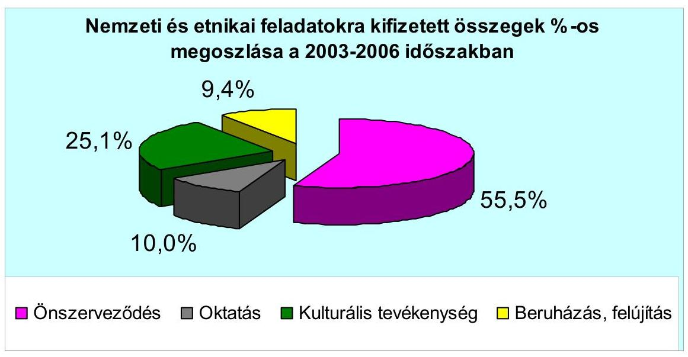
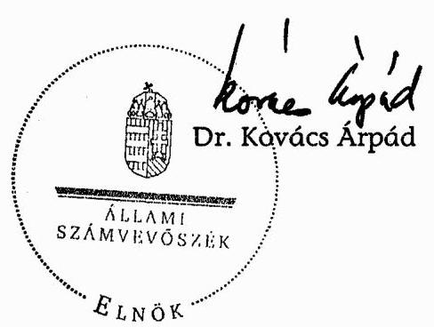
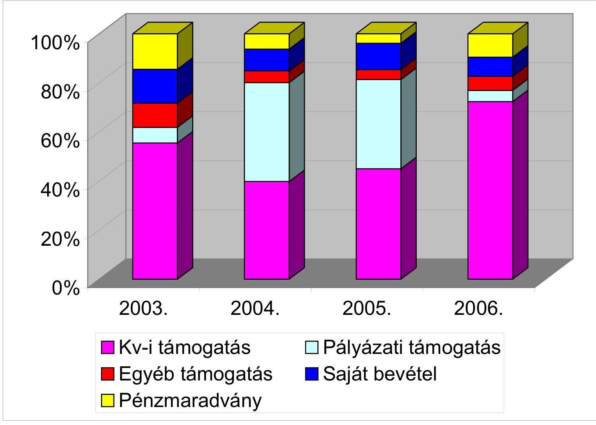
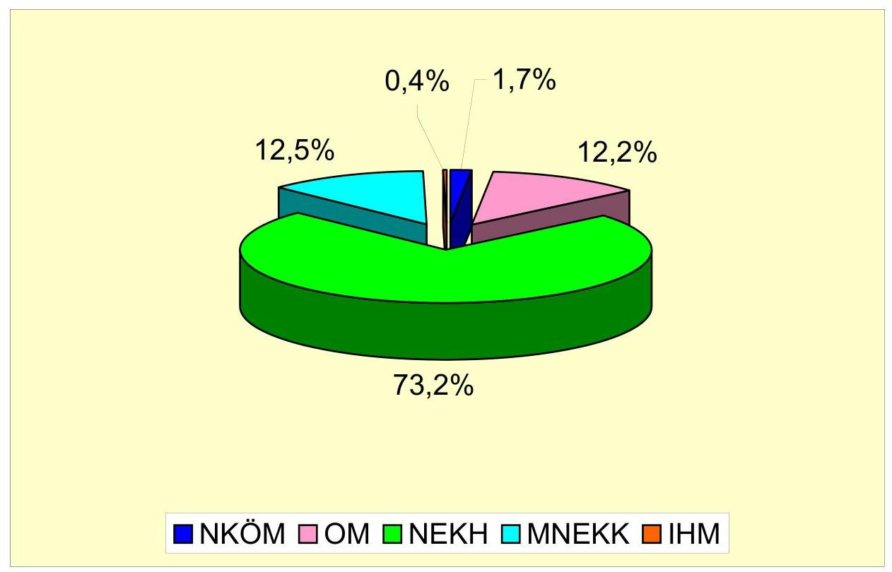
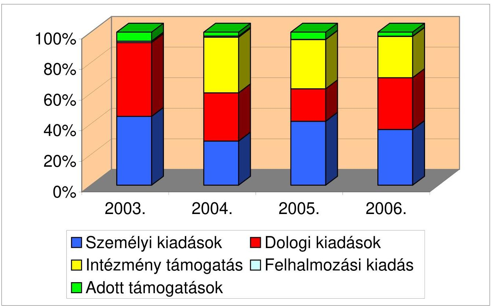
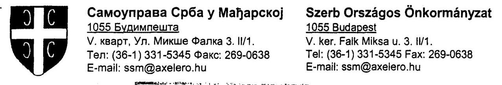
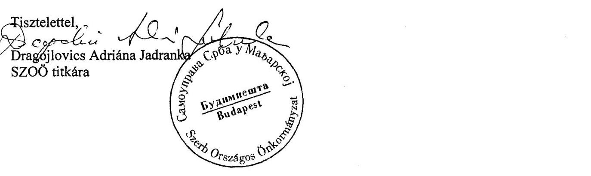
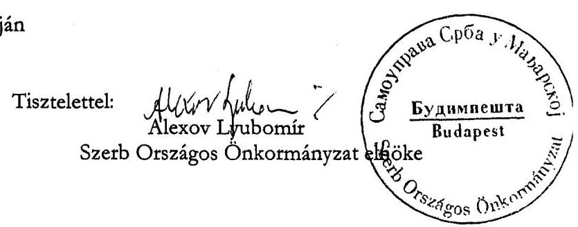
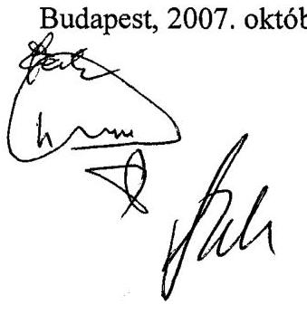

# ÁLLAMI   SZÁMVEVŐSZÉK 

## JELENTÉS

a Szerb Országos Önkormányzat 2003-2006. évi pénzügyigazdasági tevékenységének ellenőrzéséről

---

3. Önkormányzati és Területi Ellenőrzési Igazgatóság
3.1. Szabályszerüségi Ellenőrzési Főcsoport
Iktatószám: V-1008-032/2007.
Témaszám: 852
Vizsgálat-azonosító szám: V-0347
Az ellenőrzést felügyelte:
Dr. Lóránt Zoltán
főigazgató
Az ellenőrzés végrehajtásáért felelős:
Dr. Elek János
általános főigazgató-helyettes
Az ellenőrzést vezette:
Horváth Balázs
főcsoportfőnök-helyettes
Az összefoglaló jelentést készítette:
Szendrey Lajos
számvevő
Az ellenőrzést végezték:
Szendrey Lajos Tóth István
számvevő
tanácsadó
A témához kapcsolódó eddig készített számvevőszéki jelentések:
címe
sorszáma
Jelenés az országos kisebbségi önkormányzatok pénzügyi- 0201 gazdasági tevékenységének vizsgálatáról
Jelentés a Szerb Országos Önkormányzat pénzügyi-gazdasági tevékenységének vizsgálatáról
Jelentés a magyarországi nemzeti és etnikai kisebbségek támogatási rendszerének ellenőrzéséről

---

# TARTALOMJEGYZÉK 

BEVEZETÉS ..... 5
I. ÖSSZEGZŐ MEGÁLLAPÍTÁSOK, KÖVETKEZTETÉSEK, JAVASLATOK ..... 6
II. RÉSZLETES MEGÁLLAPÍTÁSOK ..... 11

1. A feladatellátás szervezettsége, szabályozottsága ..... 11
1.1. Az Önkormányzat szervezeti és működési rendje ..... 11
1.2. A gazdálkodási feladatok szabályozása ..... 12
1.3. A feladatellátás szervezeti háttere ..... 12
2. Az Önkormányzat gazdálkodásának jellemzői ..... 13
2.1. A gazdálkodási tevékenység feltételei ..... 13
2.2. A vagyongazdálkodás, vagyonvédelem ..... 13
2.3. A gazdálkodás számviteli és egyéb kapcsolódó szabályozása ..... 14
3. Az éves költségvetések jóváhagyása, végrehajtása ..... 15
3.1. Az éves költségvetések elkészítése, elfogadása ..... 15
3.2. A költségvetés végrehajtása, zárszámadása ..... 16
3.3. A költségvetési feladatok teljesítése ..... 16
3.3.1. A költségvetési törvényben megállapított támogatások alakulása ..... 16
3.3.2. Pályázati támogatások elszámolása, felhasználása ..... 17
3.3.3. A kiadások alakulása, összetétele ..... 18
4. Az Önkormányzat számviteli tevékenysége ..... 20
4.1. A könyvvezetési kötelezettség teljesítése ..... 20
4.2. Az éves beszámoló összeállítása, jóváhagyása ..... 21
4.3. A bizonylati rend és a bizonylati fegyelem érvényesítése ..... 22
5. Az Önkormányzat belső ellenőrzési rendszere ..... 22
6. Utóvizsgálat ..... 23
MELLÉKLETEK
7. számú Az Önkormányzat 2003-2006. évi bevételei és megoszlása
8. számú Kisebbségi feladatokra pályázatok alapján kapott támogatások részletezése 2003-2006. évekre
9. számú Az Önkormányzat 2003-2006. évi kiadásai és megoszlása
10. számú Az Önkormányzat 2003-2006. évi eredmény-kimutatásainak hibái

---

.

---

# RÖVIDÍTÉSEK JEGYZÉKE 

| Áht. | Az államháztartásról szóló - többször módosított -1992.   évi XXXVIII. törvény |
| :-- | :-- |
| Ámr. | Az államháztartás múködéséről szóló - többször módosí-   tott 217/1998. (XII. 30.) Korm. rendelet |
| ÁSZ | Állami Számvevőszék |
| Dokumentációs Központ | Magyarországi Szerb Kulturális és Dokumentációs Köz-   pont |
| IHM | Informatikai és Hírközlési Minisztérium |
| MNEKK | Magyarországi Nemzeti és Etnikai Kisebbségekért Közalapítvány |
| NEKH | Nemzeti és Etnikai Kisebbségi Hivatal |
| Nek. tv. | A nemzeti és etnikai kisebbségek jogairól szóló - többször   módosított - 1993. évi LXXVII. törvény |
| NKÖM | Nemzeti Kulturális Örökség Minisztériuma |
| OM | Oktatási Minisztérium |
| Önkormányzat | Szerb Országos Önkormányzat |
| Számv. tv. | A számvitelről szóló - többször módosított 2000. évi C.   törvény |
| Szja tv. | A személyi jövedelemadóról szóló - többször módosított -   1995. évi CXVII. törvény |
| SZMSZ | Szervezeti és Múködési Szabályzat |
| Vhr. | A számviteli törvény szerinti egyes egyéb szervezetek be-   számoló-készítési és könyvvezetési kötelezettségének saját-   tosságairól szóló - többször módosított - 224/2000. (XII.   19.) Korm. rendelet. |

---

.

---

# JELENTÉS 

## a Szerb Országos Önkormányzat 2003-2006. évi pénzügyi-gazdasági tevékenységének ellenőrzéséről

## BEVEZETÉS

A Szerb Országos Önkormányzat (továbbiakban: Önkormányzat) a magyarországi szerbek érdekképviseleti szerve. Az anyanyelvi oktatás fejlesztése és a nyelv széleskörú használata, valamint a szerb kulturális hagyományok őrzése és ápolása érdekében közremúködik az ezzel kapcsolatos állami döntések kidolgozásában, a megfelelő oktatási és kulturális intézményrendszer létrehozásában, múködtetésében. Elősegíti és támogatja a magyarországi szerbek múltjának, jelen társadalmi helyzetének és fejlődésének tudományos kutatását. A 2001. évi népszámlálás adatai szerint a magyarországi szerb közösségből 3388 fő szerb anyanyelvűnek, 3816 fő a szerb nemzetiséghez tartozónak, valamint 4186 fő a szerb kulturális értékekhez, hagyományokhoz kötődőnek vallotta magát.

Az Önkormányzat 2003-2006 között múködési és fejlesztési feladataira 298400 ezer Ft költségvetési támogatásban részesült, ebből 208040 ezer Ft a költségvetési törvényben biztosított támogatás. A nemzeti és etnikai kisebbségek jogairól szóló - többször módosított - 1993. évi LXXVII. törvény (továbbiakban: Nek. tv.) 39/G. § (1) bekezdése, valamint az Állami Számvevőszékről szóló - többször módosított - 1989. évi XXXVIII. törvény 2. § (5) bekezdésében kapott felhatalmazás alapján vizsgáltuk a Szerb Országos Önkormányzat 2003-2006 közötti, éves beszámolóval lezárt gazdálkodását.

Az ellenőrzés célja annak megállapítása volt, hogy:

- az Önkormányzat a központi költségvetési támogatást a Nek. tv-ben meghatározott feladatokra használta-e fel, a felhasználása, elszámolása során be-tartotta-e a vonatkozó hatályos jogszabályi előírásokat;
- a gazdálkodás törvényessége, szabályszerűsége biztosított volt-e: a tervezés, az operatív gazdálkodás, a beszámolási kötelezettség és a számviteli, bizonylati rend teljesítése során érvényesültek-e a jogszabályokban és a belső szabályzatokban megfogalmazott követelmények;
- a szabályszerű gazdálkodás érdekében kialakított kontrollmechanizmusok megfelelően segítették-e a feladatok végrehajtását.

Az ellenőrzés ideje és helye: 2007. május 7. - június 21. között az Önkormányzat székhelyén.

---

# I. ÖSSZEGZŐ MEGÁLLAPÍTÁSOK, KÖVETKEZTETÉSEK, JAVASLATOK 

Az Önkormányzat a Nek. tv. módosításáig hatályban tartotta elavult, az ÁSZ előző jelentésében hiányosnak minősített szervezeti és múködési szabályozását. A közgyűlés 2005. november 26-i határozatával elfogadott új SZMSZ továbbra sem tükrözte az önkormányzati sajátosságokat, nem határozta meg a konkrét nemzeti és kisebbségi feladatokat, nem érvényesítette a módosított törvénnyel való teljes összhangot. A szabályozási hiányosságok ellenére az önkormányzati SZMSZ alapján megválasztott döntéshozó és irányító testületek eredményesen múködtek. A közgyűlés át nem ruházható hatáskörét a Nek. tvvel összhangban szabályozták, amely határozatait szabályszerűen hozta, a döntéseket azonban nem vették nyilvántartásba. A döntések előkészítését és végrehajtását az elnökség - az oktatási, illetve a kulturális bizottság aktív közreműködésével - irányította.

Az Önkormányzat a múködési hatókörét 2003 októberétől intézményfenntartói feladattal bővítette. A tömegtájékoztatáshoz kapcsolódó szerb nyelvű dokumentáció archiválásának, feldolgozásának és digitalizálásának megoldására - a Szerb Demokratikus Szövetséggel közösen - alapította a Dokumentációs Központot. Az önállóan gazdálkodó költségvetési intézményt szabályszerűen nyilvántartásba vetették, az SZMSZ-ét jóváhagyták, vezetőjének az Önkormányzat alelnökét bízták meg. Az alapító okiratban rögzített fenntartói, múködési és gazdálkodási kapcsolatrendszert az SZMSZ-ben elmulasztották meghatározni. A felügyeleti jogkör gyakorlásával összefüggésben a közgyűlés nem döntött az intézményi költségvetés és az éves beszámoló elfogadásáról.

A gazdálkodási feladatokat az SZMSZ általánosságban határozta meg, amelyhez kapcsolódó új törvényi előírások formális hivatkozással kerültek a szabályzatba. Ennek következtében nem volt meghatározott a költségvetés és zárszámadás összeállításának rendje, kontrollja; a címzett költségvetési támogatás felhasználásának elvei, céljai. A Nek. tv. rendelkezése ellenére nem állapították meg a törzsvagyont, ezen belül a forgalomképtelen, illetve a korlátozottan forgalomképes vagyon körét. A közgyűlés 2005. november 25 -étől nem léptette hatályba a hivatali szabályozást, ezáltal a hivatalvezető kinevezésére sem került sor. A gazdálkodási és foglalkoztatási jogkör a főfoglalkozású elnök hatáskörében maradt, aki 8 fős apparátussal szervezte az Önkormányzat tevékenységét. A foglalkoztatás munkaköri leírással kiegészített munkaszerződéssel történt. A székhelyen kialakított irodák korszerú berendezései, felszerelései biztosították a folyamatos munkavégzést.

Az önkormányzati vagyonnal a közgyűlés rendelkezett, amely határozatait kizárólagos jogkörben, vagyongazdálkodási szabályzat alkalmazása nélkül hozta. Az Önkormányzat vagyoni mutatói 2003-2006 között kedvezően módosultak. A saját tőke $15 \%$-kal nőtt, a befektetett eszközök részaránya 79,4\%-ról 89,4\%-ra emelkedett. Az egyszeri ingyenes részvényjuttatásból származó értékpapír befektetést a gazdálkodás biztonságát szolgáló tartalékként kezelték, amelynek értéke 2006. év végére 57765 ezer Ft-ra emelkedett. A székhelyként

---

funkcionáló ingatlanrészt rendeltetésszerűen használták, ebben helyezték el a 2003-ban alapított intézmény központját. A Nek. tv. módosítása alapján 2006. év végén szerződéssel tulajdonba került 35049 ezer Ft nettó értékű társasházi ingatlan, amely az Önkormányzat forgalomképtelen törzsvagyonának minősül. Az ingatlan aktiválására a földhivatali bejegyzést követően, 2007-ben került sor. A vagyoni körből a székház és az üzemi célú gépkocsi biztosítással rendelkezett, védelmi berendezéssel felszerelt.

A számviteli szabályozás Számv. tv-ben előírt aktualizálásáról, teljes körű hatályba léptetéséről az önkormányzat elnöke nem gondoskodott. A számviteli politikában nem vezették át a jogszabályok módosulásával, valamint az önálló intézményi gazdálkodással összefüggő változásokat. Az ÁSZ korábbi javaslata ellenére sem léptették hatályba a számlarendet, amelynek részeként meghatározott bizonylati szabályzattal külön rendelkeztek. A pénzkezelési szabályzat a banki pénzforgalom rendjét nem rögzítette. Az értékelési, leltározási szabályzat a jogszabályi előírásokkal összhangban, a gazdálkodási sajátosságokhoz igazodóan tartalmazta a feladatokat.

Az Önkormányzat minden évben érvényes határozattal fogadta el az összehasonlítható szerkezetben készült költségvetését és zárszámadását. A kisebbségi feladatok forrásigényét és felhasználását a tervben nem határozták meg, a költségvetési törvényben megállapított támogatás felosztását költségnem részletezéssel hagyták jóvá. A Nek. tv. új előírását megsértve a 2006. évi költségvetést a Magyar Közlönyben nem tették közzé, a 2007. évi költségvetést az előírt határidőt követően csak az Önkormányzat honlapján hozták nyilvánosságra. A költségvetést évente egy alkalommal, a pályázattal elnyert forrásokra figyelemmel módosították. A költségvetés végrehajtása a kötelezettségvállalási előírások betartásával történt, ennek eredményeként mindvégig kiegyensúlyozott, tervszerű gazdálkodást folytattak.

Az Önkormányzat 2003-2006 között 393728 ezer Ft bevételből gazdálkodott, amelynek 75,7\%-a költségvetési forrásból realizálódott. A költségvetési törvényben nevesített támogatást 2005. évben 10\%-kal csökkentett összegben, 2006. évben a 27000 ezer Ft intézmény-fenntartási támogatással kiegészítve, összességében 298400 ezer Ft-tal finanszírozta a központi költségvetés. Az Önkormányzat az éves múködési támogatásokat a Nek. tv-ben meghatározott feladatokra fordította, de az elszámolási kötelezettség szabályszerű teljesítését csak 2006. évben dokumentálta. Az eredményes pályázatokkal központi költségvetési szervektől, közalapítványtól 94098 ezer Ft többlet támogatást nyertek el, amelynek 60,8\%-a kulturális, 27\%-a intézmény-beruházási, fennmaradó hányada oktatási célokat szolgált. A szerződött támogatásokból 90360 ezer Ft összegben rendeltetésnek megfelelően teljesültek a feladatok. A különbözet szabályszerűen visszatartásra, visszafizetésre került. Az elszámolási késedelemmel kapcsolatos kamatfizetési köztelezettségét az Önkormányzat minden esetben teljesítette. A támogató szervezetek az elszámolások szabályszerűségét az Önkormányzatnál nem ellenőrizték.

A vizsgált időszak együttes kiadásai 370113 ezer Ft-ot tettek ki, amelyből az önkormányzati múködés személyi és dologi kiadásai 70,2\% részarányt képviseltek. Az intézményi múködésre a 2004-2006 közötti években 94500 ezer Ft támogatást rendeltetésszerűen továbbadta. Felhalmozásra a kiadások fél száza-

---

lékát fordították, a szerb kisebbségi önkormányzatokat és civil szervezeteket 13727 ezer Ft-tal támogatták.

Az önkormányzati kiadások több mint felét önszerveződésre, egynegyedét kulturális célokra fordították, amelyek vizsgált időszaki alakulására eltérő tendencia érvényesült, mivel az önszerveződési hányad 75\%-ról, 57,5\%-ra csökkent, miközben a kulturális $12,2 \%$-ról $27,8 \%$-ra nőtt. A kiadások a bevételekhez képest évről-évre alacsonyabb összegben teljesültek, ennek nyomán az Önkormányzatnak minden évben pénzmaradványa keletkezett. A fizetőképességét folyamatosan, hitel felvétel nélkül biztosította.

Az Önkormányzat a számviteli politikában meghatározott - számítógéppel támogatott - kettős könyvvitelt vezetett, amelyhez hivatalos könyvelési programot használt. A könyvvezetést szolgáltatási szerződés alapján külső társaság végezte, amelynek feladatkörébe tartozott a számviteli, adózási, munkaügyi és bérszámfejtési, valamint az állami támogatás elszámolásával összefüggő feladatok ellátása. A könyvelésben hibásan, az intézményi támogatásokat nem egyéb bevételként, illetve egyéb ráfordításként számolták el: 2004. évben 40000 ezer Ft, 2005. évben 27500 ezer Ft, 2006. évben 27000 ezer Ft összegben. A kontírozási szabálytalanság következtében sérült a Számv. tv-ben foglalt teljesség és valódiság elve. A számlarend hiányában történt könyvelés hozzájárult a beszámoló lényeges hibájához. A központi költségvetésből címzetten kapott támogatást felhasználási jogcímenként nem különítették el, az értékpapírokról nyilvántartást nem vezettek. A beszámoló készítést megelőző zárlati munkálatokat határidőn belül végrehajtották az eszközök és források leltározását szabályszerűen végezték.

A könyvvezetési és beszámolási hibából eredően az Önkormányzat 2003-2006. éves beszámolói nem mutattak megbízható és valós képet. Az intézményi továbbadott támogatás hibás elszámolásán túlmenően az ellenőrzés további eltérést tárt fel az önkormányzatoktól kapott, illetve a pályázattal elnyert támogatások nem megfelelő soron szerepeltetésében. A bevételi főösszegre vetítve az eltérés 2003-ban 12,6\%, 2004-ben 76,4\%, 2005-ben 43,7\%, 2006-ban 49,4\% ; a kiadási oldalon 2004-ben 68,9\%, 2005-ben 42,5\%, 2006-ban 41,1\% mértékű volt. Az Önkormányzat a Nek. tv. rendelkezése ellenére elmulasztotta közzétenni a Magyar Közlönyben és internetes honlapján 2006. évi beszámolóját. Az egyszerűsített éves beszámolóján belül az eredmény-kimutatás céljára nem a Vhr-ben előírt mellékletet alkalmazta.

A bizonylati rendet bizonylati albummal kiegészítve szabályozták, a törvényi és belső előírásokat részben érvényesítették. Az utalványozás hiánya miatt sérült a bizonylatolás alaki és tartalmi követelménye. A szigorú számadási kötelezettségre és a bizonylatok megőrzésére vonatkozó rendelkezéseket betartották. A vegyes bizonylatolás a belső előírások szerint történt.

Az Önkormányzat belső ellenőrzési rendszerét a Nek. tv. módosítása, illetve az ÁSZ korábbi javaslata ellenére elmulasztotta kialakítani. A pénzügyi bizottság megválasztásának és múködési feladatainak követelményét nem szabályozták, valamint a saját és intézményi pénzügyi ellenőrzés megoldása érdekében belső ellenőrt nem foglalkoztattak. Az éves beszámolót közgyűlési jóváhagyás előtt auditáltatták, de a könyvvizsgáló a számviteli szabályozási hiá-

---

nyosságokat nem jelezte, illetve a lényeges hibákat nem tárta fel. A vezetői ellenőrzés szabályozása a hivatali szervezet, ezen belül a hivatalvezető hiányában 2005. november 25 -étől a törvényi előírástól eltért, mivel a gazdálkodási és munkáltatói jogkört továbbra is az elnök gyakorolta. A hiányos személyi feltételek miatt elmaradt az éves költségvetések és zárszámadások véleményezése, nem valósult meg a gazdálkodás és az intézmény-felügyelet szabályszerű kontrollja. A munkafolyamatba épített ellenőrzés eredményességéhez a számviteli szolgáltató kontroll kötelezettségét a szerződésben nem rögzítették. A pénztárellenőrzésre nem adtak megbízást, az elnök és a szakmai bizottságok vezetői végezték a kontrollt.

A belső ellenőrzési rendszer hiányos szabályozásával, nem megfelelő múködésével összefüggtek a feltárt számviteli szabálytalanságok. Az ÁSZ megelőző jelentésében javasoltak végrehajtására összeállított intézkedési terv jogszabályi rendelkezésen alapuló feladatai sem teljesültek.

A helyszíni ellenőrzés megállapításainak hasznosítása mellett javasoljuk:

# az Önkormányzat közgyülésének: 

1. Módosítsa az SZMSZ-t
a) a Nek tv. 37. § (1) b), c), i) pontjai alapján a költségvetésének, zárszámadásának, vagyonleltárának megállapításával; a forgalomképes és forgalomképtelen törzsvagyonának meghatározásával; az alapított intézmény müködtetésének és felügyeletének szabályozásával;
b) a Nek. tv. 39/G. § (1) bekezdésével összhangban a belső ellenőr, valamint a pénzügyi bizottság feladataival, beszámoltatási kötelezettségével;
c) az Önkormányzat által alapított Dokumentációs Központ müködtetésével, felügyeletével kapcsolatos feladatokkal.
2. Teremtse meg a hivatal múködésének és a gazdálkodás szabályszerű ellátásának személyi feltételeit, múködtesse a Nek. tv. 39/A. § (2) bekezdésben és az SZMSZben rögzített hivatalt.
3. Szabályozza az Ámr. 21. és 23. §-ai előírásaival összhangban a költségvetés és a zárszámadás elkészítésének feladatait, az egyes feladatokért való személyi, illetve testületi felelősséget, valamint határozza meg a költségvetés tartalmi felépítését, módosításának rendjét.
4. Gondoskodjon a Dokumentációs Központ költségvetésének és beszámolójának felülvizsgálatáról, jóváhagyásáról az Ámr. 149. § (3) és (5) bekezdésében foglaltak szerint.
5. Gondoskodjon a belső ellenőrzési rendszer szabályszerű és eredményes működtetése érdekében a pénzügyi bizottság ellenőrzési feladatainak tervszerű végrehajtásáról, beszámoltatásáról, belső ellenőr foglalkoztatásáról és éves munkatervi feladatainak meghatározásáról; a vezetői és a munkafolyamatba épített ellenőrzés összehangolt ellátásáról.

---

# az Önkormányzat elnökének 

1. Rendelkezzen a Nek. tv. 39/D. § (3) bekezdés előírásának megfelelően a költségvetési törvény alapján kapott támogatás felhasználásának elkülönített nyilvántartásáról és elszámolásának dokumentálásáról az utólagos ellenőrizhetőség érdekében.
2. Gondoskodjon az Önkormányzat költségvetésének és beszámolójának a Nek. tv. 39/G. § (4) bekezdésében előírtaknak megfelelő határidőn belül a Magyar Közlönyben és saját internetes honlapján történő közzétételéről.
3. Intézkedjen a Számv. tv. 14. § (3) bekezdésével összhangban a gazdálkodás adottságainak, körülményeinek megfelelő, a jogszabályi változásokat követő számviteli politika módosítására; a pénzkezelési szabályzat bankszámla-forgalmat szabályozó kiegészítésére.
4. Készítesse el a Számv. tv. 161. és 161/A. §-ai előírásával összhangban az Önkormányzat számlarendjét és gondoskodjon hatályba léptetéséről.
5. Biztosítsa a Vhr. 17. § (8) bekezdés előírásának megfelelően a közpénzek és azok felhasználásának teljes körű elkülönítését.
6. Szerezzen érvényt a könyvvezetésben és a beszámoló összeállítása során a Számv. tv. 15-16. §-ban foglalt számviteli elvek teljes körű érvényesülésének, valamint önellenőrzéssel szüntesse meg a 2003-2006. évi beszámolók lényeges hibáit. Az éves beszámolókat valós pénzügyi adatokkal a Vhr. 6. § (7) bekezdésben előírt formában terjessze elő közgyűlési jóváhagyásra.
7. Gondoskodjon a Számv. tv. 167. § (1) bekezdése szerint a bizonylatok alaki és tartalmi követelményeinek teljes körű betartásáról.
8. Intézkedjen a közgyűlési határozatoknak az SZMSZ 35. §-a szerinti nyilvántartásának folyamatos vezetéséről.

---

# II. RÉSZLETES MEGÁLLAPÍTÁSOK 

## 1. A FeladATELLÁTÁs SZERVEZETTSÉGE, SZABÁLYOZOTTSÁGA

### 1.1. Az Önkormányzat szervezeti és múködési rendje

Az Önkormányzat a nemzeti és etnikai kisebbségi feladatait a szabályozottság hiányosságai ellenére eredményesen szervezte. A szervezeti és múködési rendjét a vizsgált időszakban egymást követően két hatályos SZMSZ határozta meg. A Nek. tv. 2005. évi módosítása alapján a törvényben előírt határidőn belül, a közgyűlés a 22/2005. (11. 26.) számú határozatával új SZMSZ-t fogadott el.

Az Önkormányzat jogállását, a közgyűlés feladatát, hatáskörét, működési rendjét, a képviselők, vezető tisztségviselők jogállását, kötelezettségeit a hatályos SZMSZ a Nek. tv. rendelkezéseivel összhangban, de csak általánosságban határozta meg a nemzeti és kisebbségi feladatokat. A közgyűlés át nem ruházható feladat- és hatáskörének meghatározása összhangban volt a Nek. tv. 37. § (1) bekezdés előírásaival. Az átruházott hatáskörökről pontos jegyzék a vizsgált időszakban nem készült.

## Az új SZMSZ nem tükrözte a szerb kisebbség, az önkormányzati sajátosságok érvényesítését, továbbá nem volt összhangban a Nek. tv-vel és a Számv. tv-vel a következő hiányosságok miatt:

- Az SZMSZ-ben (és más szabályzatban sem) a költségvetés, a beszámoló és a zárszámadás készítésére, tartalmára, szerkezetére vonatkozóan nem fogalmaztak meg előírásokat (Nek. tv. 37. § (1) b)).
- Az egyszeri vagyonjuttatásként kapott értékpapírok állományának kezelését nem szabályozták (Számv. tv. 161. §).
- Saját és intézménye pénzügyi ellenőrzését - belső ellenőr útján - nem szabályozta (Nek. tv. 39/G. § (1)).
- Nem rendelkezett a pénzügyi bizottság létrehozásáról (Nek. tv. 39/G. § (2)).
- Az alapított Dokumentációs Központ múködtetési, beszámoltatási, felügyeleti feladatairól nem rendelkezett (Nek. tv. 37.§ (1) i)).

A közgyűlés, mint az Önkormányzat legfőbb szerve 29 tagból áll, a vizsgált időszakban az SZMSZ-ben előírt gyakoriságot betartva ülésezett. A közgyűlés üléseiről szerb nyelvű jegyzőkönyvet készítettek, az azokban szereplő gazdasági tárgyú határozatokat magyar nyelvre fordították. A testület döntéseit szabályszerű határozatokba foglalta, melyekről azonban nem vezettek nyilvántartást. Két közgyűlés között 11 fős elnökség irányította az Önkormányzat munkáját. A szakmai jellegű tevékenységeket a bizottságokon keresztül fejtették ki, melyek a közgyűlési döntések előkészítésében, végrehajtásában vettek részt. Az elnökváltások átadás-átvételi jegyzőkönyvvel, illetve ahhoz kapcsolódó konkrét átvételi listával történtek meg.

---

Az önkormányzati feladatok hatékonyabb ellátása érdekében a vizsgált időszakban kulturális és oktatási bizottság múködött, ezek aktívan tevékenykedtek a kisebbségi célok elérése érdekében. A pénzügyi bizottság a vizsgált időszakban nem múködött, annak megválasztása a Nek. tv. 39/G. § (2) bekezdésében előírt rendelkezése ellenére a közgyűlés 2007. évi alakuló ülésén történt meg.

A Nek. tv-ben meghatározott feladatok ellátásához, csak részben megfelelő szervezeti háttérrel rendelkeztek, azonban biztosítottak voltak a folyamatos munkavégzés feltételei, érvényesültek az összeférhetetlenségi szabályok.

# 1.2. A gazdálkodási feladatok szabályozása 

Az Önkormányzat a gazdálkodási sajátosságok figyelmen kívül hagyásával, illetve a Nek. tv. kötelező előírásainak hiányos beépítésével határozta meg az önkormányzati gazdálkodási feladatokat. A Nek. tv. 37. § (1) bekezdés b) pontja szerint az Önkormányzat önállóan dönt költségvetéséről, zárszámadásáról, vagyonleltárának megállapításáról. Az új SZMSZ a közgyűlési hatáskörből át nem ruházható feladatok között szerepelteti a költségvetés meghatározását, a zárszámadás elfogadását. Az Önkormányzat gazdálkodásáról, vagyonáról és költségvetéséről az SZMSZ VII. fejezete rendelkezett. Ebben a közgyűlés saját hatáskörében fogadja el a költségvetést és annak módosításait, valamint jóváhagyja a zárszámadást. Meghatározta múködési feltételeinek forrásait.

Nem rendelkeznek az SZMSZ-ben illetve egyéb belső szabályzatban az éves költségvetés, zárszámadás elkészítésének módjáról, a vagyonleltár tartalmi követelményéről. Ezzel összefüggésben nem került sor a költségvetés tervezésének szabályozására, illetve ennek keretében nem határozták meg a központi költségvetési támogatás felhasználásának elveit és jogcímeit.

### 1.3. A feladatellátás szervezeti háttere

Az Önkormányzat 2003. októberében megalapította a Szerb Demokratikus Szövetséggel közösen a Dokumentációs Központot az 5/2003.(10. 18.) számú határozatával. A muzeális intézményekről, a nyilvános könyvtári ellátásról és a közművelődésről szóló 1997. évi CXL. törvény vonatkozó rendelkezései értelmében ellátja a tömegtájékoztatási eszközök múködése során, a kisebbségi nyelven keletkezett dokumentációs archiválást, feldolgozást és digitalizálást. Az Önkormányzat önállóan gazdálkodó költségvetési szervként alapította meg intézményét. A nyilvántartásba vételéről az államháztartásról szóló többször módosított 1992. évi XXXVIII. törvény (továbbiakban: Áht.) 88. § (5) bekezdésében foglaltaknak megfelelően gondoskodott. A Dokumentációs Központ SZMSZ-e az Önkormányzat közgyűlésének jóváhagyásával lépett hatályba. Az intézmény vezetését megbízás, közgyűlési határozat alapján az alelnök látta el. Az intézmény az Önkormányzat székhelyén központi egységként múködik 6 vidéki telephellyel. Az SZMSZ-ének 3. fejezete foglalkozik az intézmény feladatainak meghatározásával, a kulturális feladatokkal, az intézmény vezetésével. Az Önkormányzat intézménye múködtetésének, beszámoltatásának felügyelete nem szabályozott, nem dokumentált. Az ellenőrzés rendelkezésére bocsátott, illetve magyar nyelvre lefordított közgyűlési határozatok nem tartalmazták az intézmény gazdálkodásának felügyeletére, költségvetésének és beszámolójának elfogadására vonatkozó döntéseket.

---

# 2. Az ÖNKORMÁNYZAT GAZDÁLKODÁSÁNAK JELLEMZŐI 

### 2.1. A gazdálkodási tevékenység feltételei

A Nek. tv. 39/B. § (1) bekezdése előírja az Önkormányzat hivatala működtetésének SZMSZ-ben történő szabályozását. A 2005. november 26-i SZMSZ 47-57. pontja tartalmazta a hivatal létrehozásának, működtetésének kereteit, az előírások hatályba léptetését a közgyűlés a 2007. évi országos kisebbségi önkormányzati választásokig elnapolta.

A hivatal ténylegesen nem múködött, hivatalvezetőt sem neveztek ki a vizsgált időszakban. Az önkormányzati feladatok ellátását, a gazdálkodási tevékenységet ellentétben a Nek. tv. 39/B. § (2) bekezdésében foglaltakkal - 2005. november 25. után is - az elnök irányította, akinek munkáltatói jogkörébe 8 fős szakapparátus tartozott.

Az Önkormányzat elnöke az alkalmazottakkal szabályos munkaszerződést kötött, azok munkaköri leírással rendelkeztek. A múködés tárgyi feltételeit illetően a kialakított iroda berendezése, számítástechnikai felszereltsége megfelelő keretet biztosított a feladatellátáshoz, biztosítottak voltak a folyamatos munkavégzés feltételei.

### 2.2. A vagyongazdálkodás, vagyonvédelem

Az Önkormányzat SZMSZ-ében rögzítette az éves költségvetés alapján történő gazdálkodás egyes elemeit. Előírta a hitelfelvétel korlátait; az államháztartás alrendszereitől jogszabály vagy megállapodás alapján céljelleggel kapott támogatások elkülönített nyilvántartását; a Nek. tv. 39/G. §-ának (3) bekezdésében foglalt módon költségvetési könyvvizsgáló megbízását.

A közgyűlés saját hatáskörében fogadta el a költségvetést, annak módosításait és jóváhagyta a zárszámadást a rendelkezésre bocsátott források felhasználásával. Meghatározta az Önkormányzat múködési feltételeit biztosító forrásokat, amelyek: állami költségvetési hozzájárulás, saját bevételek, támogatások, a vagyonának hozadéka, adományok, átvett pénzeszközök.

Az Önkormányzat az SZMSZ-ben szabályozta a vagyongazdálkodással kapcsolatosan a közgyűlés át nem ruházható hatáskörét, melyet betartottak. A vagyongazdálkodással kapcsolatos ellenőrzési jogköröket - a kötelezettségvállalás, utalványozás kivételével - nem szabályozta. Az átmenetileg szabad pénzeszközök lekötésének döntésmechanizmusa is szabályozatlan volt.

Az Önkormányzat vagyongazdálkodási szabályzatot nem készített. Elmulasztotta meghatározni a Nek. tv. 37. § (1) c) pontjának megfelelően törzsvagyonának körét a 60/A. § (4) bekezdésben előírt szerkezetben.

Az Önkormányzat az 1995. évben, egyszeri vagyonjuttatásként kapott 15000 ezer Ft névértékű MOL részvényeket a vizsgált időszakot megelőzően értékesítette, az abból származó bevételt állampapírban helyezte el. Az értékpapírokkal kapcsolatos döntéseket a közgyűlés határozati formában hozta meg.

---

Az Önkormányzat nyilvántartott eszközállománya a vizsgált időszakban az alábbiak szerint alakult:

Adatok ezer Ft-ban

| Megnevezés: | 2003. évi   nyitó | 2003.   évi záró | 2004.   évi záró | 2005.   évi záró | 2006.   évi záró |
| :-- | :--: | :--: | :--: | :--: | :--: |
| Befektetett eszközök: | 50821 | 55533 | 57839 | 45055 | 58927 |
| Immateriális javak: | 0 | 64 | 81 | 68 | 1 |
| Egyéb berendezések: | 4101 | 3632 | 3161 | 1909 | 1161 |
| Értékpapírok: | 46720 | 51837 | 54597 | 43078 | 57765 |
| Követelések: | 13162 | 9213 | 9067 | 20304 | 7010 |
| Értékpapírok: | 0 | 0 | 0 | 19 | 10 |
| Készpénz: | 597 | 116 | 146 | 154 | 136 |
| Betétszámla: | 11180 | 6998 | 3538 | 9738 | 2871 |
| Egyéb követelés: | 1385 | 2099 | 5383 | 10393 | 3993 |
| Összesen: | $\mathbf{6 3 9 8 3}$ | $\mathbf{6 4 7 4 6}$ | $\mathbf{6 6 9 0 6}$ | $\mathbf{6 5 3 5 9}$ | $\mathbf{6 5 9 3 7}$ |

Az Önkormányzat eszközállománya a vizsgált időszak alatt mindössze 3,1\%kal növekedett. Az eszközállományon belül a befektetett eszközök arány 79,4\%ról $89,4 \%$-ra nőtt. A befektetett eszközállomány 2005. évi közel 10\%-os részesedéscsökkenése abból eredt, hogy az Önkormányzat 15000 ezer Ft értékű értékpapírt beváltott, szabályszerű kölcsönt adott az általa fenntartott Dokumentációs Központnak. A 2006. évben visszafizetett kölcsön összegét az Önkormányzat ismét értékpapírba fektette. A saját tőke nagysága a 2003. évi 56264 ezer Ft-ról 2006. év végére 64711 ezer Ft-ra változott, ami 15\%-os növekedést jelentett.

Az Önkormányzat székhelyéül szolgáló, a Budapest, V. ker. Falk Miksa u. 3. szám II. emeletén lévő, $425 \mathrm{~m}^{2}$ területú ingatlanrészt rendeltetésszerűen használták. Megállapodás alapján ebből $102 \mathrm{~m}^{2}$-t a Szerb Fővárosi Önkormányzat használt. A Nek. tv. 59/A. § (1) bekezdés előírásai alapján az ingatlanrész 2006 végén egyszeri ingyenes vagyon juttatásként, 44224 ezer Ft bruttó, illetve 35049 ezer Ft nettó értéken az Önkormányzat tulajdonába került forgalomképtelen törzsvagyonként. A székház a szükséges biztonsági berendezésekkel és biztosítással rendelkezik, hasonlóan a legnagyobb értéket képviselő gépkocsik is.

# 2.3. A gazdálkodás számviteli és egyéb kapcsolódó szabályozása 

A gazdálkodás folyamatát, annak részterületeit érintő, a számviteli törvényben előírt szabályzatokkal, a számlarend kivételével rendelkeztek. Az Önkormányzat 2001 novemberében kiadott - az ÁSZ által korábban tervezetként véleményezett - szabályzatokat hatályban tartotta, illetve a közgyűlés 23-34/2005. (11. 26.) SZOÖ számú közgyűlési határozatával elfogadta. A Számv. tv. és a Nek. tv. változásának, valamint az új intézményi feladat belépésének megfelelően nem aktualizálta szabályzatait.

---

A számviteli politika nem rögzítette az Önkormányzat sajátosságainak megfelelő beszámoló és könyvvezetési kötelezettséget, így nem érvényesült a Számv. tv. 14. § (3) bekezdésének követelménye.

Az Önkormányzat a Számv. tv. 161. § elöírása, valamint az ÁSZ korábbi ellenőrzésének javaslata ellenére sem léptette hatályba számlarendjét. Az ÁSZ korábbi jelentése az akkor tervezetként rendelkezésre álló számlarendet a hatályos jogszabályokkal összhangban lévőnek minősítette. Az aktuális ellenőrzésnél a számlarend meglétét, korszerűsítését, használatát nem dokumentálták. A jogtiszta könyvelési szoftver elsősorban adózási vonatkozású karbantartása lévén, csak részben tudta ellensúlyozni a számlarend könyvelésben való használatának hiányát.

A pénzkezelési szabályzat meghatározta a pénztárossal szemben támasztott követelményeket, felelősségét, feladatait, a házipénztár létesítésének, kialakításának feltételeit, a pénzmozgások bizonylati rendjét, követelményeit, de nem tért ki a bankszámla pénzforgalom kezelésének szabályaira. Az értékelési szabályzat leírta a bekerülési érték tartalmát, az eszközök minősítési szempontjait, az amortizációs politika elemeit, de az alátámasztó bizonylatokról hiányosan rendelkezett. A leltározási szabályzat a jogszabályi előírásokkal összhangban tartalmazza szabályozandó elemeket.

A gazdálkodás törvényességének érvényesülését elősegítő egyéb szabályzatokat is kiadtak: gépjármú használati, közbeszerzési, pénzmosási, önköltségszámítási, iratkezelési, informatikai szabályzatokat, amelyek a vonatkozó rendeletekkel összhangban voltak.

# 3. Az ÉVES KÖLTSÉGVEtÉSEK JÓVÁHAGYÁSA, VÉGREHAJTÁSA 

### 3.1. Az éves költségvetések elkészítése, elfogadása

A költségvetés megállapítása - az SZMSZ szerint - a közgyűlés kizárólagos, át nem ruházható hatásköre. Elkészítésének rendjét, tartalmát belső előírás nem tartalmazta. A SZMSZ nem jelölte meg a költségvetés elkészítéséért felelős személyt. A költségvetési törvényben meghatározott támogatás felhasználásának elveit belső szabályzat nem rögzítette. A költségvetés készítése során nem határoztak meg kiadási jogcímeket és nem rendeltek összegeket a feladatokhoz. Az Önkormányzat költségvetésében a költségvetési törvényben meghatározott támogatás felhasználását a többi tervezett bevétellel együtt, a főkönyvi könyvelésben szereplő költségnemek szerinti bontásban, költségviselők szerint megosztva tervezte.

A költségvetés elkészítésénél minden ellenőrzött évben az előző évi költségadatokat, valamint a jóváhagyott költségvetési támogatást vették figyelembe. Az Önkormányzat éves költségvetéseit egymással összehasonlítható szerkezetben, jól átlátható tagolásban készítették el. A pénzügyi tervezésnél a konkrét feladatok forrásigényét és felhasználását nem határozták meg elkülönítetten. Ennek következtében nem volt megállapítható, hogy megtörtént-e a feladatok differenciálása és ha igen, akkor milyen szempontok alapján.

---

A könyvelő cég által szolgáltatott bázisadatok és a két szakmai bizottság véleménye alapján elkészített költségvetési tervet - pénzügyi bizottsági kontroll nélkül - az elnökség megtárgyalta, majd az általa véleményezett javaslat került a közgyűlés elé elfogadásra. Az önkormányzati költségvetések elfogadása, az SZMSZ előírásának megfelelően minden ellenőrzött évben közgyűlési határozattal történt. Az Önkormányzat a Nek. tv. 39/G. § (4) bekezdésében előírt 2006. évi költségvetésére vonatkozó közzétételi kötelezettségnek nem tett eleget.

# 3.2. A költségvetés végrehajtása, zárszámadása 

A kötelezettségvállalások és az utalványozások hatásköri rendjét a Kötelezettségvállalási és Utalványozás Szabályzat rögzítette, ennek megfelelően az elnök korlátlan kötelezettségvállalási jogkörrel rendelkezett, amelyet a közgyűlés kontrolljával gyakorolt. A költségvetések végrehajtása során a hatásköri rend érvényesült. Az ellenőrzött években az éves költségvetésekhez évente egy alkalommal évközben módosításokat terjesztettek be írásos formában. A költségvetés módosításait a közgyűlés határozatban fogadta el. A költségvetés végrehajtása során biztosított volt a kötelezettségvállalások pénzügyi fedezete, a bevételek az ellenőrzött években meghaladták a kiadásokat. Az Önkormányzat a vizsgált időszakban pénzügyi lehetőségei függvényében vállalt csak kötelezettséget, megőrizte fizetőképességét, kiegyensúlyozott gazdálkodást folytatott.

Az Önkormányzat gazdálkodásáról szóló zárszámadásokat, a gazdasági évet követő áprilisban terjesztették elfogadásra a közgyűlés elé. A közgyűlés az éves zárszámadásokat mindegyik évben az SZMSZ előírásának megfelelően határozatban fogadta el. Az éves zárszámadások adatai az adott év főkönyvi könyveléséből levezethetők voltak. A zárszámadások a bevételi és kiadási adatokat a költségvetéssel azonos tartalommal és szerkezetben tartalmazták.

### 3.3. A költségvetési feladatok teljesítése

Az Önkormányzat a vizsgált időszakban 393728 ezer Ft bevételből gazdálkodott. Az Önkormányzat összes bevételének 52,8\%-a költségvetési törvény alapján juttatott támogatásból, 22,9\%-a egyéb költségvetési szervi és közalapítványi támogatásból, 6,0\%-a egyéb támogatásból, 10,1\%-a saját bevételből, 8,2\% előző évi pénzmaradványból származott (1. számú melléklet).

### 3.3.1. A költségvetési törvényben megállapított támogatások alakulása

Az Önkormányzat évenkénti múködéséhez a költségvetési törvény alapján 2003-2004. évben egyaránt 45300 ezer Ft-ot, 2005. évben 42840 ezer Ft-ot és 2006. évben 74600 ezer Ft állami támogatást kapott. A múködési célú támogatás a vizsgált időszak második évében változatlan nagyságú, a 2005. évi támogatás összege az államháztartási egyensúlyi intézkedések miatt 5,4\%-kal csökkent. A 2006. évi támogatás a 2005. évi bázishoz képest ugyan $74 \%$-kal nőtt, de ennek „konstrukció" változási oka volt, nevezetesen korábban a pályázati támogatás soron szerepeltetett, az intézmény számára továbbadás céljából kapott intézményi támogatás a Nek. tv. módosulása miatt került a költségvetési törvény alapján nyújtott támogatások sorba.

---

Az Önkormányzatnál az összes pénzforgalmi bevétel 57,5\%-át tette ki az évenkénti költségvetési törvényben biztosított működési célú központi támogatás.

A 2003-2005. években kötött támogatási szerződéseknek megfelelően a központi költségvetésből a költségvetési törvényben meghatározott, közvetlenül juttatott támogatásokat az Önkormányzat múködésére, oktatási és kulturális rendezvények lebonyolításának finanszírozására fordította. Az elszámolási kötelezettség teljesítését nem dokumentálták. A 2006. évben a működési és az intézményi támogatást az Önkormányzat a 2006. évi költségvetésről szóló 2005. évi CLIII. törvény 1. számú mellékletének Országgyűlés fejezet 16. és 17. cím, 11. alcíme alapján szerződés nélkül kapta, beszámolási kötelezettségének az Ámr. 147 - 149/A. §-ai előírásainak figyelembevételével eleget tett.

# 3.3.2. Pályázati támogatások elszámolása, felhasználása 

Az Önkormányzat a vizsgált időszakban 60 db pályázat alapján 94098 ezer Ft összegű támogatás felhasználására kötött szerződést. A szerződések alapján oktatási feladatokra 11519 ezer Ft, kulturális tevékenységre 57179 ezer Ft, intézményi beruházásra 25400 ezer Ft támogatást használhatott fel az Önkormányzat. (A támogatás támogatónkénti és évenkénti megoszlását a 2. számú melléklet tartalmazza.)

A 2004. és 2005. évi kiugró támogatási összegek oka, hogy az Önkormányzat a NEKH-től két-két db szerződés alapján 40000 ezer Ft, illetve 27500 ezer Ft öszszegű pályázati támogatást kapott a „Kisebbségi intézmények átvételének és fenntartásának támogatása" című előirányzat terhére. A 2006. évben az intézményi támogatást már nem pályázati, hanem költségvetési törvény alapján kapta az Önkormányzat.

A tervezett programok közül kettő nem valósult meg, további hat esetben pedig az elszámolás alapján az Önkormányzat a szerződésben szereplő összegnél kevesebb támogatást tudott érvényesíteni.

A vizsgált négy év alatt a 94098 ezer Ft összegre kötött szerződések alapján az igénybe vett 93305 ezer Ft pályázati támogatásból 67500 ezer Ft (az összes igénybe vett támogatás $73,2 \%$-a) volt a NEKH „Kisebbségi intézmények átvételének és fenntartásának támogatása" című előirányzatából a Dokumentációs Központ működéséhez és beruházásaihoz nyújtott támogatás. A felhasznált pályázati támogatás $11,9 \%$-át oktatási, $60,9 \%$-át kulturális, $27,2 \%$-át beruházási feladatokra használták fel. A feladatok teljesítése során az Önkormányzat a szerződéssel biztosított támogatás $99,2 \%$-át tudta igénybe venni. Hiánypótlásra való felszólítás, az elnyert és felhasznált összeg közti különbség a vizsgált időszakban a következők szerint alakult.

A 2003. évben négy támogatótól 13 db szerződéssel elnyert 5262,5 ezer Ft öszszegű támogatást a pályázatban és a támogatási szerződésben megfogalmazott célra használták fel. Egy esetben került sor hiánypótlásra nem megfelelő dokumentálás miatt, egy esetben 45 napos elszámolási határidő túllépés miatt késedelmi kamatfizetési kötelezettséget írt elő a támogató, amit az Önkormányzat határidőben megfizetett.

---

A 2004. évben öt támogatótól 14 db szerződéssel elnyert 46730 ezer Ft összegű támogatásból a pályázatban és a támogatási szerződésben megfogalmazott célra 46362 ezer Ft-ot használtak fel. Az eltérés oka, hogy az OM pedagógus továbbképzésre két szerződéssel odaítélt 2500 ezer Ft összegű támogatásból az utólagos elszámolás során csak 2129 ezer Ft összegű elszámolást fogadott el és ennek összegét utalta át az Önkormányzatnak. Egy esetben 70 ezer Ft összegű felhasználatlanság miatti visszafizetési kötelezettség keletkezett, amit az Önkormányzat az elszámolás benyújtásával egy időben megfizetett.

A 2005. évben három támogatótól 20 db szerződéssel elnyert 35244 ezer Ft összegű támogatásból a pályázatban és a támogatási szerződésben megfogalmazott célokra 35163 ezer Ft összeget használtak fel. Az eltérés oka, hogy a MNEKK 382/I/2005. számú szerződésében szereplő könyvbemutató nem valósult meg, így 70 ezer Ft összegű támogatást a támogató által előírt 4 ezer Ft késedelmi kamattal együtt az Önkormányzat visszafizette a támogatónak. Visszafizetésre került továbbá a MNEKK 296/I/2005. számú támogatási szerződésében szereplő összegből 11 ezer Ft felhasználatlanság miatt. Két esetben - a 399/I/2005 és a 400/I/2005. számú MNEKK szerződések - összesen 231 ezer Ft összegű felhasználatlanság miatti visszafizetési, és késedelmes elszámolás miatt 17 ezer Ft összegű kamatfizetési kötelezettség keletkezett, amit az Önkormányzat az előírásnak megfelelően megfizetett. További egy szerződés esetében - a 373/I/2005. számú MNEKK szerződés - késedelmes elszámolás miatt a támogató 2 ezer Ft késedelmi kamat fizetését írta elő, melyet az Önkormányzat megfizetett.

A 2006. évben kettő támogatótól 13 db szerződéssel elnyert 6861 ezer Ft-ból 6821 ezer Ft támogatást a pályázatban és a támogatási szerződésben megfogalmazott oktatási és kulturális célra fordították. Az eltérés oka, hogy a MNEKK 55/I/2006. számú szerződésében szereplő pedagógus konferencia nem valósult meg, így a 40 ezer Ft összegű támogatást az Önkormányzat visszafizette a támogatónak.

A támogatási szerződésekben megfogalmazott jogok és kötelezettségek a vizsgált időszakban megfeleltek az Ámr. 87-89. §-aiban megfogalmazott követelményeknek. A támogatások felhasználása a szerződésekben foglalt előírások figyelembevételével történt. A támogatások felhasználásának elszámolása a támogatási szerződések előírásának megfelelt. A támogatást nyújtók a támogatás felhasználását, illetve az elszámolások szabályszerűségét a vizsgált időszakban a helyszínen nem ellenőrizték.

# 3.3.3. A kiadások alakulása, összetétele 

Az Önkormányzat kiadási főösszege a vizsgált időszakban 370113 ezer Ft volt. A személyi kifizetésekre és azok járulékaira a kiadások 37,1\%-át költötték. A dologi kiadások az összkiadásokon belül 33,1\%-kal részesedtek. Intézmény támogatására a kiadások 25,5\%-át fordították. Felhalmozásra a kiadások 0,5\%-át, adott támogatásra 3,7\%-át költötték. A támogatásokat az Önkormányzat saját bevételből, közgyűlésének kerethatározata figyelembe vételével a Kulturális Bizottság ítélte oda egyedi kérelmek alapján. A támogatásokat az Önkormányzat támogatási szerződés megkötése után folyósította.

---

A szerződésben minden esetben elszámolási kötelezettséget kötöttek ki. A támogatottak a támogatás felhasználásáról a szerződésben előírtaknak megfelelően elszámoltak.

Az Önkormányzat a vizsgált időszakban 3007 ezer Ft és 9810 ezer Ft közötti szabad pénzforrással zárta az egyes gazdasági éveket. A személyi kiadásokra és járulékokra fordított kiadások értéke a négy év alatt $8,7 \%$-kal nőtt, miközben a foglalkoztatási létszám nem változott (3. számú melléklet).
Az Önkormányzat kiadási főösszege 2003. és 2006. között 34,4\%-kal nőtt. A növekedés oka a 2003-ban alapított Dokumentációs Központ kiadásainak támogatása. Erre a célra az Önkormányzat három év alatt összesen 94500 ezer Ft támogatást kapott a „Kisebbségi intézmények átvételének és fenntartásának támogatása" című előirányzatból. A fenntartói támogatást az Önkormányzat rendeltetése szerint átadta a Dokumentációs Központnak. Az Önkormányzat intézményi támogatás nélküli éves kiadása 2003-2006 között 1,8\%kal csökkent.

Az Önkormányzat kiadásainak feladatcsoportokra vonatkozó megoszlását az alábbi diagram szemlélteti:

Az önszerveződésre fordított kiadások éves mértéke a 2003. évi 75 \%-ról 57,5 \%ra csökkent, miközben a kulturális feladatokra fordított kiadásoké 12,2 \%-ról 27,8 \%-ra nőtt. Ugyancsak jelentősen ( $0,8 \%$-ról $7,1 \%$-ra) nőtt a beruházásra fordított kiadások éves mértéke.

Az Önkormányzat a vizsgált években összesen 13727 ezer Ft összegű támogatást adott nemzeti és etnikai kisebbségi szervezeteknek iskolabusz használata, színházi előadás, néptánc tábor, népviselet vásárlás, szavalóverseny céljára.

---

# 4. Az ÖNKORMÁNYZAT SZÁMVITELI TEVÉKENYSÉGE 

### 4.1. A könyvvezetési kötelezettség teljesítése

Az Önkormányzat a Számv. tv. 12. § (3) bekezdése alapján könyvvezetési kötelezettségének - számítógépes rendszerú - kettős könyvvitel vezetésével tett eleget. Az alkalmazott könyvelési program megfelelt a Számv. tv-ben előírt zárt könyvelési rendszer követelményének. A számviteli jogszabályi változások programban való átvezetéséről nem gondoskodtak.

Az Önkormányzat az ellenőrzött időszakban egymást váltó két vállalkozást bízott meg szerződés alapján a számviteli, adózási, munkaügyi és bérszámfejtési feladatok, valamint az állami támogatás elszámolásával összefüggő feladatok ellátása vonatkozásában. A szolgáltatást a gazdasági társaság a székházban nyújtotta, ezzel összefüggésben az operatív információáramlás, a bizonylatok megőrzése biztosított volt, Naprakész, idő- és számlasoros könyvelést folytattak.

Az Önkormányzat a vizsgált időszakban a Dokumentációs Központ részére továbbutalási céllal kapott támogatás könyvelésénél nem a Vhr. 16. § (6)-(7) bekezdése szerint járt el. Kontírozási hiba következtében a kapott támogatást nem egyéb bevételként, továbbá annak átadott összegét nem egyéb ráfordításként számolta el, 2004. évben 40000 ezer Ft-ot, 2005. évben 27500 ezer Ft-ot, 2006. évben 27000 ezer Ft-ot. Ezzel a könyvelésben megszegte a Számv. tv. 15. § (2)(3) bekezdésében előírt teljesség és valódiság elvét.

Az Önkormányzat a központi költségvetésből címzetten kapott támogatás felhasználási jogcímeit és a kapcsolódó összegeket nem tartotta elkülönítetten nyilván. Az Önkormányzat a Vhr. 2004. január 1-jétől hatályos 17. § (8) bekezdés előírása szerint csak a pályázati úton elnyert és cél szerinti felhasználásra kapott összegeket különítette el jogcím szerint. Minden céltámogatás felhasználásáról elkülönített analitikus nyilvántartást vezetett. Az elkülönített nyilvántartások vezetése megfelelt a jogszabályok és a támogatók által támasztott követelményeknek. A számlarend hiányában a főkönyvi számlák és az analitikák kapcsolata nem volt szabályozva.

A kettős könyvvitelhez kapcsolódó analitikus nyilvántartásokat - az értékpapír nyilvántartás kivételével - vezették. Az analitikák a kapcsolódó főkönyvi számlák adataival egyeztek. Az analitikában az alapbizonylatokra való hivatkozás biztosította a visszakereshetőséget. A főkönyvi könyvelési rendszerhez az analitikus nyilvántartásokat program segítségével integrálták. A vevő, illetve szállítói analitika feladása automatikus, zárt volt. A pénztári analitika manuális módon támasztotta alá a főkönyvi feladást. A tárgyi eszközökkel kapcsolatos analitika kézzel került vezetésre. A beruházások analitikáját vezették, aktiválásuk megtörtént.

Az egyösszegű tárgyi eszköz költség elszámolásra az 50 ezer Ft-os értékhatárt alkalmazták, nem éltek a 2006. január 1-jétől a Számv. tv. 80. § (2) bekezdés szerint az értékhatár 100 ezer Ft-ra való felemelésével. Az amortizációt a számviteli politikájuknak megfelelően évente elszámolták.

---

Az elszámolásra kiadott előlegekről a pénzügyi ügyintéző személyenkénti analitikus nyilvántartást vezetett, melynek segítségével az előleg határidőre történő elszámoltatása biztosított volt. Az Önkormányzatnál a szigorú számadású nyomtatványokra vonatkozó nyilvántartás a pénzkezelési szabályzatban előírtakkal összhangban megfelelő volt. Az Önkormányzat az ellenőrzés rendelkezésére bocsátott nyilvántartások, adatszolgáltatások alapján a vizsgált időszakban eleget tett a jogszabályokban előírt bejelentési, nyilvántartási és bevallási kötelezettségének. A folyószámla egyeztetések eredményeként két alkalommal túlfizetés mutatkozott, melyek rendezésre kerültek.

A Számv. tv. 164. § (1) bekezdés előírásának megfelelően, a beszámoló készítést megelőző zárlati munkálatokat a számviteli politikában meghatározott határidőn belül végrehajtották. Szabályszerűen végezték az eszközök és források leltározását.

# 4.2. Az éves beszámoló összeállítása, jóváhagyása 

Az Önkormányzat beszámolási kötelezettségét a Vhr. 6. § (4) bekezdés ba) pontja szerinti egyszerűsített éves beszámoló összeállításával teljesítette. Az eredmény-kimutatáshoz nem az előírt 5. számú mellékletet, hanem helytelenül a 6. számú mellékletet alkalmazták, ezzel sérült a Vhr. 6. § (7) bekezdésének előírása.

A számlarend nélküli könyvelés és a beszámoló kitöltése olyan hibákat okozott, melyek miatt sérültek a Számv. tv. 15. § (2)-(3) bekezdése szerinti teljesség és valódiság számviteli alapelvei. A hibák előjeltől független értékei összegének az eredmény-kimutatás bevételi illetve kiadási főösszegére vetített értéke jelentős mértékben meghaladta a 2\%-os lényegességi küszöb értéket, ezért a beszámoló nem adott megbízható és valós képet az Önkormányzat gazdálkodásáról (4. számú melléklet).

## A beszámoló feltárt hibái a következők voltak:

- az Önkormányzat által intézménynek továbbadott támogatás - a 4.1. pontban részletezett hibás könyvelés miatt - nem került a beszámolóba (a vizsgált időszak alatt összesen 94500 ezer Ft);
- a helyi szerb önkormányzatoktól kapott támogatás nem az önkormányzatoktól kapott támogatás, hanem az egyéb soron szerepelt ( 5757 ezer Ft);
- a pályázati úton elnyert támogatás 2004-2006. években nem a nevesített soron, hanem az egyéb soron volt kimutatva ( 4713 ezer Ft).

A beszámolóban szereplő adatok a rendelkezésre álló dokumentumokból egyértelműen levezethetők. A vizsgált időszakban a zárszámadással egy időben történt a mérlegbeszámoló elfogadása is. Az Önkormányzat 2006. évi beszámolójának a Nek. tv. 39/G. § (4) bekezdésében előírt 2007. május 15 -ig történő, Magyar közlönyben és internetes honlapján való közzétételi kötelezettségét elmulasztotta.

---

# 4.3. A bizonylati rend és a bizonylati fegyelem érvényesítése 

A bizonylati rend szabályzata, melyhez bizonylati album is mellékelve volt, elősegítette a bizonylati rend és fegyelem érvényesítését. A bizonylati rend ezen túlmenően a pénzkezelési, valamint a kötelezettségvállalási és utalványozási szabályzatban is meghatározásra került a jogszabályoknak megfelelő módon.

A könyvelés alapjául szolgáló számviteli bizonylatok a befogadott számlák vonatkozásában - a minta kevesebb, mint fél \%-ában - az utalványozás hiánya miatt nem felelt meg a Számv. tv. 167. § (1) bekezdésében meghatározott alaki és tartalmi követelményeknek. Ezen kivételeken túlmenően a gazdasági eseményről szabályszerűen kiállított alapbizonylatok alapján, az utalványozást követően került sor a főkönyvi könyvelésére a Számv. tv. 165-167. §-aiban meghatározottak, a szigorú számadási kötelezettségre és a bizonylatok megőrzésére vonatkozó 168-169. § rendelkezései szerint.

A könyvelt bizonylatokon a vizsgált időszakban szerepelt az érintett főkönyvi számlákra való hivatkozás, feltüntették a könyvviteli nyilvántartásban történt rögzítés időpontját. A vegyes bizonylatok az előírásoknak megfelelően kerültek alkalmazásra.

## 5. Az ÖNKORMÁNYZAT BELSŐ ELLENŐRZÉSI RENDSZERE

Az Önkormányzat belső ellenőrzési rendszerét hiányosan szabályozta. A pénzügyi bizottság létrehozását, megválasztását, múködését, feladatait az SZMSZ nem írta elő. Az Önkormányzat megsértette a Nek. tv. 39/G. § (1) bekezdésében foglaltakat, mivel nem rögzítette, hogy az Önkormányzat saját és intézményi pénzügyi ellenőrzését jogszabályban meghatározott képesítésű belső ellenőr útján látja el. A folyamatba épített ellenőrzés és a vezetői ellenőrzés szabályozása részletesen a pénzkezelési, kötelezettségvállalási és utalványozási, valamint a bizonylati szabályzatokban jelenik meg.

A pénzügyi bizottság múködésének hiányában az Önkormányzatnál és intézményénél az éves költségvetési tervezetnek, a beszámoló tervezetnek a véleményezése, a pénzügyi folyamatok figyelemmel kísérése és értékelése, a pénzügyi döntések megalapozottságának, a pénzügyi jogszabályok és belső szabályzatok érvényesítésének vizsgálata, az SZMSZ-ben meghatározott jog és alapszabályszerű működés ellenőrzése a Nek. tv. 2005. november 25 -én hatályba lépett módosítását követően sem valósult meg (Nek tv. 39/G. § (2) bekezdés).

Az Önkormányzat nem gondoskodott megfelelően az alapított intézmény ellenőrzéséről, az erről szóló bizonyító dokumentumokat nem tudta bemutatni.

A vezetői ellenőrzés az aláírási jog gyakorlásán túlmenően sajátosan alakult. Az önkormányzat elnöke a hivatalvezető feladatköréből eredő tevékenységek egy részét maga végezte. Az elnökség a pénzügyi bizottság hiányát testületi ellenőrzésként igyekezett pótolni.

A munkafolyamatba épített ellenőrzéshez a pénzkezelési szabályzatban előírt pénztárellenőrt nem foglalkoztattak. A könyvelő cég vállalkozási szerződésében nem került konkretizálásra a folyamatba épített ellenőrzés.

---

A vizsgált időszak minden egyes évében a könyvvizsgálatok eredményeként az egyszerűsített éves beszámolót elfogadó záradékkal látták el. A szabályozásbeli, a könyvelési, az eredmény-kimutatási hiányosságokat a könyvvizsgáló írásban nem jelezte.

Az elszámolások megtörténtét a támogatást nyújtók kontrollálták. A problémákat minden esetben írásban közölték. Az Önkormányzatot a vizsgált időszakban külső szervek nem ellenőrizték.

# 6. Utóvizsgálat 

A jelen ellenőrzés a legutóbbi két, ÁSZ által végrehajtott ellenőrzéssel azonos jellegű hiányosságokat állapított meg és tartalmilag is azonos javaslatokat fogalmazott meg. Az Önkormányzat elnöke által intézkedési tervbe foglalt feladatok végrehajtása nem, illetve a szabályozások terén hiányosan valósult meg.

Budapest, 2007. október" 30 "

Melléklet: $\quad 4 \mathrm{db}$

---

# Az Önkormányzat 2003-2006. évi bevételei és megoszlása 

A/ Bevételek alakulása

| Bevételi jogcímek | 2003. év |  | 2004. év |  | 2005. év |  | 2006. év |  | 2003-2006. összesen megozlás \% |
| :--: | :--: | :--: | :--: | :--: | :--: | :--: | :--: | :--: | :--: |
|  | ezer Ft |  | ezer Ft | elözö év   \% | ezer Ft | elözö év   \% | ezer Ft | elözö év   \% |  |
| Kv-i támogatás | 45300 |  | 45300 | 100,0\% | 42840 | 94,6\% | 74600 | 174,1\% | 208040 |
| Pályázati támogatás | 5202 |  | 45832 | 881,0\% | 34613 | 75,5\% | 4713 | 13,6\% | 90360 |
| Egyéb támogatás | 8035 |  | 5450 | 67,8\% | 3847 | 70,6\% | 5900 | 153,4\% | 23232 |
| Saját bevétel | 11279 |  | 10103 | 89,6\% | 10224 | 101,2\% | 8094 | 79,2\% | 39700 |
| Pénzforgalmi bevétel | 69816 |  | 106685 | 152,8\% | 91524 | 85,8\% | 93307 | 101,9\% | 361332 |
| Elöző évi maradvány | 11788 |  | 7114 | 60,3\% | 3684 | 51,8\% | 9810 | 266,3\% | 32396 |
| Összes bevétel | 81604 |  | 113799 | 139,5\% | 95208 | 83,7\% | 103117 | 108,3\% | 393728 |

B/ A bevételek forrásonkénti megoszlása

---

# Kisebbségi feladatokra pályázatok alapján kapott támogatások részletezése 2003-2006. évekre

## A/ A pályázatok alapján kapott támogatások alakulása

|  Támogatók | 2003. év | 2004. év | 2005. év | 2006. év | 2003-2006. összesen Összesen | Megoszlás %  |
| --- | --- | --- | --- | --- | --- | --- |
|  NKÖM | 60 | 1 568 | 0 | 0 | 1 628 | 1,7%  |
|  OM | 800 | 3 532 | 4 187 | 3 000 | 11 519 | 12,2%  |
|  NEKH | 1 023 | 40 000 | 27 900 | 0 | 68 923 | 73,2%  |
|  MNEKK | 3 380 | 1 280 | 3 157 | 3 861 | 11 678 | 12,5%  |
|  IHM | 0 | 350 | 0 | 0 | 350 | 0,4%  |
|  Összesen | 5 263 | 46 730 | 35 244 | 6 861 | 94 098 | 100,0%  |

## B/ Pályázati támogatások támogatást nyújtó szervezetenkénti megoszlása

---

# Az Önkormányzat 2003-2006. évi kiadásai és megoszlása 

## A/ A kiadások alakulása

Adatok: ezer Ft-ban

| Kiadási jogcímek | 2003. év | 2004. év |  | 2005. év |  | 2006. év |  | 2003-2006. összesen megozlás $\%$ |  |
| :--: | :--: | :--: | :--: | :--: | :--: | :--: | :--: | :--: | :--: |
|  | ezer Ft | ezer Ft | előző év   \% | ezer Ft | előző év   \% | ezer Ft | előző év   \% |  |  |
| Személyi kiadások | 33482 | 31789 | 94,9\% | 35693 | 112,3\% | 36425 | 102,1\% | 137389 | 37,1\% |
| Dologi kiadások | 36001 | 34684 | 96,3\% | 18088 | 52,2\% | 33910 | 187,5\% | 122683 | 33,2\% |
| Intézmény támogatás | 0 | 40000 |  | 27500 | 68,8\% | 27000 | 98,2\% | 94500 | 25,5\% |
| Felhalmozási kiadás | 629 | 845 | 134,3\% | 139 | 16,4\% | 204 | 146,8\% | 1817 | 0,5\% |
| Adott támogatások | 4378 | 2797 | 63,9\% | 3978 | 142,2\% | 2571 | 64,6\% | 13724 | 3,7\% |
| Összes kiadás | 74490 | 110115 | 147,8\% | 85398 | 77,6\% | 100110 | 117,2\% | 370113 | 100,0\% |

B/ A kiadások jogcím szerinti megoszlása

---

Az Önkormányzat 2003-2006. évi eredmény-kimutatásainak hibái

|  Megnevezés | 2003. |  |  | 2004. |  |  | 2005. |  |  | 2006. |  |   |
| --- | --- | --- | --- | --- | --- | --- | --- | --- | --- | --- | --- | --- |
|   | Eredmény
kimutatás | Ellenőr-
zés | Eltérés | Eredmény
kimutatás | Ellenőr-
zés | Eltérés | Eredmény
kimutatás | Ellenőr-
zés | Eltérés | Eredmény
kimutatás | Ellenőr-
zés | Eltérés  |
|  Központi
költségvetésből | 45300 | 45300 | 0 | 45300 | 45300 | 0 | 42840 | 42840 | 0 | 47600 | 47600 | 0  |
|  Helyi önkormányzattól | 0 | 4402 | 4402 | 0 | 600 | 600 | 0 | 240 | 240 | 0 | 515 | 515  |
|  Pályázati úton elnyert
támogatás | 5203 | 5203 | 0 | 5832 | 5832 | 0 | 7113 | 7113 | 0 | 0 | 4713 | 4713  |
|  Egyéb bevétel | 7326 | 7326 | 0 | 7282 | 47282 | 40000 | 5047 | 32547 | 27500 | 4648 | 31648 | 27000  |
|  Ebből: -egyéb | 8526 | 4124 | 4402 | 8614 | 8014 | 600 | 9406 | 9166 | 240 | 10614 | 10099 | 515  |
|  Eltérés abszolút
értéke |  |  | 8804 |  |  | 41200 |  |  | 27980 |  |  | 32743  |
|  Bev. föösszeg |  |  | 69816 |  |  | 53914 |  |  | 64024 |  |  | 66307  |
|  Hiba \% |  |  | 12,6\% |  |  | 76,4\% |  |  | 43,7\% |  |  | 49,4\%  |
|  Egyéb ráfordítás | 0 | 0 | 0 | 6267 | 46267 | 40000 | 8041 | 35541 | 27500 | 6085 | 33085 | 27000  |
|  Kiadási föösszeg |  |  | 0 |  |  | 58035 |  |  | 64764 |  |  | 65768  |
|  Hiba \% |  |  | 0,0 |  |  | 68,9\% |  |  | 42,5\% |  |  | 41,1\%  |

---

Dr. Kovács Árpád
Elnök Úr

Magyar Állami Számvevőszék

A mellékletben küldjük a Szerb Országos Önkormányzat álláspontját az ÁSZ jelentéssel kapcsolatosan, az Önkormányzat elnöke aláírásával. A levél tartalma megegyezik a korábban jogi képviselőnk Dr. Nemes Dénes ügyvéd úr által összeállított levél tartalmával.

Budapest, 2007. október 16.

---

# Szerb Országos Önkormányzat 1055 Budapest 

V. ker. Falk Miksa u. 3. II/1.

Tel: (36-1) 331-5345 Fax: 269-0638
E-mail: ssm@axelero.hu
E-mail: ssm@axelero.hu

## Dr. Kovács Árpád   Elnök Úrnak

## Magyar Köztársaság Állami Számvevőszéke

Budapesten

Szerb Országos Önkormányzat
kimenó
2004.10.16.én
alárás
(0) 1001

Tárgy: Az Állami Számvevőszék jelentéstervezete véleményezése a 2003 - 2006. évek gazdálkodási tevékenységéről

## Tisztelt Elnök Úr!

Részletesen áttanulmányoztam az Állami Számvevőszék „Jelentés a Szerb Országos Önkormányzat 2003 - 2006. évi pénzügyi-gazdasági tevékenységének ellenőrzéséről" készített V-1008-03/2007. számú jelentését (a továbbiakban „Jelentés"), és annak megállapításaival kapcsolatban, a 2007. augusztus 5-i, 2007. szeptember 05-i véleményeltérésekkel együttesen továbbiakban is fenntartjuk azon álláspontunkat, hogy a Jelentésben foglaltak egy része nem felel meg (a vizsgált időszakban) hatályos jogszabályok rendelkezéseinek, más részük a számvizsgálók rendelkezésére bocsátott okiratok tartalmával ellentétes, tehát nem valós, megállapításokat tartalmaz. Az Állami Számvevőszék számvizsgálóival és a vizsgálat vezetójével a jelentéstervezetek időszakában megtartott személyes megbeszélés egyetlen pontja és tapasztalata sem tükröződik vissza a Jelentésben. Az ott elhangzott jogi érvek és megállapítások nem kerültek átvezetésre, ezért a megállapítások és javaslatok egy része nem lehet megalapozott.

Minderre tekintettel, kérjük, hogy a Jelentés közzétételével egyidejűleg szíveskedjenek a jogi érveinket tartalmazó véleményeltéréseket is nyilvánosságra hozni, illetve az 1989. évi XVIII. törvényben (a továbbiakban „Ásztv.") nevesített szervezeteknek megküldeni.

Álláspontunk szerint a számvevőszéki vizsgálati jelentés nem felel meg az Ásztv. 2. §-ának (8) bekezdésében foglaltaknak sem, amely szerint „Az Állami Számvevőszék az ellenőrzése során figyelemmel kíséri az államháztartás számviteli rendjének betartását, az államháztartás belső pénzügyi ellenőrzési rendszerének müködését, véleményezi a továbbfejlesztésükre vonatkozó javaslatokat, illetőleg ilyen javaslatot tesz."

Az Állami Számvevőszék Jelentése kizárólag a Szerb Országos Önkormányzattal kapcsolatban tesz megállapításokat és javaslatokat, egyetlen szóval sem említi, hogy e jogterületen milyen

---

alapvető hiányosságok vannak. E hiányosságok azonban nem írhatók a Szerb Országos Önkormányzat terhére, mert a szabályozatlanságból, illetve a nem kellő, több esetben ellentmondó és hiányos szabályozásból eredő bizonytalanságok nem írhatók az Önkormányzat terhére.

Ilyen különösen, hogy a nemzeti és etnikai kisebbségek jogairól szóló 1993. évi LXXVII. törvény (a továbbiakban „Nektv.") 2005. évi módosítása alapvetően továbbra sem határozta meg a kisebbségi önkormányzatok, ezen belül az országos kisebbségi önkormányzatok, közjogi fogalmát (státuszát), amelyből eredően nem határozható meg szabatosan e szervezetek gazdálkodási formája sem. S bár a Nektv. a költségvetési szervek közé sorolja e szervezeteket, az országos kisebbségi önkormányzatokat pedig a központi költségvetési szervek fogalmába helyezi, ettől függetlenül a Kormány e jogi rendelkezéseket „jogalkotói tévedésnek" tekinti, és 2008. január 01. napjától nem kívánja alkalmazni e szabályokat az országos önkormányzatok vonatkozásában.

A közjogi státusz tisztázatlansága és a kormányzati álláspont nem írható a kisebbségi önkormányzatok „számlájára", s álláspontunk szerint nem is kérhetők számon az ezekből fakadó jogalkalmazói bizonytalanságok.

Ezzel kapcsolatban a Miniszterelnöki Hivatal által éltre hívott Közjogi Munkacsoport ülésén hivatalosan elhangzott, hogy nem kívánják érvényesíteni 2008. január 01. napjától a központi költségvetési szervekre vonatkozó szabályokat.

A leírtak alapján a 2003-2006. évek között folytatott gazdálkodási tevékenységről alkotott számvevő kép nem lehet alkalmas az Önkormányzat gazdálkodásának tárgyilagos megítélésére, és e vonatkozásban nem az Önkormányzatnak és a Számvevőszék vezetőinek, hanem a Kormány képviselőinek és az Állami Számvevőszék munkatársainak kell egyeztetni. Az idézett Ásztv. Szabályai éppen erre utalnak.

A Jelentésben foglaltakkal szemben (a korábbi észrevételeink fenntartásával) az alábbi kifogásainkat kívánjuk írásban rögzíteni.

# „I. Összegző megállapítások, következtetések, javaslatok" - fejezet 

Az első bekezdés első sorában leírt megállapítás, a szervezeti és müködési szabályzatról (6. oldal) nem felel meg a valóságnak. Az Önkormányzat az 1995-ben elfogadott Szervezeti-és Müködési Szabályzatát 2005. november 25. napján módosította, amely maradéktalanul tükrözte nemcsak az önkormányzatiság, hanem a módosított, a nemzeti és etnikai kisebbségek jogairól szóló 1993. évi LXXVII. Törvény rendelkezéseit is, amelyek hatályba lépésére akkor sor került.

E megállapítás tehát nem csupán valótlan, hanem kifejezetten a Nektv. rendelkezéseibe is ütközik. A számvizsgálók által olvasott SzMSz valamennyi fejezete az új törvény rendelkezéseit tükrözte. Az SzMSz rendelkezéseivel kapcsolatban a Közép-magyarországi Regionális Közigazgatási Hivatal nem tett törvényességi észrevételt!

A módosított SzMSz-ben a Nektv. által később előírt kötelezettségek teljesítésének (hivatal felállítása, belső ellenőrzés kialakítása) hatályát felfüggesztette a Közgyűlés, de e rendelkezés összhangban volt a hatályos Nektv. 39/D. $\$$-ában foglalt szabályokkal, mert a Hivatal felállítására csak 2008. január havának 01. napjától köteles az Önkormányzat.

---

Az államháztartásról szóló 1992. évi XXXVIII. törvény (,Áht.") és az államháztartás müködési rendjéről szóló 217/1998. (XII. 30.) Kormányrendelet (,Áhtr."), valamint a költségvetési szervek belső ellenőrzéséről szóló 193/2003. (XI. 26.) Kormányrendelet alapján a jelenlegi hivatali szervezetben dolgozó nyolc munkatárs tevékenységének felügyeletére nem indokolt a felhívott jogszabályokban előírt belső ellenőrzési rendszert felállítani. A folyamatba épített vezetői ellenőrzés (FEUVE) pedig a számvizsgálók által is elismerten, müködött. E jogi érvek és a tények alapján tehát az SzMSz-re vonatkozó számvevői megállapítás teljes mértékben megalapozatlan.

A gazdálkodási feladatokkal kapcsolatban tett megállapítás jogellenes és szintén valótlan. Nincs olyan jogszabályi rendelkezés, amely azt írná elő, hogy a gazdálkodási feladatokat, a gazdálkodási részletszabályokat a SzMSz-ben kellene szabályozni. Számtalan önkormányzati, kisebbségi önkormányzati SzMSz példa hozható arra, hogy ilyen szabályozás nincs az önkormányzatok SzMSz-ében.

Az államháztartás működési rendjéről szóló 217/1998. (XII. 30.) Kormányrendelet Az elemi költségvetés elkészítésének határidői címben az alábbiak szerint rendelkezik:
.43. § (2) A központi költségvetési szervek és az elkülönített állami pénzalapok összeállított, tartalmi és formai szempontból ellenőrzött, illetve feldolgozott költségvetését a fejezet felügyeletét ellátó szerv, illetve az elkülönített állami pénzalap felett rendelkező szerv - ha a költségvetési törvény másként nem rendelkezik - február 28-áig, illetve az elkülönített állami pénzalapok esetében február 15-éig a Pénzügyminisztériumhoz, illetve a Kincstárhoz nyújtja be oly módon, hogy az önállóan gazdálkodó költségvetési szerv elemi költségvetése együttesen foglalja magában a saját és a részjogkörü költségvetési egysége, valamint a hozzárendelt részben önállóan gazdálkodó költségvetési szerv(ek) előirányzatait. Adatszolgáltatás céljából az önállóan és a hozzárendelt részben önállóan gazdálkodó központi költségvetési szervek költségvetéseit külön-külön is be kell nyújtani a Kincstárnak.
(3) Az ONYF és az OEP vezetője a központi hivatali szerv és az igazgatási szervei, valamint az általuk kezelt társadalombiztosítás pénzügyi alapjai összeállított, és tartalmi, formai szempontból ellenőrzött, illetve feldolgozott elemi költségvetéseit - a szociális és munkaügyi miniszter és az egészségügyi miniszter jóváhagyását követően - a Pénzügyminisztériumhoz és a Kincstárhoz nyújtja be február 28-áig.
(4) Az önkormányzati hivatal az önkormányzat, valamint költségvetési szervei összeállított, tartalmi és formai szempontból ellenőrzött költségvetését - ha a költségvetési törvény másként nem rendelkezik - az önkormányzati rendelettervezet képviselő-testület elé terjesztésének határidejét követő 30 napon belül a Kincstár területi szervéhez (a továbbiakban: Igazgatóság) nyújtja be.
(5) Az Igazgatóságoknak 20 nap áll rendelkezésre a megyei (fővárosi) költségvetések feldolgozására.
(6) Az országos kisebbségi önkormányzat az általa alapított országos kisebbségi önkormányzati költségvetési szerv elemi költségvetését a Miniszterelnöki Hivatalnak küldi meg február 28-ig.
(7) A területfejlesztési tanácsok elemi költségvetésüket február 28-áig küldik meg az Önkormányzati és Területfejlesztési Minisztériumnak.
(8) A többcélú kistérségi társulás munkaszervezete a többcélú kistérségi társulás, valamint költségvetési szervei összeállított, tartalmi és formai szempontból ellenőrzött költségvetését - ha a

---

költségvetési törvény másként nem rendelkezik - a kistérségi határozattervezet társulási tanács elé terjesztésének határidejét köv́ető 30 napon belül az Igazgatósághoz nyújtja be."
„Az elemi költségvetés jóváhagyása
44. § (1) A költségvetési szerv felügyeleti szerve az önállóan gazdálkodó költségvetési szervek, illetve központi költségvetési szerv esetében a részben önállóan gazdálkodó költségvetési szervek elemi költségvetését a költségvetési dokumentáció aláírásával és visszaküldésével hagyja jóvá, központi költségvetési szerv esetében a tárgyév március 31. napjáig.
(2) Az önállóan gazdálkodó központi költségvetési szerv a részjogkörű költségvetési egysége költségvetését, valamint részjogkörrel nem rendelkező szakmai szervezeti egysége költségvetési keretét feladatokra meghatározva hagyja jóvá, legkésőbb a tárgyév április 30. napjáig."

A számvevői jelentés 7. oldalának harmadik bekezdéséhez: A korábban felhívott és idézett Áht. és Áhtr. pontosan és szabatosan meghatározza a gazdálkodási feladatokat, amelyek megismétlése nem indokolt egy Szervezeti és Müködési Szabályzatban, amelyre számtalan példát idézhetnénk.

A számvevőszéki jelentés 7. oldalának harmadik bekezdése pedig kifejezetten ellentmond az előbbiekben idézett gazdálkodási feladatokkal kapcsolatos megállapításnak, tehát a Jelentésben belső ellentmondások is felfedezhetők.

A számvevői jelentés 6. oldalának utolsó bekezdéséhez: Az Önkormányzatnak a Nektv. alapján nem kellett megállapítania a törzsvagyont. A Nektv. pontosan meghatározta, hogy az egyes vagyontárgyak közül melyek milyen típusú vagyonnak minősülnek. Erről a számvevők részletes szóbeli tájékoztatást kaptak, amely kiterjedt arra is, hogy az Önkormányzat törzsvagyona három elemből áll: Nagymezố utcai ingatlan, az Önkormányzat székhelyeként állami vagyonjuttatásként biztosított Fal Miksa utcai ingatlan, valamint az értékpapírok.

A számvevői jelentés 6. oldalának harmadik bekezdése negyedik mondatához: A közgyűlésnek nem kellett hatályba léptetni a hivatali szabályozást 2005. november 25 -től! A kisebbségi önkormányzatok esetén ezt a jogalkotó a Nektv. rendelkezései alapján 2008. január 01től tette kötelezővé. A számvevői megállapítás tehát ellentétes a Nektv. hatályos szövegével, ezért ugyancsak jogellenes!

A számvevői jelentés 8. oldalának utolsó bekezdéséhez: a Nektv. nem írja elő kötelezően belső ellenőr alkalmazását. Az Áhtr. az önállóan gazdálkodó költségvetési intézménynél írja elő belső ellenőr alkalmazását. A hatályos jogi szabályozás belső ellenőrzési rendszer felállítását írja elő, amely a FEUVE alkalmazásával is megvalósítható egy olyan méretű önkormányzati szervezetben, mint a Szerb Országos Önkormányzat. A Szerb Országos Önkormányzat nem rendelkezik költségvetési fedezettel független belső ellenőr alkalmazására.

# II. Megállapítások 

1. a) pontja: A Szerb Országos Önkormányzata hatályos SzMSz-e a Nektv. 37. §-ának (1) bekezdésében megfogalmazott hatásköröket tartalmazza, konkrétan és egyértelműen, a jogszabályból átemelve;

---

2. b) pontja: a belső ellenőr feladatait nem a SzMSz-ben kell szabályozni, ezt semmilyen jogszabály sem írja elő. A gazdálkodási feladatokra való jogszabályi utalás pedig része a hatályos SzMSz-nek.
3. c) pontja: a Dokumentációs Központ múködésével, felügyeletével kapcsolatos feladatok részei a hatályos SzMSz-nek, minden további szabályozást alacsonyabb szintű szabályzatban kell elfogadni.
4. A Szerb Országos Önkormányzat a Nektv.-ben elốít 2008. január havának 01. napjától eleget fog tenni a törvényben elốít kötelezettségének, ugyanakkor idôelôtti a számvevôi vizsgálatban a jogellenesség megfogalmazása, és egyben törvénysértô is, mert ellentétben áll a Nektv. hatályos szabályaival. Feltétlenül szükséges e megállapítás törlése.
5. A gazdálkodás rendjének szabályozására Nektv. részletes szabályokat tartalmaz, azzal a kikötéssel, hogy az Áht., Áhtr. és Ötv. Szabályait a benne foglalt eltérésekkel kell alkalmazni, tehát e szabályok megismétlése kisebbségi önkormányzati szabályzatokban nem indokolt. Az Áhtr. egyébként a költségvetés, zárszámadás körében egyértelmủ és szabatos rendelkezéseket tartalmaz, nem beszélve az államháztartás szervezetei beszámolási és könyvvezetési kötelezettségének sajátosságairól szóló 2049/200. (XII. 28.) Kormányrendelet szabályairól, amelytől nem is lehet eltérni, és aprólékos pontossággal szabályozza a számvevôi jelentésben foglaltak végrehajtási és eljárási rendjét.
6. A Szerb Országos Önkormányzat nem végez vállalkozási tevékenységet, valamennyi bevétele közpénz, ezért a megállapítások 6. pontja értelmetlen, mert kizárólag közpénzzel gazdálkodik az Önkormányzat, tehát nincs mit elkülönítetten nyilvántartani.

A leírtakra, valamint az idézett jogszabályokban foglalt szabályokra figyelemmel a számvevôi Jelentés megjelölt pontjait továbbra sem áll módunkban elfogadni.

Budapesten, 2007. október havának 16.. napján

---

# Alexov Lyubomir úr 

elnök
Szerb Országos Önkormányzat

Budapest

## Tisztelt Elnök Úr!

A Szerb Országos Önkormányzat 2003-2006. évi pénzügyi-gazdasági tevékenységének ellenőrzéséről készült jelentésre adott észrevételeit köszönöm. Az előzetes egyeztetések eredményének ismeretében váratlanul értek a nemzeti és etnikai kisebbségek jogairól szóló 2005. november 25 -i hatállyal módosított - 1993. évi LXXVII. törvény (Nek. tv.) egyes előírásainak ellentmondásos értékelésével összefüggő következtetései.

Jelzem továbbá, hogy Elnök úrnak jelentéshez kapcsolódó észrevételei nem állnak összhangban az egyeztetést követően fenntartott álláspontjával, így a korábbról visszatérő felvetései tematizált sorrendjében a következőkről tájékoztatom.

A szervezeti és működési szabályozás összegző megállapításának alaposságát indokoltuk. Az Önkormányzat 2005. november 25 -ig annak ellenére nem módosította az ÁSZ előző jelentésében hiányosnak minősített SZMSZ-ét, hogy a feladatot intézkedési tervbe foglalta. A 2005. november 26 -i hatállyal kiadott új SZMSZ a korábbiakhoz hasonlóan nem tükrözte az önkormányzati sajátosságokat, nem határozta meg a konkrét nemzeti és kisebbségi feladatokat. Fenntartjuk továbbá, hogy a módosított törvénnyel való teljes összhangot sem biztosították, mivel a Nek. tv. 39/B. §-a alapján a közgyűlés nem léptette hatályba a hivatali szabályozást, a 39/G. § (1) bekezdés ellenére nem rendelkeztek a saját és intézményi pénzügyi ellenőrzés megoldására. Ennek kapcsán hibás annak állítása, hogy „a jelenlegi hivatali szervezetben dolgozó nyolc munkatárs tevékenységének felügyeletére" kellene az előírt belső ellenőrzési rendszert müködtetni, amelynek a Nek. tv. 39/G. § (2) bekezdése szerint szerves részének kellett volna lenni az Önkormányzatnál nem funkcionált pénzügyi bizottságnak is. Az SZMSZ a pénzügyi bizottság létrehozását nem szabályozta, feladatát és müködési rendjét nem határozta meg. A Nek. tv. 39/D. § (1) bekezdése annak feltételével értelmezhető, hogy a Kormánynak kell biztosítani 2008. január 1-jétől a költségvetési szervként történő gazdálkodás feltételeinek szabályozását.

---

A gazdálkodási feladatok SZMSZ-beli szabályozása nem terjedt ki a költségvetés és zárszámadás összeállításának rendjére és kontrolljára; a címzett költségvetési támogatás felhasználásának elveire, céljaira. Az Önkormányzat e feladatok tekintetében egyéb szabályozással sem rendelkezett. Az Ön által hivatkozott jogszabályok nem helyettesítik az Önkormányzat szervezeti keretei között történő szabályozását annak, hogy milyen hatásköri, munkamegosztási rend alkalmazásával tesznek eleget a jogszabályi előírásoknak. A gazdálkodási sajátosságok belső előírása természetesen nem a jogszabályi rendelkezések mechanikus átvételét jelenti, ezért hiányolta az ellenőrzés, hogy az önkormányzati SZMSZ a 2003 októberében alapított Dokumentációs Központ működésével, felügyeletével kapcsolatos rendelkezéseket nem tartalmazott.

Az önkormányzati vagyongazdálkodással kapcsolatosan a Nek. tv. 60/A. § (3) bekezdésében előírja, hogy „a kisebbségi önkormányzat vagyonának elkülönített része a törzsvagyon, melynek körét a kisebbségi önkormányzat testülete át nem ruházható hatáskörében minősített többséggel határozza meg". Ennek elmulasztását rögzítette a jelentés gazdálkodási feladatokat összegző megállapítása.

Mindezek alapján az Önkormányzat közgyűlésének SZMSZ módosítására tett 1/a., b., c.; valamint 2-3. pontban a hivatali müködés szabályszerű ellátásának feltételeire és a költségvetés tervezésének, illetve a zárszámadás elkészítésének szabályozására vonatkozó javaslatokat fenntartjuk.

Az Önkormányzat elnökének hatáskörében szükségesnek tartjuk intézkedni a közpénzek és azok felhasználásának teljes körű elkülönítésére a 224/2000. (XII. 19.) Korm. rendelet 17. § (8) bekezdésben foglaltak betartása érdekében, mivel a feladatokat a különféle rendeltetésủ költségvetési források mellett saját bevételekből is finanszírozták.

Kérem tájékoztatásom szíves tudomásul vételét.

Tisztelettel: 1
Dr. Kovács Arpád