# ÁLLAMI   SZÁMVEVŐSZÉK 

## VÉLEMÉNY

a Magyar Köztársaság 2008. évi költségvetési javaslatáról
$0736 \quad$ T/3860/1.
2007. október
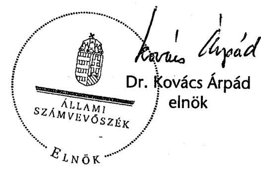

---

# 1. Szervezetirányítási és Müködtetési Igazgatóság 

Vizsgálat-azonosító szám: V0315

## Az ellenőrzést felügyelte:

Dr. Csapodi Pál
fötitkár

## Az ellenőrzés végrehajtásáért felelős:

Dr. Kékesi László
fötitkárhelyettes

## Az ellenőrzést vezette:

Horváthné Menyhárt Erika
főcsoportfőnök-helyettes

## Az ellenőrzést végezték:

Bojtos Rozália
tanácsadó
Dr. Somorjai Zsoltné
számvevő tanácsos

Göller Géza
főtanácsadó
Bálint Józsefné
címzetes főmunkatárs

## 2. Államháztartás Központi Szintjét Ellenőrző Igazgatóság

## Az ellenőrzést felügyelte:

Bihary Zsigmond
főigazgató

## Az ellenőrzés végrehajtásáért felelős:

Simon Ákosné
főigazgató-helyettes

## Az ellenőrzést vezették:

Horváth Sándor
főcsoportfőnök-helyettes
Pongrácz Éva
osztályvezető főtanácsos

Dr. Csépán Mária Magdolna igazgatóhelyettes
Szabóné Farkas Katalin osztályvezető főtanácsos

Norczen Győzőné osztályvezető főtanácsos
Tolnai Lászlóné osztályvezető főtanácsos

## Az ellenőrzést végezték:

Dr. Baji László
számvevő
Dr. Baloghné Sebestyén Éva
számvevő
Burenzsargal Narantuja
számvevő
Dombovári Nóra
számvevő

Baki István
számvevő
Bamberger Mária
tanácsadó
Dancsóné Kuron Ildikó
számvevő
Dr. Domján Eszter
számvevő tanácsos

Balázs Melinda
számvevő tanácsos
Bedécs Erzsébet
számvevő tanácsos
Deli Gáborné
számvevő
Dormán István Zoltán
Számvevő

---

Farkas László főtanácsadó

Fekete Győr László számvevő

Hajdu Károlyné számvevő tanácsos

Holló András számvevő

Horváth József tanácsadó

Dr. Jakab Kornél számvevő

Jeszenkovits Tamás számvevő tanácsos

Kelemen F. Balázs számvevő

Kiss Istvánné főtanácsadó

Dr. Lengyel Attila tanácsadó

Molnár Bálint számvevő

Nagy József főtanácsadó

Pető Krisztina számvevő

Dr. Remport Katalin tanácsadó

Dr. Sipos Dóra számvevő tanácsos

Szatainé Kováts Erna számvevő

Szilágyi Zsuzsanna tanácsadó

Vacsora Erika számvevő tanácsos

Dr. Vass Gábor számvevő tanácsos

Zakar László számvevő

Fehérné Jagasich Mariann számvevő tanácsos

Fogarasi Miklós főtanácsadó

Hajdúné Sipos Erika számvevő tanácsos

Horcsin Attila számvevő

Huszár József számvevő

Dr. Jártas Ágnes számvevő tanácsos

Karsai Lászlóné főtanácsadó

Kincses Erzsébet Eszter számvevő

Konorót Zsuzsanna számvevő tanácsos

Magyar Sára számvevő

Molnár Imre számvevő tanácsos

Niklai Heléna számvevő

Polyák Ferenc számvevő

Sápi Henriett számvevő gyakornok

Szabó Erzsébet számvevő tanácsos

Dr. Szávai Tamás főtanácsadó

Dr. Szima Mária tanácsadó

Varsányiné Dudás Eleonóra számvevő gyakornok

Verő Tünde számvevő

Zaroba Szilvia számvevő

Ferencz Katalin Zsuzsanna számvevő tanácsos

Gyarmati István tanácsadó

Hegedűsné Erdélyi Piroska tanácsadó

Huszárné Borbás Melinda számvevő

Jagicza Istvánné számvevő

Jáger Lajos számvevő

Kádár Krisztina számvevő

Kiss Ferenc Károlyné számvevő

Krémó Márkné számvevő tanácsos

Mátyási József számvevő tanácsos

Morvay András tanácsadó

Papp Júlianna számvevő tanácsos

Dr. Pósch Gábor főtanácsadó

Séra Andrásné főtanácsadó

Szabóné Simai Mária számvevő

Szilágyi Gyöngyi főtanácsadó

Szöllősiné Hrabóczki Etelka főtanácsadó

Vas Lajos tanácsadó

Villányi Antal számvevő tanácsos

---

# 3. Önkormányzati és Területi Ellenőrzési Igazgatóság 

## Az ellenőrzést felügyelte:

Dr. Lóránt Zoltán
föigazgató
Az ellenőrzés végrehajtásáért felelős:
Németh Péterné
főcsoportfőnök

## Az ellenőrzést vezette:

Dr. Sallai Antal
igazgatóhelyettes

A helyszíni vizsgálati jelentések feldolgozásában és az összefoglaló elkészítésében közremüködött:
Dankó Géza Kozák György
főtanácsadó
Az ellenőrzést végezték:
Ambrus Lajos
Dankó Géza
Kozák György
főtanácsadó
főtanácsadó
Dr. Mezei Imréné
Szabó Tamás
főtanácsadó
számvevő tanácsos

---

# TARTALOMJEGYZÉK 

BEVEZETÉS ..... 7
I. ÖSSZEGZŐ MEGÁLLAPÍTÁSOK, KÖVETKEZTETÉSEK, JAVASLATOK ..... 9
II. RÉSZLETES MEGÁLLAPÍTÁSOK ..... 29
A) A KÖLTSÉGVETÉSI DOKUMENTUM TÖRVÉNYESSÉGI ÉS SZÁMSZAKI ELLENŐRZÉSE ..... 31

1. Az Áht. előírásainak érvényesülése a törvényjavaslatban ..... 33
2. Észrevételek a költségvetési dokumentumhoz ..... 35
B) HELYSZÍNI ELLENŐRZÉS ..... 37
B.1. AZ ÁLLAMHÁZTARTÁS KÖZPONTI SZINTJE ..... 39
B.1.1. KÖZPONTI KÖLTSÉGVETÉS ..... 39
3. A költségvetés makroszintű számításai ..... 39
4. A központi költségvetés közvetlen bevételi előírányzatai ..... 44
2.1. Vállalkozások költségvetési befizetései ..... 45
2.1.1. Társasági adó ..... 45
2.1.2. Államháztartás egyensúlyát javító különadó és járadék ..... 46
2.1.2.1. Társas vállalkozások külön adója ..... 46
2.1.2.2. Hitelintézeti járadék ..... 46
2.1.3. Bányajáradék ..... 46
2.1.4. Játékadó ..... 47
2.1.5. Egyszerűsített vállalkozói adó ..... 48
2.1.6. Ökoadó ..... 48
2.1.6.1. Energiaadó ..... 48
2.1.6.2. Környezetterhelési díj ..... 49
2.1.7. Egyéb befizetés ..... 49
2.2. Fogyasztáshoz kapcsolt adók ..... 50
2.2.1. Általános forgalmi adó ..... 50
2.2.2. Jövedéki adó ..... 52
2.2.3. Regisztrációs adó ..... 54
2.3. A lakosság költségvetési befizetései ..... 55
2.3.1. Személyi jövedelemadó ..... 55

---

2.3.2. Magánszemélyek különadója ..... 56
2.3.3. Egyéb lakossági adóbevételek ..... 56
2.3.4. Lakossági illetékek ..... 57
2.4. Az állami vagyonnal kapcsolatos bevételek ..... 58
2.4.1. Osztalékbevételek ..... 59
2.4.2. Koncessziós bevételek ..... 60
2.4.2.1. Szerencsejátékkal kapcsolatos koncessziós díj ..... 60
2.4.2.2. Infrastruktúrával kapcsolatos koncessziós díj és árverési díj ..... 61
2.4.3. Vagyonkezeléssel és -hasznosítással kapcsolatos központi költségvetést megillető bevételek ..... 62
2.5. Egyéb költségvetési bevételek ..... 62
3. A központi költségvetés közvetlen kiadási előirányzatai ..... 64
3.1. A központi költségvetés kamatelszámolásai, tőkevisszatérülései, az adósság- és követeléskezelés költségei ..... 73
3.2. Állami kezességvállalás és kezesség érvényesítés ..... 82
4. A központi költségvetés közvetlen bevételeinek és kiadásainak 2009- 2011. évi irányszámai ..... 88
5. A fejezetek költségvetési előirányzatai ..... 92
5.1. A fejezetek tervezési, szervezési és intézmény-felülvizsgálati feladatainak teljesítése ..... 93
5.2. Kiadási előirányzatok ..... 96
5.2.1. Létszám és személyi juttatások ..... 97
5.2.2. Dologi előirányzatok ..... 103
5.2.3. Intézményi felhalmozási kiadások alakulása ..... 104
5.2.4. Fejezeti kezelésű előirányzatok ..... 105
5.2.4.1. Központi beruházások alakulása ..... 105
5.2.4.2. A PPP alakulása ..... 107
5.2.4.3. Fejezeti kezelésű előirányzatok változása ..... 108
5.2.4.4. A fejezeti tartalék alakulása ..... 112
5.2.5. Alapítványok, közhasznú társaságok értékelése ..... 113
5.2.6. A Kormányzati Negyed előkészítésével kapcsolatos kiadások tervezése ..... 117
5.2.7. Az Európai Uniós tagsággal összefüggő előirányzatok ..... 124
6. Bevételi előirányzatok ..... 131
7. A költségvetés központosított bevételei ..... 134
8. A 2009-2011. évek várható előirányzatai ..... 135
B.1.2. ELKÜLÖNÍTETT ÁLLAMI PÉNZALAPOK ..... 139

1. Munkaerőpiaci Alap (MPA) ..... 139
1.1. Az MPA 2007. évi várható bevételei, kiadásai ..... 139
1.2. Az MPA bevételeinek és kiadásainak 2008. évi előirányzatai ..... 140

---

2. Központi Nukleáris Pénzügyi Alap ..... 146
3. Wesselényi Miklós Ár- és Belvízvédelmi Kártalanítási Alap (WMA) ..... 147
4. Kutatási és Technológiai Innovációs Alap (KTIA) ..... 147
5. Szülőföld Alap (SZA) ..... 150
6. Nemzeti Kulturális alap (NKA) ..... 151
B.1.3. TÁRSADALOMBIZTOSÍTÁS PÉNZÜGYI ALAPJAI ..... 152
7. Nyugdíjbiztosítási Alap ..... 152
1.1. A Nyugdíjbiztosítási Alap költségvetési javaslata kidolgozásának előírásai és teljesítésük ..... 152
1.2. A Nyugdíjbiztosítási Alap pénzügyi helyzete a 2008. évi költségvetés alapján ..... 153
1.3. A Nyugdíjbiztosítási Alap bevételeinek tervezése ..... 154
1.3.1. A bevételek 2007. évi várható összegének meghatározása ..... 154
1.3.2. A Nyugdíjbiztosítási Alap 2008. évi bevételi előirányzatai ..... 155
1.4. A Nyugdíjbiztosítási Alap kiadásai ..... 159
1.4.1. Az ellátási kiadások tervezése ..... 159
1.4.1.1. A 2007. évi várható ellátási kiadások meghatározása ..... 159
1.4.1.2. A 2008. évre tervezett ellátási kiadások ..... 160
1.4.2. A múködési kiadások tervezése ..... 161
1.5. A Nyugdíjbiztosítási Alap 2009-2011. évi költségvetési irányszámai ..... 162
8. Egészségbiztosítási Alap ..... 163
2.1. A tervezés feltételei ..... 163
2.2. Az E. Alap bevételeinek tervezése ..... 164
2.2.1. Az E. Alap 2007. évi bevételeinek várható teljesülése ..... 164
2.2.2. A 2008. évi költségvetés bevételi előirányzata ..... 165
2.3. Az E. Alap 2008. évi kiadásainak tervezése ..... 167
2.3.1. Pénzbeli ellátások ..... 167
2.3.2. Természetbeni ellátások ..... 169
2.3.2.1. Gyógyító-megelőző egészségügyi ellátás ..... 169
2.3.2.2. Irányított Betegellátási Rendszer ..... 174
2.3.2.3. Gyógyszer-támogatási előirányzat ..... 174
2.3.2.4. Gyógyászati segédeszközök támogatása ..... 178
2.3.2.5. Egyéb természetbeni ellátások ..... 179
2.3.2.6. Az Egészségbiztosítási Alap egyéb kiadásai ..... 179
2.4. Az OEP 2008. évi múködési kiadásai ..... 180
2.4.1. Tervezési feltételek, feladat-forrás egyensúly felbomlása, szervezeti átalakítás ..... 180
2.4.2. Múködési kiadások ..... 181
2.5. Az Egészségbiztosítási Alap 2009-2011. évi költségvetési irányszámai ..... 182

---

B.2. A HELYI ÖNKORMÁNYZATOK ..... 183

1. A költségvetési törvényjavaslat és a helyi önkormányzati forrásszabályozás megalapozottsága ..... 183
2. A forrásszabályozás módosításának főbb jellemzői ..... 189
3. Fejlesztési támogatások ..... 190
3.1. Címzett és céltámogatások ..... 190
3.2. A leghátrányosabb helyzetú kistérségek felzárkóztatásának támogatása ..... 193
3.3. Helyi önkormányzatok fejlesztési és vis maior feladatainak támogatása ..... 195
3.4. A helyi önkormányzatok és jogi személyiségű társulásaik európai uniós fejlesztési pályázataihoz szükséges saját forrás kiegészítése ..... 197
3.5. Települési önkormányzatok szilárd burkolatú belterületi útjainak felújítása ..... 198
3.6. A fejlesztési célú költségvetési források decentralizálásának jellemzői ..... 198
4. Az önkormányzati bevételek tervezése ..... 202
4.1. Normatív állami hozzájárulás és normatív részesedésű átengedett személyi jövedelemadó ..... 202
4.2. Normatív, kötött felhasználású támogatások ..... 208
4.3. Központosított előirányzatok ..... 210
4.4. A helyi önkormányzatok múködőképességének megőrzését szolgáló kiegészítő támogatások ..... 211
4.5. Átengedett bevételek ..... 213
4.6. Saját források ..... 214
MELLÉKLETEK ..... 219
5. számú Kimutatás az átengedett személyi jövedelemadó és önkormányzati ..... 221 támogatások rendelkezési jogosultság szerinti megoszlásáról
6. számú A normatív hozzájárulások jogcímenkénti és ágazatonkénti ..... 222 előirányzatainak változása
2/a. számú A közoktatás normatív hozzájárulásainak és a IX. fejezetben ..... 223 előirányzott többi támogatásának alakulása
7. számú A normatív, kötött felhasználású támogatások jogcímenkénti és ..... 225 ágazatonkénti előirányzatainak változása
8. számú A központosított előirányzatok jogcímeinek és összegének ..... 226 változása
9. számú Az önkormányzatok 2008. évi fejlesztési célú támogatásainak ..... 228 alakulása

---

FÜGGELÉK ..... 231
I. ORSZÁGGYŰLÉS ..... 234
KÖZBESZERZÉSEK TANÁCSA ..... 237
II. KÖZTÁRSASÁGI ELNÖKSÉG ..... 239
III. ALKOTMÁNYBÍRÓSÁG ..... 241
IV. ORSZÁGGYŰLÉSI BIZTOSOK HIVATALA ..... 243
V. ÁLLAMI SZÁMVEVŐSZÉK ..... 245
VI. BÍRÓSÁGOK ..... 247
VIII. MAGYAR KÖZTÁRSASÁG ÜGYÉSZSÉGE ..... 249
X. MINISZTERELNÖKSÉG ..... 252
POLGÁRI NEMZETBIZTONSÁGI SZOLGÁLATOK ..... 258
XI. ÖNKORMÁNYZATI ÉS TERÜLETFEJLESZTÉSI MINISZTÉRIUM ..... 262
XII. FÖLDMŰVELÉSÜGYI ÉS VIDÉKFEJLESZTÉSI MINISZTÉRIUM ..... 267
XIII. HONVÉDELMI MINISZTÉRIUM ..... 271
XIV. IGAZSÁGÜGYI ÉS RENDÉSZETI MINISZTÉRIUM ..... 275
ORSZÁGOS ATOMENERGIA HIVATAL ..... 278
XV. GAZDASÁGI ÉS KÖZLEKEDÉSI MINISZTÉRIUM ..... 280
MAGYAR SZABADALMI HIVATAL ..... 288
MAGYAR ENERGIA HIVATAL ..... 290
NEMZETI HÍRKÖZLÉSI HATÓSÁG ..... 292
XVI. KÖRNYEZETVÉDELMI ÉS VÍZÜGYI MINISZTÉRIUM ..... 295
XVIII. KÜLÜGYMINISZTÉRIUM ..... 298
XIX. UNIÓS FEJLESZTÉSEK ..... 302
XX. OKTATÁSI ÉS KULTURÁLIS MINISZTÉRIUM ..... 305
XXI. EGÉSZSÉGÜGYI MINISZTÉRIUM ..... 312
XXII. PÉNZÜGYMINISZTÉRIUM ..... 317
PÉNZÜGYI SZERVEZETEK ÁLLAMI FELÜGYELETE ..... 323
KORMÁNYZATI ELLENŐRZÉSI HIVATAL ..... 326
XXVI. SZOCIÁLIS ÉS MUNKAÜGYI MINISZTÉRIUM ..... 328
XXX. GAZDASÁGI ÉS VERSENYHIVATAL ..... 333
XXXI. KÖZPONTI STATISZTIKAI HIVATAL ..... 335
XXXIII. MAGYAR TUDOMÁNYOS AKADÉMIA ..... 338
RÖVIDÍTÉSEK JEGYZÉKE ..... 341

---

.

---

VE-03-002/2007

# BEVEZETÉS 

Az Állami Számvevőszék (ÁSZ) az Alkotmány 32/C. §-ának (1) bekezdése és a számvevőszéki törvény 2. §-ának (1) bekezdése alapján véleményezi az állami költségvetési javaslat megalapozottságát, a bevételi előirányzatok teljesíthetőségét. Az államháztartási törvény (Áht.) 29. §-ának (1) bekezdése szerint az Országgyűlés a költségvetési törvényjavaslatot a számvevőszéki véleménnyel együtt tárgyalja.

Véleményünket a költségvetési előirányzatok tervezését végző szerveknél az ellenőrzések során szerzett tapasztalatok alapján alakítottuk ki.

A véleményt megalapozó ellenőrzés célja annak megállapítása volt, hogy

- a Magyar Köztársaság 2008. évi költségvetéséről szóló törvényjavaslat összeállítása és a 2009-2011. évekre szóló irányszámok kimunkálása során érvé-nyesültek-e az államháztartási törvény, valamint a végrehajtására kiadott kormányrendeletek előírásai, az előirányzatok kialakítására kiadott irányelvek, illetve a tervezési köriratban foglaltak;
- a törvényjavaslat és az irányszámok megfelelően harmonizálnak-e az EU által elfogadott konvergencia programmal;
- a törvényjavaslatot és az irányszámokat megfelelően alapozzák-e meg
a makrogazdasági prognózisok,
a tervezésnél alkalmazott módszerek, valamint,
az állami feladatrendszer és a szabályozók javasolt módosításai;
- a törvényjavaslat és az irányszámok kiemelten vették-e számításba Magyarország EU-tagságának pénzügyi-gazdasági hatásait, részletesen és megalapozottan számszerúsítették-e az EU-tól származó forrásokat és a társfinanszirozási követelményeket, valamint az EU költségvetésébe történő befizetési kötelezettséget.

A helyszíni ellenőrzés 2007. szeptember 18-ával bezárólag kísérte nyomon a költségvetés tervezésének folyamatát, majd a szeptember 28-án rendelkezésünkre bocsátott törvényjavaslatot is áttekintettük.

A helyszíni ellenőrzés során a 2008. évi állami költségvetésről szóló törvényjavaslat, valamint a 2009-2011. évekre kimunkált irányszámok megalapozottságát, az előirányzatok kialakítása érdekében végzett szervező, összefogó tevékenységnek.

---

kenységet, az intézmény-felülvizsgálatot és a fejezeti kezelésű előirányzatok kimunkáltságát a költségvetési fejezetek felügyeletét ellátó szervezeteknél, a fejezeti jogosítvánnyal rendelkező költségvetési szerveknél, az alapkezelőknél vizsgáltuk. Az intézményi előirányzatok megalapozottságát a fejezetek igazgatási címeinél/alcímeinél, az alapkezelőknél, a társadalombiztosítás alapjainál és az elkülönített állami pénzalapoknál értékeltük.

Véleményünk kialakítását nehezítette, hogy a költségvetési törvényjavaslat benyújtását megelőzően az azt megalapozó szakmai törvényeket, illetve javaslatokat nem, vagy csak részben fogadta el az Országgyúlés. Ezért a költségvetési törvényjavaslatban szereplő szabályozási elgondolások és előirányzatok, valamint az ágazati (szakmai) törvények közötti összhang teljes körűen nem volt véleményezhető.

A szociális igazgatásról és szociális ellátásokról szóló 1993. évi III. törvény módosítását tartalmazó, egyes szociális törvények módosítására vonatkozó törvényjavaslatot a Kormány 2007. június 29-én nyújtotta be az Országgyúlésnek. E törvényjavaslat vitája a költségvetési javaslat készítésével párhuzamosan zajlott, nem zárult le. Az egyes adótörvények módosításáról szóló törvényjavaslat gyakorlatilag a költségvetési törvényjavaslattal egyidejűleg került benyújtásra az Országgyűlés elé. A 2008. évi költségvetést megalapozó egyes törvények - ezen belül az államháztartásról szóló 1992. évi XXXVIII. törvény - módosítását tartalmazó törvényjavaslatot, a helyszíni ellenőrzés lezárását követően nyújtotta be a Kormány az Országgyűlésnek.

A költségvetési törvényjavaslatban több bevételi előirányzatot, illetve a helyi önkormányzatok forrásszabályozására vonatkozó elképzeléseket a PM illetékes főosztályával kialakított munkakapcsolat keretében rendelkezésre bocsátott munkaanyagok, számítások és szóbeli tájékoztatás alapján véleményezhettük.

A helyszíni ellenőrzés befejezését követően a Kormány jelentősen megváltoztatta egyes - a költségvetés teljesítése szempontjából kiemelt - előirányzatok mértékét, így nem volt módunk ezen változtatások hatásainak értékelésére.

A fejezeti indokoló kötetek csak a költségvetési törvényjavaslat benyújtását követően, véleményünk kialakításával párhuzamosan készültek el, ezért ezek tartalmát nem ismerhettük meg.

A Magyar Köztársaság 2008. évi költségvetési törvényjavaslatáról készített számvevőszéki véleményünk első kötete az összegző megállapításokat, következtetéseket, javaslatokat, és az azokat megalapozó részletes - a törvényjavaslatra és dokumentumaira, illetve az államháztartás egyes alrendszereire vonatkozó - ellenőrzési megállapításokat tartalmazza, valamint függelékében az egyes költségvetési fejezetek tervezőmunkájáról, előirányzataik megalapozottságáról kialakított véleményünket foglaljuk össze. Ez évben először a második kötetben saját makrogazdasági elemzésként, az ÁSZ Fejlesztési és Módszertani Intézete által készített tanulmányt adunk közre.

Véleményünket a központi költségvetés fejezeteinél szakértői, majd államtitkári szinten is egyeztettük.

---

# I. ÖSSZEGZŐ MEGÁLLAPÍTÁSOK, KÖVETKEZTETÉSEK, JAVASLATOK 

## A költségvetési dokumentum összeállítása, illetve a 2008. és 2009-2011. évi irányszámok kimunkálása

A zárszámadási törvényjavaslathoz tett észrevételeinkhez hasonlóan a költségvetési dokumentummal kapcsolatban is megállapítható, hogy a törvényjavaslat normaszövege, törvényi mellékletei és általános indokolásának alapvetően jellemző tartalmi összhangja mellett továbbra is - a korábbi évekével egyező vagy azokhoz hasonló - hiányosságok tapasztalhatók a dokumentum átláthatósága, döntéselőkészítést támogató jellege tekintetében.

A törvényjavaslat prezentációja egyfajta, az évek során kialakult gyakorlatot követ, melynek során a vonatkozó törvényi előírások sem érvényesülnek maradéktalanul. A dokumentum jelenlegi formájában nehezen áttekinthető. Évek óta jelezzük a költségvetési (zárszámadási) törvényjavaslatok dokumentumainak tartalmi, szerkezeti szabályozásának szükségességét. A törvényjavaslat általános indokolása szerint az előterjesztő is fontosnak tartja a költségvetés felépítésének, prezentációjának megújítását, az integrált pénzügyi információs rendszer kialakítását. Ez a munka lehetőséget adna a törvényjavaslat tartalmi és formai követelményeinek teljes körú rendezésére és rögzítésére, egyben annak áttekintésére, hogy mi az az információtartalom, amely a költségvetési törvényjavaslat országgyúlési vitájához szükséges és elégséges.

Az Áht. több paragrafusában - a teljesség igénye nélkül - meghatározott, a költségvetési törvényjavaslat prezentációjával kapcsolatos előírásait a törvényjavaslat többségében teljesíti, de néhány hiányosság folyamatos jelzésünk ellenére évek óta fennáll. Nem szerepel a dokumentumban a hosszú távú kötelezettségvállalások, a közvetett támogatások, illetve a középtávú tervezés szempontjából fontos 2 évre kitekintő főbb előirányzatok összefoglaló bemutatása.

Az Áht. 52. §-ának (1) bekezdése szerint a Kormánynak szeptember 30-ig olyan költségvetési törvényjavaslatot kell benyújtania az Országgyűlésnek, amely az államháztartás helyzetét bemutató valamennyi összefoglaló táblázatot, mérleget tájékoztatásul tartalmazza. A törvényjavaslat fő kötete ezen előírásokat rendre csak részlegesen teljesíti, és gyakorlattá vált, hogy bizonyos idősorok, kimutatások csak a - 15 nappal később előterjeszthető - fejezeti részletező kötetekben, illetve kiegészítésekben jelennek meg. A költségvetési dokumentumra vonatkozó megállapítások részletes kifejtése a vélemény II. Részletes megállapítások fejezet A) „A költségvetési dokumentum törvényességi és számszaki ellenőrzése" c. pontjában található.

---

A tervezés előkészítése során költségvetési irányelv készült, a tervezőmunkában azonban nem hasznosult. A fejezetek nem ismerték meg azt, és a tervezési körirat még hivatkozás szintjén sem utal az irányelvben megfogalmazottakra ${ }^{1}$.

A fejezetek felügyeletét ellátó szervek a tervezési köriratban foglaltaknak megfelelve a feladatok felülvizsgálatát elvégezték és a prioritásoknak megfelelő rangsorolásban tervezték meg előirányzataikat. A szervezetek felülvizsgálatát és racionalizálását megalapozó intézkedésekről szóló kormányhatározatban az egyes feladatok elvégzéséhez biztosított határidők a felügyeleti szervek számára több esetben tarthatatlanok voltak.

A tárcák a létszám tervezése során a kormányhatározatokban engedélyezett létszámot vették alapul, számoltak a fejezetek közötti átadás-átvételre került és az új feladatokkal, továbbá a szervezeti változások hatásával.

A minisztériumok a dologi kiadások tervezésénél a tervezési körirat előírásai szerint jártak el.

A tervezési munka során felülvizsgálták a fejezeti kezelésű előirányzatok körét, elvégezték azok rangsorolását a Kormány konvergencia programjában meghatározott prioritások figyelembevételével.

A Kormány az Áht. előírásain túlmutatóan a konvergencia program alapján történő kiigazítások hatását tükröző középtávú időszakkal összhangban a 2009-2011. évekre is kidolgoztatta mind a fejezetekkel, mind pedig az elkülönített állami pénzalapok, illetve a társadalombiztosítási alapok kezelőivel az irányszámokat.

# Az állami költségvetés előirányzatai 

## A konvergencia programmal kapcsolatos összhang

A középtávú gazdaságpolitikai célkitűzéseket, a megvalósulásukat szolgáló intézkedéseket és ezek kereteit meghatározó makropályát a 2006. decemberi konvergencia program határozta meg. A 2008. évi költségvetési törvényjavaslatnak az Európai Unió által elfogadott konvergencia program gazdaságpolitikai célkitűzéseire kell épülnie. Ennek következtében a költségvetés kereteit a programban a 2008. évre beállított makrogazdasági mutatóknak kell képezniük.

[^0]
[^0]:    ${ }^{1}$ Az Áht. 50. §-ának (1) bekezdése szerint az államháztartásért felelős miniszter április 15 -éig elkészíti és a Kormány elé terjeszti a következő évre vonatkozó gazdaságpolitikai elképzelésein alapuló költségvetési politika fő irányait és a költségvetési tervezés fő kereteit meghatározó költségvetési irányelveket. Az Áht. 51. §-ának (1) bekezdése szerint pedig a fejezet felügyeletét ellátó szerv vezetője a felügyelete alá tartozó fejezet költségvetésének részletes tervezetét a költségvetési irányelvek szerint állítja össze.

---

A 2008-2010-es időszak költségvetési politikáját összetett és ellentétes irányba ható tényezők determinálják, amelyek jelzik annak szűk mozgásterét. Ezek a detereminációk az adósságszolgálattal kapcsolatos kiadások növekvő tendenciája 1110,8 Mrd Ft (2007-ről 2008. évre a növekedés 127 Mrd Ft), a garancia és hozzájárulás a társadalombiztosítási ellátásokhoz 839 Mrd Ft, hozzájárulás az EU költségvetéséhez 205 Mrd Ft, az EU-források társfinanszírozása 221 Mrd Ft. Ezzel egyidejűleg a konvergencia program és az Áht. szabályai szerint a 2008. évben az elsődleges egyenlegnek el kellett érni a nullszaldós állapotot.

A 2008. évet követően magas kockázatot jelenthet a kormányzati körbe tartozó gazdálkodó szervezetek, illetve az állami garanciavállalás mellett felvett hitelek (MÁV Zrt., BKV Zrt.) miatti esetleges adósságátvállalások mértéke is.

Mindezekre figyelemmel kiemelt jelentőséggel bír és ennek ellenére késik a 2008. évi és a további évek költségvetési biztonságát garantáló közpénzügyi fegyelem szabályrendszerének (például az elsődleges többlet, a negyedéves, a középtávú kiadási plafon, a fenntartható adósságszint, a kötelező ellentételezési és az önkormányzatok eladósodását korlátozó szabály) teljes körű megalkotása, a garanciális szempontok kiépítése, amelyek biztosíthatnák az éves költségvetési terv konvergencia program által kijelölt pályán maradását.

Az ÁSZ a közpénzügyek szabályozásáról készített, 2007 áprilisában közzétett téziseiben felhívta a figyelmet arra, hogy a költségvetési egyensúly és a pénzügyi stabilitás teljesítése érdekében törvényben szükséges rögzíteni az államháztartás egyes szintjeire a költségvetési egyensúlyt és a fenntarthatóságot biztosító előírásokat.

Elindult a közpénzügyek egyes elemeivel kapcsolatos szabályok államháztartási törvénybe való beépítése. Az elsődleges többletszabály már 2007. január 1jétől hatályos. A Kormány az Áht. módosításával kíván rendelkezni a középtávú kiadási plafon szabályról, melyet T/4009 számon 2007. október elején nyújtott be az Országgyűlésnek.

Az Áht. változtatása a közpénzügyi fegyelemről szóló törvény nélkül önmagában még nem teremti meg annak garanciális szabályait, hogy a választások közeledtével a szigorú fiskális politika fel ne lazuljon. A stabilizációs folyamat esetleges megtorpanása a visszarendezés veszélyét hordozza magában.

A költségvetés végrahajtásának egyik lényeges garanciális eleme a stabil intézményrendszer megteremtése. A közigazgatásban évek óta tartó, nem kellően átgondolt létszámcsökkentés, intézményi átszervezések mellett még 2008-ban sem látszik kialakulni egy olyan - megfelelő szakemberekkel rendelkező - stabil intézményrendszer, amelynek múködése megalapozná a pénzeszközökkel való átlátható és szabályos elszámolást, illetve beszámolást.

---

A 2008. évi költségvetést meghatározza a makrogazdasági mutatók 2007. évi alakulása, továbbá a 2007. évi költségvetési tervszámok betartása. A 2007. évi első 8 hónapi adatok alapján a gazdasági növekedés üteme várhatóan a tervhez közeli értéket éri el, az infláció viszont emelkedik, a reálbércsökkenés kis mértékben meghaladja a tervezettet. Az államháztartás hiánya az időarányos adatok alapján - évközi beavatkozás nélkül is - várhatóan a tervezett mérték közelében teljesül. A 2006-2007. évben meghozott bevételnövelő, illetve kiadáscsökkentő intézkedések hatására a 2007. évben a társadalombiztosítási alapok egyenlege is javul.

Mindezekre figyelemmel a 2007. évi szigorú költségvetés politika várható számszerú teljesítése megalapozta a 2008. évi tervszámok kialakításának kereteit is.

A 2008. évi költségvetési törvényjavaslat a tervezett makrogazdasági tendenciák teljesülése mellett végrehajthatónak látszik. A bevételek és a kiadások kockázatait a 170 Mrd Ft-os tartalék elháríthatja.

A törvényjavaslatban szereplő makropálya mutatók - kisebb számszerú eltérések mellett, amelyek nem jelentenek jelentősebb kockázatot - a konvergencia program adatainak tendenciáit tükrözik. Számolni kell azonban a 2008. évi prognózis és a 2007. évi várható adatok, különösen a GDP, a lakossági fogyasztás és a beruházások alakulásának tekintetében - a 2007. évi reálfolyamatok alapján - kockázatokkal is.

A törvényjavaslatban bemutatott makropálya a 2006-2008. éveket tartalmazza, míg a PM - költségvetési peremfeltételeket is meghatározó - munkaanyagában 2011-ig terjedő kitekintés szerepel, adataival a konvergencia programot követve.

| Megnevezés | 2008. évi költségvetési   törvényjavaslat szerint |  | Konvergencia program   (2006. december) |  |
| :-- | :--: | :--: | :--: | :--: |
|  | 2007. évi   várható | 2008. évi   prognózis | 2007. évi   prognózisa | 2008. évi   prognózisa |
| GDP | 2,2 | 2,8 | 2,2 | 2,6 |
| Infláció | 7,5 | 4,5 | 6,2 | 3,3 |
| Lakossági fogyasztás | $-1,1$ | 0,4 | $-0,8$ | 0,0 |
| Közösségi fogyasztás | $-3,8$ | $-3,4$ | $-1,6$ | $-3,3$ |
| Bruttó állóeszköz-felhalmozás | 2,4 | 4,2 | 2,4 | 4,0 |

A makropályában bemutatott eltérések alapvetően nem befolyásolják a 2008. évi költségvetés államháztartásra vonatkozó előirányzatait.

A 2008. évre jelzett, a GDP 4,1\%-át jelentő államháztartási hiány 0,2\%-ponttal alacsonyabb a konvergencia programénál.

---

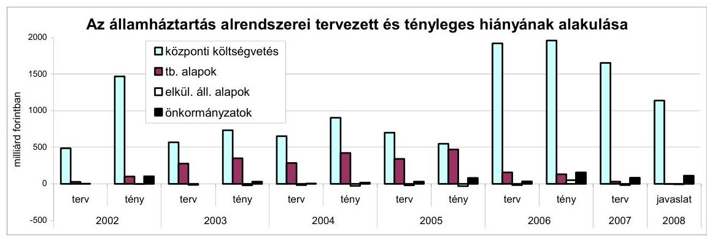

A törvényjavaslat a bruttó államadósság GDP-ben kifejezett arányára 61,8\%-ot tartalmaz 2007. évi várhatóként, 2008-ra pedig 62,1\%-ot. Az indokolás szerint az arány alakulása a költségvetési hiány, illetve az egyéb finanszírozandó tételek együttes hatásával függ össze.

A konvergencia program szerint a Kormány az államháztartási hiány mérséklésére és az egyensúlyi növekedés érdekében a közigazgatásban, az egészségügyben és az oktatásban változásokat indított. Ezek az idei és a jövő évi költségvetésekben egyaránt a pénzügyi megszorító intézkedések (bevételnövelő, kiadáscsökkentő) hatásaira épülnek és a benyújtott költségvetési törvényjavaslatból, illetve más kormányzati forrásokból sem látszanak ezen rendszerek esetében a szakmai és ellátási oldalról várható eredmények, és ezáltal a jövő megítélése.

A közszféra létszáma 2006. évben 10700 fővel, 2007-ben 8000 fővel csökkent és a 2008. évi költségvetésben további 6000 fő csökkenésével számolnak. A létszámcsökkentésekkel összefüggő előirányzatok törlése megtörtént. A létszámleépítés egyszeri kiadási többletet is generált.

A létszámcsökkentésekkel azonban nem tartott lépést az állami feladatok, az intézményrendszer átalakítása, ezért a kiadásokban elérhető megtakarítások üteme a konvergencia program teljesülése szempontjából kockázatot hordoz.

A Kormány a 2007-2009. évek költségvetésének fenntarthatóságát a nagy közösségi ellátó rendszerek átfogó átalakításával kívánja biztosítani.

Az egészségügyi ágazatban 2006-ban, illetve 2007-ben elindított lépések a konvergencia program takarékossági intézkedés sorozatába illeszkednek.
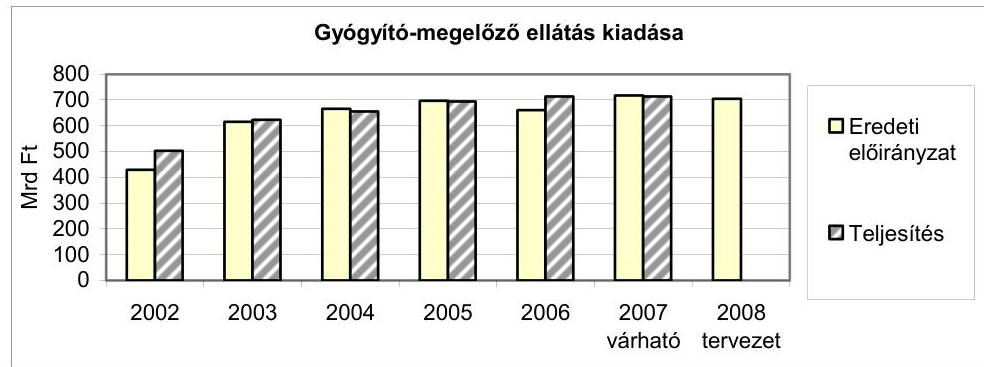

---

Az Egészségbiztosítási Alap 2007. évben először közelíti az egyensúlyi helyzetet úgy, hogy a két kiemelt kassza (gyógyító-gyógyszer) GDP-arányos kiadása a konvergencia programban kitűzötteknek megfelelően csökkent, míg a bevételek a járulékemelések következtében emelkednek.

A gyógyszer-támogatási kiadások 2007. évi várható teljesítése mintegy 59 Mrd Ft-tal alacsonyabb (az előző évi kiadásnál közel 18\%-kal). A 2008. évi előirányzat 5,7\%-kal haladja meg a 2007. évi várható értéket.
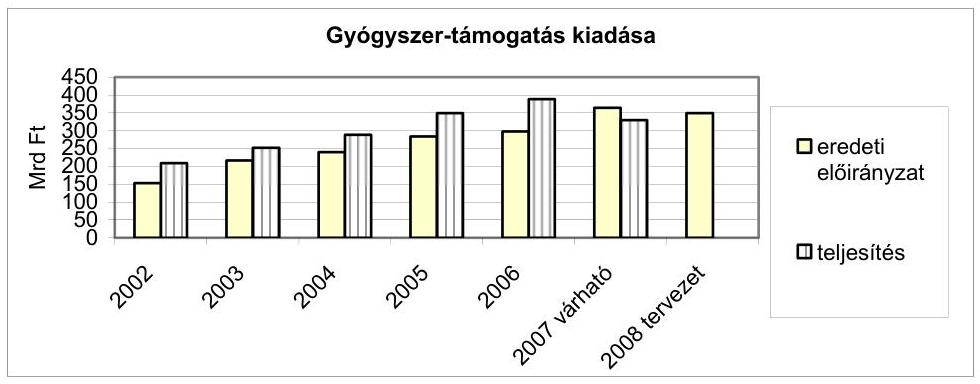

Az egészségügyi reformként meghatározott lépések tartalmát, célrendszerét sem a Kormányprogram, sem pedig a konvergencia program részleteiben nem tartalmazza, elmaradt a tervezett intézkedések időbeni ütemezésének és a finanszírozás forrásának a kifejtése is.

A Kormányprogram a köz- és magánfelelősség tisztázását tűzi ki, valamint az állam szolgáltató és szociális hálóban betöltendő szerepének csökkenését és nagyobb egyéni felelősségvállalást jelez. Ugyanakkor nem ismerhető meg a köz- és magánfinanszírozás jövőbeni alakulása, a konkrét finanszírozás megoldások. A Kormány nem fogalmazta meg egységes határozatban az egészségügy átalakításának új programját, a finanszírozás forrásaira, illetve módjára nem készült költségvetés, illetve finanszírozási terv. Az új egészségbiztosítási rendszerhez kapcsolódó változások várhatóan 2009. évben indulnak el.

A Konvergencia program célul tűzi ki a szakmai és finanszírozási protokollok érvényesítésének és a szolgáltatások igénybevételének és nyújtásának ésszerűsítését. Az eddigi tapasztalatok azt mutatták, hogy a szakmai irányelvek elkészítése több évet vesz igénybe. A szakmai protokollra ráépülő finanszírozás kidolgozása 2007-ben elkezdődött, azonban ezek ütemezésének hiányában nem látszik a program befejezésének időpontja.

A nyugdíjrendszer fenntartásának érdekében a korai nyugdíjazás feltételei, a nyugdíjszámítás módja változik, ez azonban csak arra alkalmas, hogy a kiadások emelkedésének ütemét mérsékelje, érdemi hatása a kiadások kordában tartására a 2008. évet meghaladóan várható².

[^0]
[^0]:    ${ }^{2}$ Az Ny. Alap 2008. évi kiadási előirányzatának növekedésénél figyelembe kell venni, hogy járulék-átcsoportosítás mellett az aktív korúak rokkantsági nyugellátásának 286 Mrd Ft-os előirányzata az E. Alap helyett itt került megtervezésre.

---

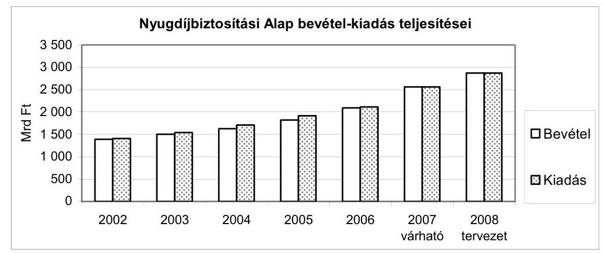

Az oktatási reformról a törvényjavaslat nem mutatja be, hogy a tandíj bevezetésén, a hallgatói létszám csökkenésén kívül milyen eredményeket, milyen megtakarításokat kíván elérni.
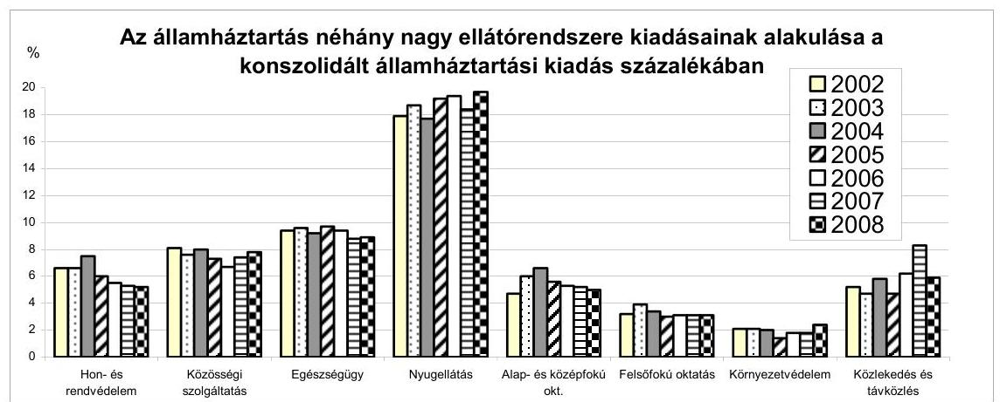

A költségvetés szerkezete a törvényjavaslat szerint az előző évekhez képest jelentősen módosul.

A központi költségvetés mérlegében a személyi jövedelemadó előirányzat nemcsak a központi költségvetést megillető, hanem a helyi önkormányzatok részére átengedett személyi jövedelemadó összegét is tartalmazza. Ennek megfelelően a kiadási oldalon a helyi önkormányzatok támogatásaiban is megjelenik az összeg (565,1 Mrd Ft). Ez a korábbi évektől eltérő költségvetés-technikai megoldás azonban nem jelenik meg sem az illetékbevételeknél, sem az adóhatósági szankciókból származó egyéb befizetéseknél, annak ellenére, hogy ezek is megosztott bevételek a központi költségvetés, a helyi önkormányzatok, illetve a TB alapok között.

Az E. Alapból - járulék-átcsoportosítás mellett - az Ny. Alap kiadásai között jelenik meg az aktív korúak rokkantsági nyugellátásának 286 Mrd Ft-os előirányzata.

Az ÁSZ javaslatának hasznosítása mellett új önálló fejezetben jelenik meg 2008. évben az EU-val kapcsolatos kiadások bemutatása, melynek hatására javul a költségvetési források biztosításának átláthatósága.

---

Pozitívan értékelhető és javítja az átláthatóságot, hogy az állami vagyonnal kapcsolatos bevételek és kiadások egy új fejezetben jelennek meg, összhangban az állami vagyonról szóló törvény céljaival.

A szerkezeti változások mellett úgy ítéljük meg, hogy a programköltségvetés irányába mutató kezdeti lépések megtétele a törvényjavaslatban még nem tükröződik.

# A központi költségvetés bevételi elöirányzatai 

A központi költségvetés 2008. évi vám- és adóbevételi előirányzatai (tervezetének) megalapozottságát (a költségvetési tervező munka minősítése), az előző évekhez viszonyított változását teljes körüen nem tudtuk megítélni. Az összes adó- és vámbevételként előirányzott 6337,0 Mrd Ft 45,1\%-át (2857,3 Mrd Ft) az ellenőrzésnek nem volt módjában értékelni, mivel a véleményalkotáshoz szükséges adatok és anyagok nem álltak rendelkezésre (az adónemek részletes bemutatása a Vélemény B.1.1. fejezet 2. pontja alatt szerepel).

A társasági adóra, az egyszerűsített vállalkozói adóra és a személyi jövedelemadóra vonatkozó három táblázatot és ezen adónemek részletes indokolásait a PM 2007. október 10-én este bocsátotta rendelkezésünkre. A további három adónem (a társas vállalkozások különadója, a hitelintézeti járadék és a magánszemélyek különadója) részletes indokolásai továbbra is csak ezen adónemek 2008. évi előirányzatainak számszerú adatait és azok 2007. évi előirányzataihoz való viszonyítását tartalmazzák. A táblázatokban szereplő adatokat alátámasztó részletes számítások továbbra sem álltak rendelkezésünkre, így annak hiányában nem állt módunkban azok megalapozottságát minősíteni, illetve ezen adóbevételek realizálásának kockázatát felmérni.

A költségvetési törvényjavaslat általános indokolásának részanyagaként készített dokumentáció - a kiemelt adónemek közül - a személyi jövedelemadónál nem tartalmazza a jogszabályváltozások, beleértve az adómentesség, az adókedvezmények hatását, a bér- és keresettömeg változását, ennek az összevont adóalapra gyakorolt hatását, a külön adózó jövedelmek tervezett alakulását, a társasági- és osztalékadó esetében az adómentességek körét, az adókedvezmények változását, az adóalapot befolyásoló tényezők alakulását és annak mértékét.

A dokumentációk alapján véleményezhető vám- és adóbevételi előirányzatok az összes adó- és vámbevétel 54,9\%-át jelentik. Összegük 3479,7 Mrd Ft, amelynek 99,9\%-át alacsony kockázat mellett teljesíthetőnek értékelte az ellenőrzés. Az egyéb lakossági adóbevételek (bérfőzési szeszadó) előirányzatának (5,3 Mrd Ft) megvalósíthatóságát közepes kockázatúnak minősítette, mivel egyes befolyásoló tényezők (a gyümölcstermés nagysága és a felvásárlási árak alakulása) és azok hatása nagyfokú bizonytalanságot tartalmaz.

---

Az általános forgalmi adó előirányzatát az ellenőrzés ugyan feszítettnek ítélte, de számos „rejtett" (nem tervezett, illetve nem tervezhető) bevétel figyelembevétele mellett a befolyásoló tényezők együttes hatásaként az előirányzat teljesíthetőnek tekinthető.

Több évet érintő probléma, hogy egyes kormányzati döntések késedelme miatt nem tartották be a PM munkaprogramjában rögzített határidőket. Néhány adónemnél a részletes számításokba, háttér- és munkaanyagokba az ellenőrzés ezúttal sem tekinthetett be (általános forgalmi adó, egyéb befizetések). Így az előirányzat teljesíthetőségére adott vélemény kizárólag az általános és a fejezeti indoklások tervezetein alapult.

Az állami vagyonnal kapcsolatos bevételek összege a 2007. szeptember 18-i állapothoz képest a törvényjavaslatban 96 433,1 M Ft-ra nőtt a 73 925,0 M Ft-tal szemben. Jelentősnek tekinthető a címen belül - a fenti időponthoz képest - bekövetkezett változás, amely a kormányzati ingatlanértékesítés 50,0 Mrd Ft-os összegét 20,0 Mrd Ft-tal csökkentette, megnövelve eközben az infrastruktúrával összefüggő koncessziós díjak összegét 20,0 Mrd Ft-tal. A változtatás az összbevételre nem gyakorolt hatást, megkérdőjelezi azonban a két jogcím előirányzattervezetének megalapozottságát.

A kormányzati ingatlanok értékesítése esetében az ellenőrzés magas kockázatot jelez az előirányzat teljesíthetőségét illetően, egyes ingatlanok műszaki helyzetének rendezésére, valamint az értékesítési folyamat időigényére tekintettel. A koncessziós bevétel pedig a koncessziós szerződések meghosszabbítására irányuló egyeztetések sikerétől függ, így kockázatot hordoz.

# A központi költségvetés kiadási elöirányzatai 

A 2008. évi költségvetési törvényjavaslatban a közvetlen kiadások a kiadási főösszeg közel 30\%-át jelentik. A központi költségvetés közvetlen kiadásainak egy jelentős részénél (pl. adósságszolgálattal kapcsolatos kiadások, családtámogatások, lakástámogatások) a kiadások előirányzat-módosítási kötelezettség nélkül (az uniós támogatásoknál korlátozásokkal) túlteljesíthetők. A 2008. évre a 2007. évihez képest - az állami vagyonnal kapcsolatos új fejezet következtében minimálisan, 13 506,0 M Ft összeggel bővült ezen előirányzatok köre. A kiadási előirányzatok - a helyszíni ellenőrzés lezárásakor rendelkezésre álló adatok alapján - megalapozottnak és reálisnak, betarthatónak minösültek.

Figyelemre méltó azonban, hogy a helyszíni ellenőrzés lezárásakor, illetve a szeptember 18-i állapothoz képest a szeptember 28-án rendelkezésre bocsátott költségvetési törvényjavaslat több előirányzat-tervezet esetében jelentősen változott. Ebből említésre méltó azon előirányzatok köre, ahol a korábbihoz képest növekedés következett be (akkor is, ha összességében a bekövetkezett növekedés és csökkenés kiegyenlíti egymást). A jelzett időtartam alatt bekövetkezett változás a megalapozottság megítélését tekintve jelent bizonytalanságot.

---

A lakástámogatások előirányzata 12 180,0 M Ft-tal nőtt, a vállalkozások folyó támogatása 541,5 M Ft-tal csökkent, a kormányzati rendkívüli kiadásoké 85,0 M Fttal nőtt, a garancia és hozzájárulás a társadalombiztosítási ellátásokhoz 31 462,3 M Ft-tal csökkent, a családi támogatások és szociális ellátásoké $33145,5 \mathrm{M}$ Ft-tal, az adósságszolgálattal kapcsolatos kiadásoké pedig $45000,0 \mathrm{M}$ Ft-tal nőtt.

Összességében az előzőekben jelzett előirányzat-tervezetek 90 410,5 M Ft-os növekedésének és 32 003,7 M Ft-os csökkenésének egyenlegeként 58 406,8 M Ft-tal növekedtek. A törvényjavaslat benyújtását megelőzően a kiadások átstrukturálása arra enged következtetni, hogy esetlegesen a kiadási oldalon jelentősebb összegű megtakarítás jelentkezhet.

A központi költségvetés adósságának tervezett összege a 2008. évre 17 040,3 Mrd Ft ( $7,2 \%$-kal magasabb a 2007. évi tervnél), ami a GDP 62,1\%-át teszi ki. A központi költségvetés 2008. évi deviza és forintadósságának növekedése üteme $4,7 \%$-kal, illetve $8,3 \%$-kal haladja meg a 2007. évre tervezettet. Kockázatot jelenthet, hogy a 2007-2011. évek mindegyikére 251 Ft/euró, illetve 182,1 Ft/USD árfolyammal számolnak.

Az adósságszolgálattal kapcsolatos kiadások költségvetési törvényjavaslatban szereplő összege 1110,8 Mrd Ft, ami 45,0 Mrd Ft-tal tér el az ÁKK Zrt. által korábban készített finanszírozási tervben szereplőnél. A törvényjavaslatban szereplő államháztartási hiány finanszírozására vonatkozó finanszírozási terv várhatóan 2007 novemberében készül el.

A költségvetési törvényjavaslatban a korábbitól eltérő (magasabb vagy alacsonyabb) összeggel szereplő kiadási előirányzatok esetében már nem minden esetben állt az ellenőrzés rendelkezésére a megváltozott számokat alátámasztó dokumentáció, így e kiadások megalapozottságáról nem állt módunkban véleményt alkotni.

A 2008. évi költségvetési törvényjavaslatban prioritást élvezett az unióból érkező források és a támogatások igénybevételét biztosító hazai társfinanszírozások előirányzatainak megtervezése. A rendelkezésünkre álló adatok szerint a támogatások igénybevételének fedezete a költségvetési törvényjavaslatban biztosított.

A központi költségvetésre vonatkozó megállapítások részletes kifejtése a vélemény II. "Részletes megállapítások" fejezet B) "Helyszíni ellenőrzés" B.1.1. "A központi költségvetés" c. pontjában, illetve a Függelékben található.

# A társadalombiztosítási alrendszer elöirányzatai 

A 2006. év végén meghozott intézkedések jegyében - a Konvergencia programban megfogalmazott követelmények alapján - 2007-ben megindult a nagy ellátó rendszerek (elsődlegesen az egészségügy) átalakításának folyamata. A struktúra-átalakítás lépései, a gyógyszerforgalmazással kapcsolatos szabályozás változtatása, illetőleg a vizitdíj bevezetése lényegesen befolyásolta a 2007. évi költségvetési folyamatokat.

---

# A 2007. évi költségvetés várható alakulása 

A megtett intézkedések - pénzügyi értelemben - kedvezően hatnak az E. Alap 2007. évi költségvetésének alakulására, aminek következtében a korábban kritikus költségvetési tételeknél kiadási megtakarítás és a tervezettet meghaladó bevételi teljesülés mellett, többlet várható (ami példa nélküli).

A Ny. Alap 2007. évi bevételei és kiadásai is várhatóan túlteljesülnek, a tervezett egyensúly megvalósulása mellett. Mindkét alap 2007. pénzügyi egyensúlya a központi költségvetés jelentős pénzeszköz átadása mellett valósul meg.
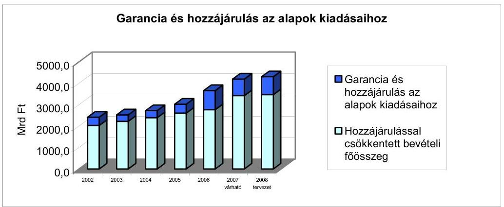

Az E. Alap 2007. évi mintegy 1670,0 M Ft-os bevételi főösszegéből a központi költségvetés hozzájárulása 370,0 Mrd Ft. Az Ny. Alap esetében pedig a várható 2650,0 Mrd Ft-os bevételből 490,0 Mrd Ft-ot ad át a központi költségvetés és 286,0 Mrd Ft-ot vesz át az E. Alaptól a korhatár alatti rokkantsági nyugellátások finanszírozására.

A két alap - összevont, nem konszolidált - kiadási főösszege eléri a 4276,0 Mrd Ft-ot.

## A 2008. évi költségvetési tervezés

A tervezés előkészítése során költségvetési irányelv készült, azonban az alapkezelők ezt nem ismerték. A tervezési körirat a tervezésre vonatkozóan konkrétumokat alig tartalmazott, csupán annyit rögzített, hogy érvényesíteni kell a társadalombiztosítási alrendszert érintő, már elfogadott reformintézkedésekből eredő hatásokat, összefüggésben, a konvergencia programban elfogadott célokkal.

A PM mindkét alap számára keretszámokat határozott meg, amiből az alapkezelőknek kellett visszatervezni az ellátási költségvetés egyes előirányzatait. A július végén megadott makro számokat később módosították, ami a tervezés bevételi és kiadási oldalát egyaránt érintette. Meg kell jegyezni, hogy e mutatók esetleges további elmozdulása a benyújtott költségvetés előirányzatait - főként a bevételi oldalon - érintheti.

---

A véleményalkotást nehezítette, hogy nem volt módunk a költségvetési tervezés megalapozását szolgáló törvények tervezeteinek megismerésére. Az adótörvények tervezett változtatásának részleteiről is csak szeptember végén jutottunk információkhoz.

Az alapok 2008. évi bevételeinek tervezését alapvetően a járulék- és hozzájárulás bevételek számításai alapozzák meg, a bruttó keresettömeg, és az egyes jogcímekhez kapcsolódó mértékek szerint. A munkáltatói járulékmérték (összességében 29\%) változatlansága mellett a rokkantsági ellátások Ny. Alapból történő finanszírozása miatt, járulékátcsoportosításra került sor, 2008-tól a munkáltatói nyugdíjbiztosítási járulék 24\%-ra, az egészségbiztosítási járulék 5\%-ra változik. Módosul az egyéni járulékok mértéke is, a nyugdíjbiztosítási járulék mértéke 9,5\%, az egészségbiztosítási járulék mértéke 6\% lesz (összességében tehát a munkavállalót a 2007. évivel azonos mértékű, 15,5\%-os fizetési kötelezettség terheli, ami azonban 3\%-kal több 2006. évi „megszorító" intézkedések előtti mértéknél).

A bevételi előirányzatok számításai a makro paraméterek teljesülése esetén - összességében - nem kérdőjelezhetőek meg. A társadalombiztosítási alapok 2008. évi költségvetési tervjavaslata megvalósulásának kockázata abban mutatkozik meg, hogy az Egészségbiztosítási Alap és a Nyugdíjbiztosítási Alap bevételi főösszegeit meghatározó járulékbevételeket az egyes adótörvények változásáról szóló törvényjavaslat szerint - az APEH egyetlen számlájára kellene befizetni és ma még ismeretlen az egy számlára befolyt járulékok alaponkénti és járulék-nemenkénti (jogcímenkénti) megosztása. A vállalkozók, a munkáltatók adminisztrációs terhének csökkentésével indokolt javaslat véleményünk szerint nem csökkenti a vállalkozók terheit. A különböző járulékok különböző alapokon, más-más mérték szerinti megosztása az államháztartás elkülönült szervezeteit (APEH, MÁK, alapkezelők) további adminisztrációs tehernövekedéssel feladat elé állítja. (Megjegyezzük, hogy az államigazgatási egyeztetés alatt lévő, 2008. évre vonatkozó SZJA és járulékok bevallására szolgáló nyomtatványok tervezett sorai tovább bővülnek és bonyolódnak.)

A 2006. évi zárszámadási jelentésben jelzett problémák miatt a munkáltatói nyugdíjbiztosítási járulék, a biztosítotti nyugdíijárulék, valamint a munkáltatói és biztosítotti egészségbiztosítási járulék, alcímek alkalmazása mindaddig csak formális lehet, amíg valóságos tényadatot mindkét alap vonatkozásában csak az „APEH-tól érkező járulékbevétel" számla tartalmaz. A 2008. évi költségvetési törvényjavaslat a 2007. évi költségvetésben alkalmazott, a magánnyugdíjpénztárak átutalásai jogcímcsoportot önálló jogcímcsoportként nem szerepelteti, amit kifogásolunk. Az előirányzat elkülönített kezelése azért szükséges, mert annak tartalma nem az adott évre vonatkozó befizetés, hanem a magánnyugdíj rendszerből visszalépők több éven keresztül fizetett egyéni biztosítotti nyugdíijárulék visszatérítése a társadalombiztosítás részére.

A társadalombiztosítási alapok 2008. évi kiadási előirányzatai közül a nyugdíjkiadások és az E. Alap pénzbeli ellátásainak meghatározása az előírt makro paraméterek alapján, alacsony kockázattal tervezettek. A természetbeli ellátások esetében folytatódik a konvergencia programban megfogalmazott kiadás-szűkítés. A természetbeli ellátások előirányzatát meg-

---

alapozó (további) intézkedések ismerete nélkül a megalapozottságot bizonyító számítások nem voltak végezhetők. Itt elsődlegesen a biztosítási rendszer átalakításával kapcsolatos elhúzódó vitákra és a döntés hiányára gondolunk.

A társadalombiztosítás mindkét ágazatában a működési kiadások tervezett előirányzati összegét a várható feladatokhoz viszonyítva annak ellenére alacsonynak (sőt, irreálisnak) tartjuk, hogy a tervalku folyamatában mindkét ágazatnak plusz lehetőséget biztosítottak 2008. évre. A nyugdíjágazatnál a kiadási főösszeg 0,85\%-a (a további évek előírt tervei szerint az aránycsökkenés tovább tart) az alacsony fejlesztési lehetőségek miatt az ellátások megállapításának és folyósításának színvonalcsökkenését valószínűsíti. Az egészségbiztosítási ágazatnál a kiadási főösszeghez viszonyított arány ugyan magasabb ( $1,57 \%$ ), de a korábbi években megbomlott feladat és forrás egyensúlyát nem sikerül helyreállítani és a várható szervezeti változásokra sem biztosít fedezetet.

A Nyugdíjbiztosítási és az Egészségbiztosítási Alap 2008.évi - rokkantsági nyugellátásokkal konszolidált - kiadási főösszege 4305,8 Mrd Ft.

# Az elkülönített állami pénzalapok elöirányzatai 

Az elkülönített állami pénzalapok 2008. évi kiadásaikat a tervezett bevételek erejéig alakíthatták ki. Kivételt képes a Központi Nukleáris Pénzügyi Alap, ahol a hosszú távú feladatok finanszírozása céljából az Alap egyenlegét hagyományosan többlettel állapították meg.

Az elkülönített állami pénzalapokra és a társadalombiztosítási alapokra vonatkozó megállapítások részletes kifejtése a vélemény első kötetének II. Részletes megállapítások fejezet B) "Helyszíni ellenőrzés" B.1.2.) és B.1.3.) pontjában található.

## A helyi önkormányzatok

A 2008. évi költségvetési törvényjavaslatban a helyi önkormányzatok központi költségvetésből származó szabályozott bevételeinek tervezését az államháztartás egyensúlyi helyzetének javítását szolgáló 2007. évben már elfogadott intézkedések, az európai uniós fejlesztési támogatások hazai forrásainak biztosítása, a közoktatásban tanévre meghatározott teljesítménymutató szerinti finanszírozás, a társulásos feladatellátás változatlan ösztönzése és a szociális alapszolgáltatások bővítésének, reálértéke megtartásának szándéka határozta meg.

A javaslat alapján a központi költségvetési támogatás, hozzájárulás helyi önkormányzati bevételeken belüli aránya a 2007. évi 43,6\%-ról 2008. évben 40,1\%-ra csökken. Ezzel egyidejűleg a saját bevételek 13,8\%-os, az európai uniós támogatások és a hazai társfinanszírozás, fejezeti támogatások

---

27,2\%-os növekedésével számol a törvényjavaslat mellékletében bemutatott mérleg. Ezt szemlélteti az alábbi táblázat (adatok milliárd Ft-ban).

| Megnevezés | 2005.6 vi   tény | Megosz-   lás\% | 2006.6 vi   tény | Megosz-   lás\% | 2007.6 vi   OGV   elörányzat | Megosz-   lás\% | 2007.6 vi   várható | Megosz-   lás\% | 2008.6 vi   javaslat | Megosz-   lás\% |
| :--: | :--: | :--: | :--: | :--: | :--: | :--: | :--: | :--: | :--: | :--: |
| GFS rendszerú bevéte |  |  |  |  |  |  |  |  |  |  |
| összesen | 2891,0 | 100,0 | 3053,4 | 100,0 | 3096,1 | 100,0 | 3148,2 | 100,0 | 3237,0 | 100,0 |
| elöböl:szabályozott források   (támogatás és szja) | 1321,3 | 45,7 | 1327,9 | 44,2 | 1349,0 | 43,6 | 1383,4 | 43,9 | 1298,9 | 40,1 |
| ÁHT-n belüli átutalások | 426,6 | 14,7 | 448,8 | 14,7 | 411,0 | 13,3 | 417,5 | 13,3 | 412,5 | 12,7 |
| EU-s támogatás, hazai   társfinanszírozás, fejezeti   támogatások. | 94,3 | 3,3 | 155,3 | 5,1 | 250,7 | 8,1 | 192,5 | 6,1 | 318,0 | 9,8 |

A szabályozott források a 2008. évi javaslatban az előző évhez képest 50,1 Mrd Ft-tal (3,7\%) csökkentek, amely a szerkezeti változások és a 2007. évi kiadáscsökkentő intézkedések együttes hatását tartalmazza. A központi költségvetésből származó források összehasonlításánál figyelembe kell venni, hogy a Budapest 4-es metróvonal építésének támogatása 2007. évben 65,6 Mrd Ft-tal a központi költségvetésből származó szabályozott források között szerepelt, amely a 2008. évi javaslatban - a beruházás tervezett EU-s támogatásával összhangban - 49,4 Mrd Ft-tal csökkent.

A normatív hozzájárulások, támogatások fajlagos értékei az igénylési jogcímek többségében nominálértéken változatlanok, így összességében a múködési célú központi költségvetési támogatások reálértéke csökken, a fejlesztési források - elsősorban az EU-s támogatások és a hazai társfinanszírozás eredményeként - bővülnek.

A költségvetési törvényjavaslat az önkormányzati forrásszabályozásban alapvető változásokat nem tartalmaz (a törvényjavaslat általános indokolásában ennek magyarázata, hogy az önkormányzati rendszerben sincs elmozdulás). A szabályozás egyes részleteit érintő változások a célzottabb, ésszerúbb feladatellátást szolgálják, azonban az önkormányzati feladatok és a finanszírozási rendszer (a Kormány által korábban elrendelt és az ÁSZ által is indokoltnak tartott ${ }^{3}$ ) felülvizsgálatára, átalakítására 2008. évben sem kerül sor.

Az indokolás szerint a helyi önkormányzatok - beleértve a helyi kisebbségi önkormányzatokat és a többcélú kistérségi társulásokat is - 2008. évben hitelforrások nélkül számítva 3237 Mrd Ft-tal gazdálkodhatnak, amely 4,7\%-kal haladja meg a 2007. évi költségvetési törvényjavaslatban bemutatott előirányzatot. Az önkormányzatok saját folyó bevételeinek - a költségvetési törvényjavaslat általános indokolásában bemutatott - 2008. évi előirányzatát megfelelő számítások, hatástanulmányok nem támasztják alá, ezért a

[^0]
[^0]:    ${ }^{3} 0724$ sz. Jelentés a Magyar Köztársaság 2006. évi költségvetése végrehajtásának ellenőrzéséről.

---

tervezés szempontjából - a véleményben a helyi adók 2008. évi tervezésével kapcsolatos megállapítás alapján - kockázatot jelentenek.

A 2008. évi költségvetési törvényjavaslat a helyi önkormányzati költségvetések egyensúlyát jellemző hiánymutató ${ }^{4}$ alapján a pénzügyi egyensúly romlását jelzi. A PM előrejelzése szerint a hiány a 2007. évben várhatóan 85 Mrd Ft-ra csökken az előző évi 156,5 Mrd Ft-ról, de a 2008. évben ismét 111 Mrd Ft-ra növekszik. Ennek finanszírozására felvett hiteleken belül emelkedett a múködést finanszírozó rövid lejáratú (folyószámla) hitel, amely a kamatkiadásokat növeli. A hosszú lejáratú hitelállomány néhány önkormányzatnál koncentrálódott, új jelenség azonban, hogy az önkormányzatok - ezen belül különösen a megyei önkormányzatok - zártkörú kötvénykibocsátása élénkül, az 5-10 év múlva esedékes törlesztési kötelezettség fedezete (a jelenleg ismert feltételek mellett) nem tervezhető kellő biztonsággal.

A 2008. évi javasolt előirányzatok az önkormányzatok szabályozott forrásai között az illetmény növelésére nem tartalmaznak fedezetet, a közszférában a keresetek 2007. évi növelését szolgáló intézkedésekről a szakszervezetek és a Kormány között létrejött megállapodás alapján a 2007. év után járó, 2008. január 16-án esedékes 13. havi illetmény kétheti részének fedezete céltartalékból évközben kerül átcsoportosításra.

A fejlesztési források között az előző évivel közel azonos nagyságrendű címzett és céltámogatási előirányzat áll rendelkezésre, 53 Mrd Ft összegben. Ez az előirányzat biztosítja a korábbi években vállalt fejlesztési támogatási kötelezettségek teljesítését, a megkezdett programok folytatását. A javaslat szerint hazai források terhére 2008. évben - miként a 2009-2010. években - új címzett támogatási program nem indítható. Új induló egészségügyi gép-múszer beszerzések céltámogatásaira mindössze 200 M Ft előirányzatot tartalmaz a költségvetési javaslat.

A Kormány szándéka, hogy a korábban hazai forrásból támogatott fejlesztési programok minél szélesebb körben EU-s forrásokból legyenek támogathatók. Ennek elősegítése érdekében a javaslat az önkormányzatok európai uniós fejlesztési pályázatainak saját forrás kiegészítésére szolgáló támogatás előirányzatát - az uniós előírásoknak való megfelelés és a hozzájutás feltételeinek szigorítása mellett - 5 Mrd Ft-tal megemelve, 15,1 Mrd Ft összegben tartalmazza. Ugyancsak az EU-s forrásokhoz való hozzájutás feltételeit támogatja az Uniós fejlesztések fejezetben a KEOP derogációs projektek kamattámogatása címén megnyíló előirányzat 500 M Ftos keretösszege, amely az ivóvízminőség javítását szolgáló, valamint a szennyvíz és hulladéklerakó beruházások - EU és más hazai forrásból nem finanszírozott hányadának - hitelforrás terheit könnyítheti.

[^0]
[^0]:    ${ }^{4}$ Bevételek és kiadások hitelmúveletek nélküli egyenlege.

---

A leghátrányosabb helyzetú kistérségek gazdasági felzárkóztatására a költségvetési javaslatban az előző évivel azonosan 5,8 Mrd Ft áll rendelkezésre a három alföldi és két dunántúli régió fejlesztési tanácsainak döntési jogkörébe utalva. A régiók szerepének konvergencia célokkal összehangolt elmozdulását jelzi, hogy a helyi önkormányzatok fejlesztései és vis maior támogatására szolgáló - összegében az előző évivel azonos 10,87 Mrd Ft előirányzat teljes egészében a regionális fejlesztési tanácsok döntési jogkörébe került. A hátrányos helyzetű térségek felzárkóztatása érdekében a térségi lehatárolás 2007. évben, OGY határozatban ${ }^{5}$ újólag meghatározott szempontjai részben érvényesültek. A régiókkal való tervszerződések megkötésére a régiós előirányzatok önálló fejezetben való megjelenítésére azonban még nem kerülhetett sor.

Az önkormányzatok költségvetésből származó fejlesztési jellegű támogatásait a Terület - és régiófejlesztési célelóirányzat és a Kutatási és Technológiai Innovációs Alap decentralizálásra kerülő hányadával együtt - 137,28 Mrd Ft öszszegben tervezték, amely az előző évhez képest $28,1 \%$-os csökkenést jelent. A központi költségvetésből származó önkormányzati fejlesztési források csökkenése a fővárosi metróberuházás finanszírozásának Uniós támogatások keretébe való átkerülésével függ össze, e program nélkül számítottan a különböző jogcímú hazai fejlesztési támogatások 2007. évhez képest 3,4\%-kal - összegében 4,2 Mrd Ft-tal - csökkennek.

A támogatási rendszer átalakításának eredményeként a javaslat az önkormányzati szféra egészét érintően - 2007. évhez képest az Európai Unióból származó fejlesztési források 49,3 Mrd Ft-nak megfelelő összegű bővülésével, valamint a hazai társfinanszírozásból és a központi fejezetektől származóan további 18 Mrd Ft támogatás többletével együtt - 318 Mrd Ft fejlesztési forrást tartalmaz. A hazai fejlesztési támogatásokat két és félszeresen meghaladó források tervezése a teljesíthetőség szempontjából - annak ellenére, hogy 2008-ban a beruházások ütemének felgyorsulása várható - közepes kockázatot hordoz.

A normatív hozzájárulások és támogatások 2007. évben átalakított rendszerében további pontosításokat tartalmaz a 2008. évi költségvetési törvényjavaslat, de a normatívák fajlagos támogatása jellemzően változatlan marad. A 75 db fajlagos hozzájárulás közül csak hét emelkedik, egy pedig csökken, az új ellátottakra megállapított fajlagos hozzájárulás ötnél emelt, egynél változatlan, egynél pedig csökkentett összegű. A normatív hozzájárulások főösszegére 3,4\%-os (23,8 Mrd Ft-os) csökkenés mellett 681,2 Mrd Ftot irányoz elő a benyújtott törvényjavaslat.

A településüzemeltetési, igazgatási és sportfeladatok, valamint a társadalmi, gazdasági és infrastrukturális szempontból elmaradott, illetve súlyos foglalkoztatási gondokkal küzdő települési önkormányzatok feladatai-

[^0]
[^0]:    ${ }^{5}$ 67/2007. (VI. 28.) OGY határozat a területfejlesztési támogatásokról és a decentralizáció elveiről, a kedvezményezett térségek besorolásának feltételrendszeréről.

---

hoz járó fajlagos hozzájárulás szerény mértékben növekszik. Az önkormányzati igazgatásban a körjegyzőségek számának növekedése, az üdülőhelyi feladatoknál az idegenforgalom bővülése következtében emelkedik a normatíva javasolt előirányzata.

A szociális és gyermekvédelemi feladatok normatív hozzájárulása 2008. évi előirányzatainak kialakításánál számoltak az alapszolgáltatásokat igénybevevők számának bővülésével és a rászorultsági elv fokozottabb érvényesítésével.

A közoktatás finanszírozása a 2007. évben elfogadott módosításnak megfelelően a költségvetési évről tanévre változott, egyben az alapnormatívák számítása tanulólétszám helyett teljesítménymutatón alapul. Ennek következtében a közoktatás 2008. évi finanszírozásában az első nyolc hónapban az előző évi költségvetési törvény által meghatározott determináció érvényesül. A benyújtott törvényjavaslat a 2008/2009-es nevelési évre, illetve tanévre határozza meg a közoktatási alap-, a kiegészítő- és a szociális juttatások normatíváinak körét, feltételeit és a hozzájuk kapcsolódó fajlagos támogatási összegeket, valamint az előzőek figyelembevételével számított előirányzatokat.

A 2008/2009-as tanévtől a teljesítménymutató alapján ${ }^{6}$ támogatott közoktatási alapfeladatok köre ${ }^{7}$ kibővül az alapfokú művészetoktatással, a kollégiumi, externátusi neveléssel, a napközis vagy tanulószobai foglalkozással, iskolaotthonos oktatással, neveléssel. A kollégiumok eddigi közoktatási feladatait tartalmazó normatívák szétválnak nevelési, oktatási feladatokra és szállásbiztosításra, míg a sajátos nevelési igényű tanulók támogatása átkerül az egyes pedagógiai programok támogatása jogcímcsoportba. A különleges helyzetben levő gyermekek tanulók nevelése, oktatása, valamint a pedagógiai szakmai szolgáltatások támogatása átkerült a központosított előirányzatok közé. A normatívák közötti szerkezeti változások a közoktatási törvényben meghatározott teljesítménykövetelményeket közvetítik, egyúttal a normatívák száma is csökken, pontosabbá válik a közoktatási alap, kiegészítő és a szociális juttatások tartalma, illetve elkülönülése.

A közoktatási törvény 2007. júniusi módosítása alapján elindul az óvodáskorúak teljes körú ellátását célzó három éves program, fokozottabb gondoskodásban részesülhetnek a sajátos nevelési igényú gyermekek, az alapfokú múvészetoktatásban erőteljesebb ösztönzést kap a minőségi munka, a kedvezményes óvodai, iskolai, kollégiumi étkezéshez va-

[^0]
[^0]:    ${ }^{6}$ A teljesítménymutató egy képletbe sűríti a gyermek/tanuló létszám, a csoport/osztály átlaglétszám, a gyermekek/tanulók foglalkoztatási időkeretét, valamint a pedagógus kötelező óraszámát, egyszerre képes mind a feladat mennyiségének, szervezettségének, mind a költségarányoknak a megjelenítésére.
    ${ }^{7}$ A 2007/2008-as tanévben óvodai neveléshez, általános és középiskolai oktatáshoz, szakképzés elméleti oktatásához, beleértve a gyógypedagógiai nevelést, oktatást is, ún. „közoktatási teljesítménymutató" alapján történik a központi költségvetési támogatás biztosítása.

---

ló normatív hozzájárulás 2008. január 1-jétől kibővül a rendszeres gyermekvédelmi kedvezményben részesülő 5. évfolyamos általános iskolai tanulók ingyenes étkeztetésével.

A közszolgáltatások finanszírozásában növekszik az önkormányzatok saját forrásainak aránya, szerepe, az ellátások színvonalában meglévő különbségek növekvő mértékben függnek a fenntartó önkormányzatok költségvetési helyzetétől, bevételszerző képességétől. Az önhibájukon kívül hátrányos helyzetben lévő önkormányzatok esetében (az önkormányzatok harmada) az alacsony helyi jövedelmi, vagyoni háttér csak korlátozott forrásbevonást tesz lehetővé.

A költségvetési egyensúly javításával összefüggő központi forráscsökkentésre a helyi önkormányzatok a 2007. évi költségvetés jóváhagyása és a végrehajtása során ellentmondásosan - részben tényleges megtakarítást eredményező helyi szervezési intézkedésekkel, létszámcsökkentéssel, részben a hiány kölcsönforrásokból történő finanszírozásával, növekvő eladósodással - reagáltak. A finanszírozási feszültségek és az EU-s támogatással megvalósuló fejlesztések fenntarthatóságára vonatkozó információk hiánya 2008. évben is növelik az önkormányzati költségvetések tervezésének és végrehajtásának előző évi költségvetéssel kapcsolatos ÁSZ véleményben ${ }^{8}$ is jelzett kockázatát.

A helyi önkormányzatokra vonatkozó megállapítások részletes kifejtése a vélemény II. Részletes megállapítások fejezet B) "Helyszíni ellenőrzés" B.2.) "A helyi önkormányzatok" c. pontjában található.

[^0]
[^0]:    ${ }^{8}$ 0641J000 sz. Vélemény a Magyar Köztársaság 2007. évi költségvetési javaslatáról.

---

# JAVASLATOK 

Véleményünk hasznosítása mellett javasoljuk:

## az Országgyülésnek

1. Kérje fel a Kormányt, hogy gyorsítsa fel a konvergencia program végrehajtását támogató garanciális szabályok kialakítását, a költségvetési és gazdálkodási rendszer megújítását, a költségvetés felépítésének, prezentációjának újragondolását.
2. Kérje fel a Kormányt, hogy a mindenkori költségvetést érintő ágazati (szakmai) törvényeket olyan időütemezésben terjessze az Országggyűlés elé, hogy azokat az Országggyűlés az adott tervév költségvetési irányelveinek kiadása előtt elfogadhassa, így azok hatásai érvényesülhessenek a tervezőmunkában.
3. Fordítson figyelmet arra, hogy a költségvetési törvényjavaslat vitájának teljes fázisában csak olyan módosító javaslatokat fogadjon be, amelyek eredményeként a költségvetés pozíciója nem módosul.

## a Kormánynak

4. Kezdeményezze az Áht. 36. § (1) bekezdés c) pontjának módosítását, hogy a középtávú költségvetési tervezésnek (a törvényben foglalt két éves helyett három éves kitekintés) megfelelő törvényi háttere legyen. Tegyen javaslatot a fejezeti keretszámok további évek költségvetéseibe való beépülésének törvényi szabályozására.
5. Intézkedjen, hogy a társadalombiztosítási alapok pénzügyi önállóságának és a bevételek átláthatóságának biztosítása érdekében a befolyó járulékok önálló számlákra kerüljenek elszámolásra, ezzel biztosítva hogy a zárszámadásban a számlák állományértéke alapján közvetlenül megállapítható legyen az adott címen befolyt járulékok valós összege.
6. Kezdeményezze, hogy a járulékbevételek címrendjét a befizetési rendnek megfelelően alakítsák ki, illetve a magán-nyugdípénztárak átutalásainak tervezett összegét önálló alcímen, vagy jogcímcsoporton szerepeltessék.
7. Kísérje figyelemmel az egészségügyi intézmények finanszírozását, a teljesítményvolumen korlát alkalmazásának tapasztalatait, a struktúraátalakítás helyzetét, a betegellátás színvonalát, a biztosítási rendszer átalakításának lépéseit és erről rendszeresen tájékoztassa a nyilvánosságot.

---

8. Gondoskodjon
a) közpénzügyi törvény előkészítésének felgyorsításával a helyi önkormányzatok adósságot keletkeztető kötelezettségvállalásának - az eladósodást megakadályozó - újraszabályozásáról;
b) a helyi önkormányzatok feladatainak és azok forrásainak felülvizsgálatát követően a köztük lévő összhang javítása érdekében a forrásszabályozás szükséges módosításának kidolgozásáról;
9. Határozza meg a helyi önkormányzati alrendszert érintő, a költségvetési törvényjavaslatban tervezett intézkedések hatásvizsgálatának követelményrendszerét.
10. Gyorsítsa fel a hazai területfejlesztési támogatások rendszerének az ÚMFT Operatív Programjaihoz, valamint a területfejlesztési támogatásokról és a decentralizáció elveiről, a kedvezményezett térségek besorolásának feltételrendszeréről szóló 67/2007. (VI. 28.) OGY határozatban foglaltak végrehajtását.

---

# II. RÉSZLETES MEGÁLLAPÍTÁSOK

---

.

---

A) A KÖLTSÉGVETÉSI DOKUMENTUM TÖRVÉNYESSÉGI ÉS SZÁMSZAKI ELLENŐRZÉSE

---

.

---

# 1. Az Áht. ElőíráSAINAK ÉRVÉNYESÜLÉSE A TÖRVÉNYJAVASLATBAN 

Az Áht. 12/C. §-ának (7) bekezdése előírja, hogy a költségvetési törvényjavaslat benyújtásakor a Kormány tájékoztatni köteles az Országgyűlést a hosszú távú kötelezettségvállalások állományáról a fejezetek és a várható kifizetések éve szerinti bontásban. E mellett az Áht. 36. §-ának (1) bekezdése is előírja, hogy a Kormány a költségvetési törvényjavaslat benyújtásakor tájékoztatást ad a többéves elkötelezettséggel járó kiadási tételek későbbi évekre vonatkozó hatásairól. A törvényjavaslatban évek óta nem szerepel összegző tájékoztatás a hosszú távú kötelezettségvállalások állományáról, a többéves elkötelezettséggel járó kiadási tételekről.

Nem szerepel például a törvényjavaslatban a köz- és magánszféra partnerségi együttműködésében megvalósuló projektek költségvetési hatásának összefoglalása.

Az ÁSZ évről-évre jelzi, hogy az áttekinthetőséget, a döntések megalapozását segítené egy olyan kimutatás, amely valamennyi többéves kihatású döntést és azok számszerúsített, évekre bontott összegét tartalmazná.

Az Áht. 23. § (2) bekezdésének előírása szerint az 50 Mrd Ft-ot elérő, vagy meghaladó beruházásokhoz az Országgyűlés előzetes felhatalmazását kell kérni a költségvetési törvényjavaslatban. A törvényjavaslat fő kötetében az általános indokolás beruházásokat bemutató melléklete csak a 2008. évi előirányzatokat jeleníti meg, nem tartalmazza a beruházások összköltségeit, így a prezentációból nem ítélhető meg, hogy van-e olyan induló beruházás, mely eléri, vagy meghaladja az 50 Mrd Ft-ot. Erre sem a normaszöveg, sem az általános indokolás nem tér ki. Ezek az információk csak a fejezeti kötetekből, fejezetenként gyűjthetők ki.

Az Áht. 24. §-ának (1) bekezdése szerint a költségvetésben be kell mutatni külön-külön a költségvetési létszámkeretet, a választott tisztségviselőket és a foglalkoztatottakat. Az ÁSZ az utóbbi években ennek hiányát sorozatosan megállapította. A törvényjavaslat fő kötete ez évben sem tartalmaz erre vonatkozó összesítő táblázatot. A 2008. évi törvényjavaslat általános indokolásában önálló alcímmel jelenik meg a „létszám alakulása", de abban csak a tervezett összlétszám és a létszám csökkenés adata szerepel, az összesített létszámkeret és annak előírás szerinti megbontása nem. (A PM tájékoztatása szerint az összesítő táblázat a fejezeti kötetek elején megtalálható lesz.)

Az Áht. 35. §-ának (2) bekezdése alapján a Kormány olyan éves költségvetési törvényjavaslatot köteles az Országgyúlés elé terjeszteni, amely a maastrichti elsődleges egyenleg tekintetében többletet biztosít. E mellett a 2007. évi költségvetési törvény 1. §-ának (2) bekezdése is előírja, hogy a maastrichti elsődleges egyenlegmutató a bruttó hazai termék arányában eléri $0,0 \%$-ot. Az általános indokolás önálló fejezetben foglalkozik a kormányzati szektor adósságának és hiányának az Európai Unió módszertana szerinti bemutatásával, melyben kitér az uniós és az államháztartási elszámolások főbb módszertani eltéréseire, az adósságmutató és a hiánymutató módszertanára és alakulására, valamint bemutatja a 2008. évi tervezett hiány- és adósságmutatót. A maastrichti elsődleges egyenlegmutatót azonban a törvényja-

---

vaslat nem tartalmazza, és a dokumentumban rendelkezésre álló adatokból nem is állítható elő, így a vonatkozó törvényi rendelkezések teljesítése nem ítélhető meg. A Pénzügyminisztérium tájékoztatása szerint a törvényjavaslat fejezeti kötetében megtalálható lesz a 0,5 Mrd Ft-os maastrichti elsődleges egyenleg (szufficit) levezetése.

Az Áht. 36. § (1) bekezdés c) pontja szerint a költségvetési törvényjavaslatban teljes körűen be kell mutatni a költségvetési évet követő 2 év várható előirányzatait. A törvényjavaslat fő kötetében a költségvetési évet követő 2 év várható előirányzatai - az előző évekhez hasonlóan - nem szerepelnek. A PM által kiadott 2008. évi tervezési körirat és az előterjesztés általános indokolása szerint a költségvetési törvényjavaslat - 2008. október 15-ig benyújtandó - fejezeti kötetei tartalmazzák majd a tárcák által részletezett 3 éves kitekintés tervadatait. A döntéselőkészítést, illetve az áttekinthetőséget viszont jobban segítené, ha egy átfogó, kitekintő kimutatás a törvényjavaslat fő kötetében szerepelne.

Az Áht. 36. § (1) bekezdése d) és e) pontjai szerint a törvényjavaslatnak be kell bemutatnia a költségvetési törvény legfontosabb társadalmi és gazdasági hatásait és értékelni a költségvetési évet megelőző időszak gazdasági, költségvetési folyamatait. Ezt a törvényjavaslat általános indokolása az előző évhez hasonlóan szűk információ tartalommal ismerteti. Az államháztartási egyensúly fenntarthatóságát megalapozó reformok, a tervezett strukturális változások 2008. évre, illetve azok középtávú költségvetési tervezés időszakára érvényes gazdasági hatásainak számszerú, összefoglaló bemutatása továbbra is hiányzik a törvényjavaslatból.

Az Áht. 86. §-ának (8) bekezdése alapján a költségvetésről szóló törvényjavaslat benyújtásakor az Országgyűlésnek tájékoztatásul be kell mutatni a Nyugdíjbiztosítási Alap bevételeire és kiadásaira vonatkozóan öt évre, a demográfiai folyamatokra és azok hatásaira vonatkozóan ötven évre szóló előrejelzést. Ezek az előrejelzések a törvényjavaslat fő kötetében nem szerepelnek, az eddigi gyakorlat szerint a fejezeti kötetekben kerülnek bemutatásra.

Az Áht. 115. §-a szerint az államháztartás mérlegeinek a költségvetés előterjesztésekor a vonatkozó év és az előző év várható, valamint az azt megelőző év tényadatait kell tartalmaznia. A törvényjavaslat fő kötetének mérlegeiben a 2007. évi várható előirányzatok egyáltalán nem szerepelnek. Az előterjesztésben „2007. évi várható előirányzat" adatok csak „az államháztartás alrendszereinek főbb jellemzői" című kimutatásban szerepelnek.

Az Áht. 116. § (1) bekezdésének 3. pontjában előírt - az Országgyűlés részére az állami költségvetés tárgyalásakor tájékoztatásul bemutatandó - a központi költségvetés adóbevételeiben érvényesülő közvetett támogatásokat (pl. adóelengedéseket, adókedvezményeket) tartalmazó kimutatást adónemenként a törvényjavaslat nem tartalmazza. Erről szóló összefoglaló kimutatás eddig nem jelent meg a költségvetési törvényjavaslatokban. A fejezeti indokoló kötetekben egy-egy adónemre vonatkozó kimutatás szerepelt.

---

# 2. ÉSZREVÉTELEK A KÖLTSÉGVETÉSI DOKUMENTUMHOZ 

Mivel a költségvetési dokumentum szerkezete, tartalma nem meghatározott, ezért az évek során kialakított gyakorlat szerint és szerkezetben kerül sor a törvényjavaslat prezentációjára. Az így kialakult összeállításában a törvényjavaslat nehezen átlátható felépítésű, nem „egyenszilárdságú".

A törvényjavaslat normaszövege helyenként végrehajtási szintű, technikai lebonyolítási szabályokat rögzít, míg hasonló szabályok a törvény mellékletében jelennek meg, illetve külön törvényekben, rendeletekben. (Például a törvényjavaslat normaszövege részleteire lebontva szabályoz több kérdést: a 4. §-ának (5) bekezdésében meghatározott adatkezelési előírás; a 31. §-ában a normatív, illetve egyéb támogatások igénylése az államháztartáson kívüli szervezetek esetében; a 85. §-ában az üzemben tartási díjhoz kapcsolódó rendelkezések).

Egyes előirányzat-átcsoportosításra vonatkozó felhatalmazások szerepelnek a „A központi költségvetés végrehajtásával kapcsolatos rendelkezések" c. fejezetben és a „Záró rendelkezések" között is.
"A központi költségvetés és az államháztartás többi alrendszerének kapcsolata" fejezetben szerepel az EU-val kapcsolatos előírások egy része.

A törvényjavaslat normaszövegéből hiányoznak egyes törvényerőre emelendő javaslati összegek (31. § (2), (3) és (4) bekezdései).

Az állami vagyonról szóló 2007. évi CVI. törvény hatályba lépésével 2008 januárjától egységessé válik az állami és kincstári vagyon kezelése. A törvényjavaslat normaszövege igazodik a változásokhoz. Az 1. sz. mellékletben 2008-tól jelenik meg a „XLIII. Az állami vagyonnal kapcsolatos bevételek és kiadások" fejezet, mely egységesen tartalmazza a kincstári és állami vagyonnal kapcsolatos bevételeket és kiadásokat.

A törvényjavaslat 51. §-ának (1) bekezdése új előirányzat létrehozására ad felhatalmazást, de sem az előírásból, sem az indokolásból nem derül ki ennek célja (hasonló felhatalmazás - a feltételek és célok megjelölésével - a „Záró rendelkezések" között is található (86. §)).

Az előző évek gyakorlatától elérően az 1. sz. melléklet „IX. Helyi önkormányzatok támogatásai és átengedett személyi jövedelemadója" fejezete új elemként önálló címeken, kiadási előirányzatként tartalmazza a helyi önkormányzatokat megillető személyi jövedelemadó összegeket. Az önkormányzatokat megillető személyi jövedelemadó költségvetésbe való beállításának okáról a törvényjavaslat nem ad tájékoztatást.

A makrogazdasági mutatók alatt „A gazdasági fejlődés főbb jellemzői" kimutatás évről évre más-más mutatókat tartalmaz és az adatok bemutatása is különböző időintervallumra vonatkozik (2007-ben 6 évre, 2008-ban 3 évre).

A törvényjavaslat általános indokolásban (459-476. oldal) szereplő EU-val kapcsolatos adatokat bemutató táblázatok az 1. sz. mellékletben található adatokat ismétlik meg, ugyanolyan formában és részletezettséggel. Az áttekintést jobban segítette volna az adatok összevont bemutatása.

---

A törvényjavaslat általános indokolása röviden összegezve bemutatja a kiadások fejezetenkénti alakulását is (a korábbi években jellemzően a kiadási előirányzatokat csak kormányzati funkciónként értékelte). Ez a korábbiaknál konkrétabb, bővebb információ, a bemutatás a törvényjavaslat szerkezetéhez igazodik.

Az általános indokolásában az állami feladatellátás funkcionális bemutatásánál olyan trendeket ír le a törvényjavaslat, melyet a fő kötetben táblázatokkal nem támaszt alá.

# Technikai észrevétel 

A törvényjavaslat 16. sz. melléklete nincs összhangban az 1. sz. melléklet Központi költségvetés előirányzatai, XI. Önkormányzati és Terület-fejlesztési Minisztérium fejezet 12. Fejezeti kezelésű előirányzatok cím, 3. Terület és Régiófejlesztési céleloóirányzat alcím, 4. Decentralizált területfejlesztési programok jogcímcsoporton előirányzott összeggel. A törvényjavaslat 16. sz. melléklete decentralizált területfejlesztési programok előirányzata címén 5,5 Mrd Ft-ot, míg az 1. sz. melléklet ugyanezen a jogcímen 3,9 Mrd Ft előirányzatot tartalmaz.

---

B) HELYSZÍNI ELLENŐRZÉS

---

.

---

# B.1. AZ ÁLLAMHÁZTARTÁS KÖZPONTI SZINTJE 

## B.1.1. KÖZPONTI KÖLTSÉGVETÉS

## 1. A KÖLTSÉGVETÉS MAKROSZINTŰ SZÁMÍTÁSAI

A PM az Áht. állami költségvetéssel kapcsolatos eljárási szabályai szerint elkészítette és 2007. április 16-án a Kormánynak benyújtotta a 2008. évre vonatkozó gazdaságpolitikai elképzelésein alapuló költségvetési politika fő irányait és a költségvetési tervezés fő kereteit meghatározó költségvetési irányelveket.

A PM az Ámr. 22. § (2) bekezdése szerinti tervezési tájékoztatót (tervezési köriratot) 2007. július 26-án tette közzé.

A tervezési körirat foglalkozik a makrogazdasági folyamatokkal, de annak egyes mutatói közül csak a GDP növekedési és az inflációs folyamatot érinti. A Köriratnak a költségvetéspolitikáról szóló része - a költségvetési irányelvekkel összhangban - súlyponti kérdésnek tekinti a tartós költségvetési egyensúly megteremtését, amit a kiadási oldal strukturális átalakításával kíván elérni, az állami bevételek átmeneti növelése mellett.

A 2008. évi tervezéshez közzétett tervezési körirat - a 2006. évi tervezésnél kialakított új gyakorlatnak megfelelően - nem tartalmazza a makrogazdasági pályát bemutató mellékletet. A 2008. évi költségvetési terv kereteit meghatározó makroparamétereket 2007. július 16-i dátumozással a PM főosztályai - a Tervezési Körirathoz kapcsolódóan - munkaanyagként (továbbiakban: PM munkaanyag) kapták meg, ami előfeltétel a gazdaságpolitikai célok éves költségvetési tervben történő érvényesítéséhez.

A gazdasági fejlődés makrogazdasági mutatóit - az aktuális statisztikai adatok bázisán - 2007. szeptember 18-án módosította a PM. A törvényjavaslatban szereplő makropálya a módosított mutatókat tartalmazza, amelyek - a kisebb számszerú eltérések mellett - a 2006. december havi konvergencia program adatainak tendenciáit tükrözik. A gazdasági növekedést meghatározó egyes mutatók 2007. évi várható teljesülése és a 2008. évi prognózis tekintetében a 2007. évi reálfolyamatok alapján kockázatokkal kell számolni.

A törvényjavaslat egyes makro mutatói 2007. évi várható alakulásában a PM számításba veszi a 2006. évi kiigazító intézkedéseken alapuló - a reálfolyamatoktól független - statisztikai bázishatást, valamint a 2007. második félévében érvényesülő egyszeri tényezők (kiegészítő nyugdíjemelés, közalkalmazottak előre hozott 13. havi bére stb.) kihatásait.

---

A törvényjavaslat szerinti makropálya a 2006-2008. éveket foglalja magába, miközben a költségvetés peremfeltételeit meghatározó PM munkaanyag a középtávú költségvetés tervezésével összhangban a 2011-ig terjedő éveket tartalmazza. Az október közepén benyújtásra kerülő fejezeti kötetek - a PM észrevétele szerint - már tartalmazni fogják a 2011-ig terjedő kitekintést a makropálya vonatkozásában is.

A törvényjavaslat szerint a GDP 2007. évi várható növekedése, a 2006. évi 3,9\%-ról 2,2\%-ra csökken, ami megfelel a konvergencia programban rögzített értéknek.

A 2007. évi átlagos 2,2\%-os GDP növekedési ütem előrejelzést a PM az év során következetesen tartotta, az óvatosság elvét érvényesítve. Az intézményi gazdasági elemzők azonban az I. negyedévi 2,7\%-os növekedési dinamika alapján felfelé korrigálták a GDP 2007. évi várható alakulását. A 2007. évi reálfolyamatok alapján az elemzők augusztus, illetve szeptember havi előrejelzése is már a PM szerinti várható értéket közelíti.

Az MNB a 2007. augusztusi inflációs jelentésében a gazdasági folyamatok változásai alapján a GDP növekedés $2 \%$-ra történő visszaesését prognosztizálja a 2007. évre. Az Ecostat kisebb mértékű ütemcsökkenéssel számol a 2007 augusztusi prognózisában, amelyben a 2007. évre a GDP 2,1\%-os növekedéssel szerepel. Az OECD 2007. május havi prognózisa a 2007. évre 2,5\%-os GDP növekedést tartalmaz.

A KSH 2007. szeptember 7-i adata szerint a GDP I. negyedévi 2,7\% növekedése a II. negyedévben $1,2 \%$-ra esett vissza, ami az előzetesen közzétett, $1,4 \%$-os növekedésnél is kedvezőtlenebb.

A GDP növekedésére vonatkozó legfrissebb KSH adat nem támasztja alá a 2007. évi 2,2\%-os növekedési várakozást. Ebben kockázati tényezőt jelent az infláció alakulásával összefüggő lakossági fogyasztás, valamint a beruházási hajlandóság második félévi alakulása.

A törvényjavaslatban a 2008. évi GDP növekedés 0,2\%-ponttal haladja meg a 2006. decemberi konvergencia programban szereplő, valamint a helyszíni ellenőrzés időszakában számításba vett 2,6\%-os bővülést. A 2008. évi $2,8 \%$-os GDP növekedés realitásához magas kockázat társul, ami az infláció lassúbb csökkenésével, a reálkeresetek és a lakossági fogyasztás 2007. évi jelentős visszaesésén alapuló mérsékelt, 0,4\%-os bővülésével, valamint a beruházási aktivitás fellendülésének bizonytalanságával kapcsolatos. A 2009-2011. évek időszakát tekintve a PM munkaanyag a konvergencia programban szereplő 4,2\%-os GDP dinamikát követi.

A törvényjavaslat a fogyasztóiár-index 7,5\%-os növekedését prognosztizálja a 2007. évre, ami 1,3\%-ponttal magasabb a konvergencia programhoz képest. A KSH évközi adatai szerint a 2007. I. negyedévi 8,5\%-os árindex növekedés kissé erősödött a II. negyedévben, amelynek hatására a 2007. évi I. féléves fogyasztóiár-index növekedés mértéke 8,6\% lett. A KSH által kimutatott 2007. júliusi és augusztusi fogyasztóiár-index emelkedés 8,4, illetve 8,3\%-os volt, ami meghatározó a III. negyedévi, valamint az éves árindex alakulása szempontjából. A 2007. évi várható átlagos infláció ala-

---

kulásában a PM számításba veszi a 2006. évi őszi áremelkedések statisztikai bázishatását.

A 2007. évközi adatok alapján valószínűsíthető, hogy a fogyasztóiár-index éves átlagos alakulása szignifikánsan meghaladja a 2006. decemberi konvergencia programban a 2007. évre vonatkozó 6,2\%-os értéket. Ez a különbség már olyan mértékủ lehet, amely - mint a belföldi fogyasztást meghatározó tényezők egyike - hatással van a GDP 2007. évi alakulására, mint ahogy az az évközi GDP adatokból is tükröződik. A fogyasztóiárindex alakulása a makrogazdasági mutatók összefüggésrendszerén keresztül hatással van mind a 2007. évi, mind a 2008. évi GDP növekedésére. Ezért a vártnál magasabb 2007. évi átlagos árindex az infláció 2008. évi lassúbb csökkenését feltételezi, ami a GDP 2008. évre prognosztizált, 2,8\%os növekedése szempontjából kockázatot jelent - a reálbéreken keresztül a lakossági fogyasztásra gyakorolt hatásával.

A KSH 2007. első félévére szóló adata szerint a reálkereset (a fogyasztóiárindex $8,6 \%$-os növekedése mellett) $6,4 \%$-kal csökkent az előző év azonos időszakához képest.

Az intézményi elemzők (MNB, Ecostat, OECD valamint az ÁSZ FEMI) az erőteljes növekedés alapján éves átlagban 7,6; 7,5, 7,2, illetve 7,7\%-os fogyasztóiár-index növekedéssel számolnak a 2007. évre. A 2008. év tekintetében az MNB a gazdasági folyamatok alapján az infláció lassúbb csökkenésére számít, így a fogyasztói árindex növekedésére vonatkozó 4,5\%-os prognózisa azonos a törvényjavaslat szerinti előrejelzéssel, ami a konvergencia programban megjelenő ütemnél (3,3\%) 1,2\%-ponttal magasabb. Az MNB előrejelzése szerint a fogyasztóiár-index növekedése a 2009. évben átlagosan 2,4\%-ra mérséklődik. A PM munkaanyag a 2009. évre 3\%-os, míg a 2010-2011. évekre 2,8\%-os fogyasztóiár-index növekedéssel számol, ami összhangban van a konvergencia programmal.

A lakossági fogyasztás - a törvényjavaslat és a PM munkaanyag szerinti 2006. évi $1,9 \%$-os növekedése - összefüggésben a második félévben hozott egyensúlyjavító intézkedésekkel - 0,5\%-ponttal alacsonyabb szinten valósult meg a konvergencia programban szereplő 2,4\%-os növekedéshez képest. A lakossági fogyasztás 2007. évi 1,1\%-os várható csökkenése 0,3\%ponttal haladja meg a konvergencia program szerinti visszaesést. A törvényjavaslatban a 2008. évre prognosztizált $0,4 \%$-os növekedés jelentős eltérést jelent a 2006. decemberi konvergencia programban szereplő stagnálástól. A lakossági fogyasztás törvényjavaslat szerinti - a GDP-vel is összefüggő - növekedése szempontjából kockázati tényezőként értékelendő a 2007. évi infláció tervezettet valószínűsíthetően meghaladó alakulásának és az ebből adódó 2008. évi lassúbb csökkenésének a fogyasztásra gyakorolt visszafogó hatása. A 2009-2011. évek időszakára a gazdaságpolitikai célkitűzésekkel összhangban lévő, mérsékelt növekedés tekintetében a PM munkaanyag a konvergencia programot követi.

A közösségi fogyasztás az államháztartás tartós egyensúlyát célzó strukturális intézkedések által közvetlenül érintett makrogazdasági mutató. A törvényjavaslat szerint a 2007. évben a közösségi fogyasztás várhatóan 3,8\%kal fog csökkenni, ami 2,2\%-ponttal erőteljesebb visszaesést jelent a kon-

---

vergencia programhoz képest. A 2008. évre prognosztizált 3,4\%-os csökkenés $0,1 \%$-ponttal alacsonyabb mértékű a konvergencia programhoz viszonyítva. Eszerint a közösségi fogyasztás csökkenésének mélypontja a 2007. évben várható, szemben a 2006. decemberi konvergencia programban szereplő 2008. évi mélyponttal. A makropálya mutatók kölcsönhatásában a mutató 2007. évi negatív változása a GDP vártnál mérsékeltebb növekedésének tényezője. A 2009-2011. évek vonatkozásában a PM munkaanyag a konvergencia program szerinti 1,6\%-os növekedéssel számol.

A törvényjavaslatban a bruttó állóeszköz-felhalmozás 2006. évi 2,1\%-os csökkenése ellentétesen alakult a konvergencia programban szereplő 2,8\%os növekedéssel szemben. A 2007. évben a törvényjavaslat szerint a várható növekedés $2,4 \%$-os lesz, szemben a 2006. évi csökkenéssel. A beruházások 2007. évközi adatai a várható növekedés teljesülésében kockázatot jelentenek. A KSH 2007. I. és II. negyedévre vonatkozó adatai szerint a nemzetgazdasági beruházások volumene az I. negyedévben mindössze $0,8 \%$ kal nőtt, a II. negyedévben azonban $0,4 \%$-kal csökkent az előző év azonos időszakához viszonyítva. A bruttó állóeszköz-felhalmozás 2006. évi és 2007. I. félévi alakulása alátámasztja annak szükségességét, hogy a törvényjavaslat szerinti GDP növekedés és annak időbeli alakulása átgondolásra kerüljön.

Az intézményi elemzők (MNB, Ecostat, OECD) szerint a mutató 2007. évi várható növekedése rendre 1,$8 ; 0,5$ és $1 \%$-os lesz. A törvényjavaslat a 2008. évre a bruttó állóeszköz-felhalmozás 4,2\%-os növekedésével számol, ami a PM által várt 2007. évi emelkedés közel másfélszeresét jelenti, miközben a konvergencia program szerinti növekedés $4 \%$-os. Az intézményi elemzők is $4 \%$-ot meghaladó növekedést prognosztizálnak a 2008. évre. A PM munkaanyagban a 2009-2011. évek növekedése 0,2-0,3\%-ponttal haladja meg a mutató konvergencia programban szereplő értékeit.

A konvergencia program jellemzése szerinti export- és beruházás-vezérelt gazdasági növekedésben jelenleg az export dominanciája érvényesül. A törvényjavaslat szerinti makropályában a 2007. évre várható exportnövekedés a konvergencia programhoz képest $4,2 \%$-ponttal magasabb, $14,8 \%$. Az intézményi elemzők előrejelzése 14,7 és $18 \%$-os növekedés között van. A 2008. évre $12 \%$-os export növekedést prognosztizál a törvényjavaslat, ami az előző évhez képest $2,8 \%$-pontos visszaesést jelent. A PM munkaanyag szerint a 2009-2011. években az export növekedés prognózisa a konvergencia programhoz képest minden évben 1,9\%-ponttal magasabb szintű, de annak megfelelő enyhén - tizedszázalékos mértékű - mérséklődő ütemű növekedést mutat.

A törvényjavaslat szerint a 2007. évben várható $12,2 \%$-os és a 2008. évre előre jelzett $10 \%$-os import növekedés dinamikája a konvergencia programhoz képest 4,1 , illetve $2,5 \%$-ponttal magasabb. A PM munkaanyagban a 2009-2011. évek vonatkozásában az import növekedés prognózisa a konvergencia programhoz képest évenként 2-2,2\%-ponttal magasabb szintű és emelkedő ütemű növekedést mutat. A konvergencia programtól eltérő export-import növekedési adatok változása továbbra is azt a konvergencia program szerinti tendenciát tükrözi, miszerint az exportnál lassúbb

---

importbővülés 2010-től várhatóan megközelíti a kivitel növekedését. Az export-import egymáshoz való közelítésének folyamata várhatóan a 2008. évtől veszi kezdetét, mivel a 2007. és a 2008. évek viszonyában az import növekedés mérséklődése mintegy 0,6\%-ponttal lesz kisebb az export növekedésének 2,8\%-pontos csökkenésénél. A törvényjavaslat szerinti 2007. évi importnövekedés az MNB, az Ecostat és az OECD előrejelzését meghaladja, míg a GKI 15\%-ot mutató prognózisától elmarad.

A helyszíni ellenőrzés lezárásakor nem álltak még rendelkezésre a GDP százalékában kifejezett folyó fizetési mérleg hiányára, az államháztartás hiányára, valamint a bruttó államadósságra vonatkozó mutatók, amelyeket a költségvetési irányelvek és a PM makropálya munkaanyag sem tartalmaznak, annak ellenére, hogy ezek az adatok a PM monitoring és prognózis készítő munkafolyamatának részét képezik.

A PM álláspontja szerint a szóban forgó adatok „nem relevánsak kifejezetten a költségvetési tervezés, a bevételi prognózisok kialakítása szempontjából (fizetési mérleg), vagy elsősorban nem a makrogazdasági prognózis készítése során alakulnak ki (hiány és államadósság). Az államháztartási hiány és adósság prognózisát a makropálya „visszacsatolásként" természetesen figyelembe veszik, de ez nem tartozik a költségvetés tervezéséhez közreadandó makrogazdasági paraméterek sorába."

A fenti mutatókra vonatkozó hivatalos információ a törvényjavaslat alapján áll az ellenőrzés rendelkezésére. A GDP \%-ában kifejezett folyó fizetési mérleg hiányára vonatkozó adatok a törvényjavaslat szerinti 2006-2008. évek vonatkozásában kedvezőbben alakulnak a konvergencia programhoz képest, amelyben meghatározó az importot jelentősen meghaladó export forgalom növekedése.

A törvényjavaslat általános indokolása a 2008. évre a GDP 4,1\%-át kitevő államháztartási hiánnyal számol, ami a 2006. decemberi konvergencia programhoz képest $0,2 \%$-kal alacsonyabb. A hiány nagyobb mértékű csökkenése a törvényjavaslat általános indokolása szerint a várhatóan kisebb kamatkiadásokkal és a kedvező gazdaságpolitikai folyamatok megítélésén alapuló hatással kapcsolatos.

A GDP százalékában kifejezett bruttó államadósság a törvényjavaslat általános indokolása szerint 2007-ben várhatóan 61,8\% lesz, míg 2008-ban valamivel magasabb, $62,1 \%$-os arányt ér el. Ezt az arányt a törvényjavaslat a 2008. év végi költségvetési hiány és az egyéb finanszírozandó tételek együttes hatásával indokolja, miközben az államháztartás hiányának aránya a törvényjavaslat szerint csökkeni fog.

A helyszíni ellenőrzés befejezésekor a rendelkezésre bocsátott anyagokban szereplő információk, adatok nem voltak véglegesek, mivel a tervezési munkák még nem zárultak le. A törvényjavaslat a helyszíni vizsgálat lezárásakor még nem, csak szeptember 28-án állt az ellenőrzés rendelkezésére. Így az ellenőrzésnek nem állt módjában a folyamatokat teljes körűen értékelni, valamint a tervezés folyamatát a törvényjavaslat elkészültéig nyomon követni.

---

E körülmények alapján a helyszíni ellenőrzés nem volt abban a helyzetben, hogy a Magyar Köztársaság 2008. évi központi költségvetésének a konvergencia programmal való összhangját minden tekintetben megítélhette volna. A makropálya megalapozottsága tekintetében relevánsnak számít a 2007. évi reálfolyamatokat tükröző makrogazdasági mutatók alakulása, amelyek kockázatot jelentenek a költségvetési törvényjavaslatban, illetve a PM munkaanyagban szereplő egyes mutatók (GDP, infláció, lakossági fogyasztás, bruttó állóeszköz-felhalmozás) 2007. évi várható teljesülése, a 2008. évi prognózisa és a gazdasági mutatóknak a makropálya összefüggésrendszerében érvényesülő konzisztenciájának megtartása szempontjából.

A kockázati tényezők a GDP növekedésében összpontosuló hatásuk alapján meghatározóak. Ezzel összefüggésben a GDP II. negyedévi drasztikus visszaesését ellensúlyozó, a növekedési ütem gyorsulását és a gazdaságpolitikai növekedési cél megvalósítását elősegítő tényezőket a törvényjavaslat indokolásában szükséges megjelentetni.

# 2. A KÖZPONTI KÖLTSÉGVETÉS KÖZVETLEN BEVÉTELI ELŐÍRÁNYZATAI 

Többszöri kérés után, 2008. szeptember 18-án - 4 nappal a PM munkaprogramjában meghatározott időpont után - álltak az ellenőrzés rendelkezésére a társasági adó, a társas vállalkozások különadója, a hitelintézeti járadék, az egyszerúsített vállalkozói adó, a személyi jövedelemadó, a magánszemélyek különadója és a környezetterhelési díj 2008. évi költségvetési törvényjavaslatban szereplő tervezett előirányzatai. A számvevőszéki ellenőrzés részére nem állt rendelkezésre olyan számítási anyag, amely alapján ezen előirányzat-tervezetek megalapozottságát megítélhette volna. Így ezen adónemek kockázatára vonatkozóan nem volt módja a számvevőszéki ellenőrzésnek véleményt mondani. A többi adóbevétel esetében az adott adónemnél jelezzük a kockázatokkal kapcsolatos véleményünket.
„Sajnálatos módon a jövedelemadó bevételeket megalapozó részletes számítás nem jutott el Önökhöz. Minden bizonnyal emiatt szerepel a költségvetéshez készített összefoglaló anyagban olyan javaslat, miszerint az Országgyűlés kérje fel a Kormányt, hogy az általános vita lezárásáig tájékoztassa az Országgyűlést egyes bevételek megalapozását alátámasztó, az ÁSZ által nem ismert számításokról.

Tény, hogy a számvevőszéki ellenőrzés időpontjában még csak a 2008-ra tervezett adóbevételek idei évhez viszonyított változását bemutató általános indokolás állt rendelkezésre, a Kormány által eldöntött adó- és járulékváltozásokkal konzisztens indokolás (fejezeti kötetek) csak 2007. szeptember 26-a után készülhetett el. A részletes számításokat pótlólag csatolom.

Tekintettel arra, hogy a 2008. évi költségvetési bevételek tervezésénél figyelembe vett tényezőket (GDP alakulása, bér- és keresettömeg változása, adóalap, adókedvezmények stb.) a fejezeti kötetek is részletesen fogják tartalmazni, kérem tekintsenek a "megrovó" észrevételüktől.

---

Nagyon sajnálom, hogy félreértések miatt kiegyensúlyozott munkakapcsolatunkban zökkenők látszanak. Számomra fontos, hogy jó legyen az együttműködés a szakterületek minden munkatársával. A magam részéről ezt követelményként támasztom munkatársaimmal szemben."

A társasági adóra, az egyszerűsített vállalkozói adóra és a személyi jövedelemadóra vonatkozó három táblázatot és ezen adónemek részletes indokolásait a PM 2007. október 11-én bocsátotta az ÁSZ rendelkezésére. A további három adónem (a társas vállalkozások különadója, a hitelintézeti járadék és a magánszemélyek különadója) részletes indokolásai továbbra is csak ezen adónemek 2008. évi előirányzatainak számszerú adatait és azok 2007. évi előirányzataihoz való viszonyítását tartalmazzák. A táblázatokban szereplő adatokat alátámasztó részletes számítások továbbra sem álltak az ÁSZ rendelkezésére, így annak hiányában nem állt módjában azok megalapozottságát minősíteni, illetve ezen adóbevételek realizálásának kockázatát felmérni.

# 2.1. Vállalkozások költségvetési befizetései 

### 2.1.1. Társasági adó

Adatok: Mrd Ft-ban

| 2006. évi tény | 2007. évi várható | 2008. évi tervezet |
| :--: | :--: | :--: |
| 468,7 | 499,0 | 545,6 |

A 2008. évi előirányzat-tervezet a 2006. évi teljesítés összegénél 16,4\%-kal, a 2007. évi előirányzatnál (504,0 Mrd Ft) 8,3\%-kal és a várható teljesítésnél 9,3\%-kal magasabb. A társasági adóbevétel összege a pénzforgalmi és az ESA ' 95 módszertan szerint is azonos.

A társasági adót szabályozó törvény 2008-tól hatályos módosítása- a törvényjavaslat részletes indokolása alapján - elsősorban az adórendszer egyszerűsítését, az adóadminisztráció (bejelentési, nyilvántartási kötelezettségek) csökkentését, a versenyképesség javítását célozza. Ez utóbbit a fejlesztési tartalék módosításával kívánja elérni, a nyereség 25\%-os határának $50 \%$-ra emelésével. Az intézkedés adóbevételt csökkentő hatása nem jelentkezik, mivel a céltartalék, az értékvesztés utáni adóalap-korrekciós tételeinek a hitelintézetekre és a befektetési vállalkozásokra történő kiterjesztése - az ellenőrzés részére bemutatott táblázat alapján - kiváltja ezt a csökkenést.

A ténylegesen adózás alá vont jövedelem összegét a 2008. évre - a számítások alapján 3898,4 Mrd Ft-ban határozták meg. Így a bevallott számított adó 2008-ra tervezett összege 621,8 Mrd Ft. Az adókedvezményekre vonatkozóan csak azok összegét ( 125,7 Mrd Ft) tartalmazza, azonban a rendelkezésre bocsátott táblázat részletesen bemutatja azok körét. A bevallott adózás előtti nyereség arányában kifejezett fizetendő társasági adó (átlagos adóterhelés) tervezett aránya 2008-ban 7,7\%.

---

A részletes indokolás a korábbi évekhez hasonlóan nem tér ki a társasági adóalap nagyságát befolyásoló lényeges, az adóalapot növelő, illetve csökkentő tényezőkre, amelyek egyenlege meghatározó a társasági a társasági adó fizetési kötelezettséget illetően és amelyek szükségességét az ÁSZ évek óta jelzi.

# 2.1.2. Államháztartás egyensúlyát javító különadó és járadék 

### 2.1.2.1. Társas vállalkozások külön adója

Adatok: Mrd Ft-ban

| 2006. évi tény | 2007. évi várható | 2008. évi tervezet |
| :--: | :--: | :--: |
| 50,9 | 160,0 | 170,6 |

A 2008. évi előirányzat-tervezet a 2006. évi teljesítés összegénél 335,2\%kal, a 2007. évi előirányzatnál (150,0 Mrd Ft) 13,7\%-kal, a 2007. évi várható teljesítésnél 6,6\%-kal magasabb. A társas vállalkozások különadójából származó adóbevétel összege a pénzforgalmi és az ESA '95 módszertan szerint is azonos.

### 2.1.2.2. Hitelintézeti járadék

A hitelintézeti járadék új adónem, amelynek bevezetésére a 2007. évben került sor.

Adatok: Mrd Ft-ban

| 2006. évi tény | 2007. évi várható | 2008. évi tervezet |
| :--: | :--: | :--: |
| - | 15,0 | 15,0 |

A 2008. évi előirányzat-tervezet megegyezik a 2007. évi várható teljesítés összegével, de a 2007. évi előirányzatnál (25,0 Mrd Ft) 40\%-kal kevesebb. A hitelintézeti járadékból származó bevétel összege a pénzforgalmi és az ESA '95 módszertan szerint is azonos.

### 2.1.3. Bányajáradék

Adatok: Mrd Ft-ban

| 2006. évi tény | 2007. évi várható | 2008. évi tervezet |
| :--: | :--: | :--: |
| 33,6 | 30,0 | 29,0 |

---

A 2008. évi előirányzat-tervezet a 2006. évi teljesítés összegénél 13,7\%-kal, a 2007. évi előirányzatnál ( $30,0 \mathrm{Mrd}$ Ft) és a várható teljesítésnél is 3,3\%kal alacsonyabb.

A bányajáradék döntő részét ( $90,9 \%$-át) továbbra is a szénhidrogének utáni befizetések teszik ki. Ezen belül is a földgáztermelésből származó bevétel adja a 2008. évi előirányzat-tervezet 61,8\%-át.

A 2008. évre tervezett földgáz után bányajáradék befizetés a 2007. évi teljesítésnél 3,6\%-kal ( $670,8 \mathrm{M}$ Ft-tal) alacsonyabb. A tervezés során a PM a kitermelés kis mértékű csökkenését feltételezte, és az újonnan felfedezett makói gázmezők kitermelésével, azok nagy kockázata miatt nem számolt. Ez az ellenőrzés véleménye szerint korrekt tervezési eljárásnak tekinthető. A PM a számításaiban 1920 Ft/GJ éves átlagos földgáz viszonteladói díjjal számolt.

A kőolaj esetében a befizetések 4,6\%-os (408,0 M Ft-os) csökkenése várható. Ez az összeg a PM indokolása szerint a kőolaj világpiaci ára stabilizálódásának és a hazai termelés 2-2,5\%-os csökkenésének az eredménye. A PM a számításaiban 67 USD/barrel éves átlagos olajárral számolt.

A külfejtéssel termelt szilárd ásványi nyersanyagok esetében a bányajára-dék-bevételek enyhe növekedésével, míg az egyéb szilárd ásványi nyersanyagok és geotermikus energia esetében a bevételek kis mértékű csökkenésével számolt a PM. A rendelkezésre álló munkaanyagok azonban nem tartalmazzák, hogy a PM a prognózisát milyen tényezők figyelembevételére alapozta.

A 2007. évi várható bevétel, a rendelkezésre álló dokumentáció és a számítások alapján a 2008. évi javasolt előirányzat realizálása alacsony kockázatúnak tekinthető.

# 2.1.4. Játékadó 

Adatok: Mrd Ft-ban

| 2006. évi tény | 2007. évi várható | 2008. évi tervezet |
| :--: | :--: | :--: |
| 71,6 | 73,4 | 73,5 |

A játékadó 2008. évi előirányzat tervezete a 2006. évi teljesítésnél 2,7\%kal, a 2007. évi előirányzattal megegyező várható teljesítésnél mindössze $0,1 \%$-kal magasabb.

A 2008. évi előirányzat-tervezet alapját képező 2007. évi várható bevételt az időarányos adatok alátámasztják.

A 2007. I-VIII. havi tényadatok szerint 48,4 Mrd Ft folyt be a költségvetésbe, ami a várható teljesítés $65,9 \%$-a. (A közel $0,5 \mathrm{Mrd}$ Ft részarányos elmaradás a IV. negyedévben várhatóan kiegyenlítésre kerül.)

---

A játékadó bevétel alapos, körültekintő tervezése a 2005. évi tervezési időszak óta nyomon követhető. Ezt igazolja, hogy a teljesítések minimálisan haladták meg az előirányzatokat. Emellett az egyes játéknemekből származó bevétel is közel azonos volt a tervezettel.

Az előirányzatok képzése során a 2007. évi várható forgalmat és a Szerencsejáték Zrt. által megadott tervszámokat vették alapul. Az általános indokolás szerint - az ellenőrzés megítélésével egyezően - a 2008. évre jogszabály módosítás és a szerencsejáték piacon nagyobb átrendeződés nem várható. (A bevételek $94 \%$-át jelentő sorsolásos játékok és a pénznyerő automaták bevételei között arányeltolódás nem, vagy csak minimális mértékben várható.)

# A 2008. évi előirányzat-tervezet teljesíthetőségét az ellenőrzés alacsony kockázatúnak értékeli. 

### 2.1.5. Egyszerúsített vállalkozói adó

Adatok: Mrd Ft-ban

| 2006. évi tény | 2007. évi várható | 2008. évi tervezet |
| :--: | :--: | :--: |
| 143,1 | 158,2 | 168,7 |

A 2008. évi előirányzat-tervezet a 2006. évi teljesítés összegénél 17,9\%-kal, a 2007. évi előirányzatnál (168,2 Mrd Ft) 0,3\%-kal, a 2007. évi várható teljesítésnél 6,6\%-kal magasabb. Az eva-ból származó adóbevétel összege a pénzforgalmi és az ESA '95 módszertan szerint is azonos.

A 2008. évre az evá-nál lényeges, a költségvetés bevételét érdemben befolyásoló szabályváltozás nem történik a részletes indokolás szerint. A tervezés során az eva adóalanyai számának lényeges változásával nem számolnak, kb. 103 ezer före becsülik az e körben adózók számát.

### 2.1.6. Ókoadó

### 2.1.6.1. Energiaadó

Adatok: Mrd Ft-ban

| 2006. évi tény | 2007. évi várható | 2008. évi tervezet |
| :--: | :--: | :--: |
| 12,5 | 12,2 | 13,3 |

Az energiaadó bevétel 2008. évi előirányzat tervezete a 2006. évi ténynél 6,4\%-kal, a 2007. évi előirányzatnál (11,5 Mrd Ft) (15,7\%-kal), míg a várható bevételnél $9 \%$-kal magasabb.

A PM általános indokolás tervezete szerint a 2008. évtől az EU jogharmonizáció miatt a nem üzleti célú (központi közigazgatás, helyi önkormányzat-

---

ok) energia felhasználásra a 2007. évinél magasabb adómérték bevezetésére kerül sor.

A PM fejezeti indokolás tervezete szerint - az előzőekben jelzett szabályozás változása miatt, valamint a 2007. évinél magasabb energiafogyasztást feltételezve - a 2008. évben 13,3 Mrd Ft bevétele származhat a költségvetésnek. A törvényi felhatalmazás alapján biztosított adóvisszaigénylési lehetőségek az összes befizetés mintegy 40\%-ára tehetők.

A pénzforgalmi áthúzódások egyenlege 0,5 Mrd Ft, a korábbi évek tapasztalatain alapul, összege elfogadható.

A PM által javasolt előirányzat - az indokolásokat figyelembe véve - alacsony kockázatot tartalmaz.

# 2.1.6.2. Környezetterhelési díj 

Adatok: Mrd Ft-ban

| 2006. évi tény | 2007. évi várható | 2008. évi tervezet |
| :--: | :--: | :--: |
| 5,6 | 6,7 | 7,2 |

A környezetterhelési díj 2008. évi előirányzat tervezete a 2006. évi ténynél 28,6\%-kal, a 2007. évi előirányzatnál (5,5 Mrd Ft) 30,9\%-kal, a 2007. évi várható bevételnél pedig 7,5\%-kal magasabb.

A 2008. évi előirányzat-tervezetet a 2007. évben hatályos jogszabályok alapján tervezték, összege a realitások felé közelít. Az előirányzat-tervezet megalapozottsága, illetve kockázata azonban számítási anyag hiányában nem értékelhető.

Megjegyzendő, hogy a környezetterhelési díjról szóló 2003. évi LXXXIX. törvény előírásai szerint a 100\%-os díjmérték a 2004. évtől lépcsőzetesen kerül bevezetésre. A 2008. évben a kibocsátó által fizetendő levegőterhelési díj és a vízterhelési díj már 100\%-os, a talajterhelési díj pedig 90\%-os mértékű lesz, ami a bevételek növekedésének irányába hat.

### 2.1.7. Egyéb befizetés

Adatok: Mrd Ft-ban

| 2006. évi tény | 2007. évi várható | 2008. évi tervezet |
| :--: | :--: | :--: |
| 26,0 | 26,0 | 31,0 |

Az egyéb - szankció jellegű - befizetések 2008. évi előirányzat tervezete a 2006. évi bevételt és azzal megegyező 2007. évi várható teljesítést 19,2\%kal haladja meg. Az előirányzat-tervezet a 2007. évi előirányzatnál (29,0 Mrd Ft) 6,7\%-kal magasabb.

---

A 2006. és a 2007. évi bevételeket a tervezés alapjául nem lehet figyelembe venni, mivel a 2006. évi zárszámadási adatokban 35,2 Mrd Ft összegben olyan nem szankciós ( 9,2 Mrd Ft összegű) bevétel is szerepelt, ami az év utolsó napjaiban befizetett önellenőrzéssel feltárt adókülönbözet.

A pótlékmentes önrevíziók után befizetett és a 2006. évben fel nem osztott összegek a 2007. évben - a folyószámlák logikai zárásának időpontjáig - a megfelelő adónem számlákra kerültek, a befizetések és a felosztások után egyenleg nem mutatkozik, így az Egyéb befizetések jogcím csak szankciós bevételeket tartalmaz.

A 2007. I-VIII. havi tényadatok szerint 16,2 Mrd Ft folyt be a költségvetésbe, ami a várható bevételnek $62,3 \%$-a (az elmaradás domináns része a regisztrációs adó visszafizetéséhez kapcsolódó késedelmi pótlék).

Az indokolások szerint az egyéb befizetések bevételi előirányzatának 2007. évi előirányzathoz viszonyított mérsékelt növekedését - a helyszíni ellenőrzés véleményével egyezően - az önrevíziós pótlék (2006. évi jogszabályi moratóriummal összefüggő) várható csökkenése mellett a jegybanki alapkamat várható 2008. évi mérséklése és az Art. 2008. évtől hatályba lépő változásai indokolják, számítva egyúttal az APEH ellenőrzési hatékonyságának emelkedésére is.

Az Art. 2008. évi módosításai elsősorban az adózók jogkövető magatartásának fokozottabb ösztönzését célozzák (a mulasztási bírság mértékének növekedése, a számla- és nyugtaadás elmulasztásának erőteljesebb szankcionálása).

# A 2008. évi előirányzat-tervezet teljesíthetőségét az ellenőrzés alacsony kockázatúnak értékeli. 

### 2.2. Fogyasztáshoz kapcsolt adók

### 2.2.1. Általános forgalmi adó

Adatok: Mrd Ft-ban

| 2006. évi tény | 2007. évi várható | 2008. évi tervezet |
| :--: | :--: | :--: |
| 1832,0 | 2010,7 | 2127,9 |

Az általános forgalmi adóból származó bevétel 2008. évi előirányzat tervezete a 2006. évi ténynél 16,2\%-kal, a 2007. évi előirányzatnál (1971,2 Mrd Ft) 7,9\%-kal és a 2007. évi várható teljesítésnél 5,8\%-kal magasabb.

A 2008. évi pénzforgalmi előirányzat-tervezet az - ESA '95 szerinti - eredményszemléletű előirányzat-tervezetnél 5,0 Mrd Ft-tal alacsonyabb.

A 2007. I-VIII. havi tényadatok (1372,2 Mrd Ft) ismeretében (időarányos teljesítés 68,2\%) a 2007. évi várható teljesítés reálisnak tekinthető. Az eredmény szemléletű 2007. évi várható teljesítés is valószínűsíthető, mivel

---

az ESA '95 szerinti tényadatokat vették figyelembe a 2006. évről történő áthúzódásnál, a 2008. évre történő áthúzódás összegét pedig tapasztalati adatok alapján képezték.

Az ellenőrzés 2008. évi tervszámokra vonatkozó véleményalkotó tevékenységét ezúttal is gátolta, hogy a helyszíni ellenőrzés keretében nem volt lehetőség a részletes számítások, munkaanyagok megismerésére, így az ellenőrzés véleménye kialakításánál az általános és a fejezeti indokolást vehette alapul. Az indokolásokat is csak 2007. szeptember 18-án - 4 nappal a PM munkaprogramjában meghatározott időpont után - bocsátották az ellenőrzés rendelkezésére.

Az indokolások mellékletében szereplő kimutatások szerint az áfabevételek legnagyobb forrását a vásárolt fogyasztás adja, ami a tervezett növekmény 87,9\%-a (103,0 Mrd Ft). A nettó átlagkereset 5,2\%-os növekedése mellett a vásárolt fogyasztásból származó bevétel - a 2007. évi várhatóként jelzett bevételhez viszonyított és a makrogazdasági pályával összhangban lévő $6 \%$-os emelkedés - önmagában feszítettnek tekinthető, még a lakosság egyéb pénzbevételei (nyugdíj, pénzbeli szociális ellátások, hitelek stb.) prognosztizált (mérsékelt) növekményének figyelembevétele mellett is.

Az adóbevételek alakulását a PM munkaprogramjában meghatározott makrogazdasági folyamatok alapján állapították meg. A makrogazdasági prognózisok a 2007. évihez képest dinamikusabb növekedést és az életszínvonal enyhe javulását vetítik előre. A gazdaság élénkülése az export további bővülése és a beruházások mérsékelt ütemű növekedése mellett várható. A folyóáras vásárolt fogyasztás növekedési üteme elmarad a GDP élénkülésének mértékétől. Az infláció mérséklődése mellett a reálkereset szerény mértékű növekedése jelenti a fogyasztás növekedésének forrását.

Az áfa törvény változásai a bevételek alakulását érdemben nem befolyásolják.

A 2008. évre újra kodifikált áfatörvény-tervezet az áfa kulcsok szerkezetén és az egyes tevékenységeket terhelő adómértéken nem változtatott. Egyes változások az indokolások szerint bevétel kiesést (az alanyi adómentesség értékhatárának növelése), más esetben bevételi többletet (visszaigénylési jogosultság újraszabályozása) jelentenek, de egyenlegében lényeges költségvetési kihatással nem járnak. Az új áfatörvény-tervezet elsősorban a jogharmonizációs célú változásokat és az adócsalás visszaszorítását célzó intézkedések széles skáláját tartalmazza.

A költségvetési törvényjavaslatban megjelenő előirányzat-tervezet azonban (az import áfát kivéve) tapasztalati adatok hiányában nem tartalmazza a következő jogszabályváltozásokból várható bevételeket:

- az egyetemleges fizetési kötelezettség bevezetése az értékesítési láncban vagy közvetített szolgáltatásban részt vevő adóalanyokra;
- az új áfatörvény-tervezet több vonatkozásban érinti a termékek és szolgáltatások importjával kapcsolatos változásokat, de az indokolások az import áfa alakulását, tervezett összegét meg sem említik (a 2007. évre tervezett import áfa összege 190,0 Mrd Ft, a 2007. I-

---

VIII. havi teljesítés 142,3 Mrd Ft volt, ami 74,9\%-os időarányos teljesítést jelent),

- a fordított adózás (az értékesítő helyett a vevő fizeti meg az áfát) kiterjesztése (a tervezett 0-1 Mrd Ft-nál lényegesen nagyobb bevétel realizálása várható a törvényi szabályozás következtében).

A 2008. évi tervszámok kialakításánál, illetve indokolásánál szintén nem számoltak az APEH ellenőrzési kapacitásának lényeges bővítésével, ezzel összefüggésben az adóellenőrzés szigorításától, a hatósági jelenlét fokozásától várható bevételi többletekkel.

Az adószankciók növekedése közvetett hatásának, valamint a gazdaság kifehérítését célzó kormányzati intézkedések figyelembevétele szintén hiányzik e bevétel összegszerűségét befolyásoló tényezők közül.

Valamennyi bevételt befolyásoló tényezőt figyelembe véve, az ellenőrzés a 2008. évi elöirányzat-tervezet teljesíthetőségét alacsony kockázatúnak minősíti. Egyúttal felhívja a figyelmet arra, hogy a tervezett bevétel alapját képező makrogazdasági pálya egyes elemeinek (GDP növekedési ütem, lakossági fogyasztás, inflációs ráta, reálkereset) prognózisa jelentős kockázatokat tartalmaz.

# 2.2.2. Jövedéki adó 

Adatok: Mrd Ft-ban

| 2006. évi tény | 2007. évi várható | 2008. évi tervezet |
| :--: | :--: | :--: |
| 760,8 | 822,0 | 843,9 |

A jövedéki adó 2008. évi előirányzat tervezete a 2006. évi ténynél 10,9\%kal, a 2007. évi előirányzatnál (743,0 Mrd Ft) 13,6\%-kal, a 2007. évi várható bevételnél $2,7 \%$-kal magasabb.

A törvényjavaslat általános indokolása szerint a jövedéki adó valorizációjára a 2008. évben a cigaretta esetében két lépcsőben kerül sor az uniós minimumszinthez való közelítés céljából, más dohánytermékek minimumadójának növekedésével együtt. A változás az uniós jogharmonizációs célokat szolgálja a Konvergencia Program szerint. A PM a gázolaj és a benzin termékkörben a volumen növekedési ütem lassulására számít, a dohánytermékeknél kisebb volumencsökkenést, a szeszesitalok és egyéb termékek esetében forgalomemelkedést vár.

A 2008. évi előirányzat-tervezet részletes számítási anyaggal alátámasztott.

Az összes bevétel 59\%-át teszi ki az üzemanyagokat terhelő jövedéki adó, amelynek adómértéke a 2008. évre sem változik. A PM szerint összességében forgalomnövekedés valószínűsíthető a 2007. évi várható adathoz viszonyítva (a motorbenzinnél 1,5\%-os, a gázolajnál 3,8\%), továbbá az

---

üzemanyag forgalom volumenében a gázolaj részarányának növekedése várható, az áruszállítás bővítése miatt.

A VP a fentiekben leírtaknál csekélyebb volumennövekedést jelez.
A VP a PM részére megküldött 2008. évi előrejelzése szerint az illegális üzemanyag forgalmazással összefonódó üzemanyagturizmus a 2006. évi ellenőrzések (mobil laborbuszok, határmenti ellenőrzések) eredményeként a veszélyeztetett területeken jelentősen visszaesett, ami a 2006. évi benzin és gázolaj legális forgalmát (illetve annak 2006. évi növekedési ütemét) növelte. Így az ellenőrzési intézkedések fenntartása további jelentős forgalomnövelő hatással már nem jár. A VP a benzin szabadforgalmának szintentartásával számol, a gázolaj vonatkozásában pedig 2\%-os emelkedést jelez.

Az összes bevétel közel 30\%-a származik a dohánygyártmányok jövedéki adójából. Az adó kétlépcsős (április és szeptember) kb. 3,0-3,0\%-os emelésének költségvetési egyenlegjavító hatását kismértékű volumencsökkenés (cigaretta esetében a 2007. évi várható adathoz képest 0,7\%) mérsékelheti, a csökkenés tervezett mértéke elfogadható.

A VP a dohánygyártmányoknál a fentiekben leírtaknál erőteljesebb volumencsökkenést becsül.

Előrejelzése szerint a cigaretta szabadforgalma a 2007. évhez képest a 2008. évre várhatóan $5,5 \%$-kal csökken, amelyben az olcsóbb fogyasztási dohány felé történő keresleteltolódás, valamint a reálbérek visszaesése miatt kieső forgalom játszik fő szerepet.

Az összes bevétel közel 12\%-át kitevő egyéb termékek (amelyek 95\%-a szeszesital, 5\%-a egyéb kőolajtermék) esetében adóemelést nem terveznek, kisebb forgalomemelkedéssel számolnak. (A 2007. évi várható adathoz viszonyítva a szeszesitaloknál 2,8-3,0\% mértékűvel.)

A VP 2008. évi előrejelzése szerint az egyéb termékek forgalma viszonylag állandó, a szeszesitalok arányát, illetve forgalmát pedig az időjárási viszonyok jelentős mértékben befolyásolják. A 2007. évi meleg időjárás hatására a sör forgalma emelkedett, míg más alkoholterméké visszaesett, a pezsgő és a köztes alkoholtermék forgalma is kedvezőtlenül alakult. A 2008. évre a sör forgalmánál 1\%-os visszaesést, az alkoholtermék forgalmánál 1\%-os növekedést, a pezsgő és a köztes alkoholtermék forgalmánál pedig 5\%-os emelkedést jelez a VP.

A PM az előirányzat-tervezet készítése során az előző évek tapasztalati adatai alapján a VP előrejelzéseit részben használta fel. A VP 2007. szeptember 26-i észrevételében jelezte, hogy „a Pénzügyminisztérium a 2008-as költségvetési évben 38,5 Mrd Ft-tal vár többet a jövedéki adókból".

A pénzforgalmi áthúzódások egyenlegét (mínusz 1,2 Mrd Ft) a korábbi évek tapasztalati adatai alapján alakította ki a PM. A 2008. évi eredményszemléletű (ESA '95) bevételi előirányzat-tervezet 845,1 Mrd Ft, a pénzforgalmi befizetés előirányzat tervezete 843,9 Mrd Ft.

---

A 2007. évi várható bevétel alakulása, valamint a rendelkezésre álló dokumentáció alapján a 2008. évi javasolt előirányzat realizálása alacsony kockázatúnak tekinthető.

# 2.2.3. Regisztrációs adó 

Adatok: Mrd Ft-ban

| 2006. évi tény | 2007. évi várható | 2008. évi tervezet |
| :--: | :--: | :--: |
| 88,4 | 91,0 | 93,7 |

A regisztrációs adó 2008. évi előirányzat tervezete a 2006. évi ténynél 6\%kal, a 2007. évi előirányzatnál (78,4 Mrd Ft) 19,5\%-kal, a 2007. évi várható bevételnél 3\%-kal magasabb.

A 2008. évi előirányzat-tervezet részletes számítási anyaggal alátámasztott.

Az általános indokolás tervezete szerint a 2008. évre nem számolnak a regisztrációs adótételek valorizációjával. A prognózisban figyelembe veszik azt, hogy 2008. évben már nem jelenik meg bevételcsökkentő tényezőként (a 2006. évi CXXX. tv. alapján) a regisztrációs adó részleges visszatérítése, amely a 2007. évet mintegy 6,0 Mrd Ft-tal terheli. A PM a lakossági reáljövedelmek szerény mértékű növekedése miatt a gépjármú üzembe helyezések (3,6\%-os) csökkenésével számol. (Az indokolás a lakossági reáljövedelmek növekedésére vonatkozó számadatot nem tartalmaz.) A forgalomba helyezett gépkocsik adókategóriák szerinti megoszlását tekintve - az utóbbi évek tapasztalatai alapján - átrendeződést várnak az alacsonyabb teljesítményű autók felől a közép- és felsőkategóriás gépjármúvek felé, amelyeknek magasabb az adómértéke.

A PM az előirányzat-tervezet kialakításánál a VP előrejelzéseit is felhasználta. A VP észrevételében jelezte a PM és a VP tervszámai közötti „különbség a regisztrációs adó tekintetében 3,7 Mrd Ft".

A VP 2008. évre vonatkozó előrejelzése szerint a reálbérek 2007. évi csökkenése az adóköteles gépjármúvek számát és az adóbevételt illetően negatív folyamatokat indukál. A gépkocsi vásárláshoz kötődő kedvezményes hitelkonstrukciók szigorodását okozhatja a lakossági hitelállomány megugrása, a fizetésképtelen adósok számának növekedése. Ez pedig mind a használt, mind az új autóknál a forgalom visszaesését valószínúsíti.

A pénzforgalmi áthúzódások egyenlege a korábbi évekhez hasonlóan csekély, mínusz $0,1 \mathrm{Mrd}$ Ft.

A 2007. évi várható bevétel és a rendelkezésre bocsátott dokumentáció alapján a 2008. évi előirányzat-tervezet teljesíthetőségét alacsony kockázatúnak minősíti az ellenőrzés.

---

# 2.3. A lakosság költségvetési befizetései 

### 2.3.1. Személyi jövedelemadó

Az államháztartás személyi jövedelemadóból származó bevétele a 2008. évi előirányzat-tervezet szerint 1923,3 Mrd Ft, amelyből a központi költségvetés bevétele 1358,0 Mrd Ft, a helyi önkormányzatoknak átengedett bevétel 565,3 Mrd Ft.

Adatok: Mrd Ft-ban

| 2006. évi tény | 2007. évi várható | 2008. évi tervezet |
| :--: | :--: | :--: |
| 1119,1 | 1267,5 | 1358,0 |

A központi költségvetés 2008. évre tervezett előirányzata a 2006. évi ténynél 21,3\%-kal, a 2007. évre tervezettnél (1238,3 Mrd Ft) 9,7\%-kal, a 2007. évi várható teljesítésnél $7,1 \%$-kal magasabb.

A 2007. I-VIII. havi tényadatok (1170,4 Mrd Ft) alapján a 2007. évi várható teljesítés reálisnak tekinthető. Az ESA '95 szerinti várható teljesítés (1284,9 Mrd Ft) 17,4 Mrd Ft-tal magasabb mint a pénzforgalmi várható bevétel.

Az általános indokolás mindössze két mondatot tartalmaz a bevételek államháztartási alrendszerek közötti megosztásáról és a GDP arányos személyi jövedelemadó bevétel várható arányáról $(7,1 \%)$.

A PM észrevételében jelezte, hogy „2008-tól a költségvetési elszámolás bruttó módon történik: jelenleg a helyi önkormányzatokat megillető adóbevétel a központi költségvetésben nem jelenik meg, míg 2008-tól az is megtalálható a központi költségvetés bevételei között. Az említett változás miatt a központi költségvetés személyi jövedelemadóból 2008-ra tervezett bevétele megegyezik az államháztartási szintű bevétellel, azaz 1923,3 Mrd forint."

A részletes indokolás szerint a személyi jövedelemadó 2008. évtől javasolt módosítása elsősorban a legális foglalkozatás ösztönzését, illetve az adórendszer egyszerűsítését és az adminisztráció csökkentését célozza. Mindezeket az adójóváírás átalakításával, a kedvezmények, mentességek szűkítésével, továbbá az adóbevallási, bejelentési, nyilvántartási kötelezettségek mérséklésével kívánják elérni. A legális foglalkoztatás növelését célzó adó jóváírási szabályok módosítása a PM szerint 30 Mrd Ft összegű adóbevétel kiesést jelent.

Az előirányzott adóbevételnél a bér- és keresettömeg 5,7\%-os emelkedését és ennek alapján az összevont adóalap után fizetendő számított adót 2011,8 Mrd Ft-ban vette a PM figyelembe. Az adókedvezményeket a PM 413,3 Mrd Ft-ra becsülte és az elkülönülten adózó jövedelmek utáni adóbevételek 209,0 Mrd Ft-os összegével számolt.

---

Figyelemre méltó, hogy az összevont adóalap átlagos adóterhelése 19,9\%, amely $0,4 \%$-ponttal magasabb a 2006. és 2007. évi átlagos adóterhelésénél.

# 2.3.2. Magánszemélyek különadója 

Adatok: Mrd Ft-ban

| 2006. évi tény | 2007. évi várható | 2008. évi tervezet |
| :--: | :--: | :--: |
| - | 23,2 | 26,9 |

A magánszemélyek különadója 2008. évi előirányzat tervezete a 2007. évre tervezett 17,9 Mrd Ft bevételt 50,3\%-kal, a 2007. évi várható teljesítést $15,9 \%$-kal haladja meg.
2007. január 1-jétől különadó fizetési kötelezettség terheli azt a magánszemélyt, akinél az összevont adóalapot képező jövedelem meghaladja a járulékalap adott évre vonatkozó felső határát. A különadó a járulékalap felső határát meghaladó rész 4\%-a. Az egyéni vállalkozó ezen kívül (2006. szeptember 1-jétől) a vállalkozói tevékenysége költségekkel csökkentett bevétele után fizet különadót, az eva alanyok kivételével.

A 2007. évre prognosztizált várható bevételt az időarányos adatok nem támasztják alá.

A 2007. I-VIII. havi tényadatok szerint a magánszemélyek különadójából 11,7 Mrd Ft folyt be a költségvetésbe, ami az éves várható teljesítésnek mindössze $50,5 \%-a$.

### 2.3.3. Egyéb lakossági adóbevételek

Adatok: Mrd Ft-ban

| 2006. évi tény | 2007. évi várható | 2008. évi tervezet |
| :--: | :--: | :--: |
| 7,3 | 5,3 | 5,3 |

A bérfőzési szeszadó bevétel 2008. évi előirányzat tervezete a 2006. évinél 27,4\%-kal kevesebb, a 2007. évi előirányzatnál (4,4 Mrd Ft)l 20,5\%-kal magasabb, míg a 2007. évi várható bevétellel azonos összegű.

A bérfőzési szeszadó vonatkozásában a jövedéki adótörvény - mivel az alkohol jövedéki adótétele nem változik - módosítást nem tartalmaz.

A törvényjavaslat indokolása szerint a 2007. évi előirányzatnál magasabb 2008. évi prognózis azt feltételezi, hogy a következő években a gyümölcstermés továbbra is kedvezően alakul.

A VP írásbeli tájékoztatása szerint a bérfőzési szeszadó bevételek 2008. évi alakulását a gyümölcstermés mennyisége és a felvásárlási árak alakulása határozza majd meg, ezért az előirányzat-tervezet nagyfokú bizonytalanságot tartalmaz, amelyet a PM nem vett figyelembe. (Számításaikban várható

---

bevételként 5,2 Mrd Ft-ot, 2008. évi előirányzat-tervezetként 4,0 Mrd Ft-ot vettek figyelem.)

Az egyéb vámbefizetések utólagos elszámolásából származó bevétel a 2008. évben minimálisra tehető, így azt a bérfőzési szeszadó előirányzat tervezete tartalmazza.

A PM által javasolt előirányzatot - a VP-től kapott információkat is figyelembe véve - az ellenőrzés közepes kockázatúnak minősíti.

# 2.3.4. Lakossági illetékek 

Az illetékbevételek államháztartási szintű 2008. évi javasolt előirányzata 195,4 Mrd Ft, amelyből a helyi önkormányzatokat 64,0 Mrd Ft, a központi költségvetést 131,4 Mrd Ft illeti meg.

Adatok: Mrd Ft-ban

| 2006. évi tény | 2007. évi várható | 2008. évi tervezet |
| :--: | :--: | :--: |
| 111,1 | 121,8 | 131,4 |

A központi költségvetés tervezett bevételi előirányzata a 2006. évi tényt 18,3\%-kal, a 2007. évi előirányzatot (126,8 Mrd Ft) 3,6\%-kal a 2007. évi várhatót (121,8 Mrd Ft) 7,9\%-kal haladja meg.

A PM háttéranyaga és szóbeli tájékoztatása alapján a 2007. évben az illetékhivatalok (APEH-ba történő) integrációja miatti egyszeri, jelentős feladatok elvégzése alapjaiban megváltoztatta a bevételek beszedésének tárgyévi folyamatát, melynek következtében a várható bevételek jelentős részének beszedése a második félévben realizálódik. A PM a 2008. évi előirányzattervezetet a 2007. évi költségvetési törvényi előirányzat alapján készítette el.

A törvényjavaslat általános indokolása szerint az illetékbevétel alakulását az elmúlt évek tendenciáit követő visszterhes gépjármú- és vagyonátruházási illetékbevétel változás, valamint a stagnáló ingatlanforgalom mellett az inflációközeli ingatlanár-növekmény határozza meg. Ennek megfelelően a 2008. évi előirányzat-tervezet mérsékelt növekedéssel számol.

A részletes indokolás szerint a 2008. évi illetékbevételi előirányzat- tervezet alakulását (amelynek számítási alapja a 2007. évi költségvetési előirányzat) illetékfajtánként az alábbi tényezők befolyásolják:

- Az öröklési, ajándékozási, valamint a visszterhes vagyonátruházási illeték esetében a 2008. évi fogyasztói árszínvonal-változáshoz közelítő bevétel-növekedéssel (4,9 Mrd Ft) számolnak.
- A visszterhes gépjármúbeszerzés esetén a gépjármúállomány lassú növekedése, így a kereskedelmi forgalomban lévő jármúvek száma befolyásolja a tervezhető illetékbevételt, amely a tervek szerint (0,4 Mrd Fttal) csökken.

---

- A 2008. évben a végzéshez kapcsolódó jogorvoslat illetékkötelessé válásának hatásaként (tervezett törvényi módosítás) az eljárási illetékből mintegy 1,0 Mrd Ft többletbevétellel számolnak.

Az APEH által beszedett illetékekből a központi költségvetést és az önkormányzatokat a 2008. évben megillető bevétel megosztása a 2007. janaár 1-jével törvénybe iktatott elvek szerint történik (a megosztás 50-50\%, azonban $4 \%$-nyi rész a fővárosi, $8,5 \%$ a megyei és megyei jogú városi önkormányzati bevételből kerül továbbra is az illetékbeszedés költségeként visszatartásra).

A rendelkezésre álló dokumentációt, valamint a PM szóbeli tájékoztatását is figyelembe véve a 2008. évi előirányzat-tervezet - amely részletes számítással alátámasztott - megalapozott, várható teljesülését az ellenőrzés alacsony kockázatúnak minősíti.

# 2.4. Az állami vagyonnal kapcsolatos bevételek 

Az Országgyűlés által 2007. szeptember 10-én elfogadott és 2007. szeptember 25-étől hatályos, az állami vagyonról szóló 2007. évi CVI. törvény céljaival összhangban az állami vagyonnal kapcsolatos bevételek és kiadások - a 2008. évi költségvetési törvényjavaslat szerint - az 1. számú melléklet egy új fejezetében, „Az állami vagyonnal kapcsolatos bevételek és kiadások" című XLIII. fejezeten belül kerülnek megtervezésre és elszámolásra, mint közvetlen bevételek és kiadások.

Az állami vagyongazdálkodás feladatait ellátó Magyar Nemzeti Vagyonkezelő Zrt. (MNV Zrt.) már 2007-ben létrejön a Vagyongazdálkodási Tanács döntése alapján. A végleges vagyongazdálkodási tevékenységet azonban 2008-tól veszi át. Addig a KVI, az NFA és az ÁPV Zrt. változatlan feladatokkal múködik tovább.

Figyelemre méltó - bár a költségvetési törvényjavaslat a 2008. évre nem engedélyezi -, hogy a CVI. tv. lehetőséget ad az MNV Zrt.-nek, hogy az éves költségvetési törvényben meghatározott mértékben hitelt vegyen fel, kötvényt bocsásson ki és kezességet vállaljon.

Az ellenőrzés megítélése szerint - a költségvetési törvényjavaslatban leírtakkal egyezően - indokolatlan lenne az MNV Zrt. részére a külső forrás bevonási lehetőség biztosítása, bármilyen formában történjen is az, tekintettel arra, hogy a társaság költségeit a központi költségvetés fedezi.

Az állami vagyonnal kapcsolatos bevételek tervezésének és elszámolásának változtatása az alcímek és a jogcímcsoportok bővülését és részletezettségét érinti. A bevételek új szerkezetben és tartalomban történő tervezéséről az ellenőrzés csak 2007. szeptember 18-án értesült, ezért a számvevőszéki vélemény az osztalékbevételek, a koncessziós bevételek és a kincstári vagyonkezeléssel és -hasznosítással kapcsolatos központi költségvetést megillető bevételi alcímek tervezésének megalapozottságát minősíti. Az ellenőrzéshez a GKM, az NHH, az ÁPV Zrt., a KVI és a PM Adóigazgatási és Szakképzési Főosztálya biztosította (a szerencsejátékkal kapcsolatos bevételek tervezésére) az adatokat és szöveges indokolásokat.

---

Az új fejezetben megjelenő további - a korábbi évek törvényjavaslataiban nem vagy más fejezetben megjelenő - új alcímek, illetve jogcímcsoportok (értékesítési bevételek alcím és egyik jogcímcsoportja: termőföld értékesítés, hasznosítási bevételek alcím és az ezen belüli jogcímcsoportok egy része: bérleti díj, vagyonkezelői díj, kamat és hozamjellegű bevételek, valamint az egyéb bevételek alcím jogcímcsoportjai) tervezési körülményeinek, valamint a kialakított előirányzatok megalapozottságának minősítésére az ellenőrzésnek nem volt lehetősége.
A 2007. szeptember 28-án rendelkezésre bocsátott 2008. évi költségvetési törvényjavaslat XLIII. fejezetének 1. címében, az állami vagyonnal kapcsolatos bevételek szerkezete, és az adatok összegszerűsége is változott a PM 2007. szeptember 18-ai adatszolgáltatásához képest.

Az állami vagyonnal kapcsolatos bevétel korábbi 73 925,0 M Ft-os összege 96 433,1 M Ft-ra nőtt. A változásban - mint jelentősebb eltérések - a kormányzati ingatlanok értékesítéséből származó bevételek tervezett összege 50 000,0 M Ft-ról 30 000,0 M Ft-ra csökkent, a központi költségvetési szervek által fizetett ingatlan bérleti díj 0 Ft-ról 20 000,0 M Ft-ra, a távközlési koncessziós díj 762,4 M Ft-ról 20 762,4 M Ft-ra, az egyéb bevételek összege 60,0 M Ft-ról 90,0 M Ft-ra növekedett. Az ellenőrzésnek a fenti tételek változásait nem állt módjában vizsgálni. Így az ellenőrzés a korábban áttekintett - az állami vagyonnal kapcsolatos bevételek 87,7\%-ára vonatkozó - bevételek megalapozottságát minősíti.

# 2.4.1. Osztalékbevételek 

A PM az ellenőrzés lezárásakor a 2008. évre 8780,0 M Ft összegű osztalékbevétellel számolt, amelyből 8735,0 M Ft a megszűnő ÁPV Zrt., 45,0 M Ft a KVI befizetési kötelezettsége. Egyéb (MFB Rt.-től, ÁKK Zrt.-től származó) osztalékbevétellel a 2008. évre nem számoltak.

A PM a költségvetési törvényjavaslatban - az ÁPV Zrt. 2008. évi osztalékbevételi terve alapján - összesen 8700,0 M Ft osztalékfizetési kötelezettséget írt elő, amely a 2006. évi teljesítésnek (14 748,5 M Ft) 59\%-a, a 2007. évi várható teljesítésnek ( $9353,0 \mathrm{M}$ Ft) 93\%-a. A tervezett bevétel a 2006. évi teljesítéstől 6048,5 M Ft-tal elmarad, a 2007. évi előirányzathoz képest (8620,0 M Ft) 80,0 M Ft-tal több, a 2007. évi várható bevételhez viszonyítva 653,0 M Ft-tal kevesebb. Az előző évektől kisebb bevétel oka egyrészt az, hogy a privatizáció előrehaladtával az ÁPV Zrt. portfoliójában folyamatosan csökken az osztalékot fizetni képes társaságok száma, másrészt pedig az óvatos tervezés.

Az ÁPV Zrt. tervezése társaságonként egyedi mérlegelésen alapszik. Az ÁPV Zrt. a többségi állami tulajdonú társaságoknál a 2008. évre a 2007. évi várható adózott eredmények 50-100\% közötti osztalék elvonását tervezte, kivéve az alacsony jövedelemtermelő képességű és alultőkésített társaságokat, mint a Volán és az erdőgazdálkodási társaságok, melyek közül az utóbbi támogatási rendszere a 2008. évtől megváltozik. E társaságoknak az ÁPV Zrt. évközben is különféle jogcímen fejlesztési forrásokat biztosít, ezért az adózott nyereséget is - ha képződik - fejlesztési céllal - a tervek szerint - a társaságoknál hagyja. A kisebbségi állami részesedésű társaságoknál a ter-

---

vezés tapasztalati úton történik a kialakult osztalékfizetési gyakorlat alapján, miután a végleges osztalék mértékét nem az ÁPV Zrt. állapítja meg.

Az ÁPV Zrt. 2008. évi bevételi terve megalapozott, minimális kockázatú és óvatos. A tervezés során a tervezett bevétel biztos teljesíthetősége érdekében az ÁPV Zrt. megfelelően nagy mozgásteret és tartalék lehetőségeket biztosított magának. Tekintettel azonban arra, hogy az előirányzat teljesítése a Nemzeti Vagyongazdálkodási Tanács döntésén alapul, a tervezett bevétel realizálása - bár összegszerűsége miatt valószínűsíthető - kockázatot hordoz.

# 2.4.2. Koncessziós bevételek 

A költségvetési törvényjavaslat a 2008. évi koncessziós bevételeket 22 508,4 M Ft összegben állapította meg. Ebből 1746,0 M Ft a szerencsejátékkal és 20 762,4 M Ft az infrastruktúrával kapcsolatos koncessziós és árverési díj. A jogcímcsoport 2008. évi tervezett bevétele a 2006. évi teljesítésnek (7917,6 M Ft) közel háromszorosa, a 2007. évi előirányzatnak (5362,1 M Ft) és a 2007. várható bevételnek ( $5305,3 \mathrm{M}$ Ft) valamivel több mint négyszerese. A tervezett bevételnövekedés a 2006. évi teljesítéshez képest 14 590,8 M Ft, a 2007. évi előirányzathoz képest 17 146,3 M Ft, a 2007. évi várható bevételhez képest 17 203,1 M Ft. Megjegyzésre érdemes, hogy a korábban rendelkezésre bocsátott dokumentáció alapján a PM bevételcsökkenéssel számolt. A költségvetési törvényjavaslat azonban már egy 20,0 Mrd Ft-tal megnövelt összeget tartalmaz infrastruktúrával kapcsolatos koncessziós bevételként, ami két távközlési szolgáltató 2008. évben kifutó koncessziós szerződéseinek a meghosszabbításával számol.

### 2.4.2.1. Szerencsejátékkal kapcsolatos koncessziós díj

A 2008. évi költségvetési törvényjavaslat a szerencsejátékkal kapcsolatos koncessziós díj jogcímcsoport tervezett bevételét 1746,0 M Ft összegben állapította meg. A 2006. évi teljesítés 1671,5, M Ft volt, a 2007. évi előirányzat 1629,3 M Ft. A 2007. évi bevétel, amit a szerencsejáték szervezéséről szóló 1991. évi XXXIV. törvény 27. § (6) bekezdése alapján legkésőbb minden év február 15-ig meg kell fizetni, már teljesült, összege 1634,8 M Ft. A 2008. évi bevétel-tervezet a 2006. évi teljesítést 4,5\%-kal, a 2007. évi teljesítést 6,8\%-kal haladja meg. A tervezetben a többletbevétel a lóversenyfogadásnak és a bukmékeri rendszerú fogadás várható 2007/2008. évi konceszszióba adásából ered.

A Várkert Kaszinó Kft. koncessziós szerződése 2007. szeptember 18-án lejárt, a koncessziós szerződés korábban már meghosszabbításra került, így annak további meghosszabbítására a koncesszióról szóló 1991. évi XVI. törvény 12. § (2) bekezdése alapján már nincs lehetőség.

A pénzügyminiszter 2007. augusztus 23-án nyilvános koncessziós pályázati felhívást tett közzé a „lóversenyfogadás és bukmékeri rendszerú fogadás szervezésére irányuló koncessziós szerződés megkötésére".

A felhívásban a koncesszió időtartama 20 év, az éves koncessziós díj minimális összege a lóversenyfogadás esetében 100,0 M Ft, a bukmékeri rendszeres

---

rű fogadásnál 400,0 M Ft. Így a koncessziós díj minimuma 2007-es évi áron számolva összesen 500 M Ft. Az időtartam és a koncessziós díjak kialakításánál a PM a szerencsejáték szervezéséről szóló 1991. évi XXXIV. törvény 28/A. § (6) bekezdés és a 29. § (1), (2) bekezdésekben rögzített feltételeket vette alapul, azzal a lehetséges módosítással, hogy a bukmékeri rendszerú fogadás esetében a törvény által rögzített minimális koncessziós díj mértékének a kétszeresét jelölték meg a felhívásban. A PM reálisan a koncessziós időszak 2008 júliusi megkezdésével számolt, ami a 2008. évben csak féléves díjbevételt jelent.

A jogcímcsoport 2008. évi bevételét a PM a hatályos koncessziós szerződések, és a vonatkozó jogszabályok előírásai alapján tervezte meg. A tervezett bevétel megalapozott, azonban realizálását a lóversenyfogadásra és a bukmékeri rendszerú fogadásra kiírt pályázat sikeressége befolyásolja.

# 2.4.2.2. Infrastruktúrával kapcsolatos koncessziós díj és árverési díj 

A költségvetési törvényjavaslat az infrastruktúrával kapcsolatos jogcímcsoport 2008. évi koncessziós díj és árverési díj tervezett bevételét együttesen 20 762,4 M Ft összegben állapította meg. A bevételt a Tervezési Köriratnak megfelelően a Gazdasági és Közlekedési Minisztérium tervezte meg a Nemzeti Hírközlési Hatóság közremúködésével. A tervezett bevétel a 2006. évi teljesítésnek ( 6246,1 M Ft) több mint háromszorosa, a 2007. évi előirányzatnak ( 3732,8 M Ft) és a 2007. évi várható bevételnek ( 3670,5 M Ft) közel hatszorosa.
2008. november 4-én két szolgáltatónak, a Pannon GSM Távközlési Zrt.-nek és a Magyar Telekom Nyrt.-nek lejár a koncessziós szerződése. (A Vodafone Magyarország Zrt. koncessziós szerződése a 2014. évben jár le.) A koncesszióról szóló 1991. évi XVI. törvény 12. § (2) bekezdése alapján az illetékes miniszternek egy alkalommal lehetősége van a szerződések eredeti időtartamának legfeljebb a felével ( 7,5 évvel) a koncessziós szerződéseket meghosszszabbitani. Ezen túl a fentiekben jelzett koncessziós szerződések a feleknek az esetleges hosszabbítás esetére, a szerződések lejártát (2008. november 4-ét) megelőzően 18 hónapos egyeztetési eljárási lehetőséget biztosítanak, ami a 2008. évet érintő tervezési időszakban már folyamatban volt.

A jogcímcsoport 2008. évi tervezett bevétele a koncessziós szerződésekben és hatósági határozatokban rögzített díjtételeken alapul. A tervezett bevétel teljesítése a koncessziós szerződések meghosszabbítására irányuló egyeztetések sikerétől függ, így kockázatot tartalmaz.

A PM észrevételében jelezte, hogy „A 2008-ban lejáró koncesszió csak a GSM 900-as rendszer üzemeltetéséhez szükséges frekvenciasprektum használatát érinti, vagyis ettől függetlenül a DCS 1800-as rendszer - amelynek frekven-cia-használati joga nem koncessziós jellegű, hanem az NHH határozatán alapul - mindkét társaság számára még hosszú időn át üzemeltethető.(Igaz, hogy - ma még - alapvetően a GSM 900 adja a bevételek döntő hányadát, viszont a DCS 1800 a perspektívikusabb, az ugyanis széllessávú átvitelt (Internet) is biztosít.)"

---

# 2.4.3. Vagyonkezeléssel és -hasznosítással kapcsolatos központi költségvetést megillető bevételek 

A költségvetési törvényjavaslat a 2008. évre 40 800,5 M Ft összegű vagyonértékesítést írt elő. Ebből 30000,0 M Ft a kormányzati ingatlanértékesítés, 10 800,5 M Ft pedig egyéb ingatlan eladás (termőföld értékesítés 7257,6 M Ft, egyéb ingatlan értékesítés $3292,9 \mathrm{M}$ Ft, egyéb tárgyi eszközértékesítés 250,0 M Ft). A 2008. évi tervezet a 2006. évi teljesítésnek (2258,1 M Ft) tizennyolcszorosa, a 2007. évi előirányzatnak (22 868,0 M Ft) és a 2007. évi várható bevételnek ( $25113,0 \mathrm{M}$ Ft) közel kétszerese. A jelentős bevételnövekedés a kormányzati ingatlanok 2008. évtől tervezett értékesítésével függ össze. Az értékesítésre kijelölt kormányzati ingatlanok száma - a szeptember 18-án rendelkezésre bocsátott dokumentáció alapján - 39, amelyeket a KVI 2007 áprilisában felértékeltetett. Az ingatlanok becsült összforgalmi bruttó értéke 106 795,4 M Ft. Az ingatlanok vagyonkezelési helyzetének pontosítása a helyszíni ellenőrzés lezárásakor még folyamatban volt, az ingatlanok értékesítésének ütemezése - a vagyontörvény hatályba lépését követően a Nemzeti Vagyongazdálkodási Tanács előterjesztése alapján - a Kormány feladata.

A tervezett bevétel realizálása magas kockázatú, tekintettel egyes ingatlanok műszaki helyzetének rendezésére, valamint az értékesítési folyamat időigényére.

Az előirányzat-tervezet nem tartalmaz az üveghatású gázok kibocsátási egysége értékesítéséből származó költségvetési bevételt.

A KvVM a 2006. év második felében kidolgozta az üvegházhatású gázok 2008-2012 közötti második kereskedési időszakára vonatkozó Nemzeti Kiosztási Tervet. Az Európai Bizottság azonban a 2007. április 16-ai határozatában úgy döntött, hogy a Nemzeti Kiosztási Terv több szempontból nem felel meg az üvegház hatású gázok közösségi kibocsátási egység kereskedelmi rendszeréről szóló 203/87/EK irányelvben megfogalmazott kritériumoknak, elsősorban a kiosztható teljes mennyiség tekintetében. A Nemzeti Kiosztási Terv módosításra került, amit a Kormánynak és az Európai Bizottságnak is el kell még fogadnia. Ezért a 2008. évi költségvetési törvényjavaslatba a $\mathrm{CO}_{2}$ kibocsátási egység értékesítése nem került be.

### 2.5. Egyéb költségvetési bevételek

A 2008. évi költségvetési törvényjavaslat az egyéb költségvetési bevételek cím tervezett előirányzatát a XLII. központi költségvetés fő bevételei XLII. fejezet 4. címében, 6219,0 M Ft összegben tartalmazza.

A címben a 2008. évben is változatlanul azok a bevételek kerülnek elszámolásra, amelyek a mindenkori költségvetési törvényben nevesített bevételi sorokhoz jogcím szerint nem kapcsolhatók és olyan, a költségvetést közvetlenül megillető végleges bevételek, amelyekből a teljesítések után már visszatérítések nem történnek, továbbá tartalmazza a kezesség visszatérülés jogcímen realizálandó bevételeket is.

A jogcímcsoport meghatározó bevételeinek a sajátosságai miatt - büntető kamatok, állami támogatásoknál magasabb megbízhatatlanná vált növe-

---

kedések, bírságok, a felszámolásokból és végrehajtásokból származó bevételek, talált tárgyak értékesítéséből eredő bevételek, a befizetésre kötelezettek hibájából csak évek múlva sorra kerülő egyösszegű befizetések, vagy a hasonló esetek elhúzódó bizonytalan összegű részteljesítései, évközi egyszeri és egyösszegű befizetések stb. - a tervezés bizonytalan, s a bevétel előre pontosan nem számítható.

A 4. címen belül a vegyes bevételek alcím egyéb vegyes bevételek jogcímcsoportjának 2008. évi tervezett bevétele ( 4689,0 M Ft) a 2006. évi teljesítésnek (15 110,0 M Ft) 31\%-a, a 2007. évi várható bevételnek (13 155,0 M Ft) $35,6 \%$-a. A korábbi évek tapasztalatai alapján e jogcímcsoportban a teljesítések évek óta jelentősen meghaladják az előirányzatot.

A 2005. évi előirányzat 2530,0 M Ft, a teljesítés $34942,3 \mathrm{M}$ Ft volt, amiből 26 854,4 M Ft összeget a MOL, az FVM, a KüM és az IHM előre nem tervezett évi egyszeri és nagy összegű befizetései tettek ki. A 2006. évben az előirányzat 2780,0 M Ft volt, a teljesítés 15 110,0 M Ft összegben valósult meg. Az eltérést az előre szintén nem tervezhető verseny-felügyeleti eljárások/bírságok ugrásszerűen megnőtt száma és bírság összegei ( $8300,0 \mathrm{M} \mathrm{Ft}$ ), valamint a HM - évközi döntés alapján - kötelezővé vált egyszeri, 3000,0 M Ft összegű visszapótlási kötelezettsége okozta. A 2007. év I-VII. hónapjában a jogcímcsoport 3146,0 M Ft összegű előirányzatához képest a teljesítés már meghaladta a 10 700,0 M Ft-ot, amelyből 7800,0 M Ft-ot az ismételten megnövekvő verseny-felügyeleti bírságok összege és 2000,0 M Ft-ot meghaladóan pedig az év közepén újra aktivált „fészekrakó" program igénybevétele utáni kezességvállalási díj és a 2006. évben indult „Pályamódosító" program díj összegei teszik ki.

A bevételek bizonytalansága miatt a jogcímcsoport 2008. évi előirányzat tervezetét (és összetevőit) a PM a korábbi évek tapasztalati adatai alapján tervezte meg. A PM a tervezéskor az esetlegesen új jogcímen jelentkező, bizonytalan, évi egyszeri és nagy összegű bevételeket az esetlegességük és a torzító hatásuk miatt nem vette figyelembe.

A kezesség megtérülések 2008. évi tervezett bevétele 1530,0 M Ft. Ez 47\%-kal kevesebb a 2007. évi várható 2882,0 M Ft-nál. (2006-ban 5610,1 M Ft megtérülés történt.)

Az egyedi és jogszabályi kezességek megtérülései 175,3 M Ft-ot tesznek ki a G-Modus Kft.-vel (Postabank Rt.) kapcsolatos viszont-garanciákból fennálló tőkekövetelés és kamat 2008. évre tervezett összegéből (125,3 M Ft), valamint az APEH által a beváltott egyedi kezességekből eredő követelések behajtásából (50,0 M Ft).

A garantőr szervezetek (Eximbank Zrt., Mehib Zrt., Hitelgarancia Zrt., Agrárvállalkozási Hitelgarancia Alapítvány) korábbi kezesség érvényesítés megtérüléséből származó 2008. évi tervezett költségvetési bevétel 1250,0 M Ft, mely összeg realizálása valószínűsíthető. (2006-ban 1303,8 M Ft megtérülés volt, 2007-ben 1083,4 M Ft várható.)

A Mehib Zrt. kármegtérülésének ( $80,0 \mathrm{M}$ Ft) tervezésénél a nemzetközi gyakorlatban szokásos 10\%-os megtérülési értéket vette figyelembe.

---

A Hitelgarancia Zrt. és az Agrárvállalkozási Hitelgarancia Alapítvány bevételeit ( $990,0 \mathrm{MFt}$, illetve $180,0 \mathrm{MFt}$ ) az előző évek megtérülési aránya alapján határozták meg, figyelembe véve a 2007. évben valószínűleg befejeződő behajtások pénzügyileg áthúzódó hatásait is.

Az Eximbank Zrt.-nél megtérülés 2007-ben nem várható.
Az agrárgazdasági kezességekböl tervezett megtérülések 2008-ban 100,0 M Ft-ot tesznek ki. Ezen összeg realizálása - az előző évek megtérülési adatai alapján - nem valószínűsíthető. (2006-ban 66,1 M Ft megtérülés volt, a 2007. évi várható $60,0 \mathrm{MFt}$.)

A fennmaradó megtérülési összeg 4,7 M Ft, ami az MFB Rt. és lakáshitelezéshez kapcsolódó állami kezesség megtérüléséből származhat.

# 3. A KÖZPONTI KÖLTSÉGVETÉS KÖZVETLEN KIADÁSI ELŐíRÁNYZATAI 

A Magyar Köztársaság 2008. évi költségvetéséről szóló törvényjavaslatban megjelenő közvetlen kiadások a kiadási főösszeg közel 30\%-át jelentik. Ezen belül az adósságszolgálat és kamattérítés kiadásai 12,3\%-os, a családi támogatások és szociális juttatások 7,7\%-os, a lakástámogatásoké 2,1\%-os, valamint az egyedi és normatív támogatások 1,6\%-os arányt képviselnek.

A pénzügyminiszter rendelkezése alatt álló központi költségvetési előirányzatok közül számos előirányzat a Magyar Köztársaság 2008. évi költségvetéséről szóló törvényjavaslat 46. §-ának (1) bekezdése alapján a központi költségvetés előirányzat-módosítási kötelezettség nélkül teljesülő kiadásai és bevételei közé tartozik. Az előirányzat-módosítási kötelezettség nélkül túlteljesíthető kiadások a költségvetési törvényjavaslatban rögzített hiány betartásának kockázati tényezőiként jelennek meg már évek óta.

A 46. § (1) bekezdése alapján - a teljesség igénye nélkül - ide tartoznak a lakástámogatások, az uniós támogatások, bár korlátozásokkal, az állam által vállalt kezesség és viszontgarancia érvényesítése, a pénzbeli kárpótlás, kivéve annak folyósítási költségeit, a nemzetközi elszámolások kiadásai, a családi támogatások, valamint a központi költségvetés kamatelszámolásai, tő-ke-visszatérítései és az adósság- és követeléskezelés költségei stb.

A X. Miniszterelnökség fejezet 13. K-600 hírrendszer múködtetésére cím 2008. évre tervezett összege 400,0 M Ft, a 2006. évi teljesítésnél (389,1 M Ft) 2,8\%-kal nagyobb, illetve azonos a 2007. évi előirányzattal és a várható teljesüléssel. A tervezett elöirányzat a rendelkezésre álló dokumentációk és háttérszámítások alapján megalapozott és alacsony kockázatú.

A Lakástámogatások előirányzat tervezetét a 2008. évre a XI. Önkormányzati és Területfejlesztési Minisztérium Lakásügyi titkársága alakította ki, amelynek összege 190 737,0 M Ft.

---

Adatok: M Ft-ban

| 2006. évi tény | 2007. évi várható | 2008. évi tervezet |
| :--: | :--: | :--: |
| 223538,8 | 225432,2 | 190737,0 |

A tervezett előirányzat a 2006. évi teljesítéshez, a 2007. évi előirányzathoz és a várható teljesítéshez ( $225432,2 \mathrm{M} \mathrm{Ft}$ ) képest $15 \%$-kal alacsonyabb. Ennek oka, hogy a jelzáloglevéllel finanszírozott hitelek kamattámogatása és a kiegészítő kamattámogatás csökken, valamint 2008-tól a lakóépületek és környezetük felújításának támogatása speciális jogcímcsoport ismét önálló fejezeti kezelésű előirányzatként szerepel. Az ÖTM Lakásügyi titkársága a költségvetési kiadás tervezésénél a 2006. évi kiadást, a 2007. évi előirányzatot, a 2007. évi várható teljesítést, a KSH és a hitelintézetek negyedéves adatszolgáltatását, illetve a speciális jogcímcsoport kifutó tétel jellegét vette figyelembe.

A korábbi évektől eltérően a Lakástámogatások 2007. évi előirányzata és várható teljesülése megegyezik. 2006-ra már a túllépés mértéke is jelentősen, a korábbi $50 \%$ felettiről $6 \%$ alá csökkent, illetve 2007-re várhatóan tarthatóvá válik az eredeti előirányzat.

A teljesítés a 2004. évben és az azt megelőző két évben több mint 50\%-kal meghaladta az eredeti, illetve a módosított előirányzatot. 2002-ben az eredeti előirányzat $63446,0 \mathrm{M} \mathrm{Ft}$, a módosított előirányzat $46791,8 \mathrm{M} \mathrm{Ft}$ volt. 2003-ban az eredeti előirányzat $81571,2 \mathrm{M} \mathrm{Ft}$, 2004-ben $127700,0 \mathrm{M} \mathrm{Ft}$, a 2004. évi módosított előirányzat $127655,6 \mathrm{M}$ Ft volt. A teljesítés 2002-ben $72334,5 \mathrm{M} \mathrm{Ft}(154,6 \%)$, 2003-ban $137175,1 \mathrm{M} \mathrm{Ft}(168,2 \%)$ és 2004-ben $203993,1 \mathrm{M} \mathrm{Ft}(159,8 \%)$ volt.

2005-ben az eredeti előirányzat $215067,9 \mathrm{M} \mathrm{Ft}$, 2006-ban $216000,0 \mathrm{M} \mathrm{Ft}$ és 2007-ben $225432,2 \mathrm{M}$ Ft volt. A teljesítés 2005-ben $232565,6 \mathrm{M} \mathrm{Ft}(108,1 \%)$, 2006-ban $223538,8 \mathrm{M} \mathrm{Ft}(103,5 \%)$ volt.

Az egyéb lakástámogatások alcímen belül a 2008. évi előirányzat tervezetét az ÖTM Lakásügyi titkársága - a korábbi évekhez hasonlóan - a speciális jogcímcsoportokra bontotta meg a 12/2001. (I. 31.) Korm. rendelet alapján. Ezek a speciális jogcímcsoportok a Kormány döntése szerint évente változhatnak.

A speciális jogcímcsoportokat megtervezik, de - a tervek szerint, a korábbi gyakorlat alapján - azok egyike sem szerepel külön jogcímcsoportként a költségvetés címrendjében. A számvevőszéki ellenőrzés már a 2007. évi költségvetés véleményezése, valamint a 2006. évről szóló zárszámadási ellenőrzés során jelezte, hogy az átláthatóság fokozása érdekében célszerű lenne a kapcsolódó speciális jogcímcsoportokat legalább összevontan, önálló költségvetési sorként megjeleníteni a költségvetési címrendben az egyéb lakástámogatások alcímen belül. Ezáltal követhetőbbé válna az egyes speciális jogcímcsoportok előirányzatainak célja és teljesülése. Az ÖTM Lakásügyi titkársága a helyszíni ellenőrzés lezárásig erre vonatkozóan nem intézkedett.

---

A 14. Lakástámogatások cím speciális jogcímcsoportjaiban megtervezett előirányzatok alapján az Egyéb lakástámogatások alcím, illetve a Lakástámogatások cím előirányzat tervezete megalapozott és alacsony kockázatú.

A 2008. évi költségvetésben a vállalkozások folyó támogatásán belül az egyedi támogatásokat két fejezet, a XV. GKM 27/1. egyedi támogatások és ellentételezések és a XXII. PM fejezet 15/1. egyedi támogatás, valamint 15/2. egyéb vállalati támogatások alcímek között osztották meg.

Adatok: Mrd Ft-ban

| 2006. évi tény | 2007. évi várható | 2008. évi tervezet |
| :--: | :--: | :--: |
| 81,4 | 169,0 | 141,5 |

Az egyedi támogatások 2008. évi összes előirányzat tervezete a 2006. évi teljesítés összegénél 73,8\%-kal, a 2007. évi előirányzatnál (108,2 Mrd Ft) 30,8\%-kal magasabb, míg a 2007. évi várható teljesítésnél 16,3\%-kal alacsonyabb. Ebből az összegből (141,5 Mrd Ft) 136,5 Mrd Ft jelenik meg a GKM fejezetnél és 5,0 Mrd Ft a PM fejezetnél.

A GKM fejezetben lévő 27/1/2. bányabezárás jogcímcsoport 2008. évi előirányzat javaslata 1,0 Mrd Ft, amely a 2006. évi tényleges felhasználással (999,9 M Ft) közel, a 2007. évi előirányzattal (1,0 Mrd Ft) teljesen azonos, a 2007. évi várható teljesítésnek ( 0,4 Mrd Ft) 2,5-szerese.

E jogcímcsoport keretében kerül sor a bányászati ágazat támogatására. A szénbányászat szerkezetátalakításából hátralévő, valamint a bányászatban jelentkező egyéb állami - köztük az állami tulajdonú meddő szénhidrogén kutak kezeléséből eredő és a bányaerőmú integrációs szerződések megkötésekor még nem ismert - kötelezettségeket a bányavagyon-hasznosító részvénytársaság kezeli. A költségvetés a bányavagyon-hasznosító részvénytársaság kötelezettségeinek vagyonértékesítésből nem fedezhető hányadát fedezi.

A GKM fejezetben lévő 27/1/3. A helyközi személyszállítási közszolgáltatások és a vasúti pályahálózat múködtetésének ellentételezése jogcímcsoport 2008. évi előirányzat-javaslata 135,5 Mrd Ft, amely a 2006. évi tényleges felhasználásnál ( 77,4 Mrd Ft) 75,1\%-kal, a 2007. évi előirányzatnál (102,9 Mrd Ft) 31,7\%-kal magasabb, viszont a 2007. évi várható teljesítésnél ( 165,7 Mrd Ft) 18,2\%-kal alacsonyabb.

A helyközi személyszállítási közszolgáltatások és a vasúti pályahálózat múködtetésének ellentételezésére előirányzott 135,5 Mrd Ft lehetővé teszi, hogy a közszolgáltatás megrendelője alágazat-semlegesen fizethessen a helyközi személyszállítást végző közszolgáltató társaságoknak. Az előirányzat továbbra is forrást biztosít a pályahálózat múködtetéséhez. A megemelt előirányzat és a közösségi közlekedés folyamatban lévő átalakítása az EUkonform finanszírozást célozza.

---

A megemelt előirányzat a MÁV Zrt. személyszállítási tevékenységének önálló gazdasági társaságba szervezésével függ össze, amelyről a vasúti közlekedéspolitika stratégiai kérdéseiről szóló 2185/2005. (IX. 9.) Korm. határozat mellékletét képező intézkedési terv 3. pontja döntött. A Gazdasági és Közlekedési Minisztérium célja, hogy a személyszállító társaság nullszaldó körüli eredménnyel múködhessen, ezért a rendelkezésre álló előirányzat ennek figyelembevételével kerül megosztásra a vasúti személyszállítási és a pályavasút múködtetési tevékenységek között.

A PM fejezetben 15/1/2. lévő Eximbank Rt. kamatkiegyenlítése jogcímcsoport 2008. évi előirányzat javaslata 5,0 Mrd Ft, amely a 2006. évi tényleges felhasználásnál (3,0 Mrd Ft) 66,7\%-kal, a 2007. évi előirányzatnál (4,3 Mrd Ft) 16,3\%-kal, a 2007. évi várható teljesítésnél (2,9 Mrd Ft) $72,4 \%$-kal magasabb.

A PM-től kapott dokumentumok szerint a 2007. évi tervezettnél alacsonyabb kifizetés több okra vezethető vissza. A költségvetési kiadások csökkenését okozta két-három exportügylet elmaradása, illetve áthúzódása a 2008. év első felére. A forint tervezettnél kedvezőbb alakulása további megtakarításokat eredményezett, mivel a 2007. évi tervezéskor 280 Ft-os euró árfolyammal számoltak. A tervezettnél lassabban emelkedő kamatszint is hozzájárult a tervezettől elmaradó igény kialakulásához.

A GKM és a PM fejezet Egyedi támogatás alcímeinek 2008. évi javasolt előirányzatai - a 2007. évi kiadások várható alakulása, a rendelkezésre álló dokumentáció és a számítások alapján - megalapozottnak és alacsony kockázatúnak tekinthetők. Esetleges túlteljesülés a GKM fejezetben lévő, a helyközi személyszállítási közszolgáltatások és a vasúti pályahálózat múködtetésének ellentételezésére jogcímcsoport esetében jelentkezhet.

A PM fejezet 15/2. egyéb vállalati támogatások alcíme alá a 15/2/1. termelési támogatás jogcímcsoport tartozik, amely két jogcímet tartalmaz. A jogcímcsoport 2008. évi előirányzat javaslata $215,0 \mathrm{M} \mathrm{Ft}$, amely a 2006. évi ténynél (207,9 M Ft) 3,4\%-kal, a 2007. évi előirányzatnál 10,4\%-kal, a 2007. évi várható teljesítésnél (300,0 M Ft) 28,4\%-kal alacsonyabb.

A 15/2/1/2. mecseki uránbányászok baleseti járadékainak és egyéb kártérítési kötelezettségeinek átvállalása jogcím 2008. évi előirányzat javaslata 210,0 M Ft, amely a 2007. évi előirányzatnál 4,5\%kal kevesebb.

A 15/2/1/7. egyéb megszünt jogcímek miatt járó támogatás jogcím 2008. évi előirányzat javaslata 5,0 M Ft, amely a 2007. évi előirányzatnál (20,0 M Ft) 75\%-kal alacsonyabb.

A PM fejezet 15/2/1. termelési támogatás jogcímcsoport 2008. évi javasolt előirányzata megalapozottnak és alacsony kockázatúnak tekinthető.

A fogyasztói árkiegészítés 2008. évi előirányzat tervezete 117,0 Mrd Ft, ami a 2006. évi ténynél (117,9 Mrd Ft) 0,8\%-kal alacsonyabb, a 2007. évi

---

várható teljesítéshez képest nem változik, de 2,5\%-kal elmarad a 2007. évi előirányzattól (120,0 Mrd Ft).

Adatok: Mrd Ft-ban

| 2006. évi tény | 2007. évi várható | 2008. évi tervezet |
| :--: | :--: | :--: |
| 117,9 | 117,0 | 117,0 |

Az indokolások a kedvezmény-rendszer 2007 májusában végrehajtott átalakításával hozzák összefüggésbe a 2007. évi előirányzattól való elmaradást. A 2008. évi előirányzat-tervezet kialakításánál a forgalom változásával és a valorizációval nem számoltak.

A kedvezmény-rendszer átalakítása a tarifák egységesítését, a kedvezmények mértékének csökkenését és a kedvezményezetti kör szűkítését szolgálta. A támogatási rendszer átalakítása a Konvergencia Programban foglaltak szerint történt.

# Az ellenőrzés a fogyasztói árkiegészítés elöirányzat-tervezet teljesíthetőségét alacsony kockázatúnak értékeli. 

A PM fejezet 17. Egyéb költségvetési kiadások címének 2008. évre tervezett előirányzata $22948,1 \mathrm{M}$ Ft, ami a 2006. évi teljesülésnél ( 52836,2 M Ft) 56,6\%-kal alacsonyabb, a 2007. évi előirányzathoz képest (18 112,5 M Ft) 26,7\%-kal és a 2007. évi várható teljesüléshez képest (22 032,9 M Ft) $4,2 \%$-kal magasabb.

Adatok: M Ft-ban

| 2006. évi tény | 2007. évi várható | 2008. évi tervezet |
| :--: | :--: | :--: |
| 52836,2 | 22032,9 | 22948,1 |

A tervek szerint a 17/1. Vegyes kiadások alcím 4., 5., 6., 11., 12. és 25. jogcímcsoportjainak teljesítései - a korábbi évekhez hasonlóan - továbbra is külön szabályozott módosítás nélkül eltérhetnek az előirányzattól.

Az alcím és a jogcímcsoportok előirányzatait - az 1\% szja közcélú felhasználása és az ÁKK Zrt. közreműködési díja jogcímcsoport kivételével - az előző évek tapasztalatai, valamint a 2006. évi teljesítés, a 2007. évi előirányzat és várható teljesítés összegének figyelembevételével tervezi meg a PM.

Az 1\% szja közcélú felhasználás jogcímcsoportot az APEH elnökének tájékoztatása szerint, illetve az államháztartás adó- és adójellegű bevételein belül a magánszemélyek jövedelemadójának várható alakulása figyelembevételével tervezte meg a PM. A tájékoztatóban a civil szféra általi 1\%-ról rendelkezett 2006. évi összeget mutatják ki, ami a 2007. év végén kifizetésre kerül. A 2008. évi tervezett előirányzat $9400,0 \mathrm{M}$ Ft.

---

Az ÁKK Zrt. közreműködési díjának előirányzatát a PM tervezte meg a MÁV Zrt. által készített írásos dokumentáció alapján. A PM 2008-ban a MÁV csoport beruházási hiteleihez kapcsolódó, együttesen 87,0 Mrd Ft összegű hitel felvételéhez kíván állami kezességet igénybe venni. A MÁV hitelfelvételei általában közbeszerzés kötelesek. Ennek alapján az ÁKK Zrt. részére áfával növelt 26,1 M Ft közreműködési díjat terveztek.

A 17. Egyéb költségvetési kiadások cím tervezett előirányzatai a rendelkezésre álló dokumentációk és háttérszámítások alapján megalapozottak és alacsony kockázatúak.

A PM fejezet 19. normatív támogatások címénél a megváltozott munkaképességűek foglalkoztatásának támogatására a 2008. évi elői-rányzat-tervezet 100,0 M Ft-ot, a megváltozott munkaképességűek keresetkiegészítésére 640,0 M Ft-ot tartalmaz.

A megváltozott munkaképességűek foglalkoztatásának támogatása 2007. július 1-jével átalakult és a továbbiakban a fejezeti előirányzatok között kerül elszámolásra. A tervezett 100,0 M Ft az esetleges áthúzódások hatása.

Az előirányzat-tervezet felhasználása alacsony kockázatúnak tekinthető.

A Kormányzati rendkívüli kiadások 2008. évi előirányzat tervezete a PM fejezet 24. Kormányzati rendkívüli kiadások címén a 24/2. Pénzbeli kárpótlás alcím 6066,0 M Ft-os, a 24/4. Pénzügyigazgatás korszerűsítése alcím 7857,3 M Ft-os előirányzat tervezetét, valamint a XX. OKM fejezet 15. címében a Volt egyházi ingatlanok tulajdoni helyzetének rendezése alcím 9018,5 M Ft-os előirányzat-tervezetét tartalmazza. A kormányzati rendkívüli kiadások összes 2008. évi előirányzat tervezete a 2006. évit 70,5\%-kal haladja meg, a 2007. évi várhatónál 1,6\%-kal alacsonyabb.

Adatok: M Ft-ban

| 2006. évi tény | 2007. évi várható | 2008. évi tervezet |
| :--: | :--: | :--: |
| 13405,9 | 22991,3 | 22856,8 |

A Pénzbeli kárpótlások alcím a Pénzbeli kárpótlás, az 1947-es Párizsi Békeszerződésből eredő kárpótlás, valamint a Pénzbeli kárpótlás folyósítási költségei jogcímcsoportokból tevődik össze. A Pénzbeli kárpótlás jogcímcsoport előirányzat tervezete 2008-ban 3745,0 M Ft, amely 11,1\%-kal alacsonyabb a 2006. évi teljesítésnél, 7,68\%-kal a 2007. évi előirányzatnál és 6,6\%-kal a 2007. évi várható értéknél (4011,7 M Ft). Az 1947-es Párizsi Békeszerződésből eredő kárpótlás jogcímcsoport 2008. évi előirányzat tervezete 2205,0 M Ft, ez az összeg 6,7\%-kal alacsonyabb a 2006. évi teljesítésnél, 5,5\%-kal a 2007. évi előirányzatnál és 1\%-kal a 2007. évi várható kifizetéseknél (2226,7 M Ft).

Az előirányzat-tervezetek kialakításakor a PM a kárpótoltak átlagos havi létszámának évek óta tartó csökkenését és a pénzbeli kárpótlás alapösszegének 2008. évre tervezett emelését vette figyelembe.

---

A Pénzbeli kárpótlás folyósítási költségei jogcímcsoport 2008. évi előirányzat tervezete 116,0 M Ft, ami a 2006. évi teljesítésnél 7,9\%-kal, a 2007. évi előirányzatnál és a várható teljesítésnél (123,0 M Ft) 5,7\%-kal alacsonyabb.

Az előirányzat-tervezet kialakításánál a PM a 2007. évi várható teljesítésnek és a pénzbeli kárpótlásban részesülők, illetve az 1947-es Párizsi Békeszerződés alapján kárpótlásban részesülők létszámalakulása súlyozott átlagának, valamint a 2008. évre tervezett inflációnak a szorzatával számolt.

A Pénzügyigazgatás korszerűsítése alcím 2008. évi előirányzat tervezete 7857,3 M Ft, ami megegyezik a 2007. évi előirányzattal és a várható teljesítéssel.

Az OKM fejezet 15. Kormányzati rendkívüli kiadások címének Volt egyházi ingatlanok tulajdoni helyzetének rendezése alcíme 2008. évi előirányzat tervezete 9018,5 M Ft. Az előirányzat-tervezet több mint két és félszerese a 2006. évi teljesítésnek, a 2007. évi előirányzatot és várható értéket ( 8812,0 M Ft) pedig 2,3\%-kal haladja meg. A 2006. évihez viszonyított nagy mértékű növekedés oka a 2011. évig ütemezett, még nem rendezett kártalanítások hátralévő magas összege.

A PM 24. Kormányzati rendkívüli kiadások cím, Pénzbeli kárpótlás alcím és az OKM 15. Kormányzati rendkívüli kiadások cím 2008. évi előirányzat tervezetei megalapozottak. A PM 24. Kormányzati rendkívüli kiadások cím, Pénzügyigazgatás korszerüsítése alcím előirányzat tervezetének megalapozottsága és kockázata a 2007. szeptember 12-ig rendelkezésre álló dokumentáció alapján nem ítélhető meg.

A PM 26. Garancia és hozzájárulás a társadalombiztosítási ellátásokhoz cím kiadásainak 2008. évi előirányzat tervezete 838 858,6 M Ft, ami a 2006. évi tényleges teljesítéstől 5,8\%-kal elmarad, ugyanakkor a 2007. évi várható teljesítést $7,8 \%$-kal meghaladja.

Adatok: M Ft-ban

| 2006. évi tény | 2007. évi várható | 2008. évi tervezet |
| :--: | :--: | :--: |
| 890582,6 | 778037,0 | 838858,6 |

A Nyugdíjbiztosítási Alap támogatása alcímen belül a Magánnyugdíjpénztárba átlépők miatti járulékkiesés pótlására jogcímcsoport 2008. évi előirányzat tervezete 339 446,4 M Ft, ami a 2006. évi tényleges teljesítést ( 240881,4 M Ft) 40,9\%-kal, a 2007. évi előirányzatot és várható értéket (297 495,0 M Ft) 14,1\%-kal haladja meg. A 2007. évhez viszonyított növekedés az újonnan munkába állók kb. 70-80 ezer fős létszámának kereset- és bértömeg növekedésével függ össze.

A Nyugdíjbiztosítási Alap kiadásainak támogatása jogcímcsoport 2008. évi előirányzat tervezete 140 955,0 M Ft, amely a 2006. évi tényleges teljesítés-

---

nél (321 011,6 M Ft) 56,1\%-kal alacsonyabb, a 2007. évi előirányzatnál és várható értéknél (143 666,2 M Ft) 1,9\%-kal alacsonyabb.

A gyesen, gyeden, gyeten és rehabilitációs járadékon lévők után nyugdíjbiztosítási járulék megtérítése a Nyugdíjbiztosítási Alapnak jogcímcsoport 2008. évi előirányzat tervezete $38210,2 \mathrm{M} \mathrm{Ft}$, amely a 2006. évi tényleges teljesítést ( $24224,0 \mathrm{M} \mathrm{Ft}) 57,7 \%$-kal, a 2007. évi előirányzatot és várható értéket ( $30970,8 \mathrm{M} \mathrm{Ft}) 23,4 \%$-kal haladja meg. A 2006. és 2007. évihez viszonyított növekedés oka a gyesen lévők számának növekedése, az ellátások emelkedése, illetve az, hogy 2008-tól a munkáltatók által fizetett nyugdíjbiztosítási járulék $21 \%$-ról $24 \%$-ra emelkedik.

A Korkedvezmény-biztosítási járulék címen átadott pénzeszköz jogcímcsoport 2008. évi előirányzat-tervezete 13 209,0 M Ft, a 2007. évi előirányzat és várható érték ( $17000,0 \mathrm{M} \mathrm{Ft}) 77,7 \%$-a.

Az Egészségbiztosítási Alap támogatása alcím, Központi költségvetésből járulék címen átadott pénzeszköz jogcímcsoport 2008. évi előirányzat tervezete $307038,0 \mathrm{M} \mathrm{Ft}$, amely a 2006. évi tényleges kifizetésnél (303 992,0 M Ft) 1\%-kal, a 2007. évi előirányzatnál és a várható értéknél (288 905,0 M Ft) 6,3\%-kal magasabb.

A PM 26. Garancia és hozzájárulás a társadalombiztosítási ellátásokhoz cím jogcímcsoportjai előirányzat tervezeteinek összege a helyszíni ellenőrzés lezárásakor $870320,9 \mathrm{M} \mathrm{Ft}$ volt, ami a költségvetési törvényjavaslatban már $31462,3 \mathrm{M}$ Ft-tal alacsonyabb összegben szerepel. A módosult előirányzat-tervezetek kialakulását alátámasztó dokumentációkat az ellenőrzésnek már nem állt módjában áttekinteni, így azok megalapozottságára és kockázatára vonatkozóan vélemény nyilvánításra nincs lehetősége.

A PM fejezet 28. Nemzetközi elszámolások kiadásai cím előirányzat tervezete 2008-ra 14243,0 M Ft, amely a 2007. évi várható összegnek 97,6\%-a. Valamennyi kiadás az ország nemzetközi pénzügyi szervezetekben vállalt tagságából, illetve az ebből adódó kötelezettségvállalásából ered. A teljes kiadás meghatározó részét ( $92,5 \%$ ) az EIB tőke- és tartalék befizetések teszik ki.

Az előirányzat-tervezeteket alapvetően az adott évre szóló nemzetközi kötelezettségek ismeretében alakították ki. E címnél az előirányzatok teljesítésének legnagyobb kockázatát - mint azt a korábbi évek teljesítési tapasztalatai is igazolják - az árfolyam-előrejelzés pontossága jelenti. Pozitívumként kiemelhető, hogy a Tervezési köriratban az EUR és az USD árfolyamán kívül az SDR árfolyama is szerepel.

A PM szöveges indokolása pontosan tükrözi a várható kötelezettségeket, ugyanakkor indokolt felhívni a figyelmet az árfolyamkockázatból eredő, az előirányzat és a tényleges kifizetések közötti eltérések lehetőségére is.

# A 28. Nemzetközi Elszámolások kiadásai cím előirányzattervezetei megalapozottak.

---

Az SZMM fejezet családi támogatások, egyéb szociális ellátások és költségtérítések összes 2008. évi előirányzat tervezete 7,5\%-kal magasabb a 2006. évinél és $0,3 \%$-kal alacsonyabb a 2007. évi várhatónál.

Adatok: M Ft-ban

| 2006. évi tény | 2007. évi várható | 2008. évi tervezet |
| :--: | :--: | :--: |
| 645394,5 | 695534,0 | 693854,5 |

Az SZMM 20. Családi támogatások címének 2008. évi kiadási előirányzat tervezete 507219,5 M Ft, ami a 2006. évi ténynél ( 470962,5 M Ft) 7,7\%-kal, a 2007. évi előirányzatnál (506 270,0 M Ft) 0,2\%-kal magasabb, a 2007. évi várható teljesítésnél ( $516020,0 \mathrm{M}$ Ft) 1,7\%-kal alacsonyabb. A várható teljesülést az időarányos adatok alátámasztják.

A családi támogatások cím a következő alcímeket foglalja magába: 20/1. Családi pótlék; 20/2. Anyasági támogatás; 20/3. Gyermekgondozási segély; 20/4. Gyermekgondozási díj; 20/5. Gyermeknevelési támogatás; 20/6. Apákat megillető munkaidő-kedvezmény távolléti díjának megtérítése, 20/7. Pénzbeli és szociális támogatás, 20/8. Életkezdési támogatás.

A 2008. évi előirányzat-tervezetek kialakítása a bázist képező 2007. évi várható adatok és a jogszabályi előírások alapján az ellátásban részesülők létszámának 2007. évi várható alakulása, a nyugdíjemelés, az infláció, a keresetek emelkedésének, továbbá a tervezett jogszabályi változásoknak a figyelembevételével történt.

A Családi pótlék tervezett előirányzatának ( $369828,0 \mathrm{M}$ Ft), a pénzbeli és szociális támogatás előirányzatának ( $6000,0 \mathrm{M} \mathrm{Ft}$ ), továbbá az életkezdési támogatás tervezett előirányzatának kialakításánál ( $4807,0 \mathrm{M} \mathrm{Ft}) 4,5 \%$-os mértékű inflációval számoltak. Az öregségi nyugdíjminimumhoz kötött ellátások - anyasági támogatás, gyes és a gyet előirányzatai - ( $6451,0 \mathrm{M} \mathrm{Ft}$, $61990,0 \mathrm{M}$ Ft és $15630,0 \mathrm{M}$ Ft) a vonatkozó törvényi előírásoknak megfelelően, a nyugellátások 2008. január 1-jei emelésének átlagos mértékével azonosan ( $4,9 \%$ ) emelkednek. A gyed ( $40794,5 \mathrm{M}$ Ft) és az apákat megillető munkaidő-kedvezmény távolléti díjának megtérítése esetében ( $1719,0 \mathrm{M} \mathrm{Ft}$ ) - a jogszabályi előírások alapján - a 2007. év negyedéveinek bruttó átlagkereset változását ( $8,1 \%$ ) vették figyelembe. A költségvetési törvényjavaslatban megjelenő új elem, hogy a gyed finanszírozása 2008ban 50-50\%-os arányban megoszlik a központi költségvetés és az Egészségbiztosítási Alap között.

Az SZMM 21. Egyéb szociális ellátások és költségtérítések címének 2008. évi kiadási előirányzat tervezete $186635,0 \mathrm{M}$ Ft, ami a 2006. évi ténynél ( $174432,0 \mathrm{M}$ Ft) 7\%-kal, a 2007. évi előirányzatnál ( $179420,0 \mathrm{M}$ Ft) 4\%-kal, a 2007. évi várható teljesülésnél ( $179514,0 \mathrm{M}$ Ft) 3,9\%-kal magasabb. A várható teljesülést az időarányos adatok alátámasztják.

---

Az egyéb szociális ellátások és költségtérítések címen tervezett támogatások, járadékok, pótlékok és különféle jogcímeken adott térítések előirányzatainak kialakítása a 2006. évi tény adatokra, a 2007. évi várható kiadásokra, a létszámban 2008. évre bekövetkező változásokra tekintettel, valamint a 2008. január 1-jétől bekövetkező - átlagosan 4,9\%-os - öregségi nyugdíjemelésnek a figyelembevételével történt.

A XXVI. SZMM fejezet címrendjében a korábban a nemzetgazdasági elszámolások között megjelenő 20/2/14. Nyugdíjasok távfütési-díj támogatása jogcímcsoport és a 20/5. Nyugdíjasok távfütési támogatásával kapcsolatos feladatokhoz hozzájárulás alcím a 2008. évi előirányzat kialakításakor az SZMM fejezeti kezelésű előirányzatai közé került. A támogatás pénzügyi forrását az SZMM 16. cím 92. alcím "Hozzájárulás a lakossági energiaköltségekhez" előirányzat biztosítja.

A 21. cím 3 alcímet foglal magába, amelyek előirányzat-tervezetei a következőképpen alakulnak. A 21/2. Jövedelempótló és jövedelemkiegészítő szociális támogatások alcím 2008. évi előirányzat tervezete 159 085,0 M Ft, a 21/3. alcím a Különféle jogcímen adott térítések alcím előirányzat tervezete $26100,0 \mathrm{M}$ Ft, a 21/4. a Folyósított ellátások utáni térítés alcím előirányzat tervezete $1450,0 \mathrm{M}$ Ft.

Az SZMM 20. és 21. címében a jogcímcsoportok előirányzat tervezetének összege a helyszíni ellenőrzés lezárásakor rendelkezésre álló adat alapján 33 145,5 M Ft-tal alacsonyabb volt, mint a költségvetési törvényjavaslatban szereplő összeg ( 693 854,5 M Ft). A módosult előirányzat-tervezetek kialakulását alátámasztó dokumentációkat az ellenőrzésnek már nem állt módjában áttekinteni, így a magasabb előirányzat megalapozottságára és kockázatára vonatkozóan nem volt lehetősége véleményt mondani.

# 3.1. A központi költségvetés kamatelszámolásai, tőkevisszatérülései, az adósság- és követeléskezelés költségei 

A központi költségvetés adósságának tervezett összege a 2008. év végére (17 040,3 Mrd Ft) 7,2\%-kal magasabb a 2007. évre tervezettnél, ami a GDP 62,1\%-át képviseli. A nettó finanszírozási igény nagysága határozza meg a központi költségvetés adósságának 2008. évi növekedését.

A központi költségvetés devizaadósságának tervezett növekedési üteme (4,7\%) alacsonyabb a forintadósság növekedési üteménél (8,3\%). A 2008. évi devizaadósság összege (4882,2 Mrd Ft) 219,4 Mrd Ft-tal magasabb a 2007. évi tervezett állományhoz viszonyítva és ennek következtében a devizaadósság előirányzott aránya az adósságállományon belül 28,7\%-ot képvisel. 2008-ban a devizakötvények kibocsátása biztosítja a devizafinanszírozás $65 \%$-át. A devizakötvény állománya 2008-ban a tervek szerint 251,0 Mrd Ft-tal (6,6\%-kal) magasabb, mint 2007-ben. A devizahitelek aránya a devizaadósságon belül 1,5\%-ponttal kisebb 2007-hez viszonyítva, és az állomány a projektfinanszírozó hitelek lehívásával nőhet.

---

A központi költségvetés forintadósságának 2008. évi állománya (12 149,0 Mrd Ft) a tervek szerint 8,3\%-kal növekszik a 2007. évre tervezett állományhoz képest. A tervek szerint a forinthitelek és a hiányt finanszírozó államkötvények állománya növekszik, viszont a diszkont kincstárjegyek állománya csökken a 2008. évre. A hiányt finanszírozó és adósságmegújító kötvények állománya 12,7\%-kal (1068,6 Mrd Ft), a forinthitelek állománya a törlesztések és a tervezett hitelfelvételek következtében 33\%-kal növekszik és a 2008. év végére eléri a 160,5 Mrd Ft-ot. A kincstárjegyek állománya 7,8\%-kal (174,8 Mrd Ft-tal) csökken a 2008. évre a 2007. év végi várható állományhoz viszonyítva.

A központi költségvetés adósságával kapcsolatos folyó kiadások és bevételek 2008. évi tervezett előirányzatait a XLI. A központi költségvetés kamatelszámolásai, tőke-visszatérülései, az adósság- és követeléskezelés költségei fejezet tartalmazza. A fejezetben foglalt előirányzat-tervezetek megfelelő részletezettséggel jelenítik meg a helyszíni ellenőrzés lezárásáig rendelkezésre álló adatokat.

A 2008. évi költségvetésről szóló törvényjavaslatban - 2007. szeptember 20-án az ÁKK Zrt. által a PM-nek megküldött állapothoz képest - a központi költségvetés tervezett hiánya 1139,6 Mrd Ft, 254,8 Mrd Ft-tal több az ÁKK Zrt. által korábban készített finanszírozási tervben szereplőnél. A társadalombiztosítási alapok hiánya magasabb (123,4 Mrd Ft) hiánnyal szerepel a finanszírozási tervben az elkülönített állami pénzalapok többlete pedig 4,9 Mrd Ft, 8,6 Mrd Ft-tal kevesebb a finanszírozási tervben szereplőnél. A törvényjavaslatban szereplő - magasabb összegű - államháztartási hiány finanszírozására vonatkozó finanszírozási terv még nem készült. Ebből adódóan a költségvetési törvényjavaslatban a központi költségvetés adósságával kapcsolatos folyó kamatkiadás 45000,0 M Ft-tal magasabb, mint az ÁKK Zrt. által 2007. IX. 20-án elkészített előirányzat-tervezet. A növekedés a devizakötvények kamatelszámolásainak $7414,8 \mathrm{M} \mathrm{Ft}$, az államkötvények kamatelszámolásainak $30169,1 \mathrm{M} \mathrm{Ft}$ és a kincstárjegyek kamatelszámolásainak 7416,1 M Ft összegű növekedéséből tevődik össze.

Az ÁKK Zrt. által elkészített 2008. évi finanszírozási tervben (szeptember 20-i állapot) - a PM által megküldött prognózisnak, illetve az alapkamat pályára vonatkozó előrejelzésnek megfelelően - a központi költségvetés tervezett hiánya 884,8 Mrd Ft, a társadalombiztosítási alapok hiánya 123,4 Mrd Ft, az elkülönített állami pénzalapok többlete pedig 13,5 Mrd Ft. A kincstári kör (központi költségvetés, a társadalombiztosítási alapok, az elkülönített állami pénzalapok) elsődleges hiánya 994,7 Mrd Ft. A finanszírozási terv a közvetlen uniós kifizetések előfinanszírozásának 11,3 Mrd Ft-os összegével és az MNB kiegyenlítési tartalékának 40,2 Mrd Ft-os feltöltési igényével számol. A finanszírozási terv nem tartalmaz privatizációs bevételt. A kincstári kör tervezett hiánya 2007. évi várható értékhez képest - elsősorban a központi költségvetés hiányának csökkenése következtében - jelentős ( $35,8 \%$-os) mérséklődést mutat. Az MNB kiegyenlítési tartalékának növekedése és a nem tervezett privatizációs bevételek következtében a nettó finanszírozási igény 2008-ban ennél várhatóan kisebb mértékben csökken 2007-hez képest, de a csökkenés mértéke (28\%) így is jelentős.

---

A 2008. évi finanszírozási terv pénzforgalmi bruttó kamatkiadása 1053,5 Mrd Ft, amelyet az előirányzott adósságállomány és kamatprognózis határoz meg. (A költségvetési törvényjavaslatban ez az összeg már 1098,5 Mrd Ft.) A 2008. évi bruttó kamatkiadás 1,5 Mrd Ft-tal alacsonyabb a 2007. évi előirányzatnál, amely egyrészt az adósság növekedéséből, másrészt a 2007. évre előirányzottnál alacsonyabb hozamokból adódik.

A három államháztartási alrendszer összes finanszírozási igényének biztosításához, valamint a központi költségvetés lejáró adósságállományának megújításához szükséges forrásbevonás megtervezésére a jóváhagyott áll-amadósság-kezelési stratégia alapján került sor. A dokumentum az adósságkezelő feladatát a költségvetés finanszírozási szükségletének hosszú távon minimális költséggel, elfogadható kockázatok vállalása mellett, egységes szemléletben történő forrásbiztosításában határozza meg, figyelembe véve az aktuális gazdaságpolitikai környezet által támasztott feltételeket.

Az államadósság-kezelési stratégia először 2002-ben került a pénzügyminiszter által elfogadásra. A 2004. december 1-jén - 24/2004. december 1. alapítói határozattal - jóváhagyott stratégia kibővítette a teljesítménymutatók rendszerét az adósságkezelési-kockázatkezelési modell alapján. A 2006-ban felülvizsgált stratégiát a 18/2006. alapítói határozattal jóváhagyták. A hatályos teljesítménymutatók (benchmarkok) számszerú értékei a VaR (piaci érték kockázat) és CfaR (kamatkiadás kockázat) kockázatkezelési modellből adódtak.

A 2007. szeptember 20-án készült finanszírozási terv 2008-ban 7039,2 Mrd Ft-os bruttó kibocsátás mellett 5891,0 Mrd Ft-os törlesztéssel számol. Így a nettó kibocsátás összege 1148,2 Mrd Ft. Az összes kibocsátás 94,5\%-át a forint kibocsátás képezi. Az előirányzott forint összeg 1\%-kal magasabb a 2007. évi előirányzatnál.

A nettó kibocsátás 80,9\%-át a forint kibocsátások képviselik. Ezen belül a kötvények nettó kibocsátása 1063,9 Mrd Ft-ot tesz ki. A 2008. évi nettó kibocsátási terv a diszkont kincstárjegyek 186,8 Mrd Ft-os csökkenését tartalmazza. A diszkont kincstárjegyek kibocsátása csak likviditáskezelési célokat szolgál. A finanszírozási terv a lejáró lakossági állampapírok megújítását irányozza elő, azonban az értékesítés mennyisége a tényleges lakossági kereslet függvényében változhat. A lakossági állampapírok állománya tekintetében az adósságkezelő 2008-ra stagnálást tervezett.

A lejáratokat meghaladó deviza-kibocsátás a tervek szerint a költségvetési hiány részbeni finanszírozását szolgálja. Az összes kibocsátás 5,5\%-át, a nettó kibocsátás $19,1 \%$-át a deviza kibocsátások képviselik. A bruttó devizakibocsátás 126,7 Mrd Ft-tal, a nettó devizakibocsátás pedig 264,5 Mrd Ft-tal csökken a 2007. évhez képest. A 2008. évi finanszírozási terv 251,0 Mrd Ft kötvény kibocsátást és 135,2 Mrd Ft fejlesztési célú hitelfelvételt tartalmaz. E hitelek külföldi finanszírozási forrást jelentenek a Kormány által jóváhagyott fejlesztési, beruházási programok megvalósításához. Elsősorban az Európai Beruházási Banktól (EBB) és az Európa Tanács Fejlesztési Bankjától (CEB) tervezik a hitellehívásokat.

---

A 2007. évi finanszírozási terv nagymértékű változása, a 2008. évi magasabb nettó finanszírozási igény, az esetlegesen változó befektetői megtakarítási szerkezet, a külföldiek forint és deviza vásárlási hajlandóságának kedvezőtlen alakulása, valamint az állampapír-piaci hozamszint nem a prognózisnak megfelelő csökkenése egyaránt kockázati tényezőként jelentkezik a 2008. évi finanszírozási terv teljesülésénél. A kockázatot csökkentheti a 2007. szeptember 20-ai finanszírozási tervhez tartozónál magasabb kamatkiadás.

A központi költségvetés adósságával kapcsolatos folyó összes kiadásokra - pénzforgalmi szemléletben 1110 838,6 M Ft-ot irányoztak elő a 2008. évre. Ebből 1098 504,1 M Ft a kamat és 12334,5 M Ft az egyéb pénzforgalmi kiadásokra előirányzott összeg. A nettó kamatkiadás az előirányzattervezet szerint 1039 416,5 M Ft-ot tesz ki.

A 2008-ra előirányzott pénzforgalmi bruttó kamatkiadás ( $0,1 \%$-kal) 1,5 Mrd Ft-tal kevesebb, mint a 2007. évi előirányzat. Ennek oka az, hogy bár az adósságállomány növekszik, a korábbi időszak magas átlagos kamatszintjei fokozatosan csökkennek. Az előirányzott nettó kamatkiadás 2008-ban 2195,4 M Ft-tal haladja meg a 2007. évi előirányzatot (1 037 221,1 M Ft).

A devizában fennálló adósság kamatelszámolásai címen 210 167,1 M Ft kamatkiadás szerepel előirányzat-tervezetként, ami 8,4\%kal haladja meg a 2007. évi előirányzat tervezetet. A kamatkiadás növekedését a devizakötvények 14 973,6 M Ft-os, a devizahitelek 1371,3 M Ft-os növekedése és a mark to market múveletekkel kapcsolatos kamatok 56,0 M Ft-os csökkenése határozza meg.

A devizaadósság után fizetendő kamatok az előirányzat-tervezetek szerint 2008-ban 16 288,9 M Ft-tal növekednek a 2007. évi előirányzathoz viszonyítva, ami a devizaadósság állományának 2007. és 2008. évi és az átlagos deviza kamatláb növekedéséből adódik. Az átlagos deviza kamatláb növekedését az emelkedő euró piaci hozamok határozzák meg. A devizahitelek 2008. évi kamatterhe 1371,3 M Ft-tal nő. A kamatkiadás növekedését a nemzetközi pénzügyi szervezetektől és külföldi pénzintézetektől felvett hitelek és a belföldi devizahitelek kamatkiadásának növekedése okozza. A nemzetközi pénzügyi szervezetektől és külföldi pénzintézetektől felvett hitelek kamatkiadása 32,1 M Ft-tal csökken, a belföldi devizahitelek kamatterhe 204,1 M Ft-tal, az 1999-től felvett devizahitelek kamatkiadásai pedig 1199,3 M Ft-tal emelkedik a 2007. évi előirányzathoz viszonyítva.

A devizakötvények kamatkiadásainak előirányzat tervezete a 2008. évre 167 453,0 M Ft, ami 14 973,6 M Ft-tal ( $9,8 \%$-kal) meghaladja a 2007-ben előirányzott értéket. A 2008. évi kamatkiadás tervezett növekedése a 2007. évi devizakötvény kibocsátás miatti állománynövekedés következménye.

Az amerikai kötvények 2008. évi előirányzott kamatkiadásai 0,4 M Ft-tal csökkennek a 2007. évben várható kamatkifizetés összegéhez képest.

A költségvetés forintban fennálló adóssága után a 2008. évre 888 337,0 M Ft kamatkiadást irányoztak elő. Ez 17 817,4 M Ft-os csökke-

---

nést jelent a 2007. évi előirányzat ( $906154,4 \mathrm{M}$ Ft) képest. A forintadósság kamata a központi költségvetés hiteleihez, államkötvényeihez és kincstárjegyeihez kapcsolódó folyó kamatkiadásokat foglalja magába.

A forinthitelek kamatkiadásának 2008. évre előirányzott összege 9510,9 M Ft-ot tesz ki, ami 74 583,8 M Ft-os csökkenést jelent a 2007. évre előirányzott kamatkiadáshoz viszonyítva. A csökkenés oka az, hogy a 2006-ban és 2007-ben átvállalt forinthitelek - amelyek megnövelik az adott évi kamatkiadásokat - 2007-ben törlesztésre kerülnek.

A forint államkötvények kamatelszámolásainak 2008. évre előirányzott összege 693 819,3 M Ft, ami 11,5\%-os ( $71471,6 \mathrm{M}$ Ft) növekedést jelent a 2007. évi előirányzathoz ( $622347,7 \mathrm{M}$ Ft) viszonyítva. A nagyobb összegű kamatterhet a hiányt finanszírozó és adósságmegújító államkötvények utáni kamatkiadások összegének növekedése okozza.

A piaci értékesítésű hiányt finanszírozó és adósságmegújító államkötvények után előirányzott kamatkiadás ( $655658,4 \mathrm{M}$ Ft) - a 2007. évi előirányzathoz (580 846,6 M Ft) képest - 12,9\%-kal (74 811,8 M Ft-tal) növekszik. A piaci értékesítésű hiányt finanszírozó és adósságmegújító államkötvények állomány növekedésének és a kamatlábak 2007. évi előirányzathoz viszonyított csökkenésének eredője okozza az eltérést.

A nem piaci értékesítésű államkötvények előirányzott kamatterhe (38 160,9 M Ft) 8,0\%-kal (3340,2 M Ft-tal) csökken a 2007. évi előirányzathoz ( $41501,1 \mathrm{M}$ Ft) képest. A nem piaci értékesítésű államkötvények nem vesznek részt a finanszírozásban, állományuk a törlesztések és visszavásárlások révén folyamatosan csökken, így a 2008. évre tervezett kamatkiadás is csökken.

A nem piaci értékesítésű államkötvények kamatkiadásain belül a legnagyobb tételeket a konszolidációval kapcsolatos kötvények 19 540,4 M Ft-os és a kamatmentes adósság kötvényesítésével kapcsolatos államkötvények kamatterhének 10 504,8 M Ft-os kiadásai jelentik.

A nem piaci kötvények között tervezték meg a Postabank konszolidációja során átadott összes kötvény kamatát, az önkormányzatoknak átadott, a gázközművekkel kapcsolatos kiadások miatti tartalék feltöltését fedező kötvények kamatát, a lakással kapcsolatos államkötvények kamatát, a rubelkövetelések megvásárlását fedező kötvények kamatát, valamint az MFB-nek 2002 végén átadott kötvények kamat kiadását is. A Postabanknak adott kötvények után 3956,1 M Ft-ot, a gázközmű-kötvényekre 380,8 M Ft-ot, a lakással kapcsolatos államkötvények után 1801,5 M Ft-ot, a rubelkövetelésekkel kapcsolatos államkötvények után 599,1 M Ft-ot, az MFB-nek átadott kötvények után pedig 1378,2 M Ft-ot irányoztak elő.

A kincstárjegyek kamatkiadásának 2008. évi előirányzat tervezete (185 006,8 M Ft) 14 705,2 M Ft-tal, 7,4\%-kal kisebb a 2007. évi előirányzathoz (199 712,0 M Ft) viszonyítva. A diszkont kincstárjegyeknél csökkenő kamatkiadással számol a finanszírozási terv a 2007. évi előirányzathoz képest. A 2007. szeptember 20-án készült finanszírozási terv szerint a disz-

---

kont kincstárjegyek állománya 186,8 Mrd Ft-tal csökken. Az előirányzott kamatteher (141 984,9 M Ft) 2008-ban 9,8\%-kal (15 350,7 M Ft-tal) csökken a 2007. évi előirányzathoz (157 335,6 M Ft-hoz) viszonyítva. A lakossági kincstárjegyek kamatkiadásának 2008. évi előirányzat tervezete (43 021,9 M Ft) 1,5\%-kal (645,5 M Ft-tal) magasabb a 2007-ben előirányzott értékhez (42 376,4 M Ft-hoz) képest.

Az adósság- és követeléskezelés egyéb kiadásainak 2008. évi előirányzat tervezete (12 334,5 M Ft) 2,3\%-kal (288,4 M Ft-tal) kevesebb a 2007. évi előirányzatnál (12 622,9 M Ft). A csökkenés elsősorban a forint elszámolásokkal kapcsolatban jelentkezik.

Összességében 2008-ra a devizajutalékok jogcímen 1382,5 M Ft, a forintjutalékok jogcímen 9319,3 M Ft, az adósságkezelés jogcímen 830,0 M Ft, az állampapírok értékesítését támogató kommunikációs kiadások jogcímen 800,0 M Ft az előirányzat-tervezet. (Az adósságkezelés költségei 2003-2005 között a XXII. PM fejezetben szerepeltek).

A forint elszámolások között kerülnek kimutatásra a lakossági papírok értékesítése után kifizetendő forgalmi jutalékok és az egyéb költségek (BÉT-és KELER-díjak, az állampapírok előállításának nyomdaköltségei stb.). Az előző évekhez hasonlóan továbbra is a lakossági állampapírok (kincstári takarékjegyek és kamatozó kincstárjegyek) értékesítésének jutaléka teszi ki a forintjutalékok jelentős részét. Az állampapírok értékesítését támogató kommunikációs kiadások 2008. évi előirányzat tervezete (800,0 M Ft). Ezen az alcímen történik a - törvényben előírt - tájékoztatási kötelezettséggel kapcsolatos, a hazai és külföldi megjelenéssel összefüggő, valamint az alternatív finanszírozási forrást jelentő lakossági papírok keresletének megtartását, illetve növelését szolgáló marketing kiadások elszámolása.

A Kincstár a költségvetés belföldi és külföldi követeléseinek kezeléséhez kapcsolódó költségek előirányzataként a 2008. évre 2,7 M Ft-ot tervezett, ami a 2007. évi előirányzatnál 65,3 M Ft-tal alacsonyabb és a 2007. évi várható kiadáshoz képest 1,7 M Ft-tal magasabb.

Ennek oka, hogy a 2007. évben az orosz államadósság keretében bánatpénz visszafizetésére nem került sor és a 2008. évi előirányzat-tervezet kialakításánál már nem vették figyelembe, mivel előreláthatólag az érintett két pénzügyi elszámolási szerződés 2007. december 31-ig, illetve 2008. február 28 -ig lezárul.

A belföldi követelések kezelésével kapcsolatos költségekre előirányzott összeg 0,5 M Ft, amelynek részben a felszámolásokhoz kapcsolódó hitelezői követelések bejelentésének díjára, részben az esetlegesen a Kincstár által kezdeményezett felszámolások vagy végrehajtások költségére kell fedezetet nyújtania. A külföldi követeléskezelés költségeire előirányzott összeg 2,2 M Ft, amelynek a kidolgozása során a Kincstár a következő szempontokat vette figyelembe:

- a Kincstár 2004. július 1-jétől a külföldi adósokkal, illetve az adósok hitelkezelő bankjával folytatott levelezéséhez kapcsolódó - a külföldi partnerek kifejezett kérésére igénybe vett - futárszolgáltatás költségei;

---

- a korábban megkötött kormányközi megállapodások módosításai a hitelkezelési (bankközi) megállapodások módosításait is szükségessé tehetik, amelyek külföldön is aláírásra kerülhetnek, ezért számoltak az ehhez kapcsolódó esetleges utazás költségeivel;
- a külföldi követelések leépítését célzó pályáztatás költségei.

Az ellenőrzés a követeléskezelés költségei alcím előirányzat-tervezetének realizálását alacsony kockázatúnak minősíti.

Az adóssággal kapcsolatos pénzforgalmi kamatbevételek 2008. évi előirányzat tervezete (59 087,6 M Ft) 6\%-kal, 3735,9 M Ft-tal kevesebb, mint a 2007. évi előirányzat ( $62823,5 \mathrm{M}$ Ft). Az alacsonyabb bevétel tervezet a Kincstári Egységes Számla állománya után fizetett kamatok 1892,6 M Ftos, az alárendelt kölcsöntőkekötvény kamatelszámolása 100,5 M Ft- os, az intervenciós felvásárlás előfinanszírozási költsége megtérítésének 5029,5 M Ft-os csökkenéséből és az állampapírok után járó kamatbevételek 3296,0 M Ft-os növekedéséből ered. A fennmaradó 9,3 M Ft további kisebb változásokból adódik.

A nemzetközi pénzügyi szervezetek és külföldi pénzintézetek devizában fennálló, belföldre kihelyezett hiteleinek kamatelszámolásai címen belül a világbanki hitelek kamatainak előirányzat tervezete a 2008. évre 16,9 M Ft, ami 14,8 M Ft-tal, azaz 46,7\%-kal alacsonyabb a 2007. évi előirányzathoz képest.

A Kincstár az adatok összeállításánál a 3596-HU Nyugdíjigazgatási és egészségbiztosítási programmal számolt, mert 2008-ban ez tartozik a visszterhes körbe. A program S-részéhéz - a program két részből („A" és „S") áll - kapcsolódó kamatbevétel a kamatidőszakot megelőző hat hónapban a 3 hónapos lejáratú díszkont kincstárjegy aukcióin kialakult átlaghozamok adott aukción elfogadott ajánlatainak összegével súlyozott átlag hozamától függ. Ennek összegét az ÁKK Zrt. tervezi meg.

Az ellenőrzés a világbanki hitelek elszámolásai alcím előirányzat-tervezet realizálását alacsony kockázatúnak minősíti.

A forintban fennálló követelések kamatelszámolásai cím 2008. évi visszatérülésének tervezett adata a helyszíni ellenőrzés lezárásakor, 2007. szeptember 7-én még nem állt rendelkezésre, mivel az intervenciós felvásárlás előfinanszírozási költségének megtérítése alcím tervezési adata ugyanebben az időpontban még nem volt ismert.

A PM 2007. szeptember 11-i észrevétele alapján - amely tartalmazta az intervenciós felvásárlás előfinanszírozási költségének megtérítése alcím tervezett előirányzatát - a forintban fennálló követelések kamatelszámolásai címen a 2008. évre 58 951,3 M Ft visszatérülést terveztek, ami a 2007. évi előirányzathoz képest ( $62673,2 \mathrm{M} \mathrm{Ft}$ ) 3721,9 M Ft-tal, 5,9\%-kal alacsonyabb.

A központi költségvetés forintkötvények után járó 2008. évi előirányzott bevétele 40 897,5 M Ft, amely 8,8\%-kal több, mint a 2007. évi előirányzat (37 601,5 M Ft). Az állampapírok aukción történő értékesítése során a ki-

---

bocsátó egy-egy sorozatú állampapírt több alkalommal is felkínál értékesítésre a befektetők részére. Az első kibocsátástól eltelt idő alatt felhalmozódott kamatokat a befektetők az újraértékesítés során kifizetik, amely kamatbevételt jelent a költségvetés számára.

A 2008. évre a nem piaci értékesítésű államkötvények kamata jogcímen az alárendelt kölcsöntőkekötvények kamatelszámolására 1177,5 M Ft előirányzatot terveztek, ami a 2007. évi előirányzathoz képest 100,5 M Ft-tal, 7,9\%-kal alacsonyabb.

Az alárendelt kölcsöntőke-kötvényekhez kapcsolódó kamatbevétel a kamatidőszakot megelőző hat hónapban a 3 hónapos lejáratú diszkont kincstárjegy aukcióin kialakult átlaghozamok adott aukción elfogadott ajánlatainak összegével súlyozott átlag hozamától függ. Ennek összegét az ÁKK Zrt. tervezi meg.

A KESZ forintbetét kamatbevételének 2008. évi előirányzat tervezete (16 638,6 M Ft) 10,2\%-kal, 1892,6 M Ft-tal csökken a 2007. évi előirányzat tervezethez (18 531,2 M Ft) viszonyítva. E kamatbevétel nagyságát a KESZ állományváltozása és a jegybanki alapkamat mértéke befolyásolja. A KESZ forintbetét után kapott bevételek mérséklődését a KESZ átlagállományának és a jegybanki kamatláb tervezett csökkenése okozza.

Az intervenciós felvásárlás előfinanszírozási költségének megtérítése alcím tervezett előirányzata az ellenőrzés lezárásakor nem állt rendelkezésre.

A PM 2007. szeptember 11-i észrevételében jelezte, hogy a 2008. évre az intervenciós felvásárlás előfinanszírozási költségének megtérítése alcím tervezett előirányzata 227,7 M Ft. A Mezőgazdasági és Vidékfejlesztési Hivatal tájékoztatása szerint az intervenciós termékek közül az alkohol és a cukor esetében várható finanszírozási költségtérítés 2008-ban.

A Magyar Köztársaság 2005. évi költségvetéséről szóló 2004. évi CXXXV. tv. 28. §-a alapján a Mezőgazdasági és Vidékfejlesztési Hivatal köteles az intervenciós finanszírozás Európai Unió által folyósított kamattérítését - annak beérkezése után haladéktalanul - a központi költségvetés részére befizetni.

Az előirányzat-tervezet megalapozottsága és kockázata nem ítélhető meg, mert az előirányzat megtérülése az uniós szabályok függvénye, amelyek évről évre változhatnak.

A 2008. évre a tőke követelések visszatérülésére 2407,0 M Ft bevételt terveztek az érvényben lévő szerződések alapján, ami a 2007. évi előirányzathoz képest 1135,2 M Ft-tal, 32,0\% alacsonyabb.

A központi költségvetés külföldi követeléseivel való gazdálkodást az Áht. 108/A. §-a szabályozza. Ennek értelmében a központi költségvetés külföldi követeléseivel való gazdálkodásért a költségvetési törvény keretein belül a Kormány felelős. A gazdálkodás feladatait a hatályos szabályozás szerint a pénzügyminiszter a Kincstár közreműködésével látja el. E területen a pénzügyminiszter munkáját egy tárcaközi szakértői Munkacsoport segíti.

---

A Kincstár a 2008. évre a kormányhitelek visszatérülése alcímen 1424,9 M Ft bevételt tervezett, ami a 2007. évi tervhez képest 896,6 M Fttal, $38,6 \%$-kal alacsonyabb.

A csökkenés okai a következők:

- Az elmúlt években a tervezhető kormányhitel-követelések jelentős része visszafizetésre került.
- Az elmúlt 3 évben meghatározó orosz követelésből a 2008. évre egy kisebb követelésrész húzódik át.
- A többi viszonylat esetében az adósságrendezést célzó kormányzati szándékok ismeretének hiányában a 2008-2011. évek közötti időszakra a költségvetési bevételek tervezésének feltételei nem biztosítottak.

A volt rubelrelációban nyújtott kormányhitelek tekintetében Albánia esetében az adósságtörlesztés folyamatos, ez esetben $342,3 \mathrm{M}$ Ft bevételt terveztek. Oroszország esetében rendelkezésre áll az érvényes államközi adósságrendezési megállapodás. A pályázók és az orosz partnereik között létrejött külkereskedelmi szerződésekben meghatározott áruszállítások pénzügyi teljesítése várhatóan áthúzódik, melynek alapján 2008-ban 1058,9 M Ft költségvetési bevétellel számoltak.

A korábban dollárrelációban nyújtott kormányhitelek tekintetében a 2008. évben Nicaraguától 23,7 M Ft bevételt terveztek a 2004. augusztus 2-án aláírt - Nicaragua és a MEHIB Rt. között létrejött - megállapodás alapján.

Az ellenőrzés a kormányhitelek visszatérülése alcím 2008. évi javasolt előirányzatának realizálását alacsony kockázatúnak tekinti. A Kincstár Követeléskezelő Főosztálya kellő körültekintéssel tervezte meg a 2008-2011. év előirányzatait. A külfölddel szemben fennálló kormányzati követelésekből csak azokat a törlesztő részleteket vették figyelembe, ahol a megtérülés érvényes szerződéseken alapul. A tervezés alapját a szerződések által előírt törlesztési tervek nyújtották, az egyes előirányzatok számításokkal megfelelően alátámasztottak.

A központi költségvetés kormányhitelek visszatérüléséből származó bevételei középtávon a korábbi évekhez viszonyítva - az aktív lebontási stratégia esetén is - számottevően csökkenni fognak.

A nagymértékű visszaesés okai a következők:

- A követelések a fizetőképesség és -készség szempontjából legkisebb törlesztési hajlandóságot mutató viszonylatokban maradtak fenn.
- A 2009. évtől a központi költségvetésnek nem származik bevétele az orosz követelésekből, mert 2008-ban az orosz követelés teljes egészében visszafizetésre kerül.

A nemzetközi pénzügyi szervezetek és külföldi pénzintézetek belföldre kihelyezett hiteleinek tőkevisszatérülése magába foglalja a világbanki hitelek és az OECF hitel tőkevisszatérülését. A 2008. évi tervezett előirányzat 823,1 M Ft, ami a 2007. évi előirányzathoz képest 225,6 M Ft-tal, 21,1\%kal alacsonyabb.

---

A Kincstár Alap- és Követeléseket Kezelő Osztálya az adatok összeállításánál a világbanki programok közül a 3596-HU Nyugdíjigazgatási és egészségbiztosítási programmal; az OECF-hez kapcsolódó bevételnél a HUG P1 Várpalota és környéke környezetvédelmi rehabilitációs programmal számolt, mivel jelenleg ezek tartoznak a visszterhes körbe.

A Kincstár a tőketörlesztések előrejelzésénél figyelembe vette, hogy azon programok, amelyekhez kapcsolódó követelések forintban kerültek meghatározásra - a 3596-HU VB hitel S-része, a kereskedelmi bankon keresztül bonyolított és az OECF program - már lezárt programok, ezért a tőketörlesztés üteme csak esetleges átütemezés, illetve központi döntés alapján történő elengedés esetén változik.

A PM a 2007-2011. évekre 251,0 Ft/EUR, illetve 182,1 Ft/USD árfolyamot adott meg.

Az ellenőrzés a nemzetközi pénzügyi szervezetek és külföldi pénzintézetek belföldre kihelyezett hiteleinek tőke-visszatérülése alcím előirányzat tervezetének realizálását alacsony kockázatúnak minősíti.

A 2008. évre az állami alapjuttatás járadéka alcím előirányzat tervezete 159,0 M Ft, ami a 2007. évi előirányzathoz képest 18,0 M Ft-tal, 10,2\%-kal alacsonyabb. Az ellenőrzés az állami alapjuttatás járadéka alcím előirányzat tervezetének realizálását alacsony kockázatúnak minősíti.

# 3.2. Állami kezességvállalás és kezesség érvényesítés 

A normaszöveg javaslat szerint a Kormány által 2008-ban újonnan elvállalható egyedi állami kezességek és állami garanciák együttes összege nem haladhatja meg a 150000,0 M Ft-ot. (2007-ben és 2006ban ez az összeg szintén 150000,0 M Ft volt. )

A költségvetés tervezésének időszakában összesen 87000,0 M Ft összegű (a PM által is elfogadott) kezességvállalási kérelem ismert. Ebből 50000,0 M Ft a MÁV Zrt., 37000,0 M Ft a MÁV START Zrt. tervezett hitelfelvételeihez kapcsolódik.

Változatlan szabályozási elem, hogy a 2008. évben elvállalt és még abban az évben lejáró kezességvállalások a lejárat napját követően nem terhelik tovább a 2008. évi 150000,0 M Ft-os keretet.

A nemzetközi fejlesztési intézményekkel kötendő hitelszerződésekhez kapcsolódó egyedi állami kezesség, illetve egyedi állami garancia vállalása továbbra sem terheli a tárgyévi, azaz 2008-ban a 150000,0 M Ft-os keretet [Áht. 33. § (1) bek. b) pont].

A kiállítási garanciák és kiállítási viszontgaranciák együttes vállalt állománya a 2008. év egyetlen napján sem haladhatja meg a 150000,0 M Ft-ot.

A kulturális tárca a 2008. évre 14, összesen 120000,0 M Ft összegű - állami garancia mellett megvalósuló - időszaki nemzetközi kiállítást tervez, figyelembe véve a 2007. évről áthúzódó kiállításokat is.

---

A normaszöveg javaslat szerint a Magyar Fejlesztési Bank Rt. forrásszerzés céljából felvett éven túli hiteleinek, kölcsöneinek, valamint kötvénykibocsátásainak együttes állománya - az előző évivel azonos összegben - a 2008. év folyamán legfeljebb 1200000,0 M Ft lehet. Ehhez kapcsolódóan a normaszöveg javaslat a Kormány által vállalható árfolyamgarancia összegét 1200000,0 M Ft-ban határozza meg. A Bank által vállalható készfizető kezesség és bankgarancia állománya megegyezik az elmúlt 3 év 400000,0 M Ft-os összegével. Ezen összeget a helyszíni ellenőrzés nem tartja reálisnak, miután 2006. december 31 -én az állomány kihasználtsága mindössze $30 \%$, továbbá a 2007. I. félévi állomány $30100,0 \mathrm{MFt}$ volt.

A normaszöveg javaslat az MFB Rt. saját kockázatára nyújtott hiteleinek állományát $300000,0 \mathrm{M}$ Ft-ban határozza meg. Ezen hitelekhez a Kormány határozatában forrás- és eszközoldali kamattámogatást biztosíthat.

Az 1025/2007. (III. 20.) Korm. határozat alapján a lakossági energiatakarékossági programhoz kapcsolódó hitelek összege a 2007. év augusztusáig 16000,0 M Ft volt. Az MFB Rt. úgy ítéli meg, hogy még a 2007. évben a Kormány a 100000,0 M Ft összegű keretet teljes körűen leköti. A PM-től kapott tájékoztatás szerint tárcaegyeztetés alatt van az önkormányzatok infrastruktúra fejlesztését érintő hitelek feltételeit tartalmazó kormányelőterjesztés. A normaszöveg javaslat ehhez is kapcsolódóan tartalmazza az MFB Rt. saját kockázatára nyújtott hitelek állományára vonatkozó rendelkezést.

A normaszöveg javaslat szerint az Eximbank Zrt. által forrásszerzés céljából kül- és belföldi hitelintézetektől felvett hitelek és elfogadott betétek, valamint a kibocsátott kötvények együttes állománya 2008. december 31én legfeljebb 220000,0 M Ft, továbbá a központi költségvetés terhére vállalható export célú garancia ügyletek állománya ugyanezen időpontban 80000,0 M Ft lehet.

A bevonható külső források állománya a Bank tevékenységének évek óta tartó növekedését megalapozottan veszi figyelembe. (2007. I. félévében az állomány 120809,1 M Ft volt.)

A központi költségvetés terhére vállalható export célú garancia ügyeletek (a 2000. évtől változatlan állományának) felső határa biztonsággal betartható, tekintettel az elmúlt évek viszonylag alacsony, $50 \%$ körüli kihasználtságára (2003.: 51,2\%, 2004.: 44,0\%, 2005.: 57,5\%, 2006.: $42,1 \% \%)$.

A normaszöveg javaslat a Mehib Zrt. által vállalt nem piacképes biztosítások állományát 2008. december 31-ére legfeljebb 350 000,0 M Ft-ban határozza meg. A társaság ezen biztosítási tevékenységéből eredő költségvetési fizetési kötelezettségét az előirányzat-tervezet 800,0 M Ft összegben tartalmazza.

A nem piacképes biztosítások felső határát az elmúlt öt év költségvetési törvényei változatlan ( $250000,0 \mathrm{M}$ Ft) összegben határozták meg. Az ún. globál limit emelését az teszi szükségessé, hogy a Biztosító többéves előké-

---

szítő munka eredményeként nagyértékű egyedi üzletek realizálását valószínűsíti a 2008. év folyamán.

Ezen projektek értéke adott esetben a több száz millió eurót is elérheti, és összhangban van a Kormány által kötött nemzetközi megállapodásokkal, valamint az Európai Unió felé vállalt segélyezési kötelezettségeinkkel is. A Mehib Zrt. jelentős mértékben tervezi növelni a rövid lejáratú ügyletekből álló portfólióját, melyek esetében a magyar exportőrök számára a vevőikre kiadott limitek összege terheli a Mehib Zrt. globállimitjét. Az előkészítés alatt álló ügyletek meghatározó mértékben, mintegy 300,0 Mrd Ft összegben az orosz piachoz, míg a segélyhitelezések 35,0-40,0 Mrd Ft összegben a 2005ben megkezdett tevékenység folytatásaként Montenegróhoz, BoszniaHercegovinához, Sri Lankához és Indonéziához kötődnek.

A normaszöveg javaslat szerint a Hitelgarancia Zrt. által költségvetési viszontgaranciával vállalható készfizető kezesség állománya 2008. december 31-én nem haladhatja meg a 450000,0 M Ft-ot. A készfizető kezesség állománya túlzott összeget jelent, miután a 2007. évre a HG Zrt. által jelzett várható állomány összege $326000,0 \mathrm{M}$ Ft, a 2008. év végére prognosztizált állomány pedig $390000,0 \mathrm{M}$ Ft. (2006-ban az állományi összeg felső határa $300000,0 \mathrm{M}$ Ft, 2007-ben $400000,0 \mathrm{M}$ Ft volt.)

A garancia állomány 2008. évi megemelt felső határa figyelembe veszi az elmúlt években tapasztalt dinamikus állománybővülést, a Széchenyi Kártya felfutását és az ezen konstrukcióban igénybe vehető hitel jelentősen (5,0 M Ft-ról 10,0 M Ft-ra, majd 25,0 M Ft-ra) megnövekedett összegét, valamint a Hitelgarancia Zrt. azon törekvését, hogy a jövőben a középvállalkozói kör banki forrásokhoz jutását fokozottabban elő kívánja segíteni.

A normaszöveg javaslat szerint a Hitelgarancia Zrt. által vállalt készfizető kezesség érvényesítéséből a társaságot terhelő fizetési kötelezettségek 70\%ára - a külön jogszabályban meghatározott feltételek mellett, a HG Zrt. költségvetési viszontgarancia nélkül, saját kockázatára vállalt készfizető kezessége kivételével - a központi költségvetés visszavonhatatlan viszontgaranciát vállal.

A MK 2007. évi költségvetéséről szóló CXXVII. törvény HG Zrt.-re vonatkozó 40. §-a 2007. június 15 -ével kibővült a (10) bekezdéssel. Eszerint a Hitelgarancia Zrt. költségvetési viszontgarancia nélkül saját kockázatára is vállalhat készfizető kezességet. E lehetőséget a 2008. évi költségvetés normaszöveg javaslata is tartalmazza.

A helyszíni ellenőrzés véleménye szerint nem indokolt a társaság tevékenységének korlátok nélküli bővítése a jelzett ügyletek felé. A Hitelgarancia Zrt. olyan területre kíván - a központi költségvetés viszontgaranciájának hiánya miatt - saját kockázatára kezességet vállalni, amely veszélyeztetheti a jövőben a törvényileg meghatározott feladatai ellátását, amennyiben nagyarányú beváltásokra kerülne sor ezen tervezett - de megfelelő számításokkal alá nem támasztott és kellőképpen meg nem indokolt - kezességvállalásaival összefüggésben. A HG Zrt. saját kockázatára nyújtott kezességvállalásával összefüggésben szükséges figyelembe venni az állami tulajdon közel 2/3os arányút, továbbá azt, hogy a felhalmozott mintegy 28 Mrd Ft összegű vagyon elsődlegesen az állami kezességvállalásokhoz biztosított ( $30 \%$-os arányú) hitelösszegek fedezetéül szolgál. A számvevőszéki ellenőrzés szükséges-

---

nek tartja, hogy az MFB Rt. korlátozza a Társaság saját kockázatára vállalt kezességei mértékét és állományát.

Ezzel összefüggésben a számvevőszéki ellenőrzés felhívja a figyelmet arra, hogy az elmúlt három évben a dinamikus állománynövekedés a költségvetés ez irányú kiadásainak jelentős emelkedésével párosult, miközben a beváltott garanciák megtérülési aránya évről-évre csökkent. (A 2004. év végi 174,0 M Ft összegű állomány 2007. végére várhatóan eléri a 326,0 M Ft-ot, a költségvetés ez irányú kiadásai pedig ezen időszak alatt 2200,0 M Ft-ról várhatóan 6500,0 M Ft-ra nőnek, míg a befejezett behajtások 2004. évi $34 \%$-os megtérülési aránya 2006-ra 14,6\%-ra csökkent.)

A normaszöveg javaslat az Agrár-vállalkozási Hitelgarancia Alapítvány által vállalható készfizető kezesség állományát 2008-ban 120 000,0 M Ft-ban határozza meg, a 2007. évivel egyezően.

A helyszíni ellenőrzés megítélése szerint az állomány összege túlzott, miután a 2006. évi állomány $50800,0 \mathrm{M} \mathrm{Ft}, 2007$. I. félévében az állomány 50 642,6 M Ft volt és az év végéig várhatóan nem éri el az 55 000,0 M Ftot.

A normaszöveg javaslat tartalmazza a 317/2001. (XII. 29.) Korm. rendelet alapján a korábban folyósított családi gazdahitelre vonatkozó - a hitelek teljes futamidejére fennálló - állami készfizető kezességvállalást. Ennek oka az, hogy a hivatkozott jogszabályt hatálytalanították, azonban az FVM indokoltnak tartotta új jogszabály elkészítését és megkezdte ennek notifikációját. Az EU illetékes bizottsága jóváhagyására számítva szükséges e kezesség költségvetési törvényben való rögzítése.

A normaszöveg új elemként uniós támogatás terhére történő kezességvállalást tartalmaz. A törvényjavaslat szerint a Magyar Vállalkozásfinanszírozási Zrt. (MV Zrt.) készfizető kezesség vállalással fogja segíteni a magyarországi székhelyű mikro-, kis- és középvállalkozások fejlesztési hitelfelvételeit. A vállalt készfizető kezesség érvényesítéséből a társaságot terhelő fizetési kötelezettségek 100\%-a mögött - külön jogszabályban meghatározott feltételek mellett - visszavonhatatlan költségvetési viszontgarancia áll. Ez a költségvetés számára többlet kötelezettség vállalásával nem jár, mivel az esetleges beváltások kifizetése a GOP, illetve a KMOP erre a célra elkülönített forrásai terhére történne.

Az MV Zrt. legfeljebb 10 év lejáratú hitelszerződések maximum 80\%-áig vállalhat készfizető kezességet. Az így vállalt készfizető kezesség állománya 2008. évben nem haladhatja meg a 100 000,0 M Ft-ot. A kezesség érvényesítésből származó, az MV Zrt. által behajtott követelés összege a GOP, illetve a KMOP forrását növeli.

Az egyes állami kezességvállalásokhoz kapcsolódó kezességvállalási díj jogcímen a normaszöveg javaslat a 2008. évre 95,0 M Ft (számításokkal alátámasztott) bevételt tartalmaz.

---

Ezen összegből a közszféra alkalmazottai lakáshiteleihez kapcsolódó kezességvállalási díj tervezett összege 5,0 M Ft, a fiatalok lakáskölcsönéhez kapcsolódó kezességvállalási díj tervezett összege 90,0 M Ft.

A XXII. PM fejezet 17. Egyéb költségvetési kiadások címen belül a 2008. évtől új jogcímcsoportként jelenik meg az elengedett kezesség- és garanciavállalási díj. Az Áht. 33/A. § (8) bekezdése szerint költségvetési bevételként kell elszámolni a kezesség- és garanciadíj költségvetési törvényben meghatározott felső határa szerint számított díj összegét. Amennyiben a Kormány nem a lehetséges maximális kezesség- és garanciavállalási díjat állapítja meg, az elengedett résznek megfelelő összeget - az Áht. 33/A. § (9) bekezdése alapján - költségvetési kiadásként kell elszámolni. A jogcímcsoport előirányzata a tervek szerint az előirányzat-módosítási kötelezettség nélkül túlléphető előirányzatok közé tartozik. A 2008. évre tervezett összeg 870,0 M Ft.

A PM 2008-ban a MÁV csoport beruházási hiteleihez kapcsolódó (együttesen 87,0 Mrd Ft) állami kezességvállalással számol, ez volt az alapja a kezességés garanciavállalási díj számításának is. Mivel új jogcímcsoportról van szó, a 2008. évi előirányzat-tervezet (becsült érték) kialakításánál - a PM szóbeli tájékoztatása szerint - a lehetséges maximális kezesség- és garanciavállalási díj felének elengedésével számoltak. A maximális kezesség- és garanciavállalási díj - a 2007. évi költségvetésről szóló 2006. évi CXXVII. törvény 43. § (1)-(2) bekezdésében foglaltakkal egyezően - 2008-ban is a kezességgel biztosított kötelezettség tőkeösszegének legfeljebb 2\%-a lesz. Ennek alapján 870,0 M Ft elengedett kezesség- és garanciavállalási díjat terveztek.

A XXII. PM fejezet 18. az Állam által vállalt kezesség és viszontgarancia érvényesítése címen ( 9 alcímen) az előirányzattervezet a 2008. évre 19 311,2 M Ft összeget tartalmaz. E költségvetési előirányzat terhére 2006-ban 10754,8 M Ft került felhasználásra, míg a 2007. évi várható felhasználás a PM előrejelzése szerint 11 615,1 M Ft.

# A jogszabályi és a Kormány által vállalt egyedi kezességekből 

eredő fizetési kötelezettség előirányzat tervezete a 2008. évre 4454,2 M Ft kiadást tartalmaz kezességérvényesítés címén. (2006-ban 4059,0 M Ft kifizetés történt. 2007-ben e jogcímen a 3100,0 M Ft-os előirányzat terhére kifizetés nem várható. )

A Kormány határozatával egyszerú kezességet vállalt a Profi Liga Kft. kötvénykibocsátásához. A 2006. március 28-án lejárt „A" sorozatú 500,0 M Ft és a 2006. június 30-án lejárt „B" sorozatú 2600,0 M Ft névértékú kötvényhez fűződő állami kezesség beváltását jelezték a PM-nek a 2007. évre. Az MFB által kibocsátott fizetési meghagyás ellen a Profi Liga ellentmondással élt. Az I. fokú bírósági eljárás 2007. augusztusában még folyamatban volt, így a kezesség teljesítéséhez szükséges jogerős bírósági végzés meghozatala és az alapján a kezesség beváltása a 2008. évben várható.

Az Erste Bank Zrt. 2007. július 26-án azonnali hatállyal felmondta a Budapesti Vegyiművek Zrt.-vel 1999. augusztus 18-án megkötött hitelszerződését, amelyhez a Magyar Állam egyszerú sortartó kezességet vállalt. Az esedékessé vált tartozás tőkeösszege 1354,2 M Ft, a kezesség beváltására előreláthatólag 2008-ban kerül sor.

---

A törvényjavaslat a kiállítási garanciák és viszontgaranciák érvényesítése jogcímen előirányzatot nem tartalmaz, miután e jogcímen történő kifizetés nem valószínűsíthető. (2006-ban kifizetés nem történt és a 2007. évben sem várható.)

A Diákhitel Központ Zrt.-vel kapcsolatos kezességekből eredő fizetési kötelezettség 2008-ban nem merül fel, csakúgy mint a korábbi években.

Az előirányzat-tervezet az Eximbank Zrt. által vállalt garancia ügyletekből származó, a központi költségvetést terhelő fizetési kötelezettségként a 2008. évre 1600,0 M Ft-ot tartalmaz.

Ezen összeg a nagy valószínűséggel beváltásra kerülő ügyletek fedezetét tartalmazza. Ez egyúttal az Eximbank Zrt. garancia portfóliójának jó öszszetételét jelzi, miután a 2008. évi állomány $4 \%$-a kerül várhatóan beváltásra, míg a nemzetközi tapasztalatok a beváltási arányra 5-6\% közötti értéket mutatnak.

A nem piacképes biztosítási tevékenységből eredő kárfizetési kötelezettség 2008. évi 800,0 M Ft-os előirányzat tervezete az esetleges kárfizetések fedezetét képezi, elsősorban annak függvényében, hogy a MEHIB Zrt.-nek egy belga hitelbiztosító egyik viszontbiztosítójaként - egy átütemezési és eredménytelenül végződő megállapodás kapcsán - már 2007-ben vagy a következő évben kárfizetési kötelezettsége állhat fenn. A 2008. évi költségvetés tervezésének időszakában az adós és a hitelezők, illetve biztosítók közötti tárgyalások kimenetele nem állapítható meg, a fennálló kockázattal az előirányzat képzése során számoltak.

A Hitelgarancia Zrt.-nek a garancia ügyleteiből eredő fizetési kötelezettségét az előirányzat-tervezet a 2008. évre 9200,0 M Ft összegben tartalmazza. A 2007. évi várható fizetési kötelezettség - az éves előirányzattal megegyezően $-6500,0 \mathrm{M}$ Ft.

Az évről-évre jelentősen magasabb összeg kifizetése valószínűsíthető, tekintettel a garancia portfolioi évek óta fokozatosan romló összetételére, melynek oka mindenek előtt az átlagosnál lényegesen magasabb kockázatú Széchenyi Kártya dinamikus állománynövekedése.

Az Agrár-vállalkozási Hitelgarancia Alapítványra vonatkozó előirányzat tervezet a készfizető kezességérvényesítés fedezetéül 1100,0 M Ft kiadást tartalmaz. A 2007. évi költségvetési előirányzat 1500,0 M Ft, amely terhére az I-VII. hónapban 482,3 M Ft kifizetés történt és az év végéig további 450,0-500,0 M Ft összegű kezesség érvényesítés várható. A 2008. évi előirányzat-tervezet kialakításánál meghatározó szerepet játszott, hogy az Alapítvány kezesség állományának 2/3-a az ún. Európa terv keretében vállalt hitelfelvételekhez kapcsolódik. A valószínűsíthető (a kedvezőtlen időjárási viszonyok miatt az előző évekbenél nagyobb) 3\%-os beváltási arány és a $70 \%$-os mértékű állami kezességvállalás mellett a 2008. évre tervezett összeg reálisnak ítélhető.

---

A közszférában dolgozók lakáshiteleihez és az ún. „fészekrakó" programhoz vállalt kezességekböl eredő fizetési kötelezettség jogcímen e két hitelkonstrukciónál összesen 320,0 M Ft kerül a 2008. évben a tervek szerint kifizetésre (közszférában dolgozók lakáshiteleihez 240,0 M Ft, „fészekrakó" program keretében 80,0 M Ft). A Kincstár által készített prognózis - 2006-tól eltérően - reálisnak ítélhető meg, azzal együtt is, hogy a számszerű adatokon túl elemző (a közszférát érintő létszámcsökkentés lakáshitelekre gyakorolt hatását tartalmazó) háttéranyag nem állt a helyszíni ellenőrzés rendelkezésére. (2006-ban 18,4 M Ft kifizetés történt, a 2007. évi várható összeg 280,0 M Ft.)

Az agrárgazdasági kezességérvényesítés 2008. évi kiadási előirányzat tervezete 1437,0 M Ft. E jogcímen a központi költségvetés fizetési kötelezettsége 2007-ben a PM prognózis szerint várhatóan 1367,1 M Ft, mely az előirányzattól (2914,0 M Ft) lényegesen elmaradó összeg. A prognózis megvalósulása annak függvénye, hogy a 317/2001. (XII. 29.) Korm. rendelet alapján folyósított családi gazdahitelekkel kapcsolatosan az MFB Rt. által kezdeményezett mintegy 1500,0 M Ft összegű beváltási kérelemből az APEH által jogszerúnek ítélt kérelmek milyen összeget jelentenek, továbbá ezek milyen hányada kerül kifizetésre 2007-ben. (Az APEH jelzése alapján a családi gazdahitelek kezességéhez kapcsolódó beváltási kérelmek egy része - a folyamatban lévő feldolgozás következtében jelenleg ismeretlen öszszegben - jogszerútlen.)

A 2008. évi előirányzat-tervezet kialakításánál a PM az ún. családi gazdahitelek kezesség érvényesítése jogcímen 750,0 M Ft, az ún. egyéb agrárhiteleknél 687,0 M Ft összeggel, az állomány 4\%-át jelentő beváltási aránnyal számolt. Ezen összegek a tervezés jelenlegi szakaszában fel nem mérhető kockázatot tartalmaznak, miután sem a családi gazdahitelhez, sem a fagykárt szenvedett gazdaságok megsegítését célzó hitelkonstrukcióhoz kapcsolódó állami kezességvállalás, mint az új nemzeti támogatás notifikációja nem történt meg. (Ez utóbbival kapcsolatosan a normaszöveg javaslat rendelkezést nem tartalmaz.)

Az előirányzat-tervezet - az Európa terv agrárhiteleivel kapcsolatos kezességvállalás következtében - az MFB Rt. fizetési kötelezettségét 400,0 M Ftban tartalmazza. Ezen összeg megalapozottságát a helyszíni ellenőrzés nem tudta megítélni, miután az MFB Rt. által szolgáltatott adatok alapján sem a kezességállomány, sem az egyes hitelek törlesztési, illetve beváltási kockázata nem állapítható meg.

# 4. A KÖZPONTI KÖLTSÉGVETÉS KÖZVETLEN BEVÉTELEINEK ÉS KIADÁSAINAK 2009-2011. ÉVI IRÁNYSZÁMAI 

A társasági adó 2009. évi irányszáma (575,2 Mrd Ft) 5,4\%-kal, a 2010. évi irányszáma (607,1 Mrd Ft) 5,5\%-kal, a 2011. évi irányszáma (640,3 Mrd Ft) 5,5\%-kal magasabb az előző évinél.

---

A társas vállalkozások különadójának 2009. évi irányszáma (182,9 Mrd Ft) 7,2\%-kal, a 2010. évi (195,6 Mrd Ft) 6,9\%-kal, a 2011. évi (209,2 Mrd Ft) 6,9\%-kal magasabb az előző évinél.

A hitelintézeti járadék 2009-2011. évi irányszámai azonosak a 2008. évi előirányzat-tervezettel ( $15,0 \mathrm{Mrd}$ Ft).

A bányajáradék 2009. évi irányszáma (28,0 Mrd Ft) 3,4\%-kal, a 2010. évi (27,0 Mrd Ft) 3,6\%-kal, a 2011. évi (26,0 Mrd Ft) 3,7\%-kal alacsonyabb az előző évinél.

A játékadó 2009-2011. évekre tervezett irányszámai közül a 2009. évi 6\%os, a 2010. évi 3,5\%-os, a 2011. évi 6,6\%-os növekedést tartalmaz az előző évihehz képest. A fejezeti indokolás szerint a 2009. évi növekmény a bukmékeri rendszerú fogadás szervezésre irányuló koncessziós jog átengedéséből várható. A 2011. évre prognosztizált irányszám növekményének közel 50\%-a a játékkaszinók múködéséből származhat.

Az egyszerúsített vállalkozói adó (eva) 2009. évi irányszáma (180,8 Mrd Ft) 7,2\%-kal, a 2010. évi (193,4 Mrd Ft) 7\%-kal, a 2011. évi (206,8 Mrd Ft) 6,9\%-kal magasabb az előző évinél.

Az energiaadó bevétel 2009-2011. évi irányszámai - az előző évek tendenciái alapján - szerény mértékű, évenként 500,0 M Ft bevételnövekedéssel számolnak az előző évihez képest. A költségvetési intézményeket érintő adóváltozás a kiadási oldalon is megjelenik, így az intézkedés a költségvetési egyenleget nem befolyásolja.

Az egyéb - szankció jellegű - befizetések 2009-2011. évi irányszámainak alakulása az előző évhez képest a 2009. évben 9,7\%-os, a 2010. évben $5,9 \%$-os, a 2011 . évben $8,3 \%$-os növekedést mutat.

Az általános forgalmi adóból származó bevétel 2009-2011. évi irányszámai közül az előző évhez mérten a 2009. évre 5\%-os, a 2010. évre 5,5\%os, a 2011. évre 6,3\%-os növekményt tartalmaz a törvényjavaslat.

A jövedéki adó 2009. évi irányszáma 876,4 Mrd Ft, a 2010. évi irányszáma 909,2 Mrd Ft, a 2011. évi irányszáma 946,0 Mrd Ft, amelyek rendre 3,9-3,7-4\%-kal magasabbak az előző évinél. A prognózis a cigaretta jövedéki adójának az EU minimumadóhoz való közelítésén kívül adóemeléssel nem számol, csak volumenhatást tartalmaz.

A regisztrációs adó 2009. évi irányszáma 97,6 Mrd Ft, a 2010. évi irányszáma 101,6 Mrd Ft, a 2011. évi irányszáma 105,8 Mrd Ft, amelyek az előző évi adatnál 4,2-4,1-4,1\%-kal magasabbak. Az irányszámoknál valorizációval nem számoltak, viszont a gépjármúpiac helyzetének javulására számítva, némi forgalomnövekedéssel kalkulálnak. Az irányszámok teljesülése a megelőző év várható adatának ismeretében értékelhető.

A személyi jövedelemadóból származó bevétel 2009-2011. évi irányszámai nem álltak az ellenőrzés rendelkezésére.

---

A magánszemélyek különadójának 2009-2011. évi irányszámai az előző évhez képest a 2009. évben 6\%-os, a 2010. évben 5,3\%-os, a 2011. évben $5,7 \%$-os növekedést mutatnak. Az indokolások az irányszámok alakulásának okaira nem térnek ki.

Az egyéb lakossági adóbevételek 2009-2011. évi irányszámait - a 2008. évi előirányzat-tervezettel azonosan - 5,3 Mrd Ft-ra prognosztizálják, a következő évekre is kedvező gyümölcstermést feltételezve.

Az illetékbevételek 2009. évi irányszáma 203,0 Mrd Ft, amely az előző évi előirányzatnál 3,9\%-kal magasabb. A 2010-2011. évek irányszámai 212,1 és 216,5 Mrd Ft, ami az előző évi adathoz képest 4,5 és $2 \%$-os növekedést jelent. Az irányszámokhoz szöveges indokolás nem állt rendelkezésre.

A környezetterhelési díj 2009-2011. évi irányszáma évenként 8,08,0 Mrd Ft. Az irányszámok alakulásáról PM indokolás nem készült.

Az állami vagyonnal kapcsolatos bevételek 2009. évi irányszáma 64 390,0 M Ft, a 2010. évi 14 395,0 M Ft, a 2011. évi 14 400,0 M Ft. Az előző évhez képest a 2009-es adat 12,9\%-os, a 2010-es 87,7\%-os csökkenést mutat. 2011-ben enyhe ( $0,03 \%$-os) növekedéssel számoltak.

A Miniszterelnökség fejezet K-600 hírrendszer múködtetésére vonatkozó irányszáma a 2009-2011. évekre egyezően 400,0 M Ft.

Az ÖTM fejezet Lakástámogatások címre kialakított 2009-2011. évi irányszámai eltérnek a konvergencia programhoz megadott irányszámoktól.

A 2009. évi irányszám 176 432,0 M Ft (a 2008. évinek 98,8\%-a), a 2010. évi 176 225,0 M Ft (a 2009. évi értéknél 1,2\%-kal magasabb) és a 2011. évi 169 175,0 M Ft (a 2010. évi érték 95,9\%-a).

A konvergencia programban az elfogadott irányszámok 2009-re 184 122,2 M Ft, 2010-re 169 265,2 M Ft és 2011-re 169 600,2 M Ft.

Az egyedi támogatások 2009. évi irányszáma (146,6 Mrd Ft) 3,2\%-kal magasabb, a 2010. évi (139,9 Mrd Ft) 4,6\%-kal alacsonyabb, a 2011. évi (143,3 Mrd Ft) 2,4\%-kal magasabb az előző évinél.

A fogyasztói árkiegészítés 2009-2011. évek irányszámai a 2008. évi előirányzat-tervezethez (117,0 Mrd Ft) képest növekményt nem tartalmaznak, teljesíthetőségük reálisnak tekinthető.

Az Állam által vállat kezesség és viszontgarancia érvényesítése cím 2009. évi irányszáma 15 915,0 M Ft (a 2008. évre tervezett összeg 82,4\%-a), a 2010. évi 16 900,0 M Ft (az előző évhez képest 6,1\%-os növekedés) és a 2011. évi 18 170,0 M Ft (2010-hez képest 7,5\%-os növekedés). Ezek prognosztizált értékek, amelyek a korábbi évek trendjein és tapasztalatain alapulnak, ezért megvalósulásuk valószínűsíthető. Figyelembe kell azonban venni azt, hogy a jövőbeni kezesség- és garanciaállomány - je-

---

lenleg teljesen ismeretlen - összetétele következtében a fizetési kötelezettségek csak nagy hibaszázalékkal prognosztizálhatók.

A Kormányzati rendkívüli kiadásoknál a PM fejezet Pénzbeli kárpótlás alcím Pénzbeli kárpótlás jogcímcsoport 2009. évi 3341,0 M Ftos (előző évinek 55,8\%-a), a 2010. évi 2985,0 M Ft-os (a 2009. évi 89,3\%-a) és a 2011. évi 2613,0 M Ft-os (a 2010. évi 87,5\%-a) kiadási összegeinek kimunkálása a 2008. évi előirányzat-tervezet kialakításakor figyelembe vett módszer szerint történt, csakúgy mint az 1947-es Párizsi Békeszerződésből eredő kárpótlás jogcímcsoport 2009. évi 2014,0 M Ft-os, a 2010. évi 1798,0 M Ft-os és a 2011. évi 1569,0 M Ft-os kiadási összegeinek kimunkálása (az előző évhez képest rendre 8,8\%-os, 10,8\%-os és 12,8\%-os csökkenés.) A pénzbeli kárpótlás folyósítási költségei jogcímcsoport irányszáma a 2009. évre 105,0 M Ft, a 2010. évre 93,0 M Ft, a 2011. évre 80,0 M Ft (az előző évhez képest rendre 9,5\%-os, 11,5\%-os és 14\%-os csökkenés.)

A Kormányzati rendkívüli kiadásoknál a PM fejezet Pénzügyigazgatás korszerűsítése alcím 2009-2011. évi irányszámai megegyeznek a 2008. évi előirányzat-tervezettel (7857,3 M Ft). Az alcím irányszámait alátámasztó dokumentumok nem álltak rendelkezésre.

Az OKM fejezet Volt egyházi ingatlanok tulajdoni helyzetének rendezése alcím 2009. évi irányszáma 9294,8 M Ft, a 2010. évi 10075,3 M Ft, a 2011. évi 10375,8 M Ft. Az irányszámok az előző évihez viszonyítva 3, 8,3 és 3\%-os növekedést mutatnak.
A PM fejezet Nemzetközi elszámolások kiadásai címének 2009. évi irányszáma 7839,0 M Ft, a 2010. évi 1186,6, M Ft, a 2011. évi 936,8 M Ft (az előző évi 55,6\%-a, 15,1\%-a és 78,9\%-a), amelyeket alapvetően az adott évre szóló nemzetközi kötelezettségek ismeretében alakították ki.
A PM fejezet Egyéb költségvetési kiadások címének 2009-2011. évekre vonatkozó irányszámai 23627,0 M Ft (ami a 2008. évinél 2,9\%-kal magasabb), 24 568,0 M Ft (a 2009. évit 4,0\%-kal haladja meg) és 25 418,0 M Ft (a 2010. évit 3,4\%-kal haladja meg.)
A PM fejezet Garancia és hozzáhárulás a társadalombiztosítási ellátásoknál címnél a Nyugdíjbiztosítási Alap támogatása alcím Magánnyugdíjpénztárba átlépők miatti járulékkiesés pótlása jogcímcsoport a 2009. évi irányszámra 361771,4 M Ft, 9,3\%-kal magasabb a 2008. évinél. A 2010. évi 396 842,7 M Ft, az előző évinél 9,7\%-kal magasabb. A 2011. évi 430 693,72 M Ft, ami 8,5\%-kal haladja meg a 2010. évit.
A Nyugdíjbiztosítási Alap támogatása alcím gyesen, gyeden és gyeten lévők után nyugdíjbiztosítási járulék megtérítése a Nyugdíjbiztosítási Alapnak jogcímcsoport 2009. évi irányszáma 33 734,0 M Ft, amely a 2008. évi előirányzat-tervezetnél 3,9\%-kal magasabb. A 2010. évi irányszám 35445,0 M Ft, amely az előző évit 5,0\%-kal haladja meg. A 2011. évi irányszám 35 520,0 M Ft, amely az előző évinél mindössze 0,2\%-kal magasabb.

---

A Nyugdíjbiztosítási Alap támogatása alcím Korkedvezményesbiztosítási járulék címén átadott pénzeszköz jogcímcsoport a 2009. évi irányszáma 8827,3 M Ft, a 2010. évi 4432,8 M Ft. A 2011. évtől a korkedvezményes-biztosítási járuléknak a központi költségvetés által történő átvállalása teljes egészében megszűnik, így a jogcímcsoport is. Az előző évhez képest a tervezett összegek 43,5\%-os és 49,8\%-os csökkenést mutatnak.

Az Egészségbiztosítási Alap támogatása alcím Központi költségvetésből járulék címen átadott pénzeszköz jogcímcsoport 2009. évi irányszáma 302 420,0 M Ft, amely a 2008. évi előirányzat-tervezetnél 4,7\%-kal magasabb. A 2010. évi irányszám $315943,0 \mathrm{M}$ Ft, az előző évit 4,3\%-kal. A 2011. évi irányszám $330325,0 \mathrm{M}$ Ft, amely az előző évinél 4,7\%-kal nagyobb. A növekedés oka az ellátások összegének emelkedése, ezen belül is a nyugdíjak bővülése.

Az SZMM fejezet 20. Családi támogatások cím és 21. Egyéb szociális ellátások és költségtérítések címnél a 2009-2011. évekre irányszámokat nem alakítottak ki.

# 5. A FEJEZETEK KÖLTSÉGVETÉSI ELŐIRÁNYZATAI 

A 2008. évi költségvetési törvényjavaslat kidolgozásának részeként - az Országgyúlés Áht. által előírt tájékoztatási kötelezettségének teljesítése mellett, az EU statisztikai módszertana (ESA'95) szerinti hiány és adósságállomány alakulásának bemutatásával - az állami feladatellátásban való részvételük miatt adatszolgáltatásra kijelölt, a kormányzati szektor egyéb elszámolásai között megjelenített szervezetekből tizenegy (ÁKK Zrt., NIF Zrt., ÁAK Zrt., MTI Zrt., MTV Zrt., MR Zrt., Duna TV Zrt., MT Zrt., BMBK Zrt., MÁV Zrt., MÁV Start Zrt.) a Tervezési köriratban előírt részletezettséggel és évenkénti kitekintéssel eleget tett. Egyes szervezetek esetében azonban kisebb eltérések mutatkoznak.

A PM munkatársai a helyszíni ellenőrzést követően, 2007. szeptember 11-én bocsátották az ÁSZ rendelkezésére a négy társaság (az NFI Kft., a HHI Kft., a DMI Kft., az MPPV Kft.) összeolvadását feltételező beszámolót, amely egy, a megalakuló új társaság (Nemzeti Filharmónia Ingatlanfejlesztési Kft.) 2007. évi beszámolójának várható adatait tartalmazza. A 2008. évre, illetve a 2009-2011. közötti időszakra vonatkozó tervezési dokumentáció azonban nem állt az ÁSZ ellenőrzés rendelkezésére. A 2008. évi költségvetésről szóló törvényjavaslat a fentiekben felsorolt társaságok összeolvadását nem tartalmazza.

Szintén 2007. szeptember 11-én állt rendelkezésre a Duna TV Zrt. digitális átállásra vonatkozó stratégiája, valamint a 2007-2011. közötti időszak bevé-teli- és költségráfordítási terve, tervezett mérlege, eredménykimutatása.

A NIF Zrt. a 2009-2011. közötti évekre vonatkozó mérleg- és eredményterveit - a GKM észrevétele alapján - szeptember 18-án készítette el „mivel a projekttársaság forrásául szolgáló előirányzatok (GKM, NFÜ fejezetek) volumene erre az időpontra vált ismertté.

---

Az MTI Zrt. a 2008-2011-ig tartó tervezési periódusra vonatkozóan az előírtakat teljesítette és rendelkezésre bocsátotta, a mérlegterv kivételével.

A MÁV Zrt. mérlegterv szerinti 2007. évi hosszú lejáratú hiteltartozása 240 408,0 M Ft, a 2008. tervezett pedig 312 311,0 M Ft. Az adósságállo-mány-kimutatásában 2008-ban hosszú lejáratú külföldi és belföldi hiteltartozásként azonban összesen 337 895,0 M Ft-ot szerepeltet. A 25 584,0 M Ft-os különbség okai az ellenőrzés lezárásakor nem voltak ismertek.

Az ÁPV Zrt. tervezési dokumentációja az ellenőrzés lezárásáig nem állt rendelkezésre.

A 2008. évről szóló költségvetési törvényjavaslat alapján további két társasággal - a Magyar Nemzeti Vagyonkezelő Zrt. és az Országos Rádió- és Televízió Testület - bővült a kormányzati szektorhoz tartozó, a PM tervezési köriratában felsorolt társaságok köre.

# 5.1. A fejezetek tervezési, szervezési és intézmény-felülvizsgálati feladatainak teljesítése 

A PM a tervezési köriratban határozta meg a 2008. évi költségvetés tervezési szempontjait és paramétereit. A Kormány gazdaságpolitikájának legfontosabb céljai középtávon - a felzárkózást eredményező tartós növekedési pályára való visszakerülés érdekében - a jelentős egyensúlyjavítás, ennek megőrzése érdekében az átfogó reformok elindítása és megvalósítása az államháztartásban, valamint a bővülő EU-s források felhasználásával erőteljes fejlesztés.

A Kormány a konvergencia programban két szakaszt határozott meg, 2006-2008. években a kiigazítást, a végrehajtandó intézkedések alapján pedig a 2009-2011. években a növekedési ütem gyorsulását, mind a beruházásokra, mind a lakossági fogyasztásra vonatkozóan.

A PM a tervezési köriratot a fejezetek részére 2007. július 26-án tette közzé honlapján.

A dokumentum a tárcák számára a költségvetési tervezéshez szükséges mellékletek kitöltésének és továbbításának határidejét 2007. augusztus 10-ében határozta meg. A normaszöveg javaslat és annak részletes, paragrafusonkénti indoklását 2007. augusztus 15 -ig, a kapcsolódó törvények módosítására vonatkozó javaslatokat - paragrafusonkénti indoklással együtt - a javaslattevőknek 2007. augusztus 17-ig, a fejezeti szöveges indoklásokat 2007. szeptember 1-jéig kellett megküldeni.

A tárcák jellemzően már a tervezési körirat kézhezvételét megelőzően megkezdték a tervezési munkát. A fejezetek felügyeleti szervei felmérték a 2007. évi várható teljesítéseket és előirányzat-maradványokat, adatszolgáltatást kértek a 2007. évi várható teljesítéshez, illetve a 2008. évi költségvetés tervezéséhez.

Az OGY fejezet írásban intézkedett a felügyelete alá tartozó szervezet felé, a bekért adatszolgáltatás alapján állították össze a költségvetési javaslatot.

---

Az NBI, mint a PNSZ felügyeleti szerve, a szolgálatokkal egyetértésben az aktuális 2007. évi módosított előirányzatot tekintette a 2007. év várható teljesítésének.

Az ÖTM fejezet költségvetés tervezési feladataiért felelős vezetőjének tájékoztatása szerint felmérték a fejezeti kezelésű előirányzatok és az intézményi szektor 2007. évi várható teljesítési adatait. A tervezési adatokat alátámasztó kimutatásokat és háttérszámításokat az ellenőrzés részére nem mutatták be.

A fejezetek felügyeletét ellátó szervek a PM által előírt határidőben teljesítették az adatszolgáltatást.

A KE, a BIR, az MKÜ, az ME, a HM, az IRM, a GKM, a KvVM, a KüM, az EüM, a PM, az SZMM, a GVH és a KSH fejezetek, valamint a PNSZ a PM által megadott támogatási keretszámon felül többlettámogatási igényt jeleztek. Az egyeztetésekre több körben került sor, amely alapján alakult ki a tárcáknak az Országgyűlés részére benyújtott költségvetési javaslata.

A tervezési köriratban általános alapelvként fogalmazódott meg, hogy a fejezetek felügyeletét ellátó szerveknek átgondolt, a feladatokat tudatosan, az aktuális prioritásoknak megfelelően rangsoroló, átrendező, a - szervezetek megkezdett felülvizsgálatára támaszkodó - kapacitásokkal, a forrásokkal való szigorúbb, racionálisabb és hatékonyabb gazdálkodást eredményező tervezőmunkával kell biztosítaniuk az alapfeladatok ellátását.

A feladatok aktuális prioritások szerinti rangsorolásának a fejezetek eleget tettek.

Belső szervezeti változásokat a ME, az FVM, a HM, az IRM, a GKM, a KvVM, a KüM, az OKM, az EüM, a PM, a KSH és az MTA fejezetek és a PNSZ hajtott végre, azonban csak néhány fejezet számolt azok várható hatásával. Ennek oka elsősorban az volt, hogy a szervezeti átalakítások hatását nem lehetett pontosan számszerűsíteni azok jellege és az előre nem látható következmények miatt.

A szervezetek felülvizsgálatának és racionalizálásának jogi alapját alapvetően az államháztartás hatékony működését elősegítő szervezeti átalakításokról és az azokat megalapozó intézkedésekről szóló (többször módosított) 2118/2006. (VI. 30.) Korm. határozat képezi. A kormányhatározatban az egyes feladatok elvégzéséhez biztosított határidők a fejezetek számára több esetben tarthatatlanok voltak.

A ME fejezet 2006. július 1-jével a KüM fejezettől átvette a HTMH-t, mely 2006. december 31-ével beolvadt a MeH-be. Az SZMM fejezettől 2007. január 1-jével átvett NEKH 2007. január 31-ével integrálódott a MeH-be. A fejezethez került az ÖTM fejezettől - a Választási Iroda kivételével - 2006. július 1-jével a KANYV és a TÁSZ, valamint a HM fejezettől 2007. január 1jével a Kormányzati és Frekvenciagazdálkodási Hivatal. 2007. január 1-jén a három intézmény integrációjával, a KANYV bázisán létrejött a KEKKH. A Nemzeti Információs Infrastruktúra Fejlesztési Intézet GKM-től való átvétele és a KEKKH-ba történő beolvadása nem valósult meg. Az ÖTM fejezettől 2006. július 1-jével átvett MKI bázisán 2007. január 1-jén létrejött a

---

KSZSZKKK. Az átvett ECOSTAT KSH Gazdaságelemző és Informatikai Intézet feladatkörének bővítésével 2007. január 1-jén létrejött az ECOSTAT Kormányzati Gazdasági- és Társadalom-stratégiai Kutató Intézet. Megállapodások alapján 2007. január 1-jével az ME-KSZF-be integrálódott általános jogutódlással a PM Üzemeltetési Igazgatósága, a GKM Gazdasági Igazgatósága, jogutódlással - a Bűnügyi Szakértői és Kutató Intézet, a Nemzetközi Oktatási Központ, valamint a 272/2003. (XII. 24.) Korm. rendelet 1. § (3) és (4) bekezdéseiben meghatározott feladatok kivételével - az IRM Központi Gazdasági Főigazgatósága. Megállapodások alapján a fejezetek ellátási, rendezvényszervezési, meghatározott közbeszerzési feladatai a 272/2003. (XII. 24.) Korm. rendeletben előírtaknak megfelelően - a HM ellátási feladatainak kivételével - az ME-KSZF-hez kerültek. A szervezeti változásokat követően a MeHVM költségvetési felügyelete alá tartozik a KSZF, 2007. január 1-jétől a KSZSZKKK, a KEKKH, az ECOSTAT, a SZBEKK és a Szülőföld Alap Iroda.

Az FVM fejezetnél az Agrármarketing Centrum Kht. 2008. január 1-jétől költségvetési szervként múködik, új 9. címen. A 2007. szeptemberi tanévkezdésre 2 FVM fenntartású iskola (piliscsabai, nagykovácsi) összevonása megtörtént. A többi iskola megszüntetése csak fokozatosan, kifutó rendszerben lehetséges.

A HM fejezet a belső intézmény-átszervezéseket (Összhaderőnemi Parancsnokság kialakítása, központi Logisztikai Hivatal létrehozása (HM Fejlesztési és Logisztikai Ügynökség néven) 2007. január 1-jével elvégezte. A hadkiegészítési parancsnokságok regionalizálása 2007. január 1-jével, illetve más tárcától átvett és egyes honvédségi egészségügyi intézmények integrálásával az Állami Egészségügyi Központ létrehozása 2007. július 1-jével (a kormányhatározat 6. i) pontja alapján) megtörtént. A HM hivatalainak és háttérintézményeinek, valamint a HM Elektronikai, Logisztikai és Vagyonkezelő Rt. működésének átvilágítása, a szervezetek átszervezése megtörtént.

A KüM fejezet a Teleki László Alapítvány, valamint az Atlanti Kutató és Kiadó Közalapítvány megszüntetésével kapcsolatos feladatokat befejezte, az alapítványok feladatait 2007. évtől a Magyar Külügyi Intézet látja el. A tárca az ME fejezettől átvette az EU Kommunikációs Főosztályt, amely változatlan feladatkörrel a KüM Kommunikációs és Közkapcsolati Főosztály EU Kommunikációs és Közkapcsolati osztályaként múködik tovább.

A PNSZ múködésének felülvizsgálata a tervezés megkezdésekor folyamatban volt. A felülvizsgálat eredményeként az NBH-nál szervezeti változást hajtottak végre a tervezés időszakában. 2007. szeptember 1-jétől hatályos az NBH új állománytáblája. Az NBH-nál történt átszervezés a 2008. évi költségvetés tervezésére nem volt hatással.

A GKM, az IRM, a KvVM, a KüM, az OKM, az EüM, a KSH és az MTA fejezetek, valamint a PSZÁF gondoskodtak az előirányzatok teljesíthetőségével összefüggő jogszabályi háttér megteremtéséről, illetve a hatályos jogszabályok módosításának a kezdeményezéséről.

A KvVM fejezet központosított bevételi előirányzatai teljesítéséhez kapcsolódó jogszabálytervezet elkészítése folyamatban van (a termékdíjak bevallásának, beszedésének, visszaigénylésének, ellenőrzésének a VP általi átvétele 2008. évtől, a vízkészlet járulék mértékének inflációs index szerinti emelése).

---

Az EüM fejezet a bevételi előirányzat növelése érdekében, elsősorban az igazgatási szolgáltatási díjak kiterjesztésére, illetve az Egészségbiztosítási Felügyelet felügyeleti dijának növelésére jogszabály módosítási kezdeményezéssel élt ( 7 jogszabályt érintően). A kötelező egészségbiztosítás ellátásairól szóló 1997. évi LXXXIII. tv. módosítására több ponton tettek javaslatot.

A PSZÁF az előző évek tervezőmunkáinál tapasztalt, a felügyeleti díjbevételeket megalapozó jogszabályi változásokkal összefüggő bizonytalanságokat szüntette meg azáltal, hogy új alapokra helyezte a felügyeleti dijbevételek számítását (Pénzügyi Szervezetek Állami Felügyeletéről szóló 1999. évi CXXIV. tv. módosításáról rendelkező 2007. évi XLIX. tv.).

Az OGY, az ME, az ÖTM, az FVM, a HM, az IRM (a fejezeti kezelésű előirányzatokra), a KvVM, a KüM, az OKM, az EüM, az SZMM és a KSH fejezetek felügyeleti szervei, valamint a PSZÁF feladataik megvalósításával összhangban javaslatot tettek a költségvetési címrend változására.

Az IRM fejezet az intézményi címrend változtatására - a helyszíni ellenőrzés befejezéséig - nem tett javaslatot.

# 5.2. Kiadási előirányzatok 

A 2008. évi költségvetési törvényjavaslat szerint a fejezetek és a fejezeti jogosítványú költségvetési intézmények - vonal alatti tételek nélküli - kiadási előirányzata 3871,3 Mrd Ft, amelynek fedezete 1207,4 Mrd Ft bevételi előirányzat és 2663,9 Mrd Ft támogatási előirányzat. A kiadásokból az intézményi kiadások összege 1804,8 Mrd Ft, a fejezeti kezelésű előirányzatok kiadása 2015,3 Mrd Ft (a fejezeti egyensúlyi tartalékkal együtt).

A fejezetek a PM által 2007 júliusában kiadott tervezési köriratban foglaltak alapján, és a PM által kidolgozott - 2008-2011. évekre vonatkozó támogatási irányszámok figyelembevételével munkálták ki a 2008. évi költségvetési javaslatot és a 2009-2011. évekre vonatkozó középtávú kitekintést.

Az ún. alkotmányos fejezeteket a PM levélben (2007. július 26.) értesítette a 2008-2011. évekre vonatkozó Pénzügyminisztérium által kidolgozott támogatási irányszámokról. A fejezetek részére a PM az általa kidolgozott irányszámokat (2008-2011. évekre) a 2007. július 25 -ei kormányülésen bocsátotta rendelkezésre.

A fejezet felügyeletét ellátó szervek feladata nem egyszerűen a keretszámok visszatervezése volt, hanem egyrészt a nem változtatható determinációknak, másrészt mindazoknak a követelményeknek, feltételeknek, szabályoknak, folyamatoknak - szükség szerint törvények, más jogszabályok, szabályozások módosításával is támogatva - meghatározása is, amelyek eredményeképpen a keretszámok alapján végrehajtható a költségvetés, valamint biztosítható a konvergencia programban a 2008. évre vázolt gazdaságpolitika megvalósítása.

A kiadási előirányzatok a 2007. évi eredeti kiadási előirányzathoz képest fejezetenként eltérően alakultak. A fejezetek 2008. évre a 2007. évi eredeti kiadási előirányzatot meghaladó összegű kiadást terveztek, kivéve a $\mathbf{K E}$, az

---

FVM, az IRM, a GKM, a KSH és az MTA fejezetek, valamint az MSZH-t és az NHH-t kivételével.

Az MTA fejezet és az NHH a 2007. évi kiadási előirányzattal megegyező összegű kiadást tervezett.

A KE, az FVM, az IRM, a GKM, a KSH fejezetek, valamint az MSZH a 2007. évi kiadási előirányzatnál alacsonyabb összegű kiadást tervezett.

A kiadási előirányzatok alakulásában szerepet játszott a kormányhatározatok alapján megvalósult és folyamatban lévő intézmény- és feladatátrendezésekkel összefüggő előirányzat átcsoportosítások rendezése, annak a költségvetési tervjavaslatban való számszerúsítése. Jelentős változás 2008. évre, hogy az EU integráció fejezeti kezelésű előirányzat cím az érintett fejezetek (FVM, GKM, KvVM, OKM, EüM, SZMM) költségvetésében nem jelenik meg, azokat az Uniós Fejlesztések (2007. évben EU Integráció) fejezet költségvetése tartalmazza.

A tervezési körirat az Áht. 36. § (1) bekezdés c) pontjának előírására hivatkozva a fejezeteknek előírta a költségvetési évet követő két év várható előirányzatainak bemutatását, melyet a költségvetési év folyamatai és áthúzódó hatásai, a tervezett feladat-ellátási és szervezeti változások, valamint a gazdasági előrejelzések figyelembe vételével kellett megállapítani. A tervezési körirat szerint a középtávú (jelenleg három év) költségvetési előirányzatokat is tartalmazni fogják a költségvetési fejezeti kötetek, ezért a tervet a 2008. éven túl további $2+1$ évre kellett elkészíteni. A PM meghatározta a fejezetek részére 2009-2011. évekre a javasolt költségvetési támogatást, az ebből kötelezően képzendő egyensúlyi tartalékot, az új feladatok miatti többlettámogatást, valamint a bérfejlesztés százalékos mértékét és forint összegét (évenkénti bontásban). A köriratnak és a jogszabályi előírásoknak megfelelően a fejezetek kidolgozták a 2009-2011. évek előirányzatait.

# 5.2.1. Létszám és személyi juttatások 

A konvergencia program célul tűzte ki az államháztartás hatékony működését elősegítő szervezeti átalakításokat, létszámleépítéseket, melyeknek megvalósítása 2006. évben megkezdődött, a létszámcsökkentések hatása 2007-2008. évekre is átnyúlik. A PM tervezési körirata részletesen szabályozta a létszám, a személyi juttatások és a munkaadókat terhelő járulékok 2008. évi tervezését, amely elsősorban az igazgatás és igazgatás jellegű tevékenységet ellátó költségvetési szervek engedélyezett létszámkeretére vonatkozott.

A létszám 2008. évi tervezésénél az igazgatási és igazgatásjellegű tevékenységet ellátó költségvetési szervek esetében a 2007. évi elemi költségvetésben szereplő engedélyezett létszámkeretet az évközi kormánydöntésekkel módosítva kellett tervezni. Törölni kellett a szervezeti intézkedések következtében felszabadult létszámot, továbbá már nem kellett szerepeltetni a létszámban a 2007. évben elrendelt létszámcsökkentés következtében elbocsátott, de még munkajogi állományban lévőket. A létszám növelhető volt

---

a 2007. évben - évközben - jóváhagyott (pl. feladatbővülés miatt), illetve a 2008. évre vonatkozó fejlesztésekkel.

A fejezeteknél az igazgatás és igazgatás jellegű szervek részére (2117/2006. (VI. 30.) és a 2131/2006. (VII. 26.) Korm. határozatok) meghatározták az engedélyezett létszámkeretet. A fejezetek a 2007. évre tervezett létszámleépítést - az IRM és a GKM fejezetek kivételével - végrehajtották. A SZBEKK-nél a helyszíni ellenőrzés lezárásáig - szakmai indokok miatt nem történt meg a 2007. évre tervezett létszámleépítés.

A GKM fejezet 2008. évi létszámterve (4863 fő) több, mint 20\%-kal alacsonyabb az előző évi várhatónál, amely még tartalmazza az átszervezés alatt álló MÁV Egészségügyi alapellátó intézmények 1722 fős létszámát is. A 2008 évi létszámterv tartalmazza még az átvételre nem került MÁV Egészségügyi alapellátó intézmények (423 fő) és a Bányászati Utókezelő és Éjjeli Szanatórium (38 fő) létszámát is. A 2007. évben végrehajtott 532 fő létszámcsökkentés 90 fővel alacsonyabb a jogszabályban engedélyezettnél - amely végrehajtására ugyan a tárca átmeneti halasztást kapott - a GKM vezetése azonban kezdeményezte az igazgatás és igazgatásjellegú létszámra vonatkozó kormányhatározatok módosítását a létszámtöbblet elismerésére.

Az IRM fejezet kezdeményezte az igazgatás és igazgatásjellegű létszámra vonatkozó kormányhatározatok módosítását, mert a Központi Gazdasági Főigazgatóságnál a BSZKI a 22 fő létszámcsökkentést a 2008. évi költségvetési javaslatának tervezésénél nem vette figyelembe a feladatok növekedése miatt.

A SZBEKK-nél az Államreform Bizottság irányítása mellett lefolytatott felülvizsgálat nem tartotta indokoltnak a létszámcsökkentés végrehajtását, mivel a létszámcsökkentés veszélyezteti az alaptevékenység ellátását. A közfeladatok felülvizsgálatáról szóló 2229/2006. (XII. 20.) Korm. határozat alapján végrehajtott átvilágítás eredményeként az Államreform Bizottság az adatrögzítő és adatelemző tevékenység szétválasztását javasolta és 5 fő operátori létszámnövelést támogatott. A létszámnövekedés többletigényét a SZBEKK megtervezte, azt azonban a fejezet felügyeleti szerve nem támogatta, így a végső tervszám kialakításánál a Központ törölte a többletigényt.

A Miniszterelnöki Hivatal észrevétele szerint: „A SZBEKK létszámnövelésére tett Államreform Bizottsági javaslatot a fejezet azért nem tudta támogatni, mert a közfeladatok felülvizsgálata a tervezéskor még nem zárult le, az ÁRB javaslatainak megvitatása jelenleg is folyik."

A fejezetek a létszám tervezése során a kormányhatározatokban engedélyezett létszámot vették alapul, számoltak a fejezetek között átadásátvételre került és az új feladatokkal, továbbá a szervezeti változások hatásával.

Feladatbővülés miatt a létszám növekedését tervezte az OGY, az ALB, az OBH, a BIR, az MKÜ, az ME, a HM, az IRM, a KvVM, a KüM a PM, az SZMM és a GVH fejezet, valamint a KT és a KEHI fejezeti jogosítványú költségvetési szerv.

Az OGY fejezet 11 fős létszámnövekedést tervezett a 2007. évi XC. tv. alapján a Független Rendészeti Panasztestület megalakulására.

---

Az ALB fejezet 1 fő létszámfejlesztést a nemzetközi kapcsolatokból adódó többletfeladatok ellátására (a külkapcsolati és protokoll vezető felvételére) tervezett.

Az OBH fejezet 4 fő létszámnövekedést a Schengeni Információs Rendszer és a Váminformációs Rendszer miatti feladatnövekedésre, valamint a hátrányos helyzetű kisebbségek jogvédelmével kapcsolatos feladatok ellátására tervezett.

A BIR fejezet a hatályos és a 2008. évben hatályba lépő jogszabályok által meghatározott többletfeladatok ellátásához 869 fő létszámfejlesztést tart szükségesnek, de a rendelkezésre álló 594,0 M Ft kiadási előirányzat 28 fő létszámfejlesztésre és az új feladatok ellátásához szükséges nem rendszeres személyi juttatásokra nyújt fedezetet.

Az MKÜ fejezet országos szinten 45 új álláshelyet tervezett a feketegazdaság elleni küzdelemmel kapcsolatos feladatokról szóló 2146/2007. (VII. 27.) Korm. határozat végrehajtására.

Az ME fejezet a személyügyi feladatok centralizációja miatt jelentkező többletfeladatok ellátására 21 fő létszámbővítést tervezett.

A HM fejezet 1969 fővel tervezte növelni a létszámot az Állami Egészségügyi Központ megalakítására hivatkozva.

Az IRM fejezet 46 fő létszámnövekedést tervezett az ISZKI intézménynél bevételi többletből.

A KvVM fejezet 337 fős létszámbővítését a koalíciós megállapodások, az ágazati struktúrán belül végrehajtott szervezet- és feladatváltozások, átcsoportosítások eredményezték. A Humánpolitikai osztály 2007. júniusában a MeH felé jelezte, hogy az igazgatás jellegű intézmények létszámát megállapító kormányhatározatok három intézmény (a részben önálló FI, a VKK és az önálló Országos Meteorológiai Szolgálat) létszámadatát nem tartalmazzák. A fejezet szerint az igazgatás és igazgatásjellegű intézményi létszám 6597 fő lenne (a 2008. évre tervezett létszám 6574 fő).

A KüM fejezet 18 fő létszámnövekedéssel számolt a 2011. évi soros magyar EU elnökségre való felkészüléssel kapcsolatos többletfeladatok ellátására, a kisinyovi központosított vízumbevételi rendszer múködtetésére és a schengeni övezethez történő csatlakozás többletfeladataira.

A PM fejezet tervezett létszámkerete 27183 fő, ami a 2007. január 1-jei fejezeti engedélyezett létszámhoz képest (egyenlegében) 7,9\%-os növekedés. A 2146/2007. (VII. 27.) Korm. határozat alapján az APEH létszáma 1717 fővel, a VP létszáma 130 fővel, a Magyar Államkincstáré 335 fővel nő a feketegazdaság elleni küzdelemmel kapcsolatos feladatok végrehajtása miatt. A Magyar Államkincstár létszáma a többletfeladatok miatt (szociális törvényből eredő többletfeladatokra 49 fő, gázár-támogatás ellenőrzésére és könyvelésére 82 fő, lakáscélú támogatás feladatának ellátására, ellenőrzésére 25 fő) további 156 fővel emelkedik.

Az SZMM fejezet egyenlegében 872 fős növekedést tervezett szervezeti változás miatti többletfeladatok, valamint a feketegazdaság elleni küzdelemmel kapcsolatos feladatok végrehajtására.

---

A GVH fejezet a szakmai ellenőrzési tevékenység bővítésére tervezett 6 főt.
A KT 2 fő létszámfejlesztéssel számolt az új uniós közösségi irányelvek kötelező átvételéből adódó többlet feladatok miatt.

A KEHI a 2146/2007. (VII. 27.) Korm. határozat alapján a 40 fős létszámfejlesztést a feketegazdaság elleni küzdelemmel kapcsolatos feladatok ellátására tervezte.

A PNSZ-nél 50 fő zárolt, fedezet nélküli státuszhely betöltésére költségvetési támogatást biztosítanak.

A PSZÁF végrehajtotta a 2117/2006. (VI. 30.) Korm. határozat szerint előírt létszámcsökkentést, azonban a 2007. évre saját hatáskörben feladatracionalizálással tervezett további 25 fős létszámleépítés végrehajtása a helyszíni vizsgálat idején még nem valósult meg.

Az ÖTM, az Uniós fejlesztések, az OKM, az EüM, a KSH és az MTA fejezeteknél, valamint az MSZH-nál és az NHH-nál a 2007. évi jóváhagyott intézményi létszámnál alacsonyabb létszámot terveztek. A MEH-nél és az ÁSZ-nál az előző évivel azonos létszámot javasoltak.

Az Uniós Fejlesztések fejezet létszáma nem tartalmazza az uniós forrásból finanszírozandó köztisztviselők, közalkalmazottak és munkavállalók számát. A határozott idejű szerződéssel foglalkoztatott többletlétszámot a fejezeti kezelésű előirányzatokon tervezték, ahol a foglalkoztatáshoz szükséges többletforrás rendelkezésre áll.

Az OKM fejezetnél a fejezeti szintű tervezett létszám 57460 fő, a 2007. évi eredeti költségvetésben engedélyezett létszámkeretnél 1382 fővel kevesebb (melyből 1139 fő a 2007. évi központilag elrendelt létszámcsökkentéshez, 243 fő csökkentés egyéb szerkezeti változáshoz kapcsolódik).

Az EüM fejezet létszáma évek óta folyamatosan csökken. A csökkenés az előző időszakban a köztisztviselőket érintette (28\%), 2007. évben azonban elsősorban a közalkalmazotti szférára hatott ki (18\%). A legnagyobb volumenű létszámmozgás miniszteri döntés alapján a megszüntetésre kerülő intézményeket érintette. A Gyógyító-megelőző ellátás országos szakintézeteinél a 2008. évi tervezett létszám 5611 fő, amely $38 \%$-kal kevesebb az előző évinél.

A KSH fejezetnél a kötelező egyensúlyi tartalékképzés miatti előirányzat csökkentést a fejezet a KSH címnél érvényesítette, amelynek következtében a címhez tartozó intézménynél 45 üres álláshelyet törölni kellett, tekintettel arra, hogy a személyi juttatások javasolt előirányzata 117,3 M Ft-tal csökkent.

A fejezetek igazgatási címei betartották a Miniszterelnöki Hivatalban, a minisztériumokban, az igazgatási és az igazgatás jellegű tevékenységet ellátó központi költségvetési szerveknél foglalkoztatottak létszámáról szóló 2117/2006. (VI. 30.) Korm. határozatban engedélyezett létszámkeretet az IRM fejezet kivételével.

---

Az IRM Igazgatása a 2008. évre az engedélyezett létszámon felül a BM-től 2007-ben átvett 22 fő miatt tervezett többletlétszámot.

A MeH Igazgatás 2008. évi engedélyezett létszámába nem került beépítésre a 13 fő FIT Titkársági munkatárs státusza, továbbá az Igazgatás létszáma - az egyéb fejezetek közötti létszám átadás-átvételek miatt - 32 fővel, a KEKKH létszáma 100 fővel meghaladja a kormányhatározatokban engedélyezett létszámot.

Az EU Integráció fejezet és a MeH között 2007. március 7-én létrejött megállapodás alapján a FIT Titkárság feladatainak ellátására az EU Integráció fejezet 2007. évre 71,2 M Ft, 2008. évi szintrehozásként 6,2 M Ft személyi juttatás előirányzatot adott át a MeH Igazgatás részére. A megállapodásban foglaltak szerint az átadásra kerülő előirányzat 13 fő munkatárs juttatásának figyelembevételével került megállapításra. Az EU Integráció fejezet a személyi juttatások előirányzatának átadásával egyidejűleg státuszt nem adott át a MeH Igazgatás részére.

A KEKKH 100 fős létszámtöbbletének oka, hogy a KEKKH - a KEHI javaslata alapján - a bevétele terhére 100 fő határozott idejű jogviszonyban foglalkoztatott létszámot is megtervezte a költségvetésében. Az intézmény részéről a Kormány általi többletlétszám engedélyezésének igénye nem merült fel, mivel a 100 fő határozott idejű jogviszonyban foglalkoztatott nem tekinthető állandó létszámnak.

A támogatással fedezett fejezeti kezelésű előirányzatok terhére finanszírozott, folyamatos feladatellátáshoz szükséges létszámot az igazgatás jellegű létszámkeretbe az ME, az OKM, az EüM és az SZMM fejezetek beépítették.

A személyi juttatások tervezésével kapcsolatban a tervezési körirat előírta, hogy 2008. évben az illetményalap/alapilletmény és a közalkalmazotti illetménytábla nem nő, vagyis a személyi juttatás előirányzat illetményfejlesztés miatt nem növelhető, valamint a személyi juttatásokat úgy kell megtervezni, hogy azok fedezetet nyújtsanak a törvény szerinti kifizetésekre. A 2007. évben végrehajtott, valamint a 2008. évben végrehajtásra kerülő (elrendelt) létszámcsökkentések fedezetét a céltartalék biztosítja, a szervezeti intézkedésekkel összefüggésben végrehajtandó létszámcsökkentésből származó megtakarítást még a saját bevételből gazdálkodó költségvetési szerv sem tervezheti meg, azzal az előirányzatot csökkenteni kellett. A költségvetési szerv azonban tervezhetett saját hatáskörben elrendelt - további - 2008. évi létszámcsökkentésből származó megtakarítást. Növelhető volt a személyi juttatások előirányzata a 2007. évi céltartalék terhére engedélyezett korrekcióval és az általános tartalék terhére engedélyezett személyi juttatás szintrehozásával.

A fejezetek - kivéve az ÖTM fejezetet és az OAH intézményeket - a személyi juttatások tervezése során a tervezési köriratban foglaltaknak megfelelően alakították ki irányszámaikat.

Az ÖTM fejezetnél az Igazgatás és a költségvetési intézmények tervezett személyi juttatások eredeti előirányzata magasabb, mint a 2007. évi elöi-

---

rányzat. A változásokat megalapozó, illetve alátámasztó számítások nem álltak az ellenőrzés rendelkezésére.

Az OAH a rendszeres személyi juttatásokat 84 főre tervezte a jóváhagyott 80 fő helyett, így a tervjavaslat tartalmazza a felmentés idejére járó juttatást is.

A MSZH a személyi juttatások tervezésénél figyelembe vette a 2008. évi három fős (saját hatáskörű) létszámleépítésből származó - járulékokkal együtt ( $15,5 \mathrm{M} \mathrm{Ft}$ ) - megtakarítást.

Az OKM és az SZMM fejezetek és a MEH többletbevétel terhére tervezett a 2007. évi előirányzatnál magasabb személyi juttatásokat.

Az SZMM fejezet a többletfeladatok személyi juttatását és a munkaadókat terhelő járulékokat MPA forrásból finanszírozza.

A SZBEKK-nél a tervezett költségvetési keretszámok nem biztosítanak fedezetet a meglévő létszámhoz kapcsolódó személyi juttatásokra, mert az igazgatási jellegű létszámcsökkentés címén 2007. évben elvont támogatás visszarendezése a tervezés időszakában még nem valósult meg.

A nem rendszeres személyi juttatásokat a tervezési körirat szerint a 2007. évi eredeti előirányzathoz viszonyítva nem lehetett emelni, kivéve a jutalom előirányzatot, melynek mértéke a teljesítményértékelési rendszer bevezetése kapcsán a rendszeres személyi juttatások 12\%-a lehetett és forrását képezhette a nem rendszeres és külső személyi juttatásokból felszabadítható előirányzat.

A jutalom 12\%-os mértékű tervezése nincs összhangban a hatályos Ámr. 58. § (5) bekezdésében foglalt előírásokkal, amely szerint a jutalom előirányzat mértéke - amennyiben a Kormány másként nem rendelkezik - a költségvetési szerveknél a rendszeres személyi juttatások előirányzatának legfeljebb 8\%a lehet. A teljesítményértékeléssel kapcsolatban hatályba léptetett jogszabályok - a köztisztviselői teljesítményértékelés és jutalmazás szabályairól szóló 301/2006. (XII. 23.) Korm. rendelet, valamint a minisztériumok és a Miniszterelnöki Hivatal bérkeretének teljesítményelvet támogató módosításáról szóló 2135/2007. (VII. 17.) Korm. határozat - nem módosították az Ámr.-ben meghatározott százalékos mértéket.

A fejezetek a nem rendszeres személyi juttatások tervezésekor - a PM Igazgatása kivételével - betartották a tervezési körirat előírásait.

A PM Igazgatás címnél a nem rendszeres személyi juttatások 2008. évi javasolt előirányzata magasabb a 2007. évi eredeti előirányzatnál.

A MEH és a PSZÁF a 2007. évinél magasabb összegben tervezte meg a nem rendszeres személyi juttatásokat (jutalom), melyre esetükben a jogszabályi előírások lehetőséget adnak.

A MEH-nél a jutalom magasabb összegű tervezését alátámasztja a VET. 2008-tól hatályos 167. § (5) bekezdése, mely alapján a Hivatal jutalom előirányzatára felső korlát nem alkalmazható. A tervezett jutalom mértéke 4,8 hónap.

---

A PSZÁF a nem rendszeres személyi juttatásokon belül a jutalom előirányzatát 1067,8 M Ft-ban számszerúsítette, amely a rendszeres személyi juttatások 39,8\%-ának felel meg. A jutalom előirányzat tervezésére az Ámr. 58. § (5), illetve az 59. § (2) bekezdéseinek rendelkezése az előírt mérték alóli felmentést fogalmaz meg a Felügyeletre vonatkozóan.

A személyi juttatások fedezete a BIR fejezetnél csak részben biztosított.
A BIR fejezetnél a külső személyi juttatások jelentős részét (kirendelt védő, szakértő, pártfogó ügyvéd, ülnök, tolmács díjak) jogszabály írja elő. Az igazságügyi szakértői tevékenységről szóló 2005. évi XLVII. tv. szerint az ítélkezés során alkalmazott igazságügyi szakértői díjazás 2008. január 1-jétől megváltozik. Az igazságügyi szakértői intézetek kirendelése ugyanolyan fizetési kötelezettséggel jár majd a bíróságok számára, mintha önálló, vagy társasági formában múködő szakértőt rendelt volna ki a bíró. Az új szabályozás következtében a költségmentes ügyek tárgyalása jelentős kiadást von maga után.

Az OGY, a KT, a KE, az ALB, a MeH és az IRM Igazgatása, a PNSZ és a GVH az Ámr. 58. § (5) bekezdésében meghatározott mértékű, vagy annál alacsonyabb összegben tervezett jutalmat. Az OBH és a BIR a helyszíni ellenőrzés befejezéséig nem tervezett a jutalomra előirányzatot.

A fejezetek a munkaadókat terhelő járulékokat a tervezési köriratnak megfelelően, a 2007. évivel azonos mértékben vették figyelembe.

# 5.2.2. Dologi előirányzatok 

A tervezési körirat meghatározta, hogy a dologi kiadások a fejezeti támogatási keretszámban rögzített előirányzatból, a saját bevételek növekményéből, valamint az egyéb kiemelt előirányzatok közötti átcsoportosításból finanszírozhatók. Dologi kiadásként kellett tervezni a költségvetési befizetéseket, valamint a szellemi tevékenység (számlás foglalkoztatás) díjazását, amelyet a 2007. évhez viszonyítva alacsonyabb összegben lehetett tervezni. Gondoskodni kellett a kiadások felülvizsgálatáról, a feladatok rangsorolásáról.

A fejezetek a dologi kiadások tervezésénél a tervezési körirat előírásai szerint jártak el.

Feszültséget jelent az ME, az EüM és a PM fejezeteknél az, hogy a dologi kiadásokat kiemelt előirányzatok átcsoportosításával (pl. felhalmozási, fejlesztési kiadások, egyensúlyi tartalék stb.) tervezték.

Az ME fejezet az intézményi szinten 910,9 M Ft egyensúlyi tartalékot teljes összegében a dologi kiadási előirányzat terhére képezte, melynek 2008. évi elvonása a kiadási területen feszültséget okozhat.

Az EüM fejezet intézményei a kiadások felülvizsgálatakor, rangsorolásakor általában a dologi és a felhalmozási kiadásaikat mérsékelték. A dologi kiadások forráshiányát előirányzatok közötti átrendezéssel - intézményi beruházási kiadások, egyéb múködési célú támogatási előirányzat csökkentésével - szüntették meg.

---

A PM Igazgatása cím 2008. évi javasolt dologi kiadási előirányzata az egyéb folyó kiadások előirányzatával együtt 32,8\%-a a 2007. évi törvényi előirányzatnak, ami döntően a PM és a KSZF között a 2118/2006. (VI. 30.) Korm. határozat alapján végrehajtott feladat-átcsoportosítás következménye. Az előirányzatot mintegy 10\%-kal csökkentette a dologi kiadási előirányzat terhére betervezett fejezeti egyensúlyi tartalék.

A KEHI a rendelkezésre álló forrásra tekintettel az egyéb üzemeltetési, fenntartási szolgáltatási kiadásokat az előző évi várható kiadások 90\%ában határozta meg.

A BIR fejezetnél ahol az igazságügyi szakértői díjak 2008. január 1-jei változása jelentős többlet kiadást jelent (a személyi és dologi kiadásoknál egyaránt ), melynek forrása - a többletbevétel hiánya miatt - csak részben biztosított.

A 2007. évi tervezési körirat is megfogalmazta már, hogy a szellemi tevékenység végzésére tervezett kiadást csökkenteni kell az előző évi előirányzathoz viszonyítva. A felülvizsgálatot az ALB, az OBH, az IRM, az MTA fejezetek és a PNSZ már elvégezték, ezért a 2008. évi tervezésnél megfogalmazták, hogy az előirányzat tovább nem csökkenthető.

A tervezési köriratban megfogalmazott szellemi tevékenységre vonatkozó csökkentést nem teljesítette az SZMM fejezet és a MEH.

Az SZMM fejezet intézményei összességében 4,7\%-kal (1371,3 M Ft) terveztek magasabb összeget a szellemi tevékenységre, mint a 2007. évi bázis előirányzat.

A MEH összhangban a Hivatal feladatainak bővülésével (jogszabály előkészítés stb.), a 2007. évhez viszonyítva 13,8\%-kal tervezett magasabb előirányzatot, az ügyvédi és szakértői kiadások várható növekedése miatt. (Fejezeti szinten a GKM ugyanakkor eleget tett a csökkentési követelménynek.)

Arányosítással történt a dologi kiadások előirányzatának tervezése a végrehajtott szervezeti változásokkal összefüggésben a HM és az Uniós Fejlesztések fejezeteknél. A KSH fejezet a KSH Levéltár megszűnésével kapcsolatos feladatátrendezés során a dologi kiadások előirányzatát közvetlenül a feladatra jutó kiadásoknak megfelelően számolta el.

# 5.2.3. Intézményi felhalmozási kiadások alakulása 

A 2008. évre a fejezetekhez tartozó intézmények és a fejezeti jogosítványú költségvetési szervek mindegyike tervezett felhalmozási kiadást, az összegek a 2007. évi eredeti előirányzathoz viszonyítva eltérő lehetőségeket tükröznek.

Az ÖTM, a HM, a KvVM, a KüM és a PM fejezet, továbbá az NHH és a MEH tervezett az előző évhez viszonyítva magasabb összegű felhalmozási kiadást.

---

Az ÖTM fejezet 3741,8 M Ft-ot tervezett felhalmozási kiadásra, amely $14,3 \%$-kal haladja meg a 2007. évre tervezett kiadást (pl. a NUSI létesítmény együttesének állagmegóvása, OKF eszközbeszerzés).

A PM fejezet költségvetési javaslatában az intézményi beruházási kiadások 2008. évi javasolt előirányzata a 2007. évi törvényi előirányzatnál 60,1\%kal magasabb. A növekedés alapvető oka, hogy a „Kormányzati Negyed előkészítésével kapcsolatos kiadások" fejezeti kezelésű előirányzat mintegy 56,5\%-a intézményi beruházási előirányzatként jelenik meg. A fejezet felújítási kiadási előirányzatának 2008. évi javasolt összege a 2007. évi törvényi előirányzathoz képest $86,7 \%$-kal emelkedik. A növekedés döntő oka, hogy a „Kormányzati Negyed előkészítésével kapcsolatos kiadások" fejezeti kezelésű előirányzat $28,7 \%$-a felújítási előirányzat.

A MEH felhalmozási kiadásra 308,1 M Ft-ot, az előző évinél 179,3\%-kal magasabb összeget tervezett az energia adattárház kialakítására.

Az OGY, az Uniós Fejlesztések és az MTA fejezetek, valamint az OAH és a PSZÁF a 2007. évi eredeti felhalmozási előirányzattal azonos, illetve közel azonos összegben terveztek intézményi felhalmozási kiadást.

A KT, a KE, az ALB, az OBH, az OKM, az EüM, az SZMM és a GVH fejezetek, valamint az MSZH Kormányhivatal fejlesztési igényüket az előző évi eredeti előirányzathoz viszonyítva - forráshiány miatt - alacsonyabb összegben tervezték.

Az OBH, a HM fejezet, a PM (intézményei) és a PNSZ jelezte, hogy jelenlegi fejlesztési igényeit a 2009-2011. évek kitekintő időszakára halasztja.

# 5.2.4. Fejezeti kezelésú előirányzatok 

### 5.2.4.1. Központi beruházások alakulása

A PM tervezési körirata alapján a fejezeti kezelésű előirányzatok között Beruházás alcímen kell tervezni a központi beruházások előkészítésére és megvalósítására szolgáló előirányzatokat, amelyek kizárólag hazai forrásból finanszírozhatók. A tárcák kidolgozták az ágazati fejlesztési koncepció céljával összhangban lévő központi beruházások három éves programját a 2009-2011. évekre is.

A beruházásokat bruttó módon (áfával növelt értéken) kell megtervezni, figyelembe véve a teljes bekerülési költséget, a támogatáson kívüli egyéb bevételeket és alkalmazni kell az Áht. és a Szt. ide vonatkozó előírásait. A terv készítésénél a projekteket a tervezés-statisztikai régiók és megyék szerint is be kell sorolni, hogy a tervezésben az ágazati szempontok mellett erősödjön azok regionális megalapozottsága. Az 50,0 Mrd Ft-ot elérő vagy azt meghaladó összköltségű beruházások tervezéséhez az OGY felhatalmazását kell kérni. A fejezetek felügyeleti szervei a tervezési körirat előírásait betartották.

A 2008. évre központi beruházást a BIR, az ÖTM, az FVM, a HM, az IRM, a GKM, a KvVM, az OKM, az EüM és a PM fejezetek terveztek.

---

A BIR fejezet 1350,0 M Ft-ot tervezett a folyamatban lévő épület beruházásokra.

Az ÖTM fejezet lakástámogatásra a bázis előirányzattal azonos értékben, 57,4 M Ft előirányzatot tervezett. (A kitekintő évekre vonatkozó tervezett felhasználás megegyezik a 2008. évi tervezett előirányzattal.)

Az FVM fejezet az Intézmények központi beruházás jogcím csoportra 100,0 M Ft előirányzatot tervezett, a legszükségesebb épület rekonstrukcióra, informatikai célú és egyéb eszközök beszerzésére.

A HM fejezet a központi beruházásokra 1777,4 M Ft-ot tervezett. A tárca a központi beruházások között tervezte a lakásépítési kölcsönök előirányzatát.

Az IRM fejezet 2008-2011. évekre csak a fegyveres és rendvédelmi szervek lakáscélú beruházásait tervezte évenkénti 100,0 M Ft összegben. A 20082011. években induló új beruházásként „közbiztonsági és közigazgatási beruházásokat" terveztek évenként 270,2 M Ft keretösszegben, a konkrét beruházás megnevezése nélkül.

A GKM fejezet 1461,9 M Ft-ot tervezett a folyamatban lévő központi beruházásokra, ebből a magyarországi uránércbánya bezárása előirányzat öszszege 1321,9 M Ft, az Akadálymentes közlekedés fejlesztése előirányzat 140,0 M Ft, amelyek a támogatás nettó összegét tartalmazzák. A magyarországi uránércbánya bezárása előirányzat az aktiválás után az állami (kincstári) vagyon részét, a vasúti közlekedés akadálymentessé tétele érdekében elkészülő 6 vasúti kocsi a MÁV Zrt. vagyonát képezi, illetve a pályázati úton megvalósuló beruházások (az önkormányzatok számára meghirdetett, kiírt pályázatok) az aktiválás után a kedvezményezett önkormányzati vagy vállalkozói vagyon részévé válnak. A beruházási projektek régiók és megyék szerinti besorolása a helyszíni ellenőrzés lezárásának időpontjáig még nem készült el.

A KvVM fejezet 8347,5 M Ft-ot tervezett beruházásra, amelyből a Vásárhelyi Terv továbbfejlesztése jogcímre 6895,0 M Ft jut.

Az OKM fejezet 4657,4 M Ft-os központi beruházási összegének 50,2\%-a a Felsőoktatási fejlesztési programokhoz, 33,5\%-a a Vári rekonstrukciókhoz, 9,5\%-a az Örökségvédelmi fejlesztésekhez, 6,8\%-a az egyéb kulturális beruházásokhoz kapcsolódik. Az 1,0 Mrd Ft összköltség feletti (Budavári Nagyboldogasszony templom rekonstrukciója, az Örökségvédelmi fejlesztések) - valamint az összeghatár alatti - beruházásokat tételesen kimutatták.

Az EüM fejezet a már megkezdett beruházásokra 2600,0 M Ft-ot tervezett. A 2008. évre biztosított 2500,0 M Ft és a 2009. évi tervezett 3000,0 M Ft kiadási előirányzat már biztosítja az Országos Orvosi Rehabilitációs Intézet rekonstrukciós program keretében folyó beruházás 2009. évi várható befejezését. Az Országos Sportegészségügyi Intézet 50,0 M Ft tervezett kiadási előirányzata csak állagmegóvási feladatokra elegendő, a fejezet a szakmai prioritások változása miatt a rekonstrukció folytatását külső tőke bevonásával tervezi. Az Egyéb beruházások 50,0 M Ft összege a felügyeleti hatáskörbe tartozó intézmények orvosi gép-műszerek cseréinek finanszírozására szolgál.

---

A PM fejezet Kormányzati beruházásként a VP intézményi költségvetésében előirányzott 100,0 M Ft összegű „Lakástámogatás" előirányzatot tervezett.

# 5.2.4.2. A PPP alakulása 

A tervezési körirat szerint a PPP programok kiadásait programonként, nagyszámú, azonos típusú projekt esetén programcsoportonként összevontan nevesítve kellett megtervezni. A PPP programokkal megvalósuló beruházások adatairól (2006. évi tény, 2007. évi várható teljesítés, 2008. évi előirányzat) nem rendelkezünk nemzetgazdasági szintű információkkal.

A köz- és a magánszféra együttműködésén alapuló programokra kiadásokat öt fejezetnél (ÖTM, IRM, GKM, OKM, PM) terveztek.

Az ÖTM fejezet 2008. évre 1400,0 M Ft előirányzatot tervezett. A kiadást programonként tervezték, a 37 programot három típusba - tornacsarnok, uszoda és multifunkcionális csarnok - sorolták.

Az IRM fejezet a PPP programokkal (szabadságvesztésre elítélt fogvatartottak elhelyezése bérelt ingatlanokban) kapcsolatos kiadásokat a 2005-2006-ban megkötött szerződéseknek megfelelő összegben (2008-ban 3737,3 M Ft, 2009-ben 4444,0 M Ft, 2010-ben 4615,4 M Ft, 2011-ben 4791,7 M Ft) tervezett a PPP rendszerben épülő börtön jogcímcsoporton a fejezeti kezelésű előirányzatok között.

A GKM fejezet az Autópálya rendelkezésre állási díj fejezeti kezelésű előirányzaton összevontan tervezte az egyes PPP szerződésekkel (M5, M6) kapcsolatos kiadásokat. Az Autópálya rendelkezésre állási díj 2008. évi kiadási előirányzata $54023,9 \mathrm{M} F \mathrm{Ft}$.

Az OKM fejezet PPP programokkal kapcsolatos kiadásokra 5879,2 M Ft-ot tervezett, amely $89 \%$-kal haladja meg az előző évi eredeti előirányzatot. A támogatási igény jelentős növekedése az oktatási-kulturális infrastruktúra és a kollégiumi rekonstrukciók bérleti díja előirányzatoknál tapasztalható. A PPP alcímszám nem tartalmazza a 2007. évben tervezett Magyar Nemzeti Múzeum mélygarázsához kapcsolódó beruházási kiadásokat, mert a különböző szervezetekkel való egyeztetés miatt a beruházást nem kezdték meg. A kialakult helyzet, kérdésessé tette a magántőke bevonásának lehetőségét, ezért az előirányzatot nem itt, hanem a központi beruházási kiadások között tervezték.

A PM fejezet a fejezeti kezelésű előirányzatok között - PPP megjelölés nélkül - tervezte meg a Kormányzati negyed előkészítésével kapcsolatos kiadásokat (8227,6 M Ft). A 1031/2007. (V. 11.) Korm. határozat alapján a Kormány a PPP Tárcaközi Bizottság javaslata alapján - egyetértett azzal, hogy az új Kormányzati Negyed fejlesztésének első ütemét jelentő Kormányzati Épület(együttes) megvalósítása magánpartner bevonásával (PPP finanszírozási konstrukcióban) történjen meg.

---

# 5.2.4.3. Fejezeti kezelésú előirányzatok változása 

Adatok: Mrd Ft-ban

| Megnevezés | 2006. évi tény | 2007. évi várható | 2008. évi tervezet |
| :-- | :--: | :--: | :--: |
| Kiadás | 1582,6 | - | 2015,3 |
| Bevétel | 438,3 | - | 670,7 |
| Támogatás | 1052,3 | - | 1344,6 |

A tervezési körirat rendelkezett arról, hogy - a központi beruházásokon kívül - a fejezeti kezelésű előirányzatokat, illetve azok szabályozását felül kell vizsgálni. Gondoskodni kell az előirányzatok körének újra rangsorolásáról, az új prioritások, kötelezettségek, illetve az intézményrendszer folyamatos finanszírozhatóságáról. A párhuzamos feladatellátás elkerülése érdekében új, tiszta hazai forrásból finanszírozott olyan fejezeti kezelésű előirányzat nem volt tervezhető, amelyet az Európai Unió is támogat. Ismételten megfogalmazásra került, hogy a nemzetközi tagságok és hozzájárulások körét és szükségességét, a kilépések lehetőségét felül kell vizsgálni, a „felülről nyitott" előirányzatok esetében legalább a 2007. évi törvényi kiadási szintet kell visszatervezni, valamint a peres eljárásokkal kapcsolatos kiadásokat a magán- és egyéb jogi személyek kártérítése néven, a fejezeti kezelésű előirányzatok között kell megtervezni.

A PM által a fejezetek részére kiadott támogatási keretszámok önállóan tartalmazták a fejezeti kezelésű előirányzatok támogatását is.

A fejezetek a tervezési munka során felülvizsgálták a fejezeti kezelésű előirányzatok körét, elvégezték azok rangsorolását a Kormány konvergencia programjában meghatározott prioritások figyelembe vételével.

A ME fejezet felülvizsgálta a fejezeti kezelésű előirányzatok körét, azokat újra rangsorolta. A Kormány konvergencia programjában meghatározott prioritások és a tervezési körirat szempontjai továbbra is érvényesültek, az előző tervezési időszak rangsorolásának megváltoztatását a Kormány által vállalt kötelezettségek teljesítése, az uniós elvárások biztosítása, a más fejezetektől átvett előirányzatok köre, a jogszabályokban előírt többletfeladatok korlátozott mértékű finanszírozási lehetőségei és a képzendő egyensúlyi tartalék indokolták. A prioritás alapján három kiemelt szakmai terület elsődlegessége érvényesült (a közszolgálati és személyügyi feladatok, az informatikai feladatok és a határon túli magyarokat érintő támogatások). A fejezeti kezelésű előirányzatok száma 2007. évhez viszonyítva 25 -ről 30-ra növekedett.

Az FVM fejezet a 2008. évre 37 törvényi soron tervezett eredeti előirányzatot, amely az elmúlt évinél 3 előirányzattal kevesebb. A csökkenés a megszűnő PHARE és SAPARD előirányzatok miatt történt. Új előirányzat a Halászati Operatív Program, Az összevont kifizetési rendszer (SPS) alkalmazása az MVH-nál, és a Magyar-Román Regionális Oktatási Központ támogatása.

---

Az IRM fejezet eredeti kiadási előirányzattal rendelkező fejezeti kezelésű előirányzatainak száma 2007-ben 32 volt, amelyből a feladatok megszűnése miatt 5 előirányzat 2008-tól nem igényel költségvetési forrást, mert a feladatok végrehajtása 2007. évben befejeződik. Két olyan ágazati célfeladatot terveztek az előirányzatok között, amelyekre kiadást csak a bevételek beérkezésének függvényében fognak teljesíteni (Energia-racionalizálás, Közrendvédelmi bírság).

2008-tól új alcímen javasolták beállítani a „Szolidaritási Programok" négy alapját (Európai Menekültügyi Alap, Integrációs Alap, Visszatérítési Alap, Külső Határok Alap), melyek múködéséhez az EU mintegy 75\% közösségi támogatást nyújt.

A GKM fejezet a felülvizsgálat során megállapította, hogy a tárcánál tervezett fejezeti kezelésű előirányzatok között több olyan is szerepel, amely jellegénél fogva más fejezet előirányzatai közé illik, a tárca feladatkörével nincs összhangban. Az érintett előirányzatok átadásáról részben már történtek tárcaközi egyeztetések, de az átadásról nem született megállapodás, így azok a fejezetnél kerültek tervezésre (pl. szociális ártámogatás feladat, amelynél a tárca csak nyolc hónapra tervezte meg a kiadást azzal az indoklással, hogy a jogszabály tervezett módosítását követően a támogatás megszűnik). A tárca kiemelten kezelte a közúti közlekedéssel kapcsolatos feladatokat, amely a teljes fejezeti kezelésű előirányzatok kiadásainak 78,5\%-a. 2008. évben nem terveztek tőkeemelést a Magyar Államvasutak Zrt.-nél, de terveztek tőkeemelést - a Magyar Állam és az Osztrák Állam között 2005. júliusában megkötött szindikátusi szerződés alapján - a Győr-Sopron-Ebenfurti Vasutak Zrt.nél (200,0 M Ft).

A KüM fejezet és a ME fejezet közötti feladatátrendezés keretében több előirányzat átadása, illetve átvétele történt meg. (A KüM átadta a Határon túli magyarok oktatási és kulturális programjainak támogatása; a Határon túli magyarok szülőföld programjainak támogatása; a Kedvezménytörvény alapján járó oktatás-nevelési támogatás és csángó magyarok támogatása; a Szülőföld Alap támogatása és az Európai Összehasonlító Kisebbségkutatások Közalapítvány fejezeti kezelésű előirányzatokat. Az európai integrációs ügyekkel kapcsolatos feladatok, az EU közösségi politikáiból eredő kormányzati feladatok, a Nemzetközi tagdíjak egy részét, az EU utazási költségtérítések fejezeti kezelésű előirányzatokat vette át a KüM). A tárca 2008. évben új előirányzatokat tervezett a nemzetközi kötelezettségekhez kapcsolódó feladatokra (Határon túli Magyarság Anyanyelvi és Kulturális Identitásának Megőrzése, Külső Határok Alap, A kormányzat feladatai a 2011. évi magyar EU elnökségre való felkészüléssel kapcsolatban, Afganisztáni PRT támogatása a NEFE keretében).

Az OKM fejezet prioritást biztosított a múködő és nem befolyásolható folyamatok, programok (pl.: központi beruházások, normatív támogatások, PPP programokkal kapcsolatos kiadások, felsőoktatás támogatása, valamint egyházi célú hozzájárulások) kiadásaira.

Az EüM fejezet a szervezeti struktúra átalakítása során a fejezeti kezelésű szakmai programokat is felülvizsgálta. A párhuzamos feladatellátás elkerülésének követelményét betartották, nem terveztek a fejezeti kezelésű előirányzatok között olyan feladatot, amelyet az EU is támogat. A programokra a feladatellátáshoz szükséges fedezetet EU-s pályázatok alapján kívánják biztosítani. Hosszú távú állami kötelezettségvállalásra „A légimentés esz-

---

közpark bérleti díja" és az „Altató-, lélegeztető gépek, monitorok bérleti díja" programoknál került sor.

A fejezetek a fejezeti kezelésű előirányzatok között nem terveztek olyan új feladatot, amelyet az EU is támogat, kivéve a Phare programok és átmeneti támogatás programjait (FVM, PM, SZMM fejezetek).

Az FVM fejezet 2008. évben sem tervezte önálló törvényi soron a Top-up kiadásait annak ellenére, hogy azt a tervezési körirat előírta.

Az ÁSZ az elmúlt években is kifogásolta, hogy a Top-up kiadásai nem önálló törvényi soron jelennek meg.

Az ÖTM, az FVM és a KvVM fejezetek a magánszemélyek személyi jövedelemadó bevallásában az adózók által a kiemelt költségvetési előirányzatokra felajánlott 1\%-kal azonos nagyságrendben terveztek fejezeti kezelésű előirányzatokat, önálló törvényi soron.

A tervezési köriratban rögzítettek alapján a fejezeteknek felül kellett vizsgálni a nemzetközi tagságok és hozzájárulások körét, szükségességét, a kilépések lehetőségét, a finanszírozhatóság biztosítását figyelembe véve.

A fejezetek a felülvizsgálatot - az ÖTM fejezet kivételével - végrehajtották, és a fejezeti kezelésű előirányzatok között önálló törvényi soron tervezték meg a kiadási előirányzatot. A felülvizsgálatok eredménye alapján a jelenleg fennálló tagsági viszonyok fenntartását a tárcák továbbra is szükségesnek tartják, a GKM és KSH fejezetek kivételével, ahol a 2008. évre az előző évi eredeti előirányzatnál alacsonyabb összeget terveztek.

Az ÖTM fejezet a 2007. évben a Nemzetközi tagdíjak törvényi soron 40,0 M Ft támogatást tervezett. 2008. évben az igények alapján a törvényi sor előirányzatát 100,0 M Ft-ban határozta meg. Az ellenőrzés rendelkezésére bocsátott dokumentumokban a kilépés lehetőségének vizsgálata nem volt fellelhető.

A GKM fejezet a Nemzetközi tagdíjak (NKTH) előirányzaton 36,4 M Ft kiadást tervezett, amely az előző évi előirányzatnál 1122,3 M Ft-tal kevesebb. (A tervezett előirányzat a 2007. augusztus 10-én a PM részére benyújtott előirányzatnál 2003,0 M Ft-tal kevesebb.) A tárca tájékoztatása szerint a Nemzetközi tagdíjak (NKTH) biztosítása elsődleges prioritást élvez, a forrást a 2007. évi egyensúlyi tartalék terhére tervezik biztosítani. (Ezen túlmenően a tárca a nemzetközi tagdíjakra külön jogcímen 288,8 M Ft-ot tervezett, amely $8,8 \%$-kal magasabb az előző évi eredeti előirányzatnál.)

A KSH fejezet a nemzetközi tagságok körének és szükségességének felülvizsgálata alapján öt nemzetközi statisztikai szervezet tagdíjára 0,3 M Ft-ot tervezett, amely 62,5\%-kal alacsonyabb a 2007. évi előirányzatnál.

A tervezett kiadások nagyságát befolyásolta a tagsági díjtételek növekedése.

Az OKM fejezet a Nemzetközi tagdíjak előirányzatra 248,2 M Ft-ot tervezett, amely 97,0 M Ft-tal magasabb az előző évinél, ennek oka, hogy az UNESCO

---

Magyarországot a korábbi hátrányos helyzetű minősítésről a fejlett országok közé sorolta és jelentősen megemelte a tagdíjat.

Az IRM fejezet a nemzetközi tagsági díjak felülvizsgálatát elvégezte, a forrásigényt ( $218,0 \mathrm{M}$ Ft) a várható $10 \%$-os díjemelések figyelembe vételével tervezték meg.

Az EüM fejezet 41,4\%-kal több kiadást tervezett a nemzetközi kapcsolatokból eredő kötelezettségekre, annak ellenére, hogy a szervezetekben való részvétel felülvizsgálata megtörtént. A növekedés főként a WHO tagdíj emelése miatt következett be, de a tárca továbbra is fontosnak tartja a szervezetek munkájában az aktív magyar részvételt.

A KvVM fejezet - az Európai Uniós tagsággal összefüggésben - a nemzetközi tagdíjak 2007. évi eredeti előirányzatát 434,0 M Ft-ban tervezte, amely tartalmazta Magyarország ESA-val való kapcsolatok részeként a PECS tagdíjat is. A fejezet felügyeleti szerve aktualizálta és pontosította a nemzetközi kapcsolatokkal összefüggő befizetési kötelezettségeit és 2008. évre 340,0 M Ft nemzetközi tagdíjat tervezett a tervezésnél alkalmazható technikai árfolyamon.

A PECS tagdíj 2008. évi összege 500,0 M Ft, amely összeg 93\%-a a befizetendő ország intézményei számára visszapályázható. A GKM fejezet egyetértésével ugyanis a tagdíj a Kutatási és Technológiai Innovációs Alapban kerül tervezésre az Alapról szóló 2003. évi XC. tv. módosításával.

A PSZÁF jelenleg 43 ország több, mint száz nemzetközi szervezetével tart fenn együttműködési megállapodást. Ezzel összefüggésben, de közel sem ilyen arányban évről évre nő a nemzetközi tagsági díjak dologi kiadások között tervezett összege.

A nemzetközi tagsági díjak 2008-ra tervezett előirányzata 70,0 M Ft. A hároméves kitekintés szerint 2009-re 77,0 M Ft-ot, 2010-re 83,0 M Ft-ot, 2011-re 88,0 M Ft-ot számszerűsítettek. A 2007. évi várható teljesítéshez (61,7 M Ft) viszonyítva a növekedés 2008-ban 13,5\%.

Az SZMM fejezet felügyeleti szerve a nemzetközi tagságokkal kapcsolatos előirányzatok körét nem szűkítette. A kiadás 2007. évi eredeti előirányzata 109,1 M Ft volt, 2008. évre 243,1 M Ft kiadási előirányzatot terveztek.

A tervezési körirat előírta, hogy a „felülröl nyitott" fejezeti kezelésű előirányzatokat legalább a 2007. évi törvényi kiadási szintnek megfelelően kell tervezni, kivéve azokat, ahol többlet biztosítására került sor, mert ebben az esetben a többlettel növelt 2007. évi összeget kellett szerepeltetni. E szabály alól kivételt képeztek az EU-s forrást tartalmazó fejezeti kezelésű előirányzatok.

A ME, az FVM, az IRM, a KvVM, az OKM, a PM és az SZMM fejezetek a „felülről nyitott" fejezeti kezelésű előirányzatokat a tervezési köriratban előírtaknak megfelelően tervezték.

A HM fejezet egy (két feladatra szóló) felülről nyitott előirányzatot tervezett a Válságkezelő és békeműveletek keretében felajánlott alegységek (NRF

---

és Battle Group) megnevezéssel. A Battle Group feladatra Magyarország csak minden második évre tett felajánlást. A 2008. évre nincs ilyen kötelezettség, ezért az előirányzat összegét a tárca - az előző évinél 50,0 M Ft-tal alacsonyabb összegben tervezte.

Az előirányzat felülről nyitottságának fenntartása továbbra is indokolt, mert amennyiben a felajánlott alegységeket igénybe veszik, a költségek a tervezett összeget akár többszörösen is meghaladhatják (a világ távoli pontjain, hosszabb ideig, nehéz körülmények között végzendő tevékenységek).

A tervezési körirat előírta, hogy a tervezés időpontjában már ismert peres eljárásokkal kapcsolatban a várhatóan felmerülő költségvetési kiadásokat a fejezeti kezelésű előirányzatok között kell (Magán és egyéb jogi személyek kártérítése néven) megtervezni.

Az FVM, a GKM, a KvVM és a KüM fejezetek a kiadást a tervezési köriratnak megfelelően tervezték, az EüM fejezet egy fejezeti kezelésű előirányzaton belül, míg az ALB és a HM fejezetek az intézményi kiadások között irányoztak elő erre a célra kiadást.

Az ALB fejezet folyamatban lévő munkaügyi per miatt tervezett a személyi juttatások és a járulékok között 13,7 M Ft-ot. Amennyiben a 2008. év folyamán a per nem zárul le, akkor az összeg a maradvány része lesz.

A FVM fejezet 10,0 M Ft-ot irányzott elő a fejezeti kezelésű előirányzatok között, mely megegyezik a 2007. évi tervezett összeggel.

A HM fejezet a sajátos központi gazdálkodását figyelembe véve a peres eljárásokkal kapcsolatos várható kiadásokat nem a fejezeti kezelésű előirányzatok, hanem az intézményi kiadások között tervezte meg.

Az EüM fejezet az Egészségügyi ellátási és fejlesztési feladatok fejezeti kezelésű előirányzaton belül - nem önálló törvényi soron - tervezte a Magán és egyéb jogi személyek kártérítése programot $10,0 \mathrm{M}$ Ft támogatással.

# 5.2.4.4. A fejezeti tartalék alakulása 

A tervezési körirat rendelkezett arról, hogy a fejezeteknek fejezeti egyensúlyi tartalékot kell képezniük a támogatási keretszámon belül. A PM a keretszámon belül összegszerűen meghatározta a tartalék mértékét, de nem szabályozta, hogy azt intézményi vagy fejezeti kezelésű előirányzatok támogatásának terhére kell képezni. A tervezési körirat előírta továbbá, hogy a fejezeti egyensúlyi tartalék terhére csak olyan feladat megvalósítása tervezhető, amely végrehajtása a kötelezettségek teljesítését nem veszélyezteti abban az esetben sem, ha az előirányzat részbeni vagy teljes zárolásáról, elvonásáról dönt a Kormány.

A költségvetési törvényjavaslat normaszövege tartalmazza a fejezeti egyensúlyi tartalékképzés kötelezettségének és felhasználásának szabályait.

---

A fejezetek a kötelező egyensúlyi tartalékképzési kötelezettségüknek maradéktalanul eleget tettek, az alkotmányos fejezetek is terveztek egyensúlyi tartalékot.

A fejezetek az ÖTM, a GKM és a KüM fejezet kivételével nem terveztek olyan feladatot, amelyet az egyensúlyi tartalékból valósítanának meg.

Az ÖTM fejezet részére 2008. évre vonatkozóan a PM a támogatási keretszám terhére 3695,5 M Ft összegű egyensúlyi tartalék képzését határozta meg. A PM-mel folytatott tárgyalások keretében történt megállapodás értelmében az elismert többletfeladatok figyelembevételével fejezeti egyensúlyi tartalékként további 5500,0 M Ft-ot (5000,0 M Ft-ot népszavazásra, míg 500,0 M Ft-ot a nemzetközi turisztika marketing és promóciós tevékenységre) terveztek. Amennyiben a Kormány nem dönt a fejezeti egyensúlyi tartalék elvonásáról, vagy olyan nagyságrendű zárolásáról, amely érinti a népszavazásra elkülönített 5000,0 M Ft-ot, a 2008. évre tervezett támogatási előirányzat várhatóan biztosítja a feladatok elvárt szintű ellátását, az átcsoportosítások, törlések, igényelt többlet előirányzatok feloldják a korábbi feszültségeket.

A GKM fejezet a Fejezeti egyensúlyi tartalék előirányzatra olyan feladatokat tervezett, amelyek a rangsorolás alapján nem első helyi prioritást kaptak, illetve a szükséges forrás nagysága bizonytalan (pl. Magán- és egyéb jogi személyek kártérítése, a Kockázati céltartalék).

A KüM fejezet a fejezeti egyensúlyi tartalékot a Nemzetközi tagdíjak és kötelező jellegű, önkéntes hozzájárulások fejezeti kezelésű előirányzatból egy összegben képezte. Az egyensúlyi tartalék elvonása esetén a tárca nem tud eleget tenni a Nemzetközi tagdíjfizetési kötelezettségeinek.

Az OGY és a ME fejezet által képzett egyensúlyi tartalék összege meghaladta a PM által előírt összeget.

Az OGY fejezet a 2008. évre Fejezeti egyensúlyi tartalékként 287,1 M Ft-ot tervezett, a PM irányszám $245,1 \mathrm{M}$ Ft volt.

A ME fejezet egyensúlyi tartaléka mintegy 595,1 M Ft-tal meghaladta a PM támogatási keretszámán belül meghatározott 2664,1 M Ft összeget. (A többletet a kommunikációs feladatok terhére képezték.)

Fejezeti általános tartalékot képzett a ME, az ÖTM, az FVM, az IRM, a GKM, a KvVM, az OKM, az EüM, a PM, az SZMM és az MTA fejezet. A tervezett előirányzatok - a tervezési köriratban megfogalmazott szempontoknak megfelelően - az év közben ismertté váló feladatok, kiadások fedezetére szolgálnak.

# 5.2.5. Alapítványok, közhasznú társaságok értékelése 

Az Ámr. 149/A. §-a alapján a ME, az FVM, a HM, az IRM, a GKM, a KüM, a KvVM, az OKM, az EüM, az SZMM és a KSH fejezetek értékelték az alapítványok, a közalapítványok, közhasznú társaságok és a gazdasági társaságok 2006. évi múködését. Az értékelések alapján felülvizsgálták a támogatás mértékének indokoltságát, illetve a támogatott szervezetek

---

fenntartásának létjogosultságát, különös tekintettel azokra a szervezetekre, amelyek működését alapvetően költségvetési forrás fedezi.

Az államháztartás hatékony működését elősegítő szervezeti átalakításokról és az azokat megalapozó intézkedésekről szóló 2118/2006. (VI. 30.) Korm. határozat 2. és 3. számú mellékletei szerint a ME, az FVM, a HM, a KüM, az OKM, és az SZMM fejezetek a 2007. évi és a 2008. évi tervezési időszakban az alapítványok és közalapítványok, a közhasznú- és gazdasági társaságok átalakítása érdekében a szükséges intézkedéseket megtették, illetve az intézkedéseket a megadott határidőben megkezdték.

A fejezetek 2008. évi tervezési javaslataiban szereplő, közfeladatot ellátó közalapítványok, közhasznú társaságok és társadalmi szervezetek költségvetési támogatásának meghatározása a 2006. évi felülvizsgálat eredményeinek és a 2118/2006. (VI. 30.) Korm. határozat intézkedéseinek figyelembe vételével történt. A ME, az IRM, a KvVM, a KüM, az OKM, az SZMM, az MTA fejezetek a 2008. évi költségvetési javaslataikban az alapítványok, a közhasznú szervezetek és gazdasági társaságok részére terveztek költségvetési támogatást.

A ME fejezet az 1069/2006. (VII. 13.) Korm. határozatban előírt felülvizsgálati kötelezettségének eleget tett, azzal kapcsolatos jogszabály módosításokra intézkedett. A KüM fejezettől 2006. évben átvett Illyés Közalapítvány és Új Kézfogás Közalapítvány feladatainak más szervezeti formában történő ellátására vonatkozó javaslat kidolgozása a 2007. évi tervezés időszakában még folyamatban volt.

A Kormány a határon túli magyarság nyelvi és kulturális önazonosságának megőrzését szolgáló támogatási rendszer hatékonyabbá tétele érdekében, az Illyés Közalapítvány és az Új Kézfogás Közalapítvány megszűntetéséről döntött. Az Új Kézfogás Közalapítvány közfeladatait a jogszabályi előirások értelmében a Corvinus Nemzetközi Befektetési Zrt., az Illyés Közalapítvány közfeladatait a Szülőföld Alap látja el.

A 2218/2006. (VI. 30.) Korm. határozat 2. sz. melléklete intézkedést fogalmazott meg a ME fejezet részére, mely alapján 2007. január 1-jével az Avicenna, Közel-Kelet Kutatások Közalapítványt a fejezetnek fejezeti kezelésű (központi) költségvetési előirányzattá kellett volna alakítania, ennek végrehajtására azonban nem került sor. A ME fejezetnél a 2008. évi tervezés helyszíni ellenőrzésének időszakában vizsgálat tárgya volt, hogy az Avicenna Közalapítvány által ellátott feladatok fejezeti kezelésű előirányzatként hogyan támogatható, felmerült a Közalapítvány megszűntetésének lehetősége is.
2007. évben a tárca költségvetéséből kettő alapítvány és három közalapítvány részesült támogatásban, a költségvetési támogatás összege összesen 670,0 M Ft volt. A 2008. évi költségvetési javaslat alapján hat szervezet részesül támogatásban, a támogatás teljes összege 681,1 M Ft.

Az FVM miniszter tulajdonosi joggyakorlása alatt 2006. december 31-ei hatállyal 20 gazdasági társaság múködött. 2007. január 1-jei hatállyal öt Kht. az ÁPV Zrt.-hez átkerült. A minisztériumnál maradt társaságok közül három társaság rész- tulajdoni hányadot megtestesítő részvénytulajdon privatizáci-

---

ója megtörtént, illetve a tervezés helyszíni ellenőrzésének időszakában folyamatban volt.

A gazdasági társaságok gazdálkodásának további vizsgálata, elemzése és a tett intézkedések szerint 2007. évre a közhasznú szerződéseket a minisztérium nem kötötte meg a társaságokkal, így támogatásban sem részesültek, működésüket saját bevételükből kellett finanszírozniuk. Az FVM vezetése 2008. évre támogatást továbbra sem kíván biztosítani a közhasznú szervezetei részére. A miniszter joggyakorlásával - 2007. január 1-jei állapot szerint - 15 társaság múködött. Az Agrármarketing Centrum Kht. pedig 2008. január 1-jétől költségvetési szervként múködik tovább.

A HM fejezet a közfeladatot ellátó állami alapítású, illetve részesedésű szervezetek 2006. évi múködését írásos beszámolójuk alapján jónak értékelte. A 2118/2006. (VI. 30.) Kormányhatározat 3. sz. mellékletében előírt, három HM-tulajdonú gazdasági társaság (HM ARMCOM Kommunikációtechnikai Zrt., HM ARZENÁL Elektromechanikai Zrt., HM CURRUS Gödöllői Harcjárműtechnikai Zrt.) értékesítését előkészítette és a privatizációs pályázatot a három Zrt.-re 2007. augusztus 31-i határidőre meghirdette. A Kht.-k múködésének felülvizsgálata és a feladatellátás rendszerének áttekintése a helyszíni ellenőrzés lezárásakor folyamatban volt.

Az IRM fejezethez 2007-ben három közalapítvány, egy Zrt. és tizenegy (büntetés-végrehajtáshoz kapcsolódó) Kft. tartozott. A fejezet a fogvatartottakat foglalkoztató gazdálkodó szervezetek (Kft.-k) támogatását nem javasolta 2008-tól csökkenteni (2007-ben a törvény szerinti támogatás 150,0 M Ft volt) annak ellenére, hogy közülük négy 2006-ban veszteséggel zárta az évet. Az Emberi Jogok Magyar Központja Közalapítvány és a Szabadságharcosokért Közalapítvány támogatását a 2007. évi szinten, a Nemzedékek Biztonságáért Alapítvány támogatását 2,5-szeresére emelten állították be a költségvetési javaslatba. A közfeladatok más módon, illetve szervezeti formában való ellátására az IRM vezetése nem készített előterjesztést.

A KvVM hat Regionális Vízmú Zrt.-ben (Északdunántúli, Dunántúli, Dunamenti, Északmagyarországi, Nyírségvíz, Tiszamenti) gyakorolja a tulajdonosi jogosítványokat. A társaságok 2006. évben feladatukat jó színvonalon, kiegyensúlyozott gazdálkodás mellett látták el, részben költségvetési támogatás nélkül, részben költségvetési támogatás ( $26,2 \mathrm{M} \mathrm{Ft}, 188,5 \mathrm{M}$ Ft, 1140,2 M Ft) mellett, a támogatásokat a Területfejlesztés fejezet biztosította.

Az ÁBKSZ (Árvízvédelmi és Belvízvédelmi Központi Szervezet) és a VITUKI Kht.-k feladatellátásának forrásai között számottevő volt a fejezet támogatása (a KvVM fejezeti kezelésű előirányzatából az ÁBKSZ-nek 889,7 M Ft, a KvVM Igazgatás forrásából a VITUKI-nak 900,6 M Ft). Az ÁBKSZ Kht. a 2006. évi árvízi védekezésben - közhasznú feladatát ellátva - a minisztérium által elismert módon vett részt, a Kormány a 2039/2007. (III. 13.) határozatával előzetesen engedélyezte az ÁBKSZ Kht. végelszámolással való megszüntetését. Az árvízi és belvízi védekezés a fejezet igazgatás szervezeti keretei között megfelelő szervezeti, személyi és tárgyi feltételekkel rendelkezik (VKKI és a KÖVIZIG-ek). Az ÁBKSZ Kht. megszüntetése során az előbb említett intézmények a személyi állományt és a szükséges tárgyi eszközöket átveszik.

A minisztérium 2007-ben várhatóan 777,2 M Ft múködési, és egyéb célú állami támogatást fizet ki az érdekeltségi körébe tartozó gazdasági-, közhasz-

---

nú társaságok részére. A társaságoktól beérkezett összesített igények összege 981,0 M Ft, a 2008. évi tervezett támogatás összege 581,0 M Ft.

A KüM fejezet feladatellátásában a Teleki László Alapítvány, az Európai Összehasonlító Kisebbségkutató Közalapítvány, az EuroClip-EuroKapocs Közalapítvány, Esély a stabilitásra Közalapítvány, a Demokrácia Központ Közalapítvány és Magyar-Román Gozsdu Közalapítvány töltöttek be szerepet a 2006. évben.

A fejezet 2007-ben a Teleki László Alapítvány, valamint az Atlanti Kutató és Kiadó Közalapítvány megszüntetésével kapcsolatos feladatokat befejezte, a megszűnt alapítványi feladatokat a fejezetnél a 2007. évtől a Magyar Külügyi Intézet látja el. Az Európai Összehasonlító Kisebbségkutató Közalapítvány (EÖKK) a IX-14/10/1/2006 sz. megállapodás alapján a MeH fejezeti kezelésű előirányzatai közé átadásra került. Az Esély a stabilitásra Közalapítvány és az EuroClip-EuroKapocs Közalapítvány feladatrendszerének támogatása 2006-ban a Kelet és Dél-kelet Európai kormányzati stratégia végrehajtása alcímen folytatódott. A Demokrácia Központ Közalapítvány létrehozásáról a 1037/2005. (IV. 28.) Korm. határozat döntött, az alapítvány feladatait a Demokratikus Átalakulásért Intézeten keresztül látja el. A Magyar Köztársaság Kormánya és a Román Köztársaság Kormánya között a 2237/2005. (X. 28.) Korm. határozatban döntés született a Magyar-Román Gozsdu Közalapítvány létrehozásáról szóló megállapodás szövegének végleges megállapítása és kihirdetése tárgyában. A megállapodás szövegét a román fél még nem ratifikálta, a Közalapítvány részére a fejezet vezetése 2008. évben nem tervezett támogatást.

A KüM 2008. évi költségvetési javaslatában a Demokrácia Központ Közalapítvány részére 50,0 M Ft költségvetési támogatást tervezett.

Az OKM fejezet felügyelete alá tartozó közalapítványok, alapítványok és kht.-k múködését a felügyeleti szerv értékelte. Az értékelést társaságonként készítették el, megszüntetésre, közfeladat más módon, illetve más szervezeti formában való ellátására, a támogatás mértékének változtatására nem tettek javaslatot. A minisztérium felügyelete alá tartozó alapítványok, közalapítványok támogatása előirányzatait egy alcímen (11/10) tervezték 8540,0 M Ft összegben, mely 70,0 M Ft-tal több az előző évi eredeti előirányzatnál. Az előirányzat növekedés a Magyar Mozgókép Közalapítvány (MMK) támogatásához kapcsolódik, melynek összegét az OKM és az MMK között érvényben levő hosszú távú megállapodásban rögzítették.

A Közhasznú társaságok támogatását a 11/15. alcímen összevontan oktatási és kulturális társaságokra tervezték. Az oktatási kht.-k támogatására az előző évinél 266,8 M Ft-tal többet (1100,0 M Ft-ot), a kulturális kht.-k és gazdasági társaságok támogatására az előző évinél 1465,5 M Ft-tal többet (9565,5 M Ft-ot) terveztek. A 2083/2007. (V. 15.) Korm. határozat alapján az Educatio Kht. által ellátott Hallgatói Információs Központ-Elektronikus Információs Szolgálat (HIK-EISZ) feladatokra 100,0 M Ft-ot (még további 190,0 M Ft-ot), az OMSZI Kht. (Kínai Iskola, Európai Iskola) múködtetéséhez 50,0 M Ft-ot (még további 93,0 M Ft-ot), a kulturális Kht-k feladataira 400,3 M Ftot (még további 300,0 M Ft-ot ) hagyott jóvá a Kormány az OKM fejezetében a 2007. évben jóváhagyott egyensúlyi tartalék terhére, ezen indokolt többletek kerültek figyelembe vételre a 2008. évi támogatási keretszám kialakításánál.

---

Az EüM fejezet felügyeleti szerve az alapítványok, Kht.-k, társadalmi szervezetek támogatását felülvizsgálta, a 2008. évi tervbe már csak a Társadalmi szervezetek támogatására tervezett 260,0 M Ft kiadási előirányzatot, amely a bázishoz viszonyítva $85,8 \%$-ra csökkent. A Légimentő Közhasznú Társaság működésére az OMSZ költségvetésében 800,0 M Ft működési célú forrás áll rendelkezésre. A mentőhelikopterek bérléséhez szükséges $800,0 \mathrm{M}$ Ft-ot a központi költségvetés többletként biztosította. Közhasznú szervezetek támogatására a tárca 2008-ban nem tervezett előirányzatot.

Az SZMM fejezet az Ámr. 149/A. §-ában foglaltaknak megfelelően 2007. június 15 -ig értékelte az alapítványok, közalapítványok, közhasznú társaságok és gazdasági társaságok múködését. Az értékelés alapján megvizsgálta a támogatás mértékének indokoltságát és azok alapján döntött a 2008. évi támogatásokról.

A 2008. évi költségvetés tervezése során a szervezetek közül az ESZA Kht. pályázatkezelő szervezet és a Zánkai Gyermek és Ifjúsági Centrum Kht. részére terveztek támogatást. A Betegjogi, Ellátottjogi és Gyermekjogi Közalapítvány és a Nemzetközi Pikler Emmi Közalapítvány támogatása növekedett, öt közalapítvány 2008. évi támogatási összege megegyezik a 2007. évi eredeti előirányzattal, három alapítvány támogatását nem tervezték. A 1069/2006. (VII. 13.) Korm. határozatban foglaltakra, a minisztérium nem tett javaslatot a közfeladat más módon, illetve más szervezeti formában való ellátására.

Az MTA fejezet az előző évekhez hasonlóan 2008-ban sem tervezte költségvetési támogatásból történő hozzájárulását gazdasági társaság, alapítvány múködéséhez. Az MTA reformfolyamatának második szakaszától (20062007.) ún. spin-off társaságok alapítása került előtérbe a kutatóintézeteknél, amelyek az intézetek piaci hasznosítású szellemi termékeinek értékesítéséhez kapcsolódnak. A 2008. évi költségvetésben az MTA fejezet 21,9 M Ft-ot különített el a Nagy Imre Emlékház múködésének alapítványi támogatására.

# 5.2.6. A Kormányzati Negyed előkészítésével kapcsolatos kiadások tervezése 

A 2008. évi költségvetési törvényjavaslat véleményezése keretében a Kormányzati Negyed előkészítésével kapcsolatos kiadások ellenőrzése során csak a tervezés, az előirányzatok megalapozottságát minősítettük. A projekt műszaki- és egyéb, a feladat ellátásához szükséges speciális követelményeknek való megfelelésre az ellenőrzés nem terjedt ki.

A PM fejezet 2008. évi költségvetési javaslatában a „Kormányzati Negyed előkészítésével kapcsolatos kiadások" fejezeti kezelésű előirányzati soron a 2008. évre 8227,6 M Ft, a 2009. évre 5988,0 M Ft, a 2010. évre 7009,0 M Ft, a 2011. évre 7149,0 M Ft (a 2008-2011. évekre összesen $28373,6 \mathrm{M} \mathrm{Ft)}$ kiadási és támogatási előirányzat szerepel.

A Kormányzati Negyed Projekt a Fejlesztési Területen megvalósítandó Kormányzati Épület(együttes)t és a magánfejlesztők általi ingatlanfejlesztéseket együttesen magába foglaló, kiemelt fővárosi jelentőségü, több ütemre bontott projekt.

---

A Kormányzati Negyed fejlesztési területe a Nyugati tér-Teréz körútPodmaniczky utca-Dózsa György út-Vágány utca vonala-Ferdinánd hídWestend City Center-Váci út-Nyugati tér által határolt terület. A Kormányzati Épület(együttes) a fejlesztési területen megépítendő, a minisztériumok és a KSZF elhelyezését szolgáló épületegyüttes.

A projekt első ütemében (2007-2009-ben) a Kormányzati Épület(együttes) megvalósítása és ezzel egy időben a második ütem előkészítésének megkezdése, második ütemében a magánbefektetők által előreláthatólag több szakaszban megvalósítandó egyéb fejlesztések történnek meg.

Az új Kormányzati Negyed létrehozásával kapcsolatos intézkedésekről szóló 1001/2007. (I. 16.) Korm. határozat 1. pontjában a Kormány rendelkezett a Kormányzati Negyed létrehozásáról azzal, hogy annak átadása legkésőbb 2009. május 31 -éig megtörténjen, egyúttal kijelölte (Korm. határozat 2. pont) - nyílt eljárás eredménye és a Fővárosi közgyűlés javaslata alapján - a megvalósítás helyszínét.

# A 1001/2007. (I. 16.) Korm. határozat úgy rendelkezett, hogy a beruházás megvalósításával összefüggő operatív és adminisztratív teendőket a MeH-et vezető miniszter irányítása mellett a KVI látja el. Felhívta továbbá a MeH-et vezető minisztert, hogy az új Kormányzati Negyed megvalósításának előkészítését az általa létrehozott projektszervezet haladéktalanul kezdje meg. 

A kormányhatározat alapján a projektszervezetet a KVI szervezetén belül állították fel. Létrehozása a KVI SZMSZ-ének pénzügyminiszteri jóváhagyásával, 2007. április 12-ei hatállyal befejeződött. A szervezet felépítését és feladatait a KVI SZMSZ-e kellő részletezettséggel tartalmazza. Emellett a projektszervezet némi késedelemmel, 2007. szeptember 1-jei hatállyal alkotta meg Ügyrendjét. A projektszervezet működésének szükségessége a 2010-2011. évekre még egyértelműen nem tisztázott (az új Kormányzati Negyed fejlesztés megvalósítási és finanszírozási konstrukcióiról és a megvalósítás egyes kérdéseiről szóló 1031/2007. (V. 11.) Korm. határozat előterjesztése a projektszervezet 2010-2011. években való múködésére nem tért ki). Ennek megfelelően a 2010-2011. évekre kidolgozott fejezeti kezelésű előirányzat nem tartalmazza a szervezet működési költségeit.

A projektszervezet a Kormányzati Negyed megvalósításáért felelős igazgató által irányított Igazgatóságból (2 fő közalkalmazott) és az igazgató közvetlen irányítása és felügyelete alá rendelt 3 projektirodából áll (Koordinációs Iroda 8 fő közalkalmazott, Miniszterelnöki Hivatal költözését koordináló projekt Iroda 3 fő közalkalmazott, Kormányzati Negyed Projekt Iroda 4 fő közalkalmazott). A szervezet munkáját a projekt egyes szakaszaiban változó számú megbízási szerződéssel foglalkoztatott munkatárs és tanácsadó segíti. A KVI szóbeli tájékoztatása szerint a projektszervezetben változtatást jelenleg nem terveznek. A KVI év végi megszűnésével összefüggésben a projektszervezet jövőbeni múködési kereteiről a felügyeleti szerv döntés hiányában az ellenőrzésnek tájékoztatást nem tudott adni.

A kormányhatározat rendelkezett arról is, hogy a KVI a Kormányzati Negyed építészeti arculatára nemzetközi tervpályázatot írjon ki. A tervpályázatot lefolytatták, az eljárás győztes tervezőjével a KVI hirdetmény nélküli

---

tárgyalásos eljárást folytat le a Kormányzati Épület(együttes) engedélyezési, részletes kiviteli tervdokumentációjának elkészítésére minden szakág vonatkozásában. Az eljárás 2007. augusztus 22-én az ajánlattételi felhívás megküldésével megindult.

A kormányhatározat 5. b) pontja alapján Budapest Főváros Önkormányzata Főpolgármesteri Hivatala és a KVI 2007. április 12-én Együttmúködési Megállapodást írt alá a Kormányzati Negyed Projekt eredményes megvalósítása érdekében.

A 2007. április 12-én létrejött Együttmúködési Megállapodásban a felek deklarálták együttmúködési szándékukat a projekt eredményes megvalósítása érdekében. A megállapodás kitért az együttmúködés kereteire, fórumaira (Településrendezési szerződésre, a kormányzati szándékok, városfejlesztési koncepciók és a Szabályozási Tervek összehangolására, a Budapest Középtávú Városfejlesztési Programjának (Podmaniczky Program) figyelembe vételére a projekt megvalósítása során).

A MÁV Zrt. és a KVI (a Magyar Állam képviseletében eljárva) 2007. augusztus 31-én ingatlan adásvételi szerződést kötött a Kormányzati Épület(együttes) helyén lévő, MÁV tulajdonú ingatlanok megvásárlására. A szerződés szerint a 2007. évben esedékes készpénzben teljesítendő fizetési kötelezettség 5280,0 M Ft, a 2008-ban esedékes készpénzes fizetési kötelezettség $1035,0 \mathrm{M} \mathrm{Ft}$.

A pénzügyminiszter 2007. augusztus 28 -án engedélyezte a KVI-nek, az új Kormányzati Negyed kialakítása érdekében, a MÁV Zrt.-től megvásárlásra kerülő területrész vételárának szerződés szerinti ütemezésben történő kifizetését 5700,0 M Ft összegben. (Az 5700,0 M Ft forrása az ÁAK Zrt.-től a PM részére befolyt bevétel volt.) Ez az összeg egyrészt fedezetet nyújt a 2007ben esedékes készpénzes fizetési kötelezettségek teljesítésére, valamint a 2008-ban esedékes készpénzes fizetési kötelezettségből (1035,0 M Ft) 420,0 M Ft kötelezettségre.

Az Áht. 12/A. § (2) alapján a költségvetési fedezetet a költségvetés tervezésekor kell biztosítani, ami jelen esetben csak részlegesen történt meg.

A PM fejezetben a 2008. évi fejezeti kezelésű javasolt előirányzat a szerződésből eredő 2008. évi készpénzes fizetési kötelezettségre fedezetet nem tartalmaz, ezért a fedezetlen kötelezettségvállalás $615,0 \mathrm{M} \mathrm{Ft}$, figyelembe véve a 2007-ben e célra már biztosított $420,0 \mathrm{M}$ Ft-ot is.

A PM észrevétele szerint: „A vételárból fennmaradó rész, 615 millió forint fedezetét azért nem tartalmazza a 2008. évi költségvetés, mert az a KVI 2 alcímének 2007. évi költségvetéséből, (a kincstári vagyon értékesítéséből és hasznosításából származó bevétel visszaforgatásából), illetve - amennyiben a kifizetés 2008. évre húzódik - annak maradványából kerül biztosításra. (Az adásvételi szerződés a vételár kiegyenlítésének végső határidejét állapítja meg az utolsó számla kiállítását követő 120 napban, így a kifizetésre 2007. december és 2008. április között kerülhet sor.)"

A szerződés szerint a készpénzben teljesítendő fizetési kötelezettség mellett a MÁV Zrt.-nek a KVI-t terhelő, a kincstári vagyon állagmegóvásával, visz-

---

szapótlásával kapcsolatosan keletkezett követelésével szemben beszámításra kerül 2205,0 M Ft. Ennek áfa vonzata 441,0 M Ft, ami a szerződés szerint 2008-ban készpénzben teljesítendő, tehát a 2008. évi készpénzes fizetési kötelezettség részét képezi. Mivel a 2205,0 M Ft teljesítése beszámítással történik az nem jelent pénzforgalmi kiadást.

# A projekt megvalósításának szakmai és gazdaságossági kontrollját a kormányhatározat 7. b) pontja alapján létrehozott Projekt Monitoring Bizottság biztosítja. 

#### Abstract

A Projekt Monitoring Bizottság segíti és ellenőrzi az új Kormányzati Negyed projekt megvalósítását, valamint nem kötelező erejú ajánlásokat és véleményeket fogalmaz meg a Kormány és a projekt adminisztratív és operatív feladatait ellátó KVI részére. A Bizottság állandó résztvevői a Fővárosi Önkormányzat, Budapest Főváros Terézváros Önkormányzata, PM-KVI, Hivatalos Közbeszerzési Tanácsadók Országos Szövetsége, Magyar Építész Kamara, Budapesti Építészeti Kamara, Magyar Mérnöki Kamara, valamint az Állami Számvevőszék (megfigyelői státuszban). A Bizottság munkáját állandó és eseti meghívottak (szakértők) segítik.

A 1031/2007. (V. 11.) Korm. határozat részletes, a fejlesztés általános kérdéseire, a 1001/2007. (I. 16.) Korm. határozatban előírt feladatok végrehajtására, a megvalósítás elemzésére, a megvalósítás lehetséges finanszírozási konstrukcióira, a legkedvezőbb finanszírozási konstrukcióra vonatkozó konkrét javaslatra, a projekt megvalósításával kapcsolatos becsléseken alapuló várható kiadások, megtakarítások számbavételére kiterjedő kormány előterjesztés alapján született meg.

Az előterjesztés szerint a Projekt Monitoring Bizottság az előterjesztésben foglalt, a finanszírozási konstrukciók összehasonlítását tartalmazó és az ennek alapján javasolt konstrukciót megalapozó elemzést megfelelően részletezettnek és előkészítettnek minősítette, a javasolt konstrukció megvalósításával egyetértett.

A 1031/2007. (V. 11.) Korm. határozat szerint a Kormány a PPP Tárcaközi Bizottság javaslata alapján egyetértett azzal, hogy az új Kormányzati Negyed fejlesztésének első ütemét jelentő Kormányzati Épület(együttes) megvalósítása magánpartner bevonásával (PPP finanszírozási konstrukcióban) történjen meg. Továbbá a közbeszerzési eljárás alapján kiválasztott magánbefektető bocsássa a kormányzat rendelkezésére az általa létrehozott, tulajdonát képező épületet 25 éves futamidőre, a futamidő alatt az épület karbantartási és gépészeti rendszerei üzemeltetési feladatainak ellátása mellett. A futamidő lejártával a Kormányzati Épület(együttesre) az államnak tulajdonba vételi jogot kell biztosítani előre rögzített névleges vételár fejében. A földterület mindvégig az állam tulajdonában marad, az építtető földhasználati jogot kap.

A kormányelőterjesztés lehetséges finanszírozási konstrukcióként az állami beruházást, a hosszú távú bérletet, egy szűkebb és egy bővített PPP konstrukciót vizsgált meg összehasonlító elemzést végezve. A Kormány az előterjesztés alapján a szűkebb változatú PPP konstrukció mellett döntött.

---

A Kormányzati Épület(együttes) megvalósítására az Áht. 22. § (2) bekezdésének előírását betartva az Országgyúlés 48/2007. (V. 31.) számú határozata alapján a KVI a részvételi felhívás meghirdetésével megindította „A Kormányzati Épület(együttes) fejlesztési projekt" tárgyú közbeszerzési eljárást (versenypárbeszéd eljárást), amelyre a résztvevők 2007. október 2-áig nyújthatják be ajánlataikat. A magánpartnerrel a projekt megvalósítására vonatkozó szerződést a 2007. év végéig tervezik megkötni (az Országgyúlés határozatában a szerződéskötésre is felhatalmazást adott a Magyar Állam képviseletében eljáró KVI-nek).

Az OGY határozat 2. pontja többek között rögzítette, hogy a Magyar Állam által, a szerződés teljes futamideje alatt ( 25 év) összesen fizetendő kiadások jelenértéke (2007. évi értéken) legfeljebb nettó 142 500,0 M Ft lehet. A Magyar Állam ugyanakkor a felépítmény rendelkezésre bocsátásáért és a kapcsolódó szolgáltatások teljesítéséért előre rögzített éves díjat (rendelkezésre állási díjat) fizet a beruházást megvalósító magánbefektetőnek.

# A projekt előirányzatait számításokkal alátámasztották, a számítások jelentős része azonban egyes, még meg nem született döntések, el nem készült fejlesztési tervek (pl. az FVM rekonstrukciójára vonatkozó kormányelőterjesztés), meg nem kötött szerződések (pl. az épületegyüttest kivitelező beruházóval kötendő szerződés) hiányában nagyvonalú becsléseken alapszik. 

A 2009-2011. évekre a projektszervezet által kidolgozott költségvetési terv összesen 22,5 Mrd Ft-tal haladja meg a PM fejezet költségvetésébe e célra beállított előirányzatokat.

A többletigény keletkezésének oka, hogy Az új Kormányzati Negyed fejlesztés megvalósítási és finanszírozási konstrukcióiról és a megvalósítás egyes kérdéseiről szóló 1031/2007. (V. 16.) Korm. határozat előterjesztésében a becsült kiadások egy részét nem szerepeltették (pl. a rendelkezésre állási díj áfa vonzatát), valamint a becsült kiadásokat csak a 2009. év végéig jelenítették meg.

A projektszervezet múködésére a 2008-2009. évekre személyi juttatások, munkaadókat terhelő járulékok, dologi és intézményi beruházási kiadási előirányzatokat terveztek. A szervezet múködtetése az összes projektköltségnek 2008-ban 2,8\%-a, 2009-ben 2,5\%-a.

A projektszervezet személyi juttatásaira és a munkaadókat terhelő járulékok kiadásaira 2008-ra 121,8 M Ft-ot terveztek, 2009-re e kiadásokat 4\%-os inflációs korrekcióval számszerúsítették (126,6 M Ft), mivel a projektszervezet létszáma a jelenlegi elképzelések szerint nem változik. A személyi juttatásokon belül a közalkalmazottak rendszeres személyi juttatását fenti százalékok helyett helyesebb lett volna a tervezési köriratban 2009. évre megállapított bérfejlesztés mértékével megállapítani.

Dologi kiadásként a szervezet múködtetésének kiadásaira 2008-ra 98,5 M Ftot irányoztak elő, a 2009. évre a kiadásokat szintén 4\%-os inflációs mértékkel korrigálva tervezték meg.

---

A projekt dologi kiadásait 2008-ra 996,3 M Ft, 2009-re 903,3 M Ft öszszegben számszerúsítették a rendelkezésre állási díjon felül. A tervezett előirányzatokat lebontották főbb feladatokra, az egyes feladatokon belül további konkrét feladat meghatározások figyelembe vételével munkálták ki az előbbi összegeket. A feladatok meghatározása azonban még számos bizonytalanságot hordoz.

Szellemi tevékenységként pénzügyi- és adózási tanácsadást, tervezési feladatokat, pályázat bonyolítást, ügyvédi- és informatikai költséget, műszaki tanácsadást, tanulmányok, közbeszerzések, egyéb (pl. területőrzési költségek) kiadásait vették figyelembe. Az egyes tevékenységeken belül meghatározták a várhatóan elvégzendő feladatokat és az adott feladatra jellemző paraméterek alapján végezték el a költségkalkulációt (pl. az ügyvédi költségek esetében meghatározták a várhatóan elvégzendő feladatokat, a feladat elvégzéséhez szükséges becsült munkaóra ráfordítást és a becsült ügyvédi óradíjat).

A műszaki tanácsadásra a 2008. évre tervezett összeg számításánál a szakmai tapasztalatokat (az új beruházás értékének 1-1,2\%-a) és a beruházás komplexitását figyelembe véve 1,2\%-os értékkel számoltak. A 2009. évre számított összeg becslés, mivel az ebben az időszakban megvalósítandó feladatok műszaki tartalmát még nem határozták meg. A Kormányzati Épület(együttes) 2009. május 31-ére tervezett átadását követő időszakra tervezett műszaki tanácsadási kiadások a Kormányzati Negyed fejlesztési területén megvalósuló fejlesztések előkészítéséhez és végrehajtásához kapcsolódó múszaki tanácsadói feladatok becsült kiadásai.

A közbeszerzési eljárások kiadásainak tervezésénél egyrészt az egyes eljárás típusokhoz rendelendő díjtételeket, másrészt a közbeszerzési tanácsadás kiadásait vették figyelembe. A projekthez kapcsolódóan (a MeH költözését is figyelembe véve) 2008-ra nemzeti értékhatár alatti, nemzeti értékhatárt meghaladó, de EU értékhatárt el nem érő és EU értékhatárt elérő eljárásokkal számoltak.

Felhalmozási kiadásként a projektszervezet kiadásain felül (immateriális javak, gép, berendezés beszerzésre 2008-ra 8,4 M Ft, a 2009. évre $20,0 \mathrm{M} \mathrm{Ft}$ ), közműfejlesztésre 2008-ra, nem vasúti közlekedésfejlesztésre 2008-2009-re összesen 4642,6 M Ft előirányzatot terveztek.

A Kormányzati Negyed helykijelölő pályázata jelentette az alapját a közműfejlesztések költségei tervezésének (vízellátás, vízelvezetés-csatornázás, villamos energia ellátás, földgázellátás, távközlés), amit 2008-ra 2782,6 M Ft összegben számszerúsítettek.

A Kormányzati Épület(együttes)re vonatkozó elfogadott javaslattal a KVI és a projektszervezet még nem rendelkezett, ezért a tervszámokat annak hiányában kellett megbecsülni.

A nem vasúti közlekedésfejlesztés kiadásainak számításánál három fejlesztési feladattal számoltak, a forrás meghatározása tervező iroda tanulmánya alapján történt (a 2008. és a 2009. év becsült kiadása 1860,0 M Ft, illetve $930,0 \mathrm{M} \mathrm{Ft}$ ).

---

A Kormányzati Negyed megközelíthetőségének feltétele a Podmaniczky utca teljes átépítése (2008-ra és 2009-re a becsült költség 1200,0 M Ft, illetve $600,0 \mathrm{MFt})$.

A keresztirányú közúti kapcsolat fejlesztése a Ferdinánd-híd Podmaniczky utcai kapcsolatának átépítését jelenti (2008-ra 300,0 M Ft, 2009-re 150,0 M Ft).

Az észak-déli regionális gyorsvasút állomás (aluljáró) becsült költsége 2008ra $360,0 \mathrm{M} \mathrm{Ft}, 2009$-re $180,0 \mathrm{M} \mathrm{Ft}$.

A 1031/2007. (V. 11.) Korm. határozat 1. pontja szerint a Kormány egyetértett azzal, hogy a miniszterelnök és a MeH székhelyének áttelepítése megtörténjen. A megvalósítás érdekében a kormányhatározat 2. pontjában előírta a beruházás előkészítésének megkezdését, különös tekintettel a rekonstrukció során elvégzendő feladatok tervezésére és ütemezésére, a költségbecslés és a tervezés megkezdésére. A beruházás megvalósításáról szóló javaslatot 2007. augusztus 31-ei határidőre kellett a Kormány elé terjeszteni.

A javaslat fenti határidőre nem készült el, a KVI a határidő módosítását kérte, amit 2007. augusztus 29-én a Kormány elfogadott. (A kormányhatározatot a helyszíni ellenőrzés lezárásáig még nem hirdették ki.)

Előzetesen nem számoltak azzal, hogy az FVM épület felújítása a biztonsági területeket és létesítményeket érintő kérdések miatt államtitokként kezelendő. Emiatt a KVI az Országgyűlés Nemzetbiztonsági Bizottsága számára a közbeszerzési törvény hatálya alóli felmentés iránti indítványt nyújtott be. Az OGY bizottság a közbeszerzésekről szóló 2003. CXXIX. törvény 29. § (1) bekezdésének a) pontja alapján a beruházás megvalósítását mentesítette a törvény hatálya alól. Ennek alapján a KVI az államtitkot, vagy szolgálati titkot, illetőleg alapvető biztonsági, nemzetbiztonsági érdeket érintő, vagy különleges biztonsági intézkedést igénylő beszerzések sajátos szabályairól szóló 143/2004. (IV. 29.) Korm. rendelet alkalmazásával folytathatja le az eljárást. Az eljárás megindításának előkészületei folyamatban vannak, abban a Nemzetbiztonsági Hivatallal előzetesen egyeztetett 8 bevizsgált építésziroda vesz részt.)

A felhalmozási kiadások között tervezték meg a jelenlegi FVM épület felújításának kiadásait a 2008. évre. A további évek kiadásaira vonatkozó döntést feltehetőleg a beruházásra vonatkozó kormány-előterjesztés elfogadásával egy időben hozzák majd meg. A 2008. évre tervezett előirányzat (2360,0 M Ft) becsléseken alapszik, a becslésekhez azonban még nem álltak rendelkezésre sem a tervezési ajánlatok, sem a rekonstrukció során elvégzendő feladatok tervezésére és ütemezésére vonatkozó elképzelések. Ezért az épület felújítás 2008. évi tervszámához készített részletező számítások, háttérszámítások és az ezek alapján meghatározott forrásigény nem minősíthető megalapozottnak, a tervezett előirányzat jelentős bizonytalansági kockázatot hordoz.

Az FVM épület tervezőjének kiválasztására irányuló eljárás 2007. augusztus 14-én megkezdődött, a nyertes tervező által elkészítendő építési engedélyezési tervek tartalmazni fogják a felújítás részletes műszaki tartalmát és ütemezését, s ez alapján lesz lehetőség a megalapozott költségvetés elkészítésére.

---

A projekt kiadásai között a Kormányzati Épület(együttes) tervezett átadásához igazodóan a 2009. évtől jelenik meg a rendelkezésre állási díj (áfa nélkül), amelyet tanácsadó cég elemzéseken alapuló becslése alapján állapítottak meg. A PM fejezet költségvetésébe a 2010-2011. évekre beállított összes előirányzat kizárólag a Kormányzati Épület(együttes) nettó (áfa nélküli) rendelkezésre állási díját tartalmazza.

A rendelkezésre állási díj magában foglalja a beruházás kivitelezéséért, fenntartásáért és az alap-üzemeltetési tevékenységért a magánpartnernek évente fizetendő összeget.
A rendelkezésre állási díj nettó tervezésének indoka a hivatkozott kormányelőterjesztés szerint, hogy az áfa, a KVI visszaigénylési jogosultságára tekintettel, visszaigényelhető, az adó átmeneti finanszírozása a KVI, illetve jogutódja feladata lesz.

Az áfa visszaigénylésének lehetőségétől függetlenül az Áht. 12. § (1) bekezdésének előirása alapján a kiadásokat és a bevételeket bruttó módon kell megtervezni. A bruttó szemléletú tervezés esetén a kiadásoknak tartalmazniuk kell az áfa-t, ugyanakkor bevételként meg kell tervezni az esetlegesen visszaigényelhető áfa-t is.

Az Áht. 12. § (1) bekezdése szerint „Az államháztartás alrendszereinek minden költségvetési bevétele és költségvetési kiadása költségvetésük részét képezi." (Az államháztartás gazdálkodásának alapelve.)

Emellett, mivel a számviteli törvény alapján a kiadások elszámolásánál a bruttó elszámolás elvét kell alkalmazni, a tervezésnek is bruttó módon kell megtörténnie. Ellenkező esetben a nettó módon tervezett előirányzatok és a bruttó módon elszámolt kiadások egymáshoz való viszonyítása, azok nem azonos tartalma miatt, torzításokat eredményez.

A soft facility management költségek az alap-üzemeltetésen felüli, állami üzemeltetési kiadásokat (kiegészítő üzemeltetési kiadásokat) jelentik, amelyeket a javasolt előirányzatok nem tartalmaznak. Becslések szerint e kiadások áfa-val együtt a 2009-2011. évekre összesen mintegy 4731,6 M Ft-ot tesznek ki.

A PM szakmai főosztálya és a KVI e kiadásokat is számszerúsítette, ellenkező kormánydöntés hiányában az előirányzatokban a fejezet nem jelenítette meg.

# 5.2.7. Az Európai Uniós tagsággal összefüggő előirányzatok 

Az Európai Uniós tagsággal összefüggő előirányzatok tervezésének ellenőrzése az Európai Unió költségvetéséhez történő hozzájárulások, az uniós tagság alapján a központi költségvetést illető bevételek, a XIX. Uniós Fejlesztések fejezetben megtervezett uniós támogatások és a XII. Földművelési és Vidékfejlesztési Minisztérium fejezetben megtervezett uniós támogatások 2008. évi központi költségvetési előirányzatainak vizsgálatára irányult.

A 2008. évre tervezett EU költségvetéséhez való hozzájárulások összesen 205 274,0 M Ft-ot tesznek ki, amely a 2007. évre prognosztizált várható

---

185 842,9 M Ft összeghez mérten 10,5\%-os növekedést jelent. Ez az összeg magában foglalja az áfa-alapú hozzájárulást, ami 32509,3 M Ft-ot tesz ki, a GNI-alapú hozzájárulást, amelynek összege 155 844,3 M Ft, valamint a brit korrekció 16 920,4 M Ft finanszírozási költségét.

Az Európai Közösségek saját forrásainak rendszeréről szóló 2007/436/EK, Euratom Tanácsi határozat alapján Magyarországnak többletfizetési kötelezettsége keletkezik, melynek hatására a PM 205,3 Mrd Ft-ban határozta meg a hozzájárulás összegét a 2008. évre.

Az Unió költségvetését illetik a vámbevételek, illetve a cukorgyárak által fizetendő ún. cukor- és izoglükóz-illetékek 75\%-a. A 2008. évben cukorilleték visszatérítés címén $293,5 \mathrm{MFt}$, míg vámvisszatérítés címén 8600,0 M Ft-hoz jut a költségvetés. Az előirányzat kialakítását részletes prognózisok és számítások támasztották alá.

Az EU közösségi bevételekből a nemzeti költségvetésben a vámbeszedési költségek finanszírozására visszatartható költségtérítés 2008. évi előirányzat tervezete 8,6 Mrd Ft, amely a 2006. évi 8,9 Mrd Ft-nál 0,3 Mrd Ft-tal (3,4\%-kal), a 2007. évi előirányzatnál 0,4 Mrd Ft-tal (3,4\%-kal), míg a 2007. évi várható 9,2 Mrd Ft-nál 0,6 Mrd Ft-tal (6,5\%-kal) kevesebb.

Az EU közösségi bevételekből visszatartható összeg alakulását a 2008. évben is az EU által alkalmazott közösségi vámtarifa, az EU vámkódex és az ezen alapuló közösségi és nemzeti végrehajtási szabályok, valamint az EU saját forrásai elszámolására és utalására vonatkozó szabályok határozzák meg.

Az általános indokolás tervezet szerint a 2008. évben a nemzeti költségvetésben visszatartható összeget csökkenti a már részben megvalósuló ún. központi vámkezelés. A Magyarországot érintő kereskedelmi folyamatok alapján várhatóan a központi vámkezelés eredményeként az eddig az országban keletkező vámfizetési kötelezettség egy része más tagállamban merül majd fel. Az elképzelések szerint a vámbevételek $25 \%$-os nemzeti része 50-50\%-os arányban kerül majd megosztásra a résztvevő tagállamok között az erre vonatkozó tervezett igazgatási megállapodás alapján.

A jelzett szabályozás változások hatásaként megjelenő, a vámfizetés helyét érintő változásokkal összefüggésben a 2008. évben képződő 9,8 Mrd Ft nemzeti vámbevételből 1,2 Mrd Ft bevétel kiesés becsülhető. E hatás eredményeként a 2008. évben 8,6 Mrd Ft összeg tartható vissza a vámbeszedési költségek finanszírozására.

Az EU közösségi vámtarifa alapján befizetett vámok 2007. évi várható öszszege 37,0 Mrd Ft. A 2008. évi előirányzat-tervezet 39,3 Mrd Ft, ebből az EU közös költségvetésébe az egységes szabályok alapján megállapított vámösszegek $75 \%$-át kell befizetni, míg a $25 \%$-a a beszedési költségek finanszírozására a nemzeti költségvetésben visszatartható.

A vámköteles forgalom az összes import egyharmadát érinti. A harmadik országos forgalom 2008. évi alakulásában az előző évitől eltérően nem jelentkezik a közösség bővülése miatti forgalom csökkenés. A harmadik országos forgalom 10\% körüli emelkedése változatlan volumen mellett az árváltozásokból adódik.

---

A PM fejezeti indokolás tervezete szerint a 2008. évi közösségi tradicionális saját forrásokat jelentő vámbeszedési költségekre visszatartható $25 \%$ bevételt alapvetően befolyásolja a sajátos import szerkezet. A forgalom jelentős részben alacsony vámtételű, valamint vámkedvezményes relációból érkezik, így a közösségi átlagvámtételnél lényegesen alacsonyabb magyar átlagvám a jellemző.

Az EU a 2008. évi közösségi vámbevétel meghatározásakor 1,54\%-os átlagvámot vett figyelembe, míg a magyar forgalom alapján a korábbi évekhez hasonlóan csak 1\%-nál alacsonyabb átlagvámmal lehet számolni.

A PM a 2008. évre javasolt előirányzat készítésekor 0,6 Mrd Ft pénzforgalmi egyenleg áthúzódással számolt, melynek mértéke elfogadható.

A rendelkezésre álló dokumentációt, valamint a PM szóbeli tájékoztatását is figyelembe véve a 2008. évi előirányzat-tervezet teljesülését az ellenőrzés alacsony kockázatúnak minősíti.

Az előirányzatok kimunkálásával kapcsolatosan a tervezési körirat IV. A) pontja úgy rendelkezett, hogy az EU forrást és a kapcsolódó központi költségvetési támogatást a szakmailag első helyen felelős tárcának/ Költségvetési fejezet felügyeletét ellátó szervnek kell megterveznie úgy, hogy a központi költségvetési támogatás biztosítását prioritásként kezeli.

Az uniós támogatások és azok társfinanszírozásának fejezeti kezelésű költségvetési előirányzatainak kialakítását az NFÜ az operatív programok Irányító Hatóságainak (IH), valamint részben a közremúködő szervezetek bevonásával végezte el.

A PM körirat alapján az NFÜ tervezési útmutatót dolgozott ki a tervezésben résztvevő szervezetek számára. Tekintettel a 2008-ban záródó programokra, alapelvként rögzítette az útmutató az operatív programok teljes keretfelhasználásának kötelezettségét. A strukturális alapok 5\%-os záró kifizetésével csökkentett bevételt írt elő tervezni a körirat is. Tekintettel arra, hogy az EU támogatások előirányzatait 2008-ban is determinációként kívánja kezelni a Kormány, nyomatékosan hívták fel az érintettek figyelmét a felültervezési gyakorlat elkerülésére.

A XIX. Uniós Fejlesztések fejezet PM sarok-számok figyelembe vételével kialakított fejezeti kezelésű előirányzatainak tervezett kiadási előirányzata 690 149,9 M Ft, tervezett bevételi előirányzata 508 451,5 M Ft, tervezett támogatási előirányzata 181 698,4 M Ft.

A törvényjavaslat a XIX. Uniós Fejlesztések fejezeten belül összevontan prezentálta az uniós előirányzatokat. A fejezetben megtervezett előirányzatokra vonatkozóan a fejezet felügyeletét ellátó szerv vezetőjének tervezési, elő-irányzat-módosítási, felhasználási, beszámolási, információszolgáltatási és ellenőrzési kötelezettségét és jogát az NFÜ elnöke számára tartja fenn, míg a szabályozási jogokat és kötelezettségeket az önkormányzati és területfejlesztési miniszter hatáskörébe utalja. A XIX. Uniós Fejlesztések fejezet felügyeletét ellátó szerv vezetője a központi államigazgatási szervekről, valamint a Kormány tagjai és az államtitkárok jogállásáról szóló 2006. évi

---

LVII. törvény 73. §-a (1) bekezdése szerint egy központi hivatal vezetője, aki az önkormányzati és területfejlesztési miniszter irányítása alatt áll a Nemzeti Fejlesztési Ügynökségről szóló 130/2006. (VI. 15.) Korm. rendelet 3. § (1) bekezdése szerint. Ezáltal az előirányzatok felhasználása során való felelősségnek a Magyar Köztársaság alkotmányáról szóló 1949. évi XX. törvény 27. §-a alapján történő közvetlen ellenőrizhetősége nem tud érvényre jutni. Az előirányzatok felhasználásának és az arra vonatkozó szabályozás jogának a fentiek szerinti szétválasztása nincs összhangban az államháztartásról szóló 1992. évi XXXVIII. tv. általános rendelkezéseivel, és az alacsonyabb szintű jogszabályokban az NFÜ elnöke és az irányítását ellátó miniszter számára meghatározott szabályozással, így a Nemzeti Fejlesztési Ügynökségről szóló 130/2006. (VI. 15.) Korm. rendelet 6. §-ával. Mindez megnehezítheti az uniós támogatások költségvetésben történő felhasználása során a felelősségi szabályok érvényesülését és a nemzeti fejlesztési terv végrehajtásának nyomon követését.

A tervezési körirat a költségvetés készítés részletes szempontjaként, a Nemzeti Fejlesztési Terv operatív programjainak prioritások szerint előirányzat kialakításánál az előző években a költségvetés által megelőlegezett uniós forrás megtérülését, a többlet-kötelezettségvállalások várható teljesülését írta elő figyelembe vételre. Rögzítette továbbá, hogy a Nemzeti Fejlesztési Terv végrehajtásában közremúködő szervezetek müködéséhez szükséges pénzügyi eszközöket a vonatkozó miniszteri rendeletekben meghatározott szaktárcáknak az NFÜ-vel egyeztetve kell megterveznie. A tervezési körirat alapján az NFÜ által az IH-k és a KSZ-ek részére kiadott tervezési útmutató alapján az NFT I. előirányzatokat a már folyamatban lévő és 2008-ban záródó programok eddigi megvalósulási üteme, és az eddigi kötelezettségvállalások alapján várható kifizetések is meghatározták.

Az NFT I. Operatív Programok prioritásainak 2008. évre tervezett kiadását és bevételeit a Programok végrehajtásáért felelős Irányító Hatóságok az NFÜ által kiadott tervezési útmutató melléklete szerinti tervezési adatlap (munkatáblák) segítségével, a 2007. évi előirányzatok, a 2007. év első félév teljesítési és a második félévi terv adatok figyelembe vételével tervezték, amit a ROP, HEFOP, GVOP esetében további részletes számításokkal támasztottak alá. A KIOP esetében az Irányító Hatóság további számítási anyagot nem bocsátott a helyszíni ellenőrzés rendelkezésére, így a kötelezettségvállalások ismeretének, az EMIR és/vagy egyéb adatbázisok hozzáférésének hiányában, valamint a 2007. évi várható teljesítések bizonytalansága miatt az előirányzatok - a helyszíni ellenőrzés lezárásnak időpontjában - nem voltak minősíthetőek.

Az NFT I. részeként megtervezett operatív programok 2008. évi összevont kiadási előirányzata a technikai segítségnyújtással együtt, 99 562,0 M Ft, összevont bevételi előirányzata $62800,0 \mathrm{M}$ Ft, összevont támogatási előirányzata $36762,0 \mathrm{M}$ Ft.

Az INTERREG Közösségi Kezdeményezés előirányzatok tervezése megfelelt a tervezési köriratban és a kormányrendeletben foglalt előírásoknak. Az IH az előirányzatokat a KSZ bevonásával tervezte meg, amit részletes számításokkal és szöveges indoklással támasztott alá. Az INTERREG programok

---

2008. évi költségvetés tervezésének alapját a programonként rendelkezésre álló 2004-2006-os allokáció adta, figyelembe véve az egyes programok első és második pályázati kiírásakor meghirdetett és lekötött összegeket, a megkötött és a tartaléklistásokkal várhatóan megkötendő támogatási szerződéseket, valamint az n+2 szabálynak történő megfelelést.

Az EQUAL Közösségi Kezdeményezés 2008. évi költségvetési előirányzatának összeállított javaslata 1589,1 M Ft kiadással, 1085,8 M Ft bevétellel és 503,3 M Ft támogatással számolt. Az összegek tartalmazzák a technikai segítségnyújtás előirányzatait is. A program végrehajtása keretében az Európai Unió által a Európai Szociális Alapból nyújtandó támogatások, valamint a hozzá társuló költségvetési forrás olyan újszerű módszerek kidolgozására, kipróbálására, valamint elterjesztésére szolgál, amelyek hozzájárulnak a munkaerőpiachoz kapcsolódó diszkrimináció és esélyegyenlőség megszüntetéséhez.

A Kohéziós Alap tervezett kiadási előirányzata 168 102,7 M Ft, tervezett bevételi előirányzata 92583,1 M Ft, tervezett támogatási előirányzata 75 519,6 M Ft.

A Kohéziós Alap előirányzatainál az NFÜ-nek az adott közreműködő szervezettel egyeztetve kellett az előirányzatokat megtervezni. A közlekedési projekteket a KKK KIKSZ (Közlekedésfejlesztési Koordinációs Központ Közlekedésfejlesztési Integrált Közreműködő Szervezet), a környezetvédelmi projekteket a KvVM Fejlesztési Igazgatósága kezelte. A tervezéshez szükséges alapadatok (projektek analitikus nyilvántartása, kivitelezői szerződések, kifizetések analitikus nyilvántartása) az EMIR-ből származtak. A közlekedési projektek esetében az adatok egyeztetésre kerültek a NIF Zrt. Keretében működő lebonyolító testületek adataival. A közreműködő szervezetek projekt menedzserei által készített tervszámok Excel táblázatokban kerültek összesítésre és a KA IH részére elektronikus formában megküldésre.

A táblázatok egyes rovataiban feltüntetett tervszámok kiszámítása nem kellően dokumentált, ezért azok megalapozottságának ellenőrizhetősége korlátozott.

Mind a közlekedési, mind a környezetvédelmi projekteknél jelentős költségtúllépések jelentkeztek, ami a 2008. évi tervszámok kialakítására is kihatással volt. A költségtúllépések részben a projektek műszaki tartalmának megváltozása, részben a közbeszerzési döntések megfellebbezése, illetve más, a kivitelezésekkel összefüggő időbeli késlekedések következtében keletkeztek.

Az ÚMFT részeként megtervezett programok 2008. évi összevont kiadási előirányzata 392673,1 M Ft, összevont bevételi előirányzata 338 425,0 M Ft, összevont támogatatási előirányzata 54 248,1 M Ft.

A 2007-2013-as programperiódusra vonatkozó Új Magyarország Fejlesztési Tervet, mint Magyarország (a Tanács 1083/2006/EK Rendelete szerinti) Nemzeti Stratégiai Referenciakeretét a kormány 1103/2006. (X. 30.) Korm.

---

határozatában fogadta el. A Tervet a 2006. december 4-ei benyújtást követően az Európai Bizottság 2007. május 9-én írta alá.

Az ÚMFT operatív programjainak előirányzataival összefüggésben a fejezeti indoklásban az egyes operatív programok prioritásai szerinti részletezést is be kell mutatni (tervezési körirat IV. B) 2. pont, azonban a költségvetési törvényjavaslat 1. számú mellékletében csak az operatív programonkénti összevont előirányzatot kellett szerepeltetni. A tervezési körirat előírását az NFÜ a munkaanyagokban betartotta.

2007-től új feladatként jelentkezik a 2007-2013. közötti programozási periódus Európai Területi Együttmúködési programjainak lebonyolítása. Az ETE előirányzatot a tervezési körirat szerint az NFÜ-nek kell megterveznie, külön soron megjelenítve az Európai Uniós forrásokat, valamint a partnerországoktól származó egyéb bevételt és a hazai társfinanszírozást. A tervezett kiadási előirányzat 4709,2 M Ft , a tervezett bevételi előirányzat 3394,1 M Ft, a tervezett támogatási előirányzat 1315,1 M Ft.

Az Egyéb Uniós előirányzatok között tervezték az EU DIRECT, Igazgatási Partnerség, Svájci Alap, EGT, Norvég Alap támogatásához kapcsolódó előirányzatokat.

Az Európai Bizottság és Svájc 2006. február 27-én kétoldalú megállapodást írt alá a svájci kormány által létrehozott Svájci Hozzájárulásról. A megállapodás értelmében Svájc a 10 újonnan csatlakozott ország részére egyszeri, vissza nem térítendő támogatásként 5 éven keresztül összesen 1 milliárd svájci frank hozzájárulást biztosít. Ebből Magyarország részesedése 130738 000,0 svájci frank (mintegy 20,0 Mrd Ft). A támogatás felhasználásnak feltételeiről az egyeztetések Svájc és Magyarország között jelenleg folyamatban vannak.

A tárgyalások előrehaladásának eredményeképpen előre láthatóan leghamarabb 2007. őszén kerülhet sor az Együttmüködési Megállapodás aláírására Svájc és Magyarország között. Ezt követően az első pályázati kiírások legkorábban 2007. év végén jelenhetnek meg. Ennek megfelelően a 2008. évre minimális kifizetést tervezett az NFÜ. A kiadási előirányzat 187,0 M Ft, a bevételi előirányzat 174,3 M Ft, a támogatási előirányzat $12,7 \mathrm{M} \mathrm{Ft}$.

Magyarország az EGT Finanszírozási Mechanizmus és a Norvég Alap forrásaiból 5 éven keresztül évi 27 millió euró támogatást kap. Bár két támogatási alapról van szó, eljárásrendjükben egységesnek tekinthetőek, egységes szabály-rendszer vonatkozik rájuk, és egységes intézményrendszer kezeli őket. A 2008. évben a tervezett kiadás 4535,3 M Ft, a bevétel 3485,0 M Ft, amihez a költségvetési törvényjavaslat 1050,3 M Ft támogatást rendelt.

A Szakmai fejezeti kezelésű előirányzatok tervezett összevont kiadási és támogatási főösszege 4523,3 M Ft, bevételi előirányzata nincs. Az irányító hatóságok a Szakmai fejezeti kezelésű előirányzatoknál valamennyi esetben a tervezés megalapozásához a 2007. évi folyamatokból indultak ki, a várható eseményekre is tekintettel voltak. A Szakmai fejezeti kezelésű elöi-

---

rányzatoknál a nemzeti támogatások összegének meghatározásakor a 2007. évi bázis adatokat tervezték 2008-ra vonatkozóan.

A 2008. évben az FVM fejezet 37 törvényi soron tervezett eredeti előirányzatot, amelyek összegének 52,1\%-át képezik azok az előirányzatok, amelyek mind uniós és nemzeti forrást egyaránt tartalmaznak, ezek együttes összege 133 419,9 M Ft-ot tesz ki. Ez arányában és összegében meghaladja az elmúlt évi szintet (2007-ben a fejezeti kezelésű előirányzatok 47,2\% volt uniós támogatás, 124 464,6 M Ft-os összegben).

Az FVM-nél nemzeti támogatásokra 99 922,6 M Ft-ot terveztek, mely 39\%át teszi ki a fejezeti kezelésű előirányzatok kiadásainak. A rendelkezésre álló összeg 7,5\%-kal alatta van a 2007. évi szintnek, mely természetes következménye az EU közösségi agrárpolitikájának, melynek célja az is, hogy szabályozott keretek között tartsa az egyes tagországok nemzeti forrásból finanszírozott agrártámogatásait. Az uniós tagsággal Magyarország 3 éves türelmi időt kapott arra, hogy nemzeti támogatásokat múködtessen. Ez a határidő 2007. május 1-jén lejárt. Az agrárfejezet 32-féle jogcímen nyújtott támogatás felülvizsgálatát és uniós engedélyezését (notifikációs eljárását) kezdeményezte. Ebből 11 támogatást nyújtottak be az EU Bizottsághoz, 11nek a kihirdetése már megtörtént, 7 támogatás államigazgatási egyeztetés alatt van, 3 pedig a kidolgozás folyamatában.

A nemzeti támogatás legnagyobb tételét a Kiegészítő nemzeti támogatás (Top-up) képezi, mely nem önálló törvényi soron, hanem a Folyó kiadások és jövedelem támogatások között szerepel, több támogatási jogcímmel öszszevontan. Ez a tervezési gyakorlat nem felel meg a PM tervezési köriratban foglaltaknak, amely 2004 óta minden évben előírja, hogy a Top-up előirányzatát külön törvényi soron kell tervezni.

Az uniós támogatások összege 2008-ban a nemzeti társfinanszírozással együtt növekedni és megoszlása koncentrálódni fog. Megszűnt a SAPARD támogatás, a vidékfejlesztési programokra fordítható összeg pedig növekedik. Nemzeti vidékfejlesztésre 2 törvényi soron szerepel előirányzat: a Nemzeti Vidékfejlesztési Terv és az Új Magyarország Vidékfejlesztési Program. A fejezet felügyeleti szerve azok részletesebb bontását a PM tervezési köriratának megfelelően elkészítette.

A Nemzeti Vidékfejlesztési Terv (NVT) céljaira 9351,3 M Ft előirányzatot tartalmaz a fejezet 2008. évi költségvetési javaslata, melynek forrása nemzeti támogatás. Az uniós részt ( $80 \%$ ) a fejezet megelőlegezi, és a program lezárását követően az EU azt visszatéríti. Az előirányzat 4 jogcímen tervezett intézkedések fedezetét tartalmazza. 2006. december 31-én az NVT kötelezettség-vállalásai lezárultak, a 3 éves kötelezettség-vállalási keret 190,0 Mrd Ft-os előirányzatát 335,0 Mrd Ft-ra teljesítették, a 145,0 Mrd Ftos túlvállalás fedezetét az Európai Mezőgazdasági Vidékfejlesztési Alap (EMVA) kerete biztosítja.

Az Új Magyarország Vidékfejlesztési Program (ÚMVP) céljait 120 970,1 M Ft előirányzat szolgálja, mely 5 fő támogatási irányt (tengely) tartalmaz, amelyekhez további intézkedések tartoznak. Az ÚMVP rendel-

---

kezésére álló összeg 74\%-a uniós rész ( $89621,4 \mathrm{M}$ Ft) és 26\%-a (31 348,7 M Ft) nemzeti forrás.

Az uniós agrártámogatások jelentős hányadát a fejezet költségvetése nem tartalmazza, azokat a Kincstár megelőlegezi és az EU utólag megtéríti. Az Egységes területalapú támogatásra (SAPS) 158 739,9 M Ft-tal számol az agrárágazat, melyből $25276,2 \mathrm{M}$ Ft a 2007. évi jogalapra 2008-ban fizetendő támogatás és a 2008. évi jogalap után 2008-ban fizetendő támogatás $133463,7 \mathrm{M} \mathrm{Ft}$.

Az agrártámogatásokra fordítható források 2008-ban a Nemzeti agrártámogatásokból, a fejezet költségvetésében szereplő́ nemzeti társfinanszírozással együttes uniós támogatásból, az EU által közvetlen térített támogatásokból és az AVOP-ból kerülnek ki, együttes összegük $438016,8 \mathrm{MFt}$, mely $96 \%$-a az elmúlt évi szintnek. A csökkenés alapvetően a Nemzeti támogatásnál következett be, de mérséklődött az EU-ból származó forrás öszszege is.

A fejezet a 2008. évet követő előirányzatokat 3 évre tervezte meg. A 2008. évi költségvetési törvényjavaslat összeállításának jelenlegi szakaszában (a helyszíni ellenőrzés lezárásakor) nem, vagy kizárólag munkaanyag szintjén álltak rendelkezésre 2009-2011. évi irányszámok, amelyek a megalapozottságukat alátámasztó számítások hiányában nem voltak minősíthetőek.

# 6. BEVÉTELI ELŐIRÁNYZATOK 

A fejezetek saját bevételi tervének összeállításához a PM nem adott ki keretszámot. A tervévek előirányzataira a fejezetek saját hatáskörben tehettek javaslatot, a megalapozottság és a költségarányosság elvének érvényesítésével. A tervezési köriratban megfogalmazott elvárás volt, hogy a bevételeket a várható teljesítéshez közelebb álló, reális mértékben vegyék figyelembe az intézmények által díjazás ellenében nyújtott szolgáltatásoknál, továbbá a térítési díjaknál. Az előző évhez hasonlóan elvárás volt továbbá a költségeken alapuló bevételek elérése.

A köriratban a bevételek növelésének konkrét teendőit is meghatározták.
Ezek között szerepelt a bevételeket szabályozó jogszabályok felülvizsgálata elsősorban aktualitásuk, szabályszerűségük és hatékonyságuk, a bevételek mértékének mélyreható vizsgálata, annak tudatos (újra)megállapítási kötelezettsége a hatósági eljárási, engedélyezési, felügyeleti, ellenőrzési és egyéb szaktevékenységeknél, annak érdekében, hogy a szolgáltatásból származó bevételnek összhangban kell állnia a tevékenység tényleges költségével.

A tervezési körirat előírta, hogy a nem kötelező állami feladat-ellátáshoz kapcsolódó tevékenységeknél a bevételek legalább a rezsi jellegű költséget is fedezzék.

A fejezetek egy része - feladataiból és gazdálkodási sajátosságaiból adódóan - saját bevételt nem tervezett (KE, OBH, KEHI, GVH, SZBEKK), illetve

---

az ALB minimális eseti bevételt, a lecserélt személygépkocsi értékesítésből tervezve készítette el költségvetési javaslatát.

Változatlan, a 2007. évi eredeti előirányzattal megegyező, illetve a 2007. évi várható teljesítési szinten javasolta megállapítani a 2008. évi bevételi tervét az OGY, az MTA, az NHH és a PNSZ. Az előirányzatok kialakításánál minden esetben figyelembe vették a 2006. évi előzetes teljesítések adatát, a 2007. évi várható teljesítési prognózisokat és a bevételi források egyszeri és tartós jellegét.

A saját bevételének 2008. évi csökkenésével számolt a fejezetek nagy része (pl. BIR, MKÜ, FVM, IRM, GKM, KüM, EüM, PM fejezet). A bevételi terv csökkenését jellemzően a 2007. évi várható teljesítése, valamint az Európai Uniós források igénybevételével megvalósuló fejlesztések előirányzatainak összevont, az Uniós Fejlesztések fejezetben való szerepeltetése indokolta. Az is előfordult, hogy a saját bevételek összege az intézményi és fejezeti kezelésű előirányzatok közötti szerkezetváltozással (növekedésselcsökkenéssel) alakult ki.

Kisebb mértékű bevételi előirányzat-csökkenéssel számolt a BIR (-4\%), az MSZH bevételi javaslata 267,0 M Ft-tal alacsonyabb a 2007. évi tervezett előirányzatnál.

Az MKÜ fejezet 2008-ra 72,0 M Ft saját bevételt terve 16,0 M Ft-tal magasabb a 2007. évi eredeti előirányzatnál, de 57,7\%-kal alacsonyabb a várható teljesítésnél ( $152,3 \mathrm{M} \mathrm{Ft})$.

Az FVM fejezet saját bevételének 2008. évi tervezett előirányzata 135 801,0 M Ft, amelyből 43 711,1 M Ft az intézmények, 92 089,9 M Ft a fejezeti kezelésű előirányzatok bevételi terve. A 2007. évi eredeti adatokhoz képest az intézményeknél 16,6\%-os csökkenéssel, a fejezeti kezelésű előirányzatoknál 6,7\%-os mérsékléssel számoltak, ami együttesen 10,2\%-os csökkenést eredményezett.

Az IRM fejezet saját bevételét a 47 262,5 M Ft-os 2007. évi eredeti előirányzathoz viszonyítva jelentős csökkenéssel, 16 901,4 M Ft összegben tervezte. A bevétel elmaradását $92 \%$-ban az uniós előirányzatok központi kezelése indokolta.

A GKM fejezet (1-25. cím) 2008. évi 118 301,7 M Ft-os összes bevételi előirányzata a 2006. évi teljesítésnél (191 442,4 M Ft) 38,2\%-kal alacsonyabb, a 2007. évi eredeti előirányzatnál (111 719,1 M Ft) 5,9\%-kal magasabb.

Az EüM fejezet 2008. évi javasolt bevételi előirányzata 72 779,9 M Ft, ami a kiadások 6,4\%-ára nyújt fedezetet. A bevétel elmaradás többségét (62\%) a megszűnt intézmények TB Alapoktól származó támogatásértékű működési bevételkiesése jelentette.

A PM a 2008. évi költségvetési javaslatába 11 188,2 M Ft saját bevételi előirányzatot szerepeltetett. A költségvetési szervek esetében a saját bevételek csökkenése 13\%-os, aminek döntő hányadát a KVI-nek az állami vagyonról szóló törvény alapján 2007. december 31-ei megszűnése okozza.

---

A KSH 2008. évi bevételcsökkenését a kétévenként esedékes gazdaságszerkezeti összeírás feladatának ezzel 200,0 M Ft-os bevételének elmaradása okozza.

A 2008. évi előirányzatok összeállításánál a 2007. évi várható teljesülés alapján, illetve feladatváltozás miatt bevételi növekménnyel mindössze néhány fejezet, intézmény számolt (ÖTM, HM, Uniós Fejlesztések, SZMM, OAH).

Az ÖTM fejezet 2008. évi bevételi terve 10380,9 M Ft, melyből az intézmények előirányzata $4759,9 \mathrm{M}$ Ft, a szakmai előirányzatoké $5621,0 \mathrm{M}$ Ft. A tervezett saját bevételek összesen 12,7\%-kal magasabbak a 2007. évi eredeti előirányzatnál.

A HM fejezet saját bevételi terve 17501,3 M Ft, a 2006. évi előzetes teljesítésnél $2,7 \%$-kal, a 2007. évi várható bevételeknél $97,2 \%$-kal több, amiből 12 300,0 M Ft-ot az OEP teljesítményfinanszírozásából, 4751,3 M Ft-ot ingatlanértékesítésből, 450,0 M Ft-ot lakásértékesítésből prognosztizáltak.

Az Uniós Fejlesztések fejezet intézménye (NFÜ) a TWINNING program a programcsomagjainak értékesítéséből 25,6 M Ft bevételt (mintegy negyede a bázisnak) tervezett. Bázisszintű a kölcsöntörlesztési terv ( $1,0 \mathrm{M}$ Ft). Pénzeszközátvétellel, továbbá, eseti jellegű bevétellel nem számoltak, viszont a fejezet bevételei között szerepel az uniós fejlesztési programok EU-tól származó, központi költségvetéshez érkező összes finanszírozási forrás és a hozzájuk kapcsolódó hazai társfinanszírozást jelentő költségvetési támogatás is.

Az SZMM fejezet a 2008. évre tervezett bevételi előirányzata 42 197,1 M Ft. A fejezet bevételi tervében 3998,0 M Ft intézményi bevétellel, 37 299,1 M Ft MPA forrásból és 900,0 M Ft OEP-től származó bevétellel számoltak.

Az OAH felügyeleti dijként 2008-ban beszedendő bevételi terve 1897,6 M Ft, melyet jogszabályi előírás alapján (az At. 19/A. §) a Paksi Atomerőmú Zrt. fizet. Az OAH bevételi terve nem költségkalkulációra alapozott, a vonatkozó jogszabály módosítást a költségvetési törvénnyel párhuzamosan készítették elő.

A kiadások forrásigényének bevételekkel való ellensúlyozására csak azoknál a fejezeteknél, fejezeti jogosítványú költségvetési szerveknél, illetve egyegy intézménynél (intézményi körnél: egyetemek, főiskolák) volt lehetőség, ahol jelentős a hatósági eljárási, engedélyezési, felügyeleti ellenőrzési, valamint egyéb szaktevékenységből, szolgáltatásból származó bevétel (KT, OKM, PSZÁF, NHH, MEH, MSzH).

A KT 2008. évi költségvetési javaslatában a saját bevétel 1590,0 M Ft. Ebben az összegben alaptevékenység bevételeként 474,0 M Ft-ot, alaptevékenységgel összefüggő egyéb bevételként 930,0 M Ft-ot, és áfa bevételként 186,0 M Ft-ot terveztek.

Az OKM fejezet 2008. évre tervezett bevételeinek összege 210 175,3 M Ft, melynek 99,9\%-át az intézményeknél (209 975,3 M Ft), 0,1\%-át a fejezeti kezelésű előirányzatoknál (200,0 M Ft) tervezték. Az előirányzat mindössze 1,0\%-kal haladja meg a 2007. évi eredeti előirányzatot. Tapasztalati adatok alapján, az előző évek teljesítéseit figyelembe véve a kialakított irányszámok

---

95,5\%-a (200 441,8 M Ft) az egyetemek, főiskolák bevételeihez kapcsolódik, az Igazgatás címen 15,0 M Ft-ot terveztek.

A PSZÁF saját bevételi terve 204,0 M Ft-tal marad el a 2007. évi jóváhagyott, illetve 369,8 M Ft-tal a KKF 1/a. számú mellékleten kimunkált alapelőirányzattól, a felügyeleti dijbevételekre vonatkozó jogszabálymódosítással összefüggésben. A befolyt bevételek a 2008. évre számított átmeneti csökkenés után 2010-től ismét növekvő tendenciát mutatnak.

A bevételek növelésének megalapozottságát szolgáló jogszabályi előírások módosítása a helyszíni ellenőrzés lezárásának időszakában a fejezeteknél, fejezeti jogosítványú költségvetési szerveknél jellemzően előkészítés alatt állt.

# 7. A KÖLTSÉGVETÉS KÖZPONTOSÍTOTT BEVÉTELEI 

A költségvetés központosított bevételét képező bevételi előirányzatok a tervezési dokumentumokban az FVM, a GKM, a KvVM, a KüM és a PM fejezetnél a tervezési körirattal összhangban, ún. vonal alatti tételként jelennek meg.

A fejezetek felügyeletét ellátó szervek a központosított bevételek meghatározása során - az előirányzat szabályozásáért, beszedéséért stb. való szakmai felelősséget szem előtt tartva - figyelembe vették az előirányzatokra vonatkozó jogszabályokat és jogszabályváltozásokat, a bevételi előirányzatok 2006. évi tényleges és 2007. évi várható teljesülését.

Az FVM fejezet a központi költségvetés előirányzatai közé tartozó bevételként öt alcímen (Erdészeti bevételek, Termőföld védelmével, hasznosításával kapcsolatos bevételek, Állattenyésztési és tenyésztésszervezési bevételek, Halgazdasági bevételek, Vadgazdálkodási bevételek) 6780,0 M Ft előirányzatot tervezett, amely a 2007. évi eredeti bevételi előirányzat 61,1\%-a. Az előirányzat csökkenését nagyrészt az Erdőfenntartási járulék, Erdővédelmi és erdőgazdálkodási bírság mérséklése okozta, kevesebbre tervezték a Földvédelmi járulékot és az Állami halász- és horgászjegyek diját is. A csökkenés fő oka, hogy az erdészeti bevételekben realizálódó járulék megszüntetését tervezik 2008-tól, (bár a jogszabály eddig nem készült el), valamint tenyésztési hozzájárulási bevétellel nem számoltak. A bírság és szolgáltatások dijbevételeinek éves nagysága nem tervezhető pontosan, azokat csak becsülni lehet.

A GKM fejezet a Központosított bevételek között három alcímen tervezett bevétel $83360,0 \mathrm{M}$ Ft. A Gazdaságfejlesztési támogatások visszatérülése bevételi előirányzat tervezett összege $40,0 \mathrm{M} F \mathrm{ft}$, az előző évi előirányzatnál mindössze 1,0 M Ft-tal kevesebb. Gépjármú túlsúlydíj bevételi előirányzat tervezett összege 1320,0 M Ft, az előző évi előirányzatnál 120,0 M Ft-tal több, mivel a költségvetési javaslat a jogszabályi módosítás következményeként az adójellegű bevételek évenkénti növekedésével számol. Az Energiaár-kompenzációs befizetés előirányzat tervezett összege 82 000,0 M Ft, az előző évi előirányzattal megegyezik.

A KvVM fejezet ún. vonal alatti tételként 33 098,6 M Ft központosított bevételt tervezett 4 alcímen (környezetvédelmi támogatások visszatérülése, bírságok, termékdíjak, vízkészlet járulék). Az előirányzatok teljesítéséhez kapcso-

---

lódó jogszabálytervezet - a termékdíjak bevallásának, beszedésének, visszaigénylésének, ellenőrzésének a VP általi átvétele 2008. évtől, a vízkészletjárulék mértékének inflációs index szerinti emelése - elkészítése folyamatban van. A Vízügyi támogatások visszatérülése előirányzatra a 2008. évben bevételt nem számszerúsítettek, mivel 2007-ben az előirányzat 14,6 M Ft és ebből 2007. szeptember 30-ig csak 0,9 M Ft-ot realizáltak.

A KüM fejezet tervezett központosított bevételi előirányzata egy alcímen 3324,5 M Ft-os összegben jelenik meg, amely a Konzuli és vízumdíj bevételeket tartalmazza. A javasolt előirányzat 44,5\%-kal magasabb a 2007. évi eredeti előirányzatnál. A tervezett növekedés a schengeni tagságból eredő vízumdíj 35 -ről 60 EUR-ra történő emelkedésének, valamint az ukrán és szerb ingyenes vízumdíj megszüntetésének tulajdonítható.

PM fejezet költségvetési javaslatában két előirányzatot tervezett központosított bevételként; a Kárrendezési célelőirányzat befizetése és a Szerencsejáték szervezésével kapcsolatos dij- és bírságbevételek előirányzatait. Utóbbit az előző évek előirányzatával azonos összegben állították be a költségvetésbe.

# 8. A 2009-2011. ÉVEK VÁRHATÓ ELŐIRÁNYZATAI 

A Kormánynak a költségvetési törvényjavaslat benyújtásakor teljesítendő kötelezettségeit az államháztartásról szóló 1992. évi XXXVIII. törvény 36. $\S$-a tartalmazza.

A Kormánynak az Áht. 36. § (1) bekezdés b) pontja értelmében tájékoztatást kell adnia a többéves elkötelezettséggel járó kiadási tételek későbbi évekre vonatkozó hatásairól, a c) pont szerint részletesen be kell mutatnia a költségvetési évet követő két év várható előirányzatait, amelyeket a költségvetési év folyamatai és áthúzódó hatásai, a tervezett feladat-ellátási és szervezeti változások, valamint a gazdasági előrejelzések alapján állapították meg.

A fejezetek és a fejezeti jogosítványú költségvetési szervek többségében július elején, a PM tervezési köriratát megelőzően kezdték meg a tervévi és a tervévet követő két év irányszámainak kidolgozását, az Áht. előírásai alapján. Ezt követően került kiadásra a tervezési körirat, amely alapján a PM - eltérően a hatályos jogszabályi előírástól - a 2011. évre vonatkozóan is kért adatszolgáltatást.
A 2008. évi költségvetési törvényjavaslatban a Kormány az Áht. előírásain túlmutatóan, a Konvergencia program alapján történő kiigazítások hatását tükröző középtávú időszakkal összhangban, a 2009-2011. évekre is kidolgoztatta az irányszámokat.

A PM tervezési köriratában előírt hároméves kitekintés a Konvergencia programmal meglévő összhang elérése mellett a központi fejezetek és fejezeti jogosítványú költségvetési szervek felkészülését is elő kívánta segíteni a középtávú költségvetési keretprogramnak a 2009. évi költségvetési törvény tervezésével kezdődő, élesben történő alkalmazására. A 2008. évi költségvetési törvényjavaslat általános indokolása szerint az „élesben" való alkalmazására már 2008-ban sor kerül.

---

A fejezetek felügyeleti szervei és a fejezeti jogosítványú költségvetési szervek a költségvetési évet követő három év várható előirányzatait többségében az Áht. 36. § (1) bekezdés c) pontja, a Konvergencia programban megfogalmazott középtávú költségvetés-politikai irányok, a tervezési körirat előírásai, a gazdasági előrejelzések, valamint a költségvetési év folyamatainak áthúzódó hatása és a feladat-ellátásban tervezett, illetve várható változások figyelembevételével munkálták ki. A benyújtott költségvetési törvényjavaslat ezeket az irányszámokat nem tartalmazza, azok csak a fejezeti indokolásokban jelennek meg.

Az Uniós Fejlesztések fejezet elegendő, pontos ismeret hiányában nem tudott eleget tenni a részletes tervezési követelményeknek.

A KSH fejezetnél a Népszámlálás 2010. évi előkészítésére és 2011-ben történő lebonyolítására megtervezett előirányzatot az elrendelő jogszabály hiánya miatt nem tudták részletes háttérszámításokkal alátámasztani.

A kidolgozott irányszámok az Országgyúlés tájékoztatása és az ellenőrizhetőség szempontjából megfelelő részletezettségben (cím, alcím, kiemelt előirányzat) tartalmazzák az előirányzatokat.

A benyújtott költségvetési törvényjavaslat ezeket az irányszámokat nem tartalmazza, azok csak az Országgyúlés elé kerülő fejezeti indokolásokban szerepelnek. A fejezeti indokolások benyújtásáig a kidolgozott irányszámok a PM-mel történő egyeztetéseknek megfelelően változhatnak. Az ÁSZ a fejezetek által kidolgozott, az ellenőrzés során biztosított irányszámok alapján fogalmazta meg véleményét, így az az Országgyúlés elé kerülő változathoz képest eltéréseket tartalmazhat.

A tervezés során elsősorban a 2008. évi irányszámok kialakítása dominált, a középtávú kitekintés adatai jellemzően a 2008. évi irányszámok függvényében alakultak, és többnyire csak a megadott (illetményemelés, inflációkövetés), illetve az előző évek tapasztalatai alapján várható tendenciákat (bevételek növekedése, csökkenése) tükrözték.

A központi fejezetek és a fejezeti jogosítványú költségvetési szervek az MSZH és az NHH kivételével egységesen érvényesítették az illetmények engedélyezett növekedését a személyi juttatások előirányzatában. Ennek megfelelően 2009-ben 4,7\%-kal, 2010-ben 5,1\%-kal és 2011-ben 5,5\%-kal magasabb előirányzatot terveztek. A növekedés mértéke valamelyest meghaladja a GDP növekedésének 2005. évi áron számított tervezett ütemét $(4,2 \%, 4,3 \%$, illetve $4,5 \%)$, de elmarad a GDP folyó áron számított növekedési ütemétől, amelyet 2009-ben és 2010-ben 7,3\%-ra prognosztizáltak. (A 2011. évi adat nem áll rendelkezésre, a Konvergencia program a GDP-nél kisebb mértékű növekedést írt elő.)

Az MSZH és az NHH fejezeti jogosítványú költségvetési szerv nem tervezett illetménynövekedést, mert a béremelés mértékére vonatkozóan a felügyeletüket ellátó GKM fejezettől erre vonatkozó instrukciót nem kaptak.

A konvergencia program 2007-2008. között a költségvetési szektorban dolgozók létszámának csökkenését, a 2009-2011-es időszakra a gazdasági nö-

---

vekedés gyorsulásával a foglalkoztatás növekedése feltételeinek megteremtődését prognosztizálta. A 2008. évi költségvetési javaslatban számszerúsített változásokon túlmenően a központi fejezetek és a fejezeti jogosítványú költségvetési szervek növekedést, vagy csökkenést nem számszerúsítettek. A 2009-2011. évi létszámadatokat egyöntetűen a 2008. évre megállapított szinten tervezték meg.

A központi fejezetek és a fejezeti jogosítványú költségvetési szervek középtávra kimunkált költségvetési javaslatai a tervezés időszakában ismert és számszerúsíthető kormányzati és fejezeti döntések alapján az alábbiak szerint alakultak.

Az ALB, a BIR, az MKÜ, az IRM, a KüM, az Uniós Fejlesztések, az EüM, az OKM, a PM, a KSH és az MTA, fejezet, valamint a PSZÁF fejezeti jogosítványú költségvetési szerv a kiadási előirányzatok folyamatos növekedésével számolt.

A KT, a GKM és az OKM fejezeteknél, valamint az MSZH fejezeti jogosítványú költségvetési szervnél a saját bevételek folyamatos növekedését számszerúsítették.

Az ALB fejezet és a PSZÁF fejezeti jogosítványú költségvetési szerv 2009ben, az FVM fejezet 2011-ben a saját bevételek csökkenésével számolt.

Az MKÜ, az Uniós Fejlesztések, az EüM és az MTA fejezetek a saját bevételek, az NHH fejezeti jogosítványú költségvetési szerv a tervezett kiadási és bevételi előirányzatait is mindhárom évre vonatkozóan azonos szinten munkálta ki.

Az OBH és a MEH fejezeti jogosítványú költségvetési szervek a 2008. évi nagyságrendben tervezte meg a következő három év kiadási és bevételi irányszámait.

A KE fejezetnél a PM által közölt irányszámok nem tartalmazták a 2010. évi elnöki ciklusváltás tervezett többletkiadásait, azt utólag érvényesítették a fejezet költségvetési javaslatában.

Az EüM fejezet 2009. évi költségvetési javaslatában nem biztosította a PM az ÁNTSZ számára az oltóanyag 2500,0 M Ft fizetési kötelezettség teljesítéséhez szükséges forrást. Ugyanakkor a központi beruházások előirányzatában számszerúsített (2008. évben 2500,0 M Ft, 2009. évben 3000,0 M Ft) többletforrással lehetővé válik a 2000-ben megkezdett OORI rekonstrukció építészeti és épületgépészeti befejezése és üzembe helyezése.

A HM fejezetnél a GDP növekedésénél nagyobb (2010-ben 10,4\%, 2011-ben $8,8 \%$ ) növekedéssel számoltak, ami megfelel a Rigai csúcs vállalásainak, ugyanakkor ellentmondásban van a Konvergencia programban előírt követelménnyel.

A tervezés - a helyszíni ellenőrzés lezárásának időpontjáig - alapvetően mechanikus jellege formailag biztosította a költségvetési évet követő évekre történő kitekintést, ugyanakkor nem támasztotta alá annak a kormányzati szándéknak a reális megvalósíthatóságát, amely szerint 2009-től a kö-

---

zéptávú kitekintés kötelező erővel bírna, illetve azt csak a Kormány hatáskörében lehetne módosítani.

A PM észrevétele szerint: Ezt az Országgyúléshez már benyújtott T/4009. számú törvényjavaslat (2008. évi költségvetést megalapozó egyes törvények módosítása) Áht. megváltoztatására vonatkozó része szabályozza. Az új 47. § értelmében „A Kormány február végéig a költségvetési törvényjavaslat fejezeti indoklásainak adatai alapján kormányhatározatban közzéteszi a Kormány irányítási és felügyeleti jogkörébe tartozó fejezetek (beleértve a társadalombiztosítási alapok költségvetési szerveit) tárgyévet követő 3 évre vonatkozó költségvetési keretszámait."
„A kormányhatározatban szereplő költségvetési keretszámoktól a fejezet felügyeletét ellátó szerv csak indokolt esetben és csak a Kormány engedélyével térhet el a költségvetés tervezése során."

---

# B.1.2. ELKÜLÖNÍTETT ÁLLAMI PÉNZALAPOK 

## 1. Munkaerőpiaci Alap (MPA)

### 1.1. Az MPA 2007. évi várható bevételei, kiadásai

A 2007. évi költségvetési törvény az Alapra vonatkozóan 348 329,0 M Ft-os bevételi és kiadási főösszeget, „0" GFS egyenleget írt elő.

Az Alapkezelő által végzett számítások alapján a folyó évi bevételek 361 549,5 M Ft-ot, a kiadások 343 979,1 M Ft-ot tesznek ki. Ennek alapján, a költségvetési előirányzatot 13220,5 M Ft-tal meghaladó bevétel, valamint az előirányzottól mintegy 4349,9 M Ft-tal elmaradó kiadás egyenlegeként az Alapkezelő - a költségvetési törvényben meghatározott „0" GFS egyenleg helyett - 17 570,4 M Ft GFS egyenleggel számolt 2007. év végére. Az ÁSZ prognózisa hasonló nagyságrendű maradványt mutat, folyó év végére az MPA maradványa 13 400,0-20 100,0 M Ft körüli összeggel emelkedhet.

Az MPA Alapkezelője a 2007. évi várható bevételeket az I-VII. havi tényadatok alapján, az egyes jogcímek befizetésére vonatkozó jogszabályi változást figyelembe véve becsülte meg.

Az MPA bevételei az első nyolc hónapban az időarányos 66,7\%-kal szemben $72,1 \%$-ot értek el.

A 2007. I-VIII. havi folyamatok azt mutatják, hogy a járulék és hozzájárulás bevételek a bérkiáramlás tervezett mértékét meghaladóan folynak be az Alapba. A szakképzési hozzájárulásnál az eredeti előirányzat 32620 M Ft , ( $97 \%$-át) elérte a teljesítés. Ez utóbbi hozzájárulásnál közrejátszott a jogszabálynak megfelelően július 20-ai határidővel beáramló előleg. A rehabilitációs hozzájárulás is az időarányosnál magasabb szinten teljesült. A vállalkozói járulékból befolyó bevétel időarányosat $15,7 \%$-kal meghaladó teljesülése az Art. által módosított bevallási és befizetési eljárásrendnek várható következménye volt.

Az Alapkezelő a jogszabályi előírások figyelembevételével, részletes számítások alapján határozta meg az egyes kiadási jogcímek 2007. évi várható nagyságrendjét. Az Alapnál, a költségvetési törvényben előirányzottnál alacsonyabb kiadási szint alapvetően két jogcímnél várható, jelentős összegű megtakarításra vezethető vissza. Egyrészt a passzív ellátásokra fordított kiadásoknál, az Álláskeresési támogatás jogcímnél az óvatos tervezés várhatóan mintegy 8760,0 M Ft nagyságrendű kiadás megtakarításhoz vezet. A tervezetthez képest nagyobb összegű kiadás elmaradás ( 2000,0 M Ft) várható még a Bérgarancia kifizetéseknél. Az előirányzottnál lényegesen magasabb (+3000 M Ft) kiadási szint prognosztizálható a „Szakképzési célú kifizetések" jogcímnél, melyet az első nyolc hónapban a szakképzési hozzájárulás előirányzaton befolyt többletbevétel alapoz meg.

---

# 1.2. Az MPA bevételeinek és kiadásainak 2008. évi előirányzatai 

A 2008. évi tervszámok kialakításakor az Alapkezelő, a Tervezési köriratban meghatározott előírásokat betartva „0" GFS egyenleggel alakította ki bevételi és kiadási főösszegét (394 064,0 M Ft).

Az Alap, a 2007. év végén várható 17 570,4 M Ft körüli GFS egyenleg következtében, 2008. év elején 55000,0 M Ft-ot meghaladó maradvánnyal fog rendelkezni, amely az év közben keletkező likviditási hiányt finanszírozni tudja. Az Flt. 39/D. § értelmében az Alapnak a kiadási főösszeg 25/365 részét kitevő likviditási tartalékot kell képeznie. Ennek 2008. évi összege 26 991,0 M Ft. A megelőző, 2006. évi zárszámadás végrehajtásának ellenőrzéséről szóló számvevőszéki jelentésben az ÁSZ már kialakította a maradvánnyal kapcsolatos álláspontját.
„A pénzügyi alap önállóságát, szakmai céljai megvalósításának érdekeit szolgálná a maradvány - likviditási tartalékot meghaladó részének - törvényben való engedélyezése."

Az Alapkezelőnek a 2008. évi járulékbevételek tervezésénél a tervezési köriratban meghatározottak szerint a 2007. évi várható bevételek bázisán, a jogszabályi változásokat kellett figyelembe vennie. Az adótörvények módosításáról szóló törvényjavaslat benyújtása előtt az új adónemet, az Erőforrás- fejlesztési hozzájárulást (efeho), modellezni nem volt lehetősége, ezért annak összegét új elnevezéssel, de változatlan összeggel állította be a költségvetésbe.

Az Alapkezelő a bevételek szektoronkénti megoszlását kimutató adatbázissal nem rendelkezett, így a differenciált keresetalakulást modellezni nem volt lehetősége. A járulékokból származó bevételek esetében 2008-2011. évi előirányzatait megalapozó keresettömeg növekedés szeptemberben megadott mértékét bizonytalannak tartjuk. A járulékokból származó bevételek az Alap bevételi főösszegének $82 \%$-át teszik ki. Ilyen meghatározó arányú bevételtömeg esetén a bruttó keresettömeg, illetve a foglalkoztatottság indexének kis volumenű változása is jelentős hatással bírhat. Az Alapot érintő bevallási- befizetési jogszabályi változások a bevétel növekedésére valószínűsíthetően csak a bázisévben hatottak ilyen mértékben.

A járulékoknál és a szakképzési hozzájárulásnál (kivétel vállalkozói járulék) az MPA 100,3\%-os foglalkoztatási indexszel, 105,7\%-os bruttó keresettömeggel számolt. Ennek eredményeképpen az Alapkezelő a munkaadói járulék 2008. évi előirányzatát 211 900,0 M Ft-ban jelölte meg. Az Alapkezelő a 2008. évi bevételi tervszámait a 2007. évi várható összeg bázisán alakította ki.

A munkavállalói járulék befizetésének alapja a bruttó munkabér. Ennek megfelelően az Alapkezelő 2008. évre 96 800,0 M Ft munkavállalói járulék bevételt számított.

A vállalkozói járulék előirányzatára vonatkozóan a körirat külön előírást nem tartalmaz. A kötelezettség mértéke változatlanul az egészségbiztosítási járulék alapját képező jövedelem 4\%-a. Az Alap a járulékbevétel esetében a

---

2007. évi várható összeg bázisán a minimálbér várható növekedési indexével számolt. 2008. évre a tervszám 15 200,0 M Ft.

A rehabilitációs és szakképzési hozzájárulást felváltó efeho, mint új adónem a tervezés folyamatában alakult ki.

#### Abstract

A PM által szeptember 13-án kiadott törvényjavaslat tervezete szerint az „összevont" adó a munkaadói járulékot, a szakképzési hozzájárulást, a rehabilitációs járulékot és az innovációs járulékot olvasztotta volna magába. A kisadók kivetésének alapjául a munkavállalói járulék alapját képező keresettömeggel számoltak. Az új adó mértéke 5,5\% lett volna, és meghatározott százalékos mértékű felosztás alapján számították ki a különböző Alapokat megillető bevételt.

A szeptember 28-án benyújtott T 3860 sz. költségvetési törvényjavaslatban nevesített új adónem az Erőforrás-fejlesztési hozzájárulás, (efeho) már csak a szakképzési hozzájárulást, az innovációs járulékot és a rehabilitációs hozzájárulást egyesíti. A T/3892 sz., az adótörvények módosításáról szóló törvényjavaslat értelmében az efeho címén a 20 fő alatti foglalkoztatók $0,3 \%$-ot, a 20-49 fő közöttiek $0,35 \%$-ot, az 50 fő fölöttiek pedig $0,6 \%$-ot fizetnének a korrigált nettó árbevétel százalékában. Az új adót csak gazdálkodó egységekre vetnék ki. A rehabilitációs területen mentességet a törvényjavaslat nem tartalmaz, míg a szakképzés területén az alternatív teljesítési lehetőség megmaradna.

Az"efeho" bevezetését megalapozó makroszámításokat nem ismerjük, így annak nemzetgazdasági hatását sem tudjuk véleményezni. Az adótörvények módosításáról szóló törvényjavaslat előtti állapot szerint megállapított bevételi értékek szerepelnek a Munkaerőpiaci Alap bevételi előirányzati között.

Az Efeho rehabilitációs része 2008. évi előirányzatának tervezésénél az Alapkezelő, a 2007. évi jogszabálynak megfelelően, figyelembe vette a befizetési kötelezettség alapját jelentő, tervévet megelőző második év nemzetgazdasági bruttó átlagkereset alakulását ( $158315,0 \mathrm{Ft} /$ hó/fő), melynek alapján 2007-ben az egy évre jutó rehabilitációs hozzájárulás $151980,0 \mathrm{Ft} /$ fő. Ez az első negyedéves befizetés alapja, a hátralévő három negyedévre számított befizetési alap $164400,0 \mathrm{Ft} /$ hó/fő. Ezt alapul véve a tervezett éves bevétel $14278,0 \mathrm{M}$ Ft.

Az Efeho szakképzési részének tervszáma 2008. évre 37 800,0 M Ft. Az új hozzájárulás alapja az adótörvény javaslat értelmében a helyi iparűzési adó alapját képező, a korrigált nettó árbevétel lett. A korábban szakképzési hozzájárulásként tervezett összeg változatlan.

Az Egyéb bevételek, Visszterhes támogatások törlesztése és Bérgarancia támogatások törlesztése esetében az Alapkezelő a 2007. évi várható adatokhoz képest kis mértékű csökkenéssel, illetve stagnálással számolt. Ezt az utóbbi évek tendenciáira alapozta.

A Munkaerőpiaci Alap 2008. évi költségvetési terve 394 064,0 M Ft kiadást tartalmaz, ami az Alapkezelő által számított 2007. évi várható teljesítést 14,6\%-kal haladja meg. Az Alapkezelő, a kiadási terv készítésekor elvégezte az azonos kiadási célt szolgáló kiadási jogcímek csoportosítását, melyet az ÁSZ több éve hiányolt. Ez jobban biztosítja az MPA költségvetése kiadási oldalának átláthatóságát.

---

A Munkaerőpiaci Alap 2008. évi költségvetésének kiadási oldalát - az előző évekhez hasonlóan - több, az Alaptól független tényező determinálja.

- A jövő évi költségvetés tervezésénél is meghatározó elem a tervezési köriratban előírt, a Munkaerőpiaci Alap által teljesítendő 113 309,5 M Ft költségvetési befizetési kötelezettség. A kötelezettség összege a benyújtott költségvetési törvényjavaslat szerint 119 309,5 M Ft-ra emelkedett. Az MPA által teljesítendő befizetési kötelezettség a megváltozott munkaképességűek foglalkoztatásának támogatását szolgálja ( 53000,0 M Ft), valamint „Egyéb költségvetési befizetés" jogcímen történik (66 309,5 M Ft). Az „Egyéb költségvetési befizetés" jogcím feltételezésünk szerint a munkanélküli ellátórendszer változásával összefüggésben az önkormányzatoknál felmerülő kiadások megtérítését tartalmazza (közcélú munkavégzés, aktív korú nem foglalkoztatottak segélyezése, igazgatási feladatok ellátása). A korábbi években a költségvetési törvény tartalmazta ezek előirányzatát, valamint elszámolási kötelezettséget írt elő az MPA felé. Az Flt. alapján: az MPA Szoc. tv. szerinti - rendszeres segélyt igénylők ellátásával és foglalkoztatásával kapcsolatos önkormányzati feladatok céljára történő - befizetési kötelezettségét, külön jogszabályban kell nevesíteni. A 2007. évi költségvetési törvény nem tartalmazza az MPA részére e jogcímen előírt költségvetési befizetési kötelezettség összegét. Számításaink szerint, 2007. évben a költségvetési törvény 8. sz. mellékletének II. „Kiegészítő támogatás egyes szociális feladatokhoz" címe összesen 99000,0 M Ft előirányzatot tartalmaz, melyből a törvény 4. sz. melléklete szerint 67 882,6 M Ft-ot átengedett személyi jövedelemadó fedez. A fentiek alapján az MPA Egyéb költségvetési befizetésének pontos rendeltetése előttünk nem ismert.

Az MPA részére előírt költségvetési befizetési kötelezettség célját megítélésünk szerint konkrétan meg kell nevezni, és vissza kell térni a néhány évvel ezelőtti gyakorlathoz, amely a költségvetési befizetéseknél előírja az elszámolási kötelezettséget.

Jelenleg a 2008. évi költségvetésről szóló törvényjavaslat a munkanélküli ellátórendszer változásával összefüggő feladatok fedezetére nem tartalmaz SZJA-ból történő finanszírozást, így amennyiben a megemelkedett forrásigény finanszírozása az MPA-ból történik, az az MPA pénzeszközei elvonásának minősíthető.

- Az Alapnál további kiadást jelent az ugyancsak jogszabály által rögzített, TB alapnak történő pénzátadás, melynek célja a korengedményes nyugdíjak kifizetéseiből adódó hiány megtérítése a Nyugdíjbiztosítási Alap részére (2008. év 1298,0 M Ft).

Az MPA költségvetéséből az Állami Foglalkoztatási Szolgálat múködésére és fejlesztésére átadott összeg bevételként a központi költségvetés SZMM fejezetében jelenik meg. Az MPA-ból finanszírozott múködési kiadásokat az SZMM Gazdasági Főosztálya tervezte.

---

| Megnevezés | 2007. évi előirányzat | 2008. évi irányszám | 2009. évi irányszám | 2010. évi irányszám | 2011. évi irányszám |
| :--: | :--: | :--: | :--: | :--: | :--: |
| Múködési alaprészböl átadás | 26 215,5 | 29 664,5 | 30 854,0 | 32 558,0 | 34 538,4 |
| A kiadási főösszeg \%-ában | 7,3 | 7,7 | 7,4 | 7,4 | 7,6 |

„Az Állami Foglalkoztatási Szolgálatnak átadott pénzeszköz" jogcím 2008. évre vonatkozó tervezésénél a személyi juttatásokat az FSZH és a Regionális munkaügyi központok esetében megnövelték a Köriratban megfogalmazott törvény szerinti kifizetésekkel, ennek alátámasztására a számításokat elvégezték.

Az OMMF esetében a kiadások emelkedését a létszám engedélyezett növekedése okozza.

Az Országos Foglalkoztatási Közalapítvány finanszírozására az Alapkezelő a múködési alaprész terhére a 2007. évinél magasabb összeget, 670,9 M Ft-ot állított be.

Új jogcím a TÁMOP intézkedéseinek elöfinanszírozása. Az Flt. 43/C. §-a értelmében „az állami foglakoztatási szervek közremúködésével, uniós források bevonásával megvalósuló programok, támogatások, valamint járulékátvállalás tekintetében a Munkaerőpiaci Alap a támogatásokat előfinanszírozza, melyet az Európai Unió az intézkedések végrehajtásáról szóló elszámolás elfogadását követően megtérít". A törvénymódosítás elsődleges célja a támogatások „egycsatornás" finanszírozásának megvalósíthatósága az MPA bázisán.

A HEFOP végrehajtási rendszerében a munkaügyi központok uniós forrásból támogatott programjainak finanszírozása nem az MPA-n keresztül történt, hanem fejezeti kezelésű előirányzatból, és ezért az uniós források teljes összege a munkaügyi központok múködési költségvetésébe került be.

A TÁMOP esetében olyan finanszírozási rendszert terveznek kialakítani, amelyben a munkaügyi központok által megvalósított munkaerőpiaci programok forrásai az MPA-n keresztül jutnak el a munkaügyi központokhoz. A fenti rendszerben a munkaügyi központok múködése és a munkaerőpiaci programok finanszírozása elkülöníthető lesz, a tervek szerint javul a támogatási rendszer átláthatósága.

A TÁMOP 1.1. intézkedése a munkanélküli és inaktív emberek elhelyezkedését segítő, személyre szabott, a helyi munkaerőpiaci igényeknek és lehetőségeknek megfelelő szolgáltatásokból és a foglalkoztatásukat ösztönző támogatásokból építkező komplex foglalkoztatási programokat támogatja.

Az MPA előfinanszírozása a „Munkaerőpiaci szolgáltatások és támogatások" esetében 2007-ben 1556,0 M Ft, 2008. évre a tervezett összeg 17 695,0 M Ft.

Az MPA előfinanszírozási terve a foglalkoztatást ösztönző normatív támogatások TÁMOP 1.2 intézkedés esetében 2007. évben 100,0 M Ft, 2008. évben 5161,0 M Ft.

---

A közmunka céljára történő pénzeszközátadás 2008. évi előirányzata 2500,0 M Ft, melynek tervezése során az Alapkezelő a folyó évi finanszírozási szükségletet vette figyelembe.

Az MPA 2008. évre tervezett költségvetésében az átadott pénzeszközök közmunka céljára pénzeszköz átadás, átadás EU társfinanszírozásra, múködési kiadások, pénzeszköz átadás a központi költségvetésnek és a TB alapoknak - kiadási főösszeghez mért aránya továbbra is magas, az Alap kiadási főösszegéhez viszonyítva $44,8 \%$.

A „0" GFS egyenlegtartási kötelezettség, a felsorolt törvényi kötelezettségek, az átadott pénzeszközök nagyságrendje, valamint a múködéssel összefüggő kiadások miatt az MPA hatáskörébe tartozó feladatok ellátására szolgáló „Foglalkoztatási és képzési támogatások" jogcím előirányzata maradvány elven alakult ki (55 853,8 M Ft). A jogcím 2008. évi kiadási tervszámai részletes tervezési munkán alapulnak. Az Alaprész három elkülönített kerete: a képzési keret, a központi és a decentralizált keret.

A foglalkoztatási törvény alapján a képzési keretet az MPA-ért felelős miniszter, a foglalkoztatási alaprész pénzeszközeinek felhasználási célok szerinti felosztása előtt hozza létre. A központi és a decentralizált keret konkrét összegét, a jogszabálynak megfelelően, MAT döntés határozza meg.

A Szakképzési és felnőttképzési célú kifizetések címen az MPA 2008. évi költségvetési terve 33027,7 M Ft-os előirányzatot tartalmaz. A következő évi kiadási előirányzat nagyságrendjét, annak realitását alapvetően az új adónem szakképzési részének 2008. évi befolyása, a kötelezettek befizetési hajlandósága határozza meg.

A Passzív kiadások 2008. évi előirányzatainak kidolgozásánál az Alapkezelő - a 2005. november 1-jétől hatályos jogszabály változás figyelembe vételével részletes számításokat végzett az egyes passzív ellátásokra vonatkozóan.

Az „Álláskeresési támogatások" 2008. évi kiadásait az Alapkezelő 103 082,8 M Ft-ban határozta meg. A prognózis elkészítésénél figyelembe vette a 2007. év végéig és a 2008. év során várható foglalkoztatási folyamatokat, a közszférában végrehajtott, illetve várható létszámcsökkentést.

Az Alapkezelő által végzett számítások a különböző passzív ellátási formákban álláskeresési járadék, álláskeresési segély és egyéb ellátási formák (NYES, ÁKJ) részesülők átlagos napi létszáma, átlagos havi bruttó ellátása és a fizetendő járulékok alapulvételével készültek. Összességében, a két meghatározó ellátási formánál - az álláskeresési járadék, és az álláskeresési segély esetében - éves szinten, az ellátottak havi átlaglétszámának lassú (2,2-2,4\%-os) emelkedése mellett 5,7$5,8 \%$ egy főre jutó járadék/segély összegű növekedést becsültek.

A „Vállalkozói járadék" kiadási jogcím alapja a 2005. évtől hatályba lépett vállalkozói járulékfizetési kötelezettség. A járadékra jogosultak létszáma 2007. évben stabilizálódik, folyó évre becsült létszámuk 2200-2300 fő. Az Alapkezelő által számított 2008. évi havi átlagos létszám 3000 fő. Az Alap 2008. évi költségvetésében a vállalkozók pénzügyi ellátására és támogatására 2100,0 M Ft

---

áll rendelkezésre, mely összeg a vizsgálat véleménye szerint, a 2007. évi várható kifizetéseket tekintve, tartalékot tartalmaz.

A Munkaerőpiaci Alap Bérgarancia alaprész terhére (1994. évi LXVI. tv.) a felszámolás alatt álló gazdálkodó szervezetek munkavállalóval szemben fennálló, kiegyenlítetlen bértartozása előlegezhető meg. A munkaügyi központ köteles a támogatást megállapítani, ha a felszámolás alatt álló gazdálkodó szervezet által benyújtott kérelem a törvényben foglalt feltételeknek megfelel, ebből következően az alaprész kiadásai nehezen tervezhetőek. A szükséges forrás megteremtése érdekében e jogcímen a kiadások előirányzat módosítás nélkül túlléphetőek. Az Alapkezelő 2008. évre (7000,0 M Ft) kifizetést tervezett.

A „Rehabilitációs célú munkahelyteremtő támogatás" jogcím nagyságrendjét a központi költségvetési befizetési kötelezettség összege is befolyásolja. A támogatás 2008. évre tervezett kiadása (5900,0 M Ft) a 2007. évi várható kifizetési összeget több mint 1/3-dal haladja meg. Az előirányzat teljesíthetőségét az Erőforrás-fejlesztési hozzájárulásból befolyó összegek határozzák meg. Tekintettel arra, hogy az új adónem befizetése alól az államháztartás szervezetei mentesülnek, a bevételkiesés miatt az előirányzatot kockázatosnak minősítjük.

A „Társadalmi párbeszéd Programok" kiadási jogcím tartalmazza az Ágazati Párbeszéd Bizottságok múködésének finanszírozását is. A tervezés alapja az Országos Érdekegyeztető Tanácsról és az ágazati párbeszéd bizottságokról szóló két törvénytervezet, melyek szerint a Kormány az illetékes, munkaügyekért felelős miniszteren keresztül biztosítja az OÉT működésének feltételeit. E törvénytervezeteket a helyszíni vizsgálat befejezéséig nem fogadták el. A törvénytervezetek a támogatást a munkáltatók és a munkavállalók által tárgyévet megelőző második évben ténylegesen befizetett járulékhoz kötik ( $0,6 \%$-a, illetve $0,08 \%$-a). E számítási módszert figyelembe véve, e jogcímek együttes 2008. évi előirányzata $1689,6 \mathrm{M} F \mathrm{~F}$.

A Munkaerőpiaci Alap forrásaiból „Járulékkedvezmény megtérítés" jogcímen tervezik pályakezdő fiatalok, valamint gyermek gondozását, illetve családtag ápolását követően munkát keresők foglalkoztatásának elősegítését (2008. évben 6000,0 M Ft).

A Kormány 2005 novemberében vezette be a START programot, melynek célja a pályakezdő fiatalok nagyobb arányú foglalkoztatásának ösztönzése, a munkáltatóknak nyújtott járulékkedvezmény segítségével. A program bevezetésekor 4546 ezer pályakezdő fiatal elhelyezkedésével számoltak. Az APEH adatszolgáltatása alapján 2007 április végén összesen 22111 főt foglalkoztattak járulékkedvezmény igénybe vételével (ezen belül $69 \%$ az első évben, $15 \%$-os mértékű járulékkedvezménnyel foglalkoztatottak aránya).

Az Alapkezelő által 2008. évre tervezett normatív járulékkedvezmény visszatérítés a vizsgálat becslése szerint tartalékot tartalmaz, változatlan feltételek mellett 29000 fő járulékkedvezményét feltételezi.

---

# 2. Központi NuKLEÁris PÉNZÜGYi Alap 

Az Alap 2008. évi költségvetési tervének bevételi oldalát szakmai szempontok alapján határozták meg, amelyen a tervezés folyamán változtatni nem is kellett. A határidőre elkészített tervezetben az Alap 2008. évi bevételi főösszege 31 135,0 M Ft. A bevételek közül a legnagyobb tétel a Paksi Atomerőmú Zrt. befizetési kötelezettsége $22827,5 \mathrm{M}$ Ft-tal, amelyet az At. tv.-ben előírt - és a tervezési köriratban is megjelenített - követelménynek megfelelően a Magyar Energia Hivatal egyetértésével alakítottak ki. 2008. évben a radioaktív hulladékok eseti elhelyezése kapcsán $6,5 \mathrm{M}$ Ft bevétellel kalkulálnak. Ez a várható 2007. évi teljesítéssel azonos, amely a díttételek változatlan szintje miatt elfogadható.

A tervezett központi költségvetési támogatás 8300,0 M Ft, amelyet az Alapkezelő a jegybanki alapkamatok figyelembe vételével a Magyar Államkincstárral egyeztetve határozott meg. Az előző évekhez hasonlóan az egyéb bevétel tervezett összege 1,0 M Ft. Tekintve, hogy itt az előre nem tervezhető bevételek jelennek meg - pl.: az RHK Kht. által fel nem használt támogatás - így a jelképes összeg megfelelő. A kiadási oldal esetében a szakmai igény nem érvényesülhetett, mert a konvergencia program tarthatósága miatt a 2007. évi költségvetés tervezésénél kialakított 2008. évi kiadási főösszeg volt a határ. Ennek érdekében a szakmai tervet módosítani kellett, a kiadási oldalt csökkenteni 2756,0 M Ft-tal. A kiadás csökkentése egy előirányzatot érintett, a legtávolabbi időpontban megvalósítandó feladatot, a nagy aktivitású hulladéktároló telephely kiválasztását. Ez a feladata olyan mértékű késést szenved, hogy a végrehajtására készített programot tartani nem lehet, és szükségessé vált egy új megvalósítási terv készítése.

A feladatok közül jelenleg elsőbbséget a Bátaapátiban megvalósuló Nemzeti Radioaktívhulladék-tároló kivitelezési feladata élvez. A tárolónak határidőre, 2008-ra el kell készülnie úgy, hogy fogadó kész legyen a felszínen. Az előirányzott összeg 8120,0 M Ft. Az Alap 2008. évi költségvetésében a tervezett kiadási főösszeg 16 239,1 M Ft. Ez a 2007. évi költségvetéshez képest 23,9\%-kal magasabb keretet biztosít. Így egy felhalmozási előirányzaton - a kiégett fútőelemek átmeneti tárolója - kívül minden feladatra több pénzt fordítanának. A tervezet alapján az Alapból a felhalmozási célú kiadásokra 12 166,5M Ft-ot, a folyó kiadásokra 4072,6 M Ft-ot használnak fel. A várható 2007. évi teljesítéshez képest ezek arányai kedvezőbbek.

A felhalmozási kiadásokat érintő feladatokat több évre szóló, miniszter által elfogadott programok és beruházási javaslat határozza meg. A múködési kiadások tekintetében sem a Kht., sem a Társulások sem az Alapkezelő részletes bontást nem készített. A 2009-2011. évek költségvetése a tervezési körirat követelményének megfelel, mert a betétállomány változások az előző évek szintjét megtartják.

---

# 3. Wesselényi Miklós Ár- és Belvízvédelmi Kártalanítási Alap (WMA) 

Az Alap saját bevétele 2007. évben 6,0 M Ft, a többi 79,0 M Ft költségvetési támogatásból fedezett. A rendszeres bevétel tervezése a megemelkedett szerződés számra épül, ennek ellenére a bevételi előirányzat teljesítése bizonytalanságot jelent. A kártalanítási szerződések minden szankció nélkül, könnyen megszüntethetőek, pl. díj nem fizetése esetén. A rendszeres befizetéshez 2008. évre 250 db új szerződés megkötését vették figyelembe.

A szerződés állomány jelentős növekedése elsősorban a Kormány 2006. július 26-ai rendelete miatt következett be. A Magyarország folyóin 2006 tavaszán kialakult rendkívüli árvíz, valamint az ország egyes területein ezen év első hónapjaiban bekövetkezett jelentős belvíz miatt keletkezett károk enyhítéséről szóló 155/2006. (VII. 26.) Korm. rendelet értelmében, a károsultak támogatást igényelhettek, melynek egyik feltétele a kár keletkezésének időpontjában érvényes biztosítás megléte, vagy az Alappal való szerződéskötés volt [1. § (2) bekezdés e) pontja].

Az Alap egyetlen kiadási előirányzata 2008. évben a (6 cím) Működési kiadások, mely az Alapkezelő múködési költsége 75,0 M Ft összegben.

Az Alapot tekintve az előző években említett észrevételeink továbbra is érvényesek, a maradvány felhasználására nincs mód, az alapként való múködés formális. A helyszíni ellenőrzés időpontjáig a jogszabály módosítás tervezete nem ismert, azt a PM a Kincstár részére egyeztetésre nem küldte meg. Káreseménnyel összefüggő kártalanítás kifizetése ( 7 cím) kiadási előirányzat továbbra sem szerepel a költségvetésben.

A közfeladatok felülvizsgálatáról szóló 2229/2006. (XII. 20.) Korm. határozat alapján a Kormányzati Igazgatás Összehangolásért felelős Tárca Nélküli Miniszter által elkészített és a Pénzügyminiszternek 2007. augusztus 1-jén megküldött javaslatok között szerepelt az Alap múködésének megszüntetése. A 2007. évi végrehajtásból adódó azonnali feladatok között szerepel az Alap megszűnésének döntés előkészítése (2007. szeptember 15-ei határidővel), a vonatkozó jogszabályok hatályon kívül helyezése, a korábbi befizetések rendezése. A helyszíni ellenőrzés időpontjáig a jogszabály(ok) módosítás tervezete nem volt ismert.

Az Alap 2008. évi tervezésénél figyelembe vették a PM tervezési köriratában foglaltakat. A kiadási és bevételi előirányzatokat az előírt munkalapokon tervezték meg, a szöveges indokolást a megadott határidőre benyújtották.

## 4. Kutatási és Technológiai InNOVÁciós Alap (KTIA)

Az Alap 2008. évi bevételi előirányzatait 46 760,9 M Ft-ban, kiadási előirányzatait - 10000,0 M Ft maradvány felhasználás figyelembe vételével 56 760,9 M Ft-ban állapították meg, a költségvetési támogatás 23 060,2 M Ft.

---

A KTIA-t kezelő NKTH által benyújtott, az Alap 2008. évre vonatkozó költségvetési terve a Pénzügyminisztérium tervezési köriratában szereplő szempontok és a PM GKM részére megküldött kiegészítő rendelkezése figyelembevételével készült. Az Alap költségvetésének tervezéséhez a PM által a tervezési köriratban megadott sarokpont a „0" szaldósGFS egyenleg volt. A PM 2007. szeptember 17-i döntése értelmében 2008. évben az Alap kiadási előirányzata 10000,0 M Ft-tal meghaladja a bevételi előirányzatot. Ennek megfelelően az NKTH az Alap 2008. évre vonatkozó, benyújtott költségvetésében 56 760,9 M Ft-os kiadási és 46 760,9 M Ft-os bevételi előirányzatot tervezett. Az NKTH a 2007. évi bevételi tervszámokat a makrogazdasági folyamatok figyelembevételével alakította ki.

Az Alap 2008. évi tervezett bevételét 46 760,9 M Ft összegben állapították meg, ami a 2007. évi eredeti 41 530,6 M Ft-os előirányzatot 5230,3 M Ft-tal (12,6\%), a 2006. évi tényadatot 9109,9 M Ft-tal (24,2\%) haladja meg.

A tervezett bevételi szerkezet 2008. évi változása az előző évi tendenciákat követi. Az Alap 2008. évi bevételein belül a törvényi szándéknak megfelelően az innovációs járulék (49,8\%) és a költségvetési támogatás (49,3\%) az előirányzaton belül közel azonos arányt képviselnek.

Az NKTH a bevételi előirányzatok kialakításánál kellő óvatossággal járt el, a realizálása valószínűsíthető, azonban az innovációs járulék tervezésénél (23 296,0 M Ft) bizonytalansági tényezők is kimutathatók voltak.

Az NKTH az innovációs járulék előirányzatát a makrogazdasági folyamatok, az APEH járulék bevallási adatai, illetve a bázis pénzforgalmi tendenciáira alapozva tervezte meg. A 2008. évre tervezett 23 296,0 M Ft-os innovációs járulék összege a 2007. évre prognosztizált 24722,5 M Ft-tól 5,8\%-kal marad el, míg a 2006. évi 23 060,2 M Ft-os realizált bevételtől csupán 1,0\%-kal magasabb összegű.

Az innovációs járulék 2007. évi pénzforgalmát háromnegyed részben a 2005. évi (13 254,6 M Ft) járulék bevallás határozza meg. A 2007. IV. negyedévi adat az NKTH által a 2005. évi járulék bevallás adataiból prognosztizált érték (4421,9 M Ft). A járulékbevallás adatait az NKTH korrigálta a járuléknövekedés hatásával és a tárgyévet megelőző év makrogazdasági adataival (GDP növekedés és árszínvonal változás.)

A tervszám kialakítása során csak az Atv. 3. §-a alapján járulék fizetésre kötelezettek bevallási adatait vették figyelembe. Az APEH 2005. évi innovációs járulék bevallásokról készült összesített adatszolgáltatása szerint bevallást nyújtottak be a mikró- és kisvállalkozások is összesen 1772,4 M Ft összegben, azonban e befizetések realizálása nem várható.
2008. évi innovációs járulék adatokat az NKTH a 2007. évi bázison tervezte, korrigálva azt a 2007. évi várható makrogazdasági adatokkal, és a K+F tevékenység várható bővüléséből eredő befizetést csökkentő tételekkel.

A 2008. évi kiadási előirányzatot 2007. évi előirányzattól eltérő szerkezetben tervezték meg. Az Atv.-ben rögzített felhasználási jogcímeket a Hazai innováció

---

támogatása és a Nemzetközi együttműködésben megvalósuló innováció támogatása címek összevontan tartalmazzák az Atv 8. § (1)-(2) bekezdésében meghatározott jogcímeket az Áht. 57. § (1) bekezdésében előírtaknak megfelelően. A további címek jogszabályban rögzített kötelezettségeket tartalmaznak, korlátozva az adott kifizetések mértékét.

A 2008. évre tervezhető pályázati felhívások mértékét jelentősen befolyásolja az Alap 2008. évi kiadási előirányzatát terhelő 17 384,2 M Ft (30,6\%) összegű korábbi évekről, - a kutatás-fejlesztési programok általában 2-4 éves futamidejűek - a tárgyév terhére vállalt kötelezettségek állománya. A 2008. évi pályázati keretet tovább szűkítik a jogszabályi kötelezettségek alapján tervezett kifizetések és az Európai Szén- és Acélipari Kutatási Alap magyar hozzájárulása is. Új pályázatokra 36 133,1 M Ft (63,7\%) összegű forrás áll rendelkezésre.

A 2009. évi költségvetési kiadásokat - a PM előírása szerint - a bevételi előirányzatnál 10 000,0 M Ft-tal magasabb összegben, a 2010-2011. évi költségvetési kiadásokat a bevételi előirányzattal azonos összegében tervezték meg. A bevételi előirányzat évenkénti összege a 2008. évi előirányzathoz képest jelentős eltérést nem mutat (2009. év $+3,6 \%, 2010$. év $-0,6 \%, 2011$. év $-2,4 \%$ ).

Az innovációs járulék tervezésénél a járulékkulcs ( $0,3 \%$ ) változatlansága mellett a vállalkozások K+F aktivitása folyamatosan növekedésével, továbbá a GDP növekedés és az árszínvonal változás hatásával számoltak. Mindezen tényezők figyelembe vételével hosszú távon a járulékbevétel stagnálására lehet számítani. Az NKTH által felvázolt tendencia az eddigi tapasztalatok alapján reálisnak tűnik, azonban a járulékcsökkentő tételek várható mértéke bizonytalansági tényezőt jelent.

A kiadások tervezése során sarokpontok voltak az Atv. 8. § (6) bekezdésében előírtakkal egyező mértékű alapkezelési költség (tárgyévi eredeti kiadási előirányzat $3,3 \%$-a), a felhasználó tekintetében címzett támogatások (korábbi évekkel azonosan terveztek), illetve a korábbi években vállalt éven túli kötelezettségvállalások determinációi.

A tervezési időszak lezárását követően vált ismertté az egyes adótörvények módosításáról szóló törvénytervezet. Ennek értelmében 2008. január 1-jétől az innovációs járulék, a szakképzési hozzájárulás és a rehabilitációs hozzájárulás összevonásra kerül egyetlen közös új adónembe (efeho), melynek alapja az innovációs járulék volt alapja a korrigált nettó árbevétel. A tervezet szerint az Alap bevétele 2008. évtől a több mint 50 főt foglalkoztató vállalkozások által befizetett efeho $42 \%$-a (innovációs efeho rész), mely a PM által végzett előzetes számítások alapján a 2008. évben a tervezett innovációs járulékkal közel azonos összeg.

Az innovációs járulékfizetéshez kapcsolódó járulékfizetést csökkentő lehetőségek $\mathrm{K}+\mathrm{F}$ tevékenységekhez kötöttek, ezáltal a $\mathrm{K}+\mathrm{F}$ tevékenységekre ösztönző hatást gyakorolnak. Az innovációs járulék megszűnésével a járulékcsökkentő tételek nem szűnnek meg, az efeho innovációs részből továbbra is levonhatóak maradnak. A K+F közvetlen költségek levonása a gazdasági társaságok saját tevékenységi körében végzett K+F tevékenységek esetében 2008. évtől az NKTH írásos igazolása alapján lehetséges. A költségvetési gazdálkodási rendszerben

---

múködő és a közhasznú szervezetektől megrendelt K+F tevékenységek költsége továbbra is az NKTH igazolása nélkül vonható le. Az írásos igazolás kiadásnak szabályaira törvénytervezet nem tér ki, hanem annak Kormány rendeletben történő szabályozását írja elő.

# 5. Szülöföld Alap (SZA) 

Az Alap 2007. évi eredeti bevételi előirányzata 1000,1 M Ft volt, melyet évközben 1806,9 M Ft-ra módosítottak.

Az Illyés Közalapítvány megszüntetésével kapcsolatos pénzeszközátvétele miatt 140,2 M Ft-tal, a Munkaerőpiaci Alap képzési alaprészéből átadott 666,6 M Fttal növekedett I. félévben az egyéb bevételek előirányzata.

Az Alap eredeti kiadási előirányzata 1000,1 M Ft volt. Az Alapból nyújtott támogatásokra 950,1 M Ft-ot, az alapkezelő múködési költségei 50,0 M Ft-ot terveztek eredetileg.

Az Alap 2007. I. féléves beszámoló adatai alapján, a költségvetési kiadások összege 156,5 M Ft, ebből az Alapból nyújtott támogatásokra 44,9 M Ft-ot, az alapkezelő múködési költségeire 62,9 M Ft-ot és egyéb kiadásokra 48,7 M Ft-ot teljesítettek. A pénzforgalmi egyenleg többlete miatt a 2007. január 1-jei pénzkészlet (103,9 M Ft-ról), 2007. június 30-ára 288,5 M Ft-ra növekedett.

A Kulturális és Egyházügyi Kollégium 2007. június 13-án 454,7 M Ft támogatásról, az Oktatási és Szakképzési Kollégium 2007. június 28-án 281,3 M Ft támogatásról döntött. A támogatások kiutalása július hónapban megkezdődött. Az Önkormányzati Együttmúködési, Informatikai, Média Kollégium támogatási döntéseinek kiutalása augusztus hónapban kezdődött meg.

Az Alap 2008. évi tervezésénél figyelembe vették a PM Tervezési köriratában foglaltakat. A kiadási és bevételi előirányzatokat a körirat szerinti szerkezetben és részletes számítások figyelembevételével, az előírt munkalapokon tervezték meg, és az Áht. 58. § szerinti szöveges indokolással együtt, a megadott határidőre benyújtották. A 2008. évi tervezéskor a 2006. évi tényleges és a 2007. évi várható adatok álltak rendelkezésre. Az Alap 2008. évi költségvetését a Szatv. 4. § (5) bekezdésének a) pontja figyelembevételével tervezték meg.

A 2008. évre előirányzott összes bevétel 1000,1 M Ft, címenkénti bontásban a 2007. évi eredeti előirányzattal azonos összeget terveztek. Az Alap egyenlege 2008. évben nullszaldós.

A bevételi előirányzattal összhangban, a 2008. évi kiadási előirányzat 1000,1 M Ft. A 4.2 alcímen Egyéb támogatásokra 900,1 M Ft előirányzatot terveztek. Ebből Múködési célú támogatásokra és pénzeszközátadásokra 396,1 M Ft-ot felhalmozási célú pénzeszközátadás címén 504,0 M Ft-ot terveztek.

Az Alapkezelő múködési költségeire 100,0 M Ft előirányzat áll rendelkezésre a 355/2006. (XII. 27.) Korm. rendelet 26. § (2) bekezdése alapján.

---

# 6. Nemzeti Kulturális alap (NKA) 

A Nemzeti Kulturális Alap 2007. évi várható összes bevétele 8354,0 M Ft, 94,12\%-a a módosított előirányzatnak, ezen belül a várható kulturális járulék bevétel: 7900,0 M Ft, 92,94\%-a a módosított előirányzatnak, a várható egyéb bevételek: 454,0 M Ft, 121,06\%-a a módosított előirányzatnak.

A 2007. évi összes várható kiadás ( 8354,0 M Ft) 94,12\%-a a módosított előirányzatnak. A kulturális támogatások módosított előirányzatainak összege 8044,0 M Ft, ebből várhatóan 7523,0 M Ft, 93,52 \% kerül kifizetésre.

A Nemzeti Kulturális Alap 2008. évi összes bevételi előirányzat terv szerinti öszszege 8615,0 M Ft, ebből a kulturális járulék előirányzat 8500,0 M Ft, egyéb bevételek előirányzat $115,0 \mathrm{MFt}$.

A 2008. évre és az utána következő évekre vonatkozóan is érvényesült a tervezés során az az alapelv, hogy az Alap kiadásait - a vonatkozó előírásoknak megfelelően - a várható bevételei nagysága mértékében tervezik. A 2008. évi tervezett kulturális járulék bevétel összegét az előző öt év tényleges bevételi adatainak a figyelembe vételével becsülve alakították ki.

A jelenleg államigazgatási egyeztetésen lévő, a különböző adók módosításáról szóló PM javaslatba beépítette az OKM a kulturális járulék módosításáról készített véleményét. Javaslatuk szerint járulék átrendezésről lenne szó, amely több terméknél bővítést, néhánynál csökkentést eredményezne.

A kiadási előirányzat tervezett összege azonos a bevételi előirányzattal, azaz 8615,0 M Ft. Ebből a kulturális támogatások tervezett összege 7785,0 M Ft. A működési költségeket az Alap és az Igazgatóság előző években felmerült működési költségei alapján 830,0 M Ft-ra becsülik.

Az alapkezelő az Alap 2008. évi költségvetési tervezetének elkészítésekor figyelembe vette a tervezési körirat irányelveit, a tervezetet határidőben, a szükséges mellékletekkel (táblázatokkal és indoklással) nyújtotta be.

A 2009-2011. évek közötti időszakban az Alap tervezett összes bevételi és az összes kiadási előirányzata mind a három évben azonos összegű.

---

# B.1.3. TÁRSADALOMBIZTOSÍTÁS PÉNZÜGYI ALAPJAI 

## 1. NyUGDÍJbIZTOSÍTÁSI Alap

### 1.1. A Nyugdíjbiztosítási Alap költségvetési javaslata kidolgozásának előírásai és teljesítésük

A költségvetés kidolgozásának törvényi előírásait az Áht. tartalmazza. Az Áht. 51. § (1) bekezdésében foglaltak szerint „a társadalombiztosítás pénzügyi alapjainak kezelői alaponként az egészségbiztosításért felelős miniszter, valamint a nyugdíjpolitikáért felelős miniszter közremúködésével elkészített társadalombiztosítás pénzügyi alapjai költségvetésének részletes tervezetét a költségvetési irányelvek szerint állítja össze". Az Ny. Alap tervezésével kapcsolatos további szabályokat a 86. § tartalmaz, ami előírja az Alap kiadási és bevételi előirányzatainak öt évre, a demográfiai folyamatoknak ötven évre vonatkozó előrejelzésének tájékoztató jellegű bemutatását. Ez utóbbi feladatot a PM végzi.

Az Áht. 51. § (2) bekezdése szerint „Az államháztartásért felelős miniszter augusztus 31-ig - az országgyűlési képviselők általános választásának évében legkésőbb október 15-ig - terjeszti a Kormány elé a költségvetési törvényjavaslat tervezetét."

A 2008. évi tervezés előkészítés során költségvetési irányelvek nem készültek. A költségvetés alapját a 2006. decemberi konvergencia programban rögzítettek, valamint a PM által kiadott tervezési körirat és mellékletei képezték. 2007. szeptember 12-én a PM - a megváltozott 2007. évi folyamatokat is figyelembe véve - „új" makrogazdasági paramétereket közölt az alapkezelővel, annak érdekében, hogy azok figyelembevételével, szeptember 13-ig dolgozzák át terveiket.

Az Ny. Alap kezelője 2007. július 27-én kapta meg a tervezési köriratot és mellékleteit, ami az Ny. Alap 2008-2011. évi kiadási főösszegeit (ezen belül a működési kiadásokat), valamint a járulékbevételek és a nyugdíjkiadások tervezéséhez szükséges egyes makrogazdasági paraméterek tervezett értékeit tartalmazta.

Az Ny. Alap kiadási főösszegét a PM 2008. évre 2831 553,7 M Ft-ban, a működési kiadást 23048,6 M Ft-ban, 2009. évre a kiadási főösszeget 2998582,7 M Ftban, a működési kiadást 23853,4 M Ft-ban 2010. évre a kiadási főösszeget 3149 381,5 M Ft-ban, a működési kiadást 24 767,6 M Ft-ban és 2011. évre a kiadási főösszegét 3318 215,8 M Ft-ban, a működési kiadást 25 803,9 M Ft-ban határozta meg. Rögzítették, hogy a múködési kiadások már tartalmazzák az 1043/2007. (VI.29.) Korm. határozat intézkedéseinek a végrehajtását és a 20092011. évek bérfejlesztési hatását.

Az Ny. Alap tervezéséhez nélkülözhetetlen tervezési paramétereket 2008-2011. évek vonatkozásában közölték (árindex, nettó átlagkeresetet, a bruttó átlagkereset és a foglalkoztatottak létszám változása). A szeptember 12-én közölt 2008-

---

2011-re vonatkozó makrogazdasági paraméterek eltértek a PM körirat korábban meghatározott értékeitől, ill. a 2007. évi várható növekedési indexeket is tartalmazta.

A tervezési köriratban határozták meg az elkészítendő anyagok körét és azok elkészítésének határidejét is.

Az Ny. Alap kezelője - a jelentés többi pontjában részletezettek szerint - határidőre eleget tett az Áht. 51. § (1) bekezdésében foglalt előirásnak. A 2008. évi előirányzatok megalapozásához megtervezték a bázist képező, 2007. évi várható adatokat. Ennek során az I.-VII.-VIII. havi adatokat és folyamatokat elemezték, valamint az év végéig várható hatásokat is figyelembe vették. Az Áht. 86. §-ban foglaltaknak ugyanakkor csak részben tettek eleget, miután - a körirat előirásainak megfelelően - a kiadási és bevételi előirányzatokat öt év helyett csak négy évre tervezték.

A 217/1998. (XII. 30.) Korm. rendelet 30. §-ának (4) bekezdése szerint „a pénzügyminiszter a költségvetési tervezetet felülvizsgálja, és a felügyelet ellátására kijelölt miniszterek közremúködésével, illetve az alapok kezelőinek bevonásával elkészíti a Kormány részére benyújtásra kerülő társadalombiztosítás pénzügyi alapjainak költségvetési javaslatát". A vizsgált tervezési időszakban az Ny. Alap kezelőjének bevonása folyamatosan megtörtént. A helyszíni vizsgálat lezárásáig az egyeztetés folyamatos volt.

A tervek átdolgozását, az „új" makro paraméterekhez való igazítását az alapkezelő a PM-mel és a felügyelő miniszterrel folyamatosan egyeztetve készítette úgy, hogy részleteiben is elfogadta a PM által kidolgozott 2007. évi várható bevételi tervszámokat, valamint összességében a kiadások tervszámait, de a nyugdíjkiadások belső részletezését a saját számításai szerint rögzítette. Az ellenőri jelentésben 2007. szeptember 17-i tervezési értékek szerepelnek.

Az átdolgozott terveket terjesztette be a pénzügyminiszter a helyszíni ellenőrzés lezárását követően a Kormány elé, tehát az Áht. 51. § (2) bekezdésében foglalt augusztus 31-ei határidő nem teljesült.

# 1.2. A Nyugdíjbiztosítási Alap pénzügyi helyzete a 2008. évi költségvetés alapján 

Az Ny. Alap 2008. évi egyenlege a törvényi előírásoknak megfelelően „0" szaldós.

A költségvetési tervezet kiadási főösszege 2869 821,0 M Ft, a nyugellátási kiadások tervezett értéke 2839 138,2 M Ft. Az alap egyensúlyának megteremtéséhez 140 955,0 M Ft központi költségvetési pénzeszközátadás szükséges a tervek szerint. A tervezett egyensúly megvalósulásának legnagyobb kockázati tényezője az ellátási oldalon a makrogazdasági folyamatok tényleges alakulása. A 2008. évben bizonytalan a járulékbevételek előirányzatának teljesülése, a bevétel-elszámolási rendszer ma még ismeretlen volta miatt. Ennek megfelelően a 2007. évi várható hiány és 2008. évi tervezett egyensúly becslési bizonytalanságaiból eredő kockázatát közepesnek ítéljük. Az ágazat működési kiadása a megnövelt lehetőség mellett sem éri el a kiadási főösszeg 1

---

\%-át ( $0,85 \%$ ), ami a feladatbővülésnél alacsonyabb létszámnövekedést és minimális, kizárólag a már elfogadott jogszabályok miatti fejlesztést tartalmaz, de alig biztosítja az amortizáció $15 \%$-ának visszapótlását. Ezért a tavalyi véleményünkkel megegyező figyelmeztetést fogalmazunk meg: az alacsony fejlesztési lehetőségek hosszabb távon az ellátások megállapítása és folyósítása színvonalának csökkenését valószínúsíti. Az Ny. Alap kezelőjének az ügyvitelt biztonságosan támogató és a nyugdíjrendszer korszerűsítése szempontjából is fontos fejlesztési stratégia megvalósítását elengedhetetlennek tartjuk, amihez humán és anyagi erőforrások biztosítása nélkülözhetetlen.

# 1.3. A Nyugdíjbiztosítási Alap bevételeinek tervezése 

A helyszíni vizsgálat a tervezési körirat mellékletében szereplő paraméterek alapján minősítette a 2008 évi bevételek megalapozottságát. Az alapkezelő által számított (2007. évi várható és a 2008. évi makro paraméterek által meghatározott) bevételi adatokat összességében az ellenőrzés reálisnak ítélte.

A megváltozott paraméterekkel átdolgozott bevételi főösszeg 2869 821,0 M Ft. Megvalósulásának kockázati tényezője - a makro paraméterek teljesülésén túl - a 2007. évi járulék-bevételi bázis teljesülése.

### 1.3.1. A bevételek 2007. évi várható összegének meghatározása

Az APEH-tól érkezett járulék-bevételi adatok 2007. évi bázisát csak összességében lehet meghatározni, miután az egy összegben befizetett járulékok - a 2006. évi zárszámadási jelentésben foglaltak szerint - járulék-nemenként reálisan nem oszthatók meg az APEH által szolgáltatott bevallási adatok alapján. Ezért a tervezet a járulék nemenkénti felosztás szektoriális bontását nem tartalmazza, csak a munkáltatói nyugdíjbiztosítási járulékot és az egyéni biztosítotti járulékot. A tervezés első fázisában az alapkezelő - jobb megoldás hiányában - a 2007. évi költségvetésben szereplő $85-15 \%$-os megoszlási arányt alkalmazta. A végső változat tervezési metodikájáról az ellenőrzés nem rendelkezik információkkal. Véleményünk szerint a járulék-nemenkénti tervezés, az APEH-tól érkező, az Ny. Alap számlára egy összegben befizetett járulék munkáltatói és egyéni járulék közötti megosztása mindaddig formális, amíg vagy megbízható bevallási adatok, vagy járulék-nemenkénti tényadatok (járulék-nemenként külön-külön számlára történő befizetés elrendelésével) nem állnak rendelkezésre.

Az Ny. Alap 2007. évi várható, APEH-tól érkező bevételeit a PM 1806 072,2 M Ft-ban határozta meg. Az alapkezelő prognózisán alapuló, ellenőrzött értéke 1799 979,2 M Ft volt. Ellentmondást jelent, hogy a PM magasabb járulékbevételi értéke alacsonyabb brutto keresettömeg növekedési adat (107,5\%) figyelembevételével keletkezett, az alapkezelő ugyanis 108,5-109\%-os növekedéssel számolt. Az ellenőrzés a 2007. évi várható APEH-tól érkező bevétel 1806 072,2 M Ft értékét - a közölt 2007. évi várható 7,5\%-os keresettömeg növekedés alapján számítva - magasnak, - a 2007. I.-VIII. havi APEH-tól érkezett járulékbevételi tényszámok alapján - megfelelőnek tartja.

---

A 2007. I.-VIII. hónapban az APEH-tól érkező járulékbevételek az időarányos előirányzatnál 1,6 százalékponttal magasabb értékben teljesültek. Az adatok a tervezettnél nagyobb bérkiáramlás, a 7,5\%-ra várt bruttó keresettömeg növekedés még nagyobb mértékű emelkedését eredményezhetik. A keresetek 2007. évi kedvezőbb alakulása részben a költségvetési szervek tervezettnél nagyobb keresetnövekedésének (júliustól a 13. havi illetmény 1/12-e kifizetésre kerül), részben pedig a gazdaság kifehéredésének jele. Nem ismert meg az ellenőrzés olyan intézkedés-tervezetet, ami a korábbi évi APEH-tól érkező járulékbevétel alakulásának ütemét módosítaná, ezért 2007. évre várható APEH-tól érkező járulékbevételként meghatározott bevételi összeg a vártnál magasabb bruttó keresettömeg növekedés mellett fog megvalósulni, ami a nettó keresetek alakulására is hatással van.

A 2007. évi folyamatok alapján reálisan - a pénztártagok magatartásának nehezen tervezhető volta miatt - öt és fél-hatszoros bevételt várnak a magán-nyugdíj-pénztárak átutalásainál, és a START kártya utáni MPA megtérítésnél is. A központi költségvetési hozzájárulások előirányzati teljesülésével számoltak.

Összességében a bevételi főösszeg 2007. évi várható értéke 2649759,4 M Ft, teljesülésének kockázata az I.-VIII. havi tényadatok tükrében alacsony.

# 1.3.2. A Nyugdíjbiztosítási Alap 2008. évi bevételi előirányzatai 

A 2008. évi bevételek tervezésének bázisát az ismertetett 2007. évi várható adatok képezték. Az Ny. Alap 2008. évi tervezett bevételi főösszege 2869 821,0 M Ft.

A költségvetés bevételi oldalának meghatározásakor az alábbi változásokkal számoltak:

Az egyes adótörvények módosításáról készült törvényjavaslat-tervezet szerint a foglalkoztató által fizetendő társadalombiztosítási járulék mértéke továbbra is 29\%-os mértékű marad, de abból 3\%-pont - a korhatár alatti rokkantnyugdíjak fedezeteként - a nyugdíjbiztosítási ágazatot illeti, a 2007. évi 21\%-ról 24\%-ra nő a nyugdíjbiztosítási járulék, az egészségbiztosítási járulék ugyanilyen mértékű csökkentésével együtt. Hasonló átcsoportosítást terveznek az egyéni járulékok vonatkozásában is, a biztosítotti nyugdíjjárulék mértékét 1\%-ponttal növelni tervezik az egészségbiztosítási biztosítotti járulék 1\%-os csökkentésével egyidejűleg. Ezzel 2008-tól a korhatár alatti III. csoportos rokkantsági és baleseti rokkantsági nyugdíjakat is az Ny. Alap finanszírozná és megszűnne az E. Alaptól az e célra történő pénzeszközátadás.

Új járulék jogcím a korkedvezmény-biztosítási járulék (mértéke 13\%), amelyet 2007-től öt éves periódusban vezettek be. 2007. évben a járulék teljes összegét a központi költségvetés fizeti meg, de 2008. évben már a foglalkoztató a járulék $25 \%$-át fizeti (a további években az $50 \%$-át, a $75 \%$-át, és végül a $100 \%$-át). Változás, hogy 2008. évtől az újonnan belépő rehabilitációs járadék után is kell munkáltatói és a biztosítotti nyugdíjjárulékot fizetni (a munkáltatói járulékot a központi költségvetés fizeti meg).

Az Ny. Alap 2008. évi ellátások fedezetére szolgáló tervezett bevételi összeg 2868 111,0 M Ft, a vagyonkezelésé 10 M Ft, a múködési bevétel 1 700,0 M Ft.

---

A járulékbevételek és hozzájárulások összes 2008. évi tervezett értéke 2303 368,4 M Ft, amely a bevételi főösszeg 80,3\%-a, és 23,8\%-kal haladja meg a 2007. évi várható teljesítést. Megvalósulásának kockázata a 2007. évi várható adatok teljesülésén túl a makrogazdasági paraméterek alakulásában és a ma még ismeretlen bevétel-elosztási rendszerben van.

Az APEH-tól érkező járulékbevétel esetében 22,5\%-os növekménnyel számoltak, ami a keresetnövekedési indexek és a járulékmérték növelést figyelembe véve összességében megalapozottnak minősíthető. Elemeiből az előirányzat ugyanakkor nem építhető fel, tekintettel arra, hogy a munkáltatói és a biztosítotti járulék megosztás a bázis évre - megfelelő tény adatok hiányában nem volt előállítható, így nem minősíthető a járulék-nemenkénti előirányzatok megalapozottsága sem.

A 2008. évre benyújtott költségvetési törvényjavaslat korábbi évi költségvetési törvényben alkalmazott címrendtől a járulékbevételek vonatkozásában eltér. A korábbi évek gyakorlatának megfelelő munkáltatói nyugdíjbiztosítási járulék és biztosítotti nyugdíjjárulék alcímet alkalmaz, de nem tartalmazza biztosítotti nyugdíjjárulék jogcím-csoportonkénti felosztást. A címrend változtatás szükségességével - tényadatok hiánya miatt - egyetértünk, de annak módját kifogásoljuk.

A 2006. évi zárszámadási jelentés rögzítette, hogy az APEH-tól érkező járulékbevétel járulék-nemenkénti megosztása nem valós értékeket mutat. Ezért célszerúnek tartottuk volna önálló járulék-nemenkénti számlák alkalmazását. Ennek érdekében tettünk javaslatot.

Tényadatok hiányában a munkáltatói nyugdíjbiztosítási járulék és biztosítotti nyugdíjjárulék alcím alkalmazása csak formális lehet, a jelenlegi befizetési rendszer mellett csak az „APEH-tól érkező járulékbevétel" alcím értelmezhető.

A biztosítotti nyugdíjjárulék alcímen belül korábban alkalmazott három jogcímcsoport közül kettőre - a magán-nyugdíjpénztári és a nem magánnyugdíjpénztári tagoktól származó biztosítotti járulék - a fenti okok miatti megoszthatatlanság vonatkozik. A harmadik, a magánnyugdíj-pénztárak átutalásai jogcímcsoport elkülönített kezelése az előirányzatok között ugyanakkor azért szükséges, mert annak tartalma nem az adott évre szóló biztosítotti nyugdíjjárulék befizetése, hanem a magánnyugdíj biztosítási rendszerből visszalépők több éven keresztül fizetett egyéni biztosítotti nyugdíjjárulék visszatérítése a társadalombiztosítás részére. Ezért ezeket a befizetéseket nem a biztosítotti nyugdíjjárulékok között, hanem külön alcímként indokolt kezelni.

Az alcímek és jogcímcsoportok nem megfelelő előirása azért is kifogásolható, mert a zárszámadást a költségvetési címrend szerkezetében kell elkészíteni, tehát, ha nincs elkülönített előirányzat, akkor teljesítési adat bemutatására és értékelésére sem lesz lehetőség. Az előirányzat önmagában ugyanakkor nem biztosítja a tényadat előállítását.

Az egyes adótörvények változtatására benyújtott törvényjavaslat szerint 2008. január 1-től az E. Alapot és az Ny. Alapot megillető járulékot a munkáltatóknak egy összegben (egyetlen számlára) kell befizetniük. A megosztási szabályai - sem az egyes alapok, sem a járulék-nemek között - nem ismertek, azt a javas-

---

lat nem tartalmazza. A munkáltatók adminisztrációs terheinek csökkentése érdekében megfogalmazott javaslat véleményünk szerint a munkáltatók adminisztrációs terheit nem csökkentik, az államháztartás elkülönült egységeiben (APEH, MÁK, alapkezelők) pedig jelentős többletadminisztráció sem tudja lehetővé tenni az alaponkénti és alcímenkénti/jogcímenkénti valós elszámolásokat.

A munkaadóknak a bevallások adatait továbbra is járulék-nemenként kell nyilvántartani, és elszámolni. Továbbra is járulék-nemenként, havonta és személyenként kell bevallást tenniük. Az új rendszerben a külön-külön kiszámított járulékokat össze kellene adniuk ahhoz, hogy egy utalással teljesítsék az APEH felé a befizetést. Így az adminisztráció csökkentése csak látszólagos és kevesebbe sem kerül ez a megoldás, mert az átutalás költsége többnyire az átutalt összeg nagyságától függ.

Az egyösszegű befizetésből nem állapítható meg folyamatosan (naponta), hogy abból mennyi illeti meg ténylegesen az E. Alapot és az Ny. Alapot. Ezért a javasolt befizetési rend mellett új megosztási technikát kell alkalmazni a naponta az APEH-hez beérkező járuléknak az E. Alaphoz és az Ny. Alaphoz történő eljuttatására, hogy a pénz folyamatosan rendelkezésre álljon az ellátások finanszírozásához. Egy ilyen rendszer szükségszerűen csak előleg-rendszerként múködhet, amihez utólagos elszámolás tartozik. Kérdés, hogy erre az utólagos elszámolásra mikor kerülhet sor és mi az utólagos elszámolás alapja (hogyan állapítható meg, hogy a befizetett összegből mennyi jár valójában E. Alapnak és az Ny. Alapnak, mennyi a különböző járulék-nemekre befizetett összeg nagysága).

Az egy összegben befizetett járulékalapok közötti és járulék-nemek közötti megosztása százalékos arány szerint csak akkor lenne lehetséges, ha valamennyi járulékot azonos járulékalapból kellene kiszámítani. Jelenleg azonban csak a munkáltatói nyugdíjbiztosítási és egészségbiztosítási (társadalombiztosítási) járuléknak azonos a vetítési alapja, e járulékon kívül több eltérő vetítési alapra megállapított, más és más járulékfizetői rétegre vonatkozó járulékfizetési kötelezettség is érvényben van. A biztosítottak egyéni járulékfizetési kötelezettségének megállapítása még több kérdést vet fel. Pl. egy-egy személynél eltérő járulékalapot kell figyelembe venni, az egyéni nyugdíjáruléknak van felső határa, az egészségbiztosítási járuléknak nincs; a magánnyugdíj-pénztári tagok eltérő mértékű nyugdíjárulékot fizetnek, viszont nem ismerjük a megosztáshoz használható módon a pénztártagok által fizetett járulék arányát, egyes nem rendszeres jóvedelmek után egészségbiztosítási járulékot nem, csak nyugdíjárulékot kell fizetni, nyugdíjas foglalkoztatottak után csak természetbeni egészségbiztosítási járulékot kell fizetni.

A 2006. évi zárszámadás adatai azt bizonyították, hogy sem az Ny. Alapon, sem az E. Alapon belül nem lehetett az egy összegben befizetett járulékokat já-rulék-jogcímek szerint a valóságnak megfelelően megosztani az APEH által szolgáltatott bevallási adatok alapján. Az utólagos elszámolásra ezért jelenleg a járulékbevallás adatai sem szolgáltatnak kellő alapot. És miután a megosztás már két alapot érintene, előállhat egy olyan helyzet, ami már az E. Alap és az Ny. Alap bevételi főösszegének (és így a költségvetés egészének) valódiságát is megkérdőjelezheti. További kérdéseket vet fel az elszámolások pénzforgalmi rendezésének ideje, ami csak a tárgyévet követően történhet. Ez viszont az egyes alapok egyenlegét érdemben befolyásolhatja. Nem világos, hogy ki és minek alapján állapítaná meg az előlegként átutalt és az egyes alapokat ténylegesen megillető járulékbevétel különbségét, ki intézkedne az eltérések rendezéséről és főleg mikor (a zárszámadás elkészítésének határidejéig ez biztosítha-

---

tó?). Megítélésünk szerint az egyszámlára történő befizetés az átláthatóságot akadályozza, és a jövőbeni elszámolások hitelességét kockáztatja.

A fegyveres testületek kedvezményes nyugellátási kiadásához való hozzájárulás soron a 2007. évi várható érték kétszeresét vették figyelembe ( $66585,6 \mathrm{M} \mathrm{Ft}$ ) annak érdekében, hogy a megtérítés összege a tényleges kiadásokat jobban közelítse. A korkedvezmény-biztosítási járulék fizetési kötelezettséggel összefüggésben 4403 M Ft -ot terveznek. (A tervezés alapjául szolgáló adatok az ellenőrzés előtt ismeretlenek). A 2007. évi várható értéknél alacsonyabb a közteherjegyből és a START kártya MPA általi megtérítésből származó összeg, ami ezeken a sorokon a korábbi évekhez hasonló alultervezést valószínüsít.

Késedelmi pótlék és bírság címén 8000 M Ft-ot terveztek, amely megegyezik az ONYF 2007. évi I-VII. havi tényadatok által alátámasztott 2007. évi várható teljesítés értékével. A szigorodó bírságolási gyakorlat alapján az előirányzat túlteljesülhet.

A központi költségvetési hozzájárulások előirányzata négy tételből tevődik össze. A gyes, gyed, gyet-ben - és új jogcímen - rehabilitációs járadékban részesülők utáni térítést 38210,2 M Ft összegben tervezik, ami 23,4 \%-kal magasabb a 2007. évi törvényi értéknél, a járulékmérték növekedésével összefüggésben. A korábbi években jelzett alultervezés továbbra is fennáll. A magánnyugdíj pénztárba átlépők miatti járulékkiesés pótlására szolgáló összeg, 339 446,4 M Ft. A korkedvezmény biztosítási járulék megtérítése címen 13 209,0 M Ft pénzeszközt tervez átadni a központi költségvetés, ami az ilyen címen érkező járulék-bevételi összeg háromszorosa a jogszabálynak megfelelően, de létszámadatok hiányában nagysága megalapozottsága kontrolálhatatlan.

A központi költségvetésben tervezett pénzeszköz átadás összegét meghatározza az Ny. Alap tervezése során az, hogy az alap kiadásait „0" szaldóval kell tervezni. Ennek megfelelően a 2008. évi tervszám 140 977,0 M Ft, ami 1,9\%-kal alacsonyabb az elmúlt évi tervezett összegnél. Megvalósulásának kockázatát az alap pénzügyi egyensúlyát értékelő részben minősítettük.

Nyugdíjbiztosítási tevékenységgel kapcsolatos egyéb bevételek címén 2008. évre a kifizetések visszatérítését és egyéb bevételeket terveztek 7900 M Ft összegben, ami 225 M Ft-tal magasabb a 2007. évi várható összegnél.

A nyugellátások fedezetére az E. Alapból átvett pénzeszközök összege 25 022,0 M Ft. Ez egy havi - 2008. január 1-jétől jogszabály alapján átadandó - III. csoportos rokkantsági és baleseti rokkantsági nyugdíjak fedezete, miután a megemelt járulékmérték csak a 2008. februári befizetéseknél jelentkezik az Ny. Alapnál.

Vagyongazdálkodási bevételre a 2008. évi tervezett 10,0 M Ft azonos a 2007. évi előirányzat értékével, a várható teljesítés a tervekben vártaknál alacsonyabb lesz. E tételnek nincs jelentősége az alap gazdálkodásában, és annak alakulását sem tudja az alapkezelő befolyásolni.

---

Múködési bevételekre 1 700,0 M Ft-ot terveztek, ami 1 315,9 M Ft-tal alacsonyabb a 2007. évi várható bevételnél, miután ez ekkora összegben egyszer felmerülő bevételt is tartalmaz. Ilyenek például a létszámcsökkentés megtérített kiadásai 464,4 M Ft összegben, a 13. havi illetmény finanszírozására kapott 483,5 M Ft vagy a MÁV integrálásához kapott támogatás 143,9 M Ft-ja. A múködési bevétel növelésének csak korlátozott lehetőségei vannak az ágazatban. A 2008. évre tervezett 1 700,0 M Ft-ból a saját működési bevétel csak 62,0 M Ft a többi tétel alakulására (pénzeszköz átvétel ÁHT-n kívülről 57,0 M Ft, és támogatás értékű bevétel $1581,0 \mathrm{M}$ Ft) az alapkezelőnek nincs hatása.

# 1.4. A Nyugdíjbiztosítási Alap kiadásai 

A 2008. évi költségvetési javaslat-tervezet a nyugdíjellátási kiadásokat 2839 138,2 M Ft-ban, az egyéb kiadásait 6 300,0 M Ft-ban, a vagyongazdálkodási kiadásait 30,0 M Ft-ban, a múködésre fordítható kiadásait 24 352,8 M Ftban, összesen 2869 821,0 M Ft-ban határozta meg.

### 1.4.1. Az ellátási kiadások tervezése

Az alapkezelő ellátási kiadásokra vonatkozó tervező munkája a korábbi években bevált módszerrel történt. A jó tervezés alapja a bázis (2007. évi várható ellátási kiadások) helyes meghatározása és az automatizmusok, várható változások megalapozott becslése. E feladatának az Alap kezelője megítélésünk szerint színvonalasan eleget tett.

### 1.4.1.1. A 2007. évi várható ellátási kiadások meghatározása

Az Ny. Alap kiadási főösszegét alapjaiban a nyugellátási kiadások összege határozza meg. Az ONYF a 2007. évi, Ny. Alapot terhelő, várható nyugdíjkiadásokat a 2007. I.-VII. havi tényadatok és a VIII. havi előzetes adatok alapján prognosztizálta, figyelembe véve a 2007. november 1-jétől 2007. január 1-jéig visszamenőleges hatállyal folyósítandó - későbbi kormányrendelettel meghatározott -nyugdíjemelési kötelezettség összegét.

A várható nyugellátási kiadások összegét alapvetően meghatározza, hogy a tervezés időszakáig hogyan alakul a tényleges kifizetés, a tényleges létszám és cserélődés a tervezetthez képest, illetve milyen változások várhatóak a nyugdíjas létszámban, és milyen további nyugdíjemelésre kerül sor az év hátralévő részében.

A megismert 2007. I.-VII., majd I.-VIII. havi nyugdíj kifizetési adatok az időarányos előirányzottól - figyelembe véve a 13. havi nyugdíjkifizetés ütemezését is - csak minimálisan, $0,1 \%$-os mértékben térnek el. Miután a 2006. évi várható nyugdíjkiadásoknál a tényleges kiadás 3,0 Mrd Ft-tal magasabb lett, a várható 2007. évi kiadásokat ezzel az összeggel növelni kell. A 2008. évi nyugdíjmegállapítási szabályok változása miatti, várhatóan növekvő nyugdíjas létszámnövekedés fedezetére - nagy biztonsággal az alapkezelő 13,0 Mrd Ft növekményt tervezett. A nettó keresetnövekedés (várható 3,5-4\%) és a nyugdíjas fogyasztói árindex (várható 9-10\%) adatai alapján az alapkezelő $+2,5 \%$-os nyugdíj intézkedést vett figyelembe 63,0 Mrd Ft értékben. Összessé-

---

gében így a 2007. évi nyugellátási kiadások várható összege az alapkezelő számításai szerint 79,0 Mrd Ft-tal lépi túl az eredeti előirányzatot. A PM a 2007. évi 2 619194,0 M Ft várható értékre az előirányzottnál 83 177,7 M Ft-tal magasabb összeget határozott meg. A szeptember 12-én megadott 2007. évre vonatkozó makrogazdasági paraméterek - nettó keresetnövekedés (2,9\%) és a nyugdíjas fogyasztói árindex (várható 10\%) - figyelembevételével a 2007. január 1jei 4\%-os emelés mellett további 2,4\%-os visszamenőleges nyugdíjemelést kell a törvényi előírások szerint végrehajtani. A Kormánynak szóló előterjesztés a nyugdíjas fogyasztói árindexre 10,1\%-os várható értéket jelzett, ez nem okozott eltérést az kiegészítő emelés 2,4\%-os mértéke tekintetében.

Az ellenőrzés véleménye szerint a törvényjavaslat-tervezetben szereplő várható nyugdíjkiadás a 2,4\%-ban meghatározott pótlólagos nyugdíjemelés mellett kb. 4,0 Mrd Ft tartalékot tartalmaz.

Az alapkezelő egyéb ellátással összefüggő 2007. évi várható kiadásai megegyeznek az előirányzott értékkel, amit a 2007. I.-VII. havi tényadatok alátámasztanak.

A 2007. évi vagyongazdálkodási kiadások várható értékét előirányzati szinten tartották, ami az I.-VII. havi tényadatok alapján nem látszik teljesülni, de ennek nagyságrendje ( $30,0 \mathrm{MFt}$ ) minimális, érdemi befolyással nincs az ellátási kiadások összegére.

# 1.4.1.2. A 2008. évre tervezett ellátási kiadások 

A nyugellátási kiadások tervezésekor az anyagi (ellátási) nyugdíj szabályok 2008. évi változásainak egy része (korrekciók) törvényi szabályozás alapján ismertek voltak, más részük előkészítéséről munkakapcsolat formájában voltak információik a tervezőknek, ill. a pénzügyi tervek leadásával egyidejúleg kellett javaslatot tenni a jogszabályok módosítására.

A nyugellátási kiadások 2008. évre tervezett összege 2839 138,2 M Ft. Az alapkezelő elfogadta a PM által meghatározott összeget.

A terveket 4,9\%-os január 1-jei nyugdíjemelési mértékkel számították ki, a nettó átlagkereset (5,2\%) és a fogyasztói árindex (4,5\%) értékei alapján. A tervezés során figyelembe vették az 1991-1996. között megállapított sajátjogú nyugdíjak korrekciós célú emelésének, a vizitdíjak bevezetésével összefüggő áthúzódás másfél havi hatását, valamint az özvegyi nyugdíjak feléledésével kapcsolatos alkotmánybírsági határozat alapján várható jogszabályalkotás költségvetési kihatásait is.

Szerkezeti változásként jelentkezik 2008. évben a rehabilitációs járadék előirányzata. A korhatár alatti III. kategóriájú rokkantsági, ill. baleseti rokkantsági nyugellátás előirányzatának 1000,0 M Ft-os csökkentésével hozták létre azonos összeggel az előirányzatot. A várható terveket a PM a Szociális és Munkaügyi Minisztériummal egyeztetve készítette.

---

A törvényjavaslat - a tavalyi összegekkel megegyezően - egyösszegű méltányossági kifizetésre $150,0 \mathrm{M}$ Ft-ot, méltányossági nyugdíjemelésre, illetve megállapításra 900,0 M Ft-ot ( $700+200 \mathrm{M}$ Ft-ot) tartalmaz.

Az egyéb ellátással összefüggő kiadásnövekedést a postaköltségek esetében prognosztizáltak, a tervezett fogyasztói árnövekedéssel közel azonos 4,4\%-os növekedést számolva a bázisra. Az előirányzat realitása a Magyar Posta Rt.-vel folytatott áralku eredményességének a kérdése.

A 2008. évi vagyongazdálkodási kiadások tervezett értékét 30,0 M Ft-ban határozták meg. A 2007. évi eddigi kiadási adatok még ezt az összeget sem valószínűsítik.

# 1.4.2. A múködési kiadások tervezése 

A köriratban meghatározott $23048,6 \mathrm{M}$ Ft-os múködési kiadások értéke az egyeztetések során a 2007. évi alap-előirányzathoz képest 7,7\%-kal emelkedett és $24352,8 \mathrm{M}$ Ft-ban rögzült. Ennek ellenére az Ny. Alap főösszegének mindössze $0,85 \%$-át teszi ki.

A tervezés a szabályok szerint a 2007. évi eredeti előirányzatból, 22 606,1 M Ftból indult ki.

Szerkezeti változásként összesen 392,3 M Ft csökkentést vettek figyelembe, ami az alábbi tételek eredője. A KTV szerinti kötelező besorolás 307,7 M Ft-os értéke és a dolgozók lakásépítési támogatásának - az elmúlt évben az előirányzatból törölt - 50 M Ft-os értéke növelte, az egyszeri kiadások (a beruházások 300,0 M Ft-ja, illetve a VB kölcsön és kamat 450,0 M Ft-ja) pedig csökkentették az előirányzatot. Ezzel a bázis előirányzat 22 213,8 M Ft lett.

Szintrehozásként a KTV szerinti kötelező átsorolás 185,5 M Ft-os értékével számoltak, amivel a 2008. évi alap-előirányzat összege 22 399,3 M Ft lett.

Az alap-előirányzatot megnövelték a 2008. évi VB hitel és kamatának 206,8 M Ft-os értékével, valamint a MÁV Zrt. nyugdíjigazgatási feladatai átvételének 2008. évi várható kiadásaival.

Mindezek összege megegyezik a köriratban közölt 2008. évi 23 048,6 M Ft-os előirányzati értékkel. Az egyeztetéseket követően ez az összeg növekedett 1304,2 M Ft-os fejlesztési lehetőséggel, és így alakult ki a 2008. évi múködési kiadások 24 352,8 M Ft-os összege.

Az ágazat tervezett múködési kiadásainak közel háromnegyedét a személyi juttatások és a munkáltatót terhelő járulékok teszik ki, amit az engedélyezett létszám nagysága határoz meg. 2008. év január 1-től a MÁV Zrt.-től átvett feladatok miatt 40 fővel, az ellenőri létszám növelése miatt 50 fővel, július 1-jétől pedig a rehabilitációs járadék bevezetése miatti többletfeladat elvégzéséhez szükséges 25 fővel emelkedhet. Így az ágazat 2008. évi engedélyezett létszáma 3987 fő lett.

A létszámbővülés - 4 fő kivételével - az igazgatási szerveket érintette.

---

Személyi juttatások 2008. évre tervezett összege 13 649,3 M Ft, a 2007. évi eredeti előirányzat 106,5 \%-a. A növekedés $51,8 \%$-a a létszám fejlesztési lehetőséggel van összefüggésben.

90 fő 1 évi személyi juttatása 375,0 M Ft és járuléka 120 M Ft. 25 fő fél évi személyi juttatása 57,9 M Ft és járuléka 18,5 M Ft. További 30+10 M Ft az informatikai fejlesztések személyi kifizetései.

A munkáltatókat terhelő járulék 2008. évi tervezett összege 4 264,0 M Ft. A tervezés során a személyi juttatásoknál figyelembe vett tételek járulék vonzatával helyesen számoltak.

A dologi kiadások 2008. évre tervezett előirányzata 5 594,7 M Ft, amely a 2007. évi eredeti előirányzatnál, a feladatátvétel miatt 145,0 M Ft-tal, az ellenőri létszámfejlesztés miatt 100,0 M Ft-tal és az informatikai fejlesztésekkel összefüggő 350,0 M Ft-tal magasabb. Ez évben sem tudták tervezni az infláció hatását.

Egyéb múködési célú támogatások, kiadások címen az eredeti előirányzat nagyságával megegyező összegben határozták meg a dolgozóknak adott üdülési, szociális hozzájárulást illetve szakmai programok támogatását összesen 50,0 M Ft összegben.

A kamatfizetések 2008. évi értékét a kiemelt feladatok között 20 M Ft-ban határozták meg, ez a VB kölcsön kamata. A kölcsön egyik része Ft alapú, másik része EUR alapú. A kamat kiszámításakor 249 Ft/EUR árfolyammal számoltak.

Az intézményi beruházási, és felújítási kiadásra 538,0 M Ft-ot terveztek, ami 238,0 M Ft-tal több, mint a 2007. évi eredeti előirányzat. Az immateriális javak és tárgyi eszközök 2006. évi éves terv szerinti értékcsökkenése az ágazatban 3560,4 M Ft volt. Ennek 15\%-a tervezett beruházási összeg, ami mutatja, hogy ezen összegből a szinten tartás nem biztosítható.

Kölcsönök 236,8 M Ft-os összegén belül a világbanki kölcsön tőke törlesztése 186,8 M Ft. A világbanki kölcsön törlesztésénél is az EUR-ban nyilvántartott kölcsönösszeget 249 Ft/EUR árfolyammal határozták meg. 2007. évben a dolgozók lakáskölcsönére 50,0 M Ft-ot terveztek.

Az igazgatási szervek működési költségvetését 2008. évre 18 560,1 M Ft-ban határozták meg. Ebből az összegből a személyi juttatásra 12 016,6 M Ft, a munkaadókat terhelő járulékokra 3757,8 M Ft, a dologi kiadásokra 2647,7 M Ft-ot, felhalmozásra 138,0 M Ft-ot terveztek.

# 1.5. A Nyugdíjbiztosítási Alap 2009-2011. évi költségvetési irányszámai 

A Nyugdíjbiztosítási Alap 2009-2011. évi költségvetési irányszámait a szeptember 12-én megadott paraméterekkel újratervezték. Tervezés során az egyes évek gazdasági folyamatainak évek közötti áthúzódó hatásait is figyelembe vették. A helyszíni vizsgálat lezárásakor az irányszámok véglegezése folyamatban volt.

---

A múködési kiadások 2009-2011. évi irányszámai az Ny. Alap főösszegéhez viszonyítva továbbra is alacsony $(0,83 \%, 0,83 \%, 0,84 \%)$, a számított értékek a jelenlegi létszám foglalkoztatásához szükséges összegen túl a 2010. és 2011. években informatikai fejlesztési és felhalmozási kiadások növelésének lehetőségét nem biztosítják. A nyugdíjak megállapításához szükséges nyilvántartások megfelelősége, ezen belül a még papír alapú dokumentumok rögzítése a központi elektronikus nyilvántartásban, a határidőre történő megállapítások és folyósítások zavartalansága érdekében, továbbá a biztosítottak tájékoztatási igényeinek lehetőség szerinti kielégítése érdekében az előirányzott összegek növelése szükséges.

# 2. EgészsÉgBizTosítÁsi Alap 

### 2.1. A tervezés feltételei

A költségvetési tervezés alapját képező tervezési körirat 2007. július hónapban került nyilvánosságra. Az E. Alap kiadási főösszegére, és a működési kiadások összegére vonatkozó keretszámokat tartalmazó tájékoztatás 2007. július 30 -án jutott el az alapkezelőhöz. A tervezési körirathoz kapcsolódó tájékoztatás az E. Alap 2008. évi kiadási főösszegeként 1415 406,2 M Ft-ot, ezen belül múködési kiadási összegként 20432,7 M Ft-ot írt elő. Ezen kívül még további három évre határozta meg e kiadási fő irányszámait. Ezek 2009. évre 1433049,2 M Ft, és 21 107,2 M Ft, 2010. évre 1478621,9 M Ft, és 21873,6 M Ft, 2011. évre 1502 291,3 M Ft, és 22742,3 M Ft.

Az alapkezelő, a körirathoz kapcsolódó tájékoztatás szerint kimunkált részletes tervszámait a megadott augusztus 10. határnappal szemben augusztus 15-én nyújtotta be a PM részére. A benyújtását követően a PM-mel folytatott egyeztetés következtében számos újabb tervváltozatot készítettek. Szeptember 12-én a PM a foglalkoztatottak számának várható alakulását kivéve megváltoztatta a tervezés alapját képező 2008. évre várható paramétereket.

A költségvetési törvényjavaslat szerint az E. Alap 2008. évi kiadási főösszege 1435 939,0 M Ft, ezen belül a múködési kiadások összege 22 593,4 M Ft lett.

Az E. Alap tevékenységét és az ellátórendszert érintő várható nagy volumenű változások ellenére a tervezés a 2008. évet érintő konkrét jóváhagyott jogszabályi változások hiányában, a változtatásokra vonatkozó információk szóbeli, valamint az adótörvény szándékolt változtatásának éppen aktuális változatán alapultak. Ezért az egészségbiztosítási rendszer átalakításáról megszülető döntéssel összefüggésben felvetődhet a tervszámok újbóli felülvizsgálatának szükségessége. Ezt elsődlegesen a múködési költségvetés meghatározása teszi szükségessé.

---

# 2.2. Az E. Alap bevételeinek tervezése 

### 2.2.1. Az E. Alap 2007. évi bevételeinek várható teljesülése

Az APEH-tól érkezett munkáltatói és biztosítotti járulék bevételi adatok 2007. évi bázisát csak összességében lehet meghatározni, miután az egy összegben befizetett járulékok - a 2006. évi zárszámadási jelentésben foglaltak szerint - járulék-nemenként reálisan nem oszthatók meg az APEH által szolgáltatott bevallási adatok alapján. Ezért a tervezet a járulék nemenkénti szektorális bontást és az egészségbiztosítási járulékok esetében a természetbeni-, és pénzbeli járulékok szerinti bontását nem tartalmazza. Ugyanez igaz - az APEH által egy folyószámlán kezelt - munkáltatói egészségbiztosítási járulék a biztosítotti egészségbiztosítási járulék és az egészségügyi szolgáltatási járulék megosztásra is, amit - 612382 M Ft, 495819 M Ft ill. 3353 M Ft értékben - tartalmaz a tervezet.

Véleményünk szerint a járulék-nemenkénti tervezés, az APEH-tól érkező, egy számlára befizetett járulék-nemek közötti megosztása mindaddig formális, amíg vagy megbízható bevallási adatok, vagy járulék-nemenkénti tényadatok (járulék-nemenkénti számlára történő befizetés elrendelésével) nem állnak rendelkezésre.

Az összességében 1111 554,0 M Ft-os, PM által meghatározott 2007. évi APEHtól érkező járulékbevétel összege 6,2\%-os növekedést mutat az előirányzathoz képest.

A 2007. I-VIII. hónapban az APEH-tól érkező járulékbevételek az időarányos előirányzatnál 3,9 százalékponttal magasabb értékben teljesültek. Az Ny. Alapnál az eltérés csak 1,6 százalékpont, ami a 2007. évi előirányzatoknak a nem azonos alapon történő tervezését bizonyítják. A tényadatok a tervezettnél nagyobb bérkiáramlás, a bruttó keresettömeg várható növekedésénél (107,5\%) magasabb megvalósulását jelzi, ami a gazdaság kifehéredésének jeleit mutatja.

A 2007. évi I. VIII. havi tényadatok időarányos teljesítése több bevételi előirányzati soron lényegesen alacsonyabb eltérést mutat a tervezés során figyelembevett várható érték indexétől. Az év utolsó négy hónapjában várható tendenciaváltozás okairól a helyszíni ellenőrzés nem tudott ismereteket szerezni.

Ötszörös bevételt várnak a START kártya utáni MPA megtérítésnél, hatszorost a járulékot megállapodás alapján fizetőknél. Ezt a 2007. évi I.VIII. havi pénzforgalmi adatok csak részben támasztják alá.

A 2007. évtől új bevételi forrást jelentett a vizitdíj, kórházi napidíj bevétel. Ennek 2007. évi költségvetési törvény szerinti összege 23 353,0 M Ft volt, ezzel szembeni várható teljesítés, az augusztusi elszámolásokat figyelembe véve 13 920,6 M Ft. A nagy eltérés oka, a vizitdíj bevezetéséről szóló, előkészítetlen, számításokkal kellő módon nem megalapozott, elkésett döntés.

A 2007. évi központi költségvetési hozzájárulások várhatóan előirányzati szinten teljesülnek.

---

A vagyongazdálkodásból származó bevételek 2007. évi várható 40,5 M Ft összegű bevételével szemben a törvény szerinti bevételi előirányzat 151,3 M Ft volt. Ebből 3,8 M Ft bevétel várható a járuléktartozás fejében megszerzett vagyon értékesítéséből, kezeléséből, és $36,7 \mathrm{M}$ Ft az egyéb vagyon bevételből (ingyenes vagyonjuttatás stb.) származik.

Összességében a bevételi főösszeg 2007. évi várható értéke 1679 233,5 M Ft, teljesülése közepes kockázatú, miután az APEH-tól érkező járulékbevételek várható értéke az ellenőrzés szerint magasabb, más előirányzatok estében alacsonyabb értékben várhatóak.

# 2.2.2. A 2008. évi költségvetés bevételi előirányzata 

A 2008. évi bevételek tervezésének bázisát az ismertetett 2007. évi várható adatok képezték. Az E. Alap 2008. évi tervezett bevételi főösszege 1437 936,6 M Ft.

Az E. Alap 2008. évi bevételi terveit az alábbi változások figyelembevételével tervezték. Az ezekhez szükséges törvényjavaslat módosítások tervezeteit elkészítették, azokat a Kormány várhatóan a költségvetési javaslat benyújtásával egyidejűleg terjeszti a törvényalkotók elé.

A tervek szerint a korhatár alatti III. korcsoportos rokkantsági és a baleseti rokkantsági nyugdíjak járulékfedezetét az E. Alaptól a Ny. Alaphoz csoportosítják át. Így a munkaadók által fizetett egészségbiztosítási járulék mértéke 8\%-ról 5\%-ra, a biztosítotti egészségbiztosítási járulék mértéke pedig 7\%-ról 6\%-ra csökkenne.

További változást jelentene, hogy a GYED költségvetési fedezetét 2008. évben már csak 50\%-os mértékben biztosítaná a központi költségvetés, 2009. évtől pedig megszüntetné azt. A változtatás egy részről helyeselhető, miután jövedelemarányos és járulékfizetési kötelezettség alapján járó ellátás fedezetét az E. Alap központi költségvetéstől független bevételei fedeznék, más részről kifogásolható, hogy az ellátáshoz járulékfedezetet nem rendeltek, így a korábban E. Alapból teljesített kiadások rovására valósul meg az átcsoportosítás.

A tervezési körirat még nem beszélt a változtatásokról, ezért a tervek megalapozottságát a helyszíni ellenőrzés nem tudta minősíteni.

Az E. Alap 2008. évi egészségbiztosítási ellátások fedezetére szolgáló tervezett bevételi összege a 1436 992,4 M Ft, a vagyonkezelésé $8,1 \mathrm{M}$ Ft, a múködési bevétel $936,1 \mathrm{M} F \mathrm{~F}$.

A járulékbevételek és hozzájárulások összes 2008. évi tervezett értéke 1023 303,8 M Ft, amely a bevételi főösszeg 71,2\%-a, és 18,6 \%-kal alacsonyabb a 2007. évi várható teljesítésnél. Megvalósulásának kockázata a 2007. évi várható adatok és a tervezésnél alkalmazott makroparaméterek teljesülésében van. Az APEH-tól érkezö járulékbevétel esetében a várható adatokhoz képest $21,1 \%$-os csökkenést valószínűsítenek, a keresetnövekedési indexek és a járulékmérték csökkenést is figyelembe véve. Tekintettel arra, hogy a munkáltatói és a biztosítotti járulék megosztás a bázis évre - megfelelő tény adatok hiányában - nem végezhető el, nem volt ellenőrizhető járulék-nemenként az előirányzat felépítése. A 2008. évi egyéb járulékok és hozzájárulások bevételei előirányzaton belül meghatározó tétel a munkáltatói táppénz hozzájárulás,

---

mely első változat szerinti előirányzata $23512,3 \mathrm{M}$ Ft, melynél 4,5\%-os emelkedést prognosztizáltak az előző évi várható bevételekhez képest. Itt figyelembe vették a munkáltatói táppénz hozzájárulás és a táppénz kiadások mértéke közötti kölcsönhatást is. A közteherjegy után befolyt járulék előirányzata 780,5 M Ft, a megállapodás alapján fizetők járulékbevételének előirányzata 130,0 M Ft, az MPA által juttatott Start kártya kiegészítés előirányzata 1657,1 M Ft lett a 2008. évre előírt tervezési paraméterek alapján. A 2008. évre tervezett egészségügyi hozzájárulás összegét 1,7\%-os emelkedéssel számolva 116 360,0 M Ft-ban határozta meg. Ezen belül a tételes egészségügyi hozzájárulás $92054,0 \mathrm{M}$ Ft, a százalékos egészségügyi hozzájárulás $24306,0 \mathrm{M}$ Ft. Késedelmi pótlék és bírság címén 4033,0 M Ft-ot terveztek, amely a 2007. évi I-VIII. havi tényadatok által alátámasztott 2007. évi várható teljesítés értékénél $26,7 \%$-kal alacsonyabb, a járulékmérték csökkenéssel összefüggésben. A szigorodó bírságolási gyakorlat alapján az előirányzat túlteljesülhet.

Véleményünk szerint az egyes adótörvények módosításáról szóló törvénytervezet azon intézkedése, mely szerint a jövőben - az adminisztrációs terhek csökkentése érdekében - az E. Alap és az Ny. Alap javára teljesítendő befizetéseket egy számlán tartja nyilván az APEH, nem csak hogy nem teljesíti a megfogalmazott célkitűzést, hanem tovább csökkenti az átláthatóságot. Már nem csak a különféle jogcímen befizetett összegek között, hanem az alapkezelőkhöz juttatott összegek között is. (lásd az Ny. Alapnál leírtakat)

A központi költségvetési hozzájárulások előirányzata négy tételből tevődik össze.

A terhesség-megszakítással kapcsolatos költségvetési térítés $\mathbf{1 5 0 0 , 0} \mathbf{M}$ Ft-os összege 7,1\%-kal magasabb a 2007. évi előirányzatnál. Az egészségügyi feladatok ellátásával kapcsolatos központi költségvetési hozzájárulás 3800,0 M Ft, a 2007. évi előirányzatnál 2,7\%-kal magasabb. A központi költségvetésböl járulék címen átvett pénzeszköz 2008. évi tervezett értéke 307 038,0 M Ft, 6,3\%-kal magasabb a 2007. évi előirányzatnál.

A központi költségvetési hozzájárulás döntő részben - a központi költségvetésből járulék címen átvett pénzeszköz alcímén - az un. „nemzeti kockázatközösségből" származik. 2006. évtől a központi költségvetés járulék címén pénzeszközöket ad át az Egészségbiztosítási Alap számára azon állampolgárok után, akik után más nem fizet társadalombiztosítási járulékot. E járulék összege 2006. évben 11. havi befizetéssel és $11 \%$-kal számolva $303992,0 \mathrm{M}$ Ft volt. 2007. évben 1 hónapot $11 \%$-kal, 11 hónapot $9 \%$-kal terveztek 288905 M Ft összegben. A 2008. évi tervben $9 \%$-kal számoltak, és figyelembe vették a bruttó keresettömeg változás hatását. Az adótörvények módosítása a központi költségvetés hozzájárulásának szabályozását is pontosítja.

A GYED-folyósítás kiadásainak megtérítése előirányzatra 40 794,5 M Ft bevételt terveztek, mely 53,9\%-a az előző év várható bevételének, miután a központi költségvetés a GYED kiadásainak már csak 50\%-át tervezi megtéríteni.

Az egészségbiztosítási tevékenységgel kapcsolatos bevételek címén 2008. évre 60 566,1 M Ft-ot terveztek, Ezen az alcímen a 2007. évi várható teljesítéshez viszonyítva 4,5\%-os növekedéssel számoltak a terhesség-megszakítás egyéni térítési díja és a baleseti és egyéb kártérítési megtérítések, valamint az

---

egészségügyi szolgáltatók visszafizetése vonatkozásában. Sorrendben 706,4 M Ft, 4568,7 M Ft és 386,6 M Ft összegben. A kifizetések visszatérülését és egyéb bevételeket 1662,0 M Ft-ban - 7,2\%-os növekedéssel - tervezték. A gyógyszergyártók és forgalmazók befizetéseinek 2008. évi előirányzatát 35 500,0 M Ft-ban határozták meg. Ezen belül a szerződés szerinti gyógyszergyártói és forgalmazói befizetéseket 5000,0 M Ft-ban, a folyamatos gyógyszerellátást biztosító gyógyszergyártói és forgalmazói befizetések és egyéb gyógyszerforgalmazással kapcsolatos bevételek összegét 30 500,0 M Ft-ban. A nemzetközi egyezményből eredő ellátások megtérítése jogcím-csoport együttes összegeként 420,0 M Ft-ot terveztek, a 2007. évi várható 130,0 M Ft-hoz képest 223,1\%-os növekedéssel. Ez tartalmazza a Romániával és Bulgáriával növelt EU, valamint bővített körű kétoldalú egyezményes nem EU tagállamokkal kapcsolatos elszámolásokból keletkező várható bevételeket is. A vizitdíj, kórházi napidíj bevétel 2008. évi. tervezett összege 24,4\%-os növekedéssel számolva 17 312,4 M Ft.

Vagyongazdálkodási bevételre 2008. évre 8,1 M Ft-ot terveztek, tekintettel arra, hogy a vagyon értékesítése a túlzottan alacsony vételi árajánlatok, valamint az állomány egy részének forgalomképtelensége miatt nagyon vontatottan halad. A tervezet 5,1 M Ft összegben már tartalmazza az eladott lakások részletfizetési kötelezettségét és a bérleti díjtartozások összegét is.

Múködési bevételekre a 2007. évi előirányzattal azonos, 936,1 M Ft-os öszszeget terveztek, ami 2606,7 M Ft-tal alacsonyabb a 2007. évi várható bevételnél. A 2007. év I-VII. havi teljesítés 2894,9 M Ft volt. A tervhez képest elért többletteljesítést alapvetően a következő tényezők okozták: létszámcsökkentés és prémiumévek programok fedezete 1330,5 M Ft, az EB reform első ütemének megvalósítása 243,1 M Ft, a 13. havi illetmény 424,4 M Ft, köztartozások kiértesítése 100,0 M Ft. A várható teljesítésként 3542,8 M Ft-tal számoltak. Az év hátralevő részében esedékes múködési bevételek között a 2007. évi létszámcsökkentés kiadásaira céltartalék átcsoportosításként 153,5 M Ft, az EB reform második ütemének megvalósítására 321,4 M Ft, valamint a 2131/2007. (VII. 12) Korm. határozat értelmében további 173,0 M Ft többletbevétellel számoltak.

# 2.3. Az E. Alap 2008. évi kiadásainak tervezése 

### 2.3.1. Pénzbeli ellátások

A pénzbeli ellátások alcím 2007. évi kiadása várhatóan a költségvetésben meghatározott összegnél kevesebbre teljesül. Az alapkezelő várakozása alapján a kiadási összeg $216636,1 \mathrm{MFt}$, ekkor az alcím együttes „megtakarítása" 9136,7 M Ft. Az eredmény legnagyobb részt a táppénz teljesítésének köszönhető, mert itt várhatóan 9439,8 M Ft-tal lesz kevesebb a kiadás. Ezen kívül megtakarítás a járadékoknál (kártérítési és baleseti) lesz. Többletfinanszírozást évek óta és most 2007-ben is a thgys és a GYED előirányzat igényli. Az előző évekkel ellentétben azonban az előirányzottat kis mértékben fogják meghaladni, várhatóan thgys esetén 2,4\%-kal, GYED esetén 0,7\%-kal.

A tervezett 2008-2011. évek előirányzataihoz a szükséges háttérszámításokat elvégezte az Alapkezelő. Az előirányzatokat a tervezéshez

---

megadott makro paraméterek figyelembe vételével alakították ki. A pénzbeli ellátások 2008. évre kialakított összege az egyeztetések során megváltozott, emelkedett. A benyújtott javaslat alapján a pénzbeli ellátások kiadási föösszege a várható bruttó keresetnövekedést (2007. évi 8,1\%-ot) meghaladóan nő, $8,25 \%$-os mértékben. A bruttó keresetnövekedés szerepe a legjelentősebb a pénzbeli ellátások tervezése során. Ez a paraméter jelenti a legnagyobb kockázatot az előirányzatok teljesítésénél, mivel a kiadások alakulására jelentős a hatása. A terhességi gyermekágyi segély 2008. évre kialakított összege 35 843,0 M Ft, amely a bruttó keresetnövekedést és a 2006. és 2007. évi növekedéseket figyelembe véve elfogadható. A táppénz kiadás 2005. év után várhatóan 2007-ben ismét az előirányzott összeg alatt teljesül. A 2008. évi tervezet alapján a táppénz kiadás csökkenésének folyamata 2008. évre nem vihető át, az újból növekedési pályára áll. A benyújtott 2008. évi előirányzat 106 874,1 M Ft, amely a várható 2007. évi teljesítésnél $8,8 \%$-kal több. A tervezés során az egy táppénzes napra jutó kiadás 10,1\%-os növekedésével és a táppénzes napok számának kis mértékű 1,2\%-os csökkenésével kalkuláltak. A napok tekintetében csökkenés várható, mivel 2007-ben csak áprilistól érvényesült a passzív táppénz folyósítási időtartamának felére csökkentett, 45 napos szabálya. Az átlagos egy napra jutó táppénz növekedését a 2007. évi várható értéknél ( $8,5 \%$ ) és a prognosztizált bruttó keresetnövekedésnél is magasabbra alakították ki. A gyermekgondozási díj 2008. évi előirányzata az Alapkezelő számára adottság volt, a PM alakította ki. Az előirányzat szeptember 18.-i 302,0 M Ft-os ( $0,4 \%$-os) növelésének ellenére is -az előző évek tendenciája alapján és a várható makoparamétereket figyelembe véve- kevésnek bizonyul. A 2007. évi előirányzatokat és a várható teljesítéseket valamint a benyújtott 2008. évi költségvetést az alábbi táblázat mutatja be.

Millió Ft

| Megnevezés | 2007. évi törvényi   előirányzat | 2007. évi várható   kiadás | 2008. évi tervezet |
| :-- | :--: | :--: | :--: |
| Terhességi-gyermekágyi   segély | 32104,0 | 32869,2 | 35843,0 |
| Táppénz jogcím csoport | 107698,8 | 98259,0 | 106874,1 |
| Külföldi gyógykezelés | 750,0 | 750,0 | 780,0 |
| Egyszeri segély | 450,0 | 450,0 | 450,0 |
| Kártérítési járadék | 1246,0 | 1208,8 | 1267,4 |
| Baleseti járadék | 8274,0 | 7349,1 | 7705,5 |
| Gyermekgondozási díj | 75250 | 75750 | 81589,0 |
| Pénzbeli   összesen | $\mathbf{2 2 5 7 7 2 , 8}$ | $\mathbf{2 1 6 6 3 6 , 1}$ | $\mathbf{2 3 4 5 0 9 , 0}$ |

---

# 2.3.2. Természetbeni ellátások 

### 2.3.2.1. Gyógyító-megelőző egészségügyi ellátás

A gyógyító-megelőző egészségügyi ellátás kiadásainak 2007. évi alakulása és várható teljesülése

A gyógyító kassza kiadásainak összege a 2006. évben, a 660 892,9 M Ftos eredeti előirányzatot lényegesen meghaladóan, 713 953,8 M Ft-ra teljesült. A kiadási túllépés fő okaként - a zárszámadás ellenőrzéséről készült jelentésünkben - a 2005. évhez viszonyított jelentős forráskivonást, a kórházi kapacitás változatlanságát, illetőleg a struktúraátalakításhoz kapcsolódó lépések késedelmét jelöltük meg.

Ezek a lépések 2006. végén, illetve 2007. folyamán megszülettek, a 2007. év a változtatások első szakaszának, bizonyos tekintetben a „fordulat évének" is tekinthető, ezért a változtatások - költségvetési folyamatokra (is) gyakorolt eddigi hatásainak bemutatására kiemelt figyelmet fordítottunk.

A 2007. évi kiadási előirányzat, 713 833,0 M Ft lényegében azonos volt a 2006. évi kiadási összeggel. A teljes előirányzatból azonban csak 690 480,0 M Ft jelentett „szabadon" felhasználható keretet.

A 2006. évi CXXVII. (költségvetési) törvény: 74. §-a értelmében a gyógyí-tó-megelőző ellátás jogcímcsoport céltartalék jogcím 23 353,0 M Ft összegű előirányzat, az E. Alap bevételi oldala vizitdíj, kórházi napidíj bevételi előirányzat teljesülése mértékéig, kizárólag a háziorvosi, a háziorvosi ügyeleti ellátás, a laboratóriumi ellátás, a fogászati ellátás, valamint az összevont szakellátás jogcímein használható fel. A céltartalékot az OEP elszámolása alapján lehet átcsoportosítani az érintett előirányzatokra;

A 77. §-a szerint az összevont szakellátás 509 480,1 M Ft-os kiadási előirányzatából 20000,0 M Ft az egészségügyi szakellátás struktúra átalakításával összefüggő múködési többletkiadások kompenzálására, továbbá 7500,0 M Ft az intézményi átalakítások és kapacitáscsökkentések támogatására (ezen belül felhalmozási kiadásokra is) fordítható, külön jogszabályban meghatározottak alapján. Ez az előírás is egyfajta finanszírozási korlátot jelentett az OEP számára. A 2007. évi költségvetési törvény módosításáról szóló 2007. évi LVIII. tv. a struktúra átalakításával összefüggő működési kiadások kompenzálására szolgáló előirányzatot 5000,0 M Ft-tal csökkentette. Ezt az összeget a háziorvosi kasszára csoportosították át.

A 2007. évi költségvetési előirányzat várható teljesítésének értékeléséhez - a véleménykészítés, illetőleg a T/3860. számú törvényjavaslat parlamenti benyújtása idején (szeptember végén) az E. Alap kiadásainak I-VIII. havi kiadási adatai, az OEP-től beszerzett egyéb adatok és információk álltak rendelkezésünkre.

Az év első nyolc hónapjában már egyértelmúen kiadási megtakarítás mutatkozik. A gyógyító-megelőző ellátás összes kiadása 467 991,8 M Ft volt, ami 8134,9 M Ft-tal marad el az időarányosan számított

---

476 126,6 M Ft-tól. (A legkritikusabbnak tekinthető összevont szakellátási kasszát érintő időarányos kiadási megtakarítás 2,8 Mrd Ft.)

Az OEP számításai szerint a gyógyító ellátási kiadások várhatóan - a tervezett 15000,0 M Ft külső forrás bevonása nélkül - 704 400,6 M Ft-ra teljesülnek. Az időarányos adatok és a kiadásokra ható egyéb tényezők ismeretében ez az összeg megalapozottnak, a 2008. évi tervezés szempontjából megfelelő bázisnak tekinthető. A kassza-szintú megtakarítás ugyanakkor csak részben minősíthető „valóságosnak".

Magyarázatként a következőket említjük:

- Az összevont szakellátási előirányzatból elkülönített (az előbbiekben már említett) 20000,0 M Ft-ot 5 Mrd Ft-tal csökkentve a háziorvosi ellátás eredeti 61 188,8 M Ft-os előirányzatát 66 188,8 M Ft-ra emelték. Az OEP - éves szinten - a módosított előirányzat megtartását valószínűsíti. Ez abból adódik, hogy a struktúra átalakításával összefüggő többletkiadások kompenzálására szolgáló előirányzatból 5000,0 M Ft nem az év elejétől áll rendelkezésre. Az időarányos túllépés az év végére meg fon szűnni, ehhez nem lesz szükség a praxisfinanszírozás elemeinek változtatására.
- A megmaradt 15000,0 M Ft-ból 10 300,8 M Ft-ot az eredeti jogcím (struktúraátalakítás múködési többletkiadása) helyett, az aktív ellátás átmeneti kiegészítő díjazására fordítanak. Ebből 68 71,8 M Ft-ot már az első nyolc hónapban felhasználtak. Az elkülönített összegből megmaradt 4,7 Mrd Ft felhasználása szeptemberben megtörtént.

A kiegészítő díjazás egyértelműen az aktív ellátás, teljesítményfinanszírozás miatti pénzügyi feszültségeket kompenzálja. Az egészségügyi szolgáltatások Egészségbiztosítási Alapból történő finanszírozásának részletes szabályairól szóló 43/1999. (III. 3.) Korm rendelet 27. §-ának (19) bekezdése 2007. április 1-jétől - ezt megengedi. A kiegészítő díjazás eszközének alkalmazására a továbbiakban is szükség lesz.

- A 2006. évi költségvetéshez hasonlóan a 2007. évi költségvetés is tartalmazott „intézményi átalakítások és kapacitáscsökkentések támogatására" szolgáló keretösszeget ( 7500,0 M Ft-ot). E célokra - jogszabályi kritérium rendszer alapján - pályázati úton 7451,5 M Ft-ot fordítottak.
- Az Ebtv. módosításával 2007. február 15-étől vezették be a háziorvosi ellátás, a járóbeteg-szakellátás és a fekvőbeteg szakellátás területén a vizitdíjat, illetőleg a kórházi napidíjat. A vizitdíj „0"-szaldós, pénzforgalom nélküli tételként vált az E. Alap költségvetésének részévé. Az Alap bevételi és kiadási oldalán is megjelenik az egészségügyi szolgáltatók által beszedett díj „számított", „adatközlésen" alapuló összege (mintha a díjbevétel az E. Alap számlájára befolyna és az egészségügyi szolgáltatók részére azt az Alapból fizetnék ki). Az Ebtv. 35/A. §-a rögzíti, hogy „a vizitdíj és a kórházi napdíj az egészségügyi szolgáltató Egészségbiztosítási Alapból történő támogatásának minősül". Tudomásunk szerint, pénzforgalom nélküli tétel eddig még nem szerepelt az állami költségvetés bevételi és kiadási előirányzatai között.

---

A vizitdíj előirányzata a 2007. évi költségvetés bevételi oldalán az egészségbiztosítással kapcsolatos egyéb bevételek között, kiadási oldalon a gyó-gyító-megelőző egészségügyi ellátás részeként, a céltartalék jogcímen szerepel. Összege eredetileg 23353,0 M Ft volt. Ennek megalapozó számításait nem ismerjük. A fizetési kötelezettséget február közepén vezették be és az utólagos finanszírozási szabályok miatt 7,5 hónapi díj elszámolása lehetséges. Az OEP adatai szerint a havi átlagos vizitdíj bevétel kb. 1,8 Mrd Ft-ra tehető, ebből következően a 2007. évi várhatóan 13 920,6 M Ft teljesítési összeget reális becslésnek tartjuk. Így tehát a gyógyító kasszában a vizitdíjból „virtuális" kiadási megtakarítás ( $9432,4 \mathrm{MFt}$ ) keletkezik, amit az E. Alap egészét tekintve ellentételez az azonos összegű bevételi elmaradás.

Az E. Alap költségvetésében megjelent új elem szélesítette az ellátások finanszírozásában az önrészfizetést (a magánfinanszírozást), de nem növelte az ellátások fedezeteként rendelkezésre álló forrást. Az érintett kasszák pénzügyi helyzetére ugyanakkor a vizitdíj, mint helyben maradó bevételi forrás, kedvezően hatott és (ha kis mértékben is) mérsékelte a finanszírozási feszültségek miatt az OEP-re nehezedő nyomást. A vizitdíj betegforgalomra gyakorolt hatása (a betegszám csökkenése) háziorvosi szolgálatok esetében csekély mértékű. A járóbeteg-szakellátás esetében viszont egyértelmű a havi esetszámok visszaesése, ami a finanszírozásra is hat. A kórházi ellátási esetében még nincsenek értékelhető tapasztalatok.

A 2007. évi költségvetés véleményezésekor, az E. Alap költségvetését érintően meghatározónak tekintettük az egészségügy átalakításával, finanszírozásával kapcsolatos törvények elfogadását és a kapcsolódó kormányzati intézkedések meghozatalát. A döntéshozatal egybeesett a költségvetési törvény megalkotásával, vagy követte azt. Az intézkedések várható hatásaira ezért részben bizonytalansági tényezőként tekintettünk.

A kezdeti tapasztalatok alapján ma úgy látjuk, hogy a megtett intézkedések - pénzügyi értelemben - kedvezően hatottak az E. Alap egészének költségvetési folyamataira, ezen belül a gyógyító ellátások kiadásainak alakulására is. Ez egyúttal a Konvergencia Program egészségbiztosítással kapcsolatos - kiadáscsökkentő - céljaira is vonatkoztatható. Mindezeknek részletes, mélyreható vizsgálatára természetesen csak a 2007. évi költségvetés végrehajtásának ellenőrzésekor (a jövő év közepén) lesz mód.

A költségvetési hatások vizsgálata mellett különösen fontos az intézkedések betegellátásra, az intézményi gazdálkodásra gyakorolt hatások elemzése, az esetleges kedvezőtlen tendenciák okainak feltárása.

Az intézkedések közül kiemeljük:

- Az egyes, az egészségügyet érintő törvényeknek az egészségügyi reformmal kapcsolatos 2006. évi CXV. törvényt, amely (egyebek mellett) a vizitdíj és a kórházi napidíj bevezetéséhez szükséges módosításokat, az ellátási csomagok meghatározását, a várólista alapján nyújtható egészségügyi ellátásokkal kapcsolatos szabályozás átalakítását célozta.
- Az egészségbiztosítás hatósági felügyeletéről szóló 2006. évi CXVI. törvényt, amelynek „célja az egészségbiztosítás törvényes, zavartalan és

---

magas színvonalú múködésének biztosítása, a biztosítottak érdekeinek védelme, az egészségbiztosítási befizetések jogszerű, gondos és hatékony felhasználásának előmozdítása". Az Egészségbiztosítási Felügyelet az év elején kezdte meg múködését.

A törvény megalkotása „megelőzte" a biztosítási rendszer reformjával kapcsolatos döntéseket. Feladatköre, hatásköre az egészségbiztosítási rendszer átalakítását szolgáló döntések meghozatalával együtt, a jövőben szükségszerủen változik. Jelenlegi tevékenységi köre az E. Alapra, illető az OEP-re korlátozódik, feladatait tekintve meghatározó az egyedi /panaszos/ ügyek sokasága.

A Felügyelet létrehozásával egyidejúleg megszűnt az Egészségbiztosítási ellenőrző Testület (ami egyébként a Nyugdíjbiztosítási Alapnál megmaradt).

- Az egészségügyi ellátórendszer fejlesztéséről szóló 2006. évi CXXXII. törvényt, amely abból az alapelvből indult ki, hogy az ellátórendszer átalakítása az egészségügyi reform meghatározó eleme. A törvényben megfogalmazódtak az egészségügy átalakításával kapcsolatosan a különféle programokban is szereplő célok. Ezeknek megvalósítása ugyanakkor messze túlmutat egyetlen törvény előírásainak (bármennyire is következetes) végrehajtásán.

A törvény 1. sz. melléklete meghatározta a szakellátás egyes szintjeit (országos feladatkörű speciális intézetek, kiemelt kórházak, területi kórházak), intézményenként és szakmánként az aktív és a krónikus ágyszámot. A 2. sz. melléklet határozza meg az egyes régiókban felosztható aktív és krónikus fekvőbeteg szakellátási kapacitásokat, amelynek felosztása a Regionális Egészségügyi Tanácsok feladata.

Országos szinten a mintegy 60 ezer db aktív ágyszám 44,2 ezerre csökkent, a krónikus ágyak száma pedig 20,1 ezerről 27,2 ezerre nőtt (utóbbiból a rehabilitációs ágyak száma 12,3 ezerről 15,5 ezerre nőtt). Ez összességében csökkentette kórházi ágyak számát, egyúttal megváltoztatta a fekvőbeteg ellátás finanszírozási igényeit is.

Változatlanul hatályban vannak a teljesítményvolumen szerinti finanszírozás szabályai. A 43/1999. (III. 3.) Korm. rendelet értelmében a finanszírozás alapja a 2005. évben - a járóbeteg-szakellátás esetében pontszámban - degresszió nélkül elszámolt teljesítmény 95\%-a, a CT-MRI esetében a 2004. április 1-jét követő egy év teljesítményének 76\%-a. A jogszabály 2006. közepétől napjainkig 17 alkalommal módosult és a módosítások egy része a teljesítményfinanszírozással és ennek a kapacitás-szabályozással összefüggő kérdéseivel kapcsolatos.

A számos jogszabály módosítás arra enged következtetni, hogy a kapacitásváltozás hatása és a TVK szerinti finanszírozás összhangja jelenleg nem biztosított. Ez összefügg a kiegészítő díjazás (előbbiekben már említett) alkalmazásának szükségességével is.

A 2007. évben - az összevont szakellátási kasszát érintően - változtak a súlyszámokhoz kapcsolódó alapdíjak, a pontszámokhoz tartozó forintérté-

---

kek. A járóbeteg szakellátás területén a teljesítményegységek forintértéke -2007. július havi kifizetésektől - 1,36 Ft/pontról 1,46 Ft/pontra emelkedett. Az aktív fekvőbeteg szakellátás alapdíja 136000,0 Ft-ról 146000 Ft-ra nőtt. A krónikus ellátás napi díja $4900 \mathrm{Ft} /$ nap-ról $5200 \mathrm{Ft} /$ napra, illetve 5200/nap-ról $5600 \mathrm{Ft} /$ napra változott.

# A 2008. évi költségvetési előirányzat tervezése, annak megalapozottsága 

A gyógyító-megelőző egészségügyi ellátás 2008. évi költségvetési előirányzata a szakmai és a költségvetési egyeztetéseket követően, az induló pozícióhoz képest kedvezően alakult. A természetbeni ellátásokra a PM által eredetileg megadott keretösszegből az első változatban 718071,1 M Ft "jutott" a gyógyítómegelőző ellátás 2008. évi kiadási előirányzatára. A T/3860. számú törvényjavaslatban ennél 21000,0 M Ft-tal magasabb összeg, 739071,1 M Ft szerepel. Az OEP által jelzett 2007. évi várható kiadási összeghez viszonyítva ez 4,9\%-os többletet jelent.

Ebből az összegből 721 758,7 M Ft a tárgyévi finanszírozásra „szabadon" felhasználható keret. A vizitdíj és kórházi napidíj - pénzforgalom nélküli - elszámolására 17312,4 M Ft-ot vettek figyelembe, ami a fizetendő díjak fajlagos összegének változatlansága esetén reálisnak tekinthető.

Nincs információnk arról, hogy a 2007-ben bevezetett országos alapdíjak 2008-ban változnak-e, de a kapacitásszabályozás ismeretében ezek emelését valószínúnek tartjuk. Nézetünk szerint a szakellátás finanszírozási szabályozása átalakításra/kiigazításra szorul.

Az előirányzatot meghatározó összevont szakellátási kassza nagysága a 2007. évi várható 507 560,7 M Ft-ról 531 511,8 M Ft-ra emelkedik. A jogcímcsoporton belüli átcsoportosításra az aktív szakellátási előirányzatot érintően szükségszerűen kerül sor, mert a struktúraátalakítással kapcsolatos előirányzat elkülönítése 2008-ban már nem indokolt. Ebből a forrásból 2007-ben egyébként is kiegészítő díjazásban részesítették az egészségügyi intézményeket (az előbbiekben említett 10300,8 M Ft erejéig), ami a 2008. évben beépül az aktív fekvőbeteg szakellátás előirányzatába.

Az intézményi átalakítások és kapacitás-csökkentések támogatására szolgáló összeget (ami 2007-ben 7388,3 M Ft-ot tett ki) részben a járóbeteg, illetőleg a krónikus fekvőbeteg szakellátás javára csoportosítják át. Ezt az ellátási struktúrát érintő intézkedések támasztják alá.

Kiemelést érdemel a 2008. évre tervezett fejlesztések témaköre. E címen együttesen 26 278,9 M Ft-ot tartalmaz a költségvetési előirányzat, ami számos szükségszerű tételből tevődik össze (a háziorvosi részleges teljesítményarányos díjazás bevezetésével, az otthoni szakellátás díjazásának emelésével, a járóbeteg-szakellátás többletfeladatainak forrásszükségletével, a mentés minőségi fejlesztésével, a laboratóriumi ellátás finanszírozásának emelésével, az ún. nagy értékű ellátások többletkiadási igényével összefüggésben).

---

Lényegesnek tartjuk, hogy növekszik a PET, PET-CT finanszírozás keretösszege, ezáltal javul a betegek hozzáférési lehetősége a korszerübb diagnosztikai eljárásokhoz.

A 2006. évi CXII. törvény módosította az egészségügyi törvénynek a mentésre vonatkozó szabályait. Ennek alapján 2007. január 1-jétől a legalább szakápolási felügyeletet igénylő sürgős (két órán belüli) betegszállítás a mentés körébe került. Ezt a feladatot eddig az OMSZ látta el és a finanszírozás a betegszállítási kassza terhére történt.

Bér és dologi kiadásokra többlet 2008-ra sem tervezhető (holott a struktúraátalakítás érinti az egészségügyben dolgozók létszámát is).

# 2.3.2.2. Irányított Betegellátási Rendszer 

Az Irányított Betegellátási Rendszer szabályait a 2008. évi költségvetési törvényjavaslat érintetlenül hagyta. A szervezők változatlanul 2,3 M fő lakos ellátására köthetnek szerződést. Az egy szervező által ellátott lakosság száma 100 E főnél kevesebb és 450 E főnél több nem lehet. A bevételi többlet elosztásának szabályaiban sem történt módosítás.

A 2007. évben a 2006. évi megtakarítások kifizetése elmaradt, amelynek fő oka az volt, hogy a kifizetések alapjául szolgáló - betegút követésen alapuló - ellátás-szervezési tevékenység, amely az IBR lényegét jelentené, ellehetetlenült. Erről részletesen a 2006. évi zárszámadásról készített jelentésben számoltunk be. Emellett bebizonyosodott, hogy a megtakarítások nem feltétlenül az ellátás-szervezési tevékenységből erednek, hanem igen nagy szerepe van az ellátási területen élő lakosság ellátás-igénybevételi gyakoriságának is, amit sok egyéb tényező befolyásol (életkor, egészségügyi szolgáltató távolsága, aktivitás, stb). A Rendszer a Rendszeren kívül maradt személyek egészségügyi ellátására fordítható összegből jutalmazza működését (az ellátás-szervezést) akkor, amikor éppen egy átlagosnál kedvezőbb igénybevételi szokásokkal rendelkező területen alakul ellátásszervezés, mert ezzel kivonja magát az általános kockázatközösség alól - definiálva egy kedvezőbb kockázatközösséget.

Ennyi diszkrepancia mellett az IBR fenntartását a továbbiakban nem látjuk indokoltnak. El kell gondolkodni azon, hogy miként lehetne az IBR előnyeit Rendszer fenntartása nélkül beépíteni az egészségügyi szolgáltatók múködésébe.

### 2.3.2.3. Gyógyszer-támogatási előirányzat

A gyógyszer-gyártók és forgalmazók befizetése bevételi jogcím 2007. évi eredeti előirányzata 46000,0 M Ft volt. A gyógyszer-gyártókkal kötött szerződésekből valamint a folyamatos gyógyszerellátást biztosító gyógyszergyártói és forgalmazói - jogzabályi alapú - befizetésekből a várható teljesítést 28 500,0 M Ftban határozták meg. Július végéig 14692,2 M Ft teljesült.

A szerződéses alapú befizetések nem időarányosan érkeznek, hanem általában az első félévben, ahogy az előző évről áthúzódó kötelezettségek pontos ki-

---

számítása és befizetése megtörténik. Ez júniussal bezárólag 8689,9 M Ft volt. Az egész éves várható teljesítést 8700,0 M Ft-ban állapították meg.

Az első félévben beérkezett jogszabályi alapú kötelezettség 3952,9 M Ft volt. Ez tartalmazza a biztonságos és gazdaságos gyógyszer- és gyógyászati se-gédeszköz-ellátás, valamint a gyógyszerforgalmazás általános szabályairól szóló 2006. évi XCVIII. törvény (a továbbiakban: Gyft.) által előírt nagykereskedői befizetéseket, a 12\%-os befizetési kötelezettséget, a kassza túllépése után fizetendő ún. sávos befizetést és a gyógyszerismertetést végző személyek utáni befizetést. A gyógyszerismertetést végző személyek utáni várható 5000,0 M Ft-os bevétel az OGYI-hoz bejelentett létszámadatok alapján történt. A gyógyszerforgalomhoz kapcsolódó egyes befizetésekre vonatkozó részletes kimutatást az OEP a honlapján közzétette.

A gyógyszerforgalom után a 12\%-os befizetési kötelezettségből június végéig az OEP követelése 10720,5 M Ft. A következő évre áthúzódó fizetési határidőkre tekintettel ebben az évben 14000,0 M Ft várható. A sávos befizetés - amit csak az eredeti előirányzat túllépése esetén kell kiszabni a gyártókra - a januári hónap teljesítése után történt 526,2 M Ft értékben, de az egész évi visszafogott teljesítés miatt év végéig csupán 300,0 M Ft-os követeléssel terveztek. A nagykereskedői árrésből 2007-ben 500,0 M Ft várható, ebből az első félévben 232,1 M Ft befizetése történt. Az év végéig várható teljesítés 19 800,0 M Ft. A várható bevétel az eddigi teljesítések alapján végzett számítások alapján megalapozott.

A 2008. évre gyógyszer-gyártók és forgalmazók befizetése jogcímre 35 500,0 M Ft-os előirányzattal terveztek. A szerződéses befizetésekből 2008-ban kizárólag a támogatásvolumen szerződésekből 5,0 Mrd Ft bevétel származna. 2006-ban ez a bevétel a 2,9 Mrd Ft-ot nem érte el, ezért az eddigieknél nagyobb körben és/vagy szigorúbb szerződések megkötésére volna szükség, ennyiben kockázatos a teljes bevétel teljesülése is.

A többi 30500,0 M Ft a biztonságos és gazdaságos gyógyszer- és gyógyászati segédeszköz-ellátás, valamint a gyógyszerforgalmazás általános szabályairól szóló 2006. évi XCVIII. törvény (Gyft.) által előírt jogszabályi alapú kötelezettség. A nagykereskedők befizetését, és az orvos-látogatók után fizetendő díjakból befolyó bevétel összegét a 2007. évivel megegyező összegben állapították meg (500,0 M Ft illetve 5000,0 M Ft), amely véleményünk szerint megalapozott. A 12\%-os befizetés alapján 25,0 Mrd Ft várható, amelynél a jelenleg havi 2 Mrd Ft körül ingadozó kötelezettséggel számoltak. A sávos befizetésre nem számítanak az előirányzattal megegyező teljesítés reményében. Összességében a 2008. évre tervezett 35 500,0 M Ft-os előirányzat megalapozott.

A gyógyszer támogatási kiadások jogcímcsoport várható teljesítését 2007. évre 330000,0 M Ft-ban állapították meg. Ez 58 710,8 M Ft-tal lenne alacsonyabb, mint a 2006. évi kiadás. A 2008. évi előirányzat 349 000,0 M Ft, ami a várható teljesítést 5,8\%-kal haladja meg.

A kiadási oldal lefaragását elsősorban a gyógyszer támogatási kiadások jogcímet érintő változások tették lehetővé. Legnagyobb hatást az 53/2006. (XII. 28.) EüM rendelet által újraszabályozott támo-

---

gatási szint csökkentése gyakorolta a kasszára. Ehhez a hatáshoz hozzájárult a Gyógyszer-gazdaságossági törvény az árversenyt ösztönző rendelkezéseivel, valamint a folyamatos fixesités gyakorlata, melyet a jogszabályok adta lehetőséggel élve az OEP folytat. A finanszírozási igény teljesíthetőségéhez szükség volt a gyártók, forgalmazók befizetéseire is.

Az árverseny és a fixesités hatásaként gyógyszerár-csökkenések valósultak meg. Első ütemben április 1.-től 634 gyógyszer térítési díja csökkent, átlagosan 19,5\%kal. Május 1-jétől 119 gyógyszer térítési díja csökkent átlagosan 9,2\%-kal, június 1.-től 139 gyógyszer térítési díja $6 \%$-kal, július 1.-től 331 gyógyszer térítési díja $8,6 \%$-kal, és végül augusztustól 95 gyógyszer térítési díja átlagosan $7,2 \%$-kal. Az OEP honlapján nyomon követhető a gyágyszer-árcsökkentési ajánlatok, melyet a forgalomba hozatali engedély jogosultak a Gyft. 38. § (2) bekezdése alapján nyújtanak be.

A jogcímcsoporton belül a gyógyszertámogatás kiadásai jogcím július végi évközi teljesítése $180791,7 \mathrm{M}$ Ft volt, ami $4,7 \%$-kal haladja meg az időarányos teljesítést. Az év végére jelzett várható $\mathbf{3 0 6} \mathbf{4 0 0 , 0} \mathbf{M}$ Ft teljesítés megalapozott, ez 19 400,0 M Ft-os túlteljesítést jelentene az eredeti 287000 M Ft-os előirányzathoz képest, ami az előző évekhez viszonyítva rendkívül konszolidált eredmény. A kiadási többlet jelentős része a januári kifizetésből adódik, a januári hónap az időarányosat 13 341,6 M Ft-tal haladta meg. A többi hónap teljesítése az időarányos körül mozgott. A gyógyszer-gyártók és forgalmazók befizetéseiből a költségvetési törvény 75. § (3) bekezdés alapján átcsoportosíthatóak a jogszabályi alapú befizetések. Ezek összege év végéig várhatóan 19 800,0 M Ft lesz, ami elegendő ahhoz, hogy a gyógyszer támogatási kiadások jogcím egyéb külső forrás nélkül teljesíthető legyen. Évek óta először a gyógyszer támogatási kiadások jogcím a hozzá rendelt forrásokból finanszírozható. Így 2007-ben teljesülni látszik a Konvergencia Program azon célkitűzése, hogy a GDP 0,2\%-ának megfelelő mértékű megtakarítás jöjjön létre.

A finanszírozás oldalán elkönyvelhető eredményekkel párhuzamosan az alábbi adatok a fogyasztás visszaszorulására és a teherviselés megváltozására utalnak:

- A támogatott gyógyszerek dobozszámban mért mennyisége csökkent. A második negyedévben volt jelentősebb ez a hatás, ekkor a dobozban mért forgalom 85,6\%-ára esett vissza a 2006. év azonos időszakához képest, ezzel a 2004. év I. negyedévének adatával egyezett meg.
- A TB támogatás-kiáramlás 76,6\%-ára esett vissza ugyanabban az időszakban (2007. II. negyedév / 2006. II. negyedév).
- A támogatási rendszer megváltoztatása a lakosság gyógyszerterheit a támogatott körben nominálisan várhatóan kb. 22-23 Mrd Ft-tal emeli meg az idei évben 2006-hoz képest. Ebből júliussal bezárólag 752,8 M Ft volt az az összeg, amit a legfeljebb 300,0 Ft-os minimális térítési dí bevezetése jelentett. A nem támogatott gyógyszerkészítmények esetében 10-15 Mrd Ft a lakossági tehernövekedés. (EüM adata)

---

- Amennyiben a térítési díjakat a fogyasztói árakhoz hasonlítjuk, ami a betegterhek növekedését mutatja, kb. 6,7\%-os emelkedés tapasztalható egy év alatt (ezt mutatja az alábbi táblázat).

Támogatott gyári gyógyszerek térítési díja a fogyasztói ár arányában (M Ft)

| Időszak | Térítési díj | Fogyasztói ár | E.Alap   teher $^{9}$ | Betegte-   her |
| :--: | :--: | :--: | :--: | :--: |
| 2004. | 82411,7 | 355690,5 | $72,4 \%$ | $23,2 \%$ |
| 2005. | 95955,6 | 430477,6 | $73,5 \%$ | $22,3 \%$ |
| 2006. | 104685,2 | 490554,4 | $74,8 \%$ | $21,3 \%$ |
| 2007. I. félév | 63481,0 | 227065,8 | $67,8 \%$ | $28,0 \%$ |

Forrás: OEP honlap
Véleményünk szerint a gyógyszerkiadások lefaragásával járó terheket a gyógy-szer-gazdaságossági törvény és az ahhoz kapcsolódó rendelkezések szétosztották: részt vállalnak a gyógyszer-gyártók és a forgalmazók, a betegek, de nem elhanyagolható a végrehajtó szerv jogosítványa és aktivitása sem abban, hogy a fogyasztási szerkezet és a fogyasztási szokások az előirányzatot kímélő módon alakultak.

A 2008. évben fenntarthatónak látszik a gyógyszer támogatási kiadások jogcím zárt előirányzata, melyet 292 000,0 M Ft-ban állapítottak meg. Az előző évi eredeti előirányzathoz képest a növekedés $1,7 \%$-os, az inflációnál alacsonyabb. Megítélésünk szerint a kiadás ceteris paribus tartható. Kockázatot hordoz a mostani szinten központosított irányítás és végrehajtás folyamatosságának megszakítása, és a szabályozás változtatása.

A 2008. évi előirányzat féken tartásában nagy szerepe lesz a 17/2007. (II. 13.) Korm. rendelet értelmében 2008. évtől bünteti (pénzvisszafizetésre kötelezi) azt az orvost, akinek a gyógyszerrendelési mennyisége az országos átlagtól pozitív irányban eltér.

A gyógyszerkiadás tartaléka jogcím a gyógyszertámogatás és a méltányossági gyógyszertámogatás jogcímek kiadására fordítható. A 2008. évi tervezett előirányzat $34500,0 \mathrm{M}$ Ft-ot tartalmaz.

A speciális beszerzésű gyógyszer kiadás 2008. évi előirányzatának megtervezése az idei teljesítés és a keretszámok figyelembevételével történt. Változatlanul 18 100,0 M Ft jut a speciális beszerzésű gyógyszerekre.

A méltányossági gyógyszerkiadás 2008. évi előirányzatát 4400,0 M Ft-ban állapították meg számolva azzal, hogy egyre több készítményt fogadnak majd be támogatásba, úgyszintén kórházi finanszírozásba.

[^0]
[^0]:    ${ }^{9}$ A számításhoz alapul vett adatok a TB támogatás összegei, melyek 2004-től rendre: 257 370,0 M Ft, 316 196,4 M Ft, 366 807,2 M Ft és 2007. I. félévre 153 994,5 M Ft.

---

A finanszírozási előleg a 2008. évtől csökkentett összegben, 2000,0 M Ft-ban kerül elkülönítése, ami a 2007. évi felhasználás tükrében megalapozott.

# 2.3.2.4. Gyógyászati segédeszközök támogatása 

A gyógyászati segédeszközök támogatás jogcímcsoport 2007. évi előirányzata 35000,0 M Ft volt, ami 27,9\%-kal alacsonyabb, mint a 2006. évi teljesítés adata. A 2006. I-VII. havi a gyógyászati segédeszközök támogatására 21 835,5 M Ft-ot fordított az Alap, ami 1418,9 M Ft-tal, 4,1\%-kal több mint az időarányos előirányzat. A rendkívüli mértékben alultervezett előirányzathoz képest nem nagy mértékű túllépés a támogatáskiáramlás visszaszorítására hozott 41/2006. (XI. 13.) EüM rendelet rendelkezéseinek köszönhető.

A gyógyászati segédeszköz kassza a túlköltés ellenére feszült, a biztosítottak egy részének a segédeszközök megvásárlása súlyos anyagi terhet jelent, erre egyes eszközöknél az ellátottak számának erőteljes visszaesése utal.

Betegszámok alakulása (fő)

| Megnevezés | 2006. I-IV. hó | 2007. I-IV. hó | Eltérés |
| :--: | :--: | :--: | :--: |
| Kötszerek | 77703 | 42108 | -35595 |
| Ortézisek, protézisek | 112314 | 65381 | -46933 |

Forrás: OEP adattárház
Változatlan jogszabályi környezetben az év végéig 39000,0 M Ft kiadást prognosztizáltak volna. A fenti tényezők miatt és a forgalmazókat - általuk szakszerűtlennek ítélt döntések folytán- ért sérelmek miatt jelentős társadalmi nyomás nehezedett a korábban hozott döntések lazítására. Ezt a 39/2007. (VII. 25.) EüM rendelet valósította meg, ami a támogatáskiáramlás fokozódását fogja eredményezni. Ennek mértéke moderált, a várható teljesítést 40 500,2 M Ft-ra módosítja, ami kb. 15,7\%-os túllépést jelent.

A 39/2007. (VII. 25.) EüM rendelettel hozott enyhítő rendelkezések:

- a támogatással felírható sztóma-zsákok mennyisége nőtt,
- a legnagyobb kötszer méretét meghaladó sebekre felírható mennyiség is nőtt
- egyes kötszerek támogatási mértéke emelkedett
- egyes inkontinencia termékek támogatása nőtt
- ortézisek támogatási aránya nőtt

A jogcímcsoport 2008. évi tervezett előirányzata 42 700,0 M Ft. Ez a 2007. évi előirányzatnál 22,0\%-kal, a várható teljesítésnél 5,4\%-kal, 2199,8 M Ft-tal több. A kötszer-támogatási jogcímen teljes mértékben, az egyéb GYSE jogcímen csak részben ismerték el a megszorítások fenti enyhítésének hatását. Az OEP véleménye szerint az utóbbi jogcímen további 500,0 M Ft lenne szükséges a teljes szintrehozáshoz. A gyógyászati segédeszköz kölcsönzés támogatása jogcímet 500,0 M Ft-tal 650,0 M Ft-ra emelték meg, ami a tervezetek szerint nagy értékű

---

és hosszú élettartamú (kihordási idejű) gyógyászati segédeszközök kölcsönzésére teremtene módot.

A kölcsönzési rendszer bővítésének a terve évről-évre előkerül, azonban a megvalósulását különböző tényezők akadályozzák. Véleményünk szerint a kölcsönzés beindítása hónapokat vesz igénybe, ezért a kassza várható többlete az alultervezett jogcímeket egyensúlyozza.

A 2008. évi tervezett előirányzat véleményünk szerint továbbra is feszült, egyrészt mert úgy véljük, hogy a 2007-re tervezett 7\%-os infláció hatása át fog húzódni a tárgyévre, másrészt kockázati tényező a lakosság körében felhalmozott készletek kifogyása.

# 2.3.2.5. Egyéb természetbeni ellátások 

A gyógyfürdő és egyéb gyógyászati ellátások jogcímcsoport 2008. évi javasolt előirányzata 6550,0 M Ft. Ez a várható teljesítésnél 26\%-kal, 1350,0 M Fttal több. Ennek indoka egyrészt az új árak és támogatási mértékek szintrehozása, amit 600,0 M Ft értékben vettek figyelembe. A mofetta kezelések támogatási körbe történő befogadása egyelőre nincs elfogadva, erre 250,0 M Ftot terveztek, míg a felnőtt gyógyúszás támogatási körbe való befogadására 500,0 M Ft-ot. Az előirányzat várhatóan elegendő lesz a kiadásokra, nagysága az egyes fejlesztések bevezetésének függvényében - és az igénybevételre vonatkozó további számítások figyelembevételével - szükséges.

Az anyatej jogcímcsoport 2008. évi javasolt előirányzata a 2007. évivel megegyező, 300,0 M Ft. Ez a 2007. évi várható teljesítést 57,9\%-kal haladja meg. Indoka, hogy számítanak az elmaradt központi szakmai intézkedések (átvételi ár emelése, egy anyától átvehető tej mennyiségének emelése) pótlására. Véleményünk szerint az erre vonatkozó kormányzati szándék nélkül nem a fenti összegű előirányzat szükséges.

A 2008. évi utazási költségtérítés előirányzat 7500,0 M Ft, amely 12,7\%-kal több mint a várható 2007. évi teljesítés. Kiadási többlettel számolnak az egészségügyi intézménystruktúra átalakítása kapcsán növekedő utazási távolságok és a gépkocsival történő utazás támogatásának esetleges változása miatt.

A nemzetközi egyezményekből eredő és külföldön történő ellátások kiadásai jogcímcsoport 2007. évi teljesítése előirányzat (3300,0 M Ft) alatt várható, 3273,0 M Ft. A 2008. évre tervezett előirányzat 3400,0 M Ft, a kiadás növekedésére az ellátásban részesülők számának növekedése miatt számol az Alapkezelő (pl.: az EU-tagállamokkal kapcsolatos elszámolások esetén a két új tagállam csatlakozása miatt).

### 2.3.2.6. Az Egészségbiztosítási Alap egyéb kiadásai

Az alcím 2008. évre tervezett összege a 2007. évi várható teljesítésnél (6725,0 M Ft) kevesebb, 5285,0 M Ft. Csökkenést terveztek a postaköltség, és a gyógyszer-gyártók ellentételezése és elszámolási különbözet rendezése előirányzatoknál. Az egyes előirányzatok az alábbiak szerint alakulnak:

---

- Postaköltség 1200,0 M Ft. A csökkenést a 2007. évi egyszeri jellegű kiadások (a biztosítási jogviszony érvényességével kapcsolatosan küldött értesítések) és a nyugellátás folyósításának (E. Alapból való) megszűnése okozza.
- A gyógyszer-gyártók ellentételezése és elszámolási különbözet rendezése jogcím alacsonyabb összegben ( $1974,0 \mathrm{MFt}$ ) való megállapítása azon alapul, hogy a 2007-től bevezetett előlegfizetési konstrukcióban a tapasztalati adatok alapján kevesebb különbözet adódik, mint előtte, és ennek nagyobb része rendezhető még a tárgyévben.
- A kifizetőhelyeket megillető költségtérítés előirányzott összegét ( 1401,0 M Ft) a pénzbeli ellátások volumenének figyelembe vételével alakították ki.
- Az orvosspecifikus vények esetében változatlan árakkal, de csökkenő forgalommal kalkuláltak, így 220,0 M Ft-os előirányzatot terveztek.

# 2.4. Az OEP 2008. évi múködési kiadásai 

### 2.4.1. Tervezési feltételek, feladat-forrás egyensúly felbomlása, szervezeti átalakítás

A tervezés helyszíni ellenőrzésének időszakában a Kormány részéről még nem születtek meg azok az elvi döntések és ezek végrehajtását biztosító jogszabályok, melyek az egészségügyi reform keretében megvalósuló, az egészségbiztosítási ágazat feladatainak és szervezeti kereteinek megváltoztatását is előírják. Ezek hiányában a tervkészítés során az éppen hatályos jogszabályok előírásait lehetet figyelembe venni, és emellett törekedni a némely előre látható többletigény melletti működőképesség megtartására.

Az ÁSZ a 2006. évi zárszámadás ellenőrzése kapcsán megállapította, hogy az E. Alap múködése tekintetében már a 2006-os költségvetési év indításnál ellentmondás keletkezett az elfogadott igények és a források biztosítása között. A többletfeladatokra jóváhagyott létszámnövekmény bér és járulékfedezetének nagyobb hányadát - más területen történő megtakarítási lehetőség hiányában - fejezeti tartalékképzési kötelezettség miatt elvonták. Ezt a helyzetet súlyosbította a 2006. június 30 -án kelt kormányrendelet mely $10 \%$-os létszámcsökkentést írt elő, melyet végre is hajtottak. A 2006. év július 1-jétől a feladat és forrás egyensúly tartósan megbomlott.

A 2007. évben az E. Alap kezelőjének az utazási költségtérítések elszámolási rendszerének változtatásával újabb többletlétszám igénye keletkezett, melyet az adott év költségvetésében nem tudtak érvényesíteni. Még a 2006. évben a 2007. évre a Kormányrendeletben előírt szervezeti átalakítás következtében további 107 fős csökkentést terveztek. E 107 főnek bére és járuléka már nem szerepelt a 2007. év költségvetésében, miközben döntés hiányában a létszámleépítés elakadt és a szervezeti átalakítás elmaradt.

---

A feszültség feloldására tett OEP kezdeményezések eredményeként született két Kormány határozat 565,1 M Ft-ot biztosított az alapkezelőnek a központi költségvetés általános tartaléka terhére, a létszámszükséglet átmeneti fedezése céljából. A 2008. évi költségvetési tervezés időpontjában még további költségei merültek fel az alapkezelőnek, melyek érvényesítése az ÁSZ jelentés készítésének időpontjában még függőben volt. A 2007. évi kormányintézkedések a foglalkoztatottak létszámát érintő forrás-feladat egyensúly felbomlását csak átmenetileg oldották meg, ugyanis nem növelték meg az alapkezelő eredeti előirányzatát, így a problémát tovább görgették a 2008-as költségvetési évre is. A 2008. évi ellenőrzött tervváltozatok csak részben orvosolják a tartós létszámhiányt.

A 2118/2006. (VI. 30.) Korm. határozat szervezeti átalakítást rendelt el. Ennek értelmében 2007. január 1-jei határidővel a Fővárosi és megyei egészségbiztosítási pénztárakat városi kirendeltséggé kell alakítani, és 2008. évtől az egészségügyi reformtól függően területi ügyfélszolgálati irodákat kell szervezni. Az egészségügy átalakításának egyéb lényeges kérdései tisztázása hiányában a döntés-előkészítő és a végrehajtási folyamat megakadt, miközben a kijelölt 107 főből - akik bérére és személyi kiadásaira 2007. évben már nem rendelkeztek költségvetési kerettel - 83-at már leépítettek. A kormányhatározat, illetve a végrehajtási határidő módosítására a helyszíni ellenőrzés időpontjáig nem került sor. Az ÁSZ véleménye szerint a szervezeti átalakítást, már csak az új biztosítási rendszer kialakításával egy időben célszerű végrehajtani. A végleges döntésig a megszüntetésre kijelölt MEP-ek számára szükség van igazgatóra és főkönyvelőre, ezek 2008. évi létszámkeretét és bérét a törvényjavaslat nem tartalmazza.

# 2.4.2. Múködési kiadások 

A tervezést a tervezési körirat szerint hajtották végre. A 2007. évi 18 231,5 M Ft eredeti alap-előirányzatból kiindulva a szerkezeti változások és szintrehozások együttes hatásának eredményeként, a 2008. évi alapelőirányzat összegét az eredeti változatban 20 032,7 M Ft-ban, a szeptember 13-ai változatban, a PM-el egyező módon 20 432,7 M Ft-ban határozták meg. Az eredeti alapelőirányzat 400,0 M Ft-tal maradt el a PM által megadott múködési keretszámtól. A PM által javasolt 20432,7 M Ft költségvetési keretszám véglegezése esetén az Alapkezelő 2006. július 1-jétől folyamatosan fennálló forrás-feladat egyensúly-hiánya 2008. évre is áthúzódna, és tovább veszélyeztetné a múködést. A múködés szinten tartását szolgáló beruházásra és felújításra ez estben semmilyen forrással sem rendelkeznének. A biztonságos múködés, és a várható változásokra történő felkészülés többlet-forrás bevonását igényli.

Az E. Alap 2008. évi múködőképességének helyreállítása, a folyamatosan rakódó többletfeladatok végrehajtása érdekében az Alapkezelő a tervezés során az első változatban további 8715,6 M Ft összegű költségigénnyel számolt, melyet a kiemelt feladatok között részletezett. A 2008. évi javasolt előirányzatként 28 748,3 M Ft kiadási főösszeggel számoltak az E. Alap múködési költségeként, mely 8318,6 M Ft-tal haladta meg a PM keretszámot. A szeptember 13-ai változat szerint a PM által javasolt alap-előirányzathoz kiemelt feladatként további 2160,7 M Ft kiadással (ami az egészségügyi reform nyilvántartási, ellátási fel-

---

adatait hivatott segíteni) növelten a 2008. évi javasolt előirányzat összege 22 593,4 M Ft.

A költségvetési javaslatba beállított feladatok végrehajtásának szükségességét az ellenőrzés indokoltnak találta, bár a rendelkezésre bocsátott dokumentáció alapján a kapacitás és költségadatok helytállóságáról nem tudott meggyőződni, sőt a bemutatott személyi kapacitás-igényt a forrás-feladat egyensúly tartós megbomlása miatt alacsonynak ítélte.

A kialakított múködési keretszám az egészségügyi reform támogatására nem biztosít többletforrást. Ez ellentmond a meghirdetett programnak, és az előírt tervezési követelményeknek. A törvényjavaslat csak a müködőképesség minimális mértékét célozza meg, és nem számol a szervezet és az ellátó rendszer változtatásával járó többletköltségekkel.

# 2.5. Az Egészségbiztosítási Alap 2009-2011. évi költségvetési irányszámai 

Az Egészségbiztosítási Alap 2009-2011. évi költségvetési irányszámait a szeptember 12-én megadott paraméterekkel újratervezték. A bevételek tervezés során az egyes évek gazdasági folyamatainak évek közötti áthúzódó hatásait is figyelembe vették. A helyszíni vizsgálat lezárásakor az irányszámok véglegezése folyamatban volt.

A működési kiadások 2009-2011. évi tervezéséhez a PM-től kapott irányszámok és paraméterek változatlan múködési szerkezetet feltételeztek. Nem számoltak a szándékolt változtatások végrehajtásához szükséges többletfeladatok létszám, és dologi többlet igényével, valamint a működés szinten tartást biztosító, minimális mértékű eszközpótlás és fenntartás beruházási, felújítási szükségletével. A biztosítási rendszer tervezett átalakításának konkrét részletei hiányában a működési költségek hosszú távú becslésének helyességéről egyéb vélemény nem mondható.

---

# B.2. A HELYI ÖNKORMÁNYZATOK 

## 1. A KÖLTSÉGVETÉSI TÖRVÉNYJAVASLAT ÉS A HELYI ÖNKORMÁNYZATI FORRÁSSZABÁLYOZÁS MEGALAPOZOTTSÁGA

A helyi önkormányzatok forrásszabályozásának - az éves költségvetési törvényben évente változó - részletes szabályaira az államháztartási törvény és a tervezési körirat nem tartalmaz elöírásokat, az erre vonatkozó javaslatok kidolgozása - az államháztartás egészére szóló feltételrendszer alapul vételével - a Pénzügyminisztérium (PM) feladata az Önkormányzati és Területfejlesztési Minisztérium (ÖTM) és az érintett minisztériumok közvetlen bevonásával.

A költségvetési törvényjavaslat időbeni előkészítettsége javult a korábbi évekhez viszonyítva, azonban számításokkal való alátámasztottsága, az indokolás részletessége az előző évhez képest valamelyest romlott. A Magyar Köztársaság 2008. évi költségvetéséről szóló törvényjavaslat fő kötete (a törvény normaszöveg tervezete és a törvényjavaslat mellékletei) a korábbi évek gyakorlatától eltérően az Országgyűlésnek történő benyújtását megelőzően, a helyszíni ellenőrzés időszakában (a szeptember 19-ei és 26 -ai Kormányülést követően) megismerhető volt.

A fejezeti indokolás (ezen belül a IX. Helyi önkormányzatok támogatásai és átengedett személyi jövedelemadója fejezeté) - a korábbi évekhez hasonlóan csak a költségvetési törvényjavaslat benyújtását követően, az ÁSZ vélemény kialakításával párhuzamosan készül el, így az általános indokolásban szereplő makroszintű információk és a PM illetékes főosztályával kialakított munkakapcsolat keretében rendelkezésre bocsátott munkaanyagok, számítások alapján véleményeztük a költségvetési törvényjavaslatnak a helyi önkormányzatok forrásszabályozására vonatkozó rendelkezéseit. Véleményünk kialakításához nem álltak rendelkezésre a helyi önkormányzatok gazdálkodási, pénzügyi helyzetét bemutató modellszámítások, hatástanulmányok és elemzések.

A Magyar Köztársaság 2008. évi állami költségvetéséről szóló törvényjavaslat az önkormányzati forrásszabályozásban alapvető változásokat nem tartalmaz. A törvényjavaslat általános indokolása erre vonatkozóan megállapítja, hogy az önkormányzati rendszerben sincs elmozdulás, a törekvés a 2007. évi támogatások fajlagos értékeinek (normatívák) megőrzésére irányult. Az indokolás szerint a helyi önkormányzatok - beleértve a helyi kisebbségi önkormányzatokat és a többcélú kistérségi társulásokat is - 2008. évben hitelforrások nélkül számítva 3237 milliárd Ft-tal gazdálkodhatnak, amely $4,7 \%$-kal haladja meg a 2007. évi költségvetési törvényjavaslatban bemutatott előirányzatot.

A gazdálkodási feltételeket 2008. évben az áremelkedések miatti reálértékvesztés kedvezőtlenül befolyásolja. A közszolgáltatások színvonalának javítását a források szűkössége, hatékonyságának növelését az elaprózottság-

---

ból fakadó szolgáltatásszervezési és finanszírozási gondok továbbra is gátolják. Az állami és önkormányzati feladatok és azok forrásainak - több éve szorgalmazott - felülvizsgálata nem történt meg, a köztük lévő összhang nem javult. Továbbra is bonyolult és költséges adminisztráció jellemzi a támogatások helyi önkormányzatokhoz történő eljuttatását, csak kis mértékben csökkent a támogatási jogcímek száma és az igénybevételi szabályok nem egyszerűsödtek.

A helyi önkormányzatok 2008. évi szabályozott bevételei (állami támogatások, hozzájárulások és személyi jövedelemadó együtt) költségvetési törvényjavaslatban szereplő előirányzatainak tervezését az államháztartás egyensúlyi helyzetének javítását szolgáló 2007. évben már elfogadott intézkedések, az európai uniós fejlesztési támogatások hazai forrásai biztosításának igénye, a közoktatásban a 2007. szeptember 1-jétől bevezetett tanévre meghatározott teljesítménymutató szerint finanszírozás, a társulás útján történő feladatellátás ösztönzése határozták meg.

A helyi önkormányzatok 2008. évi gazdálkodási lehetőségeit befolyásoló bevételek közül a javaslat szerint a források csökkenő hányada (a javaslat szerint a 2007. évi 43,6\%-kal szemben 40,1\%) származik a központi költségvetési kapcsolatokból, ugyanakkor 3,7 százalékponttal növekszik az EU-s támogatás és hazai társfinanszírozás, fejezeti támogatások aránya.

A központi költségvetésből származó források összehasonlításánál figyelembe kell venni, hogy 2007. évben a Budapest 4-es metróvonal építésének támogatása 65,6 milliárd Ft-tal a központi költségvetésből származó szabályozott források között szerepelt, a 2008. évi javaslatban a beruházás tervezett EU-s támogatása miatt ${ }^{10}$ ez 49,4 milliárd Ft-tal csökkent.

Javítja az áttekinthetőséget, hogy a költségvetési törvényjavaslat a IX. fejezetének tartalma változott (Helyi önkormányzatok támogatásai és átengedett személyi jövedelemadója elnevezésre módosult), amelyben a szabályozott források bruttó módon (állami támogatások, hozzájárulások és átengedett személyi jövedelemadó) szerepelnek (a korábbi években az szja nélküli előirányzatokat tartalmazta).

A PM a törvényjavaslat mellékletében bemutatott mérlegben az előző évi előirányzatokhoz viszonyítva az Európai Uniós támogatások és a hazai társfinanszírozás, fejezeti támogatások 27,2\%-os (67,3 milliárd Ft) többlete mellett a saját bevételek $13,8 \%$-os ( 118,7 milliárd Ft) növekedésével számolt, amelynek alátámasztására vonatkozóan a törvényjavaslat indokolása nem tartalmaz információt.

A helyi önkormányzatok költségvetési mérlege a költségvetési törvényjavaslatban tájékoztatásul kerül bemutatásra, ez azonban a döntéshozatal szempontjából szükséges információk forrása. Ez alapján ítélhető meg, hogy az önkormányzati feladatok és a források közötti összhang a szabályozási javaslatok hatására miként változik.

[^0]
[^0]:    ${ }^{10}$ A 2007-2013 közötti időszakban a Közlekedésfejlesztési Operatív Programból megvalósítani tervezett közlekedésfejlesztési projektek indikatív listájáról szóló 1004/2007. (I. 30.) Korm. határozat melléklete tartalmazza a Budapesti 4-es metró fejlesztését.

---

A PM által rendelkezésre bocsátott dokumentumok alapján - a saját bevételekre vonatkozó véleményben részletezett okok miatt - a helyi önkormányzatok saját folyó bevételeinek tervezése kockázatot hordoz. Részletes modellszámítások hiányában nem volt megítélhető sem a számítások megalapozottsága, sem az egyes településtípusokat érintő hatása.

A helyi önkormányzati költségvetések egyensúlyát jellemző hiánymutató (GFS rendszerú egyenleg) az elmúlt években a pénzügyi egyensúly ciklikusságát és romlását jelezte. (A hiány a 2004. évi 16,5 milliárd Ft-ról 2005. évben 81,4 milliárd Ft-ra, 2006. évben 156,5 milliárd Ft-ra nőtt a PM előrejelzése szerint a 2007. évi várható 85 milliárd Ft-ra csökken és a 2008. évben ismét növekszik 111 milliárd Ft-ra.) A hitelállományon belül növekvő a rövid lejáratú (folyószámla) hitel, amelyet folyamatosan megújítanak. A hosszú lejáratú hitelállomány döntően kevés számú önkormányzatnál koncentrálódik, új jelenség a helyi önkormányzatok - ezen belül a megyei önkormányzatok - nagy összegű zártkörű kötvénykibocsátása.

A helyi önkormányzatok teljes hitelállománya ${ }^{11}$ (ezen belül jelentős folyószámlahitel) 2007. év első felében 46,5 milliárd Ft-tal növekedett ${ }^{12}$, emelkedett a kötelezettségállomány, ezen belül a lejárt fizetési határidejú tartozás is, mindezek várhatóan a kamatkiadások 30\%-os növekedését okozzák 2007. évben.

A PM számításaiban szereplő, valamint az önkormányzati költségvetésekben elfogadott ${ }^{13}$ előirányzatok között számottevő az eltérés, ami a tervezésben rejlő kockázatra hívja fel a figyelmet.

Pl. a 2007. évi OGY előirányzat szerint a GFS rendszerú egyenleg 84 milliárd Ft, a visszatervezett 304,5 milliárd Ft volt. A helyi önkormányzatok költségvetési rendeleteiben a saját bevételek 40 milliárd Ft-tal, az EU-tól átvett pénzeszközök 120 milliárd Ft-tal alacsonyabb, valamint a kiadások 35 milliárd Ft-tal magasabb összegben kerültek elfogadásra, mint a PM számításaiban szereplő országgyúlési előirányzatok.

Az intézmények által nyújtott közszolgáltatások színvonalában meglévő különbségek növekvő mértékben függnek a fenntartó önkormányzatok költségvetési helyzetétől, a helyi forrásteremtési képességtől. A döntően állami feladatnak minősülő közszolgáltatások múködtetésében a helyi források bevonásának lehetőségei az önhibájukon kívül hátrányos helyzetben lévő önkormányzatok esetében (az önkormányzatok harmada) az alacsony helyi jövedelmi, vagyoni háttér hiányában korlátozottak.

[^0]
[^0]:    ${ }^{11}$ Nem tartalmazza az ún. mérlegen kívüli tételeket (kezességvállalás, PPP keretében vállalt hosszú lejáratú kötelezettségeket).
    ${ }^{12}$ A helyi önkormányzatok adósságállományának növekedése miatt a hitelfelvételi korlát újraszabályozásának igénye is felmerült az új közpénzügyi szabályozás koncepciójában.
    ${ }^{13}$ A költségvetési koncepciót november 30-ig, a költségvetési rendelettervezetet pedig a költségvetési törvény elfogadását követően február 15-ig terjeszti a polgármester a testület elé.

---

A helyi önkormányzatokat a központi költségvetésből megillető hozzájárulások, támogatások rendszere, igénybevétele vonatkozásában az elmúlt években a részletszabályok évről, évre módosultak, azonban ezek hatásáról részletes hatástanulmányok nem állnak rendelkezésre. A központi támogatás racionálisabb feladatellátásra való ösztönzésének tartalékai jelentős mértékben lecsökkentek, ezért továbbra is megoldásra vár az önkormányzati feladatok és a finanszírozási rendszer áttekintése és átalakítása.

A központi költségvetési kapcsolatokból származó források belső szerkezete az elmúlt években a személyi jövedelemadó (szja) részarányának növekedése eredményeként módosult. Az szja részaránya a 2005. évi 34,5\%-ról 2008. évi javaslatban 43,6\%-ra emelkedett, eközben az szja-n belül a normatív módon felosztott rész 7 százalékponttal (54\%-ról 61\%-ra) emelkedett. Az átengedett szja összetételének változását szemlélteti a következő diagram:
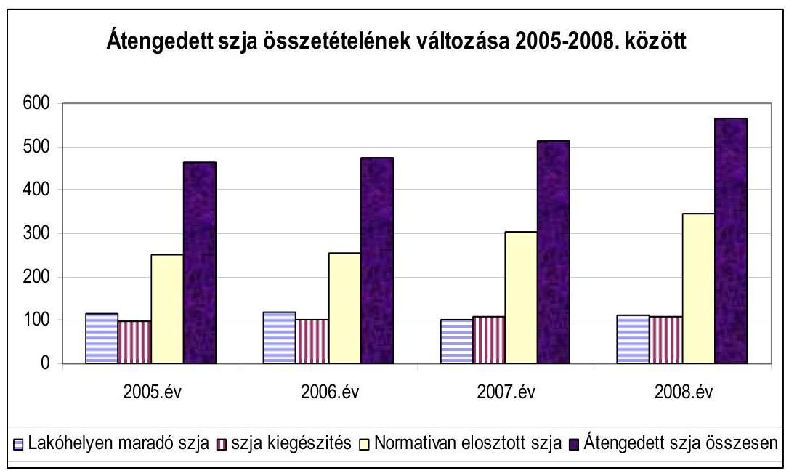

A szabályozott források a 2008. évi javaslatban az előző évhez képest 50,1 milliárd Ft-tal (3,7\%) csökkentek, azonban ez a szerkezeti változások és a már 2007. évben elfogadott kiadáscsökkentő intézkedések együttes hatását tartalmazza. A normatív hozzájárulások, támogatások fajlagos értékei az igénylési jogcímek többségében nominálértéken változatlanok, így összességében a múködési célú központi támogatások reálértéke csökken, a fejlesztési források - elsősorban az EU-s támogatások és a hazai társfinanszírozás eredményeként bővülnek.

A költségvetést megalapozó szakmai törvények közül az Országgyűlés 2007. június 27-i ülésnapján fogadta el a közoktatásról szóló 1993. évi LXXIX. törvény módosítását, ennek hatását figyelembe vették a 2008. évi költségvetési törvényjavaslatban. A szociális igazgatásról és szociális ellátásokról szóló 1993. évi III. törvény módosítását tartalmazó, egyes szociális törvények módosítására vonatkozó törvényjavaslatot a Kormány 2007. június 29-én nyújtotta be az Országgyűlésnek. A törvényjavaslat vitája a költségvetési javaslat készítésével párhuzamosan zajlott, nem zárult le, ezért a költségvetési törvényjavaslatban

---

szereplő szabályozási elgondolások és előirányzatok, valamint az ágazati (szakmai) törvény közötti összhang teljes körűen nem volt véleményezhető.

A kapcsolódó, a 2008. évi költségvetést megalapozó egyes törvények (ezen belül az államháztartásról szóló 1992. évi XXXVIII. törvény) módosítását tartalmazó törvényjavaslatot külön javaslatként, a helyszíni vizsgálat lezárását követően nyújtja be a Kormány az Országgyűlésnek, így annak véleményezése nem szerepel a jelentésben.

A közszférában a keresetek 2007. évi növelését szolgáló intézkedésekről a szakszervezetek és a Kormány között 2007. február 19-én létrejött megállapodás alapján a 2007. év után járó, 2008. január 16-án esedékes 13. havi illetmény kétheti részének fedezete céltartalékból évközben kerül átcsoportosításra. A költségvetési törvényjavaslat 4. § (7.) bekezdése szerint a céltartalék terhére kell biztosítani a 2007. év után járó 13. havi illetmény egy részének külön törvény ${ }^{14}$ szerinti kifizetését.

A megállapodás alapján a 2007. év után járó tizenharmadik havi illetményből 2007. július 1-jétől kétheti bérnek megfelelő rész évközben, havi részletekben, és 2008. január 16-án a hátralévő része kerül kifizetésre. A 2008. év alapján járó 13. havi illetmény kifizetésére január - december között havi egyenlő részletekben kerül sor. A 13. havi illetmény kétheti részének előrehozott kifizetése miatti támogatás az önkormányzatok folyó évi állami támogatását várhatóan 38 milliárd Ft-tal növeli, amely az összes szabályozott forrás 2,7\%-ának felel meg.

A szociális alapszolgáltatások (szociális étkeztetés, házi segítségnyújtás) bővítésére, a szociális segélyek, juttatások reálértékének megőrzésére 16,4 milliárd Ft-tal növelt állami támogatást, hozzájárulást tartalmaz a javaslat. Megszűnik ugyanakkor és a pénzbeli szociális juttatások jogcímcsoportba került a lakáshoz jutás települési önkormányzatok általi támogatását szolgáló 14,2 milliárd Ft normatív hozzájárulás önálló jogcíme. A lakáshoz jutás 2008. évi támogatásának részben forrása - a PM tájékoztatása alapján a lakóhelyen maradó szja és a normatíva növekedése. A szabályozás javasolt változtatásának egyes önkormányzatokra gyakorolt hatásáról nem készültek modellszámítások, ez a helyi önkormányzatok költségvetésből származó szabad rendelkezésű forrásai szűkítését jelenti.

Az átengedett személyi jövedelemadó (40\%) és a lakóhelyen maradó 8\% változatlan mértéke mellett, a két évvel korábban befizetett és lakóhelyre kimutatott szja 10,1\%-os növekedése az egyensúlyi követelmények érvényesítése miatt szabályozási gondot okozott. A tervezés során felmerült a lakóhelyen maradó szja (a 2007. évi költségvetésben 10\%-ról 8\%-ra csökkentett) mértékének további csökkentése. A PM azonban a többletforrásnak az önkormányzati feladatok finanszírozásába történő bevonását, forráscserét javasolt és ennek hatása szerepel a költségvetési törvényjavaslatban.

A helyi önkormányzatok közoktatási feladatokhoz igényelhető 2008. évi normatív hozzájárulásának javasolt előirányzata 26,4 milliárd Ft-tal

[^0]
[^0]:    ${ }^{14}$ Egyes törvényeknek a tizenharmadik havi illetmény kifizetési rendjével összefüggő módosításáról szóló 2007. évi XXXIII. törvény.

---

csökkent, amely a pedagógusok kötelező óraszáma 2007. szeptember 1-jei óraszám emelésével összefüggő (elvárt ${ }^{15}$ ) létszámcsökkentés hatásának 2008. évre szintrehozott összege.

A helyi szervezési intézkedésekről (intézmény összevonásokról, létszámcsökkentésekről) pontos felmérések nem állnak rendelkezésre, a helyi szervezési intézkedések egyszeri támogatására jóváhagyott előirányzatra a harmadik ütemben (október 1-ig) benyújtott pályázat ismeretében a létszámcsökkentés mértékére ${ }^{16}$ pontosabb információk várhatóak.

A közoktatási törvény 2007. évi júniusi módosítása miatt várható többletkiadásokra 3,5 milliárd Ft-ot tartalmaz a költségvetési törvényjavaslat.

A 2008. évi javasolt támogatási előirányzat pótlólagos forrást biztosít szociál- és társadalompolitikai célok támogatására is:

Többek között a tűzoltók munkaideje EU-s előírásoknak megfelelő heti 48 órára történő csökkentésére ( 2,2 milliárd Ft), a 2006. tavaszi ár- és belvíz miatt keletkezett károkkal összefüggésben pótlólagosan felmért károk enyhítésére ( 1,1 milliárd Ft), a kisebbségi önkormányzatok támogatásának növelésére ( 0,2 milliárd Ft), a nyári gyermekétkeztetés támogatására ( 1,2 milliárd Ft), a rendszeres gyermekvédelmi támogatásban részesülő 5 . évfolyamos általános iskolai tanulók ingyenes étkeztetéséhez kiegészítő hozzájárulásra ( 0,4 milliárd Ft) tartalmaz előirányzatot a javaslat.

A megszűnő (kifutó) címzett támogatások helyére lépő - társulásos feladatellátást segítő - hazai fejlesztési támogatásokra 3,5 milliárd Ft szerepel a javaslatban (1 500 lélekszám alatti kistelepülések társulás útján fenntartott iskolái felújítását, új, vagy új taggal bővülő körjegyzőségek tárgyi feltételeinek javítását, közösségi busz beszerzését szolgáló beruházásokra, amelyekre EU-s pályázat nem nyújtható be).

A helyi önkormányzatok a fejlesztések megvalósításában 190 milliárd Ft európai uniós támogatással és 128 milliárd Ft központi költségvetésből származó hazai társfinanszírozással számolhatnak a bemutatott mérleg szerint. A helyi önkormányzatok és jogi személyiségű társulásaik EU-s fejlesztési pályázatai saját forrás kiegészítésének támogatását szolgáló EU Ónerő Alap a javaslat szerint a 2007. évi 10,1 milliárd Ft-ról 15,1 milliárd Ft-ra emelkedik, amelynek felhasználására vonatkozó szabályokban - az előző évhez hasonlóan - érvényesül az elmaradottság, illetve a jövedelmi viszonyok alapján a differenciált támogatás elve.

[^0]
[^0]:    ${ }^{15}$ A 2007. évi költségvetés készítésekor a 10\%-os mértékű pedagógus kötelező óraszám emelés hatásaként pontos létszámcsökkentési elvárások nem kerültek meghatározásra.
    ${ }^{16}$ A 2007. évi költségvetésben a helyi szervezési intézkedésekhez kapcsolódó többletkiadások támogatására a központosított előirányzatok között jóváhagyott 9,1 milliárd Ft terhére 2007. évben az első két ütemben ( 04.15 . és 07.15 .) összesen 8,5 milliárd Ft támogatás került odaítélésre 5323 fős (ebből az oktatási-kulturális ágazatot érintő 2542 fő) létszámcsökkentésével összefüggő fizetési kötelezettségek teljesítéséhez.

---

A megemelt előirányzatból kell biztosítani a korábbi években Önerő Alapból jóváhagyott támogatások (ígérvények) folyósítását, valamint az Új Magyarország Fejlesztési Terv (ÚMFT) keretében néhány kiemelt cél differenciált támogatását (a társadalmi, gazdasági és infrastrukturális szempontból elmaradott valamint a területfejlesztés kedvezményezett térségeinek jegyzékében szereplő kistérségek területén lévő települések ivóvíz-minőségjavítás, szennyvízelvezetés éstisztítás, önkormányzati tulajdonú utak fejlesztése saját forrás kiegészítését).

# 2. A FORRÁSSZABÁLYOZÁS MÓDOSÍTÁSÁNAK FŐBB JELLEMZŐI 

Az önkormányzatok szabályozott forrásainak, a támogatások és a személyi jövedelemadó együttes összegének javasolt előirányzatai az előző évhez hasonlóan nem tartalmazzák a közszférát érintő központi bérintézkedések hatását. A törvényjavaslat általános indoklása szerint az érdekegyeztető tárgyalások eredményeként megvalósuló bérfejlesztés forrása a központi költségvetés céltartalékából kerül átcsoportosításra.

Az önkormányzati forrásszabályozásban alapvető változás nem következik be, a 2007. évben bevezetett ösztönző elemek megerősítését, aktualizálását tartalmazza a törvényjavaslat. A közoktatásban tovább folytatódik a méretgazdaságos oktatási-nevelési egységek kialakításának ösztönzése a 2007. évben bevezetett teljesítménymutató alapján történő finanszírozás révén. Az óvodák, általános- és középiskolák mellett a 2008/2009. nevelési évtől ilyen mutató alapján kapják az önkormányzatok a közoktatási alaphozzájárulást a kollégiumban elhelyezett, az alapfokú művészetoktatásban résztvevő, valamint a napközis és iskolaotthoni ellátásban résztvevő tanulók után is.

A méretgazdaságos ellátási egységek kialakítását a 2007. évi költségvetési törvénnyel az önhibájukon kívül hátrányos helyzetben lévő települési önkormányzatok támogatási szabályaiba beépített negatív ösztönzők továbbvitelével is elő kívánja segíteni a javaslat. A támogatás igénybevételéhez meghatározott szigorúbb kapacitásfeltételek felmenőrendszerben érvényesülnek a 2008/2009. oktatási évtől kezdődően. Az 1500 fő, vagy az alatti települési önkormányzatok 2008. évtől nem kaphatják az önhibájukon kívül hátrányos helyzetben lévő települések kiegészítő támogatását a többcélú kistérségi társulások támogatása keretében ösztönzött feladataikhoz, amennyiben azokat önállóan látják el.

A polgármesteri hivatali feladatok körjegyző́ségi formában történő ellátásának ösztönzése továbbra is érvényesül. Az önhibájukon kívül hátrányos helyzetben lévő települések kiegészítő támogatása igénybevételi feltételéül - a 2007. évi költségvetési törvénnyel bevezetett szigorúbb szabályok szerint - az 1000 fő alatti településeknek körjegyzőséghez kell csatlakozniuk. A körjegyző́égek múködéséhez változatlanul ösztönző normatív hozzájárulás vehető igénybe, emellett a fejlesztési feladataikhoz a központosított előirányzatok között ilyen célra javasolt forrásból (törvényjavaslat 5 . számú melléklet 23 . jogcím) támogatás igényelhető.

---

A társulásos feladatellátások ösztönzésére a helyi önkormányzatok normatív, kötött felhasználású támogatásai között a többcélú kistérségi társulások támogatási előirányzata a 2007. évi költségvetési törvénnyel elfogadott fajlagos összegeknek megfelelő̉ mértékben szerepel a javaslatban.

A szociális ágazatban a rászorultsági elv érvényesítése mellett az alapellátási formák bővítését ösztönzi a törvényjavaslat, amely hozzájárulhat a bentlakásos intézményi ellátási formák tehermentesítéséhez. A szociális étkeztetésbe, a házi segítségnyújtásba, az időskorúak ápoló-gondozóotthonaiba 2008. január 1-jétől belépők ellátásáért az önkormányzatok az ellátottak jövedelmi helyzetét figyelembe vevő differenciált összegű normatív hozzájárulást vehetnek igénybe.

A helyi önkormányzatok eltérő jövedelmi helyzete, - nemkívánatos mértékű - differenciálódásának csökkentésére a személyi jövedelemadó egy részének felosztása továbbra is a jövedelemadó bevétel és az iparűzési adóerőképesség együttesen egy főre jutó összegének figyelembevételével történik. Az e célra javasolt személyi jövedelemadó aránya az átengedett szja-hoz viszonyítva 20,7\%-ról 19\%-ra csökkent és 0,6\%-os nominális növekedése nem éri el az infláció tervezett mértékét sem.

# 3. Fejlesztési támogatások 

A IX. Helyi önkormányzatok támogatásai és átengedett személyi jövedelemadója fejezetben önálló jogcímeken és a központosított előirányzatok között tervezett fejlesztési célokat szolgáló költségvetési támogatások 2008. évi tervezett elöirányzata - az egyes jogcímek között átrendezést is figyelembe véve - 127,38 milliárd Ft, amely összegében 44,25 milliárd Ft-tal marad el az előző évi költségvetésben megállapított keretektől. A csökkenés döntő oka, hogy a fővárosi metróberuházást az előző évi 65,55 milliárd Ft-tal szemben 2008-ban 16,2 milliárd Ft-tal szerepel a szabályozott források között. A metróberuházás figyelembevétele nélkül számított fejezetbeli fejlesztési célú előirányzatok összességében 5,1 milliárd Ft-tal emelkednek. Ezen túl a XI. Önkormányzati és Területfejlesztési Minisztérium fejezetben tervezett terület- és régiófejlesztési célelóirányzat decentralizált hányada 4,9 milliárd Ft, a LXIX. Kutatási és Technológiai Innovációs Alapban 5 milliárd Ft összegben áll rendelkezésre fejlesztési célokra a költségvetési törvényjavaslatban. Az egyes fejlesztési támogatási jogcímek alakulását a vélemény 5. számú melléklete részletezi.

### 3.1. Címzett és céltámogatások

A fejlesztési támogatások továbbra is leghangsúlyosabb elemét a címzett és céltámogatások jelentik, amelyre a 2008. évi költségvetési törvényjavaslat 53 milliárd Ft elöirányzatot tartalmaz. A tervezett előirányzat 4,5 milliárd Ft-tal marad el a 2007. évi költségvetésben jóváhagyott támogatási le-

---

hetőségtől. Az Országgyúlés döntése értelmében ${ }^{17}$ címzett támogatás 2008. évben sem indítható, új induló céltámogatásra mindössze 200 millió Ft-ot tartalmaz a javasolt előirányzat. A keretszám 45,6\%-a (24,15 milliárd Ft) az előző évek támogatási döntéseinek 2008. évre ütemezett kötelezettségvállalásaival lekötött, míg a fennmaradó 28,65 milliárd Ft a folyamatban lévő beruházások előző évek ütemeire megítélt, de ténylegesen le nem hívott támogatások pénzügyi fedezetét biztosítja. Tekintettel arra, hogy a korábbi évek pénzügyi maradványának felhasználása a beruházások elhúzódásával, a forrásokról való lemondással és visszafizetési kötelezettségekkel összefüggésben tervezési bizonytalanságot hordoz, ezért a javaslat szerint a címzett és céltámogatások előirányzata a szükségleteknek megfelelően a pénzügyminiszter egyetértésével túlléphető ${ }^{18}$.

A rendelkezésre álló költségvetési keretek már a korábbi években is csökkenő arányban tartalmaztak fedezetet új beruházási programok indítására, a tervévet megelőző évek döntéseiből következő erőteljes determináció állandósult. Az önkormányzatok 2003-ban az előirányzatok 15,9\%-át, 2004-ben 16,8\%-át, 2005ben $10,2 \%$-át, 2006-ban a tervezett forrás mindössze $9,8 \%$-át ( 6,5 milliárd Ft-ot) fordíthatták új induló beruházások támogatására. A 2007. évre jóváhagyott 57,5 milliárd Ft-os előirányzat is csaknem teljes egészében törvényi döntésekkel már korábban jóváhagyott címzett és céltámogatási programokhoz kapcsolódott miként a 2008.évi javaslat szerint is -, mindössze 200 millió Ft szolgálja a tárgyévben induló céltámogatásos fejlesztéseket. A 2008. évi költségvetési törvényjavaslat 92. §-a arról is rendelkezik, hogy az Országgyúlés 2009-2010 években sem nyújt új induló beruházásokhoz címzett támogatást.
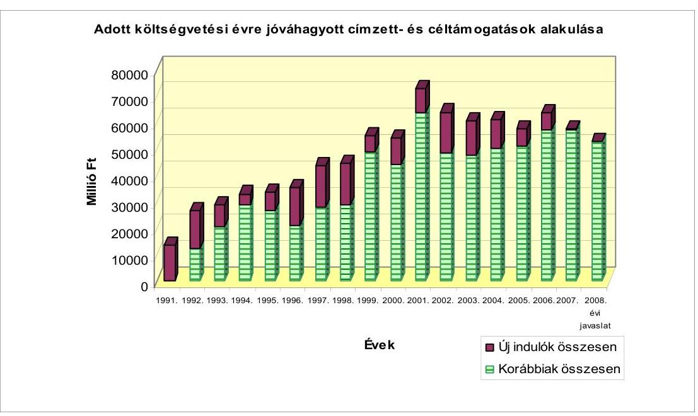

[^0]
[^0]:    ${ }^{17}$ A Magyar Köztársaság 2007. évi költségvetését megalapozó egyes törvények módosításáról szóló 2006. évi CXXI. törvény 34. §. (1) bekezdése.
    ${ }^{18}$ A 2008. évi költségvetési törvényjavaslat 14. sz. melléklet 5. pontja.

---

A Kormány a címzett támogatásokat, a hazai forrásokat felváltó uniós támogatások bevonásának szándékával már 2006-ban áttekintette. Az e tárgykörben hozott határozatában ${ }^{19}$ felkérte a fejlesztéspolitikáért felelős kormánybiztost és az érintett minisztereket, hogy a helyi önkormányzatok címzett támogatásainak törvényben foglalt ${ }^{20}$ célok lehetőség szerinti teljes körét az ÚMFT Operatív Programjaiban jelenítse meg, valamint a 2007. évi címzett beruházási koncepciók közül határozza meg azokat a projekteket, amelyek szerepeltethetők az Operatív Programokhoz kapcsolódó, azok végrehajtására vonatkozó Akciótervekben. Tekintettel arra, hogy az ÚMFT elfogadása, az annak megvalósítását szolgáló országos és regionális operatív programok akcióterveinek, végleges célkitúzéseinek és a forrásokhoz való hozzájutás feltételeinek meghatározása többségében 2007. július végéig elhúzódott ${ }^{21}$, a pályázati kiírások megjelenése az év hátralévő részében várható, a forráscsere tényleges eredményei még nem ismeretesek.

Magyarország számára 2007-2013 között 22,4 milliárd euró uniós támogatás áll rendelkezésre az Új Magyarország fejlesztési Tervben. Az ÚMFT akciótervei alapján az elkövetkezendő hónapokban összesen 2800 milliárd Ft fejlesztés kezdődik el, részben pályázati úton, részben kiemelt projektek révén. A kormány augusztusban 500 milliárd Ft támogatási értékben 271 projekt kiemelt támogatásáról döntött, közülük 191 esetben hat hónapon belül szerződést lehet kötni, a fennmaradó 80 beruházás átdolgozást követően kerülhet a támogatott projektek közé, várhatóan novemberi döntést követően. Az év eddig eltelt időszakában az ÚMFT keretében közel 50 pályázati felhívás jelent meg, közülük 28 az önkormányzatok számára is elérhető támogatási lehetőséget hirdet meg.

A 2008. évi költségvetési javaslat az önkormányzati alrendszer vonatkozásában 190 milliárd Ft EU-tól átvett pénzeszköz realizálásával számol, amely a 2007. évi tervszámot 49,3 milliárd Ft-tal (35\%-kal ) haladja meg annak ellenére, hogy a beruházási folyamatok természetéhez igazodóan a megvalósítás ütemének felgyorsulása várható. Ez utóbbit erősítheti, hogy az uniós támogatásoknál alkalmazott n+2 finanszírozási szabály ${ }^{22}$ értelmében a 2008. év az utolsó, amikor a 2004-2006. közötti időszakra megítélt támogatások lehívhatók.

[^0]
[^0]:    ${ }^{19}$ A helyi önkormányzatok 2007. évi új címzett támogatásáról szóló 1109/2006. (XI. 20.) Korm. Határozat.
    ${ }^{20}$ A helyi önkormányzatokról címzett és céltámogatási rendszeréről szóló 1992. évi LXXXIX. törvény 1. §-ának (1) bekezdése.
    ${ }^{21}$ Az ÚMFT Magyarország Nemzeti Stratégia Referenciakerete 2007-2013. dokumentumot 2007. május 7-én, a 15 Operatív Program közül 13-at július végéig fogadott el az Európai Bizottság. A Kormány az elfogadott programok akcióterveiről jellemzően júli-us-augusztus hónapokban (2142/2007 (VII. 27.) Korm. határozat, 1063/2007. (VIII. 15.) Korm. határozat) döntött.
    ${ }^{22}$ Az Uniós támogatásokra előírt, az éves támogatási keret igénybevételére vonatkozó két éves határidő ( $\mathrm{n}+2$-es szabály), amit a 2004-2007. között odaítélt EU-s források felhasználására kaptak az Unió tagállamai.

---

A céltámogatások 2008. évi indítására tervezett összeg 200 millió Ft, amelynek döntési jogköre már 2006-tól a regionális fejlesztési tanácsokhoz került. A támogatási előirányzat 15\%-a a régiók lakónépességének arányában, 85\%-a pedig a területfejlesztés szempontjából leghátrányosabb helyzetű - kormányrendeletben meghatározott ${ }^{23}$ - kistérségek lakónépessége alapján illeti meg a régiókat. A támogatási célokat a kormány a 2008. évi költségvetést megalapozó egyes törvények módosításáról szóló törvénycsomagban, a Cct módosításával kívánja meghatározni.

A tervezet szerint a Cct új melléklettel egészül ki, amelyben a 2008-2009. évekre támogatható célok kijelölése történik meg. Eszerint támogatást igényelhetnek a helyi önkormányzatok 1 millió Ft egyedi értéken felüli és egy éven túl elhasználódó aneszteziológiai, intenzív terápiás sürgősségi eszközök beszerzéséhez, legfeljebb $75 \%$-os támogatási arány érvényesítésével. A regionális fejlesztési tanácsoknak a céltámogatási igényeket a törvény e mellékletében előírt szempontjai szerint kell rangsorolniuk.

# 3.2. A leghátrányosabb helyzetú kistérségek felzárkóztatásának támogatása 

A leghátrányosabb helyzetú kistérségek felzárkóztatásának támogatására a IX. Helyi önkormányzatok támogatásai fejezet 13. címén 2008-ban - az előző évivel azonosan - 5,8 milliárd Ft előirányzat áll rendelkezésre, amelynek felhasználásáról az érintett öt régióban - Nyugat-Dunántúl, DélDunántúl, Észak-Magyarország, Észak-Alföld, Dél-Alföld - a regionális fejlesztési tanácsok dönthetnek.

A régiók területfejlesztésben betöltött szerepének, súlyának növelésével összhangban a támogatási keret felosztásának joga a 2007. évtől a megyei területfejlesztési tanácsoktól a regionális fejlesztési tanácsokhoz került. A támogatási előirányzat 2008-ban is felhasználási kötöttséggel, a területfejlesztés kedvezményezett térségeinek jegyzékéről szóló 64/2004. (IV. 15.) Korm. rendeletben meghatározott, a területfejlesztés szempontjából leghátrányosabb helyzetű kistérségek lakónépessége alapján, a törvényjavaslat 16. sz. melléklete szerinti bontásban illeti meg a régiókat.

Az előirányzat felhasználásának általános és program specifikus szabályait - a decentralizálásra került többi támogatási keret felhasználásához hasonlóan - a Kormány 2007-ben, rendeletben ${ }^{24}$ szabályozta. A szabályozás tárgyéven túli kötelezettségvállalásra nem biztosított lehetőséget, így a 2008. évi támogatási keret teljes egészében tárgyévi programok támogatására fordítható. A regionális fejlesztési tanácsok a támogatást - az előző évhez hasonló-

[^0]
[^0]:    ${ }^{23}$ A jelenleg hatályos kistérségi besorolást a 64/2004. (IV. 15.) Korm. rendelet határozza meg. A 67/2007. (VI. 28.) OGY határozatban foglalt lehatárolási elveknek megfelelő besorolás végrehajtása folyamatban van.
    ${ }^{24}$ A decentralizált helyi önkormányzati fejlesztési támogatási programok előirányzatai, valamint a vis maior tartalék felhasználásának részletes szabályairól szóló. 12/2007. (II. 6.) Korm. rendelet.

---

an - a régióhoz tartozó leghátrányosabb kistérségekből érkező pályázatok között az egyes kistérségek lakónépessége arányában osztják fel.

A 2007 szeptemberében elvégzett összegzések szerint az érintett régiók az 5,8 milliárd Ft összegű támogatási előirányzatot csaknem teljes egészében lekötötték. Az öt érintett régióban 673 db támogatási döntéssel 7,8 milliárd Ft összértékű beruházás megvalósítását támogatták, amely átlagosan $74 \%$-os támogatási részarányt jelent. Az egy döntésre jutó támogatás összege a 2006. évi 10,8 millió Ft átlagos - akkor 9 milliárd Ft-ból juttatott - támogatással szemben 8,6 millió Ft volt, amely arra utal, hogy a felzárkóztatási célú támogatási forrás felhasználásának koncentráltsága kismértékben ugyan, de javult. Kedvezőtlen ugyanakkor, hogy a pályázati rendszer múködésével is összefüggésben a támogatott beruházások megvalósítása egyre inkább elhúzódik. Ezt az támasztja alá, hogy a 2007. évre jóváhagyott támogatási keretből tényleges folyósítás a számbavétel időpontjáig egyáltalán nem történt.

Tekintettel arra, hogy a leghátrányosabb helyzetű kistérségi besorolást tartalmazó kormányrendelet megalkotása az e tárgykörben hozott országgyűlési határozat alapján folyamatban van, a törvényjavaslatban szereplő régiós felosztás ennek megfelelően módosulhat, miközben a támogatás célrendszerében, felhasználási szabályaiban lényeges változás nem várható.

A területfejlesztési törvény ${ }^{25}$ előirása szerint a területfejlesztési támogatások és a decentralizáció elveinek, a kedvezményezett térségek besorolási feltételeinek meghatározása az Országgyúlés hatáskörébe tartozik. A törvény hatályba lépése óta az Országgyúlés e tárgykörben három alkalommal (1997-ben, 2001-ben, illetve legutóbb 2007 nyarán ${ }^{26}$ ) hozott határozatot.

Az OGY határozat fontos eleme, hogy a területfejlesztési támogatáspolitika megvalósítását szolgáló, tisztán hazai decentralizált fejlesztési források tervezésével és felosztásával kapcsolatban rögzíti, hogy a költségvetési törvényjavaslatban önálló, regionális fejezetet kell létrehozni a feladatés hatáskörök, valamint a felelősség egyidejű meghatározása mellett. A regionális fejlesztési tanácsok működési és döntési hatáskörébe utalt, illetve a Kormány által kötött tervszerződések fejlesztési forrásait régiónként külön fejlesztési soron indokolt tervezni, a tisztán hazai forrásból megvalósított fejlesztések pénzellátási rendje az EU finanszírozási elveihez igazodjék, a jelenlegi projektfinanszírozást programfinanszírozás váltsa fel.

A dokumentum meghatározza a kedvezményezett térségek besorolásának új feltételrendszerét. Hazánk kistérségei területfejlesztési szempontból lehetnek átlagosnál kedvezőbb gazdasági helyzetű, nem kedvezményezett kistérségek, valamint területfejlesztési szempontból kedvezményezett, területfejlesztési forrásokból támogatható kistérségek. A területfejlesztés kedvezménye-

[^0]
[^0]:    ${ }^{25}$ A területfejlesztésről és területrendezésről szóló 1996. évi XXI. törvény.
    ${ }^{26}$ 67/2007. (VI. 28) OGY határozat, amely hatályon kívül helyezte az e tárgyban, 2001ben hozott 24/2001. (IV. 20.) OGY határozatot.

---

zett térségei fejlettségük illetve fejletlenségük alapján további hátrányos és leghátrányosabb besorolásúak ${ }^{27}$ lehetnek.

E kategóriák kialakítására a korábbi négy mutatócsoport helyett öt - gazdasági, infrastrukturális, társadalmi, szociális és foglalkoztatási - mutatócsoportból képzett komplex mutató meghatározásával kerül sor oly módon, hogy a kistérségek szociális helyzete a besorolásban a jelenleginél erőteljesebb hangsúlyt kapott. Új elem az is, hogy azokban a régiókban, ahol a hátrányos helyzetú kistérségek lakónépessége nem éri el a régió népességének $30 \%$-át, ott regionális szempontból hátrányos helyzetú kistérségeket jelölhetnek ki a régión belüli felzárkóztatás elősegítésére. Az Országgyúlés újólag meghatározta a társadalmi, gazdasági és infrastrukturális szempontból elmaradottnak, illetve a jelentős munkanélküliséggel sújtott település kategóriák besorolásának módszertanát is.

Az Országgyúlési határozatban foglaltak a 2008. évi költségvetési javaslatban csak részlegesen érvényesülnek, a támogatási előirányzatok egy részénél (TEKI, CÉDE) már az újonnan meghatározott térségi lehatárolási elvek érvényesítését írták elő, az önálló regionális fejezet kialakítására azonban nem került sor.

# 3.3. Helyi önkormányzatok fejlesztési és vis maior feladatainak támogatása 

A helyi önkormányzatok fejlesztési és vis maior feladatainak támogatására 2008-ban az előző évivel megegyező összegű, 10,87 milliárd Ft áll rendelkezésre, amelynek felhasználásáról ez évben is a regionális fejlesztési tanácsok döntenek.

E támogatási keret a területi kiegyenlítést célzó fejlesztési támogatás (TERKI) és a céljellegú decentralizált támogatási előirányzat (CÉDE) összevonásával jött létre, első alkalommal a 2005. évi költségvetésben. Az összevont előirányzat az elmúlt két évben, régiónkénti részletezettségben került meghatározásra, annak felhasználásáról 2006-ban még a megyei, 2007-ben már a regionális fejlesztési tanácsok döntöttek. A felhasználási szabályok 2006. év végéig lehetőséget adtak arra, hogy a területfejlesztési tanácsok három évre előre is vállalhattak kötelezettséget, így a 2008. évre tervezett támogatási keret $39,5 \%$-át a döntéshozók már lekötötték.

A 2007. évben rendelkezésre álló előirányzatok felhasználásának részletes szabályairól szóló kormányrendeletben ${ }^{28}$ lényeges változást jelentett, hogy a tárgyéven

[^0]
[^0]:    ${ }^{27}$ Hátrányos helyzetűek azok a kistérségek, amelyek komplex mutatója kisebb, mint az ország összes kistérsége komplex mutatójának átlaga. Leghátrányosabb helyzetűek azok a kistérségek, amelyek a hátrányos helyzetű kistérségeken belül is a legalacsonyabb komplex mutatóval rendelkeznek, e térségek népessége azonban nem haladhatja meg az ország lakónépességének $15 \%$-át. Azok a leghátrányosabb helyzetű kistérségek, amelyek a legalacsonyabb komplex mutatóval rendelkeznek, és lakónépességük nem haladja meg az ország lakó népességének $10 \%$-át, speciális bánásmódban részesülnek, felzárkóztatásuk érdekében alapvetően az uniós forrásokra építve komplex programot kell kidolgozni. Ez utóbbi körbe az előzetes számítások szerint 33 kistérség fog tartozni.

---

túli kötelezettségvállalás lehetősége megszűnt. A döntési jogköröket érintő változásokkal is összefüggésben mind a döntések meghozatala, mind pedig a források felhasználása elhúzódó jellegűvé vált.

A 10,87 milliárd Ft-ból 0,8 milliárd Ft, mint decentralizált vis maior keret áll rendelkezésre.

A vis maior feladatok ellátására szolgáló 800 millió Ft 60\%-a régióban található önkormányzatok 2007. október 1-jei száma alapján, 40\%-a pedig a 2005. és a 2006. években ár-, belvíz, rendkívüli időjárás, illetve pince-, partfal omlás okozta károk enyhítéséhez jóváhagyott támogatás arányában kerül felosztásra az érintett régiók között. A régiók közötti megosztás alapjának változása (a régiók egyenlő arányban való részesedését a települések számához igazodó részesedés váltotta fel) a nagyobb településszámmal rendelkező régiók számára jelent viszonylagosan kedvezőbb pozíciókat.

A vis major keret elkülönítését követően fennmaradó 10,07 milliárd Ft-os előirányzat 50\%- 50\%-ban kerül megosztásra a TEKI és CÉDE keretek között, a területfejlesztési támogatásokról és a decentralizáció elveiről, a kedvezményezett térségek besorolásának feltételrendszeréről szóló 67/2007. (VI. 28.) OGY határozat III. 2 pontjának ba.) illetve bb.) alpontja alapján.

A minden kistérségben felhasználható forrás (azaz a CÉDE) megosztása esetében a régió lakónépességét a keret $40 \%$-a mértékéig, a régiókban a helyi önkormányzatokat a költségvetési törvény alapján a tárgyévben a lakóhely szerint megillető személyi jövedelemadónak az országos átlagtól való elmaradását a keret 40\%-a mértékéig, a régió települési önkormányzatainak számát a keret 20\%-a mértékéig kell figyelembe venni. A rendelkezésre álló források megosztásában új elem a személyi jövedelemadóból való részesedés figyelembevétele, amely átlagosnál kedvezőtlenebb jövedelmi hátterű települések támogatási esélyeit növeli.

A területfejlesztési szempontból kedvezményezett térségekben felhasználható forrás (TEKI) esetében a régió fejlettségét mutató egy főre jutó hazai termék (GDP) mutatót a keret $30 \%$-a mértékéig, a kedvezményezett kistérségek lakónépességét a keret $70 \%$-os mértékéig kell figyelembe venni.

A vis maior tartalék 2008. évi előirányzata az előző évivel azonos szinten, 360 millió Ft összegben került megtervezésre, amely - a korábbi években kialakult gyakorlatnak megfelelően - az elkülönített megyei forrásokból már nem finanszírozható, váratlan és rendkívüli események okozta természeti károk kezelésére szolgál. A támogatási keret felhasználási szabályai biztosítják, hogy a természeti és környezeti katasztrófák következményei a szükséges mértékben kerüljenek enyhítésre és ellensúlyozásra.

[^0]
[^0]:    ${ }^{28}$ A kormány 12/2007. (II. 6.) Korm. rendelete, a decentralizált helyi önkormányzati fejlesztési támogatási programok előirányzatai, valamint a vis maior tartalék felhasználásának részletes szabályairól.

---

# 3.4. A helyi önkormányzatok és jogi személyiségú társulásaik európai uniós fejlesztési pályázataihoz szükséges saját forrás kiegészítése 

Az önkormányzatok fejlesztési tevékenységének körülményeit 2008-ban minden eddiginél nagyobb mértékben befolyásolják az európai uniós támogatásokhoz való hozzájutás feltételei. A Kormány ezt ösztönző erőteljes szándéka nyilvánul meg abban is, hogy a saját forrás kiegészítésére szolgáló költségvetési előirányzatot az előző évihez képest 5 milliárd Ft-tal - 49,5\%-kal megemelt szinten, 15,1 milliárd Ft összegben tervezi.

Az EU Önerő Alap előző évhez képest számba vett bruttó növekménye ugyan 5,5 milliárd Ft, azonban ennek egy részéből ( 500 millió Ft-ból) az Uniós fejlesztések fejezetben a KEOP derogációs projektek kamattámogatása címen új előirányzat nyílik meg. Ez az ivóvízminőség javítását szolgáló, valamint a szennyvíz és hulladéklerakó beruházások - EU-s és hazai támogatással nem finanszírozott - hitelforrás terheit könnyíti. A költségvetési javaslat lehetőséget ad arra, hogy a kamattámogatás évközben a szükségletnek megfelelő mértékben álljon rendelkezésre ${ }^{29}$.

Az EU Önerő Alap támogatási előirányzata fedezetet biztosít a korábbi években jóváhagyott támogatások folyósítására, valamint Pécs Megyei Jogú Város önkormányzata a „Pécs - Európa Kulturális Fővárosa" nagyprojekt megvalósításához.

Az előző években meghozott érvényes támogatási döntések a 2008. évi előirányzatot 704,3 millió Ft összegben terhelik. A 2007. évi költségvetésben tervezett 10,1 milliárd Ft előirányzat terhére 2007. szeptember végéig támogatási döntés nem született. A tárgyévi előirányzat felhasználására vonatkozó ÖTM rendeleti szabályozást - összefüggésben az ÜMFT Operatív Programjainak elhúzódó indulásával - a 2008. évi költségvetési javaslat benyújtásának időpontjáig nem alkották meg ${ }^{30}$, a 2004-2006. között kiadott feltételes támogatásról szóló ígérvények 2007. július 1-jével érvényüket veszítették. A szabályozás megjelenése októberre várható, tervezete hangsúlyt helyez az uniós támogatásokkal való összhang megteremtésére.

A 2008. évre tervezett előirányzatból ÜMFT keretében differenciált támogatás nyújtható

- a Környezet és Energia Operatív Program keretében megvalósuló ivóvíz minőségjavítás,
- az EU támogatásra számot tartó, 2007. évi kezdésre ütemezett nagyprojektek előkészítésének költségvetési támogatásáról szóló 1067/2005.

[^0]
[^0]:    ${ }^{29}$ A költségvetési javaslat 51. § (17) bekezdésében a Nemzeti Fejlesztési Ügynökség elnöke felhatalmazást kapott arra, hogy a XIX. Uniós fejlesztések fejezetből, a KEOP Derogációs Projektek kamattámogatása jogcímcsoportról az EU Önerő Alapba átcsoportosítást hajtson végre.
    ${ }^{30}$ A 2007. évi költségvetési törvény által előírt határidő 2007. március 1. volt.

---

(VI. 30) Korm. határozatban szereplő és 2005. december 31-ig megalakult vízi közmű társulattal rendelkező önkormányzati szennyvízelvezetés és tisztítás,

- az önkormányzati tulajdonú belterületi, valamint önkormányzati külterületi közutak fejlesztése
beruházások saját forrás kiegészítésére.
Amennyiben az előirányzat felhasználása lehetővé teszi, az önkormányzati és területfejlesztési miniszter év közben rendeletében egyéb uniós pályázati célok felhasználására is lehetőséget biztosíthat.

E célokhoz kizárólag azok a helyi önkormányzatok, illetve jogi személyiségű társulásaik igényelhetnek támogatást, amelyek társadalmi gazdasági és infrastrukturális szempontból elmaradott települések, a területfejlesztés kedvezményezett térségeinek jegyzékéről szóló külön jogszabály alapján a kedvezményezett kistérségek területén vannak, ezek önkormányzati társulásai. Támogathatóak továbbá a többcélú kistérségi társulások az általuk fenntartott intézmények fejlesztései, illetve a társulás vagyonának gyarapodását szolgáló, a társulás valamennyi tagja egyetértésével megvalósuló fejlesztései is. Az igénybevétel részletes szabályait a törvényjavaslat szerint 2008. február 28-ig az önkormányzati és területfejlesztési miniszter rendeletben szabályozza.

# 3.5. Települési önkormányzatok szilárd burkolatú belterületi útjainak felújítása 

A 2008. évi költségvetési javaslat - az előző évivel azonosan - 8 milliárd Ft támogatási keretet irányoz elő az útfelújítási program támogatására, amelynek a felhasználásáról 2008-ban is a regionális fejlesztési tanácsok dönthetnek, azzal a kitétellel, hogy a Közép-Magyarországi Régió keretéből legalább 3,5 milliárd Ft a fővárosi és a kerületi önkormányzatokat illeti meg.

A 2007 szeptemberében elvégzett összegzés szerint a hét régióban az előző évi kötelezettségvállalásokkal együtt 2007. évre összesen 7,9 milliárd Ft támogatást ítéltek oda, amelyek $60 \%$-a olyan tárgyévi döntés, amelyre még támogatási szerződést nem kötöttek. Mindez megerősíti az előirányzat 2006. évi felhasználásával kapcsolatos kedvezőtlen ellenőrzési tapasztalatainkat ${ }^{31}$, a szabályozás 2007. évi változásai ellenére előrevetíti a programok megvalósításának elhúzódását.

### 3.6. A fejlesztési célú költségvetési források decentralizálásának jellemzői

A fejlesztési célú támogatások döntési jogkörének decentralizálása, a források koordinációjára való törekvés a 2005. évtől vált jellemzővé a költségvetésben.

[^0]
[^0]:    ${ }^{31} 0724$ sz. Jelentés a Magyar Köztársaság 2006. évi költségvetése végrehajtásának ellenőrzéséről.

---

A változások egyik lényeges eleme az volt, hogy a törvény 2005-ben a regionális és megyei területfejlesztési tanácsok döntési jogkörébe utalta összesen 57,1 milliárd Ft támogatási előirányzat felhasználását oly módon, hogy 70,5\%-áról - 40,3 milliárd Ft-ról - a régiók dönthettek. A 2006. évi költségvetésben a decentralizálás területei - regionális, megyei fejlesztési tanácsok - nem változtak, a felosztható támogatási keretek azonban a jogcímek bővülése ellenére összességében csökkentek.

A regionális fejlesztési tanácsok döntési hatáskörébe utalt előirányzatok köre a Vásárhelyi Terv továbbfejlesztésére szánt támogatás kapcsán az érintett régiókban bővült, de a már előző évben is támogatott programok előirányzatainak csökkentése következtében a régiók szintjén 2006. évben felosztható előirányzat az előző évi 40,2 milliárd Ft-ról 29,1 milliárd Ft-ra - 27,7\%-kal - csökkent. A megyei területfejlesztési tanácsok ekkor 19,87 milliárd Ft támogatási keret felhasználásáról, a teljes decentralizált forrás $41 \%$-áról dönthettek.

A 2007. évtől a rendelkezésre álló decentralizált döntési körbe sorolt források nagyságrendje ugyan nem változott számottevően, e célokra összesen 44,1 milliárd Ft áll rendelkezésre, azonban a régiók szerepét megerősítve ennek már teljes összegéről a regionális fejlesztési tanácsok dönthettek. A 2008. évi költségvetési javaslat 34,77 milliárd Ft felhasználását utalja régiók döntési jogkörébe.
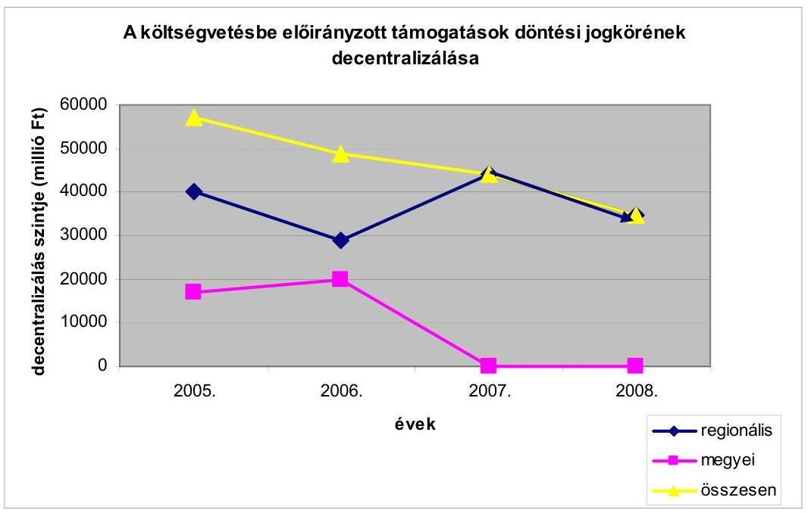

A decentralizált fejlesztési támogatásoknak továbbra is meghatározó szerepük van a helyi önkormányzati fejlesztések megvalósításában, a legelmaradottabb kistérségek felzárkóztatásában, e térségek versenyképességének fokozásában, a társadalmi kohézió erősítésében. A hazai forrásokból biztosított támogatások a 2007. évtől nem az Európai Unió támogatásainak kiegészítését, hanem attól elkülönített támogatási rendszert képeznek, ennek során olyan fejlesztéseket támogatnak, amelyek európai uniós finanszírozásban - a programok célja, vagy a közösségi források korlátozott volta miatt - nem részesülhetnek.

---

A nemzeti forrásokból származó fejlesztési források szabályozásában előrelépésnek tekinthető, hogy a Kormány 2007. évben a pályázati rendszerben felhasználható támogatások - a területi kiegyenlítést szolgáló önkormányzati fejlesztések támogatása (TEKI), önkormányzati fejlesztések támogatása területi kötöttség nélkül (CÉDE) a leghátrányosabb helyzetű kistérségek felzárkóztatásának (LEKI), és a települési önkormányzati szilárd burkolatú belterületi közutak burkolat felújításának (TEUT) - előirányzataira, valamint a vis maior támogatásokra vonatkozóan egységes szabályokat alkotott.

Az Európai Unió állami támogatásokra vonatkozó szabályozása 2007. évtől módosult, az ebből következő változások a hazai szabályozásban is megjelentek. A korábbi évektől eltérően egyes támogatási célok (múzeumok, filmszínházak, közfürdők, egészségügyi gép-műszer beszerzések beruházásaihoz, továbbá turizmus és a sport területén megvalósuló fejlesztésekhez nyújtott támogatások) esetén a nemzeti regionális beruházási támogatásokra, illetve a csekély összegű (de minimis) támogatásokra vonatkozó EK bizottsági rendeletek előírásai vonatkoznak.

A regionális beruházási körbe tartozó célok esetén a megítélhető támogatás intenzitása nem haladhatja meg a regionális támogatási térkép ${ }^{32}$ szerinti felső határt. A támogatás mértékének maximalizálásával egyidejűleg a szükséges saját forrás mértéke is rögzített, e célok esetében a támogatottnak az elszámolható költségek legalább 25\%-át saját forrásként vagy állami támogatástól mentes külső forrásként kell biztosítani. A regionális beruházási támogatások nyújtásának további feltétele, hogy a beruházást, a befejezést követő legalább öt évig az érintett régióban fenn kell tartani.

A címzett és céltámogatással megvalósuló fejlesztések támogatási célon belül szereplő egészségügyi gép-műszer beszerzéshez nyújtott támogatás - amennyiben a támogatással beszerzett gép, műszer nem kizárólag egészségügyi alapellátás szolgáltatását, kötelezően ellátandó önkormányzati feladat ellátását biztosítja, vagy nem ingyenesen igénybe vehető egészségügyi szolgáltatáshoz kapcsolódik működési támogatásnak minősül, ezért ezekre a beszerzésekre kizárólag csekély összegű támogatás nyújtható. Csekély összegű (de minimis ${ }^{33}$ ) támogatás csak abban az esetben adható, ha a kedvezményezett bármilyen forrásból, csekély összegű támogatási jogcímen odaítélt támogatásának tartalma - három pénzügyi évben összeszámítva - nem haladja meg a 200 ezer eurót.

[^0]
[^0]:    ${ }^{32}$ Az Európai Közösséget Létrehozó Szerződés 87. cikkének (1) bekezdése szerinti támogatásokkal kapcsolatos eljárásról és a regionális támogatási térképről szóló 85/2004. (IV. 19.) Korm rendelet 30. §-ában rögzített támogatási felső határok, az ÉszakMagyarország, Észak-Alföld, Dél-Alföld, Dél Dunántúl tervezési-statisztikai régióban 50\%, a Közép-Dunántúl tervezési-statisztikai régióban 40\%, a Nyugat-Dunántúl terve-zési-statisztikai régióban és Pest megyében 30\%, Budapesten 2007. január 1-jétől 25\%.
    ${ }^{33}$ Csekély összegű (de minimis) támogatásnak minősül minden olyan állami forrásból nyújtott támogatás, amelyről jogszabály mondja ki, hogy de minimis támogatásnak kell tekinteni. A de minimis támogatás nem számít állami támogatásnak, így a más jogcímen kapott támogatások halmozódásának számításánál nem kell figyelembe venni. Az értékhatár számítása szempontjából nem a támogatás összege, hanem a támogatás tartalom az irányadó.

---

A 2008. évi decentralizált előirányzatok régiónkénti összegeit a törvényjavaslat 16. sz. melléklete foglalja össze.

Az előterjesztett 16. sz. melléklet nincs összhangban a javaslat 1. sz. melléklet Központi költségvetés előirányzatai, XI. Önkormányzati és Területfejlesztési Minisztérium fejezet 12. Fejezeti kezelésű előirányzatok cím, 3. Terület és Régiófejlesztési céle1őirányzat alcím, 4. Decentralizált területfejlesztési programok jogcímcsoporton előirányzott összeggel. A törvényjavaslat 16. sz. melléklete decentralizált területfejlesztési programok előirányzata címén 5,5 milliárd Ft-ot, míg az 1.sz. melléklet ugyanezen a jogcímen 3,9 milliárd Ft előirányzatot tartalmaz ${ }^{34}$.

A decentralizált támogatási előirányzatok döntő hányada (24,87 milliárd Ft) a költségvetési javaslat IX. Önkormányzati támogatásai és átengedett személyi jövedelemadója fejezetben, az új induló céltámogatások, a helyi önkormányzatok fejlesztési és vis maior feladatainak támogatása, a leghátrányosabb helyzetű kistérségek felzárkóztatásának támogatása, valamint a települési önkormányzati szilárd burkolatú belterületi közutak burkolat felújításának támogatása címén - az előző évivel azonos összegben - áll rendelkezésre. A terület és régiófejlesztési céle1őirányzat decentralizált hányada 4,9 milliárd Ft összegben a XI. Önkormányzati és Területfejlesztési Minisztérium fejezetben került megtervezésre. A hazai innováció elősegítését a LXIX. Kutatási és Technológiai Innovációs Alap 5 milliárd Ft előirányzattal támogatja.

A terület- és régiófejlesztési céle1őirányzat két jogcímcsoportja 2008ra 4,9 milliárd Ft összegben került a regionális fejlesztési tanácsok döntési körébe, ezen belül a decentralizált területfejlesztési programok előirányzata a 2007. évi 12,277 milliárd Ft-ról 3,9 milliárd Ft-ra csökkent, decentralizált szakmai fejlesztési programokra pedig egyáltalán nem tartalmaz előirányzatot a javaslat. A decentralizált területfejlesztési programok teljes keretösszege új induló fejlesztések támogatását szolgálja. A Vásárhelyi Terv továbbfejlesztésére szánt 2008. évi támogatás keretösszege az előző évi 2,686 milliárd Ft-tal szemben 1 milliárd Ft lesz, amelynek 70\%-a az Észak-Magyarországi régióban, fennmaradó hányada pedig az Észak-Alföldi régióban - a 2006-ban vállalt kötelezettségek fedezetének biztosítására - lesz felhasználható.

A decentralizált területfejlesztési programok előirányzata a régió és területfejlesztési szempontból kedvezményezett kistérségeinek lakónépessége, a települési önkormányzatainak száma és a régió fejlettségét mutató egy főre jutó bruttó hazai termék értékének együttes figyelembevételével, míg a Vásárhelyi terv továbbfejlesztése előirányzat esetében a program céljához kötődő szakmai követelmények érvényesítésével történt a támogatási keretek megosztása. A Vásárhelyi terv folytatásának támogatására szánt előirányzatok egyrészt a régiók között, másrészt decentralizált területfejlesztési programok előirányzataira átcsoportosíthatók ${ }^{35}$.

[^0]
[^0]:    ${ }^{34}$ A vélemény kialakítása során az önkormányzati kondíciók és decentralizálás arányainak számításánál a 3,9 milliárd Ft előirányzatot vettük figyelembe.
    ${ }^{35}$ Költségvetési javaslat 51. § (10) bekezdésének a)- b) pontjai alapján.

---

A Vásárhelyi terv továbbfejlesztésének előirányzatain túlmenően az Európai Unió Szolidaritási alapjából is nyújtható a helyi önkormányzatok részére - árvíz által okozott közvetlen károk helyreállítását, veszélyhelyzeti tevékenységek finanszírozását szolgáló - támogatás, amelynek igénylési, döntési és lebonyolítási rendjét külön kormányrendelet szabályozza ${ }^{36}$ )

A hazai innováció támogatására szánt keret 50\%-át a régiók népességszáma arányában, $50 \%$-át a területfejlesztési támogatások és a decentralizáció elveiről, a kedvezményezett térségek besorolásának feltételrendszeréről szóló 67/2007. (VI. 28.) OGY határozatban foglaltak osztották meg.

A 2008. évi hazai fejlesztési támogatások továbbra is hangsúlyosan koncentrálnak a hátrányos helyzetű térségek társadalmi gazdasági felzárkóztatására. Ezt szolgálja a törvényjavaslatnak az az előirása is, amely szerint a decentralizált területfejlesztési programok új döntéseinél a leghátrányosabb helyzetű kistérségek régiónkénti egy főre jutó támogatása legalább 20\%-kal haladja meg a régió többi kistérségének egy főre jutó támogatását. A pályázati rendszer 2008tól várhatóan úgy alakul át, hogy az Európai Unió által nem támogatható úgynevezett komplementer területek kerüljenek támogatásra. Az erre vonatkozó részletes szabályok megalkotására a kormány - 2008. január 31-i határidővel - kapott felhatalmazást.

# 4. AZ ÖNKORMÁNYZATI BEVÉTELEK TERVEZÉSE 

### 4.1. Normatív állami hozzájárulás és normatív részesedésú átengedett személyi jövedelemadó

A helyi önkormányzatokat felhasználási kötöttség nélkül, a feladatellátással és népességszámmal arányosan megillető normatív hozzájárulások jogcímeit, fajlagos összegeit, az igénybevétel és az elszámolás feltételeit, szabályait a költségvetési törvényjavaslat 3. számú melléklete részletezi. Az egyes jogcímek előirányzatait - az előző évvel szemben - a IX. Helyi önkormányzatok támogatásai és átengedett személyi jövedelemadója fejezetben az állami hozzájárulást és a normatív módon elosztott személyi jövedelemadót együtt tartalmazzák. A jogcímenként tervezett előirányzatok a feladatmutatók előzetes felmérésén és a javasolt fajlagos támogatási mértéken alapulnak.

A normatív hozzájárulások 2008. évre tervezett összes előirányzata 23,8 milliárd Ft összegű, 3,4\%-os átlagos csökkenéssel 681,2 milliárd Ft, amelynek ágazatonkénti és jogcímenkénti részletezését, annak változását a véleményhez csatolt 2. számú melléklet mutatja be. A közoktatási alap-, kiegészí-tő- és szociális jellegű hozzájárulások gyűjtőjogcímein belül a jogcímenkénti előirányzatok alakulását, valamint a közoktatási hozzájárulások és támogatások együttes alakulását a vélemény 2/a melléklete tartalmazza.

[^0]
[^0]:    ${ }^{36}$ 187/2007. (VII. 18.) Korm. rendelet az Európai Unió Szolidaritási Alapjából a helyi önkormányzatok részére nyújtható támogatás igénylésének, döntési rendszerének, folyósításának, elszámolásának és ellenőrzésének szabályairól.

---

A javaslat szerint a normatív hozzájárulások és támogatások rendszere közel azonos az előző évivel, csak kisebb változtatásokra kerül sor. Megszűnik a lakáshoz jutás feladatai támogatási jogcím, a támogatások fajlagos mértéke néhány kivételtől eltekintve megegyezik az előző évivel. Többlettámogatás csak néhány új feladathoz kapcsolódik. A közoktatási feladatok 2008. év első nyolc havi támogatása - a tanévi finanszírozás előző évi bevezetésével - a 2007. évi Kvtv. 3. számú mellékletének előírásain ${ }^{37}$ alapul. Az itt meghatározott csoport, illetve osztály átlaglétszámokra vonatkozó előírásokat felmenő rendszerben érvényesíti a javaslat.

A kialakított és a 2008/2009. tanévre javasolt változatlan fajlagos támogatás a pedagógusok kötelezető óraszámának növelésével kapcsolatos forráskivonás miatt szigorú takarékosságra kényszeríti az önkormányzatokat, a normatív hozzájárulás reálértékének csökkenése a közoktatási intézmények működtetésében növeli a fennálló feszültségeket.

A településüzemeltetési-, igazgatási- és sport feladatok közé tartozó nyolc hozzájárulási jogcímnél átlagosan 1,7\%-os (összesen 0,9 milliárd Ft) az előirányzat-növekedés. A fajlagos támogatási összegek nem csökkennek, a településüzemeltetési, igazgatási és sportfeladatoknál $50 \mathrm{Ft} /$ fővel, a társadalmigazdasági és infrastrukturális szempontból elmaradott vagy súlyos foglalkoztatási gondokkal küzdő települések támogatás $10 \mathrm{Ft} /$ fővel, a mindkét problémával küzdő települések támogatása $40 \mathrm{Ft} /$ fővel emelkedik, a többi hat normatívánál a fajlagos támogatás megegyezik az előző évivel.

A települési önkormányzatok feladatainál, a körzeti igazgatási feladatoknál, a körjegyzőségeknél, a lakott külterületekkel kapcsolatos feladatoknál, valamint az idegenforgalom bővülésével az üdülőhelyi feladatoknál a támogatási előirányzatok 0,7-3,6\%-kal növekednek. Kisebb mértékű előirányzat-csökkenés következik be három támogatási jogcímnél a feladatok, illetve feladatmutatók csökkenése következtében.

A szociális és gyermekjóléti feladatok hozzájárulásait az előző évtől eltérően 5 jogcímcsoportba sorolták a 2008. évi költségvetési törvényjavaslatban. A szociális és gyermekjóléti alapszolgáltatási feladataihoz 13 jogcímen vehető igénybe normatív hozzájárulás.

A szociális és gyermekvédelmi ellátások 2008. évi feladataira 277,3 milliárd Ft normatív hozzájárulást és támogatást irányoz elő a javaslat, amely $0,8 \%$-kal több a 2007. évi jóváhagyott előirányzatnál. A növekedés üteme elmarad az előző évek emelkedéseitől. A javaslat 3. és 8. számú mellékleteiben szereplő szociális normatívák és támogatások a lakáshoz jutás támogatását szolgáló normatíva megszűnése és a beépített többletek egyenlegeként összességében 2,1 milliárd Ft-tal növekednek.

A javaslat a szociális és gyermekvédelmi alapszolgáltatások feladatai normatív hozzájárulásainál a szociális étkeztetésben részesülők 20 ezer fős, a házi segítség-

[^0]
[^0]:    ${ }^{37}$ 2006. évi CXXVII. törvény a Magyar Köztársaság 2007. évi költségvetéséről.

---

nyújtás keretében ellátottak 10 ezer fős létszám emelése és a gondozási igény növekménye után 5,8 milliárd Ft többlettámogatást irányoz elő.

Fontos célkitűzése a Szoc. tv. módosításnak, hogy az ellátások a legnagyobb gondozási szükségletű és a legkevesebb jövedelemmel rendelkező személyekhez jussanak el. Az étkeztetés és a házi segítségnyújtás esetében továbbra is indokolt, hogy a szolgáltatásokat valamennyi településen biztosítsák.

A pénzbeli szociális juttatások normatív hozzájárulása a javaslat szerint 10,4\%-kal (6,5 milliárd Ft-tal) növekszik. A rendszeres ellátások 10\%-a változatlanul ezen a jogcímen szerepel, a $90 \%$-os rész havi igénylésű kötött, normatív felhasználású támogatás. A hozzájárulás a települési önkormányzatokat a lakosság szám alapján, a települések szociális jellemzőiből képzett mutatószám szerint differenciáltan illeti meg. A mutatószám kialakításának összetevői változatlanok.

Pénzbeli ellátások körében a Szoc. tv. módosítási javaslata megteremti a jegyző hatáskörébe tartozó, visszafizetendő szociális ellátás elengedésének lehetőségét, valamint pontosításra kerül a tartósan beteg, fogyatékos gyermek, a vagyon és a háztartás definíciója. Szigorodnak a felülvizsgálatra vonatkozó szabályok a közfoglalkoztatást végző rendszeres segélyezettek körében.

A szociális és gyermekjóléti alapszolgáltatások feladatai jogcím fajlagos összege és igénybevételének feltételei nem változnak, ugyanakkor a javaslat $20,9 \%$-kal növelt előirányzatot tartalmaz, amely az alapszolgáltatások közül a 2008. évben prioritásként kezelt étkeztetés és házi segítségnyújtás tervezett fejlesztéséhez kapcsolódik.

A Szoc.tv. módosítási javaslata szerint az idősotthoni ellátás és a házi segítségnyújtás terén az ellátás indokoltságát a gondozási szükséglet vizsgálata méri a Homogén Gondozási Csoportok (HGCS) pontrendszerével, amely meghatározza, hogy az igénylő alapellátásban vagy szakosított ellátásban részesüljön. A szakosított ellátás csak abban az esetben vehető igénybe, ha az ellátást igénylő az alapellátásában nem gondozható megfelelően. Az idősotthoni ellátás elsősorban a napi négy órát meghaladó gondozási szükséglet esetén nyújtható, ennél kisebb mérték esetén házi segítségnyújtás vehető igénybe. A gondozási szükséglet vizsgálatát alapszolgáltatás esetén a városi jegyző, szakosított eljárás esetén az Országos Rehabilitációs és Szociális Szakértői Intézet végzi.

A szociális étkeztetés és házi segítségnyújtás jogcím fajlagos összegének differenciált megállapítását tartalmazza a törvényjavaslat. A 2008. évben belépő új ellátottak esetében a fajlagos támogatás mértékét a jövedelmi helyzettől függően állapítják meg.

A házi segítségnyújtás mennyiségi és minőségi fejlesztésére, a szolgáltatásokban részesülők számának, és a szolgáltatás napi átlag 20\%-kal történő emelésére 4,2 milliárd Ft többletforrás szolgál. Az ellátás végzésében a közfoglalkoztatás keretében történő átmeneti foglalkoztatás szerepét növelni kívánják ${ }^{38}$.

[^0]
[^0]:    ${ }^{38}$ A közfoglalkoztatás alkalmi munkavállalói könyvvel is megvalósítható.

---

Az étkeztetés a házi segítségnyújtás és a bentlakásos idősotthoni ellátás igénybevételénél előírásra kerül a jövedelemhelyzet vizsgálata ${ }^{39}$. Kormányhatározat ${ }^{40}$ rendelkezik az igénybevevők jövedelmi helyzete szerinti - a javaslatban megjelenő - differenciált normatív állami hozzájárulás kidolgozásáról, amelynek célja, érdekeltté tenni a fenntartót az alacsonyabb jövedelmú igénylők ellátásában és lehetőséget biztosítani, hogy a térítési díjak révén a magasabb jövedelemmel rendelkezők nagyobb összeget vállaljanak a szociális ellátás költségeiből.

A jelzőrendszeres házi segítségnyújtás jogcím fajlagos összege 30 ezer Ftra ( $25 \%$-kal) csökkent, amely mögött a szolgáltatás kistérségi szinten való megszervezésének előmozdítása és az egy főre jutó bekerülési költséghez való közelítés áll.

A falu vagy tanyagondnoki szolgálat fajlagos összegeiben nincs változás az előző évhez képest, ugyanakkor az előirányzat összege 64,8 millió Ft-tal növekszik, ami a szolgálatok számának - igényektől elmaradó - várható emelkedéséhez köthető.

A támogató szolgálat, a közösségi szolgáltatás jogcímek fajlagos hozzájárulás összegei nem változnak. A támogató szolgálat esetében a hozzájárulás akkor is megilleti az önkormányzatot, ha 2007. év folyamán rendelkezett múködési engedéllyel, de nem részesült normatív hozzájárulásban.

A szociális bentlakásos és átmeneti elhelyezést biztosító intézmények normatív állami hozzájárulásának fajlagos összege nem változik a törvényjavaslat szerint. Új jogcímként jelenik meg a fogyatékos személyek nappali intézményében elhelyezett gyermekek kedvezményes étkeztetése $55000 \mathrm{Ft} /$ fő fajlagos összeggel, amely várhatóan mintegy 450 fő részére biztosítja az ellátást.

Az átlagos ápolást, gondozást igénylő ellátás jogcímcsoport keretében az otthont nyújtó ellátás és az utógondozói ellátás fajlagos összege nem változik. Az átlagos szintű ápolást, gondozást nyújtó ellátás bentlakásos és átmeneti elhelyezést nyújtó szociális intézményben eddig alkalmazott normatívában a tervezet elkülöníti az időskorúak ápoló, gondozó otthoni ellátását, amelynek összegeit differenciált mértékben, az egy főre eső jövedelem figyelembe vételével a nyugdíjminimumhoz igazodó összegben állapította meg. A javaslat nem támogatja 2008. évtől az emelt színvonalú bentlakásos ellátás férőhelyek további fejlesztését.

A hajléktalanok átmeneti intézményei jogcímnél a fajlagos támogatás megegyezik a 2007. évivel, az igénybevétel feltételei nem változnak, az ellátottak számának emelkedésével számol a törvényjavaslat.

[^0]
[^0]:    ${ }^{39}$ Az idősotthoni ellátás keretében vagyonvizsgálatot rendel el és ott is csak a jövedelemként való figyelembe vehetőség érdekében.
    ${ }^{40}$ Az egyes szociális szolgáltatások finanszírozásával összefüggő kormányzati intézkedésekről szóló 2116/2007. (VI. 25.) Korm. határozat.

---

A gyermekek napközbeni ellátása jogcímcsoportba tartozó bölcsődei, családi napközi ellátás, ingyenes étkeztetés fajlagos támogatása nem változik, a 122,8 millió Ft előirányzat-növekmény az ellátottak számának bővülésével függ össze.

A közoktatási feladatoknál a naptári évre szóló normatív hozzájárulás helyébe a 2007/2008 tanévtől nevelési, illetve tanévre szóló került, az alaphozzájárulások teljesítménymutató alapján, a kiegészítő és a szociális jellegű hozzájárulások továbbra is tanuló létszám alapján igényelhetőek. A közoktatás normatív állami hozzájárulásainak jogcímköre és a kapcsolódó fajlagos támogatások mértékei a 2007/2008-as tanév utolsó nyolc hónapjában változatlanok maradnak, azonosak lesznek az első négy hónapra alkalmazottal. A 2007/2008-as tanévtől az óvodai neveléshez, az iskolai oktatáshoz, a szakképzés elméleti oktatásához az alap-hozzájárulást teljesítménymutató alapján, a 11-féle kiegészítő és háromféle szociális hozzájárulást pedig továbbra is a tanulólétszám alapján biztosította a 2007. évi költségvetési törvény a 3. számú melléklete.

A benyújtott törvényjavaslat a 2008/2009-es tanévre határozza meg a támogatási jogcímeket és az ezekhez kapcsolódó fajlagos támogatási összegeket, valamint a költségvetési évet érintő két tanév hozzájárulási előirányzatát. Az esélykülönbségek csökkentése, a racionálisabb ellátás szervezés érdekében tovább folytatódik az előző évben bevezetett normatív hozzájárulási rendszer kiterjesztése, finomítása, amely a közoktatási törvényben meghatározott teljesítménykövetelményeket jobban érvényesíti, egyúttal a normatívák számát is csökkenti, pontosabbá teszi a közoktatási alap, kiegészítő és a szociális juttatások tartalmát, illetve ezek elkülönítését.

A Közoktatási kiegészítő hozzájárulások között a korábbi komplex kollégiumi normatíva („Kollégiumok közoktatási feladatai") szétválik oktatásinevelési és szállásbiztosítási részre, ez utóbbi a „Kollégiumi, diákotthoni lakhatási feltételek megteremtése" jogcímen a „Szociális juttatások, egyéb szolgáltatások" jogcímcsoportba kerül át. A hátrányos helyzetű és a sajátos nevelési igényű tanulók kollégiumi normatívája pedig háromfelé osztódik. Változást jelent, hogy a kiegészítő normatívák közül az alapfokú múvészetoktatás, a kollégiumi, externátusi nevelés, ellátás, a napközis vagy tanulószobai foglalkozás, iskolaotthonos oktatás, nevelés normatív hozzájárulása is átkerül az alapnormatívába, amely teljesítménymutató szerint jár az önkormányzatoknak. A kiegészítő hozzájárulások jogcímeinek száma 11-ről 6-ra csökken, mivel az előzőeken túl a központosított előirányzatokba kerül a különleges helyzetben levő gyermekek, tanulók kiegészítő támogatása, valamint a pedagógiai szakmai szolgáltatások igénybevételéhez járó hozzájárulás.

A közoktatási intézményekben a gyermekek, tanulók szociális juttatásainál a rászorultsági elv fokozott érvényesítésével a kedvezményes óvodai, iskolai, kollégiumi étkeztetéshez való normatív hozzájárulás kibővül a rendszeres gyermekvédelmi kedvezményben részesülő 5. évfolyamos általános iskolai tanulók ingyenes étkeztetéséhez járó 16 ezer Ft/fő fajlagos összegű hozzájárulással - ami az alap-hozzájáruláson felül igényelhető, erre 400 millió Ft áll rendelkezésre.

---

Az alapfokú múvészetoktatásra vonatkozó rendelkezések szigorítására irányuló törvénymódosítási kezdeményezést az Országgyúlés nem fogadta el. A jelenlegi támogatási szint és szabályozás alapján nem várható az e képzést biztosító intézmények és a tanulók számának csökkenése. A 2007-re számításba vett létszámcsökkenés elmaradása miatt többlet támogatási igény várható.

A közoktatás finanszírozásának 2007. évben megváltozott rendszerében - összhangban a Közokt. tv. 3. számú mellékletében az óvodai csoportokra, az iskolai évfolyamcsoportokra meghatározott gyermek, tanuló átlaglétszámok, az óvodai nevelési, az iskolai tanítási és egyéb foglalkozási időkeretek, a pedagógusok heti óraszámai előírásával - felmenő rendszerben a közoktatás racionális átszervezésére ösztönözi, illetve kényszeríti az önkormányzatokat. A közoktatási törvényben előirt követelményeket a helyi szervezési intézkedésekkel, valamint a többcélú kistérségi társulások feladatellátásának kiegészítő támogatásával is ösztönzik. A közoktatási célú normatívák fajlagos öszszegeinek száma a közoktatási teljesítménymutató alkalmazásának kiterjesztésével és hozzájárulási struktúra átrendezésével 16 db -ra csökken, melyből egy új támogatás egy pedig a szétválasztással jött létre.

A közoktatáshoz kapcsolódó normatív hozzájárulások előirányzata a 2007. évi költségvetési törvény előirányzatához viszonyítva 5,0\%-kal (22,7 milliárd Ft-tal) csökken 2008. évben, a javaslat 4355 milliárd Ft-ot tartalmaz, ami a pedagógusok heti kötelező óraszámának kettő órával való megemelésével, illetve ebből következő pedagóguslétszám csökkentéssel függ össze. A szerkezeti átrendezések következtében a közoktatási hozzájárulások jogcímenkénti előirányzatainak alakulása nem hasonlítható össze.

Az ingyenes tankönyvellátás feltételei és fajlagos összegei nem változnak, és a következő tanévben is a rászorultság elvén alapulnak. Az e célra javasolt támogatás $1,2 \%$-kal ( 62,2 millió Ft-tal) csökken, annak ellenére, hogy az Országgyúlés nem fogadta el a 3 és többgyermekes családok ingyenes tankönyvellátási kedvezményének törlését, mely döntéssel a költségvetésben tervezett eredeti előirányzathoz képest 361,2 millió Ft többletigény keletkezett a 2007. évben.

A közokt.tv. 2007. évi módosítása több olyan változást hozott, amelyek érintik a normatív hozzájárulások és támogatások tervezését. Hatályon kívül helyezte a jelenlegi a sajátos nevelési igényű gyermek, tanulói kör szűkítésére vonatkozó korábbi szabályozást, amely 2008. szeptemberétől lépett volna hatályba. Az e körbe tartozó létszám folyamatos növekszik (pl. kedvezményes étkeztetés, második és további szakképesítések ingyenes igénybe vétele). E módosítással fokozottabb gondoskodásban részesülhetnek a sajátos nevelési igényú gyermekek. Elindul az óvodáskorúak teljes körű ellátását célzó három éves program. Ez alapján 2008. szeptember 1-jétől 3 éves kortól valamennyi halmozottan hátrányos helyzetú gyermeknek biztosítani kell az óvodai ellátást, 2010. szeptember 1-jétől pedig valamennyi óvodai felvételi igényt ki kell elégíteni. Ennek deklarálása új létszámokat hoz be az óvodai ellátásba. Az alapfokú múvészetoktatásban erőteljesebb ösztönzést kap a minőségi munka.

---

A 2008/2009-es tanévre változatlanul 2550 ezer Ft/teljesítménymutató/év alap-hozzájárulás szerepel a törvényjavaslatban.

A teljesítménymutató előző évi kialakításakor az ehhez tartozó fajlagos hozzájárulás úgy került meghatározásra, hogy a pedagógusok óraszámának emeléséből eredő számított éves szintű megtakarítás teljes összegével ( 34,2 milliárd Ft-tal) csökkent a közoktatás központi költségvetési támogatása. Az áremelkedések miatt emelkedő dologi kiadások, a közoktatás központi forrásból finanszírozott hányadának csökkenése a feladatellátásra kötelezett helyi önkormányzatok gazdálkodási nehézségeit növelték.

Közmúvelődési feladatokra a 2007. évivel azonos összegű állami hozzájárulást irányoz elő a javaslat, de összességében minimális átcsoportosítás történik a két támogatási jogcím között. A változatlan központi támogatás az intézményektől fokozott takarékosságot, az önkormányzatoktól magasabb mértékű helyi forrás-kiegészítést igényel, a térítési díjak emelésére is sor kerülhet.

# 4.2. Normatív, kötött felhasználású támogatások 

A normatív kötött felhasználású támogatások igénybevételi és elszámolási szabályait, jogcímenkénti fajlagos mértékeit a költségvetési törvényjavaslat 8. számú melléklete, az állami támogatás részt a IX. Helyi önkormányzatok támogatásai és átengedett személyi jövedelemadója fejezet 5 . cím tartalmazza. E támogatások 2008. évi előirányzata 164,6 milliárd Ft, amely összességében az előző évhez képest 3,6\%-os növekedést jelent.

A közoktatási feladatok támogatása 8,8\%-kal csökken, 0,6 milliárd Ft-tal kevesebb központi pénzt kapnak az önkormányzatok az előző évivel megegyező három jogcímen. A pedagógiai szakszolgálat támogatása $4,4 \%$-kal növekszik, ugyanakkor a pedagógus szakvizsga, továbbképzés, emelt szintű érettségiztetésre való felkészítés támogatása a pedagóguslétszám csökkenése következtében, a fővárosi és megyei közalapítványok tevékenységének támogatása feladatcsökkenés miatt mérséklődik.

Az egyes szociális feladatok támogatása változatlan jogcímkör mellett átlagosan 4,1\%-kal (4,1 milliárd Ft-tal) növekszik. Ezen belül a közfoglalkoztatás támogatása az előző évi szinten marad, miközben az egyes jövedelempótló támogatásoknál változatlan jogcímkör mellett 4,9\%-os ( 4,1 milliárd Ft-os) növekedés van tervezve inflációkövetés címén, az öregségi nyugdíj legkisebb mértékének növekedéséhez igazodóan. A közcélú munka keretében történő foglalkoztatás bővítésére az egyes jövedelempótló támogatások kiegészítése jogcímű előirányzat terhére továbbra is csak abban az esetben igényelhető támogatás, ha az önkormányzat felhasználta a közcélú munka támogatása jogcímen megillető előirányzatát. (A közcélú munkát végző személyt megillető segély 90\%ára jogosult a helyi önkormányzat.) A szociális továbbképzés, szakvizsga minimális növekménye a továbbképzésre kötelezettek számának emelkedésével függ össze, a fajlagos támogatás a 2008. évben is $9400 \mathrm{Ft} /$ fő marad.

---

A helyi önkormányzati hivatásos túzoltóságok 2008. évi normatív kötött támogatása az előző évhez képest rendszerében nem változik, a jogcímkör és fajlagos támogatási összegek megegyeznek az előző évivel, az előirányzott 2,0 milliárd Ft-os támogatásnövekmény mutatószám változások következménye. A készenléti szolgálattal rendelkező hivatásos önkormányzati tűzoltóságok létszáma a 2007. évben 500 fővel, a különleges és speciális szerek állománya 6 db erdőtüzes gépjárművel bővült, a laktanya tetőterekben növekedett a fűtéssel és világítással ellátott terület, ami a többletlétszámok elhelyezésével (öltözőszekrények, ágyfelszerelés) függ össze.

A 2005. évi CLXXIX törvény 22. §-ával megállapított, a 2006. és 2007. évet érintő heti két-két órás munkaidő-csökkentés, valamint a biztonságos szolgálatellátáshoz szükséges tartaléklétszám eddigi hiányainak részleges pótlása miatt a készenléti szolgálattal rendelkező hivatásos önkormányzati tűzoltóságok központi költségvetésből finanszírozott létszámát 7925 főről 8425 főre kellett emelni. A készenléti szolgálattal nem rendelkező 17 hivatásos önkormányzati tűzoltóság létszáma továbbra is 57 fő marad.

A szolgálatteljesítési idő további 2 órával való 2008. évi csökkentéséhez kapcsolódóan a központosított előirányzatok 17. jogcímén 2,2 milliárd Ft támogatást biztosít a törvényjavaslat, ami a 2008. év első félévi túlórára és az ezt kiváltó 550 fő II. félévi belépése alapján szükséges személyi juttatásokra nyújt fedezetet.

Korábbi javaslatainkat figyelembe véve a szabályozás kiterjed az alaptevékenységhez kapcsolódó térítéses munkák bevételeinek, kiadásainak, kapcsolódó kilométerek elkülönített nyilvántartására.

A többcélú kistérségi társulások összesen nyolcféle (általános, közoktatási, szociális intézményi, szociális alapszolgáltatási, gyermekek átmeneti gondozása, gyermekjóléti alapszolgáltatási, mozgó-könyvtári, belső ellenőrzési) feladathoz igényelhetnek kötött felhasználású, döntően kiegészítő jellegű normatív hozzájárulást.

A többcélú kistérségi társulások szociális alapfeladatain belül új elem a szociális étkeztetés támogatása, amelynél a fajlagos támogatás - a feladatellátás szervezete szerint eltér - többcélú kistérségi társulás által fenntartott intézmény esetén $6500 \mathrm{Ft} /$ fő, intézményi társulás által fenntartott intézmény esetén $4500 \mathrm{Ft} /$ fő mértékű. Ehhez és a feladatellátás bővülésére együttesen 300 millió Ft támogatásnövekmény kapcsolódik. A normatíva-rendszer jogcímei és a kapcsolódó fajlagos támogatási összegek megegyeznek a 2007. évivel, a feltételrendszer nem változik, az értelmezést egyértelmúvé tevő kisebb pontosításokra kerül sor.

Az egyes támogatási jogcímek fajlagos támogatási összegei a közösségi ellátások és a támogató szolgálatok kivételével létszámalapúak, illetve az említett két ellátási formánál szolgálatokra vetítettek. Az alkalmazható háromféle szervezeti forma (többcélú kistérség társulás intézménye, intézményfenntartó társulás intézménye, a Szoc. tv. 120-122. §-ai alapján kötött szerződés, vagy megállapodás) közül egy településnél csak az egyikre igényelhető támogatás. A támogatási előirányzatok ágazati összetételének megjelenítése a

---

törvényjavaslatban lehetővé tette az egyes ágazatokat érintő hozzájárulások és támogatások összesítését.

Az általános támogatás a többcélú kistérségi társulásokat a közszolgáltatási feladataik ellátásához és munkaszervezetűk múködési és fejlesztési kiadásaihoz továbbra is a kistérséget alkotó települések száma és lakosságszáma szerint illeti meg, de a résztvevő települések után a települések lakosságszáma szerint differenciált fajlagos összeg jár a 2008. évben is. A támogatás legkisebb mértéke 20 millió Ft, legnagyobb mértéke 45 millió Ft lehet egy-egy társulás vonatkozásában.

A szociális és gyermekvédelmi feladatok támogatására a többcélú kistérségi társulásoknál az egységes normatíva helyett külön fajlagos összeget tartalmaz a javaslat a többcélú kistérségi társulás által, illetve az intézményi társulás által ellátott, valamint a Szoc. tv. által kötött feladatátvállalási szerződés útján ellátott feladatokra. A többcélú kistérségi társulások támogatási feltételei továbbra is rendkívül sokrétűek, bonyolultak. A javaslatba beépített kiegészítő támogatási jogcímkör, a kapcsolódó feltételrendszer, illetve szabályozás alapvetően megegyezik a 2007. évi szabályozással, pontosításokra került sor a normaszövegben.

# 4.3. Központosított elöirányzatok 

A törvényjavaslat 5. számú mellékletében meghatározott feladatokra igényelhető központosított elöirányzatok javasolt együttes összege 10,6 milliárd Ft-tal ( $10,7 \%$-kal) haladja meg az Országgyúlés által 2007. évre meghatározott keretet. A növekményből 5,8 milliárd Ft új feladatokhoz kapcsolódik, a 2007. évben is támogatottak közül hatnak az előirányzata emelkedik, kettőnek csökken, míg 15-nek változatlan marad. Az átlagot meghaladó mértékben, közel másfélszeresére nő az önkormányzati és jogi személyiségű társulások részére az európai uniós fejlesztésekhez nyújtható saját forrás kiegészítésének támogatása, amelyet az ilyen beruházások számának várható növekedése indokol.

Az alapfokú művészetoktatás terén a minőségi munkavégzést ösztönzi, hogy a minősített és kiválóra minősített címet elnyert intézmények az előző évi keret összegének négyszereséből részesülhetnek támogatásban. A hivatásos önkormányzati tűzoltóságok kiegészítő támogatásának 14\%-os növekménye a tűzoltók munkaidejének csökkentésével kapcsolatos többletköltséget finanszírozza.

A 2007. évi jogcímek közül megszûnt az egyszeri feladatnak tekintett Belterületi Vízrendezési Célok támogatása (2007. évi költségvetési törvény 5. számú melléklet 24. jogcím), továbbá az Egyes Pedagógiai Szakszolgáltatások támogatása (5. számú melléklet 20. jogcím), de az utóbbiak szervezéséhez az Esélyegyenlőséget Felzárkóztatást Segítő támogatásból (törvényjavaslat 5. számú melléklet 16. jogcím) továbbra is igényelhető támogatás.

Új támogatási formaként 3,5 milliárd Ft-ot tartalmaz a javaslat olyan az európai uniós forrásokkal nem támogatható - fejlesztésekre, amelyek a társulásos feladatellátás tárgyi feltételeit javítják. A rászoruló gyermekek nyári étkeztetéséhez 1,2 milliárd Ft-ot, a 2006. év tavaszán kialakult

---

árvíz és belvíz miatti pótlólagosan felmért károk enyhítésére 1,1 milliárd Ft-ot tartalmaz a javaslat.

Az újonnan belépő jogcímek esetében a támogathatók körét, a támogatás rendeltetését a törvényjavaslat tartalmazza, az igénylésük, folyósításuk és elszámolásuk részletes rendjének meghatározására az illetékes miniszterek kapnak felhatalmazást.

A 2007. évben is meglévő múködési célú támogatások szabályozásában a törvényjavaslat az alábbi pontosításokat tartalmazza:

- a határátkelőhelyek fenntartásának támogatására szolgáló előirányzat $70 \%$-a a schengeni külső, $30 \%$-a a belső határszakaszokon közúti határátkelőhelyet fenntartó települési önkormányzatok támogatására szolgál;
- a helyi közösségi közlekedés normatív támogatása jogcím esetében az európai uniós jogszabályoknak megfelelően előírásra kerül, hogy az önkormányzatok a helyi közlekedési közszolgáltatás ellátása során felmerülő veszteség erejéig pályázhatnak a támogatásra;
- a közoktatás-fejlesztési célok között szereplő minőségbiztosítás mérés, értékelés, ellenőrzés támogatása jogcímű előirányzatot nemcsak e feladatok ellátásához igényelhetik az önkormányzatok. Támogatási igényt nyújthatnak be azon iskolák intézményfejlesztő tevékenységéhez is, amelyek az országos mérések alapján átlag alatti teljesítményt értek el;
- a vizitdíj visszafizetésének támogatása 2008. évi igénybevételi szabályai között a 2007. évi költségvetési törvényben meghatározott rászorultsági elv nem szerepel.

A helyi szervezési intézkedésekhez kapcsolódó központosított előirányzat a törvényjavaslat 4. §-ában szereplő céltartalékból a Kormány döntésével 2008. évben is felemelhető, amennyiben az 5 . számú mellékletben meghatározott öszszeg felhasználásra került. A felülről nyitott (módosítás nélkül is túlléphető) előirányzatok köre a 2007. évivel megegyező.

# 4.4. A helyi önkormányzatok múködőképességének megőrzését szolgáló kiegészítő támogatások 

A javasolt támogatások összege mindhárom jogcím esetében a 2007. évivel megegyező. A törvényjavaslat 6. számú mellékletében meghatározott mértékű támogatás kifizethetőségére azonban a javasolt előirányzaton túl garanciát nyújtanak a törvényjavaslat 16. § (2) bekezdésében szereplő növelő tételek, továbbá a 6. számú melléklet 1.10. pontja szerinti felhatalmazás. Az önhibájukon kívül hátrányos helyzetben lévő települési önkormányzatok támogatására benyújtott igények száma és összege - a 2006. évi felfutást követően 2007. évben a szigorodó igénybevételi szabályoknak betudhatóan jelentősen csökkent.

---

Az önhibájukon kívül hátrányos helyzetben lévő települési önkormányzatok támogatására 2005. évben 1150 önkormányzat részére 17,5 milliárd Ft kifizetés történt, 2006. évben az önkormányzatok száma 1329-re, a folyósított támogatás összege csaknem 29 milliárd Ft-ra (28 958 millió Ft) nőtt.

Az első ütemben benyújtott igények alapján 2006. évben 1275 önkormányzat részére 27,6 milliárd Ft kifizetés történt, 2007. évben a jogosultak száma 1050-re, a folyósított összeg 16 milliárd Ft-ra csökkent.

Az önhibájukon kívül hátrányos helyzetben lévő települési önkormányzatok támogatásának igénybevételi szabályaiban a törvényjavaslat további szigorításokat nem tartalmaz, de folytatódik a társulásos feladatellátásoknak a 2007. évi költségvetési törvény 6. számú mellékletében meghatározott ösztönzése:

- az 1500 fő, vagy az alatti lakosságszámú települések esetén a kiegészítő támogatás összegét csökkenti a többcélú kistérségi társulások támogatása keretében ösztönzött feladatokhoz, intézményekhez kapcsolódó forráshiány öszszege, amennyiben 2007. szeptember 1-jétől a közoktatási, 2008. január 1jétől a szociális alapszolgáltatási és intézményi ellátási, gyermekvédelmi szakellátási, gyermekjóléti alapszolgáltatási és belső ellenőrzési feladataikat önállóan látják el;
- a támogatás igénybevételi feltételéül meghatározott szigorúbb kapacitáskihasználtsági mértékek változatlanok és felmenő rendszerben érvényesülnek (alapfokú oktatási intézményekben a 2007. évi 1. és 5. évfolyamok után, 2008. évben az 1-2. és az 5-6. évfolyamoknál együttesen kell teljesíteni).

Az igénybevételi szabályok 2008. évre javasolt alábbi pontosításait a szabályozási környezet változásai és a 2007. év során szerzett tapasztalatok indokolják:

- a lakáshoz jutás feladatai jogcímú normatív hozzájárulás megszűnése miatt az érintett önkormányzatok 2008. évben is felhalmozási célú bevételeik között vehetik figyelembe a 2007. évben e jogcímen kapott támogatás összegét (törvényjavaslat 6. számú melléklet 1.1.5. pont);
- az előző évben is forráshiányos önkormányzatok által jogosan igénybe vehető előlegnek az előző évhez viszonyított aránya a korábbi 50\%-ról 70\%-ra emelkedik.

Az egy lakosra jutó múködési kiadások országos átlagának kiszámításához a korábbi 6\% helyett a 2007. első félévi teljesítési adatok alapján prognosztizált $2 \%$ az a növekmény, amellyel a 2006. évi tényleges kiadás növelhető (6. számú melléklet 1.3.9. pont). A javasolt intézkedés hatásaként az országos átlagot el nem érő kiadási szinttel rendelkező önkormányzatok kiegészítésének csökkenése, az átlag felettiek esetében a beszámítási összeg növekedése várható.

A törvényjavaslat szerint a 2007. évi költségvetési törvény 6. számú mellékletének 1.11. pontjában 2008. évre meghatározott a forráshiányt, illetve az átlagtól való eltérés számításakor az önkormányzat előző évi kiadását csökkentő tételek hatályban maradnak.

---

A tartósan fizetésképtelen helyzetbe került helyi önkormányzatok támogatása (törvényjavaslat 6. számú melléklet 2. pont) és a múködésképtelen helyi önkormányzatok egyéb támogatása (törvényjavaslat 6. számú melléklet 3. pont) igénybevételi szabályai nem változnak.

# 4.5. Átengedett bevételek 

Az átengedett bevételek központi költségvetés és önkormányzatok közötti megoszlásának aránya a törvényjavaslat szerint nem változik, a településen beszedett személyi jövedelemadónak 40\%-a, a gépjármúadónak 100\%-a illeti meg az önkormányzatokat 2008. évben is. A 2007. évi költségvetési törvénnyel elfogadott mértékú (8\%) a minden települési önkormányzatot egységesen megillető hányad is.

| Megnevezés | 2007. |  | 2008. |  | 2008/2007. |
| :--: | :--: | :--: | :--: | :--: | :--: |
|  | millió   Ft | megoszlás   \% | millió   Ft | megoszlás   \% | \% |
| Helyben maradó | 102649,2 | 20,0 | 113 060,0 | 20,0 | 110,1 |
| Normatív alapon felosztott |  |  |  |  |  |
| - megyei önk-ok részesedése | 12204,4 | 2,4 | 12360,7 | 2,2 | 101,2 |
| - állami hj-ok fedezete (3.sz.melléklet) | 291907,1 | 56,9 | 332750,7 | 58,9 | 114,0 |
| Jövedelemkülönbség mérséklése | 106 485,3 | 20,7 | 107 128,6 | 18,9 | 100,6 |
| Mindösszesen | 513 246,0 | 100,0 | 565 300,0 | 100,0 | 110,1 |

Az önkormányzatokat megillető személyi jövedelemadó összege 10,1\%-kal haladja meg az Országgyúlés által 2007. évre megállapított előirányzatot. A törvényjavaslat szerint a növekmény csaknem négyötöde (78\%) az állami hozzájárulások fedezeteként bevont személyi jövedelemadó részesedést növeli, így a megyei önkormányzatok részesedése és a jövedelemkülönbségek mérséklésére szolgáló összeg reálértéke - a tervezett 4,5\%-os infláció figyelembevételével - csökken.

A megyei önkormányzatok részesedésének felosztási módja nem változik. A jövedelemkülönbségek mérséklésének részletes szabályaiban az alábbi két pontosító javaslat szerepel:

- a törvényjavaslat 4. számú mellékletének 2.1.3./d. pontjában meghatározásra kerül, hogy az önkormányzatok együttműködése révén letelepült vállalkozások adóalapját az érintett önkormányzatok korrigált adóalapjának kimunkálása során milyen mértékben kell figyelembe venni;
- a törvényjavaslat 4. számú mellékletének 4. pontja szerint a jövedelemkülönbségek mérséklésénél figyelembe veendő lakosonkénti értékhatár a térségi feladatokat ellátó önkormányzatok esetében a megyei fenntartású intéz-

---

ményekben ellátottakra megállapított fajlagos összeg kétszeresével kerül korrigálásra.

Az év végi elszámolás és a beszámítási összeg 25\%-ának felhasználási szabályai változatlanok.

# 4.6. Saját források 

A költségvetési törvényjavaslat indokolásának melléklete (helyi önkormányzatok költségvetési mérlege) alapján a helyi önkormányzatok 2008. évi összes tárgyévi bevételein belül a saját folyó bevételek aránya 28,9\% ( 981 milliárd Ft). A saját bevételekből elvárt többletforrás a 2007. évi országgyúlési előirányzathoz viszonyítva 118,7 milliárd Ft, amely az inflációs előrejelzéseket meghaladó mértékű ( $13,8 \%$-os) növekedésnek felel meg.

A saját folyó bevételeken belül két százalékponttal emelkedett (68\%) az önkormányzatok sajátos bevételei (helyi adók, illetékek, bírságok) és csökkent az intézményi múködési bevételek részaránya.

A PM Illetékek és önkormányzati adók főosztálya által a törvényjavaslat indokolásához készített munkaanyaga az iparúzési adó 2007. évi várható teljesítéséhez viszonyított 54 milliárd Ft-nak megfelelő ( $12,7 \%$-os) növekedését a 2008. évtől megszűnő, korábban az önkormányzatok által adott kedvezmények ( 20 milliárd Ft), valamint a gazdasági növekedés és a fogyasztói árszínvonal változásával indokolta.

Az önkormányzatok tárgyévi bevételeinek megoszlását mutatja a következő diagram, amely szerint a 2008. évi javaslatban szereplő saját folyó bevételek a 2006. évi és 2007. I. félévi tényleges teljesítést és az előirányzatokat is meghaladó mértékű növekedésével számoltak az előterjesztés készítői.
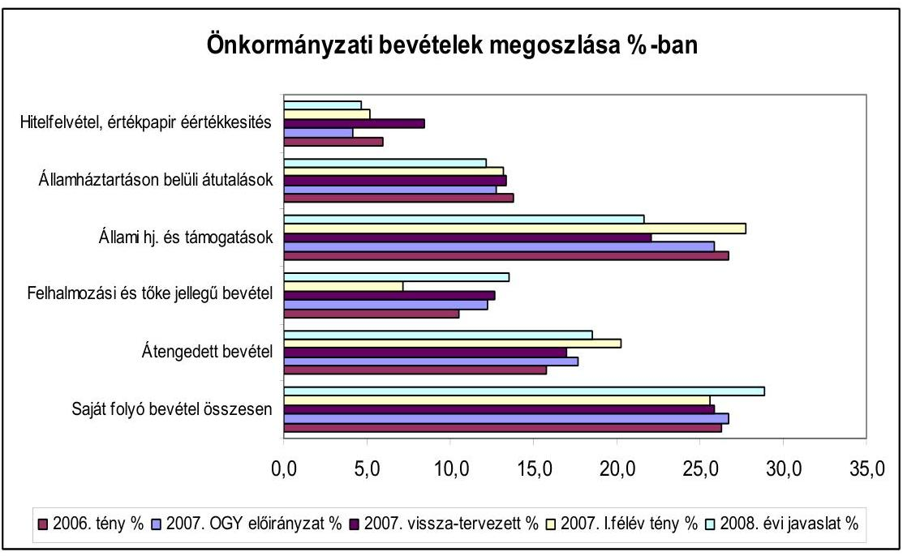

---

Az intézményi múködési bevételek 2007. évi országgyúlési előirányzathoz viszonyított $1,1 \%$-os tervezett növekedése az előző évek teljesítései dinamikáját és az infláció mértékét sem éri el. A helyi önkormányzatok 2007. évi költségvetésében visszatervezett múködési bevételhez képest azonban a javasolt előirányzat $15 \%$-os növekménnyel számol, amely megfelelő indokolással nincs alátámasztva.

A helyi önkormányzatok és intézmények a saját bevételek alultervezésben való érdekeltségét az ÖNHIKI-s támogatás igénybevételi szabályainak szigorodása az elmúlt években csökkentette és a tárgyévi bevételek reálisabb tervezésére ösztönözte. Az önkormányzat számított forráshiányát csökkenti az intézményi múködési bevételek inflációval növelt mértéke alatti növekménye. Ha az önkormányzat tárgyévben teljesített múködési célú intézményi bevételei és önkormányzati sajátos - személyi jövedelemadó nélküli - múködési bevételei együttesen meghaladják a támogatásnál e jogcímeken figyelembe vett múködési bevételeket, akkor a figyelembe vett múködési célú intézményi bevétel $20 \%$-át meghaladó többletbevétel $20 \%$-ának összegével és jövedelemadó nélküli múködési bevétel $10 \%$-át meghaladó többletbevétel összegével megegyező támogatást a központi költségvetés javára vissza kell fizetnie.

Az összes intézményi térítési díj bevétel 2006. évben 202,6 milliárd Ft volt, amelynek nagyobb része a szociális és közoktatási intézmények ellátottai, alkalmazottai térítési díj befizetéséből származik. Ennek összege több tényezőtől függően változik (pl. az adott intézményre vonatkozó térítési dí előirásoktól, az igénybevevők számától, a szolgáltatás önköltségétől, kedvezmények, mentességek körétől, mértékétől, így az ingyenes étkeztetés 2008. évre javasolt bővítése az általános iskola 5 évfolyamán csökkenti, a szociális alapszolgáltatások területén az ellátotti létszám növelése, az önköltségen alapuló térítési díjaknál az infláció növeli a múködési bevételeket).

A helyi önkormányzatokat (fővárosi, megyei, megyei jogú városi önkormányzatokat) megillető illetékbevétel tervezett összege a 2007. évi országgyúlési előirányzatot 1,6 milliárd Ft-tal (2,6\%-kal), a várható 2007. évi teljesítést azonban 5,6 milliárd Ft-tal ( $9,6 \%$-kal) haladja meg.

A PM által a törvényjavaslat indokolásához készített munkaanyag szerint az illetékbevételt alapvetően az ingatlanértékek fogyasztói árszínvonal változáshoz közelítő növekedése befolyásolja. Az ingatlanforgalom, forgalmi érték változás területenkénti (főváros, egyes megyék) sajátosságai azonban nem kerültek bemutatásra, így annak egyes önkormányzatokra gyakorolt hatása sem ismert. Nem szerepel a tervezéssel kapcsolatos munkaanyagban az illetékhivatalok integrációjának eredményeként elért hatékonyság javulás (Pl. kiszabás, behajtás eredményességének változása) értékelése, valamint az illetékbeszedésével kapcsolatos költségek alakulása sem.

Az illetékbeszedés feladatait ez évtől az APEH végzi, a beszedett illetékből a központi költségvetést és az önkormányzatokat megillető bevétel megosztása a 2007. évi költségvetési törvényben meghatározott módon történik. Az önkormányzatokat megillető $50 \%$-ból az illetékbeszedés költségei címén a fővárosnál $4 \%$-nak, a megyei és megyei jogú városi önkormányzatoknál 8,5\%-nak megfelelő rész kerül visszatartásra. Az átszervezés kezdeti nehézségeivel indokolt alulteljesítés (az önkormányzatok által visszatervezett illetékbevétel 38,6\%-a realizálódott az I. félévben) az érintett önkormányzatoknál 6,6 milliárd Ft bevételkiesést és ennek

---

megfelelő pénzellátási nehézséget okozott, ezért az önkormányzatok szemszögéből nézve az integráció eredményei még ellentmondásosak..

A helyi adók 2008. évi tervezése során a PM munkaanyaga szerint az elmúlt évek növekedését vették alapul és a helyi iparűzési adónál a 2008. évtől megszűnő, korábban az önkormányzatok által adott kedvezmények, adómentességek megszűnésének, valamint a gazdasági növekedés és az áremelkedések hatásával számoltak. Ezzel az indokolással a helyi adó bevételi előirányzatot a 2007. évi várható 502,4 milliárd Ft-hoz képest 12\%-kal, 562,5 milliárd Ft-ra emelték. A helyi adót érintően 2008. évre vonatkozóan jogszabályi változással nem számoltak, erre vonatkozó törvénymódosítási javaslat nem került benyújtásra.

Az önkormányzatok 2007. évre a PM által javasolt országgyűlési előirányzattal (450,2 milliárd Ft) közel azonos összegű helyi adót terveztek ( 455 milliárd Ft), amely a 2006. évi teljesített helyi adót 1,3\%-kal haladta meg, az I. félévi teljesítés $46,2 \%$-os volt.

A helyi önkormányzatok 98\%-a döntött már valamilyen helyi adónem bevezetéséről. Az adómértékek megállapításában a helyi adók jelenlegi rendszerében nincs számottevő tartalék ${ }^{41}$. A 2008. évi inflációs előrejelzéseket és gazdasági növekedést alapul véve a helyi adókon belül $85 \%$-os részarányt képviselő helyi iparűzési adóban a kedvezmények, mentességek megszűnésének hatásán túl a 2007. évi tervezett iparűzési adóval szemben 20,7\%-kal magasabb előirányzattal számolni a tervezés szempontjából kockázatot hordoz magában.

A felhalmozási és tőke jellegú bevételek 460 milliárd Ft-os előirányzatán belül az önkormányzati vagyon, a részvények, részesedések értékesítéséből származó bevételek aránya a 2006. évi 30\%-ról 2007. évben 26,5\%-ra, 2008. évi javaslat szerint $21,7 \%$-ra csökkent, amely jelzi az értékesíthető önkormányzati vagyonelemekben bekövetkezett változást. Az európai uniós támogatás és az ehhez kapcsolódó központi költségvetésből igénybe vehető hazai társfinanszírozás és fejezeti támogatás az előző évhez hasonlóan tovább növekszik (58 milliárd Ft-tal).

A támogatások lehívásának mértéke a jóváhagyott programok megvalósításának ütemétől függ. A 2007. I. félévi beszámolók szerint a keretnek csupán 20\%-a került felhasználásra, a PM számításai szerinti 77\%-os várható teljesítéshez a fejlesztések megvalósítását gyorsítani szükséges.

A tervezet szerint a felhalmozási és tőke jellegű bevételek és a fejlesztési célú állami támogatások 2008. évben 61\%-ban fedezik a felhalmozási és tőke jellegű kiadásokat.

[^0]
[^0]:    ${ }^{41}$ A 0726 sz. Jelentés a helyi és helyi kisebbségi önkormányzatok gazdálkodási rendszerének 2006. évi átfogó és egyéb szabályszerűségi ellenőrzéséről szerint az önkormányzatok az iparűzési adó maximális mértékének átlag 94\%-át állapították meg, ezen belül az önkormányzatok 69\%-a az adómaximumot állapította meg.

---

A 2006. évi beszámolók szerint a felhalmozási és tőke jellegű kiadások 341,8 milliárd Ft-tal ( $50 \%$-kal) haladták meg az ilyen célú bevételeket, a 2007. évi várható teljesítés alapján ez $44 \%$-ra csökken. Ez a forrásigény a helyi adó bevételek növekvő hányadának felhalmozási célú igénybevétele mellett a hitelfelvétel, kötvénykibocsátás emelkedésével is járt. A hitelfelvételre, kötvénykibocsátásra azonban nem csak fejlesztések finanszírozása érdekében kerül sor, amely az adósságállomány újratermelődéséhez, növekvő eladósodáshoz vezethet.

Az államháztartáson belüli átutalások tervezett 412,5 milliárd Ft-os öszszege a 2007. évi tervezetthez viszonyítva csekély mértékben változik ( $0,4 \%$-kal növekszik). Ezen belül az Egészségbiztosítási Alapból az egészségügyi szolgáltatások finanszírozására átutalt támogatás nominálértéke is csupán $0,9 \%$-kal emelkedik, amely elsősorban a kórházak gazdálkodását érinti kedvezőtlenül.

Budapest, 2007. október 11.

---

.

---

MELLÉKLETEK

---

.

---

# KIMUTATÁS

az átengedett személyi jövedelemadó és önkormányzati támogatások rendelkezési jogosultság szerinti megoszlásáról (adatok millió Ft-ban)

|  Forrás megnevezése | Konkrét feladathoz nem rendelt előirányzat |  |  |  |  |  |  |  |  |  |  |  |  |  |  |  |  |  |  |  |  |  |  |  |  |  |  |  |  |  |  |  |  |  |  |  |  |  |  |  |  |  |  |  |  |  |  |  |  |   |
| --- | --- | --- | --- | --- | --- | --- | --- | --- | --- | --- | --- | --- | --- | --- | --- | --- | --- | --- | --- | --- | --- | --- | --- | --- | --- | --- | --- | --- | --- | --- | --- | --- | --- | --- | --- | --- | --- | --- | --- | --- | --- | --- | --- | --- | --- | --- | --- | --- | --- | --- | --- |
|   | 2002. | 2003. | 2004. | 2005. | 2006. | 2007. | 2008. | 2002. | 2003. | 2004. | 2005. | 2006. | 2007. | 2008. | 2002. | 2003. | 2004. | 2005. | 2006. | 2007. | 2008. | 2002. | 2003. | 2004. | 2005. | 2006. | 2007. | 2008. | 2002. | 2003. | 2004. | 2005. | 2006. | 2007. | 2008. |  |  |  |  |  |  |  |  |  |   |
|  SZJA |  |  |  |  |  |  |  |  |  |  |  |  |  |  |  |  |  |  |  |  |  |  |  |  |  |  |  |  |  |  |  |  |  |  |  |  |  |  |  |  |  |  |  |  |  |  |  |  |   |
|  helyben maradó | 41745 | 101275 | 113932 | 116408 | 118413 | 102649 | 113060 | 0 | 0 | 0 | 0 | 0 | 0 | 0 | 0 | 0 | 0 | 0 | 0 | 0 | 0 | 0 | 0 | 0 | 0 | 0 | 0 | 0 | 0 | 0 | 0 | 0 | 0 | 0 | 0 | 0 | 0 | 0 | 0 | 0 | 0 | 0 | 0 | 0 | 0 | 0 | 0  |
|  kiegészítés | 54769 | 79500 | 89615 | 96732 | 100160 | 106485 | 107125 | 0 | 0 | 0 | 0 | 0 | 0 | 0 | 0 | 0 | 0 | 0 | 0 | 0 | 0 | 0 | 0 | 0 | 0 | 0 | 0 | 0 | 0 | 0 | 0 | 0 | 0 | 0 | 0 | 0 | 0 | 0 | 0 | 0 | 0 | 0 | 0 | 0 | 0 | 0  |
|  norm. feladatokra | 0 | 0 | 0 | 0 | 0 | 0 | 0 | 0 | 222969 | 197061 | 222457 | 221291 | 221514 | 236229 | 345111 | 14475 | 27263 | 29724 | 31196 | 33567 | 67883 | 0 | 237444 | 224324 | 252181 | 252487 | 255081 | 304112 | 345111 |  |  |  |  |  |  |  |  |  |  |  |  |  |  |  |  |  |  |   |
|  Norm. hj. | 0 | 0 | 0 | 0 | 0 | 0 | 0 | 0 | 337998 | 515499 | 522952 | 549060 | 520298 | 514466 | 348466 | 0 | 0 | 0 | 0 | 0 | 0 | 0 | 0 | 0 | 0 | 0 | 0 | 0 | 0 | 0 | 0 | 0 | 0 | 0 | 0 | 0 | 0 | 0 | 0 | 0 | 0 | 0 | 0 | 0 | 0 | 0 | 0  |
|  színházl tám. | 0 | 0 | 0 | 0 | 0 | 0 | 0 | 0 | 0 | 0 | 0 | 0 | 0 | 0 | 0 | 6556 | 10414 | 10504 | 11333 | 10810 | 10810 | 10810 | 6556 | 10414 | 10504 | 11333 | 10810 | 10810 | 10810 |  |  |  |  |  |  |  |  |  |  |  |  |  |  |  |  |   |
|  önhiki | 0 | 0 | 0 | 0 | 0 | 0 | 0 | 0 | 0 | 0 | 0 | 0 | 0 | 0 | 0 | 12900 | 13000 | 13500 | 13470 | 13500 | 14200 | 14200 | 12900 | 13000 | 13500 | 13470 | 13500 | 14200 | 14200 |  |  |  |  |  |  |  |  |  |  |  |  |  |  |  |   |
|  kp. előirányzat | 0 | 0 | 0 | 0 | 0 | 0 | 0 | 0 | 0 | 0 | 0 | 0 | 0 | 0 | 0 | 14741 | 20014 | 53789 | 94450 | 63954 | 98724 | 109313 | 14741 | 20014 | 53789 | 94450 | 63954 | 98724 | 109313 |  |  |  |  |  |  |  |  |  |  |  |  |  |  |  |   |
|  Tűzoltóságok tám.* | 0 | 0 | 0 | 0 | 0 | 0 | 0 | 0 | 0 | 0 | 0 | 0 | 0 | 0 | 0 | 4000 | 0 | 0 | 0 | 0 | 0 | 0 | 0 | 0 | 0 | 0 | 0 | 0 | 0 | 0 | 0 | 0 | 0 | 0 | 0 | 0 | 0 | 0 | 0 | 0 | 0 | 0 | 0 | 0  |
|  Norm kötött fh.lám | 0 | 0 | 0 | 0 | 0 | 0 | 0 | 0 | 0 | 0 | 0 | 0 | 0 | 0 | 0 | 85552 | 93817 | 97277 | 119162 | 107328 | 57429 | 164567 | 85552 | 93817 | 97277 | 119162 | 107328 | 57429 | 164567 |  |  |  |  |  |  |  |  |  |  |  |  |  |  |   |
|  Címzett- és céltám | 0 | 0 | 0 | 0 | 0 | 0 | 0 | 0 | 0 | 0 | 0 | 0 | 0 | 0 | 0 | 58300 | 56505 | 64255 | 63755 | 63800 | 57500 | 53000 | 58300 | 56505 | 64255 | 63755 | 63800 | 57500 | 53000 |  |  |  |  |  |  |  |  |  |  |  |  |  |  |   |
|  Fejl. és vis maior t. | 0 | 0 | 0 | 0 | 0 | 0 | 0 | 0 | 0 | 0 | 0 | 0 | 0 | 0 | 0 | 17117 | 17117 | 17117 | 17117 | 11110 | 11230 | 11230 | 1717 | 17117 | 17117 | 17117 | 11110 | 11230 | 11230 |  |  |  |  |  |  |  |  |  |  |  |  |  |   |
|  Bp-i 4-es métró | 0 | 0 | 0 | 0 | 0 | 0 | 0 | 0 | 0 | 0 | 0 | 0 | 0 | 0 | 0 | 0 | 0 | 15800 | 15800 | 15800 | 65550 | 16200 | 0 | 0 | 15800 | 15800 | 15800 | 65550 | 16200 |  |  |  |  |  |  |  |  |  |  |  |  |  |   |
|  Kistériségek tám. | 0 | 0 | 0 | 0 | 0 | 0 | 0 | 0 | 0 | 0 | 0 | 0 | 0 | 0 | 0 | 0 | 0 | 0 | 0 | 0 | 0 | 0 | 0 | 0 | 0 | 0 | 0 | 0 | 0 | 0 | 0 | 0 | 0 | 0 | 0 | 0 | 0 | 0 | 0 | 0 | 0 | 0 | 0  |
|  Összesen | 96514 | 180775 | 203547 | 213138 | 218573 | 209134 | 220189 | 560967 | 712560 | 745359 | 770351 | 741812 | 750695 | 693577 | 213641 | 238130 | 301966 | 366283 | 328869 | 389126 | 385120 | 871121 | 1131465 | 1250872 | 1349772 | 1289254 | 1348955 | 1298886 |  |  |  |  |  |  |  |  |  |  |  |  |  |   |
|  Megoszlás | 11,1 | 16,8 | 16,3 | 15,6 | 17,6 | 15,5 | 17,6 | 64,4 | 63,0 | 59,6 | 57,1 | 57,5 | 55,7 | 53,4 | 24,5 | 21,0 | 24,1 | 27,1 | 25,5 | 28,8 | 29,7 | 100,0 | 100,0 | 100,0 | 100,0 | 100,0 | 100,0 | 100,0 | 100,0 |  |  |  |  |  |  |  |  |  |  |  |  |   |
|  Megjegyzés: |  |  |  |  |  |  |  |  |  |  |  |  |  |  |  |  |  |  |  |  |  |  |  |  |  |  |  |  |  |  |  |  |  |  |  |  |  |  |  |  |  |  |   |

- SZJA-ba átkerült

---

# A normatív hozzájárulások jogcímenkénti és ágazatonkénti előirányzatainak változása 

| Sorszám | Megnevezés | 2007. évi törvényi előirányzat | 2008. évi OGY előirányzat | változás |  |
| :--: | :--: | :--: | :--: | :--: | :--: |
|  |  |  |  | 2007. évi törvényi előir-hoz |  |
|  |  |  |  | Összeg | \% |
| 1 | Települési önkorm-ok feladatai | 20 394,4 | 20 950,1 | 555,7 | 102,7 |
| 2 | Körzeti igazgatás | 11018,3 | 11 121,2 | 102,9 | 100,9 |
| 3 | Körjegyzőség müködése | 5424,8 | 5619,0 | 194,2 | 103,6 |
| 4 | Megyei, fővárosi önkorm-ok feladatai | 2879,5 | 2877,1 | $-2,4$ | 99,9 |
| 5 | Lakott külterülettel kapcs. feladatok | 1141,3 | 1149,0 | 7,7 | 100,7 |
| 6 | Lakossági tel. foly. hull.ártalmatlanítása. | 268,4 | 171,3 | $-97,1$ | 63,8 |
| 7 | Társ.gazd.és infrastukt.szemp. elmaradott, ill. súlyos fogl. gondokkal küzdő települ. | 5520,0 | 5512,1 | $-7,9$ | 99,9 |
| 8 | Üdülőhelyi feladatok. | 8138,8 | 8293,6 | 154,8 | 101,9 |
| Tel.üzemelt, igazg. sport. össz. (1-8) |  | 54785,5 | 55693,4 | 907,9 | 101,7 |
| 9 | Pénzbeli szoc.és gy.jóléti ellátás | 62318,8 | 68774,6 | 6455,8 | 110,4 |
|  | Lakáshoz jutás feladatai | 14236,9 | 0,0 | $-14236,9$ | 0,0 |
| 11 | Szoc. és gyerm. jóléti alapszolg. feladatok | 28312,6 | 34228,0 | 5915,4 | 120,9 |
| 12 | Szoc. és gyv. bentlak. és átm. elhelyezés | 57401,6 | 57200,2 | $-201,4$ | 99,6 |
| 13 | Hajléktalanok átmeneti intézményei | 1873,7 | 1880,6 | 6,9 | 100,4 |
| 14 | Gyermekek napközbeni ellátása | 10618,2 | 10741,0 | 122,8 | 101,2 |
| Szoc.és gyermj ell.össz. (9-14) |  | 174761,8 | 172824,4 | $-1937,4$ | 98,9 |
| 15 | Közoktatási alaphozzájárulás | 327352,7 | 329488,6 | 2135,9 | 100,7 |
| 16 | Közoktatási kiegészítő hozzájárulások | 101344,3 | 72905,6 | $-28438,7$ | 71,9 |
| 17 | Szociális juttatások, egyéb hozzájárulások | 29538,4 | 33101,4 | 3563,0 | 112,1 |
| Közoktatási jogcímek 15-17-ig össz.* |  | 458 235,4 | 435495,6 | $-22739,8$ | 95,0 |
| 10.a | Helyi közműv. és közgyűjt. feladatok | 11552,5 | 11534,0 | $-18,5$ | 99,8 |
| 10.b | Megyei/föv-i közm. és kgy. feladatok | 5651,3 | 5669,3 | 18,0 | 100,3 |
| Közmüvelődés össz.(10a+10b) |  | 17203,8 | 17203,3 | $-0,5$ | 100,0 |
| MINDÖSSZESEN |  | 704 986,5 | 681216,7 | $-23769,8$ | 96,6 |

A mindösszesenből:
állami támogatás
SzJA
$514466,1 \quad 348466,0 \quad-166000,1 \quad 67,7$
$190520,4 \quad 332750,7 \quad 142230,3 \quad 174,7$

A közoktatási hozzájárulások célok szerinti részletezését, valamint a hozzájárulások és támogatások együttes alakulását a 2/a. számú melléklet mutatja be.

---

A közoktatás normatív hozzájárulásainak és támogatásainak alakulása

|  Sor-   szám | Megnevezés | 2007. évi törvényi előirányzat | 2008.évi OGY előirányzat | millió forintban |  |  |   |
| --- | --- | --- | --- | --- | --- | --- | --- |
|   |  |  |  | 2007. évi törvényi előir-hoz |  |  |   |
|   |  |  |  | Összeg |  | \% |   |
|   | Óvodai nevelés | 64689,5 | 71152,9 | 6463,4 |  | 110,0 |   |
|   | Iskolai oktatás + elméleti szakképzés | 262663,2 | 251121,5 | $-11541,7$ |  | 95,6 |   |
|   | Alapfokú művészetoktatás | 0,0 | 2261,3 | 2261,3 |  |  |   |
|   | Kollégiumi, externátusi nevelés, ell. | 0,0 | 2479,1 | 2479,1 |  |  |   |
|   | Napközi,vagy tanulószobai foglalk., isk.-otthonos oktatás,nevelés | 0,0 | 2473,8 | 2473,8 |  |  |   |
|  15 | Közokt. alaphozzájár. össz. | 327352,7 | 329488,6 | 2135,9 |  | 100,7 |   |
|   | Iskolai szakmai gyakorlati oktatás, szakképzés | 9732,3 | 10392,1 | 659,8 |  | 106,8 |   |
|   | Alapfokú művészetoktatás | 10658,7 | 6841,1 | $-3817,6$ |  | 64,2 |   |
|   | Kollégiumok közoktatási feladatai | 21105,0 | 14139,6 | $-6965,4$ |  | 67,0 |   |
|   | Sajátos nevelési igényű gyerm. tanulók nevelése, oktatása | 28414,2 | 18414,8 | $-9999,4$ |  | 64,8 |   |
|   | Általános iskolai napközis foglalkozás | 7731,3 | 5154,2 | $-2577,1$ |  | 66,7 |   |
|   | Különleges helyzetben levő gyermekek, tanulók támogatása | 1448,0 | 0,0 | $-1448,0$ |  | 0,0 |   |
|   | Nem magyar nyelven folyó nevelés és oktatás, valamint a roma kisebbségi oktatás | 4457,2 | 4463,9 | 6,7 |  | 100,2 |   |
|   | Nemzetiségi nyelvű, két tanítási nyelvű oktatás, nyelvi előkészítő oktatás | 3185,2 | 3245,1 | 59,9 |  | 101,9 |   |
|   | Hozzájárulás pedagógiai szakmai szolgáltatások igénybevételéhez | 746,4 | 0,0 | $-746,4$ |  | 0,0 |   |
|   | Egyes pedagógiai programok támogatása | 540,9 | 1900,0 | 1359,1 |  | 351,3 |   |
|   | Hozzájárulás egyes közoktatási intézményeket fenntartó önkorm. feladatellátásához | 13325,1 | 8354,8 | $-4970,3$ |  | 62,7 |   |
|  16 | Közoktatási kiegészítő hozzájárulások összesen | 101344,3 | 72905,6 | $-28438,7$ |  | 71,9 |   |
|   | Kedvezményes óvodai, iskolai, kollégiumi étkeztetés | 23105,7 | 23284,8 | 179,1 |  | 100,8 |   |
|   | A tanulók tankönyvellátásának támogatása | 6432,7 | 6357,9 | $-74,8$ |  | 98,8 |   |
|   | Kollégiumi szállásbiztosítás | 0,0 | 3458,8 | 3458,8 |  |  |   |
|  17 | Szociális juttatások, egyéb szolgáltatások | 29538,4 | 33101,5 | 3563,1 |  | 112,1 |   |
|   | Közoktatási normatív hozzájárulások össz.: (15+16+17) | 458235,4 | 435495,7 | $-22739,7$ |  | 95,0 |   |

---

| A közoktatási hozzájárulások és támogatások együttes alakulása |  |  |  |  |
| :-- | --: | --: | --: | --: |
|  | Normatív hozzájárulások | 458235,4 | 435495,6 | $-22739,8$ | 95,0 |
|  | Normatív, kötött közokt normatívák | 6904,1 | 6293,9 | $-610,2$ | 91,2 |
|  | Közoktatási normatívák együtt | $\mathbf{4 6 5 1 3 9 , 5}$ | $\mathbf{4 4 1 7 8 9 , 5}$ | $\mathbf{- 2 3 3 5 0 , 0}$ | $\mathbf{9 5 , 0}$ |
|  | Kistérségi közoktatás | 9176,2 | 9176,2 | 0,0 | 100,0 |
|  | Közoktatási célú normatívák együtt | $\mathbf{4 7 4 3 1 5 , 7}$ | $\mathbf{4 5 0 9 6 5 , 7}$ | $\mathbf{- 2 3 3 5 0 , 0}$ | $\mathbf{9 5 , 1}$ |
|  | Központosított előirányzatokból |  |  |  |  |
|  | közoktatási célú támogatás | 11220,0 | 12070,0 | 850,0 | 107,6 |
|  | IX fejeteti közoktatás összesen | $\mathbf{4 8 5 5 3 5 , 7}$ | $\mathbf{4 6 3 0 3 5 , 7}$ | $\mathbf{- 2 2 5 0 0 , 0}$ | $\mathbf{9 5 , 4}$ |

---

# A normatív, kötött felhasználású támogatások jogcímenkénti és ágazatonkénti előirányzatainak változása

|  Sor-
szám | Megnevezés | 2007. évi törvényi előirányzat | 2008.évi OGY előirányzat |  |   |
| --- | --- | --- | --- | --- | --- |
|   |  |  |  |  | 2007. évi törvényi előir-hoz  |
|   |  |  |  |  | Összeg  |
|  1 | Pedag. szakvizsga, továbbk.felk. | 1787,0 | 1717,8 |  | $-69,2$  |
|  2 | A főv. és megyei közalap. sz. tev. | 1690,9 | 1000,0 |  | $-690,9$  |
|  3 | Pedagógiai szakszolgálat | 3426,2 | 3576,1 |  | 149,9  |
|  I.Közoktatási feladatok összesen |  | 6904,1 | 6293,9 |  | $-610,2$  |
|  1 | Egyes jöv. pótló támogatások | 83655,7 | 87759,0 |  | 4103,3  |
|  2 | Közfoglalkoztatás támogatása | 15120,0 | 15073,7 |  | $-46,3$  |
|  3 | Szoc. továbbképzés szakvizsga | 331,4 | 335,9 |  | 4,5  |
|  II. Egyes szoc feladatok tám. összesen |  | 99107,1 | 103168,6 |  | 4061,5  |
|  III. Helyi önk. hív tüzoltóságok tám |  | 33504,1 | 35504,1 |  | 2000,0  |
|  IV. Többcélú kistérségi társulások tám. |  | 19300,0 | 19600,0 |  | 300,0  |
|  MINDÖSSZESEN |  | 158815,3 | 164566,6 |  | 5751,3  |
|  A mindösszesenből:
- Állami hozzájárulás
- Személyi jövedelemadó |  | $\begin{gathered} 57428,6 \ 101386,7 \end{gathered}$ | $\begin{gathered} 164566,6 \ 0,0 \end{gathered}$ | $\begin{gathered} 107138,0 \ -101386,7 \end{gathered}$ | $\begin{gathered} 286,6 \ 0,0 \end{gathered}$  |

A többcélú kistérségi társulások támogatásának ágazati összetételele:

|   | Igazgatási feladatok | 5492,8 | 5492,8 | 0,0 | 100,0  |
| --- | --- | --- | --- | --- | --- |
|   | Kultúrális feladatok | 800,0 | 800,0 | 0,0 |   |
|   | Közoktatási feladatok | 9176,2 | 9176,2 | 0,0 | 100,0  |
|   | Szociális ellátási feladatok | 3831,0 | 4131,0 | 300,0 | 107,8  |
|  Többcélú kistérségi társulások feladatellátása összesen |  | 19300,0 | 19600,0 | 300,0 | 101,6  |

---

# A központosított előirányzatú támogatások jogcímeinek és összegeinek változása 

(millió Ft-ban)

| Sorszám | Megnevezés | 2007. évi törvényi előirányzat | 2008.évi OGY előirányzat | változás |  |
| :--: | :--: | :--: | :--: | :--: | :--: |
|  |  |  |  | 2007. évi törvényi előir-hoz |  |
|  |  |  |  | Összeg | \% |
| 1 | Lakossági közmúfejlesztés támogatása | 3000,0 | 3000,0 | 0,0 | 100,0 |
| 2 | Lakossági víz- és csatornaszolgáltatás támogatása | 4800,0 | 4800,0 | 0,0 | 100,0 |
| 3 | Kompok, révek fenntartásának, felújításának támogatása | 150,0 | 150,0 | 0,0 | 100,0 |
| 4 | Határátkelőhelyek fenntartásának támogatása | 85,0 | 85,0 | 0,0 | 100,0 |
| 5 | Települési és területi kisebbségi önkormányzatok múködésének általános támogatása | 1337,9 | 1557,9 | 220,0 | 116,4 |
| 6 | Kiegészítő támogatás nemzetiségi nevelési, oktatási feladatokhoz | 1100,0 | 1100,0 | 0,0 | 100,0 |
| 7 | Könyvtári és közművelődési érdekeltségnövelő támogatás, múzeumok szakmai támogatása | 710,0 | 710,0 | 0,0 | 100,0 |
| 8 | Helyi önkormányzatok hivatásos zenekari és énekkari támogatása | 1010,0 | 1010,0 | 0,0 | 100,0 |
| 9 | Helyi szervezési intézkedésekhez kapcsolódó többletkiadások tám. | 9090,0 | 9090,0 | 0,0 | 100,0 |
| 10 | Özdi martinsalak felhasználása miatt kárt szenvedett lakóépületek tulajdonosainak kártalanítása | 600,0 | 600,0 | 0,0 | 100,0 |
| 11 | A 2007. évi jövedelem-differenciálódás mérséklésénél beszámítással érintett önkormányzatok támogatása | 7200,0 | 7200,0 | 0,0 | 100,0 |
| 12 | Önkormányzatok és jogi személyiségủ társulásaik európai uniós fejlesztési pályázatai saját forrás kiegészítésének támogatása | 10100,0 | 15100,0 | 5000,0 | 149,5 |
| 13 | A helyi közösségi közlekedés normatív támogatása | 35240,0 | 35240,0 | 0,0 | 100,0 |
| 14 | Települési önkormányzati szilárd burkolatú belterületi közutak burkolatfelújításának támogatása | 8000,0 | 8000,0 | 0,0 | 100,0 |
| 15 | A szakmai vizsgák lebonyolításának támogatása | 470,0 | 470,0 | 0,0 | 100,0 |
| 16 | Esélyegyenlőséget, felzárkóztatást segítő támogatások | 2600,0 | 2800,0 | 200,0 | 107,7 |

---

| Sorszám | Megnevezés | 2007. évi törvényi előirányzat | 2008.évi OGY előirányzat | változás |  |
| :--: | :--: | :--: | :--: | :--: | :--: |
|  |  |  |  | 2007. évi törvényi elöir-hoz |  |
|  |  |  |  | Összeg | \% |
| 17 | Hivatásos önkormányzati tűzoltóságok kiegészítő támogatása | 1930,0 | 2200,0 | 270,0 | 114,0 |
| 18. | Közoktatás-fejlesztési célok támogatása |  |  | 0,0 |  |
| a. | Szakmai és informatikai fejlesztési feladatok | 5000,0 | 5000,0 | 0,0 | 100,0 |
| b. | Minőségbiztosítás, mérés, értékelés, ellenőrzés támogatása | 300,0 | 600,0 | 300,0 | 200,0 |
| c. | Teljesítménymotívációs pályázati alap | 1000,0 | 700,0 | $-300,0$ | 70,0 |
| 19. | Egyes szociális szolgáltatások kiegészítő támogatása | 150,9 | 100,0 | $-50,9$ | 66,3 |
|  | Egyes pedagógiai szakszolgáltatások támogatása | 400,0 | 0,0 | $-400,0$ | 0,0 |
| 20. | Belterületi utak szilárd burkolattal való ellátásának támogatása | 2500,0 | 2500,0 | 0,0 | 100,0 |
| 21. | A vizitdíj visszatérítésének támogatása | 100,0 | 100,0 | 0,0 | 100,0 |
| 22. | Az alapfokú művészetoktatás támogatása | 350,0 | 1400,0 | 1050,0 | 400,0 |
|  | Belterületi vízrendezési célok támogatása | 1500,0 | 0,0 | $-1500,0$ | 0,0 |
| 23. | A kistelepülési iskolák és körjegyzőségek tárgyi feltételeinek javítása, valamint közösségi buszok beszerzése | 0,0 | 3500,0 | 3500,0 |  |
| 24. | 2006. év tavaszán kialakult árvíz és belvíz miatti károk enyhítése | 0,0 | 1100,0 | 1100,0 |  |
| 25. | Nyári gyermekétkeztetés | 0,0 | 1200,0 | 1200,0 |  |
|  | Központosított előirányzatok összesen: | 98723,8 | 109 312,9 | 10589,1 | 110,7 |

** 2007. szeptember 1-jétől (az előző év és a 2007. évből nyolc hónap a normatív támogatásokban szerepel).

---

Az önkormányzatok 2008. évi fejlesztési célú támogatásainak alakulása
(millió Ft-ban)

| $\underset{\text { szám }}{ }$ | Megnevezés | 2007. évi törvényi előirányzat | 2008. évi javaslat | Változás (2008/2007) |  |
| :--: | :--: | :--: | :--: | :--: | :--: |
| I. | IX. Helyi önkormányzatok támogatása fejezetben tervezett előirányzatok |  |  | összegben | \%-ban |
|  | 1.) | Címzett- és céltámogatás | 57500,0 | 53000,0 | $-4500,0$ | 92,2 |
|  |  | ebből az új induló céltámogatások | 200,0 | 200,0 | 0,0 | 100,0 |
|  | 2.) | Helyi önkormányzatok fejlesztési és vis major feladatainak támogatása | 10870,0 | 10870,0 | 0,0 | 100,0 |
|  |  | ebből vis major feladatok ellátása | 800,0 | 800,0 | 0,0 | 100,0 |
|  | 3.) | Vis maior tartalék | 360,0 | 360,0 | 0,0 | 100,0 |
|  | 4.) | Budapest 4-es metróvonal építésének támogatása | 65550,0 | 16200,0 | $-49350,0$ | 24,7 |
|  | 5.) | Leghátrányosabb helyzetű kistérségek felzárkóztatásának támogatása | 5800,0 | 5800,0 | 0,0 | 100,0 |
|  | 6.) | Központosított előirányzatként tervezett fejlesztési célú támogatások összesen | 31550,0 | 41150,0 | 9600,0 | 130,4 |
|  | a.) | lakossági közműfejlesztés támogatása | 3000,0 | 3000,0 | 0,0 | 100,0 |
|  | b.) | kompok, révek felújításának támogatása | 150,0 | 150,0 | 0,0 | 100,0 |
|  | c.) | ózdi martinsalak felhasználása miatt kárt szenvedett lakóépületek tulajdonosainak kártalanítása | 600,0 | 600,0 | 0,0 | 100,0 |
|  | d.) | a 2007. évi jövedelemdifferenciálódás mérséklésénél beszámítással érintett önkormányzatok támogatása | 7200,0 | 7200,0 | 0,0 | 100,0 |
|  | e.) | önkormányzatok és jogi személyiségű társulásaik európai uniós fejlesztési pályázatai saját forrás kiegészítésének támogatása | 10 100,0 | 15 100,0 | 5000,0 | 149,5 |
|  | f.) | települési önkormányzatok szilárd burkolatú belterületi közutak burkolatfelújításának támogatása | 8000,0 | 8000,0 | 0,0 | 100,0 |
|  |  | ebböl: főváros, fővárosi kerületek útfelújítása, legalább | 3490,0 | 3500,0 | 10,0 | 100,3 |
|  | g.) | belterületi utak szilárd burkolattal való ellátásának támogatása | 2500,0 | 2500,0 | 0,0 | 100,0 |
|  |  | ebböl: - fővárosi kerületekben | 2000,0 | 2000,0 | 0,0 | 100,0 |
|  |  | - leghátrányosabb helyzetű kistérségek városaiban | 500,0 | 500,0 | 0,0 | 100,0 |
|  | h.) | közös iskolák, új közjegyző́égek tárgyi feltételeinek javítása | 0,0 | 3500,0 | 3500,0 |  |
|  | i.) | 2006.tavaszán kialakult árvíz és belvíz miatt keletkezett károk enyhítésére | 0,0 | 1100,0 | 1100,0 |  |
| I. Összesen: |  |  | 171630,0 | 127380,0 | $-44250$ | 74,2 |

---

| II. | Decentralizált fejlesztési programok előirányzatai |  |  |  |  |
| :--: | :--: | :--: | :--: | :--: | :--: |
|  | - XI. Önkormányzati és Területfejlesztési Minisztérium fejezetben tervezett terület- és régiófejlesztési celelőirányzat | 15227,4 | 4900,0 | $-10327,4$ | 32,2 |
|  | - LXIX. Kutatási ésTechnológiai Innovációs Alap, regionális innováció támogatása | 4000,0 | 5000,0 | 1000,0 | 125,0 |
| II. Összesen: |  | 19227,4 | 9900,0 | $-9327,4$ | 51,5 |
| FEJLESZTÉSI CÉLÚ TÁMOGATÁSOK ÖSSZESEN: |  | 190 857,4 | 137280,0 | $-53577,4$ | 71,9 |
| Fejlesztési célú támogatás Főváros metró-beruházási programjának támogatása nélkül |  | 125307,4 | 121080,0 | $-4227,4$ | 96,6 |
| ebből: | regionális fejlesztési tanácsok döntési hatáskörébe adott támogatási előirányzat: |  |  |  |  |
|  | összege | 44097,4 | 34770,0 | $-9327,4$ | 78,8 |
|  | aránya (\%) | 35,2 | 28,7 |  |  |

---

.

---

FÜGGELÉK

---

.

---

A helyszíni ellenőrzés befejezésekor a fejezeteknél és a fejezeti jogosítványú költségvetési szerveknél rendelkezésre álló adatok, a 2008. évi költségvetés adatai még nem voltak véglegesek, a tervezési munka még nem zárult le. A makrogazdasági folyamatok kormányzat által a 2008. évre prognosztizált alakulása a tervezési folyamatban úgy tükröződött vissza, hogy hosszan tartó egyeztetések folytak a 2008. évi minisztériumi igények és a költségvetési (pénzügyi) lehetőségek összehangolására.

A 2008. évi költségvetési törvényjavaslat 2007. szeptember 28-án állt rendelkezésünkre. A helyszíni ellenőrzés lezárásakor tapasztaltakhoz viszonyítva egyes területeken jelentős elmozdulások, szerkezeti változások következtek be. Az előbbiekből következően az ellenőrzésnek nem állt módjában a tervezés teljes folyamatát nyomon követni, az előirányzatok megalapozottságát teljes körűen értékelni.

Ez hangsúlyosan érvényes a költségvetési évet követő három év kitekintését rögzítő irányszámokra. A helyszíni ellenőrzés időszakában, a tervezésben részt vevő szervezetek elsősorban a 2008. évi előirányzatok kialakítására koncentráltak, és a következő évek előirányzatai megalapozottságára kisebb hangsúlyt fektettek, lényegében csak a központilag megadott irányszámok visszatervezését végezték el. A költségvetési évet követő három év előirányzatainak kialakítása, az egyeztetések még a költségvetési törvényjavaslat benyújtását követően tovább folytak, így ezen irányszámok megalapozottságáról, teljesíthetőségéről nem állnak rendelkezésünkre információk.

---

# I. ORSZÁGGYŰLÉS 

Az Országgyúlés fejezet (1., 2. és 4. címeinek) 2008. évi költségvetési törvényjavaslat szerinti kiadási előirányzata 17120,5 M Ft , bevételi előirányzata 413,0 M Ft, a támogatási előirányzat $16707,5 \mathrm{M} \mathrm{Ft}$.

A költségvetési javaslatot az Országgyúlés Hivatala, az Állambiztonsági Szolgálatok Történeti Levéltára és a fejezeti kezelésű előirányzatok költségvetése alkotja.

Az OGY fejezet (1., 2. és 4. címei) 2008. évi költségvetési javaslatát - a köriratban, továbbá a vonatkozó jogszabályokban foglaltak alapján - az intézmények, a szakmai és pénzügyi szervezeti egységek együttmúködésével dolgozták ki.

A fejezet felügyeleti szerve a 2008 évi költségvetés tervezésével kapcsolatban levélben intézkedett a felügyelete alá tartozó szervezet felé. A bekért adatszolgáltatás és a felmért, 2007. évi várható teljesítések és előirányzati maradványok alapján, azok figyelembevételével állították össze a költségvetési javaslatot.

Az OGY intézményeinél a szervezeti egységek összevonását, feladatok közös ellátását, az intézményrendszer átalakítását nem látták szükségesnek. A feladatátrendezések a fejezet költségvetési tervezését nem érintették.

A fejezet felügyeleti szerve bevétel növekedéssel nem számolt, az OGY részére meghatározott feladatok végrehajtását alapvetően nem a saját bevételek biztosítják.

Az előirányzati javaslatokat a törvényi kötelezettség teljesíthetőségének megfelelően alakították ki. A fejezeti kezelésű előirányzatokat érintően a fejezet felügyeleti szerve javaslatot tett a költségvetési címrend bővítésére. (Nemzetközi tagdíjak, Kossuth tér rendezése, Képviselőtestület váltással kapcsolatos kiadások.)

A költségvetési javaslatban prognosztizált pénzügyi források várhatóan biztosítják a 2008. évben a fejezet részére meghatározott feladatok végrehajtását.

Az OGY fejezet, ezen belül az OGYH költségvetési tervezését alapvetően determinálja az országgyúlési képviselők tiszteletdíjáról, költségtérítéséről és kedvezményeiről szóló 1990. évi LVI. törvény, illetve az Európai Parlament magyarországi képviselőinek jogállásáról szóló 2004. évi LVII. törvény, amelyek a mindenkori köztisztviselői alapilletmény mértékéhez kötik a juttatások összegét.

Az OGY fejezet (1., 2. és 4. címeinek) 2008. évi kiadási előirányzat javaslata és támogatási többletigénye 563,6 M Ft-tal meghaladja az előző évi eredeti előirányzatot, az előirányzat többletként meghatározott feladatok, kiadások - a Független Rendészeti Panasztestület megalakulása, a megalakuló eseti bizottságok többletigénye és a Kossuth tér parkosítása, energiaadó emelése - együttes hatásaként.

---

Az OGY fejezet (1., 2. és 4. címeinek) létszámirányszáma a 2008. évre az előző évi 1338 fơről 1349 főre nőtt. A 2007. évi XC. törvény alapján a Független Rendészeti Panasztestület megalakulása 11 fős létszámnövekedést eredményezett. Az ÁBTL létszám előirányzata a 2008. évre nem változott.

A személyi juttatások 2008. évi előirányzat javaslata a fejezetnél összesen 101,1 M Ft összeggel meghaladja a bázis év tervszámát. A fejezet 2007. évi eredeti előirányzatát a szerkezeti változások (ÁBTL) és az előirányzati többletek (Független Rendészeti Panasztestület, megalakuló bizottságok többletigénye) módosították. Az ÁBTL a személyi juttatás előirányzatát egyéb kiemelt előirányzatok terhére növelte, így biztosítva a jogszabályban előírt kötelező személyi juttatások fedezetét. Az átcsoportosítást a PM-mel történt egyeztetést és jóváhagyást követően hajtották végre.

A fejezet 2007. évi dologi kiadásainak eredeti előirányzata 3199,6 M Ft-ról 3283,7 M Ft-ra változott. A 2008. évre a dologi kiadási előirányzat az OGYHnál 36,9 M Ft-tal, a fejezeti kezelésű előirányzatoknál 47,2 M Ft-tal növekedett, melyből a Kossuth tér parkosítására 30,0 M Ft-ot terveztek. A fejezet a szellemi tevékenység végzésére történő kifizetés előirányzatát a 2007. évi eredeti előirányzathoz viszonyítva 100,0 E Ft-tal csökkentette.

Az OGY fejezet intézményi beruházásra 864,1 M Ft-ot, felújításra 1163,3 M Ftot, felhalmozási kiadásokra összesen 2027,4 M Ft-ot tervezett.

A felhalmozási kiadásokra az OGYH 1593,9 M Ft-ot, az ÁBTL 38,5 M Ft-ot, a fejezeti kezelésű előirányzatokon belül az eParlamentre 40,0 M Ft-ot, a Kossuth tér rendezésére 355,0 M Ft-ot terveztek. Az OGYH 1153,3 M Ft felújítási előirányzata tartalmazza az Országház külső homlokzati felújítási munkálatainak kiadásait is. Az előirányzati javaslat összeállításánál nem számoltak a felújítások, beruházások elhalasztásával.

A Kormány a 2107/2007. (VI. 13.) határozatában döntött az OGY fejezet kötelezettségvállalással nem terhelt 928,3 M Ft összegű maradványának az OGYH-hoz történő visszahagyásáról. Az összeg kizárólag a Kossuth tér rendezésével kapcsolatban felmerülő kiadások finanszírozását szolgálja.

A fejezet intézményei a dolgozók lakásépítésére és vásárlására kölcsönt nem terveztek 2008-ra. Az új igényekre a korábbi időszakban erre a célra folyósított összegekből befolyt törlesztő-részletek nyújtanak fedezetet.

A fejezet intézményei a 2008. évre a tevékenység jellegéből adódóan a 2007. évi szinten összesen 413,0 M Ft saját bevételt terveztek, amely nagyságrendjét tekintve mindössze a kiadások 2,4\%-át finanszírozza.

A fejezet felügyeleti szerve a 2008. évre a fejezeti kezelésű előirányzatoknál öszszesen 729,3 M Ft kiadási előirányzatot és költségvetési támogatást tervezett. Az előirányzat tervezésénél betartották az Áht. 24. §-ának előírásait, valamint a tervezési köriratban foglaltakat. A fejezeti kezelésű előirányzatok tervezését és felhasználását az Áht. előírásainak megfelelően szabályozták, újra rangsorolásra nem volt szükség.

---

PPP programban a fejezet nem vesz részt, egyéb új induló feladatot (programot) a 2008. évre nem terveztek. Az OGYH-nál négy nemzetközi szervezetben való tagságért fizetnek tagdíjat. A szervezetek között nincs olyan, amelynél megfontolandó lenne a kilépés. A fejezetnél nincs „felülről nyitott" előirányzat. Peres eljárások várhatóan felmerülő kiadásaira nem terveztek előirányzatot.

A fejezetnél nincs közfeladatokat ellátó állami alapítású, illetve részesedésű szervezet. A 2008. évre nem terveztek központi beruházás fejezeti kezelésű előirányzatot, nincs európai uniós társfinanszírozással megvalósuló program és nincs ún. vonal alatti tétel.

A PM-mel történt egyeztetést követően 287,1 M Ft összegű fejezeti egyensúlyi tartalék előirányzatot képeztek a fejezetnél.

A fejezetnél, a PM köriratnak és a jogszabályi előírásoknak megfelelően, kidolgozták a 2009-2011. évek előirányzatait. Szerkezeti változásként figyelembe vették a 2009. évi Európai Parlament magyarországi képviselőinek és a 2010. évi OGY Képviselőtestület ciklusváltását. Az előirányzatokat megfelelő részletezettséggel határozták meg. Az OGY fejezet kiadásainak közel 50\%-a törvényben determinált (OGY Képviselőtestület és az Európai Parlament képviselői), így a gazdasági folyamatok hatása leginkább a szűken vett hivatali kiadásoknál érvényesülhet. A költségtakarékos gazdálkodás szem előtt tartásával, a feladatok rangsorolásával kívánnak eleget tenni a kormányzati törekvéseknek, az OGY működésének veszélyeztetése nélkül.

---

# KÖZBESZERZÉSEK TANÁCSA 

A Közbeszerzések Tanácsa fejezeti jogosítványú költségvetési (autonóm államigazgatási) szerv 2008. évi költségvetési törvényjavaslat szerinti kiadási főöszszege 1809,2 M Ft, saját bevételének előirányzata 1590,0 M Ft és támogatási előirányzata 212,6 M Ft. A KT fejezeti kezelésű előirányzatként 6,6 M Ft fejezeti egyensúlyi tartalékot képzett.

A KT költségvetési javaslatát a tervezési köriratban megfogalmazott követelmények, prioritások és a PM által kidolgozott támogatási irányszámok figyelembevételével állította össze. A költségvetési előirányzatok tartalmi és számszaki levezetésénél érvényesítették a tervezési körirat előirásait.

A KT feladatait a közbeszerzésekről szóló, módosított 2003. évi CXXIX. törvény (Kbt.) szabályozza. A közbeszerzésekről szóló, az európai uniós közbeszerzési irányelvekkel harmonizált új törvény tovább bővítette a KT korábbi szabályozásban meghatározott feladatait, megnövelte a törvényben megfogalmazott tevékenység volumenét. A joganyag az EU csatlakozás utáni, a tagállamként való múködés kormányzati programmal (TMP) összhangban további új feladatokat határozott meg a KT számára. 2008. január 1-jétől a Közbeszerzési Értesítő online módon való megjelentetése is új feladatot jelent az eddigiekhez képest.

Tevékenységének jellegéből adódóan a KT döntően saját bevételből gazdálkodik, ami a 2008. évi költségvetési javaslatban 88,2\%-os arányt képvisel. A költségvetési támogatás mértékét a PM a fejezeti tartalékkal csökkentett előző évi szinten állapította meg. A saját bevételek alapjául szolgáló díjak emelésére jogszabály módosítást a fejezet felügyeleti szerve nem kezdeményezett.

A KT 2008. évi költségvetési javaslatát a tervezési köriratban foglaltak és a fel-adat-változások felmérése alapján kimunkált részletes számításokkal támasztotta alá. A számítások alapján a működőképesség fenntartása és a feladatok végrehajthatósága valószínűsíthető.

A KT az EU csatlakozás utáni, a tagállamként való múködés kormányzati programmal (TMP) összefüggő feladatnövekedés következtében 2008. évre 2 fő létszámbővítési igénnyel, így összesen 85 fő foglalkoztatásával számolt. A személyi juttatások 2008. évi költségvetési előirányzatait az Ámr. 58. §-ában és a tervezési köriratban előírtak alapján állapították meg, az előirányzat tervezett értéke 599,7 M Ft. A 2007. évi eredeti előirányzatot 63,5 M Ft-tal meghaladó kiadás fedezetét a saját bevételekből biztosítják. Az előirányzat-növekmény tervezésénél illetményemeléssel csak a kötelező köztisztviselői átsorolásoknál számoltak, és figyelembe vették a létszám- és feladatnövekedés kiadás növelő hatását is.

A kiemelt előirányzat magában foglalja a rendszeres személyi juttatások 466,2 M Ft-os, a nem rendszeres személyi juttatások 114,0 M Ft-os és az állományba nem tartozók juttatásának 19,5 M Ft-os tervezett összegét. Az állományba nem tartozók juttatásának előirányzatát a 2007. évi várható szinten tervezték, az előirányzat csökkentésével 2009. évtől számolnak.

---

A KT a 2008. évi dologi kiadások előirányzatát a 2007. évi eredeti előirányzatnál ( $972,9 \mathrm{M}$ Ft) 3,7 M Ft-tal magasabbra, 976,6 M Ft-ra tervezte. A dologi kiadásokat a 2007. évi várható kiadásokhoz ( 1235,9 M Ft) képest 259,3 M Ft-tal csökkentik. A dologi kiadások tételeit a szervezet múködésével összehangoltan, az ésszerű takarékosság követelményének érvényesülése mellett, megfelelő számításokkal alátámasztva tervezték meg.

A felhalmozási kiadások 2008. évi előirányzatában érvényesítettek a takarékossági intézkedéseket is, így azt a 2007. évi eredeti előirányzat szintje alatt tervezték meg. A felhalmozási költségvetésen belül a beruházásokat 20,4 M Ftban, a felújításokat 10,8 M Ft-ban határozták meg.

A fejezeti egyensúlyi tartalékot a KT a múködési költségvetéstől elkülönítetten, fejezeti kezelésű előirányzatként önálló alcímen, a PM által meghatározott 6,6 M Ft-os összegben állapította meg.

A fejezet az Áht. 36. § (1) bekezdés c.) pontjának és a tervezési körirat előírásainak megfelelő részletezettségben tervezte meg a költségvetési évet követő 3 év várható előirányzatait. Az előirányzatok kidolgozásánál a pénzügyminiszter által közölt támogatási értékekkel, a saját bevételeinél a 2009-2011. évekre 1-2\%-os mértékű növekedéssel számolt. A kiadási és a bevételi előirányzatokat részletes számításokkal támasztották alá. A tervezés részletezettsége biztosítja az ellenőrizhetőséget és az összehasonlíthatóságot. A tervezésnél figyelemmel voltak a Konvergencia programban és a tervezési köriratban szerepeltetett középtávú költségvetés-politikai irányelvekre, a költségvetési év folyamataira, áthúzódó hatásaira is.

---

# II. KÖZTÁRSASÁGI ELNÖKSÉG 

A Köztársasági Elnökség fejezet 2008. évi költségvetési törvényjavaslat szerinti kiadási előirányzata $1584,1 \mathrm{M}$ Ft, amelynek fedezetét költségvetési támogatás biztosítja. Saját bevételt a fejezet tevékenységének jellegéből következően nem terveztek.

A fejezet feladatrendszere a 2008-2011. években nem változik, ezért nem tettek javaslatot a címrend változtatására. A KE feladatai nem csökkennek, feladatokat más intézménynek nem ad át.

A fejezet 2008. évi támogatási előirányzata a 2007. évi eredeti előirányzathoz képest 74,4 M Ft-tal (4,5\%-kal) kevesebb. A költségvetési támogatás csökkenését a fejezet felügyeletét ellátó hivatalvezető észrevételezte, és egyben részletezte a fejezet gazdálkodásánál várható feszültségpontokat.

A fejezeti kezelésű előirányzatokból tartalékképzésre nincs lehetőség, a 2007. évi adatok és az előrejelzések alapján inkább az előirányzatok növelése lenne indokolt. Ennek megfelelően a támogatási előirányzat 4,4\%-ának (69,9 M Ft) megfelelő mértékben előírt fejezeti egyensúlyi tartalékot az intézményi dologi és a felhalmozási előirányzatokból képezhették csak. Az intézményi kiadások döntő hányadát az illetmények és járulékok a 2000. évi XXXIX. törvény alapján a köztársasági elnökök járandóságaira fordított kiadások, a Béla király úti elnöki rezidencia, valamint a Sándor palota üzemeltetésének kiadásai határozzák meg.

A 2010. évben a köztársasági elnök jelenlegi mandátuma lejár, ennek megfelelően új mandátumú elnök választására kerül sor. Az elnöki ciklusváltás többletkiadásait a KEH a PM-mel történt szóbeli egyeztetés alapján tervezte, a tervezett összeggel a 2010. évre vonatkozó előirányzatokat megemelte.

A fejezet felügyeleti szerve a 2008. év, valamint a 2009-2011. évek várható kiadásait a PM által megadott irányszámok, a tervezési előírások és lehetőségeinek összehangolása alapján reálisan tervezte. Figyelembe véve a fejezet észrevételeit, az intézményi dologi és felhalmozási kiadások, valamint a fejezeti kezelésű előirányzatok 2008-ra és a 2009-2011. évekre tervezett előirányzatai jelentős kockázatot hordoznak.

A Hivatal a személyi juttatások tervezésénél érvényesítette a tervezési körirat előírásait. Személyi juttatásokra - részletes számítások alapján - 426,6 M Ft-ot terveztek, amely az előző évi eredeti előirányzatnál 2,0 M Ft-tal ( $0,5 \%$-kal) több. Ebből 1,9 M Ft a köztisztviselői előresorolások illetményszükségletét biztosítja.

A dologi kiadások tervezésénél csak a támogatási keretszámban rögzített előirányzatot vették figyelembe, mivel saját bevétellel a tervezés során nem számoltak. A 2008. évi dologi kiadások előirányzatát a 2007. évi eredeti előirányzatnál 13,4 M Ft-tal alacsonyabbra, 333,4 M Ft-ra tervezték. A dologi kiadások csökkentését az összes kiadás pénzügyminiszter által előírt csökkentésének betartása indokolja.

---

A KEH a felhalmozási kiadások előirányzatát a 2008., a 2009. és a 2011. évekre azonos összegben - 52,1 M Ft-ban - tervezte meg, ami a 2007. évi eredeti előirányzatnak $48 \%$-át adja. A tervezést az igények felmérésével alapozták meg, amelyhez az előirányzatot a „maradék elv" alapján tudták hozzárendelni.

A 2008. évben új feladatként jelentkezik a Béla király úti elnöki rezidencia északi kerítésének a biztonsági előirásokat is figyelembe vevő kiépítése, amelyre a „maradék elv" alapján 14,9 M Ft-ot terveztek. Ez lényegesen kevesebb a reálisan becsülhető várható kiadásoknál.

Az államháztartáson kívülre nyújtandó kölcsönök összegét - a dolgozók lakásépítésének munkáltatói támogatására - 2,0 M Ft-ban irányozták elő.

A KE a költségvetés tervezésénél három fejezeti kezelésű előirányzattal számolt, az előirányzatok összege az előző évi 634,4 M Ft-ról 629,9 M Ft-ra (99,3\%-ra) csökkent. Az előirányzatok megalapozottsága nem kellően biztosított a tervezés - szervezeten kívülálló - problémái miatt.

A köztársasági elnök által adományozható kitüntetésekhez kapcsolódó kiadások előirányzatát - a korábbi évekhez hasonlóan - az előző évi tényszámok alapulvételével tervezték meg 282,1 M Ft összegben. A tervezést megnehezíti, hogy a kitüntetések adományozásának törvényi rendje szerint a köztársasági elnök által adományozott kitüntetésekre a személyi javaslatot a kormány tagjai terjesztik a köztársasági elnök elé. A pénzdíjjal is járó kitüntetéseknél a vonatkozó törvény az évenként legfeljebb adományozható darabszámra nem tartalmaz előirást. Emiatt évek óta jelentős eltérés van a kitüntetésekre tervezett és tényleges kiadások között. Az előirányzatot a Kormány, a ténylegesen felmerülő kiadások szintjére, az általános tartalékból - annak az Áht. 25. § (1) bekezdésében meghatározott céljától eltérően - egészítette ki.

Az államfői protokollal kapcsolatos kiadások forrásainak megtervezése a feladatot ténylegesen ellátó KüM által közölt adatokon alapszik. Ennek eredeti kiadási előirányzata 2007. évben 277,9 M Ft volt és a 2008-2011. évek költségvetési javaslata is ezzel az évenkénti összeggel számolt. A KüM a tervezett öszszegnél mintegy 100 M Ft-tal magasabb várható kiadást jelzett.

A 2000. évi XXXIX. törvényben előírtaknak megfelelően a köztársasági elnök hivatalos külföldi kiküldetésével kapcsolatos személyi juttatások és szolgáltatások biztosítását a KüM fejezet látja el, a kiadási előirányzatot a KE fejezetnél tervezik. A KEH és a KüM megállapodás keretében rögzítette, hogy a feladat szervezését és lebonyolítását továbbra is a KüM látja el, melynek pénzügyi fedezetét a KE fejezetek közötti előirányzat-átcsoportosítással biztosítja.

A KE a pénzügyminiszter által előírt 69,9 M Ft (a támogatás 4,4\%-a) fejezeti egyensúlyi tartalékot képezte meg a 2008. évre, és a 2011-ig tartó időszak további éveire is a pénzügyminiszteri levélben leírt tartalékképzési kötelezettség összegével számolt. A fejezet a 2009-2011. évekre - évenkénti bontásban - megfelelő részletezettséggel készítette el előirányzati javaslatát. A számszerűsítésnél figyelembe vették a Konvergencia programban és a tervezési köriratban meghatározott középtávú költségvetés-politikai irányelveket. A fejezet a 2010. évi előirányzatok meghatározása során is érvényesítette a tervezési köriratban foglaltakat, továbbá az esedékes köztársasági elnöki ciklusváltással összefüggő előirányzati többletet is megtervezte.

---

# III. ALKOTMÁNYBÍRÓSÁG 

Az Alkotmánybíróság fejezet 2008. évi költségvetési törvényjavaslat szerinti kiadási előirányzata $1576,2 \mathrm{M}$ Ft, bevételi előirányzata $4,0 \mathrm{M}$ Ft, támogatási előirányzata $1572,2 \mathrm{M}$ Ft.

Az Alkotmánybíróságot nem érintik az egyes fejezetek közötti intézmény- és feladatátrendezésekkel összefüggő előirányzat átcsoportosítások, további, fejezetek közötti feladat átadás-átvételeket nem terveztek.

A költségvetési javaslatban prognosztizált pénzügyi források várhatóan biztosítják a jogszabályokban a fejezet részére meghatározott feladatok végrehajtását.

A fejezet feladat- és intézményrendszerének, illetve intézményi szervezeti rendszerének felülvizsgálatára nem került sor.

A tartalmi és számszaki levezetések megfelelnek a tervezési előírásoknak, összhangban vannak a törvényi előírásokkal.

A létszám struktúráját áttekintették. Ez alapján a 2007. évi engedélyezett 110 fős létszámkeretéhez képest 1 fő köztisztviselői létszámfejlesztésre tettek javaslatot. A fejezet egyre bővülő nemzetközi kapcsolataiból adódó feladatok ellátására egy külkapcsolati és protokoll vezető felvételét tervezik.

A munkaköri csoportokra számított személyi juttatás és járulékai rendelkezésre állnak.

A 2008. évre a fejezet által javasolt személyi juttatások kiadási előirányzata összesen 937,9 M Ft. A 2007. évi személyi juttatások eredeti előirányzatának összege $859,9 \mathrm{M}$ Ft, a bázis előirányzat $850,0 \mathrm{M}$ Ft. A növekmény döntő része ( $77,1 \mathrm{M}$ Ft) a rendszeres személyi juttatások kiadásánál jelentkezik. Ez tartalmazza a 2008. évben távozó 2 fő alkotmánybíró (6-6 havi bér) és a Ktv. 17. § (1) bekezdés e) pontja alapján felmenthető 9 fő felmentéséhez és végkielégítéséhez szükséges $60,3 \mathrm{M}$ Ft összeget is.

A munkaadókat terhelő járulékok kiadásának javasolt előirányzata 306,1 M Ft, amelyet a jogszabályokban előírtak szerint számoltak ki.

A dologi kiadások tervezésénél az intézmény a tervezési körirat szerint felülvizsgálta a kiadások alakulását, és a 2007. évi eredeti törvényi előirányzathoz (276,5 M Ft) képest 9,7 M Ft csökkenéssel számoltak.

A dologi kiadások fedezetére a fejezet által javasolt $266,8 \mathrm{M}$ Ft összegű előirányzat indokolt, mivel a tervezettnél alacsonyabb érték az intézmény múködési színvonalát lecsökkentené.

---

Dologi kiadásokat csak a fejezeti támogatási keretszámban rögzített előirányzatból finanszíroznak. A kiadásokat felülvizsgálták, a feladatokat rangsorolták, ezek hatását az előirányzatokban számszerűsítették.

A felhalmozási kiadások 2008. évi javasolt előirányzatát 23,0 M Ft összegben, a feladat ellátásával arányosan, a takarékossági szempontok figyelembevételével számszerúsítették. Ez 59,0 M Ft-tal kevesebb, mint a 2007. évi eredeti előirányzat. Ebből egyrészt az elnökváltással kapcsolatban az elnöki rezidencián szükséges beruházásokat tervezik elvégezni, másrészt a Donáti utcai székházban felmerülő beruházási és felújítási igényeket elégítik ki.

Az intézmény 2008. évre nem tervezi kölcsönök folyósítását, mivel a munkatársak részéről lakáskölcsönre tervezhető igény nem merült fel.

Az intézmény egyetlen számottevő saját bevételi forrása az előírásnak megfelelően lecserélt személygépjárművek értékesítése. Ennek 2008. évre tervezett értéke (bruttó) $4,0 \mathrm{M} \mathrm{Ft}$.

Az intézmény a működési és felhalmozási kiadási előirányzatok teljesítéséhez 1572,2 M Ft támogatási előirányzatot igényelt.

A PM tervezési köriratának megfelelően a fejezeti egyensúlyi tartalékot a fejezeti kezelésű előirányzatok között, 42,4 M Ft összegben tervezték.

A fejezet a 2009-2011. évi előirányzatokat a tervezési körirat előírásai szerint, megfelelő részletezettséggel tervezte meg.

A 2009. évi várható kiadási előirányzat 1585,5 M Ft, a 2010. évi 1721,6 M Ft, a 2011. évi 1743,9 M Ft. A 2008. és 2011. évek között folyamatos, összességében 10,6\%-os növekedéssel számolnak, amit a tervezett illetményemelés és a jogszabályi kötelezettségek teljesítése indokol. A saját bevételek várhatóan 2009ben 1,5 M Ft-ra csökkennek, 2010-ben 6,0 M Ft-ra módosulnak és ez utóbbi bevétel várható 2011-ben is. A létszám 2009 és 2011 között várhatóan változatlanul 111 fő.

---

# IV. ORSZÁGGYŰLÉSI BIZTOSOK HIVATALA 

Az Országgyűlési Biztosok Hivatala fejezet 2008. évi költségvetési törvényjavaslat szerinti kiadási és támogatási előirányzata 1368,8 M Ft. Saját bevételt nem terveznek.

A költségvetési javaslatban prognosztizált pénzügyi források várhatóan biztosítják a jogszabályokban a fejezet részére meghatározott feladatok végrehajtását. Az előirányzatok teljesítése valószínűsíthető.

Az előirányzatok tartalmi és számszaki levezetései megfelelnek a tervezési előírásoknak, összhangban vannak a törvényi előírásokkal, a Konvergencia programban és a tervezési köriratban meghatározott prioritásokkal, mivel az igazgatási és az igazgatás jellegű kiadások nem növekedtek és előirányzati többleteket csak a jogszabályi előírások alapján terveztek.

Az intézmény 2008. évre tervezett létszáma 149 fő. A 2007. évi eredeti költségvetés engedélyezett létszámkerete 145 fő volt.

A létszámnövelésből három főt a Schengeni Információs Rendszer és a Váminformációs Rendszer miatti előrelátható feladatnövekedés, egy főt pedig a hátrányos helyzetű kisebbségek jogvédelme érdekében területileg kihelyezni szándékozott ügyfélfogadás és ügyintézés indokolt.

A 2008. évre javasolt személyi juttatások kiadási előirányzata 816,9 M Ft. Illetményfejlesztést nem terveztek.

A személyi juttatások 2007. évi eredeti előirányzatához ( $820,5 \mathrm{M}$ Ft) viszonyítva 3,6 M Ft-tal kisebb összeggel számoltak. A csökkenés oka a 2007. évben végrehajtott létszámleépítés hatásának korrekciója ( $+4,6 \mathrm{M} \mathrm{Ft}$ ), a biztosok mandátumváltásával járó egyszeri többletkiadás megtakarítása ( $-32,2 \mathrm{M} \mathrm{Ft}$ ), valamint a Schengeni Információs Rendszer és a hátrányos helyzetű kisebbségek jogvédelme miatti feladatnövekedések ( $+24,0 \mathrm{M}$ Ft) együttes hatása.

A dologi kiadásokat csak a fejezeti támogatási keretszámban rögzített előirányzatból finanszírozzák, a fejezet felügyeleti szerve felülvizsgálta azok alakulását és rangsorolta a feladatokat. A dologi kiadások 2008. évi tervezett előirányzata 222,8 M Ft. Pénzeszkózátadást államháztartáson kívülre nem terveztek.

A dologi kiadások 2007. évi eredeti előirányzatához (173,2 M Ft) viszonyítva 49,6 M Ft-tal nagyobb összeggel számoltak. Ebből 0,5 M Ft a készletbeszerzésnél, 1,5 M Ft a kommunikációs szolgáltatásoknál, $40,9 \mathrm{M}$ Ft a szolgáltatásoknál, $0,9 \mathrm{M}$ Ft a vásárolt termékek és szolgáltatások áfájánál, $5,8 \mathrm{M}$ Ft pedig a kiküldetés, reprezentáció, reklámkiadások területén jelentkezik. A növekedést az energiaadó kompenzáció, a Schengeni Információs Rendszer és a Váminformációs Rendszer miatti előrelátható feladatnövekedés, és a hátrányos helyzetű kisebbségek jogvédelme érdekében területileg kihelyezni szándékozott ügyfélfogadás és ügyintézés indokolta.

---

Az intézményi beruházási kiadások javasolt előirányzata $31,9 \mathrm{M}$ Ft, amely a 2007. évi eredeti előirányzatnál 50,0 M Ft-tal kevesebb. Az előirányzatot a fejezet az előző évekhez hasonlóan, elsősorban a meglévő tárgyi eszközei műszaki állapotának szinten tartására és fejlesztésére kívánja felhasználni.

A fejezet fejezeti kezelésű előirányzatot csak akkor kezel, ha fejezeti egyensúlyi tartalékot kell képeznie. A fejezeti tartalék tervezésénél a támogatási keretszámon belül kötelezően képzendő egyensúlyi tartalék összegét ( $37,2 \mathrm{M} \mathrm{Ft}$ ) a fejezet betartotta.

Az OBH felügyeleti szerve a 2009-2011. évekre növekvő összegű irányszámokat dolgozott ki. A 2009. évre 1509,9 M Ft, a 2010. évre 1528,0 M Ft, a 2011. évre 1553,9 M Ft kiadási, és ezekkel megegyező összegű támogatási előirányzatokat határozott meg. A fejezet figyelembe vette a 2009-2011. évi terveinél a tervezett illetményemelés összegét, a szükségessé váló felújítási munkákat, illetve a klíma és számítógépes rendszer korszerűsítésének esedékességét.

---

# V. ÁLLAMI SZÁMVEVŐSZÉK 

Az Állami Számvevőszék fejezet 2008. évi költségvetési törvényjavaslat szerinti kiadási előirányzata $7874,8 \mathrm{M}$ Ft, bevételi előirányzata 60,2 M Ft. A költségvetési támogatás tervezett összege 7814,6 M Ft.

A fejezeti és intézményi feladatokat ugyanazon szervezet látja el.
A tervezés során a Pénzügyminisztérium megküldött tervezési köriratában meghatározottakat vették figyelembe.

Az ÁSZ 2008. évre tervezett költségvetési előirányzata 258,4 M Ft-tal haladja meg a 2007. évi eredeti előirányzatot.

Az előirányzat változás összegéből 152,0 M Ft az ellenőrzési feladatok körének bővülésére, 66,0 M Ft az Apáczai Csere János utcai székház központi fütési rendszere korszerűsítésének megkezdésére, $0,2 \mathrm{M}$ Ft az energiaadó kompenzálására nyújt fedezetet. Az Átmeneti Támogatás keretében benyújtott és jóváhagyott két pályázat EU támogatása 40,2 M Ft előirányzat növekedést eredményezett.

Az engedélyezett intézményi létszám 598 fő, amely az előző évhez képest nem változott.

A személyi juttatások 2007. évi 4 747,5 M Ft-os előirányzatát - a külső szakértők foglalkoztatása és az EU-s pályázat napidíja miatt - 31,6 M Ft-tal emelték meg.

A munkaadókat terhelő járulékok kiadásának javasolt előirányzata 1 492,4 M Ft, melyet a jogszabályokban előírtak szerint számoltak ki.

A dologi kiadások előirányzata $1109,2 \mathrm{M}$ Ft, amely az eredeti előirányzathoz képest 153,3 M Ft-tal nőtt a bővülő ellenőrzési feladatok végrehajtására alkalmazott szakértők díjaival és az EU-s pályázattal összefüggésben.

A felhalmozási kiadások 273,8 M Ft összegben kerültek megtervezésre, amely a 2007. évi előirányzathoz képest 98,2 M Ft növekedést jelent. Az előirányzaton belül az intézményi beruházásokat 260,1 M Ft-ban, a felújításokat 13,7 M Ftban határozták meg.

A munkavállalói lakásépítési kölcsönök 2008. évi előirányzatára nem terveztek kiadást, az új igényekre a fedezetet a kiadott kölcsönök megtérüléséből befolyó pénzösszegekből tervezik biztosítani.

Tartós finanszírozásba bevonható bevételek növelésére az ÁSZ nem rendelkezik számottevő lehetőséggel, ezért a pályázatokhoz kapcsolódó összegen felüli előirányzat a 2007. évinek megfelelő mértékű.

---

A nemzetközi szervezetekben betöltött tagságok után 2,0 M Ft tagdíj fizetést terveztek.

Fejezeti államháztartási tartalékként - a fejezeti kezelésű előirányzatoknál 220,3 M Ft került megtervezésre. Az összeg megtervezése a beszámolók és elszámolások megbízhatóságát minősítő zárszámadási ellenőrzések teljesebb körűvé tételével kapcsolatos vizsgálatokhoz időszakosan foglalkoztatandó külső szakértők és munkatársak alkalmazásához tervezett előirányzatok terhére volt megvalósítható.

A 2009-2011. évek költségvetési előirányzatainak meghatározásánál a tervezési köriratban foglaltakat vették figyelembe.

---

# VI. BÍRÓSÁGOK 

A Bíróságok fejezet - a PM-mel folytatott egyeztető tárgyalás alapján költségvetésének a 2008. évi költségvetési törvényjavaslat szerinti kiadási előirányzata $72268,6 \mathrm{M} \mathrm{Ft}$, a bevételi előirányzata $5268,8 \mathrm{M} \mathrm{Ft}$, a támogatási előirányzata $66999,8 \mathrm{M} \mathrm{Ft}$.

A fejezet felügyeleti szerve elkészítette a már hatályos jogszabályokban rögzített feladatok megvalósításához szükséges tervét, azonban nem élt azzal a jogával, amely szerint az OIT „összeállítja a bírósági fejezet költségvetésére és a költségvetés végrehajtására vonatkozó javaslatát, amelyet a Kormány a központi költségvetési, illetve a zárszámadási törvényjavaslat részeként előterjeszt az Országgyúlésnek." (1997. évi LXVI. tv. 39. § b) pontja.) Az OIT által tervezett 2008. évi ki-adási-bevételi főösszeg előirányzata $106615,3 \mathrm{M}$ Ft, bevételi előirányzata 5268,8 M Ft , támogatási előirányzata $101346,5 \mathrm{M} \mathrm{Ft}$.

A költségvetési előirányzatok meghatározásánál figyelembe vették a szakmai feladatok ellátásának és az intézményi múködés feltételeinek szükségleteit.

A Bíróságok fejezetnek, tevékenységéből adódóan, nagyarányú többletbevétel realizálására nincs lehetősége. A jogszabályok és az állami irányítás egyéb eszközei által meghatározott feladatok ellátásához szükséges forrást a fejezet kigazdálkodni nem tudja, ezért azok teljesítése csak a hatékonyság színvonalának csökkenése mellett valószínűsíthető.

A költségvetési létszámkeret meghatározása fejezeti szinten történt. Betartották a tervezésnél azt az előírást, hogy a létszám az év közben belépett fejlesztésekkel növelhető. A külső személyi juttatások jelentős részét jogszabály írja elő (kirendelt védő, szakértő, pártfogó ügyvéd, ülnök, tolmács díjak). Az igazságügyi szakértői tevékenységről szóló 2005. évi XLVII. tv. 17. §-a szerint az ítélkezés során alkalmazott igazságügyi szakértők díjazása 2008. január 1-jétől oly módon változik, hogy az igazságügyi szakértői intézetek kirendelése ugyanolyan fizetési kötelezettséggel jár majd a bíróságok számára, mintha önálló, vagy társasági formában múködő szakértőt rendelt volna ki a bíró. Ennek következtében a költségmentes ügyek tárgyalása jelentős kiadást von maga után. A fejezet jutalmat nem tervezett a 2008. évre.

A munkaadókat terhelő járulék mértékének meghatározásánál a tervezési köriratban foglaltaknak megfelelően jártak el.

A fejezet dologi kiadásainak 2008. évi előirányzata 12,9\%-kal alacsonyabb a 2007. évi várható kiadásoknál. Az igazságügyi szakértői díjak 2008. január 1-jei változása jelentős többlet kiadást jelent. Forrása - a többletbevétel hiánya miatt - csak részben biztosított.

A tervezés során számoltak a szervezet múködésének felülvizsgálatából származó megtakarításokkal, bár számításokkal nem támasztották alá. A tervezés e fázisában az intézmények részére nem alakítottak ki differenciált előírásokat.

---

A Bíróságok címen az intézményi beruházások 2008. évi előirányzata 179,5 M Ft, amely az informatikai rendszerek múködésével kapcsolatos beruházásokat, valamint az intézmények irodatechnikai gépparkjának korszerűsítését fedezi. A felújítás 2008. évi előirányzata 253,7 M Ft. A 2007. évi eredeti előirányzathoz képest 200 M Ft növekedést mutat, amelynek forrása a fejezet részére biztosított fejlesztési támogatás.

A kölcsönök soron előirányzatot nem terveztek.
A saját bevételek előirányzata 4\%-os csökkenést mutat a 2007. évi, maradvánnyal növelt, várható teljesítéshez viszonyítva. Az intézmények múködésében meghatározó szerepet játszó hatósági- és eljárási bevételek változásának számbavétele megfelelő volt.

A fejezeti kezelésű előirányzatok tartalmi és számszaki levezetései megfelelnek a tervezési előírásoknak, a szükséges források azonban csak részben vannak összhangban az állami irányítás gyéb eszközeivel.

A BÍR alapítványt, közhasznú társaságot, gazdasági társaságot nem támogat.
A fejezet évekre bontva kidolgozta a szakmai programokkal összhangban álló központi beruházások három éves programját. Az előirányzatok bruttó módon, a teljes bekerülési költséget figyelembe véve kerültek tervezésre. A projektek régiók és megyék szerinti besorolása megtörtént. 50 Mrd Ft-ot elérő, vagy azt meghaladó összköltségű beruházást nem terveztek.

A fejlesztési együttműködési támogatás keretében nemzetközi segélynyújtást, illetve nemzetközi szervezet felé fizetési kötelezettséget nem terveztek.

A fejezeti egyensúlyi tartaléka a PM irányszáma szerint 1858,0 M Ft, amely a támogatási keretszám 2,8\%-ának felel meg. Az egyensúlyi tartalék igénybevétele szükséges az intézmények évközi zavartalan működésének és fizetőképességének fenntartásához.

A fejezet felügyeleti szerve megtervezte a 2009-2011. évek előirányzatait, figyelemmel a költségvetési év folyamataira, áthúzódó hatásaira, a Konvergencia programban foglaltakra és a tervezési köriratban szerepeltetett középtávú költségvetés-politikai irányokra. A 2009. évben 34,5\%, a 2010. évben 4,1\% és a 2011. évben 2,1\% növekedés várható a kiadási előirányzatoknál. Szervezeti változásokat nem tervezett. Az OGY tájékoztatása és az ellenőrizhetőség szempontjából az előirányzatok megfelelő részletezettségűek, tartalmuk biztosítja az összehasonlíthatóságot.

---

# VIII. MAGYAR KÖZTÁRSASÁG ÜGYÉSZSÉGE 

A Magyar Köztársaság Ügyészsége fejezet 2008. évi költségvetési törvényjavaslat szerinti kiadási előirányzata $29997,7 \mathrm{M}$ Ft, bevételi előirányzata $72,0 \mathrm{M} \mathrm{Ft}$ és támogatási előirányzata $29925,7 \mathrm{M} \mathrm{Ft}$

A fejezet Gazdasági Főigazgatósága, az illetékes főosztályok bevonásával a 2008. évi költségvetési előirányzatok tervezését 2007. májusában megkezdte, felmérte a fejezet feladataival összefüggő determinációkat, jogforrásonként összeállította a meghatározott új feladatok forrásigényét, ami 196 fős létszámfejlesztést és 7,4 Mrd Ft többlettámogatási igényt tartalmazott.

Augusztusban a tervezési körirat ismeretében, majd a PM-mel folytatott egyeztetések alapján felülvizsgálták, és 45 fős létszámbővítési és 1,96 Mrd Ft többlettámogatási igényt nyújtottak be augusztus 27 -én.

A kiadások forrásigényének bevételekkel való ellensúlyozása a fejezet tevékenységéből adódóan korlátozott, mivel hatósági díjbevételekkel nem rendelkeznek, vállalkozási tevékenységet nem folytatnak. A saját bevételek tervezése során a fejezet felügyeleti szerve betartotta a tervezési körirat előírásait.

A költségvetési javaslat kialakításánál a fejezet létszámleépítéssel nem számolt, létszámkeret bővítésre tettek javaslatot. A létszám tervezése során a 2007. évi jóváhagyott létszámból ( 3945 fő) kiindulva, a fejlesztési többleteket ( 45 fő) is magában foglaló javaslatban 3990 fő fejezeti szintű létszámmal terveztek. A létszámfejlesztési igényeket a jogszabályváltozások miatti többletfeladatokkal indokolták, az igényeket számításokkal alátámasztották. A létszámbővítés $400,0 \mathrm{M}$ Ft többletköltséget jelent, amelyből $234,0 \mathrm{M}$ Ft személyi juttatás, $76,0 \mathrm{M}$ Ft járulék és $40,0 \mathrm{M}$ Ft a többletlétszámhoz kapcsolódó dologi kiadás, továbbá $50,0 \mathrm{M}$ Ft beruházási kiadás.

A létszámbővítés oka, hogy a feketegazdaság elleni küzdelemmel kapcsolatos feladatokról szóló 2146/2007. (VII. 27.) Korm. határozat végrehajtása során az ellenőrző szervek létszámának megemelésével, s ezáltal az ellenőrzések, az eljárások számának megnövekedésével összefüggő ügyészi feladatok növekedését eredményezi. A többletterhek kezelésére országos szinten 2008. évben 45 álláshelyet kívánnak kialakítani. A támogatási igény 2008-ra 400,0 M Ft.

Az intézményi dologi kiadások tervezett előirányzata 2964,1 M Ft, ami 374,4 M Ft-tal több a 2007. évi eredeti előirányzatnál, és megközelítőleg a 2007. évi várható teljesítésnek felel meg ( $23,8 \mathrm{M}$ Ft-tal több). A dologi kiadások tervezésénél 2008-ra a többletfeladatok ellátásához szükséges létszámfejlesztés dologi kiadási vonzatát ( $40,0 \mathrm{M} \mathrm{Ft}$ ), az új épületek többletkiadásaiként adatvédelmi, rend-szer-felügyeleti kiadásait ( $220,0 \mathrm{M} \mathrm{Ft}$ ), továbbá az energiaadó kompenzációját $(1,7 \mathrm{M} \mathrm{Ft})$ vették figyelembe.

Az egyéb múködési célú támogatások, kiadások előirányzata a 2007. évi eredeti előirányzattal megegyezően $5,0 \mathrm{M} \mathrm{Ft}$, amely a különféle rendezvények és konferenciák lebonyolítására, támogatására szolgál.

---

A folyamatban lévő felújítások és beruházások a szakmai feladatok ellátását szolgálják. A beruházások és a felújítások előirányzatainak tervezésénél az Ámr. 72. §.-ának rendelkezéseit alkalmazták.

A felhalmozási költségvetés 2008. évi terve 794,9 M Ft, ami a 2007. évi eredeti előirányzatnál 450,0 M Ft-tal több, de a 2007. évi várható teljesítésnél 768,0 M Ft-tal kevesebb.

Intézményi beruházásokra 670,9 M Ft-ot, felújításokra 100,0 M Ft-ot, egyéb intézményi felhalmozási kiadásokra $24,0 \mathrm{M}$ Ft-ot terveznek (felhalmozási célú pénzeszköz átadás államháztartáson kívülre, munkavállalóknak folyósított lakáskölcsönök).

A folyamatban lévő intézményi beruházásokra 400,0 M Ft többlet igényt terveztek (180,0 M Ft a szegedi épület átalakítására, 220,0 M Ft a bírósági épületeken végrehajtott rekonstrukciók és beruházások ügyészségi hányadára).

A munkavállalók lakásépítésének és vásárlásának támogatására tervezett kiadási előirányzat 32,0 M Ft, ami 6,0 M Ft-tal több a 2007. évi eredeti előirányzatnál, de kevesebb, mint a 2007. évi várható teljesítés ( $34,6 \mathrm{M} \mathrm{Ft}$ ). A kiadási előirányzat fedezetéül a munkavállalóknak folyósított kölcsönök törlesztő részletei szolgálnak.

A fejezet 72,0 M Ft saját bevételéből 36,4 M Ft működési bevétel, 3,5 M Ft felhalmozási és tőke jellegű bevétel (amiből 0,5 M Ft gépek, berendezések és felszerelések, és 3,0 M Ft járművek értékesítése), $0,1 \mathrm{M}$ Ft támogatási értékű múködési bevétel és 32,0 M Ft a lakáskölcsönök visszatérülése.

A fejezet saját bevételei egyrészt a munkavállalók által igénybevett intézményi infrastruktúra költségtérítéséből adódnak (saját üdülő igénybevételi díja, intézményi telefon-, illetve gépkocsi magáncélú igénybevétele), másrészt eseti eszközértékesítésből (pl. gépkocsi) és az OKRI által külső megrendelőknek végzett kutatások díjából származnak. A kiadások forrásigényének bevételekkel való ellensúlyozása a fejezet tevékenységéből adódóan korlátozott, mivel hatósági díjbevételekkel nem rendelkeznek, vállalkozási tevékenységet nem folytatnak

A fejezet 2008-ra és a további években is 895,0 M Ft fejezeti kezelésű előirányzattal számolt, ami az EU tagságból eredő feladatokból (EUROJUST tagság), a fejezeti egyensúlyi tartalékból és a jogerősen megállapított kártérítések céle1őirányzatából tevődik össze. Ez az összeg 122,7 M Ft-tal kevesebb a 2007. évi eredeti előirányzatnál, a 2008-ra tervezett fejezeti egyensúlyi tartalék csökkenéséből adódóan.

Az MKÜ a fejezeti tartalékra 841,0 M Ft összeget tervezett a tervezési körirat és a PM előírásainak megfelelően.

A fejezet felügyeleti szerve az EUROJUST tagság - az Állami Számvevőszék ajánlásának megfelelő - szabályozási feltételeinek megteremtésével hozzájárul az ügyintézés gyorsabbá és gazdaságosabbá tételéhez. Ezt az támasztja alá, hogy a prognosztizálhatóan növekvő úgyszám mellett a tervezett kiadás (évi $24,0 \mathrm{M} \mathrm{Ft})$, nem nő.

---

A tárgyévi tervezésnél a fejezet költségvetésében a Jogerősen megállapított kártérítések céleIőirányzatán 30,0 M Ft-ot tervez.

A fejezet felügyeleti szerve kérte, hogy a 2008. évi költségvetési törvényben teremtsék meg a megfelelő jogi hátteret (az előirányzat felhasználásánál jelentkező túlteljesítés esetén) - a bíróságok által a Legfőbb Ügyészséget elmarasztaló ítéletekben megállapított - kártérítési követelések pénzügyi fedezetének biztosítására a fejezet múködési költségvetésének további terhelése nélkül.
2007. augusztus 1-jén az ügyészséggel szemben folyamatban lévő peres ügyek száma 157 db , ezek nettó kárterítési igénye 5397,5 M Ft. Ezen év végéig a várható kifizetés jóváhagyott kártérítésként $2,8 \mathrm{M} \mathrm{Ft}$, azonban a felmerült kártérítési igények összege magas kockázati tényezőt jelent a fejezet múködésében.

A tervezésnél a tervezési köriratban foglaltak figyelembevételével jártak el, betartották az Áht. vonatkozó előírásait.

A fejezet - a tervezési útmutató előírása szerint - megadta a 2009-2011. évek kiadási, bevételi és költségvetési támogatási irányszámait, ami az ezen időszakra tervezett bérfejlesztéshez szükséges összegeket tartalmazza. Mivel ez az öszszeg sem dologi kiadást, sem múködési és felhalmozási kiadást nem tartalmaz, kockázati tényezőként jelentkezik.

A PM által 2007. júliusában kidolgozott és közölt támogatási irányszámokhoz képest a fejezet által a pénzügyminiszterrel folytatott egyeztetés után kidolgozott adatszolgáltatás alapján mintegy 2 Mrd Ft-tal magasabb a fejezet támogatási igénye. A fejezet mindhárom évben $72,0 \mathrm{M}$ Ft saját bevételt tervezett. A 2009. évi költségvetési tervét 31 192,0 M Ft kiadási, 31 120,0 M Ft támogatási, a 2010. évi költségvetési tervét $32548,8 \mathrm{M}$ Ft kiadási és $32476,8 \mathrm{M}$ Ft támogatási, a 2011. évi költségvetési tervet 34 086,7 M Ft kiadási és 34 014,7 M Ft támogatási irányszámmal készítette el.

---

# X. MINISZTERELNÖKSÉG 

A Miniszterelnökség fejezet 1-9. címeinek a 2008. évi költségvetési törvényjavaslat szerinti kiadási előirányzata 95195,8 M Ft , bevételi előirányzata 21 139,3 M Ft, támogatási előirányzata 74056,5 M Ft.

A PM által a ME fejezet részére meghatározott támogatási keretszám összege 74056,5 M Ft, ebből az előirányzati többlet 17 783,1 M Ft, a kötelező egyensúlyi tartalék összege 2664,1 M Ft. A fejezet felügyeleti szerve felügyeleti szerve egyensúlyi tartalék összegeként 3259,2 M Ft-ot különített el, amely 595,1 M Ft-tal meghaladta a PM által meghatározott összeget.

A fejezet 2008. évi költségvetési javaslatát a PM által kiadott támogatási keretszámok és a köriratban szereplő előírások alapján készítette el, az év közben megvalósított szerkezeti változások és szintre hozások hatását az Ámr. 26. § (3) és (5) bekezdésének megfelelően számszerűsítette.

A ME fejezet többletigényeinek miniszteri egyeztetésére 2007. szeptember 17-én került sor, a többlet jóváhagyásakor a PM egyrészt meghatározta a többletek felhasználásának jogcímeit és irányelveit, másrészt a fennmaradó többletek fejezeten belüli felosztását a MeHVM hatáskörébe utalta. A ME fejezet a többletek felosztását a PM elvárásainak megfelelően teljesítette. A fejezet felügyeleti szerve az igazgatásra a 2007. évi szervezeti változások miatt 1086,6 M Ft, az informatikai alapszolgáltatásokra, adó- és járulékrendszer biztosítására 850,0 M Ft többletet, tervezett. Nemzeti ünnepekre és a kommunikációs feladatokra többletet nem terveztek.

A fejezet felügyeleti szerve intézményei, költségvetési szervei és szervezeti egységei részére a 2008-2011. évi költségvetési előirányzatok tervezési munkálataihoz körleveleket adott ki, amelyek felhívták a figyelmet a tervezési körirat követelményeire. Az adatszolgáltatást az intézmények, a költségvetési szervek és a szervezeti egységek határidőben teljesítették, a többlettámogatásra vonatkozó igényeik részletesek, a támogatás szükségességét megalapozó indoklással alátámasztottak voltak.

A MeH-et vezető miniszter feladat- és hatáskörét 2007. július 1-jétől a 176/2007. (VII. 1.) Korm. rendelet szabályozza, melybe a MeH-en belüli szervezeti változások, a tárca nélküli miniszteri funkciók beépítésre kerültek. A Hivatal és a MeH-et vezető miniszter feladatai 2006. évhez képest bővültek, a ME fejezet fejezeti kezelésű előirányzatainak száma növekedett, de a MeHVM irányítása alatt múködő szervezetek száma - az intézmények beolvadása, illetve öszszevonása miatt - csökkent.

Az államháztartás hatékony működését segítő szervezeti átalakításokról és az azokat megalapozó intézkedésekről szóló 2118/2006. (VI. 30.) Korm. határozat alapján a MeH és a fejezetek között a megállapodások létrejöttek, kivéve a GKM-től a Nemzeti Információs Infrastruktúra Fejlesztési Intézet átvétele és a KEKKH-ba történő beolvadása, valamint a HM-től az ellátási feladatok átadása a KSZF részére. Az intézményeket érintő létszám- és előirányzat átadás-

---

átvételek megtörténtek, a fejezet a 2008. évi költségvetési javaslatának kidolgozása során azokat figyelembe vette.

A szervezeti változásokat követően a MeHVM költségvetési felügyelete alá tartozik a KSZF, a KSZSZKKK, a KEKKH, az ECOSTAT, a SZBEKK és a Szülőföld Alap Iroda.

A 2007. évben a MeH és a fejezetek által kötött megállapodások a MeH intézményeit érintették, a fejezeti kezelésű előirányzatok esetén - bázis szintet érintő - megállapodás a tervezés ellenőrzésének időpontjáig nem jött létre.

A ME fejezet költségvetési javaslatában tervezett pénzügyi források csak a jelentős többletigény teljesítésével biztosítják az intézmények működésének fedezetét és forráshiányát, valamint a fejezet által ellátandó szakmai feladatokat. A fejezet által javasolt többlet a 2008. évi alap előirányzat 51,6\%-át teszi ki, amelynek alapvető okai: a fejezethez forráshiánnyal átvett intézmények finanszírozása, a jogszabályok által előírt többletfeladatok ellátása, a PM által előírt előző évi tartalékok elvonása és a 2008. évi kötelező tartalék képzése, valamint az előző évi kötelezettségvállalások teljesítése. Az intézmények saját bevételeinek növelésére nem volt lehetőség, azok a 2007. évi bázis szinten kerültek megtervezésre.

A PM által meghatározott 2008. évi korrigált támogatási keretszám összege 74056,5 M Ft. A PM elvonja az igazgatás jellegű szervezeteknél 2007. évben végrehajtott szervezeti intézkedésekből adódó megtakarítások 2008. évi hatását 112,2 M Ft-ot és a 2007. évben képzett 3320,3 M Ft fejezeti egyensúlyi tartalékot. A fejezet 2007-ben 2250,7 M Ft kötelezően képzendő tartalékon felül 1070,0 M Ft tartalékot képzett, melynek teljes összegű elvonása a MeH részéről nem elfogadható.

A PM július 25-i keretszáma 3189,4 M Ft többlettámogatást tartalmazott, ezen felül a fejezet többlettámogatási igénye az intézményeknél $22239,3 \mathrm{M}$ Ft, a fejezeti kezelésű előirányzatoknál 6766,8 M Ft.

A fejezet intézkedett a 2008. évi fejezeti címrend PM által történő módosítására. A címrendi módosításokat a ME fejezet 2008. évi költségvetési javaslatában lévő változások indokolták, melyek a címrendben már meglévő fejezeti kezelésű előirányzatok névváltoztatásához kapcsolódtak.

A fejezetnek nem volt normaszöveg módosításra vonatkozó javaslata.
A fejezet intézményei 2007. évi eredeti költségvetésének 40 359,5 M Ft kiadási előirányzata szerkezeti változások miatt 8337,0 M Ft-tal, szintre hozás miatt 821,1 M Ft-tal növekedett, a jóváhagyott előirányzati többlet 13 028,4 M Ft. A 2008. évi javasolt kiadási előirányzat 62 546,0 M Ft. A bevételek 2007. évi eredeti előirányzata $20242,5 \mathrm{M}$ Ft, amely szerkezeti változás miatt 1096,8 M Ft-tal növekedett. A 2008. évi javasolt bevételi előirányzat 21 139,3 M Ft. A támogatások 2007. évi eredeti előirányzata $20117,0 \mathrm{M}$ Ft, amely szerkezeti változások miatt 7240,2 M Ft-tal, szintre hozás miatt 821,1 M Ft-tal növekedett, a jóváhagyott előirányzati többlet 13228,4 M Ft. A 2008. évi javasolt támogatási előirányzat $41406,7 \mathrm{M} \mathrm{Ft}$.

---

A 2008. évi intézményi 62 546,0 M Ft kiadási előirányzaton belül a MeH Igazgatás 7072,7 M Ft, a KSZF 17 955,7 M Ft, a KSZSZKKK 746,7 M Ft, a KEKKH 36 260,0 M Ft, a Szülőföld Alap Iroda 100,0 M Ft, az ECOSTAT 410,9 M Ft kiadási előirányzatot tervezett.

Az igazgatási és igazgatás jellegű kiadások csak a fejezetek közötti feladat át-adás-átvételekhez kapcsolódó, és a fejezeten belüli „0" szaldós előirányzati átrendezések, valamint a PM által engedélyezett előirányzati többletek miatt növekedtek.

Az intézmények a 2008. évi költségvetésükben 2528 fő létszámot terveztek, ezen belül a MeH Igazgatás 723 fő, a KSZF 885 fő létszámot tervezett.

A 2132/2007. (VII. 17.) Korm. határozattal módosított 2117/2006. (VI. 30.) Korm. határozat a MeH létszámát 691 főben határozta meg, melyet a MeH Igazgatás a 2007. és 2008. évi költségvetésének tervezése során - a fejezetek közötti megállapodásokban foglalt feladat átrendezésekhez kapcsolódó létszám átadás-átvételek alapján - 32 fővel megemelt. Nem került a MeH Igazgatás 2008. évi engedélyezett létszámába beépítésre az EU Integráció fejezet és a MeH között 2007. március 7 -én létrejött megállapodás alapján átvett 13 fő FIT Titkársági munkatárs státusza.

A MeH Igazgatás a 2008. évi 4900,8 M Ft személyi juttatási előirányzaton belül a rendszeres személyi juttatásokra 3781,0 M Ft , a nem rendszeres személyi juttatásokra 664,2 M Ft, a külső személyi juttatásokra 455,6 M Ft előirányzatot tervezett. A személyi juttatások előirányzatai csak a szerkezeti változásként és szintre hozásként beépített előirányzatokkal, illetve többletekkel növekedtek. Jutalmazásra 292,5 M Ft-ot, az Ámr. 58. § (5) bekezdése előírásainak megfelelő összeget terveztek. A külső személyi juttatások 2008. évi javasolt előirányzatának 272,0 M Ft-os növekedését a jóváhagyott előirányzati többletek okozták.

A KSZF 2007. évi költségvetésben engedélyezett közalkalmazotti létszáma 308 fő volt, amely a 2007. évben átadás-átvételere kerülő ellátási feladathoz rendelt létszám átadás-átvételek hatására 716 fővel növekedett. Az IRM-MeH között 2007. február 21-én létrejött megállapodás alapján 2007. évben 139 fő létszámleépítést hajtanak végre.

A KSZF a 2008. évi 2974,0 M Ft személyi juttatási előirányzaton belül a rendszeres személyi juttatásokra 2106,6 M Ft, a nem rendszeres személyi juttatásokra 857,4 M Ft, a külső személyi juttatásokra 10,0 M Ft előirányzatot tervezett. A rendszeres és nem rendszeres személyi juttatások előirányzatai csak a szerkezeti változásként és szintre hozásként beépített előirányzatokkal növekedtek. A külsősök személyi juttatásainak javasolt előirányzata az eredeti előirányzathoz képest nem változott.

Munkaadói járulékokra a jogszabályban foglaltaknak megfelelően a MeH Igazgatás 1534,1 M Ft-ot, a KSZF 954,3 M Ft-ot tervezett.

Dologi kiadásokra a MeH Igazgatás 629,3 M Ft, a KSZF 10 124,2 M Ft előirányzatot tervezett, mely előirányzatokba 620,8 M Ft egyensúlyi tartalékképzés és 1984,8 M Ft többlet került beépítésre. A MeH Igazgatás 3,5 M Ft, a KSZF 1743,1 M Ft pénzeszköz átadást tervezett.

---

Kölcsönökre a MeH Igazgatás és a KSZF a 2008. évi alap előirányzattal egyezően $10,0 \mathrm{M}$ Ft előirányzatot tervezett.

A KSZF felhalmozási kiadásainak 2008. évi javasolt előirányzata 2155,1 M Ft, amelybe 864,3 M Ft többlet került beépítésre. A 2118/2006. (VI. 30.) Korm. határozatban előírt egységes minisztériumi ellátást célzó informatikai szolgáltatás kialakításához szükséges, a 2008-2011. évekre vonatkozó többletigényekből a 2008. évi többletek részben jóváhagyásra kerültek.

A MeH Igazgatás 7,7 M Ft saját bevételét bázis szinten tervezte. A KSZF 2008. évre javasolt saját bevétele 1972,4 M Ft, amelyből 200,0 M Ft bevétel kiesést a PM támogatási többlettel biztosított.

A fejezeti kezelésű előirányzatok tervezését megelőzően a fejezet felügyeletét ellátó szerv felülvizsgálta a fejezeti kezelésű előirányzatok körét, azokat újra rangsorolta. A Kormány konvergencia programjában meghatározott prioritások és a tervezési körirat szempontjai továbbra is érvényesültek, az előző tervezési időszak rangsorolásának megváltoztatását a Kormány által vállalt kötelezettségek teljesítése, az uniós elvárásoknak való megfelelőség biztosítása, a ME fejezet által más fejezetektől átvett előirányzatok köre, a jogszabályokban előírt többletfeladatok korlátozott mértékű finanszírozási lehetőségei és a képzendő egyensúlyi tartalék indokolták.

A ME fejezet 9. cím fejezeti kezelésű előirányzatának 2008. évre javasolt kiadási összege 32649,8 M Ft, melyet 28130,8 M Ft alap előirányzat és 4519,0 M Ft előirányzati többlet alkot. Az alap előirányzat meghatározása a fejezet 2007. évi 32 493,2 M Ft eredeti kiadási előirányzatából kiindulva, az Ámr. 26. § (3) bekezdésének megfelelő szerkezeti változások miatti 4362,4 M Ft csökkentés figyelembe vételével történt.

A fejezeti kezelésű előirányzatoknál a 2008. évre javasolt bevétel nem volt.
A fejezeti kezelésű előirányzatoknál a 2008. évre javasolt támogatási előirányzat összege 32649,8 M Ft, melyet 28 130,8 M Ft alap előirányzat és 4519,0 M Ft előirányzati többlet alkot. A 2008. évi alap előirányzat meghatározása a 2007. évi 31 307,2 M Ft eredeti támogatás előirányzatból kiindulva történt, melyet a szerkezeti változások 3176,4 M Ft-tal csökkentettek. A PM által biztosított többletből a MeHVM a fejezeti kezelésű előirányzatokra 4519,0 M Ft-ot hagyott jóvá, mely tartalmazta a PM által meghatározott eredeti keretszámban kiadott 1947,0 M Ft többlet összegét is.

A fejezeti kezelésű előirányzatoknál a fejezet összességében 7\%-os egyensúlyi tartalékot képzett. Az egyensúlyi tartalékok teljes visszapótlása a KormányMTA közötti kutatási megállapodások kiadásai, az EXPO 2010 Világkiállításon való részvétel előkészítése, a Kisebbségi intézmények átvételének és fenntartásának támogatása és a Kisebbségi koordinációs és intervenciós keret előirányzatoknál szükségessé vált. A visszapótlásokat a jóváhagyott többletből finanszírozták.

A ME vezetése PPP programmal kapcsolatos kiadást nem tervezett.

---

A ME fejezet 2008. évre a fejezeti kezelésű előirányzatai között önálló jogcímcsoporton, a Nemzetközi tagdíjak céleloóirányzaton - a tervezési köriratnak megfelelően - 1,0 MFt támogatást tervezett, mivel a MeH tagja az ICA (International Concil for Information Technology in Goverment Administration) nemzetközi szervezetnek.

A szomszédos államokban élő magyarokról szóló 2001. évi LXII. tv. (az ún. kedvezménytörvény) alapján járó oktatás-nevelési támogatás, valamint szórványoktatás és csángó magyarok támogatása előirányzat ún. „felülről nyitott" előirányzat összege a 2007. évi törvényi kiadási szintre - a körirat követelményének megfelelően - visszatervezésre került, a 2008. évre javasolt támogatás összege 3475,3 M Ft.

A fejezeti kezelésű előirányzatok között a fejezet „Magán és egyéb jogi személyek kártérítése" címen kiadást nem tervezett.

A ME fejezet az 1069/2006. (VII. 13.) Korm. határozatban előírt felülvizsgálati kötelezettségének eleget tett, azzal kapcsolatban jogszabály módosításokra intézkedett.

A Kormány a határon túli magyarság nyelvi és kulturális önazonosságának megőrzését szolgáló támogatási rendszer hatékonyabbá tétele érdekében az Illyés Közalapítvány, az Új Kézfogás Közalapítvány megszűntetéséről döntött. Az Új Kézfogás Közalapítvány közfeladatait a Corvinus Nemzetközi Befektetési Zrt., az Illyés Közalapítvány közfeladatait a Szülőföld Alap látja el.

A 2218/2006. (VI. 30.) Korm. határozat 2. sz. melléklete alapján 2007. január 1-jével az Avicenna, Közel-Kelet Kutatások Közalapítványt a fejezetnek fejezeti kezelésű (központi) költségvetési előirányzattá kellett volna alakítania, ennek végrehajtására azonban nem került sor. A ME fejezetnél vizsgálat tárgya, hogy az Avicenna Közalapítvány által ellátott feladatok fejezeti kezelésű előirányzatként miként támogatható, illetve felmerült a Közalapítvány megszűntetésének lehetősége is.

Az államháztartáson kívüli szervezetek támogatása alcímen a 2007. évi költségvetés tervezése óta a ME fejezet által támogatottak köre és a támogatás öszszege egyaránt növekedett. A 2008. évi költségvetési javaslat alapján hat szervezet részesülne támogatásban, a támogatások teljes összege 681,1 M Ft.

A ME fejezet központi beruházást nem tervezett.
A 2008. évi tervezés elkészítése során a fejezet már nem rendelkezett EU-s támogatásokkal megvalósuló szakmai fejezeti kezelésű előirányzattal, mert a ME fejezet a KÜM-nek megállapodások alapján 2006. és 2007. években átadta az EU integrációs tevékenység irányításával összefüggő feladatokat és az azokhoz kapcsolódó előirányzatokat.

Magyarország által nyújtott fejlesztési együttműködési támogatás keretében az ME előirányzatot nem tervezett. Az Afganisztáni tartományi újjáépítési csoport létesítésének és múködésének előkészítése előirányzat - PM egyetértésével 2008. évtől a KüM fejezet költségvetésében szerepel, emiatt a PM a ME fejezet eredeti keretszámát 500,0 M Ft-tal csökkentette.

---

A ME fejezet a határon túli támogatási előirányzatból segély jellegű pénzeszköz átadást nem tervezett. A KÜM fejezettől a ME fejezethez került a Magyarmagyar kapcsolattartás erősítése fejezeti kezelésű előirányzat, 720,0 M Ft támogatási összeggel.

A Fejezeti általános tartalék címen 490,0 M Ft-ot tervezett a fejezet, amely az előre nem tervezhető feladatok forrásául, az eseti kormánykötelezettségek teljesítésére szolgál.

A Fejezeti egyensúlyi tartalék jogcímcsoporton 3259,2 M Ft-ot különítettek el, amelynek összegét az intézményi költségvetéseknek a 3\%-a, a fejezeti kezelésű előirányzatok támogatási főösszegének 7\%-a, valamint a kommunikációs feladatokból képzett 595,1 M Ft tette ki.

A fejezet a központi költségvetés központosított bevételét képező előirányzatot nem tervezett.

A PM által a ME fejezet részére 2009-2011. időszak éveire az eredeti keretszámban javasolt támogatás irányszámait és az egyes éveket érintő többletek jogcímeit és összegeit is meghatározta, 2009-re 60733,8 M Ft-ot, 2010-re 64 310,3 M Ft-ot, 2011-re 62 858,4 M Ft-ot, ezekből a kötelezően képzett egyensúlyi tartalék összege 2699,1 M Ft volt. A PM által elfogadott többletek jogcímei: a jogszabályban előírt bérfejlesztés, az EDR üzemeltetés, az EXPO 2010 és a 112-es segélyhívószám.

A ME fejezet a 2008. évre jóváhagyott támogatási keretszámból kiindulva, a PM által meghatározott többletek figyelembevételével alakította ki a 20092011. időszak javasolt költségvetését.

---

# POLGÁRI NEMZETBIZTONSÁGI SZOLGÁLATOK 

A Polgári Nemzetbiztonsági Szolgálatok fejezeti jogosítványú költségvetési szerv 2008. évi költségvetési törvényjavaslat szerinti kiadási előirányzata - a Szervezett Bűnözés Elleni Koordinációs Központ előirányzataival - 38 912,7 M Ft (ebből fejezeti egyensúlyi tartalék $1019,2 \mathrm{M} \mathrm{Ft}$ ), saját bevételi előirányzata 424,3 M Ft, költségvetési támogatása $38488,4 \mathrm{M} \mathrm{Ft}$.

A Nemzetbiztonsági Iroda (NBI), mint a PNSZ felügyeleti szerve a szolgálatokkal egyetértésben az aktuális 2007. évi módosított előirányzatot tekintette a 2007. év várható teljesítésének.

A Szervezett Bűnözés Elleni Koordinációs Központ, a tervezés idején hatályos kormányrendelet alapján, a 2008. évi, illetve 2009-2011. évi költségvetési tervezési feladatait a ME fejezet felügyelete és iránymutatása mellett, a PM tervezési köriratának előírásai szerint végezte el. A 2008. évi költségvetési törvényjavaslat azonban már a PNSZ fejezeti jogosítványú költségvetési szerv 4. alcímén szerepelteti.

A szolgálatok a PM által megadott keretszámhoz képest 2,5 Mrd Ft többletet kaptak, amely a benyújtott többletigényeik több mint 30\%-ára biztosít fedezetet. A fedezethiány miatt meg nem valósítható, de a 2008. évre korábban betervezett igényeiket a következő évek költségvetési irányszámaiban jelenítették meg.

Az előirányzatok teljesíthetőségével összefüggő jogszabályi háttér biztosított.
Létszámcsökkentésre vonatkozó előírás a szolgálatoknál nem volt. Az engedélyezett létszámra való feltöltés keretében a 2008. évre 50 álláshelyre kaptak fedezetet a szolgálatok.

A személyi juttatások tervezésénél - a tervezési köriratban foglaltakat betartva - illetményfejlesztést nem terveztek. A jutalom tervezett mértéke forráshiány miatt az előző évekhez hasonlóan 1\%. A személyi juttatások fedezetet nyújtanak a törvény szerinti kifizetésekre.

A dologi kiadások tervezése során a szolgálatok betartották a tervezési köriratban rögzített követelményt. A szellemi tevékenység végzésére történő kifizetés előirányzatát a szolgálatok már az előző években csökkentették.

A dologi kiadásokat érintő szervezeti változásokat a szolgálatoknál nem terveztek.

A szolgálatok intézkedtek a kiadások felülvizsgálatáról, a feladatok rangsorolásáról (az ésszerű takarékosság követelményének érvényesülése érdekében), ezek hatását az előirányzatokban számszerűsítették.

A szolgálatok reálisan vették számításba a felújítási, beruházási igényeiket, azok azonban a jelenlegi keretszámok miatt csak részben kielégíthetőek.

---

A 2008. évi igények egy részét át kell ütemezni, azok a 2009-2011. évi tervekben jelennek meg.

A kölcsönök előirányzaton a szolgálatok csak családalapítási támogatást terveztek. A lakásépítési támogatás - a vonatkozó előírás szerint - az intézményi felhalmozási előirányzaton lett megtervezve.

A PNSZ saját bevételi előirányzata 424,3 M Ft, amelyből az EU-s pályázati bevételi terv 152,5 M Ft.

A szolgálatok bevételeit érintő jogszabályváltozás nem volt. Díjak a szolgálatoknál bevételként nem szerepelnek. Átvett pénzeszközöket a szolgálatok nem terveztek, vállalkozási tevékenységet nem folytatnak.

A fejezeti egyensúlyi tartalék, mint fejezeti kezelésű előirányzat tervezésénél a PNSZ a 1014,3 M Ft PM keretszámot betartotta.

Új központi beruházás 2008-ban nem indul. 2009. évi indulással tervezett a Nemzetbiztonsági Hivatal új központi beruházást indítani. A Hivatal hivatalos építési engedéllyel rendelkezik. A korábbi évekre tervezett átépítést a pénzügyi források szűkössége miatt halasztotta a Hivatal a 2009. évre.

A fejezet költségvetési tervezés egyeztetési folyamataiban a 2008. évi előirányzatok voltak az előtérben. A 2009-2011. évek előirányzatait a szolgálatok igényeinek megfelelően tervezte meg a PNSZ. A 2009-2011. évi előirányzatokba a PNSZ beépítette azokat a támogatásigényeket, amelyek realizálására a 2008. évi tervjavaslat nem adott lehetőséget.

A 2009-2011. évekre kialakított előirányzatok a véglegesítésüket megelőzően további egyeztetéseket igényelnek.

A Nemzetbiztonsági Hivatal 2008. évre tervezett kiadási előirányzata 10 155,2 M Ft, saját bevétele 47,4 M Ft, költségvetési támogatása 10 107,8 M Ft.

Az Információs Hivatal 2008. évre tervezett kiadási előirányzata 8277,0 M Ft, saját bevétele 53,8 M Ft, költségvetési támogatása 8223,2 M Ft.

A Nemzetbiztonsági Szakszolgálat 2008. évre tervezett kiadási előirányzata 19 268,8 M Ft, saját bevétele 323,1 M Ft, költségvetési támogatása 18 945,7 M Ft.

# Szervezett Bünözés Elleni Koordinációs Központ 

Az SZBEKK 2008. évi költségvetési törvényjavaslat szerinti kiadási előirányzata 192,5 M Ft, bevételi előirányzata nincs, a támogatás mértéke a kiadási előirányzattal egyezően 192,5 M Ft.

---

A Szervezett Bűnözés Elleni Koordinációs Központról szóló 305/2006. (XII. 23.) Korm. rendelet 5. §-a alapján 2007-ben a Központ a polgári nemzetbiztonsági szolgálatokat irányító tárca nélküli miniszter irányítása alatt, a Miniszterelnökség költségvetési fejezeten belül, az 5. címszám alatt múködő önállóan gazdálkodó költségvetési szerv 2008. évi költségvetési javaslatát az ME fejezet irányításával készítette el. A 2008. évi költségvetési törvényjavaslatban a PNSZ fejezeti jogosítványú költségvetési szerv intézményeként (11. cím 4. alcím) szerepel.

A Központ 2007. évi költségvetésében a személyi juttatások előirányzatról 10,5 Ft, a munkaadókat terhelő járulékok előirányzatról 1,2 M Ft került elvonásra igazgatási jellegű létszámcsökkentés címen. A Központ az elvonás ellenére, az alapfeladat ellátása érdekében - a 2131/2006. (VII. 26.) Korm. határozat alapján 16 főben meghatározott - létszámát nem csökkentette 2007-ben.

A közfeladatok felülvizsgálatáról szóló 2229/2006. (XII. 20.) Korm. határozat alapján, a tervezést megelőzően, 2007-ben megtörtént a Központ átvilágítása. Az Államreform Bizottság irányítása mellett lefolytatott felülvizsgálat megállapította, hogy az IRM fejezet által a 2007. évre tervezett igazgatási jellegú létszámcsökkentés nem indokolt, mivel annak végrehajtása veszélyezteti az alaptevékenység ellátását.

A Miniszterelnöki Hivatal észrevétele szerint: „A SZBEKK létszámnövelésére tett Államreform Bizottsági javaslatot a fejezet azért nem tudta támogatni, mert a közfeladatok felülvizsgálata a tervezéskor még nem zárult le, az ÁRB javaslatainak megvitatása jelenleg is folyik."

Az igazgatási jellegű létszámcsökkentés címén elvont támogatás a tervezés időszakában, a visszarendezés elhúzódása miatt, nem tudott beépülni a Központ 2008. évi alapelőirányzatába. Emiatt nem csak a 2007. év második felében jelentkezhetnek a személyi juttatás és a munkaadókat terhelő járulékok előirányzatait érintő kifizetési nehézségek, hanem a 2008. költségvetési évben is.

A Központ a személyi juttatások és a munkaadókat terhelő járulékok előirányzatánál végzett tételes számítás alapján levezette, hogy az elvont támogatáson felül további forráshiány várható a 2008. évre. A megállapított forráshiányt (5,9 M Ft-ot) a költségvetés tervezése során a többletigényei között feltüntette. A tervezett többletigény indokolt, a fejezet támogatta.

A fejezet által előírt, kötelezően képzendő 4,9 M Ft egyensúlyi tartalékot a Központ - mivel a személyi juttatásnál, a munkaadókat terhelő járuléknál fedezet hiánnyal küzd, az intézményi beruházási előirányzata a 2008. évi alapelőirányzat alapján 2,8 M Ft - a dologi kiadások előirányzatán tervezte.

Az alapfeladat ellátásának biztosítására a Központ indokoltan többlettámogatási igényt tervezett a szakmai tevékenységet támogató szoftverek üzemeltetési költségére, összesen 12,8 M Ft-ot, amelyet a fejezet a múködés fenntartása érdekében támogatott.

---

A Központ a 2008. évi alapelőirányzat szerint 2,6 M Ft intézményi beruházási előirányzattal rendelkezett. Az előirányzat a várható kiadási szükségletet nem fedezi. A 2001. évben beszerezett, napi 24 órában múködő technikai, biztonságtechnikai eszközei folyamatos cseréje szükséges. A Központ 2008. évi 14,2 M Ft többletigényét a fejezet elfogadta.

A Központ vállalkozási tevékenységet nem végez, jelentős értéket képviselő és várhatóan feleslegessé váló vagyonnal nem rendelkezik, bevételi előirányzata nincs.

A Központ 2008. évi költségvetési tervezésével kapcsolatban megállapítható, hogy alaptevékenységének ellátását a tervezett előirányzatok alapvetően biztosítják, amennyiben megnyugtatóan rendeződik az igazgatás jellegű létszámcsökkentés címén elvont támogatás 2007. és 2008. éveket érintő visszarendezése.

A 2009-2011. évek előirányzatait a törvényeknek, a tervezési köriratnak megfelelően, valamint a fejezet iránymutatása alapján készítették el. Az előirányzatok megfelelő részletezettséggel kerültek meghatározásra, tartalmukkal biztosítják az összehasonlíthatóságot.

---

# XI. ÖNKORMÁNYZATI ÉS TERÜLETFEJLESZTÉSI MINISZTÉRIUM 

Az Önkormányzati és Területfejlesztési Minisztérium fejezet 2008. évi költségvetési törvényjavaslat szerinti kiadási előirányzata 285 801,8 M Ft (ebből a központi előirányzat $190737,0 \mathrm{M} \mathrm{Ft}$ ), bevételi előirányzata $10380,9 \mathrm{M} \mathrm{Ft}$, támogatási előirányzata $84683,9 \mathrm{M} \mathrm{Ft}$.

A tervezett kiadások a központi - felülről nyitott - előirányzatok nélkül 95 064,8 M Ft-ot képviselnek, melyből az intézmények $32473,0 \mathrm{M}$ Ft-tal, a szakmai, fejezeti kezelésű előirányzatok 62534,4 M Ft-tal, a központi beruházások 57,4 M Ft-tal részesülnek. A kiadásokat $84683,9 \mathrm{M}$ Ft értékben ( $89,1 \%$ ), támogatási előirányzat, 10380,9 M Ft értékben ( $10,9 \%$ ) pedig saját bevétel fedezi.

A 2007. évi felülről nyitott fejezeti kezelésű előirányzatok nélküli 146 992,3 M Ft-os eredeti kiadási előirányzat a szerkezeti változások miatti báziskorrekció következtében 70097,7 M Ft-tal csökken, a szintrehozás további 1048,2 M Ft-os csökkenést okoz. Az előirányzati többletek pedig csupán 19 218,4 M Ft növekedést tartalmaznak.

Az egyeztetett mindösszesen 84 683,9 M Ft támogatási előirányzatból a fejezeti egyensúlyi tartalékkal csökkentett, rendelkezésre álló támogatási előirányzat $75488,4 \mathrm{M} \mathrm{Ft}$.

Az ÖTM a 2008. és a kitekintő évekre vonatkozó tervező munkára való felkészülést már a keretszámok kiosztását megelőzően megkezdte. Felmérték az intézményi és fejezeti kezelésű előirányzatok 2007. évi várható teljesítését és öszszeállították a fejezet többletforrás igényét.

A tervezés előkészítése során - a PM által megadott keretszámok szem előtt tartásával - az előirányzatok fejezeten belüli kialakításánál a fejezet felügyeleti szerve számba vette és érvényesítette a szervezeti ésszerűsítések, az aktuális prioritásoknak megfelelő feladat rangsorolás hatásait is.

A fejezet a tervezésre való felkészülést elrendelő körleveleit 2007. július 11-én, július 16-i határidővel küldte meg az érintett szakállamtitkárok és intézményvezetők részére. A július 25 -én kiadott PM tervezési körirat ismeretében július 30 -án az előírt táblázatokat is továbbították, melyek kitöltésének határidejéül augusztus 1jét határozták meg. Ezzel egyidejűleg augusztus 9-ei határidővel a fejezet megkérte a normaszöveg elkészítéséhez kapcsolódó, valamint a 2008. évi költségvetést megalapozó egyes törvények módosítására vonatkozó javaslatokat is.

Az ÖTM az intézményi költségvetést a törvényi címrend szerint, a fejezeti kezelésű előirányzatokat a köriratban foglaltak alapján, a közgazdasági osztályozási rendnek megfelelően tervezte meg. Nagyságát és rangsorát a szakmai vezetők bevonásával állították össze.

---

Az ÖTM a szervezet korszerűsítési feladatait a 2118/2006. (VI. 30.) Korm. határozatnak megfelelően végrehajtotta, intézményi körben további módosítást nem javasolt, a fejezeti kezelésű előirányzatok racionális átcsoportosítása érdekében címszám változtatásokra tett javaslatot.

A normaszövegre és a kapcsolódó törvények módosítására, valamint a címrendre vonatkozó javaslatait az ÖTM elkészítette, a dokumentumokat a PM Költségvetési és Pénzügy-politikai Főosztály részére határidőre megküldte.

A tervezési időszak alatt intézmény- és feladatátrendezésekkel összefüggő előirányzat átcsoportosításokra vonatkozó intézkedések történtek. A fejezetek közötti feladatátadás-átvétellel egyidejúleg megállapodás született az időarányos előirányzatok átadás-átvételéről és a 2008. évi tervezéshez szintrehozott bázis előirányzatok módosításáról.

A III. középtávú fogyasztóvédelmi politika megvalósítására irányuló, 2007-2010 közötti időszakra szóló cselekvési program végrehajtásához szükséges kormányzati intézkedésekről rendelkező 1033/2007. (V. 23.) Korm. határozat alapján megállapodás született a fejezetek közötti feladat átadás-átvételre. Az átadó ÖTM által felügyelt fogyasztóvédelmi felügyelőségeket a közigazgatási hivatalok szervezetéből az átvevő, SZMM által felügyelt Fogyasztóvédelmi Főfelügyelőség szervezetébe integrálják. A megállapodás alapján 2007. szeptember 1-jei hatállyal 211 fő határozatlan idejű státusz, jogutódlással átadásra került.

Az ÖTM jellemzően bevételszerző tevékenységet nem folytat, ezért a tervezés során a kiadások bevétellel történő növelését nem tervezte. A 2008. évi bevételi tervszámot alapvetően a 2007. évi eredeti előirányzatra, illetőleg 2007. évi várható teljesítésre építve alakították ki.

A fejezet 2008. évre vonatkozó támogatás előirányzata összességében megegyezik a fejezetre meghatározott keretszám mértékével ( $84683,9 \mathrm{M} F \mathrm{ft}$ ).

A benyújtott fejezeti indokolás intézményi és fejezeti kezelésű előirányzat vonatkozásában ellentétes előjellel 2057,3 M Ft-tal eltér a fejezetre meghatározott keretszámoktól. Az eltolódás az intézményi előirányzat javára történt, „Belső döntések következtében végrehajtott átrendezés (igazgatás, közigazgatási feladatok, és NUSI bázis rendezése) címen.

Nem érvényesült a tervezési körirat azon követelménye, hogy az igazgatási és az igazgatás jellegű kiadások nem növekedhetnek.

Az igazgatási feladatokat ellátó ÖTM Igazgatás kiadásai a tervek szerint 18,5\%kal csökkennek, az igazgatásjellegű feladatokat ellátó közigazgatási hivatalok kiadásai a fogyasztóvédelmi felügyelőségekkel kapcsolatos - tervezés időszakában történt - báziskorrekciót kivéve 15,7\%-kal növekednek.

A fejezet 2008. évi költségvetési létszámkeretének meghatározásakor - különös tekintettel az igazgatási létszámra - a 2117/2006. (VI. 30.) Korm. határozat, illetve a 2131/2006. (VII. 26.) Korm. határozat, valamint a tervezési köriratban megfogalmazott elvárásokat betartotta.

---

Ezek a határozatok a minisztériumban foglalkoztatottak létszámának felső határát 2006-ban 461 főben, az igazgatás és igazgatás jellegű tevékenységet ellátó szerveknél (Fővárosi és megyei közigazgatási hivatalok 1456, területi Főépítészi Irodák 40) foglalkoztatottak létszámát 1496 főben állapították meg. A létszámleépítések a minisztériumban már 2006. évben megtörténtek. Az ÖTM 2007-ben a Költségvetési törvény szerint már csak 415 fő létszámkeretet kapott a minisztériumban foglalkoztatottak létszámára.

A fejezet 2007. évi 4383 fős előirányzatával szemben a 2008. évi tervezett létszám 4327 fő.

Létszámnövekedést a közigazgatási hivatalok esetében az Építésfelügyelet megerősítésére 32, az OKF esetében 42, a NUSI esetében pedig 85 fővel terveznek a feladatok bővülésével összefüggésben. Létszámcsökkenés ugyancsak a közigazgatási hivatalok esetében 4 fő évközi létszámkorrekció, 211 fő pedig a 1033/2007. (V. 23.) Korm. határozat végrehajtása kapcsán báziskorrekció miatt történik.

A fejezet 2008. évre javasolt személyi juttatás előirányzata összesen 18 467,4 M Ft, mely 4,2\%-kal magasabb a 2007. évi eredeti előirányzatnál. A tervezés során a fejezet 2008. évre illetményfejlesztést nem tervezett. A normatív jutalom tervezésénél a minisztérium betartotta a 2135/2007. (VII. 17.) Korm. határozat előírásait.

Az ÖTM Igazgatás és a költségvetési intézmények személyi kiadásainak tervezett előirányzata összesen 16 475,9 M Ft, amely 49,2 M Ft-tal ( $0,3 \%$ ) több a 2007. évi bázis előirányzatnál.

A szakmai előirányzatok esetében a személyi kiadás előirányzata a 2007. évi 1289,5 M Ft-ról 1991,5 M Ft-ra növekedett (54,4\%).

A változásokat megalapozó, illetve alátámasztó számítások nem álltak az ellenőrzés rendelkezésére.

Az intézmények 2007. évi eredeti dologi kiadásainak előirányzata 6794,3 M Ft volt. A 2008. évi dologi előirányzatot 7007,1 M Ft-ban határozták meg, amely mindösszesen 212,8 M Ft-tal nőtt (3,1\%-kal) a bázishoz viszonyítva.

A fejezeti kezelésű előirányzatokon tervezett dologi kiadások növekménye $1667,7 \mathrm{M} \mathrm{Ft}(67,6 \%)$.

A dologi kiadások tervezésénél betartották azt a követelményt, hogy azok csak a támogatási keretszámban rögzített előirányzatból az egyéb, kiemelt előirányzatok közötti átcsoportosításból finanszírozhatók.

Az intézményi szektor felhalmozási kiadásainak előirányzatát a 2008. évre 3741,8 M Ft-ban határozták meg, mely összeget a kitekintő évekre is azonos szinten tervezték. A tervezett előirányzat 14,3\%-kal haladja meg a 2007. évi eredeti előirányzatot.

A tervezett felhalmozási kiadások várhatóan elegendőek a folyamatban lévő felújítási, beruházási feladatokra.

---

A 2008. évi költségvetési javaslatban a fejezet vezetése nem tervezett kölcsönöket.

Az ÖTM fejezet 2008. évi bevételi terve 10380,9 M Ft, melyből az intézmények előirányzata 4759,9 M Ft, a szakmai előirányzatoké 5621,0 M Ft. A tervezett saját bevételek 12,7\%-kal magasabbak a 2007. évi, a központi kezelésbe vont uniós támogatások nélküli, eredeti előirányzatnál.

A fejezet 2007. évi eredeti bevételi előirányzata 56 525,3 M Ft volt, az Uniós támogatások központi kezelésbe vonásával a bevételek előirányzata 47 314,6 M Fttal csökkent.

A fejezet hatósági díjbevétellel nem rendelkezik, jellemzően bevételszerző vállalkozási tevékenységet nem folytat. Az intézményi bevételek alapvetően továbbszámlázott költségekből, pályázati csomagok értékesítési díjából adódnak. Speciális bevételi forrás a túzvédelmi bírság, amelynek tervezett növekménye 1389,3 M Ft.

A fejezeti kezelésű előirányzatok tervezése során a törvényi (Áht. 24. §), valamint a tervezési köriratban foglalt előírásokat betartották. A tervezés előkészítése során, a kiadott belső utasítás szerint a fejezeti kezelésű előirányzatokat felülvizsgálták. Ennek keretében tekintették át a korábban megkezdett feladatok áthúzódó hatásait.

A fejezeti kezelésű előirányzatokat jelenleg a 6/2007. (BK. 10.) ÖTM utasítás szabályozza. A PEF tájékoztatása szerint az új törvényi sorok szabályozása folyamatban van.

Az ÖTM tisztán hazai forrásból olyan új induló feladatot, amelyeket az EU is támogatott nem tervezett.

Az ÖTM a 2008. évre programonként megtervezte a PPP programokkal kapcsolatos kiadásokat. A 37 programot három típusba - tornacsarnok, uszoda és multifunkcionális csarnok - sorolták. A program azonosítása projekt kód alapján történik, a 2008. évre tervezett előirányzat 1400,0 M Ft.

A 12/27/10 jogcímcsoport „Sportlétesítmények PPP konstrukcióban történő fejlesztése" törvényi sor 2007. évi támogatási előirányzattal megegyező kiadási előirányzata 486,2 M Ft volt.

A „nemzetközi tagdíjak" (12/14 alcím) törvényi sor 2007. évi támogatási előirányzattal megegyező kiadási előirányzata 40,0 M Ft volt. Az igények alapján a törvényi sor előirányzatát 100,0 M Ft-ban határozta meg a fejezet. Az ellenőrzés rendelkezésére bocsátott dokumentumokban a kilépés lehetőségének vizsgálata nem volt fellelhető.

A központi - felülről nyitott - előirányzatok a 14/1 Egyéb lakástámogatások alcímen vannak. A törvényi sor 2007. évi eredeti előirányzata 225432,2 M Ft volt. A PM a 2008. évi központi előirányzatot 190737,0 M Ft-ban határozta meg.

A kitekintő évekre meghatározott központi előirányzat mértéke a 2009. évre 176 092,0 M Ft, a 2010. évre 176 225,0 M Ft, a 2011. évre 169175 M Ft.

---

A PEF tájékoztatása szerint a tervezés időszakában már ismert peres eljárás nincs, ezért erre előirányzatot nem terveztek.

A Kincstár Államháztartási Összefoglaló Főosztály adatai szerint a Költségvetésben elszámolt lakástámogatás mértéke a 2007. év január 1-jétől július 31-ig terjedő időintervallumban 132681,8 M Ft volt. A Kincstár adatai alapján a 2007. évi kifizetés várhatóan nem haladja meg a 2007. évi eredeti előirányzatot.

Az adófizetők által felajánlott 1\%-os személyi jövedelemadó a fejezetnél bevételi oldalon a fejezeti indokolásban nem jelenik meg.

A PM 2007. augusztus 31-én elektronikus formában tájékoztatta a PEF-et, hogy az APEH adatai szerint az egészségjavítást célzó sporttevékenység támogatására az adófizetők 226,4 M Ft-ot ajánlottak fel. A PM egyúttal kérte, hogy a fejezet ennek megfelelően bontsa szét a szabadidősport előirányzatokat.

Közfeladatot ellátó állami alapítású szervezetek támogatását a fejezet felügyeleti szerve nem tervezi.

A központi beruházás - mint lakástámogatás - a bázis előirányzattal azonos értékben, 57,4 M Ft-os költségelőirányzattal szerepel. A törvényi sor kitekintő évekre vonatkozó tervezett felhasználása megegyezik a 2008. évi tervezett előirányzattal.

A tervezett fejezeti általános tartalék mértéke 335,0 M Ft, a növekmény mértéke az elmúlt évhez viszonyítva $27,9 \mathrm{M} \mathrm{Ft}(8,3 \%)$.

A PM által a fejezet részére kötelezően előírt 3695,5 M Ft-kötelező egyensúlyi tartalékképzés az elismert többletfeladatok figyelembe vételével 9195,5 M Ft-ra bővült.

A PM által elfogadott 19 218,4 M Ft-os többletigényből 10 000,0 M Ft-ot a felülről nyitott előirányzatokból átkerült panelprogramra, 5500,0 M Ft-ot pedig fejezeti egyensúlyi tartalékként a 2008. évi népszavazásra, nemzetközi turisztika marketing és promóciós tevékenység finanszírozására irányoztak elő.

Amennyiben a Kormány nem dönt a fejezeti egyensúlyi tartalék elvonásáról, vagy olyan nagyságrendű zárolásáról, amely érinti a népszavazásra elkülönített 5000,0 M Ft-ot, a 2008. évre tervezett támogatási előirányzat várhatóan biztosítja a feladatok ellátását, az átcsoportosítások, törlések, igényelt többlet előirányzatok feloldják a korábbi feszültségeket.

Az ÖTM a költségvetés központosított bevételeit képező területfejlesztési kölcsönök visszatérülése alcím törvényi soron előirányzatot nem tervez.

A kitekintő évekre tervezett előirányzatokat a PM irányszámai alapján állították össze, azok tartalmazzák a feladatváltozásokat is. A fejezeti indokolásban a kitekintő évekre tervezett támogatási előirányzatok a módosítást követően: a 2009. évre 85213,8 M Ft, 2010. évre 91903,7 M Ft, míg 2011-re vonatkozóan 83 786,1 M Ft értékben szerepelnek.

---

# XII. FÖLDMŰVELÉSÜGYI ÉS VIDÉKFEJLESZTÉSI MINISZTÉRIUM 

A Földművelésügyi és Vidékfejlesztési Minisztérium fejezet 2008. évi költségvetési törvényjavaslat szerinti kiadási előirányzata $338025,4 \mathrm{M}$ Ft, bevételi előirányzata $142581,0 \mathrm{M}$ Ft (ebből 6780,0 M Ft központosított bevétel) és támogatási előirányzata $202224,4 \mathrm{M}$ Ft.

A 2008. évi támogatási előirányzat 1,7\%-kal (3416,4 M Ft-tal) meghaladja a 2007. évi előirányzatot, ezért várhatóan megszűnnek a korábbi évekre jellemző finanszírozási feszültségek, amelyek a támogatási előirányzatok folyamatos csökkenéséből adódtak. A költségvetési törvényjavaslatban előirányzott források várhatóan elegendőek a fejezet intézményei részére meghatározott feladatok ellátásához.

A költségvetési javaslat - a konvergencia programban foglaltakkal, valamint a korábbi évek gyakorlatával összhangban - kiemelten vette számításba az uniós támogatások igénybevételéhez szükséges nemzeti forrásokat.

A tárcához tartozó háttérintézmények feladatai racionalizálását, valamint a mezőgazdasági szakképző intézmények összevonását megalapozó 2160/2006. (IX. 15.) Korm. határozattal módosított 2118/2006. (VI. 30.) Korm. határozatban szereplő, az FVM fejezetre vonatkozó szervezeti átalakítások a következőképpen valósultak meg:

A Mezőgazdasági Szakigazgatási Hivatal 2007. január 1-jén megalakult, a 2008. évre vonatkozóan már nem okoz szerkezeti változást. Az informatikai és az ingatlanüzemeltetési, valamint ellátási feladatokat a ME-KSZF-hez csoportosították, ezért az FVM központi igazgatás tervezett kiadása 754,6 M Ft-tal (19,1\%-kal) alacsonyabb a 2007. évinél.

A gazdasági társaságok ÁPV Zrt.-hez történő átadása, illetve a kötelező részesedésen felüli üzletrészek értékesítése az Agroster Zrt. kivételével megtörtént.

A mezőgazdasági szakképző intézmények közül 2 iskola összevonása történt meg. A többi iskola megszüntetése kifutó rendszerben lehetséges.

A költségvetési szervek (Állami Ménesgazdaság, Szőlészeti és Borászati Kutatóintézetek) gazdasági társasággá szervezése, illetve a Magyar Mezőgazdasági Múzeumnak, valamint az Országos Mezőgazdasági Könyvtár és Dokumentációs Központnak az Oktatási és Kulturális Minisztérium részére eredeti határidőre történő átadása nem történt meg.

Az Agrármarketing Centrum Kht. 2008. január 1-jétől az FVM költségvetési szerveként múködik tovább 210,0 M Ft kiadási előirányzattal.

Az egységes élelmiszer-biztonsági szervezetalakítással összefüggő kormányrendeletek módosításáról szóló 138/2007. (VI. 18.) Korm. rendelet alapján a Magyar Élelmiszerbiztonsági Hivatal (MÉBIH) az EüM fejezetéből az FVM-hez került. Az intézmény a 2008. évben 153,2 M Ft támogatási előirányzatból gazdálkodhat. A

---

Nemzeti Földalapkezelő Szervezet az FVM fejezettől a Központosított vagyonkezelő szervezethez került.

A fejezet intézményeinél az igazgatási és az igazgatási jellegű kiadások 2008ban növekednek. A Mezőgazdasági Szakigazgatási Hivatalnál 13,7\%-os a kiadás növekedése a Költségvetési tv. 4. § (2) bekezdése alapján végrehajtott bérkorrekció, valamint a Nemzeti Földalapkezelőtől átvett többletfeladatok miatt. A földhivataloknál a bevételek növekedése miatt 1,9\%-kal magasabb a tervezett kiadási előirányzat.

A fejezet 2008. évi költségvetési címrendjében változás tapasztalható. Két új intézményi cím jelenik meg (Magyar Élelmiszerbiztonsági Hivatal, Agrármarketing Centrum), a Nemzeti Földalapkezelő Szervezet az FVM címrendjében 2008ban már nem szerepel, 5 db megszűnő PHARE program miatt csökken a fejezeti kezelésű előirányzatok száma. Az ÁSZ korábbi javaslatainak megfelelően megszűnnek a 10/5/1 Központosított bevételből múködő támogatások és a 10/5/2 Költségvetésből működő támogatások gyűjtő jogcímcsoportok, melyek támogatási jogcímei a 10/5 Nemzeti támogatások alcím alatt változatlan elnevezéssel és sorrendben jelennek meg.

Az FVM fejezet 2007. január 1-jei létszáma 14148 fő volt. A 2007. évi engedélyezett létszámkeret 12833 fő volt, amelyet a Kormány 500 fővel megemelt. 2007-ben ezért 815 fő leépítése történt fejezeti szinten. Ezen kívül további 139 fős leépítés kezdődött fejezeti, illetve saját hatáskörben, 42 fő a ME-KSZF-hez került. Az engedélyezett létszám 18 fővel növekedett a MÉBIH átvétele miatt. A Földmérési és Távérzékelési Intézet (FÖMI) létszáma a 2154/2007. (VIII. 23.) Korm. határozat alapján 59 fővel megemelésre került, a Nemzeti Földalapkezelő Szervezet 140 fős létszámmal az engedélyezett keretet csökkentette. A fejezet egészére 2008-ra engedélyezett létszám 13114 fő, ebből a központi igazgatás létszámkerete 384 fő. Az engedélyezett létszám már tartalmazza az AMC Kht. 25 fős állományát, amely szervezet 2008. január 1-jétől múködik az FVM költségvetési intézményeként.

A személyi juttatások 2008-ra tervezett előirányzata $40197,8 \mathrm{M}$ Ft, amelyből 39 101,2 M Ft az intézményhálózatot illető rész. Ez a 2007. évi 39 948,9 M Ft, illetve 37 985,6 M Ft-os eredeti előirányzat 100,6\%, valamint 102,9\%-a. Az intézményhálózat 3,1\%-kal magasabb előirányzata megalapozottnak tekinthető a 2007. évi várható teljesítési értékek alapján.

A fejezet intézményeinél a személyi juttatások illetményfejlesztés miatt nem növekednek, a törvény szerinti kifizetésekre fedezetet nyújtanak. Fedezet nélküli létszámot nem terveztek.

A dologi kiadások 2008. évi előirányzata fejezeti szinten 33 880,5 M Ft, amelyből 26 662,4 M Ft fedezi az intézmények dologi szükségleteit. Ez a 2007. évi eredeti előirányzatnak 102,3\%-a.

A központi igazgatás esetében a 2008. évi dologi kiadások 196,6 M Ft-os előirányzata 73,1\%-kal kevesebb a 2007. évi 729,8 M Ft-nál. Ennek hátterében a ME-KSZF-hez átkerült feladatok miatti finanszírozási igény csökkenés áll.

---

Az intézmények 2008. évre tervezett felhalmozási kiadásának előirányzata 1190,1 M Ft.

A központi igazgatási címen a korábbiakhoz hasonlóan felhalmozási kiadásokat nem terveznek. A legszükségesebb karbantartási tevékenységeket a dologi kiadásokból finanszírozzák.

Az FVM központi igazgatás esetében a dolgozók lakásépítésének és lakásvásárlásának támogatását a hasonló célra már kiutalt összegek visszafizetett törlesztő részleteiből oldják meg, így a 2008. évi költségvetés előirányzatot nem tartalmaz.

Az FVM fejezet saját bevételének 2008. évi tervezett előirányzata 135 801,0 M Ft, amelyből 43 711,1 M Ft az intézmények, 92 089,9 M Ft a fejezeti kezelésű előirányzatok bevétele. A 2007. évi eredeti adatokhoz képest az intézményeknél 16,6\%-os csökkenés, míg a fejezeti kezelésű előirányzatoknál 6,7\%-os csökkenés tapasztalható. Mindennek következtében a fejezet egészének 2008. évi tervezett bevételi előirányzata 10,2\%-kal alacsonyabb a 2007. évi eredeti 151 157,7 M Ft-nál. A nagymértékű intézményi bevételcsökkenést az intézményi szerkezet változás okozta (a jelentős bevételt realizáló földalapkezelő szervezet a fejezettől elkerült).

A 2007. évi várható teljesítési adatok alapján a bevételek megalapozottnak tekinthetők, a tervezéskor gondoskodtak az új bevételi jogcímrendnek megfelelni, törekedtek a támogatásértékű bevételek és az átvett pénzeszközök reális megtervezésére.

A 2008. évre 37 fejezeti kezelésű előirányzatot tartalmaz a fejezet költségvetési javaslata, amely a megszűnő PHARE és SAPARD előirányzatok miatt kevesebb a 2007. évi 40 törvényi sornál. A csökkenést mérsékli a 2008. évben megjelenő Halászati Operatív Program (HOP), az összevont kifizetési rendszer (SPS) alkalmazása az MVH-nál és a Magyar-román regionális oktatási központ támogatása.

A fejezeti kezelésű előirányzatok 2008. évi tervezett kiadása 256 167,9 M Ft, amelyet 92 089,9 M Ft bevétel (35,9\%) és 164 078,0 M Ft támogatás (64,1\%) finanszíroz. A tervezett kiadás 1,4\%-kal alacsonyabb a 2007. évinél.

A kiadási főösszeg 52,1\%-át (133 419,9 M Ft) képezik azon előirányzatok, amelyek mind uniós, mind nemzeti forrást tartalmaznak. 2007-ben ez 47,2\%-ot (124 464,6 M Ft) tett ki.

Az uniós forrás aránya 2008-ban a 2007. évihez képest 4,8\%-kal csökkent, melynek oka, hogy a 2008. évi támogatásnak domináns része az ÜMVP előirányzata, melyben az egyes intézkedések uniós aránya eltérő, átlagosan 69\%os. 2007-ben a támogatások uniós forrásaránya 78,6\%-ot tett ki.

Egyéb fejezeti kezelésű előirányzatokra 6811,7 M Ft-ot terveznek. A parlagfű elleni védekezés fedezete két előirányzaton szerepel 860,8 M Ft összegben, ami összhangban van a 2006. évi személyi jövedelemadó $1 \%$-a terhére tett felajánlással, amely az APEH kimutatása szerint 860,7 M Ft. Az Erdőterület közjóléti

---

célú védelmére $247,1 \mathrm{M}$ Ft felajánlás történt, a tárca ugyanezen összeget irányozta elő a 2008. évre is.

A Nemzetközi szervezetek tagsági díjaira 100,0 M Ft kiadást terveznek.
A Nemzeti támogatások 99 922,6 M Ft tervezett előirányzata 39\%-át teszi ki a fejezeti kiadásoknak, amely 7,3\%-kal alatta van a 2007. évi szintnek.

A nemzeti támogatás legnagyobb része a Kiegészítő nemzeti támogatás (Topup), mely a Folyó kiadások és jövedelemtámogatások között szerepel, több támogatási jogcímmel összevontan. Ez nem felel meg a PM tervezési köriratban foglaltaknak, amely 2004 óta minden évben előírja, hogy a Top-up előirányzatát külön törvényi soron kell tervezni.

A Folyó kiadások és jövedelem támogatás céljaira 94 963,8 M Ft eredeti előirányzatot terveztek, amelyből a Top-up-ra 78 000,0 M Ft-ot kell fordítani a Kiegészítő támogatásról szóló 2109/2006. (VI. 26.) Korm. határozat szerint.

Az uniós támogatások 2008-ban a nemzeti társfinanszírozással együtt összegükben növekednek, vidékfejlesztésre 2 soron szerepel előirányzat: Nemzeti Vidékfejlesztési Terv (NVT) és az ÚMVP.

Az NVT céljaira 9351,3 M Ft kiadást terveznek, amelynek forrása nemzeti támogatás. Az uniós részt ( $80 \%$ ) megelőlegezi az FVM, és a program lezárását követően az EU azt visszatéríti. Az ÚMVP céljait 120 970,1 M Ft előirányzat szolgálja, amely 5 támogatási tengelyt tartalmaz, és $74 \%$-ban uniós, $26 \%$-ban nemzeti forrás finanszíroz. A HOP céljaira 1200,0 M Ft szerepel a költségvetési javaslatban, melynek $75 \%$-a uniós és $25 \%$-a nemzeti forrás.

A fejezetnél tervezett, a központi költségvetés előirányzatai közé tartozó bevételek öt alcímen jelennek meg, mindehhez összesen 14 jogcímcsoporton 6780,0 M Ft a 2008-ra tervezett előirányzat. Ez a 2007. évi 11 100,0 M Ft bevételi előirányzatnak 61,6\%-a.

A 2009-2011. évekre vonatkozó keretszámokat a PM meghatározta, a fejezeti indokolásban a keretek megfelelő részletezettségű lebontása megtörtént.

A 2009. évben fejezet összes kiadási előirányzata 368 835,8 M Ft (a 2008. évi szint 109,1\%-a), amelyet 167 328,7 M Ft bevételi és 201 507,1 M Ft támogatási előirányzat finanszíroz. 2010-ben a 374 796,7 M Ft kiadási szint 110,8\%-a a 2008. évi összes fejezeti kiadásnak, melynek 171 333,5 M Ft bevételi és 203 463,2 M Ft támogatási előirányzat biztosít forrást. A fejezeti kezelésű előirányzatok további $1,2 \%$-os emelkedése prognosztizált. A 2011. évi 373 539,8 M Ft-os kiadási keret 110,5\%-a a 2008. évi szintnek, melyhez 167 311,1 M Ft bevétel és 206 228,7 M Ft támogatás párosul.

Az ÚMVP kiadási főösszege a 2009-2011. időszakban éves szinten mintegy 163167 Mrd Ft között alakul, amelyet évi 122-126 Mrd Ft uniós és közel 41 Mrd Ft hazai forrás finanszíroz.

---

# XIII. HONVÉDELMI MINISZTÉRIUM 

A Honvédelmi Minisztérium fejezet 2008. évi költségvetési törvényjavaslat szerinti kiadási előirányzata $319755,5 \mathrm{M}$ Ft, bevételi előirányzata 17501,3 M Ft és támogatási előirányzata $302254,2 \mathrm{M}$ Ft.

A HM kiadási föösszege 319 755,5 M Ft a 2006. évi teljesítéshez viszonyítva 8\%os, a 2007. évi várható kiadási teljesítéshez mérve 10,9\%-os változást (növekedést) jelent. A tervezett kiadások fedezete részben az OEP teljesítményfinanszírozás $12300,0 \mathrm{M} \mathrm{Ft}$, valamint a megvalósuló ingatlaneladásokból és lakáselidegenítésből származó bevétel (5201,3 M Ft) kivételével költségvetési támogatás (302 254,2 M Ft). A támogatás a 2006. évi teljesítéshez 7,8\%-os, a 2007. évi várható teljesítéshez képest $8,2 \%$-kal növekszik.

A HM fejezet a 2008. évi tervező munkát jól megszervezte. A fejezet tervezési döntést előkészítő, a tervező munkát összefogó és kivitelező tevékenysége jó színvonalú.

A HM a kiadásokat levezető összesítő táblákat, a cím/alcím bontású előirányzat javaslatait, törvényi normaszöveg javaslatait az előírt 2007. augusztus 10ei határidőre átadta a PM-nek. Az előirányzatok tartalmi és számszaki levezetései - a fejezet sajátosságai figyelembevételével - megfelelnek a tervezési előírásoknak.

Az államháztartás hatékony múködését elősegítő szervezeti átalakításokról és az azokat megalapozó intézkedésekről szóló 2118/2006. (VI. 30.) Korm. határozat HM fejezetet érintő feladatainak a fejezet hatáskörébe tartozó határozatok (létszám korrekció, szervezetek megszűntetése, összevonása, létesítése, szervezetek racionalizálása, gazdasági társaságok értékesítése) végrehajtása szervezetten folyik. A kormányhatározat 1. sz. mellékletének a HM-re vonatkozó rész 1. pontja alapján végrehajtandó belső intézmény-átszervezéseket (Összhaderőnemi Parancsnokság kialakítása, központi Logisztikai Hivatal létrehozása (HM Fejlesztési és Logisztikai Ügynökség néven) 2007. január 1-jével elvégezték.

Azok a szervezeti változások, amelyek megvalósulása két, vagy a több tárca egyeztető tevékenységétől függött megtörténtek, illetve folyamatban vannak (a Kormányzati Frekvenciagazdálkodási Hivatal 2006-os átadása a MEH-nek, a HM KLH 2007. évi átadása a GKM-nek, továbbá az MH Katonai Fogház feladatainak átadása az IRM-nek megtörtént).

A kormányzati struktúraváltás, illetve a fejezetek közötti intézmény- és feladatátrendezés hatása az előirányzatoknál számszerűsítésre került a vonatkozó kormányrendeletek, illetve az átadásra vonatkozó megállapodások alapján. A PM által 2008-ra biztosított támogatási keretszám a tárca egyes szakmailag determinált, túlnyomórészt szerződésekkel is alátámasztott igényeinek kielégítésére nem nyújt teljes körűen fedezetet (az ÁEK múködési költségeinél 6,4 Mrd Ft, a fejezet infrastrukturális üzemeltetési költségeinél 9,8 Mrd Ft a prognosztizált hiány).

---

Az előirányzatok teljesítésével kapcsolatban jogszabályváltozásra nem tettek javaslatot.

A tárca javaslatot tett költségvetési címrendje változtatására, új fejezeti kezelésű előirányzatok belépése miatt. A fejezeti kezelésű előirányzati jogcímek között minden, a társadalmi szervezetek részére tervezett támogatást egy jogcímcsoportba soroltak.

A HM fejezet költségvetési javaslata teljesíthetősége érdekében a 2007. évhez hasonló tartalommal javasolta a költségvetési törvény normaszövegében megjeleníteni, hogy a haderő átalakításával, illetve a nemzetközi kötelezettségvállalásokkal összefüggésben a honvédelmi miniszter előirányzat-módosításra vonatkozó jogosítványa a 2008. évben is fennmaradjon.

Nemzetközi kapcsolatokkal összefüggően (képzések, gyakorlatok, külföldi katonai szerepvállalások, NATO tagsághoz, illetve beruházásokhoz való hozzájárulás, külföldi képviseletek fenntartása stb.) a tárca 31,0 Mrd Ft kiadást tervezett, mely összeg a 2007. évi várható teljesítéssel megegyezik. A nemzetközi tagságok és hozzájárulások körét a tárca folyamatosan felülvizsgálja. Kockázatot jelent - a nemzetközi kötelezettségek és kötelezettségvállalások jelentős volumene miatt - a kötelezően alkalmazandó euro árfolyam (2008-ra 248,0 Ft/Euro).

A fejezet a 2008. évi létszámot a szervezeti struktúraváltozások és az ÁEK létrejötte miatt a 2007. évi eredeti előirányzathoz képest 1969 fővel többre, 28521 főre tervezte.

A tervezett létszám 21,7\%-a tiszt, 26,3\%-a tiszthelyettes, 24,6\%-a szerződéses katona, 1,4\%-a közép- és felsőfokú katonai tanintézeti hallgató, $26 \%$-a polgári állományú (köztisztviselő és közalkalmazott). A 2007. évi létszámleépítést 2007. augusztus 31-ig a dolgozók érdekeinek figyelembe vétele mellett, a munkajogi szabályok betartásával végrehajtották.

A fejezet felügyeleti szerve a 2118/2006. (VI. 30.) Korm. határozatban a 2007. évben más fejezetekhez átadásra előírt intézményei létszámát és kiadásait megtervezte, mivel 2007. augusztus 31-éig csak a HM KLH átadása történt meg és más szervezeti változás 2007 folyamán nem várható.

A HM fejezet a személyi juttatások és járulékaik előirányzatát központilag tervezte meg. A járulékok és a tervezett jutalom számítása az előírások szerint, a tervezési körirat által előírt arányok betartásával történt. Bérfejlesztéssel nem számoltak. A személyi juttatások és járulékaik 2008. évre tervezett előirányzata 132 183,6 M Ft (a tervezett kiadási főösszeg 41,3\%-a).

A külső személyi juttatások nem kerültek részletesen megtervezésre. Az igazgatási területen jelentős számú ( 26 db ) folyamatos megbízási szerződés volt érvényben 2007-ben, amelyek irányítási, ellenőrzési, felügyeleti hatáskör gyakorlásával közvetlenül összefüggő tevékenység, illetve ügyviteli feladatok ellátására vonatkoztak. Ezek közül 16 szerződés munkaviszony jellegű munkavégzést valószínűsít.

---

A 2008. évi dologi kiadási előirányzat - a fejezeti kezelésű előirányzatok között tervezett dologi kiadások nélkül - 89721,9 M Ft, ami a 2007. évi várható teljesítés ( $77552,4 \mathrm{M}$ Ft) 115,7\%-a, a fejezet összes kiadásának 28,1\%-a. A dologi kiadásokból a GRIPEN bérleti díj kiadásai 21 968,2 M Ft-ot tettek ki. Múködési célú támogatások, kiadások az összes kiadás 0,3\%-a.

Intézményi felhalmozási (felújítási, beruházási) célra 39041,8 M Ft kiadási előirányzatot terveztek, mely a 2007. évi várható teljesítés (29 206,0 M Ft) 133,7\%-a. A felhalmozási ráfordítások az összes fejezeti kiadás 12,2\%-át teszik ki. A 10 éves stratégiai tervben szereplő intézményi beruházások egy részét a támogatási keret korlát miatt a későbbi évekre halasztották.

A HM Igazgatás (1/1 alcím) 2008. évi kiadási előirányzatát a fejezeti központi tervezés 5279,6 M Ft-ban állapította meg, mely a 2007. évi várható teljesítés 94,2\%-a. A kiadási előirányzat 85,3\%-a személyi juttatás és járulékai, 12,8\%-a dologi, 1,5\%-a egyéb múködési támogatás, kiadás és 0,4\%-a felhalmozási kiadás. A külső személyi juttatásokat az előző évi szinten tervezték. Az alcím tervezett létszáma - a 2117/2006. (VI. 30.) Korm. határozatnak megfelelően 499 fő.

Fejezeti kezelésű előirányzatokra (fejezeti egyensúlyi tartalékkal együtt, a központi beruházási előirányzatok nélkül 32 törvényi sor) 56041,0 M Ft-ot terveztek, mely a tárca 2008. évi kiadási előirányzatának 17,5\%-át jelenti.

A fejezet öt új fejezeti kezelésű előirányzatot tervezett érdekvédelmi és sportegyesületek támogatására és egyet a NATO Védelmi Miniszterek Találkozójának megrendezésére.

A HM tárca egy (két feladatra szóló) felülről nyitott előirányzattal rendelkezik, 8.2.1 Válságkezelő és békeműveletek keretében felajánlott alegységek (NRF és Battle Group).

A PM előírása szerint a fejezeti kezelésű előirányzatok között megtervezett fejezeti egyensúlyi tartalék $22000,0 \mathrm{M}$ Ft.

A központi beruházások tervezett összege 1777,4 M Ft, mely a 2007. évi várható teljesítés ( $12222,6 \mathrm{M}$ Ft) 14,5\%-a. A tárca a központi beruházások között tervezte a lakásépítési kölcsönök előirányzatát. A központi beruházások a kiadási előirányzat 0,6\%-át teszik ki.

A fejezet a 2009-2011. évekre vonatkozó előirányzatokat a 2008. évi előirányzatokkal azonos bontásban, dokumentációval alátámasztva tervezte meg. A középtávú költségvetés-politikai irányelveket érvényesítették.

A tárca a 2009-2011. évekre nem tervezett fejezeti egyensúlyi tartalékot.
A 2009. évre a HM fejezet a kiadási főösszeget 306 422,6 M Ft-ban tervezte meg. A bevételek összege 12 750,0 M Ft (12 300,0 M Ft OEP támogatás és 450,0 M Ft lakásértékesítési bevétel. A támogatás összege 293 672,6 M Ft.

---

A tárca tervezett létszáma 28466 fó, a létszám 23,3\%-a tiszt, 28,7\%-a tiszthelyettes, $24,8 \%$-a szerződéses katona, $21,8 \%$-a köztisztviselő és közalkalmazott, $1,4 \%$-a katonai tanintézeti hallgató.

A személyi juttatások és járulékaik fejezeti szinten 135 853,8 M Ft-ot tesznek ki, mely a kiadások 44,3\%-a. A tárca 2009-re 4,7\%-os bérfejlesztést tervez.

A 2010. évre a HM fejezet a kiadási főösszeget 338 223,9 M Ft-ban tervezte meg. A bevételek összege 12 750,0 M Ft (12 300,0 M Ft OEP támogatás és 450,0 M Ft lakásértékesítési bevétel. A támogatás összege 325 473,9 M Ft.

A tárca tervezett létszáma 28466 fó, a létszám 23,3\%-a tiszt, 28,7\%-a tiszthelyettes, $24,9 \%$-a szerződéses katona, $21,7 \%$-a köztisztviselő és közalkalmazott, $1,4 \%$-a katonai tanintézeti hallgató.

A személyi juttatások és járulékaik fejezeti szinten 141 410,9 M Ft-t tesznek ki, mely a kiadások 41,8\%-a. A tárca 2010-re 5,1\%-os bérfejlesztést tervez.

A 2011. évre a HM fejezet a kiadási főösszeget 367 982,1 M Ft-ban tervezte meg. A bevételek összege 12 750,0 M Ft ( 12300 M Ft OEP támogatás és 450,0 M Ft lakásértékesítési bevétel. A támogatás összege 355 232,1 M Ft.

A tárca tervezett létszáma 28466 fó, a létszám 23,3\%-a tiszt, 28,7\%-a tiszthelyettes, $24,9 \%$-a szerződéses katona, $21,7 \%$-a köztisztviselő és közalkalmazott, $1,4 \%$-a katonai tanintézeti hallgató.

A személyi juttatások és járulékaik fejezeti szinten 147 921,3 M Ft-ot tesznek ki, mely a kiadások 40,2\%-a. A tárca 2011-re 5,5\%-os bérfejlesztést tervez.

---

# XIV. IGAZSÁGÜGYI ÉS RENDÉSZETI MINISZTÉRIUM 

Az Igazságügyi és Rendészeti Minisztérium 2008. évi költségvetési törvényjavaslat szerinti kiadási előirányzata - a Központi Nukleáris Pénzügyi Alap nélkül 341311,4 M Ft, bevételi előirányzata $16901,4 \mathrm{M} \mathrm{Ft}$, támogatási előirányzata $324410,0 \mathrm{M} \mathrm{Ft}$.

A fejezet felügyeleti szervének tervezési munkát irányító, összefogó szakmai tevékenysége a költségvetési javaslat kidolgozásának ellenőrzött szakaszában megfelelőnek értékelhető.

A fejezeti javaslatban az intézményi szektort érintő szerkezeti változást és a fejlesztési lehetőségeket figyelembe véve 5002 fős létszámcsökkentést prognosztizáltak.

Az intézményi és a fejezeti kezelésű előirányzatok teljesíthetőségével összefüggő jogszabályi háttér megteremtésére az IRM hatáskörébe tartozó területeken a javaslatokat, tervezeteket elkészítették, a normaszöveg javaslatot a PM-nek határidőben megküldték.

A felügyeleti szerv a szükséges címrendi változásokra helyszíni ellenőrzésünk végéig a fejezeti kezelésű előirányzatokkal kapcsolatban tett javaslatot, az intézményi címrend változása csak a végleges döntést követően kezdeményezhető.

Az intézményi tervezőmunka során a tervezési körirat előírásait figyelembe vették. Az igazgatás jellegű tevékenységet ellátó szerveknél a létszám tervezése során a figyelembe vehető 2008. évi létszám nagyságát a 2131/2006. (VII. 26.) Korm. határozatban előírtaktól eltérően állították a költségvetési javaslatba, mivel a megnövekedett feladatok miatt a létszámcsökkentést nem hajtották végre. A kormányhatározat módosítási javaslatát elkészítették.

Az intézményi előirányzatok kialakításánál az egyes fejezetek között megvalósuló intézmény- és feladatátrendezésekkel összefüggő előirányzatátcsoportosításokat végrehajtották, betartva a tervezési körirat forrásátcsoportosításra vonatkozó előírását.

A fejezet intézményei részére szükséges személyi juttatási előirányzat 2008. évre javasolt összege 180 100,0 M Ft, mintegy 6\%-kal alacsonyabb a 2007. évi eredeti előirányzatnál. A rendszeres személyi juttatásokat a tervezési előírásoknak megfelelően a 2007. évi szinten tervezték, illetményfejlesztést nem terveztek. A nem rendszeres személyi juttatásokat a 2007. évi szint alatt állították a javaslatba. A jutalmat a körirat alapján 12\%-ban irányozták elő, de a tervezés ellenőrzött időszakában a szükséges pénzügyi fedezettel nem rendelkeztek.

---

A dologi kiadások előirányzatainak tervezésénél (44 650,3 M Ft) betartották azt a követelményt, hogy a kiadások csak a fejezeti támogatási keretszámban jóváhagyott előirányzatból és a saját bevételek növekményéből, illetve egyéb, kiemelt előirányzatok közötti átcsoportosításokból finanszírozhatók. Az elmúlt években végrehajtott takarékossági intézkedésekkel a fejezet belső tartalékai kimerültek, újabb intézkedéseket így nem terveztek.

Az intézményi beruházási és felújítási előirányzatok tervezésénél (4700,2 M Ft) - a tervezési előírásokkal összhangban - reálisan vették számításba a folyamatban lévő felújítások, beruházások forrás-szükségletét, új beruházások indítását nem tervezték.

A dolgozók lakásépítésének, vásárlásának támogatására szolgáló előirányzatokat az előző évi eredeti előirányzattal egyező összegben javasolták megállapítani. Kölcsönökre 138,0 M Ft előirányzatot terveztek.

Az intézményi saját bevételek előirányzatait (13 783,7 M Ft) a várható teljesítések és változások figyelembe vételével alakították ki, számolva a bevételek többletéből eredő befizetési kötelezettséggel.

A fejezet intézményi szektorának költségvetési javaslata szerinti kiadási (284 227,0 M Ft), bevételi (13 783,7 M Ft) és támogatási (270 443,3 M Ft) előirányzata várhatóan biztosítja a fejezet részére meghatározott alapfeladatok ellátását, fedezetet nyújt a tevékenységek vitelére, a többletkiadásokra.

A fejezeti kezelésű előirányzatok körében a feladatokat a jogszabályi előírások alapján áttekintették, figyelembe vették a PM útmutatásait, ajánlásait. Az előirányzatokat újra rangsorolták, a szűkös források miatt prioritási sorrendet határoztak meg.

A PPP programokkal (szabadságvesztésre elítélt fogvatartottak elhelyezése bérelt ingatlanokban) kapcsolatos kiadásokat a 2005-2006-ban megkötött szerződéseknek megfelelő összegben állították be a javaslatba (2008-ban 3737,3 M Ft, 2009-ben 4444,0 M Ft, 2010-ben 4615,4 M Ft, 2011-ben 4791,7 M Ft).

A nemzetközi tagsági díjak felülvizsgálatát elvégezték, a forrásigényt a várható $10 \%$-os díjemelések figyelembe vételével tervezték meg (évente $218,0 \mathrm{M} \mathrm{Ft}$ ). Egyéb uniós kötelezettségekre évenkénti 379,7 M Ft-ot javasoltak.

A felülről nyitott előirányzatok támogatási szükségletét a körirat előírásai szerint állapították meg.

Peres eljárásokkal kapcsolatos kiadást az elkövetkező 4 évre nem terveztek a fejezeti kezelésű előirányzatok között.

A közfeladatot ellátó állami alapítású, illetve részesedésű szervezetek támogatásának szükségességét a társaságok 2006. évi beszámolójának ismeretében felülvizsgálták, a következő évek támogatási javaslatának megállapításánál a felülvizsgálat eredményét figyelembe vették. (A tervezett éves támogatási előirányzat a 2007. évi eredeti előirányzat 106\%-a.)

---

A központi beruházás kiadásait a PM által megadott fejezeti keretszám adta korlátok között tervezték meg, fejezeti szinten összesen 370,2 M Ft/év összegben 2008-tól.

Az európai uniós tagsággal összefüggő előirányzatok esetében a PM tervezési iránymutatása és a jogszabályok előírásai alapján tettek javaslatot a költségvetési támogatás nagyságára. (2008-ban 500,0 M Ft, 2009-ben 660,0 M Ft, 2010-ben és 2011-ben 730,0 M Ft.) A javaslat a köriratban rögzített elvárások szerinti mélységben készült el. Phare és átmeneti támogatással megvalósuló programokra támogatási igényt nem nyújtottak be, mivel a feladatok befejeződnek.

A fejezet által javasolt általános tartalék előirányzat (481,7 M Ft/év) nem tartalmaz konkrét feladatra szolgáló előírást. Az egyensúlyi tartalékot a PM által meghatározott nagyságban ( $8281,5 \mathrm{M} \mathrm{Ft} /$ év) állították be a költségvetési javaslatba.

A fejezet által kidolgozott költségvetési javaslatban prognosztizált pénzügyi források várhatóan biztosítják a fejezet részére meghatározott fejezeti kezelésű feladatok 2008-2011. évek közötti végrehajtását.

A 2009-2011. évekre kidolgozott fejezeti irányszámokból ellenőrizhető módon tükröződnek a 2008. évet követő ágazati elképzelések. A 2009. évi kiadási irányszám - a Központi Nukleáris Pénzügyi Alap nélkül - (348 057,7 M Ft) 2,0\%-kal, a 2010. évi (363 222,2 M Ft) 6,4\%-kal, a 2011. évi (378 948,7 M Ft) 11,0\%-kal haladja meg a 2008. évre javasolt összeget.

---

# ORSZÁGOS ATOMENERGIA HIVATAL 

Az Országos Atomenergia Hivatal fejezeti jogosítványú költségvetési szerv 2008. évi költségvetési törvényjavaslat szerinti kiadási előirányzata 2078,4 M Ft, bevételi előirányzata 1897,6 M Ft, támogatási előirányzata 180,8 M Ft.

Az Országos Atomenergia Hivatal (OAH) alaptevékenységét meghatározó jogszabályok közül a két legfontosabb az atomenergiáról szóló 1996. évi CXVI. törvény (At.) és a 114/2003. (VII. 29.) Korm. rendelet, amely a hivatal feladatainak felsorolásán kívül hatáskörét, bírságolási jogkörét is szabályozza.

Az alaptevékenység az atomenergia békés célú felhasználásával, a nukleáris anyagok és létesítmények normál üzemi- és üzemzavari körülmények közötti biztonságával, a nukleáris veszélyhelyzettel kapcsolatos területet fogja át. Ezen belül a nukleáris hatósági feladatok képezik a legnagyobb súlyt.

A hatósági szerepen kívül az OAH-nak kutatás-fejlesztési tevékenység értékelését és összehangolását, jogszabály előkészítési-, nemzetközi együttmúködési-, nukleáris baleset elhárítási-, tájékoztatási feladatokat is el kell látnia. Jelentőséggel bír továbbá a Központi Nukleáris Pénzügyi Alap kezelése is, amelyet - az At.-val összhangban - az OAH a radioaktív hulladékok biztonságos kezelése érdekében tesz.

Az OAH az Igazságügyi és Rendészeti Minisztérium (IMR) költségvetési fejezetében önálló címként szerepel. Az előirányzatok felett teljes jogkörrel rendelkezik. Az OAH-át a 2006. évi CIX tv. (140. §-a) 2007. január. 01-jétől kormányhivatallá minősítette.

A 2117/2006. (VI. 30.) és a 2131/2006. (VII. 26.) Korm. határozatok az OAH dolgozói állományát 80 főre korlátozták. A határozatok meghozatalának időpontjában az intézmény engedélyezett és ténylegesen betöltött álláshelyeinek száma 90 fő volt, így tíz fő csökkentést kell végrehajtania. Közülük 5 fő a Ktv. 17. § (1) d) pontja alapján felmentéssel, három fő a Ktv. 16. § (2) szerint lemondással, kettő fő a Ktv. 15 §. (2) a) pontjában foglaltaknak megfelelően közös megegyezéssel távozik.

Az OAH 2008. évre saját hatáskörben végrehajtandó létszámcsökkentést nem tervez, amit azzal indokol, hogy feladatai nem csökkennek, az elvárások növekednek.

A tervezés eredményeként a 2008. évi várható kiadások összegére és forrásigényére 2078,4 M Ft előirányzatot számszerúsítettek.

A rendszeres személyi juttatások tervszáma 556,8 M Ft, amely tartalmazza a 2007. évi szintre hozásokat is. Kiszámításánál az ellenőrzés megállapítása szerint helytelenül nem 80, hanem 84 főt vettek figyelembe.

---

A 2007. évi elemi költségvetési beszámoló elkészítését szolgáló PM segédlet ugyanis egyértelmúen megfogalmazta azt, hogy azoknak a felmentési idejét töltő munkavállalóknak a bérét, akiket a munkavégzés alól mentesítettek, nem a rendszeres, hanem a külső személyi juttatások között kell megtervezni.

A nem rendszeres személyi juttatásokra 192,0 M Ft-ot terveztek. A munkaadókat terhelő járulékként 232,6 M Ft-ot állítottak be. Ez a nyugdíj- és egészségbiztosítási díjjakkal csökkentett személyi juttatások 33,7\%-a.

Az OAH 2008. évre dologi és egyéb folyó kiadásként együtt 1011,1 M Ft-ot tervezett. Ez 91,1 M Ft-tal, 9\%-kal több, mint a 2007. évi bázis előirányzat. A dologi kiadások a teljes összegen belül 789,9 M Ft-ot tesznek ki, amely kevesebb mint a 2006. évi ( $817,9 \mathrm{MFt}$ ) teljesítés. Az egyéb folyó kiadásokra 221,1 M Ft-ot kell előirányozniuk, amely - az OAH nyilatkozata szerint - a korábbi évekhez képest a nemzetközi tagdijfizetési kötelezettség várható emelkedése miatt kiugróan magas.

Az OAH 2008. évre felhalmozásra 80,0 M Ft-ot tervezett, ami teljes egészében immateriális javak, illetve tárgyi eszközök vásárlását foglalja magában. Felújítási kiadásokat nem terveznek, mivel az általuk használt épületet és a hozzá kapcsolódó szolgáltatásokat bérlik.

A 2008. évi tervezett 2078,4 M Ft várható kiadás a bázis előirányzathoz képest 204,1 M Ft-tal ( $10,9 \%$-kal) több. Ennek fedezetére az OAH bevételként és támogatásként együttesen ugyanekkora összeget tervezett. (Mindkét összetevőt számára az At. garantálja.)

Az OAH 1897,6 M Ft (91,3\%) bevétele felügyeleti díjként beszedendő bevétel, melyet a Paksi Atomerőmú Zrt., illetve a Radioaktív Hulladékkezelő Közhasznú Társaság fizet. Mértékét az At. 19/A. § (2) a) és b) pontjai határozzák meg.

Az OAH 180,8 M Ft (a teljes forrásigény 8,7\%-át kitevő) költségvetési támogatás igénybevételét tervezi. Ez kisebb az At. 4. § (10) által - a műszaki megalapozó tevékenységre - biztosított összegnél. A korábbi időszakhoz hasonlóan az OAH a különbséghez a 2008. évben is saját bevételből szándékozik forrást biztosítani.

Az OAH a 2009-2011. évek időszakára vonatkozóan a Paksi Atomerőmú Zrt. teljesítményének változására vonatkozóan rendelkezik tervszámokkal. A villamos energia iránti növekvő társadalmi igény ugyanis szükségessé teszi azt, hogy a négy erőművi blokkból - már 2008-tól kezdődően - minden évben egynek a névleges teljesítményét $8 \%$-kal emeljék.

A teljesítmény emelésének a hivatal gazdálkodására gyakorolt hatása abban jelentkezik, hogy vele együtt növekszik a felügyeleti dijbevétel. Az OAH a fejezeti költségvetés részére jelezte, hogy ebből a többletforrásból a 2009. évtől várható köztisztviselői illetmény alap növekedéséből eredő személyi többletkiadásokat 2011-ig fedezni tudja.

---

# XV. GAZDASÁGI ÉS KÖZLEKEDÉSI MINISZTÉRIUM 

A Gazdasági és Közlekedési Minisztérium fejezet 2008. évi költségvetési törvényjavaslat szerinti kiadási előirányzata $604901,5 \mathrm{M}$ Ft, amelyből $159561,7 \mathrm{M}$ Ft a központi előirányzat. A bevételi előirányzat $201661,7 \mathrm{MFt}$, amely $83360,0 \mathrm{M}$ Ft ún. központi előirányzatot is magába foglal. A támogatások előirányzata $327038,1 \mathrm{M}$ Ft.

Az intézményi és a fejezeti kezelésű feladatok felmérése és az ezek végrehajtásához szükséges előirányzatok tervezésének megalapozása érdekében a szükséges intézkedéseket megtették. Elvégezték a minisztérium felügyelete alatt múködő költségvetési intézmények 2008. évi új és megszűnő feladatainak, valamint a fejezeti kezelésű feladatok felmérését és az ezek végrehajtásához szükséges előirányzatok tervezésének megalapozását, felülvizsgálatát és értékelését.

A tervezési munka támogatására és a hatékonyság növelése érdekében új számítástechnikai eszköz, a GKM AMON VIR projekt keretében kifejlesztett COGNOS modul került bevezetésre. Bevezetésével a fejezeti kezelésű törvényi sorok és a GKM-hez tartozó intézmények múködési költségvetésének tervezését, valamint azok megalapozását támogató, komplex információs rendszer kialakítását valósították meg.

Az egyes fejezetek között már ismert határozatok és megállapodások alapján megvalósuló intézmény- és feladatátrendezésekkel összefüggő előirányzat átcsoportosításokat rendezték.

Az államháztartás hatékony múködését elősegítő szervezeti átalakításokról és az azokat megalapozó intézkedésekről szóló 2118/2006. (VI. 30.) Korm. határozat alapján a GKM Gazdasági Igazgatósága (l. cím 2. alcím) 2007. január 1-jével megszűnt. Feladatait általános jogutóda, a MEH KSZF vette át. A MÁV Közegészségügyi Intézet (19. cím) a már hivatkozott jogszabály alapján 2007. VI. 30-án megszűnt. A MÁV egészségügyi alapellátó intézmények (20. cím) három kórház adatait tartalmazza, ebből két intézmény egészségügyi ellátási tevékenységet nem folytat. A MÁV Kórház és Központi Rendelőintézet fekvőbeteg és járó beteg szakellátási feladatainak kiszervezéséről a 62/2007. (VI. 29.) GKM rendelet, a Budai MÁV Kórház fekvőbeteg és járó beteg szakellátási feladatainak kiszervezéséről a 63/2007. (VI. 29.) GKM rendelet alapján intézkedtek.

A költségvetési javaslat kidolgozása során az igazgatási és az igazgatás jellegű kiadások növekedésével nem számoltak. A díjazás ellenében nyújtott szolgáltatásoknál, továbbá a térítési díjaknál a költségeken alapuló bevételek elérésének követelményét néhány esetben nem tudták érvényesíteni.

A Magyar Kereskedelmi Engedélyezési Hivatal múködési költségvetésén belül a 2008. évi 5250,0 M Ft-os múködési bevételi előirányzat a 2007. évi eredeti előirányzathoz képest $98,5 \mathrm{M}$ Ft-tal kevesebb, a 2007. évi várható bevételeknél 172,7 M Ft-tal magasabb, az évek óta folyamatosan csökkenő hatósági és szolgáltatási bevételi teljesülések miatt.

---

Az előzetes felmérések és számítások alapján a PM által a 2008. évre javasolt támogatási előirányzat, és a fejezet előterjesztése közötti eltérés 176, 6 Mrd Ft volt. Az ún. „vonal alatti" 77,9 Mrd Ft-os eltérést a Költségtérítés a vasúti és Volán társaságok személyszállítási közszolgáltatásához és a vasúti pályahálózat múködtetéséhez szükséges előirányzattal indokolták.

A PM által a fejezet intézményei részére a 2008. évre javasolt támogatási előirányzat 9871,9 M Ft volt, amely összeget a 2007. augusztus 1-jei egyeztetés eredményeként 10 125,5 M Ft-ra módosítottak. Miniszteri jóváhagyással - a fejezet részére megadott keretszámon belül az intézmények részére - 374,5 M Ft támogatási előirányzatot átcsoportosítottak, a többletfeladatok miatti többlet kiadások és a létszámcsökkentések miatti forráskivonás hatásának mérséklése érdekében.

Az intézmények előzetesen felmérték a létszámváltozások szakmai feladatok ellátását érintő esetleges hatásait. A költségvetési létszámkeret meghatározásánál - különös tekintettel az Igazgatás 2008. évre javasolt 585 fős létszámirányszámára - betartották a kormányhatározatokban és a tervezési köriratban megfogalmazott elvárásokat.

A javaslat szerint a tárca irányítása és felügyelete alá tartozó igazgatási és igazgatás jellegű tevékenységet ellátó központi költségvetési szervek 2007. évi engedélyezett létszáma 3817 fő, a minisztérium engedélyezett létszáma 585 fő, együttesen 4402 fő.

A „Fejezeti indokolás" összesítő táblázat adatai szerint a költségvetési szervek 2008. évi létszámkerete 4863 fő. A táblázat adatai még tartalmazzák az átszervezés alatt álló MÁV egészségügyi alapellátó intézmények 423 fős és a Bányászati Utókezelő és Éjjeli Szanatórium 38 fős létszámkeretét.

A személyi juttatások javasolt előirányzata 25 352,7 M Ft. A költségvetési javaslat kidolgozásánál a 2007. évi jóváhagyott előirányzatból (27 783,0 M Ft) indultak ki, amely szervezeti változások következtében 3561,8 M Ft-tal csökkent. A 2007. évben illetményemelés nem volt, a bázis előirányzat 24 221,2 M Ft-ra módosult. A 2007. évi alap előirányzat a 182,8 M Ft-os szintrehozás miatt 24 404,0 M Ft-ra változott. A 2008. évre a többletfeladatok miatt 948,7 M Ft előirányzat többlettel számoltak

A GKM Igazgatásnál az új minisztériumi struktúrának megfelelően a 2007. évi eredeti kiadási előirányzat 7342,6 M Ft, ebből a személyi juttatások előirányzata 4024,4 M Ft (54,8\%) volt. A 2008. évre javasolt végleges kiadási előirányzat 704,6 M Ft-tal kevesebb, 6638,0 M Ft, ebből a személyi juttatások irányszáma 4185,7 M Ft, az összes tervezett kiadás 63,1\%-a. A jutalom tervezése során érvényesítették az Ámr. 58. § (5), az 59. § (2) bekezdésében illetve a tervezési köriratban foglaltakat, a kifizetendő normatív jutalom a rendszeres személyi juttatás $12 \%$-os mértékéig kiegészítették az előirányzatot.

A tervezés során a munkaadókat terhelő járulék mértékének meghatározásánál a tervezési köriratban foglaltaknak megfelelően jártak el.

---

A tervezett dologi kiadási előirányzat érintett intézményekhez történő koncentrálása érdekében intézkedtek a kiadások alakulásának felülvizsgálatáról, a feladatok rangsorolásáról.

A GKM Igazgatás 2008. évi dologi előirányzata 1016,4 M Ft, az összes kiadási előirányzat 15,3\%-a. A Magyar Kereskedelmi Engedélyezési Hivatal 2008. évi dologi előirányzata 2956,1 M Ft, a múködési kiadásainak 50,5\%-a. A dologi kiadások között - de nem fejezeti kezelésű előirányzatként - 60,0 M Ft Nemzetközi tagsági díjat terveztek, amely 5 nemzetközi szervezetben való részvétel éves tagdijfizetési kötelezettsége. A 2008. évi intézményi költségvetési tervben nem számoltak a Budapest, XII. ker. Németvölgyi (Agárdi) úti ingatlan értékesítése utáni, esetleges költözés miatt jelentkező költségekkel, a költözködés idejére eső, valamint a költözés utáni üzembe helyezés okozta bevétel kieséssel, az esetleges bérleménybe költözés utáni bérleti dijjal.

A Költségvetési törvényjavaslat 11. §-a alapján a tárca nyolc költségvetési intézménye részére, a bevételük terhére intézményi szinten meghatározott összegű - a központi költségvetésbe történő - befizetési kötelezettséget határoztak meg.

Az előírt befizetési kötelezettséget, az intézmények - összesen 16 229,9 M Ft-ot - a dologi kiadások között tervezik.

Az intézményi felhalmozási előirányzat megtervezésénél és megvalósításának előkészítésénél a vonatkozó rendelkezések szerint jártak el. A Nemzeti Hírközlési Hatóság 2853,9 M Ft-os, a Nemzeti Közlekedési Hatóság 931,4 M Ft-os és a Közlekedésfejlesztési Koordinációs Központ 564,2 M Ft-os előirányzata számottevő. Az intézményi kölcsön előirányzatra 9 intézménynél összesen 111,9 M Ft kiadást terveztek.

A bevételek mértékének felülvizsgálatára, illetve tudatos újra megállapítására intézkedéseket kezdeményeztek. A költségvetési intézmények 2008. évi 69 800,8 M Ft-os összes bevételi előirányzata a 2006. évi 149 768,5 M Ft teljesítésnél 53,4\%-kal alacsonyabb, amely a 2007. évi törvényi előirányzathoz képest ( $75210,8 \mathrm{M} \mathrm{Ft}$ ) 7,2\%-os előirányzat csökkenést jelent.

A GKM Igazgatása a múködési költségvetésen belül 316,5 M Ft bevételi előirányzattal és a kölcsönök 50,0 M Ft-os visszatérülésével számol.

A fejezeti kezelésű kiadási előirányzatok 2008. évi 365 039,0 M Ft-os összege a 2007. évi törvényi kiadási előirányzathoz képest (amely 653 100,2 M Ft volt) 44,1\%-os előirányzat csökkenést jelent. A fejezeti kezelésű előirányzatok támogatási keretszáma a 2008. évre (a központi beruházásokkal együtt) 316 538,1 M Ft-ban került meghatározásra.

A minisztérium vezetése kiemelten kezelte a közúti közlekedéssel kapcsolatos feladatokat. Célként tűzték ki az üzemeltetés fedezetének megőrzését, a fenntartás ráfordításai növelését, és a felújítás és fejlesztés mellett az EU-s társfinanszírozás maximális kihasználását. A feladatokat rangsorolták. Várhatóan feszültségekhez vezethet azonban a pénzügyi források szűkössége.

---

A fejezeti kezelésű előirányzatok közötti egyik legjelentősebb előirányzat az Útpénztár, melynek célja, hogy az országos közúthálózat és gyorsforgalmi úthálózat múködtetéséhez, fenntartásához és fejlesztéséhez kapcsolódó fejezeti kezelésű előirányzatokat egyesítve, egy fejezeti soron tervezzék meg a finanszírozást. A PM-el folytatott egyeztetés alapján a GKM 2008. évi javaslata szerint a 123 080,2 M Ft kiadási előirányzat forrása 77 480,2 M Ft költségvetési támogatás, valamint az úthasználati dijból tervezett 45600,0 M Ft-os bevétel. Az előirányzatot 2008-ra 25 feladatsoron tervezték meg, melyek az üzemeltetés és karbantartás biztosítása mellett új útszakaszok, csomópontok és hidak építését, rekonstrukcióját is magukban foglalják.

Az Autópálya rendelkezésre állási díj fejezeti kezelésű előirányzaton összevontan kerültek a költségvetési javaslatba az egyes PPP szerződésekkel (M5, M6) kapcsolatos kiadások. A 2008. évi kiadási előirányzat 54023,9 M Ft. Jelentős ráfordításokat igényel a többi autópálya és gyorsforgalmi út már elhatározott fejlesztése is. A Gyorsforgalmi úthálózat fejlesztése soron - a PM-el és az NFÜvel folytatott többrendbeli egyeztetés után - a GKM 103 500,0 M Ft-os kiadási és támogatási előirányzatot tervezett.

A fejezetnél 2008-ra egyetlen EU-s támogatással megvalósuló fejezeti kezelésű előirányzat maradt, a transzeurópai közlekedési hálózat projektjei előkészítésének, tervezésének támogatását szolgáló „TEN-T pályázatok" előirányzata. A 4426,9 M Ft-os kiadás forrása 1926,9 M Ft-os EU-s támogatás, így a költségvetési támogatás igénye 2500,0 M Ft. A Magyar Állam a 2003. szeptember 1-jén megkötött vasútfejlesztési hitel keretében 170,0 M EUR fejlesztési hitelt (ún. EIB IV. projekt) vett fel az Európai Fejlesztési Banktól öt vasútfejlesztési projekt céljára. Ezek közül az egyik legjelentősebb fejlesztés a fővárosi Északi Összekötő Vasúti híd rekonstrukciója, amelyre 2008-ban 5900,0 M Ft támogatási előirányzatot terveztek.

A GKM által a 2008. évi költségvetési törvény normaszövegére tett javaslatok közül egy módosítási javaslat érintette a közlekedési előirányzatokat a beruházások tekintetében.

A 2007. évi költségvetési törvény a Nemzeti Autópálya Zrt. (jogutódja a Nemzeti Infrastruktúra Fejlesztő Zrt.) által végzett közúti és vasúti beruházásokból származott és a Magyar Államnak átadott eszközöknél az áfa és az illetékek megfizetése alól mentességet adott. A GKM javaslata ezt a mentességet szándékozott kiterjeszteni a Magyar Állami Közútkezelő Kht.-ra, illetve a MÁV Zrt. részére történő átadásokra is. Ennek indoka, hogy az azonos célt és tevékenységet végző szervezetek azonos elbánásban részesüljenek. A módosítás nélkül megdrágulnak az EU-s támogatással megvalósuló közlekedési fejlesztések.

A PM-GKM-NFÜ közötti, 2007. szeptember 4-i egyeztetés emlékeztetője szerint véglegessé vált, hogy a 2007. évi költségvetési törvény 88. §-ában a Nemzeti Autópálya Zrt.-nek (jogutódja a Nemzeti Infrastruktúra Fejlesztő Zrt.) az általa végzett közútfejlesztési beruházásokból származó, és a Magyar Államnak átadott eszközöknél biztosított áfamentesség sem fog szerepelni a 2008. évi költségvetési törvényben. A 2008. évi költségvetésben ezért a Nemzeti Infrastruktura Fejlesztő Zrt. projektjeit (és a többi közlekedési fejlesztés ráfordításait is) bruttó módon kell tervezni. Az esetlegesen más módon adható kedvezményekről további egyeztetések lesznek.

---

A minisztérium 2008-ra az informatikai célú előirányzatokat 9 előirányzati soron tervezte meg. Elsődleges cél az információs társadalom erősítése és kiteljesítése. Fontos szerepet kap az elektronikus közigazgatás erősítése, a közérdekű adatokhoz és szolgáltatásokhoz való hozzáférés könnyítése, és az ehhez szükséges technikai háttér fejlesztése, kiszélesítése. Önálló soron foglalkozik a GKM költségvetési javaslata a digitális adattárak fenntartásával és bővítésével, a fel-ső- és közoktatás szoftverhasználata tisztaságának biztosításával, a rászorultak telefonhasználatának támogatásával. A 2007. évi költségvetési törvényben szereplő előirányzatok 6,5 Mrd Ft-os összegével szemben a 2008. évi javaslat 8,1 Mrd Ft-os finanszírozásra tesz javaslatot. Az előző évhez képest tervezett növekedés egy soron jelentkezik, a többi soron összességében csökkenés van.

A Felső- és közoktatási szoftver- és licencdíj előirányzat költségvetési javaslatába ismételten a 2007. évi törvényi előirányzattal megegyező 1235,6 M Ft-os támogatási előirányzat került. Tekintettel arra, hogy az e célra biztosított támogatás már az előző két évben is alacsonyabb volt, mint a GKM szerződéses kötelezettsége, a minisztérium már ma is fennálló fizetési elmaradása 2008-ra tovább fog nőni.

A szociális ártámogatás előirányzat átadásáról már hosszabb ideje tárgyalások folynak a SZMM-mel és a GKM ennek sikerében bízva saját költségvetésében csak 2008. augusztusáig tervezte meg ennek a feladatnak a kiadásait. A SZMM azonban a feladat átvételét 2007. augusztus 6 -ai levelében elutasította, így jelenleg egyik tárcánál sincs megtervezve a feladatellátás négy havi fedezete. A GKM-nek mielőbb gondoskodnia kell a feladat teljes évi finanszírozásáról (a meg nem tervezett fedezet mintegy $100,0 \mathrm{MFt}$ ).

A GKM észrevételében jelezte: „A közfeladat felülvizsgálat eredményeként -a tárcát érintő programcsomag keretében - az a javaslat született, hogy a Szociális ártámogatás 2008. április 30-ig szünjön meg. Így a Szociális ártámogatás fenntartására ez edőpontig van szükség, amíg a jelenlegi szerződések érvényben vannak. A vonatkozó jogszabály módosítására az SZMM-mel az egyeztetést megkezdtük."

Az eGazdaságra hangolva előirányzatból 200,0 M Ft-os összeg a 2007-2008ban kiírásra kerülő, valamint a korábban meghirdetett informatikai pályázati programok el nem végzett utólagos, illetve még folyamatban lévő pályázatkezelési és -zárási feladatainak elvégzését szolgálná. Az előirányzat megjelenítése dokumentumokkal nem megfelelően alátámasztott, az ellenőrzés részére bocsátott számítások alapján nem állapítható meg, mennyiben indokolt a tervezett összeg felhasználása.

A Kis- és középvállalkozói célelőirányzaton a GKM 2282,0 M Ft támogatási előirányzatot tervezett, amely tartalmazza a GVOP közremúködői, illetve a hazai pályázatkezelési feladatok (MAG Zrt.) ellátásának finanszírozására. A bevételi előirányzat 3,0 M Ft. A Külgazdaság fejlesztési célelőirányzaton (KFC) 2855,0 M Ft támogatási előirányzatot tervezett a GKM.

A nemzetközi tagságok és hozzájárulások kiadásainak felülvizsgálata a tervezési köriratban foglaltak alapján megtörtént. A fejezet a Nemzetközi tagdíjak, nemzetközi kapcsolattal összefüggő feladatok előirányzaton a nemzetközi szervezetek felé történő, 2008. évre vállalt fizetési kötelezettséget 288,8 M Ft összegben határozta meg.

---

A Nemzetközi tagdíjak (NKTHI) előirányzaton a GKM 36,4 M Ft kiadási és támogatási előirányzatot tervezett. A 2008. évi NKTH előirányzat az előző évi előirányzatnál 1122,3 M Ft-tal kevesebb, a GKM 2007. augusztus 10-i, PM részére benyújtott tervezett előirányzatnál pedig 2003,0 M Ft-tal kevesebb. A fejezet tájékoztatása szerint az NKTH Nemzetközi tagdíjak biztosítása elsődleges prioritást élvez, a forrást a 2007. évi egyensúlyi tartalék terhére tervezik biztosítani.

A GKM fenntartani javasolja a 2007. évi költségvetési törvényben foglalt szabályokat az ún. felülről nyitott előirányzataira vonatkozóan. A Kormány jóváhagyásával túlléphető a Beruházás ösztönzési célelőirányzat, a Gyorsforgalmi úthálózat fejlesztése előirányzat, az Autópálya rendelkezésre állási dí előirányzat, a Kötött segélyhitelezés előirányzat, valamint a Helyközi személyszállítási közszolgáltatások és a vasúti pályahálózat müködtetésének ellentételezése előirányzat. Az eredeti támogatási előirányzat 30\%-ával - e fölött a Kormány döntése alapján - túlléphető a TEN-T pályázatok javasolt előirányzata.

A Beruházás ösztönzési célelőirányzat (BC) soron - a PM által a 2008. évi tervezési előirányzatként megadott 13395,8 M Ft-tal szemben - a GKM 35000,0 M Ft kiadási és támogatási előirányzatot tervezett, a már megkötött szerződések 2008. évi, a szerződésben rögzített ütemezés szerinti, illetve az előző évekről áthúzódó, ki nem fizetett kötelezettségvállalások összegére. A GKM által tervezett többlet 21 604,2 M Ft.

A Kötött segélyhitelezés előirányzat 2008. évre tervezett kiadási és támogatási előirányzata 585,0 M Ft, amelyről elkészült a „Magyarország nemzetközi fejlesztési együttműködési és segélyezési tevékenysége 2008 (NEFE)" elnevezésű NK 2. számú melléklet. A kötött segélyhitelezés feltételrendszerét az Eximbank által folyósítható kötött segélyhitelek feltételeiről és a segélynyújtás részletes szabályairól szóló 232/2003. (XII. 16.) Korm. rendelet határozza meg. A kamattámogatás és biztosítási díjtámogatás formájában jelentkező költségvetési támogatások fedezetét az éves kifizetések ütemében kell biztosítani.

A Magán és egyéb jogi személyek kártérítése előirányzaton a 2008. évi javaslat 200,0 M Ft dologi kiadási és támogatási előirányzatot tartalmaz, a 2007. évi összeg $0,1 \mathrm{M}$ Ft volt.

A fejezetnél az Ámr. 149/A. §-a alapján értékelték az alapítványok, közalapítványok, közhasznú társaságok, gazdasági társaságok 2006. évi múködését. 2007. július 2-án megküldték a PM részére valamennyi, felügyeletük alá tartozó szerv vonatkozásában az Ámr. 19. számú mellékletét képező adatszolgáltatási úrlapot. A társaságok gazdasági tevékenységét illetően legnagyobb részben jellemző volt az elvártnak megfelelő működés, kivételes esetben fordult elő gyenge teljesítmény.

A 2008. évre a Beruházás alcímen folyamatban lévő központi beruházásokat 2 előirányzaton (25. cím 1. alcím 1., 9. jogcímcsoporton) terveztek együttesen 1461,9 M Ft kiadási- és támogatási előirányzattal. A KB. 1. mellékletben nem szerepel olyan újonnan induló, tisztán hazai forrásból finanszírozandó beruházás, amit az Európai Unió is támogat. A beruházások állami feladatokhoz kapcsolódnak, az ágazati fejlesztési koncepció részét képezik.

---

Az Akadálymentes közlekedés fejlesztése előirányzatra a tervezett összeg 64\%-a a vasúti közlekedés akadálymentessé tételére fordítódik. Ebből 6 vasúti kocsi akadálymentesítése készül el, amely a MÁV Zrt. vagyonát fogja képezni. A pályázati úton megvalósuló beruházások (az önkormányzatok számára meghirdetett, kiírt pályázatok) az aktiválás után a kedvezményezett önkormányzati, vagy vállalkozói vagyon részévé válnak.

A magyarországi bezárt uránércbánya az állami (kincstári) vagyon részét képezi. A magyarországi uránércbánya bezárása előirányzat (1321,9 M Ft) és az Akadálymentes közlekedés fejlesztése előirányzat ( $140,0 \mathrm{M}$ Ft) sorokon a támogatás nettó összeget tartalmaz.

A beruházási projektek régiók és megyék szerinti besorolása még nem készült el. A beruházásokhoz nem kapcsolódik egyéb forrás. A folyamatban levő és 2008-ban is folytatódó beruházásokat tételesen mutatták be, amelyek között nem szerepel 50,0 Mrd Ft-ot elérő, vagy azt meghaladó összköltségű beruházás.

A Fejezeti általános tartalék előirányzaton a GKM 2800,0 M Ft kiadási és támogatási előirányzatot tervezett, amely 16,2 M Ft-tal alacsonyabb a 2007. évi előirányzatnál.

A Fejezeti egyensúlyi tartalék előirányzaton a GKM 8231,4 M Ft kiadási és támogatási előirányzatot tervezett. A PM a 2008. évi támogatási keretszám meghatározásakor a 2007. évre kötelezően megképzett Fejezeti egyensúlyi tartalékot (8284,6 M Ft) elvonta, és a 2008. évre az egyensúlyi tartalékképzési kötelezettséget ezen felül írta elő. Ez gyakorlatilag azt jelenti, hogy egyensúlyi tartalék címén kétszeres forráskivonás történhet. A PM a 2008-2011. évekre, minden évben azonosan 8231,4 M Ft összegben határozta meg a Fejezeti egyensúlyi tartalék kiadási előirányzat és a támogatás mértékét.

A 2007. szeptember 17-ei egyeztetésen a GKM és a PM képviselői több előirányzat tervjavaslatát csökkentették, a GKM most vizsgálja annak lehetőségét, hogy - a feladatokat rangsorolva - a kieső forrást mennyiben tudja az egyensúlyi tartalékból biztosítani. A 2008. évi tervezési körirat megengedi a Fejezeti egyensúlyi tartalék terhére olyan feladatok tervezését, amely nem okoz múködési zavarokat, ezért a GKM élni kíván ezzel a lehetőséggel.

A szeptember 17-ei tervjavaslat csökkentése miatt a különböző fejezeti sorokról kiesett feladatokat megpróbálja megtervezni a Fejezeti egyensúlyi tartalék terhére, ezeket szigorú prioritási sorrendbe sorolja annak érdekében, hogy ne veszélyeztesse a kötelezettségek teljesítését, illetve számít arra, hogy a 2008. évi egyensúlyi tartalék elvonására vagy zárolására nem kerül sor.

A GKM azon törekvése, hogy a 2007. szeptember 17-i, a PM részére megküldött költségvetési javaslatában nem szereplő, egyes támogatási összegek fedezetét a fejezeti egyensúlyi tartalékból kívánja biztosítani, a prioritási sorrend felállítása mellett is kockázatos.

A GKM fejezet 28. cím Központosított bevételek között három előirányzaton tervezett bevételeket.

---

A Gazdaságfejlesztési támogatások visszatérülése bevételi előirányzat (28. cím 1. alcímen) 2008. évi összege 40, 0 M Ft , az előző évi előirányzatnál 1,0 M Ft-tal kevesebb. A csökkenés oka, hogy a célelőirányzat visszafizetési kötelezettségi volumene annak kifutásával folyamatosan csökken. Ezen a címen a 2009-2011. évekre irányszám már nem szerepel.

Gépjármú túlsúlydíj bevételi előirányzat (28. cím 2. alcímen) 2008. évi összege 1320,0 M Ft, az előző évi előirányzatnál 120,0 M Ft-tal több. A költségvetési javaslat a jogszabályi módosítás következményeként az adójellegú bevételek évenkénti növekedésével számol (2009. évre 1410,0 M Ft, 2010. évben 1510,0 M Ft, 2011. évben 1610,0 M Ft ).

Az Energiaár-kompenzációs befizetés előirányzat (28. cím 3 alcímen) befizetéseinek jelentős csökkenésével számol a költségvetési javaslat. A 2008. évi előirányzat 45000,0 M Ft , az előző évi előirányzatnál 20000,0 M Ft-tal kevesebb bevételt terveznek. Az irányszám felülvizsgálat alapján 82000,0 M Ft-ra módosult.

A fejezet felügyeleti szerve a 2008. évi költségvetési évet követő három év várható előirányzatait, az ismert költségvetési folyamatokra és azok áthúzódó hatásaira figyelemmel, a tervezési köriratban megfogalmazott elvárások szerint tervezte meg.

A 2009. évi költségvetési kiadási előirányzat 595 352,3 M Ft, amely tartalmaz 165 859,5 M Ft ún. „központi" előirányzatot. A támogatások előirányzata 314 051,2 M Ft és a bevételi előirányzat 116 851,6 M Ft, amely 1410,0 M Ft ún. központi előirányzatot is magában foglal.

A 2010. évi költségvetési kiadási előirányzat 585 733,6 M Ft, amely tartalmaz 157 735,0 M Ft ún. központi előirányzatot. A támogatások előirányzata 294 971,4 M Ft és a bevételi előirányzat 134 537,2 M Ft, amely 1510,0 M Ft ún. központi előirányzatot is magába foglal.

A 2011. évi költségvetési kiadási előirányzat 605 096,6 M Ft, amely tartalmaz 160 638,8 M Ft ún. központi előirányzatot. A támogatások előirányzata 299 975,0 M Ft és a bevételi előirányzat 146 092,8 M Ft, amely 1610,0 M Ft ún. központi előirányzatot is magába foglal.

A fejezet észrevételében jelezte, hogy: .. „a 2009-2011. évekre a PM 2007. október 2-án új támogatási keretszámokat bocsátott a fejezet rendelkezésére. Ennek értelmében a javasolt támogatás a 2009. évre 206 361,3 M Ft, a 2010. évre 266 494,0 M Ft, a 2011. évre 272 898,8 M Ft. E keretszámok tekintetében a PM-el az egyeztetés még nem zárult le."

---

# MAGYAR SZABADALMI HIVATAL 

A Magyar Szabadalmi Hivatal (kormányhivatal) fejezeti jogosítványú költségvetési szerv 2008. évi költségvetési törvényjavaslat szerinti kiadási és bevételi előirányzata $3210,0 \mathrm{M} \mathrm{Ft}$.

A Magyar Szabadalmi Hivatal a „központi államigazgatási szervekről, valamint a Kormány tagjai és az államtitkárok jogállásáról" szóló 2006. évi LVII. törvény 1. §-ában kormányhivatal minősítést kapott. A törvény 71-72. §-a szerint fejezeti jogosítványokkal felhatalmazott költségvetési szerv, a költségvetés tervezése a tervezési körirat II/A. fejezet 3. pont 3. francia bekezdésének alapján a GKM fejezetben történik.

A Hivatalnál érvényesült a tervezési körirat azon előírása, hogy a keretszám elosztása során az igazgatási és igazgatásjellegú kiadások nem növekedhetnek. A költségvetési befizetéssel csökkentett kiadásai az eredeti 2007. évi 2971,0 M Ft összeggel szemben a 2008. évi költségvetési tervben $2885,8 \mathrm{M}$ Ft, a csökkenés $2,9 \%$.

A 2008. évi költségvetési tervben szerepel 3 fős létszámleépítés, amelynek hatása a járulékokkal együtt $15,5 \mathrm{M}$ Ft, az így létrejövő megtakarítást az MSZH - a tervezési köriratnak megfelelően - felhasználja. A költségvetési tervben szereplő létszám 215 fő.

Az MSZH az illetmények növekedésével 2008-ban nem számolt. A tervezett személyi juttatás összege $1264,6 \mathrm{M}$ Ft, ami a 2007 évi eredeti előirányzat 99,1\%-a.

A nem rendszeres személyi juttatások előirányzata a 2007. évi eredeti (221,4 M Ft) előirányzatról 226,3 M Ft-ra (4,9 M Ft-tal) nőtt, ez a jutalom mértékének 8\%-ról 12\%-ra történt emelésének hatása. Az MSZH teljesíti a tervezési körirat azon előírását, mely szerint „a nem rendszeres személyi juttatások előirányzata nem növelhető, kivétel a jutalom előirányzat, amelynek maximálisan tervezhető mértéke a rendszeres személyi juttatások 12\%-a".

A külső személyi juttatások mértéke 17,9 M Ft-tal, 45\%-kal alacsonyabb a 2007. évi eredeti előirányzatnál ( $22,0 \mathrm{MFt}$ ). A kiadás csökkenése fedezi a jutalom arányának 4 százalékos növekedését. A Hivatal felülvizsgálta a megbízási szerződéseket, az ezek között szereplő szellemi tevékenységre fordított kiadások nem növekedtek.

A tervezés során a munkaadókat terhelő járulékok mértékének meghatározásánál a jogszabályban foglaltaknak megfelelően jártak el.

A dologi kiadások tervezett előirányzata 1309,7 M Ft. A költségvetési befizetéssel csökkentett dologi kiadások 2007. évi eredeti előirányzata 879,4 M Ft volt, ezen felül a költségvetési befizetés előirányzata 506,0 M Ft. A 2008. évi javaslatban tervezett központi költségvetési befizetés $321,0 \mathrm{M}$ Ft, a korrigált dologi kiadás $985,5 \mathrm{M}$ Ft, ez 12,1\%-kal több a 2007. évi eredeti előirányzatnál. A növekedés fedezete a saját bevétel.

---

A dologi kiadások között elszámolt szellemi tevékenységre fordított kiadást az MSZH sem 2007-re, sem 2008-ra nem tervezett.

Az MSZH 2007-ben és 2008-ban is azonos, 23,0 M Ft összegben tervezett nemzetközi szervezeteknek fizetendő tagsági díjat a WIPO tagsággal összefüggésben.

Az egyéb működési célú támogatások, kiadások a 2008. évi tervben a 2007. évi eredeti előirányzattal azonos összeget, 135,4 M Ft-ot tettek ki.

A felhalmozási költségvetés összege 111,0 M Ft, ez 37,5\%-a a 2007. évi eredeti előirányzatnak, és 104,1\%-a a 2007. évi várható teljesítésnek. A tervezett öszszeg alacsony volta veszélyezteti a hivatali általános informatikai infrastruktúra fenntartását és a kiemelt fejlesztési célok megvalósítását.

Ezek az elektronikus hatósági ügyintézés továbbfejlesztése, a hatósági munkavégzést segítő EPTOS rendszer hazai bevezetésének folytatása, az Európai Szabadalmi Hivatal követelményeinek megfelelő minőségirányítási Audit Csoport felállításának műszaki technikai megalapozása.

A kölcsönök tervezett előirányzata 3,0 M Ft, amely elegendő az igények fedezésére.

Az MSZH kizárólag saját bevételeiből gazdálkodó költségvetési intézmény. A 2008. évi tervezett saját bevételei bruttó 3210,0 M Ft összeget érnek el, amely (267,0 M Ft-tal) alacsonyabb a 2007. évi tervezett előirányzatnál. A bevételek tervezett előirányzata az MSZH szakembereinek piaci előrejelzésén alapul.

A bevételek legnagyobb részét az MSZH gazdálkodásának elsődleges forrását jelentő hatósági szolgáltatási díjak - előzetes piacfelmérés alapján - prognosztizált bevétele jelenti. 2008-ban az összes hatósági díjbevételből származó bevétel öszszege 3079,0 M Ft.

A saját bevétel negatív tendenciáját a nemzeti fenntartási díjbevételek néhány éve tapasztalható csökkenése határozza meg, amelyet várhatóan csak 2009-től lesz képes ellensúlyozni az európai szabadalmak hatályosítása, valamint a hatósági feladatellátáshoz kapcsolódó szolgáltatási tevékenység bevétele (önkéntes múnyilvántartás, expressz szabadalmi kutatás, egyszerűsített védjegyszúrés, védjegy-hasonlósági vizsgálat). A 2009 és 2011 között tervezett saját bevételi és kiadás adatok rendre 3260,0 M Ft, 3390,0 M Ft, 3565,0 M Ft.

A személyi juttatások kiadásaiban a Hivatal illetménynövekedéssel nem számolt, a 2009-ben és 2011-ben tapasztalható növekedés oka, a magyar EUelnökségre történő felkészülés, és az EU tagsággal összefüggő, a terület képviseletéhez szükséges, a külügyi szervezettel együttműködő munkatársak foglalkoztatásának illetmény vonzata.

A 2009-re tervezett személyi juttatási kiadások értéke 1289,6 M Ft, a 2010. évi 1295,4 M Ft, a 2011. évi pedig 1361,8 M Ft. A tervezett létszám a 2008. évivel azonos, csak 2011-ben növekszik meg két fővel, 217 főre. Ezekre az évekre a Hivatal központi költségvetési befizetést nem tervezett.

---

# MAGYAR ENERGIA HIVATAL 

A Magyar Energia Hivatal (kormányhivatal) fejezeti jogosítványú költségvetési szerv 2008. évi költségvetési törvényjavaslat szerinti kiadási és bevételi előirányzata $2815,8 \mathrm{M}$ Ft, a Hivatal költségvetési támogatásban nem részesül.

A Magyar Energia Hivatal a „központi államigazgatási szervekről, valamint a Kormány tagjai és az államtitkárok jogállásáról" szóló 2006. évi LVII. törvény 1. §-a szerint kormányhivatal. E törvény 71-72. §-a szerint fejezeti jogosítványokkal felhatalmazott költségvetési szerv, a költségvetés tervezése a tervezési körirat alapján a GKM fejezetben történt.

A MEH nem tartotta be a tervezési körirat igazgatás és igazgatás jellegű kiadások tervezésére vonatkozó előírását. Az igazgatási és igazgatás jellegű tevékenységet ellátó központi költségvetési szerveknél foglalkoztatottak létszámáról rendelkező 2131/2006. (VII. 26.) Korm. határozatban meghatározott, a bázissal egyező 94 fő létszámot terveztek. E létszámból további megtakarítást nem látnak lehetségesnek. A személyi juttatások előirányzatait a 2008. évre 785,3 M Ft-ban számszerúsítették, a növekedés a 2007. évi eredeti előirányzathoz viszonyítva 36,7\%. A Hivatal 2008-ban a VET. előírásaival összhangban tervezi a személyi juttatás kifizetések növelését (felsőfokú iskolai végzettségűek illetménykiegészítése, szakmai tanácsadói cím pótléka, illetve jutalom).

A rendszeres személyi juttatások 2007. évi eredeti előirányzata 435,2 M Ft volt, amely az illetménykiegészítés és a szakmai tanácsadók arányának változása következtében 53,4 M Ft-tal emelkedik 488,6 M Ft-ra.

A nem rendszeres személyi juttatások a külső személyi juttatásokkal együtt 157,0 M Ft-tal, 296,7 M Ft-ra emelkednek a tervben. Ezáltal nem teljesítik a tervezési körirat 2.2 pontjának 8 . francia bekezdésében foglaltakat, amely szerint a nem rendszeres személyi juttatások előirányzata a 2007. évi eredeti előirányzathoz képest nem növelhető. A növekedést nagyrészt az okozza, hogy a VET. 167. § (5) bekezdése alapján a Hivatal esetében a jutalom előirányzatra vonatkozó, külön jogszabályban meghatározott felső korlát nem alkalmazandó.

A nem rendszeres személyi juttatások között a tervezett jutalom mértéke 4,8 hónap. A nem rendszeres személyi juttatások részét képező külső személyi juttatások minimális értékkel, 2,7 M Ft-tal szerepelnek a tervben.

A munkaadókat terhelő járulékok tervezése során a jogszabályban foglaltaknak megfelelően jártak el. A dologi kiadások a 2007. évi eredeti előirányzathoz képest 15,6\%-kal, 1476,1 M Ft-ra nőttek. A költségvetési befizetés nélkül számított dologi kiadások 776,1 M Ft-ra nőttek, a növekedés mértéke 98,2 M Ft. A MEH nem teljesítette a tervezési köriratnak azt a követelményét, hogy a dologi kiadások között a szellemi tevékenység végzésére 2007. évben előirányzott öszszeget csökkenteni kell. A 2007. évi 237,6 M Ft-tal szemben a tervezett előirányzat $270,3 \mathrm{M} \mathrm{Ft}$.

---

A szellemi tevékenység tervszámának növekedését az ügyvédi és szakértői kiadások okozzák. A szakmai területek által prognosztizált igények összhangban vannak a Hivatal feladatainak bővülésével.

A 2008. évi költségvetésben előirányzott befizetés összege 700,0 M Ft, a növekedés mértéke 20,4\%. A MEH két nemzetközi szervezetnek fizet 12,7 M Ft tagdíjat, melyet a tervezési köriratban megadott árfolyammal számolva szükségesnek ítéltek.

A tervezett felhalmozási kiadások 179,3\%-kal, 308,1 M Ft-ra nőttek. A gazdasági terület eredetileg minden, a műszaki területek által igényelt beruházást betervezett, amelyet a GKM jóvá is hagyott. A növekedést nagyrészt az energia adat tárház kialakítása idézi elő. A kölcsönök előirányzata a bázisban tervezettel azonos, 2,4 M Ft.

A 2008. évi költségvetés tervezése során a körirat saját bevételekre vonatkozó előírásai maradéktalanul érvényesültek, a tervezett bevétel 2815,8 M Ft. A saját bevétel előirányzatát a MEH megfelelő szervezetei előrejelzése alapján készítette el. A 2008. évi javaslatban a bevételek értéke 25,8\%-kal változott. A felügyeleti díjak nagyságát egyrészt az energiahordozók árainak szintje, másrészt az energiafogyasztás mennyisége befolyásolja, mivel ezek határozzák meg az értékesítés nettó árbevételét, amely a felügyeleti díj alapja.

A bevétel túlnyomó többségét jelentő felügyeleti-, és az igazgatási szolgáltatási díjakat szolgáltatónkénti tételes előrejelzés alapozza meg, mértékük 2413,8 M Ft, illetve 401,0 M Ft.

A MEH a GKM-től az egyensúlyi tartalékra vonatkozóan iránymutatást nem kapott, azt a terveiben nem is képzett. A Hivatal, az intézmény jellegénél fogva tartalék előirányzatot nem tervezett. A MEH a tervezési körirat előírásaival szemben a tervezési időszakra nem tervezte meg évenként a bevételek és kiadások összegét, hanem 2009-ra, 2010-re, és 2011-re egyaránt 2935,8 M Ft saját bevételt és kiadást tervezett A személyi juttatások előirányzata ugyanezen időszakra vonatkozóan rendre 815,3 M Ft. A dologi kiadásokra, egyéb múködési célú kiadásokra és a felhalmozási költségvetésre a 2008. évi tervszámoknak megfelelő nagyságrendet terveztek 2011-ig.

---

# NEMZETI HÍRKÖZLÉSI HATÓSÁG 

Az Nemzeti Hírközlési Hatóság (kormányhivatal) fejezeti jogosítványú költségvetési szerv 2008. évi költségvetési törvényjavaslat szerinti kiadási és bevételi föösszege 20400,0 M Ft.

A Nemzeti Hírközlési Hatóság a központi államigazgatási szervekről, valamint a Kormány tagjai és az államtitkárok jogállásáról szóló 2006. évi LVII. törvény 1. §ában kormányhivatal minősítést kapott. A törvény 71-72. §-a szerint fejezeti jogosítványokkal felhatalmazott költségvetési szerv, a költségvetés tervezése a tervezési körirat II/A. fejezet 3. pont 3. franciabekezdésének alapján a GKM fejezetben történik.

A tervezési körirat előírja, hogy a keretszám elosztása során az igazgatási és igazgatás jellegű kiadások nem növekedhetnek. A tervezési körirat ezen előírása a Hivatalnál nem érvényesül. A költségvetési befizetéssel és az áfa befizetéssel csökkentett kiadásai az eredeti 2007. évi 10081,2 M Ft összeggel szemben a 2008. évi költségvetési tervben 11 626,7 M Ft-ot tesznek ki, a növekedés 15,3\%.

A 2008. évi költségvetési tervben szerepel egy 20 fős létszámleépítés, amelynek hatása a járulékokkal együtt 123,9 M Ft, az így létrejövő megtakarításnak a felügyeleti szerv által meghatározott értékét, 92,4 M Ft-ot az NHH egyszeri központi befizetésként átadja. A költségvetési tervben szereplő létszám 401 fő.

A Hivatal a már betervezett létszámleépítésen túl további létszám megtakarítással nem számol, mivel a digitális műsorszórásra való átállás további forrásokat igényel majd, azonban ezek mértéke ma még nem mérhető fel.

Az NHH - a gazdasági igazgató szóbeli tájékoztatása szerint - azért nem rendelkezhet a létszámleépítés megtakarításával, mert a GKM a létszám leépítést egy, a későbbiekben létrejövő központi utasítás által majdan elrendelendő létszám leépítési kötelezettség alapján fogja végrehajtani. Az eljárás nem felel meg a körirat előírásainak, mivel még nincs 2007-ben elrendelt létszámleépítés.

Az NHH az illetménytábla növekedésével 2008-ban nem számolt. A tervezett személyi juttatás összege 2899,0 M Ft, ami a 2007 évi eredeti előirányzat $97,6 \%-a$.

A nem rendszeres személyi juttatások előirányzata a 2007. évi eredeti 677,4 M Ft előirányzattól csak a jutalom mértékének 8\%-ról 12\%-ra történt emelésének hatásával, 74,5 M Ft-tal nőtt, értéke 751,9 M Ft. Az NHH teljesíti a tervezési körirat azon előírását, mely szerint „a nem rendszeres személyi juttatások előirányzata nem növelhető, kivétel a jutalom előirányzat, amelynek maximálisan tervezhető mértéke a rendszeres személyi juttatások 12\%-a".

A külső személyi juttatások mértéke 74,5 M Ft-tal alacsonyabb a 2007. évi eredeti előirányzatnál, 71,3 M Ft. A megtakarítás fedezi a jutalom arányának $4 \%$-os növekedését.

---

A munkaadókat terhelő járulékok 2007. évi eredeti előirányzata $950,2 \mathrm{M} \mathrm{Ft}$ volt, ez a 2008. évi tervben $927,8 \mathrm{M}$ Ft összeget képvisel. A tervezés során a munkaadókat terhelő járulékok mértékének meghatározásánál a jogszabályban foglaltaknak megfelelően jártak el.

A dologi kiadások tervezett előirányzata 13 546,3 M Ft. Az áfa befizetéssel és a költségvetési befizetéssel csökkentett dologi kiadások 2007. évi eredeti előirányzata $3454,6 \mathrm{M}$ Ft volt. A 2008. évi tervben $4773,0 \mathrm{M}$ Ft, ez 38,1\%-kal több a 2007. évi eredeti előirányzatnál. A növekedés fedezete a saját bevétel.

A dologi kiadások között elszámolt szellemi tevékenységre fordított kiadás tervezett összege 1250,0 M Ft, ami 50,0 M Ft-tal kevesebb a 2007. évi eredeti előirányzatnál.

Az NHH felülvizsgálta a nemzetközi szervezetekben betöltött tagságát és a jelenleg fennálló tagsági viszonyokat a jövőre nézve is szükségesnek találta. Az erre fordított kiadások a tervben 12,0 M Ft-ot tesznek ki.

Az egyéb múködési célú támogatások, kiadások a 2007. évi tervben 1284,7 M Ft-ot tettek ki. Ez 2008-ban 160,0 M Ft, a csökkenés oka a felügyeleti szerv által az előző évben előírt 1124,7 M Ft befizetési kötelezettség elmaradása.

A felhalmozási költségvetés összege 2853,9 M Ft, ez 12,7\%-kal magasabb a 2007. évi eredeti előirányzatnál. A növekedés oka, hogy az NHH által végzett tevékenység megköveteli a technikai fejlődés követelményeihez szervesen illeszkedő mérőlaboratórium, illetve SIMON mérőrendszer továbbfejlesztését, ezek, valamint az egész intézmény múködését lehetővé tevő integrált szoftver rendszerek kialakítását, folyamatos fejlesztését.

A kölcsönök tervezett előirányzata 13,0 M Ft, amely megegyezik a 2007. évi eredeti előirányzattal.

Az NHH kizárólag saját bevételeiből gazdálkodó költségvetési intézmény. 2008. évi tervezett saját bevételei bruttó $20400,0 \mathrm{M}$ Ft összeget érnek el, amely megegyezik a 2007. évi tervezett előirányzattal.

A 2008. évi bevételek tervezése során, maradéktalanul érvényesültek a tervezési körirat előírásai, a javasolt előirányzat az NHH szakembereinek piaci előrejelzésén alapul. Az előrejelzések összegyűjtése a Tervezési és kontrolling osztály szervezésében történt.

A bevételek legnagyobb részét az NHH gazdálkodásának elsődleges forrását jelentő frekvencia lekötési és használati díjak között szereplő GSM 900 és DCS 1800 koncessziós szerződésen alapuló frekvencia használati díjak - előzetes piacfelmérés alapján 8100,0 M Ft-ban prognosztizált - bevétele jelenti. 2008ban az összes frekvencia díjbevételből származó bevétel tervezett összege 13 215,0 M Ft.

Az NHH bevételeinek másik lényeges eleme az azonosítók díjbevétele. Ezek a díjak a piaci folyamatokkal összhangban lassú csökkenést mutatnak. A tervben a bázis évhez viszonyítva 5\%-kal alacsonyabb összeggel, 1900,0 M Ft-tal számoltak.

---

Az NHH finanszírozásának harmadik fő pillére a más forrásból nem fedezett kiadásokra fedezetet nyújtó felügyeleti díj, melyet a 2007. évi bázisadatokhoz viszonyítva 5\%-kal magasabb összegben, 2100,0 M Ft-tal terveztek.

Az igazgatásszolgáltatási díjak 2008. évre tervezett összege 124,0 M Ft. Ezen a soron tervezték meg a távközlési építményekkel, az elektronikus aláírással és a Tanács eljárásaival kapcsolatos eljárási díjakat.

Az áfa bevételekre 3024,6 M Ft összeget terveztek 2008-ra.
Az NHH egyéb bevételei ( $36,4 \mathrm{M} \mathrm{Ft}$ ) csak minimális kiegészítő forrást jelentenek a szervezet költségvetésében.

A bevételi tervet az NHH a 2007. évi feltételek figyelembevételével alakította ki és csak a jogszabály alapján őt megillető bevételeket tervezte.

A koncessziós díjak beszedése, a számlák kiállítása és kezelése az NHH feladata. A koncessziós díjak számításának és teljesítésének módját a koncessziós szerződések rögzítik. A 2008. évre tervezett összegük 762,4 M Ft, 2009-re 793,3 M Ft-ot, 2010-re 825,4 M Ft-ot, 2011-re pedig 858,7 M Ft-ot tervezett a hivatal.

Az NHH tervezett kiadásai és bevételei a 2009-2011. évek közötti időszakban 20 400,0 M Ft-ot tesznek ki. A kiadások mértéke 2009-ben 17 519,0 M Ft, 2010ben 17610,0 M Ft, 2011-ben pedig 17704,0 M Ft. A tervezésnél a szolgáltatási kiadásokat megemelték a PM által közölt inflációs mértékekkel. A személyi juttatások összege mindhárom évben 2899,0 M Ft.

---

# XVI. KÖRNYEZETVÉDELMI ÉS VÍZÜGYI MINISZTÉRIUM 

A Környezetvédelmi és Vízügyi Minisztérium fejezet 2008. évi költségvetési törvényjavaslat szerinti kiadási előirányzata $60737,2 \mathrm{M}$ Ft, a bevételi előirányzata 41251,7 M Ft, amiből 33098,6 M Ft a központi költségvetés központosított bevétele (úgynevezett vonal alatti tételek), 8153,1 M Ft a költségvetési szervek bevétele. A helyszíni ellenőrzés lezárásának időpontjában rendelkezésre álló tervezési dokumentumok szerint a támogatási előirányzat fejezeti szinten 52 584,1 M Ft.

A KvVM fejezet a 2008. évi költségvetés tervezését 2007. július hónapban, a tervezési körirat kiadását követően kezdte meg. A 2008. évi költségvetési javaslat elkészítéséhez fejezeti útmutató készült. A KvVM a Költségvetési, beruházási főosztály által koordinált tervezési munkába az intézményeket és a szakmai főosztályokat bevonta.

A KvVM a más fejezetekkel való feladatátrendezés, az ágazati intézményrendszer átalakításának hatását a költségvetési törvényjavaslatban számszerúsítette.

A minisztérium 2008. évi költségvetésének címrendje a 2007. évihez képest változott. Az intézményi szektorban a 2007. április 1-jétől a KvVM Igazgatásból kiváló részben önálló VKK, VKKI néven a 4. címen önálló intézménnyé alakult át. A fejezeti kezelésű előirányzatoknál a fejezet címrendjébe két új jogcím került (10/2/44 Az illegális hulladéklerakók felszámolásának feladatai, 10/2/45 Vízgazdálkodási pályázatok előkészítése és támogatása).

A minisztérium jogszabály módosításokra tett javaslatokat, amelyek a fejezeti kezelésű előirányzatok központi beruházási kiadásai közül a Vásárhelyi Terv továbbfejlesztésével, a központosított bevételek közül a környezetvédelmi termékdíjakkal és a vízkészlet járulékkal kapcsolatosak.

A KvVM a 2008. évi költségvetés támogatási javaslatát, 45 760,1 M Ft-ot a költségvetési egyeztetés során az indokolt igények érvényesítése eredményeként 52 584,1 M Ft-ban tervezhette meg.

A fejezet a 2008. évi feladatainak ellátásához 6911 fős létszámkeretet tervezett, ami a 2007. évi eredeti előirányzat szerinti 6574 fős engedélyezett létszámkeretéhez viszonyítva 337 fős létszámbővítést jelent ágazati szinten.

A fejezet felügyelete alá tartozó intézmények 337 fős létszámbővítése a többletfeladatok végrehajtása érdekében szükséges, 5 címet érintő létszámmozgás összevont eredménye (Igazgatás (-67 fő), VKKI (+95 fő), NPI (+80 fő), KTFV (+227 fő), KÖVIZIG-ek (+2 fő).

A KvVM Igazgatás 2008-ra tervezett létszámkerete 402 fő, a 2007. évi eredeti költségvetésben foglalt 469 fős engedélyezett létszámkeretéhez képest. A 67 fős létszámcsökkentés oka a VKK Igazgatásból történő 2007. évi kiválása volt.

---

Az intézményi szektor kiadási előirányzatainak tervezését alapvetően a takarékossági szempontok érvényesítése határozta meg. Az ágazati struktúrában tervezett változások számszerűsített hatásait a költségvetési javaslatba beépítették.

A személyi juttatások 2008. évre tervezett összege fejezeti szinten 20 886,9 M Ftvolt. A 2007. évi bázis adathoz (19 774,9 M Ft) viszonyított 1112,0 M Ft-os előirányzati többletet a feladatnövekedések által determinált 337 fős létszámnövekedés indokolta. A KvVM Igazgatás a 2008. évre tervezett 2438,7 M Ft személyi juttatásának előirányzatából 1797,1 M Ft-ot a rendszeres, 536,6 M Ft-ot a nem rendszeres személyi juttatások kifizetéséhez biztosított. A külső személyi juttatások kifizetéséhez a 2007. évi bázis előirányzattal azonos mértékű (105,0 M Ft) keret állt rendelkezésre.

Az intézményi szektorban a dologi kiadások kifizetéséhez a 2007. évi 10 573,7 M Ft-hoz viszonyítva 10 679,6 M Ft-os kiemelt előirányzatot képeztek. Az Igazgatás a dologi kiadásainak 2008. évi keretét 1856,4 M Ft-ban határozta meg, ami 597,1 M Ft-tal kevesebb a 2007. évi eredeti, 2 453,5 M Ft-os keretnél.

A költségvetési szervek 2007. évi 762,2 M Ft-os felhalmozási kiadásaikhoz képest 2008-ra 1041,6 M Ft-tal számoltak. Ez 279,4 M Ft-tal több, vagyongyarapodásra fordítható forrást jelent. Ebből a KvVM Igazgatás intézményi beruházásainak, felújításainak kerete 2008-ra 87,4 M Ft, ami 53,0 M Ft-tal marad el a 2007. évi 140,4 M Ft-os bázis adattól.

A fejezet 2008. évi bevételi terve 41 251,7 M Ft, amiből 8153,1 M Ft az intézményi saját bevétel, 33 098,6 M Ft a központi költségvetés központosított, úgynevezett vonal alatti bevétele.

Az intézmények 2008-ra tervezett 8153,1 M Ft összegű saját bevételeiből 8099,2 M Ft a működési, 45,9 M Ft a felhalmozási költségvetésük bevételét képezi. Kölcsön törlesztéséből 8,0 M Ft bevétel várható.

A fejezet ún. vonal alatti tételként 33 098,6 M Ft központosított bevételt tervezett környezetvédelmi támogatások visszatérülése, bírságok, termékdíjak, vízkészlet járulék alcímen. A tervezésük a szakfőosztályok és az ügyben illetékes költségvetési intézmények adatszolgáltatása alapján megalapozott volt.

Az Igazgatás 2008. évi bevételi terve 36,9 M Ft, amiből 25,9 M Ft az intézményi működési bevétel, 6,0 M Ft felhalmozási és tőke jellegű bevétel. A várható kölcsöntörlesztés összege 5,0 M Ft.

Az előirányzatok teljesülését megalapozó jogszabályok tervezett módosításainak előkészítése megtörtént.

A szakmai fejezeti kezelésű előirányzatok 12 729,9 M Ft-os előirányzati javaslatában érvényesített többlet igényeket számításokkal alátámasztották. A javaslat 6,3\%-kal alacsonyabb a 2007. évi eredeti előirányzatnál. A Gazdálkodó szervezetek által befizetett termékdíj-visszaigénylés kifizetés előirányzata módosítás nélkül eltérhet a tervezettől (felül nyitott).

Az előirányzat módosítás nélküli túlteljesülését az éves költségvetési törvény engedélyezte. A fejezet 2008. évre a 2007. évivel azonos összeget, 1800,0 M Ft-ot

---

tervezett a PM körirat B/6. pontja értelmében, amely szerint a „felülről nyitott" előirányzatok esetében legalább a 2007. évi törvényi kiadási szintet kell visszatervezni.

PPP programmal kapcsolatos kiadási előirányzatot a minisztérium nem tervezett, peres eljárással kapcsolatos 2007. évi kiadását 10,0 M Ft-ra becsülte.

A központi beruházások előirányzata 8347,5 M Ft volt. A helyszíni ellenőrzés lezárásáig a tervezés részletes kimunkálásának anyagai és a három éves eszközfejlesztési terve az ismert hatások számszerúsítésével elkészült.

Az Európai Uniós tagsággal összefüggésben a nemzetközi tagdíjak 2007. évi eredeti előirányzata 434,0 M Ft volt, amely tartalmazta Magyarország ESA-val való kapcsolatának részeként a PECS tagdíjat is. A fejezet felügyeleti szerve aktualizálta és pontosította a nemzetközi kapcsolatokkal összefüggő befizetési kötelezettségeit, és a 2008. évre 340,0 M Ft nemzetközi tagdíjat tervezett.

A PECS tagdíj 2008. évi 500,0 M Ft-ban nevesített összege, amely összeg 93\%-a a befizetendő ország intézményei számára visszapályázható, a GKM-el egyetértésben a Kutatási és Technológiai Innovációs Alapban kerül betervezésre az Alapról szóló 2003. évi XC. törvény módosításával.

A minisztérium a 2008. évi költségvetési javaslatában 300,0 M Ft fejezeti tartalékot szerepeltetett (azonos a bázissal). Számoltak továbbá a PM keretleosztó levelében közölt 1777,1 M Ft fejezeti egyensúlyi tartalék előirányzatával is.

A pénzügyminiszter rendelkezése alatt álló, a központi költségvetés közvetlen bevételét képező előirányzat 33 098,6 M Ft volt. A költségvetés 12 alcímén szereplő előirányzathoz tartalmi és számszaki levezetés, valamint kapcsolódó jogszabályi előkészítés a helyszíni ellenőrzés időtartama alatt elkészült. A vízkészlet járulék bevételi előirányzata tervezésében a tervezett jogszabály változás hatását nem érvényesítették.

A 2009-2011. év irányszámai a tervezési körirat I. pontjának és az Áht. 36. § (1) bekezdés c) pontjának előírása szerint - középtávú tervezés - a helyszíni ellenőrzés lezárásának időpontjáig rendelkezésre álltak.

A tervszámok a tervezési köriratban meghatározott részletességet meghaladóan, az egyes jogcímek bontásában rendelkezésre álltak. Az intézmények esetében a 2009-2011. évekre megállapított keretszám tartalmazta az ezen évekre tervezendő illetményemelés hatását. A fejezeti szöveges indoklás elkészítése a helyszíni ellenőrzés lezárásakor folyamatban volt.

Az intézményi és fejezeti kezelésű előirányzatok kiadási és támogatási előirányzatai - a 2008. évhez viszonyítva - a 2009-2011. évek között csökkenő tendenciát mutatnak a báziscsökkentő szerkezeti változások miatt.

---

# XVIII. KÜLÜGYMINISZTÉRIUM 

A Külügyminisztérium fejezet 2008. évi költségvetési törvényjavaslat szerinti kiadási előirányzata $50149,0 \mathrm{M}$ Ft, bevételi előirányzata $7630,4 \mathrm{M} \mathrm{Ft}$, amelyből 3324,5 M Ft a központi költségvetés központosított bevétele. A támogatási előirányzat $45843,1 \mathrm{M} \mathrm{Ft}$.

A fejezet a tervezés előkészítése során felmérte a 2007. évi várható teljesítést, az erőforrásait, a többletfeladatait, amelyet a pénzügyi lehetőségek ismeretében véglegesített. Számításokat végeztek a többletfeladatok fedezetének szükségletére, a személyi juttatások és járulékok, valamint a dologi kiadások előirányzatainak meghatározására, felmérték az Uniós tagsággal, a nemzetközi szerepvállalással kapcsolatos deviza igényeket és az azt befolyásoló árfolyammozgásokat.

A 2007. évi várható teljesítési adatok ismeretének tükrében a költségvetésben figyelembe vett feladatok és a rendelkezésre álló források közötti összhang megteremtése biztosított, a költségvetési javaslatban prognosztizált pénzügyi források várhatóan elegendőek a fejezet intézményei részére meghatározott feladatok ellátásához.

A KüM 2007. évi bázis előirányzatából korábban szerkezeti változásként levont 1529,7 M Ft egyensúlyi tartalékot a PM visszahagyta a nemzetközi tagdíj befizetési kötelezettségekre ( $1029,7 \mathrm{M} \mathrm{Ft}$ ), valamint a 2007. évi maradványtartalékolási kötelezettség figyelembevételével az Igazgatás cím többletkiadásaira (500,0 M Ft).

A KüM kiadásainak mintegy 65\%-a devizában keletkezik. A devizaárfolyam emelkedése befolyásolja az év közben felmerülő forrás többletszükségletet. A devizaárfolyam mozgásától eltekintve a fejezetnél a kiadások az elmúlt évihez viszonyítva azonos szinten maradtak.

A költségvetési javaslat a konvergencia programban foglaltakkal, valamint a korábbi évek gyakorlatával összhangban van, figyelembe vette Magyarország Uniós tagságával járó fizetési kötelezettségeit, valamint a 2011. évi magyar EU elnökségre való felkészüléssel kapcsolatos feladatokat.

A fejezet felügyeleti szervének költségvetési-tervezési, koordináló és összehangoló tevékenysége jónak minősítető. A tervezési folyamatban kimunkált adatok átláthatóak, egymásra épülnek.

A Magyar Köztársaság minisztériumainak felsorolásáról szóló 2006. évi LV. törvény 3. §-ából eredő egyes feladatok végrehajtásáról rendelkező 2112/2006. (VI. 28.) Korm. határozatban foglaltakat a fejezet végrehajtotta.

A 2118/2006. (VI. 30.) Korm. határozatban foglaltak szerint a szervezeti átalakítás megvalósításának folyamatáról a PM részére havi rendszerességgel tájékoztatást küld.

---

A kormányhatározatban foglaltak szerint a Teleki László Alapítvány és az Atlanti Kutató és Kiadó Közalapítvány megszüntetésével kapcsolatos feladatokat a tárca befejezte. A megszűnt alapítványi feladatokat a fejezetnél 2007. január 1-jétől múködő Magyar Külügyi Intézet látja el.

A MeH Központi Szolgáltatási Főigazgatósághoz (KSZF) történő feladatok átadását megállapodásban rögzítették. Rendezésre vár a KSZF leltárfelvételéből kimaradt, még folyamatban lévő 1746 db eszköz egyeztetése és a 35 db gépjárművel kapcsolatos üzembentartói jog tisztázása.

A KüM fejezet felügyelete alá tartozó intézmények létszám és személyi juttatására vonatkozó javaslatát a 2006. évi LV. törvény 2. § i) és a 2117/2006. (VI. 30.) Korm. határozat szerint alakította ki.

A 2008. évi költségvetés 1772 fős engedélyezett létszámmal számol, melynek személyi juttatás vonzata 21450,9 M Ft. A Központi igazgatásnál 658 fős létszámra 4391,7 M Ft-ot, a Külképviseletek igazgatása 1094 fős állományra 16 982,3 M Ft-ot, az MKI-nál 20 fős létszámra 76,9 M Ft-ot terveztek.

A PM augusztus 29-én 18 státuszemelkedést hagyott jóvá többletfeladatokra a KüM-nél. A 2011. évi soros magyar EU elnökségre való felkészüléssel kapcsolatos többletfeladatok ellátására a Központi igazgatáson 4 fő és a Külképviseletek igazgatásánál is 14 fő státuszemelkedést hagyott jóvá. Ebből 4 főt a kisinyovi Common Application Center (CAC), Közös Vízumkérelem-átvevő Központ múködtetésével kapcsolatos többletfeladatok ellátására, 4 főt a 2011. évi EU elnökségre való felkészülésre, 6 főt pedig a schengeni övezethez történő csatlakozásból adódó feladatok ellátására. Az egyeztetett létszámnövekedés többletforrás igényét a KüM fejezet 2008. évi költségvetési javaslata tartalmazza.

Az intézményi személyi juttatások előirányzatának megbontása (nem rendszeres, nemrendszeres, külső személyi juttatások) megtörtént.

A dologi kiadások tervezett intézményi előirányzata 14 944,3 M Ft (ebből a Központi igazgatás 1246,6 M Ft, a Külképviseletek igazgatása 13 642,7 M Ft, az MKI 55,0 M Ft), amely 10\%-kal magasabb az előző évi szintnél.

A fejezet a felhalmozási költségvetés előirányzaton az intézményi beruházásokra 1006,9 M Ft-ot tervezett, amely a 2007. évihez képest 14,8\%-kal magasabb.

A kölcsönökre költségvetési javaslata a központi igazgatásnál 24,6 M Ft, a külképviseletek igazgatásánál 114,0 M Ft, összesen 138,6 M Ft előirányzatot tartalmaz.

Az előirányzat tervezett összege a 104/2003. (VII. 18.) Korm. rendelet alapján segíti a dolgozók gépkocsi, valamint a 19/2002. KüM utasítás alapján a fejezetnél dolgozók lakás vásárlását.

A fejezet 2008. évi saját bevételi előirányzata 4305,9 M Ft, melyből 3473,1 M Ft a Külügyminisztérium cím, 830,3 M Ft a fejezeti kezelésű előirányzatok, és 2,5 M Ft a Magyar Külügyi Intézet tervezett bevétele.

A fejezeti kezelésű előirányzatokra a 2008. évi költségvetési javaslat 6826,1 M Ft előirányzatot tartalmaz (ebből 1444,2 M Ft a fejezeti egyensúlyi tartalék).

---

A fejezet a 2008. évtől három új, profiljának megfelelő szakmai fejezeti kezelésű előirányzatot tervezett.

A Külső Határok Alap, a Kormányzat feladatai a 2011. évi magyar EU elnökségre való felkészüléssel kapcsolatban, és az Afganisztáni PRT támogatása a NEFE keretében fejezeti kezelésű előirányzatok.

A Nemzetközi tagdíjak fizetési kötelezettségeinek teljesítésére a PM a konzuli- és vízumdíjakból származó 1300,0 M Ft többletbevétel visszaforgatását engedélyezte.

Az utazási költségtérítések és a schengeni követelményekből fakadó unió által támogatott feladatok két fejezeti kezelésű soron: Az EU utazási költségtérítések és a Külső Határok Alap fejezeti kezelésű előirányzaton szerepelnek.

Az EU utazási költségvetési előirányzata 320,2 M Ft. A Külső Határok Alap előirányzata $677,7 \mathrm{M}$ Ft, melynek $75 \%$-a uniós és $25 \%$-a nemzeti forrás.

A „Schengeni követelményeknek való megfelelés" feladatait kizárólag hazai támogatási forrásból tervezi a fejezet. Ebből kívánják finanszírozni a schengeni övezethez való csatlakozás második ütem technikai feltételeinek zavartalan biztosítását. Támogatási és kiadási előirányzata 262,5 M Ft-ot tesz ki.

A 2008. évre a KüM felmérte az EU-s tagságból eredő befizetési és egyéb kötelezettségeit. A Nemzetközi tagdíjak és európai uniós befizetések alcím támogatási és kiadási előirányzata 3113,5 M Ft.

A Nemzetközi tagdíjak és kötelező jellegű, önkéntes hozzájárulások alcímen 3062,3 M Ft támogatási előirányzattal, az európai uniós, az Európai Uniós befizetések jogcímcsoporton 51,2 M Ft kiadással számol a fejezet felügyeleti szerve.

A fejezeti kezelésű előirányzatok PM-hez benyújtott programjavaslata szerint a fejezet a Nemzetközi Fejlesztési Együttmúködési Program kiadásaira 300,0 M Ft kiadási előirányzatot tervezett, ami az előző évihez képest 9\%-os növekedést jelent.

A köriratban előírt peres eljárással kapcsolatos kiadásokra a fejezet a "Magán és egyéb jogi személyek kártérítése" fejezeti kezelésű soron 50,0 M Ft előirányzatot tervezett.

A fejezet tartalékképzési kötelezettségének eleget tett. A Fejezeti kezelésű előirányzatok cím 2. jogcímen a Fejezeti egyensúlyi tartalék tartalékképzési kötelezettsége 1444,2 M Ft. A fejezeti egyensúlyi tartalékot a fejezet a Nemzetközi tagdíjak és kötelező jellegű, önkéntes hozzájárulások fejezeti kezelésű előirányzatból egy összegben képezte, elvonása esetén azonban a Nemzetközi tagdíj fizetési kötelezettségeinek a tárca nem tud eleget tenni.

A fejezetnél tervezett központosított bevétel 3324,5 M Ft-os összeget tartalmaz, amely a Konzuli és vízumdíj bevételeiből származik. A tervezett előirányzat 44,5\%-kal haladja meg az előző évi szintet.

---

A központosított bevételek 2008. évre tervezett növekedése a schengeni tagságból eredő vízumdíj 35 -ről 60 euróra, valamint az ukrán és szerb eddigi ingyenes vízum 35 euróra történő emelkedésének tulajdonítható.

A fejezet részére a 2009-2011. évekre vonatkozó költségvetési keretszámokat a PM meghatározta, a fejezeti indokolásban a keretek lebontása megtörtént.

A 2009-2011-ig terjedő időszakban 1772 fős engedélyezett létszámkerettel számol a fejezet.

2009-ben a támogatás 2,8\%-kal, 2010-ben 27,4\%-kal és 2011-ben 38,6\%-kal tartalmaz magasabb előirányzatot a 2008. évihez képest.

A 2009. évben a fejezet összes kiadási előirányzata 50971,5 M Ft (a 2008. évi 101,6\%-a), melyet 7122,1 M Ft bevételi (ebből a központosított bevétel 3324,5 M Ft), és 47173,9 M Ft támogatási előirányzat finanszíroz. A fejezeti kezelésű előirányzatok kiadása 6\%-kal csökken az előző évihez képest.

A 2010. évben a 61 983,4 M Ft kiadási szint 123,6\%-a a 2008. évi összes fejezeti kiadásnak, melyhez 7122,1 M Ft bevételi (ebből a központosított bevétel 3324,5 M Ft) és 58 185,8 M Ft támogatási előirányzat biztosít forrást. A fejezeti kezelésű előirányzatok 213,3\%-os növekedését a 2011. évi magyar soros EU elnökséggel összefüggő feladatok indokolják.

A 2011. évi 67 357,1 M Ft-os kiadási keret 134,3\%-a a 2008. évi szintnek, melyet alapvetően az Európai Uniós befizetéseknél az Európai Fejlesztési Alapba történő tagdíj hozzájárulás (European Development Fund, EDF) befolyásol. A kiadáshoz 7282,1 M Ft bevétel (ebből a központosított bevétel 3324,5 M Ft) és 63 399,5 M Ft támogatás biztosít fedezetet.

---

# XIX. UNIÓS FEJLESZTÉSEK 

Az Uniós Fejlesztések fejezet 2008. évi költségvetési törvényjavaslat szerinti kiadási főösszege 692762,7 M Ft, amely 508478,1 M Ft bevételi és 184 284,6 M Ft támogatási előirányzatból tevődik össze. A fejezeti kezelésű előirányzatokon 181 698,4 M Ft támogatással és 508451,5 M Ft bevétellel számoltak, így a kiadási főösszeg 690 149,9 M Ft-ban került meghatározásra.

A fejezeti kezelésű előirányzatok költségvetési törvényjavaslat szerinti tervszámait a Vélemény kötet 5.2.7. fejezete tartalmazza.

Az NFÜ igazgatási cím 2008. évre 2612,8 M Ft kiadási főösszeget tervezett, amelyet 26,6 M Ft saját bevétel és 2586,2 M Ft költségvetési támogatás fedez.

A 2008. évi tervezés során a fejezet által irányított operatív programokhoz, az Új Magyarország Fejlesztési terv programjaihoz, az Európai Területi Együttmúködés, a Kohéziós Alap és a Közösségi kezdeményezések programjaihoz tartozó előirányzatokat, azon belül az EU forrást és a költségvetési támogatást a szakmailag első helyen felelős Uniós Fejlesztések fejezetnek kellett - a szakmai és pénzügyi szervezetei együttműködésével - megterveznie. Az Uniós támogatások központi kezelése az NFT I és az NFT II keretében múködtetett programok párhuzamos múködtetése, az egyes operatív programokon belül a prioritások kezelése és a keretek elhatárolása speciális és szerteágazó tervezési tevékenységet kívánt.

A fejezet tervezési, szervezési és intézmény-felülvizsgálati feladatainak teljesítésével összefüggésben megállapítható, hogy azt a tervezési köriratban és a vonatkozó jogszabályokban foglaltak figyelembevételével, a gyakorlati tapasztalatok alapján, a bázisadatokból kiindulva végezték el.

A fejezet felügyeleti szerve felmérte a 2007. évi várható teljesítéseket és elői-rányzat-maradványokat és előirányzatonként - azon belül kiemelt előirányzatonként - a 2007. évi várható adatok birtokában végezte el 2008. évi költségvetésének tervezését.

Az intézményi tervezőmunkát egyszerűsítette, hogy az intézménynek - az előző évtől eltérően - további jelentős feladat-átrendezéssel nem kellett számolnia, mert a 2006-ban történt átalakulás kapcsán teljes körűen megvalósultak és lezáródtak a szervezet átalakulásához kapcsolódó előirányzat és forrás átcsoportosítások.

A fejezet intézményi előirányzatának alakulását nem befolyásolta fejezetek közötti feladatátcsoportosítás.

Az intézmény egyetlen részben önállóan gazdálkodó költségvetési szerve, a KPSZE múködési forrásait az évek óta kialakult gyakorlati tapasztalatok és a munkamegosztásukra vonatkozó megállapodások alapján alakították ki, a feladatok felülvizsgálatára ezért nem került sor.

---

A költségvetési javaslat kidolgozása során érvényesült az a követelmény, hogy az igazgatási és az igazgatás jellegű kiadások ne növekedjenek. A 2008-ra tervezett intézményi kiadási főösszeg 2612,8 M Ft-ban került meghatározásra, ami 99,5 M Ft-tal marad el a 2007. évi eredeti előirányzattól, és 1294,8 M Ft-tal a várható 2007. évi kiadási teljesítési adattól.

A szervezet nem rendelkezik díjazás ellenében nyújtott szolgáltatásokból származó forrásokkal, térítési díjakból nem származik bevétele, vállalkozási tevékenységet nem folytat. Bevételei kialakításánál ezekkel a tényezőkkel nem tudott számolni. A saját bevételek jelentősen csökkenni fognak a programcsomag értékesítések visszaszorulásával, így ezen kívül csak eseti bevételekkel, illetve kölcsön visszatérítésekkel tudtak számolni. A várható feladatok végrehajtására azonban a meglévő források fedezetül fognak szolgálni, különös tekintettel arra, hogy az NFT II programokhoz kapcsolódó feladatok elvégzéséhez a fejezeti kezelésű előirányzatok erre elkülönített forrásait pénzügyi átcsoportosítással fel tudják használni.

A 2008. évi az eddigi 259 fő helyett 241 fővel tervezték az intézményi feladatok megoldását, 18 fő létszám leépítéssel számoltak.

A 2008. évre jóváhagyott létszám nem tartalmazza az uniós forrásból finanszírozandó köztisztviselők, közalkalmazottak és munkavállalók számát. EU-s források terhére finanszírozott határozott idejű szerződéssel foglalkoztatott többletlétszámot a fejezeti kezelésű előirányzatokon terveztek, ahol a foglalkoztatáshoz szükséges többletforrás rendelkezésre áll.

A személyi juttatások tervezésénél betartották a tervezési köriratban foglaltakat, a létszámra vonatkozó átlagadatokkal számoltak.

A tervezés során a 2007. évi eredeti előirányzatból indultak ki, figyelembe vették a szerkezeti változások és az év közbeni események szintre hozásának hatásait.

Illetményfejlesztést nem terveztek, a fejezet igazgatási címén belül a 2008-ra tervezett személyi juttatás összege nem éri el a 2007. évi eredeti előirányzatot, annak 96,4\%-ában, 1401,9 M Ft összegben került meghatározásra.

Az intézmény dologi kiadásainak tervezése teljesen bázis alapon történt, figyelembe véve a szerkezeti változások hatását. A 2008-ra tervezett 696,3 M Ft dologi jellegű kiadások nem érik el a 2007. évi eredeti előirányzatot, annál 30,7 M Ft-tal kevesebb, amely a TWINNING program kifutása miatti kiküldetési költségek csökkenéséből adódik.

Az intézményi felhalmozási kiadásokat bázis szinten tervezték, ezen belül 65,0 M Ft-ot beruházásra, 10,0 M Ft-ot felújításra különítettek el.

A felújítási, beruházási előirányzatok forrásigénye és megvalósítása az intézmény feladatellátását biztosítja, mivel számítástechnikai munkaállomások kialakítását, az elavult gépek cseréjét fogja szolgálni.

---

A 2009-2011. évekre kimunkált előirányzatok a 2007. évi terv adatokkal megegyező részletezettséggel kerültek megállapításra, ezért tartalmuk biztosítja az összehasonlíthatóságot. A távlati kitekintés részletezése az időhorizont nagyságával fordítottan arányos, amely jelzi, hogy a távolabbi jövő tervezéséhez jelenleg nem áll rendelkezésre megfelelően pontos ismeret.

2009-től az intézmény a PM keretszám alapján számolt bérfejlesztést, ami miatt a személyi jellegű kiadások nőnek. A következő évekre a 2008. évivel azonos létszámot, dologi költségeket és saját bevételt állítottak be, differenciálás nélkül. Tekintettel arra, hogy minden más elem a költségvetésben változatlan, a támogatások összegei az évente megnövelt személyi juttatások kiadásainak összegével arányosan emelkednek.

---

# XX. OKTATÁSI ÉS KULTURÁLIS MINISZTÉRIUM 

Az Oktatási és Kulturális Minisztérium fejezet 2008. évi költségvetési törvényjavaslat szerinti kiadási előirányzata 631 359,6 M Ft, bevételi előirányzata 210 175,3 M Ft, támogatási előirányzata 421 184,3 M Ft. A fejezet költségve tésében ún. vonal alatti kiadási előirányzat a Volt egyházi ingatlanok tulajdoni helyzetének rendezése ( $9018,5 \mathrm{M} \mathrm{Ft}$ ).

A szakmai területek által javasolt összesített igényekhez képest a támogatások csökkenése tapasztalható.

A 2008. évi költségvetés tervezésének előkészítése céljából a fejlesztési és gazdasági szakállamtitkár a fejezeti kezelésű előirányzatokat felügyelő szakállamtitkárok és szakmai főosztályok vezetői, valamint a minisztérium felügyelete, illetve fenntartói irányítása alá tartozó központi költségvetési szervek vezetői részére június 21 -én, illetve 26 -án körlevelet küldött ki.

A tervezés folyamatában a fejezet felügyeleti szerve intézményenként és fejezeti kezelésű előirányzatonként felmérte a 2007. évi várható teljesítéseket és elői-rányzat-maradványokat, amelynek adatait táblázatos formában kidolgozták. A tervezés további szakaszának alapadatait a 2007. évi eredeti előirányzatok és a várható teljesítési adatok képezték.

A költségvetés tervezésével kapcsolatos előmunkálatok részeként a szakmai szervezeti egységek összeállították a minisztérium feladataival összefüggő, a területüket érintő determinációkat. A tervezés során az intézmények felmérték az ellátandó feladatok, esetleges fejlesztések, szervezeti változtatások forrásigényét, figyelembe vették a költségvetési tervezésre vonatkozó hatályos jogszabályok előírásait. A Költségvetési és Közgazdasági Főosztály összesítette a fejezet részére kötelezően meghatározott feladatok forrásigényét, amely a különböző szintű költségvetési tárgyalások alapjául szolgált.

A PM augusztus 8 -án megküldte a fejezet részére a 2008-2011. év közötti időszakra vonatkozó támogatási keretszámokat, a fejezeti keretszámok levezetéséhez szükséges általános tudnivalókat. A szeptember 14-i állapot szerint a fejezet támogatási előirányzata 2008. évre 417 184,3 M Ft, 2009. évre 433 346,3 M Ft, 2010. évre 454 182,9 M Ft, 2011. évre 476 923,1 M Ft.

A fejezetek között - már ismert határozatok és megállapodások alapján - megvalósuló intézmény- és feladatátrendezésekkel összefüggő előirányzat átcsoportosításokat a tervezési körirat előírásainak megfelelően rendezték, további, fejezetek közötti feladat átadás-átvételeket nem terveznek.

A 2008. évi előirányzatok kialakításánál számoltak a fejezet felügyelete alá tartozó szervezetek megkezdett felülvizsgálatának, a feladatok tudatos, az aktuális prioritásoknak megfelelő rangsorolásának hatásaival.

---

A költségvetési javaslat kidolgozása során figyelembe vették azt a követelményt, hogy az igazgatási és az igazgatás jellegű kiadások nem növekedhetnek. Az OKM Igazgatás 2007. évi 5827,1 M Ft kiadási előirányzatával szemben a 2008. évi javaslat 5466,4 M Ft. Emellett érvényesítették a díjazás ellenében nyújtott szolgáltatásoknál, továbbá a térítési díjaknál a - rezsit is magába foglaló - költségeken alapuló bevételek elérését (pl. felvételi eljárási díj, az Oktatási Hivatal (OH) eljárásai díjai).

A költségvetési javaslatban prognosztizált pénzügyi források - különös tekintettel a saját bevételekre - várhatóan biztosítják a fejezet, illetve intézményei részére meghatározott feladatok végrehajtását.

Az előirányzatok teljesíthetőségével összefüggő jogszabályi háttér megteremtéséről gondoskodtak (pl.: folyamatban van az új színháztörvény kidolgozása), a költségvetési törvényhez kapcsolódó normaszöveg javaslatot kidolgozták.

A címrend változásra az OKM készített javaslatot, melyet a PM-nek benyújtott.

A 2007. évben kialakított címrend - mely megfelel a statútumban rögzített feladatok rendszerének és igazodik az SZMSZ-ben meghatározott szervezeti felépítéshez - módosításánál 3 db új fejezeti kezelésű előirányzattal való kiegészítés mellett egyes törvényi sorok névváltoztatására (pl.: 11/5/44 és 11/5/45), valamint azon törvényi sorok alábontásának megszüntetésére tettek javaslatot, melyeknél az alcímen belül csak egy jogcímcsoport szerepelt (11/7/4). További változást jelent, hogy a 11/15/8 Kulturális közhasznú társaságok támogatása előirányzatba beépítették a 11/16 Kulturális társaságok támogatása előirányzatot.

A fejezeti szintű tervezett kiadás 631 359,6 M Ft, melyet 66,7\%-ban költségvetési támogatásból, 33,3\%-ban saját bevételből terveznek finanszírozni. A tervezett kiadások 69,2\%-a az intézményekhez, 30,8\%-a a fejezeti kezelésű előirányzatokhoz kapcsolódik (melyből a normatív finanszírozás 53,9\%). A fejezeti kezelésű előirányzatok több, mint 75\%-a determinált.

Az intézményi kiadásokra tervezett 436 911,2 M Ft-ból a költségvetési támogatás aránya 52\%. Az intézményi kiadások 90\%-át az egyetemek és főiskolák kiadásaira, 1\%-át az igazgatás kiadásaira, a fennmaradó hányadot (9\%) az egyéb oktatási és kulturális intézmények fenntartására, múködésére tervezték.

A 2007. évi költségvetési törvény elfogadásakor az OKM Igazgatás létszáma 558 fő lett, a már 2006. évben megkezdett és 2007. évre áthúzódó létszámleépítések (46 fő), valamint a KSZF-nek átadandó létszámnak az OKM Támogatáskezelő Igazgatóságára - mely az Oktatási Minisztérium Alapkezelő Igazgatósága (OMAI) jogutódja - való átcsoportosítása következtében.

Az átcsoportosításra azért került sor, mert a KSZF-hez kerültek azok a szolgáltató jellegű feladatok - közöttük az OMAI - amelyek korábban részben az NKÖM Gazdasági Főigazgatóság (NKÖM GFI) feladatkörébe tartoztak.

---

A fejezeti szintű (igazgatás és intézmények összesen) tervezett létszám 57460 fő, a 2007. évi eredeti költségvetésben engedélyezett létszámkeretnél 1382 fővel kevesebb (melyből 1139 fő a 2007. évi központilag elrendelt létszámcsökkentéshez, 243 fő csökkentés egyéb szerkezeti változásokhoz kapcsolódik). A létszámkeret kialakításánál betartották a kormányhatározatokban, illetve a tervezési köriratban megfogalmazott elvárásokat.

Az igazgatás jellegű tevékenységet ellátó szervezeteknél a fenti határozatokban rögzített létszám további csökkentését, illetve ezen túlmenően a megtett szervezeti intézkedések következtében felszabaduló létszám törlését, illetve a létszám növelését 2008. évre nem tervezték. EU-s források terhére finanszírozott, határozott idejű szerződéssel foglalkoztatott többletlétszámot sem terveztek. A létszám alakulását, valamint a tervezett adatok betartását figyelemmel kísérik.

Az intézmények személyi kiadásaira 188 800,2 M Ft-ot, a fejezeti kezelésű előirányzatok személyi kiadásaira 3877,9 M Ft-ot terveztek, így a fejezeti szintű személyi juttatások tervezett összege 192 678,1 M Ft, a munkaadókat terhelő járulékoké - a jogszabályokban foglaltaknak megfelelően - 61 521,6 M Ft.

Az Igazgatás cím személyi juttatásaira összesen 3595,0 M Ft-ot irányoztak elő, melynek $68,2 \%$-a a rendszeres, $20,6 \%$-a a nem rendszeres, a $11,2 \%$-a a külső személyi juttatásokhoz kapcsolódik.

A külső személyi juttatásokat, illetve a megbízási díjakat felülvizsgálták. A tervezett kiadások 2007. évhez képest növekedtek ( $11,2 \%$-kal), mivel eleget tettek a tervezési körirat előírásának, miszerint a fejezeti kezelésű előirányzatok terhére finanszírozott, a folyamatos feladatellátáshoz szükséges létszámot az igazgatási, vagy igazgatás jellegű létszámkeret bázisává kell tenni.

A külső személyi juttatások tervezésénél az előirányzati többletként kimutatott 50,0 M Ft-ból 15,0 M Ft a miniszteri, illetve az egyéb oktatási és kulturális kitüntetések adóztatásának megváltozásához kapcsolódó többlet adóteher. Korábban az oktatási kitüntetések adómentesek, a kulturális kitüntetések azonban adókötelesek voltak, a minisztériumok összevonását követően egységes kezelési rend kialakítása vált szükségessé.

A múködési célokra tervezett 604 929,0 M Ft-ból dologi kiadásokra 149 665,0 M Ft-ot (24,7\%), az ellátottak pénzbeli juttatásaira 31 406,4 M Ft-ot $(5,2 \%)$, az egyéb múködési célú támogatásokra 157 986,3 M Ft-ot (26,1\%), támogatás értékű működési kiadásokra 11 671,6 M Ft-ot (1,9\%) terveztek (a fennmaradó hányad a személyi juttatások és a járulékok forrása).

A dologi kiadásokból $89 \%$ az intézményekhez, $11 \%$ a fejezeti kezelésű előirányzatokhoz kapcsolódik. Az intézmények 133 864,0 M Ft dologi kiadási előirányzatából $92,3 \%$ az egyetemek és főiskolák előirányzata, az igazgatás címre 772,7 M Ft-ot $(0,6 \%)$ terveztek.

---

A dologi kiadások tervezése során betartották a tervezési körirat azon követelményét, hogy azok csak a fejezeti támogatási keretszámban rögzített előirányzatból és a saját bevételek növekményéből, valamint az egyéb, kiemelt előirányzatok közötti évközi átcsoportosításból finanszírozhatók, illetve ezen a címen tervezték a költségvetési szervek költségvetési befizetései kötelezettségeit.

Az előirányzatok megfelelő helyekre történő koncentrálása, valamint az ésszerű takarékosság követelményének érvényesítése érdekében felülvizsgálták a kiadások alakulását, és a feladatok rangsorolását követően alakították ki a tervezés során követendő prioritási sorrendet.

A fejezet felhalmozási kiadásainak tervezett előirányzata $26355,2 \mathrm{M}$ Ft, amelyen belül beruházási kiadásokra 17309,9 M Ft-ot (65,7\%), felújításokra 3539,0 M Ft-ot (13,4\%), kormányzati beruházásokra 4657,4 M Ft-ot (17,7\%), egyéb intézményi felhalmozási kiadásokra, támogatás értékű felhalmozási kiadásokra, valamint államháztartáson kívüli beruházásokra összesen 848,9 M Ft-ot (3,2\%) terveznek fordítani. A felhalmozási előirányzatból 75,2\% az intézményekre, $23,4 \%$ a fejezeti kezelésű előirányzatokra vonatkozik.

A fejezet intézményi előirányzatai között kölcsönökre 75,4 M Ft-ot terveztek, melyet a korábban folyósított kölcsönök törlesztéséből befolyó összegekből nyújtanak.

A fejezet 2008. évre tervezett bevételeinek összege 210 175,3 M Ft, melynek 99,9\%-át az intézményeknél (209 975,3 M Ft), 0,1\%-át a fejezeti kezelésű előirányzatoknál (200,0 M Ft) tervezték. Az intézményeknél tervezett bevételi előirányzat mindössze $1 \%$-kal haladja meg a 2007. évi eredeti előirányzatot. Tapasztalati adatok alapján, az előző évek teljesítéseit figyelembe véve a kialakított irányszámok reálisnak tekinthetők.

Az intézmények tervezett saját bevételi előirányzatainak 95,5\%-a (200 441,8 M Ft) az egyetemek, főiskolák bevételeihez kapcsolódik, az Igazgatás címen 15,0 M Ft-ot terveztek.

Az egyetemeknél, főiskoláknál a bevételeknek jellemzően négy típusú forrása van: költségtérítéses képzés (saját hatáskörben, autonóm módon meghatározott mérték alapján, Feot. 125/A. §); az OEP-től megállapodások alapján átvett pénzeszközök; szolgáltatásokból befolyó bevételek (ingatlan bérbeadása, tankönyv, jegyzet előállítása stb.); továbbá pályázatokból nyert támogatások.

A Feot. 125/A. § értelmében a képzési hozzájárulást az arra kötelezettek először 2008. évre vonatkozóan a 2008/2009. tanévben fizetik, az ehhez kapcsolódó bevételi előirányzatokat a felügyeleti szerv - a tapasztalati adatok hiányára való tekintettel - az intézményektől tájékoztató jelleggel kérte tervezni. Ezen tételek miatt (4 hónap) a felsőoktatási intézmények bevételi növekménye nem jelentős. Azonban az egészségügyi reform kapcsán - az ágyszámok csökkentése miatt - az egyetemek, főiskolák OEP-től származó bevételei várhatóan jelentősen csökkennek.

Az intézmények saját bevételeiket felülvizsgálták és azok növelésére tettek javaslatot. Az ellenőrzés rendelkezésére álló táblázatok alapján a bevételi előirányzatot a tervezési köriratban foglaltak szerint tervezték. A számítások fo-

---

lyamatában figyelmen kívül hagyták a 2007. évi egyszeri bevételeket (pl. Közgyűjtemények esetén az egyedi, kiemelkedő kiállításból származó bevételek).

Az intézmények bevételeiben kiemelkedő szerepet játszó díjak változásának jogszabályi előkészítettsége és számbavétele megfelelő volt, gondoskodtak a költségek megbízható gyűjtéséről, az önköltség számításáról. A bevételt eredményező, fizetési kötelezettséget elrendelő jogszabályokat áttekintették, azok módosítására, új bevételi elemekre - a tervezés ezen szakaszában - nem tettek javaslatot.

A fejezeti kezelésű előirányzatokra tervezett kiadás 194 448,4 M Ft, melyet a 200,0 M Ft saját bevétel figyelembevételével 194 248,4 M Ft támogatásból terveznek finanszírozni.

A fejezeti kezelésű előirányzatok tervezésénél figyelembe vették a jogszabályi előírásokat (Áht. 24. §), a tervezési körirat követelményeit, továbbá a PM által megadott keretszámot.

A fejezet felügyeleti szerve a 2007. évi fejezeti kezelésű előirányzatokat - a szakmai főosztályok közreműködésével - felülvizsgálta, ennek alapján összevonásra, átrendezésre, korábbi feladatok megszüntetésére, illetve új feladatok felvételére tett javaslatot.

A fejezeti kezelésű előirányzatokra tervezett költségvetési támogatás 54\%-a kapcsolódik a Normatív finanszírozás alcím előirányzataihoz.

A feladatokra tervezett 104 805,0 M Ft előirányzat - a szakmai főosztályok számításokkal alátámasztott javaslatai alapján - 6,1\%-kal haladja meg a 2007. évi előirányzatot. A források tervezését az előirányzatra vonatkozó jogszabályok determinálják.

A hosszú távú szerződéseken alapuló PPP programokkal kapcsolatos kiadásokra a részletes számításokkal és programcsoportonként alátámasztott dokumentációk alapján 5879,2 M Ft-ot terveztek, amely 89\%-kal haladja meg az előző évi eredeti előirányzatot. A támogatási igény jelentős növekedése az oktatásikulturális infrastruktúra és a kollégiumi rekonstrukciók bérleti díja előirányzatoknál tapasztalható.

Az előző években megkötött hosszú távú keretszerződések alapján az intézmények lefolytatják a közbeszerzési eljárást, majd a döntés alapján a szerződés megkötésével konkretizálják a feladatokat és a finanszírozást. A megkötött szerződések száma és költségigénye az előző évhez képest jelentősen bővült, ez indokolja az előirányzat növekedését.

A Magyar Nemzeti Múzeum mélygarázsához kapcsolódó beruházási kiadásokat az előző évben még a PPP programok között tervezték, azonban a különböző szervezetekkel való egyeztetés miatt a beruházást nem kezdték meg, így pénzügyi teljesítés sem volt. A kialakult helyzet kérdésessé tette a magántőke bevonásának lehetőségét, ezért az előirányzatot nem itt, hanem a központi beruházási kiadások között tervezték, az előző évvel azonos összegben.

---

A nemzetközi tagságok és hozzájárulások körét és szükségességét, a kilépések lehetőségét felülvizsgálták, azonban a több évre vállalt kötelezettségek alapján elhagyásra és csökkentésre nincs lehetőség. A 11/11/6. Nemzetközi tagdíjak előirányzatra tervezett 248,2 M Ft 97,0 M Ft-tal magasabb az előző évinél, ennek oka, hogy az UNESCO Magyarországot a korábbi hátrányos helyzetű minősítésről a fejlett országok közé sorolta és jelentősen megemelte a tagdíjat.

Egyházi célú központi költségvetési hozzájárulások előirányzat-csoport feladataira 26 478,1 M Ft támogatási összeget terveztek.

A támogatási keret fedezetet biztosít az Egyházi alapintézmény-működés, szja rendelkezése és kiegészítése előirányzatára (44,8\%), az Átadásra nem került ingatlanok utáni járadékra (34\%), a Hittanoktatásra (12,5\%), az 5000 lakosnál kisebb településeken szolgálatot teljesítő egyházi személyek jövedelempótlékára (6,1\%), az Egyházi közgyűjtemények és közművelődési intézmények (325,0 M Ft) és az Egyházi kulturális örökség értékei rekonstrukciójának ( 325,0 M Ft) támogatására, illetve az Egyházi oktatási és kulturális célú támogatásra (50,0 M Ft).

A Kulturális feladatok és szervezetek támogatása alcím a Kulturális szaktörvényből adódó feladatok és kötelezettségek (100,0 M Ft), valamint a Hozzájárulás a Művészetek Palotája múködtetéséhez (8800,0 M Ft) támogatási előirányzatait foglalja magában, amely utóbbi a Rendelkezésre Állási Szerződés alapján fizetendő rendelkezésre állási díjra és az egyéb működtetési költségekre biztosít forrást.

Az OKM költségvetésében a 2006. évi CXXVII. törvény 46. §, valamint a 14. sz. melléklet alapján 2 db ún. „felülről nyitott" (előirányzat-módosítás nélkül túlléphető) előirányzat szerepel (Átadásra nem került ingatlanok utáni járadék, valamint a Közoktatási célú humánszolgáltatás és kiegészítő támogatás előirányzatok). A tervezési körirat előírásait teljesítették.

A Közoktatási célú humánszolgáltatás és kiegészítő támogatás előirányzaton belül a Humánszolgáltatások normatív állami támogatására - az előző évi 70 590,0 M Ft helyett - 75 000,0 M Ft-ot, az Egyházi és kisebbségi közoktatási intézmények kiegészítő támogatására - az előző évinél 7,8\%-kal többet 15 000,0 M Ft-ot terveztek. Az Átadásra nem került ingatlanok utáni járadékra az egyházakkal kötött megállapodások alapján - 8990,0 M Ft-ot (2007-ben 8710,0 M Ft) terveztek.

A fejezet felügyeleti szerve a tervezési körirat szerinti peres eljárásokra - a Jogi Főosztály tájékoztatása és az Egyházügyi Titkárság nyilatkozata alapján - nem tervezett előirányzatot.

A minisztérium felügyelete alá tartozó alapítványok, közalapítványok támogatása előirányzatait egy alcímen (11/10.) tervezték, 8540,0 M Ft támogatási előirányzattal, mely 70,0 M Ft-tal több az előző évi eredeti előirányzatnál.

Az előirányzat növekedés a Magyar Mozgókép Közalapítvány (MMK) támogatásához kapcsolódik, melynek összegét az OKM és az MMK között érvényben levő hosszú távú megállapodásban rögzítették.

---

A támogatási előirányzat 55,5\%-a (4740,0 M Ft) az MMK, 11,7\%-a az oktatási, $32,8 \%$-a az egyéb kulturális alapítványok támogatásához kapcsolódik.

A Közhasznú társaságok támogatását a 11/15. alcímen összevontan oktatási és kulturális társaságokra tervezték. Az oktatási kht.-k támogatására 1100,0 M Ftot, a kulturális kht.-k és gazdasági társaságok támogatására 10 265,5 M Ft-ot terveztek.

A fejezet 2008. évre 4657,4 M Ft központi beruházást tervezett, amely 98,9\%kal több az előző évi eredeti előirányzatnál. Ennek 54,4\%-a a korábbi évekről áthúzódó beruházásokhoz, 45,6\%-a a 2008. évben induló beruházásokhoz kapcsolódik. A tervezett előirányzat 50,2\%-a a Felsőoktatási fejlesztési programokhoz, 33,5\%-a a Vári rekonstrukciókhoz, 9,5\%-a az Örökségvédelmi fejlesztésekhez, 6,8\%-a az egyéb kulturális beruházásokhoz kapcsolódik.

A beruházásokat bruttó módon, a teljes bekerülési költséget figyelembe véve (áfával növelt értéken), a szakmai programokkal összhangban és a tervezési körirat előírásainak megfelelően tervezték.

A fejezet a tervezett 1,0 Mrd Ft összköltség feletti (Budavári Nagyboldogasszony templom rekonstrukciója és az Örökségvédelmi fejlesztések) - valamint az öszszeghatár alatti - beruházásokat tételesen kimutatta. A 2007-2010. évekre a beruházások értékhatára alapján az Országgyűléstől nem kell felhatalmazást kérnie.

A PM a fejezet részére a támogatási keretszámok mellett összegszerűen meghatározta az egyes években kötelezően képzendő egyensúlyi tartalékot. Az OKM részére a 2008. évi támogatásból 8879,9 M Ft egyensúlyi tartalék képzését írták elő, melynek összegét a fejezet felügyeleti szerve megtervezte.

A 11/50. Fejezeti tartalék előirányzaton belül a 11/51/1. Fejezeti általános tartalék címre 300,0 M Ft-ot, a 11/50/3. Fejezeti egyensúlyi tartalék címre - a fejezeti kezelésű előirányzatok terhére - 8879,9 M Ft-ot terveztek.

A fejezet felügyeleti szerve a költségvetési évet követő 3 év várható előirányzatait, figyelemmel a költségvetési év folyamataira, áthúzódó hatásaira, a tervezett feladat-ellátási és szervezeti változásokra és a gazdasági előrejelzésekre (a Konvergencia programban foglalt és a tervezési köriratban szerepeltetett középtávú költségvetés-politikai irányok figyelembe vételével) tervezte meg, az Áht. 36. § (1) bekezdés c) pontjának megfelelően.

A PM előírásának megfelelően a fejezeti szintű támogatási előirányzatra 2009. évre 433 346,3 M Ft-ot, 2010. évre 454 182,9 M Ft-ot, 2011. évre 476 923,1 M Ft-ot irányoztak elő. A fejezeti szintű saját bevételi előirányzat 2009. évre 217 580,4 M Ft, 2010. évre 225 376,6M Ft, 2011. évre 233 172,5 M Ft.

A 2009-2011. évekre - évente azonos összegben (8879,9 M Ft) - képeztek egyensúlyi tartalékot.

---

# XXI. EGÉSZSÉGÜGYI MINISZTÉRIUM 

Az Egészségügyi Minisztérium fejezet 2008. évi költségvetési törvényjavaslat szerinti kiadási előirányzata 120478,0 M Ft, bevételi előirányzata 72779,9 M Ft, támogatási előirányzata 47698,1 M Ft.

A tervezésért felelős Költségvetési és Ellenőrzési Főosztály a 2008. évi költségvetési tervezés előmunkálataival kapcsolatban 2007. július 16-án körlevelet adott ki a tárca intézményei számára, amelyben rögzítette a tervezési köriratban kiadott prioritásokat, a saját bevételek tervezésére vonatkozó elvárásokat, a létszám és a főbb kiadási előirányzatok tervezésével kapcsolatos feladatokat. A minisztérium irányítása alá tartozó intézmények és a fejezeti kezelésű előirányzatokat kezelő szakmai főosztályok a költségvetés tervezésével kapcsolatos munkálatok részeként felmérték a 2007. évi várható teljesítéseket és előirány-zat-maradványokat, a teljesítendő feladatok - esetleges fejlesztések, szervezeti változtatások - forrásigényét. A tárca a tervezési köriratnak megfelelően elkészítette és a PM részére megküldte a fejezeti indoklást és az adatlapokat.

A PM által az EüM fejezet részére meghatározott 2008. évi javasolt támogatási keretszám eredetileg 45216,9 M Ft volt, amely 466,1 M Ft-tal haladta meg a 2007. eredeti előirányzatot.

A tárca 2008. évi javasolt előirányzatain felüli megalapozott többletigényét (12 949,7 M Ft) megküldte a PM részére. Ebből a PM 1000,0 M Ft-ot hagyott jóvá, amelyet beépítettek a 2008. évi javasolt előirányzatba. A PM 2007. szeptember 11-ei döntése alapján az EüM fejezet költségvetését további 1634,4 M Ft-tal növelte meg, amelyből 1615,6 M Ft az OTH-t, 18,8 M Ft a fejezeti kezelésű előirányzatok többletét növelte.

A tárca 147324,7 M Ft-os (EU támogatással növelt) 2007. évi eredeti kiadási előirányzatát a szerkezeti változások 36614,1 M Ft-tal csökkentették. A szintrehozás egyenlegében 1456,7 M Ft-tal, az előirányzati többletek 8291,9 M Ft-tal növelték a fejezet 2008. évi kiadási alapelőirányzatát.

A szerkezeti változások összegéből 17 260,6 M Ft-ot az 1051-es, 19 353,5 M Ft-ot a 1091-es szektorhoz kapcsolódóan mutattak ki. Az intézményi szektorban a szerkezeti változások az államháztartás hatékony múködéséről szóló 2118/2006. (VI. 30.) Korm. határozat szerint megvalósuló intézmény és feladatátrendezésekkel összefüggő előirányzat-átcsoportosításokat, illetve a 2007. évi új és az átszervezésekből adódó feladat átadás-átvételeket tartalmazzák.

Az intézményrendszer további szervezeti korszerűsítését, az új feladatok kiadási és támogatási előirányzatát a költségvetési törvényjavaslatban számszerúsítették, amely megfelelt az Ámr. 26. § (3) bekezdésében előírtaknak.

Az előirányzatok teljesíthetőségével összefüggő jogszabályi háttér megteremtésére elkészítették a szabályozási javaslatot.

---

A bevételi előirányzat növelése érdekében, az igazgatási szolgáltatási díjak kiterjesztésért, illetve az Egészségbiztosítási Felügyelet felügyeleti díjának növeléséért jogszabály módosítási kezdeményezéssel éltek. A kötelező egészségbiztosítás ellátásairól szóló 1997. évi LXXXIII. törvény módosítására több ponton tettek javaslatot.

Az EüM a költségvetési címrend változtatására 2 ponton tett javaslatot.
Az OTH részben önállóan gazdálkodó költségvetési intézménye a Magyar Élelmi-szer-biztonsági Hivatal (MÉBIH), 2007. július 1. napjától az FVM-hez került. 10.2.1. címen „Oltóanyag beszerzés" néven 4500,0 M Ft támogatási előirányzattal önálló fejezeti kezelési előirányzatot terveztek. (Eredetileg az oltóanyag beszerzését 2000,0 M Ft összegben tervezték meg az OTH-nál, és előirányzat többletként a PM e célra 2500,0 M Ft-ot biztosított.)

A tárca 2008. évben személyi juttatásokra 48 475,8 M Ft-ot tervezett. A személyi juttatások 98,2\%-át az 1-8. cím előirányzataira, 861,5 M Ft-ot a fejezeti kezelésű előirányzatokra terveztek. A tervezett létszám 18969 fő, amely 3274 fővel (15\%) kevesebb, mint a 2007. évi.

A fejezet létszáma évek óta folyamatosan csökken. A csökkenés az előző időszakban a köztisztviselőket érintette (28\%), 2007. évben azonban elsősorban a közalkalmazotti szférára hatott ki (18\%).

A legnagyobb volumenú létszámmozgás miniszteri döntés alapján a megszüntetésre kerülő intézményeket érintette. A Gyógyító-megelőző ellátás országos szakintézeteinél a 2008. évi tervezett létszám 5611 fő, amely $38 \%$-kal kevesebb az előző évinél.

Az EüM Központi Igazgatásánál a 2117/2006. (VI. 30.) Korm. határozat alapján engedélyezett létszám 244 fő, amely 27 fővel csökkent a szakmai, gazdasági, és ellátó funkciók egy részének átadása miatt. A 2008. évi személyi juttatási előirányzaton belül a rendszeres személyi juttatások összege 948,4 M Ft, amely a 2007. évhez képest 11,3 M Ft-tal kevesebb. A nem rendszeres személyi juttatások 32,7\%-kal (50,3 M Ft) növekedtek. Jutalomra - a tervezési köriratban meghatározottak szerint - 113,8 M Ft-ot terveztek, amely a rendszeres személyi juttatások $12 \%$-a. A jutalom ilyen mértékű tervezése nem felel meg a hatályos Ámr. 58. § (5) bekezdésében foglalt előírásoknak. A külső személyi juttatások tervezett összege 53,1 M Ft, amely 8,1\%-kal kevesebb az előző évinél. 2008. évre a munkaadókat terhelő járulékok előirányzatát 355,7 M Ft-tal tervezték.

A minisztériumok és a Miniszterelnöki Hivatal bérkeretének teljesítményelvet követő támogatásáról szóló 2135/2007. (VII. 17.) Korm. határozat alapján, a következő évi költségvetésbe beépülő 116,8 M Ft forrásból a személyi juttatások levezetésekor a rendszeres személyi juttatásokra 53,0 M Ft-ot, a munkavégzéshez kapcsolódó juttatásokra 63,8 M Ft-ot terveztek.

A támogatással fedezett fejezeti kezelésű előirányzatok terhére finanszírozott folyamatos feladatellátáshoz szükséges létszámot az igazgatás jellegű létszámkeretbe építették be.

---

Az intézmények tervezett dologi kiadásainak előirányzata 30 704,9 M Ft. A kiadások felülvizsgálatakor, rangsorolásakor az intézmények - mivel a pénzügyi források várhatóan nem nyújtanak fedezetet a dologi kiadásokra - a felhalmozási kiadásaikat csoportosították át.

Az EüM Központi Igazgatás 2008. évi dologi kiadásainak alapelőirányzata 145,7 M Ft. A dologi kiadások várható forráshiányát az előirányzatok közötti átrendezéssel 44,5 M Ft-tal emelték meg, ezáltal a javasolt előirányzat 190,2 M Ft-ra emelkedett. (Az intézményi beruházási kiadások összegét 30,0 M Ft-tal, az egyéb múködési célú támogatási előirányzatot 14,5 M Ft-tal csökkentették.)

Az EüM az intézményi beruházási kiadásokra 2658,0 M Ft-ot, míg felújítási kiadásokra 323,2 M Ft-ot (60,2\% csökkenés), egyéb felhalmozási kiadásokra 911,0 M Ft-ot (1,4\%-os csökkenés) tervezett. Az EüM Központi Igazgatása beruházási terve 10,0 M Ft, ami $82 \%$-kal alacsonyabb a 2007. évi eredeti előirányzatnál. Felújítási és egyéb felhalmozási kiadásokkal több éve nem számol az intézmény.

A helyszíni ellenőrzés időpontjában intézményi kölcsönökre nem terveztek előirányzatot.

A fejezet 2008. évi javasolt bevételi előirányzata 72 779,9 M Ft. Az EüM saját bevételeinek szerepe a kiadásai fedezetében számottevő, a kiadások 60,4\%-ára nyújt forrást. A saját bevételek a 2008. évre vonatkozó tervek szerint nem érik el az előző évi szintet, a 2007. évi várható bevételhez viszonyítva $22 \%$-os, a bázis bevételi előirányzathoz képest $16 \%$ az elmaradás mértéke.

Az OMSZ 2008. évi költségvetésében jelentős mértékű (2011,5 M Ft) bevétel kiesés várható. A visszaesés az önkormányzatoktól kapott múködési támogatás csökkenése, a munkaügyi központokkal való együttmúködés megszủnése, valamint az alternatív betegszállítási formák terjedése miatt következett be.

A tervezett bevételből 72 699,9 M Ft a költségvetési szervek bevétele, amelynek 71\%-a (51 739,7 M Ft) az Egészségbiztosítási Alapból származik. A fejezeti kezelésű előirányzatok bevételi előirányzata 80,0 M Ft, az előző évi 19\%-a.

A minisztérium 2008. évi fejezeti kezelésű előirányzatainak költségvetési kiadási főösszege 14200,7 M Ft, melynek forrása 14120,7 M Ft támogatás és 80,0 M Ft bevétel.

A szervezeti struktúra átalakítása során a fejezeti kezelésű szakmai programok is felülvizsgálatra kerültek.

A PM körirat előírásainak megfelelően nyitották meg Az Egészségügyi ellátási és fejlesztési feladatok jogcímcsoporton belül a „Magán és egyéb jogi személyek kártérítése" programot, támogatással.

---

A nemzetközi kapcsolatokból eredő kötelezettségek kiadási előirányzat - felülvizsgálat ellenére - 205,0 M Ft-tal (41,4\%) növekedett, ami főként a WHO tagdíj emelése miatt következett be. A tárca továbbra is fontosnak tartja a szervezetek munkájában az aktív magyar részvételt.

A minisztérium az év közben felmerülő, előre nem tervezhető feladatokra 20,0 M Ft fejezeti általános tartalékot tervezett.

A tervezési köriratban foglaltaknak megfelelően nem terveztek a fejezeti kezelésű előirányzatok között olyan feladatot, amelyeket az EU is támogat.

Ezekre a programokra a szükséges fedezetet EU-s pályázatok alapján kívánják biztosítani: a mentés fejlesztése, mentőjárművek beszerzése; a mentőállomások építésének, felújításának folytatása. (A programok megvalósítása lehetetlenné válna, ha az EU nem fogadná be az EüM mentőgépjármúvek cseréjének támogatására irányuló pályázatát.)

A tervezés során a determinációkat figyelembe vették, a számításoknál a tervezési köriratban prognosztizált devizaárfolyamot érvényesítették.

A fejezet az Ámr. 149. §-ának (6) és (7) bekezdésében foglaltaknak megfelelően 2007. június 30 -áig értékelte az alapítványok, közalapítványok, közhasznú társaságok, gazdasági társaságok 2006. évi múködését és az értékelés alapján felülvizsgálta a támogatás mértékének indokoltságát. Közfeladatot ellátó állami alapítású, illetve részesedésű szervezetek támogatását a Társadalmi szervezetek támogatása törvényi sor 260,0 M Ft kiadási előirányzatán túl nem tervezett.

A fejezeti kezelésű előirányzatok forrását a Kisforgalmú gyógyszertárak működtetési támogatása törvényi sor kivételével teljes egészében támogatás képezi.

A törvényi sor 530,0 M Ft kiadási előirányzatának forrása $80,0 \mathrm{M}$ Ft bevétel és 450,0 M Ft támogatás (a bázishoz képest az előirányzat 43,1\%-tal csökkent). A megállapított éves kiadási és bevételi előirányzat az APEH által nyújtott adatszolgáltatás adataira épül, a tárcának nincsenek olyan megbízható adatai, amelyek a valósághú kiadási és bevételi előirányzatokat alátámasztanák.

A minisztérium a központi beruházás alcímen az állami feladathoz kapcsolódó, ágazati fejlesztési koncepció részét képező, már megkezdett beruházásokkal számolt. A 2008. évi támogatási előirányzat 2600,0 M Ft. Ebből az OORI 2500,0 M Ft, az OSEI 50,0 M Ft és az egyéb intézményi beruházások 50,0 M Ft. Forrása 100\%-ban támogatás.

A tárca az 1569,0 M Ft Fejezeti egyensúlyi tartalékot 2008-ra és az azt követő évek tervadataiba szabályosan állította be.

A 3 éves kitekintésben - a PM előírásának megfelelően - 2009. évre 48 921,6 M Ft, 2010. évre 49 583,8 M Ft, 2011. évre 53 734,7 M Ft támogatást irányoztak elő.

A saját bevételi előirányzatot 2009-2011. évekre azonos összegben, 72 779,9 M Ft-ban tervezték. A számítások során a PM által megadott bérfejlesztés mértékével számoltak.

---

A költségvetési javaslatban prognosztizált pénzügyi források várhatóan 2009-2011-ben sem biztosítják maradéktalanul a jogszabályokban, illetve az állami irányítás egyéb eszközeiben a fejezet, illetve intézményei részére meghatározott feladatok végrehajtását. A 2009. évi költségvetési tervben nincs biztosítva az oltóanyag 2500,0 M Ft-os fizetési kötelezettsége, a központi beruházások között pedig az OSEI beruházásának befejezésére nincs reális lehetőség. Szükséges annak mielőbbi rendezése.

Előre mutató a 2009-re számszerúsített 3000,0 M Ft-os beruházási előirányzat tervezése, mert ezzel lehetővé válik a 2000-ben megkezdett OORI rekonstrukció építészeti és épületgépészeti befejezésének és üzembe helyezésének megvalósítása.

---

# XXII. PÉNZÜGYMINISZTÉRIUM 

A Pénzügyminisztérium fejezet 2008. évi költségvetési törvényjavaslata - a fejezeti jogosítvánnyal rendelkező PSZÁF és a KEHI, valamint a fejezetnél ún. vonal alatti, nemzetgazdasági elszámolások közé tartozó előirányzatok nélkül - 163253,9 M Ft kiadási, 11188,2 M Ft saját bevételi és 152 065,7 Ft támogatási előirányzatot tartalmaz.

A fejezet intézményei összesen mintegy 46000,0 M Ft többlettámogatási igényt nyújtottak be, amelyet a felügyeleti szerv a PM szakmai főosztályai bevonásával felülvizsgált. A megalapozottnak minősített többletigények beépültek az előirányzatokba.

A fejezet részére központilag megállapított támogatási keretszám számításánál a PM szakmai főosztálya fejezeti szinten 640 fős létszámcsökkentést vett figyelembe, ugyanakkor a 2007. évi jóváhagyott költségvetésben csak 200 fős csökkentés szerepelt. A létszámcsökkentés különbözetéből adódó eltérés (554,6 M Ft) beépült az előirányzatokba. A VP a fegyveres szervek nyugellátására 1592,4 M Ft támogatási többletben részesült.

A Magyar Államkincstár gázár-támogatás igénybevételének ellenőrzésére, könyvelésére $876,7 \mathrm{M}$ Ft (a feladatellátásra a forrás csak 2007. évre volt biztosított), a kincstári megbízottak és kincstári biztosok feladatellátásához $67,5 \mathrm{M} \mathrm{Ft}$, a lakáscélú támogatás ellátása, ellenőrzése feladatra $246,3 \mathrm{M} \mathrm{Ft}$, a szociális törvényből adódó többletfeladatokra $300,0 \mathrm{M}$ Ft támogatási többletben részesült. Mivel a Kincstár bázis előirányzata nem tartalmazott forrást jutalomra, ezért indokolt volt átlagosan kétheti illetménynek megfelelő jutalom fizetésre a fedezetet biztosítani (584,8 M Ft).

Fejezetek közötti feladat átadás-átvételek a 2118/2006. (VI. 30.) Korm. határozat alapján a PM Igazgatása címet érintően történtek. A szükséges megállapodásokat megkötötték, a feladatátrendezésekkel összefüggő előirányzatátcsoportosításokat végrehajtották, erről a dokumentáció a fejezetnél és az intézménynél rendelkezésre állt.

A vagyonról szóló törvény alapján a KVI 2007. december 31-én megszűnik. A költségvetési javaslatot ennek megfelelően készítették el, az intézmény 2008-tól a fejezet címrendjében már nem szerepel.

A 2118/2006. (VI. 30.) Korm. határozat a PM fejezetnek egy új intézmény létrehozását írta elő 2007. január 1-jei határidővel. E feladatot végrehajtották, az intézményt 2006. október 1-jével megalapították, valamint új címként a fejezet 2007. évi költségvetési javaslatában megjelenítették. Az eredeti elképzelésektől eltérően azonban nem valósult meg az APEH, a VP és a Magyar Államkincstár informatikai szakterületei feladatainak centralizált ellátása az új intézmény keretein belül, miközben e feladatintegráció indokolta alapvetően az új intézmény alapítását.

---

A tervezés időszakában folyamatban volt a PmISZK 2008. évi feladataira vonatkozó javaslat kidolgozása, ezért ennek eredménye az intézmény költségvetésében még nem tükröződik. Költségvetési javaslatát jelenlegi feladatait figyelembe véve állapították meg.

A 2008. évre szervezet-korszerűsítésből, egyéb létszám megtakarításból adódó létszámcsökkentést a fejezet egyetlen intézményénél sem terveztek. Ennek oka, hogy egyes, várhatóan 2008-ban megvalósuló feladat-átcsoportosítások kidolgozottsága (egyes minisztériumi humánpolitikai menedzsment feladatok központosított ellátása, minisztériumi könyvelési tevékenység központosítása a Magyar Államkincstárba) a tervezés időszakában még nem volt olyan fázisban, amely alapján kihatása a költségvetési javaslatban figyelembe vehető lett volna. Ez nem felel meg a hivatkozott kormányhatározatban előírt határidőnek, a konvergencia programban megállapított ütemezésnek (2007. január 1.).

A PM Igazgatása cím tervezett költségvetési előirányzataiban 2008. évben végrehajtandó, szervezeti korszerűsítésből adódó megtakarításokat nem mutattak ki. A minisztérium 2007. évben hajtott végre szervezeti átalakítást.

A fejezetnél - a tervezési körirat előírásának megfelelően - az igazgatási, igazgatás jellegű kiadások nem növekednek. Az előirányzatok tartalmi és számszaki levezetése megfelelt az előírásoknak.

A 2008. évi költségvetési javaslatban a fejezet tervezett létszámkerete 27183 fő, ami a 2007. január 1-jei fejezeti engedélyezett létszámhoz képest (25 205 fő) 7,9\%-os növekedést jelent. A növekedés oka a 2008. évi javasolt létszámkeretben megjelenő fejlesztések, amelyeket a tervezési körirat előírásai szerint a létszámcsökkentés mellett figyelembe kellett venni. A létszám tervezése során a tervezési körirat előírásait és a tervezés időszakában már hatályos döntéseket figyelembe vették, a tervezés szabályszerűen történt meg. A szerkezeti változásokat és az előirányzati többleteket jogcímek szerint kimutatták.

A 2007. január 1-jei engedélyezett létszámhoz képest az APEH létszáma fejlesztés következtében 1717 fővel, a VP létszáma 130 fővel, a Magyar Államkincstáré 335 fővel nő, utóbbi intézmény létszáma többletfeladatok miatt (szociális törvényből eredő többletfeladatokra 49 fő, gázár-támogatás ellenőrzésére és könyvelésére 82 fő, lakáscélú támogatás feladatának ellátására, ellenőrzésére 25 fő) összesen további 156 fővel emelkedik.

A 2008. évi személyi juttatás előirányzatát a köriratban meghatározottak szerint növelték. Ugyanez vonatkozik a munkaadókat terhelő járulékok tervezésének szabályszerűségére és megalapozottságára is.

A normatív jutalom előirányzata esetében a körirat előírása alapján a rendszeres személyi juttatások 12\%-ának megfelelő összegű előirányzatot képeztek.

Az igazgatás címnél a nem rendszeres személyi juttatások 2008. évi javasolt előirányzata magasabb a 2007. évi eredeti előirányzatnál, ami nem felel meg a tervezési körirat azon előírásának, amely szerint a jutalom előirányzat kivételével a nem rendszeres személyi juttatások előirányzata a 2007. évi eredeti előirányzathoz képest nem növelhető.

---

A külső személyi juttatások 2008. évi javasolt kiadási előirányzata mind a 2007. évi eredeti előirányzatnál mind a 2007. évi várható teljesítésnél magasabb (14,5\%-kal, illetve 11,7\%-kal). A körirat azon előírása, mely szerint a külső személyi juttatásokat csökkenteni kell, a cím esetében nem teljesült.

A dologi kiadások tervezésénél betartották a körirat azon előírását, amely szerint a dologi kiadások a támogatási keretszámban rögzített előirányzatból, a kiemelt előirányzatok közötti átcsoportosításokból és a saját bevételek növekményéből finanszírozhatóak.

A fejezet költségvetési javaslatában az intézményi beruházási kiadások 2008. évi javasolt előirányzata a 2007. évi törvényi előirányzatnál mintegy 60\%-kal magasabb. A növekedés alapvető oka, hogy a Kormányzati Negyed előkészítésével kapcsolatos kiadások fejezeti kezelésű előirányzat mintegy 56,5\%-a intézményi beruházási előirányzatként jelenik meg a költségvetési javaslatban. A fejezet felújítási kiadási előirányzatának 2008. évi javasolt összege a 2007. évi törvényi előirányzathoz képest 86,7\%-kal emelkedik. Ennek oka, hogy a Kormányzati Negyed előkészítésével kapcsolatos kiadások fejezeti kezelésű előirányzat $28,7 \%$-a felújítási előirányzat, míg 2007. évre a fejezeti kezelésű előirányzatokban felújításra forrást nem terveztek.

A saját bevételeket növelő jogszabály-módosításra sem a fejezetgazda, sem a felügyelt intézmények nem tettek javaslatot.

Az intézményi múködési bevételek előirányzatát 2008. évre a 2007. évi eredeti előirányzathoz képest az APEH, a VP és a Magyar Államkincstár növelte.

A minisztérium díjtételnöveléssel nem számolt, erre vonatkozó jogszabálymódosító javaslatot a felügyeleti szervnek nem terjesztett fel. A tervezési követelmények szerint a díjtételeket összhangba kell hozni az önköltséggel. Ennek a cím 2008. évre vonatkozó költségvetési javaslata nem tesz eleget.

Az igazgatás címnél a helyszíni ellenőrzés időtartama alatt folyamatban volt a hatósági, felügyeleti, engedélyezési és ellenőrzési tevékenységek bevételei mértékének felülvizsgálata, amelynek eredménye alapján lehet jogszabálymódosításra (díjtételnövelésre) javaslatot tenni. A felülvizsgálathoz azonban nem álltak rendelkezésre a rezsiköltségek adatai (2007-től a KSZF feladata az üzemeltetés, így ezek a költségek nem a minisztériumnál jelennek meg).

A fejezeti kezelésű előirányzatok felülvizsgálatát követően 2007. évhez képest a fejezeti kezelésű feladatok száma 27 -ről 11-re csökkent (a 2007. évi feladatok egy részére a 2007. évi Költségvetési tv. eredeti előirányzatot nem tartalmaz, a megvalósítás az általános tartalékból biztosított pótelőirányzat, illetve az előző évi maradványok terhére történik).

Új előirányzatot jelent az APEH megvalósításában A kockázatkezelésen alapuló ellenőrzésre történő kiválasztás hatékonyságának növelése és az ESTRELLA Program, a VP megvalósításában a Magyar Vámigazgatás nyomozószolgálatának képzése.

---

A determinációként jelentkező Kárrendezési célelőirányzatot a 2007. évi eredeti előirányzattal egyezően, mechanikusan tervezték meg, ami a tervezési köriratnak azt az előírását, hogy ezen előirányzatokat minimálisan az előző évivel azonos összegben kell megtervezni kielégíti ugyan, nem felel meg azonban a megalapozott tervezés követelményének, mivel a teljesítés az előirányzatot évek óta meghaladja. Az előirányzat felülről nyitott, tehát előirányzatmódosítás nélkül túlléphető.

Az Általános gyermek és ifjúsági balesetbiztosítás baleseti díja 2008 évi 92,1 M Ft összegű javasolt előirányzat tervezése a 2007. évre érvényes ( $53 \mathrm{Ft} /$ fő/év) díj és a KSH adata szerinti érintett korosztály 2007. január 1-jei létszáma (1 737009 fő) alapján történt.

A 2008. évi költségvetési javaslatban a Kormányzati Negyed előkészítésével kapcsolatos kiadások fejezeti kezelésű előirányzati soron a 2008. évre 8227,6 M Ft, a 2009. évre 5988,0 M Ft, a 2010. évre 7009,0 M Ft, a 2011. évre 7149,0 M Ft (a 2008-2011. évekre összesen $28373,6 \mathrm{M}$ Ft) kiadási és támogatási előirányzat szerepel.

A projekt előirányzatait számításokkal alátámasztották, a számítások jelentős része azonban egyes, még meg nem született döntések, el nem készült fejlesztési tervek (pl. az FVM rekonstrukciójára vonatkozó kormány-előterjesztés), meg nem kötött szerződések (pl. az épületegyüttest kivitelező beruházóval kötendő szerződés) hiányában nagyvonalú becsléseken alapszik. A rendelkezésre állási díj nem tartalmazza az áfa-t.

EU forrás igénybe vételével megvalósítandó feladatra négy fejezeti kezelésű előirányzatot terveztek (ÁPBE Módszertani és képzési központ, A kockázatelemzésen alapuló ellenőrzésre történő kiválasztás hatékonyságának növelése, az ESTRELLA programban való részvétel, a Magyar Vámigazgatás nyomozószolgálatának képzése).

A Magyar Vámigazgatás nyomozószolgálatának képzése átmeneti támogatással megvalósuló programhoz a tervezés időszakában az EU támogatására vonatkozóan még nem született döntés, ezért az előirányzat megalapozottsága kérdéses.

Az ÁPBE Módszertani és képzési központ javasolt előirányzatát számítással alátámasztották. A tervezett társfinanszírozás azonban csak részben fedezi a szükséges hazai forrást, a hiányzó összeget az előző évi maradvány terhére kívánják biztosítani.

A fejezet költségvetésében kormányzati beruházásként a VP intézményi költségvetésében előirányzott 100,0 M Ft összegű „Lakástámogatás" előirányzat szerepel.

A fejezeti tartalékon belül a „Fejezeti általános tartalék" az előírásoknak megfelelően nem tartalmaz konkrét célra szolgáló előirányzatot. A „Fejezeti egyensúlyi tartalék"-ot a fejezetre központilag megállapított összegben tervezték meg, az előirányzat terhére megvalósítandó feladatot nem terveztek.

---

A PM fejezetnek két bevételi előirányzatot kellett központosított bevételként megterveznie költségvetési javaslatában, a kárrendezési célelőirányzat befizetése előirányzatot és a szerencsejáték szervezésével kapcsolatos dij- és bírságbevételek előirányzatát. Utóbbi előirányzat esetében az előző évek előirányzatával azonos összegben, mechanikusan tervezték meg a javasolt előirányzatot.

A költségvetési törvényjavaslat a 2008. évi javasolt előirányzatok mellett tartalmazza a 2009-2011. évekre vonatkozó irányszámokat is. A 2009-2011. évi irányszámok döntően mechanikus tervezése miatt azonban a további 3 év irányszámainak kimutatása a 2008. évi költségvetési javaslatban csak formailag felel meg a konvergencia programban vállaltaknak.

A 2009. évre a fejezet 165 368,2 M Ft kiadási, 154 761,7 M Ft támogatási és 10 606,5 M Ft saját bevételi előirányzatot tervezett.

A 2009. évi irányszámokat döntően mechanikusan, a 2008. évi előirányzattal egyező összegben tervezték meg. A fejezet létszámát a 2008. évi javasolt létszám előirányzathoz képest változatlan létszámkerettel számolva tervezték meg. Valamennyi intézmény esetében beépítették a javasolt előirányzatba a 2009-re tervezett bérfejlesztés kihatását.

A fejezet intézményeinek kiadási előirányzatai döntően csak a 2009. évi bérfejlesztés kihatásával térnek el a 2008. évi javasolt előirányzattól. A fejezeti kezelésű előirányzatok közül 2009. évre mechanikusan az előző évi előirányzattal egyező összegben tervezték meg a Kárrendezési célelőirányzatot, az Általános gyermek és ifjúsági balesetbiztosítás biztosítási diját, a Kincstári számlavezetési dij kiadásait és központi előírás alapján a Fejezeti egyensúlyi tartalékot.

A 2010. évre a fejezet 172 206,1 M Ft kiadási, 161 942,0 Ft támogatási és 10 264,1 M Ft saját bevételi előirányzatot tervezett.

A 2010. évi irányszámokat döntően mechanikusan, a 2009. évi irányszámokkal egyező összegben számszerűsítették. A fejezet létszámát a 2009. évi javasolt létszám előirányzathoz képest változatlan létszámkerettel számolva tervezték meg. Valamennyi intézmény esetében figyelembe vették a 2010-re tervezett bérfejlesztés kihatását.

A fejezet intézményeinek előirányzatai döntően csak a 2010. évi bérfejlesztés kihatásával térnek el a 2009. évi javasolt előirányzattól. A fejezeti kezelésű előirányzatok közül 2010. évre mechanikusan az előző évi előirányzattal egyező öszszegben tervezték meg a Kárrendezési célelőirányzatot, az Általános gyermek és ifjúsági balesetbiztosítás biztosítási diját, a Kincstári számlavezetési dij kiadásait és központi előírás alapján a Fejezeti egyensúlyi tartalékot.

A 2011. évre a fejezet 179 247,8 M Ft kiadási, 169 062,8 M Ft támogatási és 10 185,0 M Ft saját bevételi előirányzatot tervezett.

---

A 2011. évi irányszámokat döntően mechanikusan, a 2010. évi irányszámokkal egyező összegben számszerűsítették. A fejezet létszámát a 2010. évi javasolt létszám előirányzathoz képest változatlan létszámkerettel számolva tervezték meg. Valamennyi intézmény esetében figyelembe vették a 2011-re tervezett bérfejlesztés kihatását.

A fejezet intézményeinek előirányzatai döntően csak a 2011. évi bérfejlesztés kihatásával térnek el a 2010. évi javasolt előirányzattól. A fejezeti kezelésű előirányzatok közül 2011. évre mechanikusan az előző évi előirányzattal egyező öszszegben tervezték meg a Kárrendezési célelőirányzatot, az Általános gyermek és ifjúsági balesetbiztosítás biztosítási diját, a Kincstári számlavezetési díj kiadásait és központi előírás alapján a Fejezeti egyensúlyi tartalékot.

---

# PÉNZÜGYI SZERVEZETEK ÁLLAMI FELÜGYELETE 

A Pénzügyi Szervezetek Állami Felügyelete (Felügyelet) kormányhivatal, fejezeti jogosítványú költségvetési szerv 2008. évi költségvetési törvényjavaslata 10 000,0 M Ft kiadási és bevételi előirányzatot tartalmaz.

A Felügyelet múködését a vonatkozó jogszabályokban meghatározott bevételek biztosítják, ezért a tervezés során elsődleges fontosságú a bevételek pontos felmérése. Az előző évek tervezőmunkáinál tapasztalt, a felügyeleti dijbevételeket megalapozó jogszabályi változásokkal összefüggő bizonytalanságokat a Pénzügyi Szervezetek Állami Felügyeletéről szóló 1999. évi CXXIV. törvény (Psztv.) módosításáról rendelkező 2007. évi XLIX. törvény megszüntette azáltal, hogy 2007. október 1-jei hatállyal új alapokra helyezte a felügyeleti dijbevételek számítását.

A Felügyelet ezt követően javaslatként nyújtotta be 2007. augusztusában a Psztv. újrakodifikált változatát. Emellett az Ámr. előírásait érintő módosítást is kezdeményeztek.

Az általános indokolás szerint a korábbi szabályozás alapul vétele mellett a javaslat magában foglalja azokat a szabályokat, amelyekről a pénzügyi ágazatokat szabályozó egyes szaktörvények (Öpt., Hpt., Mpt., Tpt, Bit.) a Felügyeletre vonatkozóan rendelkeznek. A speciális részletszabályok továbbra is a szaktörvényekben maradnak az áttekinthető jogalkalmazás biztosítása érdekében.

A 2008. évi intézményi tervezést a Felügyelet a PM tervezési köriratát megelőzően, 2007. július 11-én megkezdte. A tervezéshez a Gazdasági Főosztály útmutatót készített a keretgazdák részére. A javaslatok kidolgozásánál kiemelt figyelmet fordítottak a Felügyelet stratégiai céljaira, a 2008. évi prioritásokra és a folyó projektekkel kapcsolatos kiadásokra, valamint a feladatok rangsorolására és az ésszerű takarékosság elveinek érvényesítésére.

A tervezési körirat konvergencia programra épülő középtávú tervezési koncepciójával összefüggésben a Felügyelet a költségvetési címrend módosítását kezdeményezte a Felügyelési Koordinációs és Módszertani Központ (FKMK) létrehozásával kapcsolatban. A részjogkörú intézményként létesülő FKMK új alcímen történő beépítését a PM nem támogatta, ugyanakkor engedélyezte 5 fő többletlétszám megjelenítését a költségvetési javaslatban.

Az FKMK részjogkörú intézményként önálló alcímen történő megjelenítésével a Felügyelet címrendje három alcímre bővült volna. A költségvetési javaslat a többletlétszámhoz kapcsolódóan nem tartalmaz előirányzatot abból adódóan, hogy az intézmény múködését a felügyeleti tartalékból fogják biztosítani. A tartalék el-számolás-technikailag az előző évek maradványaként jelenik meg, emiatt nem érvényesíthető az Ámr. 58. § (9) bekezdésének azon előírása, amely szerint létszám személyi juttatási előirányzat nélkül nem tervezhető.

---

A Felügyelet a tervezési előírásoknak megfelelően készítette el a 2008. évi költségvetési javaslatát, valamint munkálta ki a 2009-2011. évekre vonatkozó irányszámokat. A Felügyelet bevételeinek 96,7\%-át a terv szerint 2008-ban is az alaptevékenység fogja biztosítani. Költségvetési támogatással a 2011-ig terjedő időszakban sem számoltak.

A PM-hez benyújtott táblákon a 2007. évi eredeti előirányzatból kiindulva vezették le a 2008. évi javasolt előirányzatot. Szerkezeti változásként tüntették fel a 2008. évi előresorolások és címadományozások ( $334,1 \mathrm{M} \mathrm{Ft}$ ), valamint a 2007. évre járó 13. havi illetmény 50\%-ának (120,6 M Ft) előirányzatát. Szintre hozásként tüntették fel a 2007. évben saját hatáskörben végrehajtandó létszámcsökkentésből származó megtakarítás 288,9 M Ft összegét.

Előirányzati többletként vezették le a felügyeleti díjbevételek díjstruktúra változása miatti várható bevételi csökkenés -369,8 M Ft összegét. A 2008. évre javasolt kiadási és bevételi előirányzat 10000,0 M Ft-ban került megállapításra.

A 2117/2006. (VI. 30.) Korm. határozat alapján a Felügyelet jóváhagyott létszáma 504 fő. Saját hatáskörben, feladatracionalizálással további 25 fő létszámleépítéssel számoltak 2007-ben, amelynek végrehajtása a helyszíni vizsgálat idején még nem valósult meg. Az FKMK tervezett létszáma 5 fő, ezáltal a javasolt létszámkeret 484 főben került meghatározásra.

A rendszeres személyi juttatások javasolt előirányzata 2684,9 M Ft, amely a személyi juttatások 57,2\%-át teszi ki. Ez 9,1\%-kal haladja meg a 2007. évre jóváhagyott eredeti előirányzatot. A nem rendszeres személyi juttatások javasolt előirányzata 1867,3 M Ft, amely az előző évi jóváhagyott előirányzat 95,4\%ában került megállapításra.

A nem rendszeres személyi juttatásokon belül a jutalom előirányzatát 1067,8 M Ft-ban számszerúsítették, amely a rendszeres személyi juttatások 39,8\%-ának felel meg. A jutalom előirányzat tervezésére vonatkozóan az Ámr. 58. § (5), illetve az 59. § (2) bekezdéseinek rendelkezése az előírt mérték alóli felmentést fogalmaz meg a Felügyeletre vonatkozóan.

Illetményfejlesztést a tervezési körirat értelmében a 2008. évben nem terveztek. Az illetménybeállás tervezett szintje 118\%. A hároméves előrejelzések alapján 2009-től 2011-ig évente kismértékben növekvő (4,7\%; 5,1\%; 5,5\%) illetménynövekedéssel számoltak.

Az egész évben folyamatosan ellátandó feladatokat (számviteli, pénzügyi és egyéb adminisztratív) közszolgálati státuszban történő megvalósítással tervezték, státusz megszüntetését és helyette megbízási jogviszonyt, illetve részmunkaidős foglalkoztatást nem terveztek.

A tervezés során a munkaadókat terhelő járulékok mértékét a hatályos jogszabályok szerint vették figyelembe, a tervezési köriratban is rögzített módon.

A dologi kiadások 2008. évre tervezett 2576,7 M Ft előirányzata a 2007. évre jóváhagyott előirányzat (2824,8 M Ft) 91,2\%-ában került meghatározásra.

---

Egyéb múködési célú támogatásokra és kiadásokra a 2008. évre tervezett előirányzat $332,1 \mathrm{M} F \mathrm{Ft}$, abból adódóan, hogy a bevételcsökkenés miatt nem számoltak tartalékba helyezhető összeggel.

Felhalmozási kiadásokra 819,4 M Ft-ot, ezen belül felújításokra 16,7 M Ft-ot, beruházásokra 802,6 M Ft-ot terveztek. Felújítások, beruházások elhalasztásával, későbbi években való megvalósításával a Felügyelet nem számolt.

A dolgozók lakásépítésének, vásárlásának támogatására a 2008. évben tervezett 144,0 M Ft a 2007. évi jóváhagyott előirányzathoz (170,0 M Ft), valamint a várható teljesítéshez (192,0 M Ft) képest is jelentősen csökkent. Ez a 15\%-os létszámleépítés miatti kevesebb igénnyel indokolható.

Felügyeleti díjakból és az eljárási díjbevételekből 9672,2 M Ft előirányzatot számszerúsítették. Egyéb bevételekből (konferenciák, továbbszámlázott szolgáltatások, alkalmazottak térítése stb.) 52,5 M Ft, múködési célú pénzeszközátvételből $10,0 \mathrm{M} \mathrm{Ft}$, valamint a dolgozói lakáskölcsönök visszatérüléséből származóan $85,6 \mathrm{M}$ Ft bevételt irányoztak elő. A múködésre felhasználható összes bevétel ezáltal 9820,3 M Ft-ot tesz ki. A bírságokból befolyó bevétel összegét 179,7 M Ft-ban prognosztizálták, ami a Psztv. 11/B 8 -ának értelmében múködésre nem használható fel.

A 2008. évre tervezett 10 000,0 M Ft bevétel 204,0 M Ft-tal marad el a 2007. évi jóváhagyott, illetve 369,8 M Ft-tal a KKF 1/a. számú mellékleten kimunkált alap-előirányzattól. Az előzetes számítások alapján indokolt a 2008-ra prognosztizált bevételcsökkenés, amelyet a Felügyelet egyszeri jellegűnek tekint. A várható bevételek a múködéssel kapcsolatos kiadásokra fedezetet nyújtanak, tartalékolási lehetőséget azonban nem biztosítanak. Az előrejelzés szerint várhatóan 2011-ben éri el majd a bevétel a 2007. évre jelzett bevétel nagyságát.

Fejezeti kezelésű előirányzatot 2008-ban nem terveztek, miután a befolyó bevételek csak a múködésre biztosítanak fedezetet.

2009-től a bevételek növekedésével arányosan nő a tartalékként megképezhető összeg. Így 2009-ben 286,6 M Ft, 2010-ben 825,7 M Ft, 2011-ben 915,3 M Ft tartalékkal számoltak. A Felügyelet tartaléka 2007. év végére várhatóan 4445,4 M Ftban alakul.

A Felügyelet a tervezési köriratban foglalt elvárásoknak megfelelően állította össze költségvetési javaslatait és annak szöveges indoklását. Kimunkálásra kerültek a 2009-2011. évek irányszámai is, melyet a PM a konvergencia programmal való összhang megteremtése érdekében írt elő a fejezetek részére. A középtávú kitekintés adatai alapján a Felügyelet múködését a 2009-2011. közötti időszakban saját bevételei biztosítják. A felügyeleti díjbevételeket szabályozó jogszabály-módosítás hatásaként - a bevételek 2008. évi átmeneti csökkenése után - 2009-től a bevételek fokozatos növekedésével számoltak. A prognosztizált bevételek a várható kiadások finanszírozásán felül 2009-től forrást biztosítanak a tartalékképzésre is.

---

# KORMÁNYZATI ELLENŐRZÉSI HIVATAL 

A Kormányzati Ellenőrzési Hivatal fejezeti jogosítványú költségvetési szerv 2008. évi költségvetési törvényjavaslat szerinti kiadási és támogatási előirányzata 1577,6 M Ft (költségvetési egyensúlyi tartalékkal 1612,7 M Ft).

A 2008. évi előirányzat levezetéséhez a 2007. évi intézményi költségvetési támogatás eredeti előirányzatából, 1227,9 M Ft-ból indultak ki. A 2007. évi megtakarítások szintrehozása, az egyensúlyi tartalék elvonása, továbbá a 2007-re a feketegazdaság elleni küzdelemmel kapcsolatos feladatokról, a végrehajtásban érintett intézmények erőforrásigényéről szóló 2146/2007. (VII. 27.) Korm. határozattal elrendelt létszámfejlesztés együttes hatásaként $24,8 \mathrm{M}$ Ft-tal emelték a báziselőirányzatot, valamint 40 fős létszámfejlesztéssel kapcsolatban szintre hozásként további 312,0 M Ft-tal növelve állapították meg a 2008. évi javasolt alapelőirányzatot ( 1612,7 M Ft), illetve a múködési és felhalmozási költségvetést ( 1577,6 M Ft).

A KEHI 2008. évi kiadási előirányzata a 2007. évi eredeti múködési és felhalmozási kiadási előirányzat (1186,2 M Ft) 133\%-a, a növekedés a 2146/2007. (VII. 27.) Korm. határozattal elrendelt 40 fős létszámfejlesztéssel kapcsolatos szintrehozás eredménye. A tervezett kiadások 80\%-át a személyi juttatások és a munkaadókat terhelő járulékok adják.

A KEHI 2008. évi költségvetési tervét a Gazdálkodási Főosztály készítette el. A tervezést megelőzően kiadott tervezési stratégia a PM tervezési köriratával szinkronban volt.

A személyi juttatások előirányzatát a 2007. évi eredeti 717,5 M Ft-ról 949,1 M Ft-ra növelték ( $32 \%$-os növekedés), amely szinkronban van a jóváhagyott létszámnövelés arányával. A 40 fős létszámfejlesztéshez a Kormány a fedezetet biztosította. A PM tervezési köriratának eleget tettek azzal, hogy illetményfejlesztést a 2008. évre nem terveztek.

A helyszíni ellenőrzés időpontjában 127 fő volt a határozatlan időre kinevezett munkavállaló. Szóbeli tájékoztatás szerint 2007. december 31-ig tervezik a 167 fős létszámkeret 100\%-os betöltését. A létszámfejlesztéssel a KEHI állománya a 2006. évi szintre állt vissza (akkor 166 fő volt).

A rendszeres személyi juttatások előirányzatát 726,2 M Ft-ra növelték (37\%-os növekedés).

A nem rendszeres személyi juttatások előirányzata a 2007. évi eredeti 182,3 M Ft-hoz képest 218,9 M Ft (20\% növekedés). A nem rendszeres személyi juttatások tervezése szabályszerűen történt. A normatív jutalom tervezett előirányzata nem éri el a rendszeres személyi juttatások 12\%-át.

A munkaadókat terhelő járulékokat 303,7 M Ft-ban tervezték, a tervezés szabályszerűen történt.

---

A dologi kiadások előző évi előirányzata 233,5 M Ft volt, azt 2008-ban 274,8 M Ft-ban tervezték meg ( $18 \%$-os növekedés).

A növekedés meghatározóan a létszámemeléssel járó többletkiadás, illetve a feladatok elvégzésével kapcsolatos eszközbeszerzés. Az egyéb üzemeltetési, fenntartási, szolgáltatási kiadásokat az előző évi várható kiadások 90\%-ában határozták meg, amely feszültséget jelenthet a 2008. évi gazdálkodásban.

A KEHI 2008. évi felhalmozási kiadási előirányzata 50,0 M Ft. A PM a felhalmozási - intézményi beruházási - kiadásokat a KEHI kérelme alapján - egyszeri juttatásként - 48,0 M Ft-ban engedélyezte gépkocsi-beszerzésre, valamint informatikai fejlesztésekre. Felújításra 2,0 M Ft-ot terveztek, amely a kötelező egészségügyi festés költsége.

Kölcsönöket, saját bevételt nem terveztek. A munkáltatói kölcsönökre múködési költségvetésből előirányzatot nem terveztek, személygépkocsik értékesítéséből térítésmentes átadás miatt nem várható bevétel.

Fejezeti kezelésű előirányzattal a KEHI nem rendelkezik.
A KEHI a körirattal összhangban készítette el és nyújtotta be a PM-nek a 20092011. évekre vonatkozóan az előirányzatok levezetését. Minden évre figyelembe vették az éves támogatásból kötelezően képzendő egyensúlyi tartalék (35,1 M Ft), valamint az éves bérfejlesztések előírását. A 2009. évre csökkentették a bázis-előirányzatot az egyszeri, felhalmozásra engedélyezett 48,0 M Ft-tal, további változásokat nem terveztek. A létszámot minden évben 167 főben állapították meg.

---

# XXVI. SZOCIÁLIS ÉS MUNKAÜGYI MINISZTÉRIUM 

A Szociális és Munkaügyi Minisztérium fejezet 2008. évi költségvetési törvényjavaslat szerinti kiadási előirányzata 278430,0 M Ft , bevételi előirányzata 42 197,1 M Ft, támogatási előirányzata 236 232,9 M Ft.

A minisztérium irányítása alá tartozó intézmények felkészülése a 2008. évi költségvetés tervezésére 2007. júliusában kezdődött el. Az SZMM a tervező munkát a PM által meghatározott támogatási keretszám adatai, valamint a 2007. július hónapban kiadott tervezési körirat általános szempontjai figyelembevételével kezdte meg.

A Közgazdasági és Felügyeleti Osztály 2007. augusztus 1-jén küldte meg az érdekelt szervezetek részére a költségvetési támogatás keretszámait. A költségvetések elkészítésének határideje 2007. augusztus 7-e volt.

Az SZMM adatszolgáltatási kötelezettségét a KKF 1-4., KKF 1/a-d. számú mellékletek, illetve a fejezeti indoklás tekintetében 2007. augusztus 14-én, a normaszöveg javaslat továbbítása esetében augusztus 27 -én teljesítette.

Az SZMM a 2008. évi költségvetés benyújtásakor az intézményi kör esetében 1983,2 M Ft, a fejezeti kezelésű előirányzatok esetében 12 243,0 M Ft támogatási többletigényt jelentett be. Az SZMM a helyszíni vizsgálat időpontjában nem rendelkezett írásbeli, a keretszám emelésére vonatkozó PM engedéllyel. A PMmel történt egyeztetések következtében „0" szaldós átrendezésekkel együtt a fejezet 10156,5 M Ft többlettámogatást kapott. Az összegből a fejezeti kezelésű előirányzatok 6960,3 M Ft-ot, az intézményi kör 3196,2 M Ft támogatástöbblettel részesült.

A tervezési időszakban történt egyeztetések következtében a fejezetek közötti „0" szaldós átrendezések következtében az intézményi kör támogatási összege 1110,3 M Ft-tal nőtt, a fejezeti kezelésű előirányzatok támogatása 876,7 M Fttal csökkent.

Az SZMM a 2008. évi költségvetésében az intézményi kör szervezeteinek felülvizsgálata következtében jelentkező hatásokkal nem számolt.

Az SZMM mind az intézményi, mind a fejezeti kezelésű előirányzatokra vonatkozóan készített normaszöveg javaslatot. A címrend változására az intézményi kör tekintetében egy esetben, a fejezeti kezelésű előirányzatoknál 21 esetben tett javaslatot.

Az SZMM költségvetésében szereplő minisztériumi igazgatás, valamint igazgatás jellegű intézmények 2008. évi kiadásai 22,7\%-kal, 7897,4 M Ft-tal magasabbak a 2007. évi eredeti előirányzat összegénél.

---

Az igazgatási költségek növekedését azzal indokolták, hogy a Foglalkoztatási és Szociális Hivatalnál (FSZH), Országos Munkabiztonsági és Munkaügyi Főfelügyelőségnél (OMMF) és Regionális Munkaügyi Központoknál (RMK) 2007. évben folyamatos likviditási és finanszírozási problémák voltak. Ennek következtében emelték meg 2008. évben a kiadási előirányzataikat. A kiadások forrása 3463,4 M Ft összeg erejéig MPA forrásból megnövelt bevétel.

Az SZMM 2007. évi eredeti költségvetésében engedélyezett létszáma 7781 fő volt, a 2008. évre 8653 főt tervezett, amely 872 fős növekedést jelent.

A 2117/2006. (VI. 30.), illetve a 2131/2006. (VII. 26.) Korm. határozat, mely az igazgatás jellegű szervezetek létszámadatait tartalmazza az SZMM igazgatás részére 440 főt, az igazgatás jellegű szervezetek részére 4868 főt határozott meg.

A Magyar Köztársaság 2007. évi költségvetéséről szóló 2006. évi CXXVII. törvény képviselői módosító indítványra az Országos Orvosszakértői Intézetet (OOSZI) az OEP állományából, az SZMM állományába integrálta. A intézet létszámát a 2131/2006. (VII. 26.) Korm. határozat 440 főben határozta meg. Az OOSZI létszámát a 4868 fő nem tartalmazta. Az intézet feladatait a 213/2007. (VIII. 7.) Korm. rendelet szerint 2007. augusztus 15-étől az Országos Rehabilitációs és Szociális Szakértői Intézet (ORSZSZI) látja el.

A 2008. évi létszámtervben az SZMM igazgatás 442 fő foglalkoztatásával számolt.

Az igazgatás jellegű intézmények 2008. évi létszámterve 5993 fő, ez a létszám 685 fővel több, a 2131/2006. (VII. 26.) Korm. határozatban szereplő, az OOSZI 440 fős létszámának összegénél. A növekedést az OMMF 388 fős, a Fogyasztóvédelmi Főfelügyelőség (FVF) 387 fős, valamint az ORSZSZI 90 fős, kormányhatározatokban, illetve rendeletben engedélyezett bővítése okozta.

A fejezet a 2008. éves költségvetés során az igazgatás és igazgatás jellegű intézmények létszámának csökkentését nem tervezte. Az egyes intézmények feladatainak bővülése a hatóság jellegű intézményeknél a létszám emelkedését okozza.

Az SZMM 2008. évre tervezett személyi juttatása 32 475,1 M Ft, a munkaadókat terhelő járulék 10434,6 M Ft. A tervezet az előző évi eredeti előirányzatnál 21,3\%-kal, illetve 21,1\%-kal magasabb.

A 2007. évi eredeti előirányzat (26 761,6 M Ft) szintrehozás hatására 104,8 M Fttal csökkent, az előirányzati többletek 3889,5 M Ft-tal, a szerkezeti változások 1928,0 M Ft-tal növelték az alapelőirányzatot.

A többletteladatok személyi juttatását és a munkaadókat terhelő járulékokat MPA forrásból finanszírozzák.

Az SZMM-nél a nem rendszeres személyi juttatások 2007. évi eredeti előirányzata 2810,7 M Ft volt. A 2008. évi tervezett előirányzat 5174,5 M Ft, amely 2363,8 M Ft-tal magasabb az előző évi eredeti előirányzatnál.

A külső személyi juttatások 2007. évi eredeti előirányzata 1218,6 M Ft volt. A 2008. évre tervezett összeg 1121,8 M Ft, ez 7,9\%-os csökkenést mutat.

---

A fejezet 2008. évi személyi juttatásainak tervezésekor illetményfejlesztéssel nem számolt.

A fejezet 2007. évi dologi kiadásainak eredeti előirányzata 16 491,7 M Ft volt. A 2008. évi tervezett előirányzat $17092,0 \mathrm{M}$ Ft, ez 600,3 M Ft-tal magasabb az előző időszaki összegnél.

A fejezet által bekért dologi kiadások 2007. évi várható összege 24 162,2 M Ft, amely az eredeti előirányzat 141,7\%-a.

A szellemi tevékenység végzésére történő kifizetések 2007. évi eredeti előirányzatának 1310,3 M Ft-os összege a 2008. évi költségvetésben 1371,3 M Ft-ra módosul, ez 4,7\%-os növekedést jelent.

A fejezet intézményei beruházásra 2247,0 M Ft-ot, felújításra 96,8 M Ft-ot terveztek. Ez az összeg az intézményi beruházásnál 6,5\%-os, a felújításoknál 33,1\%-os csökkenést jelent a 2007. évi eredeti előirányzatokhoz képest.

A költségvetés tervezésekor figyelembe vett források az intézmények működési feltételeinek minimális szinten tartását biztosítják.

A fejezet 2008. évben nagy volumenű új beruházás indítását nem tervezi.
A fejezet irányítása alá tartozó Nemzeti Szakképzési és Felnőttképzési Intézet (NSZFI) 2008. évben 3,9 M Ft felhalmozási célú pénzeszköz átadást tervez államháztartáson kívüli szervezet részére.

Fejezeti szinten 2008. évre az Országos Munkabiztonsági és Munkaügyi Főfelügyelőség tervez kölcsönt $29,9 \mathrm{M}$ Ft összegben. A kölcsönre a bírságokból befolyt bevételek nyújtanak fedezetet. A forrásokat pályázati úton meghirdetett fejlesztési támogatásokra adják. A dolgozók lakásépítésére és vásárlására 2008. évben kölcsönt nem terveztek.

A minisztérium 2008. évre 3998,0 M Ft intézményi saját bevételt tervezett. A 2007. évi eredeti előirányzat $4597,5 \mathrm{M}$ Ft volt.

Az FVF 2008. évre bírságból saját bevételt nem tervezett, mert jogszabályváltozás következtében a hatóság által kiszabott bírságok 2008. évben a központi költségvetés részét képezik. Ennek következtében az intézmény saját bevétele a 2007. évi eredeti előirányzathoz képest 475,4 M Ft-tal csökkent, az ÖTM fejezettel történt „0" szaldós egyeztetés következtében az intézmény bevételei 2008. évben 49,5 M Ft-tal emelkednek.

Az MPA forrásból 2008. évre 37 299,1 M Ft bevételt terveztek, a 2007. évi eredeti előirányzat $33575,2 \mathrm{M}$ Ft volt. Az OEP-től a 2008. évben 900,0 M Ft bevétellel számoltak.

Az SZMM a fejezeti kezelésű előirányzatoknál 219721,7 M Ft kiadást, 213 486,9 M Ft költségvetési támogatást, 6234,8 M Ft bevételt (saját bevételként 5,0 M Ft-ot, MPA bevételként 5864,8 M Ft-ot, államháztartáson kívüli támogatásként 365,0 M Ft-ot) tervezett.

---

A PM által meghatározott 206 780,1 M Ft-os támogatási keretszám a többszöri egyeztetés eredményeként 6706,8 M Ft-tal, 213 486,9 M Ft-ra emelkedett.

A 2007. évi eredeti támogatási előirányzatot (216 665,8 M Ft) az előirányzati többletek 3178,9 M Ft-tal csökkentették, szerkezeti változás, szintrehozás nem volt.

A fejezet költségvetésében szereplő fejezeti kezelésű előirányzatok 2008. évi kiadásai 1,0\%-kal (2224,4 M Ft) magasabbak a 2007. évi eredeti előirányzat összegénél.

Az SZMM a fejezeti kezelésű előirányzatok tervezésénél áttekintette a korábban megkezdett, áthúzódó feladatok hatásait, a jogszabályi kötelezettségeket és a PM determinációk, valamint a várható teljesítések figyelembevételével határozta meg a 2008. évi tervszámokat.

Az SZMM a 2007. évi költségvetésben szereplő 62 fejezeti kezelésű előirányzathoz képest 2007. évben 64 előirányzatot tervezett.

A tervezett új fejezeti kezelésű előirányzatok között a Civil szervezetek és az An-ti-diszkriminációs törvény alkalmazása fejezeti kezelésű előirányzat soron három program szerepel. Mindhárom program nemzetközi megállapodás tárgyát képezi, melyben a magyar fél kötelezettséget vállal a társfinanszírozás biztosítására. A programok finanszírozása 77\%-ban EU-s forrásból, 23\%-ban hazai társfinanszírozásból áll. A PM szakállamtitkára által írt levélben arról tájékoztatja a tárcát, hogy a programok finanszírozására a tárca keretszámán belül tervezze meg a forrást.

A fejezet PPP programokat nem tervezett a 2008. évre.
A nemzetközi tagságok és hozzájárulások körét nem szűkítették, a 2008. évben finanszírozásukat tervezik. A kiadás 2007. évi eredeti előirányzata 109,1 M Ft volt, 2008. évre 243,1 M Ft kiadási előirányzatot terveztek.

A 2007. évi eredeti előirányzathoz képest a „felülről nyitott" előirányzatok kiadásait négy előirányzatnál bázis szinten, öt előirányzatnál a bázis szintnél magasabban tervezték.

A fejezet a bázishoz képest magasabb szinten tervezte a Megváltozott munkaképességűek foglalkoztatásával összefüggő bértámogatás, a Szociális intézményi foglalkoztatás normatív támogatása, a Szociális célú humánszolgáltatások normatív állami támogatása, az Egyházi szociális intézményi normatíva kiegészítése és a Hozzájárulás a hadigondozásról szóló törvényt végrehajtó közalapítványhoz előirányzatokat, a várható teljesítések figyelembe vételével.

A fejezetnek peres eljárása és tárgyéven túli kötelezettsége nincs.

---

A fejezet a 2008. évi költségvetés tervezése során az alapítványok, közalapítványok, közhasznú társaságok, és gazdasági társaságok részére nyújtott támogatást az alábbiak szerint határozta meg:

Az ESZA Kht. pályázatkezelő szervezet és a Zánkai Gyermek és Ifjúsági Centrum Kht. részére támogatást nyújt, két közalapítvány: a Betegjogi, Ellátottjogi és Gyermekjogi Közalapítvány és a Nemzetközi Pikler Emmi közalapítvány támogatása növekedett, öt közalapítvány 2008. évi támogatási összege megegyezik a 2007. évi eredeti előirányzattal. Három alapítvány támogatását nem tervezték.

Az SZMM a 2008. évre nem tervezett központi beruházás fejezeti kezelésű előirányzatot.

A fejezet hitelforrásból finanszírozott programokra vonatkozóan a Roma integrációval kapcsolatban jelzett nemzetközi pénzügyi intézetektől felvett hitelt. A finanszírozó pénzintézet a CEB volt.

Az SZMM a 2008. évre támogatásból fejezeti egyensúlyi tartalékként 2286,0 M Ft-ot, fejezeti általános tartalékként 94,5 M Ft-ot tervezett.

A fejezet a 2009-2011. évek előirányzatait megtervezte a PM irányszámok alapján. A tervezet figyelembe vette a feladat-ellátási változásokat, a Konvergencia programban foglalt és a tervezési köriratban szerepeltetett középtávú költségve-tés-politikai irányokat.

A fejezet a 2009-2011. évekre - a PM irányszámoktól eltérő, az általa megemelt összeggel - 236 232,9 M Ft tervezett támogatási előirányzatból vezette le tervszámait. A 2008. évi magasabb támogatási irányszámokból kiindulva - a levezetett változások szerint - 2009. évre 211 207,5 M Ft, 2010. évre 213 455,4 M Ft, 2011. évre 204 556,6 M Ft a tervezett támogatási előirányzat összege.

A fejezet a 2009-2011. évekre bevételét folyamatosan növelte az MPA forrás terhére (2009. évre 44875,8 M Ft, 2010. évre 48019,6 M Ft, 2011. évre 50 761,2 M Ft). Létszám terve az időszakra évről évre változatlan, 8653 fő.

Az intézmények szervezeti struktúrájának változását nem tervezték a 20092011. évekre.

---

# XXX. GAZDASÁGI ÉS VERSENYHIVATAL 

A Gazdasági Versenyhivatal fejezet (autonóm államigazgatási szerv) részére a 2008. évi költségvetési törvényjavaslat 1652,8 M Ft támogatással fedezett kiadási előirányzatot tartalmaz. A fejezet rendszeres saját bevétellel nem rendelkezik.

A 2008. évre javasolt 1652,8 M Ft kiadási előirányzatból 1021,4 M Ft a személyi juttatások, 312,2 M Ft a munkaadót terhelő járulékok, 231,1 M Ft dologi kiadások, 40,0 M Ft egyéb múködési célú kiadások (OECD-Magyar Regionális Oktatási Központ részére), 3,0 M Ft az intézményi beruházási kiadások előirányzata. Fejezeti egyensúlyi tartalékra 45,1 M Ft-ot terveztek.

A fejezet felmérte a 2007. évi várható teljesítéseket és előirányzat-maradványt. A költségvetési javaslat összeállításánál az igazgatási, illetve igazgatásjellegú kiadások növekedésével nem számoltak, a többletforrás kizárólag a létszámfejlesztéshez és a 2007. évben is meglévő kötelezettségek teljesítéséhez kapcsolódó kiadásokra biztosít fedezetet.

A 2007. évi várható teljesítési adatok alapján az előirányzatok teljesítése valószínűsíthető.

A GVH 2008. évi költségvetési előirányzatainak kidolgozása a törvényi előírásokkal és a Kormány konvergencia programjában meghatározott prioritásokkal összhangban történt, a tartalmi és számszaki levezetés megfelelt a tervezési köriratban foglaltaknak.

A költségvetési címrend változtatására nem tettek javaslatot.
A szakmai ellenőrzési tevékenység erősítése érdekében a 2008. évre 6 fő létszámfejlesztést terveztek, ennek alapján a 2008. évre tervezett létszámkeret 120 fő. A 2008. évi személyi juttatások tervezésénél figyelembe vették, hogy a törvény szerinti kifizetés forrása biztosított legyen.

A munkaadót terhelő járulékok mértékének meghatározásánál a fejezet a jogszabályi előírásoknak megfelelően járt el.

A dologi kiadások 2008. évre javasolt előirányzata 231,1 M Ft, amely a 20062007. évi teljesítési adatokat figyelembe véve csak szúken biztosítja a GVH szakmai munkájának technikai feltételeit.

A 2008. évre vonatkozó költségvetési javaslat 3,0 M Ft összegű intézményi beruházási kiadást tartalmaz, amely kizárólag csak a végleges meghibásodásból adódó nagy értékű tárgyi eszköz cseréjére biztosít fedezetet.

A fejezet a dolgozók lakásépítésének, vásárlásának támogatására előirányzatot nem képezett.

A GVH költségeinek finanszírozásához saját bevételi előirányzatot nem tervezett.

---

A GVH alapítványokat, közalapítványokat, közhasznú társaságokat, gazdasági társaságokat nem támogat.

A GVH 2008-2011. évre központi beruházást nem tervezett.
A GVH betartotta a támogatási keretszámokon belül kötelezően előírt egyensúlyi tartalék képzésének összegét, amely a 2008-2011. évekre azonosan $45,1 \mathrm{M} F \mathrm{~F}$.

A fejezet a költségvetési évet követő 2009-2011. évi irányszámok meghatározása során érvényesítette a Konvergencia programban és a tervezési köriratban foglalt a középtávú költségvetés politikai előrejelzéseiket.

A 2008-2011. években a támogatás összege tartalmazza a 45,1 M Ft - változatlan összegű - fejezeti egyensúlyi tartalékot. Az egyes évek javasolt költségvetései a személyi juttatások és a munkaadót terhelő járulékok kiemelt előirányzatoknál tartalmaznak előirányzati többletet, amelyek a PM által - egységesen - meghatározott bérfejlesztések és azokhoz kapcsolódó járulékok összegéből adósik.

---

# XXXI. KÖZPONTI STATISZTIKAI HIVATAL 

A Központi Statisztikai Hivatal fejezet 2008. évi költségvetési törvényjavaslat szerinti kiadási előirányzata $11413,3 \mathrm{M}$ Ft, bevételi előirányzata $610,9 \mathrm{M} \mathrm{Ft}$, támogatási előirányzata $10802,4 \mathrm{M} \mathrm{Ft}$.

A 2008. évi kiadások felülvizsgálata, illetve a feladatok rangsorolása a PM által kidolgozott támogatási irányszámok megküldését követően megkezdődött, a fejezet felügyeleti szerve különféle adatszolgáltatásokat rendelt el a költségvetési szervek és a szakmai főosztályok felé.

A költségvetési tárgyalások előkészítéséhez a Költségvetési osztály tájékoztatást kért a jelentkező új feladatokról és becsült forrásigényükről; a módosuló, a megszűnő, illetve a szünetelő feladatokról; a várható bevételekről; a nemzetközi szervezetekben betöltött tagságok felülvizsgálatáról; a gazdasági társaságokkal kapcsolatos bevételekről és kiadásokról; a folyamatban lévő peres eljárásokról.

Fejezetek közötti feladatátrendezést jelent, hogy a KSH Levéltára 2007. december 31-i hatállyal megszűnik, a feladatokat és a költségvetési előirányzatokat a Magyar Országos Levéltár veszi át. A megállapodás a KSH és az OKM között létrejött, a 2007. évi támogatási előirányzat és létszám átvezetése megtörtént.

A 2008. évre a KSH a felügyelete alá tartozó intézmények körében nem tervezett változtatást, további szervezeti korszerűsítésre nem tett javaslatot. A költségvetési javaslatban szereplő pénzügyi források várhatóan biztosítják a feladatok végrehajtását.

A fejezet címrendje három új alcímmel egészül ki, illetve egy cím elnevezése megváltozik.

Az új feladatok miatt a Fejezeti kezelésű előirányzatok cím kiegészül az Életünk fordulópontjai, az Általános Mezőgazdasági Összeírás és a Népszámlálás alcímmel. A KSH Könyvtár és Levéltár neve KSH Könyvtárra változik 2008-tól.

A tartalmi és számszaki levezetések a tervezési köriratban meghatározott általános szempontok figyelembevételével, a törvényi előírásokkal és a Konvergencia programban meghatározott prioritásokkal összhangban történtek.

A 2008. évre tervezett költségvetési létszámkeretet (1520 fő) az előírt feladatok teljesítéséhez igazították. Az igazgatás jellegű tevékenységet ellátó költségvetési szerveknél a 2131/2006. (VII. 26.) Korm. határozatban rögzített létszám üres álláshely megszüntetés miatt további 1 fővel csökkent. Létszámot csak abban az esetben terveztek, ha rendelkezésre állt a szükséges személyi juttatások és járulékok fedezete.

A kötelező egyensúlyi tartalékképzés miatti előirányzat-csökkentést a fejezet a KSH címnél érvényesítette, amelynek következtében a címhez tartozó intézménynél 45 üres álláshelyet törölni kellett, tekintettel arra, hogy a személyi juttatások javasolt előirányzata 117,3 M Ft-tal csökkent.

---

A személyi juttatások ( $6557,6 \mathrm{MFt}$ ) tervezése megfelelt a tervezési köriratban foglaltaknak. A nem rendszeres személyi juttatásokat a 2007. évi eredeti előirányzatnál magasabb szinten irányozták elő, amelynek legfőbb oka, hogy a fejezet a TÉR-re történő ráállás miatt többlettámogatást kapott. A megbízási szerződések felülvizsgálata a korábbi évek során megtörtént. A munkaadókat terhelő járulékot (1957,7 M Ft) a személyi juttatásokkal determináltan tervezték.

A dologi kiadásoknál (2207,2 M Ft) betartották azt a követelményt, hogy a kiadások a támogatási keretszámban rögzített előirányzatból és a saját bevételek növekményéből tervezhetőek. A szellemi tevékenység végzésére történő kifizetések tervezett előirányzatát a fejezethez tartozó valamennyi intézménynél csökkentették, a Levéltár megszűnésével kapcsolatos feladatátrendezés során a dologi kiadások előirányzatát nem arányosítással, hanem közvetlenül a feladatra jutó kiadásoknak megfelelően számolták.

A beruházási (245,8 M Ft) és a felújítási (27,6 M Ft) kiadásokat az elengedhetetlenül szükséges szinten tervezték, ezért nem számoltak azok elhalasztásával. Az intézményi beruházásoknál a 2008. évi javasolt előirányzatot az előző évi terv 48,7\%-ában határozták meg. Új beruházások indítását a KSH 2005-2008. közötti időszakra vonatkozó stratégiájával összhangban tervezték, a folyamatban levő felújítások, beruházások forrásigényét figyelembe vették.

A dolgozók lakásépítésének, -vásárlásának támogatását tapasztalati adatok alapján, a már felvett kölcsönök visszatérüléséből nyújtott kölcsönfolyósítással $(29,0 \mathrm{M} \mathrm{Ft})$ tervezte a fejezet.

A bevételi tervadatok kialakításánál számoltak ugyan az előző évekre vonatkozó teljesítési adatokkal és arányaikkal, de a 2008. évi előirányzatokat az intézmények tervjavaslatai alapján határozták meg, amelyek tapasztalati számokon, és a tervezés adott időpontjában ismert konkrét információkon alapultak. A 2008. évi tervezett bevételi előirányzat összege 610,9 M Ft. A KSH intézmény nemzetközi szerződésekkel kapcsolatos bevételeit tételesen felmérték. Az egyszeri bevételeket figyelembe vették, a 2 évenként végrehajtandó gazdaságszerkezeti összeírás elmaradása mintegy 200,0 M Ft-tal csökkenti a KSH 2008. évi bevételeit. Az átvett pénzeszközök reális értékét is számításba vették.

A fejezeti kezelésű előirányzatok tervezését az előírások betartása mellett hajtották végre. A KSH a 2008. évre a fejezeti egyensúlyi tartalékon és a nemzetközi tagdijakon kívül két új szakmai fejezeti kezelésű előirányzatot tervezett, melyek egyszeri feladatot jelentenek. PPP programot, felülről nyitott, valamint a személyi jövedelemadó $1 \%$-ának felhasználásával fedezett előirányzatot nem tervezett a fejezet. Áthúzódó feladatok a fejezetet nem érintik, tárgyéven túli kötelezettségvállalásból eredő kifizetések nem keletkeztek, a tervezés időszakában peres eljárásról nem volt tudomásuk.

Az előírt tartalékképzési kötelezettségnek a megadott összegben eleget tettek, a szükséges fedezetet 45 üres álláshely megszüntetésével biztosították. A nemzetközi tagságok körét és szükségességét felülvizsgálták, a kiadások a tervek szerint 62,5\%-kal csökkennek. 2008-ban öt nemzetközi statisztikai szervezet vonatkozásában terveznek tagdijat kifizetni $0,3 \mathrm{M}$ Ft értékben.

---

A fejezet az érdekeltségi körébe tartozó gazdasági társaságról szóló értékelést elkészítette, kizárólag a KSH Könyvtár és Levéltár rendelkezett részesedéssel. A társaság részére 2006-ban költségvetési támogatást nem folyósítottak, az intézményre eső fenntartási, múködési költségeket térítették meg, amelynek egy részét fedezte a tulajdonosi részesedésre tekintettel kapott osztalék.

A fejezet a 2008. évben megvalósuló központi beruházást nem tervezett.
A 2008. évi támogatásból kötelezően képzendő egyensúlyi tartalékot a fejezeti tartalékok között, a PM által meghatározott összegben (309,7 M Ft) tervezték. Fejezeti általános tartalékot a 2008. évre nem képeztek. A tartalékból megvalósítandó feladatokat nem tervezett a fejezet.

A felügyeleti szerv a 2009-2011. évi irányszámok kimunkálásánál figyelembe vette a költségvetési év folyamatait, a várható áthúzódó hatásokat, az ismert feladat- és szervezetmódosulásokat, valamint a meghatározott időközönként ismétlődő adatgyűjtések miatti bevételváltozásokat. A kiadások tervezett irányszáma évenként $11660,5 \mathrm{M} \mathrm{Ft}, 16423,1 \mathrm{M} \mathrm{Ft}$, illetve $7620,3 \mathrm{M} \mathrm{Ft}$, a bevételeké 462,1 M Ft, 955,8 M Ft, illetve 462,1 M Ft, a támogatásoké $11198,4 \mathrm{M} \mathrm{Ft}$, 15 467,3 M Ft, illetve $17158,2 \mathrm{M} \mathrm{Ft}$.

A tervezett bérfejlesztés a PM által megadott mértékben növelte az intézmények személyi juttatásainak és járulékainak összegét.

2010-ben egyszeri feladatot jelent az Általános mezőgazdasági összeírás végrehajtása, amely a fejezet kiadásait várhatóan 3312,7 M Ft-tal emeli meg. A támogatási igény $2819,0 \mathrm{M} \mathrm{Ft}$, melyet a tervek szerint $493,7 \mathrm{M} \mathrm{Ft}$ nemzetközi szervezettől kapott saját bevétel egészít ki.

A Népszámlálás 2010. évi előkészítéséről és 2011. évi lebonyolításáról, illetve annak részleteiről még nem született meg az ezt elrendelő jogszabály, ezért a háttérszámításokat a fejezet nem tudta kellően megalapozni. A költségvetési javaslatban szereplő előirányzatok (2010-ben 1000,0 M Ft, 2011-ben 5000,0 M Ft) magas kockázatot képviselnek.

A 2 évenként végrehajtandó gazdaságszerkezeti összeírás - általános mezőgazdasági összeírás miatti - elmaradása 150,0 M Ft-tal csökkenti a KSH 2009. évre tervezett bevételeit, egyben a külső személyi juttatások és járulékok kiadási előirányzatát.

A fejezeti indokolásban szereplő előirányzatok megfelelő részletezettségűek, az egyes alcímek kiemelt előirányzatainak évenkénti bontása biztosítja az összehasonlíthatóságot.

---

# XXXIII. MAGYAR TUDOMÁNYOS AKADÉMIA 

A Magyar Tudományos Akadémia fejezet 2008. évi költségvetési törvényjavaslat szerinti kiadási előirányzata $50129,5 \mathrm{M} \mathrm{Ft}$, költségvetési támogatási előirányzata $38362,9 \mathrm{M}$ Ft és bevételi előirányzata $11766,6 \mathrm{M} \mathrm{Ft}$.

A fejezet 2008. évi tervezési munkáját az MTA-nál 2006. decemberétől megkezdett reformfolyamat segítette. Az MTA Vezető Kollégiuma 2007. februárjában áttekintette a reformfolyamat addigi eredményeit és megállapította, hogy azok időarányosan teljesültek.

A reform harmadik szakaszában folytatják a hatékonysági elveknek megfelelően működő szervezeti-átalakítást, az akadémiai kutatóhálózat fejlesztését. Az MTA 2007. májusi közgyűlése a 2008. évi költségvetési koncepcióra vonatkozó javaslatot elfogadta, ezzel egyidejűleg felhatalmazta az MTA vezetőit, hogy az így kialakított irányvonalakat képviseljék a költségvetési tárgyaláson.

A fejezet 2008. évi költségvetési tervező munkáját az Akadémia Titkárságának Pénzügyi Főosztálya koordinálta és végezte, a határidők betartásával. Az előirányzatok tartalma, számszaki levezetése megfelelt a törvényi előírásoknak és összhangban van a tervezési körirat rendelkezéseivel.

Az MTA a Pénzügyminisztérium által kiadott 2009-2011. évi keretszámokat két helyen módosította: a Külügyminisztériumtól átvett 5 fő alkalmazásához szükséges $19,3 \mathrm{M}$ Ft bérfejlesztéssel, és a fiatal kutatók alkalmazásának fejezeti kezelésben levő, 131,9 M Ft-os támogatására eső bérfejlesztéssel.

Az MTA fejezetre vonatkozó jogszabály-módosítás nem volt, emiatt bevételváltozással nem számoltak. Az elmúlt évek tapasztalati adataira támaszkodva tervezték meg a rendezvények bérleti díjait, valamint a licence-díjakat.

Az MTA fejezet a tervezési körirattal összhangban, az elmúlt évek tapasztalati számai alapján tervezte meg az átvett pénzeszközöket. A költségvetési szervek létszámkeretéről rendelkező kormányhatározatok az MTA fejezetet nem nevesítették. A fejezet 2007. évi engedélyezett létszáma 5666 fő volt, ami 2008-ra 5663 főre csökkent. A munkavállalók 97,3\%-a (5510 fő) közalkalmazott, 2,6\% (148 fő) köztisztviselő, a Munka Törvénykönyvének hatálya alá 5 fő ( $0,1 \%$ ) tartozik. Az MTA fejezet nem igényelt további többletlétszámot EU-s források terhére. Az MTA fejezet a Külügyminisztériummal kötött létszámátadás/átvétel esetében betartotta a költségvetési szervek közötti, nullszaldós módosítás követelményét és azt az előírást, hogy a létszám az év közben belépett fejlesztésekkel, azok szintre hozásával növelhető.

Az MTA fejezet a 2008. évben a személyi juttatás előirányzatát illetményfejlesztés miatt nem növelte, azok fedezetet nyújtanak a törvény szerinti kifizetésekre. A fejezetnél rendelkezésre áll a szükséges előirányzat a jogszabályban előírt kötelező személyi juttatásokra, személyi juttatási előirányzatot egyéb kiemelt előirányzat terhére nem növelt. A fejezet 2008. évi tervezett személyi juttatások kiadási előirányzata $28036,1 \mathrm{M}$ Ft, amelyhez 7623,4 munkaadókat terhelő járu-

---

lék tartozik. A Titkárságnál évente felülvizsgálják a megbízási szerződéseket a feladatellátásban betöltött szerepükre való figyelemmel. A munkaadókat terhelő járulék tervezésénél az MTA az előírásokat és a jogszabályt betartotta.

Az MTA fejezet 2008. évre tervezett dologi kiadásainak összege 8216,8 M Ft, a 2007. évi eredeti előirányzat $85,9 \%$-a. Tervezéskor betartották azt a követelményt, hogy a dologi kiadások csak a fejezeti támogatási keretszámban rögzített előirányzatból, a saját bevételek növekményéből és egyéb kiemelt előirányzatok közötti átcsoportosításból finanszírozható.

2008-ra 1509,7 M Ft intézményi beruházási kiadást, 912,6 M Ft felújítási keretet és 60,0 M Ft egyéb intézményi felhalmozási kiadást tervezett a fejezet. Az MTA Titkárság Igazgatása címen az előző évekhez hasonlóan nem tervezett központi beruházást, felújítást, egyéb felhalmozási kiadást 2008-ra. Új beruházás indítását 2008-ra nem tervezték.

A dolgozók lakásépítésével és vásárlásával kapcsolatban az MTA fejezet 2008ra 24,8 M Ft-ot tervezett, amely $16,8 \%$-kal kevesebb az előző évinél. Az összeg megállapításánál a várható igényeket, a lakástámogatási-rendszert jellemző tendenciákat és a dolgozói visszafizetéseket vették figyelembe.

Az MTA fejezet bevételi előirányzatainak kialakításakor az érvényes intézményi szerződéseket, a nyertes pályázatokat és a 2007. évi bevételek várható alakulását vette figyelembe. A saját bevételi előirányzat $11766,6 \mathrm{M} \mathrm{Ft}$, amelyből 8766,6 M Ft-ot az intézményeknél, 3000,0 M Ft-ot a fejezeti kezelésű előirányzatok között (intézményekhez le nem bontott bevétel) terveztek, a kapcsolódó kiadási előirányzatokkal együtt, figyelemmel az MTA speciális múködésére. Az intézményi saját bevételek döntő részét, $97,8 \%$-át, az intézményi múködési bevételek ( $58,1 \%$ ), az egyéb múködési célú bevételek ( $22,2 \%$ ) és a támogatásértékű működési bevételek ( $17,5 \%$ ) alkotják.

Az MTA fejezet a 2008. évi költségvetés tervezésekor betartotta az Áht. 24. §ának előírását, valamint a tervezési köriratban foglaltakat. Fejezeti kezelésű előirányzatot nem szüntettek meg, az előző években megkezdett programokat folytatják.

A 2008. évre a fejezeti kezelésű előirányzatok kiadási főösszege 12 633,1 M Ft, amelynek $76,2 \%$-át ( $9633,1 \mathrm{M} \mathrm{Ft}$ ) költségvetési támogatás, $23,8 \%$-át bevétel fedezi. A tervezett kiadásokból az előző évekhez hasonlóan legnagyobb hányadot - 41\% (5198,0 M Ft) - az OTKA programokra különítettek el. A fejezeti kezelésű előirányzatok között új, induló feladatot/programot, sem tisztán hazai forrásból, sem EU-s támogatásból nem terveztek. A 2007. 09. 14-ei adatok alapján EU-s és hazai kutatóintézeti pályázatok önrészének kiegészítő forrására új fejezeti kezelésű előirányzatot (2285,4 M Ft) hozott létre a fejezet. Az MTA fejezet 2008. évi költségvetésében PPP programot nem tervezett.

A nemzetközi tagságok és hozzájárulások körének és szükségességének felülvizsgálatát az MTA Nemzetközi Együttmúködési Iroda elvégezte és a vizsgálat eredményéről 2006. november 15-én az MTA Nemzetközi Kapcsolatok Bizottságát tájékoztatta. A Bizottság az Elnökséghez és az egyes tudományos osztályokhoz tartozó nem kormányzati tudományos szervezeti tagságot (NGSO)

---

megerősítette. Ugyanakkor - figyelembe véve a PM 2007. évre vonatkozó tervezési köriratát - elrendelt egy általános felülvizsgálatot a többi tudományos nemzetközi szervezeti tagságokra vonatkozóan is. Ez a felülvizsgálat még nem zárult le.

Az MTA fejezet az előző évekhez hasonlóan ún. „felülről nyitott" előirányzattal nem rendelkezik, ilyet 2008. évre sem tervezett. Peres eljárásokkal kapcsolatos várható kiadásokra az MTA fejezet előirányzatot nem tervezett. Az MTA fejezet az előző évekhez hasonlóan 2008-ban sem tervezte költségvetési támogatásból történő hozzájárulását gazdasági társaság, alapítvány stb. múködéséhez. Közfeladatot ellátó szervezetek támogatásaként a 2008. évi költségvetésben, 21,9 M Ft-ot különítettek el, a Nagy Imre Emlékház alapítvány múködésére. Az MTA a 2008. évre központi beruházást nem tervezett. A fejezet Európai Uniós tagsággal és nemzetközi kapcsolatokkal összefüggő előirányzattal nem rendelkezik.

Az MTA fejezet 2008. évre 7,0 M Ft általános tartalékot tervezett az előre nem látható feladatok elvégzésére, betartva a tervezési köriratban foglaltakat. Fejezeti egyensúlyi tartalék címén 1122,3 M Ft előirányzatot tervezett. A tervezéskor figyelemmel voltak a kötelezettségek teljesíthetőségére is. A 2007. 08. 30-ai miniszteri szintű tárgyalás során beépülő jelleggel (többek között) 1122,3 M Ft többletről - a 2008. évi egyensúlyi tartaléknak megfelelő összeg többletként való biztosításáról, 1257,1 M Ft többletről a 2007. évi egyensúlyi tartalék visszapótlása címen történt megállapodás. Az MTA fejezet központi költségvetést megillető, ún. „vonal alatti" központosított bevétellel nem rendelkezik.

Az MTA fejezet 2009-2011-ig tervezett kiadási előirányzatai rendre: 51618,2 M Ft, 53 309,5 M Ft, és 55 226,5 M Ft. A bevételek vonatkozásában növekedést nem prognosztizáltak, az irányszám mindhárom évben megegyezik a 2008. évi 11 766,6 M Ft-tal. A költségvetési támogatás 2009-ben 39 851,6 M Ft, 2010-ben 41 542,9 M Ft, 2011-ben 43 459,9 M Ft.

Az előirányzatok tervezése megfelelt a Pénzügyminisztérium által kiadott tervezési köriratnak, tartalma és részletezettsége biztosítja az összehasonlíthatóságot, valamint az Országgyúlés tájékoztatását. A 2011. évi irányszámok meghatározásánál a PM által megállapított kiadási keretszámot vették alapul. Ezen túlmenően a tervezési körirat szerinti, fejezeti egyensúlyi tartalék képzésével, a tervezhető illetményemeléssel (5,5\%), a középtávú költségvetési politika előrejelzéseivel és a 2007. évi előirányzatok várható alakulásával számoltak.

Budapest, 2007. október

---

# RÖVIDÍTÉSEK JEGYZÉKE 

| ÁAK Rt. | Állami Autópálya Kezelő Rt. |
| :--: | :--: |
| ÁAK Zrt. | Állami Autópálya Kezelő Zrt. |
| ÁBKSZ | Árvízvédelmi és Belvízvédelmi Központi Igazgatóság |
| ÁBTL | Állambiztonsági Szolgálatok Történeti Levéltára |
| ACEEEO | Közép- és Kelet Európai Választási Szakértők Egyesülete |
| ÁEK | Állami Egészségügyi Központ |
| ÁESZ | Állami Erdészeti Szolgálat |
| áfa | általános forgalmi adó |
| Áfa tv. | 1992. évi LXXIV. tv. az általános forgalmi adóról |
| ÁFSz | Állami Foglalkoztatási Szolgálat |
| ÁHH | Államháztartási Hivatal |
| Áhsz. | Az államháztartás szervezetei beszámolási és könyvvezetési kötelezettségének sajátosságairól szóló 249/2000. (XII. 24.) Korm. rendelet |
| Áht. | Az államháztartásról szóló 1992. évi XXXVIII. tv. |
| AIK | Agrárintervenciós Központ |
| Ak. tv. | A Magyar Tudományos Akadémiáról szóló 1994. évi XL. tv. |
| AKA Rt. | AKA Alföld Koncessziós Autópálya Rt. |
| Ákj | Álláskeresést Ösztönző juttatás |
| AKA Zrt. | AKA Alföld Koncessziós Autópálya Zrt. |
| ÁKK Rt. | Államadósság Kezelő Központ Rt. |
| ÁKK Zrt. | Államadósság Kezelő Központ Zrt. |
| ALB | Alkotmánybíróság |
| AMC Kht. | Agrármarketing Centrum Kht. |
| Ámr. | Az államháztartás múködési rendjéről szóló 217/1998. (XII. 30.) Korm. rendelet |
| ÁNTSZ | Állami Népegészségügyi és Tisztiorvosi Szolgálat |
| Ap.tv. | A Magyar Köztársaság gyorsforgalmi közúthálózatának közérdekúségéről és fejlesztéséről szóló 2003. évi CXXVIII. tv. |
| APEH | Adó- és Pénzügyi Ellenőrzési Hivatal |
| APEH-SZTADI | Adó- és Pénzügyi Ellenőrzési Hivatal Számítástechnikai és Adatfeldolgozó Intézet |
| ÁPV Rt. | Állami Privatizációs és Vagyonkezelő Rt. |
| ÁPV Zrt. | Állami Privatizációs és Vagyonkezelési Zrt. |
| Art. | Az adózás rendjéről szóló 2003. évi XCII. tv. |
| ÁSZ | Állami Számvevőszék |
| ÁSZ tv. | Az Állami Számvevőszékről szóló 1989. évi XXXVIII. tv. |
| ÁSZ-FEMI | Állami Számvevőszék Fejlesztési és Módszertani Intézet |
| ÁSZTL | Állambiztonsági Szolgálatok Történeti Levéltára |
| ÁT | Átmeneti Támogatás programjai |

---

| At. | Az atomenergiáról szóló 1996. évi CXVI. tv. |
| :--: | :--: |
| ÁTBP | Állami Támogatású Bérlakás Program |
| Atv. | A Kutatási és Technológiai Innovációs Alapról szóló 2003.   évi XC. tv. |
| AVOP | Agrár- és Vidékfejlesztési Operatív Program |
| Avtv. | A személyes adatok védelméről és a közérdekú adatok   védelméről szóló 1992. évi LXIII. tv. |
| BC | Beruházásösztönzési Célelóirányzat |
| Be. | A büntetőeljárásról szóló 1998. évi XIX. törvény |
| Ber. | A költségvetési szervek belső ellenőrzéséről szóló   193/2003. (XI. 26.) Korm. rendelet |
| BÉT | Budapesti Értéktőzsde Zrt. |
| BFT támogatás | Balatoni Fejlesztési Tanács Támogatása |
| BIR | Bíróságok |
| Bjt. | Bírák jogállásáról és javadalmazásáról szóló 1997. évi   LXVII. tv. |
| BKIK | Budapesti Kereskedelmi és Iparkamara |
| BKSZ | Budapesti Közlekedési Szövetség |
| BKV Rt. | Budapesti Közlekedési Vállalat Rt. |
| BM | Belügyminisztérium |
| BM KGF | Belügyminisztérium Központi Gazdasági Főigazgatóság |
| Bszi. | A bíróságok szervezetéről és igazgatásáról szóló 1997. évi   LXVI. tv. |
| Budapesti Airport Zrt. | Budapest Ferihegy Nemzetközi Repülőtér Üzemeltető Zrt. |
| BVOP | Büntetés-végrehajtás Országos Parancsnoksága |
| CAC | Common Application Center (Közös Vízumkérelem-   átvevő Központ) |
| Cct | A helyi önkormányzatok címzett és céltámogatási rend-   szeréről szóló 1992. évi LXXXIX. Tv. |
| Cct. Vhr. | 9/1998. (I. 23.) Korm. rendelet a helyi önkormányzatok   címzett és céltámogatásának, a céljellegú decentralizált   támogatásának igénybejelentési, döntéselőkészittési és   elszámolási rendjéről, valamint a Magyar Államkincstár   finanszírozási, elszámolási és ellenőrzési feladatairól, to-   vábbá a Magyar Államkincstár Területi Igazgatóságai   feladatairól |
| CEB | Európa Tanács Fejlesztési Bank |
| CÉDE | Céljellegú decentralizált támogatás |
| CEDEFOP | Európai Szakképzés-fejlesztési Központ |
| CERL | Európai Tudományos Könyvtárak Társulása (Consortium   of European Resecarch Libraries) |
| CFCU | Központi Pénzügyi és Szerződéskötő Egység |
| CISZOK | Civil Szolgálatok Központok |
| CONNECT | Coordination and stimulation of innovative ITS activities   in Central and Eastern European Countries |

---

| DIS | Decentralised Implementation System (decentralizált végrehajtási rendszer) |
| :--: | :--: |
| DK Zrt. | Diákhitel Központ Zrt. |
| E. Alap | Egészségbiztosítási Alap |
| EBB | Európai Beruházási Bank |
| EBRD | Európai Újjáépítési és Fejlesztési Bank |
| ECOSTAT | Ecostat Kormányzati Gazdaság- és Társadalom-stratégiai Kutató Intézet |
| EDIS | Extended Decentralisation Implementation System (kiterjesztett decentralizációs végrehajtási rendszer) |
| EDR | Egységes digitális rádiótávközlő rendszer |
| ÉDUKÖVIZIG | Észak-Dunántúli Környezetvédelmi és Vízügyi Igazgatóság |
| efeho | Erőforrás-fejlesztési hozzájárulás |
| EGC | Energiagazdálkodási célelőirányzat |
| EGT | Európai Gazdasági Térség |
| EGT FM | Európai Gazdasági Térség Finanszírozási Mechanizmus |
| EHJC | Energiahasznosítás javítása célelőirányzat |
| EIB | Európai Beruházási Bank |
| EK | Európai Közösség |
| ELTE | Eötvös Lóránd Tudományegyetem |
| EMIR | Egységes Monitoring Információs Rendszer |
| EMMA | Egységes Magyar Munkaügyi Alapnyilvántartás |
| EMOGA | Európai Mezőgazdasági Orientációs és Garancia Alap |
| EMU | Európai Monetáris Unió |
| EMVA | Európai Mezőgazdasági Vidékfejlesztési Alap |
| EP | Európa Parlament |
| ERFA | Európai Regionális Fejlesztési Alap |
| ESA | Nemzeti Számlák Európai Rendszere (ESA 95) |
| ESKI | Egészségügyi Stratégiai Kutató Intézet |
| ESZA | Európai Szociális Alap |
| ESZA Kht. | Európai Szociális Alap Nemzeti Programirányító Iroda, Társadalmi Szolgáltató Kht. |
| ESZK | Egészségügyi Szakdolgozói Kamara |
| ET | Európa Tanács |
| ETI | Egészségügyi Szak-, és Továbbképző Intézet |
| ETT | Egészségügyi Tudományos Tanács |
| Etv. | Az egyes fontos tisztségeket betöltő személyek ellenőrzéséről szóló 1994. évi XXIII. |
| EU | Európai Unió |
| EU Integráció | EU Integráció (fejezet) |
| EU SAVE | Európai uniós támogatásból megvalósuló programok |
| EUPM | Európai Unió Rendőri Missziója |
| EUR | Euro |
| EURIBOR | Frankfurti EUR betéti kamatláb |

---

| EüM | Egészségügyi Minisztérium |
| :--: | :--: |
| eva | egyszerűsített vállalkozói adó |
| EXIMBANK Rt. | Magyar Export-Import Bank Rt. |
| FA | MPA Foglalkoztatási Alaprész |
| FAT | 2003. évi LXXXVII. törvény a fogyasztói árkiegészítésről |
| Feot. | A felsőoktatásról szóló 2005. évi CXXXIX. tv. |
| FEUVE | folyamatba épített előzetes és utólagos vezetői ellenőrzés |
| FH | Foglalkoztatási Hivatal |
| FI | Fejlesztési Igazgatóság |
| FIFA | Felzárkóztatási Infrastrukturális Fejlesztési Alapprogram |
| FKA | Munkaerőpiaci Alap Fejlesztési és Képzési Alaprésze |
| FKI | Földmúvelésügyi Költségvetési Iroda |
| Flt. | A foglalkoztatás elősegítéséről és a munkanélküliek ellátásáról szóló 1991. évi IV. tv. |
| FM | Finanszírozási Mechanizmus |
| FM hivatalok | Földmúvelésügyi Hivatalok |
| FÖMI | Földmérési és Távérzékelési Intézet |
| FPMNYI | Fővárosi és Pest Megyei Nyugdíjbiztosítási Igazgatóság |
| FRKP | Felsőoktatási Regisztáriciós Központ |
| FTT | Felsőoktatási és Tudományos Tanács |
| FVM | Földmúvelésügyi és Vidékfejlesztési Minisztérium |
| FVM GH | FVM Gazdasági Hivatala |
| FVM GSZ | FVM Gazdálkodó Szervezet |
| FVMMI GM Kkt. | FVM Műszaki Intézet Gépminősítő Kkt. |
| GDP | Bruttó nemzeti termék |
| Get. | A gázellátásról szóló 2003. évi XLII. tv. |
| GFC | Gazdaságfejlesztési cálelőirányzat |
| GFS | Government Financial Statistics |
| GKI | Gazdaság Kutató Intézet |
| GKM | Gazdasági és Közlekedési Minisztérium |
| GKM GI | GKM Gazdasági Igazgatóság |
| GM | Gazdasági Minisztérium |
| GNI | Gross National Income (Bruttó Nemzeti Jövedelem) |
| Gt. | A Gazdasági társaságokról szóló 1997. évi CXLIV. tv. |
| GVH | Gazdasági Versenyhivatal |
| GVOP | Gazdasági Versenyképesség Operatív Program |
| GVOP-IH | Gazdasági Versenyképesség Operatív Program Irányító Hatóság |
| GYED | Gyermekgondozási díj |
| GYES | Gyermekgondozási segély |
| GYET | Gyermeknevelési támogatás |
| GYFA | Gyártmányfejlesztési Forgóalap |
| GySEV Rt. | Győr-Sopron-Ebenfurthi Vasút Rt. |
| GySEV Zrt. | Győr-Sopron-Ebenfurthi Vasút Zrt. |

---

| Gyvt. | A gyermekek védelméről és a gyámügyi igazgatásról szóló 1997. évi XXXI. tv. |
| :--: | :--: |
| HC | Hungaro Control Magyar Légiforgalmi Szolgálat |
| HCCP | Ételkészítéshez korszerű múszaki eszközök, berendezések és higiéniás eljárások rendszere |
| HEFOP | Humánerőforrás-fejlesztési Operatív Program |
| HG Rt. | Hitelgarancia Rt. |
| HG Zrt. | Hitelgarancia Zrt. |
| HIPC | Súlyosan Eladósodott Szegény Országok adósság-könnyítő program |
| HM | Honvédelmi Minisztérium |
| HM KEHH | HM Költségvetési Ellenőrzési és Hatósági Hivatal |
| HM KLH | Honvédelmi Minisztérium Katonai Légügyi Hivatal |
| HM PSZSZ | HM Számviteli Szolgálat |
| HM SZÁT | HM Szakállamtitkár |
| HM TKF | HM Tervezési és Koordinációs Főosztály |
| HOPE | Halászati Orientációs Pénzügyi Eszköz |
| Hszt. | A fegyveres szervek hivatásos állományú tagjainak szolgálati viszonyáról szóló 1996. évi XLIII. tv. |
| HTMH | Határon Túli Magyarok Hivatala |
| HVK | Honvéd Vezérkar Főnökség |
| HVKF | Honvéd Vezérkar Főnök |
| HVR | Hátralékkezelési és Végrehajtási Információs Rendszer |
| Iasz. | Az igazságügyi alkalmazottak szolgálati jogviszonyáról szóló 1997. évi LXVIII. |
| IBR | Irányított Betegellátás Rendszere |
| IBRD | Nemzetközi Újjáépítési és Fejlesztési Bank |
| IBSZ | Informatikai Biztonsági Szabályzat |
| Igazgatóságok | Magyar Államkincstár Területi Igazgatóságai |
| IH | Irányító Hatóság |
| IIER | Integrált Igazgatási és Ellenőrzési Rendszer |
| ILO | Nemzetközi Munkaügyi Szervezet |
| IM | Igazságügyi Minisztérium |
| IM-BV | Igazságügyi Minisztérium Büntetésvégrehajtási Szervezet |
| IMF | Nemzetközi Valuta Alap |
| IP | Indikatív Program |
| IRM | Igazságügyi és Rendészeti Minisztérium |
| ISK | Ifjúsági és Sportkommunikációs Szolgáltató Kft. |
| ISPA | Instrument for Structural Policies for Pre-Accession (Strukturális Politikák Csatlakozás Előtti Eszköze) |
| ISZIH | Igazságügyi Szakértői Intézetek Hivatala |
| ISZKI | Igazságügyi Szakértői és Kutató Intézetek |
| IT Kht. | Információs Társadalom Kht. |
| ITB | Informatikai Tárcaközi Bizottság |
| ITD-H Kht. | Magyar Befektetési és Kereskedelemfejlesztési Kht. |

---

| Jöt. | A jövedéki adóról és a jövedéki termékek forgalmazásának különös szabályairól szóló 2003. évi CXXVII. tv. |
| :--: | :--: |
| KA | Kohéziós Alap |
| KAC | Környezetvédelmi Alap Célelóirányzat |
| KAIG | Kiemelt Adózók Igazgatósága (APEH) |
| KANYVH | Központi Adatfeldolgozó, Nyilvántartó és Választási Hivatal |
| BKV Zrt. | Budapesti Közlekedési Vállalat Zrt. |
| Kbt. (Kbt.2) | A közbeszerzésekről szóló 2003. évi CXXIX. tv. |
| Kbt. 1 | A közbeszerzésekről szóló 1995. évi XL. törvény |
| KE | Köztársasági Elnökség |
| KEH | Köztársasági Elnöki Hivatal |
| KEHI | Kormányzati Ellenőrzési Hivatal |
| KEKKH | Közigazgatási és Elektronikus Közszolgáltatások Központi Hivatala |
| KELER Rt. | Központi Elszámolóház és Értéktár Rt. |
| KELER Zrt. | Központi Elszámolóház és Értéktár Zrt. |
| KEP | Köztársasági Esélyegyenlőségi Program |
| KESZ | Kincstári Egységes Számla |
| Ket. | A közigazgatási hatósági eljárás és szolgáltatás általános szabályairól szóló 2004. évi CXL. tv. |
| KF | Közlekedési Felügyeletek |
| KFGH | Kormányzati és Frekvenciagazdálkodási Hivatal |
| Kft. | Korlátolt felelősségú társaság |
| KfW | Kreditanstalt für Wiederaufbau (Úijáépítési és Hitelbank) |
| Kht. | Közhasznú társaság |
| Kincstár | Magyar Államkincstár |
| KIOP | Környezetvédelmi és Infrastruktúra Operatív Program |
| KIR | Központi Illetményszámfejtő Rendszer |
| KITA | Kistérségi támogatási alap céleIóirányzat |
| Kjt. | A közalkalmazottak jogállásáról szóló 1992. évi XXXIII. tv. |
| KKÁT | Kiégett fútőelemek átmeneti tárolója |
| KKC | Kis- és középvállalkozási céleIóirányzat |
| KKI | Központi Kárrendezési Iroda |
| KMÜFA | Kutatási és Müszaki Fejlesztési Alap |
| KNPA | Központi Nukleáris Pénzügyi Alap |
| KOMT | Közalkalmazottak Országos Munkaügyi Tanácsa |
| Korm. | Kormány |
| Költségvetési tv. | A Magyar Köztársaság 2006. évi költségvetéséről szóló 2005. évi CLIII. tv. |
| Kövice | Környezetvédelmi és vízügyi céleIóirányzat |
| KÖVIZIG | Környezetvédelmi és vízügyi igazgatóságok |
| Kp | Központ |
| Kp-i | Központi |

---

| KPSZE | Központi Pénzügyi Szerződéskötő Egység |
| :--: | :--: |
| KSH | Központi Statisztikai Hivatal |
| KSZ | Közremúködő Szervezet |
| KSZI | Kutatásszervezési Intézet |
| KSZSZKKK | Kormányzati Személyügyi Szolgáltató és Közigazgatás Képzési Központ |
| KT | Közbeszerzések Tanácsa |
| Kt. | A közoktatásról szóló 1993. évi LXXIX. tv. |
| KTIA | Kutatási és Technológiai Innovációs Alap |
| KTNYR | Központi Támogatás Nyilvántartó Rendszer |
| Kttv. | A kockázati tőkebefektetésekről, a kockázati tőketársaságokról, valamint a kockázati tőkealapokról szóló 1998. évi XXXIV. Tv. |
| Ktv. | A köztisztviselők jogállásáról szóló 1992. évi XXIII. tv. |
| KüM | Külügyminisztérium |
| KVI | Kincstári Vagyoni Igazgatóság |
| Kvtv. | A Magyar Köztársaság 2004. évi költségvetéséről és az államháztartás hároméves kereteiről szóló 2003. évi CXVI. tv. |
| KvVM | Környezetvédelmi és Vízügyi Minisztérium |
| KvVM FI | Környezetvédelmi és Vízügyi Minisztérium Fejlesztési Igazgatósága |
| LEP | Lakóépületek Energiamegtakarítási Program |
| LRI | Légiforgalmi és Repülőtéri Igazgatóság |
| M | Millió |
| M Ft | millió Ft |
| MAB | Magyar Akkreditációs Bizottság |
| MAG Zrt. | MAG - Magyar Gazdaságfejlesztési Központ Támogatásközvetítő Zrt. |
| MACIKA | Magyarországi Cigányokért Közalapítvány |
| MAHART | Magyar Hajózási Rt. |
| MAHART | Magyar Hajózási Zrt. |
| MÁK | Magyar Államkincstár |
| MALÉV | Magyar Légiközlekedési Rt. |
| MALÉV | Magyar Légiközlekedési Zrt. |
| MAT | Munkaerőpiaci Alap Irányító Testülete |
| MÁV Rt. | Magyar Államvasutak Rt. |
| MÁV Zrt. | Magyar Államvasutak Zrt. |
| MBH | Magyar Bányászati Hivatal |
| ME | Miniszterelnökség |
| MeH | Miniszterelnöki Hivatal |
| MEH | Magyar Energia Hivatal |
| MEH IKB | Miniszterelnökség Informatikai Kormánybiztosság |
| MEH KÁ | Miniszterelnöki Hivatal Közigazgatási Államtitkár |
| MeH-EKK | MeH Elektronikus Kormányzati Központ |

---

| MEHIB Rt. | Magyar Exporthitel Biztosító Rt. |
| :--: | :--: |
| MeHIG | Miniszterelnöki Hivatal Igazgatása |
| MeHVM | Miniszterelnöki Hivatalt Vezető Miniszter |
| ME-KSZF | Miniszterelnökség Központi Szolgáltatási Főigazgatóság |
| MEKÜF | Miniszterelnökség Központi Üdülési és Oktatási Főigazga-   tósága |
| MEP | Megyei Egészségbiztosítási Pénztár |
| MePAR | Mezőgazdasági Parcella Azonosító Rendszer |
| METESZ | Műszaki és Természettudományi Egyesületek Szövetsége |
| MFB Rt. | Magyar Fejlesztési Bank Rt. |
| MGYK | Magyar Gyógyszerész Kamara |
| MH | Magyar Honvédség |
| MH KHK | Magyar Honvédség Központi Honvédkórház |
| MH ÖLTP | Magyar Honvédség Összhaderőnemi Logisztikai Támoga-   tó Parancsnokság |
| MK | Munkaügyi Központ |
| MKEH | Magyar Kereskedelmi Engedélyezési Hivatal |
| MKI | Magyar Közigazgatási Intézet |
| MKIK | Magyar Kereskedelmi és Iparkamara |
| MKK | Múködési Kézikönyv |
| MKK Zrt. | Magyar Követeléskezelő Zrt. |
| MKÜ | Magyar Köztársaság Ügyészsége |
| MLI Kht. | Magyar Lakás-innovációs Kht. |
| MNB | Magyar Nemzeti Bank |
| MNYP | Magánnyugdípénztár |
| MOK | Magyar Orvosi Kamara |
| MOTESZ | Magyar Orvostársaságok és Egyesületek Szövetsége |
| MPA | Munkaerőpiaci Alap |
| Mrd | Milliárd |
| MSH | Magyar Sportok Háza |
| MSzH | Mezőgazdasági Szakigazgatási Hivatal |
| MSZH | Magyar Szabadalmi Hivatal |
| Mt. | A Munka törvénykönyvéről szóló 1992. évi XXII. tv. |
| MTA | Magyar Tudományos Akadémia |
| MTH | Magyar Turisztikai Hivatal |
| MTRFH | Magyar Terület- és Regionális Fejlesztési Hivatal (2005.   szeptember 1-jétől OTH) |
| MTV Rt. | Magyar Televízió Rt. |
| MTV Zrt. | Magyar Televízió Zrt. |
| MVf Kht. | Magyar Vállalkozásfejlesztési Kht. |
| MVH | Mezőgazdasági és Vidékfejlesztési Hivatal |
| NA Rt. | Nemzeti Autópálya Rt. |
| NA Zrt. | Nemzeti Autópálya Zrt. |
| NATO | Észak Atlanti Szerződés Szervezete (North Atlantic Treaty   Organization) |

---

| NBC | Nemzeti beruházás-ösztönzési célelőirányzat |
| :--: | :--: |
| NBH | Nemzetbiztonsági Hivatal |
| NBSZ | Nemzetbiztonsági Szakszolgálat |
| NCA | Nemzeti Civil Alapporgram |
| NCSSZI | Nemzeti Család- és Szociálpolitikai Intézet |
| NEKH | Nemzeti Etnikai és Kisebbségi Hivatal |
| NEP | Nemzeti Energiatakarékossági Program |
| NFA | Nemzeti Földalap Program |
| NFH | Nemzeti Fejlesztési Hivatal |
| NFI | Nemzetközi Fejlesztési Intézet |
| NFT | Nemzeti Fejlesztési Terv |
| NFÜ | Nemzeti Fejlesztési Ügynökség (a Nemzeti Fejlesztési Hiva-   tal jogutódja) |
| NHH | Nemzeti Hírközlési Hatóság |
| NHIT | Nemzeti Hírközlési és Informatikai Tanács |
| NIIF | Nemzeti Információs és Infrastruktúra Fejlesztési Program   Iroda |
| NKA | Nemzeti Kulturális Alap |
| NKR | Nemzeti Kutatás-nyilvántartási Rendszer |
| NKTH | Nemzeti Kutatási és Technológiai Hivatal |
| NKTH-KPI | Nemzeti Kutatási és Technológiai Hivatal Kutatás-   fejlesztési Pályázati és Kutatáshasznosítási Iroda |
| Norvég FM | Norvég Finanszírozási Mechanizmus |
| NSH | Nemzeti Sporthivatal |
| NSI | Nemzeti Sporthivatal Intézményei |
| NSK | Nemzeti Sportközpontok |
| NSZI | Nemzeti Szakképzési Intézet |
| NUPI | Nemzeti Utánpótlás-nevelési Intézet |
| NUSI | Nemzeti Utánpótlás-nevelési és Sportszolgáltató Inzézet |
| NVT | Nemzeti Vidékfejlesztési Terv |
| NVT I. | Nemzeti Vidékfejlesztési Terv I. |
| NVT II. | Nemzeti Vidékfejlesztési Terv II. |
| Ny. Alap | Nyugdíjbiztosítási Alap |
| NYES | Nyugdíj előtti munkanélküli segély |
| NYUFIG | Nyugdíjfolyósító Igazgatóság |
| OAH | Országos Atomenergia Hivatal |
| OÁI | Országos Állategészségügyi Intézet |
| OALI | Országos Alapellátási Intézet |
| OBH | Országgyúlési Biztosok Hivatala |
| OBI | Országos Borminősítő Intézet |
| ObmT | Országos Bűnmegelőzési Tanács |
| OECD | Gazdasági Együttmúködési és Fejlesztési Szervezet   (Organisation for Economic Cooperation and   Development) |
| OECF | Japan's Overseas Economic Cooperation Fund |

---

| OÉT | Országos Érdekegyeztető Tanács |
| :--: | :--: |
| OÉI | Országos Élelmiszervizsgáló Intézet |
| OEP | Országos Egészségbiztosítási Pénztár |
| OFA | Országos Foglalkoztatási Közalapítvány |
| OFI | Országos Felsőoktatási Felvételi Iroda |
| OGY | Országgyúlés |
| OGYH | Országgyúlés Hivatala |
| OGYI | Országos Gyógyszerészeti Intézet |
| OIK | Országos Idegennyelvű Könyvtár |
| OIT | Országos Igazságszolgáltatási Tanács |
| OJA | Országos Játékalap |
| OKÉT | Országos Közszolgálati Érdekegyeztető Tanács |
| OKÉV | Országos Közoktatási Értékelési és Vizsgaközpont |
| OKF | Országos Katasztrófavédelmi Főigazgatóság |
| OKK | Fodor József Országos Közegészségügyi Központ |
| OKM | Oktatási és Kulturális Minisztérium |
| OKRI | Országos Kriminológiai Intézet |
| OLAF | Office Européen de Lutte Anti-Fraude (Európai Csalásellenes Hivatal) |
| OLÉH | Országos Lakás- és Építésügyi Hivatal |
| OMAI | Oktatási Minisztérium Alapkezelő Igazgatósága |
| OMH | Országos Mérésügyi Hivatal |
| OMMF | Országos Munkabiztonsági és Munkaügyi Főfelügyelőség |
| OMMI | Országos Mezőgazdasági Minősítő Intézet |
| OMSZ | Országos Mentőszolgálat |
| OMSZI | Oktatási Minisztérium Szolgáltató Intézménye |
| ONYF | Országos Nyugdíjbiztosítási Főigazgatóság |
| OORI | Országos Orvosi Rehabilitációs Intézet |
| OOSZI | Országos Orvosi Szakértői Intézet |
| OP | Operatív Programok |
| OPKM | Országos Pedagógia Könyvtár és Múzeum |
| ORFK | Országos Rendőr Főkapitányság |
| ORKI | Orvos- és Kórháztechnikai Intézet |
| OSEI | Országos Sportegészségügyi Intézet |
| OSZT | Országos Szakképzési Tanács |
| OTH | Tisztifőorvosi Hivatal és intézményei |
| OTIVA | Országos Takarékszövetkezeti Intézmény Védelmi Alap |
| OTKA | Országos Tudományos Kutatási Alapprogramok |
| OTMR | Országos Támogatási Monitoring Rendszer |
| OVSZ | Országos Vérellátó Szolgálat |
| Önhiki | Önhibáján kívül hátrányos helyzetű önkormányzatok támogatása |
| ÖNYP | Önkéntes Nyugdíppénztár |
| ÖTM | Önkormányzati és Területfejlesztési Minisztérium |

---

| Ötv. | A helyi önkormányzatokról szóló 1990. évi LXV. törvény |
| :--: | :--: |
| PA Zrt. | Paksi Atomerőmú Zrt. |
| PECS | Plan of space collaboration activities for European Cooperating State |
| PEF | Pénzügyi és Erőforrás-gazdálkodási Főosztály |
| PHARE | Poland-Hungary Assistance for the Restructuring of the Economy |
| PIR | Pályázati Információs Rendszer |
| PKD | Program-kiegészítő Dokumentum |
| PKN | Pénztárak Központi Nyilvántartása |
| PM | Pénzügyminisztérium |
| PM NAO Iroda | Pénzügyminisztérium Nemzeti Programengedélyező Iroda |
| PNSZ | Polgári Nemzetbiztonsági Szolgálatok |
| PNSZ | Polgári Nemzetbiztonsági Szolgálatok |
| PNSZ IH | PNSZ Információs Hivatal |
| POLEBISZ | Polgári Légiközlekedés Biztonsági Szervezet |
| PPP | Public Private Partnership |
| Priv. tv. | Az állam tulajdonában lévő vállalkozói vagyon értékesítéséről szóló 1995. évi XXXIX. tv. |
| PROMEI Kht. | Modernizációs és Euroatlanti Integrációs Projekt Iroda Közhasznú Társaság |
| PSZÁF | Pénzügyi Szervezetek Állami Felügyelete |
| Psztv. | a Pénzügyi Szervezetek Állami Felügyeletéről szóló 1999. évi CXXIV. tv. |
| Ptk. | A Polgári Törvénykönyvről szóló 1959. évi IV. tv. |
| RA | MPA Rehabilitációs Alaprész |
| REFT | Regionális Egészségügyi Fejlesztési Terv |
| RET | Regionális Egészségügyi Tanács |
| RFT | Regionális Fejlesztési Tanács |
| RFÜ | Regionális Fejlesztési Ügynökség |
| RHK Kht. | Radioaktív Hulladékokat Kezelő közhasznú társaság. |
| ROP | Regionális Fejlesztés Operatív Program |
| Rt. | Részvénytársaság |
| SA | Schengen Alap |
| SAPARD | EU Mezőgazdasági és Vidékfejlesztési Előcsatlakozási Program |
| SAPS | Egységes Területalapú Támogatás |
| SMART Hungary | Nemzeti Beruházás-ösztönzési Program keretében meghirdetett pályázat |
| szakértői törvény | az igazságügyi szakértői tevékenységről szóló 2005. évi XLVII. törvény |
| Szatv. | a Szülőföld Alapról szóló 2005. évi II. tv. |
| SZBEKK | Szervezett Bűnözés Elleni Koordinációs Központ |
| SZÉSZEK | Szénbányászati és Szerkezet-átalakítási Központ |
| SZF | Szerencsejáték Felügyelet |

---

| Szht. | A szakképzési hozzájárulásról és a képzés fejlesztésének támogatásáról szóló 2003. évi LXXXVI. tv. |
| :--: | :--: |
| SzJ | Szolgáltatások Jegyzéke |
| szja | személyi jövedelemadó |
| SZMM | Szociális és Munkaügyi Minisztérium |
| SzMSz | Szervezeti és Múködési Szabályzat |
| Szoc. tv. | A szociális igazgatásról és szociális ellátásról szóló 1993.   évi III. tv. |
| Szt. (Számv. tv.) | A számvitelről szóló 2000. évi C. tv. |
| SZT-TU | Széchenyi Terv Turisztikai Pályázatok |
| tao | Társasági adó |
| TÁSZ | Távközlési Szolgálat |
| TB alapok | Társadalombiztosítás pénzügyi alapjai |
| TC | Turisztikai célelőirányzat |
| TEHU | Települési hulladék közszolgáltatási fejlesztési támogatás |
| TEN-T | Transzeurópai Közlekedési Hálózat |
| területfejlesztési törvény | A területfejlesztésről és területrendezésről szóló 1996. évi XXI. törvény |
| TESZ | Térségi Egészségszervezési Szolgálat |
| TÉR | Teljesítményértékelési és jutalmazási rendszer |
| TJKSZ | Támogatásokat és Járadékokat Kezelő Szervezet |
| TkB | Tárcaközi Bizottság |
| TKH | Területpolitikai Kormányzati Hivatal |
| TKI | Támogatott Kutatóhelyek Irodája |
| TNM | Tárca Nélküli Miniszter |
| TOP-up | Kiegészítő Nemzeti Támogatás |
| TRFC | terület és régiófejlesztési célelőirányzat |
| TS | Technikai Segítségnyújtás |
| TTFC | térség- és település felzárkóztatási célelőirányzat |
| UFCE | Útfenntartási és fejlesztési célelőirányzat |
| UKIG | Útgazdálkodási és Koordinációs Igazgatóság |
| ÚMFT | Új Magyarország Fejlesztési Terv |
| ÚMVP | Nemzeti Vidékfejlesztési Terv II., vagy Új Magyarország Vidékfejlesztési Program |
| UVATERV | Út-, Vasúttervező Részvénytársaság |
| UVATERV | Út-, Vasúttervező Zrt. |
| VÁTI Kht. | Magyar Regionális Fejlesztési és Urbanisztikai Kht. |
| VET. | Villamosenergiáról szóló 2007. évi LXXXVI. törvény |
| Vg. tv. | A vízgazdálkodásról szóló 1995. évi LVII. törvény |
| VICE | Vízügyi Célelóirányzat |
| VITUKI | Vízgazdálkodás Tudományos Kutatóintézet |
| VKK | Vízügyi Központ és Közgyűjtemények |
| VKKI | Vízügyi és Környezetvédelmi Központi Igazgatóság |
| VP | Vám- és Pénzügyőrség |
| VPOP | Vám- és Pénzügyőrség Országos Parancsnoksága |

---

| VPOP JIG | VPOP Jövedéki Igazgatósága |
| :-- | :-- |
| VPSZP | Vám- és Pénzügyőrség Számlavezető Parancsnoksága |
| VPÜSZK | Vám- és Pénzügyőrség Ügyvitel-szervezési és Számítá-   technikai Központja |
| WMA | Wesselényi Miklós Ár- és Belvízvédelmi Kártalanítási Alap |
| zárszámadási tv. | a Magyar Köztársaság 2004. évi költségvetéséről és az   államháztartás hároméves kereteiről szóló törvény végre-   hajtásáról szóló 2005. évi CXVIII. tv. |
| ZMNE | Zrínyi Miklós Nemzetvédelmi Egyetem |
| Zrt. | Zártkörűen múködő részvénytársaság |
| 2005. évi költségvetési | A Magyar Köztársaság 2005. évi költségvetéséről és az |
| törvény | államháztartás három éves kereteiről szóló 2004. évi   CXXXV. törvény |