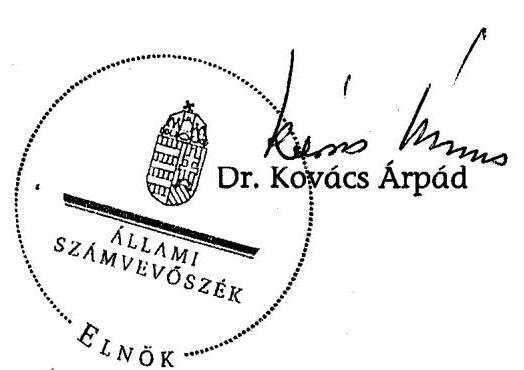

# JELENTÉS 

a 2006. októberi időközi országgyűlési képviselő-választási kampányra fordított pénzeszközök elszámolásának ellenőrzéséről a képviselethez jutott jelölő szervezetnél

---

3. Önkormányzati és Területi Ellenőrzési Igazgatóság
3.1. Szabályszerüségi Ellenőrzési Föcsoport

Iktatószám: V-1022-022/2007.
Témaszám: 880
Vizsgálat-azonosító szám: V-0378

# Az ellenőrzést felügyelte: 

Dr. Lóránt Zoltán
föigazgató
Az ellenőrzés végrehajtásáért felelős:
Dr. Elek János
általános föigazgató-helyettes
Az ellenőrzést vezette:
Horváth Balázs
főcsoportfőnök-helyettes
Az összefoglaló jelentést készítette:
Szakmányné Bilik Mária
számvevő
Az ellenőrzést végezték:
Szakmányné Bilik Mária Benesné Baracsi Szilvia
számvevő
számvevő

---

# TARTALOMJEGYZÉK 

BEVEZETÉS ..... 3
I. ÖSSZEGZŐ MEGÁLLAPÍTÁSOK, KÖVETKEZTETÉSEK, JAVASLATOK ..... 6
II. RÉSZLETES MEGÁLLAPÍTÁSOK ..... 8

1. A beszámoló közzététele és tartalma ..... 8
2. A választásokkal kapcsolatos speciális nyilvántartási és gazdálkodási teendők szabályozása, a választási bevételek és kiadások nyilvántartásban történő elkülönítése ..... 9
3. A választásra fordítható összeghatár és a párttörvényben meghatározott korlátozó előírások betartása ..... 10
4. A beszámolóban közzétett adatok bizonylati alátámasztottsága ..... 11

## MELLÉKLET

1. számú A Kereszténydemokrata Néppárt és a Fidesz-Magyar Polgári Szövetség által a 2006. évi veszprémi időközi országgyűlési képviselő-választásra fordított pénzeszközök forrásai és felhasználása

---

# RÖVIDÍTÉSEK JEGYZÉKE 

| Áfa tv. | Az általános forgalmi adóról szóló - többször módosított 1992. évi LXXIV. törvény |
| :--: | :--: |
| ÁsZ | Állami Számvevőszék |
| Fidesz-MPSZ | Fidesz-Magyar Polgári Szövetség |
| jelölő szervezet | Kereszténydemokrata Néppárt és Fidesz-Magyar Polgári Szövetség jelölő szervezet |
| KDNP | Kereszténydemokrata Néppárt |
| párttörvény | A pártok múködéséről és gazdálkodásáról szóló - többször módosított - 1989. évi XXXIII. törvény |
| OVB | Országos Választási Bizottság |
| Számv. tv. | A számvitelről szóló - többször módosított - 2000. évi C. törvény |
| Ve. | A választási eljárásról szóló - többször módosított - 1997.   évi C. törvény |

---

# JELENTÉS 

## a 2006. októberi időközi országgyúlési képviselő-választási kampányra fordított pénzeszközök elszámolásának ellenőrzéséről a képviselethez jutott jelölő szervezetnél

## BEVEZETÉS

A választási eljárásról szóló - többször módosított - 1997. évi C. törvény (a továbbiakban: Ve.) 92. § (3) bekezdésében kapott felhatalmazás alapján az országgyúlési képviselőválasztásra fordított állami és más pénzeszközök, anyagi támogatások felhasználásának ellenőrzése az Állami Számvevőszék (a továbbiakban: ÁSZ) feladata, amelyet „a választás második fordulóját követő egy éven belül az országgyúlési képviselethez jutott jelölő szervezetek és független jelöltek tekintetében hivatalból, egyéb jelölő szervezetek és független jelöltek tekintetében más jelölt, jelölő szervezetek kérelmére" ellenőriz. A Ve. 115. § (1) bekezdésének utolsó mondata szerint: „Az időközi választásra az általános választás szabályait kell alkalmazni".

Az ÁSZ hivatalból ellenőrizte a Kereszténydemokrata Néppárt és a FideszMagyar Polgári Szövetség (a továbbiakban: jelölő szervezet) kampányelszámolását, mivel közös jelöltjük a Veszprém megyei 06. számú országgyúlési egyéni választókerületben, 2006. október 1-jén mandátumhoz jutott. Egyéb jelölő szervezetek és független jelöltek vizsgálatát a törvényes határidőn belül az ÁSZ-nál nem kérelmezték. Tekintettel arra, hogy a két párt között létrejött megállapodás alapján a kampány finanszírozása és a Magyar Közlönyben történő kampánybeszámoló közzététele a Kereszténydemokrata Néppárt (a továbbiakban: KDNP) feladata volt, így helyszíni ellenőrzés csak ennél a pártnál történt. A Ve. 49. § (2) bekezdésének rendelkezése szerint: „Ha több jelölő szervezet közösen állít jelöltet, a továbbiakban - a választás szempontjából - egy jelölő szervezetnek számítanak."

Az ellenőrzött időszak: a 2006. októberi időközi országgyúlési képviselő választási kampány - és elszámolási időszak.

Az ellenőrzés célja annak megállapítása volt, hogy a 2006. októberi időközi országgyúlési képviselő-választáson mandátumhoz jutott jelölő szervezet:

- a Ve. 92. § (2) bekezdésének rendelkezése alapján a választás második fordulóját követő 60 napon belül a Magyar Közlönyben nyilvánosságra hozta-e a választásra fordított állami és más pénzeszközök, anyagi támogatások öszszegét, forrását és felhasználásának módját, valamint gondoskodott-e azok szabályszerű nyilvántartásáról és bizonylatolásáról;

---

- betartotta-e a Ve. 92. § (1) bekezdésében meghatározott költséghatárt, amely szerint „a jelölő szervezetek a választásra a 91. §-ban foglalt költségvetési támogatáson felül jelöltenként legfeljebb egymillió forintot fordíthatnak."

Az ellenőrzés feltételeiről és körülményeiről szükséges rögzíteni, hogy a Ve. 1998 óta hatályos rendelkezései, valamint a párttörvény előírásai jelenleg sem biztosították a feltételeket a választási kampánypénzek eredetének és felhasználásának teljes átláthatóságához. Így 1998 óta a választási elszámolások ellenőrzéséről kiadott jelentéseinkben jeleztük, hogy az ÁSZ nem tudja teljes mértékben betölteni a választási kampány átláthatóságával kapcsolatosan azt a szerepet, amelyet az alkotmányos szabályozás megkívánna, valamint külön részleteztük az ÁSZ hatásköri korlátait is ${ }^{1}$.

Rendszeresen felhívtuk a figyelmet továbbá arra, hogy a választási kampányra fordítható kiadásokra, ezek ellenőrzésére vonatkozó hatályos szabályok korrupciós kockázatot jelentenek, nem segítik maradéktalanul a Ve. 3. §-ban rögzített alapelvek érvényesítését².

Az ÁSZ visszatérően javasolta a Kormánynak, hogy kezdeményezze az Országgyűlésnél a Ve. oly módon való módosítását, amely biztosítja a kampányfinanszírozás átláthatóságát, ellenőrizhetőségét és egyértelmúen meghatározza:

- a választási költségek elszámolása szempontjából mely időszak, illetve tevékenység forrásait és ráfordításait kell figyelembe venni;
- a jelöltek száma alapján, normatív módon juttatott állami támogatás felhasználása tekintetében mi a dologi költségek fogalma, a felhasználás elszámolásának formája, tartalma és kifizetőhelye;
- a választási költségek forrásai körében az egyéb anyagi támogatások között milyen formában nyújtott és kiktől származó juttatásokat kell figyelembe venni;
- milyen legyen az országgyűlési választásra fordított állami és más pénzeszközök, anyagi támogatások összegét, forrását és a felhasználás módját bemutató, a Magyar Közlönyben megjelentetett választási beszámoló formája és részletes tartalma;
- hogyan történjen az egyéni jelöltek választási költségei és azok forrásai ellenőrizhetőbb nyilvántartási kötelezettségének érvényesítése;
- mennyi legyen a költségvetési támogatáson felüli egy jelöltre átlagosan fordítható kiadás reális értékhatára;

[^0]
[^0]:    ${ }^{1}$ A témához kapcsolódóan kiadott számvevőszéki jelentések sorszáma: 9916; 039; 0135; 0307; 0562 és 0718.
    ${ }^{2}$ A témakör részletes kifejtése megtalálható „A korrupció elleni küzdelem a számvevőszéki közreműködés bemutatásán keresztül" című 2002. októberi ÁSZ tanulmányban. A tanulmány olvasható az ÁSZ internetes honlapján.

---

- milyen tartalmú írásos megállapodást kössenek a közös jelöltet állító szervezetek a kampányfinanszírozásra, a nyilvántartásra és az elszámolásra vonatkozóan;
- milyen szankciókkal járjon a határidős elszámolási és beszámolási kötelezettségek elmulasztása.

A Kormány a 2006. évi országgyűlési képviselő-választást követően az Országgyűlés elé terjesztette a T/237. számon „A pártok működéséről és gazdálkodásáról szóló 1989. évi XXXIII. törvény és a választási eljárásról szóló 1997. évi C. törvény, valamint ezzel összefüggésben egyes más törvények módosításáról" törvényjavaslatát. A tárgysorozatba vett törvényjavaslat elfogadására a mai napig nem került sor. Így az ÁSZ, mint jogalkalmazó szerv csak a jelenlegi jogszabályban biztosított keretek között végezhette ellenőrzését, kiterjesztő jogértelmezésre nem volt lehetősége, többletellenőrzési jogosítványokat nem alkalmazhatott. Az ÁSZ-nak a jelen vizsgálatnál is tudomásul kellett vennie, hogy dokumentális ellenőrzést végezhet, továbbá ellenőrzési jogosultsága az elszámolási határidőig a jelölő szervezet nyilvántartásában megjelent kampányforrásokra és ráfordításokra terjed ki.

A pénzügyi szabályszerűségi ellenőrzést a 21/2004. számú Elnöki Utasítással kiadott, „Az Állami Számvevőszék ellenőrzési kézikönyve" módszertani előírásai szerint készítettük elő és folytattuk le.

Az ellenőrzés módszere: A jelölő szervezet által rendelkezésre bocsátott iratok és a Magyar Közlönyben közzétett választási beszámolók tartalmi összevetésével, valamint az alkalmazott eljárások és a jogszabályi követelmények egybevetésével történt.

A helyszíni ellenőrzést 2007. július 19-én és 20-án a KDNP országos központjában végeztük.

---

# I. ÖSSZEGZŐ MEGÁLLAPÍTÁSOK, KÖVETKEZTETÉSEK, JAVASLATOK 

A közös jelöltállításra tekintettel kötött megállapodás értelmében mind a finanszírozás, mind az elszámolás - a jelölő szervezet nevében - a KDNP feladata volt. A KDNP, a jelölő szervezet Ve. törvényben előírt beszámolási kötelezettségét a törvény által előírt határidőn belül teljesítette. A 2006. októberi időközi országgyűlési képviselő-választással kapcsolatos forrásokról és ráfordításokról beszámolóját a Magyar Közlöny 2006. évi 144. számában, 2006. november 24én hozta nyilvánosságra.

A közzétett beszámolót megalapozó számviteli nyilvántartásban az időközi választásra fordított pénzeszközök forrásait és ráfordításait a KDNP nem különítette el a múködéssel összefüggő bevételektől és kiadásoktól, valamint az önkormányzati választási kampánytól, így a beszámolóban közölt 881 ezer Ft forrás és ráfordítási adatok a főkönyvi kivonatból nem voltak levezethetők, azok a nyilvántartásból tételes kigyűjtéssel, a számviteli dokumentumok és nyilatkozat figyelembevételével voltak meghatározhatók. A beszámoló nem tartalmazott a veszprémi időközi választással kapcsolatban felmerült 16 ezer Ft hirdetési és a választókerületbe történt, 95 ezer Ft telefonálási díjat. A KDNP a számviteli dokumentumokhoz és a könyvvezetésben rögzített adatokhoz képest 111 ezer Ft-tal alacsonyabb összeget hozott nyilvánosságra a 2006. októberi időközi országgyűlési képviselő-választási kampány forrásairól és ráfordításairól szóló beszámolójában.

Belső szabályozást vagy utasítást, az elszámolást teljesítő KDNP nem léptetett hatályba a választásokkal kapcsolatos speciális nyilvántartási és gazdálkodási teendők ellátásához. A gazdálkodási jogköröket az általános múködésre vonatkozó hatásköri szabályok szerint gyakorolta. A jelölő szervezet - a közös jelöltállításra vonatkozó megállapodáson kívül - az időközi választással kapcsolatos gazdasági döntést nem hozott.

A jelölő szervezet a szankció nélkül felhasználható egymillió forintos költséghatárt a rendelkezésre bocsátott dokumentációk szerint nem lépte túl, 992 ezer Ft-ot fordított a veszprémi 6. számú egyéni választókerület időközi országgyűlési képviselő-választási kampányára.

A párttörvényben rögzített forrásszerzést korlátozó előírásokat a KDNP a nyilvántartások szerint - a beszámolóban feltüntetett országgyűlési képviselő-választásra fordított összeg forrásai vonatkozásában betartotta.

A kampánytevékenységre vonatkozó, annak jogszerűségét igazoló szerződések, egyéb kötelezettségvállalási dokumentumok a gazdasági tranzakciók 60\%-ánál hiányoztak, valamint a megkötött szerződések, megállapodások általános megfogalmazásokat tartalmaztak.

A nyilvántartott kampányköltségek bizonylatainak 70\%-án hiányzott a szabályszerű teljesítésigazolás, $40 \%$-án az utalványozás, továbbá teljes körűen a

---

könyvelő aláírása és a könyvekben történt rögzítés dátuma. Ezzel sérült a Számv. tv-ben szabályozott bizonylatokra vonatkozó alaki és tartalmi követelmény. A számlák $40 \%$-a nem a hatályos bírósági bejegyzésnek megfelelően tartalmazta az Áfa törvényben meghatározott számla adattartalma közül a vevő (KDNP) címét, így azok nem feleltek meg a Számv. tv-ben rögzített, a szabályszerű bizonylatra vonatkozó előírásoknak.

A helyszíni ellenőrzés megállapításainak hasznosítása mellett javasoljuk

# a Kormánynak 

Ismételten kezdeményezze a választási eljárásról szóló törvény módosítását - figyelemmel az Állami Számvevőszék korábbi jelentéseiben megfogalmazott javaslataira is - annak érdekében, hogy a választási kampány finanszírozása átlátható, ellenőrizhető legyen.

## a KDNP elnökének

1. Gondoskodjon a Ve. 92. § (1) bekezdésben meghatározott ráfordítási korlát betartásának ellenőrizhetősége céljából a választással kapcsolatos források és ráfordítások elkülönített nyilvántartásának szabályozásáról és a könyvvezetésben annak érvényesítéséről.
2. Intézkedjen, hogy a könyvviteli nyilvántartásokban a Számv. tv. 165. § (2) bekezdésében előírt szabályszerűen kiállított bizonylatok kerüljenek rögzítésre, amelyek az Áfa tv. 13. § (1) bekezdés 16. (d) pontjában rögzített vevő (KDNP) címét a valóságnak megfelelően tartalmazzák, továbbá megfelelnek a Számv. tv. 167. § (1) bekezdés c) és i) pontban előírt alaki és tartalmi követelményeknek.

---

# II. RÉSZLETES MEGÁLLAPÍTÁSOK 

## 1. A beSzámoló közzÉtétele És TARTALMA

A Ve. 92. § (2) bekezdés előírása szerint minden jelölő szervezetnek és független jelöltnek a választás második fordulóját követő 60 napon belül a Magyar Közlönyben nyilvánosságra kell hoznia a választásra fordított állami és más pénzeszközök, anyagi támogatások összegét, forrását és felhasználásának módját.

Figyelemmel arra, hogy a Ve. a nyilvánosságra hozandó beszámoló tartalmát, részletezettségét nem szabályozta, az OVB a Választási füzetek 1998. évi 44. száma függelékében az ÁSZ ajánlását tette közzé. Jelezni szükséges, hogy a nyilvánosságra hozatali kötelezettség elmulasztását a törvény nem szankcionálja, így annak elmulasztása vagy késedelmes teljesítése esetén intézkedésre nincs lehetőség.

A KDNP és a Fidesz-MPSZ a közös jelöltállításra tekintettel megállapodást kötött a kampányköltségek finanszírozására, valamint a források és kampányráfordítások elszámolására. Ennek értelmében mind a finanszírozás, mind az elszámolás - a jelölő szervezet nevében - a KDNP feladata volt. A KDNP a megállapodásnak megfelelően "A Kereszténydemokrata Néppárt és a Fidesz-Magyar Polgári Szövetség által a 2006. évi veszprémi időközi országgyűlési képviselőválasztásra fordított pénzeszközök forrásai és felhasználása" címmel - a törvényes határidőn belül - tett közzé közleményt a Magyar Közlöny 2006. november 24-i, 144. számában (1. számú melléklet). A nyilvánosságra hozott beszámoló szerkezete, tartalma összhangban volt az ÁSZ ajánlásával.

A KDNP a beszámolóban kampányforrásként 881 ezer Ft állami költségvetési támogatást nevezett meg, valamint ugyanilyen összegű anyagjellegű ráfordítást közölt. Ez az összeg a számla és a teljesítésigazoló dokumentumok szerint az időközi választással összefüggő 15000 db szórólap, 500 db B2 méretű plakát, továbbá 15000 db újság előállítását fedezte.

Az időközi választási kampány forrásait és ráfordításait nem különítették el a KDNP múködésével összefüggő bevételektől és kiadásoktól, valamint az önkormányzati választás kampányától, így a beszámolóban közölt adatok a főkönyvi kivonatból nem voltak levezethetők.

A kampányidőszakban teljesült gazdasági események - az ellenőrzés rendelkezésére bocsátott - dokumentumaiból a kampánytevékenység egy részéről egyértelműen megállapítható volt, hogy az önkormányzati választásokkal vagy egyéb rendezvényekkel kapcsolatban merültek fel, így kizárható volt az időközi országgyűlési képviselő-választással való összefüggés. A tételes vizsgálat során, a beszámolóban közzétett ráfordításon kívül az ellenőrzés kilenc számláról 2529 ezer Ft összegről - állapította meg, hogy azok az időközi országgyűlési és önkormányzati képviselő-választási kampánnyal is kapcsolatosak lehettek. Kötelezettségvállalási és teljesítésigazolási dokumentum nem állt rendelkezésre hat darab kampánykiadást tartalmazó számlához, továbbá három számla ese-

---

tén a szerződés, illetve a teljesítésigazolás dokumentálása nem adott egyértelmű választ arra, hogy a kampánycselekmény az önkormányzati vagy az időközi országgyűlési képviselő-választáshoz, esetleg mindkettőhöz kapcsolódott-e, azokat milyen összegben terhelték az egyes kifizetések.

A kampányráfordítások összegének egyértelmű megállapítása céljából nyilatkozatot kértünk a KDNP képviselőjétől. A nyilatkozat szerint hét számla gazdasági tranzakciója teljes összegben - 2323 ezer Ft - az önkormányzati választáshoz kapcsolódott. Egy készpénzfizetési számlán kiszámlázott hirdetés teljes összege, 16 ezer Ft az időközi országgyűlési képviselő-választási kampányt szolgálta. Egy 190 ezer Ft összegű számla, fele-fele - 95 ezer Ft-95 ezer Ft - összegben az időközi országgyűlési, illetve az önkormányzati képviselő-választást terhelte, amely 2006. szeptember 25. és október 1. közötti időszakra a 88-as körzetbe történő telefonálás diját tartalmazta. E két kampányköltség nem szerepelt a jelölő szervezet közzétett beszámolójában, így a könyvvezetésben rögzített adatokhoz képest 111 ezer Ft-tal alacsonyabb öszszeggel hozta nyilvánosságra a 2006. októberi időközi országgyűlési képi-selő-választási kampány forrásairól és ráfordításairól beszámolóját.

A könyvvezetés során a számviteli bizonylatok 20\%-ánál hibás főkönyvi számlára könyveltek, így sérült a Számv. tv. 15. § (3) és (5) bekezdéseiben szabályozott valódiság és következetesség számviteli alapelv.

# 2. A VÁLASZTÁSOKKAL KAPCSOLATOS SPECIÁLIS NYILVÁNTARTÁSI ÉS GAZDÁLKODÁSI TEENDŐK SZABÁLYOZÁSA, A VÁLASZTÁSI BEVÉTELEK ÉS KIADÁSOK NYILVÁNTARTÁSBAN TÖRTÉNŐ ELKÜLÖNÍTÉSE 

A választási kampányforrások, és ráfordítások elszámolásért felelős KDNP belső előírásban nem rögzítette a kampánytevékenység, a kampányköltség fogalmát, a kampányra fordítható összeget, a választási költségek elszámolása szempontjából az elszámolási időszak terjedelmét, a nyilvánosságra hozandó beszámoló tartalmát. Ennek a körülménynek, valamint az OVB 4/2002. (II. 7.) számú állásfoglalásának megfelelően az ellenőrzés az elszámolt kampányráfordításokat a jelölt nyilvántartásba vételétől kezdődött kampányidőszakban, 2006. szeptember 7. és 2006. október 1. között vette figyelembe. A KDNP a teljesítés időpontja tekintetében betartotta a választásra fordított állami pénzeszközök felhasználása során a Ve. 40. § (1) bekezdésben meghatározott kampányidőszakot.

A Ve. nem ad eligazítást arra vonatkozóan, hogy a kampányidőszakban felmerült kampányráfordításokra vonatkozó kötelezettségvállalásnak, a termék, szolgáltatás igénybevételének, illetve pénzügyi teljesítésnek együttesen kell, illetve elegendő-e a fizikai teljesítésnek a Ve-ben szabályozott kampányidőszakra esni.

A jelölő szervezet - a közös jelöltállításra vonatkozó megállapodáson kívül - az időközi választással kapcsolatos gazdasági döntést nem hozott. Az ellenőrzés időszakában hatályos számviteli politikával és számlarenddel a KDNP nem rendelkezett, a választással kapcsolatos speciális nyilvántartási és gazdálkodási feladatokat egyéb belső előírásban sem szabályozta.

---

A gazdálkodási jogköröket az általános múködésre vonatkozó hatásköri szabályok szerint gyakorolta. A Ve. 92. § (1) bekezdésében meghatározott ráfordítási korlátok betartásának ellenőrizhetősége céljából a könyvvezetés során nem gondoskodott az időközi választással kapcsolatos bevételek és kampányráfordítások nyilvántartásban történő elkülönítéséről. Azokat a múködési, továbbá az időközi választás első fordulójával azonos időszakra eső önkormányzati választások kampányráfordításaival és azok forrásaival együtt, elkülönítés nélkül tartotta nyilván.

# 3. A VÁLASZTÁSRA FORDÍTHATÓ ÖSSZEGHATÁr ÉS A PÁRTTÖRVÉNYBEN MEGHATÁROZOTT KORLÁTOZÓ ELŐÍRÁSOK BETARTÁSA 

A Ve. 92. § (1) bekezdése szerint "a jelölő szervezetek a választásra a 91. §-ban foglalt költségvetési támogatáson felül jelöltenként legfeljebb egymillió forintot fordíthatnak." Az OVB 7/1998. (IV. 1.) állásfoglalása szerint közös jelölés esetén is összesen egymillió forint fordítható egy jelöltre. Az időközi választásra jelöltarányos állami támogatás a költségvetésben nem állt rendelkezésre, ennek megfelelően a jelölő szervezet összesen egymillió forintot fordíthatott szankció nélkül kampánycélokra.

A beszámoló szerint a kampányköltség összege 881 ezer Ft, ugyanakkor a számviteli nyilvántartás, a gazdálkodási dokumentumok, továbbá a nyilatkozat szerint az időközi országgyűlési képviselő-választáshoz kapcsolódó kampányköltségek összege 992 ezer Ft volt. A közzétett beszámolóhoz képest magasabb kampányráfordítás ellenére a jelölő szervezet a kampány során betartotta a Ve. 92. § (1) bekezdésében szabályozott költséghatárt, annál 8 ezer Ft-tal kevesebbet költött.

A párttörvény 4. § (2) - (3) bekezdése értelemszerűen a választási kampányra vonatkozóan is korlátokat határoz meg a pártok részére a vagyoni hozzájárulások, adományok elfogadhatóságát illetően.
„(2) A párt részére - a 4. § (1) bekezdésében foglalt kivételektől eltekintve - költségvetési szerv, továbbá állami vállalat, állami részvétellel múködő gazdasági társaság, közvetlen költségvetési támogatásban, vagy költségvetési szervi támogatásban részesülő alapítvány vagyoni hozzájárulást nem adhat, a párt költségvetési szervtől, továbbá állami vállalattól, állami részvétellel múködő gazdasági társaságtól, közvetlen költségvetési támogatásban, vagy költségvetési szervi támogatásban részesülő alapítványtól vagyoni hozzájárulást nem fogadhat el."
„(3) A párt vagyoni hozzájárulást más államtól nem fogadhat el. A párt névtelen adományt nem fogadhat el; az ilyen adományt be kell fizetni a 8. § (1) bekezdésében említett alapítvány céljaira."

A KDNP a gazdálkodási dokumentumok, továbbá a nyilatkozat szerint betartotta a beszámolóban feltüntetett időközi országgyűlési képviselő-választásra fordított összeg forrásai esetében (választási célra kapott adományok, saját források, nem pénzbeli vagyoni hozzájárulás) a pártok múködéséről és gazdálkodásáról szóló 1989. évi XXXIII. évi törvény 4. § (2)-(3) bekezdésében foglalt korlátozó előírásokat. Névtelen adományt és/vagy tiltott vagyoni hozzájárulást nem fogadott el.

---

A kampányköltségek összegét a megállapodásban nem rögzítették, a törvényes összeghez képest nem korlátozták.

# 4. A beSzÁmolóban KözzÉTETT adatok bizONYLATI alÁtÁmasZTOTTSÁGA 

A kampánytevékenységre vonatkozó, annak jogszerűségét igazoló szerződések, egyéb kötelezettségvállalási dokumentumok a kapcsolódó gazdasági tranzakciók $60 \%$-ánál nem álltak rendelkezésre. A meglévő - kampánykiadásokhoz kapcsolódó - szerződések, megállapodások általános megfogalmazásokat tartalmaztak.

A választásokkal kapcsolatos gazdasági események alapbizonylatai a könyvelési adatok alapján visszakereshetők voltak. Tartalmuk szerint $80 \%$-ban a könyvelt gazdasági eseményt támasztották alá. A számlák $40 \%$-a nem felelt meg a Számv. tv. 165. § (2) bekezdésében a valóságnak megfelelő, könyvvitelben rögzítendő és más egyéb jogszabályokban előírt adattartalmú szabályszerű bizonylat követelményének, mivel az Áfa törvény 13. § (1) bekezdés 16. d) pontjában előírt vevő (KDNP) címét nem a hatályos bírósági bejegyzésnek megfelelően tartalmazták.

A számlák $40 \%$-át nem utalványozták, $70 \%$-ánál nem volt teljesítésigazolás, teljes körűen hiányzott az ellenőr, valamint a könyvelő aláírása, továbbá a könyvelés dátuma, ezzel megsértették a Számv. tv. 167. § (1) bekezdés c) és i) pont előírásait.

A KDNP Számvizsgáló Bizottsága nem ellenőrizte a 2006. októberi időközi országgyűlési képviselő-választás kampányköltségeinek alakulását, így nem tárhatta fel a szabályozási, nyilvántartási és beszámolási hiányosságokat, illetve hibákat.

Budapest, 2007. október " 25 "

Melléklet: $\quad 1 \mathrm{db}$

---

A Kereszténydemokrata Néppárt és a Fidesz - Magyar Polgári Szövetség által a 2006. évi veszprémi idôkôzi országgyûlési képviselô-választásra fordított pénzeszközök forrásai és felhasználása
(Ezer forintban)

1. A jelölt szervezet neve: Kereszténydemokrata Néppárt, Fidesz - Magyar Polgári Szövetség
2. A jelölő szervezet által állított jelöltek száma: 1 fő
3. Az országgyûlési képviselô-választásra fordított összeg:
3.1. Forrásai összesen:

881
3.1.1. Állami költségvetési támogatás:

881
3.1.2. Egyéb források:
3.2. Jogcímek szerinti felhasználás összege:

881
3.2.1. Az állami költségvetési támogatás terhére:

881
ebből:

- anyagjellegủ ráfordítás:

881

- nem anyagjellegủ ráfordítás:
- egyéb ráfordítás:
3.2.2. Egyéb források terhére:

Csorba Béla s. k.,
Kereszténydemokrata Néppárt
Országos Választmányának titkára