# JELENTÉS 

a helyi önkormányzatok és a helyi kisebbségi önkormányzatok központi költségvetési kapcsolatokból származó forrásai igénybevétele és elszámolása felülvizsgálati tevékenységének ellenőrzéséről

---

# 3. Önkormányzati és Területi Ellenőrzési Igazgatóság 

3.3. Átfogó Ellenőrzések Főcsoport

Iktatószám: V-1011-41/2007.
Témaszám: 856
Vizsgálat-azonosító szám: V0352

## Az ellenőrzést felügyelte:

Dr. Lóránt Zoltán
főigazgató
Az ellenőrzés végrehajtásáért felelős:
Dr. Sepsey Tamás
főigazgató helyettes
Az ellenőrzést vezette:
Németh Gábor
igazgató helyettes
A számvevői jelentések feldolgozásában és a jelentés összeállításában közreműködtek:

## Borbély Zsuzsanna

főtanácsadó
Nagy Istvánné dr.
tanácsadó
Az ellenőrzést végezték:

| Alexovics Ágota   számvevő tanácsos | Bialkó Zsolt   számvevő tanácsos | Borbély Zsuzsanna   főtanácsadó |
| :-- | :-- | :-- |
| Buús Zoltánné Hütter   Erzsébet   számvevő | Csényi István   számvevő | Csuti Lajos   számvevő tanácsos |
| Dér Lívia   számvevő tanácsos | Fórián Erika   számvevő tanácsos | Groholy Andrásné   Hangyál Márta   számvevő |
| dr. Hegedűs György   főtanácsadó | Hegyes Mária   számvevő tanácsos | Komlósiné Bogár Éva   számvevő tanácsos |
| Molnár Istvánné   számvevő | Nagy Attila   számvevő tanácsos | Nagy Istvánné dr.   tanácsadó |
| Puskás Balázs   számvevő | Tótfalusi Zoltán   számvevő | Tóth Tamás   számvevő |

---

# A témához kapcsolódó eddig készített számvevőszéki jelentések: 

## címe

Jelentés a Magyar Köztársaság 2005. évi költségvetése végrehajtásának ellenőrzéséről
Függelék:

- A helyi önkormányzatokat a 2005. évben megillető normatív hozzájárulás igénylésének és elszámolásának ellenőrzése
Jelentés a Magyar Köztársaság 2006. évi költségvetése végrehajtásának ellenőrzéséről
Függelék:
- A helyi önkormányzatokat a 2006. évben megillető normatív hozzájárulás igénylésének és elszámolásának ellenőrzése

---

# TARTALOMJEGYZÉK 

BEVEZETÉS ..... 7
I. ÖSSZEGZŐ MEGÁLLAPÍTÁSOK, KÖVETKEZTETÉSEK, JAVASLATOK ..... 11
II. RÉSZLETES MEGÁLLAPÍTÁSOK ..... 17

1. A helyi önkormányzatokkal kapcsolatos állami hozzájárulások, támogatások igénylése és év végi elszámolása felülvizsgálati tevékenységére irányuló szabályozottság ..... 17
1.1. A Kincstár felülvizsgálatra irányuló szabályozási tevékenysége ..... 17
1.2. Az igazgatóságok felülvizsgálatra irányuló szabályozási tevékenysége ..... 20
2. Az igazgatóságokon ellátott felülvizsgálati tevékenység feltételei ..... 22
2.1. A felülvizsgálati tevékenység végrehajtásának személyi feltételei ..... 22
2.2. A felülvizsgálati tevékenység végrehajtásának tárgyi feltételei ..... 29
3. A 2006. évi felülvizsgálati feladatok végrehajtása ..... 31
3.1. A 2006. évi felülvizsgálatról szóló Tájékoztató összeállításához szükséges adatszolgáltatás teljesítése ..... 31
3.1.1. Az adatszolgáltatás teljesítéséhez szükséges adatok meghatározásának módja ..... 31
3.1.2. Az előzetes felülvizsgálat során megállapított támogatási igénycsökkentések (növelések) alapja ..... 32
3.1.3. Az utólagos felülvizsgálat során megállapított támogatási igénycsökkentések (növelések) alapja ..... 35
3.2. Az igazgatóságoknál elvégzett előzetes felülvizsgálati feladatok ellátása ..... 37
3.2.1. Az előzetes felülvizsgálati feladatok ellátása ..... 37
3.2.2. Az egyes jogcímeknél elvégzett felülvizsgálat szabályozással való összhangja ..... 40
3.2.3. Az igényjogosultság megítéléséhez szükséges adatok, információk biztosítása ..... 42
3.2.4. Az igazgatóságokon rendelkezésre álló iratok, nyilvántartások, adatok alkalmassága a jogtalan igénylés kiszűrésére ..... 44
3.2.5. A felülvizsgálati feladatok elvégzésének dokumentálása ..... 46
3.2.6. A felülvizsgálat eredményeként megállapított eltérések, hiányosságok ..... 48
3.2.7. Az adatok módosítására, hiánypótlásra kibocsátott felhívás ..... 51
3.2.8. A helyszíni vizsgálat szükségessége ..... 54

---

3.2.9. A nem feladatmutatók alapján járó állami hozzájárulások és támogatások továbbításának szabályszerűsége ..... 54
3.3. Az igazgatóságoknál elvégzett utólagos felülvizsgálati feladatok ellátása ..... 55
3.3.1. Az utólagos felülvizsgálati feladatok végrehajtása ..... 55
3.3.2. Az ÁSZ megállapításai a 2005. és a 2006. évi normatív hozzájárulások vizsgálata során ..... 60
MELLÉKLETEK

1. számú Az ellenőrzött igazgatóságok jegyzéke (1 oldal)
2. számú A felülvizsgálati tevékenységgel érintett önkormányzatok és humán szol- gáltatásokat ellátó szervezetek megyénkénti adatai (1 oldal)
3. számú A normatív állami hozzájárulások és a normatív kötött felhasználású tá- mostások felülvizsgálatának adatai (1 oldal)
4. számú A központosított előirányzatok és az egyéb támogatások felülvizsgálatá- nak adatai (1 oldal)
5. számú Az előzetes felülvizsgálatot jellemző mutatók (1 oldal)
6. számú Dr. Veres János pénzügyminiszter úr észrevétele (1 oldal)
7. számú Dr. Veres János pénzügyminiszter úr észrevételére adott válasz (1 oldal)
8. számú Dr. Katona Tamás elnök úr észrevétele (1 oldal)

---

# RÖVIDÍTÉSEK JEGYZÉKE 

## Törvények

Áht.
Az államháztartásról szóló 1992. évi XXXVIII. törvény
ÁSZ. tv.
az Állami Számvevőszékről szóló 1989. évi XXXVIII. törvény

## Rendeletek

Ámr.
amr.
amélet

## Szórövidítések

ÁSZ
Államháztartási Iroda

Állampénztári Iroda

CÉDE
igazgatóságok

Illetményszámfejtési Iroda
irodavezető

Kincstár
KIR statisztika
az államháztartásról szóló 1992. évi XXXVIII. törvény
az Állami Számvevőszékről szóló 1989. évi XXXVIII. törvény
az államháztartás működési rendjéről szóló 217/1998. (XII. 30.) Korm. rendelet
a helyi önkormányzatok és a helyi kisebbségi önkormányzatok központi költségvetési kapcsolatokból származó forrásai igénybevétele és elszámolása szabályszerűségének felülvizsgálatáról szóló 16/2002. (IV. 12.) PM rendelet

Állami Számvevőszék
az ellenőrzött időszak alatti szervezeti felépítés szerint, a helyszíni ellenőrzésre kijelölt megyei területi igazgatóságok, illetve a Budapesti és Pest Megyei Regionális Igazgatóság Államháztartási Irodája
az ellenőrzött időszak alatti szervezeti felépítés szerint, a helyszíni ellenőrzésre kijelölt megyei területi igazgatóságok, illetve a Budapesti és Pest Megyei Regionális Igazgatóság Állampénztári Irodája
céljellegű decentralizált önkormányzati fejlesztések támogatása
a helyszíni ellenőrzésre kijelölt igazgatóságok együttes megnevezése (az ellenőrzött időszak szervezeti felépítése szerint kijelölt kilenc megyei területi igazgatóság, illetve a Budapesti és Pest Megyei Regionális Igazgatóság), az egyes ellenőrzött igazgatóságok esetében a székhely megnevezést használjuk az azonosításra
az ellenőrzött időszak alatti szervezeti felépítés szerint, a helyszíni ellenőrzésre kijelölt megyei területi igazgatóságok, illetve a Budapesti és Pest Megyei Regionális Igazgatóság Illetményszámfejtési Irodája
a helyszíni ellenőrzésre kijelölt megyei területi igazgatóságok, illetve a Budapesti és Pest Megyei Regionális Igazgatóság Államháztartási Irodája irodavezetője
Magyar Államkincstár központi szervezete
Közoktatási Információs Rendszer statisztikai adatszolgáltatása

---

| Közlemény | a Magyar Államkincstár 2005. szeptember 27-i közleménye - a helyi önkormányzatok és a helyi kisebbségi önkormányzatok központi költségvetési kapcsolatokból származó forrásai igénybevétele és elszámolása szabályszerűségének felülvizsgálatáról szóló, 16/2002. (IV. 12.) PM rendelet 19. §-a alapján - a Magyar Államkincstár megyei területi igazgatóságai, valamint a Budapesti és Pest Megyei Regionális Igazgatósága által elvégzendő felülvizsgálati tevékenységéről |
| :--: | :--: |
| osztályvezető | a helyszíni ellenőrzésre kijelölt megyei területi igazgatóságok, illetve a Budapesti és Pest Megyei Regionális Igazgatóság Államháztartási Irodája Költségvetési Kapcsolatok és Információs Osztályának osztályvezetője |
| ÖNHIKI | önhibájukon kívül hátrányos helyzetben lévő helyi önkormányzatok támogatása |
| önkormányzatok | helyi önkormányzatok, helyi kisebbségi önkormányzatok |
| PM | Pénzügyminisztérium |
| Segédlet | Segédlet a helyi önkormányzatok és a helyi kisebbségi önkormányzatok 2005. évi központi költségvetési kapcsolatokból származó forrásai igénybevétele és elszámolása szabályszerűségének felülvizsgálatához (melléklet a Magyar Államkincstár 2005. szeptember 27-i közleményéhez) |
| SzMSz | Magyar Államkincstár Szervezeti és Működési Szabályzata |
| TEHU | települési hulladék közszolgáltatás fejlesztésének támogatása |
| TEKI | területi kiegyenlítést szolgáló önkormányzati fejlesztések támogatása |
| TEUT | települési önkormányzati szilárd burkolatú belterületi közutak burkolat-felújításának támogatása |
| Útmutató | a Tájékoztatóhoz készített kitöltési útmutató |

---

# ÉRTELMEZŐ SZÓTÁR 

| Állami hozzájárulások, támogatások | A normatív állami hozzájárulások, a normatív kötött felhasználású támogatások, a központosított előirányzatok, valamint a felhalmozási célú és a vis maior támogatások közös megnevezése. |
| :--: | :--: |
| Előirányzat-lemondás | Az önkormányzatok év közben az igazgatóságok útján lemondhatnak a számukra megállapított normatív állami hozzájárulások, normatív kötött felhasználású támogatások előirányzatáról, vagy annak egy részéről. Az elői-rányzat-lemondásra az év során három alkalommal (április 30., július 31. és október 15.) van lehetősége az önkormányzatnak. |
| Előzetes felülvizsgálat | Az Áht-ban előírtak alapján az igazgatóságoknak a helyi önkormányzatok állami hozzájárulások és támogatások egyes jogcímeire benyújtott igényléseivel, pályázataival kapcsolatos ellenőrzési tevékenysége (ex ante ellenőrzés). |
| Felhalmozási célú támogatások | Ezen ellenőrzés keretében a címzett és céltámogatások, valamint az önkormányzati céljellegű decentralizált támogatások közös megnevezése. |
| Felhalmozási célú és vis maior támogatások | Ezen ellenőrzés keretében a vis maior támogatások önkormányzati tulajdonnal összefüggő felhasználása indokolta a felhalmozási célú támogatásokkal történő együttes kezelését. |
| Felülvizsgálat | Az Áht-ban előírtak alapján az igazgatóságoknak a helyi önkormányzatok állami hozzájárulások és támogatások egyes jogcímei igénylésével, pályázataival, valamint az év végi elszámolása szabályszerűségével kapcsolatos ellenőrzése. |
| Forrásigénylés | Adott költségvetési évben a helyi önkormányzatok által a normatív állami hozzájárulások, a normatív kötött felhasználású támogatások, a központosított előirányzatok, az önkormányzatok működőképességének megőrzését szolgáló kiegészítő támogatások, valamint a felhalmozási célú támogatások előirányzatainak igénylése a központi költségvetésből. |
| 3. elektronikus szolgáltatási szint | A támogatások igénybevételéhez, elszámolásához, felülvizsgálatához szükséges űrlapok, nyomtatványok Interneten keresztül közvetlenül kitölthetők, elektronikusan (elektronikus aláírás segítségével) hitelesíthetők, s ugyancsak közvetlenül továbbíthatók |
| Humán szolgáltatást ellátó szervezet | Humánszolgáltatásokat (külön törvényben meghatározott szociális, közoktatási, felsőoktatási, kulturális közfeladatokat) ellátó egyházi jogi személyek, társadalmi szervezetek, alapítványok, közalapítványok, országos kisebbségi önkormányzatok, közhasznú társaságok, gazdasági társaságok és a humánszolgáltatásokat főtevékenységként végző, a személyi jövedelemadóról szóló törvény hatálya alá tartozó egyéni vállalkozók |

---

Jogcímek

Kiegészítő felmérés

Központosított előirányzatok igénylése

Központosított előirányzatok pályázatai

Mutatószám

Pótlólagos igénylés

Tájékoztató

Utólagos felülvizsgálat

A Magyar Köztársaság 2006. évi költségvetéséről szóló 2005. évi CLIII. törvény 1. számú mellékletében a IX. Helyi önkormányzatok támogatásai fejezetében szereplő címek, alcímek közös megnevezése.
Az önkormányzatok normatív állami hozzájárulásokra, valamint normatív kötött felhasználású támogatásokra az Áht. 64. § (4) bekezdésében meghatározott feltételek fennállása esetén - benyújtott pótlólagos igénylését megalapozó mutatószám-felmérés.
A központosított előirányzatok önkormányzati sajátos feladatokat finanszírozó előirányzatai, amelyekhez a helyi önkormányzatok az előírt feltételek fennállása esetén a támogatásra irányuló döntéshozatal nélkül jutnak hozzá.
A központosított előirányzatok azon jogcímeire benyújtott helyi önkormányzati támogatási kérelmek, amelyek meghatározott költségvetési feladatok ellátásához, fejlesztéséhez meghirdetett, és a döntéshozó által odaítélendő állami támogatás elnyerésére irányulnak.
A helyi önkormányzatok költségvetési gazdálkodásában az ellátandó feladatot legjobban jellemző, természetes mértékegységben kifejezett érték, amely a központi költségvetésből az egyes állami hozzájárulások, támogatások finanszírozásának alapját képezi.
Az önkormányzatok év közben az igazgatóságok útján pótlólagos igénylést nyújthatnak be a normatív állami hozzájárulások, a normatív kötött felhasználású támogatások előirányzataira. A pótlólagos igénylés benyújtására július 31-ig van lehetősége az önkormányzatoknak.
A jelentésben Tájékoztató megnevezéssel használjuk a PM rendelet 5. § (1) bekezdésében az igazgatóságok számára előírt tájékoztatási kötelezettség teljesítéseként készített szöveges és számszaki értékelést, valamint az 5. § (2) bekezdése alapján a Kincstár elnöke által a pénzügyminiszter, az önkormányzati és területfejlesztési miniszter, valamint az Állami Számvevőszék elnöke számára megküldött összegzést.
Az Áht-ban előírtak alapján az igazgatóság ellenőrzési tevékenysége, amely az önkormányzatok állami hozzájárulások és támogatások egyes jogcímei év végi elszámolása szabályszerűségének ellenőrzésére irányul (ex post ellenőrzés).

---

# JELENTÉS 

## a helyi önkormányzatok és a helyi kisebbségi önkormányzatok központi költségvetési kapcsolatokból származó forrásai igénybevétele és elszámolása felülvizsgálati tevékenységének ellenőrzéséről

## BEVEZETÉS

Az Áht. előírásai közé a 2001. évi módosítása ${ }^{1}$ során iktatták be az önkormányzatok központi költségvetési kapcsolataiból származó forrásai igénybevétele és elszámolása Kincstár általi felülvizsgálati tevékenységét, 2002. január 1-jei hatállyal. Az önkormányzatok központi költségvetési kapcsolatokból származó állami hozzájárulásai és támogatásai felülvizsgálatára kijelölt szervek a Kincstár jogelőd szervezetének ${ }^{2}$ a területi szervei voltak. A Kincstár területi szervei, az igazgatóságok által ellátott felülvizsgálati tevékenység adott évre vonatkozóan magában foglalta az önkormányzatok és a többcélú kistérségi társulások központi költségvetési kapcsolataiból származó

- állami hozzájárulások és támogatások igényléseinek, pályázatainak,
- a megelőző évi központi költségvetési kapcsolatokból származó források elszámolása szabályszerűségének, valamint
- a következő évi költségvetés
 elkészítéséhez a mutatószám felmérés felülvizsgálatát.

Az önkormányzatok a központi költségvetésben tervezett támogatási előirányzatokból az igazgatóságokhoz benyújtott igénylés és pályázat útján részesednek. A benyújtott támogatási igényléseket, pályázatokat az igazgatóságoknak szabályszerűségi szempontból meg kell vizsgálni. Az önkormányzatok az igényelt és a pályázatokon elnyert támogatások felhasználásáról az éves költségvetési beszámolás keretében adnak számot. Az év végi elszámolások szabályszerűségét az igazgatóságok a tárgyévet követő év végéig felülvizsgálják. A felülvizsgálat eredményeként az igazgatóságoknak - az Áht-ban meghatározott eljárás alkalmazásával, és az ott rögzített követelmények teljesítésével - módja volt az állami hozzájárulások, támogatások jogtalan igénybevételének megakadályozására, illetve a nem szabályszerű év végi elszámolások kiszűrésére.

[^0]
[^0]:    ${ }^{1}$ Az Áht. azóta többször módosított 64/A.-64/E. §-ait a 2001. évi LXXV. törvény 29. § (10) bekezdése iktatta be.
    ${ }^{2}$ A Kincstár jogelőd szervezetei - a Áht. előírásainak 2001. évi módosításakor - az Államháztartási Hivatal és a Magyar Államkincstár Rt. voltak. A Kincstár a felülvizsgálati feladatot az Államháztartási Hivataltól vette át.

---

A Kincstár 2006. évi felülvizsgálati tevékenysége az önkormányzatoknak a központi költségvetési kapcsolatokból származó 2005. évi 1321,3 milliárd Ft állami támogatás és átengedett személyi jövedelemadó elszámolására, a 2006. évi 1289,3 milliárd Ft állami támogatás és átengedett személyi jövedelemadó előirányzat igénylésére, valamint a 2007. évi költségvetési tervezéssel összefüggő mutatószám felmérésére irányult.

Az ellenőrzés célja annak értékelése volt, hogy az igazgatóságok felülvizsgálati tevékenysége a hatályos jogi szabályozás keretei között eredményesen akadályozta-e meg az állami hozzájárulások, támogatások jogtalan igénybevételét, valamint a normatív kötött felhasználású támogatások jogtalan felhasználását. Ennek során értékelni kellett, hogy

- az állami hozzájárulásoknál, támogatásoknál elvégezték-e a jogtalan igénybevétel kiszűrésére irányuló felülvizsgálatot,
- a felülvizsgálatot az állami hozzájárulás, támogatás jogtalan igénybevételének kiszűrésére alkalmas módszerrel hajtották-e végre,
- a felülvizsgálati tevékenység belső kontrolljai biztosították-e a tevékenység megfelelő elvégzését, és
- az igazgatóságok megállapításainak realizálását a jogszabályi előírások betartásával biztosították-e.

Az ellenőrzést a teljesítmény-ellenőrzés módszertanának alkalmazásával hajtottuk végre. Az ellenőrzöttek bevonásával meghatároztuk az eredményesség ellenőrzésünkre érvényes tartalmát, valamint kimunkáltuk a teljesítménykritériumokat. Az ellenőrzés az igazgatóságok által a 2006. évben elvégzett felülvizsgálati tevékenységre irányult. A helyszíni ellenőrzésre a 2006. évi szervezeti felépítés alapján kilenc területi és egy regionális igazgatóságot (1. számú melléklet) jelöltünk ki ${ }^{3}$. Elemző eljárást folytattunk a felülvizsgálati módszerek - dokumentáción alapuló felülvizsgálat, helyszíni ellenőrzés - eredményességének összehasonlításához. Az összehasonlításhoz igénybe vettük az ÁSZ által a 2006. és a 2007. években az önkormányzatoknál végzett - a normatív állami hozzájárulásokra, a normatív kötött felhasználású támogatásokra, valamint a központosított előirányzatokra irányuló - ellenőrzések megállapításait.

Az ellenőrzött igazgatóságok területén 2202 önkormányzat ${ }^{4}$ és 97 többcélú kistérségi társulás tart fenn 7041 költségvetési intézményt, valamint 1055 humán szolgáltatást ellátó szervezet 2007 intézményt. A felülvizsgálati tevékenységgel érintett önkormányzati és humán szolgáltatást végző szervek megoszlását a 2. számú melléklet tartalmazza.

[^0]
[^0]:    ${ }^{3}$ A Kincstár területi szerveinek szervezeti felépítése 2007. április elsejétől megváltozott. Hat regionális területi igazgatóságot hoztak létre, három-három megyei területi igazgatóság összevonásával. A Fővárosi és Pest megyei Regionális Igazgatóság szervezetében nem változott, megnevezésében Közép-magyarországi Regionális Igazgatóságra módosult.
    ${ }^{4}$ Az ellenőrzött igazgatóságok területén található az önkormányzatok 69,1\%-a.

---

Az ÁSZ korábban nem ellenőrizte a Kincstár felülvizsgálati tevékenységét.
Az igazgatóságok felülvizsgálati tevékenységére irányuló ellenőrzés végrehajtására az Állami Számvevőszékről szóló 1989. évi XXXVIII. törvény 2. § (8) bekezdésében, valamint az Áht. 120/A. §-ában foglaltak adtak jogszabályi alapot.

A jelentést az ÁSZ tv. 25. § (1) bekezdése alapján észrevétel közlése céljából megküldtük a pénzügyminiszter úrnak, valamint a Magyar Államkincstár elnökének. A kapott észrevételeket, valamint arra adott válaszunkat a jelentés 6., 7. és 8. számú melléklete tartalmazza.

---

.

---

# I. ÖSSZEGZŐ MEGÁLLAPÍTÁSOK, KÖVETKEZTETÉSEK, JAVASLATOK 

A Kincstár elnöke számára a PM rendelet az állami hozzájárulások, támogatások utólagos felülvizsgálatának szabályozására Segédlet közzétételét írta elő. A felülvizsgálat általános rendjét és a felülvizsgálati szempontokat tartalmazó Segédlet közzétételének célja a felülvizsgálat azonos szempontok és egységes eljárási szabályok szerinti végrehajtása volt. Az utólagos felülvizsgálatot a Kincstár elnöke 2002. és 2005. között évente kiadott Segédletben szabályozta. A 2005. évben kiadott Segédlet felhasználásával hat igazgatóságon felülvizsgálati lapot készítettek, hogy a felülvizsgálat egységes, áttekinthető és ellenőrizhető legyen. A 2006. évben a Kincstár elnöke a PM rendelet előírása ellenére nem gondoskodott a 2006. év végi elszámolások szabályszerűsége felülvizsgálatához a Segédlet összeállításáról és megjelentetéséről. A PM rendelet nem tartalmazott előírást az állami hozzájárulások, támogatások előzetes felülvizsgálatának szabályozási feladataira és közzétételére. A Kincstár előzetes felülvizsgálattal összefüggő szabályozása nem terjedt ki az állami hozzájárulások, támogatások valamennyi jogcímére, ezért a Kincstár által nem szabályozott jogcímeknél a felülvizsgálat szervezett és ellenőrzött ellátását az igazgatóságok maguk szabályozták. Az állami hozzájárulások, támogatások igénybevételének, pályázatainak felülvizsgálatára vonatkozó igazgatósági szabályozással megszűnt a szabályozás korábbi, Kincstár szintű egységessége, az azonos ellenőrzési szempontok érvényesítése.

A felülvizsgálatot - melynek elvégzéséhez többletlétszámot nem kaptak - az igazgatóságokon a dolgozók egyéb munkájuk mellett a 2002. évtől látják el. A feladatot végrehajtó államháztartási irodák létszáma a helyi lehetőségek függvényében alakult ki, 16 és 34 fő között változott a vizsgált igazgatóságokon. Az ellátandó feladatok meghatározása, szétosztása minden igazgatóságon megtörtént, de a rendelkezésre álló létszámmal a felülvizsgálat elvégzése a jogszabályokban meghatározott azonos pályázat beadási határidők, esetenként a végrehajtására rendelkezésre álló rövid határidő, illetve a normatív állami hozzájárulások és normatív kötött felhasználású támogatási jogcímeknél a felülvizsgálati tevékenység összetettsége miatt csak túlmunkával volt lehetséges. Az igazgatóságokon - előírás hiányában - nem tartották nyilván az egyes feladatokra fordított időt. A Kincstár által a Tájékoztatóhoz becslés alapján kért előzetes és utólagos felülvizsgálatra fordított munkanapok számának adatszolgáltatása megalapozatlan, nem hasonlítható össze az igazgatóságok között, nem mutat valós képet a feladatok elvégzéséről és további elemzéseket sem tesz lehetővé a tényleges munkaerő-szükséglet meghatározásához. Az igazgatóságok és az önkormányzatok közötti kapcsolattartásban, a támogatások igénybevétele és év végi elszámolása felülvizsgálatának elvégzése során még nem használták ki az elektronikus közigazgatás által nyújtott lehetőségeket.

A PM rendelet előírása alapján az igazgatóságok minden évben összefoglaló jelentésben tájékoztatják a Kincstár elnökét az előző naptári évben végzett felülvizsgálatról. A Kincstár elnöke az igazgatóságok által benyújtott összefoglaló jelentések alapján a felülvizsgálatok összegzett tapasztalatait és összefoglaló

---

adatait tájékoztatásul megküldi a pénzügyminiszter, az önkormányzati és területfejlesztési miniszter, valamint az Állami Számvevőszék elnöke számára. Az igazgatóságok eleget tettek az önkormányzatok központi költségvetési kapcsolatokból származó forrásai 2006. évi felülvizsgálatának tapasztalatait összesítő adatszolgáltatási kötelezettségüknek. A Tájékoztatóhoz nyújtott adatszolgáltatás alapján valamennyi igazgatóság állapított meg a normatív állami hozzájárulások és a normatív kötött felhasználású támogatások előzetes felülvizsgálata során jogtalan igénylést. A megállapított támogatási igénycsökkentés, illetve támogatási igény-növelés - két esetet kivéve - a jogos igénybevételt alátámasztó működési engedélyek, módosított alapító okiratok, módosított társulási megállapodások hiánya miatti mutatószám eltérésen alapult. A kivételként hivatkozott igazgatósági megállapítások az önkormányzatok jövedelemdifferenciálódása mérséklésének felülvizsgálatával függött össze, amelyre az Áht-ban foglaltak szerint az igazgatóságoknak nem volt hatásköre.

A központosított előirányzatok jogcímeinek felülvizsgálata eredményeként megállapított támogatási igény csökkentéséről, illetve növeléséről, valamint a vizsgált esetszámról a Tájékoztatóhoz szolgáltatott adatok két igazgatóságnál voltak alátámasztottak, megalapozottak. Az igazgatóságok 80\%-a (nyolc igazgatóság) által a támogatási igény csökkentésére, növelésére, illetve a vizsgált esetszámra szolgáltatott adatok hiányosak, pontatlanok voltak. A normatív állami hozzájárulások és a normatív, kötött felhasználású támogatások utólagos elszámolásának felülvizsgálatáról a Tájékoztatóhoz nyolc igazgatóság szolgáltatott valós adatot. Egy igazgatóság adatszolgáltatása összeadási hiba miatt volt téves, egy igazgatóság pedig az utólagos felülvizsgálatot nem végezte el, ezért ott az ellenőrzést személyi felelősség felvetésével zártuk le. A központosított előirányzatok elszámolásának felülvizsgálatáról közölt támogatási igény csökkentések és növelések között két igazgatóság nem a felülvizsgálat által megállapított összeget jelezte. Nem tartalmazott a Tájékoztató valós adatot az esetszámok tekintetében, mivel valamennyi igazgatóság az általa felülvizsgált esetek között tüntette fel az ÁSZ által ellenőrzött önkormányzatok támogatási eseteit is. Az Útmutató az utólagos felülvizsgálatról szóló adatszolgáltatáshoz nem ad eligazítást a Tájékoztatóban közölt adatok soronkénti összefüggéseiről. Ezáltal az országos összesítésben az írásban kibocsátott felhívások száma és az erre különböző módon történt teljesítések összesített adata közt 14,4\%-os eltérés van. Az egyezőségek hiánya miatt az adatszolgáltatás nem megbízható.

Az igazgatóságokon - a Budapesti igazgatóság kivételével - az önkormányzatok, a többcélú kistérségi társulások teljes körére elvégezték a normatív állami hozzájárulások és a normatív kötött felhasználású támogatások mutatószám felmérésének, kiegészítő igénylésének felülvizsgálatát. Ellátták a változásokkal érintett önkormányzatoknál az évközi pótigénylések, lemondások felülvizsgálatát. A központosított előirányzatok jogcímeire érkezett valamennyi igénylést, pályázatot - a Debreceni igazgatóság kivételével - felülvizsgálták. A szabályozásban rögzített tartalommal végezte el a felülvizsgálatot az a hat igazgatóság, amely a belső szabályozás keretében meghatározta a 2006. évi normatív állami hozzájárulások, normatív kötött felhasználású támogatások kiegészítő felmérésének, évközi pótigénylésének, lemondásainak, valamint a 2007. évi költségvetés tervezéséhez a mutatószám felmérés felülvizsgálatának szempontjait. Azon igazgatóságok, amelyek nem dolgozták ki a felülvizsgálati szempontokat közvetlen vezetői irányítással, utasítással (Pécsi igazgatóság), a

---

felülvizsgálatot megelőző irodaértekezleteken az ellenőrzési feladatok kijelölésével, útmutatással (Nyíregyházi igazgatóság) szervezték meg az előzetes felülvizsgálatot, és biztosították annak egységes szemléletű végrehajtását. A központosított előirányzatok egyes jogcímeinek felülvizsgálatát szabályozó igazgatóságok a szabályozásban meghatározott felülvizsgálati szempontok szerint hajtották végre az előzetes felülvizsgálati feladatokat. A központosított előirányzatok azon jogcímeinek felülvizsgálatánál, amelyeknél az igazgatóság nem határozta meg a felülvizsgálati szempontokat, nem volt biztosított a felülvizsgálatot ellátók között a felülvizsgálati feladatok azonos szempont szerinti végrehajtása (Budapesti igazgatóság).

A felülvizsgálat Áht-ban történt előírását követően az igazgatóságok fokozatosan alakították ki és fejlesztették a rendelkezésre álló iratok, dokumentumok és a saját nyilvántartások alkotta olyan adatállományt, amely szükséges az előzetes felülvizsgálat elvégzéséhez. Az igazgatóságok önállóan és elkülönülten alakították, formálták a felülvizsgálatot segítő adatállományukat, mivel a Kincstár szintjén egységes, rendszerbe foglalt és közvetlen elérést biztosító felülvizsgálati adatbázist nem hoztak létre. Az előzetes felülvizsgálat során az igényjogosultság megítélése kiemelten fontos ellenőrzési feladat volt, és ennek ellenőrzésére alkalmasak voltak a rendelkezésre álló iratok, nyilvántartások. Az igénybevétel mértékének előzetes felülvizsgálata az egyes jogcímek esetében a maximálisan figyelembe vehető mutatószám, valamint a jelentős mérvű változások megalapozottságának ellenőrzését célozta, amelynek megítélésére korlátozott mértékben voltak alkalmasak az igazgatóságokon rendelkezésre álló iratok, nyilvántartások.

Az igazgatóságokon az önkormányzatok központi költségvetési kapcsolatokból származó forrásai 2006. évi igénylései felülvizsgálatának dokumentálása a Budapesti Igazgatóság kivételével teljes körű volt. A felülvizsgálók az ellenőrzés elvégzését a felülvizsgálati lapon, a támogatás igénylőlapján, vagy a pályázati adatlapon rögzítették. Az igazgatóságok 70\%-ánál a folyamatba épített vezetői ellenőrzés keretében az osztályvezető a központosított előirányzatok valamennyi jogcíme esetében ellenőrizte a felülvizsgálat végrehajtását és a felülvizsgáló minősítéseit. Három igazgatóságnál a folyamatba épített vezetői ellenőrzés részben, illetve
 esetenként érvényesült.

Az igazgatóságok az önkormányzatok és a többcélú kistérségi társulások 2006. évi igényléseinek előzetes felülvizsgálata során átlagosan az esetek 53%-ában, azaz minden második igénylésnél, lemondásnál, pályázatnál állapítottak meg eltéréseket, hibákat és hiányosságokat. Az előzetes felülvizsgálat eredményeként feltárt eltérések, hiányosságok - a felülvizsgálati munka mennyiségére kiható - legmagasabb aránya a normatív állami hozzájárulásokat és a normatív kötött felhasználású támogatásokat jellemezte. Az eltérések, hiányosságok a legnagyobb gyakorisággal az állami hozzájárulások, támogatások új, illetve az évente változó tartalmú jogcímeinél fordultak elő. A 2006. évi állami hozzájárulások és támogatások előzetes felülvizsgálata kapcsán az igazgatóságok 6293 darab írásbeli felhívást bocsátottak ki. A legtöbb írásbeli felhívást a Miskolci igazgatóság, a legkevesebbet a Zalaegerszegi igazgatóság bocsátotta ki. Az igazgatóságok az előzetes felülvizsgálat során feltárt eltérések, hibás esetek, hiányosságok 45,4%-ára küldtek írásbeli felhívást az érintett önkormányzatok, többcélú kistérségi társulások részére. A kibocsátott írásbeli fel-

---

hívások száma összefüggött a felülvizsgálatra rendelkezésre álló időtartammal. A 2007. évi központi költségvetés tervezéséhez a normatív állami hozzájárulások, a normatív kötött felhasználású támogatások mutatószám felmérésének felülvizsgálatára rendelkezésre álló időtartam nem tette lehetővé az Áht-ban foglalt eljárási rend betartását, az írásbeli felhívások kibocsátását. Azoknál a feltárt hibás eseteknél, amelyeknél írásbeli felhívást nem bocsátottak ki, telefonon egyeztették az eltérések okait. Az igazgatóságok az előzetes felülvizsgálat során a normatív állami hozzájárulások, a normatív kötött felhasználású támogatások lemondásával és pótlólagos igénylésével kapcsolatban jellemzően adatmódosításra irányuló felhívást, míg az állami támogatások további jogcímeinél hiánypótlással összefüggő felhívást bocsátottak ki.

Az igazgatóságok a 2006. évben helyszíni vizsgálatot nem tartottak, mivel az előzetes felülvizsgálati tevékenységük eredményeként - a Budapesti igazgatóság kivételével - nem álltak fenn a kötelező helyszíni vizsgálat feltételei.

Az önkormányzatok központi költségvetési kapcsolataiból származó forrásai igénybevételének előzetes felülvizsgálati tevékenysége eredményes volt, mert megakadályozta az állami hozzájárulások, támogatások jogtalan igénybevételét, ennek érdekében az igazgatóságok

- az állami hozzájárulásoknál, támogatásoknál elvégezték a jogtalan igénybevétel kiszűrésére irányuló felülvizsgálatot,
- a felülvizsgálatot az állami támogatás, hozzájárulás jogtalan igénybevételének megakadályozására alkalmas módszerrel hajtották végre,
- a felülvizsgálat belső kontrolljai biztosították a tevékenység megfelelő elvégzését,
- megállapításaik realizálását a jogszabályi előírások betartásával hajtották végre.

Az utólagos felülvizsgálatot az igazgatóságok több ütemben végezték. A beszámoló átvételének előkészítése, az átvétel során a kötelező egyezőségek meglétének vizsgálata, a logikai összefüggések alapján megállapítható hibák feltárása minden igazgatóságon megtörtént. Az Áht. előírása szerinti, a központi költségvetésből származó források év végi elszámolása szabályszerűségének felülvizsgálatát a tíz igazgatóság közül kilencnél a jogszabályi előírásoknak és a saját szabályozásnak megfelelően, a rendelkezésre álló adatok és saját nyilvántartások, valamint egyéb kiegészítő, az önkormányzatoktól bekért információk segítségével elvégezték. A felülvizsgálat elvégzését a közoktatási területen segítette a KIR statisztika használata, de mivel adattartalma eltér a költségvetési törvény mellékletében meghatározott normatív állami hozzájárulások és normatív kötött felhasználású támogatások jogcímeitől, ezért egyeztetésre csak részben alkalmas. A feladat elvégzésének dokumentálása mind a kilenc igazgatóságon megtörtént.

Az önkormányzatok központi költségvetési kapcsolataiból származó forrásai igénybevételének utólagos felülvizsgálati tevékenysége csak részben volt eredményes, mert

---

- az igazgatóságok a felülvizsgálatot az Áht. előírásának megfelelően, a rendelkezésre álló adatok, dokumentumok és logikai összefüggések alapján vizsgálható valamennyi jogcímre elvégezték,
- az Áht. előírása szerinti módszer alkalmazásával megtalálható hibákat, jogosulatlan támogatás igénybevételeket a belső kontroll biztosítása mellett feltárták,
- a megállapításaik realizálását a jogszabályi keretek között hajtották végre,
azonban a felülvizsgálat jogszabályban meghatározott módszere nem biztosította a jogtalanul igénybe vett állami támogatások teljes körű feltárását.

Az igazgatóságokon a támogatások utólagos felülvizsgálata nyomán feltárt jogosulatlan igénybevétel azonban - mivel vannak olyan jogcímek, amelyek vizsgálatára csak a helyszínen megtalálható dokumentumok egyeztetése nyújt lehetőséget - nem éri el a helyszíni ellenőrzés eredményességét. Ezt bizonyítja, hogy az ÁSZ-nak a 2005. évi és a 2006. évi zárszámadás keretében a normatív állami hozzájárulások elszámolásával és a normatív kötött felhasználású támogatások elszámolásával kapcsolatban végzett vizsgálata minden megyében nagyobb (összességében 18,4 százalékponttal) arányban tárt fel az előírástól eltérő igénybevételt, mint az igazgatóságok felülvizsgálata.

A helyszíni ellenőrzés megállapításainak hasznosítása mellett javasoljuk:

# a pénzügyminiszter számára 

1. Kezdeményezze az Áht. 64/D. § kiegészítését az önkormányzatok részére biztosított költségvetési támogatások elszámolása utólagos helyszíni ellenőrzésének előírásával, valamint a helyszíni ellenőrzéshez szükséges humán erőforrás bővítés lehetőségét ezzel egyidejűleg a Kincstár részére.
2. Módosítsa a 16/2002. (IV. 12.) PM rendeletet az előzetes felülvizsgálat azonos ellenőrzési szempontok szerinti végrehajtása érdekében azzal, hogy a központi költségvetési támogatásokra vonatkozó jogi szabályozás (költségvetési törvény és az abban kapott felhatalmazás alapján kiadott miniszteri rendeletek) hatálybalépését követően a Kincstár elnöke olyan időpontban határozza meg a felülvizsgálati szempontokat, hogy a felülvizsgálat annak alapján a jogszabályokban előírt határidőre elvégezhető legyen.
3. Kezdeményezze az oktatási és kulturális miniszternél a normatív állami hozzájárulások jogcímeinek tartalma és a KIR statisztika adatai közötti egyeztetési lehetőség megteremtését.
4. Vizsgálja meg, hogy az önkormányzatok költségvetési kapcsolatokból származó forrásai igénylésénél, milyen módon és anyagi feltételek mellett lehet azt a 1044/2005. (V. 11.) Korm. határozatban megfogalmazott 3. elektronikus szolgáltatási szinten megteremteni.
5. Kezdeményezze Áht. 64/A. § (1) bekezdésében előírt eljárási rend módosítását, hogy annak írásbeli felhívásra vonatkozó hatálya ne terjedjen ki a normatív állami hozzájá-

---

rulások és a normatív kötött felhasználású támogatások mutatószám felmérésének, valamint kiegészítő igénylésének felülvizsgálatára.

# a Kincstár elnöke számára 

1. Gondoskodjon az állami hozzájárulásokra és támogatásokra vonatkozó szabályozás változásával összhangban a 16/2002. (IV. 12.) PM rendelet 19. §-ában előírtak alapján az elszámolások felülvizsgálatához a Segédlet elkészítéséről és közzétételéről.
2. Alakítsa ki a felülvizsgálatot szolgáló közigazgatási információk, statisztikai adatok egységes adatbázisát, amellyel a felülvizsgálat azonos feltételeit biztosító adatállomány hozható létre.
3. Gondoskodjon a felülvizsgálati feladatok elvégzése és a felülvizsgálati eredmények nyilvántartásának egységes szabályozásáról az igazgatóságok feladatellátásának összehasonlíthatósága érdekében.
4. Gondoskodjon - a Tájékoztatóhoz nyújtott adatok, információk egységes értelmezése érdekében - a kitöltési útmutató tartalmának bővítéséről az utólagos felülvizsgálatok tekintetében.
5. Intézkedjen, hogy
a) az igazgatóságok az Áht. 64/A. § (8) bekezdésében foglaltak alapján, hatáskör hiányában ne vizsgálják felül a helyi önkormányzatok jövedelemkülönbségének mérséklését szolgáló támogatásokra és beszámításokra, valamint az azokat megalapozó iparűzési adóerő-képességre vonatkozó igényléssel és évközi adatmódosítással összefüggő adatszolgáltatásokat;
b) a Tájékoztatóhoz nyújtott adatok, információk megalapozottsága érdekében az előző naptári évben végzett felülvizsgálatról a Kincstár elnökének készített összefoglaló jelentésben szolgáltatott adatok alátámasztottak, pontosak legyenek.
6. Kísérje figyelemmel, hogy a Közép-magyarországi Regionális Igazgatóság elvégezze az önkormányzatok költségvetési kapcsolatokból származó támogatásai utólagos felülvizsgálatát, egyben gondoskodjon a feladat ellátásának személyi feltételeiről.

---

# II. RÉSZLETES MEGÁLLAPÍTÁSOK 

## 1. A HELYI ÖNKORMÁNYZATOKKAL KAPCSOLATOS ÁLLAMI HOZZÁJÁRULÁSOK, TÁMOGATÁSOK IGÉNYLÉSE ÉS ÉV VÉGI ELSZÁMOLÁSA FELÜLVIZSGÁLATI TEVÉKENYSÉGÉRE IRÁNYULÓ SZABÁLYOZOTTSÁG

### 1.1. A Kincstár felülvizsgálatra irányuló szabályozási tevékenysége

A Kincstár felülvizsgálatra irányuló szabályozási tevékenységével összefüggésben a PM rendelet és a 2007. április 1-én hatályba léptetett SzMSz tartalmazott előírást. Az ellenőrzött időszakban hatályban lévő $\mathrm{SzMSz}^{5}$ nem rendelkezett a felülvizsgálati tevékenység szabályozásával kapcsolatos feladatokról.

A PM rendelet 19. §-a szerint a Kincstár elnöke ${ }^{6}$ a felülvizsgálattal kapcsolatban a 2002. évtől Segédlet közzétételére kötelezett.

A Segédlet közzétételének az volt a célja, hogy az igazgatóságok azonos szempontok és eljárási szabályok szerint végezzék a felülvizsgálatot, ezért a Segédlet tartalmazta a felülvizsgálat általános rendjét, valamint az egyes állami hozzájárulási, támogatási jogcímek felülvizsgálati szempontjait.

A PM rendelet 2006. évi módosításáig ${ }^{7}$ a Segédletet a felülvizsgálati tevékenységhez, a módosítást követően az év végi elszámolások felülvizsgálatához kellett készíteni és közzétenni. A rendelet módosítását megelőzően a Kincstár elnökének szabályozási és közzétételi feladata a teljes felülvizsgálati tevékenységre vonatkozott, amely magában foglalta az önkormányzatok központi költségvetési kapcsolatokból származó forrásai igénybevétele és elszámolása felülvizsgálatának szabályozását. A felülvizsgálati feladatok belső szabályozottsága ebben az időszakban - a Kincstár Közleményén és a mellékletét képező Segédleten alapult. A PM rendelet 2006. évi módosítása szűkítette a Kincstár elnökének közzétételi kötelezettségét, mivel azt csak az év végi elszámolások felülvizsgálatához írta elő. A PM rendelet a módosítást követően nem tartalmazott előírást az állami hozzájárulások, támogatások előzetes felülvizsgálatának szabályozási feladataira.

[^0]
[^0]:    ${ }^{5}$ Az ellenőrzött időszakban érvényben lévő SzMSz 2003. július 15-én lépett hatályba. Módosítására két alkalommal került sor: 2005. március 31-én, illetve 2005. április 22-én. A módosítások az Informatikai elnökhelyettes felügyelete alá tartozó szervezeti egységek szervezeti rendezésével voltak kapcsolatosak.
    ${ }^{6}$ A PM rendelet a 2002. április 20-i hatálybalépésétől a 2003. július 1-től hatályos módosításáig a Segédlet megjelentetését az Államháztartási Hivatal elnökének feladataként rögzítette.
    ${ }^{7}$ A felülvizsgálatra vonatkozó PM rendeletet a 2/2006. (I. 19.) PM rendelet módosította, előírásainak 2006. január 27-ei hatályba léptetésével.

---

A 2002-től a 2005-ig terjedő időszakban az állami hozzájárulások és támogatások szabályozása változása miatt a Kincstár elnöke évente a Kincstár Közleményének mellékleteként jelentette meg a Segédletet ${ }^{8}$, amelyet az igazgatóságok felé elnöki utasításként adott ki. A Segédlet, évközi megjelentetése miatt korlátozott mértékben járult hozzá a felülvizsgálati szempontok figyelembe vételéhez. A Kincstár elnöke az adott évi Segédlet közzétételével egyidejűleg Közleményében hatályon kívül helyezte az előző évi Segédlet előírásait. A 2005. évi Segédlet tartalmazta a 2005. évben folyósított állami hozzájárulások, támogatások igénylései, pályázatai 2005. évi, valamint az év végi elszámolásuk szabályszerűségének 2006. évi felülvizsgálatához rendelt ellenőrzési szempontokat. A 2006. évben a Kincstár elnöke - a PM rendelet 19. §-ának előírása ellenére - nem gondoskodott a 2006. év végi elszámolások szabályszerűsége felülvizsgálatához a Segédlet összeállításáról és megjelentetéséről ${ }^{9}$, valamint ezzel egyidejűleg a 2005. évi Segédlet előírásainak - a 2005. év végi elszámolások felülvizsgálatára vonatkozó ellenőrzési szempontjai kivételével - hatályon kívül helyezéséről.

A Kincstár elnöke a 2006. évben - a 2006. évi Segédlet közzétételének elmaradása miatt - nem helyezte hatályon kívül a 2005. évi Segédletnek a központi költségvetésből az önkormányzatok és a többcélú kistérségi társulások részére folyósítható állami hozzájárulások, támogatások igénybevétele felülvizsgálati szempontjait, annak ellenére, hogy a PM rendelet módosítása, illetve a megváltozott költségvetési törvényi és ágazati rendeleti szabályozás indokolta.

A Kincstár elnökéhez rendelt közzétételi kötelezettség szűkítésével a központi költségvetésből az önkormányzatok és a többcélú kistérségi társulások részére folyósítható állami hozzájárulások, támogatások igényléseinek, pályázatainak felülvizsgálatára vonatkozó szabályozásról a Kincstár (szervezetén belül az Önkormányzati Főosztály), valamint az igazgatóságok gondoskodtak. A Kincstár az előzetes felülvizsgálathoz nem biztosított teljes körű szabályozást, mivel a központosított előirányzatok 29 jogcíméből csak héthez, a működőképesség megőrzésére szolgáló kiegészítő támogatásokhoz, valamint a címzett- és a céltámogatásokhoz határozta meg a felülvizsgálat szempontjait, bocsátotta az igazgatóságok rendelkezésére a felülvizsgálati lapokat.

A Kincstár az állami hozzájárulások, támogatások következő jogcímeinél munkálta ki a felülvizsgálati szempontokat, állította össze a felülvizsgálati lapokat:

- a lakossági közműfejlesztési támogatás ellenőrzéséhez meghatározta az igénylőlapot, az elszámolási űrlapot, valamint a támogatás jogosultak részére történő eljuttatásának kimutatását;
- a gyermek és ifjúsági
 feladatok igénylésének és elszámolásának felülvizsgálatához közölte a döntéshozó szerv pályázati igazgatósága által kidolgozott pályázati beszámoló űrlapját, a pénzügyi elszámolás táblázatait és szempontjait, a szakmai beszámoló űrlapjait. A 2006. évi igénylés felülvizsgálatát segítette

[^0]
[^0]:    ${ }^{8}$ A Kincstár elnöke a Segédletet a 2002. évben szeptember 11-én, a 2003. évben július 17-én, a 2004. évben július 20-án, a 2005. évben szeptember 27-én tette közzé az Önkormányzatok Közlönyében.
    ${ }^{9}$ A Kincstár elnöke észrevételében jelezte, hogy a 2006. évi felülvizsgálat szempontjai elkészültek, közzétételük a Kincstár honlapján 2007. szeptember végéig megtörténik.

---

a beérkezett pályázatok nyilvántartására szolgáló formanyomtatvánnyal, a felülvizsgálati lappal, közölte a szabályszerűségi nyilatkozat és a véleményt tartalmazó továbbító levél mintáit. Az év közben megváltozott szakmai jogszabály előírásainak figyelembevételével rendelkezésre bocsátotta a megújított felülvizsgálati lapot, a szabályszerűségi nyilatkozat és a véleményt tartalmazó továbbító levél mintáit;

- a könyvtári és közművelődési pályázatok ellenőrzéséhez meghatározta a felülvizsgálati lapokat (a könyvtárak állománygyarapítási előirányzatának támogatására, valamint a közművelődési érdekeltségnövelő támogatásra);
- az „ART" mozihálózat fejlesztésének támogatása és a kiegészítő támogatás a nemzetiségi nevelési, oktatási feladatokhoz támogatás-igénylése felülvizsgálatának szabályozása keretében összeállította a felülvizsgálati lapot, meghatározta a szabályszerűségi nyilatkozatot, valamint a véleményt tartalmazó továbbító levél mintáit;
- a szakmai és informatikai fejlesztési feladatok támogatási igényeinek felülvizsgálatához részletesen bemutatta a támogatás igénylésének szabályait, átadta az igazgatóságok részére a felülvizsgálati lapot, a szabályszerűségi nyilatkozatot;
- a többcélú kistérségi társulások közösségi busz támogatási igényeinek felülvizsgálatához tájékoztatást adott az igazgatóságok részére a felülvizsgálati feladat végrehajtására, rendelkezésre bocsátotta a felülvizsgálati lapot;
- a működőképesség megőrzésére szolgáló kiegészítő támogatások jogcímeihez rögzítette az igazgatóságnál elvégzendő ellenőrzési szempontokat, a helyszíni vizsgálat szempontjait, valamint kimunkálta a felülvizsgálati lapokat;
- a céltámogatási igénybejelentések felülvizsgálatához rögzítette a számítógépes program által elvégzett ellenőrzéseket, a helyszíni vizsgálat szempontjait, valamint kidolgozta a felülvizsgálati lapot;
- a címzett támogatások koncepcióinak felülvizsgálatához összeállította a felülvizsgálati lapot.

A Kincstár szabályozása során az állami hozzájárulások és támogatások igénylése és elszámolása felülvizsgálati feladatait jogcímenként határozta meg. A felülvizsgálati feladatok szabályozottságának részletezettsége biztosította a felülvizsgálat során az egyes jogcímek tartalmi sajátosságainak érvényesítését, valamint az állami hozzájárulások, támogatások jogcímenkénti igénylési és év végi elszámolási rendjével való összhangot.

A Kincstár előzetes felülvizsgálattal összefüggő szabályozása nem terjedt ki az állami hozzájárulások, támogatások valamennyi jogcímére, ezért a Kincstár által nem szabályozott jogcímeknél a felülvizsgálat szervezett és ellenőrzött megvalósítása érdekében az igazgatóságok látták el a szabályozást. Az állami hozzájárulások, támogatások igénybevételének, pályázatainak felülvizsgálatára vonatkozó igazgatósági szabályozással megszűnt a szabályozás Kincstár szintű egységessége, az azonos ellenőrzési szempontok érvényesítése. Az igazgatóságok elkülönült, ugyanazon állami hozzájárulási, támogatási jogcímek igénylésének, módosításainak, pályázatainak felülvizsgálatára irányuló szabályozása szükségtelen párhuzamos munkavégzést jelentett.

Az utólagos felülvizsgálatot az Áht. 64/D. § (1) bekezdése szabályozza, mely szerint „a helyi önkormányzatok központi költségvetésből származó, a Helyi

---

önkormányzatok támogatásai fejezetben szereplő támogatásai, hozzájárulásai év végi elszámolásának szabályszerűségét a kincstár a tárgyévet követő év végéig felülvizsgálja”. A 64./D. § (2)-(11) §-aiban határozták meg a felülvizsgálat lefolytatásának rendjét.

A Kincstár szabályozási tevékenysége során az utólagos felülvizsgálatra vonatkozóan a Segédletben meghatározta az igazgatóságoknak a nyilvántartások alapján végzett felülvizsgálat szabályait, továbbá, hogy mely esetekben van szükség kiegészítő információ kérésére, hogyan történik a beszámoló záradékolása. A Segédlet második részében a felülvizsgálat részletes szempontjait határozták meg, mely részletezettségével lehetővé tette az igazgatóságok számára az utólagos felülvizsgálat szabályszerű elvégzését. Felülvizsgálati lapot a feladat elvégzéséhez a Kincstár nem készített.

A Kincstár 2007. április 1-én hatályba léptetett SzMSz-e ${ }^{10}$ rendelkezett az előzetes és az utólagos felülvizsgálattal kapcsolatos módszertani Segédlet elkészítéséről, és a feladat szervezeti egységhez rendeléséről. A Kincstár munkaszervezetén belül a területi szervek államháztartási irodáinak feladatai között nem írtak elő szabályozási feladatot.

# 1.2. Az igazgatóságok felülvizsgálatra irányuló szabályozási tevékenysége 

A Kincstár által nem szabályozott állami hozzájárulási, támogatási jogcímeknél valamennyi igazgatóság szabályozta az előzetes felülvizsgálati tevékenységét, amelyet - egy igazgatóság kivételével - a felülvizsgálat szempontjait tartalmazó felülvizsgálati lapok kidolgozásával hajtottak végre.

A Pécsi igazgatóságon az előzetes felülvizsgálatot vezetői utasításokkal, intézkedésekkel szabályozták.

Az igazgatóságok az állami hozzájárulások és támogatások igényléseinek, módosításainak, pályázatainak előzetes felülvizsgálatához együttesen 82 darab felülvizsgálati lapot állítottak össze (illetve aktualizáltak), a legtöbbet a Tatabányai (22 darabot), a legkevesebbet a Debreceni igazgatóságon (egy darabot). A felülvizsgálati lapok soraiban rögzítették a felülvizsgálat szempontjait, az oszlopaiban a minősítés lehetséges változatait (megfelel, nem felel meg, hiánypótlásra kötelezett). A felülvizsgálat szempontjai az elvégzendő ellenőrzési feladatokat határozták meg, amelyek magukban foglalták a formai és a tartalmi ellenőrzés feladatait. A formai ellenőrzési szempontok kiterjedtek az adatszolgáltatás teljes körűségének, hitelességének vizsgálatára. A felülvizsgálat tartalmi szempontjai a kapcsolódó jogszabályi előírások, pályázati feltételek teljesítésének ellenőrzésére irányultak, magukban foglalva a számszaki és a logikai összefüggések ellenőrzését.

Az igazgatóságok szabályozási tevékenységében jelentős feladatot képviselt a felülvizsgálati szempontok kimunkálása a központosított előirányzatok igazgatóságokon előforduló jogcímeinek ellenőrzéséhez. Az igazgatóságok által kidol-

[^0]
[^0]:    ${ }^{10}$ A Kincstár SzMSz-ét a 7/2007. (III. 30.) PM utasítás helyezte hatályba.

---

gozott felülvizsgálati lapok 78,0 %-a, azaz 64 darab a központosított előirányzatok jogcímeinek ellenőrzését szolgálta. Az előzetes felülvizsgálathoz az igazgatóságok átvették és alkalmazták a Kincstár által időben rendelkezésre bocsátott felülvizsgálati lapokat, emellett kidolgozták a nem szabályozott jogcímekre a hiányzó felülvizsgálati lapokat. A normatív állami hozzájárulások és a normatív kötött felhasználású támogatások kiegészítő felmérésének, évközi lemondásainak, pótigénylésének, valamint a 2007. évi mutatószám felmérésének felülvizsgálatához hat igazgatóság állított össze a felülvizsgálat szempontjait tartalmazó felülvizsgálati lapokat. A működőképesség megőrzésére szolgáló kiegészítő támogatások felülvizsgálatának szabályozását - a Kaposvári igazgatóság kivételével - a Kincstár által rendelkezésre bocsátott felülvizsgálati lapok átvételével oldották meg. A felhalmozási célú támogatások közül a címzett és céltámogatások felülvizsgálatához a Kincstár bocsátott rendelkezésre felülvizsgálati lapot, ezért az igazgatóságok szabályozási tevékenysége a fejlesztési és a vis maior feladatok támogatása, valamint a vis maior tartalék felülvizsgálati szempontjainak meghatározására irányult.

Az igazgatóságok elsősorban a felülvizsgálat szempontjait tartalmazó felülvizsgálati lapok összeállításával oldották meg a szabályozást. Egyes igazgatóságok a felülvizsgálati lapok mellett folyamatábrát, valamint folyamatábrával ellátott útmutatót is alkalmaztak (Szombathelyi, Nyíregyházi igazgatóságok), illetve a logikai és a számszerű összefüggések ellenőrzésére szolgáló segédtáblát dolgoztak ki (Tatabányai igazgatóság). Osztályértekezletekkel, vezetői utasítások kiadásával (Kaposvári igazgatóság) is segítették az előzetes felülvizsgálat azonos szempontok szerinti végrehajtását. A számítógépes program alapján felülvizsgált jogcímeknél az ellenőrzés szempontjai a program részét képezték.

A Miskolci és a Tatabányai igazgatóságok teljes körűen látták el az előzetes felülvizsgálat szabályozását, mivel valamennyi - az igazgatóságon előforduló jogcím azonos szempontok szerinti felülvizsgálatához biztosították a felülvizsgálati lapokat. A Budapesti, a Debreceni, valamint a Zalaegerszegi igazgatóságok az állami hozzájárulások és támogatások felülvizsgálata szabályozása keretében a jogcímek több mint felénél nem rögzítették az ellenőrzési szempontokat felülvizsgálati lapokon.

Az állami hozzájárulások, támogatások azon jogcímeinél, amelyekhez az igazgatóságok nem készítettek és nem vettek át Kincstár által kidolgozott felülvizsgálati lapot, vagy vezetői intézkedések keretében nem határozták meg az ellenőrzési szempontokat nem volt biztosított a felülvizsgálat azonos szempontok szerinti végrehajtása, valamint az elvégzett felülvizsgálati feladatok tartalmának folyamatba épített vezetői ellenőrizhetősége.

Az igazgatóságok a Segédletet vették alapul az utólagos felülvizsgálat szabályozásánál. Az abban megfogalmazott szempontok segítségével hat igazgatóságon felülvizsgálati lapot készítettek, tovább szabályozva és ezzel pontosabbá, egységessé téve a felülvizsgálatot, valamint áttekinthetővé és ellenőrizhetővé annak elvégzését.

---

# 2. AZ IGAZGATÓSÁGOKON ELLÁTOTT FELÜLVIZSGÁLATI TEVÉKENYSÉG FELTÉTELEI 

### 2.1. A felülvizsgálati tevékenység végrehajtásának személyi feltételei

A felülvizsgálatot az igazgatóságokon a dolgozók egyéb munkájuk mellett a 2002. évtől látják el. A feladat ellátásához a 2002. évben többletlétszámot az igazgatóságok nem kaptak, és az - a költségvetési szervek létszámcsökkentése keretében - évről évre kevesebb lett, annak ellenére, hogy az ellátandó feladat nem csökkent, hanem gyarapodott (energiatámogatási igények befogadása, ellenőrzése, feldolgozása).

Az Államháztartási Iroda létszáma a 2006. évben Veszprémben öt fővel, Budapesten négy fővel, Miskolcon két fővel, Zalaegerszegen három fővel csökkent. Pécsen a 2002. és a 2007. évek között az igazgatóságon 52 fő volt a létszámcsökkenés, amelyből négy érintette a felülvizsgálatot ellátó osztályokat.

A 2006. évben az államháztartási irodák létszáma a helyi lehetőségek függvényében alakult ki az alábbiak szerint:

Az Államháztartási Iroda létszáma (fő)
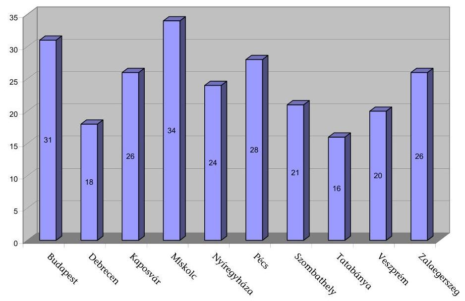

A rendelkezésre álló 16 és 34 közötti létszámmal kellett az ellenőrzésbe vont igazgatóságoknak ellátni a területükön lévő 2202 helyi önkormányzat és 97 többcélú kistérségi társulás költségvetési kapcsolatokból származó forrásai igénybevételének és elszámolásának felülvizsgálatát.

---

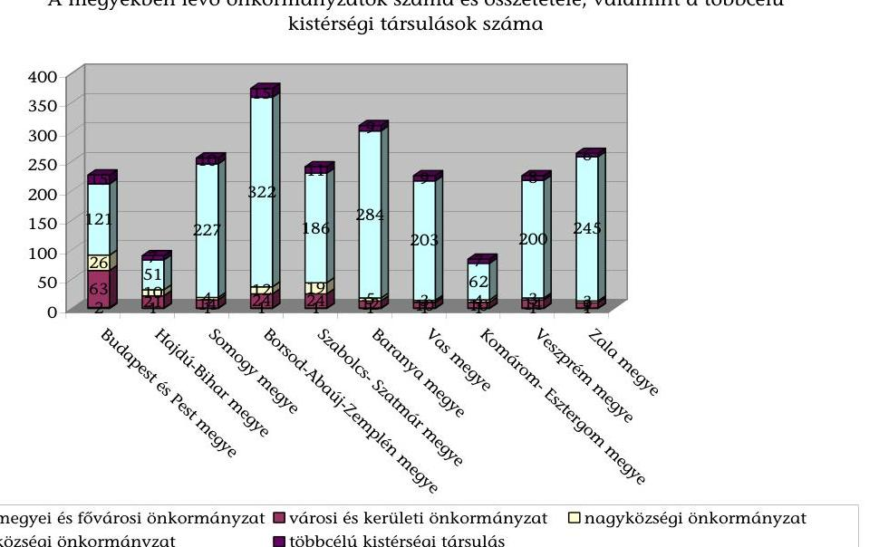

Az elvégzendő felülvizsgálat mennyisége függ a területen lévő önkormányzatok összetételétől, amely befolyásolja a fenntartott intézmények számát és nagyságát.

A megyékben lévő önkormányzatok megoszlása
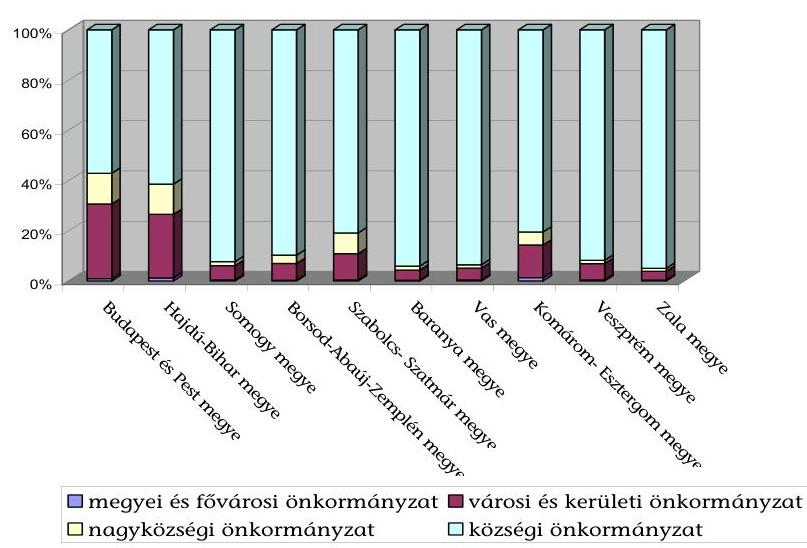

Az előző két diagram mutatja, hogy a legösszetettebb a feladat (az önkormányzatok számát is figyelembe véve) a Budapesti igazgatóságon, mivel ott a fővárosi, a megyei, a városi, a kerületi és a nagyközségi önkormányzatok darabszáma a legmagasabb (91), arányuk szemben az átlagos 13,7%-kal 43%. Ez az arány az ellenőrzésbe vont önkormányzatok közül Zala megyében a legalacsonyabb, 5%, ami 13 (1 megyei, 1 megyei jogú városi, 8 városi és 3 nagyközségi) önkormányzatot jelent.

---

Az önkormányzatok összesen 7041 intézményt tartanak fenn, amelyek területi megoszlása a következő:

Az önkormányzatok által fenntartott intézmények száma
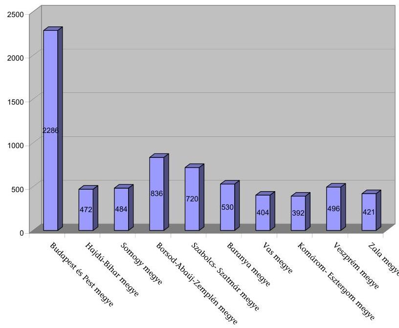

A felülvizsgálati feladat mértékére a területen lévő önkormányzatok mennyiségének a pályázati úton, illetve igényléssel kapcsolatos támogatások számát tekintve van hatása, míg intézmények száma és összetétele a normatív hozzájárulások, illetve a normatív kötött felhasználású támogatások és egyes normatívához kötött központosított támogatás felülvizsgálati feladatainak, nagyságát befolyásolja.

Az államháztartási irodák feladata továbbá a nem állami, humán szolgáltatást ellátó szervezetek által fenntartott intézmények költségvetési kapcsolatokból származó forrásai igénybevételének és elszámolásának ellenőrzése is. Ezen szervezetek megyénkénti megoszlását a következő diagram szemlélteti.

---

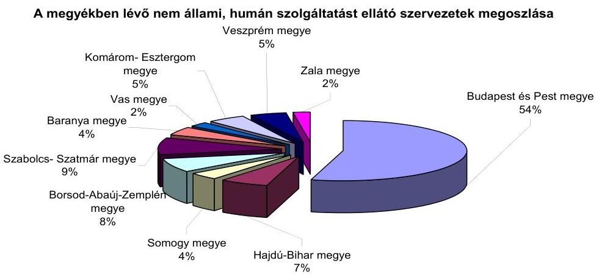

Az államháztartási irodák a Közép-magyarországi Régió ${ }^{11}$ kivételével két osztályra tagozódtak, amelyből az egyik osztály dolgozóinak feladata volt a felülvizsgálat.

A felülvizsgálati tevékenység ellátásának év közbeni ütemezése szempontjából vannak valamennyi önkormányzatot érintő feladatok, melyek a normatív állami hozzájárulások és a normatív kötött felhasználású támogatásokat érintő mutatószám felmérés, kiegészítő felmérés és az év közbeni változások felülvizsgálata. Szintén valamennyi önkormányzatot érinti a havi rendszerességgel feladatot jelentő egyes jövedelempótló támogatások kiegészítése és az önkormányzat által szervezett közfoglalkoztatás támogatása jogcímek. Ezen jogcímek dolgozók közötti felosztása számosságukra való tekintettel igényel szervezési feladatot.

Az önkormányzatok jogosultságuk alapján a 2006. évben folyamatosan igényelhettek támogatást három jogcímen ${ }^{12}$, évente négyszer két jogcímen ${ }^{13}$, évente kétszer három jogcímen ${ }^{14}$, a többi jogcímű támogatásban egyszer része-

[^0]
[^0]:    ${ }^{11}$ A Közép-magyarországi Régióban a nem állami, humán szolgáltatást ellátó szervezetek elszámolásának ellenőrzését külön Ellenőrzési Osztály végezte, míg a többi igazgatóságon ezt a feladatot is az önkormányzati felülvizsgálatot végzők látták el.
    ${ }^{12}$ Folyamatosan igényelhető támogatások voltak az önkormányzatok európai uniós fejlesztési

 pályázatai saját forrás kiegészítésének támogatása, a szakmai és informatikai fejlesztési feladatok támogatása és a működésképtelen helyi önkormányzatok egyéb támogatása.
    ${ }^{13}$ Négyszer volt igényelhető támogatás a lakossági közműfejlesztés támogatásához és a helyi szervezési intézkedésekhez kapcsolódó többletkiadások támogatásához.
    ${ }^{14}$ Két alkalommal volt igényelhető a támogatás a pincerendszerek, természetes partfalak és földcsuszamlások veszélyelhárítási munkálatainak támogatására, az érettségi és szakmai vizsgák lebonyolításának támogatására és az önhibájukon kívül hátrányos helyzetben lévő helyi önkormányzatok támogatására.

---

sülhettek. A felülvizsgálati feladat elosztásakor a jogcímeken megjelenő pályázatok várható darabszámát, illetve a pályázat megjelenésének határidejét kellett figyelembe venni.

A támogatások időbeli ütemezését a költségvetési törvény és az ágazati jogszabályok határozták meg.

A feladatok elosztását, a munka megszervezését nehezítette, hogy az önkormányzati költségvetések és költségvetési beszámolók átvételén, a kiegészítő mutatószám felmérésen és az április 15-ei lemondásokon kívül az előzetes felülvizsgálatot igénylő pályázatok beadási határideje és felülvizsgálata az összes jogcím 64,1%-ában az év első öt hónapjára jutott, ezen belül 12 támogatásigénylés (a támogatások egyharmada) felülvizsgálata február és március hónapokra.

Az igazgatóságokon a tényleges felülvizsgálati tevékenységet ellátó 164 dolgozónak éves szinten előzetesen 94844 db jövedelempótló támogatás és 18155 db közcélú foglalkoztatási támogatás megítélésén kívül különböző jogcímeken 26161 db támogatásigénylést, utólagosan 64661 db támogatási esetet kellett felülvizsgálni.

Az ellátandó feladat területi megoszlását a következő grafikon ábrázolja:
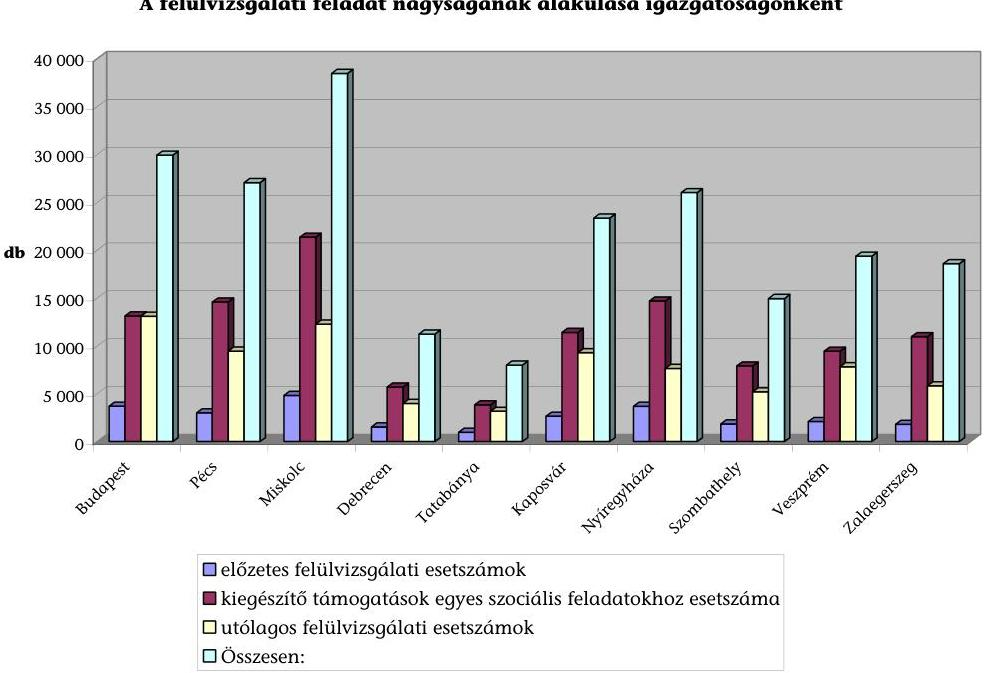

A Budapesti igazgatóságon az utólagos felülvizsgálatot nem végezték el. Számszerűsítve ez azt jelenti, hogy a 29916 felülvizsgálandó esetből (amit a grafikon ábrázol) 13091 nem valósult meg. Ezt figyelembe véve a ténylegesen felülvizsgált esetszámokat tekintve a 10 igazgatóság közül a negyedik helyen áll a munkavégzésben.

---

A felülvizsgálatot végzők számának ismeretében az egy főre jutó esetszám (a ténylegesen elvégzett felülvizsgálatok figyelembevételével) az egyes igazgatóságok között a következők szerint alakult:

Egy főre jutó felülvizsgálat
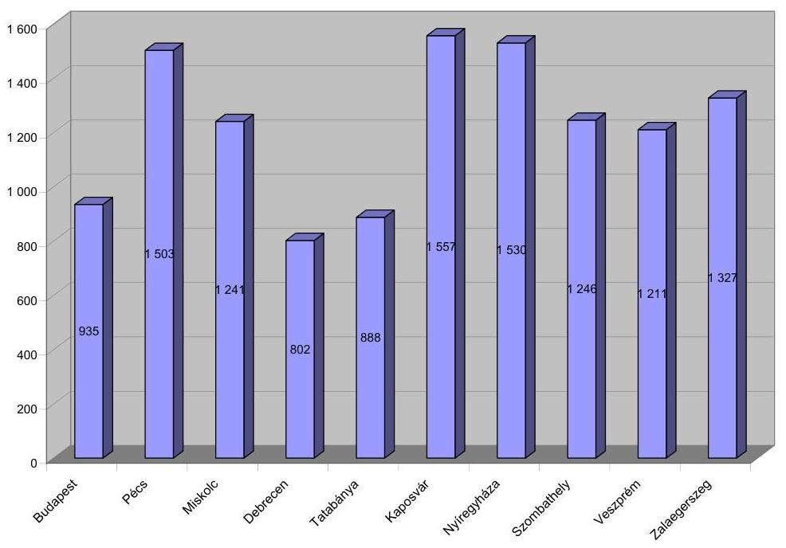

A Budapesti igazgatóságon a rendelkezésre álló létszámmal az utólagos felülvizsgálatot nem végezték el. Az ismert esetszám figyelembevételével az egy főre jutó felülvizsgálat 1662 lett volna, ami 6,7%-kal meghaladja a jelenleg legmagasabb esetszámot elérő igazgatóság értékét. Ugyanakkor a grafikonból az is megállapítható, hogy az igazgatóságokon dolgozók leterheltsége területileg eltérő, a legkisebb és legnagyobb egy főre eső esetszám közti eltérés 94,1%, 755 db.

Az előző feladatokon túl, a 2006. évben a Budapesti igazgatóság Ellenőrzési Osztályának nyolc dolgozójával együtt összesen 645 db nem állami, humán szolgáltatást ellátó szervezet intézményeit ellenőrizték az igazgatóságok.

A munka megszervezésénél az ellátandó feladat mennyiségét, ütemezését a lehetőségeknek megfelelően figyelembe vették.

Az ellátandó feladatok dolgozónkénti meghatározása igazgatóságonként megtörtént - biztosítva a felülvizsgálat elvégzését és utólagos számon-kérhetőségét - de annak módja eltérő volt. A munkaköri leírásban határozták meg a konkrét felülvizsgálati feladatokat a Debreceni, a Miskolci, a Nyíregyházi, a Tatabányai, a Veszprémi, a Zalaegerszegi igazgatóságokon, illetve a Budapesti igazgatóság Pest megyei részlegénél. A feladatot a munkaköri leírásban csak említették és a konkrét jogcímenkénti felosztást az éves munkatervben határozták meg a Kaposvári, a Pécsi és a Szombathelyi igazgatóságokon.

A felülvizsgálat az igazgatóságokon a rendelkezésre álló létszámmal egyes támogatások esetében csak többlet munkaidő igénybevételével volt elvégezhető.

---

A 2006. évben február 15. és 28. közé esett a felülvizsgálandó pályázatok közül a települési hulladék közszolgáltatás fejlesztésének támogatása, a települési önkormányzati szilárd burkolatú belterületi közutak burkolat felújításának támogatása, a helyi önkormányzatok fejlesztési és vis maior feladatainak támogatása, a vis maior tartalék és a lakossági víz- és csatornaszolgáltatás támogatás beadási és továbbítási határideje. Az előzőeken túl erre az időpontra esett a kiegészítő mutatószám felmérés, ezért túlmunka elrendelésére volt szükség a Debreceni, a Kaposvári, a Veszprémi és a Tatabányai igazgatóságon. Szintén túlmunka elrendelésére volt szükség márciusban a beszámolók, költségvetések átvétele, novemberben a mutatószám felmérés miatt, mivel ezeket a feladatokat is rövid határidővel kellett teljesíteni, és valamennyi önkormányzat esetében elvégezni.

Májusban az ÖNHIKI támogatás felülvizsgálata okozott többletfeladatot a Kaposvári, a Miskolci, a Nyíregyházi, a Szombathelyi és a Zalaegerszegi igazgatóságokon.

Az igazgatóságokon az elvégzett többletmunkát és annak szabadidőben történő kiadását nyilvántartották.

Miskolcon a 2006. évben 515 nap túlmunka és 412 nap áthozott szabadság szerepelt a dolgozók munkaidejének nyilvántartásában. Általánosságban elmondható, hogy minden hónapban végeztek túlmunkát, de annak legnagyobb része, 32%-a jellemzően az ÖNHIKI pályázatainak feldolgozásakor májusban és az önkormányzati beszámoló és költségvetés átvételekor március hónapban (18%) keletkezett.

Az igazgatóságok - a Budapesti igazgatóság kivételével - az adott létszámmal a jogszabályban előírt feladatokat elvégezték, de a rendelkezésre álló létszámmal a felülvizsgálat elvégzése a jogszabályokban azonos időre meghatározott pályázati beadási határidők, esetenként a végrehajtására rendelkezésre álló rövid határidő, illetve a normatív állami hozzájárulások és normatív kötött felhasználású támogatási jogcímeknél a felülvizsgálati tevékenység összetettsége miatt gondot okozott, amely a 2006. év végén történt létszámleépítések miatt a 2007. évben a feladat elvégzésénél kockázatot jelent.

Az igazgatóságokon a munkaidő nyilvántartáson belül nem különítették el az elvégzett feladatokra fordított időt (erre előírás sincs). A Kincstár a Tájékoztatóban kérte mind az előzetes, mind az utólagos felülvizsgálatra fordított munkanapok számát, amelyeket az igazgatóságok pontos nyilvántartás hiányában becsléssel állapítottak meg. A Tájékoztatóhoz szolgáltatott esetszámok, felülvizsgálatra fordított munkanapok és a felülvizsgálatban részt vevő dolgozók adataiból számított fajlagos mutatók igazgatóságonkénti összehasonlítása nagy mértékű eltéréseket mutat, aminek egyik oka a nem egységes szempontok szerinti, ezért megalapozatlan adatszolgáltatás.

---

| Megnevezés | $\begin{gathered} \mathrm{B} \\ \mathrm{u} \\ \mathrm{~d} \\ \mathrm{a} \\ \mathrm{p} \\ \mathrm{e} \\ \mathrm{~s} \\ \mathrm{~t} \end{gathered}$ | $\begin{gathered} \mathrm{P} \\ \text { é } \\ \mathrm{c} \\ \mathrm{~s} \\ \mathrm{i} \end{gathered}$ | $\begin{gathered} \mathrm{M} \\ \mathrm{i} \\ \mathrm{~s} \\ \mathrm{k} \\ \mathrm{o} \\ \mathrm{l} \\ \mathrm{c} \\ \mathrm{i} \end{gathered}$ | $\begin{gathered} \mathrm{D} \\ \mathrm{e} \\ \mathrm{~b} \\ \mathrm{r} \\ \mathrm{e} \\ \mathrm{c} \\ \mathrm{e} \\ \mathrm{n} \\ \mathrm{i} \end{gathered}$ | $\begin{gathered} \mathrm{T} \\ \mathrm{a} \\ \mathrm{t} \\ \mathrm{a} \\ \mathrm{~b} \\ \mathrm{á} \\ \mathrm{n} \\ \mathrm{y} \\ \mathrm{a} \\ \mathrm{i} \end{gathered}$ | $\begin{gathered} \mathrm{K} \\ \mathrm{a} \\ \mathrm{p} \\ \mathrm{o} \\ \mathrm{~s} \\ \mathrm{v} \\ \mathrm{á} \\ \mathrm{r} \\ \mathrm{i} \end{gathered}$ | $\begin{gathered} \mathrm{N} \\ \mathrm{y} \\ \mathrm{i} \\ \mathrm{r} \\ \mathrm{e} \\ \mathrm{~g} \\ \mathrm{y} \\ \mathrm{~h} \\ \mathrm{á} \\ \mathrm{z} \\ \mathrm{i} \end{gathered}$ | $\begin{gathered} \mathrm{S} \\ \mathrm{z} \\ \mathrm{o} \\ \mathrm{~m} \\ \mathrm{~b} \\ \mathrm{a} \\ \mathrm{t} \\ \mathrm{~h} \\ \mathrm{e} \\ \mathrm{l} \\ \mathrm{y} \\ \mathrm{i} \end{gathered}$ | $\begin{gathered} \mathrm{V} \\ \mathrm{e} \\ \mathrm{~s} \\ \mathrm{z} \\ \mathrm{p} \\ \mathrm{r} \\ \mathrm{e} \\ \mathrm{m} \\ \mathrm{i} \end{gathered}$ | $\begin{gathered} \mathrm{Z} \\ \mathrm{a} \\ \mathrm{l} \\ \mathrm{a} \\ \mathrm{e} \\ \mathrm{~g} \\ \mathrm{e} \\ \mathrm{r} \\ \mathrm{s} \\ \mathrm{z} \\ \mathrm{e} \\ \mathrm{~g} \\ \mathrm{i} \end{gathered}$ |
| :--: | :--: | :--: | :--: | :--: | :--: | :--: | :--: | :--: | :--: | :--: | :--: |
| 2006. évi forrásigénylés |  |  |  |  |  |  |  |  |  |  |  |
| Egy dolgozó felülvizsgálatra fordított munkanapjai | 200 | 86 | 61 | 107 | 47 | 83 | 120 | 112 | 76 | 218 |  |
| Egy felülvizsgálóra jutó esetek száma | 223 | 148 | 125 | 486 | 75 | 71 | 246 | 185 | 137 | 164 |  |
| Egy munkanap alatt végzett felülvizsgálat esetszáma | 1 | 2 | 2 | 5 | 2 | 1 | 2 | 2 | 2 | 1 |  |
| 2005. évi elszámolás |  |  |  |  |  |  |  |  |  |  |  |
| Egy dolgozó felülvizsgálatra fordított munkanapjai | 33 | 39 | 37 | 29 | 56 | 65 | 155 | 49 | 22 | 125 |  |
| Egy felülvizsgálóra jutó esetek száma | 2182 | 450 | 409 | 285 | 288 | 929 | 695 | 519 | 434 | 971 |  |
| Egy munkanap alatt végzett felülvizsgálat esetszáma | 65 | 12 | 11 | 10 | 5 | 14 | 4 | 11 | 20 | 8 |  |

A Tájékoztatóhoz a Kincstár a felülvizsgálatra fordított munkanapok számánál becsült adatot kér, a felülvizsgálatban résztvevő munkatársak számánál pedig minden dolgozó figyelembevételét kéri, aki a munkában részt vett. Ezáltal a munkanapokat tekintve az adatszolgáltatás nem megalapozott, a dolgozók leterheltségére nézve pedig az eltérő helyi munkaszervezések miatt nem hasonlítható össze, országos összegzése nem mutat valós képet a feladat elvégzéséről.

# 2.2. A felülvizsgálati tevékenység végrehajtásának tárgyi feltételei 

A felülvizsgálat ellátásának tárgyi feltételei valamennyi igazgatóságon biztosítottak. A dolgozók hálózatba kötött számítógéppel, telefonnal rendelkeznek. Az elektronikus levelezési lehetőség igazgatóságonként változó, esetenként a köz-

---

vetlen használatot az igazgatóság belső szabályozása nem engedi. Az igazgatóságokon van telefax. Az önkormányzatokkal a kapcsolattartás a költségvetések, beszámolók, illetve a pályázatok átvételekor személyesen, az adategyeztetéseknél pedig telefonon, a hibák gyors kijavításánál faxon (amelyet pótlólagos adatszolgáltatás követ), a hivatalos megkeresés pedig minden esetben levélben, vezetői aláírással történik.

A Miskolci igazgatóságon a számítástechnikai eszközök beszerzése folyamatos volt, így az elavult gépek felújítását, cseréjét biztosították, a többi igazgatóságon a számítástechnikai eszközök 60-80%-a három évnél régebbi beszerzésű, amelyek használata segíti a munkavégzést, de már korszerűtlen.

Az Áht. 64/A. § (2) bekezdése szerint az igazgatóságok a felülvizsgálatot a rendelkezésre álló iratok és saját nyilvántartások alapján végzik, azonban ennek belső tartalmát nem határozza meg. A Kincstár által kiadott Segédletben sorolták fel, hogy milyen dokumentumokra van szükség a felülvizsgálat elvégzéséhez, de ezeknek egységes rendszerét nem alakították ki. Az azonos feltételeket és elbírálást biztosító munkavégzéshez hiányzik egy központilag kialakított olyan egységes adattartalmú és szerkezetű adatbázis, amelyből a felülvizsgálat elvégzéséhez szükséges minden adat lehívható. Ennek hiányában az igazgatóságok a helyi lehetőségekhez képest alakították ki saját adatbázisaikat, amelyeket a dolgozók a felülvizsgálat során számítógépükről elérhetnek. Valamennyi igazgatóságon mindenki számára elérhetően rendelkezésre álltak az önkormányzati költségvetések, beszámolók, a mutatószám felmérés adatai, a központilag kialakított programok (adó, ÖNHIKI felülvizsgálati program, a jövedelempótló támogatások felülvizsgálati programja), a törzskönyvi nyilvántartás adatai és a KIR statisztika.

Az utólagos felülvizsgálat számítógépen történő elvégzését segíti a Kaposvári igazgatóság által kidolgozott Partner program, amelynek alkalmazása a 2007. évtől kötelező az igazgatóságok számára. A 2006. évi használatának és feltöltésének függvényében papír alapon, vagy számítógépről elérhetően rendelkeztek az igazgatóságok az alapító okiratokkal, társulási megállapodásokkal, működési engedélyekkel.

Az előzőkön túl valamennyi igazgatóságon dolgoztak ki Excel táblákat a felülvizsgálatokhoz.

Az igazgatóságok és az önkormányzatok közötti kapcsolattartásban, a támogatások igénybevétele és év végi elszámolása felülvizsgálatának elvégzése során még
 nem használták ki az elektronikus közigazgatás által nyújtott lehetőségeket.

---

# 3. A 2006. ÉVI FELÜLVIZSGÁLATI FELADATOK VÉGREHAJTÁSA 

### 3.1. A 2006. évi felülvizsgálatról szóló Tájékoztató összeállításához szükséges adatszolgáltatás teljesítése

### 3.1.1. Az adatszolgáltatás teljesítéséhez szükséges adatok meghatározásának módja

A PM rendelet 5. § (1) bekezdése alapján az igazgatóságok minden év április 30-áig összefoglaló jelentésben tájékoztatják a Kincstár elnökét az előző naptári évben végzett felülvizsgálatról. A Kincstár elnöke az igazgatóságok által benyújtott összefoglaló jelentések alapján a felülvizsgálatok összegzett tapasztalatait és összefoglaló adatait tájékoztatásul megküldi a pénzügyminiszter, az önkormányzati és területfejlesztési miniszter, valamint az Állami Számvevőszék elnöke számára.

A Kincstár a Tájékoztató összeállításához szükséges, adatszolgáltatást elrendelő körleveléhez mellékelte a kitöltési útmutatót és az összesítő táblázatokat. A kitöltési útmutató az egységes adatkezelés érdekében tartalmazta az önkormányzatok által különböző jogcímen igényelt, illetve pályázott állami hozzájárulások és támogatások előzetes felülvizsgálata eredményének kimutatására szolgáló táblázatok oszlopainak adattartalmát, valamint a vizsgált esetek számának meghatározásának módját ${ }^{15}$.

Az igazgatóságok eleget tettek a felülvizsgálatra vonatkozó PM rendeletben meghatározott - az önkormányzatok központi költségvetési kapcsolatokból származó forrásai 2006. évi felülvizsgálatának tapasztalatait összesítő - adatszolgáltatási kötelezettségüknek.

Az adatszolgáltatási kötelezettség kiterjedt az önkormányzatok központi költségvetési kapcsolatokból származó forrásai 2006. évi igénylésének, valamint a 2005. évet érintő elszámolásának felülvizsgálati tapasztalataira, összefoglaló adataira.

Az adatszolgáltatás teljesítéséhez az igazgatóságok számba vették az egyes állami hozzájárulásokkal, támogatásokkal kapcsolatos forrásigénylésnél, illetve az év végi elszámolás szabályszerűségénél a felülvizsgált támogatási összegeket, a vizsgált eseteket, ebből kigyűjtötték a hibásnak, a hiányosnak, illetve az eltérőnek minősítetteket, majd jogcímenként összesítették. Meghatározták az írásban kibocsátott felhívások, valamint a felhívásokra az önkormányzatok által elvégzett javítások, helyesbítések, hiánypótlások számát. Adatot szolgáltattak a felülvizsgálati tevékenységben résztvevők számáról és időráfordításáról.

Az igazgatóságok az adatszolgáltatási kötelezettségüknek

- a felülvizsgálatról jogcímenként vezetett összesített nyilvántartások felhasználásával, illetve

[^0]
[^0]:    ${ }^{15}$ Az önkormányzatok központi költségvetési kapcsolatokból származó forrásai felülvizsgálatának tapasztalataira irányuló adatgyűjtésnél az esetszám az igazgatóságokhoz beérkezett és felülvizsgált önkormányzati igénylések, pótigénylések, lemondások, pályázatok, koncepciók darabszáma.

---

- az igénylések, pályázatok alapdokumentumaiból kigyűjtéssel tettek eleget.

A 2006. évben az igazgatóságok fele vezetett az elvégzett felülvizsgálati tevékenységéről jogcímenként és önkormányzatonként részletezett nyilvántartást. A jogcímenként vezetett, majd összesített nyilvántartások adatai megfeleltek a Tájékoztató által igényelt adattartalomnak és részletezettségnek. Három igazgatóságon azon jogcímeknél, amelyekről vezettek nyilvántartást, ezek alapján, a többi jogcím esetében kigyűjtéssel határozták meg a Tájékoztatóhoz szükséges adatokat. A Debreceni és a Pécsi igazgatóságokon a felülvizsgálati tevékenységről nem vezettek jogcímenkénti részletezettségű nyilvántartást, ezért az igénylések, pályázatok alapdokumentumaiból összeállított kimutatások, feladások felhasználásával teljesítették az adatszolgáltatást. A jogcímenkénti nyilvántartások vezetésének hiánya nehezítette a felülvizsgálat végrehajtásának követhetőségét, az állami hozzájárulások, támogatások egyes jogcímeinél az igénylések, pályázatok felülvizsgálata együttes eredményének átláthatóságát, valamint a felülvizsgálati tevékenységre vonatkozó adatszolgáltatás teljesítését. A Tájékoztatóhoz közölt adatok pontossága, megalapozottsága nem függött össze az adatszolgáltatás teljesítésének módjával. Az állami hozzájárulások, támogatások felülvizsgálatáról jogcímenként vezetett nyilvántartások, illetve az alapdokumentumokból kigyűjtés alapján szolgáltatott adatok körében egyaránt fordultak elő pontatlanságok, hiányosságok.

# 3.1.2. Az előzetes felülvizsgálat során megállapított támogatási igénycsökkentések (növelések) alapja 

Valamennyi igazgatóság állapított meg a normatív állami hozzájárulások és a normatív kötött felhasználású támogatások kiegészítő felmérésének, az évközi pótlólagos igénylésének, valamint az előírányzatok lemondásának előzetes felülvizsgálata során jogtalan igénylést, együttesen 362208 ezer Ft összegben (3. számú melléklet). Az előzetes felülvizsgálat hatásaként a feltárt támogatási igény-növelés együttes összege 117869 ezer Ft volt (3. számú melléklet). Az előzetes felülvizsgálat során megállapított támogatási igény-csökkentés, illetve támogatási igény-növelés - két kivételtől eltekintve - a jogos igénybevételt alátámasztó működési engedélyek, módosított alapító okiratok, módosított társulási megállapodások hiánya miatti mutatószám eltérésen alapult. A kivételként hivatkozott igazgatósági megállapítások mindegyike az önkormányzatok jövedelemdifferenciálódása mérséklésének felülvizsgálatával függött össze.

A Veszprémi és a Zalaegerszegi igazgatóságokon a jövedelemkülönbség mérséklését szolgáló támogatásokhoz kötődően állapítottak meg támogatási igénycsökkenést, illetve növelést. A Veszprémi igazgatóság ezen a jogcímen 39156 ezer Ft, a Zalaegerszegi igazgatóság 1030 ezer Ft támogatási igénycsökkentésről, illetve 2434 ezer Ft igény-növelésről szolgáltatott adatot.

Az önkormányzatok jövedelemdifferenciálódása mérséklésének felülvizsgálatával összefüggésben közölt támogatási igény-csökkentési és növelési adatok nem voltak megalapozottak, mivel az Áht. 64/A. § (8) bekezdése szerint az önkormányzatok jövedelemkülönbségének mérséklését szolgáló támogatásokra és az azokat megalapozó, iparűzési adóerő-képességre vonatkozó adatszolgáltatást az igazgatóságoknak nem kell felülvizsgálniuk az igénylés és az évközi adat-

---

módosítás tekintetében. A Veszprémi és a Zalaegerszegi igazgatóságok olyan jogcímmel összefüggésben állapítottak meg támogatási igény-csökkentést és növelést, amelyre nem volt hatáskörük.

Az igazgatóságoknak a normatív állami hozzájárulások, valamint a normatív kötött felhasználású támogatások előzetes felülvizsgálatáról közölt támogatási igény csökkentésére, valamint növelésére vonatkozó adatszolgáltatása - a Budapesti, a Veszprémi és a Zalaegerszegi igazgatóságok kivételével - megalapozott volt. Az igazgatóságok adatszolgáltatását a nyilvántartásaik alátámasztották. A Budapesti igazgatóság adatszolgáltatása nem volt megalapozott, mert nem vették teljes körűen számba a megállapított támogatási igénycsökkentéseket, valamint a kiegészítő felmérés, az évközi pótlólagos igénylés és lemondások felülvizsgálatánál nem állapították meg a feltárt mutatószám eltéréseknek a jogtalan állami támogatás igénybevételére gyakorolt hatását.

A Budapesti igazgatóság a normatív állami hozzájárulások, valamint a normatív kötött felhasználású támogatások felülvizsgálata során megállapított támogatási igény-csökkentés összegéről 8682 ezer Ft-tal alacsonyabb értéket közölt, a támogatási igénycsökkentések nem teljes körű számbavétele miatt. A normatív állami hozzájárulások és a normatív kötött felhasználású támogatások kiegészítő felmérésére, valamint évközi pótlólagos igénylésére, lemondásaira irányuló felülvizsgálatnál egyaránt tártak fel mutatószám eltérést, az állami hozzájárulásra gyakorolt hatásukat azonban nem munkálták ki.

Az igazgatóságokon a normatív állami hozzájárulások, valamint a normatív kötött felhasználású támogatások előzetes felülvizsgálata eredményeként megállapított támogatási igény-csökkentés 62,1%-a volt az utólagos felülvizsgálat során feltárt önkormányzati visszafizetési kötelezettség összegének, a támogatási igény-növelés 23,6%-kal maradt el a kincstári kiutalási kötelezettségtől (3. számú melléklet).

A normatív állami hozzájárulások, valamint a normatív kötött felhasználású támogatások Tájékoztatóhoz közölt előzetes felülvizsgálati esetszámát a Debreceni igazgatóság nem a kitöltési útmutatóban előírt tartalom szerint határozta meg. Az igazgatóság az önkormányzatok, a többcélú kistérségi társulások által benyújtott igénylések, lemondások, pályázatok darabszáma helyett a felülvizsgált jogcímek összesített számát közölte, ezért adatszolgáltatásában a helyes adattartalom szerinti esetszámnál magasabb értéket szerepeltetett (473 esetszám helyett 5809-et).

Az igazgatóságok a központosított előirányzatok felülvizsgálata során együttesen 61279 ezer Ft-tal csökkentették, illetve 57761 ezer Ft-tal növelték az önkormányzatok támogatási igényeit (4. számú melléklet). A Tájékoztatóban közölt támogatási igény-csökkentés, illetve növelés összegei - a Szombathelyi igazgatóság adatszolgáltatása kivételével - a központosított előirányzatok igényléseinek, pályázatainak felülvizsgálata során feltárt tartalmi hibán alapultak. A központosított előirányzatok egyes jogcímeinél a támogatás igénylésére vonatkozó jogszabályi előírások önkormányzatok általi téves értelmezése és alkalmazása vezetett az eltérések megállapításához. A Szombathelyi igazgatóság által a települési önkormányzati szilárd burkolatú belterületi közutak burkolat-felújításának támogatása és a települési hulladék közszolgáltatás fejlesztésének támogatása jogcímek felülvizsgálata eredményeként a Tá-

---

jékoztatóhoz közölt 557738 ezer Ft támogatási igény-csökkentés, illetve 20850 ezer Ft támogatási igény-növelés összege téves adatszolgáltatáson alapult, a Ft-ban megállapított eltérések ezer Ft-ban történő kimutatása miatt.

A Szombathelyi igazgatóság által a Tájékoztatóban szerepeltetett támogatási igény-csökkentés 557180 ezer Ft-tal, a támogatási igény-növelés összege 20829 ezer Ft-tal haladta meg a helyes értéket.

A központosított előirányzatok jogcímeinek felülvizsgálata eredményeként megállapított támogatási igény-csökkentésről, illetve növelésről, valamint a vizsgált esetszámról szolgáltatott adatok két igazgatóságnál voltak alátámasztottak, megalapozottak. A Tatabányai és a Zalaegerszegi igazgatóságok adatszolgáltatása valós volt, mert a támogatási igény csökkentésének, valamint növelésének összegéhez és a vizsgált esetszámhoz az alapdokumentumokkal, nyilvántartásokkal alátámasztott adatokat közölték. Az igazgatóságok 80%-a (nyolc igazgatóság) által a támogatási igény-csökkentésére, növelésére, illetve a vizsgált esetszámra szolgáltatott adatok hiányosak, pontatlanok voltak, amelyek nem nyújtottak megalapozott információt az elvégzett felülvizsgálatról.

A Budapesti igazgatóságon a szakmai és informatikai fejlesztési feladatok jogcímnél a felülvizsgálók mutatószámon alapuló eltérés megállapításával önkormányzatonként meghatározták a támogatási igény csökkentésének (7289 ezer Ft) illetve növelésének (12359 ezer Ft) összegét. Az önkormányzatonként kiszámított támogatási igény eltéréseket nem összesítették, és nem jelenítették meg az adatszolgáltatásukban.

A Miskolci igazgatóságon a Tájékoztatóban közölteken túl további nyolc jogcím esetében 17829 ezer Ft támogatási igény-csökkentést, illetve hat jogcím esetében 8358 ezer Ft igény-növekedést állapítottak meg.

A Nyíregyházi igazgatóság adatközlését a támogatási igények csökkentésére, növelésére, valamint a felülvizsgált esetek számára az igazgatóságon vezetett nyilvántartások nem támasztották alá. A szakmai és informatikai fejlesztési feladatok jogcím felülvizsgálatának esetszámát, a feltárt támogatási igénycsökkentések és növelések összegét nem tartalmazta az adatszolgáltatás, illetve kétszer vették számba a települési önkormányzati szilárd burkolatú belterületi közutak burkolat-felújításának támogatása és a települési hulladék közszolgáltatás fejlesztésének támogatása jogcímek esetszámát.

A Szombathelyi igazgatóság adatszolgáltatása - a Ft értékadatok ezer Ft-ként történő közlése miatt - téves volt.

A központosított előirányzatok esetszámának meghatározásánál nem a kitöltési útmutatóban rögzítettek szerint jártak el a Budapesti, a Debreceni, a Kaposvári, a Miskolci, a Pécsi és a Veszprémi igazgatóságok, mivel a vizsgált esetszámnál nem vették figyelembe az önkormányzatok színházi támogatása, a szociális nyári gyermekétkeztetés, valamint a támogatás rendkívüli időjárás miatt keletkezett lakossági károk enyhítésére jogcímek esetszámát. ${ }^{16}$

[^0]
[^0]:    ${ }^{16}$ A felsorolt igazgatóságok Tájékoztatóban közölt, központosított előirányzatok vizsgált esetszámának adatát nem támasztotta alá a számvevői ellenőrzés számára átadott kapcsolódó tanúsítványuk.

---

Az igazgatóságokon a központosított előirányzatok egyes jogcímeinek előzetes felülvizsgálata során feltárt támogatási igény-csökkentés összege 27,1-szerese az utólagos felülvizsgálat során feltárt önkormányzati visszafizetési kötelezettségnek (4. számú melléklet). A központosított előirányzatok előzetes felülvizsgálatának esetszáma 42,5%-kal alacsonyabb az utólagos felülvizsgálat esetszámánál (4. számú melléklet).

Az igazgatóságok által az előzetes felülvizsgálat során feltárt önkormányzati támogatási igény-csökkentés nem minden esetben jelentette az állami támogatás jogtalan igénybevételének megakadályozását. A normatív állami hozzájárulások, a normatív kötött felhasználású támogatások, a normatív alapon járó központosított előirányzatok, valamint mindazon jogcímek, amelyek előzetes felülvizsgálata során a felülvizsgáló által javasolt állami támogatást a döntéshozó helybenhagyta a támogatási igény csökkentése egyben az állami támogatás jogtalan igénybevételének megakadályozását is jelentette. A központosított előirányzatok azon jogcímeinél azonban, amelyeknél az állami támogatás összegéről a felülvizsgálatot követően hoztak döntést (regionális fejlesztési tanács, kuratórium, miniszter) a támogatási igény csökkentése még nem jelentette az állami támogatás jogtalan igénybevételének megakadályozását.

# 3.1.3. Az utólagos felülvizsgálat során megállapított támogatási igénycsökkentések (növelések) alapja 

Az igazgatóságok a Tájékoztatóhoz közölt adatszolgáltatásukban a felülvizsgálat során tett megállapításaik alapján összesen 650426 ezer Ft visszafizetési kötelezettséget és 214438 ezer Ft kiutalási kötelezettséget mutattak be. Ez az összeg abszolút értékben 0,12%-a a felülvizsgált jogcímeken juttatott önkormányzati támogatásoknak.

A fenti összegekből a normatív állami hozzájárulások és a normatív kötött felhasználású támogatások év végi elszámolása szabályszerűségének felülvizsgálata során 585163 ezer Ft állami támogatás önkormányzati visszafizetési (a teljes összeg 90%-a), és 166601 ezer Ft állami támogatás kincstári kiutalási (a teljes összeg 77,7%-a) kötelezettségét állapították meg az igazgatóságok.

Az igazgatóságokon a
 normatív állami hozzájárulások és a normatív kötött felhasználású támogatások év végi elszámolása szabályszerűségének felülvizsgálata magában foglalta a rendelkezésre álló saját iratok, dokumentumok adattartalma által biztosított keretek között a mutatószámok megalapozottságának ellenőrzését. A Budapesti igazgatóság az utólagos felülvizsgálatot nem végezte el, így adatszolgáltatása nem a felülvizsgálat során megállapított adatokat tartalmazott.

Az adatszolgáltatásban közölt 7956 ezer Ft-os kincstári kiutalási kötelezettség azon alapult, hogy egy önkormányzat kérelmet nyújtott be, mivel a beszámolójában egy támogatással nem számolt el. A jogosultságot a Budapesti igazgatóság elismerte.

Kilenc igazgatóság esetében a megállapított önkormányzati visszafizetések és kincstári kiutalások az önkormányzati beszámolókban szereplő mutatószámok

---

felülvizsgálata során meghatározott eltéréseken alapultak, de a tájékoztatóhoz közölt adatszolgáltatásban a Zalaegerszegi igazgatóság hibás adatot közölt.

A Zalaegerszegi igazgatóság az adatszolgáltatásában 38056 ezer Ft állami támogatás visszafizetési kötelezettséget mutatott be, ezzel szemben a tényleges összeg 37979 ezer Ft. Az eltérés oka, hogy a Tájékoztatóhoz az adatokat összesített nyilvántartás hiányában kigyűjtéssel adták meg, amelynek során számítási hiba történt.

Nyolc igazgatóságnak a Tájékoztatóhoz közölt adatszolgáltatása valós volt.
A normatív állami hozzájárulások és a normatív kötött felhasználású támogatások jogcímein kívül az igazgatóságok 40%-a eltérést állapított meg a központosított előirányzatok és egyéb kötött felhasználású támogatások felülvizsgálatánál (2262 ezer Ft visszafizetési és 2026 ezer Ft kincstári kiutalási kötelezettség), 60%-a a jövedelemkülönbség mérséklés elszámolásánál (5550 ezer Ft visszafizetési és 7627 ezer Ft kincstári kiutalási kötelezettség) és 70%-a az ÖNHIKI elszámolásnál (57451 ezer Ft visszafizetési és 38184 ezer Ft kincstári kiutalási kötelezettség).

Az adatszolgáltatás ezen jogcímeinél is találtunk nem a felülvizsgálaton alapuló megállapításokat.

A Budapesti igazgatóság az adatszolgáltatásban a központosított előirányzatok között öt támogatási igény csökkentést (723 ezer Ft összegben) és két támogatási igény növelést (1988 ezer Ft összegben) szerepeltetett.

Az önkormányzatokkal kitöltetett központilag előírt nyomtatvány alapján öt önkormányzatnál keletkezett visszafizetési kötelezettség dupla, illetve téves igénylések miatt. Egy többcélú kistérségi társulás és egy önkormányzat téves adatszolgáltatás miatt igényelt vissza támogatást.

A Szombathelyi igazgatóság a központosított előirányzatok és egyéb kötött felhasználású támogatások oszlopában a 108 ezer Ft önkormányzati visszafizetés 52 ezer Ft összegben nem az Igazgatóság által megállapított eltérésből adódó visszafizetési kötelezettséget is tartalmazott.

A gyermek és ifjúsági feladatok jogcímnél három önkormányzat a pályázati elszámolásában visszafizetésként szerepeltetett 51883 Ft fel nem használt pályázati támogatást.

Az igazgatóságok adatszolgáltatásában a nem a tényleges felülvizsgálaton alapuló bemutatott visszafizetési, illetve kincstári kiutalási kötelezettségek miatt, összegszerűségét tekintve a Kincstár Tájékoztatója sem valós.

Szintén nem valós adatot tartalmaz a Tájékoztató az esetszámok tekintetében. A kitöltési útmutató és a táblázat szövege szerint is esetszámként a vizsgált esetek mennyiségi adatait kell az igazgatóságoknak beírni, ezzel szemben a normatív állami hozzájárulások és a normatív kötött felhasználású támogatások tekintetében valamennyi igazgatóság közölte az esetszámban az ÁSZ által ellenőrzött és az igazgatóság által elfogadott eseteket is. Egy igazgatóság a hibásnak minősített eseteknél közölt téves adatot.

---

A Nyíregyházi igazgatóság a vizsgált eseteknél a Tájékoztatóban helyes adatot (5060) szerepeltetett (az előfordult összes eset 7989 volt), de a hibásnak minősített elszámolási adatok száma a közölt 3894 helyett csak 1404 volt.

A központosított előirányzatok és egyéb kötött felhasználású támogatások esetében az esetszám - a mutatószámhoz kötött támogatások kivételével - a beszámoló űrlapján megjelenő jogcímek összességét tartalmazza, mivel ezeknél csak az előirányzat és teljesítés összegszerűségének egyeztetésére van lehetőség, nem az elszámolás szabályszerűségének felülvizsgálatára.

Az utólagos elszámolás esetében az Útmutató nem ad eligazítást a Tájékoztatóban közölt adatok soronkénti összefüggéseihez. Ezáltal az országos összesítésben nincs meg az egyezőség az írásban kibocsátott felhívások száma és az erre különböző módon történt teljesítések összesített adata közt, nincs meg az egyezősége a felhívásra teljesített módosítások számán belül a visszafizetések és kiutalások összesített esetszámának. Az egyezőségek hiánya miatt az adatszolgáltatás nem megbízható.

# 3.2. Az igazgatóságoknál elvégzett előzetes felülvizsgálati feladatok ellátása 

### 3.2.1. Az előzetes felülvizsgálati feladatok ellátása

Az igazgatóságok előzetes felülvizsgálati feladatai - az Áht. 64/A. és 64/B. §-iban foglaltak alapján - a megyében lévő önkormányzatokra és többcélú kistérségi társulásokra vonatkozóan

- a 2006. évi normatív állami hozzájárulások, normatív kötött felhasználású támogatások kiegészítő felmérésének, évközi pótigénylésének, lemondásainak, a központosított előirányzatok, a működőképesség megőrzését szolgáló kiegészítő támogatások és a fejlesztési célú támogatások igényléseinek, pályázatainak, valamint
- a 2007. évi költségvetés elkészítéséhez a mutatószámok felmérésének felülvizsgálata volt.

Az előzetes felülvizsgálat az állami hozzájárulások, támogatások egyes jogcímeinek jelentős különbséget mutató esetszáma miatt eltérő mérvű feladatot jelentett az igazgatóságokon a felülvizsgálatot végzők számára.

---

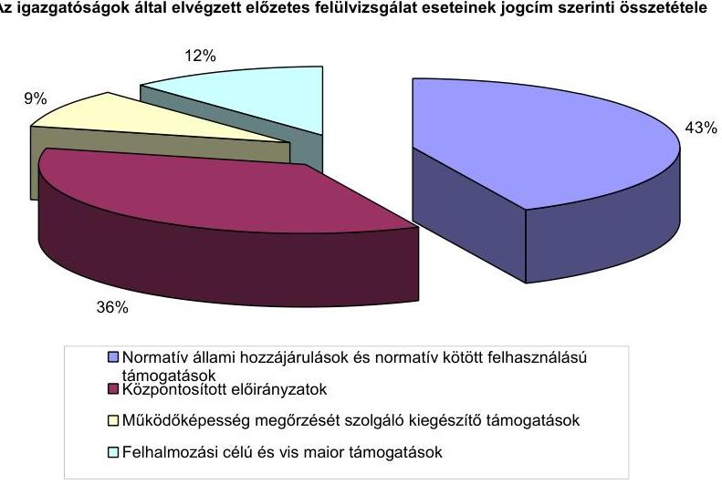

Az önkormányzatok, a többcélú kistérségi társulások a normatív állami hozzájárulások és a normatív kötött felhasználású támogatások ${ }^{17}$ kiegészítő felmérésével, évközi lemondásaival, pótigénylésével, valamint a 2007. évi mutatószám felméréssel kapcsolatban 11227 (3. számú melléklet) igénylést, lemondást nyújtottak be az igazgatóságokra.

A legmagasabb számú önkormányzati igénylés, lemondás a Miskolci igazgatóságra (1866), a legkevesebb a Tatabányai igazgatóságra (424) érkezett.

Az igazgatóságok - a Budapesti igazgatóság kivételével - az önkormányzatok, a többcélú kistérségi társulások teljes körére elvégezték a normatív állami hozzájárulások és a normatív kötött felhasználású támogatások mutatószám felmérésének, kiegészítő igénylésének felülvizsgálatát. Ellátták a változásokkal érintett önkormányzatoknál az évközi pótigénylések, lemondások felülvizsgálatát. A Budapesti igazgatóságon a fővárosi és a fővárosi kerületi önkormányzatok normatív állami hozzájárulásai, és normatív kötött felhasználású támogatásai évközi igényléseinél, lemondásainál az előzetes felülvizsgálatot az igénylőlapokon, illetve felülvizsgálati lapon nem dokumentálták, emiatt a felülvizsgálat végrehajtása nem volt igazolható.

Az előzetes felülvizsgálat összes esetszámából a normatív állami hozzájárulások és a normatív kötött felhasználású támogatások előzetes felülvizsgálati feladatai 42,9%-os arányt képviseltek.

[^0]
[^0]:    ${ }^{17}$ A normatív kötött felhasználású támogatások előzetes felülvizsgálati esetszáma nem tartalmazta az egyes jövedelempótló támogatások kiegészítése, és az önkormányzat által szervezett közfoglalkoztatás támogatása jogcímek adatait. Az egyes jövedelempótló támogatások kiegészítése, valamint az önkormányzat által szervezett közfoglalkoztatás támogatása jogcímek elkülönítését a magas esetszámokból eredő torzító hatás indokolta.

---

A 2006. évben a normatív kötött felhasználású támogatások köréből az egyes jövedelempótló támogatások kiegészítése és az önkormányzat által szervezett közfoglalkoztatás támogatása jogcímekre 112999 igénylés érkezett az igazgatóságokra. Az előzetes felülvizsgálati feladatok között e két jogcímre benyújtott igénylések száma volt a legmagasabb.

Az önkormányzatok a legnagyobb számú igénylést (21 361 db) a Miskolci igazgatóságra nyújtották be. Az összes igénylés 56,4%-a négy igazgatóságnál (a Budapesti, a Miskolci, a Nyíregyházi és a Pécsi igazgatóságoknál) jelentkezett.

Az igazgatóságok az egyes jövedelempótló támogatások kiegészítése és az önkormányzat által szervezett közfoglalkoztatás támogatása jogcímekre benyújtott összes igénylést felülvizsgálták. A havi, illetve a negyedéves gyakorisággal érkezett igénylések felülvizsgálata a számítógépes program alkalmazása mellett is jelentős munkaerő-kapacitást kötött le.

A központosított előirányzatokból ${ }^{18}$ elnyerhető támogatásokra 9355 (4. számú melléklet) igénylés, pályázat érkezett az igazgatóságokra.

A legtöbb igénylést, pályázatot - az összes igénylés 22,3%-át - a fővárosi, fővárosi kerületi és a Pest megyei önkormányzatok nyújtották be. Borsod-Abaúj-Zemplén megyében minden önkormányzat és többcélú kistérségi társulás (374 db) igényelt a központosított előirányzatokból támogatást, valamint a központosított előirányzatok valamennyi jogcímére (29) nyújtottak be igénylést, pályázatot a Miskolci igazgatóságra.

A 9355 igénylés, pályázat 9,8%-a a központosított előirányzatok két jogcímére a települési önkormányzati szilárd burkolatú belterületi közutak burkolatfelújításának támogatására, valamint a települési hulladék közszolgáltatás fejlesztésének támogatására érkezett. A központosított előirányzatok többi jogcímére 2285 önkormányzat és többcélú kistérségi társulás 8439 igénylést, pályázatot adott be.

Az igazgatóságokon a központosított előirányzatok jogcímeire érkezett valamennyi igénylést, pályázatot - a Debreceni igazgatóság kivételével - felülvizsgálták. A Debreceni igazgatóságon a lakossági víz- és csatornaszolgáltatás támogatása jogcímre benyújtott igénylések felülvizsgálatát nem dokumentálták, emiatt a felülvizsgálat végrehajtása nem volt igazolható.

Az előzetesen felülvizsgált összes igénylésből, pályázatból 35,8%-ban részesedtek a központosított előirányzatok igénylései, pályázatai. Az igazgatóságokon a központosított előirányzatokhoz kötődően elvégzett felülvizsgálati munka terjedelmét jelzi, hogy az egy önkormányzat által a központosított előirányzatok jogcímeire benyújtott átlagos pályázati szám 4,1 db volt a 2006. évben.

Az önkormányzatok működőképességének megőrzését szolgáló kiegészítő támogatások köréből 1255 támogatási igénylést az önhibáján kívül hátrányos

[^0]
[^0]:    ${ }^{18}$ A központosított előirányzatok igényléseinek, pályázatainak száma tartalmazza az egyéb támogatások (önkormányzatok színházi támogatása, szociális nyári étkeztetés, támogatás rendkívüli időjárás miatt keletkezett lakossági károk enyhítésére) azonos tartalmú adatát.

---

helyzetbe került önkormányzatok támogatására, 1020 támogatási igénylést a működésképtelen önkormányzatok egyéb támogatására, és egy igénylést a tartósan fizetésképtelen helyzetbe került helyi önkormányzatok támogatására nyújtottak be az önkormányzatok. Az igazgatóságok elvégezték az együttesen 2276 (5. számú melléklet) kiegészítő támogatási igénylés felülvizsgálatát, amely az előzetes felülvizsgálat összes esetszámából 8,7%-ot képviselt.

# 3.2.2. Az egyes jogcímeknél elvégzett felülvizsgálat szabályozással való összhangja 

A szabályozásban rögzített tartalommal végezte el az ellenőrzést az a hat igazgatóság, amely a belső szabályozás keretében meghatározta a 2006. évi normatív állami hozzájárulások, normatív kötött felhasználású támogatások kiegészítő felmérésének, évközi pótigénylésének, lemondásainak, valamint a 2007. évi költségvetés tervezéséhez a mutatószám felmérés felülvizsgálatának szempontjait. Azon igazgatóságok, amelyek nem dolgozták ki a felülvizsgálati szempontokat közvetlen vezetői irányítással, utasítással (Pécsi igazgatóság), a felülvizsgálatot megelőző irodaértekezleteken az ellenőrzési feladatok kijelölésével, útmutatással (Nyíregyházi igazgatóság) szervezték meg az előzetes felülvizsgálatot, és biztosították annak az egységes szemléletű ellátását.

A normatív állami hozzájárulások, a normatív kötött felhasználású támogatások kiegészítő felmérésének, évközi pótigénylésének, lemondásainak, valamint mutatószám felmérésének felülvizsgálata - a szabályozással összhangban - a formai és a tartalmi követelmények betartásának ellenőrzésére irányult. A formai követelmények betartása között egyeztették az önkormányzat azonosító adatait, vizsgálták az előírt határidő betartását, az aláírások, a bélyegző meglétét, az állami támogatásról való lemondás esetén a visszafizetési kötelezettség végrehajtásának módjára vonatkozó nyilatkozat meglétét. A felülvizsgálat tartalmi szempontjai az igénylés, a pótigénylés, a lemondás jogosságának, valamint az igénybevétel lehetséges, legnagyobb mértékének megítélésére irányultak. Az igénylés jogosságánál megvizsgálták, hogy az önkormányzat, vagy annak intézménye jogosult-e a hozzájárulás, támogatás alapjául szolgáló tevékenység ellátására, ennek érdekében ellenőrizték a működési engedélyek meglétét, az önkormányzati oktatási és kulturális intézmények alapító okiratait.

A Tatabányai igazgatóság felülvizsgálata során megállapította, hogy Piliscsév Község Önkormányzatának általános iskolája alapító okiratában nem szerepelt a fejlesztő-felzárkóztató oktatási, valamint a sajátos nevelési igényű tanulók nevelési, oktatási feladat. Mivel az önkormányzat a kiegészítő felmérésnél mindkét jogcímen tüntetett fel mutatószámot az igazgatóság írásbeli felhívásban kérte az esetleges módosított alapító okirat beküldését, ennek hiányában a mutatószám felmérés módosítását. Az igazgatóság a 2006. júliusi pótigénylés és lemondás felülvizsgálata során felhívással élt Vértesszőlős Község Önkormányzata felé, mivel az önkormányzatnak nem volt működési engedélye a gyermekjóléti szolgáltatások ellátására. A polgármester válaszában elismerte, hogy az Önkormányzat nem jogosult ezen a jogcímen normatív állami támogatásra.

A tervezett igénybevétel lehetséges legnagyobb mértékének megítélésére szolgáló, a felülvizsgálat során érvényesített ellenőrzési szempontok voltak:

---

- a rendelkezésre álló alapító okiratokban, működési engedélyekben feltüntetett mutatószámok mértéke,
- az évközi módosítás esetén a pótigény, illetve a lemondás jogossága,
- a töredékévi működtetésnél
 a normatív hozzájárulás jogosultsági hónapjai megállapításának megfelelőssége,
- az előző év adataival való összevetés, valamint
- a normatív állami hozzájárulással finanszírozott egyes feladatok közötti összefüggések figyelembevételével az alapnormatívák és a kiegészítő normatívák összehasonlítása. Az egyes feladatok közötti összefüggés alapján a kiegészítő normatívák mutatószámai nem haladhatták meg az alapnormatíváknál közölt adatokat. (Az ingyenes bölcsődei étkeztetés hozzájárulást legfeljebb annyi gyermek után lehetett igénybe venni, ahány bölcsődés gyermek után az alapnormatívát igényelték.)

A Zalaegerszegi igazgatóságon Vonyarcvashegy Község Önkormányzata 2006. júliusi lemondásának felülvizsgálata során a logikai összefüggés hiányát állapították meg, mivel az önkormányzat lemondott a 11 fő óvodáskorú utáni óvodai nevelés alap-normatíváról, ugyanakkor az 1500-3000 fő lakosságszám közötti kistelepülések vonatkozó kiegészítő támogatási összegéről nem. Ezzel azonos módon járt el Egervár, Zalakomár és Molnári Község Önkormányzata, amelyeknél az alap-normatíva lemondás ellátotti létszámadatát elfogadta az igazgatóság, és felszólította az önkormányzatokat a kapcsolódó kiegészítő normatíva rendezésére.

Az új feladattal párosuló pótigény esetén a felülvizsgálat a közoktatási jogcímeknél kiterjedt az alapító okiratok, az intézményfenntartó társulási szerződések, a szociális jogcímeknél a működési engedélyek, társulási megállapodások, valamint a törzskönyvi bejegyzések meglétének ellenőrzésére.

A központosított előirányzatok egyes jogcímeinek felülvizsgálatát szabályozó igazgatóságok a szabályozásban meghatározott felülvizsgálati szempontok szerint hajtották végre az előzetes felülvizsgálati feladatokat. A felülvizsgálati lapok, felülvizsgálati táblák (Szombathelyi igazgatóság) felülvizsgálati szempontjai alapján ellenőrizték az igénylő, a pályázó adatait (a könyvtári érdekeltségnövelő támogatásnál a pályázó azonosító adatának egyeztetését a törzskönyvi nyilvántartással vetették össze), az igénylés, illetve a pályázat űrlapjainak kitöltésének formai megfelelősségét, a csatolandó dokumentumok meglétét. Az egyes jogcímeknél elvégezték a szabályozásban előírtak szerint a benyújtott dokumentumok tartalmi felülvizsgálatát. A tartalmi felülvizsgálati szempontok között értékelték, hogy az igénylés, a pályázat megfelel-e a célnak, a feltüntetett saját forrás összegét alátámasztották-e (képviselőtestületi határozattal), betartották-e a vonatkozó ágazati rendeletek támogatás összegére, feltételeire vonatkozó előírásokat (a települési önkormányzati szilárd burkolatú belterületi közutak burkolat-felújításának támogatásánál ellenőrizték, hogy az igényelt támogatás mértéke nem haladja-e meg a felső értékként előírt 50%-ot). A központosított előirányzatok azon jogcímeinek felülvizsgálatánál, amelyeknél az igazgatóság nem határozta meg a felülvizsgálati szempontokat, az elvégzett ellenőrzés tartalmára (az ágazati rendeletekben, a pályázati feltételek között előírt dokumentumok meglétének ellenőrzésére, valamint az egyes intézkedésekre) az igénylőlapokon rögzített feljegyzések utaltak. A központosított előirányzatok felülvizsgálati szempontjainak meghatározása hiányában nem volt biztosított a felülvizsgálatot ellátók között a felülvizsgálati feladatok azonos szempont szerinti végrehajtása, ha egy jogcímet több munkatárs vizsgált felül (Budapesti igazgatóság).

Az önkormányzatok működőképességének megőrzését szolgáló kiegészítő támogatásokon belül az önhibájukon kívül hátrányos helyzetben lévő önkormányzatok támogatási igényléseinek felülvizsgálatát a kincstári egységes szabályozási követelményeknek megfelelően hajtották végre. Elvégezték a felülvizsgálati lapon előírt ellenőrzési szempontok szerinti vizsgálatot, a számítógépes ellenőrzést, ehhez mellékelték a hibalistát, illetve indokolt esetben annak magyarázatát. A kitöltött felülvizsgálati lap mellé - a követelményeknek megfelelően - szöveges indoklást készítettek. Az igazgatóságokon a felülvizsgálók a működésképtelen helyi önkormányzatok egyéb támogatására benyújtott támogatási kérelmeknél ellenőrizték az előírt csatolandó dokumentumok meglétét, valamint a támogatási kérelem szabályszerűségét.

# 3.2.3. Az igényjogosultság megítéléséhez szükséges adatok, információk biztosítása 

Az Áht. 64/A. § (1), valamint a 64/B. § (3) bekezdésében foglaltak szerint az igazgatóságok elsődlegesen a rendelkezésükre álló iratok és a saját nyilvántartásuk alapján vizsgálták meg az igényléseket, lemondásokat, pályázatokat. A felülvizsgálat Áht-ban történt előírását követően fokozatosan alakították ki és fejlesztették a rendelkezésre álló iratok, dokumentumok, a saját nyilvántartások alkotta olyan adatállományt, amely szükséges az előzetes felülvizsgálat elvégzéséhez. Az igazgatóságok önállóan és elkülönülten alakították, formálták a felülvizsgálatot segítő adatállományukat, mivel a Kincstár szintjén egységes, rendszerben foglalt és közvetlen elérést biztosító felülvizsgálati adatbázist nem hoztak létre. Az igazgatóságok által létrehozott adatállományokban az azonos alapadatok (törzskönyvi nyilvántartás, mutatószámok) mellett eltérő részletezettségű, mélységű nyilvántartások is megtalálhatók voltak, amelyek különböző feltételeket teremtettek igazgatóságonként a felülvizsgálat elvégzésére.

A felülvizsgálatot végzők számára a normatív állami hozzájárulások és a normatív kötött felhasználású támogatások felülvizsgálatához az igényjogosultság megítéléséhez biztosított volt a felülvizsgált önkormányzat, önkormányzati költségvetési szerv törzskönyvi nyilvántartása (általában papír alapon, illetve egyes igazgatóságokon a Partner program adatbázisában), alapító okirata, működési engedélye (a Budapesti igazgatóság kivételével), a többcélú kistérségi társulások társulási megállapodása, valamint a közoktatási statisztikák. Segítették az igényjogosultság alátámasztásának vizsgálatát a saját belső nyilvántartásokból rendelkezésre álló előző évek idősorának, az önkormányzatok szakfeladatrendjének információi, valamint a számítógépes egyéb adatbázisok (lakosságszám, települések adatai). Lehetőség szerint gondoskodtak a módosított alapító okiratok, működési engedélyek, társulási megállapodások adatállományba illesztéséről. A felülvizsgálat során több ízben - a hiányzó adatok bekérése folytán - tettek szert a módosított alapító okiratra, társulási megállapodásra. Gondoskodtak az adatállományok frissítéséről, az új információk számítógépre telepítéséről, valamint az önkormányzatok dokumentációit érintő változások átvezetéséről. Az új támogatási jogcímek megjelenésekor általában hiánypótlás keretében jutottak a szükséges iratokhoz. A közoktatási normatívák mutatószámainak felülvizsgálatához rendelkezésre álló adatállományt bővítette a Miskolci igazgatóság a KIR statisztika kapcsolódó űrlapjainak önkormányzatoktól történő bekérésével. A Budapesti igazgatóságon a fővárosi kerületi önkormányzatok által a szociális, a gyermekjóléti és a gyermekvédelmi költségvetési feladatokhoz igényelt normatív állami hozzájárulásoknál az igényjogosultság megítéléséhez hiányosan álltak rendelkezésre a működési engedélyek.

A Budapesti igazgatóságon az egyes kerületi önkormányzatok szociális, gyermekjóléti és gyermekvédelmi költségvetési szerveinek, feladatainak működési engedélyeivel eltérő mértékben rendelkeztek. A Budapest Főváros IV. kerületi önkormányzatának kilenc szociális, gyermekjóléti és gyermekvédelmi költségvetési szerve feladata igényléseinek felülvizsgálatához egyetlen működési engedély sem állt rendelkezésre. A Budapest Főváros V. kerületi önkormányzata ugyanezen feladatokat ellátó hét intézménye közül háromnak volt meg a működési engedélye az igazgatóságon.

A 2006. év során a Budapesti igazgatóság - a felülvizsgálatra vonatkozó PM rendelet 8. §-a alapján - pótlólagos információkérés keretében a többcélú kistérségi társulásoktól bekérte a szociális és gyermekjóléti szolgáltatások működési engedélyeit. A többcélú kistérségi társulások igényléseinek felülvizsgálatához felhasznált működési engedélyek hozzájárultak az állami hozzájárulások, támogatások jogtalan igénybevétele megalapozottságának megállapításához és megakadályozásához.

A központosított előirányzatok egyes jogcímei felülvizsgálatához a legfontosabb információkat tartalmazó vonatkozó ágazati jogszabályok, pályázati felhívások mellett, a pályázati megfelelést igazoló, rendelkezésre álló dokumentumokat biztosították a felülvizsgálók számára. Az igényjogosultság megítéléséhez szükséges és biztosított adatok, információk jogcímenként különbözőek voltak:

- A pályázati kiírások meghatározták az igényjogosultságra is utaló csatolt dokumentumok körét (a könyvtári érdekeltségnövelő támogatási kérelemhez az alapító okirat csatolását);
- Rendelkezésre álltak a jelenlegi és a korábbi évek dokumentációi. Az évente ismétlődő jogcímeknél (kompok, révek fenntartásának, felújításának támogatása, helyi közforgalmú közlekedés normatív támogatása) az igényjogosultság megítéléséhez rendelkezésre álltak az előző évek pályázatai. Az év végi elszámoláshoz kötött jogcímek esetében az előző év elszámolásai segítették a felülvizsgálót az ellenőrzésben. (A helyi közforgalmú közlekedés normatív támogatása jogcím felülvizsgálatához szükséges volt az előző évi elszámolás teljesítményre és fajlagos ráfordításra vonatkozó adatainak ismerete.) A szakmai és informatikai fejlesztési feladatok jogcím igénylésénél a mutatószámok felülvizsgálatához felhasználást nyertek a normatív állami hozzájárulások iskolai oktatás jogcím mutatószámai;
- Az igazgatóságok társosztályaitól beszerzett dokumentumok segítették az egyes jogcímek felülvizsgálatát. Az Illetményszámfejtési Iroda illetmény-adatokat szolgáltatott a helyi szervezési intézkedésekhez kapcsolódó többletkiadások támogatása jogcímnél a felszabaduló létszám illetményének ellenőrzéséhez, a helyi önkormányzati hivatásos tűzoltóságok kiegészítő támogatása jogcímnél a személyi juttatások felülvizsgálatához. A települési önkormányzati szilárd burkolatú belterületi közutak burkolat-felújításának támogatása jogcímhez az Állampénztári Iroda nyújtott információkat (az Országos Támogatási Monitoring Rendszer alapján) az előző évek pályázatairól, a folyósított támogatási összegekről.

Az önkormányzatok működőképességének megőrzését szolgáló kiegészítő támogatások között az önhibájukon kívül hátrányos helyzetben lévő önkormányzatok támogatási igényléseinek felülvizsgálatához az igazgatóságokon rendelkezésre álltak a támogatási igényt benyújtó önkormányzatok előző évi és tárgyévi költségvetése, előző évi beszámolója, illetve a személyi juttatásokkal kapcsolatos információk.

A Miskolci igazgatóság a felülvizsgálatot segítő kimutatásokat készített, segédtáblát állított össze a szociális kiadások korrekciójához, valamint a köztisztviselői illetmények összegéről, a tárgyévi átlaglétszámokról.

A működésképtelen helyi önkormányzatok egyéb támogatása felülvizsgálatához biztosították a tárgyévi költségvetést, költségvetési rendeletet, az igénylő önkormányzat folyamatban lévő beruházásainak forrásaira vonatkozó információkat, illetve a negyedéves mérlegjelentéseket.

# 3.2.4. Az igazgatóságokon rendelkezésre álló iratok, nyilvántartások, adatok alkalmassága a jogtalan igénylés kiszűrésére 

Az igazgatóságokon az előzetes felülvizsgálat során a normatív állami hozzájárulások jogcímeinél a jogtalan igénylés kiszűrése céljából az igényjogosultságot, és a tervezett igénybevétel mértékét ellenőrizték.

A normatív állami hozzájárulások és a normatív kötött felhasználású támogatások kiegészítő felmérésében, évközi igényléseiben és lemondásaiban szerepeltetett mutatószámok felülvizsgálatánál az igényjogosultság ellenőrzésére az intézményi szervezeti formában ellátott feladatoknál alkalmasak voltak az igazgatóságokon rendelkezésre álló törzskönyvi nyilvántartás, alapító okiratok, működési engedélyek, közoktatási statisztika adatai, előző évek beszámolóiból összeállított nyilvántartások adatai, valamint a tárgyévi költségvetés tervezéséhez szolgáló mutatószám felmérés. A felülvizsgálók számára biztosított saját iratok, nyilvántartások használatával a normatív állami hozzájárulások, és a normatív kötött felhasználású támogatások kiegészítő, illetve a 2007. évi mutatószám felmérésében megítélhetők voltak a körjegyzőség, a családsegítő szolgálat önálló, vagy társulás keretében történő működésével összefüggő igények. Az igényjogosultság megítélésének ellenőrzéséhez felhasználták a vonatkozó szabályozás belső összefüggéseit is.

A jelzőrendszeres házi segítségnyújtásnál az önkormányzat állandó népességszámának, illetve a kihelyezett készülékek számának ismerete segítette az igényjogosultság felülvizsgálatát.

Az önkormányzatok a szervezett kedvezményes étkeztetést az óvodában, a kollégiumi ellátásban és az iskolában nappali rendszerű oktatásban résztvevők után igényelhették. A szabályozás ezen eleme felülvizsgálati szempontul szolgált az igényjogosultság megítéléséhez.

A normatív kötött felhasználású támogatások jogcímei közül az egyes jövedelempótló támogatások kiegészítésénél, valamint az önkormányzat által szervezett közfoglalkoztatás támogatásánál az igénylés jogosságának, megalapozottságának ellenőrzésére kizárólag helyszíni ellenőrzés keretében van mód, az igazgatóságok saját iratai, dokumentumai ennek vizsgálatára nem voltak alkalmasak.

A normatív állami hozzájárulások és a normatív kötött felhasználású támogatások kiegészítő felmérésében, az évközi igénylésekben és a lemondásokban a mutatószámok előzetes felülvizsgálatánál alkalmas volt a működési engedély a hajléktalanok átmeneti intézményei (Tatabánya Megyei Jogú Város Önkormányzata, Vásárosnamény Város Önkormányzata mutatószám igénylése) jogcímen a férőhelynek, mint mutatószámnak az ellenőrzésére. Megfelelően segítette az igénybevétel mértékének megítélését a működési engedély a falugondnoki, vagy tanyagondnoki szolgáltatás jogcímnél. Alkalmas volt a törzskönyvi nyilvántartás adatállománya a körjegyzőségi támogatás igényjogosultságának és összegének ellenőrzéséhez.

# Az igénybevétel mértékének megítélésére korlátozott mértékben voltak alkalmasak az igazgatóságokon rendelkezésre álló iratok, saját nyilvántartások

- Részben volt alkalmas az igénybevétel mértékének megítélésére a működési engedély a szociális és gyermekjóléti alapszolgáltatás feladatai jogcímek közül a szociális étkeztetés, a házi segítségnyújtás, a jelzőrendszeres házi segítségnyújtás jogcímeknél, mivel a felülvizsgálat során a működési engedélyben rögzített maximális létszám csak az azt meghaladó mutatószámigény elutasítására nyújtott lehetőséget. A szociális normatívák felülvizsgálatánál hasznosnak bizonyult a többcélú kistérségi társulások és az önkormányzatok párhuzamos igénylésének megakadályozására készített figyelmeztető lista (Tatabányai, Kaposvári igazgatóságok). A szociális ellátás terén statisztikai adatok nem segítették a mutatószámok megalapozottságának felülvizsgálatát.
- A közoktatási jogcímek alapnormatíváinak felülvizsgálatához felhasználták a KIR statisztika, illetve az előző évek idősorának adatait. Az időbeli összehasonlítás adatai a jelentős mérvű különbségek,
 eltérések kiszűrésére megfelelőek voltak. A Budapesti igazgatóságon Budapest főváros és a fővárosi kerületi önkormányzatok kiemelkedően magas intézmény száma miatt a KIR statisztika önkormányzatra összesített adatait nem hasznosították.
- Azon közoktatási jogcímeknél, amelyeknél egyező tartalmúak voltak a statisztikai adatok a mutatószámokkal, a statisztikai és a nyilvántartási adatok segítették az alapnormatívák közelítő értékének megítélését, de alátámasztottságot nem nyújtottak. Nem járultak hozzá az igénybevétel mértékének megítéléséhez azon közoktatási statisztikai adatok, amelyek tartalma nem egyezett a mutatószámok tartalmával.

---

- Az alapnormatívákat kiegészítő jogcímek közötti összefüggések alapján a rendelkezésre álló iratok, saját nyilvántartások az igényelhető mutatószámok legmagasabb mértékéről szolgáltattak információt.

Nem voltak alkalmasak a rendelkezésre álló adatok, iratok az igénylésekben feltüntetett azon mutatószámok megalapozottságának, alátámasztottságának megítélésére, amelyek az önkormányzati intézmények által vezetett részletező nyilvántartáson alapultak (demens betegek, fogyatékos személyek, pszichiátriai és szenvedélybetegek bentlakásos intézményi ellátása, emelt színvonalú bentlakásos ellátás, szakmai gyakorlati képzés, a fogyatékosság mértékétől függő normatív hozzájárulások).

Az igénylések jogosságának felülvizsgálatánál a rendelkezésre álló iratok, saját nyilvántartások korlátozott alkalmazhatóságát a Pécsi igazgatóság az önkormányzatoktól kért kiegészítő adatszolgáltatással ellensúlyozta.

Az előzetes felülvizsgálat során az igényjogosultság megítélése kiemelten fontos ellenőrzési feladat volt, és ennek ellenőrzésére alkalmasak voltak a rendelkezésre álló iratok, nyilvántartások. Az igénybevétel mértékének előzetes felülvizsgálata az egyes jogcímek esetében a maximálisan figyelembe vehető mutatószám, valamint a jelentős mérvű változások megalapozottságának ellenőrzését célozta.

# 3.2.5. A felülvizsgálati feladatok elvégzésének dokumentálása 

Az igazgatóságokon az önkormányzatok központi költségvetési kapcsolatokból származó forrásai 2006. évi igénylései felülvizsgálatának dokumentálása a Budapesti igazgatóság kivételével teljes körű volt. A felülvizsgálók az ellenőrzés elvégzését a felülvizsgálati lapon, a támogatás igénylőlapján, vagy a pályázati adatlapon rögzítették. A Budapesti igazgatóságon a fővárosi és a kerületi önkormányzatok normatív állami hozzájárulások és a normatív kötött felhasználású támogatások igénylőlapjain nem dokumentálták a felülvizsgálatot.

Az igazgatóságok háromnegyede a normatív állami hozzájárulások és a normatív kötött felhasználású támogatások kiegészítő felmérése, az évközi igénylése, a lemondásai, valamint a mutatószám felmérés előzetes felülvizsgálatának elvégzését az igénylőlapon rögzítette. Az igénylőlapon jelölték az elvégzett felülvizsgálati feladatokat, a feltárt hibákat, feljegyezték a megtett intézkedéseket (rögzítették az önkormányzattal történő egyeztetéseket), csatolták az önkormányzat által javított, pótolt adatlapokat. A felülvizsgálati lapot alkalmazó igazgatóságok ezen dokumentálták a normatív állami hozzájárulások és a normatív kötött felhasználású támogatások ellenőrzésének végrehajtását.

A normatív állami hozzájárulások és a normatív kötött felhasználású támogatások igénylőlapjainak felülvizsgálatát követő számítógépes feldolgozás keretében az adatrögzítést összeolvasták, ellenőrizték, ennek elvégzését dokumentálták.

A központosított előirányzatok jogcímei előzetes felülvizsgálatát valamennyi igazgatóság dokumentálta. A dokumentálásra a felülvizsgálati lapokat használták, ennek hiánya esetén az igénylőlapon, illetve a pályázati adatlapon

---

rögzítették az ellenőrzés tényét. A felülvizsgálati lap sorain haladva feljegyezték a kijelölt felülvizsgálati szempont végrehajtását, az oszlopokban a vizsgálat eredményeként a megfelelő, vagy nem megfelelő minősítést. A felülvizsgálati lapokon jelölték a hiánypótlásra történő felszólítást, a hiánypótlás teljesítését és annak minősítését, valamint a telefonos egyeztetések időpontját, tárgyát, az egyeztetés eredményét az önkormányzati egyeztető munkatárs nevének feltüntetésével. A felülvizsgálati lap megjegyzés oszlopában lényeges információkra utaltak. A felülvizsgálatot végző aláírta és ellátta dátummal a felülvizsgálati lapot. Az igénylőlapokon, pályázati adatlapokon rögzítették a felülvizsgálat elvégzését, feljegyezték az önkormányzat köztisztviselőjével folytatott (telefonos) egyeztetések időpontját, valamint a hiánypótlásra történő felszólítást. A Nyíregyházi igazgatóságon a hiánypótlásra vonatkozó információkat nem rögzítették.

Az igazgatóságok 60\%-ánál a folyamatba épített előzetes és utólagos vezetői ellenőrzés keretében az osztályvezető valamennyi jogcím igénylései, pályázatai esetében ellenőrizte a felülvizsgálat végrehajtását és a felülvizsgáló minősítéseit. Három igazgatóságnál a folyamatba épített vezetői ellenőrzés részben, illetve esetenként érvényesült.

A Debreceni igazgatóságon az elvégzett felülvizsgálatoknál a folyamatba épített vezetői ellenőrzés végrehajtását nem dokumentálták a pályázati adatlapokon, az igénylőlapokon.

A Budapesti igazgatóságon a folyamatba épített vezetői ellenőrzés nem érvényesült következetesen, valamennyi jogcímnél. A kiegészítő támogatás nemzetiségi nevelési, oktatási feladatokhoz, az önkormányzatok európai uniós fejlesztési pályázati saját forrás kiegészítésének támogatása, a helyi szervezési intézkedésekhez kapcsolódó többletkiadások támogatása, valamint a települési önkormányzati szilárd burkolatú belterületi közutak burkolat-felújításának támogatása jogcímek felülvizsgálati lapjain a folyamatba épített vezetői ellenőrzést nem hajtották végre.

A Pécsi igazgatóságon a folyamatba épített vezetői ellenőrzést nem rögzítették a felülvizsgálati dokumentumokon.

A Veszprémi igazgatóságon a munkafolyamatba épített munkatársi ellenőrzés rendszerét alakították ki, így a vezetői ellenőrzés esetenként, de valamennyi támogatási jogcímnél érvényesült.

A hiánypótlás teljesítését követően a felülvizsgálók ismételten elvégezték a pótolt dokumentumok alapján a kapcsolódó felülvizsgálati szempontok szerinti ellenőrzési feladatot. A hiánypótlást követően az osztályvezető - a teljesített hiánypótlás figyelembevételével - újra ellenőrizte a felülvizsgáló munkáját.

A jogcímenkénti nyilvántartást vezető igazgatóságokon (öt igazgatóságon) a felülvizsgálati feladatok teljesítését követően felvezették a nyilvántartásba az önkormányzat igénylése, lemondása, pályázata ellenőrzésének információit. A nyilvántartásba rögzítették a felülvizsgálat elvégzését, a hibás esetek számát, a hiánypótlásra történt felhívás kibocsátásának tényét és annak teljesítését, valamint minősítését. A nyilvántartás a felülvizsgálat adatain túl tartalmazta a döntéshozó szervhez történő továbbítás időpontját, az odaítélt támogatás összegét, valamint az igényelt és a megítélt támogatás eltérését.

---

# 3.2.6. A felülvizsgálat eredményeként megállapított eltérések, hiányosságok 

Az igazgatóságokon az önkormányzatok és a többcélú kistérségi társulások 2006. évi igényléseinek előzetes felülvizsgálata során átlagosan a vizsgált esetek 53\%-ában, azaz minden második igénylésnél, lemondásnál, pályázatnál állapítottak meg eltéréseket, hibákat és hiányosságokat (5. számú melléklet).

Az igazgatóságok között az eltérések, hibák átlagos arányában jelentős különbségek voltak.

Az átlagos hibaaránytól jelentősen eltérő igazgatósági hibaarányok
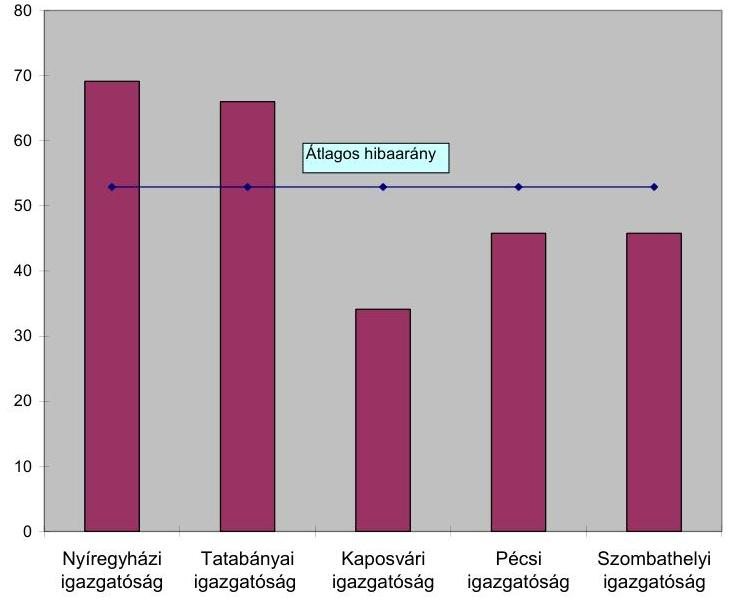

Az átlagos mértéket meghaladó volt az eltérések, hiányosságok aránya a Nyíregyházi, a Tatabányai igazgatóságokon, átlag alatti arány jellemezte a Kaposvári, a Pécsi és a Szombathelyi igazgatóságok előzetes felülvizsgálatát. Az igazgatóságok között az eltérések, hiányosságok arányának terjedelme ${ }^{19} 37 \%$ volt, amely számottevő mértékben növelte a felülvizsgálati munka mennyiségét a legmagasabb eltérési aránnyal rendelkező Nyíregyházi igazgatóságon.

[^0]
[^0]:    ${ }^{19}$ Az átlagtól való eltéréseket a szóródás-számítás mutatószámai érzékeltetik. A szóródás terjedelme a mennyiségi sor legnagyobb és legkisebb értékének különbözete.

---

Az igazgatóságok által az önkormányzatok és a többcélú kistérségi társulások 2006. évi forrás igényléseinek felülvizsgálata során feltárt hibás, hiányos esetek*

| Jogcímek | Hibás, hiányos   esetek száma   (db) | A hibás, hiányos   esetek jogcímen-   kénti aránya (\%) |
| :-- | :--: | :--: |
| Normatív állami hozzájárulások és norma-   tív kötött felhasználású támogatások** | 4941 | 35,7 |
| Központosított előirányzatok | 4396 | 31,7 |
| Működőképesség megőrzését szolgáló ki-   egészítő támogatások | 2016 | 14,5 |
| Felhalmozási célú és vis maior támogatá-   sok | 2505 | 18,1 |
| Összesen | 13858 | 100 |

Jelmagyarázatok:

- *Forrás: Az igazgatóságok által készített felülvizsgálati összefoglaló a 2006. évi felülvizsgálat tapasztalatairól.
- **A normatív állami hozzájárulások, és a normatív kötött felhasználású támogatások adatai nem tartalmazzák az egyes jövedelempótló támogatások kiegészítése, valamint az önkormányzat által szervezett közfoglalkoztatás támogatása jogcímek hibás, hiányos esetszámát a nagyságrendjükből eredő torzító hatás miatt.

Az előzetes felülvizsgálat eredményeként feltárt eltérésekből, hiányosságokból a - felülvizsgálati munka mennyiségére kiható - legmagasabb arány a normatív állami hozzájárulásokat és a normatív kötött felhasználású támogatásokat jellemezte, az összes hiányosság 35,7\%-a ezekhez a jogcímekhez kötődött. A központosított előirányzatok előzetes felülvizsgálata során számottevő volt a hibás, hiányos esetek feltárt száma, amely 31,7\%-os arányt képviselt a hibás, hiányos esetek összes számából.

Az állami hozzájárulások, támogatások egyes jogcímeire benyújtott igénylések, pályázatok számához mért hibák előfordulási aránya az önkormányzatok, többcélú kistérségi társulások igénylési, pályázati munkájának pontosságáról, szabályszerűségéről szolgáltatott információt. Rendkívül magas hibaarány - 89\% jellemezte a működőképesség megőrzését szolgáló kiegészítő támogatásokon belül az önhibájukon kívül hátrányos helyzetben lévő önkormányzatok támogatási igényléseit. A felhalmozási és vis maior támogatások pályázatainak kétharmadánál, a normatív állami hozzájárulások, a normatív kötött felhasználású támogatások, valamint a központosított előirányzatok igényléseinek közel felénél tártak fel az igazgatóságok a felülvizsgálati munkájuk során eltérést.

Az előzetes felülvizsgálat által feltárt eltérések, hiányosságok a legnagyobb gyakorisággal az állami hozzájárulások, támogatások új, illetve az évente változó tartalmú jogcímeinél fordultak elő. Az új, illetve a megváltozott tartalmú jogcímeknél magas kockázatot hordozott magában az önkormányzatok ta-

---

pasztalatlansága, a jogi szabályozás egységes értelmezésének hiánya, illetve a jogi szabályozás megelőző évhez képest bonyolultabbá válása.

Az igazgatóságokon az önkormányzatok és a többcélú kistérségi társulások 2006. évi forrás igénylései, pályázatai előzetes felülvizsgálatának eredményeként együttesen 4 536 530 ezer Ft támogatási igénycsökkentést állapítottak meg.

- Az igazgatóságok a normatív állami hozzájárulások és a normatív kötött felhasználású támogatások jogcímeinek előzetes felülvizsgálata során 362 208 ezer Ft támogatási igénycsökkentést állapítottak meg, amely az állami támogatás jogtalan igénybevételének megakadályozását jelentette. A normatív állami hozzájárulások és a normatív kötött felhasználású támogatások jogcímeinél megállapított támogatási igénycsökkentés 8\%-os arányt képviselt az igazgatóságok által feltárt támogatási igénycsökkentés együttes összegéből. A jogtalan igénylések együttes összegének 71,2\%-át két igazgatóságon - a Budapesti, valamint a Szombathelyi Igazgatóságon - tárták fel.

A Budapesti igazgatóságon a normatív állami hozzájárulások és a normatív kötött felhasználású támogatások igénylésének, lemondásainak felülvizsgálata során megállapított 151 566 ezer Ft támogatási igénycsökkentés a többcélú kistérségi társulások szociális és gyermekjóléti alapszolgáltatások működési engedélyeinek ellenőrzésén alapult.

A Szombathelyi igazgatóságon a támogatási igénycsökkentést - 106 313 ezer Ft összegben - a szociális normatívák esetében az előző évhez képest megváltozott feltételekkel igénybe vehető jogcímeknél tárták fel.

- A központosított előirányzatok, valamint a felhalmozási célú és vis maior támogatások, felülvizsgálatánál feltárt támogatási igénycsökkentések 1,4\% (61 279 ezer Ft), illetve 1,0\% (47 359 ezer Ft) arányban részesedtek az együttes összegből.
- A támogatási igénycsökkentés 89,6\%-a, azaz 4 065 684 ezer Ft a működőképesség megőrzését szolgáló kiegészítő támogatáson belül az önhibájukon kívül hátrányos helyzetben lévő önkormányzatok támogatási igényléseinek felülvizsgálatánál keletkezett.

Az önkormányzatok és a többcélú kistérségi társulások 2006. évi forrás igénylései, pályázatai előzetes felülvizsgálata során a támogatás igénynövelés 820 734 ezer Ft volt. Az igazgatóságok által megállapított támogatási igénynövelés összetétele megegyezett a támogatási igénycsökkentés belső megoszlásával.

---

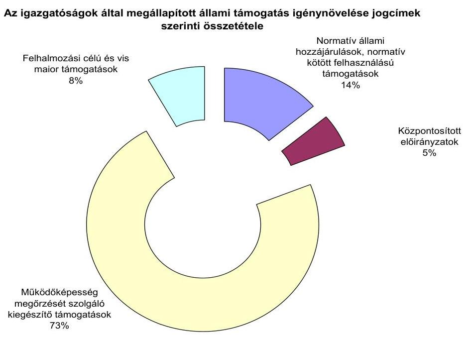

A normatív állami hozzájárulások és a normatív kötött felhasználású támogatások jogcímei előzetes felülvizsgálata hatásaként a feltárt támogatási igénynövelés együttes összege 117 869 ezer Ft volt, amelynek 98,7\%-át a Szombathelyi igazgatóságon állapították meg.

A Szombathelyi igazgatóságon a normatív állami hozzájárulások és a normatív kötött felhasználású támogatások kiegészítő felmérésének felülvizsgálata eredményeként tárták fel a családsegítés és a gyermekjóléti szolgáltatás jogcímnél a támogatás igény-növelést.

# 3.2.7. Az adatok módosítására, hiánypótlásra kibocsátott felhívás 

A 2006. évi állami hozzájárulások és támogatások előzetes felülvizsgálata kapcsán 6293 darab írásbeli felhívást bocsátottak ki az igazgatóságokon (5. számú melléklet). A legtöbb írásbeli felhívást - az összes felhívás 26,6\%-át - a Miskolci igazgatóság, a legkevesebbet - 3,8\%-ot - a Zalaegerszegi igazgatóság bocsátotta ki. Az igazgatóságok az előzetes felülvizsgálat során feltárt eltérések, hibás esetek, hiányosságok 45,4\%-ában küldtek írásbeli felhívást az érintett önkormányzatok, többcélú kistérségi társulások részére. A kibocsátott írásbeli felhívások száma összefüggött a felülvizsgálatra rendelkezésre álló
 időtartammal, egyes jogcímeknél az időtartamok szűkössége nem tette lehetővé az írásbeli felhívások kibocsátását.

A 2007. évi költségvetés tervezéséhez a mutatószámok felmérésének felülvizsgálatára rendelkezésre álló idő (három nap) kevesebb volt, mint az eljárási rendben az írásbeli felhívásokhoz tartozó, az önkormányzatokhoz való eljuttatásra (15 nap), illetve az önkormányzatok írásbeli nyilatkozatára (nyolc nap) előírt időtartam.

---

A 2007. évi központi költségvetés tervezéséhez a normatív állami hozzájárulások és a normatív kötött felhasználású támogatások mutatószám-felmérésének felülvizsgálatára rendelkezésre álló időtartam nem tette lehetővé az Áht. 64/A. § (1) bekezdésében foglaltak betartását, miszerint ha az igazgatóságok nem tartják megalapozottnak a mutatószámokat, írásban hívják fel az önkormányzatokat az adatszolgáltatásuk helyesbítésére.

Azoknál a feltárt hibás eseteknél, amelyeknél írásbeli felhívást nem bocsátottak ki, az igazgatóságok telefonon egyeztették az eltérések okait.

Az igazgatóságok az előzetes felülvizsgálat során a normatív állami hozzájárulások, a normatív kötött felhasználású támogatások lemondásával és pótlólagos igénylésével kapcsolatban jellemzően adatmódosításra irányuló felhívást, míg az állami támogatások további jogcímeinél hiánypótlással összefüggő felhívást bocsátottak ki.

#### Abstract

A Tatabányai igazgatóság írásbeli felhívást küldött Piliscsév Község Önkormányzata részére, mivel a normatív állami hozzájárulások igénylése keretében a gyermekjóléti szolgáltatás működési hónap számát az önkormányzat 12-ben jelölte meg. Az Igazgatóság nyilvántartása szerint a gyermekjóléti szolgáltatás érvényes működési engedéllyel a következő év július 14-ig rendelkezett. Az Igazgatóság írásbeli felhívást bocsátott ki, amelyben közölte a működési hónapok számának helyes értékét, és kérte a polgármester, valamint a jegyző nyilatkozatát az adatszolgáltatás módosítására, vagy az adatszolgáltatás fenntartására, és annak alátámasztására. A Veszprémi igazgatóság írásbeli felhívást bocsátott ki Veszprém Megyei Jogú Város Önkormányzatának a központosított előirányzatok közötti települési önkormányzati szilárd burkolatú belterületi közutak burkolat-felújításának támogatása jogcímre benyújtott pályázatai felülvizsgálatát követően. Az Igazgatóság az írásbeli felhíváshoz csatolt mellékletben pályázatonként sorolta fel a feltárt hibákat, hiányosságokat: hiányosak voltak a tervezett költségek alátámasztását igazoló tételes költségbecslések, eltéréseket állapítottak meg a felújítandó közutak területi adataiban.

Az írásbeli felhívásokat az Ámr. 52/A. § (1) bekezdésében előírt határidőt betartva, a benyújtási határidőt követő 15 napon belül küldték ki, az Ámr. 52/A. § (2) bekezdése szerinti tartalommal. Az írásbeli felhívásokban közölték a felhívással érintett mutatószámokat jogcímenként, a saját iratok, dokumentumok alapján levont következtetést, annak jogszabályi alátámasztottságát, valamint a határidővel megjelölt adatmódosítás kezdeményezését. A felhívás tartalmazta az igényelt állami hozzájárulásról történő lemondás, illetve az eredeti adatszolgáltatás fenntartásának kamatfizetési következményét.

Az egyes állami hozzájárulási, támogatási jogcímek előzetes felülvizsgálata során eltérő számban és arányban volt szükség az írásbeli felhívások kiküldésére.

---

# Az igazgatóságok által kibocsátott írásbeli felhívások jogcím szerinti összetétele 

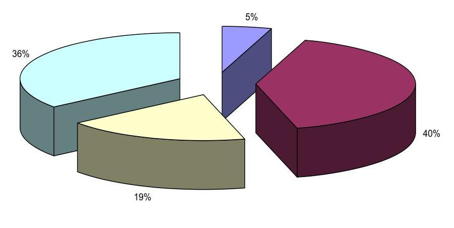

A kibocsátott összes írásbeli felhívás 40,9%-a a központosított előirányzatok ${ }^{20}$ felülvizsgálatához kötődött, 35,5%-a a felhalmozási célú és a vis maior támogatásokkal volt kapcsolatos. A normatív állami hozzájárulások és a normatív kötött felhasználású támogatások előzetes felülvizsgálatával összefüggésben kibocsátott írásbeli felhívások a legkisebb - 5%-os - arányt képviselték, az igénylések felülvizsgálatára rendelkezésre álló rövid időtartam miatt.

Az önkormányzatok és többcélú kistérségi társulások az írásbeli felhívásban foglaltakat 93,5%-ban teljesítették. Az írásbeli felhívásban kezdeményezetteket a normatív állami hozzájárulásoknál és a normatív kötött felhasználású támogatásoknál 82,1%-ban, a központosított előirányzatoknál 90%-ban, a kiegészítő támogatásoknál 99,8%-ban, a felhalmozási célú és a vis maior támogatásoknál 95,9%-ban hajtották végre. A 2006. évben az Áht. 64/A. § (1) bekezdésében, valamint a 64/B. § (3) bekezdésében foglaltak ${ }^{21}$ nem ösztönözték az önkormányzatokat a felhívásban foglaltak teljesítésére, mivel az igénylés, a pályázat kezelése szempontjából nem volt következménye a felhívásban foglal-

[^0]
[^0]:    ${ }^{20}$ A központosított előirányzatokkal kapcsolatban kibocsátott felhívások száma tartalmazza a települési hulladék közszolgáltatás fejlesztéseinek támogatása és a települési önkormányzati szilárd burkolatú belterületi közutak burkolat-felújításának támogatása jogcímekkel összefüggésben kibocsátott felhívások számát.
    ${ }^{21}$ Az Áht. 64/A. § (1) bekezdése, illetve 64/B. § (3) bekezdése szerint amennyiben az önkormányzat nem tett eleget az írásbeli felhívásban foglaltaknak a normatív állami hozzájárulásoknál és a normatív kötött felhasználású támogatásoknál az eredeti adatszolgáltatása maradt az irányadó, a további állami hozzájárulási és támogatási jogcímeknél az igazgatóságnak véleményével együtt továbbítani kellett az elbírálásra jogosult szervnek.

---

tak nem teljesítésének ${ }^{22}$. A telefon útján történt felhívásra, egyeztetésre az önkormányzatok pótlólagosan küldött adatlapjait a felhívásra utaló megjegyzéssel csatolták az eredeti dokumentumokhoz.

# 3.2.8. A helyszíni vizsgálat szükségessége 

A normatív állami hozzájárulások és a normatív kötött felhasználású támogatások előzetes felülvizsgálatához kapcsolódó kötelező helyszíni vizsgálat feltételeiről az Áht. 64/A. § (2) bekezdése rendelkezik ${ }^{23}$. Az igazgatóságok a 2006. évben helyszíni vizsgálatot nem tartottak, mivel az előzetes felülvizsgálati tevékenységük eredményeként - egy igazgatóság kivételével - nem álltak fenn a kötelező helyszíni vizsgálat feltételei.

A Budapesti igazgatóságon nem tartották be az Áht. 64/A. § (2) bekezdésében foglaltakat, mivel két - a felhívásban foglaltakat nem teljesítő - többcélú kistérségi társulásnál a 2006. évi elszámolás benyújtásáig annak ellenére nem végeztek helyszíni vizsgálatot, hogy mindkét többcélú kistérségi társulás adatszolgáltatása szerinti együttes összeg, valamint az igazgatóság felülvizsgálati álláspontja szerinti együttes összeg közötti eltérés meghaladta a 2%-ot, de legalább 1 millió Ft-ot. A helyszíni ellenőrzés elrendeléséről mindkét többcélú kistérségi társulás esetében a 2006. évi elszámolás benyújtását követően - 2007. április 4-én, illetve április 17-én - intézkedtek.

### 3.2.9. A nem feladatmutatók alapján járó állami hozzájárulások és támogatások továbbításának szabályszerűsége

Az igazgatóságok - egy kivétellel - eleget tettek az Áht. 64/B. § (3) bekezdésében előírtaknak, mivel a nem feladatmutatók alapján járó központi költségvetésből származó támogatások felülvizsgált támogatási igényeit, ha az önkormányzat a felhívásban foglaltakat nem rendezte, minden esetben véleményükkel együtt továbbították az elbírálásra jogosult szervnek. A Debreceni igazgatóság azon támogatási igénylésekhez csatolt véleményt, amelyeknél az önkormányzat nem teljesítette a hiánypótlási kötelezettségét, a többi igazgatóságon valamennyi támogatási igényléshez mellékelték a felülvizsgálat véleményét. Az igazgatóságok többsége (hét igazgatóság) a benyújtott és a felülvizsgált igénylések, pályázatok továbbításakor valamennyihez egyenkénti véleményt csatolt. A csatolt véleményekben rögzítették a hiánypótlásra való felszólítás tartalmát, az önkormányzat teljesítését, valamint a felülvizsgálat összefoglaló

[^0]
[^0]:    ${ }^{22}$ A Magyar Köztársaság 2007. évi költségvetését megalapozó egyes törvények módosításáról szóló 2006. évi CXXI. törvény 1. § (27) bekezdése módosította az Áht. 64/B. § (3) bekezdésében előírtakat. A módosítás szerint 2007. január 1-től, amennyiben az önkormányzat a felhívásban foglaltaknak nem tesz eleget, vagy nem megfelelően teljesíti azt, az igazgatóság a támogatási igényt nem továbbítja az elbírálásra jogosult szervnek, és erről értesíti az önkormányzatot.
    ${ }^{23}$ Az Áht. 64/A. § (2) bekezdése szerint az igazgatóságok számára kötelező volt helyszíni vizsgálatot tartani, ha az önkormányzat nem, vagy részben tett eleget a felhívásnak, és az önkormányzat adatszolgáltatása szerinti együttes összeg, valamint az igazgatóság szerinti együttes összeg közötti eltérés meghaladta a 2%-ot, de legalább 1 millió Ft-ot. A helyszíni vizsgálat az év végi elszámolás benyújtásáig végezhető.

---

eredményét. A felülvizsgálat összefoglaló véleményeként az igénylés, a pályázat teljes körűség és szabályszerűség szempontjából történő minősítését fogalmazták meg. Két igazgatóságon (a Budapesti, valamint a Szombathelyi igazgatóságon) közös, több pályázatra, igénylésre együttesen vonatkozó véleményt fogalmaztak meg és továbbítottak.

A Szombathelyi igazgatóságra a központosított előirányzatok lakossági víz- és csatornaszolgáltatás támogatása jogcímre három igénylés érkezett, melyeket a felülvizsgálat elvégzését követően az igazgatóság egy kísérőlevéllel továbbított. A kísérőlevélben rögzítették, hogy a felülvizsgálatot a támogatás igénylésére vonatkozó kiírás és a jogszabályi előírások szerint elvégezték, az önkormányzatok felé jelezték a hiányosságokat, ezek pótlása határidőben megtörtént. Az igénylések a hiánypótlást követően az előírt tartalmi és formai követelményeknek megfeleltek. A kísérőlevélhez mellékelték az igénylési dokumentációkat, valamint a hiánypótlást követően javított adatlapokat papír alapon és elektronikus formában.

# 3.3. Az igazgatóságoknál elvégzett utólagos felülvizsgálati feladatok ellátása 

### 3.3.1. Az utólagos felülvizsgálati feladatok végrehajtása

Az utólagos felülvizsgálatot az év során több ütemben végezték az igazgatóságok.

A költségvetési beszámolók átvételének előkészítése minden igazgatóságon megtörtént. Ennek keretében a költségvetési év lezárásakor az előirányzati és teljesítési adatokat kimunkálták, a 16, 33, 51-es űrlapokat az önkormányzatoknak egyeztetésre megküldték. Márciusban, a beszámoló átvételekor megtörtént az állami támogatások és hozzájárulások előirányzati és teljesítési adatainak az ellenőrzése. Ezen kívül logikai ellenőrzéseket is végeztek a 31-es űrlap mutatószámai között. Egymáshoz viszonyítva egyeztették, hogy a kiegészítő normatíva mutatószáma nem magasabb-e mint az alap-normatíva mutatószáma, valamint az üdülőhelyi feladatok normatíváját ellenőrizték az idegenforgalmi adóhoz viszonyítva. Az önkormányzatokkal a feltárt hibákat kijavíttatták.

Az Áht. 64/D. § (1) bekezdés előírása szerint a helyi önkormányzatok központi költségvetésből származó, a Helyi önkormányzatok támogatásai fejezetben szereplő támogatásai, hozzájárulásai év végi elszámolásának szabályszerűségét a tárgyévet követő év végéig felül kell vizsgálni, a PM rendelet 15. § (1) bekezdésében rögzítették, hogy a felülvizsgálat során az év végi elszámolások szabályszerűségét és számszaki összefüggéseit kell vizsgálni, a 15. § (2) bekezdésében pedig azt, hogy a jelentős eltérések feltárásához a helyi önkormányzatok év végi elszámolását megalapozó mutatószámokat kell összehasonlítani.

A tíz igazgatóság közül kilencben a jogszabályi előírásoknak megfelelően elvégezték a feladatot. A Budapesti Igazgatóságon az utólagos felülvizsgálatot nem végezték el, ezzel megsértették az Áht. 64/D. § (1) bekezdésének előírását.

---

A felülvizsgálat előkészítése során azokon az igazgatóságokon, ahol felülvizsgálati lapot használtak, azon megjelölték, hogy a költségvetési törvény melyik melléklete alapján, milyen jogcímek esetében kaphat támogatást az önkormányzat. Felsorolták továbbá az önkormányzathoz tartozó közoktatási, szociális és gyermekjóléti feladatokat ellátó intézményeket, illetve a társulásban való részvételt. Meghatározták, hogy egy-egy önkormányzat milyen jogcímeken jogosult a támogatásra. Ezek az előkészített adatok a felülvizsgálat egységes és alapos lefolytatását segítették.

Az elszámolások egyeztetésére, felülvizsgálatára az év második felében volt lehetősége az igazgatóságoknak, amikor már rendelkezésre állt a KIR statisztika, és csökkentek a feladatok az előzetes felülvizsgálatot igénylő jogcímeknél.

Az igazgatóságok valamennyi önkormányzat valamennyi mutatószámhoz kötött normatív állami hozzájárulási és normatív kötött felhasználású támogatási jogcímére elvégezték az előírt feladatot, kivéve azokat az önkormányzatokat, ahol a 2006. évben a zárszámadás keretében az ÁSZ ellenőrzést végzett a 2005. évi normatív állami hozzájárulások elszámolásával és a normatív kötött felhasználású támogatások elszámolásával kapcsolatban. Azoknál az önkormányzatoknál, ahol az ÁSZ vizsgálata teljes körű volt, ott az igazgatóság elfogadhatta a megállapításokat, nem volt szükség ismételt felülvizsgálatra. Azoknál az önkormányzatoknál, amelyek nagy intézményhálózattal rendelkeznek, az ÁSZ ellenőrzése nem volt teljes körű, hanem mintavétellel történt. Ez esetben, mivel az igazgatóságok nem végezték el a felülvizsgálatot, lényeges területek maradtak ellenőrzés nélkül.

Debrecen Megyei Jogú Város Önkormányzata esetében - ahol a mutatószámok alapján igényelt normatív állami hozzájárulások összege a 2005. évben 12012182 ezer Ft volt, ebből az ellenőrzés 4070623 ezer Ft-ot érintett - az ÁSZ mintavétel alapján végzett ellenőrzése a mutatószámok alapján igénybe vett normatív hozzájárulások 34%-át
 érintette. A Hajdú-Bihar Megyei Önkormányzat esetében - amely 2 338 812 ezer Ft normatív állami hozzájárulást igényelt, ebből ellenőrzésre került 1 047 312 ezer Ft - a támogatások 45%-át érintette az ÁSZ ellenőrzése. Ezáltal megállapítható, hogy a 2005. évi beszámoló 31. úrlapján elszámolt normatív hozzájárulásokból Debrecen Megyei Jogú Város Önkormányzata esetében azok 66%-a, a Megyei Önkormányzat esetében azok 55%-a egyáltalán nem került utólagos ellenőrzésre.

Az utólagos felülvizsgálat az igazgatóságokon a központi és helyi szabályozásoknak megfelelően történt. Az elvégzett feladatot Excel táblában önkormányzatonként vezették, abból megállapítható volt, hogy a felülvizsgálati feladatot milyen ütemezésben, mely önkormányzatokra kik végezték el, és az, hogy az valamennyi önkormányzatra vonatkozóan megtörtént.

A felülvizsgálatot a rendelkezésre álló iratok és saját nyilvántartások alapján végezték az igazgatóságokon.

Az igényjogosultság megítéléséhez szükséges dokumentumok - a törzskönyvi nyilvántartás, az alapító okiratok, a működési engedélyek, társulási szerződések, előző évek adatai - az Igazgatóságon rendelkezésre álltak.

---

Ezek az igényjogosultság megítélésére alkalmasak voltak - ezt már a mutatószám felméréskor, támogatásigényléseknél - elbírálták, azonban a támogatás mértékének meghatározására döntően alkalmatlanok.

A szociális ellátással kapcsolatos támogatásokkal kapcsolatban a mutatószámokról valós adat csak helyszínen található külön nyilvántartásokban áll rendelkezésre.

A működési engedélyekben megjelölt férőhelyszám túllépése, ha több azonos típusú intézménye van az önkormányzatnak, vagy egy intézmény több telephellyel működik, a rendelkezésre álló dokumentumokon alapuló vizsgálat során csak önkormányzati szintű túllépés esetén mutatható ki.

A normatív állami hozzájárulások és a normatív kötött felhasználású támogatások között a közoktatással kapcsolatos mutatószámok felülvizsgálatához az igazgatóságok rendelkezésére állt a KIR statisztika. A mindenkori költségvetési törvény a 3. számú mellékletben határozza meg normatív hozzájárulások jogcímeit, amelyekkel nincs összhangban a KIR statisztika adatszolgáltatása, ezért a felülvizsgálathoz nem teljes körűen használható fel.

A KIR statisztikai nyomtatvány „más településről bejáró” megjelölést használ a bejáró tanulókra, a költségvetési törvény 3. számú melléklete feltételekhez kötve, de az adott település lakott külterületéről naponta bejárókra is jogosultságot ad a normatív állami hozzájárulás igénybevételére.

Kiegészítő információkra van szükség a KIR statisztika adataihoz az iskolában szervezett étkeztetésnél, a középiskolákban magántanulókra, a nem magyar állampolgárságú tanulókra, a gyógypedagógiai ellátást igénylő tanulókra, az alapfokú művészeti képzésben, az iskolai gyakorlati szakképzésben, kollégiumi ellátásban részt vevőkre igénybe vehető normatív hozzájárulások esetében.

Valamennyi igazgatóságnak szüksége volt a rendelkezésre álló adatok nyilvántartások kiegészítéseként pótlólagos információ beszerzésére az önkormányzatoktól, hogy a felülvizsgálatot elvégezzék.

A központosított támogatások esetében akkor állnak rendelkezésre az elszámoláshoz dokumentumok, ha a felhasználást számlákkal kell igazolni (kompok, révek fenntartása), amelyeket az igazgatóságnak meg kell küldeni, ha a jogosultság mutatószámhoz köthető (szakiskola, szakközépiskolai oktatás, szakmai, informatikai fejlesztési feladatok), illetve rendelkeznek olyan kiegészítő információval (helyi szervezési intézkedések esetében az illetményszámfejtés), amely egyeztetésre ad lehetőséget. Egyéb esetekben nem áll az Igazgatóság rendelkezésére olyan dokumentum, amely alapján a felülvizsgálatot el tudja végezni.

Az ÖNHIKI elszámolás felülvizsgálatához az önkormányzati beszámolók működési és felhalmozási célú bevételeinek és kiadásainak adatait használták fel, illetve a felülvizsgálat kiterjedt a normatív hozzájárulások ellenőrzésének ÖNHIKI-t módosító hatására.

A felhalmozási célú támogatások elszámolását a területfejlesztési tanácsok ellenőrzik. Az igazgatóságokon az előirányzati és teljesítési adatok ellenőrzése történt meg.

---

A felülvizsgálati feladatok elvégzésének dokumentálása mind a kilenc igazgatóságon megtörtént.

Azokon az igazgatóságokon, ahol felülvizsgálati lapot alakítottak ki, azon a működési engedélyekkel, törzskönyvi nyilvántartással való egyeztetés megtörténtét feljegyezték, jogcímenként rögzítették az önkormányzat által közölt és az Igazgatóság megállapítása szerinti mutatószámokat. Feljegyezték, ha pótinformációt kértek be az önkormányzattól, a telefonos egyeztetések időpontját, illetve azt, hogy kivel történt az egyeztetés. A felülvizsgálati lapokon jegyezték fel a belső kontroll megtörténtét is. A belső kontrollt minden esetben a vezető végezte, mind a felhívások kiadása előtt, mind annak realizálása után, a záradék kiadásakor.

Ahol nem alakítottak ki felülvizsgálati lapot, azok közül

- a Debreceni igazgatóságon a felülvizsgálati dokumentációk színvonala elmaradt az elvégzett tevékenység tartalmi részétől. Egységes, pontos, részletes, naprakész, bármikor rövid idő alatt hozzáférhető nyilvántartás nem állt rendelkezésre. Az informatika adta lehetőségeket ebben a vonatkozásban nem használták ki. Megbízható összesített nyilvántartás a normatív hozzájárulások és normatív kötött támogatások, valamint az ÖNHIKI vonatkozásában állt rendelkezésre, amely alkalmas volt az egyes önkormányzatok adatainak és a számszerűsített összesítésnek az áttekintésére. A többi támogatásra önkormányzatonkénti összesítő nem állt rendelkezésre, az egyes ügyintézők készítettek különböző tartalommal és formában összefoglalót az általuk végzett ellenőrzésekről.
- A Pécsi igazgatóságon a felülvizsgálati feladatok elvégzésének dokumentálása az önkormányzati beszámoló űrlapokon történt, külön megjelölve a szociális és oktatási jogcímek felülvizsgálatának elvégzését. A felülvizsgálatot végző dátummal és aláírással igazolta a feladat ellátását.
- A Nyíregyházi igazgatóságon a beszámoló átvételéhez kapcsolódó felülvizsgálati feladatok elvégzésének dokumentálása nem volt teljes körű. Az önkormányzatokra vonatkozóan nem alakítottak ki olyan nyilvántartást, amely a beszámoló átvételével, felülvizsgálatával kapcsolatos legfontosabb információkat tartalmazta volna az időpontok, átvételek módja, határidők, munkaidő ráfordítás megjelöléssel. Azonban a költségvetési beszámoló felülvizsgálata során szükség szerint feljegyezték a felhívás megküldésével, az elszámolás módosításával, az önkormányzat felhívásra tett nyilatkozatával, a jegyzőkönyv megküldésével, az önkormányzat jegyzőkönyvre tett nyilatkozatával, észrevételével, az elsőfokú határozat megküldésével, a határozat jogerőre emelkedésével, az önkormányzat határozatra tett intézkedésével, a befizetési és visszafizetési kötelezettségekkel kapcsolatos információkat.

Az utólagos felülvizsgálatot elvégző igazgatóságok az 1994 önkormányzat által elszámolt 43 956 normatív állami hozzájárulási és normatív kötött felhasználású támogatási esetből 7309-et (16,6%-ot) ítéltek hibásnak és 1091 önkormányzat részére küldtek ki írásbeli felhívást az eltérés rendezésére. Az önkormányzatok közül 999 az írásbeli felhívásra módosította elszámolását, véleménykülönbség 92 esetben maradt fenn, ahol jegyzőkönyv felvételére és határozathozatalra volt szükség. A központosított előirányzatok és egyéb kötött fel-

---

használású támogatások 13 597 esetéből az igazgatóságok a felülvizsgálatuk alapján 144-et (1,1%-ot), az 1981 jövedelemkülönbség mérsékeléssel kapcsolatos elszámolásból 58-at (2,9%-ot), a 834 ÖNHIKI támogatásból 177-et (21,2%-ot), a 264 címzett- és céltámogatásból 122-t (46,2%-ot), a 2524 TEKI, a CÉDE és a vis maior támogatásból 189-et (7,5%-ot), a 738 TEUT és TEHU támogatásból 141-et (19,1%-ot) ítéltek hibásnak.

Határozathozatalra a jövedelemkülönbség mérséklés elszámolásnál négy esetben $^{24}$, az ÖNHIKI támogatásnál három esetben $^{25}$ került sor.

A felülvizsgált esetek megoszlása:
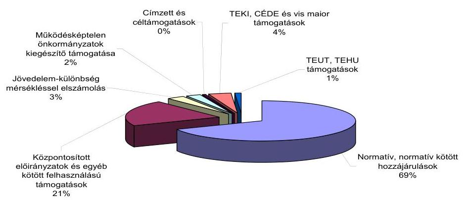
és a feltárt hibás esetek megoszlása:

[^0]
[^0]:    $^{24}$ A Debreceni igazgatóságon egy esetben visszafizetésre kötelező, három esetben támogatás kiegészítésére vonatkozó határozatot hoztak.
    $^{25}$ A Nyíregyházi igazgatóságon három esetben visszafizetésre kötelező határozatot hoztak.

---

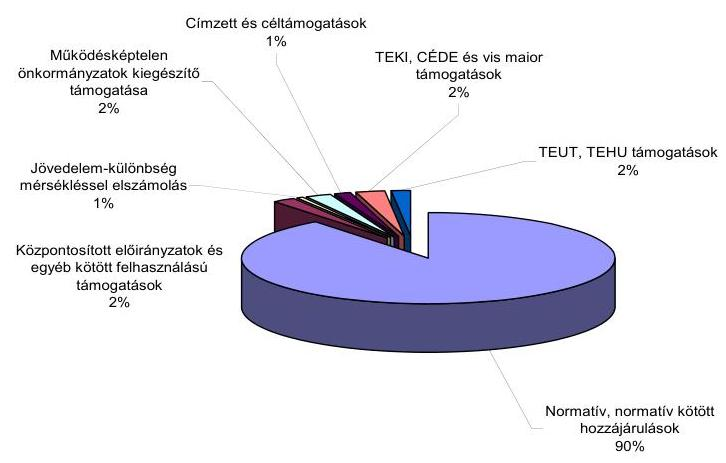

A megállapított eltéréseket az Igazgatóságok nyilvántartásai önkormányzatonként és jogcímenként is tartalmazták.

Helyszíni vizsgálatot a normatív állami hozzájárulások és a normatív kötött felhasználású támogatásoknál megállapított hibás elszámolások miatt hét esetben a Pécsi igazgatóság, egy esetben a Veszprémi igazgatóság, a jövedelemkülönbség mérsékléssel kapcsolatos elszámolás miatt a Debreceni igazgatóság folytatott le az Áht. 64/D. § (5) bekezdésében foglalt előírásoknak megfelelően.

# 3.3.2. Az ÁSZ megállapításai a 2005. és a 2006. évi normatív hozzájárulások vizsgálata során 

Az igazgatóságok 2006. évi felülvizsgálatának - amelyet a rendelkezésükre álló adatok és nyilvántartások alapján végeztek - eredménye, és az ÁSZ 2006. évi helyszíni vizsgálata során tett megállapítások eltérő képet mutatnak, amelyet a következő diagrammal szemléltetünk:

---

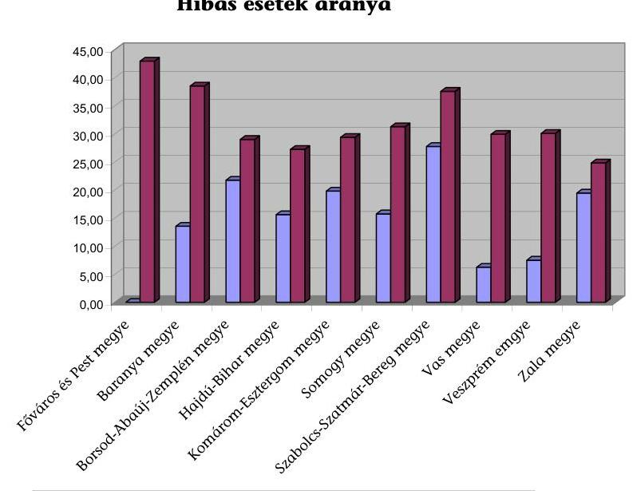

Az igazgatóság tájékoztatója szerint a ÁSZ megállapítása alapján

Az igazgatóságok az Áht. 64/D. § (1) bekezdésének megfelelően a rendelkezésre álló iratok és saját nyilvántartások alapján, a 2006. évi utólagos felülvizsgálat során 1994 önkormányzat beszámolóját vizsgálták felül, amelyek közül a normatív állami hozzájárulások és a normatív kötött felhasználású támogatások esetében 1091 önkormányzatnál (54,7%) találtak eltérést $^{26}$. A felülvizsgált 43 956 jogcímenkénti elszámolásból 7309 esetben (16,6%-ban) volt mutatószám eltérés.

Az ellenőrzésbe vont megyékben a 2006. évben 78 önkormányzat 2005. évi normatív állami hozzájárulásának és normatív kötött felhasználású támogatásának elszámolását vizsgálta az ÁSZ. Az önkormányzatok különböző jogcímeken összesen 2595 esetben vettek igénybe támogatást, amelyből 908 esetben állapított meg a helyszíni ellenőrzés eltérést. Összességében a megállapított hibaarány 35%, amely 18,4%-kal haladja meg az igazgatóságok rendelkezésre álló dokumentumok alapján végzett felülvizsgálatának az eredményességét.

Országos szinten az ÁSZ a 2006. évben a 2005. évi normatív állami hozzájárulások és normatív kötött felhasználású támogatások vizsgálata során 3759 megvizsgált esetből 1291-et (34,3%) talált hibásnak.

A rendelkezésre álló iratok, saját nyilvántartásokon alapuló felülvizsgálat és a helyszíni ellenőrzés eredményének összehasonlításaként az önkormányzatok 2006. évi mutatószámokon alapuló szociális támogatásainál tett megállapításokat vizsgáltuk, mivel ebben az esetben az igazgatóságok az utólagos felülvizsgálat során is ugyanazokkal a dokumentumokkal rendelkeznek, mint a mutatószám felmérésekor.

A 2007. évben az ÁSZ a jelen vizsgálattal érintett tíz megyében 59 önkormányzatnál végzett helyszíni ellenőrzést. Az önkormányzatok összességében a szoci-

[^0]
[^0]:    $^{26}$ A Budapesti igazgatóság adatait az elemzésnél nem vettük figyelembe.

---

ális ellátással kapcsolatban különböző jogcímeken 240 esetben kaptak támogatást, amelyekből 72 esetben (28,5%) állapított meg az ÁSZ ellenőrzése mutatószám eltérést.

Az önkormányzatok 83%-a részesült támogatásban a Szociális étkeztetés jogcímen, közülük 32,7% szolgáltatott hibás adatot. A Házi segítségnyújtás jogcímen az önkormányzatok 72,9%-a kapott támogatást, ezek 25,6%-a adatszolgáltatásában talált hibát a helyszíni ellenőrzés. Az Időskorúak, pszichiátriai és szenvedélybetegek, hajléktalanok nappali intézményi ellátása jogcímen az önkormányzatok 59,3%-a volt támogatásra jogosult, elszámolásuk 34,3%-a volt hibás. Az önkormányzatok 35,6%-a volt jogosult támogatásra a Bölcsődei ellátás jogcímen, ahol egy önkormányzat elszámolásában talált hibát a helyszíni ellenőrzés.

Az ÁSZ által megállapított hibás esetek aránya
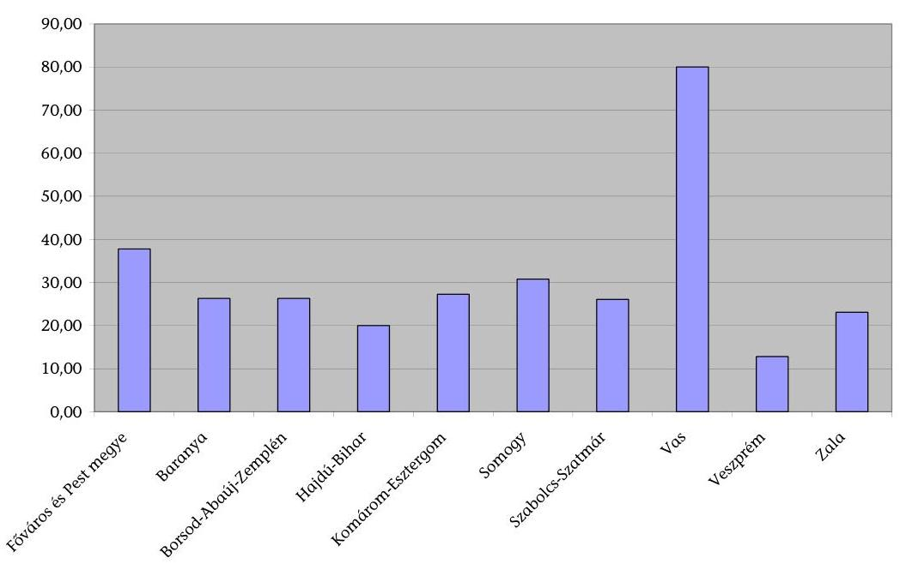

A megállapított eltérés abszolút értékben 269 039 ezer Ft, az e jogcímeken igényelt támogatás 5,9%-a volt.

Az igazgatóságok a fenti jogcímeken a mutatószám felmérésnél, pótfelmérésnél, és a lemondások és pótigénylések során eltérést nem állapítottak meg. Az igazgatóságok nem követtek el mulasztást, mivel az ÁSZ megállapításaira csak a helyszíni vizsgálat keretében, a helyben megtalálható dokumentumok értékelése adott lehetőséget.

---

Az igazgatóságok a 2006. évben végzett felülvizsgálatok során jelentős eltéréseket tártak fel. Az ellenőrzési módszerek összehasonlításánál megállapítható, hogy a helyszíni ellenőrzés az állami hozzájárulások, támogatások jogtalan igénybevételét, illetve a nem jogszerű felhasználását eredményesebben akadályozta meg, mint a csak dokumentáción alapuló felülvizsgálat.

Budapest, 2007. november 44

Melléklet: 8 db 8 lap
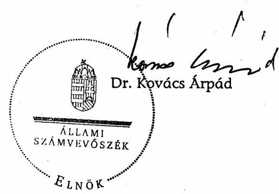

---

# Az ellenőrzött igazgatóságok jegyzéke 

| Ellenőrzött időszak alatti   szervezeti felépítés szerint | Jelenlegi szervezeti felépítés   szerint |
| :-- | :-- |
| MÁK Fővárosi és Pest Megyei Igaz-   gatósága | MÁK Közép-magyarországi Regio-   nális Igazgatóság Budapest |
| MÁK Baranya Megyei Területi   Igazgatósága | MÁK Dél-dunántúli Regionális   Igazgatóság Pécs |
| MÁK Somogy Megyei Területi   Igazgatósága | MÁK Dél-dunántúli Regionális   Igazgatóság Kaposvár |
| MÁK Veszprém Megyei Területi   Igazgatósága | MÁK Közép-dunántúli Regionális   Igazgatóság Veszprém |
| MÁK Komárom-Esztergom Megyei   Területi Igazgatósága | MÁK Közép-dunántúli Regionális   Igazgatóság Tatabánya |
| MÁK Vas Megyei Területi Igazgato-   sága | MÁK Nyugat-dunántúli Regionális   Igazgatóság Szombathely |

 |
| MÁK Zala Megyei Területi Igazgatósága | MÁK Nyugat-dunántúli Regionális Igazgatóság Zalaegerszeg |
| MÁK Hajdú Megyei Területi Igazgatósága | MÁK Észak-alföldi Regionális Igazgatóság Debrecen |
| MÁK Szabolcs-Szatmár-Bereg Megyei Területi Igazgatósága | MÁK Észak-alföldi Regionális Igazgatóság Nyíregyháza |
| MÁK Borsod-Abaúj-Zemplén Megyei Területi Igazgatósága | MÁK Észak-magyarországi Regionális Igazgatóság Miskolc |

---

2. számú melléklet a V-1011-41/2007. számú jelentéshez

A felülvizsgálati tevékenységgel érintett önkormányzatok és humán szolgáltatásokat ellátó szervezetek megyénkénti adatai

|  Megnevezés | Budapest és Pest megye | Hajdú-Bihar megye | Somogy megye | Borsod-Abaúj-Zemplén megye | Szabolcs-Szatmár megye | Baranya megye | Vas megye | Komárom-Esztergom megye | Veszprém megye | Zala megye | Összesen  |
| --- | --- | --- | --- | --- | --- | --- | --- | --- | --- | --- | --- |
|  Megyei és fővárosi önkormányzat | 2 | 1 | 1 | 1 | 1 | 1 | 1 | 1 | 1 | 1 | 11  |
|  Városi és kerületi önkormányzat | 63 | 21 | 14 | 24 | 24 | 12 | 10 | 10 | 14 | 9 | 201  |
|  Nagyközségi önkormányzat | 26 | 10 | 4 | 12 | 19 | 5 | 3 | 4 | 3 | 3 | 89  |
|  Községi önkormányzat | 121 | 51 | 227 | 322 | 186 | 284 | 203 | 62 | 200 | 245 | 1901  |
|  Önkormányzatok összesen: | 212 | 83 | 246 | 359 | 230 | 302 | 217 | 77 | 218 | 258 | 2202  |
|  Többcélú kistérségi társulások száma: | 15 | 7 | 10 | 15 | 11 | 9 | 9 | 7 | 8 | 6 | 97  |
|  A költségvetési intézmények száma | 2286 | 472 | 484 | 836 | 720 | 530 | 404 | 392 | 496 | 421 | 7041  |
|  Nem állami, humán szolgáltatást ellátó szervezetek száma: | 571 | 69 | 39 | 80 | 98 | 46 | 25 | 54 | 49 | 24 | 1055  |
|  Az általuk fenntartott intézmények száma: | 1109 | 113 | 50 | 125 | 209 | 142 | 54 | 73 | 84 | 48 | 2007  |

---

# A normatív állami hozzájárulások és a normatív kötött felhasználású támogatások felülvizsgálatának adatai*

|  Igazgatóság | Előzetes felülvizsgálat** |  |  | Utólagos felülvizsgálat** |  |   |
| --- | --- | --- | --- | --- | --- | --- |
|   | Támogatási igény csökkentése | Támogatási igény növelése | Vizsgált esetszám (db) | Önkormányzati visszafizetések | Kincstári kiutalások | Vizsgált esetszám (db)  |
|  Budapesti | 151566 | 0 | 1135 | 0 | 0 | 0  |
|  Debreceni | 55994 | 0 | 473 | 31327 | 13823 | 2647  |
|  Kaposvári | 19408 | 630 | 1280 | 68436 | 21839 | 6385  |
|  Miskolci | 11954 | 0 | 1866 | 79593 | 26789 | 8076  |
|  Nyíregyházi | 780 | 630 | 1450 | 173227 | 12202 | 5060  |
|  Pécsi | 1620 | 243 | 1600 | 74580 | 24551 | 6789  |
|  Szombathelyi | 106313 | 116296 | 1131 | 60602 | 249 | 3339  |
|  Tatabányai | 3340 | 0 | 424 | 18135 | 18494 | 2291  |
|  Veszprémi | 10054 | 0 | 1125 | 37909 | 7104 | 5604  |
|  Zalaegerszegi | 1179 | 70 | 743 | 39628 | 29205 | 3756  |
|  Összesen: | 362208 | 117869 | 11227 | 583437 | 154256 | 43947  |

Jelmagyarázatok: *Forrás: Az ÁSZ elnöke számára megküldött Tájékoztató összefoglaló adatai, valamint a számvevői jelentések* * A táblázat adatai az ÁSZ felülvizsgálatra irányuló ellenőrzése során feltárt eltérések figyelembevételével javított értékek

---

# A központosított előirányzatok* és egyéb támogatások** felülvizsgálatának adatai***

az érték adatok ezer Ft-ban

|  Igazgatóság | Előzetes felülvizsgálat |  |  | Utólagos felülvizsgálat |  |   |
| --- | --- | --- | --- | --- | --- | --- |
|   | Támogatási igény csökkentése | Támogatási igény növelése | Vizsgált esetszám (db) | Önkormányzati visszafizetések | Kincstári kiutalások | Vizsgált esetszám (db)  |
|  Budapesti | 9003 | 12359 | 2082 | 723 | 1988 | 1929  |
|  Debreceni | 449 | 0 | 592 | 297 | 0 | 930  |
|  Kaposvári | 5381 | 2444 | 770 | 0 | 0 | 1922  |
|  Miskolci | 21886 | 8358 | 1434 | 945 | 0 | 2869  |
|  Nyíregyházi | 1645 | 5788 | 1317 | 0 | 0 | 1524  |
|  Pécsi | 0 | 0 | 831 | 0 | 0 | 1916  |
|  Szombathelyi | 11225 | 7982 | 511 | 108 | 0 | 1316  |
|  Tatabányai | 3333 | 8792 | 449 | 0 | 0 | 619  |
|  Veszprémi | 7078 | 7750 | 754 | 0 | 0 | 1575  |
|  Zalaegerszegi | 1279 | 4288 | 615 | 189 | 38 | 1664  |
|  Összesen: | 61279 | 57761 | 9355 | 2262 | 38 | 16264  |

Jelmagyarázatok:

- A központosított előirányzatok felülvizsgálati adatai tartalmazzák a települési önkormányzati szilárd burkolatú belterületi közutak burkolatfelújításának, valamint a települési hulladék közszolgáltatás fejlesztéseinek támogatása jogcímek adatait. **Az egyéb támogatások összefoglaló megnevezés az önkormányzatok színházi támogatását és az évközben jelentkező, központosított támogatással finanszírozott jogcímeket foglalja magában. *** A felülvizsgálat adatainál figyelembevételre kerültek a számvevői ellenőrzés vonatkozó megállapításai.

---

# Az előzetes felülvizsgálatot jellemző mutatók*

|  Igazgatóság | Normatív állami hozzájárulások |  |  |  | Központosított előirányzatok |  |  |  | Működőképesség megőrzését szolgáló kiegészítő támogatások |  |  |  | Felhalmozási és vis maior támogatások |  |  |   |
| --- | --- | --- | --- | --- | --- | --- | --- | --- | --- | --- | --- | --- | --- | --- | --- | --- |
|   | esetszám | hibás esetek | írásbeli felhívások száma | önkormányzatok teljesítése** | esetszám | hibás esetek | írásbeli felhívások száma | önkormányzatok teljesítése** | esetszám | hibás esetek | írásbeli felhívások száma | önkormányzatok teljesítése** | esetszám | hibás esetek | írásbeli felhívások száma | önkormányzatok teljesítése**  |
|  Budapesti | 1135 | 700 | 24 | 22 | 2082 | 1121 | 498 | 469 | 66 | 55 | 40 | 39 | 409 | 167 | 149 | 129  |
|  Debreceni | 473 | 175 | 11 | 11 | 592 | 200 | 137 | 47 | 121 | 98 | 57 | 57 | 349 | 286 | 289 | 277  |
|  Kaposvári | 1280 | 120 | 10 | 8 | 770 | 287 | 124 | 123 | 313 | 197 | 30 | 30 | 292 | 250 | 81 | 81  |
|  Miskolci | 1866 | 809 | 41 | 41 | 1434 | 691 | 573 | 563 | 592 | 510 | 403 | 403 | 932 | 659 | 658 | 651  |
|  Nyíregyházi | 1450 | 866 | 8 | 8 | 1317 | 803 | 255 | 162 | 512 | 512 | 462 | 462 | 412 | 375 | 295 | 295  |
|  Pécsi | 1600 | 606 | 13 | 9 | 831 | 141 | 32 | 29 | 174 | 174 | 0 | 0 | 408 | 366 | 366 | 324  |
|  Szombathelyi | 1131 | 374 | 47 | 33 | 511 | 307 | 235 | 234 | 110 | 83 | 83 | 83 | 101 | 85 | 85 | 85  |
|  Tatabányai | 424 | 253 | 8 | 4 | 449 | 290 | 272 | 241 | 28 | 27 | 5 | 4 | 79 | 77 | 77 | 73  |
|  Veszprémi | 1125 | 637 | 128 | 98 | 754 | 417 | 350 | 350 | 89 | 89 | 78 | 78 | 136 | 129 | 129 | 123  |
|  Zalaegerszegi | 743 | 401 | 22 | 22 | 615 | 139 | 101 | 101 | 271 | 271 | 11 | 11 | 174 | 111 | 106 | 106  |
|  Összesen: | 11227 | 4941 | 312 | 256 | 9355 | 4396 | 2577 | 2319 | 2276 | 2016 | 1169 | 1167 | 3292 | 2505 | 2235 | 2144  |

Jelmagyarázatok: *Az adatok forrása: az ÁSZ elnöke számára küldött Tájékoztató összefoglaló, valamint a számvevői ellenőrzéshez nyújtott tanúsítványok adatai* * Az igazgatóságok által kibocsátott írásbeli felhívásokra adott önkormányzati nyilatkozatok száma

---

# Dr. Kovács Árpád elnök úr részére 

Állami Számvevőszék

Budapest

Tisztelt Elnök Úr!

Köszönettel vettem, hogy számomra a helyi önkormányzatok és a helyi kisebbségi önkormányzatok központi költségvetési kapcsolatokból származó forrásai igénybevétele és elszámolása felülvizsgálati tevékenységének ellenőrzéséről szóló jelentés-tervezetet véleményezésre megküldte.

Munkatársaim által megküldött javaslatok jelentős része a javaslat-tervezetben figyelembevételre került, az 5. pontban meghatározottakhoz a következő észrevételt teszem:

Abban az esetben, ha az írásbeli felhatalmazás nem terjed ki a normatív állami hozzájárulások és a normatív kötött
 felhasználású támogatások mutatószám felmérésének, valamint kiegészítő igénylésének felülvizsgálatára, úgy megítélésem szerint elvész ezek felülvizsgálatának jogi megalapozottsága. Nincs dokumentuma ez esetben annak, hogy a Kincstár felszólítását az önkormányzat nem fogadta el, ez alapján nincs lehetőség helyszíni ellenőrzésre és az Áht. 64/A. § (4) bekezdésében megjelölt kiegészítő kamat meghatározására sem. Így a szankció visszatartó ereje sem tud érvényesülni.

Ismételten hangsúlyozom, hogy fontosnak tartom a mutatószám felmérés és kiegészítő felmérés felülvizsgálatát, és ehhez az írásbeli felszólítás lehetőségét nem látom nélkülözhetőnek.

Megfelelőbbnek tartom, hogy az írásos észrevételeknél jelenleg meghatározott 8 nap „reagálási időt" 3 munkanapra csökkentve legyen lehetőség továbbra is a mutatószám felmérés felülvizsgálata esetén írásbeli felszólításnak.

Kérem Elnök urat, hogy a javaslat-tervezet véglegezése során észrevételemet figyelembe venni szíveskedjék.

Budapest, 2007. október 10.
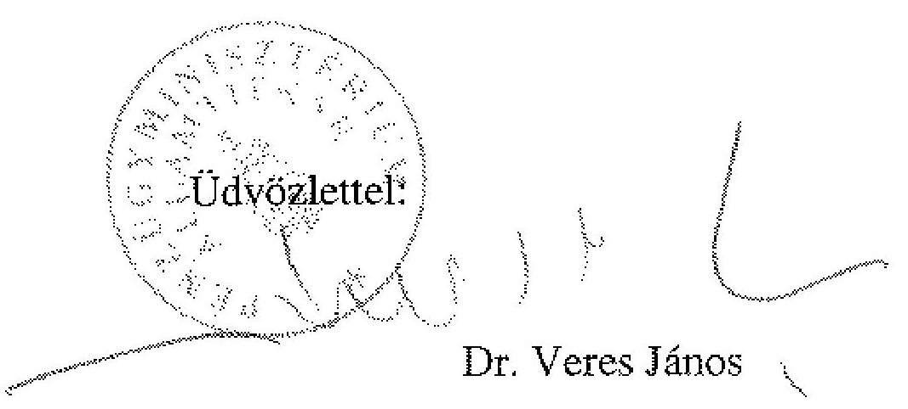

---

# 7. számú melléklet   a V-1011-41/2007. számú jelentéshez 

## Elnök

## ÁLLAMI   SZÁMVEVŐSZÉK

Ikt.szám:V-1011-39/2007.

## Dr. Veres János úr

pénzügyminiszter
Pénzügyminisztérium

## Budapest

## Tisztelt Miniszter Úr!

Köszönettel megkaptam a helyi önkormányzatok és a helyi kisebbségi önkormányzatok központi költségvetési kapcsolatokból származó forrásai igénybevétele és elszámolása felülvizsgálati tevékenységének ellenőrzéséről készített jelentésünkre adott észrevételét. Abban egy javaslatunkkal kapcsolatos fenntartását jelezte.

Az ellenőrzésünk során azt tapasztaltuk, hogy a normatív hozzájárulások és támogatások igénylése és pótigénylése felülvizsgálatakor a Kincstár nem tartja be - a költségvetés tervezés időbeli korlátai miatt nem is tudja betartani - az Áht. 64/A. § (1) bekezdésének azt az előírását, hogy a megalapozatlannak tartott igénylés esetében írásban hívja fel az önkormányzatot az adatszolgáltatás helyesbítésére. A jelentés-tervezet egyeztetése során munkatársai nem láttak lehetőséget arra, hogy biztosítható legyen az igénylések felülvizsgálatához az Áht. 64/A. § (1) bekezdésében előírt eljárási rend szerinti elvégzéshez szükséges időtartam a Kincstár részére. A törvényi előírás és a kialakult gyakorlat közötti eltérés megszüntetésére így a kötelező írásbeliség törlésével láttunk lehetőséget. Ezt vizsgálati tapasztalatunk alapján elfogadhatónak tartjuk, az önkormányzatok általában a szóbeli egyeztetés alapján helyesbítik adatszolgáltatásukat. Az írásbeli felszólítás előírását elegendő azokra az esetekre fenntartani, amikor a szóbeli felhívás eredménytelen.

Tájékoztatom, Miniszter Urat, hogy jelentésünket a miniszteri észrevétellel és e levél csatolásával hozzuk nyilvánosságra.

Budapest, 2007. október 5.
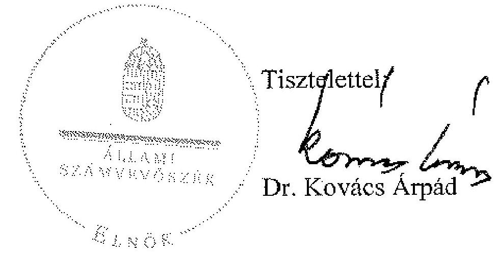

---

# 8. számú melléklet 

a V-1011-41/2007. számú jelentéshez

## MAGYAR   ÁLLAMKINCSTÁR

ELNÖK

Iktatószám: KT-6-120/1/2007
Tárgy:Észrevételek a
felülvizsgálati tevékenység
ellenőrzéséről készült jelentéshez

Dr. Kovács Árpád úr
elnök

Állami Számvevőszék Budapest

## ÁLLAMI SZÁMVEVŐSZÉK

Érkezett: 2007. NOV. 8.
Iktatószám: ATM-4386/07
Melléklet: $\qquad$ 4011 - 40 /2007.

Tisztelt Elnök Úr!

A helyi önkormányzatok és a helyi kisebbségi önkormányzatok központi költségvetési kapcsolatokból származó forrásai igénybevétele és elszámolása felülvizsgálati tevékenységének ellenőrzéséről készített jelentést köszönettel vettük.
A jelentéssel kapcsolatban észrevételt nem kívánunk tenni.
A jelentésben szereplő jogos kritikai és pozitív megállapításokat a felülvizsgálati tevékenység szabályozása során mindenképpen hasznosítani tervezzük, különös tekintettel a felülvizsgálati tevékenység dokumentálására.

Budapest, 2007. november 5.

Tisztelettel:
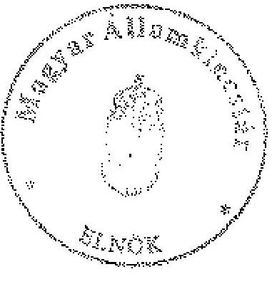

Dr. Katona Tamás

